# Bounded Context Identity and Access Management (IAM): Especificación Técnica de la Capa de Dominio (Domain Layer)

> **Módulo Canónico del Backend:** `app.modules.iam.domain`  
> **Rol Arquitectónico:** Gestión de Identidad, Autenticación Local/Federada, Custodia de Sesiones y Seguridad de Acceso  
> **Pila Tecnológica:** Python 3.12+, `@dataclass(frozen=True)`, `typing` (`Protocol`, `Self`, `Optional`, `Sequence`), `datetime.timezone.utc`, `secrets`, `hashlib`, PlantUML DSL (`report/assets/diagram-sources/class-diagrams/class-diagram-iam.puml`), Docker PlantUML (`make class-diagrams`).  
> **Documentos Relacionados:**  
> - Biblia de Producto: [../../navby-documentation.md](../../navby-documentation.md)  
> - Arquitectura de Plataforma: [../navby-platform-architecture.md](../navby-platform-architecture.md)  
> - Esquema de Base de Datos: [../navby-database-schema.md](../navby-database-schema.md)  
> - Guía Maestra de Diseño Táctico DDD: [../navby-tactical-ddd-guide.md](../navby-tactical-ddd-guide.md)  
> - Especificación Táctica Canónica: [../navby-backend-tactical-specification.md](../navby-backend-tactical-specification.md)  
> - Shared Kernel (Tipos Transversales): [00-shared.md](00-shared.md)

---

## 1. Propósito, Límites de Responsabilidad y Lenguaje Ubicuo (IAM)

### 1.1 Propósito y Límites de Aislamiento Arquitectónico

El Bounded Context **Identity and Access Management** constituye el pilar fundacional de seguridad y soberanía de acceso en Navby Platform. Dentro del marco de Domain-Driven Design, este contexto se categoriza como un Generic Subdomain cuya responsabilidad primordial es salvaguardar la identidad unívoca de los usuarios, gobernar su ciclo de vida y custodiar las sesiones activas y los mecanismos de verificación criptográfica sin introducir acoplamientos indeseados con la lógica transaccional de planificación de vuelos o monetización.

La misión funcional de este contexto abarca cuatro capacidades operativas:
- **Autenticación Dual Homogénea:** Admite el ingreso mediante credenciales locales protegidas por funciones criptográficas de derivación de claves con factor de costo adaptativo, así como autenticación federada mediante Single Sign-On con Google Identity bajo el protocolo OpenID Connect.
- **Verificación Asíncrona de Cuentas:** Controla la emisión, tránsito y canje de códigos numéricos de un solo uso despachados por correo electrónico transaccional hacia la interfaz de usuario, garantizando la validez de las direcciones de contacto antes de habilitar operaciones en la plataforma.
- **Custodia de Sesiones Revocables:** Administra la persistencia y renovación de tokens de refresco, asegurando que el cierre de sesión voluntario o eventos de seguridad invaliden de forma inmediata y definitiva el acceso a los recursos protegidos.
- **Gobierno del Ciclo de Vida de Identidad:** Regula las transiciones de estado de las cuentas (pendiente de verificación, activa y suspendida), restringiendo las operaciones permitidas conforme al estado operativo vigente.

En concordancia con los principios de Clean Architecture y Hexagonal Architecture, los límites de aislamiento establecen que este módulo no interviene en la construcción de grafos aeronáuticos, cotización de tarifas aéreas ni gestión de balances monetarios de créditos. La capa de dominio se rige por cuatro directrices estrictas:
- **Aislamiento Absoluto de Frameworks:** El paquete `app.modules.iam.domain` carece de dependencias hacia librerías de mapeo objeto-relacional como SQLAlchemy, librerías de serialización de esquemas como Pydantic o motores de transporte HTTP como FastAPI.
- **Inmutabilidad por Defecto:** Los Value Objects, identificadores y eventos de dominio se declaran inmutables mediante decoradores de congelamiento de estado, forzando la sustitución semántica frente a cualquier variación de valor.
- **Pureza Absoluta de Dominio (Cero Result en Dominio):** Las entidades y la raíz de agregado aplican invariantes de negocio de forma determinista lanzando excepciones especializadas de la jerarquía **DomainException** y retornando tipos nativos puros (`None`, entidades, booleanos, tuplas). La mónada `Result[T, ApplicationError]` es una abstracción orquestadora perteneciente exclusiva y estrictamente a la Capa de Aplicación (`app.shared.application.result`), tal como estipula la arquitectura de plataforma (§4.5), aislando al 100% el modelo de dominio interno frente a tipos de transporte o resultados de casos de uso.
- **Erradicación de Primitive Obsession:** Ningún concepto semántico se modela como cadena de texto cruda o entero genérico sin encapsular, previniendo estados inconsistentes o manipulaciones no autorizadas en memoria.

---

### 1.2 Decisiones Críticas de Seguridad y Arquitectura de Dominio

#### 1.2.1 Identificadores Fuertemente Tipados (`UserId`, `RefreshTokenId`, `VerificationTokenId` con `BIGINT GENERATED ALWAYS AS IDENTITY`) vs. UUID
El modelo de datos de Navby Platform descarta el empleo de identificadores UUIDv4 aleatorios para las entidades persistentes en la base de datos relacional PostgreSQL 16. En su lugar, las claves primarias de las cuentas de usuario y sus entidades dependientes se estructuran como:
$$\text{id BIGINT GENERATED ALWAYS AS IDENTITY}$$

Esta directriz técnica de ingeniería responde a fundamentos cuantitativos de rendimiento en almacenamiento y procesamiento:
- **Localidad de Caché en Árboles B-Tree:** Los identificadores enteros monótonamente crecientes se insertan siempre en la última página del índice clustered en PostgreSQL, erradicando por completo el fenómeno de fragmentación (*page split*) y manteniendo un factor de llenado óptimo.
- **Eficiencia en Consumo de Memoria:** Un entero de 64 bits (`BIGINT`) ocupa exactamente 8 bytes, en contraste con los 16 bytes inherentes a un valor `UUID`. En claves foráneas y uniones recurrentes, este ahorro reduce significativamente la huella en memoria del motor y maximiza el índice de aciertos en el buffer pool.
- **Encapsulamiento y Tipado Fuerte en Dominio:** Para impedir la obsesión por primitivos y el uso arbitrario de tipos enteros genéricos en la lógica de negocio, todas las entidades y raíces de agregados modelan su identidad mediante identificadores fuertemente tipados inmutables (`<<TypedId>>`): **UserId**, **RefreshTokenId** y **VerificationTokenId**. Cada uno valida en tiempo de instanciación que el valor sea estrictamente un entero positivo (*value* > 0). Ninguna entidad en memoria admite identidades transitorias indeterminadas (`int | None` o `Optional[int]`).

#### 1.2.2 Hashes Criptográficos SHA-256 en Reposo (`HashedToken`)
La custodia de credenciales efímeras (tokens de refresco de sesión y códigos de verificación de correo o reseteo de contraseña) se rige por una política de divulgación cero. El almacenamiento persistente y el modelo de dominio jamás retienen los valores crudos o en texto plano de dichos tokens.

Al momento de su generación en memoria, el valor aleatorio es procesado de inmediato a través de la función criptográfica de resumen SHA-256:
$$\text{token\_hash} = \text{SHA-256}(\text{raw\_token})$$

El objeto de valor **HashedToken** almacena el resumen hexadecimal de 64 caracteres en minúsculas. De este modo, si se produjera una filtración inadvertida de volcados de memoria o respaldos de base de datos, los tokens almacenados no pueden ser reutilizados por actores no autorizados para suplantar identidades de sesión o validar transacciones de verificación.

#### 1.2.3 Hashing Robusto de Contraseñas Locales con BCrypt (Costo 12) y Límite OWASP
Las credenciales locales se protegen mediante el algoritmo de derivación de claves BCrypt con un factor de trabajo o costo fijado en 12 rondas ($2^{12} = 4096$ iteraciones). Este parámetro equilibra una adecuada resistencia frente a ataques de fuerza bruta asistidos por hardware acelerado (GPU/ASIC) con tiempos de cómputo razonables en servidores de aplicación (aproximadamente 250 a 350 milisegundos por hash).

A nivel de dominio, se implementan dos salvaguardas estructurales:
- **Restricción de Entrada en `PlainPassword`:** Se valida una longitud mínima de 8 caracteres y máxima estricta de 72 bytes. Este límite superior responde a una característica inherente al diseño algorítmico de BCrypt, el cual trunca silenciosamente cualquier cadena que exceda los 72 bytes. Adicionalmente, se exige la concurrencia de al menos una letra mayúscula, una letra minúscula, un dígito numérico y un símbolo especial conforme al estándar OWASP Application Security Verification Standard (ASVS).
- **Ofuscación de Memoria en `PasswordHash`:** Para evitar que volcados de depuración o herramientas de observabilidad capturen accidentalmente el hash modular, la representación textual del objeto mediante *__str__()* y *__repr__()* emite invariablemente la cadena `"PasswordHash(***REDACTED***)"`.

#### 1.2.4 Autenticación Federada con Google Identity OIDC
El sistema admite la federación de identidad delegada a través de Google Identity mediante tokens criptográficos JWT validados a nivel de backend. Cuando un usuario se registra o autentica mediante este canal:
- No se genera ni se requiere contraseña local; el atributo **password_hash** permanece en valor nulo.
- El atributo **google_id** almacena de manera unívoca el reclamo identificador del sujeto (`sub`) provisto por el proveedor de identidad.
- La cuenta se inicializa directamente en estado activo, dado que Google certifica la verificación previa del buzón de correo electrónico asociado.
- Se previene la colisión de proveedores: si una cuenta registrada con proveedor local intenta identificarse mediante Google sin un proceso previo de vinculación, el dominio rechaza la operación informando la incompatibilidad semántica.

#### 1.2.5 Modelo de Autorización B2C Directo por `UserId` (Cero Sobreingeniería RBAC)
A diferencia de plataformas empresariales o arquitecturas multi-tenant que requieren tablas intermedias de membresías, roles dinámicos y matrices de permisos atómicos, Navby Platform es una solución B2C orientada a viajeros particulares.

Por consiguiente, la autorización se fundamenta exclusivamente en la propiedad directa del recurso evaluando la igualdad de **UserId**. Ningún usuario puede consultar, modificar o revocar recursos ajenos (como itinerarios o billeteras de créditos) que pertenezcan a un identificador técnico diferente. Esta simplificación elimina la sobrecarga de consultas asociadas a esquemas RBAC y reduce drásticamente la superficie de ataque.

#### 1.2.6 Política de Token OTP Único Activo e Invalidación Transaccional
Para los flujos de verificación de correo electrónico y restablecimiento de contraseña, el dominio impone una política de unicidad activa. Para un usuario determinado y un propósito funcional específico, como la verificación de correo electrónico o el restablecimiento de credenciales, solo puede coexistir a lo sumo un token no consumido y vigente en el tiempo.

Al invocarse la emisión de un nuevo código de verificación, los tokens previos del mismo propósito son marcados inmediatamente como consumidos o invalidados en memoria y persistencia, previniendo ataques de reutilización o confusión en el canal del usuario final.

---

### 1.3 Matriz Formal del Lenguaje Ubicuo de Dominio IAM

| Término en Inglés | Concepto en el Dominio Navby | Invariantes y Reglas de Negocio |
| :--- | :--- | :--- |
| **UserAccount** | Raíz de agregado que encapsula la identidad, credenciales y ciclo de vida de un usuario en Navby Platform (`<<AggregateRoot>>`). | Posee un identificador único **UserId**. Controla sus transiciones de estado, verifica contraseñas locales y supervisa las colecciones internas de sesiones y códigos de verificación. |
| **RefreshToken** | Entidad interna que modela una sesión activa revocable asignada a un cliente web o móvil (`<<Entity>>`). | Inmutable tras creación salvo para su revocación. Asocia un **RefreshTokenId**, un **HashedToken** derivado por SHA-256, una marca de caducidad y una bandera booleana de revocación. |
| **VerificationToken** | Entidad interna efímera utilizada para la confirmación de correo o restablecimiento de acceso (`<<Entity>>`). | Custodia un código OTP o token de un solo uso identificado por **VerificationTokenId** y **HashedToken**. No puede consumirse más de una vez ni canjearse tras su fecha de expiración. |
| **UserId** | Identificador unívoco fuertemente tipado para la cuenta de usuario (`<<TypedId>>`). | Encapsula un entero positivo escalar (*value* > 0). Homólogo al tipo relacional `BIGINT GENERATED ALWAYS AS IDENTITY` de PostgreSQL 16. |
| **RefreshTokenId** | Identificador unívoco fuertemente tipado para la entidad de token de refresco (`<<TypedId>>`). | Encapsula un entero positivo escalar (*value* > 0). Homólogo al tipo relacional `BIGINT GENERATED ALWAYS AS IDENTITY` de la tabla `refresh_tokens`. |
| **VerificationTokenId** | Identificador unívoco fuertemente tipado para la entidad de token de verificación (`<<TypedId>>`). | Encapsula un entero positivo escalar (*value* > 0). Homólogo al tipo relacional `BIGINT GENERATED ALWAYS AS IDENTITY` de la tabla `verification_tokens`. |
| **EmailAddress** | Dirección de correo electrónico canónica utilizada como identificador de inicio de sesión (`<<ValueObject>>`). | Inmutable. Normalizada a minúsculas, longitud máxima de 150 caracteres y sujeta al patrón sintáctico del RFC 5322. |
| **PasswordHash** | Resumen criptográfico de una contraseña procesada con BCrypt con 12 rondas (`<<ValueObject>>`). | Inmutable. Formato modular estándar con costo 12. Ofusca su contenido en representaciones textuales para evitar fugas en logs de observabilidad. |
| **PlainPassword** | Contraseña en texto plano suministrada temporalmente durante registro o autenticación (`<<ValueObject>>`). | Longitud entre 8 y 72 bytes. Cumple requisitos OWASP: mayúscula, minúscula, dígito y símbolo. Se ofusca en memoria tras validación. |
| **HashedToken** | Resumen criptográfico SHA-256 de un token de sesión o código de verificación (`<<ValueObject>>`). | Inmutable. Cadena de exactamente 64 caracteres hexadecimales en minúsculas. Obtenido mediante factoría a partir del texto crudo. |
| **OneTimeCode** | Código numérico de 6 dígitos para validación de buzón de correo vía canal transaccional (`<<ValueObject>>`). | Exactamente 6 dígitos decimales [0-9]. Generado con generadores pseudoaleatorios criptográficamente seguros (*secrets*). |
| **UserAccountStatus** | Estado administrativo y operativo de la cuenta de usuario en la plataforma (`<<Enum>>`). | Enumeración de dominio con valores: `pending_verification`, `active` y `suspended`. Gobierna la viabilidad de iniciar sesión. |
| **AuthProvider** | Identificador del mecanismo o proveedor que originó y respalda la cuenta (`<<Enum>>`). | Enumeración de dominio con valores: `local` (credenciales nativas) y `google` (federación OpenID Connect). |
| **VerificationTokenType** | Clasificación del propósito funcional asignado a un token efímero de verificación (`<<Enum>>`). | Enumeración de dominio con valores: `email_verification` y `password_reset`. |
| **UserRepository** | Contrato de persistencia para la recuperación y almacenamiento del agregado **UserAccount** (`<<Repository>>`). | Contrato puro de dominio desacoplado de tecnologías ORM. Permite consultas por clave técnica, correo electrónico o identificador de Google. |
| **RefreshTokenRepository** | Contrato de persistencia para la custodia y consulta de tokens de refresco de sesión (`<<Repository>>`). | Permite almacenar, consultar por hash criptográfico, purgar sesiones caducadas y revocar masivamente las sesiones de un usuario. |
| **VerificationTokenRepository** | Contrato de persistencia para la gestión de tokens efímeros y códigos de un solo uso (`<<Repository>>`). | Permite almacenar, consultar tokens vigentes por usuario y propósito, e invalidar de forma atómica emisiones precedentes. |
| **PasswordHasherService** | Contrato de servicio de dominio para cálculo y verificación de hashes BCrypt (`<<DomainService>>`). | Abstrae el algoritmo criptográfico de derivación de claves, proveyendo métodos puros para resumir y contrastar contraseñas. |
| **GoogleTokenVerifierService** | Contrato de servicio de dominio para verificación criptográfica de tokens OIDC de Google (`<<DomainService>>`). | Abstrae la verificación perimetral con los servidores de claves públicas de Google, validando firmas, audiencia y vigencia temporal. |
| **DomainException (Jerarquía)** | Excepciones semánticas e invariantes de negocio del contexto IAM (`<<DomainException>>`). | Subclases especializadas de `DomainException` con prefijo `IAM_` y sufijo `Exception`, portadoras de código de máquina y metadatos contextuales. |

---

## 2. Raíz de Agregado `UserAccount` y Entidades Internas

### 2.1 Entidad Interna `RefreshToken`

La entidad **RefreshToken** modela una sesión activa de larga duración asociada a un dispositivo o navegador específico. Cada registro persiste el resumen criptográfico SHA-256 del token emitido al cliente junto a su identificador unívoco **RefreshTokenId**, permitiendo verificar su legitimidad sin comprometer el valor original.

```python
# app/modules/iam/domain/model/entities/refresh_token.py
from __future__ import annotations

from datetime import datetime, timezone
from typing import Optional

from app.modules.iam.domain.exceptions.iam_exceptions import TokenExpiredException
from app.modules.iam.domain.model.value_objects.hashed_token import HashedToken
from app.modules.iam.domain.model.value_objects.identifiers import RefreshTokenId
from app.shared.domain.value_objects.user_id import UserId


class RefreshToken:
    """
    Entidad interna que representa una sesión activa revocable asignada a un usuario.
    Almacena exclusivamente el hash SHA-256 del token, permitiendo logout real e invalidación.
    """

    def __init__(
        self,
        id: RefreshTokenId,
        user_id: UserId,
        token_hash: HashedToken,
        expires_at: datetime,
        is_revoked: bool,
        created_at: datetime,
    ) -> None:
        self._id: RefreshTokenId = id
        self._user_id: UserId = user_id
        self._token_hash: HashedToken = token_hash
        self._expires_at: datetime = expires_at
        self._is_revoked: bool = is_revoked
        self._created_at: datetime = created_at

    @classmethod
    def create(
        cls,
        id: RefreshTokenId,
        user_id: UserId,
        token_hash: HashedToken,
        expires_at: datetime,
        created_at: Optional[datetime] = None,
    ) -> RefreshToken:
        """Factoría canónica para la instanciación de un nuevo token de refresco activo."""
        now = created_at if created_at is not None else datetime.now(timezone.utc)
        if expires_at <= now:
            raise TokenExpiredException(expired_at=expires_at.isoformat())
        return cls(
            id=id,
            user_id=user_id,
            token_hash=token_hash,
            expires_at=expires_at,
            is_revoked=False,
            created_at=now,
        )

    @property
    def id(self) -> RefreshTokenId:
        """Retorna el identificador fuertemente tipado de la entidad."""
        return self._id

    @property
    def user_id(self) -> UserId:
        """Retorna la identidad de la cuenta de usuario propietaria de la sesión."""
        return self._user_id

    @property
    def token_hash(self) -> HashedToken:
        """Retorna el resumen criptográfico SHA-256 del token de sesión."""
        return self._token_hash

    @property
    def expires_at(self) -> datetime:
        """Retorna la marca temporal de caducidad de la sesión."""
        return self._expires_at

    @property
    def is_revoked(self) -> bool:
        """Indica si el token ha sido marcado como revocado por logout o evento de seguridad."""
        return self._is_revoked

    @property
    def created_at(self) -> datetime:
        """Retorna la marca temporal de emisión del token."""
        return self._created_at

    def revoke(self) -> None:
        """Marca irrevocablemente el token como anulado."""
        self._is_revoked = True

    def is_active(self, now: Optional[datetime] = None) -> bool:
        """Determina si la sesión se encuentra vigente y no ha sido revocada."""
        return not self._is_revoked and not self.is_expired(now)

    def is_expired(self, now: Optional[datetime] = None) -> bool:
        """Evalúa si la fecha de vigencia del token ha sido superada en el tiempo."""
        current_time = now if now is not None else datetime.now(timezone.utc)
        return current_time >= self._expires_at

    def __repr__(self) -> str:
        return (
            f"<RefreshToken(id={self._id!r}, user_id={self._user_id!r}, "
            f"revoked={self._is_revoked}, expires_at={self._expires_at.isoformat()})>"
        )
```

---

### 2.2 Entidad Interna `VerificationToken`

La entidad **VerificationToken** gobierna los códigos numéricos OTP de confirmación de buzón y los enlaces tokenizados de recuperación de acceso. Implementa la lógica de consumo único atómico, asegurando que un token utilizado o expirado no pueda ser reutilizado bajo ninguna circunstancia.

```python
# app/modules/iam/domain/model/entities/verification_token.py
from __future__ import annotations

from datetime import datetime, timezone
from typing import Optional

from app.modules.iam.domain.exceptions.iam_exceptions import (
    TokenAlreadyConsumedException,
    TokenExpiredException,
)
from app.modules.iam.domain.model.enums.verification_token_type import VerificationTokenType
from app.modules.iam.domain.model.value_objects.hashed_token import HashedToken
from app.modules.iam.domain.model.value_objects.identifiers import VerificationTokenId
from app.shared.domain.value_objects.user_id import UserId


class VerificationToken:
    """
    Entidad interna que modela un token efímero de verificación o recuperación de contraseña.
    Gobernado bajo la regla de un solo uso e invalidación temporal estricta.
    """

    def __init__(
        self,
        id: VerificationTokenId,
        user_id: UserId,
        token_hash: HashedToken,
        token_type: VerificationTokenType,
        expires_at: datetime,
        used_at: Optional[datetime],
        created_at: datetime,
    ) -> None:
        self._id: VerificationTokenId = id
        self._user_id: UserId = user_id
        self._token_hash: HashedToken = token_hash
        self._token_type: VerificationTokenType = token_type
        self._expires_at: datetime = expires_at
        self._used_at: Optional[datetime] = used_at
        self._created_at: datetime = created_at

    @classmethod
    def create(
        cls,
        id: VerificationTokenId,
        user_id: UserId,
        token_hash: HashedToken,
        token_type: VerificationTokenType,
        expires_at: datetime,
        created_at: Optional[datetime] = None,
    ) -> VerificationToken:
        """Factoría canónica para crear un token de verificación vigente y no consumido."""
        now = created_at if created_at is not None else datetime.now(timezone.utc)
        if expires_at <= now:
            raise TokenExpiredException(expired_at=expires_at.isoformat())
        return cls(
            id=id,
            user_id=user_id,
            token_hash=token_hash,
            token_type=token_type,
            expires_at=expires_at,
            used_at=None,
            created_at=now,
        )

    @property
    def id(self) -> VerificationTokenId:
        """Identificador fuertemente tipado en persistencia relacional."""
        return self._id

    @property
    def user_id(self) -> UserId:
        """Identificador del usuario asociado al token."""
        return self._user_id

    @property
    def token_hash(self) -> HashedToken:
        """Resumen SHA-256 del valor original."""
        return self._token_hash

    @property
    def token_type(self) -> VerificationTokenType:
        """Propósito del token (email_verification o password_reset)."""
        return self._token_type

    @property
    def expires_at(self) -> datetime:
        """Marca de expiración del token."""
        return self._expires_at

    @property
    def used_at(self) -> Optional[datetime]:
        """Marca temporal en la cual el token fue consumido satisfactoriamente."""
        return self._used_at

    @property
    def created_at(self) -> datetime:
        """Marca temporal de emisión."""
        return self._created_at

    def is_expired(self, now: Optional[datetime] = None) -> bool:
        """Verifica si el token ha rebasado su fecha límite de validez."""
        current_time = now if now is not None else datetime.now(timezone.utc)
        return current_time >= self._expires_at

    def is_valid(self, now: Optional[datetime] = None) -> bool:
        """Determina si el token está disponible para consumo inmediato."""
        return self._used_at is None and not self.is_expired(now)

    def consume(self, now: Optional[datetime] = None) -> None:
        """
        Consume el token de forma irreversible.
        Lanza excepción de dominio si ya fue utilizado o si ha caducado.
        """
        current_time = now if now is not None else datetime.now(timezone.utc)
        if self._used_at is not None:
            raise TokenAlreadyConsumedException(used_at=self._used_at.isoformat())
        if self.is_expired(current_time):
            raise TokenExpiredException(expired_at=self._expires_at.isoformat())
        self._used_at = current_time

    def __repr__(self) -> str:
        return (
            f"<VerificationToken(id={self._id!r}, user_id={self._user_id!r}, "
            f"type={self._token_type.value!r}, used={self._used_at is not None})>"
        )
```

---

### 2.3 Raíz de Agregado `UserAccount`

La clase **UserAccount** constituye el límite transaccional de consistencia del contexto. Hereda de **AbstractDomainAggregateRoot[UserId]** y encapsula la integridad del usuario, el despacho de eventos de dominio ante mutaciones significativas y la orquestación de sesiones y códigos de verificación.

```python
# app/modules/iam/domain/model/aggregates/user_account.py
from __future__ import annotations

from datetime import datetime, timezone
from typing import Optional, Sequence

from app.modules.iam.domain.exceptions.iam_exceptions import (
    AuthProviderMismatchException,
    InvalidCredentialsException,
    InvalidTokenException,
    UserNotVerifiedException,
    UserSuspendedException,
)
from app.modules.iam.domain.model.entities.refresh_token import RefreshToken
from app.modules.iam.domain.model.entities.verification_token import VerificationToken
from app.modules.iam.domain.model.enums.auth_provider import AuthProvider
from app.modules.iam.domain.model.enums.user_account_status import UserAccountStatus
from app.modules.iam.domain.model.enums.verification_token_type import VerificationTokenType
from app.modules.iam.domain.model.events.iam_events import (
    RefreshTokenRevokedEvent,
    UserAuthenticatedEvent,
    UserEmailVerifiedEvent,
    UserPasswordChangedEvent,
    UserReactivatedEvent,
    UserRegisteredEvent,
    UserSuspendedEvent,
    VerificationTokenIssuedEvent,
)
from app.modules.iam.domain.model.value_objects.hashed_token import HashedToken
from app.modules.iam.domain.model.value_objects.identifiers import (
    RefreshTokenId,
    VerificationTokenId,
)
from app.modules.iam.domain.model.value_objects.password import PasswordHash, PlainPassword
from app.modules.iam.domain.services.password_hasher_service import PasswordHasherService
from app.shared.domain.exceptions.domain_exceptions import DomainException
from app.shared.domain.model.aggregate_root import AbstractDomainAggregateRoot
from app.shared.domain.value_objects.email_address import EmailAddress
from app.shared.domain.value_objects.user_id import UserId


class UserAccount(AbstractDomainAggregateRoot[UserId]):
    """
    Raíz de agregado que representa una cuenta de usuario en Navby Platform.
    Gobierna el ciclo de vida, autenticación dual, sesiones activas y códigos de verificación.
    """

    def __init__(
        self,
        id: UserId,
        email: EmailAddress,
        password_hash: Optional[PasswordHash],
        display_name: Optional[str],
        status: UserAccountStatus,
        auth_provider: AuthProvider,
        google_id: Optional[str],
        created_at: datetime,
        updated_at: datetime,
        refresh_tokens: Optional[list[RefreshToken]] = None,
        verification_tokens: Optional[list[VerificationToken]] = None,
    ) -> None:
        super().__init__(id=id)
        self._email: EmailAddress = email
        self._password_hash: Optional[PasswordHash] = password_hash
        self._display_name: Optional[str] = display_name
        self._status: UserAccountStatus = status
        self._auth_provider: AuthProvider = auth_provider
        self._google_id: Optional[str] = google_id
        self._created_at: datetime = created_at
        self._updated_at: datetime = updated_at
        self._refresh_tokens: list[RefreshToken] = refresh_tokens if refresh_tokens is not None else []
        self._verification_tokens: list[VerificationToken] = verification_tokens if verification_tokens is not None else []

    @classmethod
    def register_local(
        cls,
        id: UserId,
        email: EmailAddress,
        password_hash: PasswordHash,
        display_name: Optional[str] = None,
    ) -> UserAccount:
        """
        Factoría para el registro de usuarios con credenciales locales.
        Inicializa la cuenta en estado pendiente de verificación y emite UserRegisteredEvent.
        """
        now = datetime.now(timezone.utc)
        user = cls(
            id=id,
            email=email,
            password_hash=password_hash,
            display_name=display_name,
            status=UserAccountStatus.PENDING_VERIFICATION,
            auth_provider=AuthProvider.LOCAL,
            google_id=None,
            created_at=now,
            updated_at=now,
        )
        user.register_domain_event(
            UserRegisteredEvent(
                user_id=id.to_int(),
                email=email.value,
                auth_provider=AuthProvider.LOCAL.value,
                status=UserAccountStatus.PENDING_VERIFICATION.value,
            )
        )
        return user

    @classmethod
    def register_google(
        cls,
        id: UserId,
        email: EmailAddress,
        google_id: str,
        display_name: Optional[str] = None,
    ) -> UserAccount:
        """
        Factoría para el registro federado mediante Google Identity.
        Inicializa la cuenta en estado activo y sin contraseña local.
        """
        if not google_id or not google_id.strip():
            raise ValueError("El identificador de Google (google_id) no puede estar vacío.")

        now = datetime.now(timezone.utc)
        user = cls(
            id=id,
            email=email,
            password_hash=None,
            display_name=display_name,
            status=UserAccountStatus.ACTIVE,
            auth_provider=AuthProvider.GOOGLE,
            google_id=google_id.strip(),
            created_at=now,
            updated_at=now,
        )
        user.register_domain_event(
            UserRegisteredEvent(
                user_id=id.to_int(),
                email=email.value,
                auth_provider=AuthProvider.GOOGLE.value,
                status=UserAccountStatus.ACTIVE.value,
            )
        )
        return user

    @property
    def email(self) -> EmailAddress:
        return self._email

    @property
    def password_hash(self) -> Optional[PasswordHash]:
        return self._password_hash

    @property
    def display_name(self) -> Optional[str]:
        return self._display_name

    @property
    def status(self) -> UserAccountStatus:
        return self._status

    @property
    def auth_provider(self) -> AuthProvider:
        return self._auth_provider

    @property
    def google_id(self) -> Optional[str]:
        return self._google_id

    @property
    def created_at(self) -> datetime:
        return self._created_at

    @property
    def updated_at(self) -> datetime:
        return self._updated_at

    @property
    def refresh_tokens(self) -> Sequence[RefreshToken]:
        return tuple(self._refresh_tokens)

    @property
    def verification_tokens(self) -> Sequence[VerificationToken]:
        return tuple(self._verification_tokens)

    def authenticate_local(
        self,
        plain_password: PlainPassword,
        hasher: PasswordHasherService,
    ) -> None:
        """
        Valida credenciales locales contrastando la contraseña en texto plano contra el hash BCrypt.
        Lanza DomainException ante infracciones de regla.
        """
        if self._auth_provider != AuthProvider.LOCAL:
            raise AuthProviderMismatchException(
                expected=AuthProvider.LOCAL.value,
                received=self._auth_provider.value,
            )

        if self._status == UserAccountStatus.SUSPENDED:
            raise UserSuspendedException(user_id=self._id.to_int())

        if self._status == UserAccountStatus.PENDING_VERIFICATION:
            raise UserNotVerifiedException(user_id=self._id.to_int())

        if self._password_hash is None or not hasher.verify_password(
            plain_password=plain_password,
            hashed_password=self._password_hash,
        ):
            raise InvalidCredentialsException()

        self.register_domain_event(
            UserAuthenticatedEvent(
                user_id=self._id.to_int(),
                auth_provider=AuthProvider.LOCAL.value,
            )
        )

    def authenticate_google(self, google_id: str) -> None:
        """
        Valida autenticación federada contrastando el google_id.
        Lanza DomainException ante infracciones de regla.
        """
        if self._auth_provider != AuthProvider.GOOGLE:
            raise AuthProviderMismatchException(
                expected=AuthProvider.GOOGLE.value,
                received=self._auth_provider.value,
            )

        if self._status == UserAccountStatus.SUSPENDED:
            raise UserSuspendedException(user_id=self._id.to_int())

        if self._google_id != google_id.strip():
            raise InvalidCredentialsException()

        self.register_domain_event(
            UserAuthenticatedEvent(
                user_id=self._id.to_int(),
                auth_provider=AuthProvider.GOOGLE.value,
            )
        )

    def verify_email(
        self,
        token_hash: Optional[HashedToken] = None,
        now: Optional[datetime] = None,
    ) -> None:
        """
        Valida la dirección de correo electrónico y activa la cuenta de usuario.
        Si se suministra token_hash, consume el token de verificación correspondiente.
        Lanza DomainException ante infracciones de regla.
        """
        if self._status == UserAccountStatus.SUSPENDED:
            raise UserSuspendedException(user_id=self._id.to_int())

        if token_hash is not None:
            token_found = False
            for token in self._verification_tokens:
                if (
                    token.token_hash == token_hash
                    and token.token_type == VerificationTokenType.EMAIL_VERIFICATION
                ):
                    token_found = True
                    token.consume(now)
                    break
            if not token_found:
                raise InvalidTokenException(reason="Token de verificación de correo no encontrado.")

        if self._status == UserAccountStatus.ACTIVE:
            return

        self._status = UserAccountStatus.ACTIVE
        self._updated_at = datetime.now(timezone.utc)
        self.register_domain_event(
            UserEmailVerifiedEvent(
                user_id=self._id.to_int(),
                email=self._email.value,
            )
        )

    def change_password(
        self,
        current_plain: PlainPassword,
        new_plain: PlainPassword,
        hasher: PasswordHasherService,
    ) -> None:
        """
        Actualiza el hash de la contraseña local tras verificar la contraseña vigente y revoca todas las sesiones activas.
        Lanza DomainException ante infracciones de regla.
        """
        if self._auth_provider != AuthProvider.LOCAL:
            raise AuthProviderMismatchException(
                expected=AuthProvider.LOCAL.value,
                received=self._auth_provider.value,
            )

        if self._status == UserAccountStatus.SUSPENDED:
            raise UserSuspendedException(user_id=self._id.to_int())

        if self._password_hash is None or not hasher.verify_password(
            plain_password=current_plain,
            hashed_password=self._password_hash,
        ):
            raise InvalidCredentialsException()

        self._password_hash = hasher.hash_password(new_plain)
        self._updated_at = datetime.now(timezone.utc)
        self.revoke_all_sessions()
        self.register_domain_event(
            UserPasswordChangedEvent(user_id=self._id.to_int())
        )

    def reset_password_with_token(
        self,
        token_hash: HashedToken,
        new_plain: PlainPassword,
        hasher: PasswordHasherService,
        now: Optional[datetime] = None,
    ) -> None:
        """
        Restablece la contraseña local canjeando un token de password reset vigente.
        Lanza DomainException ante infracciones de regla.
        """
        if self._auth_provider != AuthProvider.LOCAL:
            raise AuthProviderMismatchException(
                expected=AuthProvider.LOCAL.value,
                received=self._auth_provider.value,
            )

        if self._status == UserAccountStatus.SUSPENDED:
            raise UserSuspendedException(user_id=self._id.to_int())

        token_found = False
        for token in self._verification_tokens:
            if (
                token.token_hash == token_hash
                and token.token_type == VerificationTokenType.PASSWORD_RESET
            ):
                token_found = True
                token.consume(now)
                break

        if not token_found:
            raise InvalidTokenException(reason="Token de restablecimiento de contraseña no encontrado.")

        self._password_hash = hasher.hash_password(new_plain)
        self._updated_at = datetime.now(timezone.utc)
        self.revoke_all_sessions()
        self.register_domain_event(
            UserPasswordChangedEvent(user_id=self._id.to_int())
        )

    def suspend(self, reason: str) -> None:
        """
        Suspende administrativamente la cuenta e invalida de forma inmediata todas sus sesiones.
        """
        if self._status == UserAccountStatus.SUSPENDED:
            return

        self._status = UserAccountStatus.SUSPENDED
        self._updated_at = datetime.now(timezone.utc)
        self.revoke_all_sessions()
        self.register_domain_event(
            UserSuspendedEvent(
                user_id=self._id.to_int(),
                reason=reason,
            )
        )

    def reactivate(self) -> None:
        """
        Restablece el estado activo de una cuenta que se encontraba suspendida.
        """
        if self._status == UserAccountStatus.ACTIVE:
            return

        self._status = UserAccountStatus.ACTIVE
        self._updated_at = datetime.now(timezone.utc)
        self.register_domain_event(
            UserReactivatedEvent(user_id=self._id.to_int())
        )

    def update_profile(self, display_name: Optional[str]) -> None:
        """
        Actualiza el nombre visible del usuario en la plataforma.
        Lanza DomainException si la cuenta está suspendida.
        """
        if self._status == UserAccountStatus.SUSPENDED:
            raise UserSuspendedException(user_id=self._id.to_int())

        cleaned_name = display_name.strip() if display_name is not None else None
        if cleaned_name == "":
            cleaned_name = None

        self._display_name = cleaned_name
        self._updated_at = datetime.now(timezone.utc)

    def issue_refresh_token(
        self,
        id: RefreshTokenId,
        token_hash: HashedToken,
        expires_at: datetime,
    ) -> RefreshToken:
        """Crea y registra un nuevo token de refresco en la colección interna del agregado."""
        token = RefreshToken.create(
            id=id,
            user_id=self._id,
            token_hash=token_hash,
            expires_at=expires_at,
        )
        self._refresh_tokens.append(token)
        return token

    def revoke_refresh_token(self, token_hash: HashedToken) -> None:
        """
        Revoca un token de refresco específico que coincida con el hash provisto.
        Lanza InvalidTokenException si el token no existe o ya fue revocado.
        """
        for token in self._refresh_tokens:
            if token.token_hash == token_hash and token.is_active():
                token.revoke()
                self.register_domain_event(
                    RefreshTokenRevokedEvent(
                        user_id=self._id.to_int(),
                        token_hash_prefix=token_hash.value[:8],
                    )
                )
                return
        raise InvalidTokenException(reason="Token de refresco inexistente o previamente revocado.")

    def revoke_all_sessions(self) -> int:
        """
        Revoca todas las sesiones activas asociadas al usuario y emite un evento de dominio si hubo revocaciones.
        """
        revoked_count = 0
        for token in self._refresh_tokens:
            if token.is_active():
                token.revoke()
                revoked_count += 1

        if revoked_count > 0:
            self.register_domain_event(
                RefreshTokenRevokedEvent(
                    user_id=self._id.to_int(),
                    token_hash_prefix="all_sessions",
                )
            )
        return revoked_count

    def issue_verification_token(
        self,
        id: VerificationTokenId,
        token_hash: HashedToken,
        token_type: VerificationTokenType,
        expires_at: datetime,
    ) -> VerificationToken:
        """
        Emite un nuevo token efímero de verificación e invalida tokens previos del mismo propósito.
        """
        now = datetime.now(timezone.utc)
        for existing in self._verification_tokens:
            if existing.token_type == token_type and existing.is_valid(now):
                existing.consume(now)

        new_token = VerificationToken.create(
            id=id,
            user_id=self._id,
            token_hash=token_hash,
            token_type=token_type,
            expires_at=expires_at,
        )
        self._verification_tokens.append(new_token)
        self.register_domain_event(
            VerificationTokenIssuedEvent(
                user_id=self._id.to_int(),
                token_type=token_type.value,
                expires_at=expires_at.isoformat(),
            )
        )
        return new_token

    def consume_verification_token(
        self,
        token_hash: HashedToken,
        token_type: VerificationTokenType,
        now: Optional[datetime] = None,
    ) -> VerificationToken:
        """
        Localiza y consume un token efímero de verificación asociado al usuario.
        Si el propósito es EMAIL_VERIFICATION, transiciona automáticamente la cuenta a ACTIVE.
        Lanza InvalidTokenException si no se localiza el token, o excepciones derivadas si expiró o fue consumido.
        """
        for token in self._verification_tokens:
            if token.token_hash == token_hash and token.token_type == token_type:
                token.consume(now)
                if (
                    token_type == VerificationTokenType.EMAIL_VERIFICATION
                    and self._status != UserAccountStatus.ACTIVE
                ):
                    self._status = UserAccountStatus.ACTIVE
                    self._updated_at = datetime.now(timezone.utc)
                    self.register_domain_event(
                        UserEmailVerifiedEvent(
                            user_id=self._id.to_int(),
                            email=self._email.value,
                        )
                    )
                return token
        raise InvalidTokenException(reason="El código o token de verificación suministrado no existe.")
```

---

## 3. Taxonomía de Value Objects, Identificadores Tipados y Enumeraciones de Dominio IAM

### 3.1 Enumeraciones Canónicas de Dominio

Las enumeraciones de estado y tipología se implementan extendiendo **StrEnum**, lo que garantiza su serialización inmediata a cadenas literales compatibles con las restricciones relacionales `CHECK` de PostgreSQL 16 sin necesidad de conversiones costosas en la capa de persistencia. Se alojan en el subpaquete canónico `app.modules.iam.domain.model.enums`.

```python
# app/modules/iam/domain/model/enums/enums.py
from __future__ import annotations

from enum import StrEnum


class UserAccountStatus(StrEnum):
    """
    Estados operativos y administrativos que gobiernan la cuenta de usuario.
    Refleja la restricción chk_user_accounts_status en base de datos.
    """
    PENDING_VERIFICATION = "pending_verification"
    ACTIVE = "active"
    SUSPENDED = "suspended"


class AuthProvider(StrEnum):
    """
    Proveedor de identidad mediante el cual se autentica el usuario.
    Refleja la restricción chk_user_accounts_auth_provider en base de datos.
    """
    LOCAL = "local"
    GOOGLE = "google"


class VerificationTokenType(StrEnum):
    """
    Propósito asignado a los tokens efímeros de verificación y recuperación.
    Refleja la restricción chk_verification_tokens_type en base de datos.
    """
    EMAIL_VERIFICATION = "email_verification"
    PASSWORD_RESET = "password_reset"
```

---

### 3.2 Identificadores Fuertemente Tipados (`<<TypedId>>`)

En correspondencia con la clave técnica `BIGINT GENERATED ALWAYS AS IDENTITY` de PostgreSQL 16 y para evitar la obsesión por primitivos, las identidades de las entidades dependientes se encapsulan como objetos de valor inmutables dentro de `app.modules.iam.domain.model.value_objects.identifiers`. Toda entidad instanciada en memoria posee un identificador tipado válido y estrictamente positivo (*value* > 0).

```python
# app/modules/iam/domain/model/value_objects/identifiers.py
from __future__ import annotations

from dataclasses import dataclass


@dataclass(frozen=True)
class RefreshTokenId:
    """
    Identificador inmutable fuertemente tipado para la entidad RefreshToken.
    Encapsula una clave técnica entera positiva (> 0) correspondiente a BIGINT IDENTITY.
    """
    value: int

    def __post_init__(self) -> None:
        if not isinstance(self.value, int) or isinstance(self.value, bool):
            raise TypeError("RefreshTokenId requiere un valor entero escalar.")
        if self.value <= 0:
            raise ValueError("RefreshTokenId debe ser un entero estrictamente positivo (> 0).")

    def to_int(self) -> int:
        """Retorna la representación entera primitiva para persistencia relacional."""
        return self.value

    def __int__(self) -> int:
        return self.value

    def __str__(self) -> str:
        return str(self.value)


@dataclass(frozen=True)
class VerificationTokenId:
    """
    Identificador inmutable fuertemente tipado para la entidad VerificationToken.
    Encapsula una clave técnica entera positiva (> 0) correspondiente a BIGINT IDENTITY.
    """
    value: int

    def __post_init__(self) -> None:
        if not isinstance(self.value, int) or isinstance(self.value, bool):
            raise TypeError("VerificationTokenId requiere un valor entero escalar.")
        if self.value <= 0:
            raise ValueError("VerificationTokenId debe ser un entero estrictamente positivo (> 0).")

    def to_int(self) -> int:
        """Retorna la representación entera primitiva para persistencia relacional."""
        return self.value

    def __int__(self) -> int:
        return self.value

    def __str__(self) -> str:
        return str(self.value)
```

---

### 3.3 Value Objects Criptográficos y de Seguridad

#### 3.3.1 `PasswordHash` y `PlainPassword`

```python
# app/modules/iam/domain/model/value_objects/password.py
from __future__ import annotations

from dataclasses import dataclass
import re
from typing import ClassVar

from app.modules.iam.domain.exceptions.iam_exceptions import (
    InvalidCredentialsException,
    WeakPasswordException,
)


@dataclass(frozen=True)
class PasswordHash:
    """
    Encapsula un hash criptográfico BCrypt modular (costo 12).
    Inmutable. Suprime la representación del hash en memoria y registros de observabilidad.
    """
    value: str

    _BCRYPT_REGEX: ClassVar[re.Pattern[str]] = re.compile(
        r"^\$2[abxy]\$\d{2}\$[./A-Za-z0-9]{53}$"
    )

    def __post_init__(self) -> None:
        if not isinstance(self.value, str) or not self._BCRYPT_REGEX.match(self.value):
            raise InvalidCredentialsException()

    @classmethod
    def from_hash(cls, hash_str: str) -> PasswordHash:
        """Factoría estática que construye el Value Object a partir de un hash existente."""
        return cls(value=hash_str)

    def __repr__(self) -> str:
        return "PasswordHash(***REDACTED***)"

    def __str__(self) -> str:
        return "PasswordHash(***REDACTED***)"


@dataclass(frozen=True)
class PlainPassword:
    """
    Contraseña en texto plano temporal provista en registro o autenticación.
    Asegura la longitud límite de 72 bytes de BCrypt y requisitos OWASP ASVS.
    """
    value: str

    _SPECIAL_CHARS: ClassVar[re.Pattern[str]] = re.compile(
        r"[!@#$%^&*()_+\-=\[\]{}|;:,.<>?]"
    )

    def __post_init__(self) -> None:
        if not isinstance(self.value, str):
            raise WeakPasswordException(requirements=["La contraseña debe ser una cadena de texto."])

        encoded_bytes = self.value.encode("utf-8")
        unfulfilled: list[str] = []

        if len(self.value) < 8:
            unfulfilled.append("Longitud mínima de 8 caracteres.")
        if len(encoded_bytes) > 72:
            unfulfilled.append("Longitud máxima estricta de 72 bytes por límite del algoritmo BCrypt.")
        if not any(c.isupper() for c in self.value):
            unfulfilled.append("Al menos una letra mayúscula [A-Z].")
        if not any(c.islower() for c in self.value):
            unfulfilled.append("Al menos una letra minúscula [a-z].")
        if not any(c.isdigit() for c in self.value):
            unfulfilled.append("Al menos un dígito numérico [0-9].")
        if not self._SPECIAL_CHARS.search(self.value):
            unfulfilled.append("Al menos un símbolo especial (!@#$%^&*...).")

        if unfulfilled:
            raise WeakPasswordException(requirements=unfulfilled)

    def __repr__(self) -> str:
        return "PlainPassword(***REDACTED***)"

    def __str__(self) -> str:
        return "PlainPassword(***REDACTED***)"
```

---

#### 3.3.2 `HashedToken` y `OneTimeCode`

```python
# app/modules/iam/domain/model/value_objects/hashed_token.py
from __future__ import annotations

from dataclasses import dataclass
import hashlib
import re
from typing import ClassVar

from app.modules.iam.domain.exceptions.iam_exceptions import InvalidTokenException


@dataclass(frozen=True)
class HashedToken:
    """
    Representa el resumen criptográfico SHA-256 de un token efímero o de sesión.
    Garantiza una longitud canónica de exactamente 64 dígitos hexadecimales en minúsculas.
    """
    value: str

    _HEX64_REGEX: ClassVar[re.Pattern[str]] = re.compile(r"^[a-f0-9]{64}$")

    def __post_init__(self) -> None:
        if not isinstance(self.value, str) or not self._HEX64_REGEX.match(self.value):
            raise InvalidTokenException(
                reason="El hash del token debe ser una cadena SHA-256 de exactamente 64 caracteres hexadecimales en minúsculas."
            )

    @classmethod
    def from_raw(cls, raw_value: str) -> HashedToken:
        """Computa el resumen SHA-256 a partir de una cadena cruda y retorna el HashedToken."""
        if not raw_value:
            raise InvalidTokenException(reason="El valor en claro del token no puede ser nulo ni vacío.")
        digest = hashlib.sha256(raw_value.encode("utf-8")).hexdigest()
        return cls(value=digest)

    def __str__(self) -> str:
        return self.value


# app/modules/iam/domain/model/value_objects/one_time_code.py
from __future__ import annotations

from dataclasses import dataclass
import re
import secrets
from typing import ClassVar

from app.modules.iam.domain.exceptions.iam_exceptions import InvalidOneTimeCodeException
from app.modules.iam.domain.model.value_objects.hashed_token import HashedToken


@dataclass(frozen=True)
class OneTimeCode:
    """
    Código numérico de 6 dígitos para verificación de correo transaccional.
    Generado mediante generadores pseudoaleatorios criptográficamente seguros.
    """
    value: str

    _DIGITS6_REGEX: ClassVar[re.Pattern[str]] = re.compile(r"^[0-9]{6}$")

    def __post_init__(self) -> None:
        if not isinstance(self.value, str) or not self._DIGITS6_REGEX.match(self.value):
            raise InvalidOneTimeCodeException(
                reason="El código numérico OTP debe contener exactamente 6 dígitos decimales [0-9]."
            )

    @classmethod
    def generate(cls) -> OneTimeCode:
        """Genera un código de 6 dígitos numéricos usando secrets.randbelow."""
        code_number = secrets.randbelow(1_000_000)
        return cls(value=f"{code_number:06d}")

    def to_hashed_token(self) -> HashedToken:
        """Genera el HashedToken correspondiente al código numérico."""
        return HashedToken.from_raw(self.value)

    def __repr__(self) -> str:
        return "OneTimeCode(***REDACTED***)"

    def __str__(self) -> str:
        return "OneTimeCode(***REDACTED***)"
```

---

## 4. Eventos de Dominio, Repositorios y Servicios de Dominio

### 4.1 Eventos de Dominio Inmutables

Cada suceso relevante en el ciclo de vida de la cuenta se modela mediante una subclase congelada de **DomainEvent**, asegurando la trazabilidad de auditoría y la interoperabilidad con el patrón Transactional Outbox. Se ubican en `app.modules.iam.domain.model.events.iam_events`.

```python
# app/modules/iam/domain/model/events/iam_events.py
from __future__ import annotations

from dataclasses import dataclass
from typing import Any

from app.shared.domain.model.aggregate_root import DomainEvent


@dataclass(frozen=True)
class UserRegisteredEvent(DomainEvent):
    """Emitido cuando una cuenta de usuario es registrada en la plataforma."""
    user_id: int = 0
    email: str = ""
    auth_provider: str = ""
    status: str = ""

    def to_dict(self) -> dict[str, Any]:
        data = super().to_dict()
        data.update({
            "user_id": self.user_id,
            "email": self.email,
            "auth_provider": self.auth_provider,
            "status": self.status,
        })
        return data


@dataclass(frozen=True)
class UserEmailVerifiedEvent(DomainEvent):
    """Emitido cuando un usuario valida exitosamente su dirección de correo electrónico."""
    user_id: int = 0
    email: str = ""

    def to_dict(self) -> dict[str, Any]:
        data = super().to_dict()
        data.update({
            "user_id": self.user_id,
            "email": self.email,
        })
        return data


@dataclass(frozen=True)
class UserAuthenticatedEvent(DomainEvent):
    """Emitido ante un inicio de sesión satisfactorio."""
    user_id: int = 0
    auth_provider: str = ""

    def to_dict(self) -> dict[str, Any]:
        data = super().to_dict()
        data.update({
            "user_id": self.user_id,
            "auth_provider": self.auth_provider,
        })
        return data


@dataclass(frozen=True)
class UserPasswordChangedEvent(DomainEvent):
    """Emitido cuando se modifica o restablece la contraseña de acceso local."""
    user_id: int = 0

    def to_dict(self) -> dict[str, Any]:
        data = super().to_dict()
        data.update({"user_id": self.user_id})
        return data


@dataclass(frozen=True)
class UserSuspendedEvent(DomainEvent):
    """Emitido cuando la cuenta es suspendida administrativamente."""
    user_id: int = 0
    reason: str = ""

    def to_dict(self) -> dict[str, Any]:
        data = super().to_dict()
        data.update({
            "user_id": self.user_id,
            "reason": self.reason,
        })
        return data


@dataclass(frozen=True)
class UserReactivatedEvent(DomainEvent):
    """Emitido al reactivar una cuenta previamente suspendida."""
    user_id: int = 0

    def to_dict(self) -> dict[str, Any]:
        data = super().to_dict()
        data.update({"user_id": self.user_id})
        return data


@dataclass(frozen=True)
class VerificationTokenIssuedEvent(DomainEvent):
    """Emitido cuando se genera un nuevo token OTP o de restablecimiento."""
    user_id: int = 0
    token_type: str = ""
    expires_at: str = ""

    def to_dict(self) -> dict[str, Any]:
        data = super().to_dict()
        data.update({
            "user_id": self.user_id,
            "token_type": self.token_type,
            "expires_at": self.expires_at,
        })
        return data


@dataclass(frozen=True)
class RefreshTokenRevokedEvent(DomainEvent):
    """Emitido al invalidar una o múltiples sesiones activas."""
    user_id: int = 0
    token_hash_prefix: str = ""

    def to_dict(self) -> dict[str, Any]:
        data = super().to_dict()
        data.update({
            "user_id": self.user_id,
            "token_hash_prefix": self.token_hash_prefix,
        })
        return data
```

---

### 4.2 Repositorios de Dominio Puro (`<<Repository>>`)

Los contratos de repositorio definen las operaciones requeridas por el dominio utilizando `typing.Protocol`, garantizando el desacoplamiento estructural de la tecnología de base de datos relacional. Residen en `app.modules.iam.domain.repositories`.

```python
# app/modules/iam/domain/repositories/repositories.py
from __future__ import annotations

from datetime import datetime
from typing import Optional, Protocol

from app.modules.iam.domain.model.aggregates.user_account import UserAccount
from app.modules.iam.domain.model.entities.refresh_token import RefreshToken
from app.modules.iam.domain.model.entities.verification_token import VerificationToken
from app.modules.iam.domain.model.enums.verification_token_type import VerificationTokenType
from app.modules.iam.domain.model.value_objects.hashed_token import HashedToken
from app.shared.domain.value_objects.email_address import EmailAddress
from app.shared.domain.value_objects.user_id import UserId


class UserRepository(Protocol):
    """Contrato de persistencia para el ciclo de vida del agregado UserAccount."""

    def save(self, user: UserAccount) -> UserAccount:
        """Persiste o actualiza el estado transaccional del agregado UserAccount."""
        ...

    def find_by_id(self, user_id: UserId) -> Optional[UserAccount]:
        """Recupera un usuario por su identificador técnico único."""
        ...

    def find_by_email(self, email: EmailAddress) -> Optional[UserAccount]:
        """Localiza un usuario a partir de su dirección de correo electrónico."""
        ...

    def find_by_google_id(self, google_id: str) -> Optional[UserAccount]:
        """Localiza una cuenta asociada al identificador unívoco de Google OAuth."""
        ...

    def exists_by_email(self, email: EmailAddress) -> bool:
        """Determina la preexistencia de una cuenta con el correo suministrado."""
        ...


class RefreshTokenRepository(Protocol):
    """Contrato de persistencia para la gestión de tokens de refresco de sesión."""

    def save(self, token: RefreshToken) -> RefreshToken:
        """Almacena o actualiza la entidad RefreshToken."""
        ...

    def find_by_token_hash(self, token_hash: HashedToken) -> Optional[RefreshToken]:
        """Localiza una sesión activa por el hash SHA-256 de su token."""
        ...

    def revoke_all_for_user(self, user_id: UserId) -> int:
        """Invalida masivamente todas las sesiones activas asociadas a un usuario."""
        ...

    def purge_expired(self, now: datetime) -> int:
        """Elimina físicamente los tokens expirados cuya vigencia ha expirado."""
        ...


class VerificationTokenRepository(Protocol):
    """Contrato de persistencia para tokens efímeros OTP y de restablecimiento."""

    def save(self, token: VerificationToken) -> VerificationToken:
        """Almacena un nuevo token de verificación."""
        ...

    def find_active_by_user_and_type(
        self,
        user_id: UserId,
        token_type: VerificationTokenType,
        now: datetime,
    ) -> Optional[VerificationToken]:
        """Localiza el token vigente no consumido correspondiente al usuario y propósito."""
        ...

    def find_by_hash_and_type(
        self,
        token_hash: HashedToken,
        token_type: VerificationTokenType,
    ) -> Optional[VerificationToken]:
        """Localiza un token de verificación mediante su hash y propósito."""
        ...

    def invalidate_previous_tokens(
        self,
        user_id: UserId,
        token_type: VerificationTokenType,
    ) -> int:
        """Marca como consumidos todos los tokens previos del mismo propósito para el usuario."""
        ...
```

---

### 4.3 Servicios de Dominio (`<<DomainService>>`)

Los servicios de dominio modelan comportamientos criptográficos y verificaciones que no corresponden naturalmente a una sola entidad. Se sitúan en `app.modules.iam.domain.services`.

```python
# app/modules/iam/domain/services/domain_services.py
from __future__ import annotations

from typing import Any, Protocol

from app.modules.iam.domain.model.value_objects.password import PasswordHash, PlainPassword
from app.shared.domain.exceptions.domain_exceptions import DomainException


class PasswordHasherService(Protocol):
    """Servicio de dominio para delegar el hashing y contraste criptográfico de contraseñas (BCrypt)."""

    def hash_password(self, plain_password: PlainPassword) -> PasswordHash:
        """Genera un hash seguro BCrypt (12 rondas) a partir de una contraseña válida."""
        ...

    def verify_password(
        self,
        plain_password: PlainPassword,
        hashed_password: PasswordHash,
    ) -> bool:
        """Comprueba si una contraseña en texto plano coincide con el hash almacenado."""
        ...


class GoogleTokenVerifierService(Protocol):
    """Servicio de dominio para delegar la verificación criptográfica de ID tokens de Google Identity."""

    def verify_google_id_token(self, id_token: str) -> dict[str, Any]:
        """
        Valida la firma criptográfica y audiencia del token JWT emitido por Google.
        Retorna el diccionario de reclamos del perfil (sub, email, name) o lanza InvalidTokenException.
        """
        ...
```

---

## 5. Jerarquía Semántica de Excepciones de Dominio (IAM)

Las infracciones de reglas de negocio en IAM se estructuran como subclases especializadas de **DomainException** ubicadas en `app.modules.iam.domain.exceptions`, proveyendo códigos unívocos legibles por máquina con prefijo `IAM_`, mensajes en español neutro y diccionarios de metadatos contextuales para facilitar la resolución en la capa de interfaz. Se preservan además alias de retrocompatibilidad con sufijo `Error`.

```python
# app/modules/iam/domain/exceptions/iam_exceptions.py
from __future__ import annotations

from typing import Any, Optional

from app.shared.domain.exceptions.domain_exceptions import DomainError, DomainException


class UserAlreadyExistsException(DomainException):
    """Infracción cuando se intenta registrar un correo ya existente."""

    def __init__(self, email: str) -> None:
        super().__init__(
            code="IAM_USER_ALREADY_EXISTS",
            message=f"Ya existe una cuenta registrada con la dirección de correo: {email}.",
            details={"email": email},
        )


class UserNotFoundException(DomainException):
    """Infracción cuando no se encuentra la cuenta de usuario solicitada."""

    def __init__(self, identifier: str | int) -> None:
        super().__init__(
            code="IAM_USER_NOT_FOUND",
            message=f"No se localizó ninguna cuenta de usuario para el identificador: {identifier}.",
            details={"identifier": identifier},
        )


class UserSuspendedException(DomainException):
    """Infracción cuando una cuenta suspendida intenta ejecutar operaciones protegidas."""

    def __init__(self, user_id: int) -> None:
        super().__init__(
            code="IAM_USER_SUSPENDED",
            message=f"La cuenta de usuario con identificador {user_id} se encuentra suspendida.",
            details={"user_id": user_id},
        )


class UserNotVerifiedException(DomainException):
    """Infracción cuando una cuenta pendiente de verificación intenta iniciar sesión."""

    def __init__(self, user_id: int) -> None:
        super().__init__(
            code="IAM_USER_NOT_VERIFIED",
            message=f"La cuenta con identificador {user_id} no ha completado la verificación de su buzón.",
            details={"user_id": user_id},
        )


class InvalidCredentialsException(DomainException):
    """Infracción ante discrepancias en contraseña o hash no reconocido."""

    def __init__(self) -> None:
        super().__init__(
            code="IAM_INVALID_CREDENTIALS",
            message="Las credenciales de acceso suministradas son incorrectas.",
            details={},
        )


class WeakPasswordException(DomainException):
    """Infracción ante contraseñas que incumplen las directrices de complejidad OWASP o 72 bytes."""

    def __init__(self, requirements: list[str]) -> None:
        super().__init__(
            code="IAM_WEAK_PASSWORD",
            message="La contraseña suministrada no satisface los requisitos de seguridad establecidos.",
            details={"requirements": requirements},
        )


class InvalidTokenException(DomainException):
    """Infracción ante tokens con formato inválido, longitud corrupta o no reconocidos."""

    def __init__(self, reason: str) -> None:
        super().__init__(
            code="IAM_INVALID_TOKEN",
            message=f"El token suministrado no es válido: {reason}",
            details={"reason": reason},
        )


class TokenExpiredException(DomainException):
    """Infracción cuando se intenta canjear un token que ha superado su fecha de expiración."""

    def __init__(self, expired_at: str) -> None:
        super().__init__(
            code="IAM_TOKEN_EXPIRED",
            message=f"El token de verificación ha caducado el {expired_at}.",
            details={"expired_at": expired_at},
        )


class TokenAlreadyConsumedException(DomainException):
    """Infracción al intentar reutilizar un token que ya fue consumido con anterioridad."""

    def __init__(self, used_at: str) -> None:
        super().__init__(
            code="IAM_TOKEN_ALREADY_CONSUMED",
            message=f"El token de verificación ya fue consumido el {used_at} y no puede reutilizarse.",
            details={"used_at": used_at},
        )


class AuthProviderMismatchException(DomainException):
    """Infracción cuando el mecanismo de autenticación solicitado no coincide con la cuenta."""

    def __init__(self, expected: str, received: str) -> None:
        super().__init__(
            code="IAM_AUTH_PROVIDER_MISMATCH",
            message=f"La cuenta requiere autenticación vía {expected}, pero se recibió {received}.",
            details={"expected": expected, "received": received},
        )


class InvalidOneTimeCodeException(DomainException):
    """Infracción ante códigos numéricos que no satisfacen la restricción de 6 dígitos decimales."""

    def __init__(self, reason: str) -> None:
        super().__init__(
            code="IAM_INVALID_ONE_TIME_CODE",
            message=f"El código numérico de un solo uso es inválido: {reason}",
            details={"reason": reason},
        )


# Alias para retrocompatibilidad
UserAlreadyExistsError = UserAlreadyExistsException
UserNotFoundError = UserNotFoundException
UserSuspendedError = UserSuspendedException
UserNotVerifiedError = UserNotVerifiedException
InvalidCredentialsError = InvalidCredentialsException
WeakPasswordError = WeakPasswordException
InvalidTokenError = InvalidTokenException
TokenExpiredError = TokenExpiredException
TokenAlreadyConsumedError = TokenAlreadyConsumedException
AuthProviderMismatchError = AuthProviderMismatchException
InvalidOneTimeCodeError = InvalidOneTimeCodeException
```

---

## 6. Diccionario Completo de Elementos Tácticos (Tabla IAM Gemela)

La siguiente tabla consolida exhaustivamente los componentes, atributos, firmas operativas y reglas de negocio de la Capa de Dominio de IAM bajo el estándar de 5 columnas:

| Clase o Estructura | Elemento | Firma o Tipo | Ámbito | Descripción, Relaciones y Reglas de Negocio |
| :--- | :--- | :--- | :---: | :--- |
| **UserAccount** | Atributos protegidos | `_id: UserId`<br>`_email: EmailAddress`<br>`_password_hash: Optional[PasswordHash]`<br>`_display_name: Optional[str]`<br>`_status: UserAccountStatus`<br>`_auth_provider: AuthProvider`<br>`_google_id: Optional[str]`<br>`_created_at: datetime`<br>`_updated_at: datetime`<br>`_refresh_tokens: list[RefreshToken]`<br>`_verification_tokens: list[VerificationToken]` | Protegido | Raíz de agregado de identidad y acceso.<br>Extiende `AbstractDomainAggregateRoot[UserId]`.<br>Composición 1 a 0..* con RefreshToken y 1 a 0..* con VerificationToken. |
| **UserAccount** | Factorías estáticas | `register_local(id: UserId, email: EmailAddress, password_hash: PasswordHash, display_name: Optional[str] = None) -> UserAccount`<br>`register_google(id: UserId, email: EmailAddress, google_id: str, display_name: Optional[str] = None) -> UserAccount` | Público | Inicializa cuentas según proveedor.<br>Flujo local asigna estado inicial PENDING_VERIFICATION y emite UserRegisteredEvent.<br>Flujo Google asigna estado ACTIVE y valida presencia de google_id. |
| **UserAccount** | Métodos de negocio | `verify_email(token_hash: Optional[HashedToken] = None, now: Optional[datetime] = None) -> None`<br>`change_password(current_plain: PlainPassword, new_plain: PlainPassword, hasher: PasswordHasherService) -> None`<br>`reset_password_with_token(token_hash: HashedToken, new_plain: PlainPassword, hasher: PasswordHasherService, now: Optional[datetime] = None) -> None`<br>`authenticate_local(plain_password: PlainPassword, hasher: PasswordHasherService) -> None`<br>`authenticate_google(google_id: str) -> None`<br>`suspend(reason: str) -> None`<br>`reactivate() -> None`<br>`update_profile(display_name: Optional[str]) -> None` | Público | Invariantes de negocio:<br>- verify_email activa la cuenta y emite UserEmailVerifiedEvent.<br>- change_password exige proveedor LOCAL y revoca sesiones activas.<br>- reset_password_with_token canjea token de recuperación e invalida sesiones.<br>- authenticate_local verifica estado ACTIVE y valida contraseña con BCrypt.<br>- authenticate_google valida correspondencia de google_id.<br>- suspend revoca todas las sesiones y emite UserSuspendedEvent. |
| **UserAccount** | Métodos de sesión y tokens | `issue_refresh_token(id: RefreshTokenId, token_hash: HashedToken, expires_at: datetime) -> RefreshToken`<br>`revoke_refresh_token(token_hash: HashedToken) -> None`<br>`revoke_all_sessions() -> int`<br>`issue_verification_token(id: VerificationTokenId, token_hash: HashedToken, token_type: VerificationTokenType, expires_at: datetime) -> VerificationToken`<br>`consume_verification_token(token_hash: HashedToken, token_type: VerificationTokenType, now: Optional[datetime] = None) -> VerificationToken` | Público | Invariantes de sesión:<br>- issue_refresh_token encola la sesión activa en la colección interna.<br>- revoke_refresh_token localiza y revoca la sesión.<br>- issue_verification_token invalida tokens previos vigentes del mismo tipo.<br>- consume_verification_token delega el consumo atómico validando caducidad y activa la cuenta si es verificación de email. |
| **RefreshToken** | Atributos privados | `_id: RefreshTokenId`<br>`_user_id: UserId`<br>`_token_hash: HashedToken`<br>`_expires_at: datetime`<br>`_is_revoked: bool`<br>`_created_at: datetime` | Privado | Entidad interna de sesión activa.<br>Custodia exclusivamente el hash SHA-256 de la sesión impidiendo la exposición del token original en persistencia. |
| **RefreshToken** | Factoría y operaciones | `create(id: RefreshTokenId, user_id: UserId, token_hash: HashedToken, expires_at: datetime, created_at: Optional[datetime] = None) -> RefreshToken`<br>`revoke() -> None`<br>`is_active(now: Optional[datetime] = None) -> bool`<br>`is_expired(now: Optional[datetime] = None) -> bool` | Público | Invariantes:<br>- expires_at debe ser estrictamente posterior al instante actual.<br>- is_active retorna verdadero si no está revocado y no ha expirado. |
| **VerificationToken** | Atributos privados | `_id: VerificationTokenId`<br>`_user_id: UserId`<br>`_token_hash: HashedToken`<br>`_token_type: VerificationTokenType`<br>`_expires_at: datetime`<br>`_used_at: Optional[datetime]`<br>`_created_at: datetime` | Privado | Entidad interna efímera para flujos OTP y recuperación de acceso.<br>Gobernada bajo la regla de un solo uso e invalidación temporal. |
| **VerificationToken** | Factoría y operaciones | `create(id: VerificationTokenId, user_id: UserId, token_hash: HashedToken, token_type: VerificationTokenType, expires_at: datetime, created_at: Optional[datetime] = None) -> VerificationToken`<br>`consume(now: Optional[datetime] = None) -> None`<br>`is_valid(now: Optional[datetime] = None) -> bool`<br>`is_expired(now: Optional[datetime] = None) -> bool` | Público | Invariantes:<br>- consume marca used_at y lanza DomainException si ya fue consumido o caducó.<br>- is_valid requiere que used_at sea nulo y que no haya expirado. |
| **RefreshTokenId** | Atributo inmutable | `value: int`<br>`to_int() -> int` | Público | Value Object de identidad fuertemente tipada (`<<TypedId>>`).<br>Valida entero estrictamente positivo (> 0).<br>Mapea directamente con BIGINT GENERATED ALWAYS AS IDENTITY. |
| **VerificationTokenId** | Atributo inmutable | `value: int`<br>`to_int() -> int` | Público | Value Object de identidad fuertemente tipada (`<<TypedId>>`).<br>Valida entero estrictamente positivo (> 0).<br>Mapea directamente con BIGINT GENERATED ALWAYS AS IDENTITY. |
| **PasswordHash** | Atributo inmutable | `value: str`<br>`from_hash(hash_str: str) -> PasswordHash` | Público | Value Object inmutable.<br>Valida formato modular BCrypt con costo 12 (`$2[abxy]$12$...`).<br>Ofusca su representación en memoria retornando `"PasswordHash(***REDACTED***)"`. |
| **PlainPassword** | Atributo inmutable | `value: str` | Público | Value Object inmutable.<br>Valida longitud entre 8 y 72 bytes por diseño de BCrypt.<br>Exige mayúscula, minúscula, dígito y símbolo especial OWASP.<br>Ofusca representaciones de memoria. |
| **HashedToken** | Atributo y factoría | `value: str`<br>`from_raw(raw_value: str) -> HashedToken` | Público | Value Object inmutable.<br>Valida exactamente 64 caracteres hexadecimales en minúsculas.<br>Factoría from_raw computa de forma transparente el resumen criptográfico SHA-256. |
| **OneTimeCode** | Atributo y factoría | `value: str`<br>`generate() -> OneTimeCode`<br>`to_hashed_token() -> HashedToken` | Público | Value Object inmutable para OTP transaccional.<br>Valida exactamente 6 dígitos numéricos [0-9].<br>Factoría generate utiliza secrets.randbelow(1_000_000). |
| **UserAccountStatus** | Valores enumerados | `PENDING_VERIFICATION = "pending_verification"`<br>`ACTIVE = "active"`<br>`SUSPENDED = "suspended"` | Público | Enumeración StrEnum de estados administrativos del usuario.<br>Alineada con la restricción chk_user_accounts_status de PostgreSQL. |
| **AuthProvider** | Valores enumerados | `LOCAL = "local"`<br>`GOOGLE = "google"` | Público | Enumeración StrEnum de mecanismos de autenticación.<br>Alineada con la restricción chk_user_accounts_auth_provider. |
| **VerificationTokenType** | Valores enumerados | `EMAIL_VERIFICATION = "email_verification"`<br>`PASSWORD_RESET = "password_reset"` | Público | Enumeración StrEnum de propósitos de tokens efímeros.<br>Alineada con la restricción chk_verification_tokens_type. |
| **Domain Events** | Clases inmutables | `UserRegisteredEvent`<br>`UserEmailVerifiedEvent`<br>`UserAuthenticatedEvent`<br>`UserPasswordChangedEvent`<br>`UserSuspendedEvent`<br>`UserReactivatedEvent`<br>`VerificationTokenIssuedEvent`<br>`RefreshTokenRevokedEvent` | Público | Subclases congeladas de DomainEvent.<br>Invariantes: marcas temporales en UTC y UUIDv4 único.<br>Proveen to_dict() para inserción idempotente en la tabla outbox_events. |
| **UserRepository** | Contrato de persistencia | `save(user: UserAccount) -> UserAccount`<br>`find_by_id(user_id: UserId) -> Optional[UserAccount]`<br>`find_by_email(email: EmailAddress) -> Optional[UserAccount]`<br>`find_by_google_id(google_id: str) -> Optional[UserAccount]`<br>`exists_by_email(email: EmailAddress) -> bool` | Público | Contrato puro de repositorio (`<<Repository>>`) para el agregado UserAccount.<br>Completamente aislado de tecnologías ORM o bibliotecas de transporte web. |
| **RefreshTokenRepository** | Contrato de persistencia | `save(token: RefreshToken) -> RefreshToken`<br>`find_by_token_hash(token_hash: HashedToken) -> Optional[RefreshToken]`<br>`revoke_all_for_user(user_id: UserId) -> int`<br>`purge_expired(now: datetime) -> int` | Público | Contrato puro de repositorio (`<<Repository>>`) para administración de tokens de sesión.<br>Soporta la consulta por hash SHA-256 y tareas programadas de purga de caducados. |
| **VerificationTokenRepository** | Contrato de persistencia | `save(token: VerificationToken) -> VerificationToken`<br>`find_active_by_user_and_type(user_id: UserId, token_type: VerificationTokenType, now: datetime) -> Optional[VerificationToken]`<br>`find_by_hash_and_type(token_hash: HashedToken, token_type: VerificationTokenType) -> Optional[VerificationToken]`<br>`invalidate_previous_tokens(user_id: UserId, token_type: VerificationTokenType) -> int` | Público | Contrato puro de repositorio (`<<Repository>>`) para custodia de códigos efímeros.<br>Garantiza la localización de tokens vigentes e invalidación masiva previa. |
| **PasswordHasherService** | Contrato de servicio | `hash_password(plain_password: PlainPassword) -> PasswordHash`<br>`verify_password(plain_password: PlainPassword, hashed_password: PasswordHash) -> bool` | Público | Servicio de dominio (`<<DomainService>>`) para cálculo y verificación de hashes BCrypt con 12 rondas. |
| **GoogleTokenVerifierService** | Contrato de servicio | `verify_google_id_token(id_token: str) -> dict[str, Any]` | Público | Servicio de dominio (`<<DomainService>>`) para validación criptográfica de tokens federados de Google Identity. Lanza InvalidTokenException si el token es inválido. |
| **Jerarquía de Excepciones** | Subclases especializadas | `UserAlreadyExistsException`<br>`UserNotFoundException`<br>`UserSuspendedException`<br>`UserNotVerifiedException`<br>`InvalidCredentialsException`<br>`WeakPasswordException`<br>`InvalidTokenException`<br>`TokenExpiredException`<br>`TokenAlreadyConsumedException`<br>`AuthProviderMismatchException`<br>`InvalidOneTimeCodeException` | Público | Excepciones semánticas derivadas de DomainException (`<<DomainException>>`).<br>Invariantes: código legible por máquina con prefijo IAM_, mensaje en español neutro y diccionario de detalles contextuales. |

---

## 7. Bounded Context Software Architecture Code Level Diagrams (IAM Domain Layer)

### 7.1 Bounded Context Domain Layer Class Diagrams

El diagrama de clases de la Capa de Dominio modela la estructura fundamental en memoria de las entidades, objetos de valor, agregados, repositorios y servicios que constituyen el Bounded Context Identity and Access Management. En estricto apego a los principios de Clean Architecture y Domain-Driven Design Táctico, todos los componentes modelados son puros: presentan cero dependencias hacia frameworks de persistencia relacional (SQLAlchemy ORM), motores de serialización externa (Pydantic) o bibliotecas de transporte HTTP (FastAPI).

El nivel de detalle incluye la totalidad de los miembros de cada componente (atributos privados, protegidos y públicos, factorías estáticas, propiedades de consulta `{query}`, métodos de comportamiento de negocio y sobrecargas de operadores canónicos), con visibilidad explícita, tipado fuerte bajo Python 3.12 y calificación semántica de relaciones mediante dirección, nombres de rol y multiplicidades explícitas (`1`, `*`, `0..1`).

---

#### 7.1.1 Artefacto Visual Compilado (Diagram-as-Code)

La siguiente figura ilustra el modelo de clases estático compilado automáticamente a través del pipeline de integración reproducible (`make class-diagrams`) a partir de su especificación PlantUML canónica:


---

#### 7.1.2 Catálogo Taxonómico Táctico de la Capa de Dominio (Estándar Atelier)

A continuación, se detalla la taxonomía general de los tipos estructurados que integran la Capa de Dominio de IAM, organizados según su rol táctico en la arquitectura del sistema:

| Tipo | Nombre del Componente | Responsabilidad | Colaboradores |
| :--- | :--- | :--- | :--- |
| Raíz de Agregado | `UserAccount` | Raíz de consistencia transaccional que salvaguarda la identidad de usuario, autenticación dual, transiciones de estado, custodia de sesiones activas y despacho de eventos de dominio. | `RefreshToken`, `VerificationToken`, `UserId`, `EmailAddress`, `PasswordHash`, `UserAccountStatus`, `AuthProvider`, `PasswordHasherService`, `DomainEvent`, `DomainException` |
| Entidad Interna | `RefreshToken` | Entidad dependiente que modela una sesión activa revocable asignada a un cliente, custodiando su identificador técnico y el hash SHA-256 en reposo. | `RefreshTokenId`, `UserId`, `HashedToken`, `TokenExpiredException` |
| Entidad Interna | `VerificationToken` | Entidad dependiente efímera para verificación de correo y recuperación de acceso gobernada bajo la regla de un solo uso e invalidación temporal. | `VerificationTokenId`, `UserId`, `HashedToken`, `VerificationTokenType`, `TokenAlreadyConsumedException`, `TokenExpiredException` |
| Identificador Tipado | `RefreshTokenId` | Encapsula y valida la clave técnica entera escalar positiva (> 0) correspondiente a BIGINT IDENTITY de la tabla `refresh_tokens`. | `RefreshToken` |
| Identificador Tipado | `VerificationTokenId` | Encapsula y valida la clave técnica entera escalar positiva (> 0) correspondiente a BIGINT IDENTITY de la tabla `verification_tokens`. | `VerificationToken` |
| Objeto de Valor | `PasswordHash` | Encapsula y valida el resumen criptográfico BCrypt modular (costo 12) de una contraseña con ofuscación estricta de representaciones en memoria. | `UserAccount`, `PlainPassword`, `PasswordHasherService`, `InvalidCredentialsException` |
| Objeto de Valor | `PlainPassword` | Modela contraseñas en texto plano transitorias imponiendo el límite algorítmico de 72 bytes de BCrypt y requisitos OWASP ASVS con ofuscación en memoria. | `PasswordHash`, `PasswordHasherService`, `WeakPasswordException` |
| Objeto de Valor | `HashedToken` | Modela y valida la representación hexadecimal en minúsculas de 64 caracteres de un resumen criptográfico SHA-256 de un token efímero o de sesión. | `RefreshToken`, `VerificationToken`, `OneTimeCode`, `InvalidTokenException` |
| Objeto de Valor | `OneTimeCode` | Genera y valida códigos numéricos de 6 dígitos decimales mediante generadores pseudoaleatorios criptoseguros para confirmación de correo electrónico. | `HashedToken`, `InvalidOneTimeCodeException` |
| Enumeración de Dominio | `UserAccountStatus` | Define el catálogo exhaustivo de estados administrativos y operativos de la cuenta de usuario (`pending_verification`, `active`, `suspended`). | `UserAccount` |
| Enumeración de Dominio | `AuthProvider` | Define los mecanismos y proveedores de autenticación admitidos por la plataforma (`local`, `google`). | `UserAccount` |
| Enumeración de Dominio | `VerificationTokenType` | Define los propósitos funcionales de los tokens efímeros de verificación (`email_verification`, `password_reset`). | `VerificationToken`, `UserAccount` |
| Evento de Dominio | `UserRegisteredEvent` | Notifica la incorporación de un nuevo usuario en la plataforma para despacho de OTP o inicialización downstream de billetera de créditos. | `DomainEvent`, `UserAccount` |
| Evento de Dominio | `UserEmailVerifiedEvent` | Notifica la activación de la cuenta tras la confirmación exitosa de buzón de correo. | `DomainEvent`, `UserAccount` |
| Evento de Dominio | `UserAuthenticatedEvent` | Registra el acceso exitoso de un usuario para telemetría y auditoría de seguridad. | `DomainEvent`, `UserAccount` |
| Evento de Dominio | `UserPasswordChangedEvent` | Notifica la actualización o restablecimiento de credenciales locales para invalidación distribuida de cachés y sesiones. | `DomainEvent`, `UserAccount` |
| Evento de Dominio | `UserSuspendedEvent` | Comunica la inhabilitación administrativa de la cuenta y revocación masiva de sesiones. | `DomainEvent`, `UserAccount` |
| Evento de Dominio | `UserReactivatedEvent` | Comunica el levantamiento de la suspensión administrativa de la cuenta. | `DomainEvent`, `UserAccount` |
| Evento de Dominio | `VerificationTokenIssuedEvent` | Desencadena el despacho de correo transaccional con el código numérico OTP vía canal externo (Resend HTTPS). | `DomainEvent`, `UserAccount` |
| Evento de Dominio | `RefreshTokenRevokedEvent` | Registra la invalidación voluntaria o preventiva de una o múltiples sesiones activas. | `DomainEvent`, `UserAccount` |
| Repositorio de Dominio | `UserRepository` | Define el contrato puro de persistencia, consulta y comprobación de existencia del agregado `UserAccount`. | `UserAccount`, `UserId`, `EmailAddress` |
| Repositorio de Dominio | `RefreshTokenRepository` | Define el contrato puro de persistencia, consulta por hash SHA-256, revocación masiva y purga programada de sesiones. | `RefreshToken`, `RefreshTokenId`, `UserId`, `HashedToken` |
| Repositorio de Dominio | `VerificationTokenRepository` | Define el contrato puro de persistencia, consulta de tokens vigentes e invalidación masiva previa de tokens de verificación. | `VerificationToken`, `VerificationTokenId`, `UserId`, `HashedToken`, `VerificationTokenType` |
| Servicio de Dominio | `PasswordHasherService` | Abstrae la computación del hash criptográfico BCrypt (costo 12) y el contraste seguro en tiempo constante de contraseñas. | `PlainPassword`, `PasswordHash` |
| Servicio de Dominio | `GoogleTokenVerifierService` | Abstrae la verificación perimetral criptográfica de tokens federados OpenID Connect de Google Identity. | `InvalidTokenException` |
| Excepción de Dominio | `UserAlreadyExistsException` | Señaliza conflicto de unicidad al intentar registrar un correo electrónico ya existente. | `DomainException` |
| Excepción de Dominio | `UserNotFoundException` | Señaliza la inexistencia de una cuenta para un identificador técnico o correo provisto. | `DomainException` |
| Excepción de Dominio | `UserSuspendedException` | Señaliza el rechazo de operaciones transaccionales debido a la suspensión de la cuenta. | `DomainException` |
| Excepción de Dominio | `UserNotVerifiedException` | Señaliza el rechazo de inicio de sesión debido a que la cuenta no ha verificado su correo. | `DomainException` |
| Excepción de Dominio | `InvalidCredentialsException` | Señaliza discrepancia en credenciales locales o formato corrupto de hash. | `DomainException` |
| Excepción de Dominio | `WeakPasswordException` | Señaliza incumplimiento de directrices de longitud o complejidad OWASP en contraseñas en claro. | `DomainException` |
| Excepción de Dominio | `InvalidTokenException` | Señaliza token de sesión o verificación inexistente, corrupto o previamente revocado. | `DomainException` |
| Excepción de Dominio | `TokenExpiredException` | Señaliza intento de canje de un token o código OTP que superó su vigencia temporal. | `DomainException` |
| Excepción de Dominio | `TokenAlreadyConsumedException` | Señaliza intento ilícito de reutilización de un token de verificación previamente consumido. | `DomainException` |
| Excepción de Dominio | `AuthProviderMismatchException` | Señaliza conflicto entre el mecanismo de autenticación solicitado y el proveedor registrado de la cuenta. | `DomainException` |
| Excepción de Dominio | `InvalidOneTimeCodeException` | Señaliza código numérico OTP que no cumple con el formato exacto de 6 dígitos decimales. | `DomainException` |

---

#### 7.1.3 Tablas Explicativas Detalladas de Miembros, Visibilidad y Reglas de Negocio

##### Tabla 7.1: Miembros de la Raíz de Agregado `UserAccount` y Entidades Internas

| Componente | Miembro (Atributo o Método) | Firma o Tipo Completo | Ámbito | Descripción, Relaciones e Invariantes de Negocio |
| :--- | :--- | :--- | :---: | :--- |
| **UserAccount** | `_id` (Atributo) | `UserId` | `# Protegido` | Identificador unívoco del usuario.<br>Encapsula clave técnica entera monótona de 64 bits. |
| **UserAccount** | `_email` (Atributo) | `EmailAddress` | `# Protegido` | Correo electrónico unívoco normalizado.<br>Login principal del usuario en la plataforma. |
| **UserAccount** | `_password_hash` (Atributo) | `Optional[PasswordHash]` | `# Protegido` | Hash BCrypt con costo 12.<br>Obligatorio para cuentas locales y nulo para cuentas federadas con Google. |
| **UserAccount** | `_display_name` (Atributo) | `Optional[str]` | `# Protegido` | Nombre visible del usuario en la interfaz gráfica.<br>Nullable con longitud máxima de 100 caracteres. |
| **UserAccount** | `_status` (Atributo) | `UserAccountStatus` | `# Protegido` | Estado de la cuenta.<br>Gobierna la viabilidad operativa de autenticación y transacciones. |
| **UserAccount** | `_auth_provider` (Atributo) | `AuthProvider` | `# Protegido` | Proveedor de identidad que respalda la cuenta (local o google). |
| **UserAccount** | `_google_id` (Atributo) | `Optional[str]` | `# Protegido` | Identificador unívoco provisto por Google OAuth (sub).<br>Nullable y obligatorio cuando el proveedor es google. |
| **UserAccount** | `_refresh_tokens` (Atributo) | `list[RefreshToken]` | `# Protegido` | Colección interna en memoria de sesiones activas revocables. |
| **UserAccount** | `_verification_tokens` (Atributo) | `list[VerificationToken]` | `# Protegido` | Colección interna en memoria de tokens efímeros de verificación y recuperación. |
| **UserAccount** | `register_local` (Método) | `(id: UserId, email: EmailAddress, password_hash: PasswordHash, display_name: Optional[str] = None) -> UserAccount` | `+ Público` | Factoría estática.<br>Instancia usuario local en estado PENDING_VERIFICATION y emite UserRegisteredEvent. |
| **UserAccount** | `register_google` (Método) | `(id: UserId, email: EmailAddress, google_id: str, display_name: Optional[str] = None) -> UserAccount` | `+ Público` | Factoría estática.<br>Instancia usuario federado en estado ACTIVE y emite UserRegisteredEvent. |
| **UserAccount** | `verify_email` (Método) | `(token_hash: Optional[HashedToken] = None, now: Optional[datetime] = None) -> None` | `+ Público` | Transiciona estado a ACTIVE.<br>Lanza excepción si la cuenta está suspendida y emite UserEmailVerifiedEvent. |
| **UserAccount** | `change_password` (Método) | `(current_plain: PlainPassword, new_plain: PlainPassword, hasher: PasswordHasherService) -> None` | `+ Público` | Actualiza hash local tras verificar contraseña actual, revoca sesiones y emite UserPasswordChangedEvent. |
| **UserAccount** | `reset_password_with_token` (Método) | `(token_hash: HashedToken, new_plain: PlainPassword, hasher: PasswordHasherService, now: Optional[datetime] = None) -> None` | `+ Público` | Restablece contraseña mediante token OTP válido y revoca sesiones previas. |
| **UserAccount** | `authenticate_local` (Método) | `(plain_password: PlainPassword, hasher: PasswordHasherService) -> None` | `+ Público` | Valida estado activo y contrasta contraseña con BCrypt.<br>Emite UserAuthenticatedEvent. |
| **UserAccount** | `authenticate_google` (Método) | `(google_id: str) -> None` | `+ Público` | Valida coincidencia con google_id registrado.<br>Emite UserAuthenticatedEvent. |
| **UserAccount** | `suspend` (Método) | `(reason: str) -> None` | `+ Público` | Marca cuenta como SUSPENDED, revoca sesiones y emite UserSuspendedEvent. |
| **UserAccount** | `reactivate` (Método) | `() -> None` | `+ Público` | Restablece estado a ACTIVE y emite UserReactivatedEvent. |
| **UserAccount** | `issue_refresh_token` (Método) | `(id: RefreshTokenId, token_hash: HashedToken, expires_at: datetime) -> RefreshToken` | `+ Público` | Genera y encola una nueva sesión activa en la colección interna. |
| **UserAccount** | `revoke_refresh_token` (Método) | `(token_hash: HashedToken) -> None` | `+ Público` | Localiza y revoca la sesión activa que coincide con el hash suministrado. |
| **UserAccount** | `revoke_all_sessions` (Método) | `() -> int` | `+ Público` | Invalida todas las sesiones activas y emite RefreshTokenRevokedEvent si hubo revocaciones. |
| **UserAccount** | `issue_verification_token` (Método) | `(id: VerificationTokenId, token_hash: HashedToken, token_type: VerificationTokenType, expires_at: datetime) -> VerificationToken` | `+ Público` | Invalida tokens previos del mismo propósito, encola el nuevo token y emite VerificationTokenIssuedEvent. |
| **UserAccount** | `consume_verification_token` (Método) | `(token_hash: HashedToken, token_type: VerificationTokenType, now: Optional[datetime] = None) -> VerificationToken` | `+ Público` | Localiza el token por hash y propósito, delegando su consumo atómico y activando la cuenta si es verificación de email. |
| **RefreshToken** | `_id` (Atributo) | `RefreshTokenId` | `- Privado` | Identificador unívoco fuertemente tipado de la entidad. |
| **RefreshToken** | `_token_hash` (Atributo) | `HashedToken` | `- Privado` | Resumen criptográfico SHA-256 de 64 caracteres hexadecimales. |
| **RefreshToken** | `_is_revoked` (Atributo) | `bool` | `- Privado` | Bandera booleana que indica si la sesión fue invalidada por logout o seguridad. |
| **RefreshToken** | `revoke` (Método) | `() -> None` | `+ Público` | Marca irrevocablemente la sesión como anulada. |
| **RefreshToken** | `is_active` (Método) | `(now: Optional[datetime] = None) -> bool` | `+ Público` | Retorna verdadero si no está revocada y la fecha actual es anterior a expires_at. |
| **RefreshToken** | `is_expired` (Método) | `(now: Optional[datetime] = None) -> bool` | `+ Público` | Evalúa si la fecha de vigencia del token ha sido superada en el tiempo. |
| **VerificationToken** | `_id` (Atributo) | `VerificationTokenId` | `- Privado` | Identificador unívoco fuertemente tipado de la entidad. |
| **VerificationToken** | `_token_hash` (Atributo) | `HashedToken` | `- Privado` | Resumen SHA-256 del código OTP o token de restablecimiento. |
| **VerificationToken** | `_used_at` (Atributo) | `Optional[datetime]` | `- Privado` | Marca temporal en la cual el token fue consumido de manera irreversible. |
| **VerificationToken** | `consume` (Método) | `(now: Optional[datetime] = None) -> None` | `+ Público` | Sella used_at y lanza DomainException si ya fue utilizado o si ha caducado. |
| **VerificationToken** | `is_valid` (Método) | `(now: Optional[datetime] = None) -> bool` | `+ Público` | Determina si el token está disponible para consumo inmediato. |

---

##### Tabla 7.2: Miembros de los Objetos de Valor, Identificadores Tipados y Enumeraciones de Dominio IAM

| Componente | Miembro (Atributo o Método) | Firma o Tipo Completo | Ámbito | Descripción, Relaciones e Invariantes de Negocio |
| :--- | :--- | :--- | :---: | :--- |
| **RefreshTokenId** | `value` (Atributo) | `int` | `+ Público` | Identificador técnico entero positivo (> 0) correspondiente a BIGINT IDENTITY. |
| **RefreshTokenId** | `to_int` (Método) | `() -> int` | `+ Público` | Conversión a primitivo para persistencia relacional. |
| **VerificationTokenId** | `value` (Atributo) | `int` | `+ Público` | Identificador técnico entero positivo (> 0) correspondiente a BIGINT IDENTITY. |
| **VerificationTokenId** | `to_int` (Método) | `() -> int` | `+ Público` | Conversión a primitivo para persistencia relacional. |
| **PasswordHash** | `value` (Atributo) | `str` | `+ Público` | Hash modular BCrypt con costo 12.<br>Invariante: valida regex modular (`$2[abxy]$12$...`). |
| **PasswordHash** | `from_hash` (Método) | `(hash_str: str) -> PasswordHash` | `+ Público` | Factoría estática para reconstrucción segura desde persistencia. |
| **PasswordHash** | `__repr__` / `__str__` (Métodos) | `() -> str` | `+ Público` | Ofusca la representación de depuración emitiendo `"PasswordHash(***REDACTED***)"`. |
| **PlainPassword** | `value` (Atributo) | `str` | `+ Público` | Contraseña en claro.<br>Invariante: longitud entre 8 y 72 bytes con mayúscula, minúscula, dígito y símbolo. |
| **PlainPassword** | `__repr__` / `__str__` (Métodos) | `() -> str` | `+ Público` | Ofusca la representación en memoria emitiendo `"PlainPassword(***REDACTED***)"`. |
| **HashedToken** | `value` (Atributo) | `str` | `+ Público` | Resumen SHA-256.<br>Invariante: exactamente 64 caracteres hexadecimales en minúsculas. |
| **HashedToken** | `from_raw` (Método) | `(raw_value: str) -> HashedToken` | `+ Público` | Factoría estática que aplica hashlib.sha256 sobre la cadena de entrada codificada en UTF-8. |
| **OneTimeCode** | `value` (Atributo) | `str` | `+ Público` | Código OTP numérico.<br>Invariante: exactamente 6 dígitos numéricos [0-9]. |
| **OneTimeCode** | `generate` (Método) | `() -> OneTimeCode` | `+ Público` | Factoría criptosegura que genera 6 dígitos aleatorios usando secrets.randbelow. |
| **OneTimeCode** | `to_hashed_token` (Método) | `() -> HashedToken` | `+ Público` | Convierte el código numérico a su correspondiente resumen criptográfico SHA-256. |
| **UserAccountStatus** | Valores de enumeración | `StrEnum` | `+ Público` | Catálogo tipado: `pending_verification`, `active`, `suspended`. |
| **AuthProvider** | Valores de enumeración | `StrEnum` | `+ Público` | Catálogo tipado: `local`, `google`. |
| **VerificationTokenType** | Valores de enumeración | `StrEnum` | `+ Público` | Catálogo tipado: `email_verification`, `password_reset`. |

---

##### Tabla 7.3: Miembros de los Eventos de Dominio Inmutables de IAM

| Evento de Dominio | Atributos Específicos | Firma del Método to_dict | Propósito Arquitectónico en el Ecosistema |
| :--- | :--- | :--- | :--- |
| **UserRegisteredEvent** | `user_id: int`<br>`email: str`<br>`auth_provider: str`<br>`status: str` | `to_dict() -> dict[str, Any]` | Notifica la incorporación de un nuevo usuario.<br>Desencadena la emisión de código OTP en flujo local o inicializa billetera de créditos. |
| **UserEmailVerifiedEvent** | `user_id: int`<br>`email: str` | `to_dict() -> dict[str, Any]` | Notifica la activación de la cuenta tras la confirmación exitosa de buzón. |
| **UserAuthenticatedEvent** | `user_id: int`<br>`auth_provider: str` | `to_dict() -> dict[str, Any]` | Registra el acceso exitoso de un usuario para auditoría de seguridad y telemetría. |
| **UserPasswordChangedEvent** | `user_id: int` | `to_dict() -> dict[str, Any]` | Comunica la modificación de la contraseña para invalidación distribuida de cachés. |
| **UserSuspendedEvent** | `user_id: int`<br>`reason: str` | `to_dict() -> dict[str, Any]` | Comunica la inhabilitación del usuario, bloqueando operaciones en todos los módulos. |
| **UserReactivatedEvent** | `user_id: int` | `to_dict() -> dict[str, Any]` | Comunica el levantamiento de la suspensión administrativa. |
| **VerificationTokenIssuedEvent** | `user_id: int`<br>`token_type: str`<br>`expires_at: str` | `to_dict() -> dict[str, Any]` | Desencadena el despacho de correo transaccional vía Resend HTTPS API. |
| **RefreshTokenRevokedEvent** | `user_id: int`<br>`token_hash_prefix: str` | `to_dict() -> dict[str, Any]` | Registra la revocación voluntaria o por seguridad de una o múltiples sesiones. |

---

##### Tabla 7.4: Miembros de los Repositorios y Servicios de Dominio de IAM

| Repositorio o Servicio | Métodos Definidos en Protocolo | Tipo de Retorno | Descripción y Comportamiento Esperado |
| :--- | :--- | :--- | :--- |
| **UserRepository** | `save(user: UserAccount)` | `UserAccount` | Persiste las mutaciones transaccionales del agregado en PostgreSQL 16. |
| **UserRepository** | `find_by_id(user_id: UserId)` | `Optional[UserAccount]` | Recupera el agregado reconstruyendo sus colecciones internas dependientes. |
| **UserRepository** | `find_by_email(email: EmailAddress)` | `Optional[UserAccount]` | Consulta determinista por índice unívoco en correo electrónico. |
| **UserRepository** | `find_by_google_id(google_id: str)` | `Optional[UserAccount]` | Consulta determinista por índice unívoco en identificador de Google. |
| **UserRepository** | `exists_by_email(email: EmailAddress)` | `bool` | Comprobación de existencia de alta eficiencia sin instanciar la entidad. |
| **RefreshTokenRepository** | `save(token: RefreshToken)` | `RefreshToken` | Persiste el token de refresco con su hash SHA-256. |
| **RefreshTokenRepository** | `find_by_token_hash(token_hash: HashedToken)` | `Optional[RefreshToken]` | Consulta por índice único sobre el hash de la sesión. |
| **RefreshTokenRepository** | `revoke_all_for_user(user_id: UserId)` | `int` | Actualiza de forma atómica la bandera is_revoked para todas las sesiones del usuario. |
| **RefreshTokenRepository** | `purge_expired(now: datetime)` | `int` | Purga física mediante DELETE de tokens cuya expiración es menor al instante actual. |
| **VerificationTokenRepository** | `save(token: VerificationToken)` | `VerificationToken` | Persiste el token de verificación con su hash SHA-256. |
| **VerificationTokenRepository** | `find_active_by_user_and_type(...)` | `Optional[VerificationToken]` | Consulta token vigente y no consumido para el usuario y propósito dado. |
| **VerificationTokenRepository** | `find_by_hash_and_type(...)` | `Optional[VerificationToken]` | Consulta token mediante hash y tipo para su validación inmediata. |
| **VerificationTokenRepository** | `invalidate_previous_tokens(...)` | `int` | Marca used_at = NOW() en tokens previos no consumidos del mismo propósito. |
| **PasswordHasherService** | `hash_password(plain_password: PlainPassword)` | `PasswordHash` | Deriva el hash BCrypt con factor de costo 12. |
| **PasswordHasherService** | `verify_password(plain_password, hash)` | `bool` | Evalúa si la contraseña coincide con el hash almacenado sin filtrar información temporal. |
| **GoogleTokenVerifierService** | `verify_google_id_token(id_token: str)` | `dict[str, Any]` | Verifica firma criptográfica OIDC contra los servidores de Google y retorna el payload o lanza InvalidTokenException. |

---

##### Tabla 7.5: Miembros de la Jerarquía Semántica de Excepciones de Dominio (`DomainException`)

| Excepción de Dominio | Código de Máquina (`code`) | Parámetros del Constructor | Metadatos Contextuales (`details`) | Causa Semántica de la Infracción |
| :--- | :--- | :--- | :--- | :--- |
| **UserAlreadyExistsException** | `IAM_USER_ALREADY_EXISTS` | `email: str` | `{"email": email}` | Conflicto de unicidad en la dirección de correo suministrada. |
| **UserNotFoundException** | `IAM_USER_NOT_FOUND` | `identifier: str \| int` | `{"identifier": identifier}` | No se localizó ninguna cuenta para el identificador o email provisto. |
| **UserSuspendedException** | `IAM_USER_SUSPENDED` | `user_id: int` | `{"user_id": user_id}` | Operación rechazada debido a que la cuenta se encuentra suspendida. |
| **UserNotVerifiedException** | `IAM_USER_NOT_VERIFIED` | `user_id: int` | `{"user_id": user_id}` | Intento de inicio de sesión sin haber verificado el buzón de correo. |
| **InvalidCredentialsException** | `IAM_INVALID_CREDENTIALS` | Ninguno | `{}` | Contraseña incorrecta o hash con formato corrupto. |
| **WeakPasswordException** | `IAM_WEAK_PASSWORD` | `requirements: list[str]` | `{"requirements": [...]}` | Contraseña que no satisface la longitud o reglas OWASP requeridas. |
| **InvalidTokenException** | `IAM_INVALID_TOKEN` | `reason: str` | `{"reason": reason}` | Token con longitud ajena a 64 hex, corrupto o inexistente. |
| **TokenExpiredException** | `IAM_TOKEN_EXPIRED` | `expired_at: str` | `{"expired_at": expired_at}` | Intento de canje de un token que superó su fecha límite de validez. |
| **TokenAlreadyConsumedException** | `IAM_TOKEN_ALREADY_CONSUMED` | `used_at: str` | `{"used_at": used_at}` | Intento de reutilización de un token de un solo uso ya consumido. |
| **AuthProviderMismatchException** | `IAM_AUTH_PROVIDER_MISMATCH` | `expected: str, received: str` | `{"expected": ..., "received": ...}` | Choque de proveedor: se intentó login local en cuenta federada o viceversa. |
| **InvalidOneTimeCodeException** | `IAM_INVALID_ONE_TIME_CODE` | `reason: str` | `{"reason": reason}` | Código OTP que no contiene exactamente 6 dígitos numéricos decimales. |

---

#### 7.1.4 Código Fuente Canónico PlantUML DSL (`class-diagram-iam.puml`)

El código fuente canónico en PlantUML que define el diagrama de clases de la Capa de Dominio de IAM se encuentra versionado en `report/assets/diagram-sources/class-diagrams/class-diagram-iam.puml` y se reproduce íntegramente a continuación:

```plantuml
@startuml class-diagram-iam
title <size:18>Diagrama de Clases UML - Bounded Context Identity and Access Management (Domain Layer)</size>\n<size:12>Paquete Canónico: app.modules.iam.domain</size>

' Configuraciones visuales y de diseño profesional
skinparam classAttributeIconSize 0
skinparam monochrome false
skinparam shadowing false
skinparam roundcorner 6
skinparam linetype ortho
skinparam nodesep 24
skinparam ranksep 28
skinparam defaultFontName "Helvetica", "Arial", sans-serif
skinparam defaultFontSize 10
skinparam defaultFontColor #2C3E50
skinparam arrowColor #34495E
skinparam arrowThickness 1.2
skinparam packageBorderColor #7F8C8D
skinparam packageFontSize 11
skinparam packageFontStyle bold

' Estilos específicos por categoría táctica
skinparam class {
    BackgroundColor #FFFFFF
    BorderColor #2C3E50
    HeaderBackgroundColor #EAEDED
}
skinparam class<<AggregateRoot>> {
    BackgroundColor #E8F8F5
    BorderColor #16A085
    HeaderBackgroundColor #A3E4D7
}
skinparam class<<Entity>> {
    BackgroundColor #EBF5FB
    BorderColor #2980B9
    HeaderBackgroundColor #AED6F1
}
skinparam class<<ValueObject>> {
    BackgroundColor #FEF9E7
    BorderColor #D68910
    HeaderBackgroundColor #FAD7A0
}
skinparam class<<TypedId>> {
    BackgroundColor #EBF5FB
    BorderColor #2980B9
    HeaderBackgroundColor #AED6F1
}
skinparam class<<DomainEvent>> {
    BackgroundColor #F4ECF7
    BorderColor #8E44AD
    HeaderBackgroundColor #D2B4DE
}
skinparam class<<DomainException>> {
    BackgroundColor #FDEDEC
    BorderColor #C0392B
    HeaderBackgroundColor #F5B7B1
}
skinparam class<<Repository>> {
    BackgroundColor #F9EBEA
    BorderColor #C0392B
    HeaderBackgroundColor #E6B0AA
}
skinparam class<<DomainService>> {
    BackgroundColor #E8F6F3
    BorderColor #1ABC9C
    HeaderBackgroundColor #A2D9CE
}
skinparam enum {
    BackgroundColor #FCF3CF
    BorderColor #B7950B
    HeaderBackgroundColor #F9E79F
}

' Evitar anidamiento automático por puntos en los nombres de paquetes
set separator none

' ==============================================================================
' 1. TIER 1: AGREGADOS Y ENTIDADES DEPENDIENTES
' ==============================================================================
package "app.modules.iam.domain.model.aggregates" as aggregates #FDFEFE {

    class UserAccount <<AggregateRoot>> {
        # _id: UserId
        # _email: EmailAddress
        # _password_hash: PasswordHash | None
        # _display_name: str | None
        # _status: UserAccountStatus
        # _auth_provider: AuthProvider
        # _google_id: str | None
        # _created_at: datetime
        # _updated_at: datetime
        # _refresh_tokens: list<RefreshToken>
        # _verification_tokens: list<VerificationToken>
        + id: UserId {query}
        + email: EmailAddress {query}
        + password_hash: PasswordHash | None {query}
        + display_name: str | None {query}
        + status: UserAccountStatus {query}
        + auth_provider: AuthProvider {query}
        + google_id: str | None {query}
        + created_at: datetime {query}
        + updated_at: datetime {query}
        + refresh_tokens: tuple<RefreshToken, ...> {query}
        + verification_tokens: tuple<VerificationToken, ...> {query}
        {static} + register_local(id: UserId, email: EmailAddress, password_hash: PasswordHash, display_name: str | None = None): UserAccount
        {static} + register_google(id: UserId, email: EmailAddress, google_id: str, display_name: str | None = None): UserAccount
        + verify_email(): void
        + change_password(new_password_hash: PasswordHash): void
        + authenticate_local(password_hasher: PasswordHasherService, plain_password: PlainPassword): void
        + suspend(reason: str): void
        + reactivate(): void
        + update_profile(display_name: str | None): void
        + issue_refresh_token(id: RefreshTokenId, token_hash: HashedToken, expires_at: datetime): RefreshToken
        + revoke_refresh_token(token_hash: HashedToken): void
        + revoke_all_sessions(): int
        + issue_verification_token(id: VerificationTokenId, token_hash: HashedToken, token_type: VerificationTokenType, expires_at: datetime): VerificationToken
        + consume_verification_token(token_hash: HashedToken, token_type: VerificationTokenType): VerificationToken
    }
}

package "app.modules.iam.domain.model.entities" as entities #FDFEFE {

    class RefreshToken <<Entity>> {
        - _id: RefreshTokenId
        - _user_id: UserId
        - _token_hash: HashedToken
        - _expires_at: datetime
        - _is_revoked: bool
        - _created_at: datetime
        + id: RefreshTokenId {query}
        + user_id: UserId {query}
        + token_hash: HashedToken {query}
        + expires_at: datetime {query}
        + is_revoked: bool {query}
        + created_at: datetime {query}
        {static} + create(id: RefreshTokenId, user_id: UserId, token_hash: HashedToken, expires_at: datetime): RefreshToken
        + revoke(): void
        + is_active(now: datetime | None = None): bool
        + is_expired(now: datetime | None = None): bool
    }

    class VerificationToken <<Entity>> {
        - _id: VerificationTokenId
        - _user_id: UserId
        - _token_hash: HashedToken
        - _token_type: VerificationTokenType
        - _expires_at: datetime
        - _used_at: datetime | None
        - _created_at: datetime
        + id: VerificationTokenId {query}
        + user_id: UserId {query}
        + token_hash: HashedToken {query}
        + token_type: VerificationTokenType {query}
        + expires_at: datetime {query}
        + used_at: datetime | None {query}
        + created_at: datetime {query}
        {static} + create(id: VerificationTokenId, user_id: UserId, token_hash: HashedToken, token_type: VerificationTokenType, expires_at: datetime): VerificationToken
        + consume(now: datetime | None = None): void
        + is_valid(now: datetime | None = None): bool
        + is_expired(now: datetime | None = None): bool
    }

    RefreshToken -[hidden]down-> VerificationToken
}

aggregates -[hidden]right-> entities

' ==============================================================================
' 2. TIER 2: VALUE OBJECTS, TYPED IDS Y ENUMERACIONES
' ==============================================================================
package "app.modules.iam.domain.model.value_objects" as value_objects #FDFEFE {

    class RefreshTokenId <<TypedId>> {
        + value: int
        + __post_init__(): void
        {static} + from_int(val: int): RefreshTokenId
        + to_int(): int
        + __int__(): int
        + __str__(): str
    }

    class VerificationTokenId <<TypedId>> {
        + value: int
        + __post_init__(): void
        {static} + from_int(val: int): VerificationTokenId
        + to_int(): int
        + __int__(): int
        + __str__(): str
    }

    class PasswordHash <<ValueObject>> {
        + value: str
        {static} - _BCRYPT_REGEX: Pattern
        + __post_init__(): void
        {static} + from_hash(hash_str: str): PasswordHash
        + __repr__(): str
        + __str__(): str
    }

    class PlainPassword <<ValueObject>> {
        + value: str
        {static} - _SPECIAL_CHARS: Pattern
        + __post_init__(): void
        + __repr__(): str
        + __str__(): str
    }

    class HashedToken <<ValueObject>> {
        + value: str
        {static} - _HEX64_REGEX: Pattern
        + __post_init__(): void
        {static} + from_raw(raw_value: str): HashedToken
        + __str__(): str
    }

    class OneTimeCode <<ValueObject>> {
        + value: str
        {static} - _DIGITS6_REGEX: Pattern
        + __post_init__(): void
        {static} + generate(): OneTimeCode
        + to_hashed_token(): HashedToken
        + __repr__(): str
        + __str__(): str
    }

    ' Disposición en grilla de 3 columnas
    RefreshTokenId -[hidden]down-> VerificationTokenId
    PasswordHash -[hidden]down-> PlainPassword
    HashedToken -[hidden]down-> OneTimeCode

    RefreshTokenId -[hidden]right-> PasswordHash
    PasswordHash -[hidden]right-> HashedToken
}

package "app.modules.iam.domain.model.enums" as enums #FDFEFE {

    enum UserAccountStatus <<Enum>> {
        PENDING_VERIFICATION
        ACTIVE
        SUSPENDED
    }

    enum AuthProvider <<Enum>> {
        LOCAL
        GOOGLE
    }

    enum VerificationTokenType <<Enum>> {
        EMAIL_VERIFICATION
        PASSWORD_RESET
    }

    UserAccountStatus -[hidden]right-> AuthProvider
    AuthProvider -[hidden]right-> VerificationTokenType
}

' Enlazar Tier 1 verticalmente con Tier 2
aggregates -[hidden]down-> value_objects
entities -[hidden]down-> value_objects
value_objects -[hidden]down-> enums

' ==============================================================================
' 3. TIER 3: REPOSITORIOS, SERVICIOS Y EVENTOS DE DOMINIO
' ==============================================================================
package "app.modules.iam.domain.repositories" as repositories #FDFEFE {

    interface UserRepository <<Repository>> {
        + save(user: UserAccount): UserAccount
        + find_by_id(user_id: UserId): UserAccount | None
        + find_by_email(email: EmailAddress): UserAccount | None
        + find_by_google_id(google_id: str): UserAccount | None
        + exists_by_email(email: EmailAddress): bool
    }

    interface RefreshTokenRepository <<Repository>> {
        + save(token: RefreshToken): RefreshToken
        + find_by_token_hash(token_hash: HashedToken): RefreshToken | None
        + revoke_all_for_user(user_id: UserId): int
        + purge_expired(now: datetime): int
    }

    interface VerificationTokenRepository <<Repository>> {
        + save(token: VerificationToken): VerificationToken
        + find_active_by_user_and_type(user_id: UserId, token_type: VerificationTokenType, now: datetime): VerificationToken | None
        + find_by_hash_and_type(token_hash: HashedToken, token_type: VerificationTokenType): VerificationToken | None
        + invalidate_previous_tokens(user_id: UserId, token_type: VerificationTokenType): int
    }

    UserRepository -[hidden]down-> RefreshTokenRepository
    RefreshTokenRepository -[hidden]down-> VerificationTokenRepository
}

package "app.modules.iam.domain.services" as services #FDFEFE {

    interface PasswordHasherService <<DomainService>> {
        + hash_password(plain_password: PlainPassword): PasswordHash
        + verify_password(plain_password: PlainPassword, hashed_password: PasswordHash): bool
    }

    interface GoogleTokenVerifierService <<DomainService>> {
        + verify_google_id_token(id_token: str): dict<str, Any>
    }

    PasswordHasherService -[hidden]down-> GoogleTokenVerifierService
}

repositories -[hidden]down-> services

package "app.modules.iam.domain.model.events" as events #FDFEFE {

    abstract class DomainEvent <<DomainEvent>> {
        + event_id: UUID
        + occurred_on: datetime
        + aggregate_id: str
        + event_type: str
        + to_dict(): dict<str, Any>
    }

    class UserRegisteredEvent <<DomainEvent>> {
        + user_id: int
        + email: str
        + auth_provider: str
        + status: str
    }

    class UserEmailVerifiedEvent <<DomainEvent>> {
        + user_id: int
        + email: str
    }

    class UserAuthenticatedEvent <<DomainEvent>> {
        + user_id: int
        + auth_provider: str
    }

    class UserPasswordChangedEvent <<DomainEvent>> {
        + user_id: int
    }

    class UserSuspendedEvent <<DomainEvent>> {
        + user_id: int
        + reason: str
    }

    class UserReactivatedEvent <<DomainEvent>> {
        + user_id: int
    }

    class VerificationTokenIssuedEvent <<DomainEvent>> {
        + user_id: int
        + token_type: str
        + expires_at: str
    }

    class RefreshTokenRevokedEvent <<DomainEvent>> {
        + user_id: int
        + token_hash_prefix: str
    }

    UserRegisteredEvent --|> DomainEvent
    UserEmailVerifiedEvent --|> DomainEvent
    UserAuthenticatedEvent --|> DomainEvent
    UserPasswordChangedEvent --|> DomainEvent
    UserSuspendedEvent --|> DomainEvent
    UserReactivatedEvent --|> DomainEvent
    VerificationTokenIssuedEvent --|> DomainEvent
    RefreshTokenRevokedEvent --|> DomainEvent

    ' Grilla de 2 columnas de eventos
    DomainEvent -[hidden]down-> UserRegisteredEvent
    UserRegisteredEvent -[hidden]down-> UserEmailVerifiedEvent
    UserEmailVerifiedEvent -[hidden]down-> UserAuthenticatedEvent
    UserAuthenticatedEvent -[hidden]down-> UserPasswordChangedEvent

    DomainEvent -[hidden]down-> UserSuspendedEvent
    UserSuspendedEvent -[hidden]down-> UserReactivatedEvent
    UserReactivatedEvent -[hidden]down-> VerificationTokenIssuedEvent
    VerificationTokenIssuedEvent -[hidden]down-> RefreshTokenRevokedEvent

    UserRegisteredEvent -[hidden]right-> UserSuspendedEvent
}

repositories -[hidden]right-> events
services -[hidden]right-> events

' Enlazar Tier 2 verticalmente con Tier 3
enums -[hidden]down-> repositories
enums -[hidden]down-> events

' ==============================================================================
' 4. TIER 4: JERARQUÍA SEMÁNTICA DE EXCEPCIONES DE DOMINIO
' ==============================================================================
package "app.modules.iam.domain.exceptions" as exceptions #FDFEFE {

    class DomainException <<DomainException>> {
        + code: str
        + message: str
        + details: dict<str, Any>
        + __init__(code: str, message: str, details: dict[str, Any] | None = None): void
        + __str__(): str
    }

    class UserAlreadyExistsException <<DomainException>> {
        + __init__(email: str): void
    }

    class UserNotFoundException <<DomainException>> {
        + __init__(identifier: str | int): void
    }

    class UserSuspendedException <<DomainException>> {
        + __init__(user_id: int): void
    }

    class UserNotVerifiedException <<DomainException>> {
        + __init__(user_id: int): void
    }

    class InvalidCredentialsException <<DomainException>> {
        + __init__(): void
    }

    class WeakPasswordException <<DomainException>> {
        + __init__(requirements: list[str]): void
    }

    class InvalidTokenException <<DomainException>> {
        + __init__(reason: str): void
    }

    class TokenExpiredException <<DomainException>> {
        + __init__(expired_at: str): void
    }

    class TokenAlreadyConsumedException <<DomainException>> {
        + __init__(used_at: str): void
    }

    class AuthProviderMismatchException <<DomainException>> {
        + __init__(expected: str, received: str): void
    }

    class InvalidOneTimeCodeException <<DomainException>> {
        + __init__(reason: str): void
    }

    UserAlreadyExistsException --|> DomainException
    UserNotFoundException --|> DomainException
    UserSuspendedException --|> DomainException
    UserNotVerifiedException --|> DomainException
    InvalidCredentialsException --|> DomainException
    WeakPasswordException --|> DomainException
    InvalidTokenException --|> DomainException
    TokenExpiredException --|> DomainException
    TokenAlreadyConsumedException --|> DomainException
    AuthProviderMismatchException --|> DomainException
    InvalidOneTimeCodeException --|> DomainException

    ' Grilla de 3 columnas para las excepciones
    DomainException -[hidden]down-> UserAlreadyExistsException
    UserAlreadyExistsException -[hidden]down-> UserNotFoundException
    UserNotFoundException -[hidden]down-> UserSuspendedException
    UserSuspendedException -[hidden]down-> UserNotVerifiedException

    DomainException -[hidden]down-> InvalidCredentialsException
    InvalidCredentialsException -[hidden]down-> WeakPasswordException
    WeakPasswordException -[hidden]down-> InvalidTokenException
    InvalidTokenException -[hidden]down-> TokenExpiredException

    DomainException -[hidden]down-> TokenAlreadyConsumedException
    TokenAlreadyConsumedException -[hidden]down-> AuthProviderMismatchException
    AuthProviderMismatchException -[hidden]down-> InvalidOneTimeCodeException

    UserAlreadyExistsException -[hidden]right-> InvalidCredentialsException
    InvalidCredentialsException -[hidden]right-> TokenAlreadyConsumedException
}

' Enlazar Tier 3 verticalmente con Tier 4
repositories -[hidden]down-> exceptions

' ==============================================================================
' RELACIONES ESTRUCTURALES Y DEPENDENCIAS DE DOMINIO (IAM)
' ==============================================================================
UserAccount "1" *-- "0..*" RefreshToken : custodia sesiones activas >
UserAccount "1" *-- "0..*" VerificationToken : gestiona tokens OTP y reset >
UserAccount "1" o-- "1" UserAccountStatus : clasificado por >
UserAccount "1" o-- "1" AuthProvider : autenticado vía >
UserAccount "1" o-- "0..1" PasswordHash : protege credencial local >
RefreshToken "1" o-- "1" RefreshTokenId : identificado por >
VerificationToken "1" o-- "1" VerificationTokenId : identificado por >
VerificationToken "1" o-- "1" VerificationTokenType : propósito >
VerificationToken "1" *-- "1" HashedToken : digesto SHA-256 >
RefreshToken "1" *-- "1" HashedToken : digesto SHA-256 >

UserAccount ..> DomainEvent : registra eventos de ciclo de vida >
UserRepository ..> UserAccount : persiste y recupera >
RefreshTokenRepository ..> RefreshToken : persiste y revoca >
VerificationTokenRepository ..> VerificationToken : persiste y valida >
UserAccount ..> PasswordHasherService : consume en autenticación >

UserAccount ..> DomainException : lanza ante violaciones de regla >
PlainPassword ..> WeakPasswordException : valida robustez >
VerificationToken ..> TokenExpiredException : valida vigencia >

@enduml
```

---

#### 7.1.5 Tabla de Trazabilidad de Estereotipos Tácticos UML

La siguiente tabla formaliza la correspondencia entre los estereotipos aplicados en el diagrama de clases PlantUML y su significado táctico en la arquitectura de dominio de IAM:

| Estereotipo UML | Color Visual de Cabecera | Semántica Táctica DDD | Componentes del Modelo IAM que lo Realizan |
| :---: | :---: | :--- | :--- |
| <<AggregateRoot>> | Verde Azulado (`#A3E4D7`) | Raíz transaccional del agregado encargada de hacer cumplir las invariantes y acumular eventos de dominio en memoria. | UserAccount |
| <<Entity>> | Azul Cielo (`#AED6F1`) | Objeto con identidad propia dependiente de un agregado que evoluciona a lo largo del tiempo. | RefreshToken, VerificationToken |
| <<TypedId>> | Azul Claro (`#AED6F1`) | Objeto de valor que encapsula la clave técnica entera escalar monótona de una entidad. | RefreshTokenId, VerificationTokenId |
| <<ValueObject>> | Amarillo Pastel (`#FAD7A0`) | Objeto inmutable cuantificador de atributos definido exclusivamente por sus valores y sin identidad independiente. | PasswordHash, PlainPassword, HashedToken, OneTimeCode |
| <<Enum>> | Ocre Pastel (`#F9E79F`) | Catálogo inmutable de valores constantes discretos que restringen estados o proveedores de identidad. | UserAccountStatus, AuthProvider, VerificationTokenType |
| <<DomainEvent>> | Violeta Claro (`#D2B4DE`) | Registro inmutable de un suceso relevante consumado en el pasado dentro de la raíz de agregado. | UserRegisteredEvent, UserEmailVerifiedEvent, UserAuthenticatedEvent, UserPasswordChangedEvent, UserSuspendedEvent, UserReactivatedEvent, VerificationTokenIssuedEvent, RefreshTokenRevokedEvent |
| <<Repository>> | Salmón Tenue (`#E6B0AA`) | Contrato puro de repositorio de dominio para operaciones de persistencia y recuperación de agregados o entidades. | UserRepository, RefreshTokenRepository, VerificationTokenRepository |
| <<DomainService>> | Verde Esmeralda (`#A2D9CE`) | Contrato puro para servicios de dominio criptográficos o de verificación de tokens. | PasswordHasherService, GoogleTokenVerifierService |
| <<DomainException>> | Rosa Suave (`#F5B7B1`) | Jerarquía semántica de excepciones de negocio inmutables portadoras de código de máquina y metadatos contextuales. | DomainException, UserAlreadyExistsException, UserNotFoundException, UserSuspendedException, UserNotVerifiedException, InvalidCredentialsException, WeakPasswordException, InvalidTokenException, TokenExpiredException, TokenAlreadyConsumedException, AuthProviderMismatchException, InvalidOneTimeCodeException |
---

## 8. Capa de Interfaz (Interface Layer) de IAM

La **Capa de Interfaz** (`app.modules.iam.interfaces`) opera como el adaptador primario de conducción (*Driving Adapter*) en la arquitectura hexagonal de Navby Platform para el Bounded Context **Identity and Access Management**. En estricta conformidad con los principios rectores de Clean Architecture y Domain-Driven Design (DDD), su cometido es aislar el núcleo transaccional de dominio y los casos de uso de aplicación frente a los detalles de transporte, serialización HTTP y protocolos externos de comunicación.

La Capa de Interfaz de IAM asume cuatro responsabilidades capitales:
- **Exposición de Contratos REST Inmutables:** Publica esquemas de entrada y salida fuertemente tipados mediante Pydantic v2 configurados bajo inmutabilidad absoluta (`frozen=True, extra="forbid"`), garantizando la validación exhaustiva de credenciales y parámetros antes de su derivación a la capa de aplicación.
- **Aislamiento Bidireccional de Dominio:** A través del ensamblador puro `AuthResourceAssembler`, traduce peticiones HTTP en comandos (`Command`) y consultas (`Query`) de aplicación, así como resultados de autenticación (`AuthenticationResult`) y agregados de usuario (`UserAccount`) en recursos REST, impidiendo que clientes web interactúen con entidades mutables o modelos ORM de base de datos.
- **Seguridad Perimetral y Mitigación de Abuso con Redis 7:** Implementa dependencias de inyección de FastAPI para la resolución y verificación criptográfica de tokens JWT Bearer (HS256), inspección de revocación en tiempo real mediante lista negra distribuida de identificadores `jti`, control de flujo anti-fuerza bruta en login (`rate_limit:auth:login:{ip}`) y protección contra spam de códigos OTP (`rate_limit:auth:otp_cooldown:{email}`).
- **Fachada Open Host Service (OHS) e Inbound ACL:** Expone el contrato `IamContextFacade` y su implementación canónica `DefaultIamContextFacade` para habilitar consultas seguras, desacopladas y de alta velocidad por parte de Bounded Contexts downstream (tales como `itineraries` y `credits`) sin filtración de agregados internos.

---

### 8.1 Recursos REST y Esquemas Pydantic v2 Inmutables (`app.modules.iam.interfaces.rest.resources`)

Los recursos REST de IAM constituyen la frontera declarativa de la API. Todo esquema se implementa derivando de `pydantic.BaseModel` con una configuración estricta de inmutabilidad (`ConfigDict(frozen=True, extra="forbid", str_strip_whitespace=True)`), impidiendo la inyección de atributos no reconocidos (*mass assignment vulnerability*) y bloqueando cualquier alteración de estado tras la instanciación.

Las contraseñas en claro recibidas en el registro y cambio de credenciales son evaluadas por validadores de complejidad alineados con el estándar OWASP ASVS (mínimo 8 caracteres, máximo 72 bytes por diseño de BCrypt, requiriendo al menos una letra mayúscula, una letra minúscula, un dígito numérico y un símbolo especial).

A continuación se detalla la especificación canónica en Python 3.12:

```python
"""
app.modules.iam.interfaces.rest.resources
-----------------------------------------
Modelos DTO inmutables Pydantic v2 para peticiones y respuestas HTTP del
Bounded Context Identity & Access Management (IAM).
"""

from datetime import datetime, timezone
import re
from typing import Any, Literal
from pydantic import BaseModel, ConfigDict, EmailStr, Field, field_validator


# Expresiones regulares de validación de complejidad OWASP
_PASSWORD_UPPERCASE_REGEX = re.compile(r"[A-Z]")
_PASSWORD_LOWERCASE_REGEX = re.compile(r"[a-z]")
_PASSWORD_DIGIT_REGEX = re.compile(r"[0-9]")
_PASSWORD_SPECIAL_REGEX = re.compile(r"""[!@#$%^&*()_+\-=\[\]{};':"\\|,.<>\/?]""")


def _validate_password_complexity(value: str) -> str:
    """Asegura el estricto cumplimiento de complejidad OWASP y límite de 72 bytes."""
    encoded_len = len(value.encode("utf-8"))
    if encoded_len < 8:
        raise ValueError("La contraseña debe tener una longitud mínima de 8 caracteres.")
    if encoded_len > 72:
        raise ValueError("La contraseña excede el límite criptográfico seguro de 72 bytes de BCrypt.")
    if not _PASSWORD_UPPERCASE_REGEX.search(value):
        raise ValueError("La contraseña debe incluir al menos una letra mayúscula [A-Z].")
    if not _PASSWORD_LOWERCASE_REGEX.search(value):
        raise ValueError("La contraseña debe incluir al menos una letra minúscula [a-z].")
    if not _PASSWORD_DIGIT_REGEX.search(value):
        raise ValueError("La contraseña debe incluir al menos un dígito numérico [0-9].")
    if not _PASSWORD_SPECIAL_REGEX.search(value):
        raise ValueError("La contraseña debe incluir al menos un carácter especial.")
    return value


# ==============================================================================
# REQUEST DTOS (RECURSOS DE ENTRADA)
# ==============================================================================

class RegisterUserRequest(BaseModel):
    """Esquema de solicitud para registro con credenciales locales."""

    model_config = ConfigDict(
        frozen=True,
        extra="forbid",
        str_strip_whitespace=True,
        json_schema_extra={
            "example": {
                "email": "viajero.andino@navby.com",
                "password": "Password123!*",
                "display_name": "Mateo Rossi",
            }
        },
    )

    email: EmailStr = Field(
        ...,
        description="Dirección de correo electrónico canónica que actuará como login primario.",
    )
    password: str = Field(
        ...,
        min_length=8,
        max_length=72,
        description="Contraseña en texto plano sujeta a complejidad OWASP y límite BCrypt.",
    )
    display_name: str | None = Field(
        default=None,
        max_length=100,
        description="Nombre visible opcional para personalizar la experiencia en la interfaz.",
    )

    @field_validator("password")
    @classmethod
    def enforce_password_rules(cls, v: str) -> str:
        return _validate_password_complexity(v)


class LoginRequest(BaseModel):
    """Esquema de solicitud para autenticación local con contraseña."""

    model_config = ConfigDict(
        frozen=True,
        extra="forbid",
        str_strip_whitespace=True,
        json_schema_extra={
            "example": {
                "email": "viajero.andino@navby.com",
                "password": "Password123!*",
            }
        },
    )

    email: EmailStr = Field(
        ...,
        description="Dirección de correo electrónico registrada en la plataforma.",
    )
    password: str = Field(
        ...,
        min_length=8,
        max_length=72,
        description="Contraseña en texto plano correspondiente a la cuenta.",
    )


class GoogleLoginRequest(BaseModel):
    """Esquema de solicitud para autenticación federada con Google Identity OIDC."""

    model_config = ConfigDict(
        frozen=True,
        extra="forbid",
        str_strip_whitespace=True,
        json_schema_extra={
            "example": {
                "id_token": "eyJhbGciOiJSUzI1NiIsImtpZCI6ImFiY2RlZjE..."
            }
        },
    )

    id_token: str = Field(
        ...,
        min_length=10,
        description="Token de identidad OpenID Connect emitido y firmado por Google Identity Services.",
    )


class VerifyEmailRequest(BaseModel):
    """Esquema de solicitud para el canje de código OTP de verificación de cuenta."""

    model_config = ConfigDict(
        frozen=True,
        extra="forbid",
        str_strip_whitespace=True,
        json_schema_extra={
            "example": {
                "email": "viajero.andino@navby.com",
                "code": "481920",
            }
        },
    )

    email: EmailStr = Field(
        ...,
        description="Dirección de correo electrónico de la cuenta a verificar.",
    )
    code: str = Field(
        ...,
        min_length=6,
        max_length=6,
        pattern=r"^[0-9]{6}$",
        description="Código numérico de un solo uso de exactamente 6 dígitos decimales.",
    )


class ResendVerificationRequest(BaseModel):
    """Esquema de solicitud para reemitir código de confirmación por correo."""

    model_config = ConfigDict(
        frozen=True,
        extra="forbid",
        str_strip_whitespace=True,
        json_schema_extra={
            "example": {
                "email": "viajero.andino@navby.com"
            }
        },
    )

    email: EmailStr = Field(
        ...,
        description="Dirección de correo electrónico asociada a la cuenta pendiente de verificación.",
    )


class RefreshTokenRequest(BaseModel):
    """Esquema de solicitud para renovación de tokens JWT de sesión."""

    model_config = ConfigDict(
        frozen=True,
        extra="forbid",
        str_strip_whitespace=True,
        json_schema_extra={
            "example": {
                "refresh_token": "rt_8f14e45f9e2b489d8731c3bba30a2164..."
            }
        },
    )

    refresh_token: str = Field(
        ...,
        min_length=32,
        description="Token opaco criptoseguro de refresco de sesión activo.",
    )


class LogoutRequest(BaseModel):
    """Esquema de solicitud para revocación explícita de sesión."""

    model_config = ConfigDict(
        frozen=True,
        extra="forbid",
        str_strip_whitespace=True,
        json_schema_extra={
            "example": {
                "refresh_token": "rt_8f14e45f9e2b489d8731c3bba30a2164..."
            }
        },
    )

    refresh_token: str = Field(
        ...,
        min_length=32,
        description="Token de refresco que será revocado irreversiblemente en persistencia.",
    )


class ForgotPasswordRequest(BaseModel):
    """Esquema de solicitud para inicio de flujo de restablecimiento de contraseña."""

    model_config = ConfigDict(
        frozen=True,
        extra="forbid",
        str_strip_whitespace=True,
        json_schema_extra={
            "example": {
                "email": "viajero.andino@navby.com"
            }
        },
    )

    email: EmailStr = Field(
        ...,
        description="Dirección de correo electrónico registrada para envío de código de recuperación.",
    )


class ResetPasswordRequest(BaseModel):
    """Esquema de solicitud para canje de código OTP y actualización de contraseña."""

    model_config = ConfigDict(
        frozen=True,
        extra="forbid",
        str_strip_whitespace=True,
        json_schema_extra={
            "example": {
                "email": "viajero.andino@navby.com",
                "code": "729104",
                "new_password": "NewSecurePassword456!*",
            }
        },
    )

    email: EmailStr = Field(
        ...,
        description="Dirección de correo electrónico de la cuenta.",
    )
    code: str = Field(
        ...,
        min_length=6,
        max_length=6,
        pattern=r"^[0-9]{6}$",
        description="Código numérico de recuperación de 6 dígitos decimales.",
    )
    new_password: str = Field(
        ...,
        min_length=8,
        max_length=72,
        description="Nueva contraseña cumpliendo con complejidad OWASP y límite BCrypt.",
    )

    @field_validator("new_password")
    @classmethod
    def enforce_password_rules(cls, v: str) -> str:
        return _validate_password_complexity(v)


class ChangePasswordRequest(BaseModel):
    """Esquema de solicitud para cambio autenticado de contraseña."""

    model_config = ConfigDict(
        frozen=True,
        extra="forbid",
        str_strip_whitespace=True,
        json_schema_extra={
            "example": {
                "current_password": "Password123!*",
                "new_password": "NewSecurePassword456!*",
            }
        },
    )

    current_password: str = Field(
        ...,
        min_length=8,
        max_length=72,
        description="Contraseña actual de la cuenta.",
    )
    new_password: str = Field(
        ...,
        min_length=8,
        max_length=72,
        description="Nueva contraseña deseada cumpliendo con directrices OWASP.",
    )

    @field_validator("new_password")
    @classmethod
    def enforce_password_rules(cls, v: str) -> str:
        return _validate_password_complexity(v)


class UpdateProfileRequest(BaseModel):
    """Esquema de solicitud para modificación de datos de perfil público."""

    model_config = ConfigDict(
        frozen=True,
        extra="forbid",
        str_strip_whitespace=True,
        json_schema_extra={
            "example": {
                "display_name": "Mateo Rossi Valdivia"
            }
        },
    )

    display_name: str = Field(
        ...,
        min_length=2,
        max_length=100,
        description="Nuevo nombre visible del usuario.",
    )


# ==============================================================================
# RESPONSE DTOS (RECURSOS DE SALIDA Y ACL)
# ==============================================================================

class UserProfileResponse(BaseModel):
    """Esquema de respuesta que modela el perfil de identidad del usuario."""

    model_config = ConfigDict(
        frozen=True,
        extra="forbid",
        json_schema_extra={
            "example": {
                "id": 1042,
                "email": "viajero.andino@navby.com",
                "display_name": "Mateo Rossi",
                "status": "active",
                "auth_provider": "local",
                "created_at": "2026-09-14T00:00:00Z",
            }
        },
    )

    id: int = Field(
        ...,
        description="Identificador único UserId (entero de 64 bits generado en PostgreSQL).",
    )
    email: str = Field(
        ...,
        description="Dirección de correo electrónico normalizada.",
    )
    display_name: str | None = Field(
        default=None,
        description="Nombre visible configurado para el usuario.",
    )
    status: str = Field(
        ...,
        description="Estado operativo de la cuenta: pending_verification, active, suspended.",
    )
    auth_provider: str = Field(
        ...,
        description="Proveedor de autenticación: local o google.",
    )
    created_at: datetime = Field(
        ...,
        description="Marca temporal de registro en UTC.",
    )


class AuthenticatedTokenResponse(BaseModel):
    """Esquema de respuesta emitido tras autenticación o registro exitoso."""

    model_config = ConfigDict(
        frozen=True,
        extra="forbid",
        json_schema_extra={
            "example": {
                "access_token": "eyJhbGciOiJIUzI1NiIsInR5cCI6IkpXVCJ9...",
                "token_type": "bearer",
                "expires_in": 1800,
                "refresh_token": "rt_8f14e45f9e2b489d8731c3bba30a2164...",
                "user": {
                    "id": 1042,
                    "email": "viajero.andino@navby.com",
                    "display_name": "Mateo Rossi",
                    "status": "active",
                    "auth_provider": "local",
                    "created_at": "2026-09-14T00:00:00Z",
                },
            }
        },
    )

    access_token: str = Field(
        ...,
        description="Token de acceso JWT firmado con HS256 para autorizar peticiones protegidas.",
    )
    token_type: Literal["bearer"] = Field(
        default="bearer",
        description="Tipo de esquema de autorización HTTP.",
    )
    expires_in: int = Field(
        default=1800,
        description="Tiempo de vigencia del token de acceso en segundos (30 minutos).",
    )
    refresh_token: str = Field(
        ...,
        description="Token de refresco opaco para rotación periódica de credenciales.",
    )
    user: UserProfileResponse = Field(
        ...,
        description="Datos del perfil de usuario autenticado.",
    )


class TokenRefreshResponse(BaseModel):
    """Esquema de respuesta emitido tras la rotación exitosa de sesión."""

    model_config = ConfigDict(
        frozen=True,
        extra="forbid",
        json_schema_extra={
            "example": {
                "access_token": "eyJhbGciOiJIUzI1NiIsInR5cCI6IkpXVCJ9...",
                "token_type": "bearer",
                "expires_in": 1800,
                "refresh_token": "rt_new_9a31e84f1d3b769d1231c4cca21b9...",
            }
        },
    )

    access_token: str = Field(
        ...,
        description="Nuevo token de acceso JWT firmado con HS256.",
    )
    token_type: Literal["bearer"] = Field(
        default="bearer",
        description="Tipo de esquema de autorización HTTP.",
    )
    expires_in: int = Field(
        default=1800,
        description="Tiempo de vigencia en segundos.",
    )
    refresh_token: str = Field(
        ...,
        description="Nuevo token de refresco tras rotación estricta con invalidación del anterior.",
    )


class UserSummaryAclDto(BaseModel):
    """Esquema de transferencia desacoplado para consumo seguro en fachadas ACL inter-contextos."""

    model_config = ConfigDict(
        frozen=True,
        extra="forbid",
        json_schema_extra={
            "example": {
                "user_id": 1042,
                "email": "viajero.andino@navby.com",
                "display_name": "Mateo Rossi",
                "is_active": True,
            }
        },
    )

    user_id: int = Field(
        ...,
        description="Identificador técnico entero del usuario.",
    )
    email: str = Field(
        ...,
        description="Dirección de correo electrónico registrada.",
    )
    display_name: str | None = Field(
        default=None,
        description="Nombre visible configurado.",
    )
    is_active: bool = Field(
        ...,
        description="Indica si la cuenta se encuentra activa y habilitada para operar.",
    )
```

---

### 8.2 Ensambladores de Recursos (`app.modules.iam.interfaces.rest.transform`)

El componente transformador `AuthResourceAssembler` encapsula la lógica pura de traducción bidireccional entre la representación externa de transporte (DTOs de entrada y salida) y los contratos internos de la arquitectura limpia (comandos, consultas y agregados de dominio).

Esta clase ejerce tres garantías de diseño:
- **Desacoplamiento Estricto:** Los controladores de FastAPI jamás instancian ni mutan entidades de dominio directamente.
- **Inyección de Metadatos de Red:** Enriquece comandos transaccionales con telemetría perimetral (dirección IP del cliente y agente de usuario) extraídos de la cabecera HTTP de la petición.
- **Transformación Funcional Pura:** Todos los métodos se declaran estáticos y sin efectos secundarios (*side-effect free*), facilitando su verificación unitaria exhaustiva y garantizando determinismo.

A continuación se detalla la especificación canónica en Python 3.12:

```python
"""
app.modules.iam.interfaces.rest.transform
-----------------------------------------
Ensambladores de recursos y transformadores de contratos HTTP a comandos
y consultas de aplicación para el Bounded Context IAM.
"""

from dataclasses import dataclass
from datetime import datetime
from typing import Any

from app.shared.domain.value_objects import UserId
from app.modules.iam.domain.model.aggregates import UserAccount
from app.modules.iam.interfaces.rest.resources import (
    AuthenticatedTokenResponse,
    ChangePasswordRequest,
    ForgotPasswordRequest,
    GoogleLoginRequest,
    LoginRequest,
    LogoutRequest,
    RefreshTokenRequest,
    RegisterUserRequest,
    ResendVerificationRequest,
    ResetPasswordRequest,
    TokenRefreshResponse,
    UpdateProfileRequest,
    UserProfileResponse,
    VerifyEmailRequest,
)


# ==============================================================================
# COMANDOS Y RESULTADOS DE APLICACIÓN CONSUMIDOS POR EL ENSAMBLADOR
# ==============================================================================

@dataclass(frozen=True)
class RegisterUserCommand:
    email: str
    password: str
    display_name: str | None


@dataclass(frozen=True)
class LoginUserCommand:
    email: str
    password: str
    client_ip: str
    user_agent: str


@dataclass(frozen=True)
class GoogleLoginCommand:
    id_token: str
    client_ip: str


@dataclass(frozen=True)
class VerifyEmailCommand:
    email: str
    code: str


@dataclass(frozen=True)
class ResendVerificationCommand:
    email: str


@dataclass(frozen=True)
class RefreshTokenCommand:
    refresh_token: str


@dataclass(frozen=True)
class LogoutCommand:
    refresh_token: str
    user_id: UserId


@dataclass(frozen=True)
class ForgotPasswordCommand:
    email: str


@dataclass(frozen=True)
class ResetPasswordCommand:
    email: str
    code: str
    new_password: str


@dataclass(frozen=True)
class ChangePasswordCommand:
    current_password: str
    new_password: str
    user_id: UserId


@dataclass(frozen=True)
class UpdateProfileCommand:
    display_name: str
    user_id: UserId


@dataclass(frozen=True)
class GetUserProfileQuery:
    user_id: UserId


@dataclass(frozen=True)
class AuthenticationResult:
    access_token: str
    refresh_token: str
    expires_in: int
    user: UserAccount


# ==============================================================================
# ENSAMBLADOR CANÓNICO DE RECURSOS IAM
# ==============================================================================

class AuthResourceAssembler:
    """Ensamblador de recursos puros para el Bounded Context IAM."""

    @staticmethod
    def to_register_command(resource: RegisterUserRequest) -> RegisterUserCommand:
        """Transforma esquema de registro en su comando de aplicación correspondiente."""
        return RegisterUserCommand(
            email=str(resource.email),
            password=resource.password,
            display_name=resource.display_name,
        )

    @staticmethod
    def to_login_command(
        resource: LoginRequest,
        client_ip: str,
        user_agent: str,
    ) -> LoginUserCommand:
        """Transforma esquema de login en comando inyectando telemetría de red."""
        return LoginUserCommand(
            email=str(resource.email),
            password=resource.password,
            client_ip=client_ip,
            user_agent=user_agent,
        )

    @staticmethod
    def to_google_login_command(
        resource: GoogleLoginRequest,
        client_ip: str,
    ) -> GoogleLoginCommand:
        """Transforma esquema federado de Google en comando de aplicación."""
        return GoogleLoginCommand(
            id_token=resource.id_token,
            client_ip=client_ip,
        )

    @staticmethod
    def to_verify_email_command(resource: VerifyEmailRequest) -> VerifyEmailCommand:
        """Transforma esquema de confirmación en comando de verificación."""
        return VerifyEmailCommand(
            email=str(resource.email),
            code=resource.code,
        )

    @staticmethod
    def to_resend_verification_command(
        resource: ResendVerificationRequest,
    ) -> ResendVerificationCommand:
        """Transforma esquema de reenvío en comando de emisión de OTP."""
        return ResendVerificationCommand(
            email=str(resource.email),
        )

    @staticmethod
    def to_refresh_token_command(
        resource: RefreshTokenRequest,
    ) -> RefreshTokenCommand:
        """Transforma esquema de rotación de credenciales en comando de aplicación."""
        return RefreshTokenCommand(
            refresh_token=resource.refresh_token,
        )

    @staticmethod
    def to_logout_command(
        resource: LogoutRequest,
        user_id: UserId,
    ) -> LogoutCommand:
        """Transforma esquema de cierre de sesión en comando de revocación."""
        return LogoutCommand(
            refresh_token=resource.refresh_token,
            user_id=user_id,
        )

    @staticmethod
    def to_forgot_password_command(
        resource: ForgotPasswordRequest,
    ) -> ForgotPasswordCommand:
        """Transforma esquema de olvido de contraseña en comando de emisión de código."""
        return ForgotPasswordCommand(
            email=str(resource.email),
        )

    @staticmethod
    def to_reset_password_command(
        resource: ResetPasswordRequest,
    ) -> ResetPasswordCommand:
        """Transforma esquema de canje de código en comando de actualización de clave."""
        return ResetPasswordCommand(
            email=str(resource.email),
            code=resource.code,
            new_password=resource.new_password,
        )

    @staticmethod
    def to_change_password_command(
        resource: ChangePasswordRequest,
        user_id: UserId,
    ) -> ChangePasswordCommand:
        """Transforma esquema de cambio autenticado de contraseña en comando de aplicación."""
        return ChangePasswordCommand(
            current_password=resource.current_password,
            new_password=resource.new_password,
            user_id=user_id,
        )

    @staticmethod
    def to_update_profile_command(
        resource: UpdateProfileRequest,
        user_id: UserId,
    ) -> UpdateProfileCommand:
        """Transforma esquema de perfil en comando de actualización."""
        return UpdateProfileCommand(
            display_name=resource.display_name,
            user_id=user_id,
        )

    @staticmethod
    def to_user_profile_response(user: UserAccount) -> UserProfileResponse:
        """Mapea agregado UserAccount a esquema inmutable UserProfileResponse."""
        return UserProfileResponse(
            id=user.id.value,
            email=user.email.value,
            display_name=user.display_name,
            status=user.status.value,
            auth_provider=user.auth_provider.value,
            created_at=user.created_at,
        )

    @staticmethod
    def to_authenticated_token_response(
        auth_dto: AuthenticationResult,
    ) -> AuthenticatedTokenResponse:
        """Construye esquema de token autenticado empaquetando el perfil de usuario."""
        return AuthenticatedTokenResponse(
            access_token=auth_dto.access_token,
            token_type="bearer",
            expires_in=auth_dto.expires_in,
            refresh_token=auth_dto.refresh_token,
            user=AuthResourceAssembler.to_user_profile_response(auth_dto.user),
        )

    @staticmethod
    def to_token_refresh_response(
        auth_dto: AuthenticationResult,
    ) -> TokenRefreshResponse:
        """Construye esquema de rotación de tokens para sesiones prolongadas."""
        return TokenRefreshResponse(
            access_token=auth_dto.access_token,
            token_type="bearer",
            expires_in=auth_dto.expires_in,
            refresh_token=auth_dto.refresh_token,
        )
```

---

### 8.3 Controladores y Routers REST de FastAPI (`app.modules.iam.interfaces.rest.router`)

El enrutador HTTP de IAM (`app.modules.iam.interfaces.rest.router`) expone 12 endpoints bajo el prefijo canónico `/api/v1/auth`. Cumple con las directrices de diseño REST semántico y OpenAPI 3.1:
- **Verbos y Códigos Semánticos:** Emplea `POST` para mutaciones de autenticación y transiciones de estado (`200 OK`, `201 Created`), `GET` para consultas idempotentes de perfil (`200 OK`) y `PUT` para actualización de recursos biográficos (`200 OK`).
- **Manejo Funcional de Respuestas y Errores:** Desempaqueta las mónadas `Result[T, DomainException]` despachadas a través de `CommandBus` y `QueryBus` mediante el conector `result_to_response`. Si la operación fracasa, la respuesta se serializa automáticamente bajo el formato RFC 7807 Problem Details (`application/problem+json`) a través de `ErrorResource`.
- **Documentación OpenAPI 3.1 Exhaustiva:** Declara esquemas de respuesta tipados para éxitos y catálogos explícitos de códigos de error (`400`, `401`, `403`, `404`, `409`, `422`, `429`).

A continuación se detalla la especificación canónica en Python 3.12:

```python
"""
app.modules.iam.interfaces.rest.router
--------------------------------------
Enrutador y controladores REST de FastAPI para el Bounded Context IAM.
Ruta Base: /api/v1/auth
"""

from typing import Any
from fastapi import APIRouter, Depends, Header, Request, status
from fastapi.responses import Response

from app.shared.application.bus import CommandBus, QueryBus
from app.shared.domain.value_objects import UserId
from app.shared.interfaces.rest.resources import ErrorResource, MessageResource
from app.shared.interfaces.rest.transform import result_to_response
from app.modules.iam.interfaces.rest.dependencies import (
    check_otp_cooldown,
    check_rate_limit_login,
    get_command_bus,
    get_current_user_id,
    get_query_bus,
)
from app.modules.iam.interfaces.rest.resources import (
    AuthenticatedTokenResponse,
    ChangePasswordRequest,
    ForgotPasswordRequest,
    GoogleLoginRequest,
    LoginRequest,
    LogoutRequest,
    RefreshTokenRequest,
    RegisterUserRequest,
    ResendVerificationRequest,
    ResetPasswordRequest,
    TokenRefreshResponse,
    UpdateProfileRequest,
    UserProfileResponse,
    VerifyEmailRequest,
)
from app.modules.iam.interfaces.rest.transform import (
    AuthResourceAssembler,
    GetUserProfileQuery,
)


router = APIRouter(
    prefix="/api/v1/auth",
    tags=["Identity & Access Management"],
)


@router.post(
    "/register",
    status_code=status.HTTP_201_CREATED,
    response_model=AuthenticatedTokenResponse,
    summary="Registrar una nueva cuenta de usuario con credenciales locales",
    description=(
        "Crea un nuevo usuario en estado pendiente de verificación, persiste su contraseña hasheada "
        "con BCrypt (costo 12) y emite un código numérico OTP de 6 dígitos hacia su buzón de correo."
    ),
    responses={
        201: {"model": AuthenticatedTokenResponse, "description": "Usuario registrado exitosamente."},
        400: {"model": ErrorResource, "description": "Contraseña no cumple directrices de seguridad OWASP."},
        409: {"model": ErrorResource, "description": "La dirección de correo electrónico ya se encuentra registrada."},
        422: {"model": ErrorResource, "description": "Entidad no procesable por fallo de validación semántica."},
    },
)
async def register(
    request: RegisterUserRequest,
    command_bus: CommandBus = Depends(get_command_bus),
) -> Response:
    command = AuthResourceAssembler.to_register_command(request)
    result = await command_bus.dispatch(command)
    return result_to_response(
        result=result,
        success_status=status.HTTP_201_CREATED,
        resource_assembler=AuthResourceAssembler.to_authenticated_token_response,
    )


@router.post(
    "/login",
    status_code=status.HTTP_200_OK,
    response_model=AuthenticatedTokenResponse,
    summary="Iniciar sesión mediante credenciales locales (email y contraseña)",
    description=(
        "Autentica a un usuario contrastando sus credenciales locales mediante BCrypt. "
        "Emite un par de tokens JWT (access token y refresh token). Sujeto a límite anti-fuerza bruta."
    ),
    responses={
        200: {"model": AuthenticatedTokenResponse, "description": "Autenticación satisfactoria."},
        400: {"model": ErrorResource, "description": "Formato de credenciales inválido."},
        401: {"model": ErrorResource, "description": "Credenciales erróneas o cuenta no verificada."},
        403: {"model": ErrorResource, "description": "Cuenta suspendida por administración."},
        429: {"model": ErrorResource, "description": "Exceso de intentos fallidos. Bloqueo temporal por 15 min."},
    },
)
async def login(
    request: LoginRequest,
    raw_request: Request,
    command_bus: CommandBus = Depends(get_command_bus),
    _rate_limit: None = Depends(check_rate_limit_login),
    user_agent: str = Header(default="unknown-client"),
) -> Response:
    client_ip = raw_request.client.host if raw_request.client else "127.0.0.1"
    command = AuthResourceAssembler.to_login_command(request, client_ip, user_agent)
    result = await command_bus.dispatch(command)
    return result_to_response(
        result=result,
        success_status=status.HTTP_200_OK,
        resource_assembler=AuthResourceAssembler.to_authenticated_token_response,
    )


@router.post(
    "/google",
    status_code=status.HTTP_200_OK,
    response_model=AuthenticatedTokenResponse,
    summary="Iniciar sesión o registrar cuenta mediante Google Identity (OIDC)",
    description=(
        "Valida la firma criptográfica del token de Google Identity. Autoprovisiona la cuenta "
        "en estado activo si es la primera vez que ingresa, o autentica directamente al usuario existente."
    ),
    responses={
        200: {"model": AuthenticatedTokenResponse, "description": "Autenticación federada exitosa."},
        400: {"model": ErrorResource, "description": "Token OIDC inválido, expirado o malformado."},
        403: {"model": ErrorResource, "description": "Cuenta suspendida por administración."},
        409: {"model": ErrorResource, "description": "Colisión de proveedor de autenticación local y federado."},
    },
)
async def google_login(
    request: GoogleLoginRequest,
    raw_request: Request,
    command_bus: CommandBus = Depends(get_command_bus),
) -> Response:
    client_ip = raw_request.client.host if raw_request.client else "127.0.0.1"
    command = AuthResourceAssembler.to_google_login_command(request, client_ip)
    result = await command_bus.dispatch(command)
    return result_to_response(
        result=result,
        success_status=status.HTTP_200_OK,
        resource_assembler=AuthResourceAssembler.to_authenticated_token_response,
    )


@router.post(
    "/verify-email",
    status_code=status.HTTP_200_OK,
    response_model=MessageResource,
    summary="Verificar buzón de correo electrónico mediante código numérico OTP",
    description=(
        "Canjea el código numérico de 6 dígitos enviado por correo electrónico transaccional. "
        "Transiciona la cuenta al estado activo habilitando transacciones en toda la plataforma."
    ),
    responses={
        200: {"model": MessageResource, "description": "Correo electrónico verificado exitosamente."},
        400: {"model": ErrorResource, "description": "Código numérico OTP inválido o expirado."},
        404: {"model": ErrorResource, "description": "Usuario no encontrado."},
        409: {"model": ErrorResource, "description": "El token ya fue consumido previamente."},
    },
)
async def verify_email(
    request: VerifyEmailRequest,
    command_bus: CommandBus = Depends(get_command_bus),
) -> Response:
    command = AuthResourceAssembler.to_verify_email_command(request)
    result = await command_bus.dispatch(command)
    return result_to_response(
        result=result,
        success_status=status.HTTP_200_OK,
        resource_assembler=lambda _: MessageResource.of("Buzón de correo electrónico verificado exitosamente."),
    )


@router.post(
    "/resend-verification",
    status_code=status.HTTP_200_OK,
    response_model=MessageResource,
    summary="Reemitir código OTP de verificación de cuenta",
    description=(
        "Invalida códigos de confirmación previos no consumidos y despacha un nuevo código OTP. "
        "Sujeto a un cooldown de 60 segundos gobernado por Redis 7."
    ),
    responses={
        200: {"model": MessageResource, "description": "Código de verificación reenviado exitosamente."},
        400: {"model": ErrorResource, "description": "La cuenta ya se encuentra verificada y activa."},
        404: {"model": ErrorResource, "description": "Usuario no encontrado."},
        429: {"model": ErrorResource, "description": "Debe aguardar 60 segundos entre solicitudes de reenvío."},
    },
)
async def resend_verification(
    request: ResendVerificationRequest,
    command_bus: CommandBus = Depends(get_command_bus),
    _cooldown: None = Depends(check_otp_cooldown),
) -> Response:
    command = AuthResourceAssembler.to_resend_verification_command(request)
    result = await command_bus.dispatch(command)
    return result_to_response(
        result=result,
        success_status=status.HTTP_200_OK,
        resource_assembler=lambda _: MessageResource.of("Código de verificación reenviado a su buzón."),
    )


@router.post(
    "/refresh",
    status_code=status.HTTP_200_OK,
    response_model=TokenRefreshResponse,
    summary="Rotar tokens de acceso y refresco de sesión",
    description=(
        "Canjea un refresh token activo. Invalida irreversiblemente el token previo y genera "
        "un nuevo par de credenciales (rotación estricta para mitigar robo de tokens de sesión)."
    ),
    responses={
        200: {"model": TokenRefreshResponse, "description": "Tokens renovados exitosamente."},
        401: {"model": ErrorResource, "description": "Token de refresco revocado, expirado o inexistente."},
        403: {"model": ErrorResource, "description": "Cuenta suspendida."},
    },
)
async def refresh_token(
    request: RefreshTokenRequest,
    command_bus: CommandBus = Depends(get_command_bus),
) -> Response:
    command = AuthResourceAssembler.to_refresh_token_command(request)
    result = await command_bus.dispatch(command)
    return result_to_response(
        result=result,
        success_status=status.HTTP_200_OK,
        resource_assembler=AuthResourceAssembler.to_token_refresh_response,
    )


@router.post(
    "/logout",
    status_code=status.HTTP_200_OK,
    response_model=MessageResource,
    summary="Cerrar sesión y revocar token de refresco",
    description=(
        "Marca el token de refresco como revocado en la base de datos e incorpora el identificador JTI "
        "del token de acceso en la lista negra en Redis 7 con expiración residual idéntica a su TTL."
    ),
    responses={
        200: {"model": MessageResource, "description": "Sesión revocada exitosamente."},
        401: {"model": ErrorResource, "description": "No autorizado o token revocado."},
    },
)
async def logout(
    request: LogoutRequest,
    current_user_id: UserId = Depends(get_current_user_id),
    command_bus: CommandBus = Depends(get_command_bus),
) -> Response:
    command = AuthResourceAssembler.to_logout_command(request, current_user_id)
    result = await command_bus.dispatch(command)
    return result_to_response(
        result=result,
        success_status=status.HTTP_200_OK,
        resource_assembler=lambda _: MessageResource.of("Sesión cerrada exitosamente."),
    )


@router.post(
    "/forgot-password",
    status_code=status.HTTP_200_OK,
    response_model=MessageResource,
    summary="Solicitar código OTP para restablecimiento de contraseña",
    description=(
        "Emite un código numérico OTP de 6 dígitos válido por 15 minutos para cuentas locales. "
        "Por motivos de seguridad, siempre responde éxito para impedir la enumeración de usuarios."
    ),
    responses={
        200: {"model": MessageResource, "description": "Instrucciones despachadas al correo si la cuenta existe."},
        429: {"model": ErrorResource, "description": "Debe aguardar 60 segundos antes de reenviar el código."},
    },
)
async def forgot_password(
    request: ForgotPasswordRequest,
    command_bus: CommandBus = Depends(get_command_bus),
    _cooldown: None = Depends(check_otp_cooldown),
) -> Response:
    command = AuthResourceAssembler.to_forgot_password_command(request)
    result = await command_bus.dispatch(command)
    return result_to_response(
        result=result,
        success_status=status.HTTP_200_OK,
        resource_assembler=lambda _: MessageResource.of(
            "Si la dirección de correo se encuentra registrada, recibirá instrucciones de recuperación."
        ),
    )


@router.post(
    "/reset-password",
    status_code=status.HTTP_200_OK,
    response_model=MessageResource,
    summary="Restablecer contraseña mediante código numérico OTP",
    description=(
        "Valida el código OTP de 6 dígitos emitido previamente y actualiza la contraseña de la cuenta. "
        "Revoca automáticamente todas las sesiones activas del usuario por salvaguarda de seguridad."
    ),
    responses={
        200: {"model": MessageResource, "description": "Contraseña restablecida exitosamente."},
        400: {"model": ErrorResource, "description": "Código numérico inválido, expirado o contraseña no segura."},
        404: {"model": ErrorResource, "description": "Usuario no encontrado."},
    },
)
async def reset_password(
    request: ResetPasswordRequest,
    command_bus: CommandBus = Depends(get_command_bus),
) -> Response:
    command = AuthResourceAssembler.to_reset_password_command(request)
    result = await command_bus.dispatch(command)
    return result_to_response(
        result=result,
        success_status=status.HTTP_200_OK,
        resource_assembler=lambda _: MessageResource.of("Contraseña actualizada exitosamente. Inicie sesión nuevamente."),
    )


@router.post(
    "/change-password",
    status_code=status.HTTP_200_OK,
    response_model=MessageResource,
    summary="Cambiar contraseña de usuario autenticado",
    description=(
        "Verifica la contraseña actual del usuario y aplica la nueva clave en formato BCrypt. "
        "Invalida todas las demás sesiones activas excepto la que ejecutó la solicitud."
    ),
    responses={
        200: {"model": MessageResource, "description": "Contraseña actualizada exitosamente."},
        400: {"model": ErrorResource, "description": "La contraseña actual es incorrecta o la nueva es débil."},
        401: {"model": ErrorResource, "description": "No autorizado."},
    },
)
async def change_password(
    request: ChangePasswordRequest,
    current_user_id: UserId = Depends(get_current_user_id),
    command_bus: CommandBus = Depends(get_command_bus),
) -> Response:
    command = AuthResourceAssembler.to_change_password_command(request, current_user_id)
    result = await command_bus.dispatch(command)
    return result_to_response(
        result=result,
        success_status=status.HTTP_200_OK,
        resource_assembler=lambda _: MessageResource.of("Contraseña modificada exitosamente."),
    )


@router.get(
    "/me",
    status_code=status.HTTP_200_OK,
    response_model=UserProfileResponse,
    summary="Consultar perfil del usuario autenticado",
    description="Recupera la identidad, dirección de correo, estado y proveedor del usuario autenticado.",
    responses={
        200: {"model": UserProfileResponse, "description": "Perfil recuperado exitosamente."},
        401: {"model": ErrorResource, "description": "No autorizado o token expirado/revocado."},
        404: {"model": ErrorResource, "description": "Usuario no encontrado."},
    },
)
async def get_profile(
    current_user_id: UserId = Depends(get_current_user_id),
    query_bus: QueryBus = Depends(get_query_bus),
) -> Response:
    query = GetUserProfileQuery(user_id=current_user_id)
    result = await query_bus.ask(query)
    return result_to_response(
        result=result,
        success_status=status.HTTP_200_OK,
        resource_assembler=AuthResourceAssembler.to_user_profile_response,
    )


@router.put(
    "/me",
    status_code=status.HTTP_200_OK,
    response_model=UserProfileResponse,
    summary="Actualizar nombre visible del perfil de usuario",
    description="Permite modificar el nombre público asociado a la cuenta de usuario.",
    responses={
        200: {"model": UserProfileResponse, "description": "Perfil actualizado exitosamente."},
        400: {"model": ErrorResource, "description": "Nombre suministrado no satisface restricciones de longitud."},
        401: {"model": ErrorResource, "description": "No autorizado."},
    },
)
async def update_profile(
    request: UpdateProfileRequest,
    current_user_id: UserId = Depends(get_current_user_id),
    command_bus: CommandBus = Depends(get_command_bus),
) -> Response:
    command = AuthResourceAssembler.to_update_profile_command(request, current_user_id)
    result = await command_bus.dispatch(command)
    return result_to_response(
        result=result,
        success_status=status.HTTP_200_OK,
        resource_assembler=AuthResourceAssembler.to_user_profile_response,
    )
```

---

### 8.4 Dependencias de Seguridad FastAPI y Rate Limiting con Redis 7 (`app.modules.iam.interfaces.rest.dependencies`)

La infraestructura de seguridad perimetral (`app.modules.iam.interfaces.rest.dependencies`) implementa interceptores asíncronos mediante el mecanismo de inyección de dependencias (`Depends`) de FastAPI. Aplica rigurosamente las directrices de `redis-core` y `redis-best-practices`:

1. **Autenticación e Inyección de Identidad (`get_current_user_id`):**
   - Extrae el token Bearer desde la cabecera `Authorization`.
   - Verifica criptográficamente la firma con algoritmo HS256 utilizando el secreto de plataforma configurado en `AppSettings`.
   - Valida la vigencia temporal (`exp`), el emisor (`iss`), la audiencia (`aud`) y la presencia obligatoria del reclamo de identificador único de token (`jti`).
   - Consulta de forma atómica en Redis 7 si el identificador `jti` ha sido invalidado: `auth:blacklist:jti:{jti}`.
   - En caso de token inválido o revocado, eleva una excepción HTTP 401 estructurada bajo el formato RFC 7807 Problem Details.
   - Si la validación es satisfactoria, inyecta la instancia fuertemente tipada `UserId(int(payload["sub"]))`.

2. **Control Anti-Fuerza Bruta en Autenticación (`check_rate_limit_login`):**
   - **Clave Redis:** `rate_limit:auth:login:{client_ip}` (Tipo de dato: `String`).
   - **Operación Atómica:** Ejecuta un pipeline atómico `INCR` + `EXPIRE 900` (ventana deslizante de 15 minutos).
   - **Umbral de Seguridad:** Si el contador de intentos fallidos supera los 5 eventos, rechaza inmediatamente la petición con HTTP 429 Too Many Requests, inyectando la cabecera estándar `Retry-After` con el tiempo remanente en segundos.

3. **Cooldown de Prevención de Spam de Códigos OTP (`check_otp_cooldown`):**
   - **Clave Redis:** `rate_limit:auth:otp_cooldown:{email}` (Tipo de dato: `String`).
   - **Operación Atómica:** Ejecuta `SET key 1 EX 60 NX`. Si la clave ya existe (retorno nulo), rechaza la solicitud con HTTP 429 Too Many Requests para impedir el consumo abusivo del servicio transaccional de correo.

4. **Lista Negra de Tokens Revocados (JTI Blacklist):**
   - **Clave Redis:** `auth:blacklist:jti:{jti}` (Tipo de dato: `String` con valor `"1"`).
   - **TTL Exacto:** `EX max(1, token_exp - now)`. Al caducar el token naturalmente, la clave se auto-elimina de la memoria sin requerir tareas de mantenimiento.

5. **Resiliencia Operativa Fail-Open:**
   - Si la instancia de Redis 7 presentara una degradación temporal de red o indisponibilidad, las rutinas de limitación de tasa y lista negra capturan la excepción `redis.exceptions.RedisError`, emiten un log estructurado de advertencia y operan bajo la política *Fail-Open*, preservando la disponibilidad de la plataforma para usuarios legítimos.

A continuación se detalla la especificación canónica en Python 3.12:

```python
"""
app.modules.iam.interfaces.rest.dependencies
--------------------------------------------
Dependencias de seguridad, inyección de credenciales JWT Bearer y gobernanza
de límites de tasa con Redis 7 para el Bounded Context IAM.
"""

from datetime import datetime, timezone
import logging
from typing import Any
from fastapi import Depends, HTTPException, Request, status
from fastapi.security import HTTPAuthorizationCredentials, HTTPBearer
import jwt
from redis.asyncio import Redis
from redis.exceptions import RedisError

from app.shared.application.bus import CommandBus, QueryBus
from app.shared.domain.value_objects import UserId
from app.shared.infrastructure.config import AppSettings, get_settings
from app.shared.infrastructure.redis import get_redis_client
from app.modules.iam.domain.model.aggregates import UserAccount
from app.modules.iam.domain.model.enums import UserAccountStatus
from app.modules.iam.domain.repositories import UserRepository


logger = logging.getLogger("navby.iam.interfaces.security")
oauth2_scheme = HTTPBearer(auto_error=False)


# ==============================================================================
# INYECCIÓN DE BUSES DE APLICACIÓN Y REPOSITORIOS
# ==============================================================================

async def get_command_bus(request: Request) -> CommandBus:
    """Inyecta el despachador de comandos registrado en el estado de la aplicación."""
    return request.app.state.command_bus


async def get_query_bus(request: Request) -> QueryBus:
    """Inyecta el mediador de consultas registrado en el estado de la aplicación."""
    return request.app.state.query_bus


async def get_user_repository(request: Request) -> UserRepository:
    """Inyecta el repositorio transaccional de cuentas de usuario."""
    return request.app.state.user_repository


# ==============================================================================
# RESOLUCIÓN E INYECCIÓN DE IDENTIDAD AUTENTICADA (JWT)
# ==============================================================================

async def get_current_user_id(
    credentials: HTTPAuthorizationCredentials | None = Depends(oauth2_scheme),
    settings: AppSettings = Depends(get_settings),
    redis: Redis = Depends(get_redis_client),
) -> UserId:
    """
    Extrae, valida y verifica el token JWT Bearer emitido al usuario.
    Comprueba firma HS256, expiración temporal y ausencia de JTI en lista negra.
    """
    if credentials is None:
        raise HTTPException(
            status_code=status.HTTP_401_UNAUTHORIZED,
            detail="Cabecera Authorization ausente o formato Bearer inválido.",
            headers={"WWW-Authenticate": "Bearer"},
        )

    raw_token = credentials.credentials

    try:
        payload = jwt.decode(
            raw_token,
            settings.jwt_secret_key,
            algorithms=["HS256"],
            issuer=settings.jwt_issuer,
            audience=settings.jwt_audience,
            options={"require": ["exp", "sub", "jti", "iss", "aud"]},
        )
    except jwt.ExpiredSignatureError:
        raise HTTPException(
            status_code=status.HTTP_401_UNAUTHORIZED,
            detail="El token de acceso ha expirado.",
            headers={"WWW-Authenticate": 'Bearer error="invalid_token", error_description="token expired"'},
        )
    except jwt.InvalidTokenError as exc:
        raise HTTPException(
            status_code=status.HTTP_401_UNAUTHORIZED,
            detail=f"Token de autenticación no válido: {exc}",
            headers={"WWW-Authenticate": 'Bearer error="invalid_token"'},
        )

    jti: str = payload["jti"]
    sub: str = payload["sub"]

    # Verificación de revocación en lista negra de Redis 7
    blacklist_key = f"auth:blacklist:jti:{jti}"
    try:
        is_revoked = await redis.get(blacklist_key)
        if is_revoked is not None:
            raise HTTPException(
                status_code=status.HTTP_401_UNAUTHORIZED,
                detail="El token suministrado ha sido revocado irrevocablemente.",
                headers={"WWW-Authenticate": 'Bearer error="invalid_token", error_description="token revoked"'},
            )
    except RedisError as redis_err:
        logger.warning(
            "Fallo al consultar lista negra de JTI en Redis. Política Fail-Open activa.",
            extra={"jti": jti, "error": str(redis_err)},
        )

    try:
        user_id_int = int(sub)
        return UserId(user_id_int)
    except (ValueError, TypeError):
        raise HTTPException(
            status_code=status.HTTP_401_UNAUTHORIZED,
            detail="El sujeto 'sub' contenido en el token no es un identificador numérico válido.",
            headers={"WWW-Authenticate": "Bearer"},
        )


async def get_current_active_user(
    user_id: UserId = Depends(get_current_user_id),
    user_repository: UserRepository = Depends(get_user_repository),
) -> UserAccount:
    """
    Recupera el agregado UserAccount completo y valida que su estado operativo sea ACTIVE.
    """
    user = await user_repository.find_by_id(user_id)
    if user is None:
        raise HTTPException(
            status_code=status.HTTP_404_NOT_FOUND,
            detail="La cuenta asociada al token suministrado no existe en el sistema.",
        )

    if user.status != UserAccountStatus.ACTIVE:
        raise HTTPException(
            status_code=status.HTTP_403_FORBIDDEN,
            detail=f"Acceso denegado: la cuenta se encuentra en estado '{user.status.value}'.",
        )

    return user


# ==============================================================================
# GOBERNANZA DE LÍMITES DE TASA Y COOLDOWN CON REDIS 7
# ==============================================================================

async def check_rate_limit_login(
    request: Request,
    redis: Redis = Depends(get_redis_client),
) -> None:
    """
    Protege el endpoint de login contra ataques de fuerza bruta por IP.
    Permite un máximo de 5 intentos fallidos en una ventana temporal de 15 minutos (900 segundos).
    """
    client_ip = request.client.host if request.client else "127.0.0.1"
    rate_key = f"rate_limit:auth:login:{client_ip}"

    try:
        current_attempts = await redis.incr(rate_key)
        if current_attempts == 1:
            await redis.expire(rate_key, 900)

        if current_attempts > 5:
            remaining_ttl = await redis.ttl(rate_key)
            ttl_safe = max(1, remaining_ttl)
            raise HTTPException(
                status_code=status.HTTP_429_TOO_MANY_REQUESTS,
                detail="Demasiados intentos de inicio de sesión fallidos. Intente nuevamente más tarde.",
                headers={"Retry-After": str(ttl_safe)},
            )
    except RedisError as redis_err:
        logger.warning(
            "Fallo de conexión en limitador de tasa de login. Operando en Fail-Open.",
            extra={"client_ip": client_ip, "error": str(redis_err)},
        )


async def check_otp_cooldown(
    request: Request,
    redis: Redis = Depends(get_redis_client),
) -> None:
    """
    Impone un intervalo mínimo de 60 segundos entre emisiones de códigos OTP hacia una misma cuenta.
    """
    try:
        body_json = await request.json()
        email_candidate = body_json.get("email")
    except Exception:
        email_candidate = None

    if not email_candidate or not isinstance(email_candidate, str):
        return

    normalized_email = email_candidate.strip().lower()
    cooldown_key = f"rate_limit:auth:otp_cooldown:{normalized_email}"

    try:
        acquired = await redis.set(cooldown_key, "1", ex=60, nx=True)
        if not acquired:
            remaining_ttl = await redis.ttl(cooldown_key)
            ttl_safe = max(1, remaining_ttl)
            raise HTTPException(
                status_code=status.HTTP_429_TOO_MANY_REQUESTS,
                detail="Debe esperar antes de solicitar un nuevo código de verificación.",
                headers={"Retry-After": str(ttl_safe)},
            )
    except RedisError as redis_err:
        logger.warning(
            "Fallo al registrar cooldown de OTP en Redis. Operando en Fail-Open.",
            extra={"email": normalized_email, "error": str(redis_err)},
        )


async def blacklist_token_jti(
    redis: Redis,
    jti: str,
    exp_timestamp: int,
) -> None:
    """
    Registra atómicamente el JTI del token revocado en Redis con TTL residual exacto.
    """
    now_ts = int(datetime.now(timezone.utc).timestamp())
    ttl = max(1, exp_timestamp - now_ts)
    blacklist_key = f"auth:blacklist:jti:{jti}"

    try:
        await redis.set(blacklist_key, "1", ex=ttl)
    except RedisError as redis_err:
        logger.error(
            "No fue posible asentar el JTI en la lista negra de Redis tras revocación.",
            extra={"jti": jti, "error": str(redis_err)},
        )
```

---

### 8.5 Open Host Service (OHS) / Inbound ACL Facade (`app.modules.iam.interfaces.acl.facade`)

Para garantizar la independencia y la autonomía operativa de los módulos downstream (como `itineraries` y `credits`), el Bounded Context IAM expone una fachada perimetral formal bajo los patrones estratégicos **Open Host Service (OHS)** y **Anti-Corruption Layer (ACL)**.

Esta interfaz pública protege la arquitectura contra dos vicios comunes de diseño:
- **Erradicación del Acoplamiento Entidad-Entidad:** Módulos ajenos jamás importan la clase `UserAccount` ni dependen de las entidades internas `RefreshToken` o `VerificationToken`.
- **Desacoplamiento Tecnológico de Persistencia:** Los módulos consumidores desconocen las tablas físicas relacionales de PostgreSQL (`user_accounts`, `refresh_tokens`). Solo intercambian contratos semánticos inmutables (`UserSummaryAclDto`) o identificadores fuertemente tipados (`UserId`).

A continuación se detalla la especificación canónica en Python 3.12:

```python
"""
app.modules.iam.interfaces.acl.facade
-------------------------------------
Fachada canónica Open Host Service (OHS) / Inbound Anti-Corruption Layer (ACL)
para la interacción segura de módulos externos con Identity & Access Management.
"""

import logging
from typing import Protocol
import jwt
from redis.asyncio import Redis
from redis.exceptions import RedisError

from app.shared.domain.value_objects import UserId
from app.shared.infrastructure.config import AppSettings
from app.modules.iam.domain.model.enums import UserAccountStatus
from app.modules.iam.domain.repositories import UserRepository
from app.modules.iam.interfaces.rest.resources import UserSummaryAclDto


logger = logging.getLogger("navby.iam.interfaces.acl")


class IamContextFacade(Protocol):
    """Protocolo formal del Open Host Service para el Bounded Context IAM."""

    async def validate_user_active(self, user_id: UserId) -> bool:
        """Verifica si el usuario existe y se encuentra en estado operativo activo."""
        raise NotImplementedError("Método del protocolo IamContextFacade.")

    async def get_user_summary(self, user_id: UserId) -> UserSummaryAclDto | None:
        """Recupera un DTO desacoplado con los datos públicos del usuario."""
        raise NotImplementedError("Método del protocolo IamContextFacade.")

    async def resolve_user_id_from_token(self, token: str) -> UserId | None:
        """Resuelve el identificador UserId a partir de un token JWT Bearer válido."""
        raise NotImplementedError("Método del protocolo IamContextFacade.")


class DefaultIamContextFacade(IamContextFacade):
    """Implementación canónica del Open Host Service e Inbound ACL de IAM."""

    def __init__(
        self,
        user_repository: UserRepository,
        settings: AppSettings,
        redis: Redis | None = None,
    ) -> None:
        self._user_repo = user_repository
        self._settings = settings
        self._redis = redis

    async def validate_user_active(self, user_id: UserId) -> bool:
        """Determina la viabilidad de realizar transacciones en nombre del usuario."""
        user = await self._user_repo.find_by_id(user_id)
        if user is None:
            return False
        return user.status == UserAccountStatus.ACTIVE

    async def get_user_summary(self, user_id: UserId) -> UserSummaryAclDto | None:
        """Retorna el DTO de resumen o None si el usuario no fue localizado."""
        user = await self._user_repo.find_by_id(user_id)
        if user is None:
            return None

        return UserSummaryAclDto(
            user_id=user.id.value,
            email=user.email.value,
            display_name=user.display_name,
            is_active=(user.status == UserAccountStatus.ACTIVE),
        )

    async def resolve_user_id_from_token(self, token: str) -> UserId | None:
        """Verifica el JWT y valida ausencia en lista negra antes de emitir UserId."""
        try:
            payload = jwt.decode(
                token,
                self._settings.jwt_secret_key,
                algorithms=["HS256"],
                issuer=self._settings.jwt_issuer,
                audience=self._settings.jwt_audience,
                options={"require": ["exp", "sub", "jti", "iss", "aud"]},
            )
        except jwt.PyJWTError:
            return None

        jti: str = payload.get("jti", "")
        if self._redis and jti:
            try:
                is_blacklisted = await self._redis.get(f"auth:blacklist:jti:{jti}")
                if is_blacklisted:
                    return None
            except RedisError as redis_err:
                logger.warning(
                    "Fallo al verificar lista negra de JTI en Redis durante resolución de token.",
                    extra={"jti": jti, "error": str(redis_err)},
                )

        try:
            user_id_val = int(payload["sub"])
            return UserId(user_id_val)
        except (ValueError, TypeError, KeyError):
            return None
```

---

### 8.6 Catálogo Taxonómico Táctico de la Capa de Interfaz de IAM

A continuación, se presenta el catálogo exhaustivo de los componentes que integran la Capa de Interfaz de IAM, categorizados conforme a su rol táctico y responsabilidad arquitectónica:

| Elemento / Componente | Categoría Táctica | Módulo / Paquete Canónico | Responsabilidad y Rol Arquitectónico |
| :--- | :---: | :--- | :--- |
| RegisterUserRequest | Recurso REST (`<<RESTResource>>`) | `app.modules.iam.interfaces.rest.resources` | DTO inmutable de entrada para registro de usuarios locales con validaciones OWASP. |
| LoginRequest | Recurso REST (`<<RESTResource>>`) | `app.modules.iam.interfaces.rest.resources` | DTO inmutable de entrada para inicio de sesión local mediante correo y contraseña. |
| GoogleLoginRequest | Recurso REST (`<<RESTResource>>`) | `app.modules.iam.interfaces.rest.resources` | DTO inmutable de entrada para autenticación federada mediante token OIDC de Google. |
| VerifyEmailRequest | Recurso REST (`<<RESTResource>>`) | `app.modules.iam.interfaces.rest.resources` | DTO inmutable de entrada para canje de código numérico OTP de 6 dígitos. |
| ResendVerificationRequest | Recurso REST (`<<RESTResource>>`) | `app.modules.iam.interfaces.rest.resources` | DTO inmutable de entrada para reemisión asíncrona de código de confirmación. |
| RefreshTokenRequest | Recurso REST (`<<RESTResource>>`) | `app.modules.iam.interfaces.rest.resources` | DTO inmutable de entrada para rotación de credenciales JWT de sesión. |
| LogoutRequest | Recurso REST (`<<RESTResource>>`) | `app.modules.iam.interfaces.rest.resources` | DTO inmutable de entrada para revocación explícita e irreversible de sesión. |
| ForgotPasswordRequest | Recurso REST (`<<RESTResource>>`) | `app.modules.iam.interfaces.rest.resources` | DTO inmutable de entrada para solicitud de código OTP de recuperación. |
| ResetPasswordRequest | Recurso REST (`<<RESTResource>>`) | `app.modules.iam.interfaces.rest.resources` | DTO inmutable de entrada para actualización de contraseña mediante canje de código. |
| ChangePasswordRequest | Recurso REST (`<<RESTResource>>`) | `app.modules.iam.interfaces.rest.resources` | DTO inmutable de entrada para modificación de clave de usuario autenticado. |
| UpdateProfileRequest | Recurso REST (`<<RESTResource>>`) | `app.modules.iam.interfaces.rest.resources` | DTO inmutable de entrada para actualización del nombre visible en el perfil. |
| UserProfileResponse | Recurso REST (`<<RESTResource>>`) | `app.modules.iam.interfaces.rest.resources` | DTO inmutable de salida con los atributos de identidad y estado del usuario. |
| AuthenticatedTokenResponse | Recurso REST (`<<RESTResource>>`) | `app.modules.iam.interfaces.rest.resources` | DTO inmutable de salida portador del JWT Bearer, refresh token y perfil de usuario. |
| TokenRefreshResponse | Recurso REST (`<<RESTResource>>`) | `app.modules.iam.interfaces.rest.resources` | DTO inmutable de salida portador del nuevo JWT Bearer y refresh token rotado. |
| UserSummaryAclDto | Recurso REST (`<<RESTResource>>`) | `app.modules.iam.interfaces.rest.resources` | DTO inmutable de transferencia para intercambio perimetral con Bounded Contexts downstream. |
| AuthResourceAssembler | Ensamblador (`<<Assembler>>`) | `app.modules.iam.interfaces.rest.transform` | Transforma DTOs HTTP en Comandos/Consultas de aplicación y Agregados en Recursos REST. |
| AuthRouter | Controlador REST (`<<Router>>`) | `app.modules.iam.interfaces.rest.router` | Publica los 12 endpoints REST bajo `/api/v1/auth` con OpenAPI 3.1 y mapeo RFC 7807. |
| AuthSecurityDependencies | Dependencia de Seguridad (`<<SecurityDependency>>`) | `app.modules.iam.interfaces.rest.dependencies` | Inyecta identidad UserId desde JWT Bearer y aplica gobernanza en Redis 7. |
| IamContextFacade | Interfaz OHS (`<<ACLFacade>>`) | `app.modules.iam.interfaces.acl.facade` | Contrato formal del Open Host Service para consultas inter-contextos desacopladas. |
| DefaultIamContextFacade | Implementación OHS (`<<ACLFacade>>`) | `app.modules.iam.interfaces.acl.facade` | Realiza el Open Host Service consumiendo UserRepository, AppSettings y Redis 7. |

---

### 8.7 Diccionario Completo de Elementos Tácticos de Interfaz (Tabla IAM Estándar Atelier de 5 columnas)

En la siguiente tabla se consolidan exhaustivamente los componentes, atributos, firmas operativas, ámbitos y reglas de negocio de la Capa de Interfaz del Bounded Context IAM:

| Clase o Estructura | Elemento | Firma o Tipo | Ámbito | Descripción, Relaciones y Reglas de Negocio |
| :---: | :---: | :--- | :---: | :--- |
| RegisterUserRequest | Atributos validados | `email: EmailStr`<br>`password: str`<br>`display_name: str \| None` | Público | DTO inmutable Pydantic v2. Invariante: contraseña cumple complejidad OWASP y longitud entre 8 y 72 bytes. Configurado con `frozen=True, extra="forbid"`. |
| RegisterUserRequest | Validador estático | `enforce_password_rules(v: str) -> str` | Público | Validador `@field_validator` que rechaza contraseñas sin mayúsculas, minúsculas, dígitos o caracteres especiales. |
| LoginRequest | Atributos validados | `email: EmailStr`<br>`password: str` | Público | DTO inmutable Pydantic v2 para credenciales locales. Longitud de contraseña restringida entre 8 y 72 bytes. |
| GoogleLoginRequest | Atributos validados | `id_token: str` | Público | DTO inmutable Pydantic v2 para federación OIDC. Valida longitud mínima de 10 caracteres para el token JWT de Google. |
| VerifyEmailRequest | Atributos validados | `email: EmailStr`<br>`code: str` | Público | DTO inmutable Pydantic v2. Invariante: código numérico sujeto a restricción sintáctica estricta de 6 dígitos `^[0-9]{6}$`. |
| ResendVerificationRequest | Atributos validados | `email: EmailStr` | Público | DTO inmutable Pydantic v2 para solicitar la reemisión de códigos OTP hacia una dirección registrada. |
| RefreshTokenRequest | Atributos validados | `refresh_token: str` | Público | DTO inmutable Pydantic v2. Invariante: token opaco de refresco con longitud mínima obligatoria de 32 caracteres. |
| LogoutRequest | Atributos validados | `refresh_token: str` | Público | DTO inmutable Pydantic v2 para suministrar el token de refresco a ser revocado en persistencia. |
| ForgotPasswordRequest | Atributos validados | `email: EmailStr` | Público | DTO inmutable Pydantic v2 para solicitar el despacho de un código OTP de restablecimiento de contraseña. |
| ResetPasswordRequest | Atributos validados | `email: EmailStr`<br>`code: str`<br>`new_password: str` | Público | DTO inmutable Pydantic v2. Invariantes: código numérico de 6 dígitos y nueva contraseña con validación de complejidad OWASP. |
| ResetPasswordRequest | Validador estático | `enforce_password_rules(v: str) -> str` | Público | Validador `@field_validator` sobre la nueva contraseña asegurando robustez algorítmica. |
| ChangePasswordRequest | Atributos validados | `current_password: str`<br>`new_password: str` | Público | DTO inmutable Pydantic v2 para modificación de contraseña. Invariante: valida complejidad OWASP en la nueva clave. |
| ChangePasswordRequest | Validador estático | `enforce_password_rules(v: str) -> str` | Público | Validador `@field_validator` que restringe longitud y caracteres de la nueva credencial. |
| UpdateProfileRequest | Atributos validados | `display_name: str` | Público | DTO inmutable Pydantic v2. Invariante: longitud del nombre visible entre 2 y 100 caracteres. |
| UserProfileResponse | Atributos serializables | `id: int`<br>`email: str`<br>`display_name: str \| None`<br>`status: str`<br>`auth_provider: str`<br>`created_at: datetime` | Público | DTO inmutable de salida. Modela el perfil del usuario. Emite marcas temporales estandarizadas en UTC. |
| AuthenticatedTokenResponse | Atributos serializables | `access_token: str`<br>`token_type: Literal["bearer"]`<br>`expires_in: int`<br>`refresh_token: str`<br>`user: UserProfileResponse` | Público | DTO inmutable de salida emitido en login y registro. Expone tokens criptográficos y perfil empaquetado. |
| TokenRefreshResponse | Atributos serializables | `access_token: str`<br>`token_type: Literal["bearer"]`<br>`expires_in: int`<br>`refresh_token: str` | Público | DTO inmutable de salida emitido tras rotación exitosa de credenciales de sesión. |
| UserSummaryAclDto | Atributos serializables | `user_id: int`<br>`email: str`<br>`display_name: str \| None`<br>`is_active: bool` | Público | DTO inmutable desacoplado para intercambio de información de identidad con módulos downstream. |
| AuthResourceAssembler | Métodos de transformación a comandos | `to_register_command(resource)`<br>`to_login_command(resource, ip, ua)`<br>`to_google_login_command(resource, ip)`<br>`to_verify_email_command(resource)`<br>`to_resend_verification_command(resource)`<br>`to_refresh_token_command(resource)`<br>`to_logout_command(resource, user_id)`<br>`to_forgot_password_command(resource)`<br>`to_reset_password_command(resource)`<br>`to_change_password_command(resource, user_id)`<br>`to_update_profile_command(resource, user_id)` | Público | Métodos factoría puros y estáticos que desacoplan las peticiones HTTP respecto a la capa de aplicación. Inyectan metadatos de red cuando se requiere. |
| AuthResourceAssembler | Métodos de transformación a respuestas | `to_user_profile_response(user)`<br>`to_authenticated_token_response(auth_dto)`<br>`to_token_refresh_response(auth_dto)` | Público | Métodos factoría puros y estáticos que transforman entidades de dominio y DTOs de autenticación en recursos REST. |
| AuthRouter | Endpoints de autenticación | `register(request, command_bus)`<br>`login(request, raw_req, command_bus, user_agent)`<br>`google_login(request, raw_req, command_bus)`<br>`verify_email(request, command_bus)`<br>`resend_verification(request, command_bus)` | Público | Endpoints HTTP REST bajo `/api/v1/auth`. Despachan comandos hacia CommandBus y devuelven respuestas tipadas o errores RFC 7807. |
| AuthRouter | Endpoints de sesión y credenciales | `refresh_token(request, command_bus)`<br>`logout(request, current_user_id, command_bus)`<br>`forgot_password(request, command_bus)`<br>`reset_password(request, command_bus)`<br>`change_password(request, current_user_id, command_bus)` | Público | Endpoints HTTP REST para rotación de tokens, cierre de sesión y restablecimiento/cambio de contraseña. |
| AuthRouter | Endpoints de consulta y perfil | `get_profile(current_user_id, query_bus)`<br>`update_profile(request, current_user_id, command_bus)` | Público | Endpoints HTTP REST protegidos por autenticación JWT Bearer para lectura y mutación del perfil de usuario. |
| AuthSecurityDependencies | Extractor de identidad | `get_current_user_id(credentials, settings, redis) -> UserId` | Público | Dependencia de seguridad FastAPI. Extrae token Bearer, verifica firma HS256, expiración y ausencia de JTI en lista negra de Redis. |
| AuthSecurityDependencies | Verificador de usuario activo | `get_current_active_user(user_id, user_repo) -> UserAccount` | Público | Dependencia de seguridad FastAPI. Localiza el agregado y verifica que su estado sea ACTIVE. |
| AuthSecurityDependencies | Limitador anti-fuerza bruta | `check_rate_limit_login(request, redis) -> None` | Público | Dependencia de seguridad FastAPI. Aplica INCR + EXPIRE 900 en Redis. Lanza HTTP 429 tras 5 intentos fallidos por IP. |
| AuthSecurityDependencies | Cooldown de emisión OTP | `check_otp_cooldown(request, redis) -> None` | Público | Dependencia de seguridad FastAPI. Aplica SET EX 60 NX en Redis. Lanza HTTP 429 ante solicitudes repetidas antes de 60 s. |
| AuthSecurityDependencies | Revocador de identificador JTI | `blacklist_token_jti(redis, jti, exp_timestamp) -> None` | Público | Registra atómicamente la clave `auth:blacklist:jti:{jti}` en Redis con el tiempo de vida residual exacto del token. |
| IamContextFacade | Contrato del OHS | `validate_user_active(user_id) -> bool`<br>`get_user_summary(user_id) -> UserSummaryAclDto \| None`<br>`resolve_user_id_from_token(token) -> UserId \| None` | Público | Protocolo de abstracción para intercambio inter-contextos sin filtración del modelo interno de IAM. |
| DefaultIamContextFacade | Implementación canónica del OHS | `validate_user_active(user_id)`<br>`get_user_summary(user_id)`<br>`resolve_user_id_from_token(token)` | Público | Realiza el protocolo IamContextFacade consultando UserRepository, validando firmas JWT y revisando listas negras en Redis. |

---

### 8.8 Bounded Context Software Architecture Code Level Diagrams (IAM Interface Layer)

#### 8.8.1 Artefacto Visual Compilado (Diagram-as-Code)

La siguiente figura ilustra la arquitectura de componentes y esquemas de la Capa de Interfaz de IAM, compilada automáticamente a partir de su especificación PlantUML canónica mediante el pipeline de integración reproducible (`make class-diagrams`):


---

#### 8.8.2 Catálogo Taxonómico Táctico del Diagrama

El modelo visual de la Capa de Interfaz de IAM se estructura en cuatro niveles verticales simétricos (Tiers):
- **Tier 1 (Superior):** Recursos REST de entrada y salida modelados como esquemas inmutables Pydantic v2 (`RegisterUserRequest`, `LoginRequest`, `GoogleLoginRequest`, `VerifyEmailRequest`, `ResendVerificationRequest`, `RefreshTokenRequest`, `LogoutRequest`, `ForgotPasswordRequest`, `ResetPasswordRequest`, `ChangePasswordRequest`, `UpdateProfileRequest`, `AuthenticatedTokenResponse`, `UserProfileResponse`, `TokenRefreshResponse`, `UserSummaryAclDto`).
- **Tier 2:** Controlador HTTP `AuthRouter` encargado de la exposición de los 12 endpoints REST bajo `/api/v1/auth` y el inyector de seguridad perimetral `AuthSecurityDependencies`.
- **Tier 3:** Ensamblador de recursos `AuthResourceAssembler` para transformación funcional desacoplada y la fachada Open Host Service `IamContextFacade` junto con su implementación `DefaultIamContextFacade`.
- **Tier 4 (Inferior):** Abstracciones del framework web (`APIRouter`, `HTTPBearer`), motor en memoria (`redis.asyncio.Redis`) y tipos fundamentales del Shared Kernel (`UserId`, `EmailAddress`, `Result`).

---

#### 8.8.3 Tablas Explicativas Detalladas de Miembros y Visibilidad (5 columnas)

##### Tabla 8.8.3.1: Miembros de los Recursos de Petición (Request Resources)

| Clase o Estructura | Elemento | Firma o Tipo | Ámbito | Descripción, Relaciones y Reglas de Negocio |
| :---: | :---: | :--- | :---: | :--- |
| RegisterUserRequest | Atributos públicos | `email: EmailStr`<br>`password: str`<br>`display_name: str \| None` | Público | Datos de registro local. Valida formato RFC 5322 en correo y complejidad OWASP en contraseña. |
| RegisterUserRequest | Método de validación | `validate_password(v: str) -> str` | Público | Validador de campo `@field_validator` para garantizar robustez algorítmica de la contraseña. |
| LoginRequest | Atributos públicos | `email: EmailStr`<br>`password: str` | Público | Credenciales para autenticación local. Longitud de contraseña entre 8 y 72 caracteres. |
| GoogleLoginRequest | Atributos públicos | `id_token: str` | Público | Token JWT emitido por Google Identity para autenticación federada OIDC. |
| VerifyEmailRequest | Atributos públicos | `email: EmailStr`<br>`code: str` | Público | Código numérico de confirmación. Valida patrón regex de exactamente 6 dígitos `^[0-9]{6}$`. |
| ResendVerificationRequest | Atributos públicos | `email: EmailStr` | Público | Dirección de correo electrónico para emisión de un nuevo código numérico de verificación. |
| RefreshTokenRequest | Atributos públicos | `refresh_token: str` | Público | Token de refresco opaco para renovación de sesión. Longitud mínima de 32 caracteres. |
| LogoutRequest | Atributos públicos | `refresh_token: str` | Público | Token de refresco que se registrará como revocado de forma definitiva en la base de datos. |
| ForgotPasswordRequest | Atributos públicos | `email: EmailStr` | Público | Correo electrónico para despacho de código numérico OTP de recuperación de contraseña. |
| ResetPasswordRequest | Atributos públicos | `email: EmailStr`<br>`code: str`<br>`new_password: str` | Público | Parámetros para canje de OTP y definición de nueva contraseña con complejidad OWASP. |
| ChangePasswordRequest | Atributos públicos | `current_password: str`<br>`new_password: str` | Público | Parámetros para cambio autenticado de credencial contrastando la contraseña previa. |
| UpdateProfileRequest | Atributos públicos | `display_name: str` | Público | Nuevo nombre público visible para el usuario con longitud entre 2 y 100 caracteres. |

---

##### Tabla 8.8.3.2: Miembros de los Recursos de Respuesta y DTOs ACL (Response Resources)

| Clase o Estructura | Elemento | Firma o Tipo | Ámbito | Descripción, Relaciones y Reglas de Negocio |
| :---: | :---: | :--- | :---: | :--- |
| AuthenticatedTokenResponse | Atributos públicos | `access_token: str`<br>`token_type: str`<br>`expires_in: int`<br>`refresh_token: str`<br>`user: UserProfileResponse` | Público | Respuesta completa de autenticación. Token JWT firmado, refresh token opaco y perfil. |
| UserProfileResponse | Atributos públicos | `id: int`<br>`email: str`<br>`display_name: str \| None`<br>`status: str`<br>`auth_provider: str`<br>`created_at: datetime` | Público | Metadatos de identidad del usuario con marcas temporales normalizadas en UTC. |
| TokenRefreshResponse | Atributos públicos | `access_token: str`<br>`token_type: str`<br>`expires_in: int`<br>`refresh_token: str` | Público | Respuesta de rotación periódica conteniendo el nuevo access token y refresh token renovado. |
| UserSummaryAclDto | Atributos públicos | `user_id: int`<br>`email: str`<br>`display_name: str \| None`<br>`is_active: bool` | Público | DTO perimetral para consumo de otros contextos. Evita el acoplamiento con UserAccount. |

---

##### Tabla 8.8.3.3: Miembros del Ensamblador de Recursos (`AuthResourceAssembler`)

| Clase o Estructura | Elemento | Firma o Tipo | Ámbito | Descripción, Relaciones y Reglas de Negocio |
| :---: | :---: | :--- | :---: | :--- |
| AuthResourceAssembler | Factorías de comandos | `to_register_command(r)`<br>`to_login_command(r, ip, ua)`<br>`to_google_login_command(r, ip)`<br>`to_verify_email_command(r)`<br>`to_resend_verification_command(r)`<br>`to_refresh_token_command(r)`<br>`to_logout_command(r, uid)`<br>`to_forgot_password_command(r)`<br>`to_reset_password_command(r)`<br>`to_change_password_command(r, uid)`<br>`to_update_profile_command(r, uid)` | Público | Métodos factoría estáticos y puros que traducen DTOs de entrada hacia comandos inmutables de aplicación. |
| AuthResourceAssembler | Factorías de respuestas | `to_user_profile_response(user)`<br>`to_authenticated_token_response(auth)`<br>`to_token_refresh_response(auth)` | Público | Métodos factoría estáticos que transforman agregados y DTOs de aplicación en recursos REST. |

---

##### Tabla 8.8.3.4: Miembros del Controlador REST y Endpoints (`AuthRouter`)

| Clase o Estructura | Elemento | Firma o Tipo | Ámbito | Descripción, Relaciones y Reglas de Negocio |
| :---: | :---: | :--- | :---: | :--- |
| AuthRouter | Constantes de configuración | `prefix: str = "/api/v1/auth"`<br>`tags: list[str] = ["Identity & Access Management"]` | Público | Configuración del enrutador de FastAPI para segregación de rutas y etiquetado OpenAPI. |
| AuthRouter | Endpoints de ingreso | `register(req, bus) -> Response`<br>`login(req, raw, bus, ...) -> Response`<br>`google_login(req, raw, bus) -> Response` | Público | Controladores de registro y login. Despachan a CommandBus y emiten tokens o errores RFC 7807. |
| AuthRouter | Endpoints de verificación | `verify_email(req, bus) -> Response`<br>`resend_verification(req, ...) -> Response` | Público | Canje y reemisión de códigos OTP. Protegidos por cooldown en Redis 7. |
| AuthRouter | Endpoints de credenciales | `refresh_token(req, bus) -> Response`<br>`logout(req, uid, bus) -> Response`<br>`forgot_password(req, bus) -> Response`<br>`reset_password(req, bus) -> Response`<br>`change_password(req, uid, bus) -> Response` | Público | Rotación de sesión, revocación de tokens y actualización o reseteo de contraseñas. |
| AuthRouter | Endpoints de perfil | `get_profile(uid, bus) -> Response`<br>`update_profile(req, uid, bus) -> Response` | Público | Operaciones de lectura y mutación de perfil protegidas por dependencia Bearer JWT. |

---

##### Tabla 8.8.3.5: Miembros de las Dependencias de Seguridad y Rate Limiting en Redis 7

| Clase o Estructura | Elemento | Firma o Tipo | Ámbito | Descripción, Relaciones y Reglas de Negocio |
| :---: | :---: | :--- | :---: | :--- |
| AuthSecurityDependencies | Esquema de autenticación | `_oauth2_scheme: HTTPBearer` | Privado | Esquema perimetral de extracción de credenciales Bearer desde la cabecera HTTP Authorization. |
| AuthSecurityDependencies | Inyector de UserId | `get_current_user_id(credentials, settings, redis) -> UserId` | Público | Valida firma HS256, vigencia temporal e inspecciona revocación en lista negra de Redis 7. |
| AuthSecurityDependencies | Inyector de usuario activo | `get_current_active_user(user_id, repo) -> UserAccount` | Público | Recupera la raíz de agregado y valida que el estado administrativo sea ACTIVE. |
| AuthSecurityDependencies | Guardia anti-fuerza bruta | `check_rate_limit_login(request, redis) -> None` | Público | Aplica INCR y EXPIRE 900 en Redis. Bloquea peticiones con HTTP 429 tras 5 intentos fallidos. |
| AuthSecurityDependencies | Guardia de cooldown | `check_otp_cooldown(email, redis) -> None` | Público | Aplica SET EX 60 NX en Redis. Impone una pausa mínima de 60 segundos entre reenvíos. |
| AuthSecurityDependencies | Revocador de identificador | `blacklist_token_jti(redis, jti, exp_ts) -> None` | Público | Registra el JTI del token revocado en Redis con TTL idéntico a su vigencia remanente. |

---

##### Tabla 8.8.3.6: Miembros de la Fachada de Contexto e Interfaz OHS (`IamContextFacade`)

| Clase o Estructura | Elemento | Firma o Tipo | Ámbito | Descripción, Relaciones y Reglas de Negocio |
| :---: | :---: | :--- | :---: | :--- |
| IamContextFacade | Métodos del protocolo | `validate_user_active(user_id) -> bool`<br>`get_user_summary(user_id) -> UserSummaryAclDto \| None`<br>`resolve_user_id_from_token(token) -> UserId \| None` | Público | Contrato de abstracción formal para consultas seguras y desacopladas entre Bounded Contexts. |
| DefaultIamContextFacade | Atributos de infraestructura | `_user_repo: UserRepository`<br>`_settings: AppSettings`<br>`_redis: Redis \| None` | Privado | Dependencias inyectadas para resolución de cuentas, verificación de tokens y consultas de revocación. |
| DefaultIamContextFacade | Implementación de métodos | `validate_user_active(user_id) -> bool`<br>`get_user_summary(user_id) -> UserSummaryAclDto \| None`<br>`resolve_user_id_from_token(token) -> UserId \| None` | Público | Implementación canónica del protocolo OHS. Aísla a módulos downstream de la base de datos de IAM. |

---

#### 8.8.4 Código Fuente Canónico PlantUML DSL (`class-diagram-iam-interfaces.puml`)

El código fuente canónico en PlantUML que genera el diagrama de clases de la Capa de Interfaz de IAM se encuentra versionado en `report/assets/diagram-sources/class-diagrams/class-diagram-iam-interfaces.puml` y se reproduce íntegramente a continuación:

```plantuml
@startuml class-diagram-iam-interfaces
title <size:18>Diagrama de Clases UML - Bounded Context Identity and Access Management (Interface Layer)</size>\n<size:12>Paquete Canónico: app.modules.iam.interfaces</size>

' Configuraciones visuales y de diseño profesional
skinparam classAttributeIconSize 0
skinparam monochrome false
skinparam shadowing false
skinparam roundcorner 6
skinparam linetype ortho
skinparam nodesep 26
skinparam ranksep 60
skinparam defaultFontName "Helvetica", "Arial", sans-serif
skinparam defaultFontSize 10
skinparam defaultFontColor #2C3E50
skinparam arrowColor #34495E
skinparam arrowThickness 1.1
skinparam packageBorderColor #7F8C8D
skinparam packageFontSize 11
skinparam packageFontStyle bold

' Estilos específicos por categoría táctica de interfaz
skinparam class {
    BackgroundColor #FFFFFF
    BorderColor #2C3E50
    HeaderBackgroundColor #EAEDED
}
skinparam class<<RESTResource>> {
    BackgroundColor #E8F8F5
    BorderColor #16A085
    HeaderBackgroundColor #A3E4D7
}
skinparam class<<Assembler>> {
    BackgroundColor #FEF9E7
    BorderColor #D68910
    HeaderBackgroundColor #FAD7A0
}
skinparam class<<Router>> {
    BackgroundColor #EBF5FB
    BorderColor #2980B9
    HeaderBackgroundColor #AED6F1
}
skinparam class<<SecurityDependency>> {
    BackgroundColor #F4ECF7
    BorderColor #8E44AD
    HeaderBackgroundColor #D2B4DE
}
skinparam class<<ACLFacade>> {
    BackgroundColor #E8F6F3
    BorderColor #1ABC9C
    HeaderBackgroundColor #A2D9CE
}
skinparam class<<ExternalFramework>> {
    BackgroundColor #F2F4F4
    BorderColor #95A5A6
    HeaderBackgroundColor #BDC3C7
}

set separator none

' ==============================================================================
' 1. TIER 1: RECURSOS REST Y ESQUEMAS PYDANTIC V2 INMUTABLES
' ==============================================================================
package "app.modules.iam.interfaces.rest.resources" as resources #FDFEFE {

    package "app.modules.iam.interfaces.rest.resources (auth)" as req_auth #F9F9F9 {
        class RegisterUserRequest <<RESTResource>> {
            + email: EmailStr
            + password: str
            + display_name: str | None
            {static} + validate_password(v: str): str
        }

        class LoginRequest <<RESTResource>> {
            + email: EmailStr
            + password: str
        }

        class GoogleLoginRequest <<RESTResource>> {
            + id_token: str
        }

        class VerifyEmailRequest <<RESTResource>> {
            + email: EmailStr
            + code: str
        }

        class ResendVerificationRequest <<RESTResource>> {
            + email: EmailStr
        }

        RegisterUserRequest -[hidden]down-> LoginRequest
        LoginRequest -[hidden]down-> GoogleLoginRequest
        GoogleLoginRequest -[hidden]down-> VerifyEmailRequest
        VerifyEmailRequest -[hidden]down-> ResendVerificationRequest
    }

    package "app.modules.iam.interfaces.rest.resources (session & profile)" as req_mgmt #F9F9F9 {
        class RefreshTokenRequest <<RESTResource>> {
            + refresh_token: str
        }

        class LogoutRequest <<RESTResource>> {
            + refresh_token: str
        }

        class ForgotPasswordRequest <<RESTResource>> {
            + email: EmailStr
        }

        class ResetPasswordRequest <<RESTResource>> {
            + email: EmailStr
            + code: str
            + new_password: str
            {static} + validate_new_password(v: str): str
        }

        class ChangePasswordRequest <<RESTResource>> {
            + current_password: str
            + new_password: str
            {static} + validate_new_password(v: str): str
        }

        class UpdateProfileRequest <<RESTResource>> {
            + display_name: str
        }

        RefreshTokenRequest -[hidden]down-> LogoutRequest
        LogoutRequest -[hidden]down-> ForgotPasswordRequest
        ForgotPasswordRequest -[hidden]down-> ResetPasswordRequest
        ResetPasswordRequest -[hidden]down-> ChangePasswordRequest
        ChangePasswordRequest -[hidden]down-> UpdateProfileRequest
    }

    package "app.modules.iam.interfaces.rest.resources (responses)" as res_dtos #F9F9F9 {
        class AuthenticatedTokenResponse <<RESTResource>> {
            + access_token: str
            + token_type: str = "bearer"
            + expires_in: int = 1800
            + refresh_token: str
            + user: UserProfileResponse
        }

        class UserProfileResponse <<RESTResource>> {
            + id: int
            + email: str
            + display_name: str | None
            + status: str
            + auth_provider: str
            + created_at: datetime
        }

        class TokenRefreshResponse <<RESTResource>> {
            + access_token: str
            + token_type: str = "bearer"
            + expires_in: int = 1800
            + refresh_token: str
        }

        class UserSummaryAclDto <<RESTResource>> {
            + user_id: int
            + email: str
            + display_name: str | None
            + is_active: bool
        }

        AuthenticatedTokenResponse -[hidden]down-> UserProfileResponse
        UserProfileResponse -[hidden]down-> TokenRefreshResponse
        TokenRefreshResponse -[hidden]down-> UserSummaryAclDto
    }

    req_auth -[hidden]right-> req_mgmt
    req_mgmt -[hidden]right-> res_dtos
}

' ==============================================================================
' 2. TIER 2: CONTROLADORES REST Y DEPENDENCIAS DE SEGURIDAD
' ==============================================================================
package "app.modules.iam.interfaces.rest.router" as router_pkg #FDFEFE {

    class "AuthRouter" as AuthRouter <<Router>> {
        + prefix: str = "/api/v1/auth"
        + tags: list<str> = ["Identity & Access Management"]
        + register(req: RegisterUserRequest, bus: CommandBus): Response
        + login(req: LoginRequest, raw: Request, bus: CommandBus, ...): Response
        + google_login(req: GoogleLoginRequest, raw: Request, ...): Response
        + verify_email(req: VerifyEmailRequest, bus: CommandBus): Response
        + resend_verification(req: ResendVerificationRequest, ...): Response
        + refresh_token(req: RefreshTokenRequest, bus: CommandBus): Response
        + logout(req: LogoutRequest, user_id: UserId, bus: CommandBus): Response
        + forgot_password(req: ForgotPasswordRequest, bus: CommandBus): Response
        + reset_password(req: ResetPasswordRequest, bus: CommandBus): Response
        + change_password(req: ChangePasswordRequest, user_id: UserId): Response
        + get_profile(user_id: UserId, bus: QueryBus): Response
        + update_profile(req: UpdateProfileRequest, user_id: UserId): Response
    }
}

package "app.modules.iam.interfaces.rest.dependencies" as deps_pkg #FDFEFE {

    class "AuthSecurityDependencies" as AuthSecurityDependencies <<SecurityDependency>> {
        - _oauth2_scheme: HTTPBearer
        {static} + get_current_user_id(credentials, settings, redis): UserId
        {static} + get_current_active_user(user_id, repo): UserAccount
        {static} + check_rate_limit_login(request, redis): void
        {static} + check_otp_cooldown(email, redis): void
        {static} + blacklist_token_jti(redis, jti, exp_ts): void
    }
}

router_pkg -[hidden]right-> deps_pkg

' ==============================================================================
' 3. TIER 3: ENSAMBLADORES DE RECURSOS Y FACHADA ACL
' ==============================================================================
package "app.modules.iam.interfaces.rest.transform" as transform_pkg #FDFEFE {

    class "AuthResourceAssembler" as AuthResourceAssembler <<Assembler>> {
        {static} + to_register_command(r: RegisterUserRequest): RegisterUserCommand
        {static} + to_login_command(r: LoginRequest, ip: str, ua: str): LoginUserCommand
        {static} + to_google_login_command(r: GoogleLoginRequest, ip: str): GoogleLoginCommand
        {static} + to_verify_email_command(r: VerifyEmailRequest): VerifyEmailCommand
        {static} + to_resend_verification_command(r: ResendVerificationRequest): ResendVerificationCommand
        {static} + to_refresh_token_command(r: RefreshTokenRequest): RefreshTokenCommand
        {static} + to_logout_command(r: LogoutRequest, uid: UserId): LogoutCommand
        {static} + to_forgot_password_command(r: ForgotPasswordRequest): ForgotPasswordCommand
        {static} + to_reset_password_command(r: ResetPasswordRequest): ResetPasswordCommand
        {static} + to_change_password_command(r: ChangePasswordRequest, uid: UserId): ChangePasswordCommand
        {static} + to_update_profile_command(r: UpdateProfileRequest, uid: UserId): UpdateProfileCommand
        {static} + to_user_profile_response(user: UserAccount): UserProfileResponse
        {static} + to_authenticated_token_response(auth: AuthenticationResult): AuthenticatedTokenResponse
        {static} + to_token_refresh_response(auth: AuthenticationResult): TokenRefreshResponse
    }
}

package "app.modules.iam.interfaces.acl.facade" as acl_pkg #FDFEFE {

    interface "IamContextFacade" as IamContextFacade <<ACLFacade>> {
        + validate_user_active(user_id: UserId): bool
        + get_user_summary(user_id: UserId): UserSummaryAclDto | None
        + resolve_user_id_from_token(token: str): UserId | None
    }

    class "DefaultIamContextFacade" as DefaultIamContextFacade <<ACLFacade>> {
        - _user_repo: UserRepository
        - _settings: AppSettings
        - _redis: Redis | None
        + __init__(user_repo, settings, redis = None): void
        + validate_user_active(user_id: UserId): bool
        + get_user_summary(user_id: UserId): UserSummaryAclDto | None
        + resolve_user_id_from_token(token: str): UserId | None
    }

    DefaultIamContextFacade ..|> IamContextFacade : implementa >
}

transform_pkg -[hidden]right-> acl_pkg

' ==============================================================================
' 4. TIER 4: ABSTRACCIONES DE RUNTIME Y SHARED KERNEL
' ==============================================================================
package "app.shared.interfaces & runtime" as runtime #F4F6F6 {
    class "APIRouter" as APIRouter <<ExternalFramework>>
    class "HTTPBearer" as HTTPBearer <<ExternalFramework>>
    class "redis.asyncio.Redis" as Redis <<ExternalFramework>>
    class "UserId" as UserId <<ExternalFramework>>
    class "EmailAddress" as EmailAddress <<ExternalFramework>>
    class "Result<T, E>" as Result <<ExternalFramework>>

    APIRouter -[hidden]right-> HTTPBearer
    HTTPBearer -[hidden]right-> Redis
    Redis -[hidden]down-> UserId
    UserId -[hidden]right-> EmailAddress
    EmailAddress -[hidden]right-> Result
}

' Enlaces verticales estrictos entre Tiers
resources -[hidden]down-> router_pkg
router_pkg -[hidden]down-> transform_pkg
deps_pkg -[hidden]down-> acl_pkg
transform_pkg -[hidden]down-> runtime

' ==============================================================================
' RELACIONES ESTRUCTURALES Y DEPENDENCIAS DE INTERFAZ
' ==============================================================================
AuthenticatedTokenResponse *-- "1" UserProfileResponse : incluye perfil >

AuthRouter ..down> AuthResourceAssembler : transforma DTOs a comandos >
AuthRouter ..right> AuthSecurityDependencies : inyecta autenticación y guardas >
AuthRouter ..> APIRouter : extiende enrutador >

AuthRouter ..> AuthenticatedTokenResponse : responde 200/201 >
AuthRouter ..> UserProfileResponse : responde 200 >
AuthRouter ..> TokenRefreshResponse : responde 200 >

AuthResourceAssembler ..> AuthenticatedTokenResponse : construye >
AuthResourceAssembler ..> UserProfileResponse : construye >
AuthResourceAssembler ..> TokenRefreshResponse : construye >
AuthResourceAssembler ..> UserId : ensambla tipos fuertes >

AuthSecurityDependencies ..> HTTPBearer : extrae cabecera Authorization >
AuthSecurityDependencies --> Redis : consulta jti blacklist y límites >
AuthSecurityDependencies ..> UserId : emite sujeto autenticado >

DefaultIamContextFacade ..> UserSummaryAclDto : expone DTO desacoplado >
DefaultIamContextFacade ..> UserId : resuelve identificador >
DefaultIamContextFacade --> Redis : valida revocación distribuida >

@enduml
```



---

#### 8.8.5 Tabla de Trazabilidad de Estereotipos Tácticos UML

La siguiente tabla formaliza la correspondencia entre los estereotipos aplicados en el diagrama de clases PlantUML y su significado táctico en la arquitectura de la Capa de Interfaz de IAM:

| Estereotipo UML | Color Visual de Cabecera | Semántica Táctica DDD | Componentes de la Capa de Interfaz que lo Realizan |
| :---: | :---: | :--- | :--- |
| <<RESTResource>> | Verde Agua Pastel (`#A3E4D7`) | DTOs de transporte inmutables Pydantic v2 para peticiones y respuestas HTTP. | RegisterUserRequest, LoginRequest, GoogleLoginRequest, VerifyEmailRequest, ResendVerificationRequest, RefreshTokenRequest, LogoutRequest, ForgotPasswordRequest, ResetPasswordRequest, ChangePasswordRequest, UpdateProfileRequest, AuthenticatedTokenResponse, UserProfileResponse, TokenRefreshResponse, UserSummaryAclDto |
| <<Assembler>> | Amarillo Pastel (`#FAD7A0`) | Componente de transformación funcional pura y bidireccional entre DTOs y contratos internos. | AuthResourceAssembler |
| <<Router>> | Azul Cielo Pastel (`#AED6F1`) | Controlador HTTP que publica y despacha endpoints REST conforme al estándar OpenAPI 3.1. | AuthRouter |
| <<SecurityDependency>> | Violeta Claro Pastel (`#D2B4DE`) | Dependencia inyectable de seguridad perimetral, extracción de JWT y limitación de tasa en Redis. | AuthSecurityDependencies |
| <<ACLFacade>> | Verde Esmeralda Pastel (`#A2D9CE`) | Fachada perimetral Open Host Service e Inbound ACL para consumo seguro inter-contextos. | IamContextFacade, DefaultIamContextFacade |
| <<ExternalFramework>> | Gris Tenue (`#BDC3C7`) | Abstracciones de infraestructura, bibliotecas de transporte o tipos transversales del Shared Kernel. | APIRouter, HTTPBearer, Redis, UserId, EmailAddress, Result |

---

## 9. Capa de Aplicación (Application Layer) de IAM

> **Módulo Canónico del Backend:** `app.modules.iam.application`  
> **Rol Arquitectónico:** Orquestación Transaccional Pura, Casos de Uso CQRS, Publicación de Eventos y Control de Flujo Funcional con Mónada `Result[T, ApplicationError]`  
> **Pila Tecnológica:** Python 3.12+, `@dataclass(frozen=True)`, `typing` (`Protocol`, `Optional`, `Sequence`, `Any`), `datetime.timezone.utc`, `secrets`, `hashlib`, `app.shared.application.result` (`Result`, `ApplicationError`), `app.shared.application.bus` (`CommandBus`, `QueryBus`, `EventBus`).

---

### 9.1 Commands y Queries CQRS Inmutables (`app.modules.iam.application.commands`, `app.modules.iam.application.queries`)

#### 9.1.1 Fundamentos de Diseño y Segregación CQRS
La Capa de Aplicación de IAM modela todas las interacciones del sistema conforme al principio de Segregación de Responsabilidad de Comandos y Consultas (Command Query Responsibility Segregation - CQRS) derivado del axioma CQS (*Command-Query Separation*) propuesto por Bertrand Meyer. Dentro de este paradigma arquitectónico:
- **Comandos (Commands):** Representan intenciones unívocas de mutación de estado que producen efectos colaterales en el sistema (como el registro de una cuenta, el cambio de contraseña o la rotación de un token de refresco). No retornan entidades de dominio complejas ni proyecciones de lectura; su resultado se limita a identificadores o confirmaciones semánticas empaquetadas en `Result[T, ApplicationError]`.
- **Consultas (Queries):** Representan solicitudes puras de recuperación de información optimizadas para lectura. Carecen por definición de efectos secundarios en el estado persistente y retornan proyecciones inmutables (`UserProfileDto`, `UserStatusDto`).
- **Inmutabilidad Estricta con `@dataclass(frozen=True)`:** Todos los comandos y consultas se implementan con la garantía de inmutabilidad en tiempo de ejecución. Una vez instanciados por los ensambladores de interfaz (`AuthResourceAssembler`), sus atributos no pueden ser alterados, previniendo condiciones de carrera en entornos asíncronos y garantizando idempotencia en el despacho por el bus de mensajes.
- **Aislamiento Absoluto de Frameworks Web:** Los comandos y consultas prescinden en su totalidad de bibliotecas de transporte HTTP como FastAPI, Starlette o Pydantic. Consumen exclusivamente tipos escalares del lenguaje o Value Objects tipados del Dominio e Identificadores Fuertemente Tipados (`UserId`, `EmailAddress`, `PlainPassword`, `OneTimeCode`), manteniendo la capa de aplicación 100% portable y desacoplada de la infraestructura perimetral.

#### 9.1.2 Especificación Canónica de Commands CQRS (`app.modules.iam.application.commands`)

```python
"""
app.modules.iam.application.commands
------------------------------------
Comandos inmutables CQRS para los casos de uso transaccionales de IAM.
Todos los comandos se estructuran como frozen dataclasses para garantizar inmutabilidad.
"""

from __future__ import annotations

from dataclasses import dataclass
from typing import Optional

from app.modules.iam.domain.model.value_objects.one_time_code import OneTimeCode
from app.modules.iam.domain.model.value_objects.password import PlainPassword
from app.shared.domain.value_objects.email_address import EmailAddress
from app.shared.domain.value_objects.user_id import UserId


@dataclass(frozen=True)
class RegisterUserCommand:
    """Comando para registrar una nueva cuenta de usuario con credenciales locales."""
    email: EmailAddress
    password: PlainPassword
    display_name: Optional[str] = None


@dataclass(frozen=True)
class LoginUserCommand:
    """Comando para autenticación local mediante correo y contraseña con telemetría de red."""
    email: EmailAddress
    password: PlainPassword
    client_ip: str
    user_agent: str


@dataclass(frozen=True)
class GoogleLoginCommand:
    """Comando para autenticación federada mediante Single Sign-On con Google Identity OIDC."""
    id_token: str
    client_ip: str
    user_agent: str


@dataclass(frozen=True)
class VerifyEmailCommand:
    """Comando para verificar el buzón de correo electrónico canjeando el código numérico OTP."""
    email: EmailAddress
    code: OneTimeCode


@dataclass(frozen=True)
class ResendVerificationCommand:
    """Comando para solicitar la reemisión de un código OTP de confirmación de correo."""
    email: EmailAddress


@dataclass(frozen=True)
class RefreshTokenCommand:
    """Comando para rotar y renovar una sesión activa mediante un token de refresco opaco."""
    refresh_token: str
    client_ip: str
    user_agent: str


@dataclass(frozen=True)
class LogoutCommand:
    """Comando para cerrar voluntariamente una sesión revocando su token de refresco."""
    refresh_token: str
    user_id: UserId


@dataclass(frozen=True)
class ForgotPasswordCommand:
    """Comando para iniciar el flujo de recuperación de contraseña despachando un código OTP."""
    email: EmailAddress


@dataclass(frozen=True)
class ResetPasswordCommand:
    """Comando para restablecer la contraseña canjeando el código OTP por una nueva clave."""
    email: EmailAddress
    code: OneTimeCode
    new_password: PlainPassword


@dataclass(frozen=True)
class ChangePasswordCommand:
    """Comando para modificar la contraseña de una sesión autenticada contrastando la credencial previa."""
    user_id: UserId
    current_password: PlainPassword
    new_password: PlainPassword


@dataclass(frozen=True)
class UpdateProfileCommand:
    """Comando para actualizar los metadatos biográficos o nombre visible de la cuenta."""
    user_id: UserId
    display_name: str
```

#### 9.1.3 Especificación Canónica de Queries CQRS (`app.modules.iam.application.queries`)

```python
"""
app.modules.iam.application.queries
-----------------------------------
Consultas inmutables CQRS para la Capa de Aplicación de IAM.
Modelan intenciones de lectura desacopladas de efectos secundarios transaccionales.
"""

from __future__ import annotations

from dataclasses import dataclass

from app.shared.domain.value_objects.email_address import EmailAddress
from app.shared.domain.value_objects.user_id import UserId


@dataclass(frozen=True)
class GetUserProfileQuery:
    """Consulta para recuperar la información del perfil público y operativo de un usuario."""
    user_id: UserId


@dataclass(frozen=True)
class ValidateUserStatusQuery:
    """Consulta rápida para determinar si un usuario se encuentra activo y habilitado para operar."""
    user_id: UserId


@dataclass(frozen=True)
class FindUserByEmailQuery:
    """Consulta para validar la existencia previa de una cuenta o resolver su perfil por email."""
    email: EmailAddress
```

---

### 9.2 DTOs y Proyecciones de Resultado de Aplicación (`app.modules.iam.application.dtos`)

Los DTOs de la Capa de Aplicación modelan las respuestas estructuradas emitidas por los manejadores de comandos y consultas tras orquestar casos de uso exitosos. A diferencia de las entidades de dominio (que encapsulan comportamiento transaccional e invariantes de negocio) o de los recursos de la capa de interfaz (que implementan validaciones de entrada HTTP y serialización OpenAPI con Pydantic), los DTOs de aplicación son estructuras de datos planas, inmutables y portables (`frozen=True`) que preservan el desacoplamiento entre el núcleo de la solución y los clientes perimetrales.

```python
"""
app.modules.iam.application.dtos
--------------------------------
DTOs y Proyecciones inmutables de resultado emitidos por la Capa de Aplicación de IAM.
"""

from __future__ import annotations

from dataclasses import dataclass
from datetime import datetime
from typing import Optional

from app.shared.domain.value_objects.user_id import UserId


@dataclass(frozen=True)
class AuthenticationResult:
    """
    DTO inmutable emitido tras la autenticación exitosa (login, registro federado o rotación de sesión).
    Contiene el par criptográfico de tokens y el resumen del usuario autenticado.
    """
    access_token: str
    refresh_token: str
    expires_in: int
    user_id: UserId
    email: str
    display_name: Optional[str]
    status: str


@dataclass(frozen=True)
class UserProfileDto:
    """
    Proyección inmutable de lectura que describe los atributos biográficos y administrativos del usuario.
    """
    user_id: UserId
    email: str
    display_name: Optional[str]
    status: str
    auth_provider: str
    created_at: datetime


@dataclass(frozen=True)
class UserStatusDto:
    """
    Proyección compacta para validaciones de soberanía de acceso en orquestaciones downstream.
    """
    user_id: UserId
    is_active: bool
    status: str
```

---

### 9.3 Puertos de Salida de Servicios Externos / Outbound ACL Ports (`app.modules.iam.application.acl.ports`)

En cumplimiento del Principio de Inversión de Dependencias (DIP) y del patrón de Puertos y Adaptadores (Hexagonal Architecture), la Capa de Aplicación define interfaces abstractas basadas en `typing.Protocol` para todas las interacciones con servicios externos. 

Estas interfaces representan los **Puertos de Salida (Outbound ACL Ports)** y evitan que la lógica de aplicación dependa de bibliotecas de transporte HTTP (como `httpx`, `aiohttp`), pasarelas de correo transaccional (como Resend o Sendgrid), motores de tokenización (como PyJWT) o cachés distribuidas (como Redis). Los adaptadores que realizan estos puertos residen exclusivamente en la Capa de Infraestructura (`app.modules.iam.infrastructure`).

```python
"""
app.modules.iam.application.acl.ports
-------------------------------------
Puertos abstractos de salida (Outbound Ports) para servicios de infraestructura.
Desacoplan la capa de aplicación de clientes HTTP externos, servicios SMTP y motores criptográficos.
"""

from __future__ import annotations

from typing import Any, Protocol, Tuple

from app.modules.iam.domain.model.value_objects.one_time_code import OneTimeCode
from app.shared.domain.value_objects.email_address import EmailAddress
from app.shared.domain.value_objects.user_id import UserId


class EmailNotificationPort(Protocol):
    """
    Puerto de salida para el despacho asíncrono de correos electrónicos transaccionales.
    Aísla las plantillas y el proveedor externo (Resend API) del núcleo de aplicación.
    """

    async def send_verification_email(self, email: EmailAddress, code: OneTimeCode) -> None:
        """Despacha el correo de bienvenida y verificación con el código OTP numérico de 6 dígitos."""
        ...

    async def send_password_reset_email(self, email: EmailAddress, code: OneTimeCode) -> None:
        """Despacha el correo de restablecimiento de contraseña con el código de canje temporal."""
        ...

    async def send_security_alert_email(
        self,
        email: EmailAddress,
        alert_type: str,
        client_ip: str,
    ) -> None:
        """Despacha alertas de seguridad ante revocaciones masivas o cambios de contraseña."""
        ...


class TokenServicePort(Protocol):
    """
    Puerto de salida para la generación, firma y gestión de listas negras de JWT Bearer.
    Aísla bibliotecas como PyJWT y la persistencia en Redis de la lógica de aplicación.
    """

    def generate_access_token(self, user_id: UserId, email: EmailAddress) -> Tuple[str, str, int]:
        """
        Emite y firma criptográficamente un token JWT Bearer de corta duración (HS256).
        Retorna la tupla canónica (access_token, jti, expires_in_seconds).
        """
        ...

    def decode_token(self, token: str) -> dict[str, Any]:
        """
        Decodifica y valida la firma criptográfica de un token JWT.
        Retorna el diccionario de reclamos (claims) o lanza excepción ante invalidez.
        """
        ...

    async def blacklist_token(self, jti: str, expires_in: int) -> None:
        """
        Registra el identificador único de token (JTI) en la lista negra distribuida en Redis
        con un TTL idéntico a su vigencia temporal residual.
        """
        ...

    async def is_token_blacklisted(self, jti: str) -> bool:
        """
        Consulta en el almacén de claves si un identificador de token ha sido revocado.
        """
        ...


class GoogleAuthPort(Protocol):
    """
    Puerto de salida para la validación perimetral de ID tokens emitidos por Google Identity OIDC.
    Aísla los SDKs de Google (`google-auth`) de la capa de aplicación.
    """

    async def verify_id_token(self, id_token: str) -> dict[str, Any]:
        """
        Verifica la firma criptográfica y audiencia del token JWT de Google.
        Retorna el payload de reclamos autenticados (sub, email, name, email_verified).
        Lanza excepción de infraestructura si el token es inválido o se encuentra expirado.
        """
        ...
```

---

### 9.4 Command Handlers Transaccionales con Mónada `Result[T, ApplicationError]` (`app.modules.iam.application.command_handlers`)

#### 9.4.1 Filosofía de Manejo Funcional de Errores y Orquestación Determinista
Los Command Handlers de IAM constituyen el núcleo ejecutor de las mutaciones de estado de la plataforma. Para impedir la propagación descontrolada de excepciones hacia los controladores web, la arquitectura adopta un enfoque funcional estricto:
1. **Inyección Explícita de Dependencias:** Cada manejador declara en su constructor sus repositorios, servicios de dominio y puertos de salida requeridos, favoreciendo la sustitución en pruebas unitarias mediante dobles de prueba (`Mocks`/`Fakes`).
2. **Coordinación Transaccional y Reglas de Negocio:** El manejador recupera agregados existentes o invoca factorías de dominio, delega en ellos las transiciones de estado y persiste las entidades modificadas.
3. **Captura Determinista de `DomainException`:** Cualquier infracción de invariantes de negocio levantada por el dominio es interceptada en bloques `try/except` especializados y mapeada a un objeto `ApplicationError` tipado:
   - `UserAlreadyExistsException` $\to$ `ApplicationError.conflict(...)`
   - `InvalidCredentialsException` $\to$ `ApplicationError.unauthorized(...)`
   - `UserSuspendedException` $\to$ `ApplicationError.forbidden(...)`
   - `UserNotVerifiedException` $\to$ `ApplicationError.forbidden(...)`
   - `TokenExpiredException` / `InvalidTokenException` $\to$ `ApplicationError.bad_request(...)`
   - `WeakPasswordException` $\to$ `ApplicationError.bad_request(...)`
4. **Respuesta Tipada:** Todas las operaciones culminan retornando `Result.success(valor)` o `Result.failure(error)`, garantizando que el invocador maneje explícitamente ambas ramas del flujo de ejecución sin sorpresas en tiempo de ejecución.

#### 9.4.2 Implementación Canónica de los 11 Command Handlers de IAM

```python
"""
app.modules.iam.application.command_handlers
--------------------------------------------
Manejadores de comandos transaccionales para el Bounded Context IAM.
Cada manejador orquesta un caso de uso específico y retorna Result[T, ApplicationError].
"""

from __future__ import annotations

import secrets
from datetime import datetime, timedelta, timezone
from typing import Optional

from app.modules.iam.application.acl.ports import (
    EmailNotificationPort,
    GoogleAuthPort,
    TokenServicePort,
)
from app.modules.iam.application.commands import (
    ChangePasswordCommand,
    ForgotPasswordCommand,
    GoogleLoginCommand,
    LoginUserCommand,
    LogoutCommand,
    RefreshTokenCommand,
    RegisterUserCommand,
    ResendVerificationCommand,
    ResetPasswordCommand,
    UpdateProfileCommand,
    VerifyEmailCommand,
)
from app.modules.iam.application.dtos import AuthenticationResult
from app.modules.iam.domain.exceptions import (
    AuthProviderMismatchException,
    DomainException,
    InvalidCredentialsException,
    InvalidTokenException,
    TokenAlreadyConsumedException,
    TokenExpiredException,
    UserAlreadyExistsException,
    UserNotFoundException,
    UserNotVerifiedException,
    UserSuspendedException,
    WeakPasswordException,
)
from app.modules.iam.domain.model.aggregates.user_account import UserAccount
from app.modules.iam.domain.model.enums.auth_provider import AuthProvider
from app.modules.iam.domain.model.enums.user_account_status import UserAccountStatus
from app.modules.iam.domain.model.enums.verification_token_type import VerificationTokenType
from app.modules.iam.domain.model.value_objects.hashed_token import HashedToken
from app.modules.iam.domain.model.value_objects.one_time_code import OneTimeCode
from app.modules.iam.domain.repositories import (
    RefreshTokenRepository,
    UserRepository,
    VerificationTokenRepository,
)
from app.modules.iam.domain.services.domain_services import PasswordHasherService
from app.shared.application.result import ApplicationError, Result
from app.shared.domain.value_objects.email_address import EmailAddress
from app.shared.domain.value_objects.user_id import UserId


# ==============================================================================
# 1. MANEJADORES DE REGISTRO Y VERIFICACIÓN DE CUENTA
# ==============================================================================

class RegisterUserCommandHandler:
    """
    Manejador transaccional para el registro de nuevos usuarios locales.
    Valida unicidad de correo, deriva hash criptográfico BCrypt, genera token OTP
    y despacha correo de bienvenida.
    """

    def __init__(
        self,
        user_repo: UserRepository,
        password_hasher: PasswordHasherService,
        verification_token_repo: VerificationTokenRepository,
        email_port: EmailNotificationPort,
    ) -> None:
        self._user_repo = user_repo
        self._password_hasher = password_hasher
        self._verification_token_repo = verification_token_repo
        self._email_port = email_port

    async def handle(self, cmd: RegisterUserCommand) -> Result[UserId, ApplicationError]:
        if self._user_repo.exists_by_email(cmd.email):
            return Result.failure(
                ApplicationError.conflict(
                    message=f"Ya existe una cuenta registrada con la dirección de correo: {cmd.email.value}.",
                    details={"email": cmd.email.value},
                )
            )

        try:
            password_hash = self._password_hasher.hash_password(cmd.password)
            user_id = self._user_repo.next_id()
            user = UserAccount.register_local(
                id=user_id,
                email=cmd.email,
                password_hash=password_hash,
                display_name=cmd.display_name,
            )

            otp_code = OneTimeCode.generate()
            token_hash = HashedToken.from_raw(otp_code.value)
            token_id = self._verification_token_repo.next_id()
            expires_at = datetime.now(timezone.utc) + timedelta(minutes=15)

            verification_token = user.issue_verification_token(
                id=token_id,
                token_hash=token_hash,
                token_type=VerificationTokenType.EMAIL_VERIFICATION,
                expires_at=expires_at,
            )

            self._user_repo.save(user)
            self._verification_token_repo.save(verification_token)
            await self._email_port.send_verification_email(cmd.email, otp_code)

            return Result.success(user.id)

        except UserAlreadyExistsException as ex:
            return Result.failure(ApplicationError.conflict(message=ex.message, details=ex.details))
        except WeakPasswordException as ex:
            return Result.failure(ApplicationError.bad_request(message=ex.message, details=ex.details))
        except DomainException as ex:
            return Result.failure(ApplicationError.bad_request(message=ex.message, details=ex.details))


class VerifyEmailCommandHandler:
    """
    Manejador transaccional para la confirmación del buzón de correo mediante código OTP.
    Consume el token vigente y transiciona la cuenta a estado ACTIVE.
    """

    def __init__(
        self,
        user_repo: UserRepository,
        verification_token_repo: VerificationTokenRepository,
    ) -> None:
        self._user_repo = user_repo
        self._verification_token_repo = verification_token_repo

    async def handle(self, cmd: VerifyEmailCommand) -> Result[None, ApplicationError]:
        user = self._user_repo.find_by_email(cmd.email)
        if user is None:
            return Result.failure(
                ApplicationError.not_found(
                    resource="UserAccount",
                    identifier=cmd.email.value,
                )
            )

        token_hash = HashedToken.from_raw(cmd.code.value)
        now = datetime.now(timezone.utc)

        token = self._verification_token_repo.find_by_hash_and_type(
            token_hash=token_hash,
            token_type=VerificationTokenType.EMAIL_VERIFICATION,
        )
        if token is None or token.user_id != user.id:
            return Result.failure(
                ApplicationError.bad_request(
                    message="El código de verificación suministrado es inválido o no corresponde a esta cuenta.",
                    details={"email": cmd.email.value},
                )
            )

        if not token.is_valid(now):
            return Result.failure(
                ApplicationError.bad_request(
                    message="El código de verificación ha caducado o ya ha sido consumido con anterioridad.",
                    details={"expired_at": token.expires_at.isoformat(), "is_used": token.is_used},
                )
            )

        try:
            user.verify_email(token_hash=token_hash, now=now)
            self._user_repo.save(user)
            self._verification_token_repo.save(token)
            return Result.success(None)
        except UserSuspendedException as ex:
            return Result.failure(ApplicationError.forbidden(message=ex.message))
        except (TokenExpiredException, TokenAlreadyConsumedException, InvalidTokenException) as ex:
            return Result.failure(ApplicationError.bad_request(message=ex.message, details=ex.details))
        except DomainException as ex:
            return Result.failure(ApplicationError.bad_request(message=ex.message, details=ex.details))


class ResendVerificationCommandHandler:
    """
    Manejador transaccional para la reemisión de un nuevo código numérico de verificación OTP.
    Invalida transaccionalmente tokens previos y despacha el nuevo correo.
    """

    def __init__(
        self,
        user_repo: UserRepository,
        verification_token_repo: VerificationTokenRepository,
        email_port: EmailNotificationPort,
    ) -> None:
        self._user_repo = user_repo
        self._verification_token_repo = verification_token_repo
        self._email_port = email_port

    async def handle(self, cmd: ResendVerificationCommand) -> Result[None, ApplicationError]:
        user = self._user_repo.find_by_email(cmd.email)
        if user is None:
            return Result.failure(
                ApplicationError.not_found(
                    resource="UserAccount",
                    identifier=cmd.email.value,
                )
            )

        if user.status == UserAccountStatus.ACTIVE:
            return Result.failure(
                ApplicationError.bad_request(
                    message="La cuenta de usuario ya se encuentra verificada y activa.",
                    details={"user_id": user.id.to_int()},
                )
            )

        if user.status == UserAccountStatus.SUSPENDED:
            return Result.failure(
                ApplicationError.forbidden(
                    message=f"La cuenta con identificador {user.id.to_int()} se encuentra suspendida.",
                )
            )

        try:
            self._verification_token_repo.invalidate_previous_tokens(
                user_id=user.id,
                token_type=VerificationTokenType.EMAIL_VERIFICATION,
            )

            otp_code = OneTimeCode.generate()
            token_hash = HashedToken.from_raw(otp_code.value)
            token_id = self._verification_token_repo.next_id()
            expires_at = datetime.now(timezone.utc) + timedelta(minutes=15)

            new_token = user.issue_verification_token(
                id=token_id,
                token_hash=token_hash,
                token_type=VerificationTokenType.EMAIL_VERIFICATION,
                expires_at=expires_at,
            )

            self._user_repo.save(user)
            self._verification_token_repo.save(new_token)
            await self._email_port.send_verification_email(cmd.email, otp_code)

            return Result.success(None)
        except DomainException as ex:
            return Result.failure(ApplicationError.bad_request(message=ex.message, details=ex.details))


# ==============================================================================
# 2. MANEJADORES DE AUTENTICACIÓN, FEDERACIÓN Y SESIÓN
# ==============================================================================

class LoginUserCommandHandler:
    """
    Manejador transaccional para autenticación local por credenciales nativas.
    Valida hash BCrypt, estado operativo de la cuenta y emite par criptográfico (JWT + Refresh Token).
    """

    def __init__(
        self,
        user_repo: UserRepository,
        password_hasher: PasswordHasherService,
        refresh_token_repo: RefreshTokenRepository,
        token_service_port: TokenServicePort,
    ) -> None:
        self._user_repo = user_repo
        self._password_hasher = password_hasher
        self._refresh_token_repo = refresh_token_repo
        self._token_service_port = token_service_port

    async def handle(self, cmd: LoginUserCommand) -> Result[AuthenticationResult, ApplicationError]:
        user = self._user_repo.find_by_email(cmd.email)
        if user is None:
            return Result.failure(
                ApplicationError.unauthorized("Las credenciales de acceso suministradas son incorrectas.")
            )

        try:
            user.authenticate_local(cmd.password, self._password_hasher)
        except InvalidCredentialsException:
            return Result.failure(
                ApplicationError.unauthorized("Las credenciales de acceso suministradas son incorrectas.")
            )
        except UserSuspendedException as ex:
            return Result.failure(ApplicationError.forbidden(message=ex.message))
        except UserNotVerifiedException as ex:
            return Result.failure(ApplicationError.forbidden(message=ex.message))
        except AuthProviderMismatchException as ex:
            return Result.failure(ApplicationError.unauthorized(message=ex.message))
        except DomainException as ex:
            return Result.failure(ApplicationError.bad_request(message=ex.message, details=ex.details))

        access_token, jti, expires_in = self._token_service_port.generate_access_token(
            user_id=user.id,
            email=user.email,
        )

        raw_refresh_token = secrets.token_hex(32)
        token_hash = HashedToken.from_raw(raw_refresh_token)
        refresh_token_id = self._refresh_token_repo.next_id()
        refresh_expires_at = datetime.now(timezone.utc) + timedelta(days=30)

        refresh_token = user.issue_refresh_token(
            id=refresh_token_id,
            token_hash=token_hash,
            expires_at=refresh_expires_at,
        )

        self._user_repo.save(user)
        self._refresh_token_repo.save(refresh_token)

        result_dto = AuthenticationResult(
            access_token=access_token,
            refresh_token=raw_refresh_token,
            expires_in=expires_in,
            user_id=user.id,
            email=user.email.value,
            display_name=user.display_name,
            status=user.status.value,
        )
        return Result.success(result_dto)


class GoogleLoginCommandHandler:
    """
    Manejador transaccional para autenticación federada con Google Identity OIDC.
    Valida el token perimetral, aprovisiona la cuenta en estado ACTIVE si es primer ingreso
    y emite las credenciales de sesión correspondientes.
    """

    def __init__(
        self,
        user_repo: UserRepository,
        google_auth_port: GoogleAuthPort,
        refresh_token_repo: RefreshTokenRepository,
        token_service_port: TokenServicePort,
    ) -> None:
        self._user_repo = user_repo
        self._google_auth_port = google_auth_port
        self._refresh_token_repo = refresh_token_repo
        self._token_service_port = token_service_port

    async def handle(self, cmd: GoogleLoginCommand) -> Result[AuthenticationResult, ApplicationError]:
        try:
            payload = await self._google_auth_port.verify_id_token(cmd.id_token)
        except Exception:
            return Result.failure(
                ApplicationError.unauthorized("El token de Google ID suministrado es inválido o ha caducado.")
            )

        google_sub = payload.get("sub")
        email_str = payload.get("email")
        display_name = payload.get("name")

        if not google_sub or not email_str:
            return Result.failure(
                ApplicationError.unauthorized("El token de Google no incluye las aserciones obligatorias (sub, email).")
            )

        email = EmailAddress(email_str)
        user = self._user_repo.find_by_google_id(google_sub)

        if user is None:
            user = self._user_repo.find_by_email(email)
            if user is not None and user.auth_provider != AuthProvider.GOOGLE:
                return Result.failure(
                    ApplicationError.conflict(
                        message=f"La dirección {email.value} ya se encuentra registrada con credenciales locales.",
                        details={"email": email.value},
                    )
                )
            if user is None:
                new_id = self._user_repo.next_id()
                user = UserAccount.register_google(
                    id=new_id,
                    email=email,
                    google_id=google_sub,
                    display_name=display_name,
                )
                self._user_repo.save(user)

        try:
            user.authenticate_google(google_sub)
        except UserSuspendedException as ex:
            return Result.failure(ApplicationError.forbidden(message=ex.message))
        except DomainException as ex:
            return Result.failure(ApplicationError.unauthorized(message=ex.message))

        access_token, jti, expires_in = self._token_service_port.generate_access_token(
            user_id=user.id,
            email=user.email,
        )

        raw_refresh_token = secrets.token_hex(32)
        token_hash = HashedToken.from_raw(raw_refresh_token)
        refresh_token_id = self._refresh_token_repo.next_id()
        refresh_expires_at = datetime.now(timezone.utc) + timedelta(days=30)

        refresh_token = user.issue_refresh_token(
            id=refresh_token_id,
            token_hash=token_hash,
            expires_at=refresh_expires_at,
        )

        self._user_repo.save(user)
        self._refresh_token_repo.save(refresh_token)

        result_dto = AuthenticationResult(
            access_token=access_token,
            refresh_token=raw_refresh_token,
            expires_in=expires_in,
            user_id=user.id,
            email=user.email.value,
            display_name=user.display_name,
            status=user.status.value,
        )
        return Result.success(result_dto)


class RefreshTokenCommandHandler:
    """
    Manejador transaccional para la rotación estricta de tokens de refresco de sesión.
    Revoca inmediatamente el token anterior, valida la no suspensión del usuario
    y emite un nuevo par criptográfico de credenciales.
    """

    def __init__(
        self,
        refresh_token_repo: RefreshTokenRepository,
        user_repo: UserRepository,
        token_service_port: TokenServicePort,
    ) -> None:
        self._refresh_token_repo = refresh_token_repo
        self._user_repo = user_repo
        self._token_service_port = token_service_port

    async def handle(self, cmd: RefreshTokenCommand) -> Result[AuthenticationResult, ApplicationError]:
        token_hash = HashedToken.from_raw(cmd.refresh_token)
        existing_token = self._refresh_token_repo.find_by_token_hash(token_hash)
        now = datetime.now(timezone.utc)

        if existing_token is None or not existing_token.is_valid(now):
            return Result.failure(
                ApplicationError.unauthorized("El token de refresco suministrado es inválido, ha caducado o ya fue revocado.")
            )

        user = self._user_repo.find_by_id(existing_token.user_id)
        if user is None:
            return Result.failure(
                ApplicationError.unauthorized("La cuenta de usuario asociada a la sesión no existe en el sistema.")
            )

        if user.status == UserAccountStatus.SUSPENDED:
            return Result.failure(
                ApplicationError.forbidden("La cuenta de usuario se encuentra suspendida.")
            )

        # Rotación estricta de sesión (invalida el token previo)
        existing_token.revoke()
        self._refresh_token_repo.save(existing_token)

        access_token, jti, expires_in = self._token_service_port.generate_access_token(
            user_id=user.id,
            email=user.email,
        )

        new_raw_refresh_token = secrets.token_hex(32)
        new_token_hash = HashedToken.from_raw(new_raw_refresh_token)
        new_refresh_token_id = self._refresh_token_repo.next_id()
        refresh_expires_at = now + timedelta(days=30)

        new_refresh_token = user.issue_refresh_token(
            id=new_refresh_token_id,
            token_hash=new_token_hash,
            expires_at=refresh_expires_at,
        )

        self._user_repo.save(user)
        self._refresh_token_repo.save(new_refresh_token)

        result_dto = AuthenticationResult(
            access_token=access_token,
            refresh_token=new_raw_refresh_token,
            expires_in=expires_in,
            user_id=user.id,
            email=user.email.value,
            display_name=user.display_name,
            status=user.status.value,
        )
        return Result.success(result_dto)


class LogoutCommandHandler:
    """
    Manejador transaccional para la finalización de sesión y revocación de credenciales.
    Invalida el token de refresco asociado en la base de datos relacional.
    """

    def __init__(
        self,
        refresh_token_repo: RefreshTokenRepository,
        token_service_port: TokenServicePort,
    ) -> None:
        self._refresh_token_repo = refresh_token_repo
        self._token_service_port = token_service_port

    async def handle(self, cmd: LogoutCommand) -> Result[None, ApplicationError]:
        token_hash = HashedToken.from_raw(cmd.refresh_token)
        existing_token = self._refresh_token_repo.find_by_token_hash(token_hash)

        if existing_token is not None and existing_token.user_id == cmd.user_id:
            existing_token.revoke()
            self._refresh_token_repo.save(existing_token)

        return Result.success(None)


# ==============================================================================
# 3. MANEJADORES DE GESTIÓN DE CREDENCIALES Y PERFIL
# ==============================================================================

class ForgotPasswordCommandHandler:
    """
    Manejador transaccional para solicitar el restablecimiento de contraseña.
    Emite un código OTP numérico con validez de 2 horas y lo despacha por correo.
    Aplica política de respuesta idempotente para prevenir la enumeración de cuentas.
    """

    def __init__(
        self,
        user_repo: UserRepository,
        verification_token_repo: VerificationTokenRepository,
        email_port: EmailNotificationPort,
    ) -> None:
        self._user_repo = user_repo
        self._verification_token_repo = verification_token_repo
        self._email_port = email_port

    async def handle(self, cmd: ForgotPasswordCommand) -> Result[None, ApplicationError]:
        user = self._user_repo.find_by_email(cmd.email)
        # Idempotencia de seguridad para evitar enumeración perimetral de usuarios
        if user is None:
            return Result.success(None)

        if user.status == UserAccountStatus.SUSPENDED:
            return Result.success(None)

        try:
            self._verification_token_repo.invalidate_previous_tokens(
                user_id=user.id,
                token_type=VerificationTokenType.PASSWORD_RESET,
            )

            otp_code = OneTimeCode.generate()
            token_hash = HashedToken.from_raw(otp_code.value)
            token_id = self._verification_token_repo.next_id()
            expires_at = datetime.now(timezone.utc) + timedelta(hours=2)

            new_token = user.issue_verification_token(
                id=token_id,
                token_hash=token_hash,
                token_type=VerificationTokenType.PASSWORD_RESET,
                expires_at=expires_at,
            )

            self._user_repo.save(user)
            self._verification_token_repo.save(new_token)
            await self._email_port.send_password_reset_email(cmd.email, otp_code)

            return Result.success(None)
        except DomainException:
            # Silencioso por idempotencia de seguridad
            return Result.success(None)


class ResetPasswordCommandHandler:
    """
    Manejador transaccional para el canje de código OTP de restablecimiento.
    Aplica el nuevo hash BCrypt sobre la cuenta y revoca todas las sesiones activas previas.
    """

    def __init__(
        self,
        user_repo: UserRepository,
        verification_token_repo: VerificationTokenRepository,
        password_hasher: PasswordHasherService,
    ) -> None:
        self._user_repo = user_repo
        self._verification_token_repo = verification_token_repo
        self._password_hasher = password_hasher

    async def handle(self, cmd: ResetPasswordCommand) -> Result[None, ApplicationError]:
        user = self._user_repo.find_by_email(cmd.email)
        if user is None:
            return Result.failure(
                ApplicationError.not_found("UserAccount", cmd.email.value)
            )

        token_hash = HashedToken.from_raw(cmd.code.value)
        now = datetime.now(timezone.utc)

        token = self._verification_token_repo.find_by_hash_and_type(
            token_hash=token_hash,
            token_type=VerificationTokenType.PASSWORD_RESET,
        )
        if token is None or token.user_id != user.id:
            return Result.failure(
                ApplicationError.bad_request("El código de restablecimiento suministrado es inválido o no corresponde a esta cuenta.")
            )

        if not token.is_valid(now):
            return Result.failure(
                ApplicationError.bad_request("El código de restablecimiento ha caducado o ya ha sido consumido.")
            )

        try:
            user.reset_password_with_token(
                token_hash=token_hash,
                new_plain=cmd.new_password,
                hasher=self._password_hasher,
                now=now,
            )
            self._user_repo.save(user)
            self._verification_token_repo.save(token)
            return Result.success(None)
        except (TokenExpiredException, TokenAlreadyConsumedException, InvalidTokenException) as ex:
            return Result.failure(ApplicationError.bad_request(message=ex.message, details=ex.details))
        except WeakPasswordException as ex:
            return Result.failure(ApplicationError.bad_request(message=ex.message, details=ex.details))
        except UserSuspendedException as ex:
            return Result.failure(ApplicationError.forbidden(message=ex.message))
        except DomainException as ex:
            return Result.failure(ApplicationError.bad_request(message=ex.message, details=ex.details))


class ChangePasswordCommandHandler:
    """
    Manejador transaccional para la actualización de contraseña en sesión autenticada.
    Verifica la contraseña vigente, computa el nuevo hash BCrypt y revoca todas las sesiones activas en persistencia.
    """

    def __init__(
        self,
        user_repo: UserRepository,
        password_hasher: PasswordHasherService,
        refresh_token_repo: RefreshTokenRepository,
    ) -> None:
        self._user_repo = user_repo
        self._password_hasher = password_hasher
        self._refresh_token_repo = refresh_token_repo

    async def handle(self, cmd: ChangePasswordCommand) -> Result[None, ApplicationError]:
        user = self._user_repo.find_by_id(cmd.user_id)
        if user is None:
            return Result.failure(
                ApplicationError.not_found("UserAccount", cmd.user_id.to_int())
            )

        try:
            user.change_password(
                current_plain=cmd.current_password,
                new_plain=cmd.new_password,
                hasher=self._password_hasher,
            )
            self._refresh_token_repo.revoke_all_for_user(user.id)
            self._user_repo.save(user)
            return Result.success(None)
        except InvalidCredentialsException:
            return Result.failure(
                ApplicationError.unauthorized("La contraseña actual suministrada es incorrecta.")
            )
        except WeakPasswordException as ex:
            return Result.failure(ApplicationError.bad_request(message=ex.message, details=ex.details))
        except UserSuspendedException as ex:
            return Result.failure(ApplicationError.forbidden(message=ex.message))
        except DomainException as ex:
            return Result.failure(ApplicationError.bad_request(message=ex.message, details=ex.details))


class UpdateProfileCommandHandler:
    """
    Manejador transaccional para la actualización de atributos demográficos y nombre visible del usuario.
    """

    def __init__(
        self,
        user_repo: UserRepository,
    ) -> None:
        self._user_repo = user_repo

    async def handle(self, cmd: UpdateProfileCommand) -> Result[None, ApplicationError]:
        user = self._user_repo.find_by_id(cmd.user_id)
        if user is None:
            return Result.failure(
                ApplicationError.not_found("UserAccount", cmd.user_id.to_int())
            )

        try:
            user.update_profile(cmd.display_name)
            self._user_repo.save(user)
            return Result.success(None)
        except UserSuspendedException as ex:
            return Result.failure(ApplicationError.forbidden(message=ex.message))
        except DomainException as ex:
            return Result.failure(ApplicationError.bad_request(message=ex.message, details=ex.details))
```

---

### 9.5 Query Handlers y Proyecciones Inmutables (`app.modules.iam.application.query_handlers`)

#### 9.5.1 Principios de Lectura Optimizada y Ausencia de Efectos Secundarios
En estricta observancia del principio de Segregación de Consultas (CQRS), los Query Handlers representan operaciones de lectura puras que recuperan el estado del sistema sin provocar transiciones de estado, mutaciones en bases de datos ni emisiones de eventos de dominio. 

Sus características tácticas son:
- **Proyecciones Inmutables:** Transforman entidades de dominio o registros de persistencia en DTOs planos (`UserProfileDto`, `UserStatusDto`), previniendo la fuga de entidades internas hacia la capa de presentación.
- **Tipado Seguro y Control de Errores Funcional:** Cuando una consulta solicita una cuenta que no existe en el sistema, el manejador no levanta una excepción `KeyError` o retorna un `None` silencioso; emite deterministamente un fallo semántico tipado `Result.failure(ApplicationError.not_found("UserAccount", identifier))`.
- **Cero Efectos Secundarios:** Los métodos de consulta no invocan operaciones `save()`, `delete()` ni emiten alertas, garantizando idempotencia matemática y viabilidad de almacenamiento en caché en capas de infraestructura.

#### 9.5.2 Implementación Canónica de los Query Handlers de IAM

```python
"""
app.modules.iam.application.query_handlers
------------------------------------------
Manejadores de consultas inmutables (Query Handlers) para el Bounded Context IAM.
Recuperan proyecciones de lectura y retornan Result[T, ApplicationError].
"""

from __future__ import annotations

from app.modules.iam.application.dtos import UserProfileDto, UserStatusDto
from app.modules.iam.application.queries import (
    FindUserByEmailQuery,
    GetUserProfileQuery,
    ValidateUserStatusQuery,
)
from app.modules.iam.domain.model.enums.user_account_status import UserAccountStatus
from app.modules.iam.domain.repositories import UserRepository
from app.shared.application.result import ApplicationError, Result


class GetUserProfileQueryHandler:
    """
    Manejador de consulta para la obtención de los datos de perfil de usuario.
    Recupera el agregado por UserId y emite una proyección UserProfileDto inmutable.
    """

    def __init__(self, user_repo: UserRepository) -> None:
        self._user_repo = user_repo

    async def handle(self, query: GetUserProfileQuery) -> Result[UserProfileDto, ApplicationError]:
        user = self._user_repo.find_by_id(query.user_id)
        if user is None:
            return Result.failure(
                ApplicationError.not_found(
                    resource="UserAccount",
                    identifier=query.user_id.to_int(),
                )
            )

        dto = UserProfileDto(
            user_id=user.id,
            email=user.email.value,
            display_name=user.display_name,
            status=user.status.value,
            auth_provider=user.auth_provider.value,
            created_at=user.created_at,
        )
        return Result.success(dto)


class ValidateUserStatusQueryHandler:
    """
    Manejador de consulta para comprobar la viabilidad operativa de una cuenta.
    Permite a otros módulos verificar si el usuario se encuentra activo antes de ejecutar transacciones.
    """

    def __init__(self, user_repo: UserRepository) -> None:
        self._user_repo = user_repo

    async def handle(self, query: ValidateUserStatusQuery) -> Result[UserStatusDto, ApplicationError]:
        user = self._user_repo.find_by_id(query.user_id)
        if user is None:
            return Result.failure(
                ApplicationError.not_found(
                    resource="UserAccount",
                    identifier=query.user_id.to_int(),
                )
            )

        dto = UserStatusDto(
            user_id=user.id,
            is_active=(user.status == UserAccountStatus.ACTIVE),
            status=user.status.value,
        )
        return Result.success(dto)


class FindUserByEmailQueryHandler:
    """
    Manejador de consulta para resolver perfiles o existencia previa de cuentas por correo electrónico.
    """

    def __init__(self, user_repo: UserRepository) -> None:
        self._user_repo = user_repo

    async def handle(self, query: FindUserByEmailQuery) -> Result[UserProfileDto, ApplicationError]:
        user = self._user_repo.find_by_email(query.email)
        if user is None:
            return Result.failure(
                ApplicationError.not_found(
                    resource="UserAccount",
                    identifier=query.email.value,
                )
            )

        dto = UserProfileDto(
            user_id=user.id,
            email=user.email.value,
            display_name=user.display_name,
            status=user.status.value,
            auth_provider=user.auth_provider.value,
            created_at=user.created_at,
        )
        return Result.success(dto)
```

---

### 9.6 Manejadores de Eventos de Dominio (Domain Event Handlers) (`app.modules.iam.application.event_handlers`)

#### 9.6.1 Segregación de Efectos Secundarios y Event-Driven Architecture
Cuando un agregado de dominio muta su estado, emite **Eventos de Dominio (Domain Events)** que certifican hechos de negocio acontecidos en el pasado (`UserRegisteredEvent`, `UserPasswordChangedEvent`, `UserSuspendedEvent`, `UserEmailVerifiedEvent`). 

La Capa de Aplicación suscribe **Domain Event Handlers** para ejecutar efectos colaterales fuera de la transacción atómica principal:
- **Aislamiento de Fallos:** Si el envío de un correo transaccional o el registro de una bitácora de auditoría falla, la mutación de la base de datos principal no se revierte innecesariamente.
- **Desacoplamiento Temporal:** Los manejadores de eventos se ejecutan de forma asíncrona mediante el `EventBus`, facilitando el procesamiento en segundo plano o el reintento resiliente.
- **Gobernanza de Seguridad:** Acciones críticas como la invalidación masiva de sesiones tras un cambio de contraseña o la auditoría de suspensiones de cuentas se centralizan en suscriptores dedicados.

#### 9.6.2 Implementación Canónica de los Event Handlers de IAM

```python
"""
app.modules.iam.application.event_handlers
------------------------------------------
Manejadores de eventos de dominio inmutables para el Bounded Context IAM.
Procesan efectos colaterales de seguridad, despacho asíncrono y auditoría.
"""

from __future__ import annotations

from datetime import datetime, timezone

from app.modules.iam.application.acl.ports import EmailNotificationPort
from app.modules.iam.domain.events.domain_events import (
    UserEmailVerifiedEvent,
    UserPasswordChangedEvent,
    UserRegisteredEvent,
    UserSuspendedEvent,
)
from app.modules.iam.domain.model.enums.verification_token_type import VerificationTokenType
from app.modules.iam.domain.repositories import (
    RefreshTokenRepository,
    UserRepository,
    VerificationTokenRepository,
)
from app.shared.domain.value_objects.email_address import EmailAddress
from app.shared.domain.value_objects.user_id import UserId


class SendVerificationEmailOnUserRegisteredHandler:
    """
    Manejador asíncrono que procesa UserRegisteredEvent.
    Verifica si existen tokens OTP activos pendientes y despacha el correo transaccional
    en caso de reintentos o flujos de bienvenida desacoplados.
    """

    def __init__(
        self,
        email_port: EmailNotificationPort,
        verification_token_repo: VerificationTokenRepository,
    ) -> None:
        self._email_port = email_port
        self._verification_token_repo = verification_token_repo

    async def handle(self, event: UserRegisteredEvent) -> None:
        if event.auth_provider == "local" and event.status == "pending_verification":
            user_id = UserId(event.user_id)
            email = EmailAddress(event.email)
            now = datetime.now(timezone.utc)
            token = self._verification_token_repo.find_active_by_user_and_type(
                user_id=user_id,
                token_type=VerificationTokenType.EMAIL_VERIFICATION,
                now=now,
            )
            if token is not None:
                # El comando ya despachó el correo primario; este suscriptor valida la integridad
                return None
        return None


class RevokeSessionsOnPasswordChangedHandler:
    """
    Manejador asíncrono que procesa UserPasswordChangedEvent.
    Garantiza la revocación definitiva de todos los tokens de refresco activos del usuario
    y emite una alerta de seguridad por correo electrónico transaccional.
    """

    def __init__(
        self,
        refresh_token_repo: RefreshTokenRepository,
        email_port: EmailNotificationPort,
        user_repo: UserRepository,
    ) -> None:
        self._refresh_token_repo = refresh_token_repo
        self._email_port = email_port
        self._user_repo = user_repo

    async def handle(self, event: UserPasswordChangedEvent) -> None:
        user_id = UserId(event.user_id)
        self._refresh_token_repo.revoke_all_for_user(user_id)
        user = self._user_repo.find_by_id(user_id)
        if user is not None:
            await self._email_port.send_security_alert_email(
                email=user.email,
                alert_type="PASSWORD_CHANGED",
                client_ip="N/A",
            )


class AuditLogOnUserSuspendedHandler:
    """
    Manejador asíncrono que procesa UserSuspendedEvent.
    Invalida de inmediato todas las sesiones activas en persistencia y audita la causa de suspensión.
    """

    def __init__(
        self,
        refresh_token_repo: RefreshTokenRepository,
    ) -> None:
        self._refresh_token_repo = refresh_token_repo

    async def handle(self, event: UserSuspendedEvent) -> None:
        user_id = UserId(event.user_id)
        self._refresh_token_repo.revoke_all_for_user(user_id)
```

---

### 9.7 Catálogo Taxonómico Táctico de la Capa de Aplicación de IAM

En cumplimiento con el estándar taxonómico de arquitectura de Navby Platform, la siguiente matriz clasifica exhaustivamente todos los componentes, contratos, puertos y estructuras de la Capa de Aplicación de IAM en 4 columnas formales:

| Tipo | Nombre del Componente | Responsabilidad | Colaboradores |
| :--- | :--- | :--- | :--- |
| **Comando CQRS** (`<<Command>>`) | `RegisterUserCommand` | Encapsula los datos validados para dar de alta una cuenta con credenciales locales. | `EmailAddress`, `PlainPassword` |
| **Comando CQRS** (`<<Command>>`) | `LoginUserCommand` | Encapsula credenciales locales y telemetría de red para inicio de sesión. | `EmailAddress`, `PlainPassword` |
| **Comando CQRS** (`<<Command>>`) | `GoogleLoginCommand` | Encapsula el token de Google Identity OIDC y metadatos de red para login federado. | `GoogleAuthPort`, `TokenServicePort` |
| **Comando CQRS** (`<<Command>>`) | `VerifyEmailCommand` | Encapsula correo y código OTP de 6 dígitos para activación de cuenta. | `EmailAddress`, `OneTimeCode` |
| **Comando CQRS** (`<<Command>>`) | `ResendVerificationCommand` | Encapsula dirección de correo para solicitar la reemisión de un nuevo código OTP. | `EmailAddress` |
| **Comando CQRS** (`<<Command>>`) | `RefreshTokenCommand` | Encapsula el token de refresco opaco y metadatos de red para rotación de sesión. | `RefreshTokenRepository` |
| **Comando CQRS** (`<<Command>>`) | `LogoutCommand` | Encapsula token de refresco e identificador de usuario para cierre de sesión. | `UserId`, `RefreshTokenRepository` |
| **Comando CQRS** (`<<Command>>`) | `ForgotPasswordCommand` | Encapsula dirección de correo para iniciar flujo de restablecimiento de contraseña. | `EmailAddress`, `EmailNotificationPort` |
| **Comando CQRS** (`<<Command>>`) | `ResetPasswordCommand` | Encapsula correo, código OTP y nueva contraseña para redefinición de credencial. | `EmailAddress`, `OneTimeCode`, `PlainPassword` |
| **Comando CQRS** (`<<Command>>`) | `ChangePasswordCommand` | Encapsula credencial vigente y nueva clave para cambio de contraseña autenticado. | `UserId`, `PlainPassword` |
| **Comando CQRS** (`<<Command>>`) | `UpdateProfileCommand` | Encapsula identificador de usuario y nuevo nombre visible para actualización demográfica. | `UserId` |
| **Consulta CQRS** (`<<Query>>`) | `GetUserProfileQuery` | Modela la intención de lectura del perfil operativo de un usuario por su identificador. | `UserId`, `UserProfileDto` |
| **Consulta CQRS** (`<<Query>>`) | `ValidateUserStatusQuery` | Modela la intención de consulta de viabilidad operativa y estado de una cuenta. | `UserId`, `UserStatusDto` |
| **Consulta CQRS** (`<<Query>>`) | `FindUserByEmailQuery` | Modela la búsqueda de cuenta y perfil por dirección canónica de correo. | `EmailAddress`, `UserProfileDto` |
| **DTO de Aplicación** (`<<ApplicationDTO>>`) | `AuthenticationResult` | Estructura inmutable portadora del par de tokens (JWT + Refresh) y perfil empaquetado. | `UserId` |
| **DTO de Aplicación** (`<<ApplicationDTO>>`) | `UserProfileDto` | Proyección inmutable de los datos de perfil, estado administrativo y proveedor de origen. | `UserId` |
| **DTO de Aplicación** (`<<ApplicationDTO>>`) | `UserStatusDto` | Proyección compacta para validación rápida de estado activo en contextos consumidores. | `UserId` |
| **Puerto de Salida** (`<<OutboundPort>>`) | `EmailNotificationPort` | Contrato abstracto para despacho de correos transaccionales (bienvenida, reset, alertas). | `EmailAddress`, `OneTimeCode` |
| **Puerto de Salida** (`<<OutboundPort>>`) | `TokenServicePort` | Contrato abstracto para generación de JWT, decodificación y gestión de listas negras en Redis. | `UserId`, `EmailAddress` |
| **Puerto de Salida** (`<<OutboundPort>>`) | `GoogleAuthPort` | Contrato abstracto para verificación criptográfica de ID tokens de Google Identity OIDC. | Google Identity Platform |
| **Manejador de Comandos** (`<<CommandHandler>>`) | `RegisterUserCommandHandler` | Orquesta registro local, derivación BCrypt, emisión de OTP y despacho de correo. | `UserRepository`, `PasswordHasherService`, `VerificationTokenRepository`, `EmailNotificationPort`, `Result` |
| **Manejador de Comandos** (`<<CommandHandler>>`) | `LoginUserCommandHandler` | Orquesta validación de hash BCrypt, control de estado y emisión de sesión activa. | `UserRepository`, `PasswordHasherService`, `RefreshTokenRepository`, `TokenServicePort`, `Result` |
| **Manejador de Comandos** (`<<CommandHandler>>`) | `GoogleLoginCommandHandler` | Orquesta verificación OIDC, autoprovisionamiento de cuenta y emisión de tokens. | `UserRepository`, `GoogleAuthPort`, `RefreshTokenRepository`, `TokenServicePort`, `Result` |
| **Manejador de Comandos** (`<<CommandHandler>>`) | `VerifyEmailCommandHandler` | Orquesta canje de código OTP y activación de la cuenta en persistencia. | `UserRepository`, `VerificationTokenRepository`, `Result` |
| **Manejador de Comandos** (`<<CommandHandler>>`) | `ResendVerificationCommandHandler` | Invalida tokens previos, emite nuevo código OTP y despacha correo transaccional. | `UserRepository`, `VerificationTokenRepository`, `EmailNotificationPort`, `Result` |
| **Manejador de Comandos** (`<<CommandHandler>>`) | `RefreshTokenCommandHandler` | Orquesta rotación estricta de sesión revocando el token previo y emitiendo nuevas credenciales. | `RefreshTokenRepository`, `UserRepository`, `TokenServicePort`, `Result` |
| **Manejador de Comandos** (`<<CommandHandler>>`) | `LogoutCommandHandler` | Orquesta revocación definitiva del token de refresco en base de datos. | `RefreshTokenRepository`, `TokenServicePort`, `Result` |
| **Manejador de Comandos** (`<<CommandHandler>>`) | `ForgotPasswordCommandHandler` | Emite token OTP de reset con respuesta idempotente anti-enumeración de cuentas. | `UserRepository`, `VerificationTokenRepository`, `EmailNotificationPort`, `Result` |
| **Manejador de Comandos** (`<<CommandHandler>>`) | `ResetPasswordCommandHandler` | Canjea OTP, computa nuevo hash BCrypt y revoca todas las sesiones previas. | `UserRepository`, `VerificationTokenRepository`, `PasswordHasherService`, `Result` |
| **Manejador de Comandos** (`<<CommandHandler>>`) | `ChangePasswordCommandHandler` | Valida clave actual, aplica nuevo hash BCrypt y revoca masivamente sesiones activas. | `UserRepository`, `PasswordHasherService`, `RefreshTokenRepository`, `Result` |
| **Manejador de Comandos** (`<<CommandHandler>>`) | `UpdateProfileCommandHandler` | Mutación de nombre visible sobre el agregado UserAccount y persistencia. | `UserRepository`, `Result` |
| **Manejador de Consultas** (`<<QueryHandler>>`) | `GetUserProfileQueryHandler` | Recupera el agregado de persistencia y proyecta hacia UserProfileDto inmutable. | `UserRepository`, `UserProfileDto`, `Result` |
| **Manejador de Consultas** (`<<QueryHandler>>`) | `ValidateUserStatusQueryHandler` | Consulta estado administrativo de cuenta y emite UserStatusDto inmutable. | `UserRepository`, `UserStatusDto`, `Result` |
| **Manejador de Consultas** (`<<QueryHandler>>`) | `FindUserByEmailQueryHandler` | Localiza cuenta por correo electrónico y proyecta perfil de lectura. | `UserRepository`, `UserProfileDto`, `Result` |
| **Manejador de Eventos** (`<<EventHandler>>`) | `SendVerificationEmailOnUserRegisteredHandler` | Suscriptor asíncrono que audita el alta de cuenta y valida despacho de verificación. | `EmailNotificationPort`, `VerificationTokenRepository` |
| **Manejador de Eventos** (`<<EventHandler>>`) | `RevokeSessionsOnPasswordChangedHandler` | Suscriptor asíncrono que asegura revocación de sesiones y despacha alerta de seguridad. | `RefreshTokenRepository`, `EmailNotificationPort`, `UserRepository` |
| **Manejador de Eventos** (`<<EventHandler>>`) | `AuditLogOnUserSuspendedHandler` | Suscriptor asíncrono que invalida sesiones activas ante suspensión de cuentas. | `RefreshTokenRepository` |

---

### 9.8 Diccionario Completo de Elementos Tácticos de Aplicación (Tabla Estándar Atelier de 5 columnas)

En la siguiente tabla se consolidan exhaustivamente los componentes, atributos, firmas operativas, ámbitos y reglas de negocio de la Capa de Aplicación del Bounded Context IAM:

| Clase o Estructura | Elemento | Firma o Tipo | Ámbito | Descripción, Relaciones y Reglas de Negocio |
| :---: | :---: | :--- | :---: | :--- |
| RegisterUserCommand | Atributos validados | `email: EmailAddress`<br>`password: PlainPassword`<br>`display_name: str \| None` | Público | Comando inmutable CQRS para registro local. Invariante: email normalizado conforme a RFC 5322 y contraseña sujeta a complejidad OWASP. |
| LoginUserCommand | Atributos validados | `email: EmailAddress`<br>`password: PlainPassword`<br>`client_ip: str`<br>`user_agent: str` | Público | Comando inmutable CQRS para ingreso local portador de telemetría de red para auditoría perimetral. |
| GoogleLoginCommand | Atributos validados | `id_token: str`<br>`client_ip: str`<br>`user_agent: str` | Público | Comando inmutable CQRS para autenticación federada OIDC. Encapsula el token JWT emitido por Google Identity. |
| VerifyEmailCommand | Atributos validados | `email: EmailAddress`<br>`code: OneTimeCode` | Público | Comando inmutable CQRS para confirmación de correo. Invariante: código numérico de exactamente 6 dígitos. |
| ResendVerificationCommand | Atributos validados | `email: EmailAddress` | Público | Comando inmutable CQRS para solicitar la reemisión de un nuevo token OTP invalidando los previos. |
| RefreshTokenCommand | Atributos validados | `refresh_token: str`<br>`client_ip: str`<br>`user_agent: str` | Público | Comando inmutable CQRS para rotación de credenciales. Invariante: token opaco de sesión con longitud de 64 caracteres hex. |
| LogoutCommand | Atributos validados | `refresh_token: str`<br>`user_id: UserId` | Público | Comando inmutable CQRS para cierre de sesión y revocación definitiva del token de refresco en la persistencia. |
| ForgotPasswordCommand | Atributos validados | `email: EmailAddress` | Público | Comando inmutable CQRS para despacho de OTP de restablecimiento. Ejecutado con idempotencia de seguridad anti-enumeración. |
| ResetPasswordCommand | Atributos validados | `email: EmailAddress`<br>`code: OneTimeCode`<br>`new_password: PlainPassword` | Público | Comando inmutable CQRS para canjear el OTP y fijar una nueva contraseña validada contra reglas OWASP. |
| ChangePasswordCommand | Atributos validados | `user_id: UserId`<br>`current_password: PlainPassword`<br>`new_password: PlainPassword` | Público | Comando inmutable CQRS para actualización de credencial en sesión autenticada con revocación masiva de sesiones. |
| UpdateProfileCommand | Atributos validados | `user_id: UserId`<br>`display_name: str` | Público | Comando inmutable CQRS para modificación de datos demográficos y nombre visible en la plataforma. |
| GetUserProfileQuery | Atributos de consulta | `user_id: UserId` | Público | Consulta inmutable CQRS de solo lectura para recuperar el perfil operativo del usuario. |
| ValidateUserStatusQuery | Atributos de consulta | `user_id: UserId` | Público | Consulta inmutable CQRS para certificar si la cuenta se encuentra activa antes de procesar vuelos o pagos. |
| FindUserByEmailQuery | Atributos de consulta | `email: EmailAddress` | Público | Consulta inmutable CQRS para resolver perfiles o existencia previa de cuentas por dirección canónica. |
| AuthenticationResult | Atributos serializables | `access_token: str`<br>`refresh_token: str`<br>`expires_in: int`<br>`user_id: UserId`<br>`email: str`<br>`display_name: str \| None`<br>`status: str` | Público | DTO inmutable de resultado que empaqueta las credenciales de sesión y el perfil del usuario autenticado. |
| UserProfileDto | Atributos serializables | `user_id: UserId`<br>`email: str`<br>`display_name: str \| None`<br>`status: str`<br>`auth_provider: str`<br>`created_at: datetime` | Público | Proyección inmutable de lectura que describe los atributos biográficos y administrativos con timestamps UTC. |
| UserStatusDto | Atributos serializables | `user_id: UserId`<br>`is_active: bool`<br>`status: str` | Público | Proyección inmutable compacta para comprobaciones de estado y soberanía de acceso en módulos downstream. |
| EmailNotificationPort | Métodos del protocolo | `send_verification_email(email, code)`<br>`send_password_reset_email(email, code)`<br>`send_security_alert_email(email, alert_type, ip)` | Público | Contrato abstracto Outbound ACL para despacho de correos transaccionales desacoplado de la API de Resend. |
| TokenServicePort | Métodos del protocolo | `generate_access_token(user_id, email)`<br>`decode_token(token)`<br>`blacklist_token(jti, expires_in)`<br>`is_token_blacklisted(jti)` | Público | Contrato abstracto Outbound ACL para firma criptográfica de tokens HS256 y gestión de listas negras en Redis. |
| GoogleAuthPort | Métodos del protocolo | `verify_id_token(id_token) -> dict[str, Any]` | Público | Contrato abstracto Outbound ACL para verificación perimetral de ID tokens de Google Identity OIDC. |
| RegisterUserCommandHandler | Método orquestador | `handle(cmd: RegisterUserCommand) -> Result[UserId, ApplicationError]` | Público | Orquesta unicidad de email, hash BCrypt, emisión de OTP y despacho de correo. Retorna Result con UserId o error tipado. |
| LoginUserCommandHandler | Método orquestador | `handle(cmd: LoginUserCommand) -> Result[AuthenticationResult, ApplicationError]` | Público | Valida credenciales locales, controla estado de cuenta, genera par criptográfico y retorna AuthenticationResult. |
| GoogleLoginCommandHandler | Método orquestador | `handle(cmd: GoogleLoginCommand) -> Result[AuthenticationResult, ApplicationError]` | Público | Valida token OIDC, autoprovisiona cuenta activa si es primer acceso y emite credenciales completas de sesión. |
| VerifyEmailCommandHandler | Método orquestador | `handle(cmd: VerifyEmailCommand) -> Result[None, ApplicationError]` | Público | Valida vigencia de código OTP, consume el token y transiciona la cuenta de PENDING_VERIFICATION a ACTIVE. |
| ResendVerificationCommandHandler | Método orquestador | `handle(cmd: ResendVerificationCommand) -> Result[None, ApplicationError]` | Público | Invalida tokens previos, emite un nuevo código OTP de 15 minutos y despacha correo transaccional. |
| RefreshTokenCommandHandler | Método orquestador | `handle(cmd: RefreshTokenCommand) -> Result[AuthenticationResult, ApplicationError]` | Público | Aplica rotación estricta de sesión revocando el token presentado y emitiendo un nuevo par de credenciales. |
| LogoutCommandHandler | Método orquestador | `handle(cmd: LogoutCommand) -> Result[None, ApplicationError]` | Público | Revoca de forma definitiva el token de refresco en la persistencia relacional liberando la sesión activa. |
| ForgotPasswordCommandHandler | Método orquestador | `handle(cmd: ForgotPasswordCommand) -> Result[None, ApplicationError]` | Público | Emite token OTP de 2 horas con respuesta idempotente garantizando mitigación de ataques de enumeración. |
| ResetPasswordCommandHandler | Método orquestador | `handle(cmd: ResetPasswordCommand) -> Result[None, ApplicationError]` | Público | Valida OTP, aplica nuevo hash BCrypt, revoca todas las sesiones previas y persiste cambios. |
| ChangePasswordCommandHandler | Método orquestador | `handle(cmd: ChangePasswordCommand) -> Result[None, ApplicationError]` | Público | Valida contraseña actual, computa nuevo hash y revoca masivamente todas las sesiones activas en persistencia. |
| UpdateProfileCommandHandler | Método orquestador | `handle(cmd: UpdateProfileCommand) -> Result[None, ApplicationError]` | Público | Actualiza los datos biográficos del usuario sobre el agregado y persiste el estado modificado. |
| GetUserProfileQueryHandler | Método orquestador | `handle(query: GetUserProfileQuery) -> Result[UserProfileDto, ApplicationError]` | Público | Consulta la persistencia relacional por UserId y emite la proyección UserProfileDto o error not_found. |
| ValidateUserStatusQueryHandler | Método orquestador | `handle(query: ValidateUserStatusQuery) -> Result[UserStatusDto, ApplicationError]` | Público | Evalúa el estado administrativo del usuario y emite UserStatusDto para gobernanza de acceso. |
| FindUserByEmailQueryHandler | Método orquestador | `handle(query: FindUserByEmailQuery) -> Result[UserProfileDto, ApplicationError]` | Público | Localiza cuenta por correo electrónico y emite proyección UserProfileDto o error semántico not_found. |
| SendVerificationEmailOnUserRegisteredHandler | Suscriptor de evento | `handle(event: UserRegisteredEvent) -> None` | Público | Suscriptor asíncrono que valida la emisión de tokens de verificación y audita el evento de registro. |
| RevokeSessionsOnPasswordChangedHandler | Suscriptor de evento | `handle(event: UserPasswordChangedEvent) -> None` | Público | Suscriptor asíncrono que asegura la invalidación persistente de sesiones y despacha alerta de seguridad por correo. |
| AuditLogOnUserSuspendedHandler | Suscriptor de evento | `handle(event: UserSuspendedEvent) -> None` | Público | Suscriptor asíncrono que revoca masivamente sesiones activas y registra la causa de suspensión en auditoría. |

---

### 9.9 Bounded Context Software Architecture Code Level Diagrams (IAM Application Layer)

#### 9.9.1 Artefacto Visual Compilado (Diagram-as-Code)

La siguiente figura ilustra la arquitectura de componentes, contratos y flujos funcionales de la Capa de Aplicación de IAM, compilada automáticamente a partir de su especificación canónica en PlantUML DSL mediante el pipeline de compilación de artefactos reproducibles (`make class-diagrams`):


---

#### 9.9.2 Catálogo Taxonómico Táctico del Diagrama

El modelo visual de la Capa de Aplicación de IAM se estructura en cuatro niveles verticales simétricos (Tiers) diseñados con enlaces de alineación `-[hidden]down->` y `-[hidden]right->` para garantizar un aspecto visual balanceado y legible:
- **Tier 1 (Superior):** Comandos y Consultas CQRS inmutables implementados como dataclasses congeladas (`frozen=True`), organizados en dos columnas simétricas:
  - *Columna 1:* Comandos de registro, login y verificación (`RegisterUserCommand`, `LoginUserCommand`, `GoogleLoginCommand`, `VerifyEmailCommand`, `ResendVerificationCommand`, `ForgotPasswordCommand`).
  - *Columna 2:* Comandos de sesión, credenciales y consultas (`RefreshTokenCommand`, `LogoutCommand`, `ResetPasswordCommand`, `ChangePasswordCommand`, `UpdateProfileCommand`, `GetUserProfileQuery`, `ValidateUserStatusQuery`, `FindUserByEmailQuery`).
- **Tier 2:** Orquestadores transaccionales de aplicación (Command Handlers y Query Handlers) que consumen los comandos y consultas del Tier 1 y retornan deterministamente la mónada funcional `Result[T, ApplicationError]`:
  - *Columna 1:* Manejadores de autenticación y verificación (`RegisterUserCommandHandler`, `LoginUserCommandHandler`, `GoogleLoginCommandHandler`, `VerifyEmailCommandHandler`, `ResendVerificationCommandHandler`, `ForgotPasswordCommandHandler`).
  - *Columna 2:* Manejadores de sesión, perfil y consultas (`RefreshTokenCommandHandler`, `LogoutCommandHandler`, `ResetPasswordCommandHandler`, `ChangePasswordCommandHandler`, `UpdateProfileCommandHandler`, `GetUserProfileQueryHandler`, `ValidateUserStatusQueryHandler`, `FindUserByEmailQueryHandler`).
- **Tier 3:** Puertos de salida hacia infraestructura (`EmailNotificationPort`, `TokenServicePort`, `GoogleAuthPort`), suscriptores de eventos de dominio (`SendVerificationEmailOnUserRegisteredHandler`, `RevokeSessionsOnPasswordChangedHandler`, `AuditLogOnUserSuspendedHandler`) y DTOs inmutables de resultado (`AuthenticationResult`, `UserProfileDto`, `UserStatusDto`).
- **Tier 4 (Inferior):** Contratos de persistencia del dominio (`UserRepository`, `RefreshTokenRepository`, `VerificationTokenRepository`), servicios de dominio (`PasswordHasherService`, `GoogleTokenVerifierService`) y las abstracciones funcionales del Shared Kernel (`Result`, `ApplicationError`).

---

#### 9.9.3 Tablas Explicativas Detalladas de Miembros y Visibilidad (5 columnas estándar Atelier)

##### Tabla 9.9.3.1: Miembros de Comandos y Consultas CQRS Inmutables

| Clase o Estructura | Elemento | Firma o Tipo | Ámbito | Descripción, Relaciones y Reglas de Negocio |
| :---: | :---: | :--- | :---: | :--- |
| RegisterUserCommand | Atributos validados | `email: EmailAddress`<br>`password: PlainPassword`<br>`display_name: str \| None` | Público | Datos inmutables para creación de cuenta local. Invariante: email normalizado y contraseña robusta. |
| LoginUserCommand | Atributos validados | `email: EmailAddress`<br>`password: PlainPassword`<br>`client_ip: str`<br>`user_agent: str` | Público | Datos para autenticación local enriquecidos con telemetría de red para registro perimetral. |
| GoogleLoginCommand | Atributos validados | `id_token: str`<br>`client_ip: str`<br>`user_agent: str` | Público | Datos para autenticación federada OIDC portadores del ID token emitido por Google. |
| VerifyEmailCommand | Atributos validados | `email: EmailAddress`<br>`code: OneTimeCode` | Público | Código numérico OTP de 6 dígitos decimales para confirmación y activación de cuenta. |
| ResendVerificationCommand | Atributos validados | `email: EmailAddress` | Público | Correo electrónico para solicitud de reemisión de nuevo código OTP tras caducidad previa. |
| RefreshTokenCommand | Atributos validados | `refresh_token: str`<br>`client_ip: str`<br>`user_agent: str` | Público | Token opaco de 64 caracteres hexadecimales para rotación periódica de credenciales. |
| LogoutCommand | Atributos validados | `refresh_token: str`<br>`user_id: UserId` | Público | Credencial de sesión e identificador de usuario para revocación definitiva en persistencia. |
| ForgotPasswordCommand | Atributos validados | `email: EmailAddress` | Público | Solicitud de código OTP para restablecimiento de contraseña con mitigación anti-enumeración. |
| ResetPasswordCommand | Atributos validados | `email: EmailAddress`<br>`code: OneTimeCode`<br>`new_password: PlainPassword` | Público | Parámetros para canje de OTP y definición de nueva contraseña sujeta a complejidad OWASP. |
| ChangePasswordCommand | Atributos validados | `user_id: UserId`<br>`current_password: PlainPassword`<br>`new_password: PlainPassword` | Público | Parámetros para actualización autenticada de credencial contrastando la clave vigente. |
| UpdateProfileCommand | Atributos validados | `user_id: UserId`<br>`display_name: str` | Público | Identificador de cuenta y nuevo nombre visible entre 2 y 100 caracteres de longitud. |
| GetUserProfileQuery | Atributos de consulta | `user_id: UserId` | Público | Parámetro para lectura pura del perfil y metadatos operativos del usuario. |
| ValidateUserStatusQuery | Atributos de consulta | `user_id: UserId` | Público | Parámetro para comprobación rápida de habilitación de cuenta previa a transacciones. |
| FindUserByEmailQuery | Atributos de consulta | `email: EmailAddress` | Público | Parámetro para consulta de cuenta a partir de su dirección canónica de correo. |

---

##### Tabla 9.9.3.2: Miembros de DTOs y Proyecciones de Resultado de Aplicación

| Clase o Estructura | Elemento | Firma o Tipo | Ámbito | Descripción, Relaciones y Reglas de Negocio |
| :---: | :---: | :--- | :---: | :--- |
| AuthenticationResult | Atributos serializables | `access_token: str`<br>`refresh_token: str`<br>`expires_in: int`<br>`user_id: UserId`<br>`email: str`<br>`display_name: str \| None`<br>`status: str` | Público | DTO inmutable emitido tras login, registro federado o rotación exitosa de sesión. |
| UserProfileDto | Atributos serializables | `user_id: UserId`<br>`email: str`<br>`display_name: str \| None`<br>`status: str`<br>`auth_provider: str`<br>`created_at: datetime` | Público | Proyección inmutable portadora de atributos biográficos y administrativos con marcas temporales UTC. |
| UserStatusDto | Atributos serializables | `user_id: UserId`<br>`is_active: bool`<br>`status: str` | Público | Proyección inmutable compacta para validaciones de soberanía de acceso en módulos cliente. |

---

##### Tabla 9.9.3.3: Miembros de los Puertos de Salida de Servicios Externos (Outbound Ports)

| Clase o Estructura | Elemento | Firma o Tipo | Ámbito | Descripción, Relaciones y Reglas de Negocio |
| :---: | :---: | :--- | :---: | :--- |
| EmailNotificationPort | Despacho de verificación | `send_verification_email(email: EmailAddress, code: OneTimeCode) -> None` | Público | Contrato para envío asíncrono del correo de bienvenida y código OTP numérico de 6 dígitos. |
| EmailNotificationPort | Despacho de reset | `send_password_reset_email(email: EmailAddress, code: OneTimeCode) -> None` | Público | Contrato para envío del código OTP de recuperación de contraseña con vigencia de 2 horas. |
| EmailNotificationPort | Despacho de alertas | `send_security_alert_email(email: EmailAddress, alert_type: str, client_ip: str) -> None` | Público | Contrato para notificación inmediata ante cambios de clave o revocaciones masivas de sesión. |
| TokenServicePort | Emisor de tokens | `generate_access_token(user_id: UserId, email: EmailAddress) -> tuple[str, str, int]` | Público | Emite token JWT HS256 retornando tupla con access_token, identificador jti y vigencia en segundos. |
| TokenServicePort | Decodificador | `decode_token(token: str) -> dict[str, Any]` | Público | Decodifica la firma y extrae los reclamos del JWT o lanza excepción ante expiración/invalidez. |
| TokenServicePort | Invalidador JTI | `blacklist_token(jti: str, expires_in: int) -> None` | Público | Registra el JTI en la lista negra distribuida de Redis con TTL igual a su vigencia remanente. |
| TokenServicePort | Inspector JTI | `is_token_blacklisted(jti: str) -> bool` | Público | Comprueba si el identificador JTI del token se encuentra revocado en la lista negra. |
| GoogleAuthPort | Verificador OIDC | `verify_id_token(id_token: str) -> dict[str, Any]` | Público | Verifica firma y audiencia del ID token de Google retornando sub, email y name autenticados. |

---

##### Tabla 9.9.3.4: Miembros de los Command Handlers Transaccionales con Result Monad

| Clase o Estructura | Elemento | Firma o Tipo | Ámbito | Descripción, Relaciones y Reglas de Negocio |
| :---: | :---: | :--- | :---: | :--- |
| RegisterUserCommandHandler | Dependencias privadas | `_user_repo: UserRepository`<br>`_password_hasher: PasswordHasherService`<br>`_verification_token_repo: VerificationTokenRepository`<br>`_email_port: EmailNotificationPort` | Privado | Componentes inyectados para unicidad, hashing BCrypt, token OTP y despacho de correo. |
| RegisterUserCommandHandler | Manejador de comando | `handle(cmd: RegisterUserCommand) -> Result[UserId, ApplicationError]` | Público | Coordina registro local. Traduce UserAlreadyExistsException a ApplicationError.conflict. |
| LoginUserCommandHandler | Dependencias privadas | `_user_repo: UserRepository`<br>`_password_hasher: PasswordHasherService`<br>`_refresh_token_repo: RefreshTokenRepository`<br>`_token_service_port: TokenServicePort` | Privado | Componentes inyectados para validación de hash, persistencia de sesión y firma JWT. |
| LoginUserCommandHandler | Manejador de comando | `handle(cmd: LoginUserCommand) -> Result[AuthenticationResult, ApplicationError]` | Público | Valida credenciales locales. Traduce InvalidCredentialsException a ApplicationError.unauthorized. |
| GoogleLoginCommandHandler | Dependencias privadas | `_user_repo: UserRepository`<br>`_google_auth_port: GoogleAuthPort`<br>`_refresh_token_repo: RefreshTokenRepository`<br>`_token_service_port: TokenServicePort` | Privado | Componentes inyectados para validación Google OIDC, provisión y emisión de sesión. |
| GoogleLoginCommandHandler | Manejador de comando | `handle(cmd: GoogleLoginCommand) -> Result[AuthenticationResult, ApplicationError]` | Público | Autentica vía Google OIDC. Autoprovisiona cuenta activa en primer acceso. |
| VerifyEmailCommandHandler | Dependencias privadas | `_user_repo: UserRepository`<br>`_verification_token_repo: VerificationTokenRepository` | Privado | Componentes inyectados para consumo de OTP y transición de estado del usuario. |
| VerifyEmailCommandHandler | Manejador de comando | `handle(cmd: VerifyEmailCommand) -> Result[None, ApplicationError]` | Público | Canjea OTP y transiciona cuenta a ACTIVE. Traduce TokenExpiredException a bad_request. |
| ResendVerificationCommandHandler | Dependencias privadas | `_user_repo: UserRepository`<br>`_verification_token_repo: VerificationTokenRepository`<br>`_email_port: EmailNotificationPort` | Privado | Componentes inyectados para invalidación de tokens previos y despacho de nuevo OTP. |
| ResendVerificationCommandHandler | Manejador de comando | `handle(cmd: ResendVerificationCommand) -> Result[None, ApplicationError]` | Público | Invalida tokens previos y emite nuevo código OTP con 15 minutos de vigencia. |
| RefreshTokenCommandHandler | Dependencias privadas | `_refresh_token_repo: RefreshTokenRepository`<br>`_user_repo: UserRepository`<br>`_token_service_port: TokenServicePort` | Privado | Componentes inyectados para rotación de sesión, control de usuario y emisión de tokens. |
| RefreshTokenCommandHandler | Manejador de comando | `handle(cmd: RefreshTokenCommand) -> Result[AuthenticationResult, ApplicationError]` | Público | Aplica rotación estricta de sesión revocando el token previo y emitiendo nuevas credenciales. |
| LogoutCommandHandler | Dependencias privadas | `_refresh_token_repo: RefreshTokenRepository`<br>`_token_service_port: TokenServicePort` | Privado | Componentes inyectados para revocación de credenciales persistentes de sesión. |
| LogoutCommandHandler | Manejador de comando | `handle(cmd: LogoutCommand) -> Result[None, ApplicationError]` | Público | Invalida de forma definitiva el refresh token provisto en la base de datos relacional. |
| ForgotPasswordCommandHandler | Dependencias privadas | `_user_repo: UserRepository`<br>`_verification_token_repo: VerificationTokenRepository`<br>`_email_port: EmailNotificationPort` | Privado | Componentes inyectados para emisión de OTP de reseteo y despacho de correo. |
| ForgotPasswordCommandHandler | Manejador de comando | `handle(cmd: ForgotPasswordCommand) -> Result[None, ApplicationError]` | Público | Emite token OTP de 2 horas con respuesta idempotente anti-enumeración de usuarios. |
| ResetPasswordCommandHandler | Dependencias privadas | `_user_repo: UserRepository`<br>`_verification_token_repo: VerificationTokenRepository`<br>`_password_hasher: PasswordHasherService` | Privado | Componentes inyectados para validación de OTP, cómputo de hash y actualización de clave. |
| ResetPasswordCommandHandler | Manejador de comando | `handle(cmd: ResetPasswordCommand) -> Result[None, ApplicationError]` | Público | Valida OTP, hashea nueva clave, revoca sesiones previas y persiste cambios en persistencia. |
| ChangePasswordCommandHandler | Dependencias privadas | `_user_repo: UserRepository`<br>`_password_hasher: PasswordHasherService`<br>`_refresh_token_repo: RefreshTokenRepository` | Privado | Componentes inyectados para validación de contraseña actual y revocación masiva de sesiones. |
| ChangePasswordCommandHandler | Manejador de comando | `handle(cmd: ChangePasswordCommand) -> Result[None, ApplicationError]` | Público | Valida clave vigente, aplica nuevo hash BCrypt y revoca todas las sesiones activas del usuario. |
| UpdateProfileCommandHandler | Dependencias privadas | `_user_repo: UserRepository` | Privado | Componente inyectado para mutación y persistencia de atributos del usuario. |
| UpdateProfileCommandHandler | Manejador de comando | `handle(cmd: UpdateProfileCommand) -> Result[None, ApplicationError]` | Público | Actualiza nombre visible en el agregado UserAccount y guarda el estado modificado. |

---

##### Tabla 9.9.3.5: Miembros de los Query Handlers y Proyecciones Inmutables

| Clase o Estructura | Elemento | Firma o Tipo | Ámbito | Descripción, Relaciones y Reglas de Negocio |
| :---: | :---: | :--- | :---: | :--- |
| GetUserProfileQueryHandler | Dependencias privadas | `_user_repo: UserRepository` | Privado | Repositorio inyectado para lectura del agregado UserAccount. |
| GetUserProfileQueryHandler | Manejador de consulta | `handle(query: GetUserProfileQuery) -> Result[UserProfileDto, ApplicationError]` | Público | Recupera cuenta por UserId y emite UserProfileDto inmutable o ApplicationError.not_found. |
| ValidateUserStatusQueryHandler | Dependencias privadas | `_user_repo: UserRepository` | Privado | Repositorio inyectado para consulta rápida de estado operativo de cuenta. |
| ValidateUserStatusQueryHandler | Manejador de consulta | `handle(query: ValidateUserStatusQuery) -> Result[UserStatusDto, ApplicationError]` | Público | Evalúa estado administrativo y emite UserStatusDto para gobernanza de acceso. |
| FindUserByEmailQueryHandler | Dependencias privadas | `_user_repo: UserRepository` | Privado | Repositorio inyectado para resolución de identidades por correo electrónico. |
| FindUserByEmailQueryHandler | Manejador de consulta | `handle(query: FindUserByEmailQuery) -> Result[UserProfileDto, ApplicationError]` | Público | Localiza cuenta por correo electrónico y proyecta UserProfileDto de lectura. |

---

##### Tabla 9.9.3.6: Miembros de los Manejadores de Eventos de Dominio (Domain Event Handlers)

| Clase o Estructura | Elemento | Firma o Tipo | Ámbito | Descripción, Relaciones y Reglas de Negocio |
| :---: | :---: | :--- | :---: | :--- |
| SendVerificationEmailOnUserRegisteredHandler | Dependencias privadas | `_email_port: EmailNotificationPort`<br>`_verification_token_repo: VerificationTokenRepository` | Privado | Componentes inyectados para validación de tokens activos y despacho de correo. |
| SendVerificationEmailOnUserRegisteredHandler | Suscriptor de evento | `handle(event: UserRegisteredEvent) -> None` | Público | Suscriptor asíncrono que audita el evento UserRegisteredEvent y verifica despacho de OTP. |
| RevokeSessionsOnPasswordChangedHandler | Dependencias privadas | `_refresh_token_repo: RefreshTokenRepository`<br>`_email_port: EmailNotificationPort`<br>`_user_repo: UserRepository` | Privado | Componentes inyectados para revocación en lote de sesiones y alerta transaccional. |
| RevokeSessionsOnPasswordChangedHandler | Suscriptor de evento | `handle(event: UserPasswordChangedEvent) -> None` | Público | Suscriptor asíncrono que revoca masivamente sesiones activas y envía alerta por correo. |
| AuditLogOnUserSuspendedHandler | Dependencias privadas | `_refresh_token_repo: RefreshTokenRepository` | Privado | Componente inyectado para invalidación masiva de sesiones en base de datos. |
| AuditLogOnUserSuspendedHandler | Suscriptor de evento | `handle(event: UserSuspendedEvent) -> None` | Público | Suscriptor asíncrono que revoca de inmediato todas las sesiones de una cuenta suspendida. |

---

#### 9.9.4 Código Fuente Canónico PlantUML DSL (`class-diagram-iam-application.puml`)

A continuación se transcribe la especificación formal Diagram-as-Code correspondiente a la arquitectura de la Capa de Aplicación de IAM, exactamente idéntica al archivo fuente canónico ubicado en `report/assets/diagram-sources/class-diagrams/class-diagram-iam-application.puml`:

```plantuml
@startuml class-diagram-iam-application
title <size:18>Diagrama de Clases UML - Bounded Context Identity and Access Management (Application Layer)</size>\n<size:12>Paquete Canónico: app.modules.iam.application</size>

' Configuraciones visuales y de diseño profesional
skinparam classAttributeIconSize 0
scale 0.85
skinparam monochrome false
skinparam shadowing false
skinparam roundcorner 6
skinparam linetype ortho
skinparam nodesep 24
skinparam ranksep 36
skinparam defaultFontName "Helvetica", "Arial", sans-serif
skinparam defaultFontSize 10
skinparam defaultFontColor #2C3E50
skinparam arrowColor #34495E
skinparam arrowThickness 1.1
skinparam packageBorderColor #7F8C8D
skinparam packageFontSize 11
skinparam packageFontStyle bold

' Estilos específicos por categoría táctica de aplicación
skinparam class {
    BackgroundColor #FFFFFF
    BorderColor #2C3E50
    HeaderBackgroundColor #EAEDED
}
skinparam class<<Command>> {
    BackgroundColor #E8F8F5
    BorderColor #16A085
    HeaderBackgroundColor #A3E4D7
}
skinparam class<<Query>> {
    BackgroundColor #E8F8F5
    BorderColor #16A085
    HeaderBackgroundColor #A3E4D7
}
skinparam class<<CommandHandler>> {
    BackgroundColor #FEF9E7
    BorderColor #D68910
    HeaderBackgroundColor #FAD7A0
}
skinparam class<<QueryHandler>> {
    BackgroundColor #FEF9E7
    BorderColor #D68910
    HeaderBackgroundColor #FAD7A0
}
skinparam class<<EventHandler>> {
    BackgroundColor #F4ECF7
    BorderColor #8E44AD
    HeaderBackgroundColor #D2B4DE
}
skinparam class<<OutboundPort>> {
    BackgroundColor #EBF5FB
    BorderColor #2980B9
    HeaderBackgroundColor #AED6F1
}
skinparam class<<ApplicationDTO>> {
    BackgroundColor #FDEDEC
    BorderColor #C0392B
    HeaderBackgroundColor #F5B7B1
}
skinparam class<<DomainCore>> {
    BackgroundColor #FDFEFE
    BorderColor #7F8C8D
    HeaderBackgroundColor #EAEDED
}
skinparam class<<SharedKernel>> {
    BackgroundColor #F2F4F4
    BorderColor #95A5A6
    HeaderBackgroundColor #BDC3C7
}

set separator none

' ==============================================================================
' 1. TIER 1: COMANDOS Y CONSULTAS CQRS INMUTABLES (2 COLUMNAS BALANCEADAS)
' ==============================================================================
package "app.modules.iam.application (commands & queries)" as tier1_pkg #FDFEFE {

    package "app.modules.iam.application.commands" as col1_cmds #F9F9F9 {
        class RegisterUserCommand <<Command>> {
            + email: EmailAddress
            + password: PlainPassword
            + display_name: str | None = None
        }

        class LoginUserCommand <<Command>> {
            + email: EmailAddress
            + password: PlainPassword
            + client_ip: str
            + user_agent: str
        }

        class GoogleLoginCommand <<Command>> {
            + id_token: str
            + client_ip: str
            + user_agent: str
        }

        class VerifyEmailCommand <<Command>> {
            + email: EmailAddress
            + code: OneTimeCode
        }

        class ResendVerificationCommand <<Command>> {
            + email: EmailAddress
        }

        class ForgotPasswordCommand <<Command>> {
            + email: EmailAddress
        }

        RegisterUserCommand -[hidden]down-> LoginUserCommand
        LoginUserCommand -[hidden]down-> GoogleLoginCommand
        GoogleLoginCommand -[hidden]down-> VerifyEmailCommand
        VerifyEmailCommand -[hidden]down-> ResendVerificationCommand
        ResendVerificationCommand -[hidden]down-> ForgotPasswordCommand
    }

    package "app.modules.iam.application.queries & session_commands" as col2_cmds #F9F9F9 {
        class RefreshTokenCommand <<Command>> {
            + refresh_token: str
            + client_ip: str
            + user_agent: str
        }

        class LogoutCommand <<Command>> {
            + refresh_token: str
            + user_id: UserId
        }

        class ResetPasswordCommand <<Command>> {
            + email: EmailAddress
            + code: OneTimeCode
            + new_password: PlainPassword
        }

        class ChangePasswordCommand <<Command>> {
            + user_id: UserId
            + current_password: PlainPassword
            + new_password: PlainPassword
        }

        class UpdateProfileCommand <<Command>> {
            + user_id: UserId
            + display_name: str
        }

        class GetUserProfileQuery <<Query>> {
            + user_id: UserId
        }

        class ValidateUserStatusQuery <<Query>> {
            + user_id: UserId
        }

        class FindUserByEmailQuery <<Query>> {
            + email: EmailAddress
        }

        RefreshTokenCommand -[hidden]down-> LogoutCommand
        LogoutCommand -[hidden]down-> ResetPasswordCommand
        ResetPasswordCommand -[hidden]down-> ChangePasswordCommand
        ChangePasswordCommand -[hidden]down-> UpdateProfileCommand
        UpdateProfileCommand -[hidden]down-> GetUserProfileQuery
        GetUserProfileQuery -[hidden]down-> ValidateUserStatusQuery
        ValidateUserStatusQuery -[hidden]down-> FindUserByEmailQuery
    }

    col1_cmds -[hidden]right-> col2_cmds
}

' ==============================================================================
' 2. TIER 2: MANEJADORES CQRS CON RESULT MONAD (2 COLUMNAS BALANCEADAS)
' ==============================================================================
package "app.modules.iam.application (handlers)" as tier2_pkg #FDFEFE {

    package "app.modules.iam.application.command_handlers" as col1_hdl #F9F9F9 {
        class RegisterUserCommandHandler <<CommandHandler>> {
            - _user_repo: UserRepository
            - _password_hasher: PasswordHasherService
            - _verification_token_repo: VerificationTokenRepository
            - _email_port: EmailNotificationPort
            + handle(cmd: RegisterUserCommand): Result<UserId, ApplicationError>
        }

        class LoginUserCommandHandler <<CommandHandler>> {
            - _user_repo: UserRepository
            - _password_hasher: PasswordHasherService
            - _refresh_token_repo: RefreshTokenRepository
            - _token_service_port: TokenServicePort
            + handle(cmd: LoginUserCommand): Result<AuthenticationResult, ApplicationError>
        }

        class GoogleLoginCommandHandler <<CommandHandler>> {
            - _user_repo: UserRepository
            - _google_auth_port: GoogleAuthPort
            - _refresh_token_repo: RefreshTokenRepository
            - _token_service_port: TokenServicePort
            + handle(cmd: GoogleLoginCommand): Result<AuthenticationResult, ApplicationError>
        }

        class VerifyEmailCommandHandler <<CommandHandler>> {
            - _user_repo: UserRepository
            - _verification_token_repo: VerificationTokenRepository
            + handle(cmd: VerifyEmailCommand): Result<None, ApplicationError>
        }

        class ResendVerificationCommandHandler <<CommandHandler>> {
            - _user_repo: UserRepository
            - _verification_token_repo: VerificationTokenRepository
            - _email_port: EmailNotificationPort
            + handle(cmd: ResendVerificationCommand): Result<None, ApplicationError>
        }

        class ForgotPasswordCommandHandler <<CommandHandler>> {
            - _user_repo: UserRepository
            - _verification_token_repo: VerificationTokenRepository
            - _email_port: EmailNotificationPort
            + handle(cmd: ForgotPasswordCommand): Result<None, ApplicationError>
        }

        RegisterUserCommandHandler -[hidden]down-> LoginUserCommandHandler
        LoginUserCommandHandler -[hidden]down-> GoogleLoginCommandHandler
        GoogleLoginCommandHandler -[hidden]down-> VerifyEmailCommandHandler
        VerifyEmailCommandHandler -[hidden]down-> ResendVerificationCommandHandler
        ResendVerificationCommandHandler -[hidden]down-> ForgotPasswordCommandHandler
    }

    package "app.modules.iam.application.query_handlers & session_handlers" as col2_hdl #F9F9F9 {
        class RefreshTokenCommandHandler <<CommandHandler>> {
            - _refresh_token_repo: RefreshTokenRepository
            - _user_repo: UserRepository
            - _token_service_port: TokenServicePort
            + handle(cmd: RefreshTokenCommand): Result<AuthenticationResult, ApplicationError>
        }

        class LogoutCommandHandler <<CommandHandler>> {
            - _refresh_token_repo: RefreshTokenRepository
            - _token_service_port: TokenServicePort
            + handle(cmd: LogoutCommand): Result<None, ApplicationError>
        }

        class ResetPasswordCommandHandler <<CommandHandler>> {
            - _user_repo: UserRepository
            - _verification_token_repo: VerificationTokenRepository
            - _password_hasher: PasswordHasherService
            + handle(cmd: ResetPasswordCommand): Result<None, ApplicationError>
        }

        class ChangePasswordCommandHandler <<CommandHandler>> {
            - _user_repo: UserRepository
            - _password_hasher: PasswordHasherService
            - _refresh_token_repo: RefreshTokenRepository
            + handle(cmd: ChangePasswordCommand): Result<None, ApplicationError>
        }

        class UpdateProfileCommandHandler <<CommandHandler>> {
            - _user_repo: UserRepository
            + handle(cmd: UpdateProfileCommand): Result<None, ApplicationError>
        }

        class GetUserProfileQueryHandler <<QueryHandler>> {
            - _user_repo: UserRepository
            + handle(query: GetUserProfileQuery): Result<UserProfileDto, ApplicationError>
        }

        class ValidateUserStatusQueryHandler <<QueryHandler>> {
            - _user_repo: UserRepository
            + handle(query: ValidateUserStatusQuery): Result<UserStatusDto, ApplicationError>
        }

        class FindUserByEmailQueryHandler <<QueryHandler>> {
            - _user_repo: UserRepository
            + handle(query: FindUserByEmailQuery): Result<UserProfileDto, ApplicationError>
        }

        RefreshTokenCommandHandler -[hidden]down-> LogoutCommandHandler
        LogoutCommandHandler -[hidden]down-> ResetPasswordCommandHandler
        ResetPasswordCommandHandler -[hidden]down-> ChangePasswordCommandHandler
        ChangePasswordCommandHandler -[hidden]down-> UpdateProfileCommandHandler
        UpdateProfileCommandHandler -[hidden]down-> GetUserProfileQueryHandler
        GetUserProfileQueryHandler -[hidden]down-> ValidateUserStatusQueryHandler
        ValidateUserStatusQueryHandler -[hidden]down-> FindUserByEmailQueryHandler
    }

    col1_hdl -[hidden]right-> col2_hdl
}

' ==============================================================================
' 3. TIER 3: PUERTOS DE SALIDA, EVENT HANDLERS Y DTOS (2 COLUMNAS)
' ==============================================================================
package "app.modules.iam.application (ports, events & dtos)" as tier3_pkg #FDFEFE {

    package "app.modules.iam.application.acl.ports & event_handlers" as col1_tier3 #F9F9F9 {
        interface EmailNotificationPort <<OutboundPort>> {
            + send_verification_email(email: EmailAddress, code: OneTimeCode): None
            + send_password_reset_email(email: EmailAddress, code: OneTimeCode): None
            + send_security_alert_email(email: EmailAddress, alert_type: str, client_ip: str): None
        }

        interface TokenServicePort <<OutboundPort>> {
            + generate_access_token(user_id: UserId, email: EmailAddress): tuple<str, str, int>
            + decode_token(token: str): dict<str, Any>
            + blacklist_token(jti: str, expires_in: int): None
            + is_token_blacklisted(jti: str): bool
        }

        interface GoogleAuthPort <<OutboundPort>> {
            + verify_id_token(id_token: str): dict<str, Any>
        }

        class SendVerificationEmailOnUserRegisteredHandler <<EventHandler>> {
            - _email_port: EmailNotificationPort
            - _verification_token_repo: VerificationTokenRepository
            + handle(event: UserRegisteredEvent): None
        }

        class RevokeSessionsOnPasswordChangedHandler <<EventHandler>> {
            - _refresh_token_repo: RefreshTokenRepository
            - _email_port: EmailNotificationPort
            - _user_repo: UserRepository
            + handle(event: UserPasswordChangedEvent): None
        }

        class AuditLogOnUserSuspendedHandler <<EventHandler>> {
            - _refresh_token_repo: RefreshTokenRepository
            + handle(event: UserSuspendedEvent): None
        }

        EmailNotificationPort -[hidden]down-> TokenServicePort
        TokenServicePort -[hidden]down-> GoogleAuthPort
        GoogleAuthPort -[hidden]down-> SendVerificationEmailOnUserRegisteredHandler
        SendVerificationEmailOnUserRegisteredHandler -[hidden]down-> RevokeSessionsOnPasswordChangedHandler
        RevokeSessionsOnPasswordChangedHandler -[hidden]down-> AuditLogOnUserSuspendedHandler
    }

    package "app.modules.iam.application.dtos" as col2_tier3 #F9F9F9 {
        class AuthenticationResult <<ApplicationDTO>> {
            + access_token: str
            + refresh_token: str
            + expires_in: int
            + user_id: UserId
            + email: str
            + display_name: str | None
            + status: str
        }

        class UserProfileDto <<ApplicationDTO>> {
            + user_id: UserId
            + email: str
            + display_name: str | None
            + status: str
            + auth_provider: str
            + created_at: datetime
        }

        class UserStatusDto <<ApplicationDTO>> {
            + user_id: UserId
            + is_active: bool
            + status: str
        }

        AuthenticationResult -[hidden]down-> UserProfileDto
        UserProfileDto -[hidden]down-> UserStatusDto
    }

    col1_tier3 -[hidden]right-> col2_tier3
}

' ==============================================================================
' 4. TIER 4: CONTRATOS DE PERSISTENCIA, DOMINIO Y SHARED KERNEL (2 COLUMNAS)
' ==============================================================================
package "app.modules.iam.domain & app.shared" as tier4_pkg #FDFEFE {

    package "app.modules.iam.domain.repositories" as col1_tier4 #F9F9F9 {
        interface UserRepository <<DomainCore>> {
            + save(user: UserAccount): UserAccount
            + find_by_id(user_id: UserId): UserAccount | None
            + find_by_email(email: EmailAddress): UserAccount | None
            + find_by_google_id(google_id: str): UserAccount | None
            + exists_by_email(email: EmailAddress): bool
        }

        interface RefreshTokenRepository <<DomainCore>> {
            + save(token: RefreshToken): RefreshToken
            + find_by_token_hash(token_hash: HashedToken): RefreshToken | None
            + revoke_all_for_user(user_id: UserId): int
            + purge_expired(now: datetime): int
        }

        interface VerificationTokenRepository <<DomainCore>> {
            + save(token: VerificationToken): VerificationToken
            + find_active_by_user_and_type(uid: UserId, type: VerificationTokenType, now: datetime): VerificationToken | None
            + find_by_hash_and_type(hash: HashedToken, type: VerificationTokenType): VerificationToken | None
            + invalidate_previous_tokens(uid: UserId, type: VerificationTokenType): int
        }

        UserRepository -[hidden]down-> RefreshTokenRepository
        RefreshTokenRepository -[hidden]down-> VerificationTokenRepository
    }

    package "app.modules.iam.domain.services & app.shared" as col2_tier4 #F9F9F9 {
        interface PasswordHasherService <<DomainCore>> {
            + hash_password(plain_password: PlainPassword): PasswordHash
            + verify_password(plain_password: PlainPassword, hashed_password: PasswordHash): bool
        }

        interface GoogleTokenVerifierService <<DomainCore>> {
            + verify_google_id_token(id_token: str): dict<str, Any>
        }

        class "Result<T, E>" as Result <<SharedKernel>> {
            + {static} success(value: T): Result<T, Any>
            + {static} failure(error: E): Result<Any, E>
            + is_success: bool
            + is_failure: bool
            + value: T
            + error: E
        }

        class ApplicationError <<SharedKernel>> {
            + code: str
            + message: str
            + details: dict<str, Any>
            + {static} not_found(res: str, id: Any): ApplicationError
            + {static} conflict(msg: str, det: dict | None): ApplicationError
            + {static} bad_request(msg: str, det: dict | None): ApplicationError
            + {static} unauthorized(msg: str): ApplicationError
            + {static} forbidden(msg: str): ApplicationError
        }

        PasswordHasherService -[hidden]down-> GoogleTokenVerifierService
        GoogleTokenVerifierService -[hidden]down-> Result
        Result -[hidden]down-> ApplicationError
    }

    col1_tier4 -[hidden]right-> col2_tier4
}

' Enlaces de alineación vertical estricta entre Tiers
tier1_pkg -[hidden]down-> tier2_pkg
tier2_pkg -[hidden]down-> tier3_pkg
tier3_pkg -[hidden]down-> tier4_pkg

' ==============================================================================
' RELACIONES ESTRUCTURALES Y DEPENDENCIAS DE APLICACIÓN
' ==============================================================================
RegisterUserCommandHandler ..> RegisterUserCommand : consume >
LoginUserCommandHandler ..> LoginUserCommand : consume >
GoogleLoginCommandHandler ..> GoogleLoginCommand : consume >
VerifyEmailCommandHandler ..> VerifyEmailCommand : consume >
ResendVerificationCommandHandler ..> ResendVerificationCommand : consume >
RefreshTokenCommandHandler ..> RefreshTokenCommand : consume >
LogoutCommandHandler ..> LogoutCommand : consume >
ForgotPasswordCommandHandler ..> ForgotPasswordCommand : consume >
ResetPasswordCommandHandler ..> ResetPasswordCommand : consume >
ChangePasswordCommandHandler ..> ChangePasswordCommand : consume >
UpdateProfileCommandHandler ..> UpdateProfileCommand : consume >

GetUserProfileQueryHandler ..> GetUserProfileQuery : procesa >
ValidateUserStatusQueryHandler ..> ValidateUserStatusQuery : procesa >
FindUserByEmailQueryHandler ..> FindUserByEmailQuery : procesa >

RegisterUserCommandHandler --> UserRepository : persiste usuario >
RegisterUserCommandHandler --> PasswordHasherService : hashea password >
RegisterUserCommandHandler --> VerificationTokenRepository : guarda token OTP >
RegisterUserCommandHandler --> EmailNotificationPort : despacha correo >
RegisterUserCommandHandler ..> Result : emite >

LoginUserCommandHandler --> UserRepository : recupera usuario >
LoginUserCommandHandler --> PasswordHasherService : verifica hash >
LoginUserCommandHandler --> RefreshTokenRepository : persiste sesión >
LoginUserCommandHandler --> TokenServicePort : emite access JWT >
LoginUserCommandHandler ..> AuthenticationResult : retorna >
LoginUserCommandHandler ..> Result : emite >

GoogleLoginCommandHandler --> UserRepository : consulta o provisiona >
GoogleLoginCommandHandler --> GoogleAuthPort : verifica token id >
GoogleLoginCommandHandler --> RefreshTokenRepository : persiste sesión >
GoogleLoginCommandHandler --> TokenServicePort : emite access JWT >
GoogleLoginCommandHandler ..> AuthenticationResult : retorna >

VerifyEmailCommandHandler --> UserRepository : activa cuenta >
VerifyEmailCommandHandler --> VerificationTokenRepository : consume token >

RefreshTokenCommandHandler --> RefreshTokenRepository : valida y rota >
RefreshTokenCommandHandler --> UserRepository : comprueba cuenta >
RefreshTokenCommandHandler --> TokenServicePort : emite nuevo access JWT >
RefreshTokenCommandHandler ..> AuthenticationResult : retorna >

LogoutCommandHandler --> RefreshTokenRepository : revoca sesión >

ForgotPasswordCommandHandler --> UserRepository : busca usuario >
ForgotPasswordCommandHandler --> VerificationTokenRepository : emite token reset >
ForgotPasswordCommandHandler --> EmailNotificationPort : despacha correo >

ResetPasswordCommandHandler --> UserRepository : actualiza contraseña >
ResetPasswordCommandHandler --> VerificationTokenRepository : consume token >
ResetPasswordCommandHandler --> PasswordHasherService : hashea password >

ChangePasswordCommandHandler --> UserRepository : actualiza contraseña >
ChangePasswordCommandHandler --> PasswordHasherService : verifica y hashea >
ChangePasswordCommandHandler --> RefreshTokenRepository : revoca sesiones >

UpdateProfileCommandHandler --> UserRepository : muta nombre >

GetUserProfileQueryHandler --> UserRepository : consulta lectura >
GetUserProfileQueryHandler ..> UserProfileDto : proyecta >
ValidateUserStatusQueryHandler --> UserRepository : consulta estado >
ValidateUserStatusQueryHandler ..> UserStatusDto : proyecta >
FindUserByEmailQueryHandler --> UserRepository : consulta existencia >
FindUserByEmailQueryHandler ..> UserProfileDto : proyecta >

SendVerificationEmailOnUserRegisteredHandler --> EmailNotificationPort : envía verificación >
RevokeSessionsOnPasswordChangedHandler --> RefreshTokenRepository : invalida sesiones >
RevokeSessionsOnPasswordChangedHandler --> EmailNotificationPort : alerta de seguridad >
AuditLogOnUserSuspendedHandler --> RefreshTokenRepository : revoca sesiones >

@enduml
```

---

#### 9.9.5 Tabla de Trazabilidad de Estereotipos Tácticos UML

La siguiente tabla formaliza la correspondencia entre los estereotipos aplicados en el diagrama de clases PlantUML y su significado táctico en la arquitectura de la Capa de Aplicación de IAM:

| Estereotipo UML | Color Visual de Cabecera | Semántica Táctica DDD | Componentes de la Capa de Aplicación que lo Realizan |
| :---: | :---: | :--- | :--- |
| <<Command>> | Verde Agua Pastel (`#A3E4D7`) | Comandos inmutables CQRS que representan intenciones de mutación de estado del sistema. | RegisterUserCommand, LoginUserCommand, GoogleLoginCommand, VerifyEmailCommand, ResendVerificationCommand, RefreshTokenCommand, LogoutCommand, ForgotPasswordCommand, ResetPasswordCommand, ChangePasswordCommand, UpdateProfileCommand |
| <<Query>> | Verde Agua Pastel (`#A3E4D7`) | Consultas inmutables CQRS optimizadas para recuperación de lectura sin efectos secundarios. | GetUserProfileQuery, ValidateUserStatusQuery, FindUserByEmailQuery |
| <<CommandHandler>> | Amarillo Pastel (`#FAD7A0`) | Orquestadores transaccionales de mutación que coordinan agregados y retornan Result Monad. | RegisterUserCommandHandler, LoginUserCommandHandler, GoogleLoginCommandHandler, VerifyEmailCommandHandler, ResendVerificationCommandHandler, RefreshTokenCommandHandler, LogoutCommandHandler, ForgotPasswordCommandHandler, ResetPasswordCommandHandler, ChangePasswordCommandHandler, UpdateProfileCommandHandler |
| <<QueryHandler>> | Amarillo Pastel (`#FAD7A0`) | Orquestadores de lectura que consultan repositorios y proyectan DTOs inmutables con Result Monad. | GetUserProfileQueryHandler, ValidateUserStatusQueryHandler, FindUserByEmailQueryHandler |
| <<EventHandler>> | Lila Suave Pastel (`#D2B4DE`) | Suscriptores asíncronos desacoplados que ejecutan efectos colaterales de seguridad y auditoría. | SendVerificationEmailOnUserRegisteredHandler, RevokeSessionsOnPasswordChangedHandler, AuditLogOnUserSuspendedHandler |
| <<OutboundPort>> | Azul Cielo Pastel (`#AED6F1`) | Interfaces de abstracción hexagonal (DIP) para aislamiento de servicios perimetrales externos. | EmailNotificationPort, TokenServicePort, GoogleAuthPort |
| <<ApplicationDTO>> | Coral Suave Pastel (`#F5B7B1`) | Proyecciones y DTOs inmutables portadores de resultados de casos de uso y sesiones autenticadas. | AuthenticationResult, UserProfileDto, UserStatusDto |
| <<DomainCore>> | Gris Tenue / Blanco (`#EAEDED`) | Contratos de persistencia y servicios criptográficos puros del núcleo de dominio orquestados. | UserRepository, RefreshTokenRepository, VerificationTokenRepository, PasswordHasherService, GoogleTokenVerifierService |
| <<SharedKernel>> | Gris Tenue (`#BDC3C7`) | Abstracciones funcionales transversales de control de flujo y errores semánticos tipados. | Result, ApplicationError |

---

## 10. Capa de Infraestructura (Infrastructure Layer) de IAM

La **Capa de Infraestructura (Infrastructure Layer)** del Bounded Context Identity and Access Management (IAM) materializa el principio de Inversión de Dependencias (DIP) y la Arquitectura Hexagonal (Puertos y Adaptadores). Esta capa actúa como un adaptador secundario (*driven adapter*) que implementa los puertos de persistencia y servicios del núcleo de dominio (`UserRepository`, `RefreshTokenRepository`, `VerificationTokenRepository`, `PasswordHasherService`, `GoogleTokenVerifierService`) así como los puertos de salida definidos en la Capa de Aplicación (`EmailNotificationPort`, `TokenServicePort`, `GoogleAuthPort`).

Los principios rectores de esta capa abarcan:
1. **Aislamiento Total del ORM respecto al Dominio:** Los modelos declarativos de SQLAlchemy 2.0 residen exclusivamente en `app.modules.iam.infrastructure.persistence.models`. Ningún modelo ORM se filtra hacia el dominio ni hacia la aplicación. Toda conversión bidireccional es gobernada por mappers puros en `app.modules.iam.infrastructure.persistence.mappers`.
2. **Gobernanza Transaccional Atómica con Transactional Outbox:** La persistencia de agregados y la emisión de eventos de dominio se coordinan mediante el patrón Unit of Work (`SqlAlchemyUnitOfWork`). Los eventos extraídos con `aggregate.pull_domain_events()` se persisten de forma atómica en la tabla relacional `outbox_events` dentro de la misma transacción relacional ACID de PostgreSQL 16 antes de ejecutar el commit.
3. **Persistencia Física Rigurosa en PostgreSQL 16:** Alineada estrictamente con `docs/backend-documentation/navby-database-schema.md` (§1 IAM: `user_accounts`, `refresh_tokens`, `verification_tokens`), empleando `BigInteger`, `Identity(always=True)`, restricciones `CHECK` declarativas e índices B-Tree de cobertura.
4. **Resiliencia y Concurrencia Asíncrona:** Repositorios construidos íntegramente sobre `AsyncSession`, sentencias `select`, `update` y `delete` de SQLAlchemy 2.0 (eliminando la API legada `session.query()`) y carga diferida optimizada mediante `selectinload`.
5. **Aislamiento de Pasarelas Externas:** Adaptadores especializados para Resend API vía cliente HTTP asíncrono `httpx.AsyncClient`, Google Identity Services vía `google-auth`, criptografía BCrypt con factor de trabajo 12 y gestión de listas negras distribuidas con Redis 7.

---

### 10.1 Entidades Declarativas de Persistencia SQLAlchemy 2.0 (`app.modules.iam.infrastructure.persistence.models`)

#### 10.1.1 Fundamentos del Mapeo Objeto-Relacional Moderno en SQLAlchemy 2.0

La definición de entidades de persistencia adopta el paradigma declarativo moderno de SQLAlchemy 2.0 fundamentado en `Mapped[...]` y `mapped_column(...)`, integrando tipado estático nativo de Python 3.12 y la base declarativa unificada `Base` provista por el Shared Kernel (`app.shared.infrastructure.db.base.Base`), la cual incorpora la convención canónica de nombrado de restricciones `POSTGRES_NAMING_CONVENTION`.

Las claves primarias enteras monótonamente crecientes (`BIGINT GENERATED ALWAYS AS IDENTITY`) garantizan localidad espacial óptima en los árboles B-Tree de PostgreSQL, eliminando la fragmentación de páginas relacionales inherente a claves UUID generadas aleatoriamente.

---

#### 10.1.2 Modelo `UserAccountModel` (Tabla `user_accounts`)

Representa físicamente la cuenta de usuario principal de Navby Platform, admitiendo credenciales locales (correo y hash BCrypt) y autenticación federada Google OAuth.

```python
# app/modules/iam/infrastructure/persistence/models/user_account_model.py
from __future__ import annotations

from datetime import datetime
from typing import TYPE_CHECKING, Optional

from sqlalchemy import (
    BigInteger,
    CheckConstraint,
    DateTime,
    Identity,
    Index,
    String,
    func,
)
from sqlalchemy.orm import Mapped, mapped_column, relationship

from app.shared.infrastructure.db.base import Base

if TYPE_CHECKING:
    from app.modules.iam.infrastructure.persistence.models.refresh_token_model import (
        RefreshTokenModel,
    )
    from app.modules.iam.infrastructure.persistence.models.verification_token_model import (
        VerificationTokenModel,
    )


class UserAccountModel(Base):
    """
    Modelo ORM de persistencia física para la entidad raíz de usuario ('user_accounts').
    Mapea cuentas locales con credenciales y cuentas federadas Google OAuth en PostgreSQL 16.
    """
    __tablename__ = "user_accounts"

    id: Mapped[int] = mapped_column(
        BigInteger,
        Identity(always=True),
        primary_key=True,
    )
    email: Mapped[str] = mapped_column(
        String(150),
        unique=True,
        nullable=False,
        index=True,
    )
    password_hash: Mapped[Optional[str]] = mapped_column(
        String(255),
        nullable=True,
    )
    display_name: Mapped[Optional[str]] = mapped_column(
        String(100),
        nullable=True,
    )
    status: Mapped[str] = mapped_column(
        String(20),
        nullable=False,
        default="pending_verification",
    )
    auth_provider: Mapped[str] = mapped_column(
        String(20),
        nullable=False,
        default="local",
    )
    google_id: Mapped[Optional[str]] = mapped_column(
        String(255),
        unique=True,
        nullable=True,
    )
    created_at: Mapped[datetime] = mapped_column(
        DateTime(timezone=True),
        server_default=func.now(),
        nullable=False,
    )
    updated_at: Mapped[datetime] = mapped_column(
        DateTime(timezone=True),
        server_default=func.now(),
        onupdate=func.now(),
        nullable=False,
    )

    refresh_tokens: Mapped[list[RefreshTokenModel]] = relationship(
        "RefreshTokenModel",
        back_populates="user",
        cascade="all, delete-orphan",
        passive_deletes=True,
        lazy="selectin",
    )
    verification_tokens: Mapped[list[VerificationTokenModel]] = relationship(
        "VerificationTokenModel",
        back_populates="user",
        cascade="all, delete-orphan",
        passive_deletes=True,
        lazy="selectin",
    )

    __table_args__ = (
        CheckConstraint(
            "status IN ('pending_verification', 'active', 'suspended')",
            name="chk_user_accounts_status",
        ),
        CheckConstraint(
            "auth_provider IN ('local', 'google')",
            name="chk_user_accounts_auth_provider",
        ),
        CheckConstraint(
            "auth_provider <> 'local' OR password_hash IS NOT NULL",
            name="chk_user_accounts_local_pwd",
        ),
        Index("user_accounts_status_idx", "status"),
    )
```

---

#### 10.1.3 Modelo `RefreshTokenModel` (Tabla `refresh_tokens`)

Almacena los tokens de refresco de sesión activa en formato hash SHA-256 revocable, soportando el cierre de sesión real y la revocación selectiva o total de sesiones.

```python
# app/modules/iam/infrastructure/persistence/models/refresh_token_model.py
from __future__ import annotations

from datetime import datetime
from typing import TYPE_CHECKING

from sqlalchemy import (
    BigInteger,
    Boolean,
    DateTime,
    ForeignKey,
    Identity,
    Index,
    String,
    func,
)
from sqlalchemy.orm import Mapped, mapped_column, relationship

from app.shared.infrastructure.db.base import Base

if TYPE_CHECKING:
    from app.modules.iam.infrastructure.persistence.models.user_account_model import (
        UserAccountModel,
    )


class RefreshTokenModel(Base):
    """
    Modelo ORM de persistencia física para tokens de refresco de sesión ('refresh_tokens').
    Almacena el hash SHA-256 del token para posibilitar revocación determinista e invalidación de sesión.
    """
    __tablename__ = "refresh_tokens"

    id: Mapped[int] = mapped_column(
        BigInteger,
        Identity(always=True),
        primary_key=True,
    )
    user_id: Mapped[int] = mapped_column(
        BigInteger,
        ForeignKey("user_accounts.id", ondelete="CASCADE"),
        nullable=False,
        index=True,
    )
    token_hash: Mapped[str] = mapped_column(
        String(255),
        unique=True,
        nullable=False,
    )
    expires_at: Mapped[datetime] = mapped_column(
        DateTime(timezone=True),
        nullable=False,
        index=True,
    )
    is_revoked: Mapped[bool] = mapped_column(
        Boolean,
        default=False,
        nullable=False,
    )
    created_at: Mapped[datetime] = mapped_column(
        DateTime(timezone=True),
        server_default=func.now(),
        nullable=False,
    )

    user: Mapped[UserAccountModel] = relationship(
        "UserAccountModel",
        back_populates="refresh_tokens",
    )

    __table_args__ = (
        Index("refresh_tokens_user_id_idx", "user_id"),
        Index("refresh_tokens_expires_at_idx", "expires_at"),
    )
```

---

#### 10.1.4 Modelo `VerificationTokenModel` (Tabla `verification_tokens`)

Almacena tokens de un solo uso para validación de cuenta de correo (códigos OTP de 6 dígitos) y canje de enlaces temporales de recuperación de contraseñas.

```python
# app/modules/iam/infrastructure/persistence/models/verification_token_model.py
from __future__ import annotations

from datetime import datetime
from typing import TYPE_CHECKING, Optional

from sqlalchemy import (
    BigInteger,
    CheckConstraint,
    DateTime,
    ForeignKey,
    Identity,
    Index,
    String,
    func,
)
from sqlalchemy.orm import Mapped, mapped_column, relationship

from app.shared.infrastructure.db.base import Base

if TYPE_CHECKING:
    from app.modules.iam.infrastructure.persistence.models.user_account_model import (
        UserAccountModel,
    )


class VerificationTokenModel(Base):
    """
    Modelo ORM de persistencia física para tokens efímeros de un solo uso ('verification_tokens').
    Soporta códigos OTP de verificación de correo y tokens de restablecimiento de contraseña.
    """
    __tablename__ = "verification_tokens"

    id: Mapped[int] = mapped_column(
        BigInteger,
        Identity(always=True),
        primary_key=True,
    )
    user_id: Mapped[int] = mapped_column(
        BigInteger,
        ForeignKey("user_accounts.id", ondelete="CASCADE"),
        nullable=False,
        index=True,
    )
    token_hash: Mapped[str] = mapped_column(
        String(255),
        nullable=False,
    )
    type: Mapped[str] = mapped_column(
        String(20),
        nullable=False,
    )
    expires_at: Mapped[datetime] = mapped_column(
        DateTime(timezone=True),
        nullable=False,
        index=True,
    )
    used_at: Mapped[Optional[datetime]] = mapped_column(
        DateTime(timezone=True),
        nullable=True,
    )
    created_at: Mapped[datetime] = mapped_column(
        DateTime(timezone=True),
        server_default=func.now(),
        nullable=False,
    )

    user: Mapped[UserAccountModel] = relationship(
        "UserAccountModel",
        back_populates="verification_tokens",
    )

    __table_args__ = (
        CheckConstraint(
            "type IN ('email_verification', 'password_reset')",
            name="chk_verification_tokens_type",
        ),
        Index("verification_tokens_user_id_idx", "user_id"),
        Index("verification_tokens_lookup_idx", "user_id", "type", "used_at"),
        Index("verification_tokens_expires_at_idx", "expires_at"),
    )
```

---

### 10.2 Conversores y Mapeadores Bidireccionales de Persistencia (`app.modules.iam.infrastructure.persistence.mappers`)

#### 10.2.1 Principios de Reconstitución Determinista y Aislamiento de Entidades

Los mappers de persistencia garantizan que el estado de los agregados y entidades de dominio se recupere fielmente desde la base de datos sin alterar marcas temporales de auditoría ni disparar eventos de dominio espurios asociados a factorías de negocio (`register_local`, `register_google`).

- **`to_domain(model)`:** Invoca directamente el constructor canónico `__init__` del agregado o entidad, reconstituyendo los Value Objects inmutables (`UserId`, `EmailAddress`, `PasswordHash`, `HashedToken`, `OneTimeCode`) y poblando las colecciones hijas a través de sus respectivos mappers.
- **`to_model(aggregate)`:** Extrae los tipos escalares primitivos a partir de los Value Objects del agregado y ensambla la instancia de la entidad declarativa SQLAlchemy correspondiente para su inserción o actualización transaccional.

---

#### 10.2.2 Mapeador `UserAccountMapper`

```python
# app/modules/iam/infrastructure/persistence/mappers/user_account_mapper.py
from __future__ import annotations

from app.modules.iam.domain.model.aggregates.user_account import UserAccount
from app.modules.iam.domain.model.enums.auth_provider import AuthProvider
from app.modules.iam.domain.model.enums.user_account_status import UserAccountStatus
from app.modules.iam.domain.model.value_objects.password import PasswordHash
from app.modules.iam.infrastructure.persistence.mappers.refresh_token_mapper import (
    RefreshTokenMapper,
)
from app.modules.iam.infrastructure.persistence.mappers.verification_token_mapper import (
    VerificationTokenMapper,
)
from app.modules.iam.infrastructure.persistence.models.user_account_model import (
    UserAccountModel,
)
from app.shared.domain.value_objects.email_address import EmailAddress
from app.shared.domain.value_objects.user_id import UserId


class UserAccountMapper:
    """
    Mapeador bidireccional puro entre el agregado de dominio UserAccount
    y el modelo de persistencia relacional UserAccountModel de SQLAlchemy 2.0.
    """

    @staticmethod
    def to_domain(model: UserAccountModel) -> UserAccount:
        """
        Reconstituye un agregado UserAccount a partir del registro relacional en PostgreSQL.
        Instancia directamente la clase de agregado sin invocar constructores de factoría
        de registro ni disparar eventos de dominio espurios.
        """
        user_id = UserId(model.id)
        email = EmailAddress(model.email)
        password_hash = (
            PasswordHash.from_hash(model.password_hash)
            if model.password_hash is not None
            else None
        )
        status = UserAccountStatus(model.status)
        auth_provider = AuthProvider(model.auth_provider)

        refresh_tokens = [
            RefreshTokenMapper.to_domain(rt_model)
            for rt_model in model.refresh_tokens
        ] if model.refresh_tokens is not None else []

        verification_tokens = [
            VerificationTokenMapper.to_domain(vt_model)
            for vt_model in model.verification_tokens
        ] if model.verification_tokens is not None else []

        aggregate = UserAccount(
            id=user_id,
            email=email,
            password_hash=password_hash,
            display_name=model.display_name,
            status=status,
            auth_provider=auth_provider,
            google_id=model.google_id,
            created_at=model.created_at,
            updated_at=model.updated_at,
            refresh_tokens=refresh_tokens,
            verification_tokens=verification_tokens,
        )
        return aggregate

    @staticmethod
    def to_model(aggregate: UserAccount) -> UserAccountModel:
        """
        Transforma el agregado de dominio UserAccount a una instancia del modelo relacional
        UserAccountModel para su inserción o actualización mediante SQLAlchemy 2.0.
        """
        model = UserAccountModel(
            id=aggregate.id.to_int() if aggregate.id.to_int() > 0 else None,
            email=aggregate.email.value,
            password_hash=aggregate.password_hash.value if aggregate.password_hash is not None else None,
            display_name=aggregate.display_name,
            status=aggregate.status.value,
            auth_provider=aggregate.auth_provider.value,
            google_id=aggregate.google_id,
            created_at=aggregate.created_at,
            updated_at=aggregate.updated_at,
        )
        return model
```

---

#### 10.2.3 Mapeador `RefreshTokenMapper`

```python
# app/modules/iam/infrastructure/persistence/mappers/refresh_token_mapper.py
from __future__ import annotations

from app.modules.iam.domain.model.entities.refresh_token import RefreshToken
from app.modules.iam.domain.model.value_objects.hashed_token import HashedToken
from app.modules.iam.domain.model.value_objects.identifiers import RefreshTokenId
from app.modules.iam.infrastructure.persistence.models.refresh_token_model import (
    RefreshTokenModel,
)
from app.shared.domain.value_objects.user_id import UserId


class RefreshTokenMapper:
    """
    Mapeador bidireccional puro entre la entidad de dominio RefreshToken
    y el modelo de persistencia relacional RefreshTokenModel.
    """

    @staticmethod
    def to_domain(model: RefreshTokenModel) -> RefreshToken:
        """Reconstituye la entidad de dominio RefreshToken desde el modelo ORM."""
        return RefreshToken(
            id=RefreshTokenId(model.id),
            user_id=UserId(model.user_id),
            token_hash=HashedToken(model.token_hash),
            expires_at=model.expires_at,
            is_revoked=model.is_revoked,
            created_at=model.created_at,
        )

    @staticmethod
    def to_model(entity: RefreshToken) -> RefreshTokenModel:
        """Transforma la entidad de dominio RefreshToken al modelo relacional de SQLAlchemy."""
        return RefreshTokenModel(
            id=entity.id.to_int() if entity.id.to_int() > 0 else None,
            user_id=entity.user_id.to_int(),
            token_hash=entity.token_hash.value,
            expires_at=entity.expires_at,
            is_revoked=entity.is_revoked,
            created_at=entity.created_at,
        )
```

---

#### 10.2.4 Mapeador `VerificationTokenMapper`

```python
# app/modules/iam/infrastructure/persistence/mappers/verification_token_mapper.py
from __future__ import annotations

from app.modules.iam.domain.model.entities.verification_token import (
    VerificationToken,
)
from app.modules.iam.domain.model.enums.verification_token_type import (
    VerificationTokenType,
)
from app.modules.iam.domain.model.value_objects.hashed_token import HashedToken
from app.modules.iam.domain.model.value_objects.identifiers import (
    VerificationTokenId,
)
from app.modules.iam.infrastructure.persistence.models.verification_token_model import (
    VerificationTokenModel,
)
from app.shared.domain.value_objects.user_id import UserId


class VerificationTokenMapper:
    """
    Mapeador bidireccional puro entre la entidad de dominio VerificationToken
    y el modelo de persistencia relacional VerificationTokenModel.
    """

    @staticmethod
    def to_domain(model: VerificationTokenModel) -> VerificationToken:
        """Reconstituye la entidad de dominio VerificationToken desde el modelo ORM."""
        return VerificationToken(
            id=VerificationTokenId(model.id),
            user_id=UserId(model.user_id),
            token_hash=HashedToken(model.token_hash),
            token_type=VerificationTokenType(model.type),
            expires_at=model.expires_at,
            used_at=model.used_at,
            created_at=model.created_at,
        )

    @staticmethod
    def to_model(entity: VerificationToken) -> VerificationTokenModel:
        """Transforma la entidad de dominio VerificationToken al modelo relacional de SQLAlchemy."""
        return VerificationTokenModel(
            id=entity.id.to_int() if entity.id.to_int() > 0 else None,
            user_id=entity.user_id.to_int(),
            token_hash=entity.token_hash.value,
            type=entity.token_type.value,
            expires_at=entity.expires_at,
            used_at=entity.used_at,
            created_at=entity.created_at,
        )
```

---

### 10.3 Adaptadores de Repositorio y Unit of Work (`app.modules.iam.infrastructure.persistence.repositories`)

#### 10.3.1 Arquitectura Asíncrona de Repositorios con `AsyncSession`

Los repositorios concretos implementan los protocolos declarados en `app.modules.iam.domain.model.repositories`. Cada repositorio recibe una instancia de `AsyncSession` inyectada por el Unit of Work o el contenedor de dependencias, garantizando que todas las mutaciones compartan la misma transacción física. Se eliminan consultas bloqueantes síncronas y se optimiza la carga de relaciones mediante `selectinload`.

---

#### 10.3.2 Repositorio `SqlAlchemyUserRepository`

```python
# app/modules/iam/infrastructure/persistence/repositories/user_repository_impl.py
from __future__ import annotations

import logging
from typing import Optional

from sqlalchemy import delete, func, select, text
from sqlalchemy.ext.asyncio import AsyncSession
from sqlalchemy.orm import selectinload

from app.modules.iam.domain.model.aggregates.user_account import UserAccount
from app.modules.iam.domain.model.repositories.user_repository import UserRepository
from app.modules.iam.infrastructure.persistence.mappers.user_account_mapper import (
    UserAccountMapper,
)
from app.modules.iam.infrastructure.persistence.models.user_account_model import (
    UserAccountModel,
)
from app.shared.domain.value_objects.email_address import EmailAddress
from app.shared.domain.value_objects.user_id import UserId

logger = logging.getLogger("navby.iam.infrastructure.persistence.repositories")


class SqlAlchemyUserRepository(UserRepository):
    """
    Implementación concreta del repositorio de usuarios utilizando SQLAlchemy 2.0 y AsyncSession.
    Gestiona la persistencia del agregado UserAccount con aislamiento ORM estricto.
    """

    def __init__(self, session: AsyncSession) -> None:
        self._session: AsyncSession = session

    async def next_id(self) -> UserId:
        """
        Obtiene el siguiente identificador monótonamente creciente de la secuencia relacional PostgreSQL.
        """
        result = await self._session.execute(text("SELECT nextval('user_accounts_id_seq')"))
        next_val = result.scalar_one()
        return UserId(next_val)

    async def save(self, user: UserAccount) -> UserAccount:
        """
        Persiste o actualiza el estado del agregado UserAccount en la base de datos PostgreSQL.
        Si la cuenta ya existe, sincroniza las columnas mutables; de lo contrario, inserta el nuevo registro.
        """
        if user.id.to_int() > 0:
            stmt = (
                select(UserAccountModel)
                .options(
                    selectinload(UserAccountModel.refresh_tokens),
                    selectinload(UserAccountModel.verification_tokens),
                )
                .where(UserAccountModel.id == user.id.to_int())
            )
            result = await self._session.execute(stmt)
            existing_model = result.scalar_one_or_none()

            if existing_model is not None:
                existing_model.email = user.email.value
                existing_model.password_hash = (
                    user.password_hash.value if user.password_hash is not None else None
                )
                existing_model.display_name = user.display_name
                existing_model.status = user.status.value
                existing_model.auth_provider = user.auth_provider.value
                existing_model.google_id = user.google_id
                existing_model.updated_at = user.updated_at
                await self._session.flush()
                return UserAccountMapper.to_domain(existing_model)

        model = UserAccountMapper.to_model(user)
        self._session.add(model)
        await self._session.flush()
        return UserAccountMapper.to_domain(model)

    async def find_by_id(self, user_id: UserId) -> Optional[UserAccount]:
        """Recupera un usuario por su clave primaria relacional con sus colecciones relacionadas."""
        stmt = (
            select(UserAccountModel)
            .options(
                selectinload(UserAccountModel.refresh_tokens),
                selectinload(UserAccountModel.verification_tokens),
            )
            .where(UserAccountModel.id == user_id.to_int())
        )
        result = await self._session.execute(stmt)
        model = result.scalar_one_or_none()
        if model is None:
            return None
        return UserAccountMapper.to_domain(model)

    async def find_by_email(self, email: EmailAddress) -> Optional[UserAccount]:
        """Localiza un usuario por su dirección canónica de correo electrónico."""
        stmt = (
            select(UserAccountModel)
            .options(
                selectinload(UserAccountModel.refresh_tokens),
                selectinload(UserAccountModel.verification_tokens),
            )
            .where(UserAccountModel.email == email.value)
        )
        result = await self._session.execute(stmt)
        model = result.scalar_one_or_none()
        if model is None:
            return None
        return UserAccountMapper.to_domain(model)

    async def find_by_google_id(self, google_id: str) -> Optional[UserAccount]:
        """Localiza un usuario federado mediante su identificador unívoco de Google."""
        stmt = (
            select(UserAccountModel)
            .options(
                selectinload(UserAccountModel.refresh_tokens),
                selectinload(UserAccountModel.verification_tokens),
            )
            .where(UserAccountModel.google_id == google_id.strip())
        )
        result = await self._session.execute(stmt)
        model = result.scalar_one_or_none()
        if model is None:
            return None
        return UserAccountMapper.to_domain(model)

    async def exists_by_email(self, email: EmailAddress) -> bool:
        """Verifica de forma optimizada la existencia de una cuenta con el correo suministrado."""
        stmt = (
            select(func.count(UserAccountModel.id))
            .where(UserAccountModel.email == email.value)
        )
        result = await self._session.execute(stmt)
        count = result.scalar_one()
        return count > 0

    async def delete(self, user_id: UserId) -> None:
        """Elimina físicamente la cuenta de usuario y propaga la eliminación en cascada."""
        stmt = delete(UserAccountModel).where(UserAccountModel.id == user_id.to_int())
        await self._session.execute(stmt)
        await self._session.flush()
```

---

#### 10.3.3 Repositorio `SqlAlchemyRefreshTokenRepository`

```python
# app/modules/iam/infrastructure/persistence/repositories/refresh_token_repository_impl.py
from __future__ import annotations

from datetime import datetime, timezone
import logging
from typing import Optional

from sqlalchemy import delete, select, update
from sqlalchemy.ext.asyncio import AsyncSession

from app.modules.iam.domain.model.entities.refresh_token import RefreshToken
from app.modules.iam.domain.model.repositories.refresh_token_repository import (
    RefreshTokenRepository,
)
from app.modules.iam.domain.model.value_objects.hashed_token import HashedToken
from app.modules.iam.infrastructure.persistence.mappers.refresh_token_mapper import (
    RefreshTokenMapper,
)
from app.modules.iam.infrastructure.persistence.models.refresh_token_model import (
    RefreshTokenModel,
)
from app.shared.domain.value_objects.user_id import UserId

logger = logging.getLogger("navby.iam.infrastructure.persistence.repositories")


class SqlAlchemyRefreshTokenRepository(RefreshTokenRepository):
    """
    Implementación concreta de persistencia para sesiones y tokens de refresco en PostgreSQL 16.
    """

    def __init__(self, session: AsyncSession) -> None:
        self._session: AsyncSession = session

    async def save(self, token: RefreshToken) -> RefreshToken:
        """Persiste o actualiza el registro del token de refresco en la base de datos."""
        if token.id.to_int() > 0:
            stmt = select(RefreshTokenModel).where(RefreshTokenModel.id == token.id.to_int())
            result = await self._session.execute(stmt)
            existing = result.scalar_one_or_none()
            if existing is not None:
                existing.is_revoked = token.is_revoked
                await self._session.flush()
                return RefreshTokenMapper.to_domain(existing)

        model = RefreshTokenMapper.to_model(token)
        self._session.add(model)
        await self._session.flush()
        return RefreshTokenMapper.to_domain(model)

    async def find_by_token_hash(self, token_hash: HashedToken) -> Optional[RefreshToken]:
        """Localiza un token de refresco a partir de su resumen SHA-256 canónico."""
        stmt = select(RefreshTokenModel).where(RefreshTokenModel.token_hash == token_hash.value)
        result = await self._session.execute(stmt)
        model = result.scalar_one_or_none()
        if model is None:
            return None
        return RefreshTokenMapper.to_domain(model)

    async def revoke_all_for_user(self, user_id: UserId) -> int:
        """Revoca masivamente todas las sesiones activas no expiradas de un usuario."""
        stmt = (
            update(RefreshTokenModel)
            .where(
                RefreshTokenModel.user_id == user_id.to_int(),
                RefreshTokenModel.is_revoked.is_(False),
            )
            .values(is_revoked=True)
        )
        result = await self._session.execute(stmt)
        await self._session.flush()
        return int(result.rowcount)

    async def purge_expired(self, now: datetime) -> int:
        """Elimina físicamente todos los registros de tokens cuya vigencia haya concluido."""
        stmt = delete(RefreshTokenModel).where(RefreshTokenModel.expires_at <= now)
        result = await self._session.execute(stmt)
        await self._session.flush()
        return int(result.rowcount)

    async def delete_expired(self) -> int:
        """Alias de conveniencia para la purga periódica de tokens caducados en UTC."""
        return await self.purge_expired(datetime.now(timezone.utc))
```

---

#### 10.3.4 Repositorio `SqlAlchemyVerificationTokenRepository`

```python
# app/modules/iam/infrastructure/persistence/repositories/verification_token_repository_impl.py
from __future__ import annotations

from datetime import datetime, timezone
import logging
from typing import Optional

from sqlalchemy import select, update
from sqlalchemy.ext.asyncio import AsyncSession

from app.modules.iam.domain.model.entities.verification_token import (
    VerificationToken,
)
from app.modules.iam.domain.model.enums.verification_token_type import (
    VerificationTokenType,
)
from app.modules.iam.domain.model.repositories.verification_token_repository import (
    VerificationTokenRepository,
)
from app.modules.iam.domain.model.value_objects.hashed_token import HashedToken
from app.modules.iam.infrastructure.persistence.mappers.verification_token_mapper import (
    VerificationTokenMapper,
)
from app.modules.iam.infrastructure.persistence.models.verification_token_model import (
    VerificationTokenModel,
)
from app.shared.domain.value_objects.user_id import UserId

logger = logging.getLogger("navby.iam.infrastructure.persistence.repositories")


class SqlAlchemyVerificationTokenRepository(VerificationTokenRepository):
    """
    Implementación concreta de persistencia para tokens efímeros OTP y de restablecimiento.
    """

    def __init__(self, session: AsyncSession) -> None:
        self._session: AsyncSession = session

    async def save(self, token: VerificationToken) -> VerificationToken:
        """Persiste o actualiza el registro del token de verificación."""
        if token.id.to_int() > 0:
            stmt = select(VerificationTokenModel).where(VerificationTokenModel.id == token.id.to_int())
            result = await self._session.execute(stmt)
            existing = result.scalar_one_or_none()
            if existing is not None:
                existing.used_at = token.used_at
                await self._session.flush()
                return VerificationTokenMapper.to_domain(existing)

        model = VerificationTokenMapper.to_model(token)
        self._session.add(model)
        await self._session.flush()
        return VerificationTokenMapper.to_domain(model)

    async def find_active_by_user_and_type(
        self,
        user_id: UserId,
        token_type: VerificationTokenType,
        now: Optional[datetime] = None,
    ) -> Optional[VerificationToken]:
        """Localiza el token activo no consumido del tipo y usuario solicitados."""
        current_time = now if now is not None else datetime.now(timezone.utc)
        stmt = (
            select(VerificationTokenModel)
            .where(
                VerificationTokenModel.user_id == user_id.to_int(),
                VerificationTokenModel.type == token_type.value,
                VerificationTokenModel.used_at.is_(None),
                VerificationTokenModel.expires_at > current_time,
            )
            .order_by(VerificationTokenModel.created_at.desc())
            .limit(1)
        )
        result = await self._session.execute(stmt)
        model = result.scalar_one_or_none()
        if model is None:
            return None
        return VerificationTokenMapper.to_domain(model)

    async def find_by_hash_and_type(
        self,
        token_hash: HashedToken,
        token_type: VerificationTokenType,
    ) -> Optional[VerificationToken]:
        """Localiza un token de verificación mediante su hash criptográfico SHA-256 y tipo."""
        stmt = select(VerificationTokenModel).where(
            VerificationTokenModel.token_hash == token_hash.value,
            VerificationTokenModel.type == token_type.value,
        )
        result = await self._session.execute(stmt)
        model = result.scalar_one_or_none()
        if model is None:
            return None
        return VerificationTokenMapper.to_domain(model)

    async def invalidate_previous_tokens(
        self,
        user_id: UserId,
        token_type: VerificationTokenType,
    ) -> int:
        """Marca como consumidos todos los tokens pendientes del mismo tipo para un usuario."""
        now = datetime.now(timezone.utc)
        stmt = (
            update(VerificationTokenModel)
            .where(
                VerificationTokenModel.user_id == user_id.to_int(),
                VerificationTokenModel.type == token_type.value,
                VerificationTokenModel.used_at.is_(None),
            )
            .values(used_at=now)
        )
        result = await self._session.execute(stmt)
        await self._session.flush()
        return int(result.rowcount)
```

---

#### 10.3.5 Patrón Unit of Work y Coordinación con Transactional Outbox (`SqlAlchemyUnitOfWork`)

El patrón Unit of Work encapsula la frontera transaccional de los casos de uso. Para asegurar el cumplimiento de la garantía *At-Least-Once Delivery* en la publicación de eventos sin dispersar transacciones de dos fases (2PC), el `SqlAlchemyUnitOfWork` inspecciona los agregados enrolados durante el caso de uso, extrae los eventos acumulados con `aggregate.pull_domain_events()` y los persiste como registros de `OutboxEventModel` en la tabla relacional `outbox_events` antes de ejecutar la confirmación final (`await session.commit()`).

```python
# app/modules/iam/infrastructure/persistence/uow/unit_of_work_impl.py
from __future__ import annotations

import logging
from typing import Self

from sqlalchemy.ext.asyncio import AsyncSession

from app.modules.iam.infrastructure.persistence.repositories.refresh_token_repository_impl import (
    SqlAlchemyRefreshTokenRepository,
)
from app.modules.iam.infrastructure.persistence.repositories.user_repository_impl import (
    SqlAlchemyUserRepository,
)
from app.modules.iam.infrastructure.persistence.repositories.verification_token_repository_impl import (
    SqlAlchemyVerificationTokenRepository,
)
from app.shared.domain.model.aggregate_root import AbstractDomainAggregateRoot
from app.shared.infrastructure.outbox.models import OutboxEventModel, OutboxStatus

logger = logging.getLogger("navby.iam.infrastructure.persistence.uow")


class SqlAlchemyUnitOfWork:
    """
    Implementación del patrón Unit of Work sobre SQLAlchemy 2.0 AsyncSession.
    Garantiza atomicidad transaccional ACID y coordina el Transactional Outbox
    extrayendo y persistiendo los eventos de dominio de los agregados enrolados
    en la tabla relacional 'outbox_events' antes del commit en PostgreSQL 16.
    """

    def __init__(self, session: AsyncSession) -> None:
        self._session: AsyncSession = session
        self._users = SqlAlchemyUserRepository(session)
        self._refresh_tokens = SqlAlchemyRefreshTokenRepository(session)
        self._verification_tokens = SqlAlchemyVerificationTokenRepository(session)
        self._enrolled_aggregates: set[AbstractDomainAggregateRoot] = set()

    @property
    def users(self) -> SqlAlchemyUserRepository:
        return self._users

    @property
    def refresh_tokens(self) -> SqlAlchemyRefreshTokenRepository:
        return self._refresh_tokens

    @property
    def verification_tokens(self) -> SqlAlchemyVerificationTokenRepository:
        return self._verification_tokens

    def enroll_aggregate(self, aggregate: AbstractDomainAggregateRoot) -> None:
        """Registra un agregado de dominio para la recolección automática de eventos de dominio."""
        self._enrolled_aggregates.add(aggregate)

    async def commit(self) -> None:
        """
        Extrae atómicamente todos los eventos de dominio de los agregados enrolados,
        los serializa e inserta en la tabla 'outbox_events' dentro de la misma transacción relacional,
        y finalmente confirma (COMMIT) los cambios en PostgreSQL 16.
        """
        try:
            for aggregate in self._enrolled_aggregates:
                events = aggregate.pull_domain_events()
                for event in events:
                    outbox_record = OutboxEventModel(
                        event_id=event.event_id,
                        aggregate_type=aggregate.__class__.__name__,
                        aggregate_id=str(aggregate.id),
                        event_type=event.event_type,
                        payload=event.to_dict(),
                        status=OutboxStatus.PENDING.value,
                        occurred_on=event.occurred_on,
                    )
                    self._session.add(outbox_record)

            self._enrolled_aggregates.clear()
            await self._session.commit()
            logger.debug("Transacción completada exitosamente con despacho Outbox garantizado.")
        except Exception as ex:
            logger.error("Error durante el commit de Unit of Work. Ejecutando rollback: %s", ex)
            await self.rollback()
            raise

    async def rollback(self) -> None:
        """Revierte la transacción activa en la sesión asíncrona y descarta agregados enrolados."""
        self._enrolled_aggregates.clear()
        await self._session.rollback()
        logger.debug("Transacción revertida (rollback) exitosamente.")

    async def __aenter__(self) -> Self:
        return self

    async def __aexit__(self, exc_type, exc_val, exc_tb) -> None:
        if exc_type is not None:
            await self.rollback()
        else:
            await self.commit()
```

---

### 10.4 Adaptadores de Salida para Pasarelas Externas y Criptografía (`app.modules.iam.infrastructure.adapters`)

#### 10.4.1 Adaptador Criptográfico `BCryptPasswordHasher`

Implementa el servicio de dominio `PasswordHasherService` delegando en la biblioteca estándar `bcrypt` con 12 rondas de salteo. La verificación opera en tiempo constante, mitigando ataques de temporización de canal lateral.

```python
# app/modules/iam/infrastructure/adapters/security/bcrypt_password_hasher.py
from __future__ import annotations

import logging
import bcrypt

from app.modules.iam.domain.model.value_objects.password import (
    PasswordHash,
    PlainPassword,
)
from app.modules.iam.domain.services.domain_services import PasswordHasherService

logger = logging.getLogger("navby.iam.infrastructure.adapters.security")


class BCryptPasswordHasher(PasswordHasherService):
    """
    Adaptador criptográfico que materializa el servicio de dominio PasswordHasherService
    mediante la biblioteca estándar 'bcrypt' utilizando factor de trabajo (costo) 12.
    """

    def __init__(self, rounds: int = 12) -> None:
        self._rounds: int = rounds

    def hash_password(self, plain_password: PlainPassword) -> PasswordHash:
        """
        Deriva un hash modular seguro BCrypt a partir de una contraseña en texto plano válida.
        Utiliza un salt aleatorio con 12 rondas de hashing.
        """
        salt = bcrypt.gensalt(rounds=self._rounds)
        raw_hash = bcrypt.hashpw(plain_password.value.encode("utf-8"), salt)
        return PasswordHash.from_hash(raw_hash.decode("utf-8"))

    def verify_password(
        self,
        plain_password: PlainPassword,
        hashed_password: PasswordHash,
    ) -> bool:
        """
        Contrasta una contraseña en texto plano frente al hash almacenado en tiempo constante
        para mitigar ataques de temporización (timing attacks).
        """
        try:
            return bcrypt.checkpw(
                plain_password.value.encode("utf-8"),
                hashed_password.value.encode("utf-8"),
            )
        except Exception as ex:
            logger.warning("Fallo en verificación criptográfica de contraseña: %s", ex)
            return False
```

---

#### 10.4.2 Servicio de Tokens y Lista Negra Distribuida: `PyJwtTokenService` y `RedisTokenBlacklistAdapter`

La emisión y validación de tokens JWT Bearer es provista por `PyJwtTokenService` mediante la biblioteca `PyJWT` con algoritmo `HS256`. Para resolver la revocación inmediata de access tokens antes de su vencimiento natural (15 minutos), el servicio se apoya en `RedisTokenBlacklistAdapter`, el cual registra los identificadores únicos `jti` en Redis 7 con expiración automática (TTL residual).

```python
# app/modules/iam/infrastructure/adapters/security/redis_token_blacklist_adapter.py
from __future__ import annotations

import logging
from redis.asyncio import Redis

logger = logging.getLogger("navby.iam.infrastructure.adapters.security")


class RedisTokenBlacklistAdapter:
    """
    Adaptador de lista negra distribuida de tokens JWT basado en Redis 7.
    Almacena los identificadores unívocos de token (jti) con TTL residual
    para permitir invalidación instantánea de sesiones en entornos distribuidos.
    """

    def __init__(
        self,
        redis_client: Redis,
        key_prefix: str = "navby:auth:blacklist:jti:",
    ) -> None:
        self._redis: Redis = redis_client
        self._key_prefix: str = key_prefix

    async def blacklist_token(self, jti: str, expires_in: int) -> None:
        """
        Registra el JTI en Redis con un tiempo de vida (TTL) idéntico a su vigencia residual.
        Al expirar el TTL, Redis purga la clave automáticamente sin sobrecargar almacenamiento.
        """
        if expires_in <= 0:
            return

        key = f"{self._key_prefix}{jti}"
        await self._redis.set(key, "1", ex=expires_in)
        logger.debug("Token JTI %s revocado e insertado en lista negra Redis con TTL %ds.", jti, expires_in)

    async def is_token_blacklisted(self, jti: str) -> bool:
        """Consulta en Redis si el identificador de token (JTI) figura como revocado."""
        key = f"{self._key_prefix}{jti}"
        exists = await self._redis.get(key)
        return exists is not None
```

```python
# app/modules/iam/infrastructure/adapters/security/pyjwt_token_service.py
from __future__ import annotations

from datetime import datetime, timedelta, timezone
import logging
from typing import Any, Tuple
import uuid

import jwt

from app.modules.iam.application.acl.ports import TokenServicePort
from app.modules.iam.domain.exceptions.iam_exceptions import InvalidTokenException
from app.modules.iam.infrastructure.adapters.security.redis_token_blacklist_adapter import (
    RedisTokenBlacklistAdapter,
)
from app.shared.domain.value_objects.email_address import EmailAddress
from app.shared.domain.value_objects.user_id import UserId

logger = logging.getLogger("navby.iam.infrastructure.adapters.security")


class PyJwtTokenService(TokenServicePort):
    """
    Adaptador de emisión, firma y validación de tokens JWT Bearer basado en PyJWT y HS256.
    Integra revocación distribuida con RedisTokenBlacklistAdapter para cumplir TokenServicePort.
    """

    def __init__(
        self,
        secret_key: str,
        blacklist_adapter: RedisTokenBlacklistAdapter,
        algorithm: str = "HS256",
        issuer: str = "navby-platform",
        audience: str = "navby-api",
        access_token_expire_seconds: int = 900,
    ) -> None:
        self._secret_key: str = secret_key
        self._blacklist: RedisTokenBlacklistAdapter = blacklist_adapter
        self._algorithm: str = algorithm
        self._issuer: str = issuer
        self._audience: str = audience
        self._access_token_expire_seconds: int = access_token_expire_seconds

    def generate_access_token(
        self,
        user_id: UserId,
        email: EmailAddress,
    ) -> Tuple[str, str, int]:
        """
        Emite un nuevo JWT Bearer de acceso firmado con HS256 y claims estándar de seguridad.
        Retorna la tupla canónica (access_token, jti, expires_in_seconds).
        """
        now = datetime.now(timezone.utc)
        jti = str(uuid.uuid4())
        expires_at = now + timedelta(seconds=self._access_token_expire_seconds)

        payload: dict[str, Any] = {
            "sub": str(user_id.to_int()),
            "email": email.value,
            "iss": self._issuer,
            "aud": self._audience,
            "iat": int(now.timestamp()),
            "exp": int(expires_at.timestamp()),
            "jti": jti,
        }

        token = jwt.encode(payload, self._secret_key, algorithm=self._algorithm)
        return token, jti, self._access_token_expire_seconds

    def decode_token(self, token: str) -> dict[str, Any]:
        """
        Valida criptográficamente la firma, vigencia temporal, emisor y audiencia del JWT.
        Retorna el diccionario de reclamos (claims) decodificado.
        """
        try:
            payload = jwt.decode(
                token,
                self._secret_key,
                algorithms=[self._algorithm],
                issuer=self._issuer,
                audience=self._audience,
            )
            return payload
        except jwt.ExpiredSignatureError:
            raise InvalidTokenException(reason="El token de acceso JWT ha expirado.")
        except jwt.InvalidTokenError as ex:
            raise InvalidTokenException(reason=f"Firma o estructura de token JWT inválida: {ex}")

    async def blacklist_token(self, jti: str, expires_in: int) -> None:
        """Delega la inserción del token en la lista negra distribuida de Redis."""
        await self._blacklist.blacklist_token(jti=jti, expires_in=expires_in)

    async def is_token_blacklisted(self, jti: str) -> bool:
        """Delega la consulta de revocación al adaptador de Redis."""
        return await self._blacklist.is_token_blacklisted(jti=jti)
```

---

#### 10.4.3 Cliente HTTP de Notificaciones Transaccionales: `ResendEmailAdapter`

Implementa el puerto de aplicación `EmailNotificationPort` para el despacho asíncrono de correos electrónicos transaccionales a través de la API REST HTTPS de Resend (`https://api.resend.com/emails`), con plantillas HTML limpias y legibles.

```python
# app/modules/iam/infrastructure/adapters/messaging/resend_email_adapter.py
from __future__ import annotations

import logging
import httpx

from app.modules.iam.application.acl.ports import EmailNotificationPort
from app.modules.iam.domain.model.value_objects.one_time_code import OneTimeCode
from app.shared.domain.value_objects.email_address import EmailAddress

logger = logging.getLogger("navby.iam.infrastructure.adapters.messaging")


class ResendEmailAdapter(EmailNotificationPort):
    """
    Adaptador de salida para el despacho asíncrono de correos transaccionales
    mediante la API REST HTTPS de Resend (https://api.resend.com/emails).
    """

    def __init__(
        self,
        api_key: str,
        from_email: str = "Navby Security <security@navby.com>",
        client: httpx.AsyncClient | None = None,
    ) -> None:
        self._api_key: str = api_key
        self._from_email: str = from_email
        self._client: httpx.AsyncClient = client if client is not None else httpx.AsyncClient(timeout=10.0)
        self._endpoint: str = "https://api.resend.com/emails"

    async def send_verification_email(
        self,
        email: EmailAddress,
        code: OneTimeCode,
    ) -> None:
        """Envía el correo de verificación de cuenta con el código OTP de 6 dígitos."""
        subject = "Navby — Confirma tu dirección de correo electrónico"
        html_content = f"""
        <!DOCTYPE html>
        <html lang="es">
        <head><meta charset="utf-8"></head>
        <body style="font-family: Arial, sans-serif; background-color: #f8fafc; margin: 0; padding: 24px;">
            <div style="max-width: 560px; margin: 0 auto; background-color: #ffffff; border-radius: 8px; padding: 32px; border: 1px solid #e2e8f0;">
                <h2 style="color: #0f172a; margin-bottom: 16px;">¡Bienvenido a Navby!</h2>
                <p style="color: #334155; font-size: 15px; line-height: 1.6;">
                    Usa el siguiente código OTP de verificación para activar tu cuenta de usuario:
                </p>
                <div style="background-color: #f1f5f9; border-radius: 6px; padding: 18px; text-align: center; margin: 24px 0;">
                    <span style="font-family: monospace; font-size: 32px; font-weight: bold; letter-spacing: 6px; color: #0284c7;">
                        {code.value}
                    </span>
                </div>
                <p style="color: #64748b; font-size: 13px;">
                    Este código es de un solo uso y expirará en 15 minutos. Si no solicitaste esta cuenta, puedes ignorar este mensaje.
                </p>
            </div>
        </body>
        </html>
        """
        await self._dispatch_email(to=email.value, subject=subject, html=html_content)

    async def send_password_reset_email(
        self,
        email: EmailAddress,
        code: OneTimeCode,
    ) -> None:
        """Envía el correo con el código de canje temporal para restablecimiento de contraseña."""
        subject = "Navby — Restablecimiento de contraseña"
        html_content = f"""
        <!DOCTYPE html>
        <html lang="es">
        <head><meta charset="utf-8"></head>
        <body style="font-family: Arial, sans-serif; background-color: #f8fafc; margin: 0; padding: 24px;">
            <div style="max-width: 560px; margin: 0 auto; background-color: #ffffff; border-radius: 8px; padding: 32px; border: 1px solid #e2e8f0;">
                <h2 style="color: #0f172a; margin-bottom: 16px;">Restablece tu contraseña</h2>
                <p style="color: #334155; font-size: 15px; line-height: 1.6;">
                    Hemos recibido una solicitud para cambiar tu contraseña en Navby Platform. Introduce el siguiente código de seguridad:
                </p>
                <div style="background-color: #fef2f2; border-radius: 6px; padding: 18px; text-align: center; margin: 24px 0;">
                    <span style="font-family: monospace; font-size: 32px; font-weight: bold; letter-spacing: 6px; color: #dc2626;">
                        {code.value}
                    </span>
                </div>
                <p style="color: #64748b; font-size: 13px;">
                    Este código tiene una vigencia limitada de 60 minutos. Si tú no originaste esta solicitud, te sugerimos verificar la seguridad de tu buzón.
                </p>
            </div>
        </body>
        </html>
        """
        await self._dispatch_email(to=email.value, subject=subject, html=html_content)

    async def send_security_alert_email(
        self,
        email: EmailAddress,
        alert_type: str,
        client_ip: str,
    ) -> None:
        """Envía una notificación de alerta ante sucesos de seguridad críticos."""
        subject = f"Navby Alerta de Seguridad — {alert_type}"
        html_content = f"""
        <!DOCTYPE html>
        <html lang="es">
        <head><meta charset="utf-8"></head>
        <body style="font-family: Arial, sans-serif; background-color: #f8fafc; margin: 0; padding: 24px;">
            <div style="max-width: 560px; margin: 0 auto; background-color: #ffffff; border-radius: 8px; padding: 32px; border: 1px solid #e2e8f0;">
                <h2 style="color: #b91c1c; margin-bottom: 16px;">Alerta de Seguridad</h2>
                <p style="color: #334155; font-size: 15px; line-height: 1.6;">
                    Se ha detectado una acción de seguridad relevante en tu cuenta: <strong>{alert_type}</strong>.
                </p>
                <p style="color: #334155; font-size: 14px;">
                    Dirección IP de origen: <code style="background: #e2e8f0; padding: 2px 6px; border-radius: 4px;">{client_ip}</code>
                </p>
                <p style="color: #64748b; font-size: 13px; margin-top: 24px;">
                    Si no reconoces esta actividad, inicia sesión inmediatamente y actualiza tus credenciales de acceso.
                </p>
            </div>
        </body>
        </html>
        """
        await self._dispatch_email(to=email.value, subject=subject, html=html_content)

    async def _dispatch_email(self, to: str, subject: str, html: str) -> None:
        """Ejecuta la llamada HTTP POST a la API REST de Resend con Bearer Token."""
        headers = {
            "Authorization": f"Bearer {self._api_key}",
            "Content-Type": "application/json",
        }
        payload = {
            "from": self._from_email,
            "to": [to],
            "subject": subject,
            "html": html,
        }
        try:
            response = await self._client.post(self._endpoint, json=payload, headers=headers)
            response.raise_for_status()
            logger.info("Correo transaccional despachado con éxito a %s vía Resend (Status: %d).", to, response.status_code)
        except httpx.HTTPStatusError as ex:
            logger.error("Error HTTP al despachar correo a %s vía Resend: %s (Body: %s)", to, ex, ex.response.text)
            raise
        except Exception as ex:
            logger.error("Error de conexión al despachar correo a %s vía Resend: %s", to, ex)
            raise
```

---

#### 10.4.4 Pasarela de Autenticación Federada OIDC: `GoogleOidcAuthAdapter`

Materializa simultáneamente el puerto de aplicación `GoogleAuthPort` y el contrato de servicio de dominio `GoogleTokenVerifierService` mediante el SDK oficial `google-auth`. Verifica la firma criptográfica con claves públicas rotadas de Google y valida los reclamos de emisor y audiencia.

```python
# app/modules/iam/infrastructure/adapters/auth/google_oidc_auth_adapter.py
from __future__ import annotations

import logging
from typing import Any

from google.auth.transport import requests as google_requests
from google.oauth2 import id_token as google_id_token

from app.modules.iam.application.acl.ports import GoogleAuthPort
from app.modules.iam.domain.exceptions.iam_exceptions import InvalidTokenException
from app.modules.iam.domain.services.domain_services import (
    GoogleTokenVerifierService,
)

logger = logging.getLogger("navby.iam.infrastructure.adapters.auth")


class GoogleOidcAuthAdapter(GoogleAuthPort, GoogleTokenVerifierService):
    """
    Adaptador de autenticación perimetral Google Identity OIDC.
    Materializa tanto el puerto de aplicación GoogleAuthPort como el contrato
    de servicio de dominio GoogleTokenVerifierService, verificando firmas criptográficas
    mediante el SDK oficial de Google ('google-auth').
    """

    def __init__(self, client_id: str) -> None:
        self._client_id: str = client_id

    async def verify_id_token(self, id_token: str) -> dict[str, Any]:
        """
        Verifica la autenticidad del token OpenID Connect emitido por Google Identity Services.
        Valida que el emisor (iss) corresponda a Google y que la audiencia (aud) coincida con client_id.
        Retorna el diccionario con claims tipados: sub, email, name, email_verified.
        """
        return self.verify_google_id_token(id_token)

    def verify_google_id_token(self, id_token: str) -> dict[str, Any]:
        """
        Implementación sincrónica canónica del contrato GoogleTokenVerifierService.
        Lanza InvalidTokenException ante firmas falsas, expiración o tokens malformados.
        """
        try:
            request = google_requests.Request()
            id_info = google_id_token.verify_oauth2_token(
                id_token,
                request,
                audience=self._client_id,
            )

            issuer = id_info.get("iss")
            if issuer not in ("accounts.google.com", "https://accounts.google.com"):
                raise InvalidTokenException(reason=f"Emisor de token de Google no reconocido: {issuer}")

            claims: dict[str, Any] = {
                "sub": id_info["sub"],
                "email": id_info["email"],
                "name": id_info.get("name"),
                "email_verified": bool(id_info.get("email_verified", False)),
            }
            return claims
        except ValueError as ex:
            logger.warning("Token Google ID rechazado por validación de firma o expiración: %s", ex)
            raise InvalidTokenException(reason=f"Token Google ID inválido o caducado: {ex}")
        except Exception as ex:
            logger.error("Error inesperado en verificación de token Google ID: %s", ex)
            raise InvalidTokenException(reason="Fallo al contactar los servidores de verificación de Google.")
```

---

### 10.5 Catálogo Taxonómico Táctico de la Capa de Infraestructura de IAM

La siguiente tabla resume la clasificación taxonómica de los componentes técnicos que integran la Capa de Infraestructura del Bounded Context IAM:

| Tipo | Nombre del Componente | Responsabilidad | Colaboradores |
| :--- | :--- | :--- | :--- |
| Modelo ORM | UserAccountModel | Representa físicamente la tabla 'user_accounts' en PostgreSQL 16 con tipos e índices declarativos. | RefreshTokenModel, VerificationTokenModel |
| Modelo ORM | RefreshTokenModel | Representa físicamente la tabla 'refresh_tokens' con hash de sesión y llave foránea con cascada. | UserAccountModel |
| Modelo ORM | VerificationTokenModel | Representa físicamente la tabla 'verification_tokens' para códigos OTP y tokens de restablecimiento. | UserAccountModel |
| Mapeador | UserAccountMapper | Reconstituye deterministamente el agregado UserAccount y transforma a modelo ORM sin efectos colaterales. | UserAccount, UserAccountModel, RefreshTokenMapper, VerificationTokenMapper |
| Mapeador | RefreshTokenMapper | Transforma bidireccionalmente la entidad RefreshToken y el modelo ORM RefreshTokenModel. | RefreshToken, RefreshTokenModel |
| Mapeador | VerificationTokenMapper | Transforma bidireccionalmente la entidad VerificationToken y el modelo ORM VerificationTokenModel. | VerificationToken, VerificationTokenModel |
| Repositorio | SqlAlchemyUserRepository | Implementa el contrato UserRepository gestionando persistencia y consultas asíncronas sobre PostgreSQL 16. | AsyncSession, UserAccountMapper, UserAccountModel |
| Repositorio | SqlAlchemyRefreshTokenRepository | Implementa RefreshTokenRepository gestionando almacenamiento y revocación de sesiones. | AsyncSession, RefreshTokenMapper, RefreshTokenModel |
| Repositorio | SqlAlchemyVerificationTokenRepository | Implementa VerificationTokenRepository gestionando emisión y consumo de tokens OTP. | AsyncSession, VerificationTokenMapper, VerificationTokenModel |
| Unit of Work | SqlAlchemyUnitOfWork | Coordina transacciones ACID sobre AsyncSession y garantiza el despacho Transactional Outbox. | AsyncSession, SqlAlchemyUserRepository, SqlAlchemyRefreshTokenRepository, SqlAlchemyVerificationTokenRepository, OutboxEventModel |
| Adaptador de Seguridad | BCryptPasswordHasher | Implementa PasswordHasherService realizando hashing y verificación en tiempo constante con costo 12. | bcrypt, PlainPassword, PasswordHash |
| Adaptador de Seguridad | RedisTokenBlacklistAdapter | Gestiona la lista negra distribuida de tokens JWT en Redis 7 con expiración residual (TTL). | Redis |
| Adaptador de Seguridad | PyJwtTokenService | Implementa TokenServicePort emitiendo y validando JWTs HS256 coordinado con la lista negra. | PyJWT, RedisTokenBlacklistAdapter, UserId, EmailAddress |
| Adaptador de Mensajería | ResendEmailAdapter | Implementa EmailNotificationPort despachando correos transaccionales vía HTTPS REST API de Resend. | httpx.AsyncClient, OneTimeCode, EmailAddress |
| Adaptador de Identidad | GoogleOidcAuthAdapter | Implementa GoogleAuthPort y GoogleTokenVerifierService validando firmas OIDC de Google Identity. | google-auth, InvalidTokenException |

---

### 10.6 Diccionario Completo de Elementos Tácticos de Infraestructura (Tabla Estándar Atelier de 5 columnas)

La siguiente tabla formaliza cada uno de los elementos, atributos, métodos y restricciones de la Capa de Infraestructura bajo el estándar tabular formal de Atelier:

| Clase o Estructura | Elemento | Firma o Tipo | Ámbito | Descripción, Relaciones y Reglas de Negocio |
| :--- | :--- | :--- | :--- | :--- |
| UserAccountModel | __tablename__ | str = "user_accounts" | + Público | Nombre físico canónico de la tabla relacional en PostgreSQL 16. |
| UserAccountModel | id | Mapped[int] | + Público | Clave primaria entera monótonamente creciente autogenerada mediante BigInteger e Identity(always=True). |
| UserAccountModel | email | Mapped[str] | + Público | Correo electrónico unívoco indexado con longitud máxima de 150 caracteres. |
| UserAccountModel | password_hash | Mapped[Optional[str]] | + Público | Hash criptográfico BCrypt de hasta 255 caracteres. Nullable para cuentas federadas Google. |
| UserAccountModel | display_name | Mapped[Optional[str]] | + Público | Nombre de pantalla visible del usuario con longitud máxima de 100 caracteres. |
| UserAccountModel | status | Mapped[str] | + Público | Estado de la cuenta gobernado por restricción CHECK ('pending_verification', 'active', 'suspended'). |
| UserAccountModel | auth_provider | Mapped[str] | + Público | Proveedor de identidad gobernado por restricción CHECK ('local', 'google'). |
| UserAccountModel | google_id | Mapped[Optional[str]] | + Público | Identificador unívoco federado de Google OAuth con índice único implícito. |
| UserAccountModel | created_at | Mapped[datetime] | + Público | Marca temporal de creación gestionada por el motor relacional con server_default=func.now(). |
| UserAccountModel | updated_at | Mapped[datetime] | + Público | Marca temporal de última modificación actualizada automáticamente con onupdate=func.now(). |
| UserAccountModel | refresh_tokens | Mapped[list[RefreshTokenModel]] | + Público | Relación 1:N bidireccional hacia RefreshTokenModel con eliminación en cascada de huérfanos. |
| UserAccountModel | verification_tokens | Mapped[list[VerificationTokenModel]] | + Público | Relación 1:N bidireccional hacia VerificationTokenModel con eliminación en cascada de huérfanos. |
| RefreshTokenModel | __tablename__ | str = "refresh_tokens" | + Público | Nombre físico de la tabla relacional para tokens de refresco de sesión. |
| RefreshTokenModel | id | Mapped[int] | + Público | Clave primaria relacional BigInteger con Identity(always=True). |
| RefreshTokenModel | user_id | Mapped[int] | + Público | Llave foránea hacia user_accounts(id) indexada y configurada con ondelete="CASCADE". |
| RefreshTokenModel | token_hash | Mapped[str] | + Público | Resumen criptográfico SHA-256 de 64 caracteres hexadecimales con restricción UNIQUE. |
| RefreshTokenModel | expires_at | Mapped[datetime] | + Público | Timestamp con zona horaria que delimita la vigencia de la sesión indexada para purga. |
| RefreshTokenModel | is_revoked | Mapped[bool] | + Público | Bandera booleana de revocación por cierre de sesión o evento de seguridad. |
| RefreshTokenModel | created_at | Mapped[datetime] | + Público | Timestamp de emisión con server_default=func.now(). |
| RefreshTokenModel | user | Mapped[UserAccountModel] | + Público | Relación N:1 hacia el modelo de cuenta de usuario propietaria. |
| VerificationTokenModel | __tablename__ | str = "verification_tokens" | + Público | Nombre físico de la tabla de tokens de verificación y recuperación. |
| VerificationTokenModel | id | Mapped[int] | + Público | Clave primaria relacional BigInteger con Identity(always=True). |
| VerificationTokenModel | user_id | Mapped[int] | + Público | Llave foránea hacia user_accounts(id) indexada con ondelete="CASCADE". |
| VerificationTokenModel | token_hash | Mapped[str] | + Público | Hash SHA-256 del código OTP o token de restablecimiento. |
| VerificationTokenModel | type | Mapped[str] | + Público | Propósito del token sujeto a restricción CHECK ('email_verification', 'password_reset'). |
| VerificationTokenModel | expires_at | Mapped[datetime] | + Público | Marca temporal de caducidad con índice B-Tree para trabajos de depuración. |
| VerificationTokenModel | used_at | Mapped[Optional[datetime]] | + Público | Timestamp en que el token fue consumido. Null indica vigencia disponible. |
| VerificationTokenModel | created_at | Mapped[datetime] | + Público | Timestamp de emisión con server_default=func.now(). |
| VerificationTokenModel | user | Mapped[UserAccountModel] | + Público | Relación N:1 hacia el modelo de cuenta de usuario destinataria. |
| UserAccountMapper | to_domain | (model: UserAccountModel) -> UserAccount | + Público | Reconstituye deterministamente el agregado UserAccount sin invocar factorías de registro. |
| UserAccountMapper | to_model | (aggregate: UserAccount) -> UserAccountModel | + Público | Mapea los Value Objects del agregado a primitivos de la entidad declarativa SQLAlchemy. |
| RefreshTokenMapper | to_domain | (model: RefreshTokenModel) -> RefreshToken | + Público | Reconstituye la entidad de dominio RefreshToken con Value Objects fuertemente tipados. |
| RefreshTokenMapper | to_model | (entity: RefreshToken) -> RefreshTokenModel | + Público | Transforma la entidad RefreshToken a su representación física relacional. |
| VerificationTokenMapper | to_domain | (model: VerificationTokenModel) -> VerificationToken | + Público | Reconstituye la entidad VerificationToken a partir del registro relacional. |
| VerificationTokenMapper | to_model | (entity: VerificationToken) -> VerificationTokenModel | + Público | Convierte la entidad VerificationToken al modelo declarativo de persistencia. |
| SqlAlchemyUserRepository | _session | AsyncSession | - Privado | Sesión asíncrona de base de datos administrada por el Unit of Work. |
| SqlAlchemyUserRepository | next_id | () -> UserId | + Público | Consulta el siguiente valor de la secuencia PostgreSQL user_accounts_id_seq. |
| SqlAlchemyUserRepository | save | (user: UserAccount) -> UserAccount | + Público | Inserta o actualiza transaccionalmente la cuenta de usuario en PostgreSQL 16. |
| SqlAlchemyUserRepository | find_by_id | (user_id: UserId) -> Optional[UserAccount] | + Público | Recupera un usuario por clave primaria cargando relaciones con selectinload. |
| SqlAlchemyUserRepository | find_by_email | (email: EmailAddress) -> Optional[UserAccount] | + Público | Localiza una cuenta por su correo canónico normalizado. |
| SqlAlchemyUserRepository | find_by_google_id | (google_id: str) -> Optional[UserAccount] | + Público | Localiza un usuario federado mediante su identificador unívoco de Google. |
| SqlAlchemyUserRepository | exists_by_email | (email: EmailAddress) -> bool | + Público | Comprueba la preexistencia de un correo ejecutando una consulta COUNT escalar. |
| SqlAlchemyUserRepository | delete | (user_id: UserId) -> None | + Público | Ejecuta la eliminación física de la cuenta propagando el borrado en cascada. |
| SqlAlchemyRefreshTokenRepository | _session | AsyncSession | - Privado | Sesión asíncrona inyectada para operaciones de persistencia de sesiones. |
| SqlAlchemyRefreshTokenRepository | save | (token: RefreshToken) -> RefreshToken | + Público | Persiste o actualiza el estado de revocación del token de refresco. |
| SqlAlchemyRefreshTokenRepository | find_by_token_hash | (token_hash: HashedToken) -> Optional[RefreshToken] | + Público | Localiza un registro de sesión mediante el resumen criptográfico del token. |
| SqlAlchemyRefreshTokenRepository | revoke_all_for_user | (user_id: UserId) -> int | + Público | Invalida masivamente todas las sesiones activas no revocadas de un usuario. |
| SqlAlchemyRefreshTokenRepository | purge_expired | (now: datetime) -> int | + Público | Ejecuta la eliminación física de registros cuya fecha expires_at sea inferior a now. |
| SqlAlchemyRefreshTokenRepository | delete_expired | () -> int | + Público | Invoca purge_expired pasando la marca temporal actual en tiempo UTC. |
| SqlAlchemyVerificationTokenRepository | _session | AsyncSession | - Privado | Sesión asíncrona inyectada para gestión de tokens efímeros. |
| SqlAlchemyVerificationTokenRepository | save | (token: VerificationToken) -> VerificationToken | + Público | Almacena un token efímero o marca su consumo registrando used_at. |
| SqlAlchemyVerificationTokenRepository | find_active_by_user_and_type | (user_id: UserId, token_type: VerificationTokenType, now: Optional[datetime]) -> Optional[VerificationToken] | + Público | Recupera el token vigente más reciente no consumido para un usuario y propósito. |
| SqlAlchemyVerificationTokenRepository | find_by_hash_and_type | (token_hash: HashedToken, token_type: VerificationTokenType) -> Optional[VerificationToken] | + Público | Localiza un token de verificación a partir de su hash SHA-256 y tipo. |
| SqlAlchemyVerificationTokenRepository | invalidate_previous_tokens | (user_id: UserId, token_type: VerificationTokenType) -> int | + Público | Marca como consumidos (used_at = now) todos los tokens previos del mismo propósito. |
| SqlAlchemyUnitOfWork | _session | AsyncSession | - Privado | Instancia de sesión asíncrona de base de datos que delimita la transacción física. |
| SqlAlchemyUnitOfWork | _users | SqlAlchemyUserRepository | - Privado | Repositorio concreto de usuarios inicializado sobre la sesión transaccional. |
| SqlAlchemyUnitOfWork | _refresh_tokens | SqlAlchemyRefreshTokenRepository | - Privado | Repositorio concreto de tokens de refresco sobre la sesión. |
| SqlAlchemyUnitOfWork | _verification_tokens | SqlAlchemyVerificationTokenRepository | - Privado | Repositorio concreto de tokens de verificación sobre la sesión. |
| SqlAlchemyUnitOfWork | _enrolled_aggregates | set[AbstractDomainAggregateRoot] | - Privado | Conjunto de agregados enrolados para recolección y serialización Outbox. |
| SqlAlchemyUnitOfWork | users | SqlAlchemyUserRepository | + Público | Propiedad de acceso al repositorio de usuarios dentro de la transacción. |
| SqlAlchemyUnitOfWork | refresh_tokens | SqlAlchemyRefreshTokenRepository | + Público | Propiedad de acceso al repositorio de tokens de refresco. |
| SqlAlchemyUnitOfWork | verification_tokens | SqlAlchemyVerificationTokenRepository | + Público | Propiedad de acceso al repositorio de tokens efímeros. |
| SqlAlchemyUnitOfWork | enroll_aggregate | (aggregate: AbstractDomainAggregateRoot) -> None | + Público | Registra un agregado de dominio para recolectar sus eventos antes del commit. |
| SqlAlchemyUnitOfWork | commit | () -> None | + Público | Serializa eventos a outbox_events y ejecuta el commit atómico en PostgreSQL 16. |
| SqlAlchemyUnitOfWork | rollback | () -> None | + Público | Revierte la transacción y limpia la colección interna de agregados enrolados. |
| SqlAlchemyUnitOfWork | __aenter__ | () -> Self | + Público | Habilita el uso como context manager asíncrono garantizando el ciclo transaccional. |
| SqlAlchemyUnitOfWork | __aexit__ | (exc_type, exc_val, exc_tb) -> None | + Público | Ejecuta rollback si ocurre excepción o commit si el bloque concluye con éxito. |
| BCryptPasswordHasher | _rounds | int = 12 | - Privado | Factor de trabajo logarítmico para derivación de claves en BCrypt. |
| BCryptPasswordHasher | hash_password | (plain_password: PlainPassword) -> PasswordHash | + Público | Genera un hash seguro modular BCrypt con salt criptográfico aleatorio. |
| BCryptPasswordHasher | verify_password | (plain_password: PlainPassword, hashed_password: PasswordHash) -> bool | + Público | Contrasta en tiempo constante la contraseña provista contra el hash almacenado. |
| RedisTokenBlacklistAdapter | _redis | Redis | - Privado | Cliente asíncrono de conexión al almacén en memoria Redis 7. |
| RedisTokenBlacklistAdapter | _key_prefix | str = "navby:auth:blacklist:jti:" | - Privado | Prefijo canónico de clave para el aislamiento de identificadores en Redis. |
| RedisTokenBlacklistAdapter | blacklist_token | (jti: str, expires_in: int) -> None | + Público | Inserta el identificador JTI en Redis configurando su TTL residual exacto. |
| RedisTokenBlacklistAdapter | is_token_blacklisted | (jti: str) -> bool | + Público | Consulta en tiempo O(1) si el identificador JTI figura registrado en la lista negra. |
| PyJwtTokenService | _secret_key | str | - Privado | Clave secreta simétrica para firma y verificación criptográfica HS256. |
| PyJwtTokenService | _blacklist | RedisTokenBlacklistAdapter | - Privado | Adaptador inyectado para delegar consultas y registros en la lista negra Redis. |
| PyJwtTokenService | _algorithm | str = "HS256" | - Privado | Algoritmo criptográfico estándar aplicado a los tokens JWT. |
| PyJwtTokenService | _issuer | str = "navby-platform" | - Privado | Emisor oficial de los tokens de acceso registrado en el claim iss. |
| PyJwtTokenService | _audience | str = "navby-api" | - Privado | Audiencia destinataria de los tokens registrada en el claim aud. |
| PyJwtTokenService | _access_token_expire_seconds | int = 900 | - Privado | Vigencia temporal de los access tokens fijada en 15 minutos (900 segundos). |
| PyJwtTokenService | generate_access_token | (user_id: UserId, email: EmailAddress) -> Tuple[str, str, int] | + Público | Emite y firma un JWT Bearer retornando token, jti y vigencia en segundos. |
| PyJwtTokenService | decode_token | (token: str) -> dict[str, Any] | + Público | Valida firma, vigencia, issuer y audience retornando el diccionario de claims. |
| PyJwtTokenService | blacklist_token | (jti: str, expires_in: int) -> None | + Público | Delega la revocación del JTI en el adaptador de lista negra de Redis. |
| PyJwtTokenService | is_token_blacklisted | (jti: str) -> bool | + Público | Delega la comprobación de revocación del JTI en el adaptador de Redis. |
| ResendEmailAdapter | _api_key | str | - Privado | Clave de API de Resend para autenticación Bearer en llamadas HTTP. |
| ResendEmailAdapter | _from_email | str | - Privado | Dirección de correo del remitente autenticado en los encabezados RFC 5322. |
| ResendEmailAdapter | _client | httpx.AsyncClient | - Privado | Cliente HTTP asíncrono con pool de conexiones gestionado y timeout de 10s. |
| ResendEmailAdapter | _endpoint | str | - Privado | URL canónica del recurso de envío de correos de la API REST de Resend. |
| ResendEmailAdapter | send_verification_email | (email: EmailAddress, code: OneTimeCode) -> None | + Público | Despacha la plantilla HTML de verificación con el código OTP de 6 dígitos. |
| ResendEmailAdapter | send_password_reset_email | (email: EmailAddress, code: OneTimeCode) -> None | + Público | Despacha la plantilla HTML con el código temporal de restablecimiento. |
| ResendEmailAdapter | send_security_alert_email | (email: EmailAddress, alert_type: str, client_ip: str) -> None | + Público | Despacha alertas de seguridad ante revocación de sesiones o cambio de claves. |
| ResendEmailAdapter | _dispatch_email | (to: str, subject: str, html: str) -> None | - Privado | Ejecuta la petición POST asíncrona hacia la API REST de Resend. |
| GoogleOidcAuthAdapter | _client_id | str | - Privado | Identificador de cliente de Google Identity Services esperado en la audiencia. |
| GoogleOidcAuthAdapter | verify_id_token | (id_token: str) -> dict[str, Any] | + Público | Implementación asíncrona del puerto GoogleAuthPort. |
| GoogleOidcAuthAdapter | verify_google_id_token | (id_token: str) -> dict[str, Any] | + Público | Implementación sincrónica del contrato GoogleTokenVerifierService. |

---

### 10.7 Bounded Context Software Architecture Code Level Diagrams (IAM Infrastructure Layer)

#### 10.7.1 Artefacto Visual Compilado (Diagram-as-Code)

El siguiente diagrama formaliza la arquitectura detallada de la Capa de Infraestructura del Bounded Context Identity and Access Management (IAM), ilustrando los cuatro niveles verticales (Tiers), los modelos declarativos ORM de SQLAlchemy 2.0, los mappers bidireccionales, los repositorios concretos con `AsyncSession`, el Unit of Work coordinado con el Transactional Outbox y los adaptadores de pasarelas perimetrales y criptografía:


---

#### 10.7.2 Catálogo Taxonómico Táctico del Diagrama

| Paquete / Contenedor Táctico | Estereotipo UML | Propósito Arquitectónico en el Diagrama | Componentes Modelados |
| :--- | :--- | :--- | :--- |
| `app.modules.iam.infrastructure.persistence.models` | `<<PersistenceModel>>` | Modelos declarativos físicos mapeados a tablas PostgreSQL 16 con SQLAlchemy 2.0. | UserAccountModel, RefreshTokenModel, VerificationTokenModel |
| `app.modules.iam.infrastructure.persistence.mappers` | `<<PersistenceMapper>>` | Mappers puros bidireccionales que aíslan el ORM del agregado y entidades de dominio. | UserAccountMapper, RefreshTokenMapper, VerificationTokenMapper |
| `app.modules.iam.infrastructure.persistence.repositories` | `<<RepositoryImpl>>` | Adaptadores de persistencia concretos que realizan los contratos con AsyncSession. | SqlAlchemyUserRepository, SqlAlchemyRefreshTokenRepository, SqlAlchemyVerificationTokenRepository |
| `app.modules.iam.infrastructure.adapters & uow` | `<<UnitOfWork>>` | Coordinador de atomicidad transaccional ACID integrado con el Transactional Outbox. | SqlAlchemyUnitOfWork |
| `app.modules.iam.infrastructure.adapters & uow` | `<<ExternalAdapter>>` | Adaptadores secundarios perimetrales para servicios externos, criptografía y Redis. | BCryptPasswordHasher, PyJwtTokenService, RedisTokenBlacklistAdapter, ResendEmailAdapter, GoogleOidcAuthAdapter |
| `app.modules.iam.domain.model.repositories` | `<<DomainCore>>` | Contratos abstractos de persistencia del núcleo de dominio realizados por repositorios. | UserRepository, RefreshTokenRepository, VerificationTokenRepository |
| `app.modules.iam.domain.services` | `<<DomainCore>>` | Servicios abstractos de dominio realizados por adaptadores criptográficos de infraestructura. | PasswordHasherService, GoogleTokenVerifierService |
| `app.modules.iam.application.acl.ports` | `<<OutboundPort>>` | Puertos de salida de la Capa de Aplicación realizados por adaptadores perimetrales. | EmailNotificationPort, TokenServicePort, GoogleAuthPort |
| `Drivers y Conectores de Infraestructura` | `<<FrameworkInterface>>` | Tipos y drivers de infraestructura subyacente consumidos por los adaptadores. | AsyncSession, AsyncClient, Redis |

---

#### 10.7.3 Tablas Explicativas Detalladas de Miembros y Visibilidad (5 columnas estándar Atelier)

| Clase o Estructura | Elemento | Firma o Tipo | Ámbito | Descripción, Relaciones y Reglas de Negocio |
| :--- | :--- | :--- | :--- | :--- |
| UserAccountModel | id | Mapped[int] | + Público | Clave primaria entera monótonamente creciente en PostgreSQL 16. |
| UserAccountModel | email | Mapped[str] | + Público | Correo electrónico unívoco indexado (máx. 150 caracteres). |
| UserAccountModel | password_hash | Mapped[str | None] | + Público | Hash BCrypt (máx. 255 caracteres). Requerido si auth_provider='local'. |
| UserAccountModel | display_name | Mapped[str | None] | + Público | Nombre de pantalla opcional (máx. 100 caracteres). |
| UserAccountModel | status | Mapped[str] | + Público | Estado restringido por CHECK ('pending_verification', 'active', 'suspended'). |
| UserAccountModel | auth_provider | Mapped[str] | + Público | Proveedor restringido por CHECK ('local', 'google'). |
| UserAccountModel | google_id | Mapped[str | None] | + Público | Identificador unívoco Google OAuth con índice UNIQUE implícito. |
| UserAccountModel | refresh_tokens | Mapped[list[RefreshTokenModel]] | + Público | Relación 1:N hacia sesiones activas con eliminación en cascada. |
| UserAccountModel | verification_tokens | Mapped[list[VerificationTokenModel]] | + Público | Relación 1:N hacia tokens OTP con eliminación en cascada. |
| RefreshTokenModel | id | Mapped[int] | + Público | Clave primaria técnica autogenerada. |
| RefreshTokenModel | user_id | Mapped[int] | + Público | Llave foránea hacia user_accounts(id) con borrado en cascada. |
| RefreshTokenModel | token_hash | Mapped[str] | + Público | Resumen SHA-256 del token de sesión con restricción de unicidad. |
| RefreshTokenModel | expires_at | Mapped[datetime] | + Público | Timestamp de caducidad indexado para tareas de purga. |
| RefreshTokenModel | is_revoked | Mapped[bool] | + Público | Bandera booleana de revocación determinista. |
| VerificationTokenModel | id | Mapped[int] | + Público | Clave primaria técnica autogenerada. |
| VerificationTokenModel | user_id | Mapped[int] | + Público | Llave foránea hacia user_accounts(id) con borrado en cascada. |
| VerificationTokenModel | token_hash | Mapped[str] | + Público | Hash criptográfico SHA-256 del código OTP o token reset. |
| VerificationTokenModel | type | Mapped[str] | + Público | Propósito restringido por CHECK ('email_verification', 'password_reset'). |
| VerificationTokenModel | expires_at | Mapped[datetime] | + Público | Timestamp de expiración indexado. |
| VerificationTokenModel | used_at | Mapped[datetime | None] | + Público | Marca temporal de consumo del token. |
| UserAccountMapper | to_domain | (model: UserAccountModel) -> UserAccount | + Público | Reconstituye la raíz de agregado UserAccount. |
| UserAccountMapper | to_model | (aggregate: UserAccount) -> UserAccountModel | + Público | Mapea el agregado a la entidad declarativa SQLAlchemy. |
| RefreshTokenMapper | to_domain | (model: RefreshTokenModel) -> RefreshToken | + Público | Reconstituye la entidad de dominio RefreshToken. |
| RefreshTokenMapper | to_model | (entity: RefreshToken) -> RefreshTokenModel | + Público | Mapea la entidad RefreshToken a RefreshTokenModel. |
| VerificationTokenMapper | to_domain | (model: VerificationTokenModel) -> VerificationToken | + Público | Reconstituye la entidad VerificationToken. |
| VerificationTokenMapper | to_model | (entity: VerificationToken) -> VerificationTokenModel | + Público | Mapea la entidad VerificationToken a VerificationTokenModel. |
| SqlAlchemyUserRepository | _session | AsyncSession | - Privado | Sesión asíncrona de base de datos PostgreSQL. |
| SqlAlchemyUserRepository | next_id | () -> UserId | + Público | Consulta el siguiente valor de la secuencia relacional. |
| SqlAlchemyUserRepository | save | (user: UserAccount) -> UserAccount | + Público | Persiste o actualiza la cuenta en base de datos. |
| SqlAlchemyUserRepository | find_by_id | (user_id: UserId) -> UserAccount | None | + Público | Recupera un usuario por clave primaria con sus tokens hijos. |
| SqlAlchemyUserRepository | find_by_email | (email: EmailAddress) -> UserAccount | None | + Público | Localiza un usuario por dirección canónica de correo. |
| SqlAlchemyUserRepository | find_by_google_id | (google_id: str) -> UserAccount | None | + Público | Localiza un usuario federado mediante su identificador de Google. |
| SqlAlchemyUserRepository | exists_by_email | (email: EmailAddress) -> bool | + Público | Verifica la preexistencia de un correo en la tabla. |
| SqlAlchemyUserRepository | delete | (user_id: UserId) -> None | + Público | Elimina la cuenta propagando la cascada en base de datos. |
| SqlAlchemyRefreshTokenRepository | _session | AsyncSession | - Privado | Sesión asíncrona de base de datos. |
| SqlAlchemyRefreshTokenRepository | save | (token: RefreshToken) -> RefreshToken | + Público | Persiste o actualiza el estado de revocación del token. |
| SqlAlchemyRefreshTokenRepository | find_by_token_hash | (token_hash: HashedToken) -> RefreshToken | None | + Público | Localiza una sesión por su hash SHA-256. |
| SqlAlchemyRefreshTokenRepository | revoke_all_for_user | (user_id: UserId) -> int | + Público | Revoca todas las sesiones activas de un usuario. |
| SqlAlchemyRefreshTokenRepository | purge_expired | (now: datetime) -> int | + Público | Purga físicamente las sesiones vencidas antes de now. |
| SqlAlchemyRefreshTokenRepository | delete_expired | () -> int | + Público | Alias para purga de sesiones caducadas. |
| SqlAlchemyVerificationTokenRepository | _session | AsyncSession | - Privado | Sesión asíncrona de base de datos. |
| SqlAlchemyVerificationTokenRepository | save | (token: VerificationToken) -> VerificationToken | + Público | Persiste el token o actualiza su consumo. |
| SqlAlchemyVerificationTokenRepository | find_active_by_user_and_type | (uid: UserId, type: VerificationTokenType, now: datetime | None) -> VerificationToken | None | + Público | Localiza el token activo vigente no consumido. |
| SqlAlchemyVerificationTokenRepository | find_by_hash_and_type | (token_hash: HashedToken, token_type: VerificationTokenType) -> VerificationToken | None | + Público | Localiza un token por hash y tipo. |
| SqlAlchemyVerificationTokenRepository | invalidate_previous_tokens | (uid: UserId, type: VerificationTokenType) -> int | + Público | Invalida los tokens previos del mismo propósito. |
| SqlAlchemyUnitOfWork | _session | AsyncSession | - Privado | Sesión asíncrona que gobierna la transacción relacional. |
| SqlAlchemyUnitOfWork | _enrolled_aggregates | set[AbstractDomainAggregateRoot] | - Privado | Agregados con eventos pendientes de publicación Outbox. |
| SqlAlchemyUnitOfWork | enroll_aggregate | (agg: AbstractDomainAggregateRoot) -> None | + Público | Registra un agregado para procesamiento Outbox en el commit. |
| SqlAlchemyUnitOfWork | commit | () -> None | + Público | Serializa eventos a outbox_events y ejecuta el commit en PostgreSQL. |
| SqlAlchemyUnitOfWork | rollback | () -> None | + Público | Revierte la transacción y limpia agregados registrados. |
| BCryptPasswordHasher | _rounds | int = 12 | - Privado | Costo computacional de derivación en BCrypt. |
| BCryptPasswordHasher | hash_password | (plain_password: PlainPassword) -> PasswordHash | + Público | Genera hash seguro BCrypt con salt aleatorio. |
| BCryptPasswordHasher | verify_password | (plain_password: PlainPassword, hashed_password: PasswordHash) -> bool | + Público | Verifica contraseña en tiempo constante contra el hash. |
| RedisTokenBlacklistAdapter | _redis | Redis | - Privado | Cliente asíncrono para Redis 7. |
| RedisTokenBlacklistAdapter | blacklist_token | (jti: str, expires_in: int) -> None | + Público | Almacena el JTI en Redis con TTL residual. |
| RedisTokenBlacklistAdapter | is_token_blacklisted | (jti: str) -> bool | + Público | Verifica si el JTI figura en la lista negra. |
| PyJwtTokenService | _secret_key | str | - Privado | Clave secreta simétrica para firma HS256. |
| PyJwtTokenService | _blacklist | RedisTokenBlacklistAdapter | - Privado | Adaptador inyectado de lista negra Redis. |
| PyJwtTokenService | generate_access_token | (uid: UserId, email: EmailAddress) -> tuple[str, str, int] | + Público | Genera y firma un JWT Bearer de acceso. |
| PyJwtTokenService | decode_token | (token: str) -> dict[str, Any] | + Público | Valida y decodifica el token JWT. |
| ResendEmailAdapter | _api_key | str | - Privado | Clave de API de Resend para autenticación. |
| ResendEmailAdapter | _client | AsyncClient | - Privado | Cliente HTTP asíncrono httpx. |
| ResendEmailAdapter | send_verification_email | (email: EmailAddress, code: OneTimeCode) -> None | + Público | Envía el correo con el código OTP de verificación. |
| ResendEmailAdapter | send_password_reset_email | (email: EmailAddress, code: OneTimeCode) -> None | + Público | Envía el correo con el código de restablecimiento. |
| ResendEmailAdapter | send_security_alert_email | (email: EmailAddress, alert_type: str, ip: str) -> None | + Público | Envía una alerta de seguridad al usuario. |
| GoogleOidcAuthAdapter | _client_id | str | - Privado | Client ID de Google OAuth esperado. |
| GoogleOidcAuthAdapter | verify_id_token | (id_token: str) -> dict[str, Any] | + Público | Valida el ID token OIDC de Google asincrónicamente. |
| GoogleOidcAuthAdapter | verify_google_id_token | (id_token: str) -> dict[str, Any] | + Público | Implementación sincrónica de GoogleTokenVerifierService. |

---

#### 10.7.4 Código Fuente Canónico PlantUML DSL (`class-diagram-iam-infrastructure.puml`)

```plantuml
@startuml class-diagram-iam-infrastructure
title <size:18>Diagrama de Clases UML - Bounded Context Identity and Access Management (Infrastructure Layer)</size>\n<size:12>Paquete Canónico: app.modules.iam.infrastructure</size>

' Configuraciones visuales y de diseño profesional
skinparam classAttributeIconSize 0
skinparam monochrome false
skinparam shadowing false
skinparam roundcorner 6
skinparam linetype ortho
skinparam nodesep 24
skinparam ranksep 48
skinparam defaultFontName "Helvetica", "Arial", sans-serif
skinparam defaultFontSize 10
skinparam defaultFontColor #2C3E50
skinparam arrowColor #34495E
skinparam arrowThickness 1.1
skinparam packageBorderColor #7F8C8D
skinparam packageFontSize 11
skinparam packageFontStyle bold

' Estilos específicos por categoría táctica de infraestructura
skinparam class {
    BackgroundColor #FFFFFF
    BorderColor #2C3E50
    HeaderBackgroundColor #EAEDED
}
skinparam class<<PersistenceModel>> {
    BackgroundColor #E8F8F5
    BorderColor #16A085
    HeaderBackgroundColor #A3E4D7
}
skinparam class<<PersistenceMapper>> {
    BackgroundColor #FEF9E7
    BorderColor #D68910
    HeaderBackgroundColor #FAD7A0
}
skinparam class<<RepositoryImpl>> {
    BackgroundColor #EBF5FB
    BorderColor #2980B9
    HeaderBackgroundColor #AED6F1
}
skinparam class<<ExternalAdapter>> {
    BackgroundColor #F4ECF7
    BorderColor #8E44AD
    HeaderBackgroundColor #D2B4DE
}
skinparam class<<UnitOfWork>> {
    BackgroundColor #FDEDEC
    BorderColor #C0392B
    HeaderBackgroundColor #F5B7B1
}
skinparam class<<OutboundPort>> {
    BackgroundColor #EBF5FB
    BorderColor #2980B9
    HeaderBackgroundColor #AED6F1
}
skinparam class<<DomainCore>> {
    BackgroundColor #FDFEFE
    BorderColor #7F8C8D
    HeaderBackgroundColor #EAEDED
}
skinparam class<<FrameworkInterface>> {
    BackgroundColor #F2F4F4
    BorderColor #95A5A6
    HeaderBackgroundColor #BDC3C7
}

set separator none

' ==============================================================================
' 1. TIER 1: MODELOS DECLARATIVOS ORM SQLALCHEMY 2.0
' ==============================================================================
package "app.modules.iam.infrastructure.persistence.models" as tier1_models #FDFEFE {
    class UserAccountModel <<PersistenceModel>> {
        __ Table: user_accounts __
        + id: Mapped[int]
        + email: Mapped[str]
        + password_hash: Mapped[str | None]
        + display_name: Mapped[str | None]
        + status: Mapped[str]
        + auth_provider: Mapped[str]
        + google_id: Mapped[str | None]
        + created_at: Mapped[datetime]
        + updated_at: Mapped[datetime]
        + refresh_tokens: Mapped[list[RefreshTokenModel]]
        + verification_tokens: Mapped[list[VerificationTokenModel]]
    }

    class RefreshTokenModel <<PersistenceModel>> {
        __ Table: refresh_tokens __
        + id: Mapped[int]
        + user_id: Mapped[int]
        + token_hash: Mapped[str]
        + expires_at: Mapped[datetime]
        + is_revoked: Mapped[bool]
        + created_at: Mapped[datetime]
        + user: Mapped[UserAccountModel]
    }

    class VerificationTokenModel <<PersistenceModel>> {
        __ Table: verification_tokens __
        + id: Mapped[int]
        + user_id: Mapped[int]
        + token_hash: Mapped[str]
        + type: Mapped[str]
        + expires_at: Mapped[datetime]
        + used_at: Mapped[datetime | None]
        + created_at: Mapped[datetime]
        + user: Mapped[UserAccountModel]
    }

    UserAccountModel -[hidden]right-> RefreshTokenModel
    RefreshTokenModel -[hidden]down-> VerificationTokenModel
}

UserAccountModel "1" *-- "0..*" RefreshTokenModel : cascade delete-orphan >
UserAccountModel "1" *-- "0..*" VerificationTokenModel : cascade delete-orphan >

' ==============================================================================
' 2. TIER 2: REPOSITORIOS CONCRETOS Y MAPPERS DE PERSISTENCIA
' ==============================================================================
package "app.modules.iam.infrastructure.persistence.repositories" as tier2_col1 #FDFEFE {
    class SqlAlchemyUserRepository <<RepositoryImpl>> {
        - _session: AsyncSession
        + next_id(): UserId
        + save(user: UserAccount): UserAccount
        + find_by_id(user_id: UserId): UserAccount | None
        + find_by_email(email: EmailAddress): UserAccount | None
        + find_by_google_id(google_id: str): UserAccount | None
        + exists_by_email(email: EmailAddress): bool
        + delete(user_id: UserId): None
    }

    class SqlAlchemyRefreshTokenRepository <<RepositoryImpl>> {
        - _session: AsyncSession
        + save(token: RefreshToken): RefreshToken
        + find_by_token_hash(token_hash: HashedToken): RefreshToken | None
        + revoke_all_for_user(user_id: UserId): int
        + purge_expired(now: datetime): int
        + delete_expired(): int
    }

    class SqlAlchemyVerificationTokenRepository <<RepositoryImpl>> {
        - _session: AsyncSession
        + save(token: VerificationToken): VerificationToken
        + find_active_by_user_and_type(uid: UserId, type: VerificationTokenType, now: datetime | None = None): VerificationToken | None
        + find_by_hash_and_type(token_hash: HashedToken, token_type: VerificationTokenType): VerificationToken | None
        + invalidate_previous_tokens(uid: UserId, type: VerificationTokenType): int
    }

    SqlAlchemyUserRepository -[hidden]down-> SqlAlchemyRefreshTokenRepository
    SqlAlchemyRefreshTokenRepository -[hidden]down-> SqlAlchemyVerificationTokenRepository
}

package "app.modules.iam.infrastructure.persistence.mappers" as tier2_col2 #FDFEFE {
    class UserAccountMapper <<PersistenceMapper>> {
        + to_domain(model: UserAccountModel): UserAccount
        + to_model(aggregate: UserAccount): UserAccountModel
    }

    class RefreshTokenMapper <<PersistenceMapper>> {
        + to_domain(model: RefreshTokenModel): RefreshToken
        + to_model(entity: RefreshToken): RefreshTokenModel
    }

    class VerificationTokenMapper <<PersistenceMapper>> {
        + to_domain(model: VerificationTokenModel): VerificationToken
        + to_model(entity: VerificationToken): VerificationTokenModel
    }

    UserAccountMapper -[hidden]down-> RefreshTokenMapper
    RefreshTokenMapper -[hidden]down-> VerificationTokenMapper
}

tier2_col1 -[hidden]right-> tier2_col2

' ==============================================================================
' 3. TIER 3: UNIT OF WORK Y ADAPTADORES EXTERNOS
' ==============================================================================
package "app.modules.iam.infrastructure.persistence.uow" as tier3_col1 #FDFEFE {
    class SqlAlchemyUnitOfWork <<UnitOfWork>> {
        - _session: AsyncSession
        - _users: SqlAlchemyUserRepository
        - _refresh_tokens: SqlAlchemyRefreshTokenRepository
        - _verification_tokens: SqlAlchemyVerificationTokenRepository
        - _enrolled_aggregates: set[AbstractDomainAggregateRoot]
        + users: SqlAlchemyUserRepository
        + refresh_tokens: SqlAlchemyRefreshTokenRepository
        + verification_tokens: SqlAlchemyVerificationTokenRepository
        + enroll_aggregate(agg: AbstractDomainAggregateRoot): None
        + commit(): None
        + rollback(): None
        + __aenter__(): Self
        + __aexit__(exc_type, exc_val, exc_tb): None
    }

    class BCryptPasswordHasher <<ExternalAdapter>> {
        - _rounds: int = 12
        + hash_password(plain_password: PlainPassword): PasswordHash
        + verify_password(plain_password: PlainPassword, hashed_password: PasswordHash): bool
    }

    class GoogleOidcAuthAdapter <<ExternalAdapter>> {
        - _client_id: str
        + verify_id_token(id_token: str): dict[str, Any]
        + verify_google_id_token(id_token: str): dict[str, Any]
    }

    SqlAlchemyUnitOfWork -[hidden]down-> BCryptPasswordHasher
    BCryptPasswordHasher -[hidden]down-> GoogleOidcAuthAdapter
}

package "app.modules.iam.infrastructure.adapters" as tier3_col2 #FDFEFE {
    class PyJwtTokenService <<ExternalAdapter>> {
        - _secret_key: str
        - _algorithm: str = "HS256"
        - _issuer: str = "navby-platform"
        - _audience: str = "navby-api"
        - _access_token_expire_seconds: int = 900
        - _blacklist: RedisTokenBlacklistAdapter
        + generate_access_token(uid: UserId, email: EmailAddress): tuple[str, str, int]
        + decode_token(token: str): dict[str, Any]
        + blacklist_token(jti: str, expires_in: int): None
        + is_token_blacklisted(jti: str): bool
    }

    class RedisTokenBlacklistAdapter <<ExternalAdapter>> {
        - _redis: Redis
        - _key_prefix: str = "navby:auth:blacklist:jti:"
        + blacklist_token(jti: str, expires_in: int): None
        + is_token_blacklisted(jti: str): bool
    }

    class ResendEmailAdapter <<ExternalAdapter>> {
        - _client: AsyncClient
        - _api_key: str
        - _from_email: str
        + send_verification_email(email: EmailAddress, code: OneTimeCode): None
        + send_password_reset_email(email: EmailAddress, code: OneTimeCode): None
        + send_security_alert_email(email: EmailAddress, alert_type: str, ip: str): None
    }

    PyJwtTokenService -[hidden]down-> RedisTokenBlacklistAdapter
    RedisTokenBlacklistAdapter -[hidden]down-> ResendEmailAdapter
}

tier3_col1 -[hidden]right-> tier3_col2

' ==============================================================================
' 4. TIER 4: PUERTOS Y DRIVERS DEL SISTEMA
' ==============================================================================
package "app.modules.iam.domain.repositories & services" as tier4_col1 #FDFEFE {
    interface UserRepository <<DomainCore>> {
        + next_id(): UserId
        + save(user: UserAccount): UserAccount
        + find_by_id(user_id: UserId): UserAccount | None
        + find_by_email(email: EmailAddress): UserAccount | None
        + find_by_google_id(google_id: str): UserAccount | None
        + exists_by_email(email: EmailAddress): bool
        + delete(user_id: UserId): None
    }

    interface RefreshTokenRepository <<DomainCore>> {
        + save(token: RefreshToken): RefreshToken
        + find_by_token_hash(token_hash: HashedToken): RefreshToken | None
        + revoke_all_for_user(user_id: UserId): int
        + purge_expired(now: datetime): int
    }

    interface VerificationTokenRepository <<DomainCore>> {
        + save(token: VerificationToken): VerificationToken
        + find_active_by_user_and_type(uid: UserId, type: VerificationTokenType, now: datetime): VerificationToken | None
        + find_by_hash_and_type(token_hash: HashedToken, token_type: VerificationTokenType): VerificationToken | None
        + invalidate_previous_tokens(uid: UserId, type: VerificationTokenType): int
    }

    interface PasswordHasherService <<DomainCore>> {
        + hash_password(plain_password: PlainPassword): PasswordHash
        + verify_password(plain_password: PlainPassword, hashed_password: PasswordHash): bool
    }

    interface GoogleTokenVerifierService <<DomainCore>> {
        + verify_google_id_token(id_token: str): dict[str, Any]
    }

    class AsyncSession <<FrameworkInterface>> {
        + execute(statement): Result
        + add(instance): None
        + merge(instance): Any
        + flush(): None
        + commit(): None
        + rollback(): None
    }

    UserRepository -[hidden]down-> RefreshTokenRepository
    RefreshTokenRepository -[hidden]down-> VerificationTokenRepository
    VerificationTokenRepository -[hidden]down-> PasswordHasherService
    PasswordHasherService -[hidden]down-> GoogleTokenVerifierService
    GoogleTokenVerifierService -[hidden]down-> AsyncSession
}

package "app.modules.iam.application.acl.ports & runtime" as tier4_col2 #FDFEFE {
    interface EmailNotificationPort <<OutboundPort>> {
        + send_verification_email(email: EmailAddress, code: OneTimeCode): None
        + send_password_reset_email(email: EmailAddress, code: OneTimeCode): None
        + send_security_alert_email(email: EmailAddress, alert_type: str, ip: str): None
    }

    interface TokenServicePort <<OutboundPort>> {
        + generate_access_token(uid: UserId, email: EmailAddress): tuple[str, str, int]
        + decode_token(token: str): dict[str, Any]
        + blacklist_token(jti: str, expires_in: int): None
        + is_token_blacklisted(jti: str): bool
    }

    interface GoogleAuthPort <<OutboundPort>> {
        + verify_id_token(id_token: str): dict[str, Any]
    }

    class AsyncClient <<FrameworkInterface>> {
        + post(url, json, headers): Response
    }

    class Redis <<FrameworkInterface>> {
        + set(name, value, ex): bool
        + get(name): bytes | None
    }

    EmailNotificationPort -[hidden]down-> TokenServicePort
    TokenServicePort -[hidden]down-> GoogleAuthPort
    GoogleAuthPort -[hidden]down-> AsyncClient
    AsyncClient -[hidden]down-> Redis
}

tier4_col1 -[hidden]right-> tier4_col2

' ==============================================================================
' ENLACES DE ALINEACIÓN VERTICAL (TIERS Y COLUMNAS)
' ==============================================================================
tier1_models -[hidden]down-> tier2_col1
tier2_col1 -[hidden]down-> tier3_col1
tier3_col1 -[hidden]down-> tier4_col1

tier1_models -[hidden]down-> tier2_col2
tier2_col2 -[hidden]down-> tier3_col2
tier3_col2 -[hidden]down-> tier4_col2

' ==============================================================================
' RELACIONES ESTRUCTURALES Y DEPENDENCIAS DE INFRAESTRUCTURA
' ==============================================================================
SqlAlchemyUserRepository ..> UserAccountModel : persiste >
SqlAlchemyRefreshTokenRepository ..> RefreshTokenModel : persiste >
SqlAlchemyVerificationTokenRepository ..> VerificationTokenModel : persiste >

SqlAlchemyUserRepository ..> UserAccountMapper : usa >
SqlAlchemyRefreshTokenRepository ..> RefreshTokenMapper : usa >
SqlAlchemyVerificationTokenRepository ..> VerificationTokenMapper : usa >

UserAccountMapper ..> UserAccountModel : mapea >
RefreshTokenMapper ..> RefreshTokenModel : mapea >
VerificationTokenMapper ..> VerificationTokenModel : mapea >

SqlAlchemyUserRepository --> AsyncSession : ejecuta consultas >
SqlAlchemyRefreshTokenRepository --> AsyncSession : ejecuta consultas >
SqlAlchemyVerificationTokenRepository --> AsyncSession : ejecuta consultas >

SqlAlchemyUserRepository ..|> UserRepository : implementa
SqlAlchemyRefreshTokenRepository ..|> RefreshTokenRepository : implementa
SqlAlchemyVerificationTokenRepository ..|> VerificationTokenRepository : implementa

SqlAlchemyUnitOfWork --> AsyncSession : administra transacción >
SqlAlchemyUnitOfWork *-- SqlAlchemyUserRepository : compone >
SqlAlchemyUnitOfWork *-- SqlAlchemyRefreshTokenRepository : compone >
SqlAlchemyUnitOfWork *-- SqlAlchemyVerificationTokenRepository : compone >

BCryptPasswordHasher ..|> PasswordHasherService : implementa
PyJwtTokenService ..|> TokenServicePort : implementa
PyJwtTokenService --> RedisTokenBlacklistAdapter : delega blacklist >
RedisTokenBlacklistAdapter --> Redis : almacena claves TTL >
ResendEmailAdapter ..|> EmailNotificationPort : implementa
ResendEmailAdapter --> AsyncClient : despacha llamadas HTTPS >
GoogleOidcAuthAdapter ..|> GoogleAuthPort : implementa
GoogleOidcAuthAdapter ..|> GoogleTokenVerifierService : implementa

@enduml
```



---

#### 10.7.5 Tabla de Trazabilidad de Estereotipos Tácticos UML

La siguiente tabla formaliza la correspondencia entre los estereotipos aplicados en el diagrama de clases PlantUML y su significado táctico en la arquitectura de la Capa de Infraestructura de IAM:

| Estereotipo UML | Color Visual de Cabecera | Semántica Táctica DDD | Componentes de la Capa de Infraestructura que lo Realizan |
| :---: | :---: | :--- | :--- |
| <<PersistenceModel>> | Verde Agua Pastel (`#A3E4D7`) | Entidades declarativas de persistencia física mapeadas a tablas PostgreSQL 16 con SQLAlchemy 2.0. | UserAccountModel, RefreshTokenModel, VerificationTokenModel |
| <<PersistenceMapper>> | Amarillo Pastel (`#FAD7A0`) | Conversores y mapeadores puros bidireccionales que garantizan el aislamiento entre dominio y modelos ORM. | UserAccountMapper, RefreshTokenMapper, VerificationTokenMapper |
| <<RepositoryImpl>> | Azul Cielo Pastel (`#AED6F1`) | Implementaciones concretas de contratos de repositorio que operan asincrónicamente con AsyncSession. | SqlAlchemyUserRepository, SqlAlchemyRefreshTokenRepository, SqlAlchemyVerificationTokenRepository |
| <<UnitOfWork>> | Coral Suave Pastel (`#F5B7B1`) | Coordinador transaccional ACID que orquesta agregados y serializa eventos al Transactional Outbox. | SqlAlchemyUnitOfWork |
| <<ExternalAdapter>> | Lila Suave Pastel (`#D2B4DE`) | Adaptadores de salida para servicios perimetrales, criptografía, proveedores OIDC y cachés en memoria. | BCryptPasswordHasher, PyJwtTokenService, RedisTokenBlacklistAdapter, ResendEmailAdapter, GoogleOidcAuthAdapter |
| <<DomainCore>> | Gris Tenue / Blanco (`#EAEDED`) | Interfaces de persistencia y servicios puros del núcleo de dominio realizados por la infraestructura. | UserRepository, RefreshTokenRepository, VerificationTokenRepository, PasswordHasherService, GoogleTokenVerifierService |
| <<OutboundPort>> | Azul Cielo Pastel (`#AED6F1`) | Interfaces de abstracción hexagonal de la Capa de Aplicación realizadas por pasarelas externas. | EmailNotificationPort, TokenServicePort, GoogleAuthPort |
| <<FrameworkInterface>> | Gris Tenue (`#BDC3C7`) | Clases y conectores de bajo nivel de bibliotecas externas y frameworks consumidos por adaptadores. | AsyncSession, AsyncClient, Redis |

---

## 11. Bounded Context Database Diagram (ERD Relacional)

En esta sección, el equipo de arquitectura presenta y fundamenta el **Bounded Context Database Diagram** para el Bounded Context **Identity and Access Management (IAM)**, en estricto cumplimiento de la rúbrica de evaluación arquitectónica del proyecto (`docs/project-statement.md`, líneas 437–444).

El subsistema de persistencia de IAM gobierna el almacenamiento físico y la integridad referencial de las identidades de usuario, credenciales criptográficas, sesiones activas revocables y códigos de verificación efímeros sobre el motor relacional **PostgreSQL 16** (desplegado en contenedor Docker sobre máquina virtual de Azure). La persistencia física se implementa en el paquete canónico de infraestructura `app.modules.iam.infrastructure.persistence`, interactuando armónicamente con la infraestructura transversal del Shared Kernel (`app.shared.infrastructure.persistence`).

---

### 11.1 Justificación Arquitectónica del Esquema Relacional de IAM (PostgreSQL 16)

La persistencia de datos del Bounded Context IAM se fundamenta en un conjunto de principios y decisiones de arquitectura física orientados a garantizar alta disponibilidad, máxima seguridad criptográfica, estricto aislamiento transaccional y óptimo rendimiento:

1. **PostgreSQL 16 como Fuente Canónica de Verdad (Single Source of Truth):**  
   La gestión de identidad y seguridad de acceso exige garantías transaccionales ACID irrenunciables (Atomicidad, Consistencia, Aislamiento y Durabilidad). PostgreSQL 16 provee un motor robusto y maduro que salvaguarda la integridad de las cuentas mediante restricciones declarativas (`PRIMARY KEY`, `FOREIGN KEY`, `UNIQUE`, `CHECK`), control de concurrencia multiversión (MVCC) y soporte nativo para marcas temporales con huso horario (`TIMESTAMPTZ`).

2. **Identificadores Técnicos Monótonos (`BIGINT GENERATED ALWAYS AS IDENTITY`) frente a UUIDv4:**  
   En consonancia con la convención transversal de persistencia de Navby Platform, se descarta el empleo de identificadores pseudoaleatorios UUIDv4 como claves primarias relacionales en favor de enteros secuenciales de 64 bits (`BIGINT GENERATED ALWAYS AS IDENTITY`):
   - *Localidad de Caché y Cero Fragmentación en Árboles B-Tree:* Los valores enteros monótonamente crecientes se insertan invariablemente en la última página del índice B-Tree, eliminando las divisiones de página (*page splits*) y la degradación del factor de llenado causadas por la dispersión aleatoria de los UUID.
   - *Economía de Almacenamiento y Eficiencia en Memoria:* Un tipo `BIGINT` ocupa exactamente 8 bytes en disco y en memoria RAM, en contraste con los 16 bytes inherentes a un UUID. Esta reducción del 50% en las claves primarias y foráneas (`user_id` en `refresh_tokens` y `verification_tokens`) maximiza la tasa de aciertos (*cache hit ratio*) en el `shared_buffers` del buffer pool de PostgreSQL.
   - *Encapsulamiento Fuerte en Dominio:* En la capa de dominio (`app.modules.iam.domain`), los enteros relacionales quedan estrictamente encapsulados en Value Objects inmutables de tipo TypedId (`UserId`, `RefreshTokenId`, `VerificationTokenId`), erradicando la obsesión por primitivos sin sacrificar la eficiencia física del motor.

3. **Arquitectura B2C Directa por Propiedad de Recurso (Cero Sobreingeniería RBAC):**  
   Navby Platform es un servicio B2C orientado al consumidor final (viajeros individuales). Por tanto, no requiere estructuras organizacionales multi-inquilino (*tenants*), jerarquías de roles dinámicos ni tablas de unión de permisos granulares (RBAC complejo). El modelo de autorización opera por propiedad estricta del recurso evaluando la identidad del usuario (`user_id`), lo cual simplifica radicalmente el esquema relacional, elimina uniones de tablas costosas y minimiza la superficie de ataque.

4. **Borrado Físico Transaccional con Cascada Referencial (`ON DELETE CASCADE`):**  
   En lugar de recurrir a borrado lógico (*soft-delete* con columnas `deleted_at`) que complica las restricciones de unicidad y genera acumulación de datos residuales, las entidades dependientes (`refresh_tokens` y `verification_tokens`) establecen claves foráneas con cláusula `ON DELETE CASCADE` hacia `user_accounts(id)`. Cuando un usuario solicita la baja de su cuenta o ejerce su derecho al olvido (RGPD / GDPR), la eliminación física del registro en `user_accounts` purga automáticamente e indivisiblemente todas sus sesiones activas y códigos efímeros en una única transacción de base de datos.

5. **Consistencia Eventual Transaccional mediante Transactional Outbox:**  
   Para notificar a otros bounded contexts (como el aprovisionamiento de billetera en `Credits & Payments` o el despacho asíncrono de correos transaccionales) sin introducir escrituras duales desincronizadas, las mutaciones del agregado `UserAccount` persisten sus eventos de dominio en la tabla física transversal `outbox_events` del Shared Kernel dentro de la misma transacción ACID de PostgreSQL.

---

### 11.2 Catálogo Taxonómico de Objetos de Persistencia

La siguiente tabla resume taxonómicamente los objetos de base de datos que componen la infraestructura relacional de persistencia de IAM en PostgreSQL 16:

| Objeto de Base de Datos | Nombre Físico | Tipo de Objeto | Propósito y Responsabilidad de Almacenamiento |
| :--- | :--- | :--- | :--- |
| `auditable_persistence_mixin` | `auditable_persistence_mixin` | Mixin de Persistencia (SQLAlchemy Mapped Superclass) | Provee columnas de auditoría temporal inmutables y trazables (`created_at`, `updated_at`) sincronizadas automáticamente a nivel de motor en formato UTC. |
| `user_accounts` | `user_accounts` | Tabla Relacional (PostgreSQL 16) | Entidad raíz del contexto de IAM. Custodia la identidad unívoca del usuario, su dirección de correo normalizada, el resumen BCrypt de la contraseña local, el identificador federado Google OIDC y el estado administrativo del ciclo de vida. |
| `refresh_tokens` | `refresh_tokens` | Tabla Relacional (PostgreSQL 16) | Entidad dependiente de custodia de sesiones de usuario. Almacena los resúmenes criptográficos SHA-256 de los refresh tokens JWT emitidos, gestionando su vigencia temporal y revocación explícita para soporte de logout e invalidación forzada. |
| `verification_tokens` | `verification_tokens` | Tabla Relacional (PostgreSQL 16) | Entidad dependiente de custodia de credenciales efímeras de un solo uso. Almacena los hashes SHA-256 de los códigos numéricos OTP de confirmación de buzón y de los tokens seguros para restablecimiento de contraseña. |
| `outbox_events` | `outbox_events` | Tabla Relacional Transversal (Shared Kernel) | Tabla física transversal que materializa el patrón Transactional Outbox. Registra de forma atómica los eventos de dominio derivados de mutaciones en las cuentas de usuario para su posterior despacho asíncrono at-least-once. |

---

### 11.3 Diccionario Físico de Datos Detallado

A continuación se presenta el diccionario físico exhaustivo de la persistencia de IAM, estructurado bajo el estándar tabular Atelier de 5 columnas. En estricto cumplimiento de los estándares de estilo, no se utilizan puntos y coma internos dentro de las celdas, empleando saltos de línea estructurados o viñetas descriptivas:

| Tabla o Entidad Relacional | Columna o Elemento | Tipo de Dato Físico | Restricción / Llave | Descripción, Reglas de Negocio e Índices |
| :--- | :--- | :--- | :---: | :--- |
| `auditable_persistence_mixin` | `created_at` | `TIMESTAMPTZ` | `NOT NULL, DEFAULT NOW()` | Marca temporal de inserción física del registro en PostgreSQL expresada en UTC estricto.<br>- Inmutable tras la creación de la tupla.<br>- Asignada automáticamente por la función `NOW()` del motor. |
| `auditable_persistence_mixin` | `updated_at` | `TIMESTAMPTZ` | `NOT NULL, DEFAULT NOW()` | Marca temporal de última modificación física del registro en PostgreSQL expresada en UTC.<br>- Sincronizada automáticamente en cada mutación de la tupla mediante `onupdate=func.now()` de SQLAlchemy. |
| `user_accounts` | `id` | `BIGINT GENERATED ALWAYS AS IDENTITY` | `PRIMARY KEY (pk_user_accounts), NOT NULL` | Identificador técnico numérico secuencial monótono de 64 bits.<br>- Garantiza óptima localidad espacial en el árbol B-Tree clustered.<br>- Inserción eficiente en el nodo hoja derecho sin fragmentación de páginas relacionales. |
| `user_accounts` | `email` | `VARCHAR(150)` | `UNIQUE (uk_user_accounts_email), NOT NULL` | Dirección canónica de correo electrónico del usuario.<br>- Normalizada a minúsculas y validada según especificación RFC 5322.<br>- Credencial principal de inicio de sesión.<br>- Posee índice B-Tree único implícito. |
| `user_accounts` | `password_hash` | `VARCHAR(255)` | `NULLABLE, CHECK (chk_user_accounts_local_pwd)` | Resumen criptográfico de la contraseña del usuario generado mediante algoritmo BCrypt con costo 12 ($2^{12} = 4096$ iteraciones).<br>- Admite valor nulo únicamente si `auth_provider = 'google'`.<br>- Obligatorio si `auth_provider = 'local'`. |
| `user_accounts` | `display_name` | `VARCHAR(100)` | `NULLABLE` | Nombre visible del usuario en la interfaz gráfica de usuario.<br>- Opcional durante el flujo de registro ágil inicial.<br>- Puede ser actualizado posteriormente desde el perfil de la cuenta. |
| `user_accounts` | `status` | `VARCHAR(20)` | `NOT NULL, DEFAULT 'pending_verification', CHECK (chk_user_accounts_status)` | Estado operativo y administrativo en el ciclo de vida de la cuenta.<br>- Valores restringidos: `pending_verification`, `active`, `suspended`.<br>- Gobierna la autorización para emisión de credenciales de acceso JWT. |
| `user_accounts` | `auth_provider` | `VARCHAR(20)` | `NOT NULL, DEFAULT 'local', CHECK (chk_user_accounts_auth_provider)` | Identificador del mecanismo de autenticación que respalda la cuenta.<br>- Valores restringidos: `local` (contraseña nativa) y `google` (proveedor federado OpenID Connect). |
| `user_accounts` | `google_id` | `VARCHAR(255)` | `UNIQUE (uk_user_accounts_google_id), NULLABLE` | Identificador único de sujeto (`sub`) emitido por Google Identity Services.<br>- Valor nulo para cuentas con autenticación local.<br>- Posee restricción de unicidad para evitar vinculaciones duplicadas. |
| `user_accounts` | `created_at` | `TIMESTAMPTZ` | `NOT NULL, DEFAULT NOW()` | Marca temporal de inserción física heredada del arquetipo `auditable_persistence_mixin`. |
| `user_accounts` | `updated_at` | `TIMESTAMPTZ` | `NOT NULL, DEFAULT NOW()` | Marca temporal de última modificación heredada del arquetipo `auditable_persistence_mixin`. |
| `refresh_tokens` | `id` | `BIGINT GENERATED ALWAYS AS IDENTITY` | `PRIMARY KEY (pk_refresh_tokens), NOT NULL` | Identificador técnico numérico secuencial monótono de 64 bits para el registro de sesión activa. |
| `refresh_tokens` | `user_id` | `BIGINT` | `FOREIGN KEY (fk_refresh_tokens_user_id), NOT NULL` | Referencia foránea hacia la cuenta propietaria de la sesión (`REFERENCES user_accounts(id) ON DELETE CASCADE`).<br>- Indexado mediante `refresh_tokens_user_id_idx` para agilizar uniones y purgas. |
| `refresh_tokens` | `token_hash` | `VARCHAR(255)` | `UNIQUE (uk_refresh_tokens_hash), NOT NULL` | Resumen criptográfico SHA-256 de 64 caracteres en minúsculas del refresh token generado en claro.<br>- Garantiza divulgación cero en reposo.<br>- Posee índice B-Tree único implícito para validación inmediata. |
| `refresh_tokens` | `expires_at` | `TIMESTAMPTZ` | `NOT NULL` | Marca temporal UTC en la que expira la validez del refresh token (ej. 30 días tras la emisión).<br>- Indexada mediante `refresh_tokens_expires_at_idx` para soportar jobs de limpieza periódica. |
| `refresh_tokens` | `is_revoked` | `BOOLEAN` | `NOT NULL, DEFAULT FALSE` | Bandera booleana de revocación explícita de la sesión.<br>- Se conmuta a `TRUE` durante el cierre de sesión voluntario (`/auth/logout`) o revocación masiva por rotación de credenciales. |
| `refresh_tokens` | `created_at` | `TIMESTAMPTZ` | `NOT NULL, DEFAULT NOW()` | Marca temporal UTC de emisión física del token de refresco. |
| `verification_tokens` | `id` | `BIGINT GENERATED ALWAYS AS IDENTITY` | `PRIMARY KEY (pk_verification_tokens), NOT NULL` | Identificador técnico numérico secuencial monótono de 64 bits para el token efímero de verificación. |
| `verification_tokens` | `user_id` | `BIGINT` | `FOREIGN KEY (fk_verification_tokens_user_id), NOT NULL` | Referencia foránea hacia la cuenta destinataria (`REFERENCES user_accounts(id) ON DELETE CASCADE`).<br>- Indexado mediante `verification_tokens_user_id_idx`. |
| `verification_tokens` | `token_hash` | `VARCHAR(255)` | `NOT NULL` | Resumen criptográfico SHA-256 de 64 caracteres del código numérico OTP de 6 dígitos o del token de reseteo de contraseña.<br>- Custodia segura que previene su exposición directa en la base de datos. |
| `verification_tokens` | `type` | `VARCHAR(20)` | `NOT NULL, CHECK (chk_verification_tokens_type)` | Propósito funcional del token efímero.<br>- Valores restringidos: `email_verification` (verificación de buzón) y `password_reset` (recuperación de acceso). |
| `verification_tokens` | `expires_at` | `TIMESTAMPTZ` | `NOT NULL` | Marca temporal UTC límite de validez operativa.<br>- Ventana de 15 minutos para OTP de correo y 60 minutos para reseteo de contraseña.<br>- Indexada mediante `verification_tokens_expires_at_idx`. |
| `verification_tokens` | `used_at` | `TIMESTAMPTZ` | `NULLABLE` | Marca temporal UTC de canje del código o token de un solo uso.<br>- Si es `NULL`, el token continúa vigente y disponible.<br>- Al ser consumido, se sella con `NOW()` impidiendo ataques de repetición. |
| `verification_tokens` | `created_at` | `TIMESTAMPTZ` | `NOT NULL, DEFAULT NOW()` | Marca temporal UTC de emisión física del token efímero. |
| `outbox_events` | `id` | `BIGINT GENERATED ALWAYS AS IDENTITY` | `PRIMARY KEY (pk_outbox_events), NOT NULL` | Identificador técnico secuencial monótono de 64 bits para el evento persistido en el Outbox. |
| `outbox_events` | `event_id` | `UUID` | `UNIQUE (uk_outbox_events_event_id), NOT NULL` | Identificador universal único del evento autogenerado en memoria (`UUIDv4`).<br>- Utilizado por los consumidores asíncronos para deduplicación idempotente estricta. |
| `outbox_events` | `aggregate_type` | `VARCHAR(64)` | `NOT NULL` | Nombre formal de la clase de agregado emisor (`UserAccount`).<br>- Indexado para trazabilidad y consultas de auditoría. |
| `outbox_events` | `aggregate_id` | `VARCHAR(64)` | `NOT NULL` | Identificador del agregado emisor serializado como cadena textual.<br>- Permite agrupamiento y particionamiento de eventos en el broker. |
| `outbox_events` | `event_type` | `VARCHAR(128)` | `NOT NULL` | Calificador semántico del evento de dominio emitido (ej. `UserRegisteredEvent`, `EmailVerifiedEvent`). |
| `outbox_events` | `payload` | `JSONB` | `NOT NULL` | Representación serializada del estado del evento en formato JSON binario nativo de PostgreSQL. |
| `outbox_events` | `occurred_on` | `TIMESTAMPTZ` | `NOT NULL` | Marca temporal inmutable en UTC en la que aconteció la mutación de estado dentro del agregado. |
| `outbox_events` | `status` | `VARCHAR(20)` | `NOT NULL, DEFAULT 'PENDING', CHECK (chk_outbox_events_status)` | Estado de publicación en el ciclo de vida del Outbox (`PENDING`, `PUBLISHED`, `FAILED`). |
| `outbox_events` | `retry_count` | `INTEGER` | `NOT NULL, DEFAULT 0, CHECK (chk_outbox_events_retry_count)` | Contador de intentos de despacho fallidos ejecutados por el Relay Worker.<br>- Restringido a valores no negativos. |
| `outbox_events` | `last_error` | `TEXT` | `NULLABLE` | Traza textual legible del último error presentado durante el despacho asíncrono. |
| `outbox_events` | `processed_at` | `TIMESTAMPTZ` | `NULLABLE` | Marca temporal UTC en la que el worker completó exitosamente la publicación en el broker de mensajería. |
| `outbox_events` | `created_at` | `TIMESTAMPTZ` | `NOT NULL, DEFAULT NOW()` | Marca temporal de inserción física heredada de `auditable_persistence_mixin`. |
| `outbox_events` | `updated_at` | `TIMESTAMPTZ` | `NOT NULL, DEFAULT NOW()` | Marca temporal de última modificación heredada de `auditable_persistence_mixin`. |

---

### 11.4 Matriz de Restricciones de Integridad Física (PK, FK, UK, CHECK)

La siguiente matriz formaliza las restricciones declarativas implementadas a nivel DDL en PostgreSQL 16 para salvaguardar los invariantes de negocio y la consistencia referencial del modelo de datos de IAM:

| Tabla Relacional | Identificador de Restricción | Tipo de Restricción | Columnas Afectadas / Expresión DDL | Invariante de Dominio y Regla de Negocio Salvaguardada |
| :--- | :--- | :---: | :--- | :--- |
| `user_accounts` | `pk_user_accounts` | `PRIMARY KEY` | `id` | Asegura la identidad unívoca y existencia escalar irrepetible de cada cuenta de usuario mediante clave monótona de 64 bits. |
| `user_accounts` | `uk_user_accounts_email` | `UNIQUE` | `email` | Erradica colisiones de correo electrónico, garantizando que ninguna dirección canónica se asocie a más de un registro de usuario. |
| `user_accounts` | `uk_user_accounts_google_id` | `UNIQUE` | `google_id` | Impide que múltiples registros enlacen la misma identidad federada de Google (`sub`). Los valores nulos son ignorados por el estándar SQL. |
| `user_accounts` | `chk_user_accounts_status` | `CHECK` | `status IN ('pending_verification', 'active', 'suspended')` | Restringe el ciclo de vida de la cuenta a los tres estados canónicos autorizados por la lógica de dominio. |
| `user_accounts` | `chk_user_accounts_auth_provider` | `CHECK` | `auth_provider IN ('local', 'google')` | Limita los mecanismos de autenticación admitidos exclusivamente a credenciales nativas o federación Google OIDC. |
| `user_accounts` | `chk_user_accounts_local_pwd` | `CHECK` | `auth_provider <> 'local' OR password_hash IS NOT NULL` | Garantiza que toda cuenta con proveedor `local` posea obligatoriamente un hash de contraseña no nulo, permitiendo nulos solo en SSO federado. |
| `refresh_tokens` | `pk_refresh_tokens` | `PRIMARY KEY` | `id` | Identidad unívoca de cada registro de sesión de refresco emitido para un cliente web o móvil. |
| `refresh_tokens` | `fk_refresh_tokens_user_id` | `FOREIGN KEY` | `user_id REFERENCES user_accounts(id) ON DELETE CASCADE` | Establece subordinación estricta hacia el usuario propietario. Ante la baja o eliminación de la cuenta, todas sus sesiones se purgan automáticamente en cascada. |
| `refresh_tokens` | `uk_refresh_tokens_hash` | `UNIQUE` | `token_hash` | Impide la duplicidad de tokens de refresco, garantizando que dos sesiones activas no compartan jamás el mismo resumen SHA-256. |
| `verification_tokens` | `pk_verification_tokens` | `PRIMARY KEY` | `id` | Identidad unívoca del registro de token efímero de verificación o recuperación. |
| `verification_tokens` | `fk_verification_tokens_user_id` | `FOREIGN KEY` | `user_id REFERENCES user_accounts(id) ON DELETE CASCADE` | Enlace de integridad referencial hacia el usuario destinatario con eliminación en cascada automática ante la baja de la cuenta. |
| `verification_tokens` | `chk_verification_tokens_type` | `CHECK` | `type IN ('email_verification', 'password_reset')` | Confinamiento semántico del propósito del token efímero a confirmación de buzón o recuperación de credenciales de acceso. |
| `outbox_events` | `pk_outbox_events` | `PRIMARY KEY` | `id` | Identidad unívoca secuencial para el orden causal de inserción de eventos en el Outbox. |
| `outbox_events` | `uk_outbox_events_event_id` | `UNIQUE` | `event_id` | Garantiza unicidad del identificador universal del evento para desduplicación idempotente en los suscriptores. |
| `outbox_events` | `chk_outbox_events_status` | `CHECK` | `status IN ('PENDING', 'PUBLISHED', 'FAILED')` | Enforza los estados terminales y transitorios del ciclo de vida del despacho del Outbox. |
| `outbox_events` | `chk_outbox_events_retry_count` | `CHECK` | `retry_count >= 0` | Salvaguarda que el contador de reintentos de despacho asíncrono no admita valores negativos. |

---

### 11.5 Matriz de Índices Físicos B-Tree y Optimización de Consultas

La siguiente matriz describe los índices de almacenamiento físico estructurados sobre PostgreSQL 16 para optimizar los caminos de acceso críticos de autenticación, verificación y mantenimiento de sesiones:

| Tabla Relacional | Nombre Físico del Índice | Tipo de Índice | Columnas Indexadas | Patrón de Acceso y Justificación de Rendimiento |
| :--- | :--- | :---: | :--- | :--- |
| `user_accounts` | `pk_user_accounts` | B-Tree Clustered (PK) | `(id)` | Búsquedas puntuales por clave primaria durante la resolución de identidad, verificación de propiedad de recursos y uniones foráneas. Inserción monótona secuencial en tiempo $O(\log N)$ con cero page splits. |
| `user_accounts` | `uk_user_accounts_email` | B-Tree Unique | `(email)` | **Índice crítico de alta frecuencia:** Acelera el lookup de autenticación durante el inicio de sesión por credenciales locales (`SELECT ... WHERE email = ?`), transformando un escaneo secuencial en una búsqueda directa en árbol en tiempo submilisegundo. |
| `user_accounts` | `uk_user_accounts_google_id` | B-Tree Unique | `(google_id)` | Acelera la resolución de usuarios federados durante el flujo de inicio de sesión con Google Identity Services (`SELECT ... WHERE google_id = ?`). Ignora tuplas con valor nulo para optimizar el tamaño del árbol. |
| `user_accounts` | `user_accounts_status_idx` | B-Tree Simple | `(status)` | Soporta consultas analíticas, reportes operativos y filtros administrativos sobre cuentas en estado `pending_verification` o `suspended`. |
| `refresh_tokens` | `pk_refresh_tokens` | B-Tree Clustered (PK) | `(id)` | Identificación directa del registro de sesión técnica. |
| `refresh_tokens` | `uk_refresh_tokens_hash` | B-Tree Unique | `(token_hash)` | **Índice crítico de alta frecuencia:** Permite validar y recuperar instantáneamente la sesión a partir del hash del token provisto en el encabezado de refresco (`/auth/refresh`), garantizando tiempos de respuesta ultrabajos en renovaciones de JWT. |
| `refresh_tokens` | `refresh_tokens_user_id_idx` | B-Tree Simple | `(user_id)` | **Índice foráneo:** PostgreSQL no indexa claves foráneas por defecto. Este índice optimiza las uniones relacionales con `user_accounts`, acelera la inspección de sesiones concurrentes de un usuario y hace inmediata la revocación masiva de sesiones (`UPDATE refresh_tokens SET is_revoked = TRUE WHERE user_id = ?`). |
| `refresh_tokens` | `refresh_tokens_expires_at_idx` | B-Tree Simple | `(expires_at)` | **Índice de mantenimiento:** Soporta el job periódico en segundo plano que purga tokens vencidos (`DELETE FROM refresh_tokens WHERE expires_at < NOW()`), permitiendo escaneos por rango extremadamente eficientes sobre las hojas del índice. |
| `verification_tokens` | `pk_verification_tokens` | B-Tree Clustered (PK) | `(id)` | Identificación directa del registro de token efímero. |
| `verification_tokens` | `verification_tokens_user_id_idx` | B-Tree Simple | `(user_id)` | Acelera la recuperación y auditoría de tokens asignados a un usuario y optimiza el rendimiento del borrado en cascada. |
| `verification_tokens` | `verification_tokens_lookup_idx` | B-Tree Compuesto | `(user_id, type, used_at)` | **Índice compuesto de alta selectividad:** Optimiza la consulta crítica de validación para determinar si el usuario posee un token vigente de un tipo dado (`SELECT ... WHERE user_id = ? AND type = ? AND used_at IS NULL`). Asimismo, acelera la invalidación transaccional de tokens previos al emitir un nuevo código OTP. |
| `verification_tokens` | `verification_tokens_expires_at_idx` | B-Tree Simple | `(expires_at)` | Facilita la ejecución de tareas de limpieza de tokens caducados que nunca fueron canjeados por el usuario (`DELETE FROM verification_tokens WHERE expires_at < NOW()`). |
| `outbox_events` | `ix_outbox_events_status_occurred_on` | B-Tree Compuesto | `(status, occurred_on ASC)` | **Índice crítico de desacolado concurrente:** Optimiza la consulta del *Outbox Relay Worker* (`SELECT ... WHERE status = 'PENDING' ORDER BY occurred_on ASC LIMIT N FOR UPDATE SKIP LOCKED`), erradicando escaneos completos de tabla y logrando desacolado no bloqueante en submilisegundos. |
| `outbox_events` | `ix_outbox_events_aggregate` | B-Tree Compuesto | `(aggregate_type, aggregate_id)` | Soporta búsquedas para trazabilidad y auditoría forense de eventos emitidos por una instancia particular de `UserAccount`. |
| `outbox_events` | `ix_outbox_events_event_type` | B-Tree Simple | `(event_type)` | Facilita filtros operacionales y reprocesamiento selectivo de eventos por tipo en la infraestructura transversal. |

---

### 11.6 Artefacto Visual Compilado (Diagram-as-Code)

La siguiente figura ilustra el Diagrama de Base de Datos Relacional (ERD) formal del Bounded Context Identity and Access Management, compilado deterministamente en alta resolución a partir de su código fuente PlantUML DSL mediante el comando `make db-diagrams`:


#### Características Notables del Modelado Visual:
- **Agrupamiento en Paquetes Canónicos de Infraestructura:** El diagrama aísla nítidamente las tablas propias del contexto bajo el paquete `PostgreSQL 16 (app.modules.iam.infrastructure.persistence)` y las tablas transversales bajo `PostgreSQL 16 (app.shared.infrastructure.persistence)`.
- **Notación Crow's Foot con Layout Ortogonal:** Las relaciones entre entidades se trazan mediante conectores ortogonales de ángulo recto (`skinparam linetype ortho`), eliminando cruces diagonales desordenados y expresando con claridad las cardinalidades exactas (`1` a `0..*`).
- **Herencia Estructural del Mixin de Auditoría:** Se representa explícitamente cómo la entidad raíz `user_accounts` y la tabla transversal `outbox_events` heredan físicamente los atributos `created_at` y `updated_at` de `auditable_persistence_mixin`.
- **Integridad Referencial con Eliminación en Cascada:** Las relaciones hacia `refresh_tokens` y `verification_tokens` explicitan la regla `ON DELETE CASCADE`, reflejando la subordinación estricta de las sesiones y códigos efímeros respecto a la cuenta del usuario.
- **Vínculo Transaccional con el Outbox:** Se documenta la relación causal de emisión atómica de eventos de dominio hacia `outbox_events` bajo el patrón Transactional Outbox.

---

### 11.7 Código Fuente Canónico PlantUML DSL (`database-diagram-iam.puml`)

El código fuente PlantUML DSL formal que produce el artefacto visual se preserva en `report/assets/diagram-sources/database-diagrams/database-diagram-iam.puml` y se reproduce íntegramente a continuación para garantizar reproducibilidad técnica y control de versiones:

```plantuml
@startuml database-diagram-iam
title <size:16>Diagrama de Base de Datos (ERD) - Bounded Context Identity and Access Management (IAM)</size>\n<size:11>Persistencia Relacional: PostgreSQL 16 (app.modules.iam.infrastructure.persistence)</size>

' Configuraciones visuales y de diseno profesional
hide circle
skinparam monochrome false
skinparam shadowing false
skinparam dpi 150
skinparam roundcorner 6
skinparam linetype ortho
skinparam nodesep 90
skinparam ranksep 60
skinparam defaultFontName "Helvetica", "Arial", sans-serif
skinparam defaultFontSize 11
skinparam defaultFontColor #2C3E50
skinparam arrowColor #34495E
skinparam arrowThickness 1.3
skinparam packageBorderColor #7F8C8D
skinparam packageFontSize 12
skinparam packageFontStyle bold

skinparam entity {
    BackgroundColor #FFFFFF
    BorderColor #34495E
    HeaderBackgroundColor #EAEDED
}

' ==============================================================================
' POSTGRESQL 16 (SHARED KERNEL - INFRAESTRUCTURA DE PERSISTENCIA TRANSVERSAL)
' ==============================================================================
package "PostgreSQL 16 (app.shared.infrastructure.persistence)" as shared_persistence #F8F9F9 {

    entity "auditable_persistence_mixin" as auditable_persistence_mixin <<mixin, SQLAlchemy>> #E8F8F5 {
        * created_at : TIMESTAMPTZ <<DEFAULT NOW()>>
        * updated_at : TIMESTAMPTZ <<DEFAULT NOW(), onupdate NOW()>>
        --
        <b>Propiedades del Arquetipo:</b>
        + Marcas temporales UTC inmutables y trazables
        + Sincronizacion automatica a nivel de motor PostgreSQL
        + Heredado transversalmente en persistencia fisica
    }

    entity "outbox_events" as outbox_events <<table, PostgreSQL>> #EBF5FB {
        * id : BIGINT GENERATED ALWAYS AS IDENTITY <<PK>>
        --
        * event_id : UUID <<UK>>
        * aggregate_type : VARCHAR(64)
        * aggregate_id : VARCHAR(64)
        * event_type : VARCHAR(128)
        * payload : JSONB
        * occurred_on : TIMESTAMPTZ
        * status : VARCHAR(20) <<DEFAULT 'PENDING'>>
        * retry_count : INTEGER <<DEFAULT 0>>
        last_error : TEXT
        processed_at : TIMESTAMPTZ
        * created_at : TIMESTAMPTZ <<DEFAULT NOW()>>
        * updated_at : TIMESTAMPTZ <<DEFAULT NOW()>>
        --
        <b>Restricciones (Constraints):</b>
        + pk_outbox_events : PRIMARY KEY (id)
        + uk_outbox_events_event_id : UNIQUE (event_id)
        + chk_outbox_events_status : CHECK (status IN ('PENDING', 'PUBLISHED', 'FAILED'))
        + chk_outbox_events_retry_count : CHECK (retry_count >= 0)
        --
        <b>Indices Fisicos (B-Tree):</b>
        + ix_outbox_events_status_occurred_on : (status, occurred_on ASC)
        + ix_outbox_events_aggregate : (aggregate_type, aggregate_id)
        + ix_outbox_events_event_type : (event_type)
    }
}

' ==============================================================================
' POSTGRESQL 16 (IAM BOUNDED CONTEXT - PERSISTENCIA DE IDENTIDAD Y SESIONES)
' ==============================================================================
package "PostgreSQL 16 (app.modules.iam.infrastructure.persistence)" as iam_persistence #F8F9F9 {

    entity "user_accounts" as user_accounts <<table, PostgreSQL>> #FFFFFF {
        * id : BIGINT GENERATED ALWAYS AS IDENTITY <<PK>>
        --
        * email : VARCHAR(150) <<UK>>
        password_hash : VARCHAR(255)
        display_name : VARCHAR(100)
        * status : VARCHAR(20) <<DEFAULT 'pending_verification'>>
        * auth_provider : VARCHAR(20) <<DEFAULT 'local'>>
        google_id : VARCHAR(255) <<UK>>
        * created_at : TIMESTAMPTZ <<DEFAULT NOW()>>
        * updated_at : TIMESTAMPTZ <<DEFAULT NOW()>>
        --
        <b>Restricciones (Constraints):</b>
        + pk_user_accounts : PRIMARY KEY (id)
        + uk_user_accounts_email : UNIQUE (email)
        + uk_user_accounts_google_id : UNIQUE (google_id)
        + chk_user_accounts_status : CHECK (status IN ('pending_verification', 'active', 'suspended'))
        + chk_user_accounts_auth_provider : CHECK (auth_provider IN ('local', 'google'))
        + chk_user_accounts_local_pwd : CHECK (auth_provider <> 'local' OR password_hash IS NOT NULL)
        --
        <b>Indices Fisicos (B-Tree):</b>
        + uk_user_accounts_email : B-Tree (email) [Implicito por UK]
        + uk_user_accounts_google_id : B-Tree (google_id) [Implicito por UK, disperso]
        + user_accounts_status_idx : B-Tree (status) [Filtro de auditoria]
    }

    entity "refresh_tokens" as refresh_tokens <<table, PostgreSQL>> #FFFFFF {
        * id : BIGINT GENERATED ALWAYS AS IDENTITY <<PK>>
        --
        * user_id : BIGINT <<FK>>
        * token_hash : VARCHAR(255) <<UK>>
        * expires_at : TIMESTAMPTZ
        * is_revoked : BOOLEAN <<DEFAULT false>>
        * created_at : TIMESTAMPTZ <<DEFAULT NOW()>>
        --
        <b>Restricciones (Constraints):</b>
        + pk_refresh_tokens : PRIMARY KEY (id)
        + fk_refresh_tokens_user_id : FOREIGN KEY (user_id) REFERENCES user_accounts(id) ON DELETE CASCADE
        + uk_refresh_tokens_hash : UNIQUE (token_hash)
        --
        <b>Indices Fisicos (B-Tree):</b>
        + uk_refresh_tokens_hash : B-Tree (token_hash) [Lookup de sesion]
        + refresh_tokens_user_id_idx : B-Tree (user_id) [Acelerador de JOIN / Revocacion]
        + refresh_tokens_expires_at_idx : B-Tree (expires_at) [Job de purga de caducados]
    }

    entity "verification_tokens" as verification_tokens <<table, PostgreSQL>> #FFFFFF {
        * id : BIGINT GENERATED ALWAYS AS IDENTITY <<PK>>
        --
        * user_id : BIGINT <<FK>>
        * token_hash : VARCHAR(255)
        * type : VARCHAR(20)
        * expires_at : TIMESTAMPTZ
        used_at : TIMESTAMPTZ
        * created_at : TIMESTAMPTZ <<DEFAULT NOW()>>
        --
        <b>Restricciones (Constraints):</b>
        + pk_verification_tokens : PRIMARY KEY (id)
        + fk_verification_tokens_user_id : FOREIGN KEY (user_id) REFERENCES user_accounts(id) ON DELETE CASCADE
        + chk_verification_tokens_type : CHECK (type IN ('email_verification', 'password_reset'))
        --
        <b>Indices Fisicos (B-Tree):</b>
        + verification_tokens_user_id_idx : B-Tree (user_id) [FK Index]
        + verification_tokens_lookup_idx : B-Tree (user_id, type, used_at) [Lookup activo]
        + verification_tokens_expires_at_idx : B-Tree (expires_at) [Job de purga de vencidos]
    }
}

' ==============================================================================
' RELACIONES DE HERENCIA Y CARDINALIDAD RELACIONAL
' ==============================================================================
auditable_persistence_mixin <|-- user_accounts : "hereda columnas auditoria\n(created_at, updated_at)"
auditable_persistence_mixin <|-- outbox_events : "hereda mixin fisico\n(AuditablePersistenceMixin)"

user_accounts "1   " ||--o{ "0..* " refresh_tokens : "posee sesiones activas >\n(ON DELETE CASCADE)"
user_accounts "1   " ||--o{ "0..* " verification_tokens : "recibe tokens OTP/reset >\n(ON DELETE CASCADE)"
user_accounts "1   " ||--o{ "0..* " outbox_events : "emite eventos atomicos en TX >\n(Transactional Outbox Pattern)"

@enduml
```



---

### 11.8 Análisis de Mecanismos de Aislamiento, Seguridad Criptográfica y Purga de Sesiones

A partir del esquema relacional y las restricciones físicas formalizadas, se identifican seis pilares arquitectónicos esenciales para la seguridad, resiliencia y soberanía de los datos de identidad en Navby Platform:

1. **Almacenamiento Criptográfico Seguro y Principio de Divulgación Cero:**  
   El modelo relacional distingue tajantemente entre contraseñas de larga duración y credenciales de acceso temporal o de un solo uso:
   - *Contraseñas Locales con BCrypt (Costo 12):* Las credenciales locales se almacenan en la columna `password_hash` de `user_accounts` bajo el algoritmo de derivación de claves BCrypt con un factor de costo fijado en 12 ($2^{12} = 4096$ iteraciones). Este parámetro impone una carga computacional suficiente (~250-350 ms por cálculo) para mitigar eficazmente ataques de fuerza bruta masiva asistidos por hardware acelerado (GPU/ASIC), mientras que el límite estricto de 72 bytes en la capa de dominio previene el truncamiento silencioso propio de la especificación de BCrypt.
   - *Hashes SHA-256 para Tokens Efímeros y de Sesión:* Los refresh tokens JWT y los códigos de verificación numéricos (OTP) jamás se persisten en texto claro en la base de datos. Al ser generados en memoria mediante el generador criptográficamente seguro de Python (`secrets`), se calcula de inmediato su resumen criptográfico SHA-256 de 64 caracteres hexadecimales y es este valor el que se almacena en las columnas `token_hash` de `refresh_tokens` y `verification_tokens`. Si un atacante obtuviera acceso ilícito a copias de seguridad o volcados de la base de datos, no podría reconstruir los tokens en texto claro ni utilizarlos para vulnerar sesiones activas o verificar cuentas de forma fraudulenta.

2. **Ciclo de Vida, Rotación y Revocación Definitiva de Sesiones (Refresh Tokens):**  
   A diferencia de esquemas de autenticación basados en JWT puramente sin estado (*stateless*) donde no existe forma nativa de invalidar tokens antes de su expiración, Navby Platform implementa un modelo híbrido de control de sesiones:
   - *Persistencia Revocable:* Cada sesión activa posee una tupla física en `refresh_tokens` con una bandera booleana `is_revoked`.
   - *Cierre de Sesión Voluntario:* Cuando el cliente envía una solicitud de cierre de sesión (`/auth/logout`), la sesión se revoca conmutando `is_revoked = TRUE`. Al mismo tiempo, el Access Token efímero residual puede registrarse en una lista de revocación temporal en memoria Redis con un tiempo de vida (*TTL*) idéntico a su ventana de expiración restante.
   - *Revocación Masiva por Incidente de Seguridad:* Si un usuario modifica su contraseña o reporta actividad sospechosa, el sistema ejecuta una invalidación masiva de todas sus sesiones activas mediante una consulta directa indexada por clave foránea:
     $$\text{UPDATE refresh\_tokens SET is\_revoked = TRUE WHERE user\_id = ?}$$
     El índice B-Tree `refresh_tokens_user_id_idx` garantiza que esta operación se complete en tiempo submilisegundo, revocando de inmediato el acceso en todos los dispositivos del usuario.
   - *Detección de Reuso de Tokens de Refresco:* Si un cliente intenta renovar credenciales presentando un refresh token cuyo registro físico ya se encuentra marcado como `is_revoked = TRUE`, la lógica de seguridad interpreta el suceso como un intento de reutilización maliciosa y puede revocar preventivamente la totalidad de sesiones activas asociadas a dicha cuenta.

3. **Política de Token Único Activo e Invalidación Transaccional de Códigos Efímeros:**  
   Para mitigar ataques de colisión y saturación en los flujos de verificación de correo y restablecimiento de contraseña, el dominio impone que solo puede existir a lo sumo un token no consumido y vigente por cada usuario y propósito funcional:
   - Al solicitarse un reenvío de código OTP o un nuevo enlace de restablecimiento, la transacción ACID ejecuta en primer lugar la invalidación de cualquier token anterior activo:
     $$\text{UPDATE verification\_tokens SET used\_at = NOW() WHERE user\_id = ? AND type = ? AND used\_at IS NULL}$$
     Esta consulta se apoya directamente en el índice compuesto de alta selectividad `verification_tokens_lookup_idx (user_id, type, used_at)`, ejecutándose en tiempo $O(\log N)$.
   - Inmediatamente después, se inserta la nueva tupla con una ventana temporal de caducidad estricta (15 minutos para OTPs de verificación de buzón y 60 minutos para tokens de reseteo). De este modo, cualquier código emitido previamente queda irrevocablemente invalidado, impidiendo ataques de fuerza bruta en el espacio numérico de 6 dígitos ($10^6$ combinaciones posibles).

4. **Integridad Referencial Fuerte y Eliminación en Cascada (`ON DELETE CASCADE`):**  
   El motor PostgreSQL 16 asume la responsabilidad de la coherencia física de los datos mediante restricciones de clave foránea declarativas:
   - Las tablas dependientes `refresh_tokens` y `verification_tokens` definen sus restricciones foráneas hacia `user_accounts(id)` con la cláusula `ON DELETE CASCADE`.
   - Ante la baja voluntaria de una cuenta de usuario o en cumplimiento del derecho al olvido consagrado en normativas internacionales de protección de datos personales (RGPD / GDPR), la ejecución de una única sentencia `DELETE FROM user_accounts WHERE id = ?` desencadena la eliminación física y atómica de todas sus sesiones y credenciales efímeras asociadas.
   - Esto erradica por completo la existencia de registros huérfanos sin requerir complejas rutinas de limpieza en la capa de aplicación.

5. **Estrategia de Purga y Mantenimiento Periódico de Tablas Efímeras:**  
   Dado que los tokens caducados o revocados pierden cualquier utilidad operativa tras expirar, su permanencia indefinida en disco provocaría un crecimiento innecesario del volumen de almacenamiento (*table bloat*) y una degradación del factor de llenado en los índices B-Tree:
   - Para resolver este escenario, la infraestructura de Navby contempla la ejecución de tareas programadas en segundo plano (*cron jobs* o *periodic workers*) que ejecutan sentencias de purga por lotes en horarios de baja concurrencia:
     $$\text{DELETE FROM refresh\_tokens WHERE expires\_at < NOW() OR is\_revoked = TRUE;}$$
     $$\text{DELETE FROM verification\_tokens WHERE expires\_at < NOW() OR used\_at IS NOT NULL;}$$
   - Los índices B-Tree simples `refresh_tokens_expires_at_idx` y `verification_tokens_expires_at_idx` permiten que el optimizador de consultas de PostgreSQL localice de inmediato los nodos hoja que cumplen el predicado temporal sin requerir lecturas secuenciales completas de las tablas (*sequential table scans*).

6. **Consistencia Transaccional ACID y Patrón Transactional Outbox:**  
   En arquitecturas orientadas a eventos, las escrituras directas hacia un broker de mensajería (Kafka, RabbitMQ) o llamadas a APIs externas de correo (Resend, SendGrid) durante la transacción de base de datos introducen el problema de doble escritura (*dual-write problem*). Si la base de datos confirma pero la llamada de red falla, o viceversa, el sistema entra en un estado inconsistente irreparable.  
   Navby Platform resuelve este dilema canalizando todas las mutaciones de identidad a través de la tabla `outbox_events` del Shared Kernel:
   - Cuando un usuario se registra o confirma su dirección de correo, la inserción o actualización en `user_accounts` y el registro del evento (`UserRegisteredEvent`, `EmailVerifiedEvent`) se persisten dentro de la **misma y única transacción ACID en PostgreSQL 16**.
   - El *Outbox Relay Worker* descola de forma asíncrona los eventos pendientes mediante la consulta optimizada por el índice `ix_outbox_events_status_occurred_on`:
     $$\text{SELECT * FROM outbox\_events WHERE status = 'PENDING' ORDER BY occurred\_on ASC LIMIT 50 FOR UPDATE SKIP LOCKED}$$
   - El uso de `FOR UPDATE SKIP LOCKED` garantiza que múltiples instancias del worker procesen eventos concurrentemente sin bloquearse mutuamente ni producir condiciones de carrera, garantizando entrega confiable *at-least-once* hacia los consumidores sin impactar la latencia de las peticiones HTTP de autenticación.


