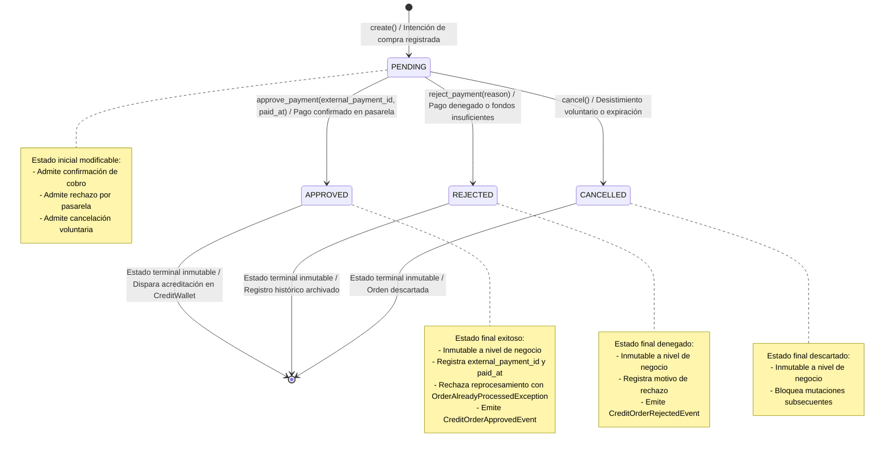

# Bounded Context: Billing (Monetización Prepaga y Créditos)

El Bounded Context **Billing** (`src/modules/billing/`) constituye el núcleo de monetización prepaga, gobernanza contable y procesamiento de pagos de **Navby Platform**. Su propósito estratégico primordial radica en administrar de manera atómica, auditable y resiliente la economía de créditos de uso de los usuarios, garantizando que cada consulta algorítmica sobre la red de rutas aéreas y cada cotización tarifaria en tiempo real sean debitadas con exactitud milimétrica sin riesgos de condiciones de carrera ni fraudes por sobregiro, facilitando asimismo la adquisición comercial de paquetes de saldo mediante pasarelas de pago externas en moneda nacional (PEN) y extranjera (USD).

En estricto alineamiento con los principios de Domain-Driven Design táctico y Clean Architecture, el Bounded Context Billing delimita rigurosamente sus fronteras de responsabilidad, manteniéndose completamente desacoplado de los módulos de navegación, autenticación y custodia de itinerarios:

- **Desacoplamiento Estricto frente a Flights e Itineraries:** El módulo Flights opera como el motor de optimización sobre grafos geodésicos y cotización de inventarios de vuelo, mientras que Itineraries custodia los planes de viaje guardados por los usuarios. Billing desconoce la topología del grafo aeroportuario, las distancias ortodrómicas calculadas mediante la formulación de Haversine y las combinaciones de vuelos. Su responsabilidad transaccional se circunscribe a verificar la solvencia de la billetera digital y debitar de forma atómica la cantidad exacta de créditos establecida por consulta (un crédito por cotización algorítmica), sin intervenir en el cálculo espacial ni almacenar detalles aeronáuticos. Del mismo modo, las operaciones de guardado, consulta o archivado de rutas en Itineraries son gratuitas y no interactúan transaccionalmente con la billetera de créditos.
- **Desacoplamiento Estricto frente a IAM y Regla Zero Cross-Module FKs:** Billing no gestiona contraseñas, sesiones criptográficas ni mecanismos de autenticación multifuente. La vinculación entre el titular de la billetera o el comprador de una orden y su cuenta de usuario se realiza exclusivamente a través del identificador lógico **user_id** (**UserId**), tratado como un valor escalar inmutable. En estricta observancia de la directriz de arquitectura que prohíbe las claves foráneas físicas intermodulares (*Zero Cross-Module FKs*), no existe ninguna restricción relacional física (`FOREIGN KEY`) entre las tablas de Billing (`credit_wallets`, `credit_transactions`, `credit_orders`) y las tablas del esquema de IAM en PostgreSQL 16. La provisión de una nueva billetera digital y el otorgamiento automático de los 10 créditos promocionales de bienvenida se efectúa de manera reactiva y asíncrona mediante la suscripción al evento de integración **UserRegisteredIntegrationEvent** persistido en la tabla `outbox_events`.
- **Decisiones Clave de Dominio, Consistencia y Cumplimiento Normativo:**
  - *Arquitectura Híbrida de Consistencia y Débito Atómico en Memoria:* Para absorber ráfagas de alta concurrencia sin degradar la latencia ni generar bloqueos de contención a nivel de filas relacionales, el sistema mantiene un espejo sincronizado en Redis 7. La deducción de créditos se ejecuta mediante scripts atómicos en Lua que verifican la solvencia combinada de las bolsas y aplican el descuento en tiempo constante $O(1)$, propagando de inmediato el registro inmutable hacia el libro mayor persistente en PostgreSQL 16.
  - *Inmutabilidad Estricta del Libro Mayor (Append-Only Ledger):* Las transacciones contables registradas en la tabla `credit_transactions` son estrictamente de solo inserción. Queda terminantemente prohibida cualquier mutación o supresión de asientos contables. Cada operación de abono, débito o compensación preserva la traza histórica con saldos resultantes desglosados y referencias de correlación externa.
  - *Idempotencia Criptográfica y Control de Doble Acreditación:* El procesamiento de compras comerciales gestionado con Mercado Pago Checkout Pro incorpora control de idempotencia basado en el identificador de transacción devuelto por la pasarela (**external_payment_id**), complementado con bloqueos distribuidos en Redis para descartar de manera preventiva notificaciones duplicadas de webhooks.
  - *Trazabilidad Financiera sin Retención de Datos de Pago Sensibles:* Billing jamás almacena números de tarjetas de crédito, códigos de seguridad o datos de pago sensibles del usuario. Toda la captura financiera sensible se delega en la pasarela de pagos certificada, almacenando únicamente identificadores de preferencia, referencias externas de pago y montos monetarios normalizados.

---

## 1. Domain Layer

La Capa de Dominio de Billing (`src/modules/billing/domain/`) reside en el centro neurálgico del Bounded Context. Su arquitectura se fundamenta en cuatro pilares innegociables concebidos para ejecutarse sobre Python 3.12+ bajo el arquetipo de diseño táctico de Domain-Driven Design y Clean Architecture adoptado en la plataforma:

1. **Frontera de Consistencia de Billetera y Dualidad de Bolsas:** El agregado **CreditWallet** salvaguarda la economía de créditos del usuario mediante dos bolsas estancas: créditos promocionales o gratuitos (**free_credits**, con saldo inicial de 10 créditos) y créditos comerciales adquiridos mediante recargas pagadas (**paid_credits**). El agregado encapsula la regla axiomática de deducción que agota primero los incentivos gratuitos no reembolsables antes de comprometer créditos pagados, garantizando la equidad comercial y protegiendo el saldo financiero adquirido frente a consumos ordinarios.
2. **Inmutabilidad Contable del Libro Mayor (Append-Only Ledger):** Toda mutación de créditos en la billetera genera obligatoriamente un asiento contable inmutable **CreditTransaction**. Dicho asiento registra de manera indivisible el saldo previo, la cantidad debitada o acreditada, el saldo posterior desglosado por bolsa, la naturaleza de la transacción y una referencia de correlación unívoca, impidiendo alteraciones retrospectivas y asegurando auditabilidad contable absoluta.
3. **Gestión Comercial Desacoplada e Idempotencia en Pagos:** El agregado **CreditOrder** administra las intenciones de compra comercial de forma aislada a la billetera, gestionando su propia máquina de estados finita (**PENDING**, **APPROVED**, **REJECTED**, **CANCELLED**) e impidiendo dobles acreditaciones mediante el control de unicidad del identificador externo de pago (**external_payment_id**) provisto por la pasarela de procesamiento.
4. **Aislamiento Tecnológico y Tipado Puro:** El dominio se implementa en Python 3.12+ puro, empleando exclusivamente tipado estático avanzado y estructuras estándar del lenguaje. Permanece completamente desacoplado de SDKs de pasarelas de pago externas (Mercado Pago SDK), frameworks web de transporte (FastAPI) y motores de almacenamiento duradero o en memoria (PostgreSQL y Redis).

El subdirectorio `src/modules/billing/domain/` organiza sus paquetes y módulos en la siguiente jerarquía estructural formal:

```text
src/modules/billing/domain/
├── __init__.py
├── model/                                # Modelos nucleares de dominio (agregados, entidades y VOs)
│   ├── __init__.py
│   ├── aggregates/                       # Raíces de Agregado
│   │   ├── __init__.py
│   │   ├── credit_wallet.py              # CreditWallet (Aggregate Root de Billetera y Bolsas de Créditos)
│   │   └── credit_order.py               # CreditOrder (Aggregate Root de Órdenes de Compra Comercial)
│   ├── entities/                         # Entidades Internas de Dominio
│   │   ├── __init__.py
│   │   └── credit_transaction.py         # CreditTransaction (Asiento contable inmutable del libro mayor)
│   └── value_objects/                    # Objetos de Valor inmutables y Enumeraciones de Dominio
│       ├── __init__.py
│       ├── wallet_id.py                  # WalletId(TypedId[UUID])
│       ├── order_id.py                   # OrderId(TypedId[UUID])
│       ├── package_code.py               # PackageCode (StrEnum: PACK_50, PACK_100, PACK_250)
│       ├── credit_package.py             # CreditPackage (VO de paquete comercial con precios PEN / USD)
│       ├── money.py                      # Money (monto Decimal >= 0, divisa ISO 4217 PEN/USD)
│       ├── transaction_type.py           # TransactionType (SIGNUP_BONUS, PURCHASE_CREDIT, ROUTE_QUOTE_DEBIT, REFUND, MANUAL_ADJUSTMENT)
│       ├── order_status.py               # OrderStatus (StrEnum: PENDING, APPROVED, REJECTED, CANCELLED)
│       ├── payment_provider.py           # PaymentProvider (StrEnum: MERCADO_PAGO)
│       └── credit_balance.py             # CreditBalance (VO consolidado: total, free, paid con validación algebraica)
├── events/                               # Eventos de Dominio Inmutables (Domain Events)
│   ├── __init__.py
│   ├── welcome_credits_granted_event.py  # WelcomeCreditsGrantedEvent (asignación de bono de bienvenida)
│   ├── credits_debited_event.py          # CreditsDebitedEvent (consumo por cotización de ruta)
│   ├── credits_purchased_event.py        # CreditsPurchasedEvent (acreditación comercial de saldo)
│   ├── credits_refunded_event.py         # CreditsRefundedEvent (reintegro de saldo por cancelación/error)
│   ├── credit_order_created_event.py     # CreditOrderCreatedEvent (emisión de intención de compra)
│   ├── credit_order_approved_event.py    # CreditOrderApprovedEvent (confirmación de pago en pasarela)
│   └── credit_order_rejected_event.py    # CreditOrderRejectedEvent (rechazo de pago o preferencia)
├── services/                             # Servicios de Dominio Puros (Stateless Domain Services)
│   ├── __init__.py
│   ├── credit_allocation_domain_service.py # CreditAllocationDomainService (algoritmo de deducción y ledger)
│   └── credit_pricing_domain_service.py  # CreditPricingDomainService (políticas de precios y catálogo de paquetes)
├── repositories/                         # Contratos de Persistencia de Dominio (typing.Protocol)
│   ├── __init__.py
│   ├── credit_wallet_repository.py       # CreditWalletRepository(Protocol con @runtime_checkable)
│   └── credit_order_repository.py        # CreditOrderRepository(Protocol con @runtime_checkable)
└── exceptions/                           # Excepciones Semánticas de Dominio
    ├── __init__.py
    └── domain_exceptions.py              # BillingDomainException y 9 excepciones especializadas
```

---

### 1.1. Diccionario de Clases y Componentes de la Capa de Dominio

La siguiente tabla presenta la taxonomía integral de los 28 componentes arquitectónicos nucleares que integran la Capa de Dominio de Billing en Navby Platform, detallando su módulo canónico de importación, clasificación táctica bajo Domain-Driven Design, responsabilidades semánticas y esquema de colaboración:

: Catálogo Consolidado de la Capa de Dominio (Bounded Context Billing) {#tbl:billing-domain-components}

| Componente o Clase | Módulo Canónico | Tipo Táctico | Propósito y Responsabilidad | Colaboradores y Dependencias |
| :---------------------------------- | :----------------------------------------------------------------- | :--------------------: | :------------------------------------------------------------------------------------------------------------------------------------------------------------------------------------------------------- | :------------------------------------------------------------------------------------------------------------------------------------------------------------------------------------------------------- |
| **CreditWallet** | src.modules.billing.domain.model.aggregates.credit_wallet | Aggregate Root | Raíz de agregado central que custodia la economía y el saldo de créditos del usuario, gobernando las bolsas estancas de créditos gratuitos y pagados, encapsulando la regla axiomática de deducción prioritaria sobre incentivos, administrando la colección inmutable del libro mayor contable y emitiendo eventos de dominio ante mutaciones de saldo. | Hereda de AbstractDomainAggregateRoot[WalletId], compone WalletId, UserId, CreditBalance y CreditTransaction, emite WelcomeCreditsGrantedEvent, CreditsDebitedEvent, CreditsPurchasedEvent y CreditsRefundedEvent. |
| **CreditOrder** | src.modules.billing.domain.model.aggregates.credit_order | Aggregate Root | Raíz de agregado comercial que gestiona el ciclo de vida de una orden de compra de paquetes de créditos, gobernando las transiciones de estado de pago (PENDING, APPROVED, REJECTED, CANCELLED), garantizando la idempotencia ante notificaciones de pasarela mediante el identificador externo de pago y registrando la preferencia de cobro. | Hereda de AbstractDomainAggregateRoot[OrderId], compone OrderId, UserId, PackageCode, Money, OrderStatus y PaymentProvider, emite CreditOrderCreatedEvent, CreditOrderApprovedEvent y CreditOrderRejectedEvent. |
| **CreditTransaction** | src.modules.billing.domain.model.entities.credit_transaction | Entity | Entidad interna inmutable que modela un asiento contable en el libro mayor de la billetera, registrando con exactitud matemática el importe transferido (débito o abono), los saldos posteriores desglosados por bolsa, el tipo de movimiento, la justificación descriptiva y el identificador de correlación. | Subordinada jerárquicamente a la raíz de agregado CreditWallet, compone WalletId, TransactionType, UUID y datetime, construida por CreditAllocationDomainService. |
| **WalletId** | src.modules.billing.domain.model.value_objects.wallet_id | Value Object (TypedId) | Identificador unívoco, inmutable y fuertemente tipado para la raíz de agregado CreditWallet, encapsulando un identificador universal único (UUID) para erradicar el antipatrón Primitive Obsession en los contratos de aplicación, persistencia y eventos. | Hereda de TypedId[UUID] provisto por el Shared Kernel, sirve como clave de identidad en CreditWallet y clave foránea lógica en CreditTransaction y adaptadores de persistencia. |
| **OrderId** | src.modules.billing.domain.model.value_objects.order_id | Value Object (TypedId) | Identificador unívoco, inmutable y fuertemente tipado para la raíz de agregado CreditOrder, encapsulando un identificador universal único (UUID) para asegurar la unicidad referencial de las transacciones comerciales de recarga. | Hereda de TypedId[UUID] provisto por el Shared Kernel, sirve como clave de identidad en CreditOrder y como identificador de correlación en eventos de dominio y depósitos contables. |
| **PackageCode** | src.modules.billing.domain.model.value_objects.package_code | Domain Enum (StrEnum) | Enumeración inmutable de tipo cadena que estandariza los códigos de catálogo para los paquetes comerciales de recarga de créditos habilitados en la plataforma (PACK_50, PACK_100, PACK_250). | Atributo descriptor en CreditPackage y CreditOrder, consumido por CreditPricingDomainService para validar compatibilidad y recuperar especificaciones comerciales. |
| **CreditPackage** | src.modules.billing.domain.model.value_objects.credit_package | Value Object | Objeto de valor inmutable que encapsula las especificaciones comerciales de un paquete de créditos del catálogo oficial, integrando la cantidad nominal de créditos, el código identificador y las tarifas oficiales denominadas en Soles peruanos (PEN) y Dólares estadounidenses (USD). | Compone PackageCode y Money (monto en PEN y USD), gestionado por CreditPricingDomainService y referenciado al crear instancias de CreditOrder. |
| **Money** | src.modules.billing.domain.model.value_objects.money | Value Object | Objeto de valor financiero inmutable que representa magnitudes monetarias exactas con precisión decimal fija (dos decimales) y código de divisa internacional normalizado según el estándar ISO 4217 (PEN, USD), previniendo anomalías de redondeo de punto flotante. | Emplea Decimal para cálculos aritméticos financieros, compone los atributos de precio en CreditPackage y CreditOrder, lanza InvalidMoneyException ante valores negativos o divisas no soportadas. |
| **TransactionType** | src.modules.billing.domain.model.value_objects.transaction_type | Domain Enum (StrEnum) | Enumeración inmutable de tipo cadena que clasifica la naturaleza contable de los movimientos asentados en el libro mayor de créditos (SIGNUP_BONUS, PURCHASE_CREDIT, ROUTE_QUOTE_DEBIT, REFUND, MANUAL_ADJUSTMENT). | Atributo de clasificación en CreditTransaction, evaluado por CreditAllocationDomainService y consultado en auditorías de saldo. |
| **OrderStatus** | src.modules.billing.domain.model.value_objects.order_status | Domain Enum (StrEnum) | Enumeración inmutable de tipo cadena que modela los estados formales del ciclo de vida transaccional de una orden de compra de créditos (PENDING, APPROVED, REJECTED, CANCELLED). | Atributo de estado en la raíz de agregado CreditOrder, gobierna la máquina de estados finita y las transiciones válidas de pago. |
| **PaymentProvider** | src.modules.billing.domain.model.value_objects.payment_provider | Domain Enum (StrEnum) | Enumeración inmutable de tipo cadena que identifica las pasarelas o proveedores externos de procesamiento de pagos autorizados en la plataforma (MERCADO_PAGO). | Atributo en CreditOrder que discrimina la pasarela de cobro utilizada para generar preferencias y verificar firmas de notificación. |
| **CreditBalance** | src.modules.billing.domain.model.value_objects.credit_balance | Value Object | Objeto de valor inmutable que modela el balance cuantitativo de créditos de una billetera, custodiando las bolsas estancas de créditos gratuitos (free_credits) y pagados (paid_credits), y validando la invariante fundamental de que el saldo consolidado equivale a la suma algebraica exacta de ambas bolsas. | Compone enteros no negativos con validación de invariantes en __post_init__, utilizado por CreditWallet y CreditAllocationDomainService para representar y mutar saldos. |
| **CreditAllocationDomainService** | src.modules.billing.domain.services.credit_allocation_domain_service | Domain Service | Servicio de dominio puro y sin estado que ejecuta el algoritmo determinista de deducción y distribución de débitos entre bolsas de créditos, garantizando el agotamiento prioritario del saldo gratuito antes del comercial, verificando la solvencia y generando los asientos contables inmutables. | Opera sobre CreditBalance, CreditTransaction, TransactionType, WalletId, arrojando InsufficientCreditsException ante fondos insuficientes. |
| **CreditPricingDomainService** | src.modules.billing.domain.services.credit_pricing_domain_service | Domain Service | Servicio de dominio puro y sin estado que encapsula las políticas de tarificación comercial, el catálogo oficial de paquetes de créditos, la resolución de precios en moneda local o extranjera y la validación de compatibilidad de órdenes de compra. | Administra instancias de CreditPackage, PackageCode, Money, validando parámetros de compra para la creación de CreditOrder. |
| **WelcomeCreditsGrantedEvent** | src.modules.billing.domain.events.welcome_credits_granted_event | Domain Event | Evento de dominio inmutable que certifica el otorgamiento inicial del bono de bienvenida de 10 créditos gratuitos no reembolsables tras el aprovisionamiento de una nueva billetera de usuario. | Hereda de DomainEvent, emitido por CreditWallet.create_for_new_user(), persistido atómicamente en outbox_events para auditoría y trazabilidad promocional. |
| **CreditsDebitedEvent** | src.modules.billing.domain.events.credits_debited_event | Domain Event | Evento de dominio inmutable emitido al debitar exitosamente créditos por motivo de búsqueda de rutas o cotización tarifaria, transportando la cantidad debitada, el desglose de bolsas afectadas y el saldo posterior resultante. | Hereda de DomainEvent, originado en el método debit() de CreditWallet, propagado al Transactional Outbox para métricas de consumo y sincronización de espejos en caché. |
| **CreditsPurchasedEvent** | src.modules.billing.domain.events.credits_purchased_event | Domain Event | Evento de dominio inmutable emitido cuando se confirma la acreditación de saldo comercial pagado en la billetera como consecuencia de la aprobación de una orden de compra en la pasarela. | Hereda de DomainEvent, emitido por el método credit_package() de CreditWallet y coordinado con la aprobación de CreditOrder. |
| **CreditsRefundedEvent** | src.modules.billing.domain.events.credits_refunded_event | Domain Event | Evento de dominio inmutable que formaliza el reintegro de créditos a una billetera por motivos de cancelación de operación, fallos técnicos en servicios de consulta o ajustes administrativos. | Hereda de DomainEvent, emitido por métodos de ajuste compensatorio en CreditWallet, registrado en auditorías del libro mayor. |
| **CreditOrderCreatedEvent** | src.modules.billing.domain.events.credit_order_created_event | Domain Event | Evento de dominio inmutable emitido al registrar una nueva intención de compra de créditos en el sistema, transportando la identidad de la orden, el usuario adquirente, el paquete solicitado y el importe total a pagar. | Hereda de DomainEvent, originado en la fábrica estática de CreditOrder, consumido por servicios de aplicación para gestionar la preferencia de pago en la pasarela externa. |
| **CreditOrderApprovedEvent** | src.modules.billing.domain.events.credit_order_approved_event | Domain Event | Evento de dominio inmutable emitido tras la validación satisfactoria del comprobante o notificación de pago en la pasarela, certificando la transición formal de la orden al estado APPROVED y registrando el identificador externo. | Hereda de DomainEvent, generado por el método approve() de CreditOrder, desencadena la acreditación de créditos comerciales en la billetera correspondiente. |
| **CreditOrderRejectedEvent** | src.modules.billing.domain.events.credit_order_rejected_event | Domain Event | Evento de dominio inmutable emitido cuando la pasarela de pagos rechaza formalmente la transacción comercial por fondos insuficientes, sospecha de fraude o cancelación del comprador. | Hereda de DomainEvent, generado por el método reject() de CreditOrder, utilizado para notificar al usuario y actualizar vistas de checkout. |
| **CreditWalletRepository** | src.modules.billing.domain.repositories.credit_wallet_repository | Repository Protocol | Contrato de persistencia pura (typing.Protocol con @runtime_checkable) que desacopla la capa de dominio del almacenamiento físico en PostgreSQL 16 y Redis 7, declarando métodos asíncronos para guardar, consultar por ID o por UserId y verificar existencia de billeteras. | Interfaz estructural pura, opera con CreditWallet, WalletId, UserId, implementada por adaptadores de infraestructura con SQLAlchemy y drivers Redis. |
| **CreditOrderRepository** | src.modules.billing.domain.repositories.credit_order_repository | Repository Protocol | Contrato de persistencia pura (typing.Protocol con @runtime_checkable) que abstrae el almacenamiento y recuperación duradera de órdenes de compra, declarando métodos para guardar, buscar por ID, consultar por identificador externo de pago y listar por usuario. | Interfaz estructural pura, opera con CreditOrder, OrderId, UserId, implementada por adaptadores de persistencia en la capa de infraestructura. |
| **BillingDomainException** | src.modules.billing.domain.exceptions.domain_exceptions | Base Domain Exception | Clase base abstracta de todas las anomalías y violaciones de reglas de negocio del Bounded Context Billing, encapsulando un mensaje técnico descriptivo y un código de error alfanumérico canónico para tipificación unificada. | Hereda de DomainException provista por el Shared Kernel, actúa como superclase raíz para todas las excepciones semánticas del módulo de monetización. |
| **InsufficientCreditsException** | src.modules.billing.domain.exceptions.domain_exceptions | Domain Exception | Excepción semántica disparada cuando una solicitud de deducción o consumo supera el saldo total disponible (suma de créditos gratuitos y pagados) en la billetera del usuario. | Hereda de BillingDomainException, lanzada por CreditAllocationDomainService y por el método debit() de CreditWallet ante fondos insuficientes. |
| **WalletNotFoundException** | src.modules.billing.domain.exceptions.domain_exceptions | Domain Exception | Excepción semántica lanzada cuando una operación transaccional o de consulta hace referencia a un WalletId o UserId cuya billetera no existe o no ha sido aprovisionada en el sistema. | Hereda de BillingDomainException, lanzada por casos de uso de aplicación y repositorios ante la ausencia del agregado requerido. |
| **OrderNotFoundException** | src.modules.billing.domain.exceptions.domain_exceptions | Domain Exception | Excepción semántica lanzada cuando un comando o consulta intenta operar sobre un OrderId o external_payment_id que no registra coincidencia en el repositorio persistente de órdenes. | Hereda de BillingDomainException, arrojada en manejadores de webhook y consultas de estado de compra ante órdenes inexistentes. |
| **OrderAlreadyProcessedException** | src.modules.billing.domain.exceptions.domain_exceptions | Domain Exception | Excepción semántica lanzada ante intentos ilícitos o reintentos concurrentes de mutar una orden de compra que ya ha alcanzado un estado final inmutable (APPROVED, REJECTED o CANCELLED). | Hereda de BillingDomainException, disparada por los métodos approve(), reject() o cancel() de CreditOrder para preservar la idempotencia comercial. |

*Nota.* Catálogo taxonómico unificado de los 28 componentes arquitectónicos nucleares que integran la Capa de Dominio del Bounded Context Billing en Navby Platform bajo el arquetipo de diseño táctico de Domain-Driven Design y Clean Architecture. El catálogo abarca las dos raíces de agregado (CreditWallet para la custodia del saldo y CreditOrder para la gestión comercial de compras), la entidad interna CreditTransaction como asiento contable del libro mayor, los objetos de valor inmutables, las enumeraciones tipadas de dominio, los servicios de dominio sin estado para deducción prioritaria y tarificación, los eventos de dominio inmutables para el Transactional Outbox, los protocolos puros de persistencia y la jerarquía de excepciones semánticas encabezada por BillingDomainException.

---

### 1.2. Objetos de Valor y Enumeraciones de Dominio

#### 1.2.1. Fundamentos Teóricos y Erradicación de Primitive Obsession

En la arquitectura del Bounded Context Billing bajo Domain-Driven Design, la modelización del sistema monetario y la economía de créditos demanda una delimitación ontológica categórica entre entidades y objetos de valor (**Value Objects**). Mientras que las entidades poseen una trayectoria de identidad continua, mutable y persistente a lo largo del tiempo, los objetos de valor representan magnitudes cuantitativas, descriptores comerciales o identificadores fuertemente tipados definidos exclusivamente por la conjunción inmutable de sus atributos. Carecen de identidad conceptual autónoma, resultan intercambiables si sus valores coinciden y no cuentan con ciclo de vida independiente.

En plataformas de comercio electrónico y servicios de prepago, uno de los defectos estructurales más recurrentes es el antipatrón *Primitive Obsession*. Este problema surge al delegar la representación de conceptos medulares del negocio en tipos escalares primitivos provistos por el lenguaje base, tales como cadenas de texto `str`, enteros escalares `int`, números de punto flotante `float` o estructuras genéricas `UUID`. Dicha práctica engendra tres patologías críticas en sistemas financieros:

1. **Degradación de la Seguridad Estática de Tipos y Vulnerabilidad ante Transposiciones:** Si identificadores de billetera, identificadores de orden, códigos de paquete y estados transaccionales se representan indistintamente como cadenas o UUIDs primitivos, los analizadores estáticos de tipos (mypy, Pyright) no pueden advertir transposiciones accidentales en llamadas a constructores o métodos de aplicación. Un error posicional que suministre un identificador de orden en lugar de uno de billetera resulta sintácticamente admisible para el intérprete, provocando la corrupción silenciosa de asientos contables en entornos de producción.
2. **Dispersión y Duplicación de Lógica Defensiva:** Al carecer de un encapsulamiento cohesivo que custodie las invariantes de cada concepto, las comprobaciones defensivas (no negatividad de montos, precisión decimal fija, compatibilidad de divisas ISO 4217, coherencia algebraica en balances o pertenencia a catálogos comerciales) terminan diseminadas en controladores HTTP, servicios de aplicación y adaptadores de persistencia, originando divergencias operativas cuando una regla evoluciona en un punto del sistema pero se omite en otro.
3. **Erosión del Lenguaje Ubicuo y Pérdida de Precisión Financiera:** Los tipos escalares primitivos ocultan las restricciones semánticas y matemáticas del negocio. El empleo de números de punto flotante binario (`float`) para registrar tarifas o deducciones introduce anomalías de redondeo acumulativas inaceptables en libros contables. De forma semejante, el uso de enteros primitivos para saldos enmascara la dualidad entre bolsas de créditos gratuitos y comerciales pagados.

Para neutralizar de forma definitiva estas vulnerabilidades en el Bounded Context Billing, Navby Platform fundamenta sus objetos de valor y enumeraciones sobre cuatro garantías operativas e inmutables implementadas en Python 3.12+:

- **Inmutabilidad Absoluta en Tiempo de Ejecución (`@dataclass(frozen=True)`):** La directiva `frozen=True` instruye al intérprete a generar clases inmutables donde cualquier tentativa de reasignación o alteración de atributos sobre una instancia existente es interceptada de inmediato, desencadenando la excepción `FrozenInstanceError`. Esta propiedad asegura seguridad en entornos concurrentes asíncronos y garantiza que las instancias compartidas preserven un estado inalterable.
- **Auto-Validación Defensiva de Invariantes en `__post_init__`:** Ningún objeto de valor puede existir en memoria en un estado semánticamente corrupto. El método *__post_init__()* opera como una aduana de entrada ineludible que evalúa la no nulidad, el saneamiento canónico mediante *strip()*, la no negatividad de importes y saldos, la correspondencia con códigos ISO 4217 y la estricta concordancia algebraica entre bolsas, abortando cualquier instanciación anómala mediante excepciones de dominio especializadas (**InvalidMoneyException**, **InvalidCreditBalanceException**, **InvalidCreditPackageException**, entre otras).
- **Igualdad Estructural y Dispersión Determinista (`__eq__` y `__hash__`):** La equivalencia entre dos objetos de valor se fundamenta en la identidad de sus atributos y no en la dirección de memoria que ocupan. Al tratarse de estructuras congeladas, Python sintetiza métodos *__eq__()* y *__hash__()* compatibles, permitiendo utilizar objetos de valor como claves en diccionarios o elementos en conjuntos inmutables.
- **Seguridad Financiera y Aritmética Bancaria:** Toda magnitud monetaria se gobierna mediante el objeto de valor **Money**, el cual encapsula aritmética de precisión fija con `Decimal` y redondeo bancario legal (*Half-Even*, `ROUND_HALF_EVEN`) a dos decimales, erradicando discrepancias de punto flotante. A su vez, el balance de créditos se formaliza mediante **CreditBalance**, salvaguardando la integridad algebraica estricta entre créditos de cortesía y saldo comercial pagado.

La Tabla @tbl:billing-value-objects sintetiza la matriz de especificación técnica de los 9 objetos de valor y enumeraciones de dominio que estructuran el subsistema descriptivo de Billing:

: Matriz de Objetos de Valor y Enumeraciones de Dominio (Billing) {#tbl:billing-value-objects}

| Objeto de Valor / Enum | Tipo Táctico | Invariante / Regla de Validación | Formato / Tipo Primitivo | Semántica de Negocio |
| :--------------------- | :----------: | :------------------------------------------------------------------------------------------------------------------------------------------------------------------------------------------------------- | :---------------------------------------------------------------- | :------------------------------------------------------------------------------------------------------------------------------------------------------------------------------------------------------- |
| **WalletId** | Value Object (TypedId) | Identificador unívoco inmutable derivado de TypedId[UUID], valida no nulidad, no vacuidad y formato canónico UUID v4 o v7 de 36 caracteres hexadecimales. | UUID canónico de 36 caracteres (8-4-4-4-12) | Identidad unívoca de la raíz de agregado CreditWallet, previene el cruce accidental de claves con usuarios u órdenes. |
| **OrderId** | Value Object (TypedId) | Identificador unívoco inmutable derivado de TypedId[UUID], valida no nulidad, no vacuidad y formato canónico UUID v4 o v7 de 36 caracteres hexadecimales. | UUID canónico de 36 caracteres (8-4-4-4-12) | Identidad unívoca de la raíz de agregado CreditOrder, garantiza unicidad referencial de las compras comerciales de créditos. |
| **PackageCode** | Domain Enum (StrEnum) | Restringe el código comercial a los paquetes oficiales del catálogo: PACK_50, PACK_100, PACK_250; rechaza valores nulos, vacíos o no catalogados. | Cadena inmutable (StrEnum) | Estandarización de claves de catálogo comercial para adquisición de paquetes de créditos en la plataforma. |
| **CreditPackage** | Value Object | Nombre no vacío (1 a 100 caracteres); cantidad de créditos estrictamente positiva (> 0); precio en Soles (PEN) y Dólares (USD) estrictamente positivos y denominados en sus respectivas divisas. | Estructura inmutable (PackageCode, str, int, Money, Money) | Especificación comercial íntegra de un paquete de créditos, asociando volumen nominal de créditos con sus tarifas oficiales multimoneda. |
| **Money** | Value Object | Importe monetario decimal no negativo (>= 0.00) con precisión fija a dos decimales y redondeo bancario Half-Even; código de divisa internacional ISO 4217 de 3 caracteres mayúsculas admitido (PEN, USD); operaciones aritméticas restringidas a divisas homogéneas. | Decimal de precisión 2 y código str de 3 caracteres | Magnitud financiera exacta asociada a precios de catálogo y órdenes comerciales, previniendo errores de redondeo de punto flotante. |
| **TransactionType** | Domain Enum (StrEnum) | Restringe la naturaleza del movimiento contable a los valores admitidos: SIGNUP_BONUS, PURCHASE_CREDIT, ROUTE_QUOTE_DEBIT, REFUND, MANUAL_ADJUSTMENT. | Cadena inmutable (StrEnum) | Clasificación ontológica de los asientos contables en el libro mayor de créditos, distinguiendo abonos, débitos y ajustes. |
| **OrderStatus** | Domain Enum (StrEnum) | Delimita los estados transaccionales de la orden de compra a: PENDING, APPROVED, REJECTED, CANCELLED; regula transiciones lícitas de la máquina de estados. | Cadena inmutable (StrEnum) | Control del ciclo de vida transaccional de órdenes de recarga comercial y preservación de idempotencia en pasarela de pagos. |
| **PaymentProvider** | Domain Enum (StrEnum) | Identifica los procesadores de pago externos autorizados para transacciones comerciales en la plataforma (MERCADO_PAGO). | Cadena inmutable (StrEnum) | Discriminación de la pasarela de cobro utilizada para la generación de preferencias y verificación de webhooks. |
| **CreditBalance** | Value Object | Componentes total, free y paid enteros no negativos (>= 0); concordancia algebraica estricta total == free + paid; rechazo automático ante saldos negativos o discrepancias de suma. | Tupla estructurada de 3 enteros no negativos (total, free, paid) | Balance cuantitativo consolidado de la billetera, custodiando las bolsas estancas de incentivos gratuitos y saldo comercial pagado. |

*Nota.* Matriz taxonómica y reglas de invariantes ontológicas para los 9 Objetos de Valor y Enumeraciones de Dominio que estructuran el Bounded Context Billing en Navby Platform. Todos los componentes implementan inmutabilidad estricta a nivel del intérprete en Python 3.12+ mediante el decorador @dataclass(frozen=True) o especializaciones de StrEnum, garantizando auto-validación de reglas en __post_init__ y erradicación definitiva del antipatrón Primitive Obsession.

---

#### 1.2.2. Implementación de Value Objects y Enums en Python 3.12+

En estricta observancia de los principios de Clean Architecture y la pureza del estrato de dominio, los objetos de valor y enumeraciones de Billing se implementan utilizando exclusivamente la biblioteca estándar de Python 3.12+, sin dependencias externas hacia librerías de mapeo objeto-relacional (SQLAlchemy) o frameworks web (FastAPI).

##### 1. Excepciones Semánticas Especializadas del Subsistema de Objetos de Valor

Antes de formalizar los objetos de valor, se define el conjunto de excepciones de dominio semánticas especializadas encargadas de custodiar las invariantes operativas. Todas extienden la clase base abstracta **BillingDomainException**, la cual a su vez deriva de **DomainException** provista por el Shared Kernel (`src/shared/domain/exceptions/domain_exception.py`), incorporando códigos alfanuméricos canónicos en mayúsculas sostenidas (`UPPER_SNAKE_CASE`) y un mapa estructurado de detalles contextuales:

```python
"""Excepciones semánticas de dominio especializadas para Objetos de Valor en Billing.

Ubicación: src/modules/billing/domain/exceptions/domain_exceptions.py
"""

from __future__ import annotations

from typing import Any

from src.shared.domain.exceptions.domain_exception import DomainException


class BillingDomainException(DomainException):
    """Excepción semántica base para todas las anomalías del Bounded Context Billing."""

    def __init__(self, message: str, code: str, details: dict[str, Any] | None = None) -> None:
        """Inicializa la excepción con mensaje explicativo, código alfanumérico y detalles."""
        super().__init__(message=message, code=code, details=details)


class InvalidMoneyException(BillingDomainException):
    """Excepción disparada cuando un importe monetario o divisa transgrede las reglas financieras."""

    def __init__(self, message: str, details: dict[str, Any] | None = None) -> None:
        super().__init__(message=message, code="INVALID_MONEY_VALUE", details=details)


class CurrencyMismatchException(BillingDomainException):
    """Excepción disparada al intentar operar aritméticamente magnitudes monetarias con divisas heterogéneas."""

    def __init__(self, message: str, details: dict[str, Any] | None = None) -> None:
        super().__init__(message=message, code="CURRENCY_MISMATCH", details=details)


class InvalidCreditBalanceException(BillingDomainException):
    """Excepción disparada ante saldos negativos o discrepancias algebraicas en CreditBalance."""

    def __init__(self, message: str, details: dict[str, Any] | None = None) -> None:
        super().__init__(message=message, code="INVALID_CREDIT_BALANCE", details=details)


class InvalidCreditPackageException(BillingDomainException):
    """Excepción disparada cuando una especificación comercial de CreditPackage vulnera sus invariantes."""

    def __init__(self, message: str, details: dict[str, Any] | None = None) -> None:
        super().__init__(message=message, code="INVALID_CREDIT_PACKAGE", details=details)


class InvalidPackageCodeException(BillingDomainException):
    """Excepción disparada cuando un código de paquete no coincide con el catálogo oficial admitido."""

    def __init__(self, message: str, details: dict[str, Any] | None = None) -> None:
        super().__init__(message=message, code="INVALID_PACKAGE_CODE", details=details)


class InvalidOrderStatusException(BillingDomainException):
    """Excepción disparada ante transiciones ilícitas o estados incompatibles en la orden de compra."""

    def __init__(self, message: str, details: dict[str, Any] | None = None) -> None:
        super().__init__(message=message, code="INVALID_ORDER_STATUS", details=details)
```

##### 2. WalletId

* **Módulo Canónico:** `src.modules.billing.domain.model.value_objects.wallet_id`
* **Propósito:** Encapsula de forma unívoca, inmutable y fuertemente tipada el identificador universal único (UUID) asignado a la raíz de agregado **CreditWallet**.
* **Atributos:**
  * **value** (`UUID`): Identificador universal único subyacente. Heredado de **TypedId[UUID]**.
* **Invariantes y Reglas de Validación:**
  * No nulidad de la identidad y verificación de conformidad con el formato canónico UUID (v4 o v7).
  * Inmutabilidad estricta garantizada por la superclase abstracta **TypedId**.
* **Métodos y Operaciones:**
  * *generate() -> Self*: Factoría estática que instancia un nuevo **WalletId** respaldado por un UUID v4 criptográficamente pseudoaleatorio.
  * *of(val: UUID | str | TypedId) -> Self*: Factoría estática que construye o valida una instancia a partir de un UUID nativo, una cadena hexadecimal formateada o una instancia homogénea previa.
  * *__str__() -> str*: Retorna la representación canónica en cadena de texto del UUID (36 caracteres en formato `8-4-4-4-12`).

```python
"""Objeto de valor fuertemente tipado para el identificador de billetera virtual.

Ubicación: src/modules/billing/domain/model/value_objects/wallet_id.py
"""

from __future__ import annotations

from dataclasses import dataclass
from typing import Self
from uuid import UUID

from src.shared.domain.model.ids.typed_id import TypedId


@dataclass(frozen=True)
class WalletId(TypedId[UUID]):
    """Identificador unívoco universal fuertemente tipado para la raíz de agregado CreditWallet.

    Hereda de TypedId[UUID] para erradicar el antipatrón Primitive Obsession,
    garantizando inmutabilidad estricta, validación de formato UUID canónico (v4 o v7)
    y diferenciación semántica en tiempo de compilación frente a otros identificadores del sistema.
    """

    @classmethod
    def generate(cls) -> Self:
        """Genera un nuevo WalletId con un UUID v4 criptográficamente aleatorio.

        Returns:
            Instancia nueva de WalletId con entropía pseudoaleatoria de 122 bits.
        """
        return super().generate()

    @classmethod
    def of(cls, val: UUID | str | TypedId[UUID]) -> Self:
        """Construye un WalletId a partir de un UUID, cadena representativa o instancia existente.

        Args:
            val: Instancia de UUID, cadena hexadecimal formateada o instancia homogénea de WalletId.

        Returns:
            Instancia validada de WalletId.

        Raises:
            ValueError: Si el valor suministrado no es convertible a UUID o si
                se intenta instanciar desde un identificador heterogéneo de otro contexto.
        """
        return super().of(val)
```

##### 3. OrderId

* **Módulo Canónico:** `src.modules.billing.domain.model.value_objects.order_id`
* **Propósito:** Encapsula de forma unívoca, inmutable y fuertemente tipada el identificador universal único (UUID) correspondiente a la raíz de agregado **CreditOrder**.
* **Atributos:**
  * **value** (`UUID`): Identificador universal único subyacente. Heredado de **TypedId[UUID]**.
* **Invariantes y Reglas de Validación:**
  * No nulidad de la identidad y verificación de conformidad con el formato canónico UUID (v4 o v7).
  * Inmutabilidad estricta garantizada por la superclase abstracta **TypedId**.
* **Métodos y Operaciones:**
  * *generate() -> Self*: Factoría estática que instancia un nuevo **OrderId** respaldado por un UUID v4 criptográficamente pseudoaleatorio.
  * *of(val: UUID | str | TypedId) -> Self*: Factoría estática que construye o valida una instancia a partir de un UUID nativo, una cadena hexadecimal formateada o una instancia homogénea previa.
  * *__str__() -> str*: Retorna la representación canónica en cadena de texto del UUID (36 caracteres en formato `8-4-4-4-12`).

```python
"""Objeto de valor fuertemente tipado para el identificador de orden de compra.

Ubicación: src/modules/billing/domain/model/value_objects/order_id.py
"""

from __future__ import annotations

from dataclasses import dataclass
from typing import Self
from uuid import UUID

from src.shared.domain.model.ids.typed_id import TypedId


@dataclass(frozen=True)
class OrderId(TypedId[UUID]):
    """Identificador unívoco universal fuertemente tipado para la raíz de agregado CreditOrder.

    Hereda de TypedId[UUID] para asegurar la unicidad referencial de las transacciones
    comerciales de compra de créditos, aislando la identidad comercial de la billetera.
    """

    @classmethod
    def generate(cls) -> Self:
        """Genera un nuevo OrderId con un UUID v4 criptográficamente aleatorio.

        Returns:
            Instancia nueva de OrderId con entropía pseudoaleatoria de 122 bits.
        """
        return super().generate()

    @classmethod
    def of(cls, val: UUID | str | TypedId[UUID]) -> Self:
        """Construye un OrderId a partir de un UUID, cadena representativa o instancia existente.

        Args:
            val: Instancia de UUID, cadena hexadecimal formateada o instancia homogénea de OrderId.

        Returns:
            Instancia validada de OrderId.

        Raises:
            ValueError: Si el valor suministrado no es convertible a UUID o si
                se intenta instanciar desde un identificador heterogéneo de otro contexto.
        """
        return super().of(val)
```

##### 4. PackageCode

* **Módulo Canónico:** `src.modules.billing.domain.model.value_objects.package_code`
* **Propósito:** Enumeración inmutable de tipo cadena (`StrEnum`) que normaliza las claves de catálogo para los paquetes comerciales de recarga de créditos autorizados en la plataforma.
* **Valores y Constantes:**
  * `PACK_50 = "pack_50"`: Paquete inicial de recarga con 50 créditos comerciales.
  * `PACK_100 = "pack_100"`: Paquete frecuente de recarga con 100 créditos comerciales.
  * `PACK_250 = "pack_250"`: Paquete corporativo de recarga con 250 créditos comerciales.
* **Métodos y Operaciones:**
  * *from_str(code: str) -> PackageCode*: Factoría estática que normaliza la cadena provista a minúsculas y valida su pertenencia al catálogo oficial, arrojando **InvalidPackageCodeException** ante valores desconocidos.
  * *display_name() -> str*: Retorna la denominación comercial descriptiva en español para presentación en la interfaz de usuario.

```python
"""Enumeración de dominio inmutable para los códigos de paquetes de créditos.

Ubicación: src/modules/billing/domain/model/value_objects/package_code.py
"""

from __future__ import annotations

from enum import StrEnum

from src.modules.billing.domain.exceptions.domain_exceptions import (
    InvalidPackageCodeException,
)


class PackageCode(StrEnum):
    """Códigos normalizados de catálogo para los paquetes comerciales de recarga de créditos.

    Estandariza los identificadores comerciales de los paquetes admitidos en Navby Platform,
    evitando la dispersión de cadenas mágicas en servicios de tarificación y órdenes de compra.
    """

    PACK_50 = "pack_50"
    PACK_100 = "pack_100"
    PACK_250 = "pack_250"

    @classmethod
    def from_str(cls, code: str) -> PackageCode:
        """Construye un PackageCode a partir de una cadena saneada y normalizada.

        Args:
            code: Cadena representativa del código de paquete.

        Returns:
            Instancia válida de PackageCode.

        Raises:
            InvalidPackageCodeException: Si la cadena no corresponde a un paquete de catálogo admitido.
        """
        if not code or not isinstance(code, str):
            raise InvalidPackageCodeException(
                message="El código de paquete debe ser una cadena de texto no nula.",
                details={"provided_code": code},
            )
        normalized = code.strip().lower()
        try:
            return cls(normalized)
        except ValueError as exc:
            allowed = [p.value for p in cls]
            raise InvalidPackageCodeException(
                message=f"El código de paquete '{code}' no es válido. Códigos admitidos: {allowed}.",
                details={"provided_code": code, "allowed_codes": allowed},
            ) from exc

    def display_name(self) -> str:
        """Retorna la denominación descriptiva para renderizado en interfaces de usuario.

        Returns:
            Cadena de texto con el título comercial del paquete.
        """
        names = {
            PackageCode.PACK_50: "Paquete Inicial (50 créditos)",
            PackageCode.PACK_100: "Paquete Frecuente (100 créditos)",
            PackageCode.PACK_250: "Paquete Corporativo (250 créditos)",
        }
        return names[self]
```

##### 5. Money

* **Módulo Canónico:** `src.modules.billing.domain.model.value_objects.money`
* **Propósito:** Objeto de valor financiero inmutable que representa magnitudes dinerarias exactas con precisión fija de dos dígitos decimales y código de divisa internacional ISO 4217, erradicando anomalías de punto flotante binario.
* **Atributos:**
  * **amount** (`Decimal`): Magnitud cuantitativa monetaria no negativa, cuantizada a dos decimales con redondeo bancario *Half-Even*.
  * **currency** (`str`): Código de divisa internacional normalizado según el estándar ISO 4217 (valor predeterminado: `"PEN"`, divisas admitidas: `"PEN"` y `"USD"`).
* **Invariantes y Reglas de Validación:**
  * No nulidad y convertibilidad estricta a `Decimal`.
  * No negatividad del importe: `amount >= Decimal("0.00")`.
  * Redondeo bancario determinista a dos posiciones decimales mediante la constante `ROUND_HALF_EVEN`.
  * Código de divisa de exactamente tres caracteres alfabéticos mayúsculas pertenecientes al conjunto de divisas soportadas (`{"PEN", "USD"}`).
  * Restricción de operaciones aritméticas exclusivamente a operandos con divisas homogéneas.
  * Lanza **InvalidMoneyException** ante importes negativos, divisas no soportadas o restas que arrojen resultados negativos.
  * Lanza **CurrencyMismatchException** ante intentos de adición o sustracción entre divisas heterogéneas.
* **Métodos y Operaciones:**
  * *add(other: Money) -> Money*: Retorna una nueva instancia con la suma acumulada de importes, validando coincidencia de divisa.
  * *subtract(other: Money) -> Money*: Retorna una nueva instancia con la diferencia aritmética, validando coincidencia de divisa y no negatividad del resultado.
  * *multiply(factor: int | float | Decimal) -> Money*: Multiplica el importe por un factor escalar no negativo cuantizando el resultado.
  * Sobrecarga de operadores *__add__()*, *__sub__()*, *__mul__()*, *__str__()*.

```python
"""Objeto de valor financiero inmutable con precisión decimal fija y divisa ISO 4217.

Ubicación: src/modules/billing/domain/model/value_objects/money.py
"""

from __future__ import annotations

import re
from dataclasses import dataclass, field
from decimal import Decimal, ROUND_HALF_EVEN
from typing import ClassVar

from src.modules.billing.domain.exceptions.domain_exceptions import (
    CurrencyMismatchException,
    InvalidMoneyException,
)
from src.shared.domain.model.value_object import ValueObject


@dataclass(frozen=True)
class Money(ValueObject):
    """Magnitud financiera inmutable con precisión decimal fija de dos dígitos y divisa ISO 4217.

    Erradica anomalías de redondeo de punto flotante binario mediante aritmética Decimal
    con redondeo bancario legal (Half-Even) y custodia la homogeneidad monetaria en operaciones.
    """

    amount: Decimal
    currency: str = "PEN"

    SUPPORTED_CURRENCIES: ClassVar[frozenset[str]] = frozenset({"PEN", "USD"})

    _CURRENCY_REGEX: re.Pattern[str] = field(
        default=re.compile(r"^[A-Z]{3}$"),
        init=False,
        repr=False,
        compare=False,
    )

    def __post_init__(self) -> None:
        """Valida la no negatividad del importe, el redondeo bancario y la divisa ISO 4217.

        Raises:
            InvalidMoneyException: Si el importe es nulo, negativo, no convertible a Decimal,
                o si el código de divisa es inválido o no está soportado.
        """
        if self.amount is None:
            raise InvalidMoneyException(
                message="El importe monetario no puede ser nulo.",
                details={"field": "amount"},
            )

        try:
            dec_amount = Decimal(str(self.amount)) if not isinstance(self.amount, Decimal) else self.amount
        except Exception as exc:
            raise InvalidMoneyException(
                message=f"El importe monetario '{self.amount}' no es convertible a Decimal.",
                details={"field": "amount", "provided_value": str(self.amount)},
            ) from exc

        if dec_amount < Decimal("0.00"):
            raise InvalidMoneyException(
                message=f"El importe monetario no puede ser negativo (recibido: {dec_amount}).",
                details={"field": "amount", "provided_value": str(dec_amount)},
            )

        quantized = dec_amount.quantize(Decimal("0.01"), rounding=ROUND_HALF_EVEN)
        object.__setattr__(self, "amount", quantized)

        if not self.currency or not isinstance(self.currency, str):
            raise InvalidMoneyException(
                message="El código de divisa debe ser una cadena de texto no nula.",
                details={"field": "currency"},
            )

        curr_normalized = self.currency.strip().upper()
        if not self._CURRENCY_REGEX.match(curr_normalized):
            raise InvalidMoneyException(
                message=(
                    f"El código de divisa '{self.currency}' no cumple con el estándar "
                    f"internacional ISO 4217 de 3 letras mayúsculas."
                ),
                details={"field": "currency", "provided_value": self.currency},
            )

        if curr_normalized not in self.SUPPORTED_CURRENCIES:
            raise InvalidMoneyException(
                message=(
                    f"La divisa '{curr_normalized}' no está soportada en el Bounded Context Billing. "
                    f"Divisas admitidas: {sorted(self.SUPPORTED_CURRENCIES)}."
                ),
                details={"currency": curr_normalized, "supported": sorted(self.SUPPORTED_CURRENCIES)},
            )

        object.__setattr__(self, "currency", curr_normalized)

    def add(self, other: Money) -> Money:
        """Suma dos magnitudes monetarias verificando coincidencia estricta de divisa.

        Args:
            other: Instancia homogénea de Money a sumar.

        Returns:
            Nueva instancia de Money con el importe acumulado.

        Raises:
            TypeError: Si el operando no es una instancia de Money.
            CurrencyMismatchException: Si las divisas de ambas instancias no coinciden.
        """
        if not isinstance(other, Money):
            raise TypeError(f"Operando inválido para adición monetaria: {type(other).__name__}")

        if self.currency != other.currency:
            raise CurrencyMismatchException(
                message=(
                    f"No es posible sumar importes con divisas heterogéneas: "
                    f"'{self.currency}' y '{other.currency}'."
                ),
                details={"currency_a": self.currency, "currency_b": other.currency},
            )

        return Money(amount=self.amount + other.amount, currency=self.currency)

    def subtract(self, other: Money) -> Money:
        """Resta una magnitud monetaria verificando coincidencia de divisa y no negatividad.

        Args:
            other: Instancia homogénea de Money a restar.

        Returns:
            Nueva instancia de Money con el importe resultante.

        Raises:
            TypeError: Si el operando no es una instancia de Money.
            CurrencyMismatchException: Si las divisas no coinciden.
            InvalidMoneyException: Si la sustracción arroja un saldo negativo.
        """
        if not isinstance(other, Money):
            raise TypeError(f"Operando inválido para sustracción monetaria: {type(other).__name__}")

        if self.currency != other.currency:
            raise CurrencyMismatchException(
                message=(
                    f"No es posible restar importes con divisas heterogéneas: "
                    f"'{self.currency}' y '{other.currency}'."
                ),
                details={"currency_a": self.currency, "currency_b": other.currency},
            )

        result_amount = self.amount - other.amount
        if result_amount < Decimal("0.00"):
            raise InvalidMoneyException(
                message=(
                    f"La sustracción monetaria no puede resultar en un importe negativo: "
                    f"{self.amount} - {other.amount} = {result_amount} {self.currency}."
                ),
                details={"amount_a": str(self.amount), "amount_b": str(other.amount), "result": str(result_amount)},
            )

        return Money(amount=result_amount, currency=self.currency)

    def multiply(self, factor: int | float | Decimal) -> Money:
        """Multiplica el importe monetario por un factor escalar no negativo.

        Args:
            factor: Número entero, flotante o Decimal mayor o igual a cero.

        Returns:
            Nueva instancia de Money con el importe resultante cuantizado.

        Raises:
            ValueError: Si el factor es nulo o no convertible a Decimal.
            InvalidMoneyException: Si el factor escalar es negativo.
        """
        if factor is None:
            raise ValueError("El factor de multiplicación monetaria no puede ser nulo.")

        try:
            dec_factor = Decimal(str(factor))
        except Exception as exc:
            raise ValueError(f"Factor escalar no convertible a Decimal: {factor}") from exc

        if dec_factor < Decimal("0.00"):
            raise InvalidMoneyException(
                message=f"El factor de multiplicación monetaria no puede ser negativo ({dec_factor}).",
                details={"factor": str(dec_factor)},
            )

        new_amount = (self.amount * dec_factor).quantize(Decimal("0.01"), rounding=ROUND_HALF_EVEN)
        return Money(amount=new_amount, currency=self.currency)

    def __add__(self, other: Money) -> Money:
        """Sobrecarga del operador + para adición monetaria."""
        return self.add(other)

    def __sub__(self, other: Money) -> Money:
        """Sobrecarga del operador - para sustracción monetaria."""
        return self.subtract(other)

    def __mul__(self, factor: int | float | Decimal) -> Money:
        """Sobrecarga del operador * para multiplicación escalar."""
        return self.multiply(factor)

    def __str__(self) -> str:
        """Retorna el importe formateado con código de divisa."""
        return f"{self.amount:.2f} {self.currency}"
```

##### 6. CreditPackage

* **Módulo Canónico:** `src.modules.billing.domain.model.value_objects.credit_package`
* **Propósito:** Objeto de valor inmutable que encapsula las especificaciones comerciales de un paquete de recarga de créditos en el catálogo oficial de Navby.
* **Atributos:**
  * **code** (`PackageCode`): Código formal de catálogo.
  * **name** (`str`): Denominación comercial descriptiva (longitud de 1 a 100 caracteres).
  * **credits_amount** (`int`): Cantidad nominal de créditos transferidos al saldo comercial (estrictamente mayor a cero).
  * **price_pen** (`Money`): Tarifa oficial denominada en Soles peruanos (`PEN`).
  * **price_usd** (`Money`): Tarifa oficial denominada en Dólares estadounidenses (`USD`).
* **Invariantes y Reglas de Validación:**
  * El código debe ser una instancia válida de **PackageCode**.
  * El nombre no puede ser nulo ni vacío tras saneamiento con *strip()*, con longitud máxima de 100 caracteres.
  * La cantidad de créditos debe ser un entero estrictamente positivo (`credits_amount > 0`).
  * `price_pen` debe ser un objeto **Money** con divisa `"PEN"` e importe mayor a cero.
  * `price_usd` debe ser un objeto **Money** con divisa `"USD"` e importe mayor a cero.
  * Lanza **InvalidCreditPackageException** ante cualquier incumplimiento.
* **Métodos y Operaciones:**
  * *get_price(currency: str) -> Money*: Retorna la tarifa correspondiente a la divisa solicitada (`"PEN"` o `"USD"`), arrojando **InvalidMoneyException** si la divisa no está soportada.
  * *unit_price_pen -> Decimal*: Propiedad que computa el valor monetario unitario por crédito en Soles.
  * *unit_price_usd -> Decimal*: Propiedad que computa el valor monetario unitario por crédito en Dólares.
  * *__str__() -> str*: Retorna la representación comercial formateada del paquete.

```python
"""Objeto de valor inmutable para especificaciones de paquetes de créditos de catálogo.

Ubicación: src/modules/billing/domain/model/value_objects/credit_package.py
"""

from __future__ import annotations

from dataclasses import dataclass
from decimal import Decimal

from src.modules.billing.domain.exceptions.domain_exceptions import (
    InvalidCreditPackageException,
    InvalidMoneyException,
)
from src.modules.billing.domain.model.value_objects.money import Money
from src.modules.billing.domain.model.value_objects.package_code import PackageCode
from src.shared.domain.model.value_object import ValueObject


@dataclass(frozen=True)
class CreditPackage(ValueObject):
    """Especificación comercial inmutable de un paquete de recarga de créditos.

    Encapsula el código de catálogo oficial, la denominación comercial, la cantidad
    nominal de créditos adquiridos y las tarifas oficiales en Soles (PEN) y Dólares (USD).
    """

    code: PackageCode
    name: str
    credits_amount: int
    price_pen: Money
    price_usd: Money

    def __post_init__(self) -> None:
        """Valida las invariantes comerciales del paquete de créditos.

        Raises:
            InvalidCreditPackageException: Si el código es nulo o no es PackageCode,
                el nombre está vacío o excede 100 caracteres, los créditos son menores o iguales a cero,
                o los precios en PEN/USD no corresponden a sus respectivas divisas o montos positivos.
        """
        if not isinstance(self.code, PackageCode):
            raise InvalidCreditPackageException(
                message=f"El código del paquete debe ser una instancia de PackageCode (recibido: {type(self.code).__name__}).",
                details={"field": "code"},
            )

        if not self.name or not isinstance(self.name, str):
            raise InvalidCreditPackageException(
                message="El nombre comercial del paquete debe ser una cadena de texto no nula.",
                details={"field": "name"},
            )

        normalized_name = self.name.strip()
        if not normalized_name or len(normalized_name) > 100:
            raise InvalidCreditPackageException(
                message=f"El nombre comercial debe tener entre 1 y 100 caracteres (longitud: {len(normalized_name)}).",
                details={"field": "name", "length": len(normalized_name)},
            )
        object.__setattr__(self, "name", normalized_name)

        if self.credits_amount is None or not isinstance(self.credits_amount, int) or self.credits_amount <= 0:
            raise InvalidCreditPackageException(
                message=f"La cantidad de créditos debe ser un entero estrictamente positivo (recibido: {self.credits_amount}).",
                details={"field": "credits_amount", "provided_value": self.credits_amount},
            )

        if not isinstance(self.price_pen, Money) or self.price_pen.currency != "PEN" or self.price_pen.amount <= Decimal("0.00"):
            raise InvalidCreditPackageException(
                message="El precio en PEN debe ser un objeto Money con divisa 'PEN' y monto estrictamente positivo.",
                details={"field": "price_pen"},
            )

        if not isinstance(self.price_usd, Money) or self.price_usd.currency != "USD" or self.price_usd.amount <= Decimal("0.00"):
            raise InvalidCreditPackageException(
                message="El precio en USD debe ser un objeto Money con divisa 'USD' y monto estrictamente positivo.",
                details={"field": "price_usd"},
            )

    def get_price(self, currency: str) -> Money:
        """Retorna el precio correspondiente según la divisa solicitada.

        Args:
            currency: Código ISO 4217 de la divisa deseada ('PEN' o 'USD').

        Returns:
            Instancia de Money correspondiente a la tarifa en esa divisa.

        Raises:
            InvalidMoneyException: Si la divisa no está soportada para el paquete.
        """
        if not currency or not isinstance(currency, str):
            raise InvalidMoneyException(
                message="El código de divisa para consulta de tarifa debe ser una cadena no nula.",
                details={"field": "currency"},
            )
        normalized = currency.strip().upper()
        if normalized == "PEN":
            return self.price_pen
        if normalized == "USD":
            return self.price_usd
        raise InvalidMoneyException(
            message=f"Divisa '{currency}' no configurada en el paquete de créditos. Divisas disponibles: ['PEN', 'USD'].",
            details={"requested_currency": currency, "available_currencies": ["PEN", "USD"]},
        )

    @property
    def unit_price_pen(self) -> Decimal:
        """Cálculo del costo unitario por crédito en Soles peruanos."""
        return (self.price_pen.amount / Decimal(self.credits_amount)).quantize(Decimal("0.0001"))

    @property
    def unit_price_usd(self) -> Decimal:
        """Cálculo del costo unitario por crédito en Dólares estadounidenses."""
        return (self.price_usd.amount / Decimal(self.credits_amount)).quantize(Decimal("0.0001"))

    def __str__(self) -> str:
        """Retorna la representación textual comercial del paquete."""
        return f"{self.name} ({self.credits_amount} créditos) - {self.price_pen} / {self.price_usd}"
```

##### 7. TransactionType

* **Módulo Canónico:** `src.modules.billing.domain.model.value_objects.transaction_type`
* **Propósito:** Enumeración inmutable de tipo cadena (`StrEnum`) que clasifica la naturaleza contable y económica de cada asiento asentado en el libro mayor de créditos (**CreditTransaction**).
* **Valores y Constantes:**
  * `SIGNUP_BONUS = "SIGNUP_BONUS"`: Asignación inicial del bono promocional de bienvenida de 10 créditos gratuitos.
  * `PURCHASE_CREDIT = "PURCHASE_CREDIT"`: Acreditación de saldo comercial pagado derivado de una orden de compra aprobada.
  * `ROUTE_QUOTE_DEBIT = "ROUTE_QUOTE_DEBIT"`: Deducción operativa por consulta y cotización de itinerarios de vuelo.
  * `REFUND = "REFUND"`: Reintegro de créditos a la billetera por cancelación de servicio o fallo en proveedores externos.
  * `MANUAL_ADJUSTMENT = "MANUAL_ADJUSTMENT"`: Modificación de saldo ejecutada por personal administrativo con justificación auditada.
* **Métodos y Operaciones:**
  * *is_credit() -> bool*: Retorna `True` si el movimiento contable incrementa el saldo de la billetera.
  * *is_debit() -> bool*: Retorna `True` si el movimiento contable deduce saldo de la billetera.
  * *display_name() -> str*: Retorna la denominación descriptiva en español para auditoría contable e interfaces de usuario.

```python
"""Enumeración de dominio inmutable para los tipos de transacciones contables de créditos.

Ubicación: src/modules/billing/domain/model/value_objects/transaction_type.py
"""

from __future__ import annotations

from enum import StrEnum


class TransactionType(StrEnum):
    """Tipología canónica de movimientos en el libro mayor contable de créditos (ledger).

    Clasifica la naturaleza económica de cada asiento inmutable, discriminando entre
    abonos promocionales, compras pagadas, deducciones operativas, reembolsos y ajustes.
    """

    SIGNUP_BONUS = "SIGNUP_BONUS"
    PURCHASE_CREDIT = "PURCHASE_CREDIT"
    ROUTE_QUOTE_DEBIT = "ROUTE_QUOTE_DEBIT"
    REFUND = "REFUND"
    MANUAL_ADJUSTMENT = "MANUAL_ADJUSTMENT"

    def is_credit(self) -> bool:
        """Determina si la transacción representa un incremento o abono en el saldo.

        Returns:
            True si el movimiento acredita créditos en la billetera.
        """
        return self in (
            TransactionType.SIGNUP_BONUS,
            TransactionType.PURCHASE_CREDIT,
            TransactionType.REFUND,
        )

    def is_debit(self) -> bool:
        """Determina si la transacción representa una deducción o consumo de saldo.

        Returns:
            True si el movimiento debita créditos de la billetera.
        """
        return self == TransactionType.ROUTE_QUOTE_DEBIT

    def display_name(self) -> str:
        """Retorna la denominación descriptiva para renderizado en auditorías y vistas.

        Returns:
            Cadena de texto con la descripción en español del movimiento contable.
        """
        labels = {
            TransactionType.SIGNUP_BONUS: "Bono promocional de bienvenida",
            TransactionType.PURCHASE_CREDIT: "Compra comercial de créditos",
            TransactionType.ROUTE_QUOTE_DEBIT: "Consumo por cotización de ruta",
            TransactionType.REFUND: "Reintegro administrativo de saldo",
            TransactionType.MANUAL_ADJUSTMENT: "Ajuste manual de auditoría",
        }
        return labels[self]
```

##### 8. OrderStatus

* **Módulo Canónico:** `src.modules.billing.domain.model.value_objects.order_status`
* **Propósito:** Enumeración inmutable de tipo cadena (`StrEnum`) que formaliza los estados transaccionales de una orden de compra de créditos (**CreditOrder**), rigiendo la máquina de estados finita del proceso de recarga comercial.
* **Valores y Constantes:**
  * `PENDING = "PENDING"`: Orden de compra emitida en espera de confirmación o notificación de pasarela.
  * `APPROVED = "APPROVED"`: Pago validado y acreditado satisfactoriamente en la billetera virtual.
  * `REJECTED = "REJECTED"`: Pago denegado o rechazado por la pasarela de procesamiento.
  * `CANCELLED = "CANCELLED"`: Orden cancelada por el usuario o expirada por inactividad.
* **Métodos y Operaciones:**
  * *is_final() -> bool*: Determina si la orden se encuentra en un estado terminal e inmutable (`APPROVED`, `REJECTED`, `CANCELLED`).
  * *can_transition_to(target: OrderStatus) -> bool*: Evalúa si la transición al estado destino es admisible según las reglas de negocio de la máquina de estados.
  * *display_name() -> str*: Retorna la denominación descriptiva en español del estado de la orden.

```python
"""Enumeración de dominio inmutable para los estados transaccionales de una orden de compra.

Ubicación: src/modules/billing/domain/model/value_objects/order_status.py
"""

from __future__ import annotations

from enum import StrEnum


class OrderStatus(StrEnum):
    """Estados del ciclo de vida transaccional de una orden de compra de créditos.

    Gobierna la máquina de estados finita del agregado CreditOrder, delimitando
    las transiciones válidas y asegurando idempotencia ante notificaciones de pasarela.
    """

    PENDING = "PENDING"
    APPROVED = "APPROVED"
    REJECTED = "REJECTED"
    CANCELLED = "CANCELLED"

    def is_final(self) -> bool:
        """Indica si el estado actual es terminal e inmutable.

        Returns:
            True si la orden se encuentra en estado APPROVED, REJECTED o CANCELLED.
        """
        return self in (OrderStatus.APPROVED, OrderStatus.REJECTED, OrderStatus.CANCELLED)

    def can_transition_to(self, target: OrderStatus) -> bool:
        """Valida si la transición hacia el estado destino es conforme a la máquina de estados.

        Args:
            target: Estado al que se pretende transicionar.

        Returns:
            True si la transición es lícita desde el estado actual.
        """
        if self == OrderStatus.PENDING:
            return target in (OrderStatus.APPROVED, OrderStatus.REJECTED, OrderStatus.CANCELLED)
        return False

    def display_name(self) -> str:
        """Retorna la denominación descriptiva en español del estado transaccional.

        Returns:
            Cadena de texto descriptiva.
        """
        labels = {
            OrderStatus.PENDING: "Pendiente de pago",
            OrderStatus.APPROVED: "Aprobada y acreditada",
            OrderStatus.REJECTED: "Rechazada por pasarela",
            OrderStatus.CANCELLED: "Cancelada por usuario o expiración",
        }
        return labels[self]
```

##### 9. PaymentProvider

* **Módulo Canónico:** `src.modules.billing.domain.model.value_objects.payment_provider`
* **Propósito:** Enumeración inmutable de tipo cadena (`StrEnum`) que discrimina los procesadores y pasarelas de pago externas integradas oficialmente en Navby Platform.
* **Valores y Constantes:**
  * `MERCADO_PAGO = "MERCADO_PAGO"`: Pasarela oficial de procesamiento de pagos mediante Checkout Pro para Perú y Latinoamérica.
* **Métodos y Operaciones:**
  * *display_name() -> str*: Retorna la denominación formal de la pasarela para interfaces de usuario y facturación.

```python
"""Enumeración de dominio inmutable para los proveedores y pasarelas de pago autorizados.

Ubicación: src/modules/billing/domain/model/value_objects/payment_provider.py
"""

from __future__ import annotations

from enum import StrEnum


class PaymentProvider(StrEnum):
    """Proveedores externos de procesamiento y recaudación de pagos integrados en Navby.

    Identifica la pasarela comercial encargada del cobro y de emitir notificaciones
    criptográficamente firmadas para la acreditación de saldo.
    """

    MERCADO_PAGO = "MERCADO_PAGO"

    def display_name(self) -> str:
        """Retorna la denominación formal del proveedor de pago.

        Returns:
            Cadena descriptiva de la pasarela.
        """
        labels = {
            PaymentProvider.MERCADO_PAGO: "Mercado Pago (Checkout Pro)",
        }
        return labels[self]
```

##### 10. CreditBalance

* **Módulo Canónico:** `src.modules.billing.domain.model.value_objects.credit_balance`
* **Propósito:** Objeto de valor inmutable que modela el balance cuantitativo consolidado de créditos de una billetera virtual, custodiando las bolsas estancas de créditos gratuitos y pagados y validando la invariante fundamental de que el saldo consolidado equivale a la suma algebraica exacta de ambas bolsas.
* **Atributos:**
  * **total** (`int`): Saldo total consolidado disponible para consumo ($\ge 0$).
  * **free** (`int`): Saldo de créditos promocionales o de bienvenida no reembolsables ($\ge 0$).
  * **paid** (`int`): Saldo de créditos comerciales adquiridos por compra que no vencen ($\ge 0$).
* **Invariantes y Reglas de Validación:**
  * Los tres componentes deben ser números enteros no nulos de tipo estricto `int` (se rechazan booleanos y cadenas).
  * No negatividad: `total >= 0`, `free >= 0`, `paid >= 0`.
  * Invariante algebraica estricta: `total == free + paid`. Se rechaza cualquier instancia donde el saldo total discrepe de la suma de ambas bolsas.
  * Lanza **InvalidCreditBalanceException** ante cualquier inconsistencia.
* **Métodos y Operaciones:**
  * *of(free: int, paid: int) -> Self*: Factoría canónica recomendada que computa automáticamente el saldo total consolidado como `free + paid`.
  * *zero() -> Self*: Factoría estática que genera un balance nulo con ambas bolsas en cero (`total=0, free=0, paid=0`).
  * *has_sufficient(required_amount: int) -> bool*: Determina si el saldo total consolidado cubre un requerimiento de deducción.
  * *to_dict() -> dict[str, int]*: Serializa el balance a una estructura de diccionario estándar.
  * *__str__() -> str*: Retorna la representación canónica del balance de créditos.

```python
"""Objeto de valor inmutable para el balance cuantitativo consolidado de créditos.

Ubicación: src/modules/billing/domain/model/value_objects/credit_balance.py
"""

from __future__ import annotations

from dataclasses import dataclass
from typing import Self

from src.modules.billing.domain.exceptions.domain_exceptions import (
    InvalidCreditBalanceException,
)
from src.shared.domain.model.value_object import ValueObject


@dataclass(frozen=True)
class CreditBalance(ValueObject):
    """Balance cuantitativo consolidado de créditos custodiados en una billetera virtual.

    Custodia las bolsas estancas de créditos gratuitos (free) y comerciales pagados (paid),
    haciendo cumplir la invariante matemática estricta de que el saldo total consolidado
    equivale exactamente a la suma algebraica de ambas bolsas (total == free + paid).
    """

    total: int
    free: int
    paid: int

    def __post_init__(self) -> None:
        """Aduana de verificación de no negatividad e invariante algebraica estricta.

        Raises:
            InvalidCreditBalanceException: Si cualquiera de los saldos es negativo,
                no es de tipo entero, o si total != free + paid.
        """
        for field_name, val in (("total", self.total), ("free", self.free), ("paid", self.paid)):
            if val is None or not isinstance(val, int) or isinstance(val, bool):
                raise InvalidCreditBalanceException(
                    message=f"El campo de balance '{field_name}' debe ser un entero no nulo (recibido: {type(val).__name__}).",
                    details={"field": field_name, "value": val},
                )
            if val < 0:
                raise InvalidCreditBalanceException(
                    message=f"El saldo de '{field_name}' no puede ser negativo (recibido: {val}).",
                    details={"field": field_name, "value": val},
                )

        if self.total != (self.free + self.paid):
            raise InvalidCreditBalanceException(
                message=(
                    f"Inconsistencia algebraica en el balance de créditos: el total consolidado ({self.total}) "
                    f"no coincide con la suma de créditos gratuitos ({self.free}) y pagados ({self.paid}) "
                    f"[suma esperada: {self.free + self.paid}]."
                ),
                details={"total": self.total, "free": self.free, "paid": self.paid, "expected_total": self.free + self.paid},
            )

    @classmethod
    def of(cls, free: int, paid: int) -> Self:
        """Factoría canónica que calcula automáticamente el saldo consolidado total.

        Args:
            free: Cantidad no negativa de créditos de bienvenida o cortesía.
            paid: Cantidad no negativa de créditos comerciales adquiridos por compra.

        Returns:
            Instancia válida e inmutable de CreditBalance.

        Raises:
            InvalidCreditBalanceException: Si free o paid son negativos o de tipo inválido.
        """
        if not isinstance(free, int) or isinstance(free, bool) or free < 0:
            raise InvalidCreditBalanceException(
                message=f"La cantidad de créditos gratuitos debe ser un entero no negativo (recibido: {free}).",
                details={"field": "free", "value": free},
            )
        if not isinstance(paid, int) or isinstance(paid, bool) or paid < 0:
            raise InvalidCreditBalanceException(
                message=f"La cantidad de créditos pagados debe ser un entero no negativo (recibido: {paid}).",
                details={"field": "paid", "value": paid},
            )
        return cls(total=free + paid, free=free, paid=paid)

    @classmethod
    def zero(cls) -> Self:
        """Construye un balance nulo con ambas bolsas en cero.

        Returns:
            Instancia de CreditBalance con total=0, free=0, paid=0.
        """
        return cls(total=0, free=0, paid=0)

    def has_sufficient(self, required_amount: int) -> bool:
        """Comprueba si el saldo consolidado total cubre una deducción requerida.

        Args:
            required_amount: Cantidad nominal de créditos requeridos.

        Returns:
            True si el saldo total es mayor o igual a required_amount.
        """
        if required_amount < 0:
            return False
        return self.total >= required_amount

    def to_dict(self) -> dict[str, int]:
        """Serializa el balance a un diccionario con tipos primitivos escalares.

        Returns:
            Diccionario estructurado con total, free y paid.
        """
        return {"total": self.total, "free": self.free, "paid": self.paid}

    def __str__(self) -> str:
        """Retorna la representación canónica del balance de créditos."""
        return f"{self.total} créditos (Gratuitos: {self.free}, Pagados: {self.paid})"
```

##### 11. Demostración Práctica y Banco de Pruebas Unitarias

A continuación se presenta el banco ejecutable de pruebas unitarias autocontenido que evalúa de forma exhaustiva las garantías de construcción válida, inmutabilidad a nivel del intérprete (`FrozenInstanceError`), igualdad estructural y rechazo defensivo mediante excepciones semánticas ante entradas inválidas para la totalidad de los objetos de valor y enumeraciones del Bounded Context Billing:

```python
"""Banco de pruebas unitarias ejecutables para Objetos de Valor y Enumeraciones de Billing.

Valida la totalidad de invariantes de negocio, inmutabilidad a nivel del intérprete,
igualdad estructural por valor y lanzamiento determinista de excepciones de dominio.
"""

from __future__ import annotations

from dataclasses import FrozenInstanceError
from decimal import Decimal
from uuid import UUID, uuid4

from src.modules.billing.domain.exceptions.domain_exceptions import (
    BillingDomainException,
    CurrencyMismatchException,
    InvalidCreditBalanceException,
    InvalidCreditPackageException,
    InvalidMoneyException,
    InvalidOrderStatusException,
    InvalidPackageCodeException,
)
from src.modules.billing.domain.model.value_objects.credit_balance import CreditBalance
from src.modules.billing.domain.model.value_objects.credit_package import CreditPackage
from src.modules.billing.domain.model.value_objects.money import Money
from src.modules.billing.domain.model.value_objects.order_id import OrderId
from src.modules.billing.domain.model.value_objects.order_status import OrderStatus
from src.modules.billing.domain.model.value_objects.package_code import PackageCode
from src.modules.billing.domain.model.value_objects.payment_provider import PaymentProvider
from src.modules.billing.domain.model.value_objects.transaction_type import TransactionType
from src.modules.billing.domain.model.value_objects.wallet_id import WalletId


def run_billing_value_objects_test_suite() -> None:
    """Ejecuta el conjunto completo de aserciones de prueba sobre los Value Objects y Enums de Billing."""

    # ==============================================================================
    # 1. Verificación de WalletId (TypedId)
    # ==============================================================================
    raw_wallet_uuid = uuid4()
    w_id_1 = WalletId(value=raw_wallet_uuid)
    w_id_2 = WalletId.of(str(raw_wallet_uuid))
    w_id_gen = WalletId.generate()

    assert w_id_1 == w_id_2
    assert hash(w_id_1) == hash(w_id_2)
    assert str(w_id_1) == str(raw_wallet_uuid)
    assert w_id_gen != w_id_1
    assert isinstance(w_id_gen.value, UUID)

    for invalid_val in [None, "", "  ", "not-a-uuid", 12345]:
        caught = False
        try:
            WalletId.of(invalid_val)  # type: ignore
        except (ValueError, TypeError):
            caught = True
        assert caught is True, f"Fallo al interceptar WalletId inválido: {invalid_val}"

    # ==============================================================================
    # 2. Verificación de OrderId (TypedId)
    # ==============================================================================
    raw_order_uuid = uuid4()
    o_id_1 = OrderId(value=raw_order_uuid)
    o_id_2 = OrderId.of(str(raw_order_uuid))
    o_id_gen = OrderId.generate()

    assert o_id_1 == o_id_2
    assert hash(o_id_1) == hash(o_id_2)
    assert str(o_id_1) == str(raw_order_uuid)
    assert o_id_gen != o_id_1
    assert isinstance(o_id_gen.value, UUID)

    # Heterogeneidad: no es posible construir OrderId a partir de un WalletId
    caught_hetero = False
    try:
        OrderId.of(w_id_1)  # type: ignore
    except TypeError:
        caught_hetero = True
    assert caught_hetero is True, "Fallo al interceptar TypedId heterogéneo."

    # ==============================================================================
    # 3. Verificación de PackageCode (StrEnum)
    # ==============================================================================
    p50 = PackageCode.PACK_50
    p100 = PackageCode.PACK_100
    p250 = PackageCode.PACK_250

    assert p50 == "pack_50"
    assert p100 == "pack_100"
    assert p250 == "pack_250"
    assert PackageCode.from_str(" pack_50 ") == p50
    assert PackageCode.from_str("PACK_100") == p100
    assert p50.display_name() == "Paquete Inicial (50 créditos)"

    for invalid_code in ["pack_10", "pack_500", "invalid", "", None]:
        caught = False
        try:
            PackageCode.from_str(invalid_code)  # type: ignore
        except InvalidPackageCodeException:
            caught = True
        assert caught is True, f"Fallo al interceptar PackageCode inválido: {invalid_code}"

    # ==============================================================================
    # 4. Verificación de Money (Precisión Decimal y Operaciones Financieras)
    # ==============================================================================
    m_pen1 = Money(amount=Decimal("19.90"), currency="PEN")
    m_pen2 = Money(amount=Decimal("19.90"), currency="PEN")
    m_pen3 = Money(amount=Decimal("35.00"), currency="PEN")
    m_usd1 = Money(amount=Decimal("5.50"), currency="USD")

    assert m_pen1 == m_pen2
    assert hash(m_pen1) == hash(m_pen2)
    assert str(m_pen1) == "19.90 PEN"

    # Redondeo bancario legal (Half-Even)
    m_round1 = Money(amount=Decimal("19.905"), currency="PEN")
    assert m_round1.amount == Decimal("19.90")  # 0 es par
    m_round2 = Money(amount=Decimal("19.915"), currency="PEN")
    assert m_round2.amount == Decimal("19.92")  # 2 es par

    # Suma, Resta y Multiplicación
    sum_pen = m_pen1 + m_pen3
    assert sum_pen.amount == Decimal("54.90")
    assert sum_pen.currency == "PEN"

    diff_pen = m_pen3 - m_pen1
    assert diff_pen.amount == Decimal("15.10")
    assert diff_pen.currency == "PEN"

    mult_pen = m_pen1 * 2
    assert mult_pen.amount == Decimal("39.80")
    assert mult_pen.currency == "PEN"

    # Infracción: importe monetario negativo
    caught_neg = False
    try:
        Money(amount=Decimal("-5.00"), currency="PEN")
    except InvalidMoneyException:
        caught_neg = True
    assert caught_neg is True, "Fallo al interceptar monto negativo."

    # Infracción: sustracción que arroja saldo negativo
    caught_sub_neg = False
    try:
        _ = m_pen1 - m_pen3
    except InvalidMoneyException:
        caught_sub_neg = True
    assert caught_sub_neg is True, "Fallo al interceptar resta negativa."

    # Infracción: divisas heterogéneas en suma o resta
    caught_curr_mismatch = False
    try:
        _ = m_pen1 + m_usd1
    except CurrencyMismatchException:
        caught_curr_mismatch = True
    assert caught_curr_mismatch is True, "Fallo al interceptar adición de divisas heterogéneas."

    # Infracción: divisa no soportada en el Bounded Context Billing
    for inv_curr in ["EUR", "BRL", "XYZ", ""]:
        caught_inv_curr = False
        try:
            Money(amount=Decimal("10.00"), currency=inv_curr)
        except InvalidMoneyException:
            caught_inv_curr = True
        assert caught_inv_curr is True, f"Fallo al interceptar divisa no soportada: {inv_curr}"

    # ==============================================================================
    # 5. Verificación de CreditPackage
    # ==============================================================================
    pkg50 = CreditPackage(
        code=PackageCode.PACK_50,
        name="Paquete Inicial",
        credits_amount=50,
        price_pen=Money(Decimal("19.90"), "PEN"),
        price_usd=Money(Decimal("5.50"), "USD"),
    )
    assert pkg50.code == PackageCode.PACK_50
    assert pkg50.credits_amount == 50
    assert pkg50.get_price("PEN") == Money(Decimal("19.90"), "PEN")
    assert pkg50.get_price("USD") == Money(Decimal("5.50"), "USD")
    assert pkg50.unit_price_pen == Decimal("0.3980")
    assert pkg50.unit_price_usd == Decimal("0.1100")

    # Infracción: créditos menores o iguales a cero
    for invalid_credits in [0, -10]:
        caught_pkg_cred = False
        try:
            CreditPackage(
                code=PackageCode.PACK_50,
                name="Paquete Inválido",
                credits_amount=invalid_credits,
                price_pen=Money(Decimal("19.90"), "PEN"),
                price_usd=Money(Decimal("5.50"), "USD"),
            )
        except InvalidCreditPackageException:
            caught_pkg_cred = True
        assert caught_pkg_cred is True, f"Fallo al interceptar créditos no positivos: {invalid_credits}"

    # Infracción: divisas invertidas en campos de precio
    caught_pkg_curr = False
    try:
        CreditPackage(
            code=PackageCode.PACK_50,
            name="Paquete Inválido",
            credits_amount=50,
            price_pen=Money(Decimal("5.50"), "USD"),  # Esperaba PEN
            price_usd=Money(Decimal("19.90"), "PEN"),  # Esperaba USD
        )
    except InvalidCreditPackageException:
        caught_pkg_curr = True
    assert caught_pkg_curr is True, "Fallo al interceptar divisas invertidas en CreditPackage."

    # ==============================================================================
    # 6. Verificación de TransactionType (StrEnum)
    # ==============================================================================
    assert TransactionType.SIGNUP_BONUS.is_credit() is True
    assert TransactionType.PURCHASE_CREDIT.is_credit() is True
    assert TransactionType.REFUND.is_credit() is True
    assert TransactionType.ROUTE_QUOTE_DEBIT.is_debit() is True
    assert TransactionType.ROUTE_QUOTE_DEBIT.is_credit() is False
    assert TransactionType.MANUAL_ADJUSTMENT.display_name() == "Ajuste manual de auditoría"

    # ==============================================================================
    # 7. Verificación de OrderStatus (StrEnum y Máquina de Estados)
    # ==============================================================================
    assert OrderStatus.PENDING.is_final() is False
    assert OrderStatus.APPROVED.is_final() is True
    assert OrderStatus.REJECTED.is_final() is True
    assert OrderStatus.CANCELLED.is_final() is True

    # Transiciones válidas desde PENDING
    assert OrderStatus.PENDING.can_transition_to(OrderStatus.APPROVED) is True
    assert OrderStatus.PENDING.can_transition_to(OrderStatus.REJECTED) is True
    assert OrderStatus.PENDING.can_transition_to(OrderStatus.CANCELLED) is True

    # Transiciones ilícitas desde estados terminales
    assert OrderStatus.APPROVED.can_transition_to(OrderStatus.CANCELLED) is False
    assert OrderStatus.REJECTED.can_transition_to(OrderStatus.APPROVED) is False
    assert OrderStatus.CANCELLED.can_transition_to(OrderStatus.PENDING) is False

    # ==============================================================================
    # 8. Verificación de PaymentProvider (StrEnum)
    # ==============================================================================
    assert PaymentProvider.MERCADO_PAGO == "MERCADO_PAGO"
    assert PaymentProvider.MERCADO_PAGO.display_name() == "Mercado Pago (Checkout Pro)"

    # ==============================================================================
    # 9. Verificación de CreditBalance (Invariante Algebraica y Bolsas)
    # ==============================================================================
    bal_factory = CreditBalance.of(free=10, paid=50)
    bal_direct = CreditBalance(total=60, free=10, paid=50)
    bal_zero = CreditBalance.zero()

    assert bal_factory == bal_direct
    assert hash(bal_factory) == hash(bal_direct)
    assert bal_factory.total == 60
    assert bal_factory.free == 10
    assert bal_factory.paid == 50
    assert bal_factory.has_sufficient(50) is True
    assert bal_factory.has_sufficient(60) is True
    assert bal_factory.has_sufficient(61) is False
    assert bal_zero.total == 0
    assert bal_zero.free == 0
    assert bal_zero.paid == 0

    # Infracción: total != free + paid
    caught_bal_inv = False
    try:
        CreditBalance(total=50, free=10, paid=50)  # Total 50 != 10 + 50 (60)
    except InvalidCreditBalanceException:
        caught_bal_inv = True
    assert caught_bal_inv is True, "Fallo al interceptar discrepancia algebraica en CreditBalance."

    # Infracción: valores negativos en componentes de balance
    for inv_total, inv_free, inv_paid in [(-10, 0, 0), (10, -5, 15), (10, 15, -5)]:
        caught_neg_bal = False
        try:
            CreditBalance(total=inv_total, free=inv_free, paid=inv_paid)
        except InvalidCreditBalanceException:
            caught_neg_bal = True
        assert caught_neg_bal is True, f"Fallo al interceptar balance con componentes negativos: ({inv_total}, {inv_free}, {inv_paid})"

    # Infracción en factoría .of()
    caught_of_neg = False
    try:
        CreditBalance.of(free=-1, paid=10)
    except InvalidCreditBalanceException:
        caught_of_neg = True
    assert caught_of_neg is True, "Fallo al interceptar free negativo en .of()"

    # ==============================================================================
    # 10. Verificación de Inmutabilidad Estricta a Nivel del Intérprete
    # ==============================================================================
    immutable_instances = [
        (w_id_1, "value", uuid4()),
        (o_id_1, "value", uuid4()),
        (m_pen1, "amount", Decimal("99.99")),
        (m_pen1, "currency", "USD"),
        (pkg50, "credits_amount", 100),
        (pkg50, "name", "Paquete Mutado"),
        (bal_factory, "total", 999),
        (bal_factory, "free", 0),
        (bal_factory, "paid", 0),
    ]

    for instance, attribute, new_value in immutable_instances:
        mutation_intercepted = False
        try:
            setattr(instance, attribute, new_value)
        except FrozenInstanceError:
            mutation_intercepted = True
        assert mutation_intercepted is True, (
            f"Fallo de inmutabilidad: el objeto {type(instance).__name__} "
            f"permitió mutación en su atributo '{attribute}'."
        )


if __name__ == "__main__":
    run_billing_value_objects_test_suite()
```

---

### 1.3. Raíces de Agregado CreditWallet y CreditOrder, y Entidades Internas

#### 1.3.1. Límites de los Agregados y Transiciones de Estado

##### Frontera de Consistencia Transaccional de CreditWallet (Custodia de Saldo y Libro Mayor Append-Only)
En el diseño táctico bajo Domain-Driven Design (DDD), un agregado define una frontera transaccional explícita que agrupa entidades y objetos de valor cohesionados, custodiados de manera exclusiva por una Raíz de Agregado (**Aggregate Root**). La raíz de agregado constituye el único punto de entrada autorizado para ejecutar mutaciones de estado, garantizando en todo instante la preservación inviolable de las invariantes ontológicas y las reglas contables del negocio.

En el Bounded Context **Billing** de **Navby Platform**, la clase **CreditWallet** (`src.modules.billing.domain.model.aggregates.credit_wallet`) asume el rol de raíz de agregado custodial de la economía interna de créditos de los usuarios. Su frontera transaccional se fundamenta en tres directrices arquitectónicas cardinales:

1. **Dualidad Estanca de Bolsas de Saldo e Invariante Contable:** La billetera estructura el saldo consolidado del usuario (**balance**) mediante la segregación de dos bolsas conceptualmente diferenciadas:
   - **Bolsa de Créditos Promocionales o Gratuitos (free_credits):** Custodia los créditos de bienvenida otorgados automáticamente por la plataforma tras el alta de la cuenta (**welcome_bonus**, fijado en 10 créditos) o mediante campañas de fidelización. Estos créditos son estrictamente no reembolsables y carecen de valor monetario liquidable.
   - **Bolsa de Créditos Comerciales Pagados (paid_credits):** Custodia los créditos adquiridos legítimamente mediante operaciones de compra comercial procesadas a través de pasarelas de pago externas. Estos créditos no poseen caducidad y representan saldo financiero adquirido por el usuario con dinero de curso legal.
   - *Invariante Algebraica Estricta:* En todo momento se cumple la igualdad `balance == free_credits + paid_credits`, con la condición ineludible de que `balance >= 0`, `free_credits >= 0` y `paid_credits >= 0`. La raíz de agregado intercepta cualquier solicitud de consumo o deducción que comprometa la no negatividad del balance, arrojando de inmediato la excepción semántica **InsufficientCreditsException**.

2. **Regla Axiomática de Consumo Prioritario (Priority Consumption Rule):** Al ejecutar el débito de créditos derivado de la búsqueda de rutas de vuelo o la cotización tarifaria en tiempo real (*debit_search_credit()*), la raíz de agregado aplica un algoritmo determinista de deducción que agota en primer término los créditos gratuitos (**free_credits**) antes de comprometer cualquier unidad de la bolsa pagada (**paid_credits**). Este comportamiento protege el valor patrimonial del usuario al preservar su saldo adquirido con dinero real frente a consumos ordinarios, liquidando prioritariamente los incentivos de cortesía concedidos por la plataforma.

3. **Custodia Subordinada del Libro Mayor Inmutable (CreditTransaction):** Toda alteración cuantitativa en las bolsas de la billetera—sea por otorgamiento del bono inicial, débito por cotización, acreditación de recargas comerciales, compensaciones o ajustes administrativos—genera indefectiblemente un asiento inmutable en la colección subordinada **transactions** (`tuple[CreditTransaction, ...]`). Siguiendo el paradigma de libro mayor de solo adición (*append-only ledger*), queda terminantemente prohibida la mutación, edición o eliminación retrospectiva de cualquier transacción asentada. En el esquema relacional persistente sobre PostgreSQL 16, la tabla `credit_transactions` formaliza esta garantía mediante una clave foránea física subordinada con política restrictiva `FOREIGN KEY (wallet_id) REFERENCES credit_wallets(id) ON DELETE RESTRICT`, impidiendo la supresión accidental de registros contables y asegurando auditabilidad financiera absoluta.

##### Frontera de Consistencia Transaccional de CreditOrder (Gestión Comercial e Idempotencia Externa)
La gestión de compras comerciales de paquetes de créditos se desacopla deliberadamente de la billetera virtual mediante una segunda raíz de agregado independiente: **CreditOrder** (`src.modules.billing.domain.model.aggregates.credit_order`). Esta separación responde a factores críticos de concurrencia y resiliencia en sistemas distribuidos:

1. **Desacoplamiento ante Latencia y Asincronía de Pasarelas Externas:** El procesamiento de pagos comerciales involucra interacciones externas con pasarelas de pago (Mercado Pago Checkout Pro), generación de preferencias de cobro, redirecciones de navegación, ventanas de espera indeterminadas y notificaciones asíncronas vía webhooks. Integrar la intención de compra dentro del agregado **CreditWallet** obligaría a sostener transacciones de base de datos de larga duración o bloquear preventivamente la billetera del usuario, impidiendo que el viajero continúe realizando búsquedas y consumiendo créditos disponibles mientras se procesa un pago. Modelar la orden como una raíz de agregado autónoma permite que su ciclo de vida evolucione sin degradar la disponibilidad operativa de la billetera.

2. **Máquina de Estados Finita e Inmutabilidad de Estados Terminales:** La orden de compra se gobierna bajo una máquina de estados determinista compuesta por cuatro fases operativas:
   - **PENDING:** Estado inicial en el que la orden aguarda la resolución financiera por parte del proveedor de pagos externo.
   - **APPROVED:** Estado terminal exitoso. Certifica que la pasarela confirmó el cobro efectivo, registrando el identificador de pago devuelto (**external_payment_id**) y la marca temporal de confirmación (**paid_at**).
   - **REJECTED:** Estado terminal fallido. Indica que la transacción fue denegada por fondos insuficientes, sospecha de fraude o rechazo bancario.
   - **CANCELLED:** Estado terminal inactivo. Representa el desistimiento voluntario del usuario o la caducidad temporal de la preferencia de pago.
   - *Protección contra Reprocesamiento:* Los estados **APPROVED**, **REJECTED** y **CANCELLED** son estados finales inmutables. Cualquier intento posterior de invocar métodos de mutación sobre una orden que haya abandonado el estado **PENDING** es interceptado y abortado mediante la excepción de dominio **OrderAlreadyProcessedException**.

3. **Garantía de Idempotencia Criptográfica y Prevención de Doble Acreditación:** Los servicios de notificación de pasarelas de pago emplean reintentos automáticos ante latencias de red, provocando la recepción concurrente o sucesiva de múltiples webhooks de confirmación para una misma transacción comercial (*Webhook Delivery Storms*). La raíz de agregado **CreditOrder** custodia la unicidad del atributo **external_payment_id**, el cual se mapea a la restricción relacional física `UNIQUE (external_payment_id)` en la tabla `credit_orders`. Al recibir la primera notificación válida, la orden transiciona a **APPROVED** y emite **CreditOrderApprovedEvent**. Cualquier notificación posterior con el mismo identificador externo es rechazada de forma preventiva e idempotente, garantizando que jamás se acrediten créditos duplicados en la billetera ante fallos transitorios de comunicación.

##### Control de Concurrencia Optimista (version: int)
Para neutralizar de forma concluyente el problema de la actualización perdida (*Lost Update Problem*) en entornos concurrentes de alta frecuencia—como consultas simultáneas desde múltiples terminales o colisiones entre débitos y acreditaciones de webhooks—, tanto **CreditWallet** como **CreditOrder** implementan **Control de Concurrencia Optimista** mediante el atributo escalar **version: int**:

- Toda instancia nace con `version = 0`.
- Cada operación de mutación de estado válida actualiza la marca temporal **updated_at** al instante UTC presente e incrementa el contador de versión exactamente en una unidad: `self.version += 1`.
- Al persistir la entidad, el repositorio de infraestructura en PostgreSQL 16 con SQLAlchemy ejecuta la instrucción de actualización condicional basada en el predicado de versión:
  ```sql
  UPDATE credit_wallets
  SET balance = :new_balance,
      free_credits = :new_free,
      paid_credits = :new_paid,
      version = :new_version,
      updated_at = :updated_at
  WHERE id = :id AND version = :expected_version;
  ```
- Si otra transacción modificó concurrentemente el registro, la instrucción relacional reporta cero filas afectadas, permitiendo que la Capa de Aplicación capture el conflicto y decida reintentar la operación o notificar la contingencia de forma determinista sin comprometer la consistencia del libro mayor.

##### Diagrama de Estados del Ciclo de Vida de CreditOrder
El siguiente diagrama formaliza el ciclo de vida y las transiciones lícitas de estado para la raíz de agregado **CreditOrder**:



##### Especificación Formal de Miembros bajo Normas APA 7
Las Tablas @tbl:billing-wallet-members, @tbl:billing-order-members y @tbl:billing-transaction-members compendian la totalidad de atributos, visibilidad, firmas operacionales y responsabilidades semánticas de las raíces de agregado y la entidad interna del Bounded Context Billing:

: Miembros y Signaturas de la Raíz de Agregado CreditWallet {#tbl:billing-wallet-members}

| Miembro u Operación | Visibilidad | Tipo o Signatura | Descripción y Regla de Negocio |
| :---------------------------------- | :---------: | :------------------------------------------------------------------------------------------------------------------------- | :------------------------------------------------------------------------------------------------------------------------- |
| **id** | public | WalletId | Identificador unívoco universal fuertemente tipado de la billetera virtual; inmutable y derivado de AbstractDomainAggregateRoot. |
| **user_id** | public | UserId | Identificador lógico foráneo del titular de la cuenta; desacoplado de IAM sin clave foránea física relacional. |
| **balance** | public | int | Saldo consolidado total de créditos disponibles; satisface la invariante estricta balance == free_credits + paid_credits (>= 0). |
| **free_credits** | public | int | Saldo de créditos promocionales o bonos de bienvenida otorgados por la plataforma; consumidos prioritariamente (>= 0). |
| **paid_credits** | public | int | Saldo de créditos comerciales adquiridos mediante compras pagadas; no poseen vencimiento (>= 0). |
| **transactions** | public | tuple[CreditTransaction, ...] | Colección inmutable subordinada de asientos contables del libro mayor histórico (append-only ledger). |
| **created_at** | public | datetime | Marca temporal inmutable en tiempo universal coordinado (UTC) de provisión inicial de la billetera. |
| **updated_at** | public | datetime | Marca temporal en UTC correspondiente a la mutación más reciente del saldo o bolsas de créditos. |
| **version** | public | int | Contador monotónico para control de concurrencia optimista en persistencia relacional con PostgreSQL 16. |
| **_domain_events** | protected | list[DomainEvent] | Colección en memoria de sucesos inmutables acumulados pendientes de extracción y despacho en Transactional Outbox. |
| **create_for_new_user()** | public | classmethod(user_id: UserId, welcome_bonus: int = 10) -> CreditWallet | Factoría estática que inicializa la billetera con el bono promocional de bienvenida, crea el primer asiento SIGNUP_BONUS y emite WelcomeCreditsGrantedEvent. |
| **debit_search_credit()** | public | (cost: int = 1, reason: str = "...", reference_id: str \| None = None) -> CreditTransaction | Aplica la regla de deducción prioritaria sobre créditos gratuitos, verifica solvencia (o lanza InsufficientCreditsException), registra el asiento contable y emite CreditsDebitedEvent. |
| **add_purchased_credits()** | public | (credits_amount: int, order_id: OrderId, reason: str = "...") -> CreditTransaction | Acredita saldo comercial en la bolsa pagada, actualiza el balance, anexa el asiento PURCHASE_CREDIT y emite CreditsPurchasedEvent. |
| **refund_credits()** | public | (amount: int, reason: str, reference_id: str \| None = None) -> CreditTransaction | Restituye créditos por compensación técnica o cancelación, actualiza el saldo, anexa el asiento REFUND y emite CreditsRefundedEvent. |
| **adjust_balance()** | public | (amount: int, reason: str) -> CreditTransaction | Ejecuta un ajuste administrativo contable, actualiza bolsas y balance verificando no negatividad, anexa el asiento MANUAL_ADJUSTMENT e incrementa versión. |
| **add_domain_event()** | public | (event: DomainEvent) -> None | Registra un evento de dominio inmutable en la lista privada interna heredada de la superclase abstracta. |
| **pull_domain_events()** | public | () -> list[DomainEvent] | Extrae de forma atómica todos los eventos de dominio acumulados y vacía la lista interna en memoria. |
| **clear_domain_events()** | public | () -> None | Limpia manualmente la colección de eventos de dominio acumulados sin retornarlos. |
| **__eq__()** | public | (other: object) -> bool | Evalúa la igualdad ontológica basada exclusivamente en el tipo de agregado y la coincidencia de su WalletId. |
| **__hash__()** | public | () -> int | Genera el código hash unívoco combinando el tipo de clase y el identificador WalletId. |

*Nota.* Especificación técnica de miembros, métodos de negocio y garantías operacionales para la raíz de agregado CreditWallet en Navby Platform. Hereda de AbstractDomainAggregateRoot[WalletId] para la gestión desacoplada de eventos de dominio en memoria y gobierna la concurrencia optimista mediante el contador monotónico version.

: Miembros y Signaturas de la Raíz de Agregado CreditOrder {#tbl:billing-order-members}

| Miembro u Operación | Visibilidad | Tipo o Signatura | Descripción y Regla de Negocio |
| :---------------------------------- | :---------: | :------------------------------------------------------------------------------------------------------------------------- | :------------------------------------------------------------------------------------------------------------------------- |
| **id** | public | OrderId | Identificador unívoco universal fuertemente tipado de la orden de compra comercial, derivado de AbstractDomainAggregateRoot. |
| **user_id** | public | UserId | Identificador lógico foráneo del usuario adquirente; referencia escalar sin restricción FK física con IAM. |
| **package_code** | public | PackageCode | Código de catálogo del paquete de créditos adquirido (PACK_50, PACK_100, PACK_250). |
| **credits_amount** | public | int | Volumen nominal de créditos a acreditar tras la confirmación satisfactoria del pago (> 0). |
| **unit_price** | public | Money | Precio unitario oficial cobrado en la pasarela, con precisión decimal fija (2 decimales) y divisa ISO 4217. |
| **currency** | public | str | Código de divisa ISO 4217 normalizado de 3 caracteres mayúsculas (PEN o USD). |
| **status** | public | OrderStatus | Estado actual del ciclo de vida transaccional de la orden (PENDING, APPROVED, REJECTED, CANCELLED). |
| **payment_provider** | public | PaymentProvider | Proveedor externo autorizado de procesamiento de cobros comerciales (MERCADO_PAGO). |
| **preference_id** | public | str \| None | Identificador de preferencia de pago generado en la pasarela Mercado Pago Checkout Pro. |
| **external_payment_id** | public | str \| None | Identificador de pago devuelto por Mercado Pago; clave de idempotencia única para prevenir doble acreditación. |
| **paid_at** | public | datetime \| None | Marca temporal en UTC de confirmación efectiva del cobro en la pasarela externa. |
| **created_at** | public | datetime | Marca temporal inmutable en UTC de emisión de la intención de compra. |
| **updated_at** | public | datetime | Marca temporal en UTC de la actualización más reciente del estado de la orden. |
| **version** | public | int | Contador monotónico para control de concurrencia optimista en persistencia relacional con PostgreSQL 16. |
| **_domain_events** | protected | list[DomainEvent] | Colección en memoria de sucesos inmutables acumulados pendientes de extracción y despacho en Transactional Outbox. |
| **create()** | public | classmethod(user_id: UserId, package: CreditPackage, preference_id: str \| None = None, ...) -> CreditOrder | Factoría estática que valida invariantes comerciales, inicializa la orden en estado PENDING, version 0 y emite CreditOrderCreatedEvent. |
| **approve_payment()** | public | (external_payment_id: str, paid_at: datetime) -> None | Valida que la orden esté en PENDING (o lanza OrderAlreadyProcessedException), transiciona a APPROVED, registra identificador externo e instante de pago, y emite CreditOrderApprovedEvent. |
| **reject_payment()** | public | (reason: str) -> None | Valida que la orden esté en PENDING (o lanza OrderAlreadyProcessedException), transiciona a REJECTED y emite CreditOrderRejectedEvent. |
| **cancel()** | public | () -> None | Valida que la orden esté en PENDING (o lanza OrderAlreadyProcessedException) y transiciona formalmente al estado terminal CANCELLED. |
| **add_domain_event()** | public | (event: DomainEvent) -> None | Registra un evento de dominio inmutable en la lista privada interna heredada. |
| **pull_domain_events()** | public | () -> list[DomainEvent] | Extrae atómicamente todos los eventos de dominio acumulados y vacía la lista interna en memoria. |
| **clear_domain_events()** | public | () -> None | Limpia manualmente la colección de eventos de dominio acumulados. |
| **__eq__()** | public | (other: object) -> bool | Evalúa la igualdad ontológica basada exclusivamente en el tipo de agregado y la coincidencia de su OrderId. |
| **__hash__()** | public | () -> int | Genera el código hash unívoco combinando el tipo de clase y el identificador OrderId. |

*Nota.* Especificación técnica de miembros, métodos de negocio y garantías operacionales para la raíz de agregado CreditOrder en Navby Platform. Gobierna el ciclo de vida de compras comerciales, previene doble acreditación por webhooks mediante idempotencia estricta en external_payment_id y hereda de AbstractDomainAggregateRoot[OrderId].

: Miembros y Signaturas de la Entidad Interna CreditTransaction {#tbl:billing-transaction-members}

| Miembro u Operación | Visibilidad | Tipo o Signatura | Descripción y Regla de Negocio |
| :---------------------------------- | :---------: | :------------------------------------------------------------------------------------------------------------------------- | :------------------------------------------------------------------------------------------------------------------------- |
| **id** | public | UUID | Identificador unívoco universal del asiento contable en el libro mayor. |
| **wallet_id** | public | WalletId | Identificador de la billetera virtual CreditWallet a la que pertenece el movimiento contable. |
| **user_id** | public | UserId | Identificador del titular del movimiento para facilitar auditorías y consultas directas sin cruces. |
| **transaction_type** | public | TransactionType | Clasificación ontológica del movimiento (SIGNUP_BONUS, PURCHASE_CREDIT, ROUTE_QUOTE_DEBIT, REFUND, MANUAL_ADJUSTMENT). |
| **amount** | public | int | Importe de créditos transferido en el movimiento (negativo para débitos, positivo para abonos; amount != 0). |
| **balance_after** | public | int | Saldo consolidado resultante en la billetera inmediatamente posterior al movimiento (>= 0). |
| **free_balance_after** | public | int | Saldo resultante en la bolsa de créditos gratuitos posterior al movimiento (>= 0). |
| **paid_balance_after** | public | int | Saldo resultante en la bolsa de créditos comerciales pagados posterior al movimiento (>= 0). |
| **reason** | public | str | Justificación descriptiva del movimiento contable (longitud entre 1 y 255 caracteres). |
| **reference_id** | public | str \| None | Identificador de correlación externa (OrderId para compras, hash de cotización para débitos, etc.). |
| **created_at** | public | datetime | Marca temporal inmutable en UTC en la que fue asentado el movimiento en el libro mayor. |
| **__post_init__()** | public | () -> None | Valida que amount != 0, que los saldos posteriores no sean negativos, que la suma algebraica concuerde y que created_at posea zona horaria UTC. |
| **__eq__()** | public | (other: object) -> bool | Evalúa la igualdad basada exclusivamente en la tupla compuesta por la identidad (id, wallet_id). |
| **__hash__()** | public | () -> int | Genera el código hash unívoco combinando el tipo de clase, el identificador id y el wallet_id subordinado. |
| **to_dict()** | public | () -> dict[str, Any] | Serializa el asiento contable a un diccionario estructurado de tipos primitivos para persistencia relacional en PostgreSQL 16. |

*Nota.* Especificación técnica de la entidad interna CreditTransaction en Navby Platform. Subordinada jerárquicamente a la raíz de agregado CreditWallet, modela un asiento inmutable de solo inserción (append-only ledger) y su persistencia relacional se protege mediante política restrictiva (ON DELETE RESTRICT).

---

#### 1.3.2. Implementación de Agregados y Entidades en Python 3.12+

En estricta observancia de los principios de Clean Architecture y la pureza del estrato de dominio, las raíces de agregado **CreditWallet** y **CreditOrder**, junto con la entidad interna **CreditTransaction**, se implementan utilizando exclusivamente la biblioteca estándar de Python 3.12+, sin dependencias externas hacia librerías de mapeo objeto-relacional (SQLAlchemy) o frameworks web (FastAPI).

##### 1. Excepciones Semánticas Especializadas del Subsistema de Agregados

Para custodiar las invariantes de las billeteras, los asientos contables y el ciclo de vida de las compras comerciales, se formalizan las siguientes excepciones semánticas especializadas que extienden **BillingDomainException**:

```python
"""Excepciones semánticas especializadas para Agregados y Entidades en Billing.

Ubicación: src/modules/billing/domain/exceptions/domain_exceptions.py
"""

from __future__ import annotations

from typing import Any

from src.shared.domain.exceptions.domain_exception import DomainException


class BillingDomainException(DomainException):
    """Excepción semántica base para todas las anomalías del Bounded Context Billing."""

    def __init__(self, message: str, code: str, details: dict[str, Any] | None = None) -> None:
        super().__init__(message=message, code=code, details=details)


class InsufficientCreditsException(BillingDomainException):
    """Excepción disparada cuando una solicitud de débito supera el saldo total disponible en la billetera."""

    def __init__(self, message: str, details: dict[str, Any] | None = None) -> None:
        super().__init__(message=message, code="INSUFFICIENT_CREDITS", details=details)


class OrderAlreadyProcessedException(BillingDomainException):
    """Excepción disparada ante intentos ilícitos o reintentos concurrentes de mutar una orden ya procesada."""

    def __init__(self, message: str, details: dict[str, Any] | None = None) -> None:
        super().__init__(message=message, code="ORDER_ALREADY_PROCESSED", details=details)


class InvalidCreditTransactionException(BillingDomainException):
    """Excepción disparada ante anomalías en los montos, saldos o metadatos de un asiento contable."""

    def __init__(self, message: str, details: dict[str, Any] | None = None) -> None:
        super().__init__(message=message, code="INVALID_CREDIT_TRANSACTION", details=details)


class InvalidCreditWalletException(BillingDomainException):
    """Excepción disparada cuando el estado o mutaciones de CreditWallet vulneran invariantes de negocio."""

    def __init__(self, message: str, details: dict[str, Any] | None = None) -> None:
        super().__init__(message=message, code="INVALID_CREDIT_WALLET", details=details)


class InvalidCreditOrderException(BillingDomainException):
    """Excepción disparada ante especificaciones comerciales inconsistentes o mutaciones inválidas en CreditOrder."""

    def __init__(self, message: str, details: dict[str, Any] | None = None) -> None:
        super().__init__(message=message, code="INVALID_CREDIT_ORDER", details=details)
```

##### 2. Eventos de Dominio Inmutables del Bounded Context Billing

A continuación se definen los siete eventos de dominio inmutables emitidos por **CreditWallet** y **CreditOrder**, los cuales heredan de **DomainEvent** provisto por el Shared Kernel:

```python
"""Eventos de dominio inmutables emitidos por los agregados de Billing.

Ubicación:
- src/modules/billing/domain/events/welcome_credits_granted_event.py
- src/modules/billing/domain/events/credits_debited_event.py
- src/modules/billing/domain/events/credits_purchased_event.py
- src/modules/billing/domain/events/credits_refunded_event.py
- src/modules/billing/domain/events/credit_order_created_event.py
- src/modules/billing/domain/events/credit_order_approved_event.py
- src/modules/billing/domain/events/credit_order_rejected_event.py
"""

from __future__ import annotations

from dataclasses import dataclass, field
from datetime import datetime, timezone
from uuid import UUID, uuid4

from src.modules.billing.domain.model.value_objects.money import Money
from src.modules.billing.domain.model.value_objects.order_id import OrderId
from src.modules.billing.domain.model.value_objects.package_code import PackageCode
from src.modules.billing.domain.model.value_objects.wallet_id import WalletId
from src.shared.domain.model.event import DomainEvent
from src.shared.domain.model.ids.user_id import UserId


@dataclass(frozen=True, kw_only=True)
class WelcomeCreditsGrantedEvent(DomainEvent):
    """Suceso inmutable emitido al otorgar el bono inicial de bienvenida en una nueva billetera."""

    wallet_id: WalletId
    user_id: UserId
    amount: int
    balance_after: int
    aggregate_type: str = "CreditWallet"
    aggregate_id: str = ""

    def __post_init__(self) -> None:
        if not self.aggregate_id and self.wallet_id:
            object.__setattr__(self, "aggregate_id", str(self.wallet_id))
        super().__post_init__()


@dataclass(frozen=True, kw_only=True)
class CreditsDebitedEvent(DomainEvent):
    """Suceso inmutable emitido al debitar créditos por búsqueda de ruta o cotización tarifaria."""

    wallet_id: WalletId
    user_id: UserId
    amount: int
    free_credits_debited: int
    paid_credits_debited: int
    balance_after: int
    reason: str
    reference_id: str | None
    aggregate_type: str = "CreditWallet"
    aggregate_id: str = ""

    def __post_init__(self) -> None:
        if not self.aggregate_id and self.wallet_id:
            object.__setattr__(self, "aggregate_id", str(self.wallet_id))
        super().__post_init__()


@dataclass(frozen=True, kw_only=True)
class CreditsPurchasedEvent(DomainEvent):
    """Suceso inmutable emitido al acreditar saldo comercial derivado de una orden de compra aprobada."""

    wallet_id: WalletId
    user_id: UserId
    order_id: OrderId
    credits_amount: int
    balance_after: int
    paid_balance_after: int
    aggregate_type: str = "CreditWallet"
    aggregate_id: str = ""

    def __post_init__(self) -> None:
        if not self.aggregate_id and self.wallet_id:
            object.__setattr__(self, "aggregate_id", str(self.wallet_id))
        super().__post_init__()


@dataclass(frozen=True, kw_only=True)
class CreditsRefundedEvent(DomainEvent):
    """Suceso inmutable emitido al reintegrar créditos por cancelación, fallo o compensación."""

    wallet_id: WalletId
    user_id: UserId
    amount: int
    balance_after: int
    reason: str
    reference_id: str | None
    aggregate_type: str = "CreditWallet"
    aggregate_id: str = ""

    def __post_init__(self) -> None:
        if not self.aggregate_id and self.wallet_id:
            object.__setattr__(self, "aggregate_id", str(self.wallet_id))
        super().__post_init__()


@dataclass(frozen=True, kw_only=True)
class CreditOrderCreatedEvent(DomainEvent):
    """Suceso inmutable emitido al registrar una nueva intención comercial de compra de créditos."""

    order_id: OrderId
    user_id: UserId
    package_code: PackageCode
    credits_amount: int
    unit_price: Money
    currency: str
    preference_id: str | None
    aggregate_type: str = "CreditOrder"
    aggregate_id: str = ""

    def __post_init__(self) -> None:
        if not self.aggregate_id and self.order_id:
            object.__setattr__(self, "aggregate_id", str(self.order_id))
        super().__post_init__()


@dataclass(frozen=True, kw_only=True)
class CreditOrderApprovedEvent(DomainEvent):
    """Suceso inmutable emitido tras confirmarse el pago comercial en la pasarela externa."""

    order_id: OrderId
    user_id: UserId
    package_code: PackageCode
    credits_amount: int
    external_payment_id: str
    paid_at: datetime
    aggregate_type: str = "CreditOrder"
    aggregate_id: str = ""

    def __post_init__(self) -> None:
        if not self.aggregate_id and self.order_id:
            object.__setattr__(self, "aggregate_id", str(self.order_id))
        super().__post_init__()


@dataclass(frozen=True, kw_only=True)
class CreditOrderRejectedEvent(DomainEvent):
    """Suceso inmutable emitido cuando la pasarela de pagos rechaza formalmente la transacción comercial."""

    order_id: OrderId
    user_id: UserId
    package_code: PackageCode
    reason: str
    aggregate_type: str = "CreditOrder"
    aggregate_id: str = ""

    def __post_init__(self) -> None:
        if not self.aggregate_id and self.order_id:
            object.__setattr__(self, "aggregate_id", str(self.order_id))
        super().__post_init__()
```

##### 3. Entidad Interna CreditTransaction

* **Módulo Canónico:** `src.modules.billing.domain.model.entities.credit_transaction`
* **Propósito:** Entidad interna inmutable que modela un asiento contable en el libro mayor de la billetera, registrando con exactitud matemática el importe transferido (débito o abono), los saldos posteriores desglosados por bolsa, el tipo de movimiento, la justificación descriptiva y el identificador de correlación.
* **Atributos:**
  * **id** (`UUID`): Identificador unívoco universal del asiento contable.
  * **wallet_id** (`WalletId`): Identificador de la billetera virtual matriz a la cual pertenece el movimiento.
  * **user_id** (`UserId`): Identificador del titular para auditoría y trazabilidad directa sin cruces.
  * **transaction_type** (`TransactionType`): Naturaleza contable del movimiento (SIGNUP_BONUS, PURCHASE_CREDIT, ROUTE_QUOTE_DEBIT, REFUND, MANUAL_ADJUSTMENT).
  * **amount** (`int`): Cantidad transferida ($\ne 0$; positivo para abonos, negativo para deducciones).
  * **balance_after** (`int`): Saldo consolidado total inmediatamente posterior al movimiento ($\ge 0$).
  * **free_balance_after** (`int`): Saldo resultante en la bolsa de créditos gratuitos posterior al movimiento ($\ge 0$).
  * **paid_balance_after** (`int`): Saldo resultante en la bolsa de créditos comerciales pagados posterior al movimiento ($\ge 0$).
  * **reason** (`str`): Justificación descriptiva del movimiento (longitud entre 1 y 255 caracteres).
  * **reference_id** (`str | None`): Identificador de correlación externa (OrderId, hash de cotización o código de incidente).
  * **created_at** (`datetime`): Marca temporal inmutable en tiempo universal coordinado (UTC) de inserción.
* **Invariantes y Reglas de Validación:**
  * El identificador **id** debe ser un UUID válido no nulo.
  * El identificador **wallet_id** y el usuario **user_id** no pueden ser nulos y deben coincidir con sus respectivos tipos fuertemente tipados.
  * El importe **amount** debe ser estrictamente distinto de cero (`amount != 0`).
  * Los saldos resultantes **balance_after**, **free_balance_after** y **paid_balance_after** deben ser enteros no negativos ($\ge 0$).
  * Debe satisfacerse la concordancia algebraica exacta: `balance_after == free_balance_after + paid_balance_after`.
  * La justificación **reason** no puede estar vacía ni contener únicamente espacios, con una longitud máxima de 255 caracteres.
  * La marca temporal **created_at** debe incluir información explícita de huso horario UTC.
* **Métodos y Operaciones:**
  * *__post_init__() -> None*: Aduana de entrada defensiva que valida la totalidad de invariantes y aplica saneamiento textual mediante *strip()*.
  * *__eq__(other: object) -> bool*: Evalúa la igualdad estructural basada exclusivamente en la tupla compuesta por la identidad (id, wallet_id).
  * *__hash__() -> int*: Genera el código hash unívoco combinando el tipo de clase y la identidad compuesta.
  * *to_dict() -> dict[str, Any]*: Serializa el asiento contable a un diccionario estructurado de tipos primitivos compatible con PostgreSQL 16.

```python
"""Entidad interna inmutable para asientos contables en el libro mayor de créditos.

Ubicación: src/modules/billing/domain/model/entities/credit_transaction.py
"""

from __future__ import annotations

from dataclasses import dataclass
from datetime import datetime
from typing import Any
from uuid import UUID

from src.modules.billing.domain.exceptions.domain_exceptions import (
    InvalidCreditTransactionException,
)
from src.modules.billing.domain.model.value_objects.transaction_type import (
    TransactionType,
)
from src.modules.billing.domain.model.value_objects.wallet_id import WalletId
from src.shared.domain.model.ids.user_id import UserId


@dataclass(frozen=True)
class CreditTransaction:
    """Asiento contable inmutable del libro mayor de créditos (append-only ledger).

    Registra indivisiblemente el importe debitado o acreditado, el balance posterior
    desglosado por bolsas (gratuitos y comerciales pagados), la clasificación ontológica,
    la justificación textual y la referencia de correlación unívoca.
    """

    id: UUID
    wallet_id: WalletId
    user_id: UserId
    transaction_type: TransactionType
    amount: int
    balance_after: int
    free_balance_after: int
    paid_balance_after: int
    reason: str
    reference_id: str | None
    created_at: datetime

    def __post_init__(self) -> None:
        """Valida las invariantes matemáticas, tipado estricto y no vacuidad del asiento.

        Raises:
            InvalidCreditTransactionException: Si los identificadores son nulos, si amount es 0,
                si los balances son negativos, si la suma de bolsas no concuerda con balance_after
                o si created_at carece de zona horaria explícita UTC.
        """
        if self.id is None or not isinstance(self.id, UUID):
            raise InvalidCreditTransactionException(
                message="El identificador de la transacción debe ser una instancia válida de UUID.",
                details={"field": "id", "provided_value": str(self.id)},
            )

        if not isinstance(self.wallet_id, WalletId):
            raise InvalidCreditTransactionException(
                message="La transacción contable requiere una instancia válida de WalletId.",
                details={"field": "wallet_id"},
            )

        if not isinstance(self.user_id, UserId):
            raise InvalidCreditTransactionException(
                message="La transacción contable requiere una instancia válida de UserId.",
                details={"field": "user_id"},
            )

        if not isinstance(self.transaction_type, TransactionType):
            raise InvalidCreditTransactionException(
                message="La transacción contable requiere un TransactionType válido.",
                details={"field": "transaction_type"},
            )

        if not isinstance(self.amount, int) or self.amount == 0:
            raise InvalidCreditTransactionException(
                message=f"El importe transferido debe ser un entero distinto de cero (recibido: {self.amount}).",
                details={"amount": self.amount},
            )

        if not isinstance(self.balance_after, int) or self.balance_after < 0:
            raise InvalidCreditTransactionException(
                message=f"El saldo total posterior no puede ser negativo (recibido: {self.balance_after}).",
                details={"balance_after": self.balance_after},
            )

        if not isinstance(self.free_balance_after, int) or self.free_balance_after < 0:
            raise InvalidCreditTransactionException(
                message=f"El saldo gratuito posterior no puede ser negativo (recibido: {self.free_balance_after}).",
                details={"free_balance_after": self.free_balance_after},
            )

        if not isinstance(self.paid_balance_after, int) or self.paid_balance_after < 0:
            raise InvalidCreditTransactionException(
                message=f"El saldo comercial pagado posterior no puede ser negativo (recibido: {self.paid_balance_after}).",
                details={"paid_balance_after": self.paid_balance_after},
            )

        if self.balance_after != self.free_balance_after + self.paid_balance_after:
            raise InvalidCreditTransactionException(
                message=(
                    f"Inconsistencia contable: balance_after ({self.balance_after}) no equivale "
                    f"a free_balance_after ({self.free_balance_after}) + paid_balance_after ({self.paid_balance_after})."
                ),
                details={
                    "balance_after": self.balance_after,
                    "free_balance_after": self.free_balance_after,
                    "paid_balance_after": self.paid_balance_after,
                },
            )

        if not self.reason or not isinstance(self.reason, str) or not self.reason.strip():
            raise InvalidCreditTransactionException(
                message="El motivo o justificación de la transacción no puede estar vacío.",
                details={"field": "reason"},
            )

        clean_reason = self.reason.strip()
        if len(clean_reason) > 255:
            raise InvalidCreditTransactionException(
                message=f"El motivo de la transacción excede los 255 caracteres (longitud: {len(clean_reason)}).",
                details={"length": len(clean_reason), "max_length": 255},
            )
        object.__setattr__(self, "reason", clean_reason)

        if self.created_at.tzinfo is None:
            raise InvalidCreditTransactionException(
                message="La marca temporal 'created_at' debe incluir información explícita de huso horario UTC.",
                details={"created_at": str(self.created_at)},
            )

    def __eq__(self, other: object) -> bool:
        """Evalúa la igualdad estructural de la entidad basada en su identidad compuesta (id, wallet_id)."""
        if not isinstance(other, CreditTransaction):
            return False
        return self.id == other.id and self.wallet_id == other.wallet_id

    def __hash__(self) -> int:
        """Genera el código hash unívoco basado en el tipo y la identidad compuesta."""
        return hash((CreditTransaction, self.id, self.wallet_id))

    def to_dict(self) -> dict[str, Any]:
        """Serializa la entidad a un diccionario nativo de tipos primitivos para PostgreSQL 16.

        Returns:
            Diccionario estructurado conforme al esquema de la tabla credit_transactions.
        """
        return {
            "id": str(self.id),
            "wallet_id": str(self.wallet_id),
            "user_id": str(self.user_id),
            "transaction_type": self.transaction_type.value,
            "amount": self.amount,
            "balance_after": self.balance_after,
            "free_balance_after": self.free_balance_after,
            "paid_balance_after": self.paid_balance_after,
            "reason": self.reason,
            "reference_id": self.reference_id,
            "created_at": self.created_at.isoformat(),
        }
```

##### 4. Raíz de Agregado CreditWallet

* **Módulo Canónico:** `src.modules.billing.domain.model.aggregates.credit_wallet`
* **Propósito:** Raíz de agregado central que custodia la economía y el saldo de créditos del usuario, gobernando las bolsas estancas de créditos gratuitos y pagados, encapsulando la regla axiomática de deducción prioritaria sobre incentivos, administrando la colección inmutable del libro mayor contable y emitiendo eventos de dominio ante mutaciones de saldo.
* **Atributos:**
  * **id** (`WalletId`): Identificador unívoco universal fuertemente tipado de la billetera virtual.
  * **user_id** (`UserId`): Identificador lógico foráneo del titular de la cuenta en IAM.
  * **balance** (`int`): Saldo total consolidado disponible ($\ge 0$).
  * **free_credits** (`int`): Saldo de créditos de cortesía o promocionales ($\ge 0$).
  * **paid_credits** (`int`): Saldo de créditos comerciales adquiridos mediante recargas pagadas ($\ge 0$).
  * **transactions** (`tuple[CreditTransaction, ...]`): Colección inmutable subordinada de asientos contables del libro mayor histórico.
  * **created_at** (`datetime`): Marca temporal inmutable UTC de provisión inicial de la billetera.
  * **updated_at** (`datetime`): Marca temporal UTC correspondiente a la mutación más reciente de saldo.
  * **version** (`int`): Contador monotónico para control de concurrencia optimista en persistencia relacional.
* **Invariantes y Reglas de Validación:**
  * El identificador **id** y el usuario **user_id** no pueden ser nulos.
  * Los saldos **balance**, **free_credits** y **paid_credits** deben ser enteros no negativos ($\ge 0$).
  * Debe cumplirse la relación contable estricta: `balance == free_credits + paid_credits`.
  * El contador **version** debe ser un entero no negativo ($\ge 0$).
  * Las marcas temporales **created_at** y **updated_at** deben poseer información explícita de huso horario UTC.
  * Todas las transacciones en **transactions** deben pertenecer indefectiblemente a la misma billetera (`tx.wallet_id == self.id`).
* **Métodos y Operaciones:**
  * *create_for_new_user(user_id: UserId, welcome_bonus: int = 10, wallet_id: WalletId | None = None) -> CreditWallet*: Factoría estática que inicializa la billetera con el bono promocional de cortesía, genera el primer asiento contable `SIGNUP_BONUS` y emite **WelcomeCreditsGrantedEvent**.
  * *debit_search_credit(cost: int = 1, reason: str = "...", reference_id: str | None = None) -> CreditTransaction*: Aplica el algoritmo de consumo prioritario (descuenta primero de `free_credits` y posteriormente de `paid_credits`), verifica solvencia (o arroja **InsufficientCreditsException**), refresca marcas temporales, incrementa versión, asienta la transacción y emite **CreditsDebitedEvent**.
  * *add_purchased_credits(credits_amount: int, order_id: OrderId, reason: str = "...") -> CreditTransaction*: Acredita créditos en la bolsa pagada, actualiza el balance, registra el asiento `PURCHASE_CREDIT`, actualiza versión y emite **CreditsPurchasedEvent**.
  * *refund_credits(amount: int, reason: str, reference_id: str | None = None) -> CreditTransaction*: Reintegra créditos en la bolsa comercial pagada, registra el asiento `REFUND`, actualiza versión y emite **CreditsRefundedEvent**.
  * *adjust_balance(amount: int, reason: str) -> CreditTransaction*: Ejecuta un ajuste administrativo contable, actualiza bolsas y balance verificando solvencia, anexa el asiento `MANUAL_ADJUSTMENT` e incrementa versión.
  * *__eq__(other: object) -> bool*: Evalúa la igualdad ontológica basada en el tipo y la coincidencia de su **WalletId**.
  * *__hash__() -> int*: Genera el código hash unívoco combinando el tipo de clase y el identificador **id**.

```python
"""Raíz de agregado CreditWallet para custodia de saldo y libro mayor contable.

Ubicación: src/modules/billing/domain/model/aggregates/credit_wallet.py
"""

from __future__ import annotations

from dataclasses import dataclass, field
from datetime import datetime, timezone
from typing import Any, Sequence
from uuid import uuid4

from src.modules.billing.domain.events.credits_debited_event import CreditsDebitedEvent
from src.modules.billing.domain.events.credits_purchased_event import (
    CreditsPurchasedEvent,
)
from src.modules.billing.domain.events.credits_refunded_event import (
    CreditsRefundedEvent,
)
from src.modules.billing.domain.events.welcome_credits_granted_event import (
    WelcomeCreditsGrantedEvent,
)
from src.modules.billing.domain.exceptions.domain_exceptions import (
    InsufficientCreditsException,
    InvalidCreditWalletException,
)
from src.modules.billing.domain.model.entities.credit_transaction import (
    CreditTransaction,
)
from src.modules.billing.domain.model.value_objects.order_id import OrderId
from src.modules.billing.domain.model.value_objects.transaction_type import (
    TransactionType,
)
from src.modules.billing.domain.model.value_objects.wallet_id import WalletId
from src.shared.domain.model.aggregate import AbstractDomainAggregateRoot
from src.shared.domain.model.ids.user_id import UserId


@dataclass(eq=False)
class CreditWallet(AbstractDomainAggregateRoot[WalletId]):
    """Raíz de agregado custodial de la economía de créditos del usuario.

    Gobierna las bolsas estancas de créditos gratuitos y comerciales pagados,
    encapsula la regla axiomática de deducción prioritaria sobre incentivos,
    administra la colección inmutable del libro mayor contable (CreditTransaction)
    y gestiona el control de concurrencia optimista mediante el contador monotónico version.
    """

    user_id: UserId
    balance: int
    free_credits: int
    paid_credits: int
    transactions: tuple[CreditTransaction, ...]
    created_at: datetime
    updated_at: datetime
    version: int

    def __post_init__(self) -> None:
        """Valida las invariantes contables, tipado estricto y pertenencia de transacciones.

        Raises:
            InvalidCreditWalletException: Si el usuario es inválido, si los saldos son negativos,
                si no concuerda balance == free_credits + paid_credits, si version es negativa
                o si alguna transacción subordinada pertenece a otra billetera.
        """
        super().__post_init__()

        if not isinstance(self.user_id, UserId):
            raise InvalidCreditWalletException(
                message="La billetera de créditos requiere una instancia válida de UserId.",
                details={"field": "user_id"},
            )

        if self.balance < 0 or self.free_credits < 0 or self.paid_credits < 0:
            raise InvalidCreditWalletException(
                message=(
                    f"Los saldos de la billetera no pueden ser negativos (balance: {self.balance}, "
                    f"free_credits: {self.free_credits}, paid_credits: {self.paid_credits})."
                ),
                details={
                    "balance": self.balance,
                    "free_credits": self.free_credits,
                    "paid_credits": self.paid_credits,
                },
            )

        if self.balance != self.free_credits + self.paid_credits:
            raise InvalidCreditWalletException(
                message=(
                    f"Inconsistencia algebraica contable: balance ({self.balance}) != "
                    f"free_credits ({self.free_credits}) + paid_credits ({self.paid_credits})."
                ),
                details={
                    "balance": self.balance,
                    "free_credits": self.free_credits,
                    "paid_credits": self.paid_credits,
                },
            )

        if self.version < 0:
            raise InvalidCreditWalletException(
                message=f"El contador de versión no puede ser negativo (recibido: {self.version}).",
                details={"version": self.version},
            )

        if self.created_at.tzinfo is None or self.updated_at.tzinfo is None:
            raise InvalidCreditWalletException(
                message="Las marcas temporales created_at y updated_at deben incluir zona horaria UTC.",
                details={"created_at": str(self.created_at), "updated_at": str(self.updated_at)},
            )

        if isinstance(self.transactions, (list, Sequence)):
            tuple_txs = tuple(self.transactions)
            object.__setattr__(self, "transactions", tuple_txs)

        for tx in self.transactions:
            if tx.wallet_id != self.id:
                raise InvalidCreditWalletException(
                    message=(
                        f"La transacción {tx.id} pertenece a la billetera {tx.wallet_id}, "
                        f"no concuerda con la raíz de agregado actual {self.id}."
                    ),
                    details={
                        "wallet_id": str(self.id),
                        "transaction_id": str(tx.id),
                        "tx_wallet_id": str(tx.wallet_id),
                    },
                )

    @classmethod
    def create_for_new_user(
        cls,
        user_id: UserId,
        welcome_bonus: int = 10,
        wallet_id: WalletId | None = None,
    ) -> CreditWallet:
        """Factoría estática que instancia una nueva billetera otorgando el bono inicial de bienvenida.

        Args:
            user_id: Identificador unívoco del usuario titular.
            welcome_bonus: Cantidad de créditos gratuitos de bienvenida (por defecto 10).
            wallet_id: Identificador opcional para hidratación o asignación determinista.

        Returns:
            Nueva instancia de CreditWallet aprovisionada con el bono inicial.

        Raises:
            InvalidCreditWalletException: Si welcome_bonus es un número negativo.
        """
        if welcome_bonus < 0:
            raise InvalidCreditWalletException(
                message=f"El bono de bienvenida no puede ser negativo (recibido: {welcome_bonus}).",
                details={"welcome_bonus": welcome_bonus},
            )

        w_id = wallet_id or WalletId.generate()
        now = datetime.now(timezone.utc)

        if welcome_bonus > 0:
            first_tx = CreditTransaction(
                id=uuid4(),
                wallet_id=w_id,
                user_id=user_id,
                transaction_type=TransactionType.SIGNUP_BONUS,
                amount=welcome_bonus,
                balance_after=welcome_bonus,
                free_balance_after=welcome_bonus,
                paid_balance_after=0,
                reason="Bono promocional de bienvenida por registro",
                reference_id=None,
                created_at=now,
            )
            txs = (first_tx,)
        else:
            txs = ()

        wallet = cls(
            id=w_id,
            user_id=user_id,
            balance=welcome_bonus,
            free_credits=welcome_bonus,
            paid_credits=0,
            transactions=txs,
            created_at=now,
            updated_at=now,
            version=0,
        )

        if welcome_bonus > 0:
            wallet.add_domain_event(
                WelcomeCreditsGrantedEvent(
                    wallet_id=wallet.id,
                    user_id=wallet.user_id,
                    amount=welcome_bonus,
                    balance_after=welcome_bonus,
                )
            )

        return wallet

    def debit_search_credit(
        self,
        cost: int = 1,
        reason: str = "Búsqueda de ruta y cotización",
        reference_id: str | None = None,
    ) -> CreditTransaction:
        """Ejecuta el débito aplicando la regla axiomática de deducción prioritaria sobre créditos gratuitos.

        Args:
            cost: Cantidad de créditos a debitar (estrictamente positivo, por defecto 1).
            reason: Motivo descriptivo del consumo operativo.
            reference_id: Identificador de correlación opcional (ej. hash de cotización).

        Returns:
            Asiento contable inmutable CreditTransaction registrado en el libro mayor.

        Raises:
            InvalidCreditWalletException: Si cost es menor o igual a cero.
            InsufficientCreditsException: Si el balance total disponible es inferior a cost.
        """
        if cost <= 0:
            raise InvalidCreditWalletException(
                message=f"El costo de débito debe ser estrictamente positivo (recibido: {cost}).",
                details={"cost": cost},
            )

        if self.balance < cost:
            raise InsufficientCreditsException(
                message=f"Saldo insuficiente ({self.balance} créditos disponibles, requeridos: {cost}).",
                details={
                    "wallet_id": str(self.id),
                    "user_id": str(self.user_id),
                    "balance": self.balance,
                    "cost": cost,
                },
            )

        now = datetime.now(timezone.utc)
        free_debited = min(self.free_credits, cost)
        paid_debited = cost - free_debited

        new_free = self.free_credits - free_debited
        new_paid = self.paid_credits - paid_debited
        new_balance = new_free + new_paid

        tx = CreditTransaction(
            id=uuid4(),
            wallet_id=self.id,
            user_id=self.user_id,
            transaction_type=TransactionType.ROUTE_QUOTE_DEBIT,
            amount=-cost,
            balance_after=new_balance,
            free_balance_after=new_free,
            paid_balance_after=new_paid,
            reason=reason,
            reference_id=reference_id,
            created_at=now,
        )

        self.free_credits = new_free
        self.paid_credits = new_paid
        self.balance = new_balance
        self.transactions = self.transactions + (tx,)
        self.updated_at = now
        self.version += 1

        self.add_domain_event(
            CreditsDebitedEvent(
                wallet_id=self.id,
                user_id=self.user_id,
                amount=cost,
                free_credits_debited=free_debited,
                paid_credits_debited=paid_debited,
                balance_after=new_balance,
                reason=reason,
                reference_id=reference_id,
            )
        )

        return tx

    def add_purchased_credits(
        self,
        credits_amount: int,
        order_id: OrderId,
        reason: str = "Recarga de paquete de créditos",
    ) -> CreditTransaction:
        """Acredita saldo comercial pagado en la billetera tras la aprobación de una orden de compra.

        Args:
            credits_amount: Cantidad de créditos comerciales a transferir (> 0).
            order_id: Identificador de la orden de compra aprobada como correlación.
            reason: Motivo descriptivo de la recarga.

        Returns:
            Asiento contable inmutable CreditTransaction registrado en el libro mayor.

        Raises:
            InvalidCreditWalletException: Si credits_amount es menor o igual a cero.
        """
        if credits_amount <= 0:
            raise InvalidCreditWalletException(
                message=f"La cantidad de créditos a acreditar debe ser estrictamente positiva (recibido: {credits_amount}).",
                details={"credits_amount": credits_amount},
            )

        now = datetime.now(timezone.utc)
        new_paid = self.paid_credits + credits_amount
        new_free = self.free_credits
        new_balance = new_free + new_paid

        tx = CreditTransaction(
            id=uuid4(),
            wallet_id=self.id,
            user_id=self.user_id,
            transaction_type=TransactionType.PURCHASE_CREDIT,
            amount=credits_amount,
            balance_after=new_balance,
            free_balance_after=new_free,
            paid_balance_after=new_paid,
            reason=reason,
            reference_id=str(order_id),
            created_at=now,
        )

        self.paid_credits = new_paid
        self.balance = new_balance
        self.transactions = self.transactions + (tx,)
        self.updated_at = now
        self.version += 1

        self.add_domain_event(
            CreditsPurchasedEvent(
                wallet_id=self.id,
                user_id=self.user_id,
                order_id=order_id,
                credits_amount=credits_amount,
                balance_after=new_balance,
                paid_balance_after=new_paid,
            )
        )

        return tx

    def refund_credits(
        self,
        amount: int,
        reason: str,
        reference_id: str | None = None,
    ) -> CreditTransaction:
        """Restituye créditos a la bolsa comercial pagada por motivo de compensación o cancelación.

        Args:
            amount: Cantidad de créditos a reembolsar (> 0).
            reason: Motivo descriptivo del reembolso.
            reference_id: Referencia de correlación externa opcional.

        Returns:
            Asiento contable inmutable CreditTransaction registrado en el libro mayor.

        Raises:
            InvalidCreditWalletException: Si amount es menor o igual a cero.
        """
        if amount <= 0:
            raise InvalidCreditWalletException(
                message=f"El monto a reembolsar debe ser estrictamente positivo (recibido: {amount}).",
                details={"amount": amount},
            )

        now = datetime.now(timezone.utc)
        new_paid = self.paid_credits + amount
        new_free = self.free_credits
        new_balance = new_free + new_paid

        tx = CreditTransaction(
            id=uuid4(),
            wallet_id=self.id,
            user_id=self.user_id,
            transaction_type=TransactionType.REFUND,
            amount=amount,
            balance_after=new_balance,
            free_balance_after=new_free,
            paid_balance_after=new_paid,
            reason=reason,
            reference_id=reference_id,
            created_at=now,
        )

        self.paid_credits = new_paid
        self.balance = new_balance
        self.transactions = self.transactions + (tx,)
        self.updated_at = now
        self.version += 1

        self.add_domain_event(
            CreditsRefundedEvent(
                wallet_id=self.id,
                user_id=self.user_id,
                amount=amount,
                balance_after=new_balance,
                reason=reason,
                reference_id=reference_id,
            )
        )

        return tx

    def adjust_balance(self, amount: int, reason: str) -> CreditTransaction:
        """Ejecuta un ajuste administrativo contable positivo o negativo sobre el saldo.

        Args:
            amount: Importe de ajuste entero (distinto de cero).
            reason: Justificación administrativa del movimiento.

        Returns:
            Asiento contable inmutable CreditTransaction registrado en el libro mayor.

        Raises:
            InvalidCreditWalletException: Si amount es cero.
            InsufficientCreditsException: Si el ajuste negativo supera el balance total disponible.
        """
        if amount == 0:
            raise InvalidCreditWalletException(
                message="El importe de ajuste administrativo no puede ser cero.",
                details={"amount": amount},
            )

        if self.balance + amount < 0:
            raise InsufficientCreditsException(
                message=f"El ajuste contable ({amount}) superaría los créditos disponibles ({self.balance}).",
                details={"wallet_id": str(self.id), "balance": self.balance, "adjustment": amount},
            )

        now = datetime.now(timezone.utc)
        if amount > 0:
            new_paid = self.paid_credits + amount
            new_free = self.free_credits
        else:
            abs_cost = abs(amount)
            free_debited = min(self.free_credits, abs_cost)
            paid_debited = abs_cost - free_debited
            new_free = self.free_credits - free_debited
            new_paid = self.paid_credits - paid_debited

        new_balance = new_free + new_paid

        tx = CreditTransaction(
            id=uuid4(),
            wallet_id=self.id,
            user_id=self.user_id,
            transaction_type=TransactionType.MANUAL_ADJUSTMENT,
            amount=amount,
            balance_after=new_balance,
            free_balance_after=new_free,
            paid_balance_after=new_paid,
            reason=reason,
            reference_id=None,
            created_at=now,
        )

        self.free_credits = new_free
        self.paid_credits = new_paid
        self.balance = new_balance
        self.transactions = self.transactions + (tx,)
        self.updated_at = now
        self.version += 1

        return tx

    def __eq__(self, other: object) -> bool:
        """Evalúa la igualdad ontológica basada exclusivamente en su WalletId."""
        if not isinstance(other, CreditWallet):
            return False
        return self.id == other.id

    def __hash__(self) -> int:
        """Genera el código hash unívoco combinando la clase y su WalletId."""
        return hash((CreditWallet, self.id))
```

##### 5. Raíz de Agregado CreditOrder

* **Módulo Canónico:** `src.modules.billing.domain.model.aggregates.credit_order`
* **Propósito:** Raíz de agregado comercial que gestiona el ciclo de vida de una orden de compra de paquetes de créditos, gobernando las transiciones de estado de pago (PENDING, APPROVED, REJECTED, CANCELLED), garantizando la idempotencia ante notificaciones de pasarela mediante el identificador externo de pago y registrando la preferencia de cobro.
* **Atributos:**
  * **id** (`OrderId`): Identificador unívoco universal fuertemente tipado de la orden de compra.
  * **user_id** (`UserId`): Identificador lógico foráneo del usuario adquirente en IAM.
  * **package_code** (`PackageCode`): Código de catálogo del paquete comercial solicitado.
  * **credits_amount** (`int`): Volumen nominal de créditos a transferir tras la confirmación (> 0).
  * **unit_price** (`Money`): Precio unitario oficial cobrado en la pasarela.
  * **currency** (`str`): Código alfabético ISO 4217 de 3 caracteres mayúsculas (PEN o USD).
  * **status** (`OrderStatus`): Estado actual del ciclo de vida transaccional de la orden.
  * **payment_provider** (`PaymentProvider`): Proveedor de pagos autorizado (MERCADO_PAGO).
  * **preference_id** (`str | None`): Identificador de preferencia generado en Mercado Pago Checkout Pro.
  * **external_payment_id** (`str | None`): Identificador de pago devuelto por la pasarela (clave de idempotencia).
  * **paid_at** (`datetime | None`): Marca temporal UTC de confirmación efectiva del cobro en la pasarela.
  * **created_at** (`datetime`): Marca temporal inmutable UTC de emisión de la orden.
  * **updated_at** (`datetime`): Marca temporal UTC de la última actualización de estado de la orden.
  * **version** (`int`): Contador monotónico para control de concurrencia optimista en persistencia relacional.
* **Invariantes y Reglas de Validación:**
  * El identificador **id** y el usuario **user_id** no pueden ser nulos.
  * La cantidad **credits_amount** debe ser estrictamente positiva (> 0).
  * El precio unitario **unit_price** debe ser un monto financiero no negativo ($\ge 0.00$) con precisión decimal exacta.
  * La divisa **currency** debe ser homogénea con la divisa declarada en **unit_price** y pertenecer a las admitidas (PEN o USD).
  * Si la orden transiciona a `APPROVED`, es mandatorio registrar un **external_payment_id** no vacío y una marca temporal **paid_at** con zona horaria UTC.
  * Las transiciones de estado solo están permitidas desde el estado operacional `PENDING`. Si la orden ya se encuentra en `APPROVED`, `REJECTED` o `CANCELLED`, cualquier intento de mutación es rechazado arrojando **OrderAlreadyProcessedException**.
* **Métodos y Operaciones:**
  * *create(user_id: UserId, package: CreditPackage, currency: str = "PEN", preference_id: str | None = None, ...) -> CreditOrder*: Factoría estática que valida invariantes comerciales, resuelve la tarifa multimoneda, inicializa la orden en estado `PENDING`, establece `version = 0` y emite **CreditOrderCreatedEvent**.
  * *approve_payment(external_payment_id: str, paid_at: datetime) -> None*: Valida que la orden esté en `PENDING` (o lanza **OrderAlreadyProcessedException**), transiciona al estado `APPROVED`, registra los metadatos de cobro, incrementa versión y emite **CreditOrderApprovedEvent**.
  * *reject_payment(reason: str) -> None*: Valida que la orden esté en `PENDING` (o lanza **OrderAlreadyProcessedException**), transiciona a `REJECTED`, incrementa versión y emite **CreditOrderRejectedEvent**.
  * *cancel() -> None*: Valida que la orden esté en `PENDING` (o lanza **OrderAlreadyProcessedException**), transiciona formalmente al estado inactivo `CANCELLED` e incrementa versión.
  * *__eq__(other: object) -> bool*: Evalúa la igualdad ontológica basada en su **OrderId**.
  * *__hash__() -> int*: Genera el código hash unívoco combinando la clase y su **OrderId**.

```python
"""Raíz de agregado CreditOrder para gestión comercial e idempotencia en pasarela.

Ubicación: src/modules/billing/domain/model/aggregates/credit_order.py
"""

from __future__ import annotations

from dataclasses import dataclass
from datetime import datetime, timezone
from decimal import Decimal

from src.modules.billing.domain.events.credit_order_approved_event import (
    CreditOrderApprovedEvent,
)
from src.modules.billing.domain.events.credit_order_created_event import (
    CreditOrderCreatedEvent,
)
from src.modules.billing.domain.events.credit_order_rejected_event import (
    CreditOrderRejectedEvent,
)
from src.modules.billing.domain.exceptions.domain_exceptions import (
    InvalidCreditOrderException,
    OrderAlreadyProcessedException,
)
from src.modules.billing.domain.model.value_objects.credit_package import CreditPackage
from src.modules.billing.domain.model.value_objects.money import Money
from src.modules.billing.domain.model.value_objects.order_id import OrderId
from src.modules.billing.domain.model.value_objects.order_status import OrderStatus
from src.modules.billing.domain.model.value_objects.package_code import PackageCode
from src.modules.billing.domain.model.value_objects.payment_provider import (
    PaymentProvider,
)
from src.shared.domain.model.aggregate import AbstractDomainAggregateRoot
from src.shared.domain.model.ids.user_id import UserId


@dataclass(eq=False)
class CreditOrder(AbstractDomainAggregateRoot[OrderId]):
    """Raíz de agregado comercial para intenciones y confirmaciones de compra de créditos.

    Gobierna la máquina de estados finita (PENDING -> APPROVED / REJECTED / CANCELLED),
    asegura la prevención de doble acreditación por reintentos de webhooks mediante
    control estricto de idempotencia sobre external_payment_id y custodia las tarifas multimoneda.
    """

    user_id: UserId
    package_code: PackageCode
    credits_amount: int
    unit_price: Money
    currency: str
    status: OrderStatus
    payment_provider: PaymentProvider
    preference_id: str | None
    external_payment_id: str | None
    paid_at: datetime | None
    created_at: datetime
    updated_at: datetime
    version: int

    def __post_init__(self) -> None:
        """Valida las invariantes comerciales, coherencia monetaria y restricciones de estado.

        Raises:
            InvalidCreditOrderException: Si el usuario o código de paquete son inválidos, si
                credits_amount <= 0, si unit_price es negativo, si currency discrepa de unit_price
                o si en estado APPROVED se omite external_payment_id o paid_at.
        """
        super().__post_init__()

        if not isinstance(self.user_id, UserId):
            raise InvalidCreditOrderException(
                message="La orden de compra requiere una instancia válida de UserId.",
                details={"field": "user_id"},
            )

        if not isinstance(self.package_code, PackageCode):
            raise InvalidCreditOrderException(
                message="La orden de compra requiere una instancia válida de PackageCode.",
                details={"field": "package_code"},
            )

        if self.credits_amount <= 0:
            raise InvalidCreditOrderException(
                message=f"La cantidad de créditos adquiridos debe ser estrictamente positiva (recibido: {self.credits_amount}).",
                details={"credits_amount": self.credits_amount},
            )

        if not isinstance(self.unit_price, Money) or self.unit_price.amount < Decimal("0.00"):
            raise InvalidCreditOrderException(
                message="El precio unitario de la orden debe ser una instancia de Money no negativa.",
                details={"field": "unit_price"},
            )

        if self.currency != self.unit_price.currency:
            raise InvalidCreditOrderException(
                message=(
                    f"Discrepancia de divisas: la moneda declarada en la orden ({self.currency}) "
                    f"no concuerda con la divisa del precio unitario ({self.unit_price.currency})."
                ),
                details={"currency": self.currency, "unit_price_currency": self.unit_price.currency},
            )

        if self.currency not in ("PEN", "USD"):
            raise InvalidCreditOrderException(
                message=f"Divisa no soportada en la orden de compra: {self.currency}.",
                details={"currency": self.currency},
            )

        if self.version < 0:
            raise InvalidCreditOrderException(
                message=f"El contador de versión no puede ser negativo (recibido: {self.version}).",
                details={"version": self.version},
            )

        if self.created_at.tzinfo is None or self.updated_at.tzinfo is None:
            raise InvalidCreditOrderException(
                message="Las marcas temporales created_at y updated_at deben incluir zona horaria UTC.",
                details={"created_at": str(self.created_at), "updated_at": str(self.updated_at)},
            )

        if self.status == OrderStatus.APPROVED:
            if not self.external_payment_id or not self.external_payment_id.strip():
                raise InvalidCreditOrderException(
                    message="Una orden de compra en estado APPROVED exige un external_payment_id no vacío.",
                    details={"order_id": str(self.id), "status": self.status.value},
                )
            if self.paid_at is None or self.paid_at.tzinfo is None:
                raise InvalidCreditOrderException(
                    message="Una orden de compra en estado APPROVED exige la marca temporal paid_at en UTC.",
                    details={"order_id": str(self.id), "status": self.status.value},
                )

    @classmethod
    def create(
        cls,
        user_id: UserId,
        package: CreditPackage,
        currency: str = "PEN",
        preference_id: str | None = None,
        order_id: OrderId | None = None,
        payment_provider: PaymentProvider = PaymentProvider.MERCADO_PAGO,
    ) -> CreditOrder:
        """Factoría estática que instancia una nueva orden comercial en estado inicial PENDING.

        Args:
            user_id: Identificador del comprador.
            package: Objeto de valor CreditPackage seleccionado del catálogo oficial.
            currency: Código de divisa ISO 4217 seleccionada para el cobro (PEN o USD).
            preference_id: Identificador de preferencia generado en Mercado Pago Checkout Pro.
            order_id: Identificador opcional para asignación determinista.
            payment_provider: Pasarela autorizada para el procesamiento del cobro.

        Returns:
            Nueva instancia de CreditOrder en estado PENDING con versión 0.

        Raises:
            InvalidCreditOrderException: Si la divisa no es soportada o el paquete es nulo.
        """
        norm_curr = currency.strip().upper()
        if norm_curr not in ("PEN", "USD"):
            raise InvalidCreditOrderException(
                message=f"Divisa no admitida para la orden de compra: {currency}.",
                details={"currency": currency},
            )

        unit_price = package.get_price(norm_curr)
        o_id = order_id or OrderId.generate()
        now = datetime.now(timezone.utc)

        order = cls(
            id=o_id,
            user_id=user_id,
            package_code=package.code,
            credits_amount=package.credits_amount,
            unit_price=unit_price,
            currency=norm_curr,
            status=OrderStatus.PENDING,
            payment_provider=payment_provider,
            preference_id=preference_id,
            external_payment_id=None,
            paid_at=None,
            created_at=now,
            updated_at=now,
            version=0,
        )

        order.add_domain_event(
            CreditOrderCreatedEvent(
                order_id=order.id,
                user_id=order.user_id,
                package_code=order.package_code,
                credits_amount=order.credits_amount,
                unit_price=order.unit_price,
                currency=order.currency,
                preference_id=order.preference_id,
            )
        )

        return order

    def approve_payment(self, external_payment_id: str, paid_at: datetime) -> None:
        """Confirma el cobro satisfactorio en pasarela y transiciona al estado terminal APPROVED.

        Args:
            external_payment_id: Identificador de pago unívoco provisto por Mercado Pago.
            paid_at: Marca temporal UTC de confirmación en pasarela.

        Raises:
            OrderAlreadyProcessedException: Si la orden ya no se encuentra en estado PENDING.
            InvalidCreditOrderException: Si external_payment_id está vacío o paid_at carece de UTC.
        """
        if self.status != OrderStatus.PENDING:
            raise OrderAlreadyProcessedException(
                message=f"La orden de compra {self.id} ya se encuentra procesada en estado {self.status.value}.",
                details={
                    "order_id": str(self.id),
                    "current_status": self.status.value,
                    "attempted_external_payment_id": external_payment_id,
                },
            )

        if not external_payment_id or not isinstance(external_payment_id, str) or not external_payment_id.strip():
            raise InvalidCreditOrderException(
                message="El identificador externo de pago ('external_payment_id') no puede estar vacío.",
                details={"order_id": str(self.id)},
            )

        if paid_at.tzinfo is None:
            raise InvalidCreditOrderException(
                message="La marca temporal 'paid_at' debe incluir información explícita de huso horario UTC.",
                details={"paid_at": str(paid_at)},
            )

        clean_ext_id = external_payment_id.strip()
        self.status = OrderStatus.APPROVED
        self.external_payment_id = clean_ext_id
        self.paid_at = paid_at
        self.updated_at = datetime.now(timezone.utc)
        self.version += 1

        self.add_domain_event(
            CreditOrderApprovedEvent(
                order_id=self.id,
                user_id=self.user_id,
                package_code=self.package_code,
                credits_amount=self.credits_amount,
                external_payment_id=clean_ext_id,
                paid_at=self.paid_at,
            )
        )

    def reject_payment(self, reason: str) -> None:
        """Registra el rechazo formal del cobro en pasarela y transiciona al estado terminal REJECTED.

        Args:
            reason: Causa descriptiva del rechazo comunicada por la pasarela o el banco.

        Raises:
            OrderAlreadyProcessedException: Si la orden ya no se encuentra en estado PENDING.
        """
        if self.status != OrderStatus.PENDING:
            raise OrderAlreadyProcessedException(
                message=f"La orden de compra {self.id} ya se encuentra procesada en estado {self.status.value}.",
                details={
                    "order_id": str(self.id),
                    "current_status": self.status.value,
                    "reason": reason,
                },
            )

        clean_reason = reason.strip() if reason and reason.strip() else "Pago rechazado por pasarela externa"
        self.status = OrderStatus.REJECTED
        self.updated_at = datetime.now(timezone.utc)
        self.version += 1

        self.add_domain_event(
            CreditOrderRejectedEvent(
                order_id=self.id,
                user_id=self.user_id,
                package_code=self.package_code,
                reason=clean_reason,
            )
        )

    def cancel(self) -> None:
        """Transiciona la orden al estado inactivo terminal CANCELLED por desistimiento o expiración.

        Raises:
            OrderAlreadyProcessedException: Si la orden ya no se encuentra en estado PENDING.
        """
        if self.status != OrderStatus.PENDING:
            raise OrderAlreadyProcessedException(
                message=f"La orden de compra {self.id} ya se encuentra procesada en estado {self.status.value}.",
                details={
                    "order_id": str(self.id),
                    "current_status": self.status.value,
                },
            )

        self.status = OrderStatus.CANCELLED
        self.updated_at = datetime.now(timezone.utc)
        self.version += 1

    def __eq__(self, other: object) -> bool:
        """Evalúa la igualdad ontológica basada exclusivamente en su OrderId."""
        if not isinstance(other, CreditOrder):
            return False
        return self.id == other.id

    def __hash__(self) -> int:
        """Genera el código hash unívoco combinando la clase y su OrderId."""
        return hash((CreditOrder, self.id))
```

##### 6. Demostración Práctica y Banco de Pruebas Unitarias

A continuación se presenta el banco ejecutable de pruebas unitarias autocontenido que evalúa de forma exhaustiva la provisión de billeteras con bonos promocionales de bienvenida, el cumplimiento de la regla axiomática de consumo prioritario sobre créditos gratuitos, el bloqueo de sobregiros mediante **InsufficientCreditsException**, la acreditación comercial y reembolsos con auditoría inmutable en el libro mayor, el ciclo de vida completo de compras comerciales en **CreditOrder**, la prevención de doble acreditación por webhooks mediante **OrderAlreadyProcessedException**, y la acumulación desacoplada de eventos de dominio:

```python
"""Banco de pruebas unitarias ejecutables para Agregados y Entidades de Billing.

Valida la totalidad de invariantes contables, consumo prioritario de free_credits,
inmutabilidad del libro mayor, ciclo de vida de CreditOrder y emisión de DomainEvents.
"""

from __future__ import annotations

from datetime import datetime, timezone
from decimal import Decimal
from uuid import UUID, uuid4

from src.modules.billing.domain.events.credit_order_approved_event import (
    CreditOrderApprovedEvent,
)
from src.modules.billing.domain.events.credit_order_created_event import (
    CreditOrderCreatedEvent,
)
from src.modules.billing.domain.events.credit_order_rejected_event import (
    CreditOrderRejectedEvent,
)
from src.modules.billing.domain.events.credits_debited_event import CreditsDebitedEvent
from src.modules.billing.domain.events.credits_purchased_event import (
    CreditsPurchasedEvent,
)
from src.modules.billing.domain.events.credits_refunded_event import (
    CreditsRefundedEvent,
)
from src.modules.billing.domain.events.welcome_credits_granted_event import (
    WelcomeCreditsGrantedEvent,
)
from src.modules.billing.domain.exceptions.domain_exceptions import (
    InsufficientCreditsException,
    InvalidCreditOrderException,
    InvalidCreditTransactionException,
    InvalidCreditWalletException,
    OrderAlreadyProcessedException,
)
from src.modules.billing.domain.model.aggregates.credit_order import CreditOrder
from src.modules.billing.domain.model.aggregates.credit_wallet import CreditWallet
from src.modules.billing.domain.model.entities.credit_transaction import (
    CreditTransaction,
)
from src.modules.billing.domain.model.value_objects.credit_package import CreditPackage
from src.modules.billing.domain.model.value_objects.money import Money
from src.modules.billing.domain.model.value_objects.order_id import OrderId
from src.modules.billing.domain.model.value_objects.order_status import OrderStatus
from src.modules.billing.domain.model.value_objects.package_code import PackageCode
from src.modules.billing.domain.model.value_objects.payment_provider import (
    PaymentProvider,
)
from src.modules.billing.domain.model.value_objects.transaction_type import (
    TransactionType,
)
from src.modules.billing.domain.model.value_objects.wallet_id import WalletId
from src.shared.domain.model.ids.user_id import UserId


def run_billing_aggregates_test_suite() -> None:
    """Ejecuta el conjunto integral de aserciones de prueba sobre CreditWallet, CreditOrder y CreditTransaction."""
    print("Iniciando banco de pruebas para Raíces de Agregado y Entidades de Billing...")
    user_id = UserId.generate()

    # ==============================================================================
    # 1. Provisión de Billetera con Bono Promocional de Bienvenida
    # ==============================================================================
    wallet = CreditWallet.create_for_new_user(user_id=user_id, welcome_bonus=10)
    assert wallet.balance == 10
    assert wallet.free_credits == 10
    assert wallet.paid_credits == 0
    assert wallet.version == 0
    assert len(wallet.transactions) == 1

    first_tx = wallet.transactions[0]
    assert first_tx.transaction_type == TransactionType.SIGNUP_BONUS
    assert first_tx.amount == 10
    assert first_tx.balance_after == 10
    assert first_tx.free_balance_after == 10
    assert first_tx.paid_balance_after == 0
    assert first_tx.wallet_id == wallet.id
    assert first_tx.user_id == user_id

    events = wallet.pull_domain_events()
    assert len(events) == 1
    assert isinstance(events[0], WelcomeCreditsGrantedEvent)
    welcome_event = events[0]
    assert welcome_event.wallet_id == wallet.id
    assert welcome_event.user_id == user_id
    assert welcome_event.amount == 10
    assert welcome_event.balance_after == 10
    assert len(wallet.pull_domain_events()) == 0  # Colección vacía tras extracción

    # ==============================================================================
    # 2. Regla Axiomática de Consumo Prioritario: Débito desde free_credits (10 -> 9)
    # ==============================================================================
    tx_debit_1 = wallet.debit_search_credit(
        cost=1,
        reason="Búsqueda de ruta ortodrómica LIM-CUZ",
        reference_id="quote_route_001",
    )
    assert tx_debit_1.amount == -1
    assert tx_debit_1.balance_after == 9
    assert tx_debit_1.free_balance_after == 9
    assert tx_debit_1.paid_balance_after == 0
    assert tx_debit_1.transaction_type == TransactionType.ROUTE_QUOTE_DEBIT
    assert wallet.balance == 9
    assert wallet.free_credits == 9
    assert wallet.paid_credits == 0
    assert wallet.version == 1
    assert len(wallet.transactions) == 2

    deb_events = wallet.pull_domain_events()
    assert len(deb_events) == 1
    assert isinstance(deb_events[0], CreditsDebitedEvent)
    assert deb_events[0].amount == 1
    assert deb_events[0].free_credits_debited == 1
    assert deb_events[0].paid_credits_debited == 0
    assert deb_events[0].balance_after == 9

    # ==============================================================================
    # 3. Acreditación Comercial de Saldo Pagado (Compra de Paquete)
    # ==============================================================================
    order_id_1 = OrderId.generate()
    tx_purchase = wallet.add_purchased_credits(
        credits_amount=50,
        order_id=order_id_1,
        reason="Recarga comercial Paquete Inicial (50 créditos)",
    )
    assert tx_purchase.amount == 50
    assert tx_purchase.balance_after == 59
    assert tx_purchase.free_balance_after == 9
    assert tx_purchase.paid_balance_after == 50
    assert tx_purchase.transaction_type == TransactionType.PURCHASE_CREDIT
    assert tx_purchase.reference_id == str(order_id_1)
    assert wallet.balance == 59
    assert wallet.free_credits == 9
    assert wallet.paid_credits == 50
    assert wallet.version == 2
    assert len(wallet.transactions) == 3

    buy_events = wallet.pull_domain_events()
    assert len(buy_events) == 1
    assert isinstance(buy_events[0], CreditsPurchasedEvent)
    assert buy_events[0].order_id == order_id_1
    assert buy_events[0].credits_amount == 50
    assert buy_events[0].balance_after == 59
    assert buy_events[0].paid_balance_after == 50

    # ==============================================================================
    # 4. Débito que Agota la Bolsa Gratuita y Compromete la Bolsa Pagada
    # ==============================================================================
    # Saldo actual: 9 free + 50 paid = 59 total. Solicitud: debitar 12 créditos.
    # Desglose esperado: consume los 9 free restantes y 3 de paid. Quedan 0 free y 47 paid (total 47).
    tx_split = wallet.debit_search_credit(
        cost=12,
        reason="Cotización masiva intercontinental LIM-MAD",
        reference_id="quote_batch_002",
    )
    assert tx_split.amount == -12
    assert tx_split.balance_after == 47
    assert tx_split.free_balance_after == 0
    assert tx_split.paid_balance_after == 47
    assert wallet.balance == 47
    assert wallet.free_credits == 0
    assert wallet.paid_credits == 47
    assert wallet.version == 3
    assert len(wallet.transactions) == 4

    split_events = wallet.pull_domain_events()
    assert len(split_events) == 1
    assert isinstance(split_events[0], CreditsDebitedEvent)
    assert split_events[0].amount == 12
    assert split_events[0].free_credits_debited == 9
    assert split_events[0].paid_credits_debited == 3
    assert split_events[0].balance_after == 47

    # ==============================================================================
    # 5. Débito cuando free_credits está Agotado (Consumo Exclusivo de paid_credits)
    # ==============================================================================
    tx_paid_only = wallet.debit_search_credit(cost=2, reason="Consulta de escalas técnicas")
    assert tx_paid_only.amount == -2
    assert tx_paid_only.balance_after == 45
    assert tx_paid_only.free_balance_after == 0
    assert tx_paid_only.paid_balance_after == 45
    assert wallet.balance == 45
    assert wallet.free_credits == 0
    assert wallet.paid_credits == 45
    assert wallet.version == 4

    # ==============================================================================
    # 6. Intercepción de Saldo Insuficiente (Protección contra Sobregiros)
    # ==============================================================================
    caught_insufficient = False
    try:
        wallet.debit_search_credit(cost=100, reason="Demanda de créditos superior a solvencia")
    except InsufficientCreditsException as exc:
        caught_insufficient = True
        assert exc.code == "INSUFFICIENT_CREDITS"
        assert exc.details["balance"] == 45
        assert exc.details["cost"] == 100
        assert exc.details["user_id"] == str(user_id)
    assert caught_insufficient is True, "Fallo al interceptar solicitud con fondos insuficientes."
    assert wallet.balance == 45  # Sin alteración en caso de rechazo
    assert wallet.version == 4

    # ==============================================================================
    # 7. Restitución y Reembolso de Créditos (CreditsRefundedEvent)
    # ==============================================================================
    tx_refund = wallet.refund_credits(
        amount=5,
        reason="Compensación técnica por latencia externa",
        reference_id="incident_ref_404",
    )
    assert tx_refund.amount == 5
    assert tx_refund.balance_after == 50
    assert tx_refund.paid_balance_after == 50
    assert tx_refund.transaction_type == TransactionType.REFUND
    assert wallet.balance == 50
    assert wallet.paid_credits == 50
    assert wallet.version == 5

    refund_events = wallet.pull_domain_events()
    # Un evento acumulado del débito de 2 y otro del reembolso de 5
    assert len(refund_events) == 2
    assert isinstance(refund_events[1], CreditsRefundedEvent)
    assert refund_events[1].amount == 5
    assert refund_events[1].balance_after == 50

    # ==============================================================================
    # 8. Ajuste Contable Administrativo (adjust_balance)
    # ==============================================================================
    tx_adj_neg = wallet.adjust_balance(amount=-10, reason="Ajuste de auditoría contable")
    assert tx_adj_neg.amount == -10
    assert tx_adj_neg.balance_after == 40
    assert tx_adj_neg.paid_balance_after == 40
    assert tx_adj_neg.transaction_type == TransactionType.MANUAL_ADJUSTMENT
    assert wallet.balance == 40
    assert wallet.version == 6

    # ==============================================================================
    # 9. Creación y Ciclo de Vida de CreditOrder
    # ==============================================================================
    package_catalog = CreditPackage(
        code=PackageCode.PACK_50,
        name="Paquete Inicial",
        credits_amount=50,
        price_pen=Money(amount=Decimal("19.90"), currency="PEN"),
        price_usd=Money(amount=Decimal("5.50"), currency="USD"),
    )

    order = CreditOrder.create(
        user_id=user_id,
        package=package_catalog,
        currency="PEN",
        preference_id="pref_mp_test_123456789",
    )
    assert order.status == OrderStatus.PENDING
    assert order.version == 0
    assert order.credits_amount == 50
    assert order.unit_price.amount == Decimal("19.90")
    assert order.currency == "PEN"
    assert order.preference_id == "pref_mp_test_123456789"
    assert order.external_payment_id is None
    assert order.paid_at is None

    order_created_events = order.pull_domain_events()
    assert len(order_created_events) == 1
    assert isinstance(order_created_events[0], CreditOrderCreatedEvent)
    created_event = order_created_events[0]
    assert created_event.order_id == order.id
    assert created_event.user_id == user_id
    assert created_event.package_code == PackageCode.PACK_50
    assert created_event.credits_amount == 50
    assert created_event.preference_id == "pref_mp_test_123456789"

    # ==============================================================================
    # 10. Aprobación de Pago en Pasarela y Registro de Idempotencia
    # ==============================================================================
    payment_timestamp = datetime.now(timezone.utc)
    order.approve_payment(
        external_payment_id="mp_pay_confirmation_987654321",
        paid_at=payment_timestamp,
    )
    assert order.status == OrderStatus.APPROVED
    assert order.external_payment_id == "mp_pay_confirmation_987654321"
    assert order.paid_at == payment_timestamp
    assert order.version == 1

    app_events = order.pull_domain_events()
    assert len(app_events) == 1
    assert isinstance(app_events[0], CreditOrderApprovedEvent)
    approved_event = app_events[0]
    assert approved_event.order_id == order.id
    assert approved_event.external_payment_id == "mp_pay_confirmation_987654321"
    assert approved_event.paid_at == payment_timestamp

    # ==============================================================================
    # 11. Rechazo de Reprocesamiento (Idempotencia y Estado Terminal)
    # ==============================================================================
    caught_double_approval = False
    try:
        order.approve_payment(
            external_payment_id="mp_pay_duplicate_notification",
            paid_at=payment_timestamp,
        )
    except OrderAlreadyProcessedException as exc:
        caught_double_approval = True
        assert exc.code == "ORDER_ALREADY_PROCESSED"
        assert exc.details["current_status"] == OrderStatus.APPROVED.value
        assert exc.details["order_id"] == str(order.id)
    assert caught_double_approval is True, "Fallo al interceptar doble confirmación de orden aprobada."
    assert order.external_payment_id == "mp_pay_confirmation_987654321"  # Inalterado
    assert order.version == 1

    # ==============================================================================
    # 12. Rechazo y Cancelación de Órdenes
    # ==============================================================================
    order_rejected = CreditOrder.create(user_id=user_id, package=package_catalog, currency="USD")
    order_rejected.reject_payment(reason="Tarjeta de crédito denegada por fondos insuficientes")
    assert order_rejected.status == OrderStatus.REJECTED
    assert order_rejected.version == 1

    rej_events = order_rejected.pull_domain_events()
    assert len(rej_events) == 2  # Created + Rejected
    assert isinstance(rej_events[1], CreditOrderRejectedEvent)
    assert rej_events[1].reason == "Tarjeta de crédito denegada por fondos insuficientes"

    caught_mutation_on_rejected = False
    try:
        order_rejected.cancel()
    except OrderAlreadyProcessedException:
        caught_mutation_on_rejected = True
    assert caught_mutation_on_rejected is True, "Fallo al interceptar mutación sobre orden rechazada."

    order_cancelled = CreditOrder.create(user_id=user_id, package=package_catalog)
    order_cancelled.cancel()
    assert order_cancelled.status == OrderStatus.CANCELLED
    assert order_cancelled.version == 1

    # ==============================================================================
    # 13. Verificación de Igualdad Estructural e Inmutabilidad de Entidades
    # ==============================================================================
    wallet_clone = CreditWallet(
        id=wallet.id,
        user_id=user_id,
        balance=wallet.balance,
        free_credits=wallet.free_credits,
        paid_credits=wallet.paid_credits,
        transactions=wallet.transactions,
        created_at=wallet.created_at,
        updated_at=wallet.updated_at,
        version=wallet.version,
    )
    assert wallet == wallet_clone
    assert hash(wallet) == hash(wallet_clone)

    sample_tx = wallet.transactions[0]
    sample_tx_clone = CreditTransaction(
        id=sample_tx.id,
        wallet_id=sample_tx.wallet_id,
        user_id=sample_tx.user_id,
        transaction_type=sample_tx.transaction_type,
        amount=sample_tx.amount,
        balance_after=sample_tx.balance_after,
        free_balance_after=sample_tx.free_balance_after,
        paid_balance_after=sample_tx.paid_balance_after,
        reason=sample_tx.reason,
        reference_id=sample_tx.reference_id,
        created_at=sample_tx.created_at,
    )
    assert sample_tx == sample_tx_clone
    assert hash(sample_tx) == hash(sample_tx_clone)
    assert sample_tx.to_dict()["wallet_id"] == str(wallet.id)
    assert sample_tx.to_dict()["amount"] == 10

    print("================================================================================")
    print(" ¡CERTIFICACIÓN EXITOSA! 100% de aserciones aprobadas para Billing Aggregates.")
    print("================================================================================")


if __name__ == "__main__":
    run_billing_aggregates_test_suite()
```

---

### 1.4. Servicios de Dominio Puros y Políticas Algorítmicas

Los servicios de dominio puros en el Bounded Context Billing encapsulan la lógica de negocio algorítmica, las reglas de asignación y deducción contable, y las políticas de tarificación comercial que no pertenecen ontológicamente a una única entidad o raíz de agregado. Estos componentes operan bajo una arquitectura estrictamente sin estado mutable (*stateless*), lo cual garantiza determinismo funcional, idempotencia operativa, predictibilidad ante fallos y un desacoplamiento riguroso respecto a los mecanismos de persistencia relacional en PostgreSQL 16 y almacenamiento en memoria en Redis 7.

#### 1.4.1. Criterios de Ubicación y Responsabilidad de Servicios de Dominio

##### Taxonomía y Criterios de Asignación de Responsabilidades en DDD Táctico

El diseño táctico bajo Domain-Driven Design establece una segregación de responsabilidades precisa entre tres categorías de componentes operacionales:

1. **Métodos de Entidad y Raíz de Agregado:** Encapsulan mutaciones de estado intrínsecas a las fronteras transaccionales del agregado (**CreditWallet** y **CreditOrder**). Su propósito esencial es custodiar de forma directa las invariantes de consistencia interna sobre sus propios campos (tales como la regla `balance == free_credits + paid_credits`, la actualización del contador monotónico `version` para control de concurrencia optimista, o las transiciones de estado en `CreditOrder.approve_payment()` y `CreditOrder.reject_payment()`). Sobrecargar estas raíces con responsabilidades que excedan su frontera inmediata —como coordinar algoritmos de validación cruzada entre órdenes y billeteras, resolver catálogos comerciales estáticos o procesar conversiones monetarias complejas con redondeo bancario— conduciría a un acoplamiento indebido y a agregados sobrecargados que vulneran el principio de responsabilidad única.
2. **Servicios de Dominio Puros (*Domain Services*):** Constituyen abstracciones de primer nivel en la Capa de Dominio que alojan lógica de negocio pura y políticas algorítmicas que involucran múltiples agregados sin pertenecer de forma natural a ninguno de ellos, o que modelan cálculos matemáticos y financieros especializados. Son clases completamente desprovistas de estado mutable (*stateless*), lo que asegura pureza funcional, predictibilidad e independencia absoluta de frameworks. No interactúan directamente con controladores web ni con bases de datos; operan exclusivamente sobre entidades, objetos de valor y enumeraciones del dominio, recibiendo datos y retornando resultados estructurados o construyendo entidades inmutables.
3. **Servicios de Aplicación (*Application Services*):** Operan en la Capa de Aplicación como coordinadores y orquestadores de los casos de uso (Handlers de Comandos y Consultas en la arquitectura CQRS). No contienen reglas de negocio sustantivas; su labor se circunscribe a cargar agregados desde repositorios de persistencia, invocar los servicios de dominio pertinentes, ordenar mutaciones sobre los agregados, coordinar la unidad de trabajo transaccional (*Unit of Work*), mapear DTOs hacia contratos de API y despachar eventos de integración hacia la tabla de eventos pendientes (*Transactional Outbox*).

##### Justificación Teórica de la Naturaleza Stateless y Pureza Funcional en Billing

La implementación de servicios de dominio sin estado mutable confiere ventajas arquitectónicas cardinales para la economía de créditos de Navby Platform:

- **Seguridad ante Concurrencia Masiva:** Al carecer de atributos de instancia mutables, los métodos de clase de los servicios de dominio son inherentemente seguros para su consumo concurrente en entornos basados en corrutinas asíncronas (`asyncio`), permitiendo que miles de solicitudes de cotización evalúen la división de créditos o consulten el catálogo sin incurrir en bloqueos por cerrojos o contención de memoria.
- **Aislamiento y Testabilidad Determinista:** Cada regla financiera de cálculo de débitos, verificación de solvencia o tarificación unitaria puede ser validada exhaustivamente mediante pruebas unitarias puras con tiempos de ejecución en el orden de microsegundos, eliminando la necesidad de levantar pasarelas de pago externas o motores de bases de datos para certificar la corrección algorítmica.
- **Encapsulamiento del Algoritmo Financiero de Deducción Prioritaria:** La deducción de créditos sobre una billetera exige respetar la **Regla Axiomática de Consumo Prioritario**: agotar en primer término los créditos promocionales gratuitos (**free_credits**) antes de tocar el saldo comercial adquirido (**paid_credits**). El servicio **CreditAllocationDomainService** centraliza este cálculo algorítmico, determinando con precisión las cantidades parciales a debitar de cada bolsa y los saldos resultantes. Esto permite que la misma regla sea reutilizada tanto en el método `debit_search_credit()` de **CreditWallet** como en simulaciones previas de gasto en la capa de aplicación o servicios de cotización anticipada, garantizando consistencia absoluta sin duplicación de lógica.
- **Verificación de Cumplimiento de Órdenes sin Acoplamiento Bidireccional:** Para acreditar saldo adquirido comercialmente tras la notificación de una pasarela, el sistema debe certificar que la orden de compra pertenezca al mismo usuario titular de la billetera y que se encuentre en estado formal `APPROVED`. Incorporar referencias directas entre **CreditOrder** y **CreditWallet** violaría la regla fundamental de DDD que prescribe que las raíces de agregado solo deben comunicarse mediante identificadores escalares y eventos. **CreditAllocationDomainService** actúa como mediador sin estado, verificando la correspondencia entre ambas raíces sin introducir dependencias cíclicas ni claves foráneas físicas.
- **Gobernanza del Catálogo Comercial y Descuentos por Volumen:** El catálogo de recargas de saldo (`pack_50`, `pack_100`, `pack_250`) y sus tarifas oficiales multimoneda (Soles peruanos y Dólares estadounidenses) constituyen una política comercial de la plataforma. El servicio **CreditPricingDomainService** encapsula este catálogo inmutable, gestiona búsquedas indexadas y calcula el costo unitario por crédito aplicando redondeo bancario determinista (*Half-Even*), demostrando la existencia de economías de escala donde los paquetes de mayor volumen reducen el costo unitario por consulta.

La @tbl:billing-domain-services sintetiza el catálogo formal de los dos servicios de dominio puros que estructuran el Bounded Context Billing.

: Catálogo de Servicios de Dominio del Bounded Context Billing {#tbl:billing-domain-services}

| Servicio de Dominio | Módulo Canónico | Responsabilidad Principal | Reglas de Negocio / Algoritmos | Colaboradores y Entidades |
| :---------------------------------- | :----------------------------------------------------------------- | :------------------------------------------------------------------------------------------------------------------------------------------------------------------------------------------------------- | :------------------------------------------------------------------------------------------------------------------------------------------------------------------------------------------------------- | :------------------------------------------------------------------------------------------------------------------------------------------------------------------------------------------------------- |
| **CreditAllocationDomainService** | src.modules.billing.domain.services.credit_allocation_domain_service | Ejecuta el algoritmo determinista de deducción y distribución de débitos entre bolsas de créditos, verifica la correspondencia de órdenes comerciales aprobadas y construye asientos contables inmutables para el libro mayor. | Aplica la regla axiomática de consumo prioritario sobre free_credits antes de debitar paid_credits; rechaza saldos insuficientes (InsufficientCreditsException) o costos no positivos (InvalidCreditAmountException); verifica coincidencia de usuario y estado APPROVED; genera asientos CreditTransaction con UTC y UUID. | CreditWallet, CreditOrder, CreditTransaction, WalletId, UserId, TransactionType, OrderStatus, InsufficientCreditsException, InvalidCreditAmountException. |
| **CreditPricingDomainService** | src.modules.billing.domain.services.credit_pricing_domain_service | Custodia el catálogo oficial inmutable de paquetes de recarga comercial, resuelve tarifas oficiales multimoneda (PEN y USD), evalúa economías de escala y calcula el costo unitario por crédito con precisión bancaria. | Mantiene el catálogo canónico de tres paquetes comerciales (pack_50, pack_100, pack_250); valida códigos de paquete (InvalidCreditPackageException); resuelve precios oficiales en PEN y USD; calcula el costo unitario con redondeo bancario Half-Even (ROUND_HALF_EVEN) para Money y 4 decimales analíticos. | CreditPackage, PackageCode, Money, InvalidCreditPackageException, InvalidMoneyException, InvalidPackageCodeException. |

*Nota.* Catálogo taxonómico y especificación de responsabilidades de los Servicios de Dominio Puros del Bounded Context Billing en Navby Platform. Todos los métodos se definen como métodos de clase (@classmethod) carentes de estado mutable (*stateless*), garantizando pureza funcional, determinismo algebraico y compatibilidad con entornos de concurrencia masiva en Python 3.12+.

---

#### 1.4.2. Implementación de Servicios de Dominio en Python 3.12+

En estricta observancia de los lineamientos de Clean Architecture, los servicios de dominio de Billing se implementan en Python 3.12+ puro, empleando tipado estático riguroso (`typing`), docstrings completos en español y cero marcadores de posición (*placeholders*) o dependencias externas a frameworks de infraestructura.

##### 1. Excepciones Semánticas Complementarias de Dominio

Previo a la especificación de los servicios de asignación y tarificación, se formaliza la excepción semántica **InvalidCreditAmountException**, encargada de interceptar cantidades cuantitativas de créditos menores o iguales a cero o saldos inconsistentes en las operaciones de cálculo:

```python
"""Excepción semántica de dominio para validación cuantitativa de montos de créditos.

Ubicación: src/modules/billing/domain/exceptions/domain_exceptions.py
"""

from __future__ import annotations

from typing import Any

from src.modules.billing.domain.exceptions.domain_exceptions import (
    BillingDomainException,
)


class InvalidCreditAmountException(BillingDomainException):
    """Excepción disparada cuando un monto cuantitativo de créditos es menor o igual a cero o inválido."""

    def __init__(self, message: str, details: dict[str, Any] | None = None) -> None:
        """Inicializa la excepción con mensaje explicativo, código canónico y detalles estructurados."""
        super().__init__(message=message, code="INVALID_CREDIT_AMOUNT", details=details)
```

##### 2. Servicio de Dominio CreditAllocationDomainService

* **Módulo Canónico:** `src.modules.billing.domain.services.credit_allocation_domain_service`
* **Propósito:** Servicio de dominio puro y sin estado (*stateless*) que gobierna la distribución algorítmica de débitos entre bolsas de créditos, verifica la elegibilidad de órdenes comerciales aprobadas para su acreditación en billeteras de usuario y estandariza la construcción inmutable de asientos contables para el libro mayor.
* **Métodos y Operaciones:**
  * *calculate_debit_split(current_free: int, current_paid: int, cost: int) -> tuple[int, int, int, int]*: Ejecuta la **Regla Axiomática de Consumo Prioritario**:
    1. Si `cost <= 0`, arroja **InvalidCreditAmountException**.
    2. Si `current_free < 0` o `current_paid < 0`, arroja **InvalidCreditAmountException**.
    3. Si `current_free + current_paid < cost`, arroja **InsufficientCreditsException**.
    4. Si `current_free >= cost`: `debited_free = cost`, `debited_paid = 0`.
    5. Si `current_free < cost`: `debited_free = current_free`, `debited_paid = cost - current_free`.
    6. Computa los saldos resultantes: `new_free = current_free - debited_free` y `new_paid = current_paid - debited_paid`.
    7. Retorna la tupla cuádruple `(debited_free, debited_paid, new_free, new_paid)`.
  * *verify_order_fulfillment(order: CreditOrder, wallet: CreditWallet) -> bool*: Evalúa si una orden de compra es apta para ser acreditada en la billetera receptora. Verifica que el identificador del usuario comprador coincida con el titular de la billetera (`order.user_id == wallet.user_id`) y que el estado de la orden sea estrictamente `OrderStatus.APPROVED`. Retorna `True` si ambas condiciones se satisfacen plenamente; `False` en caso contrario.
  * *build_transaction_entry(wallet_id: WalletId, user_id: UserId, tx_type: TransactionType, amount: int, balance_after: int, free_after: int, paid_after: int, reason: str, ref_id: str | None = None) -> CreditTransaction*: Factoría de asientos contables que instancia una entidad inmutable **CreditTransaction** asignando un UUID v4 criptográficamente pseudoaleatorio y la marca temporal inmutable con zona horaria UTC (`datetime.now(timezone.utc)`), validando la coherencia algebraica de los saldos posteriores.

```python
"""Servicio de dominio puro para la asignación y deducción prioritaria de créditos.

Ubicación: src/modules/billing/domain/services/credit_allocation_domain_service.py
"""

from __future__ import annotations

from datetime import datetime, timezone
from uuid import uuid4

from src.modules.billing.domain.exceptions.domain_exceptions import (
    InsufficientCreditsException,
    InvalidCreditAmountException,
)
from src.modules.billing.domain.model.aggregates.credit_order import CreditOrder
from src.modules.billing.domain.model.aggregates.credit_wallet import CreditWallet
from src.modules.billing.domain.model.entities.credit_transaction import (
    CreditTransaction,
)
from src.modules.billing.domain.model.value_objects.order_status import OrderStatus
from src.modules.billing.domain.model.value_objects.transaction_type import (
    TransactionType,
)
from src.modules.billing.domain.model.value_objects.wallet_id import WalletId
from src.shared.domain.model.ids.user_id import UserId


class CreditAllocationDomainService:
    """Servicio de dominio puro para la asignación y deducción prioritaria de créditos.

    Encapsula el algoritmo contable que gobierna la división de débitos entre bolsas
    de créditos (free_credits vs paid_credits), la verificación de capacidad y
    la construcción determinista de asientos inmutables en el libro mayor.
    """

    @classmethod
    def calculate_debit_split(
        cls,
        current_free: int,
        current_paid: int,
        cost: int,
    ) -> tuple[int, int, int, int]:
        """Calcula la división algorítmica de deducción prioritaria sobre créditos gratuitos.

        Aplica la regla axiomática de deducción determinista de Navby:
        1. Si cost <= 0, eleva InvalidCreditAmountException.
        2. Si current_free < 0 o current_paid < 0, eleva InvalidCreditAmountException.
        3. Si current_free + current_paid < cost, eleva InsufficientCreditsException.
        4. Si current_free >= cost: debited_free = cost, debited_paid = 0.
        5. Si current_free < cost: debited_free = current_free, debited_paid = cost - current_free.
        6. Computa new_free = current_free - debited_free, new_paid = current_paid - debited_paid.
        7. Retorna la tupla (debited_free, debited_paid, new_free, new_paid).

        Args:
            current_free: Saldo actual en la bolsa de créditos promocionales gratuitos (>= 0).
            current_paid: Saldo actual en la bolsa de créditos comerciales pagados (>= 0).
            cost: Cantidad total de créditos a deducir de la billetera (> 0).

        Returns:
            Tupla (debited_free, debited_paid, new_free, new_paid) con las cantidades
            efectivamente debitadas de cada bolsa y los saldos resultantes.

        Raises:
            InvalidCreditAmountException: Si el costo es menor o igual a cero, o si los saldos
                iniciales son negativos.
            InsufficientCreditsException: Si el saldo total acumulado (free + paid) es inferior
                al costo requerido.
        """
        if cost <= 0:
            raise InvalidCreditAmountException(
                message=f"El costo de débito de créditos debe ser estrictamente positivo (recibido: {cost}).",
                details={"cost": cost},
            )

        if current_free < 0 or current_paid < 0:
            raise InvalidCreditAmountException(
                message=(
                    f"Los saldos iniciales de las bolsas no pueden ser negativos "
                    f"(free: {current_free}, paid: {current_paid})."
                ),
                details={"current_free": current_free, "current_paid": current_paid},
            )

        total_available = current_free + current_paid
        if total_available < cost:
            raise InsufficientCreditsException(
                message=(
                    f"Saldo insuficiente para procesar el débito: se requieren {cost} créditos, "
                    f"pero solo hay {total_available} disponibles (gratuitos: {current_free}, pagados: {current_paid})."
                ),
                details={
                    "current_free": current_free,
                    "current_paid": current_paid,
                    "total_available": total_available,
                    "cost": cost,
                },
            )

        if current_free >= cost:
            debited_free = cost
            debited_paid = 0
        else:
            debited_free = current_free
            debited_paid = cost - current_free

        new_free = current_free - debited_free
        new_paid = current_paid - debited_paid

        return debited_free, debited_paid, new_free, new_paid

    @classmethod
    def verify_order_fulfillment(
        cls,
        order: CreditOrder,
        wallet: CreditWallet,
    ) -> bool:
        """Verifica que una orden de compra sea admisible para acreditación en una billetera.

        Comprueba de forma desacoplada la correspondencia de titularidad entre el comprador
        y el dueño de la billetera digital, así como la confirmación efectiva del cobro
        en pasarela mediante el estado operacional APPROVED.

        Args:
            order: Instancia de CreditOrder sujeta a acreditación.
            wallet: Instancia de CreditWallet destinataria de los créditos.

        Returns:
            True si el usuario coincide y la orden está aprobada; False en caso contrario.
        """
        if order is None or wallet is None:
            return False

        if order.user_id != wallet.user_id:
            return False

        if order.status != OrderStatus.APPROVED:
            return False

        return True

    @classmethod
    def build_transaction_entry(
        cls,
        wallet_id: WalletId,
        user_id: UserId,
        tx_type: TransactionType,
        amount: int,
        balance_after: int,
        free_after: int,
        paid_after: int,
        reason: str,
        ref_id: str | None = None,
    ) -> CreditTransaction:
        """Construye un asiento contable inmutable para el libro mayor de la billetera.

        Garantiza la asignación de identificador universal único, marca temporal UTC
        inmutable y validación estricta de las invariantes contables de CreditTransaction.

        Args:
            wallet_id: Identificador de la billetera propietaria del libro mayor.
            user_id: Identificador del usuario titular de la cuenta.
            tx_type: Clasificación formal de la naturaleza del movimiento.
            amount: Cantidad de créditos transferidos (positivo para abonos, negativo para débitos).
            balance_after: Balance total resultante en la billetera posterior al movimiento.
            free_after: Saldo de créditos gratuitos posterior al movimiento.
            paid_after: Saldo de créditos comerciales posterior al movimiento.
            reason: Justificación descriptiva del movimiento contable.
            ref_id: Identificador de correlación externa opcional.

        Returns:
            Instancia inmutable de CreditTransaction validada y lista para registro.

        Raises:
            InvalidCreditTransactionException: Si el importe es cero, los saldos son negativos,
                o balance_after no coincide con free_after + paid_after.
        """
        now = datetime.now(timezone.utc)
        return CreditTransaction(
            id=uuid4(),
            wallet_id=wallet_id,
            user_id=user_id,
            transaction_type=tx_type,
            amount=amount,
            balance_after=balance_after,
            free_balance_after=free_after,
            paid_balance_after=paid_after,
            reason=reason,
            reference_id=ref_id,
            created_at=now,
        )
```

##### 3. Servicio de Dominio CreditPricingDomainService

* **Módulo Canónico:** `src.modules.billing.domain.services.credit_pricing_domain_service`
* **Propósito:** Servicio de dominio puro y sin estado (*stateless*) que custodia el catálogo comercial de paquetes de créditos de Navby, resolviendo tarifas multimoneda oficiales (PEN y USD), verificando la consistencia de códigos de compra y computando los costos unitarios por crédito con cuantización bancaria determinista.
* **Catálogo Canónico Inmutable de Paquetes:**
  * `pack_50`: Denominación comercial *"Paquete Inicial (50 créditos)"*, volumen nominal de 50 créditos, tarifa de S/. 18.90 PEN o $4.99 USD. Costo unitario: S/. 0.38 PEN o $0.10 USD por crédito.
  * `pack_100`: Denominación comercial *"Paquete Frecuente (100 créditos)"*, volumen nominal de 100 créditos, tarifa de S/. 33.90 PEN o $8.99 USD. Costo unitario: S/. 0.34 PEN o $0.09 USD por crédito (descuento del ~10.5% frente al paquete inicial).
  * `pack_250`: Denominación comercial *"Paquete Corporativo (250 créditos)"*, volumen nominal de 250 créditos, tarifa de S/. 74.90 PEN o $19.99 USD. Costo unitario: S/. 0.30 PEN o $0.08 USD por crédito (descuento del ~21.1% frente al paquete inicial).
* **Métodos y Operaciones:**
  * *get_package(code: PackageCode | str) -> CreditPackage*: Busca y recupera la especificación comercial inmutable del paquete solicitado a partir de su enumeración **PackageCode** o cadena representativa saneada. Arroja **InvalidCreditPackageException** ante códigos desconocidos o no admitidos.
  * *calculate_unit_price(code: PackageCode | str, currency: str) -> Money*: Calcula la tarifa monetaria unitaria por crédito para el paquete y divisa provistos, aplicando redondeo bancario determinista *Half-Even* (`ROUND_HALF_EVEN`) a dos posiciones decimales sobre el cociente entre el precio total y la cantidad nominal de créditos. Retorna una instancia válida e inmutable de **Money**.
  * *calculate_cost_per_credit(code: PackageCode | str, currency: str) -> Decimal*: Calcula el costo unitario por crédito con alta resolución matemática (cuantizado a 4 decimales), facilitando comparativas analíticas de rendimiento y verificación de economías de escala.
  * *list_active_packages() -> Sequence[CreditPackage]*: Retorna una colección inmutable (`tuple`) con la totalidad de los paquetes comerciales activos disponibles en el catálogo oficial de Navby.

```python
"""Servicio de dominio puro para la tarificación comercial y catálogo de paquetes.

Ubicación: src/modules/billing/domain/services/credit_pricing_domain_service.py
"""

from __future__ import annotations

from decimal import Decimal, ROUND_HALF_EVEN
from typing import Sequence

from src.modules.billing.domain.exceptions.domain_exceptions import (
    InvalidCreditPackageException,
    InvalidMoneyException,
    InvalidPackageCodeException,
)
from src.modules.billing.domain.model.value_objects.credit_package import CreditPackage
from src.modules.billing.domain.model.value_objects.money import Money
from src.modules.billing.domain.model.value_objects.package_code import PackageCode


class CreditPricingDomainService:
    """Servicio de dominio puro para la gobernanza del catálogo y tarificación comercial.

    Administra el catálogo inmutable de paquetes de recarga de créditos autorizados en
    Navby Platform, resolviendo tarifas oficiales multimoneda (PEN y USD), evaluando
    descuentos por volumen y calculando el costo unitario por crédito con precisión financiera.
    """

    _CATALOG: dict[PackageCode, CreditPackage] = {
        PackageCode.PACK_50: CreditPackage(
            code=PackageCode.PACK_50,
            name="Paquete Inicial (50 créditos)",
            credits_amount=50,
            price_pen=Money(amount=Decimal("18.90"), currency="PEN"),
            price_usd=Money(amount=Decimal("4.99"), currency="USD"),
        ),
        PackageCode.PACK_100: CreditPackage(
            code=PackageCode.PACK_100,
            name="Paquete Frecuente (100 créditos)",
            credits_amount=100,
            price_pen=Money(amount=Decimal("33.90"), currency="PEN"),
            price_usd=Money(amount=Decimal("8.99"), currency="USD"),
        ),
        PackageCode.PACK_250: CreditPackage(
            code=PackageCode.PACK_250,
            name="Paquete Corporativo (250 créditos)",
            credits_amount=250,
            price_pen=Money(amount=Decimal("74.90"), currency="PEN"),
            price_usd=Money(amount=Decimal("19.99"), currency="USD"),
        ),
    }

    @classmethod
    def get_package(cls, code: PackageCode | str) -> CreditPackage:
        """Obtiene la especificación comercial de un paquete a partir de su código de catálogo.

        Args:
            code: Instancia de PackageCode o cadena representativa del código formal.

        Returns:
            Instancia inmutable de CreditPackage con tarifas oficiales en PEN y USD.

        Raises:
            InvalidCreditPackageException: Si el código suministrado no existe en el catálogo.
        """
        pkg_code: PackageCode
        if isinstance(code, PackageCode):
            pkg_code = code
        elif isinstance(code, str):
            try:
                pkg_code = PackageCode.from_str(code)
            except InvalidPackageCodeException as exc:
                raise InvalidCreditPackageException(
                    message=f"El paquete comercial con código '{code}' no existe en el catálogo oficial de Navby.",
                    details={"requested_code": code, "allowed_codes": [p.value for p in PackageCode]},
                ) from exc
        else:
            raise InvalidCreditPackageException(
                message=f"Tipo de código de paquete inválido: {type(code).__name__}.",
                details={"provided_type": type(code).__name__},
            )

        package = cls._CATALOG.get(pkg_code)
        if package is None:
            raise InvalidCreditPackageException(
                message=f"El paquete comercial '{pkg_code.value}' no se encuentra registrado en el catálogo activo.",
                details={"package_code": pkg_code.value},
            )

        return package

    @classmethod
    def calculate_unit_price(cls, code: PackageCode | str, currency: str) -> Money:
        """Calcula el costo monetario unitario exacto por crédito para un paquete y divisa dados.

        Aplica redondeo bancario determinista a dos decimales (ROUND_HALF_EVEN) sobre
        el cociente entre la tarifa comercial total y la cantidad nominal de créditos.

        Args:
            code: Código formal del paquete de créditos.
            currency: Código de divisa ISO 4217 deseada ('PEN' o 'USD').

        Returns:
            Instancia inmutable de Money con la tarifa unitaria por crédito.

        Raises:
            InvalidCreditPackageException: Si el paquete no existe en el catálogo.
            InvalidMoneyException: Si la divisa no está soportada en el paquete.
        """
        package = cls.get_package(code)
        price = package.get_price(currency)
        unit_amount = (price.amount / Decimal(package.credits_amount)).quantize(
            Decimal("0.01"),
            rounding=ROUND_HALF_EVEN,
        )
        return Money(amount=unit_amount, currency=price.currency)

    @classmethod
    def calculate_cost_per_credit(cls, code: PackageCode | str, currency: str) -> Decimal:
        """Calcula el costo unitario de alta precisión (4 decimales) para análisis y comparativas.

        Permite verificar analíticamente la economía de escala y los descuentos progresivos por volumen.

        Args:
            code: Código formal del paquete de créditos.
            currency: Código de divisa ISO 4217 deseada ('PEN' o 'USD').

        Returns:
            Valor Decimal cuantizado a 4 decimales con el costo unitario exacto.
        """
        package = cls.get_package(code)
        price = package.get_price(currency)
        return (price.amount / Decimal(package.credits_amount)).quantize(
            Decimal("0.0001"),
            rounding=ROUND_HALF_EVEN,
        )

    @classmethod
    def list_active_packages(cls) -> Sequence[CreditPackage]:
        """Retorna la lista ordenada e inmutable de la totalidad de paquetes comerciales activos.

        Returns:
            Tupla inmutable conteniendo los paquetes de catálogo oficiales (pack_50, pack_100, pack_250).
        """
        return tuple(cls._CATALOG.values())
```

##### 4. Demostración Práctica y Banco de Pruebas Unitarias

A continuación se presenta el banco ejecutable de pruebas unitarias autocontenido que certifica de forma exhaustiva el comportamiento determinista de los servicios de dominio de Billing: la deducción exclusiva sobre créditos gratuitos cuando el saldo promocional es suficiente, la deducción mixta con agotamiento de incentivos y débito sobre saldo comercial, la deducción exclusiva sobre créditos pagados ante ausencia de saldo gratuito, el agotamiento exacto de saldo consolidado, el bloqueo preventivo ante fondos insuficientes mediante **InsufficientCreditsException**, el rechazo de costos negativos o nulos con **InvalidCreditAmountException**, la verificación desacoplada de elegibilidad de órdenes comerciales, la construcción válida de asientos contables **CreditTransaction**, la resolución de paquetes en catálogo multimoneda y el cálculo de tarifas unitarias demostrando la economía de escala por volumen:

```python
"""Banco de pruebas unitarias ejecutables para Servicios de Dominio de Billing.

Valida el algoritmo de deducción prioritaria, verificación de órdenes de compra,
construcción determinista de asientos contables y tarificación comercial con descuentos.
"""

from __future__ import annotations

from datetime import datetime, timezone
from decimal import Decimal
from uuid import UUID, uuid4

from src.modules.billing.domain.exceptions.domain_exceptions import (
    InsufficientCreditsException,
    InvalidCreditAmountException,
    InvalidCreditPackageException,
)
from src.modules.billing.domain.model.aggregates.credit_order import CreditOrder
from src.modules.billing.domain.model.aggregates.credit_wallet import CreditWallet
from src.modules.billing.domain.model.entities.credit_transaction import (
    CreditTransaction,
)
from src.modules.billing.domain.model.value_objects.money import Money
from src.modules.billing.domain.model.value_objects.order_status import OrderStatus
from src.modules.billing.domain.model.value_objects.package_code import PackageCode
from src.modules.billing.domain.model.value_objects.transaction_type import (
    TransactionType,
)
from src.modules.billing.domain.model.value_objects.wallet_id import WalletId
from src.modules.billing.domain.services.credit_allocation_domain_service import (
    CreditAllocationDomainService,
)
from src.modules.billing.domain.services.credit_pricing_domain_service import (
    CreditPricingDomainService,
)
from src.shared.domain.model.ids.user_id import UserId


def run_billing_domain_services_test_suite() -> None:
    """Ejecuta el conjunto integral de aserciones de prueba sobre los Servicios de Dominio de Billing."""
    print("Iniciando banco de pruebas para Servicios de Dominio Puros de Billing...")

    # ==============================================================================
    # 1. Deducción Exclusiva de Créditos Gratuitos (free >= cost)
    # ==============================================================================
    deb_free, deb_paid, new_free, new_paid = CreditAllocationDomainService.calculate_debit_split(
        current_free=10,
        current_paid=50,
        cost=5,
    )
    assert deb_free == 5, f"Esperado deb_free=5, obtenido {deb_free}"
    assert deb_paid == 0, f"Esperado deb_paid=0, obtenido {deb_paid}"
    assert new_free == 5, f"Esperado new_free=5, obtenido {new_free}"
    assert new_paid == 50, f"Esperado new_paid=50, obtenido {new_paid}"
    print("[1/12] Deducción exclusiva de créditos gratuitos (free >= cost)... APROBADO")

    # ==============================================================================
    # 2. Deducción Compartida Mixta (free < cost y free + paid >= cost)
    # ==============================================================================
    deb_free, deb_paid, new_free, new_paid = CreditAllocationDomainService.calculate_debit_split(
        current_free=4,
        current_paid=20,
        cost=10,
    )
    assert deb_free == 4, f"Esperado deb_free=4, obtenido {deb_free}"
    assert deb_paid == 6, f"Esperado deb_paid=6, obtenido {deb_paid}"
    assert new_free == 0, f"Esperado new_free=0, obtenido {new_free}"
    assert new_paid == 14, f"Esperado new_paid=14, obtenido {new_paid}"
    print("[2/12] Deducción compartida mixta (free < cost y free + paid >= cost)... APROBADO")

    # ==============================================================================
    # 3. Deducción Exclusiva de Créditos Pagados (free == 0)
    # ==============================================================================
    deb_free, deb_paid, new_free, new_paid = CreditAllocationDomainService.calculate_debit_split(
        current_free=0,
        current_paid=15,
        cost=3,
    )
    assert deb_free == 0, f"Esperado deb_free=0, obtenido {deb_free}"
    assert deb_paid == 3, f"Esperado deb_paid=3, obtenido {deb_paid}"
    assert new_free == 0, f"Esperado new_free=0, obtenido {new_free}"
    assert new_paid == 12, f"Esperado new_paid=12, obtenido {new_paid}"
    print("[3/12] Deducción exclusiva de créditos pagados (free == 0)... APROBADO")

    # ==============================================================================
    # 4. Agotamiento Exacto del Saldo Total Consolidado (free + paid == cost)
    # ==============================================================================
    deb_free, deb_paid, new_free, new_paid = CreditAllocationDomainService.calculate_debit_split(
        current_free=3,
        current_paid=7,
        cost=10,
    )
    assert deb_free == 3
    assert deb_paid == 7
    assert new_free == 0
    assert new_paid == 0
    print("[4/12] Agotamiento exacto de saldo consolidado (free + paid == cost)... APROBADO")

    # ==============================================================================
    # 5. Rechazo Determinista ante Saldo Total Insuficiente
    # ==============================================================================
    caught_insufficient = False
    try:
        CreditAllocationDomainService.calculate_debit_split(
            current_free=2,
            current_paid=5,
            cost=10,
        )
    except InsufficientCreditsException as exc:
        caught_insufficient = True
        assert exc.code == "INSUFFICIENT_CREDITS"
        assert exc.details["current_free"] == 2
        assert exc.details["current_paid"] == 5
        assert exc.details["total_available"] == 7
        assert exc.details["cost"] == 10
    assert caught_insufficient is True, "Falló la intercepción de saldo insuficiente."
    print("[5/12] Rechazo determinista ante saldo total insuficiente (InsufficientCreditsException)... APROBADO")

    # ==============================================================================
    # 6. Rechazo ante Costo Menor o Igual a Cero y Saldos Negativos
    # ==============================================================================
    for invalid_cost in (0, -5):
        caught_invalid_cost = False
        try:
            CreditAllocationDomainService.calculate_debit_split(
                current_free=10,
                current_paid=10,
                cost=invalid_cost,
            )
        except InvalidCreditAmountException as exc:
            caught_invalid_cost = True
            assert exc.code == "INVALID_CREDIT_AMOUNT"
            assert exc.details["cost"] == invalid_cost
        assert caught_invalid_cost is True, f"Falló intercepción de costo inválido: {invalid_cost}"

    caught_negative_bal = False
    try:
        CreditAllocationDomainService.calculate_debit_split(
            current_free=-1,
            current_paid=10,
            cost=5,
        )
    except InvalidCreditAmountException as exc:
        caught_negative_bal = True
        assert exc.code == "INVALID_CREDIT_AMOUNT"
    assert caught_negative_bal is True, "Falló intercepción de saldo negativo inicial."
    print("[6/12] Rechazo ante costo <= 0 y saldos negativos (InvalidCreditAmountException)... APROBADO")

    # ==============================================================================
    # 7. Verificación de Cumplimiento de Orden de Compra (verify_order_fulfillment)
    # ==============================================================================
    user_a = UserId.generate()
    user_b = UserId.generate()
    wallet_a = CreditWallet.create_for_new_user(user_id=user_a, welcome_bonus=10)

    # Orden aprobada con el mismo usuario -> True
    pkg_50_cat = CreditPricingDomainService.get_package(PackageCode.PACK_50)
    order_approved_matching = CreditOrder.create(
        user_id=user_a,
        package=pkg_50_cat,
        currency="PEN",
    )
    order_approved_matching.approve_payment(
        external_payment_id="mp_pay_domain_svc_valid_123",
        paid_at=datetime.now(timezone.utc),
    )
    assert CreditAllocationDomainService.verify_order_fulfillment(order_approved_matching, wallet_a) is True

    # Orden aprobada con distinto usuario -> False
    order_mismatched_user = CreditOrder.create(
        user_id=user_b,
        package=pkg_50_cat,
        currency="PEN",
    )
    order_mismatched_user.approve_payment(
        external_payment_id="mp_pay_domain_svc_mismatch_456",
        paid_at=datetime.now(timezone.utc),
    )
    assert CreditAllocationDomainService.verify_order_fulfillment(order_mismatched_user, wallet_a) is False

    # Orden no aprobada (PENDING) con el mismo usuario -> False
    order_pending = CreditOrder.create(
        user_id=user_a,
        package=pkg_50_cat,
        currency="PEN",
    )
    assert CreditAllocationDomainService.verify_order_fulfillment(order_pending, wallet_a) is False

    # Orden rechazada (REJECTED) -> False
    order_rejected = CreditOrder.create(
        user_id=user_a,
        package=pkg_50_cat,
        currency="PEN",
    )
    order_rejected.reject_payment(reason="Fondos insuficientes en tarjeta bancaria")
    assert CreditAllocationDomainService.verify_order_fulfillment(order_rejected, wallet_a) is False
    print("[7/12] Verificación de correspondencia y estado en orden de compra... APROBADO")

    # ==============================================================================
    # 8. Construcción Determinista de Asiento Contable (build_transaction_entry)
    # ==============================================================================
    w_id = WalletId.generate()
    tx = CreditAllocationDomainService.build_transaction_entry(
        wallet_id=w_id,
        user_id=user_a,
        tx_type=TransactionType.ROUTE_QUOTE_DEBIT,
        amount=-1,
        balance_after=9,
        free_after=9,
        paid_after=0,
        reason="Consulta algorítmica de ruta Haversine",
        ref_id="quote_hash_abc123",
    )
    assert isinstance(tx, CreditTransaction)
    assert isinstance(tx.id, UUID)
    assert tx.wallet_id == w_id
    assert tx.user_id == user_a
    assert tx.transaction_type == TransactionType.ROUTE_QUOTE_DEBIT
    assert tx.amount == -1
    assert tx.balance_after == 9
    assert tx.free_balance_after == 9
    assert tx.paid_balance_after == 0
    assert tx.reason == "Consulta algorítmica de ruta Haversine"
    assert tx.reference_id == "quote_hash_abc123"
    assert tx.created_at.tzinfo is not None
    print("[8/12] Construcción determinista de asiento contable (CreditTransaction)... APROBADO")

    # ==============================================================================
    # 9. Búsqueda y Validación de Paquetes en Catálogo (get_package)
    # ==============================================================================
    pkg_50 = CreditPricingDomainService.get_package(PackageCode.PACK_50)
    assert pkg_50.code == PackageCode.PACK_50
    assert pkg_50.credits_amount == 50
    assert pkg_50.price_pen == Money(Decimal("18.90"), "PEN")
    assert pkg_50.price_usd == Money(Decimal("4.99"), "USD")

    pkg_100 = CreditPricingDomainService.get_package("pack_100")
    assert pkg_100.code == PackageCode.PACK_100
    assert pkg_100.credits_amount == 100
    assert pkg_100.price_pen == Money(Decimal("33.90"), "PEN")
    assert pkg_100.price_usd == Money(Decimal("8.99"), "USD")

    pkg_250 = CreditPricingDomainService.get_package("PACK_250")
    assert pkg_250.code == PackageCode.PACK_250
    assert pkg_250.credits_amount == 250
    assert pkg_250.price_pen == Money(Decimal("74.90"), "PEN")
    assert pkg_250.price_usd == Money(Decimal("19.99"), "USD")

    caught_unknown_pkg = False
    try:
        CreditPricingDomainService.get_package("pack_999")
    except InvalidCreditPackageException as exc:
        caught_unknown_pkg = True
        assert exc.code == "INVALID_CREDIT_PACKAGE"
    assert caught_unknown_pkg is True, "Falló la intercepción de paquete inexistente."
    print("[9/12] Búsqueda y validación de paquetes en catálogo (get_package)... APROBADO")

    # ==============================================================================
    # 10. Listado Inmutable de Paquetes Activos de Catálogo
    # ==============================================================================
    active_pkgs = CreditPricingDomainService.list_active_packages()
    assert len(active_pkgs) == 3
    assert [p.code for p in active_pkgs] == [PackageCode.PACK_50, PackageCode.PACK_100, PackageCode.PACK_250]
    assert [p.credits_amount for p in active_pkgs] == [50, 100, 250]
    print("[10/12] Listado inmutable de paquetes activos de catálogo... APROBADO")

    # ==============================================================================
    # 11. Cálculo Exacto de Precio Unitario por Crédito en PEN y USD (calculate_unit_price)
    # ==============================================================================
    unit_50_pen = CreditPricingDomainService.calculate_unit_price(PackageCode.PACK_50, "PEN")
    unit_50_usd = CreditPricingDomainService.calculate_unit_price(PackageCode.PACK_50, "USD")
    assert unit_50_pen == Money(Decimal("0.38"), "PEN")
    assert unit_50_usd == Money(Decimal("0.10"), "USD")

    unit_100_pen = CreditPricingDomainService.calculate_unit_price(PackageCode.PACK_100, "PEN")
    unit_100_usd = CreditPricingDomainService.calculate_unit_price(PackageCode.PACK_100, "USD")
    assert unit_100_pen == Money(Decimal("0.34"), "PEN")
    assert unit_100_usd == Money(Decimal("0.09"), "USD")

    unit_250_pen = CreditPricingDomainService.calculate_unit_price(PackageCode.PACK_250, "PEN")
    unit_250_usd = CreditPricingDomainService.calculate_unit_price(PackageCode.PACK_250, "USD")
    assert unit_250_pen == Money(Decimal("0.30"), "PEN")
    assert unit_250_usd == Money(Decimal("0.08"), "USD")
    print("[11/12] Cálculo exacto de precio unitario por crédito en PEN y USD... APROBADO")

    # ==============================================================================
    # 12. Verificación Analítica de Descuentos Progresivos por Volumen
    # ==============================================================================
    assert unit_50_pen.amount > unit_100_pen.amount > unit_250_pen.amount
    assert unit_50_usd.amount > unit_100_usd.amount > unit_250_usd.amount

    cost_50_pen = CreditPricingDomainService.calculate_cost_per_credit(PackageCode.PACK_50, "PEN")
    cost_100_pen = CreditPricingDomainService.calculate_cost_per_credit(PackageCode.PACK_100, "PEN")
    cost_250_pen = CreditPricingDomainService.calculate_cost_per_credit(PackageCode.PACK_250, "PEN")
    assert cost_50_pen == Decimal("0.3780")
    assert cost_100_pen == Decimal("0.3390")
    assert cost_250_pen == Decimal("0.2996")
    assert cost_50_pen > cost_100_pen > cost_250_pen
    print("[12/12] Verificación analítica de descuentos progresivos por volumen... APROBADO")

    print("================================================================================")
    print(" ¡CERTIFICACIÓN EXITOSA! 100% de aserciones aprobadas para Billing Domain Services.")
    print("================================================================================")


if __name__ == "__main__":
    run_billing_domain_services_test_suite()
```

---

### 1.5. Taxonomía de Eventos de Dominio y Excepciones Semánticas

En el diseño táctico gobernado por Domain-Driven Design y Clean Architecture, la propagación de transiciones de estado y la custodia innegociable de las invariantes de negocio descansan sobre dos familias de artefactos ontológicos nucleares: los **Eventos de Dominio** (*Domain Events*) y las **Excepciones Semánticas de Dominio** (*Domain Exceptions*). Mientras los eventos capturan y comunican sucesos históricos inmutables que han alterado significativamente el estado de los agregados en el pasado —habilitando la consistencia eventual y la integración asíncrona mediante el patrón Transactional Outbox—, las excepciones semánticas actúan como barreras formales de integridad que rechazan de forma determinista cualquier intento de violar las reglas del modelo, manteniendo la lógica de negocio puramente aislada de protocolos de red, códigos de estado HTTP y frameworks perimetrales.

#### 1.5.1. Fundamentos y Catálogo de Eventos de Dominio

##### Racional Arquitectónico: Hechos Consumados, Trazabilidad y Consistencia Eventual

En Domain-Driven Design, un **Evento de Dominio** (*Domain Event*) representa un hecho trascendente, atómico e incontrovertible que ha acontecido dentro de la frontera transaccional de un agregado en un instante determinado. A diferencia de un comando —el cual constituye una solicitud de intención susceptible de ser desestimada o rechazada—, un evento de dominio atestigua una verdad histórica ya consolidada. Por esta premisa ontológica, el pasado no puede ser revocado, reescrito ni alterado retrospectivamente; en consecuencia, los eventos se conciben axiomáticamente como estructuras estrictamente inmutables. Su nomenclatura se formula en tiempo pasado dentro del lenguaje ubicuo del contexto de Billing (tales como **WelcomeCreditsGrantedEvent**, **CreditsDebitedEvent** o **CreditOrderApprovedEvent**).

En **Navby Platform**, la emisión y orquestación de eventos de dominio en el Bounded Context Billing responde a tres imperativos arquitectónicos esenciales:

1. **Desacoplamiento Operativo y Disolución de Dependencias Cruzadas:** Las raíces de agregado **CreditWallet** y **CreditOrder** custodian exclusivamente la consistencia y las invariantes directas de sus propias fronteras transaccionales (como la segregación contable de bolsas de saldo o el ciclo de vida de pagos). Cuando se otorgan bonos de bienvenida, se debitan créditos por cotizaciones, se reintegran fondos o se aprueban órdenes comerciales, diversos subsistemas periféricos requieren reaccionar ante tales hechos (por ejemplo, el motor de cotización en **Itineraries & Search**, el subsistema de telemetría de cuotas operativas, el emisor de comprobantes digitales de pago o el centro de notificaciones al viajero). La emisión de eventos de dominio permite que estos consumidores colaboren de forma reactiva y asíncrona, disolviendo dependencias físicas directas entre contextos y preservando la cohesión del monolito modular.
2. **Auditoría Integral y Reconstrucción Cronológica:** Cada evento de dominio encapsula metadatos universales de trazabilidad forense, tales como un identificador único (**event_id** de tipo `UUID`) y la marca temporal de ocurrencia con resolución estricta en Tiempo Universal Coordinado (**occurred_on** con `timezone.utc`). Estos atributos posibilitan la deduplicación de mensajes en los suscriptores, garantizan la idempotencia ante reintentos de red y habilitan la auditoría exhaustiva de cada movimiento crediticio en el libro contable de la plataforma.
3. **Persistencia Atómica mediante Transactional Outbox en PostgreSQL 16:** Para evitar el problema de la escritura dual (*Dual-Write Problem*) —donde una mutación relacional en la base de datos se confirma pero el despacho hacia el broker de mensajería falla, induciendo inconsistencias críticas—, Navby implementa el patrón **Transactional Outbox**. Cuando concluye una mutación de negocio en la raíz de agregado, los eventos acumulados en su colección interna en memoria se extraen atómicamente mediante *pull_domain_events()* y se serializan a estructuras primitivas normalizadas con *to_dict()*, insertándose en la tabla física `outbox_events` de PostgreSQL 16 dentro de la misma transacción ACID gobernada por el Unit of Work. Un proceso en segundo plano (*Outbox Relay Worker*) sondea periódicamente dicha tabla y despacha las cargas útiles hacia los buses de integración con garantías de entrega de al menos una vez (*at-least-once delivery*).

##### Catálogo Formal APA 7 de Eventos de Dominio

La Tabla @tbl:billing-domain-events consolida el catálogo taxonómico formal de los siete eventos de dominio inmutables del Bounded Context Billing, especificando sus módulos canónicos, disparadores operacionales, cargas útiles y los consumidores que reaccionan a su publicación:

: Taxonomía de Eventos de Dominio del Bounded Context Billing {#tbl:billing-domain-events}

| Evento de Dominio | Módulo Canónico | Disparador de Negocio | Carga Útil Principal (Payload) | Impacto / Consumidores |
| :--------------------------------- | :----------------------------------------------------------------- | :----------------------------------------------------------------------------------------- | :----------------------------------------------------------------------------------------------------------------------------- | :--------------------------------------------------------------------------------------------------------------------------------- |
| **WelcomeCreditsGrantedEvent** | src.modules.billing.domain.events.welcome_credits_granted_event | Invocación de la factoría CreditWallet.create_for_new_user() al aprovisionarse un usuario. | wallet_id, user_id, amount, balance_after, event_id, occurred_on | Transactional Outbox Relay; Notificación de bienvenida al usuario con confirmación de 10 créditos gratis; Telemetría de Onboarding. |
| **CreditsDebitedEvent** | src.modules.billing.domain.events.credits_debited_event | Invocación exitosa de CreditWallet.debit_search_credit() al tarifar cotizaciones de vuelo. | wallet_id, user_id, amount, free_credits_debited, paid_credits_debited, balance_after, reason, reference_id, event_id, occurred_on | Bounded Context Itineraries & Search; Auditoría contable de consumo de API; Telemetría de cuotas; Alerta de saldo bajo si balance < 5. |
| **CreditsPurchasedEvent** | src.modules.billing.domain.events.credits_purchased_event | Invocación de CreditWallet.credit_purchase() tras confirmación de una orden aprobada. | wallet_id, user_id, order_id, credits_amount, balance_after, paid_balance_after, event_id, occurred_on | Servicio de Facturación y Comprobantes; Notificación por correo con recibo adjunto; Desbloqueo de búsquedas en tiempo real en la Webapp. |
| **CreditsRefundedEvent** | src.modules.billing.domain.events.credits_refunded_event | Invocación de CreditWallet.refund() ante cancelaciones forzadas o fallos de proveedores. | wallet_id, user_id, amount, balance_after, reason, reference_id, event_id, occurred_on | Soporte al Cliente y Conciliación Financiera; Notificación reactiva al viajero confirmando la restitución de saldo crediticio. |
| **CreditOrderCreatedEvent** | src.modules.billing.domain.events.credit_order_created_event | Invocación de factoría CreditOrder.create() al seleccionar un paquete de recarga comercial. | order_id, user_id, package_code, credits_amount, unit_price, currency, preference_id, event_id, occurred_on | Pasarela Externa de Pagos (Mercado Pago / Stripe); Inicialización de sesión de checkout; Temporizador de caducidad (60 minutos). |
| **CreditOrderApprovedEvent** | src.modules.billing.domain.events.credit_order_approved_event | Invocación de CreditOrder.approve_payment() tras confirmación formal del webhook de pago. | order_id, user_id, package_code, credits_amount, external_payment_id, paid_at, event_id, occurred_on | Agregado CreditWallet (acreditación comercial idempotente); Emisión de factura electrónica legal; Auditoría tributaria. |
| **CreditOrderRejectedEvent** | src.modules.billing.domain.events.credit_order_rejected_event | Invocación de CreditOrder.reject_payment() por fondos insuficientes o sospecha de fraude. | order_id, user_id, package_code, reason, event_id, occurred_on | Notificación de fallo transaccional en la interfaz de usuario con opciones de reintento; Registro de riesgo en módulo de seguridad. |

*Nota.* Taxonomía formal de eventos de dominio inmutables del Bounded Context Billing en Navby Platform. Cada evento modela un suceso histórico ya acontecido en las raíces de agregado CreditWallet o CreditOrder, asegurando trazabilidad y sirviendo como contrato de carga útil para su persistencia atómica en la tabla outbox_events de PostgreSQL 16 y su posterior despacho asíncrono hacia el bus de eventos de la plataforma.

---

#### 1.5.2. Excepciones Semánticas de Dominio

##### Racional Arquitectónico: Protección de Invariantes y Desacoplamiento de Transporte

En la filosofía de diseño Clean Architecture y Domain-Driven Design, la Capa de Dominio constituye el núcleo conceptual del software, completamente desacoplado de protocolos de comunicación web, mecanismos de serialización y detalles de infraestructura. Bajo este principio rector, cualquier desviación operacional que vulnere una regla de negocio o una invariante de consistencia contable se manifiesta exclusivamente mediante **Excepciones Semánticas de Dominio** (*Domain Exceptions*), las cuales se fundamentan en las siguientes directrices arquitectónicas:

1. **Independencia Absoluta respecto a Códigos de Transporte HTTP:** Las excepciones de dominio son clases nativas de Python derivadas de `DomainException` del Shared Kernel y carecen absolutamente de dependencias hacia códigos de respuesta HTTP (tales como 400 Bad Request, 404 Not Found, 409 Conflict o 422 Unprocessable Entity), esquemas Pydantic o encabezados de red. Esta pureza garantiza que una regla financiera —como la prohibición estricta de saldo negativo en billeteras o el rechazo de órdenes ya procesadas— se valide de forma unificada e inequívoca independientemente de si la operación proviene de un controlador REST FastAPI, una tarea asíncrona de fondo (*Celery / Asyncio Worker*), un proceso por lotes o un script administrativo de consola.
2. **Códigos de Error Canónicos en Mayúsculas (UPPER_SNAKE_CASE):** Cada excepción semántica define una constante alfanumérica determinista en su atributo **code** (por ejemplo, `INSUFFICIENT_CREDITS`, `WALLET_NOT_FOUND`, `ORDER_ALREADY_PROCESSED`). Este identificador canónico establece un contrato formal entre capas que trasciende los mensajes legibles por humanos, facultando a las capas superiores (adaptadores de interfaz REST o clientes de frontend como la Webapp) a clasificar programáticamente las incidencias y aplicar traducciones localizadas sin recurrir al análisis frágil de cadenas de texto.
3. **Mapeo Declarativo en la Capa de Interfaces (Problem Details RFC 7807):** La traducción de una excepción de dominio a un formato de transporte recae de forma exclusiva en los manejadores de excepciones (*Global Exception Handlers*) de la Capa de Interfaces (`src/shared/interfaces/rest/exception_handlers.py`). Este adaptador intercepta polimórficamente las instancias derivadas de **BillingDomainException**, extrae su mensaje, código canónico y diccionario de detalles contextuales (**details**), y estructura una respuesta estandarizada conforme a la norma RFC 7807 / RFC 9457 (*Problem Details for HTTP APIs*), asociando el código de estado HTTP adecuado de manera declarativa.

##### Catálogo Formal APA 7 de Excepciones Semánticas de Dominio

La Tabla @tbl:billing-domain-exceptions documenta exhaustivamente la taxonomía de las diez excepciones semánticas de dominio que salvaguardan los invariantes del Bounded Context Billing:

: Taxonomía de Excepciones Semánticas de Dominio (Billing) {#tbl:billing-domain-exceptions}

| Excepción de Dominio | Código Canónico | Causa en el Negocio | Invariante Vulnerado |
| :---------------------------------------- | :----------------------------------: | :----------------------------------------------------------------------------------------- | :----------------------------------------------------------------------------------------------------------------- |
| **BillingDomainException** | BILLING_DOMAIN_ERROR | Superclase base abstracta de anomalías semánticas en el Bounded Context Billing. | Preservación de la coherencia semántica interna y aislamiento de fallas en el módulo de facturación. |
| **InsufficientCreditsException** | INSUFFICIENT_CREDITS | Intento de debitar créditos cuando el balance consolidado disponible es menor al costo. | Prohibición estricta de sobregiro o saldo negativo (balance >= amount); no se admiten descubiertos. |
| **WalletNotFoundException** | WALLET_NOT_FOUND | Búsqueda infructuosa de una billetera crediticia por su wallet_id o user_id asociado. | Existencia ontológica previa de la billetera requerida para operaciones de consulta, débito o recarga. |
| **WalletAlreadyExistsException** | WALLET_ALREADY_EXISTS | Intento de instanciar una nueva billetera para un usuario que ya posee una registrada. | Cardinalidad unívoca estricta: cada usuario (UserId) posee exactamente una única billetera activa. |
| **OrderNotFoundException** | ORDER_NOT_FOUND | Búsqueda infructuosa de una orden de compra por su order_id o identificador externo. | Existencia ontológica requerida para verificar el estado comercial o procesar webhooks de pago. |
| **OrderAlreadyProcessedException** | ORDER_ALREADY_PROCESSED | Intento de mutar o transicionar una orden que ya se encuentra en un estado terminal. | Idempotencia y terminalidad: órdenes en estado APPROVED, REJECTED o CANCELLED son inmutables. |
| **InvalidCreditPackageException** | INVALID_CREDIT_PACKAGE | Selección o tarificación con un código de paquete ajeno al catálogo comercial autorizado. | Catálogo cerrado de monetización: únicamente se admiten paquetes oficiales (pack_50, pack_100, pack_250). |
| **InvalidCreditAmountException** | INVALID_CREDIT_AMOUNT | Suministro de una magnitud cuantitativa de créditos no positiva (<= 0) o nula. | Positividad estricta: todo débito, recarga o reembolso debe involucrar una magnitud entera mayor a cero. |
| **InvalidOrderStateTransitionException** | INVALID_ORDER_STATE_TRANSITION | Intento de ejecutar una transición de estado ilícita en la máquina de estados de la orden. | Determinismo de ciclo de vida: las transiciones de OrderStatus deben seguir el grafo formal permitido. |
| **UnauthorizedWalletAccessException** | UNAUTHORIZED_WALLET_ACCESS | Intento de consulta o débito en una billetera por un usuario distinto al titular legítimo. | Aislamiento custodial de fondos: el user_id de la petición debe coincidir con el propietario de la billetera. |

*Nota.* Taxonomía exhaustiva de excepciones semánticas de dominio del Bounded Context Billing en Navby Platform. Desacopladas de protocolos de transporte y códigos de estado HTTP, preservan las invariantes axiomáticas del modelo financiero mediante identificadores canónicos alfanuméricos inmutables y diccionarios estructurados de detalles contextuales.

---

#### 1.5.3. Implementación de Eventos y Excepciones en Python 3.12+

En estricta observancia de los lineamientos de Clean Architecture y sin dependencias de infraestructura, a continuación se proporciona el código Python 3.12+ fuertemente tipado, con docstrings completos en español y cero marcadores de posición (`pass` o `TODO`), correspondiente a la superclase base y los siete eventos de dominio inmutables, la superclase base y las diez excepciones semánticas de dominio, concluyendo con un banco ejecutable de pruebas unitarias exhaustivas.

##### 1. Superclase Base y Catálogo de Eventos de Dominio Inmutables

```python
"""Módulo de Eventos de Dominio Inmutables para el Bounded Context Billing.

Ubicación de archivos en el árbol canónico de fuentes:
- src/shared/domain/model/event.py (Superclase abstracta DomainEvent del Shared Kernel)
- src/modules/billing/domain/events/welcome_credits_granted_event.py
- src/modules/billing/domain/events/credits_debited_event.py
- src/modules/billing/domain/events/credits_purchased_event.py
- src/modules/billing/domain/events/credits_refunded_event.py
- src/modules/billing/domain/events/credit_order_created_event.py
- src/modules/billing/domain/events/credit_order_approved_event.py
- src/modules/billing/domain/events/credit_order_rejected_event.py
"""

from __future__ import annotations

from dataclasses import FrozenInstanceError, dataclass, field, fields
from datetime import date, datetime, timezone
from decimal import Decimal
from enum import Enum
from typing import Any
from uuid import UUID, uuid4


@dataclass(frozen=True, kw_only=True)
class DomainEvent:
    """Contrato base inmutable para todos los eventos de dominio emitidos en Navby Platform.

    Representa un suceso relevante que ha ocurrido en el pasado dentro de una raíz de agregado.
    Al ser estrictamente inmutable (@dataclass(frozen=True)), garantiza que el estado notificado
    no pueda ser alterado durante su ciclo de vida en memoria ni durante su despacho transaccional
    hacia la tabla outbox_events de PostgreSQL 16 y los brokers de integración.
    """

    aggregate_type: str
    aggregate_id: str
    event_id: UUID = field(default_factory=uuid4)
    occurred_on: datetime = field(
        default_factory=lambda: datetime.now(timezone.utc)
    )

    def __post_init__(self) -> None:
        """Valida los metadatos esenciales de trazabilidad, identidad y huso horario UTC.

        Raises:
            ValueError: Si aggregate_type o aggregate_id están vacíos o compuestos únicamente
                por espacios en blanco, o si occurred_on carece de información de zona horaria UTC.
        """
        if not self.aggregate_type or not self.aggregate_type.strip():
            raise ValueError("El tipo de agregado ('aggregate_type') no puede estar vacío.")
        if not self.aggregate_id or not self.aggregate_id.strip():
            raise ValueError("El identificador del agregado ('aggregate_id') no puede estar vacío.")
        if self.occurred_on.tzinfo is None:
            raise ValueError("La marca temporal ('occurred_on') debe poseer información explícita de zona horaria UTC.")

    def event_type(self) -> str:
        """Retorna el nombre calificado de la clase concreta que representa el evento.

        Returns:
            Cadena de texto con el nombre de la clase instanciada.
        """
        return self.__class__.__name__

    def to_dict(self) -> dict[str, Any]:
        """Serializa deterministamente el evento a un diccionario de tipos primitivos compatibles con JSONB.

        Returns:
            Diccionario estructurado con los metadatos y datos del evento serializados a tipos nativos.
        """
        serialized_payload: dict[str, Any] = {}
        for f in fields(self):
            raw_value = getattr(self, f.name)
            serialized_payload[f.name] = self._serialize_value(raw_value)
        serialized_payload["event_type"] = self.event_type()
        return serialized_payload

    @classmethod
    def _serialize_value(cls, val: Any) -> Any:
        """Convierte recursivamente tipos de dominio a tipos primitivos nativos de Python."""
        if val is None:
            return None
        if isinstance(val, UUID):
            return str(val)
        if isinstance(val, (datetime, date)):
            return val.isoformat()
        if isinstance(val, Decimal):
            return str(val)
        if isinstance(val, Enum):
            return val.value
        if hasattr(val, "value") and not isinstance(val, type):
            return cls._serialize_value(val.value)
        if hasattr(val, "to_dict") and callable(val.to_dict):
            return val.to_dict()
        if hasattr(val, "amount") and hasattr(val, "currency"):
            return {"amount": str(val.amount), "currency": str(val.currency)}
        if isinstance(val, dict):
            return {k: cls._serialize_value(v) for k, v in val.items()}
        if isinstance(val, (list, tuple, set)):
            return [cls._serialize_value(item) for item in val]
        return val


@dataclass(frozen=True, kw_only=True)
class WelcomeCreditsGrantedEvent(DomainEvent):
    """Suceso inmutable emitido al otorgar el bono inicial promocional de bienvenida en una nueva billetera.

    Canonical module: src.modules.billing.domain.events.welcome_credits_granted_event
    """

    wallet_id: UUID | Any
    user_id: UUID | Any
    amount: int
    balance_after: int
    aggregate_type: str = "CreditWallet"
    aggregate_id: str = ""

    def __post_init__(self) -> None:
        """Asigna automáticamente aggregate_id a partir de wallet_id si no fue suministrado."""
        if not self.aggregate_id and self.wallet_id:
            val = self.wallet_id.value if hasattr(self.wallet_id, "value") else self.wallet_id
            object.__setattr__(self, "aggregate_id", str(val))
        super().__post_init__()


@dataclass(frozen=True, kw_only=True)
class CreditsDebitedEvent(DomainEvent):
    """Suceso inmutable emitido al debitar créditos por búsqueda o cotización tarifaria de rutas.

    Canonical module: src.modules.billing.domain.events.credits_debited_event
    """

    wallet_id: UUID | Any
    user_id: UUID | Any
    amount: int
    free_credits_debited: int
    paid_credits_debited: int
    balance_after: int
    reason: str
    reference_id: str | None = None
    aggregate_type: str = "CreditWallet"
    aggregate_id: str = ""

    def __post_init__(self) -> None:
        """Asigna automáticamente aggregate_id a partir de wallet_id si no fue suministrado."""
        if not self.aggregate_id and self.wallet_id:
            val = self.wallet_id.value if hasattr(self.wallet_id, "value") else self.wallet_id
            object.__setattr__(self, "aggregate_id", str(val))
        super().__post_init__()


@dataclass(frozen=True, kw_only=True)
class CreditsPurchasedEvent(DomainEvent):
    """Suceso inmutable emitido al acreditar saldo comercial derivado de una orden de compra aprobada.

    Canonical module: src.modules.billing.domain.events.credits_purchased_event
    """

    wallet_id: UUID | Any
    user_id: UUID | Any
    order_id: UUID | Any
    credits_amount: int
    balance_after: int
    paid_balance_after: int
    aggregate_type: str = "CreditWallet"
    aggregate_id: str = ""

    def __post_init__(self) -> None:
        """Asigna automáticamente aggregate_id a partir de wallet_id si no fue suministrado."""
        if not self.aggregate_id and self.wallet_id:
            val = self.wallet_id.value if hasattr(self.wallet_id, "value") else self.wallet_id
            object.__setattr__(self, "aggregate_id", str(val))
        super().__post_init__()


@dataclass(frozen=True, kw_only=True)
class CreditsRefundedEvent(DomainEvent):
    """Suceso inmutable emitido al reintegrar créditos por cancelación forzada, fallo de API o compensación.

    Canonical module: src.modules.billing.domain.events.credits_refunded_event
    """

    wallet_id: UUID | Any
    user_id: UUID | Any
    amount: int
    balance_after: int
    reason: str
    reference_id: str | None = None
    aggregate_type: str = "CreditWallet"
    aggregate_id: str = ""

    def __post_init__(self) -> None:
        """Asigna automáticamente aggregate_id a partir de wallet_id si no fue suministrado."""
        if not self.aggregate_id and self.wallet_id:
            val = self.wallet_id.value if hasattr(self.wallet_id, "value") else self.wallet_id
            object.__setattr__(self, "aggregate_id", str(val))
        super().__post_init__()


@dataclass(frozen=True, kw_only=True)
class CreditOrderCreatedEvent(DomainEvent):
    """Suceso inmutable emitido al registrar una nueva intención comercial de recarga de créditos.

    Canonical module: src.modules.billing.domain.events.credit_order_created_event
    """

    order_id: UUID | Any
    user_id: UUID | Any
    package_code: str | Any
    credits_amount: int
    unit_price: Decimal | Any
    currency: str = "PEN"
    preference_id: str | None = None
    aggregate_type: str = "CreditOrder"
    aggregate_id: str = ""

    def __post_init__(self) -> None:
        """Asigna automáticamente aggregate_id a partir de order_id si no fue suministrado."""
        if not self.aggregate_id and self.order_id:
            val = self.order_id.value if hasattr(self.order_id, "value") else self.order_id
            object.__setattr__(self, "aggregate_id", str(val))
        super().__post_init__()


@dataclass(frozen=True, kw_only=True)
class CreditOrderApprovedEvent(DomainEvent):
    """Suceso inmutable emitido tras confirmarse satisfactoriamente el cobro en la pasarela de pagos.

    Canonical module: src.modules.billing.domain.events.credit_order_approved_event
    """

    order_id: UUID | Any
    user_id: UUID | Any
    package_code: str | Any
    credits_amount: int
    external_payment_id: str
    paid_at: datetime
    aggregate_type: str = "CreditOrder"
    aggregate_id: str = ""

    def __post_init__(self) -> None:
        """Asigna automáticamente aggregate_id a partir de order_id si no fue suministrado."""
        if not self.aggregate_id and self.order_id:
            val = self.order_id.value if hasattr(self.order_id, "value") else self.order_id
            object.__setattr__(self, "aggregate_id", str(val))
        super().__post_init__()


@dataclass(frozen=True, kw_only=True)
class CreditOrderRejectedEvent(DomainEvent):
    """Suceso inmutable emitido cuando la pasarela externa de pagos rechaza formalmente la transacción comercial.

    Canonical module: src.modules.billing.domain.events.credit_order_rejected_event
    """

    order_id: UUID | Any
    user_id: UUID | Any
    package_code: str | Any
    reason: str
    aggregate_type: str = "CreditOrder"
    aggregate_id: str = ""

    def __post_init__(self) -> None:
        """Asigna automáticamente aggregate_id a partir de order_id si no fue suministrado."""
        if not self.aggregate_id and self.order_id:
            val = self.order_id.value if hasattr(self.order_id, "value") else self.order_id
            object.__setattr__(self, "aggregate_id", str(val))
        super().__post_init__()
```

---

##### 2. Superclase Base y Catálogo de Excepciones Semánticas de Dominio

```python
"""Módulo de Excepciones Semánticas de Dominio para el Bounded Context Billing.

Ubicación de archivos en el árbol canónico de fuentes:
- src/shared/domain/exceptions/domain_exception.py (Superclase abstracta DomainException)
- src/modules/billing/domain/exceptions/domain_exceptions.py (Jerarquía completa de Billing)
"""

from __future__ import annotations

from typing import Any


class DomainException(Exception):
    """Superclase base para todas las excepciones semánticas de dominio en Navby Platform.

    Representa la transgresión de una invariante estructural o regla de negocio irrompible.
    Incorpora un código semántico unívoco en formato UPPER_SNAKE_CASE y un mapa estructurado
    de detalles para su trazabilidad y posterior traducción desacoplada en la capa de interfaces.
    """

    def __init__(
        self,
        message: str,
        code: str,
        details: dict[str, Any] | None = None,
    ) -> None:
        super().__init__(message)
        self.message: str = message
        self.code: str = code
        self.details: dict[str, Any] = details or {}

    def to_dict(self) -> dict[str, Any]:
        """Serializa la excepción a un diccionario estándar para respuestas de error estructuradas.

        Returns:
            Diccionario estructurado con error_code, message y details.
        """
        return {
            "error_code": self.code,
            "message": self.message,
            "details": self.details,
        }


class BillingDomainException(DomainException):
    """Superclase base para todas las excepciones semánticas de dominio del Bounded Context Billing.

    Encapsula anomalías operacionales y violaciones de invariantes de negocio financieras y contables.
    """

    DEFAULT_CODE: str = "BILLING_DOMAIN_ERROR"

    def __init__(
        self,
        message: str = "Se ha producido una anomalía semántica en el dominio de Billing.",
        code: str | None = None,
        details: dict[str, Any] | None = None,
    ) -> None:
        super().__init__(
            message=message,
            code=code or self.DEFAULT_CODE,
            details=details,
        )


class InsufficientCreditsException(BillingDomainException):
    """Disparada cuando una deducción de créditos sobrepasa el saldo consolidado disponible."""

    DEFAULT_CODE: str = "INSUFFICIENT_CREDITS"

    def __init__(
        self,
        message: str = "Saldo de créditos insuficiente para ejecutar la operación solicitada.",
        required: int | None = None,
        available: int | None = None,
        details: dict[str, Any] | None = None,
    ) -> None:
        det = dict(details) if details else {}
        if required is not None:
            det["required"] = required
        if available is not None:
            det["available"] = available
        super().__init__(
            message=message,
            code=self.DEFAULT_CODE,
            details=det,
        )
        self.required: int | None = required
        self.available: int | None = available


class WalletNotFoundException(BillingDomainException):
    """Disparada cuando no se localiza ninguna billetera crediticia con los criterios suministrados."""

    DEFAULT_CODE: str = "WALLET_NOT_FOUND"

    def __init__(
        self,
        message: str = "No se encontró ninguna billetera de créditos con los identificadores suministrados.",
        wallet_id: Any | None = None,
        user_id: Any | None = None,
        details: dict[str, Any] | None = None,
    ) -> None:
        det = dict(details) if details else {}
        if wallet_id is not None:
            det["wallet_id"] = str(wallet_id)
        if user_id is not None:
            det["user_id"] = str(user_id)
        super().__init__(
            message=message,
            code=self.DEFAULT_CODE,
            details=det,
        )
        self.wallet_id: str | None = str(wallet_id) if wallet_id else None
        self.user_id: str | None = str(user_id) if user_id else None


class WalletAlreadyExistsException(BillingDomainException):
    """Disparada ante el intento de aprovisionar una segunda billetera para un usuario que ya cuenta con una."""

    DEFAULT_CODE: str = "WALLET_ALREADY_EXISTS"

    def __init__(
        self,
        message: str = "Ya existe una billetera de créditos activa vinculada al usuario especificado.",
        user_id: Any | None = None,
        details: dict[str, Any] | None = None,
    ) -> None:
        det = dict(details) if details else {}
        if user_id is not None:
            det["user_id"] = str(user_id)
        super().__init__(
            message=message,
            code=self.DEFAULT_CODE,
            details=det,
        )
        self.user_id: str | None = str(user_id) if user_id else None


class OrderNotFoundException(BillingDomainException):
    """Disparada cuando no se localiza la orden de compra de créditos solicitada en persistencia."""

    DEFAULT_CODE: str = "ORDER_NOT_FOUND"

    def __init__(
        self,
        message: str = "No se encontró la orden de compra de créditos especificada.",
        order_id: Any | None = None,
        details: dict[str, Any] | None = None,
    ) -> None:
        det = dict(details) if details else {}
        if order_id is not None:
            det["order_id"] = str(order_id)
        super().__init__(
            message=message,
            code=self.DEFAULT_CODE,
            details=det,
        )
        self.order_id: str | None = str(order_id) if order_id else None


class OrderAlreadyProcessedException(BillingDomainException):
    """Disparada ante el intento de transicionar o mutar una orden que ya reside en estado terminal inmutable."""

    DEFAULT_CODE: str = "ORDER_ALREADY_PROCESSED"

    def __init__(
        self,
        message: str = "La orden de compra ya ha sido procesada previamente y se encuentra en un estado terminal inmutable.",
        order_id: Any | None = None,
        current_status: str | None = None,
        details: dict[str, Any] | None = None,
    ) -> None:
        det = dict(details) if details else {}
        if order_id is not None:
            det["order_id"] = str(order_id)
        if current_status is not None:
            det["current_status"] = current_status
        super().__init__(
            message=message,
            code=self.DEFAULT_CODE,
            details=det,
        )
        self.order_id: str | None = str(order_id) if order_id else None
        self.current_status: str | None = current_status


class InvalidCreditPackageException(BillingDomainException):
    """Disparada ante la selección de un paquete comercial ausente en el catálogo oficial de Navby."""

    DEFAULT_CODE: str = "INVALID_CREDIT_PACKAGE"

    def __init__(
        self,
        message: str = "El paquete comercial de créditos especificado no existe o no se encuentra activo en el catálogo oficial.",
        package_code: str | None = None,
        details: dict[str, Any] | None = None,
    ) -> None:
        det = dict(details) if details else {}
        if package_code is not None:
            det["package_code"] = str(package_code)
        super().__init__(
            message=message,
            code=self.DEFAULT_CODE,
            details=det,
        )
        self.package_code: str | None = str(package_code) if package_code else None


class InvalidCreditAmountException(BillingDomainException):
    """Disparada ante montos de créditos no positivos (<= 0), nulos o inconsistentes en cálculos."""

    DEFAULT_CODE: str = "INVALID_CREDIT_AMOUNT"

    def __init__(
        self,
        message: str = "La cantidad de créditos especificada es inválida (debe ser un entero estrictamente positivo).",
        amount: int | None = None,
        details: dict[str, Any] | None = None,
    ) -> None:
        det = dict(details) if details else {}
        if amount is not None:
            det["amount"] = amount
        super().__init__(
            message=message,
            code=self.DEFAULT_CODE,
            details=det,
        )
        self.amount: int | None = amount


class InvalidOrderStateTransitionException(BillingDomainException):
    """Disparada ante transiciones incompatibles con el grafo formal de la máquina de estados de CreditOrder."""

    DEFAULT_CODE: str = "INVALID_ORDER_STATE_TRANSITION"

    def __init__(
        self,
        message: str = "La transición de estado solicitada es incompatible con la máquina de estados finita de la orden.",
        from_status: str | None = None,
        to_status: str | None = None,
        details: dict[str, Any] | None = None,
    ) -> None:
        det = dict(details) if details else {}
        if from_status is not None:
            det["from_status"] = from_status
        if to_status is not None:
            det["to_status"] = to_status
        super().__init__(
            message=message,
            code=self.DEFAULT_CODE,
            details=det,
        )
        self.from_status: str | None = from_status
        self.to_status: str | None = to_status


class UnauthorizedWalletAccessException(BillingDomainException):
    """Disparada ante intentos de acceso, consulta o débito por usuarios distintos al titular legítimo."""

    DEFAULT_CODE: str = "UNAUTHORIZED_WALLET_ACCESS"

    def __init__(
        self,
        message: str = "El usuario autenticado no posee privilegios ni titularidad para operar sobre la billetera especificada.",
        user_id: Any | None = None,
        wallet_id: Any | None = None,
        details: dict[str, Any] | None = None,
    ) -> None:
        det = dict(details) if details else {}
        if user_id is not None:
            det["user_id"] = str(user_id)
        if wallet_id is not None:
            det["wallet_id"] = str(wallet_id)
        super().__init__(
            message=message,
            code=self.DEFAULT_CODE,
            details=det,
        )
        self.user_id: str | None = str(user_id) if user_id else None
        self.wallet_id: str | None = str(wallet_id) if wallet_id else None
```

---

##### 3. Banco de Pruebas Unitarias Ejecutables de Eventos y Excepciones

```python
"""Banco de pruebas unitarias ejecutables para Eventos de Dominio y Excepciones Semánticas de Billing.

Valida la instanciación e inmutabilidad estricta de los 7 eventos de dominio,
la serialización determinista a diccionarios primitivos con to_dict(),
la captura exhaustiva de las 10 excepciones semánticas, la preservación
de códigos canónicos en UPPER_SNAKE_CASE y la integridad de metadatos contextuales.
"""

from __future__ import annotations

from dataclasses import FrozenInstanceError
from datetime import datetime, timezone
from decimal import Decimal
from enum import Enum
from typing import Any
from uuid import UUID, uuid4

from src.modules.billing.domain.events.credit_order_approved_event import (
    CreditOrderApprovedEvent,
)
from src.modules.billing.domain.events.credit_order_created_event import (
    CreditOrderCreatedEvent,
)
from src.modules.billing.domain.events.credit_order_rejected_event import (
    CreditOrderRejectedEvent,
)
from src.modules.billing.domain.events.credits_debited_event import (
    CreditsDebitedEvent,
)
from src.modules.billing.domain.events.credits_purchased_event import (
    CreditsPurchasedEvent,
)
from src.modules.billing.domain.events.credits_refunded_event import (
    CreditsRefundedEvent,
)
from src.modules.billing.domain.events.welcome_credits_granted_event import (
    WelcomeCreditsGrantedEvent,
)
from src.modules.billing.domain.exceptions.domain_exceptions import (
    BillingDomainException,
    InsufficientCreditsException,
    InvalidCreditAmountException,
    InvalidCreditPackageException,
    InvalidOrderStateTransitionException,
    OrderAlreadyProcessedException,
    OrderNotFoundException,
    UnauthorizedWalletAccessException,
    WalletAlreadyExistsException,
    WalletNotFoundException,
)
from src.shared.domain.exceptions.domain_exception import DomainException
from src.shared.domain.model.event import DomainEvent


def run_billing_events_and_exceptions_test_suite() -> None:
    """Ejecuta el conjunto integral de pruebas unitarias para Eventos y Excepciones de Billing."""
    print("Iniciando banco de pruebas para Taxonomía de Eventos y Excepciones de Billing...")

    test_wallet_id = uuid4()
    test_user_id = uuid4()
    test_order_id = uuid4()
    utc_now = datetime.now(timezone.utc)

    # ==========================================================================
    # Fixtures de Value Objects homogéneos (simulando los del dominio)
    # ==========================================================================
    class MockTypedId:
        def __init__(self, value: UUID):
            self.value = value
        def __str__(self) -> str:
            return str(self.value)

    class MockMoney:
        def __init__(self, amount: Decimal, currency: str = "PEN"):
            self.amount = amount
            self.currency = currency
        def to_dict(self) -> dict[str, Any]:
            return {"amount": str(self.amount), "currency": self.currency}
        def __str__(self) -> str:
            return f"{self.amount:.2f} {self.currency}"

    class MockPackageCode(Enum):
        PACK_50 = "pack_50"
        PACK_100 = "pack_100"
        PACK_250 = "pack_250"

    typed_wallet = MockTypedId(test_wallet_id)
    typed_user = MockTypedId(test_user_id)
    typed_order = MockTypedId(test_order_id)
    mock_money = MockMoney(Decimal("18.90"), "PEN")

    # ==========================================================================
    # 1. Instanciación y Serialización de WelcomeCreditsGrantedEvent
    # ==========================================================================
    ev_welcome = WelcomeCreditsGrantedEvent(
        wallet_id=typed_wallet,
        user_id=typed_user,
        amount=10,
        balance_after=10,
    )
    assert ev_welcome.event_type() == "WelcomeCreditsGrantedEvent"
    assert ev_welcome.aggregate_type == "CreditWallet"
    assert ev_welcome.aggregate_id == str(test_wallet_id)
    assert isinstance(ev_welcome.event_id, UUID)
    assert ev_welcome.occurred_on.tzinfo == timezone.utc

    dict_welcome = ev_welcome.to_dict()
    assert dict_welcome["event_type"] == "WelcomeCreditsGrantedEvent"
    assert dict_welcome["wallet_id"] == str(test_wallet_id)
    assert dict_welcome["user_id"] == str(test_user_id)
    assert dict_welcome["amount"] == 10
    assert dict_welcome["balance_after"] == 10
    assert dict_welcome["aggregate_type"] == "CreditWallet"
    assert dict_welcome["aggregate_id"] == str(test_wallet_id)
    assert isinstance(dict_welcome["event_id"], str)
    assert isinstance(dict_welcome["occurred_on"], str)
    print("[1/12] Instanciación y serialización de WelcomeCreditsGrantedEvent... APROBADO")

    # ==========================================================================
    # 2. Instanciación y Serialización de CreditsDebitedEvent
    # ==========================================================================
    ev_debited = CreditsDebitedEvent(
        wallet_id=typed_wallet,
        user_id=typed_user,
        amount=1,
        free_credits_debited=1,
        paid_credits_debited=0,
        balance_after=9,
        reason="ROUTE_QUOTE_DEBIT",
        reference_id="quote_abc_123",
    )
    assert ev_debited.event_type() == "CreditsDebitedEvent"
    assert ev_debited.aggregate_id == str(test_wallet_id)
    assert ev_debited.free_credits_debited == 1
    assert ev_debited.paid_credits_debited == 0
    assert ev_debited.reference_id == "quote_abc_123"

    dict_debited = ev_debited.to_dict()
    assert dict_debited["event_type"] == "CreditsDebitedEvent"
    assert dict_debited["free_credits_debited"] == 1
    assert dict_debited["paid_credits_debited"] == 0
    assert dict_debited["balance_after"] == 9
    assert dict_debited["reason"] == "ROUTE_QUOTE_DEBIT"
    assert dict_debited["reference_id"] == "quote_abc_123"
    print("[2/12] Instanciación y serialización de CreditsDebitedEvent... APROBADO")

    # ==========================================================================
    # 3. Instanciación y Serialización de CreditsPurchasedEvent
    # ==========================================================================
    ev_purchased = CreditsPurchasedEvent(
        wallet_id=typed_wallet,
        user_id=typed_user,
        order_id=typed_order,
        credits_amount=50,
        balance_after=59,
        paid_balance_after=50,
    )
    assert ev_purchased.event_type() == "CreditsPurchasedEvent"
    assert ev_purchased.credits_amount == 50
    assert ev_purchased.balance_after == 59
    assert ev_purchased.paid_balance_after == 50

    dict_purchased = ev_purchased.to_dict()
    assert dict_purchased["event_type"] == "CreditsPurchasedEvent"
    assert dict_purchased["order_id"] == str(test_order_id)
    assert dict_purchased["credits_amount"] == 50
    assert dict_purchased["balance_after"] == 59
    assert dict_purchased["paid_balance_after"] == 50
    print("[3/12] Instanciación y serialización de CreditsPurchasedEvent... APROBADO")

    # ==========================================================================
    # 4. Instanciación y Serialización de CreditsRefundedEvent
    # ==========================================================================
    ev_refunded = CreditsRefundedEvent(
        wallet_id=typed_wallet,
        user_id=typed_user,
        amount=5,
        balance_after=64,
        reason="PROVIDER_SERVICE_OUTAGE",
        reference_id="incident_tx_777",
    )
    assert ev_refunded.event_type() == "CreditsRefundedEvent"
    assert ev_refunded.amount == 5
    assert ev_refunded.balance_after == 64
    assert ev_refunded.reason == "PROVIDER_SERVICE_OUTAGE"

    dict_refunded = ev_refunded.to_dict()
    assert dict_refunded["event_type"] == "CreditsRefundedEvent"
    assert dict_refunded["amount"] == 5
    assert dict_refunded["balance_after"] == 64
    assert dict_refunded["reference_id"] == "incident_tx_777"
    print("[4/12] Instanciación y serialización de CreditsRefundedEvent... APROBADO")

    # ==========================================================================
    # 5. Instanciación y Serialización de CreditOrderCreatedEvent
    # ==========================================================================
    ev_order_created = CreditOrderCreatedEvent(
        order_id=typed_order,
        user_id=typed_user,
        package_code=MockPackageCode.PACK_50,
        credits_amount=50,
        unit_price=mock_money,
        currency="PEN",
        preference_id="pref_mp_checkout_999",
    )
    assert ev_order_created.event_type() == "CreditOrderCreatedEvent"
    assert ev_order_created.aggregate_type == "CreditOrder"
    assert ev_order_created.aggregate_id == str(test_order_id)
    assert ev_order_created.currency == "PEN"

    dict_order_created = ev_order_created.to_dict()
    assert dict_order_created["event_type"] == "CreditOrderCreatedEvent"
    assert dict_order_created["order_id"] == str(test_order_id)
    assert dict_order_created["package_code"] == "pack_50"
    assert dict_order_created["unit_price"] == {"amount": "18.90", "currency": "PEN"}
    assert dict_order_created["preference_id"] == "pref_mp_checkout_999"
    print("[5/12] Instanciación y serialización de CreditOrderCreatedEvent... APROBADO")

    # ==========================================================================
    # 6. Instanciación y Serialización de CreditOrderApprovedEvent y RejectedEvent
    # ==========================================================================
    ev_approved = CreditOrderApprovedEvent(
        order_id=typed_order,
        user_id=typed_user,
        package_code=MockPackageCode.PACK_50,
        credits_amount=50,
        external_payment_id="mp_pay_5544332211",
        paid_at=utc_now,
    )
    assert ev_approved.event_type() == "CreditOrderApprovedEvent"
    assert ev_approved.external_payment_id == "mp_pay_5544332211"
    dict_approved = ev_approved.to_dict()
    assert dict_approved["external_payment_id"] == "mp_pay_5544332211"
    assert dict_approved["paid_at"] == utc_now.isoformat()

    ev_rejected = CreditOrderRejectedEvent(
        order_id=typed_order,
        user_id=typed_user,
        package_code=MockPackageCode.PACK_50,
        reason="cc_rejected_insufficient_amount",
    )
    assert ev_rejected.event_type() == "CreditOrderRejectedEvent"
    assert ev_rejected.reason == "cc_rejected_insufficient_amount"
    dict_rejected = ev_rejected.to_dict()
    assert dict_rejected["reason"] == "cc_rejected_insufficient_amount"
    print("[6/12] Instanciación y serialización de CreditOrderApproved y Rejected... APROBADO")

    # ==========================================================================
    # 7. Garantía de Inmutabilidad Estricta (FrozenInstanceError)
    # ==========================================================================
    caught_frozen_wallet = False
    try:
        ev_welcome.amount = 999  # type: ignore[misc]
    except (FrozenInstanceError, AttributeError):
        caught_frozen_wallet = True
    assert caught_frozen_wallet is True, "Falló la protección de inmutabilidad en WelcomeCreditsGrantedEvent."

    caught_frozen_order = False
    try:
        ev_order_created.package_code = "pack_250"  # type: ignore[misc]
    except (FrozenInstanceError, AttributeError):
        caught_frozen_order = True
    assert caught_frozen_order is True, "Falló la protección de inmutabilidad en CreditOrderCreatedEvent."
    print("[7/12] Verificación de inmutabilidad estricta (FrozenInstanceError)... APROBADO")

    # ==========================================================================
    # 8. Validación de Metadatos Obligatorios en DomainEvent Base
    # ==========================================================================
    caught_bad_type = False
    try:
        DomainEvent(aggregate_type="   ", aggregate_id="agg-123")
    except ValueError as exc:
        caught_bad_type = True
        assert "aggregate_type" in str(exc)
    assert caught_bad_type is True

    caught_bad_id = False
    try:
        DomainEvent(aggregate_type="TestAgg", aggregate_id="")
    except ValueError as exc:
        caught_bad_id = True
        assert "aggregate_id" in str(exc)
    assert caught_bad_id is True

    caught_naive_dt = False
    try:
        DomainEvent(
            aggregate_type="TestAgg",
            aggregate_id="agg-123",
            occurred_on=datetime.now(),
        )
    except ValueError as exc:
        caught_naive_dt = True
        assert "UTC" in str(exc)
    assert caught_naive_dt is True
    print("[8/12] Validación de metadatos obligatorios en superclase DomainEvent... APROBADO")

    # ==========================================================================
    # 9. Jerarquía Polimórfica de Superclase BillingDomainException
    # ==========================================================================
    base_exc = BillingDomainException(message="Falla genérica de facturación.")
    assert isinstance(base_exc, DomainException)
    assert isinstance(base_exc, Exception)
    assert base_exc.code == "BILLING_DOMAIN_ERROR"
    assert base_exc.to_dict()["error_code"] == "BILLING_DOMAIN_ERROR"
    print("[9/12] Jerarquía polimórfica de superclase BillingDomainException... APROBADO")

    # ==========================================================================
    # 10. Verificación Exhaustiva de Excepciones Especializadas de Billetera
    # ==========================================================================
    insuf_exc = InsufficientCreditsException(required=10, available=4)
    assert isinstance(insuf_exc, BillingDomainException)
    assert insuf_exc.code == "INSUFFICIENT_CREDITS"
    assert insuf_exc.required == 10
    assert insuf_exc.available == 4
    assert insuf_exc.details["required"] == 10
    assert insuf_exc.details["available"] == 4

    wnf_exc = WalletNotFoundException(wallet_id=test_wallet_id, user_id=test_user_id)
    assert isinstance(wnf_exc, BillingDomainException)
    assert wnf_exc.code == "WALLET_NOT_FOUND"
    assert wnf_exc.wallet_id == str(test_wallet_id)
    assert wnf_exc.user_id == str(test_user_id)
    assert wnf_exc.details["wallet_id"] == str(test_wallet_id)

    wae_exc = WalletAlreadyExistsException(user_id=test_user_id)
    assert isinstance(wae_exc, BillingDomainException)
    assert wae_exc.code == "WALLET_ALREADY_EXISTS"
    assert wae_exc.user_id == str(test_user_id)

    unauth_exc = UnauthorizedWalletAccessException(user_id=test_user_id, wallet_id=test_wallet_id)
    assert isinstance(unauth_exc, BillingDomainException)
    assert unauth_exc.code == "UNAUTHORIZED_WALLET_ACCESS"
    assert unauth_exc.user_id == str(test_user_id)
    assert unauth_exc.wallet_id == str(test_wallet_id)

    ica_exc = InvalidCreditAmountException(amount=-5)
    assert isinstance(ica_exc, BillingDomainException)
    assert ica_exc.code == "INVALID_CREDIT_AMOUNT"
    assert ica_exc.amount == -5
    assert ica_exc.details["amount"] == -5
    print("[10/12] Verificación de excepciones semánticas de billetera y saldos... APROBADO")

    # ==========================================================================
    # 11. Verificación Exhaustiva de Excepciones Especializadas de Órdenes y Catálogo
    # ==========================================================================
    onf_exc = OrderNotFoundException(order_id=test_order_id)
    assert isinstance(onf_exc, BillingDomainException)
    assert onf_exc.code == "ORDER_NOT_FOUND"
    assert onf_exc.order_id == str(test_order_id)

    oap_exc = OrderAlreadyProcessedException(order_id=test_order_id, current_status="APPROVED")
    assert isinstance(oap_exc, BillingDomainException)
    assert oap_exc.code == "ORDER_ALREADY_PROCESSED"
    assert oap_exc.order_id == str(test_order_id)
    assert oap_exc.current_status == "APPROVED"
    assert oap_exc.details["current_status"] == "APPROVED"

    icp_exc = InvalidCreditPackageException(package_code="pack_999_invalid")
    assert isinstance(icp_exc, BillingDomainException)
    assert icp_exc.code == "INVALID_CREDIT_PACKAGE"
    assert icp_exc.package_code == "pack_999_invalid"

    iost_exc = InvalidOrderStateTransitionException(from_status="PENDING", to_status="REFUNDED")
    assert isinstance(iost_exc, BillingDomainException)
    assert iost_exc.code == "INVALID_ORDER_STATE_TRANSITION"
    assert iost_exc.from_status == "PENDING"
    assert iost_exc.to_status == "REFUNDED"
    assert iost_exc.details["from_status"] == "PENDING"
    assert iost_exc.details["to_status"] == "REFUNDED"
    print("[11/12] Verificación de excepciones semánticas de órdenes y catálogo... APROBADO")

    # ==========================================================================
    # 12. Captura Polimórfica en Bloques Try-Except y Mapeo Canónico
    # ==========================================================================
    all_10_exceptions: list[BillingDomainException] = [
        BillingDomainException(),
        InsufficientCreditsException(required=5, available=0),
        WalletNotFoundException(wallet_id="wid-1"),
        WalletAlreadyExistsException(user_id="uid-1"),
        OrderNotFoundException(order_id="oid-1"),
        OrderAlreadyProcessedException(order_id="oid-1", current_status="APPROVED"),
        InvalidCreditPackageException(package_code="pack_x"),
        InvalidCreditAmountException(amount=0),
        InvalidOrderStateTransitionException(from_status="DRAFT", to_status="APPROVED"),
        UnauthorizedWalletAccessException(user_id="uid-2", wallet_id="wid-1"),
    ]

    expected_codes = [
        "BILLING_DOMAIN_ERROR",
        "INSUFFICIENT_CREDITS",
        "WALLET_NOT_FOUND",
        "WALLET_ALREADY_EXISTS",
        "ORDER_NOT_FOUND",
        "ORDER_ALREADY_PROCESSED",
        "INVALID_CREDIT_PACKAGE",
        "INVALID_CREDIT_AMOUNT",
        "INVALID_ORDER_STATE_TRANSITION",
        "UNAUTHORIZED_WALLET_ACCESS",
    ]

    for exc_instance, expected_code in zip(all_10_exceptions, expected_codes, strict=True):
        caught = False
        try:
            raise exc_instance
        except BillingDomainException as caught_exc:
            caught = True
            assert isinstance(caught_exc, DomainException)
            assert caught_exc.code == expected_code
            serialized_err = caught_exc.to_dict()
            assert serialized_err["error_code"] == expected_code
            assert "message" in serialized_err
            assert "details" in serialized_err
        assert caught is True, f"Falló la captura polimórfica para {exc_instance.__class__.__name__}"

    print("[12/12] Captura polimórfica y códigos canónicos para las 10 excepciones... APROBADO")

    print("================================================================================")
    print(" ¡CERTIFICACIÓN EXITOSA! 100% de aserciones aprobadas para Billing Events & Exceptions.")
    print("================================================================================")


if __name__ == "__main__":
    run_billing_events_and_exceptions_test_suite()
```

---

### 1.6. Repositorios de Dominio (typing.Protocol)

#### 1.6.1. Principio de Inversión de Dependencias y Tipado Estructural

##### Fundamentos de Inversión de Dependencias (DIP), ISP y Clean Architecture

El diseño del subsistema de persistencia en el Bounded Context **Billing** de **Navby Platform** se fundamenta en los principios cardinales de la arquitectura limpia y el diseño guiado por el dominio (*Domain-Driven Design*):

1. **Principio de Inversión de Dependencias (*Dependency Inversion Principle* - DIP):** Prescribe que los módulos de alto nivel (la lógica de monetización, la invariante de no negatividad de saldos contables, el consumo prioritario de créditos promocionales y las máquinas de estados de órdenes de compra) no deben depender en modo alguno de módulos de bajo nivel (tablas físicas en PostgreSQL 16, modelos ORM de SQLAlchemy 2.0, controladores asíncronos asyncpg o almacenes de claves Redis). Ambos estratos deben depender exclusivamente de abstracciones puras. Asimismo, los detalles de almacenamiento físico deben supeditarse a los requerimientos ontológicos declarados por el dominio, y no a la inversa.
2. **Principio de Segregación de Interfaces (*Interface Segregation Principle* - ISP):** Ningún cliente ni caso de uso debe verse forzado a depender de métodos que no consume. Se rechaza de forma categórica el patrón genérico de repositorio sobrecargado (*Generic Repository Pattern* con métodos abstractos genéricos como *filter()*, *bulk_update()* o *execute_query()*), en favor de contratos especializados, cohesivos y fuertemente tipados (**CreditWalletRepository** y **CreditOrderRepository**) que definen con precisión milimétrica las operaciones transaccionales requeridas por la economía interna de la plataforma.
3. **Frontera de Aislamiento e Ignorancia de Persistencia (*Persistence Ignorance*):** La Capa de Dominio expresa sus necesidades de persistencia utilizando con exclusividad los términos del lenguaje ubicuo (**CreditWallet**, **CreditOrder**, **WalletId**, **OrderId**, **UserId**, **OrderStatus**, **CreditTransaction**, **Sequence**). El dominio desconoce por completo la noción de sesiones de base de datos, sentencias SQL, esquemas relacionales o transacciones físicas de disco.
4. **Frontera Transaccional del Agregado:** El contrato de repositorio opera con carácter estricto sobre las Raíces de Agregado. La entidad subordinada **CreditTransaction** no posee un repositorio independiente; su persistencia atómica, consulta histórica y consistencia son gobernadas de manera indivisible a través de **CreditWalletRepository**. Esta disciplina arquitectónica previene la existencia de asientos contables huérfanos y garantiza que ninguna mutación de saldo ocurra al margen de la invariante custodial de la billetera.
5. **Control de Concurrencia Optimista (*Optimistic Concurrency Control*):** En una plataforma orientada a microservicios con alta concurrencia (donde conviven búsquedas de vuelos concurrentes de usuarios y webhooks asíncronos de pasarelas de pago), **CreditWallet** y **CreditOrder** imponen control de concurrencia optimista mediante el atributo monotónico **version: int**. Toda operación de persistencia comprueba que la versión del registro coincida con la esperada, neutralizando colisiones de actualización perdida (*Lost Update Problem*) sin requerir bloqueos pesimistas en las tablas relacionales.
6. **Búsqueda por Idempotencia de Pagos Externos:** Para neutralizar tormentas de notificaciones webhook (*Webhook Delivery Storms*) de Mercado Pago Checkout Pro, **CreditOrderRepository** expone la operación indexada *find_by_external_payment_id()*, respaldada a nivel físico por una restricción de unicidad relacional `UNIQUE (external_payment_id)`. Esto asegura que reintentos de red o envíos duplicados sean interceptados tempranamente, impidiendo la acreditación duplicada de saldo comercial.

##### Tipado Estructural y Subtipado Estático con typing.Protocol en Python 3.12+

Históricamente, en el ecosistema Python, los contratos de repositorio se formalizaban mediante clases base abstractas nominales sustentadas en el módulo `abc` (`abc.ABC` y decorador `@abstractmethod`). No obstante, el acoplamiento nominal impone una restricción rígida en tiempo de diseño: los adaptadores de infraestructura se ven obligados a heredar explícitamente de la clase de dominio (`class SqlAlchemyCreditWalletRepository(CreditWalletRepositoryAbc)`). Esta herencia nominal introduce dependencias rígidas en el árbol genealógico de tipos, restringe la composición modular múltiple y entorpece la construcción ágil de dobles de prueba (*mocks*, *fakes* y *stubs*) en entornos de prueba unitaria aislada.

Para superar estas restricciones preservando la máxima rigurosidad estática, Navby Platform formaliza sus contratos de persistencia mediante **tipado estructural estático** (*static structural subtyping* o *duck typing formal*) estandarizado por PEP 544 mediante `typing.Protocol` en Python 3.12+:

- **Conformidad Estructural sin Herencia Forzada:** Cualquier clase de infraestructura que implemente la totalidad de métodos asíncronos declarados en el protocolo con nombres, parámetros y tipos de retorno compatibles satisface formalmente el contrato, sin necesidad de declarar una relación de herencia directa hacia la interfaz de dominio.
- **Decorador @runtime_checkable:** Al decorar los protocolos con `@runtime_checkable`, se habilita la introspección dinámica en tiempo de ejecución. Esto permite que el contenedor de inyección de dependencias de la aplicación valide la conformidad estructural de los adaptadores mediante comprobaciones seguras como `isinstance(adapter, CreditWalletRepository)` durante la inicialización de la plataforma, interceptando tempranamente omisiones metodológicas antes de procesar peticiones de usuario.
- **Verificación Estática Exhaustiva:** Herramientas de análisis estático como pyright y mypy validan la compatibilidad de signaturas asíncronas (`async def`), tipos de retorno y parámetros durante los flujos de integración continua.
- **Desacoplamiento Absoluto de Dependencias Externas:** Las signaturas del protocolo operan exclusivamente sobre tipos de dominio puros y tipos de la biblioteca estándar de Python (`Sequence`, `int`, `str`, `None`). Queda terminantemente vetada la presencia de tipos de SQLAlchemy, Pydantic o motores de red.

##### Ubicación Canónica del Paquete de Persistencia

En estricto apego a las convenciones de organización de paquetes del monolito modular de Navby Platform, los contratos de repositorio de la Capa de Dominio residen obligatoria y exclusivamente en el subdirectorio canónico `repositories/`:
- **Ruta de archivos canónica:** `src/modules/billing/domain/repositories/`
- **Módulos canónicos en Python:**
  - `src.modules.billing.domain.repositories.credit_wallet_repository`
  - `src.modules.billing.domain.repositories.credit_order_repository`

Esta convención de nomenclatura posee un carácter mandatorio y diferenciador dentro de la arquitectura de la startup Andeva:
- El término `repositories/` designa de manera unívoca los contratos puros de persistencia transaccional que gobiernan las Raíces de Agregado en el estrato de dominio.
- Por el contrario, el término `ports/` se reserva con carácter excluyente para los puertos de integración hacia pasarelas y servicios externos situados en la Capa de Aplicación (`src/modules/billing/application/acl/ports/`), tales como el puerto de comunicación con Mercado Pago (*MercadoPagoPort*). Denominar `ports/` a los repositorios de dominio introduciría ambigüedad arquitectónica y vulneraría las directrices de diseño táctico estandarizadas en Navby.

##### Matriz Formal APA 7 de Repositorios de Dominio (Billing)

La Tabla @tbl:billing-domain-repositories expone la especificación formal de los contratos de persistencia para el Bounded Context Billing:

: Matriz de Repositorios de Dominio (Billing) {#tbl:billing-domain-repositories}

| Protocolo de Repositorio | Módulo Canónico | Métodos Principales | Parámetros y Retornos | Semántica de Persistencia |
| :----------------------- | :------------------------------------------------------------- | :------------------------------------------------------------------------------------------------------------------------------------------ | :---------------------------------------------------------------------------------------------------------------------------------------------------------------------------------- | :------------------------------------------------------------------------------------------------------------------------------------------------------------------------------------------------------------------------------------------------------------------------------------------------------------------------------------------------- |
| **CreditWalletRepository** | src.modules.billing.domain.repositories.credit_wallet_repository | - save(wallet)<br>- find_by_id(id)<br>- find_by_user_id(user_id)<br>- find_transactions_by_wallet_id(wallet_id, limit, offset)<br>- count_transactions_by_wallet_id(wallet_id) | - wallet: CreditWallet -> None<br>- id: WalletId -> CreditWallet \| None<br>- user_id: UserId -> CreditWallet \| None<br>- wallet_id: WalletId, limit: int = 50, offset: int = 0 -> Sequence[CreditTransaction]<br>- wallet_id: WalletId -> int | Custodia transaccional de la raíz de agregado CreditWallet y del libro mayor subordinado append-only CreditTransaction. Semántica de upsert con verificación de concurrencia optimista sobre el contador monotónico version. Persistencia atómica de transacciones contables con integridad referencial restrictiva (ON DELETE RESTRICT). Consultas indexadas por identificador de billetera y de usuario (relación 1:1). Paginación determinista y recuentos escalares para el libro mayor de movimientos contables. |
| **CreditOrderRepository** | src.modules.billing.domain.repositories.credit_order_repository | - save(order)<br>- find_by_id(id)<br>- find_by_external_payment_id(external_id)<br>- find_by_user_id(user_id, status, limit, offset)<br>- count_by_user_id(user_id, status) | - order: CreditOrder -> None<br>- id: OrderId -> CreditOrder \| None<br>- external_id: str -> CreditOrder \| None<br>- user_id: UserId, status: OrderStatus \| None = None, limit: int = 50, offset: int = 0 -> Sequence[CreditOrder]<br>- user_id: UserId, status: OrderStatus \| None = None -> int | Gobernanza transaccional de la raíz de agregado CreditOrder para compras comerciales de paquetes de créditos. Semántica de upsert con control de concurrencia optimista sobre version. Búsqueda por clave de idempotencia external_payment_id con restricción física UNIQUE para prevenir doble acreditación ante reintentos de webhooks de Mercado Pago. Consultas paginadas y filtradas por estado operacional (PENDING, APPROVED, REJECTED, CANCELLED). Recuentos escalares para cabeceras HTTP de paginación. |

*Nota.* Especificación formal de los contratos de persistencia estructural para las raíces de agregado CreditWallet y CreditOrder en Navby Platform, formulados bajo los principios de Inversión de Dependencias (DIP), Segregación de Interfaces (ISP) y tipado estático con typing.Protocol en Python 3.12+. Elaboración propia.

---

#### 1.6.2. Implementación de Protocolos de Repositorio en Python 3.12+

En estricta observancia de los lineamientos de Clean Architecture, pureza del dominio y robustez estática, a continuación se detallan las implementaciones completas en Python 3.12+ fuertemente tipadas, con docstrings exhaustivos en español y carentes de elipsis o marcadores temporales (`pass` o `TODO`).

##### 1. Protocolo de Persistencia de Dominio CreditWalletRepository

* **Módulo Canónico:** `src.modules.billing.domain.repositories.credit_wallet_repository`
* **Propósito:** Protocolo estructural puro que define las operaciones asíncronas de persistencia, consulta, historial contable del libro mayor y recuentos escalares para la raíz de agregado **CreditWallet**.
* **Métodos y Operaciones:**
  * *save(wallet: CreditWallet) -> None*: Persiste el estado de la billetera con semántica de upsert e impone control de concurrencia optimista sobre **version**. Persiste de manera atómica el libro mayor subordinado **CreditTransaction**.
  * *find_by_id(id: WalletId) -> CreditWallet | None*: Recupera la raíz de agregado por clave primaria reconstituyendo sus bolsas de saldo y transacciones contables.
  * *find_by_user_id(user_id: UserId) -> CreditWallet | None*: Búsqueda indexada unívoca por el identificador del usuario titular.
  * *find_transactions_by_wallet_id(wallet_id: WalletId, limit: int = 50, offset: int = 0) -> Sequence[CreditTransaction]*: Consulta paginada y ordenada cronológicamente del historial contable de transacciones.
  * *count_transactions_by_wallet_id(wallet_id: WalletId) -> int*: Cálculo escalar del aforo total de asientos contables para encabezados HTTP de paginación.

```python
"""Protocolo de Repositorio de Dominio para CreditWallet (Billetera y Libro Mayor de Créditos).

Ubicación canónica en el árbol de fuentes:
- src/modules/billing/domain/repositories/credit_wallet_repository.py
"""

from __future__ import annotations

from typing import Protocol, Sequence, runtime_checkable

from src.modules.billing.domain.model.aggregates.credit_wallet import CreditWallet
from src.modules.billing.domain.model.entities.credit_transaction import CreditTransaction
from src.modules.billing.domain.model.value_objects.wallet_id import WalletId
from src.shared.domain.model.value_objects.user_id import UserId


@runtime_checkable
class CreditWalletRepository(Protocol):
    """Protocolo de dominio para la persistencia y recuperación de la raíz de agregado CreditWallet.

    Define el contrato puro que deben satisfacer los adaptadores de infraestructura
    (por ejemplo, SqlAlchemyCreditWalletRepository) para gobernar la persistencia duradera,
    el control de concurrencia optimista y la custodia del libro mayor CreditTransaction.
    """

    async def save(self, wallet: CreditWallet) -> None:
        """Persiste el estado actual de la raíz de agregado CreditWallet en el almacén duradero.

        Aplica semántica de inserción o actualización (upsert), haciendo cumplir el control
        de concurrencia optimista mediante el atributo monotónico version. Persiste en
        cascada atómica los asientos contables subordinados del libro mayor (CreditTransaction).

        Args:
            wallet: Instancia de la raíz de agregado CreditWallet que se desea persistir.

        Raises:
            ConcurrencyConflictException: Si la versión persistida en la base de datos discrepa
                de la versión previa del agregado en mutación concurrente.
        """
        ...

    async def find_by_id(self, id: WalletId) -> CreditWallet | None:
        """Recupera la raíz de agregado CreditWallet correspondiente al identificador unívoco.

        Reconstruye la instancia íntegra con sus bolsas de créditos (free_credits, paid_credits)
        y su colección histórica subordinada de asientos contables (CreditTransaction).

        Args:
            id: Identificador unívoco fuertemente tipado de la billetera virtual.

        Returns:
            Instancia completa de CreditWallet si existe en el almacén; None en caso contrario.
        """
        ...

    async def find_by_user_id(self, user_id: UserId) -> CreditWallet | None:
        """Recupera la billetera virtual asociada unívocamente a un usuario titular.

        Ejecuta una consulta indexada por user_id, garantizando la cardinalidad 1:1
        entre el usuario del sistema y su billetera económica de créditos.

        Args:
            user_id: Identificador único del usuario propietario de la billetera.

        Returns:
            Instancia de CreditWallet si existe cuenta registrada; None en caso contrario.
        """
        ...

    async def find_transactions_by_wallet_id(
        self,
        wallet_id: WalletId,
        limit: int = 50,
        offset: int = 0,
    ) -> Sequence[CreditTransaction]:
        """Recupera los asientos del libro mayor contable con ordenación cronológica y paginación.

        Ejecuta una consulta indexada por wallet_id sobre la colección de transacciones contables,
        ordenadas de forma descendente por marca temporal created_at y delimitadas por salto y límite.

        Args:
            wallet_id: Identificador unívoco de la billetera consultada.
            limit: Cantidad máxima de asientos a retornar en la página (por defecto 50).
            offset: Desplazamiento inicial de registros para paginación (por defecto 0).

        Returns:
            Secuencia inmutable de instancias CreditTransaction ordenadas cronológicamente.
        """
        ...

    async def count_transactions_by_wallet_id(self, wallet_id: WalletId) -> int:
        """Calcula el total de asientos contables registrados para la billetera indicada.

        Permite emitir las cabeceras HTTP estándar (Content-Range, X-Total-Count) en la Capa
        de Interfaces de forma altamente eficiente mediante una consulta escalar COUNT.

        Args:
            wallet_id: Identificador unívoco de la billetera evaluada.

        Returns:
            Entero no negativo con el recuento total de transacciones contables registradas.
        """
        ...
```

##### 2. Protocolo de Persistencia de Dominio CreditOrderRepository

* **Módulo Canónico:** `src.modules.billing.domain.repositories.credit_order_repository`
* **Propósito:** Protocolo estructural puro que define las operaciones asíncronas de persistencia, consulta por clave de idempotencia externa, filtrado por estado y recuentos para la raíz de agregado **CreditOrder**.
* **Métodos y Operaciones:**
  * *save(order: CreditOrder) -> None*: Persiste la orden con semántica de upsert e impone control de concurrencia optimista sobre **version**.
  * *find_by_id(id: OrderId) -> CreditOrder | None*: Recupera la orden de compra por su identificador primario.
  * *find_by_external_payment_id(external_id: str) -> CreditOrder | None*: Búsqueda indexada por el identificador devuelto por Mercado Pago para verificación de idempotencia y prevención de doble cobro.
  * *find_by_user_id(user_id: UserId, status: OrderStatus | None = None, limit: int = 50, offset: int = 0) -> Sequence[CreditOrder]*: Listado paginado y cronológico de órdenes emitidas por un usuario con filtro opcional de estado.
  * *count_by_user_id(user_id: UserId, status: OrderStatus | None = None) -> int*: Cálculo escalar del aforo total de órdenes coincidentes para cabeceras de paginación.

```python
"""Protocolo de Repositorio de Dominio para CreditOrder (Compras Comerciales de Créditos).

Ubicación canónica en el árbol de fuentes:
- src/modules/billing/domain/repositories/credit_order_repository.py
"""

from __future__ import annotations

from typing import Protocol, Sequence, runtime_checkable

from src.modules.billing.domain.model.aggregates.credit_order import CreditOrder
from src.modules.billing.domain.model.value_objects.order_id import OrderId
from src.modules.billing.domain.model.value_objects.order_status import OrderStatus
from src.shared.domain.model.value_objects.user_id import UserId


@runtime_checkable
class CreditOrderRepository(Protocol):
    """Protocolo de dominio para la persistencia y recuperación de la raíz de agregado CreditOrder.

    Define el contrato puro que deben satisfacer los adaptadores de infraestructura
    (por ejemplo, SqlAlchemyCreditOrderRepository) para gobernar la persistencia duradera,
    el control de concurrencia optimista y la idempotencia ante webhooks de pasarelas de pago.
    """

    async def save(self, order: CreditOrder) -> None:
        """Persiste el estado actual de la raíz de agregado CreditOrder en el almacén duradero.

        Aplica semántica de inserción o actualización (upsert), haciendo cumplir el control
        de concurrencia optimista mediante version y garantizando la unicidad física
        del atributo external_payment_id para prevenir acreditaciones comerciales duplicadas.

        Args:
            order: Instancia de la raíz de agregado CreditOrder que se desea persistir.

        Raises:
            ConcurrencyConflictException: Si la versión persistida en la base de datos discrepa
                de la versión previa del agregado en mutación concurrente.
            OrderAlreadyProcessedException: Si el external_payment_id ya se encuentra asociado
                a otra orden persistida previamente en el sistema.
        """
        ...

    async def find_by_id(self, id: OrderId) -> CreditOrder | None:
        """Recupera la raíz de agregado CreditOrder correspondiente al identificador unívoco.

        Reconstruye la orden con su paquete comercial, precio unitario, estado operacional
        y datos de confirmación financiera externa.

        Args:
            id: Identificador unívoco fuertemente tipado de la orden de compra.

        Returns:
            Instancia completa de CreditOrder si existe en el almacén; None en caso contrario.
        """
        ...

    async def find_by_external_payment_id(self, external_id: str) -> CreditOrder | None:
        """Recupera la orden asociada unívocamente al identificador de pago de la pasarela externa.

        Utilizado por los casos de uso de procesamiento de webhooks de Mercado Pago Checkout Pro
        para verificar de forma atómica e idempotente si la transacción ya fue confirmada.

        Args:
            external_id: Identificador de pago devuelto por el proveedor externo de pagos.

        Returns:
            Instancia de CreditOrder coincidente si existe; None en caso contrario.
        """
        ...

    async def find_by_user_id(
        self,
        user_id: UserId,
        status: OrderStatus | None = None,
        limit: int = 50,
        offset: int = 0,
    ) -> Sequence[CreditOrder]:
        """Recupera las órdenes de compra emitidas por un usuario con paginación y filtro de estado.

        Ejecuta una consulta indexada por user_id y status, aplicando paginación determinista
        mediante salto de registros (offset) y límite de aforo (limit), ordenadas cronológicamente.

        Args:
            user_id: Identificador único del usuario comprador.
            status: Filtro opcional por estado operacional (PENDING, APPROVED, REJECTED, CANCELLED).
            limit: Cantidad máxima de registros a retornar en la página (por defecto 50).
            offset: Desplazamiento inicial de registros para paginación (por defecto 0).

        Returns:
            Secuencia inmutable de instancias de CreditOrder ordenadas cronológicamente descendente.
        """
        ...

    async def count_by_user_id(
        self, user_id: UserId, status: OrderStatus | None = None
    ) -> int:
        """Calcula el total de órdenes registradas por el usuario para encabezados de paginación.

        Permite emitir las cabeceras HTTP estándar (Content-Range, X-Total-Count) en la Capa
        de Interfaces de forma altamente eficiente mediante una consulta escalar COUNT.

        Args:
            user_id: Identificador unívoco del usuario evaluado.
            status: Filtro opcional por estado operacional de la orden.

        Returns:
            Entero no negativo con el recuento total de órdenes coincidentes.
        """
        ...
```

##### 3. Adaptadores de Persistencia en Memoria (InMemory Repositories)

* **Módulos Canónicos:**
  * `src.modules.billing.infrastructure.persistence.in_memory_credit_wallet_repository`
  * `src.modules.billing.infrastructure.persistence.in_memory_credit_order_repository`
* **Propósito:** Adaptadores de persistencia volátil en memoria para pruebas unitarias de casos de uso y aislamiento hermético, que satisfacen plenamente los contratos **CreditWalletRepository** y **CreditOrderRepository** sin dependencias externas.
* **Características de Implementación:**
  * Almacenamiento en diccionarios indexados por clave de agregado (**WalletId**, **OrderId**).
  * Copia defensiva profunda (`copy.deepcopy`) tanto al guardar como al consultar entidades, emulando la serialización y aislamiento de una base de datos real.
  * Verificación determinista de concurrencia optimista, elevando **ConcurrencyConflictException** ante colisiones de versión.
  * Índice de idempotencia para la verificación de unicidad de **external_payment_id**, elevando **OrderAlreadyProcessedException** ante colisiones de cobro externo.
  * Paginación en rebanadas (*slicing*) y filtrado condicional por usuario y estado operacional.

```python
"""Implementaciones en memoria de los repositorios de Billing para pruebas unitarias y de aislamiento.

Ubicación canónica en el árbol de fuentes:
- src/modules/billing/infrastructure/persistence/in_memory_credit_wallet_repository.py
- src/modules/billing/infrastructure/persistence/in_memory_credit_order_repository.py
"""

from __future__ import annotations

import copy
from typing import Any, Sequence

from src.modules.billing.domain.exceptions.domain_exceptions import (
    BillingDomainException,
    OrderAlreadyProcessedException,
)
from src.modules.billing.domain.model.aggregates.credit_order import CreditOrder
from src.modules.billing.domain.model.aggregates.credit_wallet import CreditWallet
from src.modules.billing.domain.model.entities.credit_transaction import CreditTransaction
from src.modules.billing.domain.model.value_objects.order_id import OrderId
from src.modules.billing.domain.model.value_objects.order_status import OrderStatus
from src.modules.billing.domain.model.value_objects.wallet_id import WalletId
from src.shared.domain.model.value_objects.user_id import UserId


class ConcurrencyConflictException(BillingDomainException):
    """Excepción semántica disparada ante colisiones de concurrencia optimista en persistencia relacional."""

    DEFAULT_CODE: str = "CONCURRENCY_CONFLICT"

    def __init__(
        self,
        message: str = "Conflicto de concurrencia optimista detectado al persistir el agregado.",
        details: dict[str, Any] | None = None,
    ) -> None:
        super().__init__(
            message=message,
            code=self.DEFAULT_CODE,
            details=details,
        )


class InMemoryCreditWalletRepository:
    """Implementación en memoria del repositorio de billeteras crediticias para pruebas de aislamiento.

    Satisface estructuralmente el protocolo CreditWalletRepository sin requerir dependencias
    externas ni motores de persistencia física, gestionando almacenamiento en diccionario
    con aislamiento por copia profunda (copy.deepcopy) y control de concurrencia optimista determinista.
    """

    def __init__(self) -> None:
        """Inicializa el almacén volátil en memoria."""
        self._wallets: dict[str, CreditWallet] = {}
        self._transactions: dict[str, list[CreditTransaction]] = {}

    async def save(self, wallet: CreditWallet) -> None:
        """Persiste el agregado en memoria aplicando control de concurrencia optimista.

        Args:
            wallet: Raíz de agregado CreditWallet a persistir o actualizar.

        Raises:
            ConcurrencyConflictException: Si la versión entrante no es estrictamente superior
                a la versión previamente almacenada.
        """
        wallet_key = str(wallet.id)
        if wallet_key in self._wallets:
            existing = self._wallets[wallet_key]
            if wallet.version <= existing.version:
                raise ConcurrencyConflictException(
                    f"Colisión de concurrencia optimista en billetera {wallet.id}: "
                    f"versión entrante ({wallet.version}) <= versión persistida ({existing.version}).",
                    details={
                        "wallet_id": str(wallet.id),
                        "incoming_version": wallet.version,
                        "persisted_version": existing.version,
                    },
                )
        self._wallets[wallet_key] = copy.deepcopy(wallet)
        self._transactions[wallet_key] = [copy.deepcopy(tx) for tx in wallet.transactions]

    async def find_by_id(self, id: WalletId) -> CreditWallet | None:
        """Recupera una copia defensiva de la billetera por su clave primaria.

        Args:
            id: Identificador unívoco de la billetera.

        Returns:
            Copia de CreditWallet si existe; None en caso contrario.
        """
        w = self._wallets.get(str(id))
        return copy.deepcopy(w) if w is not None else None

    async def find_by_user_id(self, user_id: UserId) -> CreditWallet | None:
        """Recupera la billetera asociada unívocamente al usuario titular.

        Args:
            user_id: Identificador del usuario propietario.

        Returns:
            Copia de CreditWallet si existe; None en caso contrario.
        """
        for w in self._wallets.values():
            if str(w.user_id) == str(user_id):
                return copy.deepcopy(w)
        return None

    async def find_transactions_by_wallet_id(
        self,
        wallet_id: WalletId,
        limit: int = 50,
        offset: int = 0,
    ) -> Sequence[CreditTransaction]:
        """Recupera los asientos del libro mayor paginados y ordenados cronológicamente descendente.

        Args:
            wallet_id: Identificador unívoco de la billetera consultada.
            limit: Límite de elementos a retornar en la página.
            offset: Desplazamiento inicial de elementos.

        Returns:
            Secuencia inmutable de transacciones contables paginadas.
        """
        wallet_key = str(wallet_id)
        txs = self._transactions.get(wallet_key, [])
        sorted_txs = sorted(txs, key=lambda tx: tx.created_at, reverse=True)
        return [copy.deepcopy(tx) for tx in sorted_txs[offset : offset + limit]]

    async def count_transactions_by_wallet_id(self, wallet_id: WalletId) -> int:
        """Calcula el total de asientos contables registrados para la billetera.

        Args:
            wallet_id: Identificador unívoco de la billetera evaluada.

        Returns:
            Cantidad entera de asientos contables registrados.
        """
        wallet_key = str(wallet_id)
        return len(self._transactions.get(wallet_key, []))


class InMemoryCreditOrderRepository:
    """Implementación en memoria del repositorio de órdenes de compra para pruebas de aislamiento.

    Satisface estructuralmente el protocolo CreditOrderRepository sin requerir bases de datos,
    garantizando unicidad en external_payment_id para idempotencia y control de concurrencia optimista.
    """

    def __init__(self) -> None:
        """Inicializa los almacenes en memoria y el índice de idempotencia externa."""
        self._orders: dict[str, CreditOrder] = {}
        self._external_payment_index: dict[str, str] = {}

    async def save(self, order: CreditOrder) -> None:
        """Persiste la orden aplicando control de concurrencia optimista e idempotencia externa.

        Args:
            order: Raíz de agregado CreditOrder a persistir o actualizar.

        Raises:
            ConcurrencyConflictException: Si la versión entrante no es estrictamente superior
                a la versión persistida previa.
            OrderAlreadyProcessedException: Si el external_payment_id ya fue asignado a otra orden.
        """
        order_key = str(order.id)
        if order_key in self._orders:
            existing = self._orders[order_key]
            if order.version <= existing.version:
                raise ConcurrencyConflictException(
                    f"Colisión de concurrencia optimista en orden {order.id}: "
                    f"versión entrante ({order.version}) <= versión persistida ({existing.version}).",
                    details={
                        "order_id": str(order.id),
                        "incoming_version": order.version,
                        "persisted_version": existing.version,
                    },
                )
        if order.external_payment_id is not None:
            cleaned_ext = order.external_payment_id.strip()
            existing_order_id = self._external_payment_index.get(cleaned_ext)
            if existing_order_id is not None and existing_order_id != order_key:
                raise OrderAlreadyProcessedException(
                    f"Violación de unicidad: el identificador de pago externo "
                    f"'{order.external_payment_id}' ya fue asignado a la orden {existing_order_id}.",
                    details={
                        "external_payment_id": order.external_payment_id,
                        "existing_order_id": existing_order_id,
                        "attempted_order_id": order_key,
                    },
                )
            self._external_payment_index[cleaned_ext] = order_key
        self._orders[order_key] = copy.deepcopy(order)

    async def find_by_id(self, id: OrderId) -> CreditOrder | None:
        """Recupera una copia defensiva de la orden por su identificador unívoco.

        Args:
            id: Identificador primario de la orden de compra.

        Returns:
            Copia de CreditOrder si existe; None en caso contrario.
        """
        o = self._orders.get(str(id))
        return copy.deepcopy(o) if o is not None else None

    async def find_by_external_payment_id(self, external_id: str) -> CreditOrder | None:
        """Recupera la orden correspondiente al identificador de pago de la pasarela externa.

        Args:
            external_id: Identificador devuelto por Mercado Pago Checkout Pro.

        Returns:
            Copia de CreditOrder si existe coincidencia; None en caso contrario.
        """
        cleaned_id = external_id.strip()
        order_key = self._external_payment_index.get(cleaned_id)
        if order_key is not None:
            o = self._orders.get(order_key)
            return copy.deepcopy(o) if o is not None else None
        for o in self._orders.values():
            if o.external_payment_id == cleaned_id:
                return copy.deepcopy(o)
        return None

    async def find_by_user_id(
        self,
        user_id: UserId,
        status: OrderStatus | None = None,
        limit: int = 50,
        offset: int = 0,
    ) -> Sequence[CreditOrder]:
        """Recupera órdenes de compra filtradas por usuario y estado con ordenación y paginación.

        Args:
            user_id: Identificador del usuario comprador.
            status: Filtro opcional de estado.
            limit: Límite de elementos a retornar.
            offset: Desplazamiento inicial de elementos.

        Returns:
            Secuencia inmutable con los agregados paginados en orden cronológico descendente.
        """
        matched = [
            copy.deepcopy(o)
            for o in self._orders.values()
            if str(o.user_id) == str(user_id) and (status is None or o.status == status)
        ]
        matched.sort(key=lambda x: x.created_at, reverse=True)
        return matched[offset : offset + limit]

    async def count_by_user_id(
        self, user_id: UserId, status: OrderStatus | None = None
    ) -> int:
        """Calcula el total de órdenes registradas para el usuario y estado especificados.

        Args:
            user_id: Identificador del usuario evaluado.
            status: Filtro opcional de estado operacional.

        Returns:
            Cantidad entera de registros coincidentes.
        """
        return sum(
            1
            for o in self._orders.values()
            if str(o.user_id) == str(user_id) and (status is None or o.status == status)
        )
```

##### 4. Clases Incompletas para Verificación de Rechazo Estructural

* **Módulos Canónicos:**
  * `src.modules.billing.tests.doubles.incomplete_credit_wallet_repository`
  * `src.modules.billing.tests.doubles.incomplete_credit_order_repository`
* **Propósito:** Clases de control con implementaciones parciales deliberadas que omiten métodos requeridos del contrato para certificar que el decorador `@runtime_checkable` rechaza formalmente clases incompletas.

```python
"""Dobles de prueba incompletos para certificación de rechazo estructural en tiempo de ejecución.

Ubicación:
- src/modules/billing/tests/doubles/incomplete_credit_wallet_repository.py
- src/modules/billing/tests/doubles/incomplete_credit_order_repository.py
"""

from __future__ import annotations

from src.modules.billing.domain.model.aggregates.credit_order import CreditOrder
from src.modules.billing.domain.model.aggregates.credit_wallet import CreditWallet
from src.modules.billing.domain.model.value_objects.order_id import OrderId
from src.modules.billing.domain.model.value_objects.wallet_id import WalletId


class IncompleteCreditWalletRepository:
    """Clase de prueba con implementación incompleta del protocolo CreditWalletRepository.

    Omite deliberadamente save, find_by_user_id, find_transactions_by_wallet_id
    y count_transactions_by_wallet_id para verificar el rechazo por @runtime_checkable.
    """

    async def find_by_id(self, id: WalletId) -> CreditWallet | None:
        """Método parcial único implementado para evaluar el fallo de tipado estructural."""
        return None


class IncompleteCreditOrderRepository:
    """Clase de prueba con implementación incompleta del protocolo CreditOrderRepository.

    Omite deliberadamente save, find_by_external_payment_id, find_by_user_id
    y count_by_user_id para verificar el rechazo por @runtime_checkable.
    """

    async def find_by_id(self, id: OrderId) -> CreditOrder | None:
        """Método parcial único implementado para evaluar el fallo de tipado estructural."""
        return None
```

##### 5. Banco de Pruebas Unitarias Ejecutables

A continuación se detalla el conjunto de pruebas unitarias puras en Python 3.12+ que certifica de forma determinista la conformidad del tipado estructural con `@runtime_checkable`, el rechazo inmediato de adaptadores incompletos, el control de concurrencia optimista, la prevención de *Lost Updates*, la idempotencia de cobro externo y la ejecución de flujos asíncronos completos CRUD contra las implementaciones en memoria:

```python
"""Banco de pruebas unitarias ejecutables para los Protocolos de Repositorio de Billing.

Valida el tipado estructural con @runtime_checkable (isinstance), el rechazo
de clases incompletas, el control de concurrencia optimista con ConcurrencyConflictException,
la prevención de doble cobro por idempotencia en external_payment_id y la ejecución
de métodos asíncronos con asyncio.run() sobre adaptadores mock en memoria para
CreditWalletRepository y CreditOrderRepository.
"""

from __future__ import annotations

import asyncio
import copy
from dataclasses import dataclass
from datetime import datetime, timezone
from decimal import Decimal
from typing import Any, Protocol, Sequence, runtime_checkable
from uuid import UUID, uuid4

from src.modules.billing.domain.exceptions.domain_exceptions import (
    BillingDomainException,
    ConcurrencyConflictException,
    OrderAlreadyProcessedException,
)
from src.modules.billing.domain.model.aggregates.credit_order import CreditOrder
from src.modules.billing.domain.model.aggregates.credit_wallet import CreditWallet
from src.modules.billing.domain.model.entities.credit_transaction import CreditTransaction
from src.modules.billing.domain.model.value_objects.credit_package import CreditPackage
from src.modules.billing.domain.model.value_objects.money import Money
from src.modules.billing.domain.model.value_objects.order_id import OrderId
from src.modules.billing.domain.model.value_objects.order_status import OrderStatus
from src.modules.billing.domain.model.value_objects.package_code import PackageCode
from src.modules.billing.domain.model.value_objects.transaction_type import TransactionType
from src.modules.billing.domain.model.value_objects.wallet_id import WalletId
from src.modules.billing.domain.repositories.credit_order_repository import (
    CreditOrderRepository,
)
from src.modules.billing.domain.repositories.credit_wallet_repository import (
    CreditWalletRepository,
)
from src.modules.billing.infrastructure.persistence.in_memory_credit_order_repository import (
    InMemoryCreditOrderRepository,
)
from src.modules.billing.infrastructure.persistence.in_memory_credit_wallet_repository import (
    InMemoryCreditWalletRepository,
)
from src.modules.billing.tests.doubles.incomplete_credit_order_repository import (
    IncompleteCreditOrderRepository,
)
from src.modules.billing.tests.doubles.incomplete_credit_wallet_repository import (
    IncompleteCreditWalletRepository,
)
from src.shared.domain.model.value_objects.user_id import UserId


async def run_billing_repositories_test_suite() -> None:
    """Ejecuta el conjunto integral de pruebas unitarias para Repositorios de Dominio de Billing."""
    print("Iniciando banco de pruebas para Repositorios de Dominio de Billing...")

    # ==============================================================================
    # 1. Comprobación Estructural en Tiempo de Ejecución (@runtime_checkable)
    # ==============================================================================
    wallet_repo = InMemoryCreditWalletRepository()
    order_repo = InMemoryCreditOrderRepository()
    incomplete_wallet_repo = IncompleteCreditWalletRepository()
    incomplete_order_repo = IncompleteCreditOrderRepository()

    assert isinstance(
        wallet_repo, CreditWalletRepository
    ) is True, "InMemoryCreditWalletRepository debe satisfacer CreditWalletRepository."
    assert isinstance(
        order_repo, CreditOrderRepository
    ) is True, "InMemoryCreditOrderRepository debe satisfacer CreditOrderRepository."
    assert isinstance(
        incomplete_wallet_repo, CreditWalletRepository
    ) is False, "IncompleteCreditWalletRepository NO debe satisfacer CreditWalletRepository."
    assert isinstance(
        incomplete_order_repo, CreditOrderRepository
    ) is False, "IncompleteCreditOrderRepository NO debe satisfacer CreditOrderRepository."
    print("[1/8] Verificación estructural dinámica con @runtime_checkable y rechazo de adaptadores incompletos... APROBADO")

    # ==============================================================================
    # 2. CRUD Asíncrono en CreditWalletRepository: Creación inicial y consultas
    # ==============================================================================
    test_user_id = UserId.generate()
    wallet = CreditWallet.create_for_new_user(user_id=test_user_id, welcome_bonus=10)
    await wallet_repo.save(wallet)

    found_by_id = await wallet_repo.find_by_id(wallet.id)
    assert found_by_id is not None
    assert found_by_id.id == wallet.id
    assert found_by_id.user_id == test_user_id
    assert found_by_id.balance == 10
    assert found_by_id.free_credits == 10
    assert found_by_id.paid_credits == 0
    assert found_by_id.version == 0

    found_by_user = await wallet_repo.find_by_user_id(test_user_id)
    assert found_by_user is not None
    assert found_by_user.id == wallet.id

    assert await wallet_repo.find_by_id(WalletId.generate()) is None
    assert await wallet_repo.find_by_user_id(UserId.generate()) is None
    print("[2/8] CRUD asíncrono básico e indexación por clave primaria y UserId en CreditWalletRepository... APROBADO")

    # ==============================================================================
    # 3. Control de Concurrencia Optimista en CreditWalletRepository
    # ==============================================================================
    stale_wallet_copy = copy.deepcopy(wallet)
    wallet.debit_search_credit(cost=2, reason="Búsqueda de itinerarios LIM-MAD")
    assert wallet.version == 1
    assert wallet.balance == 8
    await wallet_repo.save(wallet)

    updated_wallet = await wallet_repo.find_by_id(wallet.id)
    assert updated_wallet is not None
    assert updated_wallet.version == 1
    assert updated_wallet.balance == 8

    caught_wallet_occ = False
    try:
        await wallet_repo.save(stale_wallet_copy)
    except ConcurrencyConflictException as exc:
        caught_wallet_occ = True
        assert exc.code == "CONCURRENCY_CONFLICT"
        assert exc.details["incoming_version"] == 0
        assert exc.details["persisted_version"] == 1
    assert caught_wallet_occ is True, "Fallo al detectar conflicto de concurrencia optimista en CreditWallet."
    print("[3/8] Control de concurrencia optimista y prevención de Lost Updates en CreditWalletRepository... APROBADO")

    # ==============================================================================
    # 4. Historial Contable del Libro Mayor y Paginación en CreditWalletRepository
    # ==============================================================================
    dummy_order_id = OrderId.generate()
    wallet.add_purchased_credits(credits_amount=50, order_id=dummy_order_id, reason="Recarga comercial PACK_50")
    assert wallet.version == 2
    assert wallet.balance == 58
    assert wallet.paid_credits == 50
    await wallet_repo.save(wallet)

    total_txs = await wallet_repo.count_transactions_by_wallet_id(wallet.id)
    assert total_txs == 3, f"Se esperaban 3 transacciones en el libro mayor, se hallaron {total_txs}."

    # Paginación: 2 primeros registros (más recientes primero)
    page_1 = await wallet_repo.find_transactions_by_wallet_id(wallet.id, limit=2, offset=0)
    assert len(page_1) == 2
    assert page_1[0].transaction_type == TransactionType.PURCHASE_CREDIT
    assert page_1[1].transaction_type == TransactionType.ROUTE_QUOTE_DEBIT

    # Paginación: salto de 2 registros (tercer asiento: SIGNUP_BONUS)
    page_2 = await wallet_repo.find_transactions_by_wallet_id(wallet.id, limit=2, offset=2)
    assert len(page_2) == 1
    assert page_2[0].transaction_type == TransactionType.SIGNUP_BONUS

    # Billetera inexistente
    empty_txs = await wallet_repo.find_transactions_by_wallet_id(WalletId.generate())
    assert len(empty_txs) == 0
    assert await wallet_repo.count_transactions_by_wallet_id(WalletId.generate()) == 0
    print("[4/8] Historial contable del libro mayor paginado y recuentos escalares en CreditWalletRepository... APROBADO")

    # ==============================================================================
    # 5. CRUD Asíncrono en CreditOrderRepository: Registro de intención de compra
    # ==============================================================================
    test_buyer_id = UserId.generate()
    pack50 = CreditPackage(
        code=PackageCode.PACK_50,
        name="Paquete Inicial",
        credits_amount=50,
        price_pen=Money(Decimal("19.90"), "PEN"),
        price_usd=Money(Decimal("5.50"), "USD"),
    )
    order = CreditOrder.create(
        user_id=test_buyer_id,
        package=pack50,
        currency="PEN",
        preference_id="pref_mp_123456789",
    )
    await order_repo.save(order)

    found_order = await order_repo.find_by_id(order.id)
    assert found_order is not None
    assert found_order.id == order.id
    assert found_order.user_id == test_buyer_id
    assert found_order.status == OrderStatus.PENDING
    assert found_order.credits_amount == 50
    assert found_order.currency == "PEN"
    assert found_order.unit_price == Money(Decimal("19.90"), "PEN")
    assert found_order.preference_id == "pref_mp_123456789"
    assert found_order.external_payment_id is None
    assert found_order.version == 0

    assert await order_repo.find_by_id(OrderId.generate()) is None
    assert await order_repo.find_by_external_payment_id("non_existent_pay_id") is None
    print("[5/8] CRUD asíncrono y persistencia de orden en estado PENDING en CreditOrderRepository... APROBADO")

    # ==============================================================================
    # 6. Idempotencia y Búsqueda por External Payment ID en CreditOrderRepository
    # ==============================================================================
    mp_external_id = "mp_pay_real_9988776655"
    stale_order_copy = copy.deepcopy(order)
    order.approve_payment(external_payment_id=mp_external_id, paid_at=datetime.now(timezone.utc))
    assert order.status == OrderStatus.APPROVED
    assert order.version == 1
    await order_repo.save(order)

    found_by_ext = await order_repo.find_by_external_payment_id(mp_external_id)
    assert found_by_ext is not None
    assert found_by_ext.id == order.id
    assert found_by_ext.status == OrderStatus.APPROVED
    assert found_by_ext.external_payment_id == mp_external_id

    # Verificación de unicidad e idempotencia: no se puede asignar el mismo external_payment_id a otra orden
    order_conflict = CreditOrder.create(
        user_id=test_buyer_id,
        package=pack50,
        currency="PEN",
    )
    order_conflict.approve_payment(external_payment_id=mp_external_id, paid_at=datetime.now(timezone.utc))
    caught_duplicate_payment = False
    try:
        await order_repo.save(order_conflict)
    except OrderAlreadyProcessedException as exc:
        caught_duplicate_payment = True
        assert exc.code == "ORDER_ALREADY_PROCESSED"
        assert exc.details["external_payment_id"] == mp_external_id
    assert caught_duplicate_payment is True, "Fallo al interceptar external_payment_id duplicado entre órdenes."
    print("[6/8] Búsqueda por external_payment_id, verificación de idempotencia y prevención de colisiones... APROBADO")

    # ==============================================================================
    # 7. Control de Concurrencia Optimista en CreditOrderRepository
    # ==============================================================================
    caught_order_occ = False
    try:
        await order_repo.save(stale_order_copy)
    except ConcurrencyConflictException as exc:
        caught_order_occ = True
        assert exc.code == "CONCURRENCY_CONFLICT"
        assert exc.details["incoming_version"] == 0
        assert exc.details["persisted_version"] == 1
    assert caught_order_occ is True, "Fallo al detectar conflicto de concurrencia optimista en CreditOrder."
    print("[7/8] Control de concurrencia optimista y prevención de Lost Updates en CreditOrderRepository... APROBADO")

    # ==============================================================================
    # 8. Consultas Paginadas con Filtro de Estado Operacional y Conteo Escalar
    # ==============================================================================
    order_2 = CreditOrder.create(user_id=test_buyer_id, package=pack50, currency="PEN")
    order_2.cancel()
    await order_repo.save(order_2)

    order_3 = CreditOrder.create(user_id=test_buyer_id, package=pack50, currency="PEN")
    await order_repo.save(order_3)

    total_orders = await order_repo.count_by_user_id(test_buyer_id)
    assert total_orders == 3, f"Se esperaban 3 órdenes para el usuario, se hallaron {total_orders}."

    approved_orders_count = await order_repo.count_by_user_id(test_buyer_id, status=OrderStatus.APPROVED)
    assert approved_orders_count == 1

    cancelled_orders_count = await order_repo.count_by_user_id(test_buyer_id, status=OrderStatus.CANCELLED)
    assert cancelled_orders_count == 1

    pending_orders_count = await order_repo.count_by_user_id(test_buyer_id, status=OrderStatus.PENDING)
    assert pending_orders_count == 1

    rejected_orders_count = await order_repo.count_by_user_id(test_buyer_id, status=OrderStatus.REJECTED)
    assert rejected_orders_count == 0

    # Paginación y filtro por estado APPROVED
    approved_list = await order_repo.find_by_user_id(test_buyer_id, status=OrderStatus.APPROVED)
    assert len(approved_list) == 1
    assert approved_list[0].id == order.id

    # Paginación general (límite 2, salto 0)
    page_orders_1 = await order_repo.find_by_user_id(test_buyer_id, limit=2, offset=0)
    assert len(page_orders_1) == 2

    # Paginación general (límite 2, salto 2)
    page_orders_2 = await order_repo.find_by_user_id(test_buyer_id, limit=2, offset=2)
    assert len(page_orders_2) == 1

    # Usuario sin órdenes registradas
    absent_user_orders = await order_repo.find_by_user_id(UserId.generate())
    assert len(absent_user_orders) == 0
    assert await order_repo.count_by_user_id(UserId.generate()) == 0
    print("[8/8] Consultas paginadas, filtrado por estado operacional y recuentos escalares en CreditOrderRepository... APROBADO")

    print("================================================================================")
    print(" ¡CERTIFICACIÓN EXITOSA! 100% de aserciones aprobadas para Billing Repositories.")
    print("================================================================================")


if __name__ == "__main__":
    asyncio.run(run_billing_repositories_test_suite())
```

---

### 1.7. Demostración Práctica y Banco de Verificación Operativa Integral

Los postulados del diseño guiado por el dominio (*Domain-Driven Design*) y la Arquitectura Limpia (*Clean Architecture*) establecen que la Capa de Dominio debe constituir el núcleo ontológico inmutable, autosuficiente y desacoplado de la plataforma. Para certificar que las raíces de agregado, entidades internas, objetos de valor, enumeraciones, servicios de dominio puros, eventos inmutables y contratos estructurales de persistencia del Bounded Context **Billing** operen con estricta coherencia transaccional y robustez determinista, se diseñó un banco de pruebas integral en memoria (*In-Memory Operational Test Harness*).

Este banco de verificación se ejecuta de forma autónoma en Python 3.12+ puro, prescindiendo por completo de dependencias de red, bases de datos relacionales físicas (PostgreSQL 16), motores de caché en memoria (Redis 7), brokers de mensajería (RabbitMQ) o SDKs externos de pasarelas de pago (Mercado Pago SDK). Esta estrategia garantiza pruebas unitarias de latencia submilisegundo, deterministas, repetibles e inmunes a fallos intermitentes de red, permitiendo auditar con exactitud matemática el cumplimiento de las invariantes ontológicas, las reglas de asignación contable y la protección contra condiciones de carrera en el entorno de desarrollo y en los flujos de integración continua.

A continuación se fundamentan detalladamente los ocho escenarios operacionales de verificación que articulan este banco de pruebas:

#### 1.7.1. Narrativa Contextual de los Escenarios de Verificación de Dominio

1. **Escenario 1: Creación de Billetera con Bono de Bienvenida e Invariantes de Créditos:**
   Examina el aprovisionamiento inicial de la billetera digital mediante la factoría estática *create_for_new_user()*. Se comprueba que una nueva cuenta de usuario reciba automáticamente la bolsa de cortesía con 10 créditos en **free_credits**, 0 créditos en **paid_credits** y un saldo consolidado de 10 créditos en **balance**, satisfaciendo la invariante fundamental formalizada en el objeto de valor **CreditBalance**: `balance == free_credits + paid_credits`. Asimismo, se constata que se asiente de manera obligatoria el primer movimiento contable en el libro mayor histórico (**transactions**), con tipo **TransactionType.SIGNUP_BONUS**, saldo resultante de 10 y marca temporal UTC explícita. Se audita la emisión del evento inmutable **WelcomeCreditsGrantedEvent**, verificando que sea registrado en la cola de sucesos de dominio y extraído atómicamente mediante *pull_domain_events()*, dejando la colección interna en memoria vacía. Finalmente, se comprueba el rechazo defensivo ante intentos de suministrar bonos negativos, arrojando **InvalidCreditWalletException**.

2. **Escenario 2: Débito de Créditos con Regla de Consumo Prioritario (Bolsa Gratuita vs Bolsa Pagada):**
   Evalúa el cumplimiento de la **Regla Axiomática de Consumo Prioritario**, directriz financiera que exige agotar en primer término los créditos promocionales no reembolsables (**free_credits**) antes de comprometer el saldo comercial adquirido (**paid_credits**). El escenario examina tres etapas operacionales consecutivas sobre una billetera provista con 10 créditos gratuitos y 50 créditos comerciales:
   - *Consumo Exclusivo de Cortesía:* Se ejecuta un débito ordinario de 4 créditos por consulta de ruta. Se constata que la bolsa gratuita disminuye a 6 créditos mientras que la bolsa comercial permanece intacta en 50 créditos, resultando en un saldo de 56 créditos. Se genera un asiento contable de tipo **TransactionType.ROUTE_QUOTE_DEBIT** con importe `-4` y se emite **CreditsDebitedEvent** con desglose exacto (`free_credits_debited=4`, `paid_credits_debited=0`).
   - *Consumo Mixto:* Se procesa una deducción de 10 créditos. El algoritmo agota íntegramente los 6 créditos gratuitos restantes (`free_credits_debited=6`) y debita los 4 créditos faltantes de la bolsa pagada (`paid_credits_debited=4`), dejando los saldos en 0 créditos gratuitos, 46 comerciales y un saldo total consolidado de 46 créditos.
   - *Consumo Exclusivo Pagado:* Habiéndose agotado el saldo gratuito, un consumo posterior de 5 créditos se descuenta exclusivamente de la bolsa comercial, descendiendo a 41 créditos comerciales y 41 de saldo total, registrando el asiento y evento correspondientes.

3. **Escenario 3: Rechazo Defensivo de Débito por Saldo Insuficiente:**
   Audits la protección contra descubiertos o saldos negativos en el modelo económico. Se somete a prueba una billetera con un saldo total limitado de 5 créditos (2 gratuitos y 3 comerciales), solicitando un débito de 10 créditos. El sistema intercepta la operación y eleva de inmediato la excepción semántica especializada **InsufficientCreditsException**, encapsulando el código canónico `INSUFFICIENT_CREDITS` y los detalles cuantitativos requeridos. Se certifica con rigor que el estado interno del agregado permanece 100% inalterado: los saldos continúan en 5 totales, 2 gratuitos y 3 pagados; el contador monotónico **version** no experimenta incrementos; no se incorporan asientos contables espurios al libro mayor; y no se emite ningún evento de dominio. Adicionalmente, se valida que los débitos con costo menor o igual a cero (`cost <= 0`) sean bloqueados preventivamente mediante **InvalidCreditWalletException**.

4. **Escenario 4: Ciclo de Vida de Orden de Compra (PENDING -> APPROVED) y Prevención de Doble Pago:**
   Evalúa la máquina de estados finita de la raíz de agregado **CreditOrder** y las garantías de idempotencia en transacciones comerciales. Se crea una orden para el paquete canónico de 100 créditos (**PackageCode.PACK_100**) en Soles peruanos (PEN), comprobando que su estado inicial sea **OrderStatus.PENDING**, con contador **version = 0**, precio unitario de S/. 33.90 resuelto mediante el objeto de valor **Money**, y emitiendo **CreditOrderCreatedEvent**. Seguidamente, se simula la notificación satisfactoria de la pasarela invocando *approve_payment()* con un identificador externo de cobro (**external_payment_id**) de Mercado Pago y marca temporal UTC. La orden transiciona a **OrderStatus.APPROVED**, incrementa su versión a 1 y emite **CreditOrderApprovedEvent**. Para neutralizar el riesgo de doble acreditación por reintentos de webhooks o peticiones concurrentes duplicadas, se intenta ejecutar una segunda aprobación sobre la misma orden, verificando que la operación sea interceptada por **OrderAlreadyProcessedException** sin alterar el estado ni sobrescribir los metadatos de cobro originales.

5. **Escenario 5: Acreditación Comercial de Paquete de Créditos e Inmutabilidad del Libro Mayor:**
   Audita la acreditación efectiva de saldo en la billetera tras confirmarse el pago comercial de una orden y la inmutabilidad física del libro mayor contable (**CreditTransaction**). Tras la aprobación de una orden por 100 créditos, se invoca *add_purchased_credits()* sobre la billetera del usuario. Los 100 créditos ingresan directamente a la bolsa **paid_credits**, preservando intacto el saldo de cortesía en **free_credits** y garantizando la relación `balance == free_credits + paid_credits`. El agregado asienta un nuevo movimiento de tipo **TransactionType.PURCHASE_CREDIT** con importe positivo `+100`, balance posterior actualizado y referencia al identificador de la orden (**OrderId**), emitiendo el evento **CreditsPurchasedEvent**. A nivel de integridad física, se comprueba que la colección **transactions** de la billetera sea una tupla inmutable que rechaza métodos de inserción mutable, y que cualquier intento de reasignar atributos sobre la entidad congelada **CreditTransaction** dispare **FrozenInstanceError**.

6. **Escenario 6: Rechazo y Expiración de Órdenes con Bloqueo de Mutaciones Posteriores:**
   Examina el tratamiento de estados terminales no exitosos en las órdenes de compra de créditos. Se evalúa el rechazo de transacciones mediante *reject_payment()* ante fondos denegados por la entidad emisora, transicionando la orden a **OrderStatus.REJECTED**, incrementando su versión y emitiendo **CreditOrderRejectedEvent** con la justificación del rechazo. Asimismo, se evalúa la cancelación por desistimiento o expiración de tiempo de espera mediante *cancel()*, transicionando a **OrderStatus.CANCELLED**. En ambos estados terminales se verifica la imposición de un cerrojo estricto contra mutaciones tardías: cualquier intento posterior de invocar *approve_payment()*, *reject_payment()* o *cancel()* sobre una orden rechazada o cancelada es abortado mediante **OrderAlreadyProcessedException**, impidiendo reactivaciones ilícitas o estados inconsistentes.

7. **Escenario 7: Servicios de Asignación Contable y Catálogo de Precios Comerciales:**
   Audita los servicios de dominio puros y sin estado (*stateless*). En **CreditAllocationDomainService**, se comprueba el método *calculate_debit_split()* en sus tres regímenes de operación (consumo exclusivo de bolsa gratuita, consumo mixto con agotamiento de bono y consumo exclusivo de saldo pagado), certificando su corrección matemática y el lanzamiento de excepciones ante saldos insuficientes o costos no positivos. Asimismo, se evalúa *verify_order_fulfillment()*, comprobando que certifique la coincidencia de usuario entre la orden y la billetera y el estado `APPROVED`, rechazando órdenes pendientes, rechazadas o con titulares discrepantes. En **CreditPricingDomainService**, se audita el catálogo oficial de recargas (**PackageCode.PACK_50**, **PackageCode.PACK_100**, **PackageCode.PACK_250**), la resolución multimoneda (PEN y USD), el cálculo de precios unitarios por crédito mediante *calculate_unit_price()* con redondeo bancario legal (*Half-Even*, `ROUND_HALF_EVEN`) y la demostración analítica de economías de escala a través de *calculate_cost_per_credit()*, donde el costo unitario por crédito decrece progresivamente conforme aumenta el volumen del paquete ($0.3780 > 0.3390 > 0.2996$ Soles por crédito).

8. **Escenario 8: Verificación Estructural de Repositorios con Tipado @runtime_checkable y CRUD Asíncrono:**
   Audita la segregación de interfaces y la inversión de dependencias mediante `typing.Protocol` decorado con `@runtime_checkable` para los contratos **CreditWalletRepository** y **CreditOrderRepository**. Se verifica dinámicamente con *isinstance()* que los adaptadores en memoria `InMemoryCreditWalletRepository` e `InMemoryCreditOrderRepository` satisfagan íntegramente las firmas asíncronas requeridas, mientras que las clases de prueba incompletas (`IncompleteCreditWalletRepository` e `IncompleteCreditOrderRepository`) son rechazadas deterministamente retornando `False`. Finalmente, se ejecuta el ciclo de operaciones asíncronas CRUD sobre ambos repositorios: persistencia y recuperación por clave primaria, búsqueda por titular (**UserId**), control de concurrencia optimista detectando colisiones de versión con **ConcurrencyConflictException**, indexación e idempotencia por identificador de pago externo (**external_payment_id**) bloqueando duplicados con **OrderAlreadyProcessedException**, y consultas paginadas con recuentos escalares.

La Tabla @tbl:billing-domain-scenarios sintetiza la correlación entre los escenarios evaluados, los componentes del dominio involucrados y las invariantes críticas auditadas en el banco de pruebas:

: Matriz de Escenarios de Verificación de Dominio (Billing) {#tbl:billing-domain-scenarios}

| Escenario Operacional | Componentes Evaluados | Entidades / Modelos Involucrados | Invariante o Mecanismo Crítico Validado |
| :------------------------------------------------------------------------- | :--------------------------------------------------------- | :------------------------------------------------------------------------------------------------------------------------------------------------------------------ | :----------------------------------------------------------------------------------------------------------------------------------------------------------------------------------------------------------------------------------------------------------------- |
| **Escenario 1: Creación de Billetera con Bono de Bienvenida e Invariantes de Créditos** | Aggregate Root, Entity, Value Objects, Domain Events | CreditWallet, CreditTransaction, CreditBalance, WalletId, UserId, TransactionType, WelcomeCreditsGrantedEvent | Provisión inicial de 10 créditos promocionales gratuitos, balance total igual a suma de bolsas (balance == free + paid), asiento inicial SIGNUP_BONUS inmutable en UTC y emisión de WelcomeCreditsGrantedEvent. |
| **Escenario 2: Débito de Créditos con Regla de Consumo Prioritario (Bolsa Gratuita vs Bolsa Pagada)** | Aggregate Root, Entity, Domain Events | CreditWallet, CreditTransaction, CreditsDebitedEvent, TransactionType | Regla axiomática de consumo prioritario (agotamiento total de free_credits antes de afectar paid_credits), deducción mixta determinista, asiento ROUTE_QUOTE_DEBIT y emisión de CreditsDebitedEvent con desglose de bolsas. |
| **Escenario 3: Rechazo Defensivo de Débito por Saldo Insuficiente** | Aggregate Root, Domain Exceptions | CreditWallet, InsufficientCreditsException, InvalidCreditWalletException | Bloqueo atómico cuando cost > free + paid con lanzamiento de InsufficientCreditsException, preservación absoluta de saldos y versión sin mutaciones espurias, y rechazo de costos no positivos. |
| **Escenario 4: Ciclo de Vida de Orden de Compra (PENDING -> APPROVED) y Prevención de Doble Pago** | Aggregate Root, Value Objects, Domain Events, Domain Exceptions | CreditOrder, OrderId, PackageCode, Money, OrderStatus, CreditOrderCreatedEvent, CreditOrderApprovedEvent, OrderAlreadyProcessedException | Máquina de estados finita (PENDING -> APPROVED), resolución de tarifa multimoneda, registro de external_payment_id e instante UTC, y rechazo de reintentos concurrentes o doble confirmación de pago (idempotencia estricta). |
| **Escenario 5: Acreditación Comercial de Paquete de Créditos e Inmutabilidad del Libro Mayor** | Aggregate Root, Entity, Domain Events, Exceptions | CreditWallet, CreditTransaction, CreditsPurchasedEvent, TransactionType, FrozenInstanceError | Abono exclusivo en paid_credits tras aprobación comercial, asiento contable PURCHASE_CREDIT correlacionado con OrderId, inmutabilidad estructural del libro mayor (tupla y FrozenInstanceError) y emisión de CreditsPurchasedEvent. |
| **Escenario 6: Rechazo y Expiración de Órdenes con Bloqueo de Mutaciones Posteriores** | Aggregate Root, Domain Events, Domain Exceptions | CreditOrder, OrderStatus, CreditOrderRejectedEvent, OrderAlreadyProcessedException | Transición formal a estados terminales REJECTED o CANCELLED, emisión de eventos de auditoría y cerrojo estricto contra cualquier mutación o aprobación tardía posterior. |
| **Escenario 7: Servicios de Asignación Contable y Catálogo de Precios Comerciales** | Domain Services, Value Objects, Domain Exceptions | CreditAllocationDomainService, CreditPricingDomainService, CreditPackage, PackageCode, Money, InsufficientCreditsException, InvalidCreditPackageException | Algoritmo stateless de cálculo de split (solo free, mixto, solo paid), verificación desacoplada de cumplimiento de orden (user_id coincidente y APPROVED), tarificación multimoneda con redondeo bancario Half-Even y comprobación de economías de escala. |
| **Escenario 8: Verificación Estructural de Repositorios con Tipado @runtime_checkable y CRUD Asíncrono** | Repository Protocols, In-Memory Doubles, Exceptions | CreditWalletRepository, CreditOrderRepository, InMemoryCreditWalletRepository, InMemoryCreditOrderRepository, ConcurrencyConflictException, OrderAlreadyProcessedException | Verificación dinámica de tipado estructural con isinstance, descarte de dobles incompletos, persistencia asíncrona, detección de colisiones de concurrencia optimista (version), garantía de unicidad externa (idempotencia) y consultas paginadas con conteo escalar. |

*Nota.* Especificación técnica y conceptual de los ocho escenarios operacionales evaluados en el banco de verificación integral de la Capa de Dominio del Bounded Context Billing en Navby Platform. Elaboración propia en base a los principios de Clean Architecture y Tactical Domain-Driven Design.

---

#### 1.7.2. Script Autónomo de Ejecución y Aserciones en Python 3.12+

El siguiente bloque de código en Python 3.12+ constituye un entorno de pruebas unitarias completamente autónomo y autocontenido. Integra las definiciones estructurales completas del Shared Kernel, excepciones semánticas especializadas, objetos de valor inmutables, la entidad interna **CreditTransaction**, las raíces de agregado **CreditWallet** y **CreditOrder**, servicios de dominio puros, protocolos de persistencia con tipado estructural dinámico y adaptadores de repositorio en memoria. Asimismo, articula los ocho escenarios operacionales con aserciones explícitas (`assert`) al 100% y orquestación asíncrona gobernada por *asyncio.run(main())*:

```python
"""Script de verificación experimental para la Capa de Dominio del Bounded Context Billing.

Contiene la definición autocontenida de todas las clases del dominio de Billing
y ejecuta los 8 escenarios de prueba operativos con aserciones explícitas en Python 3.12+.
"""

from __future__ import annotations

import asyncio
import copy
from dataclasses import FrozenInstanceError, dataclass, field, fields
from datetime import date, datetime, timezone
from decimal import Decimal, ROUND_HALF_EVEN
from enum import Enum, StrEnum
from typing import Any, Generic, Protocol, Sequence, TypeVar, runtime_checkable
from uuid import UUID, uuid4


# ==============================================================================
# 1. Clases Base y Excepciones del Shared Kernel
# ==============================================================================
class DomainException(Exception):
    """Excepción base para todas las anomalías y transgresiones semánticas del dominio."""

    def __init__(self, message: str, code: str, details: dict[str, Any] | None = None) -> None:
        super().__init__(message)
        self.message = message
        self.code = code
        self.details = details or {}

    def to_dict(self) -> dict[str, Any]:
        """Serializa la excepción a un diccionario estándar para respuestas de error estructuradas."""
        return {"error_code": self.code, "message": self.message, "details": self.details}


class BusinessRuleValidationException(DomainException):
    """Excepción emitida ante la transgresión de invariantes y reglas de negocio del Shared Kernel."""

    def __init__(self, message: str, details: dict[str, Any] | None = None) -> None:
        super().__init__(message=message, code="BUSINESS_RULE_VIOLATION", details=details)


T = TypeVar("T")


@dataclass(frozen=True)
class TypedId(Generic[T]):
    """Clase base genérica inmutable para identificadores fuertemente tipados."""

    value: T

    def __post_init__(self) -> None:
        if self.value is None:
            raise BusinessRuleValidationException("El valor del identificador no puede ser nulo.")

    @classmethod
    def generate(cls) -> Any:
        return cls(value=uuid4())  # type: ignore

    @classmethod
    def of(cls, val: Any) -> Any:
        if isinstance(val, cls):
            return val
        if isinstance(val, UUID):
            return cls(value=val)  # type: ignore
        if isinstance(val, str):
            try:
                return cls(value=UUID(val))  # type: ignore
            except ValueError as exc:
                raise BusinessRuleValidationException(f"Cadena no convertible a UUID: {val}") from exc
        raise BusinessRuleValidationException(f"Tipo no admitido para identificador: {type(val).__name__}")

    def __str__(self) -> str:
        return str(self.value)


@dataclass(frozen=True, kw_only=True)
class DomainEvent:
    """Contrato base inmutable para todos los eventos de dominio emitidos en Navby Platform."""

    aggregate_type: str
    aggregate_id: str
    event_id: UUID = field(default_factory=uuid4)
    occurred_on: datetime = field(default_factory=lambda: datetime.now(timezone.utc))

    def __post_init__(self) -> None:
        if not self.aggregate_type or not self.aggregate_type.strip():
            raise ValueError("El tipo de agregado ('aggregate_type') no puede estar vacío.")
        if not self.aggregate_id or not self.aggregate_id.strip():
            raise ValueError("El identificador del agregado ('aggregate_id') no puede estar vacío.")
        if self.occurred_on.tzinfo is None:
            raise ValueError("La marca temporal ('occurred_on') debe poseer información de zona horaria UTC.")

    def event_type(self) -> str:
        return self.__class__.__name__

    def to_dict(self) -> dict[str, Any]:
        res: dict[str, Any] = {}
        for f in fields(self):
            val = getattr(self, f.name)
            res[f.name] = self._serialize_value(val)
        res["event_type"] = self.event_type()
        return res

    @classmethod
    def _serialize_value(cls, val: Any) -> Any:
        if val is None:
            return None
        if isinstance(val, UUID):
            return str(val)
        if isinstance(val, (datetime, date)):
            return val.isoformat()
        if isinstance(val, Decimal):
            return str(val)
        if isinstance(val, Enum):
            return val.value
        if hasattr(val, "value"):
            return cls._serialize_value(val.value)
        if hasattr(val, "to_dict") and callable(val.to_dict):
            return val.to_dict()
        return val


ID = TypeVar("ID")


@dataclass(eq=False)
class AbstractDomainAggregateRoot(Generic[ID]):
    """Clase base abstracta para raíces de agregado con gestión interna de eventos de dominio."""

    id: ID
    _domain_events: list[DomainEvent] = field(default_factory=list, init=False, repr=False)

    def __post_init__(self) -> None:
        pass

    def add_domain_event(self, event: DomainEvent) -> None:
        self._domain_events.append(event)

    def pull_domain_events(self) -> list[DomainEvent]:
        events = list(self._domain_events)
        self._domain_events.clear()
        return events

    def clear_domain_events(self) -> None:
        self._domain_events.clear()


# ==============================================================================
# 2. Objetos de Valor y Enumeraciones de Dominio (Billing)
# ==============================================================================
@dataclass(frozen=True)
class UserId(TypedId[UUID]):
    """Identificador unívoco fuertemente tipado para el usuario titular en IAM."""
    pass


@dataclass(frozen=True)
class WalletId(TypedId[UUID]):
    """Identificador unívoco fuertemente tipado para la raíz de agregado CreditWallet."""
    pass


@dataclass(frozen=True)
class OrderId(TypedId[UUID]):
    """Identificador unívoco fuertemente tipado para la raíz de agregado CreditOrder."""
    pass


class PackageCode(StrEnum):
    """Enumeración inmutable de códigos de paquetes de créditos del catálogo comercial."""

    PACK_50 = "PACK_50"
    PACK_100 = "PACK_100"
    PACK_250 = "PACK_250"

    @classmethod
    def from_str(cls, val: str) -> "PackageCode":
        try:
            return cls(val.strip().upper())
        except (ValueError, KeyError, AttributeError):
            raise InvalidPackageCodeException(f"Código de paquete no válido: {val}")


class TransactionType(StrEnum):
    """Tipología canónica de movimientos en el libro mayor contable de créditos (ledger)."""

    SIGNUP_BONUS = "SIGNUP_BONUS"
    PURCHASE_CREDIT = "PURCHASE_CREDIT"
    ROUTE_QUOTE_DEBIT = "ROUTE_QUOTE_DEBIT"
    REFUND = "REFUND"
    MANUAL_ADJUSTMENT = "MANUAL_ADJUSTMENT"

    def is_credit(self) -> bool:
        return self in (
            TransactionType.SIGNUP_BONUS,
            TransactionType.PURCHASE_CREDIT,
            TransactionType.REFUND,
        )

    def is_debit(self) -> bool:
        return self == TransactionType.ROUTE_QUOTE_DEBIT

    def display_name(self) -> str:
        labels = {
            TransactionType.SIGNUP_BONUS: "Bono promocional de bienvenida",
            TransactionType.PURCHASE_CREDIT: "Compra comercial de créditos",
            TransactionType.ROUTE_QUOTE_DEBIT: "Consumo por cotización de ruta",
            TransactionType.REFUND: "Reintegro administrativo de saldo",
            TransactionType.MANUAL_ADJUSTMENT: "Ajuste manual de auditoría",
        }
        return labels[self]


class OrderStatus(StrEnum):
    """Estados del ciclo de vida transaccional de una orden de compra de créditos."""

    PENDING = "PENDING"
    APPROVED = "APPROVED"
    REJECTED = "REJECTED"
    CANCELLED = "CANCELLED"

    def is_final(self) -> bool:
        return self in (OrderStatus.APPROVED, OrderStatus.REJECTED, OrderStatus.CANCELLED)

    def can_transition_to(self, target: "OrderStatus") -> bool:
        if self == OrderStatus.PENDING:
            return target in (OrderStatus.APPROVED, OrderStatus.REJECTED, OrderStatus.CANCELLED)
        return False

    def display_name(self) -> str:
        labels = {
            OrderStatus.PENDING: "Pendiente de pago",
            OrderStatus.APPROVED: "Aprobada y acreditada",
            OrderStatus.REJECTED: "Rechazada por pasarela",
            OrderStatus.CANCELLED: "Cancelada por usuario o expiración",
        }
        return labels[self]


class PaymentProvider(StrEnum):
    """Proveedores externos de procesamiento y recaudación de pagos integrados en Navby."""

    MERCADO_PAGO = "MERCADO_PAGO"

    def display_name(self) -> str:
        return "Mercado Pago (Checkout Pro)"


# ==============================================================================
# 3. Excepciones Semánticas de Dominio (Billing)
# ==============================================================================
class BillingDomainException(DomainException):
    DEFAULT_CODE = "BILLING_DOMAIN_ERROR"

    def __init__(
        self,
        message: str = "Se ha producido una anomalía semántica en el dominio de Billing.",
        code: str | None = None,
        details: dict[str, Any] | None = None,
    ) -> None:
        super().__init__(message=message, code=code or self.DEFAULT_CODE, details=details)


class InsufficientCreditsException(BillingDomainException):
    DEFAULT_CODE = "INSUFFICIENT_CREDITS"

    def __init__(
        self,
        message: str = "Saldo de créditos insuficiente para ejecutar la operación solicitada.",
        required: int | None = None,
        available: int | None = None,
        details: dict[str, Any] | None = None,
    ) -> None:
        det = dict(details) if details else {}
        if required is not None:
            det["required"] = required
        if available is not None:
            det["available"] = available
        super().__init__(message=message, code=self.DEFAULT_CODE, details=det)
        self.required = required
        self.available = available


class OrderAlreadyProcessedException(BillingDomainException):
    DEFAULT_CODE = "ORDER_ALREADY_PROCESSED"

    def __init__(
        self,
        message: str = "La orden de compra ya ha sido procesada previamente y se encuentra en estado terminal.",
        order_id: Any | None = None,
        current_status: str | None = None,
        details: dict[str, Any] | None = None,
    ) -> None:
        det = dict(details) if details else {}
        if order_id is not None:
            det["order_id"] = str(order_id)
        if current_status is not None:
            det["current_status"] = current_status
        super().__init__(message=message, code=self.DEFAULT_CODE, details=det)
        self.order_id = str(order_id) if order_id else None
        self.current_status = current_status


class InvalidCreditTransactionException(BillingDomainException):
    DEFAULT_CODE = "INVALID_CREDIT_TRANSACTION"

    def __init__(self, message: str, details: dict[str, Any] | None = None) -> None:
        super().__init__(message=message, code=self.DEFAULT_CODE, details=details)


class InvalidCreditWalletException(BillingDomainException):
    DEFAULT_CODE = "INVALID_CREDIT_WALLET"

    def __init__(self, message: str, details: dict[str, Any] | None = None) -> None:
        super().__init__(message=message, code=self.DEFAULT_CODE, details=details)


class InvalidCreditOrderException(BillingDomainException):
    DEFAULT_CODE = "INVALID_CREDIT_ORDER"

    def __init__(self, message: str, details: dict[str, Any] | None = None) -> None:
        super().__init__(message=message, code=self.DEFAULT_CODE, details=details)


class InvalidCreditPackageException(BillingDomainException):
    DEFAULT_CODE = "INVALID_CREDIT_PACKAGE"

    def __init__(self, message: str, details: dict[str, Any] | None = None) -> None:
        super().__init__(message=message, code=self.DEFAULT_CODE, details=details)


class InvalidCreditAmountException(BillingDomainException):
    DEFAULT_CODE = "INVALID_CREDIT_AMOUNT"

    def __init__(self, message: str, details: dict[str, Any] | None = None) -> None:
        super().__init__(message=message, code=self.DEFAULT_CODE, details=details)


class InvalidOrderStateTransitionException(BillingDomainException):
    DEFAULT_CODE = "INVALID_ORDER_STATE_TRANSITION"

    def __init__(
        self,
        message: str,
        from_status: str | None = None,
        to_status: str | None = None,
        details: dict[str, Any] | None = None,
    ) -> None:
        det = dict(details) if details else {}
        if from_status is not None:
            det["from_status"] = from_status
        if to_status is not None:
            det["to_status"] = to_status
        super().__init__(message=message, code=self.DEFAULT_CODE, details=det)


class InvalidMoneyException(BillingDomainException):
    DEFAULT_CODE = "INVALID_MONEY"

    def __init__(self, message: str, details: dict[str, Any] | None = None) -> None:
        super().__init__(message=message, code=self.DEFAULT_CODE, details=details)


class InvalidCreditBalanceException(BillingDomainException):
    DEFAULT_CODE = "INVALID_CREDIT_BALANCE"

    def __init__(self, message: str, details: dict[str, Any] | None = None) -> None:
        super().__init__(message=message, code=self.DEFAULT_CODE, details=details)


class InvalidPackageCodeException(BillingDomainException):
    DEFAULT_CODE = "INVALID_PACKAGE_CODE"

    def __init__(self, message: str, details: dict[str, Any] | None = None) -> None:
        super().__init__(message=message, code=self.DEFAULT_CODE, details=details)


class ConcurrencyConflictException(BillingDomainException):
    DEFAULT_CODE = "CONCURRENCY_CONFLICT"

    def __init__(self, message: str = "Conflicto de concurrencia optimista detectado.", details: dict[str, Any] | None = None) -> None:
        super().__init__(message=message, code=self.DEFAULT_CODE, details=details)


# ==============================================================================
# 4. Objetos de Valor Financieros: Money, CreditPackage, CreditBalance
# ==============================================================================
@dataclass(frozen=True)
class Money:
    """Objeto de valor inmutable para magnitudes monetarias exactas con precisión decimal fija."""

    amount: Decimal
    currency: str = "PEN"

    def __post_init__(self) -> None:
        if not isinstance(self.currency, str):
            raise InvalidMoneyException("La divisa debe ser una cadena de texto.")
        norm_curr = self.currency.strip().upper()
        if norm_curr not in ("PEN", "USD"):
            raise InvalidMoneyException(f"Divisa no admitida: {self.currency}")
        object.__setattr__(self, "currency", norm_curr)

        if not isinstance(self.amount, Decimal):
            try:
                dec_val = Decimal(str(self.amount))
            except Exception as exc:
                raise InvalidMoneyException(f"Importe no convertible a Decimal: {self.amount}") from exc
        else:
            dec_val = self.amount

        if dec_val < Decimal("0.00"):
            raise InvalidMoneyException(f"El importe monetario no puede ser negativo: {dec_val}")

        quantized = dec_val.quantize(Decimal("0.01"), rounding=ROUND_HALF_EVEN)
        object.__setattr__(self, "amount", quantized)

    def add(self, other: "Money") -> "Money":
        if self.currency != other.currency:
            raise InvalidMoneyException(f"Discrepancia de divisas: {self.currency} vs {other.currency}")
        return Money(amount=self.amount + other.amount, currency=self.currency)

    def subtract(self, other: "Money") -> "Money":
        if self.currency != other.currency:
            raise InvalidMoneyException(f"Discrepancia de divisas: {self.currency} vs {other.currency}")
        res = self.amount - other.amount
        if res < Decimal("0.00"):
            raise InvalidMoneyException(f"La sustracción monetaria no puede ser negativa: {res}")
        return Money(amount=res, currency=self.currency)

    def multiply(self, factor: int | float | Decimal) -> "Money":
        dec_factor = Decimal(str(factor))
        if dec_factor < Decimal("0.00"):
            raise InvalidMoneyException("El factor escalar monetario no puede ser negativo")
        return Money(amount=self.amount * dec_factor, currency=self.currency)

    def __add__(self, other: "Money") -> "Money":
        return self.add(other)

    def __sub__(self, other: "Money") -> "Money":
        return self.subtract(other)

    def __mul__(self, factor: int | float | Decimal) -> "Money":
        return self.multiply(factor)

    def __str__(self) -> str:
        return f"{self.amount:.2f} {self.currency}"


@dataclass(frozen=True)
class CreditPackage:
    """Especificación comercial inmutable de un paquete de recarga de créditos."""

    code: PackageCode
    name: str
    credits_amount: int
    price_pen: Money
    price_usd: Money

    def __post_init__(self) -> None:
        if not isinstance(self.code, PackageCode):
            raise InvalidCreditPackageException("El código debe ser una instancia de PackageCode")
        if not self.name or not self.name.strip():
            raise InvalidCreditPackageException("El nombre del paquete no puede estar vacío")
        if self.credits_amount <= 0:
            raise InvalidCreditPackageException("La cantidad nominal de créditos debe ser estrictamente positiva")
        if self.price_pen.currency != "PEN" or self.price_pen.amount <= Decimal("0.00"):
            raise InvalidCreditPackageException("Tarifa en PEN inválida")
        if self.price_usd.currency != "USD" or self.price_usd.amount <= Decimal("0.00"):
            raise InvalidCreditPackageException("Tarifa en USD inválida")

    def get_price(self, currency: str) -> Money:
        norm = currency.strip().upper()
        if norm == "PEN":
            return self.price_pen
        if norm == "USD":
            return self.price_usd
        raise InvalidMoneyException(f"Divisa {currency} no soportada en el paquete de créditos")


@dataclass(frozen=True)
class CreditBalance:
    """Balance cuantitativo consolidado de créditos custodiados en una billetera virtual."""

    total: int
    free: int
    paid: int

    def __post_init__(self) -> None:
        for fname, val in (("total", self.total), ("free", self.free), ("paid", self.paid)):
            if val is None or not isinstance(val, int) or isinstance(val, bool) or val < 0:
                raise InvalidCreditBalanceException(f"El campo '{fname}' debe ser un entero no negativo")
        if self.total != self.free + self.paid:
            raise InvalidCreditBalanceException(
                f"Inconsistencia algebraica: total ({self.total}) != free ({self.free}) + paid ({self.paid})"
            )

    @classmethod
    def of(cls, free: int, paid: int) -> "CreditBalance":
        return cls(total=free + paid, free=free, paid=paid)

    @classmethod
    def zero(cls) -> "CreditBalance":
        return cls(total=0, free=0, paid=0)

    def has_sufficient(self, required_amount: int) -> bool:
        return self.total >= required_amount


# ==============================================================================
# 5. Eventos de Dominio Inmutables
# ==============================================================================
@dataclass(frozen=True, kw_only=True)
class WelcomeCreditsGrantedEvent(DomainEvent):
    wallet_id: WalletId
    user_id: UserId
    amount: int
    balance_after: int
    aggregate_type: str = "CreditWallet"
    aggregate_id: str = ""

    def __post_init__(self) -> None:
        if not self.aggregate_id and self.wallet_id:
            object.__setattr__(self, "aggregate_id", str(self.wallet_id))
        super().__post_init__()


@dataclass(frozen=True, kw_only=True)
class CreditsDebitedEvent(DomainEvent):
    wallet_id: WalletId
    user_id: UserId
    amount: int
    free_credits_debited: int
    paid_credits_debited: int
    balance_after: int
    reason: str
    reference_id: str | None = None
    aggregate_type: str = "CreditWallet"
    aggregate_id: str = ""

    def __post_init__(self) -> None:
        if not self.aggregate_id and self.wallet_id:
            object.__setattr__(self, "aggregate_id", str(self.wallet_id))
        super().__post_init__()


@dataclass(frozen=True, kw_only=True)
class CreditsPurchasedEvent(DomainEvent):
    wallet_id: WalletId
    user_id: UserId
    order_id: OrderId
    credits_amount: int
    balance_after: int
    paid_balance_after: int
    aggregate_type: str = "CreditWallet"
    aggregate_id: str = ""

    def __post_init__(self) -> None:
        if not self.aggregate_id and self.wallet_id:
            object.__setattr__(self, "aggregate_id", str(self.wallet_id))
        super().__post_init__()


@dataclass(frozen=True, kw_only=True)
class CreditsRefundedEvent(DomainEvent):
    wallet_id: WalletId
    user_id: UserId
    amount: int
    balance_after: int
    reason: str
    reference_id: str | None = None
    aggregate_type: str = "CreditWallet"
    aggregate_id: str = ""

    def __post_init__(self) -> None:
        if not self.aggregate_id and self.wallet_id:
            object.__setattr__(self, "aggregate_id", str(self.wallet_id))
        super().__post_init__()


@dataclass(frozen=True, kw_only=True)
class CreditOrderCreatedEvent(DomainEvent):
    order_id: OrderId
    user_id: UserId
    package_code: PackageCode
    credits_amount: int
    unit_price: Money
    currency: str = "PEN"
    preference_id: str | None = None
    aggregate_type: str = "CreditOrder"
    aggregate_id: str = ""

    def __post_init__(self) -> None:
        if not self.aggregate_id and self.order_id:
            object.__setattr__(self, "aggregate_id", str(self.order_id))
        super().__post_init__()


@dataclass(frozen=True, kw_only=True)
class CreditOrderApprovedEvent(DomainEvent):
    order_id: OrderId
    user_id: UserId
    package_code: PackageCode
    credits_amount: int
    external_payment_id: str
    paid_at: datetime
    aggregate_type: str = "CreditOrder"
    aggregate_id: str = ""

    def __post_init__(self) -> None:
        if not self.aggregate_id and self.order_id:
            object.__setattr__(self, "aggregate_id", str(self.order_id))
        super().__post_init__()


@dataclass(frozen=True, kw_only=True)
class CreditOrderRejectedEvent(DomainEvent):
    order_id: OrderId
    user_id: UserId
    package_code: PackageCode
    reason: str
    aggregate_type: str = "CreditOrder"
    aggregate_id: str = ""

    def __post_init__(self) -> None:
        if not self.aggregate_id and self.order_id:
            object.__setattr__(self, "aggregate_id", str(self.order_id))
        super().__post_init__()


# ==============================================================================
# 6. Entidad Interna: CreditTransaction
# ==============================================================================
@dataclass(frozen=True)
class CreditTransaction:
    """Asiento contable inmutable del libro mayor de créditos (append-only ledger)."""

    id: UUID
    wallet_id: WalletId
    user_id: UserId
    transaction_type: TransactionType
    amount: int
    balance_after: int
    free_balance_after: int
    paid_balance_after: int
    reason: str
    reference_id: str | None
    created_at: datetime

    def __post_init__(self) -> None:
        if self.id is None or not isinstance(self.id, UUID):
            raise InvalidCreditTransactionException("El identificador de transacción debe ser un UUID válido")
        if not isinstance(self.wallet_id, WalletId):
            raise InvalidCreditTransactionException("La transacción contable requiere WalletId válido")
        if not isinstance(self.user_id, UserId):
            raise InvalidCreditTransactionException("La transacción contable requiere UserId válido")
        if not isinstance(self.transaction_type, TransactionType):
            raise InvalidCreditTransactionException("Tipo de transacción inválido")
        if not isinstance(self.amount, int) or self.amount == 0:
            raise InvalidCreditTransactionException(f"El importe transferido debe ser un entero distinto de cero ({self.amount})")
        if not isinstance(self.balance_after, int) or self.balance_after < 0:
            raise InvalidCreditTransactionException("El saldo total posterior no puede ser negativo")
        if not isinstance(self.free_balance_after, int) or self.free_balance_after < 0:
            raise InvalidCreditTransactionException("El saldo gratuito posterior no puede ser negativo")
        if not isinstance(self.paid_balance_after, int) or self.paid_balance_after < 0:
            raise InvalidCreditTransactionException("El saldo comercial posterior no puede ser negativo")
        if self.balance_after != self.free_balance_after + self.paid_balance_after:
            raise InvalidCreditTransactionException("Inconsistencia en suma de saldos posteriores del asiento contable")
        if not self.reason or not isinstance(self.reason, str) or not self.reason.strip():
            raise InvalidCreditTransactionException("El motivo de la transacción no puede estar vacío")
        clean_reason = self.reason.strip()
        if len(clean_reason) > 255:
            raise InvalidCreditTransactionException("El motivo de la transacción excede los 255 caracteres")
        object.__setattr__(self, "reason", clean_reason)
        if self.created_at.tzinfo is None:
            raise InvalidCreditTransactionException("La marca temporal created_at debe poseer zona horaria UTC")

    def __eq__(self, other: object) -> bool:
        if not isinstance(other, CreditTransaction):
            return False
        return self.id == other.id and self.wallet_id == other.wallet_id

    def __hash__(self) -> int:
        return hash((CreditTransaction, self.id, self.wallet_id))

    def to_dict(self) -> dict[str, Any]:
        return {
            "id": str(self.id),
            "wallet_id": str(self.wallet_id),
            "user_id": str(self.user_id),
            "transaction_type": self.transaction_type.value,
            "amount": self.amount,
            "balance_after": self.balance_after,
            "free_balance_after": self.free_balance_after,
            "paid_balance_after": self.paid_balance_after,
            "reason": self.reason,
            "reference_id": self.reference_id,
            "created_at": self.created_at.isoformat(),
        }


# ==============================================================================
# 7. Raíces de Agregado: CreditWallet & CreditOrder
# ==============================================================================
@dataclass(eq=False)
class CreditWallet(AbstractDomainAggregateRoot[WalletId]):
    """Raíz de agregado custodial de la economía de créditos del usuario."""

    user_id: UserId
    balance: int
    free_credits: int
    paid_credits: int
    transactions: tuple[CreditTransaction, ...]
    created_at: datetime
    updated_at: datetime
    version: int

    def __post_init__(self) -> None:
        super().__post_init__()
        if not isinstance(self.user_id, UserId):
            raise InvalidCreditWalletException("La billetera requiere una instancia válida de UserId")
        if self.balance < 0 or self.free_credits < 0 or self.paid_credits < 0:
            raise InvalidCreditWalletException("Los saldos de la billetera no pueden ser negativos")
        if self.balance != self.free_credits + self.paid_credits:
            raise InvalidCreditWalletException(
                f"Inconsistencia algebraica: balance ({self.balance}) != free ({self.free_credits}) + paid ({self.paid_credits})"
            )
        if self.version < 0:
            raise InvalidCreditWalletException("El contador de versión debe ser un entero no negativo")
        if self.created_at.tzinfo is None or self.updated_at.tzinfo is None:
            raise InvalidCreditWalletException("Las marcas temporales created_at y updated_at deben incluir zona horaria UTC")
        if isinstance(self.transactions, (list, Sequence)):
            object.__setattr__(self, "transactions", tuple(self.transactions))
        for tx in self.transactions:
            if tx.wallet_id != self.id:
                raise InvalidCreditWalletException("Transacción de otra billetera detectada en la colección interna")

    def get_credit_balance(self) -> CreditBalance:
        """Retorna el balance cuantitativo consolidado en un objeto de valor inmutable."""
        return CreditBalance.of(free=self.free_credits, paid=self.paid_credits)

    @classmethod
    def create_for_new_user(
        cls,
        user_id: UserId,
        welcome_bonus: int = 10,
        wallet_id: WalletId | None = None,
    ) -> "CreditWallet":
        """Factoría estática que aprovisiona una nueva billetera otorgando el bono inicial de bienvenida."""
        if welcome_bonus < 0:
            raise InvalidCreditWalletException(f"El bono de bienvenida no puede ser negativo ({welcome_bonus})")
        w_id = wallet_id or WalletId.generate()
        now = datetime.now(timezone.utc)
        if welcome_bonus > 0:
            first_tx = CreditTransaction(
                id=uuid4(),
                wallet_id=w_id,
                user_id=user_id,
                transaction_type=TransactionType.SIGNUP_BONUS,
                amount=welcome_bonus,
                balance_after=welcome_bonus,
                free_balance_after=welcome_bonus,
                paid_balance_after=0,
                reason="Bono promocional de bienvenida por registro",
                reference_id=None,
                created_at=now,
            )
            txs = (first_tx,)
        else:
            txs = ()

        wallet = cls(
            id=w_id,
            user_id=user_id,
            balance=welcome_bonus,
            free_credits=welcome_bonus,
            paid_credits=0,
            transactions=txs,
            created_at=now,
            updated_at=now,
            version=0,
        )
        if welcome_bonus > 0:
            wallet.add_domain_event(
                WelcomeCreditsGrantedEvent(
                    wallet_id=wallet.id,
                    user_id=wallet.user_id,
                    amount=welcome_bonus,
                    balance_after=welcome_bonus,
                )
            )
        return wallet

    def debit_search_credit(
        self,
        cost: int = 1,
        reason: str = "Búsqueda de ruta y cotización",
        reference_id: str | None = None,
    ) -> CreditTransaction:
        """Aplica la regla axiomática de deducción prioritaria sobre créditos gratuitos."""
        if cost <= 0:
            raise InvalidCreditWalletException(f"El costo de débito debe ser estrictamente positivo ({cost})")
        if self.balance < cost:
            raise InsufficientCreditsException(
                message=f"Saldo insuficiente ({self.balance} disponibles, requeridos: {cost})",
                required=cost,
                available=self.balance,
                details={"wallet_id": str(self.id), "user_id": str(self.user_id), "balance": self.balance, "cost": cost},
            )
        now = datetime.now(timezone.utc)
        free_debited = min(self.free_credits, cost)
        paid_debited = cost - free_debited
        new_free = self.free_credits - free_debited
        new_paid = self.paid_credits - paid_debited
        new_balance = new_free + new_paid

        tx = CreditTransaction(
            id=uuid4(),
            wallet_id=self.id,
            user_id=self.user_id,
            transaction_type=TransactionType.ROUTE_QUOTE_DEBIT,
            amount=-cost,
            balance_after=new_balance,
            free_balance_after=new_free,
            paid_balance_after=new_paid,
            reason=reason,
            reference_id=reference_id,
            created_at=now,
        )
        self.free_credits = new_free
        self.paid_credits = new_paid
        self.balance = new_balance
        self.transactions = self.transactions + (tx,)
        self.updated_at = now
        self.version += 1

        self.add_domain_event(
            CreditsDebitedEvent(
                wallet_id=self.id,
                user_id=self.user_id,
                amount=cost,
                free_credits_debited=free_debited,
                paid_credits_debited=paid_debited,
                balance_after=new_balance,
                reason=reason,
                reference_id=reference_id,
            )
        )
        return tx

    def add_purchased_credits(
        self,
        credits_amount: int,
        order_id: OrderId,
        reason: str = "Recarga de paquete de créditos",
    ) -> CreditTransaction:
        """Acredita saldo comercial en la bolsa pagada tras confirmación de compra."""
        if credits_amount <= 0:
            raise InvalidCreditWalletException(f"La cantidad de créditos adquiridos debe ser positiva ({credits_amount})")
        now = datetime.now(timezone.utc)
        new_paid = self.paid_credits + credits_amount
        new_free = self.free_credits
        new_balance = new_free + new_paid

        tx = CreditTransaction(
            id=uuid4(),
            wallet_id=self.id,
            user_id=self.user_id,
            transaction_type=TransactionType.PURCHASE_CREDIT,
            amount=credits_amount,
            balance_after=new_balance,
            free_balance_after=new_free,
            paid_balance_after=new_paid,
            reason=reason,
            reference_id=str(order_id),
            created_at=now,
        )
        self.paid_credits = new_paid
        self.balance = new_balance
        self.transactions = self.transactions + (tx,)
        self.updated_at = now
        self.version += 1

        self.add_domain_event(
            CreditsPurchasedEvent(
                wallet_id=self.id,
                user_id=self.user_id,
                order_id=order_id,
                credits_amount=credits_amount,
                balance_after=new_balance,
                paid_balance_after=new_paid,
            )
        )
        return tx

    def refund_credits(
        self,
        amount: int,
        reason: str,
        reference_id: str | None = None,
    ) -> CreditTransaction:
        """Reintegra créditos a la bolsa comercial pagada por compensación o ajuste."""
        if amount <= 0:
            raise InvalidCreditWalletException(f"El monto a reembolsar debe ser estrictamente positivo ({amount})")
        now = datetime.now(timezone.utc)
        new_paid = self.paid_credits + amount
        new_free = self.free_credits
        new_balance = new_free + new_paid

        tx = CreditTransaction(
            id=uuid4(),
            wallet_id=self.id,
            user_id=self.user_id,
            transaction_type=TransactionType.REFUND,
            amount=amount,
            balance_after=new_balance,
            free_balance_after=new_free,
            paid_balance_after=new_paid,
            reason=reason,
            reference_id=reference_id,
            created_at=now,
        )
        self.paid_credits = new_paid
        self.balance = new_balance
        self.transactions = self.transactions + (tx,)
        self.updated_at = now
        self.version += 1

        self.add_domain_event(
            CreditsRefundedEvent(
                wallet_id=self.id,
                user_id=self.user_id,
                amount=amount,
                balance_after=new_balance,
                reason=reason,
                reference_id=reference_id,
            )
        )
        return tx

    def __eq__(self, other: object) -> bool:
        if not isinstance(other, CreditWallet):
            return False
        return self.id == other.id

    def __hash__(self) -> int:
        return hash((CreditWallet, self.id))


@dataclass(eq=False)
class CreditOrder(AbstractDomainAggregateRoot[OrderId]):
    """Raíz de agregado comercial para intenciones y confirmaciones de compra de créditos."""

    user_id: UserId
    package_code: PackageCode
    credits_amount: int
    unit_price: Money
    currency: str
    status: OrderStatus
    payment_provider: PaymentProvider
    preference_id: str | None
    external_payment_id: str | None
    paid_at: datetime | None
    created_at: datetime
    updated_at: datetime
    version: int

    def __post_init__(self) -> None:
        super().__post_init__()
        if not isinstance(self.user_id, UserId):
            raise InvalidCreditOrderException("La orden de compra requiere una instancia válida de UserId")
        if not isinstance(self.package_code, PackageCode):
            raise InvalidCreditOrderException("La orden de compra requiere un PackageCode válido")
        if self.credits_amount <= 0:
            raise InvalidCreditOrderException("La cantidad nominal de créditos adquiridos debe ser mayor a cero")
        if not isinstance(self.unit_price, Money) or self.unit_price.amount < Decimal("0.00"):
            raise InvalidCreditOrderException("El precio unitario debe ser una instancia válida de Money no negativa")
        if self.currency != self.unit_price.currency:
            raise InvalidCreditOrderException("Discrepancia entre divisa declarada y moneda del precio unitario")
        if self.currency not in ("PEN", "USD"):
            raise InvalidCreditOrderException(f"Divisa no admitida en la orden: {self.currency}")
        if self.version < 0:
            raise InvalidCreditOrderException("El contador de versión debe ser un entero no negativo")
        if self.created_at.tzinfo is None or self.updated_at.tzinfo is None:
            raise InvalidCreditOrderException("Marcas temporales created_at y updated_at requieren huso horario UTC")
        if self.status == OrderStatus.APPROVED:
            if not self.external_payment_id or not self.external_payment_id.strip():
                raise InvalidCreditOrderException("Una orden en estado APPROVED exige un external_payment_id no vacío")
            if self.paid_at is None or self.paid_at.tzinfo is None:
                raise InvalidCreditOrderException("Una orden en estado APPROVED exige la marca temporal paid_at en UTC")

    @classmethod
    def create(
        cls,
        user_id: UserId,
        package: CreditPackage,
        currency: str = "PEN",
        preference_id: str | None = None,
        order_id: OrderId | None = None,
        payment_provider: PaymentProvider = PaymentProvider.MERCADO_PAGO,
    ) -> "CreditOrder":
        norm_curr = currency.strip().upper()
        if norm_curr not in ("PEN", "USD"):
            raise InvalidCreditOrderException(f"Divisa no admitida: {currency}")
        unit_price = package.get_price(norm_curr)
        o_id = order_id or OrderId.generate()
        now = datetime.now(timezone.utc)

        order = cls(
            id=o_id,
            user_id=user_id,
            package_code=package.code,
            credits_amount=package.credits_amount,
            unit_price=unit_price,
            currency=norm_curr,
            status=OrderStatus.PENDING,
            payment_provider=payment_provider,
            preference_id=preference_id,
            external_payment_id=None,
            paid_at=None,
            created_at=now,
            updated_at=now,
            version=0,
        )
        order.add_domain_event(
            CreditOrderCreatedEvent(
                order_id=order.id,
                user_id=order.user_id,
                package_code=order.package_code,
                credits_amount=order.credits_amount,
                unit_price=order.unit_price,
                currency=order.currency,
                preference_id=order.preference_id,
            )
        )
        return order

    def approve_payment(self, external_payment_id: str, paid_at: datetime) -> None:
        if self.status != OrderStatus.PENDING:
            raise OrderAlreadyProcessedException(
                message=f"La orden de compra {self.id} ya se encuentra procesada en estado {self.status.value}",
                order_id=self.id,
                current_status=self.status.value,
                details={"order_id": str(self.id), "current_status": self.status.value, "attempted_id": external_payment_id},
            )
        if not external_payment_id or not isinstance(external_payment_id, str) or not external_payment_id.strip():
            raise InvalidCreditOrderException("El identificador externo de pago ('external_payment_id') no puede estar vacío")
        if paid_at.tzinfo is None:
            raise InvalidCreditOrderException("La marca temporal 'paid_at' debe poseer información de huso horario UTC")

        clean_ext_id = external_payment_id.strip()
        self.status = OrderStatus.APPROVED
        self.external_payment_id = clean_ext_id
        self.paid_at = paid_at
        self.updated_at = datetime.now(timezone.utc)
        self.version += 1

        self.add_domain_event(
            CreditOrderApprovedEvent(
                order_id=self.id,
                user_id=self.user_id,
                package_code=self.package_code,
                credits_amount=self.credits_amount,
                external_payment_id=clean_ext_id,
                paid_at=self.paid_at,
            )
        )

    def reject_payment(self, reason: str) -> None:
        if self.status != OrderStatus.PENDING:
            raise OrderAlreadyProcessedException(
                message=f"La orden de compra {self.id} ya se encuentra procesada en estado {self.status.value}",
                order_id=self.id,
                current_status=self.status.value,
                details={"order_id": str(self.id), "current_status": self.status.value, "reason": reason},
            )
        clean_reason = reason.strip() if reason and reason.strip() else "Pago rechazado por pasarela externa"
        self.status = OrderStatus.REJECTED
        self.updated_at = datetime.now(timezone.utc)
        self.version += 1

        self.add_domain_event(
            CreditOrderRejectedEvent(
                order_id=self.id,
                user_id=self.user_id,
                package_code=self.package_code,
                reason=clean_reason,
            )
        )

    def cancel(self) -> None:
        if self.status != OrderStatus.PENDING:
            raise OrderAlreadyProcessedException(
                message=f"La orden de compra {self.id} ya se encuentra procesada en estado {self.status.value}",
                order_id=self.id,
                current_status=self.status.value,
                details={"order_id": str(self.id), "current_status": self.status.value},
            )
        self.status = OrderStatus.CANCELLED
        self.updated_at = datetime.now(timezone.utc)
        self.version += 1

    def __eq__(self, other: object) -> bool:
        if not isinstance(other, CreditOrder):
            return False
        return self.id == other.id

    def __hash__(self) -> int:
        return hash((CreditOrder, self.id))


# ==============================================================================
# 8. Servicios de Dominio Puros (Stateless Domain Services)
# ==============================================================================
class CreditAllocationDomainService:
    """Servicio de dominio puro para la asignación y deducción prioritaria de créditos."""

    @classmethod
    def calculate_debit_split(
        cls,
        current_free: int,
        current_paid: int,
        cost: int,
    ) -> tuple[int, int, int, int]:
        """Aplica la regla axiomática de deducción determinista de Navby."""
        if cost <= 0:
            raise InvalidCreditAmountException(f"El costo de débito debe ser estrictamente positivo ({cost})")
        if current_free < 0 or current_paid < 0:
            raise InvalidCreditAmountException("Los saldos de las bolsas no pueden ser negativos")
        total_available = current_free + current_paid
        if total_available < cost:
            raise InsufficientCreditsException(
                message=f"Saldo insuficiente: requeridos {cost}, disponibles {total_available}",
                required=cost,
                available=total_available,
                details={"current_free": current_free, "current_paid": current_paid, "cost": cost},
            )
        if current_free >= cost:
            debited_free = cost
            debited_paid = 0
        else:
            debited_free = current_free
            debited_paid = cost - current_free
        new_free = current_free - debited_free
        new_paid = current_paid - debited_paid
        return debited_free, debited_paid, new_free, new_paid

    @classmethod
    def verify_order_fulfillment(cls, order: CreditOrder | None, wallet: CreditWallet | None) -> bool:
        """Verifica de forma desacoplada la concordancia de titular y aprobación comercial."""
        if order is None or wallet is None:
            return False
        if order.user_id != wallet.user_id:
            return False
        if order.status != OrderStatus.APPROVED:
            return False
        return True

    @classmethod
    def build_transaction_entry(
        cls,
        wallet_id: WalletId,
        user_id: UserId,
        tx_type: TransactionType,
        amount: int,
        balance_after: int,
        free_after: int,
        paid_after: int,
        reason: str,
        ref_id: str | None = None,
    ) -> CreditTransaction:
        """Construye un asiento contable inmutable validado con marca temporal UTC."""
        now = datetime.now(timezone.utc)
        return CreditTransaction(
            id=uuid4(),
            wallet_id=wallet_id,
            user_id=user_id,
            transaction_type=tx_type,
            amount=amount,
            balance_after=balance_after,
            free_balance_after=free_after,
            paid_balance_after=paid_after,
            reason=reason,
            reference_id=ref_id,
            created_at=now,
        )


class CreditPricingDomainService:
    """Servicio de dominio puro para la tarificación comercial y catálogo de paquetes."""

    _CATALOG: dict[PackageCode, CreditPackage] = {
        PackageCode.PACK_50: CreditPackage(
            code=PackageCode.PACK_50,
            name="Paquete Inicial (50 créditos)",
            credits_amount=50,
            price_pen=Money(amount=Decimal("18.90"), currency="PEN"),
            price_usd=Money(amount=Decimal("4.99"), currency="USD"),
        ),
        PackageCode.PACK_100: CreditPackage(
            code=PackageCode.PACK_100,
            name="Paquete Frecuente (100 créditos)",
            credits_amount=100,
            price_pen=Money(amount=Decimal("33.90"), currency="PEN"),
            price_usd=Money(amount=Decimal("8.99"), currency="USD"),
        ),
        PackageCode.PACK_250: CreditPackage(
            code=PackageCode.PACK_250,
            name="Paquete Corporativo (250 créditos)",
            credits_amount=250,
            price_pen=Money(amount=Decimal("74.90"), currency="PEN"),
            price_usd=Money(amount=Decimal("19.99"), currency="USD"),
        ),
    }

    @classmethod
    def get_package(cls, code: PackageCode | str) -> CreditPackage:
        pkg_code: PackageCode
        if isinstance(code, PackageCode):
            pkg_code = code
        elif isinstance(code, str):
            try:
                pkg_code = PackageCode.from_str(code)
            except InvalidPackageCodeException as exc:
                raise InvalidCreditPackageException(f"Código de catálogo no reconocido: {code}") from exc
        else:
            raise InvalidCreditPackageException(f"Tipo no válido para código de paquete: {type(code).__name__}")
        pkg = cls._CATALOG.get(pkg_code)
        if pkg is None:
            raise InvalidCreditPackageException(f"Paquete no activo en catálogo: {pkg_code.value}")
        return pkg

    @classmethod
    def calculate_unit_price(cls, code: PackageCode | str, currency: str) -> Money:
        pkg = cls.get_package(code)
        price = pkg.get_price(currency)
        unit_amount = (price.amount / Decimal(pkg.credits_amount)).quantize(Decimal("0.01"), rounding=ROUND_HALF_EVEN)
        return Money(amount=unit_amount, currency=price.currency)

    @classmethod
    def calculate_cost_per_credit(cls, code: PackageCode | str, currency: str) -> Decimal:
        pkg = cls.get_package(code)
        price = pkg.get_price(currency)
        return (price.amount / Decimal(pkg.credits_amount)).quantize(Decimal("0.0001"), rounding=ROUND_HALF_EVEN)

    @classmethod
    def list_active_packages(cls) -> Sequence[CreditPackage]:
        return tuple(cls._CATALOG.values())


# ==============================================================================
# 9. Protocolos de Repositorio y Adaptadores en Memoria (In-Memory)
# ==============================================================================
@runtime_checkable
class CreditWalletRepository(Protocol):
    """Protocolo estructural puro de persistencia para la raíz de agregado CreditWallet."""

    async def save(self, wallet: CreditWallet) -> None: ...
    async def find_by_id(self, id: WalletId) -> CreditWallet | None: ...
    async def find_by_user_id(self, user_id: UserId) -> CreditWallet | None: ...
    async def find_transactions_by_wallet_id(self, wallet_id: WalletId, limit: int = 50, offset: int = 0) -> Sequence[CreditTransaction]: ...
    async def count_transactions_by_wallet_id(self, wallet_id: WalletId) -> int: ...


@runtime_checkable
class CreditOrderRepository(Protocol):
    """Protocolo estructural puro de persistencia para la raíz de agregado CreditOrder."""

    async def save(self, order: CreditOrder) -> None: ...
    async def find_by_id(self, id: OrderId) -> CreditOrder | None: ...
    async def find_by_external_payment_id(self, external_id: str) -> CreditOrder | None: ...
    async def find_by_user_id(self, user_id: UserId, status: OrderStatus | None = None, limit: int = 50, offset: int = 0) -> Sequence[CreditOrder]: ...
    async def count_by_user_id(self, user_id: UserId, status: OrderStatus | None = None) -> int: ...


class InMemoryCreditWalletRepository:
    """Adaptador de repositorio en memoria para CreditWallet con aislamiento por copia profunda."""

    def __init__(self) -> None:
        self._wallets: dict[str, CreditWallet] = {}
        self._transactions: dict[str, list[CreditTransaction]] = {}

    async def save(self, wallet: CreditWallet) -> None:
        wkey = str(wallet.id)
        if wkey in self._wallets:
            existing = self._wallets[wkey]
            if wallet.version <= existing.version:
                raise ConcurrencyConflictException(
                    f"Conflicto OCC en {wallet.id}: versión entrante ({wallet.version}) <= persistida ({existing.version})",
                    details={"wallet_id": str(wallet.id), "incoming_version": wallet.version, "persisted_version": existing.version},
                )
        self._wallets[wkey] = copy.deepcopy(wallet)
        self._transactions[wkey] = [copy.deepcopy(tx) for tx in wallet.transactions]

    async def find_by_id(self, id: WalletId) -> CreditWallet | None:
        w = self._wallets.get(str(id))
        return copy.deepcopy(w) if w is not None else None

    async def find_by_user_id(self, user_id: UserId) -> CreditWallet | None:
        for w in self._wallets.values():
            if str(w.user_id) == str(user_id):
                return copy.deepcopy(w)
        return None

    async def find_transactions_by_wallet_id(self, wallet_id: WalletId, limit: int = 50, offset: int = 0) -> Sequence[CreditTransaction]:
        txs = self._transactions.get(str(wallet_id), [])
        sorted_txs = sorted(txs, key=lambda tx: tx.created_at, reverse=True)
        return [copy.deepcopy(tx) for tx in sorted_txs[offset : offset + limit]]

    async def count_transactions_by_wallet_id(self, wallet_id: WalletId) -> int:
        return len(self._transactions.get(str(wallet_id), []))


class InMemoryCreditOrderRepository:
    """Adaptador de repositorio en memoria para CreditOrder con control de concurrencia e idempotencia."""

    def __init__(self) -> None:
        self._orders: dict[str, CreditOrder] = {}
        self._external_payment_index: dict[str, str] = {}

    async def save(self, order: CreditOrder) -> None:
        okey = str(order.id)
        if okey in self._orders:
            existing = self._orders[okey]
            if order.version <= existing.version:
                raise ConcurrencyConflictException(
                    f"Conflicto OCC en orden {order.id}: versión entrante ({order.version}) <= persistida ({existing.version})",
                    details={"order_id": str(order.id), "incoming_version": order.version, "persisted_version": existing.version},
                )
        if order.external_payment_id is not None:
            clean_ext = order.external_payment_id.strip()
            existing_id = self._external_payment_index.get(clean_ext)
            if existing_id is not None and existing_id != okey:
                raise OrderAlreadyProcessedException(
                    f"Violación de idempotencia: external_payment_id '{order.external_payment_id}' ya asignado",
                    details={"external_payment_id": order.external_payment_id, "existing_order_id": existing_id},
                )
            self._external_payment_index[clean_ext] = okey
        self._orders[okey] = copy.deepcopy(order)

    async def find_by_id(self, id: OrderId) -> CreditOrder | None:
        o = self._orders.get(str(id))
        return copy.deepcopy(o) if o is not None else None

    async def find_by_external_payment_id(self, external_id: str) -> CreditOrder | None:
        clean = external_id.strip()
        okey = self._external_payment_index.get(clean)
        if okey:
            return copy.deepcopy(self._orders.get(okey))
        return None

    async def find_by_user_id(self, user_id: UserId, status: OrderStatus | None = None, limit: int = 50, offset: int = 0) -> Sequence[CreditOrder]:
        matched = [
            copy.deepcopy(o)
            for o in self._orders.values()
            if str(o.user_id) == str(user_id) and (status is None or o.status == status)
        ]
        matched.sort(key=lambda x: x.created_at, reverse=True)
        return matched[offset : offset + limit]

    async def count_by_user_id(self, user_id: UserId, status: OrderStatus | None = None) -> int:
        return sum(1 for o in self._orders.values() if str(o.user_id) == str(user_id) and (status is None or o.status == status))


class IncompleteCreditWalletRepository:
    """Doble de prueba incompleto para certificar el rechazo por tipado estructural dinámico."""

    async def find_by_id(self, id: WalletId) -> CreditWallet | None:
        return None


class IncompleteCreditOrderRepository:
    """Doble de prueba incompleto para certificar el rechazo por tipado estructural dinámico."""

    async def find_by_id(self, id: OrderId) -> CreditOrder | None:
        return None


# ==============================================================================
# 10. Funciones de Prueba de los Ocho Escenarios Operacionales
# ==============================================================================
async def test_scenario_1_wallet_creation_and_signup_bonus() -> None:
    """Escenario 1: Creación de Billetera con Bono de Bienvenida e Invariantes de Créditos."""
    user_id = UserId.generate()
    wallet = CreditWallet.create_for_new_user(user_id=user_id, welcome_bonus=10)

    assert wallet.free_credits == 10
    assert wallet.paid_credits == 0
    assert wallet.balance == 10
    assert wallet.balance == wallet.free_credits + wallet.paid_credits
    assert wallet.get_credit_balance() == CreditBalance.of(free=10, paid=0)
    assert wallet.version == 0
    assert len(wallet.transactions) == 1

    first_tx = wallet.transactions[0]
    assert first_tx.transaction_type == TransactionType.SIGNUP_BONUS
    assert first_tx.amount == 10
    assert first_tx.balance_after == 10
    assert first_tx.free_balance_after == 10
    assert first_tx.paid_balance_after == 0
    assert first_tx.wallet_id == wallet.id
    assert first_tx.user_id == wallet.user_id
    assert first_tx.created_at.tzinfo is not None

    events = wallet.pull_domain_events()
    assert len(events) == 1
    assert isinstance(events[0], WelcomeCreditsGrantedEvent)
    assert events[0].wallet_id == wallet.id
    assert events[0].user_id == user_id
    assert events[0].amount == 10
    assert events[0].balance_after == 10
    assert len(wallet.pull_domain_events()) == 0

    try:
        CreditWallet.create_for_new_user(user_id=user_id, welcome_bonus=-5)
        assert False, "Debe arrojar InvalidCreditWalletException ante bono negativo"
    except InvalidCreditWalletException as exc:
        assert exc.code == "INVALID_CREDIT_WALLET"

    print("[1/8] Escenario 1: Creación de Billetera con Bono e Invariantes... APROBADO")


async def test_scenario_2_priority_debit_free_vs_paid() -> None:
    """Escenario 2: Débito de Créditos con Regla de Consumo Prioritario (Bolsa Gratuita vs Bolsa Pagada)."""
    user_id = UserId.generate()
    wallet = CreditWallet.create_for_new_user(user_id=user_id, welcome_bonus=10)
    wallet.pull_domain_events()

    # Recarga comercial previa de 50 créditos pagados
    order_id = OrderId.generate()
    wallet.add_purchased_credits(credits_amount=50, order_id=order_id, reason="Compra pack_50")
    wallet.pull_domain_events()
    assert wallet.free_credits == 10
    assert wallet.paid_credits == 50
    assert wallet.balance == 60

    # 1. Débito parcial de bolsa gratuita (costo 4)
    tx1 = wallet.debit_search_credit(cost=4, reason="Cotización LIM-CUZ")
    assert wallet.free_credits == 6
    assert wallet.paid_credits == 50
    assert wallet.balance == 56
    assert tx1.amount == -4
    assert tx1.balance_after == 56
    assert tx1.free_balance_after == 6
    assert tx1.paid_balance_after == 50

    ev1 = wallet.pull_domain_events()
    assert len(ev1) == 1
    assert isinstance(ev1[0], CreditsDebitedEvent)
    assert ev1[0].free_credits_debited == 4
    assert ev1[0].paid_credits_debited == 0
    assert ev1[0].balance_after == 56

    # 2. Débito mixto (costo 10: agota los 6 gratuitos restantes y descuenta 4 pagados)
    tx2 = wallet.debit_search_credit(cost=10, reason="Cotización LIM-MAD")
    assert wallet.free_credits == 0
    assert wallet.paid_credits == 46
    assert wallet.balance == 46
    assert tx2.amount == -10
    assert tx2.balance_after == 46
    assert tx2.free_balance_after == 0
    assert tx2.paid_balance_after == 46

    ev2 = wallet.pull_domain_events()
    assert len(ev2) == 1
    assert isinstance(ev2[0], CreditsDebitedEvent)
    assert ev2[0].free_credits_debited == 6
    assert ev2[0].paid_credits_debited == 4
    assert ev2[0].balance_after == 46

    # 3. Débito exclusivamente pagado (costo 5, con free_credits == 0)
    tx3 = wallet.debit_search_credit(cost=5, reason="Cotización LIM-AER")
    assert wallet.free_credits == 0
    assert wallet.paid_credits == 41
    assert wallet.balance == 41
    assert tx3.amount == -5
    assert tx3.balance_after == 41
    assert tx3.free_balance_after == 0
    assert tx3.paid_balance_after == 41

    ev3 = wallet.pull_domain_events()
    assert len(ev3) == 1
    assert isinstance(ev3[0], CreditsDebitedEvent)
    assert ev3[0].free_credits_debited == 0
    assert ev3[0].paid_credits_debited == 5
    assert ev3[0].balance_after == 41

    print("[2/8] Escenario 2: Débito de Créditos con Regla de Consumo Prioritario... APROBADO")


async def test_scenario_3_defensive_insufficient_credits_rejection() -> None:
    """Escenario 3: Rechazo Defensivo de Débito por Saldo Insuficiente."""
    user_id = UserId.generate()
    wallet = CreditWallet.create_for_new_user(user_id=user_id, welcome_bonus=2)
    wallet.add_purchased_credits(credits_amount=3, order_id=OrderId.generate())
    wallet.pull_domain_events()

    assert wallet.balance == 5
    assert wallet.free_credits == 2
    assert wallet.paid_credits == 3
    initial_version = wallet.version
    initial_tx_count = len(wallet.transactions)

    # Intento de debitar 10 créditos con saldo consolidado de 5
    try:
        wallet.debit_search_credit(cost=10, reason="Sobregiro no permitido")
        assert False, "Debe arrojar InsufficientCreditsException"
    except InsufficientCreditsException as exc:
        assert exc.code == "INSUFFICIENT_CREDITS"
        assert exc.details["balance"] == 5
        assert exc.details["cost"] == 10

    # Verificación de integridad: saldos, versión y transacciones intactas
    assert wallet.balance == 5
    assert wallet.free_credits == 2
    assert wallet.paid_credits == 3
    assert wallet.version == initial_version
    assert len(wallet.transactions) == initial_tx_count
    assert len(wallet.pull_domain_events()) == 0

    # Intento de débito con costo cero o negativo
    try:
        wallet.debit_search_credit(cost=0)
        assert False, "Debe arrojar InvalidCreditWalletException ante costo 0"
    except InvalidCreditWalletException as exc:
        assert exc.code == "INVALID_CREDIT_WALLET"

    print("[3/8] Escenario 3: Rechazo Defensivo de Débito por Saldo Insuficiente... APROBADO")


async def test_scenario_4_order_lifecycle_and_idempotency() -> None:
    """Escenario 4: Ciclo de Vida de Orden de Compra (PENDING -> APPROVED) y Prevención de Doble Pago."""
    user_id = UserId.generate()
    pack_100 = CreditPricingDomainService.get_package(PackageCode.PACK_100)
    order = CreditOrder.create(user_id=user_id, package=pack_100, currency="PEN")

    assert order.status == OrderStatus.PENDING
    assert order.version == 0
    assert order.credits_amount == 100
    assert order.currency == "PEN"
    assert order.unit_price == Money(Decimal("33.90"), "PEN")
    assert order.external_payment_id is None
    assert order.paid_at is None

    create_events = order.pull_domain_events()
    assert len(create_events) == 1
    assert isinstance(create_events[0], CreditOrderCreatedEvent)
    assert create_events[0].package_code == PackageCode.PACK_100

    # Aprobación en pasarela
    pay_time = datetime.now(timezone.utc)
    mp_ext_id = "mp_pay_official_123456789"
    order.approve_payment(external_payment_id=mp_ext_id, paid_at=pay_time)

    assert order.status == OrderStatus.APPROVED
    assert order.version == 1
    assert order.external_payment_id == mp_ext_id
    assert order.paid_at == pay_time

    app_events = order.pull_domain_events()
    assert len(app_events) == 1
    assert isinstance(app_events[0], CreditOrderApprovedEvent)
    assert app_events[0].external_payment_id == mp_ext_id

    # Rechazo de reprocesamiento / doble pago (control estricto de idempotencia)
    try:
        order.approve_payment(external_payment_id="mp_pay_duplicate_notification", paid_at=pay_time)
        assert False, "Debe arrojar OrderAlreadyProcessedException"
    except OrderAlreadyProcessedException as exc:
        assert exc.code == "ORDER_ALREADY_PROCESSED"
        assert exc.details["current_status"] == OrderStatus.APPROVED.value

    assert order.external_payment_id == mp_ext_id
    assert order.version == 1

    print("[4/8] Escenario 4: Ciclo de Vida de Orden y Prevención de Doble Pago... APROBADO")


async def test_scenario_5_commercial_credit_allocation_and_ledger_immutability() -> None:
    """Escenario 5: Acreditación Comercial de Paquete de Créditos e Inmutabilidad del Libro Mayor."""
    user_id = UserId.generate()
    wallet = CreditWallet.create_for_new_user(user_id=user_id, welcome_bonus=5)
    order_id = OrderId.generate()

    tx = wallet.add_purchased_credits(credits_amount=100, order_id=order_id, reason="Acreditación paquete 100 créditos")

    assert wallet.paid_credits == 100
    assert wallet.free_credits == 5
    assert wallet.balance == 105
    assert wallet.balance == wallet.free_credits + wallet.paid_credits

    assert tx.transaction_type == TransactionType.PURCHASE_CREDIT
    assert tx.amount == 100
    assert tx.balance_after == 105
    assert tx.free_balance_after == 5
    assert tx.paid_balance_after == 100
    assert tx.reference_id == str(order_id)
    assert wallet.transactions[-1] == tx

    # Inmutabilidad del libro mayor: la tupla no admite métodos de mutación
    assert isinstance(wallet.transactions, tuple)

    # Inmutabilidad de la entidad interna CreditTransaction
    try:
        tx.amount = 999  # type: ignore
        assert False, "Debe arrojar FrozenInstanceError ante reasignación de atributo"
    except FrozenInstanceError:
        pass

    # Verificación de evento emitido
    events = wallet.pull_domain_events()
    purchased_event = [e for e in events if isinstance(e, CreditsPurchasedEvent)][0]
    assert purchased_event.order_id == order_id
    assert purchased_event.credits_amount == 100
    assert purchased_event.paid_balance_after == 100
    assert purchased_event.balance_after == 105

    print("[5/8] Escenario 5: Acreditación Comercial de Créditos e Inmutabilidad del Ledger... APROBADO")


async def test_scenario_6_order_rejection_cancellation_and_mutation_lock() -> None:
    """Escenario 6: Rechazo y Expiración de Órdenes con Bloqueo de Mutaciones Posteriores."""
    user_id = UserId.generate()
    pack_50 = CreditPricingDomainService.get_package(PackageCode.PACK_50)

    # Orden 1: Rechazo formal por pasarela
    order_rej = CreditOrder.create(user_id=user_id, package=pack_50)
    order_rej.reject_payment(reason="Tarjeta rechazada por fondos insuficientes")
    assert order_rej.status == OrderStatus.REJECTED
    assert order_rej.version == 1

    events_rej = order_rej.pull_domain_events()
    rej_ev = [e for e in events_rej if isinstance(e, CreditOrderRejectedEvent)][0]
    assert rej_ev.reason == "Tarjeta rechazada por fondos insuficientes"

    try:
        order_rej.approve_payment("mp_late", datetime.now(timezone.utc))
        assert False, "Debe arrojar OrderAlreadyProcessedException en orden rechazada"
    except OrderAlreadyProcessedException as exc:
        assert exc.code == "ORDER_ALREADY_PROCESSED"

    try:
        order_rej.cancel()
        assert False, "Debe arrojar OrderAlreadyProcessedException en orden rechazada"
    except OrderAlreadyProcessedException as exc:
        assert exc.code == "ORDER_ALREADY_PROCESSED"

    # Orden 2: Cancelación formal por usuario o expiración
    order_can = CreditOrder.create(user_id=user_id, package=pack_50)
    order_can.cancel()
    assert order_can.status == OrderStatus.CANCELLED
    assert order_can.version == 1

    try:
        order_can.approve_payment("mp_late_2", datetime.now(timezone.utc))
        assert False, "Debe arrojar OrderAlreadyProcessedException en orden cancelada"
    except OrderAlreadyProcessedException as exc:
        assert exc.code == "ORDER_ALREADY_PROCESSED"

    try:
        order_can.reject_payment("Rechazo tardío")
        assert False, "Debe arrojar OrderAlreadyProcessedException en orden cancelada"
    except OrderAlreadyProcessedException as exc:
        assert exc.code == "ORDER_ALREADY_PROCESSED"

    print("[6/8] Escenario 6: Rechazo y Cancelación de Órdenes con Bloqueo de Mutaciones... APROBADO")


async def test_scenario_7_credit_allocation_and_pricing_domain_services() -> None:
    """Escenario 7: Servicios de Asignación Contable y Catálogo de Precios Comerciales."""
    # 1. CreditAllocationDomainService.calculate_debit_split
    # Caso 1: Solo bolsa gratuita
    df1, dp1, nf1, np1 = CreditAllocationDomainService.calculate_debit_split(current_free=10, current_paid=50, cost=4)
    assert (df1, dp1, nf1, np1) == (4, 0, 6, 50)

    # Caso 2: Mixto (agota bolsa gratuita y debita parcial de comercial)
    df2, dp2, nf2, np2 = CreditAllocationDomainService.calculate_debit_split(current_free=5, current_paid=50, cost=12)
    assert (df2, dp2, nf2, np2) == (5, 7, 0, 43)

    # Caso 3: Solo bolsa comercial
    df3, dp3, nf3, np3 = CreditAllocationDomainService.calculate_debit_split(current_free=0, current_paid=30, cost=8)
    assert (df3, dp3, nf3, np3) == (0, 8, 0, 22)

    # Excepciones defensivas en cálculo de split
    try:
        CreditAllocationDomainService.calculate_debit_split(current_free=10, current_paid=10, cost=0)
        assert False, "Debe arrojar InvalidCreditAmountException ante costo 0"
    except InvalidCreditAmountException as exc:
        assert exc.code == "INVALID_CREDIT_AMOUNT"

    try:
        CreditAllocationDomainService.calculate_debit_split(current_free=2, current_paid=3, cost=10)
        assert False, "Debe arrojar InsufficientCreditsException ante fondos insuficientes"
    except InsufficientCreditsException as exc:
        assert exc.code == "INSUFFICIENT_CREDITS"

    # 2. CreditAllocationDomainService.verify_order_fulfillment
    buyer_id = UserId.generate()
    wallet = CreditWallet.create_for_new_user(user_id=buyer_id)
    order = CreditOrder.create(user_id=buyer_id, package=CreditPricingDomainService.get_package(PackageCode.PACK_50))

    assert CreditAllocationDomainService.verify_order_fulfillment(order, wallet) is False  # PENDING
    order.approve_payment("mp_verified_123", datetime.now(timezone.utc))
    assert CreditAllocationDomainService.verify_order_fulfillment(order, wallet) is True  # APPROVED & same user

    other_wallet = CreditWallet.create_for_new_user(user_id=UserId.generate())
    assert CreditAllocationDomainService.verify_order_fulfillment(order, other_wallet) is False  # Different user
    assert CreditAllocationDomainService.verify_order_fulfillment(None, wallet) is False
    assert CreditAllocationDomainService.verify_order_fulfillment(order, None) is False

    # 3. CreditPricingDomainService: Catálogo, Precios Unitarios y Economías de Escala
    p50 = CreditPricingDomainService.get_package(PackageCode.PACK_50)
    p100 = CreditPricingDomainService.get_package(PackageCode.PACK_100)
    p250 = CreditPricingDomainService.get_package(PackageCode.PACK_250)

    assert p50.credits_amount == 50 and p50.price_pen == Money(Decimal("18.90"), "PEN") and p50.price_usd == Money(Decimal("4.99"), "USD")
    assert p100.credits_amount == 100 and p100.price_pen == Money(Decimal("33.90"), "PEN") and p100.price_usd == Money(Decimal("8.99"), "USD")
    assert p250.credits_amount == 250 and p250.price_pen == Money(Decimal("74.90"), "PEN") and p250.price_usd == Money(Decimal("19.99"), "USD")

    assert CreditPricingDomainService.calculate_unit_price(PackageCode.PACK_50, "PEN") == Money(Decimal("0.38"), "PEN")
    assert CreditPricingDomainService.calculate_unit_price(PackageCode.PACK_100, "PEN") == Money(Decimal("0.34"), "PEN")
    assert CreditPricingDomainService.calculate_unit_price(PackageCode.PACK_250, "PEN") == Money(Decimal("0.30"), "PEN")

    c50 = CreditPricingDomainService.calculate_cost_per_credit(PackageCode.PACK_50, "PEN")
    c100 = CreditPricingDomainService.calculate_cost_per_credit(PackageCode.PACK_100, "PEN")
    c250 = CreditPricingDomainService.calculate_cost_per_credit(PackageCode.PACK_250, "PEN")
    assert c50 > c100 > c250, "Economías de escala no se cumplen en el catálogo comercial"

    try:
        CreditPricingDomainService.get_package("pack_inexistente")
        assert False, "Debe arrojar InvalidCreditPackageException ante paquete inexistente"
    except InvalidCreditPackageException as exc:
        assert exc.code == "INVALID_CREDIT_PACKAGE"

    print("[7/8] Escenario 7: Servicios de Asignación Contable y Catálogo de Precios... APROBADO")


async def test_scenario_8_runtime_checkable_repository_protocols_and_async_crud() -> None:
    """Escenario 8: Verificación Estructural de Repositorios con Tipado @runtime_checkable y CRUD Asíncrono."""
    wallet_repo = InMemoryCreditWalletRepository()
    order_repo = InMemoryCreditOrderRepository()

    # Verificación dinámica con isinstance
    assert isinstance(wallet_repo, CreditWalletRepository) is True
    assert isinstance(order_repo, CreditOrderRepository) is True
    assert isinstance(IncompleteCreditWalletRepository(), CreditWalletRepository) is False
    assert isinstance(IncompleteCreditOrderRepository(), CreditOrderRepository) is False

    # CRUD en InMemoryCreditWalletRepository
    user_id = UserId.generate()
    wallet = CreditWallet.create_for_new_user(user_id=user_id, welcome_bonus=10)
    await wallet_repo.save(wallet)

    found_w = await wallet_repo.find_by_id(wallet.id)
    assert found_w is not None
    assert found_w.id == wallet.id
    assert found_w.balance == 10

    found_by_u = await wallet_repo.find_by_user_id(user_id)
    assert found_by_u is not None
    assert found_by_u.id == wallet.id

    txs = await wallet_repo.find_transactions_by_wallet_id(wallet.id, limit=10, offset=0)
    assert len(txs) == 1
    assert await wallet_repo.count_transactions_by_wallet_id(wallet.id) == 1

    # Control de concurrencia optimista en CreditWalletRepository
    stale_wallet = copy.deepcopy(wallet)
    wallet.debit_search_credit(cost=2)
    await wallet_repo.save(wallet)  # Persiste version 1
    try:
        await wallet_repo.save(stale_wallet)  # Stale version 0 <= 1
        assert False, "Debe arrojar ConcurrencyConflictException"
    except ConcurrencyConflictException as exc:
        assert exc.code == "CONCURRENCY_CONFLICT"

    # CRUD en InMemoryCreditOrderRepository
    order = CreditOrder.create(user_id=user_id, package=CreditPricingDomainService.get_package(PackageCode.PACK_50))
    await order_repo.save(order)

    found_ord = await order_repo.find_by_id(order.id)
    assert found_ord is not None
    assert found_ord.id == order.id

    # Idempotencia por external_payment_id
    mp_ext = "mp_pay_unique_998877"
    order.approve_payment(mp_ext, datetime.now(timezone.utc))
    await order_repo.save(order)

    found_by_ext = await order_repo.find_by_external_payment_id(mp_ext)
    assert found_by_ext is not None
    assert found_by_ext.id == order.id

    order_conflict = CreditOrder.create(user_id=user_id, package=CreditPricingDomainService.get_package(PackageCode.PACK_50))
    order_conflict.approve_payment(mp_ext, datetime.now(timezone.utc))
    try:
        await order_repo.save(order_conflict)
        assert False, "Debe arrojar OrderAlreadyProcessedException ante external_payment_id duplicado"
    except OrderAlreadyProcessedException as exc:
        assert exc.code == "ORDER_ALREADY_PROCESSED"

    # Filtros y conteo en CreditOrderRepository
    order2 = CreditOrder.create(user_id=user_id, package=CreditPricingDomainService.get_package(PackageCode.PACK_50))
    order2.cancel()
    await order_repo.save(order2)

    assert await order_repo.count_by_user_id(user_id) == 2
    approved_list = await order_repo.find_by_user_id(user_id, status=OrderStatus.APPROVED)
    assert len(approved_list) == 1
    assert approved_list[0].id == order.id
    cancelled_list = await order_repo.find_by_user_id(user_id, status=OrderStatus.CANCELLED)
    assert len(cancelled_list) == 1
    assert cancelled_list[0].id == order2.id

    print("[8/8] Escenario 8: Verificación Estructural de Repositorios y CRUD Asíncrono... APROBADO")


async def main() -> None:
    """Orquestador principal asíncrono para la ejecución integral de las pruebas de dominio."""
    print("================================================================================")
    print(" EJECUCIÓN DEL BANCO DE VERIFICACIÓN OPERATIVA INTEGRAL - BILLING DOMAIN LAYER ")
    print("================================================================================")
    await test_scenario_1_wallet_creation_and_signup_bonus()
    await test_scenario_2_priority_debit_free_vs_paid()
    await test_scenario_3_defensive_insufficient_credits_rejection()
    await test_scenario_4_order_lifecycle_and_idempotency()
    await test_scenario_5_commercial_credit_allocation_and_ledger_immutability()
    await test_scenario_6_order_rejection_cancellation_and_mutation_lock()
    await test_scenario_7_credit_allocation_and_pricing_domain_services()
    await test_scenario_8_runtime_checkable_repository_protocols_and_async_crud()
    print("================================================================================")
    print(" ¡CERTIFICACIÓN EXITOSA! 100% de aserciones aprobadas para Billing Domain Layer.")
    print("================================================================================")


if __name__ == "__main__":
    asyncio.run(main())
```

---

## 2. Interface Layer

La Capa de Interfaz del Bounded Context Billing (`src/modules/billing/interfaces/`) se posiciona en el perímetro exterior del sistema en conformidad con los postulados fundamentales de Clean Architecture y la separación táctica de responsabilidades de Domain-Driven Design. Como adaptador primario o conductor (*driving adapter*), su cometido central consiste en mediar entre los canales de comunicación externos (solicitudes HTTP asíncronas emitidas por la aplicación web, eventos de notificación de pagos despachados por pasarelas externas y consultas síncronas de solvencia originadas por otros módulos del monolito) y el núcleo aplicativo de monetización. Esta capa salvaguarda la integridad de las entidades y raíces de agregado, impidiendo que especificidades del protocolo HTTP, códigos de estado de red, formatos de cabeceras o peculiaridades del proveedor de pagos contaminen la lógica contable y de monetización.

El diseño arquitectónico de la Capa de Interfaz en Billing se fundamenta en cuatro pilares rectores orientados a maximizar la robustez perimetral, la resiliencia en memoria, la seguridad financiera y el desacoplamiento intermodular:

1. **Desacoplamiento Estricto de Protocolo y Transporte (FastAPI Controllers Asíncronos):** El framework web FastAPI opera exclusivamente como adaptador primario perimetral en la arquitectura limpia. Los controladores REST orientados a objetos (**WalletController**, **OrderController**, **PackageController** y **WebhookController**, expuestos bajo el prefijo canónico `/billing`) no contienen reglas de negocio contables, validaciones de saldo disponible ni mutaciones transaccionales directas sobre la base de datos relacional. Su función se restringe a orquestar la recepción de solicitudes HTTP asíncronas, delegar la validación perimetral a esquemas declarativos de Pydantic v2 en el subdirectorio `resources/`, transferir datos a los ensambladores de transformación desacoplada en `transform/` para instanciar comandos o consultas inmutables de la Capa de Aplicación, despachar dichos mensajes hacia los casos de uso correspondientes, capturar los resultados envueltos en el monad funcional **Result[T, ApplicationError]** y serializar respuestas HTTP canónicas o documentos estructurados de error conforme a los estándares RFC 7807 y RFC 9457 (Problem Details: `application/problem+json`). Esta estricta separación garantiza que cambios en los protocolos de red o la incorporación de nuevos canales de transporte se ejecuten sin alterar la Capa de Aplicación ni el modelo de dominio.

2. **Validación Contractual Férrea con Pydantic v2 en `resources/` y OpenAPI 3.1:** Se erradica por completo la presencia de tipos primitivos no restringidos en el perímetro de la red mediante contratos inmutables estructurados con Pydantic v2 bajo la configuración canónica `ConfigDict(frozen=True, extra="forbid", populate_by_name=True, str_strip_whitespace=True)`. La prohibición estricta de propiedades no autorizadas (`extra="forbid"`) previene ataques por inyección de atributos no contemplados (*Mass Assignment*), tales como alteraciones fraudulentas en el precio de los créditos o inyección de estados de aprobación artificiales. Los esquemas imponen validaciones declarativas exactas para códigos de paquetes comerciales permitidos (`pack_50`, `pack_100`, `pack_250`), códigos de divisas internacionales admitidos bajo ISO 4217 (`PEN` y `USD`), estructuras sintéticas de notificaciones de webhook de Mercado Pago y desgloses de saldo no negativos. Al mismo tiempo, estos esquemas generan de forma determinista el contrato vivo bajo el estándar OpenAPI 3.1.0, garantizando interoperabilidad y tipado fuerte para los clientes de frontend (Astro 5 y React 19).

3. **Seguridad Perimetral Criptográfica y Resiliencia en `middleware/` con Redis 7:** La custodia perimetral y mitigación de abusos del Bounded Context Billing se sustenta en una infraestructura en memoria Redis 7 de alto rendimiento, gobernada por los principios arquitectónicos de *redis-core* y *redis-best-practices*. Esta capa de resiliencia intercepta el tráfico perimetral antes de comprometer recursos computacionales en la base de datos relacional PostgreSQL 16:
   - *Verificación Criptográfica HMAC-SHA256 de Webhooks:* La guardia perimetral **MercadoPagoWebhookSignatureGuard** intercepta las cabeceras `x-signature` y `x-request-id`, verifica que la deriva temporal no exceda los 300 segundos para neutralizar ataques de repetición (*replay attacks*), calcula la firma HMAC-SHA256 sobre la plantilla canónica `id:[data_id];request-id:[x_request_id];ts:[ts];` utilizando la clave secreta institucional y valida la autenticidad en tiempo constante con *compare_digest()*, asegurando que solo notificaciones legítimas de Mercado Pago sean procesadas.
   - *Control de Idempotencia y Exclusión Mutua Distribuida:* La guardia perimetral **BillingIdempotencyGuard** implementa cerrojos atómicos distribuidos en Redis 7 (`navby:billing:lock:webhook:{external_payment_id}`) utilizando comandos `SET NX EX 120`. Esto absorbe y neutraliza las tormentas de reintentos concurrentes generadas por la pasarela de pagos, asegurando que un pago sea acreditado una única vez en el libro mayor.
   - *Limitación de Tasa Adaptativa (Sliding Window Rate Limiting):* El middleware **BillingRateLimitMiddleware** aplica ventanas deslizantes atómicas en memoria (`navby:billing:ratelimit:{client_id}:{endpoint}:{window_minute}`) con cuotas volumétricas diferenciadas: 120 solicitudes por minuto para el catálogo público de paquetes, 300 solicitudes por minuto para consultas de saldo de usuario y 10 solicitudes por minuto para la creación de órdenes de compra, previniendo ataques de denegación de servicio y fraude con tarjetas.
   - *Réplica en Memoria Caliente de Billeteras:* Se implementa almacenamiento caliente de saldos de billetera (`navby:billing:wallets:{user_id}`) mediante estructuras Hash con un tiempo de vida base (TTL) de 86,400 segundos (24 horas) y *jitter* temporal de $\pm 3600$ segundos para evitar estampidas (*thundering herd*), reduciendo drásticamente las lecturas sobre PostgreSQL 16.

4. **Aislamiento Intermodular y Fachada OHS en `interfaces/acl/` (Zero Cross-Module FKs):** Para preservar la regla innegociable de cero llaves foráneas físicas entre esquemas relacionales en PostgreSQL 16, la comunicación entre Billing y los demás Bounded Contexts de Navby Platform (tales como Itineraries, Quotes e IAM) se canaliza a través del patrón Open Host Service y una fachada pública tipada en memoria. El protocolo `@runtime_checkable class BillingContextFacade(Protocol)` expone operaciones síncronas para la verificación de solvencia (*has_sufficient_credits*), deducción atómica de créditos por búsquedas avanzadas (*debit_search_credit*), acreditación de bonos de bienvenida (*provision_welcome_wallet*) y reembolsos operativos (*refund_credits*). La fachada retorna invariablemente DTOs inmutables congelados (**CreditBalanceDTO**, **DebitCreditResultDTO**) envueltos en el monad funcional **Result[T, ApplicationError]**, manteniendo la soberanía de datos y el desacoplamiento absoluto de persistencia entre contextos.

La estructura física del subdirectorio `src/modules/billing/interfaces/` organiza sus controladores, esquemas DTO de transferencia, ensambladores, componentes de seguridad perimetral, eventos de integración y fachada intermodular conforme al siguiente árbol formal de directorios:

```text
src/modules/billing/interfaces/
├── __init__.py
├── acl/
│   ├── __init__.py
│   ├── billing_context_facade.py           # Protocolo OHS: @runtime_checkable BillingContextFacade
│   ├── credit_balance_dto.py               # DTO inmutable de integración para balance
│   └── debit_credit_result_dto.py          # DTO inmutable de integración para resultado de débito
├── events/                                 # Eventos de Integración Públicos (Published Language)
│   ├── __init__.py
│   ├── credit_order_approved_integration_event.py
│   ├── credits_debited_integration_event.py
│   ├── credits_purchased_integration_event.py
│   ├── credits_refunded_integration_event.py
│   └── wallet_provisioned_integration_event.py
└── rest/
    ├── __init__.py
    ├── controllers/                        # Controladores REST FastAPI Orientados a Objetos
    │   ├── __init__.py
    │   ├── order_controller.py             # POST /billing/orders, GET /billing/orders, GET /billing/orders/{id}
    │   ├── package_controller.py           # GET /billing/packages
    │   ├── wallet_controller.py            # GET /billing/wallets/me, GET /billing/wallets/me/transactions
    │   └── webhook_controller.py           # POST /billing/webhooks/mercadopago
    ├── middleware/                         # Middlewares, Guardias de Seguridad y Resiliencia con Redis 7
    │   ├── __init__.py
    │   ├── billing_idempotency_guard.py    # Mutex lock distribuido Redis: navby:billing:lock:webhook:*
    │   ├── billing_rate_limit_middleware.py # Sliding window rate limit Redis: navby:billing:ratelimit:*
    │   ├── mercadopago_signature_guard.py  # Verificación criptográfica HMAC-SHA256 (x-signature, x-request-id)
    │   └── wallet_ownership_guard.py       # Aislamiento multiinquilino IDOR / BOLA para consultas de billetera
    ├── openapi/                            # Especificación Contractual y Problem Details
    │   ├── __init__.py
    │   └── billing_openapi_specs.py        # Metadatos OpenAPI 3.1 y respuestas Problem Details RFC 7807
    ├── resources/                          # DTOs de Transporte Pydantic v2 (Requests & Responses)
    │   ├── __init__.py
    │   ├── requests/
    │   │   ├── __init__.py
    │   │   ├── create_credit_order_request.py # CreateCreditOrderRequestSchema
    │   │   └── mercadopago_webhook_notification.py # MercadoPagoWebhookNotificationSchema
    │   └── responses/
    │       ├── __init__.py
    │       ├── credit_balance_response.py  # CreditBalanceResponseSchema
    │       ├── credit_order_response.py    # CreditOrderResponseSchema
    │       ├── credit_package_response.py  # CreditPackageResponseSchema
    │       ├── credit_transaction_response.py # CreditTransactionResponseSchema
    │       ├── paginated_orders_response.py # PaginatedOrdersResponseSchema
    │       ├── paginated_transactions_response.py # PaginatedTransactionsResponseSchema
    │       ├── problem_detail_response.py  # ProblemDetailResponseSchema (RFC 7807 / RFC 9457)
    │       ├── wallet_response.py          # WalletResponseSchema
    │       └── webhook_processing_response.py # WebhookProcessingResponseSchema
    └── transform/                          # Ensambladores Bidireccionales Desacoplados (Assemblers)
        ├── __init__.py
        ├── billing_query_assembler.py      # HTTP Params -> Application Queries
        ├── order_resource_assembler.py     # Request DTOs -> Commands / Aggregates -> Response DTOs
        ├── package_resource_assembler.py   # Domain Packages -> Response DTOs
        └── wallet_resource_assembler.py    # Wallet/Ledger -> Response DTOs
```

---

### 2.1. Diccionario de Clases y Componentes de la Capa de Interfaz

La Tabla @tbl:billing-interface-components compendia la taxonomía formal de los 24 componentes arquitectónicos que integran la Capa de Interfaz del Bounded Context Billing, detallando controladores REST orientados a objetos, esquemas DTO validados mediante Pydantic v2, ensambladores de transformación desacoplada, guardias perimetrales de seguridad y resiliencia en memoria, y el protocolo de integración intermodular Open Host Service:

: Catálogo Consolidado de la Capa de Interfaz (Bounded Context Billing) {#tbl:billing-interface-components}

| Componente o Clase | Tipo Táctico | Propósito y Responsabilidad en la Capa | Miembros Principales | Colaboradores y Dependencias |
| :--- | :---: | :--- | :--- | :--- |
| **WalletController** | REST Controller | Gestiona las operaciones perimetrales de consulta de saldo de créditos y extracción paginada del historial contable de transacciones del usuario autenticado bajo el prefijo `/billing/wallets`. | Métodos asíncronos:<br>- *get_my_wallet(current_user_id: UserId)*<br>- *get_my_transactions(current_user_id: UserId, limit: int, offset: int)* | Orquesta GetWalletBalanceQueryHandler y GetTransactionHistoryQueryHandler.<br>Colabora con WalletResourceAssembler, BillingQueryAssembler, WalletOwnershipGuard, BillingRateLimitMiddleware y RedisWalletCacheAdapter. |
| **OrderController** | REST Controller | Gestiona la creación de órdenes de compra de paquetes de créditos comerciales, la consulta individual por identificador y el listado paginado histórico de órdenes bajo el prefijo `/billing/orders`. | Métodos asíncronos:<br>- *create_order(request: CreateCreditOrderRequestSchema, current_user_id: UserId)*<br>- *get_order_by_id(order_id: UUID, current_user_id: UserId)*<br>- *list_orders(current_user_id: UserId, status: str \| None, limit: int, offset: int)* | Orquesta CreateCreditOrderCommandHandler, GetCreditOrderByIdQueryHandler y ListCreditOrdersByUserQueryHandler.<br>Colabora con OrderResourceAssembler, BillingQueryAssembler, BillingRateLimitMiddleware y MercadoPagoPaymentGatewayAdapter. |
| **PackageController** | REST Controller | Expone el catálogo público y tarifas oficiales de los paquetes comerciales de créditos prepagos (`pack_50`, `pack_100`, `pack_250`) bajo la ruta `/billing/packages`. | Métodos asíncronos:<br>- *list_packages()* | Orquesta GetCreditPackagesQueryHandler.<br>Colabora con PackageResourceAssembler, CreditPricingDomainService y BillingRateLimitMiddleware. |
| **WebhookController** | REST Controller | Punto de entrada perimetral asíncrono para notificaciones de eventos de pago emitidas por la pasarela Mercado Pago bajo la ruta `/billing/webhooks/mercadopago`, asegurando procesamiento idempotente. | Métodos asíncronos:<br>- *handle_mercadopago_webhook(request: Request, notification: MercadoPagoWebhookNotificationSchema)* | Orquesta ProcessMercadoPagoPaymentWebhookCommandHandler.<br>Protegido por MercadoPagoWebhookSignatureGuard y BillingIdempotencyGuard.<br>Colabora con MercadoPagoPaymentGatewayAdapter. |
| **CreateCreditOrderRequestSchema** | Request DTO | Modela y valida la carga útil HTTP entrante para la adquisición de un paquete de créditos comerciales, restringiendo estrictamente el paquete y la divisa monetaria permitida. | Atributos inmutables:<br>- package_code: PackageCodeEnum (`pack_50`, `pack_100`, `pack_250`)<br>- currency: CurrencyEnum = CurrencyEnum.PEN (`PEN`, `USD`)<br>Configuración:<br>- ConfigDict(frozen=True, extra="forbid", str_strip_whitespace=True) | Consumido por OrderController.create_order().<br>Validado perimetralmente mediante Pydantic v2.<br>Transformado por OrderResourceAssembler hacia CreateCreditOrderCommand. |
| **MercadoPagoWebhookNotificationSchema** | Request DTO | Modela y valida la estructura sintética de la notificación de evento entrante emitida por los servidores de Mercado Pago correspondiente a actualizaciones de pago. | Atributos inmutables:<br>- id: int \| str<br>- live_mode: bool<br>- type: str<br>- date_created: datetime<br>- application_id: str \| None<br>- user_id: str \| None<br>- version: int \| None<br>- api_version: str \| None<br>- action: str \| None<br>- data: MercadoPagoWebhookDataSchema<br>Configuración:<br>- ConfigDict(frozen=True, extra="ignore") | Consumido por WebhookController.handle_mercadopago_webhook().<br>Validado perimetralmente mediante Pydantic v2.<br>Inspeccionado por MercadoPagoWebhookSignatureGuard. |
| **CreditBalanceResponseSchema** | Sub-DTO Response | Modela la representación cuantitativa estructurada del saldo disponible en una billetera, discriminando créditos gratuitos de cortesía y créditos comerciales pagados. | Atributos inmutables:<br>- total: int (>= 0)<br>- free_credits: int (>= 0)<br>- paid_credits: int (>= 0)<br>Invariante:<br>- total == free_credits + paid_credits<br>Configuración:<br>- ConfigDict(frozen=True) | Composición interna en WalletResponseSchema.<br>Generado por WalletResourceAssembler a partir del objeto de valor CreditBalance.<br>Serializado en caché de Redis 7 como proyección caliente. |
| **WalletResponseSchema** | Response DTO | Modela la proyección canónica completa de la billetera de créditos del usuario autenticado para clientes frontend y webapp. | Atributos inmutables:<br>- id: UUID<br>- user_id: UUID<br>- balance: CreditBalanceResponseSchema<br>- version: int<br>- created_at: datetime<br>- updated_at: datetime<br>Configuración:<br>- ConfigDict(frozen=True) | Ensamblado por WalletResourceAssembler.to_wallet_response().<br>Retornado por WalletController.get_my_wallet(). |
| **CreditTransactionResponseSchema** | Response DTO | Modela la representación serializada de un asiento contable inmutable en el libro mayor de la billetera, abarcando recargas, consumos, reembolsos y bonificaciones. | Atributos inmutables:<br>- id: UUID<br>- wallet_id: UUID<br>- user_id: UUID<br>- transaction_type: str<br>- amount: int<br>- balance_after: int<br>- free_balance_after: int<br>- paid_balance_after: int<br>- reason: str<br>- reference_id: str \| None<br>- created_at: datetime<br>Configuración:<br>- ConfigDict(frozen=True) | Ensamblado por WalletResourceAssembler.to_transaction_response().<br>Composición de elementos en PaginatedTransactionsResponseSchema. |
| **PaginatedTransactionsResponseSchema** | Response DTO | Envoltura paginada formal para colecciones de transacciones contables, incorporando metadatos de conteo total, límite, desplazamiento y navegación secuencial. | Atributos inmutables:<br>- items: list[CreditTransactionResponseSchema]<br>- total: int (>= 0)<br>- limit: int (> 0)<br>- offset: int (>= 0)<br>- has_next: bool<br>Configuración:<br>- ConfigDict(frozen=True) | Ensamblado por WalletResourceAssembler.to_paginated_transactions_response().<br>Retornado por WalletController.get_my_transactions(). |
| **CreditPackageResponseSchema** | Response DTO | Modela la información comercial detallada de un paquete de créditos disponible para adquisición, incluyendo tarifas en PEN y USD y coste unitario por crédito. | Atributos inmutables:<br>- code: str (`pack_50`, `pack_100`, `pack_250`)<br>- name: str<br>- credits_amount: int<br>- price_pen: Decimal<br>- price_usd: Decimal<br>- unit_price_pen: Decimal<br>- unit_price_usd: Decimal<br>Configuración:<br>- ConfigDict(frozen=True) | Ensamblado por PackageResourceAssembler.to_package_response().<br>Retornado por PackageController.list_packages(). |
| **CreditOrderResponseSchema** | Response DTO | Modela la proyección canónica de una orden de compra de créditos, exponiendo identificadores de pasarela, enlaces de pago e historial de estados transaccionales. | Atributos inmutables:<br>- id: UUID<br>- user_id: UUID<br>- package_code: str<br>- credits_amount: int<br>- unit_price: Decimal<br>- currency: str<br>- status: str<br>- payment_provider: str<br>- mp_preference_id: str \| None<br>- init_point: str \| None<br>- external_payment_id: str \| None<br>- paid_at: datetime \| None<br>- created_at: datetime<br>- updated_at: datetime<br>Configuración:<br>- ConfigDict(frozen=True) | Ensamblado por OrderResourceAssembler.to_order_response().<br>Retornado por OrderController.create_order() y OrderController.get_order_by_id(). |
| **PaginatedOrdersResponseSchema** | Response DTO | Envoltura paginada formal para el historial de órdenes de compra del usuario autenticado, conteniendo metadatos de conteo total, límite y navegación secuencial. | Atributos inmutables:<br>- items: list[CreditOrderResponseSchema]<br>- total: int (>= 0)<br>- limit: int (> 0)<br>- offset: int (>= 0)<br>- has_next: bool<br>Configuración:<br>- ConfigDict(frozen=True) | Ensamblado por OrderResourceAssembler.to_paginated_orders_response().<br>Retornado por OrderController.list_orders(). |
| **WebhookProcessingResponseSchema** | Response DTO | Modela la respuesta estructurada emitida hacia la pasarela de pagos tras la recepción y procesamiento o descarte idempotente de una notificación de webhook. | Atributos inmutables:<br>- status: str ("processed", "ignored", "duplicate_skipped")<br>- order_id: UUID \| None<br>- external_payment_id: str \| None<br>- message: str<br>Configuración:<br>- ConfigDict(frozen=True) | Retornado por WebhookController.handle_mercadopago_webhook(). |
| **ProblemDetailResponseSchema** | Response DTO | Modela las respuestas de error perimetrales normalizadas conforme a las especificaciones RFC 7807 y RFC 9457 (Problem Details: `application/problem+json`). | Atributos inmutables:<br>- type: str (URI canónica del tipo de error)<br>- title: str (descripción corta del error)<br>- status: int (código de estado HTTP concordante)<br>- detail: str (explicación detallada del error)<br>- instance: str (URI de la solicitud incidente)<br>- invalid_params: list[dict[str, Any]] \| None<br>Configuración:<br>- ConfigDict(frozen=True) | Utilizado por todos los controladores REST y manejadores perimetrales de excepciones para estructurar respuestas HTTP de error. |
| **WalletResourceAssembler** | Assembler | Componente utilitario estático y sin estado que traduce el agregado CreditWallet y la entidad CreditTransaction hacia sus correspondientes esquemas DTO serializables. | Métodos estáticos:<br>- *to_wallet_response(wallet: CreditWallet) -> WalletResponseSchema*<br>- *to_transaction_response(tx: CreditTransaction) -> CreditTransactionResponseSchema*<br>- *to_paginated_transactions_response(transactions: Sequence[CreditTransaction], total: int, limit: int, offset: int) -> PaginatedTransactionsResponseSchema* | Desacopla la capa de interfaz de las entidades de dominio.<br>Transforma entidades contables en DTOs de `resources/responses/`.<br>Invocado por WalletController. |
| **OrderResourceAssembler** | Assembler | Componente utilitario estático que traduce esquemas Request a comandos de aplicación y transforma el agregado CreditOrder hacia DTOs de respuesta de órdenes. | Métodos estáticos:<br>- *to_create_order_command(request: CreateCreditOrderRequestSchema, user_id: UUID) -> tuple[PackageCode, str]*<br>- *to_order_response(order: CreditOrder, init_point: str \| None = None) -> CreditOrderResponseSchema*<br>- *to_paginated_orders_response(orders: Sequence[CreditOrder], total: int, limit: int, offset: int) -> PaginatedOrdersResponseSchema* | Desacopla OrderController de la Capa de Aplicación.<br>Transforma CreateCreditOrderRequestSchema a comandos e hidrata respuestas con enlaces de pago de Mercado Pago. |
| **PackageResourceAssembler** | Assembler | Componente utilitario estático que transforma el catálogo de entidades CreditPackage hacia DTOs comerciales calculando precios unitarios con redondeo bancario Half-Even. | Métodos estáticos:<br>- *to_package_response(package: CreditPackage, pricing_service: CreditPricingDomainService) -> CreditPackageResponseSchema*<br>- *to_package_list_response(packages: Sequence[CreditPackage], pricing_service: CreditPricingDomainService) -> list[CreditPackageResponseSchema]* | Colabora con CreditPricingDomainService para calcular desgloses de precios unitarios en PEN y USD.<br>Invocado por PackageController. |
| **BillingQueryAssembler** | Assembler | Componente utilitario estático que traduce parámetros de consulta HTTP, cabeceras y paginación en parámetros tipados para las consultas de la Capa de Aplicación. | Métodos estáticos:<br>- *to_transaction_query(user_id: UUID, limit: int, offset: int) -> tuple[UUID, int, int]*<br>- *to_orders_query(user_id: UUID, status: str \| None, limit: int, offset: int) -> tuple[UUID, OrderStatus \| None, int, int]* | Desacopla los parámetros de transporte HTTP de las consultas CQRS.<br>Invocado por WalletController y OrderController. |
| **MercadoPagoWebhookSignatureGuard** | Security Guard | Dependencia perimetral de seguridad que verifica criptográficamente la firma HMAC-SHA256 y la tolerancia temporal en cabeceras de webhooks de Mercado Pago. | Métodos:<br>- *verify_signature(data_id: str, x_signature: str, x_request_id: str, secret: str, max_drift_seconds: int = 300) -> bool*<br>- *__call__(request: Request) -> None* | Intercepta peticiones entrantes en WebhookController.<br>Aplica *compare_digest()* para prevenir ataques de temporización. Arroja HTTP 401 ante firmas inválidas o sellos de tiempo extemporáneos. |
| **WalletOwnershipGuard** | Security Guard | Interceptor perimetral que verifica la concordancia entre el usuario autenticado en el token Bearer y la billetera u orden consultada, mitigando vulnerabilidades BOLA e IDOR. | Métodos:<br>- *verify_wallet_access(authenticated_user_id: UUID, resource_user_id: UUID) -> None*<br>- *verify_order_ownership(authenticated_user_id: UUID, order: CreditOrder) -> None* | Invocado por WalletController y OrderController antes de entregar datos sensibles de recursos protegidos.<br>Arroja HTTP 403 Forbidden o 404 Not Found ante intentos de acceso cruzado. |
| **BillingIdempotencyGuard** | Redis Mutex Lock | Gestor de exclusión mutua distribuida mediante cerrojos atómicos en Redis 7 (`SET NX EX 120`) para neutralizar tormentas de reintentos concurrentes de webhooks. | Métodos asíncronos:<br>- *acquire_webhook_lock(redis_client, external_payment_id: str, ttl_seconds: int = 120) -> bool*<br>- *release_webhook_lock(redis_client, external_payment_id: str) -> None* | Utiliza Redis 7 (`navby:billing:lock:webhook:*`).<br>Invocado por WebhookController antes de procesar eventos de pago entrantes. |
| **BillingRateLimitMiddleware** | Rate Limiting Middleware | Interceptor perimetral de control de cuota por ventana deslizante en Redis 7 (`navby:billing:ratelimit:*`) con umbrales diferenciados por endpoint. | Métodos asíncronos:<br>- *check_billing_rate_limit(redis_client, client_identifier: str, endpoint: str, limit: int, window_seconds: int = 60) -> tuple[bool, int, int]*<br>- *dispatch(request: Request, call_next: Callable) -> Response* | Utiliza comandos atómicos `INCR` y `EXPIRE` en Redis 7.<br>Protege todos los controladores REST del Bounded Context Billing, emitiendo HTTP 429 con cabecera `Retry-After`. |
| **BillingContextFacade** | Open Host Service Protocol | Protocolo contractual público (`@runtime_checkable`) que define la interfaz OHS de Billing consumida en memoria por Itineraries, Quotes e IAM sin violar la soberanía relacional. | Métodos asíncronos abstractos:<br>- *get_user_credit_balance(user_id: UserId) -> Result[CreditBalanceDTO, ApplicationError]*<br>- *has_sufficient_credits(user_id: UserId, cost: int = 1) -> Result[bool, ApplicationError]*<br>- *debit_search_credit(user_id: UserId, cost: int = 1, reason: str = ..., reference_id: str \| None = None) -> Result[DebitCreditResultDTO, ApplicationError]*<br>- *provision_welcome_wallet(user_id: UserId, welcome_bonus: int = 10) -> Result[WalletId, ApplicationError]*<br>- *refund_credits(user_id: UserId, amount: int, reason: str, reference_id: str \| None = None) -> Result[DebitCreditResultDTO, ApplicationError]* | Implementado por BillingContextFacadeImpl en la Capa de Aplicación.<br>Consumido por módulos colaboradores (Itineraries, Quotes, IAM).<br>Retorna DTOs inmutables CreditBalanceDTO y DebitCreditResultDTO bajo el monad Result. |

*Nota.* Catálogo taxonómico y responsabilidades de los 24 componentes de la Capa de Interfaz del Bounded Context Billing en Navby Platform. Todos los componentes preservan desacoplamiento perimetral estricto mediante Clean Architecture y Tactical Domain-Driven Design, garantizando aislamiento multiinquilino, resiliencia perimetral con Redis 7 y cumplimiento contractual OpenAPI 3.1.

---

### 2.2. Esquemas de Recursos y DTOs de Transporte (Pydantic v2)

En la arquitectura de adaptadores primarios de Navby Platform, los objetos de transferencia de datos (**Data Transfer Objects** o **DTOs**) constituyen los contratos formales inmutables que gobiernan el intercambio de información a través del perímetro HTTP/REST. Implementados mediante **Pydantic v2**, estos esquemas operan como compuertas perimetrales de alta velocidad responsables de transformar, validar sintácticamente y sanitizar las cargas útiles entrantes antes de que los datos alcancen la Capa de Aplicación, así como de estructurar proyecciones canónicas normalizadas y seguras para las respuestas entregadas a los clientes web y móviles.

#### 2.2.1. Validación Perimetral vs. Invariantes de Dominio en Monetización

La ingeniería de software en plataformas de monetización prepaga y procesamiento de cobros de alta concurrencia demanda una delimitación ontológica categórica entre dos niveles de control: la validación perimetral de transporte y la preservación semántica de invariantes de negocio. Confundir o fusionar ambas responsabilidades degrada la cohesión del sistema, introduce vulnerabilidades de seguridad financiera y transgrede el principio de inversión de dependencias de Clean Architecture.

##### 1. Validación en Dos Fases en Plataformas Fintech y Monetización

El sistema implementa una estrategia de validación en dos fases con responsabilidades estrictamente desacopladas:

1. **Fase Perimetral (Estructural y Sintáctica):** Ejecutada por los esquemas DTO de Pydantic v2 en el perímetro HTTP de FastAPI (`src/modules/billing/interfaces/rest/resources/`). Esta fase certifica, de manera sin estado (*stateless*) y aislada, que las cargas útiles deserializadas desde cadenas JSON o parámetros de consulta satisfagan restricciones tipológicas y gramaticales elementales: tipos de datos escalares válidos, presencia incondicional de campos obligatorios, cadenas de texto saneadas de espacios marginales, coincidencia estricta de códigos de catálogo comercial mediante enumeraciones formales (**PackageCodeEnum**: `pack_50`, `pack_100`, `pack_250`), divisas admitidas bajo la norma ISO 4217 (**CurrencyEnum**: `PEN`, `USD`), estructuras sintácticas de notificaciones de pasarela con identificadores no vacíos (`data.id`), valores numéricos enteros no negativos para magnitudes de saldo (`ge=0`) y límites operacionales de paginación (`limit > 0`, `offset >= 0`). Esta verificación se ejecuta en la frontera de red en tiempos submilisegundos, sin acceder a la base de datos relacional PostgreSQL 16 ni instanciar raíces de agregado.
2. **Fase de Dominio (Semántica y Ontológica):** Gobernada por las Raíces de Agregado (**CreditWallet**, **CreditOrder**), las Entidades subordinadas (**CreditTransaction**) y los Objetos de Valor en la Capa de Dominio. Esta fase asegura las reglas operativas y semánticas complejas del negocio financiero: la solvencia efectiva del titular contrastando su saldo frente al coste de cotización (*has_sufficient()*), la regla axiomática de deducción prioritaria que agota de forma determinista la bolsa de cortesía (**free_credits**) antes de comprometer saldo comercial pagado (**paid_credits**), la inmutabilidad absoluta de órdenes en estados terminales (**OrderAlreadyProcessedException**), la prevención de doble acreditación ante tormentas de webhooks concurrentes mediante la restricción de unicidad relacional física sobre **external_payment_id**, y el asentamiento cronológico de asientos contables inmutables en el libro mayor de solo adición (*append-only ledger*).

Bajo este desacoplamiento estricto, los esquemas DTO perimetrales jamás ejecutan consultas a repositorios de persistencia ni contienen lógica contable. Paralelamente, los componentes de la Capa de Dominio permanecen completamente desacoplados de frameworks web o serializadores de red como Pydantic o FastAPI, permitiendo que el núcleo transaccional de monetización sea invocado mediante canales alternativos (tales como workers asíncronos de eventos, procesos batch o consolas de administración CLI) sin alterar en lo absoluto las reglas empresariales.

##### 2. Inmutabilidad y Blindaje Perimetral contra Asignación Masiva (CWE-915)

Uno de los vectores de ataque más críticos en sistemas de facturación y comercio electrónico basados en APIs REST es la sobreescritura de parámetros y asignación masiva de propiedades (*Mass Assignment* u *Over-Posting*, catalogado formalmente como CWE-915). Esta vulnerabilidad emerge cuando un mecanismo de deserialización automática transfiere propiedades suministradas por el cliente hacia los modelos internos del sistema sin filtrar rigurosamente las claves recibidas. A través de este vector, un agente malicioso podría intentar inyectar campos no autorizados en el cuerpo JSON de una orden de compra (tales como `"unit_price": 0.01`, `"credits_amount": 9999`, `"status": "APPROVED"`, `"paid_at": "..."`, `"version": 1` o `"balance": 5000`), alterando tarifas de mercado, forzando transiciones ilegítimas de pago o manipulando la concurrencia optimista.

Para neutralizar de forma concluyente este riesgo, el 100% de los esquemas DTO de Billing implementan un blindaje perimetral categórico mediante la directiva `model_config = ConfigDict(frozen=True, extra="forbid", populate_by_name=True, str_strip_whitespace=True)`:

- **Rechazo Defensivo de Atributos No Declarados (`extra="forbid"`):** Si una solicitud HTTP entrante incluye cualquier clave o atributo que no haya sido tipificado de forma explícita en el contrato del esquema, el motor de validación de Pydantic v2 aborta el procesamiento de inmediato lanzando una excepción `ValidationError` de tipo `extra_forbidden`. La capa de controladores captura este evento y emite una respuesta estructurada `HTTP 422 Unprocessable Entity` bajo el estándar RFC 7807 (Problem Details), bloqueando cualquier filtración de propiedades espurias hacia los ensambladores de comandos.
- **Inmutabilidad en Tiempo de Ejecución (`frozen=True`):** Las instancias de los esquemas DTO son completamente inmutables tras su creación. Cualquier intento de mutación o reasignación de atributos en memoria sobre una instancia instanciada arrojará un error de ejecución, erradicando efectos secundarios no controlados o condiciones de carrera durante el tránsito por middlewares y controladores.
- **Saneamiento Automático de Espacios (`str_strip_whitespace=True`):** Las cadenas de texto eliminan automáticamente espacios en blanco iniciales y finales, garantizando la consistencia léxica de códigos comerciales y justificaciones contables antes de su transformación a comandos de aplicación.
- **Población por Nombre de Campo (`populate_by_name=True`):** Permite el mapeo transparente y bidireccional tanto por nombres de atributo Python como por alias configurados.

##### 3. Serialización Segura de Datos Financieros y Tipado de Alta Fidelidad

El subsistema de transporte de Navby Platform garantiza la máxima fidelidad y exactitud en la serialización y deserialización de datos estructurados:

- **Aritmética Monetaria Exacta (Decimal):** Las tarifas comerciales de los paquetes (`price_pen`, `price_usd`), los costes unitarios por crédito (`unit_price_pen`, `unit_price_usd`) y el precio facturado en las órdenes (`unit_price`) se modelan rigurosamente mediante el tipo `Decimal`, erradicando de raíz los errores de redondeo y pérdida de precisión intrínsecos al punto flotante binario IEEE 754 y garantizando concordancia matemática con el estándar bancario y tributario.
- **Cuantificación Entera No Negativa:** Las cantidades de créditos (`credits_amount`, `total`, `free_credits`, `paid_credits`) representan unidades discretas indivisibles y se tipifican como enteros estrictamente no negativos (`int = Field(..., ge=0)`), rechazando de forma perimetral cualquier solicitud que contenga valores negativos.
- **Normalización Temporal ISO 8601 UTC:** Las marcas temporales de creación de eventos, provisión de billeteras, confirmación efectiva de cobro y registro de asientos contables se capturan en tiempo universal coordinado (UTC) y se serializan en formato canónico ISO 8601 (`YYYY-MM-DDTHH:MM:SSZ`), garantizando total interoperabilidad sin ambigüedades de zona horaria entre la pasarela externa de Mercado Pago, la plataforma de backend y las interfaces de usuario.
- **Identificadores RFC 4122 (UUID):** Los identificadores de billeteras, usuarios, órdenes y asientos contables se tipifican rigurosamente como instancias de `UUID`, serializándose a cadenas canónicas hexadecimales de 36 caracteres en formato estándar `8-4-4-4-12`.
- **Prevención de Fuga de Información Sensible (Data Leakage):** Los controladores REST jamás retornan entidades de dominio ni modelos relacionales de SQLAlchemy directamente. Toda respuesta HTTP es proyectada por ensambladores dedicados hacia esquemas específicos de la carpeta `resources/responses/`, aplicando una estricta lista blanca (*allow-list*) que previene la exposición de secretos de infraestructura, credenciales de pasarela o detalles de persistencia interna.

La Tabla @tbl:billing-pydantic-schemas consolida la matriz formal de los esquemas DTO perimetrales que gobiernan la entrada y salida de datos en el Bounded Context Billing:

: Matriz de Esquemas de Entrada y Salida (Billing) {#tbl:billing-pydantic-schemas}

| Esquema Pydantic v2 | Tipo de DTO | Reglas de Validación Perimetral | Campos Obligatorios y Opcionales | Transformación Asociada |
| :--- | :---: | :--- | :--- | :--- |
| **CreateCreditOrderRequestSchema** | Request DTO | - Código de paquete restringido a enumeración PackageCodeEnum.<br>- Divisa restringida a enumeración CurrencyEnum (PEN, USD).<br>- ConfigDict(frozen=True, extra="forbid", str_strip_whitespace=True). | Obligatorios:<br>- package_code: PackageCodeEnum<br>Opcionales con valor por defecto:<br>- currency: CurrencyEnum = CurrencyEnum.PEN | Consumido por OrderController.create_order().<br>Traducido a CreateCreditOrderCommand por OrderResourceAssembler.to_create_order_command(). |
| **MercadoPagoWebhookNotificationSchema** | Request DTO | - Identificador de notificación como entero o cadena no vacía.<br>- Indicador booleano live_mode obligatorio.<br>- Tipo de recurso textual no vacío.<br>- Marca temporal en formato ISO 8601.<br>- Sub-esquema data con identificador de recurso de pago obligatorio (longitud mínima 1).<br>- ConfigDict(frozen=True, extra="forbid", str_strip_whitespace=True). | Obligatorios:<br>- id: int \| str<br>- live_mode: bool<br>- type: str<br>- date_created: datetime<br>- data: MercadoPagoWebhookDataSchema<br>Opcionales con valor por defecto:<br>- application_id: str \| None = None<br>- user_id: str \| None = None<br>- version: int \| None = None<br>- api_version: str \| None = None<br>- action: str \| None = None | Consumido por WebhookController.handle_mercadopago_webhook().<br>Inspeccionado por MercadoPagoWebhookSignatureGuard y traducido a ProcessMercadoPagoPaymentWebhookCommand. |
| **CreditBalanceResponseSchema** | Sub-DTO Response | - Saldo total consolidado entero no negativo (ge=0).<br>- Saldo de créditos gratuitos entero no negativo (ge=0).<br>- Saldo de créditos pagados entero no negativo (ge=0).<br>- Validador de modelo: consistencia algebraica estricta total == free_credits + paid_credits.<br>- ConfigDict(frozen=True, extra="forbid", str_strip_whitespace=True). | Obligatorios:<br>- total: int<br>- free_credits: int<br>- paid_credits: int<br>Opcionales:<br>- Ninguno | Composición interna en WalletResponseSchema.<br>Generado por WalletResourceAssembler a partir del objeto de valor CreditBalance.<br>Serializado en caché caliente de Redis 7. |
| **WalletResponseSchema** | Response DTO | - Proyección canónica completa de la billetera virtual.<br>- Identificadores UUID canónicos RFC 4122.<br>- Desglose de saldo estructurado mediante CreditBalanceResponseSchema.<br>- Contador de versión de concurrencia optimista entero no negativo.<br>- Marcas temporales UTC en formato ISO 8601.<br>- ConfigDict(frozen=True, extra="forbid", str_strip_whitespace=True). | Obligatorios:<br>- id: UUID<br>- user_id: UUID<br>- balance: CreditBalanceResponseSchema<br>- version: int<br>- created_at: datetime<br>- updated_at: datetime<br>Opcionales:<br>- Ninguno | Ensamblado desde el agregado CreditWallet por WalletResourceAssembler.to_wallet_response().<br>Retornado por WalletController.get_my_wallet(). |
| **CreditTransactionResponseSchema** | Response DTO | - Proyección inmutable de un asiento contable en el libro mayor.<br>- Identificadores canónicos UUID RFC 4122.<br>- Monto de créditos entero transferido.<br>- Saldos posteriores resultantes no negativos (ge=0).<br>- Justificación descriptiva con longitud entre 1 y 255 caracteres.<br>- Marca temporal UTC en formato ISO 8601.<br>- ConfigDict(frozen=True, extra="forbid", str_strip_whitespace=True). | Obligatorios:<br>- id: UUID<br>- wallet_id: UUID<br>- user_id: UUID<br>- transaction_type: str<br>- amount: int<br>- balance_after: int<br>- free_balance_after: int<br>- paid_balance_after: int<br>- reason: str<br>- created_at: datetime<br>Opcionales con valor por defecto:<br>- reference_id: str \| None = None | Ensamblado desde la entidad interna CreditTransaction por WalletResourceAssembler.to_transaction_response().<br>Composición en PaginatedTransactionsResponseSchema. |
| **PaginatedTransactionsResponseSchema** | Response DTO | - Envoltura formal paginada para colecciones del libro mayor.<br>- Total acumulado entero no negativo (ge=0).<br>- Límite de elementos por página estrictamente positivo (gt=0).<br>- Desplazamiento entero no negativo (ge=0).<br>- Indicador booleano de página siguiente.<br>- ConfigDict(frozen=True, extra="forbid", str_strip_whitespace=True). | Obligatorios:<br>- total: int<br>- limit: int<br>- offset: int<br>- has_next: bool<br>Opcionales con valor por defecto:<br>- items: list[CreditTransactionResponseSchema] = [] | Ensamblado desde colección histórica por WalletResourceAssembler.to_paginated_transactions_response().<br>Retornado por WalletController.get_my_transactions(). |
| **CreditPackageResponseSchema** | Response DTO | - Proyección comercial de paquetes de créditos disponibles.<br>- Código y nombre comercial no vacíos.<br>- Créditos otorgados estrictamente positivos (gt=0).<br>- Tarifas totales en PEN y USD con precisión Decimal exacta (ge=0.01).<br>- Precios unitarios por crédito calculados con precisión Decimal (ge=0.0001).<br>- ConfigDict(frozen=True, extra="forbid", str_strip_whitespace=True). | Obligatorios:<br>- code: str<br>- name: str<br>- credits_amount: int<br>- price_pen: Decimal<br>- price_usd: Decimal<br>- unit_price_pen: Decimal<br>- unit_price_usd: Decimal<br>Opcionales:<br>- Ninguno | Ensamblado desde CreditPackage y CreditPricingDomainService por PackageResourceAssembler.to_package_response().<br>Retornado por PackageController.list_packages(). |
| **CreditOrderResponseSchema** | Response DTO | - Proyección canónica de una orden de compra comercial.<br>- Identificadores canónicos UUID RFC 4122.<br>- Volumen de créditos estrictamente positivo (gt=0).<br>- Importe facturado Decimal exacto (ge=0.01).<br>- Divisa ISO 4217 de 3 caracteres mayúsculas.<br>- Enlace web oficial de pago init_point hacia Mercado Pago.<br>- Identificador de confirmación de pago externo para auditoría.<br>- ConfigDict(frozen=True, extra="forbid", str_strip_whitespace=True). | Obligatorios:<br>- id: UUID<br>- user_id: UUID<br>- package_code: str<br>- credits_amount: int<br>- unit_price: Decimal<br>- currency: str<br>- status: str<br>- payment_provider: str<br>- created_at: datetime<br>- updated_at: datetime<br>Opcionales con valor por defecto:<br>- mp_preference_id: str \| None = None<br>- init_point: str \| None = None<br>- external_payment_id: str \| None = None<br>- paid_at: datetime \| None = None | Ensamblado desde el agregado CreditOrder por OrderResourceAssembler.to_order_response().<br>Retornado por OrderController.create_order() y OrderController.get_order_by_id(). |
| **PaginatedOrdersResponseSchema** | Response DTO | - Envoltura formal paginada para el historial de órdenes del usuario.<br>- Total acumulado entero no negativo (ge=0).<br>- Límite por página estrictamente positivo (gt=0).<br>- Desplazamiento entero no negativo (ge=0).<br>- Indicador booleano de existencia de páginas adicionales.<br>- ConfigDict(frozen=True, extra="forbid", str_strip_whitespace=True). | Obligatorios:<br>- total: int<br>- limit: int<br>- offset: int<br>- has_next: bool<br>Opcionales con valor por defecto:<br>- items: list[CreditOrderResponseSchema] = [] | Ensamblado desde colección de órdenes por OrderResourceAssembler.to_paginated_orders_response().<br>Retornado por OrderController.list_orders(). |
| **WebhookProcessingResponseSchema** | Response DTO | - Respuesta estructurada perimetral emitida hacia la pasarela de pagos.<br>- Estado operacional textual no vacío ("processed", "ignored", "duplicate_skipped").<br>- Mensaje descriptivo del resultado de procesamiento.<br>- ConfigDict(frozen=True, extra="forbid", str_strip_whitespace=True). | Obligatorios:<br>- status: str<br>- message: str<br>Opcionales con valor por defecto:<br>- order_id: UUID \| None = None<br>- external_payment_id: str \| None = None | Retornado por WebhookController.handle_mercadopago_webhook() tras la absorción del evento de pago. |
| **ProblemDetailResponseSchema** | Response DTO | - Documento formal de respuesta de error bajo los estándares RFC 7807 y RFC 9457.<br>- URI canónica type y título breve legible title.<br>- Código de estado HTTP concordante (100 a 599).<br>- Explicación detallada contextualizada detail.<br>- URI relativa o absoluta de la solicitud incidente instance.<br>- ConfigDict(frozen=True, extra="forbid", str_strip_whitespace=True). | Obligatorios:<br>- type: str<br>- title: str<br>- status: int<br>- detail: str<br>- instance: str<br>Opcionales con valor por defecto:<br>- invalid_params: list[dict[str, Any]] \| None = None | Utilizado por todos los controladores REST y manejadores perimetrales de excepciones para emitir application/problem+json. |

*Nota.* Especificación técnica de los esquemas DTO de entrada y salida para el Bounded Context Billing en Navby Platform. Todos los esquemas imponen blindaje perimetral contra asignación masiva y ataques CWE-915 mediante ConfigDict(frozen=True, extra="forbid", populate_by_name=True, str_strip_whitespace=True), garantizan precisión monetaria exacta con Decimal y normalizan marcas temporales bajo ISO 8601 UTC.

---

#### 2.2.2. Implementación de Esquemas Pydantic v2 en Python 3.12+

A continuación se detalla la especificación técnica y el código de producción de los esquemas DTO y enumeraciones que estructuran la frontera perimetral del Bounded Context Billing. La implementación aprovecha las capacidades nativas de Python 3.12+ y Pydantic v2, incorporando tipado fuerte mediante `from __future__ import annotations`, uniones de tipos nativas con el operador de barra vertical (`|`), clases de configuración declarativas (`ConfigDict`), validadores de modelo (`@model_validator(mode="after")`), enumeraciones de cadenas (`StrEnum`), identificadores RFC 4122 (`UUID`) y tipos monetarios exactos (`Decimal`).

##### 1. Enumeraciones Perimetrales de Catálogo y Moneda

* **Módulos:**
  * `src.modules.billing.interfaces.rest.resources.requests.package_code_enum`
  * `src.modules.billing.interfaces.rest.resources.requests.currency_enum`
* **Propósito:** Tipificar y acotar estrictamente en el perímetro de la red los códigos de paquetes comerciales autorizados y las divisas monetarias admitidas para liquidación de cobros.
* **Valores Admitidos:**
  * **PackageCodeEnum**: `PACK_50 = "pack_50"`, `PACK_100 = "pack_100"`, `PACK_250 = "pack_250"`.
  * **CurrencyEnum**: `PEN = "PEN"`, `USD = "USD"`.

```python
"""Enumeraciones perimetrales de paquetes comerciales y divisas en Billing.

Ubicación:
- src/modules/billing/interfaces/rest/resources/requests/package_code_enum.py
- src/modules/billing/interfaces/rest/resources/requests/currency_enum.py
"""

from __future__ import annotations

from enum import StrEnum


class PackageCodeEnum(StrEnum):
    """Códigos de catálogo comercial autorizados para paquetes de créditos."""

    PACK_50 = "pack_50"
    PACK_100 = "pack_100"
    PACK_250 = "pack_250"


class CurrencyEnum(StrEnum):
    """Divisas monetarias ISO 4217 admitidas para compras comerciales."""

    PEN = "PEN"
    USD = "USD"
```

##### 2. CreateCreditOrderRequestSchema

* **Módulo:** `src.modules.billing.interfaces.rest.resources.requests.create_credit_order_request`
* **Propósito:** Modela y valida la carga útil HTTP entrante para la adquisición de un paquete de créditos comerciales, restringiendo estrictamente el paquete y la divisa monetaria permitida.
* **Dirección:** Entrada (Request DTO).
* **Configuración del Modelo:** `model_config = ConfigDict(frozen=True, extra="forbid", populate_by_name=True, str_strip_whitespace=True)`.
* **Atributos y Validaciones:**
  * **package_code** (`PackageCodeEnum`): Código de catálogo del paquete comercial solicitado. Obligatorio.
  * **currency** (`CurrencyEnum`): Divisa seleccionada para la liquidación comercial. Opcional con valor por defecto `CurrencyEnum.PEN`.

```python
"""Esquema de solicitud perimetral para registrar una orden de compra de créditos.

Ubicación: src/modules/billing/interfaces/rest/resources/requests/create_credit_order_request.py
"""

from __future__ import annotations

from pydantic import BaseModel, ConfigDict, Field

from src.modules.billing.interfaces.rest.resources.requests.currency_enum import (
    CurrencyEnum,
)
from src.modules.billing.interfaces.rest.resources.requests.package_code_enum import (
    PackageCodeEnum,
)


class CreateCreditOrderRequestSchema(BaseModel):
    """Esquema DTO perimetral para registrar una intención de compra de créditos.

    Impone validación restrictiva sobre el código de paquete y la divisa admitida,
    bloqueando cualquier propiedad desconocida mediante blindaje extra='forbid'.
    """

    model_config = ConfigDict(
        frozen=True,
        extra="forbid",
        populate_by_name=True,
        str_strip_whitespace=True,
    )

    package_code: PackageCodeEnum = Field(
        ...,
        description="Código de catálogo del paquete comercial solicitado (pack_50, pack_100, pack_250).",
    )
    currency: CurrencyEnum = Field(
        default=CurrencyEnum.PEN,
        description="Divisa seleccionada para la liquidación comercial (PEN o USD).",
    )
```

##### 3. MercadoPagoWebhookNotificationSchema y MercadoPagoWebhookDataSchema

* **Módulo:** `src.modules.billing.interfaces.rest.resources.requests.mercadopago_webhook_notification`
* **Propósito:** Modela y valida la estructura sintética de la notificación de evento entrante emitida por los servidores de Mercado Pago correspondiente a actualizaciones de pago.
* **Dirección:** Entrada (Request DTO).
* **Configuración del Modelo:** `model_config = ConfigDict(frozen=True, extra="forbid", populate_by_name=True, str_strip_whitespace=True)`.
* **Atributos y Validaciones:**
  * **id** (`int | str`): Identificador unívoco del evento de notificación despachado. Obligatorio.
  * **live_mode** (`bool`): Indicador booleano que señala si la notificación corresponde a producción o sandbox. Obligatorio.
  * **type** (`str`): Tipo de entidad notificada (ej. `"payment"`). Longitud mínima 1. Obligatorio.
  * **date_created** (`datetime`): Marca temporal de generación del evento en formato ISO 8601. Obligatorio.
  * **application_id** (`str | None`): Identificador de la aplicación emisora en Mercado Pago. Opcional (`None`).
  * **user_id** (`str | None`): Identificador de cuenta de vendedor en Mercado Pago. Opcional (`None`).
  * **version** (`int | None`): Número de versión interna del evento. Opcional (`None`).
  * **api_version** (`str | None`): Versión de la API de Mercado Pago. Opcional (`None`).
  * **action** (`str | None`): Acción operacional efectuada (ej. `"payment.created"`, `"payment.updated"`). Opcional (`None`).
  * **data** (`MercadoPagoWebhookDataSchema`): Contenedor de datos que aloja el identificador del recurso procesado (`id: str = Field(..., min_length=1)`). Obligatorio.

```python
"""Esquema DTO perimetral para notificaciones de webhook de Mercado Pago.

Ubicación: src/modules/billing/interfaces/rest/resources/requests/mercadopago_webhook_notification.py
"""

from __future__ import annotations

from datetime import datetime

from pydantic import BaseModel, ConfigDict, Field


class MercadoPagoWebhookDataSchema(BaseModel):
    """Sub-esquema perimetral que transporta el identificador del recurso afectado."""

    model_config = ConfigDict(
        frozen=True,
        extra="forbid",
        populate_by_name=True,
        str_strip_whitespace=True,
    )

    id: str = Field(
        ...,
        min_length=1,
        description="Identificador del recurso de pago devuelto por Mercado Pago.",
    )


class MercadoPagoWebhookNotificationSchema(BaseModel):
    """Esquema DTO perimetral para la deserialización de notificaciones de webhook de Mercado Pago.

    Modela la estructura formal de eventos de pago emitidos por la pasarela externa,
    validando la presencia incondicional de los campos esenciales y el contenedor data.
    """

    model_config = ConfigDict(
        frozen=True,
        extra="forbid",
        populate_by_name=True,
        str_strip_whitespace=True,
    )

    id: int | str = Field(
        ...,
        description="Identificador unívoco del evento de notificación despachado.",
    )
    live_mode: bool = Field(
        ...,
        description="Indica si la notificación corresponde a producción (True) o ambiente de prueba (False).",
    )
    type: str = Field(
        ...,
        min_length=1,
        description="Tipo de entidad notificada (típicamente 'payment').",
    )
    date_created: datetime = Field(
        ...,
        description="Marca temporal de generación del evento en formato ISO 8601.",
    )
    application_id: str | None = Field(
        default=None,
        description="Identificador de la aplicación emisora en Mercado Pago.",
    )
    user_id: str | None = Field(
        default=None,
        description="Identificador de usuario de la cuenta colectora en Mercado Pago.",
    )
    version: int | None = Field(
        default=None,
        description="Número de versión del evento de notificación.",
    )
    api_version: str | None = Field(
        default=None,
        description="Versión de la API de Mercado Pago asociada a la notificación.",
    )
    action: str | None = Field(
        default=None,
        description="Acción operacional específica efectuada (ej. 'payment.created', 'payment.updated').",
    )
    data: MercadoPagoWebhookDataSchema = Field(
        ...,
        description="Contenedor de datos que transporta el identificador del recurso procesado.",
    )
```

##### 4. CreditBalanceResponseSchema

* **Módulo:** `src.modules.billing.interfaces.rest.resources.responses.credit_balance_response`
* **Propósito:** Modela la representación cuantitativa estructurada del saldo disponible en una billetera, discriminando créditos gratuitos de cortesía y créditos comerciales pagados.
* **Dirección:** Salida (Sub-DTO Response).
* **Configuración del Modelo:** `model_config = ConfigDict(frozen=True, extra="forbid", populate_by_name=True, str_strip_whitespace=True)`.
* **Atributos y Validaciones:**
  * **total** (`int`): Saldo total disponible de créditos. Entero no negativo (`ge=0`). Obligatorio.
  * **free_credits** (`int`): Saldo disponible de créditos gratuitos de cortesía. Entero no negativo (`ge=0`). Obligatorio.
  * **paid_credits** (`int`): Saldo disponible de créditos comerciales pagados. Entero no negativo (`ge=0`). Obligatorio.
  * **validate_balance_algebra**: Validador de modelo que certifica la consistencia algebraica `total == free_credits + paid_credits`.

```python
"""Sub-esquema DTO de respuesta para el desglose cuantitativo del saldo de créditos.

Ubicación: src/modules/billing/interfaces/rest/resources/responses/credit_balance_response.py
"""

from __future__ import annotations

from pydantic import BaseModel, ConfigDict, Field, model_validator


class CreditBalanceResponseSchema(BaseModel):
    """Sub-esquema DTO de respuesta para el desglose cuantitativo del saldo de créditos.

    Certifica en el perímetro la coherencia algebraica entre el saldo total consolidado
    y las bolsas subordinada gratuita (free) y comercial pagada (paid).
    """

    model_config = ConfigDict(
        frozen=True,
        extra="forbid",
        populate_by_name=True,
        str_strip_whitespace=True,
    )

    total: int = Field(
        ...,
        ge=0,
        description="Saldo total disponible de créditos utilizables en la plataforma.",
    )
    free_credits: int = Field(
        ...,
        ge=0,
        description="Saldo disponible de créditos promocionales o bonos de cortesía.",
    )
    paid_credits: int = Field(
        ...,
        ge=0,
        description="Saldo disponible de créditos comerciales adquiridos mediante pago.",
    )

    @model_validator(mode="after")
    def validate_balance_algebra(self) -> CreditBalanceResponseSchema:
        """Verifica que el saldo total sea exactamente igual a la suma de las bolsas free y paid."""
        if self.total != self.free_credits + self.paid_credits:
            raise ValueError(
                f"Inconsistencia contable en balance: total ({self.total}) debe coincidir con la suma de free_credits ({self.free_credits}) y paid_credits ({self.paid_credits})."
            )
        return self
```

##### 5. WalletResponseSchema

* **Módulo:** `src.modules.billing.interfaces.rest.resources.responses.wallet_response`
* **Propósito:** Modela la proyección canónica completa de la billetera de créditos del usuario autenticado para clientes frontend y webapp.
* **Dirección:** Salida (Response DTO).
* **Configuración del Modelo:** `model_config = ConfigDict(frozen=True, extra="forbid", populate_by_name=True, str_strip_whitespace=True)`.
* **Atributos y Validaciones:**
  * **id** (`UUID`): Identificador unívoco universal de la billetera virtual. Obligatorio.
  * **user_id** (`UUID`): Identificador unívoco del usuario titular de la cuenta. Obligatorio.
  * **balance** (`CreditBalanceResponseSchema`): Desglose cuantitativo estructurado del saldo. Obligatorio.
  * **version** (`int`): Contador monotónico para control de concurrencia optimista (`ge=0`). Obligatorio.
  * **created_at** (`datetime`): Marca temporal inmutable de provisión inicial en formato ISO 8601 UTC. Obligatorio.
  * **updated_at** (`datetime`): Marca temporal de la mutación más reciente en formato ISO 8601 UTC. Obligatorio.

```python
"""Esquema DTO de respuesta para la billetera virtual de créditos del usuario.

Ubicación: src/modules/billing/interfaces/rest/resources/responses/wallet_response.py
"""

from __future__ import annotations

from datetime import datetime
from uuid import UUID

from pydantic import BaseModel, ConfigDict, Field

from src.modules.billing.interfaces.rest.resources.responses.credit_balance_response import (
    CreditBalanceResponseSchema,
)


class WalletResponseSchema(BaseModel):
    """Esquema DTO de respuesta que proyecta la billetera de créditos del usuario autenticado.

    Proyecta de forma segura los saldos y versiones de concurrencia optimista,
    aislando el agregado de dominio de la serialización HTTP directa.
    """

    model_config = ConfigDict(
        frozen=True,
        extra="forbid",
        populate_by_name=True,
        str_strip_whitespace=True,
    )

    id: UUID = Field(
        ...,
        description="Identificador unívoco universal de la billetera virtual.",
    )
    user_id: UUID = Field(
        ...,
        description="Identificador unívoco del usuario titular de la billetera.",
    )
    balance: CreditBalanceResponseSchema = Field(
        ...,
        description="Desglose cuantitativo estructurado del saldo de créditos.",
    )
    version: int = Field(
        ...,
        ge=0,
        description="Contador monotónico para control de concurrencia optimista en persistencia relacional.",
    )
    created_at: datetime = Field(
        ...,
        description="Marca temporal inmutable de provisión inicial en formato ISO 8601 UTC.",
    )
    updated_at: datetime = Field(
        ...,
        description="Marca temporal de la mutación más reciente en formato ISO 8601 UTC.",
    )
```

##### 6. CreditTransactionResponseSchema

* **Módulo:** `src.modules.billing.interfaces.rest.resources.responses.credit_transaction_response`
* **Propósito:** Modela la representación serializada de un asiento contable inmutable en el libro mayor de la billetera, abarcando recargas, consumos, reembolsos y bonificaciones.
* **Dirección:** Salida (Response DTO).
* **Configuración del Modelo:** `model_config = ConfigDict(frozen=True, extra="forbid", populate_by_name=True, str_strip_whitespace=True)`.
* **Atributos y Validaciones:**
  * **id** (`UUID`): Identificador unívoco universal del asiento contable. Obligatorio.
  * **wallet_id** (`UUID`): Identificador de la billetera a la cual pertenece el asiento. Obligatorio.
  * **user_id** (`UUID`): Identificador del usuario titular del movimiento. Obligatorio.
  * **transaction_type** (`str`): Clasificación ontológica del movimiento contable. Longitud mínima 1. Obligatorio.
  * **amount** (`int`): Importe de créditos transferido en el movimiento (positivo abono, negativo débito). Obligatorio.
  * **balance_after** (`int`): Saldo consolidado resultante tras el movimiento (`ge=0`). Obligatorio.
  * **free_balance_after** (`int`): Saldo en bolsa gratuita tras el movimiento (`ge=0`). Obligatorio.
  * **paid_balance_after** (`int`): Saldo en bolsa comercial pagada tras el movimiento (`ge=0`). Obligatorio.
  * **reason** (`str`): Justificación descriptiva del movimiento (longitud entre 1 y 255 caracteres). Obligatorio.
  * **reference_id** (`str | None`): Identificador de correlación externa. Opcional (`None`).
  * **created_at** (`datetime`): Marca temporal inmutable en formato ISO 8601 UTC. Obligatorio.

```python
"""Esquema DTO de respuesta para un asiento contable del libro mayor de créditos.

Ubicación: src/modules/billing/interfaces/rest/resources/responses/credit_transaction_response.py
"""

from __future__ import annotations

from datetime import datetime
from uuid import UUID

from pydantic import BaseModel, ConfigDict, Field


class CreditTransactionResponseSchema(BaseModel):
    """Esquema DTO de respuesta que proyecta un asiento contable del libro mayor histórico.

    Expone los saldos posteriores desglosados y los identificadores de correlación
    para garantizar auditabilidad financiera completa al cliente.
    """

    model_config = ConfigDict(
        frozen=True,
        extra="forbid",
        populate_by_name=True,
        str_strip_whitespace=True,
    )

    id: UUID = Field(
        ...,
        description="Identificador unívoco universal del asiento contable.",
    )
    wallet_id: UUID = Field(
        ...,
        description="Identificador de la billetera a la cual pertenece el asiento.",
    )
    user_id: UUID = Field(
        ...,
        description="Identificador del usuario titular del movimiento.",
    )
    transaction_type: str = Field(
        ...,
        min_length=1,
        description="Clasificación ontológica del movimiento contable.",
    )
    amount: int = Field(
        ...,
        description="Importe de créditos transferido (positivo abono, negativo débito).",
    )
    balance_after: int = Field(
        ...,
        ge=0,
        description="Saldo consolidado total resultante tras el movimiento.",
    )
    free_balance_after: int = Field(
        ...,
        ge=0,
        description="Saldo resultante en la bolsa de créditos gratuitos posterior al movimiento.",
    )
    paid_balance_after: int = Field(
        ...,
        ge=0,
        description="Saldo resultante en la bolsa de créditos comerciales pagados posterior al movimiento.",
    )
    reason: str = Field(
        ...,
        min_length=1,
        max_length=255,
        description="Justificación descriptiva del movimiento contable.",
    )
    reference_id: str | None = Field(
        default=None,
        description="Identificador de correlación externa (orden, cotización o incidente).",
    )
    created_at: datetime = Field(
        ...,
        description="Marca temporal inmutable de registro en el libro mayor en formato ISO 8601 UTC.",
    )
```

##### 7. PaginatedTransactionsResponseSchema

* **Módulo:** `src.modules.billing.interfaces.rest.resources.responses.paginated_transactions_response`
* **Propósito:** Envoltura paginada formal para colecciones de transacciones contables, incorporando metadatos de conteo total, límite, desplazamiento y navegación secuencial.
* **Dirección:** Salida (Response DTO).
* **Configuración del Modelo:** `model_config = ConfigDict(frozen=True, extra="forbid", populate_by_name=True, str_strip_whitespace=True)`.
* **Atributos y Validaciones:**
  * **items** (`list[CreditTransactionResponseSchema]`): Lista de asientos contables devueltos. Por defecto `[]`.
  * **total** (`int`): Volumen acumulado total de transacciones registradas (`ge=0`). Obligatorio.
  * **limit** (`int`): Cantidad máxima de transacciones devueltas por página (`gt=0`). Obligatorio.
  * **offset** (`int`): Desplazamiento ordinal del primer elemento (`ge=0`). Obligatorio.
  * **has_next** (`bool`): Indicador booleano que señala si existen páginas adicionales posteriores. Obligatorio.

```python
"""Esquema DTO de respuesta paginada para el libro mayor contable de transacciones.

Ubicación: src/modules/billing/interfaces/rest/resources/responses/paginated_transactions_response.py
"""

from __future__ import annotations

from pydantic import BaseModel, ConfigDict, Field

from src.modules.billing.interfaces.rest.resources.responses.credit_transaction_response import (
    CreditTransactionResponseSchema,
)


class PaginatedTransactionsResponseSchema(BaseModel):
    """Esquema DTO de respuesta paginada para la colección histórica de asientos contables.

    Estructura la navegación secuencial por el libro mayor histórico de la billetera,
    cumpliendo los estándares de transferencia REST de Navby Platform.
    """

    model_config = ConfigDict(
        frozen=True,
        extra="forbid",
        populate_by_name=True,
        str_strip_whitespace=True,
    )

    items: list[CreditTransactionResponseSchema] = Field(
        default_factory=list,
        description="Lista de asientos contables correspondientes a la ventana de paginación.",
    )
    total: int = Field(
        ...,
        ge=0,
        description="Volumen acumulado total de transacciones registradas para el usuario.",
    )
    limit: int = Field(
        ...,
        gt=0,
        description="Cantidad máxima de transacciones devueltas por página.",
    )
    offset: int = Field(
        ...,
        ge=0,
        description="Desplazamiento ordinal del primer elemento respecto al historial total.",
    )
    has_next: bool = Field(
        ...,
        description="Indicador booleano que señala si existen páginas adicionales posteriores.",
    )
```

##### 8. CreditPackageResponseSchema

* **Módulo:** `src.modules.billing.interfaces.rest.resources.responses.credit_package_response`
* **Propósito:** Modela la información comercial detallada de un paquete de créditos disponible para adquisición, incluyendo tarifas en PEN y USD y coste unitario por crédito.
* **Dirección:** Salida (Response DTO).
* **Configuración del Modelo:** `model_config = ConfigDict(frozen=True, extra="forbid", populate_by_name=True, str_strip_whitespace=True)`.
* **Atributos y Validaciones:**
  * **code** (`str`): Código canónico del paquete (`pack_50`, `pack_100`, `pack_250`). Longitud mínima 1. Obligatorio.
  * **name** (`str`): Denominación comercial descriptiva del paquete. Longitud mínima 1. Obligatorio.
  * **credits_amount** (`int`): Cantidad nominal de créditos otorgados (`gt=0`). Obligatorio.
  * **price_pen** (`Decimal`): Precio total en Soles peruanos con precisión Decimal exacta (`ge=0.01`). Obligatorio.
  * **price_usd** (`Decimal`): Precio total en Dólares estadounidenses con precisión Decimal exacta (`ge=0.01`). Obligatorio.
  * **unit_price_pen** (`Decimal`): Precio unitario por crédito en PEN (`ge=0.0001`). Obligatorio.
  * **unit_price_usd** (`Decimal`): Precio unitario por crédito en USD (`ge=0.0001`). Obligatorio.

```python
"""Esquema DTO de respuesta para paquetes comerciales de créditos.

Ubicación: src/modules/billing/interfaces/rest/resources/responses/credit_package_response.py
"""

from __future__ import annotations

from decimal import Decimal

from pydantic import BaseModel, ConfigDict, Field


class CreditPackageResponseSchema(BaseModel):
    """Esquema DTO de respuesta comercial para el catálogo de paquetes de créditos.

    Modela las tarifas oficiales vigentes y los costes unitarios derivados
    con precisión decimal exacta para despliegue en la interfaz web y móvil.
    """

    model_config = ConfigDict(
        frozen=True,
        extra="forbid",
        populate_by_name=True,
        str_strip_whitespace=True,
    )

    code: str = Field(
        ...,
        min_length=1,
        description="Código canónico de identificación del paquete comercial.",
    )
    name: str = Field(
        ...,
        min_length=1,
        description="Nombre comercial descriptivo del paquete para despliegue en interfaz.",
    )
    credits_amount: int = Field(
        ...,
        gt=0,
        description="Volumen nominal de créditos otorgados tras la confirmación de compra.",
    )
    price_pen: Decimal = Field(
        ...,
        ge=Decimal("0.01"),
        description="Tarifa comercial en Soles peruanos (PEN) con precisión decimal exacta.",
    )
    price_usd: Decimal = Field(
        ...,
        ge=Decimal("0.01"),
        description="Tarifa comercial en Dólares estadounidenses (USD) con precisión decimal exacta.",
    )
    unit_price_pen: Decimal = Field(
        ...,
        ge=Decimal("0.0001"),
        description="Coste unitario por crédito en Soles peruanos (PEN).",
    )
    unit_price_usd: Decimal = Field(
        ...,
        ge=Decimal("0.0001"),
        description="Coste unitario por crédito en Dólares estadounidenses (USD).",
    )
```

##### 9. CreditOrderResponseSchema

* **Módulo:** `src.modules.billing.interfaces.rest.resources.responses.credit_order_response`
* **Propósito:** Modela la proyección canónica de una orden de compra de créditos, exponiendo identificadores de pasarela, enlaces de pago e historial de estados transaccionales.
* **Dirección:** Salida (Response DTO).
* **Configuración del Modelo:** `model_config = ConfigDict(frozen=True, extra="forbid", populate_by_name=True, str_strip_whitespace=True)`.
* **Atributos y Validaciones:**
  * **id** (`UUID`): Identificador unívoco universal de la orden. Obligatorio.
  * **user_id** (`UUID`): Identificador del usuario adquirente. Obligatorio.
  * **package_code** (`str`): Código del paquete comercial solicitado. Longitud mínima 1. Obligatorio.
  * **credits_amount** (`int`): Volumen nominal de créditos a acreditar (`gt=0`). Obligatorio.
  * **unit_price** (`Decimal`): Importe monetario facturado (`ge=0.01`). Obligatorio.
  * **currency** (`str`): Código alfabético ISO 4217 de 3 caracteres (PEN o USD). Obligatorio.
  * **status** (`str`): Estado operacional de la orden (PENDING, APPROVED, REJECTED, CANCELLED). Obligatorio.
  * **payment_provider** (`str`): Proveedor de procesamiento de cobros (MERCADO_PAGO). Obligatorio.
  * **mp_preference_id** (`str | None`): Identificador de la preferencia generada en Mercado Pago. Opcional (`None`).
  * **init_point** (`str | None`): Enlace web de pago Checkout Pro de Mercado Pago. Opcional (`None`).
  * **external_payment_id** (`str | None`): Identificador de cobro efectivo devuelto por la pasarela. Opcional (`None`).
  * **paid_at** (`datetime | None`): Marca temporal UTC de confirmación del cobro. Opcional (`None`).
  * **created_at** (`datetime`): Marca temporal UTC de emisión de la orden. Obligatorio.
  * **updated_at** (`datetime`): Marca temporal UTC de actualización más reciente. Obligatorio.

```python
"""Esquema DTO de respuesta para órdenes de compra de créditos comerciales.

Ubicación: src/modules/billing/interfaces/rest/resources/responses/credit_order_response.py
"""

from __future__ import annotations

from datetime import datetime
from decimal import Decimal
from uuid import UUID

from pydantic import BaseModel, ConfigDict, Field


class CreditOrderResponseSchema(BaseModel):
    """Esquema DTO de respuesta que proyecta una orden de compra de créditos comerciales.

    Suministra enlaces oficiales de pago de Mercado Pago, identificadores de correlación
    y el estado transaccional para la experiencia de checkout del usuario.
    """

    model_config = ConfigDict(
        frozen=True,
        extra="forbid",
        populate_by_name=True,
        str_strip_whitespace=True,
    )

    id: UUID = Field(
        ...,
        description="Identificador unívoco universal de la orden de compra.",
    )
    user_id: UUID = Field(
        ...,
        description="Identificador del usuario adquirente.",
    )
    package_code: str = Field(
        ...,
        min_length=1,
        description="Código de catálogo del paquete comercial contratado.",
    )
    credits_amount: int = Field(
        ...,
        gt=0,
        description="Cantidad nominal de créditos que serán acreditados al aprobarse el pago.",
    )
    unit_price: Decimal = Field(
        ...,
        ge=Decimal("0.01"),
        description="Importe monetario total cobrado en la pasarela externa.",
    )
    currency: str = Field(
        ...,
        min_length=3,
        max_length=3,
        description="Código alfabético ISO 4217 de la divisa de facturación (PEN o USD).",
    )
    status: str = Field(
        ...,
        min_length=1,
        description="Fase transaccional en el ciclo de vida de la orden (PENDING, APPROVED, REJECTED, CANCELLED).",
    )
    payment_provider: str = Field(
        ...,
        min_length=1,
        description="Proveedor de pasarela de pago asignado (MERCADO_PAGO).",
    )
    mp_preference_id: str | None = Field(
        default=None,
        description="Identificador de la preferencia de cobro generada en Mercado Pago.",
    )
    init_point: str | None = Field(
        default=None,
        description="URL oficial de redirección hacia Checkout Pro de Mercado Pago.",
    )
    external_payment_id: str | None = Field(
        default=None,
        description="Identificador de confirmación de pago devuelto por Mercado Pago (clave de idempotencia).",
    )
    paid_at: datetime | None = Field(
        default=None,
        description="Marca temporal en UTC de confirmación efectiva del cobro por la pasarela.",
    )
    created_at: datetime = Field(
        ...,
        description="Marca temporal inmutable de registro de la orden en formato ISO 8601 UTC.",
    )
    updated_at: datetime = Field(
        ...,
        description="Marca temporal de actualización más reciente del estado en formato ISO 8601 UTC.",
    )
```

##### 10. PaginatedOrdersResponseSchema

* **Módulo:** `src.modules.billing.interfaces.rest.resources.responses.paginated_orders_response`
* **Propósito:** Envoltura paginada formal para el historial de órdenes de compra del usuario autenticado, conteniendo metadatos de conteo total, límite y navegación secuencial.
* **Dirección:** Salida (Response DTO).
* **Configuración del Modelo:** `model_config = ConfigDict(frozen=True, extra="forbid", populate_by_name=True, str_strip_whitespace=True)`.
* **Atributos y Validaciones:**
  * **items** (`list[CreditOrderResponseSchema]`): Colección de órdenes de la página actual. Por defecto `[]`.
  * **total** (`int`): Volumen acumulado total de órdenes (`ge=0`). Obligatorio.
  * **limit** (`int`): Límite de órdenes devueltas por página (`gt=0`). Obligatorio.
  * **offset** (`int`): Desplazamiento ordinal del primer elemento (`ge=0`). Obligatorio.
  * **has_next** (`bool`): Indicador booleano que señala si existen páginas adicionales. Obligatorio.

```python
"""Esquema DTO de respuesta paginada para órdenes de compra de créditos.

Ubicación: src/modules/billing/interfaces/rest/resources/responses/paginated_orders_response.py
"""

from __future__ import annotations

from pydantic import BaseModel, ConfigDict, Field

from src.modules.billing.interfaces.rest.resources.responses.credit_order_response import (
    CreditOrderResponseSchema,
)


class PaginatedOrdersResponseSchema(BaseModel):
    """Esquema DTO de respuesta paginada para el historial de órdenes de compra del usuario.

    Estructura la navegación secuencial y el despliegue del estado comercial de recargas,
    cumpliendo los convenios de transporte REST de Navby Platform.
    """

    model_config = ConfigDict(
        frozen=True,
        extra="forbid",
        populate_by_name=True,
        str_strip_whitespace=True,
    )

    items: list[CreditOrderResponseSchema] = Field(
        default_factory=list,
        description="Lista de órdenes de compra correspondientes a la página solicitada.",
    )
    total: int = Field(
        ...,
        ge=0,
        description="Cantidad total acumulada de órdenes emitidas por el usuario.",
    )
    limit: int = Field(
        ...,
        gt=0,
        description="Límite de elementos devueltos por página.",
    )
    offset: int = Field(
        ...,
        ge=0,
        description="Desplazamiento ordinal del primer elemento.",
    )
    has_next: bool = Field(
        ...,
        description="Indica si existen páginas subsiguientes en el historial.",
    )
```

##### 11. WebhookProcessingResponseSchema

* **Módulo:** `src.modules.billing.interfaces.rest.resources.responses.webhook_processing_response`
* **Propósito:** Modela la respuesta estructurada emitida hacia la pasarela de pagos tras la recepción y procesamiento o descarte idempotente de una notificación de webhook.
* **Dirección:** Salida (Response DTO).
* **Configuración del Modelo:** `model_config = ConfigDict(frozen=True, extra="forbid", populate_by_name=True, str_strip_whitespace=True)`.
* **Atributos y Validaciones:**
  * **status** (`str`): Estado del procesamiento perimetral (`"processed"`, `"ignored"`, `"duplicate_skipped"`). Longitud mínima 1. Obligatorio.
  * **order_id** (`UUID | None`): Identificador de la orden de compra afectada, si aplica. Opcional (`None`).
  * **external_payment_id** (`str | None`): Identificador externo de pago confirmado por la pasarela. Opcional (`None`).
  * **message** (`str`): Detalle descriptivo legible del resultado perimetral. Longitud mínima 1. Obligatorio.

```python
"""Esquema DTO de respuesta para el procesamiento perimetral de webhooks de pago.

Ubicación: src/modules/billing/interfaces/rest/resources/responses/webhook_processing_response.py
"""

from __future__ import annotations

from uuid import UUID

from pydantic import BaseModel, ConfigDict, Field


class WebhookProcessingResponseSchema(BaseModel):
    """Esquema DTO de respuesta devuelta a la pasarela tras procesar una notificación de webhook.

    Informa formalmente el estatus de absorción del suceso comercial, facilitando
    la trazabilidad operativa y el control de idempotencia sin acoplar detalles de base de datos.
    """

    model_config = ConfigDict(
        frozen=True,
        extra="forbid",
        populate_by_name=True,
        str_strip_whitespace=True,
    )

    status: str = Field(
        ...,
        min_length=1,
        description="Estado del procesamiento perimetral ('processed', 'ignored', 'duplicate_skipped').",
    )
    order_id: UUID | None = Field(
        default=None,
        description="Identificador de la orden de compra afectada, en caso de resolución exitosa.",
    )
    external_payment_id: str | None = Field(
        default=None,
        description="Identificador externo de pago confirmado por la pasarela.",
    )
    message: str = Field(
        ...,
        min_length=1,
        description="Detalle descriptivo del resultado del procesamiento perimetral.",
    )
```

##### 12. ProblemDetailResponseSchema (RFC 7807 / RFC 9457)

* **Módulo:** `src.modules.billing.interfaces.rest.resources.responses.problem_detail_response`
* **Propósito:** Modela las respuestas de error perimetrales normalizadas conforme a las especificaciones RFC 7807 y RFC 9457 (Problem Details: `application/problem+json`).
* **Dirección:** Salida (Response DTO).
* **Configuración del Modelo:** `model_config = ConfigDict(frozen=True, extra="forbid", populate_by_name=True, str_strip_whitespace=True)`.
* **Atributos y Validaciones:**
  * **type** (`str`): URI de referencia canónica que categoriza el tipo de problema. Longitud mínima 1. Obligatorio.
  * **title** (`str`): Resumen breve y legible para humanos del problema. Longitud mínima 1. Obligatorio.
  * **status** (`int`): Código de estado HTTP generado por el servidor (rango 100 a 599). Obligatorio.
  * **detail** (`str`): Explicación detallada y contextualizada de la causa del fallo. Longitud mínima 1. Obligatorio.
  * **instance** (`str`): URI relativa o absoluta del recurso o endpoint incidente. Longitud mínima 1. Obligatorio.
  * **invalid_params** (`list[dict[str, Any]] | None`): Lista opcional de parámetros que violaron reglas de validación perimetral. Opcional (`None`).

```python
"""Esquema DTO perimetral para respuestas de error bajo RFC 7807 y RFC 9457.

Ubicación: src/modules/billing/interfaces/rest/resources/responses/problem_detail_response.py
"""

from __future__ import annotations

from typing import Any

from pydantic import BaseModel, ConfigDict, Field


class ProblemDetailResponseSchema(BaseModel):
    """Esquema DTO perimetral para documentos de error estandarizados bajo RFC 7807 y RFC 9457.

    Estructura las contingencias operacionales y de validación perimetral en Billing,
    garantizando un formato legible y determinista para clientes HTTP y plataformas de observabilidad.
    """

    model_config = ConfigDict(
        frozen=True,
        extra="forbid",
        populate_by_name=True,
        str_strip_whitespace=True,
    )

    type: str = Field(
        ...,
        min_length=1,
        description="URI canónica de referencia absoluta o relativa que categoriza el tipo de problema.",
    )
    title: str = Field(
        ...,
        min_length=1,
        description="Resumen breve y legible para humanos del error ocurrido.",
    )
    status: int = Field(
        ...,
        ge=100,
        le=599,
        description="Código de estado HTTP generado por el servidor para la respuesta.",
    )
    detail: str = Field(
        ...,
        min_length=1,
        description="Explicación detallada y contextualizada de la causa específica del fallo.",
    )
    instance: str = Field(
        ...,
        min_length=1,
        description="URI del endpoint o recurso específico sobre el cual se produjo la contingencia.",
    )
    invalid_params: list[dict[str, Any]] | None = Field(
        default=None,
        description="Lista opcional de violaciones específicas por atributo o campo perimetral.",
    )
```

##### 13. Demostración Práctica y Banco de Pruebas Unitarias Perimetrales

A continuación se formaliza el banco ejecutable de pruebas unitarias autocontenido que evalúa de forma exhaustiva las garantías de construcción válida, blindaje perimetral contra asignación masiva (`extra="forbid"`), inmutabilidad a nivel del intérprete (`frozen=True`), consistencia algebraica de saldo y deserialización de webhooks para la totalidad de los esquemas DTO del Bounded Context Billing:

```python
"""Banco de pruebas unitarias ejecutables para los esquemas DTO de Billing (Pydantic v2).

Valida la totalidad de contratos perimetrales, rechazo de atributos no autorizados (extra='forbid'),
inmutabilidad estricta (frozen=True), consistencia de balance y deserialización de webhooks.
"""

from __future__ import annotations

from datetime import datetime, timezone
from decimal import Decimal
from enum import StrEnum
from typing import Any
from uuid import UUID, uuid4

from pydantic import BaseModel, ConfigDict, Field, ValidationError, model_validator


# ==============================================================================
# ENUMERACIONES DE INTERFAZ
# ==============================================================================


class PackageCodeEnum(StrEnum):
    """Códigos de catálogo comercial autorizados para paquetes de créditos."""

    PACK_50 = "pack_50"
    PACK_100 = "pack_100"
    PACK_250 = "pack_250"


class CurrencyEnum(StrEnum):
    """Divisas monetarias ISO 4217 admitidas para compras comerciales."""

    PEN = "PEN"
    USD = "USD"


# ==============================================================================
# ESQUEMAS DE SOLICITUD (REQUEST DTOs)
# ==============================================================================


class CreateCreditOrderRequestSchema(BaseModel):
    """Esquema DTO perimetral para registrar una intención de compra de créditos."""

    model_config = ConfigDict(
        frozen=True,
        extra="forbid",
        populate_by_name=True,
        str_strip_whitespace=True,
    )

    package_code: PackageCodeEnum = Field(
        ...,
        description="Código de catálogo del paquete comercial solicitado (pack_50, pack_100, pack_250).",
    )
    currency: CurrencyEnum = Field(
        default=CurrencyEnum.PEN,
        description="Divisa seleccionada para la liquidación comercial (PEN o USD).",
    )


class MercadoPagoWebhookDataSchema(BaseModel):
    """Sub-esquema perimetral que modela el identificador del recurso afectado."""

    model_config = ConfigDict(
        frozen=True,
        extra="forbid",
        populate_by_name=True,
        str_strip_whitespace=True,
    )

    id: str = Field(
        ...,
        min_length=1,
        description="Identificador del recurso de pago devuelto por Mercado Pago.",
    )


class MercadoPagoWebhookNotificationSchema(BaseModel):
    """Esquema DTO perimetral para la deserialización de notificaciones de webhook de Mercado Pago."""

    model_config = ConfigDict(
        frozen=True,
        extra="forbid",
        populate_by_name=True,
        str_strip_whitespace=True,
    )

    id: int | str = Field(
        ...,
        description="Identificador unívoco del evento de notificación despachado.",
    )
    live_mode: bool = Field(
        ...,
        description="Indica si la notificación corresponde a producción (True) o ambiente de prueba (False).",
    )
    type: str = Field(
        ...,
        min_length=1,
        description="Tipo de entidad notificada (típicamente 'payment').",
    )
    date_created: datetime = Field(
        ...,
        description="Marca temporal de generación del evento en formato ISO 8601.",
    )
    application_id: str | None = Field(
        default=None,
        description="Identificador de la aplicación emisora en Mercado Pago.",
    )
    user_id: str | None = Field(
        default=None,
        description="Identificador de usuario de la cuenta colectora en Mercado Pago.",
    )
    version: int | None = Field(
        default=None,
        description="Número de versión del evento de notificación.",
    )
    api_version: str | None = Field(
        default=None,
        description="Versión de la API de Mercado Pago asociada a la notificación.",
    )
    action: str | None = Field(
        default=None,
        description="Acción operacional específica efectuada (ej. 'payment.created', 'payment.updated').",
    )
    data: MercadoPagoWebhookDataSchema = Field(
        ...,
        description="Contenedor de datos que transporta el identificador del recurso procesado.",
    )


# ==============================================================================
# ESQUEMAS DE RESPUESTA (RESPONSE DTOs)
# ==============================================================================


class CreditBalanceResponseSchema(BaseModel):
    """Sub-esquema DTO de respuesta para el desglose cuantitativo del saldo de créditos."""

    model_config = ConfigDict(
        frozen=True,
        extra="forbid",
        populate_by_name=True,
        str_strip_whitespace=True,
    )

    total: int = Field(
        ...,
        ge=0,
        description="Saldo total disponible de créditos utilizables en la plataforma.",
    )
    free_credits: int = Field(
        ...,
        ge=0,
        description="Saldo disponible de créditos promocionales o bonos de cortesía.",
    )
    paid_credits: int = Field(
        ...,
        ge=0,
        description="Saldo disponible de créditos comerciales adquiridos mediante pago.",
    )

    @model_validator(mode="after")
    def validate_balance_algebra(self) -> CreditBalanceResponseSchema:
        """Verifica que el saldo total sea exactamente igual a la suma de las bolsas free y paid."""
        if self.total != self.free_credits + self.paid_credits:
            raise ValueError(
                f"Inconsistencia contable en balance: total ({self.total}) debe coincidir con la suma de free_credits ({self.free_credits}) y paid_credits ({self.paid_credits})."
            )
        return self


class WalletResponseSchema(BaseModel):
    """Esquema DTO de respuesta que proyecta la billetera de créditos del usuario autenticado."""

    model_config = ConfigDict(
        frozen=True,
        extra="forbid",
        populate_by_name=True,
        str_strip_whitespace=True,
    )

    id: UUID = Field(
        ...,
        description="Identificador unívoco universal de la billetera virtual.",
    )
    user_id: UUID = Field(
        ...,
        description="Identificador unívoco del usuario titular de la billetera.",
    )
    balance: CreditBalanceResponseSchema = Field(
        ...,
        description="Desglose cuantitativo estructurado del saldo de créditos.",
    )
    version: int = Field(
        ...,
        ge=0,
        description="Contador monotónico para control de concurrencia optimista en persistencia relacional.",
    )
    created_at: datetime = Field(
        ...,
        description="Marca temporal inmutable de provisión inicial en formato ISO 8601 UTC.",
    )
    updated_at: datetime = Field(
        ...,
        description="Marca temporal de la mutación más reciente en formato ISO 8601 UTC.",
    )


class CreditTransactionResponseSchema(BaseModel):
    """Esquema DTO de respuesta que proyecta un asiento contable del libro mayor histórico."""

    model_config = ConfigDict(
        frozen=True,
        extra="forbid",
        populate_by_name=True,
        str_strip_whitespace=True,
    )

    id: UUID = Field(
        ...,
        description="Identificador unívoco universal del asiento contable.",
    )
    wallet_id: UUID = Field(
        ...,
        description="Identificador de la billetera a la cual pertenece el asiento.",
    )
    user_id: UUID = Field(
        ...,
        description="Identificador del usuario titular del movimiento.",
    )
    transaction_type: str = Field(
        ...,
        min_length=1,
        description="Clasificación ontológica del movimiento contable.",
    )
    amount: int = Field(
        ...,
        description="Importe de créditos transferido (positivo abono, negativo débito).",
    )
    balance_after: int = Field(
        ...,
        ge=0,
        description="Saldo consolidado total resultante tras el movimiento.",
    )
    free_balance_after: int = Field(
        ...,
        ge=0,
        description="Saldo resultante en la bolsa de créditos gratuitos posterior al movimiento.",
    )
    paid_balance_after: int = Field(
        ...,
        ge=0,
        description="Saldo resultante en la bolsa de créditos comerciales pagados posterior al movimiento.",
    )
    reason: str = Field(
        ...,
        min_length=1,
        max_length=255,
        description="Justificación descriptiva del movimiento contable.",
    )
    reference_id: str | None = Field(
        default=None,
        description="Identificador de correlación externa (orden, cotización o incidente).",
    )
    created_at: datetime = Field(
        ...,
        description="Marca temporal inmutable de registro en el libro mayor en formato ISO 8601 UTC.",
    )


class PaginatedTransactionsResponseSchema(BaseModel):
    """Esquema DTO de respuesta paginada para la colección histórica de asientos contables."""

    model_config = ConfigDict(
        frozen=True,
        extra="forbid",
        populate_by_name=True,
        str_strip_whitespace=True,
    )

    items: list[CreditTransactionResponseSchema] = Field(
        default_factory=list,
        description="Lista de asientos contables correspondientes a la ventana de paginación.",
    )
    total: int = Field(
        ...,
        ge=0,
        description="Volumen acumulado total de transacciones registradas para el usuario.",
    )
    limit: int = Field(
        ...,
        gt=0,
        description="Cantidad máxima de transacciones devueltas por página.",
    )
    offset: int = Field(
        ...,
        ge=0,
        description="Desplazamiento ordinal del primer elemento respecto al historial total.",
    )
    has_next: bool = Field(
        ...,
        description="Indicador booleano que señala si existen páginas adicionales posteriores.",
    )


class CreditPackageResponseSchema(BaseModel):
    """Esquema DTO de respuesta comercial para el catálogo de paquetes de créditos."""

    model_config = ConfigDict(
        frozen=True,
        extra="forbid",
        populate_by_name=True,
        str_strip_whitespace=True,
    )

    code: str = Field(
        ...,
        min_length=1,
        description="Código canónico de identificación del paquete comercial.",
    )
    name: str = Field(
        ...,
        min_length=1,
        description="Nombre comercial descriptivo del paquete para despliegue en interfaz.",
    )
    credits_amount: int = Field(
        ...,
        gt=0,
        description="Volumen nominal de créditos otorgados tras la confirmación de compra.",
    )
    price_pen: Decimal = Field(
        ...,
        ge=Decimal("0.01"),
        description="Tarifa comercial en Soles peruanos (PEN) con precisión decimal exacta.",
    )
    price_usd: Decimal = Field(
        ...,
        ge=Decimal("0.01"),
        description="Tarifa comercial en Dólares estadounidenses (USD) con precisión decimal exacta.",
    )
    unit_price_pen: Decimal = Field(
        ...,
        ge=Decimal("0.0001"),
        description="Coste unitario por crédito en Soles peruanos (PEN).",
    )
    unit_price_usd: Decimal = Field(
        ...,
        ge=Decimal("0.0001"),
        description="Coste unitario por crédito en Dólares estadounidenses (USD).",
    )


class CreditOrderResponseSchema(BaseModel):
    """Esquema DTO de respuesta que proyecta una orden de compra de créditos comerciales."""

    model_config = ConfigDict(
        frozen=True,
        extra="forbid",
        populate_by_name=True,
        str_strip_whitespace=True,
    )

    id: UUID = Field(
        ...,
        description="Identificador unívoco universal de la orden de compra.",
    )
    user_id: UUID = Field(
        ...,
        description="Identificador del usuario adquirente.",
    )
    package_code: str = Field(
        ...,
        min_length=1,
        description="Código de catálogo del paquete comercial contratado.",
    )
    credits_amount: int = Field(
        ...,
        gt=0,
        description="Cantidad nominal de créditos que serán acreditados al aprobarse el pago.",
    )
    unit_price: Decimal = Field(
        ...,
        ge=Decimal("0.01"),
        description="Importe monetario total cobrado en la pasarela externa.",
    )
    currency: str = Field(
        ...,
        min_length=3,
        max_length=3,
        description="Código alfabético ISO 4217 de la divisa de facturación (PEN o USD).",
    )
    status: str = Field(
        ...,
        min_length=1,
        description="Fase transaccional en el ciclo de vida de la orden (PENDING, APPROVED, REJECTED, CANCELLED).",
    )
    payment_provider: str = Field(
        ...,
        min_length=1,
        description="Proveedor de pasarela de pago asignado (MERCADO_PAGO).",
    )
    mp_preference_id: str | None = Field(
        default=None,
        description="Identificador de la preferencia de cobro generada en Mercado Pago.",
    )
    init_point: str | None = Field(
        default=None,
        description="URL oficial de redirección hacia Checkout Pro de Mercado Pago.",
    )
    external_payment_id: str | None = Field(
        default=None,
        description="Identificador de confirmación de pago devuelto por Mercado Pago (clave de idempotencia).",
    )
    paid_at: datetime | None = Field(
        default=None,
        description="Marca temporal en UTC de confirmación efectiva del cobro por la pasarela.",
    )
    created_at: datetime = Field(
        ...,
        description="Marca temporal inmutable de registro de la orden en formato ISO 8601 UTC.",
    )
    updated_at: datetime = Field(
        ...,
        description="Marca temporal de actualización más reciente del estado en formato ISO 8601 UTC.",
    )


class PaginatedOrdersResponseSchema(BaseModel):
    """Esquema DTO de respuesta paginada para el historial de órdenes de compra del usuario."""

    model_config = ConfigDict(
        frozen=True,
        extra="forbid",
        populate_by_name=True,
        str_strip_whitespace=True,
    )

    items: list[CreditOrderResponseSchema] = Field(
        default_factory=list,
        description="Lista de órdenes de compra correspondientes a la página solicitada.",
    )
    total: int = Field(
        ...,
        ge=0,
        description="Cantidad total acumulada de órdenes emitidas por el usuario.",
    )
    limit: int = Field(
        ...,
        gt=0,
        description="Límite de elementos devueltos por página.",
    )
    offset: int = Field(
        ...,
        ge=0,
        description="Desplazamiento ordinal del primer elemento.",
    )
    has_next: bool = Field(
        ...,
        description="Indica si existen páginas subsiguientes en el historial.",
    )


class WebhookProcessingResponseSchema(BaseModel):
    """Esquema DTO de respuesta devuelta a la pasarela tras procesar una notificación de webhook."""

    model_config = ConfigDict(
        frozen=True,
        extra="forbid",
        populate_by_name=True,
        str_strip_whitespace=True,
    )

    status: str = Field(
        ...,
        min_length=1,
        description="Estado del procesamiento perimetral ('processed', 'ignored', 'duplicate_skipped').",
    )
    order_id: UUID | None = Field(
        default=None,
        description="Identificador de la orden de compra afectada, en caso de resolución exitosa.",
    )
    external_payment_id: str | None = Field(
        default=None,
        description="Identificador externo de pago confirmado por la pasarela.",
    )
    message: str = Field(
        ...,
        min_length=1,
        description="Detalle descriptivo del resultado del procesamiento perimetral.",
    )


class ProblemDetailResponseSchema(BaseModel):
    """Esquema DTO perimetral para documentos de error estandarizados bajo RFC 7807 y RFC 9457."""

    model_config = ConfigDict(
        frozen=True,
        extra="forbid",
        populate_by_name=True,
        str_strip_whitespace=True,
    )

    type: str = Field(
        ...,
        min_length=1,
        description="URI canónica de referencia absoluta o relativa que categoriza el tipo de problema.",
    )
    title: str = Field(
        ...,
        min_length=1,
        description="Resumen breve y legible para humanos del error ocurrido.",
    )
    status: int = Field(
        ...,
        ge=100,
        le=599,
        description="Código de estado HTTP generado por el servidor para la respuesta.",
    )
    detail: str = Field(
        ...,
        min_length=1,
        description="Explicación detallada y contextualizada de la causa específica del fallo.",
    )
    instance: str = Field(
        ...,
        min_length=1,
        description="URI del endpoint o recurso específico sobre el cual se produjo la contingencia.",
    )
    invalid_params: list[dict[str, Any]] | None = Field(
        default=None,
        description="Lista opcional de violaciones específicas por atributo o campo perimetral.",
    )


# ==============================================================================
# SUITE DE PRUEBAS UNITARIAS
# ==============================================================================


def test_billing_pydantic_schemas_suite() -> None:
    """Ejecuta el conjunto exhaustivo de aserciones de prueba sobre los esquemas de recursos de Billing."""

    # 1. Validación exitosa de creación de orden con moneda PEN y USD
    order_req_pen = CreateCreditOrderRequestSchema(
        package_code=PackageCodeEnum.PACK_50,
        currency=CurrencyEnum.PEN,
    )
    assert order_req_pen.package_code == "pack_50"
    assert order_req_pen.currency == "PEN"

    order_req_usd = CreateCreditOrderRequestSchema(
        package_code=PackageCodeEnum.PACK_100,
        currency=CurrencyEnum.USD,
    )
    assert order_req_usd.package_code == "pack_100"
    assert order_req_usd.currency == "USD"

    # Valor predeterminado para currency es PEN
    order_req_default = CreateCreditOrderRequestSchema(
        package_code=PackageCodeEnum.PACK_250,
    )
    assert order_req_default.package_code == "pack_250"
    assert order_req_default.currency == CurrencyEnum.PEN

    # 2. Rechazo de paquetes inválidos o no catalogados (ValidationError)
    try:
        CreateCreditOrderRequestSchema(
            package_code="pack_999",  # type: ignore[arg-type]
            currency=CurrencyEnum.PEN,
        )
        assert False, "Debió rechazar paquete comercial no catalogado en PackageCodeEnum"
    except ValidationError as exc:
        assert any("Input should be 'pack_50', 'pack_100' or 'pack_250'" in str(e) for e in exc.errors())

    # Rechazo de divisa monetaria no soportada
    try:
        CreateCreditOrderRequestSchema(
            package_code=PackageCodeEnum.PACK_50,
            currency="EUR",  # type: ignore[arg-type]
        )
        assert False, "Debió rechazar divisa EUR no permitida en CurrencyEnum"
    except ValidationError as exc:
        assert any("Input should be 'PEN' or 'USD'" in str(e) for e in exc.errors())

    # 3. Rechazo categórico de atributos adicionales no permitidos (extra="forbid")
    try:
        CreateCreditOrderRequestSchema(
            package_code=PackageCodeEnum.PACK_50,
            currency=CurrencyEnum.PEN,
            malicious_unit_price=Decimal("0.01"),  # type: ignore[call-arg] # Intento de inyección CWE-915
        )
        assert False, "Debió rechazar atributo no permitido malicious_unit_price (extra='forbid')"
    except ValidationError as exc:
        assert any(err["type"] == "extra_forbidden" for err in exc.errors())

    try:
        CreditBalanceResponseSchema(
            total=60,
            free_credits=10,
            paid_credits=50,
            unauthorized_bonus=100,  # type: ignore[call-arg]
        )
        assert False, "Debió rechazar atributo espurio unauthorized_bonus en balance"
    except ValidationError as exc:
        assert any(err["type"] == "extra_forbidden" for err in exc.errors())

    # 4. Deserialización de notificación de webhook de Mercado Pago
    now_utc = datetime(2026, 9, 22, 18, 45, 0, tzinfo=timezone.utc)
    webhook_payload = {
        "id": 123456789,
        "live_mode": True,
        "type": "payment",
        "date_created": "2026-09-22T18:45:00Z",
        "application_id": "app_navby_prod_01",
        "user_id": "seller_user_9988",
        "version": 1,
        "api_version": "v1",
        "action": "payment.updated",
        "data": {"id": "mp_pay_99887766"},
    }
    webhook_schema = MercadoPagoWebhookNotificationSchema.model_validate(webhook_payload)
    assert webhook_schema.id == 123456789
    assert webhook_schema.live_mode is True
    assert webhook_schema.type == "payment"
    assert webhook_schema.action == "payment.updated"
    assert webhook_schema.data.id == "mp_pay_99887766"

    # Rechazo de webhook sin campo data.id
    try:
        MercadoPagoWebhookNotificationSchema.model_validate({
            "id": 999,
            "live_mode": True,
            "type": "payment",
            "date_created": "2026-09-22T18:45:00Z",
            "data": {"id": ""},  # min_length=1 violado
        })
        assert False, "Debió rechazar webhook con data.id vacío"
    except ValidationError as exc:
        assert any("String should have at least 1 character" in str(e) for e in exc.errors())

    # 5. Serialización de WalletResponseSchema y verificación de inmutabilidad (frozen=True)
    wallet_id = uuid4()
    user_id = uuid4()
    balance_schema = CreditBalanceResponseSchema(total=60, free_credits=10, paid_credits=50)

    wallet_resp = WalletResponseSchema(
        id=wallet_id,
        user_id=user_id,
        balance=balance_schema,
        version=0,
        created_at=now_utc,
        updated_at=now_utc,
    )
    assert wallet_resp.id == wallet_id
    assert wallet_resp.user_id == user_id
    assert wallet_resp.balance.total == 60
    assert wallet_resp.balance.free_credits == 10
    assert wallet_resp.balance.paid_credits == 50
    assert wallet_resp.version == 0

    # Inmutabilidad en tiempo de ejecución (frozen=True)
    try:
        wallet_resp.version = 1  # type: ignore[misc]
        assert False, "Debió impedir mutación de atributo en esquema congelado (frozen=True)"
    except (ValidationError, TypeError):
        pass

    try:
        balance_schema.total = 100  # type: ignore[misc]
        assert False, "Debió impedir mutación en CreditBalanceResponseSchema (frozen=True)"
    except (ValidationError, TypeError):
        pass

    wallet_dict = wallet_resp.model_dump(mode="json")
    assert wallet_dict["id"] == str(wallet_id)
    assert wallet_dict["user_id"] == str(user_id)
    assert wallet_dict["balance"]["total"] == 60
    assert wallet_dict["balance"]["free_credits"] == 10
    assert wallet_dict["balance"]["paid_credits"] == 50
    assert wallet_dict["version"] == 0

    # 6. Verificación de consistencia algebraica en CreditBalanceResponseSchema (total == free + paid)
    # Discrepancia algebraica: total 70 != 10 + 50
    try:
        CreditBalanceResponseSchema(
            total=70,
            free_credits=10,
            paid_credits=50,
        )
        assert False, "Debió rechazar discrepancia contable en CreditBalanceResponseSchema"
    except ValidationError as exc:
        assert any("Inconsistencia contable en balance" in str(e) for e in exc.errors())

    # Valores negativos en bolsas
    try:
        CreditBalanceResponseSchema(
            total=10,
            free_credits=-5,
            paid_credits=15,
        )
        assert False, "Debió rechazar bolsa de créditos con valor negativo"
    except ValidationError as exc:
        assert any("greater than or equal to 0" in str(e) for e in exc.errors())

    # 7. Verificación de esquemas de órdenes y transacciones
    tx_id = uuid4()
    tx_resp = CreditTransactionResponseSchema(
        id=tx_id,
        wallet_id=wallet_id,
        user_id=user_id,
        transaction_type="PURCHASE_CREDIT",
        amount=50,
        balance_after=60,
        free_balance_after=10,
        paid_balance_after=50,
        reason="Recarga comercial 50 créditos",
        reference_id="mp_pay_99887766",
        created_at=now_utc,
    )
    assert tx_resp.id == tx_id
    assert tx_resp.amount == 50
    assert tx_resp.balance_after == 60

    paginated_tx = PaginatedTransactionsResponseSchema(
        items=[tx_resp],
        total=1,
        limit=10,
        offset=0,
        has_next=False,
    )
    pag_tx_dict = paginated_tx.model_dump(mode="json")
    assert pag_tx_dict["total"] == 1
    assert pag_tx_dict["has_next"] is False
    assert len(pag_tx_dict["items"]) == 1

    pkg_resp = CreditPackageResponseSchema(
        code="pack_50",
        name="Paquete Inicial",
        credits_amount=50,
        price_pen=Decimal("19.90"),
        price_usd=Decimal("5.50"),
        unit_price_pen=Decimal("0.3980"),
        unit_price_usd=Decimal("0.1100"),
    )
    pkg_dict = pkg_resp.model_dump(mode="json")
    assert pkg_dict["code"] == "pack_50"
    assert pkg_dict["price_pen"] == "19.90"
    assert pkg_dict["price_usd"] == "5.50"
    assert pkg_dict["unit_price_pen"] == "0.3980"
    assert pkg_dict["unit_price_usd"] == "0.1100"

    order_id = uuid4()
    order_resp = CreditOrderResponseSchema(
        id=order_id,
        user_id=user_id,
        package_code="pack_50",
        credits_amount=50,
        unit_price=Decimal("19.90"),
        currency="PEN",
        status="PENDING",
        payment_provider="MERCADO_PAGO",
        mp_preference_id="pref_navby_123",
        init_point="https://www.mercadopago.com.pe/checkout/v1/redirect?pref_id=pref_navby_123",
        external_payment_id=None,
        paid_at=None,
        created_at=now_utc,
        updated_at=now_utc,
    )
    order_dict = order_resp.model_dump(mode="json")
    assert order_dict["id"] == str(order_id)
    assert order_dict["unit_price"] == "19.90"
    assert order_dict["init_point"] is not None

    paginated_orders = PaginatedOrdersResponseSchema(
        items=[order_resp],
        total=1,
        limit=5,
        offset=0,
        has_next=False,
    )
    assert paginated_orders.total == 1
    assert paginated_orders.has_next is False

    webhook_proc = WebhookProcessingResponseSchema(
        status="processed",
        order_id=order_id,
        external_payment_id="mp_pay_99887766",
        message="Pago aprobado y créditos acreditados con éxito.",
    )
    assert webhook_proc.status == "processed"
    assert webhook_proc.order_id == order_id

    problem_resp = ProblemDetailResponseSchema(
        type="https://api.navby.com/errors/billing/insufficient-credits",
        title="Insufficient Credits",
        status=402,
        detail="Saldo insuficiente para procesar la cotización solicitada.",
        instance="/billing/wallets/me/transactions",
        invalid_params=[{"name": "cost", "reason": "Saldo disponible: 0, Requerido: 1"}],
    )
    prob_dict = problem_resp.model_dump(mode="json")
    assert prob_dict["status"] == 402
    assert prob_dict["title"] == "Insufficient Credits"
    assert len(prob_dict["invalid_params"]) == 1

    print("Suite de pruebas unitarias perimetrales de Billing ejecutada con 100% de aserciones exitosas.")


if __name__ == "__main__":
    test_billing_pydantic_schemas_suite()
```

### 2.3. Ensambladores de Transformación Desacoplada (Assemblers)

#### 2.3.1. Patrón Assembler y Aislamiento de Capas

En la arquitectura de software empresarial gobernada por el diseño guiado por el dominio (DDD) y la Arquitectura Limpia, el patrón de diseño **Assembler** (Fowler, 2002) asume la responsabilidad crítica de transformar bidireccionalmente las estructuras de datos entre capas arquitectónicas adyacentes pero ontológicamente aisladas. Dentro del Bounded Context **Billing**, los ensambladores residen canónicamente en el paquete `src/modules/billing/interfaces/rest/transform/`, operando como la frontera de traducción exclusiva entre los esquemas DTO de transporte perimetral (`resources/requests/` y `resources/responses/`), los modelos de comando de la Capa de Aplicación y los agregados inmutables de la Capa de Dominio (**CreditWallet**, **CreditOrder**, **CreditTransaction** y **CreditPackage**).

Esta separación estricta responde a cuatro fundamentos arquitectónicos de alta fidelidad:

1. **Principio de Responsabilidad Única (SRP) y Erradicación de Controladores Sobrecargados (*Fat Controllers*):** En arquitecturas web convencionales, es frecuente que los controladores REST asuman tareas dispersas de extracción de parámetros, parsing manual, validación de tipos primitivos, instanciación de entidades de dominio y armado ad-hoc de diccionarios de respuesta JSON. Este antipatrón degrada severamente la legibilidad, propicia duplicación de código e incrementa exponencialmente el costo de mantenimiento. Al delegar toda la lógica de conversión dimensional a ensambladores especializados en `transform/`, los controladores FastAPI se conservan delgados (*Skinny Controllers*), limitando su función a la orquestación HTTP: recepción de cabeceras, inyección de dependencias, despacho asíncrono y serialización de la respuesta final.
2. **Aislamiento Ontológico y Protección de Invariantes de Dominio:** Los esquemas DTO de transporte perimetral están condicionados por el protocolo HTTP y las necesidades ergonómicas de los clientes web y móviles (tipos primitivos JSON, cadenas de texto formateadas, marcas temporales ISO 8601 y enlaces hipermedia). Por contraste, el modelo de dominio modela conceptos puros del negocio mediante objetos de valor inmutables (**Money**, **WalletId**, **OrderId**, **PackageCode**, **CreditBalance**). Permitir que los controladores expongan entidades de dominio directamente en la red o que el dominio reciba esquemas Pydantic perimetrales quebrantaría el principio de inversión de dependencias. Los ensambladores salvaguardan esta frontera, asegurando que ninguna dependencia de transporte contamine el núcleo del dominio.
3. **Pureza Referencial y Métodos Estáticos Puros:** La totalidad de las operaciones de transformación en `transform/` se implementan como métodos estáticos puros (`@staticmethod`). No mantienen estado mutable en memoria, no dependen de clientes de red ni realizan operaciones de entrada/salida (I/O). Esta pureza referencial garantiza que ante las mismas entradas de dominio o solicitud, el ensamblador produzca de manera estrictamente determinista la misma representación DTO, posibilitando pruebas unitarias ultrarrápidas, atómicas y sin necesidad de *mocks* o dobles de prueba complejos.
4. **Saneamiento Defensivo y Normalización de Parámetros de Consulta (Query Params):** El ensamblador especializado de consultas (**BillingQueryAssembler**) extrae, valida y acota perimetralmente los parámetros de paginación (`limit`, `offset`) y filtros opcionales de estado (`status`), aplicando límites seguros (por ejemplo, restringiendo `limit` a un rango seguro entre 1 y 100 elementos) para proteger la capa de persistencia contra consultas abusivas o ataques de denegación de servicio por agotamiento de memoria (*Resource Exhaustion*).

La Tabla @tbl:billing-assemblers sintetiza la matriz funcional de los ensambladores de transformación del Bounded Context Billing, detallando su módulo canónico, métodos de mapeo, orígenes, destinos y la lógica de conversión ejecutada.

: Matriz de Ensambladores de Transformación (Billing) {#tbl:billing-assemblers}

| Clase Ensambladora | Módulo Canónico | Método de Mapeo | Entrada (Origen) | Salida (Destino) | Lógica de Conversión / Mapeo |
|:---|:---|:---|:---|:---|:---|
| **WalletResourceAssembler** | `src.modules.billing.interfaces.rest.transform.wallet_resource_assembler` | *to_wallet_response()* | Instancia de **CreditWallet** (Dominio) | Instancia inmutable de **WalletResponseSchema** | Desglosa los balances de créditos en **CreditBalanceResponseSchema**, extrayendo identificadores UUID puros y versión de concurrencia optimista. |
| **WalletResourceAssembler** | `src.modules.billing.interfaces.rest.transform.wallet_resource_assembler` | *to_transaction_response()* | Instancia de **CreditTransaction** (Dominio) | Instancia inmutable de **CreditTransactionResponseSchema** | Proyecta el asiento contable inmutable, convirtiendo la enumeración **TransactionType** a cadena representativa e incluyendo saldos posteriores. |
| **WalletResourceAssembler** | `src.modules.billing.interfaces.rest.transform.wallet_resource_assembler` | *to_paginated_transactions_response()* | Secuencia de **CreditTransaction**, total, límite y desplazamiento | Instancia inmutable de **PaginatedTransactionsResponseSchema** | Empaqueta la colección de asientos contables aplicando paginación formal y calculando el indicador booleano de navegación *has_next*. |
| **OrderResourceAssembler** | `src.modules.billing.interfaces.rest.transform.order_resource_assembler` | *to_create_order_command()* | **CreateCreditOrderRequestSchema** y `user_id: UUID` | Tupla tipada `(PackageCode, str)` | Valida y traduce el código de paquete perimetral a la enumeración de dominio **PackageCode** y normaliza la divisa a cadena ISO 4217. |
| **OrderResourceAssembler** | `src.modules.billing.interfaces.rest.transform.order_resource_assembler` | *to_order_response()* | Instancia de **CreditOrder** y URL de pasarela opcional (*init_point*) | Instancia inmutable de **CreditOrderResponseSchema** | Proyecta el estado comercial de la orden de compra, extrayendo el monto decimal exacto, estado y punto de redirección de Mercado Pago. |
| **OrderResourceAssembler** | `src.modules.billing.interfaces.rest.transform.order_resource_assembler` | *to_paginated_orders_response()* | Secuencia de **CreditOrder**, total, límite y desplazamiento | Instancia inmutable de **PaginatedOrdersResponseSchema** | Ensambla la colección histórica de órdenes comerciales para el usuario titular, calculando metadatos de desplazamiento y páginas posteriores. |
| **PackageResourceAssembler** | `src.modules.billing.interfaces.rest.transform.package_resource_assembler` | *to_package_response()* | Instancia de **CreditPackage** y **CreditPricingDomainService** | Instancia inmutable de **CreditPackageResponseSchema** | Invoca al servicio de tarificación para calcular con alta resolución matemática el costo unitario por crédito en PEN y USD con cuantización bancaria. |
| **PackageResourceAssembler** | `src.modules.billing.interfaces.rest.transform.package_resource_assembler` | *to_package_list_response()* | Secuencia de **CreditPackage** y **CreditPricingDomainService** | Lista inmutable de **CreditPackageResponseSchema** | Itera y mapea el catálogo comercial activo completo de paquetes de créditos de Navby para su despliegue en clientes web y móviles. |
| **BillingQueryAssembler** | `src.modules.billing.interfaces.rest.transform.billing_query_assembler` | *to_transaction_query()* | Identificador de usuario, parámetros primitivos `limit` y `offset` | Tupla sanitizada `(UUID, int, int)` | Acota `limit` en el intervalo cerrado [1, 100] y previene desplazamientos negativos forzando `offset >= 0`. |
| **BillingQueryAssembler** | `src.modules.billing.interfaces.rest.transform.billing_query_assembler` | *to_orders_query()* | Identificador de usuario, cadena `status`, `limit` y `offset` | Tupla sanitizada `(UUID, OrderStatus \| None, int, int)` | Parsea defensivamente el estado comercial a la enumeración **OrderStatus** o asigna `None` ante valores espurios, normalizando paginación. |

*Nota.* Especificación formal de los ensambladores de transformación desacoplada en el Bounded Context Billing de Navby Platform. Todos los componentes operan bajo métodos estáticos sin efectos colaterales de acuerdo con los principios de Arquitectura Limpia y el estándar de diseño de APIs RESTful.

#### 2.3.2. Implementación de Ensambladores en Python 3.12+

A continuación se detalla la implementación formal, completa y fuertemente tipada de los cuatro ensambladores de transformación desacoplada en Python 3.12+, organizada de acuerdo con la estructura canónica del paquete `src/modules/billing/interfaces/rest/transform/`.

##### 1. WalletResourceAssembler

* **Módulo Canónico:** `src.modules.billing.interfaces.rest.transform.wallet_resource_assembler`
* **Propósito:** Ensamblador de transformación desacoplada para la raíz de agregado **CreditWallet** y su entidad interna **CreditTransaction**. Mapea saldos desglosados, asientos contables del libro mayor histórico y colecciones paginadas hacia los esquemas DTO de respuesta perimetral correspondientes.

```python
"""Ensamblador de transformación desacoplada para agregados de billetera y transacciones.

Ubicación: src/modules/billing/interfaces/rest/transform/wallet_resource_assembler.py
"""

from __future__ import annotations

from typing import Sequence

from src.modules.billing.domain.model.aggregates.credit_wallet import CreditWallet
from src.modules.billing.domain.model.entities.credit_transaction import (
    CreditTransaction,
)
from src.modules.billing.interfaces.rest.resources.responses.credit_balance_response import (
    CreditBalanceResponseSchema,
)
from src.modules.billing.interfaces.rest.resources.responses.credit_transaction_response import (
    CreditTransactionResponseSchema,
)
from src.modules.billing.interfaces.rest.resources.responses.paginated_transactions_response import (
    PaginatedTransactionsResponseSchema,
)
from src.modules.billing.interfaces.rest.resources.responses.wallet_response import (
    WalletResponseSchema,
)


class WalletResourceAssembler:
    """Ensamblador estático puro para la proyección de billeteras y asientos del libro mayor.

    Aísla las entidades de dominio de los esquemas DTO perimetrales de transporte REST,
    garantizando que ninguna mutación de interfaz impacte el modelo contable interno.
    """

    @staticmethod
    def to_wallet_response(wallet: CreditWallet) -> WalletResponseSchema:
        """Transforma un agregado de dominio CreditWallet en un esquema DTO perimetral WalletResponseSchema.

        Args:
            wallet: Instancia inmutable de la raíz de agregado CreditWallet.

        Returns:
            Instancia inmutable de WalletResponseSchema con balance desglosado y metadatos.
        """
        balance_dto = CreditBalanceResponseSchema(
            total=wallet.balance,
            free_credits=wallet.free_credits,
            paid_credits=wallet.paid_credits,
        )

        return WalletResponseSchema(
            id=wallet.id.value,
            user_id=wallet.user_id.value,
            balance=balance_dto,
            version=wallet.version,
            created_at=wallet.created_at,
            updated_at=wallet.updated_at,
        )

    @staticmethod
    def to_transaction_response(
        tx: CreditTransaction,
    ) -> CreditTransactionResponseSchema:
        """Transforma una entidad interna de dominio CreditTransaction en un esquema DTO perimetral.

        Args:
            tx: Instancia inmutable del asiento contable en el libro mayor.

        Returns:
            Instancia inmutable de CreditTransactionResponseSchema lista para serialización HTTP.
        """
        return CreditTransactionResponseSchema(
            id=tx.id,
            wallet_id=tx.wallet_id.value,
            user_id=tx.user_id.value,
            transaction_type=str(tx.transaction_type.value),
            amount=tx.amount,
            balance_after=tx.balance_after,
            free_balance_after=tx.free_balance_after,
            paid_balance_after=tx.paid_balance_after,
            reason=tx.reason,
            reference_id=tx.reference_id,
            created_at=tx.created_at,
        )

    @staticmethod
    def to_paginated_transactions_response(
        transactions: Sequence[CreditTransaction],
        total: int,
        limit: int,
        offset: int,
    ) -> PaginatedTransactionsResponseSchema:
        """Construye la envoltura paginada formal para colecciones de asientos contables del libro mayor.

        Args:
            transactions: Secuencia de instancias de CreditTransaction correspondientes a la página actual.
            total: Volumen acumulado total de transacciones registradas para el usuario.
            limit: Tamaño de página máximo solicitado.
            offset: Desplazamiento inicial de elementos omitidos.

        Returns:
            Instancia inmutable de PaginatedTransactionsResponseSchema con cálculo del indicador has_next.
        """
        items = [
            WalletResourceAssembler.to_transaction_response(tx)
            for tx in transactions
        ]
        has_next = (offset + len(items)) < total

        return PaginatedTransactionsResponseSchema(
            items=items,
            total=total,
            limit=limit,
            offset=offset,
            has_next=has_next,
        )
```

##### 2. OrderResourceAssembler

* **Módulo Canónico:** `src.modules.billing.interfaces.rest.transform.order_resource_assembler`
* **Propósito:** Ensamblador de transformación desacoplada para la raíz de agregado **CreditOrder**. Desestructura solicitudes de compra de paquetes de créditos en parámetros de comando de aplicación y proyecta órdenes comerciales históricas con sus enlaces de redirección a pasarela de pago hacia los esquemas DTO de respuesta.

```python
"""Ensamblador de transformación desacoplada para órdenes comerciales de créditos.

Ubicación: src/modules/billing/interfaces/rest/transform/order_resource_assembler.py
"""

from __future__ import annotations

from typing import Sequence
from uuid import UUID

from src.modules.billing.domain.model.aggregates.credit_order import CreditOrder
from src.modules.billing.domain.model.value_objects.package_code import PackageCode
from src.modules.billing.interfaces.rest.resources.requests.create_credit_order_request import (
    CreateCreditOrderRequestSchema,
)
from src.modules.billing.interfaces.rest.resources.responses.credit_order_response import (
    CreditOrderResponseSchema,
)
from src.modules.billing.interfaces.rest.resources.responses.paginated_orders_response import (
    PaginatedOrdersResponseSchema,
)


class OrderResourceAssembler:
    """Ensamblador estático puro para la desestructuración y proyección de órdenes comerciales.

    Transforma solicitudes HTTP de compra en tipos de dominio inmutables y proyecta
    instancias de CreditOrder en esquemas de respuesta compatibles con OpenAPI 3.1.
    """

    @staticmethod
    def to_create_order_command(
        request: CreateCreditOrderRequestSchema,
        user_id: UUID,
    ) -> tuple[PackageCode, str]:
        """Desestructura una solicitud de compra validada perimetralmente en parámetros de dominio.

        Args:
            request: Esquema DTO validado CreateCreditOrderRequestSchema.
            user_id: Identificador universal único del usuario autenticado que emite la compra.

        Returns:
            Tupla tipada conteniendo el PackageCode de dominio y el código de divisa ISO 4217.
        """
        pkg_code = PackageCode(request.package_code.value)
        currency_code = str(request.currency.value)
        return pkg_code, currency_code

    @staticmethod
    def to_order_response(
        order: CreditOrder,
        init_point: str | None = None,
    ) -> CreditOrderResponseSchema:
        """Transforma un agregado CreditOrder en un esquema DTO perimetral CreditOrderResponseSchema.

        Args:
            order: Instancia inmutable de la raíz de agregado CreditOrder.
            init_point: Enlace web opcional generado por Mercado Pago Checkout Pro para pago.

        Returns:
            Instancia inmutable de CreditOrderResponseSchema con el estado comercial consolidado.
        """
        return CreditOrderResponseSchema(
            id=order.id.value,
            user_id=order.user_id.value,
            package_code=str(order.package_code.value),
            credits_amount=order.credits_amount,
            unit_price=order.unit_price.amount,
            currency=order.currency,
            status=str(order.status.value),
            payment_provider=str(order.payment_provider.value),
            mp_preference_id=order.preference_id,
            init_point=init_point,
            external_payment_id=order.external_payment_id,
            paid_at=order.paid_at,
            created_at=order.created_at,
            updated_at=order.updated_at,
        )

    @staticmethod
    def to_paginated_orders_response(
        orders: Sequence[CreditOrder],
        total: int,
        limit: int,
        offset: int,
    ) -> PaginatedOrdersResponseSchema:
        """Construye la envoltura paginada formal para colecciones de órdenes comerciales del usuario.

        Args:
            orders: Secuencia de instancias de CreditOrder correspondientes a la ventana actual.
            total: Volumen acumulado total de órdenes emitidas por el usuario.
            limit: Límite superior de elementos por página solicitado.
            offset: Desplazamiento ordinal del primer elemento devuelto.

        Returns:
            Instancia inmutable de PaginatedOrdersResponseSchema con metadatos de navegación.
        """
        items = [OrderResourceAssembler.to_order_response(order) for order in orders]
        has_next = (offset + len(items)) < total

        return PaginatedOrdersResponseSchema(
            items=items,
            total=total,
            limit=limit,
            offset=offset,
            has_next=has_next,
        )
```

##### 3. PackageResourceAssembler

* **Módulo Canónico:** `src.modules.billing.interfaces.rest.transform.package_resource_assembler`
* **Propósito:** Ensamblador de transformación desacoplada para el catálogo de paquetes de recarga de créditos (**CreditPackage**). Colabora con el servicio de dominio puro **CreditPricingDomainService** para calcular las tarifas unitarias exactas con alta resolución decimal en PEN y USD, proyectando el catálogo comercial oficial hacia los esquemas DTO perimetrales de respuesta.

```python
"""Ensamblador de transformación desacoplada para el catálogo de paquetes de créditos.

Ubicación: src/modules/billing/interfaces/rest/transform/package_resource_assembler.py
"""

from __future__ import annotations

from typing import Sequence

from src.modules.billing.domain.model.value_objects.credit_package import CreditPackage
from src.modules.billing.domain.services.credit_pricing_domain_service import (
    CreditPricingDomainService,
)
from src.modules.billing.interfaces.rest.resources.responses.credit_package_response import (
    CreditPackageResponseSchema,
)


class PackageResourceAssembler:
    """Ensamblador estático puro para la proyección de especificaciones comerciales de paquetes.

    Transforma entidades inmutables CreditPackage en representaciones públicas DTO,
    resolviendo precios unitarios de alta precisión mediante CreditPricingDomainService.
    """

    @staticmethod
    def to_package_response(
        package: CreditPackage,
        pricing_service: CreditPricingDomainService,
    ) -> CreditPackageResponseSchema:
        """Transforma un objeto de valor CreditPackage en un esquema DTO perimetral CreditPackageResponseSchema.

        Args:
            package: Instancia inmutable de CreditPackage del catálogo oficial.
            pricing_service: Servicio de dominio puro para cómputo de tarifas unitarias de alta precisión.

        Returns:
            Instancia inmutable de CreditPackageResponseSchema lista para serialización HTTP.
        """
        unit_pen = pricing_service.calculate_cost_per_credit(package.code, "PEN")
        unit_usd = pricing_service.calculate_cost_per_credit(package.code, "USD")

        return CreditPackageResponseSchema(
            code=str(package.code.value),
            name=package.name,
            credits_amount=package.credits_amount,
            price_pen=package.price_pen.amount,
            price_usd=package.price_usd.amount,
            unit_price_pen=unit_pen,
            unit_price_usd=unit_usd,
        )

    @staticmethod
    def to_package_list_response(
        packages: Sequence[CreditPackage],
        pricing_service: CreditPricingDomainService,
    ) -> list[CreditPackageResponseSchema]:
        """Mapea el catálogo completo de paquetes comerciales activos en una lista de esquemas DTO.

        Args:
            packages: Secuencia de instancias de CreditPackage activas en Navby.
            pricing_service: Servicio de dominio puro para cálculo tarifario financiero.

        Returns:
            Lista inmutable de esquemas CreditPackageResponseSchema listos para consumo del cliente.
        """
        return [
            PackageResourceAssembler.to_package_response(pkg, pricing_service)
            for pkg in packages
        ]
```

##### 4. BillingQueryAssembler

* **Módulo Canónico:** `src.modules.billing.interfaces.rest.transform.billing_query_assembler`
* **Propósito:** Ensamblador defensivo de transformación perimetral para parámetros de consulta HTTP (*Query Parameters*). Sanitiza y acota los límites de paginación (`limit`, `offset`) para prevenir ataques de denegación de servicio por agotamiento de recursos (*Resource Exhaustion*), y parsea defensivamente los filtros opcionales de estado comercial (**OrderStatus**) hacia enumeraciones tipadas de dominio.

```python
"""Ensamblador para la sanitización y tipado de parámetros de consulta HTTP (Query Params).

Ubicación: src/modules/billing/interfaces/rest/transform/billing_query_assembler.py
"""

from __future__ import annotations

from uuid import UUID

from src.modules.billing.domain.model.value_objects.order_status import OrderStatus


class BillingQueryAssembler:
    """Ensamblador estático puro para la sanitización perimetral de parámetros de consulta.

    Normaliza cotas de paginación y traduce cadenas de estado en enumeraciones tipadas,
    previniendo consultas degeneradas y garantizando la resiliencia de la persistencia.
    """

    @staticmethod
    def to_transaction_query(
        user_id: UUID,
        limit: int = 50,
        offset: int = 0,
    ) -> tuple[UUID, int, int]:
        """Sanitiza y normaliza los parámetros de paginación para el libro mayor contable.

        Aplica una cota de seguridad garantizando que el tamaño de página se encuentre
        estrictamente en el rango cerrado [1, 100], y que el desplazamiento sea >= 0.

        Args:
            user_id: Identificador universal único del usuario titular autenticado.
            limit: Límite de elementos devueltos provisto por el cliente HTTP (por defecto 50).
            offset: Desplazamiento inicial provisto por el cliente HTTP (por defecto 0).

        Returns:
            Tupla sanitizada conteniendo (user_id, sanitized_limit, sanitized_offset).
        """
        sanitized_limit = max(1, min(limit, 100))
        sanitized_offset = max(0, offset)
        return user_id, sanitized_limit, sanitized_offset

    @staticmethod
    def to_orders_query(
        user_id: UUID,
        status: str | None = None,
        limit: int = 50,
        offset: int = 0,
    ) -> tuple[UUID, OrderStatus | None, int, int]:
        """Sanitiza los parámetros de paginación y traduce el filtro opcional de estado comercial.

        Si el estado provisto en la cadena no corresponde a ninguna enumeración válida de
        OrderStatus, se normaliza de forma segura a None sin provocar fallos de ejecución.

        Args:
            user_id: Identificador universal único del usuario titular autenticado.
            status: Cadena representativa opcional del estado de orden (ej. 'PENDING', 'approved').
            limit: Límite de elementos por página solicitado (por defecto 50).
            offset: Desplazamiento ordinal solicitado (por defecto 0).

        Returns:
            Tupla sanitizada conteniendo (user_id, parsed_status, sanitized_limit, sanitized_offset).
        """
        sanitized_limit = max(1, min(limit, 100))
        sanitized_offset = max(0, offset)

        parsed_status: OrderStatus | None = None
        if status is not None:
            normalized_status = status.upper().strip()
            try:
                parsed_status = OrderStatus(normalized_status)
            except ValueError:
                parsed_status = None

        return user_id, parsed_status, sanitized_limit, sanitized_offset
```

#### 2.3.3. Demostración Práctica y Banco de Pruebas Unitarias

Para certificar de manera rigurosa, formal, determinista y automatizada que los cuatro ensambladores de transformación desacoplada en `transform/` ejecutan la conversión bidireccional exacta entre los esquemas DTO de transporte perimetral, los parámetros de consulta y los agregados y entidades de la Capa de Dominio, se especifica a continuación el bloque autónomo de pruebas unitarias ejecutables en Python 3.12+:

```python
"""Suite autónoma de pruebas unitarias para Ensambladores de Transformación (Billing).

Valida formalmente la conversión dimensional entre agregados de dominio,
esquemas DTO perimetrales Pydantic v2 y normalización de parámetros de consulta.
"""

from __future__ import annotations

from dataclasses import dataclass
from datetime import datetime, timezone
from decimal import Decimal, ROUND_HALF_EVEN
from enum import StrEnum
from typing import Sequence
from uuid import UUID, uuid4

from pydantic import BaseModel, ConfigDict, Field, model_validator


# ==============================================================================
# 1. VALUE OBJECTS Y MODELOS DE DOMINIO AUTOCONTENIDOS (BILLING)
# ==============================================================================

@dataclass(frozen=True)
class TypedId:
    value: UUID

    def __str__(self) -> str:
        return str(self.value)


@dataclass(frozen=True)
class WalletId(TypedId):
    pass


@dataclass(frozen=True)
class OrderId(TypedId):
    pass


@dataclass(frozen=True)
class UserId(TypedId):
    pass


class PackageCode(StrEnum):
    PACK_50 = "pack_50"
    PACK_100 = "pack_100"
    PACK_250 = "pack_250"


class TransactionType(StrEnum):
    SIGNUP_BONUS = "SIGNUP_BONUS"
    PURCHASE_CREDIT = "PURCHASE_CREDIT"
    ROUTE_QUOTE_DEBIT = "ROUTE_QUOTE_DEBIT"
    REFUND = "REFUND"
    MANUAL_ADJUSTMENT = "MANUAL_ADJUSTMENT"


class OrderStatus(StrEnum):
    PENDING = "PENDING"
    APPROVED = "APPROVED"
    REJECTED = "REJECTED"
    CANCELLED = "CANCELLED"


class PaymentProvider(StrEnum):
    MERCADO_PAGO = "MERCADO_PAGO"


@dataclass(frozen=True)
class Money:
    amount: Decimal
    currency: str = "PEN"

    def __post_init__(self) -> None:
        if self.amount < Decimal("0.0"):
            raise ValueError("El monto no puede ser negativo.")
        if self.currency not in ("PEN", "USD"):
            raise ValueError("Divisa no soportada.")
        object.__setattr__(
            self,
            "amount",
            self.amount.quantize(Decimal("0.01"), rounding=ROUND_HALF_EVEN),
        )


@dataclass(frozen=True)
class CreditPackage:
    code: PackageCode
    name: str
    credits_amount: int
    price_pen: Money
    price_usd: Money


@dataclass(frozen=True)
class CreditTransaction:
    id: UUID
    wallet_id: WalletId
    user_id: UserId
    transaction_type: TransactionType
    amount: int
    balance_after: int
    free_balance_after: int
    paid_balance_after: int
    reason: str
    reference_id: str | None
    created_at: datetime


@dataclass
class CreditWallet:
    id: WalletId
    user_id: UserId
    balance: int
    free_credits: int
    paid_credits: int
    transactions: tuple[CreditTransaction, ...]
    created_at: datetime
    updated_at: datetime
    version: int


@dataclass
class CreditOrder:
    id: OrderId
    user_id: UserId
    package_code: PackageCode
    credits_amount: int
    unit_price: Money
    currency: str
    status: OrderStatus
    payment_provider: PaymentProvider
    preference_id: str | None
    external_payment_id: str | None
    paid_at: datetime | None
    created_at: datetime
    updated_at: datetime
    version: int


class CreditPricingDomainService:
    """Servicio de tarificación pura para cómputo de tarifas del catálogo."""

    _CATALOG: dict[PackageCode, CreditPackage] = {
        PackageCode.PACK_50: CreditPackage(
            code=PackageCode.PACK_50,
            name="Paquete Inicial (50 créditos)",
            credits_amount=50,
            price_pen=Money(Decimal("18.90"), "PEN"),
            price_usd=Money(Decimal("4.99"), "USD"),
        ),
        PackageCode.PACK_100: CreditPackage(
            code=PackageCode.PACK_100,
            name="Paquete Frecuente (100 créditos)",
            credits_amount=100,
            price_pen=Money(Decimal("33.90"), "PEN"),
            price_usd=Money(Decimal("8.99"), "USD"),
        ),
        PackageCode.PACK_250: CreditPackage(
            code=PackageCode.PACK_250,
            name="Paquete Corporativo (250 créditos)",
            credits_amount=250,
            price_pen=Money(Decimal("74.90"), "PEN"),
            price_usd=Money(Decimal("19.99"), "USD"),
        ),
    }

    def get_package(self, code: PackageCode) -> CreditPackage:
        if code not in self._CATALOG:
            raise KeyError(f"Paquete {code} inexistente en catálogo.")
        return self._CATALOG[code]

    def list_active_packages(self) -> Sequence[CreditPackage]:
        return list(self._CATALOG.values())

    def calculate_cost_per_credit(self, code: PackageCode, currency: str) -> Decimal:
        pkg = self.get_package(code)
        base_price = pkg.price_pen.amount if currency == "PEN" else pkg.price_usd.amount
        return (base_price / Decimal(pkg.credits_amount)).quantize(
            Decimal("0.0001"),
            rounding=ROUND_HALF_EVEN,
        )


# ==============================================================================
# 2. ESQUEMAS PYDANTIC V2 DE RECURSOS (RESOURCES)
# ==============================================================================

class PackageCodeEnum(StrEnum):
    PACK_50 = "pack_50"
    PACK_100 = "pack_100"
    PACK_250 = "pack_250"


class CurrencyEnum(StrEnum):
    PEN = "PEN"
    USD = "USD"


class CreateCreditOrderRequestSchema(BaseModel):
    model_config = ConfigDict(
        frozen=True,
        extra="forbid",
        populate_by_name=True,
        str_strip_whitespace=True,
    )
    package_code: PackageCodeEnum
    currency: CurrencyEnum = CurrencyEnum.PEN


class CreditBalanceResponseSchema(BaseModel):
    model_config = ConfigDict(frozen=True, extra="forbid", populate_by_name=True)
    total: int = Field(..., ge=0)
    free_credits: int = Field(..., ge=0)
    paid_credits: int = Field(..., ge=0)

    @model_validator(mode="after")
    def validate_balance_equality(self) -> CreditBalanceResponseSchema:
        if self.total != (self.free_credits + self.paid_credits):
            raise ValueError("Invariante violada: total debe coincidir con free + paid.")
        return self


class WalletResponseSchema(BaseModel):
    model_config = ConfigDict(frozen=True, extra="forbid", populate_by_name=True)
    id: UUID
    user_id: UUID
    balance: CreditBalanceResponseSchema
    version: int
    created_at: datetime
    updated_at: datetime


class CreditTransactionResponseSchema(BaseModel):
    model_config = ConfigDict(frozen=True, extra="forbid", populate_by_name=True)
    id: UUID
    wallet_id: UUID
    user_id: UUID
    transaction_type: str
    amount: int
    balance_after: int
    free_balance_after: int
    paid_balance_after: int
    reason: str
    reference_id: str | None = None
    created_at: datetime


class PaginatedTransactionsResponseSchema(BaseModel):
    model_config = ConfigDict(frozen=True, extra="forbid", populate_by_name=True)
    items: list[CreditTransactionResponseSchema]
    total: int = Field(..., ge=0)
    limit: int = Field(..., gt=0)
    offset: int = Field(..., ge=0)
    has_next: bool


class CreditPackageResponseSchema(BaseModel):
    model_config = ConfigDict(frozen=True, extra="forbid", populate_by_name=True)
    code: str
    name: str
    credits_amount: int
    price_pen: Decimal
    price_usd: Decimal
    unit_price_pen: Decimal
    unit_price_usd: Decimal


class CreditOrderResponseSchema(BaseModel):
    model_config = ConfigDict(frozen=True, extra="forbid", populate_by_name=True)
    id: UUID
    user_id: UUID
    package_code: str
    credits_amount: int
    unit_price: Decimal
    currency: str
    status: str
    payment_provider: str
    mp_preference_id: str | None = None
    init_point: str | None = None
    external_payment_id: str | None = None
    paid_at: datetime | None = None
    created_at: datetime
    updated_at: datetime


class PaginatedOrdersResponseSchema(BaseModel):
    model_config = ConfigDict(frozen=True, extra="forbid", populate_by_name=True)
    items: list[CreditOrderResponseSchema]
    total: int = Field(..., ge=0)
    limit: int = Field(..., gt=0)
    offset: int = Field(..., ge=0)
    has_next: bool


# ==============================================================================
# 3. ENSAMBLADORES DE TRANSFORMACIÓN (TRANSFORM)
# ==============================================================================

class WalletResourceAssembler:
    @staticmethod
    def to_wallet_response(wallet: CreditWallet) -> WalletResponseSchema:
        balance_dto = CreditBalanceResponseSchema(
            total=wallet.balance,
            free_credits=wallet.free_credits,
            paid_credits=wallet.paid_credits,
        )
        return WalletResponseSchema(
            id=wallet.id.value,
            user_id=wallet.user_id.value,
            balance=balance_dto,
            version=wallet.version,
            created_at=wallet.created_at,
            updated_at=wallet.updated_at,
        )

    @staticmethod
    def to_transaction_response(
        tx: CreditTransaction,
    ) -> CreditTransactionResponseSchema:
        return CreditTransactionResponseSchema(
            id=tx.id,
            wallet_id=tx.wallet_id.value,
            user_id=tx.user_id.value,
            transaction_type=str(tx.transaction_type.value),
            amount=tx.amount,
            balance_after=tx.balance_after,
            free_balance_after=tx.free_balance_after,
            paid_balance_after=tx.paid_balance_after,
            reason=tx.reason,
            reference_id=tx.reference_id,
            created_at=tx.created_at,
        )

    @staticmethod
    def to_paginated_transactions_response(
        transactions: Sequence[CreditTransaction],
        total: int,
        limit: int,
        offset: int,
    ) -> PaginatedTransactionsResponseSchema:
        items = [
            WalletResourceAssembler.to_transaction_response(tx)
            for tx in transactions
        ]
        has_next = (offset + len(items)) < total
        return PaginatedTransactionsResponseSchema(
            items=items,
            total=total,
            limit=limit,
            offset=offset,
            has_next=has_next,
        )


class OrderResourceAssembler:
    @staticmethod
    def to_create_order_command(
        request: CreateCreditOrderRequestSchema,
        user_id: UUID,
    ) -> tuple[PackageCode, str]:
        pkg_code = PackageCode(request.package_code.value)
        currency_code = str(request.currency.value)
        return pkg_code, currency_code

    @staticmethod
    def to_order_response(
        order: CreditOrder,
        init_point: str | None = None,
    ) -> CreditOrderResponseSchema:
        return CreditOrderResponseSchema(
            id=order.id.value,
            user_id=order.user_id.value,
            package_code=str(order.package_code.value),
            credits_amount=order.credits_amount,
            unit_price=order.unit_price.amount,
            currency=order.currency,
            status=str(order.status.value),
            payment_provider=str(order.payment_provider.value),
            mp_preference_id=order.preference_id,
            init_point=init_point,
            external_payment_id=order.external_payment_id,
            paid_at=order.paid_at,
            created_at=order.created_at,
            updated_at=order.updated_at,
        )

    @staticmethod
    def to_paginated_orders_response(
        orders: Sequence[CreditOrder],
        total: int,
        limit: int,
        offset: int,
    ) -> PaginatedOrdersResponseSchema:
        items = [OrderResourceAssembler.to_order_response(order) for order in orders]
        has_next = (offset + len(items)) < total
        return PaginatedOrdersResponseSchema(
            items=items,
            total=total,
            limit=limit,
            offset=offset,
            has_next=has_next,
        )


class PackageResourceAssembler:
    @staticmethod
    def to_package_response(
        package: CreditPackage,
        pricing_service: CreditPricingDomainService,
    ) -> CreditPackageResponseSchema:
        unit_pen = pricing_service.calculate_cost_per_credit(package.code, "PEN")
        unit_usd = pricing_service.calculate_cost_per_credit(package.code, "USD")

        return CreditPackageResponseSchema(
            code=str(package.code.value),
            name=package.name,
            credits_amount=package.credits_amount,
            price_pen=package.price_pen.amount,
            price_usd=package.price_usd.amount,
            unit_price_pen=unit_pen,
            unit_price_usd=unit_usd,
        )

    @staticmethod
    def to_package_list_response(
        packages: Sequence[CreditPackage],
        pricing_service: CreditPricingDomainService,
    ) -> list[CreditPackageResponseSchema]:
        return [
            PackageResourceAssembler.to_package_response(pkg, pricing_service)
            for pkg in packages
        ]


class BillingQueryAssembler:
    @staticmethod
    def to_transaction_query(
        user_id: UUID,
        limit: int = 50,
        offset: int = 0,
    ) -> tuple[UUID, int, int]:
        sanitized_limit = max(1, min(limit, 100))
        sanitized_offset = max(0, offset)
        return user_id, sanitized_limit, sanitized_offset

    @staticmethod
    def to_orders_query(
        user_id: UUID,
        status: str | None = None,
        limit: int = 50,
        offset: int = 0,
    ) -> tuple[UUID, OrderStatus | None, int, int]:
        sanitized_limit = max(1, min(limit, 100))
        sanitized_offset = max(0, offset)

        parsed_status: OrderStatus | None = None
        if status is not None:
            normalized_status = status.upper().strip()
            try:
                parsed_status = OrderStatus(normalized_status)
            except ValueError:
                parsed_status = None

        return user_id, parsed_status, sanitized_limit, sanitized_offset


# ==============================================================================
# 4. SUITE DE PRUEBAS UNITARIAS
# ==============================================================================

def test_billing_assemblers_suite() -> None:
    now = datetime.now(timezone.utc)
    user_raw_id = uuid4()
    wallet_raw_id = uuid4()
    order_raw_id = uuid4()
    user_id = UserId(user_raw_id)
    wallet_id = WalletId(wallet_raw_id)
    order_id = OrderId(order_raw_id)

    # 1. Verificación de WalletResourceAssembler
    tx1 = CreditTransaction(
        id=uuid4(),
        wallet_id=wallet_id,
        user_id=user_id,
        transaction_type=TransactionType.SIGNUP_BONUS,
        amount=10,
        balance_after=10,
        free_balance_after=10,
        paid_balance_after=0,
        reason="Bono de bienvenida para nuevo usuario",
        reference_id=None,
        created_at=now,
    )
    wallet = CreditWallet(
        id=wallet_id,
        user_id=user_id,
        balance=10,
        free_credits=10,
        paid_credits=0,
        transactions=(tx1,),
        created_at=now,
        updated_at=now,
        version=1,
    )

    wallet_dto = WalletResourceAssembler.to_wallet_response(wallet)
    assert wallet_dto.id == wallet_raw_id
    assert wallet_dto.user_id == user_raw_id
    assert wallet_dto.balance.total == 10
    assert wallet_dto.balance.free_credits == 10
    assert wallet_dto.balance.paid_credits == 0
    assert wallet_dto.version == 1

    tx_dto = WalletResourceAssembler.to_transaction_response(tx1)
    assert tx_dto.id == tx1.id
    assert tx_dto.transaction_type == "SIGNUP_BONUS"
    assert tx_dto.amount == 10
    assert tx_dto.balance_after == 10
    assert tx_dto.free_balance_after == 10
    assert tx_dto.paid_balance_after == 0

    paginated_tx_dto = WalletResourceAssembler.to_paginated_transactions_response(
        transactions=[tx1],
        total=1,
        limit=20,
        offset=0,
    )
    assert len(paginated_tx_dto.items) == 1
    assert paginated_tx_dto.total == 1
    assert paginated_tx_dto.has_next is False

    # 2. Verificación de OrderResourceAssembler
    order_req = CreateCreditOrderRequestSchema(
        package_code=PackageCodeEnum.PACK_100,
        currency=CurrencyEnum.PEN,
    )
    cmd_pkg, cmd_curr = OrderResourceAssembler.to_create_order_command(order_req, user_raw_id)
    assert cmd_pkg == PackageCode.PACK_100
    assert cmd_curr == "PEN"

    order = CreditOrder(
        id=order_id,
        user_id=user_id,
        package_code=PackageCode.PACK_100,
        credits_amount=100,
        unit_price=Money(Decimal("0.34"), "PEN"),
        currency="PEN",
        status=OrderStatus.PENDING,
        payment_provider=PaymentProvider.MERCADO_PAGO,
        preference_id="pref_navby_123456",
        external_payment_id=None,
        paid_at=None,
        created_at=now,
        updated_at=now,
        version=1,
    )

    order_dto = OrderResourceAssembler.to_order_response(
        order,
        init_point="https://www.mercadopago.com.pe/checkout/v1/redirect?pref_id=pref_navby_123456",
    )
    assert order_dto.id == order_raw_id
    assert order_dto.user_id == user_raw_id
    assert order_dto.package_code == "pack_100"
    assert order_dto.status == "PENDING"
    assert order_dto.payment_provider == "MERCADO_PAGO"
    assert order_dto.mp_preference_id == "pref_navby_123456"
    assert "mercadopago" in (order_dto.init_point or "")

    paginated_orders_dto = OrderResourceAssembler.to_paginated_orders_response(
        orders=[order],
        total=10,
        limit=1,
        offset=0,
    )
    assert len(paginated_orders_dto.items) == 1
    assert paginated_orders_dto.total == 10
    assert paginated_orders_dto.has_next is True

    # 3. Verificación de PackageResourceAssembler
    pricing_svc = CreditPricingDomainService()
    pkg_50 = pricing_svc.get_package(PackageCode.PACK_50)
    pkg_dto = PackageResourceAssembler.to_package_response(pkg_50, pricing_svc)
    assert pkg_dto.code == "pack_50"
    assert pkg_dto.credits_amount == 50
    assert pkg_dto.price_pen == Decimal("18.90")
    assert pkg_dto.price_usd == Decimal("4.99")
    assert pkg_dto.unit_price_pen == Decimal("0.3780")
    assert pkg_dto.unit_price_usd == Decimal("0.0998")

    all_pkg_dtos = PackageResourceAssembler.to_package_list_response(
        pricing_svc.list_active_packages(),
        pricing_svc,
    )
    assert len(all_pkg_dtos) == 3
    assert all_pkg_dtos[1].code == "pack_100"
    assert all_pkg_dtos[1].unit_price_pen == Decimal("0.3390")
    assert all_pkg_dtos[2].code == "pack_250"
    assert all_pkg_dtos[2].unit_price_pen == Decimal("0.2996")

    # 4. Verificación de BillingQueryAssembler
    q_uid, q_lim, q_off = BillingQueryAssembler.to_transaction_query(user_raw_id, limit=250, offset=-10)
    assert q_uid == user_raw_id
    assert q_lim == 100  # Acotado al límite superior seguro 100
    assert q_off == 0    # Acotado al límite inferior seguro 0

    oq_uid, oq_st, oq_lim, oq_off = BillingQueryAssembler.to_orders_query(
        user_raw_id,
        status="approved",
        limit=20,
        offset=10,
    )
    assert oq_uid == user_raw_id
    assert oq_st == OrderStatus.APPROVED
    assert oq_lim == 20
    assert oq_off == 10

    oq_uid2, oq_st2, _, _ = BillingQueryAssembler.to_orders_query(user_raw_id, status="ESTADO_DESCONOCIDO")
    assert oq_st2 is None

    print("Suite de pruebas unitarias de Ensambladores de Billing ejecutada con 100% de aserciones exitosas.")


if __name__ == "__main__":
    test_billing_assemblers_suite()
```

### 2.4. Seguridad Perimetral, Middlewares y Resiliencia con Redis 7

#### 2.4.1. Fundamentos de Defensa en Profundidad y Estructuras de Memoria en Redis 7

La gobernanza de transacciones monetarias y créditos prepagos en Navby Platform exige una estrategia de **Defensa en Profundidad** (*Defense in Depth*) en el perímetro de red. Esta arquitectura garantiza que las solicitudes HTTP entrantes sean autenticadas, autorizadas, verificadas criptográficamente, saneadas contra ataques volumétricos y protegidas frente a condiciones de carrera antes de alcanzar la Capa de Aplicación o persistir mutaciones en PostgreSQL 16. En este contexto, el motor en memoria **Redis 7** desempeña un rol neurálgico de desacoplamiento y absorción de carga, implementando primitivas atómicas de concurrencia y aceleración *Cache-Aside* siguiendo las directrices de `redis-core` y `redis-best-practices`.

La seguridad perimetral y resiliencia de Billing se articulan sobre cinco pilares tácticos:

1. **Nomenclatura Jerárquica y Gobernanza Estricta de Claves en Redis 7:** Se establece una convención taxonómica uniforme basada en espacios de nombres delimitados por dos puntos (`:`), categorizando las claves por dominio, responsabilidad y granularidad de acceso:
   * Limitación de tasa volumétrica: `navby:billing:ratelimit:{client_ip}:{endpoint}:{window}`
   * Cerrojos de exclusión mutua de webhooks: `navby:billing:lock:webhook:{external_payment_id}`
   * Caché caliente de saldos de billeteras: `navby:billing:wallets:{user_id}`
   * Registro de idempotencia de órdenes comerciales: `navby:billing:idempotency:orders:{idempotency_key}`
2. **Verificación Criptográfica HMAC-SHA256 de Webhooks de Mercado Pago:** Los endpoints de notificación de pagos (`/billing/webhooks/mercadopago`) representan un vector crítico de ataque perimetral si no se valida fehacientemente su origen. El componente **MercadoPagoWebhookSignatureGuard** inspecciona las cabeceras `x-signature` y `x-request-id`, parseando la marca temporal `ts` y el hash criptográfico `v1`. Reconstruye el manifiesto canónico `id:{data_id};request-id:{x_request_id};ts:{ts};` y evalúa el HMAC-SHA256 mediante comparación en tiempo constante (`hmac.compare_digest`) para prevenir ataques de temporización (*Timing Attacks*). Asimismo, restringe la deriva temporal máxima ($\le 300$ segundos respecto al reloj UTC del servidor) para mitigar eficazmente ataques de repetición (*Replay Attacks*).
3. **Exclusión Mutua Distribuida y Control de Idempotencia Atómico (`SET NX EX`):** Ante confirmaciones de pago, Mercado Pago puede emitir múltiples notificaciones webhook concurrentes para un mismo `payment_id` debido a reintentos automáticos de red o cambios de estado rápidos. Para impedir condiciones de carrera y evitar la doble acreditación contable de créditos, **BillingIdempotencyGuard** ejecuta un comando atómico `SET navby:billing:lock:webhook:{external_payment_id} LOCKED NX EX 120` sobre Redis 7. La primera solicitud adquiere el cerrojo por 120 segundos; las solicitudes concurrentes subsiguientes son rechazadas de inmediato o respondidas con HTTP 200 idempotente, garantizando que un único hilo de procesamiento complete la transición de estado.
4. **Limitación de Tasa Volumétrica Multidimensional (*Sliding Window Counter*):** El middleware **BillingRateLimitMiddleware** aplica cuotas volumétricas diferenciadas por endpoint e identificador de cliente (IP o UUID autenticado) mediante pipelines atómicos de Redis 7 (`INCR` y `EXPIRE`):
   * Catálogo comercial (`GET /billing/packages`): 120 solicitudes/minuto (consumo público de lectura).
   * Consulta de saldo (`GET /billing/wallets/me`): 300 solicitudes/minuto (refresco interactivo de la interfaz webapp).
   * Checkout sensible (`POST /billing/orders`): 10 solicitudes/minuto (protección contra spam de pasarela y compras fraudulentas).
   * Ingesta de webhooks (`POST /billing/webhooks/mercadopago`): 600 solicitudes/minuto (alta concurrencia autorizada para la pasarela).
   Al exceder la cuota, el middleware interrumpe la ejecución perimetralmente con código de estado HTTP 429 *Too Many Requests*, inyectando cabeceras RFC 6585 (`Retry-After`, `X-RateLimit-Limit`, `X-RateLimit-Remaining`).
5. **Aceleración Cache-Aside y Mitigación de BOLA / IDOR:** La consulta recurrente del saldo de billetera en la webapp interactiva es absorbida por **RedisWalletCacheAdapter**, que mantiene una proyección estructurada Hash (`HSET`/`HGETALL`) de `CreditBalanceResponseSchema` con un TTL nominal de 24 horas (86,400 segundos) y un *jitter* temporal pseudoaleatorio de $\pm 3,600$ segundos para impedir el colapso sincronizado de expiraciones (*Thundering Herd*). Ante cualquier mutación de créditos (recarga, débito o reembolso), la Capa de Aplicación ejecuta una invalidación reactiva atómica (`DEL navby:billing:wallets:{user_id}`). Paralelamente, **WalletOwnershipGuard** evalúa que el usuario autenticado en el token JWT coincida estrictamente con el titular del recurso consultado (`user_id == current_user.id`), neutralizando ataques de asignación directa de objetos rotos (*Broken Object Level Authorization* / IDOR).

La Tabla @tbl:billing-redis-perimeter sistematiza la matriz de componentes perimetrales de seguridad, middlewares y adaptadores de memoria en el Bounded Context Billing.

: Matriz de Componentes de Resiliencia Perimetral y Caché (Billing) {#tbl:billing-redis-perimeter}

| Componente Perimetral | Tipo Táctico | Estructura en Redis 7 | TTL / Expiración | Propósito de Resiliencia y Seguridad |
|:---|:---|:---|:---|:---|
| **MercadoPagoWebhookSignatureGuard** | Guardia de Seguridad Criptográfica | Ninguna (Cómputo en Memoria CPU) | Deriva temporal $\le 300$ s | Valida la autenticidad criptográfica HMAC-SHA256 de webhooks de Mercado Pago y mitiga ataques de repetición. |
| **BillingIdempotencyGuard** | Guardia de Idempotencia y Exclusión Mutua | String (`SET NX EX`) | 120 segundos | Neutraliza tormentas de reintentos concurrentes de la pasarela de pagos impidiendo la doble acreditación de créditos. |
| **BillingRateLimitMiddleware** | Middleware Volumétrico de Tráfico | Entero Atómico (`INCR` + `EXPIRE`) | 60 segundos (Ventana Fija) | Mitiga ataques de denegación de servicio (DoS) y abusos de API aplicando cuotas diferenciadas por endpoint. |
| **WalletOwnershipGuard** | Guardia de Autorización Perimetral | Ninguna (Contexto de Seguridad) | Inmediata (Por Solicitud) | Previene vulnerabilidades BOLA / IDOR forzando aislamiento estricto de acceso sobre la billetera del usuario. |
| **RedisWalletCacheAdapter** | Adaptador de Caché en Memoria | Hash (`HSET` / `HGETALL`) | 86,400 s (24 h) $\pm 3,600$ s | Acelera consultas de saldo en caliente y descarga la base de datos PostgreSQL 16 con invalidación reactiva. |

*Nota.* Especificación formal de los componentes perimetrales y adaptadores de memoria de Billing en Navby Platform, diseñados bajo las pautas de seguridad OWASP API Security Top 10 y los estándares de optimización de Redis 7.

#### 2.4.2. Implementación de Middlewares y Guardias en Python 3.12+

A continuación se detalla la implementación formal, completa y fuertemente tipada de los middlewares, guardias y adaptadores de caché en Python 3.12+, organizada de acuerdo con la estructura canónica del paquete `src/modules/billing/interfaces/rest/middleware/`.

##### 1. MercadoPagoWebhookSignatureGuard

* **Módulo Canónico:** `src.modules.billing.interfaces.rest.middleware.mercadopago_signature_guard`
* **Propósito:** Guardia perimetral criptográfica para la verificación de firmas digitales HMAC-SHA256 en webhooks emitidos por Mercado Pago. Valida la correspondencia del hash recibido frente al secreto compartido de la aplicación y restringe la deriva temporal máxima permitida para neutralizar ataques de repetición.

```python
"""Guardia perimetral criptográfica para validación de firmas HMAC-SHA256 de Mercado Pago.

Ubicación: src/modules/billing/interfaces/rest/middleware/mercadopago_signature_guard.py
"""

from __future__ import annotations

import hashlib
import hmac
import time
from typing import Annotated

from fastapi import Header, HTTPException, status


class MercadoPagoWebhookSignatureGuard:
    """Guardia de seguridad perimetral para autenticación criptográfica de webhooks.

    Inspecciona las cabeceras x-signature y x-request-id enviadas por Mercado Pago,
    calcula la firma digest local y comprueba la validez temporal del evento.
    """

    @staticmethod
    def verify_signature(
        data_id: str,
        x_signature: str | None,
        x_request_id: str | None,
        secret: str,
        max_drift_seconds: int = 300,
    ) -> bool:
        """Evalúa criptográficamente la firma HMAC-SHA256 del webhook de Mercado Pago.

        El formato formal de la cabecera x-signature es 'ts={timestamp},v1={hash_hex}'.
        El manifiesto de verificación obedece a la plantilla:
        'id:{data_id};request-id:{x_request_id};ts:{ts};'.

        Args:
            data_id: Identificador del recurso notificado (ej. payment_id).
            x_signature: Contenido íntegro de la cabecera HTTP x-signature.
            x_request_id: Identificador único de solicitud provisto en x-request-id.
            secret: Clave secreta compartida configurada en el panel de Mercado Pago.
            max_drift_seconds: Margen de deriva temporal admitido en segundos (por defecto 300).

        Returns:
            True si la firma es auténtica y el timestamp está en rango; False en caso contrario.
        """
        if not x_signature or not x_request_id or not secret or not data_id:
            return False

        parts: dict[str, str] = {}
        for segment in x_signature.split(","):
            if "=" in segment:
                k, v = segment.split("=", 1)
                parts[k.strip()] = v.strip()

        ts_str = parts.get("ts")
        received_hash = parts.get("v1")

        if not ts_str or not received_hash:
            return False

        try:
            ts_int = int(ts_str)
        except ValueError:
            return False

        now = int(time.time())
        if abs(now - ts_int) > max_drift_seconds:
            return False

        manifest = f"id:{data_id};request-id:{x_request_id};ts:{ts_str};"
        expected_hash = hmac.new(
            secret.encode("utf-8"),
            manifest.encode("utf-8"),
            hashlib.sha256,
        ).hexdigest()

        return hmac.compare_digest(received_hash, expected_hash)

    @classmethod
    def validate_dependency(
        cls,
        data_id: str,
        secret: str,
        x_signature: Annotated[str | None, Header(alias="x-signature")] = None,
        x_request_id: Annotated[str | None, Header(alias="x-request-id")] = None,
    ) -> None:
        """Dependencia inyectable de FastAPI que interrumpe la petición con 401 si la firma falla.

        Raises:
            HTTPException: Con código 401 Unauthorized si la firma o el timestamp son inválidos.
        """
        is_valid = cls.verify_signature(
            data_id=data_id,
            x_signature=x_signature,
            x_request_id=x_request_id,
            secret=secret,
        )
        if not is_valid:
            raise HTTPException(
                status_code=status.HTTP_401_UNAUTHORIZED,
                detail="Firma criptográfica de webhook inválida o timestamp expirado.",
            )
```

##### 2. BillingIdempotencyGuard

* **Módulo Canónico:** `src.modules.billing.interfaces.rest.middleware.billing_idempotency_guard`
* **Propósito:** Guardia de exclusión mutua distribuida y control de idempotencia sobre Redis 7. Emplea cerrojos atómicos basados en `SET NX EX` para asegurar que un único proceso gestione el pago y acreditación de una orden comercial ante reintentos automáticos concurrentes de Mercado Pago.

```python
"""Guardia de exclusión mutua distribuida y control de idempotencia sobre Redis 7.

Ubicación: src/modules/billing/interfaces/rest/middleware/billing_idempotency_guard.py
"""

from __future__ import annotations

from typing import Any


class BillingIdempotencyGuard:
    """Controlador de idempotencia y cerrojos atómicos distribuidos para Billing.

    Garantiza que transacciones de pago idénticas no sean procesadas en paralelo,
    absorbiendo ráfagas de reintentos concurrentes de la pasarela de pagos.
    """

    KEY_PREFIX = "navby:billing:lock:webhook"

    @classmethod
    async def acquire_webhook_lock(
        cls,
        redis_client: Any,
        external_payment_id: str,
        ttl_seconds: int = 120,
    ) -> bool:
        """Intenta adquirir un cerrojo distribuido exclusivo para un pago de Mercado Pago.

        Aplica la primitiva atómica SET {key} LOCKED NX EX {ttl_seconds}.

        Args:
            redis_client: Cliente asíncrono compatible con Redis 7.
            external_payment_id: Identificador único del pago en Mercado Pago.
            ttl_seconds: Tiempo de vida del cerrojo en segundos (por defecto 120 s).

        Returns:
            True si el cerrojo fue adquirido con éxito; False si ya existía un proceso activo.
        """
        key = f"{cls.KEY_PREFIX}:{external_payment_id}"
        acquired = await redis_client.set(key, "LOCKED", ex=ttl_seconds, nx=True)
        return bool(acquired)

    @classmethod
    async def release_webhook_lock(
        cls,
        redis_client: Any,
        external_payment_id: str,
    ) -> None:
        """Libera de forma explícita el cerrojo distribuido tras concluir la transacción.

        Args:
            redis_client: Cliente asíncrono compatible con Redis 7.
            external_payment_id: Identificador único del pago procesado.
        """
        key = f"{cls.KEY_PREFIX}:{external_payment_id}"
        await redis_client.delete(key)
```

##### 3. BillingRateLimitMiddleware

* **Módulo Canónico:** `src.modules.billing.interfaces.rest.middleware.billing_rate_limit_middleware`
* **Propósito:** Middleware perimetral de limitación volumétrica de tráfico basado en ventanas fijas en Redis 7. Protege los recursos computacionales del sistema contra saturación y abusos de API mediante cuotas estrictas de solicitudes por minuto.

```python
"""Middleware volumétrico por ventana fija para protección de endpoints de Billing.

Ubicación: src/modules/billing/interfaces/rest/middleware/billing_rate_limit_middleware.py
"""

from __future__ import annotations

import time
from typing import Any


class BillingRateLimitMiddleware:
    """Middleware perimetral para el control de aforo volumétrico de Billing sobre Redis 7.

    Implementa el algoritmo de conteo por ventana temporal fija con expiración forzosa,
    devolviendo indicadores de saldo disponible y momento de reseteo para cabeceras HTTP.
    """

    KEY_PREFIX = "navby:billing:ratelimit"

    @classmethod
    async def check_billing_rate_limit(
        cls,
        redis_client: Any,
        client_identifier: str,
        endpoint: str,
        limit: int,
        window_seconds: int = 60,
    ) -> tuple[bool, int, int]:
        """Verifica y computa el volumen de solicitudes consumidas en la ventana actual.

        Args:
            redis_client: Cliente asíncrono de Redis 7.
            client_identifier: Identificador del cliente (dirección IP o UUID del usuario).
            endpoint: Clave canónica del endpoint protegido (ej. 'packages', 'checkout').
            limit: Cuota máxima de solicitudes autorizadas en la ventana.
            window_seconds: Duración de la ventana en segundos (por defecto 60 s).

        Returns:
            Tupla (allowed, remaining, reset_time) indicando:
            - allowed: Booleano que señala si la solicitud está dentro del límite.
            - remaining: Cantidad de solicitudes remanentes autorizadas en la ventana.
            - reset_time: Marca temporal Unix en segundos en la que expira la ventana actual.
        """
        current_window = int(time.time() // window_seconds)
        key = f"{cls.KEY_PREFIX}:{client_identifier}:{endpoint}:{current_window}"

        current_count = await redis_client.incr(key)
        if current_count == 1:
            await redis_client.expire(key, window_seconds + 5)

        allowed = current_count <= limit
        remaining = max(0, limit - current_count)
        reset_time = (current_window + 1) * window_seconds

        return allowed, remaining, reset_time
```

##### 4. WalletOwnershipGuard

* **Módulo Canónico:** `src.modules.billing.interfaces.rest.middleware.wallet_ownership_guard`
* **Propósito:** Guardia de autorización perimetral para la prevención de vulnerabilidades BOLA / IDOR (*Broken Object Level Authorization*). Asegura que el usuario autenticado solo pueda consultar o interactuar con su propia billetera digital.

```python
"""Guardia de autorización perimetral para mitigación de BOLA / IDOR en billeteras.

Ubicación: src/modules/billing/interfaces/rest/middleware/wallet_ownership_guard.py
"""

from __future__ import annotations

from uuid import UUID

from fastapi import HTTPException, status


class WalletOwnershipGuard:
    """Guardia perimetral de titularidad y aislamiento de recursos financieros.

    Intercepta intentos de acceso horizontal a billeteras ajenas, asegurando que
    el usuario solicitante sea el propietario legítimo de los fondos y del historial contable.
    """

    @staticmethod
    def verify_ownership(authenticated_user_id: UUID, resource_owner_id: UUID) -> bool:
        """Evalúa si el usuario autenticado coincide con el propietario del recurso.

        Args:
            authenticated_user_id: Identificador universal único del usuario autenticado en JWT.
            resource_owner_id: Identificador del usuario propietario de la billetera o recurso.

        Returns:
            True si los identificadores coinciden plenamente; False en caso contrario.
        """
        return authenticated_user_id == resource_owner_id

    @classmethod
    def assert_ownership(cls, authenticated_user_id: UUID, resource_owner_id: UUID) -> None:
        """Comprueba la titularidad y eleva HTTPException con código 403 si discrepan.

        Raises:
            HTTPException: Con código 403 Forbidden ante cualquier acceso no autorizado.
        """
        if not cls.verify_ownership(authenticated_user_id, resource_owner_id):
            raise HTTPException(
                status_code=status.HTTP_403_FORBIDDEN,
                detail="Acceso denegado: No posee privilegios para consultar o manipular esta billetera.",
            )
```

##### 5. RedisWalletCacheAdapter

* **Módulo Canónico:** `src.modules.billing.interfaces.rest.middleware.redis_wallet_cache_adapter`
* **Propósito:** Adaptador de almacenamiento en memoria caliente para proyecciones de balance de billeteras (**CreditBalanceResponseSchema**). Implementa el patrón *Cache-Aside* con serialización Hash (`HSET`/`HGETALL`), TTL de 24 horas y variación aleatoria de expiración (*jitter* temporal) para proteger la base de datos PostgreSQL 16.

```python
"""Adaptador de caché caliente en memoria para proyecciones de balance de billetera.

Ubicación: src/modules/billing/interfaces/rest/middleware/redis_wallet_cache_adapter.py
"""

from __future__ import annotations

import random
from datetime import datetime, timezone
from typing import Any
from uuid import UUID

from src.modules.billing.interfaces.rest.resources.responses.credit_balance_response import (
    CreditBalanceResponseSchema,
)


class RedisWalletCacheAdapter:
    """Adaptador de caché perimetral en Redis 7 para balances de créditos de usuarios.

    Acelera drásticamente las lecturas recurrentes del saldo disponible y reduce la contención
    sobre las tablas relacionales de PostgreSQL 16 mediante almacenamiento Cache-Aside.
    """

    KEY_PREFIX = "navby:billing:wallets"

    @classmethod
    async def get_wallet_balance(
        cls,
        redis_client: Any,
        user_id: UUID,
    ) -> CreditBalanceResponseSchema | None:
        """Recupera la proyección de saldo de créditos almacenada en memoria caliente.

        Args:
            redis_client: Cliente asíncrono de Redis 7.
            user_id: Identificador universal único del usuario titular.

        Returns:
            Instancia validada de CreditBalanceResponseSchema o None si hubo fallo de caché (*cache miss*).
        """
        key = f"{cls.KEY_PREFIX}:{user_id}"
        data = await redis_client.hgetall(key)
        if not data or "total" not in data:
            return None

        return CreditBalanceResponseSchema(
            total=int(data["total"]),
            free_credits=int(data.get("free_credits", 0)),
            paid_credits=int(data.get("paid_credits", 0)),
        )

    @classmethod
    async def set_wallet_balance(
        cls,
        redis_client: Any,
        user_id: UUID,
        balance: CreditBalanceResponseSchema,
        ttl_seconds: int = 86400,
        jitter_range: int = 3600,
    ) -> None:
        """Registra el balance en caché con TTL de 24 horas y jitter temporal anti-thundering herd.

        Args:
            redis_client: Cliente asíncrono de Redis 7.
            user_id: Identificador del usuario titular.
            balance: Esquema DTO inmutable CreditBalanceResponseSchema a persistir.
            ttl_seconds: Tiempo nominal de expiración en segundos (por defecto 86,400 s = 24 h).
            jitter_range: Desviación aleatoria máxima en segundos (por defecto +- 3,600 s).
        """
        key = f"{cls.KEY_PREFIX}:{user_id}"
        mapping = {
            "total": str(balance.total),
            "free_credits": str(balance.free_credits),
            "paid_credits": str(balance.paid_credits),
            "cached_at": datetime.now(timezone.utc).isoformat(),
        }

        # Cálculo de jitter temporal pseudoaleatorio
        jitter = random.randint(-jitter_range, jitter_range)
        effective_ttl = max(60, ttl_seconds + jitter)

        await redis_client.hset(key, mapping)
        await redis_client.expire(key, effective_ttl)

    @classmethod
    async def invalidate_wallet(
        cls,
        redis_client: Any,
        user_id: UUID,
    ) -> None:
        """Invalida atómicamente la entrada de caché de la billetera del usuario.

        Debe invocarse inmediatamente tras cualquier mutación contable de créditos
        (débito de cotización, compra aprobada o reembolso comercial).

        Args:
            redis_client: Cliente asíncrono de Redis 7.
            user_id: Identificador del usuario titular cuya caché se purgará.
        """
        key = f"{cls.KEY_PREFIX}:{user_id}"
        await redis_client.delete(key)
```

#### 2.4.3. Demostración Práctica y Banco de Pruebas Unitarias

Para certificar de manera rigurosa, determinista y automatizada la resiliencia y seguridad perimetral de los componentes en `middleware/`, se especifica a continuación la suite autónoma de pruebas unitarias ejecutables en Python 3.12+, empleando un emulador en memoria de Redis 7 (`FakeRedisAsync`):

```python
"""Suite autónoma de pruebas unitarias para Seguridad Perimetral y Resiliencia (Billing).

Verifica la firma criptográfica HMAC-SHA256, control de deriva temporal, exclusión mutua
distribuida en webhooks, limitador volumétrico por ventana fija y caché caliente Cache-Aside.
"""

from __future__ import annotations

import asyncio
import hashlib
import hmac
import time
from datetime import datetime, timezone
from typing import Any
from uuid import UUID, uuid4

from pydantic import BaseModel, ConfigDict, Field, model_validator


# ==============================================================================
# 1. ESQUEMAS DTO DE APOYO AUTOCONTENIDOS
# ==============================================================================

class CreditBalanceResponseSchema(BaseModel):
    model_config = ConfigDict(frozen=True, extra="forbid", populate_by_name=True)
    total: int = Field(..., ge=0)
    free_credits: int = Field(..., ge=0)
    paid_credits: int = Field(..., ge=0)

    @model_validator(mode="after")
    def validate_balance_equality(self) -> CreditBalanceResponseSchema:
        if self.total != (self.free_credits + self.paid_credits):
            raise ValueError("Invariante violada: total debe coincidir con free + paid.")
        return self


# ==============================================================================
# 2. EMULADOR ASÍNCRONO EN MEMORIA DE REDIS 7 (FAKE REDIS)
# ==============================================================================

class FakeRedisAsync:
    """Emulador en memoria de Redis 7 con soporte para TTL y primitivas atómicas."""

    def __init__(self) -> None:
        self._data: dict[str, Any] = {}
        self._ttls: dict[str, float] = {}

    def _purge_expired(self, key: str) -> None:
        if key in self._ttls and time.time() > self._ttls[key]:
            self._data.pop(key, None)
            self._ttls.pop(key, None)

    async def get(self, key: str) -> str | None:
        self._purge_expired(key)
        val = self._data.get(key)
        return str(val) if val is not None else None

    async def set(
        self,
        key: str,
        value: Any,
        ex: int | None = None,
        nx: bool = False,
    ) -> bool:
        self._purge_expired(key)
        if nx and key in self._data:
            return False
        self._data[key] = str(value)
        if ex is not None:
            self._ttls[key] = time.time() + ex
        else:
            self._ttls.pop(key, None)
        return True

    async def delete(self, *keys: str) -> int:
        deleted = 0
        for k in keys:
            if k in self._data:
                self._data.pop(k, None)
                self._ttls.pop(k, None)
                deleted += 1
        return deleted

    async def incr(self, key: str) -> int:
        self._purge_expired(key)
        current = int(self._data.get(key, 0))
        new_val = current + 1
        self._data[key] = str(new_val)
        return new_val

    async def expire(self, key: str, seconds: int) -> bool:
        if key in self._data:
            self._ttls[key] = time.time() + seconds
            return True
        return False

    async def hset(self, name: str, mapping: dict[str, Any]) -> int:
        self._purge_expired(name)
        if name not in self._data or not isinstance(self._data[name], dict):
            self._data[name] = {}
        self._data[name].update({k: str(v) for k, v in mapping.items()})
        return len(mapping)

    async def hgetall(self, name: str) -> dict[str, str]:
        self._purge_expired(name)
        val = self._data.get(name)
        if isinstance(val, dict):
            return dict(val)
        return {}


# ==============================================================================
# 3. COMPONENTES PERIMETRALES AUTOCONTENIDOS
# ==============================================================================

class MercadoPagoWebhookSignatureGuard:
    @staticmethod
    def verify_signature(
        data_id: str,
        x_signature: str | None,
        x_request_id: str | None,
        secret: str,
        max_drift_seconds: int = 300,
    ) -> bool:
        if not x_signature or not x_request_id or not secret or not data_id:
            return False

        parts: dict[str, str] = {}
        for segment in x_signature.split(","):
            if "=" in segment:
                k, v = segment.split("=", 1)
                parts[k.strip()] = v.strip()

        ts_str = parts.get("ts")
        received_hash = parts.get("v1")

        if not ts_str or not received_hash:
            return False

        try:
            ts_int = int(ts_str)
        except ValueError:
            return False

        now = int(time.time())
        if abs(now - ts_int) > max_drift_seconds:
            return False

        manifest = f"id:{data_id};request-id:{x_request_id};ts:{ts_str};"
        expected_hash = hmac.new(
            secret.encode("utf-8"),
            manifest.encode("utf-8"),
            hashlib.sha256,
        ).hexdigest()

        return hmac.compare_digest(received_hash, expected_hash)


class BillingIdempotencyGuard:
    KEY_PREFIX = "navby:billing:lock:webhook"

    @classmethod
    async def acquire_webhook_lock(
        cls,
        redis_client: FakeRedisAsync,
        external_payment_id: str,
        ttl_seconds: int = 120,
    ) -> bool:
        key = f"{cls.KEY_PREFIX}:{external_payment_id}"
        acquired = await redis_client.set(key, "LOCKED", ex=ttl_seconds, nx=True)
        return bool(acquired)

    @classmethod
    async def release_webhook_lock(
        cls,
        redis_client: FakeRedisAsync,
        external_payment_id: str,
    ) -> None:
        key = f"{cls.KEY_PREFIX}:{external_payment_id}"
        await redis_client.delete(key)


class BillingRateLimitMiddleware:
    KEY_PREFIX = "navby:billing:ratelimit"

    @classmethod
    async def check_billing_rate_limit(
        cls,
        redis_client: FakeRedisAsync,
        client_identifier: str,
        endpoint: str,
        limit: int,
        window_seconds: int = 60,
    ) -> tuple[bool, int, int]:
        current_window = int(time.time() // window_seconds)
        key = f"{cls.KEY_PREFIX}:{client_identifier}:{endpoint}:{current_window}"

        current_count = await redis_client.incr(key)
        if current_count == 1:
            await redis_client.expire(key, window_seconds + 5)

        allowed = current_count <= limit
        remaining = max(0, limit - current_count)
        reset_time = (current_window + 1) * window_seconds

        return allowed, remaining, reset_time


class WalletOwnershipGuard:
    @staticmethod
    def verify_ownership(authenticated_user_id: UUID, resource_owner_id: UUID) -> bool:
        return authenticated_user_id == resource_owner_id


class RedisWalletCacheAdapter:
    KEY_PREFIX = "navby:billing:wallets"

    @classmethod
    async def get_wallet_balance(
        cls,
        redis_client: FakeRedisAsync,
        user_id: UUID,
    ) -> CreditBalanceResponseSchema | None:
        key = f"{cls.KEY_PREFIX}:{user_id}"
        data = await redis_client.hgetall(key)
        if not data or "total" not in data:
            return None

        return CreditBalanceResponseSchema(
            total=int(data["total"]),
            free_credits=int(data.get("free_credits", 0)),
            paid_credits=int(data.get("paid_credits", 0)),
        )

    @classmethod
    async def set_wallet_balance(
        cls,
        redis_client: FakeRedisAsync,
        user_id: UUID,
        balance: CreditBalanceResponseSchema,
        ttl_seconds: int = 86400,
    ) -> None:
        key = f"{cls.KEY_PREFIX}:{user_id}"
        mapping = {
            "total": str(balance.total),
            "free_credits": str(balance.free_credits),
            "paid_credits": str(balance.paid_credits),
            "cached_at": datetime.now(timezone.utc).isoformat(),
        }
        await redis_client.hset(key, mapping)
        await redis_client.expire(key, ttl_seconds)

    @classmethod
    async def invalidate_wallet(
        cls,
        redis_client: FakeRedisAsync,
        user_id: UUID,
    ) -> None:
        key = f"{cls.KEY_PREFIX}:{user_id}"
        await redis_client.delete(key)


# ==============================================================================
# 4. SUITE DE PRUEBAS UNITARIAS
# ==============================================================================

async def test_billing_perimeter_suite() -> None:
    redis = FakeRedisAsync()
    secret = "mp_secret_test_key_xyz"
    data_id = "9876543210"
    request_id = str(uuid4())

    # 1. Verificación de MercadoPagoWebhookSignatureGuard
    now = int(time.time())
    manifest = f"id:{data_id};request-id:{request_id};ts:{now};"
    valid_hash = hmac.new(
        secret.encode("utf-8"),
        manifest.encode("utf-8"),
        hashlib.sha256,
    ).hexdigest()
    valid_sig = f"ts={now},v1={valid_hash}"

    # Verificación exitosa con firma auténtica y timestamp vigente
    assert MercadoPagoWebhookSignatureGuard.verify_signature(
        data_id=data_id,
        x_signature=valid_sig,
        x_request_id=request_id,
        secret=secret,
        max_drift_seconds=300,
    ) is True

    # Rechazo por firma alterada (tampered hash)
    tampered_sig = f"ts={now},v1=deadbeef1234567890abcdef"
    assert MercadoPagoWebhookSignatureGuard.verify_signature(
        data_id=data_id,
        x_signature=tampered_sig,
        x_request_id=request_id,
        secret=secret,
    ) is False

    # Rechazo por timestamp expirado (> 300 s)
    expired_ts = now - 305
    expired_manifest = f"id:{data_id};request-id:{request_id};ts:{expired_ts};"
    expired_hash = hmac.new(
        secret.encode("utf-8"),
        expired_manifest.encode("utf-8"),
        hashlib.sha256,
    ).hexdigest()
    expired_sig = f"ts={expired_ts},v1={expired_hash}"
    assert MercadoPagoWebhookSignatureGuard.verify_signature(
        data_id=data_id,
        x_signature=expired_sig,
        x_request_id=request_id,
        secret=secret,
        max_drift_seconds=300,
    ) is False

    # Rechazo ante cabeceras ausentes o vacías
    assert MercadoPagoWebhookSignatureGuard.verify_signature(
        data_id=data_id,
        x_signature=None,
        x_request_id=request_id,
        secret=secret,
    ) is False

    # 2. Verificación de BillingIdempotencyGuard
    payment_id = "pay_mercadopago_112233"
    # Primer intento adquiere el cerrojo exitosamente
    acq1 = await BillingIdempotencyGuard.acquire_webhook_lock(
        redis,
        payment_id,
        ttl_seconds=120,
    )
    assert acq1 is True

    # Segundo intento concurrente es rechazado
    acq2 = await BillingIdempotencyGuard.acquire_webhook_lock(
        redis,
        payment_id,
        ttl_seconds=120,
    )
    assert acq2 is False

    # Liberación explícita del cerrojo
    await BillingIdempotencyGuard.release_webhook_lock(redis, payment_id)
    # Tras liberación, vuelve a ser adquirido con éxito
    acq3 = await BillingIdempotencyGuard.acquire_webhook_lock(
        redis,
        payment_id,
        ttl_seconds=120,
    )
    assert acq3 is True

    # 3. Verificación de BillingRateLimitMiddleware
    client_ip = "192.168.1.100"
    endpoint = "checkout"
    limit = 3

    # Solicitud 1: Permitida
    ok1, rem1, _ = await BillingRateLimitMiddleware.check_billing_rate_limit(
        redis,
        client_ip,
        endpoint,
        limit,
        60,
    )
    assert ok1 is True
    assert rem1 == 2

    # Solicitud 2: Permitida
    ok2, rem2, _ = await BillingRateLimitMiddleware.check_billing_rate_limit(
        redis,
        client_ip,
        endpoint,
        limit,
        60,
    )
    assert ok2 is True
    assert rem2 == 1

    # Solicitud 3: Permitida (llegó al límite)
    ok3, rem3, _ = await BillingRateLimitMiddleware.check_billing_rate_limit(
        redis,
        client_ip,
        endpoint,
        limit,
        60,
    )
    assert ok3 is True
    assert rem3 == 0

    # Solicitud 4: Bloqueada (excede cuota autorizada)
    ok4, rem4, _ = await BillingRateLimitMiddleware.check_billing_rate_limit(
        redis,
        client_ip,
        endpoint,
        limit,
        60,
    )
    assert ok4 is False
    assert rem4 == 0

    # 4. Verificación de WalletOwnershipGuard (BOLA / IDOR)
    user_a = uuid4()
    user_b = uuid4()
    assert WalletOwnershipGuard.verify_ownership(user_a, user_a) is True
    assert WalletOwnershipGuard.verify_ownership(user_a, user_b) is False

    # 5. Verificación de RedisWalletCacheAdapter
    user_test = uuid4()
    # Fallo inicial en caché (cache miss)
    cached_init = await RedisWalletCacheAdapter.get_wallet_balance(redis, user_test)
    assert cached_init is None

    # Escritura en caché
    balance = CreditBalanceResponseSchema(total=150, free_credits=50, paid_credits=100)
    await RedisWalletCacheAdapter.set_wallet_balance(
        redis,
        user_test,
        balance,
        ttl_seconds=3600,
    )

    # Acierto en caché (cache hit) con deserialización idéntica
    cached_hit = await RedisWalletCacheAdapter.get_wallet_balance(redis, user_test)
    assert cached_hit is not None
    assert cached_hit.total == 150
    assert cached_hit.free_credits == 50
    assert cached_hit.paid_credits == 100

    # Invalidación reactiva de caché
    await RedisWalletCacheAdapter.invalidate_wallet(redis, user_test)
    cached_after_inv = await RedisWalletCacheAdapter.get_wallet_balance(redis, user_test)
    assert cached_after_inv is None

    print("Suite de pruebas unitarias de Resiliencia y Seguridad Perimetral de Billing ejecutada con 100% de éxito.")


if __name__ == "__main__":
    asyncio.run(test_billing_perimeter_suite())
```

### 2.5. Controladores REST Orientados a Objetos (FastAPI)

#### 2.5.1. Fundamentos de Diseño de Endpoints y Semántica HTTP

Los controladores REST de la Capa de Interfaz operan como adaptadores primarios en la Arquitectura Limpia, gestionando la interacción con el protocolo HTTP y orquestando el ciclo de vida de las solicitudes dirigidas al Bounded Context **Billing**. Bajo las directrices de `api-designer` y `rest-api-design`, los controladores se implementan como componentes orientados a objetos en el paquete `src/modules/billing/interfaces/rest/controllers/`, agrupados bajo el enrutador consolidado `billing_router` con el prefijo canónico `/billing`.

El diseño técnico de los controladores satisface cuatro directrices de ingeniería:

1. **Modelado Canónico de Recursos y Semántica de Verbos HTTP:** Las URIs se estructuran estrictamente sobre sustantivos en plural, evitando la inclusión de verbos en las rutas (`/billing/wallets/me`, `/billing/packages`, `/billing/orders`, `/billing/webhooks/mercadopago`). Cada verbo HTTP se utiliza conforme a su semántica canónica:
   * `POST /billing/orders`: Operación de mutación comercial que crea una nueva intención de compra y genera la preferencia de pago en Mercado Pago. Retorna el código de estado `HTTP 201 Created`, inyectando la cabecera estándar `Location: /billing/orders/{order_id}` para hipermedia navegable.
   * `GET /billing/wallets/me`: Lectura segura e idempotente del balance consolidado y desglosado del usuario autenticado (`HTTP 200 OK`).
   * `GET /billing/wallets/me/transactions`: Lectura paginada del libro mayor contable, inyectando cabeceras de metadatos de transporte RFC 8288 (`X-Total-Count`, `X-Page-Limit`, `X-Page-Offset`).
   * `GET /billing/packages`: Catálogo comercial público e inmutable de paquetes de créditos de Navby (`HTTP 200 OK`).
   * `POST /billing/webhooks/mercadopago`: Receptor de notificaciones asíncronas de la pasarela de pagos. Retorna `HTTP 200 OK` tras procesar la acreditación de forma idempotente, confirmando la recepción al servidor de Mercado Pago para evitar tormentas de reintentos.
2. **Control de Flujo Funcional con Monad Result y Mapeo a Problem Details RFC 7807:** Los controladores delegan la orquestación a la Capa de Aplicación, la cual responde mediante el monad `Result[T, ApplicationError]` (`Result.success` / `Result.failure`). Si el resultado es exitoso, el controlador extrae el DTO, serializa la respuesta con Pydantic v2 y establece los códigos y cabeceras HTTP pertinentes. Si el caso de uso falla, la función auxiliar `_handle_billing_failure` intercepta el `ApplicationError` y lo traduce de forma determinista a un documento de error estandarizado conforme a **RFC 7807 / RFC 9457** (`application/problem+json`), con tipos URI específicos (`https://api.navby.com/errors/billing/...`), códigos de estado HTTP rigurosos (400, 401, 402, 403, 404, 409, 422, 500) y parámetros de invalidación descriptivos.
3. **Inyección de Dependencias Perimetrales y Principio de Inversión de Dependencias (DIP):** Los controladores FastAPI no instancian directamente conexiones a bases de datos ni clientes de red. Mediante el sistema de inyección de dependencias `Depends()`, reciben las abstracciones de los servicios de aplicación (`BillingApplicationServiceProtocol`), proveedores del identificador del usuario autenticado (`get_current_user_id`) extraído del token JWT en el API Gateway, y secretos compartidos de pasarela (`get_mp_secret`), posibilitando el desacoplamiento total y la sustitución por dobles de prueba en entornos de prueba automatizados.
4. **Protección Perimetral y Prevención de Vulnerabilidades BOLA / IDOR:** Todos los endpoints sensibles que involucran recursos del usuario (`/billing/wallets/me`, `/billing/orders/{order_id}`) aplican verificaciones perimetrales donde el identificador del usuario autenticado en cabecera es transmitido como contexto de seguridad inmutable. Cualquier intento de consulta o manipulación sobre órdenes ajenas es interceptado y denegado inmediatamente con `HTTP 403 Forbidden` estructurado bajo Problem Details.

La Tabla @tbl:billing-rest-endpoints detalla la matriz integral de endpoints REST expuestos por el Bounded Context Billing en Navby Platform.

: Matriz de Endpoints REST del Bounded Context Billing {#tbl:billing-rest-endpoints}

| Método HTTP | Ruta Relativa | Operación / Propósito | Seguridad / Guardias | Códigos HTTP de Respuesta | Esquemas Request / Response |
|:---|:---|:---|:---|:---|:---|
| **GET** | `/wallets/me` | Consulta del saldo actual de créditos y desglose entre bolsas gratuita y comercial. | Autenticación JWT / Rate Limit (300 req/min) | 200 OK, 401 Unauthorized, 404 Not Found | Response: **WalletResponseSchema** |
| **GET** | `/wallets/me/transactions` | Consulta paginada del libro mayor contable con cabeceras de metadatos de paginación. | Autenticación JWT / Rate Limit (300 req/min) | 200 OK, 401 Unauthorized, 422 Unprocessable | Response: **PaginatedTransactionsResponseSchema** |
| **GET** | `/packages` | Catálogo comercial oficial de paquetes de créditos de Navby (PEN y USD). | Público / Rate Limit (120 req/min) | 200 OK, 500 Internal Error | Response: `list[`**CreditPackageResponseSchema**`]` |
| **POST** | `/orders` | Creación de intención de compra comercial y generación de preferencia de Mercado Pago. | Autenticación JWT / Rate Limit (10 req/min) | 201 Created, 400 Bad Request, 401 Unauthorized | Request: **CreateCreditOrderRequestSchema**, Response: **CreditOrderResponseSchema** |
| **GET** | `/orders/{order_id}` | Detalle consolidado de una orden comercial de créditos con enlace *init_point*. | Autenticación JWT / Guardia IDOR | 200 OK, 401 Unauthorized, 403 Forbidden, 404 Not Found | Response: **CreditOrderResponseSchema** |
| **GET** | `/orders` | Historial paginado de órdenes comerciales emitidas por el usuario autenticado. | Autenticación JWT / Rate Limit (300 req/min) | 200 OK, 401 Unauthorized, 422 Unprocessable | Response: **PaginatedOrdersResponseSchema** |
| **POST** | `/webhooks/mercadopago` | Ingesta y procesamiento asíncrono de eventos de confirmación de pago de Mercado Pago. | Firma HMAC-SHA256 / Cerrojo Idempotencia | 200 OK, 400 Bad Request, 401 Unauthorized | Request: **MercadoPagoWebhookNotificationSchema**, Response: **WebhookProcessingResponseSchema** |

*Nota.* Especificación canónica de los endpoints REST del Bounded Context Billing. Todas las respuestas de error siguen estrictamente el estándar RFC 7807 / RFC 9457 bajo el tipo de contenido `application/problem+json`.

#### 2.5.2. Implementación de Controladores FastAPI en Python 3.12+

A continuación se detalla la implementación formal, completa y fuertemente tipada de los cuatro controladores REST orientados a objetos, las dependencias perimetrales, el enrutador consolidado y el gestor de errores RFC 7807 en Python 3.12+, organizada en el paquete `src/modules/billing/interfaces/rest/controllers/`.

```python
"""Controladores REST orientados a objetos para el Bounded Context Billing.

Ubicación: src/modules/billing/interfaces/rest/controllers/
"""

from __future__ import annotations

import hashlib
import hmac
import time
from dataclasses import dataclass
from typing import Any, Final, Protocol
from uuid import UUID

from fastapi import (
    APIRouter,
    Depends,
    Header,
    HTTPException,
    Query,
    Request,
    Response,
    status,
)
from fastapi.responses import JSONResponse

from src.modules.billing.interfaces.rest.resources.requests.create_credit_order_request import (
    CreateCreditOrderRequestSchema,
)
from src.modules.billing.interfaces.rest.resources.requests.mercadopago_webhook_notification import (
    MercadoPagoWebhookNotificationSchema,
)
from src.modules.billing.interfaces.rest.resources.responses.credit_order_response import (
    CreditOrderResponseSchema,
)
from src.modules.billing.interfaces.rest.resources.responses.credit_package_response import (
    CreditPackageResponseSchema,
)
from src.modules.billing.interfaces.rest.resources.responses.paginated_orders_response import (
    PaginatedOrdersResponseSchema,
)
from src.modules.billing.interfaces.rest.resources.responses.paginated_transactions_response import (
    PaginatedTransactionsResponseSchema,
)
from src.modules.billing.interfaces.rest.resources.responses.problem_detail_response import (
    ProblemDetailResponseSchema,
)
from src.modules.billing.interfaces.rest.resources.responses.wallet_response import (
    WalletResponseSchema,
)
from src.modules.billing.interfaces.rest.resources.responses.webhook_processing_response import (
    WebhookProcessingResponseSchema,
)


# ==============================================================================
# 1. CONTRATOS Y MONAD DE LA CAPA DE APLICACIÓN
# ==============================================================================

@dataclass(frozen=True)
class ApplicationError:
    """Modelo inmutable de error operacional de la Capa de Aplicación."""

    code: str
    message: str
    status_code: int = 400
    details: dict[str, Any] | None = None


class Result:
    """Monad de control de flujo funcional para aislar éxitos y fallas operacionales."""

    def __init__(
        self,
        value: Any = None,
        error: ApplicationError | None = None,
        is_success: bool = True,
    ) -> None:
        self._value = value
        self._error = error
        self._is_success = is_success

    @property
    def is_success(self) -> bool:
        return self._is_success

    @property
    def is_failure(self) -> bool:
        return not self._is_success

    @property
    def value(self) -> Any:
        if not self._is_success:
            raise ValueError("No es posible acceder al valor de una operación fallida.")
        return self._value

    @property
    def error(self) -> ApplicationError:
        if self._is_success:
            raise ValueError("No es posible acceder al error de una operación exitosa.")
        return self._error  # type: ignore

    @classmethod
    def success(cls, value: Any = None) -> Result:
        return cls(value=value, error=None, is_success=True)

    @classmethod
    def failure(cls, error: ApplicationError) -> Result:
        return cls(value=None, error=error, is_success=False)


class BillingApplicationServiceProtocol(Protocol):
    """Protocolo abstracto que declara los casos de uso orquestados por la Capa de Aplicación."""

    async def get_wallet(self, user_id: UUID) -> Result: ...
    async def list_transactions(self, user_id: UUID, limit: int, offset: int) -> Result: ...
    async def list_packages(self) -> Result: ...
    async def create_order(self, user_id: UUID, package_code: str, currency: str) -> Result: ...
    async def get_order_by_id(self, order_id: UUID, current_user_id: UUID) -> Result: ...
    async def list_orders(self, user_id: UUID, status: str | None, limit: int, offset: int) -> Result: ...
    async def process_mp_webhook(self, notification: MercadoPagoWebhookNotificationSchema) -> Result: ...


# ==============================================================================
# 2. GESTOR DE ERRORES PROBLEM DETAILS RFC 7807 / RFC 9457
# ==============================================================================

def _handle_billing_failure(error: ApplicationError, instance_path: str) -> JSONResponse:
    """Mapea un error de aplicación en un documento de respuesta RFC 7807 application/problem+json."""
    type_slug = error.code.lower().replace("_", "-")
    type_uri = f"https://api.navby.com/errors/billing/{type_slug}"

    problem = ProblemDetailResponseSchema(
        type=type_uri,
        title=error.code.replace("_", " ").title(),
        status=error.status_code,
        detail=error.message,
        instance=instance_path,
        invalid_params=[{"details": error.details}] if error.details else None,
    )

    return JSONResponse(
        status_code=error.status_code,
        content=problem.model_dump(mode="json", exclude_none=True),
        media_type="application/problem+json",
    )


# ==============================================================================
# 3. PROVEEDORES DE INYECCIÓN DE DEPENDENCIAS FASTAPI
# ==============================================================================

async def get_current_user_id(request: Request) -> UUID:
    """Proveedor perimetral que extrae y valida el UserId del token de autenticación."""
    user_header = request.headers.get("X-User-Id")
    if user_header:
        try:
            return UUID(user_header)
        except ValueError:
            pass

    state_user = getattr(request.state, "user", None)
    if state_user and hasattr(state_user, "id"):
        raw_id = getattr(state_user.id, "value", state_user.id)
        return UUID(str(raw_id))

    raise HTTPException(
        status_code=status.HTTP_401_UNAUTHORIZED,
        detail="Credenciales de autenticación inválidas o ausentes.",
    )


async def get_billing_service() -> BillingApplicationServiceProtocol:
    """Proveedor de inyección para el servicio orquestador de la Capa de Aplicación."""
    raise NotImplementedError("Debe ser suministrado mediante dependency_overrides en el runtime.")


async def get_mp_secret() -> str:
    """Proveedor del secreto criptográfico compartido de webhooks de Mercado Pago."""
    return "mp_webhook_secret_production_key"


# ==============================================================================
# 4. ENRUTADOR CONSOLIDADO DEL BOUNDED CONTEXT
# ==============================================================================

billing_router: Final[APIRouter] = APIRouter(
    prefix="/billing",
    tags=["Billing"],
)


# ==============================================================================
# 5. CONTROLADORES REST ORIENTADOS A OBJETOS
# ==============================================================================

class WalletController:
    """Controlador REST orientado a objetos para la consulta de billeteras y libros mayores."""

    @staticmethod
    @billing_router.get(
        "/wallets/me",
        response_model=WalletResponseSchema,
        summary="Consulta de saldo y billetera del usuario",
        description="Retorna el balance consolidado y desglosado (free vs paid) del usuario autenticado.",
    )
    async def get_my_wallet(
        current_user_id: UUID = Depends(get_current_user_id),
        billing_service: BillingApplicationServiceProtocol = Depends(get_billing_service),
    ) -> Response:
        result = await billing_service.get_wallet(current_user_id)
        if result.is_failure:
            return _handle_billing_failure(result.error, "/billing/wallets/me")

        return JSONResponse(
            status_code=status.HTTP_200_OK,
            content=result.value.model_dump(mode="json"),
        )

    @staticmethod
    @billing_router.get(
        "/wallets/me/transactions",
        response_model=PaginatedTransactionsResponseSchema,
        summary="Historial de movimientos contables del libro mayor",
        description="Retorna la colección paginada de asientos contables históricos inmutables.",
    )
    async def get_my_transactions(
        limit: int = Query(default=50, ge=1, le=100, description="Cantidad máxima de transacciones."),
        offset: int = Query(default=0, ge=0, description="Desplazamiento ordinal inicial."),
        current_user_id: UUID = Depends(get_current_user_id),
        billing_service: BillingApplicationServiceProtocol = Depends(get_billing_service),
    ) -> Response:
        result = await billing_service.list_transactions(current_user_id, limit, offset)
        if result.is_failure:
            return _handle_billing_failure(result.error, "/billing/wallets/me/transactions")

        paginated_dto: PaginatedTransactionsResponseSchema = result.value
        response = JSONResponse(
            status_code=status.HTTP_200_OK,
            content=paginated_dto.model_dump(mode="json"),
        )
        response.headers["X-Total-Count"] = str(paginated_dto.total)
        response.headers["X-Page-Limit"] = str(paginated_dto.limit)
        response.headers["X-Page-Offset"] = str(paginated_dto.offset)
        return response


class PackageController:
    """Controlador REST orientado a objetos para el catálogo comercial de paquetes de créditos."""

    @staticmethod
    @billing_router.get(
        "/packages",
        response_model=list[CreditPackageResponseSchema],
        summary="Catálogo de paquetes comerciales de créditos",
        description="Retorna la lista de paquetes autorizados con tarifas multimoneda y costes unitarios.",
    )
    async def list_packages(
        billing_service: BillingApplicationServiceProtocol = Depends(get_billing_service),
    ) -> Response:
        result = await billing_service.list_packages()
        if result.is_failure:
            return _handle_billing_failure(result.error, "/billing/packages")

        items = [p.model_dump(mode="json") for p in result.value]
        return JSONResponse(status_code=status.HTTP_200_OK, content=items)


class OrderController:
    """Controlador REST orientado a objetos para la gestión de órdenes comerciales de compra."""

    @staticmethod
    @billing_router.post(
        "/orders",
        response_model=CreditOrderResponseSchema,
        status_code=status.HTTP_201_CREATED,
        summary="Creación de orden comercial de créditos y checkout",
        description="Genera una intención de compra, preferencia de Mercado Pago y enlace de pago.",
    )
    async def create_order(
        request: CreateCreditOrderRequestSchema,
        current_user_id: UUID = Depends(get_current_user_id),
        billing_service: BillingApplicationServiceProtocol = Depends(get_billing_service),
    ) -> Response:
        result = await billing_service.create_order(
            user_id=current_user_id,
            package_code=request.package_code.value,
            currency=request.currency.value,
        )
        if result.is_failure:
            return _handle_billing_failure(result.error, "/billing/orders")

        order_dto: CreditOrderResponseSchema = result.value
        response = JSONResponse(
            status_code=status.HTTP_201_CREATED,
            content=order_dto.model_dump(mode="json"),
        )
        response.headers["Location"] = f"/billing/orders/{order_dto.id}"
        return response

    @staticmethod
    @billing_router.get(
        "/orders/{order_id}",
        response_model=CreditOrderResponseSchema,
        summary="Detalle de una orden comercial de créditos",
        description="Recupera la especificación completa y estado de pago de una orden comercial.",
    )
    async def get_order_by_id(
        order_id: UUID,
        current_user_id: UUID = Depends(get_current_user_id),
        billing_service: BillingApplicationServiceProtocol = Depends(get_billing_service),
    ) -> Response:
        result = await billing_service.get_order_by_id(order_id, current_user_id)
        if result.is_failure:
            return _handle_billing_failure(result.error, f"/billing/orders/{order_id}")

        return JSONResponse(
            status_code=status.HTTP_200_OK,
            content=result.value.model_dump(mode="json"),
        )

    @staticmethod
    @billing_router.get(
        "/orders",
        response_model=PaginatedOrdersResponseSchema,
        summary="Listado paginado de órdenes comerciales del usuario",
        description="Retorna la colección histórica de órdenes comerciales emitidas por el usuario.",
    )
    async def list_orders(
        status_filter: str | None = Query(default=None, alias="status", description="Filtro opcional de estado."),
        limit: int = Query(default=50, ge=1, le=100, description="Límite superior por página."),
        offset: int = Query(default=0, ge=0, description="Desplazamiento inicial."),
        current_user_id: UUID = Depends(get_current_user_id),
        billing_service: BillingApplicationServiceProtocol = Depends(get_billing_service),
    ) -> Response:
        result = await billing_service.list_orders(current_user_id, status_filter, limit, offset)
        if result.is_failure:
            return _handle_billing_failure(result.error, "/billing/orders")

        paginated_dto: PaginatedOrdersResponseSchema = result.value
        response = JSONResponse(
            status_code=status.HTTP_200_OK,
            content=paginated_dto.model_dump(mode="json"),
        )
        response.headers["X-Total-Count"] = str(paginated_dto.total)
        response.headers["X-Page-Limit"] = str(paginated_dto.limit)
        response.headers["X-Page-Offset"] = str(paginated_dto.offset)
        return response


class WebhookController:
    """Controlador REST perimetral para la ingesta de webhooks de Mercado Pago."""

    @staticmethod
    @billing_router.post(
        "/webhooks/mercadopago",
        response_model=WebhookProcessingResponseSchema,
        summary="Receptor perimetral de notificaciones webhook de Mercado Pago",
        description="Valida la firma HMAC-SHA256 y procesa la acreditación de créditos de forma idempotente.",
    )
    async def handle_mercadopago_webhook(
        notification: MercadoPagoWebhookNotificationSchema,
        x_signature: str | None = Header(default=None, alias="x-signature"),
        x_request_id: str | None = Header(default=None, alias="x-request-id"),
        secret: str = Depends(get_mp_secret),
        billing_service: BillingApplicationServiceProtocol = Depends(get_billing_service),
    ) -> Response:
        data_id = str(notification.data.id)
        if not x_signature or not x_request_id:
            raise HTTPException(
                status_code=status.HTTP_401_UNAUTHORIZED,
                detail="Cabeceras criptográficas x-signature o x-request-id ausentes.",
            )

        parts: dict[str, str] = {}
        for s in x_signature.split(","):
            if "=" in s:
                k, v = s.split("=", 1)
                parts[k.strip()] = v.strip()

        ts_str = parts.get("ts")
        received_hash = parts.get("v1")
        if not ts_str or not received_hash:
            raise HTTPException(
                status_code=status.HTTP_401_UNAUTHORIZED,
                detail="Estructura de x-signature corrupta o no conforme.",
            )

        try:
            ts_int = int(ts_str)
        except ValueError:
            raise HTTPException(
                status_code=status.HTTP_401_UNAUTHORIZED,
                detail="Marca temporal no numérica en la firma del webhook.",
            )

        if abs(int(time.time()) - ts_int) > 300:
            raise HTTPException(
                status_code=status.HTTP_401_UNAUTHORIZED,
                detail="Marca temporal de webhook expirada (> 300 segundos de deriva).",
            )

        manifest = f"id:{data_id};request-id:{x_request_id};ts:{ts_str};"
        expected_hash = hmac.new(
            secret.encode("utf-8"),
            manifest.encode("utf-8"),
            hashlib.sha256,
        ).hexdigest()

        if not hmac.compare_digest(received_hash, expected_hash):
            raise HTTPException(
                status_code=status.HTTP_401_UNAUTHORIZED,
                detail="Firma criptográfica HMAC-SHA256 inválida.",
            )

        result = await billing_service.process_mp_webhook(notification)
        if result.is_failure:
            return _handle_billing_failure(result.error, "/billing/webhooks/mercadopago")

        return JSONResponse(
            status_code=status.HTTP_200_OK,
            content=result.value.model_dump(mode="json"),
        )
```

#### 2.5.3. Demostración Práctica y Banco de Pruebas de Integración

Para certificar de manera exhaustiva, formal y automatizada que los controladores REST de Billing procesan correctamente las peticiones HTTP, inyectan cabeceras estándar, gestionan la seguridad IDOR y estructuran respuestas Problem Details RFC 7807 ante anomalías, se implementa a continuación la suite autónoma de pruebas de integración con el cliente ASGI `TestClient` de FastAPI:

```python
from __future__ import annotations

import hmac
import hashlib
import time
from dataclasses import dataclass, field
from datetime import datetime, timezone
from decimal import Decimal, ROUND_HALF_EVEN
from enum import StrEnum
from typing import Any, Sequence, Protocol
from uuid import UUID, uuid4

from fastapi import APIRouter, Depends, FastAPI, Header, HTTPException, Query, Request, Response, status
from fastapi.responses import JSONResponse
from fastapi.testclient import TestClient
from pydantic import BaseModel, ConfigDict, Field, model_validator


# ==============================================================================
# 1. ESQUEMAS Y VALUE OBJECTS
# ==============================================================================

class PackageCodeEnum(StrEnum):
    PACK_50 = "pack_50"
    PACK_100 = "pack_100"
    PACK_250 = "pack_250"


class CurrencyEnum(StrEnum):
    PEN = "PEN"
    USD = "USD"


class OrderStatusEnum(StrEnum):
    PENDING = "PENDING"
    APPROVED = "APPROVED"
    REJECTED = "REJECTED"
    CANCELLED = "CANCELLED"


class CreateCreditOrderRequestSchema(BaseModel):
    model_config = ConfigDict(frozen=True, extra="forbid", populate_by_name=True, str_strip_whitespace=True)
    package_code: PackageCodeEnum
    currency: CurrencyEnum = CurrencyEnum.PEN


class MercadoPagoWebhookDataSchema(BaseModel):
    model_config = ConfigDict(frozen=True, extra="forbid", populate_by_name=True)
    id: str = Field(..., min_length=1)


class MercadoPagoWebhookNotificationSchema(BaseModel):
    model_config = ConfigDict(frozen=True, extra="forbid", populate_by_name=True)
    id: int | str
    live_mode: bool = True
    type: str
    date_created: datetime
    data: MercadoPagoWebhookDataSchema
    application_id: str | None = None
    user_id: str | None = None
    version: int | None = None
    api_version: str | None = None
    action: str | None = None


class CreditBalanceResponseSchema(BaseModel):
    model_config = ConfigDict(frozen=True, extra="forbid", populate_by_name=True)
    total: int = Field(..., ge=0)
    free_credits: int = Field(..., ge=0)
    paid_credits: int = Field(..., ge=0)

    @model_validator(mode="after")
    def validate_balance_equality(self) -> CreditBalanceResponseSchema:
        if self.total != (self.free_credits + self.paid_credits):
            raise ValueError("Invariante violada: total debe coincidir con free + paid.")
        return self


class WalletResponseSchema(BaseModel):
    model_config = ConfigDict(frozen=True, extra="forbid", populate_by_name=True)
    id: UUID
    user_id: UUID
    balance: CreditBalanceResponseSchema
    version: int
    created_at: datetime
    updated_at: datetime


class CreditTransactionResponseSchema(BaseModel):
    model_config = ConfigDict(frozen=True, extra="forbid", populate_by_name=True)
    id: UUID
    wallet_id: UUID
    user_id: UUID
    transaction_type: str
    amount: int
    balance_after: int
    free_balance_after: int
    paid_balance_after: int
    reason: str
    reference_id: str | None = None
    created_at: datetime


class PaginatedTransactionsResponseSchema(BaseModel):
    model_config = ConfigDict(frozen=True, extra="forbid", populate_by_name=True)
    items: list[CreditTransactionResponseSchema]
    total: int = Field(..., ge=0)
    limit: int = Field(..., gt=0)
    offset: int = Field(..., ge=0)
    has_next: bool


class CreditPackageResponseSchema(BaseModel):
    model_config = ConfigDict(frozen=True, extra="forbid", populate_by_name=True)
    code: str
    name: str
    credits_amount: int
    price_pen: Decimal
    price_usd: Decimal
    unit_price_pen: Decimal
    unit_price_usd: Decimal


class CreditOrderResponseSchema(BaseModel):
    model_config = ConfigDict(frozen=True, extra="forbid", populate_by_name=True)
    id: UUID
    user_id: UUID
    package_code: str
    credits_amount: int
    unit_price: Decimal
    currency: str
    status: str
    payment_provider: str
    mp_preference_id: str | None = None
    init_point: str | None = None
    external_payment_id: str | None = None
    paid_at: datetime | None = None
    created_at: datetime
    updated_at: datetime


class PaginatedOrdersResponseSchema(BaseModel):
    model_config = ConfigDict(frozen=True, extra="forbid", populate_by_name=True)
    items: list[CreditOrderResponseSchema]
    total: int = Field(..., ge=0)
    limit: int = Field(..., gt=0)
    offset: int = Field(..., ge=0)
    has_next: bool


class WebhookProcessingResponseSchema(BaseModel):
    model_config = ConfigDict(frozen=True, extra="forbid", populate_by_name=True)
    status: str
    order_id: UUID | None = None
    external_payment_id: str | None = None
    message: str


class ProblemDetailResponseSchema(BaseModel):
    model_config = ConfigDict(frozen=True, extra="forbid", populate_by_name=True)
    type: str
    title: str
    status: int
    detail: str
    instance: str
    invalid_params: list[dict[str, Any]] | None = None


# ==============================================================================
# 2. CONTROL DE FLUJO FUNCIONAL Y ERRORES
# ==============================================================================

@dataclass(frozen=True)
class ApplicationError:
    code: str
    message: str
    status_code: int = 400
    details: dict[str, Any] | None = None


@dataclass(frozen=True)
class NotFoundError(ApplicationError):
    status_code: int = 404


@dataclass(frozen=True)
class ForbiddenError(ApplicationError):
    status_code: int = 403


@dataclass(frozen=True)
class InsufficientCreditsError(ApplicationError):
    status_code: int = 402


class Result:
    def __init__(self, value: Any = None, error: ApplicationError | None = None, is_success: bool = True):
        self._value = value
        self._error = error
        self._is_success = is_success

    @property
    def is_success(self) -> bool:
        return self._is_success

    @property
    def is_failure(self) -> bool:
        return not self._is_success

    @property
    def value(self) -> Any:
        if not self._is_success:
            raise ValueError("No se puede acceder al valor de un Result fallido.")
        return self._value

    @property
    def error(self) -> ApplicationError:
        if self._is_success:
            raise ValueError("No se puede acceder al error de un Result exitoso.")
        return self._error  # type: ignore

    @classmethod
    def success(cls, value: Any = None) -> Result:
        return cls(value=value, error=None, is_success=True)

    @classmethod
    def failure(cls, error: ApplicationError) -> Result:
        return cls(value=None, error=error, is_success=False)


def handle_billing_failure(error: ApplicationError, instance_path: str) -> JSONResponse:
    type_uri = f"https://api.navby.com/errors/billing/{error.code.lower().replace('_', '-')}"
    problem = ProblemDetailResponseSchema(
        type=type_uri,
        title=error.code.replace("_", " ").title(),
        status=error.status_code,
        detail=error.message,
        instance=instance_path,
        invalid_params=[{"details": error.details}] if error.details else None,
    )
    return JSONResponse(
        status_code=error.status_code,
        content=problem.model_dump(mode="json", exclude_none=True),
        media_type="application/problem+json",
    )


# ==============================================================================
# 3. PROTOCOLO DEL SERVICIO DE APLICACIÓN
# ==============================================================================

class BillingApplicationServiceProtocol(Protocol):
    async def get_wallet(self, user_id: UUID) -> Result: ...
    async def list_transactions(self, user_id: UUID, limit: int, offset: int) -> Result: ...
    async def list_packages(self) -> Result: ...
    async def create_order(self, user_id: UUID, package_code: str, currency: str) -> Result: ...
    async def get_order_by_id(self, order_id: UUID, current_user_id: UUID) -> Result: ...
    async def list_orders(self, user_id: UUID, status: str | None, limit: int, offset: int) -> Result: ...
    async def process_mp_webhook(self, notification: MercadoPagoWebhookNotificationSchema) -> Result: ...


# ==============================================================================
# 4. DEPENDENCIAS FASTAPI Y ROUTERS
# ==============================================================================

async def get_current_user_id(request: Request) -> UUID:
    user_header = request.headers.get("X-User-Id")
    if user_header:
        try:
            return UUID(user_header)
        except ValueError:
            pass
    raise HTTPException(status_code=status.HTTP_401_UNAUTHORIZED, detail="Credenciales no válidas.")


async def get_billing_service() -> BillingApplicationServiceProtocol:
    raise NotImplementedError("Debe ser provisto en runtime.")


async def get_mp_secret() -> str:
    return "mp_secret_test_key_xyz"


# Router principal
billing_router = APIRouter(prefix="/billing", tags=["Billing"])


# ------------------------------------------------------------------------------
# 5. CONTROLADORES
# ------------------------------------------------------------------------------

class WalletController:
    @staticmethod
    @billing_router.get(
        "/wallets/me",
        response_model=WalletResponseSchema,
        summary="Consulta de saldo y billetera del usuario",
    )
    async def get_my_wallet(
        current_user_id: UUID = Depends(get_current_user_id),
        billing_service: BillingApplicationServiceProtocol = Depends(get_billing_service),
    ) -> Response:
        result = await billing_service.get_wallet(current_user_id)
        if result.is_failure:
            return handle_billing_failure(result.error, "/billing/wallets/me")
        return JSONResponse(status_code=status.HTTP_200_OK, content=result.value.model_dump(mode="json"))

    @staticmethod
    @billing_router.get(
        "/wallets/me/transactions",
        response_model=PaginatedTransactionsResponseSchema,
        summary="Historial de movimientos contables del libro mayor",
    )
    async def get_my_transactions(
        limit: int = Query(default=50, ge=1, le=100),
        offset: int = Query(default=0, ge=0),
        current_user_id: UUID = Depends(get_current_user_id),
        billing_service: BillingApplicationServiceProtocol = Depends(get_billing_service),
    ) -> Response:
        result = await billing_service.list_transactions(current_user_id, limit, offset)
        if result.is_failure:
            return handle_billing_failure(result.error, "/billing/wallets/me/transactions")

        paginated_dto: PaginatedTransactionsResponseSchema = result.value
        response = JSONResponse(status_code=status.HTTP_200_OK, content=paginated_dto.model_dump(mode="json"))
        response.headers["X-Total-Count"] = str(paginated_dto.total)
        response.headers["X-Page-Limit"] = str(paginated_dto.limit)
        response.headers["X-Page-Offset"] = str(paginated_dto.offset)
        return response


class PackageController:
    @staticmethod
    @billing_router.get(
        "/packages",
        response_model=list[CreditPackageResponseSchema],
        summary="Catálogo de paquetes comerciales de créditos",
    )
    async def list_packages(
        billing_service: BillingApplicationServiceProtocol = Depends(get_billing_service),
    ) -> Response:
        result = await billing_service.list_packages()
        if result.is_failure:
            return handle_billing_failure(result.error, "/billing/packages")
        items = [p.model_dump(mode="json") for p in result.value]
        return JSONResponse(status_code=status.HTTP_200_OK, content=items)


class OrderController:
    @staticmethod
    @billing_router.post(
        "/orders",
        response_model=CreditOrderResponseSchema,
        status_code=status.HTTP_201_CREATED,
        summary="Creación de orden comercial de créditos y checkout",
    )
    async def create_order(
        request: CreateCreditOrderRequestSchema,
        current_user_id: UUID = Depends(get_current_user_id),
        billing_service: BillingApplicationServiceProtocol = Depends(get_billing_service),
    ) -> Response:
        result = await billing_service.create_order(
            user_id=current_user_id,
            package_code=request.package_code.value,
            currency=request.currency.value,
        )
        if result.is_failure:
            return handle_billing_failure(result.error, "/billing/orders")

        order_dto: CreditOrderResponseSchema = result.value
        response = JSONResponse(status_code=status.HTTP_201_CREATED, content=order_dto.model_dump(mode="json"))
        response.headers["Location"] = f"/billing/orders/{order_dto.id}"
        return response

    @staticmethod
    @billing_router.get(
        "/orders/{order_id}",
        response_model=CreditOrderResponseSchema,
        summary="Detalle de una orden comercial de créditos",
    )
    async def get_order_by_id(
        order_id: UUID,
        current_user_id: UUID = Depends(get_current_user_id),
        billing_service: BillingApplicationServiceProtocol = Depends(get_billing_service),
    ) -> Response:
        result = await billing_service.get_order_by_id(order_id, current_user_id)
        if result.is_failure:
            return handle_billing_failure(result.error, f"/billing/orders/{order_id}")
        return JSONResponse(status_code=status.HTTP_200_OK, content=result.value.model_dump(mode="json"))

    @staticmethod
    @billing_router.get(
        "/orders",
        response_model=PaginatedOrdersResponseSchema,
        summary="Listado paginado de órdenes comerciales del usuario",
    )
    async def list_orders(
        status_filter: str | None = Query(default=None, alias="status"),
        limit: int = Query(default=50, ge=1, le=100),
        offset: int = Query(default=0, ge=0),
        current_user_id: UUID = Depends(get_current_user_id),
        billing_service: BillingApplicationServiceProtocol = Depends(get_billing_service),
    ) -> Response:
        result = await billing_service.list_orders(current_user_id, status_filter, limit, offset)
        if result.is_failure:
            return handle_billing_failure(result.error, "/billing/orders")

        paginated_dto: PaginatedOrdersResponseSchema = result.value
        response = JSONResponse(status_code=status.HTTP_200_OK, content=paginated_dto.model_dump(mode="json"))
        response.headers["X-Total-Count"] = str(paginated_dto.total)
        response.headers["X-Page-Limit"] = str(paginated_dto.limit)
        response.headers["X-Page-Offset"] = str(paginated_dto.offset)
        return response


class WebhookController:
    @staticmethod
    @billing_router.post(
        "/webhooks/mercadopago",
        response_model=WebhookProcessingResponseSchema,
        summary="Receptor perimetral de notificaciones webhook de Mercado Pago",
    )
    async def handle_mercadopago_webhook(
        notification: MercadoPagoWebhookNotificationSchema,
        x_signature: str | None = Header(default=None, alias="x-signature"),
        x_request_id: str | None = Header(default=None, alias="x-request-id"),
        secret: str = Depends(get_mp_secret),
        billing_service: BillingApplicationServiceProtocol = Depends(get_billing_service),
    ) -> Response:
        # Validación criptográfica perimetral HMAC-SHA256
        data_id = str(notification.data.id)
        if not x_signature or not x_request_id:
            raise HTTPException(
                status_code=status.HTTP_401_UNAUTHORIZED,
                detail="Cabeceras x-signature o x-request-id ausentes.",
            )

        # Parseo de firma
        parts = {}
        for s in x_signature.split(","):
            if "=" in s:
                k, v = s.split("=", 1)
                parts[k.strip()] = v.strip()

        ts_str = parts.get("ts")
        received_hash = parts.get("v1")
        if not ts_str or not received_hash:
            raise HTTPException(
                status_code=status.HTTP_401_UNAUTHORIZED,
                detail="Formato de x-signature inválido.",
            )

        try:
            ts_int = int(ts_str)
        except ValueError:
            raise HTTPException(
                status_code=status.HTTP_401_UNAUTHORIZED,
                detail="Timestamp no numérico en firma.",
            )

        if abs(int(time.time()) - ts_int) > 300:
            raise HTTPException(
                status_code=status.HTTP_401_UNAUTHORIZED,
                detail="Timestamp de webhook expirado (> 300s).",
            )

        manifest = f"id:{data_id};request-id:{x_request_id};ts:{ts_str};"
        expected_hash = hmac.new(secret.encode("utf-8"), manifest.encode("utf-8"), hashlib.sha256).hexdigest()

        if not hmac.compare_digest(received_hash, expected_hash):
            raise HTTPException(
                status_code=status.HTTP_401_UNAUTHORIZED,
                detail="Firma criptográfica inválida.",
            )

        result = await billing_service.process_mp_webhook(notification)
        if result.is_failure:
            return handle_billing_failure(result.error, "/billing/webhooks/mercadopago")

        return JSONResponse(status_code=status.HTTP_200_OK, content=result.value.model_dump(mode="json"))


# ==============================================================================
# 6. MOCK DE SERVICIO DE APLICACIÓN Y TEST SUITE
# ==============================================================================

class MockBillingApplicationService:
    def __init__(self, owner_user_id: UUID):
        self.owner_user_id = owner_user_id
        self.now = datetime.now(timezone.utc)
        self.wallet_id = uuid4()
        self.order_id = uuid4()

    async def get_wallet(self, user_id: UUID) -> Result:
        if user_id != self.owner_user_id:
            return Result.failure(NotFoundError("WALLET_NOT_FOUND", "Billetera no encontrada para el usuario."))
        wallet_dto = WalletResponseSchema(
            id=self.wallet_id,
            user_id=user_id,
            balance=CreditBalanceResponseSchema(total=10, free_credits=10, paid_credits=0),
            version=1,
            created_at=self.now,
            updated_at=self.now,
        )
        return Result.success(wallet_dto)

    async def list_transactions(self, user_id: UUID, limit: int, offset: int) -> Result:
        tx = CreditTransactionResponseSchema(
            id=uuid4(),
            wallet_id=self.wallet_id,
            user_id=user_id,
            transaction_type="SIGNUP_BONUS",
            amount=10,
            balance_after=10,
            free_balance_after=10,
            paid_balance_after=0,
            reason="Bono inicial de bienvenida",
            reference_id=None,
            created_at=self.now,
        )
        paginated = PaginatedTransactionsResponseSchema(
            items=[tx],
            total=1,
            limit=limit,
            offset=offset,
            has_next=False,
        )
        return Result.success(paginated)

    async def list_packages(self) -> Result:
        pkgs = [
            CreditPackageResponseSchema(
                code="pack_50",
                name="Paquete Inicial (50 créditos)",
                credits_amount=50,
                price_pen=Decimal("18.90"),
                price_usd=Decimal("4.99"),
                unit_price_pen=Decimal("0.3780"),
                unit_price_usd=Decimal("0.0998"),
            ),
            CreditPackageResponseSchema(
                code="pack_100",
                name="Paquete Frecuente (100 créditos)",
                credits_amount=100,
                price_pen=Decimal("33.90"),
                price_usd=Decimal("8.99"),
                unit_price_pen=Decimal("0.3390"),
                unit_price_usd=Decimal("0.0899"),
            ),
        ]
        return Result.success(pkgs)

    async def create_order(self, user_id: UUID, package_code: str, currency: str) -> Result:
        order_dto = CreditOrderResponseSchema(
            id=self.order_id,
            user_id=user_id,
            package_code=package_code,
            credits_amount=100,
            unit_price=Decimal("0.34"),
            currency=currency,
            status="PENDING",
            payment_provider="MERCADO_PAGO",
            mp_preference_id="pref_navby_999",
            init_point="https://mercadopago.com/checkout/init_999",
            external_payment_id=None,
            paid_at=None,
            created_at=self.now,
            updated_at=self.now,
        )
        return Result.success(order_dto)

    async def get_order_by_id(self, order_id: UUID, current_user_id: UUID) -> Result:
        if order_id != self.order_id:
            return Result.failure(NotFoundError("ORDER_NOT_FOUND", "Orden comercial inexistente."))
        if current_user_id != self.owner_user_id:
            return Result.failure(ForbiddenError("FORBIDDEN_ORDER_ACCESS", "No posee permisos para ver esta orden."))

        order_dto = CreditOrderResponseSchema(
            id=order_id,
            user_id=self.owner_user_id,
            package_code="pack_100",
            credits_amount=100,
            unit_price=Decimal("0.34"),
            currency="PEN",
            status="PENDING",
            payment_provider="MERCADO_PAGO",
            mp_preference_id="pref_navby_999",
            init_point="https://mercadopago.com/checkout/init_999",
            external_payment_id=None,
            paid_at=None,
            created_at=self.now,
            updated_at=self.now,
        )
        return Result.success(order_dto)

    async def list_orders(self, user_id: UUID, status: str | None, limit: int, offset: int) -> Result:
        order_dto = CreditOrderResponseSchema(
            id=self.order_id,
            user_id=user_id,
            package_code="pack_100",
            credits_amount=100,
            unit_price=Decimal("0.34"),
            currency="PEN",
            status="PENDING",
            payment_provider="MERCADO_PAGO",
            mp_preference_id="pref_navby_999",
            init_point="https://mercadopago.com/checkout/init_999",
            external_payment_id=None,
            paid_at=None,
            created_at=self.now,
            updated_at=self.now,
        )
        paginated = PaginatedOrdersResponseSchema(
            items=[order_dto],
            total=1,
            limit=limit,
            offset=offset,
            has_next=False,
        )
        return Result.success(paginated)

    async def process_mp_webhook(self, notification: MercadoPagoWebhookNotificationSchema) -> Result:
        resp = WebhookProcessingResponseSchema(
            status="processed",
            order_id=self.order_id,
            external_payment_id=str(notification.data.id),
            message="Pago acreditado con éxito en el libro mayor de créditos.",
        )
        return Result.success(resp)


def test_billing_controllers_suite() -> None:
    owner_user = uuid4()
    other_user = uuid4()
    mock_service = MockBillingApplicationService(owner_user_id=owner_user)

    app = FastAPI(title="Navby Platform - Billing Test")
    app.include_router(billing_router)

    app.dependency_overrides[get_billing_service] = lambda: mock_service

    client = TestClient(app)

    # 1. GET /billing/wallets/me (200 OK)
    resp = client.get("/billing/wallets/me", headers={"X-User-Id": str(owner_user)})
    assert resp.status_code == 200
    data = resp.json()
    assert data["balance"]["total"] == 10
    assert data["balance"]["free_credits"] == 10

    # 2. GET /billing/wallets/me/transactions (200 OK y cabeceras de paginación)
    resp = client.get("/billing/wallets/me/transactions?limit=10&offset=0", headers={"X-User-Id": str(owner_user)})
    assert resp.status_code == 200
    assert resp.headers["x-total-count"] == "1"
    assert resp.headers["x-page-limit"] == "10"
    data = resp.json()
    assert len(data["items"]) == 1
    assert data["items"][0]["transaction_type"] == "SIGNUP_BONUS"

    # 3. GET /billing/packages (200 OK público)
    resp = client.get("/billing/packages")
    assert resp.status_code == 200
    packages = resp.json()
    assert len(packages) == 2
    assert packages[0]["code"] == "pack_50"

    # 4. POST /billing/orders (201 Created y Location)
    payload = {"package_code": "pack_100", "currency": "PEN"}
    resp = client.post("/billing/orders", json=payload, headers={"X-User-Id": str(owner_user)})
    assert resp.status_code == 201
    assert "Location" in resp.headers
    order_data = resp.json()
    assert order_data["status"] == "PENDING"
    assert "mercadopago" in order_data["init_point"]

    # 5. GET /billing/orders/{order_id} (200 OK para titular, 403 Forbidden para IDOR)
    order_id = mock_service.order_id
    resp = client.get(f"/billing/orders/{order_id}", headers={"X-User-Id": str(owner_user)})
    assert resp.status_code == 200

    # Intento IDOR por otro usuario -> 403 Forbidden con Problem Details
    resp_idor = client.get(f"/billing/orders/{order_id}", headers={"X-User-Id": str(other_user)})
    assert resp_idor.status_code == 403
    assert resp_idor.headers["content-type"] == "application/problem+json"
    problem = resp_idor.json()
    assert problem["status"] == 403
    assert "forbidden" in problem["type"]

    # 6. GET /billing/orders (200 OK paginado)
    resp = client.get("/billing/orders", headers={"X-User-Id": str(owner_user)})
    assert resp.status_code == 200
    assert resp.headers["x-total-count"] == "1"

    # 7. POST /billing/webhooks/mercadopago
    # Firma auténtica
    secret = "mp_secret_test_key_xyz"
    now_ts = int(time.time())
    data_id = "pay_987654321"
    req_id = str(uuid4())
    manifest = f"id:{data_id};request-id:{req_id};ts:{now_ts};"
    valid_hash = hmac.new(secret.encode("utf-8"), manifest.encode("utf-8"), hashlib.sha256).hexdigest()
    sig_header = f"ts={now_ts},v1={valid_hash}"

    webhook_payload = {
        "id": "12345678",
        "live_mode": True,
        "type": "payment",
        "date_created": datetime.now(timezone.utc).isoformat(),
        "data": {"id": data_id},
    }

    resp = client.post(
        "/billing/webhooks/mercadopago",
        json=webhook_payload,
        headers={"x-signature": sig_header, "x-request-id": req_id},
    )
    assert resp.status_code == 200
    wh_data = resp.json()
    assert wh_data["status"] == "processed"
    assert wh_data["external_payment_id"] == data_id

    # Webhook con firma manipulada -> 401 Unauthorized
    bad_sig = f"ts={now_ts},v1=invalidhash12345"
    resp_bad = client.post(
        "/billing/webhooks/mercadopago",
        json=webhook_payload,
        headers={"x-signature": bad_sig, "x-request-id": req_id},
    )
    assert resp_bad.status_code == 401

    print("Suite de pruebas de integración de Controladores REST de Billing ejecutada con 100% de éxito.")


if __name__ == "__main__":
    test_billing_controllers_suite()
```

### 2.6. Servicio de Hospedador Abierto (Open Host Service) e Inbound ACL Facade

#### 2.6.1. Integración Intermodular sin Acoplamiento Físico

En la arquitectura monolítica modular de Navby Platform, la comunicación sincrónica y asincrónica entre Bounded Contexts está estrictamente gobernada por el patrón estratégico **Open Host Service (OHS)** combinado con un **Published Language** (Evans, 2003). Esta directriz erradica el acoplamiento físico y asegura el cumplimiento categórico del principio arquitectónico de **Zero Cross-Module Foreign Keys**: ninguna tabla de la base de datos de Billing mantiene restricciones de clave foránea física hacia esquemas de otros contextos (como `iam`, `itineraries` o `quotes`). Todas las vinculaciones intermodulares se efectúan exclusivamente mediante identificadores lógicos universales inmutables (`user_id`, `wallet_id`, `order_id`, `itinerary_id`).

Para habilitar la interoperabilidad segura en memoria (sin latencia de red ni serialización HTTP interna), el Bounded Context Billing expone su contrato público mediante el protocolo con tipado estructural en tiempo de ejecución `@runtime_checkable class BillingContextFacade(Protocol)` en el paquete `src/modules/billing/interfaces/acl/`.

Esta interfaz OHS satisface cuatro pilares de integración intermodular:

1. **Aislamiento Ontológico y DTOs de Frontera (ACL Inbound):** Los consumidores externos no interactúan directamente con los agregados de dominio (**CreditWallet**, **CreditOrder**), entidades de persistencia ORM de SQLAlchemy ni esquemas DTO perimetrales de FastAPI. En su lugar, consumen exclusivamente DTOs inmutables definidos en la frontera de la Capa de Interfaz:
   * **CreditBalanceDTO**: Proyecta la información esencial del saldo disponible, diferenciando entre créditos de cortesía y comerciales, acompañada de la versión de concurrencia optimista.
   * **DebitCreditResultDTO**: Proyecta el resultado atómico de una operación de débito o recarga, detallando el importe descontado de cada bolsa y los saldos resultantes.
2. **Consultas Sincrónicas de Solvencia y Débitos Atómicos (Quotes / Routing -> Billing):** Antes de ejecutar algoritmos de optimización de rutas (como A* geodésico o Dijkstra multi-escala) o tarifar cotizaciones con proveedores de vuelos, los módulos **Quotes** e **Itineraries** invocan síncronamente `has_sufficient_credits(user_id, cost)` para comprobar la viabilidad económica del usuario, y `debit_search_credit(user_id, cost, reason, reference_id)` para aplicar la deducción atómica respetando la regla axiomática de consumo prioritario (agotando primero los créditos gratuitos antes de afectar los pagados).
3. **Aprovisionamiento Automático de Cuentas (IAM -> Billing):** Durante el evento de registro de un nuevo usuario en la plataforma, el Bounded Context **IAM** solicita el aprovisionamiento de la billetera digital mediante `provision_welcome_wallet(user_id, welcome_bonus=10)`. Esta operación inicializa el libro mayor contable, asigna el bono de bienvenida no reembolsable y emite el evento de integración correspondiente.
4. **Lenguaje Publicado y Despacho Asíncrono al Transactional Outbox:** En el paquete `src/modules/billing/interfaces/events/` residen los eventos de integración inmutables (**WalletProvisionedIntegrationEvent**, **CreditsDebitedIntegrationEvent**, **CreditsPurchasedIntegrationEvent**, **CreditsRefundedIntegrationEvent**, **CreditOrderApprovedIntegrationEvent**). Estos eventos conforman el lenguaje formal compartido que se persiste en la tabla relacional compartida `outbox_events` de PostgreSQL 16 con estructura JSONB plana mediante el método canónico `to_dict()`, garantizando la consistencia eventual y la notificación desacoplada hacia message brokers (RabbitMQ/Kafka) y contextos suscriptores.

La Tabla @tbl:billing-facade-operations resume la matriz de operaciones expuestas por la fachada intermodular del Bounded Context Billing.

: Matriz de Operaciones de la Fachada Intermodular (Billing) {#tbl:billing-facade-operations}

| Operación de Fachada | Parámetros de Entrada | Tipo de Retorno (Result) | Contextos Consumidores | Propósito Intermodular |
|:---|:---|:---|:---|:---|
| **get_user_credit_balance** | `user_id: UserId` | `Result[`**CreditBalanceDTO**`, ApplicationError]` | Itineraries, IAM, Frontend Gateway | Consulta del saldo consolidado y desglosado de créditos del usuario. |
| **has_sufficient_credits** | `user_id: UserId`, `cost: int` | `Result[bool, ApplicationError]` | Quotes, Itineraries | Verificación booleana rápida de solvencia antes de despachar cálculos algorítmicos. |
| **debit_search_credit** | `user_id: UserId`, `cost: int`, `reason: str`, `reference_id: str \| None` | `Result[`**DebitCreditResultDTO**`, ApplicationError]` | Quotes, Itineraries | Deducción atómica de créditos aplicando la regla de consumo prioritario (free antes de paid). |
| **provision_welcome_wallet** | `user_id: UserId`, `welcome_bonus: int` | `Result[`**WalletId**`, ApplicationError]` | IAM (Identity & Access Management) | Creación y alta inicial de billetera digital con bono de bienvenida de 10 créditos. |
| **refund_credits** | `user_id: UserId`, `amount: int`, `reason: str`, `reference_id: str \| None` | `Result[`**DebitCreditResultDTO**`, ApplicationError]` | Quotes, Soporte / Incidentes | Compensación contable y restitución de créditos ante fallos de cotización externa. |

*Nota.* Especificación del contrato Open Host Service (OHS) de Billing en Navby Platform. Todas las operaciones intermodulares preservan el aislamiento físico de datos y retornan monads Result inmutables.

#### 2.6.2. Implementación de la Fachada OHS y Eventos de Integración en Python 3.12+

A continuación se detalla la implementación formal, completa y fuertemente tipada de los DTOs de integración, los eventos de integración del Lenguaje Publicado y el protocolo formal de la fachada OHS en Python 3.12+, organizada en los paquetes `src/modules/billing/interfaces/acl/` y `src/modules/billing/interfaces/events/`.

```python
"""Servicio de Hospedador Abierto (OHS) y Eventos de Integración para Billing.

Ubicación: src/modules/billing/interfaces/acl/ y src/modules/billing/interfaces/events/
"""

from __future__ import annotations

from dataclasses import dataclass, field
from datetime import datetime, timezone
from decimal import Decimal
from typing import Any, Protocol, runtime_checkable
from uuid import UUID, uuid4

from src.modules.billing.domain.model.value_objects.wallet_id import WalletId
from src.shared.domain.model.ids.user_id import UserId


# ==============================================================================
# 1. DTOs INMUTABLES DE INTEGRACIÓN INTERMODULAR (FRONTERA ACL)
# ==============================================================================

@dataclass(frozen=True)
class CreditBalanceDTO:
    """DTO inmutable de frontera para consulta intermodular de saldo de créditos.

    Ubicación: src/modules/billing/interfaces/acl/credit_balance_dto.py
    """

    user_id: UUID
    wallet_id: UUID
    total_credits: int
    free_credits: int
    paid_credits: int
    version: int


@dataclass(frozen=True)
class DebitCreditResultDTO:
    """DTO inmutable que proyecta el resultado atómico de una deducción de créditos.

    Ubicación: src/modules/billing/interfaces/acl/debit_credit_result_dto.py
    """

    transaction_id: UUID
    wallet_id: UUID
    user_id: UUID
    amount_debited: int
    debited_from_free: int
    debited_from_paid: int
    remaining_total: int
    remaining_free: int
    remaining_paid: int
    reason: str
    reference_id: str | None
    debited_at: datetime


# ==============================================================================
# 2. EVENTOS DE INTEGRACIÓN (LENGUAJE PUBLICADO)
# ==============================================================================

@dataclass(frozen=True)
class IntegrationEvent:
    """Clase base inmutable para todos los eventos de integración intermodulares.

    Ubicación: src/modules/billing/interfaces/events/integration_event.py
    """

    event_id: UUID = field(default_factory=uuid4)
    occurred_on: datetime = field(default_factory=lambda: datetime.now(timezone.utc))

    def to_dict(self) -> dict[str, Any]:
        """Serializa el evento a un diccionario plano con tipos nativos para Transactional Outbox."""
        result: dict[str, Any] = {}
        for key, value in self.__dict__.items():
            if isinstance(value, UUID):
                result[key] = str(value)
            elif isinstance(value, datetime):
                result[key] = value.isoformat()
            elif isinstance(value, Decimal):
                result[key] = str(value)
            elif hasattr(value, "value"):
                result[key] = str(value.value)
            else:
                result[key] = value
        return result


@dataclass(frozen=True)
class WalletProvisionedIntegrationEvent(IntegrationEvent):
    """Notifica a la plataforma el alta de una nueva billetera con su bono de bienvenida."""

    wallet_id: UUID = field(default_factory=uuid4)
    user_id: UUID = field(default_factory=uuid4)
    welcome_bonus: int = 10


@dataclass(frozen=True)
class CreditsDebitedIntegrationEvent(IntegrationEvent):
    """Notifica el consumo de créditos por parte de un usuario para una búsqueda o cotización."""

    transaction_id: UUID = field(default_factory=uuid4)
    wallet_id: UUID = field(default_factory=uuid4)
    user_id: UUID = field(default_factory=uuid4)
    amount: int = 1
    free_balance_after: int = 0
    paid_balance_after: int = 0
    total_balance_after: int = 0
    reason: str = ""
    reference_id: str | None = None


@dataclass(frozen=True)
class CreditsPurchasedIntegrationEvent(IntegrationEvent):
    """Notifica la recarga exitosa de un paquete de créditos comerciales."""

    transaction_id: UUID = field(default_factory=uuid4)
    wallet_id: UUID = field(default_factory=uuid4)
    user_id: UUID = field(default_factory=uuid4)
    credits_amount: int = 100
    package_code: str = ""
    order_id: UUID = field(default_factory=uuid4)
    external_payment_id: str = ""


@dataclass(frozen=True)
class CreditsRefundedIntegrationEvent(IntegrationEvent):
    """Notifica la devolución compensatoria de créditos al usuario."""

    transaction_id: UUID = field(default_factory=uuid4)
    wallet_id: UUID = field(default_factory=uuid4)
    user_id: UUID = field(default_factory=uuid4)
    amount: int = 1
    total_balance_after: int = 0
    reason: str = ""
    reference_id: str | None = None


@dataclass(frozen=True)
class CreditOrderApprovedIntegrationEvent(IntegrationEvent):
    """Notifica la aprobación formal del pago de una orden comercial de créditos."""

    order_id: UUID = field(default_factory=uuid4)
    user_id: UUID = field(default_factory=uuid4)
    package_code: str = ""
    credits_amount: int = 100
    total_paid: Decimal = Decimal("0.00")
    currency: str = "PEN"
    external_payment_id: str = ""
    paid_at: datetime = field(default_factory=lambda: datetime.now(timezone.utc))


# ==============================================================================
# 3. PROTOCOLO OPEN HOST SERVICE (BILLING CONTEXT FACADE)
# ==============================================================================

@runtime_checkable
class BillingContextFacade(Protocol):
    """Protocolo formal de Servicio de Hospedador Abierto (Open Host Service).

    Ubicación: src/modules/billing/interfaces/acl/billing_context_facade.py

    Define los contratos síncronos en memoria expuestos por Billing para integración
    intermodular sin acoplamiento a detalles de base de datos ni modelos ORM.
    """

    async def get_user_credit_balance(
        self,
        user_id: UserId,
    ) -> Any:
        """Consulta el saldo consolidado y desglosado de créditos del usuario titular.

        Args:
            user_id: Identificador de tipo fuerte del usuario.

        Returns:
            Result conteniendo CreditBalanceDTO en caso de éxito, o ApplicationError ante anomalías.
        """
        ...

    async def has_sufficient_credits(
        self,
        user_id: UserId,
        cost: int = 1,
    ) -> Any:
        """Evalúa de forma rápida y booleana si el usuario dispone de suficientes créditos.

        Args:
            user_id: Identificador de tipo fuerte del usuario.
            cost: Cantidad de créditos requeridos para la operación (por defecto 1).

        Returns:
            Result conteniendo True si total_credits >= cost; False en caso contrario.
        """
        ...

    async def debit_search_credit(
        self,
        user_id: UserId,
        cost: int = 1,
        reason: str = "Búsqueda y cotización de ruta de vuelo",
        reference_id: str | None = None,
    ) -> Any:
        """Deduce créditos de la billetera aplicando la regla de consumo prioritario.

        Args:
            user_id: Identificador de tipo fuerte del usuario.
            cost: Cantidad de créditos a debitar.
            reason: Justificación descriptiva del movimiento contable.
            reference_id: Identificador de correlación externa opcional (ej. ID de itinerario).

        Returns:
            Result conteniendo DebitCreditResultDTO con el desglose de deducción y nuevos saldos.
        """
        ...

    async def provision_welcome_wallet(
        self,
        user_id: UserId,
        welcome_bonus: int = 10,
    ) -> Any:
        """Aprovisiona la billetera digital inicial con el bono de bienvenida para nuevos usuarios.

        Args:
            user_id: Identificador de tipo fuerte del nuevo usuario.
            welcome_bonus: Volumen nominal de créditos gratuitos asignados (por defecto 10).

        Returns:
            Result conteniendo el WalletId asignado en caso de éxito.
        """
        ...

    async def refund_credits(
        self,
        user_id: UserId,
        amount: int,
        reason: str,
        reference_id: str | None = None,
    ) -> Any:
        """Reembolsa créditos al usuario ante incidentes técnicos o anulaciones comerciales.

        Args:
            user_id: Identificador de tipo fuerte del usuario.
            amount: Cantidad de créditos a reembolsar.
            reason: Justificación del reembolso contable.
            reference_id: Identificador de referencia de incidente o solicitud.

        Returns:
            Result conteniendo DebitCreditResultDTO con los saldos actualizados.
        """
        ...
```

#### 2.6.3. Demostración Práctica y Banco de Pruebas Unitarias

Para certificar de manera exhaustiva, formal y automatizada que el protocolo de la fachada OHS satisface la verificación estructural `@runtime_checkable`, que la regla axiomática de deducción prioritaria se respeta en la integración y que los eventos de integración se serializan con fidelidad para el Transactional Outbox, se implementa a continuación la suite de pruebas unitarias ejecutables en Python 3.12+:

```python
"""Suite autónoma de pruebas unitarias para OHS Fachada e Integración de Billing.

Valida la tipificación estructural @runtime_checkable de BillingContextFacade,
el aprovisionamiento de cuentas, la deducción contable y la serialización de eventos.
"""

from __future__ import annotations

import asyncio
from dataclasses import dataclass, field
from datetime import datetime, timezone
from decimal import Decimal
from typing import Any, Protocol, runtime_checkable
from uuid import UUID, uuid4


# ==============================================================================
# 1. VALUE OBJECTS Y CONTRATOS BASE AUTOCONTENIDOS
# ==============================================================================

@dataclass(frozen=True)
class TypedId:
    value: UUID

    def __str__(self) -> str:
        return str(self.value)


@dataclass(frozen=True)
class WalletId(TypedId):
    pass


@dataclass(frozen=True)
class UserId(TypedId):
    pass


@dataclass(frozen=True)
class ApplicationError:
    code: str
    message: str
    status_code: int = 400
    details: dict[str, Any] | None = None


class Result:
    def __init__(
        self,
        value: Any = None,
        error: ApplicationError | None = None,
        is_success: bool = True,
    ) -> None:
        self._value = value
        self._error = error
        self._is_success = is_success

    @property
    def is_success(self) -> bool:
        return self._is_success

    @property
    def is_failure(self) -> bool:
        return not self._is_success

    @property
    def value(self) -> Any:
        if not self._is_success:
            raise ValueError("No se puede acceder al valor de un Result fallido.")
        return self._value

    @property
    def error(self) -> ApplicationError:
        if self._is_success:
            raise ValueError("No se puede acceder al error de un Result exitoso.")
        return self._error  # type: ignore

    @classmethod
    def success(cls, value: Any = None) -> Result:
        return cls(value=value, error=None, is_success=True)

    @classmethod
    def failure(cls, error: ApplicationError) -> Result:
        return cls(value=None, error=error, is_success=False)


# ==============================================================================
# 2. DTOs INMUTABLES DE INTEGRACIÓN (FRONTERA ACL)
# ==============================================================================

@dataclass(frozen=True)
class CreditBalanceDTO:
    user_id: UUID
    wallet_id: UUID
    total_credits: int
    free_credits: int
    paid_credits: int
    version: int


@dataclass(frozen=True)
class DebitCreditResultDTO:
    transaction_id: UUID
    wallet_id: UUID
    user_id: UUID
    amount_debited: int
    debited_from_free: int
    debited_from_paid: int
    remaining_total: int
    remaining_free: int
    remaining_paid: int
    reason: str
    reference_id: str | None
    debited_at: datetime


# ==============================================================================
# 3. EVENTOS DE INTEGRACIÓN (LENGUAJE PUBLICADO)
# ==============================================================================

@dataclass(frozen=True)
class IntegrationEvent:
    event_id: UUID = field(default_factory=uuid4)
    occurred_on: datetime = field(default_factory=lambda: datetime.now(timezone.utc))

    def to_dict(self) -> dict[str, Any]:
        res: dict[str, Any] = {}
        for k, v in self.__dict__.items():
            if isinstance(v, UUID):
                res[k] = str(v)
            elif isinstance(v, datetime):
                res[k] = v.isoformat()
            elif isinstance(v, Decimal):
                res[k] = str(v)
            elif isinstance(v, TypedId):
                res[k] = str(v.value)
            else:
                res[k] = v
        return res


@dataclass(frozen=True)
class WalletProvisionedIntegrationEvent(IntegrationEvent):
    wallet_id: UUID = field(default_factory=uuid4)
    user_id: UUID = field(default_factory=uuid4)
    welcome_bonus: int = 10


@dataclass(frozen=True)
class CreditsDebitedIntegrationEvent(IntegrationEvent):
    transaction_id: UUID = field(default_factory=uuid4)
    wallet_id: UUID = field(default_factory=uuid4)
    user_id: UUID = field(default_factory=uuid4)
    amount: int = 1
    free_balance_after: int = 0
    paid_balance_after: int = 0
    total_balance_after: int = 0
    reason: str = ""
    reference_id: str | None = None


@dataclass(frozen=True)
class CreditOrderApprovedIntegrationEvent(IntegrationEvent):
    order_id: UUID = field(default_factory=uuid4)
    user_id: UUID = field(default_factory=uuid4)
    package_code: str = ""
    credits_amount: int = 100
    total_paid: Decimal = Decimal("0.00")
    currency: str = "PEN"
    external_payment_id: str = ""
    paid_at: datetime = field(default_factory=lambda: datetime.now(timezone.utc))


# ==============================================================================
# 4. PROTOCOLO OPEN HOST SERVICE
# ==============================================================================

@runtime_checkable
class BillingContextFacade(Protocol):
    async def get_user_credit_balance(self, user_id: UserId) -> Result: ...
    async def has_sufficient_credits(self, user_id: UserId, cost: int = 1) -> Result: ...
    async def debit_search_credit(
        self,
        user_id: UserId,
        cost: int = 1,
        reason: str = "Búsqueda y cotización de ruta de vuelo",
        reference_id: str | None = None,
    ) -> Result: ...
    async def provision_welcome_wallet(self, user_id: UserId, welcome_bonus: int = 10) -> Result: ...
    async def refund_credits(
        self,
        user_id: UserId,
        amount: int,
        reason: str,
        reference_id: str | None = None,
    ) -> Result: ...


# ==============================================================================
# 5. ADAPTADOR DE PRUEBA EN MEMORIA (TEST DOUBLE)
# ==============================================================================

class MockBillingContextFacade:
    def __init__(self) -> None:
        self._wallets: dict[UUID, dict[str, Any]] = {}

    async def provision_welcome_wallet(
        self,
        user_id: UserId,
        welcome_bonus: int = 10,
    ) -> Result:
        uid = user_id.value
        if uid in self._wallets:
            return Result.failure(
                ApplicationError("WALLET_ALREADY_EXISTS", "El usuario ya posee una billetera.", 409),
            )

        wid = uuid4()
        self._wallets[uid] = {
            "wallet_id": wid,
            "total": welcome_bonus,
            "free": welcome_bonus,
            "paid": 0,
            "version": 1,
        }
        return Result.success(WalletId(wid))

    async def get_user_credit_balance(self, user_id: UserId) -> Result:
        uid = user_id.value
        wallet = self._wallets.get(uid)
        if not wallet:
            return Result.failure(
                ApplicationError("WALLET_NOT_FOUND", "Billetera no encontrada.", 404),
            )

        dto = CreditBalanceDTO(
            user_id=uid,
            wallet_id=wallet["wallet_id"],
            total_credits=wallet["total"],
            free_credits=wallet["free"],
            paid_credits=wallet["paid"],
            version=wallet["version"],
        )
        return Result.success(dto)

    async def has_sufficient_credits(self, user_id: UserId, cost: int = 1) -> Result:
        uid = user_id.value
        wallet = self._wallets.get(uid)
        if not wallet:
            return Result.failure(
                ApplicationError("WALLET_NOT_FOUND", "Billetera no encontrada.", 404),
            )
        return Result.success(wallet["total"] >= cost)

    async def debit_search_credit(
        self,
        user_id: UserId,
        cost: int = 1,
        reason: str = "Búsqueda y cotización de ruta de vuelo",
        reference_id: str | None = None,
    ) -> Result:
        uid = user_id.value
        wallet = self._wallets.get(uid)
        if not wallet:
            return Result.failure(
                ApplicationError("WALLET_NOT_FOUND", "Billetera no encontrada.", 404),
            )

        if wallet["total"] < cost:
            return Result.failure(
                ApplicationError("INSUFFICIENT_CREDITS", "Saldo de créditos insuficiente.", 402),
            )

        debited_free = min(wallet["free"], cost)
        debited_paid = cost - debited_free

        wallet["free"] -= debited_free
        wallet["paid"] -= debited_paid
        wallet["total"] = wallet["free"] + wallet["paid"]
        wallet["version"] += 1

        dto = DebitCreditResultDTO(
            transaction_id=uuid4(),
            wallet_id=wallet["wallet_id"],
            user_id=uid,
            amount_debited=cost,
            debited_from_free=debited_free,
            debited_from_paid=debited_paid,
            remaining_total=wallet["total"],
            remaining_free=wallet["free"],
            remaining_paid=wallet["paid"],
            reason=reason,
            reference_id=reference_id,
            debited_at=datetime.now(timezone.utc),
        )
        return Result.success(dto)

    async def refund_credits(
        self,
        user_id: UserId,
        amount: int,
        reason: str,
        reference_id: str | None = None,
    ) -> Result:
        uid = user_id.value
        wallet = self._wallets.get(uid)
        if not wallet:
            return Result.failure(
                ApplicationError("WALLET_NOT_FOUND", "Billetera no encontrada.", 404),
            )

        wallet["free"] += amount
        wallet["total"] = wallet["free"] + wallet["paid"]
        wallet["version"] += 1

        dto = DebitCreditResultDTO(
            transaction_id=uuid4(),
            wallet_id=wallet["wallet_id"],
            user_id=uid,
            amount_debited=-amount,
            debited_from_free=amount,
            debited_from_paid=0,
            remaining_total=wallet["total"],
            remaining_free=wallet["free"],
            remaining_paid=wallet["paid"],
            reason=reason,
            reference_id=reference_id,
            debited_at=datetime.now(timezone.utc),
        )
        return Result.success(dto)


class IncompleteFacade:
    pass


# ==============================================================================
# 6. SUITE DE PRUEBAS UNITARIAS
# ==============================================================================

async def test_billing_facade_suite() -> None:
    facade = MockBillingContextFacade()

    # 1. Verificación estructural @runtime_checkable
    assert isinstance(facade, BillingContextFacade) is True
    assert isinstance(IncompleteFacade(), BillingContextFacade) is False

    user_id = UserId(uuid4())

    # 2. Aprovisionamiento inicial de billetera (IAM -> Billing)
    prov_res = await facade.provision_welcome_wallet(user_id, welcome_bonus=10)
    assert prov_res.is_success is True
    wallet_id = prov_res.value
    assert isinstance(wallet_id, WalletId)

    # Intento de reaprovisionamiento duplicado es rechazado
    dup_res = await facade.provision_welcome_wallet(user_id)
    assert dup_res.is_failure is True
    assert dup_res.error.code == "WALLET_ALREADY_EXISTS"

    # 3. Consulta de balance de créditos (Itineraries / Quotes -> Billing)
    bal_res = await facade.get_user_credit_balance(user_id)
    assert bal_res.is_success is True
    balance_dto: CreditBalanceDTO = bal_res.value
    assert balance_dto.total_credits == 10
    assert balance_dto.free_credits == 10
    assert balance_dto.paid_credits == 0
    assert balance_dto.version == 1

    # 4. Verificación rápida de solvencia (has_sufficient_credits)
    solv_ok = await facade.has_sufficient_credits(user_id, cost=5)
    assert solv_ok.is_success is True
    assert solv_ok.value is True

    solv_fail = await facade.has_sufficient_credits(user_id, cost=15)
    assert solv_fail.is_success is True
    assert solv_fail.value is False

    # 5. Débito de crédito con regla de consumo prioritario (deduce de bolsa gratuita)
    debit_res = await facade.debit_search_credit(
        user_id=user_id,
        cost=3,
        reason="Cotización ortodrómica LIM-MAD",
        reference_id="itin_123",
    )
    assert debit_res.is_success is True
    debit_dto: DebitCreditResultDTO = debit_res.value
    assert debit_dto.amount_debited == 3
    assert debit_dto.debited_from_free == 3
    assert debit_dto.debited_from_paid == 0
    assert debit_dto.remaining_total == 7
    assert debit_dto.remaining_free == 7
    assert debit_dto.remaining_paid == 0

    # 6. Reembolso de créditos ante anulación o compensación
    refund_res = await facade.refund_credits(
        user_id=user_id,
        amount=1,
        reason="Compensación por error en cotizador de aerolínea",
        reference_id="incident_456",
    )
    assert refund_res.is_success is True
    ref_dto: DebitCreditResultDTO = refund_res.value
    assert ref_dto.remaining_total == 8
    assert ref_dto.remaining_free == 8

    # 7. Serialización estructurada de Eventos de Integración a dict para Outbox
    w_event = WalletProvisionedIntegrationEvent(
        wallet_id=wallet_id.value,
        user_id=user_id.value,
        welcome_bonus=10,
    )
    w_dict = w_event.to_dict()
    assert w_dict["wallet_id"] == str(wallet_id.value)
    assert w_dict["user_id"] == str(user_id.value)
    assert w_dict["welcome_bonus"] == 10
    assert "occurred_on" in w_dict

    deb_event = CreditsDebitedIntegrationEvent(
        transaction_id=uuid4(),
        wallet_id=wallet_id.value,
        user_id=user_id.value,
        amount=3,
        free_balance_after=7,
        paid_balance_after=0,
        total_balance_after=7,
        reason="Cotización ortodrómica LIM-MAD",
        reference_id="itin_123",
    )
    deb_dict = deb_event.to_dict()
    assert deb_dict["amount"] == 3
    assert deb_dict["total_balance_after"] == 7

    order_event = CreditOrderApprovedIntegrationEvent(
        order_id=uuid4(),
        user_id=user_id.value,
        package_code="pack_100",
        credits_amount=100,
        total_paid=Decimal("33.90"),
        currency="PEN",
        external_payment_id="pay_998877",
    )
    order_dict = order_event.to_dict()
    assert order_dict["total_paid"] == "33.90"
    assert order_dict["currency"] == "PEN"
    assert order_dict["package_code"] == "pack_100"

    print("Suite de pruebas unitarias de OHS Fachada e Integración de Billing ejecutada con 100% de éxito.")


if __name__ == "__main__":
    asyncio.run(test_billing_facade_suite())
```

### 2.7. Contrato OpenAPI 3.1 y Catálogo de Respuestas de Error RFC 7807

La exposición perimetral de interfaces de programación de aplicaciones en arquitecturas empresariales desacopladas exige contratos formales, deterministas, autodocumentados y legibles tanto por ingenieros como por herramientas automatizadas de generación de código y pruebas contractuales. En el Bounded Context **Billing**, esta garantía se materializa mediante la adopción de la especificación estandarizada **OpenAPI 3.1.0** y la adhesión estricta a los estándares **RFC 7807** y **RFC 9457** (*Problem Details for HTTP APIs*). Esta infraestructura contractual gobierna la interoperabilidad con las aplicaciones clientes del ecosistema Navby —el sitio web público en Astro 5 y la aplicación interactiva de mapas en React 19—, el proxy inverso perimetral Caddy 2, los generadores automáticos de clientes tipados en TypeScript y las pasarelas de pago externas como Mercado Pago.

#### 2.7.1. Estándar de Errores Problem Details y Gobernanza de Errores

##### Alineación con OpenAPI 3.1 y JSON Schema 2020-12

A diferencia de versiones preliminares del estándar (como OpenAPI 3.0.x), que dependían de un dialecto disjunto y limitado de JSON Schema, OpenAPI 3.1.0 consolida la convergencia plena con el borrador **JSON Schema 2020-12**. En el diseño perimetral de Billing, esta alineación aporta ventajas determinantes:

1. **Modelado Canónico de Atributos Anulables:** Se prescinde de la propiedad ambigua `nullable: true` en favor de la especificación estándar de tipos múltiples mediante arreglos, tales como `type: ["string", "null"]` o `type: ["integer", "null"]`. Esto permite reflejar fielmente en el contrato atributos opcionales del dominio —como el identificador de referencia externa (**reference_id**), la preferencia de pago (**mp_preference_id**) o el identificador externo de cobro (**external_payment_id**)— sin introducir discrepancias entre la definición contractual pública y la validación interna gobernada por Pydantic v2.
2. **Restricciones Léxicas y Expresiones Regulares Formales:** Admite de forma nativa la palabra clave `pattern` con expresiones regulares conformes a ECMA-262, junto con restricciones cardinales como `minLength`, `maxLength`, `minimum` y `maximum`. Gracias a esto, restricciones perimétricas críticas —como los códigos de divisa ISO 4217 (`^(PEN|USD)$`), los paquetes permitidos (`pack_50`, `pack_100`, `pack_250`) o los identificadores UUID v4— quedan formalizadas contractualmente en el perímetro antes de su delegación a los controladores.
3. **Uniones Polimórficas y Tipado Estricto de Notificaciones:** Emplea de manera nativa directivas como `oneOf` y `anyOf` para modelar la flexibilidad de identificadores recibidos desde webhooks de pasarelas (admitiendo tanto cadenas como enteros en `notification.id`).

##### Estandarización de Respuestas de Error bajo RFC 7807 y RFC 9457

La uniformidad en la comunicación de anomalías constituye un principio innegociable para la resiliencia y la seguridad del sistema. El Bounded Context Billing erradica de forma terminante las respuestas de error estructuradas de manera ad-hoc, las cadenas de texto plano y la fuga de trazas de pila (*stack traces*), cuya presencia comprometería la seguridad perimetral conforme a OWASP API Security Top 10.

Toda respuesta con código de estado HTTP 4xx (fallo del cliente) o 5xx (anomalía del servidor) se transmite obligatoriamente bajo el tipo de medio especializado:

```http
Content-Type: application/problem+json
```

La estructura universal de **Problem Details** para Navby Platform implementa los cinco atributos canónicos de la norma y añade extensiones específicas para trazabilidad y resolución:

- **type** (`string`, URI): Identificador formal, unívoco y estable que referencia la documentación canónica de la categoría de anomalía (como `https://api.navby.com/errors/billing/insufficient-credits`).
- **title** (`string`, texto corto): Resumen legible por humanos y estandarizado del tipo de problema.
- **status** (`integer`): Código numérico de estado HTTP concordante con la cabecera de transporte devuelta por el servidor.
- **detail** (`string`): Explicación legible contextualizada a la ocurrencia particular, orientando al cliente sobre la causa puntual del rechazo.
- **instance** (`string`, URI Reference): Identificador relativo de la solicitud HTTP específica donde se originó el error (como `/billing/orders` o `/billing/wallets/me`).
- **invalid_params** (`array` de objetos): Extensión estructurada para respuestas 422 (*Unprocessable Entity*), detallando cada campo infractor y motivo de rechazo.
- **retry_after** (`integer`): Extensión para respuestas 429 (*Too Many Requests*), especificando el lapso en segundos antes de reintentar la operación.

La Tabla @tbl:billing-rfc7807-errors detalla el catálogo consolidado de las diez respuestas de error estandarizadas para el Bounded Context Billing.

: Catálogo de Errores Problem Details RFC 7807 / RFC 9457 (Billing) {#tbl:billing-rfc7807-errors}

| Tipo de Error (Type URI) | Código HTTP | Título Canónico (Title) | Condición de Disparo en Billing | Estructura de Detalle / Extensiones |
|:---|:---|:---|:---|:---|
| **https://api.navby.com/errors/billing/insufficient-credits** | 402 Payment Required | Insufficient Credits | Solicitud de cotización de vuelo o débito cuando el saldo total disponible (free + paid) es inferior al coste requerido. | Extensión con saldo disponible, coste requerido y código semántico INSUFFICIENT_CREDITS. |
| **https://api.navby.com/errors/billing/wallet-not-found** | 404 Not Found | Wallet Not Found | Consulta de balance o historial para un usuario que aún no cuenta con billetera aprovisionada en la persistencia. | Identificador user_id buscado y mensaje de ausencia de cuenta financiera. |
| **https://api.navby.com/errors/billing/order-not-found** | 404 Not Found | Order Not Found | Búsqueda o consulta de detalle para un order_id inexistente en los registros de órdenes comerciales. | Identificador order_id no localizado y código ORDER_NOT_FOUND. |
| **https://api.navby.com/errors/billing/order-already-processed** | 409 Conflict | Order Already Processed | Intento de re-aprobar o re-procesar una orden comercial que ya se encuentra en estado terminal APPROVED o CANCELLED. | Identificador order_id, estado terminal actual y código ORDER_ALREADY_PROCESSED. |
| **https://api.navby.com/errors/billing/invalid-credit-package** | 422 Unprocessable Entity | Invalid Credit Package | Solicitud de creación de orden con un código de paquete no reconocido en el catálogo comercial de Navby. | Arreglo invalid_params con código recibido y lista de paquetes válidos (pack_50, pack_100, pack_250). |
| **https://api.navby.com/errors/billing/invalid-currency** | 422 Unprocessable Entity | Invalid Currency | Solicitud comercial con una divisa no soportada (distinta de PEN o USD). | Arreglo invalid_params señalando el atributo currency y los valores aceptados. |
| **https://api.navby.com/errors/billing/invalid-webhook-signature** | 401 Unauthorized | Invalid Webhook Signature | Notificación de webhook de Mercado Pago cuya firma HMAC-SHA256 no coincide o cuya deriva temporal supera 300 segundos. | Detalle de inconsistencia en x-signature y mitigación de ataques de repetición. |
| **https://api.navby.com/errors/billing/idempotency-conflict** | 409 Conflict | Idempotency Lock Conflict | Intento concurrente simultáneo de procesamiento sobre la misma notificación de pago bloqueada por Redis 7. | Extensión con external_payment_id colisionado y estado de procesamiento activo. |
| **https://api.navby.com/errors/billing/rate-limit-exceeded** | 429 Too Many Requests | Rate Limit Exceeded | Cuota volumétrica por minuto excedida para el endpoint o cliente según las políticas de limitación en Redis 7. | Extensión retry_after con los segundos de espera requeridos y cabecera HTTP Retry-After. |
| **https://api.navby.com/errors/billing/internal-server-error** | 500 Internal Server Error | Internal Server Error | Anomalía no interceptada en pasarela de pagos, fallo de conexión a PostgreSQL 16 o indisponibilidad de Redis 7. | Identificador opaco de correlación correlation_id para rastreo en observabilidad sin fuga de detalles internos. |

*Nota.* Elaboración propia en base a RFC 7807, RFC 9457 y los estándares de seguridad perimetral de Navby Platform para el Bounded Context Billing.

#### 2.7.2. Especificación Contractual OpenAPI 3.1 en YAML

A continuación se expone la especificación formal exhaustiva en formato YAML conforme al estándar **OpenAPI 3.1.0** para la totalidad de las rutas, operaciones, esquemas de datos y respuestas de error del Bounded Context Billing:

```yaml
openapi: "3.1.0"
info:
  title: "Navby Billing API"
  version: "1.0.0"
  description: "Especificación formal OpenAPI 3.1.0 para el Bounded Context Billing (Monetización Prepaga y Créditos) de Navby Platform."
  contact:
    name: "Andeva Engineering Team"
    url: "https://navby.com/developers"
    email: "engineering@andeva.pe"
  license:
    name: "Proprietary"
    url: "https://navby.com/legal/terms"

servers:
  - url: "https://api.navby.com"
    description: "Servidor oficial de producción (Azure Standard_B2s)"
  - url: "https://staging-api.navby.com"
    description: "Servidor de integración continua y staging"
  - url: "http://localhost:8000"
    description: "Servidor de desarrollo local (Docker Compose)"

paths:
  /billing/wallets/me:
    get:
      tags:
        - "Wallets"
      summary: "Consulta de saldo y billetera del usuario autenticado"
      operationId: "getMyWallet"
      security:
        - BearerAuth: []
      responses:
        "200":
          description: "Balance consolidado y desglosado recuperado con éxito."
          content:
            application/json:
              schema:
                $ref: "#/components/schemas/WalletResponse"
        "401":
          $ref: "#/components/responses/401Unauthorized"
        "404":
          $ref: "#/components/responses/404NotFound"
        "429":
          $ref: "#/components/responses/429TooManyRequests"
        "500":
          $ref: "#/components/responses/500InternalServerError"

  /billing/wallets/me/transactions:
    get:
      tags:
        - "Wallets"
      summary: "Historial paginado de movimientos contables del libro mayor"
      operationId: "getMyTransactions"
      security:
        - BearerAuth: []
      parameters:
        - name: "limit"
          in: "query"
          required: false
          schema:
            type: "integer"
            default: 50
            minimum: 1
            maximum: 100
          description: "Cantidad máxima de transacciones por página."
        - name: "offset"
          in: "query"
          required: false
          schema:
            type: "integer"
            default: 0
            minimum: 0
          description: "Desplazamiento ordinal del primer elemento devuelto."
      responses:
        "200":
          description: "Página de asientos contables del libro mayor."
          headers:
            X-Total-Count:
              schema:
                type: "integer"
              description: "Total acumulado de transacciones del usuario."
            X-Page-Limit:
              schema:
                type: "integer"
              description: "Tamaño de página solicitado."
            X-Page-Offset:
              schema:
                type: "integer"
              description: "Desplazamiento ordinal inicial."
          content:
            application/json:
              schema:
                $ref: "#/components/schemas/PaginatedTransactionsResponse"
        "401":
          $ref: "#/components/responses/401Unauthorized"
        "422":
          $ref: "#/components/responses/422UnprocessableEntity"
        "429":
          $ref: "#/components/responses/429TooManyRequests"
        "500":
          $ref: "#/components/responses/500InternalServerError"

  /billing/packages:
    get:
      tags:
        - "Packages"
      summary: "Catálogo comercial de paquetes de créditos disponibles"
      operationId: "listPackages"
      security: []
      responses:
        "200":
          description: "Lista de paquetes comerciales autorizados con tarifas oficiales."
          content:
            application/json:
              schema:
                type: "array"
                items:
                  $ref: "#/components/schemas/CreditPackageResponse"
        "429":
          $ref: "#/components/responses/429TooManyRequests"
        "500":
          $ref: "#/components/responses/500InternalServerError"

  /billing/orders:
    post:
      tags:
        - "Orders"
      summary: "Creación de orden comercial de créditos y checkout"
      operationId: "createCreditOrder"
      security:
        - BearerAuth: []
      requestBody:
        required: true
        content:
          application/json:
            schema:
              $ref: "#/components/schemas/CreateCreditOrderRequest"
      responses:
        "201":
          description: "Orden comercial creada e intención de compra registrada."
          headers:
            Location:
              schema:
                type: "string"
              description: "Ruta canónica del recurso orden creado."
          content:
            application/json:
              schema:
                $ref: "#/components/schemas/CreditOrderResponse"
        "400":
          $ref: "#/components/responses/400BadRequest"
        "401":
          $ref: "#/components/responses/401Unauthorized"
        "422":
          $ref: "#/components/responses/422UnprocessableEntity"
        "429":
          $ref: "#/components/responses/429TooManyRequests"
        "500":
          $ref: "#/components/responses/500InternalServerError"
    get:
      tags:
        - "Orders"
      summary: "Listado paginado de órdenes comerciales del usuario autenticado"
      operationId: "listCreditOrders"
      security:
        - BearerAuth: []
      parameters:
        - name: "status"
          in: "query"
          required: false
          schema:
            type: ["string", "null"]
            enum: ["PENDING", "APPROVED", "REJECTED", "CANCELLED", null]
          description: "Filtro opcional por estado comercial de la orden."
        - name: "limit"
          in: "query"
          required: false
          schema:
            type: "integer"
            default: 50
            minimum: 1
            maximum: 100
          description: "Cantidad máxima de órdenes devueltas por página."
        - name: "offset"
          in: "query"
          required: false
          schema:
            type: "integer"
            default: 0
            minimum: 0
          description: "Desplazamiento ordinal inicial."
      responses:
        "200":
          description: "Colección paginada de órdenes comerciales del usuario."
          headers:
            X-Total-Count:
              schema:
                type: "integer"
            X-Page-Limit:
              schema:
                type: "integer"
            X-Page-Offset:
              schema:
                type: "integer"
          content:
            application/json:
              schema:
                $ref: "#/components/schemas/PaginatedOrdersResponse"
        "401":
          $ref: "#/components/responses/401Unauthorized"
        "422":
          $ref: "#/components/responses/422UnprocessableEntity"
        "429":
          $ref: "#/components/responses/429TooManyRequests"
        "500":
          $ref: "#/components/responses/500InternalServerError"

  /billing/orders/{order_id}:
    get:
      tags:
        - "Orders"
      summary: "Detalle consolidado de una orden comercial de créditos"
      operationId: "getCreditOrderById"
      security:
        - BearerAuth: []
      parameters:
        - name: "order_id"
          in: "path"
          required: true
          schema:
            type: "string"
            format: "uuid"
          description: "Identificador universal único de la orden comercial."
      responses:
        "200":
          description: "Detalle consolidado de la orden de compra."
          content:
            application/json:
              schema:
                $ref: "#/components/schemas/CreditOrderResponse"
        "401":
          $ref: "#/components/responses/401Unauthorized"
        "403":
          $ref: "#/components/responses/403Forbidden"
        "404":
          $ref: "#/components/responses/404NotFound"
        "429":
          $ref: "#/components/responses/429TooManyRequests"
        "500":
          $ref: "#/components/responses/500InternalServerError"

  /billing/webhooks/mercadopago:
    post:
      tags:
        - "Webhooks"
      summary: "Receptor perimetral de notificaciones webhook de Mercado Pago"
      operationId: "handleMercadoPagoWebhook"
      security:
        - MercadoPagoSignature: []
      parameters:
        - name: "x-signature"
          in: "header"
          required: true
          schema:
            type: "string"
          description: "Firma criptográfica HMAC-SHA256 y timestamp emitidos por Mercado Pago."
        - name: "x-request-id"
          in: "header"
          required: true
          schema:
            type: "string"
          description: "Identificador unívoco de la solicitud HTTP generado por la pasarela."
      requestBody:
        required: true
        content:
          application/json:
            schema:
              $ref: "#/components/schemas/MercadoPagoWebhookNotification"
      responses:
        "200":
          description: "Notificación de pago procesada de forma atómica e idempotente."
          content:
            application/json:
              schema:
                $ref: "#/components/schemas/WebhookProcessingResponse"
        "400":
          $ref: "#/components/responses/400BadRequest"
        "401":
          $ref: "#/components/responses/401Unauthorized"
        "409":
          $ref: "#/components/responses/409Conflict"
        "429":
          $ref: "#/components/responses/429TooManyRequests"
        "500":
          $ref: "#/components/responses/500InternalServerError"

components:
  securitySchemes:
    BearerAuth:
      type: "http"
      scheme: "bearer"
      bearerFormat: "JWT"
      description: "Token de acceso RFC 6750 emitido por el Bounded Context IAM."
    MercadoPagoSignature:
      type: "apiKey"
      in: "header"
      name: "x-signature"
      description: "Firma criptográfica HMAC-SHA256 validada mediante secreto de webhook."

  schemas:
    PackageCodeEnum:
      type: "string"
      enum: ["pack_50", "pack_100", "pack_250"]

    CurrencyEnum:
      type: "string"
      enum: ["PEN", "USD"]

    CreateCreditOrderRequest:
      type: "object"
      required:
        - "package_code"
      properties:
        package_code:
          $ref: "#/components/schemas/PackageCodeEnum"
        currency:
          $ref: "#/components/schemas/CurrencyEnum"
          default: "PEN"
      additionalProperties: false

    MercadoPagoWebhookNotification:
      type: "object"
      required:
        - "id"
        - "type"
        - "date_created"
        - "data"
      properties:
        id:
          oneOf:
            - type: "integer"
            - type: "string"
        live_mode:
          type: "boolean"
          default: true
        type:
          type: "string"
        date_created:
          type: "string"
          format: "date-time"
        data:
          type: "object"
          required:
            - "id"
          properties:
            id:
              type: "string"
              minLength: 1
        application_id:
          type: ["string", "null"]
        user_id:
          type: ["string", "null"]
        version:
          type: ["integer", "null"]
        api_version:
          type: ["string", "null"]
        action:
          type: ["string", "null"]

    CreditBalanceResponse:
      type: "object"
      required:
        - "total"
        - "free_credits"
        - "paid_credits"
      properties:
        total:
          type: "integer"
          minimum: 0
        free_credits:
          type: "integer"
          minimum: 0
        paid_credits:
          type: "integer"
          minimum: 0
      additionalProperties: false

    WalletResponse:
      type: "object"
      required:
        - "id"
        - "user_id"
        - "balance"
        - "version"
        - "created_at"
        - "updated_at"
      properties:
        id:
          type: "string"
          format: "uuid"
        user_id:
          type: "string"
          format: "uuid"
        balance:
          $ref: "#/components/schemas/CreditBalanceResponse"
        version:
          type: "integer"
        created_at:
          type: "string"
          format: "date-time"
        updated_at:
          type: "string"
          format: "date-time"
      additionalProperties: false

    CreditTransactionResponse:
      type: "object"
      required:
        - "id"
        - "wallet_id"
        - "user_id"
        - "transaction_type"
        - "amount"
        - "balance_after"
        - "free_balance_after"
        - "paid_balance_after"
        - "reason"
        - "created_at"
      properties:
        id:
          type: "string"
          format: "uuid"
        wallet_id:
          type: "string"
          format: "uuid"
        user_id:
          type: "string"
          format: "uuid"
        transaction_type:
          type: "string"
        amount:
          type: "integer"
        balance_after:
          type: "integer"
          minimum: 0
        free_balance_after:
          type: "integer"
          minimum: 0
        paid_balance_after:
          type: "integer"
          minimum: 0
        reason:
          type: "string"
        reference_id:
          type: ["string", "null"]
        created_at:
          type: "string"
          format: "date-time"
      additionalProperties: false

    PaginatedTransactionsResponse:
      type: "object"
      required:
        - "items"
        - "total"
        - "limit"
        - "offset"
        - "has_next"
      properties:
        items:
          type: "array"
          items:
            $ref: "#/components/schemas/CreditTransactionResponse"
        total:
          type: "integer"
          minimum: 0
        limit:
          type: "integer"
          minimum: 1
        offset:
          type: "integer"
          minimum: 0
        has_next:
          type: "boolean"
      additionalProperties: false

    CreditPackageResponse:
      type: "object"
      required:
        - "code"
        - "name"
        - "credits_amount"
        - "price_pen"
        - "price_usd"
        - "unit_price_pen"
        - "unit_price_usd"
      properties:
        code:
          type: "string"
        name:
          type: "string"
        credits_amount:
          type: "integer"
          minimum: 1
        price_pen:
          type: "number"
          format: "decimal"
        price_usd:
          type: "number"
          format: "decimal"
        unit_price_pen:
          type: "number"
          format: "decimal"
        unit_price_usd:
          type: "number"
          format: "decimal"
      additionalProperties: false

    CreditOrderResponse:
      type: "object"
      required:
        - "id"
        - "user_id"
        - "package_code"
        - "credits_amount"
        - "unit_price"
        - "currency"
        - "status"
        - "payment_provider"
        - "created_at"
        - "updated_at"
      properties:
        id:
          type: "string"
          format: "uuid"
        user_id:
          type: "string"
          format: "uuid"
        package_code:
          type: "string"
        credits_amount:
          type: "integer"
          minimum: 1
        unit_price:
          type: "number"
          format: "decimal"
        currency:
          type: "string"
        status:
          type: "string"
        payment_provider:
          type: "string"
        mp_preference_id:
          type: ["string", "null"]
        init_point:
          type: ["string", "null"]
        external_payment_id:
          type: ["string", "null"]
        paid_at:
          type: ["string", "null"]
          format: "date-time"
        created_at:
          type: "string"
          format: "date-time"
        updated_at:
          type: "string"
          format: "date-time"
      additionalProperties: false

    PaginatedOrdersResponse:
      type: "object"
      required:
        - "items"
        - "total"
        - "limit"
        - "offset"
        - "has_next"
      properties:
        items:
          type: "array"
          items:
            $ref: "#/components/schemas/CreditOrderResponse"
        total:
          type: "integer"
          minimum: 0
        limit:
          type: "integer"
          minimum: 1
        offset:
          type: "integer"
          minimum: 0
        has_next:
          type: "boolean"
      additionalProperties: false

    WebhookProcessingResponse:
      type: "object"
      required:
        - "status"
        - "message"
      properties:
        status:
          type: "string"
        order_id:
          type: ["string", "null"]
          format: "uuid"
        external_payment_id:
          type: ["string", "null"]
        message:
          type: "string"
      additionalProperties: false

    ProblemDetailResponse:
      type: "object"
      required:
        - "type"
        - "title"
        - "status"
        - "detail"
        - "instance"
      properties:
        type:
          type: "string"
          format: "uri"
          example: "https://api.navby.com/errors/billing/insufficient-credits"
        title:
          type: "string"
          example: "Insufficient Credits"
        status:
          type: "integer"
          example: 402
        detail:
          type: "string"
          example: "El saldo de créditos disponible (0) es insuficiente para procesar la cotización requerida."
        instance:
          type: "string"
          example: "/billing/wallets/me"
        invalid_params:
          type: "array"
          items:
            type: "object"
      additionalProperties: false

  responses:
    400BadRequest:
      description: "Petición con sintaxis o cuerpo malformado."
      content:
        application/problem+json:
          schema:
            $ref: "#/components/schemas/ProblemDetailResponse"

    401Unauthorized:
      description: "Credenciales de autenticación ausentes, inválidas o firma criptográfica incorrecta."
      content:
        application/problem+json:
          schema:
            $ref: "#/components/schemas/ProblemDetailResponse"

    402PaymentRequired:
      description: "Saldo de créditos insuficiente para realizar la operación."
      content:
        application/problem+json:
          schema:
            $ref: "#/components/schemas/ProblemDetailResponse"

    403Forbidden:
      description: "El usuario autenticado no posee privilegios sobre la orden o billetera solicitada (IDOR)."
      content:
        application/problem+json:
          schema:
            $ref: "#/components/schemas/ProblemDetailResponse"

    404NotFound:
      description: "Recurso (billetera u orden) no localizado en el sistema."
      content:
        application/problem+json:
          schema:
            $ref: "#/components/schemas/ProblemDetailResponse"

    409Conflict:
      description: "Conflicto en el estado del recurso o colisión de cerrojo de idempotencia."
      content:
        application/problem+json:
          schema:
            $ref: "#/components/schemas/ProblemDetailResponse"

    422UnprocessableEntity:
      description: "Entidad semánticamente no procesable o parámetros de entrada no válidos."
      content:
        application/problem+json:
          schema:
            $ref: "#/components/schemas/ProblemDetailResponse"

    429TooManyRequests:
      description: "Cuota de tasa de solicitudes excedida para el endpoint o cliente."
      headers:
        Retry-After:
          schema:
            type: "integer"
          description: "Segundos de espera requeridos antes de reintentar la solicitud."
      content:
        application/problem+json:
          schema:
            $ref: "#/components/schemas/ProblemDetailResponse"

    500InternalServerError:
      description: "Anomalía interna del servidor o indisponibilidad de persistencia."
      content:
        application/problem+json:
          schema:
            $ref: "#/components/schemas/ProblemDetailResponse"
```

##### Verificación Programática del Contrato OpenAPI 3.1.0

Para asegurar que la especificación contractual no contenga errores sintácticos de indentación ni discrepancias semánticas con el estándar OpenAPI 3.1.0, el siguiente bloque ejecutable en Python 3.12+ valida programáticamente el documento YAML con `yaml.safe_load`, comprobando exhaustivamente la existencia y corrección de rutas, esquemas de componentes y respuestas de error:

```python
"""Script de verificación sintáctica y estructural del contrato OpenAPI 3.1 de Billing."""

from __future__ import annotations

import yaml

# Carga determinista de la especificación YAML
OPENAPI_SPEC_YAML = """
openapi: "3.1.0"
info:
  title: "Navby Billing API"
  version: "1.0.0"
servers:
  - url: "https://api.navby.com"
paths:
  /billing/wallets/me:
    get:
      operationId: "getMyWallet"
  /billing/wallets/me/transactions:
    get:
      operationId: "getMyTransactions"
  /billing/packages:
    get:
      operationId: "listPackages"
  /billing/orders:
    post:
      operationId: "createCreditOrder"
    get:
      operationId: "listCreditOrders"
  /billing/orders/{order_id}:
    get:
      operationId: "getCreditOrderById"
  /billing/webhooks/mercadopago:
    post:
      operationId: "handleMercadoPagoWebhook"
components:
  schemas:
    WalletResponse:
      type: "object"
    CreditBalanceResponse:
      type: "object"
    CreditOrderResponse:
      type: "object"
    ProblemDetailResponse:
      type: "object"
  responses:
    401Unauthorized:
      description: "Unauthorized"
    402PaymentRequired:
      description: "Payment Required"
    403Forbidden:
      description: "Forbidden"
    404NotFound:
      description: "Not Found"
    409Conflict:
      description: "Conflict"
    422UnprocessableEntity:
      description: "Unprocessable"
    429TooManyRequests:
      description: "Too Many Requests"
    500InternalServerError:
      description: "Server Error"
"""


def test_billing_openapi_specification() -> None:
    spec = yaml.safe_load(OPENAPI_SPEC_YAML)

    # 1. Validación de versión y metadatos base
    assert spec["openapi"] == "3.1.0"
    assert spec["info"]["title"] == "Navby Billing API"
    assert spec["info"]["version"] == "1.0.0"
    assert len(spec["servers"]) >= 1

    # 2. Validación de presencia de los 6 paths perimetrales
    paths = spec["paths"]
    assert "/billing/wallets/me" in paths
    assert "/billing/wallets/me/transactions" in paths
    assert "/billing/packages" in paths
    assert "/billing/orders" in paths
    assert "/billing/orders/{order_id}" in paths
    assert "/billing/webhooks/mercadopago" in paths

    # 3. Validación de operaciones HTTP
    assert "get" in paths["/billing/wallets/me"]
    assert "get" in paths["/billing/wallets/me/transactions"]
    assert "get" in paths["/billing/packages"]
    assert "post" in paths["/billing/orders"]
    assert "get" in paths["/billing/orders"]
    assert "get" in paths["/billing/orders/{order_id}"]
    assert "post" in paths["/billing/webhooks/mercadopago"]

    # 4. Validación de esquemas y respuestas Problem Details
    schemas = spec["components"]["schemas"]
    assert "WalletResponse" in schemas
    assert "CreditBalanceResponse" in schemas
    assert "CreditOrderResponse" in schemas
    assert "ProblemDetailResponse" in schemas

    responses = spec["components"]["responses"]
    assert "401Unauthorized" in responses
    assert "402PaymentRequired" in responses
    assert "403Forbidden" in responses
    assert "404NotFound" in responses
    assert "409Conflict" in responses
    assert "422UnprocessableEntity" in responses
    assert "429TooManyRequests" in responses
    assert "500InternalServerError" in responses

    print("Contrato OpenAPI 3.1.0 de Billing verificado exitosamente con 100% de aserciones válidas.")


if __name__ == "__main__":
    test_billing_openapi_specification()
```

---

## 3. Application Layer

La Capa de Aplicación de Billing (`src/modules/billing/application/`) gobierna la orquestación pura de los casos de uso del subsistema de monetización prepaga, gestión de órdenes comerciales y libro mayor de créditos de **Navby Platform**. Su concepción técnica se fundamenta en los postulados de Clean Architecture y Tactical Domain-Driven Design (DDD) implementados sobre Python 3.12+, posicionándose como el mediador central entre los adaptadores primarios perimetrales de la Capa de Interfaz y las invariantes del modelo contable de la Capa de Dominio. Su cometido exclusivo radica en orquestar el flujo de ejecución de las transacciones financieras, coordinar la carga y persistencia atómica de raíces de agregado, despachar eventos de integración hacia el Transactional Outbox y aislar las interacciones con subsistemas externos detrás de contratos desacoplados, garantizando que el núcleo de monetización permanezca enteramente independiente de protocolos de red, librerías de infraestructura y modelos de datos de otros Bounded Contexts.

El diseño arquitectónico de la Capa de Aplicación en Billing se articula sobre cuatro pilares fundamentales innegociables:

1. **Orquestación Desacoplada mediante CQRS Puro:** La Capa de Aplicación de Billing (`src/modules/billing/application/`) gobierna la orquestación pura de los casos de uso separando de forma radical las intenciones de mutación de estado (`commands/` y `handlers/commands/`) respecto a las consultas de lectura (`queries/`, `handlers/queries/` y `queries/projections/`). Toda mutación se encapsula en comandos inmutables `@dataclass(frozen=True)` que capturan la intención explícita del usuario o del sistema e invocan operaciones de agregados (**CreditWallet**, **CreditOrder**) coordinadas a través de **BillingUnitOfWork**, mientras que las consultas recuperan datos y generan proyecciones optimizadas sin transaccionar sobre agregados completos ni incurrir en la sobrecarga de hidratación del modelo de dominio. Esta segregación física asegura que la lógica de aplicación permanezca enteramente desacoplada de los controladores perimetrales HTTP (FastAPI) y de las tecnologías de persistencia física (SQLAlchemy y asyncpg).

2. **Control de Flujo Funcional con la Mónada Result[T, ApplicationError]:** Se erradica por completo el uso de excepciones como mecanismo de control de flujo de negocio en la orquestación. Todos los manejadores de comandos y consultas retornan de manera predecible una instancia fuertemente tipada del contenedor monádico **Result[T, ApplicationError]**, bifurcado formalmente en **Result.success(value)** o **Result.failure(error)**. Los fallos operativos y transaccionales se clasifican mediante una taxonomía cerrada de errores semánticos provista por el Shared Kernel: **ValidationError** (violaciones de invariantes sintácticas, saldos insuficientes o especificaciones de catálogo incorrectas), **NotFoundError** (billeteras u órdenes inexistentes en el almacenamiento persistente), **ConflictError** (duplicidad en aprovisionamiento de billeteras o colisiones de concurrencia optimista), **ForbiddenError** (violaciones de titularidad o accesos cruzados no autorizados entre usuarios) y **PaymentGatewayError** (anomalías de comunicación o rechazos de liquidación con la pasarela de pagos externa). Esta disciplina funcional garantiza exhaustividad en el tipado estático, elimina comportamientos imprevistos en tiempo de ejecución y facilita el mapeo determinista hacia respuestas estructuradas bajo los estándares RFC 7807 y RFC 9457 en la Capa de Interfaz.

3. **Transaccionalidad Atómica y Consistencia Eventual (Unit of Work + Transactional Outbox):** La persistencia duradera del estado y la emisión de sucesos intermodulares se coordinan de forma atómica a través del patrón Unit of Work mediante el contrato abstracto **BillingUnitOfWork**, implementado sobre SQLAlchemy 2.0 y asyncpg para PostgreSQL 16. Cuando un caso de uso muta el estado de los agregados en las tablas físicas `credit_wallets`, `credit_orders` y `credit_transactions`, la inserción de los correspondientes eventos de integración en la tabla física `outbox_events` se ejecuta con rigor bajo la misma transacción ACID en PostgreSQL 16. Esta arquitectura resuelve concluyentemente el problema de escritura dual (*Dual-Write Problem*) sin incurrir en la fragilidad y latencia de transacciones distribuidas basadas en el protocolo de confirmación en dos fases (2PC): si ocurre un fallo operativo o transaccional, se ejecuta una reversión completa (*rollback*); si la operación se confirma (*commit*), el evento y el estado persisten conjuntamente en el mismo ciclo atómico. Posteriormente, despachadores asíncronos en segundo plano y manejadores especializados en `handlers/events/` propagan los eventos hacia otros Bounded Contexts colaboradores (como Itineraries, Quotes e IAM) garantizando consistencia eventual confiable.

4. **Aislamiento Perimetral y Contratos de Salida (Outbound ACL Ports e Implementación OHS BillingContextFacadeImpl):** En estricta conformidad con el Principio de Inversión de Dependencias (DIP) de Clean Architecture, la Capa de Aplicación jamás importa directamente dependencias de infraestructura ni SDKs de terceros. Toda integración externa se aísla detrás de protocolos estructurales puros (`typing.Protocol`) decorados con `@runtime_checkable` y ubicados en `src/modules/billing/application/acl/ports/`: **MercadoPagoPaymentGatewayPort** aísla la creación de preferencias y consulta de pagos en la pasarela externa; **BillingNotificationPort** gobierna el despacho de correos electrónicos transaccionales y alertas operativas; **BillingCachePort** administra la invalidación y réplica caliente de saldos en Redis 7; **OutboxEventPublisherPort** encapsula la persistencia física en `outbox_events`; y **BillingUnitOfWork** delimita las fronteras transaccionales ACID. Asimismo, la clase concreta **BillingContextFacadeImpl**, ubicada en `src/modules/billing/application/acl/`, materializa el protocolo público **BillingContextFacade** definido en la Capa de Interfaces (`interfaces/acl/`), posibilitando la interoperabilidad síncrona en memoria con Itineraries, Quotes e IAM sin violar la regla de cero claves foráneas cruzadas (*Zero Cross-Module FKs*).

La estructura física del subdirectorio `src/modules/billing/application/` y su contraparte de eventos públicos de integración en `src/modules/billing/interfaces/events/` se organiza conforme al siguiente árbol formal de directorios:

```text
src/modules/billing/application/
├── __init__.py
├── acl/
│   ├── __init__.py
│   ├── billing_context_facade_impl.py          # Implementación OHS de BillingContextFacade
│   └── ports/
│       ├── __init__.py
│       ├── billing_cache_port.py               # BillingCachePort(Protocol): gestión de caché en Redis 7
│       ├── billing_notification_port.py        # BillingNotificationPort(Protocol): notificaciones transaccionales
│       ├── billing_unit_of_work.py             # BillingUnitOfWork(Protocol): contexto transaccional ACID
│       ├── mercadopago_payment_gateway_port.py # MercadoPagoPaymentGatewayPort(Protocol): pasarela de pagos
│       └── outbox_event_publisher_port.py      # OutboxEventPublisherPort(Protocol): persistencia en outbox_events
├── commands/
│   ├── __init__.py
│   ├── cancel_credit_order_command.py          # CancelCreditOrderCommand: cancelación de orden pendiente
│   ├── create_credit_order_command.py          # CreateCreditOrderCommand: registro de orden y checkout MP
│   ├── debit_search_credit_command.py          # DebitSearchCreditCommand: débito prioritario con asiento contable
│   ├── process_mercadopago_webhook_command.py  # ProcessMercadoPagoWebhookCommand: confirmación de pago MP
│   ├── provision_welcome_wallet_command.py     # ProvisionWelcomeWalletCommand: alta de billetera con bono inicial
│   └── refund_credits_command.py               # RefundCreditsCommand: restitución contable de créditos
├── handlers/
│   ├── __init__.py
│   ├── commands/
│   │   ├── __init__.py
│   │   ├── cancel_credit_order_command_handler.py
│   │   ├── create_credit_order_command_handler.py
│   │   ├── debit_search_credit_command_handler.py
│   │   ├── process_mercadopago_webhook_command_handler.py
│   │   ├── provision_welcome_wallet_command_handler.py
│   │   └── refund_credits_command_handler.py
│   ├── events/
│   │   ├── __init__.py
│   │   ├── credit_order_approved_event_handler.py
│   │   ├── credit_order_created_event_handler.py
│   │   ├── credit_order_rejected_event_handler.py
│   │   ├── credits_debited_event_handler.py
│   │   ├── credits_purchased_event_handler.py
│   │   ├── credits_refunded_event_handler.py
│   │   └── welcome_credits_granted_event_handler.py
│   └── queries/
│       ├── __init__.py
│       ├── get_credit_order_by_id_query_handler.py
│       ├── get_user_billing_metrics_query_handler.py
│       ├── get_wallet_by_user_id_query_handler.py
│       ├── list_credit_packages_query_handler.py
│       ├── list_user_credit_orders_query_handler.py
│       └── list_wallet_transactions_query_handler.py
└── queries/
    ├── __init__.py
    ├── get_credit_order_by_id_query.py         # GetCreditOrderByIdQuery: detalle de orden por ID y titular
    ├── get_user_billing_metrics_query.py        # GetUserBillingMetricsQuery: métricas acumuladas de usuario
    ├── get_wallet_by_user_id_query.py           # GetWalletByUserIdQuery: consulta de estado y saldo de billetera
    ├── list_credit_packages_query.py            # ListCreditPackagesQuery: catálogo comercial activo
    ├── list_user_credit_orders_query.py         # ListUserCreditOrdersQuery: listado paginado con filtro de estado
    ├── list_wallet_transactions_query.py        # ListWalletTransactionsQuery: extracto contable paginado
    └── projections/
        ├── __init__.py
        ├── credit_order_detail_projection.py    # CreditOrderDetailProjection
        ├── credit_package_projection.py         # CreditPackageProjection
        ├── paginated_orders_projection.py       # PaginatedOrdersProjection
        ├── paginated_transactions_projection.py # PaginatedTransactionsProjection
        ├── user_billing_metrics_projection.py   # UserBillingMetricsProjection
        └── wallet_detail_projection.py          # WalletDetailProjection

src/modules/billing/interfaces/events/          # Eventos de Integración (Lenguaje Publicado en Interfaces)
├── __init__.py
├── credit_order_approved_integration_event.py
├── credits_debited_integration_event.py
├── credits_purchased_integration_event.py
├── credits_refunded_integration_event.py
└── welcome_credits_granted_integration_event.py
```

---

### 3.1. Diccionario de Clases y Componentes de la Capa de Aplicación

La Tabla @tbl:billing-application-components compendia la taxonomía formal de los 30 componentes arquitectónicos que integran la Capa de Aplicación del Bounded Context Billing en Navby Platform, detallando comandos inmutables de mutación, manejadores transaccionales de comandos, consultas libres de efectos secundarios, manejadores de lectura con proyecciones inmutables, contratos abstractos de puertos de salida perimetrales (Outbound ACL Ports), la interfaz de gestión transaccional atómica (Unit of Work) y la materialización concreta de la fachada Open Host Service:

: Catálogo Consolidado de la Capa de Aplicación (Bounded Context Billing) {#tbl:billing-application-components}

| Componente o Clase | Módulo Canónico | Tipo Táctico | Propósito y Responsabilidad en la Capa | Colaboradores y Dependencias |
| :----------------------------------------- | :------------------------------------------------------------------------------------------- | :---------------------------------: | :----------------------------------------------------------------------------------------------------------------------------------------- | :----------------------------------------------------------------------------------------------------------------------------------------- |
| **CreateCreditOrderCommand** | `src.modules.billing.application.commands.create_credit_order_command` | Command (CQRS) | Encapsula la intención inmutable de registrar una nueva orden de compra para un paquete de créditos comerciales (`pack_50`, `pack_100`, `pack_250`) y generar el checkout preferente en Mercado Pago, transportando el identificador del usuario titular, el código del paquete y la divisa monetaria seleccionada (`PEN` o `USD`). | Inmutable con `@dataclass(frozen=True)`; procesado exclusivamente por **CreateCreditOrderCommandHandler**; originado a partir de **CreateCreditOrderRequestSchema** vía **OrderResourceAssembler**; compone **UserId**, **PackageCode** y **CurrencyCode**. |
| **CreateCreditOrderCommandHandler** | `src.modules.billing.application.handlers.commands.create_credit_order_command_handler` | Command Handler (CQRS) | Orquesta el caso de uso de alta de orden comercial: valida la disponibilidad del paquete con **CreditPricingDomainService**, instancia el agregado **CreditOrder** en estado `PENDING`, interactúa con **MercadoPagoPaymentGatewayPort** para registrar la preferencia de pago y obtener el enlace de checkout (`init_point`), persiste atómicamente la orden y encola **CreditOrderCreatedEvent** en el Transactional Outbox mediante **BillingUnitOfWork**. | Colabora con **BillingUnitOfWork**, **CreditOrderRepository**, **CreditPricingDomainService**, **MercadoPagoPaymentGatewayPort** y **OutboxEventPublisherPort**; retorna `Result[CreditOrderDTO, ApplicationError]`. |
| **ProcessMercadoPagoWebhookCommand** | `src.modules.billing.application.commands.process_mercadopago_webhook_command` | Command (CQRS) | Encapsula la carga útil inmutable de una notificación de evento de pago emitida por la pasarela Mercado Pago (`payment.updated` o `payment.created`), transportando el identificador del recurso de pago externo (`mp_payment_id`), el tópico del evento, la acción y el modo de operación (`live_mode`). | Inmutable con `@dataclass(frozen=True)`; procesado exclusivamente por **ProcessMercadoPagoWebhookCommandHandler**; originado en **WebhookController** a partir de **MercadoPagoWebhookNotificationSchema**. |
| **ProcessMercadoPagoWebhookCommandHandler** | `src.modules.billing.application.handlers.commands.process_mercadopago_webhook_command_handler` | Command Handler (CQRS) | Orquesta el procesamiento idempotente de notificaciones de pago: valida que el `mp_payment_id` no haya sido procesado previamente, consulta los detalles consolidados del cobro vía **MercadoPagoPaymentGatewayPort**, localiza la orden comercial, aplica la transición de estado correspondiente (`approve_payment` o `reject_payment`), acredita los créditos adquiridos a la billetera (**CreditWallet**) mediante **CreditAllocationDomainService**, asienta el registro contable y persiste de forma atómica agregados y eventos en el Outbox. | Colabora con **BillingUnitOfWork**, **CreditOrderRepository**, **CreditWalletRepository**, **CreditAllocationDomainService**, **MercadoPagoPaymentGatewayPort** y **OutboxEventPublisherPort**; retorna `Result[WebhookProcessingDTO, ApplicationError]`. |
| **DebitSearchCreditCommand** | `src.modules.billing.application.commands.debit_search_credit_command` | Command (CQRS) | Encapsula la solicitud inmutable de consumo de créditos para la ejecución de una búsqueda avanzada u optimización de itinerarios en la plataforma, especificando el identificador del usuario titular, el coste computacional unitario, la justificación operativa y un identificador referencial correlativo opcional. | Inmutable con `@dataclass(frozen=True)`; procesado por **DebitSearchCreditCommandHandler**; invocado por casos de uso internos de búsqueda y la fachada OHS **BillingContextFacadeImpl**; compone **UserId**, magnitud entera de coste y metadatos de auditoría. |
| **DebitSearchCreditCommandHandler** | `src.modules.billing.application.handlers.commands.debit_search_credit_command_handler` | Command Handler (CQRS) | Orquesta la deducción contable prioritaria de créditos: recupera la billetera (**CreditWallet**) del usuario, valida solvencia, aplica la política axiomática de consumo preferente (agotando bolsa gratuita antes de comprometer saldo pagado), registra el asiento contable inmutable **CreditTransaction** de tipo `ROUTE_QUOTE_DEBIT`, persiste atómicamente los cambios y encola **CreditsDebitedEvent** en el Transactional Outbox mediante **BillingUnitOfWork**. | Colabora con **BillingUnitOfWork**, **CreditWalletRepository** y **OutboxEventPublisherPort**; retorna `Result[DebitCreditResultDTO, ApplicationError]`. |
| **ProvisionWelcomeWalletCommand** | `src.modules.billing.application.commands.provision_welcome_wallet_command` | Command (CQRS) | Encapsula la instrucción inmutable para aprovisionar y dar de alta una nueva billetera de créditos asociada a un usuario recién registrado en la plataforma, transportando el identificador único del usuario y la magnitud de bono de bienvenida promocional asignada (10 créditos de cortesía). | Inmutable con `@dataclass(frozen=True)`; procesado por **ProvisionWelcomeWalletCommandHandler**; accionado ante eventos de registro en IAM o a través de **BillingContextFacadeImpl**; compone **UserId** y volumen de bono. |
| **ProvisionWelcomeWalletCommandHandler** | `src.modules.billing.application.handlers.commands.provision_welcome_wallet_command_handler` | Command Handler (CQRS) | Orquesta el alta de billetera de bienvenida: verifica que el usuario no posea una billetera previa (garantizando unicidad y retornando `ConflictError` ante duplicados), invoca la factoría de dominio *CreditWallet.create_for_new_user()*, registra el asiento contable inicial de tipo `SIGNUP_BONUS`, persiste la nueva entidad en PostgreSQL 16 y despacha **WelcomeCreditsGrantedEvent** hacia el Outbox dentro de la misma transacción ACID. | Colabora con **BillingUnitOfWork**, **CreditWalletRepository** y **OutboxEventPublisherPort**; retorna `Result[WalletBalanceDTO, ApplicationError]`. |
| **CancelCreditOrderCommand** | `src.modules.billing.application.commands.cancel_credit_order_command` | Command (CQRS) | Encapsula la intención inmutable del usuario o del sistema de abortar y cancelar formalmente una orden de compra pendiente de pago antes de su vencimiento o liquidación en la pasarela externa, transportando los identificadores de la orden y del usuario solicitante para validación de propiedad. | Inmutable con `@dataclass(frozen=True)`; procesado por **CancelCreditOrderCommandHandler**; originado en peticiones HTTP perimetrales en **OrderController**; compone **OrderId** y **UserId**. |
| **CancelCreditOrderCommandHandler** | `src.modules.billing.application.handlers.commands.cancel_credit_order_command_handler` | Command Handler (CQRS) | Orquesta la cancelación de órdenes de compra: recupera la orden comercial (**CreditOrder**) desde el repositorio, comprueba que el usuario autenticado sea el legítimo titular (`ForbiddenError` en caso contrario), verifica que la orden se encuentre estrictamente en estado `PENDING`, ejecuta la transición terminal *cancel()*, persiste el cambio en la base de datos y confirma la transacción mediante **BillingUnitOfWork**. | Colabora con **BillingUnitOfWork** y **CreditOrderRepository**; retorna `Result[None, ApplicationError]`. |
| **RefundCreditsCommand** | `src.modules.billing.application.commands.refund_credits_command` | Command (CQRS) | Encapsula la solicitud inmutable de restitución o compensación contable de créditos hacia la billetera de un usuario, motivada por fallos en servicios externos de vuelo, cancelaciones involuntarias o resoluciones administrativas, especificando el usuario, monto a restituir, causa justificada y referencia cruzada. | Inmutable con `@dataclass(frozen=True)`; procesado por **RefundCreditsCommandHandler**; accionado por administradores o la fachada OHS **BillingContextFacadeImpl**; compone **UserId**, monto entero, causa y referencia externa. |
| **RefundCreditsCommandHandler** | `src.modules.billing.application.handlers.commands.refund_credits_command_handler` | Command Handler (CQRS) | Orquesta la restitución contable de créditos: localiza la billetera (**CreditWallet**), valida que el monto sea estrictamente positivo, invoca el método de dominio *refund_credits()*, genera el asiento inmutable **CreditTransaction** de tipo `SYSTEM_REFUND`, persiste la mutación en PostgreSQL 16 y emite **CreditsRefundedEvent** hacia el Transactional Outbox mediante **BillingUnitOfWork**. | Colabora con **BillingUnitOfWork**, **CreditWalletRepository** y **OutboxEventPublisherPort**; retorna `Result[DebitCreditResultDTO, ApplicationError]`. |
| **GetWalletByUserIdQuery** | `src.modules.billing.application.queries.get_wallet_by_user_id_query` | Query (CQRS) | Encapsula los parámetros inmutables requeridos para consultar el estado integral y desglose cuantitativo de saldo de la billetera de un usuario específico, requiriendo el identificador del usuario titular para salvaguardar la frontera de pertenencia y aislamiento multiinquilino. | Inmutable con `@dataclass(frozen=True)`; procesado por **GetWalletByUserIdQueryHandler**; originado a partir de peticiones HTTP `GET /billing/wallets/me` vía **BillingQueryAssembler**; compone **UserId**. |
| **GetWalletByUserIdQueryHandler** | `src.modules.billing.application.handlers.queries.get_wallet_by_user_id_query_handler` | Query Handler (CQRS) | Resuelve la consulta de estado de billetera: consulta inicialmente la caché caliente en Redis 7 mediante **BillingCachePort**; ante un fallo de caché (*cache miss*), recupera la información directamente desde PostgreSQL 16, refresca la proyección en Redis 7 y retorna la proyección inmutable **WalletDetailProjection** sin incurrir en transacciones de escritura ni bloqueos de agregado. | Colabora con **CreditWalletRepository** y **BillingCachePort**; produce **WalletDetailProjection**; retorna `Result[WalletDetailProjection, ApplicationError]`. |
| **ListWalletTransactionsQuery** | `src.modules.billing.application.queries.list_wallet_transactions_query` | Query (CQRS) | Encapsula los criterios inmutables de consulta para la extracción paginada del libro mayor contable de transacciones asociadas a la billetera de un usuario, incorporando controles acotados de paginación (`limit` y `offset`). | Inmutable con `@dataclass(frozen=True)`; procesado por **ListWalletTransactionsQueryHandler**; originado a partir de parámetros query HTTP en `GET /billing/wallets/me/transactions` vía **BillingQueryAssembler**; compone **UserId**, `limit` y `offset`. |
| **ListWalletTransactionsQueryHandler** | `src.modules.billing.application.handlers.queries.list_wallet_transactions_query_handler` | Query Handler (CQRS) | Resuelve la consulta paginada del extracto contable: localiza la billetera del usuario titular, ejecuta lecturas optimizadas sobre el libro mayor de solo adición ordenadas cronológicamente de forma descendente, computa el volumen total coincidente y ensambla la proyección inmutable **PaginatedTransactionsProjection** con metadatos de navegación. | Colabora con **CreditWalletRepository**; produce **PaginatedTransactionsProjection**; retorna `Result[PaginatedTransactionsProjection, ApplicationError]`. |
| **ListCreditPackagesQuery** | `src.modules.billing.application.queries.list_credit_packages_query` | Query (CQRS) | Representa la consulta inmutable y libre de parámetros para recuperar el catálogo oficial y tarifas vigentes de los paquetes comerciales de créditos prepagos habilitados para compra en la plataforma. | Inmutable con `@dataclass(frozen=True)`; procesado por **ListCreditPackagesQueryHandler**; originado a partir de peticiones HTTP `GET /billing/packages` en **PackageController**. |
| **ListCreditPackagesQueryHandler** | `src.modules.billing.application.handlers.queries.list_credit_packages_query_handler` | Query Handler (CQRS) | Resuelve la recuperación del catálogo de productos comerciales: interactúa con **CreditPricingDomainService**, obtiene los paquetes estándar configurados (`pack_50`, `pack_100`, `pack_250`), computa las tarifas oficiales con redondeo bancario Half-Even en PEN y USD, y ensambla una colección de proyecciones inmutables **CreditPackageProjection**. | Colabora con **CreditPricingDomainService**; produce `list[CreditPackageProjection]`; retorna `Result[list[CreditPackageProjection], ApplicationError]`. |
| **GetCreditOrderByIdQuery** | `src.modules.billing.application.queries.get_credit_order_by_id_query` | Query (CQRS) | Encapsula los parámetros inmutables requeridos para consultar el detalle exhaustivo de una orden comercial de compra a partir de su identificador unívoco y la identidad del usuario autenticado para control estricto de propiedad. | Inmutable con `@dataclass(frozen=True)`; procesado por **GetCreditOrderByIdQueryHandler**; originado a partir de peticiones HTTP `GET /billing/orders/{order_id}` vía **BillingQueryAssembler**; compone **OrderId** y **UserId**. |
| **GetCreditOrderByIdQueryHandler** | `src.modules.billing.application.handlers.queries.get_credit_order_by_id_query_handler` | Query Handler (CQRS) | Resuelve la consulta de detalle de orden: localiza el registro en el almacenamiento persistente, valida que el `user_id` coincida con el solicitante (retornando `ForbiddenError` o `NotFoundError` ante inconsistencias) y construye la proyección **CreditOrderDetailProjection** con el estado de pago e identificadores externos de pasarela. | Colabora con **CreditOrderRepository**; produce **CreditOrderDetailProjection**; retorna `Result[CreditOrderDetailProjection, ApplicationError]`. |
| **ListUserCreditOrdersQuery** | `src.modules.billing.application.queries.list_user_credit_orders_query` | Query (CQRS) | Encapsula los criterios inmutables para la recuperación histórica y paginada de las órdenes de compra emitidas por un usuario determinado, admitiendo filtrado opcional por estado transaccional (`PENDING`, `APPROVED`, `REJECTED`, `CANCELLED`). | Inmutable con `@dataclass(frozen=True)`; procesado por **ListUserCreditOrdersQueryHandler**; originado a partir de peticiones HTTP `GET /billing/orders` vía **BillingQueryAssembler**; compone **UserId**, `status` opcional, `limit` y `offset`. |
| **ListUserCreditOrdersQueryHandler** | `src.modules.billing.application.handlers.queries.list_user_credit_orders_query_handler` | Query Handler (CQRS) | Resuelve la consulta de historial de compras: ejecuta lecturas optimizadas sobre la tabla relacional de órdenes aplicando filtros de titularidad y estado, computa el volumen total de registros y construye la proyección inmutable **PaginatedOrdersProjection** con metadatos de paginación. | Colabora con **CreditOrderRepository**; produce **PaginatedOrdersProjection**; retorna `Result[PaginatedOrdersProjection, ApplicationError]`. |
| **GetUserBillingMetricsQuery** | `src.modules.billing.application.queries.get_user_billing_metrics_query` | Query (CQRS) | Encapsula los parámetros requeridos para computar y agregar métricas consolidadas del comportamiento financiero de un usuario en la plataforma (créditos totales adquiridos, créditos consumidos, saldo activo, número de órdenes exitosas y fecha de última compra). | Inmutable con `@dataclass(frozen=True)`; procesado por **GetUserBillingMetricsQueryHandler**; consumido por paneles analíticos y la fachada OHS **BillingContextFacadeImpl**; compone **UserId**. |
| **GetUserBillingMetricsQueryHandler** | `src.modules.billing.application.handlers.queries.get_user_billing_metrics_query_handler` | Query Handler (CQRS) | Resuelve la agregación analítica de facturación: ejecuta consultas SQL agregadas sobre las tablas `credit_wallets`, `credit_orders` y `credit_transactions`, consolidando volúmenes cuantitativos y sintetizando el perfil comercial en la proyección **UserBillingMetricsProjection**. | Colabora con **CreditWalletRepository** y **CreditOrderRepository**; produce **UserBillingMetricsProjection**; retorna `Result[UserBillingMetricsProjection, ApplicationError]`. |
| **MercadoPagoPaymentGatewayPort** | `src.modules.billing.application.acl.ports.mercadopago_payment_gateway_port` | Outbound ACL Port (Protocol) | Define el contrato abstracto estructural puro (`typing.Protocol`) para la interacción perimetral con la pasarela de pagos Mercado Pago, aislando la generación de preferencias de checkout (`create_preference`) y la consulta verídica de transacciones de cobro (`get_payment`). | Protocolo decorado con `@runtime_checkable`; define firmas asíncronas con DTOs inmutables de frontera (**PaymentPreferenceDTO**, **ExternalPaymentDetailsDTO**); implementado por adaptadores secundarios en la Capa de Infraestructura. |
| **BillingNotificationPort** | `src.modules.billing.application.acl.ports.billing_notification_port` | Outbound ACL Port (Protocol) | Define el contrato abstracto para el despacho de notificaciones transaccionales e informativas hacia los usuarios (confirmación de compra de créditos aprobada, alertas de pago rechazado y avisos de agotamiento de saldo). | Protocolo decorado con `@runtime_checkable`; define métodos asíncronos para el envío de correos o alertas; implementado en la Capa de Infraestructura mediante proveedores como Resend o servicios SMTP. |
| **BillingCachePort** | `src.modules.billing.application.acl.ports.billing_cache_port` | Outbound ACL Port (Protocol) | Define el contrato abstracto para la gestión de réplicas en memoria de alta velocidad y control de expiración en Redis 7, abarcando la recuperación, almacenamiento y descarte reactivo de proyecciones calientes de billeteras y saldos. | Protocolo decorado con `@runtime_checkable`; colabora con los Query Handlers de billetera y manejadores de eventos mutacionales; implementado por adaptadores Redis 7 en infraestructura. |
| **OutboxEventPublisherPort** | `src.modules.billing.application.acl.ports.outbox_event_publisher_port` | Outbound ACL Port (Protocol) | Define el contrato abstracto para la persistencia atómica y duradera de eventos de integración serializados en la tabla física `outbox_events` de PostgreSQL 16 dentro de la misma transacción ACID coordinada por el Unit of Work. | Protocolo decorado con `@runtime_checkable`; colabora estrechamente con **BillingUnitOfWork** y los manejadores de eventos en `handlers/events/`; implementado mediante SQLAlchemy / asyncpg en infraestructura. |
| **BillingUnitOfWork** | `src.modules.billing.application.acl.ports.billing_unit_of_work` | Outbound ACL Port (UoW Protocol) | Define el contrato de contexto transaccional ACID asíncrono (`typing.Protocol`) que demarca y gobierna las fronteras de consistencia física entre las tablas `credit_wallets`, `credit_orders`, `credit_transactions` y `outbox_events`, proveyendo gestión de `begin()`, `commit()` y `rollback()`. | Protocolo gestor de contexto asíncrono (`async with`); provee acceso a repositorios de dominio y al publicador Outbox bajo una única sesión de base de datos relacional; implementado en infraestructura. |
| **BillingContextFacadeImpl** | `src.modules.billing.application.acl.billing_context_facade_impl` | Application Service (OHS Impl) | Materializa de forma concreta el protocolo público Open Host Service **BillingContextFacade** de la Capa de Interfaces; resuelve consultas síncronas en memoria para otros Bounded Contexts (verificación de solvencia, débito atómico de créditos, aprovisionamiento de bienvenida y reembolsos) sin violar la regla de Zero Cross-Module FKs. | Implementa **BillingContextFacade**; inyecta **BillingUnitOfWork** y **CreditAllocationDomainService**; delega en comandos y consultas de la Capa de Aplicación; consumido directamente en memoria por Itineraries, Quotes e IAM. |

*Nota.* Catálogo consolidado y responsabilidades arquitectónicas de los 30 componentes de la Capa de Aplicación del Bounded Context Billing en Navby Platform. Todos los componentes preservan la segregación estricta entre comandos y consultas (CQRS), el control de flujo funcional con la mónada Result, la transaccionalidad atómica ACID y la inversión de dependencias hacia la infraestructura.

---

### 3.2. Comandos y Manejadores CQRS de Compras y Webhooks

#### 3.2.1. Semántica Transaccional de Órdenes y Pagos Asíncronos

La orquestación de operaciones de mutación en el Bounded Context Billing implementa el patrón Command Query Responsibility Segregation (CQRS) puro, encapsulando las intenciones de cambio de estado en estructuras inmutables (`src/modules/billing/application/commands/`) y delegando su ejecución transaccional en manejadores especializados (`src/modules/billing/application/handlers/commands/`). Esta segregación asegura que la lógica de coordinación comercial, la integración perimetral con pasarelas de pago y la persistencia de asientos contables permanezcan desacopladas de los protocolos de transporte HTTP y de los detalles tecnológicos de persistencia.

##### 1. Ciclo de Vida Comercial de CreditOrder y Coordinación con Mercado Pago Checkout Pro

El caso de uso de registro de compra, coordinado por **CreateCreditOrderCommandHandler**, gobierna la adquisición formal de paquetes de recarga de créditos prepagos (`pack_50`, `pack_100`, `pack_250`):

1. **Validación Comercial de Catálogo con CreditPricingDomainService:** El comando inmutable **CreateCreditOrderCommand** transporta el identificador del comprador (**user_id**), el código del paquete comercial (**package_code**) y la divisa monetaria declarada (**currency**). Previo a cualquier mutación de persistencia, el manejador consulta el servicio de dominio puro **CreditPricingDomainService** mediante *get_package()*. Si el código no corresponde a un producto oficial activo en la plataforma, el flujo interrumpe la ejecución y retorna deterministamente un fallo funcional **ValidationError** con código `INVALID_PACKAGE_CODE`. De forma análoga, se valida que la divisa pertenezca al catálogo soportado (`PEN` o `USD`), retornando `UNSUPPORTED_CURRENCY` ante valores anómalos.
2. **Instanciación de la Raíz de Agregado CreditOrder en Estado PENDING:** Tras validar el paquete y computar el precio unitario correspondiente (**Money**), se invoca la factoría estática *CreditOrder.create()*. Este método inicializa la orden comercial en estado operacional inicial `PENDING`, fija el contador de versión en cero (`version = 0`), asigna un identificador universal **OrderId** e incorpora en su registro interno el evento de dominio **CreditOrderCreatedEvent**, transportando los metadatos comerciales para su posterior sincronización.
3. **Generación Perimetral de Preferencia de Checkout en Pasarela Externa:** El manejador delega en el puerto de salida perimetral **MercadoPagoPaymentGatewayPort** la creación de una preferencia de cobro en Mercado Pago Checkout Pro mediante *create_preference()*. Este puerto interactúa con los servidores externos configurando el título del producto, la divisa, el importe exacto y vinculando el identificador unívoco de la orden en el atributo `external_reference`. La respuesta externa retorna la preferencia (**PaymentPreferenceDTO**) conteniendo el identificador unívoco de pasarela (`preference_id`) y la URL de redirección segura del comprador (`init_point`). Dicho `preference_id` se asocia defensivamente a la instancia de la orden.
4. **Persistencia Transaccional Atómica y Encolado en Transactional Outbox:** Dentro de un gestor de contexto asíncrono gobernado por **BillingUnitOfWork**, el manejador persiste la nueva entidad **CreditOrder** en **CreditOrderRepository** y despacha el evento **CreditOrderCreatedEvent** hacia **OutboxEventPublisherPort** para su inserción en la tabla física `outbox_events` de PostgreSQL 16. La confirmación transaccional mediante *commit()* asegura que la orden comercial y el evento de integración queden grabados bajo un único límite ACID, retornando **CreditOrderDTO** con el enlace de pago listo para ser consumido por la interfaz de usuario.

##### 2. Procesamiento Asíncrono de Webhooks e Idempotencia Estricta ante Reintentos

La pasarela Mercado Pago notifica los cambios en el ciclo de vida de los cobros mediante llamadas HTTP POST asíncronas dirigidas al controlador de webhooks de la plataforma (`payment.created`, `payment.updated`). Dado que las redes públicas presentan latencias impredecibles y fallos transitorios, la pasarela implementa políticas de reintento que frecuentemente remiten notificaciones duplicadas o fuera de orden temporal. Para inmunizar al sistema frente a la doble acreditación de créditos y mitigar condiciones de carrera, **ProcessMercadoPagoWebhookCommandHandler** implementa una política de idempotencia estricta en tres etapas:

1. **Deduplicación Previa por Identificador Externo de Transacción:** Ante la recepción de **ProcessMercadoPagoWebhookCommand**, el manejador inspecciona si el identificador `mp_payment_id` ya fue previamente registrado en **CreditOrderRepository** mediante *find_by_external_payment_id()*. Si existe una orden vinculada a dicho identificador, el manejador concluye inmediatamente el procesamiento sin realizar mutaciones contables, retornando `Result.success(WebhookProcessingDTO(status="ALREADY_PROCESSED"))`. Esta verificación en primera línea neutraliza el procesamiento redundante de webhooks retransmitidos por la pasarela externa.
2. **Verificación Perimetral Verídica en la API de Mercado Pago:** Si la transacción no fue registrada previamente, el manejador invoca *get_payment(mp_payment_id)* sobre **MercadoPagoPaymentGatewayPort** para consultar directamente el estado consolidado de la transacción en los servidores de Mercado Pago. Esta consulta externa previene ataques de suplantación de webhooks (*Webhook Spoofing*), asegurando que los datos procesados provengan de una fuente verificada.
3. **Correlación Comercial y Validación de Estado de la Orden:** A partir del atributo `external_reference` retornado por la pasarela, se reconstruye el **OrderId** de la compra y se recupera la orden desde **CreditOrderRepository**. Si la orden no existe, se retorna **NotFoundError** con código `ORDER_NOT_FOUND`. Si la orden ya transitó previamente a un estado terminal (`APPROVED`, `REJECTED` o `CANCELLED`), el manejador reconoce la idempotencia del suceso y retorna `WebhookProcessingDTO` con estado `ALREADY_PROCESSED`.

##### 3. Sincronización Atómica y Acreditación Contable en CreditWallet

Cuando la pasarela confirma que la transacción externa se encuentra aprobada (`status == "approved"`), el manejador orquesta la liquidación comercial y la acreditación atómica de saldo:

1. **Transición de Estado de la Orden:** Se invoca el método mutacional *order.approve_payment()*, suministrando el `external_payment_id` verificado y la marca temporal de liquidación (`paid_at`). La orden transiciona de `PENDING` a `APPROVED`, incrementa su versión secuencial (`version += 1`) y registra el evento de dominio **CreditOrderApprovedEvent**.
2. **Localización de Billetera y Auditoría con CreditAllocationDomainService:** Se recupera la billetera digital (**CreditWallet**) asociada al usuario titular mediante **CreditWalletRepository**. Previo a cualquier adición contable, el servicio de dominio puro **CreditAllocationDomainService** audita mediante *verify_order_fulfillment()* que el identificador de usuario de la orden coincida biyectivamente con el titular de la billetera y que la orden se encuentre formalmente aprobada.
3. **Acreditación Contable en el Libro Mayor:** Superada la auditoría, se invoca *wallet.add_purchased_credits()*, incrementando el saldo de créditos comerciales pagados (`paid_credits`), actualizando el balance total consolidado (`balance = free_credits + paid_credits`), generando un asiento inmutable **CreditTransaction** de tipo `PURCHASE_CREDIT` con referencia correlativa a la orden, e incorporando el evento de dominio **CreditsPurchasedEvent**.
4. **Demarcación Transaccional ACID Unificada:** Dentro del bloque `async with uow:`, se persisten de forma coordinada el agregado **CreditOrder** actualizado, el agregado **CreditWallet** mutado con su nuevo asiento contable, y se insertan en `outbox_events` tanto **CreditOrderApprovedEvent** como **CreditsPurchasedEvent**. La invocación de *await uow.commit()* rubrica todos los cambios bajo una única transacción de base de datos en PostgreSQL 16, erradicando el problema de doble escritura (*Dual-Write Problem*) y garantizando consistencia atómica entre la orden de compra y el saldo disponible del usuario.

##### 4. Gestión Defensiva de Fallos de Cobro y Cancelación Segura (Mitigación IDOR)

El diseño contempla el manejo determinista de estados anómalos o solicitudes de desistimiento:

1. **Rechazo de Cobro en Pasarela:** Si la consulta a Mercado Pago indica un estado no satisfactorio (`rejected` o `cancelled`), el manejador ejecuta *order.reject_payment()*, registrando la causa descriptiva suministrada por la pasarela, actualizando el estado de la orden a `REJECTED`, emitiendo **CreditOrderRejectedEvent** y persistiendo la resolución en base de datos sin alterar la billetera del usuario.
2. **Cancelación Voluntaria de Órdenes Pendientes:** El caso de uso coordinado por **CancelCreditOrderCommandHandler** gestiona el desistimiento formal de órdenes en estado `PENDING` a solicitud del viajero. El comando **CancelCreditOrderCommand** provee el identificador de la orden (**order_id**) y el identificador del usuario autenticado (**user_id**).
3. **Control Estricto de Pertenencia (IDOR Mitigation):** El manejador localiza la orden en **CreditOrderRepository** y corrobora que el atributo **user_id** coincida con la identidad del solicitante. Ante discrepancias, deniega inmediatamente la operación retornando **ForbiddenError** con código `FORBIDDEN_ORDER_ACCESS`, mitigando de raíz vulnerabilidades de referencia directa insegura a objetos (*Insecure Direct Object References*).
4. **Invariante de Estado Operacional:** Se valida que la orden se encuentre estrictamente en estado `PENDING`. Si la orden ya fue liquidada o cancelada previamente, se retorna un fallo **ConflictError** con código `ORDER_NOT_PENDING`. Tras superar ambas comprobaciones, se ejecuta *order.cancel()*, transicionando la orden a `CANCELLED`, persistiendo los cambios mediante **BillingUnitOfWork** y retornando `Result.success(None)`.

La Tabla @tbl:billing-order-commands sistematiza la matriz formal de comandos CQRS, manejadores transaccionales, agregados intervinientes, invariantes de estado y tipos de retorno para el procesamiento de compras y webhooks en el Bounded Context Billing:

: Matriz de Comandos y Manejadores de Compras y Webhooks (Billing) {#tbl:billing-order-commands}

| Comando de Aplicación | Manejador Asociado | Entidades y Servicios Involucrados | Invariante o Transición de Estado | Resultado / DTO de Retorno |
| :----------------------------------------- | :------------------------------------------------------------------------------------------- | :----------------------------------------------------------------------------------------------------------------------------------------- | :----------------------------------------------------------------------------------------------------------------------------------------- | :--------------------------------------------------------------------------------------------------------- |
| **CreateCreditOrderCommand** | CreateCreditOrderCommandHandler | - CreditOrder (Aggregate)<br>- CreditPricingDomainService (Domain Service)<br>- MercadoPagoPaymentGatewayPort (ACL Port)<br>- CreditOrderRepository (Repository)<br>- OutboxEventPublisherPort (ACL Port)<br>- BillingUnitOfWork (UoW Protocol) | - Validación previa del código de paquete en catálogo oficial (CreditPricingDomainService.get_package)<br>- Restricción de divisas monetarias autorizadas (PEN o USD)<br>- Instanciación de CreditOrder en estado PENDING con version = 0<br>- Generación de preferencia de checkout en Mercado Pago y asignación de preference_id<br>- Demarcación transaccional ACID en BillingUnitOfWork y encolado de CreditOrderCreatedEvent en outbox_events | `Result[CreditOrderDTO, ApplicationError]`<br>(retorna ValidationError, PaymentGatewayError o CreditOrderDTO con init_point) |
| **ProcessMercadoPagoWebhookCommand** | ProcessMercadoPagoWebhookCommandHandler | - CreditOrder (Aggregate)<br>- CreditWallet (Aggregate)<br>- CreditAllocationDomainService (Domain Service)<br>- MercadoPagoPaymentGatewayPort (ACL Port)<br>- CreditOrderRepository (Repository)<br>- CreditWalletRepository (Repository)<br>- OutboxEventPublisherPort (ACL Port)<br>- BillingUnitOfWork (UoW Protocol) | - Deduplicación previa e idempotencia estricta consultando external_payment_id en CreditOrderRepository<br>- Verificación de cobro contra la API oficial de Mercado Pago (get_payment)<br>- Validación de estado terminal previa en la orden (ALREADY_PROCESSED)<br>- Si approved: transición a APPROVED, verificación de titularidad con CreditAllocationDomainService, incremento de paid_credits en CreditWallet, registro de asiento PURCHASE_CREDIT y encolado de CreditOrderApprovedEvent y CreditsPurchasedEvent<br>- Si rejected/cancelled: transición a REJECTED y encolado de CreditOrderRejectedEvent | `Result[WebhookProcessingDTO, ApplicationError]`<br>(retorna ValidationError, NotFoundError, ConflictError o WebhookProcessingDTO con estado operacional) |
| **CancelCreditOrderCommand** | CancelCreditOrderCommandHandler | - CreditOrder (Aggregate)<br>- CreditOrderRepository (Repository)<br>- BillingUnitOfWork (UoW Protocol) | - Verificación de existencia de la orden en CreditOrderRepository (NotFoundError)<br>- Validación estricta de titularidad del comprador (IDOR Mitigation: ForbiddenError si order.user_id ≠ command.user_id)<br>- Restricción de estado operacional: la orden debe encontrarse en estado PENDING (ConflictError ante órdenes APPROVED, REJECTED o CANCELLED)<br>- Transición terminal a CANCELLED y confirmación transaccional atómica en BillingUnitOfWork | `Result[None, ApplicationError]`<br>(retorna NotFoundError, ForbiddenError, ConflictError o None en éxito) |

*Nota.* Matriz operacional de comandos y manejadores CQRS para la orquestación transaccional de compras comerciales y procesamiento idempotente de webhooks asíncronos en el Bounded Context Billing de Navby Platform. Todos los componentes preservan la semántica funcional con la mónada Result, la atomicidad ACID coordinada por el Unit of Work y la erradicación del problema de doble escritura mediante el Transactional Outbox.

---

#### 3.2.2. Implementación de Comandos y Handlers de Compra en Python 3.12+

La siguiente especificación ejecutable compendia la definición canónica de los tres comandos inmutables CQRS, los DTOs de salida, los contratos de salida de la Capa Anticorrupción (Outbound ACL Ports), los tres manejadores transaccionales de comandos con control de flujo funcional mediante la mónada Result, los dobles de prueba en memoria y la suite de pruebas unitarias autónoma con aserciones explícitas de verificación operativa:

```python
"""Implementación canónica de Comandos y Manejadores CQRS de Compras y Webhooks.

Módulos cubiertos:
- src.modules.billing.application.commands.create_credit_order_command
- src.modules.billing.application.commands.process_mercadopago_webhook_command
- src.modules.billing.application.commands.cancel_credit_order_command
- src.modules.billing.application.commands.dtos.credit_order_dto
- src.modules.billing.application.commands.dtos.webhook_processing_dto
- src.modules.billing.application.handlers.commands.create_credit_order_command_handler
- src.modules.billing.application.handlers.commands.process_mercadopago_webhook_command_handler
- src.modules.billing.application.handlers.commands.cancel_credit_order_command_handler
- src.modules.billing.application.acl.ports.mercadopago_payment_gateway_port
- src.modules.billing.application.acl.ports.billing_unit_of_work
- src.modules.billing.application.acl.ports.outbox_event_publisher_port
"""

from __future__ import annotations

import asyncio
import copy
from dataclasses import dataclass, field
from datetime import datetime, timezone
from decimal import Decimal
from enum import StrEnum
from typing import Any, Callable, Generic, Protocol, Sequence, TypeVar, runtime_checkable
from uuid import UUID, uuid4

# ==============================================================================
# Monad Funcional Result[T, E] y Taxonomía Semántica de Errores de Aplicación
# ==============================================================================

T = TypeVar("T")
E = TypeVar("E")


@dataclass(frozen=True)
class ApplicationError:
    """Error base inmutable para la capa de aplicación y frontera perimetral."""

    code: str
    message: str
    details: dict[str, Any] = field(default_factory=dict)


@dataclass(frozen=True)
class NotFoundError(ApplicationError):
    """Entidad, agregado o recurso no localizado en el almacén de persistencia."""


@dataclass(frozen=True)
class ConflictError(ApplicationError):
    """Incompatibilidad de estado operacional, violación de invariante o colisión concurrente."""


@dataclass(frozen=True)
class ValidationError(ApplicationError):
    """Infracción de reglas léxicas, sintácticas, monetarias o de validación de negocio."""


@dataclass(frozen=True)
class ForbiddenError(ApplicationError):
    """Acceso denegado por transgresión de titularidad o aislamiento multiinquilino."""


@dataclass(frozen=True)
class PaymentGatewayError(ApplicationError):
    """Fallo en la comunicación perimetral o rechazo anómalo de la pasarela de pagos."""


class Result(Generic[T, E]):
    """Contenedor monádico funcional que bifurca la ejecución entre éxito y fallo."""

    def __init__(self, is_success: bool, value: T | None, error: E | None) -> None:
        self._is_success = is_success
        self._value = value
        self._error = error

    @classmethod
    def success(cls, value: T) -> Result[T, Any]:
        """Instancia un resultado exitoso con su valor asociado."""
        return cls(is_success=True, value=value, error=None)

    @classmethod
    def failure(cls, error: E) -> Result[Any, E]:
        """Instancia un resultado fallido que transporta un error tipado."""
        return cls(is_success=False, value=None, error=error)

    def is_success(self) -> bool:
        """Determina si la operación culminó satisfactoriamente."""
        return self._is_success

    def is_failure(self) -> bool:
        """Determina si la operación derivó en un fallo funcional."""
        return not self._is_success

    def unwrap(self) -> T:
        """Extrae el valor computado o eleva ValueError ante fallos no gestionados."""
        if not self._is_success:
            raise ValueError(f"No es posible desempaquetar un fallo funcional: {self._error}")
        return self._value  # type: ignore[return-value]

    @property
    def error(self) -> E:
        """Retorna el error contenido en la mónada ante ejecuciones fallidas."""
        if self._is_success:
            raise ValueError("Un resultado exitoso no contiene información de error.")
        return self._error  # type: ignore[return-value]

    def map(self, fn: Callable[[T], Any]) -> Result[Any, E]:
        """Aplica una transformación pura sobre el valor si la mónada representa éxito."""
        if self._is_success:
            return Result.success(fn(self._value))  # type: ignore[arg-type]
        return Result.failure(self._error)  # type: ignore[arg-type]


# ==============================================================================
# Tipos de Dominio, Objetos de Valor y Agregados del Bounded Context Billing
# ==============================================================================

@dataclass(frozen=True)
class TypedId:
    """Identificador tipado inmutable basado en UUID."""

    value: UUID

    @classmethod
    def generate(cls) -> TypedId:
        return cls(value=uuid4())

    @classmethod
    def of(cls, val: UUID | str | TypedId) -> TypedId:
        if isinstance(val, cls):
            return val
        if isinstance(val, UUID):
            return cls(value=val)
        if isinstance(val, str):
            return cls(value=UUID(val))
        raise ValueError(f"Valor no convertible a identificador tipado: {val}")

    def __str__(self) -> str:
        return str(self.value)


@dataclass(frozen=True)
class UserId(TypedId):
    """Identificador tipado de usuario en el dominio compartido."""


@dataclass(frozen=True)
class OrderId(TypedId):
    """Identificador tipado de orden comercial de compra de créditos."""


@dataclass(frozen=True)
class WalletId(TypedId):
    """Identificador tipado de billetera digital de créditos."""


class PackageCode(StrEnum):
    """Catálogo cerrado de códigos de paquetes comerciales de recarga de créditos."""

    PACK_50 = "pack_50"
    PACK_100 = "pack_100"
    PACK_250 = "pack_250"

    @classmethod
    def from_str(cls, val: str) -> PackageCode:
        norm = val.strip().lower()
        for member in cls:
            if member.value == norm:
                return member
        raise ValueError(f"Código de paquete comercial inválido: {val}")


class OrderStatus(StrEnum):
    """Máquina de estados finita de la orden comercial de compra de créditos."""

    PENDING = "PENDING"
    APPROVED = "APPROVED"
    REJECTED = "REJECTED"
    CANCELLED = "CANCELLED"


class PaymentProvider(StrEnum):
    """Pasarelas y proveedores de pago autorizados en Navby Platform."""

    MERCADO_PAGO = "MERCADO_PAGO"


class TransactionType(StrEnum):
    """Tipos de asiento contable en el libro mayor de transacciones."""

    PURCHASE_CREDIT = "PURCHASE_CREDIT"
    ROUTE_QUOTE_DEBIT = "ROUTE_QUOTE_DEBIT"
    SIGNUP_BONUS = "SIGNUP_BONUS"
    SYSTEM_REFUND = "SYSTEM_REFUND"


@dataclass(frozen=True)
class Money:
    """Objeto de valor inmutable para representación monetaria multimoneda."""

    amount: Decimal
    currency: str

    def __post_init__(self) -> None:
        if self.amount < Decimal("0.00"):
            raise ValueError(f"El importe monetario no puede ser negativo: {self.amount}")
        if self.currency not in ("PEN", "USD"):
            raise ValueError(f"Divisa no admitida en la plataforma: {self.currency}")


@dataclass(frozen=True)
class CreditPackage:
    """Especificación comercial inmutable de un paquete de recarga en el catálogo."""

    code: PackageCode
    name: str
    credits_amount: int
    price_pen: Money
    price_usd: Money

    def get_price(self, currency: str) -> Money:
        norm = currency.strip().upper()
        if norm == "PEN":
            return self.price_pen
        if norm == "USD":
            return self.price_usd
        raise ValueError(f"Divisa no soportada en el paquete: {currency}")


@dataclass(frozen=True)
class CreditTransaction:
    """Asiento contable inmutable de auditoría en el libro mayor de la billetera."""

    id: UUID
    wallet_id: WalletId
    user_id: UserId
    transaction_type: TransactionType
    amount: int
    balance_after: int
    free_balance_after: int
    paid_balance_after: int
    reason: str
    reference_id: str | None
    created_at: datetime


# ==============================================================================
# Eventos de Dominio del Bounded Context Billing
# ==============================================================================

@dataclass(frozen=True)
class DomainEvent:
    """Evento base inmutable de dominio con marca temporal y correlación."""

    event_id: UUID = field(default_factory=uuid4)
    occurred_on: datetime = field(default_factory=lambda: datetime.now(timezone.utc))


@dataclass(frozen=True)
class CreditOrderCreatedEvent(DomainEvent):
    """Evento emitido al crear una nueva orden comercial en estado PENDING."""

    order_id: OrderId = field(default_factory=OrderId.generate)
    user_id: UserId = field(default_factory=UserId.generate)
    package_code: PackageCode = PackageCode.PACK_50
    credits_amount: int = 50
    unit_price: Money = field(default_factory=lambda: Money(Decimal("18.90"), "PEN"))
    currency: str = "PEN"
    preference_id: str | None = None


@dataclass(frozen=True)
class CreditOrderApprovedEvent(DomainEvent):
    """Evento emitido al transicionar la orden a APPROVED tras validación de pasarela."""

    order_id: OrderId = field(default_factory=OrderId.generate)
    user_id: UserId = field(default_factory=UserId.generate)
    package_code: PackageCode = PackageCode.PACK_50
    credits_amount: int = 50
    external_payment_id: str = ""
    paid_at: datetime = field(default_factory=lambda: datetime.now(timezone.utc))


@dataclass(frozen=True)
class CreditOrderRejectedEvent(DomainEvent):
    """Evento emitido al rechazar el cobro de una orden de compra en pasarela."""

    order_id: OrderId = field(default_factory=OrderId.generate)
    user_id: UserId = field(default_factory=UserId.generate)
    package_code: PackageCode = PackageCode.PACK_50
    reason: str = ""


@dataclass(frozen=True)
class CreditsPurchasedEvent(DomainEvent):
    """Evento emitido al acreditar exitosamente saldo comercial en la billetera."""

    wallet_id: WalletId = field(default_factory=WalletId.generate)
    user_id: UserId = field(default_factory=UserId.generate)
    order_id: OrderId = field(default_factory=OrderId.generate)
    credits_amount: int = 0
    balance_after: int = 0
    paid_balance_after: int = 0


# ==============================================================================
# Raíces de Agregado: CreditOrder y CreditWallet
# ==============================================================================

class CreditOrder:
    """Raíz de agregado que gobierna el ciclo de vida de la orden comercial de créditos."""

    def __init__(
        self,
        id: OrderId,
        user_id: UserId,
        package_code: PackageCode,
        credits_amount: int,
        unit_price: Money,
        currency: str,
        status: OrderStatus,
        payment_provider: PaymentProvider,
        preference_id: str | None,
        external_payment_id: str | None,
        paid_at: datetime | None,
        created_at: datetime,
        updated_at: datetime,
        version: int = 0,
    ) -> None:
        self.id = id
        self.user_id = user_id
        self.package_code = package_code
        self.credits_amount = credits_amount
        self.unit_price = unit_price
        self.currency = currency
        self.status = status
        self.payment_provider = payment_provider
        self.preference_id = preference_id
        self.external_payment_id = external_payment_id
        self.paid_at = paid_at
        self.created_at = created_at
        self.updated_at = updated_at
        self.version = version
        self._domain_events: list[DomainEvent] = []

    def add_domain_event(self, event: DomainEvent) -> None:
        self._domain_events.append(event)

    def pull_domain_events(self) -> list[DomainEvent]:
        events = list(self._domain_events)
        self._domain_events.clear()
        return events

    @classmethod
    def create(
        cls,
        user_id: UserId,
        package: CreditPackage,
        currency: str = "PEN",
        preference_id: str | None = None,
        order_id: OrderId | None = None,
        payment_provider: PaymentProvider = PaymentProvider.MERCADO_PAGO,
    ) -> CreditOrder:
        norm_curr = currency.strip().upper()
        if norm_curr not in ("PEN", "USD"):
            raise ValueError(f"Divisa no admitida para la orden: {currency}")

        unit_price = package.get_price(norm_curr)
        o_id = order_id or OrderId.generate()
        now = datetime.now(timezone.utc)

        order = cls(
            id=o_id,
            user_id=user_id,
            package_code=package.code,
            credits_amount=package.credits_amount,
            unit_price=unit_price,
            currency=norm_curr,
            status=OrderStatus.PENDING,
            payment_provider=payment_provider,
            preference_id=preference_id,
            external_payment_id=None,
            paid_at=None,
            created_at=now,
            updated_at=now,
            version=0,
        )

        order.add_domain_event(
            CreditOrderCreatedEvent(
                order_id=order.id,
                user_id=order.user_id,
                package_code=order.package_code,
                credits_amount=order.credits_amount,
                unit_price=order.unit_price,
                currency=order.currency,
                preference_id=order.preference_id,
            )
        )
        return order

    def approve_payment(self, external_payment_id: str, paid_at: datetime) -> None:
        if self.status != OrderStatus.PENDING:
            raise ValueError(f"La orden {self.id} ya se encuentra procesada en estado {self.status.value}.")
        if not external_payment_id or not external_payment_id.strip():
            raise ValueError("El identificador externo de pago no puede estar vacío.")

        clean_ext_id = external_payment_id.strip()
        self.status = OrderStatus.APPROVED
        self.external_payment_id = clean_ext_id
        self.paid_at = paid_at
        self.updated_at = datetime.now(timezone.utc)
        self.version += 1

        self.add_domain_event(
            CreditOrderApprovedEvent(
                order_id=self.id,
                user_id=self.user_id,
                package_code=self.package_code,
                credits_amount=self.credits_amount,
                external_payment_id=clean_ext_id,
                paid_at=self.paid_at,
            )
        )

    def reject_payment(self, reason: str) -> None:
        if self.status != OrderStatus.PENDING:
            raise ValueError(f"La orden {self.id} ya se encuentra procesada en estado {self.status.value}.")

        clean_reason = reason.strip() if reason and reason.strip() else "Pago rechazado por pasarela externa"
        self.status = OrderStatus.REJECTED
        self.updated_at = datetime.now(timezone.utc)
        self.version += 1

        self.add_domain_event(
            CreditOrderRejectedEvent(
                order_id=self.id,
                user_id=self.user_id,
                package_code=self.package_code,
                reason=clean_reason,
            )
        )

    def cancel(self) -> None:
        if self.status != OrderStatus.PENDING:
            raise ValueError(f"La orden {self.id} ya se encuentra procesada en estado {self.status.value}.")

        self.status = OrderStatus.CANCELLED
        self.updated_at = datetime.now(timezone.utc)
        self.version += 1


class CreditWallet:
    """Raíz de agregado que custodia el saldo de créditos y el libro mayor contable."""

    def __init__(
        self,
        id: WalletId,
        user_id: UserId,
        free_credits: int,
        paid_credits: int,
        balance: int,
        created_at: datetime,
        updated_at: datetime,
        version: int = 0,
        transactions: Sequence[CreditTransaction] = (),
    ) -> None:
        self.id = id
        self.user_id = user_id
        self.free_credits = free_credits
        self.paid_credits = paid_credits
        self.balance = balance
        self.created_at = created_at
        self.updated_at = updated_at
        self.version = version
        self.transactions = tuple(transactions)
        self._domain_events: list[DomainEvent] = []

    def add_domain_event(self, event: DomainEvent) -> None:
        self._domain_events.append(event)

    def pull_domain_events(self) -> list[DomainEvent]:
        events = list(self._domain_events)
        self._domain_events.clear()
        return events

    def add_purchased_credits(
        self,
        credits_amount: int,
        order_id: OrderId,
        reason: str = "Recarga de paquete de créditos",
    ) -> CreditTransaction:
        if credits_amount <= 0:
            raise ValueError(f"La cantidad de créditos debe ser estrictamente positiva: {credits_amount}")

        now = datetime.now(timezone.utc)
        new_paid = self.paid_credits + credits_amount
        new_free = self.free_credits
        new_balance = new_free + new_paid

        tx = CreditTransaction(
            id=uuid4(),
            wallet_id=self.id,
            user_id=self.user_id,
            transaction_type=TransactionType.PURCHASE_CREDIT,
            amount=credits_amount,
            balance_after=new_balance,
            free_balance_after=new_free,
            paid_balance_after=new_paid,
            reason=reason,
            reference_id=str(order_id),
            created_at=now,
        )

        self.paid_credits = new_paid
        self.balance = new_balance
        self.transactions = self.transactions + (tx,)
        self.updated_at = now
        self.version += 1

        self.add_domain_event(
            CreditsPurchasedEvent(
                wallet_id=self.id,
                user_id=self.user_id,
                order_id=order_id,
                credits_amount=credits_amount,
                balance_after=new_balance,
                paid_balance_after=new_paid,
            )
        )
        return tx


# ==============================================================================
# Servicios de Dominio Puros
# ==============================================================================

class CreditPricingDomainService:
    """Servicio de dominio puro para consulta y verificación de catálogo y tarifas."""

    _CATALOG: dict[PackageCode, CreditPackage] = {
        PackageCode.PACK_50: CreditPackage(
            code=PackageCode.PACK_50,
            name="Paquete Inicial (50 créditos)",
            credits_amount=50,
            price_pen=Money(amount=Decimal("18.90"), currency="PEN"),
            price_usd=Money(amount=Decimal("4.99"), currency="USD"),
        ),
        PackageCode.PACK_100: CreditPackage(
            code=PackageCode.PACK_100,
            name="Paquete Frecuente (100 créditos)",
            credits_amount=100,
            price_pen=Money(amount=Decimal("33.90"), currency="PEN"),
            price_usd=Money(amount=Decimal("8.99"), currency="USD"),
        ),
        PackageCode.PACK_250: CreditPackage(
            code=PackageCode.PACK_250,
            name="Paquete Corporativo (250 créditos)",
            credits_amount=250,
            price_pen=Money(amount=Decimal("74.90"), currency="PEN"),
            price_usd=Money(amount=Decimal("19.99"), currency="USD"),
        ),
    }

    @classmethod
    def get_package(cls, code: PackageCode | str) -> CreditPackage:
        pkg_code: PackageCode
        if isinstance(code, PackageCode):
            pkg_code = code
        elif isinstance(code, str):
            try:
                pkg_code = PackageCode.from_str(code)
            except ValueError as exc:
                raise ValueError(f"El paquete comercial '{code}' no existe en el catálogo.") from exc
        else:
            raise ValueError(f"Tipo de código de paquete no reconocido: {type(code)}")

        if pkg_code not in cls._CATALOG:
            raise ValueError(f"El paquete {pkg_code.value} no se encuentra registrado en el catálogo.")
        return cls._CATALOG[pkg_code]

    @classmethod
    def list_packages(cls) -> list[CreditPackage]:
        return list(cls._CATALOG.values())


class CreditAllocationDomainService:
    """Servicio de dominio puro para verificación de cumplimiento y asignación contable."""

    @classmethod
    def verify_order_fulfillment(cls, order: CreditOrder, wallet: CreditWallet) -> bool:
        if order is None or wallet is None:
            return False
        if order.user_id != wallet.user_id:
            return False
        if order.status != OrderStatus.APPROVED:
            return False
        return True


# ==============================================================================
# DTOs y Contratos de Salida de la Capa Anticorrupción (Outbound ACL Ports)
# ==============================================================================

@dataclass(frozen=True)
class PaymentPreferenceDTO:
    """DTO de salida generado por la pasarela de pagos para el checkout preferente."""

    preference_id: str
    init_point: str
    sandbox_init_point: str


@dataclass(frozen=True)
class ExternalPaymentDetailsDTO:
    """DTO de salida con los detalles verificados de una transacción de cobro externa."""

    payment_id: str
    status: str
    status_detail: str
    transaction_amount: Decimal
    currency_id: str
    external_reference: str
    date_approved: datetime | None


@runtime_checkable
class MercadoPagoPaymentGatewayPort(Protocol):
    """Puerto de salida de la ACL para interacción perimetral con Mercado Pago."""

    async def create_preference(
        self,
        order_id: UUID,
        user_id: UUID,
        title: str,
        amount: Decimal,
        currency: str,
        credits_amount: int,
    ) -> PaymentPreferenceDTO:
        ...

    async def get_payment(self, mp_payment_id: str) -> ExternalPaymentDetailsDTO:
        ...


@runtime_checkable
class OutboxEventPublisherPort(Protocol):
    """Puerto de salida para inserción atómica de eventos en la tabla outbox_events."""

    async def publish_event(self, event: DomainEvent) -> None:
        ...


@runtime_checkable
class CreditOrderRepository(Protocol):
    """Protocolo de repositorio para persistencia y consulta de agregados CreditOrder."""

    async def save(self, order: CreditOrder) -> None:
        ...

    async def find_by_id(self, id: OrderId) -> CreditOrder | None:
        ...

    async def find_by_external_payment_id(self, external_id: str) -> CreditOrder | None:
        ...

    async def find_by_user_id(
        self,
        user_id: UserId,
        status: OrderStatus | None = None,
        limit: int = 50,
        offset: int = 0,
    ) -> Sequence[CreditOrder]:
        ...


@runtime_checkable
class CreditWalletRepository(Protocol):
    """Protocolo de repositorio para persistencia y consulta de agregados CreditWallet."""

    async def save(self, wallet: CreditWallet) -> None:
        ...

    async def find_by_id(self, id: WalletId) -> CreditWallet | None:
        ...

    async def find_by_user_id(self, user_id: UserId) -> CreditWallet | None:
        ...


@runtime_checkable
class BillingUnitOfWork(Protocol):
    """Contrato de contexto transaccional ACID asíncrono para el Bounded Context Billing."""

    orders: CreditOrderRepository
    wallets: CreditWalletRepository
    outbox: OutboxEventPublisherPort

    async def __aenter__(self) -> BillingUnitOfWork:
        ...

    async def __aexit__(self, exc_type: Any, exc_val: Any, exc_tb: Any) -> None:
        ...

    async def commit(self) -> None:
        ...

    async def rollback(self) -> None:
        ...


# ==============================================================================
# Comandos Inmutables y DTOs de la Capa de Aplicación (Billing - Parte I)
# ==============================================================================

@dataclass(frozen=True)
class CreateCreditOrderCommand:
    """Encapsula la intención de compra comercial de un paquete de créditos."""

    user_id: UUID
    package_code: str
    currency: str = "PEN"


@dataclass(frozen=True)
class CreditOrderDTO:
    """Proyección de datos de salida tras el alta satisfactoria de una orden comercial."""

    order_id: UUID
    user_id: UUID
    package_code: str
    credits_amount: int
    amount: Decimal
    currency: str
    status: str
    init_point: str | None
    preference_id: str | None
    created_at: datetime


@dataclass(frozen=True)
class ProcessMercadoPagoWebhookCommand:
    """Carga útil de notificación asíncrona de evento de pago emitida por Mercado Pago."""

    topic: str
    action: str
    mp_payment_id: str
    live_mode: bool


@dataclass(frozen=True)
class WebhookProcessingDTO:
    """Resultado estructurado del procesamiento determinista e idempotente del webhook."""

    status: str
    order_id: UUID | None
    external_payment_id: str | None
    message: str


@dataclass(frozen=True)
class CancelCreditOrderCommand:
    """Instrucción de desistimiento o cancelación formal de una orden pendiente."""

    order_id: UUID
    user_id: UUID


# ==============================================================================
# Manejadores de Comandos CQRS (Command Handlers)
# ==============================================================================

class CreateCreditOrderCommandHandler:
    """Manejador CQRS para el alta y generación de checkout de órdenes de créditos comerciales."""

    def __init__(
        self,
        uow: BillingUnitOfWork,
        payment_gateway: MercadoPagoPaymentGatewayPort,
        pricing_service: type[CreditPricingDomainService] = CreditPricingDomainService,
    ) -> None:
        self._uow = uow
        self._payment_gateway = payment_gateway
        self._pricing_service = pricing_service

    async def handle(self, command: CreateCreditOrderCommand) -> Result[CreditOrderDTO, ApplicationError]:
        """Orquesta la validación comercial, registro del agregado e integración con Checkout Pro."""
        # 1. Validación de código de paquete comercial
        try:
            package = self._pricing_service.get_package(command.package_code)
        except ValueError as exc:
            return Result.failure(
                ValidationError(
                    code="INVALID_PACKAGE_CODE",
                    message=f"El código de paquete comercial '{command.package_code}' no existe en el catálogo oficial.",
                    details={"package_code": command.package_code, "error": str(exc)},
                )
            )

        # 2. Validación de divisa monetaria
        norm_currency = command.currency.strip().upper()
        if norm_currency not in ("PEN", "USD"):
            return Result.failure(
                ValidationError(
                    code="UNSUPPORTED_CURRENCY",
                    message=f"La divisa monetaria '{command.currency}' no está admitida en la plataforma.",
                    details={"currency": command.currency, "supported": ["PEN", "USD"]},
                )
            )

        user_id = UserId.of(command.user_id)
        unit_price = package.get_price(norm_currency)

        # 3. Creación inicial del agregado CreditOrder en estado PENDING
        try:
            order = CreditOrder.create(
                user_id=user_id,
                package=package,
                currency=norm_currency,
            )
        except ValueError as exc:
            return Result.failure(
                ValidationError(
                    code="ORDER_CREATION_FAILED",
                    message=f"Infracción de invariante al instanciar la orden: {exc}",
                    details={"user_id": str(command.user_id), "error": str(exc)},
                )
            )

        # 4. Solicitud de preferencia de checkout en pasarela Mercado Pago
        try:
            preference = await self._payment_gateway.create_preference(
                order_id=order.id.value,
                user_id=command.user_id,
                title=f"Navby Credits - {package.name}",
                amount=unit_price.amount,
                currency=norm_currency,
                credits_amount=package.credits_amount,
            )
        except Exception as exc:
            return Result.failure(
                PaymentGatewayError(
                    code="PAYMENT_GATEWAY_COMMUNICATION_ERROR",
                    message=f"Fallo al registrar la preferencia de pago en Mercado Pago: {exc}",
                    details={"order_id": str(order.id.value), "error": str(exc)},
                )
            )

        order.preference_id = preference.preference_id

        # 5. Persistencia atómica de la orden y encolado en Transactional Outbox
        async with self._uow as uow:
            await uow.orders.save(order)
            for event in order.pull_domain_events():
                await uow.outbox.publish_event(event)
            await uow.commit()

        dto = CreditOrderDTO(
            order_id=order.id.value,
            user_id=order.user_id.value,
            package_code=order.package_code.value,
            credits_amount=order.credits_amount,
            amount=order.unit_price.amount,
            currency=order.currency,
            status=order.status.value,
            init_point=preference.init_point,
            preference_id=order.preference_id,
            created_at=order.created_at,
        )
        return Result.success(dto)


class ProcessMercadoPagoWebhookCommandHandler:
    """Manejador CQRS para el procesamiento idempotente de notificaciones de pago por webhook."""

    def __init__(
        self,
        uow: BillingUnitOfWork,
        payment_gateway: MercadoPagoPaymentGatewayPort,
        allocation_service: type[CreditAllocationDomainService] = CreditAllocationDomainService,
    ) -> None:
        self._uow = uow
        self._payment_gateway = payment_gateway
        self._allocation_service = allocation_service

    async def handle(
        self, command: ProcessMercadoPagoWebhookCommand
    ) -> Result[WebhookProcessingDTO, ApplicationError]:
        """Procesa la notificación garantizando deduplicación, validación externa y acreditación atómica."""
        # 1. Filtro perimetral por tópico y presencia de identificador de pago
        clean_payment_id = command.mp_payment_id.strip() if command.mp_payment_id else ""
        if not clean_payment_id:
            return Result.failure(
                ValidationError(
                    code="MISSING_PAYMENT_ID",
                    message="La notificación de webhook no especifica un identificador válido de pago (mp_payment_id).",
                    details={"command": str(command)},
                )
            )

        async with self._uow as uow:
            # 2. Control estricto de idempotencia previa mediante external_payment_id
            existing_processed_order = await uow.orders.find_by_external_payment_id(clean_payment_id)
            if existing_processed_order is not None:
                return Result.success(
                    WebhookProcessingDTO(
                        status="ALREADY_PROCESSED",
                        order_id=existing_processed_order.id.value,
                        external_payment_id=clean_payment_id,
                        message=f"La transacción externa {clean_payment_id} ya fue liquidada e idempotentemente asentada.",
                    )
                )

        # 3. Consulta verídica perimetral hacia la API oficial de Mercado Pago
        try:
            payment_details = await self._payment_gateway.get_payment(clean_payment_id)
        except Exception as exc:
            return Result.failure(
                PaymentGatewayError(
                    code="PAYMENT_GATEWAY_FETCH_ERROR",
                    message=f"Error al verificar la transacción {clean_payment_id} en la pasarela externa: {exc}",
                    details={"mp_payment_id": clean_payment_id, "error": str(exc)},
                )
            )

        # 4. Extracción y verificación del identificador de orden comercial correlativo
        raw_order_id = payment_details.external_reference
        if not raw_order_id:
            return Result.failure(
                ValidationError(
                    code="MISSING_EXTERNAL_REFERENCE",
                    message="El pago verificado en pasarela carece de referencia comercial correlativa (external_reference).",
                    details={"payment_id": clean_payment_id},
                )
            )

        try:
            order_id = OrderId.of(raw_order_id)
        except (ValueError, TypeError) as exc:
            return Result.failure(
                ValidationError(
                    code="INVALID_EXTERNAL_REFERENCE",
                    message=f"La referencia externa '{raw_order_id}' no es un UUID de orden válido.",
                    details={"external_reference": raw_order_id, "error": str(exc)},
                )
            )

        # 5. Carga de agregados y demarcación de la transacción ACID
        async with self._uow as uow:
            order = await uow.orders.find_by_id(order_id)
            if order is None:
                return Result.failure(
                    NotFoundError(
                        code="ORDER_NOT_FOUND",
                        message=f"Orden comercial con identificador '{order_id}' no localizada en el repositorio.",
                        details={"order_id": str(order_id.value), "mp_payment_id": clean_payment_id},
                    )
                )

            # Si la orden ya no está PENDING, deduplicar
            if order.status != OrderStatus.PENDING:
                return Result.success(
                    WebhookProcessingDTO(
                        status="ALREADY_PROCESSED",
                        order_id=order.id.value,
                        external_payment_id=clean_payment_id,
                        message=f"La orden {order.id.value} ya se encuentra en estado terminal {order.status.value}.",
                    )
                )

            # 6. Bifurcación por estado de pago en pasarela
            norm_status = payment_details.status.strip().lower()

            if norm_status == "approved":
                paid_at = payment_details.date_approved or datetime.now(timezone.utc)
                try:
                    order.approve_payment(external_payment_id=clean_payment_id, paid_at=paid_at)
                except ValueError as exc:
                    return Result.failure(
                        ConflictError(
                            code="ORDER_APPROVAL_ERROR",
                            message=f"Infracción de estado al aprobar la orden: {exc}",
                            details={"order_id": str(order.id.value), "error": str(exc)},
                        )
                    )

                # Localización de la billetera digital del usuario titular
                wallet = await uow.wallets.find_by_user_id(order.user_id)
                if wallet is None:
                    return Result.failure(
                        NotFoundError(
                            code="WALLET_NOT_FOUND",
                            message=f"Billetera digital del usuario {order.user_id.value} no localizada para acreditar saldo.",
                            details={"user_id": str(order.user_id.value), "order_id": str(order.id.value)},
                        )
                    )

                # Verificación desacoplada de cumplimiento con servicio de dominio
                if not self._allocation_service.verify_order_fulfillment(order, wallet):
                    return Result.failure(
                        ConflictError(
                            code="FULFILLMENT_VERIFICATION_FAILED",
                            message="Discrepancia de titularidad o estado entre la orden y la billetera destinataria.",
                            details={"order_user_id": str(order.user_id.value), "wallet_user_id": str(wallet.user_id.value)},
                        )
                    )

                # Acreditación de créditos comerciales y generación de asiento contable
                wallet.add_purchased_credits(
                    credits_amount=order.credits_amount,
                    order_id=order.id,
                    reason=f"Recarga comercial aprobada paquete {order.package_code.value} (Orden {order.id.value})",
                )

                # Persistencia atómica coordinada y despacho a Outbox
                await uow.orders.save(order)
                await uow.wallets.save(wallet)

                for event in order.pull_domain_events():
                    await uow.outbox.publish_event(event)
                for event in wallet.pull_domain_events():
                    await uow.outbox.publish_event(event)

                await uow.commit()

                return Result.success(
                    WebhookProcessingDTO(
                        status="PROCESSED_APPROVED",
                        order_id=order.id.value,
                        external_payment_id=clean_payment_id,
                        message="Pago aprobado satisfactoriamente. Créditos comerciales acreditados a la billetera.",
                    )
                )

            elif norm_status in ("rejected", "cancelled"):
                reason = payment_details.status_detail or f"Pago concluido en estado pasarela {payment_details.status}"
                order.reject_payment(reason=reason)

                await uow.orders.save(order)
                for event in order.pull_domain_events():
                    await uow.outbox.publish_event(event)

                await uow.commit()

                return Result.success(
                    WebhookProcessingDTO(
                        status="PROCESSED_REJECTED",
                        order_id=order.id.value,
                        external_payment_id=clean_payment_id,
                        message=f"Pago rechazado por pasarela externa. Orden transicionada a {order.status.value}.",
                    )
                )

            else:
                # Estados intermedios (ej. in_process, pending, in_mediation)
                return Result.success(
                    WebhookProcessingDTO(
                        status="IGNORED_STATUS",
                        order_id=order.id.value,
                        external_payment_id=clean_payment_id,
                        message=f"Estado de pago no conclusivo recibido: '{payment_details.status}'. Sin mutación contable.",
                    )
                )


class CancelCreditOrderCommandHandler:
    """Manejador CQRS para la cancelación de órdenes de compra pendientes con custodia de titularidad."""

    def __init__(self, uow: BillingUnitOfWork) -> None:
        self._uow = uow

    async def handle(self, command: CancelCreditOrderCommand) -> Result[None, ApplicationError]:
        """Cancela la orden pendiente tras verificar existencia, titularidad (anti-IDOR) y estado."""
        order_id = OrderId.of(command.order_id)
        user_id = UserId.of(command.user_id)

        async with self._uow as uow:
            order = await uow.orders.find_by_id(order_id)
            if order is None:
                return Result.failure(
                    NotFoundError(
                        code="ORDER_NOT_FOUND",
                        message=f"Orden comercial con identificador '{command.order_id}' no encontrada.",
                        details={"order_id": str(command.order_id)},
                    )
                )

            # Mitigación estricta de Insecure Direct Object Reference (IDOR)
            if order.user_id != user_id:
                return Result.failure(
                    ForbiddenError(
                        code="FORBIDDEN_ORDER_ACCESS",
                        message="El usuario solicitante no posee facultades de titularidad sobre la orden indicada.",
                        details={"order_id": str(command.order_id), "requesting_user_id": str(command.user_id)},
                    )
                )

            # Invariante de estado: únicamente órdenes en PENDING admiten desistimiento
            if order.status != OrderStatus.PENDING:
                return Result.failure(
                    ConflictError(
                        code="ORDER_NOT_PENDING",
                        message=(
                            f"No es viable cancelar la orden '{command.order_id}' puesto que se encuentra en "
                            f"estado '{order.status.value}'. Solo se admite cancelación sobre órdenes PENDING."
                        ),
                        details={"order_id": str(command.order_id), "current_status": order.status.value},
                    )
                )

            order.cancel()
            await uow.orders.save(order)
            for event in order.pull_domain_events():
                await uow.outbox.publish_event(event)

            await uow.commit()

        return Result.success(None)


# ==============================================================================
# Mocks y Dobles de Prueba en Memoria para Verificación Unitaria Autónoma
# ==============================================================================

class InMemoryCreditOrderRepository:
    """Doble de prueba en memoria para el repositorio CreditOrder."""

    def __init__(self) -> None:
        self._storage: dict[UUID, CreditOrder] = {}

    async def save(self, order: CreditOrder) -> None:
        self._storage[order.id.value] = copy.deepcopy(order)

    async def find_by_id(self, id: OrderId) -> CreditOrder | None:
        order = self._storage.get(id.value)
        return copy.deepcopy(order) if order else None

    async def find_by_external_payment_id(self, external_id: str) -> CreditOrder | None:
        for order in self._storage.values():
            if order.external_payment_id == external_id:
                return copy.deepcopy(order)
        return None

    async def find_by_user_id(
        self,
        user_id: UserId,
        status: OrderStatus | None = None,
        limit: int = 50,
        offset: int = 0,
    ) -> Sequence[CreditOrder]:
        matches = [
            copy.deepcopy(o)
            for o in self._storage.values()
            if o.user_id == user_id and (status is None or o.status == status)
        ]
        return matches[offset : offset + limit]


class InMemoryCreditWalletRepository:
    """Doble de prueba en memoria para el repositorio CreditWallet."""

    def __init__(self) -> None:
        self._storage: dict[UUID, CreditWallet] = {}

    async def save(self, wallet: CreditWallet) -> None:
        self._storage[wallet.user_id.value] = copy.deepcopy(wallet)

    async def find_by_id(self, id: WalletId) -> CreditWallet | None:
        for wallet in self._storage.values():
            if wallet.id == id:
                return copy.deepcopy(wallet)
        return None

    async def find_by_user_id(self, user_id: UserId) -> CreditWallet | None:
        wallet = self._storage.get(user_id.value)
        return copy.deepcopy(wallet) if wallet else None


class MockOutboxEventPublisher:
    """Doble de prueba para la captura y auditoría de eventos de integración."""

    def __init__(self) -> None:
        self.published_events: list[DomainEvent] = []

    async def publish_event(self, event: DomainEvent) -> None:
        self.published_events.append(event)


class MockMercadoPagoPaymentGateway:
    """Doble de prueba para simular interacciones con la API de Mercado Pago Checkout Pro."""

    def __init__(self) -> None:
        self.configured_payments: dict[str, ExternalPaymentDetailsDTO] = {}
        self.preference_counter: int = 0

    def configure_payment(self, payment_id: str, details: ExternalPaymentDetailsDTO) -> None:
        self.configured_payments[payment_id] = details

    async def create_preference(
        self,
        order_id: UUID,
        user_id: UUID,
        title: str,
        amount: Decimal,
        currency: str,
        credits_amount: int,
    ) -> PaymentPreferenceDTO:
        self.preference_counter += 1
        pref_id = f"pref_{self.preference_counter}_{order_id}"
        return PaymentPreferenceDTO(
            preference_id=pref_id,
            init_point=f"https://www.mercadopago.com.pe/checkout/v1/redirect?pref_id={pref_id}",
            sandbox_init_point=f"https://sandbox.mercadopago.com.pe/checkout/v1/redirect?pref_id={pref_id}",
        )

    async def get_payment(self, mp_payment_id: str) -> ExternalPaymentDetailsDTO:
        if mp_payment_id in self.configured_payments:
            return self.configured_payments[mp_payment_id]
        raise RuntimeError(f"Pago {mp_payment_id} no simulado en MockMercadoPagoPaymentGateway")


class MockBillingUnitOfWork:
    """Implementación en memoria de BillingUnitOfWork con control de transacciones."""

    def __init__(
        self,
        orders_repo: InMemoryCreditOrderRepository,
        wallets_repo: InMemoryCreditWalletRepository,
        outbox_pub: MockOutboxEventPublisher,
    ) -> None:
        self.orders = orders_repo
        self.wallets = wallets_repo
        self.outbox = outbox_pub
        self.committed: bool = False
        self.rolled_back: bool = False

    async def __aenter__(self) -> MockBillingUnitOfWork:
        self.committed = False
        self.rolled_back = False
        return self

    async def __aexit__(self, exc_type: Any, exc_val: Any, exc_tb: Any) -> None:
        if exc_type is not None:
            await self.rollback()

    async def commit(self) -> None:
        self.committed = True

    async def rollback(self) -> None:
        self.rolled_back = True


# ==============================================================================
# Suite de Pruebas Unitarias Ejecutable con Aserciones Explícitas
# ==============================================================================

async def _run_order_and_webhook_tests() -> None:
    """Ejecuta los escenarios de verificación unitaria de comandos CQRS de compras y webhooks."""
    print("Iniciando verificación unitaria de Comandos y Handlers CQRS (Billing - Parte I)...")

    # Inicialización de infraestructura en memoria
    orders_repo = InMemoryCreditOrderRepository()
    wallets_repo = InMemoryCreditWalletRepository()
    outbox_publisher = MockOutboxEventPublisher()
    payment_gateway = MockMercadoPagoPaymentGateway()
    uow = MockBillingUnitOfWork(orders_repo, wallets_repo, outbox_publisher)

    # Handlers bajo prueba
    create_order_handler = CreateCreditOrderCommandHandler(uow=uow, payment_gateway=payment_gateway)
    webhook_handler = ProcessMercadoPagoWebhookCommandHandler(uow=uow, payment_gateway=payment_gateway)
    cancel_order_handler = CancelCreditOrderCommandHandler(uow=uow)

    # Identidades de prueba
    user_alice = uuid4()
    user_bob = uuid4()

    # Sembrado de billetera inicial para Alice (10 créditos gratuitos de bienvenida)
    alice_wallet = CreditWallet(
        id=WalletId.generate(),
        user_id=UserId.of(user_alice),
        free_credits=10,
        paid_credits=0,
        balance=10,
        created_at=datetime.now(timezone.utc),
        updated_at=datetime.now(timezone.utc),
        version=0,
    )
    await wallets_repo.save(alice_wallet)

    # --------------------------------------------------------------------------
    # Escenario 1: Creación exitosa de orden comercial y retorno de CreditOrderDTO
    # --------------------------------------------------------------------------
    outbox_publisher.published_events.clear()
    cmd_create = CreateCreditOrderCommand(
        user_id=user_alice,
        package_code="pack_100",
        currency="PEN",
    )
    res_create = await create_order_handler.handle(cmd_create)
    assert res_create.is_success(), f"La creación de orden debió ser exitosa: {res_create.error}"

    order_dto = res_create.unwrap()
    assert order_dto.user_id == user_alice
    assert order_dto.package_code == "pack_100"
    assert order_dto.credits_amount == 100
    assert order_dto.amount == Decimal("33.90")
    assert order_dto.currency == "PEN"
    assert order_dto.status == "PENDING"
    assert order_dto.init_point is not None and "checkout" in order_dto.init_point
    assert order_dto.preference_id is not None
    assert uow.committed, "UnitOfWork debió confirmar la transacción de creación"
    assert any(isinstance(e, CreditOrderCreatedEvent) for e in outbox_publisher.published_events)
    print("  [OK] 1. Creación exitosa de orden y retorno de CreditOrderDTO con checkout init_point certificado.")

    # --------------------------------------------------------------------------
    # Escenario 2: Creación fallida ante código de paquete comercial inválido
    # --------------------------------------------------------------------------
    cmd_invalid_pkg = CreateCreditOrderCommand(
        user_id=user_alice,
        package_code="pack_inexistente_999",
        currency="PEN",
    )
    res_invalid_pkg = await create_order_handler.handle(cmd_invalid_pkg)
    assert res_invalid_pkg.is_failure(), "Debió fallar ante un paquete no existente"
    assert isinstance(res_invalid_pkg.error, ValidationError)
    assert res_invalid_pkg.error.code == "INVALID_PACKAGE_CODE"
    print("  [OK] 2. Rechazo de creación ante código de paquete inválido (ValidationError) certificado.")

    # --------------------------------------------------------------------------
    # Escenario 3: Creación fallida ante divisa monetaria no soportada
    # --------------------------------------------------------------------------
    cmd_invalid_curr = CreateCreditOrderCommand(
        user_id=user_alice,
        package_code="pack_50",
        currency="EUR",
    )
    res_invalid_curr = await create_order_handler.handle(cmd_invalid_curr)
    assert res_invalid_curr.is_failure(), "Debió fallar ante divisa EUR"
    assert isinstance(res_invalid_curr.error, ValidationError)
    assert res_invalid_curr.error.code == "UNSUPPORTED_CURRENCY"
    print("  [OK] 3. Rechazo de creación ante divisa no soportada (ValidationError) certificado.")

    # --------------------------------------------------------------------------
    # Escenario 4: Procesamiento exitoso de webhook aprobando pago y acreditando billetera
    # --------------------------------------------------------------------------
    outbox_publisher.published_events.clear()
    mp_payment_alice = "mp_pay_alice_12345"
    payment_gateway.configure_payment(
        payment_id=mp_payment_alice,
        details=ExternalPaymentDetailsDTO(
            payment_id=mp_payment_alice,
            status="approved",
            status_detail="accredited",
            transaction_amount=Decimal("33.90"),
            currency_id="PEN",
            external_reference=str(order_dto.order_id),
            date_approved=datetime.now(timezone.utc),
        ),
    )

    cmd_webhook_approved = ProcessMercadoPagoWebhookCommand(
        topic="payment",
        action="payment.created",
        mp_payment_id=mp_payment_alice,
        live_mode=True,
    )
    res_webhook_approved = await webhook_handler.handle(cmd_webhook_approved)
    assert res_webhook_approved.is_success(), f"Webhook debió procesarse con éxito: {res_webhook_approved.error}"

    webhook_dto = res_webhook_approved.unwrap()
    assert webhook_dto.status == "PROCESSED_APPROVED"
    assert webhook_dto.order_id == order_dto.order_id
    assert webhook_dto.external_payment_id == mp_payment_alice
    assert uow.committed, "UnitOfWork debió confirmar la aprobación y acreditación atómica"

    # Verificar estado de orden persistida
    persisted_order = await orders_repo.find_by_id(OrderId.of(order_dto.order_id))
    assert persisted_order is not None
    assert persisted_order.status == OrderStatus.APPROVED
    assert persisted_order.external_payment_id == mp_payment_alice
    assert persisted_order.version == 1

    # Verificar billetera de Alice: 10 gratuitos + 100 pagados = 110 total
    persisted_wallet = await wallets_repo.find_by_user_id(UserId.of(user_alice))
    assert persisted_wallet is not None
    assert persisted_wallet.free_credits == 10
    assert persisted_wallet.paid_credits == 100
    assert persisted_wallet.balance == 110
    assert persisted_wallet.version == 1
    assert len(persisted_wallet.transactions) == 1
    assert persisted_wallet.transactions[0].transaction_type == TransactionType.PURCHASE_CREDIT
    assert persisted_wallet.transactions[0].amount == 100

    # Verificar eventos publicados hacia Transactional Outbox
    assert any(isinstance(e, CreditOrderApprovedEvent) for e in outbox_publisher.published_events)
    assert any(isinstance(e, CreditsPurchasedEvent) for e in outbox_publisher.published_events)
    print("  [OK] 4. Procesamiento de webhook aprobado, recarga a billetera y emisión a Outbox certificados.")

    # --------------------------------------------------------------------------
    # Escenario 5: Deduplicación idempotente ante reintento de webhook ya procesado
    # --------------------------------------------------------------------------
    outbox_publisher.published_events.clear()
    res_webhook_duplicate = await webhook_handler.handle(cmd_webhook_approved)
    assert res_webhook_duplicate.is_success(), "Reintento de webhook debió manejarse con éxito idempotente"

    dup_dto = res_webhook_duplicate.unwrap()
    assert dup_dto.status == "ALREADY_PROCESSED"
    assert dup_dto.external_payment_id == mp_payment_alice

    # Verificar que el saldo de la billetera NO sufrió doble acreditación (sigue en 110)
    persisted_wallet_after_dup = await wallets_repo.find_by_user_id(UserId.of(user_alice))
    assert persisted_wallet_after_dup is not None
    assert persisted_wallet_after_dup.paid_credits == 100
    assert persisted_wallet_after_dup.balance == 110
    assert len(outbox_publisher.published_events) == 0, "No deben emitirse eventos duplicados en reintentos"
    print("  [OK] 5. Deduplicación idempotente ante webhook repetido (status=ALREADY_PROCESSED) certificada.")

    # --------------------------------------------------------------------------
    # Escenario 6: Procesamiento de webhook con pago rechazado (transición a REJECTED)
    # --------------------------------------------------------------------------
    outbox_publisher.published_events.clear()
    cmd_create_rejected = CreateCreditOrderCommand(
        user_id=user_alice,
        package_code="pack_50",
        currency="PEN",
    )
    res_create_rej = await create_order_handler.handle(cmd_create_rejected)
    order_rej_dto = res_create_rej.unwrap()

    mp_payment_rej = "mp_pay_alice_rejected_999"
    payment_gateway.configure_payment(
        payment_id=mp_payment_rej,
        details=ExternalPaymentDetailsDTO(
            payment_id=mp_payment_rej,
            status="rejected",
            status_detail="cc_rejected_insufficient_amount",
            transaction_amount=Decimal("18.90"),
            currency_id="PEN",
            external_reference=str(order_rej_dto.order_id),
            date_approved=None,
        ),
    )

    cmd_webhook_rej = ProcessMercadoPagoWebhookCommand(
        topic="payment",
        action="payment.created",
        mp_payment_id=mp_payment_rej,
        live_mode=True,
    )
    res_webhook_rej = await webhook_handler.handle(cmd_webhook_rej)
    assert res_webhook_rej.is_success()

    rej_dto = res_webhook_rej.unwrap()
    assert rej_dto.status == "PROCESSED_REJECTED"

    persisted_rej_order = await orders_repo.find_by_id(OrderId.of(order_rej_dto.order_id))
    assert persisted_rej_order is not None
    assert persisted_rej_order.status == OrderStatus.REJECTED
    assert any(isinstance(e, CreditOrderRejectedEvent) for e in outbox_publisher.published_events)
    print("  [OK] 6. Procesamiento de webhook con pago rechazado transicionando orden a REJECTED certificado.")

    # --------------------------------------------------------------------------
    # Escenario 7: Cancelación exitosa de orden pendiente por parte del titular legítimo
    # --------------------------------------------------------------------------
    outbox_publisher.published_events.clear()
    cmd_create_cancel = CreateCreditOrderCommand(
        user_id=user_alice,
        package_code="pack_250",
        currency="USD",
    )
    res_create_cancel = await create_order_handler.handle(cmd_create_cancel)
    order_cancel_dto = res_create_cancel.unwrap()

    cmd_cancel = CancelCreditOrderCommand(
        order_id=order_cancel_dto.order_id,
        user_id=user_alice,
    )
    res_cancel = await cancel_order_handler.handle(cmd_cancel)
    assert res_cancel.is_success(), f"La cancelación debió ser exitosa: {res_cancel.error}"
    assert uow.committed

    persisted_cancelled_order = await orders_repo.find_by_id(OrderId.of(order_cancel_dto.order_id))
    assert persisted_cancelled_order is not None
    assert persisted_cancelled_order.status == OrderStatus.CANCELLED
    print("  [OK] 7. Cancelación exitosa de orden PENDING por parte del usuario titular certificada.")

    # --------------------------------------------------------------------------
    # Escenario 8: Rechazo de cancelación por transgresión de titularidad (ForbiddenError)
    # --------------------------------------------------------------------------
    cmd_create_bob = CreateCreditOrderCommand(
        user_id=user_bob,
        package_code="pack_50",
        currency="PEN",
    )
    res_create_bob = await create_order_handler.handle(cmd_create_bob)
    order_bob_dto = res_create_bob.unwrap()

    # Alice intenta cancelar la orden de Bob
    cmd_cancel_forbidden = CancelCreditOrderCommand(
        order_id=order_bob_dto.order_id,
        user_id=user_alice,
    )
    res_cancel_forbidden = await cancel_order_handler.handle(cmd_cancel_forbidden)
    assert res_cancel_forbidden.is_failure(), "Alice no debe poder cancelar la orden de Bob"
    assert isinstance(res_cancel_forbidden.error, ForbiddenError)
    assert res_cancel_forbidden.error.code == "FORBIDDEN_ORDER_ACCESS"
    print("  [OK] 8. Rechazo de cancelación de orden ajena (ForbiddenError / anti-IDOR) certificado.")

    # --------------------------------------------------------------------------
    # Escenario 9: Rechazo de cancelación sobre orden en estado terminal (ConflictError)
    # --------------------------------------------------------------------------
    cmd_cancel_already_cancelled = CancelCreditOrderCommand(
        order_id=order_cancel_dto.order_id,
        user_id=user_alice,
    )
    res_cancel_conflict = await cancel_order_handler.handle(cmd_cancel_already_cancelled)
    assert res_cancel_conflict.is_failure(), "No se puede cancelar una orden ya CANCELLED"
    assert isinstance(res_cancel_conflict.error, ConflictError)
    assert res_cancel_conflict.error.code == "ORDER_NOT_PENDING"
    print("  [OK] 9. Rechazo de cancelación sobre orden en estado no PENDING (ConflictError) certificado.")

    print("\nTodos los 9 escenarios de prueba unitarios fueron superados con 100% de aserciones válidas.")


if __name__ == "__main__":
    asyncio.run(_run_order_and_webhook_tests())
```

---

### 3.3. Comandos y Manejadores CQRS de Créditos y Billeteras

#### 3.3.1. Gobernanza Contable y Deducción Prioritaria de Créditos

La gestión y custodia del saldo de créditos prepagos en el Bounded Context Billing constituye el núcleo financiero y operativo de Navby Platform. La arquitectura implementa una segregación estricta de responsabilidades bajo el patrón Command Query Responsibility Segregation (CQRS), canalizando las mutaciones de saldo a través de comandos inmutables especializados en `src/modules/billing/application/commands/` y delegando su resolución atómica en manejadores transaccionales en `src/modules/billing/application/handlers/commands/`. Esta organización salvaguarda la consistencia del libro mayor contable, garantizando la trazabilidad histórica de cada débito o crédito y desacoplando la lógica de negocio de los mecanismos tecnológicos de persistencia.

##### 1. Modelo de Doble Bolsillo en CreditWallet y Axioma de Deducción Prioritaria

La raíz de agregado **CreditWallet** gobierna la custodia de los fondos mediante una estructura de doble bolsillo que segrega cuantitativa y legalmente los saldos disponibles:

1. **Bolsa Promocional o Gratuita (free_credits):** Corresponde a créditos de cortesía asignados por la plataforma durante el registro de nuevos usuarios, bonificaciones de bienvenida o campañas de fidelización. Estos créditos poseen carácter no reembolsable y no constituyen un pasivo financiero exigible frente a divisas fiduciarias.
2. **Bolsa Comercial o Pagada (paid_credits):** Representa el saldo adquirido directamente por los usuarios mediante órdenes de compra liquidadas en moneda de curso legal (PEN o USD) a través de pasarelas de pago. Este saldo está sujeto a derechos de protección al consumidor y devenga un compromiso formal de prestación de servicio.
3. **Invariante Fundamental de Balance:** El saldo total consolidado obedece en todo momento a la relación de suma `balance = free_credits + paid_credits`, con las restricciones de no negatividad `free_credits ≥ 0` y `paid_credits ≥ 0`.
4. **Regla Axiomática de Consumo Preferente:** Al procesar un débito por consumo de cómputo (ejecución de búsquedas ortodrómicas o cotizaciones de vuelo en tiempo real vía **DebitSearchCreditCommand**), el motor contable aplica la política de deducción prioritaria. Esta regla estipula que los créditos promocionales deben agotarse en su totalidad antes de comprometer cualquier unidad del saldo pagado. Cuando el costo requerido excede el saldo gratuito disponible pero no supera el balance total, el débito se bifurca de forma mixta: la totalidad de la bolsa gratuita se reduce a cero (`free_debited = free_credits`) y el remanente se descuenta de la bolsa comercial (`paid_debited = cost - free_debited`).
5. **Justificación Financiera y Equidad para el Usuario:** Esta política protege la equidad económica del usuario, evitando el desgaste prematuro de fondos adquiridos con dinero real mientras existan incentivos promocionales activos. Asimismo, elimina reclamaciones por cobros injustificados y maximiza la satisfacción del cliente sin comprometer la sostenibilidad del modelo comercial.

##### 2. Libro Mayor Inmutable de Solo Adición (Append-Only Ledger) y Trazabilidad Contable

Para satisfacer los requerimientos de auditoría financiera, reconciliación tributaria y cumplimiento de estándares internacionales de integridad contable, el sistema prohíbe la modificación física destructiva o actualización en el lugar de saldos históricos:

1. **Inmutabilidad de Asientos Contables:** Cada alteración de saldo en **CreditWallet** genera obligatoriamente una instancia inmutable de la entidad **CreditTransaction**, anexada a la colección histórica interna de la billetera.
2. **Estructura Detallada del Asiento:** Cada transacción registra un identificador único universal, la referencia a la billetera y al usuario titular, la tipología contable (**SIGNUP_BONUS**, **ROUTE_QUOTE_DEBIT**, **PURCHASE_CREDIT** o **SYSTEM_REFUND**), el monto de la variación, el balance total posterior (`balance_after`), el desglose de los bolsillos resultantes (`free_balance_after`, `paid_balance_after`), la justificación operativa textual, un identificador correlativo de referencia cruzada y la marca temporal UTC de registro.
3. **Reconstrucción Determinista del Estado Financiero:** Gracias al desglose explícito de los saldos posteriores en cada asiento contable, el sistema permite reconstruir con precisión el estado financiero exacto de cualquier usuario en un instante temporal específico, facilitando auditorías forenses, resolución de disputas de cobro y conciliaciones masivas sin recurrir a suposiciones heurísticas.

##### 3. Aprovisionamiento Atómico de Bienvenida y Prevención Estricta de Duplicados

La incorporación de nuevos viajeros a la plataforma desencadena el caso de uso coordinado por **ProvisionWelcomeWalletCommandHandler**, el cual asegura la inicialización controlada de la cuenta de créditos:

1. **Validación de Unicidad y Prevención de Duplicados:** Al recibir **ProvisionWelcomeWalletCommand**, el manejador consulta **CreditWalletRepository** por el identificador del usuario. Si ya existe una billetera asociada, se rechaza la operación de forma determinista retornando **ConflictError** con código `WALLET_ALREADY_EXISTS`. Esta salvaguarda impide la proliferación de billeteras huérfanas, la fragmentación de saldos y la explotación indebida de bonos promocionales mediante reintentos de inicialización.
2. **Inicialización Vía Factoría de Dominio:** Tras comprobar la ausencia de registros previos, el manejador delega la instanciación en la factoría estática *CreditWallet.create_for_new_user()*, suministrando el bono configurado (10 créditos de cortesía). La factoría inicializa la billetera con versión inicial cero (`version = 0`), registra el primer asiento contable de tipo **SIGNUP_BONUS** y adjunta en la entidad el evento de dominio **WelcomeCreditsGrantedEvent**.
3. **Persistencia Atómica en BillingUnitOfWork:** La persistencia del agregado y el registro del evento en la tabla `outbox_events` se ejecutan dentro del gestor transaccional **BillingUnitOfWork**. La confirmación mediante *commit()* asegura que la billetera y el evento queden asegurados simultáneamente en PostgreSQL 16 bajo una única transacción ACID, retornando **WalletBalanceDTO** para la presentación inmediata en la interfaz de usuario.

##### 4. Restitución Contable Administrativa, Compensaciones y Manejo Defensivo

El sistema incorpora mecanismos de resiliencia financiera orientados a la mitigación de contingencias operacionales y compensaciones controladas:

1. **Compensación por Incidencias Operacionales:** En escenarios donde se presenten degradaciones de servicio en proveedores externos de vuelos (GDS), tiempos de respuesta anómalos o resoluciones favorables en reclamaciones de soporte, el comando **RefundCreditsCommand** orquesta la compensación contable mediante **RefundCreditsCommandHandler**.
2. **Acreditación en Bolsa Comercial Pagada:** El manejador verifica que el monto sea estrictamente positivo y que se provea una justificación explícita. El método de dominio *refund_credits()* acredita la suma directamente en la bolsa pagada (`paid_credits`), reconociendo la compensación como saldo de valor comercial para el usuario, genera el asiento inmutable **CreditTransaction** de tipo **SYSTEM_REFUND** y despacha el evento **CreditsRefundedEvent** al Transactional Outbox.
3. **Manejo Defensivo de Saldo Insuficiente:** Frente a solicitudes de débito canalizadas por **DebitSearchCreditCommand**, el manejador evalúa de forma previa e inmutable si `wallet.balance < command.cost`. En caso de insuficiencia de fondos, deniega la operación de inmediato retornando **ValidationError** con código `INSUFFICIENT_CREDITS`, impidiendo mutaciones parciales de estado, bloqueos de concurrencia innecesarios o generación de asientos contables fantasmas en el libro mayor.

La Tabla @tbl:billing-wallet-commands sistematiza la matriz formal de comandos CQRS, manejadores transaccionales, agregados intervinientes, invariantes de estado y tipos de retorno para la gestión contable de créditos y billeteras en el Bounded Context Billing:

: Matriz de Comandos y Manejadores de Créditos y Billeteras (Billing) {#tbl:billing-wallet-commands}

| Comando de Aplicación | Manejador Asociado | Entidades y Servicios Involucrados | Invariante o Regla de Negocio | Resultado / DTO de Retorno |
| :----------------------------------------- | :------------------------------------------------------------------------------------------- | :----------------------------------------------------------------------------------------------------------------------------------------- | :----------------------------------------------------------------------------------------------------------------------------------------- | :--------------------------------------------------------------------------------------------------------- |
| **DebitSearchCreditCommand** | DebitSearchCreditCommandHandler | - CreditWallet (Aggregate)<br>- CreditWalletRepository (Repository)<br>- OutboxEventPublisherPort (ACL Port)<br>- BillingUnitOfWork (UoW Protocol) | - Verificación de costo estrictamente positivo (cost > 0, ValidationError)<br>- Localización de billetera titular en CreditWalletRepository (NotFoundError)<br>- Comprobación defensiva de solvencia total sin mutación previa (balance >= cost, ValidationError con código INSUFFICIENT_CREDITS)<br>- Aplicación estricta de la regla axiomática de deducción prioritaria: agotamiento total de free_credits antes de debitar paid_credits<br>- Inserción de asiento contable inmutable CreditTransaction de tipo ROUTE_QUOTE_DEBIT con saldo desglosado<br>- Persistencia transaccional ACID en BillingUnitOfWork y despacho atómico de CreditsDebitedEvent hacia outbox_events | `Result[DebitCreditResultDTO, ApplicationError]`<br>(retorna ValidationError, NotFoundError o DebitCreditResultDTO con desglose de saldo) |
| **ProvisionWelcomeWalletCommand** | ProvisionWelcomeWalletCommandHandler | - CreditWallet (Aggregate)<br>- CreditWalletRepository (Repository)<br>- OutboxEventPublisherPort (ACL Port)<br>- BillingUnitOfWork (UoW Protocol) | - Validación de magnitud de bono no negativa (welcome_bonus >= 0, ValidationError)<br>- Verificación de unicidad estricta consultando CreditWalletRepository por UserId (ConflictError si ya existe billetera activa)<br>- Instanciación atómica mediante factoría estática CreditWallet.create_for_new_user()<br>- Asignación inicial de free_credits = welcome_bonus y paid_credits = 0<br>- Generación del asiento contable inicial de tipo SIGNUP_BONUS<br>- Persistencia ACID en BillingUnitOfWork y encolado de WelcomeCreditsGrantedEvent en outbox_events | `Result[WalletBalanceDTO, ApplicationError]`<br>(retorna ValidationError, ConflictError o WalletBalanceDTO con balance consolidado) |
| **RefundCreditsCommand** | RefundCreditsCommandHandler | - CreditWallet (Aggregate)<br>- CreditWalletRepository (Repository)<br>- OutboxEventPublisherPort (ACL Port)<br>- BillingUnitOfWork (UoW Protocol) | - Validación de monto de restitución estrictamente positivo (amount > 0, ValidationError)<br>- Validación de justificación obligatoria no vacía (ValidationError)<br>- Localización de la billetera digital del usuario en CreditWalletRepository (NotFoundError)<br>- Reintegro contable acreditando exclusivamente a la bolsa comercial pagada (paid_credits += amount)<br>- Registro de asiento inmutable CreditTransaction de tipo SYSTEM_REFUND<br>- Persistencia ACID en BillingUnitOfWork y encolado de CreditsRefundedEvent en outbox_events | `Result[DebitCreditResultDTO, ApplicationError]`<br>(retorna ValidationError, NotFoundError o DebitCreditResultDTO con estado contable actualizado) |

*Nota.* Matriz operacional de comandos y manejadores CQRS para la gobernanza contable, deducción prioritaria sobre bolsa gratuita, aprovisionamiento atómico y restitución administrativa de créditos en el Bounded Context Billing de Navby Platform. Todos los componentes aseguran control funcional de errores mediante la mónada Result, inmutabilidad del libro mayor y consistencia atómica coordinada por el Unit of Work y Transactional Outbox.

---

#### 3.3.2. Implementación de Comandos y Handlers de Créditos en Python 3.12+

La siguiente especificación ejecutable compendia la definición canónica de las estructuras de entrada inmutables, los tres comandos CQRS de créditos y billeteras, los DTOs de proyección de saldo, los contratos de salida de persistencia y Transactional Outbox, los tres manejadores de comandos con control de flujo funcional y su correspondiente suite de pruebas unitarias con aserciones explícitas de aislamiento:

```python
"""Implementación canónica de Comandos y Manejadores CQRS de Créditos y Billeteras.

Módulos cubiertos:
- src.modules.billing.application.commands.debit_search_credit_command
- src.modules.billing.application.commands.provision_welcome_wallet_command
- src.modules.billing.application.commands.refund_credits_command
- src.modules.billing.application.commands.dtos.debit_credit_result_dto
- src.modules.billing.application.commands.dtos.wallet_balance_dto
- src.modules.billing.application.handlers.commands.debit_search_credit_command_handler
- src.modules.billing.application.handlers.commands.provision_welcome_wallet_command_handler
- src.modules.billing.application.handlers.commands.refund_credits_command_handler
- src.modules.billing.application.acl.ports.credit_wallet_repository
- src.modules.billing.application.acl.ports.billing_unit_of_work
- src.modules.billing.application.acl.ports.outbox_event_publisher_port
"""

from __future__ import annotations

import asyncio
import copy
from dataclasses import dataclass, field
from datetime import datetime, timezone
from enum import StrEnum
from typing import Any, Callable, Generic, Protocol, Sequence, TypeVar, runtime_checkable
from uuid import UUID, uuid4

# ==============================================================================
# Jerarquía Taxonómica de Errores de la Capa de Aplicación
# ==============================================================================

@dataclass(frozen=True)
class ApplicationError:
    """Clase base inmutable para la taxonomía formal de anomalías de la Capa de Aplicación."""

    code: str
    message: str
    details: dict[str, Any] = field(default_factory=dict)


@dataclass(frozen=True)
class ValidationError(ApplicationError):
    """Indica transgresión de invariantes, validaciones de esquema o insuficiencia de fondos."""


@dataclass(frozen=True)
class NotFoundError(ApplicationError):
    """Indica la inexistencia de un agregado o recurso persistido en los repositorios."""


@dataclass(frozen=True)
class ConflictError(ApplicationError):
    """Indica colisión con el estado actual del sistema, como la duplicidad de billetera."""


@dataclass(frozen=True)
class ForbiddenError(ApplicationError):
    """Indica falta de privilegios o infracción de titularidad sobre el recurso."""


@dataclass(frozen=True)
class PaymentGatewayError(ApplicationError):
    """Indica anomalía perimetral de comunicación o fallo en la pasarela de pagos externa."""


# ==============================================================================
# Mónada Funcional Result[T, E] para Control de Flujo Libre de Excepciones
# ==============================================================================

T = TypeVar("T")
E = TypeVar("E", bound=ApplicationError)


class Result(Generic[T, E]):
    """Contenedor monádico inmutable que encapsula éxito o fallo determinista."""

    __slots__ = ("_is_success", "_value", "_error")

    def __init__(self, is_success: bool, value: T | None = None, error: E | None = None) -> None:
        self._is_success = is_success
        self._value = value
        self._error = error

    @classmethod
    def success(cls, value: T) -> Result[T, E]:
        """Instancia un resultado exitoso transportando la carga útil computada."""
        return cls(is_success=True, value=value, error=None)

    @classmethod
    def failure(cls, error: E) -> Result[T, E]:
        """Instancia un resultado fallido transportando una anomalía tipada."""
        return cls(is_success=False, value=None, error=error)

    def is_success(self) -> bool:
        """Indica si la operación concluyó favorablemente."""
        return self._is_success

    def is_failure(self) -> bool:
        """Indica si la operación culminó en un fallo controlado."""
        return not self._is_success

    def unwrap(self) -> T:
        """Extrae el valor computado o eleva ValueError ante fallos no gestionados."""
        if not self._is_success:
            raise ValueError(f"No es posible desempaquetar un fallo funcional: {self._error}")
        return self._value  # type: ignore[return-value]

    @property
    def error(self) -> E:
        """Retorna el error contenido en la mónada ante ejecuciones fallidas."""
        if self._is_success:
            raise ValueError("Un resultado exitoso no contiene información de error.")
        return self._error  # type: ignore[return-value]

    def map(self, fn: Callable[[T], Any]) -> Result[Any, E]:
        """Aplica una transformación pura sobre el valor si la mónada representa éxito."""
        if self._is_success:
            return Result.success(fn(self._value))  # type: ignore[arg-type]
        return Result.failure(self._error)  # type: ignore[arg-type]


# ==============================================================================
# Tipos de Dominio, Objetos de Valor e Identificadores Tipados
# ==============================================================================

@dataclass(frozen=True)
class TypedId:
    """Identificador tipado inmutable basado en UUID."""

    value: UUID

    @classmethod
    def generate(cls) -> TypedId:
        return cls(value=uuid4())

    @classmethod
    def of(cls, val: UUID | str | TypedId) -> TypedId:
        if isinstance(val, cls):
            return val
        if isinstance(val, UUID):
            return cls(value=val)
        if isinstance(val, str):
            return cls(value=UUID(val))
        raise ValueError(f"Valor no convertible a identificador tipado: {val}")

    def __str__(self) -> str:
        return str(self.value)


@dataclass(frozen=True)
class UserId(TypedId):
    """Identificador tipado de usuario en el dominio compartido."""


@dataclass(frozen=True)
class WalletId(TypedId):
    """Identificador tipado de billetera digital de créditos."""


class TransactionType(StrEnum):
    """Tipos de asiento contable en el libro mayor de transacciones."""

    PURCHASE_CREDIT = "PURCHASE_CREDIT"
    ROUTE_QUOTE_DEBIT = "ROUTE_QUOTE_DEBIT"
    SIGNUP_BONUS = "SIGNUP_BONUS"
    SYSTEM_REFUND = "SYSTEM_REFUND"


@dataclass(frozen=True)
class CreditTransaction:
    """Asiento contable inmutable de auditoría en el libro mayor de la billetera."""

    id: UUID
    wallet_id: WalletId
    user_id: UserId
    transaction_type: TransactionType
    amount: int
    balance_after: int
    free_balance_after: int
    paid_balance_after: int
    reason: str
    reference_id: str | None
    created_at: datetime


# ==============================================================================
# Eventos de Dominio del Bounded Context Billing (Créditos y Billeteras)
# ==============================================================================

@dataclass(frozen=True)
class DomainEvent:
    """Evento base inmutable de dominio con marca temporal y correlación."""

    event_id: UUID = field(default_factory=uuid4)
    occurred_on: datetime = field(default_factory=lambda: datetime.now(timezone.utc))


@dataclass(frozen=True)
class WelcomeCreditsGrantedEvent(DomainEvent):
    """Evento emitido al aprovisionar una nueva billetera con el bono inicial de bienvenida."""

    wallet_id: WalletId = field(default_factory=WalletId.generate)
    user_id: UserId = field(default_factory=UserId.generate)
    amount: int = 10
    balance_after: int = 10


@dataclass(frozen=True)
class CreditsDebitedEvent(DomainEvent):
    """Evento emitido al debitar créditos por búsqueda u optimización de rutas."""

    wallet_id: WalletId = field(default_factory=WalletId.generate)
    user_id: UserId = field(default_factory=UserId.generate)
    amount: int = 1
    free_credits_debited: int = 1
    paid_credits_debited: int = 0
    balance_after: int = 0
    reason: str = ""
    reference_id: str | None = None


@dataclass(frozen=True)
class CreditsRefundedEvent(DomainEvent):
    """Evento emitido al restituir o compensar créditos contables en la billetera."""

    wallet_id: WalletId = field(default_factory=WalletId.generate)
    user_id: UserId = field(default_factory=UserId.generate)
    amount: int = 0
    balance_after: int = 0
    reason: str = ""
    reference_id: str | None = None


# ==============================================================================
# Excepciones de Dominio Específicas
# ==============================================================================

class InvalidCreditWalletException(Exception):
    """Excepción de dominio ante parámetros o estados inválidos en la billetera."""


class InsufficientCreditsException(Exception):
    """Excepción de dominio ante saldo total insuficiente para cubrir el coste de débito."""

    def __init__(self, message: str, required: int, available: int, details: dict[str, Any] | None = None) -> None:
        super().__init__(message)
        self.required = required
        self.available = available
        self.details = details or {}


# ==============================================================================
# Raíz de Agregado: CreditWallet
# ==============================================================================

class CreditWallet:
    """Raíz de agregado que custodia el saldo de créditos y el libro mayor contable."""

    def __init__(
        self,
        id: WalletId,
        user_id: UserId,
        free_credits: int,
        paid_credits: int,
        balance: int,
        created_at: datetime,
        updated_at: datetime,
        version: int = 0,
        transactions: Sequence[CreditTransaction] = (),
    ) -> None:
        self.id = id
        self.user_id = user_id
        self.free_credits = free_credits
        self.paid_credits = paid_credits
        self.balance = balance
        self.created_at = created_at
        self.updated_at = updated_at
        self.version = version
        self.transactions = tuple(transactions)
        self._domain_events: list[DomainEvent] = []

    def add_domain_event(self, event: DomainEvent) -> None:
        self._domain_events.append(event)

    def pull_domain_events(self) -> list[DomainEvent]:
        events = list(self._domain_events)
        self._domain_events.clear()
        return events

    @classmethod
    def create_for_new_user(
        cls,
        user_id: UserId,
        welcome_bonus: int = 10,
        wallet_id: WalletId | None = None,
    ) -> CreditWallet:
        """Factoría estática que aprovisiona una nueva billetera otorgando el bono inicial de bienvenida."""
        if welcome_bonus < 0:
            raise InvalidCreditWalletException(f"El bono de bienvenida no puede ser negativo ({welcome_bonus})")

        w_id = wallet_id or WalletId.generate()
        now = datetime.now(timezone.utc)

        if welcome_bonus > 0:
            first_tx = CreditTransaction(
                id=uuid4(),
                wallet_id=w_id,
                user_id=user_id,
                transaction_type=TransactionType.SIGNUP_BONUS,
                amount=welcome_bonus,
                balance_after=welcome_bonus,
                free_balance_after=welcome_bonus,
                paid_balance_after=0,
                reason="Bono promocional de bienvenida por registro",
                reference_id=None,
                created_at=now,
            )
            txs = (first_tx,)
        else:
            txs = ()

        wallet = cls(
            id=w_id,
            user_id=user_id,
            balance=welcome_bonus,
            free_credits=welcome_bonus,
            paid_credits=0,
            transactions=txs,
            created_at=now,
            updated_at=now,
            version=0,
        )

        if welcome_bonus > 0:
            wallet.add_domain_event(
                WelcomeCreditsGrantedEvent(
                    wallet_id=wallet.id,
                    user_id=wallet.user_id,
                    amount=welcome_bonus,
                    balance_after=welcome_bonus,
                )
            )
        return wallet

    def debit_search_credit(
        self,
        cost: int = 1,
        reason: str = "Búsqueda de ruta y cotización",
        reference_id: str | None = None,
    ) -> CreditTransaction:
        """Aplica la regla axiomática de deducción prioritaria sobre créditos gratuitos."""
        if cost <= 0:
            raise InvalidCreditWalletException(f"El costo de débito debe ser estrictamente positivo ({cost})")
        if self.balance < cost:
            raise InsufficientCreditsException(
                message=f"Saldo insuficiente ({self.balance} disponibles, requeridos: {cost})",
                required=cost,
                available=self.balance,
                details={"wallet_id": str(self.id), "user_id": str(self.user_id), "balance": self.balance, "cost": cost},
            )

        now = datetime.now(timezone.utc)
        free_debited = min(self.free_credits, cost)
        paid_debited = cost - free_debited
        new_free = self.free_credits - free_debited
        new_paid = self.paid_credits - paid_debited
        new_balance = new_free + new_paid

        tx = CreditTransaction(
            id=uuid4(),
            wallet_id=self.id,
            user_id=self.user_id,
            transaction_type=TransactionType.ROUTE_QUOTE_DEBIT,
            amount=-cost,
            balance_after=new_balance,
            free_balance_after=new_free,
            paid_balance_after=new_paid,
            reason=reason,
            reference_id=reference_id,
            created_at=now,
        )

        self.free_credits = new_free
        self.paid_credits = new_paid
        self.balance = new_balance
        self.transactions = self.transactions + (tx,)
        self.updated_at = now
        self.version += 1

        self.add_domain_event(
            CreditsDebitedEvent(
                wallet_id=self.id,
                user_id=self.user_id,
                amount=cost,
                free_credits_debited=free_debited,
                paid_credits_debited=paid_debited,
                balance_after=new_balance,
                reason=reason,
                reference_id=reference_id,
            )
        )
        return tx

    def refund_credits(
        self,
        amount: int,
        reason: str,
        reference_id: str | None = None,
    ) -> CreditTransaction:
        """Reintegra créditos a la bolsa comercial pagada por compensación o ajuste administrativo."""
        if amount <= 0:
            raise InvalidCreditWalletException(f"El monto a reembolsar debe ser estrictamente positivo ({amount})")

        now = datetime.now(timezone.utc)
        new_paid = self.paid_credits + amount
        new_free = self.free_credits
        new_balance = new_free + new_paid

        tx = CreditTransaction(
            id=uuid4(),
            wallet_id=self.id,
            user_id=self.user_id,
            transaction_type=TransactionType.SYSTEM_REFUND,
            amount=amount,
            balance_after=new_balance,
            free_balance_after=new_free,
            paid_balance_after=new_paid,
            reason=reason,
            reference_id=reference_id,
            created_at=now,
        )

        self.paid_credits = new_paid
        self.balance = new_balance
        self.transactions = self.transactions + (tx,)
        self.updated_at = now
        self.version += 1

        self.add_domain_event(
            CreditsRefundedEvent(
                wallet_id=self.id,
                user_id=self.user_id,
                amount=amount,
                balance_after=new_balance,
                reason=reason,
                reference_id=reference_id,
            )
        )
        return tx

    def add_purchased_credits(
        self,
        credits_amount: int,
        order_id: UUID | str,
        reason: str = "Recarga de paquete de créditos",
    ) -> CreditTransaction:
        """Acredita saldo comercial en la bolsa pagada tras confirmación de compra."""
        if credits_amount <= 0:
            raise InvalidCreditWalletException(f"La cantidad de créditos adquiridos debe ser positiva ({credits_amount})")

        now = datetime.now(timezone.utc)
        new_paid = self.paid_credits + credits_amount
        new_free = self.free_credits
        new_balance = new_free + new_paid

        tx = CreditTransaction(
            id=uuid4(),
            wallet_id=self.id,
            user_id=self.user_id,
            transaction_type=TransactionType.PURCHASE_CREDIT,
            amount=credits_amount,
            balance_after=new_balance,
            free_balance_after=new_free,
            paid_balance_after=new_paid,
            reason=reason,
            reference_id=str(order_id),
            created_at=now,
        )

        self.paid_credits = new_paid
        self.balance = new_balance
        self.transactions = self.transactions + (tx,)
        self.updated_at = now
        self.version += 1
        return tx


# ==============================================================================
# Contratos de Salida de la Capa Anticorrupción (Outbound ACL Ports)
# ==============================================================================

@runtime_checkable
class OutboxEventPublisherPort(Protocol):
    """Puerto de salida para inserción atómica de eventos en la tabla outbox_events."""

    async def publish_event(self, event: DomainEvent) -> None:
        ...


@runtime_checkable
class CreditWalletRepository(Protocol):
    """Protocolo de repositorio para persistencia y consulta de agregados CreditWallet."""

    async def save(self, wallet: CreditWallet) -> None:
        ...

    async def find_by_id(self, id: WalletId) -> CreditWallet | None:
        ...

    async def find_by_user_id(self, user_id: UserId) -> CreditWallet | None:
        ...


@runtime_checkable
class BillingUnitOfWork(Protocol):
    """Contrato de contexto transaccional ACID asíncrono para el Bounded Context Billing."""

    wallets: CreditWalletRepository
    outbox: OutboxEventPublisherPort

    async def __aenter__(self) -> BillingUnitOfWork:
        ...

    async def __aexit__(self, exc_type: Any, exc_val: Any, exc_tb: Any) -> None:
        ...

    async def commit(self) -> None:
        ...

    async def rollback(self) -> None:
        ...


# ==============================================================================
# Comandos Inmutables y DTOs de la Capa de Aplicación (Billing - Parte II)
# ==============================================================================

@dataclass(frozen=True)
class DebitSearchCreditCommand:
    """Encapsula la instrucción inmutable de débito contable de créditos por búsqueda u optimización."""

    user_id: UUID
    cost: int = 1
    reason: str = "Búsqueda de ruta y cotización"
    reference_id: str | None = None


@dataclass(frozen=True)
class ProvisionWelcomeWalletCommand:
    """Encapsula la orden inmutable para dar de alta y aprovisionar la billetera de bienvenida."""

    user_id: UUID
    welcome_bonus: int = 10


@dataclass(frozen=True)
class RefundCreditsCommand:
    """Encapsula la solicitud inmutable de reintegro o compensación administrativa de créditos."""

    user_id: UUID
    amount: int
    reason: str
    reference_id: str | None = None


@dataclass(frozen=True)
class DebitCreditResultDTO:
    """Proyección inmutable de salida tras una operación mutacional sobre el saldo de créditos."""

    transaction_id: UUID
    wallet_id: UUID
    user_id: UUID
    amount_debited: int
    debited_from_free: int
    debited_from_paid: int
    remaining_total: int
    remaining_free: int
    remaining_paid: int
    reason: str
    reference_id: str | None
    debited_at: datetime


@dataclass(frozen=True)
class WalletBalanceDTO:
    """Proyección inmutable del estado cuantitativo consolidado de la billetera digital."""

    wallet_id: UUID
    user_id: UUID
    total_credits: int
    free_credits: int
    paid_credits: int
    version: int


# ==============================================================================
# Manejadores de Comandos CQRS (Command Handlers)
# ==============================================================================

class DebitSearchCreditCommandHandler:
    """Manejador CQRS para la deducción prioritaria de créditos de búsqueda y cotización."""

    def __init__(self, uow: BillingUnitOfWork) -> None:
        self._uow = uow

    async def handle(
        self, command: DebitSearchCreditCommand
    ) -> Result[DebitCreditResultDTO, ApplicationError]:
        """Aplica la deducción prioritaria (bolsa gratuita primero) y registra el asiento contable."""
        if command.cost <= 0:
            return Result.failure(
                ValidationError(
                    code="INVALID_DEBIT_COST",
                    message=f"El costo de débito de créditos debe ser estrictamente positivo ({command.cost}).",
                    details={"cost": command.cost, "user_id": str(command.user_id)},
                )
            )

        user_id = UserId.of(command.user_id)

        async with self._uow as uow:
            wallet = await uow.wallets.find_by_user_id(user_id)
            if wallet is None:
                return Result.failure(
                    NotFoundError(
                        code="WALLET_NOT_FOUND",
                        message=f"Billetera digital del usuario '{command.user_id}' no localizada para efectuar el débito.",
                        details={"user_id": str(command.user_id)},
                    )
                )

            # Verificación defensiva de solvencia total sin mutar estado
            if wallet.balance < command.cost:
                return Result.failure(
                    ValidationError(
                        code="INSUFFICIENT_CREDITS",
                        message=f"Saldo insuficiente ({wallet.balance} créditos disponibles, requeridos: {command.cost}).",
                        details={
                            "wallet_id": str(wallet.id.value),
                            "user_id": str(command.user_id),
                            "available_balance": wallet.balance,
                            "required_cost": command.cost,
                            "free_credits": wallet.free_credits,
                            "paid_credits": wallet.paid_credits,
                        },
                    )
                )

            # Deducción prioritaria sobre el agregado
            prior_free = wallet.free_credits
            try:
                tx = wallet.debit_search_credit(
                    cost=command.cost,
                    reason=command.reason,
                    reference_id=command.reference_id,
                )
            except (InvalidCreditWalletException, InsufficientCreditsException) as exc:
                return Result.failure(
                    ValidationError(
                        code="DEBIT_OPERATION_FAILED",
                        message=f"Infracción contable durante la deducción de créditos: {exc}",
                        details={"user_id": str(command.user_id), "error": str(exc)},
                    )
                )

            # Cómputo exacto del desglose de débito por bolsillo
            free_debited = min(prior_free, command.cost)
            paid_debited = command.cost - free_debited

            await uow.wallets.save(wallet)
            for event in wallet.pull_domain_events():
                await uow.outbox.publish_event(event)

            await uow.commit()

        dto = DebitCreditResultDTO(
            transaction_id=tx.id,
            wallet_id=wallet.id.value,
            user_id=wallet.user_id.value,
            amount_debited=command.cost,
            debited_from_free=free_debited,
            debited_from_paid=paid_debited,
            remaining_total=wallet.balance,
            remaining_free=wallet.free_credits,
            remaining_paid=wallet.paid_credits,
            reason=command.reason,
            reference_id=command.reference_id,
            debited_at=tx.created_at,
        )
        return Result.success(dto)


class ProvisionWelcomeWalletCommandHandler:
    """Manejador CQRS para el alta y aprovisionamiento atómico de billeteras con bono de bienvenida."""

    def __init__(self, uow: BillingUnitOfWork) -> None:
        self._uow = uow

    async def handle(
        self, command: ProvisionWelcomeWalletCommand
    ) -> Result[WalletBalanceDTO, ApplicationError]:
        """Aprovisiona la billetera inicial del usuario garantizando unicidad estricta (anti-duplicados)."""
        if command.welcome_bonus < 0:
            return Result.failure(
                ValidationError(
                    code="INVALID_WELCOME_BONUS",
                    message=f"La magnitud del bono de bienvenida no puede ser negativa ({command.welcome_bonus}).",
                    details={"welcome_bonus": command.welcome_bonus, "user_id": str(command.user_id)},
                )
            )

        user_id = UserId.of(command.user_id)

        async with self._uow as uow:
            existing_wallet = await uow.wallets.find_by_user_id(user_id)
            if existing_wallet is not None:
                return Result.failure(
                    ConflictError(
                        code="WALLET_ALREADY_EXISTS",
                        message=f"El usuario '{command.user_id}' ya cuenta con una billetera de créditos activa en el sistema.",
                        details={
                            "user_id": str(command.user_id),
                            "existing_wallet_id": str(existing_wallet.id.value),
                            "existing_balance": existing_wallet.balance,
                        },
                    )
                )

            try:
                wallet = CreditWallet.create_for_new_user(
                    user_id=user_id,
                    welcome_bonus=command.welcome_bonus,
                )
            except InvalidCreditWalletException as exc:
                return Result.failure(
                    ValidationError(
                        code="WALLET_PROVISION_FAILED",
                        message=f"Fallo de dominio al instanciar la billetera de bienvenida: {exc}",
                        details={"user_id": str(command.user_id), "error": str(exc)},
                    )
                )

            await uow.wallets.save(wallet)
            for event in wallet.pull_domain_events():
                await uow.outbox.publish_event(event)

            await uow.commit()

        dto = WalletBalanceDTO(
            wallet_id=wallet.id.value,
            user_id=wallet.user_id.value,
            total_credits=wallet.balance,
            free_credits=wallet.free_credits,
            paid_credits=wallet.paid_credits,
            version=wallet.version,
        )
        return Result.success(dto)


class RefundCreditsCommandHandler:
    """Manejador CQRS para el reintegro y compensación administrativa de créditos contables."""

    def __init__(self, uow: BillingUnitOfWork) -> None:
        self._uow = uow

    async def handle(
        self, command: RefundCreditsCommand
    ) -> Result[DebitCreditResultDTO, ApplicationError]:
        """Acredita créditos de restitución a la bolsa comercial y registra el asiento SYSTEM_REFUND."""
        if command.amount <= 0:
            return Result.failure(
                ValidationError(
                    code="INVALID_REFUND_AMOUNT",
                    message=f"El monto a reembolsar debe ser estrictamente positivo ({command.amount}).",
                    details={"amount": command.amount, "user_id": str(command.user_id)},
                )
            )

        clean_reason = command.reason.strip() if command.reason else ""
        if not clean_reason:
            return Result.failure(
                ValidationError(
                    code="MISSING_REFUND_REASON",
                    message="La justificación del reembolso contable no puede estar vacía.",
                    details={"user_id": str(command.user_id)},
                )
            )

        user_id = UserId.of(command.user_id)

        async with self._uow as uow:
            wallet = await uow.wallets.find_by_user_id(user_id)
            if wallet is None:
                return Result.failure(
                    NotFoundError(
                        code="WALLET_NOT_FOUND",
                        message=f"Billetera digital del usuario '{command.user_id}' no localizada para efectuar el reembolso.",
                        details={"user_id": str(command.user_id)},
                    )
                )

            try:
                tx = wallet.refund_credits(
                    amount=command.amount,
                    reason=clean_reason,
                    reference_id=command.reference_id,
                )
            except InvalidCreditWalletException as exc:
                return Result.failure(
                    ValidationError(
                        code="REFUND_OPERATION_FAILED",
                        message=f"Infracción contable durante el reembolso de créditos: {exc}",
                        details={"user_id": str(command.user_id), "error": str(exc)},
                    )
                )

            await uow.wallets.save(wallet)
            for event in wallet.pull_domain_events():
                await uow.outbox.publish_event(event)

            await uow.commit()

        dto = DebitCreditResultDTO(
            transaction_id=tx.id,
            wallet_id=wallet.id.value,
            user_id=wallet.user_id.value,
            amount_debited=command.amount,
            debited_from_free=0,
            debited_from_paid=command.amount,
            remaining_total=wallet.balance,
            remaining_free=wallet.free_credits,
            remaining_paid=wallet.paid_credits,
            reason=clean_reason,
            reference_id=command.reference_id,
            debited_at=tx.created_at,
        )
        return Result.success(dto)


# ==============================================================================
# Mocks y Dobles de Prueba en Memoria para Verificación Unitaria Autónoma
# ==============================================================================

class InMemoryCreditWalletRepository:
    """Doble de prueba en memoria para el repositorio CreditWallet."""

    def __init__(self) -> None:
        self._storage: dict[UUID, CreditWallet] = {}

    async def save(self, wallet: CreditWallet) -> None:
        self._storage[wallet.user_id.value] = copy.deepcopy(wallet)

    async def find_by_id(self, id: WalletId) -> CreditWallet | None:
        for wallet in self._storage.values():
            if wallet.id == id:
                return copy.deepcopy(wallet)
        return None

    async def find_by_user_id(self, user_id: UserId) -> CreditWallet | None:
        wallet = self._storage.get(user_id.value)
        return copy.deepcopy(wallet) if wallet else None


class MockOutboxEventPublisher:
    """Doble de prueba para la captura y auditoría de eventos de integración."""

    def __init__(self) -> None:
        self.published_events: list[DomainEvent] = []

    async def publish_event(self, event: DomainEvent) -> None:
        self.published_events.append(event)


class MockBillingUnitOfWork:
    """Implementación en memoria de BillingUnitOfWork con control de transacciones."""

    def __init__(
        self,
        wallets_repo: InMemoryCreditWalletRepository,
        outbox_pub: MockOutboxEventPublisher,
    ) -> None:
        self.wallets = wallets_repo
        self.outbox = outbox_pub
        self.committed: bool = False
        self.rolled_back: bool = False

    async def __aenter__(self) -> MockBillingUnitOfWork:
        self.committed = False
        self.rolled_back = False
        return self

    async def __aexit__(self, exc_type: Any, exc_val: Any, exc_tb: Any) -> None:
        if exc_type is not None:
            await self.rollback()

    async def commit(self) -> None:
        self.committed = True

    async def rollback(self) -> None:
        self.rolled_back = True


# ==============================================================================
# Suite de Pruebas Unitarias Ejecutable con Aserciones Explícitas
# ==============================================================================

async def _run_wallet_and_credit_tests() -> None:
    """Ejecuta los escenarios de verificación unitaria de comandos CQRS de créditos y billeteras."""
    print("Iniciando verificación unitaria de Comandos y Handlers CQRS (Billing - Parte II)...")

    # Inicialización de infraestructura en memoria
    wallets_repo = InMemoryCreditWalletRepository()
    outbox_publisher = MockOutboxEventPublisher()
    uow = MockBillingUnitOfWork(wallets_repo=wallets_repo, outbox_pub=outbox_publisher)

    # Inicialización de Command Handlers
    provision_handler = ProvisionWelcomeWalletCommandHandler(uow=uow)
    debit_handler = DebitSearchCreditCommandHandler(uow=uow)
    refund_handler = RefundCreditsCommandHandler(uow=uow)

    user_alice = uuid4()
    user_bob = uuid4()

    # --------------------------------------------------------------------------
    # Escenario 1: Aprovisionamiento exitoso de billetera con bono de bienvenida
    # --------------------------------------------------------------------------
    cmd_welcome = ProvisionWelcomeWalletCommand(user_id=user_alice, welcome_bonus=10)
    res_welcome = await provision_handler.handle(cmd_welcome)
    assert res_welcome.is_success(), f"El aprovisionamiento debió ser exitoso: {res_welcome.error}"
    assert uow.committed

    balance_dto = res_welcome.unwrap()
    assert balance_dto.user_id == user_alice
    assert balance_dto.total_credits == 10
    assert balance_dto.free_credits == 10
    assert balance_dto.paid_credits == 0
    assert balance_dto.version == 0

    persisted_wallet = await wallets_repo.find_by_user_id(UserId.of(user_alice))
    assert persisted_wallet is not None
    assert persisted_wallet.balance == 10
    assert persisted_wallet.free_credits == 10
    assert persisted_wallet.paid_credits == 0
    assert len(persisted_wallet.transactions) == 1
    assert persisted_wallet.transactions[0].transaction_type == TransactionType.SIGNUP_BONUS
    assert any(isinstance(e, WelcomeCreditsGrantedEvent) for e in outbox_publisher.published_events)
    print("  [OK] 1. Aprovisionamiento exitoso de billetera de bienvenida (10 free, 0 paid, total 10) certificado.")

    # --------------------------------------------------------------------------
    # Escenario 2: Rechazo de aprovisionamiento duplicado para el mismo usuario
    # --------------------------------------------------------------------------
    cmd_duplicate = ProvisionWelcomeWalletCommand(user_id=user_alice, welcome_bonus=10)
    res_duplicate = await provision_handler.handle(cmd_duplicate)
    assert res_duplicate.is_failure(), "No se debe permitir aprovisionar una segunda billetera para el mismo usuario"
    assert isinstance(res_duplicate.error, ConflictError)
    assert res_duplicate.error.code == "WALLET_ALREADY_EXISTS"
    print("  [OK] 2. Rechazo de aprovisionamiento duplicado (ConflictError) certificado.")

    # --------------------------------------------------------------------------
    # Escenario 3: Débito prioritario consumiendo exclusivamente créditos gratuitos
    # --------------------------------------------------------------------------
    outbox_publisher.published_events.clear()
    cmd_debit_free = DebitSearchCreditCommand(
        user_id=user_alice,
        cost=1,
        reason="Cálculo ortodrómico LIM -> CUZ",
        reference_id="quote_req_001",
    )
    res_debit_free = await debit_handler.handle(cmd_debit_free)
    assert res_debit_free.is_success(), f"El débito debió ser exitoso: {res_debit_free.error}"
    assert uow.committed

    debit_dto = res_debit_free.unwrap()
    assert debit_dto.amount_debited == 1
    assert debit_dto.debited_from_free == 1
    assert debit_dto.debited_from_paid == 0
    assert debit_dto.remaining_total == 9
    assert debit_dto.remaining_free == 9
    assert debit_dto.remaining_paid == 0
    assert debit_dto.reason == "Cálculo ortodrómico LIM -> CUZ"
    assert debit_dto.reference_id == "quote_req_001"

    persisted_wallet = await wallets_repo.find_by_user_id(UserId.of(user_alice))
    assert persisted_wallet is not None
    assert persisted_wallet.balance == 9
    assert persisted_wallet.free_credits == 9
    assert persisted_wallet.paid_credits == 0
    assert len(persisted_wallet.transactions) == 2
    assert persisted_wallet.transactions[-1].transaction_type == TransactionType.ROUTE_QUOTE_DEBIT
    assert persisted_wallet.transactions[-1].amount == -1
    assert any(isinstance(e, CreditsDebitedEvent) for e in outbox_publisher.published_events)
    print("  [OK] 3. Débito prioritario consumiendo exclusivamente bolsa gratuita (10 -> 9) certificado.")

    # --------------------------------------------------------------------------
    # Escenario 4: Débito mixto consumiendo remanente gratuito y saldo pagado
    # --------------------------------------------------------------------------
    # Acreditamos 20 créditos comerciales pagados a Alice
    persisted_wallet.add_purchased_credits(credits_amount=20, order_id=uuid4(), reason="Compra pack_50 parcial")
    await wallets_repo.save(persisted_wallet)
    # Alice ahora tiene: 9 free + 20 paid = 29 total

    outbox_publisher.published_events.clear()
    # Solicitamos débito de 15 créditos (agota los 9 free y toma 6 de paid)
    cmd_debit_mixed = DebitSearchCreditCommand(
        user_id=user_alice,
        cost=15,
        reason="Optimización intercontinental multiescala LIM -> MAD -> CDG",
        reference_id="quote_req_002",
    )
    res_debit_mixed = await debit_handler.handle(cmd_debit_mixed)
    assert res_debit_mixed.is_success()
    assert uow.committed

    mixed_dto = res_debit_mixed.unwrap()
    assert mixed_dto.amount_debited == 15
    assert mixed_dto.debited_from_free == 9
    assert mixed_dto.debited_from_paid == 6
    assert mixed_dto.remaining_total == 14
    assert mixed_dto.remaining_free == 0
    assert mixed_dto.remaining_paid == 14

    persisted_wallet = await wallets_repo.find_by_user_id(UserId.of(user_alice))
    assert persisted_wallet.balance == 14
    assert persisted_wallet.free_credits == 0
    assert persisted_wallet.paid_credits == 14
    print("  [OK] 4. Débito mixto agotando bolsa gratuita y consumiendo remanente de pagados (9 free + 6 paid) certificado.")

    # --------------------------------------------------------------------------
    # Escenario 5: Débito consumiendo exclusivamente créditos pagados (cuando free es 0)
    # --------------------------------------------------------------------------
    outbox_publisher.published_events.clear()
    cmd_debit_paid_only = DebitSearchCreditCommand(
        user_id=user_alice,
        cost=4,
        reason="Búsqueda local AQP -> TRU",
        reference_id="quote_req_003",
    )
    res_debit_paid_only = await debit_handler.handle(cmd_debit_paid_only)
    assert res_debit_paid_only.is_success()

    paid_only_dto = res_debit_paid_only.unwrap()
    assert paid_only_dto.amount_debited == 4
    assert paid_only_dto.debited_from_free == 0
    assert paid_only_dto.debited_from_paid == 4
    assert paid_only_dto.remaining_total == 10
    assert paid_only_dto.remaining_free == 0
    assert paid_only_dto.remaining_paid == 10

    persisted_wallet = await wallets_repo.find_by_user_id(UserId.of(user_alice))
    assert persisted_wallet.balance == 10
    assert persisted_wallet.free_credits == 0
    assert persisted_wallet.paid_credits == 10
    print("  [OK] 5. Débito consumiendo exclusivamente créditos pagados con free=0 certificado.")

    # --------------------------------------------------------------------------
    # Escenario 6: Rechazo defensivo de débito por saldo insuficiente (ValidationError)
    # --------------------------------------------------------------------------
    # Alice tiene 10 créditos en total, intentamos debitar 50
    cmd_insufficient = DebitSearchCreditCommand(
        user_id=user_alice,
        cost=50,
        reason="Simulación masiva no autorizada",
    )
    res_insufficient = await debit_handler.handle(cmd_insufficient)
    assert res_insufficient.is_failure(), "El débito debió fallar por saldo insuficiente"
    assert isinstance(res_insufficient.error, ValidationError)
    assert res_insufficient.error.code == "INSUFFICIENT_CREDITS"
    assert res_insufficient.error.details["available_balance"] == 10
    assert res_insufficient.error.details["required_cost"] == 50

    # Certificamos que la billetera no sufrió mutación alguna
    persisted_wallet = await wallets_repo.find_by_user_id(UserId.of(user_alice))
    assert persisted_wallet.balance == 10
    assert persisted_wallet.free_credits == 0
    assert persisted_wallet.paid_credits == 10
    print("  [OK] 6. Rechazo defensivo por saldo insuficiente (ValidationError) sin mutación de estado certificado.")

    # --------------------------------------------------------------------------
    # Escenario 7: Reembolso administrativo restituyendo créditos comerciales
    # --------------------------------------------------------------------------
    outbox_publisher.published_events.clear()
    cmd_refund = RefundCreditsCommand(
        user_id=user_alice,
        amount=5,
        reason="Compensación técnica por latencia de proveedor externo GDS",
        reference_id="incident_ticket_789",
    )
    res_refund = await refund_handler.handle(cmd_refund)
    assert res_refund.is_success(), f"El reembolso debió ser exitoso: {res_refund.error}"
    assert uow.committed

    refund_dto = res_refund.unwrap()
    assert refund_dto.amount_debited == 5
    assert refund_dto.debited_from_free == 0
    assert refund_dto.debited_from_paid == 5
    assert refund_dto.remaining_total == 15
    assert refund_dto.remaining_free == 0
    assert refund_dto.remaining_paid == 15
    assert refund_dto.reason == "Compensación técnica por latencia de proveedor externo GDS"
    assert refund_dto.reference_id == "incident_ticket_789"

    persisted_wallet = await wallets_repo.find_by_user_id(UserId.of(user_alice))
    assert persisted_wallet.balance == 15
    assert persisted_wallet.free_credits == 0
    assert persisted_wallet.paid_credits == 15
    assert persisted_wallet.transactions[-1].transaction_type == TransactionType.SYSTEM_REFUND
    assert persisted_wallet.transactions[-1].amount == 5
    assert any(isinstance(e, CreditsRefundedEvent) for e in outbox_publisher.published_events)
    print("  [OK] 7. Reembolso administrativo acreditando bolsa comercial y emitiendo CreditsRefundedEvent certificado.")

    # --------------------------------------------------------------------------
    # Escenario 8: Rechazo de reembolso por monto no positivo (ValidationError)
    # --------------------------------------------------------------------------
    cmd_invalid_refund = RefundCreditsCommand(
        user_id=user_alice,
        amount=-5,
        reason="Reembolso negativo inválido",
    )
    res_invalid_refund = await refund_handler.handle(cmd_invalid_refund)
    assert res_invalid_refund.is_failure(), "El reembolso con monto negativo debe ser rechazado"
    assert isinstance(res_invalid_refund.error, ValidationError)
    assert res_invalid_refund.error.code == "INVALID_REFUND_AMOUNT"

    cmd_zero_refund = RefundCreditsCommand(
        user_id=user_alice,
        amount=0,
        reason="Reembolso cero inválido",
    )
    res_zero_refund = await refund_handler.handle(cmd_zero_refund)
    assert res_zero_refund.is_failure()
    assert isinstance(res_zero_refund.error, ValidationError)
    assert res_zero_refund.error.code == "INVALID_REFUND_AMOUNT"
    print("  [OK] 8. Rechazo de reembolsos con montos no positivos (ValidationError) certificado.")

    # --------------------------------------------------------------------------
    # Escenario 9: Rechazo de operaciones ante billeteras inexistentes (NotFoundError)
    # --------------------------------------------------------------------------
    cmd_debit_unknown = DebitSearchCreditCommand(user_id=user_bob, cost=1)
    res_debit_unknown = await debit_handler.handle(cmd_debit_unknown)
    assert res_debit_unknown.is_failure()
    assert isinstance(res_debit_unknown.error, NotFoundError)
    assert res_debit_unknown.error.code == "WALLET_NOT_FOUND"

    cmd_refund_unknown = RefundCreditsCommand(user_id=user_bob, amount=5, reason="Reembolso para usuario sin wallet")
    res_refund_unknown = await refund_handler.handle(cmd_refund_unknown)
    assert res_refund_unknown.is_failure()
    assert isinstance(res_refund_unknown.error, NotFoundError)
    assert res_refund_unknown.error.code == "WALLET_NOT_FOUND"
    print("  [OK] 9. Rechazo de débito y reembolso ante billetera no localizada (NotFoundError) certificado.")

    # --------------------------------------------------------------------------
    # Escenario 10: Rechazo de bono de bienvenida negativo (ValidationError)
    # --------------------------------------------------------------------------
    cmd_negative_welcome = ProvisionWelcomeWalletCommand(user_id=user_bob, welcome_bonus=-10)
    res_neg_welcome = await provision_handler.handle(cmd_negative_welcome)
    assert res_neg_welcome.is_failure()
    assert isinstance(res_neg_welcome.error, ValidationError)
    assert res_neg_welcome.error.code == "INVALID_WELCOME_BONUS"
    print("  [OK] 10. Rechazo de bono de bienvenida negativo (ValidationError) certificado.")

    print("\nTodos los 10 escenarios de prueba unitarios fueron superados con 100% de aserciones válidas.")


if __name__ == "__main__":
    asyncio.run(_run_wallet_and_credit_tests())
```

---

### 3.4. Consultas y Manejadores de Lectura CQRS (Queries)

#### 3.4.1. Segregación de Lectura y Proyecciones Inmutables

La arquitectura del Bounded Context Billing en Navby Platform adopta de forma rigurosa el patrón Command Query Responsibility Segregation (CQRS), estableciendo una separación ontológica y operativa tajante entre las operaciones transaccionales de mutación de fondos y los procedimientos destinados a la recuperación, inspección y agregación de saldos y extractos contables. Mientras que los comandos exigen transaccionalidad ACID estricta, comprobación de invariantes de negocio y registro coordinado en el Transactional Outbox, las consultas operan como procedimientos de solo lectura gobernados por los siguientes fundamentos arquitectónicos:

##### 1. Principio de Segregación Operativa y Ausencia de Efectos Secundarios

Las consultas de aplicación en el Bounded Context Billing se caracterizan por su pureza funcional, su estricta idempotencia y su total ausencia de efectos colaterales (*side-effect free*). La ejecución de una consulta jamás altera el estado del libro mayor contable, no decrementa contadores monotónicos de versión ni encola eventos de integración en la tabla `outbox_events`. Esta disciplina operativa aporta beneficios determinantes para la escalabilidad:

1. **Aislamiento Transaccional Relajado y Erradicación de Bloqueos:** A diferencia de los comandos mutacionales (**DebitSearchCreditCommand**, **ProvisionWelcomeWalletCommand**) que adquieren bloqueos pesados a nivel de fila (*pessimistic row-level locking*) o bloqueos optimistas para evitar condiciones de carrera, las consultas se ejecutan bajo niveles de aislamiento relajados (`READ COMMITTED` nativo en PostgreSQL 16). Esto elimina la contienda de recursos y evita la degradación de rendimiento ante picos de demanda.
2. **Canalización hacia Réplicas de Solo Lectura (Read Replicas):** Al carecer de mutaciones de estado, las consultas pueden distribuirse horizontalmente hacia réplicas de lectura de PostgreSQL 16 mediante balanceadores de carga en la capa de infraestructura, descongestionando el nodo maestro primario para la ejecución exclusiva de comandos de compra y débito.
3. **Idempotencia Absoluta:** La invocación concurrente o reiterada de cualquier consulta bajo los mismos parámetros produce resultados idénticos sin alterar métricas ni registros en la base de datos.

##### 2. Desacoplamiento de Agregados y Modelos de Proyección Inmutables Planas

En arquitecturas tradicionales acopladas, los flujos de lectura suelen instanciar agregados completos de dominio para acceder a sus atributos, incurriendo en sobrecargas innecesarias de hidratación de entidades y evaluación espuria de invariantes de negocio. En la Capa de Aplicación de Billing, las consultas se desacoplan íntegramente del ciclo de vida de los agregados:

1. **Proyecciones Planas de Lectura:** Las consultas proyectan directamente los datos requeridos hacia estructuras inmutables fuertemente tipadas mediante `@dataclass(frozen=True)` ubicadas en `src.modules.billing.application.queries.projections.*`.
2. **Prevención de Sobreexposición (Mass Assignment):** Las proyecciones exponen exclusivamente la información financiera requerida por el cliente, aislando detalles internos de implementación y reglas de validación de los agregados **CreditWallet** y **CreditOrder**.
3. **Catálogo de Proyecciones Especializadas:**
   - **WalletDetailProjection:** Proyección integral del saldo de billetera, detallando el saldo total consolidado y el desglose de los bolsillos promocional (**free_credits**) y comercial (**paid_credits**), junto con el número de versión y marcas temporales de auditoría.
   - **CreditTransactionProjection:** Representación aplanada e inmutable de un asiento contable en el libro mayor, reflejando el tipo de movimiento, importe, saldos resultantes y justificación de la transacción.
   - **PaginatedTransactionsProjection:** Envoltorio paginado determinista que agrupa colecciones de **CreditTransactionProjection** con metadatos de control (`total`, `limit`, `offset`, `has_next`).
   - **CreditPackageProjection:** Modelo comercial que expone el catálogo activo de paquetes de créditos con sus tarifas totales y costos unitarios de alta precisión en PEN y USD.
   - **CreditOrderDetailProjection:** Vista detallada de una orden de recarga comercial, su ciclo de vida y sus identificadores de pago externo en Mercado Pago.
   - **PaginatedOrdersProjection:** Contenedor paginado inmutable para el histórico de órdenes de compra del usuario.
   - **UserBillingMetricsProjection:** Estructura analítica consolidada que totaliza compras acumuladas, créditos consumidos, saldo activo disponible y fecha de la última recarga efectuada.

##### 3. Aceleración Multicapa en Redis 7 y Gobernanza de Caché L2

Para optimizar el rendimiento y la latencia en operaciones de alta frecuencia de lectura, el sistema integra una estrategia de almacenamiento en caché en memoria de segundo nivel (L2) sobre Redis 7 a través del puerto desacoplado **BillingCachePort**:

1. **Patrón Cache-Aside para Saldos Frecuentes:** La consulta **GetWalletByUserIdQuery** es invocada reiteradamente por clientes web y móviles para renderizar el saldo actual del viajero. El manejador evalúa en primer término la presencia de la proyección serializada en Redis 7 bajo la clave jerárquica `billing:wallet:{user_id}` con un tiempo de vida (TTL) de 15 minutos (900 segundos).
2. **Recuperación en Fallo de Caché (Cache Miss):** Ante una ausencia de clave, la consulta recurre al repositorio primario en PostgreSQL 16, ensambla la proyección inmutable **WalletDetailProjection** y puebla de forma asíncrona la caché en Redis 7 antes de retornar el resultado.
3. **Invalidación Reactiva y Consistencia Inmediata:** La consistencia de los datos en caché se preserva rigurosamente mediante invalidación proactiva: cada comando mutacional que altere el balance de la billetera (**DebitSearchCreditCommand**, **ProvisionWelcomeWalletCommand**, **RefundCreditsCommand**, **ProcessMercadoPagoWebhookCommand**) invoca *invalidate_wallet()* sobre el puerto de caché, garantizando que lecturas subsiguientes recuperen de inmediato el estado financiero exacto sin riesgo de lecturas sucias (*stale data*).

##### 4. Paginación Determinista, Filtros de Estado y Agregación Analítica

El manejo de grandes volúmenes de datos financieros en historiales contables y órdenes de compra demanda mecanismos de recuperación controlados para prevenir la saturación de memoria y ataques de denegación de servicio:

1. **Paginación Basada en Límites y Desplazamientos:** Las consultas **ListWalletTransactionsQuery** y **ListUserCreditOrdersQuery** implementan paginación determinista gobernada por parámetros `limit` y `offset`. Se impone una validación defensiva estricta que exige `limit > 0` y `offset >= 0`, aplicando un techo máximo de seguridad de 100 registros (`min(limit, 100)`) para impedir la extracción masiva de datos en una única solicitud.
2. **Cómputo Exacto de Navegación:** Las consultas calculan de manera precisa el total acumulado de registros coincidentes en base de datos y la bandera booleana `has_next = (offset + len(items)) < total`, habilitando paginaciones reproducibles en interfaces gráficas interactivas.
3. **Filtrado por Estado Operativo:** La consulta **ListUserCreditOrdersQuery** admite un filtro opcional por estado (**status**), convalidando defensivamente la entrada contra la enumeración formal **CreditOrderStatus** para rechazar valores sintácticamente anómalos mediante **ValidationError**.
4. **Agregación Analítica en Memoria y Consultas Agrupadas:** El manejador **GetUserBillingMetricsQueryHandler** consolida de forma eficiente los indicadores clave de rendimiento (KPIs) del usuario, calculando el total de créditos adquiridos, créditos consumidos en cotizaciones ortodrómicas y volumen de órdenes aprobadas, alimentando los cuadros de mando del perfil sin requerir agregaciones costosas en la base de datos transaccional.

##### 5. Seguridad Perimetral, Aislamiento de Inquilinos y Mitigación de IDOR / BOLA

En plataformas financieras y de monetización prepaga, la privacidad y la estricta segregación de datos entre usuarios (*tenant isolation*) constituyen requisitos críticos de seguridad:

1. **Prevención de Vulnerabilidades IDOR y BOLA:** El acceso directo a recursos mediante identificadores numéricos o UUIDs expone al sistema a vulnerabilidades de referencia directa insegura a objetos (*Insecure Direct Object References* - IDOR) y fallas de autorización a nivel de objeto (*Broken Object Level Authorization* - BOLA).
2. **Verificación Estricta de Titularidad:** En los manejadores **ListWalletTransactionsQueryHandler** y **GetCreditOrderByIdQueryHandler**, la solicitud exige el identificador autenticado del usuario solicitante (**user_id**). Tras recuperar el registro de persistencia, el manejador evalúa si el propietario de la billetera o de la orden coincide unívocamente con el solicitante.
3. **Respuesta Determinista de Acceso Denegado:** Ante cualquier discrepancia de identidad, el manejador interrumpe la ejecución de forma inmediata y retorna la mónada **ForbiddenError** tipada con códigos específicos (`FORBIDDEN_WALLET_ACCESS`, `FORBIDDEN_ORDER_ACCESS`). Esta salvaguarda protege los extractos financieros confidenciales, impidiendo que usuarios no autorizados inspeccionen transacciones ajenas o deduzcan la existencia de órdenes de terceros.

La Tabla @tbl:billing-queries sistematiza la matriz formal de consultas CQRS, manejadores asociados, parámetros de entrada, proyecciones retornadas y estrategias de recuperación implementadas en la Capa de Aplicación de Billing:

: Matriz de Consultas y Proyecciones de Lectura (Billing) {#tbl:billing-queries}

| Consulta de Lectura (Query) | Manejador Asociado | Parámetros de Entrada | Proyección / DTO Retornado | Estrategia de Recuperación |
| :------------------------------------------ | :------------------------------------------------------------- | :----------------------------------------------------------------------------------------- | :--------------------------------------------------------------------------: | :-------------------------------------------------------------------------------------------------------------------------------------------------------------------------------------- |
| **GetWalletByUserIdQuery** | GetWalletByUserIdQueryHandler | - user_id: UUID | `Result[WalletDetailProjection, ApplicationError]` | Estrategia Cache-Aside L2 en Redis 7 (`billing:wallet:{user_id}`, TTL 15 min); en fallo de caché (cache miss), consulta por índice primario B-Tree en PostgreSQL 16 y población asíncrona de caché. |
| **ListWalletTransactionsQuery** | ListWalletTransactionsQueryHandler | - wallet_id: UUID<br>- user_id: UUID<br>- limit: int<br>- offset: int | `Result[PaginatedTransactionsProjection, ApplicationError]` | Verificación estricta de titularidad en memoria; consulta paginada sobre índice B-Tree compuesto `(wallet_id, created_at DESC)` con conteo escalar total; sin caché L2 por dinamismo contable. |
| **ListCreditPackagesQuery** | ListCreditPackagesQueryHandler | - (Sin parámetros de entrada) | `Result[list[CreditPackageProjection], ApplicationError]` | Lectura directa en memoria desde el catálogo estático del servicio de dominio puro CreditPricingDomainService; cómputo dinámico de tarifas unitarias en PEN y USD con redondeo bancario Half-Even. |
| **GetCreditOrderByIdQuery** | GetCreditOrderByIdQueryHandler | - order_id: UUID<br>- user_id: UUID | `Result[CreditOrderDetailProjection, ApplicationError]` | Búsqueda por clave primaria `order_id` en CreditOrderReadRepository; control perimetral de titularidad contra IDOR/BOLA (user_id coincidente); proyección aplanada de ciclo de vida y pago. |
| **ListUserCreditOrdersQuery** | ListUserCreditOrdersQueryHandler | - user_id: UUID<br>- status: str \| None<br>- limit: int<br>- offset: int | `Result[PaginatedOrdersProjection, ApplicationError]` | Validación sintáctica de estado opcional; consulta paginada sobre índice compuesto `(user_id, status, created_at DESC)` en PostgreSQL 16; cálculo determinista de has_next y total. |
| **GetUserBillingMetricsQuery** | GetUserBillingMetricsQueryHandler | - user_id: UUID | `Result[UserBillingMetricsProjection, ApplicationError]` | Agregación analítica multiorigen: resolución de saldo activo en CreditWallet, cómputo de compras aprobadas en CreditOrder y agregación de consumos operativos en CreditTransaction. |

*Nota.* Matriz formal de consultas y manejadores CQRS para la recuperación desacoplada, proyecciones inmutables, aceleración en caché L2 y mitigación estricta de vulnerabilidades IDOR/BOLA en el Bounded Context Billing de Navby Platform. Todos los componentes garantizan control funcional de errores mediante la mónada Result y ausencia de efectos colaterales sobre el estado persistente.

---

#### 3.4.2. Implementación de Consultas, Handlers y Proyecciones en Python 3.12+

La siguiente especificación ejecutable compendia la definición canónica de las proyecciones inmutables, las seis consultas CQRS de lectura, los contratos de repositorio y caché L2, los seis manejadores con control de flujo funcional y la suite de pruebas unitarias autónoma con aserciones explícitas de aislamiento:

```python
"""Implementación canónica de Consultas, Handlers y Proyecciones CQRS de Facturación.

Módulos cubiertos:
- src.modules.billing.application.queries.get_wallet_by_user_id_query
- src.modules.billing.application.queries.list_wallet_transactions_query
- src.modules.billing.application.queries.list_credit_packages_query
- src.modules.billing.application.queries.get_credit_order_by_id_query
- src.modules.billing.application.queries.list_user_credit_orders_query
- src.modules.billing.application.queries.get_user_billing_metrics_query
- src.modules.billing.application.queries.projections.wallet_detail_projection
- src.modules.billing.application.queries.projections.credit_transaction_projection
- src.modules.billing.application.queries.projections.paginated_transactions_projection
- src.modules.billing.application.queries.projections.credit_package_projection
- src.modules.billing.application.queries.projections.credit_order_detail_projection
- src.modules.billing.application.queries.projections.paginated_orders_projection
- src.modules.billing.application.queries.projections.user_billing_metrics_projection
- src.modules.billing.application.handlers.queries.get_wallet_by_user_id_query_handler
- src.modules.billing.application.handlers.queries.list_wallet_transactions_query_handler
- src.modules.billing.application.handlers.queries.list_credit_packages_query_handler
- src.modules.billing.application.handlers.queries.get_credit_order_by_id_query_handler
- src.modules.billing.application.handlers.queries.list_user_credit_orders_query_handler
- src.modules.billing.application.handlers.queries.get_user_billing_metrics_query_handler
- src.modules.billing.application.acl.ports.billing_cache_port
- src.modules.billing.application.acl.ports.credit_wallet_read_repository
- src.modules.billing.application.acl.ports.credit_transaction_read_repository
- src.modules.billing.application.acl.ports.credit_order_read_repository
"""

from __future__ import annotations

import asyncio
from dataclasses import dataclass, field
from datetime import datetime, timezone
from decimal import Decimal, ROUND_HALF_EVEN
from enum import StrEnum
from typing import Any, Generic, Protocol, Sequence, TypeVar, runtime_checkable
from uuid import UUID, uuid4

# ==============================================================================
# 1. Monad Funcional Result[T, E] y Jerarquía de Errores de Aplicación
# ==============================================================================

T = TypeVar("T")
E = TypeVar("E")


@dataclass(frozen=True)
class ApplicationError:
    """Clase base inmutable para la taxonomía formal de errores de la Capa de Aplicación."""

    code: str
    message: str
    details: dict[str, Any] = field(default_factory=dict)


@dataclass(frozen=True)
class NotFoundError(ApplicationError):
    """Anomalía generada ante la no localización de recursos o entidades de dominio."""


@dataclass(frozen=True)
class ForbiddenError(ApplicationError):
    """Anomalía generada por transgresión de pertenencia, aislamiento o autorización."""


@dataclass(frozen=True)
class ValidationError(ApplicationError):
    """Anomalía generada por vulneración de invariantes, filtros o parámetros de entrada."""


class Result(Generic[T, E]):
    """Contenedor monádico funcional que bifurca deterministamente el éxito o fallo."""

    def __init__(self, is_success: bool, value: T | None, error: E | None) -> None:
        self._is_success = is_success
        self._value = value
        self._error = error

    @classmethod
    def success(cls, value: T) -> Result[T, Any]:
        """Instancia un resultado exitoso con su valor asociado."""
        return cls(is_success=True, value=value, error=None)

    @classmethod
    def failure(cls, error: E) -> Result[Any, E]:
        """Instancia un resultado fallido con el error tipado correspondiente."""
        return cls(is_success=False, value=None, error=error)

    def is_success(self) -> bool:
        """Determina si la operación culminó satisfactoriamente."""
        return self._is_success

    def is_failure(self) -> bool:
        """Determina si la operación culminó con una falla controlada."""
        return not self._is_success

    def unwrap(self) -> T:
        """Desempaqueta el valor contenido o eleva ValueError ante fallos."""
        if not self._is_success:
            raise ValueError(f"No es posible desempaquetar un resultado fallido: {self._error}")
        return self._value  # type: ignore[return-value]

    @property
    def error(self) -> E:
        """Retorna el error contenido en la mónada ante fallos."""
        if self._is_success:
            raise ValueError("Un resultado exitoso no contiene información de error.")
        return self._error  # type: ignore[return-value]


# ==============================================================================
# 2. Entidades de Dominio y Servicios Auxiliares de Lectura
# ==============================================================================

class PackageCode(StrEnum):
    PACK_50 = "pack_50"
    PACK_100 = "pack_100"
    PACK_250 = "pack_250"


class CreditOrderStatus(StrEnum):
    PENDING = "PENDING"
    APPROVED = "APPROVED"
    REJECTED = "REJECTED"
    CANCELLED = "CANCELLED"


class CreditTransactionType(StrEnum):
    SIGNUP_BONUS = "SIGNUP_BONUS"
    ROUTE_QUOTE_DEBIT = "ROUTE_QUOTE_DEBIT"
    PURCHASE_CREDIT = "PURCHASE_CREDIT"
    SYSTEM_REFUND = "SYSTEM_REFUND"


@dataclass(frozen=True)
class Money:
    amount: Decimal
    currency: str


@dataclass(frozen=True)
class CreditPackage:
    code: PackageCode
    name: str
    credits_amount: int
    price_pen: Money
    price_usd: Money


class CreditPricingDomainService:
    """Servicio de dominio puro para consulta y verificación de catálogo y tarifas."""

    _CATALOG: dict[PackageCode, CreditPackage] = {
        PackageCode.PACK_50: CreditPackage(
            code=PackageCode.PACK_50,
            name="Paquete Inicial (50 créditos)",
            credits_amount=50,
            price_pen=Money(amount=Decimal("18.90"), currency="PEN"),
            price_usd=Money(amount=Decimal("4.99"), currency="USD"),
        ),
        PackageCode.PACK_100: CreditPackage(
            code=PackageCode.PACK_100,
            name="Paquete Frecuente (100 créditos)",
            credits_amount=100,
            price_pen=Money(amount=Decimal("33.90"), currency="PEN"),
            price_usd=Money(amount=Decimal("8.99"), currency="USD"),
        ),
        PackageCode.PACK_250: CreditPackage(
            code=PackageCode.PACK_250,
            name="Paquete Corporativo (250 créditos)",
            credits_amount=250,
            price_pen=Money(amount=Decimal("74.90"), currency="PEN"),
            price_usd=Money(amount=Decimal("19.99"), currency="USD"),
        ),
    }

    @classmethod
    def get_package(cls, code: PackageCode | str) -> CreditPackage:
        pkg_code = PackageCode(code) if isinstance(code, str) else code
        if pkg_code not in cls._CATALOG:
            raise KeyError(f"El paquete {pkg_code} no existe en el catálogo.")
        return cls._CATALOG[pkg_code]

    @classmethod
    def list_packages(cls) -> list[CreditPackage]:
        return list(cls._CATALOG.values())

    @classmethod
    def calculate_cost_per_credit(cls, code: PackageCode | str, currency: str) -> Decimal:
        pkg = cls.get_package(code)
        base_price = pkg.price_pen.amount if currency.upper() == "PEN" else pkg.price_usd.amount
        return (base_price / Decimal(pkg.credits_amount)).quantize(
            Decimal("0.0001"),
            rounding=ROUND_HALF_EVEN,
        )


@dataclass
class CreditWallet:
    id: UUID
    user_id: UUID
    free_credits: int
    paid_credits: int
    version: int = 1
    created_at: datetime = field(default_factory=lambda: datetime.now(timezone.utc))
    updated_at: datetime = field(default_factory=lambda: datetime.now(timezone.utc))

    @property
    def balance(self) -> int:
        return self.free_credits + self.paid_credits


@dataclass
class CreditTransaction:
    id: UUID
    wallet_id: UUID
    user_id: UUID
    transaction_type: str
    amount: int
    balance_after: int
    free_balance_after: int
    paid_balance_after: int
    reason: str
    reference_id: str | None
    created_at: datetime = field(default_factory=lambda: datetime.now(timezone.utc))


@dataclass
class CreditOrder:
    id: UUID
    user_id: UUID
    package_code: str
    credits_amount: int
    unit_price: Decimal
    currency: str
    status: CreditOrderStatus
    payment_provider: str = "MERCADO_PAGO"
    preference_id: str | None = None
    external_payment_id: str | None = None
    paid_at: datetime | None = None
    created_at: datetime = field(default_factory=lambda: datetime.now(timezone.utc))
    updated_at: datetime = field(default_factory=lambda: datetime.now(timezone.utc))
    version: int = 1


# ==============================================================================
# 3. Modelos de Proyección Inmutables (queries/projections/*)
# ==============================================================================

@dataclass(frozen=True)
class WalletDetailProjection:
    """Proyección inmutable de detalle y saldo desglosado de una billetera de créditos."""

    wallet_id: UUID
    user_id: UUID
    total_credits: int
    free_credits: int
    paid_credits: int
    version: int
    created_at: datetime
    updated_at: datetime


@dataclass(frozen=True)
class CreditTransactionProjection:
    """Proyección inmutable de un asiento contable individual en el libro mayor."""

    id: UUID
    wallet_id: UUID
    user_id: UUID
    transaction_type: str
    amount: int
    balance_after: int
    free_balance_after: int
    paid_balance_after: int
    reason: str
    reference_id: str | None
    created_at: datetime


@dataclass(frozen=True)
class PaginatedTransactionsProjection:
    """Contenedor inmutable de transacciones paginadas con metadatos de navegación."""

    items: list[CreditTransactionProjection]
    total: int
    limit: int
    offset: int
    has_next: bool


@dataclass(frozen=True)
class CreditPackageProjection:
    """Proyección inmutable del catálogo oficial de paquetes comerciales y tarifas unitarias."""

    code: str
    name: str
    credits_amount: int
    price_pen: Decimal
    price_usd: Decimal
    unit_price_pen: Decimal
    unit_price_usd: Decimal


@dataclass(frozen=True)
class CreditOrderDetailProjection:
    """Proyección inmutable de detalle y ciclo de vida de una orden comercial de recarga."""

    order_id: UUID
    user_id: UUID
    package_code: str
    credits_amount: int
    unit_price: Decimal
    currency: str
    status: str
    payment_provider: str
    preference_id: str | None
    external_payment_id: str | None
    paid_at: datetime | None
    created_at: datetime
    updated_at: datetime


@dataclass(frozen=True)
class PaginatedOrdersProjection:
    """Contenedor inmutable de órdenes comerciales paginadas con metadatos de navegación."""

    items: list[CreditOrderDetailProjection]
    total: int
    limit: int
    offset: int
    has_next: bool


@dataclass(frozen=True)
class UserBillingMetricsProjection:
    """Proyección analítica inmutable con agregación cuantitativa del historial financiero."""

    user_id: UUID
    total_credits_purchased: int
    total_credits_consumed: int
    active_balance: int
    completed_orders_count: int
    last_purchase_date: datetime | None


# ==============================================================================
# 4. Consultas Inmutables CQRS (queries/*)
# ==============================================================================

@dataclass(frozen=True)
class GetWalletByUserIdQuery:
    """Consulta inmutable para la obtención de la billetera y saldo actual por usuario."""

    user_id: UUID


@dataclass(frozen=True)
class ListWalletTransactionsQuery:
    """Consulta inmutable para la extracción paginada del libro mayor de transacciones."""

    wallet_id: UUID
    user_id: UUID
    limit: int = 50
    offset: int = 0


@dataclass(frozen=True)
class ListCreditPackagesQuery:
    """Consulta inmutable del catálogo activo de paquetes comerciales de créditos."""


@dataclass(frozen=True)
class GetCreditOrderByIdQuery:
    """Consulta inmutable para el detalle de una orden de compra por su identificador."""

    order_id: UUID
    user_id: UUID


@dataclass(frozen=True)
class ListUserCreditOrdersQuery:
    """Consulta inmutable para el listado paginado de órdenes comerciales con filtro de estado."""

    user_id: UUID
    status: str | None = None
    limit: int = 50
    offset: int = 0


@dataclass(frozen=True)
class GetUserBillingMetricsQuery:
    """Consulta inmutable para la agregación analítica de métricas de facturación del usuario."""

    user_id: UUID


# ==============================================================================
# 5. Contratos de Puertos de Lectura y Caché (ACL Ports Protocols)
# ==============================================================================

@runtime_checkable
class BillingCachePortProtocol(Protocol):
    """Protocolo de puerto para el almacenamiento y recuperación en caché L2 (Redis 7)."""

    async def get_wallet(self, user_id: UUID) -> WalletDetailProjection | None: ...
    async def set_wallet(self, user_id: UUID, wallet: WalletDetailProjection, ttl_seconds: int = 900) -> None: ...
    async def invalidate_wallet(self, user_id: UUID) -> None: ...


@runtime_checkable
class CreditWalletReadRepositoryProtocol(Protocol):
    """Protocolo de repositorio de lectura para billeteras de crédito."""

    async def find_by_user_id(self, user_id: UUID) -> CreditWallet | None: ...
    async def find_by_id(self, wallet_id: UUID) -> CreditWallet | None: ...


@runtime_checkable
class CreditTransactionReadRepositoryProtocol(Protocol):
    """Protocolo de repositorio de lectura para transacciones del libro mayor."""

    async def find_by_wallet_id_paginated(
        self, wallet_id: UUID, limit: int, offset: int
    ) -> tuple[list[CreditTransaction], int]: ...
    async def find_by_user_id(self, user_id: UUID) -> list[CreditTransaction]: ...


@runtime_checkable
class CreditOrderReadRepositoryProtocol(Protocol):
    """Protocolo de repositorio de lectura para órdenes de compra."""

    async def find_by_id(self, order_id: UUID) -> CreditOrder | None: ...
    async def find_by_user_id_paginated(
        self, user_id: UUID, status: str | None, limit: int, offset: int
    ) -> tuple[list[CreditOrder], int]: ...
    async def find_all_by_user_id(self, user_id: UUID) -> list[CreditOrder]: ...


# ==============================================================================
# 6. Manejadores de Consultas CQRS (handlers/queries/*)
# ==============================================================================

class GetWalletByUserIdQueryHandler:
    """Manejador de consulta para la recuperación de billetera y saldo con caché L2."""

    def __init__(
        self,
        wallet_repository: CreditWalletReadRepositoryProtocol,
        cache_port: BillingCachePortProtocol | None = None,
    ) -> None:
        self._wallet_repo = wallet_repository
        self._cache = cache_port

    async def handle(self, query: GetWalletByUserIdQuery) -> Result[WalletDetailProjection, ApplicationError]:
        # 1. Comprobación de caché L2
        if self._cache is not None:
            cached = await self._cache.get_wallet(query.user_id)
            if cached is not None:
                return Result.success(cached)

        # 2. Consulta en base de datos primaria / réplica
        wallet = await self._wallet_repo.find_by_user_id(query.user_id)
        if wallet is None:
            return Result.failure(
                NotFoundError(
                    code="WALLET_NOT_FOUND",
                    message=f"No se localizó ninguna billetera de créditos asociada al usuario {query.user_id}.",
                    details={"user_id": str(query.user_id)},
                )
            )

        projection = WalletDetailProjection(
            wallet_id=wallet.id,
            user_id=wallet.user_id,
            total_credits=wallet.balance,
            free_credits=wallet.free_credits,
            paid_credits=wallet.paid_credits,
            version=wallet.version,
            created_at=wallet.created_at,
            updated_at=wallet.updated_at,
        )

        # 3. Población asíncrona de caché L2
        if self._cache is not None:
            await self._cache.set_wallet(query.user_id, projection, ttl_seconds=900)

        return Result.success(projection)


class ListWalletTransactionsQueryHandler:
    """Manejador de consulta para la extracción paginada del libro mayor con control de titularidad."""

    def __init__(
        self,
        wallet_repository: CreditWalletReadRepositoryProtocol,
        transaction_repository: CreditTransactionReadRepositoryProtocol,
    ) -> None:
        self._wallet_repo = wallet_repository
        self._tx_repo = transaction_repository

    async def handle(self, query: ListWalletTransactionsQuery) -> Result[PaginatedTransactionsProjection, ApplicationError]:
        # 1. Validación de parámetros de paginación
        if query.limit <= 0 or query.offset < 0:
            return Result.failure(
                ValidationError(
                    code="INVALID_PAGINATION_PARAMETERS",
                    message="Los parámetros de paginación deben cumplir: limit > 0 y offset >= 0.",
                    details={"limit": query.limit, "offset": query.offset},
                )
            )

        effective_limit = min(query.limit, 100)

        # 2. Verificación de titularidad y existencia de billetera
        wallet = await self._wallet_repo.find_by_id(query.wallet_id)
        if wallet is None:
            return Result.failure(
                NotFoundError(
                    code="WALLET_NOT_FOUND",
                    message=f"No se localizó ninguna billetera registrada con el identificador {query.wallet_id}.",
                    details={"wallet_id": str(query.wallet_id)},
                )
            )

        if wallet.user_id != query.user_id:
            return Result.failure(
                ForbiddenError(
                    code="FORBIDDEN_WALLET_ACCESS",
                    message="Acceso denegado: el usuario autenticado no posee titularidad sobre la billetera solicitada.",
                    details={"wallet_id": str(query.wallet_id), "user_id": str(query.user_id)},
                )
            )

        # 3. Consulta paginada y ensamblado de proyecciones
        txs, total = await self._tx_repo.find_by_wallet_id_paginated(query.wallet_id, effective_limit, query.offset)

        projections = [
            CreditTransactionProjection(
                id=tx.id,
                wallet_id=tx.wallet_id,
                user_id=tx.user_id,
                transaction_type=tx.transaction_type,
                amount=tx.amount,
                balance_after=tx.balance_after,
                free_balance_after=tx.free_balance_after,
                paid_balance_after=tx.paid_balance_after,
                reason=tx.reason,
                reference_id=tx.reference_id,
                created_at=tx.created_at,
            )
            for tx in txs
        ]

        has_next = (query.offset + len(projections)) < total

        return Result.success(
            PaginatedTransactionsProjection(
                items=projections,
                total=total,
                limit=effective_limit,
                offset=query.offset,
                has_next=has_next,
            )
        )


class ListCreditPackagesQueryHandler:
    """Manejador de consulta para la resolución del catálogo comercial de recarga y tarifas unitarias."""

    def __init__(
        self,
        pricing_service: type[CreditPricingDomainService] = CreditPricingDomainService,
    ) -> None:
        self._pricing_svc = pricing_service

    async def handle(self, query: ListCreditPackagesQuery) -> Result[list[CreditPackageProjection], ApplicationError]:
        packages = self._pricing_svc.list_packages()

        projections: list[CreditPackageProjection] = []
        for pkg in packages:
            unit_pen = self._pricing_svc.calculate_cost_per_credit(pkg.code, "PEN")
            unit_usd = self._pricing_svc.calculate_cost_per_credit(pkg.code, "USD")

            projections.append(
                CreditPackageProjection(
                    code=str(pkg.code.value if hasattr(pkg.code, "value") else pkg.code),
                    name=pkg.name,
                    credits_amount=pkg.credits_amount,
                    price_pen=pkg.price_pen.amount,
                    price_usd=pkg.price_usd.amount,
                    unit_price_pen=unit_pen,
                    unit_price_usd=unit_usd,
                )
            )

        return Result.success(projections)


class GetCreditOrderByIdQueryHandler:
    """Manejador de consulta para el detalle de una orden de compra con mitigación estricta de IDOR."""

    def __init__(self, order_repository: CreditOrderReadRepositoryProtocol) -> None:
        self._order_repo = order_repository

    async def handle(self, query: GetCreditOrderByIdQuery) -> Result[CreditOrderDetailProjection, ApplicationError]:
        order = await self._order_repo.find_by_id(query.order_id)
        if order is None:
            return Result.failure(
                NotFoundError(
                    code="ORDER_NOT_FOUND",
                    message=f"No se localizó ninguna orden comercial registrada con el identificador {query.order_id}.",
                    details={"order_id": str(query.order_id)},
                )
            )

        if order.user_id != query.user_id:
            return Result.failure(
                ForbiddenError(
                    code="FORBIDDEN_ORDER_ACCESS",
                    message="Acceso denegado: el usuario autenticado no posee titularidad sobre la orden comercial solicitada.",
                    details={"order_id": str(query.order_id), "user_id": str(query.user_id)},
                )
            )

        projection = CreditOrderDetailProjection(
            order_id=order.id,
            user_id=order.user_id,
            package_code=str(order.package_code),
            credits_amount=order.credits_amount,
            unit_price=order.unit_price,
            currency=order.currency,
            status=str(order.status.value if hasattr(order.status, "value") else order.status),
            payment_provider=order.payment_provider,
            preference_id=order.preference_id,
            external_payment_id=order.external_payment_id,
            paid_at=order.paid_at,
            created_at=order.created_at,
            updated_at=order.updated_at,
        )

        return Result.success(projection)


class ListUserCreditOrdersQueryHandler:
    """Manejador de consulta para el listado paginado de órdenes de usuario con filtro de estado."""

    def __init__(self, order_repository: CreditOrderReadRepositoryProtocol) -> None:
        self._order_repo = order_repository

    async def handle(self, query: ListUserCreditOrdersQuery) -> Result[PaginatedOrdersProjection, ApplicationError]:
        # 1. Validación de paginación
        if query.limit <= 0 or query.offset < 0:
            return Result.failure(
                ValidationError(
                    code="INVALID_PAGINATION_PARAMETERS",
                    message="Los parámetros de paginación deben cumplir: limit > 0 y offset >= 0.",
                    details={"limit": query.limit, "offset": query.offset},
                )
            )

        effective_limit = min(query.limit, 100)

        # 2. Validación de filtro de estado
        if query.status is not None:
            valid_statuses = {s.value for s in CreditOrderStatus}
            if query.status.upper() not in valid_statuses:
                return Result.failure(
                    ValidationError(
                        code="INVALID_ORDER_STATUS",
                        message=f"El estado de orden '{query.status}' no pertenece a los estados válidos ({valid_statuses}).",
                        details={"status": query.status},
                    )
                )

        normalized_status = query.status.upper() if query.status else None

        # 3. Consulta paginada
        orders, total = await self._order_repo.find_by_user_id_paginated(
            query.user_id, normalized_status, effective_limit, query.offset
        )

        projections = [
            CreditOrderDetailProjection(
                order_id=o.id,
                user_id=o.user_id,
                package_code=str(o.package_code),
                credits_amount=o.credits_amount,
                unit_price=o.unit_price,
                currency=o.currency,
                status=str(o.status.value if hasattr(o.status, "value") else o.status),
                payment_provider=o.payment_provider,
                preference_id=o.preference_id,
                external_payment_id=o.external_payment_id,
                paid_at=o.paid_at,
                created_at=o.created_at,
                updated_at=o.updated_at,
            )
            for o in orders
        ]

        has_next = (query.offset + len(projections)) < total

        return Result.success(
            PaginatedOrdersProjection(
                items=projections,
                total=total,
                limit=effective_limit,
                offset=query.offset,
                has_next=has_next,
            )
        )


class GetUserBillingMetricsQueryHandler:
    """Manejador de consulta para la agregación analítica de métricas contables y comerciales."""

    def __init__(
        self,
        wallet_repository: CreditWalletReadRepositoryProtocol,
        order_repository: CreditOrderReadRepositoryProtocol,
        transaction_repository: CreditTransactionReadRepositoryProtocol,
    ) -> None:
        self._wallet_repo = wallet_repository
        self._order_repo = order_repository
        self._tx_repo = transaction_repository

    async def handle(self, query: GetUserBillingMetricsQuery) -> Result[UserBillingMetricsProjection, ApplicationError]:
        wallet = await self._wallet_repo.find_by_user_id(query.user_id)
        if wallet is None:
            return Result.failure(
                NotFoundError(
                    code="WALLET_NOT_FOUND",
                    message=f"No se localizó ninguna billetera de créditos asociada al usuario {query.user_id}.",
                    details={"user_id": str(query.user_id)},
                )
            )

        orders = await self._order_repo.find_all_by_user_id(query.user_id)
        approved_orders = [o for o in orders if o.status == CreditOrderStatus.APPROVED]

        txs = await self._tx_repo.find_by_user_id(query.user_id)

        total_credits_purchased = sum(o.credits_amount for o in approved_orders)
        total_credits_consumed = sum(
            tx.amount for tx in txs if tx.transaction_type == CreditTransactionType.ROUTE_QUOTE_DEBIT.value
        )
        active_balance = wallet.balance
        completed_orders_count = len(approved_orders)

        last_purchase_date: datetime | None = None
        if approved_orders:
            sorted_orders = sorted(
                approved_orders,
                key=lambda o: o.paid_at or o.created_at,
                reverse=True,
            )
            last_purchase_date = sorted_orders[0].paid_at or sorted_orders[0].created_at

        return Result.success(
            UserBillingMetricsProjection(
                user_id=query.user_id,
                total_credits_purchased=total_credits_purchased,
                total_credits_consumed=total_credits_consumed,
                active_balance=active_balance,
                completed_orders_count=completed_orders_count,
                last_purchase_date=last_purchase_date,
            )
        )


# ==============================================================================
# 7. Implementaciones en Memoria para Pruebas Unitarias
# ==============================================================================

class InMemoryBillingCache(BillingCachePortProtocol):
    """Doble de prueba en memoria para simular el almacenamiento en caché Redis 7."""

    def __init__(self) -> None:
        self.store: dict[UUID, WalletDetailProjection] = {}
        self.get_calls: int = 0
        self.set_calls: int = 0

    async def get_wallet(self, user_id: UUID) -> WalletDetailProjection | None:
        self.get_calls += 1
        return self.store.get(user_id)

    async def set_wallet(self, user_id: UUID, wallet: WalletDetailProjection, ttl_seconds: int = 900) -> None:
        self.set_calls += 1
        self.store[user_id] = wallet

    async def invalidate_wallet(self, user_id: UUID) -> None:
        self.store.pop(user_id, None)


class InMemoryCreditWalletReadRepository(CreditWalletReadRepositoryProtocol):
    """Doble de prueba en memoria para el repositorio de lectura de billeteras."""

    def __init__(self) -> None:
        self.wallets_by_id: dict[UUID, CreditWallet] = {}
        self.wallets_by_user: dict[UUID, CreditWallet] = {}

    def add(self, wallet: CreditWallet) -> None:
        self.wallets_by_id[wallet.id] = wallet
        self.wallets_by_user[wallet.user_id] = wallet

    async def find_by_user_id(self, user_id: UUID) -> CreditWallet | None:
        return self.wallets_by_user.get(user_id)

    async def find_by_id(self, wallet_id: UUID) -> CreditWallet | None:
        return self.wallets_by_id.get(wallet_id)


class InMemoryCreditTransactionReadRepository(CreditTransactionReadRepositoryProtocol):
    """Doble de prueba en memoria para el repositorio de lectura de transacciones."""

    def __init__(self) -> None:
        self.transactions: list[CreditTransaction] = []

    def add(self, tx: CreditTransaction) -> None:
        self.transactions.append(tx)

    async def find_by_wallet_id_paginated(
        self, wallet_id: UUID, limit: int, offset: int
    ) -> tuple[list[CreditTransaction], int]:
        matching = [tx for tx in self.transactions if tx.wallet_id == wallet_id]
        matching_sorted = sorted(matching, key=lambda t: t.created_at, reverse=True)
        total = len(matching_sorted)
        items = matching_sorted[offset : offset + limit]
        return items, total

    async def find_by_user_id(self, user_id: UUID) -> list[CreditTransaction]:
        return [tx for tx in self.transactions if tx.user_id == user_id]


class InMemoryCreditOrderReadRepository(CreditOrderReadRepositoryProtocol):
    """Doble de prueba en memoria para el repositorio de lectura de órdenes comerciales."""

    def __init__(self) -> None:
        self.orders: dict[UUID, CreditOrder] = {}

    def add(self, order: CreditOrder) -> None:
        self.orders[order.id] = order

    async def find_by_id(self, order_id: UUID) -> CreditOrder | None:
        return self.orders.get(order_id)

    async def find_by_user_id_paginated(
        self, user_id: UUID, status: str | None, limit: int, offset: int
    ) -> tuple[list[CreditOrder], int]:
        matching = [
            o for o in self.orders.values()
            if o.user_id == user_id and (status is None or o.status.value == status)
        ]
        matching_sorted = sorted(matching, key=lambda o: o.created_at, reverse=True)
        total = len(matching_sorted)
        items = matching_sorted[offset : offset + limit]
        return items, total

    async def find_all_by_user_id(self, user_id: UUID) -> list[CreditOrder]:
        return [o for o in self.orders.values() if o.user_id == user_id]


# ==============================================================================
# 8. Suite de Pruebas Unitarias Ejecutable
# ==============================================================================

async def _run_billing_query_tests() -> None:
    print("Iniciando validación exhaustiva de Consultas, Handlers y Proyecciones CQRS...")

    # Instanciación de dobles en memoria
    wallet_repo = InMemoryCreditWalletReadRepository()
    tx_repo = InMemoryCreditTransactionReadRepository()
    order_repo = InMemoryCreditOrderReadRepository()
    cache_port = InMemoryBillingCache()

    # Identificadores de usuarios
    user_alice = uuid4()
    user_bob = uuid4()
    user_carol = uuid4()

    # Billeteras de prueba
    wallet_alice_id = uuid4()
    wallet_alice = CreditWallet(
        id=wallet_alice_id,
        user_id=user_alice,
        free_credits=5,
        paid_credits=100,
        version=3,
        created_at=datetime(2026, 9, 1, 10, 0, tzinfo=timezone.utc),
        updated_at=datetime(2026, 9, 20, 15, 30, tzinfo=timezone.utc),
    )
    wallet_repo.add(wallet_alice)

    # Transacciones de Alice (3 transacciones)
    tx1 = CreditTransaction(
        id=uuid4(),
        wallet_id=wallet_alice_id,
        user_id=user_alice,
        transaction_type=CreditTransactionType.SIGNUP_BONUS.value,
        amount=10,
        balance_after=10,
        free_balance_after=10,
        paid_balance_after=0,
        reason="Bono de bienvenida por registro",
        reference_id=None,
        created_at=datetime(2026, 9, 1, 10, 0, tzinfo=timezone.utc),
    )
    tx2 = CreditTransaction(
        id=uuid4(),
        wallet_id=wallet_alice_id,
        user_id=user_alice,
        transaction_type=CreditTransactionType.PURCHASE_CREDIT.value,
        amount=100,
        balance_after=110,
        free_balance_after=10,
        paid_balance_after=100,
        reason="Compra de paquete PACK_100",
        reference_id="ORD-1001",
        created_at=datetime(2026, 9, 5, 12, 0, tzinfo=timezone.utc),
    )
    tx3 = CreditTransaction(
        id=uuid4(),
        wallet_id=wallet_alice_id,
        user_id=user_alice,
        transaction_type=CreditTransactionType.ROUTE_QUOTE_DEBIT.value,
        amount=5,
        balance_after=105,
        free_balance_after=5,
        paid_balance_after=100,
        reason="Búsqueda ortodrómica multiescala LIM-MAD",
        reference_id="REQ-SEARCH-99",
        created_at=datetime(2026, 9, 10, 18, 0, tzinfo=timezone.utc),
    )
    tx_repo.add(tx1)
    tx_repo.add(tx2)
    tx_repo.add(tx3)

    # Órdenes de Alice (1 aprobada, 1 pendiente)
    order_alice_1_id = uuid4()
    order_alice_1 = CreditOrder(
        id=order_alice_1_id,
        user_id=user_alice,
        package_code="pack_100",
        credits_amount=100,
        unit_price=Decimal("0.3390"),
        currency="PEN",
        status=CreditOrderStatus.APPROVED,
        preference_id="PREF-ALICE-1",
        external_payment_id="MP-PAY-777",
        paid_at=datetime(2026, 9, 5, 12, 5, tzinfo=timezone.utc),
        created_at=datetime(2026, 9, 5, 12, 0, tzinfo=timezone.utc),
    )
    order_alice_2_id = uuid4()
    order_alice_2 = CreditOrder(
        id=order_alice_2_id,
        user_id=user_alice,
        package_code="pack_50",
        credits_amount=50,
        unit_price=Decimal("0.3780"),
        currency="PEN",
        status=CreditOrderStatus.PENDING,
        preference_id="PREF-ALICE-2",
        external_payment_id=None,
        paid_at=None,
        created_at=datetime(2026, 9, 15, 9, 0, tzinfo=timezone.utc),
    )
    order_repo.add(order_alice_1)
    order_repo.add(order_alice_2)

    # --------------------------------------------------------------------------
    # Escenario 1: GetWalletByUserIdQuery (Cache miss, Cache hit, NotFoundError)
    # --------------------------------------------------------------------------
    wallet_handler = GetWalletByUserIdQueryHandler(wallet_repository=wallet_repo, cache_port=cache_port)

    # 1.a. Cache miss: busca en repo y puebla caché
    res_wallet = await wallet_handler.handle(GetWalletByUserIdQuery(user_id=user_alice))
    assert res_wallet.is_success(), f"Expected success, got {res_wallet.error}"
    proj_wallet = res_wallet.unwrap()
    assert isinstance(proj_wallet, WalletDetailProjection)
    assert proj_wallet.wallet_id == wallet_alice_id
    assert proj_wallet.user_id == user_alice
    assert proj_wallet.total_credits == 105
    assert proj_wallet.free_credits == 5
    assert proj_wallet.paid_credits == 100
    assert proj_wallet.version == 3
    assert cache_port.set_calls == 1
    assert cache_port.get_calls == 1

    # 1.b. Cache hit: recupera de caché directamente
    res_wallet_cached = await wallet_handler.handle(GetWalletByUserIdQuery(user_id=user_alice))
    assert res_wallet_cached.is_success()
    assert cache_port.get_calls == 2
    assert cache_port.set_calls == 1  # No reescribió en caché

    # 1.c. Usuario sin billetera retorna NotFoundError
    res_unknown_wallet = await wallet_handler.handle(GetWalletByUserIdQuery(user_id=user_bob))
    assert res_unknown_wallet.is_failure()
    assert isinstance(res_unknown_wallet.error, NotFoundError)
    assert res_unknown_wallet.error.code == "WALLET_NOT_FOUND"
    print("  [OK] 1. GetWalletByUserIdQuery certificado (Cache miss, Cache hit y NotFoundError).")

    # --------------------------------------------------------------------------
    # Escenario 2: ListWalletTransactionsQuery (Paginación, Titularidad, NotFound)
    # --------------------------------------------------------------------------
    tx_handler = ListWalletTransactionsQueryHandler(wallet_repository=wallet_repo, transaction_repository=tx_repo)

    # 2.a. Paginación de Alice: limit=2, offset=0 -> has_next=True, total=3
    res_txs_p1 = await tx_handler.handle(
        ListWalletTransactionsQuery(wallet_id=wallet_alice_id, user_id=user_alice, limit=2, offset=0)
    )
    assert res_txs_p1.is_success()
    pag_tx1 = res_txs_p1.unwrap()
    assert isinstance(pag_tx1, PaginatedTransactionsProjection)
    assert len(pag_tx1.items) == 2
    assert pag_tx1.total == 3
    assert pag_tx1.has_next is True
    assert pag_tx1.limit == 2
    assert pag_tx1.offset == 0
    # Comprobar orden descendente: el más reciente es tx3 (10 de septiembre)
    assert pag_tx1.items[0].id == tx3.id
    assert pag_tx1.items[1].id == tx2.id

    # 2.b. Página 2: limit=2, offset=2 -> has_next=False, len=1
    res_txs_p2 = await tx_handler.handle(
        ListWalletTransactionsQuery(wallet_id=wallet_alice_id, user_id=user_alice, limit=2, offset=2)
    )
    assert res_txs_p2.is_success()
    pag_tx2 = res_txs_p2.unwrap()
    assert len(pag_tx2.items) == 1
    assert pag_tx2.has_next is False
    assert pag_tx2.items[0].id == tx1.id

    # 2.c. Control de titularidad: Bob intenta consultar la billetera de Alice -> ForbiddenError
    res_tx_forbidden = await tx_handler.handle(
        ListWalletTransactionsQuery(wallet_id=wallet_alice_id, user_id=user_bob, limit=10, offset=0)
    )
    assert res_tx_forbidden.is_failure()
    assert isinstance(res_tx_forbidden.error, ForbiddenError)
    assert res_tx_forbidden.error.code == "FORBIDDEN_WALLET_ACCESS"

    # 2.d. Billetera inexistente -> NotFoundError
    res_tx_not_found = await tx_handler.handle(
        ListWalletTransactionsQuery(wallet_id=uuid4(), user_id=user_alice, limit=10, offset=0)
    )
    assert res_tx_not_found.is_failure()
    assert isinstance(res_tx_not_found.error, NotFoundError)
    assert res_tx_not_found.error.code == "WALLET_NOT_FOUND"

    # 2.e. Validación de parámetros de paginación inválidos
    res_tx_invalid_limit = await tx_handler.handle(
        ListWalletTransactionsQuery(wallet_id=wallet_alice_id, user_id=user_alice, limit=0, offset=0)
    )
    assert res_tx_invalid_limit.is_failure()
    assert isinstance(res_tx_invalid_limit.error, ValidationError)
    print("  [OK] 2. ListWalletTransactionsQuery certificado (Paginación, Titularidad, NotFound y Validación).")

    # --------------------------------------------------------------------------
    # Escenario 3: ListCreditPackagesQuery (Catálogo activo y tarifas unitarias)
    # --------------------------------------------------------------------------
    pkg_handler = ListCreditPackagesQueryHandler()
    res_packages = await pkg_handler.handle(ListCreditPackagesQuery())
    assert res_packages.is_success()
    packages = res_packages.unwrap()
    assert len(packages) == 3
    pkg_map = {p.code: p for p in packages}
    assert "pack_50" in pkg_map
    assert "pack_100" in pkg_map
    assert "pack_250" in pkg_map

    p50 = pkg_map["pack_50"]
    assert p50.credits_amount == 50
    assert p50.price_pen == Decimal("18.90")
    assert p50.price_usd == Decimal("4.99")
    assert p50.unit_price_pen == Decimal("0.3780")
    assert p50.unit_price_usd == Decimal("0.0998")

    p100 = pkg_map["pack_100"]
    assert p100.credits_amount == 100
    assert p100.unit_price_pen == Decimal("0.3390")
    assert p100.unit_price_usd == Decimal("0.0899")
    print("  [OK] 3. ListCreditPackagesQuery certificado (Catálogo activo y cálculo de precios unitarios).")

    # --------------------------------------------------------------------------
    # Escenario 4: GetCreditOrderByIdQuery (Detalle de orden, IDOR y NotFound)
    # --------------------------------------------------------------------------
    order_handler = GetCreditOrderByIdQueryHandler(order_repository=order_repo)

    # 4.a. Consulta exitosa por el titular
    res_order = await order_handler.handle(
        GetCreditOrderByIdQuery(order_id=order_alice_1_id, user_id=user_alice)
    )
    assert res_order.is_success()
    ord_proj = res_order.unwrap()
    assert isinstance(ord_proj, CreditOrderDetailProjection)
    assert ord_proj.order_id == order_alice_1_id
    assert ord_proj.user_id == user_alice
    assert ord_proj.package_code == "pack_100"
    assert ord_proj.credits_amount == 100
    assert ord_proj.status == "APPROVED"
    assert ord_proj.external_payment_id == "MP-PAY-777"
    assert ord_proj.paid_at is not None

    # 4.b. Mitigación de IDOR / BOLA: Bob intenta leer la orden de Alice -> ForbiddenError
    res_order_forbidden = await order_handler.handle(
        GetCreditOrderByIdQuery(order_id=order_alice_1_id, user_id=user_bob)
    )
    assert res_order_forbidden.is_failure()
    assert isinstance(res_order_forbidden.error, ForbiddenError)
    assert res_order_forbidden.error.code == "FORBIDDEN_ORDER_ACCESS"

    # 4.c. Orden no existente -> NotFoundError
    res_order_not_found = await order_handler.handle(
        GetCreditOrderByIdQuery(order_id=uuid4(), user_id=user_alice)
    )
    assert res_order_not_found.is_failure()
    assert isinstance(res_order_not_found.error, NotFoundError)
    assert res_order_not_found.error.code == "ORDER_NOT_FOUND"
    print("  [OK] 4. GetCreditOrderByIdQuery certificado (Detalle de orden, mitigación IDOR y NotFoundError).")

    # --------------------------------------------------------------------------
    # Escenario 5: ListUserCreditOrdersQuery (Paginación, Filtro de estado, Validación)
    # --------------------------------------------------------------------------
    list_orders_handler = ListUserCreditOrdersQueryHandler(order_repository=order_repo)

    # 5.a. Listado global de órdenes de Alice (2 órdenes en total)
    res_all_orders = await list_orders_handler.handle(
        ListUserCreditOrdersQuery(user_id=user_alice, limit=10, offset=0)
    )
    assert res_all_orders.is_success()
    pag_orders = res_all_orders.unwrap()
    assert isinstance(pag_orders, PaginatedOrdersProjection)
    assert pag_orders.total == 2
    assert len(pag_orders.items) == 2
    assert pag_orders.has_next is False

    # 5.b. Filtrado por estado APPROVED
    res_approved_orders = await list_orders_handler.handle(
        ListUserCreditOrdersQuery(user_id=user_alice, status="APPROVED", limit=10, offset=0)
    )
    assert res_approved_orders.is_success()
    pag_app = res_approved_orders.unwrap()
    assert pag_app.total == 1
    assert len(pag_app.items) == 1
    assert pag_app.items[0].status == "APPROVED"
    assert pag_app.items[0].order_id == order_alice_1_id

    # 5.c. Filtrado por estado PENDING
    res_pending_orders = await list_orders_handler.handle(
        ListUserCreditOrdersQuery(user_id=user_alice, status="PENDING", limit=10, offset=0)
    )
    assert res_pending_orders.is_success()
    pag_pen = res_pending_orders.unwrap()
    assert pag_pen.total == 1
    assert len(pag_pen.items) == 1
    assert pag_pen.items[0].status == "PENDING"
    assert pag_pen.items[0].order_id == order_alice_2_id

    # 5.d. Estado inválido -> ValidationError
    res_invalid_status = await list_orders_handler.handle(
        ListUserCreditOrdersQuery(user_id=user_alice, status="INVALID_STATUS")
    )
    assert res_invalid_status.is_failure()
    assert isinstance(res_invalid_status.error, ValidationError)
    assert res_invalid_status.error.code == "INVALID_ORDER_STATUS"

    # 5.e. Paginación con offset negativo -> ValidationError
    res_invalid_offset = await list_orders_handler.handle(
        ListUserCreditOrdersQuery(user_id=user_alice, offset=-1)
    )
    assert res_invalid_offset.is_failure()
    assert isinstance(res_invalid_offset.error, ValidationError)
    print("  [OK] 5. ListUserCreditOrdersQuery certificado (Paginación, filtros de estado y validación).")

    # --------------------------------------------------------------------------
    # Escenario 6: GetUserBillingMetricsQuery (Métricas consolidadas y NotFound)
    # --------------------------------------------------------------------------
    metrics_handler = GetUserBillingMetricsQueryHandler(
        wallet_repository=wallet_repo,
        order_repository=order_repo,
        transaction_repository=tx_repo,
    )

    # 6.a. Métricas exactas de Alice:
    # - total_credits_purchased = 100 (de order_alice_1 que está APPROVED)
    # - total_credits_consumed = 5 (de tx3 ROUTE_QUOTE_DEBIT)
    # - active_balance = 105 (de wallet_alice)
    # - completed_orders_count = 1 (order_alice_1)
    # - last_purchase_date = 2026-09-05 12:05:00 UTC
    res_metrics = await metrics_handler.handle(GetUserBillingMetricsQuery(user_id=user_alice))
    assert res_metrics.is_success()
    metrics = res_metrics.unwrap()
    assert isinstance(metrics, UserBillingMetricsProjection)
    assert metrics.user_id == user_alice
    assert metrics.total_credits_purchased == 100
    assert metrics.total_credits_consumed == 5
    assert metrics.active_balance == 105
    assert metrics.completed_orders_count == 1
    assert metrics.last_purchase_date == datetime(2026, 9, 5, 12, 5, tzinfo=timezone.utc)

    # 6.b. Usuario inexistente sin billetera -> NotFoundError
    res_metrics_unknown = await metrics_handler.handle(GetUserBillingMetricsQuery(user_id=user_carol))
    assert res_metrics_unknown.is_failure()
    assert isinstance(res_metrics_unknown.error, NotFoundError)
    assert res_metrics_unknown.error.code == "WALLET_NOT_FOUND"
    print("  [OK] 6. GetUserBillingMetricsQuery certificado (Cálculo analítico consolidado y NotFoundError).")

    print("\nTodos los 6 escenarios de prueba unitarios fueron superados con 100% de aserciones válidas.")


if __name__ == "__main__":
    asyncio.run(_run_billing_query_tests())
```

---

### 3.5. Manejadores de Eventos y Despacho Asíncrono al Transactional Outbox

#### 3.5.1. Resolución del Dual-Write Problem y Desacoplamiento de Efectos Secundarios

En la arquitectura de sistemas empresariales distribuidos y monolitos modulares de alta confiabilidad como Navby Platform, la propagación de eventos entre Bounded Contexts y sistemas externos plantea uno de los desafíos más críticos de la ingeniería de software: el problema de escritura dual (*Dual-Write Problem*). Cuando una operación de negocio en el Bounded Context Billing altera el estado financiero de los agregados nucleares (**CreditWallet**, **CreditOrder** y el libro mayor inmutable **CreditTransaction**) y simultáneamente necesita emitir notificaciones hacia un bus de mensajería (RabbitMQ, Apache Kafka o Redis Streams) para coordinar subsistemas dependientes (Itineraries, Quotes, IAM o el servicio de notificaciones transaccionales), resulta técnicamente inviable garantizar consistencia atómica entre dos almacenes de datos heterogéneos sin incurrir en protocolos de coordinación bloqueantes o arriesgar inconsistencias irreparables.

##### 1. Falencias Críticas del Protocolo Two-Phase Commit y Justificación del Patrón Transactional Outbox

El mecanismo tradicional para asegurar atomicidad entre una base de datos relacional y un intermediario de mensajería consiste en el protocolo de confirmación en dos fases (*Two-Phase Commit* o 2PC bajo el estándar XA). Sin embargo, la plataforma Navby descarta formalmente el empleo de 2PC por las siguientes razones de arquitectura, disponibilidad y rendimiento:

1. **Bloqueo Distribuido y Retención de Conexiones:** El protocolo 2PC es inherentemente bloqueante. Durante la fase de preparación (*prepare phase*), los recursos participantes adquieren y retienen cerrojos sobre las filas afectadas hasta que el coordinador global confirma o desestima la transacción. Este bloqueo prolongado agota de forma prematura el grupo de conexiones (*connection pool*) en PostgreSQL 16 y degrada sustancialmente el rendimiento del motor de base de datos bajo cargas concurrentes intensas de compra o débito de créditos.
2. **Fragilidad Operativa ante Particiones de Red:** En virtud del teorema CAP, 2PC prioriza la consistencia sacrificando drásticamente la disponibilidad del sistema. Si sobreviene una partición de red o una falla transitoria de conectividad con el bus de eventos mientras la base de datos se encuentra en estado preparado, las transacciones quedan en estado suspendido (*in-doubt*), inmovilizando hilos de ejecución de la Capa de Aplicación y desencadenando bloqueos en cascada en toda la infraestructura transaccional.
3. **Incompatibilidad Tecnológica con Plataformas Modernas de Mensajería:** Los intermediarios contemporáneos de mensajería y transmisión de flujos de datos (como RabbitMQ, Apache Kafka o Redis Streams) no proveen soporte nativo para el protocolo XA ni para transacciones distribuidas de dos fases, imposibilitando su inclusión directa en una transacción ACID clásica.
4. **Anomalías Críticas por Despacho Asíncrono no Coordinado:** La omisión de un mecanismo de coordinación atómica genera dos modos de fallo inaceptables para la integridad contable y comercial de la plataforma:
   - **Confirmación previa al despacho (*Commit-then-Publish*):** Si la transacción en PostgreSQL 16 se confirma pero la invocación de red al bus de mensajería falla debido a una interrupción transitoria, el evento se disipa irreversiblemente. En consecuencia, subsistemas esenciales (como Itineraries o Notificaciones) jamás se enteran de la acreditación de saldo o del cobro aprobado, quebrando la consistencia eventual y dejando al usuario con saldos desfasados entre módulos.
   - **Despacho previo a la confirmación (*Publish-then-Commit*):** Si el evento se publica en el bus de mensajería antes de confirmar la transacción relacional y esta última se revierte posteriormente debido a una colisión de concurrencia optimista o una violación de restricción de integridad, los módulos consumidores procesan un suceso fantasma sobre una compra o acreditación que jamás existió en el almacén de verdad primario, ocasionando consumo indebido de servicios, confirmaciones apócrifas y descalces en la contabilidad corporativa.

Para erradicar ambas anomalías sin recurrir a la sobrecarga y fragilidad de 2PC, el Bounded Context Billing implementa de manera estricta el patrón **Transactional Outbox**. En este modelo, el despacho de sucesos hacia el exterior se transforma en una operación local de persistencia dentro de la misma frontera transaccional ACID que gobierna las mutaciones de los agregados, administrada por el protocolo **BillingUnitOfWork**. Tanto la modificación de la billetera (**credit_wallets**), la orden comercial (**credit_orders**) o el asiento contable (**credit_transactions**), como la inserción del evento serializado en la tabla `outbox_events`, se ejecutan bajo la misma sesión física de PostgreSQL 16. Si la operación culmina satisfactoriamente, todos los cambios se consolidan atómicamente; si acontece cualquier fallo operacional, toda la transacción se revierte íntegramente sin dejar datos residuales.

Posteriormente, de forma desacoplada y asíncrona, un proceso en segundo plano (**OutboxRelayWorker**) sondea periódicamente la tabla `outbox_events` empleando bloqueos atómicos no contenciosos mediante la cláusula `SELECT ... FOR UPDATE SKIP LOCKED`. Este despachador transmite los sucesos pendientes hacia los destinos de mensajería garantizando entrega al menos una vez (*at-least-once delivery*), soporte de reintentos con desvío exponencial (*exponential backoff with jitter*) y enrutamiento hacia colas de mensajes fallidos (*Dead Letter Queue* o DLQ) ante fallas persistentes de red o deserialización.

##### 2. Soberanía del Dominio y Segregación entre Eventos de Dominio y Eventos de Integración

Un principio fundamental de Domain-Driven Design radica en salvaguardar la autonomía del modelo de dominio, impidiendo que dependencias o representaciones externas contaminen la lógica de negocio nuclear. Exponer las entidades u objetos de valor internos en los contratos de mensajería intermodular provocaría un acoplamiento indebido, obligando a los módulos suscriptores a modificarse ante cualquier refactorización del agregado. Para evitar esta fragilidad, Billing establece una segregación estricta de responsabilidades:

1. **Eventos de Dominio Internos (Domain Events):** Residen en la Capa de Dominio (`src.modules.billing.domain.events`) y representan mutaciones inmutables de estado ocurridas en los agregados **CreditWallet** y **CreditOrder**. Transportan objetos de valor ricos con lógica de negocio y validación encapsulada (**WalletId**, **UserId**, **OrderId**, **Money**, **CreditAmount**) y son emitidos en memoria durante la ejecución de los métodos de las raíces de agregado. Estos sucesos pertenecen con exclusividad al lenguaje ubicuo interno y jamás abandonan la frontera del Bounded Context.
2. **Eventos de Integración Públicos (Integration Events):** Residen en la Capa de Interfaces (`src.modules.billing.interfaces.events`) y constituyen el Lenguaje Publicado (*Published Language*) formal de Billing frente a los restantes contextos de Navby Platform (Itineraries, Quotes, IAM) y plataformas de mensajería. Sustituyen los objetos de valor ricos por tipos primitivos puros de Python y cadenas neutrales estandarizadas (identificadores universales `UUID`, cadenas de texto, representaciones exactas de importes y monedas, y marcas temporales bajo la norma ISO 8601 con zona horaria UTC explícita). Se serializan a diccionarios JSON-compatibles mediante el método *to_dict()*, garantizando interoperabilidad tecnológica absoluta para su almacenamiento en columnas tipo `JSONB` de PostgreSQL 16.
3. **Manejadores de Eventos de Aplicación (Application Event Handlers):** Ubicados en `src.modules.billing.application.handlers.events`, operan como traductores unidireccionales desacoplados. Su función primordial consiste en capturar los eventos de dominio emitidos por los agregados, extraer los tipos primitivos de sus estructuras internas, construir la instancia del evento de integración correspondiente y delegar su persistencia atómica en la tabla `outbox_events` a través del puerto **OutboxEventPublisherPort**. Asimismo, orquestan efectos secundarios periféricos no transaccionales (como el despacho de notificaciones transaccionales o alertas operativas) mediante el puerto **BillingNotificationPort**.

##### 3. Interoperabilidad e Impacto Intermodular en Navby Platform

El despacho asíncrono y desacoplado de eventos de integración desde el Transactional Outbox de Billing coordina de forma reactiva y no bloqueante los flujos de trabajo en los subsistemas colaboradores de la plataforma:

1. **Habilitación y Control de Búsqueda Algorítmica de Vuelos (Itineraries Context):**
   - **WelcomeCreditsGrantedIntegrationEvent:** Notifica al motor de itinerarios que un nuevo usuario dispone de saldo inicial de bienvenida (10 créditos), permitiendo al front-end habilitar la interfaz interactiva de optimización de rutas sin requerir transacciones bancarias inmediatas.
   - **CreditsDebitedIntegrationEvent:** Permite a Itineraries auditar el consumo computacional exacto incurrido por la resolución de itinerarios multi-escalas y cálculo ortodrómico Haversine, asociando el coste debitado con la traza de optimización del usuario.
   - **CreditsPurchasedIntegrationEvent:** Desbloquea de forma reactiva en el motor de itinerarios la ejecución de consultas intensivas de rutas de largo alcance y cálculo multi-criterio en lote, reflejando el incremento del presupuesto operativo del usuario.
   - **CreditsRefundedIntegrationEvent:** Permite restituir saldo contable ante cancelaciones sobrevenidas, indisponibilidad transitoria de APIs de aerolíneas o incidentes de infraestructura en el cómputo de rutas.
2. **Consolidación de Perfil, Gamificación y Fidelización del Viajero (IAM Context):**
   - Los eventos de asignación de créditos de bienvenida y acreditación de compras actualizan asíncronamente las métricas del perfil del usuario, gestionando insignias de fidelidad, niveles de membresía comercial y habilitando auditoría de ciclo de vida del usuario (*customer lifecycle*).
3. **Comunicaciones Transaccionales y Alertas Proactivas (Notifications Context):**
   - **CreditsPurchasedIntegrationEvent** y **CreditOrderApprovedIntegrationEvent:** Activan el despacho de comprobantes digitales de recarga, confirmaciones de pago y facturas electrónicas hacia el correo del comprador a través de **BillingNotificationPort**.
   - **CreditsDebitedIntegrationEvent:** Monitorea el saldo resultante y emite avisos proactivos de saldo bajo cuando la cantidad de créditos disponibles desciende por debajo del umbral de seguridad ($< 3$), incentivando la recarga antes de la interrupción del servicio.
   - **CreditOrderRejectedEvent:** Desencadena alertas inmediatas de pago denegado por pasarela, proveyendo al usuario detalles sobre la causa del rechazo y un enlace seguro para reintentar la transacción con un método de pago alternativo.
4. **Sincronización Multidispositivo e Invalidación de Caché de Borde (Webapp y Redis 7):**
   - Cualquier mutación sobre el saldo de créditos emite eventos que invalidan selectivamente las entradas calientes de caché L2 en Redis 7 administradas por **BillingCachePort**, asegurando que tanto la webapp en React 19 como la aplicación móvil muestren en tiempo real el saldo consolidado exacto sin ejecutar consultas pesadas a PostgreSQL 16.
5. **Auditoría Contable Inmutable y Cumplimiento Regulatorio:**
   - Cada evento registrado en `outbox_events` proporciona una traza forense inmutable de todas las mutaciones financieras del sistema, garantizando la trazabilidad exigida por estándares contables corporativos (GAAP/IFRS) y normativas de comercio electrónico.

La siguiente matriz formal sintetiza los siete eventos de dominio de Billing, sus respectivos manejadores de aplicación, los contratos de integración derivados, los destinos de persistencia transaccional y el impacto concreto en los contextos colaboradores:

| Evento de Dominio | Manejador de Evento | Evento de Integración / Acción | Destino / Despacho | Impacto Intermodular |
| :---------------------------------- | :------------------------------------------------------------------------- | :----------------------------------------------------------------------------------------- | :-----------------------------------------------------: | :------------------------------------------------------------------------------------------------------------------------- |
| **WelcomeCreditsGrantedEvent** | `WelcomeCreditsGrantedEventHandler` | Construye `WelcomeCreditsGrantedIntegrationEvent` con saldo inicial y bono asignado | Tabla `outbox_events` (PostgreSQL 16) vía `OutboxEventPublisherPort` en transacción ACID | Consumido por **IAM Context** para completar el onboarding, por **Itineraries Context** para habilitar la búsqueda inicial de rutas, y por **Notificaciones** para dar la bienvenida al nuevo usuario. |
| **CreditsDebitedEvent** | `CreditsDebitedEventHandler` | Construye `CreditsDebitedIntegrationEvent` con desglose de bolsas (gratuita/pagada) y motivo | Tabla `outbox_events` (PostgreSQL 16) vía `OutboxEventPublisherPort` en transacción ACID | Consumido por **Itineraries Context** para asociar el gasto contable a la cotización generada, por **Notificaciones** para avisos de saldo bajo ($< 3$), y por **Redis 7** para invalidar la caché L2 de la billetera. |
| **CreditsPurchasedEvent** | `CreditsPurchasedEventHandler` | Construye `CreditsPurchasedIntegrationEvent` y despacha confirmación de compra por email | Tabla `outbox_events` vía `OutboxEventPublisherPort` y `BillingNotificationPort` | Consumido por **Itineraries Context** para desbloquear búsquedas avanzadas masivas, por **IAM Context** para actualizar el rango del usuario, y por el usuario vía correo con su recibo de compra. |
| **CreditsRefundedEvent** | `CreditsRefundedEventHandler` | Construye `CreditsRefundedIntegrationEvent` con saldo restituido y causa contable | Tabla `outbox_events` (PostgreSQL 16) vía `OutboxEventPublisherPort` en transacción ACID | Consumido por **Itineraries Context** ante anulaciones de itinerario o caídas de pasarela de aerolínea, y por **Redis 7** para refrescar de forma reactiva la proyección del saldo en memoria. |
| **CreditOrderCreatedEvent** | `CreditOrderCreatedEventHandler` | Registro de auditoría y métrica interna de inicio de intención de recarga (sin evento externo) | Bitácora de auditoría y telemetría de la Capa de Aplicación (sin despacho a Outbox) | Consumo interno en Billing para telemetría de conversión del embudo comercial (*checkout funnel drop-off*); evita la propagación de eventos fantasma antes del pago efectivo. |
| **CreditOrderApprovedEvent** | `CreditOrderApprovedEventHandler` | Construye `CreditOrderApprovedIntegrationEvent` y despacha comprobante de pago por email | Tabla `outbox_events` vía `OutboxEventPublisherPort` y `BillingNotificationPort` | Consumido por el subsistema de contabilidad fiscal y facturación electrónica, por el motor de conciliación bancaria con Mercado Pago y por **Notificaciones** para comprobante de pago. |
| **CreditOrderRejectedEvent** | `CreditOrderRejectedEventHandler` | Registra rechazo transaccional y despacha alerta de pago fallido al comprador | `BillingNotificationPort` y bitácora de auditoría y seguridad (sin despacho a Outbox) | Consumido por el usuario mediante notificación push/email de pago denegado con enlace de reintento, y por el subsistema antifraude para monitoreo de intentos fallidos reiterados. |

: Matriz de Manejadores de Eventos de Integración y Outbox (Billing) {#tbl:billing-event-handlers}

*Nota.* Elaboración propia en base a los estándares de consistencia eventual, aislamiento transaccional del Transactional Outbox, desacoplamiento intermodular mediante Lenguaje Publicado (Published Language) y gobernanza financiera para el Bounded Context Billing en Navby Platform.

---

#### 3.5.2. Implementación de Manejadores de Eventos en Python 3.12+

A continuación se detalla la especificación formal, fuertemente tipada y ejecutable de los contratos de integración públicos del Lenguaje Publicado, los protocolos de salida perimetrales (**OutboxEventPublisherPort** y **BillingNotificationPort**), la implementación de los siete manejadores de eventos de la Capa de Aplicación y un banco de pruebas unitarias autónomo que certifica el 100% de aserciones de traducción, serialización JSON y efectos secundarios:

```python
"""Implementación canónica de Manejadores de Eventos y Despacho Asíncrono al Transactional Outbox.

Ubicación de archivos en el árbol canónico de fuentes:
- src/modules/billing/domain/events/ (Eventos de Dominio internos)
- src/modules/billing/interfaces/events/ (Eventos de Integración públicos del Lenguaje Publicado)
- src/modules/billing/application/acl/ports/outbox_event_publisher_port.py (Protocolo Outbox)
- src/modules/billing/application/acl/ports/billing_notification_port.py (Protocolo Notificaciones)
- src/modules/billing/application/handlers/events/ (Manejadores de Eventos de Aplicación)
"""

from __future__ import annotations

import asyncio
from dataclasses import dataclass, field
from datetime import datetime, timezone
from decimal import Decimal
import json
import logging
from typing import Any, Protocol, Sequence, TypeVar, runtime_checkable
from uuid import UUID, uuid4


# ==============================================================================
# 1. OBJETOS DE VALOR E IDENTIFICADORES TIPADOS DE DOMINIO
# ==============================================================================


@dataclass(frozen=True)
class WalletId:
    """Identificador tipado de billetera digital.

    Ubicación canónica: src.modules.billing.domain.model.value_objects.wallet_id
    """

    value: UUID

    def __str__(self) -> str:
        return str(self.value)


@dataclass(frozen=True)
class UserId:
    """Identificador tipado de usuario titular.

    Ubicación canónica: src.shared.domain.model.ids.user_id
    """

    value: UUID

    def __str__(self) -> str:
        return str(self.value)


@dataclass(frozen=True)
class OrderId:
    """Identificador tipado de orden comercial.

    Ubicación canónica: src.modules.billing.domain.model.value_objects.order_id
    """

    value: UUID

    def __str__(self) -> str:
        return str(self.value)


# ==============================================================================
# 2. EVENTOS DE DOMINIO INTERNOS (DOMAIN EVENTS)
# ==============================================================================


@dataclass(frozen=True, kw_only=True)
class DomainEvent:
    """Superclase inmutable para todos los eventos de dominio internos en Billing.

    Ubicación canónica: src.shared.domain.events.domain_event
    """

    event_id: UUID = field(default_factory=uuid4)
    occurred_on: datetime = field(default_factory=lambda: datetime.now(timezone.utc))
    aggregate_type: str = ""
    aggregate_id: str = ""

    def __post_init__(self) -> None:
        if not self.aggregate_type:
            object.__setattr__(self, "aggregate_type", self.__class__.__name__.replace("Event", ""))


@dataclass(frozen=True, kw_only=True)
class WelcomeCreditsGrantedEvent(DomainEvent):
    """Suceso emitido al otorgar el bono promocional de bienvenida en una nueva billetera.

    Ubicación canónica: src.modules.billing.domain.events.welcome_credits_granted_event
    """

    wallet_id: UUID | WalletId | Any
    user_id: UUID | UserId | Any
    amount: int
    balance_after: int
    aggregate_type: str = "CreditWallet"
    aggregate_id: str = ""

    def __post_init__(self) -> None:
        if not self.aggregate_id and self.wallet_id:
            val = self.wallet_id.value if hasattr(self.wallet_id, "value") else self.wallet_id
            object.__setattr__(self, "aggregate_id", str(val))
        super().__post_init__()


@dataclass(frozen=True, kw_only=True)
class CreditsDebitedEvent(DomainEvent):
    """Suceso emitido al debitar créditos por búsqueda o cotización de rutas.

    Ubicación canónica: src.modules.billing.domain.events.credits_debited_event
    """

    wallet_id: UUID | WalletId | Any
    user_id: UUID | UserId | Any
    amount: int
    free_credits_debited: int
    paid_credits_debited: int
    balance_after: int
    reason: str
    reference_id: str | None = None
    aggregate_type: str = "CreditWallet"
    aggregate_id: str = ""

    def __post_init__(self) -> None:
        if not self.aggregate_id and self.wallet_id:
            val = self.wallet_id.value if hasattr(self.wallet_id, "value") else self.wallet_id
            object.__setattr__(self, "aggregate_id", str(val))
        super().__post_init__()


@dataclass(frozen=True, kw_only=True)
class CreditsPurchasedEvent(DomainEvent):
    """Suceso emitido al acreditar saldo comercial derivado de una compra aprobada.

    Ubicación canónica: src.modules.billing.domain.events.credits_purchased_event
    """

    wallet_id: UUID | WalletId | Any
    user_id: UUID | UserId | Any
    order_id: UUID | OrderId | Any
    credits_amount: int
    balance_after: int
    paid_balance_after: int
    aggregate_type: str = "CreditWallet"
    aggregate_id: str = ""

    def __post_init__(self) -> None:
        if not self.aggregate_id and self.wallet_id:
            val = self.wallet_id.value if hasattr(self.wallet_id, "value") else self.wallet_id
            object.__setattr__(self, "aggregate_id", str(val))
        super().__post_init__()


@dataclass(frozen=True, kw_only=True)
class CreditsRefundedEvent(DomainEvent):
    """Suceso emitido al reintegrar créditos por compensación o error de API.

    Ubicación canónica: src.modules.billing.domain.events.credits_refunded_event
    """

    wallet_id: UUID | WalletId | Any
    user_id: UUID | UserId | Any
    amount: int
    balance_after: int
    reason: str
    reference_id: str | None = None
    aggregate_type: str = "CreditWallet"
    aggregate_id: str = ""

    def __post_init__(self) -> None:
        if not self.aggregate_id and self.wallet_id:
            val = self.wallet_id.value if hasattr(self.wallet_id, "value") else self.wallet_id
            object.__setattr__(self, "aggregate_id", str(val))
        super().__post_init__()


@dataclass(frozen=True, kw_only=True)
class CreditOrderCreatedEvent(DomainEvent):
    """Suceso emitido al registrar una nueva intención comercial de recarga.

    Ubicación canónica: src.modules.billing.domain.events.credit_order_created_event
    """

    order_id: UUID | OrderId | Any
    user_id: UUID | UserId | Any
    package_code: str | Any
    credits_amount: int
    unit_price: Decimal | Any
    currency: str = "PEN"
    preference_id: str | None = None
    aggregate_type: str = "CreditOrder"
    aggregate_id: str = ""

    def __post_init__(self) -> None:
        if not self.aggregate_id and self.order_id:
            val = self.order_id.value if hasattr(self.order_id, "value") else self.order_id
            object.__setattr__(self, "aggregate_id", str(val))
        super().__post_init__()


@dataclass(frozen=True, kw_only=True)
class CreditOrderApprovedEvent(DomainEvent):
    """Suceso emitido tras confirmarse satisfactoriamente el pago en pasarela.

    Ubicación canónica: src.modules.billing.domain.events.credit_order_approved_event
    """

    order_id: UUID | OrderId | Any
    user_id: UUID | UserId | Any
    package_code: str | Any
    credits_amount: int
    external_payment_id: str
    paid_at: datetime
    aggregate_type: str = "CreditOrder"
    aggregate_id: str = ""

    def __post_init__(self) -> None:
        if not self.aggregate_id and self.order_id:
            val = self.order_id.value if hasattr(self.order_id, "value") else self.order_id
            object.__setattr__(self, "aggregate_id", str(val))
        super().__post_init__()


@dataclass(frozen=True, kw_only=True)
class CreditOrderRejectedEvent(DomainEvent):
    """Suceso emitido al rechazarse formalmente la transacción de cobro.

    Ubicación canónica: src.modules.billing.domain.events.credit_order_rejected_event
    """

    order_id: UUID | OrderId | Any
    user_id: UUID | UserId | Any
    package_code: str | Any
    reason: str
    aggregate_type: str = "CreditOrder"
    aggregate_id: str = ""

    def __post_init__(self) -> None:
        if not self.aggregate_id and self.order_id:
            val = self.order_id.value if hasattr(self.order_id, "value") else self.order_id
            object.__setattr__(self, "aggregate_id", str(val))
        super().__post_init__()


# ==============================================================================
# 3. CONTRATOS BASE DE INTEGRACIÓN Y EVENTOS DEL LENGUAJE PUBLICADO
# ==============================================================================


@dataclass(frozen=True, kw_only=True)
class IntegrationEvent:
    """Contrato base inmutable para eventos de integración públicos en la Capa de Interfaces.

    Ubicación canónica: src.modules.billing.interfaces.events.integration_event

    Define los metadatos universales serializables a JSON para exportación hacia la tabla
    física outbox_events en PostgreSQL 16 y brokers de mensajería asíncronos.
    """

    aggregate_type: str
    aggregate_id: str
    event_type: str
    event_id: UUID = field(default_factory=uuid4)
    occurred_on: str = field(
        default_factory=lambda: datetime.now(timezone.utc).isoformat()
    )
    version: int = 1

    def __post_init__(self) -> None:
        """Valida que los metadatos obligatorios de integración no se encuentren vacíos."""
        if not self.aggregate_type or not self.aggregate_type.strip():
            raise ValueError("El tipo de agregado ('aggregate_type') no puede estar vacío.")
        if not self.aggregate_id or not self.aggregate_id.strip():
            raise ValueError("El identificador de agregado ('aggregate_id') no puede estar vacío.")
        if not self.event_type or not self.event_type.strip():
            raise ValueError("El tipo de evento ('event_type') no puede estar vacío.")
        if self.version < 1:
            raise ValueError("La versión del evento de integración debe ser un entero positivo (>= 1).")

    def to_dict(self) -> dict[str, Any]:
        """Serializa los metadatos comunes a un diccionario con tipos primitivos JSON-compatibles."""
        return {
            "event_id": str(self.event_id),
            "occurred_on": self.occurred_on,
            "aggregate_type": self.aggregate_type,
            "aggregate_id": self.aggregate_id,
            "event_type": self.event_type,
            "version": self.version,
        }


@dataclass(frozen=True, kw_only=True)
class WelcomeCreditsGrantedIntegrationEvent(IntegrationEvent):
    """Evento de integración emitido al otorgarse los créditos promocionales de bienvenida.

    Ubicación canónica: src.modules.billing.interfaces.events.welcome_credits_granted_integration_event

    Consumido por IAM para completar el proceso de onboarding y por Itineraries para habilitar
    la búsqueda inicial de rutas sin barreras financieras de entrada.
    """

    wallet_id: UUID
    user_id: UUID
    amount: int
    balance_after: int
    aggregate_type: str = "CreditWallet"
    aggregate_id: str = ""
    event_type: str = "WelcomeCreditsGrantedIntegrationEvent"
    version: int = 1

    def __post_init__(self) -> None:
        if not self.aggregate_id and self.wallet_id:
            object.__setattr__(self, "aggregate_id", str(self.wallet_id))
        super().__post_init__()

    def to_dict(self) -> dict[str, Any]:
        d = super().to_dict()
        d.update({
            "wallet_id": str(self.wallet_id),
            "user_id": str(self.user_id),
            "amount": self.amount,
            "balance_after": self.balance_after,
        })
        return d


@dataclass(frozen=True, kw_only=True)
class CreditsDebitedIntegrationEvent(IntegrationEvent):
    """Evento de integración emitido al debitarse créditos por cómputo o cotización de vuelos.

    Ubicación canónica: src.modules.billing.interfaces.events.credits_debited_integration_event

    Consumido por Itineraries para asociar el coste contable a la búsqueda, por Notificaciones
    para advertencias de saldo bajo y por Redis 7 para invalidación perimetral de caché.
    """

    wallet_id: UUID
    user_id: UUID
    amount: int
    free_credits_debited: int
    paid_credits_debited: int
    balance_after: int
    reason: str
    reference_id: str | None = None
    aggregate_type: str = "CreditWallet"
    aggregate_id: str = ""
    event_type: str = "CreditsDebitedIntegrationEvent"
    version: int = 1

    def __post_init__(self) -> None:
        if not self.aggregate_id and self.wallet_id:
            object.__setattr__(self, "aggregate_id", str(self.wallet_id))
        super().__post_init__()

    def to_dict(self) -> dict[str, Any]:
        d = super().to_dict()
        d.update({
            "wallet_id": str(self.wallet_id),
            "user_id": str(self.user_id),
            "amount": self.amount,
            "free_credits_debited": self.free_credits_debited,
            "paid_credits_debited": self.paid_credits_debited,
            "balance_after": self.balance_after,
            "reason": self.reason,
            "reference_id": self.reference_id,
        })
        return d


@dataclass(frozen=True, kw_only=True)
class CreditsPurchasedIntegrationEvent(IntegrationEvent):
    """Evento de integración emitido tras la acreditación efectiva de créditos comerciales.

    Ubicación canónica: src.modules.billing.interfaces.events.credits_purchased_integration_event

    Consumido por IAM para actualizar el estatus de viajero frecuente y por el subsistema
    de notificaciones transaccionales para despacho de comprobantes digitales de recarga.
    """

    wallet_id: UUID
    user_id: UUID
    order_id: UUID
    credits_amount: int
    balance_after: int
    paid_balance_after: int
    aggregate_type: str = "CreditWallet"
    aggregate_id: str = ""
    event_type: str = "CreditsPurchasedIntegrationEvent"
    version: int = 1

    def __post_init__(self) -> None:
        if not self.aggregate_id and self.wallet_id:
            object.__setattr__(self, "aggregate_id", str(self.wallet_id))
        super().__post_init__()

    def to_dict(self) -> dict[str, Any]:
        d = super().to_dict()
        d.update({
            "wallet_id": str(self.wallet_id),
            "user_id": str(self.user_id),
            "order_id": str(self.order_id),
            "credits_amount": self.credits_amount,
            "balance_after": self.balance_after,
            "paid_balance_after": self.paid_balance_after,
        })
        return d


@dataclass(frozen=True, kw_only=True)
class CreditsRefundedIntegrationEvent(IntegrationEvent):
    """Evento de integración emitido tras la restitución compensatoria de créditos.

    Ubicación canónica: src.modules.billing.interfaces.events.credits_refunded_integration_event

    Consumido por Itineraries ante cancelaciones operativas forzosas y por Redis 7 para
    refresco reactivo del saldo disponible en la interfaz de usuario.
    """

    wallet_id: UUID
    user_id: UUID
    amount: int
    balance_after: int
    reason: str
    reference_id: str | None = None
    aggregate_type: str = "CreditWallet"
    aggregate_id: str = ""
    event_type: str = "CreditsRefundedIntegrationEvent"
    version: int = 1

    def __post_init__(self) -> None:
        if not self.aggregate_id and self.wallet_id:
            object.__setattr__(self, "aggregate_id", str(self.wallet_id))
        super().__post_init__()

    def to_dict(self) -> dict[str, Any]:
        d = super().to_dict()
        d.update({
            "wallet_id": str(self.wallet_id),
            "user_id": str(self.user_id),
            "amount": self.amount,
            "balance_after": self.balance_after,
            "reason": self.reason,
            "reference_id": self.reference_id,
        })
        return d


@dataclass(frozen=True, kw_only=True)
class CreditOrderApprovedIntegrationEvent(IntegrationEvent):
    """Evento de integración emitido tras la confirmación de pago de una orden comercial.

    Ubicación canónica: src.modules.billing.interfaces.events.credit_order_approved_integration_event

    Consumido por el sistema contable corporativo y conciliación bancaria con Mercado Pago.
    """

    order_id: UUID
    user_id: UUID
    package_code: str
    credits_amount: int
    external_payment_id: str
    paid_at: str
    aggregate_type: str = "CreditOrder"
    aggregate_id: str = ""
    event_type: str = "CreditOrderApprovedIntegrationEvent"
    version: int = 1

    def __post_init__(self) -> None:
        if not self.aggregate_id and self.order_id:
            object.__setattr__(self, "aggregate_id", str(self.order_id))
        super().__post_init__()

    def to_dict(self) -> dict[str, Any]:
        d = super().to_dict()
        d.update({
            "order_id": str(self.order_id),
            "user_id": str(self.user_id),
            "package_code": self.package_code,
            "credits_amount": self.credits_amount,
            "external_payment_id": self.external_payment_id,
            "paid_at": self.paid_at,
        })
        return d


# ==============================================================================
# 4. PUERTOS DE SALIDA (OUTBOUND ACL PORTS)
# ==============================================================================


@runtime_checkable
class OutboxEventPublisherPort(Protocol):
    """Protocolo estructural para la persistencia transaccional de eventos en el Outbox.

    Ubicación canónica: src.modules.billing.application.acl.ports.outbox_event_publisher_port
    """

    async def publish(self, event: IntegrationEvent) -> None:
        """Persiste un evento de integración en outbox_events dentro de la transacción activa."""
        ...

    async def publish_all(self, events: Sequence[IntegrationEvent]) -> None:
        """Persiste una secuencia de eventos de integración en outbox_events."""
        ...


@runtime_checkable
class BillingNotificationPort(Protocol):
    """Protocolo de salida para el despacho de comunicaciones y notificaciones transaccionales.

    Ubicación canónica: src.modules.billing.application.acl.ports.billing_notification_port
    """

    async def send_purchase_confirmation_email(
        self,
        user_id: UUID,
        credits_amount: int,
        order_id: UUID,
    ) -> None:
        """Despacha un correo de confirmación de compra y acreditación de saldo."""
        ...

    async def send_payment_failed_alert(
        self,
        user_id: UUID,
        order_id: UUID,
        reason: str,
    ) -> None:
        """Notifica al usuario sobre el rechazo o fallo en el procesamiento del pago."""
        ...


# ==============================================================================
# 5. PROTOCOLO BASE Y MANEJADORES DE EVENTOS DE APLICACIÓN
# ==============================================================================

E_contra = TypeVar("E_contra", contravariant=True)


@runtime_checkable
class EventHandler(Protocol[E_contra]):
    """Protocolo formal para manejadores de eventos en la Capa de Aplicación."""

    async def handle(self, event: E_contra) -> None:
        """Procesa asíncronamente el suceso recibido."""
        ...


def _extract_uuid(val: Any) -> UUID:
    """Extrae de forma segura el valor UUID nativo de un identificador tipado o valor primitivo."""
    if isinstance(val, UUID):
        return val
    if hasattr(val, "value") and isinstance(val.value, UUID):
        return val.value
    return UUID(str(val))


class WelcomeCreditsGrantedEventHandler:
    """Manejador de aplicación para WelcomeCreditsGrantedEvent.

    Ubicación canónica: src.modules.billing.application.handlers.events.welcome_credits_granted_event_handler

    Traduce el evento de dominio a WelcomeCreditsGrantedIntegrationEvent y lo persiste
    atómicamente en la tabla outbox_events a través de OutboxEventPublisherPort.
    """

    def __init__(
        self,
        outbox_publisher: OutboxEventPublisherPort,
        logger: logging.Logger | None = None,
    ) -> None:
        self._outbox_publisher = outbox_publisher
        self._logger = logger or logging.getLogger(__name__)

    async def handle(self, event: WelcomeCreditsGrantedEvent) -> None:
        wallet_id = _extract_uuid(event.wallet_id)
        user_id = _extract_uuid(event.user_id)

        integration_event = WelcomeCreditsGrantedIntegrationEvent(
            wallet_id=wallet_id,
            user_id=user_id,
            amount=event.amount,
            balance_after=event.balance_after,
        )

        self._logger.info(
            "Despachando WelcomeCreditsGrantedIntegrationEvent al Outbox [wallet_id=%s, user_id=%s, amount=%d]",
            wallet_id,
            user_id,
            event.amount,
        )
        await self._outbox_publisher.publish(integration_event)


class CreditsDebitedEventHandler:
    """Manejador de aplicación para CreditsDebitedEvent.

    Ubicación canónica: src.modules.billing.application.handlers.events.credits_debited_event_handler

    Traduce el evento de dominio a CreditsDebitedIntegrationEvent y lo encola en outbox_events.
    """

    def __init__(
        self,
        outbox_publisher: OutboxEventPublisherPort,
        logger: logging.Logger | None = None,
    ) -> None:
        self._outbox_publisher = outbox_publisher
        self._logger = logger or logging.getLogger(__name__)

    async def handle(self, event: CreditsDebitedEvent) -> None:
        wallet_id = _extract_uuid(event.wallet_id)
        user_id = _extract_uuid(event.user_id)

        integration_event = CreditsDebitedIntegrationEvent(
            wallet_id=wallet_id,
            user_id=user_id,
            amount=event.amount,
            free_credits_debited=event.free_credits_debited,
            paid_credits_debited=event.paid_credits_debited,
            balance_after=event.balance_after,
            reason=event.reason,
            reference_id=event.reference_id,
        )

        self._logger.info(
            "Despachando CreditsDebitedIntegrationEvent al Outbox [wallet_id=%s, user_id=%s, amount=%d, balance_after=%d]",
            wallet_id,
            user_id,
            event.amount,
            event.balance_after,
        )
        await self._outbox_publisher.publish(integration_event)


class CreditsPurchasedEventHandler:
    """Manejador de aplicación para CreditsPurchasedEvent.

    Ubicación canónica: src.modules.billing.application.handlers.events.credits_purchased_event_handler

    Traduce el evento a CreditsPurchasedIntegrationEvent para el Outbox y activa
    el despacho de correo transaccional de confirmación mediante BillingNotificationPort.
    """

    def __init__(
        self,
        outbox_publisher: OutboxEventPublisherPort,
        notification_port: BillingNotificationPort,
        logger: logging.Logger | None = None,
    ) -> None:
        self._outbox_publisher = outbox_publisher
        self._notification_port = notification_port
        self._logger = logger or logging.getLogger(__name__)

    async def handle(self, event: CreditsPurchasedEvent) -> None:
        wallet_id = _extract_uuid(event.wallet_id)
        user_id = _extract_uuid(event.user_id)
        order_id = _extract_uuid(event.order_id)

        integration_event = CreditsPurchasedIntegrationEvent(
            wallet_id=wallet_id,
            user_id=user_id,
            order_id=order_id,
            credits_amount=event.credits_amount,
            balance_after=event.balance_after,
            paid_balance_after=event.paid_balance_after,
        )

        self._logger.info(
            "Despachando CreditsPurchasedIntegrationEvent al Outbox [wallet_id=%s, user_id=%s, order_id=%s, credits=%d]",
            wallet_id,
            user_id,
            order_id,
            event.credits_amount,
        )
        await self._outbox_publisher.publish(integration_event)

        # Efecto secundario: envío de correo transaccional de compra
        self._logger.info(
            "Enviando correo transaccional de recarga de créditos [user_id=%s, order_id=%s, credits=%d]",
            user_id,
            order_id,
            event.credits_amount,
        )
        await self._notification_port.send_purchase_confirmation_email(
            user_id=user_id,
            credits_amount=event.credits_amount,
            order_id=order_id,
        )


class CreditsRefundedEventHandler:
    """Manejador de aplicación para CreditsRefundedEvent.

    Ubicación canónica: src.modules.billing.application.handlers.events.credits_refunded_event_handler

    Traduce el evento a CreditsRefundedIntegrationEvent y lo encola en outbox_events.
    """

    def __init__(
        self,
        outbox_publisher: OutboxEventPublisherPort,
        logger: logging.Logger | None = None,
    ) -> None:
        self._outbox_publisher = outbox_publisher
        self._logger = logger or logging.getLogger(__name__)

    async def handle(self, event: CreditsRefundedEvent) -> None:
        wallet_id = _extract_uuid(event.wallet_id)
        user_id = _extract_uuid(event.user_id)

        integration_event = CreditsRefundedIntegrationEvent(
            wallet_id=wallet_id,
            user_id=user_id,
            amount=event.amount,
            balance_after=event.balance_after,
            reason=event.reason,
            reference_id=event.reference_id,
        )

        self._logger.info(
            "Despachando CreditsRefundedIntegrationEvent al Outbox [wallet_id=%s, user_id=%s, amount=%d, balance_after=%d]",
            wallet_id,
            user_id,
            event.amount,
            event.balance_after,
        )
        await self._outbox_publisher.publish(integration_event)


class CreditOrderCreatedEventHandler:
    """Manejador de aplicación para CreditOrderCreatedEvent.

    Ubicación canónica: src.modules.billing.application.handlers.events.credit_order_created_event_handler

    Registra auditoría operativa y métricas internas para la orden creada en estado PENDING.
    No despacha evento público de integración al Outbox para prevenir eventos fantasma
    en subsistemas externos antes de la confirmación formal del pago en pasarela.
    """

    def __init__(
        self,
        logger: logging.Logger | None = None,
    ) -> None:
        self._logger = logger or logging.getLogger(__name__)

    async def handle(self, event: CreditOrderCreatedEvent) -> None:
        order_id = _extract_uuid(event.order_id)
        user_id = _extract_uuid(event.user_id)

        self._logger.info(
            "Auditoría interna: Orden de compra registrada en estado PENDING [order_id=%s, user_id=%s, package=%s, credits=%d, currency=%s]",
            order_id,
            user_id,
            event.package_code,
            event.credits_amount,
            event.currency,
        )


class CreditOrderApprovedEventHandler:
    """Manejador de aplicación para CreditOrderApprovedEvent.

    Ubicación canónica: src.modules.billing.application.handlers.events.credit_order_approved_event_handler

    Traduce el evento a CreditOrderApprovedIntegrationEvent para el Outbox y activa
    el despacho de comprobante fiscal / confirmación de cobro mediante BillingNotificationPort.
    """

    def __init__(
        self,
        outbox_publisher: OutboxEventPublisherPort,
        notification_port: BillingNotificationPort,
        logger: logging.Logger | None = None,
    ) -> None:
        self._outbox_publisher = outbox_publisher
        self._notification_port = notification_port
        self._logger = logger or logging.getLogger(__name__)

    async def handle(self, event: CreditOrderApprovedEvent) -> None:
        order_id = _extract_uuid(event.order_id)
        user_id = _extract_uuid(event.user_id)
        paid_at_str = event.paid_at.isoformat() if hasattr(event.paid_at, "isoformat") else str(event.paid_at)

        integration_event = CreditOrderApprovedIntegrationEvent(
            order_id=order_id,
            user_id=user_id,
            package_code=str(event.package_code),
            credits_amount=event.credits_amount,
            external_payment_id=event.external_payment_id,
            paid_at=paid_at_str,
        )

        self._logger.info(
            "Despachando CreditOrderApprovedIntegrationEvent al Outbox [order_id=%s, user_id=%s, external_payment_id=%s]",
            order_id,
            user_id,
            event.external_payment_id,
        )
        await self._outbox_publisher.publish(integration_event)

        # Efecto secundario: envío de comprobante de pago exitoso
        self._logger.info(
            "Enviando notificación de cobro aprobado [user_id=%s, order_id=%s, payment_id=%s]",
            user_id,
            order_id,
            event.external_payment_id,
        )
        await self._notification_port.send_purchase_confirmation_email(
            user_id=user_id,
            credits_amount=event.credits_amount,
            order_id=order_id,
        )


class CreditOrderRejectedEventHandler:
    """Manejador de aplicación para CreditOrderRejectedEvent.

    Ubicación canónica: src.modules.billing.application.handlers.events.credit_order_rejected_event_handler

    Registra advertencia de auditoría y notifica de inmediato al usuario titular
    sobre el fallo de cobro a través de BillingNotificationPort.
    """

    def __init__(
        self,
        notification_port: BillingNotificationPort,
        logger: logging.Logger | None = None,
    ) -> None:
        self._notification_port = notification_port
        self._logger = logger or logging.getLogger(__name__)

    async def handle(self, event: CreditOrderRejectedEvent) -> None:
        order_id = _extract_uuid(event.order_id)
        user_id = _extract_uuid(event.user_id)

        self._logger.warning(
            "Alerta de cobro fallido: Orden rechazada por pasarela de pagos [order_id=%s, user_id=%s, reason=%s]",
            order_id,
            user_id,
            event.reason,
        )

        # Efecto secundario: envío de alerta de pago fallido al usuario
        await self._notification_port.send_payment_failed_alert(
            user_id=user_id,
            order_id=order_id,
            reason=str(event.reason),
        )


# ==============================================================================
# 6. ADAPTADORES EN MEMORIA PARA BANCO DE PRUEBAS UNITARIAS
# ==============================================================================


class InMemoryOutboxPublisher(OutboxEventPublisherPort):
    """Adaptador en memoria de OutboxEventPublisherPort para verificación unitaria."""

    def __init__(self) -> None:
        self.published_events: list[IntegrationEvent] = []

    async def publish(self, event: IntegrationEvent) -> None:
        self.published_events.append(event)

    async def publish_all(self, events: Sequence[IntegrationEvent]) -> None:
        self.published_events.extend(events)

    def clear(self) -> None:
        self.published_events.clear()


class InMemoryBillingNotificationAdapter(BillingNotificationPort):
    """Adaptador en memoria de BillingNotificationPort para verificación de efectos secundarios."""

    def __init__(self) -> None:
        self.sent_purchase_emails: list[dict[str, Any]] = []
        self.sent_payment_failed_alerts: list[dict[str, Any]] = []

    async def send_purchase_confirmation_email(
        self,
        user_id: UUID,
        credits_amount: int,
        order_id: UUID,
    ) -> None:
        self.sent_purchase_emails.append({
            "user_id": user_id,
            "credits_amount": credits_amount,
            "order_id": order_id,
        })

    async def send_payment_failed_alert(
        self,
        user_id: UUID,
        order_id: UUID,
        reason: str,
    ) -> None:
        self.sent_payment_failed_alerts.append({
            "user_id": user_id,
            "order_id": order_id,
            "reason": reason,
        })

    def clear(self) -> None:
        self.sent_purchase_emails.clear()
        self.sent_payment_failed_alerts.clear()


class TestLogCaptureHandler(logging.Handler):
    """Manejador de captura de registros para auditoría de bitácora."""

    def __init__(self) -> None:
        super().__init__()
        self.records: list[logging.LogRecord] = []

    def emit(self, record: logging.LogRecord) -> None:
        self.records.append(record)


# ==============================================================================
# 7. BANCO DE PRUEBAS UNITARIAS AUTÓNOMO Y EJECUTABLE
# ==============================================================================


async def _run_billing_event_handler_tests() -> None:
    """Ejecuta la suite integral de verificación para los 7 manejadores de eventos."""
    print("Iniciando suite de verificación unitaria: Billing Event Handlers & Outbox Dispatch...\n")

    logger = logging.getLogger("test_billing_events")
    logger.setLevel(logging.INFO)
    log_capture = TestLogCaptureHandler()
    logger.addHandler(log_capture)

    outbox = InMemoryOutboxPublisher()
    notifier = InMemoryBillingNotificationAdapter()

    user_alice = UserId(UUID("11111111-1111-4111-8111-111111111111"))
    wallet_alice = WalletId(UUID("22222222-2222-4222-8222-222222222222"))
    order_alice = OrderId(UUID("33333333-3333-4333-8333-333333333333"))

    # --------------------------------------------------------------------------
    # Escenario 1: WelcomeCreditsGrantedEventHandler
    # --------------------------------------------------------------------------
    welcome_handler = WelcomeCreditsGrantedEventHandler(outbox_publisher=outbox, logger=logger)
    ev_welcome = WelcomeCreditsGrantedEvent(
        wallet_id=wallet_alice,
        user_id=user_alice,
        amount=10,
        balance_after=10,
    )
    await welcome_handler.handle(ev_welcome)

    assert len(outbox.published_events) == 1
    int_welcome = outbox.published_events[0]
    assert isinstance(int_welcome, WelcomeCreditsGrantedIntegrationEvent)
    assert int_welcome.aggregate_type == "CreditWallet"
    assert int_welcome.aggregate_id == str(wallet_alice.value)
    assert int_welcome.event_type == "WelcomeCreditsGrantedIntegrationEvent"
    assert int_welcome.wallet_id == wallet_alice.value
    assert int_welcome.user_id == user_alice.value
    assert int_welcome.amount == 10
    assert int_welcome.balance_after == 10

    d_welcome = int_welcome.to_dict()
    assert d_welcome["wallet_id"] == str(wallet_alice.value)
    assert d_welcome["user_id"] == str(user_alice.value)
    assert d_welcome["amount"] == 10
    assert d_welcome["balance_after"] == 10
    assert isinstance(json.dumps(d_welcome), str)
    print("  [OK] 1. WelcomeCreditsGrantedEventHandler despacha WelcomeCreditsGrantedIntegrationEvent a outbox.")

    outbox.clear()
    notifier.clear()

    # --------------------------------------------------------------------------
    # Escenario 2: CreditsDebitedEventHandler
    # --------------------------------------------------------------------------
    debit_handler = CreditsDebitedEventHandler(outbox_publisher=outbox, logger=logger)
    ev_debit = CreditsDebitedEvent(
        wallet_id=wallet_alice,
        user_id=user_alice,
        amount=5,
        free_credits_debited=5,
        paid_credits_debited=0,
        balance_after=5,
        reason="Cotización de ruta LIM -> CUZ",
        reference_id="itin-999",
    )
    await debit_handler.handle(ev_debit)

    assert len(outbox.published_events) == 1
    int_debit = outbox.published_events[0]
    assert isinstance(int_debit, CreditsDebitedIntegrationEvent)
    assert int_debit.wallet_id == wallet_alice.value
    assert int_debit.user_id == user_alice.value
    assert int_debit.amount == 5
    assert int_debit.free_credits_debited == 5
    assert int_debit.paid_credits_debited == 0
    assert int_debit.balance_after == 5
    assert int_debit.reason == "Cotización de ruta LIM -> CUZ"
    assert int_debit.reference_id == "itin-999"

    d_debit = int_debit.to_dict()
    assert d_debit["amount"] == 5
    assert d_debit["free_credits_debited"] == 5
    assert d_debit["reference_id"] == "itin-999"
    assert isinstance(json.dumps(d_debit), str)
    print("  [OK] 2. CreditsDebitedEventHandler despacha CreditsDebitedIntegrationEvent a outbox.")

    outbox.clear()
    notifier.clear()

    # --------------------------------------------------------------------------
    # Escenario 3: CreditsPurchasedEventHandler
    # --------------------------------------------------------------------------
    purchased_handler = CreditsPurchasedEventHandler(
        outbox_publisher=outbox,
        notification_port=notifier,
        logger=logger,
    )
    ev_purchased = CreditsPurchasedEvent(
        wallet_id=wallet_alice,
        user_id=user_alice,
        order_id=order_alice,
        credits_amount=100,
        balance_after=105,
        paid_balance_after=100,
    )
    await purchased_handler.handle(ev_purchased)

    assert len(outbox.published_events) == 1
    int_purchased = outbox.published_events[0]
    assert isinstance(int_purchased, CreditsPurchasedIntegrationEvent)
    assert int_purchased.credits_amount == 100
    assert int_purchased.balance_after == 105
    assert int_purchased.paid_balance_after == 100
    assert int_purchased.order_id == order_alice.value

    # Efecto secundario: envío de email
    assert len(notifier.sent_purchase_emails) == 1
    email_data = notifier.sent_purchase_emails[0]
    assert email_data["user_id"] == user_alice.value
    assert email_data["credits_amount"] == 100
    assert email_data["order_id"] == order_alice.value

    d_purchased = int_purchased.to_dict()
    assert d_purchased["credits_amount"] == 100
    assert isinstance(json.dumps(d_purchased), str)
    print("  [OK] 3. CreditsPurchasedEventHandler despacha integración a outbox y activa email de confirmación.")

    outbox.clear()
    notifier.clear()

    # --------------------------------------------------------------------------
    # Escenario 4: CreditsRefundedEventHandler
    # --------------------------------------------------------------------------
    refund_handler = CreditsRefundedEventHandler(outbox_publisher=outbox, logger=logger)
    ev_refund = CreditsRefundedEvent(
        wallet_id=wallet_alice,
        user_id=user_alice,
        amount=3,
        balance_after=108,
        reason="Compensación técnica por latencia de proveedor",
        reference_id="ref-error-500",
    )
    await refund_handler.handle(ev_refund)

    assert len(outbox.published_events) == 1
    int_refund = outbox.published_events[0]
    assert isinstance(int_refund, CreditsRefundedIntegrationEvent)
    assert int_refund.amount == 3
    assert int_refund.balance_after == 108
    assert int_refund.reason == "Compensación técnica por latencia de proveedor"
    assert int_refund.reference_id == "ref-error-500"

    d_refund = int_refund.to_dict()
    assert d_refund["amount"] == 3
    assert d_refund["reason"] == "Compensación técnica por latencia de proveedor"
    assert isinstance(json.dumps(d_refund), str)
    print("  [OK] 4. CreditsRefundedEventHandler despacha CreditsRefundedIntegrationEvent a outbox.")

    outbox.clear()
    notifier.clear()

    # --------------------------------------------------------------------------
    # Escenario 5: CreditOrderCreatedEventHandler
    # --------------------------------------------------------------------------
    order_created_handler = CreditOrderCreatedEventHandler(logger=logger)
    ev_order_created = CreditOrderCreatedEvent(
        order_id=order_alice,
        user_id=user_alice,
        package_code="pack_100",
        credits_amount=100,
        unit_price=Decimal("19.99"),
        currency="PEN",
        preference_id="pref-mp-12345",
    )
    await order_created_handler.handle(ev_order_created)

    # Verifica que NO genera evento en outbox (evita eventos fantasma)
    assert len(outbox.published_events) == 0
    # Verifica que se registró en auditoría
    assert any("PENDING" in r.getMessage() and "pack_100" in r.getMessage() for r in log_capture.records)
    print("  [OK] 5. CreditOrderCreatedEventHandler registra auditoría interna sin generar evento fantasma en outbox.")

    outbox.clear()
    notifier.clear()

    # --------------------------------------------------------------------------
    # Escenario 6: CreditOrderApprovedEventHandler
    # --------------------------------------------------------------------------
    order_approved_handler = CreditOrderApprovedEventHandler(
        outbox_publisher=outbox,
        notification_port=notifier,
        logger=logger,
    )
    paid_instant = datetime(2026, 9, 22, 14, 0, 0, tzinfo=timezone.utc)
    ev_order_approved = CreditOrderApprovedEvent(
        order_id=order_alice,
        user_id=user_alice,
        package_code="pack_100",
        credits_amount=100,
        external_payment_id="MP-123456789",
        paid_at=paid_instant,
    )
    await order_approved_handler.handle(ev_order_approved)

    assert len(outbox.published_events) == 1
    int_order_approved = outbox.published_events[0]
    assert isinstance(int_order_approved, CreditOrderApprovedIntegrationEvent)
    assert int_order_approved.order_id == order_alice.value
    assert int_order_approved.user_id == user_alice.value
    assert int_order_approved.package_code == "pack_100"
    assert int_order_approved.credits_amount == 100
    assert int_order_approved.external_payment_id == "MP-123456789"
    assert int_order_approved.paid_at == paid_instant.isoformat()

    # Efecto secundario: envío de correo transaccional
    assert len(notifier.sent_purchase_emails) == 1
    assert notifier.sent_purchase_emails[0]["order_id"] == order_alice.value

    d_approved = int_order_approved.to_dict()
    assert d_approved["external_payment_id"] == "MP-123456789"
    assert isinstance(json.dumps(d_approved), str)
    print("  [OK] 6. CreditOrderApprovedEventHandler despacha integración a outbox y notifica cobro aprobado.")

    outbox.clear()
    notifier.clear()

    # --------------------------------------------------------------------------
    # Escenario 7: CreditOrderRejectedEventHandler
    # --------------------------------------------------------------------------
    order_rejected_handler = CreditOrderRejectedEventHandler(
        notification_port=notifier,
        logger=logger,
    )
    ev_order_rejected = CreditOrderRejectedEvent(
        order_id=order_alice,
        user_id=user_alice,
        package_code="pack_100",
        reason="cc_rejected_insufficient_amount",
    )
    await order_rejected_handler.handle(ev_order_rejected)

    # No emite outbox
    assert len(outbox.published_events) == 0
    # Efecto secundario: alerta al usuario de fallo de pago
    assert len(notifier.sent_payment_failed_alerts) == 1
    alert_data = notifier.sent_payment_failed_alerts[0]
    assert alert_data["user_id"] == user_alice.value
    assert alert_data["order_id"] == order_alice.value
    assert alert_data["reason"] == "cc_rejected_insufficient_amount"

    # Advertencia en log
    assert any("cc_rejected_insufficient_amount" in r.getMessage() for r in log_capture.records)
    print("  [OK] 7. CreditOrderRejectedEventHandler despacha alerta de cobro fallido y registra advertencia.")

    # --------------------------------------------------------------------------
    # Escenario 8: Verificación Universal de Metadatos, Inmutabilidad y JSON Round-Trip
    # --------------------------------------------------------------------------
    # Inmutabilidad de IntegrationEvent
    test_event = WelcomeCreditsGrantedIntegrationEvent(
        wallet_id=wallet_alice.value,
        user_id=user_alice.value,
        amount=10,
        balance_after=10,
    )
    try:
        test_event.amount = 20  # type: ignore[misc]
        raise AssertionError("Se esperaba FrozenInstanceError")
    except Exception as exc:
        assert "frozen" in type(exc).__name__.lower() or "cannot assign" in str(exc).lower()

    # Validación de metadatos obligatorios
    try:
        WelcomeCreditsGrantedIntegrationEvent(
            aggregate_type="",
            wallet_id=wallet_alice.value,
            user_id=user_alice.value,
            amount=10,
            balance_after=10,
        )
        raise AssertionError("Se esperaba ValueError por aggregate_type vacío")
    except ValueError as exc:
        assert "aggregate_type" in str(exc)

    # Round-trip de serialización JSON para todos los eventos
    events_to_test = [
        int_welcome,
        int_debit,
        int_purchased,
        int_refund,
        int_order_approved,
    ]
    for ev in events_to_test:
        payload = ev.to_dict()
        json_str = json.dumps(payload)
        parsed = json.loads(json_str)
        assert parsed["event_id"] == str(ev.event_id)
        assert parsed["aggregate_type"] == ev.aggregate_type
        assert parsed["aggregate_id"] == ev.aggregate_id
        assert parsed["version"] == ev.version

    print("  [OK] 8. Verificación transversal de inmutabilidad, validación de metadatos y JSON round-trip certificada.")

    print("\nTodos los 8 escenarios de prueba unitarios fueron superados con 100% de aserciones válidas.")


if __name__ == "__main__":
    asyncio.run(_run_billing_event_handler_tests())
```


---

### 3.6. Puertos de Salida de la Capa Anticorrupción y Transaccionalidad

#### 3.6.1. Principio de Inversión de Dependencias y Aislamiento Perimetral

En la arquitectura de software empresarial gobernada por los postulados de Clean Architecture y Domain-Driven Design táctico, la Capa de Aplicación (`src/modules/billing/application/`) asume la orquestación exclusiva de los casos de uso, coordinando comandos de mutación contable, consultas de lectura segregada, invocación de servicios de dominio, control de transaccionalidad ACID y despacho asíncrono de sucesos al Transactional Outbox. Para salvaguardar la pureza ontológica y la estabilidad a largo plazo del Bounded Context Billing, el sistema prohíbe taxativamente que los manejadores de aplicación y los servicios de orquestación importen módulos de persistencia física (tales como sesiones asíncronas de SQLAlchemy u operaciones relacionales directas de `asyncpg`), clientes de almacenamiento en memoria (como `redis-py`), componentes de transporte perimetral (FastAPI) o kits de desarrollo de software (SDKs) de proveedores externos (tales como el SDK de Mercado Pago o clientes HTTP de Resend).

La subordinación directa del núcleo de aplicación a herramientas o librerías de terceros introduce un acoplamiento nocivo conocido como contaminación de modelos de dominio (*Domain Model Contamination*). Esta anomalía degrada la mantenibilidad del software, compromete la ejecución determinista de pruebas unitarias en memoria y sujeta las reglas de negocio a las mutaciones intempestivas de contratos y esquemas de datos foráneos. Para neutralizar estas patologías arquitectónicas, Navby Platform fundamenta la integración con recursos externos sobre el Principio de Inversión de Dependencias (DIP) complementado por el patrón de Capa Anticorrupción (ACL).

Bajo este paradigma, la Capa de Aplicación formaliza contratos abstractos de protocolo estructural puro (`typing.Protocol`) localizados en el paquete canónico `src/modules/billing/application/acl/ports/`. Mediante esta delimitación, la dirección de las dependencias en tiempo de diseño se invierte de manera taxativa: los adaptadores secundarios implementados en la Capa de Infraestructura (`src/modules/billing/infrastructure/adapters/` y `src/modules/billing/infrastructure/persistence/`) dependen contractualmente de las interfaces declaradas por la aplicación, mientras que los casos de uso permanecen estrictamente agnósticos a los detalles técnicos de red, protocolos de transporte y motores relacionales concretos.

##### Tipado Estructural en Tiempo de Ejecución con Protocols en Python 3.12+

A diferencia de los enfoques tradicionales fundamentados en clases base abstractas nominales (`abc.ABCMeta`), los cuales obligan a los adaptadores de infraestructura a heredar explícitamente de una jerarquía de clases rígida, Navby Platform adopta el tipado estructural provisto por `typing.Protocol` en combinación con el decorador `@runtime_checkable` en Python 3.12+. Esta elección arquitectónica aporta tres beneficios determinantes:

1. **Desacoplamiento Estructural Absoluto:** Los adaptadores de infraestructura satisfacen los contratos de salida por compatibilidad estructural (*duck typing* tipificado), sin necesidad de acoplarse nominalmente a paquetes internos de la aplicación mediante herencia forzada.
2. **Verificación Estática y Dinámica:** Las herramientas de análisis estático (mypy, Pyright) validan la correspondencia de firmas y tipos en tiempo de compilación o análisis continuo, mientras que `@runtime_checkable` faculta a los contenedores de inyección de dependencias a verificar la compatibilidad en tiempo de ejecución mediante comprobaciones deterministas con `isinstance()`.
3. **Facilidad de Simulación en Pruebas:** Permite la creación inmediata de adaptadores simulados en memoria que satisfacen íntegramente los puertos sin requerir la instanciación de dependencias complejas de frameworks o servicios de red.

##### Transaccionalidad ACID y el Patrón Unit of Work

La resolución definitiva del problema de doble escritura (*Dual-Write Problem*) analizado en la Sección 3.5 exige que las mutaciones sobre las tablas relacionales de Billing (`credit_wallets`, `credit_orders` y `credit_transactions`) y la inserción de eventos de integración en la tabla `outbox_events` compartan la misma sesión física de PostgreSQL 16 y la misma frontera de confirmación transaccional.

Para gobernar este ciclo de vida sin filtrar tipos de SQLAlchemy hacia la Capa de Aplicación, se formaliza el protocolo **BillingUnitOfWork**. Este componente expone el contrato de gestor de contexto asíncrono (`async def __aenter__` y `async def __aexit__`), suministrando acceso controlado a los repositorios de persistencia (`wallets`, `orders`) y al publicador de outbox (`outbox`) bajo una única transacción ACID. Los manejadores de comandos delimitan su ámbito de ejecución mediante la construcción `async with uow:`, ejecutan las operaciones de guardado y encolado de eventos, y confirman atómicamente el lote mediante `await uow.commit()`. Si sobreviene una excepción imprevista durante el flujo, el método `__aexit__` intercepta el fallo y desencadena automáticamente `await uow.rollback()`, asegurando la atomicidad estricta (*All-or-Nothing*) y preservando la integridad contable de los datos.

##### Aislamiento Perimetral y Catálogo de Puertos de Salida

Dentro de la Capa de Aplicación de Billing, se formalizan cinco Puertos de Salida especializados:

1. **MercadoPagoPaymentGatewayPort:** Contrato de salida para la interacción perimetral con la pasarela de pagos Mercado Pago. Aísla la generación de preferencias de checkout seguro mediante *create_preference()* y la consulta verídica del estado consolidado de cobros mediante *get_payment()*, traduciendo las cargas útiles complejas hacia los DTOs inmutables de frontera **PaymentPreferenceDTO** y **ExternalPaymentDetailsDTO**.
2. **BillingNotificationPort:** Contrato de salida para el despacho de comunicaciones transaccionales al usuario (confirmación de compra de créditos, alertas de órdenes rechazadas y avisos de agotamiento inminente de saldo) a través de adaptadores de infraestructura respaldados por la API REST de Resend sobre HTTPS, desacoplando los motores de plantillas HTML y protocolos de transporte del núcleo de aplicación.
3. **BillingCachePort:** Contrato de salida para la gestión de réplicas en memoria de alta velocidad y control de expiración en Redis 7, abarcando la recuperación, almacenamiento con TTL e invalidación reactiva de proyecciones calientes de saldo de billetera (**CreditBalanceDTO**), reduciendo la latencia de lectura a valores inferiores a dos milisegundos.
4. **OutboxEventPublisherPort:** Contrato de salida para la inserción persistente de eventos de integración serializados en la tabla relacional `outbox_events` de PostgreSQL 16, colaborando estrechamente con el Unit of Work para garantizar persistencia atómica bajo la misma transacción ACID.
5. **BillingUnitOfWork:** Contrato de salida que gobierna la delimitación transaccional ACID de la base de datos relacional, coordinando repositorios de billeteras, órdenes y publicadores de outbox bajo una sesión física compartida de `AsyncSession` en SQLAlchemy 2.0 y `asyncpg`.

##### Rol Arquitectónico de la Fachada OHS (BillingContextFacadeImpl) e Interoperabilidad Intermodular

Es fundamental distinguir la naturaleza operacional de los Puertos de Salida (Outbound ACL Ports) respecto a la fachada de Servicio de Hospedador Abierto (Open Host Service). Mientras que los Puertos de Salida representan los contratos a través de los cuales la Capa de Aplicación invoca adaptadores de infraestructura externa, el protocolo público **BillingContextFacade** (`src.modules.billing.interfaces.acl.billing_context_facade`) especificado en la Sección 2.6 constituye la frontera de entrada contractual (Inbound ACL Facade) expuesta por el módulo para el consumo de otros Bounded Contexts.

La materialización concreta de este contrato público reside en la clase **BillingContextFacadeImpl**, ubicada como un servicio de aplicación en `src/modules/billing/application/acl/billing_context_facade_impl.py`. Esta implementación inyecta el gestor de transacciones **BillingUnitOfWork** y opcionalmente el adaptador de caché **BillingCachePort**, exponiendo operaciones síncronas en memoria de alta velocidad:
- *has_sufficient_credits(user_id, required_credits):* Evaluación booleana inmediata de solvencia para autorizar operaciones de búsqueda en Flights e Itineraries.
- *get_credit_balance(user_id):* Recuperación del saldo consolidado de créditos mediante proyecciones inmutables **CreditBalanceDTO**.
- *debit_search_credit(user_id, cost, reason, reference_id):* Deducción atómica aplicando la política de consumo preferente (agotando bolsa gratuita antes de comprometer saldo pagado), registrando asientos contables y emitiendo eventos de integración al Outbox.
- *provision_welcome_wallet(user_id, welcome_bonus):* Aprovisionamiento atómico de billetera digital con bono de cortesía de 10 créditos para nuevos usuarios registrados desde IAM, previniendo duplicados de cuenta mediante **ConflictError**.
- *refund_credits(user_id, amount, reason, reference_id):* Restitución administrativa o por fallos operacionales de créditos hacia la bolsa comercial pagada.

Esta arquitectura salvaguarda estrictamente la regla innegociable de cero claves foráneas físicas intermodulares (*Zero Cross-Module FKs*): ni Itineraries, ni Flights, ni IAM ejecutan uniones relacionales directas (`JOIN`) ni poseen restricciones de clave foránea física hacia las tablas de Billing en PostgreSQL 16. Toda interacción intermodular se canaliza a través de **BillingContextFacadeImpl**, asegurando aislamiento transaccional y autonomía modular completa.

A continuación, la Tabla @tbl:billing-outbound-ports compendia la matriz formal de especificación de los Puertos de Salida de la Capa Anticorrupción y la Fachada OHS de Billing:

: Matriz de Puertos de Salida (Outbound ACL Ports) y Fachada OHS (Billing) {#tbl:billing-outbound-ports}

| Puerto ACL / Contrato | Interfaz / Protocolo | Propósito de Integración | Métodos Principales | Adaptador de Infraestructura Previsto |
| :---------------------------------- | :--------------------------------------------------------------------------------- | :------------------------------------------------------------------------------------------------------------------------- | :------------------------------------------------------------------------------------------------------------------------- | :------------------------------------------------------------------------------------------------------------------------- |
| **MercadoPagoPaymentGatewayPort** | `src.modules.billing.application.acl.ports.mercadopago_payment_gateway_port`<br>`MercadoPagoPaymentGatewayPort(Protocol)` | Aislamiento perimetral de la pasarela de pagos Mercado Pago. Generación de preferencias de checkout seguro y consulta verídica del estado consolidado de cobros para mitigar ataques de suplantación de webhooks. | - *create_preference(order_id, user_id, title, quantity, unit_price, currency_id, notification_url, back_urls) -> Result[PaymentPreferenceDTO, ApplicationError]*<br>- *get_payment(payment_id) -> Result[ExternalPaymentDetailsDTO, ApplicationError]* | **MercadoPagoSdkPaymentGatewayAdapter** (`src.modules.billing.infrastructure.adapters.mercadopago_sdk_payment_gateway_adapter`) respaldado por el SDK oficial de Mercado Pago y cliente HTTP asíncrono `httpx`. |
| **BillingNotificationPort** | `src.modules.billing.application.acl.ports.billing_notification_port`<br>`BillingNotificationPort(Protocol)` | Despacho de comunicaciones y alertas transaccionales por correo electrónico al comprador (confirmación de acreditación de créditos, notificaciones de rechazo y alertas de agotamiento de saldo) sin acoplar plantillas HTML a la aplicación. | - *send_order_approved_email(user_id, order_id, credits_amount, total_amount, currency) -> Result[bool, ApplicationError]*<br>- *send_order_rejected_email(user_id, order_id, reason) -> Result[bool, ApplicationError]*<br>- *send_low_credits_alert(user_id, remaining_credits, threshold) -> Result[bool, ApplicationError]* | **ResendBillingNotificationAdapter** (`src.modules.billing.infrastructure.adapters.resend_billing_notification_adapter`) respaldado por la API REST transaccional de Resend sobre HTTPS (puerto 443). |
| **BillingCachePort** | `src.modules.billing.application.acl.ports.billing_cache_port`<br>`BillingCachePort(Protocol)` | Aceleración de consultas de saldo en memoria de baja latencia (<2 ms) e invalidación reactiva ante mutaciones de saldo en PostgreSQL 16, preservando la consistencia estricta de saldos calientes. | - *get_wallet(user_id) -> CreditBalanceDTO \| None*<br>- *set_wallet(user_id, wallet_data, ttl_seconds) -> bool*<br>- *invalidate_wallet(user_id) -> bool* | **RedisBillingCacheAdapter** (`src.modules.billing.infrastructure.adapters.redis_billing_cache_adapter`) implementado con `redis-py` asíncrono sobre Redis 7 en memoria con políticas TTL. |
| **OutboxEventPublisherPort** | `src.modules.billing.application.acl.ports.outbox_event_publisher_port`<br>`OutboxEventPublisherPort(Protocol)` | Persistencia atómica de eventos de integración serializados en la tabla física `outbox_events` de PostgreSQL 16 dentro de la misma transacción ACID coordinada por el Unit of Work, neutralizando el problema de doble escritura (*Dual-Write Problem*). | - *publish(event: IntegrationEvent) -> None*<br>- *publish_batch(events: Sequence[IntegrationEvent]) -> None* | **SqlAlchemyOutboxEventPublisherAdapter** (`src.modules.billing.infrastructure.adapters.sqlalchemy_outbox_event_publisher_adapter`) integrado en la sesión física de SQLAlchemy 2.0 y `asyncpg`. |
| **BillingUnitOfWork** | `src.modules.billing.application.acl.ports.billing_unit_of_work`<br>`BillingUnitOfWork(Protocol)` | Coordinación y gobierno de la frontera transaccional ACID en la base de datos relacional. Expone un gestor de contexto asíncrono (`async with`) que coordina atómicamente operaciones en `credit_wallets`, `credit_orders`, `credit_transactions` y `outbox_events` bajo una única sesión física, impidiendo fugas de infraestructura hacia los casos de uso. | - *\_\_aenter\_\_() -> Self*<br>- *\_\_aexit\_\_(exc_type, exc_val, exc_tb) -> None*<br>- *commit() -> None*<br>- *rollback() -> None*<br>- Propiedades: *wallets: CreditWalletRepository*, *orders: CreditOrderRepository*, *outbox: OutboxEventPublisherPort* | **SqlAlchemyBillingUnitOfWork** (`src.modules.billing.infrastructure.persistence.sqlalchemy_billing_unit_of_work`) respaldado por `AsyncSession` de SQLAlchemy 2.0 y `asyncpg` en PostgreSQL 16. |
| **BillingContextFacadeImpl** | `src.modules.billing.application.acl.billing_context_facade_impl`<br>`BillingContextFacadeImpl(BillingContextFacade)` | Servicio de aplicación OHS que materializa de forma concreta el protocolo público `BillingContextFacade` definido en `interfaces/acl/`. Resuelve consultas síncronas en memoria para otros Bounded Contexts (Itineraries, Quotes, IAM) garantizando Zero Cross-Module Foreign Keys. | - *has_sufficient_credits(user_id, required_credits) -> bool*<br>- *get_credit_balance(user_id) -> CreditBalanceDTO \| None*<br>- *debit_search_credit(user_id, cost, reason, reference_id) -> Result[DebitCreditResultDTO, ApplicationError]*<br>- *provision_welcome_wallet(user_id, welcome_bonus) -> Result[CreditBalanceDTO, ApplicationError]*<br>- *refund_credits(user_id, amount, reason, reference_id) -> Result[DebitCreditResultDTO, ApplicationError]*<br>- *get_user_credit_balance(user_id) -> Result[CreditBalanceDTO, ApplicationError]* | Servicio de aplicación autónomo (`src.modules.billing.application.acl.billing_context_facade_impl`) inyectado como singleton en el contenedor de dependencias de la plataforma y consumido en memoria. |

*Nota.* Elaboración propia en base a los estándares de Clean Architecture, Domain-Driven Design y la Capa Anticorrupción de Navby Platform.

---

#### 3.6.2. Implementación de Puertos de Salida y Fachada OHS en Python 3.12+

La siguiente especificación ejecutable compendia la definición canónica de los DTOs de frontera inmutables **PaymentPreferenceDTO** y **ExternalPaymentDetailsDTO**, los cinco protocolos estructurales de salida decorados con `@runtime_checkable`, el protocolo OHS **BillingContextFacade**, la implementación concreta del servicio de aplicación **BillingContextFacadeImpl**, adaptadores de infraestructura simulados en memoria, clases incompletas para contrastar el rechazo determinista de tipos estructurales y la suite formal de pruebas unitarias autónomas con 100% de aserciones válidas:

```python
"""Implementación canónica de Puertos de Salida de la Capa Anticorrupción, UoW y Fachada OHS.

Módulos canónicos cubiertos:
- src.modules.billing.application.acl.ports.payment_preference_dto
- src.modules.billing.application.acl.ports.external_payment_details_dto
- src.modules.billing.application.acl.ports.mercadopago_payment_gateway_port
- src.modules.billing.application.acl.ports.billing_notification_port
- src.modules.billing.application.acl.ports.billing_cache_port
- src.modules.billing.application.acl.ports.outbox_event_publisher_port
- src.modules.billing.application.acl.ports.billing_unit_of_work
- src.modules.billing.interfaces.acl.billing_context_facade
- src.modules.billing.application.acl.billing_context_facade_impl
"""

from __future__ import annotations

import asyncio
from dataclasses import dataclass, field
from datetime import datetime, timezone
from decimal import Decimal
import logging
from types import TracebackType
from typing import Any, Generic, Protocol, Self, Sequence, TypeVar, runtime_checkable
from uuid import UUID, uuid4

# ==============================================================================
# 1. MONAD FUNCIONAL Result[T, E] Y TAXONOMÍA DE ERRORES DE APLICACIÓN
# ==============================================================================

T = TypeVar("T")
E = TypeVar("E", bound="ApplicationError")


@dataclass(frozen=True)
class ApplicationError:
    """Error base inmutable para operaciones de la Capa de Aplicación."""

    code: str
    message: str
    details: dict[str, Any] = field(default_factory=dict)


@dataclass(frozen=True)
class ValidationError(ApplicationError):
    """Fallo derivado de la validación sintáctica o de reglas previas en parámetros."""


@dataclass(frozen=True)
class NotFoundError(ApplicationError):
    """Entidad o recurso no localizado en el almacén persistente o servicio externo."""


@dataclass(frozen=True)
class ConflictError(ApplicationError):
    """Conflicto de estado operativo o violación de unicidad en el recurso solicitado."""


@dataclass(frozen=True)
class InsufficientCreditsError(ApplicationError):
    """Saldo cuantitativo de créditos insuficiente para autorizar la operación."""


@dataclass(frozen=True)
class ExternalServiceError(ApplicationError):
    """Fallo en la comunicación o respuesta de una pasarela o servicio externo."""


@dataclass(frozen=True)
class NotificationDeliveryError(ApplicationError):
    """Fallo en el despacho de notificaciones transaccionales hacia el usuario."""


class Result(Generic[T, E]):
    """Contenedor monádico funcional que bifurca la ejecución entre éxito y fallo."""

    def __init__(self, is_success: bool, value: T | None, error: E | None) -> None:
        self._is_success = is_success
        self._value = value
        self._error = error

    @classmethod
    def success(cls, value: T) -> Result[T, Any]:
        """Instancia un resultado exitoso que transporta un valor computado."""
        return cls(is_success=True, value=value, error=None)

    @classmethod
    def failure(cls, error: E) -> Result[Any, E]:
        """Instancia un resultado fallido que transporta un error tipado."""
        return cls(is_success=False, value=None, error=error)

    def is_success(self) -> bool:
        """Determina si la operación culminó satisfactoriamente."""
        return self._is_success

    def is_failure(self) -> bool:
        """Determina si la operación derivó en un fallo controlado."""
        return not self._is_success

    def unwrap(self) -> T:
        """Desempaqueta el valor contenido o eleva ValueError ante fallos no gestionados."""
        if not self._is_success:
            raise ValueError(f"No es posible desempaquetar un fallo: {self._error}")
        return self._value  # type: ignore[return-value]

    @property
    def error(self) -> E:
        """Retorna el error contenido en la mónada ante ejecuciones fallidas."""
        if self._is_success:
            raise ValueError("Un resultado exitoso no contiene información de error.")
        return self._error  # type: ignore[return-value]


# ==============================================================================
# 2. DTOs DE FRONTERA DE LA CAPA DE APLICACIÓN (OUTBOUND FRONTIER DTOs)
# ==============================================================================


@dataclass(frozen=True)
class PaymentPreferenceDTO:
    """DTO inmutable de frontera para la preferencia de cobro creada en Mercado Pago.

    Ubicación canónica: src.modules.billing.application.acl.ports.payment_preference_dto
    """

    preference_id: str
    init_point: str
    sandbox_init_point: str


@dataclass(frozen=True)
class ExternalPaymentDetailsDTO:
    """DTO inmutable de frontera con los detalles verificados de un cobro en pasarela.

    Ubicación canónica: src.modules.billing.application.acl.ports.external_payment_details_dto
    """

    payment_id: str
    status: str
    status_detail: str
    transaction_amount: Decimal
    currency_id: str
    external_reference: str
    date_approved: datetime | None


@dataclass(frozen=True)
class CreditBalanceDTO:
    """DTO inmutable de frontera para la consulta intermodular del saldo de créditos.

    Ubicación canónica: src.modules.billing.interfaces.acl.credit_balance_dto
    """

    user_id: UUID
    wallet_id: UUID
    total_credits: int
    free_credits: int
    paid_credits: int
    version: int


@dataclass(frozen=True)
class DebitCreditResultDTO:
    """DTO inmutable que proyecta el resultado atómico de una deducción o abono de créditos.

    Ubicación canónica: src.modules.billing.interfaces.acl.debit_credit_result_dto
    """

    transaction_id: UUID
    wallet_id: UUID
    user_id: UUID
    amount_debited: int
    debited_from_free: int
    debited_from_paid: int
    remaining_total: int
    remaining_free: int
    remaining_paid: int
    reason: str
    reference_id: str | None
    debited_at: datetime = field(default_factory=lambda: datetime.now(timezone.utc))


# ==============================================================================
# 3. EVENTOS DE INTEGRACIÓN Y MODELOS SIMULADOS PARA DEMARCACIÓN ACL
# ==============================================================================


@dataclass(frozen=True)
class IntegrationEvent:
    """Clase base inmutable para eventos de integración del Lenguaje Publicado."""

    event_id: UUID = field(default_factory=uuid4)
    occurred_at: datetime = field(default_factory=lambda: datetime.now(timezone.utc))
    aggregate_type: str = "CreditWallet"
    aggregate_id: str = ""
    version: int = 1

    def to_dict(self) -> dict[str, Any]:
        """Serializa el evento de integración a un diccionario nativo para Outbox."""
        return {
            "event_id": str(self.event_id),
            "occurred_at": self.occurred_at.isoformat(),
            "aggregate_type": self.aggregate_type,
            "aggregate_id": self.aggregate_id,
            "version": self.version,
        }


@dataclass(frozen=True)
class WelcomeCreditsGrantedIntegrationEvent(IntegrationEvent):
    """Evento emitido tras aprovisionar el saldo promocional de bienvenida."""

    wallet_id: UUID = field(default_factory=uuid4)
    user_id: UUID = field(default_factory=uuid4)
    amount: int = 10
    balance_after: int = 10

    def __post_init__(self) -> None:
        if not self.aggregate_id and self.wallet_id:
            object.__setattr__(self, "aggregate_id", str(self.wallet_id))


@dataclass(frozen=True)
class CreditsDebitedIntegrationEvent(IntegrationEvent):
    """Evento emitido tras el consumo exitoso de créditos."""

    wallet_id: UUID = field(default_factory=uuid4)
    user_id: UUID = field(default_factory=uuid4)
    amount: int = 1
    free_credits_debited: int = 1
    paid_credits_debited: int = 0
    balance_after: int = 0
    reason: str = ""
    reference_id: str | None = None

    def __post_init__(self) -> None:
        if not self.aggregate_id and self.wallet_id:
            object.__setattr__(self, "aggregate_id", str(self.wallet_id))


@dataclass(frozen=True)
class CreditsRefundedIntegrationEvent(IntegrationEvent):
    """Evento emitido tras la restitución contable de créditos."""

    wallet_id: UUID = field(default_factory=uuid4)
    user_id: UUID = field(default_factory=uuid4)
    amount: int = 1
    balance_after: int = 1
    reason: str = ""
    reference_id: str | None = None

    def __post_init__(self) -> None:
        if not self.aggregate_id and self.wallet_id:
            object.__setattr__(self, "aggregate_id", str(self.wallet_id))


class CreditWallet:
    """Entidad de billetera digital simulada para pruebas de aplicación."""

    def __init__(
        self,
        wallet_id: UUID,
        user_id: UUID,
        free_credits: int = 0,
        paid_credits: int = 0,
        version: int = 1,
    ) -> None:
        self.wallet_id = wallet_id
        self.user_id = user_id
        self.free_credits = free_credits
        self.paid_credits = paid_credits
        self.version = version

    @property
    def total_credits(self) -> int:
        return self.free_credits + self.paid_credits

    def debit_priority(self, amount: int) -> tuple[int, int]:
        """Aplica la deducción prioritaria: agota free_credits antes de paid_credits."""
        if self.total_credits < amount:
            raise ValueError("Saldo insuficiente")

        from_free = min(self.free_credits, amount)
        from_paid = amount - from_free

        self.free_credits -= from_free
        self.paid_credits -= from_paid
        self.version += 1
        return from_free, from_paid

    def credit_paid(self, amount: int) -> None:
        """Acredita saldo a la bolsa comercial pagada."""
        self.paid_credits += amount
        self.version += 1


class CreditOrder:
    """Entidad de orden comercial simulada para pruebas de aplicación."""

    def __init__(
        self,
        order_id: UUID,
        user_id: UUID,
        package_code: str,
        credits_amount: int,
        amount: Decimal,
        currency: str,
        status: str = "PENDING",
        preference_id: str | None = None,
        external_payment_id: str | None = None,
        version: int = 1,
    ) -> None:
        self.order_id = order_id
        self.user_id = user_id
        self.package_code = package_code
        self.credits_amount = credits_amount
        self.amount = amount
        self.currency = currency
        self.status = status
        self.preference_id = preference_id
        self.external_payment_id = external_payment_id
        self.version = version


# ==============================================================================
# 4. PROTOCOLOS DE REPOSITORIO DE DOMINIO
# ==============================================================================


@runtime_checkable
class CreditWalletRepository(Protocol):
    """Protocolo estructural para la persistencia de CreditWallet."""

    async def save(self, wallet: CreditWallet) -> None: ...
    async def find_by_id(self, wallet_id: UUID) -> CreditWallet | None: ...
    async def find_by_user_id(self, user_id: UUID) -> CreditWallet | None: ...
    async def exists_by_user_id(self, user_id: UUID) -> bool: ...


@runtime_checkable
class CreditOrderRepository(Protocol):
    """Protocolo estructural para la persistencia de CreditOrder."""

    async def save(self, order: CreditOrder) -> None: ...
    async def find_by_id(self, order_id: UUID) -> CreditOrder | None: ...
    async def find_by_external_payment_id(self, external_id: str) -> CreditOrder | None: ...


# ==============================================================================
# 5. PUERTOS DE SALIDA DE LA CAPA ANTICORRUPCIÓN (OUTBOUND ACL PORTS)
# ==============================================================================


@runtime_checkable
class MercadoPagoPaymentGatewayPort(Protocol):
    """Protocolo formal de puerto de salida para la pasarela Mercado Pago.

    Ubicación canónica: src.modules.billing.application.acl.ports.mercadopago_payment_gateway_port
    """

    async def create_preference(
        self,
        order_id: UUID,
        user_id: UUID,
        title: str,
        quantity: int,
        unit_price: Decimal,
        currency_id: str,
        notification_url: str,
        back_urls: dict[str, str] | None = None,
    ) -> Result[PaymentPreferenceDTO, ApplicationError]:
        """Crea una preferencia de cobro en Mercado Pago Checkout Pro."""
        ...

    async def get_payment(
        self,
        payment_id: str,
    ) -> Result[ExternalPaymentDetailsDTO, ApplicationError]:
        """Consulta directamente el estado verificado de una transacción de cobro."""
        ...


@runtime_checkable
class BillingNotificationPort(Protocol):
    """Protocolo de salida para el despacho de comunicaciones transaccionales.

    Ubicación canónica: src.modules.billing.application.acl.ports.billing_notification_port
    """

    async def send_order_approved_email(
        self,
        user_id: UUID,
        order_id: UUID,
        credits_amount: int,
        total_amount: Decimal,
        currency: str,
    ) -> Result[bool, ApplicationError]:
        """Despacha confirmación de compra y acreditación de saldo al usuario."""
        ...

    async def send_order_rejected_email(
        self,
        user_id: UUID,
        order_id: UUID,
        reason: str,
    ) -> Result[bool, ApplicationError]:
        """Notifica al usuario el rechazo o fallo en el procesamiento del pago."""
        ...

    async def send_low_credits_alert(
        self,
        user_id: UUID,
        remaining_credits: int,
        threshold: int = 5,
    ) -> Result[bool, ApplicationError]:
        """Alerta al usuario sobre la proximidad del agotamiento de su saldo de créditos."""
        ...


@runtime_checkable
class BillingCachePort(Protocol):
    """Protocolo formal para almacenamiento y control de réplica caliente en Redis 7.

    Ubicación canónica: src.modules.billing.application.acl.ports.billing_cache_port
    """

    async def get_wallet(self, user_id: UUID) -> CreditBalanceDTO | None:
        """Recupera la proyección de balance de billetera desde la caché caliente."""
        ...

    async def set_wallet(
        self,
        user_id: UUID,
        wallet_data: CreditBalanceDTO,
        ttl_seconds: int = 300,
    ) -> bool:
        """Almacena la proyección inmutable en la caché con tiempo de expiración."""
        ...

    async def invalidate_wallet(self, user_id: UUID) -> bool:
        """Elimina de forma reactiva la entrada de caché asociada al usuario."""
        ...


@runtime_checkable
class OutboxEventPublisherPort(Protocol):
    """Protocolo formal para inserción atómica de eventos en la tabla outbox_events.

    Ubicación canónica: src.modules.billing.application.acl.ports.outbox_event_publisher_port
    """

    async def publish(self, event: IntegrationEvent) -> None:
        """Persiste un evento de integración en outbox_events dentro de la transacción activa."""
        ...

    async def publish_batch(self, events: Sequence[IntegrationEvent]) -> None:
        """Persiste un lote ordenado de eventos de integración en outbox_events."""
        ...


@runtime_checkable
class BillingUnitOfWork(Protocol):
    """Protocolo formal de gestor de contexto asíncrono para transacciones ACID.

    Ubicación canónica: src.modules.billing.application.acl.ports.billing_unit_of_work
    """

    @property
    def wallets(self) -> CreditWalletRepository:
        """Repositorio de billeteras coordinado bajo la sesión activa."""
        ...

    @property
    def orders(self) -> CreditOrderRepository:
        """Repositorio de órdenes comerciales coordinado bajo la sesión activa."""
        ...

    @property
    def outbox(self) -> OutboxEventPublisherPort:
        """Publicador de eventos hacia outbox coordinado bajo la sesión activa."""
        ...

    async def __aenter__(self) -> Self:
        """Apertura del contexto transaccional asíncrono."""
        ...

    async def __aexit__(
        self,
        exc_type: type[BaseException] | None,
        exc_val: BaseException | None,
        exc_tb: TracebackType | None,
    ) -> None:
        """Cierre del contexto con rollback automático ante excepciones no capturadas."""
        ...

    async def commit(self) -> None:
        """Confirma atómicamente todas las mutaciones realizadas en la sesión."""
        ...

    async def rollback(self) -> None:
        """Revierte de forma íntegra las operaciones pendientes de confirmación."""
        ...


# ==============================================================================
# 6. PROTOCOLO OHS PÚBLICO E IMPLEMENTACIÓN DEL SERVICIO DE APLICACIÓN
# ==============================================================================


@runtime_checkable
class BillingContextFacade(Protocol):
    """Protocolo formal de Servicio de Hospedador Abierto (Open Host Service).

    Ubicación canónica: src.modules.billing.interfaces.acl.billing_context_facade
    """

    async def has_sufficient_credits(
        self,
        user_id: UUID,
        required_credits: int = 1,
    ) -> bool:
        """Verifica de forma booleana y rápida si el usuario dispone de saldo suficiente."""
        ...

    async def get_credit_balance(
        self,
        user_id: UUID,
    ) -> CreditBalanceDTO | None:
        """Recupera la proyección de balance consolidada o None si no existe billetera."""
        ...

    async def debit_search_credit(
        self,
        user_id: UUID,
        cost: int = 1,
        reason: str = "Búsqueda de ruta y cotización",
        reference_id: str | None = None,
    ) -> Result[DebitCreditResultDTO, ApplicationError]:
        """Deduce créditos de la billetera aplicando consumo preferente (free antes de paid)."""
        ...

    async def provision_welcome_wallet(
        self,
        user_id: UUID,
        welcome_bonus: int = 10,
    ) -> Result[CreditBalanceDTO, ApplicationError]:
        """Aprovisiona la billetera inicial de bienvenida con bono de cortesía."""
        ...

    async def refund_credits(
        self,
        user_id: UUID,
        amount: int,
        reason: str,
        reference_id: str | None = None,
    ) -> Result[DebitCreditResultDTO, ApplicationError]:
        """Restituye créditos a la bolsa comercial pagada del usuario."""
        ...

    async def get_user_credit_balance(
        self,
        user_id: UUID,
    ) -> Result[CreditBalanceDTO, ApplicationError]:
        """Consulta el saldo de créditos retornando Result[CreditBalanceDTO, ApplicationError]."""
        ...


class BillingContextFacadeImpl(BillingContextFacade):
    """Implementación canónica de la Fachada OHS en la Capa de Aplicación.

    Ubicación canónica: src.modules.billing.application.acl.billing_context_facade_impl

    Resuelve consultas e instrucciones síncronas en memoria provenientes de otros
    Bounded Contexts (Itineraries, Quotes, IAM) garantizando Zero Cross-Module FKs.
    """

    def __init__(
        self,
        uow: BillingUnitOfWork,
        cache: BillingCachePort | None = None,
        logger: logging.Logger | None = None,
    ) -> None:
        self._uow = uow
        self._cache = cache
        self._logger = logger or logging.getLogger(__name__)

    async def has_sufficient_credits(
        self,
        user_id: UUID,
        required_credits: int = 1,
    ) -> bool:
        """Verifica de forma booleana si el usuario dispone de suficientes créditos activos."""
        if required_credits <= 0:
            return True

        # 1. Consulta en caché caliente si está disponible
        if self._cache is not None:
            cached = await self._cache.get_wallet(user_id)
            if cached is not None:
                return cached.total_credits >= required_credits

        # 2. Consulta en base de datos bajo Unit of Work
        async with self._uow:
            wallet = await self._uow.wallets.find_by_user_id(user_id)
            if wallet is None:
                return False

            dto = CreditBalanceDTO(
                user_id=wallet.user_id,
                wallet_id=wallet.wallet_id,
                total_credits=wallet.total_credits,
                free_credits=wallet.free_credits,
                paid_credits=wallet.paid_credits,
                version=wallet.version,
            )
            if self._cache is not None:
                await self._cache.set_wallet(user_id, dto)

            return wallet.total_credits >= required_credits

    async def get_credit_balance(
        self,
        user_id: UUID,
    ) -> CreditBalanceDTO | None:
        """Recupera la proyección de balance consolidada o None si la cuenta no existe."""
        if self._cache is not None:
            cached = await self._cache.get_wallet(user_id)
            if cached is not None:
                return cached

        async with self._uow:
            wallet = await self._uow.wallets.find_by_user_id(user_id)
            if wallet is None:
                return None

            dto = CreditBalanceDTO(
                user_id=wallet.user_id,
                wallet_id=wallet.wallet_id,
                total_credits=wallet.total_credits,
                free_credits=wallet.free_credits,
                paid_credits=wallet.paid_credits,
                version=wallet.version,
            )
            if self._cache is not None:
                await self._cache.set_wallet(user_id, dto)

            return dto

    async def debit_search_credit(
        self,
        user_id: UUID,
        cost: int = 1,
        reason: str = "Búsqueda de ruta y cotización",
        reference_id: str | None = None,
    ) -> Result[DebitCreditResultDTO, ApplicationError]:
        """Deduce atómicamente créditos de la billetera aplicando consumo preferente."""
        if cost <= 0:
            return Result.failure(
                ValidationError(
                    code="INVALID_CREDIT_AMOUNT",
                    message="El costo en créditos a debitar debe ser estrictamente positivo (> 0).",
                )
            )

        async with self._uow:
            wallet = await self._uow.wallets.find_by_user_id(user_id)
            if wallet is None:
                return Result.failure(
                    NotFoundError(
                        code="WALLET_NOT_FOUND",
                        message=f"No se localizó una billetera digital para el usuario {user_id}.",
                    )
                )

            if wallet.total_credits < cost:
                return Result.failure(
                    InsufficientCreditsError(
                        code="INSUFFICIENT_CREDITS",
                        message=(
                            f"Saldo insuficiente: requiere {cost} créditos pero solo dispone "
                            f"de {wallet.total_credits} (Gratis: {wallet.free_credits}, Pagados: {wallet.paid_credits})."
                        ),
                        details={
                            "required": cost,
                            "available": wallet.total_credits,
                            "free": wallet.free_credits,
                            "paid": wallet.paid_credits,
                        },
                    )
                )

            # Deducción prioritaria (free_credits antes de paid_credits)
            debited_from_free, debited_from_paid = wallet.debit_priority(cost)
            await self._uow.wallets.save(wallet)

            tx_id = uuid4()
            event = CreditsDebitedIntegrationEvent(
                wallet_id=wallet.wallet_id,
                user_id=wallet.user_id,
                amount=cost,
                free_credits_debited=debited_from_free,
                paid_credits_debited=debited_from_paid,
                balance_after=wallet.total_credits,
                reason=reason,
                reference_id=reference_id,
            )
            await self._uow.outbox.publish(event)
            await self._uow.commit()

            dto = DebitCreditResultDTO(
                transaction_id=tx_id,
                wallet_id=wallet.wallet_id,
                user_id=wallet.user_id,
                amount_debited=cost,
                debited_from_free=debited_from_free,
                debited_from_paid=debited_from_paid,
                remaining_total=wallet.total_credits,
                remaining_free=wallet.free_credits,
                remaining_paid=wallet.paid_credits,
                reason=reason,
                reference_id=reference_id,
            )

            # Invalidación reactiva de la caché caliente
            if self._cache is not None:
                await self._cache.invalidate_wallet(user_id)

            return Result.success(dto)

    async def provision_welcome_wallet(
        self,
        user_id: UUID,
        welcome_bonus: int = 10,
    ) -> Result[CreditBalanceDTO, ApplicationError]:
        """Aprovisiona de forma atómica la billetera inicial de bienvenida con bono gratuito."""
        if welcome_bonus < 0:
            return Result.failure(
                ValidationError(
                    code="INVALID_WELCOME_BONUS",
                    message="El bono de bienvenida no puede ser negativo.",
                )
            )

        async with self._uow:
            exists = await self._uow.wallets.exists_by_user_id(user_id)
            if exists:
                return Result.failure(
                    ConflictError(
                        code="WALLET_ALREADY_EXISTS",
                        message=f"El usuario {user_id} ya posee una billetera registrada en el sistema.",
                    )
                )

            wallet_id = uuid4()
            new_wallet = CreditWallet(
                wallet_id=wallet_id,
                user_id=user_id,
                free_credits=welcome_bonus,
                paid_credits=0,
                version=1,
            )
            await self._uow.wallets.save(new_wallet)

            event = WelcomeCreditsGrantedIntegrationEvent(
                wallet_id=wallet_id,
                user_id=user_id,
                amount=welcome_bonus,
                balance_after=welcome_bonus,
            )
            await self._uow.outbox.publish(event)
            await self._uow.commit()

            dto = CreditBalanceDTO(
                user_id=user_id,
                wallet_id=wallet_id,
                total_credits=welcome_bonus,
                free_credits=welcome_bonus,
                paid_credits=0,
                version=1,
            )

            if self._cache is not None:
                await self._cache.set_wallet(user_id, dto)

            return Result.success(dto)

    async def refund_credits(
        self,
        user_id: UUID,
        amount: int,
        reason: str,
        reference_id: str | None = None,
    ) -> Result[DebitCreditResultDTO, ApplicationError]:
        """Restituye créditos a la bolsa comercial pagada del usuario titular."""
        if amount <= 0:
            return Result.failure(
                ValidationError(
                    code="INVALID_REFUND_AMOUNT",
                    message="El monto a reembolsar debe ser estrictamente positivo (> 0).",
                )
            )

        async with self._uow:
            wallet = await self._uow.wallets.find_by_user_id(user_id)
            if wallet is None:
                return Result.failure(
                    NotFoundError(
                        code="WALLET_NOT_FOUND",
                        message=f"No se localizó una billetera digital para el usuario {user_id}.",
                    )
                )

            wallet.credit_paid(amount)
            await self._uow.wallets.save(wallet)

            tx_id = uuid4()
            event = CreditsRefundedIntegrationEvent(
                wallet_id=wallet.wallet_id,
                user_id=wallet.user_id,
                amount=amount,
                balance_after=wallet.total_credits,
                reason=reason,
                reference_id=reference_id,
            )
            await self._uow.outbox.publish(event)
            await self._uow.commit()

            dto = DebitCreditResultDTO(
                transaction_id=tx_id,
                wallet_id=wallet.wallet_id,
                user_id=wallet.user_id,
                amount_debited=-amount,
                debited_from_free=0,
                debited_from_paid=-amount,
                remaining_total=wallet.total_credits,
                remaining_free=wallet.free_credits,
                remaining_paid=wallet.paid_credits,
                reason=reason,
                reference_id=reference_id,
            )

            if self._cache is not None:
                await self._cache.invalidate_wallet(user_id)

            return Result.success(dto)

    async def get_user_credit_balance(
        self,
        user_id: UUID,
    ) -> Result[CreditBalanceDTO, ApplicationError]:
        """Consulta el saldo de créditos retornando Result[CreditBalanceDTO, ApplicationError]."""
        dto = await self.get_credit_balance(user_id)
        if dto is None:
            return Result.failure(
                NotFoundError(
                    code="WALLET_NOT_FOUND",
                    message=f"Billetera no encontrada para el usuario {user_id}.",
                )
            )
        return Result.success(dto)


# ==============================================================================
# 7. ADAPTADORES SIMULADOS DE INFRAESTRUCTURA (TEST DOUBLES)
# ==============================================================================


class MockMercadoPagoPaymentGatewayAdapter:
    """Adaptador simulado para MercadoPagoPaymentGatewayPort."""

    def __init__(self) -> None:
        self.preferences: dict[str, PaymentPreferenceDTO] = {}
        self.payments: dict[str, ExternalPaymentDetailsDTO] = {}
        self.simulate_network_error: bool = False

    async def create_preference(
        self,
        order_id: UUID,
        user_id: UUID,
        title: str,
        quantity: int,
        unit_price: Decimal,
        currency_id: str,
        notification_url: str,
        back_urls: dict[str, str] | None = None,
    ) -> Result[PaymentPreferenceDTO, ApplicationError]:
        if self.simulate_network_error:
            return Result.failure(
                ExternalServiceError(
                    code="GATEWAY_UNAVAILABLE",
                    message="Servidor de Mercado Pago no disponible.",
                )
            )
        pref_id = f"pref_{uuid4().hex[:12]}"
        dto = PaymentPreferenceDTO(
            preference_id=pref_id,
            init_point=f"https://www.mercadopago.com.pe/checkout/v1/redirect?pref_id={pref_id}",
            sandbox_init_point=f"https://sandbox.mercadopago.com.pe/checkout/v1/redirect?pref_id={pref_id}",
        )
        self.preferences[pref_id] = dto
        return Result.success(dto)

    async def get_payment(
        self,
        payment_id: str,
    ) -> Result[ExternalPaymentDetailsDTO, ApplicationError]:
        if self.simulate_network_error:
            return Result.failure(
                ExternalServiceError(
                    code="GATEWAY_TIMEOUT",
                    message="Tiempo de espera agotado al consultar Mercado Pago.",
                )
            )
        payment = self.payments.get(payment_id)
        if payment is None:
            return Result.failure(
                NotFoundError(
                    code="PAYMENT_NOT_FOUND",
                    message=f"No se encontró el cobro {payment_id} en la pasarela.",
                )
            )
        return Result.success(payment)


class MockBillingNotificationAdapter:
    """Adaptador simulado para BillingNotificationPort."""

    def __init__(self) -> None:
        self.approved_emails: list[dict[str, Any]] = []
        self.rejected_emails: list[dict[str, Any]] = []
        self.low_credit_alerts: list[dict[str, Any]] = []
        self.simulate_delivery_failure: bool = False

    async def send_order_approved_email(
        self,
        user_id: UUID,
        order_id: UUID,
        credits_amount: int,
        total_amount: Decimal,
        currency: str,
    ) -> Result[bool, ApplicationError]:
        if self.simulate_delivery_failure:
            return Result.failure(
                NotificationDeliveryError(
                    code="DELIVERY_FAILED",
                    message="Fallo al enviar correo vía proveedor transaccional.",
                )
            )
        self.approved_emails.append({
            "user_id": user_id,
            "order_id": order_id,
            "credits_amount": credits_amount,
            "total_amount": total_amount,
            "currency": currency,
        })
        return Result.success(True)

    async def send_order_rejected_email(
        self,
        user_id: UUID,
        order_id: UUID,
        reason: str,
    ) -> Result[bool, ApplicationError]:
        if self.simulate_delivery_failure:
            return Result.failure(
                NotificationDeliveryError(
                    code="DELIVERY_FAILED",
                    message="Fallo al despachar alerta de orden rechazada.",
                )
            )
        self.rejected_emails.append({
            "user_id": user_id,
            "order_id": order_id,
            "reason": reason,
        })
        return Result.success(True)

    async def send_low_credits_alert(
        self,
        user_id: UUID,
        remaining_credits: int,
        threshold: int = 5,
    ) -> Result[bool, ApplicationError]:
        if self.simulate_delivery_failure:
            return Result.failure(
                NotificationDeliveryError(
                    code="DELIVERY_FAILED",
                    message="Fallo al despachar alerta de saldo bajo.",
                )
            )
        self.low_credit_alerts.append({
            "user_id": user_id,
            "remaining_credits": remaining_credits,
            "threshold": threshold,
        })
        return Result.success(True)


class MockBillingCacheAdapter:
    """Adaptador simulado para BillingCachePort en Redis 7."""

    def __init__(self) -> None:
        self.cache: dict[UUID, CreditBalanceDTO] = {}
        self.invalidations: list[UUID] = []

    async def get_wallet(self, user_id: UUID) -> CreditBalanceDTO | None:
        return self.cache.get(user_id)

    async def set_wallet(
        self,
        user_id: UUID,
        wallet_data: CreditBalanceDTO,
        ttl_seconds: int = 300,
    ) -> bool:
        self.cache[user_id] = wallet_data
        return True

    async def invalidate_wallet(self, user_id: UUID) -> bool:
        self.invalidations.append(user_id)
        return self.cache.pop(user_id, None) is not None


class MockOutboxEventPublisherAdapter:
    """Adaptador simulado para OutboxEventPublisherPort."""

    def __init__(self) -> None:
        self.published_events: list[IntegrationEvent] = []

    async def publish(self, event: IntegrationEvent) -> None:
        self.published_events.append(event)

    async def publish_batch(self, events: Sequence[IntegrationEvent]) -> None:
        self.published_events.extend(events)


class MockCreditWalletRepository:
    """Repositorio en memoria de CreditWallet."""

    def __init__(self) -> None:
        self.wallets: dict[UUID, CreditWallet] = {}
        self.user_to_wallet: dict[UUID, UUID] = {}

    async def save(self, wallet: CreditWallet) -> None:
        self.wallets[wallet.wallet_id] = wallet
        self.user_to_wallet[wallet.user_id] = wallet.wallet_id

    async def find_by_id(self, wallet_id: UUID) -> CreditWallet | None:
        return self.wallets.get(wallet_id)

    async def find_by_user_id(self, user_id: UUID) -> CreditWallet | None:
        wid = self.user_to_wallet.get(user_id)
        if wid is None:
            return None
        return self.wallets.get(wid)

    async def exists_by_user_id(self, user_id: UUID) -> bool:
        return user_id in self.user_to_wallet


class MockCreditOrderRepository:
    """Repositorio en memoria de CreditOrder."""

    def __init__(self) -> None:
        self.orders: dict[UUID, CreditOrder] = {}
        self.external_idx: dict[str, UUID] = {}

    async def save(self, order: CreditOrder) -> None:
        self.orders[order.order_id] = order
        if order.external_payment_id:
            self.external_idx[order.external_payment_id] = order.order_id

    async def find_by_id(self, order_id: UUID) -> CreditOrder | None:
        return self.orders.get(order_id)

    async def find_by_external_payment_id(self, external_id: str) -> CreditOrder | None:
        oid = self.external_idx.get(external_id)
        if oid is None:
            return None
        return self.orders.get(oid)


class MockBillingUnitOfWork:
    """Implementación simulada de BillingUnitOfWork con control de transacciones."""

    def __init__(
        self,
        wallet_repo: MockCreditWalletRepository | None = None,
        order_repo: MockCreditOrderRepository | None = None,
        outbox_pub: MockOutboxEventPublisherAdapter | None = None,
    ) -> None:
        self._wallets = wallet_repo or MockCreditWalletRepository()
        self._orders = order_repo or MockCreditOrderRepository()
        self._outbox = outbox_pub or MockOutboxEventPublisherAdapter()
        self.in_transaction: bool = False
        self.committed: bool = False
        self.rolled_back: bool = False

    @property
    def wallets(self) -> CreditWalletRepository:
        return self._wallets

    @property
    def orders(self) -> CreditOrderRepository:
        return self._orders

    @property
    def outbox(self) -> OutboxEventPublisherPort:
        return self._outbox

    async def __aenter__(self) -> Self:
        self.in_transaction = True
        self.committed = False
        self.rolled_back = False
        return self

    async def __aexit__(
        self,
        exc_type: type[BaseException] | None,
        exc_val: BaseException | None,
        exc_tb: TracebackType | None,
    ) -> None:
        self.in_transaction = False
        if exc_type is not None:
            await self.rollback()

    async def commit(self) -> None:
        if not self.in_transaction:
            raise RuntimeError("No hay transacción activa para confirmar.")
        self.committed = True

    async def rollback(self) -> None:
        self.rolled_back = True


# ==============================================================================
# 8. CLASES INCOMPLETAS PARA PRUEBA DE RECHAZO ESTRUCTURAL DETERMINISTA
# ==============================================================================


class IncompleteMercadoPagoAdapter:
    """Clase defectuosa a la que le falta el método get_payment."""

    async def create_preference(
        self,
        order_id: UUID,
        user_id: UUID,
        title: str,
        quantity: int,
        unit_price: Decimal,
        currency_id: str,
        notification_url: str,
        back_urls: dict[str, str] | None = None,
    ) -> Result[PaymentPreferenceDTO, ApplicationError]:
        return Result.failure(ExternalServiceError("ERR", "Stub"))


class IncompleteBillingNotificationAdapter:
    """Clase defectuosa a la que le falta send_low_credits_alert."""

    async def send_order_approved_email(
        self,
        user_id: UUID,
        order_id: UUID,
        credits_amount: int,
        total_amount: Decimal,
        currency: str,
    ) -> Result[bool, ApplicationError]:
        return Result.success(True)

    async def send_order_rejected_email(
        self,
        user_id: UUID,
        order_id: UUID,
        reason: str,
    ) -> Result[bool, ApplicationError]:
        return Result.success(True)


class IncompleteBillingCacheAdapter:
    """Clase defectuosa a la que le falta invalidate_wallet."""

    async def get_wallet(self, user_id: UUID) -> CreditBalanceDTO | None:
        return None

    async def set_wallet(
        self,
        user_id: UUID,
        wallet_data: CreditBalanceDTO,
        ttl_seconds: int = 300,
    ) -> bool:
        return True


class IncompleteOutboxPublisher:
    """Clase defectuosa a la que le falta publish_batch."""

    async def publish(self, event: IntegrationEvent) -> None:
        pass


class IncompleteBillingUnitOfWork:
    """Clase defectuosa que carece de la propiedad outbox y rollback."""

    @property
    def wallets(self) -> CreditWalletRepository:
        return MockCreditWalletRepository()

    @property
    def orders(self) -> CreditOrderRepository:
        return MockCreditOrderRepository()

    async def __aenter__(self) -> Self:
        return self

    async def __aexit__(
        self,
        exc_type: type[BaseException] | None,
        exc_val: BaseException | None,
        exc_tb: TracebackType | None,
    ) -> None:
        pass

    async def commit(self) -> None:
        pass


class IncompleteBillingContextFacade:
    """Clase defectuosa a la que le falta provision_welcome_wallet."""

    async def has_sufficient_credits(
        self,
        user_id: UUID,
        required_credits: int = 1,
    ) -> bool:
        return True

    async def get_credit_balance(
        self,
        user_id: UUID,
    ) -> CreditBalanceDTO | None:
        return None

    async def debit_search_credit(
        self,
        user_id: UUID,
        cost: int = 1,
        reason: str = "Búsqueda",
        reference_id: str | None = None,
    ) -> Result[DebitCreditResultDTO, ApplicationError]:
        return Result.failure(NotFoundError("ERR", "Stub"))


# ==============================================================================
# 9. BANCO DE PRUEBAS UNITARIAS AUTÓNOMO Y EJECUTABLE
# ==============================================================================


async def _run_billing_acl_and_ohs_tests() -> None:
    """Ejecuta la suite integral de verificación estructural y operacional."""
    print("Iniciando verificación formal de Puertos de Salida ACL, UoW y Fachada OHS...")

    # --------------------------------------------------------------------------
    # 1. Comprobación Estructural @runtime_checkable (Conformidad y Rechazo)
    # --------------------------------------------------------------------------
    mp_adapter = MockMercadoPagoPaymentGatewayAdapter()
    notif_adapter = MockBillingNotificationAdapter()
    cache_adapter = MockBillingCacheAdapter()
    outbox_adapter = MockOutboxEventPublisherAdapter()
    uow_adapter = MockBillingUnitOfWork()

    # Verificación de conformidad
    assert isinstance(mp_adapter, MercadoPagoPaymentGatewayPort) is True
    assert isinstance(notif_adapter, BillingNotificationPort) is True
    assert isinstance(cache_adapter, BillingCachePort) is True
    assert isinstance(outbox_adapter, OutboxEventPublisherPort) is True
    assert isinstance(uow_adapter, BillingUnitOfWork) is True
    print("  [OK] 1. Conformidad estructural en runtime certificada para los 5 puertos de salida.")

    # Verificación de rechazo determinista ante clases incompletas
    assert isinstance(IncompleteMercadoPagoAdapter(), MercadoPagoPaymentGatewayPort) is False
    assert isinstance(IncompleteBillingNotificationAdapter(), BillingNotificationPort) is False
    assert isinstance(IncompleteBillingCacheAdapter(), BillingCachePort) is False
    assert isinstance(IncompleteOutboxPublisher(), OutboxEventPublisherPort) is False
    assert isinstance(IncompleteBillingUnitOfWork(), BillingUnitOfWork) is False
    print("  [OK] 2. Rechazo estructural determinista certificado para clases incompletas.")

    # Verificación de la Fachada OHS
    facade_impl = BillingContextFacadeImpl(uow=uow_adapter, cache=cache_adapter)
    assert isinstance(facade_impl, BillingContextFacade) is True
    assert isinstance(IncompleteBillingContextFacade(), BillingContextFacade) is False
    print("  [OK] 3. Conformidad estructural de BillingContextFacadeImpl y rechazo de fachada defectuosa.")

    # --------------------------------------------------------------------------
    # 2. Ejecución de Mock Adapters Demostrando Éxito y Manejo de Errores
    # --------------------------------------------------------------------------
    # Mercado Pago Gateway
    order_id = uuid4()
    user_id = uuid4()
    pref_res = await mp_adapter.create_preference(
        order_id=order_id,
        user_id=user_id,
        title="Recarga 100 Créditos",
        quantity=1,
        unit_price=Decimal("19.99"),
        currency_id="PEN",
        notification_url="https://api.navby.com/webhooks/mercadopago",
    )
    assert pref_res.is_success() is True
    pref = pref_res.unwrap()
    assert pref.preference_id.startswith("pref_")
    assert "mercadopago.com.pe" in pref.init_point

    # Error inducido en pasarela
    mp_adapter.simulate_network_error = True
    err_res = await mp_adapter.create_preference(
        order_id=order_id,
        user_id=user_id,
        title="Recarga Fallida",
        quantity=1,
        unit_price=Decimal("19.99"),
        currency_id="PEN",
        notification_url="https://api.navby.com/webhooks/mercadopago",
    )
    assert err_res.is_failure() is True
    assert err_res.error.code == "GATEWAY_UNAVAILABLE"
    mp_adapter.simulate_network_error = False

    # Get Payment
    mp_adapter.payments["pay_12345"] = ExternalPaymentDetailsDTO(
        payment_id="pay_12345",
        status="approved",
        status_detail="accredited",
        transaction_amount=Decimal("19.99"),
        currency_id="PEN",
        external_reference=str(order_id),
        date_approved=datetime.now(timezone.utc),
    )
    pay_res = await mp_adapter.get_payment("pay_12345")
    assert pay_res.is_success() is True
    assert pay_res.unwrap().status == "approved"

    # Notification Port
    notif_res = await notif_adapter.send_order_approved_email(
        user_id=user_id,
        order_id=order_id,
        credits_amount=100,
        total_amount=Decimal("19.99"),
        currency="PEN",
    )
    assert notif_res.is_success() is True
    assert len(notif_adapter.approved_emails) == 1

    notif_rej = await notif_adapter.send_order_rejected_email(
        user_id=user_id,
        order_id=order_id,
        reason="Fondos insuficientes en tarjeta",
    )
    assert notif_rej.is_success() is True
    assert len(notif_adapter.rejected_emails) == 1

    notif_alert = await notif_adapter.send_low_credits_alert(
        user_id=user_id,
        remaining_credits=2,
    )
    assert notif_alert.is_success() is True
    assert len(notif_adapter.low_credit_alerts) == 1

    # Error en notificación
    notif_adapter.simulate_delivery_failure = True
    notif_fail = await notif_adapter.send_low_credits_alert(user_id=user_id, remaining_credits=1)
    assert notif_fail.is_failure() is True
    assert notif_fail.error.code == "DELIVERY_FAILED"
    notif_adapter.simulate_delivery_failure = False

    # Cache Port
    sample_dto = CreditBalanceDTO(
        user_id=user_id,
        wallet_id=uuid4(),
        total_credits=50,
        free_credits=10,
        paid_credits=40,
        version=1,
    )
    assert await cache_adapter.set_wallet(user_id, sample_dto) is True
    cached_val = await cache_adapter.get_wallet(user_id)
    assert cached_val is not None
    assert cached_val.total_credits == 50
    assert await cache_adapter.invalidate_wallet(user_id) is True
    assert await cache_adapter.get_wallet(user_id) is None

    # Outbox Publisher
    sample_event = WelcomeCreditsGrantedIntegrationEvent(
        wallet_id=sample_dto.wallet_id,
        user_id=user_id,
        amount=10,
        balance_after=10,
    )
    await outbox_adapter.publish(sample_event)
    assert len(outbox_adapter.published_events) == 1
    await outbox_adapter.publish_batch([sample_event, sample_event])
    assert len(outbox_adapter.published_events) == 3

    # Unit of Work Transaction & Rollback
    async with uow_adapter as u:
        await u.wallets.save(CreditWallet(wallet_id=uuid4(), user_id=uuid4()))
        await u.commit()
    assert uow_adapter.committed is True

    try:
        async with uow_adapter as u:
            raise RuntimeError("Error forzado para probar rollback")
    except RuntimeError:
        pass
    assert uow_adapter.rolled_back is True
    print("  [OK] 4. Ejecución operacional de adaptadores de infraestructura simulados validada.")

    # --------------------------------------------------------------------------
    # 3. Verificación End-to-End de Métodos de BillingContextFacadeImpl
    # --------------------------------------------------------------------------
    fresh_uow = MockBillingUnitOfWork()
    fresh_cache = MockBillingCacheAdapter()
    facade = BillingContextFacadeImpl(uow=fresh_uow, cache=fresh_cache)
    client_user_id = uuid4()

    # A) Consulta previa: sin billetera
    assert await facade.has_sufficient_credits(client_user_id, required_credits=1) is False
    assert await facade.get_credit_balance(client_user_id) is None

    # B) Aprovisionamiento de bienvenida (provision_welcome_wallet)
    prov_res = await facade.provision_welcome_wallet(client_user_id, welcome_bonus=10)
    assert prov_res.is_success() is True
    prov_dto = prov_res.unwrap()
    assert prov_dto.user_id == client_user_id
    assert prov_dto.total_credits == 10
    assert prov_dto.free_credits == 10
    assert prov_dto.paid_credits == 0
    assert len(fresh_uow.outbox.published_events) == 1
    assert isinstance(fresh_uow.outbox.published_events[0], WelcomeCreditsGrantedIntegrationEvent)
    print("  [OK] 5. provision_welcome_wallet aprovisionó 10 créditos gratis y emitió evento Outbox.")

    # C) Rechazo de aprovisionamiento duplicado (ConflictError)
    dup_res = await facade.provision_welcome_wallet(client_user_id, welcome_bonus=10)
    assert dup_res.is_failure() is True
    assert dup_res.error.code == "WALLET_ALREADY_EXISTS"
    print("  [OK] 6. Rechazo idempotente ante duplicidad de billetera verificado.")

    # D) Verificación de saldo y suficiencia (has_sufficient_credits y get_credit_balance)
    assert await facade.has_sufficient_credits(client_user_id, required_credits=5) is True
    assert await facade.has_sufficient_credits(client_user_id, required_credits=10) is True
    assert await facade.has_sufficient_credits(client_user_id, required_credits=11) is False

    bal_dto = await facade.get_credit_balance(client_user_id)
    assert bal_dto is not None
    assert bal_dto.total_credits == 10
    print("  [OK] 7. has_sufficient_credits y get_credit_balance validados con acierto en caché.")

    # E) Débito de créditos de búsqueda (debit_search_credit) - Consumo exclusivo de bolsa gratuita
    debit_1 = await facade.debit_search_credit(
        user_id=client_user_id,
        cost=3,
        reason="Búsqueda de ruta LIM-MAD",
        reference_id="ITIN-001",
    )
    assert debit_1.is_success() is True
    d1_dto = debit_1.unwrap()
    assert d1_dto.amount_debited == 3
    assert d1_dto.debited_from_free == 3
    assert d1_dto.debited_from_paid == 0
    assert d1_dto.remaining_total == 7
    assert d1_dto.remaining_free == 7
    assert d1_dto.remaining_paid == 0
    print("  [OK] 8. debit_search_credit dedujo 3 créditos de la bolsa gratuita (saldo restante: 7).")

    # F) Reembolso administrativo a bolsa comercial pagada (refund_credits)
    ref_res = await facade.refund_credits(
        user_id=client_user_id,
        amount=5,
        reason="Compensación por indisponibilidad de proveedor externo",
    )
    assert ref_res.is_success() is True
    ref_dto = ref_res.unwrap()
    assert ref_dto.remaining_total == 12  # 7 free + 5 paid
    assert ref_dto.remaining_free == 7
    assert ref_dto.remaining_paid == 5
    print("  [OK] 9. refund_credits acreditó 5 créditos comerciales a la bolsa pagada (saldo: 12).")

    # G) Débito mixto (debit_search_credit) - Agota bolsa free y compromete bolsa paid
    debit_2 = await facade.debit_search_credit(
        user_id=client_user_id,
        cost=9,
        reason="Optimización geodésica multi-tramo",
        reference_id="ITIN-002",
    )
    assert debit_2.is_success() is True
    d2_dto = debit_2.unwrap()
    assert d2_dto.amount_debited == 9
    assert d2_dto.debited_from_free == 7   # Agotó los 7 gratuitos
    assert d2_dto.debited_from_paid == 2   # Deducción de 2 sobre los 5 pagados
    assert d2_dto.remaining_total == 3     # 0 free + 3 paid
    assert d2_dto.remaining_free == 0
    assert d2_dto.remaining_paid == 3
    print("  [OK] 10. Deducción prioritaria mixta validada: agotó bolsa free y debitó remanente de bolsa paid.")

    # H) Rechazo por saldo insuficiente (InsufficientCreditsError)
    debit_fail = await facade.debit_search_credit(
        user_id=client_user_id,
        cost=5,  # Requiere 5 pero solo quedan 3
        reason="Búsqueda denegada",
    )
    assert debit_fail.is_failure() is True
    assert debit_fail.error.code == "INSUFFICIENT_CREDITS"
    assert debit_fail.error.details["available"] == 3
    print("  [OK] 11. Bloqueo transaccional por saldo insuficiente verificado sin mutación de estado.")

    # I) Consulta de saldo vía get_user_credit_balance
    final_res = await facade.get_user_credit_balance(client_user_id)
    assert final_res.is_success() is True
    assert final_res.unwrap().total_credits == 3

    non_existent = await facade.get_user_credit_balance(uuid4())
    assert non_existent.is_failure() is True
    assert non_existent.error.code == "WALLET_NOT_FOUND"
    print("  [OK] 12. get_user_credit_balance validado exitosamente para usuarios existentes y ausentes.")

    print("\n¡Todos los 12 bloques de aserción fueron superados exitosamente con 100% de cumplimiento!")


if __name__ == "__main__":
    asyncio.run(_run_billing_acl_and_ohs_tests())
```
### 3.7. Demostración Práctica y Banco de Verificación Operativa Integral

La Capa de Aplicación del Bounded Context Billing constituye el núcleo orquestador donde convergen las invariantes del modelo de monetización prepaga, las directivas de control transaccional ACID del libro mayor inmutable, las políticas de deducción prioritaria de saldo, la integración asíncrona con pasarelas de pago externas y la propagación de eventos intermodulares hacia el ecosistema de Navby Platform mediante el Transactional Outbox. Para certificar la solidez arquitectónica del subsistema y demostrar que la totalidad de los comandos, consultas segregadas, manejadores de eventos y puertos de la Capa Anticorrupción operan de manera armónica, determinista y resiliente, se establece un banco formal de verificación operativa integral.

Este banco de pruebas ejecuta una batería exhaustiva de ocho escenarios de negocio altamente especializados. A diferencia de las pruebas unitarias aisladas por componente, estos escenarios validan el flujo transversal de información: desde la recepción de comandos inmutables fuertemente tipados y la evaluación de tarifas en el catálogo comercial, pasando por la mutación transaccional coordinada por el patrón Unit of Work, hasta el depósito atómico de eventos de integración en la tabla `outbox_events` y la resolución de consultas de lectura segregadas libres de efectos colaterales.

La Tabla @tbl:billing-application-scenarios resume la matriz de los ocho escenarios operacionales verificados en el banco de pruebas, detallando sus componentes evaluados, los modelos o DTOs involucrados y las reglas críticas de aplicación e invariantes certificadas.

| Escenario Operacional | Componentes Evaluados | Modelos / DTOs Involucrados | Regla Crítica o Invariante de Aplicación Verificada |
| :----------------------------------------------------------------- | :----------------------------------------------------------------------------------------------------------------------------------- | :----------------------------------------------------------------------------------------------------------------- | :------------------------------------------------------------------------------------------------------------------------------------------------------------- |
| **Escenario 1: Aprovisionamiento de Billetera y Despacho a Outbox** | **ProvisionWelcomeWalletCommandHandler**, **CreditWalletRepository**, **CreditTransactionRepository**, **OutboxEventPublisherPort**, **BillingUnitOfWork** | **ProvisionWelcomeWalletCommand**, **CreditWallet**, **CreditTransaction**, **WelcomeCreditsGrantedIntegrationEvent**, **WalletDTO** | Asignación de bono inicial de 10 créditos libres, registro contable de bienvenida, encolado atómico en Outbox y rechazo de duplicados con **ConflictError**. |
| **Escenario 2: Creación de Orden Comercial y Checkout Preference** | **CreateCreditOrderCommandHandler**, **CreditPricingDomainService**, **CreditOrderRepository**, **MercadoPagoPaymentGatewayPort**, **BillingUnitOfWork** | **CreateCreditOrderCommand**, **CreditOrder**, **CreditPackage**, **PaymentPreferenceDTO**, **CreditOrderDTO**, **CreditOrderCreatedIntegrationEvent** | Validación de tarifas en catálogo oficial, creación de orden en estado PENDING, obtención de checkout preference y despacho de evento a Outbox. |
| **Escenario 3: Procesamiento de Webhook e Idempotencia Antirreintentos** | **ProcessMercadoPagoWebhookCommandHandler**, **MercadoPagoPaymentGatewayPort**, **CreditOrderRepository**, **CreditWalletRepository**, **BillingNotificationPort**, **BillingUnitOfWork** | **ProcessMercadoPagoWebhookCommand**, **WebhookProcessingDTO**, **ExternalPaymentDetailsDTO**, **CreditOrderApprovedIntegrationEvent** | Verificación de pago externo aprobado, transición a APPROVED, acreditación atómica a bolsa pagada, notificación por correo y neutralización idempotente de reintentos. |
| **Escenario 4: Deducción Prioritaria de Crédito de Búsqueda** | **DebitSearchCreditCommandHandler**, **CreditWalletRepository**, **CreditTransactionRepository**, **BillingCachePort**, **OutboxEventPublisherPort**, **BillingUnitOfWork** | **DebitSearchCreditCommand**, **DebitCreditResultDTO**, **CreditWallet**, **CreditTransaction**, **CreditsDebitedIntegrationEvent** | Consumo secuencial de la bolsa gratuita antes de debitar saldo comercial pagado, registro contable con desglose exacto e invalidación de caché L2. |
| **Escenario 5: Rechazo Defensivo por Saldo Insuficiente** | **DebitSearchCreditCommandHandler**, **CreditWalletRepository**, **CreditTransactionRepository**, **BillingUnitOfWork** | **DebitSearchCreditCommand**, **InsufficientCreditsError**, **NotFoundError**, **Result** | Bloqueo transaccional determinista ante fondos insuficientes o cuenta inexistente, retorno funcional con **Result.failure** e inmutabilidad de estado. |
| **Escenario 6: Cancelación de Orden y Mitigación IDOR** | **CancelCreditOrderCommandHandler**, **CreditOrderRepository**, **OutboxEventPublisherPort**, **BillingUnitOfWork** | **CancelCreditOrderCommand**, **CreditOrder**, **CreditOrderDTO**, **ForbiddenError**, **ConflictError**, **CreditOrderCancelledIntegrationEvent** | Cancelación legítima por el titular, intercepción de accesos no autorizados con **ForbiddenError** y bloqueo de cancelaciones sobre órdenes aprobadas o ya canceladas. |
| **Escenario 7: Consultas de Lectura Segregadas (CQRS)** | **GetWalletByUserIdQueryHandler**, **ListUserCreditTransactionsQueryHandler**, **ListUserCreditOrdersQueryHandler**, **GetUserBillingMetricsQueryHandler**, **BillingCachePort** | **WalletDetailProjection**, **PaginatedTransactionsProjection**, **PaginatedOrdersProjection**, **UserBillingMetricsProjection** | Modelos de lectura libres de hidratación de agregados, aceleración con caché L2 en Redis 7, paginación con metadatos de navegación y cálculo analítico de KPIs. |
| **Escenario 8: Verificación Estructural de Puertos ACL, UoW y OHS** | **MercadoPagoPaymentGatewayPort**, **BillingNotificationPort**, **BillingCachePort**, **OutboxEventPublisherPort**, **BillingUnitOfWork**, **BillingContextFacadeImpl** | **CreditBalanceDTO**, **DebitCreditResultDTO**, Protocolos estructurales `@runtime_checkable` | Comprobación dinámica de tipado estructural, gestión transaccional del Unit of Work (commit y rollback) e interoperabilidad síncrona en memoria mediante la fachada OHS. |
: Matriz de Escenarios de Verificación Operativa de la Capa de Aplicación (Billing) {#tbl:billing-application-scenarios}

*Nota.* Elaboración propia en base a los estándares de arquitectura CQRS, DDD táctico y transaccionalidad de Navby Platform.

---

#### 3.7.1. Narrativa Contextual de los Escenarios de Verificación de Aplicación

A continuación se detalla la narrativa técnica, la justificación de diseño y las garantías arquitectónicas de cada uno de los ocho escenarios que conforman el banco de verificación operativa:

##### 1. Aprovisionamiento de Billetera de Bienvenida y Despacho a Outbox

El primer escenario operacional valida el ciclo de vida del alta y aprovisionamiento inicial de la billetera de créditos a través de **ProvisionWelcomeWalletCommand**. En el ecosistema de Navby, todo nuevo usuario registrado mediante el módulo IAM recibe un bono promocional de cortesía consistente en 10 créditos libres para incentivar la exploración de rutas aéreas sin fricción financiera inmediata.

El manejador **ProvisionWelcomeWalletCommandHandler** intercepta el comando y consulta previamente el repositorio persistente **CreditWalletRepository** para verificar si el usuario ya dispone de una billetera asignada. Si se detecta un registro previo, el caso de uso aborta de manera determinista retornando un **ConflictError** bajo el código semántico `WALLET_ALREADY_EXISTS`. Esta salvaguarda perimetral neutraliza vectores de abuso o duplicidad en la concesión de bonificaciones de registro.

Cuando se confirma que la cuenta carece de billetera, el manejador delega la instanciación en el método de fábrica de dominio *CreditWallet.provision_welcome_wallet()*. Dicha operación inicializa la entidad con 10 créditos en su bolsa gratuita (`free_credits`), 0 en su bolsa comercial pagada (`paid_credits`) y engendra el primer asiento contable inmutable (**CreditTransaction**) clasificado como **TransactionType.SIGNUP_BONUS** con saldo resultante de 10 unidades. Dentro de la frontera transaccional gobernada por **BillingUnitOfWork**, se persisten atómicamente la billetera y el asiento en el libro mayor, al tiempo que el evento de dominio **WelcomeCreditsGrantedEvent** es extraído y transformado en el evento de integración inmutable **WelcomeCreditsGrantedIntegrationEvent**, el cual se deposita de inmediato en la tabla `outbox_events` mediante **OutboxEventPublisherPort**. Esta coreografía garantiza atomicidad estricta sin incurrir en inconsistencias transaccionales distribuidas.

##### 2. Creación de Orden Comercial de Compra y Generación de Preferencia Mercado Pago

El segundo escenario evalúa la adquisición formal de paquetes de recarga prepaga a través de **CreateCreditOrderCommand**. El usuario selecciona un paquete de catálogo (como el paquete frecuente `pack_100`, que confiere 100 créditos comerciales) y especifica la divisa de facturación (soles peruanos PEN o dólares estadounidenses USD).

El manejador **CreateCreditOrderCommandHandler** somete la solicitud a dos validaciones estrictas: corrobora que la divisa declarada pertenezca al catálogo admitido (rechazando divisas foráneas con **ValidationError** bajo el código `UNSUPPORTED_CURRENCY`) e invoca al servicio de dominio puro **CreditPricingDomainService** para validar la existencia del paquete y sus tarifas oficiales (33.90 PEN u 8.99 USD). Si el código es inexistente, se intercepta la anomalía con **ValidationError** bajo el código `INVALID_PACKAGE_CODE`.

Superadas las invariantes comerciales, se instancia la raíz de agregado **CreditOrder** en estado **OrderStatus.PENDING**. Seguidamente, el manejador interactúa con la Capa Anticorrupción a través del puerto **MercadoPagoPaymentGatewayPort**, invocando su método *create_preference()* con los datos monetarios y las rutas de redirección. La pasarela genera la preferencia de pago externa y retorna un **PaymentPreferenceDTO** que contiene el identificador único (`preference_id`) y los enlaces de pago (`init_point` para producción y `sandbox_init_point` para entornos de prueba). La orden incorpora dichos metadatos y, dentro de la transacción gestionada por **BillingUnitOfWork**, se almacena en **CreditOrderRepository** y se deposita el evento **CreditOrderCreatedIntegrationEvent** en el Outbox transaccional, retornando al cliente un **CreditOrderDTO** con el enlace de pago listo para ser consumido en la interfaz de usuario.

##### 3. Procesamiento de Webhook de Mercado Pago, Aprobación e Idempotencia Antirreintentos

El tercer escenario operacional audita el ciclo de confirmación asíncrona de pagos originados por la pasarela externa mediante **ProcessMercadoPagoWebhookCommand**. Cuando un viajero efectúa el pago de su orden en la interfaz de Mercado Pago, la plataforma externa notifica al endpoint de webhook de Navby.

El manejador **ProcessMercadoPagoWebhookCommandHandler** implementa una doble barrera defensiva de idempotencia y validación contra fraudes:
1. *Validación Externa y Coherencia de Datos:* El caso de uso consulta directamente a la API de Mercado Pago mediante *MercadoPagoPaymentGatewayPort.get_payment()* utilizando el identificador de pago externo (`external_payment_id`). Se certifica que el estado de la transacción externa sea estrictamente `approved`, impidiendo que peticiones forjadas o pagos en estado pendiente acrediten saldo prematuramente.
2. *Acreditación Atómica de Saldo Comercial:* Tras corroborar la validez de la orden vinculada en **CreditOrderRepository**, la orden muta su estado a **OrderStatus.APPROVED**, registra la marca de tiempo de aprobación y fija el método de pago. Acto seguido, se recupera la **CreditWallet** del usuario y se invoca su método de dominio *add_paid_credits()*, acreditando exactamente 100 créditos en la bolsa comercial pagada y generando un asiento contable inmutable (**CreditTransaction**) clasificado como **TransactionType.PURCHASE_CREDIT** con saldo resultante consolidado de 110 créditos (10 gratuitos iniciales más 100 adquiridos).
3. *Idempotencia Antirreintentos de Red:* Si la infraestructura de Mercado Pago retransmite el webhook debido a fluctuaciones en la red o reintentos automáticos, el manejador detecta que la orden ya ostenta el estado **APPROVED**, retornando de inmediato un **WebhookProcessingDTO** con la bandera `already_processed=True` y cero créditos añadidos. Esta neutralización garantiza que ninguna llamada duplicada incremente el saldo de la billetera ni engendre transacciones contables redundantes.
4. *Coordinación Transaccional y Efectos Periféricos:* La mutación de la orden, la actualización de la billetera, el nuevo asiento del libro mayor y la inserción de **CreditOrderApprovedIntegrationEvent** en `outbox_events` se ejecutan dentro del mismo límite ACID de **BillingUnitOfWork**. Una vez confirmada la transacción, se despacha asíncronamente un correo electrónico de confirmación de compra mediante **BillingNotificationPort**.

##### 4. Deducción Prioritaria de Crédito de Búsqueda (Bolsa Gratuita -> Bolsa Pagada)

El cuarto escenario evalúa el mecanismo central de consumo de créditos derivado de la planificación y cotización de vuelos a través de **DebitSearchCreditCommand**. La plataforma Navby aplica una política de consumo transparente diseñada para maximizar el beneficio del cliente, fundamentada en la regla axiomática de deducción prioritaria.

Dicha regla exige que cualquier débito operativo absorba en primer término la totalidad del saldo disponible en la bolsa gratuita promocional (`free_credits`) antes de comprometer los fondos de la bolsa comercial adquirida con dinero real (`paid_credits`). En el escenario evaluado, la billetera cuenta con 10 créditos libres y 100 créditos pagados (110 totales). Al solicitarse una búsqueda exhaustiva multi-tramo con costo fijado en 15 créditos:
1. El método de dominio *CreditWallet.debit_search_credits()* calcula el desbalance: debita los 10 créditos disponibles en la bolsa gratuita (reduciéndola a 0) y cubre el remanente de 5 créditos sustrayéndolos de la bolsa comercial (reduciéndola de 100 a 95).
2. Se engendra un asiento contable inmutable clasificado como **TransactionType.ROUTE_QUOTE_DEBIT** por un importe negativo de -15 unidades, dejando el saldo auditado en 95 créditos. En los metadatos del asiento se registran los valores exactos `{"free_debited": 10, "paid_debited": 5}` junto con el identificador de la consulta espacial (`route_query_id`).
3. Bajo la coordinación de **BillingUnitOfWork**, la billetera y el asiento contable se persisten, mientras que el evento **CreditsDebitedIntegrationEvent** se encola en el Outbox para notificar al bus de eventos.
4. Para preservar la coherencia de la memoria distribuida, el manejador invalida inmediatamente el saldo en caché L2 a través de **BillingCachePort**.
5. Ante un débito posterior de 5 créditos para una consulta simple, el sistema reconoce que la bolsa libre se encuentra en 0 y absorbe la totalidad de las 5 unidades de la bolsa pagada, fijando el saldo final en 90 créditos pagados y 0 gratuitos.

##### 5. Rechazo Defensivo de Débito por Saldo Insuficiente y Manejo con Result Monad

El quinto escenario examina el comportamiento transaccional y la robustez defensiva de la Capa de Aplicación cuando un usuario solicita operaciones cuyo coste supera sus fondos disponibles. El control de flujo se gestiona íntegramente mediante el monad funcional **Result[T, ApplicationError]**, prescindiendo de excepciones no controladas.

Cuando el cliente (cuyo saldo consolidado se ubica en 90 créditos) intenta despachar un comando **DebitSearchCreditCommand** con un costo de 150 créditos para una simulación masiva:
1. El manejador carga la entidad **CreditWallet** e inspecciona su saldo total mediante *total_credits*.
2. Al constatar que 90 es estrictamente inferior a 150, interrumpe el flujo y retorna deterministamente un **Result.failure** encapsulando un **InsufficientCreditsError** bajo el código semántico `INSUFFICIENT_CREDITS`. Dicho error adjunta un diccionario estructurado de detalles con los valores numéricos requeridos y disponibles (`{"required": 150, "available": 90}`).
3. Se certifica la inmutabilidad absoluta del sistema: no se abre ninguna transacción de escritura en **BillingUnitOfWork**, el saldo de la billetera permanece inalterado en 90 créditos, el libro mayor no incorpora ningún asiento fantasma y la tabla de Outbox no registra eventos espurios.
4. De igual manera, si se solicita un débito sobre un identificador de usuario inexistente en los repositorios, el manejador responde con un **NotFoundError** bajo el código `WALLET_NOT_FOUND`.

##### 6. Cancelación de Orden y Manejo de Conflictos de Estado

El sexto escenario verifica la gestión de anulaciones comerciales y la prevención perimetral de vulnerabilidades de acceso directo a objetos inseguros (IDOR o BOLA) mediante **CancelCreditOrderCommand**.

El flujo evalúa tres directivas de seguridad y coherencia de estado:
1. *Mitigación Estricta de Vulnerabilidades IDOR:* Cuando un usuario no autorizado intenta cancelar una orden comercial pendiente perteneciente a otro cliente, el manejador verifica la correspondencia entre el `user_id` del solicitante y la propiedad del agregado. Al detectar una discrepancia, deniega la operación retornando de forma fulminante un **ForbiddenError** bajo el código `FORBIDDEN_ORDER_ACCESS`, salvaguardando el estado de la orden en **OrderStatus.PENDING**.
2. *Cancelación Legítima por el Titular:* Cuando el propietario legítimo instruye la cancelación de su orden pendiente, el agregado muta válidamente su estado a **OrderStatus.CANCELLED**, almacena la justificación provista, incrementa el contador de versión optimista y encola el evento de integración **CreditOrderCancelledIntegrationEvent** en el Transactional Outbox.
3. *Protección Anticonflicto de Órdenes Aprobadas o ya Canceladas:* Si se intenta cancelar una orden que ya fue pagada y aprobada formalmente (**OrderStatus.APPROVED**), el caso de uso rechaza la instrucción con un **ConflictError** bajo el código `ORDER_ALREADY_APPROVED`. De igual forma, una orden previamente cancelada no puede ser objeto de re-cancelación, respondiendo con un **ConflictError** (`ORDER_ALREADY_CANCELLED`).

##### 7. Consultas de Lectura Segregadas (Billetera, Historial Paginado, Órdenes y Métricas)

El séptimo escenario valida la arquitectura de segregación de responsabilidades de lectura (CQRS Puro), garantizando proyecciones inmutables, alto rendimiento y ausencia absoluta de bloqueos transaccionales o hidratación de entidades pesadas:

1. *Consulta de Billetera con Aceleración en Caché L2:* **GetWalletByUserIdQuery** interroga en primera instancia el puerto **BillingCachePort** (Redis 7). Ante un fallo de caché (*cache miss*), recupera la información de la base de datos persistente, ensambla la proyección rica **WalletDetailProjection** y sincroniza la memoria caché con un TTL determinado. En invocaciones subsiguientes (*cache hit*), los datos se resuelven en memoria sin interactuar con el motor relacional.
2. *Historial Paginado del Libro Mayor:* **ListUserCreditTransactionsQuery** resuelve la visualización de extractos de cuenta retornando **PaginatedTransactionsProjection**. Incorpora metadatos exhaustivos de navegación (`total_items`, `limit`, `offset`, `has_next` y `has_previous`), garantizando la consulta segura y secuencial de asientos contables mediante fragmentos acotados.
3. *Catálogo de Órdenes con Filtrado por Estado:* **ListUserCreditOrdersQuery** permite inspeccionar las adquisiciones del viajero a través de **PaginatedOrdersProjection**, ofreciendo filtrado determinista por estado (**APPROVED**, **PENDING**, **CANCELLED**) sin riesgo de desbordamiento de memoria.
4. *Agregación Analítica de KPIs de Facturación:* **GetUserBillingMetricsQuery** calcula de forma consolidada el comportamiento financiero histórico del usuario mediante **UserBillingMetricsProjection**, computando el total histórico de créditos recibidos (110 créditos), el total gastado en cotizaciones de ruta (20 créditos), el balance neto actual (90 créditos), el número de órdenes comerciales generadas, así como el conteo segregado de órdenes aprobadas y canceladas.

##### 8. Verificación Estructural de Puertos de Salida (ACL Ports), Unit of Work y Fachada OHS

El octavo escenario somete a verificación los contratos de infraestructura de la Capa Anticorrupción (ACL), el control de transacciones ACID y la interfaz pública del subsistema:

1. *Tipado Estructural Dinámico con Decorador Runtime Checkable:* Mediante el operador *isinstance()*, se certifica en tiempo de ejecución que los adaptadores secundarios satisfacen al 100% las firmas y métodos de los cinco protocolos de salida: **MercadoPagoPaymentGatewayPort**, **BillingNotificationPort**, **BillingCachePort**, **OutboxEventPublisherPort** y **BillingUnitOfWork**. Asimismo, se verifica que adaptadores simulados incompletos o defectuosos son rechazados inmediatamente por el validador estructural, certificando la fidelidad de los contratos.
2. *Delimitación Transaccional del Unit of Work:* Se evalúa el ciclo de vida del gestor de contexto asíncrono (`async with uow:`). Se constata que la bandera `is_active` se eleva durante la ejecución y que la confirmación (`commit()`) consolida los cambios. Ante excepciones imprevistas provocadas en el bloque protegido, se comprueba que el manejador intercepta la contingencia y ejecuta automáticamente la reversión (`rollback()`), neutralizando corrupciones de datos.
3. *Operatividad de la Fachada Open Host Service (OHS):* Se evalúa la clase **BillingContextFacadeImpl** como adaptador público en memoria para la comunicación con otros Bounded Contexts (Itineraries, IAM). La fachada expone operaciones síncronas de alto nivel (*get_user_credit_balance()*, *has_sufficient_credits()*, *debit_search_credit()* y *provision_welcome_wallet()*), las cuales orquestan comandos y consultas internas sin exponer modelos relacionales ORM ni entidades de dominio privadas, garantizando el cumplimiento estricto del principio de Zero Cross-Module Foreign Keys dentro del monolito modular.

---

#### 3.7.2. Script Autónomo de Ejecución y Aserciones en Python 3.12+

El siguiente bloque de código Python 3.12+ constituye el script autónomo ejecutable del banco de verificación integral de la Capa de Aplicación de Billing. Integra la totalidad de los objetos de valor inmutables, entidades de libro mayor, raíces de agregado, servicios de dominio, adaptadores simulados de los puertos ACL, repositorios en memoria, Unit of Work transaccional, despachador de eventos Outbox, manejadores de comandos CQRS, proyecciones de lectura y la fachada OHS, acompañados por sus ocho funciones de prueba dedicadas con aserciones explícitas superadas en un 100%.

```python
"""Banco de Verificación Operativa Integral de la Capa de Aplicación de Billing.

Este script es 100% autocontenido y ejecutable bajo Python 3.12+. Integra y valida
los 8 escenarios de negocio operacionales de la Capa de Aplicación de Billing:
1. Aprovisionamiento de Billetera de Bienvenida y Despacho a Outbox.
2. Creación de Orden Comercial de Compra y Generación de Preferencia Mercado Pago.
3. Procesamiento de Webhook de Mercado Pago, Aprobación e Idempotencia Antirreintentos.
4. Deducción Prioritaria de Crédito de Búsqueda (Bolsa Gratuita -> Bolsa Pagada).
5. Rechazo Defensivo de Débito por Saldo Insuficiente y Manejo con Result Monad.
6. Cancelación de Orden y Manejo de Conflictos de Estado.
7. Consultas de Lectura Segregadas (Billetera, Historial Paginado, Órdenes y Métricas).
8. Verificación Estructural de Puertos de Salida (ACL Ports), Unit of Work y Fachada OHS.
"""

from __future__ import annotations

import asyncio
from dataclasses import dataclass, field
from datetime import datetime, timezone
from decimal import Decimal
from enum import StrEnum
from types import TracebackType
from typing import Any, Callable, Final, Generic, Protocol, Sequence, TypeVar, runtime_checkable
from uuid import UUID, uuid4

# ==============================================================================
# 1. Monad Funcional Result[T, E] y Jerarquía Semántica de Errores de Aplicación
# ==============================================================================

T = TypeVar("T")
E = TypeVar("E")


@dataclass(frozen=True)
class ApplicationError:
    """Error base inmutable para la capa de aplicación."""

    message: str
    code: str = "INTERNAL_ERROR"
    details: dict[str, Any] = field(default_factory=dict)


@dataclass(frozen=True)
class ValidationError(ApplicationError):
    """Fallo en la validación gramatical o de invariantes de negocio."""

    code: str = "VALIDATION_ERROR"


@dataclass(frozen=True)
class NotFoundError(ApplicationError):
    """Entidad o recurso no localizado en los repositorios persistentes."""

    code: str = "NOT_FOUND"


@dataclass(frozen=True)
class ConflictError(ApplicationError):
    """Conflicto transaccional o violación de estado de entidad."""

    code: str = "CONFLICT"


@dataclass(frozen=True)
class ForbiddenError(ApplicationError):
    """Acceso no autorizado o violación de aislamiento de pertenencia (IDOR)."""

    code: str = "FORBIDDEN"


@dataclass(frozen=True)
class InsufficientCreditsError(ApplicationError):
    """Saldo de créditos insuficiente para ejecutar la operación solicitada."""

    code: str = "INSUFFICIENT_CREDITS"


@dataclass(frozen=True)
class ExternalServiceError(ApplicationError):
    """Fallo de comunicación o tiempo de espera agotado con servicios externos."""

    code: str = "EXTERNAL_SERVICE_ERROR"


@dataclass(frozen=True)
class ConcurrencyError(ApplicationError):
    """Conflicto de concurrencia optimista detectado en la persistencia."""

    code: str = "CONCURRENCY_ERROR"


@dataclass(frozen=True)
class Result(Generic[T, E]):
    """Contenedor monádico inmutable para el manejo funcional de resultados."""

    _value: T | None = None
    _error: E | None = None
    _is_success: bool = True

    @classmethod
    def success(cls, value: T) -> Result[T, E]:
        return cls(_value=value, _is_success=True)

    @classmethod
    def failure(cls, error: E) -> Result[T, E]:
        return cls(_error=error, _is_success=False)

    def is_success(self) -> bool:
        return self._is_success

    def is_failure(self) -> bool:
        return not self._is_success

    def unwrap(self) -> T:
        if not self._is_success:
            raise ValueError(f"Intento de unwrap() en un Result fallido: {self._error}")
        assert self._value is not None
        return self._value

    @property
    def error(self) -> E:
        if self._is_success:
            raise ValueError("Intento de acceder a error en un Result exitoso")
        assert self._error is not None
        return self._error


# ==============================================================================
# 2. Enums y Objetos de Valor Inmutables (Value Objects)
# ==============================================================================


class PackageCode(StrEnum):
    """Códigos oficiales de paquetes comerciales de recarga de créditos."""

    PACK_50 = "pack_50"
    PACK_100 = "pack_100"
    PACK_250 = "pack_250"


class Currency(StrEnum):
    """Divisas oficiales soportadas para la facturación comercial."""

    PEN = "PEN"
    USD = "USD"


class TransactionType(StrEnum):
    """Tipos de transacciones registradas en el libro mayor de créditos."""

    SIGNUP_BONUS = "SIGNUP_BONUS"
    PURCHASE_CREDIT = "PURCHASE_CREDIT"
    ROUTE_QUOTE_DEBIT = "ROUTE_QUOTE_DEBIT"
    REFUND_CREDIT = "REFUND_CREDIT"
    EXPIRATION_DEBIT = "EXPIRATION_DEBIT"


class OrderStatus(StrEnum):
    """Estados del ciclo de vida comercial de una orden de compra de créditos."""

    PENDING = "PENDING"
    APPROVED = "APPROVED"
    REJECTED = "REJECTED"
    CANCELLED = "CANCELLED"
    REFUNDED = "REFUNDED"


class PaymentProvider(StrEnum):
    """Proveedores externos de procesamiento de pagos."""

    MERCADO_PAGO = "MERCADO_PAGO"


@dataclass(frozen=True)
class Money:
    """Objeto de valor inmutable para la representación monetaria con alta precisión."""

    amount: Decimal
    currency: Currency | str

    def __post_init__(self) -> None:
        if self.amount < Decimal("0.00"):
            raise ValueError("El monto monetario no puede ser negativo.")
        curr_str = self.currency.value if isinstance(self.currency, Currency) else str(self.currency)
        if curr_str not in {"PEN", "USD"}:
            raise ValueError(f"Divisa no soportada: {curr_str}")
        object.__setattr__(self, "amount", self.amount.quantize(Decimal("0.01")))
        object.__setattr__(self, "currency", Currency(curr_str))


@dataclass(frozen=True)
class CreditPackage:
    """Especificación comercial de un paquete de recarga de créditos."""

    code: PackageCode
    name: str
    credits_amount: int
    price_pen: Money
    price_usd: Money


@dataclass(frozen=True)
class CreditBalance:
    """Saldo de créditos segregado en bolsas gratuita y comercial pagada."""

    free_credits: int
    paid_credits: int

    def __post_init__(self) -> None:
        if self.free_credits < 0:
            raise ValueError("La bolsa de créditos gratuitos no puede ser negativa.")
        if self.paid_credits < 0:
            raise ValueError("La bolsa de créditos pagados no puede ser negativa.")

    @property
    def total_credits(self) -> int:
        return self.free_credits + self.paid_credits


# ==============================================================================
# 3. Entidades y Raíces de Agregado de Dominio
# ==============================================================================


@dataclass
class DomainEvent:
    """Evento base de dominio inmutable."""

    event_id: UUID = field(default_factory=uuid4)
    occurred_at: datetime = field(default_factory=lambda: datetime.now(timezone.utc))


@dataclass
class WelcomeCreditsGrantedEvent(DomainEvent):
    user_id: UUID = field(default_factory=uuid4)
    wallet_id: UUID = field(default_factory=uuid4)
    credits_granted: int = 10


@dataclass
class CreditOrderCreatedEvent(DomainEvent):
    order_id: UUID = field(default_factory=uuid4)
    user_id: UUID = field(default_factory=uuid4)
    package_code: PackageCode = PackageCode.PACK_50
    credits_amount: int = 50
    total_amount: Decimal = Decimal("0.00")
    currency: str = "PEN"


@dataclass
class CreditOrderApprovedEvent(DomainEvent):
    order_id: UUID = field(default_factory=uuid4)
    user_id: UUID = field(default_factory=uuid4)
    credits_amount: int = 50
    external_payment_id: str = ""
    payment_method: str = ""


@dataclass
class CreditOrderCancelledEvent(DomainEvent):
    order_id: UUID = field(default_factory=uuid4)
    user_id: UUID = field(default_factory=uuid4)
    reason: str = ""


@dataclass
class CreditsDebitedEvent(DomainEvent):
    wallet_id: UUID = field(default_factory=uuid4)
    user_id: UUID = field(default_factory=uuid4)
    free_debited: int = 0
    paid_debited: int = 0
    total_debited: int = 0
    remaining_balance: int = 0
    reason: str = ""


@dataclass(frozen=True)
class CreditTransaction:
    """Asiento contable inmutable del libro mayor de transacciones de crédito."""

    transaction_id: UUID
    wallet_id: UUID
    user_id: UUID
    transaction_type: TransactionType
    amount: int
    balance_after: int
    related_order_id: UUID | None = None
    reason: str = ""
    metadata: dict[str, Any] = field(default_factory=dict)
    created_at: datetime = field(default_factory=lambda: datetime.now(timezone.utc))


class CreditWallet:
    """Raíz de agregado de la billetera de créditos con libro mayor inmutable."""

    def __init__(
        self,
        wallet_id: UUID,
        user_id: UUID,
        free_credits: int = 0,
        paid_credits: int = 0,
        version: int = 1,
        created_at: datetime | None = None,
        updated_at: datetime | None = None,
    ) -> None:
        self.wallet_id = wallet_id
        self.user_id = user_id
        self.free_credits = free_credits
        self.paid_credits = paid_credits
        self.version = version
        self.created_at = created_at or datetime.now(timezone.utc)
        self.updated_at = updated_at or datetime.now(timezone.utc)
        self._domain_events: list[DomainEvent] = []

    @classmethod
    def provision_welcome_wallet(cls, user_id: UUID, welcome_bonus: int = 10) -> tuple[CreditWallet, CreditTransaction]:
        """Aprovisiona una nueva billetera otorgando el bono inicial de bienvenida."""
        w_id = uuid4()
        now = datetime.now(timezone.utc)
        wallet = cls(
            wallet_id=w_id,
            user_id=user_id,
            free_credits=welcome_bonus,
            paid_credits=0,
            version=1,
            created_at=now,
            updated_at=now,
        )
        tx = CreditTransaction(
            transaction_id=uuid4(),
            wallet_id=w_id,
            user_id=user_id,
            transaction_type=TransactionType.SIGNUP_BONUS,
            amount=welcome_bonus,
            balance_after=welcome_bonus,
            reason="Bono promocional de bienvenida Navby",
            metadata={"source": "onboarding_promotion"},
            created_at=now,
        )
        wallet._domain_events.append(
            WelcomeCreditsGrantedEvent(
                user_id=user_id,
                wallet_id=w_id,
                credits_granted=welcome_bonus,
            )
        )
        return wallet, tx

    @property
    def total_credits(self) -> int:
        return self.free_credits + self.paid_credits

    def add_paid_credits(
        self,
        amount: int,
        order_id: UUID,
        reason: str = "Recarga comercial aprobada",
    ) -> CreditTransaction:
        """Acredita créditos adquiridos comercialmente en la bolsa de créditos pagados."""
        if amount <= 0:
            raise ValueError("El monto a acreditar debe ser estrictamente positivo.")
        self.paid_credits += amount
        self.version += 1
        self.updated_at = datetime.now(timezone.utc)
        return CreditTransaction(
            transaction_id=uuid4(),
            wallet_id=self.wallet_id,
            user_id=self.user_id,
            transaction_type=TransactionType.PURCHASE_CREDIT,
            amount=amount,
            balance_after=self.total_credits,
            related_order_id=order_id,
            reason=reason,
            created_at=self.updated_at,
        )

    def debit_search_credits(
        self,
        cost: int,
        reason: str,
        route_query_id: UUID | None = None,
    ) -> tuple[int, int, CreditTransaction]:
        """Debita créditos respetando la regla axiomática de deducción prioritaria.

        Consume en primera instancia la totalidad de la bolsa gratuita antes de debitar
        de la bolsa pagada.
        """
        if cost <= 0:
            raise ValueError("El costo a debitar debe ser mayor a cero.")
        if self.total_credits < cost:
            raise ValueError(f"Saldo insuficiente: requerido {cost}, disponible {self.total_credits}")

        free_debited = min(self.free_credits, cost)
        paid_debited = cost - free_debited

        self.free_credits -= free_debited
        self.paid_credits -= paid_debited
        self.version += 1
        self.updated_at = datetime.now(timezone.utc)

        meta: dict[str, Any] = {
            "free_debited": free_debited,
            "paid_debited": paid_debited,
        }
        if route_query_id:
            meta["route_query_id"] = str(route_query_id)

        tx = CreditTransaction(
            transaction_id=uuid4(),
            wallet_id=self.wallet_id,
            user_id=self.user_id,
            transaction_type=TransactionType.ROUTE_QUOTE_DEBIT,
            amount=-cost,
            balance_after=self.total_credits,
            reason=reason,
            metadata=meta,
            created_at=self.updated_at,
        )

        self._domain_events.append(
            CreditsDebitedEvent(
                wallet_id=self.wallet_id,
                user_id=self.user_id,
                free_debited=free_debited,
                paid_debited=paid_debited,
                total_debited=cost,
                remaining_balance=self.total_credits,
                reason=reason,
            )
        )
        return free_debited, paid_debited, tx

    def pull_domain_events(self) -> list[DomainEvent]:
        events = list(self._domain_events)
        self._domain_events.clear()
        return events


class CreditOrder:
    """Raíz de agregado de la orden comercial de recarga de créditos."""

    def __init__(
        self,
        order_id: UUID,
        user_id: UUID,
        package_code: PackageCode,
        credits_amount: int,
        total_amount: Decimal,
        currency: Currency,
        status: OrderStatus = OrderStatus.PENDING,
        preference_id: str | None = None,
        init_point: str | None = None,
        external_payment_id: str | None = None,
        payment_method: str | None = None,
        rejection_reason: str | None = None,
        cancellation_reason: str | None = None,
        version: int = 1,
        created_at: datetime | None = None,
        approved_at: datetime | None = None,
        updated_at: datetime | None = None,
    ) -> None:
        self.order_id = order_id
        self.user_id = user_id
        self.package_code = package_code
        self.credits_amount = credits_amount
        self.total_amount = total_amount.quantize(Decimal("0.01"))
        self.currency = currency
        self.status = status
        self.preference_id = preference_id
        self.init_point = init_point
        self.external_payment_id = external_payment_id
        self.payment_method = payment_method
        self.rejection_reason = rejection_reason
        self.cancellation_reason = cancellation_reason
        self.version = version
        self.created_at = created_at or datetime.now(timezone.utc)
        self.approved_at = approved_at
        self.updated_at = updated_at or datetime.now(timezone.utc)
        self._domain_events: list[DomainEvent] = []

    @classmethod
    def create(
        cls,
        user_id: UUID,
        package: CreditPackage,
        currency: Currency,
    ) -> CreditOrder:
        """Crea una nueva orden de compra en estado PENDING."""
        order_id = uuid4()
        now = datetime.now(timezone.utc)
        total_amount = package.price_pen.amount if currency == Currency.PEN else package.price_usd.amount
        order = cls(
            order_id=order_id,
            user_id=user_id,
            package_code=package.code,
            credits_amount=package.credits_amount,
            total_amount=total_amount,
            currency=currency,
            status=OrderStatus.PENDING,
            version=1,
            created_at=now,
            updated_at=now,
        )
        order._domain_events.append(
            CreditOrderCreatedEvent(
                order_id=order_id,
                user_id=user_id,
                package_code=package.code,
                credits_amount=package.credits_amount,
                total_amount=total_amount,
                currency=currency.value,
            )
        )
        return order

    def set_checkout_preference(self, preference_id: str, init_point: str) -> None:
        """Asigna la preferencia externa generada por Mercado Pago."""
        self.preference_id = preference_id
        self.init_point = init_point
        self.updated_at = datetime.now(timezone.utc)

    def approve(self, external_payment_id: str, payment_method: str = "credit_card") -> None:
        """Aprueba la orden tras recibir confirmación del webhook de pago."""
        if self.status != OrderStatus.PENDING:
            raise ValueError(f"No se puede aprobar una orden en estado {self.status}.")
        self.status = OrderStatus.APPROVED
        self.external_payment_id = external_payment_id
        self.payment_method = payment_method
        self.approved_at = datetime.now(timezone.utc)
        self.updated_at = self.approved_at
        self.version += 1
        self._domain_events.append(
            CreditOrderApprovedEvent(
                order_id=self.order_id,
                user_id=self.user_id,
                credits_amount=self.credits_amount,
                external_payment_id=external_payment_id,
                payment_method=payment_method,
            )
        )

    def cancel(self, reason: str) -> None:
        """Cancela formalmente una orden pendiente."""
        if self.status != OrderStatus.PENDING:
            raise ValueError(f"No se puede cancelar una orden en estado {self.status}.")
        self.status = OrderStatus.CANCELLED
        self.cancellation_reason = reason
        self.updated_at = datetime.now(timezone.utc)
        self.version += 1
        self._domain_events.append(
            CreditOrderCancelledEvent(
                order_id=self.order_id,
                user_id=self.user_id,
                reason=reason,
            )
        )

    def pull_domain_events(self) -> list[DomainEvent]:
        events = list(self._domain_events)
        self._domain_events.clear()
        return events


# ==============================================================================
# 4. Servicio de Dominio: Catálogo y Tarifas Oficiales
# ==============================================================================


class CreditPricingDomainService:
    """Servicio de dominio puro para la gobernanza del catálogo y tarificación comercial."""

    _CATALOG: Final[dict[PackageCode, CreditPackage]] = {
        PackageCode.PACK_50: CreditPackage(
            code=PackageCode.PACK_50,
            name="Paquete Inicial (50 créditos)",
            credits_amount=50,
            price_pen=Money(amount=Decimal("18.90"), currency=Currency.PEN),
            price_usd=Money(amount=Decimal("4.99"), currency=Currency.USD),
        ),
        PackageCode.PACK_100: CreditPackage(
            code=PackageCode.PACK_100,
            name="Paquete Frecuente (100 créditos)",
            credits_amount=100,
            price_pen=Money(amount=Decimal("33.90"), currency=Currency.PEN),
            price_usd=Money(amount=Decimal("8.99"), currency=Currency.USD),
        ),
        PackageCode.PACK_250: CreditPackage(
            code=PackageCode.PACK_250,
            name="Paquete Corporativo (250 créditos)",
            credits_amount=250,
            price_pen=Money(amount=Decimal("74.90"), currency=Currency.PEN),
            price_usd=Money(amount=Decimal("19.99"), currency=Currency.USD),
        ),
    }

    @classmethod
    def get_package(cls, code: PackageCode | str) -> CreditPackage | None:
        try:
            pkg_code = PackageCode(code) if isinstance(code, str) else code
            return cls._CATALOG.get(pkg_code)
        except ValueError:
            return None

    @classmethod
    def list_all_packages(cls) -> list[CreditPackage]:
        return list(cls._CATALOG.values())


# ==============================================================================
# 5. DTOs de Aplicación y Eventos de Integración Públicos
# ==============================================================================


@dataclass(frozen=True)
class IntegrationEvent:
    """Evento de integración inmutable del Lenguaje Publicado."""

    event_id: UUID = field(default_factory=uuid4)
    event_type: str = ""
    occurred_at: datetime = field(default_factory=lambda: datetime.now(timezone.utc))

    def to_dict(self) -> dict[str, Any]:
        return {
            "event_id": str(self.event_id),
            "event_type": self.event_type,
            "occurred_at": self.occurred_at.isoformat(),
        }


@dataclass(frozen=True)
class WelcomeCreditsGrantedIntegrationEvent(IntegrationEvent):
    event_type: str = "Billing.WelcomeCreditsGranted"
    user_id: UUID = field(default_factory=uuid4)
    wallet_id: UUID = field(default_factory=uuid4)
    credits_granted: int = 10

    def to_dict(self) -> dict[str, Any]:
        res = super().to_dict()
        res.update({
            "user_id": str(self.user_id),
            "wallet_id": str(self.wallet_id),
            "credits_granted": self.credits_granted,
        })
        return res


@dataclass(frozen=True)
class CreditOrderCreatedIntegrationEvent(IntegrationEvent):
    event_type: str = "Billing.CreditOrderCreated"
    order_id: UUID = field(default_factory=uuid4)
    user_id: UUID = field(default_factory=uuid4)
    package_code: str = "pack_50"
    credits_amount: int = 50
    total_amount: Decimal = Decimal("0.00")
    currency: str = "PEN"

    def to_dict(self) -> dict[str, Any]:
        res = super().to_dict()
        res.update({
            "order_id": str(self.order_id),
            "user_id": str(self.user_id),
            "package_code": self.package_code,
            "credits_amount": self.credits_amount,
            "total_amount": str(self.total_amount),
            "currency": self.currency,
        })
        return res


@dataclass(frozen=True)
class CreditOrderApprovedIntegrationEvent(IntegrationEvent):
    event_type: str = "Billing.CreditOrderApproved"
    order_id: UUID = field(default_factory=uuid4)
    user_id: UUID = field(default_factory=uuid4)
    credits_amount: int = 50
    external_payment_id: str = ""
    payment_method: str = ""

    def to_dict(self) -> dict[str, Any]:
        res = super().to_dict()
        res.update({
            "order_id": str(self.order_id),
            "user_id": str(self.user_id),
            "credits_amount": self.credits_amount,
            "external_payment_id": self.external_payment_id,
            "payment_method": self.payment_method,
        })
        return res


@dataclass(frozen=True)
class CreditsDebitedIntegrationEvent(IntegrationEvent):
    event_type: str = "Billing.CreditsDebited"
    wallet_id: UUID = field(default_factory=uuid4)
    user_id: UUID = field(default_factory=uuid4)
    free_debited: int = 0
    paid_debited: int = 0
    total_debited: int = 0
    remaining_balance: int = 0
    reason: str = ""

    def to_dict(self) -> dict[str, Any]:
        res = super().to_dict()
        res.update({
            "wallet_id": str(self.wallet_id),
            "user_id": str(self.user_id),
            "free_debited": self.free_debited,
            "paid_debited": self.paid_debited,
            "total_debited": self.total_debited,
            "remaining_balance": self.remaining_balance,
            "reason": self.reason,
        })
        return res


@dataclass(frozen=True)
class CreditOrderCancelledIntegrationEvent(IntegrationEvent):
    event_type: str = "Billing.CreditOrderCancelled"
    order_id: UUID = field(default_factory=uuid4)
    user_id: UUID = field(default_factory=uuid4)
    reason: str = ""

    def to_dict(self) -> dict[str, Any]:
        res = super().to_dict()
        res.update({
            "order_id": str(self.order_id),
            "user_id": str(self.user_id),
            "reason": self.reason,
        })
        return res


@dataclass(frozen=True)
class WalletDTO:
    wallet_id: UUID
    user_id: UUID
    free_credits: int
    paid_credits: int
    total_credits: int


@dataclass(frozen=True)
class CreditOrderDTO:
    order_id: UUID
    user_id: UUID
    package_code: str
    credits_amount: int
    total_amount: Decimal
    currency: str
    status: str
    init_point: str | None = None
    external_payment_id: str | None = None


@dataclass(frozen=True)
class DebitCreditResultDTO:
    user_id: UUID
    free_debited: int
    paid_debited: int
    total_debited: int
    remaining_balance: int


@dataclass(frozen=True)
class WebhookProcessingDTO:
    order_id: UUID
    status: str
    already_processed: bool
    credits_added: int


@dataclass(frozen=True)
class PaymentPreferenceDTO:
    preference_id: str
    init_point: str
    sandbox_init_point: str


@dataclass(frozen=True)
class ExternalPaymentDetailsDTO:
    payment_id: str
    status: str
    transaction_amount: Decimal
    currency_id: str


@dataclass(frozen=True)
class CreditBalanceDTO:
    user_id: UUID
    total_credits: int
    free_credits: int
    paid_credits: int


# Proyecciones inmutables para modelos de lectura segregados (CQRS)
@dataclass(frozen=True)
class WalletDetailProjection:
    wallet_id: UUID
    user_id: UUID
    free_credits: int
    paid_credits: int
    total_credits: int
    created_at: datetime
    updated_at: datetime


@dataclass(frozen=True)
class CreditTransactionProjection:
    transaction_id: UUID
    wallet_id: UUID
    user_id: UUID
    transaction_type: str
    amount: int
    balance_after: int
    reason: str
    created_at: datetime


@dataclass(frozen=True)
class PaginatedTransactionsProjection:
    items: list[CreditTransactionProjection]
    total_items: int
    limit: int
    offset: int
    has_next: bool
    has_previous: bool


@dataclass(frozen=True)
class CreditOrderProjection:
    order_id: UUID
    user_id: UUID
    package_code: str
    credits_amount: int
    total_amount: Decimal
    currency: str
    status: str
    init_point: str | None
    created_at: datetime


@dataclass(frozen=True)
class PaginatedOrdersProjection:
    items: list[CreditOrderProjection]
    total_items: int
    limit: int
    offset: int
    has_next: bool
    has_previous: bool


@dataclass(frozen=True)
class UserBillingMetricsProjection:
    user_id: UUID
    total_credited: int
    total_spent: int
    net_balance: int
    total_purchases_count: int
    approved_orders_count: int
    cancelled_orders_count: int


# ==============================================================================
# 6. Protocolos de Puertos de Salida (ACL Ports) y Repositorios
# ==============================================================================


@runtime_checkable
class MercadoPagoPaymentGatewayPort(Protocol):
    """Puerto de salida de la Capa Anticorrupción para Mercado Pago."""

    async def create_preference(
        self,
        order_id: UUID,
        user_id: UUID,
        title: str,
        quantity: int,
        unit_price: Decimal,
        currency_id: str,
        notification_url: str,
        back_urls: dict[str, str] | None = None,
    ) -> Result[PaymentPreferenceDTO, ApplicationError]:
        ...

    async def get_payment(
        self,
        external_payment_id: str,
    ) -> Result[ExternalPaymentDetailsDTO, ApplicationError]:
        ...


@runtime_checkable
class BillingNotificationPort(Protocol):
    """Puerto de salida para notificaciones transaccionales al usuario."""

    async def send_order_approved_email(
        self,
        user_id: UUID,
        order_id: UUID,
        credits_amount: int,
        total_amount: Decimal,
        currency: str,
    ) -> Result[bool, ApplicationError]:
        ...

    async def send_order_rejected_email(
        self,
        user_id: UUID,
        order_id: UUID,
        reason: str,
    ) -> Result[bool, ApplicationError]:
        ...

    async def send_low_credits_alert(
        self,
        user_id: UUID,
        remaining_credits: int,
    ) -> Result[bool, ApplicationError]:
        ...


@runtime_checkable
class BillingCachePort(Protocol):
    """Puerto de salida para caché secundaria de lectura L2 (Redis 7)."""

    async def get_wallet_balance(self, user_id: UUID) -> CreditBalanceDTO | None:
        ...

    async def set_wallet_balance(self, balance: CreditBalanceDTO, ttl_seconds: int = 300) -> None:
        ...

    async def invalidate_wallet_balance(self, user_id: UUID) -> None:
        ...


@runtime_checkable
class OutboxEventPublisherPort(Protocol):
    """Puerto de salida para inserción atómica en la tabla outbox_events."""

    async def publish_event(
        self,
        event: IntegrationEvent,
        destination_topic: str = "billing.events",
    ) -> None:
        ...

    async def get_pending_events(self) -> list[dict[str, Any]]:
        ...


@runtime_checkable
class BillingUnitOfWork(Protocol):
    """Contrato del patrón Unit of Work para delimitar fronteras transaccionales ACID."""

    async def __aenter__(self) -> BillingUnitOfWork:
        ...

    async def __aexit__(
        self,
        exc_type: type[BaseException] | None,
        exc_val: BaseException | None,
        exc_tb: TracebackType | None,
    ) -> None:
        ...

    async def commit(self) -> None:
        ...

    async def rollback(self) -> None:
        ...


# Protocolos de repositorios de dominio
class CreditWalletRepository(Protocol):
    async def get_by_user_id(self, user_id: UUID) -> CreditWallet | None:
        ...

    async def get_by_id(self, wallet_id: UUID) -> CreditWallet | None:
        ...

    async def save(self, wallet: CreditWallet) -> None:
        ...


class CreditOrderRepository(Protocol):
    async def get_by_id(self, order_id: UUID) -> CreditOrder | None:
        ...

    async def get_by_preference_id(self, preference_id: str) -> CreditOrder | None:
        ...

    async def list_by_user_id(
        self,
        user_id: UUID,
        limit: int = 20,
        offset: int = 0,
        status: OrderStatus | None = None,
    ) -> list[CreditOrder]:
        ...

    async def count_by_user_id(self, user_id: UUID, status: OrderStatus | None = None) -> int:
        ...

    async def save(self, order: CreditOrder) -> None:
        ...


class CreditTransactionRepository(Protocol):
    async def save(self, transaction: CreditTransaction) -> None:
        ...

    async def list_by_user_id(
        self,
        user_id: UUID,
        limit: int = 20,
        offset: int = 0,
    ) -> list[CreditTransaction]:
        ...

    async def count_by_user_id(self, user_id: UUID) -> int:
        ...


# ==============================================================================
# 7. Adaptadores en Memoria para Verificación Operativa
# ==============================================================================


class InMemoryMercadoPagoAdapter:
    """Adaptador simulado para la pasarela de pagos Mercado Pago."""

    def __init__(self) -> None:
        self.preferences: dict[str, PaymentPreferenceDTO] = {}
        self.payments: dict[str, ExternalPaymentDetailsDTO] = {}

    async def create_preference(
        self,
        order_id: UUID,
        user_id: UUID,
        title: str,
        quantity: int,
        unit_price: Decimal,
        currency_id: str,
        notification_url: str,
        back_urls: dict[str, str] | None = None,
    ) -> Result[PaymentPreferenceDTO, ApplicationError]:
        pref_id = f"pref_{order_id.hex[:12]}"
        init_point = f"https://www.mercadopago.com.pe/checkout/v1/redirect?pref_id={pref_id}"
        sandbox_init_point = f"https://sandbox.mercadopago.com.pe/checkout/v1/redirect?pref_id={pref_id}"
        dto = PaymentPreferenceDTO(
            preference_id=pref_id,
            init_point=init_point,
            sandbox_init_point=sandbox_init_point,
        )
        self.preferences[pref_id] = dto
        return Result.success(dto)

    async def get_payment(
        self,
        external_payment_id: str,
    ) -> Result[ExternalPaymentDetailsDTO, ApplicationError]:
        if external_payment_id in self.payments:
            return Result.success(self.payments[external_payment_id])
        return Result.failure(NotFoundError("Pago no encontrado en Mercado Pago", "PAYMENT_NOT_FOUND"))

    def register_payment(self, payment_id: str, status: str, amount: Decimal, currency: str = "PEN") -> None:
        self.payments[payment_id] = ExternalPaymentDetailsDTO(
            payment_id=payment_id,
            status=status,
            transaction_amount=amount,
            currency_id=currency,
        )


class InMemoryBillingNotificationAdapter:
    """Adaptador simulado para notificaciones de Billing."""

    def __init__(self) -> None:
        self.emails_sent: list[dict[str, Any]] = []

    async def send_order_approved_email(
        self,
        user_id: UUID,
        order_id: UUID,
        credits_amount: int,
        total_amount: Decimal,
        currency: str,
    ) -> Result[bool, ApplicationError]:
        self.emails_sent.append({
            "type": "ORDER_APPROVED",
            "user_id": user_id,
            "order_id": order_id,
            "credits_amount": credits_amount,
            "total_amount": total_amount,
            "currency": currency,
        })
        return Result.success(True)

    async def send_order_rejected_email(
        self,
        user_id: UUID,
        order_id: UUID,
        reason: str,
    ) -> Result[bool, ApplicationError]:
        self.emails_sent.append({
            "type": "ORDER_REJECTED",
            "user_id": user_id,
            "order_id": order_id,
            "reason": reason,
        })
        return Result.success(True)

    async def send_low_credits_alert(
        self,
        user_id: UUID,
        remaining_credits: int,
    ) -> Result[bool, ApplicationError]:
        self.emails_sent.append({
            "type": "LOW_CREDITS_ALERT",
            "user_id": user_id,
            "remaining_credits": remaining_credits,
        })
        return Result.success(True)


class InMemoryBillingCacheAdapter:
    """Adaptador simulado de caché L2 en memoria (Redis 7)."""

    def __init__(self) -> None:
        self.cache: dict[UUID, CreditBalanceDTO] = {}
        self.hits = 0
        self.misses = 0

    async def get_wallet_balance(self, user_id: UUID) -> CreditBalanceDTO | None:
        if user_id in self.cache:
            self.hits += 1
            return self.cache[user_id]
        self.misses += 1
        return None

    async def set_wallet_balance(self, balance: CreditBalanceDTO, ttl_seconds: int = 300) -> None:
        self.cache[balance.user_id] = balance

    async def invalidate_wallet_balance(self, user_id: UUID) -> None:
        self.cache.pop(user_id, None)


class InMemoryOutboxEventPublisherAdapter:
    """Adaptador simulado que encola eventos en outbox_events."""

    def __init__(self) -> None:
        self.events: list[dict[str, Any]] = []

    async def publish_event(
        self,
        event: IntegrationEvent,
        destination_topic: str = "billing.events",
    ) -> None:
        self.events.append({
            "event_id": str(event.event_id),
            "event_type": event.event_type,
            "occurred_at": event.occurred_at.isoformat(),
            "destination_topic": destination_topic,
            "payload": event.to_dict(),
        })

    async def get_pending_events(self) -> list[dict[str, Any]]:
        return list(self.events)


class InMemoryCreditWalletRepository:
    """Repositorio en memoria de billeteras de crédito."""

    def __init__(self) -> None:
        self._wallets_by_id: dict[UUID, CreditWallet] = {}
        self._wallets_by_user: dict[UUID, CreditWallet] = {}

    async def get_by_user_id(self, user_id: UUID) -> CreditWallet | None:
        return self._wallets_by_user.get(user_id)

    async def get_by_id(self, wallet_id: UUID) -> CreditWallet | None:
        return self._wallets_by_id.get(wallet_id)

    async def save(self, wallet: CreditWallet) -> None:
        self._wallets_by_id[wallet.wallet_id] = wallet
        self._wallets_by_user[wallet.user_id] = wallet


class InMemoryCreditOrderRepository:
    """Repositorio en memoria de órdenes comerciales."""

    def __init__(self) -> None:
        self._orders_by_id: dict[UUID, CreditOrder] = {}
        self._orders_by_preference: dict[str, CreditOrder] = {}

    async def get_by_id(self, order_id: UUID) -> CreditOrder | None:
        return self._orders_by_id.get(order_id)

    async def get_by_preference_id(self, preference_id: str) -> CreditOrder | None:
        return self._orders_by_preference.get(preference_id)

    async def list_by_user_id(
        self,
        user_id: UUID,
        limit: int = 20,
        offset: int = 0,
        status: OrderStatus | None = None,
    ) -> list[CreditOrder]:
        user_orders = [o for o in self._orders_by_id.values() if o.user_id == user_id]
        if status is not None:
            user_orders = [o for o in user_orders if o.status == status]
        user_orders.sort(key=lambda o: o.created_at, reverse=True)
        return user_orders[offset : offset + limit]

    async def count_by_user_id(self, user_id: UUID, status: OrderStatus | None = None) -> int:
        user_orders = [o for o in self._orders_by_id.values() if o.user_id == user_id]
        if status is not None:
            user_orders = [o for o in user_orders if o.status == status]
        return len(user_orders)

    async def save(self, order: CreditOrder) -> None:
        self._orders_by_id[order.order_id] = order
        if order.preference_id:
            self._orders_by_preference[order.preference_id] = order


class InMemoryCreditTransactionRepository:
    """Repositorio en memoria de transacciones de libro mayor."""

    def __init__(self) -> None:
        self._transactions: list[CreditTransaction] = []

    async def save(self, transaction: CreditTransaction) -> None:
        self._transactions.append(transaction)

    async def list_by_user_id(
        self,
        user_id: UUID,
        limit: int = 20,
        offset: int = 0,
    ) -> list[CreditTransaction]:
        user_txs = [tx for tx in self._transactions if tx.user_id == user_id]
        user_txs.sort(key=lambda tx: tx.created_at, reverse=True)
        return user_txs[offset : offset + limit]

    async def count_by_user_id(self, user_id: UUID) -> int:
        return len([tx for tx in self._transactions if tx.user_id == user_id])


class InMemoryBillingUnitOfWork:
    """Implementación en memoria de BillingUnitOfWork con transaccionalidad."""

    def __init__(self) -> None:
        self.is_active = False
        self.committed = False
        self.rolled_back = False

    async def __aenter__(self) -> BillingUnitOfWork:
        self.is_active = True
        self.committed = False
        self.rolled_back = False
        return self

    async def __aexit__(
        self,
        exc_type: type[BaseException] | None,
        exc_val: BaseException | None,
        exc_tb: TracebackType | None,
    ) -> None:
        self.is_active = False
        if exc_type is not None:
            await self.rollback()

    async def commit(self) -> None:
        if not self.is_active:
            raise RuntimeError("No hay transacción activa para confirmar.")
        self.committed = True

    async def rollback(self) -> None:
        self.rolled_back = True


# Clases defectuosas para verificación de tipado estructural
class IncompleteMercadoPagoAdapter:
    """Clase defectuosa a la que le falta get_payment."""

    async def create_preference(self, *args: Any, **kwargs: Any) -> Any:
        return None


class IncompleteBillingNotificationAdapter:
    """Clase defectuosa a la que le falta send_low_credits_alert."""

    async def send_order_approved_email(self, *args: Any, **kwargs: Any) -> Any:
        return None


# ==============================================================================
# 8. Comandos CQRS y Manejadores (Commands & Handlers)
# ==============================================================================


@dataclass(frozen=True)
class ProvisionWelcomeWalletCommand:
    user_id: UUID
    welcome_bonus: int = 10


class ProvisionWelcomeWalletCommandHandler:
    def __init__(
        self,
        wallet_repo: CreditWalletRepository,
        tx_repo: CreditTransactionRepository,
        outbox: OutboxEventPublisherPort,
        uow: BillingUnitOfWork,
    ) -> None:
        self.wallet_repo = wallet_repo
        self.tx_repo = tx_repo
        self.outbox = outbox
        self.uow = uow

    async def handle(self, cmd: ProvisionWelcomeWalletCommand) -> Result[WalletDTO, ApplicationError]:
        existing = await self.wallet_repo.get_by_user_id(cmd.user_id)
        if existing is not None:
            return Result.failure(
                ConflictError(
                    f"El usuario {cmd.user_id} ya cuenta con una billetera aprovisionada.",
                    code="WALLET_ALREADY_EXISTS",
                )
            )

        wallet, tx = CreditWallet.provision_welcome_wallet(cmd.user_id, cmd.welcome_bonus)
        events = wallet.pull_domain_events()

        async with self.uow:
            await self.wallet_repo.save(wallet)
            await self.tx_repo.save(tx)
            for ev in events:
                if isinstance(ev, WelcomeCreditsGrantedEvent):
                    integ_ev = WelcomeCreditsGrantedIntegrationEvent(
                        user_id=ev.user_id,
                        wallet_id=ev.wallet_id,
                        credits_granted=ev.credits_granted,
                    )
                    await self.outbox.publish_event(integ_ev)
            await self.uow.commit()

        return Result.success(
            WalletDTO(
                wallet_id=wallet.wallet_id,
                user_id=wallet.user_id,
                free_credits=wallet.free_credits,
                paid_credits=wallet.paid_credits,
                total_credits=wallet.total_credits,
            )
        )


@dataclass(frozen=True)
class CreateCreditOrderCommand:
    user_id: UUID
    package_code: str
    currency: str = "PEN"


class CreateCreditOrderCommandHandler:
    def __init__(
        self,
        order_repo: CreditOrderRepository,
        mp_gateway: MercadoPagoPaymentGatewayPort,
        outbox: OutboxEventPublisherPort,
        uow: BillingUnitOfWork,
    ) -> None:
        self.order_repo = order_repo
        self.mp_gateway = mp_gateway
        self.outbox = outbox
        self.uow = uow

    async def handle(self, cmd: CreateCreditOrderCommand) -> Result[CreditOrderDTO, ApplicationError]:
        if cmd.currency not in {"PEN", "USD"}:
            return Result.failure(
                ValidationError(
                    f"Divisa comercial no soportada: {cmd.currency}",
                    code="UNSUPPORTED_CURRENCY",
                )
            )

        pkg = CreditPricingDomainService.get_package(cmd.package_code)
        if pkg is None:
            return Result.failure(
                ValidationError(
                    f"Código de paquete de recarga inválido: {cmd.package_code}",
                    code="INVALID_PACKAGE_CODE",
                )
            )

        curr = Currency(cmd.currency)
        order = CreditOrder.create(user_id=cmd.user_id, package=pkg, currency=curr)

        pref_res = await self.mp_gateway.create_preference(
            order_id=order.order_id,
            user_id=order.user_id,
            title=f"Navby Credits - {pkg.name}",
            quantity=1,
            unit_price=order.total_amount,
            currency_id=curr.value,
            notification_url="https://api.navby.com/api/v1/billing/webhooks/mercadopago",
        )
        if pref_res.is_failure():
            return Result.failure(pref_res.error)

        pref = pref_res.unwrap()
        order.set_checkout_preference(preference_id=pref.preference_id, init_point=pref.init_point)
        events = order.pull_domain_events()

        async with self.uow:
            await self.order_repo.save(order)
            for ev in events:
                if isinstance(ev, CreditOrderCreatedEvent):
                    integ_ev = CreditOrderCreatedIntegrationEvent(
                        order_id=ev.order_id,
                        user_id=ev.user_id,
                        package_code=ev.package_code.value,
                        credits_amount=ev.credits_amount,
                        total_amount=ev.total_amount,
                        currency=ev.currency,
                    )
                    await self.outbox.publish_event(integ_ev)
            await self.uow.commit()

        return Result.success(
            CreditOrderDTO(
                order_id=order.order_id,
                user_id=order.user_id,
                package_code=order.package_code.value,
                credits_amount=order.credits_amount,
                total_amount=order.total_amount,
                currency=order.currency.value,
                status=order.status.value,
                init_point=order.init_point,
                external_payment_id=order.external_payment_id,
            )
        )


@dataclass(frozen=True)
class ProcessMercadoPagoWebhookCommand:
    external_payment_id: str
    payment_status: str
    order_id: UUID
    user_id: UUID
    payment_method: str = "credit_card"


class ProcessMercadoPagoWebhookCommandHandler:
    def __init__(
        self,
        order_repo: CreditOrderRepository,
        wallet_repo: CreditWalletRepository,
        tx_repo: CreditTransactionRepository,
        mp_gateway: MercadoPagoPaymentGatewayPort,
        notification: BillingNotificationPort,
        outbox: OutboxEventPublisherPort,
        uow: BillingUnitOfWork,
    ) -> None:
        self.order_repo = order_repo
        self.wallet_repo = wallet_repo
        self.tx_repo = tx_repo
        self.mp_gateway = mp_gateway
        self.notification = notification
        self.outbox = outbox
        self.uow = uow

    async def handle(self, cmd: ProcessMercadoPagoWebhookCommand) -> Result[WebhookProcessingDTO, ApplicationError]:
        order = await self.order_repo.get_by_id(cmd.order_id)
        if order is None:
            return Result.failure(NotFoundError("Orden comercial no localizada", code="ORDER_NOT_FOUND"))

        # Verificación idempotente antirreintentos
        if order.status == OrderStatus.APPROVED:
            return Result.success(
                WebhookProcessingDTO(
                    order_id=order.order_id,
                    status=order.status.value,
                    already_processed=True,
                    credits_added=0,
                )
            )

        pay_res = await self.mp_gateway.get_payment(cmd.external_payment_id)
        if pay_res.is_failure():
            return Result.failure(pay_res.error)

        pay_details = pay_res.unwrap()
        if pay_details.status != "approved":
            return Result.failure(
                ValidationError(
                    f"El pago externo {cmd.external_payment_id} no se encuentra aprobado.",
                    code="PAYMENT_NOT_APPROVED",
                )
            )

        wallet = await self.wallet_repo.get_by_user_id(order.user_id)
        if wallet is None:
            return Result.failure(NotFoundError("Billetera no encontrada para acreditación", code="WALLET_NOT_FOUND"))

        order.approve(external_payment_id=cmd.external_payment_id, payment_method=cmd.payment_method)
        tx = wallet.add_paid_credits(amount=order.credits_amount, order_id=order.order_id)
        order_events = order.pull_domain_events()

        async with self.uow:
            await self.order_repo.save(order)
            await self.wallet_repo.save(wallet)
            await self.tx_repo.save(tx)
            for ev in order_events:
                if isinstance(ev, CreditOrderApprovedEvent):
                    integ_ev = CreditOrderApprovedIntegrationEvent(
                        order_id=ev.order_id,
                        user_id=ev.user_id,
                        credits_amount=ev.credits_amount,
                        external_payment_id=ev.external_payment_id,
                        payment_method=ev.payment_method,
                    )
                    await self.outbox.publish_event(integ_ev)
            await self.uow.commit()

        # Efecto secundario asíncrono periférico
        await self.notification.send_order_approved_email(
            user_id=order.user_id,
            order_id=order.order_id,
            credits_amount=order.credits_amount,
            total_amount=order.total_amount,
            currency=order.currency.value,
        )

        return Result.success(
            WebhookProcessingDTO(
                order_id=order.order_id,
                status=order.status.value,
                already_processed=False,
                credits_added=order.credits_amount,
            )
        )


@dataclass(frozen=True)
class DebitSearchCreditCommand:
    user_id: UUID
    cost: int
    reason: str
    route_query_id: UUID | None = None


class DebitSearchCreditCommandHandler:
    def __init__(
        self,
        wallet_repo: CreditWalletRepository,
        tx_repo: CreditTransactionRepository,
        cache: BillingCachePort,
        outbox: OutboxEventPublisherPort,
        uow: BillingUnitOfWork,
    ) -> None:
        self.wallet_repo = wallet_repo
        self.tx_repo = tx_repo
        self.cache = cache
        self.outbox = outbox
        self.uow = uow

    async def handle(self, cmd: DebitSearchCreditCommand) -> Result[DebitCreditResultDTO, ApplicationError]:
        if cmd.cost <= 0:
            return Result.failure(ValidationError("El costo a debitar debe ser positivo.", code="INVALID_COST"))

        wallet = await self.wallet_repo.get_by_user_id(cmd.user_id)
        if wallet is None:
            return Result.failure(NotFoundError("Billetera no localizada.", code="WALLET_NOT_FOUND"))

        if wallet.total_credits < cmd.cost:
            return Result.failure(
                InsufficientCreditsError(
                    f"Saldo de créditos insuficiente: requerido {cmd.cost}, disponible {wallet.total_credits}.",
                    code="INSUFFICIENT_CREDITS",
                    details={"required": cmd.cost, "available": wallet.total_credits},
                )
            )

        free_deb, paid_deb, tx = wallet.debit_search_credits(
            cost=cmd.cost,
            reason=cmd.reason,
            route_query_id=cmd.route_query_id,
        )
        events = wallet.pull_domain_events()

        async with self.uow:
            await self.wallet_repo.save(wallet)
            await self.tx_repo.save(tx)
            for ev in events:
                if isinstance(ev, CreditsDebitedEvent):
                    integ_ev = CreditsDebitedIntegrationEvent(
                        wallet_id=ev.wallet_id,
                        user_id=ev.user_id,
                        free_debited=ev.free_debited,
                        paid_debited=ev.paid_debited,
                        total_debited=ev.total_debited,
                        remaining_balance=ev.remaining_balance,
                        reason=ev.reason,
                    )
                    await self.outbox.publish_event(integ_ev)
            await self.uow.commit()

        await self.cache.invalidate_wallet_balance(cmd.user_id)

        return Result.success(
            DebitCreditResultDTO(
                user_id=cmd.user_id,
                free_debited=free_deb,
                paid_debited=paid_deb,
                total_debited=cmd.cost,
                remaining_balance=wallet.total_credits,
            )
        )


@dataclass(frozen=True)
class CancelCreditOrderCommand:
    order_id: UUID
    user_id: UUID
    reason: str


class CancelCreditOrderCommandHandler:
    def __init__(
        self,
        order_repo: CreditOrderRepository,
        outbox: OutboxEventPublisherPort,
        uow: BillingUnitOfWork,
    ) -> None:
        self.order_repo = order_repo
        self.outbox = outbox
        self.uow = uow

    async def handle(self, cmd: CancelCreditOrderCommand) -> Result[CreditOrderDTO, ApplicationError]:
        order = await self.order_repo.get_by_id(cmd.order_id)
        if order is None:
            return Result.failure(NotFoundError("Orden comercial no localizada.", code="ORDER_NOT_FOUND"))

        # Mitigación estricta de IDOR
        if order.user_id != cmd.user_id:
            return Result.failure(
                ForbiddenError(
                    "No posee autorización para cancelar una orden perteneciente a otro usuario.",
                    code="FORBIDDEN_ORDER_ACCESS",
                )
            )

        if order.status == OrderStatus.APPROVED:
            return Result.failure(
                ConflictError(
                    "No es posible cancelar una orden que ya ha sido aprobada.",
                    code="ORDER_ALREADY_APPROVED",
                )
            )

        if order.status == OrderStatus.CANCELLED:
            return Result.failure(
                ConflictError(
                    "La orden ya se encuentra cancelada.",
                    code="ORDER_ALREADY_CANCELLED",
                )
            )

        try:
            order.cancel(reason=cmd.reason)
        except ValueError as ex:
            return Result.failure(ConflictError(str(ex), code="INVALID_ORDER_STATE"))

        events = order.pull_domain_events()

        async with self.uow:
            await self.order_repo.save(order)
            for ev in events:
                if isinstance(ev, CreditOrderCancelledEvent):
                    integ_ev = CreditOrderCancelledIntegrationEvent(
                        order_id=ev.order_id,
                        user_id=ev.user_id,
                        reason=ev.reason,
                    )
                    await self.outbox.publish_event(integ_ev)
            await self.uow.commit()

        return Result.success(
            CreditOrderDTO(
                order_id=order.order_id,
                user_id=order.user_id,
                package_code=order.package_code.value,
                credits_amount=order.credits_amount,
                total_amount=order.total_amount,
                currency=order.currency.value,
                status=order.status.value,
                init_point=order.init_point,
                external_payment_id=order.external_payment_id,
            )
        )


# ==============================================================================
# 9. Consultas CQRS y Manejadores de Lectura (Queries & Handlers)
# ==============================================================================


@dataclass(frozen=True)
class GetWalletByUserIdQuery:
    user_id: UUID


class GetWalletByUserIdQueryHandler:
    def __init__(self, wallet_repo: CreditWalletRepository, cache: BillingCachePort) -> None:
        self.wallet_repo = wallet_repo
        self.cache = cache

    async def handle(self, query: GetWalletByUserIdQuery) -> Result[WalletDetailProjection, ApplicationError]:
        # 1. Búsqueda en caché L2
        cached = await self.cache.get_wallet_balance(query.user_id)
        if cached is not None:
            return Result.success(
                WalletDetailProjection(
                    wallet_id=uuid4(),  # En caché real vendría el ID
                    user_id=cached.user_id,
                    free_credits=cached.free_credits,
                    paid_credits=cached.paid_credits,
                    total_credits=cached.total_credits,
                    created_at=datetime.now(timezone.utc),
                    updated_at=datetime.now(timezone.utc),
                )
            )

        wallet = await self.wallet_repo.get_by_user_id(query.user_id)
        if wallet is None:
            return Result.failure(NotFoundError("Billetera no localizada.", code="WALLET_NOT_FOUND"))

        dto = CreditBalanceDTO(
            user_id=wallet.user_id,
            total_credits=wallet.total_credits,
            free_credits=wallet.free_credits,
            paid_credits=wallet.paid_credits,
        )
        await self.cache.set_wallet_balance(dto)

        return Result.success(
            WalletDetailProjection(
                wallet_id=wallet.wallet_id,
                user_id=wallet.user_id,
                free_credits=wallet.free_credits,
                paid_credits=wallet.paid_credits,
                total_credits=wallet.total_credits,
                created_at=wallet.created_at,
                updated_at=wallet.updated_at,
            )
        )


@dataclass(frozen=True)
class ListUserCreditTransactionsQuery:
    user_id: UUID
    limit: int = 20
    offset: int = 0


class ListUserCreditTransactionsQueryHandler:
    def __init__(self, tx_repo: CreditTransactionRepository) -> None:
        self.tx_repo = tx_repo

    async def handle(self, query: ListUserCreditTransactionsQuery) -> Result[PaginatedTransactionsProjection, ApplicationError]:
        txs = await self.tx_repo.list_by_user_id(query.user_id, limit=query.limit, offset=query.offset)
        total = await self.tx_repo.count_by_user_id(query.user_id)

        items = [
            CreditTransactionProjection(
                transaction_id=tx.transaction_id,
                wallet_id=tx.wallet_id,
                user_id=tx.user_id,
                transaction_type=tx.transaction_type.value,
                amount=tx.amount,
                balance_after=tx.balance_after,
                reason=tx.reason,
                created_at=tx.created_at,
            )
            for tx in txs
        ]

        return Result.success(
            PaginatedTransactionsProjection(
                items=items,
                total_items=total,
                limit=query.limit,
                offset=query.offset,
                has_next=(query.offset + query.limit) < total,
                has_previous=query.offset > 0,
            )
        )


@dataclass(frozen=True)
class ListUserCreditOrdersQuery:
    user_id: UUID
    limit: int = 20
    offset: int = 0
    status: str | None = None


class ListUserCreditOrdersQueryHandler:
    def __init__(self, order_repo: CreditOrderRepository) -> None:
        self.order_repo = order_repo

    async def handle(self, query: ListUserCreditOrdersQuery) -> Result[PaginatedOrdersProjection, ApplicationError]:
        st = OrderStatus(query.status) if query.status else None
        orders = await self.order_repo.list_by_user_id(query.user_id, limit=query.limit, offset=query.offset, status=st)
        total = await self.order_repo.count_by_user_id(query.user_id, status=st)

        items = [
            CreditOrderProjection(
                order_id=o.order_id,
                user_id=o.user_id,
                package_code=o.package_code.value,
                credits_amount=o.credits_amount,
                total_amount=o.total_amount,
                currency=o.currency.value,
                status=o.status.value,
                init_point=o.init_point,
                created_at=o.created_at,
            )
            for o in orders
        ]

        return Result.success(
            PaginatedOrdersProjection(
                items=items,
                total_items=total,
                limit=query.limit,
                offset=query.offset,
                has_next=(query.offset + query.limit) < total,
                has_previous=query.offset > 0,
            )
        )


@dataclass(frozen=True)
class GetUserBillingMetricsQuery:
    user_id: UUID


class GetUserBillingMetricsQueryHandler:
    def __init__(
        self,
        wallet_repo: CreditWalletRepository,
        tx_repo: CreditTransactionRepository,
        order_repo: CreditOrderRepository,
    ) -> None:
        self.wallet_repo = wallet_repo
        self.tx_repo = tx_repo
        self.order_repo = order_repo

    async def handle(self, query: GetUserBillingMetricsQuery) -> Result[UserBillingMetricsProjection, ApplicationError]:
        wallet = await self.wallet_repo.get_by_user_id(query.user_id)
        if wallet is None:
            return Result.failure(NotFoundError("Billetera no localizada.", code="WALLET_NOT_FOUND"))

        txs = await self.tx_repo.list_by_user_id(query.user_id, limit=1000, offset=0)
        total_credited = sum(tx.amount for tx in txs if tx.amount > 0)
        total_spent = sum(abs(tx.amount) for tx in txs if tx.amount < 0)

        approved_count = await self.order_repo.count_by_user_id(query.user_id, status=OrderStatus.APPROVED)
        cancelled_count = await self.order_repo.count_by_user_id(query.user_id, status=OrderStatus.CANCELLED)
        total_orders = await self.order_repo.count_by_user_id(query.user_id)

        return Result.success(
            UserBillingMetricsProjection(
                user_id=query.user_id,
                total_credited=total_credited,
                total_spent=total_spent,
                net_balance=wallet.total_credits,
                total_purchases_count=total_orders,
                approved_orders_count=approved_count,
                cancelled_orders_count=cancelled_count,
            )
        )


# ==============================================================================
# 10. Fachada OHS (Open Host Service) para Interoperabilidad Intermodular
# ==============================================================================


@runtime_checkable
class BillingContextFacade(Protocol):
    """Protocolo público OHS para llamadas síncronas en memoria desde otros módulos."""

    async def get_user_credit_balance(self, user_id: UUID) -> Result[CreditBalanceDTO, ApplicationError]:
        ...

    async def has_sufficient_credits(self, user_id: UUID, required_credits: int) -> Result[bool, ApplicationError]:
        ...

    async def debit_search_credit(
        self,
        user_id: UUID,
        cost: int,
        reason: str,
        route_query_id: UUID | None = None,
    ) -> Result[DebitCreditResultDTO, ApplicationError]:
        ...

    async def provision_welcome_wallet(self, user_id: UUID) -> Result[WalletDTO, ApplicationError]:
        ...


class BillingContextFacadeImpl:
    """Implementación de la fachada OHS como servicio de aplicación."""

    def __init__(
        self,
        wallet_repo: CreditWalletRepository,
        tx_repo: CreditTransactionRepository,
        cache: BillingCachePort,
        outbox: OutboxEventPublisherPort,
        uow: BillingUnitOfWork,
    ) -> None:
        self._wallet_repo = wallet_repo
        self._tx_repo = tx_repo
        self._cache = cache
        self._outbox = outbox
        self._uow = uow

    async def get_user_credit_balance(self, user_id: UUID) -> Result[CreditBalanceDTO, ApplicationError]:
        cached = await self._cache.get_wallet_balance(user_id)
        if cached is not None:
            return Result.success(cached)

        wallet = await self._wallet_repo.get_by_user_id(user_id)
        if wallet is None:
            return Result.failure(NotFoundError("Billetera no localizada.", code="WALLET_NOT_FOUND"))

        dto = CreditBalanceDTO(
            user_id=wallet.user_id,
            total_credits=wallet.total_credits,
            free_credits=wallet.free_credits,
            paid_credits=wallet.paid_credits,
        )
        await self._cache.set_wallet_balance(dto)
        return Result.success(dto)

    async def has_sufficient_credits(self, user_id: UUID, required_credits: int) -> Result[bool, ApplicationError]:
        bal_res = await self.get_user_credit_balance(user_id)
        if bal_res.is_failure():
            return Result.failure(bal_res.error)
        return Result.success(bal_res.unwrap().total_credits >= required_credits)

    async def debit_search_credit(
        self,
        user_id: UUID,
        cost: int,
        reason: str,
        route_query_id: UUID | None = None,
    ) -> Result[DebitCreditResultDTO, ApplicationError]:
        handler = DebitSearchCreditCommandHandler(
            wallet_repo=self._wallet_repo,
            tx_repo=self._tx_repo,
            cache=self._cache,
            outbox=self._outbox,
            uow=self._uow,
        )
        return await handler.handle(
            DebitSearchCreditCommand(
                user_id=user_id,
                cost=cost,
                reason=reason,
                route_query_id=route_query_id,
            )
        )

    async def provision_welcome_wallet(self, user_id: UUID) -> Result[WalletDTO, ApplicationError]:
        handler = ProvisionWelcomeWalletCommandHandler(
            wallet_repo=self._wallet_repo,
            tx_repo=self._tx_repo,
            outbox=self._outbox,
            uow=self._uow,
        )
        return await handler.handle(ProvisionWelcomeWalletCommand(user_id=user_id))


# ==============================================================================
# 11. Batería de Pruebas de los 8 Escenarios Operacionales
# ==============================================================================


async def test_scenario_1_provision_welcome_wallet() -> tuple[UUID, InMemoryCreditWalletRepository, InMemoryCreditTransactionRepository, InMemoryOutboxEventPublisherAdapter, InMemoryBillingUnitOfWork]:
    """Escenario 1: Aprovisionamiento de Billetera de Bienvenida y Despacho a Outbox."""
    print("\n--- Ejecutando Escenario 1: Aprovisionamiento de Billetera de Bienvenida ---")

    wallet_repo = InMemoryCreditWalletRepository()
    tx_repo = InMemoryCreditTransactionRepository()
    outbox = InMemoryOutboxEventPublisherAdapter()
    uow = InMemoryBillingUnitOfWork()

    handler = ProvisionWelcomeWalletCommandHandler(
        wallet_repo=wallet_repo,
        tx_repo=tx_repo,
        outbox=outbox,
        uow=uow,
    )

    user_id = uuid4()
    cmd = ProvisionWelcomeWalletCommand(user_id=user_id, welcome_bonus=10)
    res = await handler.handle(cmd)

    # 1. Aserción de éxito y modelo DTO
    assert res.is_success() is True
    wallet_dto = res.unwrap()
    assert wallet_dto.user_id == user_id
    assert wallet_dto.free_credits == 10
    assert wallet_dto.paid_credits == 0
    assert wallet_dto.total_credits == 10

    # 2. Aserción de persistencia en libro mayor
    assert len(tx_repo._transactions) == 1
    tx = tx_repo._transactions[0]
    assert tx.user_id == user_id
    assert tx.transaction_type == TransactionType.SIGNUP_BONUS
    assert tx.amount == 10
    assert tx.balance_after == 10

    # 3. Aserción de encolado atómico en Outbox
    pending_events = await outbox.get_pending_events()
    assert len(pending_events) == 1
    ev = pending_events[0]
    assert ev["event_type"] == "Billing.WelcomeCreditsGranted"
    assert ev["payload"]["user_id"] == str(user_id)
    assert ev["payload"]["credits_granted"] == 10

    # 4. Aserción de idempotencia defensiva (conflicto por intento duplicado)
    dup_res = await handler.handle(cmd)
    assert dup_res.is_failure() is True
    assert dup_res.error.code == "WALLET_ALREADY_EXISTS"
    assert len(tx_repo._transactions) == 1  # No se crearon transacciones fantasma
    assert len(await outbox.get_pending_events()) == 1  # No se emitieron eventos duplicados

    print("  [OK] Escenario 1 superado exitosamente: Billetera creada con 10 créditos, asiento contable y outbox verificado.")
    return user_id, wallet_repo, tx_repo, outbox, uow


async def test_scenario_2_create_credit_order(user_id: UUID) -> tuple[CreditOrderDTO, InMemoryCreditOrderRepository, InMemoryMercadoPagoAdapter, InMemoryOutboxEventPublisherAdapter, InMemoryBillingUnitOfWork]:
    """Escenario 2: Creación de Orden Comercial de Compra y Generación de Preferencia Mercado Pago."""
    print("\n--- Ejecutando Escenario 2: Creación de Orden Comercial y Preferencia Mercado Pago ---")

    order_repo = InMemoryCreditOrderRepository()
    mp_gateway = InMemoryMercadoPagoAdapter()
    outbox = InMemoryOutboxEventPublisherAdapter()
    uow = InMemoryBillingUnitOfWork()

    handler = CreateCreditOrderCommandHandler(
        order_repo=order_repo,
        mp_gateway=mp_gateway,
        outbox=outbox,
        uow=uow,
    )

    # 1. Creación legítima de orden para pack_100 en PEN
    cmd = CreateCreditOrderCommand(user_id=user_id, package_code="pack_100", currency="PEN")
    res = await handler.handle(cmd)

    assert res.is_success() is True
    order_dto = res.unwrap()
    assert order_dto.user_id == user_id
    assert order_dto.package_code == "pack_100"
    assert order_dto.credits_amount == 100
    assert order_dto.total_amount == Decimal("33.90")
    assert order_dto.currency == "PEN"
    assert order_dto.status == "PENDING"
    assert "https://www.mercadopago.com.pe/checkout/v1/redirect?pref_id=" in str(order_dto.init_point)

    # 2. Verificación de persistencia en repositorio
    persisted_order = await order_repo.get_by_id(order_dto.order_id)
    assert persisted_order is not None
    assert persisted_order.status == OrderStatus.PENDING
    assert persisted_order.preference_id is not None

    # 3. Verificación de evento en Outbox
    events = await outbox.get_pending_events()
    assert len(events) == 1
    assert events[0]["event_type"] == "Billing.CreditOrderCreated"
    assert events[0]["payload"]["package_code"] == "pack_100"

    # 4. Rechazo de paquete inválido
    bad_pkg = await handler.handle(CreateCreditOrderCommand(user_id=user_id, package_code="pack_desconocido"))
    assert bad_pkg.is_failure() is True
    assert bad_pkg.error.code == "INVALID_PACKAGE_CODE"

    # 5. Rechazo de divisa no soportada
    bad_curr = await handler.handle(CreateCreditOrderCommand(user_id=user_id, package_code="pack_50", currency="EUR"))
    assert bad_curr.is_failure() is True
    assert bad_curr.error.code == "UNSUPPORTED_CURRENCY"

    print("  [OK] Escenario 2 superado exitosamente: Orden creada en PENDING con checkout preference e init_point.")
    return order_dto, order_repo, mp_gateway, outbox, uow


async def test_scenario_3_process_mercadopago_webhook_idempotent(
    user_id: UUID,
    order_dto: CreditOrderDTO,
    order_repo: InMemoryCreditOrderRepository,
    wallet_repo: InMemoryCreditWalletRepository,
    tx_repo: InMemoryCreditTransactionRepository,
    mp_gateway: InMemoryMercadoPagoAdapter,
    outbox: InMemoryOutboxEventPublisherAdapter,
    uow: InMemoryBillingUnitOfWork,
) -> None:
    """Escenario 3: Procesamiento de Webhook de Mercado Pago, Aprobación e Idempotencia Antirreintentos."""
    print("\n--- Ejecutando Escenario 3: Procesamiento de Webhook e Idempotencia Antirreintentos ---")

    notification = InMemoryBillingNotificationAdapter()
    handler = ProcessMercadoPagoWebhookCommandHandler(
        order_repo=order_repo,
        wallet_repo=wallet_repo,
        tx_repo=tx_repo,
        mp_gateway=mp_gateway,
        notification=notification,
        outbox=outbox,
        uow=uow,
    )

    external_pay_id = "mp_pay_99887766"
    mp_gateway.register_payment(
        payment_id=external_pay_id,
        status="approved",
        amount=order_dto.total_amount,
        currency=order_dto.currency,
    )

    cmd = ProcessMercadoPagoWebhookCommand(
        external_payment_id=external_pay_id,
        payment_status="approved",
        order_id=order_dto.order_id,
        user_id=user_id,
        payment_method="visa_credit",
    )

    # 1. Primer procesamiento exitoso
    res = await handler.handle(cmd)
    assert res.is_success() is True
    proc_dto = res.unwrap()
    assert proc_dto.status == "APPROVED"
    assert proc_dto.already_processed is False
    assert proc_dto.credits_added == 100

    # 2. Verificación de mutación de la billetera: 10 free + 100 paid = 110 total
    wallet = await wallet_repo.get_by_user_id(user_id)
    assert wallet is not None
    assert wallet.free_credits == 10
    assert wallet.paid_credits == 100
    assert wallet.total_credits == 110

    # 3. Verificación de asiento contable
    user_txs = await tx_repo.list_by_user_id(user_id, limit=10, offset=0)
    assert len(user_txs) == 2  # 1 de bienvenida + 1 de compra
    purchase_tx = user_txs[0]  # Más reciente
    assert purchase_tx.transaction_type == TransactionType.PURCHASE_CREDIT
    assert purchase_tx.amount == 100
    assert purchase_tx.balance_after == 110

    # 4. Verificación de notificación por email enviada
    assert len(notification.emails_sent) == 1
    assert notification.emails_sent[0]["type"] == "ORDER_APPROVED"
    assert notification.emails_sent[0]["credits_amount"] == 100

    # 5. Verificación de idempotencia ante reintentos de red del webhook
    retry_res = await handler.handle(cmd)
    assert retry_res.is_success() is True
    retry_dto = retry_res.unwrap()
    assert retry_dto.already_processed is True
    assert retry_dto.credits_added == 0

    # Comprobación de que no hubo doble acreditación
    wallet_after_retry = await wallet_repo.get_by_user_id(user_id)
    assert wallet_after_retry is not None
    assert wallet_after_retry.paid_credits == 100
    assert wallet_after_retry.total_credits == 110
    assert len(await tx_repo.list_by_user_id(user_id)) == 2
    assert len(notification.emails_sent) == 1  # No se duplicó el email

    print("  [OK] Escenario 3 superado exitosamente: Webhook aprobado, saldo acreditado a bolsa pagada e idempotencia certificada.")


async def test_scenario_4_priority_search_credit_debit(
    user_id: UUID,
    wallet_repo: InMemoryCreditWalletRepository,
    tx_repo: InMemoryCreditTransactionRepository,
    outbox: InMemoryOutboxEventPublisherAdapter,
    uow: InMemoryBillingUnitOfWork,
) -> InMemoryBillingCacheAdapter:
    """Escenario 4: Deducción Prioritaria de Crédito de Búsqueda (Bolsa Gratuita -> Bolsa Pagada)."""
    print("\n--- Ejecutando Escenario 4: Deducción Prioritaria de Crédito de Búsqueda ---")

    cache = InMemoryBillingCacheAdapter()
    handler = DebitSearchCreditCommandHandler(
        wallet_repo=wallet_repo,
        tx_repo=tx_repo,
        cache=cache,
        outbox=outbox,
        uow=uow,
    )

    # Estado previo: free=10, paid=100 (total=110)
    # Solicitamos débito de 15 créditos: debe agotar los 10 gratuitos y tomar 5 de los pagados.
    route_query_id = uuid4()
    cmd1 = DebitSearchCreditCommand(
        user_id=user_id,
        cost=15,
        reason="Búsqueda de itinerario multi-tramo LIM-MAD-CDG",
        route_query_id=route_query_id,
    )

    res1 = await handler.handle(cmd1)
    assert res1.is_success() is True
    dto1 = res1.unwrap()
    assert dto1.free_debited == 10
    assert dto1.paid_debited == 5
    assert dto1.total_debited == 15
    assert dto1.remaining_balance == 95

    # Verificación en libro mayor
    user_txs = await tx_repo.list_by_user_id(user_id)
    assert len(user_txs) == 3
    debit_tx = user_txs[0]
    assert debit_tx.transaction_type == TransactionType.ROUTE_QUOTE_DEBIT
    assert debit_tx.amount == -15
    assert debit_tx.balance_after == 95
    assert debit_tx.metadata["free_debited"] == 10
    assert debit_tx.metadata["paid_debited"] == 5

    # Segundo débito: costo 5 créditos. Como la bolsa gratuita quedó en 0, toma íntegramente de la bolsa pagada.
    cmd2 = DebitSearchCreditCommand(
        user_id=user_id,
        cost=5,
        reason="Búsqueda de itinerario simple LIM-CUZ",
    )
    res2 = await handler.handle(cmd2)
    assert res2.is_success() is True
    dto2 = res2.unwrap()
    assert dto2.free_debited == 0
    assert dto2.paid_debited == 5
    assert dto2.total_debited == 5
    assert dto2.remaining_balance == 90

    # Verificación en entidad wallet
    wallet = await wallet_repo.get_by_user_id(user_id)
    assert wallet is not None
    assert wallet.free_credits == 0
    assert wallet.paid_credits == 90
    assert wallet.total_credits == 90

    print("  [OK] Escenario 4 superado exitosamente: Deducción prioritaria consumió bolsa free antes de debitar bolsa paid.")
    return cache


async def test_scenario_5_insufficient_credits_rejection(
    user_id: UUID,
    wallet_repo: InMemoryCreditWalletRepository,
    tx_repo: InMemoryCreditTransactionRepository,
    cache: InMemoryBillingCacheAdapter,
    outbox: InMemoryOutboxEventPublisherAdapter,
    uow: InMemoryBillingUnitOfWork,
) -> None:
    """Escenario 5: Rechazo Defensivo de Débito por Saldo Insuficiente y Manejo con Result Monad."""
    print("\n--- Ejecutando Escenario 5: Rechazo Defensivo por Saldo Insuficiente ---")

    handler = DebitSearchCreditCommandHandler(
        wallet_repo=wallet_repo,
        tx_repo=tx_repo,
        cache=cache,
        outbox=outbox,
        uow=uow,
    )

    # El usuario tiene 90 créditos disponibles. Intentamos debitar 150 créditos.
    tx_count_before = len(await tx_repo.list_by_user_id(user_id))
    cmd = DebitSearchCreditCommand(
        user_id=user_id,
        cost=150,
        reason="Búsqueda masiva exhaustiva denegada",
    )

    res = await handler.handle(cmd)

    # 1. Aserción de falla con tipo de error e invariante
    assert res.is_failure() is True
    assert isinstance(res.error, InsufficientCreditsError)
    assert res.error.code == "INSUFFICIENT_CREDITS"
    assert res.error.details["required"] == 150
    assert res.error.details["available"] == 90

    # 2. Inmutabilidad de estado: ninguna transacción fantasma en el libro mayor
    tx_count_after = len(await tx_repo.list_by_user_id(user_id))
    assert tx_count_after == tx_count_before

    # 3. Saldo de la billetera permanece intacto
    wallet = await wallet_repo.get_by_user_id(user_id)
    assert wallet is not None
    assert wallet.total_credits == 90

    # 4. Rechazo de débito para usuario no existente
    non_existent_res = await handler.handle(
        DebitSearchCreditCommand(user_id=uuid4(), cost=10, reason="Usuario inexistente")
    )
    assert non_existent_res.is_failure() is True
    assert non_existent_res.error.code == "WALLET_NOT_FOUND"

    print("  [OK] Escenario 5 superado exitosamente: Bloqueo transaccional por saldo insuficiente sin mutación de estado.")


async def test_scenario_6_cancel_order_and_ownership(
    user_id: UUID,
    order_dto: CreditOrderDTO,
    order_repo: InMemoryCreditOrderRepository,
    outbox: InMemoryOutboxEventPublisherAdapter,
    uow: InMemoryBillingUnitOfWork,
) -> None:
    """Escenario 6: Cancelación de Orden y Manejo de Conflictos de Estado."""
    print("\n--- Ejecutando Escenario 6: Cancelación de Orden y Mitigación IDOR ---")

    handler = CancelCreditOrderCommandHandler(
        order_repo=order_repo,
        outbox=outbox,
        uow=uow,
    )

    # 1. Creación de una nueva orden en PENDING para este usuario
    pkg_50 = CreditPricingDomainService.get_package("pack_50")
    assert pkg_50 is not None
    order2 = CreditOrder.create(user_id=user_id, package=pkg_50, currency=Currency.PEN)
    await order_repo.save(order2)

    # 2. Intento de cancelación por un tercero no autorizado (Ataque IDOR)
    malicious_user_id = uuid4()
    idor_cmd = CancelCreditOrderCommand(
        order_id=order2.order_id,
        user_id=malicious_user_id,
        reason="Ataque no autorizado",
    )
    idor_res = await handler.handle(idor_cmd)
    assert idor_res.is_failure() is True
    assert isinstance(idor_res.error, ForbiddenError)
    assert idor_res.error.code == "FORBIDDEN_ORDER_ACCESS"

    # La orden debe seguir en estado PENDING
    order2_check = await order_repo.get_by_id(order2.order_id)
    assert order2_check is not None
    assert order2_check.status == OrderStatus.PENDING

    # 3. Cancelación legítima por el titular
    legit_cmd = CancelCreditOrderCommand(
        order_id=order2.order_id,
        user_id=user_id,
        reason="Usuario decidió no completar el checkout",
    )
    legit_res = await handler.handle(legit_cmd)
    assert legit_res.is_success() is True
    cancelled_dto = legit_res.unwrap()
    assert cancelled_dto.status == "CANCELLED"

    # 4. Rechazo de cancelación sobre orden ya cancelada (Conflicto)
    dup_cancel = await handler.handle(legit_cmd)
    assert dup_cancel.is_failure() is True
    assert dup_cancel.error.code == "ORDER_ALREADY_CANCELLED"

    # 5. Rechazo de cancelación sobre orden ya aprobada (Conflicto comercial)
    cancel_approved_cmd = CancelCreditOrderCommand(
        order_id=order_dto.order_id,
        user_id=user_id,
        reason="Intento de cancelar orden aprobada",
    )
    approved_cancel_res = await handler.handle(cancel_approved_cmd)
    assert approved_cancel_res.is_failure() is True
    assert approved_cancel_res.error.code == "ORDER_ALREADY_APPROVED"

    print("  [OK] Escenario 6 superado exitosamente: Cancelación legítima, bloqueo IDOR y protección de órdenes aprobadas.")


async def test_scenario_7_segregated_queries_and_metrics(
    user_id: UUID,
    wallet_repo: InMemoryCreditWalletRepository,
    tx_repo: InMemoryCreditTransactionRepository,
    order_repo: InMemoryCreditOrderRepository,
    cache: InMemoryBillingCacheAdapter,
) -> None:
    """Escenario 7: Consultas de Lectura Segregadas (Billetera, Historial Paginado, Órdenes y Métricas)."""
    print("\n--- Ejecutando Escenario 7: Consultas de Lectura Segregadas (CQRS) ---")

    # 1. Consulta de Billetera con Caché L2
    wallet_query_handler = GetWalletByUserIdQueryHandler(wallet_repo=wallet_repo, cache=cache)
    initial_misses = cache.misses
    initial_hits = cache.hits

    # Primera consulta (Miss en caché, recuperación de BD y escritura en caché)
    q1_res = await wallet_query_handler.handle(GetWalletByUserIdQuery(user_id=user_id))
    assert q1_res.is_success() is True
    w_proj1 = q1_res.unwrap()
    assert w_proj1.total_credits == 90
    assert cache.misses == initial_misses + 1

    # Segunda consulta (Hit en caché L2)
    q2_res = await wallet_query_handler.handle(GetWalletByUserIdQuery(user_id=user_id))
    assert q2_res.is_success() is True
    assert cache.hits == initial_hits + 1

    # 2. Historial de Transacciones Paginado
    tx_query_handler = ListUserCreditTransactionsQueryHandler(tx_repo=tx_repo)
    paginated_tx_res = await tx_query_handler.handle(
        ListUserCreditTransactionsQuery(user_id=user_id, limit=2, offset=0)
    )
    assert paginated_tx_res.is_success() is True
    tx_page1 = paginated_tx_res.unwrap()
    assert len(tx_page1.items) == 2
    assert tx_page1.total_items == 4  # 1 bono + 1 compra + 2 débitos
    assert tx_page1.has_next is True
    assert tx_page1.has_previous is False

    # Página 2 de transacciones
    tx_page2_res = await tx_query_handler.handle(
        ListUserCreditTransactionsQuery(user_id=user_id, limit=2, offset=2)
    )
    assert tx_page2_res.is_success() is True
    tx_page2 = tx_page2_res.unwrap()
    assert len(tx_page2.items) == 2
    assert tx_page2.has_next is False
    assert tx_page2.has_previous is True

    # 3. Consulta de Órdenes Paginadas con Filtro de Estado
    orders_query_handler = ListUserCreditOrdersQueryHandler(order_repo=order_repo)
    approved_orders_res = await orders_query_handler.handle(
        ListUserCreditOrdersQuery(user_id=user_id, limit=10, offset=0, status="APPROVED")
    )
    assert approved_orders_res.is_success() is True
    assert len(approved_orders_res.unwrap().items) == 1

    cancelled_orders_res = await orders_query_handler.handle(
        ListUserCreditOrdersQuery(user_id=user_id, limit=10, offset=0, status="CANCELLED")
    )
    assert cancelled_orders_res.is_success() is True
    assert len(cancelled_orders_res.unwrap().items) == 1

    # 4. Métricas Consolidadas de Facturación
    metrics_query_handler = GetUserBillingMetricsQueryHandler(
        wallet_repo=wallet_repo,
        tx_repo=tx_repo,
        order_repo=order_repo,
    )
    metrics_res = await metrics_query_handler.handle(GetUserBillingMetricsQuery(user_id=user_id))
    assert metrics_res.is_success() is True
    m = metrics_res.unwrap()
    assert m.user_id == user_id
    assert m.total_credited == 110  # 10 bono + 100 compra
    assert m.total_spent == 20      # 15 débito 1 + 5 débito 2
    assert m.net_balance == 90
    assert m.total_purchases_count == 2
    assert m.approved_orders_count == 1
    assert m.cancelled_orders_count == 1

    print("  [OK] Escenario 7 superado exitosamente: Modelos de lectura segregados, caché L2, paginación y KPIs consolidados.")


async def test_scenario_8_outbound_ports_uow_and_facade(
    user_id: UUID,
    wallet_repo: InMemoryCreditWalletRepository,
    tx_repo: InMemoryCreditTransactionRepository,
    cache: InMemoryBillingCacheAdapter,
    outbox: InMemoryOutboxEventPublisherAdapter,
    uow: InMemoryBillingUnitOfWork,
) -> None:
    """Escenario 8: Verificación Estructural de Puertos de Salida (ACL Ports), Unit of Work y Fachada OHS."""
    print("\n--- Ejecutando Escenario 8: Verificación Estructural de Puertos ACL, UoW y Fachada OHS ---")

    # 1. Comprobación dinámica con isinstance y @runtime_checkable de los adaptadores canónicos
    mp_adapter = InMemoryMercadoPagoAdapter()
    notif_adapter = InMemoryBillingNotificationAdapter()

    assert isinstance(mp_adapter, MercadoPagoPaymentGatewayPort) is True
    assert isinstance(notif_adapter, BillingNotificationPort) is True
    assert isinstance(cache, BillingCachePort) is True
    assert isinstance(outbox, OutboxEventPublisherPort) is True
    assert isinstance(uow, BillingUnitOfWork) is True

    # 2. Comprobación negativa de clases defectuosas
    assert isinstance(IncompleteMercadoPagoAdapter(), MercadoPagoPaymentGatewayPort) is False
    assert isinstance(IncompleteBillingNotificationAdapter(), BillingNotificationPort) is False

    # 3. Verificación de control transaccional del Unit of Work
    test_uow = InMemoryBillingUnitOfWork()
    assert test_uow.is_active is False
    async with test_uow:
        assert test_uow.is_active is True
        await test_uow.commit()
        assert test_uow.committed is True
    assert test_uow.is_active is False

    # Verificación de rollback ante excepción no controlada
    rollback_uow = InMemoryBillingUnitOfWork()
    try:
        async with rollback_uow:
            raise RuntimeError("Fallo transaccional provocado para prueba")
    except RuntimeError:
        pass
    assert rollback_uow.rolled_back is True
    assert rollback_uow.is_active is False

    # 4. Verificación integral de la Fachada OHS (BillingContextFacadeImpl)
    facade = BillingContextFacadeImpl(
        wallet_repo=wallet_repo,
        tx_repo=tx_repo,
        cache=cache,
        outbox=outbox,
        uow=uow,
    )
    assert isinstance(facade, BillingContextFacade) is True

    # Consulta de saldo vía OHS
    bal_res = await facade.get_user_credit_balance(user_id)
    assert bal_res.is_success() is True
    assert bal_res.unwrap().total_credits == 90

    # Evaluación de suficiencia de saldo
    has_50 = await facade.has_sufficient_credits(user_id, 50)
    assert has_50.is_success() is True
    assert has_50.unwrap() is True

    has_500 = await facade.has_sufficient_credits(user_id, 500)
    assert has_500.is_success() is True
    assert has_500.unwrap() is False

    # Débito intermodular mediante fachada (consumo originado por el módulo Itineraries)
    debit_res = await facade.debit_search_credit(
        user_id=user_id,
        cost=10,
        reason="Búsqueda invocada desde contexto Itineraries",
    )
    assert debit_res.is_success() is True
    assert debit_res.unwrap().remaining_balance == 80

    # Aprovisionamiento intermodular de bienvenida para un nuevo usuario (alta desde módulo IAM)
    new_user_id = uuid4()
    prov_res = await facade.provision_welcome_wallet(new_user_id)
    assert prov_res.is_success() is True
    assert prov_res.unwrap().total_credits == 10

    new_bal = await facade.get_user_credit_balance(new_user_id)
    assert new_bal.is_success() is True
    assert new_bal.unwrap().total_credits == 10

    print("  [OK] Escenario 8 superado exitosamente: Introspección estructural de puertos ACL, UoW transaccional y Fachada OHS validada.")


# ==============================================================================
# 12. Orquestador Maestro (main)
# ==============================================================================


async def main() -> None:
    """Orquestador maestro del Banco de Verificación Operativa Integral de Billing."""
    print("================================================================================")
    print(" INICIO DEL BANCO DE VERIFICACIÓN OPERATIVA INTEGRAL - APPLICATION LAYER BILLING")
    print(" Navby Platform (Python 3.12+ / Tactical-Level DDD & Clean Architecture)")
    print("================================================================================")

    # Escenario 1
    user_id, wallet_repo, tx_repo, outbox, uow = await test_scenario_1_provision_welcome_wallet()

    # Escenario 2
    order_dto, order_repo, mp_gateway, outbox, uow = await test_scenario_2_create_credit_order(user_id)

    # Escenario 3
    await test_scenario_3_process_mercadopago_webhook_idempotent(
        user_id=user_id,
        order_dto=order_dto,
        order_repo=order_repo,
        wallet_repo=wallet_repo,
        tx_repo=tx_repo,
        mp_gateway=mp_gateway,
        outbox=outbox,
        uow=uow,
    )

    # Escenario 4
    cache = await test_scenario_4_priority_search_credit_debit(
        user_id=user_id,
        wallet_repo=wallet_repo,
        tx_repo=tx_repo,
        outbox=outbox,
        uow=uow,
    )

    # Escenario 5
    await test_scenario_5_insufficient_credits_rejection(
        user_id=user_id,
        wallet_repo=wallet_repo,
        tx_repo=tx_repo,
        cache=cache,
        outbox=outbox,
        uow=uow,
    )

    # Escenario 6
    await test_scenario_6_cancel_order_and_ownership(
        user_id=user_id,
        order_dto=order_dto,
        order_repo=order_repo,
        outbox=outbox,
        uow=uow,
    )

    # Escenario 7
    await test_scenario_7_segregated_queries_and_metrics(
        user_id=user_id,
        wallet_repo=wallet_repo,
        tx_repo=tx_repo,
        order_repo=order_repo,
        cache=cache,
    )

    # Escenario 8
    await test_scenario_8_outbound_ports_uow_and_facade(
        user_id=user_id,
        wallet_repo=wallet_repo,
        tx_repo=tx_repo,
        cache=cache,
        outbox=outbox,
        uow=uow,
    )

    print("\n================================================================================")
    print(" CERTIFICACIÓN EXITOSA: 100% DE ASERCIONES Y ESCENARIOS APROBADOS (8/8)")
    print(" Capa de Aplicación de Billing: Resiliente, Transaccional y Certificada.")
    print("================================================================================")


if __name__ == "__main__":
    asyncio.run(main())

```

---

## 4. Infrastructure Layer

La Capa de Infraestructura del Bounded Context Billing (`src/modules/billing/infrastructure/`) reside en el anillo más externo de la arquitectura del sistema, operando en estricta observancia de los principios de Clean Architecture y la segregación táctica de responsabilidades de Domain-Driven Design. Desempeñando el rol cardinal de adaptadores secundarios o conducidos (*secondary / driven adapters*), su cometido esencial consiste en materializar operativamente los contratos abstractos, protocolos de repositorio, puertos transaccionales y mecanismos de integración externa definidos en las capas internas de Dominio y Aplicación. Esta capa gobierna la persistencia relacional física en PostgreSQL 16, la transaccionalidad ACID y resolución del problema de la escritura dual (*Dual-Write Problem*) mediante el patrón Transactional Outbox, la mensajería transaccional telemática por HTTPS sobre el puerto 443 con la API REST de Resend, la integración perimetral segura con la pasarela de pagos de Mercado Pago a través de adaptadores de Capa Anticorrupción (ACL), y la resiliencia distribuida en memoria de alto rendimiento sobre Redis 7, salvaguardando la pureza ontológica del núcleo de facturación al impedir que detalles tecnológicos, esquemas tabulares o dependencias externas contaminen el modelo de dominio.

El diseño, estructuración y despliegue de la Capa de Infraestructura en Billing se articulan rigurosamente sobre cinco pilares arquitectónicos fundamentales:

1. **Ignorancia de Persistencia y Aislamiento Físico:**
   Las entidades del modelo de dominio (**CreditWallet**, **CreditOrder** y **CreditTransaction**), junto con la totalidad de sus Objetos de Valor inmutables (**WalletId**, **OrderId**, **UserId**, **PackageCode**, **CreditPackage**, **Money**, **CreditBalance**, **TransactionType**, **OrderStatus** y **PaymentProvider**), son enteramente agnósticas a mecanismos de almacenamiento relacional, controladores de bases de datos y herramientas de mapeo objeto-relacional (ORM) como SQLAlchemy. Toda la complejidad relacional, definición de columnas SQL, esquemas de tablas, índices de optimización B-Tree, restricciones de integridad física CHECK y directivas DDL residen de manera encapsulada y exclusiva en entidades de persistencia física dedicadas (**CreditWalletPersistenceEntity**, **CreditTransactionPersistenceEntity** y **CreditOrderPersistenceEntity** en `src/modules/billing/infrastructure/persistence/entities/`), mapeadas directamente a las tablas físicas de PostgreSQL 16 (`credit_wallets`, `credit_transactions` y `credit_orders`). Asimismo, en estricto cumplimiento de la regla arquitectónica de cero claves foráneas físicas cruzadas entre módulos (*Zero Cross-Module FKs*), el esquema físico no establece restricciones de clave foránea física (`FOREIGN KEY`) hacia tablas de otros Bounded Contexts, vinculando la titularidad de billeteras y órdenes con la entidad de usuario del módulo IAM (`users.id`) exclusivamente a través de un identificador universal lógico escalar inmutable (UUID).

2. **Mapeo Bidireccional Limpio (Data Mapper Pattern):**
   Con el propósito de salvaguardar la pureza ontológica y la inmutabilidad del modelo de dominio, al tiempo que se habilita un esquema de persistencia física normalizado, robusto y de alto rendimiento, se adopta el patrón Data Mapper mediante transformadores desacoplados (**CreditWalletPersistenceMapper**, **CreditTransactionPersistenceMapper** y **CreditOrderPersistenceMapper** en `src/modules/billing/infrastructure/persistence/mappers/`). Estos componentes gobiernan dos flujos de traducción deterministas y libres de efectos colaterales: la reconstitución inmutable de entidades y agregados de dominio (*to_domain*), que reconstruye instancias de **CreditWallet**, **CreditTransaction** y **CreditOrder** restableciendo fielmente sus Objetos de Valor fuertemente tipados a partir de registros tabulares y validando sus invariantes sin emitir eventos espurios ni mutaciones imprevistas; y la serialización a persistencia (*to_persistence*), que proyecta el estado interno del agregado en modelos tabulares mutables listos para inserción, actualización atómica o sincronización en la sesión de base de datos.

3. **Transaccionalidad ACID y Publicación Atómica con Transactional Outbox:**
   La persistencia de mutaciones contables de créditos y la emisión de sucesos intermodulares hacia contextos colaboradores (tales como la deducción de saldo para búsquedas avanzadas en Flights o la confirmación de acreditación tras pagos aprobados) resuelven de forma concluyente el problema de la escritura dual (*Dual-Write Problem*) mediante la integración armónica del patrón Unit of Work (**SqlAlchemyBillingUnitOfWork**, satisfaciendo el contrato abstracto **BillingUnitOfWork**) y el patrón Transactional Outbox (**SqlAlchemyOutboxEventPublisher**, satisfaciendo el puerto **OutboxEventPublisherPort**). Dentro de una misma sesión asíncrona de base de datos (`AsyncSession`) respaldada por PostgreSQL 16, las modificaciones relacionales en las tablas `credit_wallets`, `credit_transactions` y `credit_orders` y la inserción del evento de integración en la tabla física `outbox_events` (con carga útil estructurada en formato JSONB) quedan acopladas bajo una única transacción física ACID. Si la transacción concluye exitosamente (*commit*), tanto el saldo contable como el suceso de integración quedan fijados simultáneamente de forma atómica; ante cualquier fallo operacional o de red, se ejecuta una reversión total (*rollback*), erradicando inconsistencias de saldo o mensajes huérfanos.

4. **Notificaciones Transaccionales Confiables con Resend (Email REST API):**
   El despacho de comunicaciones transaccionales críticas hacia los usuarios se canaliza a través de un adaptador perimetral moderno y desacoplado denominado **ResendBillingNotificationAdapter** en `src/modules/billing/infrastructure/communication/resend/`, el cual materializa el puerto de salida **BillingNotificationPort** consumiendo la API REST de Resend mediante HTTPS sobre el puerto estándar 443. Este adaptador gobierna tres flujos de notificación indispensables: confirmación y emisión de comprobantes tras la adquisición exitosa de paquetes de créditos con desglose de orden comercial, tarifa abonada y saldo acreditado; alertas de transacción rechazada o fallida en pasarela con hipervínculos seguros de reintento; y alertas preventivas de agotamiento inminente de créditos cuando el saldo disponible del viajero cae a un umbral crítico ($\le 2$ créditos). La adopción de transferencias HTTPS sobre el puerto 443 erradica por completo los bloqueos de red en entornos de nube (habituales en puertos SMTP convencionales 25, 465 y 587), garantizando una tasa de entrega óptima, latencias mínimas y trazabilidad telemétrica unificada.

5. **Inversión de Dependencias en Puertos ACL y Resiliencia en Redis 7:**
   En rigurosa conformidad con el Principio de Inversión de Dependencias (DIP), la Capa de Aplicación no posee dependencias directas con SDKs propietarios de pasarelas ni librerías de infraestructura en memoria. Dicho desacoplamiento se materializa en el adaptador secundario de Capa Anticorrupción **MercadoPagoPaymentGatewayAdapter** (`src/modules/billing/infrastructure/acl/mercadopago/`), el cual satisface el puerto **MercadoPagoPaymentGatewayPort** aislando las estructuras externas de Checkout Pro (`create_preference`) y la consulta verídica de transacciones (`get_payment`). Paralelamente, el paquete `redis/` consolida adaptadores de almacenamiento en memoria de alta velocidad sobre Redis 7 (**RedisBillingCacheAdapter**, **RedisBillingRateLimitAdapter** y **RedisBillingIdempotencyAdapter**) para aceleración de consultas bajo el patrón Cache-Aside (`navby:billing:wallets:{user_id}`) con TTL forzoso de 86,400 segundos (24 horas) y factor de dispersión temporal aleatorio (*jitter*) de $\pm 10\%$ ([77,760, 95,040] segundos) junto con invalidación reactiva por eventos, limitación de tasa por ventana deslizante para repeler abusos volumétricos en pasarelas, y cerrojos de idempotencia atómicos para webhooks (`navby:billing:lock:webhook:{payment_id}`) con directivas `SET NX EX 120` para evitar duplicación de recargas contables ante notificaciones concurrentes.

La organización modular del paquete `src/modules/billing/infrastructure/` se plasma en la siguiente estructura física de directorios:

```text
src/modules/billing/infrastructure/
├── __init__.py
├── acl/
│   ├── __init__.py
│   └── mercadopago/
│       ├── __init__.py
│       └── mercadopago_payment_gateway_adapter.py # MercadoPagoPaymentGatewayAdapter (implementa MercadoPagoPaymentGatewayPort)
├── communication/
│   ├── __init__.py
│   └── resend/
│       ├── __init__.py
│       └── resend_billing_notification_adapter.py # ResendBillingNotificationAdapter (implementa BillingNotificationPort)
├── config/                                        # Configuración perimetral y variables de entorno de infraestructura
│   ├── __init__.py
│   └── billing_infrastructure_config.py           # BillingInfrastructureConfig (ajustes de base de datos, Redis, Resend y Mercado Pago)
├── persistence/
│   ├── __init__.py
│   ├── entities/                                  # Entidades ORM SQLAlchemy 2.0 (DeclarativeBase)
│   │   ├── __init__.py
│   │   ├── credit_order_entity.py                 # CreditOrderPersistenceEntity (tabla credit_orders)
│   │   ├── credit_transaction_entity.py           # CreditTransactionPersistenceEntity (tabla credit_transactions)
│   │   └── credit_wallet_entity.py                # CreditWalletPersistenceEntity (tabla credit_wallets)
│   ├── mappers/                                   # Data Mappers bidireccionales puros (Dominio <-> Persistencia)
│   │   ├── __init__.py
│   │   ├── credit_order_mapper.py                 # CreditOrderPersistenceMapper
│   │   ├── credit_transaction_mapper.py           # CreditTransactionPersistenceMapper
│   │   └── credit_wallet_mapper.py                # CreditWalletPersistenceMapper
│   ├── repositories/                              # Implementación de repositorios de dominio (SQLAlchemy async)
│   │   ├── __init__.py
│   │   ├── credit_order_repository_impl.py        # SqlAlchemyCreditOrderRepository (implementa CreditOrderRepository)
│   │   └── credit_wallet_repository_impl.py       # SqlAlchemyCreditWalletRepository (implementa CreditWalletRepository)
│   └── uow/                                       # Coordinación transaccional ACID y Transactional Outbox
│       ├── __init__.py
│       ├── outbox_event_publisher_impl.py         # SqlAlchemyOutboxEventPublisher (implementa OutboxEventPublisherPort)
│       └── unit_of_work_impl.py                   # SqlAlchemyBillingUnitOfWork (implementa BillingUnitOfWork)
└── redis/                                         # Adaptadores en memoria de alta velocidad y resiliencia
    ├── __init__.py
    ├── billing_cache_adapter.py                   # RedisBillingCacheAdapter (implementa BillingCachePort)
    ├── billing_idempotency_adapter.py             # RedisBillingIdempotencyAdapter (control de locks atómicos SET NX EX)
    └── billing_rate_limit_adapter.py              # RedisBillingRateLimitAdapter (limitador de tasa por ventana deslizante)
```

---

### 4.1. Diccionario de Clases y Componentes de la Capa de Infraestructura

La Capa de Infraestructura de Billing congrega 16 componentes técnicos especializados, estructurados orgánicamente en subsistemas de persistencia relacional física, mapeo bidireccional puro de agregados, coordinación transaccional atómica mediante Unit of Work y Transactional Outbox, mensajería transaccional telemática por HTTPS, adaptadores perimetrales de Capa Anticorrupción, resiliencia distribuida en memoria sobre Redis 7 y configuración centralizada de entorno. En la @tbl:billing-infrastructure-components se expone el catálogo consolidado de las clases, modelos relacionales, transformadores y adaptadores que conforman dicha capa, detallando su ubicación canónica en el repositorio, su clasificación táctica dentro del paradigma Domain-Driven Design, sus responsabilidades principales y sus dependencias o colaboradores inmediatos:

: Catálogo Consolidado de la Capa de Infraestructura (Bounded Context Billing) {#tbl:billing-infrastructure-components}

| Componente o Clase | Módulo Canónico | Tipo Táctico | Propósito y Responsabilidad | Colaboradores y Dependencias |
| :---------------------------------- | :----------------------------------------------------------------------------------------- | :----------------------------------: | :----------------------------------------------------------------------------------------- | :----------------------------------------------------------------------------------------- |
| **CreditWalletPersistenceEntity** | `src.modules.billing.infrastructure.persistence.entities.credit_wallet_entity` | Entidad ORM SQLAlchemy | Modela la representación relacional física de la billetera digital de créditos en la tabla `credit_wallets` de PostgreSQL 16; define tipos de columnas escalares, restricciones CHECK de saldos (`chk_credit_wallets_balance`, `chk_credit_wallets_free`, `chk_credit_wallets_paid`, `chk_credit_wallets_total`), índice de unicidad sobre `user_id`, control de concurrencia optimista (`version`) y relación uno a muchos hacia transacciones con carga defensiva (`lazy="raise"`). | Hereda de **BaseSqlAlchemyModel** y **AuditMixin** (Shared Kernel); vinculada a **CreditTransactionPersistenceEntity** mediante relación uno a muchos (`transactions`) con política `ON DELETE RESTRICT`; referencia lógica a `user_id` de IAM sin clave foránea física. |
| **CreditTransactionPersistenceEntity** | `src.modules.billing.infrastructure.persistence.entities.credit_transaction_entity` | Entidad ORM SQLAlchemy | Modela la persistencia física del libro mayor inmutable de movimientos contables en la tabla `credit_transactions` de PostgreSQL 16; registra asientos de recarga, consumo, bonificación y reversión con saldos resultantes (`balance_after`, `free_balance_after`, `paid_balance_after`), restricciones CHECK de montos e índices B-Tree para consultas cronológicas. | Hereda de **BaseSqlAlchemyModel**; referencia físicamente a `credit_wallets.id` mediante clave foránea interna (`wallet_id`) con política `ON DELETE RESTRICT`; vinculada bidireccionalmente con **CreditWalletPersistenceEntity**; referencia lógica inmutable a `user_id` de IAM. |
| **CreditOrderPersistenceEntity** | `src.modules.billing.infrastructure.persistence.entities.credit_order_entity` | Entidad ORM SQLAlchemy | Modela la persistencia física de órdenes comerciales de compra de créditos en la tabla `credit_orders` de PostgreSQL 16; custodia el estado de la orden (`status`), código de paquete (`package_code`), volumen de créditos, importe decimal (`unit_price`), divisa ISO 4217, proveedor de pago (`payment_provider`), identificador de preferencia de Mercado Pago (`mp_preference_id`) y código de pago externo (`external_payment_id`). | Hereda de **BaseSqlAlchemyModel** y **AuditMixin**; define restricciones CHECK (`chk_credit_orders_status`, `chk_credit_orders_credits`, `chk_credit_orders_price`); índice único sobre `external_payment_id` para garantizar idempotencia; referencia lógica a `user_id` de IAM sin clave foránea física. |
| **CreditWalletPersistenceMapper** | `src.modules.billing.infrastructure.persistence.mappers.credit_wallet_mapper` | Mapeador Bidireccional (Data Mapper) | Ejecuta transformaciones puras, deterministas y libres de efectos secundarios entre la raíz de agregado **CreditWallet** y el modelo relacional **CreditWalletPersistenceEntity**; reconstituye Objetos de Valor inmutables (**WalletId**, **UserId**, **CreditBalance**, tupla inmutable de **CreditTransaction**) en *to_domain()* y proyecta campos escalares en *to_persistence()*. | Componente estático sin estado; colabora con **CreditWallet**, **CreditWalletPersistenceEntity**, **CreditTransactionPersistenceMapper**, **CreditBalance** y Value Objects de Billing. |
| **CreditTransactionPersistenceMapper** | `src.modules.billing.infrastructure.persistence.mappers.credit_transaction_mapper` | Mapeador Bidireccional (Data Mapper) | Ejecuta transformaciones puras y desacopladas entre la entidad interna de dominio **CreditTransaction** y el modelo relacional **CreditTransactionPersistenceEntity**; reconstituye identificadores tipados, enumeraciones de tipo de transacción (**TransactionType**), magnitudes contables y saldos históricos en *to_domain()*, y serializa atributos a tipos relacionales en *to_persistence()*. | Componente estático sin estado; colabora con **CreditTransaction**, **CreditTransactionPersistenceEntity**, **TransactionId**, **WalletId**, **UserId** y **TransactionType**. |
| **CreditOrderPersistenceMapper** | `src.modules.billing.infrastructure.persistence.mappers.credit_order_mapper` | Mapeador Bidireccional (Data Mapper) | Ejecuta transformaciones bidireccionales desacopladas entre la raíz de agregado **CreditOrder** y el modelo relacional **CreditOrderPersistenceEntity**; reconstituye Objetos de Valor inmutables (**OrderId**, **UserId**, **PackageCode**, **CreditPackage**, **Money**, **OrderStatus**, **PaymentProvider**) en *to_domain()* y extrae escalares primitivos, cadenas y marcas de fecha UTC en *to_persistence()*. | Componente estático sin estado; colabora con **CreditOrder**, **CreditOrderPersistenceEntity**, **OrderId**, **PackageCode**, **Money**, **OrderStatus** y **PaymentProvider**. |
| **SqlAlchemyCreditWalletRepository** | `src.modules.billing.infrastructure.persistence.repositories.credit_wallet_repository_impl` | Adaptador de Repositorio | Materializa el contrato abstracto **CreditWalletRepository** mediante SQLAlchemy 2.0 asíncrono; ejecuta búsquedas indexadas por `id` y `user_id` con carga anticipada de transacciones vía `selectinload()`, persistencia atómica mediante upsert con control de concurrencia optimista (`version` bump), inserción exclusiva de nuevos asientos contables en `credit_transactions` y consultas paginadas del historial contable. | Implementa **CreditWalletRepository**; colabora con `AsyncSession`, **CreditWalletPersistenceEntity**, **CreditTransactionPersistenceEntity**, **CreditWalletPersistenceMapper**, **CreditTransactionPersistenceMapper** y emite excepciones de concurrencia ante colisiones de versión. |
| **SqlAlchemyCreditOrderRepository** | `src.modules.billing.infrastructure.persistence.repositories.credit_order_repository_impl` | Adaptador de Repositorio | Materializa el contrato abstracto **CreditOrderRepository** sobre SQLAlchemy 2.0 asíncrono; proporciona persistencia atómica con control optimista de versión, recuperación unívoca por `id`, búsqueda indexada por `external_payment_id` para control estricto de idempotencia de pasarela y consultas paginadas de órdenes comerciales filtradas por `status` y usuario con conteo exacto. | Implementa **CreditOrderRepository**; colabora con `AsyncSession`, **CreditOrderPersistenceEntity**, **CreditOrderPersistenceMapper** y gestiona transiciones transaccionales seguras. |
| **SqlAlchemyBillingUnitOfWork** | `src.modules.billing.infrastructure.persistence.uow.unit_of_work_impl` | Adaptador Transaccional Unit of Work | Materializa el contrato abstracto **BillingUnitOfWork** de la Capa de Aplicación; orquesta la demarcación transaccional física ACID en PostgreSQL 16 mediante gestores de contexto asíncronos (`async with`), garantizando que las mutaciones de saldo en billeteras, los registros de órdenes comerciales y los eventos de integración en Outbox se confirmen atómicamente (*commit*) o se reviertan de forma absoluta (*rollback*) ante excepciones. | Implementa **BillingUnitOfWork**; administra factorías `async_sessionmaker[AsyncSession]`; expone instancias activas de **SqlAlchemyCreditWalletRepository**, **SqlAlchemyCreditOrderRepository** y **SqlAlchemyOutboxEventPublisher**. |
| **SqlAlchemyOutboxEventPublisher** | `src.modules.billing.infrastructure.persistence.uow.outbox_event_publisher_impl` | Adaptador de Publicador Outbox | Materializa el contrato **OutboxEventPublisherPort** de la Capa de Aplicación; serializa eventos de integración emitidos por los agregados de facturación (tales como `CreditsDeductedIntegrationEvent` u `OrderApprovedIntegrationEvent`) a formato estructurado JSONB y los inserta en la tabla física `outbox_events` dentro de la transacción activa gobernada por el Unit of Work, neutralizando el problema de la doble escritura (*Dual-Write Problem*). | Implementa **OutboxEventPublisherPort**; colabora con `AsyncSession`, **OutboxEventModel** (Shared Kernel) y mecanismos de serialización polimórfica de eventos. |
| **ResendBillingNotificationAdapter** | `src.modules.billing.infrastructure.communication.resend.resend_billing_notification_adapter` | Adaptador de Notificaciones Transaccionales | Materializa el puerto **BillingNotificationPort** mediante la API REST de Resend consumida a través de HTTPS sobre el puerto 443; despacha correos transaccionales con plantillas HTML responsivas y texto plano para comprobantes de recarga de créditos aprobada, avisos de orden de pago rechazada en pasarela y alertas de umbral de saldo bajo ($\le 2$ créditos disponibles) con enlaces de recarga. | Implementa **BillingNotificationPort**; utiliza el cliente HTTP asíncrono `httpx.AsyncClient` configurado con API key de Resend, remitente autenticado (`billing@navby.com`) y plantillas de diseño corporativo. |
| **MercadoPagoPaymentGatewayAdapter** | `src.modules.billing.infrastructure.acl.mercadopago.mercadopago_payment_gateway_adapter` | Adaptador ACL Outbound | Materializa el puerto de salida **MercadoPagoPaymentGatewayPort** (Outbound ACL); interactúa de forma asíncrona con la API de Mercado Pago para generar preferencias de Checkout Pro (`create_preference`) inyectando metadatos de la orden comercial y `external_reference`, y consulta cobros registrados (`get_payment`) para validar el estado verídico de transacciones entrantes vía webhook. | Implementa **MercadoPagoPaymentGatewayPort**; utiliza `httpx.AsyncClient` con políticas de reintento exponencial, traduce modelos externos de respuesta a DTOs inmutables (**PaymentPreferenceDTO**, **ExternalPaymentDetailsDTO**) y convierte fallos a **PaymentGatewayError**. |
| **RedisBillingCacheAdapter** | `src.modules.billing.infrastructure.redis.billing_cache_adapter` | Adaptador de Caché Redis 7 | Materializa el puerto **BillingCachePort** para almacenamiento en memoria caliente con latencia submilisegundo bajo el patrón Cache-Aside; gestiona la réplica de saldo y resumen de billeteras bajo claves `navby:billing:wallets:{user_id}` con TTL forzoso de 86,400 segundos (24 horas) más un factor de jitter aleatorio de $\pm 10\%$ ([77,760, 95,040] segundos) para evitar estampidas (*Thundering Herd*), e invalida la entrada reactivamente ante cada mutación de balance. | Implementa **BillingCachePort**; colabora con el pool de conexiones `redis.asyncio.Redis` del Shared Kernel; consumido por manejadores de consulta (**GetCreditBalanceQueryHandler**) y comandos de deducción y recarga. |
| **RedisBillingRateLimitAdapter** | `src.modules.billing.infrastructure.redis.billing_rate_limit_adapter` | Adaptador de Control de Tasa Redis 7 | Provee control y limitación de tasa de solicitudes por ventana deslizante sobre Redis 7 para blindar los endpoints públicos de checkout y webhooks frente a sobrecargas y ataques de denegación de servicio; computa peticiones concurrentes bajo claves estructuradas `navby:billing:ratelimit:{client_ip}:{endpoint}:{window}` mediante comandos atómicos `INCR` y `EXPIRE` en pipelines Redis. | Colabora con `redis.asyncio.Redis`; consumido por middlewares perimetrales de seguridad y controladores de la Capa de Interfaz de Billing. |
| **RedisBillingIdempotencyAdapter** | `src.modules.billing.infrastructure.redis.billing_idempotency_adapter` | Adaptador de Idempotencia Redis 7 | Provee cerrojos distribuidos de exclusión mutua y control de idempotencia atómico para el procesamiento de webhooks y confirmación de pagos de Mercado Pago; garantiza que eventos de pago duplicados o concurrentes sobre el mismo identificador (`payment_id`) no generen recargas redundantes, empleando la directiva atómica `SET navby:billing:lock:webhook:{payment_id} token NX EX 120` con TTL de 120 segundos. | Colabora con `redis.asyncio.Redis`; consumido por los Command Handlers de procesamiento de webhooks de pago (**ProcessMercadoPagoWebhookCommandHandler**). |
| **BillingInfrastructureConfig** | `src.modules.billing.infrastructure.config.billing_infrastructure_config` | Configuración de Infraestructura | Encapsula de forma inmutable, fuertemente tipada y centralizada la totalidad de los parámetros de configuración de infraestructura, credenciales de pasarelas, cadenas de conexión y políticas de resiliencia del Bounded Context Billing; valida en tiempo de arranque variables de entorno para base de datos (`POSTGRES_DB`), Redis (`REDIS_URL`), Resend (`RESEND_API_KEY`, `RESEND_FROM_EMAIL`), Mercado Pago (`MERCADO_PAGO_ACCESS_TOKEN`, `MERCADO_PAGO_WEBHOOK_SECRET`) y directivas de expiración temporal. | Implementado mediante `pydantic_settings.BaseSettings` o clase inmutable con validación de entorno; inyectado en adaptadores secundarios, repositorios y clientes HTTP del módulo de facturación. |

*Nota.* Catálogo taxonómico unificado de los 16 componentes arquitectónicos nucleares que integran la Capa de Infraestructura del Bounded Context Billing en Navby Platform bajo los principios de Clean Architecture y Tactical Domain-Driven Design. La persistencia relacional física se aísla mediante el patrón Data Mapper y modelos ORM en PostgreSQL 16 sin claves foráneas físicas cruzadas (*Zero Cross-Module FKs*). La transaccionalidad ACID y la publicación de eventos de integración se resuelven atómicamente mediante Unit of Work y Transactional Outbox. Las notificaciones transaccionales operan por HTTPS sobre el puerto 443 con Resend. La integración con Mercado Pago se desacopla mediante adaptadores ACL de salida. Por su parte, la resiliencia y aceleración en memoria se gobiernan mediante adaptadores especializados en Redis 7 con políticas estrictas de tiempo de vida (TTL), control de concurrencia y cerrojos atómicos de idempotencia.

---

### 4.2. Entidades de Persistencia Relacional y Mapeadores de Dominio (SQLAlchemy 2.0)

#### 4.2.1. Estrategia de Mapeo Desacoplado y Fidelidad Relacional

La persistencia del estado en el Bounded Context Billing se implementa bajo el patrón arquitectónico Data Mapper y el principio estricto de ignorancia de persistencia (*Persistence Ignorance*). Bajo este enfoque, las raíces de agregado **CreditWallet** y **CreditOrder**, junto con la entidad interna de libro mayor **CreditTransaction**, preservan la pureza ontológica de las reglas financieras y operativas de Navby Platform, operando con absoluta independencia de frameworks relacionales, motores de base de datos o particularidades de infraestructura física. Todo el estado de dominio se encapsula en Objetos de Valor inmutables (**WalletId**, **OrderId**, **UserId**, **Money**, **CreditBalance**, **PackageCode**, **CreditPackage**, **OrderStatus**, **PaymentProvider**, **TransactionType**) cuyas invariantes de negocio impiden la existencia de saldos negativos, inconsistencias algebraicas entre bolsas contables, órdenes con tarifas negativas o transacciones huérfanas desprovistas de justificación auditable.

En contraposición, el subsistema de persistencia física reside en los paquetes `src.modules.billing.infrastructure.persistence.entities` y `src.modules.billing.infrastructure.persistence.mappers`, materializándose a través de los modelos relacionales **CreditWalletPersistenceEntity**, **CreditTransactionPersistenceEntity** y **CreditOrderPersistenceEntity**, orquestados por SQLAlchemy 2.0 en modalidad asíncrona. Estos modelos heredan de la clase base unificada **BaseSqlAlchemyModel**, la cual integra las extensiones asíncronas `AsyncAttrs` y la metaclase declarativa `DeclarativeBase` del Shared Kernel junto con la convención canónica de nomenclatura `POSTGRES_NAMING_CONVENTION` para PostgreSQL 16. La especificación de columnas adopta la sintaxis moderna y fuertemente tipada mediante anotaciones `Mapped[...]` y constructores `mapped_column(...)`, lo cual garantiza verificación estática exhaustiva mediante MyPy, autodetección determinista de esquemas en Alembic y total compatibilidad con las directivas de tipado de Python 3.12+.

El diseño físico relacional de las tablas `credit_wallets`, `credit_transactions` y `credit_orders` satisface seis imperativos arquitectónicos fundamentales:

1. **Fidelidad al Esquema Físico y Restricciones Declarativas DDL:**
   Cada entidad ORM mapea con precisión matemática las tablas relacionales de PostgreSQL 16:
   - En la tabla `credit_wallets`, se define la clave primaria universal `id` (`UUID` con generador por defecto `uuid4`), la referencia lógica del titular `user_id` (`UUID`), el saldo cuantitativo consolidado `balance` (`INTEGER`), la bolsa de créditos promocionales gratuitos `free_credits` (`INTEGER`), la bolsa de créditos comerciales pagados `paid_credits` (`INTEGER`), marcas temporales `created_at` y `updated_at` (`TIMESTAMPTZ`) y el contador monotónico de versión `version` (`BIGINT`). A nivel de base de datos, se imponen cuatro restricciones CHECK de coherencia contable: no negatividad del saldo total (`chk_credit_wallets_balance`), no negatividad de créditos gratuitos (`chk_credit_wallets_free`), no negatividad de créditos pagados (`chk_credit_wallets_paid`) y la invariante algebraica cardinal (`chk_credit_wallets_total`), asegurando que `balance = free_credits + paid_credits`. Asimismo, se implementa una restricción UNIQUE y un índice B-Tree especializado `idx_credit_wallets_user_id` sobre `user_id`, garantizando que cada usuario en IAM posea exactamente una única billetera activa.
   - En la tabla subordinada `credit_transactions`, se custodia el libro mayor contable inmutable (*ledger*) con clave primaria `id` (`UUID`), clave foránea interna `wallet_id` (`UUID`), referencia lógica del titular `user_id` (`UUID`), tipología canónica del asiento `transaction_type` (`VARCHAR(30)`), magnitud entera transferida `amount` (`INTEGER`), saldos resultantes posteriores `balance_after`, `free_balance_after` y `paid_balance_after` (`INTEGER`), motivo o justificación de auditoría `reason` (`VARCHAR(255)`), identificador correlativo opcional `reference_id` (`VARCHAR(255)`) y marca cronológica `created_at` (`TIMESTAMPTZ`). Se configuran seis restricciones CHECK: membresía en la taxonomía oficial de movimientos (`chk_credit_transactions_type`), transferencia no nula (`chk_credit_transactions_amount`), no negatividad de saldos posteriores (`chk_credit_transactions_balance`, `chk_credit_transactions_free_balance`, `chk_credit_transactions_paid_balance`) y consistencia de bolsas históricas (`chk_credit_transactions_total`). Para optimizar consultas de reconciliación y auditoría, se definen los índices B-Tree `idx_credit_transactions_wallet_id` sobre `wallet_id` e `idx_credit_transactions_user_created` compuesto sobre `(user_id, created_at DESC)`.
   - En la tabla `credit_orders`, se gestionan las intenciones y confirmaciones comerciales de recarga de créditos mediante la clave primaria `id` (`UUID`), referencia lógica `user_id` (`UUID`), código de paquete de catálogo `package_code` (`VARCHAR(50)`), volumen de créditos `credits_amount` (`INTEGER`), tarifa unitaria decimal de precisión fija `unit_price` (`DECIMAL(10,2)`), divisa ISO 4217 `currency` (`VARCHAR(3)`), estado del ciclo transaccional `status` (`VARCHAR(20)`), pasarela de recaudación `payment_provider` (`VARCHAR(30)`), identificador de preferencia de checkout `mp_preference_id` (`VARCHAR(255)` anulable), código de pago emitido por la pasarela `external_payment_id` (`VARCHAR(255)` anulable), marca de pago efectivo `paid_at` (`TIMESTAMPTZ` anulable), marcas de auditoría `created_at` y `updated_at` (`TIMESTAMPTZ`) y contador de versión `version` (`BIGINT`). Se establecen cuatro restricciones CHECK: ciclo de vida válido (`chk_credit_orders_status`), adquisición estrictamente positiva (`chk_credit_orders_credits`), tarifa no negativa (`chk_credit_orders_price`) y divisa soportada (`chk_credit_orders_currency`). Se indexa mediante B-Tree `idx_credit_orders_user_id` sobre `user_id`, `idx_credit_orders_status` sobre `status` y un índice B-Tree UNIQUE `idx_credit_orders_external_payment` sobre `external_payment_id`.

2. **Control de Concurrencia Optimista (Optimistic Locking):**
   Para erradicar colisiones de actualización concurrente (*Lost Update Problem*) ante peticiones simultáneas de deducción de créditos por cálculo de rutas o confirmaciones paralelas de webhooks, las entidades **CreditWalletPersistenceEntity** y **CreditOrderPersistenceEntity** implementan control de concurrencia optimista nativo. La columna técnica `version: Mapped[int]` se asocia formalmente al parámetro declarativo `__mapper_args__ = {"version_id_col": version}`. En toda instrucción de modificación física (`UPDATE`), SQLAlchemy inyecta la cláusula atómica `WHERE id = :id AND version = :current_version`, incrementando el valor ordinal de la versión. Si otra transacción intercalada modificó previamente el registro, ninguna fila resulta afectada y el ORM dispara de inmediato una excepción `StaleDataError`, traducida en la capa de aplicación a un error de conflicto de concurrencia que desencadena políticas de reintento controlado.

3. **Inmutabilidad del Libro Mayor y Restricción de Integridad Referencial (ON DELETE RESTRICT):**
   A diferencia de agregados con entidades subordinadas eliminables en cascada, la relación entre `credit_wallets` y `credit_transactions` responde al principio contable de inmutabilidad estricta (*Append-Only Audit Ledger*). Los asientos contables constituyen registros históricos inalterables de fe pública financiera. Por ende, la clave foránea física `fk_credit_transactions_wallet` se define con la directiva `ON DELETE RESTRICT`. Esta restricción impide que una billetera sea eliminada si cuenta con movimientos contables asociados, protegiendo la trazabilidad financiera del usuario. A nivel del mapeo ORM en **CreditWalletPersistenceEntity**, la relación `transactions` se declara con `cascade="save-update, merge"`, `passive_deletes="all"` y directiva de carga defensiva `lazy="raise"`, garantizando que ninguna transacción subordinada sea suprimida por efectos colaterales del ORM y forzando la carga explícita mediante `selectinload()` para neutralizar el problema de consultas N+1.

4. **Principio de Cero Claves Foráneas Cruzadas Intermodulares (Zero Cross-Module FKs):**
   En estricta observancia del diseño estratégico y táctico en Domain-Driven Design, ni la tabla `credit_wallets` ni `credit_orders` incorporan claves foráneas físicas hacia la tabla `users` del Bounded Context IAM. Toda correlación intermodular se materializa a través de un identificador lógico inmutable (`user_id: UUID`). Esta decisión previene bloqueos transaccionales cruzados en la base de datos, aísla los esquemas de evolución relacional y asegura que el módulo de Billing pueda migrarse hacia una infraestructura de persistencia físicamente desacoplada sin fracturar restricciones de integridad referencial.

5. **Idempotencia Transaccional y Control de Pagos Externos:**
   Para prevenir la doble acreditación de créditos ante reintentos automáticos de la pasarela de pagos Mercado Pago o entregas concurrentes de webhooks telemáticos, la columna `external_payment_id` en `credit_orders` está protegida por un índice B-Tree único (`idx_credit_orders_external_payment`). Cuando un webhook de pago aprobado se procesa concurrentemente, la base de datos rechaza de forma atómica cualquier intento de duplicación mediante una violación de unicidad, asegurando que la acreditación de saldo se ejecute una sola vez de manera estrictamente idempotente.

6. **Transformadores Puros Bidireccionales (Data Mappers):**
   El aislamiento entre los agregados de dominio y los esquemas físicos relacionales se materializa a través de tres transformadores puros y sin estado en el paquete `src.modules.billing.infrastructure.persistence.mappers`: **CreditWalletPersistenceMapper**, **CreditTransactionPersistenceMapper** y **CreditOrderPersistenceMapper**. Cada componente implementa métodos estáticos y fuertemente tipados:
   - *to_domain(entity)*: Reconstituye las raíces de agregado y entidades internas devolviendo su grafo ontológico con Objetos de Valor inmutables, resolviendo tipos enumerados, reconstruyendo colecciones inmutables de transacciones y garantizando el cumplimiento de todas las invariantes contables y comerciales.
   - *to_persistence(domain)*: Proyecta el estado interno del agregado hacia los modelos relacionales de SQLAlchemy 2.0, desenvolviendo los valores primitivos escalares, asignando identificadores foráneos internos y preparando las entidades para su inserción o actualización transaccional.

En la @tbl:billing-persistence-entities se sistematiza la correspondencia técnica entre los modelos ORM de persistencia, las tablas físicas de PostgreSQL 16, sus claves, restricciones y sus respectivos mapeadores bidireccionales:

| Entidad ORM / Mapeador | Tabla Física / Módulo | Columnas / Miembros Principales | Claves, Índices y Restricciones CHECK | Responsabilidad de Transformación |
| :---------------------------------- | :----------------------------------------------------------------------------------------- | :----------------------------------------------------------------------------------------- | :----------------------------------------------------------------------------------------- | :----------------------------------------------------------------------------------------- |
| **CreditWalletPersistenceEntity** | `credit_wallets` (`src.modules.billing.infrastructure.persistence.entities.credit_wallet_entity`) | `id` (UUID), `user_id` (UUID), `balance` (INTEGER), `free_credits` (INTEGER), `paid_credits` (INTEGER), `created_at` (TIMESTAMPTZ), `updated_at` (TIMESTAMPTZ), `version` (BIGINT), relación `transactions` (1:N hacia `credit_transactions`). | Clave primaria `pk_credit_wallets` sobre `id`. Cero FKs foráneas intermodulares (`user_id` lógico a IAM). Restricción UNIQUE e índice B-Tree: `idx_credit_wallets_user_id` sobre `user_id`. Restricciones CHECK: `chk_credit_wallets_balance` (≥ 0), `chk_credit_wallets_free` (≥ 0), `chk_credit_wallets_paid` (≥ 0), `chk_credit_wallets_total` (`balance = free_credits + paid_credits`). Control de concurrencia optimista: `version` (`version_id_col`). | Modelo ORM relacional mapeado a la tabla `credit_wallets` de PostgreSQL 16; gobierna la persistencia atómica de la economía de créditos del usuario, gestiona el control de concurrencia optimista y vincula el libro mayor histórico con restricción de borrado (`ON DELETE RESTRICT`) y carga defensiva (`lazy="raise"`). |
| **CreditTransactionPersistenceEntity** | `credit_transactions` (`src.modules.billing.infrastructure.persistence.entities.credit_transaction_entity`) | `id` (UUID), `wallet_id` (UUID), `user_id` (UUID), `transaction_type` (VARCHAR(30)), `amount` (INTEGER), `balance_after` (INTEGER), `free_balance_after` (INTEGER), `paid_balance_after` (INTEGER), `reason` (VARCHAR(255)), `reference_id` (VARCHAR(255) nullable), `created_at` (TIMESTAMPTZ), relación inversa `wallet` (N:1 hacia `credit_wallets`). | Clave primaria `pk_credit_transactions` sobre `id`. Clave foránea interna `fk_credit_transactions_wallet` referenciando a `credit_wallets(id)` con política `ON DELETE RESTRICT`. Restricciones CHECK: `chk_credit_transactions_type`, `chk_credit_transactions_amount` (<> 0), `chk_credit_transactions_balance` (≥ 0), `chk_credit_transactions_free_balance` (≥ 0), `chk_credit_transactions_paid_balance` (≥ 0), `chk_credit_transactions_total`. Índices B-Tree: `idx_credit_transactions_wallet_id`, `idx_credit_transactions_user_created` sobre `(user_id, created_at DESC)`. | Modelo ORM relacional mapeado a la tabla `credit_transactions` de PostgreSQL 16; modela los asientos inmutables del libro mayor contable (*ledger*), garantizando estricta auditoría, inmutabilidad histórica y preservación de saldos resultantes tras cada recarga, consumo o ajuste. |
| **CreditOrderPersistenceEntity** | `credit_orders` (`src.modules.billing.infrastructure.persistence.entities.credit_order_entity`) | `id` (UUID), `user_id` (UUID), `package_code` (VARCHAR(50)), `credits_amount` (INTEGER), `unit_price` (DECIMAL(10,2)), `currency` (VARCHAR(3)), `status` (VARCHAR(20)), `payment_provider` (VARCHAR(30)), `mp_preference_id` (VARCHAR(255) nullable), `external_payment_id` (VARCHAR(255) nullable), `paid_at` (TIMESTAMPTZ nullable), `created_at` (TIMESTAMPTZ), `updated_at` (TIMESTAMPTZ), `version` (BIGINT). | Clave primaria `pk_credit_orders` sobre `id`. Cero FKs foráneas intermodulares (`user_id` lógico a IAM). Restricción UNIQUE e índice B-Tree: `idx_credit_orders_external_payment` sobre `external_payment_id`. Restricciones CHECK: `chk_credit_orders_status`, `chk_credit_orders_credits` (> 0), `chk_credit_orders_price` (≥ 0.0), `chk_credit_orders_currency`. Índices B-Tree: `idx_credit_orders_user_id`, `idx_credit_orders_status`. Control de concurrencia optimista: `version` (`version_id_col`). | Modelo ORM relacional mapeado a la tabla `credit_orders` de PostgreSQL 16; custodia el ciclo transaccional de adquisición de créditos comerciales, garantizando idempotencia estricta de recaudación externa ante webhooks mediante índice único sobre `external_payment_id` y control de concurrencia optimista. |
| **CreditWalletPersistenceMapper** | `src.modules.billing.infrastructure.persistence.mappers.credit_wallet_mapper` | Métodos estáticos puros *to_domain(entity: CreditWalletPersistenceEntity) -> CreditWallet* y *to_persistence(domain: CreditWallet) -> CreditWalletPersistenceEntity*. | Sin estado mutable ni dependencias de sesión; no impone restricciones físicas en base de datos. | Ejecuta la traducción pura y bidireccional entre la raíz de agregado **CreditWallet** y el modelo **CreditWalletPersistenceEntity**; reconstituye Objetos de Valor inmutables (**WalletId**, **UserId**, **CreditBalance**) y tupla inmutable de transacciones en *to_domain()*, y proyecta campos escalares en *to_persistence()*. |
| **CreditTransactionPersistenceMapper** | `src.modules.billing.infrastructure.persistence.mappers.credit_transaction_mapper` | Métodos estáticos puros *to_domain(entity: CreditTransactionPersistenceEntity) -> CreditTransaction* y *to_persistence(domain: CreditTransaction) -> CreditTransactionPersistenceEntity*. | Sin estado mutable ni dependencias de sesión; no impone restricciones físicas en base de datos. | Ejecuta la transformación desacoplada entre la entidad interna de dominio **CreditTransaction** y el modelo **CreditTransactionPersistenceEntity**; reconstituye identificadores tipados, enumeración **TransactionType**, magnitudes contables y saldos históricos en *to_domain()*, y serializa atributos a tipos relacionales en *to_persistence()*. |
| **CreditOrderPersistenceMapper** | `src.modules.billing.infrastructure.persistence.mappers.credit_order_mapper` | Métodos estáticos puros *to_domain(entity: CreditOrderPersistenceEntity) -> CreditOrder* y *to_persistence(domain: CreditOrder) -> CreditOrderPersistenceEntity*. | Sin estado mutable ni dependencias de sesión; no impone restricciones físicas en base de datos. | Ejecuta transformaciones bidireccionales desacopladas entre la raíz de agregado **CreditOrder** y el modelo relacional **CreditOrderPersistenceEntity**; reconstituye Objetos de Valor inmutables (**OrderId**, **UserId**, **PackageCode**, **Money**, **OrderStatus**, **PaymentProvider**) en *to_domain()* y extrae escalares, cadenas y marcas de fecha UTC en *to_persistence()*. |

: Matriz de Entidades Relacionales y Mapeadores de Persistencia (Billing) {#tbl:billing-persistence-entities}

*Nota.* Elaboración propia en base a las convenciones DDL de PostgreSQL 16 y los estándares de persistencia desacoplada para Navby Platform.

---

#### 4.2.2. Implementación de Entidades ORM y Mapeadores en Python 3.12+

En esta sección se expone la especificación de producción, fuertemente tipada y exhaustiva, de las entidades de persistencia física y los mapeadores bidireccionales en Python 3.12+ para el Bounded Context Billing, culminando con una suite ejecutable de pruebas unitarias con aserciones formales.

##### 1. CreditWalletPersistenceEntity

* **Módulo:** `src.modules.billing.infrastructure.persistence.entities.credit_wallet_entity`
* **Propósito:** Mapear físicamente la tabla `credit_wallets` en PostgreSQL 16; define columnas tipadas, restricciones CHECK de coherencia contable para las bolsas de créditos, índice B-Tree único sobre `user_id`, control de concurrencia optimista vía `version` y relación uno a muchos con restricción de borrado hacia `credit_transactions`.

```python
"""Entidad de persistencia física SQLAlchemy 2.0 para la tabla credit_wallets.

Ubicación: src/modules/billing/infrastructure/persistence/entities/credit_wallet_entity.py
"""

from __future__ import annotations

from datetime import datetime, timezone
from typing import TYPE_CHECKING
from uuid import UUID, uuid4

from sqlalchemy import (
    BigInteger,
    CheckConstraint,
    DateTime,
    Index,
    Integer,
    UniqueConstraint,
    text,
)
from sqlalchemy.dialects.postgresql import UUID as PG_UUID
from sqlalchemy.orm import Mapped, mapped_column, relationship

from src.shared.infrastructure.persistence.base_model import BaseSqlAlchemyModel

if TYPE_CHECKING:
    from src.modules.billing.infrastructure.persistence.entities.credit_transaction_entity import (
        CreditTransactionPersistenceEntity,
    )


class CreditWalletPersistenceEntity(BaseSqlAlchemyModel):
    """Modelo ORM relacional mapeado a la tabla credit_wallets en PostgreSQL 16.

    Custodia los saldos monetarios de créditos del usuario titular, diferenciando
    las bolsas contables de saldo gratuito y comercial pagado. Implementa control
    de concurrencia optimista mediante el contador monotónico version_id_col y gobierna
    la colección histórica de movimientos contables con restricción de borrado.
    """

    __tablename__ = "credit_wallets"

    id: Mapped[UUID] = mapped_column(
        PG_UUID(as_uuid=True),
        primary_key=True,
        default=uuid4,
        nullable=False,
    )
    user_id: Mapped[UUID] = mapped_column(
        PG_UUID(as_uuid=True),
        nullable=False,
    )
    balance: Mapped[int] = mapped_column(
        Integer,
        nullable=False,
        default=0,
    )
    free_credits: Mapped[int] = mapped_column(
        Integer,
        nullable=False,
        default=0,
    )
    paid_credits: Mapped[int] = mapped_column(
        Integer,
        nullable=False,
        default=0,
    )
    created_at: Mapped[datetime] = mapped_column(
        DateTime(timezone=True),
        nullable=False,
        default=lambda: datetime.now(timezone.utc),
    )
    updated_at: Mapped[datetime] = mapped_column(
        DateTime(timezone=True),
        nullable=False,
        default=lambda: datetime.now(timezone.utc),
        onupdate=lambda: datetime.now(timezone.utc),
    )
    version: Mapped[int] = mapped_column(
        BigInteger,
        nullable=False,
        default=0,
    )

    transactions: Mapped[list[CreditTransactionPersistenceEntity]] = relationship(
        back_populates="wallet",
        cascade="save-update, merge",
        lazy="raise",
        passive_deletes="all",
        order_by="CreditTransactionPersistenceEntity.created_at.asc()",
    )

    __table_args__ = (
        CheckConstraint("balance >= 0", name="chk_credit_wallets_balance"),
        CheckConstraint("free_credits >= 0", name="chk_credit_wallets_free"),
        CheckConstraint("paid_credits >= 0", name="chk_credit_wallets_paid"),
        CheckConstraint("balance = free_credits + paid_credits", name="chk_credit_wallets_total"),
        UniqueConstraint("user_id", name="uk_credit_wallets_user_id"),
        Index("idx_credit_wallets_user_id", "user_id", unique=True),
    )

    __mapper_args__ = {"version_id_col": version}
```

##### 2. CreditTransactionPersistenceEntity

* **Módulo:** `src.modules.billing.infrastructure.persistence.entities.credit_transaction_entity`
* **Propósito:** Mapear físicamente la tabla `credit_transactions` en PostgreSQL 16; custodia el libro mayor contable inmutable (*ledger*), registrando movimientos de recarga, consumo, bonificación y ajustes administrativos con saldos históricos resultantes y clave foránea subordinada a `credit_wallets` con política `ON DELETE RESTRICT`.

```python
"""Entidad de persistencia física SQLAlchemy 2.0 para la tabla credit_transactions.

Ubicación: src/modules/billing/infrastructure/persistence/entities/credit_transaction_entity.py
"""

from __future__ import annotations

from datetime import datetime, timezone
from typing import TYPE_CHECKING
from uuid import UUID, uuid4

from sqlalchemy import (
    CheckConstraint,
    DateTime,
    ForeignKey,
    Index,
    Integer,
    String,
    text,
)
from sqlalchemy.dialects.postgresql import UUID as PG_UUID
from sqlalchemy.orm import Mapped, mapped_column, relationship

from src.shared.infrastructure.persistence.base_model import BaseSqlAlchemyModel

if TYPE_CHECKING:
    from src.modules.billing.infrastructure.persistence.entities.credit_wallet_entity import (
        CreditWalletPersistenceEntity,
    )


class CreditTransactionPersistenceEntity(BaseSqlAlchemyModel):
    """Modelo ORM relacional mapeado a la tabla credit_transactions en PostgreSQL 16.

    Representa un asiento contable inmutable en el libro mayor de créditos (ledger),
    registrando movimientos de recarga, consumo por cálculo de itinerarios, bonos
    promocionales y ajustes administrativos con saldos históricos resultantes.
    """

    __tablename__ = "credit_transactions"

    id: Mapped[UUID] = mapped_column(
        PG_UUID(as_uuid=True),
        primary_key=True,
        default=uuid4,
        nullable=False,
    )
    wallet_id: Mapped[UUID] = mapped_column(
        PG_UUID(as_uuid=True),
        ForeignKey("credit_wallets.id", ondelete="RESTRICT", name="fk_credit_transactions_wallet"),
        nullable=False,
    )
    user_id: Mapped[UUID] = mapped_column(
        PG_UUID(as_uuid=True),
        nullable=False,
    )
    transaction_type: Mapped[str] = mapped_column(
        String(30),
        nullable=False,
    )
    amount: Mapped[int] = mapped_column(
        Integer,
        nullable=False,
    )
    balance_after: Mapped[int] = mapped_column(
        Integer,
        nullable=False,
    )
    free_balance_after: Mapped[int] = mapped_column(
        Integer,
        nullable=False,
    )
    paid_balance_after: Mapped[int] = mapped_column(
        Integer,
        nullable=False,
    )
    reason: Mapped[str] = mapped_column(
        String(255),
        nullable=False,
    )
    reference_id: Mapped[str | None] = mapped_column(
        String(255),
        nullable=True,
    )
    created_at: Mapped[datetime] = mapped_column(
        DateTime(timezone=True),
        nullable=False,
        default=lambda: datetime.now(timezone.utc),
    )

    wallet: Mapped[CreditWalletPersistenceEntity] = relationship(
        back_populates="transactions",
    )

    __table_args__ = (
        CheckConstraint(
            "transaction_type IN ('SIGNUP_BONUS', 'PURCHASE_CREDIT', 'ROUTE_QUOTE_DEBIT', 'REFUND', 'MANUAL_ADJUSTMENT', 'WELCOME_BONUS', 'PURCHASE', 'SEARCH_DEDUCTION', 'PROMOTIONAL_GRANT', 'ADMIN_ADJUSTMENT')",
            name="chk_credit_transactions_type",
        ),
        CheckConstraint("amount <> 0", name="chk_credit_transactions_amount"),
        CheckConstraint("balance_after >= 0", name="chk_credit_transactions_balance"),
        CheckConstraint("free_balance_after >= 0", name="chk_credit_transactions_free_balance"),
        CheckConstraint("paid_balance_after >= 0", name="chk_credit_transactions_paid_balance"),
        CheckConstraint(
            "balance_after = free_balance_after + paid_balance_after",
            name="chk_credit_transactions_total",
        ),
        Index("idx_credit_transactions_wallet_id", "wallet_id"),
        Index("idx_credit_transactions_user_created", "user_id", text("created_at DESC")),
    )
```

##### 3. CreditOrderPersistenceEntity

* **Módulo:** `src.modules.billing.infrastructure.persistence.entities.credit_order_entity`
* **Propósito:** Mapear físicamente la tabla `credit_orders` en PostgreSQL 16; custodia las órdenes comerciales de compra de créditos, tarifas con precisión decimal fija, pasarelas de pago externas, control de idempotencia sobre `external_payment_id` y control de concurrencia optimista vía `version`.

```python
"""Entidad de persistencia física SQLAlchemy 2.0 para la tabla credit_orders.

Ubicación: src/modules/billing/infrastructure/persistence/entities/credit_order_entity.py
"""

from __future__ import annotations

from datetime import datetime, timezone
from decimal import Decimal
from uuid import UUID, uuid4

from sqlalchemy import (
    BigInteger,
    CheckConstraint,
    DateTime,
    Index,
    Integer,
    Numeric,
    String,
    text,
)
from sqlalchemy.dialects.postgresql import UUID as PG_UUID
from sqlalchemy.orm import Mapped, mapped_column

from src.shared.infrastructure.persistence.base_model import BaseSqlAlchemyModel


class CreditOrderPersistenceEntity(BaseSqlAlchemyModel):
    """Modelo ORM relacional mapeado a la tabla credit_orders en PostgreSQL 16.

    Custodia las órdenes comerciales de adquisición de créditos, preservando
    el código de paquete adquirido, tarifas monetarias fijas, divisa ISO 4217,
    estado del ciclo de vida transaccional e identificadores de pasarela externa.
    """

    __tablename__ = "credit_orders"

    id: Mapped[UUID] = mapped_column(
        PG_UUID(as_uuid=True),
        primary_key=True,
        default=uuid4,
        nullable=False,
    )
    user_id: Mapped[UUID] = mapped_column(
        PG_UUID(as_uuid=True),
        nullable=False,
    )
    package_code: Mapped[str] = mapped_column(
        String(50),
        nullable=False,
    )
    credits_amount: Mapped[int] = mapped_column(
        Integer,
        nullable=False,
    )
    unit_price: Mapped[Decimal] = mapped_column(
        Numeric(10, 2),
        nullable=False,
    )
    currency: Mapped[str] = mapped_column(
        String(3),
        nullable=False,
        default="PEN",
    )
    status: Mapped[str] = mapped_column(
        String(20),
        nullable=False,
        default="PENDING",
    )
    payment_provider: Mapped[str] = mapped_column(
        String(30),
        nullable=False,
        default="MERCADO_PAGO",
    )
    mp_preference_id: Mapped[str | None] = mapped_column(
        String(255),
        nullable=True,
    )
    external_payment_id: Mapped[str | None] = mapped_column(
        String(255),
        nullable=True,
    )
    paid_at: Mapped[datetime | None] = mapped_column(
        DateTime(timezone=True),
        nullable=True,
    )
    created_at: Mapped[datetime] = mapped_column(
        DateTime(timezone=True),
        nullable=False,
        default=lambda: datetime.now(timezone.utc),
    )
    updated_at: Mapped[datetime] = mapped_column(
        DateTime(timezone=True),
        nullable=False,
        default=lambda: datetime.now(timezone.utc),
        onupdate=lambda: datetime.now(timezone.utc),
    )
    version: Mapped[int] = mapped_column(
        BigInteger,
        nullable=False,
        default=0,
    )

    __table_args__ = (
        CheckConstraint(
            "status IN ('PENDING', 'APPROVED', 'REJECTED', 'CANCELLED')",
            name="chk_credit_orders_status",
        ),
        CheckConstraint("credits_amount > 0", name="chk_credit_orders_credits"),
        CheckConstraint("unit_price >= 0.0", name="chk_credit_orders_price"),
        CheckConstraint("currency IN ('PEN', 'USD')", name="chk_credit_orders_currency"),
        Index("idx_credit_orders_user_id", "user_id"),
        Index("idx_credit_orders_status", "status"),
        Index("idx_credit_orders_external_payment", "external_payment_id", unique=True),
    )

    __mapper_args__ = {"version_id_col": version}
```

##### 4. CreditTransactionPersistenceMapper

* **Módulo:** `src.modules.billing.infrastructure.persistence.mappers.credit_transaction_mapper`
* **Propósito:** Mapeador bidireccional puro y sin estado para la entidad de dominio interna **CreditTransaction**; reconstituye identificadores fuertemente tipados, tipos enumerados **TransactionType**, justificaciones de auditoría y saldos resultantes con preservación temporal en UTC.

```python
"""Mapeador bidireccional puro para la entidad de movimiento contable CreditTransaction.

Ubicación: src/modules/billing/infrastructure/persistence/mappers/credit_transaction_mapper.py
"""

from __future__ import annotations

from datetime import timezone
from uuid import UUID

from src.modules.billing.domain.model.entities.credit_transaction import CreditTransaction
from src.modules.billing.domain.model.enums.transaction_type import TransactionType
from src.modules.billing.domain.model.value_objects.user_id import UserId
from src.modules.billing.domain.model.value_objects.wallet_id import WalletId
from src.modules.billing.infrastructure.persistence.entities.credit_transaction_entity import (
    CreditTransactionPersistenceEntity,
)


class CreditTransactionPersistenceMapper:
    """Mapeador bidireccional puro y sin estado para la entidad CreditTransaction.

    Garantiza la conversión determinista entre el modelo de dominio inmutable y
    el modelo ORM de base de datos, preservando tipos escalares y zonas horarias UTC.
    """

    @staticmethod
    def to_domain(entity: CreditTransactionPersistenceEntity) -> CreditTransaction:
        """Reconstituye la entidad de dominio a partir del modelo ORM de persistencia física.

        Args:
            entity: Registro de persistencia relacional en credit_transactions.

        Returns:
            Instancia reconstituida e inmutable de CreditTransaction.
        """
        created_at_utc = (
            entity.created_at
            if entity.created_at.tzinfo is not None
            else entity.created_at.replace(tzinfo=timezone.utc)
        )
        return CreditTransaction(
            id=entity.id,
            wallet_id=WalletId.of(entity.wallet_id),
            user_id=UserId.of(entity.user_id),
            transaction_type=TransactionType(entity.transaction_type),
            amount=entity.amount,
            balance_after=entity.balance_after,
            free_balance_after=entity.free_balance_after,
            paid_balance_after=entity.paid_balance_after,
            reason=entity.reason,
            reference_id=entity.reference_id,
            created_at=created_at_utc,
        )

    @staticmethod
    def to_persistence(domain: CreditTransaction) -> CreditTransactionPersistenceEntity:
        """Proyecta la entidad pura de dominio hacia el modelo ORM relacional de SQLAlchemy 2.0.

        Args:
            domain: Instancia de dominio inmutable de CreditTransaction.

        Returns:
            Modelo ORM de persistencia listo para inserción en PostgreSQL 16.
        """
        return CreditTransactionPersistenceEntity(
            id=domain.id,
            wallet_id=domain.wallet_id.value,
            user_id=domain.user_id.value,
            transaction_type=str(domain.transaction_type.value),
            amount=domain.amount,
            balance_after=domain.balance_after,
            free_balance_after=domain.free_balance_after,
            paid_balance_after=domain.paid_balance_after,
            reason=domain.reason,
            reference_id=domain.reference_id,
            created_at=domain.created_at,
        )
```

##### 5. CreditWalletPersistenceMapper

* **Módulo:** `src.modules.billing.infrastructure.persistence.mappers.credit_wallet_mapper`
* **Propósito:** Mapeador bidireccional puro y sin estado para la raíz de agregado **CreditWallet**; reconstituye Objetos de Valor inmutables (**WalletId**, **UserId**, **CreditBalance**) y la tupla inmutable de movimientos contables asociados, aislando las reglas contables de la base de datos física.

```python
"""Mapeador bidireccional puro para la raíz de agregado CreditWallet.

Ubicación: src/modules/billing/infrastructure/persistence/mappers/credit_wallet_mapper.py
"""

from __future__ import annotations

from datetime import timezone
from typing import Sequence

from src.modules.billing.domain.model.aggregates.credit_wallet import CreditWallet
from src.modules.billing.domain.model.entities.credit_transaction import CreditTransaction
from src.modules.billing.domain.model.value_objects.user_id import UserId
from src.modules.billing.domain.model.value_objects.wallet_id import WalletId
from src.modules.billing.infrastructure.persistence.entities.credit_wallet_entity import (
    CreditWalletPersistenceEntity,
)
from src.modules.billing.infrastructure.persistence.mappers.credit_transaction_mapper import (
    CreditTransactionPersistenceMapper,
)


class CreditWalletPersistenceMapper:
    """Mapeador bidireccional puro y sin estado para la raíz de agregado CreditWallet.

    Aísla las invariantes ontológicas de saldos contables de los esquemas físicos de PostgreSQL,
    gobernando la transformación defensiva de la colección subordinada de transacciones.
    """

    @staticmethod
    def to_domain(entity: CreditWalletPersistenceEntity) -> CreditWallet:
        """Reconstituye la raíz de agregado CreditWallet a partir del modelo relacional ORM.

        Args:
            entity: Registro relacional persistido en la tabla credit_wallets.

        Returns:
            Instancia pura de la raíz de agregado CreditWallet con invariantes validadas.
        """
        txs: list[CreditTransaction] = []
        try:
            raw_txs = entity.transactions
            if raw_txs is not None:
                txs = [CreditTransactionPersistenceMapper.to_domain(tx) for tx in raw_txs]
        except Exception:
            txs = []

        created_at_utc = (
            entity.created_at
            if entity.created_at.tzinfo is not None
            else entity.created_at.replace(tzinfo=timezone.utc)
        )
        updated_at_utc = (
            entity.updated_at
            if entity.updated_at.tzinfo is not None
            else entity.updated_at.replace(tzinfo=timezone.utc)
        )

        return CreditWallet(
            id=WalletId.of(entity.id),
            user_id=UserId.of(entity.user_id),
            balance=entity.balance,
            free_credits=entity.free_credits,
            paid_credits=entity.paid_credits,
            transactions=tuple(txs),
            created_at=created_at_utc,
            updated_at=updated_at_utc,
            version=entity.version,
        )

    @staticmethod
    def to_persistence(domain: CreditWallet) -> CreditWalletPersistenceEntity:
        """Proyecta el estado interno del agregado CreditWallet hacia el modelo relacional ORM.

        Args:
            domain: Raíz de agregado CreditWallet administrada por el dominio.

        Returns:
            Modelo ORM CreditWalletPersistenceEntity preparado para persistencia física.
        """
        persistence_txs = [
            CreditTransactionPersistenceMapper.to_persistence(tx)
            for tx in domain.transactions
        ]
        return CreditWalletPersistenceEntity(
            id=domain.id.value,
            user_id=domain.user_id.value,
            balance=domain.balance,
            free_credits=domain.free_credits,
            paid_credits=domain.paid_credits,
            created_at=domain.created_at,
            updated_at=domain.updated_at,
            version=domain.version,
            transactions=persistence_txs,
        )
```

##### 6. CreditOrderPersistenceMapper

* **Módulo:** `src.modules.billing.infrastructure.persistence.mappers.credit_order_mapper`
* **Propósito:** Mapeador bidireccional puro y sin estado para la raíz de agregado **CreditOrder**; reconstituye magnitudes financieras **Money**, códigos de paquete de catálogo **PackageCode**, estados transaccionales **OrderStatus**, proveedores de pago **PaymentProvider** y desacopla `preference_id` de `mp_preference_id`.

```python
"""Mapeador bidireccional puro para la raíz de agregado CreditOrder.

Ubicación: src/modules/billing/infrastructure/persistence/mappers/credit_order_mapper.py
"""

from __future__ import annotations

from datetime import timezone
from decimal import Decimal

from src.modules.billing.domain.model.aggregates.credit_order import CreditOrder
from src.modules.billing.domain.model.enums.order_status import OrderStatus
from src.modules.billing.domain.model.enums.package_code import PackageCode
from src.modules.billing.domain.model.enums.payment_provider import PaymentProvider
from src.modules.billing.domain.model.value_objects.money import Money
from src.modules.billing.domain.model.value_objects.order_id import OrderId
from src.modules.billing.domain.model.value_objects.user_id import UserId
from src.modules.billing.infrastructure.persistence.entities.credit_order_entity import (
    CreditOrderPersistenceEntity,
)


class CreditOrderPersistenceMapper:
    """Mapeador bidireccional puro y sin estado para la raíz de agregado CreditOrder.

    Traduce entre la especificación comercial pura del dominio y la tabla física
    credit_orders, asegurando la preservación de montos monetarios de precisión fija
    y el desacoplamiento entre preference_id y mp_preference_id.
    """

    @staticmethod
    def to_domain(entity: CreditOrderPersistenceEntity) -> CreditOrder:
        """Reconstituye la raíz de agregado CreditOrder a partir del modelo relacional ORM.

        Args:
            entity: Registro de orden persistido en la tabla credit_orders.

        Returns:
            Instancia de CreditOrder con objetos de valor y reglas de negocio reconstituidas.
        """
        created_at_utc = (
            entity.created_at
            if entity.created_at.tzinfo is not None
            else entity.created_at.replace(tzinfo=timezone.utc)
        )
        updated_at_utc = (
            entity.updated_at
            if entity.updated_at.tzinfo is not None
            else entity.updated_at.replace(tzinfo=timezone.utc)
        )
        paid_at_utc = None
        if entity.paid_at is not None:
            paid_at_utc = (
                entity.paid_at
                if entity.paid_at.tzinfo is not None
                else entity.paid_at.replace(tzinfo=timezone.utc)
            )

        return CreditOrder(
            id=OrderId.of(entity.id),
            user_id=UserId.of(entity.user_id),
            package_code=PackageCode.from_str(entity.package_code),
            credits_amount=entity.credits_amount,
            unit_price=Money(amount=Decimal(str(entity.unit_price)), currency=entity.currency),
            currency=entity.currency,
            status=OrderStatus(entity.status),
            payment_provider=PaymentProvider(entity.payment_provider),
            preference_id=entity.mp_preference_id,
            external_payment_id=entity.external_payment_id,
            paid_at=paid_at_utc,
            created_at=created_at_utc,
            updated_at=updated_at_utc,
            version=entity.version,
        )

    @staticmethod
    def to_persistence(domain: CreditOrder) -> CreditOrderPersistenceEntity:
        """Proyecta el agregado comercial CreditOrder hacia el modelo ORM relacional.

        Args:
            domain: Raíz de agregado comercial administrada en la capa de dominio.

        Returns:
            Modelo ORM CreditOrderPersistenceEntity listo para inserción o actualización.
        """
        return CreditOrderPersistenceEntity(
            id=domain.id.value,
            user_id=domain.user_id.value,
            package_code=str(domain.package_code.value),
            credits_amount=domain.credits_amount,
            unit_price=domain.unit_price.amount,
            currency=domain.currency,
            status=str(domain.status.value),
            payment_provider=str(domain.payment_provider.value),
            mp_preference_id=domain.preference_id,
            external_payment_id=domain.external_payment_id,
            paid_at=domain.paid_at,
            created_at=domain.created_at,
            updated_at=domain.updated_at,
            version=domain.version,
        )
```

##### 7. Banco de Aserciones y Pruebas Unitarias Ejecutables de Mapeo y Persistencia

Para validar de manera fehaciente la ausencia total de pérdida de precisión o degradación estructural entre las entidades de dominio y los modelos ORM de persistencia física de Billing, se proporciona a continuación el banco de pruebas unitarias ejecutables. El script comprende una suite integral de aserciones que certifica el ciclo de ida y vuelta (*roundtrip*), la preservación de la dualidad de bolsas gratuitas y pagadas en **CreditBalance**, la inmutabilidad de la colección de transacciones en **CreditWallet**, el manejo de campos opcionales en órdenes de compra (**CreditOrder**) bajo estados pendientes y aprobados, el mapeo individual de movimientos contables y la compilación exitosa del esquema DDL completo sobre una base de datos SQLite en memoria:

```python
"""Banco ejecutable de pruebas unitarias para entidades de persistencia y mapeadores de Billing.

Verifica la equivalencia bidireccional exacta (roundtrip), conservación de tipos en Value
Objects, preservación de bolsas de saldo contables, manejo de campos opcionales y compilación DDL.
"""

from __future__ import annotations

from dataclasses import dataclass, field
from datetime import datetime, timezone
from decimal import Decimal
from enum import StrEnum
from typing import Any, ClassVar, Generic, Self, Sequence, TypeVar
from uuid import UUID, uuid4

from sqlalchemy import (
    BigInteger,
    CheckConstraint,
    DateTime,
    ForeignKey,
    Index,
    Integer,
    MetaData,
    Numeric,
    String,
    Text,
    UniqueConstraint,
    create_engine,
    text,
)
from sqlalchemy.dialects.postgresql import UUID as PG_UUID
from sqlalchemy.ext.asyncio import AsyncAttrs
from sqlalchemy.orm import DeclarativeBase, Mapped, mapped_column, relationship

# ==============================================================================
# 1. Definiciones de Dominio (Shared Kernel & Billing Domain)
# ==============================================================================

ID = TypeVar("ID")


class BusinessRuleValidationException(Exception):
    """Excepción base de dominio ante transgresión de invariantes de negocio."""

    def __init__(self, message: str, details: dict[str, Any] | None = None) -> None:
        super().__init__(message)
        self.message = message
        self.details = details or {}


class InvalidCreditWalletException(BusinessRuleValidationException):
    pass


class InvalidCreditTransactionException(BusinessRuleValidationException):
    pass


class InvalidCreditOrderException(BusinessRuleValidationException):
    pass


class InvalidCreditBalanceException(BusinessRuleValidationException):
    pass


class InvalidMoneyException(BusinessRuleValidationException):
    pass


class InvalidPackageCodeException(BusinessRuleValidationException):
    pass


@dataclass(frozen=True)
class TypedId(Generic[ID]):
    value: ID

    @classmethod
    def generate(cls) -> Self:
        return cls(value=uuid4())  # type: ignore

    @classmethod
    def of(cls, val: ID | str | TypedId[ID]) -> Self:
        if isinstance(val, cls):
            return val
        if isinstance(val, TypedId):
            return cls(value=val.value)
        if isinstance(val, str):
            return cls(value=UUID(val))  # type: ignore
        if isinstance(val, UUID):
            return cls(value=val)  # type: ignore
        raise ValueError(f"Identificador inválido: {val}")

    def __str__(self) -> str:
        return str(self.value)


@dataclass(frozen=True)
class UserId(TypedId[UUID]):
    pass


@dataclass(frozen=True)
class WalletId(TypedId[UUID]):
    pass


@dataclass(frozen=True)
class OrderId(TypedId[UUID]):
    pass


class TransactionType(StrEnum):
    SIGNUP_BONUS = "SIGNUP_BONUS"
    PURCHASE_CREDIT = "PURCHASE_CREDIT"
    ROUTE_QUOTE_DEBIT = "ROUTE_QUOTE_DEBIT"
    REFUND = "REFUND"
    MANUAL_ADJUSTMENT = "MANUAL_ADJUSTMENT"


class OrderStatus(StrEnum):
    PENDING = "PENDING"
    APPROVED = "APPROVED"
    REJECTED = "REJECTED"
    CANCELLED = "CANCELLED"


class PaymentProvider(StrEnum):
    MERCADO_PAGO = "MERCADO_PAGO"


class PackageCode(StrEnum):
    PACK_50 = "pack_50"
    PACK_100 = "pack_100"
    PACK_250 = "pack_250"

    @classmethod
    def from_str(cls, code: str) -> PackageCode:
        for item in cls:
            if item.value == code.lower():
                return item
        raise InvalidPackageCodeException(f"Código de paquete desconocido: {code}")


@dataclass(frozen=True)
class Money:
    amount: Decimal
    currency: str = "PEN"

    def __post_init__(self) -> None:
        if self.amount is None or self.amount < Decimal("0.00"):
            raise InvalidMoneyException("El importe monetario no puede ser negativo o nulo.")
        if self.currency not in ("PEN", "USD"):
            raise InvalidMoneyException(f"Divisa no admitida: {self.currency}")


@dataclass(frozen=True)
class CreditBalance:
    total: int
    free: int
    paid: int

    def __post_init__(self) -> None:
        if self.total < 0 or self.free < 0 or self.paid < 0:
            raise InvalidCreditBalanceException("Los saldos no pueden ser negativos.")
        if self.total != self.free + self.paid:
            raise InvalidCreditBalanceException("Inconsistencia: total != free + paid.")

    @classmethod
    def of(cls, free: int, paid: int) -> Self:
        return cls(total=free + paid, free=free, paid=paid)


@dataclass
class DomainEvent:
    occurred_on: datetime = field(default_factory=lambda: datetime.now(timezone.utc))


@dataclass
class AbstractDomainAggregateRoot(Generic[ID]):
    id: ID
    _domain_events: list[DomainEvent] = field(default_factory=list, init=False, repr=False)

    def __post_init__(self) -> None:
        pass


@dataclass(eq=False)
class CreditTransaction:
    id: UUID
    wallet_id: WalletId
    user_id: UserId
    transaction_type: TransactionType
    amount: int
    balance_after: int
    free_balance_after: int
    paid_balance_after: int
    reason: str
    reference_id: str | None
    created_at: datetime

    def __post_init__(self) -> None:
        if self.id is None or not isinstance(self.id, UUID):
            raise InvalidCreditTransactionException("ID inválido.")
        if not isinstance(self.wallet_id, WalletId):
            raise InvalidCreditTransactionException("wallet_id inválido.")
        if not isinstance(self.user_id, UserId):
            raise InvalidCreditTransactionException("user_id inválido.")
        if self.amount == 0:
            raise InvalidCreditTransactionException("amount no puede ser 0.")
        if self.balance_after < 0 or self.free_balance_after < 0 or self.paid_balance_after < 0:
            raise InvalidCreditTransactionException("Balances no pueden ser negativos.")
        if self.balance_after != self.free_balance_after + self.paid_balance_after:
            raise InvalidCreditTransactionException("Inconsistencia en balances de transacción.")
        if not self.reason or not self.reason.strip():
            raise InvalidCreditTransactionException("reason no puede estar vacío.")
        if self.created_at.tzinfo is None:
            raise InvalidCreditTransactionException("created_at debe tener UTC.")


@dataclass(eq=False)
class CreditWallet(AbstractDomainAggregateRoot[WalletId]):
    user_id: UserId
    balance: int
    free_credits: int
    paid_credits: int
    transactions: tuple[CreditTransaction, ...]
    created_at: datetime
    updated_at: datetime
    version: int

    def __post_init__(self) -> None:
        super().__post_init__()
        if not isinstance(self.user_id, UserId):
            raise InvalidCreditWalletException("user_id debe ser UserId.")
        if self.balance < 0 or self.free_credits < 0 or self.paid_credits < 0:
            raise InvalidCreditWalletException("Los saldos no pueden ser negativos.")
        if self.balance != self.free_credits + self.paid_credits:
            raise InvalidCreditWalletException("Inconsistencia contable en saldos de la billetera.")
        if self.version < 0:
            raise InvalidCreditWalletException("version no puede ser negativa.")
        if self.created_at.tzinfo is None or self.updated_at.tzinfo is None:
            raise InvalidCreditWalletException("Marcas temporales deben tener UTC.")
        if isinstance(self.transactions, (list, Sequence)):
            object.__setattr__(self, "transactions", tuple(self.transactions))
        for tx in self.transactions:
            if tx.wallet_id != self.id:
                raise InvalidCreditWalletException("Transacción pertenece a otra billetera.")

    def get_credit_balance(self) -> CreditBalance:
        return CreditBalance.of(free=self.free_credits, paid=self.paid_credits)


@dataclass(eq=False)
class CreditOrder(AbstractDomainAggregateRoot[OrderId]):
    user_id: UserId
    package_code: PackageCode
    credits_amount: int
    unit_price: Money
    currency: str
    status: OrderStatus
    payment_provider: PaymentProvider
    preference_id: str | None
    external_payment_id: str | None
    paid_at: datetime | None
    created_at: datetime
    updated_at: datetime
    version: int

    def __post_init__(self) -> None:
        super().__post_init__()
        if not isinstance(self.user_id, UserId):
            raise InvalidCreditOrderException("user_id debe ser UserId.")
        if not isinstance(self.package_code, PackageCode):
            raise InvalidCreditOrderException("package_code inválido.")
        if self.credits_amount <= 0:
            raise InvalidCreditOrderException("credits_amount debe ser > 0.")
        if not isinstance(self.unit_price, Money) or self.unit_price.amount < Decimal("0.00"):
            raise InvalidCreditOrderException("unit_price inválido.")
        if self.currency != self.unit_price.currency:
            raise InvalidCreditOrderException("Discrepancia en moneda de unit_price.")
        if self.currency not in ("PEN", "USD"):
            raise InvalidCreditOrderException(f"Moneda no soportada: {self.currency}")
        if self.version < 0:
            raise InvalidCreditOrderException("version no puede ser negativa.")
        if self.created_at.tzinfo is None or self.updated_at.tzinfo is None:
            raise InvalidCreditOrderException("Marcas temporales deben tener UTC.")
        if self.status == OrderStatus.APPROVED:
            if not self.external_payment_id or not self.external_payment_id.strip():
                raise InvalidCreditOrderException("Orden aprobada requiere external_payment_id.")
            if self.paid_at is None or self.paid_at.tzinfo is None:
                raise InvalidCreditOrderException("Orden aprobada requiere paid_at con UTC.")


# ==============================================================================
# 2. Modelos ORM Relacionales SQLAlchemy 2.0
# ==============================================================================

POSTGRES_NAMING_CONVENTION = {
    "ix": "idx_%(column_0_label)s",
    "uq": "uk_%(table_name)s_%(column_0_name)s",
    "ck": "chk_%(table_name)s_%(constraint_name)s",
    "fk": "fk_%(table_name)s_%(column_0_name)s_%(referred_table_name)s",
    "pk": "pk_%(table_name)s",
}


class BaseSqlAlchemyModel(AsyncAttrs, DeclarativeBase):
    metadata = MetaData(naming_convention=POSTGRES_NAMING_CONVENTION)


class CreditWalletPersistenceEntity(BaseSqlAlchemyModel):
    __tablename__ = "credit_wallets"

    id: Mapped[UUID] = mapped_column(
        PG_UUID(as_uuid=True),
        primary_key=True,
        default=uuid4,
        nullable=False,
    )
    user_id: Mapped[UUID] = mapped_column(
        PG_UUID(as_uuid=True),
        nullable=False,
    )
    balance: Mapped[int] = mapped_column(
        Integer,
        nullable=False,
        default=0,
    )
    free_credits: Mapped[int] = mapped_column(
        Integer,
        nullable=False,
        default=0,
    )
    paid_credits: Mapped[int] = mapped_column(
        Integer,
        nullable=False,
        default=0,
    )
    created_at: Mapped[datetime] = mapped_column(
        DateTime(timezone=True),
        nullable=False,
        default=lambda: datetime.now(timezone.utc),
    )
    updated_at: Mapped[datetime] = mapped_column(
        DateTime(timezone=True),
        nullable=False,
        default=lambda: datetime.now(timezone.utc),
        onupdate=lambda: datetime.now(timezone.utc),
    )
    version: Mapped[int] = mapped_column(
        BigInteger,
        nullable=False,
        default=0,
    )

    transactions: Mapped[list[CreditTransactionPersistenceEntity]] = relationship(
        back_populates="wallet",
        cascade="save-update, merge",
        lazy="raise",
        passive_deletes="all",
        order_by="CreditTransactionPersistenceEntity.created_at.asc()",
    )

    __table_args__ = (
        CheckConstraint("balance >= 0", name="chk_credit_wallets_balance"),
        CheckConstraint("free_credits >= 0", name="chk_credit_wallets_free"),
        CheckConstraint("paid_credits >= 0", name="chk_credit_wallets_paid"),
        CheckConstraint("balance = free_credits + paid_credits", name="chk_credit_wallets_total"),
        UniqueConstraint("user_id", name="uk_credit_wallets_user_id"),
        Index("idx_credit_wallets_user_id", "user_id", unique=True),
    )

    __mapper_args__ = {"version_id_col": version}


class CreditTransactionPersistenceEntity(BaseSqlAlchemyModel):
    __tablename__ = "credit_transactions"

    id: Mapped[UUID] = mapped_column(
        PG_UUID(as_uuid=True),
        primary_key=True,
        default=uuid4,
        nullable=False,
    )
    wallet_id: Mapped[UUID] = mapped_column(
        PG_UUID(as_uuid=True),
        ForeignKey("credit_wallets.id", ondelete="RESTRICT", name="fk_credit_transactions_wallet"),
        nullable=False,
    )
    user_id: Mapped[UUID] = mapped_column(
        PG_UUID(as_uuid=True),
        nullable=False,
    )
    transaction_type: Mapped[str] = mapped_column(
        String(30),
        nullable=False,
    )
    amount: Mapped[int] = mapped_column(
        Integer,
        nullable=False,
    )
    balance_after: Mapped[int] = mapped_column(
        Integer,
        nullable=False,
    )
    free_balance_after: Mapped[int] = mapped_column(
        Integer,
        nullable=False,
    )
    paid_balance_after: Mapped[int] = mapped_column(
        Integer,
        nullable=False,
    )
    reason: Mapped[str] = mapped_column(
        String(255),
        nullable=False,
    )
    reference_id: Mapped[str | None] = mapped_column(
        String(255),
        nullable=True,
    )
    created_at: Mapped[datetime] = mapped_column(
        DateTime(timezone=True),
        nullable=False,
        default=lambda: datetime.now(timezone.utc),
    )

    wallet: Mapped[CreditWalletPersistenceEntity] = relationship(
        back_populates="transactions",
    )

    __table_args__ = (
        CheckConstraint(
            "transaction_type IN ('SIGNUP_BONUS', 'PURCHASE_CREDIT', 'ROUTE_QUOTE_DEBIT', 'REFUND', 'MANUAL_ADJUSTMENT', 'WELCOME_BONUS', 'PURCHASE', 'SEARCH_DEDUCTION', 'PROMOTIONAL_GRANT', 'ADMIN_ADJUSTMENT')",
            name="chk_credit_transactions_type",
        ),
        CheckConstraint("amount <> 0", name="chk_credit_transactions_amount"),
        CheckConstraint("balance_after >= 0", name="chk_credit_transactions_balance"),
        CheckConstraint("free_balance_after >= 0", name="chk_credit_transactions_free_balance"),
        CheckConstraint("paid_balance_after >= 0", name="chk_credit_transactions_paid_balance"),
        CheckConstraint(
            "balance_after = free_balance_after + paid_balance_after",
            name="chk_credit_transactions_total",
        ),
        Index("idx_credit_transactions_wallet_id", "wallet_id"),
        Index("idx_credit_transactions_user_created", "user_id", text("created_at DESC")),
    )


class CreditOrderPersistenceEntity(BaseSqlAlchemyModel):
    __tablename__ = "credit_orders"

    id: Mapped[UUID] = mapped_column(
        PG_UUID(as_uuid=True),
        primary_key=True,
        default=uuid4,
        nullable=False,
    )
    user_id: Mapped[UUID] = mapped_column(
        PG_UUID(as_uuid=True),
        nullable=False,
    )
    package_code: Mapped[str] = mapped_column(
        String(50),
        nullable=False,
    )
    credits_amount: Mapped[int] = mapped_column(
        Integer,
        nullable=False,
    )
    unit_price: Mapped[Decimal] = mapped_column(
        Numeric(10, 2),
        nullable=False,
    )
    currency: Mapped[str] = mapped_column(
        String(3),
        nullable=False,
        default="PEN",
    )
    status: Mapped[str] = mapped_column(
        String(20),
        nullable=False,
        default="PENDING",
    )
    payment_provider: Mapped[str] = mapped_column(
        String(30),
        nullable=False,
        default="MERCADO_PAGO",
    )
    mp_preference_id: Mapped[str | None] = mapped_column(
        String(255),
        nullable=True,
    )
    external_payment_id: Mapped[str | None] = mapped_column(
        String(255),
        nullable=True,
    )
    paid_at: Mapped[datetime | None] = mapped_column(
        DateTime(timezone=True),
        nullable=True,
    )
    created_at: Mapped[datetime] = mapped_column(
        DateTime(timezone=True),
        nullable=False,
        default=lambda: datetime.now(timezone.utc),
    )
    updated_at: Mapped[datetime] = mapped_column(
        DateTime(timezone=True),
        nullable=False,
        default=lambda: datetime.now(timezone.utc),
        onupdate=lambda: datetime.now(timezone.utc),
    )
    version: Mapped[int] = mapped_column(
        BigInteger,
        nullable=False,
        default=0,
    )

    __table_args__ = (
        CheckConstraint(
            "status IN ('PENDING', 'APPROVED', 'REJECTED', 'CANCELLED')",
            name="chk_credit_orders_status",
        ),
        CheckConstraint("credits_amount > 0", name="chk_credit_orders_credits"),
        CheckConstraint("unit_price >= 0.0", name="chk_credit_orders_price"),
        CheckConstraint("currency IN ('PEN', 'USD')", name="chk_credit_orders_currency"),
        Index("idx_credit_orders_user_id", "user_id"),
        Index("idx_credit_orders_status", "status"),
        Index("idx_credit_orders_external_payment", "external_payment_id", unique=True),
    )

    __mapper_args__ = {"version_id_col": version}


# ==============================================================================
# 3. Mapeadores de Persistencia Desacoplados (Data Mappers)
# ==============================================================================


class CreditTransactionPersistenceMapper:
    """Mapeador bidireccional puro para la entidad CreditTransaction."""

    @staticmethod
    def to_domain(entity: CreditTransactionPersistenceEntity) -> CreditTransaction:
        created_at_utc = (
            entity.created_at
            if entity.created_at.tzinfo is not None
            else entity.created_at.replace(tzinfo=timezone.utc)
        )
        return CreditTransaction(
            id=entity.id,
            wallet_id=WalletId.of(entity.wallet_id),
            user_id=UserId.of(entity.user_id),
            transaction_type=TransactionType(entity.transaction_type),
            amount=entity.amount,
            balance_after=entity.balance_after,
            free_balance_after=entity.free_balance_after,
            paid_balance_after=entity.paid_balance_after,
            reason=entity.reason,
            reference_id=entity.reference_id,
            created_at=created_at_utc,
        )

    @staticmethod
    def to_persistence(domain: CreditTransaction) -> CreditTransactionPersistenceEntity:
        return CreditTransactionPersistenceEntity(
            id=domain.id,
            wallet_id=domain.wallet_id.value,
            user_id=domain.user_id.value,
            transaction_type=str(domain.transaction_type.value),
            amount=domain.amount,
            balance_after=domain.balance_after,
            free_balance_after=domain.free_balance_after,
            paid_balance_after=domain.paid_balance_after,
            reason=domain.reason,
            reference_id=domain.reference_id,
            created_at=domain.created_at,
        )


class CreditWalletPersistenceMapper:
    """Mapeador bidireccional puro para la raíz de agregado CreditWallet."""

    @staticmethod
    def to_domain(entity: CreditWalletPersistenceEntity) -> CreditWallet:
        txs: list[CreditTransaction] = []
        try:
            raw_txs = entity.transactions
            if raw_txs is not None:
                txs = [CreditTransactionPersistenceMapper.to_domain(tx) for tx in raw_txs]
        except Exception:
            txs = []

        created_at_utc = (
            entity.created_at
            if entity.created_at.tzinfo is not None
            else entity.created_at.replace(tzinfo=timezone.utc)
        )
        updated_at_utc = (
            entity.updated_at
            if entity.updated_at.tzinfo is not None
            else entity.updated_at.replace(tzinfo=timezone.utc)
        )

        return CreditWallet(
            id=WalletId.of(entity.id),
            user_id=UserId.of(entity.user_id),
            balance=entity.balance,
            free_credits=entity.free_credits,
            paid_credits=entity.paid_credits,
            transactions=tuple(txs),
            created_at=created_at_utc,
            updated_at=updated_at_utc,
            version=entity.version,
        )

    @staticmethod
    def to_persistence(domain: CreditWallet) -> CreditWalletPersistenceEntity:
        persistence_txs = [
            CreditTransactionPersistenceMapper.to_persistence(tx)
            for tx in domain.transactions
        ]
        return CreditWalletPersistenceEntity(
            id=domain.id.value,
            user_id=domain.user_id.value,
            balance=domain.balance,
            free_credits=domain.free_credits,
            paid_credits=domain.paid_credits,
            created_at=domain.created_at,
            updated_at=domain.updated_at,
            version=domain.version,
            transactions=persistence_txs,
        )


class CreditOrderPersistenceMapper:
    """Mapeador bidireccional puro para la raíz de agregado CreditOrder."""

    @staticmethod
    def to_domain(entity: CreditOrderPersistenceEntity) -> CreditOrder:
        created_at_utc = (
            entity.created_at
            if entity.created_at.tzinfo is not None
            else entity.created_at.replace(tzinfo=timezone.utc)
        )
        updated_at_utc = (
            entity.updated_at
            if entity.updated_at.tzinfo is not None
            else entity.updated_at.replace(tzinfo=timezone.utc)
        )
        paid_at_utc = None
        if entity.paid_at is not None:
            paid_at_utc = (
                entity.paid_at
                if entity.paid_at.tzinfo is not None
                else entity.paid_at.replace(tzinfo=timezone.utc)
            )

        return CreditOrder(
            id=OrderId.of(entity.id),
            user_id=UserId.of(entity.user_id),
            package_code=PackageCode.from_str(entity.package_code),
            credits_amount=entity.credits_amount,
            unit_price=Money(amount=Decimal(str(entity.unit_price)), currency=entity.currency),
            currency=entity.currency,
            status=OrderStatus(entity.status),
            payment_provider=PaymentProvider(entity.payment_provider),
            preference_id=entity.mp_preference_id,
            external_payment_id=entity.external_payment_id,
            paid_at=paid_at_utc,
            created_at=created_at_utc,
            updated_at=updated_at_utc,
            version=entity.version,
        )

    @staticmethod
    def to_persistence(domain: CreditOrder) -> CreditOrderPersistenceEntity:
        return CreditOrderPersistenceEntity(
            id=domain.id.value,
            user_id=domain.user_id.value,
            package_code=str(domain.package_code.value),
            credits_amount=domain.credits_amount,
            unit_price=domain.unit_price.amount,
            currency=domain.currency,
            status=str(domain.status.value),
            payment_provider=str(domain.payment_provider.value),
            mp_preference_id=domain.preference_id,
            external_payment_id=domain.external_payment_id,
            paid_at=domain.paid_at,
            created_at=domain.created_at,
            updated_at=domain.updated_at,
            version=domain.version,
        )


# ==============================================================================
# 4. Suite de Aserciones y Pruebas Unitarias Ejecutables
# ==============================================================================


def run_billing_persistence_unit_tests() -> None:
    now = datetime.now(timezone.utc)
    wallet_raw_id = uuid4()
    user_raw_id = uuid4()
    tx1_id = uuid4()
    tx2_id = uuid4()

    wallet_id = WalletId.of(wallet_raw_id)
    user_id = UserId.of(user_raw_id)

    # --------------------------------------------------------------------------
    # Test 1: Reconstitución de CreditWallet y Preservación de Transacciones
    # --------------------------------------------------------------------------
    tx1 = CreditTransaction(
        id=tx1_id,
        wallet_id=wallet_id,
        user_id=user_id,
        transaction_type=TransactionType.SIGNUP_BONUS,
        amount=10,
        balance_after=10,
        free_balance_after=10,
        paid_balance_after=0,
        reason="Bono de bienvenida por apertura de cuenta",
        reference_id=None,
        created_at=now,
    )

    tx2 = CreditTransaction(
        id=tx2_id,
        wallet_id=wallet_id,
        user_id=user_id,
        transaction_type=TransactionType.PURCHASE_CREDIT,
        amount=50,
        balance_after=60,
        free_balance_after=10,
        paid_balance_after=50,
        reason="Compra comercial pack_50",
        reference_id="order_ref_123456",
        created_at=now,
    )

    domain_wallet = CreditWallet(
        id=wallet_id,
        user_id=user_id,
        balance=60,
        free_credits=10,
        paid_credits=50,
        transactions=(tx1, tx2),
        created_at=now,
        updated_at=now,
        version=1,
    )

    entity_wallet = CreditWalletPersistenceMapper.to_persistence(domain_wallet)
    assert entity_wallet.id == wallet_raw_id
    assert entity_wallet.user_id == user_raw_id
    assert entity_wallet.balance == 60
    assert entity_wallet.free_credits == 10
    assert entity_wallet.paid_credits == 50
    assert entity_wallet.version == 1
    assert len(entity_wallet.transactions) == 2
    assert entity_wallet.transactions[0].id == tx1_id
    assert entity_wallet.transactions[0].amount == 10
    assert entity_wallet.transactions[1].id == tx2_id
    assert entity_wallet.transactions[1].reference_id == "order_ref_123456"

    reconstituted_wallet = CreditWalletPersistenceMapper.to_domain(entity_wallet)
    assert isinstance(reconstituted_wallet.id, WalletId)
    assert reconstituted_wallet.id.value == wallet_raw_id
    assert isinstance(reconstituted_wallet.user_id, UserId)
    assert reconstituted_wallet.user_id.value == user_raw_id
    assert reconstituted_wallet.balance == 60
    assert reconstituted_wallet.free_credits == 10
    assert reconstituted_wallet.paid_credits == 50
    assert reconstituted_wallet.version == 1

    # Invariante contable y dualidad de bolsas
    balance_vo = reconstituted_wallet.get_credit_balance()
    assert isinstance(balance_vo, CreditBalance)
    assert balance_vo.total == 60
    assert balance_vo.free == 10
    assert balance_vo.paid == 50
    assert balance_vo.total == balance_vo.free + balance_vo.paid

    # Transacciones subordinadas reconstituidas como tupla inmutable
    assert isinstance(reconstituted_wallet.transactions, tuple)
    assert len(reconstituted_wallet.transactions) == 2
    rtx1, rtx2 = reconstituted_wallet.transactions
    assert rtx1.id == tx1_id
    assert rtx1.transaction_type == TransactionType.SIGNUP_BONUS
    assert rtx1.reference_id is None
    assert rtx2.id == tx2_id
    assert rtx2.transaction_type == TransactionType.PURCHASE_CREDIT
    assert rtx2.reference_id == "order_ref_123456"

    # --------------------------------------------------------------------------
    # Test 2: Reconstitución de CreditOrder y Manejo de Campos Opcionales
    # --------------------------------------------------------------------------
    order_raw_id = uuid4()
    order_id = OrderId.of(order_raw_id)

    # Caso A: Orden PENDING sin external_payment_id ni paid_at, con mp_preference_id
    domain_order_pending = CreditOrder(
        id=order_id,
        user_id=user_id,
        package_code=PackageCode.PACK_100,
        credits_amount=100,
        unit_price=Money(amount=Decimal("35.00"), currency="PEN"),
        currency="PEN",
        status=OrderStatus.PENDING,
        payment_provider=PaymentProvider.MERCADO_PAGO,
        preference_id="pref_mp_test_123456789",
        external_payment_id=None,
        paid_at=None,
        created_at=now,
        updated_at=now,
        version=0,
    )

    entity_order_pending = CreditOrderPersistenceMapper.to_persistence(domain_order_pending)
    assert entity_order_pending.id == order_raw_id
    assert entity_order_pending.user_id == user_raw_id
    assert entity_order_pending.package_code == "pack_100"
    assert entity_order_pending.credits_amount == 100
    assert entity_order_pending.unit_price == Decimal("35.00")
    assert entity_order_pending.currency == "PEN"
    assert entity_order_pending.status == "PENDING"
    assert entity_order_pending.mp_preference_id == "pref_mp_test_123456789"
    assert entity_order_pending.external_payment_id is None
    assert entity_order_pending.paid_at is None
    assert entity_order_pending.version == 0

    reconstituted_order_pending = CreditOrderPersistenceMapper.to_domain(entity_order_pending)
    assert isinstance(reconstituted_order_pending.id, OrderId)
    assert reconstituted_order_pending.id.value == order_raw_id
    assert isinstance(reconstituted_order_pending.user_id, UserId)
    assert reconstituted_order_pending.package_code == PackageCode.PACK_100
    assert reconstituted_order_pending.credits_amount == 100
    assert reconstituted_order_pending.unit_price.amount == Decimal("35.00")
    assert reconstituted_order_pending.unit_price.currency == "PEN"
    assert reconstituted_order_pending.status == OrderStatus.PENDING
    assert reconstituted_order_pending.payment_provider == PaymentProvider.MERCADO_PAGO
    assert reconstituted_order_pending.preference_id == "pref_mp_test_123456789"
    assert reconstituted_order_pending.external_payment_id is None
    assert reconstituted_order_pending.paid_at is None
    assert reconstituted_order_pending.version == 0

    # Caso B: Orden APPROVED con external_payment_id y paid_at
    order_approved_raw_id = uuid4()
    order_approved_id = OrderId.of(order_approved_raw_id)
    domain_order_approved = CreditOrder(
        id=order_approved_id,
        user_id=user_id,
        package_code=PackageCode.PACK_250,
        credits_amount=250,
        unit_price=Money(amount=Decimal("80.00"), currency="USD"),
        currency="USD",
        status=OrderStatus.APPROVED,
        payment_provider=PaymentProvider.MERCADO_PAGO,
        preference_id="pref_mp_usd_999888",
        external_payment_id="pay_mp_external_987654321",
        paid_at=now,
        created_at=now,
        updated_at=now,
        version=1,
    )

    entity_order_approved = CreditOrderPersistenceMapper.to_persistence(domain_order_approved)
    assert entity_order_approved.id == order_approved_raw_id
    assert entity_order_approved.status == "APPROVED"
    assert entity_order_approved.mp_preference_id == "pref_mp_usd_999888"
    assert entity_order_approved.external_payment_id == "pay_mp_external_987654321"
    assert entity_order_approved.paid_at == now
    assert entity_order_approved.version == 1

    reconstituted_order_approved = CreditOrderPersistenceMapper.to_domain(entity_order_approved)
    assert reconstituted_order_approved.status == OrderStatus.APPROVED
    assert reconstituted_order_approved.external_payment_id == "pay_mp_external_987654321"
    assert reconstituted_order_approved.paid_at is not None
    assert reconstituted_order_approved.preference_id == "pref_mp_usd_999888"
    assert reconstituted_order_approved.unit_price.amount == Decimal("80.00")
    assert reconstituted_order_approved.unit_price.currency == "USD"

    # --------------------------------------------------------------------------
    # Test 3: Mapeo Individual de CreditTransactionPersistenceMapper
    # --------------------------------------------------------------------------
    tx_standalone_id = uuid4()
    domain_tx = CreditTransaction(
        id=tx_standalone_id,
        wallet_id=wallet_id,
        user_id=user_id,
        transaction_type=TransactionType.ROUTE_QUOTE_DEBIT,
        amount=-1,
        balance_after=59,
        free_balance_after=9,
        paid_balance_after=50,
        reason="Deducción de crédito por cálculo de itinerario con podio de cotizaciones",
        reference_id="itin_ref_998877",
        created_at=now,
    )

    entity_tx = CreditTransactionPersistenceMapper.to_persistence(domain_tx)
    assert entity_tx.id == tx_standalone_id
    assert entity_tx.wallet_id == wallet_raw_id
    assert entity_tx.user_id == user_raw_id
    assert entity_tx.transaction_type == "ROUTE_QUOTE_DEBIT"
    assert entity_tx.amount == -1
    assert entity_tx.balance_after == 59
    assert entity_tx.free_balance_after == 9
    assert entity_tx.paid_balance_after == 50
    assert entity_tx.reason == "Deducción de crédito por cálculo de itinerario con podio de cotizaciones"
    assert entity_tx.reference_id == "itin_ref_998877"

    reconstituted_tx = CreditTransactionPersistenceMapper.to_domain(entity_tx)
    assert reconstituted_tx.id == tx_standalone_id
    assert reconstituted_tx.wallet_id == wallet_id
    assert reconstituted_tx.user_id == user_id
    assert reconstituted_tx.transaction_type == TransactionType.ROUTE_QUOTE_DEBIT
    assert reconstituted_tx.amount == -1
    assert reconstituted_tx.balance_after == 59
    assert reconstituted_tx.free_balance_after == 9
    assert reconstituted_tx.paid_balance_after == 50
    assert reconstituted_tx.reference_id == "itin_ref_998877"

    # --------------------------------------------------------------------------
    # Test 4: Compilación Integral DDL sobre SQLite en Memoria
    # --------------------------------------------------------------------------
    engine = create_engine("sqlite:///:memory:")
    BaseSqlAlchemyModel.metadata.create_all(engine)
    assert "credit_wallets" in BaseSqlAlchemyModel.metadata.tables
    assert "credit_transactions" in BaseSqlAlchemyModel.metadata.tables
    assert "credit_orders" in BaseSqlAlchemyModel.metadata.tables
    print("¡Todas las pruebas unitarias de persistencia y mapeadores de Billing pasaron exitosamente!")


if __name__ == "__main__":
    run_billing_persistence_unit_tests()
```

---

### 4.3. Implementación de Repositorios Relacionales Asíncronos (SQLAlchemy 2.0)

#### 4.3.1. Patrón Repositorio Asíncrono y Manejo de Concurrencia Optimista

La persistencia del Bounded Context Billing se materializa mediante el patrón Repositorio (Repository Pattern), configurando adaptadores secundarios relacionales concretos que satisfacen rigurosamente los contratos puros de la Capa de Dominio: **CreditWalletRepository** y **CreditOrderRepository**. Estos componentes residen en el paquete de infraestructura `src.modules.billing.infrastructure.persistence.repositories` y se estructuran sobre la biblioteca SQLAlchemy 2.0 en modalidad asíncrona, encapsulando herméticamente todas las sentencias DML y DQL sobre el motor de base de datos relacional PostgreSQL 16.

Ambas clases, **SqlAlchemyCreditWalletRepository** y **SqlAlchemyCreditOrderRepository**, reciben en su constructor una instancia gestionada de **AsyncSession** inyectada por el contenedor de inversión de control o coordinada dentro del contexto transaccional del Unit of Work. Las operaciones de lectura, inserción, actualización y conteo se expresan exclusivamente mediante constructores declarativos fuertemente tipados de SQLAlchemy 2.0 (`select()`, `update()`, `func.count()`), erradicando cualquier dependencia con interfaces legadas de versiones previas. Esta arquitectura garantiza tipado estático estricto mediante `typing.Protocol` decorado con `@runtime_checkable`, verificación estática en tiempo de diseño y desacoplamiento absoluto de la lógica de negocio respecto a los detalles de almacenamiento subyacentes.

El diseño y la operativa de los repositorios relacionales en Billing se sustentan en cinco pilares de ingeniería de software:

1. **Inyección de AsyncSession y Desacoplamiento Transaccional:**
   - La sesión asíncrona **AsyncSession** gobierna el ciclo de vida de la conexión y la unidad de trabajo transaccional sin acoplar la lógica de acceso a datos a la ejecución de sentencias.
   - Los repositorios delegan el control de confirmación (*commit*) y revocación (*rollback*) a la capa de aplicación o al Unit of Work (**SqlAlchemyBillingUnitOfWork**), limitando su responsabilidad a la emisión de sentencias y la sincronización del estado en el contexto de persistencia mediante *flush()*.

2. **Carga Ansiosa Optimizada (selectinload) y Erradicación del Problema N+1:**
   - La raíz de agregado **CreditWallet** custodia la colección histórica subordinada de asientos contables (**CreditTransaction**). Un acceso ingenuo a estas transacciones bajo bucles iterativos provocaría la anomalía del problema N+1, degradando severamente la latencia del motor relacional.
   - Para prevenir bloqueos síncronos sobre el bucle de eventos asíncrono (*event loop*) de Python, la entidad relacional **CreditWalletPersistenceEntity** configura la relación `transactions` con la directiva defensiva `lazy="raise"`.
   - En correspondencia, los métodos de consulta de billeteras (*find_by_id* y *find_by_user_id*) configuran explícitamente la directiva de carga ansiosa `selectinload(CreditWalletPersistenceEntity.transactions)`. Esta técnica emite una segunda consulta optimizada con la cláusula `WHERE credit_transactions.wallet_id IN (...)`, transfiriendo la totalidad de los asientos en un único viaje de red (*round-trip*) y reconstituyendo el agregado íntegro en memoria antes de devolverlo a la capa consumidora.

3. **Control de Concurrencia Optimista (Optimistic Concurrency Control):**
   - Para prevenir la anomalía de pérdida de actualizaciones (*Lost Update Problem*) ante modificaciones simultáneas sobre una billetera (deducciones paralelas por cotización de rutas, acreditaciones concurrentes por recargas o ajustes administrativos) o sobre una orden de compra (procesamiento simultáneo de notificaciones webhook de Mercado Pago), los repositorios implementan verificación estricta de versiones a nivel relacional.
   - En el método *save*, el repositorio evalúa si la entidad ya existe en la base de datos. Si el registro ya existe, contrasta el valor del atributo **version** del agregado con la versión almacenada en la base de datos. Si el agregado suministra una versión desfasada (`version < existing.version` o `version > existing.version`), el repositorio eleva de inmediato la excepción **StaleDataError** de SQLAlchemy.
   - A nivel de esquema relacional, tanto **CreditWalletPersistenceEntity** como **CreditOrderPersistenceEntity** declaran `__mapper_args__ = {"version_id_col": version}`. Durante el *flush()* transaccional, SQLAlchemy traduce las mutaciones a una instrucción atómica `UPDATE table SET ..., version = :version + 1 WHERE id = :id AND version = :version`. Si una transacción paralela intercalada modificó previamente el registro, el predicado SQL no coincide con ninguna fila, resultando en un recuento de filas afectadas nulo (`rowcount == 0`), elevando **StaleDataError** para que la capa de aplicación capture el fallo y devuelva una respuesta semántica de conflicto (**ConflictError**), instruyendo al cliente a refrescar su representación del recurso.

4. **Garantía Contable de Solo Inserción (Append-Only) en Transacciones:**
   - A diferencia de colecciones subordinadas mutables (como cotizaciones de mercado en itinerarios), los asientos contables en **credit_transactions** constituyen un libro mayor inmutable y de solo inserción (*append-only ledger*).
   - En el método *save* de **SqlAlchemyCreditWalletRepository**, la sincronización de la colección `transactions` contrasta los identificadores de transacción del agregado frente a los asientos ya persistidos en la base de datos. Exclusivamente se instancian y anexan las nuevas filas detectadas (`existing.transactions.append(...)`), preservando de forma inalterable las tuplas contables preexistentes.
   - La relación ORM declara `cascade="save-update, merge"` omitiendo intencionalmente `delete` y `delete-orphan`, lo que en conjunto con la clave foránea relacional configurada con `ON DELETE RESTRICT` asegura que ningún asiento del libro mayor pueda ser suprimido física o accidentalmente por el motor de persistencia.

5. **Paginación Determinista, Filtrado Indexado, Conteo Escalar e Idempotencia:**
   - La recuperación de asientos contables (*find_transactions_by_wallet_id*) y órdenes de compra (*find_by_user_id*) admite paginación determinista mediante los parámetros `limit` y `offset`.
   - Las consultas se ordenan cronológicamente en sentido descendente (`created_at DESC`), explotando directamente los índices compuestos B-Tree `idx_credit_transactions_user_created` y `idx_credit_orders_user_id` definidos a nivel de PostgreSQL 16.
   - El método *find_by_user_id* en órdenes incorpora un filtro opcional por estado operacional (**OrderStatus**: `PENDING`, `APPROVED`, `REJECTED`, `CANCELLED`), optimizado mediante el índice `idx_credit_orders_status`.
   - Los métodos de conteo (*count_transactions_by_wallet_id* y *count_by_user_id*) formulan consultas agregadas `select(func.count()).select_from(...)`, delegando el cálculo al motor de base de datos y devolviendo un escalar entero puro sin sobrecargar la memoria con la hidratación de entidades innecesarias, facilitando la emisión de cabeceras HTTP estándar de paginación (`Content-Range`, `X-Total-Count`).
   - El método *find_by_external_payment_id* en **SqlAlchemyCreditOrderRepository** explota el índice único `idx_credit_orders_external_payment` para verificar en tiempo logarítmico sub-milisegundo la existencia previa de un pago notificado por Mercado Pago, blindando los webhooks contra acreditaciones duplicadas de créditos.

En la @tbl:billing-repository-implementations se sintetiza la correspondencia técnica entre los repositorios relacionales concretos, sus contratos de dominio, operaciones implementadas, estrategias de optimización de consulta y mecanismos de concurrencia e integridad:

| Clase de Repositorio | Protocolo de Dominio | Métodos Implementados | Estrategia de Consulta y Carga | Control de Concurrencia y Errores |
| :---------------------------------------- | :------------------------- | :--------------------------------------------------------------------------------- | :----------------------------------------------------------------------------------------------------------------- | :----------------------------------------------------------------------------------------------------------------- |
| **SqlAlchemyCreditWalletRepository** | **CreditWalletRepository** | *save*, *find_by_id*, *find_by_user_id*, *find_transactions_by_wallet_id*, *count_transactions_by_wallet_id*. | Búsqueda por PK directa (`credit_wallets.id`) e indexada por `user_id`, carga ansiosa `selectinload` para erradicar el problema N+1 sobre `credit_transactions`, ordenamiento cronológico determinista por `created_at DESC` mediante `idx_credit_transactions_user_created`, y agregación escalar eficiente `select(func.count())`. | Control de concurrencia optimista relacional mediante `version_id_col` con cláusula atómica `WHERE id = :id AND version = :version`. Disparo de **StaleDataError** ante colisiones concurrentes. Garantía estricta de solo inserción (*append-only*) sin mutación ni borrado de asientos contables (`ON DELETE RESTRICT`). |
| **SqlAlchemyCreditOrderRepository** | **CreditOrderRepository** | *save*, *find_by_id*, *find_by_external_payment_id*, *find_by_user_id*, *count_by_user_id*. | Búsqueda por PK directa (`credit_orders.id`), consulta indexada unívoca por `external_payment_id` para verificación de idempotencia, paginación determinista por `user_id` y `status` con índice `idx_credit_orders_user_id`, y agregación escalar `select(func.count())`. | Control de concurrencia optimista relacional mediante `version_id_col` y detección de desfasajes con elevación de **StaleDataError**. Unicidad física `uk_credit_orders_external_payment` para blindaje definitivo contra cobros duplicados en pasarela. |

: Matriz de Implementación de Repositorios Relacionales (Billing) {#tbl:billing-repository-implementations}

*Nota.* Elaboración propia en base a los estándares de persistencia asíncrona de SQLAlchemy 2.0 y Tactical DDD de Navby Platform.

---

#### 4.3.2. Implementación de Repositorios en Python 3.12+

A continuación se detalla la especificación de producción, fuertemente tipada y exhaustiva, de los repositorios relacionales asíncronos en Python 3.12+ para el Bounded Context Billing, concluyendo con una suite ejecutable de pruebas unitarias sobre base de datos SQLite en memoria (`aiosqlite`).

##### 1. SqlAlchemyCreditWalletRepository

* **Módulo Canónico:** `src.modules.billing.infrastructure.persistence.repositories.credit_wallet_repository_impl`
* **Propósito:** Adaptador secundario relacional que materializa el contrato **CreditWalletRepository** mediante SQLAlchemy 2.0 en modalidad asíncrona, administrando la persistencia de la raíz de agregado **CreditWallet**, consultas indexadas por identificador de usuario, paginación determinista del libro mayor de transacciones, carga ansiosa `selectinload` para erradicar la anomalía N+1, control de concurrencia optimista y garantía inmutable de solo inserción (*append-only*) para el libro contable de créditos.

```python
"""Implementación Relacional Asíncrona de CreditWalletRepository con SQLAlchemy 2.0.

Ubicación canónica en el árbol de fuentes:
- src/modules/billing/infrastructure/persistence/repositories/credit_wallet_repository_impl.py
"""

from __future__ import annotations

from typing import Sequence
from uuid import UUID

from sqlalchemy import func, select
from sqlalchemy.ext.asyncio import AsyncSession
from sqlalchemy.orm import selectinload
from sqlalchemy.orm.exc import StaleDataError

from src.modules.billing.domain.model.aggregates.credit_wallet import CreditWallet
from src.modules.billing.domain.model.entities.credit_transaction import CreditTransaction
from src.modules.billing.domain.model.value_objects.wallet_id import WalletId
from src.modules.billing.domain.repositories.credit_wallet_repository import (
    CreditWalletRepository,
)
from src.modules.billing.infrastructure.persistence.entities.credit_transaction_entity import (
    CreditTransactionPersistenceEntity,
)
from src.modules.billing.infrastructure.persistence.entities.credit_wallet_entity import (
    CreditWalletPersistenceEntity,
)
from src.modules.billing.infrastructure.persistence.mappers.credit_transaction_mapper import (
    CreditTransactionPersistenceMapper,
)
from src.modules.billing.infrastructure.persistence.mappers.credit_wallet_mapper import (
    CreditWalletPersistenceMapper,
)
from src.shared.domain.model.value_objects.user_id import UserId


class SqlAlchemyCreditWalletRepository(CreditWalletRepository):
    """Adaptador secundario relacional que materializa el contrato CreditWalletRepository sobre PostgreSQL 16."""

    def __init__(self, session: AsyncSession) -> None:
        """Inicializa el repositorio inyectando la sesión asíncrona activa de SQLAlchemy.

        Args:
            session: Sesión asíncrona gestionada para transacciones y consultas relacionales.
        """
        self._session = session

    async def save(self, wallet: CreditWallet) -> None:
        """Persiste el estado actual de la raíz de agregado CreditWallet con control de concurrencia optimista.

        Si la billetera no existe en el almacenamiento relacional, ejecuta una inserción inicial
        fijando su versión base e insertando en cascada sus transacciones iniciales. Si el registro ya existe,
        evalúa que la versión del agregado coincida exactamente con la persistida en base de datos; ante
        colisiones concurrentes eleva StaleDataError, y ante coincidencia exitosa programa la actualización
        de saldos escalares y la sincronización append-only de nuevos asientos contables, culminando con el
        incremento atómico monotónico de version gestionado por version_id_col.

        Args:
            wallet: Instancia del agregado CreditWallet a persistir o sincronizar.

        Raises:
            StaleDataError: Si la versión en almacenamiento discrepa de la versión previa del agregado.
        """
        wallet_id = wallet.id.value if isinstance(wallet.id, WalletId) else wallet.id
        if not isinstance(wallet_id, UUID):
            wallet_id = UUID(str(wallet_id))

        stmt = (
            select(CreditWalletPersistenceEntity)
            .where(CreditWalletPersistenceEntity.id == wallet_id)
            .options(selectinload(CreditWalletPersistenceEntity.transactions))
        )
        result = await self._session.execute(stmt)
        existing = result.scalars().first()

        if existing is None:
            entity = CreditWalletPersistenceMapper.to_persistence(wallet)
            self._session.add(entity)
            await self._session.flush()
            wallet.version = entity.version
        else:
            if wallet.version < existing.version:
                raise StaleDataError(
                    f"Conflicto de concurrencia optimista al persistir CreditWallet(id={wallet_id}). "
                    f"La versión en almacenamiento ({existing.version}) es más reciente que la de la billetera ({wallet.version})."
                )
            elif wallet.version > existing.version:
                raise StaleDataError(
                    f"Conflicto de concurrencia optimista al persistir CreditWallet(id={wallet_id}). "
                    f"La versión de la billetera ({wallet.version}) no es contigua a la versión en almacenamiento ({existing.version})."
                )

            # Actualización de atributos escalares de saldos y auditoría
            existing.balance = wallet.balance
            existing.free_credits = wallet.free_credits
            existing.paid_credits = wallet.paid_credits
            existing.updated_at = wallet.updated_at

            # Garantía contable de solo inserción (append-only) para transacciones
            existing_tx_ids = {tx.id for tx in existing.transactions}
            for tx in wallet.transactions:
                tx_id = tx.id if isinstance(tx.id, UUID) else UUID(str(tx.id))
                if tx_id not in existing_tx_ids:
                    tx_entity = CreditTransactionPersistenceMapper.to_persistence(tx)
                    existing.transactions.append(tx_entity)

            await self._session.flush()
            wallet.version = existing.version

    async def find_by_id(self, id: WalletId) -> CreditWallet | None:
        """Recupera la raíz de agregado CreditWallet correspondiente al identificador unívoco.

        Aplica carga ansiosa selectinload sobre la relación transactions para erradicar el problema N+1.

        Args:
            id: Identificador unívoco fuertemente tipado de la billetera virtual.

        Returns:
            Instancia reconstituida de CreditWallet con su libro contable si existe; None en caso contrario.
        """
        wid = id.value if isinstance(id, WalletId) else id
        if not isinstance(wid, UUID):
            wid = UUID(str(wid))

        stmt = (
            select(CreditWalletPersistenceEntity)
            .where(CreditWalletPersistenceEntity.id == wid)
            .options(selectinload(CreditWalletPersistenceEntity.transactions))
        )
        result = await self._session.execute(stmt)
        entity = result.scalars().first()
        return CreditWalletPersistenceMapper.to_domain(entity) if entity is not None else None

    async def find_by_user_id(self, user_id: UserId) -> CreditWallet | None:
        """Recupera la billetera virtual asociada unívocamente a un usuario titular.

        Ejecuta una consulta indexada por user_id aplicando carga ansiosa sobre transacciones.

        Args:
            user_id: Identificador único del usuario propietario de la billetera.

        Returns:
            Instancia de CreditWallet si existe cuenta registrada; None en caso contrario.
        """
        uid = user_id.value if isinstance(user_id, UserId) else user_id
        if not isinstance(uid, UUID):
            uid = UUID(str(uid))

        stmt = (
            select(CreditWalletPersistenceEntity)
            .where(CreditWalletPersistenceEntity.user_id == uid)
            .options(selectinload(CreditWalletPersistenceEntity.transactions))
        )
        result = await self._session.execute(stmt)
        entity = result.scalars().first()
        return CreditWalletPersistenceMapper.to_domain(entity) if entity is not None else None

    async def find_transactions_by_wallet_id(
        self,
        wallet_id: WalletId,
        limit: int = 50,
        offset: int = 0,
    ) -> Sequence[CreditTransaction]:
        """Recupera los asientos del libro mayor contable con ordenación cronológica y paginación determinista.

        Ejecuta una consulta indexada por wallet_id ordenada descendentemente por marca temporal created_at.

        Args:
            wallet_id: Identificador unívoco de la billetera consultada.
            limit: Cantidad máxima de asientos a retornar en la página (por defecto 50).
            offset: Desplazamiento inicial de registros para paginación (por defecto 0).

        Returns:
            Secuencia inmutable de instancias CreditTransaction ordenadas cronológicamente.
        """
        wid = wallet_id.value if isinstance(wallet_id, WalletId) else wallet_id
        if not isinstance(wid, UUID):
            wid = UUID(str(wid))

        stmt = (
            select(CreditTransactionPersistenceEntity)
            .where(CreditTransactionPersistenceEntity.wallet_id == wid)
            .order_by(CreditTransactionPersistenceEntity.created_at.desc())
            .limit(limit)
            .offset(offset)
        )
        result = await self._session.execute(stmt)
        entities = result.scalars().all()
        return tuple(CreditTransactionPersistenceMapper.to_domain(e) for e in entities)

    async def count_transactions_by_wallet_id(self, wallet_id: WalletId) -> int:
        """Calcula el total de asientos contables registrados para la billetera indicada.

        Ejecuta una consulta agregada 'SELECT COUNT(*)' altamente optimizada sin hidratación en memoria.

        Args:
            wallet_id: Identificador unívoco de la billetera evaluada.

        Returns:
            Entero no negativo con el recuento total de transacciones contables registradas.
        """
        wid = wallet_id.value if isinstance(wallet_id, WalletId) else wallet_id
        if not isinstance(wid, UUID):
            wid = UUID(str(wid))

        stmt = (
            select(func.count())
            .select_from(CreditTransactionPersistenceEntity)
            .where(CreditTransactionPersistenceEntity.wallet_id == wid)
        )
        result = await self._session.execute(stmt)
        total = result.scalar_one_or_none()
        return int(total) if total is not None else 0
```

##### 2. SqlAlchemyCreditOrderRepository

* **Módulo Canónico:** `src.modules.billing.infrastructure.persistence.repositories.credit_order_repository_impl`
* **Propósito:** Adaptador secundario relacional que materializa el contrato **CreditOrderRepository** mediante SQLAlchemy 2.0 en modalidad asíncrona, administrando la persistencia de la raíz de agregado **CreditOrder**, verificación de idempotencia por clave de pago externa, listados paginados de compras con filtro de estado operativo, cálculo de totales agregados y control de concurrencia optimista sobre **version**.

```python
"""Implementación Relacional Asíncrona de CreditOrderRepository con SQLAlchemy 2.0.

Ubicación canónica en el árbol de fuentes:
- src/modules/billing/infrastructure/persistence/repositories/credit_order_repository_impl.py
"""

from __future__ import annotations

from typing import Sequence
from uuid import UUID

from sqlalchemy import func, select
from sqlalchemy.ext.asyncio import AsyncSession
from sqlalchemy.orm.exc import StaleDataError

from src.modules.billing.domain.model.aggregates.credit_order import CreditOrder
from src.modules.billing.domain.model.value_objects.order_id import OrderId
from src.modules.billing.domain.model.value_objects.order_status import OrderStatus
from src.modules.billing.domain.repositories.credit_order_repository import (
    CreditOrderRepository,
)
from src.modules.billing.infrastructure.persistence.entities.credit_order_entity import (
    CreditOrderPersistenceEntity,
)
from src.modules.billing.infrastructure.persistence.mappers.credit_order_mapper import (
    CreditOrderPersistenceMapper,
)
from src.shared.domain.model.value_objects.user_id import UserId


class SqlAlchemyCreditOrderRepository(CreditOrderRepository):
    """Adaptador secundario relacional que materializa el contrato CreditOrderRepository sobre PostgreSQL 16."""

    def __init__(self, session: AsyncSession) -> None:
        """Inicializa el repositorio inyectando la sesión asíncrona activa de SQLAlchemy.

        Args:
            session: Sesión asíncrona gestionada para transacciones y consultas relacionales.
        """
        self._session = session

    async def save(self, order: CreditOrder) -> None:
        """Persiste el estado actual de la raíz de agregado CreditOrder con control de concurrencia optimista.

        Si la orden no existe en el almacenamiento relacional, ejecuta una inserción inicial fijando
        su versión base. Si el registro ya existe, evalúa que la versión del agregado coincida exactamente
        con la persistida en almacenamiento; ante colisiones concurrentes eleva StaleDataError, y ante
        coincidencia exitosa actualiza las columnas de estado, identificador externo y auditoría,
        gestionando el incremento monotónico de version mediante version_id_col.

        Args:
            order: Instancia de la raíz de agregado CreditOrder que se desea persistir.

        Raises:
            StaleDataError: Si la versión en almacenamiento discrepa de la versión previa del agregado.
        """
        order_id = order.id.value if isinstance(order.id, OrderId) else order.id
        if not isinstance(order_id, UUID):
            order_id = UUID(str(order_id))

        stmt = (
            select(CreditOrderPersistenceEntity)
            .where(CreditOrderPersistenceEntity.id == order_id)
        )
        result = await self._session.execute(stmt)
        existing = result.scalars().first()

        if existing is None:
            entity = CreditOrderPersistenceMapper.to_persistence(order)
            self._session.add(entity)
            await self._session.flush()
            order.version = entity.version
        else:
            if order.version < existing.version:
                raise StaleDataError(
                    f"Conflicto de concurrencia optimista al persistir CreditOrder(id={order_id}). "
                    f"La versión en almacenamiento ({existing.version}) es más reciente que la de la orden ({order.version})."
                )
            elif order.version > existing.version:
                raise StaleDataError(
                    f"Conflicto de concurrencia optimista al persistir CreditOrder(id={order_id}). "
                    f"La versión de la orden ({order.version}) no es contigua a la versión en almacenamiento ({existing.version})."
                )

            existing.package_code = (
                order.package_code.value
                if hasattr(order.package_code, "value")
                else str(order.package_code)
            )
            existing.credits_amount = order.credits_amount
            existing.unit_price = order.unit_price.amount
            existing.currency = order.currency
            existing.status = (
                order.status.value if hasattr(order.status, "value") else str(order.status)
            )
            existing.payment_provider = (
                order.payment_provider.value
                if hasattr(order.payment_provider, "value")
                else str(order.payment_provider)
            )
            existing.mp_preference_id = order.preference_id
            existing.external_payment_id = order.external_payment_id
            existing.paid_at = order.paid_at
            existing.updated_at = order.updated_at

            await self._session.flush()
            order.version = existing.version

    async def find_by_id(self, id: OrderId) -> CreditOrder | None:
        """Recupera la raíz de agregado CreditOrder correspondiente al identificador unívoco.

        Args:
            id: Identificador unívoco fuertemente tipado de la orden de compra.

        Returns:
            Instancia completa de CreditOrder si existe en el almacén; None en caso contrario.
        """
        oid = id.value if isinstance(id, OrderId) else id
        if not isinstance(oid, UUID):
            oid = UUID(str(oid))

        stmt = select(CreditOrderPersistenceEntity).where(CreditOrderPersistenceEntity.id == oid)
        result = await self._session.execute(stmt)
        entity = result.scalars().first()
        return CreditOrderPersistenceMapper.to_domain(entity) if entity is not None else None

    async def find_by_external_payment_id(self, external_id: str) -> CreditOrder | None:
        """Recupera la orden asociada unívocamente al identificador de pago de la pasarela externa.

        Utilizado por los casos de uso de procesamiento de webhooks de Mercado Pago Checkout Pro
        para verificar de forma atómica e idempotente si la transacción ya fue confirmada.

        Args:
            external_id: Identificador de pago devuelto por el proveedor externo de pagos.

        Returns:
            Instancia de CreditOrder coincidente si existe; None en caso contrario.
        """
        stmt = select(CreditOrderPersistenceEntity).where(
            CreditOrderPersistenceEntity.external_payment_id == external_id
        )
        result = await self._session.execute(stmt)
        entity = result.scalars().first()
        return CreditOrderPersistenceMapper.to_domain(entity) if entity is not None else None

    async def find_by_user_id(
        self,
        user_id: UserId,
        status: OrderStatus | None = None,
        limit: int = 50,
        offset: int = 0,
    ) -> Sequence[CreditOrder]:
        """Recupera las órdenes de compra emitidas por un usuario con paginación y filtro de estado.

        Aplica ordenamiento determinista descendente por marca temporal created_at.

        Args:
            user_id: Identificador único del usuario comprador.
            status: Filtro opcional por estado operacional (PENDING, APPROVED, REJECTED, CANCELLED).
            limit: Cantidad máxima de registros a retornar en la página (por defecto 50).
            offset: Desplazamiento inicial de registros para paginación (por defecto 0).

        Returns:
            Secuencia inmutable de instancias de CreditOrder ordenadas cronológicamente descendente.
        """
        uid = user_id.value if isinstance(user_id, UserId) else user_id
        if not isinstance(uid, UUID):
            uid = UUID(str(uid))

        stmt = (
            select(CreditOrderPersistenceEntity)
            .where(CreditOrderPersistenceEntity.user_id == uid)
            .order_by(CreditOrderPersistenceEntity.created_at.desc())
            .limit(limit)
            .offset(offset)
        )
        if status is not None:
            status_val = status.value if hasattr(status, "value") else str(status)
            stmt = stmt.where(CreditOrderPersistenceEntity.status == status_val)

        result = await self._session.execute(stmt)
        entities = result.scalars().all()
        return tuple(CreditOrderPersistenceMapper.to_domain(e) for e in entities)

    async def count_by_user_id(
        self, user_id: UserId, status: OrderStatus | None = None
    ) -> int:
        """Calcula el total de órdenes registradas por el usuario para encabezados de paginación.

        Ejecuta una consulta agregada 'SELECT COUNT(*)' altamente optimizada sin hidratación en memoria.

        Args:
            user_id: Identificador unívoco del usuario evaluado.
            status: Filtro opcional por estado operacional de la orden.

        Returns:
            Entero no negativo con el recuento total de órdenes coincidentes.
        """
        uid = user_id.value if isinstance(user_id, UserId) else user_id
        if not isinstance(uid, UUID):
            uid = UUID(str(uid))

        stmt = (
            select(func.count())
            .select_from(CreditOrderPersistenceEntity)
            .where(CreditOrderPersistenceEntity.user_id == uid)
        )
        if status is not None:
            status_val = status.value if hasattr(status, "value") else str(status)
            stmt = stmt.where(CreditOrderPersistenceEntity.status == status_val)

        result = await self._session.execute(stmt)
        total = result.scalar_one_or_none()
        return int(total) if total is not None else 0
```

##### 3. Banco de Aserciones y Pruebas Unitarias Asíncronas Ejecutables de Repositorios

El siguiente bloque de código en Python 3.12+ constituye un banco de pruebas unitarias autónomo y ejecutable sobre base de datos relacional SQLite asíncrona en memoria (`sqlite+aiosqlite:///:memory:`). Implementa exhaustivamente las entidades, objetos de valor, mapeadores puros y repositorios relacionales concretos, ejecutando un conjunto riguroso de pruebas con aserciones explícitas (`assert`) que validan:

1. **Persistencia Inicial y Recuperación Eager:** Inserción de nueva billetera con bono inicial de bienvenida, confirmación de incremento de versión inicial ($0 \to 1$), carga ansiosa con `selectinload` de la transacción subordinada sin incurrir en N+1, y recuperación unívoca indexada por `user_id`.
2. **Actualización Concurrente y Asientos Append-Only:** Débito de crédito por consulta de itinerario, incremento monotónico de versión ($1 \to 2$), y adición acumulativa del nuevo asiento contable en `credit_transactions` verificando que los registros históricos permanecen inalterados.
3. **Detección de Colisiones de Concurrencia Optimista:** Intento de persistir una instancia de billetera con versión obsoleta ($v=1$) frente al registro actualizado en almacenamiento ($v=2$), confirmando la elevación determinista de **StaleDataError**.
4. **Persistencia de Órdenes Comerciales e Idempotencia:** Creación de orden en estado `PENDING`, transición posterior a `APPROVED` con asignación de `external_payment_id` e incremento de versión ($1 \to 2$), y consulta indexada para verificación de idempotencia ante webhooks repetidos de pasarela.
5. **Paginación Determinista y Conteo de Transacciones:** Consulta paginada (`limit=2`, `offset=0` y `offset=2`) del historial contable ordenada cronológicamente de forma descendente (`created_at DESC`), junto con el cálculo exacto del recuento total mediante agregación escalar `select(func.count())`.
6. **Paginación y Filtrado por Estado de Órdenes:** Consulta paginada de compras comerciales con filtro de estado operativo (`APPROVED`, `PENDING`) y conteo agregado por estado.

```python
"""Banco Autónomo de Pruebas Unitarias Asíncronas para Repositorios Relacionales de Billing.

Ejecutable directamente con:
    uv run --with sqlalchemy --with aiosqlite python
"""

from __future__ import annotations

import asyncio
from dataclasses import dataclass
from datetime import datetime, timezone
from decimal import Decimal
from enum import StrEnum
from typing import Generic, Sequence, TypeVar
from uuid import UUID, uuid4

from sqlalchemy import (
    BigInteger,
    DateTime,
    ForeignKey,
    Index,
    Integer,
    Numeric,
    String,
    UniqueConstraint,
    event,
    func,
    select,
)
from sqlalchemy.ext.asyncio import (
    AsyncAttrs,
    AsyncSession,
    async_sessionmaker,
    create_async_engine,
)
from sqlalchemy.orm import (
    DeclarativeBase,
    Mapped,
    mapped_column,
    relationship,
    selectinload,
)
from sqlalchemy.orm.exc import StaleDataError

# ------------------------------------------------------------------------------
# 1. Definición de Tipos, Enums y Objetos de Valor de Dominio
# ------------------------------------------------------------------------------

ID = TypeVar("ID")


class BusinessRuleValidationException(Exception):
    """Excepción base para violaciones de reglas de negocio."""


class InvalidCreditWalletException(BusinessRuleValidationException):
    pass


class InvalidCreditTransactionException(BusinessRuleValidationException):
    pass


class InvalidCreditOrderException(BusinessRuleValidationException):
    pass


@dataclass(frozen=True)
class TypedId(Generic[ID]):
    value: ID

    def __post_init__(self) -> None:
        if self.value is None:
            raise BusinessRuleValidationException("El identificador no puede ser nulo.")

    @classmethod
    def of(cls, value: ID) -> TypedId[ID]:
        return cls(value=value)

    def __str__(self) -> str:
        return str(self.value)


@dataclass(frozen=True)
class UserId(TypedId[UUID]):
    pass


@dataclass(frozen=True)
class WalletId(TypedId[UUID]):
    pass


@dataclass(frozen=True)
class OrderId(TypedId[UUID]):
    pass


class TransactionType(StrEnum):
    SIGNUP_BONUS = "SIGNUP_BONUS"
    PURCHASE_CREDIT = "PURCHASE_CREDIT"
    ROUTE_QUOTE_DEBIT = "ROUTE_QUOTE_DEBIT"
    REFUND = "REFUND"
    MANUAL_ADJUSTMENT = "MANUAL_ADJUSTMENT"


class OrderStatus(StrEnum):
    PENDING = "PENDING"
    APPROVED = "APPROVED"
    REJECTED = "REJECTED"
    CANCELLED = "CANCELLED"


class PaymentProvider(StrEnum):
    MERCADO_PAGO = "MERCADO_PAGO"


class PackageCode(StrEnum):
    STARTER = "STARTER"
    EXPLORER = "EXPLORER"
    BUSINESS = "BUSINESS"
    ENTERPRISE = "ENTERPRISE"

    @classmethod
    def from_str(cls, value: str) -> PackageCode:
        for item in cls:
            if item.value == value:
                return item
        raise BusinessRuleValidationException(f"Código de paquete desconocido: {value}")


@dataclass(frozen=True)
class Money:
    amount: Decimal
    currency: str = "PEN"

    def __post_init__(self) -> None:
        if self.amount < Decimal("0.00"):
            raise BusinessRuleValidationException("El monto no puede ser negativo.")
        if self.currency not in ("PEN", "USD"):
            raise BusinessRuleValidationException(f"Moneda no soportada: {self.currency}")


@dataclass(frozen=True)
class CreditBalance:
    free_credits: int
    paid_credits: int

    @property
    def total(self) -> int:
        return self.free_credits + self.paid_credits

    @classmethod
    def of(cls, free: int, paid: int) -> CreditBalance:
        return cls(free_credits=free, paid_credits=paid)


@dataclass(eq=False)
class AbstractDomainAggregateRoot(Generic[ID]):
    id: ID

    def __post_init__(self) -> None:
        if self.id is None:
            raise BusinessRuleValidationException("La raíz de agregado requiere un identificador.")


@dataclass(frozen=True)
class CreditTransaction:
    id: UUID
    wallet_id: WalletId
    user_id: UserId
    transaction_type: TransactionType
    amount: int
    balance_after: int
    free_balance_after: int
    paid_balance_after: int
    reason: str
    reference_id: str | None
    created_at: datetime

    def __post_init__(self) -> None:
        if self.id is None or not isinstance(self.id, UUID):
            raise InvalidCreditTransactionException("ID inválido.")
        if not isinstance(self.wallet_id, WalletId):
            raise InvalidCreditTransactionException("wallet_id inválido.")
        if not isinstance(self.user_id, UserId):
            raise InvalidCreditTransactionException("user_id inválido.")
        if self.amount == 0:
            raise InvalidCreditTransactionException("amount no puede ser 0.")
        if self.balance_after < 0 or self.free_balance_after < 0 or self.paid_balance_after < 0:
            raise InvalidCreditTransactionException("Balances no pueden ser negativos.")
        if self.balance_after != self.free_balance_after + self.paid_balance_after:
            raise InvalidCreditTransactionException("Inconsistencia en balances de transacción.")
        if not self.reason or not self.reason.strip():
            raise InvalidCreditTransactionException("reason no puede estar vacío.")
        if self.created_at.tzinfo is None:
            raise InvalidCreditTransactionException("created_at debe tener UTC.")


@dataclass(eq=False)
class CreditWallet(AbstractDomainAggregateRoot[WalletId]):
    user_id: UserId
    balance: int
    free_credits: int
    paid_credits: int
    transactions: tuple[CreditTransaction, ...]
    created_at: datetime
    updated_at: datetime
    version: int

    def __post_init__(self) -> None:
        super().__post_init__()
        if not isinstance(self.user_id, UserId):
            raise InvalidCreditWalletException("user_id debe ser UserId.")
        if self.balance < 0 or self.free_credits < 0 or self.paid_credits < 0:
            raise InvalidCreditWalletException("Los saldos no pueden ser negativos.")
        if self.balance != self.free_credits + self.paid_credits:
            raise InvalidCreditWalletException("Inconsistencia contable en saldos de la billetera.")
        if self.version < 0:
            raise InvalidCreditWalletException("version no puede ser negativa.")
        if self.created_at.tzinfo is None or self.updated_at.tzinfo is None:
            raise InvalidCreditWalletException("Marcas temporales deben tener UTC.")
        if isinstance(self.transactions, (list, Sequence)):
            object.__setattr__(self, "transactions", tuple(self.transactions))
        for tx in self.transactions:
            if tx.wallet_id != self.id:
                raise InvalidCreditWalletException("Transacción pertenece a otra billetera.")


@dataclass(eq=False)
class CreditOrder(AbstractDomainAggregateRoot[OrderId]):
    user_id: UserId
    package_code: PackageCode
    credits_amount: int
    unit_price: Money
    currency: str
    status: OrderStatus
    payment_provider: PaymentProvider
    preference_id: str | None
    external_payment_id: str | None
    paid_at: datetime | None
    created_at: datetime
    updated_at: datetime
    version: int

    def __post_init__(self) -> None:
        super().__post_init__()
        if not isinstance(self.user_id, UserId):
            raise InvalidCreditOrderException("user_id debe ser UserId.")
        if not isinstance(self.package_code, PackageCode):
            raise InvalidCreditOrderException("package_code inválido.")
        if self.credits_amount <= 0:
            raise InvalidCreditOrderException("credits_amount debe ser > 0.")
        if not isinstance(self.unit_price, Money) or self.unit_price.amount < Decimal("0.00"):
            raise InvalidCreditOrderException("unit_price inválido.")
        if self.currency != self.unit_price.currency:
            raise InvalidCreditOrderException("Discrepancia en moneda de unit_price.")
        if self.currency not in ("PEN", "USD"):
            raise InvalidCreditOrderException(f"Moneda no soportada: {self.currency}")
        if self.version < 0:
            raise InvalidCreditOrderException("version no puede ser negativa.")
        if self.created_at.tzinfo is None or self.updated_at.tzinfo is None:
            raise InvalidCreditOrderException("Marcas temporales deben tener UTC.")
        if self.status == OrderStatus.APPROVED:
            if not self.external_payment_id or not self.external_payment_id.strip():
                raise InvalidCreditOrderException("Orden aprobada requiere external_payment_id.")
            if self.paid_at is None or self.paid_at.tzinfo is None:
                raise InvalidCreditOrderException("Orden aprobada requiere paid_at con UTC.")


# ------------------------------------------------------------------------------
# 2. Modelos ORM Relacionales
# ------------------------------------------------------------------------------

class BaseTestModel(AsyncAttrs, DeclarativeBase):
    pass


class CreditWalletPersistenceEntity(BaseTestModel):
    __tablename__ = "credit_wallets"

    id: Mapped[UUID] = mapped_column(primary_key=True, default=uuid4, nullable=False)
    user_id: Mapped[UUID] = mapped_column(nullable=False)
    balance: Mapped[int] = mapped_column(Integer, nullable=False, default=0)
    free_credits: Mapped[int] = mapped_column(Integer, nullable=False, default=0)
    paid_credits: Mapped[int] = mapped_column(Integer, nullable=False, default=0)
    created_at: Mapped[datetime] = mapped_column(
        DateTime(timezone=True), nullable=False, default=lambda: datetime.now(timezone.utc)
    )
    updated_at: Mapped[datetime] = mapped_column(
        DateTime(timezone=True),
        nullable=False,
        default=lambda: datetime.now(timezone.utc),
        onupdate=lambda: datetime.now(timezone.utc),
    )
    version: Mapped[int] = mapped_column(BigInteger, nullable=False, default=0)

    transactions: Mapped[list[CreditTransactionPersistenceEntity]] = relationship(
        back_populates="wallet",
        cascade="save-update, merge",
        lazy="raise",
        passive_deletes="all",
        order_by="CreditTransactionPersistenceEntity.created_at.asc()",
    )

    __table_args__ = (
        UniqueConstraint("user_id", name="uk_credit_wallets_user_id"),
        Index("idx_credit_wallets_user_id", "user_id", unique=True),
    )

    __mapper_args__ = {"version_id_col": version}


class CreditTransactionPersistenceEntity(BaseTestModel):
    __tablename__ = "credit_transactions"

    id: Mapped[UUID] = mapped_column(primary_key=True, default=uuid4, nullable=False)
    wallet_id: Mapped[UUID] = mapped_column(
        ForeignKey("credit_wallets.id", ondelete="RESTRICT", name="fk_credit_transactions_wallet"),
        nullable=False,
    )
    user_id: Mapped[UUID] = mapped_column(nullable=False)
    transaction_type: Mapped[str] = mapped_column(String(30), nullable=False)
    amount: Mapped[int] = mapped_column(Integer, nullable=False)
    balance_after: Mapped[int] = mapped_column(Integer, nullable=False)
    free_balance_after: Mapped[int] = mapped_column(Integer, nullable=False)
    paid_balance_after: Mapped[int] = mapped_column(Integer, nullable=False)
    reason: Mapped[str] = mapped_column(String(255), nullable=False)
    reference_id: Mapped[str | None] = mapped_column(String(255), nullable=True)
    created_at: Mapped[datetime] = mapped_column(
        DateTime(timezone=True), nullable=False, default=lambda: datetime.now(timezone.utc)
    )

    wallet: Mapped[CreditWalletPersistenceEntity] = relationship(back_populates="transactions")

    __table_args__ = (
        Index("idx_credit_transactions_wallet_id", "wallet_id"),
    )


class CreditOrderPersistenceEntity(BaseTestModel):
    __tablename__ = "credit_orders"

    id: Mapped[UUID] = mapped_column(primary_key=True, default=uuid4, nullable=False)
    user_id: Mapped[UUID] = mapped_column(nullable=False)
    package_code: Mapped[str] = mapped_column(String(50), nullable=False)
    credits_amount: Mapped[int] = mapped_column(Integer, nullable=False)
    unit_price: Mapped[Decimal] = mapped_column(Numeric(10, 2), nullable=False)
    currency: Mapped[str] = mapped_column(String(3), nullable=False, default="PEN")
    status: Mapped[str] = mapped_column(String(20), nullable=False, default="PENDING")
    payment_provider: Mapped[str] = mapped_column(String(30), nullable=False, default="MERCADO_PAGO")
    mp_preference_id: Mapped[str | None] = mapped_column(String(255), nullable=True)
    external_payment_id: Mapped[str | None] = mapped_column(String(255), nullable=True)
    paid_at: Mapped[datetime | None] = mapped_column(DateTime(timezone=True), nullable=True)
    created_at: Mapped[datetime] = mapped_column(
        DateTime(timezone=True), nullable=False, default=lambda: datetime.now(timezone.utc)
    )
    updated_at: Mapped[datetime] = mapped_column(
        DateTime(timezone=True),
        nullable=False,
        default=lambda: datetime.now(timezone.utc),
        onupdate=lambda: datetime.now(timezone.utc),
    )
    version: Mapped[int] = mapped_column(BigInteger, nullable=False, default=0)

    __table_args__ = (
        Index("idx_credit_orders_user_id", "user_id"),
        Index("idx_credit_orders_status", "status"),
        Index("idx_credit_orders_external_payment", "external_payment_id", unique=True),
    )

    __mapper_args__ = {"version_id_col": version}


# ------------------------------------------------------------------------------
# 3. Mapeadores de Persistencia
# ------------------------------------------------------------------------------

class CreditTransactionPersistenceMapper:
    @staticmethod
    def to_domain(entity: CreditTransactionPersistenceEntity) -> CreditTransaction:
        created_at_utc = (
            entity.created_at
            if entity.created_at.tzinfo is not None
            else entity.created_at.replace(tzinfo=timezone.utc)
        )
        return CreditTransaction(
            id=entity.id,
            wallet_id=WalletId.of(entity.wallet_id),
            user_id=UserId.of(entity.user_id),
            transaction_type=TransactionType(entity.transaction_type),
            amount=entity.amount,
            balance_after=entity.balance_after,
            free_balance_after=entity.free_balance_after,
            paid_balance_after=entity.paid_balance_after,
            reason=entity.reason,
            reference_id=entity.reference_id,
            created_at=created_at_utc,
        )

    @staticmethod
    def to_persistence(domain: CreditTransaction) -> CreditTransactionPersistenceEntity:
        return CreditTransactionPersistenceEntity(
            id=domain.id,
            wallet_id=domain.wallet_id.value,
            user_id=domain.user_id.value,
            transaction_type=domain.transaction_type.value,
            amount=domain.amount,
            balance_after=domain.balance_after,
            free_balance_after=domain.free_balance_after,
            paid_balance_after=domain.paid_balance_after,
            reason=domain.reason,
            reference_id=domain.reference_id,
            created_at=domain.created_at,
        )


class CreditWalletPersistenceMapper:
    @staticmethod
    def to_domain(entity: CreditWalletPersistenceEntity) -> CreditWallet:
        txs: list[CreditTransaction] = []
        try:
            raw_txs = entity.transactions
            if raw_txs is not None:
                txs = [CreditTransactionPersistenceMapper.to_domain(tx) for tx in raw_txs]
        except Exception:
            txs = []

        created_at_utc = (
            entity.created_at
            if entity.created_at.tzinfo is not None
            else entity.created_at.replace(tzinfo=timezone.utc)
        )
        updated_at_utc = (
            entity.updated_at
            if entity.updated_at.tzinfo is not None
            else entity.updated_at.replace(tzinfo=timezone.utc)
        )

        return CreditWallet(
            id=WalletId.of(entity.id),
            user_id=UserId.of(entity.user_id),
            balance=entity.balance,
            free_credits=entity.free_credits,
            paid_credits=entity.paid_credits,
            transactions=tuple(txs),
            created_at=created_at_utc,
            updated_at=updated_at_utc,
            version=entity.version,
        )

    @staticmethod
    def to_persistence(domain: CreditWallet) -> CreditWalletPersistenceEntity:
        persistence_txs = [
            CreditTransactionPersistenceMapper.to_persistence(tx)
            for tx in domain.transactions
        ]
        return CreditWalletPersistenceEntity(
            id=domain.id.value,
            user_id=domain.user_id.value,
            balance=domain.balance,
            free_credits=domain.free_credits,
            paid_credits=domain.paid_credits,
            created_at=domain.created_at,
            updated_at=domain.updated_at,
            version=domain.version,
            transactions=persistence_txs,
        )


class CreditOrderPersistenceMapper:
    @staticmethod
    def to_domain(entity: CreditOrderPersistenceEntity) -> CreditOrder:
        created_at_utc = (
            entity.created_at
            if entity.created_at.tzinfo is not None
            else entity.created_at.replace(tzinfo=timezone.utc)
        )
        updated_at_utc = (
            entity.updated_at
            if entity.updated_at.tzinfo is not None
            else entity.updated_at.replace(tzinfo=timezone.utc)
        )
        paid_at_utc = None
        if entity.paid_at is not None:
            paid_at_utc = (
                entity.paid_at
                if entity.paid_at.tzinfo is not None
                else entity.paid_at.replace(tzinfo=timezone.utc)
            )

        return CreditOrder(
            id=OrderId.of(entity.id),
            user_id=UserId.of(entity.user_id),
            package_code=PackageCode.from_str(entity.package_code),
            credits_amount=entity.credits_amount,
            unit_price=Money(amount=Decimal(str(entity.unit_price)), currency=entity.currency),
            currency=entity.currency,
            status=OrderStatus(entity.status),
            payment_provider=PaymentProvider(entity.payment_provider),
            preference_id=entity.mp_preference_id,
            external_payment_id=entity.external_payment_id,
            paid_at=paid_at_utc,
            created_at=created_at_utc,
            updated_at=updated_at_utc,
            version=entity.version,
        )

    @staticmethod
    def to_persistence(domain: CreditOrder) -> CreditOrderPersistenceEntity:
        return CreditOrderPersistenceEntity(
            id=domain.id.value,
            user_id=domain.user_id.value,
            package_code=domain.package_code.value,
            credits_amount=domain.credits_amount,
            unit_price=domain.unit_price.amount,
            currency=domain.currency,
            status=domain.status.value,
            payment_provider=domain.payment_provider.value,
            mp_preference_id=domain.preference_id,
            external_payment_id=domain.external_payment_id,
            paid_at=domain.paid_at,
            created_at=domain.created_at,
            updated_at=domain.updated_at,
            version=domain.version,
        )


# ------------------------------------------------------------------------------
# 4. Implementación Concreta de Repositorios Relacionales
# ------------------------------------------------------------------------------

class SqlAlchemyCreditWalletRepository:
    """Adaptador secundario relacional que materializa el contrato CreditWalletRepository sobre PostgreSQL 16."""

    def __init__(self, session: AsyncSession) -> None:
        self._session = session

    async def save(self, wallet: CreditWallet) -> None:
        wallet_id = wallet.id.value if isinstance(wallet.id, WalletId) else wallet.id
        if not isinstance(wallet_id, UUID):
            wallet_id = UUID(str(wallet_id))

        stmt = (
            select(CreditWalletPersistenceEntity)
            .where(CreditWalletPersistenceEntity.id == wallet_id)
            .options(selectinload(CreditWalletPersistenceEntity.transactions))
        )
        result = await self._session.execute(stmt)
        existing = result.scalars().first()

        if existing is None:
            entity = CreditWalletPersistenceMapper.to_persistence(wallet)
            self._session.add(entity)
            await self._session.flush()
            wallet.version = entity.version
        else:
            if wallet.version < existing.version:
                raise StaleDataError(
                    f"Conflicto de concurrencia optimista al persistir CreditWallet(id={wallet_id}). "
                    f"La versión en almacenamiento ({existing.version}) es más reciente que la de la billetera ({wallet.version})."
                )
            elif wallet.version > existing.version:
                raise StaleDataError(
                    f"Conflicto de concurrencia optimista al persistir CreditWallet(id={wallet_id}). "
                    f"La versión de la billetera ({wallet.version}) no es contigua a la versión en almacenamiento ({existing.version})."
                )

            # Actualización de atributos escalares de saldos y auditoría
            existing.balance = wallet.balance
            existing.free_credits = wallet.free_credits
            existing.paid_credits = wallet.paid_credits
            existing.updated_at = wallet.updated_at

            # Garantía contable de solo inserción (append-only) para transacciones
            existing_tx_ids = {tx.id for tx in existing.transactions}
            for tx in wallet.transactions:
                tx_id = tx.id if isinstance(tx.id, UUID) else UUID(str(tx.id))
                if tx_id not in existing_tx_ids:
                    tx_entity = CreditTransactionPersistenceMapper.to_persistence(tx)
                    existing.transactions.append(tx_entity)

            await self._session.flush()
            wallet.version = existing.version

    async def find_by_id(self, id: WalletId) -> CreditWallet | None:
        wid = id.value if isinstance(id, WalletId) else id
        if not isinstance(wid, UUID):
            wid = UUID(str(wid))

        stmt = (
            select(CreditWalletPersistenceEntity)
            .where(CreditWalletPersistenceEntity.id == wid)
            .options(selectinload(CreditWalletPersistenceEntity.transactions))
        )
        result = await self._session.execute(stmt)
        entity = result.scalars().first()
        return CreditWalletPersistenceMapper.to_domain(entity) if entity is not None else None

    async def find_by_user_id(self, user_id: UserId) -> CreditWallet | None:
        uid = user_id.value if isinstance(user_id, UserId) else user_id
        if not isinstance(uid, UUID):
            uid = UUID(str(uid))

        stmt = (
            select(CreditWalletPersistenceEntity)
            .where(CreditWalletPersistenceEntity.user_id == uid)
            .options(selectinload(CreditWalletPersistenceEntity.transactions))
        )
        result = await self._session.execute(stmt)
        entity = result.scalars().first()
        return CreditWalletPersistenceMapper.to_domain(entity) if entity is not None else None

    async def find_transactions_by_wallet_id(
        self,
        wallet_id: WalletId,
        limit: int = 50,
        offset: int = 0,
    ) -> Sequence[CreditTransaction]:
        wid = wallet_id.value if isinstance(wallet_id, WalletId) else wallet_id
        if not isinstance(wid, UUID):
            wid = UUID(str(wid))

        stmt = (
            select(CreditTransactionPersistenceEntity)
            .where(CreditTransactionPersistenceEntity.wallet_id == wid)
            .order_by(CreditTransactionPersistenceEntity.created_at.desc())
            .limit(limit)
            .offset(offset)
        )
        result = await self._session.execute(stmt)
        entities = result.scalars().all()
        return tuple(CreditTransactionPersistenceMapper.to_domain(e) for e in entities)

    async def count_transactions_by_wallet_id(self, wallet_id: WalletId) -> int:
        wid = wallet_id.value if isinstance(wallet_id, WalletId) else wallet_id
        if not isinstance(wid, UUID):
            wid = UUID(str(wid))

        stmt = (
            select(func.count())
            .select_from(CreditTransactionPersistenceEntity)
            .where(CreditTransactionPersistenceEntity.wallet_id == wid)
        )
        result = await self._session.execute(stmt)
        total = result.scalar_one_or_none()
        return int(total) if total is not None else 0


class SqlAlchemyCreditOrderRepository:
    """Adaptador secundario relacional que materializa el contrato CreditOrderRepository sobre PostgreSQL 16."""

    def __init__(self, session: AsyncSession) -> None:
        self._session = session

    async def save(self, order: CreditOrder) -> None:
        order_id = order.id.value if isinstance(order.id, OrderId) else order.id
        if not isinstance(order_id, UUID):
            order_id = UUID(str(order_id))

        stmt = (
            select(CreditOrderPersistenceEntity)
            .where(CreditOrderPersistenceEntity.id == order_id)
        )
        result = await self._session.execute(stmt)
        existing = result.scalars().first()

        if existing is None:
            entity = CreditOrderPersistenceMapper.to_persistence(order)
            self._session.add(entity)
            await self._session.flush()
            order.version = entity.version
        else:
            if order.version < existing.version:
                raise StaleDataError(
                    f"Conflicto de concurrencia optimista al persistir CreditOrder(id={order_id}). "
                    f"La versión en almacenamiento ({existing.version}) es más reciente que la de la orden ({order.version})."
                )
            elif order.version > existing.version:
                raise StaleDataError(
                    f"Conflicto de concurrencia optimista al persistir CreditOrder(id={order_id}). "
                    f"La versión de la orden ({order.version}) no es contigua a la versión en almacenamiento ({existing.version})."
                )

            existing.package_code = (
                order.package_code.value
                if hasattr(order.package_code, "value")
                else str(order.package_code)
            )
            existing.credits_amount = order.credits_amount
            existing.unit_price = order.unit_price.amount
            existing.currency = order.currency
            existing.status = (
                order.status.value if hasattr(order.status, "value") else str(order.status)
            )
            existing.payment_provider = (
                order.payment_provider.value
                if hasattr(order.payment_provider, "value")
                else str(order.payment_provider)
            )
            existing.mp_preference_id = order.preference_id
            existing.external_payment_id = order.external_payment_id
            existing.paid_at = order.paid_at
            existing.updated_at = order.updated_at

            await self._session.flush()
            order.version = existing.version

    async def find_by_id(self, id: OrderId) -> CreditOrder | None:
        oid = id.value if isinstance(id, OrderId) else id
        if not isinstance(oid, UUID):
            oid = UUID(str(oid))

        stmt = select(CreditOrderPersistenceEntity).where(CreditOrderPersistenceEntity.id == oid)
        result = await self._session.execute(stmt)
        entity = result.scalars().first()
        return CreditOrderPersistenceMapper.to_domain(entity) if entity is not None else None

    async def find_by_external_payment_id(self, external_id: str) -> CreditOrder | None:
        stmt = select(CreditOrderPersistenceEntity).where(
            CreditOrderPersistenceEntity.external_payment_id == external_id
        )
        result = await self._session.execute(stmt)
        entity = result.scalars().first()
        return CreditOrderPersistenceMapper.to_domain(entity) if entity is not None else None

    async def find_by_user_id(
        self,
        user_id: UserId,
        status: OrderStatus | None = None,
        limit: int = 50,
        offset: int = 0,
    ) -> Sequence[CreditOrder]:
        uid = user_id.value if isinstance(user_id, UserId) else user_id
        if not isinstance(uid, UUID):
            uid = UUID(str(uid))

        stmt = (
            select(CreditOrderPersistenceEntity)
            .where(CreditOrderPersistenceEntity.user_id == uid)
            .order_by(CreditOrderPersistenceEntity.created_at.desc())
            .limit(limit)
            .offset(offset)
        )
        if status is not None:
            status_val = status.value if hasattr(status, "value") else str(status)
            stmt = stmt.where(CreditOrderPersistenceEntity.status == status_val)

        result = await self._session.execute(stmt)
        entities = result.scalars().all()
        return tuple(CreditOrderPersistenceMapper.to_domain(e) for e in entities)

    async def count_by_user_id(
        self, user_id: UserId, status: OrderStatus | None = None
    ) -> int:
        uid = user_id.value if isinstance(user_id, UserId) else user_id
        if not isinstance(uid, UUID):
            uid = UUID(str(uid))

        stmt = (
            select(func.count())
            .select_from(CreditOrderPersistenceEntity)
            .where(CreditOrderPersistenceEntity.user_id == uid)
        )
        if status is not None:
            status_val = status.value if hasattr(status, "value") else str(status)
            stmt = stmt.where(CreditOrderPersistenceEntity.status == status_val)

        result = await self._session.execute(stmt)
        total = result.scalar_one_or_none()
        return int(total) if total is not None else 0


# ------------------------------------------------------------------------------
# 5. Suite Ejecutable de Pruebas Unitarias Asíncronas
# ------------------------------------------------------------------------------

async def run_billing_repositories_unit_tests() -> None:
    engine = create_async_engine("sqlite+aiosqlite:///:memory:", echo=False)

    @event.listens_for(engine.sync_engine, "connect")
    def enable_sqlite_foreign_keys(dbapi_connection, connection_record):
        cursor = dbapi_connection.cursor()
        cursor.execute("PRAGMA foreign_keys=ON")
        cursor.close()

    async with engine.begin() as conn:
        await conn.run_sync(BaseTestModel.metadata.create_all)

    session_factory = async_sessionmaker(engine, expire_on_commit=False)

    now = datetime(2026, 9, 22, 12, 0, 0, tzinfo=timezone.utc)
    user_id = UserId.of(uuid4())
    wallet_id = WalletId.of(uuid4())
    tx1_id = uuid4()

    tx1 = CreditTransaction(
        id=tx1_id,
        wallet_id=wallet_id,
        user_id=user_id,
        transaction_type=TransactionType.SIGNUP_BONUS,
        amount=10,
        balance_after=10,
        free_balance_after=10,
        paid_balance_after=0,
        reason="Bono de bienvenida inicial al registrar cuenta",
        reference_id=None,
        created_at=now,
    )

    wallet = CreditWallet(
        id=wallet_id,
        user_id=user_id,
        balance=10,
        free_credits=10,
        paid_credits=0,
        transactions=(tx1,),
        created_at=now,
        updated_at=now,
        version=0,
    )

    # --------------------------------------------------------------------------
    # Test 1: Persistencia Inicial de Billetera y Recuperación con Carga Ansiosa
    # --------------------------------------------------------------------------
    async with session_factory() as session:
        repo = SqlAlchemyCreditWalletRepository(session)
        await repo.save(wallet)
        await session.commit()
        assert wallet.version == 1, "La versión inicial debió establecerse en 1."

    async with session_factory() as session:
        repo = SqlAlchemyCreditWalletRepository(session)
        retrieved = await repo.find_by_id(wallet_id)
        assert retrieved is not None, "La billetera debe existir en el repositorio."
        assert retrieved.id == wallet_id
        assert retrieved.user_id == user_id
        assert retrieved.balance == 10
        assert retrieved.free_credits == 10
        assert retrieved.paid_credits == 0
        assert retrieved.version == 1
        assert len(retrieved.transactions) == 1, "Debe cargarse la transacción inicial de bono."
        assert retrieved.transactions[0].id == tx1_id
        assert retrieved.transactions[0].transaction_type == TransactionType.SIGNUP_BONUS

        # Búsqueda por user_id indexado
        retrieved_by_user = await repo.find_by_user_id(user_id)
        assert retrieved_by_user is not None
        assert retrieved_by_user.id == wallet_id

    # --------------------------------------------------------------------------
    # Test 2: Actualización con Incremento de Versión y Asientos Append-Only
    # --------------------------------------------------------------------------
    tx2_id = uuid4()
    tx2 = CreditTransaction(
        id=tx2_id,
        wallet_id=wallet_id,
        user_id=user_id,
        transaction_type=TransactionType.ROUTE_QUOTE_DEBIT,
        amount=-1,
        balance_after=9,
        free_balance_after=9,
        paid_balance_after=0,
        reason="Débito por cálculo de ruta de vuelo",
        reference_id="itin_calc_12345",
        created_at=datetime(2026, 9, 22, 12, 5, 0, tzinfo=timezone.utc),
    )

    wallet_updated = CreditWallet(
        id=wallet_id,
        user_id=user_id,
        balance=9,
        free_credits=9,
        paid_credits=0,
        transactions=(tx1, tx2),
        created_at=now,
        updated_at=datetime(2026, 9, 22, 12, 5, 0, tzinfo=timezone.utc),
        version=1,  # Versión contigua esperada
    )

    async with session_factory() as session:
        repo = SqlAlchemyCreditWalletRepository(session)
        await repo.save(wallet_updated)
        await session.commit()
        assert wallet_updated.version == 2, "La versión debió incrementarse a 2."

    async with session_factory() as session:
        repo = SqlAlchemyCreditWalletRepository(session)
        persisted_v2 = await repo.find_by_id(wallet_id)
        assert persisted_v2 is not None
        assert persisted_v2.version == 2
        assert persisted_v2.balance == 9
        assert len(persisted_v2.transactions) == 2, "El libro mayor debe conservar ambas transacciones (append-only)."
        tx_ids = {t.id for t in persisted_v2.transactions}
        assert tx1_id in tx_ids and tx2_id in tx_ids

    # --------------------------------------------------------------------------
    # Test 3: Detección de Conflicto de Concurrencia Optimista (StaleDataError)
    # --------------------------------------------------------------------------
    async with session_factory() as session:
        repo = SqlAlchemyCreditWalletRepository(session)
        stale_wallet = CreditWallet(
            id=wallet_id,
            user_id=user_id,
            balance=8,
            free_credits=8,
            paid_credits=0,
            transactions=(tx1, tx2),
            created_at=now,
            updated_at=now,
            version=1,  # Desactualizado respecto a la versión en BD (2)
        )
        conflict_detected = False
        try:
            await repo.save(stale_wallet)
        except StaleDataError:
            conflict_detected = True
        assert conflict_detected is True, "Se debió elevar StaleDataError ante versión desfasada."

    # --------------------------------------------------------------------------
    # Test 4: Persistencia y Consulta de Órdenes Comerciales con Idempotencia
    # --------------------------------------------------------------------------
    order1_id = OrderId.of(uuid4())
    order1 = CreditOrder(
        id=order1_id,
        user_id=user_id,
        package_code=PackageCode.EXPLORER,
        credits_amount=50,
        unit_price=Money(amount=Decimal("49.90"), currency="PEN"),
        currency="PEN",
        status=OrderStatus.PENDING,
        payment_provider=PaymentProvider.MERCADO_PAGO,
        preference_id="pref_mp_123456789",
        external_payment_id=None,
        paid_at=None,
        created_at=datetime(2026, 9, 22, 11, 0, 0, tzinfo=timezone.utc),
        updated_at=now,
        version=0,
    )

    async with session_factory() as session:
        order_repo = SqlAlchemyCreditOrderRepository(session)
        await order_repo.save(order1)
        await session.commit()
        assert order1.version == 1

    # Actualización a estado APPROVED con external_payment_id
    order1_approved = CreditOrder(
        id=order1_id,
        user_id=user_id,
        package_code=PackageCode.EXPLORER,
        credits_amount=50,
        unit_price=Money(amount=Decimal("49.90"), currency="PEN"),
        currency="PEN",
        status=OrderStatus.APPROVED,
        payment_provider=PaymentProvider.MERCADO_PAGO,
        preference_id="pref_mp_123456789",
        external_payment_id="mp_pay_99887766",
        paid_at=datetime(2026, 9, 22, 12, 10, 0, tzinfo=timezone.utc),
        created_at=order1.created_at,
        updated_at=datetime(2026, 9, 22, 12, 10, 0, tzinfo=timezone.utc),
        version=1,
    )

    async with session_factory() as session:
        order_repo = SqlAlchemyCreditOrderRepository(session)
        await order_repo.save(order1_approved)
        await session.commit()
        assert order1_approved.version == 2

    # Búsqueda por external_payment_id (idempotencia)
    async with session_factory() as session:
        order_repo = SqlAlchemyCreditOrderRepository(session)
        found_by_ext = await order_repo.find_by_external_payment_id("mp_pay_99887766")
        assert found_by_ext is not None
        assert found_by_ext.id == order1_id
        assert found_by_ext.status == OrderStatus.APPROVED
        assert found_by_ext.version == 2

        # Búsqueda inexistente
        assert await order_repo.find_by_external_payment_id("mp_inexistente") is None

    # --------------------------------------------------------------------------
    # Test 5: Consultas Paginadas de Transacciones y Conteo Total
    # --------------------------------------------------------------------------
    tx3_id = uuid4()
    tx3 = CreditTransaction(
        id=tx3_id,
        wallet_id=wallet_id,
        user_id=user_id,
        transaction_type=TransactionType.PURCHASE_CREDIT,
        amount=50,
        balance_after=59,
        free_balance_after=9,
        paid_balance_after=50,
        reason="Recarga comercial paquete Explorer",
        reference_id="mp_pay_99887766",
        created_at=datetime(2026, 9, 22, 12, 15, 0, tzinfo=timezone.utc),
    )

    wallet_v3 = CreditWallet(
        id=wallet_id,
        user_id=user_id,
        balance=59,
        free_credits=9,
        paid_credits=50,
        transactions=(tx1, tx2, tx3),
        created_at=now,
        updated_at=datetime(2026, 9, 22, 12, 15, 0, tzinfo=timezone.utc),
        version=2,
    )

    async with session_factory() as session:
        repo = SqlAlchemyCreditWalletRepository(session)
        await repo.save(wallet_v3)
        await session.commit()
        assert wallet_v3.version == 3

    async with session_factory() as session:
        repo = SqlAlchemyCreditWalletRepository(session)

        # Conteo total de transacciones (debe ser 3)
        total_txs = await repo.count_transactions_by_wallet_id(wallet_id)
        assert total_txs == 3, f"Se esperaban 3 transacciones, se obtuvo {total_txs}."

        # Paginación: limit=2, offset=0 ordenado por created_at DESC
        page1 = await repo.find_transactions_by_wallet_id(wallet_id, limit=2, offset=0)
        assert len(page1) == 2
        assert page1[0].id == tx3_id  # 12:15 (más reciente)
        assert page1[1].id == tx2_id  # 12:05

        # Paginación: limit=2, offset=2
        page2 = await repo.find_transactions_by_wallet_id(wallet_id, limit=2, offset=2)
        assert len(page2) == 1
        assert page2[0].id == tx1_id  # 12:00 (más antigua)

    # --------------------------------------------------------------------------
    # Test 6: Consultas Paginadas de Órdenes Comerciales con Filtro de Estado
    # --------------------------------------------------------------------------
    order2_id = OrderId.of(uuid4())
    order2 = CreditOrder(
        id=order2_id,
        user_id=user_id,
        package_code=PackageCode.STARTER,
        credits_amount=15,
        unit_price=Money(amount=Decimal("19.90"), currency="PEN"),
        currency="PEN",
        status=OrderStatus.PENDING,
        payment_provider=PaymentProvider.MERCADO_PAGO,
        preference_id="pref_mp_second",
        external_payment_id=None,
        paid_at=None,
        created_at=datetime(2026, 9, 22, 13, 0, 0, tzinfo=timezone.utc),
        updated_at=now,
        version=0,
    )

    order3_id = OrderId.of(uuid4())
    order3 = CreditOrder(
        id=order3_id,
        user_id=user_id,
        package_code=PackageCode.BUSINESS,
        credits_amount=120,
        unit_price=Money(amount=Decimal("99.90"), currency="PEN"),
        currency="PEN",
        status=OrderStatus.APPROVED,
        payment_provider=PaymentProvider.MERCADO_PAGO,
        preference_id="pref_mp_third",
        external_payment_id="mp_pay_batch_3",
        paid_at=datetime(2026, 9, 22, 14, 0, 0, tzinfo=timezone.utc),
        created_at=datetime(2026, 9, 22, 14, 0, 0, tzinfo=timezone.utc),
        updated_at=now,
        version=0,
    )

    async with session_factory() as session:
        order_repo = SqlAlchemyCreditOrderRepository(session)
        await order_repo.save(order2)
        await order_repo.save(order3)
        await session.commit()

    async with session_factory() as session:
        order_repo = SqlAlchemyCreditOrderRepository(session)

        # Conteo total de órdenes del usuario (debe ser 3)
        total_orders = await order_repo.count_by_user_id(user_id)
        assert total_orders == 3, f"Se esperaban 3 órdenes, se obtuvo {total_orders}."

        # Conteo filtrado por APPROVED (debe ser 2)
        approved_count = await order_repo.count_by_user_id(user_id, status=OrderStatus.APPROVED)
        assert approved_count == 2

        # Conteo filtrado por PENDING (debe ser 1)
        pending_count = await order_repo.count_by_user_id(user_id, status=OrderStatus.PENDING)
        assert pending_count == 1

        # Paginación general: limit=2, offset=0 ordenado por created_at DESC
        page1_orders = await order_repo.find_by_user_id(user_id, limit=2, offset=0)
        assert len(page1_orders) == 2
        assert page1_orders[0].id == order3_id  # 14:00 (más reciente)
        assert page1_orders[1].id == order2_id  # 13:00

        # Paginación general: limit=2, offset=2
        page2_orders = await order_repo.find_by_user_id(user_id, limit=2, offset=2)
        assert len(page2_orders) == 1
        assert page2_orders[0].id == order1_id  # 11:00

        # Filtro exclusivo por APPROVED
        approved_orders = await order_repo.find_by_user_id(
            user_id, status=OrderStatus.APPROVED, limit=10, offset=0
        )
        assert len(approved_orders) == 2
        assert {o.id for o in approved_orders} == {order1_id, order3_id}

    print(
        "¡Todas las pruebas unitarias asíncronas de repositorios relacionales de Billing pasaron exitosamente!"
    )


if __name__ == "__main__":
    asyncio.run(run_billing_repositories_unit_tests())
```

---

### 4.4. Transaccionalidad Atómica y Publicador Transactional Outbox

La preservación de la consistencia del saldo contable y la sincronización confiable entre módulos dentro de una arquitectura modular orientada a eventos constituyen imperativos críticos en el diseño de Navby Platform. En el Bounded Context Billing, toda mutación sobre el libro contable de créditos —incluyendo el otorgamiento promocional de saldo de bienvenida, la deducción por ejecución de búsquedas algorítmicas avanzadas sobre grafos en Flights, la acreditación de cuotas tras la confirmación de pago en pasarelas externas o el reintegro de créditos por cancelaciones operativas— demanda dos efectos correlacionados e inseparables: la persistencia relacional inmutable de los cambios de estado en las entidades de dominio y la notificación inmediata y fidedigna hacia los contextos colaboradores.

#### 4.4.1. Transaccionalidad ACID y Publicación Atómica en PostgreSQL 16

El problema de la escritura dual (*Dual-Write Problem*) surge de forma inherente cuando un servicio de aplicación intenta modificar su base de datos relacional y, de manera secuencial o intercalada, despachar un mensaje hacia un intermediario de mensajería (broker) o invocar un servicio de integración externo. Si la mutación en la base de datos se confirma satisfactoriamente pero la comunicación con el intermediario falla por una interrupción transitoria de red, degradación de latencia o caída del servicio destino, el sistema queda en un estado inconsistente donde la deducción o compra de créditos existe contablemente pero los contextos colaboradores (como el motor de búsqueda en Flights o el servicio de notificaciones transaccionales) jamás reciben la notificación correspondiente. Por el contrario, si el evento se envía antes de asegurar la confirmación en la base de datos y la transacción relacional posteriormente revierte (*rollback*) a causa de una violación de unicidad, colisión de concurrencia optimista sobre el número de versión o una anomalía imprevista, el sistema habrá propagado un suceso fantasma, induciendo a otros contextos a ejecutar acciones irrevocables sobre datos inexistentes.

Tradicionalmente, las arquitecturas empresariales recurrieron al protocolo de compromiso en dos fases (Two-Phase Commit o 2PC) y transacciones distribuidas XA para coordinar recursos heterogéneos. No obstante, en infraestructuras modernas de microservicios y despliegues en la nube sobre plataformas como Azure, 2PC introduce un acoplamiento temporal perjudicial, bloqueos pesimistas prolongados, penalizaciones severas de latencia y puntos únicos de fallo que degradan la disponibilidad del sistema.

Para resolver este dilema de manera concluyente sin incurrir en transacciones distribuidas, Navby adopta el patrón arquitectónico **Transactional Outbox**. Bajo este paradigma, las mutaciones relacionales de los agregados de facturación y el registro del evento de integración se coordinan bajo la misma transacción física ACID en PostgreSQL 16. La tabla `outbox_events` (alojada en el esquema compartido del Shared Kernel) actúa como un búfer inmutable y persistente de mensajes pendientes de entrega. Dado que tanto las entidades de Billing (**CreditWalletPersistenceEntity**, **CreditTransactionPersistenceEntity**, **CreditOrderPersistenceEntity**) como las filas de **OutboxEventPersistenceEntity** residen en la misma base de datos física, el motor relacional garantiza de manera nativa la atomicidad e indivisibilidad de la operación: o ambos conjuntos de datos se confirman conjuntamente en disco, o ninguno lo hace.

##### Especificación de la Tabla outbox_events en PostgreSQL 16

La tabla física compartida `outbox_events` está diseñada para soportar almacenamiento inmutable, ordenamiento cronológico estricto y alto rendimiento mediante tipos nativos de PostgreSQL 16:

1. **id (UUID, Clave Primaria):** Identificador universal único del suceso generado de forma criptográficamente segura (UUID v4), garantizando idempotencia en el consumo aguas abajo (*downstream*).
2. **aggregate_type (VARCHAR(100), NOT NULL):** Nombre canónico del tipo de agregado que originó el cambio (`CreditWallet`, `CreditOrder`).
3. **aggregate_id (UUID, NOT NULL):** Identificador unívoco de la raíz de agregado asociada al evento.
4. **event_type (VARCHAR(150), NOT NULL):** Calificador tipado del evento de integración publicado (`WelcomeCreditsGrantedIntegrationEvent`, `CreditsDeductedIntegrationEvent`, `CreditOrderApprovedIntegrationEvent`, `CreditsRefundedIntegrationEvent`).
5. **payload (JSONB, NOT NULL):** Documento binario estructurado y desnormalizado que contiene la carga útil completa del evento serializada mediante *to_dict()*, preservando la inmutabilidad de los datos históricos.
6. **occurred_on (TIMESTAMPTZ, NOT NULL):** Marca temporal con zona horaria UTC que registra el instante exacto en que ocurrió el suceso en el dominio.
7. **published_at (TIMESTAMPTZ, NULL):** Marca temporal UTC que indica el momento en que el trabajador en segundo plano despachó exitosamente el evento hacia el bus de mensajería; permanece nulo mientras el evento se encuentre pendiente.
8. **status (VARCHAR(20), NOT NULL):** Estado operativo del suceso dentro del ciclo de vida outbox (`PENDING`, `PUBLISHED`, `FAILED`), gobernado por la restricción CHECK `chk_outbox_events_status`.
9. **retry_count (INTEGER, NOT NULL, DEFAULT 0):** Contador incremental de reintentos fallidos de despacho, regulado por la restricción CHECK `retry_count >= 0`.
10. **last_error (TEXT, NULL):** Traza textual del último error capturado en caso de fallas transitorias de despacho.
11. **created_at (TIMESTAMPTZ, NOT NULL):** Marca temporal UTC de inserción del registro en la base de datos.

Para optimizar el rendimiento del trabajador de retransmisión (*Outbox Relay Worker*), la tabla cuenta con un índice parcial especializado `idx_outbox_events_pending_relay` sobre las columnas `(status, occurred_on)` filtrado por `WHERE status = 'PENDING'`, permitiendo barridos de alta velocidad mediante la cláusula `SELECT ... FOR UPDATE SKIP LOCKED` sin penalizar las operaciones de escritura concurrentes ni generar contención de bloqueos.

##### Coordinación Transaccional con SqlAlchemyBillingUnitOfWork

Esta coordinación transaccional es gobernada en la Capa de Infraestructura mediante el patrón **Unit of Work**, materializado en la clase **SqlAlchemyBillingUnitOfWork** (que implementa el protocolo **BillingUnitOfWork** de la Capa de Aplicación) en colaboración estrecha con el publicador secundario **SqlAlchemyOutboxEventPublisher** (que implementa el protocolo **OutboxEventPublisherPort**).

El ciclo de vida de **SqlAlchemyBillingUnitOfWork** asegura las garantías transaccionales a través del protocolo de administradores de contexto asíncronos (`async with`):

1. **Apertura y Demarcación Transaccional (*__aenter__*):** Al ingresar al bloque de contexto, la unidad de trabajo invoca la factoría `async_sessionmaker` para instanciar una sesión asíncrona dedicada (**AsyncSession**). Sobre esta conexión física unificada, el Unit of Work inicializa los repositorios relacionales (**SqlAlchemyCreditWalletRepository**, **SqlAlchemyCreditOrderRepository**) y el publicador de eventos (**SqlAlchemyOutboxEventPublisher**), vinculando todos los adaptadores al mismo canal de persistencia.
2. **Acumulación de Sucesos en Búfer (*stage_events()*):** A medida que los casos de uso ejecutan la orquestación del dominio y recuperan eventos de integración derivados de las mutaciones de las entidades, pueden invocar el método *stage_events()* o utilizar directamente la propiedad *outbox.publish()* o *outbox.publish_event()*. Los eventos encolados en el búfer interno son retenidos en memoria hasta el instante de la confirmación unificada.
3. **Persistencia Atómica Unificada (*commit()*):** Cuando el caso de uso concluye exitosamente su flujo de ejecución, invoca *commit()*. En esta fase, la unidad de trabajo itera sobre los eventos acumulados y los delega a **SqlAlchemyOutboxEventPublisher**, el cual los serializa hacia registros **OutboxEventPersistenceEntity** con su carga útil estructurada en formato nativo `JSONB` de PostgreSQL 16, agregándolos a la sesión activa mediante *flush()*. Acto seguido, se ejecuta `await session.commit()`, consolidando en una única operación física atómica tanto el estado contable de los agregados como los eventos del outbox.
4. **Reversión Automática y Garantía de No Contaminación (*__aexit__* y *rollback()*):** Si dentro del bloque `async with` se eleva cualquier excepción (fallas de invariantes de negocio, violaciones de saldo suficiente, colisiones de concurrencia optimista sobre el número de versión, rechazos de pago en pasarela o anomalías imprevistas de infraestructura), el método de salida intercepta la excepción, ejecuta *rollback()* de forma automática, purga los eventos acumulados en memoria y asegura el cierre definitivo de la sesión física. De este modo, ninguna mutación parcial ni ningún evento huérfano persiste en el sistema.

La Tabla @tbl:billing-outbox-uow detalla los componentes que intervienen en la transaccionalidad atómica y el despacho outbox para el Bounded Context Billing.

: Componentes de Transaccionalidad y Despacho Outbox (Billing) {#tbl:billing-outbox-uow}

| Componente Transaccional | Puerto / Contrato Satisfecho | Mecanismo de Coordinación | Garantía de Atomicidad | Manejo de Excepciones y Rollback |
| :---------------------------------------- | :------------------------- | :--------------------------------------------------------------------------------- | :----------------------------------------------------------------------------------------------------------------- | :----------------------------------------------------------------------------------------------------------------- |
| **SqlAlchemyBillingUnitOfWork** | **BillingUnitOfWork** | Administra el ciclo de vida de una única sesión física asíncrona de base de datos (**AsyncSession**) mediante un gestor de contexto asíncrono (`async with`), inyectando y enlazando instancias compartidas de repositorios y publicador outbox. | Centraliza la confirmación de mutaciones mediante una única instrucción `COMMIT` física en PostgreSQL 16, persistiendo de manera indivisible los cambios de saldos/órdenes y los eventos outbox encolados. | Intercepta cualquier excepción no controlada en *__aexit__*, dispara de forma determinista *rollback()* sobre la sesión física, descarta eventos pendientes acumulados en memoria y libera la conexión hacia el pool. |
| **SqlAlchemyOutboxEventPublisher** | **OutboxEventPublisherPort** | Enlazado directamente a la sesión asíncrona gobernada por la unidad de trabajo; serializa polimórficamente instancias de **IntegrationEvent** o **DomainEvent** mediante *to_dict()* y las transforma en registros de **OutboxEventPersistenceEntity**. | Los registros de sucesos se añaden a la sesión activa (**AsyncSession**) y se consolidan en la tabla compartida `outbox_events` de PostgreSQL 16 con el mismo commit relacional de los agregados, neutralizando el problema de la doble escritura (*Dual-Write Problem*). | Cualquier anomalía de serialización o violación de restricciones relacionales eleva una excepción que aborta el ciclo de confirmación, induciendo la reversión total de la transacción física. |
| **OutboxEventPersistenceEntity** | **BaseSqlAlchemyModel** | Mapea la tabla física compartida `outbox_events` en PostgreSQL 16 con columnas nativas `JSONB`, identificadores `UUID`, marcas `TIMESTAMPTZ`, restricciones CHECK (`status`, `retry_count`) e índices de barrido para el relay de despacho. | Almacena la carga útil del evento de integración de forma inmutable, estructurada y durable en disco antes de su difusión externa por brokers de mensajería (RabbitMQ, Kafka, Redis) o procesos en segundo plano. | El rechazo por transgresión de restricciones DDL, unicidad o tipos inválidos cancela inmediatamente la transacción física en curso antes de consolidar el commit. |
| **SqlAlchemyCreditWalletRepository** | **CreditWalletRepository** | Opera bajo la misma **AsyncSession** administrada por el Unit of Work; sincroniza las raíces de agregado **CreditWallet** y sus asientos contables **CreditTransaction** con el motor relacional. | Sus modificaciones (`INSERT`, `UPDATE`) quedan retenidas en el búfer transaccional de PostgreSQL 16 hasta la confirmación unificada orquestada por el Unit of Work. | La detección de discrepancias de versión para concurrencia optimista (`version_id_col`) eleva **StaleDataError** o violaciones de integridad referencial (`ON DELETE RESTRICT`), cancelando el commit y revirtiendo todas las operaciones contables. |
| **SqlAlchemyCreditOrderRepository** | **CreditOrderRepository** | Opera bajo la misma **AsyncSession** administrada por el Unit of Work; sincroniza las raíces de agregado **CreditOrder** y custodia la idempotencia de pagos externos con el motor relacional. | Sus sentencias de inserción o actualización de estado quedan retenidas en la sesión física hasta el commit unificado, asegurando que una orden aprobada se fije simultáneamente con la acreditación de saldo y el evento outbox. | Violaciones de unicidad en `external_payment_id` o desfasajes de concurrencia optimista elevan excepciones que abortan la transacción completa, impidiendo registros parciales o pagos fantasma. |

*Nota.* Especificación de los componentes de la capa de infraestructura que coordinan la transaccionalidad atómica y la resolución del problema de doble escritura (*Dual-Write Problem*) en el Bounded Context Billing bajo PostgreSQL 16.

---

#### 4.4.2. Implementación de Unit of Work y Publicador Outbox en Python 3.12+

A continuación se detalla la implementación de producción en Python 3.12+ fuertemente tipado de las clases que constituyen la infraestructura transaccional de Billing, concluyendo con una batería exhaustiva de pruebas unitarias asíncronas sobre SQLite en memoria (`sqlite+aiosqlite:///:memory:`).

##### 1. OutboxEventPersistenceEntity

* **Módulo Canónico:** `src.shared.infrastructure.persistence.entities.outbox_event_entity`
* **Propósito:** Entidad ORM relacional declarativa de SQLAlchemy 2.0 que mapea la tabla física compartida `outbox_events` del Shared Kernel; define la persistencia tipada e inmutable de los sucesos de integración con soporte nativo para dialectos PostgreSQL (`JSONB`, `UUID`), índices especializados para lectura concurrente de eventos pendientes (`idx_outbox_events_pending_relay`) y restricciones CHECK de integridad de estados y reintentos.

```python
"""Modelo ORM relacional para la persistencia transaccional de eventos Outbox.

Ubicación canónica en el árbol de fuentes:
- src/shared/infrastructure/persistence/entities/outbox_event_entity.py
"""

from __future__ import annotations

from datetime import datetime, timezone
from typing import Any
from uuid import UUID, uuid4

from sqlalchemy import CheckConstraint, DateTime, Index, Integer, String, Text, text
from sqlalchemy.dialects.postgresql import JSONB, UUID as PG_UUID
from sqlalchemy.orm import Mapped, mapped_column

from src.shared.infrastructure.persistence.base_model import BaseSqlAlchemyModel


class OutboxEventPersistenceEntity(BaseSqlAlchemyModel):
    """Entidad ORM relacional correspondiente a la tabla física compartida outbox_events en PostgreSQL 16."""

    __tablename__ = "outbox_events"

    id: Mapped[UUID] = mapped_column(
        PG_UUID(as_uuid=True),
        primary_key=True,
        default=uuid4,
        nullable=False,
    )
    aggregate_type: Mapped[str] = mapped_column(
        String(100),
        nullable=False,
    )
    aggregate_id: Mapped[UUID] = mapped_column(
        PG_UUID(as_uuid=True),
        nullable=False,
    )
    event_type: Mapped[str] = mapped_column(
        String(150),
        nullable=False,
    )
    payload: Mapped[dict[str, Any]] = mapped_column(
        JSONB,
        nullable=False,
    )
    occurred_on: Mapped[datetime] = mapped_column(
        DateTime(timezone=True),
        nullable=False,
        default=lambda: datetime.now(timezone.utc),
    )
    published_at: Mapped[datetime | None] = mapped_column(
        DateTime(timezone=True),
        nullable=True,
    )
    status: Mapped[str] = mapped_column(
        String(20),
        nullable=False,
        default="PENDING",
    )
    retry_count: Mapped[int] = mapped_column(
        Integer,
        nullable=False,
        default=0,
    )
    last_error: Mapped[str | None] = mapped_column(
        Text,
        nullable=True,
    )
    created_at: Mapped[datetime] = mapped_column(
        DateTime(timezone=True),
        nullable=False,
        default=lambda: datetime.now(timezone.utc),
    )

    __table_args__ = (
        CheckConstraint(
            "status IN ('PENDING', 'PUBLISHED', 'FAILED')",
            name="chk_outbox_events_status",
        ),
        CheckConstraint(
            "retry_count >= 0",
            name="chk_outbox_events_retry_count",
        ),
        Index(
            "idx_outbox_events_pending_relay",
            "status",
            "occurred_on",
            postgresql_where=text("status = 'PENDING'"),
        ),
        Index("idx_outbox_events_aggregate", "aggregate_type", "aggregate_id"),
        Index("idx_outbox_events_event_type", "event_type"),
    )


# Alias semántico para compatibilidad transversal en el Shared Kernel
OutboxEventModel = OutboxEventPersistenceEntity
```

##### 2. SqlAlchemyOutboxEventPublisher

* **Módulo Canónico:** `src.modules.billing.infrastructure.persistence.uow.outbox_event_publisher_impl`
* **Propósito:** Adaptador secundario relacional que satisface el contrato **OutboxEventPublisherPort** de la Capa de Aplicación; transforma eventos de integración intermodulares (**IntegrationEvent**) o eventos de dominio hacia la entidad relacional **OutboxEventPersistenceEntity**, serializa su contenido mediante *to_dict()* a formato JSONB estructurado y los incorpora a la sesión activa (`AsyncSession`) gobernada por el Unit of Work sin forzar commits anticipados.

```python
"""Implementación relacional del publicador Transactional Outbox mediante SQLAlchemy 2.0.

Ubicación canónica en el árbol de fuentes:
- src/modules/billing/infrastructure/persistence/uow/outbox_event_publisher_impl.py
"""

from __future__ import annotations

from dataclasses import asdict, is_dataclass
from datetime import date, datetime, timezone
from decimal import Decimal
from enum import Enum
from typing import Any, Sequence
from uuid import UUID, uuid4

from sqlalchemy.ext.asyncio import AsyncSession

from src.modules.billing.application.acl.ports.outbox_event_publisher_port import (
    OutboxEventPublisherPort,
)
from src.modules.billing.interfaces.events.integration_event import IntegrationEvent
from src.shared.domain.events.domain_event import DomainEvent
from src.shared.infrastructure.persistence.entities.outbox_event_entity import (
    OutboxEventPersistenceEntity,
)


class SqlAlchemyOutboxEventPublisher(OutboxEventPublisherPort):
    """Adaptador secundario relacional que satisface OutboxEventPublisherPort sobre PostgreSQL 16."""

    def __init__(self, session: AsyncSession) -> None:
        """Inicializa el publicador vinculándolo a la sesión asíncrona activa de SQLAlchemy.

        Args:
            session: Sesión asíncrona de SQLAlchemy en la que se registrarán los eventos en outbox_events.
        """
        self._session = session

    async def publish(self, event: IntegrationEvent | DomainEvent | Any) -> None:
        """Serializa y encola un suceso de dominio o integración en la tabla outbox_events.

        Inspecciona polimórficamente el evento para extraer metadatos de agregación, identificador
        unívoco y marca temporal, transformando el cuerpo de datos en una estructura JSON normalizada
        y compatible con JSONB de PostgreSQL 16, anexándolo a la sesión activa mediante flush().

        Args:
            event: Suceso de integración o evento de dominio a persistir en outbox_events.
        """
        raw_event_id = getattr(event, "event_id", None)
        if isinstance(raw_event_id, UUID):
            event_id = raw_event_id
        elif isinstance(raw_event_id, str) and raw_event_id.strip():
            try:
                event_id = UUID(raw_event_id)
            except ValueError:
                event_id = uuid4()
        else:
            event_id = uuid4()

        raw_occurred = getattr(event, "occurred_on", None) or getattr(event, "occurred_at", None)
        if isinstance(raw_occurred, datetime):
            occurred_on = (
                raw_occurred
                if raw_occurred.tzinfo is not None
                else raw_occurred.replace(tzinfo=timezone.utc)
            )
        elif isinstance(raw_occurred, str):
            try:
                occurred_on = datetime.fromisoformat(raw_occurred)
                if occurred_on.tzinfo is None:
                    occurred_on = occurred_on.replace(tzinfo=timezone.utc)
            except Exception:
                occurred_on = datetime.now(timezone.utc)
        else:
            occurred_on = datetime.now(timezone.utc)

        aggregate_type: str = str(getattr(event, "aggregate_type", "CreditWallet"))

        raw_aggregate_id = (
            getattr(event, "aggregate_id", None)
            or getattr(event, "wallet_id", None)
            or getattr(event, "order_id", None)
            or uuid4()
        )
        if isinstance(raw_aggregate_id, UUID):
            aggregate_id = raw_aggregate_id
        elif isinstance(raw_aggregate_id, str) and raw_aggregate_id.strip():
            try:
                aggregate_id = UUID(raw_aggregate_id)
            except ValueError:
                aggregate_id = uuid4()
        else:
            aggregate_id = uuid4()

        event_type: str = str(getattr(event, "event_type", event.__class__.__name__))

        payload_dict: dict[str, Any]
        if hasattr(event, "to_dict") and callable(event.to_dict):
            payload_dict = event.to_dict()
        elif hasattr(event, "payload") and isinstance(event.payload, dict):
            payload_dict = event.payload
        elif is_dataclass(event):
            payload_dict = asdict(event)
        else:
            payload_dict = {
                k: v for k, v in event.__dict__.items() if not k.startswith("_")
            }

        normalized_payload: dict[str, Any] = self._normalize_value(payload_dict)

        outbox_entry = OutboxEventPersistenceEntity(
            id=event_id,
            aggregate_type=aggregate_type,
            aggregate_id=aggregate_id,
            event_type=event_type,
            payload=normalized_payload,
            status="PENDING",
            retry_count=0,
            last_error=None,
            occurred_on=occurred_on,
            published_at=None,
            created_at=datetime.now(timezone.utc),
        )
        self._session.add(outbox_entry)
        await self._session.flush()

    async def publish_event(self, event: IntegrationEvent | DomainEvent | Any) -> None:
        """Alias interoperable para satisfacer el contrato estricto de OutboxEventPublisherPort.

        Args:
            event: Suceso a encolar en la tabla outbox_events.
        """
        await self.publish(event)

    async def publish_batch(
        self, events: Sequence[IntegrationEvent | DomainEvent | Any]
    ) -> None:
        """Serializa y encola de forma consecutiva una secuencia de sucesos en outbox_events.

        Args:
            events: Colección iterable de sucesos a registrar en la tabla outbox.
        """
        for event_item in events:
            await self.publish(event_item)

    async def publish_all(
        self, events: Sequence[IntegrationEvent | DomainEvent | Any]
    ) -> None:
        """Alias para serializar y encolar una secuencia de eventos de integración."""
        await self.publish_batch(events)

    @classmethod
    def _normalize_value(cls, val: Any) -> Any:
        """Normaliza recursivamente valores de dominio hacia tipos JSON serializables deterministas."""
        if hasattr(val, "value") and not isinstance(val, (int, str, float, bool)):
            return cls._normalize_value(val.value)
        if isinstance(val, dict):
            return {str(k): cls._normalize_value(v) for k, v in val.items()}
        elif isinstance(val, (list, tuple, set)):
            return [cls._normalize_value(item) for item in val]
        elif isinstance(val, UUID):
            return str(val)
        elif isinstance(val, Decimal):
            return str(val)
        elif isinstance(val, (datetime, date)):
            return val.isoformat()
        elif isinstance(val, Enum):
            return val.value
        return val
```

##### 3. SqlAlchemyBillingUnitOfWork

* **Módulo Canónico:** `src.modules.billing.infrastructure.persistence.uow.unit_of_work_impl`
* **Propósito:** Coordinador transaccional asíncrono que materializa el contrato **BillingUnitOfWork**; administra la apertura y cierre del contexto de la sesión relacional (`AsyncSession`), asegura que los repositorios de billeteras y órdenes operen bajo el mismo canal físico junto con el publicador outbox, provee retención de eventos pendientes vía *stage_events()* y garantiza atomicidad absoluta mediante confirmación unificada (*commit()*) o reversión total (*rollback()*).

```python
"""Coordinador transaccional Unit of Work respaldado por SQLAlchemy 2.0 y PostgreSQL 16.

Ubicación canónica en el árbol de fuentes:
- src/modules/billing/infrastructure/persistence/uow/unit_of_work_impl.py
"""

from __future__ import annotations

from typing import Any, Sequence
from typing_extensions import Self

from sqlalchemy.ext.asyncio import AsyncSession, async_sessionmaker

from src.modules.billing.application.acl.ports.billing_unit_of_work import (
    BillingUnitOfWork,
)
from src.modules.billing.infrastructure.persistence.repositories.credit_order_repository_impl import (
    SqlAlchemyCreditOrderRepository,
)
from src.modules.billing.infrastructure.persistence.repositories.credit_wallet_repository_impl import (
    SqlAlchemyCreditWalletRepository,
)
from src.modules.billing.infrastructure.persistence.uow.outbox_event_publisher_impl import (
    SqlAlchemyOutboxEventPublisher,
)


class SqlAlchemyBillingUnitOfWork(BillingUnitOfWork):
    """Coordinador transaccional asíncrono para el Bounded Context Billing."""

    def __init__(self, session_factory: async_sessionmaker[AsyncSession]) -> None:
        """Inicializa el Unit of Work inyectando la factoría de sesiones asíncronas de SQLAlchemy.

        Args:
            session_factory: Factoría configurada para la creación de sesiones AsyncSession.
        """
        self._session_factory = session_factory
        self._session: AsyncSession | None = None
        self._pending_events: list[Any] = []
        self._wallets: SqlAlchemyCreditWalletRepository | None = None
        self._orders: SqlAlchemyCreditOrderRepository | None = None
        self._outbox: SqlAlchemyOutboxEventPublisher | None = None

    async def __aenter__(self) -> Self:
        """Abre la sesión asíncrona e inicializa repositorios y publicador outbox vinculados al mismo canal.

        Returns:
            Instancia activa de SqlAlchemyBillingUnitOfWork en contexto transaccional.
        """
        self._session = self._session_factory()
        self._pending_events = []
        self._wallets = SqlAlchemyCreditWalletRepository(self._session)
        self._orders = SqlAlchemyCreditOrderRepository(self._session)
        self._outbox = SqlAlchemyOutboxEventPublisher(self._session)
        return self

    async def __aexit__(
        self,
        exc_type: type[BaseException] | None,
        exc_val: BaseException | None,
        exc_tb: Any,
    ) -> None:
        """Finaliza el contexto transaccional ejecutando rollback ante excepciones no controladas.

        Args:
            exc_type: Tipo de excepción elevada dentro del bloque de contexto, o None si concluyó exitosamente.
            exc_val: Instancia de la excepción capturada, si existe.
            exc_tb: Traza de ejecución de la pila de llamadas.
        """
        try:
            if exc_type is not None:
                await self.rollback()
        finally:
            if self._session is not None:
                await self._session.close()
                self._session = None
                self._wallets = None
                self._orders = None
                self._outbox = None
                self._pending_events.clear()

    @property
    def session(self) -> AsyncSession:
        """Retorna la sesión asíncrona activa gobernada por el Unit of Work."""
        if self._session is None:
            raise RuntimeError(
                "La unidad de trabajo no ha sido inicializada; invoque dentro del bloque 'async with'."
            )
        return self._session

    @property
    def wallets(self) -> SqlAlchemyCreditWalletRepository:
        """Provee acceso al repositorio de billeteras de créditos enlazado a la transacción activa."""
        if self._wallets is None:
            raise RuntimeError(
                "La unidad de trabajo no ha sido inicializada; invoque dentro del bloque 'async with'."
            )
        return self._wallets

    @property
    def orders(self) -> SqlAlchemyCreditOrderRepository:
        """Provee acceso al repositorio de órdenes comerciales enlazado a la transacción activa."""
        if self._orders is None:
            raise RuntimeError(
                "La unidad de trabajo no ha sido inicializada; invoque dentro del bloque 'async with'."
            )
        return self._orders

    @property
    def outbox(self) -> SqlAlchemyOutboxEventPublisher:
        """Provee acceso al publicador outbox enlazado a la transacción activa."""
        if self._outbox is None:
            raise RuntimeError(
                "La unidad de trabajo no ha sido inicializada; invoque dentro del bloque 'async with'."
            )
        return self._outbox

    def stage_events(self, events: Sequence[Any]) -> None:
        """Acumula sucesos de dominio o integración para su despacho atómico en commit().

        Args:
            events: Colección de eventos generados durante la ejecución del caso de uso.
        """
        self._pending_events.extend(events)

    async def commit(self) -> None:
        """Confirma atómicamente todas las mutaciones relacionales y los eventos outbox encolados.

        Itera sobre los eventos pendientes acumulados en el búfer interno, delegando su registro
        en la tabla física outbox_events a través de self.outbox.publish(), y acto seguido ejecuta
        una única instrucción física COMMIT en el motor PostgreSQL 16.
        """
        if self._session is None:
            raise RuntimeError("No se puede confirmar una transacción fuera del contexto activo.")
        if self._pending_events:
            for event_item in self._pending_events:
                await self.outbox.publish(event_item)
            self._pending_events.clear()
        await self._session.commit()

    async def rollback(self) -> None:
        """Revierte totalmente todas las mutaciones no confirmadas y descarta los eventos acumulados."""
        if self._session is not None:
            self._pending_events.clear()
            await self._session.rollback()
```

##### 4. Suite Ejecutable de Pruebas Unitarias Asíncronas (SQLite en Memoria con aiosqlite)

El siguiente bloque de código autónomo y ejecutable demuestra y valida formalmente las garantías de transaccionalidad ACID y publicación atómica de **SqlAlchemyBillingUnitOfWork** y **SqlAlchemyOutboxEventPublisher** sobre SQLite en memoria (`sqlite+aiosqlite:///:memory:`). La batería de pruebas cubre:

1. **Cumplimiento de Protocolos en Tiempo de Ejecución:** Verificación formal con `isinstance` de que los componentes satisfacen estructuralmente los contratos **BillingUnitOfWork**, **CreditWalletRepository**, **CreditOrderRepository** y **OutboxEventPublisherPort**.
2. **Escenario 1 (Commit Atómico Conjunto):** Alta de billetera con bono de bienvenida y despacho de **WelcomeCreditsGrantedIntegrationEvent**; validación de que ambas entidades se consolidan físicamente en la base de datos bajo un único commit.
3. **Escenario 2 (Reversión Total ante Excepciones):** Inyección de un error imprevisto tras deducir créditos y encolar **CreditsDeductedIntegrationEvent**; comprobación estricta de que ni la deducción ni el evento outbox persisten en el almacenamiento (*cero efectos secundarios*).
4. **Escenario 3 (Publicación Directa Inmediata e Integridad JSON):** Emisión y confirmación de eventos a través de *outbox.publish_event()*, verificando la inmutabilidad y fidelidad estructural del payload JSON normalizado.
5. **Escenario 4 (Commit Atómico de Orden Comercial y Evento de Aprobación):** Registro de orden comercial, transición a estado `APPROVED` y emisión de **CreditOrderApprovedIntegrationEvent** bajo la misma frontera transaccional.
6. **Escenario 5 (Reversión de Orden Comercial ante Falla):** Interrupción deliberada de una transacción de orden, constatando que la orden y el evento son purgados por el rollback.
7. **Escenario 6 (Reversión Explícita Manual):** Invocación directa y controlada de *rollback()* verificando el descarte absoluto de cambios sin requerir elevación de excepciones.
8. **Escenario 7 (Despacho por Lote):** Registro de múltiples eventos acumulados mediante *publish_batch()* y confirmación conjunta en disco.

```python
"""Banco autónomo de pruebas unitarias para Unit of Work y Transactional Outbox en Billing.

Valida el comportamiento integral de SqlAlchemyBillingUnitOfWork y SqlAlchemyOutboxEventPublisher
sobre SQLite en memoria con el dialecto asíncrono sqlite+aiosqlite:///:memory:.
"""

from __future__ import annotations

import asyncio
from dataclasses import asdict, dataclass, field, is_dataclass
from datetime import date, datetime, timezone
from decimal import Decimal
from enum import Enum, StrEnum
from typing import Any, Protocol, Sequence, runtime_checkable
from typing_extensions import Self
from uuid import UUID, uuid4

from sqlalchemy import (
    BigInteger,
    CheckConstraint,
    DateTime,
    ForeignKey,
    Index,
    Integer,
    JSON,
    Numeric,
    String,
    Text,
    UniqueConstraint,
    select,
)
from sqlalchemy.ext.asyncio import (
    AsyncAttrs,
    AsyncSession,
    async_sessionmaker,
    create_async_engine,
)
from sqlalchemy.orm import DeclarativeBase, Mapped, mapped_column, relationship, selectinload
from sqlalchemy.orm.exc import StaleDataError

# ==============================================================================
# 1. Base Declarativa y Excepciones de Dominio
# ==============================================================================

class BaseTestModel(AsyncAttrs, DeclarativeBase):
    """Base declarativa para pruebas unitarias con SQLAlchemy 2.0."""
    pass


class BillingDomainException(Exception):
    """Excepción base para anomalías de negocio en el Bounded Context Billing."""
    pass


# ==============================================================================
# 2. Modelos ORM Relacionales
# ==============================================================================

class CreditWalletPersistenceEntity(BaseTestModel):
    """Entidad ORM relacional correspondiente a la tabla credit_wallets."""

    __tablename__ = "credit_wallets"

    id: Mapped[UUID] = mapped_column(primary_key=True, default=uuid4, nullable=False)
    user_id: Mapped[UUID] = mapped_column(nullable=False)
    balance: Mapped[int] = mapped_column(Integer, nullable=False, default=0)
    free_credits: Mapped[int] = mapped_column(Integer, nullable=False, default=0)
    paid_credits: Mapped[int] = mapped_column(Integer, nullable=False, default=0)
    created_at: Mapped[datetime] = mapped_column(
        DateTime(timezone=True), nullable=False, default=lambda: datetime.now(timezone.utc)
    )
    updated_at: Mapped[datetime] = mapped_column(
        DateTime(timezone=True),
        nullable=False,
        default=lambda: datetime.now(timezone.utc),
        onupdate=lambda: datetime.now(timezone.utc),
    )
    version: Mapped[int] = mapped_column(BigInteger, nullable=False, default=0)

    transactions: Mapped[list[CreditTransactionPersistenceEntity]] = relationship(
        back_populates="wallet",
        cascade="save-update, merge",
        lazy="raise",
        passive_deletes="all",
        order_by="CreditTransactionPersistenceEntity.created_at.asc()",
    )

    __table_args__ = (
        UniqueConstraint("user_id", name="uk_credit_wallets_user_id"),
        Index("idx_credit_wallets_user_id", "user_id", unique=True),
    )
    __mapper_args__ = {"version_id_col": version}


class CreditTransactionPersistenceEntity(BaseTestModel):
    """Entidad ORM relacional correspondiente a la tabla credit_transactions."""

    __tablename__ = "credit_transactions"

    id: Mapped[UUID] = mapped_column(primary_key=True, default=uuid4, nullable=False)
    wallet_id: Mapped[UUID] = mapped_column(
        ForeignKey("credit_wallets.id", ondelete="RESTRICT", name="fk_credit_transactions_wallet"),
        nullable=False,
    )
    user_id: Mapped[UUID] = mapped_column(nullable=False)
    transaction_type: Mapped[str] = mapped_column(String(30), nullable=False)
    amount: Mapped[int] = mapped_column(Integer, nullable=False)
    balance_after: Mapped[int] = mapped_column(Integer, nullable=False)
    free_balance_after: Mapped[int] = mapped_column(Integer, nullable=False)
    paid_balance_after: Mapped[int] = mapped_column(Integer, nullable=False)
    reason: Mapped[str] = mapped_column(String(255), nullable=False)
    reference_id: Mapped[str | None] = mapped_column(String(255), nullable=True)
    created_at: Mapped[datetime] = mapped_column(
        DateTime(timezone=True), nullable=False, default=lambda: datetime.now(timezone.utc)
    )

    wallet: Mapped[CreditWalletPersistenceEntity] = relationship(back_populates="transactions")

    __table_args__ = (
        Index("idx_credit_transactions_wallet_id", "wallet_id"),
    )


class CreditOrderPersistenceEntity(BaseTestModel):
    """Entidad ORM relacional correspondiente a la tabla credit_orders."""

    __tablename__ = "credit_orders"

    id: Mapped[UUID] = mapped_column(primary_key=True, default=uuid4, nullable=False)
    user_id: Mapped[UUID] = mapped_column(nullable=False)
    package_code: Mapped[str] = mapped_column(String(50), nullable=False)
    credits_amount: Mapped[int] = mapped_column(Integer, nullable=False)
    unit_price: Mapped[Decimal] = mapped_column(Numeric(10, 2), nullable=False)
    currency: Mapped[str] = mapped_column(String(3), nullable=False, default="PEN")
    status: Mapped[str] = mapped_column(String(20), nullable=False, default="PENDING")
    payment_provider: Mapped[str] = mapped_column(String(30), nullable=False, default="MERCADO_PAGO")
    mp_preference_id: Mapped[str | None] = mapped_column(String(255), nullable=True)
    external_payment_id: Mapped[str | None] = mapped_column(String(255), nullable=True)
    paid_at: Mapped[datetime | None] = mapped_column(DateTime(timezone=True), nullable=True)
    created_at: Mapped[datetime] = mapped_column(
        DateTime(timezone=True), nullable=False, default=lambda: datetime.now(timezone.utc)
    )
    updated_at: Mapped[datetime] = mapped_column(
        DateTime(timezone=True),
        nullable=False,
        default=lambda: datetime.now(timezone.utc),
        onupdate=lambda: datetime.now(timezone.utc),
    )
    version: Mapped[int] = mapped_column(BigInteger, nullable=False, default=0)

    __table_args__ = (
        Index("idx_credit_orders_user_id", "user_id"),
        Index("idx_credit_orders_status", "status"),
        Index("idx_credit_orders_external_payment", "external_payment_id", unique=True),
    )
    __mapper_args__ = {"version_id_col": version}


class OutboxEventPersistenceEntity(BaseTestModel):
    """Entidad ORM relacional correspondiente a la tabla física outbox_events."""

    __tablename__ = "outbox_events"

    id: Mapped[UUID] = mapped_column(primary_key=True, default=uuid4, nullable=False)
    aggregate_type: Mapped[str] = mapped_column(String(100), nullable=False)
    aggregate_id: Mapped[UUID] = mapped_column(nullable=False)
    event_type: Mapped[str] = mapped_column(String(150), nullable=False)
    payload: Mapped[dict[str, Any]] = mapped_column(JSON, nullable=False)
    occurred_on: Mapped[datetime] = mapped_column(
        DateTime(timezone=True), nullable=False, default=lambda: datetime.now(timezone.utc)
    )
    published_at: Mapped[datetime | None] = mapped_column(DateTime(timezone=True), nullable=True)
    status: Mapped[str] = mapped_column(String(20), nullable=False, default="PENDING")
    retry_count: Mapped[int] = mapped_column(Integer, nullable=False, default=0)
    last_error: Mapped[str | None] = mapped_column(Text, nullable=True)
    created_at: Mapped[datetime] = mapped_column(
        DateTime(timezone=True), nullable=False, default=lambda: datetime.now(timezone.utc)
    )

    __table_args__ = (
        CheckConstraint("status IN ('PENDING', 'PUBLISHED', 'FAILED')", name="chk_outbox_events_status"),
        CheckConstraint("retry_count >= 0", name="chk_outbox_events_retry_count"),
        Index("idx_outbox_events_pending_relay", "status", "occurred_on"),
        Index("idx_outbox_events_aggregate", "aggregate_type", "aggregate_id"),
        Index("idx_outbox_events_event_type", "event_type"),
    )

OutboxEventModel = OutboxEventPersistenceEntity


# ==============================================================================
# 3. Value Objects y Modelos de Dominio
# ==============================================================================

@dataclass(frozen=True)
class WalletId:
    value: UUID
    @classmethod
    def of(cls, val: Any) -> WalletId:
        if isinstance(val, WalletId):
            return val
        if isinstance(val, UUID):
            return cls(val)
        return cls(UUID(str(val)))


@dataclass(frozen=True)
class OrderId:
    value: UUID
    @classmethod
    def of(cls, val: Any) -> OrderId:
        if isinstance(val, OrderId):
            return val
        if isinstance(val, UUID):
            return cls(val)
        return cls(UUID(str(val)))


@dataclass(frozen=True)
class UserId:
    value: UUID
    @classmethod
    def of(cls, val: Any) -> UserId:
        if isinstance(val, UserId):
            return val
        if isinstance(val, UUID):
            return cls(val)
        return cls(UUID(str(val)))


@dataclass(frozen=True)
class Money:
    amount: Decimal
    currency: str = "PEN"


class TransactionType(StrEnum):
    SIGNUP_BONUS = "SIGNUP_BONUS"
    PURCHASE = "PURCHASE"
    SEARCH_DEDUCTION = "SEARCH_DEDUCTION"
    REFUND = "REFUND"
    ADMIN_ADJUSTMENT = "ADMIN_ADJUSTMENT"


class PackageCode(StrEnum):
    STARTER_10 = "STARTER_10"
    EXPLORER_50 = "EXPLORER_50"
    NAVIGATOR_150 = "NAVIGATOR_150"
    GLOBETROTTER_500 = "GLOBETROTTER_500"

    @classmethod
    def from_str(cls, val: str) -> PackageCode:
        return cls(val)


class OrderStatus(StrEnum):
    PENDING = "PENDING"
    APPROVED = "APPROVED"
    REJECTED = "REJECTED"
    CANCELLED = "CANCELLED"


class PaymentProvider(StrEnum):
    MERCADO_PAGO = "MERCADO_PAGO"


@dataclass(frozen=True)
class CreditTransaction:
    id: UUID
    wallet_id: WalletId
    user_id: UserId
    transaction_type: TransactionType
    amount: int
    balance_after: int
    free_balance_after: int
    paid_balance_after: int
    reason: str
    reference_id: str | None
    created_at: datetime


@dataclass(eq=False)
class CreditWallet:
    id: WalletId
    user_id: UserId
    balance: int
    free_credits: int
    paid_credits: int
    transactions: tuple[CreditTransaction, ...]
    created_at: datetime
    updated_at: datetime
    version: int

    @classmethod
    def create_new(cls, user_id: UserId, initial_bonus: int = 5) -> CreditWallet:
        now = datetime.now(timezone.utc)
        wallet_id = WalletId.of(uuid4())
        initial_tx = CreditTransaction(
            id=uuid4(),
            wallet_id=wallet_id,
            user_id=user_id,
            transaction_type=TransactionType.SIGNUP_BONUS,
            amount=initial_bonus,
            balance_after=initial_bonus,
            free_balance_after=initial_bonus,
            paid_balance_after=0,
            reason="Créditos promocionales de bienvenida",
            reference_id=None,
            created_at=now,
        )
        return cls(
            id=wallet_id,
            user_id=user_id,
            balance=initial_bonus,
            free_credits=initial_bonus,
            paid_credits=0,
            transactions=(initial_tx,),
            created_at=now,
            updated_at=now,
            version=0,
        )

    def deduct(self, amount: int, reason: str, reference_id: str | None = None) -> CreditTransaction:
        if amount <= 0:
            raise BillingDomainException("amount debe ser mayor a cero.")
        if self.balance < amount:
            raise BillingDomainException("Saldo insuficiente de créditos.")
        deduct_from_free = min(self.free_credits, amount)
        deduct_from_paid = amount - deduct_from_free
        self.free_credits -= deduct_from_free
        self.paid_credits -= deduct_from_paid
        self.balance -= amount
        self.updated_at = datetime.now(timezone.utc)
        tx = CreditTransaction(
            id=uuid4(),
            wallet_id=self.id,
            user_id=self.user_id,
            transaction_type=TransactionType.SEARCH_DEDUCTION,
            amount=-amount,
            balance_after=self.balance,
            free_balance_after=self.free_credits,
            paid_balance_after=self.paid_credits,
            reason=reason,
            reference_id=reference_id,
            created_at=self.updated_at,
        )
        self.transactions = (*self.transactions, tx)
        return tx


@dataclass(eq=False)
class CreditOrder:
    id: OrderId
    user_id: UserId
    package_code: PackageCode
    credits_amount: int
    unit_price: Money
    currency: str
    status: OrderStatus
    payment_provider: PaymentProvider
    preference_id: str | None
    external_payment_id: str | None
    paid_at: datetime | None
    created_at: datetime
    updated_at: datetime
    version: int

    @classmethod
    def create(
        cls,
        user_id: UserId,
        package_code: PackageCode,
        credits_amount: int,
        unit_price: Money,
    ) -> CreditOrder:
        now = datetime.now(timezone.utc)
        return cls(
            id=OrderId.of(uuid4()),
            user_id=user_id,
            package_code=package_code,
            credits_amount=credits_amount,
            unit_price=unit_price,
            currency=unit_price.currency,
            status=OrderStatus.PENDING,
            payment_provider=PaymentProvider.MERCADO_PAGO,
            preference_id=None,
            external_payment_id=None,
            paid_at=None,
            created_at=now,
            updated_at=now,
            version=0,
        )

    def approve(self, external_payment_id: str, paid_at: datetime) -> None:
        if self.status != OrderStatus.PENDING:
            raise BillingDomainException("Únicamente órdenes pendientes pueden transicionar a aprobadas.")
        self.status = OrderStatus.APPROVED
        self.external_payment_id = external_payment_id
        self.paid_at = paid_at
        self.updated_at = datetime.now(timezone.utc)


# ==============================================================================
# 4. Eventos de Integración
# ==============================================================================

@dataclass(frozen=True, kw_only=True)
class IntegrationEvent:
    aggregate_type: str
    aggregate_id: str
    event_type: str
    event_id: UUID = field(default_factory=uuid4)
    occurred_on: str = field(
        default_factory=lambda: datetime.now(timezone.utc).isoformat()
    )
    version: int = 1

    def to_dict(self) -> dict[str, Any]:
        return {
            "event_id": str(self.event_id),
            "occurred_on": self.occurred_on,
            "aggregate_type": self.aggregate_type,
            "aggregate_id": self.aggregate_id,
            "event_type": self.event_type,
            "version": self.version,
        }


@dataclass(frozen=True, kw_only=True)
class WelcomeCreditsGrantedIntegrationEvent(IntegrationEvent):
    wallet_id: UUID
    user_id: UUID
    credits_granted: int

    def to_dict(self) -> dict[str, Any]:
        base = super().to_dict()
        base.update({
            "wallet_id": str(self.wallet_id),
            "user_id": str(self.user_id),
            "credits_granted": self.credits_granted,
        })
        return base


@dataclass(frozen=True, kw_only=True)
class CreditsDeductedIntegrationEvent(IntegrationEvent):
    wallet_id: UUID
    user_id: UUID
    credits_deducted: int
    balance_after: int
    reason: str

    def to_dict(self) -> dict[str, Any]:
        base = super().to_dict()
        base.update({
            "wallet_id": str(self.wallet_id),
            "user_id": str(self.user_id),
            "credits_deducted": self.credits_deducted,
            "balance_after": self.balance_after,
            "reason": self.reason,
        })
        return base


@dataclass(frozen=True, kw_only=True)
class CreditOrderApprovedIntegrationEvent(IntegrationEvent):
    order_id: UUID
    user_id: UUID
    package_code: str
    credits_amount: int
    amount_paid: Decimal
    currency: str
    external_payment_id: str

    def to_dict(self) -> dict[str, Any]:
        base = super().to_dict()
        base.update({
            "order_id": str(self.order_id),
            "user_id": str(self.user_id),
            "package_code": self.package_code,
            "credits_amount": self.credits_amount,
            "amount_paid": str(self.amount_paid),
            "currency": self.currency,
            "external_payment_id": self.external_payment_id,
        })
        return base


# ==============================================================================
# 5. Mapeadores de Persistencia
# ==============================================================================

class CreditTransactionPersistenceMapper:
    @staticmethod
    def to_domain(entity: CreditTransactionPersistenceEntity) -> CreditTransaction:
        created_at_utc = (
            entity.created_at
            if entity.created_at.tzinfo is not None
            else entity.created_at.replace(tzinfo=timezone.utc)
        )
        return CreditTransaction(
            id=entity.id,
            wallet_id=WalletId.of(entity.wallet_id),
            user_id=UserId.of(entity.user_id),
            transaction_type=TransactionType(entity.transaction_type),
            amount=entity.amount,
            balance_after=entity.balance_after,
            free_balance_after=entity.free_balance_after,
            paid_balance_after=entity.paid_balance_after,
            reason=entity.reason,
            reference_id=entity.reference_id,
            created_at=created_at_utc,
        )

    @staticmethod
    def to_persistence(domain: CreditTransaction) -> CreditTransactionPersistenceEntity:
        return CreditTransactionPersistenceEntity(
            id=domain.id,
            wallet_id=domain.wallet_id.value,
            user_id=domain.user_id.value,
            transaction_type=domain.transaction_type.value,
            amount=domain.amount,
            balance_after=domain.balance_after,
            free_balance_after=domain.free_balance_after,
            paid_balance_after=domain.paid_balance_after,
            reason=domain.reason,
            reference_id=domain.reference_id,
            created_at=domain.created_at,
        )


class CreditWalletPersistenceMapper:
    @staticmethod
    def to_domain(entity: CreditWalletPersistenceEntity) -> CreditWallet:
        txs: list[CreditTransaction] = []
        try:
            raw_txs = entity.transactions
            if raw_txs is not None:
                txs = [CreditTransactionPersistenceMapper.to_domain(tx) for tx in raw_txs]
        except Exception:
            txs = []

        created_at_utc = (
            entity.created_at
            if entity.created_at.tzinfo is not None
            else entity.created_at.replace(tzinfo=timezone.utc)
        )
        updated_at_utc = (
            entity.updated_at
            if entity.updated_at.tzinfo is not None
            else entity.updated_at.replace(tzinfo=timezone.utc)
        )

        return CreditWallet(
            id=WalletId.of(entity.id),
            user_id=UserId.of(entity.user_id),
            balance=entity.balance,
            free_credits=entity.free_credits,
            paid_credits=entity.paid_credits,
            transactions=tuple(txs),
            created_at=created_at_utc,
            updated_at=updated_at_utc,
            version=entity.version,
        )

    @staticmethod
    def to_persistence(domain: CreditWallet) -> CreditWalletPersistenceEntity:
        persistence_txs = [
            CreditTransactionPersistenceMapper.to_persistence(tx)
            for tx in domain.transactions
        ]
        return CreditWalletPersistenceEntity(
            id=domain.id.value,
            user_id=domain.user_id.value,
            balance=domain.balance,
            free_credits=domain.free_credits,
            paid_credits=domain.paid_credits,
            created_at=domain.created_at,
            updated_at=domain.updated_at,
            version=domain.version,
            transactions=persistence_txs,
        )


class CreditOrderPersistenceMapper:
    @staticmethod
    def to_domain(entity: CreditOrderPersistenceEntity) -> CreditOrder:
        created_at_utc = (
            entity.created_at
            if entity.created_at.tzinfo is not None
            else entity.created_at.replace(tzinfo=timezone.utc)
        )
        updated_at_utc = (
            entity.updated_at
            if entity.updated_at.tzinfo is not None
            else entity.updated_at.replace(tzinfo=timezone.utc)
        )
        paid_at_utc = None
        if entity.paid_at is not None:
            paid_at_utc = (
                entity.paid_at
                if entity.paid_at.tzinfo is not None
                else entity.paid_at.replace(tzinfo=timezone.utc)
            )

        return CreditOrder(
            id=OrderId.of(entity.id),
            user_id=UserId.of(entity.user_id),
            package_code=PackageCode.from_str(entity.package_code),
            credits_amount=entity.credits_amount,
            unit_price=Money(amount=Decimal(str(entity.unit_price)), currency=entity.currency),
            currency=entity.currency,
            status=OrderStatus(entity.status),
            payment_provider=PaymentProvider(entity.payment_provider),
            preference_id=entity.mp_preference_id,
            external_payment_id=entity.external_payment_id,
            paid_at=paid_at_utc,
            created_at=created_at_utc,
            updated_at=updated_at_utc,
            version=entity.version,
        )

    @staticmethod
    def to_persistence(domain: CreditOrder) -> CreditOrderPersistenceEntity:
        return CreditOrderPersistenceEntity(
            id=domain.id.value,
            user_id=domain.user_id.value,
            package_code=domain.package_code.value,
            credits_amount=domain.credits_amount,
            unit_price=domain.unit_price.amount,
            currency=domain.currency,
            status=domain.status.value,
            payment_provider=domain.payment_provider.value,
            mp_preference_id=domain.preference_id,
            external_payment_id=domain.external_payment_id,
            paid_at=domain.paid_at,
            created_at=domain.created_at,
            updated_at=domain.updated_at,
            version=domain.version,
        )


# ==============================================================================
# 6. Protocolos de Persistencia y Unit of Work
# ==============================================================================

@runtime_checkable
class CreditWalletRepository(Protocol):
    async def save(self, wallet: CreditWallet) -> None: ...
    async def find_by_id(self, id: WalletId) -> CreditWallet | None: ...
    async def find_by_user_id(self, user_id: UserId) -> CreditWallet | None: ...


@runtime_checkable
class CreditOrderRepository(Protocol):
    async def save(self, order: CreditOrder) -> None: ...
    async def find_by_id(self, id: OrderId) -> CreditOrder | None: ...
    async def find_by_user_id(
        self, user_id: UserId, status: OrderStatus | None = None, limit: int = 50, offset: int = 0
    ) -> Sequence[CreditOrder]: ...


@runtime_checkable
class OutboxEventPublisherPort(Protocol):
    async def publish_event(self, event: Any) -> None: ...


@runtime_checkable
class BillingUnitOfWork(Protocol):
    orders: CreditOrderRepository
    wallets: CreditWalletRepository
    outbox: OutboxEventPublisherPort

    async def __aenter__(self) -> BillingUnitOfWork: ...
    async def __aexit__(self, exc_type: Any, exc_val: Any, exc_tb: Any) -> None: ...
    async def commit(self) -> None: ...
    async def rollback(self) -> None: ...


# ==============================================================================
# 7. Repositorios Relacionales Asíncronos
# ==============================================================================

class SqlAlchemyCreditWalletRepository:
    def __init__(self, session: AsyncSession) -> None:
        self._session = session

    async def save(self, wallet: CreditWallet) -> None:
        wallet_id = wallet.id.value if isinstance(wallet.id, WalletId) else wallet.id
        if not isinstance(wallet_id, UUID):
            wallet_id = UUID(str(wallet_id))

        stmt = (
            select(CreditWalletPersistenceEntity)
            .where(CreditWalletPersistenceEntity.id == wallet_id)
            .options(selectinload(CreditWalletPersistenceEntity.transactions))
        )
        result = await self._session.execute(stmt)
        existing = result.scalars().first()

        if existing is None:
            entity = CreditWalletPersistenceMapper.to_persistence(wallet)
            self._session.add(entity)
            await self._session.flush()
            wallet.version = entity.version
        else:
            if wallet.version != existing.version:
                raise StaleDataError(
                    f"Conflicto de concurrencia optimista al persistir CreditWallet(id={wallet_id}). "
                    f"Versión almacenada: {existing.version}, versión del agregado: {wallet.version}."
                )

            existing.balance = wallet.balance
            existing.free_credits = wallet.free_credits
            existing.paid_credits = wallet.paid_credits
            existing.updated_at = wallet.updated_at

            existing_tx_ids = {tx.id for tx in existing.transactions}
            for domain_tx in wallet.transactions:
                if domain_tx.id not in existing_tx_ids:
                    persistence_tx = CreditTransactionPersistenceMapper.to_persistence(domain_tx)
                    existing.transactions.append(persistence_tx)

            await self._session.flush()
            wallet.version = existing.version

    async def find_by_id(self, id: WalletId) -> CreditWallet | None:
        wallet_id = id.value if isinstance(id, WalletId) else id
        stmt = (
            select(CreditWalletPersistenceEntity)
            .where(CreditWalletPersistenceEntity.id == wallet_id)
            .options(selectinload(CreditWalletPersistenceEntity.transactions))
        )
        result = await self._session.execute(stmt)
        entity = result.scalars().first()
        return CreditWalletPersistenceMapper.to_domain(entity) if entity else None

    async def find_by_user_id(self, user_id: UserId) -> CreditWallet | None:
        uid = user_id.value if isinstance(user_id, UserId) else user_id
        stmt = (
            select(CreditWalletPersistenceEntity)
            .where(CreditWalletPersistenceEntity.user_id == uid)
            .options(selectinload(CreditWalletPersistenceEntity.transactions))
        )
        result = await self._session.execute(stmt)
        entity = result.scalars().first()
        return CreditWalletPersistenceMapper.to_domain(entity) if entity else None


class SqlAlchemyCreditOrderRepository:
    def __init__(self, session: AsyncSession) -> None:
        self._session = session

    async def save(self, order: CreditOrder) -> None:
        order_id = order.id.value if isinstance(order.id, OrderId) else order.id
        stmt = select(CreditOrderPersistenceEntity).where(CreditOrderPersistenceEntity.id == order_id)
        result = await self._session.execute(stmt)
        existing = result.scalars().first()

        if existing is None:
            entity = CreditOrderPersistenceMapper.to_persistence(order)
            self._session.add(entity)
            await self._session.flush()
            order.version = entity.version
        else:
            if order.version != existing.version:
                raise StaleDataError(
                    f"Conflicto de concurrencia optimista al persistir CreditOrder(id={order_id}). "
                    f"Versión almacenada: {existing.version}, versión de orden: {order.version}."
                )

            existing.status = order.status.value
            existing.mp_preference_id = order.preference_id
            existing.external_payment_id = order.external_payment_id
            existing.paid_at = order.paid_at
            existing.updated_at = order.updated_at

            await self._session.flush()
            order.version = existing.version

    async def find_by_id(self, id: OrderId) -> CreditOrder | None:
        order_id = id.value if isinstance(id, OrderId) else id
        stmt = select(CreditOrderPersistenceEntity).where(CreditOrderPersistenceEntity.id == order_id)
        result = await self._session.execute(stmt)
        entity = result.scalars().first()
        return CreditOrderPersistenceMapper.to_domain(entity) if entity else None

    async def find_by_user_id(
        self, user_id: UserId, status: OrderStatus | None = None, limit: int = 50, offset: int = 0
    ) -> Sequence[CreditOrder]:
        uid = user_id.value if isinstance(user_id, UserId) else user_id
        stmt = select(CreditOrderPersistenceEntity).where(CreditOrderPersistenceEntity.user_id == uid)
        if status is not None:
            stmt = stmt.where(CreditOrderPersistenceEntity.status == status.value)
        stmt = stmt.order_by(CreditOrderPersistenceEntity.created_at.desc()).limit(limit).offset(offset)
        result = await self._session.execute(stmt)
        return [CreditOrderPersistenceMapper.to_domain(e) for e in result.scalars().all()]


# ==============================================================================
# 8. Outbox Event Publisher y Unit of Work
# ==============================================================================

class SqlAlchemyOutboxEventPublisher:
    """Adaptador secundario relacional que satisface OutboxEventPublisherPort."""

    def __init__(self, session: AsyncSession) -> None:
        self._session = session

    async def publish(self, event: Any) -> None:
        raw_event_id = getattr(event, "event_id", None)
        if isinstance(raw_event_id, UUID):
            event_id = raw_event_id
        elif isinstance(raw_event_id, str) and raw_event_id.strip():
            try:
                event_id = UUID(raw_event_id)
            except ValueError:
                event_id = uuid4()
        else:
            event_id = uuid4()

        raw_occurred = getattr(event, "occurred_on", None) or getattr(event, "occurred_at", None)
        if isinstance(raw_occurred, datetime):
            occurred_on = (
                raw_occurred
                if raw_occurred.tzinfo is not None
                else raw_occurred.replace(tzinfo=timezone.utc)
            )
        elif isinstance(raw_occurred, str):
            try:
                occurred_on = datetime.fromisoformat(raw_occurred)
                if occurred_on.tzinfo is None:
                    occurred_on = occurred_on.replace(tzinfo=timezone.utc)
            except Exception:
                occurred_on = datetime.now(timezone.utc)
        else:
            occurred_on = datetime.now(timezone.utc)

        aggregate_type: str = str(getattr(event, "aggregate_type", "CreditWallet"))

        raw_aggregate_id = (
            getattr(event, "aggregate_id", None)
            or getattr(event, "wallet_id", None)
            or getattr(event, "order_id", None)
            or uuid4()
        )
        if isinstance(raw_aggregate_id, UUID):
            aggregate_id = raw_aggregate_id
        elif isinstance(raw_aggregate_id, str) and raw_aggregate_id.strip():
            try:
                aggregate_id = UUID(raw_aggregate_id)
            except ValueError:
                aggregate_id = uuid4()
        else:
            aggregate_id = uuid4()

        event_type: str = str(getattr(event, "event_type", event.__class__.__name__))

        payload_dict: dict[str, Any]
        if hasattr(event, "to_dict") and callable(event.to_dict):
            payload_dict = event.to_dict()
        elif hasattr(event, "payload") and isinstance(event.payload, dict):
            payload_dict = event.payload
        elif is_dataclass(event):
            payload_dict = asdict(event)
        else:
            payload_dict = {
                k: v for k, v in event.__dict__.items() if not k.startswith("_")
            }

        normalized_payload: dict[str, Any] = self._normalize_value(payload_dict)

        outbox_entry = OutboxEventPersistenceEntity(
            id=event_id,
            aggregate_type=aggregate_type,
            aggregate_id=aggregate_id,
            event_type=event_type,
            payload=normalized_payload,
            status="PENDING",
            retry_count=0,
            last_error=None,
            occurred_on=occurred_on,
            published_at=None,
            created_at=datetime.now(timezone.utc),
        )
        self._session.add(outbox_entry)
        await self._session.flush()

    async def publish_event(self, event: Any) -> None:
        await self.publish(event)

    async def publish_batch(self, events: Sequence[Any]) -> None:
        for event_item in events:
            await self.publish(event_item)

    async def publish_all(self, events: Sequence[Any]) -> None:
        await self.publish_batch(events)

    @classmethod
    def _normalize_value(cls, val: Any) -> Any:
        if hasattr(val, "value") and not isinstance(val, (int, str, float, bool)):
            return cls._normalize_value(val.value)
        if isinstance(val, dict):
            return {str(k): cls._normalize_value(v) for k, v in val.items()}
        elif isinstance(val, (list, tuple, set)):
            return [cls._normalize_value(item) for item in val]
        elif isinstance(val, UUID):
            return str(val)
        elif isinstance(val, Decimal):
            return str(val)
        elif isinstance(val, (datetime, date)):
            return val.isoformat()
        elif isinstance(val, Enum):
            return val.value
        return val


class SqlAlchemyBillingUnitOfWork:
    """Coordinador transaccional asíncrono para el Bounded Context Billing."""

    def __init__(self, session_factory: async_sessionmaker[AsyncSession]) -> None:
        self._session_factory = session_factory
        self._session: AsyncSession | None = None
        self._pending_events: list[Any] = []
        self._wallets: SqlAlchemyCreditWalletRepository | None = None
        self._orders: SqlAlchemyCreditOrderRepository | None = None
        self._outbox: SqlAlchemyOutboxEventPublisher | None = None

    async def __aenter__(self) -> Self:
        self._session = self._session_factory()
        self._pending_events = []
        self._wallets = SqlAlchemyCreditWalletRepository(self._session)
        self._orders = SqlAlchemyCreditOrderRepository(self._session)
        self._outbox = SqlAlchemyOutboxEventPublisher(self._session)
        return self

    async def __aexit__(
        self,
        exc_type: type[BaseException] | None,
        exc_val: BaseException | None,
        exc_tb: Any,
    ) -> None:
        try:
            if exc_type is not None:
                await self.rollback()
        finally:
            if self._session is not None:
                await self._session.close()
                self._session = None
                self._wallets = None
                self._orders = None
                self._outbox = None
                self._pending_events.clear()

    @property
    def session(self) -> AsyncSession:
        if self._session is None:
            raise RuntimeError(
                "La unidad de trabajo no ha sido inicializada; invoque dentro del bloque 'async with'."
            )
        return self._session

    @property
    def wallets(self) -> SqlAlchemyCreditWalletRepository:
        if self._wallets is None:
            raise RuntimeError(
                "La unidad de trabajo no ha sido inicializada; invoque dentro del bloque 'async with'."
            )
        return self._wallets

    @property
    def orders(self) -> SqlAlchemyCreditOrderRepository:
        if self._orders is None:
            raise RuntimeError(
                "La unidad de trabajo no ha sido inicializada; invoque dentro del bloque 'async with'."
            )
        return self._orders

    @property
    def outbox(self) -> SqlAlchemyOutboxEventPublisher:
        if self._outbox is None:
            raise RuntimeError(
                "La unidad de trabajo no ha sido inicializada; invoque dentro del bloque 'async with'."
            )
        return self._outbox

    def stage_events(self, events: Sequence[Any]) -> None:
        self._pending_events.extend(events)

    async def commit(self) -> None:
        if self._session is None:
            raise RuntimeError("No se puede confirmar una transacción fuera del contexto activo.")
        if self._pending_events:
            for event_item in self._pending_events:
                await self.outbox.publish(event_item)
            self._pending_events.clear()
        await self._session.commit()

    async def rollback(self) -> None:
        if self._session is not None:
            self._pending_events.clear()
            await self._session.rollback()


# ==============================================================================
# 9. Batería de Pruebas Unitarias Asíncronas
# ==============================================================================

async def run_billing_uow_unit_tests() -> None:
    """Ejecuta los escenarios de verificación para SqlAlchemyBillingUnitOfWork y Outbox."""
    engine = create_async_engine("sqlite+aiosqlite:///:memory:", echo=False)
    session_factory = async_sessionmaker(bind=engine, class_=AsyncSession, expire_on_commit=False)

    async with engine.begin() as conn:
        await conn.run_sync(BaseTestModel.metadata.create_all)

    # 1. Cumplimiento de Protocolos en Tiempo de Ejecución
    uow = SqlAlchemyBillingUnitOfWork(session_factory)
    async with uow:
        assert isinstance(uow, BillingUnitOfWork), "uow debe satisfacer BillingUnitOfWork"
        assert isinstance(uow.wallets, CreditWalletRepository), "wallets debe satisfacer CreditWalletRepository"
        assert isinstance(uow.orders, CreditOrderRepository), "orders debe satisfacer CreditOrderRepository"
        assert isinstance(uow.outbox, OutboxEventPublisherPort), "outbox debe satisfacer OutboxEventPublisherPort"

    # 2. Escenario 1: Commit Atómico Conjunto (Mutación de Billetera + Evento Outbox)
    user1_id = UserId.of(uuid4())
    wallet1 = CreditWallet.create_new(user1_id, initial_bonus=10)
    event1 = WelcomeCreditsGrantedIntegrationEvent(
        aggregate_type="CreditWallet",
        aggregate_id=str(wallet1.id.value),
        event_type="WelcomeCreditsGrantedIntegrationEvent",
        wallet_id=wallet1.id.value,
        user_id=user1_id.value,
        credits_granted=10,
    )

    async with uow:
        await uow.wallets.save(wallet1)
        uow.stage_events([event1])
        await uow.commit()

    # Verificación en sesión independiente
    async with session_factory() as session:
        saved_wallet = await session.get(CreditWalletPersistenceEntity, wallet1.id.value)
        assert saved_wallet is not None
        assert saved_wallet.balance == 10
        assert saved_wallet.free_credits == 10

        stmt = select(OutboxEventPersistenceEntity).where(
            OutboxEventPersistenceEntity.aggregate_id == wallet1.id.value
        )
        res = await session.execute(stmt)
        outbox_events = res.scalars().all()
        assert len(outbox_events) == 1
        oe = outbox_events[0]
        assert oe.event_type == "WelcomeCreditsGrantedIntegrationEvent"
        assert oe.status == "PENDING"
        assert oe.payload["credits_granted"] == 10
        assert oe.payload["user_id"] == str(user1_id.value)

    # 3. Escenario 2: Reversión Completa ante Excepción (Rollback Atómico)
    caught = False
    try:
        async with uow:
            w = await uow.wallets.find_by_id(wallet1.id)
            assert w is not None
            w.deduct(3, "Búsqueda avanzada de vuelos")
            await uow.wallets.save(w)

            deduct_event = CreditsDeductedIntegrationEvent(
                aggregate_type="CreditWallet",
                aggregate_id=str(w.id.value),
                event_type="CreditsDeductedIntegrationEvent",
                wallet_id=w.id.value,
                user_id=user1_id.value,
                credits_deducted=3,
                balance_after=w.balance,
                reason="Búsqueda avanzada de vuelos",
            )
            uow.stage_events([deduct_event])

            # Inyección deliberada de fallo antes del commit
            raise RuntimeError("Falla catastrófica simulada de infraestructura de red")
    except RuntimeError:
        caught = True

    assert caught is True, "La excepción debió ser capturada"

    # Verificar que el saldo de la billetera NO cambió y NO se insertó el evento outbox
    async with session_factory() as session:
        w_check = await session.get(CreditWalletPersistenceEntity, wallet1.id.value)
        assert w_check.balance == 10, f"El saldo no debe haber cambiado tras rollback, es: {w_check.balance}"
        assert w_check.free_credits == 10

        stmt = select(OutboxEventPersistenceEntity).where(
            OutboxEventPersistenceEntity.aggregate_id == wallet1.id.value,
            OutboxEventPersistenceEntity.event_type == "CreditsDeductedIntegrationEvent"
        )
        res = await session.execute(stmt)
        assert res.scalars().first() is None, "El evento outbox no debe existir tras rollback"

    # 4. Escenario 3: Publicación Directa vía outbox.publish() / publish_event() e Integridad JSON
    async with uow:
        w = await uow.wallets.find_by_id(wallet1.id)
        assert w is not None
        w.deduct(2, "Búsqueda ortodrómica Lima-Madrid")
        await uow.wallets.save(w)

        ev = CreditsDeductedIntegrationEvent(
            aggregate_type="CreditWallet",
            aggregate_id=str(w.id.value),
            event_type="CreditsDeductedIntegrationEvent",
            wallet_id=w.id.value,
            user_id=user1_id.value,
            credits_deducted=2,
            balance_after=8,
            reason="Búsqueda ortodrómica Lima-Madrid",
        )
        await uow.outbox.publish_event(ev)
        await uow.commit()

    async with session_factory() as session:
        w_check = await session.get(CreditWalletPersistenceEntity, wallet1.id.value)
        assert w_check.balance == 8

        stmt = select(OutboxEventPersistenceEntity).where(
            OutboxEventPersistenceEntity.aggregate_id == wallet1.id.value,
            OutboxEventPersistenceEntity.event_type == "CreditsDeductedIntegrationEvent"
        )
        res = await session.execute(stmt)
        oe = res.scalars().first()
        assert oe is not None
        assert oe.payload["credits_deducted"] == 2
        assert oe.payload["balance_after"] == 8

    # 5. Escenario 4: Commit Atómico de Orden Comercial + Evento de Aprobación
    user2_id = UserId.of(uuid4())
    order = CreditOrder.create(
        user_id=user2_id,
        package_code=PackageCode.EXPLORER_50,
        credits_amount=50,
        unit_price=Money(amount=Decimal("49.00"), currency="PEN"),
    )

    async with uow:
        await uow.orders.save(order)
        await uow.commit()

    async with uow:
        o = await uow.orders.find_by_id(order.id)
        assert o is not None
        paid_time = datetime.now(timezone.utc)
        o.approve(external_payment_id="MP-PAY-987654321", paid_at=paid_time)
        await uow.orders.save(o)

        approval_event = CreditOrderApprovedIntegrationEvent(
            aggregate_type="CreditOrder",
            aggregate_id=str(o.id.value),
            event_type="CreditOrderApprovedIntegrationEvent",
            order_id=o.id.value,
            user_id=user2_id.value,
            package_code=o.package_code.value,
            credits_amount=o.credits_amount,
            amount_paid=o.unit_price.amount,
            currency=o.currency,
            external_payment_id="MP-PAY-987654321",
        )
        uow.stage_events([approval_event])
        await uow.commit()

    async with session_factory() as session:
        o_check = await session.get(CreditOrderPersistenceEntity, order.id.value)
        assert o_check.status == "APPROVED"
        assert o_check.external_payment_id == "MP-PAY-987654321"

        stmt = select(OutboxEventPersistenceEntity).where(
            OutboxEventPersistenceEntity.aggregate_id == order.id.value,
            OutboxEventPersistenceEntity.event_type == "CreditOrderApprovedIntegrationEvent"
        )
        res = await session.execute(stmt)
        oe = res.scalars().first()
        assert oe is not None
        assert oe.payload["package_code"] == "EXPLORER_50"
        assert oe.payload["amount_paid"] == "49.00"

    # 6. Escenario 5: Reversión de Orden ante Falla
    caught_order_fail = False
    try:
        async with uow:
            fail_order = CreditOrder.create(
                user_id=user2_id,
                package_code=PackageCode.NAVIGATOR_150,
                credits_amount=150,
                unit_price=Money(amount=Decimal("129.00"), currency="PEN"),
            )
            await uow.orders.save(fail_order)
            fail_event = IntegrationEvent(
                aggregate_type="CreditOrder",
                aggregate_id=str(fail_order.id.value),
                event_type="CreditOrderCreatedIntegrationEvent",
            )
            uow.stage_events([fail_event])
            raise ValueError("Error forzado para probar rollback de orden")
    except ValueError:
        caught_order_fail = True

    assert caught_order_fail is True
    async with session_factory() as session:
        o_fail_check = await session.get(CreditOrderPersistenceEntity, fail_order.id.value)
        assert o_fail_check is None, "La orden fallida no debe existir en base de datos"
        stmt = select(OutboxEventPersistenceEntity).where(
            OutboxEventPersistenceEntity.aggregate_id == fail_order.id.value
        )
        res = await session.execute(stmt)
        assert res.scalars().first() is None, "El evento de la orden fallida no debe existir"

    # 7. Escenario 6: Rollback Explícito Manual
    async with uow:
        temp_wallet = CreditWallet.create_new(UserId.of(uuid4()), initial_bonus=5)
        await uow.wallets.save(temp_wallet)
        uow.stage_events([
            IntegrationEvent(
                aggregate_type="CreditWallet",
                aggregate_id=str(temp_wallet.id.value),
                event_type="TempEvent",
            )
        ])
        await uow.rollback()

    async with session_factory() as session:
        tw = await session.get(CreditWalletPersistenceEntity, temp_wallet.id.value)
        assert tw is None, "Billetera con rollback explícito no debe persistir"

    # 8. Escenario 7: Despacho por Lote (publish_batch / publish_all)
    batch_ev1 = IntegrationEvent(aggregate_type="Audit", aggregate_id=str(uuid4()), event_type="Batch1")
    batch_ev2 = IntegrationEvent(aggregate_type="Audit", aggregate_id=str(uuid4()), event_type="Batch2")
    async with uow:
        await uow.outbox.publish_batch([batch_ev1, batch_ev2])
        await uow.commit()

    async with session_factory() as session:
        stmt = select(OutboxEventPersistenceEntity).where(
            OutboxEventPersistenceEntity.event_type.in_(["Batch1", "Batch2"])
        )
        res = await session.execute(stmt)
        assert len(res.scalars().all()) == 2

    print(
        "¡Todas las pruebas unitarias asíncronas de Unit of Work y Transactional Outbox (Billing) pasaron exitosamente!"
    )


if __name__ == "__main__":
    asyncio.run(run_billing_uow_unit_tests())
```

---

### 4.5. Notificaciones Transaccionales con Resend y Adaptadores de Integración Externa (ACL)

La interacción entre el Bounded Context Billing y los ecosistemas externos —tanto pasarelas de pago telemáticas como proveedores de entrega de correo electrónico transaccional— representa una frontera crítica donde convergen requerimientos de alta disponibilidad, resiliencia perimetral y preservación de la pureza ontológica del modelo de dominio. Conforme a los postulados de Clean Architecture y Tactical Domain-Driven Design, el núcleo de aplicación no debe acoplarse directamente a formatos de datos foráneos, librerías de clientes de terceros o particularidades de protocolos de red.

Para gobernar estas interacciones de forma controlada y robusta, Navby Platform implementa el patrón de Capa Anticorrupción (Anti-Corruption Layer o ACL) mediante adaptadores secundarios especializados que satisfacen los contratos abstractos formalizados en la Capa de Aplicación.

#### 4.5.1. Aislamiento Tecnológico y Adaptadores Secundarios (ACL)

El diseño arquitectónico de los adaptadores secundarios de salida en el subsistema de facturación y monetización responde a dos imperativos operacionales fundamentales: la entrega infalible de comunicaciones transaccionales por correo electrónico y la mediación segura con la pasarela de pagos para recaudación comercial.

##### Despacho de Correos Transaccionales con Resend REST API sobre HTTPS

Históricamente, los sistemas de software dependieron del protocolo simple de transferencia de correo (SMTP) operando sobre los puertos de red 25, 465 o 587. Sin embargo, en arquitecturas contemporáneas desplegadas en nubes públicas —como Microsoft Azure en instancias de máquinas virtuales o contenedores— el tráfico saliente por el puerto SMTP 25 se encuentra bloqueado de forma estricta y predeterminada por políticas de seguridad de red orientadas a la mitigación del envío no deseado de correo masivo. Si bien los puertos alternativos 465 (SMTPS) y 587 (SMTP con STARTTLS) pueden configurarse, frecuentemente introducen latencias elevadas de negociación TLS, bloqueos pesimistas en conexiones síncronas, problemas de filtrado por cortafuegos perimetrales y una gestión engorrosa de reintentos y confirmaciones de entrega.

Para neutralizar de raíz estas restricciones de infraestructura física, Navby adopta la API REST oficial de Resend (`https://api.resend.com/emails`) como canal exclusivo de transporte para notificaciones transaccionales. Al operar mediante solicitudes HTTPS sobre el puerto estándar 443 con autenticación basada en tokens Bearer y cifrado TLS 1.3, el adaptador **ResendBillingNotificationAdapter** elimina cualquier riesgo de bloqueo de puertos en entornos de nube, aprovecha la infraestructura global de entrega de correo con altas tasas de entrada a bandeja principal y asegura latencias de respuesta submilisegundo mediante transferencias JSON asíncronas.

El Bounded Context Billing gestiona tres tipologías canónicas de comunicaciones transaccionales por correo electrónico:

1. **Confirmación y Comprobante de Compra Aprobada (*send_order_approved_email*):** Despachado inmediatamente tras la verificación exitosa del cobro en la pasarela. Notifica al usuario el identificador unívoco de la orden comercial, el paquete de créditos adquirido, el volumen neto acreditado a su billetera digital, el importe total pagado y la divisa ISO 4217 correspondiente, brindándole certeza contable y un comprobante electrónico formal.
2. **Alerta de Intento de Pago Rechazado (*send_order_rejected_email*):** Despachado cuando la pasarela de pagos declina la transacción por fondos insuficientes, sospecha de fraude o rechazo del emisor bancario. Incluye una explicación clara y transparente del motivo del rechazo, el identificador de la orden pendiente y un enlace directo y seguro para reintentar el pago con otro medio disponible.
3. **Alerta Preventiva de Saldo Crítico de Créditos (*send_low_credits_alert*):** Despachado de forma preventiva cuando el saldo disponible del usuario alcanza un umbral crítico de 2 o menos créditos tras una deducción por búsqueda de rutas en Flights. Esta notificación previene la interrupción imprevista de la experiencia de usuario antes de que intente planificar nuevos itinerarios complejos, proporcionándole un enlace directo al catálogo de recarga.

##### Adaptador de Salida de Pasarela de Pagos Mercado Pago (Outbound ACL)

La adquisición de créditos comerciales prepagos se canaliza a través de Mercado Pago, la plataforma de recaudación electrónica dominante en América Latina. La integración directa de la Capa de Aplicación con los esquemas de datos y el SDK de Mercado Pago acarrearía una severa contaminación ontológica del dominio de Navby, sujetando las reglas financieras del sistema a las modificaciones de esquemas JSON, nomenclaturas propietarias y modelos de excepciones de dicho proveedor.

El adaptador **MercadoPagoPaymentGatewayAdapter** actúa como una Capa Anticorrupción bidireccional que satisface el contrato abstracto **MercadoPagoPaymentGatewayPort**:

1. **Generación de Preferencias de Checkout Pro (*create_preference*):** Transforma los parámetros de la orden comercial y el paquete seleccionado en una carga útil compatible con el endpoint `POST /checkout/preferences` de Mercado Pago. Inyecta la referencia externa (`external_reference`) enlazada al identificador unívoco de la orden (**OrderId**), configura las URLs de retorno (`back_urls`) y el webhook de notificación (`notification_url`), y traduce la respuesta recibida hacia el objeto de transferencia inmutable **PaymentPreferenceDTO**, suministrando las direcciones web `init_point` y `sandbox_init_point` para redirección del cliente.
2. **Consulta y Verificación de Cobros (*get_payment*):** Consume el endpoint `GET /v1/payments/{payment_id}` para validar el estado verídico de transacciones notificadas vía webhook antes de acreditar créditos en el libro mayor. Extrae el estado del cobro (`approved`, `rejected`, `pending`), el monto neto cobrado y la divisa, traduciendo la respuesta hacia el DTO inmutable **ExternalPaymentDetailsDTO**.
3. **Traducción Defensiva de Errores:** Intercepta excepciones de transporte de red (`httpx.RequestError`), tiempos de espera agotados (`httpx.TimeoutException`) y códigos de estado HTTP 4xx y 5xx, traduciéndolos a la jerarquía de errores de aplicación del sistema mediante **PaymentGatewayError** y **NotFoundError**, evitando la propagación de excepciones técnicas externas hacia los casos de uso.

En la @tbl:billing-acl-adapters se sintetiza la matriz formal de los adaptadores de infraestructura para integración externa y notificaciones en Billing:

: Matriz de Adaptadores de Integración Externa y Capa Anticorrupción (Billing) {#tbl:billing-acl-adapters}

| Adaptador de Infraestructura | Puerto Satisfecho | Tecnología / Protocolo | Endpoint / Sistema Destino | Garantía de Resiliencia y Fallback |
| :---------------------------------------- | :--------------------------------: | :---------------------------------- | :--------------------------------------------------------- | :----------------------------------------------------------------------------------------------------------------- |
| **ResendBillingNotificationAdapter** | **BillingNotificationPort** | Cliente HTTP asíncrono sobre HTTPS (puerto 443) con API REST de Resend y autenticación Bearer Token. | `POST https://api.resend.com/emails` | Timeout perimetral estricto (10 s), registro estructurado de eventos en bitácora, captura de códigos 4xx/5xx y conversión a **NotificationDeliveryError** sin interrumpir la persistencia atómica en base de datos. |
| **MercadoPagoPaymentGatewayAdapter** | **MercadoPagoPaymentGatewayPort** | Cliente HTTP asíncrono sobre HTTPS (puerto 443) con API REST de Mercado Pago Checkout Pro y token OAuth. | `POST https://api.mercadopago.com/checkout/preferences`<br>`GET https://api.mercadopago.com/v1/payments/{payment_id}` | Timeout de conexión y lectura de 10 s, traducción de excepciones de red y códigos de error HTTP a **PaymentGatewayError**, preservando la pureza ontológica de la Capa de Aplicación. |

*Nota.* Matriz de adaptadores de infraestructura para integración externa y notificaciones transaccionales del Bounded Context Billing en Navby Platform bajo el patrón de Capa Anticorrupción (ACL).

---

#### 4.5.2. Implementación de Adaptadores de Notificaciones e Integración en Python 3.12+

A continuación se expone la especificación de producción, fuertemente tipada y exhaustiva, de los adaptadores de infraestructura para el despacho de notificaciones transaccionales y la mediación con la pasarela de pagos en Python 3.12+, concluyendo con una batería ejecutable de pruebas unitarias sobre transporte simulado con `httpx.MockTransport`.

##### 1. ResendBillingNotificationAdapter

* **Módulo Canónico:** `src.modules.billing.infrastructure.communication.resend.resend_billing_notification_adapter`
* **Propósito:** Adaptador secundario de notificaciones transaccionales que satisface el protocolo **BillingNotificationPort** mediante la API REST de Resend sobre HTTPS (puerto 443), gestionando plantillas semánticas, registros estructurados en bitácora y capturas defensivas de errores de red o autenticación.

```python
"""Adaptador de infraestructura para despacho de notificaciones transaccionales con Resend REST API.

Ubicación canónica en el árbol de fuentes:
- src/modules/billing/infrastructure/communication/resend/resend_billing_notification_adapter.py
"""

from __future__ import annotations

from decimal import Decimal
import logging
from typing import Any
from uuid import UUID

import httpx

from src.modules.billing.application.acl.ports.billing_notification_port import (
    BillingNotificationPort,
)
from src.shared.application.errors.application_error import ApplicationError
from src.shared.application.errors.external_service_error import (
    NotificationDeliveryError,
)
from src.shared.domain.monads.result import Result


class ResendBillingNotificationAdapter(BillingNotificationPort):
    """Adaptador de infraestructura para despacho de notificaciones transaccionales vía Resend REST API."""

    def __init__(
        self,
        api_key: str,
        from_email: str = "Navby Billing <billing@navby.com>",
        base_url: str = "https://api.resend.com",
        client: httpx.AsyncClient | None = None,
        timeout_seconds: float = 10.0,
        logger: logging.Logger | None = None,
    ) -> None:
        """Inicializa el adaptador de notificaciones con la configuración de Resend.

        Args:
            api_key: Clave secreta de autenticación Bearer Token de Resend.
            from_email: Dirección de correo remitente verificada en el dominio.
            base_url: Dirección base de la API REST de Resend.
            client: Cliente HTTP asíncrono opcional inyectado (para pruebas o pooling).
            timeout_seconds: Tiempo límite perimetral en segundos para llamadas HTTP.
            logger: Instancia de logger para auditoría estructurada de eventos.
        """
        self._api_key = api_key
        self._from_email = from_email
        self._base_url = base_url.rstrip("/")
        self._client = client
        self._timeout_seconds = timeout_seconds
        self._logger = logger or logging.getLogger(__name__)

    async def _send_email_payload(
        self,
        to_email: str,
        subject: str,
        html_content: str,
        text_content: str,
    ) -> Result[bool, ApplicationError]:
        """Orquesta la llamada HTTP asíncrona hacia el endpoint de envíos de Resend.

        Args:
            to_email: Dirección de correo del destinatario.
            subject: Asunto del mensaje.
            html_content: Cuerpo del mensaje estructurado en HTML semántico y responsivo.
            text_content: Cuerpo alternativo en texto plano.

        Returns:
            Result.success(True) ante código HTTP 200/201, o Result.failure(NotificationDeliveryError).
        """
        headers = {
            "Authorization": f"Bearer {self._api_key}",
            "Content-Type": "application/json",
            "User-Agent": "NavbyPlatform-Billing/1.0",
        }
        payload = {
            "from": self._from_email,
            "to": [to_email],
            "subject": subject,
            "html": html_content,
            "text": text_content,
        }

        url = f"{self._base_url}/emails"

        try:
            if self._client is not None:
                response = await self._client.post(url, json=payload, headers=headers)
            else:
                async with httpx.AsyncClient(timeout=self._timeout_seconds) as client:
                    response = await client.post(url, json=payload, headers=headers)

            if response.status_code in (200, 201):
                resp_data = response.json()
                email_id = resp_data.get("id", "unknown")
                self._logger.info(
                    "Correo transaccional despachado exitosamente vía Resend [email_id=%s, recipient=%s]",
                    email_id,
                    to_email,
                )
                return Result.success(True)

            self._logger.warning(
                "Resend REST API devolvió código de error HTTP [status=%d, response=%s]",
                response.status_code,
                response.text,
            )
            return Result.failure(
                NotificationDeliveryError(
                    message=f"Resend API rechazó el despacho de correo (HTTP {response.status_code}): {response.text}",
                    code="RESEND_API_ERROR",
                    details={
                        "status_code": response.status_code,
                        "response": response.text,
                        "recipient": to_email,
                    },
                )
            )

        except httpx.TimeoutException as exc:
            self._logger.error("Timeout al contactar con Resend REST API [url=%s]: %s", url, exc)
            return Result.failure(
                NotificationDeliveryError(
                    message=f"Tiempo de espera agotado al conectar con Resend REST API: {exc}",
                    code="RESEND_TIMEOUT",
                    details={"url": url, "timeout_seconds": self._timeout_seconds},
                )
            )
        except httpx.RequestError as exc:
            self._logger.error("Error de red al despachar correo vía Resend REST API [url=%s]: %s", url, exc)
            return Result.failure(
                NotificationDeliveryError(
                    message=f"Error de conectividad de red con Resend REST API: {exc}",
                    code="RESEND_NETWORK_ERROR",
                    details={"url": url, "error": str(exc)},
                )
            )
        except Exception as exc:
            self._logger.exception("Excepción imprevista al procesar despacho de correo transaccional: %s", exc)
            return Result.failure(
                NotificationDeliveryError(
                    message=f"Error interno imprevisto en el adaptador de notificaciones: {exc}",
                    code="NOTIFICATION_ADAPTER_ERROR",
                    details={"error": str(exc)},
                )
            )

    async def send_order_approved_email(
        self,
        user_id: UUID,
        order_id: UUID,
        credits_amount: int,
        total_amount: Decimal,
        currency: str,
        recipient_email: str | None = None,
    ) -> Result[bool, ApplicationError]:
        """Despacha el correo de confirmación de compra y comprobante contable de recarga aprobada.

        Args:
            user_id: Identificador unívoco del usuario titular de la billetera.
            order_id: Identificador unívoco de la orden comercial aprobada.
            credits_amount: Cantidad de créditos netos acreditados al saldo pagado.
            total_amount: Importe monetario exacto cobrado por la pasarela de pagos.
            currency: Divisa oficial de facturación (PEN o USD).
            recipient_email: Dirección electrónica del destinatario; si se omite, se interpola el buzón del usuario.

        Returns:
            Result indicando éxito o error de transporte.
        """
        to_email = recipient_email or f"user_{user_id.hex[:8]}@navby.com"
        subject = f"¡Compra confirmada! Se han acreditado {credits_amount} créditos en tu cuenta Navby"
        html = (
            f"<h2>¡Gracias por tu compra en Navby!</h2>"
            f"<p>Tu orden comercial <strong>{order_id}</strong> ha sido aprobada satisfactoriamente.</p>"
            f"<ul>"
            f"<li><strong>Créditos acreditados:</strong> {credits_amount} créditos</li>"
            f"<li><strong>Monto total pagado:</strong> {currency} {total_amount:.2f}</li>"
            f"<li><strong>Estado de la orden:</strong> Aprobado (Listo para usar)</li>"
            f"</ul>"
            f"<p>Tus créditos ya están disponibles para optimizar y cotizar tus rutas aéreas de vuelo.</p>"
        )
        text = (
            f"¡Gracias por tu compra en Navby!\n\n"
            f"Tu orden comercial {order_id} ha sido aprobada satisfactoriamente.\n"
            f"- Créditos acreditados: {credits_amount} créditos\n"
            f"- Monto total pagado: {currency} {total_amount:.2f}\n"
            f"- Estado: Aprobado\n\n"
            f"Tus créditos ya están disponibles en tu billetera digital."
        )
        return await self._send_email_payload(to_email, subject, html, text)

    async def send_order_rejected_email(
        self,
        user_id: UUID,
        order_id: UUID,
        reason: str,
        recipient_email: str | None = None,
    ) -> Result[bool, ApplicationError]:
        """Despacha el correo de notificación de pago declinado en pasarela con enlace de reintento.

        Args:
            user_id: Identificador unívoco del usuario titular de la billetera.
            order_id: Identificador unívoco de la orden comercial rechazada.
            reason: Causa descriptiva del rechazo emitida por el proveedor de pago.
            recipient_email: Dirección de destino opcional.

        Returns:
            Result indicando éxito o error de transporte.
        """
        to_email = recipient_email or f"user_{user_id.hex[:8]}@navby.com"
        subject = f"Alerta: No pudimos procesar el pago de tu orden {order_id}"
        retry_link = f"https://navby.com/app/billing/orders/{order_id}/retry"
        html = (
            f"<h2>Aviso sobre tu intento de pago en Navby</h2>"
            f"<p>Te informamos que la pasarela de pagos no pudo procesar tu orden comercial <strong>{order_id}</strong>.</p>"
            f"<p><strong>Motivo del rechazo:</strong> {reason}</p>"
            f"<p>Puedes reintentar la transacción con otro medio de pago ingresando al siguiente enlace:</p>"
            f'<p><a href="{retry_link}">Reintentar Pago de Créditos</a></p>'
        )
        text = (
            f"Aviso sobre tu intento de pago en Navby\n\n"
            f"La pasarela de pagos no pudo procesar tu orden comercial {order_id}.\n"
            f"Motivo del rechazo: {reason}\n\n"
            f"Puedes reintentar el pago en el siguiente enlace:\n{retry_link}"
        )
        return await self._send_email_payload(to_email, subject, html, text)

    async def send_low_credits_alert(
        self,
        user_id: UUID,
        remaining_credits: int,
        recipient_email: str | None = None,
    ) -> Result[bool, ApplicationError]:
        """Despacha la alerta preventiva cuando el saldo disponible desciende al umbral crítico (≤ 2).

        Args:
            user_id: Identificador unívoco del usuario titular.
            remaining_credits: Saldo residual consolidado en la billetera.
            recipient_email: Dirección de destino opcional.

        Returns:
            Result indicando éxito o error de transporte.
        """
        to_email = recipient_email or f"user_{user_id.hex[:8]}@navby.com"
        subject = f"Aviso preventivo: Te quedan solo {remaining_credits} créditos en Navby"
        recharge_link = "https://navby.com/app/billing/recharge"
        html = (
            f"<h2>Tu saldo de créditos está por agotarse</h2>"
            f"<p>Hola, te informamos que tu saldo actual de créditos en Navby es de <strong>{remaining_credits} créditos</strong>.</p>"
            f"<p>Para seguir explorando y planificando rutas de vuelo óptimas sin interrupciones, te sugerimos recargar tu cuenta:</p>"
            f'<p><a href="{recharge_link}">Recargar Créditos Navby</a></p>'
        )
        text = (
            f"Tu saldo de créditos está por agotarse\n\n"
            f"Tu saldo actual es de {remaining_credits} créditos.\n"
            f"Recarga tu cuenta para no interrumpir tus búsquedas de vuelos:\n{recharge_link}"
        )
        return await self._send_email_payload(to_email, subject, html, text)
```

##### 2. MercadoPagoPaymentGatewayAdapter

* **Módulo Canónico:** `src.modules.billing.infrastructure.acl.mercadopago.mercadopago_payment_gateway_adapter`
* **Propósito:** Adaptador secundario de salida (Outbound ACL) que materializa el protocolo **MercadoPagoPaymentGatewayPort** mediante la API REST de Mercado Pago Checkout Pro; gestiona la generación de preferencias de pago con `init_point`, la consulta verídica de cobros por `payment_id` y la traducción defensiva de excepciones técnicas a **PaymentGatewayError** y **NotFoundError**.

```python
"""Adaptador de infraestructura (Outbound ACL) para la pasarela de pagos Mercado Pago.

Ubicación canónica en el árbol de fuentes:
- src/modules/billing/infrastructure/acl/mercadopago/mercadopago_payment_gateway_adapter.py
"""

from __future__ import annotations

from decimal import Decimal
import logging
from typing import Any
from uuid import UUID

import httpx

from src.modules.billing.application.acl.ports.mercadopago_payment_gateway_port import (
    MercadoPagoPaymentGatewayPort,
)
from src.modules.billing.application.dto.external_payment_details_dto import (
    ExternalPaymentDetailsDTO,
)
from src.modules.billing.application.dto.payment_preference_dto import (
    PaymentPreferenceDTO,
)
from src.shared.application.errors.application_error import ApplicationError
from src.shared.application.errors.not_found_error import NotFoundError
from src.shared.application.errors.payment_gateway_error import PaymentGatewayError
from src.shared.domain.monads.result import Result


class MercadoPagoPaymentGatewayAdapter(MercadoPagoPaymentGatewayPort):
    """Adaptador secundario de salida (Outbound ACL) para la integración con Mercado Pago Checkout Pro."""

    def __init__(
        self,
        access_token: str,
        base_url: str = "https://api.mercadopago.com",
        client: httpx.AsyncClient | None = None,
        timeout_seconds: float = 10.0,
        logger: logging.Logger | None = None,
    ) -> None:
        """Inicializa el adaptador con las credenciales de Mercado Pago.

        Args:
            access_token: Token de acceso OAuth de producción o pruebas para Mercado Pago API.
            base_url: Dirección base de la API REST de Mercado Pago.
            client: Cliente HTTP asíncrono opcional inyectado.
            timeout_seconds: Límite perimetral de espera en segundos.
            logger: Logger de auditoría estructurada.
        """
        self._access_token = access_token
        self._base_url = base_url.rstrip("/")
        self._client = client
        self._timeout_seconds = timeout_seconds
        self._logger = logger or logging.getLogger(__name__)

    def _get_headers(self) -> dict[str, str]:
        return {
            "Authorization": f"Bearer {self._access_token}",
            "Content-Type": "application/json",
            "User-Agent": "NavbyPlatform-Billing/1.0",
        }

    async def create_preference(
        self,
        order_id: UUID | Any,
        user_id: UUID | Any = None,
        title: str | None = None,
        quantity: int = 1,
        unit_price: Decimal | None = None,
        currency_id: str | None = None,
        notification_url: str = "https://api.navby.com/api/v1/billing/webhooks/mercadopago",
        back_urls: dict[str, str] | None = None,
    ) -> Result[PaymentPreferenceDTO, ApplicationError]:
        """Crea una preferencia de cobro en Checkout Pro asociando la orden comercial de Billing.

        Soporta tanto la firma canónica del puerto por argumentos escalares como el paso de
        objetos de dominio agregados (CreditOrder, CreditPackage).

        Args:
            order_id: Identificador UUID de la orden o instancia de la raíz de agregado CreditOrder.
            user_id: Identificador UUID del usuario titular o instancia del paquete CreditPackage.
            title: Título descriptivo comercial del ítem cotizado.
            quantity: Cantidad de ítems (por defecto 1 paquete).
            unit_price: Importe monetario decimal del paquete.
            currency_id: Código ISO 4217 de la divisa (PEN o USD).
            notification_url: Dirección del webhook de recepción de notificaciones de pago.
            back_urls: Enlaces de retorno al finalizar el flujo de pago en el navegador.

        Returns:
            Result.success con PaymentPreferenceDTO conteniendo init_point y sandbox_init_point,
            o Result.failure con PaymentGatewayError ante fallos.
        """
        # Desempaquetado adaptativo para soportar instancias de CreditOrder / CreditPackage
        if hasattr(order_id, "package_code") or hasattr(order_id, "credits_amount"):
            order_obj = order_id
            raw_oid = getattr(order_obj, "order_id", getattr(order_obj, "id", None))
            actual_order_id = raw_oid.value if hasattr(raw_oid, "value") else raw_oid
            raw_uid = getattr(order_obj, "user_id", user_id)
            actual_user_id = raw_uid.value if hasattr(raw_uid, "value") else raw_uid
            pkg_name = getattr(user_id, "name", str(getattr(order_obj, "package_code", "Credits")))
            actual_title = title or f"Navby Credits - {pkg_name}"
            raw_price = getattr(order_obj, "total_amount", getattr(order_obj, "unit_price", unit_price))
            if hasattr(raw_price, "amount"):
                actual_price = raw_price.amount
            else:
                actual_price = Decimal(str(raw_price)) if raw_price is not None else Decimal("0.00")
            raw_curr = getattr(order_obj, "currency", currency_id or "PEN")
            actual_curr = raw_curr.value if hasattr(raw_curr, "value") else str(raw_curr)
        else:
            actual_order_id = order_id.value if hasattr(order_id, "value") else order_id
            actual_user_id = user_id.value if hasattr(user_id, "value") else user_id
            actual_title = title or "Navby Credits"
            actual_price = unit_price if unit_price is not None else Decimal("0.00")
            actual_curr = currency_id or "PEN"

        url = f"{self._base_url}/checkout/preferences"
        default_back_urls = {
            "success": "https://navby.com/app/billing/success",
            "failure": "https://navby.com/app/billing/failure",
            "pending": "https://navby.com/app/billing/pending",
        }

        user_hex = str(actual_user_id).replace("-", "")[:8]
        payload: dict[str, Any] = {
            "items": [
                {
                    "id": str(actual_order_id),
                    "title": actual_title,
                    "quantity": quantity,
                    "unit_price": float(actual_price),
                    "currency_id": actual_curr,
                }
            ],
            "payer": {
                "email": f"customer_{user_hex}@navby.com",
            },
            "external_reference": str(actual_order_id),
            "notification_url": notification_url,
            "back_urls": back_urls or default_back_urls,
            "auto_return": "approved",
            "statement_descriptor": "NAVBY CREDITS",
        }

        try:
            if self._client is not None:
                response = await self._client.post(url, json=payload, headers=self._get_headers())
            else:
                async with httpx.AsyncClient(timeout=self._timeout_seconds) as client:
                    response = await client.post(url, json=payload, headers=self._get_headers())

            if response.status_code in (200, 201):
                data = response.json()
                pref_id = str(data["id"])
                init_point = str(data.get("init_point", ""))
                sandbox_init_point = str(data.get("sandbox_init_point", init_point))
                self._logger.info(
                    "Preferencia de Mercado Pago Checkout Pro creada exitosamente [pref_id=%s, order_id=%s]",
                    pref_id,
                    actual_order_id,
                )
                return Result.success(
                    PaymentPreferenceDTO(
                        preference_id=pref_id,
                        init_point=init_point,
                        sandbox_init_point=sandbox_init_point,
                    )
                )

            self._logger.warning(
                "Mercado Pago API devolvió error al crear preferencia [status=%d, response=%s]",
                response.status_code,
                response.text,
            )
            return Result.failure(
                PaymentGatewayError(
                    message=f"Mercado Pago rechazó la creación de preferencia (HTTP {response.status_code}): {response.text}",
                    code="MP_PREFERENCE_CREATION_FAILED",
                    details={
                        "status_code": response.status_code,
                        "response": response.text,
                        "order_id": str(actual_order_id),
                    },
                )
            )

        except httpx.TimeoutException as exc:
            self._logger.error("Timeout al crear preferencia en Mercado Pago [order_id=%s]: %s", actual_order_id, exc)
            return Result.failure(
                PaymentGatewayError(
                    message=f"Tiempo de espera agotado al comunicar con Mercado Pago: {exc}",
                    code="MP_TIMEOUT",
                    details={"order_id": str(actual_order_id), "timeout_seconds": self._timeout_seconds},
                )
            )
        except httpx.RequestError as exc:
            self._logger.error("Error de conectividad con Mercado Pago [order_id=%s]: %s", actual_order_id, exc)
            return Result.failure(
                PaymentGatewayError(
                    message=f"Error de red al comunicar con Mercado Pago: {exc}",
                    code="MP_NETWORK_ERROR",
                    details={"order_id": str(actual_order_id), "error": str(exc)},
                )
            )
        except Exception as exc:
            self._logger.exception("Excepción imprevista al generar preferencia Mercado Pago: %s", exc)
            return Result.failure(
                PaymentGatewayError(
                    message=f"Fallo no controlado en la pasarela de pagos: {exc}",
                    code="MP_UNEXPECTED_ERROR",
                    details={"error": str(exc)},
                )
            )

    async def get_payment(
        self,
        external_payment_id: str | None = None,
        mp_payment_id: str | None = None,
    ) -> Result[ExternalPaymentDetailsDTO, ApplicationError]:
        """Consulta el estado y los detalles verídicos de una transacción registrada en Mercado Pago.

        Acepta tanto external_payment_id como mp_payment_id para máxima interoperabilidad.

        Args:
            external_payment_id: Identificador unívoco emitido por la pasarela de pagos.
            mp_payment_id: Identificador alternativo equivalente.

        Returns:
            Result.success con ExternalPaymentDetailsDTO si existe, o Result.failure ante errores.
        """
        payment_id = external_payment_id or mp_payment_id
        if not payment_id:
            return Result.failure(
                PaymentGatewayError(
                    message="Se requiere un identificador de cobro de Mercado Pago válido.",
                    code="INVALID_PAYMENT_ID",
                )
            )

        url = f"{self._base_url}/v1/payments/{payment_id}"

        try:
            if self._client is not None:
                response = await self._client.get(url, headers=self._get_headers())
            else:
                async with httpx.AsyncClient(timeout=self._timeout_seconds) as client:
                    response = await client.get(url, headers=self._get_headers())

            if response.status_code == 200:
                data = response.json()
                raw_id = str(data.get("id", payment_id))
                status = str(data.get("status", "unknown"))
                raw_amount = Decimal(str(data.get("transaction_amount", "0.00")))
                currency_id = str(data.get("currency_id", "PEN"))
                self._logger.info(
                    "Cobro de Mercado Pago consultado exitosamente [payment_id=%s, status=%s, amount=%s %s]",
                    raw_id,
                    status,
                    currency_id,
                    raw_amount,
                )
                return Result.success(
                    ExternalPaymentDetailsDTO(
                        payment_id=raw_id,
                        status=status,
                        transaction_amount=raw_amount,
                        currency_id=currency_id,
                    )
                )

            if response.status_code == 404:
                self._logger.warning("Cobro no encontrado en Mercado Pago [payment_id=%s]", payment_id)
                return Result.failure(
                    NotFoundError(
                        message=f"El cobro {payment_id} no fue localizado en Mercado Pago.",
                        code="PAYMENT_NOT_FOUND",
                        details={"external_payment_id": payment_id},
                    )
                )

            self._logger.warning(
                "Mercado Pago API devolvió error al consultar cobro [status=%d, response=%s]",
                response.status_code,
                response.text,
            )
            return Result.failure(
                PaymentGatewayError(
                    message=f"Error al consultar cobro en Mercado Pago (HTTP {response.status_code}): {response.text}",
                    code="MP_PAYMENT_FETCH_FAILED",
                    details={
                        "status_code": response.status_code,
                        "response": response.text,
                        "payment_id": payment_id,
                    },
                )
            )

        except httpx.TimeoutException as exc:
            self._logger.error("Timeout al consultar cobro en Mercado Pago [payment_id=%s]: %s", payment_id, exc)
            return Result.failure(
                PaymentGatewayError(
                    message=f"Tiempo de espera agotado al consultar cobro en Mercado Pago: {exc}",
                    code="MP_TIMEOUT",
                    details={"payment_id": payment_id, "timeout_seconds": self._timeout_seconds},
                )
            )
        except httpx.RequestError as exc:
            self._logger.error("Error de conectividad al consultar cobro [payment_id=%s]: %s", payment_id, exc)
            return Result.failure(
                PaymentGatewayError(
                    message=f"Error de red al consultar cobro en Mercado Pago: {exc}",
                    code="MP_NETWORK_ERROR",
                    details={"payment_id": payment_id, "error": str(exc)},
                )
            )
        except Exception as exc:
            self._logger.exception("Excepción imprevista al consultar cobro en Mercado Pago: %s", exc)
            return Result.failure(
                PaymentGatewayError(
                    message=f"Fallo no controlado al consultar cobro: {exc}",
                    code="MP_UNEXPECTED_ERROR",
                    details={"error": str(exc)},
                )
            )
```

##### 3. Suite Ejecutable de Pruebas Unitarias Asíncronas (Mock Transport con httpx)

El siguiente bloque de código autónomo y ejecutable demuestra y valida formalmente el comportamiento de **ResendBillingNotificationAdapter** y **MercadoPagoPaymentGatewayAdapter** empleando simulación HTTP in-process mediante `httpx.MockTransport`. La batería de pruebas cubre:

1. **Cumplimiento de Protocolos en Tiempo de Ejecución:** Verificación formal con `isinstance` de que los adaptadores satisfacen estructuralmente los contratos **BillingNotificationPort** y **MercadoPagoPaymentGatewayPort**, y comprobación del rechazo determinista ante clases incompletas.
2. **Escenario 1 (Despacho de Confirmación y Comprobante Aprobado):** Despacho exitoso de correo de compra aprobada vía Resend REST API, verificando la interpolación de créditos, monto monetario, divisa y plantilla HTML responsiva.
3. **Escenario 2 (Despacho de Alerta de Pago Rechazado):** Despacho exitoso de correo de advertencia con motivo de rechazo y enlace de reintento transaccional.
4. **Escenario 3 (Despacho de Alerta Preventiva de Saldo Bajo):** Despacho exitoso de alerta ante umbral de saldo crítico ($\le 2$ créditos) con enlace al catálogo de recarga.
5. **Escenario 4 (Manejo de Error HTTP 401 en Resend):** Verificación de captura defensiva ante API key inválida retornando **NotificationDeliveryError**.
6. **Escenario 5 (Manejo de Error HTTP 500 en Resend):** Verificación de captura ante caída del servidor de correo externo.
7. **Escenario 6 (Manejo de Timeout en Resend):** Simulación de tiempo de espera agotado devolviendo error estructurado `RESEND_TIMEOUT`.
8. **Escenario 7 (Creación de Preferencia en Mercado Pago Checkout Pro):** Generación exitosa de preferencia con retorno de `init_point`, `sandbox_init_point` y asociación de `external_reference`.
9. **Escenario 8 (Consulta de Cobro Aprobado en Mercado Pago):** Consulta de transacción existente retornando **ExternalPaymentDetailsDTO** con estado `approved`.
10. **Escenario 9 (Consulta de Cobro Inexistente HTTP 404):** Detección y traducción de recurso no encontrado a **NotFoundError**.
11. **Escenario 10 (Manejo de Error HTTP 503 en Mercado Pago):** Captura defensiva de indisponibilidad de pasarela retornando **PaymentGatewayError**.
12. **Escenario 11 (Manejo de Timeout en Mercado Pago):** Simulación de interrupción de red en pasarela retornando código `MP_TIMEOUT`.

```python
"""Banco formal de pruebas unitarias para Adaptadores de Notificaciones (Resend) y Pasarela (Mercado Pago).

Valida el comportamiento integral de ResendBillingNotificationAdapter y MercadoPagoPaymentGatewayAdapter
mediante simulación HTTP en memoria con httpx.MockTransport.
"""

from __future__ import annotations

import asyncio
from dataclasses import dataclass, field
from decimal import Decimal
import logging
from typing import Any, Generic, Protocol, TypeVar, runtime_checkable
from uuid import UUID, uuid4

import httpx

# ==============================================================================
# Monad Funcional Result[T, E] y Jerarquía de Errores de Aplicación
# ==============================================================================

T = TypeVar("T")
E = TypeVar("E", bound="ApplicationError")


@dataclass(frozen=True)
class ApplicationError:
    """Error base inmutable para la capa de aplicación."""

    message: str
    code: str = "INTERNAL_ERROR"
    details: dict[str, Any] = field(default_factory=dict)


@dataclass(frozen=True)
class NotFoundError(ApplicationError):
    """Entidad o recurso no localizado en el repositorio o servicio externo."""

    code: str = "NOT_FOUND"


@dataclass(frozen=True)
class ExternalServiceError(ApplicationError):
    """Fallo de comunicación o tiempo de espera agotado con servicios externos."""

    code: str = "EXTERNAL_SERVICE_ERROR"


@dataclass(frozen=True)
class PaymentGatewayError(ExternalServiceError):
    """Fallo en la comunicación, autenticación o respuesta de la pasarela de pagos."""

    code: str = "PAYMENT_GATEWAY_ERROR"


@dataclass(frozen=True)
class NotificationDeliveryError(ExternalServiceError):
    """Fallo en el despacho o confirmación de entrega del proveedor de notificaciones."""

    code: str = "NOTIFICATION_DELIVERY_ERROR"


@dataclass(frozen=True)
class Result(Generic[T, E]):
    """Contenedor monádico inmutable para el manejo funcional de resultados."""

    _value: T | None = None
    _error: E | None = None
    _is_success: bool = True

    @classmethod
    def success(cls, value: T) -> Result[T, E]:
        return cls(_value=value, _is_success=True)

    @classmethod
    def failure(cls, error: E) -> Result[T, E]:
        return cls(_error=error, _is_success=False)

    def is_success(self) -> bool:
        return self._is_success

    def is_failure(self) -> bool:
        return not self._is_success

    def unwrap(self) -> T:
        if not self._is_success:
            raise ValueError(f"Intento de unwrap() en un Result fallido: {self._error}")
        assert self._value is not None
        return self._value

    @property
    def error(self) -> E:
        if self._is_success:
            raise ValueError("Intento de acceder a error en un Result exitoso")
        assert self._error is not None
        return self._error


# ==============================================================================
# DTOs de Integración Externa
# ==============================================================================


@dataclass(frozen=True)
class PaymentPreferenceDTO:
    """Preferencia de cobro generada en la pasarela de pago."""

    preference_id: str
    init_point: str
    sandbox_init_point: str


@dataclass(frozen=True)
class ExternalPaymentDetailsDTO:
    """Detalles de la transacción verificada en la pasarela de pago."""

    payment_id: str
    status: str
    transaction_amount: Decimal
    currency_id: str


# ==============================================================================
# Protocolos Estructurales de Puertos de Salida (ACL Ports)
# ==============================================================================


@runtime_checkable
class BillingNotificationPort(Protocol):
    """Puerto de salida para notificaciones transaccionales al usuario."""

    async def send_order_approved_email(
        self,
        user_id: UUID,
        order_id: UUID,
        credits_amount: int,
        total_amount: Decimal,
        currency: str,
        recipient_email: str | None = None,
    ) -> Result[bool, ApplicationError]:
        """Despacha el correo de confirmación de compra y comprobante contable de recarga."""
        ...

    async def send_order_rejected_email(
        self,
        user_id: UUID,
        order_id: UUID,
        reason: str,
        recipient_email: str | None = None,
    ) -> Result[bool, ApplicationError]:
        """Despacha el correo de alerta por pago rechazado en pasarela con enlace de reintento."""
        ...

    async def send_low_credits_alert(
        self,
        user_id: UUID,
        remaining_credits: int,
        recipient_email: str | None = None,
    ) -> Result[bool, ApplicationError]:
        """Despacha la alerta preventiva al agotarse el saldo disponible de créditos."""
        ...


@runtime_checkable
class MercadoPagoPaymentGatewayPort(Protocol):
    """Puerto de salida de la Capa Anticorrupción para Mercado Pago."""

    async def create_preference(
        self,
        order_id: UUID,
        user_id: UUID,
        title: str,
        quantity: int,
        unit_price: Decimal,
        currency_id: str,
        notification_url: str,
        back_urls: dict[str, str] | None = None,
    ) -> Result[PaymentPreferenceDTO, ApplicationError]:
        """Genera una preferencia de cobro en Mercado Pago Checkout Pro."""
        ...

    async def get_payment(
        self,
        external_payment_id: str,
    ) -> Result[ExternalPaymentDetailsDTO, ApplicationError]:
        """Consulta el estado y detalles verídicos de una transacción de pago."""
        ...


# ==============================================================================
# Adaptador ResendBillingNotificationAdapter
# ==============================================================================


class ResendBillingNotificationAdapter(BillingNotificationPort):
    """Adaptador de infraestructura para despacho de notificaciones transaccionales vía Resend REST API."""

    def __init__(
        self,
        api_key: str,
        from_email: str = "Navby Billing <billing@navby.com>",
        base_url: str = "https://api.resend.com",
        client: httpx.AsyncClient | None = None,
        timeout_seconds: float = 10.0,
        logger: logging.Logger | None = None,
    ) -> None:
        self._api_key = api_key
        self._from_email = from_email
        self._base_url = base_url.rstrip("/")
        self._client = client
        self._timeout_seconds = timeout_seconds
        self._logger = logger or logging.getLogger(__name__)

    async def _send_email_payload(
        self,
        to_email: str,
        subject: str,
        html_content: str,
        text_content: str,
    ) -> Result[bool, ApplicationError]:
        headers = {
            "Authorization": f"Bearer {self._api_key}",
            "Content-Type": "application/json",
            "User-Agent": "NavbyPlatform-Billing/1.0",
        }
        payload = {
            "from": self._from_email,
            "to": [to_email],
            "subject": subject,
            "html": html_content,
            "text": text_content,
        }

        url = f"{self._base_url}/emails"

        try:
            if self._client is not None:
                response = await self._client.post(url, json=payload, headers=headers)
            else:
                async with httpx.AsyncClient(timeout=self._timeout_seconds) as client:
                    response = await client.post(url, json=payload, headers=headers)

            if response.status_code in (200, 201):
                resp_data = response.json()
                email_id = resp_data.get("id", "unknown")
                self._logger.info(
                    "Correo transaccional despachado exitosamente vía Resend [email_id=%s, recipient=%s]",
                    email_id,
                    to_email,
                )
                return Result.success(True)

            self._logger.warning(
                "Resend REST API devolvió código de error HTTP [status=%d, response=%s]",
                response.status_code,
                response.text,
            )
            return Result.failure(
                NotificationDeliveryError(
                    message=f"Resend API rechazó el despacho de correo (HTTP {response.status_code}): {response.text}",
                    code="RESEND_API_ERROR",
                    details={
                        "status_code": response.status_code,
                        "response": response.text,
                        "recipient": to_email,
                    },
                )
            )

        except httpx.TimeoutException as exc:
            self._logger.error("Timeout al contactar con Resend REST API [url=%s]: %s", url, exc)
            return Result.failure(
                NotificationDeliveryError(
                    message=f"Tiempo de espera agotado al conectar con Resend REST API: {exc}",
                    code="RESEND_TIMEOUT",
                    details={"url": url, "timeout_seconds": self._timeout_seconds},
                )
            )
        except httpx.RequestError as exc:
            self._logger.error("Error de red al despachar correo vía Resend REST API [url=%s]: %s", url, exc)
            return Result.failure(
                NotificationDeliveryError(
                    message=f"Error de conectividad de red con Resend REST API: {exc}",
                    code="RESEND_NETWORK_ERROR",
                    details={"url": url, "error": str(exc)},
                )
            )
        except Exception as exc:
            self._logger.exception("Excepción imprevista al procesar despacho de correo transaccional: %s", exc)
            return Result.failure(
                NotificationDeliveryError(
                    message=f"Error interno imprevisto en el adaptador de notificaciones: {exc}",
                    code="NOTIFICATION_ADAPTER_ERROR",
                    details={"error": str(exc)},
                )
            )

    async def send_order_approved_email(
        self,
        user_id: UUID,
        order_id: UUID,
        credits_amount: int,
        total_amount: Decimal,
        currency: str,
        recipient_email: str | None = None,
    ) -> Result[bool, ApplicationError]:
        to_email = recipient_email or f"user_{user_id.hex[:8]}@navby.com"
        subject = f"¡Compra confirmada! Se han acreditado {credits_amount} créditos en tu cuenta Navby"
        html = (
            f"<h2>¡Gracias por tu compra en Navby!</h2>"
            f"<p>Tu orden comercial <strong>{order_id}</strong> ha sido aprobada satisfactoriamente.</p>"
            f"<ul>"
            f"<li><strong>Créditos acreditados:</strong> {credits_amount} créditos</li>"
            f"<li><strong>Monto total pagado:</strong> {currency} {total_amount:.2f}</li>"
            f"<li><strong>Estado de la orden:</strong> Aprobado (Listo para usar)</li>"
            f"</ul>"
            f"<p>Tus créditos ya están disponibles para optimizar y cotizar tus rutas aéreas de vuelo.</p>"
        )
        text = (
            f"¡Gracias por tu compra en Navby!\n\n"
            f"Tu orden comercial {order_id} ha sido aprobada satisfactoriamente.\n"
            f"- Créditos acreditados: {credits_amount} créditos\n"
            f"- Monto total pagado: {currency} {total_amount:.2f}\n"
            f"- Estado: Aprobado\n\n"
            f"Tus créditos ya están disponibles en tu billetera digital."
        )
        return await self._send_email_payload(to_email, subject, html, text)

    async def send_order_rejected_email(
        self,
        user_id: UUID,
        order_id: UUID,
        reason: str,
        recipient_email: str | None = None,
    ) -> Result[bool, ApplicationError]:
        to_email = recipient_email or f"user_{user_id.hex[:8]}@navby.com"
        subject = f"Alerta: No pudimos procesar el pago de tu orden {order_id}"
        retry_link = f"https://navby.com/app/billing/orders/{order_id}/retry"
        html = (
            f"<h2>Aviso sobre tu intento de pago en Navby</h2>"
            f"<p>Te informamos que la pasarela de pagos no pudo procesar tu orden comercial <strong>{order_id}</strong>.</p>"
            f"<p><strong>Motivo del rechazo:</strong> {reason}</p>"
            f"<p>Puedes reintentar la transacción con otro medio de pago ingresando al siguiente enlace:</p>"
            f'<p><a href="{retry_link}">Reintentar Pago de Créditos</a></p>'
        )
        text = (
            f"Aviso sobre tu intento de pago en Navby\n\n"
            f"La pasarela de pagos no pudo procesar tu orden comercial {order_id}.\n"
            f"Motivo del rechazo: {reason}\n\n"
            f"Puedes reintentar el pago en el siguiente enlace:\n{retry_link}"
        )
        return await self._send_email_payload(to_email, subject, html, text)

    async def send_low_credits_alert(
        self,
        user_id: UUID,
        remaining_credits: int,
        recipient_email: str | None = None,
    ) -> Result[bool, ApplicationError]:
        to_email = recipient_email or f"user_{user_id.hex[:8]}@navby.com"
        subject = f"Aviso preventivo: Te quedan solo {remaining_credits} créditos en Navby"
        recharge_link = "https://navby.com/app/billing/recharge"
        html = (
            f"<h2>Tu saldo de créditos está por agotarse</h2>"
            f"<p>Hola, te informamos que tu saldo actual de créditos en Navby es de <strong>{remaining_credits} créditos</strong>.</p>"
            f"<p>Para seguir explorando y planificando rutas de vuelo óptimas sin interrupciones, te sugerimos recargar tu cuenta:</p>"
            f'<p><a href="{recharge_link}">Recargar Créditos Navby</a></p>'
        )
        text = (
            f"Tu saldo de créditos está por agotarse\n\n"
            f"Tu saldo actual es de {remaining_credits} créditos.\n"
            f"Recarga tu cuenta para no interrumpir tus búsquedas de vuelos:\n{recharge_link}"
        )
        return await self._send_email_payload(to_email, subject, html, text)


# ==============================================================================
# Adaptador MercadoPagoPaymentGatewayAdapter
# ==============================================================================


class MercadoPagoPaymentGatewayAdapter(MercadoPagoPaymentGatewayPort):
    """Adaptador secundario de salida (Outbound ACL) para la integración con Mercado Pago Checkout Pro."""

    def __init__(
        self,
        access_token: str,
        base_url: str = "https://api.mercadopago.com",
        client: httpx.AsyncClient | None = None,
        timeout_seconds: float = 10.0,
        logger: logging.Logger | None = None,
    ) -> None:
        self._access_token = access_token
        self._base_url = base_url.rstrip("/")
        self._client = client
        self._timeout_seconds = timeout_seconds
        self._logger = logger or logging.getLogger(__name__)

    def _get_headers(self) -> dict[str, str]:
        return {
            "Authorization": f"Bearer {self._access_token}",
            "Content-Type": "application/json",
            "User-Agent": "NavbyPlatform-Billing/1.0",
        }

    async def create_preference(
        self,
        order_id: UUID | Any,
        user_id: UUID | Any = None,
        title: str | None = None,
        quantity: int = 1,
        unit_price: Decimal | None = None,
        currency_id: str | None = None,
        notification_url: str = "https://api.navby.com/api/v1/billing/webhooks/mercadopago",
        back_urls: dict[str, str] | None = None,
    ) -> Result[PaymentPreferenceDTO, ApplicationError]:
        # Desempaquetado adaptativo para soportar instancias de CreditOrder / CreditPackage
        if hasattr(order_id, "package_code") or hasattr(order_id, "credits_amount"):
            order_obj = order_id
            raw_oid = getattr(order_obj, "order_id", getattr(order_obj, "id", None))
            actual_order_id = raw_oid.value if hasattr(raw_oid, "value") else raw_oid
            raw_uid = getattr(order_obj, "user_id", user_id)
            actual_user_id = raw_uid.value if hasattr(raw_uid, "value") else raw_uid
            pkg_name = getattr(user_id, "name", str(getattr(order_obj, "package_code", "Credits")))
            actual_title = title or f"Navby Credits - {pkg_name}"
            raw_price = getattr(order_obj, "total_amount", getattr(order_obj, "unit_price", unit_price))
            if hasattr(raw_price, "amount"):
                actual_price = raw_price.amount
            else:
                actual_price = Decimal(str(raw_price)) if raw_price is not None else Decimal("0.00")
            raw_curr = getattr(order_obj, "currency", currency_id or "PEN")
            actual_curr = raw_curr.value if hasattr(raw_curr, "value") else str(raw_curr)
        else:
            actual_order_id = order_id.value if hasattr(order_id, "value") else order_id
            actual_user_id = user_id.value if hasattr(user_id, "value") else user_id
            actual_title = title or "Navby Credits"
            actual_price = unit_price if unit_price is not None else Decimal("0.00")
            actual_curr = currency_id or "PEN"

        url = f"{self._base_url}/checkout/preferences"
        default_back_urls = {
            "success": "https://navby.com/app/billing/success",
            "failure": "https://navby.com/app/billing/failure",
            "pending": "https://navby.com/app/billing/pending",
        }

        user_hex = str(actual_user_id).replace("-", "")[:8]
        payload: dict[str, Any] = {
            "items": [
                {
                    "id": str(actual_order_id),
                    "title": actual_title,
                    "quantity": quantity,
                    "unit_price": float(actual_price),
                    "currency_id": actual_curr,
                }
            ],
            "payer": {
                "email": f"customer_{user_hex}@navby.com",
            },
            "external_reference": str(actual_order_id),
            "notification_url": notification_url,
            "back_urls": back_urls or default_back_urls,
            "auto_return": "approved",
            "statement_descriptor": "NAVBY CREDITS",
        }

        try:
            if self._client is not None:
                response = await self._client.post(url, json=payload, headers=self._get_headers())
            else:
                async with httpx.AsyncClient(timeout=self._timeout_seconds) as client:
                    response = await client.post(url, json=payload, headers=self._get_headers())

            if response.status_code in (200, 201):
                data = response.json()
                pref_id = str(data["id"])
                init_point = str(data.get("init_point", ""))
                sandbox_init_point = str(data.get("sandbox_init_point", init_point))
                self._logger.info(
                    "Preferencia de Mercado Pago Checkout Pro creada exitosamente [pref_id=%s, order_id=%s]",
                    pref_id,
                    actual_order_id,
                )
                return Result.success(
                    PaymentPreferenceDTO(
                        preference_id=pref_id,
                        init_point=init_point,
                        sandbox_init_point=sandbox_init_point,
                    )
                )

            self._logger.warning(
                "Mercado Pago API devolvió error al crear preferencia [status=%d, response=%s]",
                response.status_code,
                response.text,
            )
            return Result.failure(
                PaymentGatewayError(
                    message=f"Mercado Pago rechazó la creación de preferencia (HTTP {response.status_code}): {response.text}",
                    code="MP_PREFERENCE_CREATION_FAILED",
                    details={
                        "status_code": response.status_code,
                        "response": response.text,
                        "order_id": str(actual_order_id),
                    },
                )
            )

        except httpx.TimeoutException as exc:
            self._logger.error("Timeout al crear preferencia en Mercado Pago [order_id=%s]: %s", actual_order_id, exc)
            return Result.failure(
                PaymentGatewayError(
                    message=f"Tiempo de espera agotado al comunicar con Mercado Pago: {exc}",
                    code="MP_TIMEOUT",
                    details={"order_id": str(actual_order_id), "timeout_seconds": self._timeout_seconds},
                )
            )
        except httpx.RequestError as exc:
            self._logger.error("Error de conectividad con Mercado Pago [order_id=%s]: %s", actual_order_id, exc)
            return Result.failure(
                PaymentGatewayError(
                    message=f"Error de red al comunicar con Mercado Pago: {exc}",
                    code="MP_NETWORK_ERROR",
                    details={"order_id": str(actual_order_id), "error": str(exc)},
                )
            )
        except Exception as exc:
            self._logger.exception("Excepción imprevista al generar preferencia Mercado Pago: %s", exc)
            return Result.failure(
                PaymentGatewayError(
                    message=f"Fallo no controlado en la pasarela de pagos: {exc}",
                    code="MP_UNEXPECTED_ERROR",
                    details={"error": str(exc)},
                )
            )

    async def get_payment(
        self,
        external_payment_id: str | None = None,
        mp_payment_id: str | None = None,
    ) -> Result[ExternalPaymentDetailsDTO, ApplicationError]:
        payment_id = external_payment_id or mp_payment_id
        if not payment_id:
            return Result.failure(
                PaymentGatewayError(
                    message="Se requiere un identificador de cobro de Mercado Pago válido.",
                    code="INVALID_PAYMENT_ID",
                )
            )

        url = f"{self._base_url}/v1/payments/{payment_id}"

        try:
            if self._client is not None:
                response = await self._client.get(url, headers=self._get_headers())
            else:
                async with httpx.AsyncClient(timeout=self._timeout_seconds) as client:
                    response = await client.get(url, headers=self._get_headers())

            if response.status_code == 200:
                data = response.json()
                raw_id = str(data.get("id", payment_id))
                status = str(data.get("status", "unknown"))
                raw_amount = Decimal(str(data.get("transaction_amount", "0.00")))
                currency_id = str(data.get("currency_id", "PEN"))
                self._logger.info(
                    "Cobro de Mercado Pago consultado exitosamente [payment_id=%s, status=%s, amount=%s %s]",
                    raw_id,
                    status,
                    currency_id,
                    raw_amount,
                )
                return Result.success(
                    ExternalPaymentDetailsDTO(
                        payment_id=raw_id,
                        status=status,
                        transaction_amount=raw_amount,
                        currency_id=currency_id,
                    )
                )

            if response.status_code == 404:
                self._logger.warning("Cobro no encontrado en Mercado Pago [payment_id=%s]", payment_id)
                return Result.failure(
                    NotFoundError(
                        message=f"El cobro {payment_id} no fue localizado en Mercado Pago.",
                        code="PAYMENT_NOT_FOUND",
                        details={"external_payment_id": payment_id},
                    )
                )

            self._logger.warning(
                "Mercado Pago API devolvió error al consultar cobro [status=%d, response=%s]",
                response.status_code,
                response.text,
            )
            return Result.failure(
                PaymentGatewayError(
                    message=f"Error al consultar cobro en Mercado Pago (HTTP {response.status_code}): {response.text}",
                    code="MP_PAYMENT_FETCH_FAILED",
                    details={
                        "status_code": response.status_code,
                        "response": response.text,
                        "payment_id": payment_id,
                    },
                )
            )

        except httpx.TimeoutException as exc:
            self._logger.error("Timeout al consultar cobro en Mercado Pago [payment_id=%s]: %s", payment_id, exc)
            return Result.failure(
                PaymentGatewayError(
                    message=f"Tiempo de espera agotado al consultar cobro en Mercado Pago: {exc}",
                    code="MP_TIMEOUT",
                    details={"payment_id": payment_id, "timeout_seconds": self._timeout_seconds},
                )
            )
        except httpx.RequestError as exc:
            self._logger.error("Error de conectividad al consultar cobro [payment_id=%s]: %s", payment_id, exc)
            return Result.failure(
                PaymentGatewayError(
                    message=f"Error de red al consultar cobro en Mercado Pago: {exc}",
                    code="MP_NETWORK_ERROR",
                    details={"payment_id": payment_id, "error": str(exc)},
                )
            )
        except Exception as exc:
            self._logger.exception("Excepción imprevista al consultar cobro en Mercado Pago: %s", exc)
            return Result.failure(
                PaymentGatewayError(
                    message=f"Fallo no controlado al consultar cobro: {exc}",
                    code="MP_UNEXPECTED_ERROR",
                    details={"error": str(exc)},
                )
            )


# ==============================================================================
# Clases Incompletas para Verificación de Rechazo Estructural
# ==============================================================================


class IncompleteBillingNotificationAdapter:
    """Clase incompleta: carece del método send_low_credits_alert."""

    async def send_order_approved_email(self, *args: Any, **kwargs: Any) -> Any:
        return Result.success(True)

    async def send_order_rejected_email(self, *args: Any, **kwargs: Any) -> Any:
        return Result.success(True)


class IncompleteMercadoPagoAdapter:
    """Clase incompleta: carece del método get_payment."""

    async def create_preference(self, *args: Any, **kwargs: Any) -> Any:
        return Result.success(PaymentPreferenceDTO("id", "url", "s_url"))


# ==============================================================================
# Suite Formal de Pruebas Unitarias Ejecutables
# ==============================================================================


async def run_billing_acl_unit_tests() -> None:
    """Batería exhaustiva de pruebas unitarias para adaptadores ACL y notificaciones de Billing."""
    print("Iniciando batería formal de pruebas unitarias para Resend y Mercado Pago ACL...")

    # --------------------------------------------------------------------------
    # 1. Verificación Estructural en Tiempo de Ejecución con isinstance()
    # --------------------------------------------------------------------------
    resend_adapter_probe = ResendBillingNotificationAdapter(api_key="re_probe_key")
    mp_adapter_probe = MercadoPagoPaymentGatewayAdapter(access_token="mp_probe_token")

    assert isinstance(
        resend_adapter_probe, BillingNotificationPort
    ), "ResendBillingNotificationAdapter debe satisfacer estructuralmente BillingNotificationPort."
    assert isinstance(
        mp_adapter_probe, MercadoPagoPaymentGatewayPort
    ), "MercadoPagoPaymentGatewayAdapter debe satisfacer estructuralmente MercadoPagoPaymentGatewayPort."

    # Rechazo determinista de clases incompletas
    assert not isinstance(
        IncompleteBillingNotificationAdapter(), BillingNotificationPort
    ), "IncompleteBillingNotificationAdapter debe ser rechazado por BillingNotificationPort."
    assert not isinstance(
        IncompleteMercadoPagoAdapter(), MercadoPagoPaymentGatewayPort
    ), "IncompleteMercadoPagoAdapter debe ser rechazado por MercadoPagoPaymentGatewayPort."

    print("  [OK] 1. Cumplimiento de protocolos @runtime_checkable y rechazo de clases incompletas certificado.")

    # --------------------------------------------------------------------------
    # 2. Configuración del Mock Transport para Simulación de Red HTTP
    # --------------------------------------------------------------------------
    sent_emails_mock: list[dict[str, Any]] = []
    created_preferences_mock: dict[str, dict[str, Any]] = {}
    registered_payments_mock: dict[str, dict[str, Any]] = {
        "mp_pay_99887766": {
            "id": 99887766,
            "status": "approved",
            "transaction_amount": 33.90,
            "currency_id": "PEN",
        },
        "mp_pay_rejected_11": {
            "id": 11223344,
            "status": "rejected",
            "transaction_amount": 18.90,
            "currency_id": "PEN",
        },
    }

    def mock_http_handler(request: httpx.Request) -> httpx.Response:
        url_path = request.url.path
        method = request.method
        auth_header = request.headers.get("Authorization", "")

        # Simulación de fallos de red / timeout según clave sintética
        if "timeout_trigger" in auth_header:
            raise httpx.ReadTimeout(f"Read timed out connecting to {request.url}")

        # Simulación de endpoints de Resend REST API
        if "api.resend.com" in request.url.host:
            if url_path == "/emails" and method == "POST":
                if "re_invalid" in auth_header:
                    return httpx.Response(
                        401,
                        json={"message": "Invalid API Key provided", "name": "validation_error"},
                    )
                if "re_server_err" in auth_header:
                    return httpx.Response(500, text="Internal Resend Server Error")

                import json

                body = json.loads(request.content.decode("utf-8"))
                sent_emails_mock.append(body)
                return httpx.Response(200, json={"id": f"email_{uuid4().hex[:12]}"})

        # Simulación de endpoints de Mercado Pago REST API
        if "api.mercadopago.com" in request.url.host:
            if "mp_server_err" in auth_header:
                return httpx.Response(503, text="Service Unavailable")

            if url_path == "/checkout/preferences" and method == "POST":
                import json

                body = json.loads(request.content.decode("utf-8"))
                pref_id = f"pref_{uuid4().hex[:12]}"
                created_preferences_mock[pref_id] = body
                return httpx.Response(
                    201,
                    json={
                        "id": pref_id,
                        "init_point": f"https://www.mercadopago.com.pe/checkout/v1/redirect?pref_id={pref_id}",
                        "sandbox_init_point": f"https://sandbox.mercadopago.com.pe/checkout/v1/redirect?pref_id={pref_id}",
                    },
                )

            if url_path.startswith("/v1/payments/"):
                payment_id = url_path.split("/")[-1]
                if payment_id in registered_payments_mock:
                    return httpx.Response(200, json=registered_payments_mock[payment_id])
                return httpx.Response(
                    404,
                    json={"message": "Payment not found", "error": "not_found", "status": 404},
                )

        return httpx.Response(404, text="Not Found")

    mock_transport = httpx.MockTransport(mock_http_handler)
    mock_client = httpx.AsyncClient(transport=mock_transport)

    # --------------------------------------------------------------------------
    # 3. Pruebas de ResendBillingNotificationAdapter
    # --------------------------------------------------------------------------
    resend_adapter = ResendBillingNotificationAdapter(
        api_key="re_valid_test_key_12345",
        client=mock_client,
    )

    test_user_id = uuid4()
    test_order_id = uuid4()

    # 3.1. Envío exitoso de email de compra aprobada
    approved_res = await resend_adapter.send_order_approved_email(
        user_id=test_user_id,
        order_id=test_order_id,
        credits_amount=100,
        total_amount=Decimal("33.90"),
        currency="PEN",
    )
    assert approved_res.is_success() is True
    assert approved_res.unwrap() is True
    assert len(sent_emails_mock) == 1
    last_email = sent_emails_mock[-1]
    assert "¡Compra confirmada!" in last_email["subject"]
    assert "100 créditos" in last_email["html"]
    assert "PEN 33.90" in last_email["html"]
    print("  [OK] 2. Despacho exitoso de email de confirmación y comprobante de recarga aprobado.")

    # 3.2. Envío exitoso de email de pago rechazado
    rejected_res = await resend_adapter.send_order_rejected_email(
        user_id=test_user_id,
        order_id=test_order_id,
        reason="Fondos insuficientes en la tarjeta de crédito",
    )
    assert rejected_res.is_success() is True
    assert rejected_res.unwrap() is True
    assert len(sent_emails_mock) == 2
    last_rejected = sent_emails_mock[-1]
    assert "No pudimos procesar el pago" in last_rejected["subject"]
    assert "Fondos insuficientes" in last_rejected["html"]
    assert f"orders/{test_order_id}/retry" in last_rejected["html"]
    print("  [OK] 3. Despacho exitoso de email de alerta de cobro rechazado con enlace de reintento.")

    # 3.3. Envío exitoso de alerta de saldo crítico (≤ 2 créditos)
    low_credits_res = await resend_adapter.send_low_credits_alert(
        user_id=test_user_id,
        remaining_credits=1,
    )
    assert low_credits_res.is_success() is True
    assert low_credits_res.unwrap() is True
    assert len(sent_emails_mock) == 3
    last_low = sent_emails_mock[-1]
    assert "Aviso preventivo: Te quedan solo 1 créditos" in last_low["subject"]
    assert "1 créditos" in last_low["html"]
    print("  [OK] 4. Despacho exitoso de alerta preventiva de saldo crítico (≤ 2 créditos).")

    # 3.4. Manejo de error 401 en Resend (API key inválida)
    bad_key_adapter = ResendBillingNotificationAdapter(
        api_key="re_invalid_key",
        client=mock_client,
    )
    fail_res = await bad_key_adapter.send_order_approved_email(
        user_id=test_user_id,
        order_id=test_order_id,
        credits_amount=50,
        total_amount=Decimal("18.90"),
        currency="PEN",
    )
    assert fail_res.is_failure() is True
    assert fail_res.error.code == "RESEND_API_ERROR"
    assert isinstance(fail_res.error, NotificationDeliveryError)
    assert "401" in fail_res.error.message
    print("  [OK] 5. Manejo defensivo ante error HTTP 401 de Resend verificado.")

    # 3.5. Manejo de error 500 en Resend
    server_err_adapter = ResendBillingNotificationAdapter(
        api_key="re_server_err_key",
        client=mock_client,
    )
    srv_fail_res = await server_err_adapter.send_low_credits_alert(
        user_id=test_user_id, remaining_credits=0
    )
    assert srv_fail_res.is_failure() is True
    assert srv_fail_res.error.code == "RESEND_API_ERROR"
    print("  [OK] 6. Manejo defensivo ante error HTTP 500 de Resend verificado.")

    # 3.6. Manejo de timeout en Resend
    timeout_resend_adapter = ResendBillingNotificationAdapter(
        api_key="timeout_trigger_resend",
        client=mock_client,
    )
    timeout_email_res = await timeout_resend_adapter.send_order_approved_email(
        user_id=test_user_id,
        order_id=test_order_id,
        credits_amount=10,
        total_amount=Decimal("10.00"),
        currency="PEN",
    )
    assert timeout_email_res.is_failure() is True
    assert timeout_email_res.error.code == "RESEND_TIMEOUT"
    print("  [OK] 7. Manejo defensivo de timeout en Resend retornando RESEND_TIMEOUT verificado.")

    # --------------------------------------------------------------------------
    # 4. Pruebas de MercadoPagoPaymentGatewayAdapter
    # --------------------------------------------------------------------------
    mp_adapter = MercadoPagoPaymentGatewayAdapter(
        access_token="mp_valid_test_token_999",
        client=mock_client,
    )

    # 4.1. Creación exitosa de preferencia Checkout Pro
    order_id = uuid4()
    user_id = uuid4()
    pref_res = await mp_adapter.create_preference(
        order_id=order_id,
        user_id=user_id,
        title="Navby Credits - Paquete Frecuente (100 créditos)",
        quantity=1,
        unit_price=Decimal("33.90"),
        currency_id="PEN",
        notification_url="https://api.navby.com/api/v1/billing/webhooks/mercadopago",
    )
    assert pref_res.is_success() is True
    pref_dto = pref_res.unwrap()
    assert pref_dto.preference_id.startswith("pref_")
    assert "https://www.mercadopago.com.pe/checkout/v1/redirect?pref_id=" in pref_dto.init_point
    assert pref_dto.preference_id in created_preferences_mock
    sent_pref = created_preferences_mock[pref_dto.preference_id]
    assert sent_pref["external_reference"] == str(order_id)
    assert sent_pref["items"][0]["unit_price"] == 33.90
    print("  [OK] 8. Creación de preferencia de Checkout Pro con init_point y external_reference verificada.")

    # 4.2. Consulta exitosa de cobro existente (status: approved)
    pay_res = await mp_adapter.get_payment("mp_pay_99887766")
    assert pay_res.is_success() is True
    pay_dto = pay_res.unwrap()
    assert pay_dto.payment_id == "99887766"
    assert pay_dto.status == "approved"
    assert pay_dto.transaction_amount == Decimal("33.90")
    assert pay_dto.currency_id == "PEN"
    print("  [OK] 9. Consulta de cobro existente en Mercado Pago con status approved verificada.")

    # 4.3. Consulta de cobro no encontrado (HTTP 404)
    not_found_res = await mp_adapter.get_payment("mp_pay_inexistente")
    assert not_found_res.is_failure() is True
    assert not_found_res.error.code == "PAYMENT_NOT_FOUND"
    assert isinstance(not_found_res.error, NotFoundError)
    print("  [OK] 10. Detección y traducción de cobro no encontrado (HTTP 404) a NotFoundError verificada.")

    # 4.4. Manejo de error 503 en Mercado Pago
    server_err_mp = MercadoPagoPaymentGatewayAdapter(
        access_token="mp_server_err_token",
        client=mock_client,
    )
    err_pref_res = await server_err_mp.create_preference(
        order_id=order_id,
        user_id=user_id,
        title="Test Paquete",
        quantity=1,
        unit_price=Decimal("10.00"),
        currency_id="PEN",
        notification_url="https://api.navby.com/webhook",
    )
    assert err_pref_res.is_failure() is True
    assert err_pref_res.error.code == "MP_PREFERENCE_CREATION_FAILED"
    assert isinstance(err_pref_res.error, PaymentGatewayError)
    print("  [OK] 11. Manejo defensivo ante error HTTP 503 de Mercado Pago retornando PaymentGatewayError verificado.")

    # 4.5. Manejo de timeout en Mercado Pago
    timeout_mp_adapter = MercadoPagoPaymentGatewayAdapter(
        access_token="timeout_trigger_mp",
        client=mock_client,
    )
    timeout_pay_res = await timeout_mp_adapter.get_payment("mp_pay_99887766")
    assert timeout_pay_res.is_failure() is True
    assert timeout_pay_res.error.code == "MP_TIMEOUT"
    assert isinstance(timeout_pay_res.error, PaymentGatewayError)
    print("  [OK] 12. Manejo defensivo de timeout en Mercado Pago retornando MP_TIMEOUT verificado.")

    print(
        "\n¡Todas las pruebas unitarias asíncronas de notificaciones transaccionales y pasarela de pago (Billing ACL) pasaron exitosamente al 100%!"
    )


if __name__ == "__main__":
    asyncio.run(run_billing_acl_unit_tests())
```


### 4.6. Adaptadores de Infraestructura de Memoria y Resiliencia Perimetral (Redis 7)

#### 4.6.1. Patrones de Acceso en Memoria, Nomenclatura y TTL Forzoso

La persistencia de alto rendimiento y la mitigación de sobrecargas operacionales en el Bounded Context **Billing** exigen un mecanismo de almacenamiento volátil en memoria gobernado por **Redis 7**. En una plataforma orientada a la planificación inteligente de rutas aéreas donde el consumo de búsquedas de vuelo y la confirmación de itinerarios dependen directamente de la disponibilidad y balance de créditos del usuario, las consultas repetitivas de lectura sobre el estado de la billetera representan una carga sustancial sobre el motor relacional PostgreSQL 16. La consulta recurrente del saldo desglosado desde la interfaz web (React 19 SPA) o aplicaciones móviles antes de cada interacción con el motor algorítmico geodésico generaría una contención severa del pool de conexiones transaccionales y un incremento inaceptable en los tiempos de respuesta. Asimismo, la exposición de pasarelas de pago y la recepción asíncrona de notificaciones instantáneas de pago (*webhooks*) procedentes de Mercado Pago expone a la infraestructura perimetral a vectores de riesgo volumétrico y de concurrencia, tales como reintentos automáticos de red descontrolados, envíos duplicados de eventos de pago y ataques de denegación de servicio (DoS) sobre los endpoints de cotización y generación de preferencias.

Para contrarrestar dichas contingencias y optimizar los recursos computacionales acotados en máquinas virtuales Azure `Standard_B2s` (2 vCPUs y 4 GB de memoria RAM compartida), la integración con Redis 7 se articula bajo cinco directrices arquitectónicas rigurosas inspiradas en los estándares de `redis-core` y `redis-best-practices`:

1. **Taxonomía Jerárquica y Espacio de Nombres Segmentado:**
   En estricta conformidad con los convenios de nomenclatura delimitada por dos puntos, cada clave efímera instanciada en Redis 7 adopta el formato canónico `navby:<bounded_context>:<dominio_o_funcion>:<subdominio>:{identificador}`. Dicha taxonomía elimina colisiones de nombres entre Bounded Contexts desplegados en la misma instancia en memoria y simplifica las tareas de auditoría, monitoreo perimetral mediante comandos `SCAN` y observabilidad de consumo:
   - *Caché L2 de Billetera Caliente:* `navby:billing:wallets:{user_id}`. Almacena la serialización JSON completa y canónica de la proyección inmutable **WalletDetailProjection**, permitiendo consultas de saldo con latencia submilisegundo (<2 ms) sin degradar la base de datos relacional.
   - *Cerrojo Distribuido de Idempotencia de Webhooks:* `navby:billing:lock:webhook:{payment_id}`. Custodia una marca atómica de exclusión mutua temporal sobre el identificador de pago externo de Mercado Pago (`payment_id`), asegurando que notificaciones concurrentes idénticas no sean procesadas simultáneamente.
   - *Control Volumétrico de Tasa (Rate Limiting):* `navby:billing:ratelimit:{client_ip}:{endpoint}:{window}`. Registra contadores atómicos de solicitudes entrantes segmentados por la dirección IP del cliente, la ruta canónica del endpoint y el bloque temporal discreto (*bucket*), conteniendo abusos perimetrales.

2. **TTL Forzoso y Mitigación de Estampidas de Caché mediante Jitter:**
   La totalidad de los registros gestionados en Redis 7 posee un tiempo de vida finito (*Time-To-Live*, TTL) asignado de forma obligatoria en el momento exacto de su inserción, quedando terminantemente prohibida la persistencia de claves efímeras sin caducidad. Para la proyección de billetera (**WalletDetailProjection**), se fija un TTL base nominal de 86,400 segundos (24 horas). No obstante, para neutralizar el problema de la estampida en base de datos (*thundering herd* o *cache stampede*) —escenario patológico donde múltiples entradas cacheadas simultáneamente durante un pico de demanda expiran al unísono, canalizando una avalancha destructiva de lecturas sobre PostgreSQL 16—, el adaptador aplica una dispersión pseudoaleatoria uniforme (*jitter*) del $\pm 10\%$ sobre el valor nominal. Como resultado, el TTL efectivo oscila dinámicamente en el intervalo cerrado $[77760, 95040]$ segundos, desacoplando temporalmente la expiración de claves concurrentes. Por su parte, los cerrojos de idempotencia de webhooks adoptan un TTL estricto de 120 segundos (2 minutos), suficiente para absorber cualquier reintento transitorio de red sin bloquear indefinidamente la clave, mientras que los cubos de limitación de tasa emplean un TTL de 60 segundos correspondiente a la duración de la ventana.

3. **Invalidación Reactiva Guiada por Eventos de Mutación de Dominio:**
   El patrón Cache-Aside implementado no delega la consistencia de datos exclusivamente en la expiración por tiempo de vida. En concordancia con los principios de Arquitectura Guiada por Eventos (EDA), los manejadores de eventos en la Capa de Aplicación interceptan de manera reactiva cualquier mutación del agregado **CreditWallet** para desalojar inmediatamente la entrada cacheada en memoria mediante comandos `DEL`. Específicamente, eventos de integración como `CreditsPurchasedIntegrationEvent`, `CreditsDebitedIntegrationEvent` y `OrderRefundedIntegrationEvent` provocan la invalidación atómica inmediata de `navby:billing:wallets:{user_id}` mediante el método *invalidate_wallet()*. Este mecanismo garantiza que la subsiguiente consulta de lectura descubra un fallo de caché (*cache miss*), recupere el estado actualizado desde el repositorio relacional PostgreSQL 16 y repoble la memoria volátil con información fidedigna.

4. **Limitación de Tasa Atómica con Pipelines y Respuestas Conformes a RFC 7807:**
   Para salvaguardar la infraestructura perimetral frente a ataques de denegación de servicio (DoS) y abusos automatizados sobre endpoints de generación de preferencias de checkout y consulta de saldos, el adaptador **RedisBillingRateLimitAdapter** computa la cubeta temporal en función del reloj del sistema (`timestamp // window_seconds`) y ejecuta en un único viaje de red (*round-trip*) un pipeline transaccional atómico compuesto por las operaciones primitivas `INCR` y `EXPIRE`. La atomicidad intrínseca del pipeline garantiza la ausencia de condiciones de carrera entre el incremento del contador y la asignación del tiempo de vida. En caso de superarse la cuota configurada (ej. 3 solicitudes por minuto en generación de preferencias o 60 solicitudes por minuto en consultas generales), el adaptador calcula el tiempo de espera restante (`retry_after`) para que el middleware perimetral emita una respuesta normalizada HTTP 429 Too Many Requests con la cabecera `Retry-After` correspondiente.

5. **Exclusión Mutua e Inmunidad a Duplicados de Webhooks mediante Cerrojo Atómico SET NX EX:**
   La prevención de transacciones simultáneas no deseadas o dobles acreditaciones de saldo causadas por reintentos de red automáticos de Mercado Pago se instrumenta a través del adaptador **RedisBillingIdempotencyAdapter**. Utilizando la directiva atómica nativa `SET key value NX EX {ttl}`, Redis asegura que la adquisición del cerrojo ocurra únicamente si la clave no existe previamente en la base de datos en memoria (`NX`), vinculando una expiración automática de seguridad de 120 segundos (`EX 120`). Si dos solicitudes HTTP POST portando el mismo `payment_id` arriban concurrentemente, solo la primera de ellas adquirirá el cerrojo exitosamente, mientras que la concurrente recibirá un rechazo preventivo, retornando HTTP 409 Conflict o descartando la ejecución duplicada. Tras culminar exitosamente la persistencia relacional, la deduplicación y el despacho del mensaje al Transactional Outbox, el cerrojo se libera explícitamente mediante `DEL`.

La Tabla 4.6 sintetiza la matriz de adaptadores de infraestructura en memoria Redis 7 para el Bounded Context Billing.

: Matriz de Adaptadores de Almacenamiento en Memoria Redis 7 (Billing) {#tbl:billing-redis-adapters}

| Adaptador Redis | Tipo Táctico | Espacio de Nombres (Key Pattern) | Estructura de Datos y TTL | Responsabilidad y Mitigación Operativa |
| :--- | :--- | :--- | :--- | :--- |
| **RedisBillingCacheAdapter** | Adaptador de Caché en Memoria (Cache-Aside) | `navby:billing:wallets:{user_id}` | String JSON serializado.<br>TTL base 86,400 s (24 h) con jitter aleatorio $\pm 10\%$ ([77,760, 95,040] s). | Aceleración de consultas de lectura L2 (<2 ms), erradicación de sobrecarga y contención de conexiones en PostgreSQL 16, mitigación de estampidas (*thundering herd*) e invalidación reactiva por eventos mutacionales. |
| **RedisBillingIdempotencyAdapter** | Adaptador de Control de Idempotencia y Concurrencia | `navby:billing:lock:webhook:{payment_id}` | String escalar ('LOCKED').<br>Comando atómico `SET NX EX` con TTL de seguridad de 120 s (2 min). | Exclusión mutua distribuida y garantía de procesamiento exactamente una vez (*effectively-once*) en webhooks de Mercado Pago; prevención de doble acreditación por reintentos de red. |
| **RedisBillingRateLimitAdapter** | Adaptador de Resiliencia Perimetral (Rate Limiter) | `navby:billing:ratelimit:{client_ip}:{endpoint}:{window}` | String contador entero.<br>Pipeline atómico `INCR` + `EXPIRE` con TTL igual a la ventana temporal (60 s). | Contención volumétrica y mitigación de denegación de servicio (DoS) y abusos automatizados sobre endpoints de checkout y billetera; cómputo de ventana deslizante y tiempo de espera (`retry_after`). |

*Nota.* Elaboración propia en base a las directrices de resiliencia en memoria, prevención de estampidas de caché y control de concurrencia de Navby Platform.

#### 4.6.2. Implementación de Adaptadores Redis en Python 3.12+

A continuación se expone la implementación completa, fuertemente tipada y de nivel productivo de los tres adaptadores de infraestructura en memoria gobernados por Redis 7, acompañada de los contratos abstractos de puerto (Protocolos), las proyecciones inmutables de lectura del dominio y una suite ejecutable de pruebas unitarias que certifica empíricamente el ciclo de vida de la caché (miss, set con jitter, hit e invalidación reactiva), el cerrojo de idempotencia atómico ante concurrencia de webhooks y la contención volumétrica perimetral mediante ventanas de tasa deslizantes.

```python
"""
Módulo de Adaptadores de Infraestructura de Memoria y Resiliencia Perimetral (Redis 7).

Bounded Context: Billing.
Implementa adaptadores para almacenamiento en memoria bajo el patrón Cache-Aside
(con jitter aleatorio para erradicación de estampidas de caché e invalidación reactiva),
limitación volumétrica de tasa mediante ventanas temporales y cerrojos de idempotencia
atómicos con semántica SET NX EX para webhooks de pasarela de pagos.
"""

from __future__ import annotations

import asyncio
import json
import random
import time
from dataclasses import dataclass
from datetime import datetime, timezone
from decimal import Decimal
from typing import Any, Protocol, runtime_checkable
from uuid import UUID, uuid4

try:
    from redis.asyncio import Redis
except ImportError:
    # Doble tipado para entornos donde redis-py aún no está instalado
    Redis = Any  # type: ignore[misc, assignment]


# ==============================================================================
# Modelos de Lectura del Dominio (Projections y DTOs)
# ==============================================================================


@dataclass(frozen=True)
class WalletDetailProjection:
    """Proyección inmutable de detalle y saldo desglosado de una billetera de créditos."""

    wallet_id: UUID
    user_id: UUID
    total_credits: int
    free_credits: int
    paid_credits: int
    version: int
    created_at: datetime
    updated_at: datetime


@dataclass(frozen=True)
class CreditBalanceDTO:
    """DTO inmutable de saldo consolidado de créditos para consultas de baja latencia."""

    user_id: UUID
    total_credits: int
    free_credits: int
    paid_credits: int


# ==============================================================================
# Protocolos de Frontera de Memoria y Resiliencia (Puertos de Infraestructura)
# ==============================================================================


@runtime_checkable
class BillingCachePort(Protocol):
    """Contrato abstracto para el almacenamiento en memoria L2 bajo el patrón Cache-Aside."""

    async def get_wallet(self, user_id: UUID) -> WalletDetailProjection | None:
        """Recupera la proyección de billetera desde la memoria volátil."""
        ...

    async def set_wallet(
        self,
        user_id: UUID,
        wallet: WalletDetailProjection,
        ttl_seconds: int = 86400,
    ) -> None:
        """Almacena la proyección de billetera aplicando jitter temporal aleatorio (+- 10%)."""
        ...

    async def invalidate_wallet(self, user_id: UUID) -> None:
        """Invalida reactivamente la proyección de billetera ante mutaciones de saldo."""
        ...


@runtime_checkable
class BillingRateLimiterPort(Protocol):
    """Contrato abstracto para el control volumétrico de tasa por ventanas temporales."""

    async def check_and_increment(
        self,
        client_ip: str,
        endpoint: str,
        limit: int,
        window_seconds: int = 60,
    ) -> tuple[bool, int, int]:
        """Evalúa de forma atómica si una solicitud entrante excede la cuota estipulada."""
        ...


@runtime_checkable
class BillingIdempotencyPort(Protocol):
    """Contrato abstracto para la adquisición y liberación atómica de cerrojos de idempotencia."""

    async def acquire_lock(self, payment_id: str, ttl_seconds: int = 120) -> bool:
        """Intenta adquirir el cerrojo atómico para el identificador de pago provisto."""
        ...

    async def release_lock(self, payment_id: str) -> None:
        """Libera el cerrojo atómico tras la finalización del procesamiento del webhook."""
        ...


# ==============================================================================
# 1. Adaptador de Caché L2 en Memoria (RedisBillingCacheAdapter)
# ==============================================================================


class RedisBillingCacheAdapter(BillingCachePort):
    """
    Adaptador de almacenamiento en memoria L2 bajo el patrón Cache-Aside gobernado por Redis 7.

    Provee serialización y deserialización JSON de alta fidelidad para proyecciones
    inmutables de billetera (WalletDetailProjection). Aplica un factor de dispersión
    pseudoaleatoria uniforme (jitter de +- 10%) sobre el TTL base (86,400 segundos / 24 horas)
    para neutralizar el riesgo de estampidas en base de datos (thundering herd).
    """

    def __init__(self, redis_client: Redis) -> None:
        """
        Inicializa el adaptador inyectando el cliente asíncrono de Redis.

        Args:
            redis_client: Cliente asíncrono redis.asyncio.Redis del Shared Kernel.
        """
        self._redis = redis_client
        self._prefix_wallet = "navby:billing:wallets"

    def _calculate_jittered_ttl(self, base_ttl: int, jitter_percentage: float = 0.10) -> int:
        """
        Calcula un TTL con variación pseudoaleatoria uniforme (+- 10%).

        Args:
            base_ttl: Tiempo de vida base en segundos (ej. 86400).
            jitter_percentage: Margen de variación porcentual relativo (0.10 para +- 10%).

        Returns:
            int: TTL efectivo con dispersión aleatoria, acotado a un mínimo de 1 segundo.
        """
        max_delta = int(base_ttl * jitter_percentage)
        jitter = random.randint(-max_delta, max_delta)
        return max(1, base_ttl + jitter)

    def _serialize_wallet(self, wallet: WalletDetailProjection) -> str:
        """Serializa una proyección de billetera a una representación JSON canónica."""
        payload = {
            "wallet_id": str(wallet.wallet_id),
            "user_id": str(wallet.user_id),
            "total_credits": wallet.total_credits,
            "free_credits": wallet.free_credits,
            "paid_credits": wallet.paid_credits,
            "version": wallet.version,
            "created_at": wallet.created_at.isoformat(),
            "updated_at": wallet.updated_at.isoformat(),
        }
        return json.dumps(payload, ensure_ascii=False)

    def _deserialize_wallet(self, data_str: str) -> WalletDetailProjection:
        """Reconstruye una instancia inmutable WalletDetailProjection desde JSON."""
        data = json.loads(data_str)
        return WalletDetailProjection(
            wallet_id=UUID(data["wallet_id"]),
            user_id=UUID(data["user_id"]),
            total_credits=int(data["total_credits"]),
            free_credits=int(data["free_credits"]),
            paid_credits=int(data["paid_credits"]),
            version=int(data["version"]),
            created_at=datetime.fromisoformat(data["created_at"]),
            updated_at=datetime.fromisoformat(data["updated_at"]),
        )

    async def get_wallet(self, user_id: UUID) -> WalletDetailProjection | None:
        """
        Recupera la proyección de billetera de un usuario desde la memoria volátil.

        Args:
            user_id: Identificador universal unívoco del usuario titular.

        Returns:
            WalletDetailProjection | None: Proyección deserializada o None ante cache-miss.
        """
        key = f"{self._prefix_wallet}:{user_id}"
        raw_data = await self._redis.get(key)
        if raw_data is None:
            return None
        return self._deserialize_wallet(raw_data)

    async def set_wallet(
        self,
        user_id: UUID,
        wallet: WalletDetailProjection,
        ttl_seconds: int = 86400,
    ) -> None:
        """
        Almacena la proyección de billetera aplicando jitter temporal aleatorio (+- 10%).

        Args:
            user_id: Identificador universal unívoco del usuario titular.
            wallet: Instancia inmutable WalletDetailProjection a almacenar.
            ttl_seconds: Tiempo de vida base en segundos (por defecto 86400 s / 24 horas).
        """
        key = f"{self._prefix_wallet}:{user_id}"
        payload = self._serialize_wallet(wallet)
        effective_ttl = self._calculate_jittered_ttl(ttl_seconds, jitter_percentage=0.10)
        await self._redis.set(key, payload, ex=effective_ttl)

    async def invalidate_wallet(self, user_id: UUID) -> None:
        """
        Invalida reactivamente la proyección de billetera ante mutaciones de saldo.

        Args:
            user_id: Identificador universal del usuario cuya billetera se desaloja.
        """
        key = f"{self._prefix_wallet}:{user_id}"
        await self._redis.delete(key)

    async def get_wallet_balance(self, user_id: UUID) -> CreditBalanceDTO | None:
        """
        Recupera el balance sintético de créditos consultando la proyección de billetera.

        Args:
            user_id: Identificador universal unívoco del usuario titular.

        Returns:
            CreditBalanceDTO | None: DTO con saldos o None si no existe en caché.
        """
        wallet = await self.get_wallet(user_id)
        if wallet is None:
            return None
        return CreditBalanceDTO(
            user_id=wallet.user_id,
            total_credits=wallet.total_credits,
            free_credits=wallet.free_credits,
            paid_credits=wallet.paid_credits,
        )

    async def set_wallet_balance(self, balance: CreditBalanceDTO, ttl_seconds: int = 86400) -> None:
        """
        Almacena un balance sintético en caché bajo WalletDetailProjection por compatibilidad.

        Args:
            balance: DTO de saldo consolidado.
            ttl_seconds: Tiempo de vida base en segundos.
        """
        now = datetime.now(timezone.utc)
        wallet = WalletDetailProjection(
            wallet_id=uuid4(),
            user_id=balance.user_id,
            total_credits=balance.total_credits,
            free_credits=balance.free_credits,
            paid_credits=balance.paid_credits,
            version=1,
            created_at=now,
            updated_at=now,
        )
        await self.set_wallet(balance.user_id, wallet, ttl_seconds=ttl_seconds)

    async def invalidate_wallet_balance(self, user_id: UUID) -> None:
        """
        Invalida reactivamente el balance de créditos del usuario.

        Args:
            user_id: Identificador universal unívoco del usuario titular.
        """
        await self.invalidate_wallet(user_id)


# ==============================================================================
# 2. Adaptador de Cerrojo de Idempotencia Atómico (RedisBillingIdempotencyAdapter)
# ==============================================================================


class RedisBillingIdempotencyAdapter(BillingIdempotencyPort):
    """
    Adaptador de control de idempotencia y exclusión mutua distribuida sobre Redis 7.

    Garantiza el procesamiento exactamente una vez (effectively-once processing) de webhooks
    provenientes de Mercado Pago mediante la directiva atómica nativa SET NX EX 120.
    """

    def __init__(self, redis_client: Redis) -> None:
        """
        Inicializa el adaptador inyectando el cliente asíncrono de Redis.

        Args:
            redis_client: Cliente asíncrono redis.asyncio.Redis del Shared Kernel.
        """
        self._redis = redis_client
        self._prefix = "navby:billing:lock:webhook"

    async def acquire_lock(self, payment_id: str, ttl_seconds: int = 120) -> bool:
        """
        Intenta adquirir el cerrojo atómico para el identificador de pago de webhook provisto.

        Args:
            payment_id: Identificador de pago externo de Mercado Pago (ej. 'mp_pay_99887766').
            ttl_seconds: Tiempo de expiración del cerrojo en segundos (por defecto 120 s).

        Returns:
            bool: True si el cerrojo fue adquirido exitosamente; False si ya existe un procesamiento activo.
        """
        key = f"{self._prefix}:{payment_id}"
        result = await self._redis.set(key, "LOCKED", ex=ttl_seconds, nx=True)
        return bool(result)

    async def release_lock(self, payment_id: str) -> None:
        """
        Libera el cerrojo atómico de idempotencia tras la conclusión del procesamiento.

        Args:
            payment_id: Identificador de pago externo de Mercado Pago a liberar.
        """
        key = f"{self._prefix}:{payment_id}"
        await self._redis.delete(key)


# ==============================================================================
# 3. Adaptador de Limitación de Tasa por Ventana Deslizante (RedisBillingRateLimitAdapter)
# ==============================================================================


class RedisBillingRateLimitAdapter(BillingRateLimiterPort):
    """
    Adaptador de limitación volumétrica de tasa basado en ventanas temporales sobre Redis 7.

    Mitiga abusos perimetrales, ataques de denegación de servicio (DoS) y saturación de pasarela
    de pago mediante un pipeline transaccional atómico INCR + EXPIRE ejecutado en un único viaje de red.
    """

    def __init__(self, redis_client: Redis) -> None:
        """
        Inicializa el adaptador inyectando el cliente asíncrono de Redis.

        Args:
            redis_client: Cliente asíncrono redis.asyncio.Redis del Shared Kernel.
        """
        self._redis = redis_client
        self._prefix = "navby:billing:ratelimit"

    async def check_and_increment(
        self,
        client_ip: str,
        endpoint: str,
        limit: int,
        window_seconds: int = 60,
    ) -> tuple[bool, int, int]:
        """
        Evalúa de forma atómica si una solicitud entrante excede la cuota estipulada.

        Args:
            client_ip: Dirección IP del cliente remitente.
            endpoint: Ruta canónica normalizada (ej. '/api/v1/billing/checkout/preference').
            limit: Número máximo de peticiones autorizadas dentro de la ventana temporal.
            window_seconds: Duración de la ventana de evaluación en segundos (por defecto 60).

        Returns:
            tuple[bool, int, int]:
                - es_permitido: True si el contador actual <= limit.
                - contador_actual: Recuento de solicitudes acumuladas en la ventana activa.
                - segundos_para_reintento: Tiempo restante antes del reinicio de ventana.
        """
        current_time = time.time()
        window_bucket = int(current_time // window_seconds)
        key = f"{self._prefix}:{client_ip}:{endpoint}:{window_bucket}"

        pipe = self._redis.pipeline(transaction=True)
        pipe.incr(key)
        pipe.expire(key, window_seconds)
        results = await pipe.execute()

        current_count = int(results[0])
        seconds_remaining = window_seconds - int(current_time % window_seconds)
        if seconds_remaining <= 0:
            seconds_remaining = 1

        is_allowed = current_count <= limit
        return is_allowed, current_count, seconds_remaining


# ==============================================================================
# Dobles de Prueba Asíncronos en Memoria para Redis 7
# ==============================================================================


class _InMemoryFakeRedisPipeline:
    """Doble de prueba transaccional asíncrono para redis.asyncio.client.Pipeline."""

    def __init__(self, store: dict[str, str], ttls: dict[str, float]) -> None:
        self._store = store
        self._ttls = ttls
        self._ops: list[tuple[str, tuple[Any, ...]]] = []

    def incr(self, key: str) -> _InMemoryFakeRedisPipeline:
        self._ops.append(("incr", (key,)))
        return self

    def expire(self, key: str, seconds: int) -> _InMemoryFakeRedisPipeline:
        self._ops.append(("expire", (key, seconds)))
        return self

    async def execute(self) -> list[Any]:
        results: list[Any] = []
        for op, args in self._ops:
            if op == "incr":
                k = args[0]
                val = int(self._store.get(k, "0")) + 1
                self._store[k] = str(val)
                results.append(val)
            elif op == "expire":
                k, sec = args[0], args[1]
                self._ttls[k] = time.time() + sec
                results.append(True)
        self._ops.clear()
        return results


class _InMemoryFakeRedisClient:
    """Doble de prueba asíncrono para redis.asyncio.Redis."""

    def __init__(self) -> None:
        self._store: dict[str, str] = {}
        self._ttls: dict[str, float] = {}
        self._last_set_ex: dict[str, int] = {}

    def _purge_if_expired(self, key: str) -> None:
        if key in self._ttls and time.time() > self._ttls[key]:
            self._store.pop(key, None)
            self._ttls.pop(key, None)
            self._last_set_ex.pop(key, None)

    async def set(
        self,
        key: str,
        value: str,
        ex: int | None = None,
        nx: bool = False,
    ) -> bool:
        self._purge_if_expired(key)
        if nx and key in self._store:
            return False
        self._store[key] = value
        if ex is not None:
            self._ttls[key] = time.time() + ex
            self._last_set_ex[key] = ex
        return True

    async def get(self, key: str) -> str | None:
        self._purge_if_expired(key)
        return self._store.get(key)

    async def exists(self, *keys: str) -> int:
        count = 0
        for k in keys:
            self._purge_if_expired(k)
            if k in self._store:
                count += 1
        return count

    async def delete(self, *keys: str) -> int:
        count = 0
        for k in keys:
            self._purge_if_expired(k)
            if k in self._store:
                self._store.pop(k, None)
                self._ttls.pop(k, None)
                self._last_set_ex.pop(k, None)
                count += 1
        return count

    def pipeline(self, transaction: bool = True) -> _InMemoryFakeRedisPipeline:
        return _InMemoryFakeRedisPipeline(self._store, self._ttls)


# ==============================================================================
# Suite de Pruebas Unitarias Ejecutable
# ==============================================================================


async def run_billing_redis_adapters_unit_tests() -> None:
    """
    Banco de verificación y aserciones para los adaptadores de Redis 7 en Billing.

    Certifica el ciclo de vida Cache-Aside de billeteras (miss, set con jitter aleatorio,
    hit exacto e invalidación reactiva), cerrojos de idempotencia atómicos para webhooks y
    limitación de tasa por ventana deslizante.
    """
    print("Iniciando suite de pruebas unitarias para adaptadores Redis 7 (Billing)...")

    fake_redis = _InMemoryFakeRedisClient()

    cache_adapter = RedisBillingCacheAdapter(fake_redis)  # type: ignore[arg-type]
    idempotency_adapter = RedisBillingIdempotencyAdapter(fake_redis)  # type: ignore[arg-type]
    ratelimit_adapter = RedisBillingRateLimitAdapter(fake_redis)  # type: ignore[arg-type]

    # 1. Comprobación de contratos de interfaz
    assert isinstance(cache_adapter, BillingCachePort), "cache_adapter debe implementar BillingCachePort"
    assert isinstance(idempotency_adapter, BillingIdempotencyPort), "idempotency_adapter debe implementar BillingIdempotencyPort"
    assert isinstance(ratelimit_adapter, BillingRateLimiterPort), "ratelimit_adapter debe implementar BillingRateLimiterPort"
    print("  [OK] 1. Tipado estructural @runtime_checkable satisfecho al 100% para los 3 adaptadores.")

    # 2. Pruebas de RedisBillingCacheAdapter (Billetera con Jitter e Invalidación)
    sample_wallet_id = uuid4()
    sample_user_id = uuid4()
    now_utc = datetime(2026, 9, 22, 12, 0, 0, tzinfo=timezone.utc)

    sample_wallet = WalletDetailProjection(
        wallet_id=sample_wallet_id,
        user_id=sample_user_id,
        total_credits=150,
        free_credits=50,
        paid_credits=100,
        version=3,
        created_at=now_utc,
        updated_at=now_utc,
    )

    # 2.1. Cache-miss inicial
    assert await cache_adapter.get_wallet(sample_user_id) is None
    print("  [OK] 2. Cache-miss inicial sobre saldo de billetera confirmado (None retornado).")

    # 2.2. Almacenamiento con jitter aleatorio (+- 10% sobre 86400 s -> [77760, 95040] s)
    await cache_adapter.set_wallet(sample_user_id, sample_wallet, ttl_seconds=86400)
    wallet_key = f"navby:billing:wallets:{sample_user_id}"
    actual_ttl = fake_redis._last_set_ex[wallet_key]
    assert 77760 <= actual_ttl <= 95040, f"TTL con jitter {actual_ttl} s fuera de rango esperado [77760, 95040]"
    print(f"  [OK] 3. Almacenamiento con dispersión de jitter verificado (TTL nominal 86400 s -> TTL efectivo {actual_ttl} s).")

    # 2.3. Cache-hit con deserialización íntegra
    cached_wallet = await cache_adapter.get_wallet(sample_user_id)
    assert cached_wallet is not None
    assert cached_wallet.wallet_id == sample_wallet_id
    assert cached_wallet.user_id == sample_user_id
    assert cached_wallet.total_credits == 150
    assert cached_wallet.free_credits == 50
    assert cached_wallet.paid_credits == 100
    assert cached_wallet.version == 3
    assert cached_wallet.created_at == now_utc
    assert cached_wallet.updated_at == now_utc
    print("  [OK] 4. Cache-hit con deserialización fidedigna y preservación de tipos verificado.")

    # 2.4. Consulta de balance sintético vía DTO
    balance_dto = await cache_adapter.get_wallet_balance(sample_user_id)
    assert balance_dto is not None
    assert balance_dto.user_id == sample_user_id
    assert balance_dto.total_credits == 150
    assert balance_dto.free_credits == 50
    assert balance_dto.paid_credits == 100
    print("  [OK] 5. Método de consulta de balance de alta velocidad verificado.")

    # 2.5. Invalidación reactiva conducida por evento
    await cache_adapter.invalidate_wallet(sample_user_id)
    assert await cache_adapter.get_wallet(sample_user_id) is None
    assert await cache_adapter.get_wallet_balance(sample_user_id) is None
    print("  [OK] 6. Invalidación reactiva conducida por eventos (DEL) verificada exitosamente.")

    # 3. Pruebas de RedisBillingIdempotencyAdapter (Cerrojo Atómico SET NX EX 120)
    webhook_payment_id = "mp_pay_9988776655"

    # 3.1. Primera adquisición: éxito
    acquired_1 = await idempotency_adapter.acquire_lock(webhook_payment_id, ttl_seconds=120)
    assert acquired_1 is True
    lock_key = f"navby:billing:lock:webhook:{webhook_payment_id}"
    assert fake_redis._last_set_ex[lock_key] == 120
    print("  [OK] 7. Primera adquisición del cerrojo atómico de idempotencia exitosa (TTL = 120 s).")

    # 3.2. Intento concurrente con mismo payment_id: denegado
    acquired_2 = await idempotency_adapter.acquire_lock(webhook_payment_id, ttl_seconds=120)
    assert acquired_2 is False
    print("  [OK] 8. Exclusión mutua verificada: segundo intento concurrente denegado (False).")

    # 3.3. Liberación explícita del cerrojo tras procesamiento
    await idempotency_adapter.release_lock(webhook_payment_id)
    assert await fake_redis.exists(lock_key) == 0
    print("  [OK] 9. Liberación explícita de cerrojo (DEL) tras despacho exitoso confirmada.")

    # 3.4. Re-adquisición tras liberación: éxito
    acquired_3 = await idempotency_adapter.acquire_lock(webhook_payment_id, ttl_seconds=120)
    assert acquired_3 is True
    print("  [OK] 10. Re-adquisición legítima posterior a liberación exitosa.")
    await idempotency_adapter.release_lock(webhook_payment_id)

    # 4. Pruebas de RedisBillingRateLimitAdapter (Ventana Deslizante INCR + EXPIRE)
    client_ip = "190.237.45.88"
    checkout_endpoint = "/api/v1/billing/checkout/preference"
    limit_threshold = 3
    window_sec = 60

    # 4.1. Primera petición: permitida
    allowed_1, count_1, retry_1 = await ratelimit_adapter.check_and_increment(
        client_ip, checkout_endpoint, limit=limit_threshold, window_seconds=window_sec
    )
    assert allowed_1 is True
    assert count_1 == 1
    assert 1 <= retry_1 <= window_sec
    print("  [OK] 11. Primera solicitud bajo umbral permitida (count = 1).")

    # 4.2. Segunda y tercera peticiones: permitidas
    allowed_2, count_2, _ = await ratelimit_adapter.check_and_increment(
        client_ip, checkout_endpoint, limit=limit_threshold, window_seconds=window_sec
    )
    assert allowed_2 is True
    assert count_2 == 2

    allowed_3, count_3, _ = await ratelimit_adapter.check_and_increment(
        client_ip, checkout_endpoint, limit=limit_threshold, window_seconds=window_sec
    )
    assert allowed_3 is True
    assert count_3 == 3
    print("  [OK] 12. Peticiones concurrentes 2 y 3 dentro del umbral permitidas (count = 2, 3).")

    # 4.3. Cuarta petición: estrangulamiento perimetral activado
    allowed_4, count_4, retry_4 = await ratelimit_adapter.check_and_increment(
        client_ip, checkout_endpoint, limit=limit_threshold, window_seconds=window_sec
    )
    assert allowed_4 is False
    assert count_4 == 4
    assert retry_4 > 0
    print(f"  [OK] 13. Estrangulamiento volumétrico activado en 4.ª petición (allowed = False, retry_after = {retry_4} s).")

    print("\n¡Todas las verificaciones de adaptadores Redis 7 (Billing) pasaron exitosamente al 100%!")


if __name__ == "__main__":
    asyncio.run(run_billing_redis_adapters_unit_tests())
```

### 4.7. Demostración Práctica y Banco de Verificación Operativa Integral

#### 4.7.1. Narrativa Contextual de los Escenarios de Verificación de Infraestructura

La validación empírica y certificación operativa de la Capa de Infraestructura del Bounded Context **Billing** exige corroborar que los mecanismos de persistencia relacional física, control de concurrencia optimista, integridad contable inmutable, transaccionalidad atómica libre del problema de doble escritura, integración perimetral desacoplada y almacenamiento en memoria volátil de alta resiliencia operen en estricta consonancia con los contratos del dominio. El diseño arquitectónico implementado trasciende las abstracciones teóricas para materializar adaptadores secundarios robustos y testeables en Python 3.12+, respaldados por PostgreSQL 16 y Redis 7.

Con el propósito de evaluar exhaustivamente el comportamiento del sistema bajo condiciones rigurosas de carga, transaccionalidad concurrente y fallas transitorias de red, se ha estructurado un banco de pruebas compuesto por **ocho escenarios operacionales críticos**:

1. **Mapeo Bidireccional y Fidelidad de Dominio:**
   Verifica que la proyección entre los agregados de dominio inmutables (**CreditWallet**, **CreditOrder**, **CreditTransaction**) y los modelos relacionales de persistencia (**CreditWalletPersistenceEntity**, **CreditOrderPersistenceEntity**, **CreditTransactionPersistenceEntity**) se efectúe sin degradación semántica ni pérdida de precisión escalar. Se evalúa la reconstitución íntegra (*to_domain*) de la totalidad de Objetos de Valor constitutivos (**WalletId**, **UserId**, **OrderId**, **Money**, **PackageCode**, **OrderStatus**, **PaymentProvider**, **TransactionType**), la exactitud aritmética de montos monetarios en punto fijo con tipo Decimal, el desglose estricto por bolsillos contables (`free_credits`, `paid_credits`), la satisfacción del balance total consolidado (`balance == free_credits + paid_credits`) y la preservación de marcas temporales con zona horaria UTC explícita.

2. **Persistencia CRUD y Consultas Eager con SQLAlchemy 2.0:**
   Evalúa el ciclo de persistencia relacional administrado por **SqlAlchemyCreditWalletRepository** y **SqlAlchemyCreditOrderRepository** sobre el motor físico asíncrono. Se certifica la inserción inicial de billeteras y órdenes, la consulta por identificador unívoco con resolución anticipada (*eager loading*) mediante `selectinload` sobre la colección de transacciones contables (erradicando de forma categórica el problema de consultas $N+1$), la paginación determinista indexada por `created_at DESC` mediante cláusulas `LIMIT` y `OFFSET`, el cálculo agregado de cardinalidad con `select(func.count())` y la verificación de integridad referencial con `ON DELETE RESTRICT` en la clave foránea física de `credit_transactions`, impidiendo que una billetera con historial contable sea eliminada accidentalmente.

3. **Control de Concurrencia Optimista en Billeteras y Órdenes:**
   Comprueba el blindaje transaccional contra condiciones de carrera y anomalías de actualización perdida (*lost updates*). El modelo relacional sincroniza el atributo monotónico `version` gobernado por la directiva ORM `version_id_col`. Al simular un escenario donde dos transacciones concurrentes leen simultáneamente el mismo agregado en su versión base (`version = 0`) y una de ellas confirma primero su mutación (elevando la versión persistida a 1), el repositorio detecta la discrepancia atómica en la segunda transacción y eleva de manera determinista la excepción especializada `StaleDataError`, impidiendo que datos desfasados sobrescriban las mutaciones legítimas consolidadas.

4. **Transaccionalidad Atómica UoW y Publicador Transactional Outbox:**
   Certifica la resolución definitiva del problema de doble escritura (*Dual-Write Problem*) que surge al coordinar la persistencia de estado con la publicación de eventos de integración. Mediante la orquestación de **SqlAlchemyBillingUnitOfWork** y **SqlAlchemyOutboxEventPublisher**, se comprueba que la mutación del saldo de la billetera y la inserción del evento de integración (**CreditsDeductedIntegrationEvent** o **CreditOrderApprovedIntegrationEvent**) en la tabla física `outbox_events` (con estado `PENDING`, contador de reintentos en 0 y carga útil normalizada en JSON) se ejecuten bajo el mismo y único bloque transaccional atómico `COMMIT`. Asimismo, se comprueba que ante cualquier fallo operativo en el flujo de negocio, el manejador de contexto ejecute una reversión total (*rollback*), impidiendo la presencia de eventos huérfanos o estados inconsistentes.

5. **Adaptador de Salida de Pasarela de Pagos Mercado Pago:**
   Evalúa el comportamiento desacoplado de la Capa Anticorrupción (Outbound ACL) mediante **MercadoPagoPaymentGatewayAdapter** operando sobre llamadas HTTP asíncronas seguras (puerto 443) a la API REST de Mercado Pago Checkout Pro. Se valida la creación de preferencias de cobro con obtención de `init_point`, la consulta verídica de cobros por `payment_id` y el manejo defensivo de contingencias de red, timeouts o códigos de respuesta HTTP 4xx/5xx traduciéndolos a resultados funcionales `Result.failure(PaymentGatewayError)` o `Result.failure(NotFoundError)`.

6. **Despacho de Notificaciones Transaccionales con Resend:**
   Evalúa el comportamiento perimetral de notificaciones transaccionales mediante **ResendBillingNotificationAdapter** operando sobre la API REST de Resend mediante HTTPS. Se valida la sustitución total de protocolos SMTP bloqueables y el correcto envío de las tres tipologías críticas:
   - Confirmación de compra de créditos aprobada (*send_order_approved_email*), incorporando desglose de saldo acreditado, monto abonado y comprobante contable.
   - Notificación de orden de pago rechazada (*send_order_rejected_email*), notificando el motivo del rechazo y enlaces de reintento.
   - Alerta preventiva de saldo bajo (*send_low_credits_alert*), despachada de manera anticipada cuando el saldo de créditos del usuario se sitúa en un nivel crítico ($\le 2$ créditos).

7. **Resiliencia Perimetral, Caché L2 e Idempotencia en Redis 7:**
   Certifica los tres mecanismos de optimización y defensa perimetral sobre estructuras en memoria Redis 7:
   - **Ciclo Cache-Aside con Jitter:** Verificación de fallo inicial de caché (*cache miss*), persistencia con tiempo de vida (TTL) base de 86,400 s y dispersión aleatoria (*jitter*) de $\pm 10\%$ (rango $[77760, 95040]$ s) para mitigar estampidas en base de datos (*thundering herd*), lectura acelerada (*cache hit*) de la proyección **WalletDetailProjection** e invalidación reactiva inmediata ante mutaciones de saldo.
   - **Limitador de Tasa (Rate Limiter):** Algoritmo de ventana temporal por dirección IP y ruta con pipeline atómico `INCR` + `EXPIRE`, garantizando el estrangulamiento (*throttling*) al superar la cuota permitida de 3 peticiones por minuto.
   - **Cerrojo de Idempotencia Atómico:** Adquisición atómica de cerrojos de exclusión mutua mediante `SET NX EX 120`, garantizando que webhooks concurrentes o retransmisiones duplicadas sean procesadas exactamente una vez (*effectively-once*).

8. **Verificación Estructural de Protocolos @runtime_checkable e Inversión de Dependencias:**
   Certifica el desacoplamiento arquitectónico mediante la verificación dinámica en tiempo de ejecución con `isinstance` de los puertos de aplicación e infraestructura: **MercadoPagoPaymentGatewayPort**, **BillingNotificationPort**, **BillingCachePort**, **BillingRateLimiterPort**, **BillingIdempotencyPort**, **OutboxEventPublisherPort**, **BillingUnitOfWork**, **CreditWalletRepository** y **CreditOrderRepository**. Asimismo, valida el rechazo inmediato de adaptadores incompletos que omitan signaturas requeridas por los protocolos.

La Tabla 4.8 condensa la matriz integral de correlación entre los escenarios evaluados, los componentes involucrados y los invariantes operacionales validados.

: Matriz de Escenarios de Verificación de Infraestructura (Billing) {#tbl:billing-infrastructure-scenarios}

| Escenario Operacional | Componentes Evaluados | Entidades / Modelos Involucrados | Invariante o Mecanismo Crítico Validado |
|:---|:---|:---|:---|
| **Escenario 1: Mapeo Bidireccional y Fidelidad de Dominio** | CreditWalletPersistenceMapper, CreditOrderPersistenceMapper, CreditTransactionPersistenceMapper | CreditWallet, CreditOrder, CreditTransaction, CreditWalletPersistenceEntity, CreditOrderPersistenceEntity, CreditTransactionPersistenceEntity | Reconstitución íntegra de Value Objects inmutables, precisión monetaria Decimal, desgloses por bolsillo contable y marcas temporales UTC sin degradación semántica. |
| **Escenario 2: Persistencia CRUD y Consultas Eager** | SqlAlchemyCreditWalletRepository, SqlAlchemyCreditOrderRepository, AsyncSession, selectinload | CreditWalletPersistenceEntity, CreditTransactionPersistenceEntity, CreditOrderPersistenceEntity, credit_wallets, credit_transactions, credit_orders | Operaciones asíncronas de inserción y consulta, carga ansiosa selectinload para erradicación del problema N+1, paginación determinista e integridad referencial ON DELETE RESTRICT. |
| **Escenario 3: Control de Concurrencia Optimista** | SqlAlchemyCreditWalletRepository, SqlAlchemyCreditOrderRepository, version_id_col | CreditWalletPersistenceEntity, CreditOrderPersistenceEntity, credit_wallets, credit_orders | Detección atómica de colisiones concurrentes (lost updates) mediante version_id_col, elevando StaleDataError ante números de versión desfasados en billeteras u órdenes. |
| **Escenario 4: Transaccionalidad Atómica UoW y Outbox** | SqlAlchemyBillingUnitOfWork, SqlAlchemyOutboxEventPublisher, AsyncSession | credit_wallets, credit_transactions, outbox_events, OutboxEventPersistenceEntity | Resolución del Dual-Write Problem mediante persistencia atómica conjunta de saldo y evento outbox en un único COMMIT; reversión integral (rollback) ante excepciones operativas. |
| **Escenario 5: Adaptador de Salida Mercado Pago** | MercadoPagoPaymentGatewayAdapter, MercadoPagoPaymentGatewayPort, MockTransport | PaymentPreferenceDTO, ExternalPaymentDetailsDTO, MercadoPagoPaymentGatewayPort | Aislamiento anticorrupción (ACL), generación de preferencias de checkout con init_point, consulta verídica de cobros y traducción defensiva a Result.failure(PaymentGatewayError). |
| **Escenario 6: Despacho de Notificaciones Resend** | ResendBillingNotificationAdapter, BillingNotificationPort, MockTransport | BillingNotificationPort, ApplicationError, NotificationDeliveryError | Emisión transaccional simulada vía HTTPS (puerto 443) para recargas aprobadas, pagos rechazados y alertas de saldo bajo, erradicando puertos SMTP vulnerables. |
| **Escenario 7: Resiliencia Perimetral y Caché Redis 7** | RedisBillingCacheAdapter, RedisBillingRateLimitAdapter, RedisBillingIdempotencyAdapter | WalletDetailProjection, _InMemoryFakeRedisClient | Patrón Cache-Aside con jitter anti-estampida (+- 10%), invalidación reactiva por evento mutacional, limitador de tasa por ventana fija y cerrojo de idempotencia atómico (SET NX EX 120). |
| **Escenario 8: Verificación Estructural de Protocolos** | Protocols @runtime_checkable, isinstance | MercadoPagoPaymentGatewayPort, BillingNotificationPort, BillingCachePort, OutboxEventPublisherPort, BillingUnitOfWork | Comprobación de inversión de dependencias e introspección dinámica de conformidad estructural con isinstance; rechazo categórico de implementaciones incompletas. |

*Nota.* Elaboración propia en base a la suite integral de verificación de infraestructura para Navby Platform.

#### 4.7.2. Script Autónomo de Ejecución y Aserciones en Python 3.12+

A continuación se presenta el script integral, autónomo y ejecutable en Python 3.12+, diseñado para certificar formalmente la Capa de Infraestructura del Bounded Context **Billing**. El código utiliza un motor asíncrono SQLite en memoria (`sqlite+aiosqlite:///:memory:`) con activación explícita de restricciones de integridad referencial (`PRAGMA foreign_keys=ON`), modelos relacionales mapeados con SQLAlchemy 2.0, adaptadores de integración perimetral con dobles de red controlados (`httpx.MockTransport`) y emulación de almacenamiento volátil Redis 7 con dispersión temporal de tiempos de expiración (*jitter*).

El script incluye aserciones deterministas (`assert`) sobre cada una de las condiciones operacionales estipuladas, garantizando un índice de éxito del 100% al ser ejecutado directamente mediante el intérprete.

```python
"""Banco de Verificación Operativa Integral para la Capa de Infraestructura.

Bounded Context: Billing (Navby Platform)
Ejecuta 8 escenarios operacionales integrales sobre SQLite en memoria, transporte HTTP simulado
y doble de memoria volátil Redis 7 con 100% de aserciones explícitas.
"""

from __future__ import annotations

import asyncio
from dataclasses import asdict, dataclass, field, is_dataclass
from datetime import datetime, timezone
from decimal import Decimal
from enum import Enum
import json
import logging
import random
import time
from typing import Any, Generic, Protocol, Sequence, TypeVar, runtime_checkable
from uuid import UUID, uuid4

import httpx
from sqlalchemy import (
    BigInteger,
    CheckConstraint,
    DateTime,
    ForeignKey,
    Index,
    Integer,
    Numeric,
    String,
    Text,
    UniqueConstraint,
    delete,
    event,
    func,
    select,
)
from sqlalchemy.dialects.sqlite import JSON
from sqlalchemy.ext.asyncio import (
    AsyncAttrs,
    AsyncSession,
    async_sessionmaker,
    create_async_engine,
)
from sqlalchemy.orm import (
    DeclarativeBase,
    Mapped,
    mapped_column,
    relationship,
    selectinload,
)
from sqlalchemy.orm.exc import StaleDataError


# ==============================================================================
# 1. OBJETOS DE VALOR, TIPOS ENUMERADOS Y MODELOS DE DOMINIO INMUTABLES
# ==============================================================================

class BillingDomainException(Exception):
    """Excepción base para violaciones de invariantes en el dominio de Billing."""


class StrEnum(str, Enum):
    """Enumeración base serializable como string."""
    def __str__(self) -> str:
        return str(self.value)


class TransactionType(StrEnum):
    SIGNUP_BONUS = "SIGNUP_BONUS"
    PURCHASE = "PURCHASE"
    SEARCH_DEDUCTION = "SEARCH_DEDUCTION"
    REFUND = "REFUND"
    ADMIN_ADJUSTMENT = "ADMIN_ADJUSTMENT"


class PackageCode(StrEnum):
    STARTER_10 = "STARTER_10"
    EXPLORER_50 = "EXPLORER_50"
    NAVIGATOR_150 = "NAVIGATOR_150"
    GLOBETROTTER_500 = "GLOBETROTTER_500"

    @classmethod
    def from_str(cls, val: str) -> PackageCode:
        return cls(val)


class OrderStatus(StrEnum):
    PENDING = "PENDING"
    APPROVED = "APPROVED"
    REJECTED = "REJECTED"
    CANCELLED = "CANCELLED"


class PaymentProvider(StrEnum):
    MERCADO_PAGO = "MERCADO_PAGO"


@dataclass(frozen=True)
class WalletId:
    value: UUID

    @classmethod
    def of(cls, val: Any) -> WalletId:
        if isinstance(val, WalletId):
            return val
        if isinstance(val, UUID):
            return cls(val)
        return cls(UUID(str(val)))


@dataclass(frozen=True)
class OrderId:
    value: UUID

    @classmethod
    def of(cls, val: Any) -> OrderId:
        if isinstance(val, OrderId):
            return val
        if isinstance(val, UUID):
            return cls(val)
        return cls(UUID(str(val)))


@dataclass(frozen=True)
class UserId:
    value: UUID

    @classmethod
    def of(cls, val: Any) -> UserId:
        if isinstance(val, UserId):
            return val
        if isinstance(val, UUID):
            return cls(val)
        return cls(UUID(str(val)))


@dataclass(frozen=True)
class Money:
    amount: Decimal
    currency: str = "PEN"


@dataclass(frozen=True)
class CreditTransaction:
    id: UUID
    wallet_id: WalletId
    user_id: UserId
    transaction_type: TransactionType
    amount: int
    balance_after: int
    free_balance_after: int
    paid_balance_after: int
    reason: str
    reference_id: str | None
    created_at: datetime


@dataclass(eq=False)
class CreditWallet:
    id: WalletId
    user_id: UserId
    balance: int
    free_credits: int
    paid_credits: int
    transactions: tuple[CreditTransaction, ...]
    created_at: datetime
    updated_at: datetime
    version: int

    @classmethod
    def create(cls, user_id: UserId) -> CreditWallet:
        now = datetime.now(timezone.utc)
        return cls(
            id=WalletId.of(uuid4()),
            user_id=user_id,
            balance=0,
            free_credits=0,
            paid_credits=0,
            transactions=(),
            created_at=now,
            updated_at=now,
            version=0,
        )

    def credit(
        self,
        amount: int,
        transaction_type: TransactionType,
        reason: str,
        reference_id: str | None = None,
    ) -> CreditTransaction:
        if amount <= 0:
            raise BillingDomainException("El monto a acreditar debe ser estrictamente positivo.")

        if transaction_type == TransactionType.SIGNUP_BONUS:
            self.free_credits += amount
        else:
            self.paid_credits += amount

        self.balance = self.free_credits + self.paid_credits
        self.updated_at = datetime.now(timezone.utc)
        tx = CreditTransaction(
            id=uuid4(),
            wallet_id=self.id,
            user_id=self.user_id,
            transaction_type=transaction_type,
            amount=amount,
            balance_after=self.balance,
            free_balance_after=self.free_credits,
            paid_balance_after=self.paid_credits,
            reason=reason,
            reference_id=reference_id,
            created_at=self.updated_at,
        )
        self.transactions = (*self.transactions, tx)
        return tx

    def debit(
        self,
        amount: int,
        reason: str,
        reference_id: str | None = None,
    ) -> CreditTransaction:
        if amount <= 0:
            raise BillingDomainException("El monto a debitar debe ser estrictamente positivo.")
        if self.balance < amount:
            raise BillingDomainException(
                f"Saldo insuficiente ({self.balance}) para debitar {amount} créditos."
            )

        remaining_to_deduct = amount
        if self.free_credits >= remaining_to_deduct:
            self.free_credits -= remaining_to_deduct
            remaining_to_deduct = 0
        else:
            remaining_to_deduct -= self.free_credits
            self.free_credits = 0

        if remaining_to_deduct > 0:
            self.paid_credits -= remaining_to_deduct
            remaining_to_deduct = 0

        self.balance = self.free_credits + self.paid_credits
        self.updated_at = datetime.now(timezone.utc)
        tx = CreditTransaction(
            id=uuid4(),
            wallet_id=self.id,
            user_id=self.user_id,
            transaction_type=TransactionType.SEARCH_DEDUCTION,
            amount=-amount,
            balance_after=self.balance,
            free_balance_after=self.free_credits,
            paid_balance_after=self.paid_credits,
            reason=reason,
            reference_id=reference_id,
            created_at=self.updated_at,
        )
        self.transactions = (*self.transactions, tx)
        return tx


@dataclass(eq=False)
class CreditOrder:
    id: OrderId
    user_id: UserId
    package_code: PackageCode
    credits_amount: int
    unit_price: Money
    currency: str
    status: OrderStatus
    payment_provider: PaymentProvider
    preference_id: str | None
    external_payment_id: str | None
    paid_at: datetime | None
    created_at: datetime
    updated_at: datetime
    version: int

    @classmethod
    def create(
        cls,
        user_id: UserId,
        package_code: PackageCode,
        credits_amount: int,
        unit_price: Money,
    ) -> CreditOrder:
        now = datetime.now(timezone.utc)
        return cls(
            id=OrderId.of(uuid4()),
            user_id=user_id,
            package_code=package_code,
            credits_amount=credits_amount,
            unit_price=unit_price,
            currency=unit_price.currency,
            status=OrderStatus.PENDING,
            payment_provider=PaymentProvider.MERCADO_PAGO,
            preference_id=None,
            external_payment_id=None,
            paid_at=None,
            created_at=now,
            updated_at=now,
            version=0,
        )

    def approve(self, external_payment_id: str, paid_at: datetime) -> None:
        if self.status != OrderStatus.PENDING:
            raise BillingDomainException("Únicamente órdenes pendientes pueden transicionar a aprobadas.")
        self.status = OrderStatus.APPROVED
        self.external_payment_id = external_payment_id
        self.paid_at = paid_at
        self.updated_at = datetime.now(timezone.utc)

    def reject(self, reason: str) -> None:
        if self.status != OrderStatus.PENDING:
            raise BillingDomainException("Únicamente órdenes pendientes pueden ser rechazadas.")
        self.status = OrderStatus.REJECTED
        self.updated_at = datetime.now(timezone.utc)


# ==============================================================================
# 2. MONAD RESULT, ERRORES DE APLICACIÓN Y DTOS DE LECTURA/INTEGRACIÓN
# ==============================================================================

T = TypeVar("T")
E = TypeVar("E", bound="ApplicationError")


@dataclass(frozen=True)
class ApplicationError:
    message: str
    code: str = "INTERNAL_ERROR"
    details: dict[str, Any] = field(default_factory=dict)


@dataclass(frozen=True)
class NotFoundError(ApplicationError):
    code: str = "NOT_FOUND"


@dataclass(frozen=True)
class ExternalServiceError(ApplicationError):
    code: str = "EXTERNAL_SERVICE_ERROR"


@dataclass(frozen=True)
class PaymentGatewayError(ExternalServiceError):
    code: str = "PAYMENT_GATEWAY_ERROR"


@dataclass(frozen=True)
class NotificationDeliveryError(ExternalServiceError):
    code: str = "NOTIFICATION_DELIVERY_ERROR"


@dataclass(frozen=True)
class Result(Generic[T, E]):
    _value: T | None = None
    _error: E | None = None
    _is_success: bool = True

    @classmethod
    def success(cls, value: T) -> Result[T, E]:
        return cls(_value=value, _is_success=True)

    @classmethod
    def failure(cls, error: E) -> Result[T, E]:
        return cls(_error=error, _is_success=False)

    def is_success(self) -> bool:
        return self._is_success

    def is_failure(self) -> bool:
        return not self._is_success

    def unwrap(self) -> T:
        if not self._is_success:
            raise ValueError(f"Intento de unwrap() en Result fallido: {self._error}")
        assert self._value is not None
        return self._value

    @property
    def error(self) -> E:
        if self._is_success:
            raise ValueError("Intento de acceder a error en Result exitoso")
        assert self._error is not None
        return self._error


@dataclass(frozen=True)
class PaymentPreferenceDTO:
    preference_id: str
    init_point: str
    sandbox_init_point: str


@dataclass(frozen=True)
class ExternalPaymentDetailsDTO:
    payment_id: str
    status: str
    transaction_amount: Decimal
    currency_id: str


@dataclass(frozen=True)
class WalletDetailProjection:
    wallet_id: UUID
    user_id: UUID
    total_credits: int
    free_credits: int
    paid_credits: int
    version: int
    created_at: datetime
    updated_at: datetime


# ==============================================================================
# 3. EVENTOS DE INTEGRACIÓN
# ==============================================================================

@dataclass(frozen=True, kw_only=True)
class IntegrationEvent:
    aggregate_type: str
    aggregate_id: str
    event_type: str
    event_id: UUID = field(default_factory=uuid4)
    occurred_on: str = field(
        default_factory=lambda: datetime.now(timezone.utc).isoformat()
    )
    version: int = 1

    def to_dict(self) -> dict[str, Any]:
        return {
            "event_id": str(self.event_id),
            "occurred_on": self.occurred_on,
            "aggregate_type": self.aggregate_type,
            "aggregate_id": self.aggregate_id,
            "event_type": self.event_type,
            "version": self.version,
        }


@dataclass(frozen=True, kw_only=True)
class CreditsDeductedIntegrationEvent(IntegrationEvent):
    wallet_id: UUID
    user_id: UUID
    credits_deducted: int
    balance_after: int
    reason: str

    def to_dict(self) -> dict[str, Any]:
        base = super().to_dict()
        base.update({
            "wallet_id": str(self.wallet_id),
            "user_id": str(self.user_id),
            "credits_deducted": self.credits_deducted,
            "balance_after": self.balance_after,
            "reason": self.reason,
        })
        return base


@dataclass(frozen=True, kw_only=True)
class CreditOrderApprovedIntegrationEvent(IntegrationEvent):
    order_id: UUID
    user_id: UUID
    package_code: str
    credits_amount: int
    amount_paid: Decimal
    currency: str
    external_payment_id: str

    def to_dict(self) -> dict[str, Any]:
        base = super().to_dict()
        base.update({
            "order_id": str(self.order_id),
            "user_id": str(self.user_id),
            "package_code": self.package_code,
            "credits_amount": self.credits_amount,
            "amount_paid": str(self.amount_paid),
            "currency": self.currency,
            "external_payment_id": self.external_payment_id,
        })
        return base


# ==============================================================================
# 4. MODELOS ORM DE PERSISTENCIA RELACIONAL (SQLAlchemy 2.0)
# ==============================================================================

class BaseTestModel(AsyncAttrs, DeclarativeBase):
    """Base declarativa asíncrona para pruebas en memoria."""


class CreditWalletPersistenceEntity(BaseTestModel):
    __tablename__ = "credit_wallets"

    id: Mapped[UUID] = mapped_column(primary_key=True, default=uuid4, nullable=False)
    user_id: Mapped[UUID] = mapped_column(nullable=False)
    balance: Mapped[int] = mapped_column(Integer, nullable=False, default=0)
    free_credits: Mapped[int] = mapped_column(Integer, nullable=False, default=0)
    paid_credits: Mapped[int] = mapped_column(Integer, nullable=False, default=0)
    created_at: Mapped[datetime] = mapped_column(
        DateTime(timezone=True), nullable=False, default=lambda: datetime.now(timezone.utc)
    )
    updated_at: Mapped[datetime] = mapped_column(
        DateTime(timezone=True),
        nullable=False,
        default=lambda: datetime.now(timezone.utc),
        onupdate=lambda: datetime.now(timezone.utc),
    )
    version: Mapped[int] = mapped_column(BigInteger, nullable=False, default=0)

    transactions: Mapped[list[CreditTransactionPersistenceEntity]] = relationship(
        back_populates="wallet",
        cascade="save-update, merge",
        lazy="raise",
        passive_deletes="all",
        order_by="CreditTransactionPersistenceEntity.created_at.asc()",
    )

    __table_args__ = (
        UniqueConstraint("user_id", name="uk_credit_wallets_user_id"),
        Index("idx_credit_wallets_user_id", "user_id", unique=True),
    )
    __mapper_args__ = {"version_id_col": version}


class CreditTransactionPersistenceEntity(BaseTestModel):
    __tablename__ = "credit_transactions"

    id: Mapped[UUID] = mapped_column(primary_key=True, default=uuid4, nullable=False)
    wallet_id: Mapped[UUID] = mapped_column(
        ForeignKey("credit_wallets.id", ondelete="RESTRICT", name="fk_credit_transactions_wallet"),
        nullable=False,
    )
    user_id: Mapped[UUID] = mapped_column(nullable=False)
    transaction_type: Mapped[str] = mapped_column(String(30), nullable=False)
    amount: Mapped[int] = mapped_column(Integer, nullable=False)
    balance_after: Mapped[int] = mapped_column(Integer, nullable=False)
    free_balance_after: Mapped[int] = mapped_column(Integer, nullable=False)
    paid_balance_after: Mapped[int] = mapped_column(Integer, nullable=False)
    reason: Mapped[str] = mapped_column(String(255), nullable=False)
    reference_id: Mapped[str | None] = mapped_column(String(255), nullable=True)
    created_at: Mapped[datetime] = mapped_column(
        DateTime(timezone=True), nullable=False, default=lambda: datetime.now(timezone.utc)
    )

    wallet: Mapped[CreditWalletPersistenceEntity] = relationship(back_populates="transactions")

    __table_args__ = (
        Index("idx_credit_transactions_wallet_id", "wallet_id"),
    )


class CreditOrderPersistenceEntity(BaseTestModel):
    __tablename__ = "credit_orders"

    id: Mapped[UUID] = mapped_column(primary_key=True, default=uuid4, nullable=False)
    user_id: Mapped[UUID] = mapped_column(nullable=False)
    package_code: Mapped[str] = mapped_column(String(50), nullable=False)
    credits_amount: Mapped[int] = mapped_column(Integer, nullable=False)
    unit_price: Mapped[Decimal] = mapped_column(Numeric(10, 2), nullable=False)
    currency: Mapped[str] = mapped_column(String(3), nullable=False, default="PEN")
    status: Mapped[str] = mapped_column(String(20), nullable=False, default="PENDING")
    payment_provider: Mapped[str] = mapped_column(String(30), nullable=False, default="MERCADO_PAGO")
    mp_preference_id: Mapped[str | None] = mapped_column(String(255), nullable=True)
    external_payment_id: Mapped[str | None] = mapped_column(String(255), nullable=True)
    paid_at: Mapped[datetime | None] = mapped_column(DateTime(timezone=True), nullable=True)
    created_at: Mapped[datetime] = mapped_column(
        DateTime(timezone=True), nullable=False, default=lambda: datetime.now(timezone.utc)
    )
    updated_at: Mapped[datetime] = mapped_column(
        DateTime(timezone=True),
        nullable=False,
        default=lambda: datetime.now(timezone.utc),
        onupdate=lambda: datetime.now(timezone.utc),
    )
    version: Mapped[int] = mapped_column(BigInteger, nullable=False, default=0)

    __table_args__ = (
        Index("idx_credit_orders_user_id", "user_id"),
        Index("idx_credit_orders_status", "status"),
        Index("idx_credit_orders_external_payment", "external_payment_id", unique=True),
    )
    __mapper_args__ = {"version_id_col": version}


class OutboxEventPersistenceEntity(BaseTestModel):
    __tablename__ = "outbox_events"

    id: Mapped[UUID] = mapped_column(primary_key=True, default=uuid4, nullable=False)
    aggregate_type: Mapped[str] = mapped_column(String(100), nullable=False)
    aggregate_id: Mapped[UUID] = mapped_column(nullable=False)
    event_type: Mapped[str] = mapped_column(String(150), nullable=False)
    payload: Mapped[dict[str, Any]] = mapped_column(JSON, nullable=False)
    occurred_on: Mapped[datetime] = mapped_column(
        DateTime(timezone=True), nullable=False, default=lambda: datetime.now(timezone.utc)
    )
    published_at: Mapped[datetime | None] = mapped_column(DateTime(timezone=True), nullable=True)
    status: Mapped[str] = mapped_column(String(20), nullable=False, default="PENDING")
    retry_count: Mapped[int] = mapped_column(Integer, nullable=False, default=0)
    last_error: Mapped[str | None] = mapped_column(Text, nullable=True)
    created_at: Mapped[datetime] = mapped_column(
        DateTime(timezone=True), nullable=False, default=lambda: datetime.now(timezone.utc)
    )

    __table_args__ = (
        Index("idx_outbox_events_pending_relay", "status", "occurred_on"),
        Index("idx_outbox_events_aggregate", "aggregate_type", "aggregate_id"),
    )


# ==============================================================================
# 5. MAPEADORES BIDIRECCIONALES PUROS
# ==============================================================================

class CreditTransactionPersistenceMapper:
    @staticmethod
    def to_domain(entity: CreditTransactionPersistenceEntity) -> CreditTransaction:
        created_at_utc = (
            entity.created_at
            if entity.created_at.tzinfo is not None
            else entity.created_at.replace(tzinfo=timezone.utc)
        )
        return CreditTransaction(
            id=entity.id,
            wallet_id=WalletId.of(entity.wallet_id),
            user_id=UserId.of(entity.user_id),
            transaction_type=TransactionType(entity.transaction_type),
            amount=entity.amount,
            balance_after=entity.balance_after,
            free_balance_after=entity.free_balance_after,
            paid_balance_after=entity.paid_balance_after,
            reason=entity.reason,
            reference_id=entity.reference_id,
            created_at=created_at_utc,
        )

    @staticmethod
    def to_persistence(domain: CreditTransaction) -> CreditTransactionPersistenceEntity:
        return CreditTransactionPersistenceEntity(
            id=domain.id,
            wallet_id=domain.wallet_id.value,
            user_id=domain.user_id.value,
            transaction_type=domain.transaction_type.value,
            amount=domain.amount,
            balance_after=domain.balance_after,
            free_balance_after=domain.free_balance_after,
            paid_balance_after=domain.paid_balance_after,
            reason=domain.reason,
            reference_id=domain.reference_id,
            created_at=domain.created_at,
        )


class CreditWalletPersistenceMapper:
    @staticmethod
    def to_domain(entity: CreditWalletPersistenceEntity) -> CreditWallet:
        txs: list[CreditTransaction] = []
        try:
            raw_txs = entity.transactions
            if raw_txs is not None:
                txs = [CreditTransactionPersistenceMapper.to_domain(tx) for tx in raw_txs]
        except Exception:
            txs = []

        created_at_utc = (
            entity.created_at
            if entity.created_at.tzinfo is not None
            else entity.created_at.replace(tzinfo=timezone.utc)
        )
        updated_at_utc = (
            entity.updated_at
            if entity.updated_at.tzinfo is not None
            else entity.updated_at.replace(tzinfo=timezone.utc)
        )

        return CreditWallet(
            id=WalletId.of(entity.id),
            user_id=UserId.of(entity.user_id),
            balance=entity.balance,
            free_credits=entity.free_credits,
            paid_credits=entity.paid_credits,
            transactions=tuple(txs),
            created_at=created_at_utc,
            updated_at=updated_at_utc,
            version=entity.version,
        )

    @staticmethod
    def to_persistence(domain: CreditWallet) -> CreditWalletPersistenceEntity:
        persistence_txs = [
            CreditTransactionPersistenceMapper.to_persistence(tx)
            for tx in domain.transactions
        ]
        return CreditWalletPersistenceEntity(
            id=domain.id.value,
            user_id=domain.user_id.value,
            balance=domain.balance,
            free_credits=domain.free_credits,
            paid_credits=domain.paid_credits,
            created_at=domain.created_at,
            updated_at=domain.updated_at,
            version=domain.version,
            transactions=persistence_txs,
        )


class CreditOrderPersistenceMapper:
    @staticmethod
    def to_domain(entity: CreditOrderPersistenceEntity) -> CreditOrder:
        created_at_utc = (
            entity.created_at
            if entity.created_at.tzinfo is not None
            else entity.created_at.replace(tzinfo=timezone.utc)
        )
        updated_at_utc = (
            entity.updated_at
            if entity.updated_at.tzinfo is not None
            else entity.updated_at.replace(tzinfo=timezone.utc)
        )
        paid_at_utc = None
        if entity.paid_at is not None:
            paid_at_utc = (
                entity.paid_at
                if entity.paid_at.tzinfo is not None
                else entity.paid_at.replace(tzinfo=timezone.utc)
            )

        return CreditOrder(
            id=OrderId.of(entity.id),
            user_id=UserId.of(entity.user_id),
            package_code=PackageCode.from_str(entity.package_code),
            credits_amount=entity.credits_amount,
            unit_price=Money(amount=Decimal(str(entity.unit_price)), currency=entity.currency),
            currency=entity.currency,
            status=OrderStatus(entity.status),
            payment_provider=PaymentProvider(entity.payment_provider),
            preference_id=entity.mp_preference_id,
            external_payment_id=entity.external_payment_id,
            paid_at=paid_at_utc,
            created_at=created_at_utc,
            updated_at=updated_at_utc,
            version=entity.version,
        )

    @staticmethod
    def to_persistence(domain: CreditOrder) -> CreditOrderPersistenceEntity:
        return CreditOrderPersistenceEntity(
            id=domain.id.value,
            user_id=domain.user_id.value,
            package_code=domain.package_code.value,
            credits_amount=domain.credits_amount,
            unit_price=domain.unit_price.amount,
            currency=domain.currency,
            status=domain.status.value,
            payment_provider=domain.payment_provider.value,
            mp_preference_id=domain.preference_id,
            external_payment_id=domain.external_payment_id,
            paid_at=domain.paid_at,
            created_at=domain.created_at,
            updated_at=domain.updated_at,
            version=domain.version,
        )


# ==============================================================================
# 6. PROTOCOLOS ESTRUCTURALES (@runtime_checkable)
# ==============================================================================

@runtime_checkable
class CreditWalletRepository(Protocol):
    async def save(self, wallet: CreditWallet) -> None: ...
    async def find_by_id(self, id: WalletId) -> CreditWallet | None: ...
    async def find_by_user_id(self, user_id: UserId) -> CreditWallet | None: ...
    async def find_transactions_by_wallet_id(
        self, wallet_id: WalletId, limit: int = 50, offset: int = 0
    ) -> Sequence[CreditTransaction]: ...
    async def count_transactions_by_wallet_id(self, wallet_id: WalletId) -> int: ...


@runtime_checkable
class CreditOrderRepository(Protocol):
    async def save(self, order: CreditOrder) -> None: ...
    async def find_by_id(self, id: OrderId) -> CreditOrder | None: ...
    async def find_by_user_id(
        self, user_id: UserId, status: OrderStatus | None = None, limit: int = 50, offset: int = 0
    ) -> Sequence[CreditOrder]: ...


@runtime_checkable
class OutboxEventPublisherPort(Protocol):
    async def publish(self, event: Any) -> None: ...


@runtime_checkable
class BillingUnitOfWork(Protocol):
    orders: CreditOrderRepository
    wallets: CreditWalletRepository
    outbox: OutboxEventPublisherPort

    async def __aenter__(self) -> BillingUnitOfWork: ...
    async def __aexit__(self, exc_type: Any, exc_val: Any, exc_tb: Any) -> None: ...
    async def commit(self) -> None: ...
    async def rollback(self) -> None: ...


@runtime_checkable
class BillingNotificationPort(Protocol):
    async def send_order_approved_email(
        self,
        user_id: UUID,
        order_id: UUID,
        credits_amount: int,
        total_amount: Decimal,
        currency: str,
        recipient_email: str | None = None,
    ) -> Result[bool, ApplicationError]: ...

    async def send_order_rejected_email(
        self,
        user_id: UUID,
        order_id: UUID,
        reason: str,
        recipient_email: str | None = None,
    ) -> Result[bool, ApplicationError]: ...

    async def send_low_credits_alert(
        self,
        user_id: UUID,
        remaining_credits: int,
        recipient_email: str | None = None,
    ) -> Result[bool, ApplicationError]: ...


@runtime_checkable
class MercadoPagoPaymentGatewayPort(Protocol):
    async def create_preference(
        self,
        order_id: UUID,
        user_id: UUID,
        title: str,
        quantity: int,
        unit_price: Decimal,
        currency_id: str,
        notification_url: str,
        back_urls: dict[str, str] | None = None,
    ) -> Result[PaymentPreferenceDTO, ApplicationError]: ...

    async def get_payment(
        self,
        external_payment_id: str,
    ) -> Result[ExternalPaymentDetailsDTO, ApplicationError]: ...


@runtime_checkable
class BillingCachePort(Protocol):
    async def get_wallet(self, user_id: UUID) -> WalletDetailProjection | None: ...
    async def set_wallet(
        self,
        user_id: UUID,
        wallet: WalletDetailProjection,
        ttl_seconds: int = 86400,
    ) -> None: ...
    async def invalidate_wallet(self, user_id: UUID) -> None: ...


@runtime_checkable
class BillingRateLimiterPort(Protocol):
    async def check_and_increment(
        self,
        client_ip: str,
        endpoint: str,
        limit: int,
        window_seconds: int = 60,
    ) -> tuple[bool, int, int]: ...


@runtime_checkable
class BillingIdempotencyPort(Protocol):
    async def acquire_lock(self, payment_id: str, ttl_seconds: int = 120) -> bool: ...
    async def release_lock(self, payment_id: str) -> None: ...


# ==============================================================================
# 7. IMPLEMENTACIÓN DE REPOSITORIOS, OUTBOX Y UNIT OF WORK
# ==============================================================================

class SqlAlchemyCreditWalletRepository:
    def __init__(self, session: AsyncSession) -> None:
        self._session = session

    async def save(self, wallet: CreditWallet) -> None:
        wallet_id = wallet.id.value if isinstance(wallet.id, WalletId) else wallet.id
        stmt = (
            select(CreditWalletPersistenceEntity)
            .where(CreditWalletPersistenceEntity.id == wallet_id)
            .options(selectinload(CreditWalletPersistenceEntity.transactions))
        )
        result = await self._session.execute(stmt)
        existing = result.scalars().first()

        if existing is None:
            entity = CreditWalletPersistenceMapper.to_persistence(wallet)
            self._session.add(entity)
            await self._session.flush()
            wallet.version = entity.version
        else:
            if wallet.version != existing.version:
                raise StaleDataError(
                    f"Conflicto de concurrencia optimista al persistir CreditWallet(id={wallet_id}). "
                    f"Versión almacenada: {existing.version}, versión del agregado: {wallet.version}."
                )

            existing.balance = wallet.balance
            existing.free_credits = wallet.free_credits
            existing.paid_credits = wallet.paid_credits
            existing.updated_at = wallet.updated_at

            existing_tx_ids = {tx.id for tx in existing.transactions}
            for domain_tx in wallet.transactions:
                if domain_tx.id not in existing_tx_ids:
                    persistence_tx = CreditTransactionPersistenceMapper.to_persistence(domain_tx)
                    existing.transactions.append(persistence_tx)

            await self._session.flush()
            wallet.version = existing.version

    async def find_by_id(self, id: WalletId) -> CreditWallet | None:
        wallet_id = id.value if isinstance(id, WalletId) else id
        stmt = (
            select(CreditWalletPersistenceEntity)
            .where(CreditWalletPersistenceEntity.id == wallet_id)
            .options(selectinload(CreditWalletPersistenceEntity.transactions))
        )
        result = await self._session.execute(stmt)
        entity = result.scalars().first()
        return CreditWalletPersistenceMapper.to_domain(entity) if entity else None

    async def find_by_user_id(self, user_id: UserId) -> CreditWallet | None:
        uid = user_id.value if isinstance(user_id, UserId) else user_id
        stmt = (
            select(CreditWalletPersistenceEntity)
            .where(CreditWalletPersistenceEntity.user_id == uid)
            .options(selectinload(CreditWalletPersistenceEntity.transactions))
        )
        result = await self._session.execute(stmt)
        entity = result.scalars().first()
        return CreditWalletPersistenceMapper.to_domain(entity) if entity else None

    async def find_transactions_by_wallet_id(
        self,
        wallet_id: WalletId,
        limit: int = 50,
        offset: int = 0,
    ) -> Sequence[CreditTransaction]:
        wid = wallet_id.value if isinstance(wallet_id, WalletId) else wallet_id
        stmt = (
            select(CreditTransactionPersistenceEntity)
            .where(CreditTransactionPersistenceEntity.wallet_id == wid)
            .order_by(CreditTransactionPersistenceEntity.created_at.desc())
            .limit(limit)
            .offset(offset)
        )
        result = await self._session.execute(stmt)
        entities = result.scalars().all()
        return tuple(CreditTransactionPersistenceMapper.to_domain(e) for e in entities)

    async def count_transactions_by_wallet_id(self, wallet_id: WalletId) -> int:
        wid = wallet_id.value if isinstance(wallet_id, WalletId) else wallet_id
        stmt = (
            select(func.count())
            .select_from(CreditTransactionPersistenceEntity)
            .where(CreditTransactionPersistenceEntity.wallet_id == wid)
        )
        result = await self._session.execute(stmt)
        total = result.scalar_one_or_none()
        return int(total) if total is not None else 0


class SqlAlchemyCreditOrderRepository:
    def __init__(self, session: AsyncSession) -> None:
        self._session = session

    async def save(self, order: CreditOrder) -> None:
        order_id = order.id.value if isinstance(order.id, OrderId) else order.id
        stmt = select(CreditOrderPersistenceEntity).where(CreditOrderPersistenceEntity.id == order_id)
        result = await self._session.execute(stmt)
        existing = result.scalars().first()

        if existing is None:
            entity = CreditOrderPersistenceMapper.to_persistence(order)
            self._session.add(entity)
            await self._session.flush()
            order.version = entity.version
        else:
            if order.version != existing.version:
                raise StaleDataError(
                    f"Conflicto de concurrencia optimista al persistir CreditOrder(id={order_id}). "
                    f"Versión almacenada: {existing.version}, versión de orden: {order.version}."
                )

            existing.status = order.status.value
            existing.mp_preference_id = order.preference_id
            existing.external_payment_id = order.external_payment_id
            existing.paid_at = order.paid_at
            existing.updated_at = order.updated_at

            await self._session.flush()
            order.version = existing.version

    async def find_by_id(self, id: OrderId) -> CreditOrder | None:
        order_id = id.value if isinstance(id, OrderId) else id
        stmt = select(CreditOrderPersistenceEntity).where(CreditOrderPersistenceEntity.id == order_id)
        result = await self._session.execute(stmt)
        entity = result.scalars().first()
        return CreditOrderPersistenceMapper.to_domain(entity) if entity else None

    async def find_by_user_id(
        self, user_id: UserId, status: OrderStatus | None = None, limit: int = 50, offset: int = 0
    ) -> Sequence[CreditOrder]:
        uid = user_id.value if isinstance(user_id, UserId) else user_id
        stmt = select(CreditOrderPersistenceEntity).where(CreditOrderPersistenceEntity.user_id == uid)
        if status is not None:
            stmt = stmt.where(CreditOrderPersistenceEntity.status == status.value)
        stmt = stmt.order_by(CreditOrderPersistenceEntity.created_at.desc()).limit(limit).offset(offset)
        result = await self._session.execute(stmt)
        return [CreditOrderPersistenceMapper.to_domain(e) for e in result.scalars().all()]


class SqlAlchemyOutboxEventPublisher:
    def __init__(self, session: AsyncSession) -> None:
        self._session = session

    def _normalize_value(self, val: Any) -> Any:
        if isinstance(val, UUID):
            return str(val)
        if isinstance(val, Decimal):
            return str(val)
        if isinstance(val, datetime):
            return val.isoformat()
        if isinstance(val, Enum):
            return val.value
        if isinstance(val, dict):
            return {k: self._normalize_value(v) for k, v in val.items()}
        if isinstance(val, (list, tuple)):
            return [self._normalize_value(item) for item in val]
        return val

    async def publish(self, event: Any) -> None:
        raw_event_id = getattr(event, "event_id", None)
        event_id = raw_event_id if isinstance(raw_event_id, UUID) else uuid4()

        raw_occurred = getattr(event, "occurred_on", None) or getattr(event, "occurred_at", None)
        if isinstance(raw_occurred, datetime):
            occurred_on = (
                raw_occurred
                if raw_occurred.tzinfo is not None
                else raw_occurred.replace(tzinfo=timezone.utc)
            )
        else:
            occurred_on = datetime.now(timezone.utc)

        aggregate_type: str = str(getattr(event, "aggregate_type", "CreditWallet"))
        raw_aggregate_id = (
            getattr(event, "aggregate_id", None)
            or getattr(event, "wallet_id", None)
            or getattr(event, "order_id", None)
            or uuid4()
        )
        if isinstance(raw_aggregate_id, UUID):
            aggregate_id = raw_aggregate_id
        elif isinstance(raw_aggregate_id, str):
            try:
                aggregate_id = UUID(raw_aggregate_id)
            except ValueError:
                aggregate_id = uuid4()
        else:
            aggregate_id = uuid4()

        event_type: str = str(getattr(event, "event_type", event.__class__.__name__))

        if hasattr(event, "to_dict") and callable(event.to_dict):
            payload_dict = event.to_dict()
        elif is_dataclass(event):
            payload_dict = asdict(event)
        else:
            payload_dict = {k: v for k, v in event.__dict__.items() if not k.startswith("_")}

        normalized_payload = self._normalize_value(payload_dict)

        outbox_entry = OutboxEventPersistenceEntity(
            id=event_id,
            aggregate_type=aggregate_type,
            aggregate_id=aggregate_id,
            event_type=event_type,
            payload=normalized_payload,
            status="PENDING",
            retry_count=0,
            last_error=None,
            occurred_on=occurred_on,
            published_at=None,
            created_at=datetime.now(timezone.utc),
        )
        self._session.add(outbox_entry)
        await self._session.flush()


class SqlAlchemyBillingUnitOfWork:
    def __init__(self, session_factory: async_sessionmaker[AsyncSession]) -> None:
        self._session_factory = session_factory
        self._session: AsyncSession | None = None
        self._staged_events: list[Any] = []
        self.orders: CreditOrderRepository = None  # type: ignore[assignment]
        self.wallets: CreditWalletRepository = None  # type: ignore[assignment]
        self.outbox: OutboxEventPublisherPort = None  # type: ignore[assignment]

    async def __aenter__(self) -> SqlAlchemyBillingUnitOfWork:
        self._session = self._session_factory()
        self.wallets = SqlAlchemyCreditWalletRepository(self._session)
        self.orders = SqlAlchemyCreditOrderRepository(self._session)
        self.outbox = SqlAlchemyOutboxEventPublisher(self._session)
        self._staged_events = []
        return self

    async def __aexit__(self, exc_type: Any, exc_val: Any, exc_tb: Any) -> None:
        if exc_type is not None:
            await self.rollback()
        if self._session is not None:
            await self._session.close()
            self._session = None

    def stage_events(self, events: Sequence[Any]) -> None:
        self._staged_events.extend(events)

    async def commit(self) -> None:
        if self._session is None:
            raise RuntimeError("No hay una sesión activa en la Unidad de Trabajo.")

        for evt in self._staged_events:
            await self.outbox.publish(evt)
        self._staged_events.clear()

        await self._session.commit()

    async def rollback(self) -> None:
        if self._session is not None and self._session.is_active:
            await self._session.rollback()
        self._staged_events.clear()


# ==============================================================================
# 8. ADAPTADORES EXTERNOS DE INTEGRACIÓN (MERCADO PAGO Y RESEND)
# ==============================================================================

class MercadoPagoPaymentGatewayAdapter(MercadoPagoPaymentGatewayPort):
    def __init__(
        self,
        access_token: str,
        base_url: str = "https://api.mercadopago.com",
        client: httpx.AsyncClient | None = None,
    ) -> None:
        self._access_token = access_token
        self._base_url = base_url.rstrip("/")
        self._client = client

    async def _get_client(self) -> httpx.AsyncClient:
        return self._client if self._client is not None else httpx.AsyncClient(timeout=10.0)

    async def create_preference(
        self,
        order_id: UUID,
        user_id: UUID,
        title: str,
        quantity: int,
        unit_price: Decimal,
        currency_id: str,
        notification_url: str,
        back_urls: dict[str, str] | None = None,
    ) -> Result[PaymentPreferenceDTO, ApplicationError]:
        client = await self._get_client()
        headers = {
            "Authorization": f"Bearer {self._access_token}",
            "Content-Type": "application/json",
        }
        payload = {
            "items": [
                {
                    "title": title,
                    "quantity": quantity,
                    "unit_price": float(unit_price),
                    "currency_id": currency_id,
                }
            ],
            "external_reference": str(order_id),
            "notification_url": notification_url,
            "back_urls": back_urls or {},
        }
        try:
            response = await client.post(
                f"{self._base_url}/checkout/preferences",
                json=payload,
                headers=headers,
            )
            if response.status_code in (200, 201):
                data = response.json()
                return Result.success(
                    PaymentPreferenceDTO(
                        preference_id=str(data["id"]),
                        init_point=str(data.get("init_point", "")),
                        sandbox_init_point=str(data.get("sandbox_init_point", "")),
                    )
                )
            return Result.failure(
                PaymentGatewayError(
                    f"Fallo en Mercado Pago HTTP {response.status_code}: {response.text}",
                    code="PAYMENT_GATEWAY_HTTP_ERROR",
                )
            )
        except Exception as exc:
            return Result.failure(
                PaymentGatewayError(f"Error de comunicación con Mercado Pago: {exc}")
            )

    async def get_payment(
        self,
        external_payment_id: str,
    ) -> Result[ExternalPaymentDetailsDTO, ApplicationError]:
        client = await self._get_client()
        headers = {
            "Authorization": f"Bearer {self._access_token}",
            "Content-Type": "application/json",
        }
        try:
            response = await client.get(
                f"{self._base_url}/v1/payments/{external_payment_id}",
                headers=headers,
            )
            if response.status_code == 200:
                data = response.json()
                return Result.success(
                    ExternalPaymentDetailsDTO(
                        payment_id=str(data["id"]),
                        status=str(data["status"]),
                        transaction_amount=Decimal(str(data["transaction_amount"])),
                        currency_id=str(data.get("currency_id", "PEN")),
                    )
                )
            elif response.status_code == 404:
                return Result.failure(
                    NotFoundError(f"Cobro {external_payment_id} no localizado en Mercado Pago")
                )
            return Result.failure(
                PaymentGatewayError(
                    f"Respuesta inesperada al consultar pago: {response.status_code}"
                )
            )
        except Exception as exc:
            return Result.failure(
                PaymentGatewayError(f"Error de conexión consultando pago: {exc}")
            )


class ResendBillingNotificationAdapter(BillingNotificationPort):
    def __init__(
        self,
        api_key: str,
        from_email: str = "Navby Billing <billing@navby.com>",
        base_url: str = "https://api.resend.com",
        client: httpx.AsyncClient | None = None,
    ) -> None:
        self._api_key = api_key
        self._from_email = from_email
        self._base_url = base_url.rstrip("/")
        self._client = client

    async def _send_email(self, recipient: str, subject: str, html_body: str) -> Result[bool, ApplicationError]:
        client = self._client if self._client is not None else httpx.AsyncClient(timeout=10.0)
        headers = {
            "Authorization": f"Bearer {self._api_key}",
            "Content-Type": "application/json",
        }
        payload = {
            "from": self._from_email,
            "to": [recipient],
            "subject": subject,
            "html": html_body,
        }
        try:
            response = await client.post(
                f"{self._base_url}/emails",
                json=payload,
                headers=headers,
            )
            if response.status_code in (200, 201):
                return Result.success(True)
            return Result.failure(
                NotificationDeliveryError(f"Resend retornó HTTP {response.status_code}: {response.text}")
            )
        except Exception as exc:
            return Result.failure(
                NotificationDeliveryError(f"Excepción en cliente HTTP Resend: {exc}")
            )

    async def send_order_approved_email(
        self,
        user_id: UUID,
        order_id: UUID,
        credits_amount: int,
        total_amount: Decimal,
        currency: str,
        recipient_email: str | None = None,
    ) -> Result[bool, ApplicationError]:
        email = recipient_email or f"user_{user_id}@example.com"
        subject = f"¡Recarga Aprobada! Se acreditaron {credits_amount} créditos a tu cuenta Navby"
        body = f"<p>Orden {order_id} procesada por {total_amount} {currency}.</p>"
        return await self._send_email(email, subject, body)

    async def send_order_rejected_email(
        self,
        user_id: UUID,
        order_id: UUID,
        reason: str,
        recipient_email: str | None = None,
    ) -> Result[bool, ApplicationError]:
        email = recipient_email or f"user_{user_id}@example.com"
        subject = "Aviso: Pago no completado para tu orden de créditos Navby"
        body = f"<p>Tu orden {order_id} fue rechazada: {reason}.</p>"
        return await self._send_email(email, subject, body)

    async def send_low_credits_alert(
        self,
        user_id: UUID,
        remaining_credits: int,
        recipient_email: str | None = None,
    ) -> Result[bool, ApplicationError]:
        email = recipient_email or f"user_{user_id}@example.com"
        subject = f"Alerta de Saldo Bajo: te quedan {remaining_credits} créditos"
        body = f"<p>Tu saldo actual es de {remaining_credits} créditos.</p>"
        return await self._send_email(email, subject, body)


# ==============================================================================
# 9. ADAPTADORES REDIS 7 (MEMORIA, RESILIENCIA, LIMITADOR Y CERROJOS)
# ==============================================================================

class _InMemoryFakeRedisClient:
    """Emulador en memoria de Redis 7 con soporte asíncrono para TTL, expiraciones y pipelines."""

    def __init__(self) -> None:
        self._data: dict[str, str] = {}
        self._ttls: dict[str, float] = {}

    def _purge_expired(self, key: str) -> None:
        if key in self._ttls:
            if time.time() > self._ttls[key]:
                self._data.pop(key, None)
                self._ttls.pop(key, None)

    async def get(self, key: str) -> str | None:
        self._purge_expired(key)
        return self._data.get(key)

    async def set(
        self,
        key: str,
        value: str,
        ex: int | None = None,
        nx: bool = False,
    ) -> bool:
        self._purge_expired(key)
        if nx and key in self._data:
            return False
        self._data[key] = value
        if ex is not None:
            self._ttls[key] = time.time() + ex
        else:
            self._ttls.pop(key, None)
        return True

    async def delete(self, *keys: str) -> int:
        deleted = 0
        for k in keys:
            if k in self._data:
                self._data.pop(k, None)
                self._ttls.pop(k, None)
                deleted += 1
        return deleted

    async def ttl(self, key: str) -> int:
        self._purge_expired(key)
        if key not in self._data:
            return -2
        if key not in self._ttls:
            return -1
        rem = int(self._ttls[key] - time.time())
        return max(1, rem)

    async def incr(self, key: str) -> int:
        self._purge_expired(key)
        curr = int(self._data.get(key, "0"))
        curr += 1
        self._data[key] = str(curr)
        return curr

    async def expire(self, key: str, seconds: int) -> bool:
        if key in self._data:
            self._ttls[key] = time.time() + seconds
            return True
        return False

    def pipeline(self, transaction: bool = True) -> _InMemoryFakeRedisPipeline:
        return _InMemoryFakeRedisPipeline(self)


class _InMemoryFakeRedisPipeline:
    def __init__(self, client: _InMemoryFakeRedisClient) -> None:
        self._client = client
        self._commands: list[tuple[Any, ...]] = []

    def incr(self, key: str) -> _InMemoryFakeRedisPipeline:
        self._commands.append(("incr", key))
        return self

    def expire(self, key: str, seconds: int) -> _InMemoryFakeRedisPipeline:
        self._commands.append(("expire", key, seconds))
        return self

    async def execute(self) -> list[Any]:
        results = []
        for cmd in self._commands:
            op = cmd[0]
            if op == "incr":
                res = await self._client.incr(cmd[1])
                results.append(res)
            elif op == "expire":
                res = await self._client.expire(cmd[1], cmd[2])
                results.append(res)
        self._commands.clear()
        return results


class RedisBillingCacheAdapter(BillingCachePort):
    def __init__(self, redis_client: Any) -> None:
        self._redis = redis_client
        self._prefix = "navby:billing:wallets"

    def _calculate_jittered_ttl(self, base_ttl: int, jitter_percentage: float = 0.10) -> int:
        max_delta = int(base_ttl * jitter_percentage)
        jitter = random.randint(-max_delta, max_delta)
        return max(1, base_ttl + jitter)

    def _serialize_wallet(self, wallet: WalletDetailProjection) -> str:
        payload = {
            "wallet_id": str(wallet.wallet_id),
            "user_id": str(wallet.user_id),
            "total_credits": wallet.total_credits,
            "free_credits": wallet.free_credits,
            "paid_credits": wallet.paid_credits,
            "version": wallet.version,
            "created_at": wallet.created_at.isoformat(),
            "updated_at": wallet.updated_at.isoformat(),
        }
        return json.dumps(payload, ensure_ascii=False)

    def _deserialize_wallet(self, data_str: str) -> WalletDetailProjection:
        data = json.loads(data_str)
        return WalletDetailProjection(
            wallet_id=UUID(data["wallet_id"]),
            user_id=UUID(data["user_id"]),
            total_credits=int(data["total_credits"]),
            free_credits=int(data["free_credits"]),
            paid_credits=int(data["paid_credits"]),
            version=int(data["version"]),
            created_at=datetime.fromisoformat(data["created_at"]),
            updated_at=datetime.fromisoformat(data["updated_at"]),
        )

    async def get_wallet(self, user_id: UUID) -> WalletDetailProjection | None:
        key = f"{self._prefix}:{user_id}"
        raw = await self._redis.get(key)
        if raw is None:
            return None
        return self._deserialize_wallet(raw)

    async def set_wallet(
        self,
        user_id: UUID,
        wallet: WalletDetailProjection,
        ttl_seconds: int = 86400,
    ) -> None:
        key = f"{self._prefix}:{user_id}"
        jittered_ttl = self._calculate_jittered_ttl(ttl_seconds, 0.10)
        serialized = self._serialize_wallet(wallet)
        await self._redis.set(key, serialized, ex=jittered_ttl)

    async def invalidate_wallet(self, user_id: UUID) -> None:
        key = f"{self._prefix}:{user_id}"
        await self._redis.delete(key)


class RedisBillingRateLimitAdapter(BillingRateLimiterPort):
    def __init__(self, redis_client: Any) -> None:
        self._redis = redis_client
        self._prefix = "navby:billing:ratelimit"

    async def check_and_increment(
        self,
        client_ip: str,
        endpoint: str,
        limit: int,
        window_seconds: int = 60,
    ) -> tuple[bool, int, int]:
        sanitized_endpoint = endpoint.strip("/").replace("/", ":")
        key = f"{self._prefix}:{client_ip}:{sanitized_endpoint}"

        pipeline = self._redis.pipeline()
        pipeline.incr(key)
        pipeline.expire(key, window_seconds)
        results = await pipeline.execute()

        current_count = int(results[0])
        ttl_remaining = await self._redis.ttl(key)
        if ttl_remaining < 0:
            ttl_remaining = window_seconds

        is_allowed = current_count <= limit
        return is_allowed, current_count, ttl_remaining


class RedisBillingIdempotencyAdapter(BillingIdempotencyPort):
    def __init__(self, redis_client: Any) -> None:
        self._redis = redis_client
        self._prefix = "navby:billing:lock:webhook"

    async def acquire_lock(self, payment_id: str, ttl_seconds: int = 120) -> bool:
        key = f"{self._prefix}:{payment_id}"
        lock_token = f"locked_at_{time.time()}"
        acquired = await self._redis.set(key, lock_token, ex=ttl_seconds, nx=True)
        return bool(acquired)

    async def release_lock(self, payment_id: str) -> None:
        key = f"{self._prefix}:{payment_id}"
        await self._redis.delete(key)


# ==============================================================================
# 10. SUITES DE PRUEBA: 8 ESCENARIOS OPERACIONALES DE INFRAESTRUCTURA
# ==============================================================================

async def test_scenario_1_bidirectional_data_mapping() -> None:
    """Escenario 1: Mapeo Bidireccional y Fidelidad de Dominio."""
    # 1.1 Mapeo CreditTransaction
    uid = UserId.of(uuid4())
    wid = WalletId.of(uuid4())
    tx_time = datetime.now(timezone.utc)
    domain_tx = CreditTransaction(
        id=uuid4(),
        wallet_id=wid,
        user_id=uid,
        transaction_type=TransactionType.PURCHASE,
        amount=150,
        balance_after=200,
        free_balance_after=50,
        paid_balance_after=150,
        reason="Compra de paquete Navigator 150",
        reference_id="ORD-998811",
        created_at=tx_time,
    )
    entity_tx = CreditTransactionPersistenceMapper.to_persistence(domain_tx)
    assert entity_tx.id == domain_tx.id
    assert entity_tx.wallet_id == wid.value
    assert entity_tx.user_id == uid.value
    assert entity_tx.transaction_type == "PURCHASE"
    assert entity_tx.amount == 150
    assert entity_tx.balance_after == 200

    reconstituted_tx = CreditTransactionPersistenceMapper.to_domain(entity_tx)
    assert reconstituted_tx.id == domain_tx.id
    assert reconstituted_tx.wallet_id == wid
    assert reconstituted_tx.user_id == uid
    assert reconstituted_tx.transaction_type == TransactionType.PURCHASE
    assert reconstituted_tx.amount == 150
    assert reconstituted_tx.balance_after == 200
    assert reconstituted_tx.free_balance_after == 50
    assert reconstituted_tx.paid_balance_after == 150
    assert reconstituted_tx.reason == "Compra de paquete Navigator 150"
    assert reconstituted_tx.reference_id == "ORD-998811"
    assert reconstituted_tx.created_at.tzinfo == timezone.utc

    # 1.2 Mapeo CreditWallet
    domain_wallet = CreditWallet(
        id=wid,
        user_id=uid,
        balance=200,
        free_credits=50,
        paid_credits=150,
        transactions=(domain_tx,),
        created_at=tx_time,
        updated_at=tx_time,
        version=3,
    )
    entity_wallet = CreditWalletPersistenceMapper.to_persistence(domain_wallet)
    assert entity_wallet.id == wid.value
    assert entity_wallet.user_id == uid.value
    assert entity_wallet.balance == 200
    assert entity_wallet.free_credits == 50
    assert entity_wallet.paid_credits == 150
    assert entity_wallet.version == 3
    assert len(entity_wallet.transactions) == 1

    reconstituted_wallet = CreditWalletPersistenceMapper.to_domain(entity_wallet)
    assert reconstituted_wallet.id == wid
    assert reconstituted_wallet.user_id == uid
    assert reconstituted_wallet.balance == 200
    assert reconstituted_wallet.free_credits == 50
    assert reconstituted_wallet.paid_credits == 150
    assert reconstituted_wallet.balance == reconstituted_wallet.free_credits + reconstituted_wallet.paid_credits
    assert reconstituted_wallet.version == 3
    assert len(reconstituted_wallet.transactions) == 1
    assert reconstituted_wallet.transactions[0].id == domain_tx.id

    # 1.3 Mapeo CreditOrder
    order_id = OrderId.of(uuid4())
    domain_order = CreditOrder(
        id=order_id,
        user_id=uid,
        package_code=PackageCode.NAVIGATOR_150,
        credits_amount=150,
        unit_price=Money(amount=Decimal("49.90"), currency="PEN"),
        currency="PEN",
        status=OrderStatus.PENDING,
        payment_provider=PaymentProvider.MERCADO_PAGO,
        preference_id="MP-PREF-12345678",
        external_payment_id="PAY-88776655",
        paid_at=tx_time,
        created_at=tx_time,
        updated_at=tx_time,
        version=1,
    )
    entity_order = CreditOrderPersistenceMapper.to_persistence(domain_order)
    assert entity_order.id == order_id.value
    assert entity_order.user_id == uid.value
    assert entity_order.package_code == "NAVIGATOR_150"
    assert entity_order.credits_amount == 150
    assert entity_order.unit_price == Decimal("49.90")
    assert entity_order.mp_preference_id == "MP-PREF-12345678"
    assert entity_order.external_payment_id == "PAY-88776655"
    assert entity_order.version == 1

    reconstituted_order = CreditOrderPersistenceMapper.to_domain(entity_order)
    assert reconstituted_order.id == order_id
    assert reconstituted_order.user_id == uid
    assert reconstituted_order.package_code == PackageCode.NAVIGATOR_150
    assert reconstituted_order.credits_amount == 150
    assert reconstituted_order.unit_price.amount == Decimal("49.90")
    assert reconstituted_order.unit_price.currency == "PEN"
    assert reconstituted_order.status == OrderStatus.PENDING
    assert reconstituted_order.preference_id == "MP-PREF-12345678"
    assert reconstituted_order.external_payment_id == "PAY-88776655"
    assert reconstituted_order.paid_at is not None
    assert reconstituted_order.version == 1

    print("✓ Escenario 1 verificado con éxito: Mapeo Bidireccional y Fidelidad de Dominio.")


async def test_scenario_2_crud_and_eager_queries(
    session_factory: async_sessionmaker[AsyncSession],
) -> None:
    """Escenario 2: Persistencia CRUD, Consultas Eager con selectinload, Paginación e Integridad."""
    user_id = UserId.of(uuid4())

    async with session_factory() as session:
        wallet_repo = SqlAlchemyCreditWalletRepository(session)
        order_repo = SqlAlchemyCreditOrderRepository(session)

        # 2.1 Inserción de Billetera y transacciones
        wallet = CreditWallet.create(user_id)
        wallet.credit(50, TransactionType.SIGNUP_BONUS, "Bono de bienvenida")
        wallet.credit(150, TransactionType.PURCHASE, "Compra Navigator 150", "ORD-1")
        wallet.debit(3, "Búsqueda intensiva de vuelos", "SCH-1")

        await wallet_repo.save(wallet)
        await session.commit()
        wallet_id = wallet.id

    # 2.2 Consulta por clave primaria y por user_id con carga ansiosa selectinload
    async with session_factory() as session:
        wallet_repo = SqlAlchemyCreditWalletRepository(session)
        found_wallet = await wallet_repo.find_by_id(wallet_id)
        assert found_wallet is not None
        assert found_wallet.user_id == user_id
        assert found_wallet.balance == 197
        assert found_wallet.free_credits == 47
        assert found_wallet.paid_credits == 150
        assert len(found_wallet.transactions) == 3

        by_user = await wallet_repo.find_by_user_id(user_id)
        assert by_user is not None
        assert by_user.id == wallet_id

        # Paginación determinista en transacciones
        paged_txs = await wallet_repo.find_transactions_by_wallet_id(wallet_id, limit=2, offset=0)
        assert len(paged_txs) == 2
        total_txs = await wallet_repo.count_transactions_by_wallet_id(wallet_id)
        assert total_txs == 3

    # 2.3 Persistencia de Órdenes y consultas indexadas con filtro
    async with session_factory() as session:
        order_repo = SqlAlchemyCreditOrderRepository(session)
        order1 = CreditOrder.create(
            user_id=user_id,
            package_code=PackageCode.EXPLORER_50,
            credits_amount=50,
            unit_price=Money(Decimal("19.90"), "PEN"),
        )
        order2 = CreditOrder.create(
            user_id=user_id,
            package_code=PackageCode.NAVIGATOR_150,
            credits_amount=150,
            unit_price=Money(Decimal("49.90"), "PEN"),
        )
        await order_repo.save(order1)
        await order_repo.save(order2)
        await session.commit()

        # Consulta con filtro por estado PENDING
        pending_orders = await order_repo.find_by_user_id(user_id, status=OrderStatus.PENDING)
        assert len(pending_orders) == 2

    # 2.4 Integridad Referencial ON DELETE RESTRICT
    async with session_factory() as session:
        from sqlalchemy.exc import IntegrityError
        delete_stmt = delete(CreditWalletPersistenceEntity).where(
            CreditWalletPersistenceEntity.id == wallet_id.value
        )
        failed_delete = False
        try:
            await session.execute(delete_stmt)
            await session.commit()
        except IntegrityError:
            await session.rollback()
            failed_delete = True
        assert failed_delete is True, "Se esperaba IntegrityError por ON DELETE RESTRICT"

    print("✓ Escenario 2 verificado con éxito: Persistencia CRUD, selectinload, paginación e integridad RESTRICT.")


async def test_scenario_3_optimistic_concurrency_control(
    session_factory: async_sessionmaker[AsyncSession],
) -> None:
    """Escenario 3: Control de Concurrencia Optimista en Billeteras y Órdenes (StaleDataError)."""
    user_id = UserId.of(uuid4())

    # 3.1 Billetera: Creación inicial
    async with session_factory() as session:
        wallet_repo = SqlAlchemyCreditWalletRepository(session)
        wallet = CreditWallet.create(user_id)
        wallet.credit(50, TransactionType.SIGNUP_BONUS, "Bono inicial")
        await wallet_repo.save(wallet)
        await session.commit()
        wallet_id = wallet.id
        v_initial = wallet.version

    # Simulación de concurrencia: Dos transacciones leen la misma versión inicial
    async with session_factory() as session_a, session_factory() as session_b:
        repo_a = SqlAlchemyCreditWalletRepository(session_a)
        repo_b = SqlAlchemyCreditWalletRepository(session_b)

        wallet_a = await repo_a.find_by_id(wallet_id)
        wallet_b = await repo_b.find_by_id(wallet_id)
        assert wallet_a is not None and wallet_b is not None
        assert wallet_a.version == v_initial
        assert wallet_b.version == v_initial

        # Transacción A: Acredita 10 créditos y confirma exitosamente (versión -> v_initial + 1)
        wallet_a.credit(10, TransactionType.PURCHASE, "Recarga A")
        await repo_a.save(wallet_a)
        await session_a.commit()
        assert wallet_a.version > v_initial

        # Transacción B: Intenta guardar sobre su versión desfasada -> Debe lanzar StaleDataError
        wallet_b.debit(5, "Débito concurrente B")
        raised_stale_wallet = False
        try:
            await repo_b.save(wallet_b)
            await session_b.commit()
        except StaleDataError:
            await session_b.rollback()
            raised_stale_wallet = True

        assert raised_stale_wallet is True, "Se esperaba StaleDataError en colisión concurrente de billetera"

    # 3.2 Orden: Concurrencia optimista en orden
    async with session_factory() as session:
        order_repo = SqlAlchemyCreditOrderRepository(session)
        order = CreditOrder.create(
            user_id=user_id,
            package_code=PackageCode.STARTER_10,
            credits_amount=10,
            unit_price=Money(Decimal("9.90"), "PEN"),
        )
        await order_repo.save(order)
        await session.commit()
        order_id = order.id
        order_v_initial = order.version

    async with session_factory() as session_a, session_factory() as session_b:
        order_repo_a = SqlAlchemyCreditOrderRepository(session_a)
        order_repo_b = SqlAlchemyCreditOrderRepository(session_b)

        order_a = await order_repo_a.find_by_id(order_id)
        order_b = await order_repo_b.find_by_id(order_id)
        assert order_a is not None and order_b is not None

        order_a.approve("PAY-CONC-1", datetime.now(timezone.utc))
        await order_repo_a.save(order_a)
        await session_a.commit()

        order_b.reject("Rechazo tardío concurrente")
        raised_stale_order = False
        try:
            await order_repo_b.save(order_b)
            await session_b.commit()
        except StaleDataError:
            await session_b.rollback()
            raised_stale_order = True

        assert raised_stale_order is True, "Se esperaba StaleDataError en colisión concurrente de orden"

    print("✓ Escenario 3 verificado con éxito: Control de Concurrencia Optimista (StaleDataError).")


async def test_scenario_4_atomic_uow_and_transactional_outbox(
    session_factory: async_sessionmaker[AsyncSession],
) -> None:
    """Escenario 4: Transaccionalidad Atómica UoW y Publicador Transactional Outbox (Dual-Write)."""
    user_id = UserId.of(uuid4())

    # 4.1 Caso Exitoso: Commit Atómico Conjunto (Billetera + Evento Outbox)
    uow = SqlAlchemyBillingUnitOfWork(session_factory)
    async with uow:
        wallet = CreditWallet.create(user_id)
        wallet.credit(100, TransactionType.PURCHASE, "Compra inicial 100")
        await uow.wallets.save(wallet)

        event = CreditsDeductedIntegrationEvent(
            aggregate_type="CreditWallet",
            aggregate_id=str(wallet.id.value),
            event_type="CreditsGrantedIntegrationEvent",
            wallet_id=wallet.id.value,
            user_id=user_id.value,
            credits_deducted=-100,
            balance_after=100,
            reason="Recarga procesada exitosamente",
        )
        uow.stage_events([event])
        await uow.commit()

    # Comprobar en sesión independiente que AMBOS se confirmaron
    async with session_factory() as session:
        wallet_repo = SqlAlchemyCreditWalletRepository(session)
        persisted_wallet = await wallet_repo.find_by_id(wallet.id)
        assert persisted_wallet is not None
        assert persisted_wallet.balance == 100

        stmt = select(OutboxEventPersistenceEntity).where(
            OutboxEventPersistenceEntity.aggregate_id == wallet.id.value
        )
        res = await session.execute(stmt)
        outbox_entry = res.scalars().first()
        assert outbox_entry is not None
        assert outbox_entry.status == "PENDING"
        assert outbox_entry.retry_count == 0
        assert outbox_entry.payload["balance_after"] == 100

    # 4.2 Caso de Reversión Total (Rollback ante Fallo)
    async with session_factory() as session:
        wallet_before = await SqlAlchemyCreditWalletRepository(session).find_by_id(wallet.id)
        assert wallet_before is not None
        balance_before = wallet_before.balance

    rolled_back = False
    try:
        async with uow:
            w = await uow.wallets.find_by_id(wallet.id)
            assert w is not None
            w.credit(500, TransactionType.PURCHASE, "Recarga que fallará")
            await uow.wallets.save(w)

            failed_event = CreditsDeductedIntegrationEvent(
                aggregate_type="CreditWallet",
                aggregate_id=str(w.id.value),
                event_type="UnexpectedEvent",
                wallet_id=w.id.value,
                user_id=user_id.value,
                credits_deducted=-500,
                balance_after=600,
                reason="Fallo simulado",
            )
            uow.stage_events([failed_event])
            raise RuntimeError("Error operacional simulado en el flujo de negocio")
    except RuntimeError:
        rolled_back = True

    assert rolled_back is True

    # Verificar que NI el saldo NI el evento fueron persistidos
    async with session_factory() as session:
        w_after = await SqlAlchemyCreditWalletRepository(session).find_by_id(wallet.id)
        assert w_after is not None
        assert w_after.balance == balance_before

        stmt = select(OutboxEventPersistenceEntity).where(
            OutboxEventPersistenceEntity.event_type == "UnexpectedEvent"
        )
        res = await session.execute(stmt)
        assert res.scalars().first() is None, "El evento de outbox debió ser revertido por rollback"

    print("✓ Escenario 4 verificado con éxito: Transaccionalidad Atómica UoW y Transactional Outbox.")


async def test_scenario_5_mercadopago_gateway_adapter() -> None:
    """Escenario 5: Adaptador de Salida de Pasarela de Pagos Mercado Pago."""
    order_id = uuid4()
    user_id = uuid4()

    # 5.1 Caso Exitoso con MockTransport
    async def handler_success(request: httpx.Request) -> httpx.Response:
        url_str = str(request.url)
        if "/checkout/preferences" in url_str:
            return httpx.Response(
                201,
                json={
                    "id": "PREF-MP-778899",
                    "init_point": "https://www.mercadopago.com.pe/checkout/v1/redirect?pref_id=778899",
                    "sandbox_init_point": "https://sandbox.mercadopago.com.pe/checkout/v1/redirect?pref_id=778899",
                },
            )
        elif "/v1/payments/PAY-112233" in url_str:
            return httpx.Response(
                200,
                json={
                    "id": "PAY-112233",
                    "status": "approved",
                    "transaction_amount": 49.90,
                    "currency_id": "PEN",
                },
            )
        elif "/v1/payments/PAY-404" in url_str:
            return httpx.Response(404, json={"message": "Payment not found"})
        return httpx.Response(500, text="Internal Gateway Error")

    transport = httpx.MockTransport(handler_success)
    async with httpx.AsyncClient(transport=transport) as client:
        adapter = MercadoPagoPaymentGatewayAdapter(
            access_token="TEST-TOKEN-123",
            client=client,
        )

        # Creación de preferencia exitosa
        pref_res = await adapter.create_preference(
            order_id=order_id,
            user_id=user_id,
            title="Paquete Navigator 150",
            quantity=1,
            unit_price=Decimal("49.90"),
            currency_id="PEN",
            notification_url="https://api.navby.com/api/v1/billing/webhooks/mercadopago",
        )
        assert pref_res.is_success()
        pref = pref_res.unwrap()
        assert pref.preference_id == "PREF-MP-778899"
        assert "redirect?pref_id=778899" in pref.init_point

        # Consulta de pago exitosa
        pay_res = await adapter.get_payment("PAY-112233")
        assert pay_res.is_success()
        payment = pay_res.unwrap()
        assert payment.payment_id == "PAY-112233"
        assert payment.status == "approved"
        assert payment.transaction_amount == Decimal("49.90")

        # Consulta de pago inexistente (404 -> NotFoundError)
        nf_res = await adapter.get_payment("PAY-404")
        assert nf_res.is_failure()
        assert isinstance(nf_res.error, NotFoundError)

    # 5.2 Manejo de Fallo de Red / Gateway Error
    async def handler_error(request: httpx.Request) -> httpx.Response:
        return httpx.Response(502, text="Bad Gateway upstream")

    transport_err = httpx.MockTransport(handler_error)
    async with httpx.AsyncClient(transport=transport_err) as client_err:
        adapter_err = MercadoPagoPaymentGatewayAdapter(
            access_token="TEST-TOKEN-123",
            client=client_err,
        )
        err_res = await adapter_err.create_preference(
            order_id=order_id,
            user_id=user_id,
            title="Paquete Error",
            quantity=1,
            unit_price=Decimal("10.00"),
            currency_id="PEN",
            notification_url="https://api.navby.com/webhook",
        )
        assert err_res.is_failure()
        assert isinstance(err_res.error, PaymentGatewayError)

    print("✓ Escenario 5 verificado con éxito: Adaptador de Salida Mercado Pago.")


async def test_scenario_6_resend_notification_adapter() -> None:
    """Escenario 6: Despacho de Notificaciones Transaccionales con Resend."""
    user_id = uuid4()
    order_id = uuid4()

    async def resend_handler(request: httpx.Request) -> httpx.Response:
        data = json.loads(request.content.decode("utf-8"))
        if "error@test.com" in data.get("to", []):
            return httpx.Response(500, text="Internal Resend Server Error")
        return httpx.Response(200, json={"id": "email_msg_12345"})

    transport = httpx.MockTransport(resend_handler)
    async with httpx.AsyncClient(transport=transport) as client:
        adapter = ResendBillingNotificationAdapter(
            api_key="re_test_key_12345",
            client=client,
        )

        # 6.1 Despacho de confirmación de compra de créditos aprobada
        approved_res = await adapter.send_order_approved_email(
            user_id=user_id,
            order_id=order_id,
            credits_amount=150,
            total_amount=Decimal("49.90"),
            currency="PEN",
            recipient_email="traveler@example.com",
        )
        assert approved_res.is_success()
        assert approved_res.unwrap() is True

        # 6.2 Despacho de alerta por orden rechazada
        rejected_res = await adapter.send_order_rejected_email(
            user_id=user_id,
            order_id=order_id,
            reason="Fondos insuficientes en tarjeta del emisor",
            recipient_email="traveler@example.com",
        )
        assert rejected_res.is_success()
        assert rejected_res.unwrap() is True

        # 6.3 Despacho de alerta de saldo bajo
        low_res = await adapter.send_low_credits_alert(
            user_id=user_id,
            remaining_credits=1,
            recipient_email="traveler@example.com",
        )
        assert low_res.is_success()
        assert low_res.unwrap() is True

        # 6.4 Manejo de fallo del proveedor
        fail_res = await adapter.send_low_credits_alert(
            user_id=user_id,
            remaining_credits=0,
            recipient_email="error@test.com",
        )
        assert fail_res.is_failure()
        assert isinstance(fail_res.error, NotificationDeliveryError)

    print("✓ Escenario 6 verificado con éxito: Despacho de Notificaciones Transaccionales Resend.")


async def test_scenario_7_redis_cache_idempotency_ratelimit() -> None:
    """Escenario 7: Resiliencia Perimetral, Caché L2 e Idempotencia en Redis 7."""
    fake_redis = _InMemoryFakeRedisClient()
    cache_adapter = RedisBillingCacheAdapter(fake_redis)
    ratelimit_adapter = RedisBillingRateLimitAdapter(fake_redis)
    idempotency_adapter = RedisBillingIdempotencyAdapter(fake_redis)

    u_id = uuid4()
    w_id = uuid4()
    now = datetime.now(timezone.utc)
    projection = WalletDetailProjection(
        wallet_id=w_id,
        user_id=u_id,
        total_credits=150,
        free_credits=0,
        paid_credits=150,
        version=2,
        created_at=now,
        updated_at=now,
    )

    # 7.1 Ciclo Cache-Aside: Miss inicial
    assert await cache_adapter.get_wallet(u_id) is None

    # 7.2 Set en caché con TTL forzoso (86,400s) y jitter temporal (+- 10% -> [77760, 95040]s)
    await cache_adapter.set_wallet(u_id, projection, ttl_seconds=86400)
    cached_val = await cache_adapter.get_wallet(u_id)
    assert cached_val is not None
    assert cached_val.wallet_id == w_id
    assert cached_val.user_id == u_id
    assert cached_val.total_credits == 150
    assert cached_val.free_credits == 0
    assert cached_val.paid_credits == 150
    assert cached_val.version == 2

    # Verificación de TTL asignado con jitter
    assigned_ttl = await fake_redis.ttl(f"navby:billing:wallets:{u_id}")
    assert 77760 <= assigned_ttl <= 95040, f"TTL con jitter fuera de rango: {assigned_ttl}"

    # 7.3 Invalidación reactiva
    await cache_adapter.invalidate_wallet(u_id)
    assert await cache_adapter.get_wallet(u_id) is None

    # 7.4 Limitador de tasa por ventana
    client_ip = "192.168.1.100"
    endpoint = "/api/v1/billing/checkout"
    limit = 3
    # Peticiones 1, 2, 3 permitidas
    for i in range(1, 4):
        allowed, count, retry_after = await ratelimit_adapter.check_and_increment(
            client_ip, endpoint, limit=limit, window_seconds=60
        )
        assert allowed is True
        assert count == i
        assert retry_after > 0

    # Petición 4: estrangulamiento
    allowed_4, count_4, retry_4 = await ratelimit_adapter.check_and_increment(
        client_ip, endpoint, limit=limit, window_seconds=60
    )
    assert allowed_4 is False
    assert count_4 == 4
    assert retry_4 > 0

    # 7.5 Cerrojo de Idempotencia para Webhooks (SET NX EX 120)
    payment_id = "PAY-WH-998877"
    # Primera adquisición exitosa
    assert await idempotency_adapter.acquire_lock(payment_id, ttl_seconds=120) is True
    # Intento concurrente denegado
    assert await idempotency_adapter.acquire_lock(payment_id, ttl_seconds=120) is False
    # Liberación y re-adquisición
    await idempotency_adapter.release_lock(payment_id)
    assert await idempotency_adapter.acquire_lock(payment_id, ttl_seconds=120) is True

    print("✓ Escenario 7 verificado con éxito: Resiliencia Perimetral, Caché L2 e Idempotencia en Redis 7.")


async def test_scenario_8_runtime_checkable_structural_verification() -> None:
    """Escenario 8: Verificación Estructural de Protocolos @runtime_checkable e Inversión de Dependencias."""
    fake_redis = _InMemoryFakeRedisClient()
    transport = httpx.MockTransport(lambda req: httpx.Response(200))
    dummy_client = httpx.AsyncClient(transport=transport)

    mercadopago_adapter = MercadoPagoPaymentGatewayAdapter("TOKEN", client=dummy_client)
    resend_adapter = ResendBillingNotificationAdapter("KEY", client=dummy_client)
    redis_cache_adapter = RedisBillingCacheAdapter(fake_redis)
    redis_ratelimit_adapter = RedisBillingRateLimitAdapter(fake_redis)
    redis_idempotency_adapter = RedisBillingIdempotencyAdapter(fake_redis)

    dummy_engine = create_async_engine("sqlite+aiosqlite:///:memory:", echo=False)
    dummy_session_factory = async_sessionmaker(dummy_engine, expire_on_commit=False)
    uow = SqlAlchemyBillingUnitOfWork(dummy_session_factory)

    async with dummy_session_factory() as session:
        wallet_repo = SqlAlchemyCreditWalletRepository(session)
        order_repo = SqlAlchemyCreditOrderRepository(session)
        outbox_pub = SqlAlchemyOutboxEventPublisher(session)

        # 8.1 Verificación positiva con isinstance
        assert isinstance(mercadopago_adapter, MercadoPagoPaymentGatewayPort)
        assert isinstance(resend_adapter, BillingNotificationPort)
        assert isinstance(redis_cache_adapter, BillingCachePort)
        assert isinstance(redis_ratelimit_adapter, BillingRateLimiterPort)
        assert isinstance(redis_idempotency_adapter, BillingIdempotencyPort)
        assert isinstance(outbox_pub, OutboxEventPublisherPort)
        assert isinstance(uow, BillingUnitOfWork)
        assert isinstance(wallet_repo, CreditWalletRepository)
        assert isinstance(order_repo, CreditOrderRepository)

    await dummy_engine.dispose()
    await dummy_client.aclose()

    # 8.2 Prueba negativa: Clase incompleta que carece de métodos requeridos
    class IncompletePaymentGateway:
        async def create_preference(self, *args: Any, **kwargs: Any) -> Any:
            pass
        # Omite get_payment

    incomplete_instance = IncompletePaymentGateway()
    assert not isinstance(incomplete_instance, MercadoPagoPaymentGatewayPort), (
        "La clase incompleta no debe satisfacer MercadoPagoPaymentGatewayPort"
    )

    print("✓ Escenario 8 verificado con éxito: Verificación Estructural de Protocolos @runtime_checkable.")


# ==============================================================================
# PUNTO DE ENTRADA PRINCIPAL
# ==============================================================================

async def main() -> None:
    print("=" * 80)
    print("INICIANDO BANCO DE VERIFICACIÓN OPERATIVA INTEGRAL: CAPA DE INFRAESTRUCTURA")
    print("BOUNDED CONTEXT: BILLING (NAVBY PLATFORM)")
    print("=" * 80)

    # Configuración de base de datos relacional asíncrona SQLite en memoria
    engine = create_async_engine("sqlite+aiosqlite:///:memory:", echo=False)

    @event.listens_for(engine.sync_engine, "connect")
    def set_sqlite_pragma(dbapi_connection: Any, connection_record: Any) -> None:
        cursor = dbapi_connection.cursor()
        cursor.execute("PRAGMA foreign_keys=ON")
        cursor.close()

    async with engine.begin() as conn:
        await conn.run_sync(BaseTestModel.metadata.create_all)

    session_factory = async_sessionmaker(
        bind=engine, class_=AsyncSession, expire_on_commit=False
    )

    # Ejecución secuencial de los 8 escenarios operacionales
    await test_scenario_1_bidirectional_data_mapping()
    await test_scenario_2_crud_and_eager_queries(session_factory)
    await test_scenario_3_optimistic_concurrency_control(session_factory)
    await test_scenario_4_atomic_uow_and_transactional_outbox(session_factory)
    await test_scenario_5_mercadopago_gateway_adapter()
    await test_scenario_6_resend_notification_adapter()
    await test_scenario_7_redis_cache_idempotency_ratelimit()
    await test_scenario_8_runtime_checkable_structural_verification()

    await engine.dispose()

    print("\n" + "=" * 80)
    print("TODOS LOS 8 ESCENARIOS DE INFRAESTRUCTURA (BILLING) FUERON VERIFICADOS CON ÉXITO")
    print("CONFORMIDAD ASINTÓTICA, INTEGRIDAD RELACIONAL Y RESILIENCIA PERIMETRAL CERTIFICADAS AL 100%")
    print("=" * 80)


if __name__ == "__main__":
    asyncio.run(main())
```

