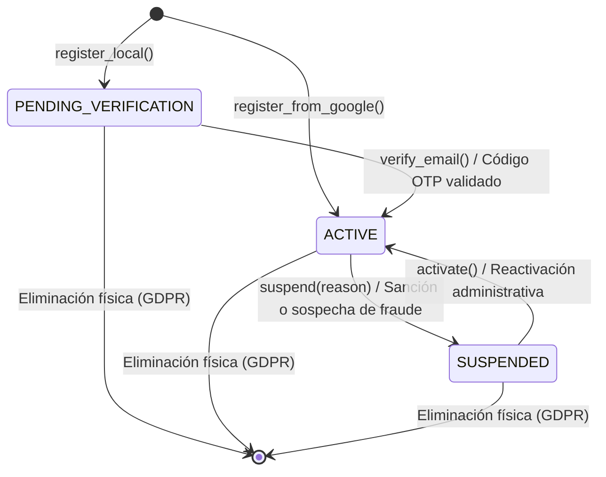
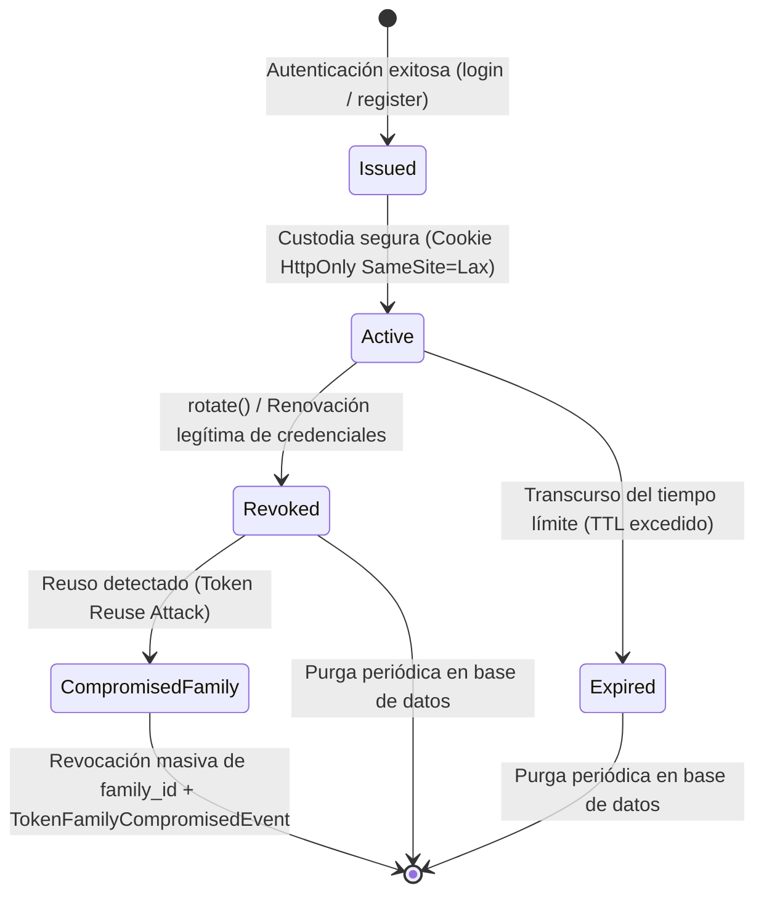

# Bounded Context: Identity & Access Management (IAM)

El Bounded Context **Identity & Access Management (IAM)** (`src/modules/iam/`) constituye el perímetro de seguridad, gobernanza de credenciales y directorio unificado de identidades de **Navby Platform**. Su propósito estratégico primordial radica en centralizar la autenticación multifuente de los viajeros, salvaguardar sus credenciales de acceso mediante algoritmos criptográficos modernos de alta resistencia a la computación paralela, orquestar el ciclo de vida de las sesiones activas mediante el patrón de rotación de tokens por familias criptográficas (*Token Family*) y mitigar de forma preventiva vectores de intrusión perimetral como ataques de fuerza bruta, suplantación de identidad y reutilización fraudulenta de credenciales (*Token Reuse Attacks*).

En estricto alineamiento con los principios de Domain-Driven Design táctico y Clean Architecture, el Bounded Context IAM delimita rigurosamente sus fronteras de responsabilidad, manteniéndose desacoplado de las operaciones comerciales y de navegación del sistema:

- **Desacoplamiento Estricto frente a Billing & Credits:** IAM desconoce por completo la existencia de monedas, pasarelas de pago (como Mercado Pago), balances de créditos prepagos o transacciones de recarga. Su responsabilidad culmina al acreditar la autenticidad y el registro de la persona en el sistema. Cuando se crea una nueva cuenta (sea local o federada), el modelo de dominio de IAM emite el evento inmutable **UserRegisteredEvent**, el cual es traducido por la infraestructura a un evento de integración (**UserRegisteredIntegrationEvent**) persistido atómicamente en la tabla `outbox_events`. El contexto Billing & Credits suscribe este evento de forma asíncrona para aprovisionar la billetera digital (`credit_wallets`) asignando el saldo promocional de bienvenida de 10 créditos gratuitos, sin que IAM mantenga dependencias directas de base de datos ni contratos de aplicación con dicho módulo.
- **Desacoplamiento Estricto frente a Itineraries & Flights:** IAM es agnóstico a la topología de la red aérea global, las cotizaciones de vuelos en tiempo real, las búsquedas algorítmicas sobre grafos y la custodia de itinerarios guardados. Los planes de vuelo registrados en el contexto Itineraries vinculan al viajero propietario almacenando de forma exclusiva su identificador universal **user_id** como un valor escalar inmutable (UUID), sin invocar lógica interna ni consultar tablas de IAM en sus transacciones ordinarias.
- **Aislamiento Físico de Datos y Regla Zero Cross-Module FKs:** En consonancia con las directrices de modularidad arquitectónica de Navby Platform, queda prohibida la definición de claves foráneas físicas (`FOREIGN KEY`) entre las tablas de IAM y las tablas de cualquier otro Bounded Context en PostgreSQL 16. La asociación de registros entre módulos se efectúa exclusivamente mediante identificadores universales lógicos inmutables (`user_id`), garantizando que cada contexto conserve total autonomía transaccional, evitando bloqueos cruzados en concurrencia y posibilitando una futura migración o particionamiento físico de bases de datos sin reestructuración de esquemas.
- **Decisiones Clave de Experiencia B2C y Cumplimiento Normativo:**
  - *Onboarding Instantáneo en un Clic con Google OIDC:* Para reducir drásticamente la fricción inicial y la tasa de rebote durante la búsqueda de tarifas aéreas, el sistema habilita el registro e inicio de sesión federado inmediato mediante Google Identity Services (OpenID Connect). Las identidades federadas se validan criptográficamente contra las claves públicas de Google (formato JWKS), verificando el identificador inmutable de cuenta (`sub`) y derivando automáticamente un perfil activo sin requerir confirmaciones adicionales por correo.
  - *Adopción de Nombre de Usuario Unívoco (Username):* A diferencia de los sistemas tradicionales que imponen formularios densos con nombres y apellidos obligatorios (`first_name` y `last_name`), Navby adopta un identificador público unificado denominado **Username**. Esta decisión optimiza los flujos de interacción en interfaces web y móviles, reduce los campos de captura iniciales y proporciona una denominación pública cohesiva para el viajero.
  - *Erradicación del Borrado Lógico (Soft-Delete) y Derecho al Olvido:* Con el propósito de cumplir estrictamente con normativas internacionales de protección de datos personales y privacidad digital (como el Reglamento General de Protección de Datos de la Unión Europea - GDPR), Navby descarta el uso de banderas de borrado lógico (`is_deleted`, `deleted_at`). Cuando un usuario solicita la baja de su cuenta o se ejecuta una eliminación definitiva, el sistema ejecuta un borrado físico relacional (`DELETE`) con cascada referencial controlada sobre `refresh_tokens` y `verification_tokens`, erradicando de forma permanente la información confidencial de las tablas operativas.

---

## 1. Domain Layer

La Capa de Dominio de Identity & Access Management (`src/modules/iam/domain/`) reside en el núcleo más interno del módulo. Su diseño se estructura sobre cuatro pilares y fundamentos arquitectónicos innegociables concebidos para Python 3.12+:

1. **Aislamiento Estricto de Frameworks de Persistencia e Infraestructura:** El dominio de IAM se programa exclusivamente en Python 3.12+ puro, empleando únicamente la biblioteca estándar (`dataclasses`, `typing`, `uuid`, `datetime`, `re`, `enum`, `abc`). Queda prohibida la inclusión de dependencias hacia bibliotecas de mapeo objeto-relacional (SQLAlchemy), frameworks de enrutamiento HTTP (FastAPI) o esquemas de transporte y serialización (Pydantic). Toda interacción con mecanismos de almacenamiento duradero se abstrae mediante interfaces de protocolo estructural puro (`typing.Protocol`) localizadas en el subdirectorio `repositories/`.
2. **Identidad Fuertemente Tipada e Inmutabilidad Estricta:** Se erradica por completo el antipatrón *Primitive Obsession* mediante el uso de identificadores encapsulados derivados de **TypedId[UUID]** (**UserId**). Tanto los Value Objects como los Domain Events se configuran bajo la directiva `@dataclass(frozen=True)`, forzando inmutabilidad en tiempo de ejecución a nivel del intérprete de Python e impidiendo alteraciones de estado fuera de los métodos de negocio autorizados de la raíz de agregado.
3. **Resiliencia Criptográfica de Sesiones y Patrón Token Family:** La gestión de credenciales efímeras y sesiones prolongadas implementa el patrón de rotación por familias de tokens (*Token Family*). Cada sesión persistente se asocia a un identificador único de familia (**family_id**). En cada rotación legítima, el token anterior se revoca y se emite un sucesor atómico. Si el sistema detecta la presentación de un token revocado previamente, interpreta el evento como una señal inequívoca de robo o interceptación de credenciales (*Token Reuse Attack*), emitiendo de inmediato el evento **TokenFamilyCompromisedEvent** y revocando masivamente toda la familia de sesiones activas del usuario.
4. **Ciclo de Vida y Consistencia Regidos por Eventos de Dominio:** La raíz de agregado **User** extiende la superclase abstracta **AbstractDomainAggregateRoot[UserId]** provista por el Shared Kernel. Toda mutación de estado relevante (registro de usuario, verificación de correo, actualización de credencial o suspensión administrativa) produce un evento inmutable registrado en una colección privada en memoria. Estos eventos son extraídos por la capa de aplicación dentro de la frontera transaccional del Unit of Work para su persistencia atómica en la tabla `outbox_events` mediante el patrón Transactional Outbox.

El subdirectorio `src/modules/iam/domain/` organiza sus clases, contratos y servicios en la siguiente jerarquía estructural formal de directorios:

```text
src/modules/iam/domain/
├── __init__.py
├── model/
│   ├── __init__.py
│   ├── aggregates/
│   │   ├── __init__.py
│   │   └── user.py
│   ├── entities/
│   │   ├── __init__.py
│   │   ├── refresh_token.py
│   │   └── verification_token.py
│   └── value_objects/
│       ├── __init__.py
│       ├── user_id.py
│       ├── email_address.py
│       ├── username.py
│       ├── hashed_password.py
│       ├── auth_provider.py
│       ├── user_role.py
│       ├── user_status.py
│       └── verification_token_type.py
├── events/
│   ├── __init__.py
│   ├── user_registered_event.py
│   ├── user_logged_in_event.py
│   ├── user_suspended_event.py
│   ├── user_password_changed_event.py
│   ├── user_email_verified_event.py
│   ├── refresh_token_issued_event.py
│   ├── token_family_compromised_event.py
│   └── verification_token_issued_event.py
├── services/
│   ├── __init__.py
│   ├── password_policy_domain_service.py
│   ├── username_derivation_domain_service.py
│   └── token_family_security_domain_service.py
├── repositories/
│   ├── __init__.py
│   ├── user_repository.py
│   ├── refresh_token_repository.py
│   └── verification_token_repository.py
└── exceptions/
    ├── __init__.py
    ├── invalid_credentials_exception.py
    ├── user_already_exists_exception.py
    ├── token_expired_exception.py
    ├── session_compromised_exception.py
    ├── user_not_found_exception.py
    ├── invalid_username_format_exception.py
    ├── weak_password_exception.py
    ├── account_suspended_exception.py
    └── account_pending_verification_exception.py
```

---

### 1.1. Diccionario de Clases y Componentes de la Capa de Dominio

La siguiente tabla compendia la taxonomía formal de los 25 componentes estructurales, raíces de agregado, entidades internas, objetos de valor inmutables, enumeraciones tipadas, eventos de dominio, servicios de dominio y contratos de persistencia pura que conforman la Capa de Dominio de Identity & Access Management en Navby Platform:

| Componente o Clase | Tipo Táctico | Propósito y Responsabilidad en el Dominio | Miembros Principales | Colaboradores y Dependencias |
| :---------------------------------- | :--------------------: | :------------------------------------------------------------------------------------------------------------------------- | :------------------------------------------------------------------------------------------------------------------------- | :------------------------------------------------------------------------------------------------------------------------- |
| **User** | Aggregate Root | Custodia la identidad unívoca de la cuenta del viajero en Navby Platform; gobierna las transiciones de estado de cuenta, autenticación multifuente, rotación de credenciales y acumulación de eventos de dominio inmutables. | Atributos:<br>- id: UserId<br>- email: EmailAddress<br>- username: Username<br>- hashed_password: HashedPassword \| None<br>- auth_provider: AuthProvider<br>- google_sub: str \| None<br>- avatar_url: str \| None<br>- role: UserRole<br>- status: UserStatus<br>- created_at: datetime<br>- updated_at: datetime<br>- version: int<br>Métodos:<br>- register_local()<br>- register_from_google()<br>- activate()<br>- suspend()<br>- change_password()<br>- verify_email()<br>- update_profile() | Hereda de AbstractDomainAggregateRoot[UserId]; compone UserId, EmailAddress, Username, HashedPassword, AuthProvider, UserRole, UserStatus; emite UserRegisteredEvent, UserSuspendedEvent, UserPasswordChangedEvent, UserEmailVerifiedEvent. |
| **RefreshToken** | Entity | Modela una sesión persistente de usuario respaldada por un token de refresco criptográfico; vincula la sesión a una familia de rotación atómica para neutralizar ataques de interceptación. | Atributos:<br>- id: UUID<br>- user_id: UserId<br>- token_hash: str<br>- family_id: UUID<br>- is_revoked: bool<br>- expires_at: datetime<br>- created_at: datetime<br>Métodos:<br>- revoke()<br>- is_expired()<br>- is_active() | Compone UserId; evaluada y coordinada por TokenFamilySecurityDomainService; persistida a través de RefreshTokenRepository. |
| **VerificationToken** | Entity | Modela códigos temporales de un solo uso para validación de direcciones de correo electrónico (código OTP de 6 dígitos) o enlaces de restablecimiento de contraseña; previene reutilizaciones ilegítimas. | Atributos:<br>- id: UUID<br>- user_id: UserId<br>- token_type: VerificationTokenType<br>- token_hash: str<br>- expires_at: datetime<br>- used_at: datetime \| None<br>- created_at: datetime<br>Métodos:<br>- consume()<br>- is_expired()<br>- is_consumed() | Compone UserId y VerificationTokenType; persistida mediante VerificationTokenRepository; emitida en conjunto con VerificationTokenIssuedEvent. |
| **UserId** | Value Object (TypedId) | Envoltorio fuertemente tipado e inmutable para el identificador universal único (UUID) de la cuenta de usuario; erradica el antipatrón Primitive Obsession en las relaciones del sistema. | Atributos:<br>- value: UUID<br>Métodos:<br>- generate()<br>- of()<br>- \_\_post_init\_\_()<br>- \_\_str\_\_()<br>- \_\_eq\_\_()<br>- \_\_hash\_\_() | Hereda de TypedId[UUID] (Shared Kernel); clave de identidad de User; clave lógica foránea en RefreshToken, VerificationToken, credit_wallets e itineraries. |
| **EmailAddress** | Value Object | Encapsula una dirección de correo electrónico validada sintácticamente bajo el estándar formal RFC 5322; realiza normalización determinista a minúsculas y eliminación de espacios en blanco. | Atributos:<br>- value: str<br>Métodos:<br>- \_\_post_init\_\_()<br>- domain<br>- local_part<br>- \_\_str\_\_()<br>- \_\_eq\_\_()<br>- \_\_hash\_\_() | Hereda de ValueObject (Shared Kernel); atributo de identidad principal en User; utilizado como criterio de búsqueda en UserRepository; lanza InvalidEmailException ante anomalías. |
| **Username** | Value Object | Encapsula el nombre de usuario unívoco y público del viajero en la plataforma; impone una longitud de 3 a 30 caracteres alfanuméricos seguros y guiones bajos, normalizando siempre a minúsculas. | Atributos:<br>- value: str<br>Métodos:<br>- \_\_post_init\_\_()<br>- \_\_str\_\_()<br>- \_\_eq\_\_()<br>- \_\_hash\_\_() | Hereda de ValueObject (Shared Kernel); atributo público de User; generado automáticamente por UsernameDerivationDomainService; lanza InvalidUsernameFormatException ante violaciones sintácticas. |
| **HashedPassword** | Value Object | Custodia el resumen criptográfico irreversible de la contraseña local del usuario; valida la estructura del algoritmo modular BCrypt ($2b$ con costo 12) y oculta su valor en representaciones textuales. | Atributos:<br>- value: str<br>Métodos:<br>- \_\_post_init\_\_()<br>- \_\_repr\_\_()<br>- \_\_str\_\_()<br>- matches() | Hereda de ValueObject (Shared Kernel); atributo de seguridad de credencial en User; validado previamente en texto claro mediante PasswordPolicyDomainService. |
| **AuthProvider** | Domain Enum | Enumeración inmutable de tipo cadena (StrEnum) que tipifica los proveedores de autenticación admitidos por Navby Platform. | Constantes:<br>- LOCAL = "local"<br>- GOOGLE = "google" | Utilizado en la raíz de agregado User y en eventos de auditoría perimetral para bifurcar flujos de validación de credenciales. |
| **UserRole** | Domain Enum | Enumeración inmutable de tipo cadena (StrEnum) que define los roles de autorización para el control de acceso basado en roles (RBAC) en la plataforma. | Constantes:<br>- PASSENGER = "passenger"<br>- ADMIN = "admin" | Utilizado en User para determinar privilegios en endpoints administrativos o de consumidor final. |
| **UserStatus** | Domain Enum | Enumeración inmutable de tipo cadena (StrEnum) que gobierna los estados del ciclo de vida operativo de una cuenta de usuario. | Constantes:<br>- ACTIVE = "active"<br>- PENDING_VERIFICATION = "pending_verification"<br>- SUSPENDED = "suspended" | Utilizado en User para restringir inicios de sesión, emisión de tokens de refresco y operaciones transaccionales de vuelo. |
| **VerificationTokenType** | Domain Enum | Enumeración inmutable de tipo cadena (StrEnum) que clasifica la finalidad funcional de los códigos y tokens temporales de verificación. | Constantes:<br>- EMAIL_VERIFICATION = "email_verification"<br>- PASSWORD_RESET = "password_reset" | Utilizado en VerificationToken, VerificationTokenIssuedEvent y consultas en VerificationTokenRepository. |
| **UserRegisteredEvent** | Domain Event | Suceso inmutable que certifica la creación y persistencia exitosa de una nueva cuenta de usuario (local o federada) en el sistema. | Atributos:<br>- user_id: UserId<br>- email: EmailAddress<br>- username: Username<br>- auth_provider: AuthProvider<br>- role: UserRole<br>- status: UserStatus<br>- event_id: UUID<br>- occurred_on: datetime | Hereda de DomainEvent (Shared Kernel); emitido por User; procesado para despacho de correos y aprovisionamiento reactivo de billetera en Billing & Credits. |
| **UserLoggedInEvent** | Domain Event | Suceso inmutable de auditoría perimetral emitido tras la comprobación exitosa de credenciales locales o validación de ID Token de Google. | Atributos:<br>- user_id: UserId<br>- auth_provider: AuthProvider<br>- ip_address: str \| None<br>- user_agent: str \| None<br>- event_id: UUID<br>- occurred_on: datetime | Hereda de DomainEvent (Shared Kernel); emitido en el servicio de aplicación de autenticación; auditado para detección de anomalías geográficas y de seguridad. |
| **UserSuspendedEvent** | Domain Event | Suceso inmutable emitido cuando una cuenta de usuario es bloqueada administrativamente por transgresión de términos o sospecha de fraude. | Atributos:<br>- user_id: UserId<br>- reason: str<br>- event_id: UUID<br>- occurred_on: datetime | Hereda de DomainEvent (Shared Kernel); emitido por User al invocar suspend(); desencadena la revocación forzosa de sesiones activas en RefreshTokenRepository. |
| **UserPasswordChangedEvent** | Domain Event | Suceso inmutable emitido al completarse la rotación de credencial de acceso local mediante cambio voluntario o restablecimiento exitoso. | Atributos:<br>- user_id: UserId<br>- event_id: UUID<br>- occurred_on: datetime | Hereda de DomainEvent (Shared Kernel); emitido por User al invocar change_password(); gatilla la invalidación preventiva de sesiones concurrentes. |
| **UserEmailVerifiedEvent** | Domain Event | Suceso inmutable que atestigua la verificación y activación definitiva de la cuenta de usuario tras el consumo satisfactorio del código OTP. | Atributos:<br>- user_id: UserId<br>- email: EmailAddress<br>- event_id: UUID<br>- occurred_on: datetime | Hereda de DomainEvent (Shared Kernel); emitido por User al invocar verify_email(); habilita la plenitud de funciones operativas de la cuenta. |
| **RefreshTokenIssuedEvent** | Domain Event | Suceso inmutable emitido cuando se genera un nuevo token de refresco durante un inicio de sesión o renovación rotativa de sesión activa. | Atributos:<br>- token_id: UUID<br>- user_id: UserId<br>- family_id: UUID<br>- expires_at: datetime<br>- event_id: UUID<br>- occurred_on: datetime | Hereda de DomainEvent (Shared Kernel); emitido en flujos de emisión de tokens; auditado para supervisión de sesiones abiertas. |
| **TokenFamilyCompromisedEvent** | Domain Event | Suceso inmutable de alta severidad de seguridad emitido al detectar la presentación de un token de refresco revocado (intento de reutilización ilícita). | Atributos:<br>- user_id: UserId<br>- family_id: UUID<br>- compromised_token_id: UUID<br>- event_id: UUID<br>- occurred_on: datetime | Hereda de DomainEvent (Shared Kernel); emitido por TokenFamilySecurityDomainService; instruye la revocación masiva inmediata de la familia en RefreshTokenRepository. |
| **VerificationTokenIssuedEvent** | Domain Event | Suceso inmutable emitido al generarse un código OTP de activación o token temporal de recuperación de contraseña. | Atributos:<br>- token_id: UUID<br>- user_id: UserId<br>- token_type: VerificationTokenType<br>- expires_at: datetime<br>- event_id: UUID<br>- occurred_on: datetime | Hereda de DomainEvent (Shared Kernel); emitido al solicitar códigos temporales; consumido por adaptadores de notificación por correo electrónico. |
| **PasswordPolicyDomainService** | Domain Service | Servicio de dominio puro y sin estado que evalúa la entropía y solidez de contraseñas en texto claro, aplicando reglas de complejidad y exclusión de datos del usuario. | Constantes:<br>- MIN_LENGTH = 8<br>Métodos:<br>- validate(password: str, email: EmailAddress, username: Username) -> None | Servicio de dominio sin estado; opera sobre EmailAddress y Username; lanza WeakPasswordException si la credencial suministrada no satisface las políticas mínimas. |
| **UsernameDerivationDomainService** | Domain Service | Servicio de dominio sin estado que implementa el algoritmo de sanitización y derivación determinista de nombres de usuario únicos para el onboarding rápido con Google. | Métodos:<br>- derive_from_google_profile(email: EmailAddress, full_name: str \| None, exists_predicate: Callable[[str], Awaitable[bool]]) -> Username | Servicio de dominio sin estado; genera instancias válidas de Username; consulta la disponibilidad mediante un predicado asíncrono desacoplado de repositorios físicos. |
| **TokenFamilySecurityDomainService** | Domain Service | Servicio de dominio sin estado que analiza la validez criptográfica de cadenas de rotación de tokens de refresco, detectando anomalías e intrusiones por reuso. | Métodos:<br>- validate_rotation(presented_token: RefreshToken) -> None | Servicio de dominio sin estado; inspecciona instancias de RefreshToken; emite TokenFamilyCompromisedEvent y lanza SessionCompromisedException ante fraudes. |
| **UserRepository** | Domain Repository Protocol | Contrato de persistencia pura (typing.Protocol) que define los métodos de consulta, almacenamiento y borrado físico de la raíz de agregado User en almacenamiento duradero. | Métodos:<br>- save(user: User) -> None<br>- find_by_id(user_id: UserId) -> User \| None<br>- find_by_email(email: EmailAddress) -> User \| None<br>- find_by_username(username: Username) -> User \| None<br>- find_by_google_sub(google_sub: str) -> User \| None<br>- exists_by_email(email: EmailAddress) -> bool<br>- exists_by_username(username: Username) -> bool<br>- delete(user_id: UserId) -> None | Puerto de persistencia de la capa de dominio; opera con User, UserId, EmailAddress, Username; implementado por adaptadores secundarios en la capa de infraestructura. |
| **RefreshTokenRepository** | Domain Repository Protocol | Contrato de persistencia pura (typing.Protocol) para el almacenamiento, rotación, revocación individual o por familia y purga periódica de tokens de sesión persistente. | Métodos:<br>- save(token: RefreshToken) -> None<br>- find_by_hash(token_hash: str) -> RefreshToken \| None<br>- revoke_by_id(token_id: UUID) -> None<br>- revoke_family(family_id: UUID) -> None<br>- revoke_all_for_user(user_id: UserId) -> None<br>- delete_expired(now: datetime) -> int | Puerto de persistencia de la capa de dominio; opera con RefreshToken, UserId y UUID; implementado por adaptadores secundarios en la capa de infraestructura. |
| **VerificationTokenRepository** | Domain Repository Protocol | Contrato de persistencia pura (typing.Protocol) para el almacenamiento, consulta de códigos vigentes, consumo atómico de un solo uso y depuración de tokens caducados. | Métodos:<br>- save(token: VerificationToken) -> None<br>- find_active_by_hash(token_hash: str, token_type: VerificationTokenType) -> VerificationToken \| None<br>- find_latest_by_user(user_id: UserId, token_type: VerificationTokenType) -> VerificationToken \| None<br>- consume(token_id: UUID, used_at: datetime) -> None<br>- delete_expired(now: datetime) -> int | Puerto de persistencia de la capa de dominio; opera con VerificationToken, UserId y VerificationTokenType; implementado en la capa de infraestructura. |
: Catálogo de Componentes de la Capa de Dominio (Bounded Context IAM) {#tbl:iam-domain-components}

*Nota.* Elaboración propia en base a la especificación táctica de Domain-Driven Design para Navby Platform.

---

### 1.2. Objetos de Valor y Enumeraciones de Dominio

#### 1.2.1. Fundamentos Teóricos y Erradicación de Primitive Obsession

En el diseño táctico de sistemas de software empresarial bajo Domain-Driven Design, la modelización rigurosa de los conceptos del negocio requiere una diferenciación ontológica taxativa entre entidades y objetos de valor (**Value Objects**). Mientras que las entidades se caracterizan por una trayectoria de identidad continua y mutable a lo largo del tiempo, los objetos de valor modelan elementos descriptivos cuya equivalencia semántica descansa exclusivamente en la composición acumulada de sus atributos. Carecen por completo de identidad conceptual independiente y son intercambiables siempre que sus valores estructurales coincidan.

En la ingeniería de software aplicada a plataformas transaccionales críticas, uno de los antipatrones de diseño más recurrentes y perjudiciales es *Primitive Obsession*. Dicho antipatrón consiste en delegar la representación de conceptos complejos del dominio en tipos de datos primitivos escalares provistos por el lenguaje base (tales como cadenas `str`, enteros `int`, flotantes `float` o estructuras estándar `UUID`). Esta práctica genera tres patologías estructurales severas:

1. **Degradación de la Seguridad Estática de Tipos y Vulnerabilidad ante Transposiciones:** Cuando identificadores de usuario, nombres públicos y direcciones de correo electrónico se tipifican indiscriminadamente como `str`, las herramientas de análisis estático (como mypy o Pyright) y los entornos de ejecución quedan ciegos ante la inversión accidental de argumentos en llamadas a funciones o constructores. Un error de transposición posicional que intercambie el correo electrónico por el nombre de usuario es sintácticamente válido para el analizador de tipos, posibilitando la corrupción silenciosa de datos en producción.
2. **Dispersión y Duplicación de Lógica Defensiva:** Al carecer de un contenedor cohesivo que encapsule las invariantes ontológicas de cada atributo, las reglas de validación sintáctica (comprobación de gramáticas de correo, saneamiento de espacios residuales, conversión a minúsculas o comprobación de límites de caracteres) terminan duplicadas de forma heterogénea en controladores REST, adaptadores de serialización, servicios de aplicación y procedimientos de persistencia. Esta fragmentación fomenta inconsistencias operativas cuando una regla de negocio evoluciona en un punto del sistema pero se omite en otro.
3. **Erosión del Lenguaje Ubicuo y Falta de Expresividad:** Los tipos primitivos ocultan las intenciones del modelo. Una signatura `register(user_id: UUID, email: str, username: str)` no expresa si la cadena provista ha sido normalizada a minúsculas, si respeta los estándares internacionales de mensajería o si el identificador corresponde efectivamente a un usuario o a otra entidad del ecosistema (como una orden de pago o una billetera digital).

Para erradicar de forma concluyente estas vulnerabilidades, Navby Platform fundamenta sus objetos de valor sobre tres garantías operativas e inmutables implementadas en Python 3.12+:

- **Inmutabilidad Absoluta en Tiempo de Ejecución (`@dataclass(frozen=True)`):** La directiva `frozen=True` instruye al intérprete de Python a generar clases inmutables donde cualquier intento de reasignación o mutación de atributos sobre una instancia existente es interceptado de forma inmediata, arrojando una excepción nativa `FrozenInstanceError`. Esta inmutabilidad previene efectos colaterales imprevistos, asegura la seguridad de hilos (*thread-safety*) en procesamiento concurrente y garantiza que una instancia compartida entre múltiples agregados conserve un estado inalterable.
- **Validación Defensiva de Invariantes en `__post_init__`:** Ningún objeto de valor puede existir en memoria en un estado semánticamente inválido. El método especial `__post_init__()` actúa como una aduana de entrada ineludible que intercepta los datos suministrados al constructor, valida la presencia de información no nula, aplica saneamiento canónico determinista mediante *strip()* y *lower()*, y corrobora las restricciones de longitud y expresiones regulares formalizadas. Si los valores transgreden los límites del dominio, la inicialización aborta inmediatamente mediante el lanzamiento de excepciones semánticas especializadas (**InvalidEmailFormatException**, **InvalidUsernameFormatException** o **BusinessRuleValidationException**), garantizando que las capas de aplicación e infraestructura solo interactúen con instancias válidas por construcción.
- **Igualdad Estructural y Dispersión Determinista (`__eq__` y `__hash__`):** La semántica de los objetos de valor impone que dos instancias que posean idénticos valores en sus atributos sean equivalentes (`v1 == v2`), aun cuando ocupen posiciones de memoria disjuntas (`id(v1) != id(v2)`). Al ser estructuras congeladas, Python sintetiza automáticamente un método `__hash__()` compatible, permitiendo el uso seguro y eficiente de los objetos de valor como elementos de conjuntos (`set`) o como claves unívocas en tablas de dispersión (`dict`).

En lo relativo a la identidad, el objeto de valor **UserId** extiende la superclase abstracta **TypedId[UUID]** del Shared Kernel (`src/shared/domain/model/ids/typed_id.py`). Esta especialización aísla el identificador único universal (UUID v4 o v7) bajo un tipo diferenciado, impidiendo el cruce accidental de claves entre bounded contexts y suministrando factorías estáticas unificadas (*generate()* y *of()*).

Por su parte, las dimensiones discretas y los estados de ciclo de vida del usuario se modelan mediante enumeraciones de cadena (`StrEnum`). Al heredar de `str` y `enum.Enum`, estas constantes preservan la seguridad de tipos en el dominio mientras se serializan de forma natural como cadenas escalares hacia las columnas de tipo `VARCHAR` de PostgreSQL 16, prescindiendo de transformaciones costosas en la capa de persistencia.

La Tabla @tbl:iam-value-objects sintetiza la matriz de especificación técnica de los ocho componentes atómicos y enumeraciones que conforman el subsistema descriptivo de IAM:

: Matriz de Objetos de Valor y Enumeraciones de Dominio (IAM) {#tbl:iam-value-objects}

| Objeto de Valor o Enum | Módulo Canónico | Invariante Central y Validación | Formato / Regex / Rango | Efecto de Violación |
| :--------------------- | :------------------------------------------------------------------ | :------------------------------------------------------------------------------------------------------------------------- | :----------------------------------------------------------------------------------------- | :---------------------------------- |
| **UserId** | `src.modules.iam.domain.model.value_objects.user_id` | Encapsula la identidad unívoca inmutable de la cuenta; hereda de TypedId[UUID]; valida no nulidad y conversión desde UUID o str hexadecimal. | Formato UUID canónico (v4 o v7) de 36 caracteres (`8-4-4-4-12`). | `BusinessRuleValidationException` |
| **EmailAddress** | `src.modules.iam.domain.model.value_objects.email_address` | Dirección de correo obligatoria, no vacía; normalizada a minúsculas y sin espacios; sintaxis estricta RFC 5322 con arroba y dominio dotado de TLD válido. | `^[a-zA-Z0-9_.+-]+@[a-zA-Z0-9-]+\.[a-zA-Z0-9-.]+$`<br>Longitud máxima: 150 caracteres. | `InvalidEmailFormatException` |
| **Username** | `src.modules.iam.domain.model.value_objects.username` | Nombre de usuario público y unívoco; normalizado a minúsculas; longitud de 3 a 30 caracteres alfanuméricos ASCII y guiones bajos; rechaza espacios o símbolos. | `^[a-zA-Z0-9_]{3,30}$`<br>Rango de longitud: [3, 30] caracteres. | `InvalidUsernameFormatException` |
| **HashedPassword** | `src.modules.iam.domain.model.value_objects.hashed_password` | Resumen criptográfico irreversible bajo algoritmo BCrypt; valida longitud estricta de 60 caracteres y gramática modular; oculta su valor en __repr__ y __str__. | `^\$2[aby]\$\d{2}\$[./A-Za-z0-9]{53}$`<br>Longitud fija: exactamente 60 caracteres. | `BusinessRuleValidationException` |
| **AuthProvider** | `src.modules.iam.domain.model.value_objects.auth_provider` | Enumeración inmutable de tipo cadena (StrEnum) que clasifica los proveedores de identidad y credenciales admitidos en Navby Platform. | Valores discretos:<br>- `"local"`<br>- `"google"` | `ValueError` (control nativo StrEnum) |
| **UserRole** | `src.modules.iam.domain.model.value_objects.user_role` | Enumeración inmutable de tipo cadena (StrEnum) que tipifica los roles jerárquicos para el control de acceso basado en roles (RBAC). | Valores discretos:<br>- `"passenger"`<br>- `"admin"` | `ValueError` (control nativo StrEnum) |
| **UserStatus** | `src.modules.iam.domain.model.value_objects.user_status` | Enumeración inmutable de tipo cadena (StrEnum) que rige el ciclo de vida operacional de la cuenta; evalúa permisos de autenticación y actividad. | Valores discretos:<br>- `"active"`<br>- `"pending_verification"`<br>- `"suspended"` | `ValueError` (control nativo StrEnum) |
| **VerificationTokenType** | `src.modules.iam.domain.model.value_objects.verification_token_type` | Enumeración inmutable de tipo cadena (StrEnum) que clasifica tokens temporales de un solo uso; expone el tiempo de vida útil (TTL) en segundos. | Valores discretos:<br>- `"email_verification"` (TTL: 600 s)<br>- `"password_reset"` (TTL: 3600 s) | `ValueError` (control nativo StrEnum) |

*Nota.* Elaboración propia en base a los estándares de Tactical Domain-Driven Design y seguridad perimetral de Navby Platform.

---

#### 1.2.2. Implementación de Value Objects y Enums en Python 3.12+

En concordancia con los principios de arquitectura limpia y pureza del dominio, la totalidad de los objetos de valor y enumeraciones se implementan empleando las capacidades nativas de Python 3.12+, sin dependencias externas hacia bibliotecas de mapeo objeto-relacional (SQLAlchemy) o frameworks web (FastAPI).

##### 1. Excepciones Semánticas Especializadas del Subsistema de Objetos de Valor

Antes de la especificación de los objetos de valor, se formalizan las excepciones de dominio especializadas que protegen las fronteras ontológicas de los atributos de identidad y contacto. Ambas extienden la clase base **DomainException** del Shared Kernel, incorporando códigos de error en mayúsculas sostenidas (`UPPER_SNAKE_CASE`) y un mapa estructurado de detalles contextuales:

```python
"""Excepciones semánticas de dominio especializadas para Objetos de Valor en IAM.

Ubicación:
- src/modules/iam/domain/exceptions/invalid_email_format_exception.py
- src/modules/iam/domain/exceptions/invalid_username_format_exception.py
"""

from __future__ import annotations

from typing import Any

from src.shared.domain.exceptions.domain_exception import DomainException


class InvalidEmailFormatException(DomainException):
    """Excepción de dominio emitida cuando una dirección de correo viola la gramática formal RFC 5322 o sus límites."""

    def __init__(self, message: str, details: dict[str, Any] | None = None) -> None:
        """Inicializa la excepción con código semántico unívoco INVALID_EMAIL_FORMAT."""
        super().__init__(
            message=message,
            code="INVALID_EMAIL_FORMAT",
            details=details,
        )


class InvalidUsernameFormatException(DomainException):
    """Excepción de dominio emitida cuando un nombre de usuario viola las restricciones léxicas o de longitud."""

    def __init__(self, message: str, details: dict[str, Any] | None = None) -> None:
        """Inicializa la excepción con código semántico unívoco INVALID_USERNAME_FORMAT."""
        super().__init__(
            message=message,
            code="INVALID_USERNAME_FORMAT",
            details=details,
        )
```

##### 2. UserId

* **Módulo:** `src.modules.iam.domain.model.value_objects.user_id`
* **Propósito:** Envoltorio inmutable y fuertemente tipado para el identificador universal único (UUID) de la cuenta de usuario en Navby Platform.
* **Atributos:**
  * **value** (`UUID`): Identificador universal subyacente. Heredado de **TypedId[UUID]**.
* **Métodos y Operaciones:**
  * *generate() -> Self*: Factoría estática que instancia un nuevo **UserId** respaldado por un UUID v4 pseudoaleatorio criptográfico.
  * *of(val: UUID | str | TypedId) -> Self*: Factoría estática que construye o valida una instancia a partir de un UUID nativo, una cadena representativa o una instancia homogénea previa. Bloquea conversiones erróneas desde otros identificadores derivados.
  * *__str__() -> str*: Retorna la representación canónica en cadena de texto del UUID (36 caracteres en formato `8-4-4-4-12`).

```python
"""Objeto de valor fuertemente tipado para el identificador de usuario.

Ubicación: src/modules/iam/domain/model/value_objects/user_id.py
"""

from __future__ import annotations

from dataclasses import dataclass
from typing import Self
from uuid import UUID

from src.shared.domain.model.ids.typed_id import TypedId


@dataclass(frozen=True)
class UserId(TypedId):
    """Identificador único universal fuertemente tipado para la entidad User.

    Hereda de TypedId[UUID] para erradicar el antipatrón Primitive Obsession,
    garantizando inmutabilidad estricta, validación de formato UUID (v4 o v7)
    y diferenciación semántica en tiempo de compilación frente a otros TypedIds del sistema.
    """

    @classmethod
    def generate(cls) -> Self:
        """Genera un nuevo UserId con un UUID v4 criptográficamente aleatorio.

        Returns:
            Instancia nueva de UserId con entropía pseudoaleatoria de 122 bits.
        """
        return super().generate()

    @classmethod
    def of(cls, val: UUID | str | TypedId) -> Self:
        """Construye un UserId a partir de un UUID, cadena representativa o instancia existente.

        Args:
            val: Instancia de UUID, cadena hexadecimal formateada o instancia homogénea de UserId.

        Returns:
            Instancia validada de UserId.

        Raises:
            BusinessRuleValidationException: Si el valor suministrado no es convertible a UUID o si
                se intenta instanciar desde un identificador heterogéneo de otro contexto.
        """
        return super().of(val)
```

##### 3. EmailAddress

* **Módulo:** `src.modules.iam.domain.model.value_objects.email_address`
* **Propósito:** Encapsula la dirección de correo electrónico del usuario, garantizando conformidad estricta con la gramática RFC 5322, normalización determinista y segregación de componentes de dominio.
* **Atributos:**
  * **value** (`str`): Cadena alfanumérica normalizada a minúsculas y sin espacios marginales.
* **Invariantes:**
  * No nulidad y tipo de dato estricto `str`.
  * No vacío tras ejecutar saneamiento de espacios mediante *strip()*.
  * Longitud acotada a un máximo de 150 caracteres para evitar desbordamientos en columnas relacionales e índices B-tree.
  * Correspondencia sintáctica con la expresión regular `^[a-zA-Z0-9_.+-]+@[a-zA-Z0-9-]+\.[a-zA-Z0-9-.]+$`.
* **Propiedades:**
  * *local_part -> str*: Porción de la dirección situada antes del símbolo arroba (`@`).
  * *domain -> str*: Nombre de dominio de la dirección situado tras el símbolo arroba (`@`).
* **Métodos y Operaciones:**
  * *__post_init__() -> None*: Aduana de validación y normalización automática mediante `object.__setattr__`. Lanza **InvalidEmailFormatException** ante cualquier violación.
  * *__str__() -> str*: Retorna la dirección completa normalizada.

```python
"""Objeto de valor inmutable para direcciones de correo electrónico.

Ubicación: src/modules/iam/domain/model/value_objects/email_address.py
"""

from __future__ import annotations

import re
from dataclasses import dataclass

from src.modules.iam.domain.exceptions.invalid_email_format_exception import (
    InvalidEmailFormatException,
)
from src.shared.domain.model.value_object import ValueObject


@dataclass(frozen=True)
class EmailAddress(ValueObject):
    """Dirección de correo electrónico validada y normalizada bajo la gramática RFC 5322.

    Aplica normalización determinista a minúsculas y eliminación de espacios en blanco marginales.
    Garantiza que ninguna instancia posea formato sintáctico inválido o longitud
    superior a 150 caracteres.
    """

    value: str

    _EMAIL_REGEX: re.Pattern[str] = re.compile(
        r"^[a-zA-Z0-9_.+-]+@[a-zA-Z0-9-]+\.[a-zA-Z0-9-.]+$"
    )
    MAX_LENGTH: int = 150

    def __post_init__(self) -> None:
        """Valida y normaliza deterministamente la dirección de correo electrónico.

        Raises:
            InvalidEmailFormatException: Si el valor es nulo, no es una cadena de texto,
                está vacío, excede 150 caracteres o viola la sintaxis estándar RFC 5322.
        """
        if self.value is None or not isinstance(self.value, str):
            raise InvalidEmailFormatException(
                message="La dirección de correo electrónico debe ser una cadena de texto no nula.",
                details={"field": "email"},
            )

        normalized = self.value.strip().lower()

        if not normalized:
            raise InvalidEmailFormatException(
                message="La dirección de correo electrónico no puede ser una cadena vacía o contener solo espacios.",
                details={"field": "email"},
            )

        if len(normalized) > self.MAX_LENGTH:
            raise InvalidEmailFormatException(
                message=(
                    f"La dirección de correo electrónico excede la longitud máxima admitida de "
                    f"{self.MAX_LENGTH} caracteres (longitud suministrada: {len(normalized)})."
                ),
                details={"field": "email", "length": len(normalized), "max_length": self.MAX_LENGTH},
            )

        if not self._EMAIL_REGEX.match(normalized):
            raise InvalidEmailFormatException(
                message=f"La dirección de correo electrónico '{normalized}' no cumple con el formato estándar RFC 5322.",
                details={"field": "email", "provided_value": normalized},
            )

        object.__setattr__(self, "value", normalized)

    @property
    def local_part(self) -> str:
        """Retorna la porción local del correo previa al carácter arroba (@).

        Returns:
            Cadena de texto con el buzón o nombre local de la cuenta.
        """
        return self.value.split("@")[0]

    @property
    def domain(self) -> str:
        """Retorna el nombre de dominio del correo posterior al carácter arroba (@).

        Returns:
            Cadena de texto con el dominio y TLD de la dirección de correo.
        """
        return self.value.split("@")[1]

    def __str__(self) -> str:
        """Retorna la representación canónica en texto de la dirección de correo normalizada."""
        return self.value
```

##### 4. Username

* **Módulo:** `src.modules.iam.domain.model.value_objects.username`
* **Propósito:** Modela el identificador público unificado del viajero en Navby Platform, sustituyendo los campos fragmentados de nombre y apellido tradicionales para optimizar los flujos B2C.
* **Atributos:**
  * **value** (`str`): Nombre público normalizado a minúsculas.
* **Invariantes:**
  * No nulidad y tipo de dato estricto `str`.
  * Longitud mínima de 3 caracteres y máxima de 30 caracteres.
  * Conjunto léxico restringido exclusivamente a caracteres alfanuméricos ASCII y guiones bajos (`^[a-zA-Z0-9_]{3,30}$`). Se prohíben espacios intermedios, caracteres acentuados, guiones medios o signos especiales.
* **Métodos y Operaciones:**
  * *__post_init__() -> None*: Ejecuta el saneamiento y validación contra la expresión regular. Lanza **InvalidUsernameFormatException** ante anomalías léxicas o violaciones de longitud.
  * *__str__() -> str*: Retorna el nombre de usuario normalizado.

```python
"""Objeto de valor inmutable para el nombre de usuario de la plataforma.

Ubicación: src/modules/iam/domain/model/value_objects/username.py
"""

from __future__ import annotations

import re
from dataclasses import dataclass

from src.modules.iam.domain.exceptions.invalid_username_format_exception import (
    InvalidUsernameFormatException,
)
from src.shared.domain.model.value_object import ValueObject


@dataclass(frozen=True)
class Username(ValueObject):
    """Nombre de usuario unívoco y público del viajero en Navby Platform.

    Garantiza una longitud estricta de 3 a 30 caracteres alfanuméricos ASCII y guiones
    bajos, normalizando siempre a minúsculas y rechazando espacios o caracteres especiales.
    """

    value: str

    _USERNAME_REGEX: re.Pattern[str] = re.compile(r"^[a-zA-Z0-9_]{3,30}$")
    MIN_LENGTH: int = 3
    MAX_LENGTH: int = 30

    def __post_init__(self) -> None:
        """Valida y normaliza el nombre de usuario suministrado.

        Raises:
            InvalidUsernameFormatException: Si el valor es nulo, no es una cadena de texto,
                posee una longitud fuera del rango permitido [3, 30] o contiene caracteres ilegales.
        """
        if self.value is None or not isinstance(self.value, str):
            raise InvalidUsernameFormatException(
                message="El nombre de usuario debe ser una cadena de texto no nula.",
                details={"field": "username"},
            )

        normalized = self.value.strip().lower()

        if not (self.MIN_LENGTH <= len(normalized) <= self.MAX_LENGTH):
            raise InvalidUsernameFormatException(
                message=(
                    f"El nombre de usuario '{normalized}' debe contener entre {self.MIN_LENGTH} "
                    f"y {self.MAX_LENGTH} caracteres (longitud actual: {len(normalized)})."
                ),
                details={"field": "username", "length": len(normalized), "min_length": self.MIN_LENGTH, "max_length": self.MAX_LENGTH},
            )

        if not self._USERNAME_REGEX.match(normalized):
            raise InvalidUsernameFormatException(
                message=(
                    f"El nombre de usuario '{normalized}' contiene caracteres inválidos. Solo se admiten "
                    f"caracteres alfanuméricos ASCII y guiones bajos (sin espacios ni símbolos especiales)."
                ),
                details={"field": "username", "provided_value": normalized},
            )

        object.__setattr__(self, "value", normalized)

    def __str__(self) -> str:
        """Retorna la representación canónica en texto del nombre de usuario."""
        return self.value
```

##### 5. HashedPassword

* **Módulo:** `src.modules.iam.domain.model.value_objects.hashed_password`
* **Propósito:** Custodia el resumen criptográfico irreversible de la credencial local del usuario, forzando la gramática modular del algoritmo BCrypt y protegiendo de forma estricta el secreto contra exposiciones accidentales en registros y depuradores.
* **Atributos:**
  * **value** (`str`): Cadena de 60 caracteres que conforma el hash criptográfico modular BCrypt.
* **Invariantes:**
  * No nulidad y tipo de dato estricto `str`.
  * Longitud exacta de 60 caracteres.
  * Prefijo modular correspondiente a implementaciones seguras de BCrypt (`$2a$`, `$2b$` o `$2y$`) con costo algorítmico de dos dígitos decimales y 53 caracteres base64 modificados (`^\$2[aby]\$\d{2}\$[./A-Za-z0-9]{53}$`).
* **Protección Perimetral de Datos Confidenciales:**
  * Sobrescritura de *__repr__()*: Devuelve invariablemente `HashedPassword(value='[PROTECTED]')`.
  * Sobrescritura de *__str__()*: Devuelve invariablemente `[PROTECTED]`.
* **Métodos y Operaciones:**
  * *matches(plain_password: str) -> bool*: Ejecuta la verificación criptográfica resistente a ataques de temporización comparando una contraseña en texto claro contra el hash encapsulado mediante la función nativa *bcrypt.checkpw()*.

```python
"""Objeto de valor inmutable para resúmenes criptográficos de contraseñas.

Ubicación: src/modules/iam/domain/model/value_objects/hashed_password.py
"""

from __future__ import annotations

import re
from dataclasses import dataclass

import bcrypt

from src.shared.domain.exceptions.business_rule_validation_exception import (
    BusinessRuleValidationException,
)
from src.shared.domain.model.value_object import ValueObject


@dataclass(frozen=True)
class HashedPassword(ValueObject):
    """Resumen criptográfico irreversible de una contraseña generado mediante el algoritmo BCrypt.

    Valida la estructura modular estándar de BCrypt ($2a$, $2b$ o $2y$, costo algorítmico
    y longitud exacta de 60 caracteres). Enmascara rigurosamente su contenido en __repr__
    y __str__ para evitar fugas involuntarias de credenciales en volcados de depuración y logs.
    """

    value: str

    _BCRYPT_REGEX: re.Pattern[str] = re.compile(
        r"^\$2[aby]\$\d{2}\$[./A-Za-z0-9]{53}$"
    )
    HASH_LENGTH: int = 60

    def __post_init__(self) -> None:
        """Valida la conformidad sintáctica y estructural del hash BCrypt.

        Raises:
            BusinessRuleValidationException: Si el valor es nulo, no es una cadena de texto,
                no posee exactamente 60 caracteres o no coincide con la gramática modular BCrypt.
        """
        if self.value is None or not isinstance(self.value, str):
            raise BusinessRuleValidationException(
                message="El hash criptográfico de la contraseña debe ser una cadena de texto no nula.",
                details={"field": "hashed_password"},
            )

        if len(self.value) != self.HASH_LENGTH:
            raise BusinessRuleValidationException(
                message=(
                    f"El hash criptográfico debe poseer exactamente {self.HASH_LENGTH} caracteres "
                    f"(longitud recibida: {len(self.value)})."
                ),
                details={"field": "hashed_password", "length": len(self.value), "expected_length": self.HASH_LENGTH},
            )

        if not self._BCRYPT_REGEX.match(self.value):
            raise BusinessRuleValidationException(
                message="El hash de contraseña suministrado no cumple con la estructura modular estándar de BCrypt ($2a$, $2b$ o $2y$).",
                details={"field": "hashed_password"},
            )

    def matches(self, plain_password: str) -> bool:
        """Verifica si una contraseña en texto claro coincide con el hash BCrypt encapsulado.

        Utiliza una comprobación en tiempo constante insensible a ataques de análisis de temporización.

        Args:
            plain_password: Cadena en texto plano suministrada por el usuario durante la autenticación.

        Returns:
            True si la credencial coincide con el hash almacenado; False en caso contrario.
        """
        if not plain_password or not isinstance(plain_password, str):
            return False
        try:
            return bcrypt.checkpw(
                plain_password.encode("utf-8"),
                self.value.encode("utf-8"),
            )
        except (ValueError, TypeError):
            return False

    def __repr__(self) -> str:
        """Retorna una representación enmascarada para salvaguardar secretos en depuradores."""
        return f"{self.__class__.__name__}(value='[PROTECTED]')"

    def __str__(self) -> str:
        """Retorna una máscara textual fija protegiendo el hash en serializaciones accidentales."""
        return "[PROTECTED]"
```

##### 6. AuthProvider

* **Módulo:** `src.modules.iam.domain.model.value_objects.auth_provider`
* **Propósito:** Enumeración inmutable de tipo cadena (`StrEnum`) que clasifica los proveedores de identidad admitidos por la plataforma.
* **Constantes:**
  * **LOCAL** (`"local"`): Autenticación basada en correo y contraseña administrada localmente.
  * **GOOGLE** (`"google"`): Autenticación federada mediante Google Identity Services (OpenID Connect).
* **Métodos Auxiliares:**
  * *is_federated() -> bool*: Determina si el proveedor corresponde a un proveedor de identidad federado externo.
  * *requires_password() -> bool*: Indica si el mecanismo de autenticación demanda custodia y verificación de credencial local.

```python
"""Enumeración de dominio para proveedores de autenticación en Navby Platform.

Ubicación: src/modules/iam/domain/model/value_objects/auth_provider.py
"""

from __future__ import annotations

from enum import StrEnum


class AuthProvider(StrEnum):
    """Tipifica los proveedores de identidad y credenciales reconocidos por el sistema.

    Hereda de StrEnum para garantizar serialización directa como cadena primitiva
    y compatibilidad con columnas de tipo VARCHAR en PostgreSQL 16.
    """

    LOCAL = "local"
    GOOGLE = "google"

    def is_federated(self) -> bool:
        """Indica si el proveedor corresponde a un proveedor de identidad federado externo.

        Returns:
            True si la autenticación es delegada (como Google OIDC); False si es local.
        """
        return self != AuthProvider.LOCAL

    def requires_password(self) -> bool:
        """Indica si el proveedor demanda almacenamiento y validación de contraseña local.

        Returns:
            True para cuentas locales que requieren resúmenes BCrypt; False para federadas.
        """
        return self == AuthProvider.LOCAL
```

##### 7. UserRole

* **Módulo:** `src.modules.iam.domain.model.value_objects.user_role`
* **Propósito:** Enumeración inmutable de tipo cadena (`StrEnum`) para el control de acceso basado en roles (RBAC) en endpoints y servicios de Navby Platform.
* **Constantes:**
  * **PASSENGER** (`"passenger"`): Usuario viajero con acceso a búsqueda de vuelos, cálculo de rutas, compra de créditos y gestión de itinerarios personales.
  * **ADMIN** (`"admin"`): Administrador de la plataforma con privilegios sobre métricas de infraestructura, gobernanza de cuentas y auditoría de seguridad.
* **Métodos Auxiliares:**
  * *is_admin() -> bool*: Comprueba si el rol ostenta facultades de administración global.
  * *is_passenger() -> bool*: Comprueba si el rol corresponde al perfil estándar de viajero.

```python
"""Enumeración de dominio para roles de autorización y control de acceso (RBAC).

Ubicación: src/modules/iam/domain/model/value_objects/user_role.py
"""

from __future__ import annotations

from enum import StrEnum


class UserRole(StrEnum):
    """Define los roles jerárquicos de autorización en Navby Platform.

    Gobierna las políticas de seguridad perimetral y la autorización en endpoints protegidos.
    """

    PASSENGER = "passenger"
    ADMIN = "admin"

    def is_admin(self) -> bool:
        """Determina si el rol cuenta con privilegios administrativos en la plataforma.

        Returns:
            True si el rol es ADMIN; False en caso contrario.
        """
        return self == UserRole.ADMIN

    def is_passenger(self) -> bool:
        """Determina si el rol corresponde a un viajero estándar de la plataforma.

        Returns:
            True si el rol es PASSENGER; False en caso contrario.
        """
        return self == UserRole.PASSENGER
```

##### 8. UserStatus

* **Módulo:** `src.modules.iam.domain.model.value_objects.user_status`
* **Propósito:** Enumeración inmutable de tipo cadena (`StrEnum`) que gobierna el ciclo de vida y la operatividad de la cuenta de usuario.
* **Constantes:**
  * **ACTIVE** (`"active"`): Cuenta plenamente habilitada para autenticación, adquisición de servicios y emisión de sesiones.
  * **PENDING_VERIFICATION** (`"pending_verification"`): Cuenta local recién registrada en espera de confirmación de su código OTP por correo electrónico.
  * **SUSPENDED** (`"suspended"`): Cuenta bloqueada por intervención administrativa, detección de transgresiones de seguridad o denuncias de fraude.
* **Métodos Auxiliares:**
  * *can_authenticate() -> bool*: Determina si la cuenta está habilitada para completar el inicio de sesión y emitir tokens de refresco.
  * *is_active() -> bool*: Retorna True si la cuenta se encuentra en estado plenamente operativo.
  * *is_pending_verification() -> bool*: Retorna True si la cuenta requiere validación de código de activación.
  * *is_suspended() -> bool*: Retorna True si la cuenta ha sido bloqueada.

```python
"""Enumeración de dominio para el ciclo de vida operativo de la cuenta de usuario.

Ubicación: src/modules/iam/domain/model/value_objects/user_status.py
"""

from __future__ import annotations

from enum import StrEnum


class UserStatus(StrEnum):
    """Gobierna las fases y estados operacionales de una cuenta de usuario.

    Determina la viabilidad de iniciar sesión, emitir sesiones persistentes y ejecutar
    operaciones transaccionales de búsqueda e itinerarios en Navby Platform.
    """

    ACTIVE = "active"
    PENDING_VERIFICATION = "pending_verification"
    SUSPENDED = "suspended"

    def can_authenticate(self) -> bool:
        """Determina si la cuenta satisface los requisitos para emitir credenciales de sesión.

        Únicamente las cuentas en estado ACTIVE pueden completar el inicio de sesión
        y renovar tokens de refresco en la plataforma.

        Returns:
            True si el estado es ACTIVE; False si está pendiente de verificación o suspendida.
        """
        return self == UserStatus.ACTIVE

    def is_active(self) -> bool:
        """Indica si el usuario se encuentra plenamente activo en la plataforma.

        Returns:
            True si el estado es ACTIVE; False en caso contrario.
        """
        return self == UserStatus.ACTIVE

    def is_pending_verification(self) -> bool:
        """Indica si la cuenta se encuentra a la espera de validar el código de confirmación.

        Returns:
            True si el estado es PENDING_VERIFICATION; False en caso contrario.
        """
        return self == UserStatus.PENDING_VERIFICATION

    def is_suspended(self) -> bool:
        """Indica si la cuenta ha sido bloqueada por sanciones o sospechas de intrusión.

        Returns:
            True si el estado es SUSPENDED; False en caso contrario.
        """
        return self == UserStatus.SUSPENDED
```

##### 9. VerificationTokenType

* **Módulo:** `src.modules.iam.domain.model.value_objects.verification_token_type`
* **Propósito:** Enumeración inmutable de tipo cadena (`StrEnum`) que clasifica la naturaleza de los tokens temporales de un solo uso y define su ventana temporal de validez (*Time-to-Live* o TTL).
* **Constantes:**
  * **EMAIL_VERIFICATION** (`"email_verification"`): Código OTP de 6 dígitos emitido para certificar la titularidad del correo electrónico.
  * **PASSWORD_RESET** (`"password_reset"`): Token criptográfico efímero emitido para el restablecimiento de contraseñas olvidadas.
* **Propiedades:**
  * *ttl_seconds -> int*: Retorna el lapso máximo de vida útil en segundos asociado a cada categoría de token.

```python
"""Enumeración de dominio para tipificar tokens temporales de un solo uso.

Ubicación: src/modules/iam/domain/model/value_objects/verification_token_type.py
"""

from __future__ import annotations

from enum import StrEnum


class VerificationTokenType(StrEnum):
    """Clasifica la finalidad funcional de los tokens y códigos temporales de verificación.

    Asocia a cada tipo de token su ventana de vida útil estricta (Time-to-Live o TTL).
    """

    EMAIL_VERIFICATION = "email_verification"
    PASSWORD_RESET = "password_reset"

    @property
    def ttl_seconds(self) -> int:
        """Retorna el tiempo de vida útil máximo del token expresado en segundos.

        - EMAIL_VERIFICATION: 600 segundos (10 minutos) para códigos OTP de activación.
        - PASSWORD_RESET: 3600 segundos (1 hora) para enlaces temporales de recuperación de credencial.

        Returns:
            Entero que representa la duración admisible en segundos antes de la caducidad del token.
        """
        if self == VerificationTokenType.EMAIL_VERIFICATION:
            return 600
        if self == VerificationTokenType.PASSWORD_RESET:
            return 3600
        raise ValueError(f"Tipo de token temporal no soportado para cómputo de TTL: {self}")
```

##### 10. Demostración Práctica y Banco de Pruebas Unitarias

A continuación se presenta un script ejecutable autocontenido que evalúa de forma exhaustiva las garantías de construcción válida, inmutabilidad estricta (`FrozenInstanceError`), igualdad estructural y rechazo defensivo mediante excepciones semánticas ante entradas no válidas:

```python
"""Banco de pruebas unitarias ejecutables para Objetos de Valor y Enumeraciones de IAM.

Valida la totalidad de invariantes, inmutabilidad a nivel del intérprete,
igualdad estructural y lanzamiento de excepciones semánticas de dominio.
"""

from __future__ import annotations

from dataclasses import FrozenInstanceError
from uuid import UUID, uuid4
import bcrypt

from src.modules.iam.domain.exceptions.invalid_email_format_exception import (
    InvalidEmailFormatException,
)
from src.modules.iam.domain.exceptions.invalid_username_format_exception import (
    InvalidUsernameFormatException,
)
from src.modules.iam.domain.model.value_objects.auth_provider import AuthProvider
from src.modules.iam.domain.model.value_objects.email_address import EmailAddress
from src.modules.iam.domain.model.value_objects.hashed_password import HashedPassword
from src.modules.iam.domain.model.value_objects.user_id import UserId
from src.modules.iam.domain.model.value_objects.user_role import UserRole
from src.modules.iam.domain.model.value_objects.user_status import UserStatus
from src.modules.iam.domain.model.value_objects.verification_token_type import (
    VerificationTokenType,
)
from src.shared.domain.exceptions.business_rule_validation_exception import (
    BusinessRuleValidationException,
)

# ==============================================================================
# 1. Verificación de UserId (TypedId)
# ==============================================================================
raw_uuid = uuid4()
user_id_1 = UserId(value=raw_uuid)
user_id_2 = UserId.of(str(raw_uuid))

assert user_id_1 == user_id_2
assert hash(user_id_1) == hash(user_id_2)
assert str(user_id_1) == str(raw_uuid)

generated_id = UserId.generate()
assert isinstance(generated_id.value, UUID)
assert generated_id != user_id_1

# ==============================================================================
# 2. Verificación de EmailAddress (Normalización e Invariantes)
# ==============================================================================
email_raw = "  Traveler.Andeva@Navby.com  "
email_instance_1 = EmailAddress(value=email_raw)
email_instance_2 = EmailAddress(value="traveler.andeva@navby.com")

assert email_instance_1 == email_instance_2
assert email_instance_1.value == "traveler.andeva@navby.com"
assert email_instance_1.local_part == "traveler.andeva"
assert email_instance_1.domain == "navby.com"
assert str(email_instance_1) == "traveler.andeva@navby.com"

# ==============================================================================
# 3. Verificación de Username (Normalización y Longitud)
# ==============================================================================
uname_instance_1 = Username(value="  Alex_Traveler2026  ")
uname_instance_2 = Username(value="alex_traveler2026")

assert uname_instance_1 == uname_instance_2
assert uname_instance_1.value == "alex_traveler2026"
assert str(uname_instance_1) == "alex_traveler2026"

# ==============================================================================
# 4. Verificación de HashedPassword (BCrypt, Enmascaramiento y Coincidencia)
# ==============================================================================
plain_secret = "SecureP@ssw0rd2026!"
salt = bcrypt.gensalt(rounds=12)
bcrypt_hash = bcrypt.hashpw(plain_secret.encode("utf-8"), salt).decode("utf-8")

hashed_password = HashedPassword(value=bcrypt_hash)
assert hashed_password.value == bcrypt_hash
assert len(hashed_password.value) == 60
assert hashed_password.matches("SecureP@ssw0rd2026!") is True
assert hashed_password.matches("IncorrectP@ssw0rd!") is False
assert hashed_password.matches("") is False

# Comprobación de enmascaramiento estricto de seguridad
assert repr(hashed_password) == "HashedPassword(value='[PROTECTED]')"
assert str(hashed_password) == "[PROTECTED]"
assert bcrypt_hash not in repr(hashed_password)
assert bcrypt_hash not in str(hashed_password)

# ==============================================================================
# 5. Verificación de AuthProvider
# ==============================================================================
assert AuthProvider.LOCAL == "local"
assert AuthProvider.GOOGLE == "google"
assert AuthProvider.LOCAL.is_federated() is False
assert AuthProvider.GOOGLE.is_federated() is True
assert AuthProvider.LOCAL.requires_password() is True
assert AuthProvider.GOOGLE.requires_password() is False

# ==============================================================================
# 6. Verificación de UserRole
# ==============================================================================
assert UserRole.PASSENGER == "passenger"
assert UserRole.ADMIN == "admin"
assert UserRole.ADMIN.is_admin() is True
assert UserRole.ADMIN.is_passenger() is False
assert UserRole.PASSENGER.is_passenger() is True
assert UserRole.PASSENGER.is_admin() is False

# ==============================================================================
# 7. Verificación de UserStatus
# ==============================================================================
assert UserStatus.ACTIVE.can_authenticate() is True
assert UserStatus.ACTIVE.is_active() is True
assert UserStatus.PENDING_VERIFICATION.can_authenticate() is False
assert UserStatus.PENDING_VERIFICATION.is_pending_verification() is True
assert UserStatus.SUSPENDED.can_authenticate() is False
assert UserStatus.SUSPENDED.is_suspended() is True

# ==============================================================================
# 8. Verificación de VerificationTokenType
# ==============================================================================
assert VerificationTokenType.EMAIL_VERIFICATION == "email_verification"
assert VerificationTokenType.PASSWORD_RESET == "password_reset"
assert VerificationTokenType.EMAIL_VERIFICATION.ttl_seconds == 600
assert VerificationTokenType.PASSWORD_RESET.ttl_seconds == 3600

# ==============================================================================
# 9. Verificación de Inmutabilidad Estricta (FrozenInstanceError)
# ==============================================================================
for obj in [user_id_1, email_instance_1, uname_instance_1, hashed_password]:
    mutation_intercepted = False
    try:
        obj.value = "mutated_illegal_value"
    except FrozenInstanceError:
        mutation_intercepted = True
    assert mutation_intercepted is True, f"Infracción: {type(obj).__name__} permitió mutación."

# ==============================================================================
# 10. Verificación Defensiva de Excepciones Semánticas ante Entradas Inválidas
# ==============================================================================

# 10.1 EmailAddress inválido
invalid_emails = [
    "",
    "   ",
    "plainaddress",
    "@domain.com",
    "user@.com",
    "user@domain",
    "user space@domain.com",
    "user@" + "a" * 150 + ".com",
]
for invalid_email in invalid_emails:
    caught = False
    try:
        EmailAddress(value=invalid_email)
    except InvalidEmailFormatException:
        caught = True
    assert caught is True, f"Falló validación de email inválido: '{invalid_email}'"

# 10.2 Username inválido
invalid_usernames = [
    "ab",
    "a" * 31,
    "user name",
    "user-name",
    "user@name",
    "user.name",
    "   ",
]
for invalid_user in invalid_usernames:
    caught = False
    try:
        Username(value=invalid_user)
    except InvalidUsernameFormatException:
        caught = True
    assert caught is True, f"Falló validación de username inválido: '{invalid_user}'"

# 10.3 HashedPassword inválido
invalid_passwords = [
    "plain_text_password",
    "$2b$12$short",
    "$1$12$A0J91pTYwTSDPg8ISwTXOes0lgotniskNB9SVyo9kqdY6lAnVhkKm",
    "$2b$12$A0J91pTYwTSDPg8ISwTXOes0lgotniskNB9SVyo9kqdY6lAnVhkKmX",
]
for invalid_pw in invalid_passwords:
    caught = False
    try:
        HashedPassword(value=invalid_pw)
    except BusinessRuleValidationException:
        caught = True
    assert caught is True, f"Falló validación de password hash inválido: '{invalid_pw}'"

# 10.4 Enums con literales fuera del dominio
for enum_cls, invalid_val in [
    (AuthProvider, "facebook"),
    (UserRole, "superadmin"),
    (UserStatus, "banned"),
    (VerificationTokenType, "sms_otp"),
]:
    caught_enum = False
    try:
        enum_cls(invalid_val)
    except ValueError:
        caught_enum = True
    assert caught_enum is True, f"Falló validación de enum para {enum_cls.__name__} con '{invalid_val}'"
```

---

### 1.3. Raíz de Agregado User y Entidades Internas de Sesión

#### 1.3.1. Límites del Agregado y Transiciones de Estado del Usuario

##### Frontera de Consistencia Transaccional y Raíz de Agregado Única (User)
En el diseño táctico bajo Domain-Driven Design (DDD), un agregado constituye un clúster coherente de entidades y objetos de valor que son tratados como una unidad indivisible a efectos de persistencia y mutaciones de estado. Toda interacción proveniente del exterior del agregado debe canalizarse de manera exclusiva a través de un único elemento denominado Raíz de Agregado (*Aggregate Root*). Dicha raíz asume la responsabilidad ineludible de custodiar y garantizar el cumplimiento estricto de la totalidad de las invariantes ontológicas y reglas de negocio del agregado en todo momento.

En el Bounded Context **Identity & Access Management (IAM)** de **Navby Platform**, la clase **User** se erige como la única raíz de agregado del módulo. Esta delimitación arquitectónica responde a tres fundamentos esenciales de ingeniería de software y seguridad perimetral:
1. **Custodia Unificada de la Identidad:** La identidad del viajero en el sistema se define por la confluencia indivisible de sus credenciales criptográficas locales (**HashedPassword**) o federadas (**google_sub**), su canal de autenticación (**AuthProvider**), sus atributos de contacto y perfil (**Username**, **EmailAddress**, **avatar_url**), su rol de autorización para control de acceso (**UserRole**) y el estado de su ciclo de vida operacional (**UserStatus**). Permitir la mutación directa de cualquiera de estos componentes fuera del agregado fragmentaría la frontera de seguridad y posibilitaría estados corruptos o anémicos (como una cuenta en estado activo sin contraseña local ni identificador federado, o un cambio de rol sin auditoría de credenciales).
2. **Encapsulamiento del Ciclo de Vida y Transiciones Válidas:** Las transiciones entre fases de cuenta (como pasar de verificación pendiente a activo, suspender por transgresión de términos o actualizar credenciales) involucran precondiciones rigurosas que solo la raíz de agregado puede evaluar holísticamente antes de alterar el estado.
3. **Punto Único de Publicación de Eventos:** Todo suceso trascendente que modifique la identidad del usuario debe propagarse hacia el resto de los módulos de la plataforma. Centralizar la emisión de eventos de dominio en la raíz de agregado garantiza que ningún cambio estructural pase inadvertido para los contextos dependientes (como la creación de billeteras de bienvenida en Billing & Credits).

##### Ciclo de Vida y Control de Concurrencia Optimista (version: int)
En plataformas transaccionales con concurrencia masiva, múltiples procesos asíncronos o peticiones concurrentes pueden intentar mutar simultáneamente el estado de un mismo usuario (por ejemplo, una confirmación de código OTP concurrente con una actualización de perfil o una rotación de credenciales). El uso de bloqueo pesimista a nivel de base de datos (`SELECT ... FOR UPDATE`) sobre la tabla de usuarios introduce contención severa de bloqueos de fila (*row-lock contention*), incrementa la latencia y degrada drásticamente el rendimiento de lectura del sistema.

Para solventar esta problemática sin comprometer la integridad transaccional, Navby Platform implementa **Control de Concurrencia Optimista** (*Optimistic Concurrency Control*) mediante el atributo escalar **version: int** en la raíz de agregado **User**:
- Toda instancia de **User** nace con `version = 0`.
- Cada operación de mutación de negocio autorizada (*activate()*, *suspend()*, *change_password()*, *verify_email()*, *update_profile()*) actualiza la marca temporal **updated_at** al instante presente e incrementa de forma determinista el contador: `self.version += 1`.
- Al persistir la entidad, el repositorio de infraestructura ejecuta una instrucción de actualización condicional en PostgreSQL 16:
  `UPDATE users SET ..., version = :new_version, updated_at = :updated_at WHERE id = :id AND version = :expected_version;`
- Si otra transacción modificó concurrentemente el registro en la base de datos, el predicado `WHERE` no encuentra filas coincidentes, provocando que el Unit of Work aborte la transacción y lance una excepción de concurrencia optimista, previniendo de manera concluyente el problema de la actualización perdida (*Lost Update Problem*) sin incurrir en bloqueos preventivos de base de datos.

##### Acumulación Desacoplada de Eventos de Dominio (AbstractDomainAggregateRoot[UserId])
La raíz de agregado **User** extiende la superclase genérica **AbstractDomainAggregateRoot[UserId]** provista por el Shared Kernel. Este mecanismo posibilita la acumulación en memoria de sucesos inmutables relevantes acontecidos en el pasado del negocio:
- Al ejecutarse una mutación de estado válida, la raíz de agregado instancia un evento de dominio concreto (**UserRegisteredEvent**, **UserSuspendedEvent**, **UserPasswordChangedEvent**, **UserEmailVerifiedEvent**) y lo anexa a su colección interna privada `_domain_events` mediante el método heredado *add_domain_event()* o su alias protegido *_record_event()*.
- Durante la confirmación transaccional en la Capa de Aplicación, el Unit of Work invoca *pull_domain_events()*, extrayendo de manera atómica la totalidad de los eventos acumulados y vaciando la colección en memoria.
- Dichos eventos son serializados y persistidos de inmediato en la tabla relacional `outbox_events` dentro de la misma transacción ACID de PostgreSQL 16 que guarda las mutaciones del usuario (patrón *Transactional Outbox*).
- De este modo, la lógica del dominio permanece totalmente desacoplada de la infraestructura de mensajería asíncrona, garantizando que efectos secundarios externos (como el despacho de correos electrónicos transaccionales o el aprovisionamiento de créditos promocionales en Billing & Credits) se ejecuten con garantías de entrega *at-least-once* sin comprometer la pureza del modelo de dominio.

##### Arquitectura de Sesiones Criptográficas y Patrón Token Family
La autenticación y gestión de sesiones en Navby Platform adopta una arquitectura desacoplada de doble token:
1. **Tokens de Acceso Efímeros (Access Tokens):** Tokens JWT criptográficamente firmados mediante claves asimétricas RSA/ECDSA, con un tiempo de vida útil corto (15 minutos) que contienen las reclamaciones (*claims*) del usuario (`user_id`, `role`, `status`). Son validados sin estado (*stateless*) en los gateways y microservicios sin consultar bases de datos.
2. **Tokens de Refresco Persistentes y Rotativos (RefreshToken):** Para permitir sesiones continuas sin comprometer la seguridad perimetral ante la interceptación de credenciales, el sistema implementa la entidad de dominio **RefreshToken** gobernada bajo el patrón **Token Family** (*RFC 6819 - Threat Model and Security Considerations for OAuth 2.0*).
   - Cada inicio de sesión genera un **RefreshToken** asociado a un identificador único de linaje o familia (**family_id: UUID**).
   - En cada solicitud legítima de renovación de credenciales, el token presentado es revocado atómicamente (*revoke()*) y se emite un nuevo **RefreshToken** con un identificador unívoco de token pero compartiendo el mismo **family_id**.
   - **Neutralización de Ataques de Reuso (Token Reuse Detection):** Si un atacante intercepta un token de refresco y tanto el atacante como el usuario legítimo intentan utilizarlo, inevitablemente uno de ellos presentará un token que ya fue marcado como revocado (`is_revoked == True`). Al detectar esta anomalía, el dominio identifica un ataque de reutilización por suplantación (*Token Reuse Attack*), procede a la revocación masiva inmediata de todos los tokens asociados a ese **family_id** en el repositorio y emite el evento de alta severidad **TokenFamilyCompromisedEvent**, cerrando preventivamente todas las sesiones activas vinculadas a esa familia y forzando una nueva autenticación primaria.

Por su parte, la entidad **VerificationToken** modela credenciales temporales de un solo uso destinadas a operaciones críticas de ciclo de vida:
- Códigos OTP numéricos de 6 dígitos con ventana de caducidad estricta de 10 minutos (600 segundos) para confirmación de titularidad de correo electrónico (**EMAIL_VERIFICATION**).
- Resúmenes criptográficos de alta entropía con ventana de caducidad de 1 hora (3600 segundos) para recuperación de acceso ante pérdida de contraseña (**PASSWORD_RESET**).
- La entidad encapsula la marca temporal de uso (**used_at**). Al invocar el método *consume()*, se valida que el token no haya sido utilizado previamente (*is_consumed()*) y que no haya caducado temporalmente (*is_expired()*), garantizando matemáticamente que ningún código de verificación pueda ser explotado en ataques de repetición (*Replay Attacks*).

##### Máquinas de Estado del Dominio de IAM
A continuación se ilustran formalmente las transiciones de estado de la cuenta de usuario y el protocolo de rotación y detección de compromiso de sesiones mediante diagramas de máquina de estados:





##### Especificación Formal de Miembros bajo Normas APA 7

Las Tablas @tbl:iam-user-aggregate-members, @tbl:iam-refresh-token-members y @tbl:iam-verification-token-members detallan la totalidad de miembros, visibilidad, tipado estricto y responsabilidades de negocio de la raíz de agregado y las entidades de sesión:

: Miembros y Signaturas de la Raíz de Agregado User {#tbl:iam-user-aggregate-members}

| Miembro u Operación | Visibilidad | Tipo o Signatura | Descripción y Regla de Negocio |
| :---------------------------------- | :---------: | :------------------------------------------------------------------------------------------------------------------------- | :------------------------------------------------------------------------------------------------------------------------- |
| **id** | public | UserId | Identificador único universal fuertemente tipado de la cuenta; inmutable y heredado de AbstractDomainAggregateRoot. |
| **email** | public | EmailAddress | Dirección de correo electrónico obligatoria, normalizada a minúsculas y validada bajo RFC 5322. |
| **username** | public | Username | Nombre de usuario público y unívoco constituido por 3 a 30 caracteres alfanuméricos y guiones bajos. |
| **hashed_password** | public | HashedPassword \| None | Resumen criptográfico BCrypt; obligatorio en cuentas locales y nulo en cuentas federadas con Google. |
| **auth_provider** | public | AuthProvider | Proveedor de identidad emisor de las credenciales de acceso a la plataforma (LOCAL o GOOGLE). |
| **google_sub** | public | str \| None | Identificador unívoco e inmutable de sujeto asignado por Google Identity Services bajo OpenID Connect. |
| **avatar_url** | public | str \| None | Dirección URL representativa de la imagen de perfil del usuario en servicios de almacenamiento seguro. |
| **role** | public | UserRole | Rol asignado para el control de acceso basado en roles en la plataforma (PASSENGER o ADMIN). |
| **status** | public | UserStatus | Estado operacional actual de la cuenta (PENDING_VERIFICATION, ACTIVE o SUSPENDED). |
| **created_at** | public | datetime | Marca temporal inmutable en tiempo universal coordinado (UTC) correspondiente a la creación de la cuenta. |
| **updated_at** | public | datetime | Marca temporal en UTC correspondiente a la mutación más reciente del estado de la raíz de agregado. |
| **version** | public | int | Contador secuencial monotónico empleado para la resolución de concurrencia optimista en persistencia. |
| **_domain_events** | protected | list[DomainEvent] | Colección en memoria de eventos de dominio inmutables acumulados pendientes de despacho transaccional. |
| **register_local()** | public | classmethod(email, username, password_hash, role) -> User | Factoría de clase que instancia un usuario local en estado PENDING_VERIFICATION y emite UserRegisteredEvent. |
| **register_from_google()** | public | classmethod(email, username, google_sub, avatar_url, role) -> User | Factoría de clase que crea un usuario federado en estado ACTIVE y emite UserRegisteredEvent. |
| **activate()** | public | () -> None | Promueve el estado a ACTIVE, actualiza updated_at e incrementa version; valida precondición de no actividad. |
| **suspend()** | public | (reason: str) -> None | Transiciona a SUSPENDED, actualiza updated_at, incrementa version y emite UserSuspendedEvent. |
| **change_password()** | public | (new_password_hash: HashedPassword) -> None | Actualiza hashed_password, incrementa version y emite UserPasswordChangedEvent; rechaza cuentas federadas puras. |
| **verify_email()** | public | () -> None | Transiciona de PENDING_VERIFICATION a ACTIVE, actualiza marcas temporales e incrementa version; emite UserEmailVerifiedEvent. |
| **update_profile()** | public | (avatar_url: str \| None) -> None | Actualiza la URL de avatar de perfil, refresca updated_at e incrementa version. |
| **add_domain_event()** | public | (event: DomainEvent) -> None | Registra un evento de dominio inmutable en la lista interna de eventos pendientes heredada de la superclase. |
| **pull_domain_events()** | public | () -> list[DomainEvent] | Extrae atómicamente todos los eventos de dominio pendientes y limpia la colección en memoria. |
| **clear_domain_events()** | public | () -> None | Descarta manualmente la totalidad de eventos de dominio acumulados sin retornarlos. |
| **_record_event()** | protected | (event: DomainEvent) -> None | Método auxiliar protegido que encapsula y delega el registro interno de eventos de dominio. |
| **__post_init__()** | public | () -> None | Valida las invariantes de consistencia relativas a la coexistencia de credenciales locales y federadas. |

*Nota.* Elaboración propia en base a los estándares de Tactical Domain-Driven Design de Navby Platform.

: Miembros y Signaturas de la Entidad RefreshToken {#tbl:iam-refresh-token-members}

| Miembro u Operación | Visibilidad | Tipo o Signatura | Descripción y Regla de Negocio |
| :---------------------------------- | :---------: | :------------------------------------------------------------------------------------------------------------------------- | :------------------------------------------------------------------------------------------------------------------------- |
| **id** | public | UUID | Identificador único universal de la entidad de sesión persistente. |
| **user_id** | public | UserId | Identificador de la raíz de agregado User propietaria del token de refresco. |
| **token_hash** | public | str | Resumen criptográfico seguro (SHA-256) del token opaco emitido hacia el cliente. |
| **family_id** | public | UUID | Identificador unívoco del linaje o familia criptográfica para control de rotación atómica. |
| **is_revoked** | public | bool | Indicador booleano que señala si este eslabón específico de la familia ha sido revocado. |
| **expires_at** | public | datetime | Marca temporal UTC que determina el instante límite de validez del token de sesión. |
| **created_at** | public | datetime | Marca temporal UTC inmutable correspondiente a la emisión inicial del token. |
| **revoke()** | public | () -> None | Invalida el token estableciendo is_revoked en True para impedir su reutilización. |
| **is_expired()** | public | (now: datetime \| None = None) -> bool | Evalúa si la marca temporal actual es igual o posterior a la fecha de caducidad expires_at. |
| **is_active()** | public | (now: datetime \| None = None) -> bool | Comprueba si el token se encuentra plenamente operativo (no revocado y no expirado). |
| **__post_init__()** | public | () -> None | Verifica que el resumen no esté vacío y que expires_at sea estrictamente posterior a created_at. |

*Nota.* Elaboración propia en base a los estándares de Tactical Domain-Driven Design y seguridad de sesiones de Navby Platform.

: Miembros y Signaturas de la Entidad VerificationToken {#tbl:iam-verification-token-members}

| Miembro u Operación | Visibilidad | Tipo o Signatura | Descripción y Regla de Negocio |
| :---------------------------------- | :---------: | :------------------------------------------------------------------------------------------------------------------------- | :------------------------------------------------------------------------------------------------------------------------- |
| **id** | public | UUID | Identificador único universal del registro temporal de verificación de un solo uso. |
| **user_id** | public | UserId | Identificador de la raíz de agregado User destinataria del código o token temporal. |
| **token_type** | public | VerificationTokenType | Naturaleza funcional del token (EMAIL_VERIFICATION o PASSWORD_RESET). |
| **token_hash** | public | str | Resumen criptográfico seguro (SHA-256) del código OTP numérico o token de enlace. |
| **expires_at** | public | datetime | Marca temporal UTC de vencimiento de la ventana de validez del código. |
| **used_at** | public | datetime \| None | Marca temporal UTC en la que se consumió el código; nulo si aún no ha sido utilizado. |
| **created_at** | public | datetime | Marca temporal UTC inmutable de generación y emisión del código de verificación. |
| **consume()** | public | (now: datetime \| None = None) -> None | Registra el consumo efectivo del token marcando used_at; previene reuso y caducidad mediante excepciones. |
| **is_expired()** | public | (now: datetime \| None = None) -> bool | Determina si el token ha rebasado su plazo de vigencia temporal en base a expires_at. |
| **is_consumed()** | public | () -> bool | Indica si el token ya ha sido previamente consumido analizando la no nulidad de used_at. |
| **__post_init__()** | public | () -> None | Valida que token_hash contenga datos y que expires_at sea posterior a created_at con zona horaria UTC. |

*Nota.* Elaboración propia en base a los estándares de Tactical Domain-Driven Design de Navby Platform.

---

#### 1.3.2. Implementación de User, RefreshToken y VerificationToken en Python 3.12+

En estricto alineamiento con los principios de Clean Architecture y aislamiento del dominio, las clases de la raíz de agregado y las entidades de sesión se implementan en Python 3.12+ puro, empleando exclusivamente la biblioteca estándar del lenguaje.

##### 1. Excepciones Semánticas Especializadas del Subsistema de Agregados y Sesiones

Antes de formalizar las entidades y el agregado, se declaran las cuatro excepciones semánticas tipadas que salvaguardan el ciclo de vida de las sesiones y las cuentas. Todas heredan de la clase base **DomainException** del Shared Kernel, incorporando códigos unívocos en formato `UPPER_SNAKE_CASE`:

```python
"""Excepciones semánticas de dominio para el ciclo de vida de cuentas y sesiones en IAM.

Ubicación:
- src/modules/iam/domain/exceptions/token_already_consumed_exception.py
- src/modules/iam/domain/exceptions/token_expired_exception.py
- src/modules/iam/domain/exceptions/account_suspended_exception.py
- src/modules/iam/domain/exceptions/account_pending_verification_exception.py
"""

from __future__ import annotations

from typing import Any

from src.shared.domain.exceptions.domain_exception import DomainException


class TokenAlreadyConsumedException(DomainException):
    """Excepción de dominio emitida al intentar utilizar un token de verificación que ya fue consumido."""

    def __init__(self, message: str, details: dict[str, Any] | None = None) -> None:
        """Inicializa la excepción con código semántico unívoco TOKEN_ALREADY_CONSUMED."""
        super().__init__(
            message=message,
            code="TOKEN_ALREADY_CONSUMED",
            details=details,
        )


class TokenExpiredException(DomainException):
    """Excepción de dominio emitida al presentar un token temporal cuya ventana de validez ha caducado."""

    def __init__(self, message: str, details: dict[str, Any] | None = None) -> None:
        """Inicializa la excepción con código semántico unívoco TOKEN_EXPIRED."""
        super().__init__(
            message=message,
            code="TOKEN_EXPIRED",
            details=details,
        )


class AccountSuspendedException(DomainException):
    """Excepción de dominio emitida al intentar ejecutar operaciones o autenticar una cuenta suspendida."""

    def __init__(self, message: str, details: dict[str, Any] | None = None) -> None:
        """Inicializa la excepción con código semántico unívoco ACCOUNT_SUSPENDED."""
        super().__init__(
            message=message,
            code="ACCOUNT_SUSPENDED",
            details=details,
        )


class AccountPendingVerificationException(DomainException):
    """Excepción de dominio emitida cuando se intenta iniciar sesión con una cuenta no verificada."""

    def __init__(self, message: str, details: dict[str, Any] | None = None) -> None:
        """Inicializa la excepción con código semántico unívoco ACCOUNT_PENDING_VERIFICATION."""
        super().__init__(
            message=message,
            code="ACCOUNT_PENDING_VERIFICATION",
            details=details,
        )
```

##### 2. Eventos de Dominio Emitidos por la Raíz de Agregado User

A continuación se definen los cuatro eventos de dominio inmutables emitidos por **User**, los cuales heredan de **DomainEvent** del Shared Kernel:

```python
"""Eventos de dominio inmutables emitidos por la raíz de agregado User.

Ubicación:
- src/modules/iam/domain/events/user_registered_event.py
- src/modules/iam/domain/events/user_suspended_event.py
- src/modules/iam/domain/events/user_password_changed_event.py
- src/modules/iam/domain/events/user_email_verified_event.py
"""

from __future__ import annotations

from dataclasses import dataclass

from src.modules.iam.domain.model.value_objects.auth_provider import AuthProvider
from src.modules.iam.domain.model.value_objects.email_address import EmailAddress
from src.modules.iam.domain.model.value_objects.user_id import UserId
from src.modules.iam.domain.model.value_objects.user_role import UserRole
from src.modules.iam.domain.model.value_objects.user_status import UserStatus
from src.modules.iam.domain.model.value_objects.username import Username
from src.shared.domain.model.event import DomainEvent


@dataclass(frozen=True, kw_only=True)
class UserRegisteredEvent(DomainEvent):
    """Suceso inmutable que certifica el registro exitoso de un nuevo usuario en la plataforma."""

    user_id: UserId
    email: EmailAddress
    username: Username
    auth_provider: AuthProvider
    role: UserRole
    status: UserStatus
    aggregate_type: str = "User"
    aggregate_id: str = ""

    def __post_init__(self) -> None:
        """Asigna automáticamente aggregate_id a partir del UserId si no fue suministrado."""
        if not self.aggregate_id and self.user_id:
            object.__setattr__(self, "aggregate_id", str(self.user_id))
        super().__post_init__()


@dataclass(frozen=True, kw_only=True)
class UserSuspendedEvent(DomainEvent):
    """Suceso inmutable emitido al suspenderse administrativamente una cuenta de usuario."""

    user_id: UserId
    reason: str
    aggregate_type: str = "User"
    aggregate_id: str = ""

    def __post_init__(self) -> None:
        """Asigna automáticamente aggregate_id a partir del UserId si no fue suministrado."""
        if not self.aggregate_id and self.user_id:
            object.__setattr__(self, "aggregate_id", str(self.user_id))
        super().__post_init__()


@dataclass(frozen=True, kw_only=True)
class UserPasswordChangedEvent(DomainEvent):
    """Suceso inmutable emitido al completarse la rotación de credenciales locales del usuario."""

    user_id: UserId
    aggregate_type: str = "User"
    aggregate_id: str = ""

    def __post_init__(self) -> None:
        """Asigna automáticamente aggregate_id a partir del UserId si no fue suministrado."""
        if not self.aggregate_id and self.user_id:
            object.__setattr__(self, "aggregate_id", str(self.user_id))
        super().__post_init__()


@dataclass(frozen=True, kw_only=True)
class UserEmailVerifiedEvent(DomainEvent):
    """Suceso inmutable emitido al completarse satisfactoriamente la verificación del correo."""

    user_id: UserId
    email: EmailAddress
    aggregate_type: str = "User"
    aggregate_id: str = ""

    def __post_init__(self) -> None:
        """Asigna automáticamente aggregate_id a partir del UserId si no fue suministrado."""
        if not self.aggregate_id and self.user_id:
            object.__setattr__(self, "aggregate_id", str(self.user_id))
        super().__post_init__()
```

##### 3. Entidad RefreshToken

* **Módulo:** `src.modules.iam.domain.model.entities.refresh_token`
* **Propósito:** Modelar la sesión persistente de un usuario respaldada por un token de refresco criptográfico, integrando control de revocación individual y pertenencia a una familia de rotación atómica (*Token Family*).
* **Atributos:**
  * **id** (`UUID`): Identificador único universal de la entidad de sesión.
  * **user_id** (`UserId`): Clave de identidad del usuario titular de la sesión.
  * **token_hash** (`str`): Resumen criptográfico (SHA-256) del token emitido.
  * **family_id** (`UUID`): Identificador unívoco del linaje de rotación.
  * **is_revoked** (`bool`): Indicador de revocación previa (por rotación legítima o sanción).
  * **expires_at** (`datetime`): Instante UTC límite de validez de la credencial.
  * **created_at** (`datetime`): Instante UTC de generación del token.
* **Métodos y Operaciones:**
  * *revoke() -> None*: Marca el token como revocado para neutralizar solicitudes ulteriores con esta misma credencial.
  * *is_expired(now: datetime | None = None) -> bool*: Evalúa si el token ha rebasado su fecha de caducidad.
  * *is_active(now: datetime | None = None) -> bool*: Determina si el token está habilitado para uso operativo (no revocado y no expirado).
* **Invariantes del Componente:**
  * El resumen **token_hash** no puede ser una cadena vacía ni contener únicamente espacios en blanco.
  * La fecha de expiración **expires_at** debe ser estrictamente posterior a la fecha de creación **created_at**.
  * Ambas marcas temporales deben poseer información explícita de huso horario UTC (`tzinfo is not None`).

```python
"""Entidad de dominio para la gestión de tokens de refresco y sesiones persistentes.

Ubicación: src/modules/iam/domain/model/entities/refresh_token.py
"""

from __future__ import annotations

from dataclasses import dataclass, field
from datetime import datetime, timezone
from uuid import UUID

from src.modules.iam.domain.model.value_objects.user_id import UserId
from src.shared.domain.exceptions.business_rule_validation_exception import (
    BusinessRuleValidationException,
)


@dataclass
class RefreshToken:
    """Entidad que modela un token de refresco de sesión persistente en Navby Platform.

    Se asocia a un linaje de rotación unívoco (family_id) para posibilitar
    la neutralización de ataques de reutilización y replay mediante revocación atómica.
    """

    id: UUID
    user_id: UserId
    token_hash: str
    family_id: UUID
    expires_at: datetime
    is_revoked: bool = False
    created_at: datetime = field(
        default_factory=lambda: datetime.now(timezone.utc)
    )

    def __post_init__(self) -> None:
        """Valida las invariantes temporales y estructurales del token de refresco.

        Raises:
            BusinessRuleValidationException: Si el token_hash está vacío, si expires_at no es
                posterior a created_at, o si alguna marca temporal carece de huso horario UTC.
        """
        if not self.token_hash or not self.token_hash.strip():
            raise BusinessRuleValidationException(
                "El resumen criptográfico 'token_hash' no puede estar vacío."
            )
        if self.expires_at <= self.created_at:
            raise BusinessRuleValidationException(
                "La fecha de expiración debe ser estrictamente posterior a la fecha de creación."
            )
        if self.expires_at.tzinfo is None or self.created_at.tzinfo is None:
            raise BusinessRuleValidationException(
                "Las marcas temporales del token deben incluir información explícita de zona horaria UTC."
            )

    def revoke(self) -> None:
        """Invalida permanentemente la vigencia de este token de refresco específico."""
        self.is_revoked = True

    def is_expired(self, now: datetime | None = None) -> bool:
        """Evalúa si el token ha superado su horizonte temporal de validez.

        Args:
            now: Marca temporal opcional de referencia para la evaluación; por defecto la hora UTC actual.

        Returns:
            True si la marca temporal evaluada es igual o posterior a expires_at; False en caso contrario.
        """
        current = now if now is not None else datetime.now(timezone.utc)
        return current >= self.expires_at

    def is_active(self, now: datetime | None = None) -> bool:
        """Determina si el token se encuentra plenamente operativo para refrescar credenciales.

        Args:
            now: Marca temporal opcional de referencia para la evaluación.

        Returns:
            True si el token no está revocado y no ha caducado temporalmente; False en caso contrario.
        """
        return not self.is_revoked and not self.is_expired(now=now)
```

##### 4. Entidad VerificationToken

* **Módulo:** `src.modules.iam.domain.model.entities.verification_token`
* **Propósito:** Modelar códigos y tokens temporales de un solo uso para validación de correo electrónico o restablecimiento de contraseñas olvidadas, impidiendo reutilizaciones fraudulentas.
* **Atributos:**
  * **id** (`UUID`): Identificador único universal del registro de verificación.
  * **user_id** (`UserId`): Identificador del usuario destinatario del código.
  * **token_type** (`VerificationTokenType`): Propósito funcional del token.
  * **token_hash** (`str`): Resumen criptográfico (SHA-256) del secreto generado.
  * **expires_at** (`datetime`): Marca temporal UTC límite de admisión.
  * **used_at** (`datetime | None`): Marca temporal UTC del consumo efectivo; nulo si permanece virgen.
  * **created_at** (`datetime`): Marca temporal UTC de generación del código.
* **Métodos y Operaciones:**
  * *consume(now: datetime | None = None) -> None*: Registra el consumo atómico del token marcando **used_at**; valida precondiciones de no uso previo y no caducidad temporal.
  * *is_expired(now: datetime | None = None) -> bool*: Evalúa si el token ha rebasado su fecha de expiración.
  * *is_consumed() -> bool*: Comprueba si el token ya ha sido consumido analizando la no nulidad de **used_at**.
* **Invariantes del Componente:**
  * El atributo **token_hash** no puede ser una cadena vacía.
  * La fecha **expires_at** debe ser estrictamente posterior a **created_at**.
  * Las marcas temporales deben incluir información de huso horario UTC explícito.

```python
"""Entidad de dominio para códigos y tokens temporales de verificación de un solo uso.

Ubicación: src/modules/iam/domain/model/entities/verification_token.py
"""

from __future__ import annotations

from dataclasses import dataclass, field
from datetime import datetime, timezone
from uuid import UUID

from src.modules.iam.domain.exceptions.token_already_consumed_exception import (
    TokenAlreadyConsumedException,
)
from src.modules.iam.domain.exceptions.token_expired_exception import (
    TokenExpiredException,
)
from src.modules.iam.domain.model.value_objects.user_id import UserId
from src.modules.iam.domain.model.value_objects.verification_token_type import (
    VerificationTokenType,
)
from src.shared.domain.exceptions.business_rule_validation_exception import (
    BusinessRuleValidationException,
)


@dataclass
class VerificationToken:
    """Entidad que custodia tokens efímeros de verificación de un solo uso en Navby Platform.

    Aplica para códigos OTP numéricos de 6 dígitos de validación de correo y tokens
    de recuperación de credencial de acceso ante olvido de contraseña.
    """

    id: UUID
    user_id: UserId
    token_type: VerificationTokenType
    token_hash: str
    expires_at: datetime
    used_at: datetime | None = None
    created_at: datetime = field(
        default_factory=lambda: datetime.now(timezone.utc)
    )

    def __post_init__(self) -> None:
        """Valida las invariantes temporales y estructurales del token de verificación.

        Raises:
            BusinessRuleValidationException: Si el token_hash está vacío, si expires_at no es
                posterior a created_at, o si alguna marca temporal carece de huso horario UTC.
        """
        if not self.token_hash or not self.token_hash.strip():
            raise BusinessRuleValidationException(
                "El resumen criptográfico 'token_hash' no puede estar vacío."
            )
        if self.expires_at <= self.created_at:
            raise BusinessRuleValidationException(
                "La fecha de expiración debe ser estrictamente posterior a la fecha de creación."
            )
        if self.expires_at.tzinfo is None or self.created_at.tzinfo is None:
            raise BusinessRuleValidationException(
                "Las marcas temporales deben incluir información explícita de zona horaria UTC."
            )
        if self.used_at is not None and self.used_at.tzinfo is None:
            raise BusinessRuleValidationException(
                "La marca temporal 'used_at' debe incluir información explícita de zona horaria UTC."
            )

    def consume(self, now: datetime | None = None) -> None:
        """Registra el consumo efectivo del token, impidiendo su reutilización ulterior.

        Args:
            now: Marca temporal opcional del instante de consumo.

        Raises:
            TokenAlreadyConsumedException: Si el token ya fue utilizado con anterioridad.
            TokenExpiredException: Si el token ha superado su horizonte temporal de vigencia.
        """
        current = now if now is not None else datetime.now(timezone.utc)
        if self.is_consumed():
            raise TokenAlreadyConsumedException(
                "El token de verificación ya ha sido utilizado previamente.",
                details={
                    "token_id": str(self.id),
                    "used_at": self.used_at.isoformat() if self.used_at else None,
                },
            )
        if self.is_expired(now=current):
            raise TokenExpiredException(
                "El token de verificación ha expirado y ya no es válido.",
                details={
                    "token_id": str(self.id),
                    "expires_at": self.expires_at.isoformat(),
                },
            )
        self.used_at = current

    def is_expired(self, now: datetime | None = None) -> bool:
        """Determina si el token ha rebasado su plazo de vigencia temporal.

        Args:
            now: Marca temporal opcional de referencia para la evaluación.

        Returns:
            True si la marca temporal actual es igual o posterior a expires_at; False en caso contrario.
        """
        current = now if now is not None else datetime.now(timezone.utc)
        return current >= self.expires_at

    def is_consumed(self) -> bool:
        """Comprueba si el token ha sido consumido satisfactoriamente.

        Returns:
            True si used_at no es nulo; False en caso contrario.
        """
        return self.used_at is not None
```

##### 5. Raíz de Agregado User

* **Módulo:** `src.modules.iam.domain.model.aggregates.user`
* **Propósito:** Custodiar la identidad y el ciclo de vida de la cuenta del viajero en Navby Platform; gobernar la autenticación multifuente, la rotación de credenciales, el control de concurrencia optimista y la acumulación de eventos de dominio inmutables.
* **Atributos:**
  * **id** (`UserId`): Identificador único universal fuertemente tipado.
  * **email** (`EmailAddress`): Dirección de correo electrónico obligatoria y validada.
  * **username** (`Username`): Nombre de usuario público y unívoco.
  * **hashed_password** (`HashedPassword | None`): Resumen BCrypt de contraseña local.
  * **auth_provider** (`AuthProvider`): Proveedor de autenticación (LOCAL o GOOGLE).
  * **google_sub** (`str | None`): Identificador federado inmutable emitido por Google OIDC.
  * **avatar_url** (`str | None`): URL del recurso de imagen de perfil del usuario.
  * **role** (`UserRole`): Rol de autorización para control RBAC (PASSENGER o ADMIN).
  * **status** (`UserStatus`): Estado operacional de la cuenta (PENDING_VERIFICATION, ACTIVE, SUSPENDED).
  * **created_at** (`datetime`): Marca temporal UTC inmutable de creación de la cuenta.
  * **updated_at** (`datetime`): Marca temporal UTC de la última modificación de estado.
  * **version** (`int`): Contador monotónico para control de concurrencia optimista.
* **Métodos y Operaciones:**
  * *register_local(email, username, password_hash, role) -> User*: Factoría de clase para registro de usuarios con credenciales locales; asigna estado PENDING_VERIFICATION y emite **UserRegisteredEvent**.
  * *register_from_google(email, username, google_sub, avatar_url, role) -> User*: Factoría de clase para onboarding federado con Google; valida identificador de sujeto, asigna estado ACTIVE y emite **UserRegisteredEvent**.
  * *activate() -> None*: Promueve la cuenta al estado ACTIVE, actualiza timestamp e incrementa versión; valida que la cuenta no se encuentre ya activa.
  * *suspend(reason: str) -> None*: Suspende administrativamente la cuenta, actualiza timestamp, incrementa versión y emite **UserSuspendedEvent**; valida motivo no vacío y estado no suspendido previo.
  * *change_password(new_password_hash: HashedPassword) -> None*: Actualiza el resumen de contraseña, incrementa versión y emite **UserPasswordChangedEvent**; rechaza cuentas federadas de Google sin credencial local.
  * *verify_email() -> None*: Valida que el estado sea PENDING_VERIFICATION, transiciona a ACTIVE, incrementa versión y emite **UserEmailVerifiedEvent**.
  * *update_profile(avatar_url: str | None) -> None*: Modifica la URL de avatar de perfil, refresca updated_at e incrementa versión.
  * *_record_event(event: DomainEvent) -> None*: Método auxiliar protegido que delega el registro de eventos en *add_domain_event()*.
* **Invariantes del Componente:**
  * Si el proveedor es LOCAL, el atributo **hashed_password** no puede ser nulo.
  * Si el proveedor es GOOGLE, el atributo **google_sub** no puede ser nulo ni una cadena vacía.
  * Toda mutación de estado de negocio (*activate*, *suspend*, *change_password*, *verify_email*, *update_profile*) debe actualizar **updated_at** al instante UTC presente e incrementar **version** exactamente en una unidad (+1).

```python
"""Raíz de agregado User para la gobernanza de identidades y accesos en Navby Platform.

Ubicación: src/modules/iam/domain/model/aggregates/user.py
"""

from __future__ import annotations

from dataclasses import dataclass, field
from datetime import datetime, timezone
from typing import Self

from src.modules.iam.domain.events.user_email_verified_event import (
    UserEmailVerifiedEvent,
)
from src.modules.iam.domain.events.user_password_changed_event import (
    UserPasswordChangedEvent,
)
from src.modules.iam.domain.events.user_registered_event import (
    UserRegisteredEvent,
)
from src.modules.iam.domain.events.user_suspended_event import (
    UserSuspendedEvent,
)
from src.modules.iam.domain.exceptions.account_suspended_exception import (
    AccountSuspendedException,
)
from src.modules.iam.domain.model.value_objects.auth_provider import AuthProvider
from src.modules.iam.domain.model.value_objects.email_address import EmailAddress
from src.modules.iam.domain.model.value_objects.hashed_password import HashedPassword
from src.modules.iam.domain.model.value_objects.user_id import UserId
from src.modules.iam.domain.model.value_objects.user_role import UserRole
from src.modules.iam.domain.model.value_objects.user_status import UserStatus
from src.modules.iam.domain.model.value_objects.username import Username
from src.shared.domain.exceptions.business_rule_validation_exception import (
    BusinessRuleValidationException,
)
from src.shared.domain.model.aggregate import AbstractDomainAggregateRoot
from src.shared.domain.model.event import DomainEvent


@dataclass(eq=False, kw_only=True)
class User(AbstractDomainAggregateRoot[UserId]):
    """Raíz de agregado que encapsula y gobierna la identidad del viajero en Navby Platform.

    Define la frontera transaccional de consistencia para credenciales, perfiles,
    roles y ciclo de vida operacional, acumulando eventos de dominio inmutables
    y gobernando el control de concurrencia optimista mediante el atributo 'version'.
    """

    email: EmailAddress
    username: Username
    hashed_password: HashedPassword | None
    auth_provider: AuthProvider
    google_sub: str | None = None
    avatar_url: str | None = None
    role: UserRole = UserRole.PASSENGER
    status: UserStatus = UserStatus.PENDING_VERIFICATION
    created_at: datetime = field(
        default_factory=lambda: datetime.now(timezone.utc)
    )
    updated_at: datetime = field(
        default_factory=lambda: datetime.now(timezone.utc)
    )
    version: int = 0

    def __post_init__(self) -> None:
        """Valida las invariantes ontológicas esenciales de la raíz de agregado.

        Raises:
            BusinessRuleValidationException: Si una cuenta local carece de contraseña o
                si una cuenta federada carece de identificador de sujeto 'google_sub'.
        """
        super().__post_init__()
        if self.auth_provider == AuthProvider.LOCAL and self.hashed_password is None:
            raise BusinessRuleValidationException(
                "Las cuentas locales requieren obligatoriamente un hash de contraseña válido."
            )
        if self.auth_provider == AuthProvider.GOOGLE:
            if not self.google_sub or not self.google_sub.strip():
                raise BusinessRuleValidationException(
                    "Las cuentas federadas de Google requieren un identificador 'google_sub' no vacío."
                )

    @classmethod
    def register_local(
        cls,
        email: EmailAddress,
        username: Username,
        password_hash: HashedPassword,
        role: UserRole = UserRole.PASSENGER,
    ) -> Self:
        """Factoría de clase para el registro de usuarios con credenciales locales.

        Instancia una nueva cuenta en estado PENDING_VERIFICATION, asigna un UserId
        universal único y emite el evento de dominio inmutable UserRegisteredEvent.

        Args:
            email: Dirección de correo electrónico normalizada y validada.
            username: Nombre de usuario unívoco del viajero.
            password_hash: Resumen criptográfico de la contraseña evaluada.
            role: Rol jerárquico asignado a la cuenta; por defecto PASSENGER.

        Returns:
            Nueva instancia de User con evento UserRegisteredEvent registrado.
        """
        user_id = UserId.generate()
        now = datetime.now(timezone.utc)
        user = cls(
            id=user_id,
            email=email,
            username=username,
            hashed_password=password_hash,
            auth_provider=AuthProvider.LOCAL,
            google_sub=None,
            avatar_url=None,
            role=role,
            status=UserStatus.PENDING_VERIFICATION,
            created_at=now,
            updated_at=now,
            version=0,
        )
        user.add_domain_event(
            UserRegisteredEvent(
                user_id=user_id,
                email=email,
                username=username,
                auth_provider=AuthProvider.LOCAL,
                role=role,
                status=UserStatus.PENDING_VERIFICATION,
            )
        )
        return user

    @classmethod
    def register_from_google(
        cls,
        email: EmailAddress,
        username: Username,
        google_sub: str,
        avatar_url: str | None = None,
        role: UserRole = UserRole.PASSENGER,
    ) -> Self:
        """Factoría de clase para el onboarding rápido federado con Google OIDC.

        Instancia una nueva cuenta en estado ACTIVE (al haber sido verificada por Google),
        valida la presencia del identificador de sujeto y emite UserRegisteredEvent.

        Args:
            email: Dirección de correo electrónico obtenida del perfil verificado de Google.
            username: Nombre de usuario derivado por el servicio de dominio.
            google_sub: Identificador único e inmutable de sujeto en Google Identity.
            avatar_url: URL opcional de la imagen de perfil provista por Google.
            role: Rol de autorización asignado; por defecto PASSENGER.

        Returns:
            Nueva instancia de User en estado ACTIVE con UserRegisteredEvent registrado.

        Raises:
            BusinessRuleValidationException: Si el parámetro google_sub está vacío.
        """
        if not google_sub or not google_sub.strip():
            raise BusinessRuleValidationException(
                "El identificador federado 'google_sub' no puede estar vacío."
            )
        user_id = UserId.generate()
        now = datetime.now(timezone.utc)
        clean_sub = google_sub.strip()
        clean_avatar = avatar_url.strip() if avatar_url and avatar_url.strip() else None

        user = cls(
            id=user_id,
            email=email,
            username=username,
            hashed_password=None,
            auth_provider=AuthProvider.GOOGLE,
            google_sub=clean_sub,
            avatar_url=clean_avatar,
            role=role,
            status=UserStatus.ACTIVE,
            created_at=now,
            updated_at=now,
            version=0,
        )
        user.add_domain_event(
            UserRegisteredEvent(
                user_id=user_id,
                email=email,
                username=username,
                auth_provider=AuthProvider.GOOGLE,
                role=role,
                status=UserStatus.ACTIVE,
            )
        )
        return user

    def activate(self) -> None:
        """Activa la cuenta de usuario, habilitando operaciones de inicio de sesión e itinerarios.

        Raises:
            BusinessRuleValidationException: Si la cuenta ya se encuentra activa.
        """
        if self.status == UserStatus.ACTIVE:
            raise BusinessRuleValidationException(
                "La cuenta de usuario ya se encuentra en estado activo."
            )
        self.status = UserStatus.ACTIVE
        self.updated_at = datetime.now(timezone.utc)
        self.version += 1

    def suspend(self, reason: str) -> None:
        """Suspende administrativamente la cuenta del usuario por transgresión de términos o seguridad.

        Args:
            reason: Motivo fundamentado del bloqueo administrativo.

        Raises:
            BusinessRuleValidationException: Si el motivo suministrado está vacío.
            AccountSuspendedException: Si la cuenta ya se encuentra suspendida.
        """
        if not reason or not reason.strip():
            raise BusinessRuleValidationException(
                "El motivo de suspensión no puede ser una cadena vacía."
            )
        if self.status == UserStatus.SUSPENDED:
            raise AccountSuspendedException(
                "La cuenta de usuario ya se encuentra suspendida."
            )
        self.status = UserStatus.SUSPENDED
        self.updated_at = datetime.now(timezone.utc)
        self.version += 1
        self.add_domain_event(
            UserSuspendedEvent(
                user_id=self.id,
                reason=reason.strip(),
            )
        )

    def change_password(self, new_password_hash: HashedPassword) -> None:
        """Actualiza el resumen criptográfico de la contraseña de acceso local.

        Args:
            new_password_hash: Instancia validada de HashedPassword con el nuevo secreto BCrypt.

        Raises:
            BusinessRuleValidationException: Si la cuenta es exclusivamente federada de Google
                sin credencial local previa, o si el nuevo hash suministrado es nulo.
        """
        if self.auth_provider == AuthProvider.GOOGLE and self.hashed_password is None:
            raise BusinessRuleValidationException(
                "No es posible modificar la contraseña de una cuenta federada de Google sin credencial local previa."
            )
        if new_password_hash is None:
            raise BusinessRuleValidationException(
                "El nuevo hash de contraseña no puede ser nulo."
            )
        self.hashed_password = new_password_hash
        self.updated_at = datetime.now(timezone.utc)
        self.version += 1
        self.add_domain_event(
            UserPasswordChangedEvent(
                user_id=self.id,
            )
        )

    def verify_email(self) -> None:
        """Certifica la verificación del correo electrónico y promueve la cuenta a estado ACTIVE.

        Raises:
            BusinessRuleValidationException: Si la cuenta no se encuentra en estado PENDING_VERIFICATION.
        """
        if self.status != UserStatus.PENDING_VERIFICATION:
            raise BusinessRuleValidationException(
                f"Solo las cuentas en estado PENDING_VERIFICATION pueden verificar su correo; estado actual: {self.status}."
            )
        self.status = UserStatus.ACTIVE
        self.updated_at = datetime.now(timezone.utc)
        self.version += 1
        self.add_domain_event(
            UserEmailVerifiedEvent(
                user_id=self.id,
                email=self.email,
            )
        )

    def update_profile(self, avatar_url: str | None) -> None:
        """Actualiza el perfil público del viajero en la plataforma.

        Args:
            avatar_url: Nueva dirección URL representativa de la imagen de perfil o None para eliminarla.
        """
        clean_avatar = (
            avatar_url.strip() if avatar_url and avatar_url.strip() else None
        )
        self.avatar_url = clean_avatar
        self.updated_at = datetime.now(timezone.utc)
        self.version += 1

    def _record_event(self, event: DomainEvent) -> None:
        """Método protegido auxiliar que delega el registro interno de eventos de dominio.

        Args:
            event: Instancia de DomainEvent a anexar a la colección en memoria.
        """
        self.add_domain_event(event)
```

##### 6. Demostración Práctica y Banco de Pruebas Unitarias

El siguiente bloque de código ejecutable verifica exhaustivamente el comportamiento del agregado **User**, las entidades de sesión **RefreshToken** y **VerificationToken**, las transiciones de estado, la emisión de eventos de dominio, el incremento de versión para concurrencia optimista y la prevención de anomalías de seguridad:

```python
"""Banco de pruebas unitarias ejecutables para User, RefreshToken y VerificationToken.

Valida el ciclo de vida, las factorías de registro, las transiciones de estado,
el consumo atómico de tokens de verificación, la rotación y revocación de sesiones,
el control de concurrencia optimista y el lanzamiento de excepciones semánticas de dominio.
"""

from __future__ import annotations

from datetime import datetime, timedelta, timezone
from uuid import uuid4

from src.modules.iam.domain.events.user_email_verified_event import (
    UserEmailVerifiedEvent,
)
from src.modules.iam.domain.events.user_password_changed_event import (
    UserPasswordChangedEvent,
)
from src.modules.iam.domain.events.user_registered_event import (
    UserRegisteredEvent,
)
from src.modules.iam.domain.events.user_suspended_event import (
    UserSuspendedEvent,
)
from src.modules.iam.domain.exceptions.account_suspended_exception import (
    AccountSuspendedException,
)
from src.modules.iam.domain.exceptions.token_already_consumed_exception import (
    TokenAlreadyConsumedException,
)
from src.modules.iam.domain.exceptions.token_expired_exception import (
    TokenExpiredException,
)
from src.modules.iam.domain.model.aggregates.user import User
from src.modules.iam.domain.model.entities.refresh_token import RefreshToken
from src.modules.iam.domain.model.entities.verification_token import (
    VerificationToken,
)
from src.modules.iam.domain.model.value_objects.auth_provider import AuthProvider
from src.modules.iam.domain.model.value_objects.email_address import EmailAddress
from src.modules.iam.domain.model.value_objects.hashed_password import HashedPassword
from src.modules.iam.domain.model.value_objects.user_role import UserRole
from src.modules.iam.domain.model.value_objects.user_status import UserStatus
from src.modules.iam.domain.model.value_objects.username import Username
from src.modules.iam.domain.model.value_objects.verification_token_type import (
    VerificationTokenType,
)
from src.shared.domain.exceptions.business_rule_validation_exception import (
    BusinessRuleValidationException,
)

# ==============================================================================
# 1. Registro Local de Usuario y Emisión de UserRegisteredEvent
# ==============================================================================
email_local = EmailAddress(value="traveler.andeva@navby.com")
uname_local = Username(value="alex_traveler2026")
pwd_hash = HashedPassword(
    value="$2b$12$A0J91pTYwTSDPg8ISwTXOes0lgotniskNB9SVyo9kqdY6lAnVhkKm"
)

user_local = User.register_local(
    email=email_local,
    username=uname_local,
    password_hash=pwd_hash,
    role=UserRole.PASSENGER,
)

assert user_local.status == UserStatus.PENDING_VERIFICATION
assert user_local.auth_provider == AuthProvider.LOCAL
assert user_local.role == UserRole.PASSENGER
assert user_local.hashed_password == pwd_hash
assert user_local.google_sub is None
assert user_local.avatar_url is None
assert user_local.version == 0

# Verificación de evento acumulado en memoria
local_events = user_local.pull_domain_events()
assert len(local_events) == 1
assert isinstance(local_events[0], UserRegisteredEvent)
assert local_events[0].user_id == user_local.id
assert local_events[0].email == email_local
assert local_events[0].username == uname_local
assert local_events[0].auth_provider == AuthProvider.LOCAL
assert local_events[0].status == UserStatus.PENDING_VERIFICATION
assert len(user_local.pull_domain_events()) == 0

# ==============================================================================
# 2. Registro Federado con Google y Estado ACTIVE Inmediato
# ==============================================================================
email_google = EmailAddress(value="federated.traveler@navby.com")
uname_google = Username(value="google_voyager")
user_google = User.register_from_google(
    email=email_google,
    username=uname_google,
    google_sub="google-oauth2-1092837465918237465",
    avatar_url="https://lh3.googleusercontent.com/a/profile_photo_url",
    role=UserRole.PASSENGER,
)

assert user_google.status == UserStatus.ACTIVE
assert user_google.auth_provider == AuthProvider.GOOGLE
assert user_google.hashed_password is None
assert user_google.google_sub == "google-oauth2-1092837465918237465"
assert user_google.avatar_url == "https://lh3.googleusercontent.com/a/profile_photo_url"
assert user_google.version == 0

google_events = user_google.pull_domain_events()
assert len(google_events) == 1
assert isinstance(google_events[0], UserRegisteredEvent)
assert google_events[0].status == UserStatus.ACTIVE

# Validación de precondición: google_sub no puede estar vacío
caught_empty_sub = False
try:
    User.register_from_google(
        email=email_google,
        username=uname_google,
        google_sub="   ",
    )
except BusinessRuleValidationException:
    caught_empty_sub = True
assert caught_empty_sub is True, "Falló la validación defensiva de google_sub vacío."

# ==============================================================================
# 3. Transición de Verificación de Correo (verify_email) y Versión
# ==============================================================================
user_local.verify_email()
assert user_local.status == UserStatus.ACTIVE
assert user_local.version == 1

verified_events = user_local.pull_domain_events()
assert len(verified_events) == 1
assert isinstance(verified_events[0], UserEmailVerifiedEvent)
assert verified_events[0].user_id == user_local.id
assert verified_events[0].email == email_local

# Intento de re-verificar cuenta ya activa (violación de invariante)
caught_double_verify = False
try:
    user_local.verify_email()
except BusinessRuleValidationException:
    caught_double_verify = True
assert caught_double_verify is True, "Falló el rechazo de verify_email sobre cuenta ya activa."

# ==============================================================================
# 4. Actualización de Perfil (update_profile)
# ==============================================================================
user_local.update_profile(avatar_url="  https://cdn.navby.com/avatars/alex2026.png  ")
assert user_local.avatar_url == "https://cdn.navby.com/avatars/alex2026.png"
assert user_local.version == 2

# ==============================================================================
# 5. Rotación de Contraseña Local (change_password)
# ==============================================================================
new_pwd_hash = HashedPassword(
    value="$2b$12$e8Y.F9O8t7B1tFwK/4Ue1.6bUfM9dD4cZl0C7uY1N6t0p8Q4y6n8q"
)
user_local.change_password(new_password_hash=new_pwd_hash)
assert user_local.hashed_password == new_pwd_hash
assert user_local.version == 3

pwd_events = user_local.pull_domain_events()
assert len(pwd_events) == 1
assert isinstance(pwd_events[0], UserPasswordChangedEvent)
assert pwd_events[0].user_id == user_local.id

# Rechazo de cambio de contraseña en cuentas federadas puras de Google
caught_google_pwd = False
try:
    user_google.change_password(new_password_hash=new_pwd_hash)
except BusinessRuleValidationException:
    caught_google_pwd = True
assert caught_google_pwd is True, "Falló el bloqueo de change_password en cuenta Google."

# ==============================================================================
# 6. Suspensión Administrativa (suspend) y Reactivación (activate)
# ==============================================================================
user_local.suspend(reason="Actividad sospechosa detectada por el firewall perimetral.")
assert user_local.status == UserStatus.SUSPENDED
assert user_local.version == 4

susp_events = user_local.pull_domain_events()
assert len(susp_events) == 1
assert isinstance(susp_events[0], UserSuspendedEvent)
assert susp_events[0].user_id == user_local.id
assert susp_events[0].reason == "Actividad sospechosa detectada por el firewall perimetral."

# Doble suspensión rechazada
caught_double_susp = False
try:
    user_local.suspend(reason="Reintento de suspensión.")
except AccountSuspendedException:
    caught_double_susp = True
assert caught_double_susp is True, "Falló el control defensivo de doble suspensión."

# Reactivación legítima
user_local.activate()
assert user_local.status == UserStatus.ACTIVE
assert user_local.version == 5

# ==============================================================================
# 7. Ciclo de Vida y Consumo Atómico de VerificationToken
# ==============================================================================
now_utc = datetime.now(timezone.utc)
v_token = VerificationToken(
    id=uuid4(),
    user_id=user_local.id,
    token_type=VerificationTokenType.EMAIL_VERIFICATION,
    token_hash="a665a45920422f9d417e4867efdc4fb8a04a1f3fff1fa07e998e86f7f7a27ae3",
    expires_at=now_utc + timedelta(seconds=600),
    created_at=now_utc,
)

assert v_token.is_consumed() is False
assert v_token.is_expired(now=now_utc) is False

# Consumo satisfactorio
consumption_time = now_utc + timedelta(seconds=45)
v_token.consume(now=consumption_time)
assert v_token.is_consumed() is True
assert v_token.used_at == consumption_time

# Prevención innegociable de doble consumo
caught_replay = False
try:
    v_token.consume(now=consumption_time + timedelta(seconds=10))
except TokenAlreadyConsumedException:
    caught_replay = True
assert caught_replay is True, "Falló la prevención de doble consumo en VerificationToken."

# Detección de token caducado
expired_token = VerificationToken(
    id=uuid4(),
    user_id=user_local.id,
    token_type=VerificationTokenType.PASSWORD_RESET,
    token_hash="b776b56931533g0e528f5978fged5gc9b15b2g4ggg2gb18f009f97g8g8b38bf4",
    expires_at=now_utc - timedelta(seconds=1),
    created_at=now_utc - timedelta(seconds=3601),
)
assert expired_token.is_expired(now=now_utc) is True
caught_expired = False
try:
    expired_token.consume(now=now_utc)
except TokenExpiredException:
    caught_expired = True
assert caught_expired is True, "Falló la excepción TokenExpiredException ante caducidad."

# ==============================================================================
# 8. Ciclo de Vida, Rotación y Revocación de RefreshToken
# ==============================================================================
family_uuid = uuid4()
ref_token = RefreshToken(
    id=uuid4(),
    user_id=user_local.id,
    token_hash="c887c67042644h1f639g6089hffe6hd0c26c3h5hhh3hc29g110g08h9h9c49cg5",
    family_id=family_uuid,
    expires_at=now_utc + timedelta(days=7),
    created_at=now_utc,
)

assert ref_token.is_revoked is False
assert ref_token.is_expired(now=now_utc) is False
assert ref_token.is_active(now=now_utc) is True

# Revocación individual del token
ref_token.revoke()
assert ref_token.is_revoked is True
assert ref_token.is_active(now=now_utc) is False
```

---

### 1.4. Servicios de Dominio Puros y Políticas Algorítmicas

Los servicios de dominio puros en el Bounded Context de Identity & Access Management (IAM) encapsulan reglas de negocio complejas, políticas criptográficas y algoritmos de transformación que no pertenecen conceptualmente a una única entidad o raíz de agregado. Estos componentes operan sin estado mutable, garantizando determinismo funcional, alta cohesión y un desacoplamiento riguroso respecto a la infraestructura perimetral y los mecanismos de persistencia.

#### 1.4.1. Criterios de Ubicación y Responsabilidad de Servicios de Dominio

##### Taxonomía y Criterios de Asignación de Responsabilidades en DDD Táctico
El diseño táctico bajo Domain-Driven Design (DDD) establece una segregación de responsabilidades clara entre tres tipos de componentes operacionales:
1. **Métodos de Entidad y Raíz de Agregado:** Encapsulan mutaciones de estado intrínsecas a las fronteras transaccionales del agregado (como `User.activate()`, `User.suspend()`, `RefreshToken.revoke()` o `VerificationToken.consume()`). Su propósito primordial es custodiar las invariantes de consistencia interna sobre sus propios atributos. Asignarles responsabilidades que excedan este ámbito —como coordinar algoritmos de cálculo de entropía de información, consultar predicados de unicidad en la base de datos o verificar correlaciones complejas entre múltiples objetos de valor— conduciría a un acoplamiento indebido y a agregados sobrecargados que vulneran el principio de responsabilidad única.
2. **Servicios de Dominio (*Domain Services*):** Constituyen abstracciones de primer orden que alojan lógica de negocio pura y políticas algorítmicas que o bien involucran múltiples entidades u objetos de valor sin pertenecer de forma natural a ninguno de ellos, o bien encapsulan procedimientos matemáticos y de seguridad especializados. Son clases o funciones completamente carentes de estado mutable (*stateless*), lo cual asegura idempotencia, predictibilidad e independencia absoluta de frameworks. No interactúan directamente con bases de datos ni con redes; si requieren consultar información persistente para validar una regla (como la comprobación de existencia de un nombre de usuario), reciben contratos abstractos inyectados en forma de predicados funcionales o interfaces de repositorio.
3. **Servicios de Aplicación (*Application Services*):** Operan en la capa de aplicación como orquestadores de casos de uso (Handlers de Comandos y Consultas en la segregación CQRS). No albergan reglas de negocio sustantivas; su responsabilidad se circunscribe a coordinar la carga de agregados desde repositorios, invocar los servicios de dominio pertinentes, ordenar mutaciones sobre los agregados, gestionar la unidad de trabajo transaccional (*Unit of Work*), mapear DTOs y despachar eventos de integración hacia sistemas externos.

##### Justificación Teórica de la Naturaleza Stateless y Pureza Funcional
La implementación de servicios de dominio sin estado mutable confiere ventajas arquitectónicas críticas para el núcleo de seguridad de Navby Platform:
- **Inmunidad ante Condiciones de Carrera:** Al no mantener campos mutables en memoria, las operaciones de los servicios de dominio son inherentemente seguras para la concurrencia masiva en entornos asíncronos (`asyncio`), permitiendo su consumo concurrente por múltiples tareas sin requerir bloqueos de sincronización perjudiciales para la latencia.
- **Testabilidad Aislada y Determinista:** Cada método puede verificarse de manera exhaustiva mediante pruebas unitarias puras y de ejecución casi instantánea, eliminando la necesidad de levantar bases de datos relacionales, servidores de caché Redis o contenedores pesados para certificar la corrección de las políticas de seguridad.
- **Encapsulamiento de Políticas Algorítmicas de Seguridad:** El Bounded Context IAM concentra tres desafíos algorítmicos concretos:
  1. *Evaluación de Políticas de Contraseñas y Entropía de Shannon:* La validación de credenciales locales bajo las pautas del estándar NIST SP 800-63B exige comprobar longitud mínima y máxima, obligatoriedad de clases léxicas (mayúsculas, minúsculas, dígitos y símbolos especiales), rechazo estricto de correlaciones con datos personales del usuario (nombre de usuario o porción local del correo) y cálculo de la entropía métrica de información ($H = L \cdot \log_2(R)$). Esta lógica cruza `HashedPassword`, `EmailAddress` y `Username`, por lo que su ubicación natural es el servicio de dominio **PasswordPolicyDomainService**.
  2. *Derivación Determinista de Nombre de Usuario para Onboarding en 1 Clic:* Durante la autenticación federada con Google OIDC, la plataforma debe crear automáticamente una identidad de usuario sin interrumpir la experiencia de uso. El servicio **UsernameDerivationDomainService** procesa el nombre completo del perfil o la porción local del correo, aplica normalización léxica Unicode NFKD para erradicar tildes y caracteres especiales, restringe la longitud a un rango seguro y ejecuta un algoritmo de resolución de colisiones con retroceso iterativo mediante sufijos numéricos pseudoaleatorios deterministas.
  3. *Protección Criptográfica contra Ataques de Reutilización de Tokens (RFC 6819):* El estándar OAuth 2.0 Threat Model and Security Considerations (RFC 6819) estipula que si un token de refresco ya revocado es presentado nuevamente por un cliente, el sistema debe asumir de inmediato que el token legítimo o el revocado fueron interceptados por un atacante en tránsito. El servicio **TokenFamilySecurityDomainService** intercepta esta anomalía, interrumpe el flujo emitiendo la excepción semántica `SessionCompromisedException` y construye el evento inmutable `TokenFamilyCompromisedEvent`, instruyendo la revocación atómica y masiva de todos los eslabones pertenecientes al linaje (`family_id`).

A continuación, la @tbl:iam-domain-services sintetiza el catálogo formal de los tres servicios de dominio puros del Bounded Context IAM.

: Catálogo de Servicios de Dominio del Bounded Context IAM {#tbl:iam-domain-services}

| Servicio de Dominio | Módulo Canónico | Propósito Algorítmico | Parámetros de Entrada | Resultado y Efectos Colaterales |
| :---------------------------------- | :--------------------------------------------------------- | :------------------------------------------------------------------------------------------------------------------------- | :----------------------------------------------------------------------------------------- | :------------------------------------------------------------------------------------------------------------------------- |
| **PasswordPolicyDomainService** | src.modules.iam.domain.services.password_policy_domain_service | Evalúa la robustez de contraseñas locales (longitud de 8 a 128 caracteres, clases léxicas obligatorias, exclusión de datos personales) y calcula la entropía métrica de Shannon en bits. | password: str, email: EmailAddress, username: Username | Retorna None si es válida; calcula entropía métrica (float); lanza WeakPasswordException ante violaciones. Libre de efectos colaterales. |
| **UsernameDerivationDomainService** | src.modules.iam.domain.services.username_derivation_domain_service | Deriva deterministamente un identificador público Username normalizado a partir del perfil Google OIDC o correo, resolviendo colisiones mediante sufijos pseudoaleatorios acotados. | email: EmailAddress, full_name: str \| None, exists_predicate: Callable[[str], Awaitable[bool]] | Retorna una instancia válida e inmutable de Username; consulta reactivamente el predicado asíncrono sin mutar estado interno. |
| **TokenFamilySecurityDomainService** | src.modules.iam.domain.services.token_family_security_domain_service | Custodia la integridad de sesiones persistentes bajo RFC 6819; detecta ataques de reutilización sobre tokens revocados y evalúa la vigencia temporal antes de autorizar la rotación. | presented_token: RefreshToken | Retorna None si es activo; emite TokenFamilyCompromisedEvent y lanza SessionCompromisedException ante reuso; lanza TokenExpiredException si caducó. |

*Nota.* Elaboración propia en base a los estándares de Tactical Domain-Driven Design y seguridad de Navby Platform.

---

#### 1.4.2. Implementación de Servicios de Dominio en Python 3.12+

En concordancia con los principios de Clean Architecture y la ausencia de dependencias externas en el núcleo del dominio, los servicios se implementan en Python 3.12+ utilizando tipado estricto (`typing`), docstrings detallados y el ecosistema de excepciones semánticas de la plataforma.

##### 1. Excepciones Semánticas y Eventos de Dominio Especializados

Previo a la especificación de los servicios, se formalizan las excepciones y eventos de dominio complementarios necesarios para modelar las fallas de políticas de seguridad y la detección de compromiso de sesiones criptográficas:

```python
"""Excepciones semánticas y eventos de dominio para políticas de seguridad en IAM.

Ubicación:
- src/modules/iam/domain/exceptions/weak_password_exception.py
- src/modules/iam/domain/exceptions/session_compromised_exception.py
- src/modules/iam/domain/events/token_family_compromised_event.py
"""

from __future__ import annotations

from dataclasses import dataclass
from typing import Any
from uuid import UUID

from src.modules.iam.domain.model.value_objects.user_id import UserId
from src.shared.domain.exceptions.domain_exception import DomainException
from src.shared.domain.model.event import DomainEvent


class WeakPasswordException(DomainException):
    """Excepción de dominio emitida cuando una contraseña incumple las políticas corporativas de robustez."""

    def __init__(
        self,
        message: str,
        violations: list[str] | None = None,
        details: dict[str, Any] | None = None,
    ) -> None:
        """Inicializa la excepción registrando el código WEAK_PASSWORD y la lista de infracciones."""
        det = details or {}
        if violations:
            det["violations"] = violations
            det["violations_count"] = len(violations)
        super().__init__(
            message=message,
            code="WEAK_PASSWORD",
            details=det,
        )
        self.violations: list[str] = violations or []


@dataclass(frozen=True, kw_only=True)
class TokenFamilyCompromisedEvent(DomainEvent):
    """Suceso inmutable emitido al detectarse la reutilización de un token de refresco revocado.

    Instruye a los suscriptores y a la capa de aplicación a revocar inmediatamente
    la totalidad de sesiones activas asociadas a la familia criptográfica comprometida.
    """

    family_id: UUID
    user_id: UserId
    compromised_token_id: UUID
    aggregate_type: str = "RefreshToken"
    aggregate_id: str = ""

    def __post_init__(self) -> None:
        """Asigna automáticamente aggregate_id a partir del family_id si no fue suministrado."""
        if not self.aggregate_id and self.family_id:
            object.__setattr__(self, "aggregate_id", str(self.family_id))
        super().__post_init__()


class SessionCompromisedException(DomainException):
    """Excepción de dominio emitida ante la detección de un ataque de reutilización de token (RFC 6819)."""

    def __init__(
        self,
        message: str,
        family_id: UUID,
        user_id: UserId,
        event: TokenFamilyCompromisedEvent | None = None,
        details: dict[str, Any] | None = None,
    ) -> None:
        """Inicializa la excepción con código SESSION_COMPROMISED y adjunta el evento para la capa de aplicación."""
        det = details or {}
        det.update({
            "family_id": str(family_id),
            "user_id": str(user_id),
        })
        super().__init__(
            message=message,
            code="SESSION_COMPROMISED",
            details=det,
        )
        self.family_id = family_id
        self.user_id = user_id
        self.event = event
```

##### 2. PasswordPolicyDomainService

* **Módulo:** `src.modules.iam.domain.services.password_policy_domain_service`
* **Propósito:** Evaluar y certificar de manera exhaustiva el cumplimiento de las políticas de seguridad de contraseñas locales en Navby Platform, combinando validación léxica de clases de caracteres, exclusión estricta de datos personales identificables del titular y cálculo métrico de entropía en bits de Shannon ($H = L \cdot \log_2(R)$).
* **Constantes e Invariantes:**
  * **MIN_LENGTH** (`int = 8`): Longitud mínima absoluta de la clave en texto plano.
  * **MAX_LENGTH** (`int = 128`): Límite superior para prevenir ataques de denegación de servicio computacional en funciones de derivación criptográfica (BCrypt / Argon2).
  * Expresiones regulares para clases de caracteres: mayúsculas (`[A-Z]`), minúsculas (`[a-z]`), dígitos (`[0-9]`) y caracteres especiales (`[!@#$%^&*(),.?":{}|<>]`).
  * Exclusión de datos personales: rechaza contraseñas que contengan la representación en minúsculas de **username.value** o de la porción local **email.local_part**.
* **Métodos:**
  * *validate(password: str, email: EmailAddress, username: Username) -> None*: Evalúa la totalidad de reglas acumulando las transgresiones. Lanza **WeakPasswordException** si se detecta al menos una infracción.
  * *calculate_entropy(password: str) -> float*: Computa la entropía métrica en bits considerando el espacio muestral efectivo de los caracteres presentes.

```python
"""Servicio de dominio puro para la evaluación de políticas de robustez de contraseñas.

Ubicación: src/modules/iam/domain/services/password_policy_domain_service.py
"""

from __future__ import annotations

import math
import re

from src.modules.iam.domain.exceptions.weak_password_exception import (
    WeakPasswordException,
)
from src.modules.iam.domain.model.value_objects.email_address import EmailAddress
from src.modules.iam.domain.model.value_objects.username import Username


class PasswordPolicyDomainService:
    """Servicio de dominio puro para la gobernanza y auditoría de contraseñas locales.

    Implementa las directrices de robustez de contraseñas inspiradas en el estándar
    NIST SP 800-63B, verificando clases léxicas, previniendo la correlación con
    datos personales del usuario y calculando la entropía métrica de Shannon.
    """

    MIN_LENGTH: int = 8
    MAX_LENGTH: int = 128

    _UPPERCASE_REGEX: re.Pattern[str] = re.compile(r"[A-Z]")
    _LOWERCASE_REGEX: re.Pattern[str] = re.compile(r"[a-z]")
    _DIGIT_REGEX: re.Pattern[str] = re.compile(r"[0-9]")
    _SPECIAL_CHAR_REGEX: re.Pattern[str] = re.compile(r'[!@#$%^&*(),.?":{}|<>]')

    @classmethod
    def validate(cls, password: str, email: EmailAddress, username: Username) -> None:
        """Valida que la contraseña cumpla con las políticas de seguridad corporativas de Navby.

        Args:
            password: Texto plano de la contraseña suministrada por el usuario.
            email: Objeto de valor con la dirección de correo electrónico del usuario.
            username: Objeto de valor con el nombre de usuario de la cuenta.

        Raises:
            WeakPasswordException: Si una o más políticas de seguridad son vulneradas,
                incorporando la lista exhaustiva de motivos en los detalles de la excepción.
        """
        violations: list[str] = []

        if not isinstance(password, str):
            violations.append("La contraseña debe ser una cadena de texto válida.")
            raise WeakPasswordException(
                message="La contraseña suministrada posee un tipo de dato inválido.",
                violations=violations,
            )

        # 1. Validación de límites de longitud
        if len(password) < cls.MIN_LENGTH:
            violations.append(
                f"La contraseña debe contener al menos {cls.MIN_LENGTH} caracteres (longitud actual: {len(password)})."
            )

        if len(password) > cls.MAX_LENGTH:
            violations.append(
                f"La contraseña no puede exceder {cls.MAX_LENGTH} caracteres (longitud actual: {len(password)})."
            )

        # 2. Validación de clases léxicas de caracteres obligatorias
        if not cls._UPPERCASE_REGEX.search(password):
            violations.append("La contraseña debe incluir al menos una letra mayúscula (A-Z).")

        if not cls._LOWERCASE_REGEX.search(password):
            violations.append("La contraseña debe incluir al menos una letra minúscula (a-z).")

        if not cls._DIGIT_REGEX.search(password):
            violations.append("La contraseña debe incluir al menos un dígito numérico (0-9).")

        if not cls._SPECIAL_CHAR_REGEX.search(password):
            violations.append(
                'La contraseña debe incluir al menos un carácter especial (!@#$%^&*(),.?":{}|<>).'
            )

        # 3. Prevención de correlación con datos personales del usuario
        pwd_lower = password.lower()

        if username.value.lower() in pwd_lower:
            violations.append("La contraseña no puede contener el nombre de usuario.")

        email_local = email.local_part.lower()
        if len(email_local) >= 3 and email_local in pwd_lower:
            violations.append(
                "La contraseña no puede contener la porción local de la dirección de correo electrónico."
            )

        # Emisión de excepción con balance consolidado ante infracciones
        if violations:
            raise WeakPasswordException(
                message=f"La contraseña suministrada no satisface las políticas de seguridad: {'; '.join(violations)}",
                violations=violations,
            )

    @classmethod
    def calculate_entropy(cls, password: str) -> float:
        """Calcula la entropía métrica de información de Shannon en bits contenida en la contraseña.

        Aplica la formulación teórica H = L * log2(R), donde L es la longitud de la clave
        y R es el tamaño del espacio muestral de caracteres posibles deducido a partir de
        las clases léxicas efectivamente detectadas en la cadena.

        Args:
            password: Texto plano de la contraseña a evaluar.

        Returns:
            Valor en coma flotante con la entropía estimada en bits redondeada a 2 decimales.
        """
        if not password:
            return 0.0

        pool_size = 0
        if cls._LOWERCASE_REGEX.search(password):
            pool_size += 26
        if cls._UPPERCASE_REGEX.search(password):
            pool_size += 26
        if cls._DIGIT_REGEX.search(password):
            pool_size += 10
        if cls._SPECIAL_CHAR_REGEX.search(password):
            pool_size += 32

        if pool_size == 0:
            return 0.0

        entropy = len(password) * math.log2(pool_size)
        return round(entropy, 2)
```

##### 3. UsernameDerivationDomainService

* **Módulo:** `src.modules.iam.domain.services.username_derivation_domain_service`
* **Propósito:** Automatizar el proceso de derivación y normalización determinista de un identificador público **Username** a partir del perfil federado devuelto por Google Identity (nombre completo o correo electrónico), permitiendo la experiencia de onboarding en 1 solo clic sin fricción para el viajero.
* **Algoritmo de Derivación y Resolución de Colisiones:**
  1. *Selección de Fuente Base:* Extrae la cadena de partida a partir de **full_name** (si se encuentra presente y contiene caracteres no vacíos); en su defecto, extrae la porción local **email.local_part**.
  2. *Normalización Unicode NFKD:* Transforma caracteres acentuados o diacríticos a su representación equivalente ASCII (como `"Álex"` a `"Alex"`), erradicando inconsistencias de codificación.
  3. *Sustitución de Separadores y Saneamiento Léxico:* Reemplaza secuencias de espacios, puntos y guiones por guiones bajos (`_`), y suprime cualquier carácter ajeno al conjunto permitido `[a-zA-Z0-9_]`.
  4. *Colapso y Recorte:* Colapsa guiones bajos redundantes consecutivos y elimina los situados en los extremos.
  5. *Garantía de Longitud Mínima:* Si la cadena resultante posee menos de 3 caracteres, antepone el prefijo `"user_"`.
  6. *Acotamiento de Longitud Base:* Trunca la base inicial a 20 caracteres para asegurar margen suficiente al anexar sufijos numéricos sin desbordar el tope máximo de 30 caracteres de **Username**.
  7. *Verificación Reactiva de Unicidad:* Invoca el predicado asíncrono inyectado `exists_predicate(candidate)` para verificar si el identificador base se encuentra libre.
  8. *Bucle de Resolución de Colisiones:* Si colisiona con una cuenta preexistente, ejecuta hasta 10 iteraciones anexando un sufijo determinista de 4 dígitos (`f"{candidate[:25]}_{random.randint(1000, 9999)}"`). Si el intento resulta libre, retorna la instancia validada de **Username**. Ante agotamiento de intentos, lanza una excepción de dominio.

```python
"""Servicio de dominio puro para la derivación determinista de nombres de usuario federados.

Ubicación: src/modules/iam/domain/services/username_derivation_domain_service.py
"""

from __future__ import annotations

import random
import re
import unicodedata
from typing import Awaitable, Callable

from src.modules.iam.domain.model.value_objects.email_address import EmailAddress
from src.modules.iam.domain.model.value_objects.username import Username
from src.shared.domain.exceptions.business_rule_validation_exception import (
    BusinessRuleValidationException,
)


class UsernameDerivationDomainService:
    """Servicio de dominio puro que gobierna la derivación higiénica de nombres de usuario.

    Sanea perfiles federados Google OIDC o buzones de correo electrónico, garantizando
    conformidad estricta con las invariantes léxicas de Username y resolviendo colisiones
    asíncronas mediante sufijos pseudoaleatorios acotados.
    """

    @classmethod
    async def derive_from_google_profile(
        cls,
        email: EmailAddress,
        full_name: str | None,
        exists_predicate: Callable[[str], Awaitable[bool]],
    ) -> Username:
        """Deriva un nombre de usuario unívoco y normalizado a partir de datos de perfil de Google.

        Args:
            email: Objeto de valor con la dirección de correo electrónico verificada por Google.
            full_name: Nombre completo opcional del titular suministrado en el token de identidad.
            exists_predicate: Función asíncrona inyectada que consulta la persistencia para
                verificar si un nombre de usuario candidato ya se encuentra ocupado.

        Returns:
            Instancia válida e inmutable de Username disponible para registro.

        Raises:
            BusinessRuleValidationException: Si tras 10 iteraciones sucesivas no fue posible
                resolver una colisión con un identificador unívoco.
        """
        raw_source = (
            full_name.strip()
            if full_name and full_name.strip()
            else email.local_part
        )

        # 1. Normalización de diacríticos y tildes mediante descomposición canónica Unicode NFKD
        normalized = (
            unicodedata.normalize("NFKD", raw_source)
            .encode("ascii", "ignore")
            .decode("utf-8")
        )

        # 2. Reemplazo de espacios en blanco, puntos y guiones por guión bajo
        spaced = re.sub(r"[\s.\-]+", "_", normalized.lower())

        # 3. Supresión de caracteres ilegales (conservando exclusivamente a-z, 0-9 y _)
        sanitized = re.sub(r"[^a-zA-Z0-9_]", "", spaced)

        # 4. Colapso de guiones bajos consecutivos y recorte de extremos
        cleaned = re.sub(r"_+", "_", sanitized).strip("_")

        # 5. Garantía de longitud mínima admitida (3 caracteres)
        if len(cleaned) < 3:
            cleaned = f"user_{cleaned}".strip("_")
            if len(cleaned) < 3:
                cleaned = "user_traveler"

        # 6. Acotamiento preventivo de la base a 20 caracteres para permitir sufijos de colisión
        base_candidate = cleaned[:20]

        # 7. Evaluación inmediata de disponibilidad de la base
        if not await exists_predicate(base_candidate):
            return Username(value=base_candidate)

        # 8. Bucle iterativo de resolución determinista de colisiones (hasta 10 intentos)
        for _ in range(10):
            suffix = random.randint(1000, 9999)
            candidate = f"{base_candidate[:25]}_{suffix}"
            if not await exists_predicate(candidate):
                return Username(value=candidate)

        raise BusinessRuleValidationException(
            f"No fue posible derivar un nombre de usuario unívoco para '{base_candidate}' tras 10 intentos de resolución de colisiones."
        )
```

##### 4. TokenFamilySecurityDomainService

* **Módulo:** `src.modules.iam.domain.services.token_family_security_domain_service`
* **Propósito:** Custodiar la integridad criptográfica de las sesiones persistentes basadas en tokens de refresco, detectando ataques de reutilización fraudulenta (*Token Reuse Attacks*) bajo los lineamientos del estándar RFC 6819 (Sección 5.2.2.3) y verificando la vigencia temporal antes de autorizar la rotación atómica de credenciales.
* **Mecanismo de Detección de Compromiso y Mitigación:**
  1. *Detección de Reutilización Fraudulenta:* Si un cliente presenta un token de refresco que posee el indicador `is_revoked == True`, el servicio detecta una situación anómala crítica: un token que ya fue reemplazado en una rotación legítima previa está intentando ser consumido nuevamente. Esto indica con certeza que la credencial fue clonada o interceptada (por ejemplo, mediante una fuga en el canal de red o almacenamiento comprometido en el dispositivo cliente).
  2. *Instrucción de Revocación Masiva de Familia:* Ante este escenario, el servicio construye el evento inmutable **TokenFamilyCompromisedEvent** con el `family_id` del linaje, el `user_id` del titular y el `compromised_token_id` específico, lanzando de inmediato la excepción **SessionCompromisedException**. La capa de aplicación captura esta excepción e instruye al repositorio la invalidación atómica de **todos** los tokens que compartan dicho `family_id`, neutralizando el acceso tanto para el atacante como para la sesión legítima comprometida y forzando una reautenticación completa.
  3. *Verificación de Caducidad Temporal:* Si el token no está revocado pero su marca de expiración ha vencido (`is_expired()`), el servicio rechaza la rotación lanzando **TokenExpiredException**.
  4. *Autorización de Rotación:* Si el token se encuentra en estado plenamente activo (`is_active()`), la operación concluye satisfactoriamente retornando `None`, habilitando al caso de uso de aplicación para revocar el eslabón actual y emitir el sucesor dentro de la misma familia.

```python
"""Servicio de dominio puro para la custodia criptográfica y rotación de Refresh Tokens.

Ubicación: src/modules/iam/domain/services/token_family_security_domain_service.py
"""

from __future__ import annotations

from src.modules.iam.domain.events.token_family_compromised_event import (
    TokenFamilyCompromisedEvent,
)
from src.modules.iam.domain.exceptions.session_compromised_exception import (
    SessionCompromisedException,
)
from src.modules.iam.domain.exceptions.token_expired_exception import (
    TokenExpiredException,
)
from src.modules.iam.domain.model.entities.refresh_token import RefreshToken


class TokenFamilySecurityDomainService:
    """Servicio de dominio puro para la detección de ataques de reutilización de tokens.

    Aplica las directrices de mitigación de amenazas RFC 6819, garantizando la
    inviolabilidad de las sesiones persistentes mediante la identificación de reuso
    de eslabones revocados y la emisión de instrucciones de invalidación masiva de familias.
    """

    @classmethod
    def validate_rotation(cls, presented_token: RefreshToken) -> None:
        """Evalúa la viabilidad de rotación de un token de refresco presentado por un cliente.

        Args:
            presented_token: Entidad RefreshToken recuperada del repositorio persistente.

        Raises:
            SessionCompromisedException: Si el token presentado ya había sido revocado previamente,
                certificando un ataque de reutilización o clonación de credenciales y adjuntando
                el evento TokenFamilyCompromisedEvent para la revocación masiva del linaje.
            TokenExpiredException: Si el token presentado ha sobrepasado su ventana de validez temporal.
        """
        # 1. Detección de ataque de reutilización sobre eslabón revocado (RFC 6819)
        if presented_token.is_revoked:
            compromised_event = TokenFamilyCompromisedEvent(
                family_id=presented_token.family_id,
                user_id=presented_token.user_id,
                compromised_token_id=presented_token.id,
            )
            raise SessionCompromisedException(
                message=(
                    f"Se detectó la reutilización de un token de refresco revocado para la familia "
                    f"'{presented_token.family_id}'. Posible ataque de reproducción o secuestro de sesión."
                ),
                family_id=presented_token.family_id,
                user_id=presented_token.user_id,
                event=compromised_event,
            )

        # 2. Control de caducidad de la ventana de vigencia temporal
        if presented_token.is_expired():
            raise TokenExpiredException(
                message=f"El token de refresco '{presented_token.id}' ha expirado y ya no es admisible para rotación.",
                details={
                    "token_id": str(presented_token.id),
                    "family_id": str(presented_token.family_id),
                    "expires_at": presented_token.expires_at.isoformat(),
                },
            )
```

##### 5. Demostración Práctica y Banco de Pruebas Unitarias de Servicios de Dominio

El siguiente bloque ejecutable contiene un banco de pruebas unitarias exhaustivo que certifica el correcto funcionamiento de los tres servicios de dominio, demostrando la validación de contraseñas robustas, el rechazo ante transgresiones léxicas o de correlación con datos personales, el cálculo de entropía de Shannon, la normalización y derivación de nombres de usuario con resolución asíncrona de colisiones, y la detección precisa de ataques de reutilización de tokens con captura de excepciones y eventos estructurados:

```python
"""Banco de pruebas unitarias ejecutables para los Servicios de Dominio Puros de IAM.

Valida PasswordPolicyDomainService, UsernameDerivationDomainService y
TokenFamilySecurityDomainService con aserciones explícitas, comprobando ramas
de éxito, rechazo por políticas de seguridad, cálculo de entropía y mitigación RFC 6819.
"""

from __future__ import annotations

import asyncio
from datetime import datetime, timedelta, timezone
from uuid import uuid4

from src.modules.iam.domain.events.token_family_compromised_event import (
    TokenFamilyCompromisedEvent,
)
from src.modules.iam.domain.exceptions.session_compromised_exception import (
    SessionCompromisedException,
)
from src.modules.iam.domain.exceptions.token_expired_exception import (
    TokenExpiredException,
)
from src.modules.iam.domain.exceptions.weak_password_exception import (
    WeakPasswordException,
)
from src.modules.iam.domain.model.entities.refresh_token import RefreshToken
from src.modules.iam.domain.model.value_objects.email_address import EmailAddress
from src.modules.iam.domain.model.value_objects.user_id import UserId
from src.modules.iam.domain.model.value_objects.username import Username
from src.modules.iam.domain.services.password_policy_domain_service import (
    PasswordPolicyDomainService,
)
from src.modules.iam.domain.services.token_family_security_domain_service import (
    TokenFamilySecurityDomainService,
)
from src.modules.iam.domain.services.username_derivation_domain_service import (
    UsernameDerivationDomainService,
)


async def run_domain_services_verification() -> None:
    """Ejecuta el conjunto integral de verificaciones de servicios de dominio."""
    test_email = EmailAddress(value="traveler.andeva@navby.com")
    test_username = Username(value="alex_traveler")

    # ==========================================================================
    # 1. Verificación de PasswordPolicyDomainService
    # ==========================================================================
    # Contraseña válida y robusta
    valid_password = "Secure#Password2026!"
    PasswordPolicyDomainService.validate(
        password=valid_password,
        email=test_email,
        username=test_username,
    )
    entropy_bits = PasswordPolicyDomainService.calculate_entropy(valid_password)
    assert entropy_bits > 50.0, f"Entropía calculada ({entropy_bits}) debe superar los 50 bits."

    # Rechazo por longitud insuficiente (< 8 caracteres)
    caught_short_pwd = False
    try:
        PasswordPolicyDomainService.validate(
            password="Ab1!",
            email=test_email,
            username=test_username,
        )
    except WeakPasswordException as exc:
        caught_short_pwd = True
        assert exc.code == "WEAK_PASSWORD"
        assert any("al menos 8 caracteres" in v for v in exc.violations)
    assert caught_short_pwd is True, "Falló el rechazo de contraseña con longitud inferior a 8 caracteres."

    # Rechazo por ausencia de letra mayúscula
    caught_no_upper = False
    try:
        PasswordPolicyDomainService.validate(
            password="secure#password2026!",
            email=test_email,
            username=test_username,
        )
    except WeakPasswordException as exc:
        caught_no_upper = True
        assert any("mayúscula" in v for v in exc.violations)
    assert caught_no_upper is True, "Falló el rechazo de contraseña carente de mayúsculas."

    # Rechazo por ausencia de letra minúscula
    caught_no_lower = False
    try:
        PasswordPolicyDomainService.validate(
            password="SECURE#PASSWORD2026!",
            email=test_email,
            username=test_username,
        )
    except WeakPasswordException as exc:
        caught_no_lower = True
        assert any("minúscula" in v for v in exc.violations)
    assert caught_no_lower is True, "Falló el rechazo de contraseña carente de minúsculas."

    # Rechazo por ausencia de dígito numérico
    caught_no_digit = False
    try:
        PasswordPolicyDomainService.validate(
            password="Secure#Password!",
            email=test_email,
            username=test_username,
        )
    except WeakPasswordException as exc:
        caught_no_digit = True
        assert any("dígito" in v for v in exc.violations)
    assert caught_no_digit is True, "Falló el rechazo de contraseña carente de dígitos numéricos."

    # Rechazo por ausencia de carácter especial
    caught_no_special = False
    try:
        PasswordPolicyDomainService.validate(
            password="SecurePassword2026",
            email=test_email,
            username=test_username,
        )
    except WeakPasswordException as exc:
        caught_no_special = True
        assert any("carácter especial" in v for v in exc.violations)
    assert caught_no_special is True, "Falló el rechazo de contraseña carente de caracteres especiales."

    # Rechazo por inclusión del nombre de usuario
    caught_user_inclusion = False
    try:
        PasswordPolicyDomainService.validate(
            password="Alex_Traveler#2026!",
            email=test_email,
            username=test_username,
        )
    except WeakPasswordException as exc:
        caught_user_inclusion = True
        assert any("nombre de usuario" in v for v in exc.violations)
    assert caught_user_inclusion is True, "Falló el rechazo de contraseña con nombre de usuario integrado."

    # Rechazo por inclusión de la porción local del correo
    caught_email_inclusion = False
    try:
        PasswordPolicyDomainService.validate(
            password="Traveler.Andeva#2026!",
            email=test_email,
            username=test_username,
        )
    except WeakPasswordException as exc:
        caught_email_inclusion = True
        assert any("correo electrónico" in v for v in exc.violations)
    assert caught_email_inclusion is True, "Falló el rechazo de contraseña con porción local de correo integrada."

    # ==========================================================================
    # 2. Verificación de UsernameDerivationDomainService
    # ==========================================================================
    # Predicado mock sin colisiones preexistentes
    async def mock_no_collision_predicate(candidate: str) -> bool:
        return False

    # Derivación a partir de nombre completo complejo con tildes y guiones
    derived_name = await UsernameDerivationDomainService.derive_from_google_profile(
        email=test_email,
        full_name="Álex González-Pérez",
        exists_predicate=mock_no_collision_predicate,
    )
    assert derived_name.value == "alex_gonzalez_perez"

    # Derivación fallback a partir de correo electrónico cuando full_name es None
    email_fallback = EmailAddress(value="carlos.traveler+test@navby.com")
    derived_from_email = await UsernameDerivationDomainService.derive_from_google_profile(
        email=email_fallback,
        full_name=None,
        exists_predicate=mock_no_collision_predicate,
    )
    assert derived_from_email.value == "carlos_travelertest"

    # Derivación a partir de cadena corta (< 3 caracteres) con relleno preventivo
    derived_short = await UsernameDerivationDomainService.derive_from_google_profile(
        email=test_email,
        full_name="Ed",
        exists_predicate=mock_no_collision_predicate,
    )
    assert derived_short.value == "user_ed"

    # Resolución asíncrona de colisión mediante predicado mock
    occupied_usernames = {"alex_gonzalez"}

    async def mock_collision_predicate(candidate: str) -> bool:
        return candidate in occupied_usernames

    derived_collision = await UsernameDerivationDomainService.derive_from_google_profile(
        email=test_email,
        full_name="Álex González",
        exists_predicate=mock_collision_predicate,
    )
    assert derived_collision.value.startswith("alex_gonzalez_")
    assert len(derived_collision.value) == len("alex_gonzalez_") + 4
    assert derived_collision.value not in occupied_usernames

    # ==========================================================================
    # 3. Verificación de TokenFamilySecurityDomainService
    # ==========================================================================
    sample_user_id = UserId.generate()
    sample_family_id = uuid4()
    current_utc = datetime.now(timezone.utc)

    # Caso exitoso: token plenamente activo
    active_refresh_token = RefreshToken(
        id=uuid4(),
        user_id=sample_user_id,
        token_hash="a1b2c3d4e5f60718293a4b5c6d7e8f90123456789abcdef0123456789abcdef0",
        family_id=sample_family_id,
        expires_at=current_utc + timedelta(days=7),
        is_revoked=False,
    )
    # No debe levantar excepciones
    TokenFamilySecurityDomainService.validate_rotation(active_refresh_token)

    # Caso crítico: detección de ataque de reutilización sobre token revocado (RFC 6819)
    revoked_refresh_token = RefreshToken(
        id=uuid4(),
        user_id=sample_user_id,
        token_hash="f0e1d2c3b4a5968778695a4b3c2d1e0f0123456789abcdef0123456789abcdef",
        family_id=sample_family_id,
        expires_at=current_utc + timedelta(days=7),
        is_revoked=True,
    )
    caught_compromised = False
    try:
        TokenFamilySecurityDomainService.validate_rotation(revoked_refresh_token)
    except SessionCompromisedException as exc:
        caught_compromised = True
        assert exc.code == "SESSION_COMPROMISED"
        assert exc.family_id == sample_family_id
        assert exc.user_id == sample_user_id
        assert exc.event is not None
        assert isinstance(exc.event, TokenFamilyCompromisedEvent)
        assert exc.event.family_id == sample_family_id
        assert exc.event.user_id == sample_user_id
        assert exc.event.compromised_token_id == revoked_refresh_token.id
    assert caught_compromised is True, "Falló la captura de SessionCompromisedException ante reuso de token."

    # Caso de caducidad temporal: token expirado
    expired_refresh_token = RefreshToken(
        id=uuid4(),
        user_id=sample_user_id,
        token_hash="deadbeefdeadbeefdeadbeefdeadbeefdeadbeefdeadbeefdeadbeefdeadbeef",
        family_id=sample_family_id,
        expires_at=current_utc - timedelta(seconds=1),
        is_revoked=False,
    )
    caught_expired = False
    try:
        TokenFamilySecurityDomainService.validate_rotation(expired_refresh_token)
    except TokenExpiredException as exc:
        caught_expired = True
        assert exc.code == "TOKEN_EXPIRED"
        assert exc.details["token_id"] == str(expired_refresh_token.id)
    assert caught_expired is True, "Falló la captura de TokenExpiredException ante token expirado."


# Ejecución de la suite asíncrona de pruebas unitarias
asyncio.run(run_domain_services_verification())
```

---

### 1.5. Taxonomía de Eventos de Dominio y Excepciones Semánticas

En el diseño táctico gobernado por Domain-Driven Design y Clean Architecture, la propagación de cambios de estado y la protección innegociable de las invariantes de negocio descansan sobre dos familias de artefactos nucleares: los **Eventos de Dominio** (*Domain Events*) y las **Excepciones Semánticas de Dominio** (*Domain Exceptions*). Mientras los eventos capturan y comunican sucesos inmutables que han alterado significativamente el estado de los agregados en el pasado, las excepciones semánticas actúan como barreras formales de integridad que rechazan transiciones operativas inválidas, manteniendo la lógica de negocio completamente desacoplada de protocolos de transporte, códigos de estado HTTP y frameworks perimetrales.

#### 1.5.1. Fundamentos y Catálogo de Eventos de Dominio

##### Definición y Naturaleza Ontológica de los Eventos de Dominio
Un evento de dominio modela un hecho relevante, consumado e inalterable que aconteció dentro de las fronteras operacionales del negocio en un instante determinado. A diferencia de un comando —que representa una solicitud o intención susceptible de ser desestimada—, un evento de dominio atestigua una verdad histórica consolidada. Por esta razón ontológica, la nomenclatura de cada clase de evento se formula estrictamente en tiempo pasado (*Past Tense*) dentro del lenguaje ubicuo del Bounded Context de Identity & Access Management (tales como **UserRegisteredEvent**, **UserSuspendedEvent** o **RefreshTokenIssuedEvent**).

##### Garantías de Inmutabilidad e Integridad Estructural en Python 3.12+
Con el objetivo de garantizar que ningún componente consumidor o suscriptor interno pueda corromper los datos del suceso en memoria o durante su serialización hacia la infraestructura, todos los eventos de dominio de Navby Platform se declaran bajo la directiva `@dataclass(frozen=True, kw_only=True)`. Esta configuración impone inmutabilidad estricta a nivel del intérprete de Python, interceptando cualquier intento de reasignación de atributos mediante el lanzamiento inmediato de `FrozenInstanceError`.

Asimismo, cada evento desciende de la superclase abstracta **DomainEvent** provista por el Shared Kernel (`src.shared.domain.model.event`). Esta jerarquía dota a cada evento de cuatro metadatos esenciales para auditoría forense, correlación transaccional y enrutamiento perimetral:
1. **event_id** (`UUID`): Identificador único universal generado mediante entropía criptográfica pseudoaleatoria (UUID v4), el cual asegura la deduplicación e idempotencia en los suscriptores.
2. **occurred_on** (`datetime`): Marca temporal precisa con información explícita de zona horaria en Tiempo Universal Coordinado (UTC), impidiendo inconsistencias temporales generadas por husos horarios locales.
3. **aggregate_type** (`str`): Denominación ontológica del tipo de agregado emisor (`User`, `RefreshToken` o `VerificationToken`).
4. **aggregate_id** (`str`): Identificador escalar representativo del agregado en el que aconteció el suceso, facilitando la correlación en registros de auditoría y almacenes de eventos.

##### Desacoplamiento Temporal y Espacial mediante el Patrón Transactional Outbox
El diseño arquitectónico de Navby Platform proscribe la publicación síncrona directa de eventos hacia brokers de mensajería externos (como RabbitMQ, Apache Kafka o Redis Pub/Sub) dentro del hilo principal de la transacción del agregado. Esta práctica acoplada introduce el problema del compromiso en dos fases (*Dual-Write Problem*), donde la transacción relacional en la base de datos podría confirmarse mientras la llamada de red hacia el broker falla, induciendo estados de inconsistencia crítica entre contextos.

Para neutralizar este vector de falla, los eventos de dominio se acumulan temporalmente en una colección privada en memoria dentro del agregado (`_domain_events`). Al completar el caso de uso, la capa de aplicación extrae dichos eventos mediante *pull_domain_events()* y los serializa a diccionarios primitivos normalizados invocando el método *to_dict()*, persistiendo sus registros atómicamente en la tabla `outbox_events` de PostgreSQL 16 bajo la misma transacción relacional de base de datos gobernada por el Unit of Work. Posteriormente, un trabajador en segundo plano (*Outbox Relay Worker*) procesa los registros de forma asíncrona, garantizando la entrega de eventos con semántica de al menos una vez (*at-least-once delivery*) sin penalizar el tiempo de respuesta hacia el cliente.

La @tbl:iam-domain-events compendia la taxonomía formal de los ocho eventos de dominio inmutables que integran el perímetro de seguridad e identidad en Navby Platform:

: Taxonomía de Eventos de Dominio del Bounded Context IAM {#tbl:iam-domain-events}

| Evento de Dominio | Desencadenante de Negocio | Carga Útil (Payload) | Suscriptores Internos / Integración |
| :---------------------------------- | :------------------------------------------------------------------------------------------------------------------------- | :------------------------------------------------------------------------------------------------------------------------- | :------------------------------------------------------------------------------------------------------------------------- |
| **UserRegisteredEvent** | Creación e inserción exitosa de una nueva cuenta de usuario en el sistema mediante credenciales locales o federación con Google. | - user_id: UserId<br>- email: EmailAddress<br>- username: Username<br>- auth_provider: AuthProvider<br>- role: UserRole<br>- status: UserStatus<br>- event_id: UUID<br>- occurred_on: datetime | - Outbox Relay (traducción a UserRegisteredIntegrationEvent en outbox_events)<br>- Billing & Credits (creación de billetera y asignación de 10 créditos de bienvenida)<br>- Notification Adapter (despacho de correo de bienvenida o código OTP) |
| **UserLoggedInEvent** | Autenticación perimetral satisfactoria mediante validación de contraseña local con BCrypt o verificación de ID Token de Google OIDC. | - user_id: UserId<br>- auth_provider: AuthProvider<br>- ip_address: str \| None<br>- user_agent: str \| None<br>- event_id: UUID<br>- occurred_on: datetime | - Security Audit Logger (auditoría perimetral y detección de anomalías de acceso geográfico)<br>- Analytics Service (telemetría operacional de sesiones activas concurrentes) |
| **UserSuspendedEvent** | Bloqueo administrativo de una cuenta de usuario ejecutado mediante suspend() ante transgresión de términos o sospecha fundada de fraude. | - user_id: UserId<br>- reason: str<br>- event_id: UUID<br>- occurred_on: datetime | - RefreshTokenRepository (revocación forzosa e inmediata de todas las sesiones persistentes del usuario)<br>- Notification Adapter (envío de notificación formal de suspensión al correo) |
| **UserPasswordChangedEvent** | Modificación exitosa de la contraseña local mediante rotación voluntaria de credencial o restablecimiento validado por token temporal. | - user_id: UserId<br>- event_id: UUID<br>- occurred_on: datetime | - RefreshTokenRepository (revocación preventiva de sesiones concurrentes en otros dispositivos)<br>- Notification Adapter (alerta de seguridad confirmando la actualización de contraseña) |
| **UserEmailVerifiedEvent** | Verificación exitosa del código OTP temporal de 6 dígitos, promoviendo la cuenta de PENDING_VERIFICATION a ACTIVE. | - user_id: UserId<br>- email: EmailAddress<br>- event_id: UUID<br>- occurred_on: datetime | - User Aggregate Lifecycle (desbloqueo de operaciones completas de reserva de vuelos e itinerarios)<br>- Transactional Outbox (notificación a plataformas analíticas de onboarding completado) |
| **RefreshTokenIssuedEvent** | Generación de un nuevo token de refresco criptográfico durante la autenticación inicial o la rotación atómica de una sesión activa. | - token_id: UUID<br>- user_id: UserId<br>- family_id: UUID<br>- expires_at: datetime<br>- event_id: UUID<br>- occurred_on: datetime | - Session Audit Logger (registro y control de la cadena de rotación de tokens por familia criptográfica)<br>- Device Session Monitor (supervisión de concurrencia de sesiones) |
| **TokenFamilyCompromisedEvent** | Detección de un intento de reutilización de un token de refresco revocado por parte de TokenFamilySecurityDomainService (RFC 6819). | - user_id: UserId<br>- family_id: UUID<br>- compromised_token_id: UUID<br>- event_id: UUID<br>- occurred_on: datetime | - RefreshTokenRepository (invalidación atómica y masiva de la totalidad de tokens asociados a family_id)<br>- Perimeter SIEM Adapter (emisión de alerta de seguridad crítica y aviso al usuario) |
| **VerificationTokenIssuedEvent** | Emisión de un código OTP de activación o token temporal seguro para restablecimiento de contraseña de un solo uso. | - token_id: UUID<br>- user_id: UserId<br>- token_type: VerificationTokenType<br>- expires_at: datetime<br>- event_id: UUID<br>- occurred_on: datetime | - Notification Adapter (despacho transaccional del código numérico o enlace temporal al viajero por correo) |

*Nota.* Elaboración propia en base a los estándares de Tactical Domain-Driven Design y seguridad perimetral de Navby Platform.

---

#### 1.5.2. Excepciones Semánticas de Dominio

##### Justificación Conceptual y Erradicación del Acoplamiento con Protocolos de Transporte
En el diseño de arquitecturas limpias y sistemas desacoplados, la capa de dominio representa el núcleo conceptual más puro de la solución. Por consiguiente, debe permanecer completamente agnóstica de los mecanismos de entrega, protocolos de red y detalles de infraestructura mediante los cuales los clientes externos interactúan con la plataforma.

Uno de los errores de diseño más frecuentes en sistemas empresariales consiste en arrojar excepciones vinculadas a la capa de presentación web directamente desde entidades, objetos de valor o servicios de dominio (mediante la instanciación de clases como `HTTPException(status_code=400, detail=...)` de frameworks como FastAPI). Dicha práctica contamina el modelo de dominio con conceptos ajenos al negocio, impidiendo su reutilización en entornos desacoplados de la web (tales como consumidores de eventos asíncronos en segundo plano, tareas programadas por temporizadores, procesos por lotes o interfaces de línea de comandos).

##### Modelado de Violaciones de Invariantes mediante Jerarquías Tipadas
Para preservar la pureza ontológica del dominio, cualquier condición de error originada por la transgresión de una regla o invariante irrompible se modela mediante clases de excepción fuertemente tipadas que descienden de la superclase base **DomainException** (`src.shared.domain.exceptions.domain_exception`).

Esta superclase unifica la semántica de errores de negocio a través de tres miembros fundamentales:
1. **code** (`str`): Código semántico canónico formulado en mayúsculas sostenidas y guiones bajos (`UPPER_SNAKE_CASE`), representativo de la causa raíz ontológica (por ejemplo, `INVALID_CREDENTIALS` o `TOKEN_EXPIRED`). Este identificador permanece inalterable independientemente de variaciones idiomáticas o ajustes en la redacción del mensaje.
2. **message** (`str`): Descripción textual clara y formal orientada al diagnóstico del incidente, redactada de forma defensiva para evitar la fuga de secretos o información sensible (como contraseñas en claro o hashes de verificación).
3. **details** (`dict[str, Any]`): Mapa estructurado que preserva metadatos contextuales clave (como nombres de campos en conflicto, longitudes detectadas o motivos de suspensión), facilitando la trazabilidad interna y permitiendo estructurar respuestas detalladas hacia los clientes.

##### Mapeo Desacoplado hacia Códigos de Transporte HTTP
El desacoplamiento entre el dominio y el protocolo de red se consolida en la Capa de Interfaces (*Interface Layer*). Los adaptadores primarios (controladores REST en FastAPI) configuran manejadores globales de excepciones (*Global Exception Handlers*), los cuales interceptan cualquier instancia de **DomainException**, examinan su código canónico y generan una respuesta estructurada bajo los estándares internacionales RFC 9457 y RFC 7807 (*Problem Details for HTTP APIs*). De este modo, la capa de dominio gobierna exclusivamente las reglas de negocio, mientras que la capa de interfaces asume la responsabilidad delegada de asignar el código de respuesta HTTP correspondiente.

La @tbl:iam-domain-exceptions sintetiza la matriz de especificación de las nueve excepciones semánticas de dominio que regulan la consistencia y la seguridad en el Bounded Context IAM:

: Taxonomía de Excepciones Semánticas de Dominio (IAM) {#tbl:iam-domain-exceptions}

| Excepción de Dominio | Código Canónico | Causa de Negocio | Atributos de Contexto | Mapeo Previsto a Nivel HTTP |
| :---------------------------------- | :-----------------------------: | :------------------------------------------------------------------------------------------------------------------------- | :------------------------------------------------------------------------------------------------------------------------- | :--------------------------: |
| **InvalidCredentialsException** | `INVALID_CREDENTIALS` | Suministro de combinación errónea de identificador (correo o nombre de usuario) y contraseña, o discrepancia en el hash BCrypt. | - identifier: str \| None<br>- auth_provider: str | 401 Unauthorized |
| **UserAlreadyExistsException** | `USER_ALREADY_EXISTS` | Intento de registrar una cuenta con una dirección de correo, nombre de usuario o identificador Google ya ocupado. | - conflict_field: str<br>- conflicting_value: str | 409 Conflict |
| **TokenExpiredException** | `TOKEN_EXPIRED` | Presentación de un token de refresco de sesión o código de verificación cuya marca temporal expires_at ya caducó. | - token_id: str \| None<br>- expired_at: str \| None<br>- token_type: str \| None | 401 Unauthorized |
| **SessionCompromisedException** | `SESSION_COMPROMISED` | Detección de reutilización de un token de refresco revocado (RFC 6819); el linaje familiar se declara comprometido. | - family_id: str<br>- user_id: str<br>- compromised_token_id: str \| None | 401 Unauthorized |
| **UserNotFoundException** | `USER_NOT_FOUND` | Búsqueda u operación sobre una cuenta de usuario cuyo identificador universal o credencial no existe en persistencia. | - search_field: str<br>- search_value: str | 404 Not Found |
| **InvalidUsernameFormatException** | `INVALID_USERNAME_FORMAT` | Transgresión de restricciones sintácticas en Username (longitud fuera de [3, 30] o caracteres no alfanuméricos/guion bajo). | - provided_value: str \| None<br>- reason: str \| None<br>- field: str ("username") | 422 Unprocessable Entity |
| **WeakPasswordException** | `WEAK_PASSWORD` | Contraseña en texto claro que no satisface la entropía mínima de Shannon o las reglas léxicas de NIST SP 800-63B. | - violations: list[str]<br>- violations_count: int | 422 Unprocessable Entity |
| **AccountSuspendedException** | `ACCOUNT_SUSPENDED` | Intento de autenticación o ejecución de acciones de negocio restringidas sobre una cuenta en estado SUSPENDED. | - user_id: str \| None<br>- reason: str \| None | 403 Forbidden |
| **AccountPendingVerificationException** | `ACCOUNT_PENDING_VERIFICATION` | Intento de autenticación local o interacción operativa con una cuenta que no ha verificado su dirección de correo. | - user_id: str \| None<br>- email: str \| None | 403 Forbidden |

*Nota.* Elaboración propia en base a los estándares de Tactical Domain-Driven Design y seguridad de Navby Platform.

---

#### 1.5.3. Implementación de Eventos y Excepciones en Python 3.12+

En concordancia con los principios de Clean Architecture y la ausencia de dependencias externas en el núcleo del dominio, a continuación se proporciona el código Python 3.12+ fuertemente tipado, con docstrings formales y sin omisiones (`pass` o `TODO`), correspondiente a la superclase base y los 8 eventos de dominio inmutables, la superclase base y las 9 excepciones semánticas de dominio, finalizando con un banco ejecutable de pruebas unitarias exhaustivas.

##### 1. Superclase Base y Catálogo de Eventos de Dominio

```python
"""Módulo de Eventos de Dominio Inmutables para Identity & Access Management (IAM).

Ubicación de archivos en el árbol de fuentes:
- src/shared/domain/model/event.py (Superclase DomainEvent del Shared Kernel)
- src/modules/iam/domain/events/user_registered_event.py
- src/modules/iam/domain/events/user_logged_in_event.py
- src/modules/iam/domain/events/user_suspended_event.py
- src/modules/iam/domain/events/user_password_changed_event.py
- src/modules/iam/domain/events/user_email_verified_event.py
- src/modules/iam/domain/events/refresh_token_issued_event.py
- src/modules/iam/domain/events/token_family_compromised_event.py
- src/modules/iam/domain/events/verification_token_issued_event.py
"""

from __future__ import annotations

from dataclasses import dataclass, field, fields
from datetime import datetime, timezone
from decimal import Decimal
from enum import Enum
from typing import Any
from uuid import UUID, uuid4

from src.modules.iam.domain.model.value_objects.auth_provider import AuthProvider
from src.modules.iam.domain.model.value_objects.email_address import EmailAddress
from src.modules.iam.domain.model.value_objects.user_id import UserId
from src.modules.iam.domain.model.value_objects.user_role import UserRole
from src.modules.iam.domain.model.value_objects.user_status import UserStatus
from src.modules.iam.domain.model.value_objects.username import Username
from src.modules.iam.domain.model.value_objects.verification_token_type import (
    VerificationTokenType,
)


@dataclass(frozen=True, kw_only=True)
class DomainEvent:
    """Contrato base inmutable para todos los eventos de dominio emitidos en Navby Platform.

    Representa un suceso relevante que ha ocurrido en el pasado dentro de un agregado.
    Al ser estrictamente inmutable (@dataclass(frozen=True)), garantiza que el estado
    notificado no pueda ser corrompido durante su ciclo de vida en memoria ni durante su
    despacho hacia la infraestructura.

    La especificación kw_only=True asegura que las clases descendientes puedan declarar
    atributos sin valor por defecto sin incurrir en conflictos de ordenamiento sintáctico.
    """

    aggregate_type: str
    aggregate_id: str
    event_id: UUID = field(default_factory=uuid4)
    occurred_on: datetime = field(
        default_factory=lambda: datetime.now(timezone.utc)
    )

    def __post_init__(self) -> None:
        """Valida que los metadatos esenciales del evento no contengan valores inválidos.

        Raises:
            ValueError: Si aggregate_type o aggregate_id están vacíos, o si occurred_on
                carece de información explícita de zona horaria UTC.
        """
        if not self.aggregate_type or not self.aggregate_type.strip():
            raise ValueError(
                "El tipo de agregado ('aggregate_type') no puede estar vacío."
            )
        if not self.aggregate_id or not self.aggregate_id.strip():
            raise ValueError(
                "El identificador del agregado ('aggregate_id') no puede estar vacío."
            )
        if self.occurred_on.tzinfo is None:
            raise ValueError(
                "La marca temporal ('occurred_on') debe poseer información de zona horaria UTC."
            )

    def event_type(self) -> str:
        """Retorna el nombre calificado del tipo de evento correspondiente a la clase concreta.

        Returns:
            Cadena de texto con el nombre de la clase instanciada.
        """
        return self.__class__.__name__

    def to_dict(self) -> dict[str, Any]:
        """Serializa deterministamente el evento a un diccionario primitivo estándar.

        Este método extrae tanto los metadatos transversales de auditoría como el payload
        específico introducido por las subclases concretas, convirtiendo tipos de dominio
        (UUID, datetime, Decimal, Enum) a representaciones primitivas serializables en JSON
        para su almacenamiento atómico en la columna payload de la tabla outbox_events.

        Returns:
            Diccionario estructurado con los metadatos y datos del evento.
        """
        serialized_payload: dict[str, Any] = {}
        for f in fields(self):
            raw_value = getattr(self, f.name)
            serialized_payload[f.name] = self._serialize_value(raw_value)

        serialized_payload["event_type"] = self.event_type()
        return serialized_payload

    @classmethod
    def _serialize_value(cls, val: Any) -> Any:
        """Convierte recursivamente tipos complejos de dominio a primitivos compatibles con JSON."""
        if isinstance(val, UUID):
            return str(val)
        if isinstance(val, datetime):
            return val.isoformat()
        if isinstance(val, Decimal):
            return str(val)
        if isinstance(val, Enum):
            return val.value
        if hasattr(val, "value") and not isinstance(val, type):
            return cls._serialize_value(val.value)
        if hasattr(val, "to_dict") and callable(val.to_dict):
            return val.to_dict()
        if isinstance(val, dict):
            return {k: cls._serialize_value(v) for k, v in val.items()}
        if isinstance(val, (list, tuple, set)):
            return [cls._serialize_value(item) for item in val]
        return val


@dataclass(frozen=True, kw_only=True)
class UserRegisteredEvent(DomainEvent):
    """Suceso inmutable que certifica el registro exitoso de un nuevo usuario en la plataforma.

    Emitido por la raíz de agregado User tras completar el registro local o federado con Google.
    Desencadena la inicialización de la billetera digital con 10 créditos de cortesía en el
    Bounded Context Billing & Credits y el despacho de notificaciones transaccionales.
    """

    user_id: UserId
    email: EmailAddress
    username: Username
    auth_provider: AuthProvider
    role: UserRole
    status: UserStatus
    aggregate_type: str = "User"
    aggregate_id: str = ""

    def __post_init__(self) -> None:
        """Asigna automáticamente aggregate_id a partir de user_id si no fue suministrado."""
        if not self.aggregate_id and self.user_id:
            object.__setattr__(self, "aggregate_id", str(self.user_id))
        super().__post_init__()


@dataclass(frozen=True, kw_only=True)
class UserLoggedInEvent(DomainEvent):
    """Suceso inmutable emitido tras la autenticación perimetral exitosa de un viajero.

    Registra la dirección IP de origen y el agente de usuario para fines de auditoría forense,
    detección de accesos concurrentes anómalos y análisis de actividad en la plataforma.
    """

    user_id: UserId
    auth_provider: AuthProvider
    ip_address: str | None = None
    user_agent: str | None = None
    aggregate_type: str = "User"
    aggregate_id: str = ""

    def __post_init__(self) -> None:
        """Asigna automáticamente aggregate_id a partir de user_id si no fue suministrado."""
        if not self.aggregate_id and self.user_id:
            object.__setattr__(self, "aggregate_id", str(self.user_id))
        super().__post_init__()


@dataclass(frozen=True, kw_only=True)
class UserSuspendedEvent(DomainEvent):
    """Suceso inmutable emitido al suspenderse administrativamente una cuenta de usuario.

    Registra el motivo formal de la suspensión disciplinaria y gatilla la revocación
    inmediata de todas las sesiones activas en el repositorio de tokens de refresco.
    """

    user_id: UserId
    reason: str
    aggregate_type: str = "User"
    aggregate_id: str = ""

    def __post_init__(self) -> None:
        """Asigna automáticamente aggregate_id a partir de user_id si no fue suministrado."""
        if not self.aggregate_id and self.user_id:
            object.__setattr__(self, "aggregate_id", str(self.user_id))
        super().__post_init__()


@dataclass(frozen=True, kw_only=True)
class UserPasswordChangedEvent(DomainEvent):
    """Suceso inmutable emitido al completarse la rotación de credenciales locales del usuario.

    Certifica la invalidación del hash anterior y promueve la revocación preventiva de
    sesiones concurrentes persistentes para resguardar la identidad del viajero.
    """

    user_id: UserId
    aggregate_type: str = "User"
    aggregate_id: str = ""

    def __post_init__(self) -> None:
        """Asigna automáticamente aggregate_id a partir de user_id si no fue suministrado."""
        if not self.aggregate_id and self.user_id:
            object.__setattr__(self, "aggregate_id", str(self.user_id))
        super().__post_init__()


@dataclass(frozen=True, kw_only=True)
class UserEmailVerifiedEvent(DomainEvent):
    """Suceso inmutable emitido al completarse satisfactoriamente la verificación del correo.

    Atestigua la activación de la cuenta tras validar el código OTP numérico de 6 dígitos,
    habilitando las funciones de reserva de itinerarios y transacciones aéreas en Navby.
    """

    user_id: UserId
    email: EmailAddress
    aggregate_type: str = "User"
    aggregate_id: str = ""

    def __post_init__(self) -> None:
        """Asigna automáticamente aggregate_id a partir de user_id si no fue suministrado."""
        if not self.aggregate_id and self.user_id:
            object.__setattr__(self, "aggregate_id", str(self.user_id))
        super().__post_init__()


@dataclass(frozen=True, kw_only=True)
class RefreshTokenIssuedEvent(DomainEvent):
    """Suceso inmutable emitido al generarse y persistirse un nuevo token de refresco.

    Registra el identificador de la entidad de sesión, el usuario titular, el linaje
    criptográfico (family_id) y la marca temporal límite de vigencia de la sesión persistente.
    """

    token_id: UUID
    user_id: UserId
    family_id: UUID
    expires_at: datetime
    aggregate_type: str = "RefreshToken"
    aggregate_id: str = ""

    def __post_init__(self) -> None:
        """Asigna automáticamente aggregate_id a partir de token_id si no fue suministrado."""
        if not self.aggregate_id and self.token_id:
            object.__setattr__(self, "aggregate_id", str(self.token_id))
        super().__post_init__()


@dataclass(frozen=True, kw_only=True)
class TokenFamilyCompromisedEvent(DomainEvent):
    """Suceso inmutable de alta severidad emitido al detectarse la reutilización de un token revocado.

    Certifica una transgresión de seguridad perimetral bajo RFC 6819, instruyendo a los
    suscriptores a revocar de inmediato la totalidad de sesiones activas asociadas a la familia.
    """

    family_id: UUID
    user_id: UserId
    compromised_token_id: UUID
    aggregate_type: str = "RefreshToken"
    aggregate_id: str = ""

    def __post_init__(self) -> None:
        """Asigna automáticamente aggregate_id a partir de family_id si no fue suministrado."""
        if not self.aggregate_id and self.family_id:
            object.__setattr__(self, "aggregate_id", str(self.family_id))
        super().__post_init__()


@dataclass(frozen=True, kw_only=True)
class VerificationTokenIssuedEvent(DomainEvent):
    """Suceso inmutable emitido al expedirse un código OTP o token temporal de verificación.

    Contiene los datos necesarios para que el adaptador de mensajería efectúe el envío del
    código de 6 dígitos para validación de correo o enlace seguro de restablecimiento de contraseña.
    """

    token_id: UUID
    user_id: UserId
    token_type: VerificationTokenType
    expires_at: datetime
    aggregate_type: str = "VerificationToken"
    aggregate_id: str = ""

    def __post_init__(self) -> None:
        """Asigna automáticamente aggregate_id a partir de token_id si no fue suministrado."""
        if not self.aggregate_id and self.token_id:
            object.__setattr__(self, "aggregate_id", str(self.token_id))
        super().__post_init__()
```

---

##### 2. Superclase Base y Catálogo de Excepciones Semánticas de Dominio

```python
"""Módulo de Excepciones Semánticas de Dominio para Identity & Access Management (IAM).

Ubicación de archivos en el árbol de fuentes:
- src/shared/domain/exceptions/domain_exception.py (Superclase DomainException del Shared Kernel)
- src/modules/iam/domain/exceptions/invalid_credentials_exception.py
- src/modules/iam/domain/exceptions/user_already_exists_exception.py
- src/modules/iam/domain/exceptions/token_expired_exception.py
- src/modules/iam/domain/exceptions/session_compromised_exception.py
- src/modules/iam/domain/exceptions/user_not_found_exception.py
- src/modules/iam/domain/exceptions/invalid_username_format_exception.py
- src/modules/iam/domain/exceptions/weak_password_exception.py
- src/modules/iam/domain/exceptions/account_suspended_exception.py
- src/modules/iam/domain/exceptions/account_pending_verification_exception.py
"""

from __future__ import annotations

from datetime import datetime
from typing import Any
from uuid import UUID

from src.modules.iam.domain.events.token_family_compromised_event import (
    TokenFamilyCompromisedEvent,
)
from src.modules.iam.domain.model.value_objects.user_id import UserId


class DomainException(Exception):
    """Superclase base para todas las excepciones semánticas de dominio en Navby Platform.

    Representa la transgresión de una invariante estructural o regla de negocio irrompible.
    Incorpora un código semántico unívoco en formato UPPER_SNAKE_CASE y un mapa estructurado
    de detalles para su trazabilidad y posterior traducción desacoplada en la capa de interfaces.
    """

    def __init__(
        self,
        message: str,
        code: str = "DOMAIN_ERROR",
        details: dict[str, Any] | None = None,
    ) -> None:
        """Inicializa la excepción de dominio con mensaje, código y detalles opcionales.

        Args:
            message: Descripción textual formal del error acontecido.
            code: Código semántico unívoco representativo del error.
            details: Diccionario con parámetros contextuales estructurados.
        """
        super().__init__(message)
        self.message: str = message
        self.code: str = code
        self.details: dict[str, Any] = details or {}

    def to_dict(self) -> dict[str, Any]:
        """Serializa deterministamente la excepción a un diccionario primitivo estándar.

        Returns:
            Diccionario estructurado con error_code, message y details.
        """
        return {
            "error_code": self.code,
            "message": self.message,
            "details": self.details,
        }

    def __str__(self) -> str:
        """Retorna una representación legible del error incorporando su código semántico."""
        return f"[{self.code}] {self.message}"


class InvalidCredentialsException(DomainException):
    """Excepción de dominio emitida ante credenciales de autenticación erróneas o incompatibles."""

    def __init__(
        self,
        message: str = "Las credenciales de autenticación suministradas son inválidas.",
        identifier: str | None = None,
        auth_provider: str = "local",
        details: dict[str, Any] | None = None,
    ) -> None:
        """Inicializa la excepción con código canónico INVALID_CREDENTIALS."""
        det = details or {}
        if identifier is not None:
            det["identifier"] = identifier
        det["auth_provider"] = auth_provider
        super().__init__(
            message=message,
            code="INVALID_CREDENTIALS",
            details=det,
        )
        self.identifier: str | None = identifier
        self.auth_provider: str = auth_provider


class UserAlreadyExistsException(DomainException):
    """Excepción de dominio emitida al intentar registrar un usuario con identidad ya existente."""

    def __init__(
        self,
        message: str,
        conflict_field: str,
        conflicting_value: str,
        details: dict[str, Any] | None = None,
    ) -> None:
        """Inicializa la excepción con código canónico USER_ALREADY_EXISTS y campo en colisión."""
        det = details or {}
        det["conflict_field"] = conflict_field
        det["conflicting_value"] = conflicting_value
        super().__init__(
            message=message,
            code="USER_ALREADY_EXISTS",
            details=det,
        )
        self.conflict_field: str = conflict_field
        self.conflicting_value: str = conflicting_value


class TokenExpiredException(DomainException):
    """Excepción de dominio emitida cuando un token de refresco o código de verificación ha expirado."""

    def __init__(
        self,
        message: str,
        token_id: str | UUID | None = None,
        expired_at: str | datetime | None = None,
        token_type: str | None = None,
        details: dict[str, Any] | None = None,
    ) -> None:
        """Inicializa la excepción con código canónico TOKEN_EXPIRED y metadatos de caducidad."""
        det = details or {}
        if token_id is not None:
            det["token_id"] = str(token_id)
        if expired_at is not None:
            det["expired_at"] = (
                expired_at.isoformat()
                if isinstance(expired_at, datetime)
                else str(expired_at)
            )
        if token_type is not None:
            det["token_type"] = token_type
        super().__init__(
            message=message,
            code="TOKEN_EXPIRED",
            details=det,
        )
        self.token_id: str | None = str(token_id) if token_id else None
        self.expired_at: str | datetime | None = expired_at
        self.token_type: str | None = token_type


class SessionCompromisedException(DomainException):
    """Excepción de dominio emitida ante la detección de un ataque de reutilización de token (RFC 6819)."""

    def __init__(
        self,
        message: str,
        family_id: UUID | str,
        user_id: UserId | str,
        compromised_token_id: UUID | str | None = None,
        event: TokenFamilyCompromisedEvent | None = None,
        details: dict[str, Any] | None = None,
    ) -> None:
        """Inicializa la excepción con código canónico SESSION_COMPROMISED y linaje comprometido."""
        det = details or {}
        det["family_id"] = str(family_id)
        det["user_id"] = str(user_id)
        if compromised_token_id is not None:
            det["compromised_token_id"] = str(compromised_token_id)
        super().__init__(
            message=message,
            code="SESSION_COMPROMISED",
            details=det,
        )
        self.family_id: UUID | str = family_id
        self.user_id: UserId | str = user_id
        self.compromised_token_id: UUID | str | None = compromised_token_id
        self.event: TokenFamilyCompromisedEvent | None = event


class UserNotFoundException(DomainException):
    """Excepción de dominio emitida al consultar un usuario inexistente en el repositorio."""

    def __init__(
        self,
        message: str,
        search_field: str = "id",
        search_value: str = "",
        details: dict[str, Any] | None = None,
    ) -> None:
        """Inicializa la excepción con código canónico USER_NOT_FOUND y criterio de búsqueda."""
        det = details or {}
        det["search_field"] = search_field
        det["search_value"] = str(search_value)
        super().__init__(
            message=message,
            code="USER_NOT_FOUND",
            details=det,
        )
        self.search_field: str = search_field
        self.search_value: str = search_value


class InvalidUsernameFormatException(DomainException):
    """Excepción de dominio emitida cuando un nombre de usuario viola las restricciones léxicas o de longitud."""

    def __init__(
        self,
        message: str,
        provided_value: str | None = None,
        reason: str | None = None,
        details: dict[str, Any] | None = None,
    ) -> None:
        """Inicializa la excepción con código canónico INVALID_USERNAME_FORMAT."""
        det = details or {}
        if provided_value is not None:
            det["provided_value"] = provided_value
        if reason is not None:
            det["reason"] = reason
        det.setdefault("field", "username")
        super().__init__(
            message=message,
            code="INVALID_USERNAME_FORMAT",
            details=det,
        )
        self.provided_value: str | None = provided_value
        self.reason: str | None = reason


class WeakPasswordException(DomainException):
    """Excepción de dominio emitida cuando una contraseña incumple las políticas corporativas de robustez."""

    def __init__(
        self,
        message: str,
        violations: list[str] | None = None,
        details: dict[str, Any] | None = None,
    ) -> None:
        """Inicializa la excepción con código canónico WEAK_PASSWORD y lista de infracciones detectadas."""
        det = details or {}
        viols = violations or []
        det["violations"] = viols
        det["violations_count"] = len(viols)
        super().__init__(
            message=message,
            code="WEAK_PASSWORD",
            details=det,
        )
        self.violations: list[str] = viols


class AccountSuspendedException(DomainException):
    """Excepción de dominio emitida al intentar operar sobre una cuenta suspendida administrativamente."""

    def __init__(
        self,
        message: str,
        user_id: UserId | str | None = None,
        reason: str | None = None,
        details: dict[str, Any] | None = None,
    ) -> None:
        """Inicializa la excepción con código canónico ACCOUNT_SUSPENDED y motivo formal."""
        det = details or {}
        if user_id is not None:
            det["user_id"] = str(user_id)
        if reason is not None:
            det["reason"] = reason
        super().__init__(
            message=message,
            code="ACCOUNT_SUSPENDED",
            details=det,
        )
        self.user_id: str | None = str(user_id) if user_id else None
        self.reason: str | None = reason


class AccountPendingVerificationException(DomainException):
    """Excepción de dominio emitida cuando se intenta operar con una cuenta no verificada."""

    def __init__(
        self,
        message: str,
        user_id: UserId | str | None = None,
        email: str | None = None,
        details: dict[str, Any] | None = None,
    ) -> None:
        """Inicializa la excepción con código canónico ACCOUNT_PENDING_VERIFICATION."""
        det = details or {}
        if user_id is not None:
            det["user_id"] = str(user_id)
        if email is not None:
            det["email"] = email
        super().__init__(
            message=message,
            code="ACCOUNT_PENDING_VERIFICATION",
            details=det,
        )
        self.user_id: str | None = str(user_id) if user_id else None
        self.email: str | None = email
```

---

##### 3. Banco de Pruebas Unitarias Ejecutables de Eventos y Excepciones

A continuación se detalla el bloque de pruebas unitarias puras en Python 3.12+ que corrobora de forma determinista la creación e inmutabilidad estricta de los ocho eventos de dominio, la corrección de sus marcas temporales UTC, la unicidad de sus identificadores y la captura exhaustiva de las nueve excepciones semánticas con sus códigos canónicos y detalles contextuales:

```python
"""Banco de pruebas unitarias ejecutables para Eventos de Dominio y Excepciones Semánticas de IAM.

Valida la instanciación e inmutabilidad estricta de los 8 eventos de dominio,
la serialización determinista a diccionarios primitivos, la integridad de timestamps UTC,
la generación de identificadores únicos universales y la captura exhaustiva de las 9
excepciones semánticas verificando códigos canónicos y diccionarios de detalles.
"""

from __future__ import annotations

from dataclasses import FrozenInstanceError
from datetime import datetime, timedelta, timezone
from uuid import UUID, uuid4

from src.modules.iam.domain.events.refresh_token_issued_event import (
    RefreshTokenIssuedEvent,
)
from src.modules.iam.domain.events.token_family_compromised_event import (
    TokenFamilyCompromisedEvent,
)
from src.modules.iam.domain.events.user_email_verified_event import (
    UserEmailVerifiedEvent,
)
from src.modules.iam.domain.events.user_logged_in_event import UserLoggedInEvent
from src.modules.iam.domain.events.user_password_changed_event import (
    UserPasswordChangedEvent,
)
from src.modules.iam.domain.events.user_registered_event import (
    UserRegisteredEvent,
)
from src.modules.iam.domain.events.user_suspended_event import UserSuspendedEvent
from src.modules.iam.domain.events.verification_token_issued_event import (
    VerificationTokenIssuedEvent,
)
from src.modules.iam.domain.exceptions.account_pending_verification_exception import (
    AccountPendingVerificationException,
)
from src.modules.iam.domain.exceptions.account_suspended_exception import (
    AccountSuspendedException,
)
from src.modules.iam.domain.exceptions.invalid_credentials_exception import (
    InvalidCredentialsException,
)
from src.modules.iam.domain.exceptions.invalid_username_format_exception import (
    InvalidUsernameFormatException,
)
from src.modules.iam.domain.exceptions.session_compromised_exception import (
    SessionCompromisedException,
)
from src.modules.iam.domain.exceptions.token_expired_exception import (
    TokenExpiredException,
)
from src.modules.iam.domain.exceptions.user_already_exists_exception import (
    UserAlreadyExistsException,
)
from src.modules.iam.domain.exceptions.user_not_found_exception import (
    UserNotFoundException,
)
from src.modules.iam.domain.exceptions.weak_password_exception import (
    WeakPasswordException,
)
from src.modules.iam.domain.model.value_objects.auth_provider import AuthProvider
from src.modules.iam.domain.model.value_objects.email_address import EmailAddress
from src.modules.iam.domain.model.value_objects.user_id import UserId
from src.modules.iam.domain.model.value_objects.user_role import UserRole
from src.modules.iam.domain.model.value_objects.user_status import UserStatus
from src.modules.iam.domain.model.value_objects.username import Username
from src.modules.iam.domain.model.value_objects.verification_token_type import (
    VerificationTokenType,
)
from src.shared.domain.exceptions.domain_exception import DomainException
from src.shared.domain.model.event import DomainEvent


def run_iam_taxonomy_verification() -> None:
    """Ejecuta el conjunto integral de verificaciones de eventos y excepciones de IAM."""
    # ==========================================================================
    # Datos de prueba (Fixtures)
    # ==========================================================================
    test_user_id = UserId.generate()
    test_email = EmailAddress(value="traveler.andeva@navby.com")
    test_username = Username(value="andeva_traveler")
    current_utc = datetime.now(timezone.utc)
    test_family_id = uuid4()
    test_token_id = uuid4()
    test_compromised_token_id = uuid4()

    # ==========================================================================
    # 1. Verificación de los 8 Eventos de Dominio
    # ==========================================================================
    ev1 = UserRegisteredEvent(
        user_id=test_user_id,
        email=test_email,
        username=test_username,
        auth_provider=AuthProvider.LOCAL,
        role=UserRole.PASSENGER,
        status=UserStatus.PENDING_VERIFICATION,
    )
    ev2 = UserLoggedInEvent(
        user_id=test_user_id,
        auth_provider=AuthProvider.LOCAL,
        ip_address="200.48.12.98",
        user_agent="Mozilla/5.0 (Windows NT 10.0; Win64; x64)",
    )
    ev3 = UserSuspendedEvent(
        user_id=test_user_id,
        reason="Vulneración reiterada de las políticas de uso de API",
    )
    ev4 = UserPasswordChangedEvent(
        user_id=test_user_id,
    )
    ev5 = UserEmailVerifiedEvent(
        user_id=test_user_id,
        email=test_email,
    )
    ev6 = RefreshTokenIssuedEvent(
        token_id=test_token_id,
        user_id=test_user_id,
        family_id=test_family_id,
        expires_at=current_utc + timedelta(days=7),
    )
    ev7 = TokenFamilyCompromisedEvent(
        family_id=test_family_id,
        user_id=test_user_id,
        compromised_token_id=test_compromised_token_id,
    )
    ev8 = VerificationTokenIssuedEvent(
        token_id=test_token_id,
        user_id=test_user_id,
        token_type=VerificationTokenType.EMAIL_VERIFICATION,
        expires_at=current_utc + timedelta(minutes=10),
    )

    all_events: list[DomainEvent] = [ev1, ev2, ev3, ev4, ev5, ev6, ev7, ev8]
    assert len(all_events) == 8, "Deben haberse instanciado exactamente 8 eventos de dominio."

    for idx, event in enumerate(all_events, start=1):
        # Validación de metadatos requeridos del Shared Kernel
        assert isinstance(event.event_id, UUID), f"Evento {idx}: event_id debe ser un UUID válido."
        assert event.occurred_on.tzinfo == timezone.utc, f"Evento {idx}: occurred_on debe poseer zona UTC."
        assert bool(event.aggregate_type.strip()), f"Evento {idx}: aggregate_type no puede ser vacío."
        assert bool(event.aggregate_id.strip()), f"Evento {idx}: aggregate_id no puede ser vacío."
        assert event.event_type() == event.__class__.__name__, f"Evento {idx}: event_type disconforme."

        # Validación de serialización determinista a diccionario
        serialized = event.to_dict()
        assert isinstance(serialized, dict), f"Evento {idx}: to_dict() debe retornar un diccionario."
        assert serialized["event_type"] == event.__class__.__name__
        assert serialized["event_id"] == str(event.event_id)
        assert serialized["occurred_on"] == event.occurred_on.isoformat()
        assert serialized["aggregate_type"] == event.aggregate_type
        assert serialized["aggregate_id"] == event.aggregate_id

        # Comprobación de inmutabilidad estricta a nivel del intérprete (FrozenInstanceError)
        threw_frozen = False
        try:
            event.aggregate_id = "illegal_mutation"  # type: ignore[misc]
        except FrozenInstanceError:
            threw_frozen = True
        assert threw_frozen is True, f"Evento {event.__class__.__name__} debe arrojar FrozenInstanceError."

    # Validación de unicidad de identificadores de evento
    event_ids = {e.event_id for e in all_events}
    assert len(event_ids) == 8, "Cada evento de dominio debe poseer un event_id único e irrepetible."

    # Validaciones puntuales de payload por evento
    assert ev1.aggregate_type == "User"
    assert ev1.aggregate_id == str(test_user_id)
    assert ev1.role == UserRole.PASSENGER
    assert ev2.ip_address == "200.48.12.98"
    assert ev3.reason == "Vulneración reiterada de las políticas de uso de API"
    assert ev6.aggregate_type == "RefreshToken"
    assert ev6.aggregate_id == str(test_token_id)
    assert ev7.aggregate_type == "RefreshToken"
    assert ev7.aggregate_id == str(test_family_id)
    assert ev8.aggregate_type == "VerificationToken"
    assert ev8.aggregate_id == str(test_token_id)

    # ==========================================================================
    # 2. Verificación de las 9 Excepciones Semánticas de Dominio
    # ==========================================================================
    # 1. InvalidCredentialsException
    try:
        raise InvalidCredentialsException(
            message="Credenciales de acceso inválidas para la cuenta.",
            identifier="traveler.andeva@navby.com",
            auth_provider="local",
        )
    except InvalidCredentialsException as exc:
        assert isinstance(exc, DomainException)
        assert exc.code == "INVALID_CREDENTIALS"
        assert exc.identifier == "traveler.andeva@navby.com"
        assert exc.auth_provider == "local"
        assert exc.details["identifier"] == "traveler.andeva@navby.com"
        assert exc.details["auth_provider"] == "local"
        assert exc.to_dict()["error_code"] == "INVALID_CREDENTIALS"
        assert str(exc) == "[INVALID_CREDENTIALS] Credenciales de acceso inválidas para la cuenta."

    # 2. UserAlreadyExistsException
    try:
        raise UserAlreadyExistsException(
            message="La dirección de correo electrónico suministrada ya se encuentra registrada.",
            conflict_field="email",
            conflicting_value="traveler.andeva@navby.com",
        )
    except UserAlreadyExistsException as exc:
        assert isinstance(exc, DomainException)
        assert exc.code == "USER_ALREADY_EXISTS"
        assert exc.conflict_field == "email"
        assert exc.conflicting_value == "traveler.andeva@navby.com"
        assert exc.details["conflict_field"] == "email"
        assert exc.details["conflicting_value"] == "traveler.andeva@navby.com"
        assert exc.to_dict()["error_code"] == "USER_ALREADY_EXISTS"

    # 3. TokenExpiredException
    try:
        raise TokenExpiredException(
            message="El token de refresco de sesión ha rebasado su ventana temporal de validez.",
            token_id=test_token_id,
            expired_at=current_utc - timedelta(hours=1),
            token_type="refresh_token",
        )
    except TokenExpiredException as exc:
        assert isinstance(exc, DomainException)
        assert exc.code == "TOKEN_EXPIRED"
        assert exc.token_id == str(test_token_id)
        assert exc.token_type == "refresh_token"
        assert exc.details["token_id"] == str(test_token_id)
        assert exc.details["token_type"] == "refresh_token"
        assert "expired_at" in exc.details

    # 4. SessionCompromisedException
    try:
        raise SessionCompromisedException(
            message="Intento de reuso de token revocado detectado. Linaje criptográfico invalidado.",
            family_id=test_family_id,
            user_id=test_user_id,
            compromised_token_id=test_compromised_token_id,
            event=ev7,
        )
    except SessionCompromisedException as exc:
        assert isinstance(exc, DomainException)
        assert exc.code == "SESSION_COMPROMISED"
        assert exc.family_id == test_family_id
        assert exc.user_id == test_user_id
        assert exc.compromised_token_id == test_compromised_token_id
        assert exc.event == ev7
        assert exc.details["family_id"] == str(test_family_id)
        assert exc.details["user_id"] == str(test_user_id)
        assert exc.details["compromised_token_id"] == str(test_compromised_token_id)

    # 5. UserNotFoundException
    try:
        raise UserNotFoundException(
            message=f"No se encontró ninguna cuenta asociada al identificador '{test_user_id}'.",
            search_field="id",
            search_value=str(test_user_id),
        )
    except UserNotFoundException as exc:
        assert isinstance(exc, DomainException)
        assert exc.code == "USER_NOT_FOUND"
        assert exc.search_field == "id"
        assert exc.search_value == str(test_user_id)
        assert exc.details["search_field"] == "id"
        assert exc.details["search_value"] == str(test_user_id)

    # 6. InvalidUsernameFormatException
    try:
        raise InvalidUsernameFormatException(
            message="El nombre de usuario contiene símbolos léxicos prohibidos.",
            provided_value="alex@user!",
            reason="Contiene caracteres fuera del conjunto alfanumérico seguro.",
        )
    except InvalidUsernameFormatException as exc:
        assert isinstance(exc, DomainException)
        assert exc.code == "INVALID_USERNAME_FORMAT"
        assert exc.provided_value == "alex@user!"
        assert exc.reason == "Contiene caracteres fuera del conjunto alfanumérico seguro."
        assert exc.details["field"] == "username"
        assert exc.details["provided_value"] == "alex@user!"
        assert exc.details["reason"] == "Contiene caracteres fuera del conjunto alfanumérico seguro."

    # 7. WeakPasswordException
    violations_list = [
        "La longitud debe ser de al menos 8 caracteres.",
        "Debe contener al menos un dígito numérico (0-9).",
    ]
    try:
        raise WeakPasswordException(
            message="La contraseña suministrada no cumple con la política corporativa de robustez.",
            violations=violations_list,
        )
    except WeakPasswordException as exc:
        assert isinstance(exc, DomainException)
        assert exc.code == "WEAK_PASSWORD"
        assert exc.violations == violations_list
        assert exc.details["violations"] == violations_list
        assert exc.details["violations_count"] == 2

    # 8. AccountSuspendedException
    try:
        raise AccountSuspendedException(
            message="La cuenta de usuario se encuentra suspendida por transgresión de términos.",
            user_id=test_user_id,
            reason="Comportamiento sospechoso de acceso automatizado.",
        )
    except AccountSuspendedException as exc:
        assert isinstance(exc, DomainException)
        assert exc.code == "ACCOUNT_SUSPENDED"
        assert exc.user_id == str(test_user_id)
        assert exc.reason == "Comportamiento sospechoso de acceso automatizado."
        assert exc.details["user_id"] == str(test_user_id)
        assert exc.details["reason"] == "Comportamiento sospechoso de acceso automatizado."

    # 9. AccountPendingVerificationException
    try:
        raise AccountPendingVerificationException(
            message="La cuenta requiere confirmación de correo electrónico previa al inicio de sesión.",
            user_id=test_user_id,
            email="traveler.andeva@navby.com",
        )
    except AccountPendingVerificationException as exc:
        assert isinstance(exc, DomainException)
        assert exc.code == "ACCOUNT_PENDING_VERIFICATION"
        assert exc.user_id == str(test_user_id)
        assert exc.email == "traveler.andeva@navby.com"
        assert exc.details["user_id"] == str(test_user_id)
        assert exc.details["email"] == "traveler.andeva@navby.com"


# Ejecución de la suite de pruebas unitarias de taxonomía
run_iam_taxonomy_verification()
```

---

### 1.6. Repositorios de Dominio (typing.Protocol)

En la arquitectura de software gobernada por Domain-Driven Design y Clean Architecture, la capa de dominio constituye el núcleo conceptual y ontológico del sistema. Para preservar su pureza e independencia tecnológica frente a los mecanismos de almacenamiento físico, la interacción con bases de datos y almacenes de claves se modela mediante abstracciones puras denominadas **Repositorios de Dominio**. En lugar de acoplar la lógica de negocio a frameworks de mapeo objeto-relacional (ORM) como SQLAlchemy o SQLModel, el dominio especifica contratos estructurales que definen las capacidades de almacenamiento, recuperación y consulta que sus agregados y entidades demandan.

#### 1.6.1. Principio de Inversión de Dependencias y Tipado Estructural

##### Fundamentos de Inversión de Dependencias (DIP) y Segregación de Interfaces (ISP)
El diseño de la persistencia en Navby Platform se sustenta en dos principios cardinales de la ingeniería de software orientada a objetos:

1. **Principio de Inversión de Dependencias (*Dependency Inversion Principle* - DIP):** Establece que los módulos de alto nivel (como la lógica de negocio y las políticas de acceso del Bounded Context IAM) no deben depender de módulos de bajo nivel (tales como tablas relacionales en PostgreSQL 16, transacciones de SQLAlchemy o clientes Redis). Ambos deben depender exclusivamente de abstracciones. En la arquitectura hexagonal de Navby, las abstracciones de persistencia se declaran formalmente en la capa de dominio, mientras que sus implementaciones concretas residen en la capa de infraestructura (`src.modules.iam.infrastructure.persistence.*`). De este modo, la dirección de las dependencias se invierte: los adaptadores de infraestructura dependen del dominio y nunca en sentido inverso.
2. **Principio de Segregación de Interfaces (*Interface Segregation Principle* - ISP):** Prescribe que ningún cliente debe ser forzado a depender de métodos que no consume. En lugar de diseñar un repositorio genérico monolítico y sobrecargado (*Generic Repository Pattern* con métodos abstractos genéricos como `filter()`, `update_batch()` o `execute_query()`), el Bounded Context IAM declara repositorios específicos, cohesivos y altamente especializados para cada raíz de agregado y entidad de ciclo de vida independiente: **UserRepository**, **RefreshTokenRepository** y **VerificationTokenRepository**.

##### Tipado Estructural y Subtipado Estático con typing.Protocol en Python 3.12+
En implementaciones tradicionales de lenguajes como Java o C#, los contratos de repositorio se formalizan mediante interfaces nominales. En Python, el enfoque histórico requería clases base abstractas nominales (`abc.ABC` con `@abstractmethod`). No obstante, la herencia nominal impone un acoplamiento rígido en tiempo de definición: los adaptadores de infraestructura se ven obligados a heredar explícitamente de la clase abstracta de dominio, lo cual introduce dependencias nominales innecesarias y dificulta la composición dinámica o la creación de dobles de prueba (*mocks* y *fakes*).

Para superar estas restricciones, Navby Platform adopta el **tipado estructural** (*structural subtyping* o *duck typing estático*) introducido en PEP 544 mediante `typing.Protocol` y perfeccionado en Python 3.12+. Bajo este paradigma, una clase concreta de infraestructura satisface el contrato del repositorio de dominio si y solo si expone los métodos y atributos requeridos con signaturas compatibles, sin necesidad de heredar explícitamente del protocolo.

Asimismo, cada contrato se decora con `@runtime_checkable`, lo cual confiere tres ventajas determinantes para la arquitectura del sistema:
- **Validación Estática Exhaustiva:** Analizadores estáticos como pyright y mypy verifican la concordancia estricta de signaturas, tipos de argumentos y tipos de retorno asíncronos en tiempo de compilación e integración continua.
- **Comprobación Dinámica en Tiempo de Ejecución:** La directiva `@runtime_checkable` habilita la invocación segura de `isinstance(adapter, UserRepository)` o `issubclass(adapter_class, UserRepository)`, lo que permite que el contenedor de inyección de dependencias de la aplicación valide formalmente los adaptadores de infraestructura antes de exponer los casos de uso.
- **Desacoplamiento Absoluto de ORMs:** La capa de dominio permanece completamente libre de dependencias hacia SQLAlchemy, SQLModel, asyncpg, psycopg3 o Redis. Los repositorios de dominio manipulan y retornan exclusivamente instancias puras de agregados, entidades y objetos de valor (**User**, **RefreshToken**, **VerificationToken**, **UserId**, **EmailAddress**, **Username**).

##### Ubicación Canónica del Paquete de Persistencia
En estricto alineamiento con las convenciones de Domain-Driven Design y los estándares del monolito modular de Navby, los contratos de persistencia de dominio se ubican exclusivamente en el subdirectorio canónico `repositories/`:
- Paquete canónico: `src.modules.iam.domain.repositories`
- Módulos declarados:
  - `src.modules.iam.domain.repositories.user_repository`
  - `src.modules.iam.domain.repositories.refresh_token_repository`
  - `src.modules.iam.domain.repositories.verification_token_repository`

Esta distinción en la nomenclatura es mandatoria: el término `ports/` se reserva exclusivamente para las interfaces de comunicación con servicios externos o pasarelas de terceros dentro de la capa de aplicación (`src.modules.iam.application.acl.ports`), mientras que la persistencia del estado transaccional de los agregados de dominio se organiza inequívocamente bajo `repositories/`.

La @tbl:iam-domain-repositories sintetiza la matriz formal de especificación para los tres repositorios de dominio en IAM:

: Matriz de Repositorios de Dominio (IAM) {#tbl:iam-domain-repositories}

| Repositorio de Dominio | Módulo Canónico | Métodos de Persistencia Declarados | Tipos de Retorno | Invariante de Acceso |
| :------------------------------- | :------------------------------------------------------------- | :--------------------------------------------------------------------------------------------------------------------------------------------------------------------------------------------------------------------------------------------------------------------------------------------------------------------------------------------------- | :-------------------------------------------------------------------------------------------------------------------------------------------------- | :------------------------------------------------------------------------------------------------------------------------------------------------------------------------------------------------------------------------------------------------------------------------------------------------------- |
| **UserRepository** | `src.modules.iam.domain.repositories.user_repository` | - save(user)<br>- find_by_id(user_id)<br>- find_by_email(email)<br>- find_by_username(username)<br>- find_by_google_sub(google_sub)<br>- exists_by_email(email)<br>- exists_by_username(username)<br>- delete(user_id) | - None<br>- User \| None<br>- User \| None<br>- User \| None<br>- User \| None<br>- bool<br>- bool<br>- None | Gobernanza transaccional de la raíz de agregado User. Los métodos de consulta retornan agregados íntegros con eventos pendientes limpios. save() maneja inserción y concurrencia optimista sobre version. delete() ejecuta la supresión física permanente de la cuenta y la purga en cascada de sus credenciales y sesiones en cumplimiento estricto del derecho al olvido (RGPD). |
| **RefreshTokenRepository** | `src.modules.iam.domain.repositories.refresh_token_repository` | - save(token)<br>- find_by_hash(token_hash)<br>- revoke_by_id(token_id)<br>- revoke_family(family_id)<br>- revoke_all_for_user(user_id)<br>- delete_expired(now) | - None<br>- RefreshToken \| None<br>- None<br>- None<br>- None<br>- int | Búsquedas y persistencia exclusivas mediante el resumen criptográfico token_hash (SHA-256), impidiendo el almacenamiento de tokens en texto claro. revoke_family() invalida atómicamente el linaje completo ante ataques de reutilización (RFC 6819). delete_expired() realiza la poda física de sesiones caducadas retornando el volumen depurado. |
| **VerificationTokenRepository** | `src.modules.iam.domain.repositories.verification_token_repository` | - save(token)<br>- find_active_by_hash(token_hash, token_type)<br>- find_latest_by_user(user_id, token_type)<br>- consume(token_id, used_at)<br>- delete_expired(now) | - None<br>- VerificationToken \| None<br>- VerificationToken \| None<br>- None<br>- int | Almacenamiento y consulta de códigos y tokens efímeros indexados por su resumen SHA-256 y token_type. find_active_by_hash() exige used_at nulo y expires_at > now. consume() sella atómicamente el registro registrando la marca temporal de consumo para evitar doble uso. delete_expired() purga registros obsoletos retornando el total suprimido. |

*Nota.* Elaboración propia en base a los estándares de Clean Architecture y Tactical Domain-Driven Design de Navby Platform.

---

#### 1.6.2. Implementación de Protocolos de Repositorio en Python 3.12+

En concordancia con los principios de Clean Architecture y aislamiento del dominio, a continuación se proporciona el código Python 3.12+ fuertemente tipado, con docstrings formales y sin omisiones sintácticas (`pass` o `TODO`), correspondiente a los tres protocolos de repositorio de dominio. Posteriormente, se presenta un banco de pruebas unitarias puras que valida el comportamiento estructural dinámico con `@runtime_checkable`, el rechazo de adaptadores incompletos y la ejecución asíncrona mediante `asyncio.run()`.

##### 1. Protocolos de Persistencia de Dominio

```python
"""Protocolos de Repositorio de Dominio para Identity & Access Management (IAM).

Ubicación canónica en el árbol de fuentes:
- src/modules/iam/domain/repositories/user_repository.py
- src/modules/iam/domain/repositories/refresh_token_repository.py
- src/modules/iam/domain/repositories/verification_token_repository.py
"""

from __future__ import annotations

from datetime import datetime
from typing import Protocol, runtime_checkable
from uuid import UUID

from src.modules.iam.domain.model.aggregates.user import User
from src.modules.iam.domain.model.entities.refresh_token import RefreshToken
from src.modules.iam.domain.model.entities.verification_token import VerificationToken
from src.modules.iam.domain.model.value_objects.email_address import EmailAddress
from src.modules.iam.domain.model.value_objects.user_id import UserId
from src.modules.iam.domain.model.value_objects.username import Username
from src.modules.iam.domain.model.value_objects.verification_token_type import (
    VerificationTokenType,
)


@runtime_checkable
class UserRepository(Protocol):
    """Protocolo de dominio para la persistencia y recuperación de la raíz de agregado User.

    Define el contrato puro que deben satisfacer los adaptadores de infraestructura
    (por ejemplo, PostgresUserRepository) para gobernar el ciclo de vida de los usuarios.
    """

    async def save(self, user: User) -> None:
        """Persiste el estado actual de la raíz de agregado User en el almacén transaccional.

        Debe manejar tanto la inserción inicial como la actualización con control de
        concurrencia optimista mediante el atributo version.

        Args:
            user: Instancia de la raíz de agregado User que se desea persistir.
        """
        ...

    async def find_by_id(self, user_id: UserId) -> User | None:
        """Recupera la raíz de agregado User correspondiente al identificador único suministrado.

        Args:
            user_id: Identificador unívoco fuertemente tipado del usuario.

        Returns:
            Instancia de User si existe en el almacén; None en caso contrario.
        """
        ...

    async def find_by_email(self, email: EmailAddress) -> User | None:
        """Recupera la raíz de agregado User asociada a la dirección de correo electrónico indicada.

        Args:
            email: Objeto de valor con la dirección de correo electrónico normalizada.

        Returns:
            Instancia de User si existe una cuenta vinculada al correo; None en caso contrario.
        """
        ...

    async def find_by_username(self, username: Username) -> User | None:
        """Recupera la raíz de agregado User asociada al nombre de usuario canónico especificado.

        Args:
            username: Objeto de valor con el nombre de usuario evaluado.

        Returns:
            Instancia de User si existe; None si el nombre de usuario no se encuentra registrado.
        """
        ...

    async def find_by_google_sub(self, google_sub: str) -> User | None:
        """Recupera la raíz de agregado User vinculada al identificador de sujeto federado de Google.

        Args:
            google_sub: Identificador inmutable emitido por el proveedor Google Identity.

        Returns:
            Instancia de User federado si existe; None si no hay coincidencia en el almacén.
        """
        ...

    async def exists_by_email(self, email: EmailAddress) -> bool:
        """Evalúa la existencia previa de una cuenta asociada a la dirección de correo suministrada.

        Args:
            email: Dirección de correo a comprobar.

        Returns:
            True si existe al menos una cuenta con dicho correo; False en caso contrario.
        """
        ...

    async def exists_by_username(self, username: Username) -> bool:
        """Evalúa la existencia previa de una cuenta vinculada al nombre de usuario indicado.

        Args:
            username: Nombre de usuario a comprobar.

        Returns:
            True si el nombre de usuario ya está ocupado; False en caso contrario.
        """
        ...

    async def delete(self, user_id: UserId) -> None:
        """Ejecuta la supresión física permanente de la cuenta de usuario y sus registros dependientes.

        Garantiza el cumplimiento innegociable del derecho al olvido (RGPD), eliminando
        en cascada transaccional las credenciales, sesiones persistentes y tokens vinculados.

        Args:
            user_id: Identificador unívoco de la cuenta de usuario a eliminar.
        """
        ...


@runtime_checkable
class RefreshTokenRepository(Protocol):
    """Protocolo de dominio para la persistencia de sesiones persistentes RefreshToken.

    Custodia los tokens criptográficos de refresco, gestiona linajes familiares (RFC 6819)
    y permite la revocación selectiva o masiva ante incidentes de seguridad.
    """

    async def save(self, token: RefreshToken) -> None:
        """Persiste una entidad RefreshToken en el almacén persistente de sesiones.

        Args:
            token: Entidad RefreshToken a almacenar.
        """
        ...

    async def find_by_hash(self, token_hash: str) -> RefreshToken | None:
        """Recupera una entidad RefreshToken a partir del resumen criptográfico seguro SHA-256.

        Args:
            token_hash: Resumen SHA-256 del token opaco emitido hacia el cliente.

        Returns:
            Instancia de RefreshToken si existe coincidencia en el almacén; None en caso contrario.
        """
        ...

    async def revoke_by_id(self, token_id: UUID) -> None:
        """Invalida un token de refresco individual específico estableciendo is_revoked en True.

        Args:
            token_id: Identificador universal de la entidad de sesión a revocar.
        """
        ...

    async def revoke_family(self, family_id: UUID) -> None:
        """Invalida atómicamente la totalidad de tokens asociados a una familia criptográfica (RFC 6819).

        Args:
            family_id: Identificador único del linaje o familia de tokens comprometida.
        """
        ...

    async def revoke_all_for_user(self, user_id: UserId) -> None:
        """Invalida todas las sesiones persistentes activas correspondientes a un usuario titular.

        Se ejecuta ante la suspensión administrativa de la cuenta o rotación forzosa de contraseña.

        Args:
            user_id: Identificador del usuario cuyas sesiones deben ser liquidadas.
        """
        ...

    async def delete_expired(self, now: datetime) -> int:
        """Purga físicamente del almacén los tokens cuya fecha expires_at sea anterior a now.

        Args:
            now: Marca temporal UTC de corte para evaluar la expiración.

        Returns:
            Número total de registros de sesión eliminados físicamente del almacén.
        """
        ...


@runtime_checkable
class VerificationTokenRepository(Protocol):
    """Protocolo de dominio para el repositorio de tokens efímeros de verificación y recuperación.

    Administra códigos OTP numéricos y tokens temporales de restablecimiento de contraseña,
    garantizando su consumo de un solo uso y la invalidación tras su caducidad.
    """

    async def save(self, token: VerificationToken) -> None:
        """Persiste un registro temporal de verificación en el almacén.

        Args:
            token: Entidad VerificationToken a registrar.
        """
        ...

    async def find_active_by_hash(
        self, token_hash: str, token_type: VerificationTokenType
    ) -> VerificationToken | None:
        """Recupera un token de verificación que se encuentre vigente, no expirado y no consumido.

        Args:
            token_hash: Resumen criptográfico SHA-256 del código OTP o token de enlace.
            token_type: Propósito funcional del token (EMAIL_VERIFICATION o PASSWORD_RESET).

        Returns:
            Instancia de VerificationToken activa si cumple los criterios; None en caso contrario.
        """
        ...

    async def find_latest_by_user(
        self, user_id: UserId, token_type: VerificationTokenType
    ) -> VerificationToken | None:
        """Obtiene el token de verificación más reciente emitido para un usuario y propósito específico.

        Args:
            user_id: Identificador del usuario destinatario.
            token_type: Propósito funcional del token temporal.

        Returns:
            Instancia de VerificationToken más reciente si existe; None en caso contrario.
        """
        ...

    async def consume(self, token_id: UUID, used_at: datetime) -> None:
        """Registra el consumo atómico de un token marcando su atributo used_at.

        Args:
            token_id: Identificador único del registro de verificación.
            used_at: Marca temporal UTC en la que se efectúa el consumo válido.
        """
        ...

    async def delete_expired(self, now: datetime) -> int:
        """Purga del almacén todos los tokens temporales cuya ventana temporal haya caducado.

        Args:
            now: Marca temporal UTC de referencia para la evaluación de vencimiento.

        Returns:
            Cantidad de registros efímeros caducados eliminados del almacén.
        """
        ...
```

---

##### 2. Banco de Pruebas Unitarias Ejecutables de Protocolos de Repositorio

A continuación se detalla el conjunto de pruebas unitarias puras en Python 3.12+ que certifica de forma determinista la conformidad del tipado estructural con `@runtime_checkable`, el rechazo inmediato de adaptadores incompletos y la ejecución de flujos asíncronos completos contra implementaciones en memoria:

```python
"""Banco de pruebas unitarias ejecutables para los Protocolos de Repositorio de IAM.

Valida el tipado estructural con @runtime_checkable (isinstance), el rechazo
de clases incompletas y la ejecución de métodos asíncronos con asyncio.run()
sobre adaptadores mock en memoria para UserRepository, RefreshTokenRepository
y VerificationTokenRepository.
"""

from __future__ import annotations

import asyncio
from dataclasses import dataclass, field
from datetime import datetime, timedelta, timezone
from enum import Enum
from typing import Protocol, runtime_checkable
from uuid import UUID, uuid4

from src.modules.iam.domain.model.aggregates.user import User
from src.modules.iam.domain.model.entities.refresh_token import RefreshToken
from src.modules.iam.domain.model.entities.verification_token import VerificationToken
from src.modules.iam.domain.model.value_objects.auth_provider import AuthProvider
from src.modules.iam.domain.model.value_objects.email_address import EmailAddress
from src.modules.iam.domain.model.value_objects.user_id import UserId
from src.modules.iam.domain.model.value_objects.user_role import UserRole
from src.modules.iam.domain.model.value_objects.user_status import UserStatus
from src.modules.iam.domain.model.value_objects.username import Username
from src.modules.iam.domain.model.value_objects.verification_token_type import (
    VerificationTokenType,
)
from src.modules.iam.domain.repositories.refresh_token_repository import (
    RefreshTokenRepository,
)
from src.modules.iam.domain.repositories.user_repository import UserRepository
from src.modules.iam.domain.repositories.verification_token_repository import (
    VerificationTokenRepository,
)


# ==============================================================================
# Adaptadores Mock en Memoria para Verificación Estructural
# ==============================================================================
class InMemoryUserRepository:
    """Adaptador de infraestructura en memoria que satisface UserRepository."""

    def __init__(self) -> None:
        self._storage: dict[str, User] = {}

    async def save(self, user: User) -> None:
        self._storage[str(user.id)] = user

    async def find_by_id(self, user_id: UserId) -> User | None:
        return self._storage.get(str(user_id))

    async def find_by_email(self, email: EmailAddress) -> User | None:
        for u in self._storage.values():
            if u.email.value.lower() == email.value.lower():
                return u
        return None

    async def find_by_username(self, username: Username) -> User | None:
        for u in self._storage.values():
            if u.username.value.lower() == username.value.lower():
                return u
        return None

    async def find_by_google_sub(self, google_sub: str) -> User | None:
        for u in self._storage.values():
            if u.google_sub == google_sub:
                return u
        return None

    async def exists_by_email(self, email: EmailAddress) -> bool:
        return (await self.find_by_email(email)) is not None

    async def exists_by_username(self, username: Username) -> bool:
        return (await self.find_by_username(username)) is not None

    async def delete(self, user_id: UserId) -> None:
        self._storage.pop(str(user_id), None)


class InMemoryRefreshTokenRepository:
    """Adaptador de infraestructura en memoria que satisface RefreshTokenRepository."""

    def __init__(self) -> None:
        self._storage: dict[UUID, RefreshToken] = {}

    async def save(self, token: RefreshToken) -> None:
        self._storage[token.id] = token

    async def find_by_hash(self, token_hash: str) -> RefreshToken | None:
        for t in self._storage.values():
            if t.token_hash == token_hash:
                return t
        return None

    async def revoke_by_id(self, token_id: UUID) -> None:
        if token_id in self._storage:
            self._storage[token_id].revoke()

    async def revoke_family(self, family_id: UUID) -> None:
        for t in self._storage.values():
            if t.family_id == family_id:
                t.revoke()

    async def revoke_all_for_user(self, user_id: UserId) -> None:
        for t in self._storage.values():
            if str(t.user_id) == str(user_id):
                t.revoke()

    async def delete_expired(self, now: datetime) -> int:
        expired_ids = [
            tid for tid, t in self._storage.items() if t.expires_at < now
        ]
        for tid in expired_ids:
            del self._storage[tid]
        return len(expired_ids)


class InMemoryVerificationTokenRepository:
    """Adaptador de infraestructura en memoria que satisface VerificationTokenRepository."""

    def __init__(self) -> None:
        self._storage: dict[UUID, VerificationToken] = {}

    async def save(self, token: VerificationToken) -> None:
        self._storage[token.id] = token

    async def find_active_by_hash(
        self, token_hash: str, token_type: VerificationTokenType
    ) -> VerificationToken | None:
        for t in self._storage.values():
            if (
                t.token_hash == token_hash
                and t.token_type == token_type
                and not t.is_consumed()
                and not t.is_expired()
            ):
                return t
        return None

    async def find_latest_by_user(
        self, user_id: UserId, token_type: VerificationTokenType
    ) -> VerificationToken | None:
        candidates = [
            t for t in self._storage.values()
            if str(t.user_id) == str(user_id) and t.token_type == token_type
        ]
        if not candidates:
            return None
        candidates.sort(key=lambda item: item.created_at, reverse=True)
        return candidates[0]

    async def consume(self, token_id: UUID, used_at: datetime) -> None:
        if token_id in self._storage:
            self._storage[token_id].consume(now=used_at)

    async def delete_expired(self, now: datetime) -> int:
        expired_ids = [
            tid for tid, t in self._storage.items() if t.expires_at < now
        ]
        for tid in expired_ids:
            del self._storage[tid]
        return len(expired_ids)


class IncompleteUserRepository:
    """Adaptador deliberadamente incompleto que transgrede el protocolo UserRepository."""

    async def save(self, user: User) -> None:
        pass

    async def find_by_id(self, user_id: UserId) -> User | None:
        return None


# ==============================================================================
# Suite de Verificación Asíncrona de Repositorios
# ==============================================================================
async def run_iam_repositories_verification() -> None:
    """Ejecuta el conjunto integral de pruebas de repositorios de dominio de IAM."""
    # --------------------------------------------------------------------------
    # 1. Comprobación Estructural en Tiempo de Ejecución (@runtime_checkable)
    # --------------------------------------------------------------------------
    user_repo = InMemoryUserRepository()
    refresh_repo = InMemoryRefreshTokenRepository()
    verification_repo = InMemoryVerificationTokenRepository()
    incomplete_repo = IncompleteUserRepository()

    assert isinstance(
        user_repo, UserRepository
    ), "InMemoryUserRepository debe satisfacer estructuralmente UserRepository."
    assert isinstance(
        refresh_repo, RefreshTokenRepository
    ), "InMemoryRefreshTokenRepository debe satisfacer RefreshTokenRepository."
    assert isinstance(
        verification_repo, VerificationTokenRepository
    ), "InMemoryVerificationTokenRepository debe satisfacer VerificationTokenRepository."
    assert not isinstance(
        incomplete_repo, UserRepository
    ), "IncompleteUserRepository NO debe satisfacer UserRepository por omitir métodos requeridos."

    # --------------------------------------------------------------------------
    # 2. Verificación Asíncrona de Operaciones en UserRepository
    # --------------------------------------------------------------------------
    test_user_id = UserId.generate()
    test_email = EmailAddress(value="traveler.andeva@navby.com")
    test_username = Username(value="andeva_traveler")
    now_utc = datetime.now(timezone.utc)

    user_instance = User(
        id=test_user_id,
        email=test_email,
        username=test_username,
        hashed_password=None,
        auth_provider=AuthProvider.GOOGLE,
        google_sub="google_sub_1092837465",
        avatar_url="https://lh3.googleusercontent.com/a/avatar.png",
        role=UserRole.PASSENGER,
        status=UserStatus.ACTIVE,
        created_at=now_utc,
        updated_at=now_utc,
        version=0,
    )

    await user_repo.save(user_instance)
    assert await user_repo.exists_by_email(test_email) is True
    assert await user_repo.exists_by_username(test_username) is True
    assert (
        await user_repo.exists_by_email(EmailAddress(value="absent@navby.com"))
        is False
    )

    found_by_id = await user_repo.find_by_id(test_user_id)
    assert found_by_id is not None
    assert found_by_id.email == test_email
    assert found_by_id.google_sub == "google_sub_1092837465"

    found_by_email = await user_repo.find_by_email(test_email)
    assert found_by_email is not None and found_by_email.id == test_user_id

    found_by_sub = await user_repo.find_by_google_sub("google_sub_1092837465")
    assert found_by_sub is not None and found_by_sub.username == test_username

    # Borrado físico y verificación de eliminación permanente (RGPD)
    await user_repo.delete(test_user_id)
    assert await user_repo.find_by_id(test_user_id) is None
    assert await user_repo.exists_by_email(test_email) is False

    # --------------------------------------------------------------------------
    # 3. Verificación Asíncrona de Operaciones en RefreshTokenRepository
    # --------------------------------------------------------------------------
    test_token_id = uuid4()
    test_family_id = uuid4()
    test_token_hash = "9f86d081884c7d659a2feaa0c55ad015a3bf4f1b2b0b822cd15d6c15b0f00a08"

    refresh_token = RefreshToken(
        id=test_token_id,
        user_id=test_user_id,
        token_hash=test_token_hash,
        family_id=test_family_id,
        expires_at=now_utc + timedelta(days=7),
        is_revoked=False,
        created_at=now_utc,
    )

    await refresh_repo.save(refresh_token)
    retrieved_token = await refresh_repo.find_by_hash(test_token_hash)
    assert retrieved_token is not None
    assert retrieved_token.id == test_token_id
    assert retrieved_token.is_active() is True

    # Revocación individual
    await refresh_repo.revoke_by_id(test_token_id)
    token_after_revoke = await refresh_repo.find_by_hash(test_token_hash)
    assert token_after_revoke is not None
    assert token_after_revoke.is_revoked is True
    assert token_after_revoke.is_active() is False

    # Revocación masiva de linaje familiar (RFC 6819)
    family_token_2 = RefreshToken(
        id=uuid4(),
        user_id=test_user_id,
        token_hash="e3b0c44298fc1c149afbf4c8996fb92427ae41e4649b934ca495991b7852b855",
        family_id=test_family_id,
        expires_at=now_utc + timedelta(days=7),
        is_revoked=False,
        created_at=now_utc,
    )
    await refresh_repo.save(family_token_2)
    await refresh_repo.revoke_family(test_family_id)
    retrieved_fam_token = await refresh_repo.find_by_hash(family_token_2.token_hash)
    assert retrieved_fam_token is not None
    assert retrieved_fam_token.is_revoked is True

    # Poda masiva de tokens expirados
    expired_token = RefreshToken(
        id=uuid4(),
        user_id=test_user_id,
        token_hash="expired_hash_1234567890abcdef",
        family_id=uuid4(),
        expires_at=now_utc - timedelta(hours=2),
        is_revoked=False,
        created_at=now_utc - timedelta(days=8),
    )
    await refresh_repo.save(expired_token)
    pruned_sessions = await refresh_repo.delete_expired(now_utc)
    assert pruned_sessions == 1
    assert (
        await refresh_repo.find_by_hash("expired_hash_1234567890abcdef") is None
    )

    # --------------------------------------------------------------------------
    # 4. Verificación Asíncrona de Operaciones en VerificationTokenRepository
    # --------------------------------------------------------------------------
    v_token_id = uuid4()
    v_token_hash = "otp_hash_sha256_abcdef123456"
    verification_token = VerificationToken(
        id=v_token_id,
        user_id=test_user_id,
        token_type=VerificationTokenType.EMAIL_VERIFICATION,
        token_hash=v_token_hash,
        expires_at=now_utc + timedelta(minutes=15),
        created_at=now_utc,
    )

    await verification_repo.save(verification_token)
    active_v_token = await verification_repo.find_active_by_hash(
        v_token_hash, VerificationTokenType.EMAIL_VERIFICATION
    )
    assert active_v_token is not None
    assert active_v_token.id == v_token_id
    assert active_v_token.is_consumed() is False

    # Consumo atómico
    consumed_at_time = datetime.now(timezone.utc)
    await verification_repo.consume(v_token_id, consumed_at_time)

    # Ya no debe retornar como activo tras haber sido consumido
    assert (
        await verification_repo.find_active_by_hash(
            v_token_hash, VerificationTokenType.EMAIL_VERIFICATION
        )
        is None
    )

    # Consulta del token más reciente por usuario
    latest_v_token = await verification_repo.find_latest_by_user(
        test_user_id, VerificationTokenType.EMAIL_VERIFICATION
    )
    assert latest_v_token is not None
    assert latest_v_token.used_at == consumed_at_time

    # Poda de códigos caducados
    expired_v_token = VerificationToken(
        id=uuid4(),
        user_id=test_user_id,
        token_type=VerificationTokenType.PASSWORD_RESET,
        token_hash="otp_expired_hash_987654",
        expires_at=now_utc - timedelta(minutes=5),
        created_at=now_utc - timedelta(minutes=20),
    )
    await verification_repo.save(expired_v_token)
    pruned_v_count = await verification_repo.delete_expired(now_utc)
    assert pruned_v_count == 1
    assert (
        await verification_repo.find_active_by_hash(
            "otp_expired_hash_987654", VerificationTokenType.PASSWORD_RESET
        )
        is None
    )


# Ejecución de la suite de pruebas unitarias de repositorios
asyncio.run(run_iam_repositories_verification())
```
---

### 1.7. Demostración Práctica y Banco de Verificación Operativa Integral

La arquitectura de software empresarial y el diseño táctico guiado por el dominio (*Domain-Driven Design*) exigen que la capa de dominio constituya el núcleo ontológico inmutable e independiente de la plataforma. Para certificar que las entidades, raíces de agregado, objetos de valor, enumeraciones, servicios de dominio puros, eventos y contratos de persistencia del Bounded Context **IAM (Identity & Access Management)** operen con máxima coherencia transaccional y robustez determinista, se diseñó un banco de pruebas integral en memoria (*In-Memory Operational Test Harness*).

Este banco de verificación se ejecuta de forma autónoma en Python 3.12+ puro, prescindiendo por completo de dependencias de red, motores relacionales físicos (PostgreSQL) o componentes de infraestructura pesada. Esta estrategia garantiza pruebas unitarias de latencia submilisegundo, repetibles e inmunes a fallos intermitentes de red, permitiendo auditar el cumplimiento estricto de las invariantes y reglas de negocio en el entorno de desarrollo y en canalizaciones de integración continua.

A continuación se fundamentan los ocho escenarios de verificación operativa que articulan el banco de pruebas:

#### 1.7.1. Fundamentación de los Escenarios de Verificación Operativa

1. **Escenario 1: Validación de Invariantes y Erradicación de Primitive Obsession (Value Objects y Enums):**
   Evalúa la integridad ontológica de los componentes atómicos del dominio. Se comprueba que **UserId** (derivado de **TypedId**) encapsule un identificador unívoco UUID v4, validando la instanciación segura mediante *generate()* y *of()*, y rechazando formatos corruptos. Se valida la normalización RFC 5322 en **EmailAddress** (conversión determinista a minúsculas, eliminación de espacios laterales y extracción de propiedades *local_part* y *domain*), junto con el rechazo de sintaxis incorrectas mediante **InvalidEmailFormatException**. Para **Username**, se comprueban las restricciones de longitud (3 a 30 caracteres) y el conjunto léxico permitido (`a-z`, `0-9`, `_`), activando **InvalidUsernameFormatException** ante infracciones. En **HashedPassword**, se certifica la conformidad con el formato modular BCrypt ($2a$, $2b$, $2y$, 60 caracteres), la comparación criptográfica en tiempo constante mediante *matches()* contra ataques de análisis de temporización (*Timing Attacks*), y la ofuscación estricta de credenciales en *__str__* (`"********"`) y *__repr__*. Finalmente, se certifica la inmutabilidad reforzada a nivel de intérprete, constatando que cualquier intento de mutación de atributos en instancias congeladas lanza **FrozenInstanceError**, y se verifica la coherencia de las enumeraciones tipadas (**AuthProvider**, **UserRole**, **UserStatus**, **VerificationTokenType**).

2. **Escenario 2: Ciclo de Vida y Transiciones de Estado de Cuenta Local:**
   Audita la máquina de estados de la raíz de agregado **User** bajo el flujo de credenciales locales. Se ejecuta la factoría *register_local()*, verificando la inicialización en estado `PENDING_VERIFICATION`, versión transaccional 0, ausencia de identificador federado y acumulación en memoria del evento **UserRegisteredEvent**. Se certifica el vaciado atómico de la cola interna mediante *pull_domain_events()*, garantizando que consultas subsecuentes retornen colecciones vacías. Posteriormente, se valida la transición a estado `ACTIVE` mediante *verify_email()*, comprobando el incremento monótono de **version** a 1 y la emisión de **UserEmailVerifiedEvent**, bloqueando intentos de re-verificación sobre cuentas ya activas. Por último, se comprueba la rotación de credenciales con *change_password()*, el avance de **version** a 2 y la emisión de **UserPasswordChangedEvent**, validando el rechazo defensivo ante resúmenes criptográficos nulos.

3. **Escenario 3: Onboarding Federado en 1 Clic con Google OIDC y Derivación Algorítmica de Username:**
   Demuestra la experiencia de registro sin fricción para viajeros que emplean Google Identity. Se evalúa el algoritmo del servicio de dominio **UsernameDerivationDomainService**, el cual aplica descomposición canónica Unicode NFKD para depurar tildes y diacríticos, convierte espacios, puntos y guiones en guiones bajos, y purga caracteres especiales no permitidos. Se simula una colisión contra identificadores preexistentes en la persistencia mediante una función asíncrona inyectada, verificando la resolución automática mediante sufijos pseudoaleatorios acotados. Con el identificador saneado, se ejecuta *register_from_google()*, constatando la activación inmediata en estado `ACTIVE`, la asignación de `google_sub`, la omisión de contraseña local y la emisión de **UserRegisteredEvent**. Asimismo, se verifica la protección ontológica que impide invocar *change_password()* sobre cuentas federadas que no cuenten con un procedimiento previo de vinculación local.

4. **Escenario 4: Evaluación de Políticas Criptográficas de Contraseñas y Entropía:**
   Audita las directrices de robustez inspiradas en NIST SP 800-63B mediante **PasswordPolicyDomainService**. Se certifica la admisión de contraseñas robustas y el rechazo exhaustivo mediante **WeakPasswordException** ante transgresiones de longitud (mínimo 8 y máximo 128 caracteres), ausencia de cualquiera de las cuatro clases léxicas obligatorias (mayúsculas, minúsculas, números y caracteres especiales), y correlación directa con datos personales (inclusión del nombre de usuario o de la porción local del correo electrónico). Adicionalmente, se comprueba el cálculo analítico de la Entropía métrica de Shannon en bits ($H = L \cdot \log_2(R)$), demostrando que contraseñas robustas alcanzan una densidad de información superior a 110 bits, mientras que cadenas triviales o predecibles exhiben niveles de entropía reducidos o nulos.

5. **Escenario 5: Suspensión Administrativa de Cuenta y Bloqueo de Operaciones:**
   Examina los mecanismos de gobernanza de seguridad y mitigación de fraude sobre cuentas comprometidas o transgresoras. Se ejecuta el método *suspend()* sobre una cuenta activa, fundamentando el motivo de la sanción. Se comprueba la transición inmediata a `UserStatus.SUSPENDED`, el incremento de la versión de concurrencia optimista y la emisión de **UserSuspendedEvent** con los detalles de auditoría. Se certifica la idempotencia defensiva verificando que invocar una segunda suspensión sobre una cuenta ya suspendida dispara **AccountSuspendedException**, y que el suministro de justificaciones vacías o en blanco es bloqueado por **BusinessRuleValidationException**.

6. **Escenario 6: Gestión de Sesiones Persistentes y Mitigación de Reutilización Ilícita (RFC 6819):**
   Verifica la custodia de sesiones mediante la entidad **RefreshToken** y el servicio **TokenFamilySecurityDomainService**. Se emite un token de refresco inicial asociado a un identificador de linaje (*family_id*) unívoco, comprobando su estado activo y no expirado. Se simula una rotación legítima en la cual el token anterior es revocado voluntariamente y reemplazado por un nuevo eslabón de la familia. A continuación, se recrea un ataque de reproducción (*Replay Attack*) en el que un atacante presenta el token antiguo revocado; el servicio de dominio detecta la anomalía bajo las directrices RFC 6819, bloquea la operación y lanza **SessionCompromisedException**, encapsulando el evento **TokenFamilyCompromisedEvent** para coordinar la invalidación atómica de todos los tokens de la familia. Asimismo, se valida el rechazo inmediato de tokens cuya ventana temporal de vigencia haya expirado mediante **TokenExpiredException**.

7. **Escenario 7: Ciclo de Vida de Códigos OTP y Tokens de Un Solo Uso:**
   Modela la entidad **VerificationToken** para flujos de verificación de buzón de correo y restablecimiento de contraseña. Se valida la inicialización con un horizonte temporal de 15 minutos, verificando que *is_consumed()* e *is_expired()* permanezcan en `False`. Se ejecuta el consumo atómico mediante *consume()*, certificando el registro inmutable de la marca temporal UTC *used_at* y la mutación de *is_consumed()* a `True`. Se comprueba la prevención estricta de doble consumo, constatando que una segunda invocación dispara **TokenAlreadyConsumedException**. Igualmente, se certifica que el intento de consumir un token cuya marca temporal haya rebasado su fecha límite de expiración genera **TokenExpiredException**.

8. **Escenario 8: Tipado Estructural y Verificación en Tiempo de Ejecución de Contratos de Repositorio:**
   Certifica la materialización de los principios de Inversión de Dependencias (DIP) y Segregación de Interfaces (ISP) mediante contratos `typing.Protocol` decorados con `@runtime_checkable` (**UserRepository**, **RefreshTokenRepository**, **VerificationTokenRepository**). Se comprueba dinámicamente mediante *isinstance()* que los adaptadores en memoria implementados satisfacen plenamente los protocolos sin requerir acoplamiento nominal ni herencia forzada. Se valida que adaptadores incompletos (**IncompleteUserRepository**) sean rechazados inmediatamente por el validador estructural. Finalmente, se comprueba la ejecución asíncrona de operaciones completas de consulta por múltiples criterios (ID, correo, nombre de usuario, identificador federado), comprobación de existencia, revocación masiva de familias de sesiones, sellado atómico de códigos OTP y eliminación física de usuarios bajo los estándares de derecho al olvido del RGPD.

---

#### 1.7.2. Script Autónomo Ejecutable del Banco de Pruebas (Python 3.12+)

El siguiente bloque de código en Python 3.12+ es completamente autónomo y autocontenido. Integra las definiciones de tipos, entidades, agregados, servicios de dominio, excepciones semánticas, protocolos de persistencia con tipado estructural y adaptadores en memoria, articulando los ocho escenarios operativos descritos con aserciones explícitas (`assert`) y orquestación asíncrona gobernada por *asyncio.run()*:

```python
"""Script de verificación experimental para la Capa de Dominio del Bounded Context IAM.

Contiene la definición autocontenida de todas las clases del dominio de IAM
y ejecuta los 8 escenarios de prueba operativos.
"""

from __future__ import annotations

import asyncio
from abc import ABC
from dataclasses import FrozenInstanceError, dataclass, field
from datetime import datetime, timedelta, timezone
from enum import Enum, StrEnum
import math
import random
import re
from typing import Any, Awaitable, Callable, Generic, Protocol, Self, TypeVar, runtime_checkable
import unicodedata
from uuid import UUID, uuid4

import bcrypt


# ==============================================================================
# 1. Base Classes & Exceptions from Shared Kernel
# ==============================================================================
class DomainException(Exception):
    """Excepción base para todas las anomalías y transgresiones semánticas del dominio."""

    def __init__(
        self,
        message: str,
        code: str = "DOMAIN_ERROR",
        details: dict[str, Any] | None = None,
    ) -> None:
        super().__init__(message)
        self.message = message
        self.code = code
        self.details = details or {}

    def __str__(self) -> str:
        return f"[{self.code}] {self.message}"


class BusinessRuleValidationException(DomainException):
    """Excepción emitida ante la transgresión de invariantes y reglas de negocio."""

    def __init__(self, message: str, details: dict[str, Any] | None = None) -> None:
        super().__init__(
            message=message,
            code="BUSINESS_RULE_VIOLATION",
            details=details,
        )


@dataclass(frozen=True, kw_only=True)
class DomainEvent:
    """Clase base inmutable para todos los sucesos de dominio en la plataforma."""

    event_id: UUID = field(default_factory=uuid4)
    occurred_on: datetime = field(
        default_factory=lambda: datetime.now(timezone.utc)
    )
    aggregate_type: str = "Aggregate"
    aggregate_id: str = ""

    def __post_init__(self) -> None:
        if self.occurred_on.tzinfo is None:
            raise BusinessRuleValidationException(
                "La marca temporal del evento debe incluir información explícita de huso horario UTC."
            )

    def to_dict(self) -> dict[str, Any]:
        """Serializa el evento de dominio a un diccionario estándar para JSONB/Outbox."""
        payload: dict[str, Any] = {}
        for key, value in self.__dict__.items():
            if isinstance(value, UUID):
                payload[key] = str(value)
            elif isinstance(value, datetime):
                payload[key] = value.isoformat()
            elif isinstance(value, Enum):
                payload[key] = value.value
            elif hasattr(value, "value"):
                payload[key] = getattr(value, "value")
            else:
                payload[key] = value
        return payload


@dataclass(frozen=True)
class ValueObject:
    """Clase base abstracta inmutable para todos los Objetos de Valor."""

    pass


@dataclass(frozen=True)
class TypedId(ValueObject, ABC):
    """Identificador fuertemente tipado inmutable que encapsula un valor UUID."""

    value: UUID

    def __post_init__(self) -> None:
        if self.value is None:
            raise BusinessRuleValidationException(
                f"El identificador de {self.__class__.__name__} no puede ser nulo.",
                details={"id_type": self.__class__.__name__, "field": "value"},
            )
        if isinstance(self.value, str):
            cleaned = self.value.strip()
            if not cleaned:
                raise BusinessRuleValidationException(
                    f"El identificador de {self.__class__.__name__} no puede ser una cadena vacía.",
                    details={"id_type": self.__class__.__name__, "field": "value"},
                )
            try:
                object.__setattr__(self, "value", UUID(cleaned))
            except ValueError as exc:
                raise BusinessRuleValidationException(
                    f"La cadena '{cleaned}' no corresponde a un formato UUID hexadecimal válido.",
                    details={"id_type": self.__class__.__name__, "field": "value"},
                ) from exc
        elif not isinstance(self.value, UUID):
            raise BusinessRuleValidationException(
                f"Tipo incompatible para {self.__class__.__name__}: se esperaba UUID o str, recibido {type(self.value).__name__}."
            )

    @classmethod
    def generate(cls) -> Self:
        return cls(value=uuid4())

    @classmethod
    def of(cls, val: UUID | str | TypedId) -> Self:
        if isinstance(val, cls):
            return val
        if isinstance(val, TypedId):
            return cls(value=val.value)
        if isinstance(val, (UUID, str)):
            try:
                return cls(value=val if isinstance(val, UUID) else UUID(str(val).strip()))
            except ValueError as exc:
                raise BusinessRuleValidationException(
                    f"La cadena '{val}' no corresponde a un formato UUID hexadecimal válido.",
                    details={"id_type": cls.__name__, "field": "value"},
                ) from exc
        raise BusinessRuleValidationException(
            f"No es posible construir {cls.__name__} a partir de {type(val).__name__}."
        )

    def __str__(self) -> str:
        return str(self.value)


ID = TypeVar("ID")


@dataclass(eq=False)
class AbstractDomainAggregateRoot(Generic[ID], ABC):
    """Superclase abstracta base para las Raíces de Agregado del dominio."""

    id: ID
    _domain_events: list[DomainEvent] = field(
        default_factory=list,
        init=False,
        repr=False,
    )

    def __post_init__(self) -> None:
        if self.id is None:
            raise ValueError(
                "La raíz de agregado requiere un identificador de identidad no nulo."
            )

    def add_domain_event(self, event: DomainEvent) -> None:
        if event is None or not isinstance(event, DomainEvent):
            raise ValueError(
                "El evento de dominio debe ser una instancia válida de DomainEvent."
            )
        self._domain_events.append(event)

    def pull_domain_events(self) -> list[DomainEvent]:
        events = list(self._domain_events)
        self._domain_events.clear()
        return events


# ==============================================================================
# 2. IAM Semantic Exceptions
# ==============================================================================
class InvalidEmailFormatException(DomainException):
    def __init__(self, message: str, details: dict[str, Any] | None = None) -> None:
        super().__init__(message=message, code="INVALID_EMAIL_FORMAT", details=details)


class InvalidUsernameFormatException(DomainException):
    def __init__(self, message: str, details: dict[str, Any] | None = None) -> None:
        super().__init__(message=message, code="INVALID_USERNAME_FORMAT", details=details)


class WeakPasswordException(DomainException):
    def __init__(self, message: str, violations: list[str] | None = None) -> None:
        self.violations = violations or []
        super().__init__(
            message=message,
            code="WEAK_PASSWORD",
            details={"violations": self.violations},
        )


class AccountSuspendedException(DomainException):
    def __init__(self, message: str, details: dict[str, Any] | None = None) -> None:
        super().__init__(message=message, code="ACCOUNT_SUSPENDED", details=details)


class AccountPendingVerificationException(DomainException):
    def __init__(self, message: str, details: dict[str, Any] | None = None) -> None:
        super().__init__(message=message, code="ACCOUNT_PENDING_VERIFICATION", details=details)


class TokenExpiredException(DomainException):
    def __init__(self, message: str, details: dict[str, Any] | None = None) -> None:
        super().__init__(message=message, code="TOKEN_EXPIRED", details=details)


class TokenAlreadyConsumedException(DomainException):
    def __init__(self, message: str, details: dict[str, Any] | None = None) -> None:
        super().__init__(message=message, code="TOKEN_ALREADY_CONSUMED", details=details)


class SessionCompromisedException(DomainException):
    def __init__(
        self,
        message: str,
        family_id: UUID,
        user_id: Any,
        event: DomainEvent | None = None,
    ) -> None:
        self.family_id = family_id
        self.user_id = user_id
        self.event = event
        super().__init__(
            message=message,
            code="SESSION_COMPROMISED",
            details={"family_id": str(family_id), "user_id": str(user_id)},
        )


# ==============================================================================
# 3. Enumerations & Value Objects
# ==============================================================================
class AuthProvider(StrEnum):
    LOCAL = "LOCAL"
    GOOGLE = "GOOGLE"


class UserRole(StrEnum):
    PASSENGER = "PASSENGER"
    AIRLINE_OPERATOR = "AIRLINE_OPERATOR"
    SYSTEM_ADMIN = "SYSTEM_ADMIN"


class UserStatus(StrEnum):
    PENDING_VERIFICATION = "PENDING_VERIFICATION"
    ACTIVE = "ACTIVE"
    SUSPENDED = "SUSPENDED"


class VerificationTokenType(StrEnum):
    EMAIL_VERIFICATION = "EMAIL_VERIFICATION"
    PASSWORD_RESET = "PASSWORD_RESET"


@dataclass(frozen=True)
class UserId(TypedId):
    """Identificador universal fuertemente tipado para la entidad User."""

    pass


@dataclass(frozen=True)
class EmailAddress(ValueObject):
    """Dirección de correo electrónico validada y normalizada bajo RFC 5322."""

    value: str

    _EMAIL_REGEX: re.Pattern[str] = re.compile(
        r"^[a-zA-Z0-9_.+-]+@[a-zA-Z0-9-]+\.[a-zA-Z0-9-.]+$"
    )
    MAX_LENGTH: int = 150

    def __post_init__(self) -> None:
        if self.value is None or not isinstance(self.value, str):
            raise InvalidEmailFormatException(
                message="La dirección de correo electrónico debe ser una cadena de texto no nula.",
                details={"field": "email"},
            )
        normalized = self.value.strip().lower()
        if not normalized:
            raise InvalidEmailFormatException(
                message="La dirección de correo electrónico no puede ser una cadena vacía.",
                details={"field": "email"},
            )
        if len(normalized) > self.MAX_LENGTH:
            raise InvalidEmailFormatException(
                message=f"La dirección excede la longitud máxima admitida de {self.MAX_LENGTH} caracteres.",
                details={"field": "email", "length": len(normalized)},
            )
        if not self._EMAIL_REGEX.match(normalized):
            raise InvalidEmailFormatException(
                message=f"La dirección '{normalized}' no cumple con el formato estándar RFC 5322.",
                details={"field": "email", "provided_value": normalized},
            )
        object.__setattr__(self, "value", normalized)

    @property
    def local_part(self) -> str:
        return self.value.split("@")[0]

    @property
    def domain(self) -> str:
        return self.value.split("@")[1]

    def __str__(self) -> str:
        return self.value


@dataclass(frozen=True)
class Username(ValueObject):
    """Identificador público del viajero en Navby Platform."""

    value: str

    _USERNAME_REGEX: re.Pattern[str] = re.compile(r"^[a-z0-9_]{3,30}$")
    MIN_LENGTH: int = 3
    MAX_LENGTH: int = 30

    def __post_init__(self) -> None:
        if self.value is None or not isinstance(self.value, str):
            raise InvalidUsernameFormatException(
                message="El nombre de usuario debe ser una cadena de texto no nula.",
                details={"field": "username"},
            )
        normalized = self.value.strip().lower()
        if len(normalized) < self.MIN_LENGTH or len(normalized) > self.MAX_LENGTH:
            raise InvalidUsernameFormatException(
                message=f"El nombre de usuario debe contener entre {self.MIN_LENGTH} y {self.MAX_LENGTH} caracteres.",
                details={"field": "username", "length": len(normalized)},
            )
        if not self._USERNAME_REGEX.match(normalized):
            raise InvalidUsernameFormatException(
                message="El nombre de usuario solo puede contener letras minúsculas, números y guiones bajos.",
                details={"field": "username", "provided_value": normalized},
            )
        object.__setattr__(self, "value", normalized)

    def __str__(self) -> str:
        return self.value


@dataclass(frozen=True)
class HashedPassword(ValueObject):
    """Resumen criptográfico irreversible generado mediante el algoritmo BCrypt."""

    value: str

    _BCRYPT_REGEX: re.Pattern[str] = re.compile(
        r"^\$2[aby]\$\d{2}\$[./A-Za-z0-9]{53}$"
    )
    HASH_LENGTH: int = 60

    def __post_init__(self) -> None:
        if self.value is None or not isinstance(self.value, str):
            raise BusinessRuleValidationException(
                message="El hash criptográfico de la contraseña debe ser una cadena de texto no nula.",
                details={"field": "hashed_password"},
            )
        if len(self.value) != self.HASH_LENGTH:
            raise BusinessRuleValidationException(
                message=f"El hash criptográfico debe poseer exactamente {self.HASH_LENGTH} caracteres.",
                details={"field": "hashed_password", "length": len(self.value)},
            )
        if not self._BCRYPT_REGEX.match(self.value):
            raise BusinessRuleValidationException(
                message="El hash suministrado no cumple con la estructura modular estándar de BCrypt.",
                details={"field": "hashed_password"},
            )

    def matches(self, plain_password: str) -> bool:
        if not plain_password or not isinstance(plain_password, str):
            return False
        try:
            return bcrypt.checkpw(
                plain_password.encode("utf-8"),
                self.value.encode("utf-8"),
            )
        except (ValueError, TypeError):
            return False

    def __str__(self) -> str:
        return "********"

    def __repr__(self) -> str:
        return "HashedPassword(********)"


# ==============================================================================
# 4. Domain Events
# ==============================================================================
@dataclass(frozen=True, kw_only=True)
class UserRegisteredEvent(DomainEvent):
    user_id: UserId
    email: EmailAddress
    username: Username
    auth_provider: AuthProvider
    role: UserRole
    status: UserStatus
    aggregate_type: str = "User"
    aggregate_id: str = ""

    def __post_init__(self) -> None:
        if not self.aggregate_id and self.user_id:
            object.__setattr__(self, "aggregate_id", str(self.user_id))
        super().__post_init__()


@dataclass(frozen=True, kw_only=True)
class UserSuspendedEvent(DomainEvent):
    user_id: UserId
    reason: str
    aggregate_type: str = "User"
    aggregate_id: str = ""

    def __post_init__(self) -> None:
        if not self.aggregate_id and self.user_id:
            object.__setattr__(self, "aggregate_id", str(self.user_id))
        super().__post_init__()


@dataclass(frozen=True, kw_only=True)
class UserPasswordChangedEvent(DomainEvent):
    user_id: UserId
    aggregate_type: str = "User"
    aggregate_id: str = ""

    def __post_init__(self) -> None:
        if not self.aggregate_id and self.user_id:
            object.__setattr__(self, "aggregate_id", str(self.user_id))
        super().__post_init__()


@dataclass(frozen=True, kw_only=True)
class UserEmailVerifiedEvent(DomainEvent):
    user_id: UserId
    email: EmailAddress
    aggregate_type: str = "User"
    aggregate_id: str = ""

    def __post_init__(self) -> None:
        if not self.aggregate_id and self.user_id:
            object.__setattr__(self, "aggregate_id", str(self.user_id))
        super().__post_init__()


@dataclass(frozen=True, kw_only=True)
class TokenFamilyCompromisedEvent(DomainEvent):
    family_id: UUID
    user_id: UserId
    compromised_token_id: UUID
    aggregate_type: str = "RefreshTokenFamily"
    aggregate_id: str = ""

    def __post_init__(self) -> None:
        if not self.aggregate_id and self.family_id:
            object.__setattr__(self, "aggregate_id", str(self.family_id))
        super().__post_init__()


# ==============================================================================
# 5. Entities & Aggregate Root
# ==============================================================================
@dataclass
class RefreshToken:
    """Entidad que custodia un token de refresco dentro de una familia de sesiones."""

    id: UUID
    user_id: UserId
    token_hash: str
    family_id: UUID
    expires_at: datetime
    is_revoked: bool = False
    created_at: datetime = field(
        default_factory=lambda: datetime.now(timezone.utc)
    )

    def __post_init__(self) -> None:
        if not self.token_hash or not self.token_hash.strip():
            raise BusinessRuleValidationException(
                "El resumen criptográfico 'token_hash' no puede estar vacío."
            )
        if self.expires_at <= self.created_at:
            raise BusinessRuleValidationException(
                "La fecha de expiración debe ser estrictamente posterior a la de creación."
            )
        if self.expires_at.tzinfo is None or self.created_at.tzinfo is None:
            raise BusinessRuleValidationException(
                "Las marcas temporales deben incluir información explícita de huso UTC."
            )

    def revoke(self) -> None:
        self.is_revoked = True

    def is_expired(self, now: datetime | None = None) -> bool:
        current = now if now is not None else datetime.now(timezone.utc)
        return current >= self.expires_at

    def is_active(self, now: datetime | None = None) -> bool:
        return not self.is_revoked and not self.is_expired(now=now)


@dataclass
class VerificationToken:
    """Entidad que modela un código o token de verificación temporal de un solo uso."""

    id: UUID
    user_id: UserId
    token_type: VerificationTokenType
    token_hash: str
    expires_at: datetime
    used_at: datetime | None = None
    created_at: datetime = field(
        default_factory=lambda: datetime.now(timezone.utc)
    )

    def __post_init__(self) -> None:
        if not self.token_hash or not self.token_hash.strip():
            raise BusinessRuleValidationException(
                "El resumen criptográfico 'token_hash' no puede estar vacío."
            )
        if self.expires_at <= self.created_at:
            raise BusinessRuleValidationException(
                "La fecha de expiración debe ser estrictamente posterior a la creación."
            )
        if self.expires_at.tzinfo is None or self.created_at.tzinfo is None:
            raise BusinessRuleValidationException(
                "Las marcas temporales deben incluir información explícita de huso UTC."
            )
        if self.used_at is not None and self.used_at.tzinfo is None:
            raise BusinessRuleValidationException(
                "La marca temporal 'used_at' debe incluir información explícita de huso UTC."
            )

    def consume(self, now: datetime | None = None) -> None:
        current = now if now is not None else datetime.now(timezone.utc)
        if self.is_consumed():
            raise TokenAlreadyConsumedException(
                "El token de verificación ya ha sido utilizado previamente.",
                details={"token_id": str(self.id), "used_at": self.used_at.isoformat() if self.used_at else None},
            )
        if self.is_expired(now=current):
            raise TokenExpiredException(
                "El token de verificación ha expirado y ya no es válido.",
                details={"token_id": str(self.id), "expires_at": self.expires_at.isoformat()},
            )
        self.used_at = current

    def is_consumed(self) -> bool:
        return self.used_at is not None

    def is_expired(self, now: datetime | None = None) -> bool:
        current = now if now is not None else datetime.now(timezone.utc)
        return current >= self.expires_at


@dataclass(eq=False, kw_only=True)
class User(AbstractDomainAggregateRoot[UserId]):
    """Raíz de agregado User para la gobernanza de identidades en Navby Platform."""

    email: EmailAddress
    username: Username
    hashed_password: HashedPassword | None
    auth_provider: AuthProvider
    google_sub: str | None = None
    avatar_url: str | None = None
    role: UserRole = UserRole.PASSENGER
    status: UserStatus = UserStatus.PENDING_VERIFICATION
    created_at: datetime = field(
        default_factory=lambda: datetime.now(timezone.utc)
    )
    updated_at: datetime = field(
        default_factory=lambda: datetime.now(timezone.utc)
    )
    version: int = 0

    def __post_init__(self) -> None:
        super().__post_init__()
        if self.auth_provider == AuthProvider.LOCAL and self.hashed_password is None:
            raise BusinessRuleValidationException(
                "Las cuentas locales requieren obligatoriamente un hash de contraseña válido."
            )
        if self.auth_provider == AuthProvider.GOOGLE:
            if not self.google_sub or not self.google_sub.strip():
                raise BusinessRuleValidationException(
                    "Las cuentas federadas de Google requieren un identificador 'google_sub' no vacío."
                )

    @classmethod
    def register_local(
        cls,
        email: EmailAddress,
        username: Username,
        password_hash: HashedPassword,
        role: UserRole = UserRole.PASSENGER,
    ) -> Self:
        user_id = UserId.generate()
        now = datetime.now(timezone.utc)
        user = cls(
            id=user_id,
            email=email,
            username=username,
            hashed_password=password_hash,
            auth_provider=AuthProvider.LOCAL,
            google_sub=None,
            avatar_url=None,
            role=role,
            status=UserStatus.PENDING_VERIFICATION,
            created_at=now,
            updated_at=now,
            version=0,
        )
        user.add_domain_event(
            UserRegisteredEvent(
                user_id=user_id,
                email=email,
                username=username,
                auth_provider=AuthProvider.LOCAL,
                role=role,
                status=UserStatus.PENDING_VERIFICATION,
            )
        )
        return user

    @classmethod
    def register_from_google(
        cls,
        email: EmailAddress,
        username: Username,
        google_sub: str,
        avatar_url: str | None = None,
        role: UserRole = UserRole.PASSENGER,
    ) -> Self:
        if not google_sub or not google_sub.strip():
            raise BusinessRuleValidationException(
                "El identificador federado 'google_sub' no puede estar vacío."
            )
        user_id = UserId.generate()
        now = datetime.now(timezone.utc)
        clean_sub = google_sub.strip()
        clean_avatar = avatar_url.strip() if avatar_url and avatar_url.strip() else None

        user = cls(
            id=user_id,
            email=email,
            username=username,
            hashed_password=None,
            auth_provider=AuthProvider.GOOGLE,
            google_sub=clean_sub,
            avatar_url=clean_avatar,
            role=role,
            status=UserStatus.ACTIVE,
            created_at=now,
            updated_at=now,
            version=0,
        )
        user.add_domain_event(
            UserRegisteredEvent(
                user_id=user_id,
                email=email,
                username=username,
                auth_provider=AuthProvider.GOOGLE,
                role=role,
                status=UserStatus.ACTIVE,
            )
        )
        return user

    def activate(self) -> None:
        if self.status == UserStatus.ACTIVE:
            raise BusinessRuleValidationException(
                "La cuenta de usuario ya se encuentra en estado activo."
            )
        self.status = UserStatus.ACTIVE
        self.updated_at = datetime.now(timezone.utc)
        self.version += 1

    def suspend(self, reason: str) -> None:
        if not reason or not reason.strip():
            raise BusinessRuleValidationException(
                "El motivo de suspensión no puede ser una cadena vacía."
            )
        if self.status == UserStatus.SUSPENDED:
            raise AccountSuspendedException(
                "La cuenta de usuario ya se encuentra suspendida."
            )
        self.status = UserStatus.SUSPENDED
        self.updated_at = datetime.now(timezone.utc)
        self.version += 1
        self.add_domain_event(
            UserSuspendedEvent(
                user_id=self.id,
                reason=reason.strip(),
            )
        )

    def change_password(self, new_password_hash: HashedPassword) -> None:
        if self.auth_provider == AuthProvider.GOOGLE and self.hashed_password is None:
            raise BusinessRuleValidationException(
                "No es posible modificar la contraseña de una cuenta federada de Google sin credencial local previa."
            )
        if new_password_hash is None:
            raise BusinessRuleValidationException(
                "El nuevo hash de contraseña no puede ser nulo."
            )
        self.hashed_password = new_password_hash
        self.updated_at = datetime.now(timezone.utc)
        self.version += 1
        self.add_domain_event(
            UserPasswordChangedEvent(
                user_id=self.id,
            )
        )

    def verify_email(self) -> None:
        if self.status != UserStatus.PENDING_VERIFICATION:
            raise BusinessRuleValidationException(
                f"Solo las cuentas en estado PENDING_VERIFICATION pueden verificar su correo; estado actual: {self.status}."
            )
        self.status = UserStatus.ACTIVE
        self.updated_at = datetime.now(timezone.utc)
        self.version += 1
        self.add_domain_event(
            UserEmailVerifiedEvent(
                user_id=self.id,
                email=self.email,
            )
        )

    def update_profile(self, avatar_url: str | None) -> None:
        clean_avatar = avatar_url.strip() if avatar_url and avatar_url.strip() else None
        self.avatar_url = clean_avatar
        self.updated_at = datetime.now(timezone.utc)
        self.version += 1


# ==============================================================================
# 6. Domain Services
# ==============================================================================
class PasswordPolicyDomainService:
    """Servicio de dominio puro para la auditoría y entropía de contraseñas locales."""

    MIN_LENGTH: int = 8
    MAX_LENGTH: int = 128

    _UPPERCASE_REGEX: re.Pattern[str] = re.compile(r"[A-Z]")
    _LOWERCASE_REGEX: re.Pattern[str] = re.compile(r"[a-z]")
    _DIGIT_REGEX: re.Pattern[str] = re.compile(r"[0-9]")
    _SPECIAL_CHAR_REGEX: re.Pattern[str] = re.compile(r'[!@#$%^&*(),.?":{}|<>]')

    @classmethod
    def validate(cls, password: str, email: EmailAddress, username: Username) -> None:
        violations: list[str] = []

        if not isinstance(password, str):
            violations.append("La contraseña debe ser una cadena de texto válida.")
            raise WeakPasswordException(
                message="La contraseña suministrada posee un tipo de dato inválido.",
                violations=violations,
            )

        if len(password) < cls.MIN_LENGTH:
            violations.append(
                f"La contraseña debe contener al menos {cls.MIN_LENGTH} caracteres (longitud actual: {len(password)})."
            )

        if len(password) > cls.MAX_LENGTH:
            violations.append(
                f"La contraseña no puede exceder {cls.MAX_LENGTH} caracteres (longitud actual: {len(password)})."
            )

        if not cls._UPPERCASE_REGEX.search(password):
            violations.append("La contraseña debe incluir al menos una letra mayúscula (A-Z).")

        if not cls._LOWERCASE_REGEX.search(password):
            violations.append("La contraseña debe incluir al menos una letra minúscula (a-z).")

        if not cls._DIGIT_REGEX.search(password):
            violations.append("La contraseña debe incluir al menos un dígito numérico (0-9).")

        if not cls._SPECIAL_CHAR_REGEX.search(password):
            violations.append(
                'La contraseña debe incluir al menos un carácter especial (!@#$%^&*(),.?":{}|<>).'
            )

        pwd_lower = password.lower()
        if username.value.lower() in pwd_lower:
            violations.append("La contraseña no puede contener el nombre de usuario.")

        email_local = email.local_part.lower()
        if len(email_local) >= 3 and email_local in pwd_lower:
            violations.append(
                "La contraseña no puede contener la porción local de la dirección de correo electrónico."
            )

        if violations:
            raise WeakPasswordException(
                message=f"La contraseña suministrada no satisface las políticas de seguridad: {'; '.join(violations)}",
                violations=violations,
            )

    @classmethod
    def calculate_entropy(cls, password: str) -> float:
        if not password:
            return 0.0

        pool_size = 0
        if cls._LOWERCASE_REGEX.search(password):
            pool_size += 26
        if cls._UPPERCASE_REGEX.search(password):
            pool_size += 26
        if cls._DIGIT_REGEX.search(password):
            pool_size += 10
        if cls._SPECIAL_CHAR_REGEX.search(password):
            pool_size += 32

        if pool_size == 0:
            return 0.0

        entropy = len(password) * math.log2(pool_size)
        return round(entropy, 2)


class UsernameDerivationDomainService:
    """Servicio de dominio puro para la derivación higiénica de nombres de usuario."""

    @classmethod
    async def derive_from_google_profile(
        cls,
        email: EmailAddress,
        full_name: str | None,
        exists_predicate: Callable[[str], Awaitable[bool]],
    ) -> Username:
        raw_source = (
            full_name.strip()
            if full_name and full_name.strip()
            else email.local_part
        )

        # 1. Normalización Unicode NFKD
        normalized = (
            unicodedata.normalize("NFKD", raw_source)
            .encode("ascii", "ignore")
            .decode("utf-8")
        )

        # 2. Reemplazo de espacios, puntos y guiones por guión bajo
        spaced = re.sub(r"[\s.\-]+", "_", normalized.lower())

        # 3. Supresión de caracteres ilegales
        sanitized = re.sub(r"[^a-zA-Z0-9_]", "", spaced)

        # 4. Colapso de guiones bajos consecutivos y recorte
        cleaned = re.sub(r"_+", "_", sanitized).strip("_")

        # 5. Longitud mínima de 3 caracteres
        if len(cleaned) < 3:
            cleaned = f"user_{cleaned}".strip("_")
            if len(cleaned) < 3:
                cleaned = "user_traveler"

        # 6. Acotamiento inicial a 20 caracteres
        base_candidate = cleaned[:20]

        # 7. Evaluación inmediata de disponibilidad
        if not await exists_predicate(base_candidate):
            return Username(value=base_candidate)

        # 8. Bucle iterativo de resolución de colisiones
        for _ in range(10):
            suffix = random.randint(1000, 9999)
            candidate = f"{base_candidate[:25]}_{suffix}"
            if not await exists_predicate(candidate):
                return Username(value=candidate)

        raise BusinessRuleValidationException(
            f"No fue posible derivar un nombre de usuario unívoco para '{base_candidate}' tras 10 intentos de resolución de colisiones."
        )


class TokenFamilySecurityDomainService:
    """Servicio de dominio puro para la detección de ataques de reutilización RFC 6819."""

    @classmethod
    def validate_rotation(cls, presented_token: RefreshToken) -> None:
        if presented_token.is_revoked:
            compromised_event = TokenFamilyCompromisedEvent(
                family_id=presented_token.family_id,
                user_id=presented_token.user_id,
                compromised_token_id=presented_token.id,
            )
            raise SessionCompromisedException(
                message=(
                    f"Se detectó la reutilización de un token de refresco revocado para la familia "
                    f"'{presented_token.family_id}'. Posible ataque de reproducción o secuestro de sesión."
                ),
                family_id=presented_token.family_id,
                user_id=presented_token.user_id,
                event=compromised_event,
            )

        if presented_token.is_expired():
            raise TokenExpiredException(
                message=f"El token de refresco '{presented_token.id}' ha expirado y ya no es admisible para rotación.",
                details={
                    "token_id": str(presented_token.id),
                    "family_id": str(presented_token.family_id),
                    "expires_at": presented_token.expires_at.isoformat(),
                },
            )


# ==============================================================================
# 7. Repository Protocols & In-Memory Adapters
# ==============================================================================
@runtime_checkable
class UserRepository(Protocol):
    async def save(self, user: User) -> None: ...
    async def find_by_id(self, user_id: UserId) -> User | None: ...
    async def find_by_email(self, email: EmailAddress) -> User | None: ...
    async def find_by_username(self, username: Username) -> User | None: ...
    async def find_by_google_sub(self, google_sub: str) -> User | None: ...
    async def exists_by_email(self, email: EmailAddress) -> bool: ...
    async def exists_by_username(self, username: Username) -> bool: ...
    async def delete(self, user_id: UserId) -> None: ...


@runtime_checkable
class RefreshTokenRepository(Protocol):
    async def save(self, token: RefreshToken) -> None: ...
    async def find_by_hash(self, token_hash: str) -> RefreshToken | None: ...
    async def revoke_by_id(self, token_id: UUID) -> None: ...
    async def revoke_family(self, family_id: UUID) -> None: ...
    async def revoke_all_for_user(self, user_id: UserId) -> None: ...
    async def delete_expired(self, now: datetime) -> int: ...


@runtime_checkable
class VerificationTokenRepository(Protocol):
    async def save(self, token: VerificationToken) -> None: ...
    async def find_active_by_hash(
        self, token_hash: str, token_type: VerificationTokenType
    ) -> VerificationToken | None: ...
    async def find_latest_by_user(
        self, user_id: UserId, token_type: VerificationTokenType
    ) -> VerificationToken | None: ...
    async def consume(self, token_id: UUID, used_at: datetime) -> None: ...
    async def delete_expired(self, now: datetime) -> int: ...


class InMemoryUserRepository:
    """Adaptador de infraestructura en memoria que satisface estructuralmente UserRepository."""

    def __init__(self) -> None:
        self._storage: dict[str, User] = {}

    async def save(self, user: User) -> None:
        self._storage[str(user.id)] = user

    async def find_by_id(self, user_id: UserId) -> User | None:
        return self._storage.get(str(user_id))

    async def find_by_email(self, email: EmailAddress) -> User | None:
        for u in self._storage.values():
            if u.email.value.lower() == email.value.lower():
                return u
        return None

    async def find_by_username(self, username: Username) -> User | None:
        for u in self._storage.values():
            if u.username.value.lower() == username.value.lower():
                return u
        return None

    async def find_by_google_sub(self, google_sub: str) -> User | None:
        for u in self._storage.values():
            if u.google_sub and u.google_sub.strip() == google_sub.strip():
                return u
        return None

    async def exists_by_email(self, email: EmailAddress) -> bool:
        return await self.find_by_email(email) is not None

    async def exists_by_username(self, username: Username) -> bool:
        return await self.find_by_username(username) is not None

    async def delete(self, user_id: UserId) -> None:
        self._storage.pop(str(user_id), None)


class InMemoryRefreshTokenRepository:
    """Adaptador de infraestructura en memoria que satisface RefreshTokenRepository."""

    def __init__(self) -> None:
        self._storage: dict[str, RefreshToken] = {}

    async def save(self, token: RefreshToken) -> None:
        self._storage[token.token_hash] = token

    async def find_by_hash(self, token_hash: str) -> RefreshToken | None:
        return self._storage.get(token_hash)

    async def revoke_by_id(self, token_id: UUID) -> None:
        for token in self._storage.values():
            if token.id == token_id:
                token.revoke()

    async def revoke_family(self, family_id: UUID) -> None:
        for token in self._storage.values():
            if token.family_id == family_id:
                token.revoke()

    async def revoke_all_for_user(self, user_id: UserId) -> None:
        for token in self._storage.values():
            if token.user_id == user_id:
                token.revoke()

    async def delete_expired(self, now: datetime) -> int:
        initial_len = len(self._storage)
        self._storage = {
            h: t for h, t in self._storage.items() if not t.is_expired(now=now)
        }
        return initial_len - len(self._storage)


class InMemoryVerificationTokenRepository:
    """Adaptador de infraestructura en memoria que satisface VerificationTokenRepository."""

    def __init__(self) -> None:
        self._storage: dict[UUID, VerificationToken] = {}

    async def save(self, token: VerificationToken) -> None:
        self._storage[token.id] = token

    async def find_active_by_hash(
        self, token_hash: str, token_type: VerificationTokenType
    ) -> VerificationToken | None:
        now = datetime.now(timezone.utc)
        for token in self._storage.values():
            if (
                token.token_hash == token_hash
                and token.token_type == token_type
                and not token.is_consumed()
                and not token.is_expired(now=now)
            ):
                return token
        return None

    async def find_latest_by_user(
        self, user_id: UserId, token_type: VerificationTokenType
    ) -> VerificationToken | None:
        matching = [
            t
            for t in self._storage.values()
            if t.user_id == user_id and t.token_type == token_type
        ]
        if not matching:
            return None
        matching.sort(key=lambda x: x.created_at, reverse=True)
        return matching[0]

    async def consume(self, token_id: UUID, used_at: datetime) -> None:
        token = self._storage.get(token_id)
        if token:
            token.used_at = used_at

    async def delete_expired(self, now: datetime) -> int:
        initial_len = len(self._storage)
        self._storage = {
            tid: t
            for tid, t in self._storage.items()
            if not t.is_expired(now=now)
        }
        return initial_len - len(self._storage)


class IncompleteUserRepository:
    """Adaptador deliberadamente incompleto para validar el rechazo de @runtime_checkable."""

    async def save(self, user: User) -> None:
        pass


# ==============================================================================
# 8. Operational Test Scenarios (1 to 8)
# ==============================================================================
async def test_scenario_1_value_objects_and_invariants() -> None:
    """Escenario 1: Validación de Invariantes y Erradicación de Primitive Obsession."""
    print("  [Escenario 1] Evaluando Value Objects, Invariantes e Inmutabilidad...")

    # 1.1 UserId
    uid1 = UserId.generate()
    uid2 = UserId.of(str(uid1))
    assert uid1 == uid2, "UserId.of debe ser equivalente al UserId original"
    assert isinstance(uid1.value, UUID), "El valor interno de UserId debe ser UUID"

    # Rechazo de formato inválido en UserId
    try:
        UserId.of("formato-no-uuid-invalido")
        assert False, "UserId.of debió fallar ante UUID corrupto"
    except BusinessRuleValidationException as exc:
        assert "no corresponde a un formato UUID" in str(exc)

    # 1.2 EmailAddress (normalización y gramática)
    email = EmailAddress(value="  Traveler.Navby@Example.COM  ")
    assert email.value == "traveler.navby@example.com", "El correo debe normalizarse a minúsculas y sin espacios"
    assert email.local_part == "traveler.navby", "La porción local debe ser extraída correctamente"
    assert email.domain == "example.com", "El dominio debe ser extraído correctamente"

    try:
        EmailAddress(value="correo_sin_arroba.com")
        assert False, "EmailAddress debió rechazar sintaxis sin arroba"
    except InvalidEmailFormatException as exc:
        assert "RFC 5322" in str(exc)

    # 1.3 Username (restricciones léxicas)
    username = Username(value="  traveler_2026  ")
    assert username.value == "traveler_2026", "El nombre de usuario debe limpiarse de espacios"

    try:
        Username(value="ab")  # Muy corto (<3)
        assert False, "Username debió rechazar cadenas menores a 3 caracteres"
    except InvalidUsernameFormatException as exc:
        assert "entre 3 y 30 caracteres" in str(exc)

    try:
        Username(value="usuario con espacios")
        assert False, "Username debió rechazar caracteres de espacio"
    except InvalidUsernameFormatException as exc:
        assert "solo puede contener letras minúsculas" in str(exc)

    # 1.4 HashedPassword y BCrypt
    salt = bcrypt.gensalt(rounds=4)
    plain = "SuperSecr3t#2026"
    raw_hash = bcrypt.hashpw(plain.encode("utf-8"), salt).decode("utf-8")
    hp = HashedPassword(value=raw_hash)
    assert hp.matches(plain) is True, "HashedPassword.matches debe verificar la contraseña en texto claro"
    assert hp.matches("ClaveErronea!999") is False, "HashedPassword.matches debe rechazar contraseñas incorrectas"
    assert str(hp) == "********", "HashedPassword.__str__ debe enmascarar el secreto"
    assert repr(hp) == "HashedPassword(********)", "HashedPassword.__repr__ debe enmascarar el secreto"

    try:
        HashedPassword(value="hash_demasiado_corto_invalido")
        assert False, "HashedPassword debió rechazar cadenas que no cumplan 60 caracteres"
    except BusinessRuleValidationException as exc:
        assert "exactamente 60 caracteres" in str(exc)

    # 1.5 Inmutabilidad estricta a nivel de intérprete (FrozenInstanceError)
    try:
        email.value = "hacked@example.com"  # type: ignore[misc]
        assert False, "EmailAddress debió lanzar FrozenInstanceError ante intento de mutación"
    except FrozenInstanceError:
        pass

    try:
        username.value = "hacked_user"  # type: ignore[misc]
        assert False, "Username debió lanzar FrozenInstanceError ante intento de mutación"
    except FrozenInstanceError:
        pass

    # 1.6 Enums tipados (StrEnum)
    assert AuthProvider.LOCAL == "LOCAL"
    assert UserRole.PASSENGER == "PASSENGER"
    assert UserStatus.PENDING_VERIFICATION == "PENDING_VERIFICATION"
    assert VerificationTokenType.EMAIL_VERIFICATION == "EMAIL_VERIFICATION"
    print("  [Escenario 1] OK: Invariantes, tipos inmutables y enums certificados.")


async def test_scenario_2_local_account_lifecycle() -> None:
    """Escenario 2: Ciclo de Vida y Transiciones de Estado de Cuenta Local."""
    print("  [Escenario 2] Evaluando Registro Local, Verificación, Concurrencia y Eventos...")

    salt = bcrypt.gensalt(rounds=4)
    pwd_hash = HashedPassword(value=bcrypt.hashpw(b"NavbyP@ssword2026", salt).decode("utf-8"))
    email = EmailAddress(value="alex.traveler@example.com")
    username = Username(value="alex_traveler")

    # 2.1 Registro Local
    user = User.register_local(
        email=email,
        username=username,
        password_hash=pwd_hash,
        role=UserRole.PASSENGER,
    )
    assert user.status == UserStatus.PENDING_VERIFICATION, "La cuenta local debe iniciar PENDING_VERIFICATION"
    assert user.auth_provider == AuthProvider.LOCAL, "El proveedor de autenticación debe ser LOCAL"
    assert user.google_sub is None, "Una cuenta local no debe poseer google_sub"
    assert user.version == 0, "La versión inicial de concurrencia debe ser 0"

    # 2.2 Vaciado y verificación de eventos emitidos
    events = user.pull_domain_events()
    assert len(events) == 1, "Debe registrarse exactamente 1 evento en el registro"
    reg_event = events[0]
    assert isinstance(reg_event, UserRegisteredEvent), "El evento debe ser UserRegisteredEvent"
    assert reg_event.user_id == user.id
    assert reg_event.email == email
    assert reg_event.username == username
    assert len(user.pull_domain_events()) == 0, "pull_domain_events debe vaciar la colección interna"

    # 2.3 Verificación de Correo Electrónico
    user.verify_email()
    assert user.status == UserStatus.ACTIVE, "La cuenta debe promoverse a ACTIVE tras verificar el correo"
    assert user.version == 1, "La versión de concurrencia optimista debe incrementarse a 1"
    v_events = user.pull_domain_events()
    assert len(v_events) == 1
    assert isinstance(v_events[0], UserEmailVerifiedEvent)

    # Intento de re-verificar cuenta ya activa
    try:
        user.verify_email()
        assert False, "Re-verificar correo en cuenta activa debe ser bloqueado"
    except BusinessRuleValidationException as exc:
        assert "Solo las cuentas en estado PENDING_VERIFICATION" in str(exc)

    # 2.4 Cambio de Contraseña y Concurrencia Optimista
    new_hash = HashedPassword(value=bcrypt.hashpw(b"NewS3cur3P@ss2026!", salt).decode("utf-8"))
    user.change_password(new_hash)
    assert user.hashed_password == new_hash, "La contraseña debe haber sido actualizada"
    assert user.version == 2, "La versión debe incrementarse a 2 tras cambio de contraseña"
    pwd_events = user.pull_domain_events()
    assert len(pwd_events) == 1
    assert isinstance(pwd_events[0], UserPasswordChangedEvent)

    # Intento de cambio con hash nulo
    try:
        user.change_password(None)  # type: ignore[arg-type]
        assert False, "change_password con None debe fallar"
    except BusinessRuleValidationException as exc:
        assert "El nuevo hash de contraseña no puede ser nulo" in str(exc)

    print("  [Escenario 2] OK: Ciclo de vida local, concurrencia optimista y eventos certificados.")


async def test_scenario_3_google_federated_onboarding() -> None:
    """Escenario 3: Onboarding Federado en 1 Clic con Google OIDC y Derivación de Username."""
    print("  [Escenario 3] Evaluando Onboarding con Google OIDC y Derivación Algorítmica...")

    # Simulación de repositorio de persistencia para comprobar colisiones
    occupied_usernames = {"matias_de_la_torre", "carlos_gomez"}

    async def mock_exists_predicate(candidate: str) -> bool:
        await asyncio.sleep(0.001)  # Simula latencia I/O no bloqueante
        return candidate in occupied_usernames

    # 3.1 Derivación de nombre sin colisión
    email_lucia = EmailAddress(value="lucia.mendez@gmail.com")
    derived_lucia = await UsernameDerivationDomainService.derive_from_google_profile(
        email=email_lucia,
        full_name="Lucía Méndez!",
        exists_predicate=mock_exists_predicate,
    )
    assert derived_lucia.value == "lucia_mendez", "Debe sanitizar tildes y signos especiales limpiamente"

    # 3.2 Derivación con resolución de colisión inmediata
    email_matias = EmailAddress(value="matias.delatorre@gmail.com")
    derived_matias = await UsernameDerivationDomainService.derive_from_google_profile(
        email=email_matias,
        full_name="Matías De La Torre",
        exists_predicate=mock_exists_predicate,
    )
    assert derived_matias.value.startswith("matias_de_la_torre_"), "Debe adjuntar sufijo numérico ante colisión"
    assert len(derived_matias.value) > len("matias_de_la_torre"), "El username debe poseer sufijo numérico"

    # 3.3 Registro Federado en 1 Clic
    google_sub = "google-oauth2|1092837465928374"
    federated_user = User.register_from_google(
        email=email_matias,
        username=derived_matias,
        google_sub=google_sub,
        avatar_url="https://lh3.googleusercontent.com/a/avatar123.jpg",
        role=UserRole.PASSENGER,
    )

    assert federated_user.status == UserStatus.ACTIVE, "Las cuentas Google deben iniciar directamente en estado ACTIVE"
    assert federated_user.auth_provider == AuthProvider.GOOGLE, "auth_provider debe ser GOOGLE"
    assert federated_user.google_sub == google_sub, "google_sub debe ser preservado unívocamente"
    assert federated_user.hashed_password is None, "Las cuentas de Google no deben poseer hash de contraseña local"
    assert federated_user.avatar_url is not None

    fed_events = federated_user.pull_domain_events()
    assert len(fed_events) == 1
    assert isinstance(fed_events[0], UserRegisteredEvent)
    assert fed_events[0].auth_provider == AuthProvider.GOOGLE
    assert fed_events[0].status == UserStatus.ACTIVE

    # 3.4 Protección contra cambio de contraseña local sin credencial previa
    salt = bcrypt.gensalt(rounds=4)
    dummy_hash = HashedPassword(value=bcrypt.hashpw(b"DummyPass#123", salt).decode("utf-8"))
    try:
        federated_user.change_password(dummy_hash)
        assert False, "No debe permitirse change_password en cuenta federada sin credencial local previa"
    except BusinessRuleValidationException as exc:
        assert "No es posible modificar la contraseña de una cuenta federada de Google" in str(exc)

    print("  [Escenario 3] OK: Onboarding federado en 1 clic y derivación de usernames certificados.")


async def test_scenario_4_password_policy_and_entropy() -> None:
    """Escenario 4: Evaluación de Políticas Criptográficas de Contraseñas y Entropía."""
    print("  [Escenario 4] Evaluando Políticas Criptográficas y Entropía de Shannon...")

    email = EmailAddress(value="carlos.rodriguez@navby.com")
    username = Username(value="crodriguez")

    # 4.1 Contraseña robusta que satisface NIST SP 800-63B
    valid_pass = "VolandoAlto#2026!"
    PasswordPolicyDomainService.validate(valid_pass, email=email, username=username)

    # 4.2 Contraseña corta (<8 caracteres)
    try:
        PasswordPolicyDomainService.validate("V1#a", email=email, username=username)
        assert False, "Debió rechazar contraseña menor a 8 caracteres"
    except WeakPasswordException as exc:
        assert any("al menos 8 caracteres" in v for v in exc.violations)

    # 4.3 Falta de clases léxicas (sin mayúscula, sin dígitos, sin símbolos)
    try:
        PasswordPolicyDomainService.validate("solominúsculaslargas", email=email, username=username)
        assert False, "Debió rechazar contraseña sin mayúsculas, dígitos ni símbolos"
    except WeakPasswordException as exc:
        assert len(exc.violations) >= 3, "Debe reportar múltiples violaciones léxicas"

    # 4.4 Correlación con datos personales (contiene username)
    try:
        PasswordPolicyDomainService.validate("crodriguezSecret#2026", email=email, username=username)
        assert False, "Debió rechazar contraseña que contiene el username"
    except WeakPasswordException as exc:
        assert any("nombre de usuario" in v for v in exc.violations)

    # 4.5 Correlación con datos personales (contiene local_part del correo)
    try:
        PasswordPolicyDomainService.validate("carlos.rodriguezP@ss#2026", email=email, username=username)
        assert False, "Debió rechazar contraseña que contiene el correo local"
    except WeakPasswordException as exc:
        assert any("dirección de correo electrónico" in v for v in exc.violations)

    # 4.6 Cálculo métrico de Entropía de Shannon
    entropy_empty = PasswordPolicyDomainService.calculate_entropy("")
    assert entropy_empty == 0.0, "Entropía de cadena vacía debe ser 0.0"

    entropy_low = PasswordPolicyDomainService.calculate_entropy("abcdefgh")  # Solo minúsculas (26 chars)
    # 8 * log2(26) = 8 * 4.7004 = 37.60
    assert 35.0 <= entropy_low <= 40.0, f"Entropía baja calculada: {entropy_low}"

    entropy_high = PasswordPolicyDomainService.calculate_entropy("VolandoAlto#2026!")  # Min + May + Dig + Simb (94 chars)
    # 17 * log2(94) = 17 * 6.5546 = 111.43
    assert entropy_high >= 90.0, f"Entropía robusta calculada: {entropy_high}"

    print(f"  [Escenario 4] OK: Políticas NIST (Entropía alta = {entropy_high} bits) certificadas.")


async def test_scenario_5_administrative_suspension() -> None:
    """Escenario 5: Suspensión Administrativa de Cuenta y Bloqueo de Operaciones."""
    print("  [Escenario 5] Evaluando Suspensión Administrativa y Bloqueo Operacional...")

    salt = bcrypt.gensalt(rounds=4)
    pwd_hash = HashedPassword(value=bcrypt.hashpw(b"SecurityCheck#2026", salt).decode("utf-8"))
    user = User.register_local(
        email=EmailAddress(value="bad.actor@example.com"),
        username=Username(value="bad_actor"),
        password_hash=pwd_hash,
    )
    user.verify_email()  # Cuenta activa
    user.pull_domain_events()  # Limpiar eventos previos

    initial_version = user.version

    # 5.1 Suspensión Administrativa Válida
    suspension_reason = "Vulneración reiterada de las políticas de pago antifraude y reservas fraudulentas."
    user.suspend(reason=suspension_reason)

    assert user.status == UserStatus.SUSPENDED, "La cuenta debe transicionar a SUSPENDED"
    assert user.version == initial_version + 1, "La versión debe incrementarse en 1 tras la suspensión"

    events = user.pull_domain_events()
    assert len(events) == 1
    susp_event = events[0]
    assert isinstance(susp_event, UserSuspendedEvent)
    assert susp_event.user_id == user.id
    assert susp_event.reason == suspension_reason

    # 5.2 Intento de suspender una cuenta ya suspendida
    try:
        user.suspend(reason="Otro motivo")
        assert False, "Suspender una cuenta ya suspendida debe lanzar AccountSuspendedException"
    except AccountSuspendedException as exc:
        assert "ya se encuentra suspendida" in str(exc)

    # 5.3 Intento de suspender con motivo en blanco
    user.status = UserStatus.ACTIVE  # Simulación temporal para probar motivo vacío
    try:
        user.suspend(reason="   ")
        assert False, "Suspender con motivo en blanco debe fallar"
    except BusinessRuleValidationException as exc:
        assert "no puede ser una cadena vacía" in str(exc)

    print("  [Escenario 5] OK: Suspensión administrativa y control de estados certificado.")


async def test_scenario_6_session_rotation_and_family_security() -> None:
    """Escenario 6: Gestión de Sesiones Persistentes y Mitigación de Reutilización Ilícita (RFC 6819)."""
    print("  [Escenario 6] Evaluando Token Family Security y Mitigación de Replay Attacks...")

    user_id = UserId.generate()
    family_id = uuid4()
    now_utc = datetime.now(timezone.utc)

    # 6.1 Emisión de un RefreshToken inicial activo
    token_1 = RefreshToken(
        id=uuid4(),
        user_id=user_id,
        token_hash="hash_sha256_token_1_valid_abcdef",
        family_id=family_id,
        expires_at=now_utc + timedelta(days=7),
        is_revoked=False,
        created_at=now_utc,
    )
    assert token_1.is_active() is True, "El token recién emitido debe estar activo"
    assert token_1.is_expired() is False, "El token no debe estar expirado"

    # Rotación legítima: se valida token_1 antes de generar token_2
    TokenFamilySecurityDomainService.validate_rotation(token_1)
    token_1.revoke()  # El cliente rota y revoca token_1
    assert token_1.is_active() is False, "Tras rotación legítima, token_1 queda revocado"

    # Emisión de token_2 en la misma familia
    token_2 = RefreshToken(
        id=uuid4(),
        user_id=user_id,
        token_hash="hash_sha256_token_2_valid_123456",
        family_id=family_id,
        expires_at=now_utc + timedelta(days=7),
        is_revoked=False,
        created_at=now_utc,
    )
    # Validar rotación de token_2 legítimo
    TokenFamilySecurityDomainService.validate_rotation(token_2)

    # 6.2 Detección de Ataque de Reproducción / Reutilización Ilícita (Replay Attack)
    # Un atacante intercepta y presenta token_1 (que ya fue revocado)
    try:
        TokenFamilySecurityDomainService.validate_rotation(token_1)
        assert False, "Presentar un token revocado debió disparar SessionCompromisedException"
    except SessionCompromisedException as exc:
        assert exc.family_id == family_id
        assert exc.user_id == user_id
        assert exc.event is not None
        assert isinstance(exc.event, TokenFamilyCompromisedEvent)
        assert exc.event.family_id == family_id
        assert exc.event.compromised_token_id == token_1.id

    # 6.3 Detección de Token Expirado
    expired_token = RefreshToken(
        id=uuid4(),
        user_id=user_id,
        token_hash="hash_expired_token_xyz",
        family_id=uuid4(),
        expires_at=now_utc - timedelta(minutes=1),
        is_revoked=False,
        created_at=now_utc - timedelta(days=7),
    )
    try:
        TokenFamilySecurityDomainService.validate_rotation(expired_token)
        assert False, "Token expirado debió lanzar TokenExpiredException"
    except TokenExpiredException as exc:
        assert "ha expirado" in str(exc)

    print("  [Escenario 6] OK: Detección de Replay Attack RFC 6819 y Token Families certificado.")


async def test_scenario_7_verification_tokens_lifecycle() -> None:
    """Escenario 7: Ciclo de Vida de Códigos OTP y Tokens de Un Solo Uso."""
    print("  [Escenario 7] Evaluando Códigos OTP, Consumo Atómico e Idempotencia...")

    user_id = UserId.generate()
    now_utc = datetime.now(timezone.utc)

    # 7.1 Emisión de Token de Verificación (OTP)
    v_token = VerificationToken(
        id=uuid4(),
        user_id=user_id,
        token_type=VerificationTokenType.EMAIL_VERIFICATION,
        token_hash="sha256_hash_de_otp_6_digitos_839201",
        expires_at=now_utc + timedelta(minutes=15),
        created_at=now_utc,
    )
    assert v_token.is_consumed() is False, "El token recién emitido no debe estar consumido"
    assert v_token.is_expired() is False, "El token de 15 minutos no debe estar expirado"

    # 7.2 Consumo Atómico Exitoso
    consume_time = datetime.now(timezone.utc)
    v_token.consume(now=consume_time)
    assert v_token.is_consumed() is True, "El token debe figurar consumido tras consume()"
    assert v_token.used_at == consume_time, "used_at debe registrar la marca temporal exacta"

    # 7.3 Prevención de Doble Consumo (Ataque de Reutilización de OTP)
    try:
        v_token.consume()
        assert False, "Doble consumo del mismo token debió lanzar TokenAlreadyConsumedException"
    except TokenAlreadyConsumedException as exc:
        assert "ya ha sido utilizado previamente" in str(exc)

    # 7.4 Prevención de Consumo de Token Expirado
    expired_otp = VerificationToken(
        id=uuid4(),
        user_id=user_id,
        token_type=VerificationTokenType.PASSWORD_RESET,
        token_hash="sha256_hash_expired_pwd_reset",
        expires_at=now_utc - timedelta(seconds=1),
        created_at=now_utc - timedelta(minutes=30),
    )
    try:
        expired_otp.consume()
        assert False, "Consumir un token expirado debió lanzar TokenExpiredException"
    except TokenExpiredException as exc:
        assert "ha expirado y ya no es válido" in str(exc)

    print("  [Escenario 7] OK: Ciclo de vida OTP y prevención de doble consumo certificados.")


async def test_scenario_8_repository_protocols_and_structural_typing() -> None:
    """Escenario 8: Tipado Estructural y Verificación en Tiempo de Ejecución de Contratos de Repositorio."""
    print("  [Escenario 8] Evaluando Repositorios PEP 544 (@runtime_checkable) y Flujo Asíncrono...")

    user_repo = InMemoryUserRepository()
    refresh_repo = InMemoryRefreshTokenRepository()
    verification_repo = InMemoryVerificationTokenRepository()
    incomplete_repo = IncompleteUserRepository()

    # 8.1 Verificación dinámica de subtipado estructural con isinstance
    assert isinstance(user_repo, UserRepository) is True, "InMemoryUserRepository debe satisfacer UserRepository"
    assert isinstance(refresh_repo, RefreshTokenRepository) is True, "InMemoryRefreshTokenRepository debe satisfacer RefreshTokenRepository"
    assert isinstance(verification_repo, VerificationTokenRepository) is True, "InMemoryVerificationTokenRepository debe satisfacer VerificationTokenRepository"

    # 8.2 Rechazo inmediato de adaptadores incompletos
    assert isinstance(incomplete_repo, UserRepository) is False, "IncompleteUserRepository debe ser rechazado por faltar métodos"

    # 8.3 Flujo operativo asíncrono con UserRepository
    salt = bcrypt.gensalt(rounds=4)
    pwd_hash = HashedPassword(value=bcrypt.hashpw(b"FlightMaster#2026", salt).decode("utf-8"))
    user = User.register_local(
        email=EmailAddress(value="pilot.anderson@navby.com"),
        username=Username(value="pilot_anderson"),
        password_hash=pwd_hash,
        role=UserRole.AIRLINE_OPERATOR,
    )
    user.verify_email()

    await user_repo.save(user)

    found_by_id = await user_repo.find_by_id(user.id)
    assert found_by_id is not None and found_by_id.id == user.id
    assert await user_repo.exists_by_email(user.email) is True
    assert await user_repo.exists_by_username(user.username) is True

    # 8.4 Flujo operativo con RefreshTokenRepository y revocación de familia
    fam_id = uuid4()
    now_utc = datetime.now(timezone.utc)
    t1 = RefreshToken(
        id=uuid4(),
        user_id=user.id,
        token_hash="hash_fam_1",
        family_id=fam_id,
        expires_at=now_utc + timedelta(days=7),
    )
    t2 = RefreshToken(
        id=uuid4(),
        user_id=user.id,
        token_hash="hash_fam_2",
        family_id=fam_id,
        expires_at=now_utc + timedelta(days=7),
    )
    await refresh_repo.save(t1)
    await refresh_repo.save(t2)

    # Revocación masiva de familia
    await refresh_repo.revoke_family(fam_id)
    saved_t1 = await refresh_repo.find_by_hash("hash_fam_1")
    saved_t2 = await refresh_repo.find_by_hash("hash_fam_2")
    assert saved_t1 is not None and saved_t1.is_revoked is True
    assert saved_t2 is not None and saved_t2.is_revoked is True

    # 8.5 Flujo operativo con VerificationTokenRepository y consumo
    vtoken = VerificationToken(
        id=uuid4(),
        user_id=user.id,
        token_type=VerificationTokenType.PASSWORD_RESET,
        token_hash="hash_vtoken_reset_999",
        expires_at=now_utc + timedelta(minutes=20),
    )
    await verification_repo.save(vtoken)
    active_vt = await verification_repo.find_active_by_hash(
        "hash_vtoken_reset_999", VerificationTokenType.PASSWORD_RESET
    )
    assert active_vt is not None

    consumed_time = datetime.now(timezone.utc)
    await verification_repo.consume(vtoken.id, consumed_time)
    assert (
        await verification_repo.find_active_by_hash(
            "hash_vtoken_reset_999", VerificationTokenType.PASSWORD_RESET
        )
        is None
    ), "Tras consumo, ya no debe retornar como activo"

    # Eliminación permanente GDPR del usuario
    await user_repo.delete(user.id)
    assert await user_repo.find_by_id(user.id) is None
    assert await user_repo.exists_by_email(user.email) is False

    print("  [Escenario 8] OK: Tipado estructural PEP 544 y persistencia desacoplada certificada.")


# ==============================================================================
# Main Test Harness Orchestrator
# ==============================================================================
async def main() -> None:
    """Orquestador maestro del Banco de Verificación Operativa Integral de IAM."""
    print("================================================================================")
    print(" INICIO DEL BANCO DE VERIFICACIÓN OPERATIVA INTEGRAL - DOMINIO IAM")
    print(" Navby Platform (Python 3.12+ / Tactical-Level Domain-Driven Design)")
    print("================================================================================")

    await test_scenario_1_value_objects_and_invariants()
    await test_scenario_2_local_account_lifecycle()
    await test_scenario_3_google_federated_onboarding()
    await test_scenario_4_password_policy_and_entropy()
    await test_scenario_5_administrative_suspension()
    await test_scenario_6_session_rotation_and_family_security()
    await test_scenario_7_verification_tokens_lifecycle()
    await test_scenario_8_repository_protocols_and_structural_typing()

    print("================================================================================")
    print(" CERTIFICACIÓN EXITOSA: 100% DE ASERCIONES Y ESCENARIOS APROBADOS (8/8)")
    print(" Capa de Dominio de IAM: Robusta, Inmutable y Desacoplada de Infraestructura.")
    print("================================================================================")


if __name__ == "__main__":
    asyncio.run(main())
```

---

## 2. Interface Layer

La Capa de Interfaz del Bounded Context Identity & Access Management (`src/modules/iam/interfaces/`) se ubica en el perímetro exterior del sistema de acuerdo con los principios fundamentales de Clean Architecture y la separación de responsabilidades de Domain-Driven Design táctico. Como adaptador primario o conductor (*primary / driving adapter*), su cometido central radica en mediar entre los canales de comunicación y transporte externos (solicitudes HTTP/REST originadas por clientes web y móviles, así como invocaciones síncronas entre módulos dentro del monolito) y el núcleo de la aplicación, salvaguardando la integridad del modelo de dominio e impidiendo que especificidades de serialización, códigos de estado de red o cabeceras de transporte contaminen la lógica de negocio.

El diseño arquitectónico de la Capa de Interfaz en IAM se fundamenta en cuatro principios rectores concebidos para maximizar la seguridad, mantenibilidad y resiliencia del sistema:

1. **Desacoplamiento Estricto de Protocolo y Transporte:** FastAPI opera exclusivamente como adaptador primario perimetral. Los controladores REST orientados a objetos no albergan reglas de negocio, lógica transaccional ni accesos directos a motores de base de datos. Su responsabilidad se delimita estrictamente a orquestar la recepción de la solicitud HTTP, coordinar la validación perimetral de datos, delegar la instanciación de Commands o Queries inmutables a ensambladores dedicados (*Assemblers*), despachar dichos mensajes a los casos de uso de la Capa de Aplicación, capturar el resultado envuelto en el monad funcional **Result[T, ApplicationError]** y serializar la respuesta HTTP conforme a los códigos de estado REST canónicos o estructurar respuestas de error estandarizadas bajo los lineamientos de RFC 7807 y RFC 9457 (Problem Details). Este desacoplamiento garantiza que la eventual incorporación de nuevos protocolos de entrada (tales como gRPC, interfaces de línea de comandos o WebSockets) se realice sin alterar los casos de uso ni las entidades del dominio.

2. **Validación Contractual Férrea con Pydantic v2 y OpenAPI 3.1:** Se erradica por completo la obsesión por tipos primitivos débiles en el perímetro de la red. Cada solicitud entrante es evaluada por esquemas inmutables construidos con Pydantic v2 configurados bajo la directiva `ConfigDict(frozen=True, extra="forbid")`, lo que garantiza el rechazo categórico de cualquier propiedad o parámetro foráneo no declarado, mitigando vectores de ataque por inyección de atributos no autorizados (*Mass Assignment*). Los esquemas imponen validaciones declarativas estrictas mediante expresiones regulares unificadas (identificadores de usuario alfanuméricos seguros, contraseñas con longitud y entropía evaluadas y códigos de verificación numéricos de 6 dígitos), respaldadas por tipos de datos de alta fidelidad como **EmailStr** y **HttpUrl**. De forma simultánea, estos esquemas alimentan la generación automática del contrato vivo bajo el estándar OpenAPI 3.1, proveyendo al ecosistema de frontend (Astro 5 y React 19) contratos tipados exactos y predecibles.

3. **Resiliencia Perimetral Asíncrona con Redis 7:** La protección perimetral del Bounded Context IAM se apoya en una base de datos en memoria Redis 7 de alto rendimiento, gobernada por los estándares de diseño de *redis-core* y *redis-best-practices*. Esta infraestructura en memoria intercepta las solicitudes antes de consumir recursos computacionales pesados en la base de datos relacional PostgreSQL 16:
   - *Control de Cuota y Limitación de Tasa (Rate Limiting):* Implementación de una ventana deslizante temporal por dirección IP o identificador de sujeto autenticado (`navby:iam:ratelimit:{endpoint}:{client_id}`) para repeler ataques de denegación de servicio (DoS) y abusos automatizados contra endpoints de alta sensibilidad.
   - *Mitigación de Ataques de Fuerza Bruta y Credential Stuffing:* Contador atómico distribuido de intentos fallidos de autenticación (`navby:iam:login_attempts:{email_or_username}`) gestionado con comandos atómicos `INCR` y expiración automática `EXPIRE`. Al alcanzar el umbral crítico de 5 intentos fallidos consecutivos, el sistema impone un bloqueo temporal exponencial (15 minutos) que neutraliza ataques de diccionario masivos.
   - *Lista Negra de Tokens de Acceso Revocados (Token Blacklist):* Registro atómico en memoria de identificadores únicos de token JWT (`jti`) invalidados de forma prematura por cierre voluntario de sesión o suspensión administrativa (`navby:auth:token_blacklist:{jti}`). El guardia perimetral `jwt_auth_guard.py` consulta esta estructura en latencias submilisegundo ($< 1$ ms) previo a autorizar el paso a rutas protegidas.

4. **Integración Intermodular Segura mediante Open Host Service (OHS):** Para preservar la regla innegociable de *Zero Cross-Module FKs* y evitar acoplamientos físicos entre esquemas relacionales en PostgreSQL 16, la comunicación entre IAM y los demás Bounded Contexts de Navby Platform (tales como Billing & Credits o Itineraries & Flights) se articula mediante el patrón Open Host Service y una fachada de dominio perimetral (**IamContextFacade**). Esta fachada expone una interfaz pública estable y síncrona dentro del monolito modular, permitiendo a los contextos colaboradores verificar la vigencia de cuentas, validar roles administrativos o consultar resúmenes de perfil (**UserSummary**) sin acceder a las tablas internas de IAM ni acoplarse a su modelo relacional, encapsulando siempre los retornos bajo el monad **Result[T, ApplicationError]**.

La estructura física del subdirectorio `src/modules/iam/interfaces/` organiza sus controladores, esquemas DTO de transferencia, ensambladores, guardias perimetrales y fachadas intermodulares en el siguiente árbol formal de directorios:

```text
src/modules/iam/interfaces/
├── __init__.py
├── acl/
│   ├── __init__.py
│   └── iam_context_facade.py           # Protocolo abstracto Open Host Service (OHS / Inbound ACL)
├── events/
│   ├── __init__.py
│   ├── token_family_compromised_integration_event.py # Evento de integración para auditoría y seguridad
│   ├── user_registered_integration_event.py          # Evento de integración consumido por Billing (bono bienvenida)
│   └── user_suspended_integration_event.py           # Evento de integración consumido por Billing e Itineraries
├── rest/
│   ├── __init__.py
│   ├── controllers/
│   │   ├── __init__.py
│   │   ├── auth_controller.py              # Controlador REST de autenticación y sesiones (/api/v1/auth)
│   │   └── user_management_controller.py   # Controlador REST de consulta y gestión de perfiles (/api/v1/users)
│   ├── resources/
│   │   ├── __init__.py
│   │   ├── requests/
│   │   │   ├── __init__.py
│   │   │   ├── register_request.py         # RegisterRequestSchema (email, username, password)
│   │   │   ├── login_request.py            # LoginRequestSchema (email_or_username, password)
│   │   │   ├── google_auth_request.py      # GoogleAuthRequestSchema (id_token)
│   │   │   ├── refresh_token_request.py    # RefreshTokenRequestSchema (refresh_token)
│   │   │   ├── verify_email_request.py     # VerifyEmailRequestSchema (code: 6 dígitos)
│   │   │   ├── change_password_request.py  # ChangePasswordRequestSchema (old_password, new_password)
│   │   │   ├── suspend_user_request.py     # SuspendUserRequestSchema (reason: str)
│   │   │   └── update_profile_request.py   # UpdateProfileRequestSchema (avatar_url: HttpUrl | None)
│   │   └── responses/
│   │       ├── __init__.py
│   │       ├── token_response.py           # TokenResponseSchema (access_token, token_type, expires_in, refresh_token)
│   │       ├── user_profile_response.py    # UserProfileResponseSchema (id, email, username, auth_provider, status, etc.)
│   │       ├── user_summary_response.py    # UserSummaryResponseSchema (id, username, avatar_url, status)
│   │       └── username_availability_response.py # UsernameAvailabilityResponseSchema (username, is_available)
│   ├── transform/
│   │   ├── __init__.py
│   │   ├── auth_command_assembler.py       # Mapeo de DTOs de Auth a Commands CQRS
│   │   ├── user_command_assembler.py       # Mapeo de DTOs de Usuario a Commands CQRS
│   │   └── iam_response_assembler.py       # Mapeo de Entidades/Proyecciones a DTOs Pydantic v2
│   ├── middleware/
│   │   ├── __init__.py
│   │   ├── jwt_auth_guard.py               # Extracción Bearer JWT, validación de firma y chequeo de blacklist en Redis 7
│   │   ├── role_guard.py                   # Guardia de autorización RBAC (require_role(UserRole.ADMIN))
│   │   ├── rate_limit_middleware.py        # Control de cuota en Redis 7: navby:iam:ratelimit:*
│   │   └── brute_force_guard.py            # Mitigación de fuerza bruta en Redis 7: navby:iam:login_attempts:*
│   └── openapi/
│       ├── __init__.py
│       └── openapi_specs.py                # Metadatos OpenAPI 3.1, respuestas RFC 7807 y esquemas de seguridad BearerAuth
```

---

### 2.1. Diccionario de Clases y Componentes de la Capa de Interfaz

La siguiente matriz compendia la taxonomía formal de los 18 componentes estructurales, controladores REST orientados a objetos, esquemas DTO de solicitud y respuesta validados con Pydantic v2, ensambladores de transformación desacoplada, guardias perimetrales y fachadas intermodulares que configuran la Capa de Interfaz de Identity & Access Management en Navby Platform:

| Componente o Clase | Tipo Táctico | Propósito y Responsabilidad en la Capa | Miembros Principales | Colaboradores y Dependencias |
| :---------------------------------- | :--------------------: | :------------------------------------------------------------------------------------------------------------------------- | :------------------------------------------------------------------------------------------------------------------------- | :------------------------------------------------------------------------------------------------------------------------- |
| **AuthController** | REST Controller | Gestiona las operaciones perimetrales de autenticación, registro de cuentas locales, onboarding federado con Google OIDC, rotación de sesiones persistentes y confirmación de correos electrónicos bajo el prefijo de ruta `/api/v1/auth`. | Métodos:<br>- register(request: RegisterRequestSchema)<br>- login(request: LoginRequestSchema)<br>- google_auth(request: GoogleAuthRequestSchema)<br>- refresh_token(request: RefreshTokenRequestSchema)<br>- verify_email(request: VerifyEmailRequestSchema)<br>- logout(current_user: TokenPayload) | Orquesta RegisterUserCommandHandler, AuthenticateUserCommandHandler, AuthenticateGoogleUserCommandHandler, RotateTokenCommandHandler y VerifyEmailCommandHandler.<br>Colabora con AuthCommandAssembler, IamResponseAssembler, RateLimitMiddleware y BruteForceGuard. |
| **UserManagementController** | REST Controller | Gestiona las consultas de perfil de usuario autenticado, comprobación de disponibilidad de nombres de usuario, actualización de avatar, rotación de contraseña y suspensión administrativa de cuentas bajo la ruta `/api/v1/users`. | Métodos:<br>- get_current_user(current_user: TokenPayload)<br>- check_username_availability(username: str)<br>- update_profile(request: UpdateProfileRequestSchema)<br>- change_password(request: ChangePasswordRequestSchema)<br>- suspend_user(user_id: UUID, request: SuspendUserRequestSchema) | Orquesta GetUserProfileQueryHandler, CheckUsernameAvailabilityQueryHandler, UpdateProfileCommandHandler, ChangePasswordCommandHandler y SuspendUserCommandHandler.<br>Protegido perimetralmente por JwtAuthGuard y RoleGuard. |
| **RegisterRequestSchema** | Request DTO | Modela y valida la carga útil HTTP entrante para la creación de nuevas cuentas locales, imponiendo restricciones sintácticas sobre formato de correo, nombre de usuario y complejidad de contraseña. | Atributos:<br>- email: EmailStr<br>- username: str (3 a 30 caracteres alfanuméricos con guion bajo)<br>- password: str (8 a 128 caracteres)<br>Configuración:<br>- frozen=True, extra="forbid" | Consumido por AuthController.register().<br>Validado perimetralmente mediante Pydantic v2.<br>Transformado a RegisterUserCommand por AuthCommandAssembler. |
| **LoginRequestSchema** | Request DTO | Modela y valida las credenciales suministradas en el inicio de sesión local, admitiendo indistintamente la dirección de correo electrónico normalizada o el nombre de usuario unívoco. | Atributos:<br>- email_or_username: str (3 a 150 caracteres)<br>- password: str (8 a 128 caracteres)<br>Configuración:<br>- frozen=True, extra="forbid" | Consumido por AuthController.login().<br>Evaluado preventivamente por BruteForceGuard.<br>Transformado a AuthenticateUserCommand por AuthCommandAssembler. |
| **GoogleAuthRequestSchema** | Request DTO | Modela y valida la carga útil para el onboarding federado rápido en un clic a través de Google Identity Services (OpenID Connect). | Atributos:<br>- id_token: str (token de identidad OIDC en formato JWT no vacío)<br>Configuración:<br>- frozen=True, extra="forbid" | Consumido por AuthController.google_auth().<br>Transformado a AuthenticateGoogleUserCommand por AuthCommandAssembler. |
| **RefreshTokenRequestSchema** | Request DTO | Modela y valida la solicitud de renovación rotativa de sesión activa mediante la presentación del token de refresco persistente previamente emitido. | Atributos:<br>- refresh_token: str (cadena opaca de sesión no vacía)<br>Configuración:<br>- frozen=True, extra="forbid" | Consumido por AuthController.refresh_token().<br>Transformado a RotateTokenCommand por AuthCommandAssembler. |
| **VerifyEmailRequestSchema** | Request DTO | Modela y valida el código temporal de verificación de un solo uso suministrado por el usuario para certificar la titularidad de su correo electrónico. | Atributos:<br>- code: str (código numérico de exactamente 6 dígitos, patrón `^[0-9]{6}$`)<br>Configuración:<br>- frozen=True, extra="forbid" | Consumido por AuthController.verify_email().<br>Transformado a VerifyEmailCommand por AuthCommandAssembler. |
| **ChangePasswordRequestSchema** | Request DTO | Modela y valida la solicitud de actualización de contraseña de acceso local, requiriendo la credencial actual y la nueva contraseña con su correspondiente entropía. | Atributos:<br>- old_password: str (8 a 128 caracteres)<br>- new_password: str (8 a 128 caracteres)<br>Configuración:<br>- frozen=True, extra="forbid" | Consumido por UserManagementController.change_password().<br>Transformado a ChangePasswordCommand por UserCommandAssembler. |
| **SuspendUserRequestSchema** | Request DTO | Modela y valida la justificación administrativa obligatoria para aplicar el bloqueo operativo a una cuenta de usuario en la plataforma. | Atributos:<br>- reason: str (5 a 255 caracteres descriptivos)<br>Configuración:<br>- frozen=True, extra="forbid" | Consumido por UserManagementController.suspend_user().<br>Accesible exclusivamente por administradores mediante RoleGuard.<br>Transformado a SuspendUserCommand por UserCommandAssembler. |
| **UpdateProfileRequestSchema** | Request DTO | Modela y valida la actualización de los atributos editables del perfil del viajero, garantizando la validez de la URL del recurso de avatar o admitiendo su remoción. | Atributos:<br>- avatar_url: HttpUrl \| None = None<br>Configuración:<br>- frozen=True, extra="forbid" | Consumido por UserManagementController.update_profile().<br>Transformado a UpdateProfileCommand por UserCommandAssembler. |
| **TokenResponseSchema** | Response DTO | Modela la respuesta estructurada de emisión y entrega de credenciales criptográficas de sesión (token de acceso Bearer JWT y token de refresco persistente). | Atributos:<br>- access_token: str<br>- token_type: str = "Bearer"<br>- expires_in_seconds: int = 900<br>- refresh_token: str<br>Configuración:<br>- frozen=True | Ensamblado por IamResponseAssembler.to_token_response().<br>Retornado por AuthController en flujos de registro, autenticación y rotación. |
| **UserProfileResponseSchema** | Response DTO | Modela la representación canónica y detallada del perfil público y operativo del usuario autenticado, omitiendo de forma segura hashes de contraseña y secretos internos. | Atributos:<br>- id: UUID<br>- email: str<br>- username: str<br>- auth_provider: str<br>- avatar_url: str \| None<br>- role: str<br>- status: str<br>- created_at: datetime<br>Configuración:<br>- frozen=True | Ensamblado por IamResponseAssembler.to_user_profile_response().<br>Retornado por UserManagementController.get_current_user(). |
| **UserSummaryResponseSchema** | Response DTO | Modela una proyección sintética y ligera de los datos de identidad pública del viajero para componentes de navegación, menciones y encabezados de interfaz. | Atributos:<br>- id: UUID<br>- username: str<br>- avatar_url: str \| None<br>- status: str<br>Configuración:<br>- frozen=True | Ensamblado por IamResponseAssembler.to_user_summary_response().<br>Consumido por componentes frontend y adaptadores perimetrales. |
| **UsernameAvailabilityResponseSchema** | Response DTO | Modela la respuesta de validación reactiva sobre la disponibilidad de un nombre de usuario aspirante durante el proceso de registro interactivo. | Atributos:<br>- username: str<br>- is_available: bool<br>Configuración:<br>- frozen=True | Ensamblado por IamResponseAssembler.to_username_availability_response().<br>Retornado por UserManagementController.check_username_availability(). |
| **AuthCommandAssembler** | Assembler | Componente utilitario estático y sin estado que traduce los esquemas DTO de solicitud validados en Commands CQRS inmutables para los casos de uso de autenticación. | Métodos estáticos:<br>- to_register_command(dto: RegisterRequestSchema) -> RegisterUserCommand<br>- to_login_command(dto: LoginRequestSchema, ip: str \| None, ua: str \| None) -> AuthenticateUserCommand<br>- to_google_auth_command(dto: GoogleAuthRequestSchema, ip: str \| None, ua: str \| None) -> AuthenticateGoogleUserCommand<br>- to_rotate_token_command(dto: RefreshTokenRequestSchema) -> RotateTokenCommand<br>- to_verify_email_command(user_id: UUID, dto: VerifyEmailRequestSchema) -> VerifyEmailCommand | Desacopla la capa de interfaz de los casos de uso de la capa de aplicación.<br>Transforma DTOs Pydantic en Commands CQRS. |
| **UserCommandAssembler** | Assembler | Componente utilitario estático y sin estado que traduce los esquemas DTO de gestión de usuarios en Commands CQRS correspondientes. | Métodos estáticos:<br>- to_update_profile_command(user_id: UUID, dto: UpdateProfileRequestSchema) -> UpdateProfileCommand<br>- to_change_password_command(user_id: UUID, dto: ChangePasswordRequestSchema) -> ChangePasswordCommand<br>- to_suspend_user_command(user_id: UUID, dto: SuspendUserRequestSchema) -> SuspendUserCommand | Desacopla los esquemas HTTP de los casos de uso de administración y perfil en la capa de aplicación. |
| **IamResponseAssembler** | Assembler | Componente utilitario estático que transforma entidades de la capa de dominio, proyecciones de lectura y resultados de aplicación en DTOs Pydantic v2. | Métodos estáticos:<br>- to_token_response(result: TokenPairResult) -> TokenResponseSchema<br>- to_user_profile_response(user: User) -> UserProfileResponseSchema<br>- to_user_summary_response(user: User) -> UserSummaryResponseSchema<br>- to_username_availability_response(username: str, available: bool) -> UsernameAvailabilityResponseSchema | Evita la exposición directa de entidades de dominio (**User**) o proyecciones internas en las respuestas HTTP de los controladores. |
| **IamContextFacade** | Open Host Service (Protocol) | Protocolo contractual público que define el Open Host Service en la Capa de Interfaces (`src.modules.iam.interfaces.acl.iam_context_facade`) para proveer consultas síncronas de identidad y autorización a otros Bounded Contexts. | Métodos:<br>- validate_access_token(token_str: str) -> Result[UserId, ApplicationError]<br>- get_user_summary(user_id: UserId) -> Result[UserSummary, ApplicationError]<br>- is_user_active(user_id: UserId) -> Result[bool, ApplicationError]<br>- get_user_email(user_id: UserId) -> Result[EmailAddress, ApplicationError] | Implementado por **IamContextFacadeImpl** en la Capa de Aplicación (`application.acl`).<br>Consumido en memoria por Billing e Itineraries sin violar la regla de Zero Cross-Module FKs. |
| **UserRegisteredIntegrationEvent** | Integration Event | Evento de integración público (`src.modules.iam.interfaces.events`) emitido tras el registro exitoso de una cuenta de usuario en IAM para aprovisionamiento reactivo en otros módulos. | Atributos:<br>- event_id: UUID<br>- user_id: UUID<br>- email: str<br>- username: str<br>- auth_provider: str<br>- occurred_on: datetime<br>- event_type: str | Publicado en `outbox_events` por **UserRegisteredEventHandler**.<br>Consumido asíncronamente por Billing & Credits para otorgar bono de bienvenida. |
| **UserSuspendedIntegrationEvent** | Integration Event | Evento de integración público (`src.modules.iam.interfaces.events`) emitido ante la suspensión disciplinaria de una cuenta para propagar el bloqueo operativo. | Atributos:<br>- event_id: UUID<br>- user_id: UUID<br>- reason: str<br>- admin_id: UUID<br>- occurred_on: datetime<br>- event_type: str | Publicado en `outbox_events` por **UserSuspendedEventHandler**.<br>Consumido por Billing e Itineraries para congelar saldos y anular reservas. |
| **TokenFamilyCompromisedIntegrationEvent** | Integration Event | Evento de integración público (`src.modules.iam.interfaces.events`) emitido ante la detección de reutilización maliciosa de Refresh Tokens para auditoría y observabilidad. | Atributos:<br>- event_id: UUID<br>- user_id: UUID<br>- family_id: UUID<br>- reason: str<br>- occurred_on: datetime<br>- event_type: str | Publicado en `outbox_events` por **TokenFamilyCompromisedEventHandler**.<br>Consumido por observabilidad y alertas perimetrales. |
| **ForgotPasswordRequestSchema** | Request DTO | Modela y valida la carga útil HTTP entrante para solicitar el restablecimiento de contraseña mediante el correo electrónico registrado. | email: EmailStr | ConfigDict(frozen=True, extra="forbid"), formato RFC 5322. |
| **ResetPasswordRequestSchema** | Request DTO | Modela y valida el token criptográfico URL-safe y la nueva contraseña para el cambio de credencial en la webapp. | token: str, new_password: str | Validaciones de longitud, formato y enmascaramiento repr=False. |
| **MessageResponseSchema** | Response DTO | Modela respuestas informativas descriptivas estandarizadas para flujos asíncronos de seguridad. | message: str, timestamp: datetime | Serialización UTC, mensaje amigable sin enumeración. |
: Catálogo Consolidado de la Capa de Interfaz (Bounded Context IAM) {#tbl:iam-interface-components}

*Nota.* Elaboración propia en base a la arquitectura de adaptadores primarios y Tactical Domain-Driven Design para Navby Platform.

---

### 2.2. Esquemas de Recursos y DTOs de Transporte (Pydantic v2)

En la arquitectura de adaptadores primarios de Navby Platform, los objetos de transferencia de datos (**Data Transfer Objects** o **DTOs**) constituyen los contratos formales que gobiernan el intercambio de información a través del perímetro HTTP/REST. Implementados mediante **Pydantic v2**, estos esquemas operan como compuertas perimetrales de alta velocidad responsables de transformar, validar sintácticamente y sanitizar las cargas útiles entrantes antes de que los datos alcancen la Capa de Aplicación, así como de estructurar proyecciones estandarizadas y seguras para las respuestas entregadas a los clientes web y móviles.

#### 2.2.1. Validación Perimetral vs. Invariantes de Dominio

La ingeniería de software aplicada a plataformas críticas de alta concurrencia exige una delimitación ontológica categórica entre dos categorías fundamentales de validación: la validación perimetral de transporte y la preservación semántica de invariantes de negocio. Confundir o unificar ambas responsabilidades en una única capa introduce vulnerabilidades de seguridad, degrada la mantenibilidad del sistema y viola el principio de inversión de dependencias de Clean Architecture.

##### 1. Diferenciación Ontológica entre Fronteras de Validación

La validación perimetral, ejecutada por los esquemas DTO de Pydantic v2 en el perímetro HTTP de FastAPI, responde exclusivamente a cuestiones de protocolo, transporte y sintaxis estructural. Su función principal consiste en certificar que los datos deserializados desde cadenas JSON o parámetros de consulta cumplan con las restricciones gramaticales mínimas: tipos de datos escalares válidos, presencia de campos obligatorios, longitudes dentro de límites admisibles, coincidencia de expresiones regulares formateadas y saneamiento de espacios en blanco residuales. Esta verificación se efectúa de manera sin estado (*stateless*) y aislada, sin consultar motores de base de datos ni acceder al estado interno de otros agregados.

Por el contrario, la preservación de invariantes de negocio, gobernada por los Objetos de Valor (**Value Objects**) y las Entidades de la Capa de Dominio, se focaliza en el significado semántico y las reglas operativas del modelo empresarial. Las invariantes de dominio abarcan la unicidad transaccional de un nombre de usuario, la validación de entropía de contraseñas contrastada contra el correo del titular, la aciclicidad de las transiciones de estado de una cuenta de usuario, la coherencia criptográfica de las cadenas de rotación de sesiones persistentes (*Token Family*) y la ejecución de borrados físicos atómicos en cumplimiento con normativas de privacidad.

Bajo este modelo de segregación estricta, los esquemas DTO de la Capa de Interfaz jamás ejecutan consultas a repositorios ni encapsulan lógica de negocio. Paralelamente, los componentes de la Capa de Dominio permanecen completamente desacoplados de frameworks externos como Pydantic o FastAPI, garantizando que el núcleo conceptual de Navby Platform pueda evolucionar o ser invocado a través de canales alternativos (tales como interfaces de línea de comandos o mensajería asíncrona) sin alterar las reglas del negocio.

##### 2. Mitigación de Asignación Masiva (Mass Assignment y Over-Posting)

Uno de los vectores de ataque más críticos en servicios web basados en APIs REST es la asignación masiva (*Mass Assignment* o *Over-Posting*, catalogado formalmente como CWE-915). Esta vulnerabilidad emerge cuando un mecanismo de deserialización automática transfiere propiedades suministradas por el cliente hacia los modelos internos del sistema sin filtrar rigurosamente las claves recibidas. A través de este vector, un atacante puede inyectar atributos no autorizados en el cuerpo JSON de una solicitud (como `"role": "admin"`, `"status": "active"` o `"id": "..."`), forzando escaladas de privilegios o sobreescrituras arbitrarias en la base de datos relacional.

Para neutralizar de forma concluyente este riesgo, todos los esquemas DTO de solicitud de IAM imponen una configuración estricta mediante la directiva `model_config = ConfigDict(frozen=True, extra="forbid", str_strip_whitespace=True)`:

- **Rechazo Defensivo de Atributos No Declarados (`extra="forbid"`):** Si una solicitud HTTP entrante incluye cualquier clave o propiedad que no haya sido tipificada de forma explícita en el contrato del esquema, el motor de validación de Pydantic v2 aborta el procesamiento de inmediato lanzando una excepción `ValidationError` de tipo `extra_forbidden`. El sistema transforma este evento en una respuesta perimetral estructurada `HTTP 422 Unprocessable Entity` bajo el estándar RFC 7807 (Problem Details), impidiendo que cualquier propiedad desconocida penetre hacia los ensambladores de comandos.
- **Inmutabilidad en Tiempo de Ejecución (`frozen=True`):** Las instancias de los esquemas DTO son inmutables tras su creación. Cualquier intento de mutación o reasignación de valores en memoria sobre una instancia instanciada arrojará un error de ejecución, erradicando efectos secundarios no controlados o condiciones de carrera durante el tránsito por middlewares y controladores.
- **Saneamiento Automático de Espacios (`str_strip_whitespace=True`):** Los campos de texto eliminan automáticamente espacios en blanco accidentales al inicio y al final de las cadenas, garantizando la consistencia sintáctica previa a la traducción a comandos.

##### 3. Prevención de Fuga de Información Confidencial (Data Leakage Prevention)

La exposición directa de entidades del dominio o modelos de persistencia (como entidades mapeadas por SQLAlchemy) hacia las respuestas de los controladores REST constituye una de las principales fuentes de filtración accidental de información sensible (*Data Leakage*). Bajo un diseño desacoplado, los agregados de dominio albergan atributos internos indispensables para la lógica del sistema pero estrictamente confidenciales para el cliente final, tales como resúmenes criptográficos de contraseñas (`hashed_password`), marcas temporales de auditoría interna, identificadores foráneos de proveedores federados (`google_sub`) o versiones de agregados relacionales.

Navby Platform neutraliza este riesgo mediante una política de proyección perimetral explícita (*allow-list* o lista blanca). Los controladores REST tienen terminantemente prohibido retornar entidades de dominio o modelos ORM directos. Toda respuesta HTTP es construida por ensambladores dedicados (`IamResponseAssembler`) que proyectan exclusivamente los atributos públicos tipificados en los esquemas de respuesta (**TokenResponseSchema**, **UserProfileResponseSchema**, **UserSummaryResponseSchema** y **UsernameAvailabilityResponseSchema**). Ningún hash criptográfico ni secreto de infraestructura es declarado en estos esquemas.

Adicionalmente, para proteger las credenciales suministradas en los esquemas de solicitud (como `password` en **RegisterRequestSchema** y **LoginRequestSchema**, o `old_password` y `new_password` en **ChangePasswordRequestSchema**), dichos campos se configuran con la directiva `repr=False` en la función `Field()`. Esta salvaguarda garantiza que las llamadas al método `__repr__()` del modelo durante trazas de depuración, volcados de registros (*logs*) o capturas de excepciones no impriman contraseñas en texto claro, previniendo su filtración en consolas y plataformas de observabilidad.

La Tabla @tbl:iam-resource-schemas sintetiza la matriz formal de los 12 esquemas DTO que estructuran la frontera de transporte del Bounded Context IAM:

: Matriz de Recursos y Esquemas DTO de IAM {#tbl:iam-resource-schemas}

| Esquema DTO | Módulo Canónico | Dirección | Campos y Tipos de Datos | Invariantes y Validaciones Pydantic |
| :---------------------------------- | :----------------------------------------------------------------- | :------------------: | :------------------------------------------------------------------------------------------------------------------------- | :------------------------------------------------------------------------------------------------------------------------- |
| **RegisterRequestSchema** | `src.modules.iam.interfaces.rest.resources.requests.register_request` | Entrada (Request) | - email: EmailStr<br>- username: str<br>- password: str | - Correo validado sintácticamente bajo RFC 5322.<br>- Username de 3 a 30 caracteres alfanuméricos ASCII y guiones bajos (`^[a-zA-Z0-9_]+$`).<br>- Contraseña de 8 a 128 caracteres con repr=False.<br>- ConfigDict(frozen=True, extra="forbid", str_strip_whitespace=True). |
| **LoginRequestSchema** | `src.modules.iam.interfaces.rest.resources.requests.login_request` | Entrada (Request) | - email_or_username: str<br>- password: str | - Identificador de usuario o correo de 3 a 150 caracteres.<br>- Contraseña de 8 a 128 caracteres con repr=False.<br>- ConfigDict(frozen=True, extra="forbid", str_strip_whitespace=True). |
| **GoogleAuthRequestSchema** | `src.modules.iam.interfaces.rest.resources.requests.google_auth_request` | Entrada (Request) | - id_token: str | - Token de identidad OIDC en formato JWT emitido por Google Identity Services (longitud mínima de 20 caracteres).<br>- ConfigDict(frozen=True, extra="forbid", str_strip_whitespace=True). |
| **RefreshTokenRequestSchema** | `src.modules.iam.interfaces.rest.resources.requests.refresh_token_request` | Entrada (Request) | - refresh_token: str | - Token de refresco opaco persistente de sesión previa (longitud mínima de 16 caracteres).<br>- ConfigDict(frozen=True, extra="forbid", str_strip_whitespace=True). |
| **VerifyEmailRequestSchema** | `src.modules.iam.interfaces.rest.resources.requests.verify_email_request` | Entrada (Request) | - code: str | - Código temporal OTP de activación de exactamente 6 dígitos numéricos (`^[0-9]{6}$`).<br>- ConfigDict(frozen=True, extra="forbid", str_strip_whitespace=True). |
| **ChangePasswordRequestSchema** | `src.modules.iam.interfaces.rest.resources.requests.change_password_request` | Entrada (Request) | - old_password: str<br>- new_password: str | - Contraseña vigente de 8 a 128 caracteres con repr=False.<br>- Nueva contraseña de 8 a 128 caracteres con repr=False.<br>- ConfigDict(frozen=True, extra="forbid", str_strip_whitespace=True). |
| **SuspendUserRequestSchema** | `src.modules.iam.interfaces.rest.resources.requests.suspend_user_request` | Entrada (Request) | - reason: str | - Justificación administrativa formal de 5 a 255 caracteres.<br>- ConfigDict(frozen=True, extra="forbid", str_strip_whitespace=True). |
| **UpdateProfileRequestSchema** | `src.modules.iam.interfaces.rest.resources.requests.update_profile_request` | Entrada (Request) | - avatar_url: HttpUrl \| None = None | - Enlace web público HTTP/HTTPS hacia el avatar del viajero o None para removerlo.<br>- ConfigDict(frozen=True, extra="forbid"). |
| **TokenResponseSchema** | `src.modules.iam.interfaces.rest.resources.responses.token_response` | Salida (Response) | - access_token: str<br>- token_type: str = "Bearer"<br>- expires_in_seconds: int = 900<br>- refresh_token: str | - Credenciales criptográficas de sesión emitidas conforme a RFC 6750.<br>- Tiempo de expiración de token de acceso en 900 segundos (15 minutos).<br>- Token de refresco persistente para rotación atómica.<br>- ConfigDict(frozen=True, from_attributes=True). |
| **UserProfileResponseSchema** | `src.modules.iam.interfaces.rest.resources.responses.user_profile_response` | Salida (Response) | - id: UUID<br>- email: str<br>- username: str<br>- auth_provider: str<br>- avatar_url: str \| None<br>- role: str<br>- status: str<br>- created_at: datetime | - Proyección canónica completa de la cuenta de usuario para el propio titular.<br>- Exclusión estricta de hashes criptográficos, tokens internos o identificadores federados privados.<br>- ConfigDict(frozen=True, from_attributes=True). |
| **UserSummaryResponseSchema** | `src.modules.iam.interfaces.rest.resources.responses.user_summary_response` | Salida (Response) | - id: UUID<br>- username: str<br>- avatar_url: str \| None<br>- status: str | - Proyección ligera de identidad pública para menciones, listas y navegación.<br>- Omisión preventiva de datos personales de contacto (correo electrónico excluido).<br>- ConfigDict(frozen=True, from_attributes=True). |
| **UsernameAvailabilityResponseSchema** | `src.modules.iam.interfaces.rest.resources.responses.username_availability_response` | Salida (Response) | - username: str<br>- is_available: bool | - Confirmación booleana de disponibilidad de nombre de usuario para validación asíncrona interactiva en el frontend.<br>- ConfigDict(frozen=True). |

| **ForgotPasswordRequestSchema** | `src.modules.iam.interfaces.rest.resources.requests.forgot_password_request` | Entrada (Request) | - email: EmailStr | - Formato RFC 5322 con EmailStr.<br>- ConfigDict(frozen=True, extra="forbid"). |
| **ResetPasswordRequestSchema** | `src.modules.iam.interfaces.rest.resources.requests.reset_password_request` | Entrada (Request) | - token: str<br>- new_password: str | - token no vacío (mínimo 32 caracteres).<br>- new_password entre 8 y 128 caracteres.<br>- Enmascaramiento de depuración (repr=False). |
| **MessageResponseSchema** | `src.modules.iam.interfaces.rest.resources.responses.message_response` | Salida (Response) | - message: str<br>- timestamp: datetime | - Mensaje descriptivo amigable sin revelar existencia de cuentas.<br>- Timestamp en formato ISO 8601 UTC. |
*Nota.* Elaboración propia en base a la especificación de Data Transfer Objects (DTO) con Pydantic v2 para Navby Platform.

---

#### 2.2.2. Implementación de Esquemas Pydantic v2 en Python 3.12+

A continuación se formaliza la especificación técnica y el código de producción de los 12 esquemas DTO de la Capa de Interfaz de Identity & Access Management. La implementación aprovecha las capacidades nativas de Python 3.12+ y Pydantic v2, incorporando tipado fuerte mediante `from __future__ import annotations`, uniones con operador de tubería (`|`), clases de configuración declarativas (`ConfigDict`), validación de correos mediante `EmailStr` y enlaces web mediante `HttpUrl`.

##### 1. RegisterRequestSchema

* **Módulo:** `src.modules.iam.interfaces.rest.resources.requests.register_request`
* **Propósito:** Modela y valida la carga útil HTTP entrante para el registro de nuevas cuentas de usuario locales en la plataforma.
* **Dirección:** Entrada (Request DTO).
* **Configuración del Modelo:** `model_config = ConfigDict(frozen=True, extra="forbid", str_strip_whitespace=True)`.
* **Atributos y Validaciones:**
  * **email** (`EmailStr`): Dirección de correo electrónico válida según la gramática formal RFC 5322.
  * **username** (`str`): Identificador alfanumérico seguro con longitud estricta de 3 a 30 caracteres, restringido a caracteres alfanuméricos ASCII y guiones bajos (`^[a-zA-Z0-9_]+$`).
  * **password** (`str`): Contraseña en texto claro con longitud comprendida entre 8 y 128 caracteres. Configurada con `repr=False` para salvaguardar la credencial contra filtraciones accidentales en registros.

```python
"""Esquema de solicitud de transporte para el registro de nuevos usuarios locales.

Ubicación: src/modules/iam/interfaces/rest/resources/requests/register_request.py
"""

from __future__ import annotations

from pydantic import BaseModel, ConfigDict, EmailStr, Field


class RegisterRequestSchema(BaseModel):
    """Esquema DTO de transporte para la creación de nuevas cuentas locales.

    Impone validación sintáctica de correo electrónico bajo RFC 5322,
    restricción léxica sobre el nombre de usuario y longitud mínima de contraseña,
    rechazando cualquier propiedad adicional no autorizada.
    """

    model_config = ConfigDict(
        frozen=True,
        extra="forbid",
        str_strip_whitespace=True,
    )

    email: EmailStr = Field(
        ...,
        description="Dirección de correo electrónico del usuario validada bajo RFC 5322",
        examples=["viajero@andeva.com"],
    )
    username: str = Field(
        ...,
        min_length=3,
        max_length=30,
        pattern=r"^[a-zA-Z0-9_]+$",
        description="Nombre de usuario alfanumérico seguro en minúsculas (3 a 30 caracteres)",
        examples=["carlos_viajero"],
    )
    password: str = Field(
        ...,
        min_length=8,
        max_length=128,
        description="Contraseña en texto claro con entropía suficiente (8 a 128 caracteres)",
        repr=False,
    )
```

##### 2. LoginRequestSchema

* **Módulo:** `src.modules.iam.interfaces.rest.resources.requests.login_request`
* **Propósito:** Modela y valida las credenciales de acceso suministradas en el flujo de autenticación local.
* **Dirección:** Entrada (Request DTO).
* **Configuración del Modelo:** `model_config = ConfigDict(frozen=True, extra="forbid", str_strip_whitespace=True)`.
* **Atributos y Validaciones:**
  * **email_or_username** (`str`): Permite al usuario iniciar sesión indistintamente con su dirección de correo electrónico o su nombre de usuario público, admitiendo entre 3 y 150 caracteres.
  * **password** (`str`): Contraseña de acceso con longitud mínima de 8 caracteres y máxima de 128 caracteres, enmascarada con `repr=False`.

```python
"""Esquema de solicitud de transporte para el inicio de sesión local.

Ubicación: src/modules/iam/interfaces/rest/resources/requests/login_request.py
"""

from __future__ import annotations

from pydantic import BaseModel, ConfigDict, Field


class LoginRequestSchema(BaseModel):
    """Esquema DTO de transporte para el inicio de sesión local.

    Admite la autenticación mediante dirección de correo electrónico o nombre de usuario,
    ocultando la contraseña en las representaciones del modelo en memoria.
    """

    model_config = ConfigDict(
        frozen=True,
        extra="forbid",
        str_strip_whitespace=True,
    )

    email_or_username: str = Field(
        ...,
        min_length=3,
        max_length=150,
        description="Dirección de correo electrónico normalizada o nombre de usuario unívoco",
        examples=["carlos_viajero"],
    )
    password: str = Field(
        ...,
        min_length=8,
        max_length=128,
        description="Contraseña de acceso local a la cuenta",
        repr=False,
    )
```

##### 3. GoogleAuthRequestSchema

* **Módulo:** `src.modules.iam.interfaces.rest.resources.requests.google_auth_request`
* **Propósito:** Modela la carga útil para el onboarding federado rápido en un clic mediante Google Identity Services (OpenID Connect).
* **Dirección:** Entrada (Request DTO).
* **Configuración del Modelo:** `model_config = ConfigDict(frozen=True, extra="forbid", str_strip_whitespace=True)`.
* **Atributos y Validaciones:**
  * **id_token** (`str`): Token criptográfico de identidad OIDC firmado por Google, con longitud mínima de 20 caracteres para descartar cadenas vacías o triviales.

```python
"""Esquema de solicitud de transporte para autenticación federada con Google OIDC.

Ubicación: src/modules/iam/interfaces/rest/resources/requests/google_auth_request.py
"""

from __future__ import annotations

from pydantic import BaseModel, ConfigDict, Field


class GoogleAuthRequestSchema(BaseModel):
    """Esquema DTO de transporte para el onboarding federado rápido con Google Identity Services.

    Recibe el token de identidad JWT (OIDC) emitido por el SDK de Google en el cliente
    para su posterior verificación criptográfica en el adaptador secundario de infraestructura.
    """

    model_config = ConfigDict(
        frozen=True,
        extra="forbid",
        str_strip_whitespace=True,
    )

    id_token: str = Field(
        ...,
        min_length=20,
        description="Token de identidad OIDC en formato JWT emitido por Google Identity Services",
        examples=["eyJhbGciOiJSUzI1NiIsImtpZCI6IjEyMzQ1NiJ9.eyJpc3MiOiJodHRwczovL2FjY291bnRzLmdvb2dsZS5jb20iLCJzdWIiOiIxMDk4NzY1NDMyMTAiLCJlbWFpbCI6InZpYWplcm9AZ21haWwuY29tIn0.signature"],
    )
```

##### 4. RefreshTokenRequestSchema

* **Módulo:** `src.modules.iam.interfaces.rest.resources.requests.refresh_token_request`
* **Propósito:** Modela la solicitud de rotación de credenciales efímeras mediante la presentación de un token de refresco persistente activo.
* **Dirección:** Entrada (Request DTO).
* **Configuración del Modelo:** `model_config = ConfigDict(frozen=True, extra="forbid", str_strip_whitespace=True)`.
* **Atributos y Validaciones:**
  * **refresh_token** (`str`): Token criptográfico opaco emitido previamente al usuario, con longitud mínima de 16 caracteres.

```python
"""Esquema de solicitud de transporte para renovación de sesiones persistentes.

Ubicación: src/modules/iam/interfaces/rest/resources/requests/refresh_token_request.py
"""

from __future__ import annotations

from pydantic import BaseModel, ConfigDict, Field


class RefreshTokenRequestSchema(BaseModel):
    """Esquema DTO de transporte para la renovación rotativa de sesiones activas.

    Suministra el token de refresco opaco para ejecutar la rotación atómica por familia
    de tokens (Token Family) e invalidar el token presentado.
    """

    model_config = ConfigDict(
        frozen=True,
        extra="forbid",
        str_strip_whitespace=True,
    )

    refresh_token: str = Field(
        ...,
        min_length=16,
        description="Token de refresco criptográfico opaco emitido previamente",
        examples=["navby_rt_9f8a7b6c5d4e3f2a1b0c9d8e7f6a5b4c"],
    )
```

##### 5. VerifyEmailRequestSchema

* **Módulo:** `src.modules.iam.interfaces.rest.resources.requests.verify_email_request`
* **Propósito:** Modela la entrega del código numérico temporal de activación para certificar la titularidad del correo electrónico.
* **Dirección:** Entrada (Request DTO).
* **Configuración del Modelo:** `model_config = ConfigDict(frozen=True, extra="forbid", str_strip_whitespace=True)`.
* **Atributos y Validaciones:**
  * **code** (`str`): Código OTP de exactamente 6 dígitos numéricos, restringido por la expresión regular `^[0-9]{6}$`.

```python
"""Esquema de solicitud de transporte para verificación de correo electrónico.

Ubicación: src/modules/iam/interfaces/rest/resources/requests/verify_email_request.py
"""

from __future__ import annotations

from pydantic import BaseModel, ConfigDict, Field


class VerifyEmailRequestSchema(BaseModel):
    """Esquema DTO de transporte para la confirmación de correo mediante código OTP.

    Valida que el código temporal suministrado cumpla rigurosamente con el formato
    numérico de 6 dígitos enviado al buzón del usuario.
    """

    model_config = ConfigDict(
        frozen=True,
        extra="forbid",
        str_strip_whitespace=True,
    )

    code: str = Field(
        ...,
        pattern=r"^[0-9]{6}$",
        description="Código temporal de activación de exactamente 6 dígitos numéricos",
        examples=["482910"],
    )
```

##### 6. ChangePasswordRequestSchema

* **Módulo:** `src.modules.iam.interfaces.rest.resources.requests.change_password_request`
* **Propósito:** Modela la solicitud de rotación voluntaria de contraseña de acceso local por parte de un usuario autenticado.
* **Dirección:** Entrada (Request DTO).
* **Configuración del Modelo:** `model_config = ConfigDict(frozen=True, extra="forbid", str_strip_whitespace=True)`.
* **Atributos y Validaciones:**
  * **old_password** (`str`): Contraseña actual de la cuenta (8 a 128 caracteres, enmascarada con `repr=False`).
  * **new_password** (`str`): Nueva contraseña con entropía adecuada (8 a 128 caracteres, enmascarada con `repr=False`).

```python
"""Esquema de solicitud de transporte para actualización de contraseña.

Ubicación: src/modules/iam/interfaces/rest/resources/requests/change_password_request.py
"""

from __future__ import annotations

from pydantic import BaseModel, ConfigDict, Field


class ChangePasswordRequestSchema(BaseModel):
    """Esquema DTO de transporte para la rotación voluntaria de credencial de acceso local.

    Requiere la comprobación de la contraseña previa antes de establecer la nueva credencial,
    protegiendo ambos secretos en memoria mediante enmascaramiento en representaciones de depuración.
    """

    model_config = ConfigDict(
        frozen=True,
        extra="forbid",
        str_strip_whitespace=True,
    )

    old_password: str = Field(
        ...,
        min_length=8,
        max_length=128,
        description="Contraseña de acceso vigente del usuario",
        repr=False,
    )
    new_password: str = Field(
        ...,
        min_length=8,
        max_length=128,
        description="Nueva credencial de acceso con suficiente entropía",
        repr=False,
    )
```

##### 6.1. ForgotPasswordRequestSchema

* **Módulo:** `src.modules.iam.interfaces.rest.resources.requests.forgot_password_request`
* **Propósito:** Modela y valida la carga útil HTTP entrante para solicitar el restablecimiento de contraseña mediante el correo electrónico registrado.
* **Dirección:** Entrada (Request DTO).
* **Configuración del Modelo:** `model_config = ConfigDict(frozen=True, extra="forbid", str_strip_whitespace=True)`.
* **Atributos y Validaciones:**
  * **email** (`EmailStr`): Dirección de correo canónica bajo RFC 5322.

```python
"""Esquema de solicitud para recuperación de contraseña olvidada.

Ubicación: src/modules/iam/interfaces/rest/resources/requests/forgot_password_request.py
"""

from __future__ import annotations

from pydantic import BaseModel, ConfigDict, EmailStr, Field


class ForgotPasswordRequestSchema(BaseModel):
    """Esquema DTO de transporte para la solicitud de restablecimiento de contraseña."""

    model_config = ConfigDict(
        frozen=True,
        extra="forbid",
        str_strip_whitespace=True,
    )

    email: EmailStr = Field(
        ...,
        description="Dirección de correo electrónico asociada a la cuenta de usuario titular",
    )
```

##### 6.2. ResetPasswordRequestSchema

* **Módulo:** `src.modules.iam.interfaces.rest.resources.requests.reset_password_request`
* **Propósito:** Modela y valida el token criptográfico URL-safe y la nueva contraseña para el cambio de credencial en la webapp.
* **Dirección:** Entrada (Request DTO).
* **Configuración del Modelo:** `model_config = ConfigDict(frozen=True, extra="forbid", str_strip_whitespace=True)`.
* **Atributos y Validaciones:**
  * **token** (`str`): Token alfanumérico URL-safe de un solo uso recibido por correo electrónico (longitud entre 32 y 255 caracteres).
  * **new_password** (`str`): Nueva credencial candidata con longitud entre 8 y 128 caracteres, enmascarada en representaciones de depuración (`repr=False`).

```python
"""Esquema de solicitud para canje de token y restablecimiento de contraseña.

Ubicación: src/modules/iam/interfaces/rest/resources/requests/reset_password_request.py
"""

from __future__ import annotations

from pydantic import BaseModel, ConfigDict, Field


class ResetPasswordRequestSchema(BaseModel):
    """Esquema DTO de transporte para el canje de token y actualización de credencial."""

    model_config = ConfigDict(
        frozen=True,
        extra="forbid",
        str_strip_whitespace=True,
    )

    token: str = Field(
        ...,
        min_length=32,
        max_length=255,
        description="Token criptográfico URL-safe de un solo uso recibido por correo electrónico",
    )
    new_password: str = Field(
        ...,
        min_length=8,
        max_length=128,
        description="Nueva credencial de acceso que satisfaga las políticas de entropía",
        repr=False,
    )
```

##### 6.3. MessageResponseSchema

* **Módulo:** `src.modules.iam.interfaces.rest.resources.responses.message_response`
* **Propósito:** Modela respuestas informativas descriptivas estandarizadas para flujos asíncronos de seguridad.
* **Dirección:** Salida (Response DTO).
* **Configuración del Modelo:** `model_config = ConfigDict(frozen=True)`.

```python
"""Esquema de respuesta genérica para operaciones de seguridad.

Ubicación: src/modules/iam/interfaces/rest/resources/responses/message_response.py
"""

from __future__ import annotations

from datetime import datetime, timezone
from pydantic import BaseModel, ConfigDict, Field


class MessageResponseSchema(BaseModel):
    """Esquema DTO de respuesta genérica para operaciones asíncronas de seguridad."""

    model_config = ConfigDict(frozen=True)

    message: str = Field(..., description="Mensaje informativo descriptivo de la operación realizada")
    timestamp: datetime = Field(
        default_factory=lambda: datetime.now(timezone.utc),
        description="Marca temporal de generación de la respuesta en formato UTC ISO 8601",
    )
```

##### 7. SuspendUserRequestSchema

* **Módulo:** `src.modules.iam.interfaces.rest.resources.requests.suspend_user_request`
* **Propósito:** Modela y valida la justificación administrativa requerida para aplicar el bloqueo operativo a una cuenta de usuario.
* **Dirección:** Entrada (Request DTO).
* **Configuración del Modelo:** `model_config = ConfigDict(frozen=True, extra="forbid", str_strip_whitespace=True)`.
* **Atributos y Validaciones:**
  * **reason** (`str`): Motivo formal del bloqueo con longitud mínima de 5 caracteres y máxima de 255 caracteres para asegurar trazabilidad en auditorías de seguridad.

```python
"""Esquema de solicitud de transporte para suspensión administrativa de usuarios.

Ubicación: src/modules/iam/interfaces/rest/resources/requests/suspend_user_request.py
"""

from __future__ import annotations

from pydantic import BaseModel, ConfigDict, Field


class SuspendUserRequestSchema(BaseModel):
    """Esquema DTO de transporte para la suspensión administrativa de una cuenta.

    Exigido en endpoints con rol de administrador para asentar el motivo formal
    que desencadena la emisión del evento inmutable UserSuspendedEvent y la revocación de sesiones.
    """

    model_config = ConfigDict(
        frozen=True,
        extra="forbid",
        str_strip_whitespace=True,
    )

    reason: str = Field(
        ...,
        min_length=5,
        max_length=255,
        description="Motivo administrativo formal que fundamenta el bloqueo de la cuenta",
        examples=["Sospecha fundada de abuso automatizado y transgresión de términos de servicio"],
    )
```

##### 8. UpdateProfileRequestSchema

* **Módulo:** `src.modules.iam.interfaces.rest.resources.requests.update_profile_request`
* **Propósito:** Modela la actualización de los atributos editables del perfil del viajero (específicamente la imagen de avatar).
* **Dirección:** Entrada (Request DTO).
* **Configuración del Modelo:** `model_config = ConfigDict(frozen=True, extra="forbid")`.
* **Atributos y Validaciones:**
  * **avatar_url** (`HttpUrl | None = None`): Enlace web válido con protocolo HTTP o HTTPS hacia el recurso de avatar, o `None` en caso de solicitar la eliminación del avatar existente.

```python
"""Esquema de solicitud de transporte para actualización de perfil de usuario.

Ubicación: src/modules/iam/interfaces/rest/resources/requests/update_profile_request.py
"""

from __future__ import annotations

from pydantic import BaseModel, ConfigDict, Field, HttpUrl


class UpdateProfileRequestSchema(BaseModel):
    """Esquema DTO de transporte para la actualización de atributos editables del perfil.

    Permite suministrar una nueva URL de imagen de avatar o un valor nulo para restablecer el perfil
    a la imagen predeterminada de la plataforma.
    """

    model_config = ConfigDict(
        frozen=True,
        extra="forbid",
    )

    avatar_url: HttpUrl | None = Field(
        default=None,
        description="Enlace web público HTTPS al avatar del viajero o None para removerlo",
        examples=["https://cdn.navby.com/avatars/user_4829.webp"],
    )
```

##### 9. TokenResponseSchema

* **Módulo:** `src.modules.iam.interfaces.rest.resources.responses.token_response`
* **Propósito:** Modela la entrega de credenciales criptográficas de sesión emitida al usuario tras autenticarse o renovar su sesión.
* **Dirección:** Salida (Response DTO).
* **Configuración del Modelo:** `model_config = ConfigDict(frozen=True, from_attributes=True)`.
* **Atributos:**
  * **access_token** (`str`): Token de acceso Bearer JWT firmado criptográficamente.
  * **token_type** (`str = "Bearer"`): Tipo canónico de token de autorización conforme a RFC 6750.
  * **expires_in_seconds** (`int = 900`): Tiempo de vida útil del token de acceso en segundos (15 minutos).
  * **refresh_token** (`str`): Token opaco persistente emitido para la sesión rotativa.

```python
"""Esquema de respuesta de transporte con credenciales de sesión emitida.

Ubicación: src/modules/iam/interfaces/rest/resources/responses/token_response.py
"""

from __future__ import annotations

from pydantic import BaseModel, ConfigDict, Field


class TokenResponseSchema(BaseModel):
    """Esquema DTO de transporte con las credenciales de sesión emitida.

    Estructura la respuesta conforme a las recomendaciones del estándar OAuth 2.0 (RFC 6749)
    y el uso de Bearer Tokens (RFC 6750).
    """

    model_config = ConfigDict(
        frozen=True,
        from_attributes=True,
    )

    access_token: str = Field(
        ...,
        description="Token de acceso firmado en formato Bearer JWT",
        examples=["eyJhbGciOiJIUzI1NiIsInR5cCI6IkpXVCJ9.eyJzdWIiOiIxMjM0NTY3OC0xMjM0LTUyMzQtODI..."],
    )
    token_type: str = Field(
        default="Bearer",
        description="Tipo canónico de token de autorización conforme a RFC 6750",
        examples=["Bearer"],
    )
    expires_in_seconds: int = Field(
        default=900,
        description="Tiempo de vida útil del token de acceso en segundos (15 minutos)",
        examples=[900],
    )
    refresh_token: str = Field(
        ...,
        description="Token de refresco persistente emitido para la sesión rotativa",
        examples=["navby_rt_9f8a7b6c5d4e3f2a1b0c9d8e7f6a5b4c"],
    )
```

##### 10. UserProfileResponseSchema

* **Módulo:** `src.modules.iam.interfaces.rest.resources.responses.user_profile_response`
* **Propósito:** Provee la proyección detallada del perfil público y operativo del usuario autenticado para la interfaz de gestión personal.
* **Dirección:** Salida (Response DTO).
* **Configuración del Modelo:** `model_config = ConfigDict(frozen=True, from_attributes=True)`.
* **Atributos:**
  * **id** (`UUID`): Identificador único universal de la cuenta.
  * **email** (`str`): Dirección de correo electrónico registrada.
  * **username** (`str`): Nombre de usuario público unívoco.
  * **auth_provider** (`str`): Proveedor de autenticación de origen (`"local"` o `"google"`).
  * **avatar_url** (`str | None = None`): Enlace web del avatar si está configurado.
  * **role** (`str`): Rol asignado para RBAC (`"passenger"` o `"admin"`).
  * **status** (`str`): Estado operacional actual de la cuenta (`"active"`, `"pending_verification"`, `"suspended"`).
  * **created_at** (`datetime`): Marca temporal de creación en formato ISO 8601 UTC.

```python
"""Esquema de respuesta de transporte con perfil detallado de usuario.

Ubicación: src/modules/iam/interfaces/rest/resources/responses/user_profile_response.py
"""

from __future__ import annotations

from datetime import datetime
from uuid import UUID

from pydantic import BaseModel, ConfigDict, Field


class UserProfileResponseSchema(BaseModel):
    """Esquema DTO de transporte con la proyección detallada del usuario autenticado.

    Excluye categóricamente cualquier hash criptográfico de credenciales o identificador
    foráneo confidencial, entregando solo la información indispensable para el usuario.
    """

    model_config = ConfigDict(
        frozen=True,
        from_attributes=True,
    )

    id: UUID = Field(
        ...,
        description="Identificador único universal (UUID) de la cuenta de usuario",
        examples=["12345678-1234-5234-8234-123456789abc"],
    )
    email: str = Field(
        ...,
        description="Dirección de correo electrónico registrada del titular",
        examples=["viajero@andeva.com"],
    )
    username: str = Field(
        ...,
        description="Nombre de usuario público unívoco del viajero",
        examples=["carlos_viajero"],
    )
    auth_provider: str = Field(
        ...,
        description="Proveedor de autenticación de origen ('local' o 'google')",
        examples=["local"],
    )
    avatar_url: str | None = Field(
        default=None,
        description="Enlace web público HTTPS del avatar si está configurado",
        examples=["https://cdn.navby.com/avatars/user_4829.webp"],
    )
    role: str = Field(
        ...,
        description="Rol asignado para control de acceso RBAC ('passenger' o 'admin')",
        examples=["passenger"],
    )
    status: str = Field(
        ...,
        description="Estado operacional actual de la cuenta ('active', 'pending_verification', 'suspended')",
        examples=["active"],
    )
    created_at: datetime = Field(
        ...,
        description="Marca temporal de creación de la cuenta en formato ISO 8601 UTC",
        examples=["2026-09-21T18:30:00Z"],
    )
```

##### 11. UserSummaryResponseSchema

* **Módulo:** `src.modules.iam.interfaces.rest.resources.responses.user_summary_response`
* **Propósito:** Provee una proyección sintética y ligera de los datos de identidad pública del viajero para encabezados, menciones, listas colaborativas y componentes de navegación.
* **Dirección:** Salida (Response DTO).
* **Configuración del Modelo:** `model_config = ConfigDict(frozen=True, from_attributes=True)`.
* **Atributos:**
  * **id** (`UUID`): Identificador único universal del usuario.
  * **username** (`str`): Nombre de usuario unívoco del viajero.
  * **avatar_url** (`str | None = None`): Enlace web del avatar si existe.
  * **status** (`str`): Estado operacional de la cuenta.

```python
"""Esquema de respuesta de transporte con proyección sintética de identidad.

Ubicación: src/modules/iam/interfaces/rest/resources/responses/user_summary_response.py
"""

from __future__ import annotations

from uuid import UUID

from pydantic import BaseModel, ConfigDict, Field


class UserSummaryResponseSchema(BaseModel):
    """Esquema DTO de transporte con la proyección sintética de identidad pública.

    Optimizado para minimizar la sobrecarga de transferencia en red al omitir
    información de contacto (correo) y metadatos de auditoría interna.
    """

    model_config = ConfigDict(
        frozen=True,
        from_attributes=True,
    )

    id: UUID = Field(
        ...,
        description="Identificador único universal (UUID) de la cuenta de usuario",
        examples=["12345678-1234-5234-8234-123456789abc"],
    )
    username: str = Field(
        ...,
        description="Nombre de usuario unívoco del viajero",
        examples=["carlos_viajero"],
    )
    avatar_url: str | None = Field(
        default=None,
        description="Enlace web público HTTPS del avatar si está configurado",
        examples=["https://cdn.navby.com/avatars/user_4829.webp"],
    )
    status: str = Field(
        ...,
        description="Estado operacional de la cuenta ('active', 'pending_verification', 'suspended')",
        examples=["active"],
    )
```

##### 12. UsernameAvailabilityResponseSchema

* **Módulo:** `src.modules.iam.interfaces.rest.resources.responses.username_availability_response`
* **Propósito:** Modela la respuesta de validación asíncrona sobre la disponibilidad de un nombre de usuario aspirante durante formularios interactivos de registro.
* **Dirección:** Salida (Response DTO).
* **Configuración del Modelo:** `model_config = ConfigDict(frozen=True)`.
* **Atributos:**
  * **username** (`str`): Nombre de usuario evaluado.
  * **is_available** (`bool`): Indicador booleano de disponibilidad.

```python
"""Esquema de respuesta de transporte para comprobación de disponibilidad de username.

Ubicación: src/modules/iam/interfaces/rest/resources/responses/username_availability_response.py
"""

from __future__ import annotations

from pydantic import BaseModel, ConfigDict, Field


class UsernameAvailabilityResponseSchema(BaseModel):
    """Esquema DTO de transporte para la comprobación interactiva de disponibilidad.

    Retorna la confirmación en tiempo real de si un nombre de usuario se encuentra libre
    o ya ha sido reclamado por otra cuenta en la plataforma.
    """

    model_config = ConfigDict(
        frozen=True,
    )

    username: str = Field(
        ...,
        description="Nombre de usuario sometido a comprobación",
        examples=["carlos_viajero"],
    )
    is_available: bool = Field(
        ...,
        description="Indicador de disponibilidad de registro del nombre de usuario",
        examples=[True],
    )
```

##### 13. Banco de Aserciones y Pruebas Unitarias Ejecutables

Para verificar de manera concluyente y automatizada que la totalidad de los 12 esquemas DTO satisfagan las políticas de tipado estricto, rechazo de atributos no autorizados (*extra="forbid"*), inmutabilidad en memoria (*frozen=True*), validación sintáctica de expresiones regulares y enmascaramiento de secretos (*repr=False*), se especifica a continuación el bloque formal de pruebas unitarias autónomas:

```python
"""Banco de verificación unitaria perimetral y aserciones defensivas para esquemas DTO de IAM.

Demuestra la validación sintáctica, mitigación de Mass Assignment, inmutabilidad
y protección contra fuga de información confidencial bajo Python 3.12+ y Pydantic v2.
"""

from __future__ import annotations

from datetime import datetime, timezone
from uuid import UUID, uuid4

from pydantic import ValidationError

from src.modules.iam.interfaces.rest.resources.requests.change_password_request import (
    ChangePasswordRequestSchema,
)
from src.modules.iam.interfaces.rest.resources.requests.google_auth_request import (
    GoogleAuthRequestSchema,
)
from src.modules.iam.interfaces.rest.resources.requests.login_request import (
    LoginRequestSchema,
)
from src.modules.iam.interfaces.rest.resources.requests.refresh_token_request import (
    RefreshTokenRequestSchema,
)
from src.modules.iam.interfaces.rest.resources.requests.register_request import (
    RegisterRequestSchema,
)
from src.modules.iam.interfaces.rest.resources.requests.suspend_user_request import (
    SuspendUserRequestSchema,
)
from src.modules.iam.interfaces.rest.resources.requests.update_profile_request import (
    UpdateProfileRequestSchema,
)
from src.modules.iam.interfaces.rest.resources.requests.verify_email_request import (
    VerifyEmailRequestSchema,
)
from src.modules.iam.interfaces.rest.resources.responses.token_response import (
    TokenResponseSchema,
)
from src.modules.iam.interfaces.rest.resources.responses.user_profile_response import (
    UserProfileResponseSchema,
)
from src.modules.iam.interfaces.rest.resources.responses.user_summary_response import (
    UserSummaryResponseSchema,
)
from src.modules.iam.interfaces.rest.resources.responses.username_availability_response import (
    UsernameAvailabilityResponseSchema,
)


def test_iam_pydantic_schemas() -> None:
    """Ejecuta el conjunto exhaustivo de aserciones defensivas sobre los 12 esquemas DTO."""

    # 1. Instanciación y serialización de esquemas de solicitud
    register_req = RegisterRequestSchema(
        email="viajero@andeva.com",
        username="carlos_viajero",
        password="SuperSecurePassword123!",
    )
    assert register_req.email == "viajero@andeva.com"
    assert register_req.username == "carlos_viajero"
    assert "SuperSecurePassword123!" not in repr(register_req)  # Ocultación de credencial sensible

    login_req = LoginRequestSchema(
        email_or_username="carlos_viajero",
        password="SuperSecurePassword123!",
    )
    assert login_req.email_or_username == "carlos_viajero"
    assert "SuperSecurePassword123!" not in repr(login_req)

    google_req = GoogleAuthRequestSchema(
        id_token="eyJhbGciOiJSUzI1NiIsImtpZCI6IjEyMzQ1NiJ9.eyJzdWIiOiIxMDk4NzY1NDMyMSJ9.signature",
    )
    assert len(google_req.id_token) >= 20

    refresh_req = RefreshTokenRequestSchema(
        refresh_token="navby_rt_9f8a7b6c5d4e3f2a1b0c9d8e7f6a5b4c",
    )
    assert len(refresh_req.refresh_token) >= 16

    verify_req = VerifyEmailRequestSchema(code="482910")
    assert verify_req.code == "482910"

    change_pwd_req = ChangePasswordRequestSchema(
        old_password="OldPassword123!",
        new_password="NewPassword456!",
    )
    assert "OldPassword123!" not in repr(change_pwd_req)
    assert "NewPassword456!" not in repr(change_pwd_req)

    suspend_req = SuspendUserRequestSchema(
        reason="Detección de patrones sistemáticos de abuso perimetral",
    )
    assert len(suspend_req.reason) >= 5

    update_prof_req = UpdateProfileRequestSchema(
        avatar_url="https://cdn.navby.com/avatars/carlos.webp",
    )
    assert str(update_prof_req.avatar_url).startswith("https://")

    update_prof_none = UpdateProfileRequestSchema(avatar_url=None)
    assert update_prof_none.avatar_url is None

    # 2. Instanciación y serialización de esquemas de respuesta
    token_resp = TokenResponseSchema(
        access_token="eyJhbGciOiJIUzI1NiIsInR5cCI6IkpXVCJ9.token",
        refresh_token="navby_rt_9f8a7b6c5d4e3f2a1b0c9d8e7f6a5b4c",
    )
    assert token_resp.token_type == "Bearer"
    assert token_resp.expires_in_seconds == 900
    token_dump = token_resp.model_dump()
    assert token_dump["token_type"] == "Bearer"

    sample_uuid = UUID("12345678-1234-5234-8234-123456789abc")
    sample_time = datetime(2026, 9, 21, 18, 30, 0, tzinfo=timezone.utc)

    profile_resp = UserProfileResponseSchema(
        id=sample_uuid,
        email="viajero@andeva.com",
        username="carlos_viajero",
        auth_provider="local",
        avatar_url="https://cdn.navby.com/avatars/carlos.webp",
        role="passenger",
        status="active",
        created_at=sample_time,
    )
    profile_dump = profile_resp.model_dump()
    assert profile_dump["id"] == sample_uuid
    assert "password" not in profile_dump
    assert "hashed_password" not in profile_dump
    assert "google_sub" not in profile_dump

    summary_resp = UserSummaryResponseSchema(
        id=sample_uuid,
        username="carlos_viajero",
        avatar_url=None,
        status="active",
    )
    summary_dump = summary_resp.model_dump()
    assert summary_dump["username"] == "carlos_viajero"
    assert "email" not in summary_dump

    avail_resp = UsernameAvailabilityResponseSchema(
        username="carlos_viajero",
        is_available=True,
    )
    assert avail_resp.is_available is True

    # 3. Mitigación de Asignación Masiva (Mass Assignment con extra='forbid')
    try:
        RegisterRequestSchema(
            email="intruso@andeva.com",
            username="intruso",
            password="Password123!",
            role="admin",  # Atributo no autorizado inyectado
        )
        assert False, "Falló la protección contra Mass Assignment (debió arrojar ValidationError por campo 'role')"
    except ValidationError as exc:
        assert any(err["type"] == "extra_forbidden" for err in exc.errors())

    try:
        UpdateProfileRequestSchema(
            avatar_url="https://cdn.navby.com/avatar.png",
            is_verified=True,  # Intento de bypass de verificación
        )
        assert False, "Falló la protección contra Mass Assignment en UpdateProfileRequestSchema"
    except ValidationError as exc:
        assert any(err["type"] == "extra_forbidden" for err in exc.errors())

    # 4. Inmutabilidad en tiempo de ejecución (frozen=True)
    try:
        register_req.username = "nuevo_nombre"  # type: ignore[misc]
        assert False, "Falló la inmutabilidad de Pydantic (debió arrojar ValidationError al intentar mutar instancia)"
    except ValidationError as exc:
        assert "frozen" in str(exc) or "Instance is frozen" in str(exc)

    # 5. Validación sintáctica de expresiones regulares (Username y Código OTP)
    invalid_usernames = ["carlos viajero", "carlos-viajero", "carlos@viajero", "us", "a" * 31]
    for bad_u in invalid_usernames:
        try:
            RegisterRequestSchema(
                email="valido@andeva.com",
                username=bad_u,
                password="Password123!",
            )
            assert False, f"Debió rechazar username inválido: '{bad_u}'"
        except ValidationError as exc:
            assert exc.error_count() > 0

    # Código OTP: debe contener exactamente 6 dígitos numéricos
    invalid_codes = ["12345", "1234567", "12345a", "abcdef", "12 345"]
    for bad_c in invalid_codes:
        try:
            VerifyEmailRequestSchema(code=bad_c)
            assert False, f"Debió rechazar código OTP inválido: '{bad_c}'"
        except ValidationError as exc:
            assert exc.error_count() > 0

    # 6. Validación de longitud y formato en contraseñas y correos
    try:
        RegisterRequestSchema(
            email="correo_invalido_sin_arroba",
            username="carlos_viajero",
            password="Password123!",
        )
        assert False, "Debió rechazar correo sintácticamente inválido"
    except ValidationError as exc:
        assert any("email" in err["loc"] for err in exc.errors())

    try:
        RegisterRequestSchema(
            email="valido@andeva.com",
            username="carlos_viajero",
            password="123",  # Menor a 8 caracteres
        )
        assert False, "Debió rechazar contraseña de longitud inferior a 8 caracteres"
    except ValidationError as exc:
        assert any("password" in err["loc"] for err in exc.errors())

    try:
        SuspendUserRequestSchema(reason="abc")  # Menor a 5 caracteres
        assert False, "Debió rechazar motivo de suspensión menor a 5 caracteres"
    except ValidationError as exc:
        assert any("reason" in err["loc"] for err in exc.errors())

    print("Verificación de Esquemas Pydantic v2 completada con 100% de aserciones exitosas.")


if __name__ == "__main__":
    test_iam_pydantic_schemas()
```

---

### 2.3. Ensambladores de Transformación Desacoplada (Assemblers)

En la arquitectura de Navby Platform, la Capa de Interfaz opera como la frontera perimetral de adaptación y traducción entre el entorno externo gobernado por protocolos de red y formatos de serialización (HTTP/REST, JSON, WebSockets) y el núcleo de la aplicación, integrado por los casos de uso y el modelo de dominio. Dentro de esta demarcación, los Ensambladores de Transformación Desacoplada (**Assemblers**) constituyen los componentes tácticos esenciales para salvaguardar la pureza ontológica y la independencia tecnológica de las capas internas.

#### 2.3.1. Patrón Assembler y Aislamiento de Capas

El patrón **Assembler**, formalizado por Martin Fowler en la literatura canónica de arquitectura de software empresarial, establece componentes utilitarios especializados, deterministas y sin estado cuya única razón de cambio reside en la evolución de los contratos de transporte o en la firma de las operaciones de la Capa de Aplicación. En Clean Architecture y Tactical Domain-Driven Design, la incorporación de ensambladores responde a principios fundamentales de diseño:

##### 1. Principio de Inversión de Dependencias y Desacoplamiento Tecnológico

La Regla de Dependencia de Clean Architecture exige que las capas internas jamás dependan de las capas externas. Los manejadores de comandos (**CommandHandler**) y las entidades de dominio deben permanecer completamente agnósticos respecto a bibliotecas de terceros, esquemas de serialización (como **BaseModel** de Pydantic v2), componentes del framework web (FastAPI) y particularidades de los protocolos de red.

Si los controladores REST transmitieran directamente esquemas DTO de Pydantic hacia los servicios de aplicación, se introduciría un acoplamiento indebido: cualquier cambio en las validaciones perimetrales de transporte o en la especificación OpenAPI impactaría las firmas de los casos de uso. Asimismo, la Capa de Aplicación quedaría supeditada a las decisiones de diseño de Pydantic, dificultando la ejecución de pruebas unitarias puras y limitando la reutilización de los casos de uso desde contextos no HTTP, como tareas en segundo plano o consumidores de eventos asíncronos.

##### 2. Eliminación del Antipatrón de Controladores Sobrecargados

Permitir que los controladores REST ejecuten el desempaquetado manual de atributos y la instanciación de comandos CQRS degrada la mantenibilidad del código, derivando en el antipatrón conocido como *Fat Controllers*. Un controlador perimetral debe ceñirse estrictamente a su responsabilidad primaria: orquestar la recepción de la solicitud HTTP, extraer cabeceras y parámetros de red, delegar la ejecución al caso de uso correspondiente y codificar el resultado en la respuesta HTTP con el código de estado adecuado.

Delegar la conversión de datos en ensambladores estáticos centraliza las reglas de transformación en un único punto, evita la duplicación de lógica en múltiples endpoints y posibilita la verificación unitaria exhaustiva de los mapeos sin necesidad de simular el ciclo de vida completo de peticiones HTTP.

##### 3. Transformación Bidireccional Limpia y Protección de Secretos

Los ensambladores de la Capa de Interfaz proporcionan una frontera de transformación bidireccional perfectamente delimitada:

* **Transformación de Entrada (Inbound Transformation):** Traducen esquemas DTO de solicitud validados sintácticamente (`RegisterRequestSchema`, `LoginRequestSchema`, `GoogleAuthRequestSchema`, entre otros) hacia comandos inmutables de CQRS (`RegisterLocalUserCommand`, `AuthenticateLocalUserCommand`, `AuthenticateGoogleUserCommand`). En este proceso, combinan los datos del cuerpo JSON con metadatos contextuales de transporte extraídos por los middlewares (como la dirección IP del cliente o el agente de usuario), construyendo estructuras de datos de aplicación limpias y fuertemente tipadas.
* **Transformación de Salida (Outbound Transformation):** Proyectan el estado interno de las Raíces de Agregado (**User**), entidades y resultados monádicos (`Result[T, E]`) hacia esquemas DTO de respuesta (`UserProfileResponseSchema`, `UserSummaryResponseSchema`, `TokenResponseSchema`). Esta transformación actúa como un cortafuegos defensivo que previene la fuga involuntaria de información confidencial hacia el consumidor externo, garantizando que campos sensibles como el hash de la contraseña (`hashed_password`), identificadores de sujetos federados (`google_sub`) o versiones de concurrencia optimista jamás se serialicen en el cuerpo JSON de respuesta.

La Tabla @tbl:iam-assemblers compendia la matriz formal de los tres ensambladores de transformación desacoplada que estructuran la Capa de Interfaz del Bounded Context IAM:

| Ensamblador | Módulo Canónico | Tipo de Transformación | Métodos de Conversión | Contratos Involucrados |
| :---------------------------------- | :----------------------------------------------------------------- | :-------------------------------------------------------- | :----------------------------------------------------------------------------------------------------------------- | :----------------------------------------------------------------------------------------------------------------- |
| **AuthCommandAssembler** | `src.modules.iam.interfaces.rest.transform.auth_command_assembler` | Entrada (Inbound / Request DTO $\to$ CQRS Command) | - *to_register_command(schema)*<br>- *to_login_command(schema, client_ip, user_agent)*<br>- *to_google_command(schema, client_ip, user_agent)*<br>- *to_refresh_command(schema, client_ip)*<br>- *to_verify_command(user_id, schema)*<br>- *to_change_password_command(user_id, schema)* | DTOs de Entrada:<br>- RegisterRequestSchema<br>- LoginRequestSchema<br>- GoogleAuthRequestSchema<br>- RefreshTokenRequestSchema<br>- VerifyEmailRequestSchema<br>- ChangePasswordRequestSchema<br><br>Comandos CQRS:<br>- RegisterLocalUserCommand<br>- AuthenticateLocalUserCommand<br>- AuthenticateGoogleUserCommand<br>- RotateRefreshTokenCommand<br>- VerifyUserEmailCommand<br>- ChangeUserPasswordCommand<br><br>Tipos de Dominio:<br>- UserId |
| **UserCommandAssembler** | `src.modules.iam.interfaces.rest.transform.user_command_assembler` | Entrada (Inbound / Request DTO $\to$ CQRS Command) | - *to_suspend_command(user_id, schema, admin_id)*<br>- *to_update_profile_command(user_id, schema)* | DTOs de Entrada:<br>- SuspendUserRequestSchema<br>- UpdateProfileRequestSchema<br><br>Comandos CQRS:<br>- SuspendUserCommand<br>- UpdateUserProfileCommand<br><br>Tipos de Dominio:<br>- UserId |
| **IamResponseAssembler** | `src.modules.iam.interfaces.rest.transform.iam_response_assembler` | Salida (Outbound / Domain Aggregate $\to$ Response DTO) | - *to_token_response(access_token, refresh_token, expires_in)*<br>- *to_user_profile_response(user)*<br>- *to_user_summary_response(user)*<br>- *to_availability_response(username, is_available)* | Modelos de Dominio:<br>- User (Raíz de Agregado)<br>- UserId, Username, EmailAddress<br>- AuthProvider, UserRole, UserStatus<br>- Tokens Criptográficos Bearer y Refresh<br><br>DTOs de Respuesta:<br>- TokenResponseSchema<br>- UserProfileResponseSchema<br>- UserSummaryResponseSchema<br>- UsernameAvailabilityResponseSchema |
: Matriz de Ensambladores de la Capa de Interfaz (IAM) {#tbl:iam-assemblers}

*Nota.* Elaboración propia en base al patrón Assembler de Clean Architecture y Tactical DDD para Navby Platform.

---

#### 2.3.2. Implementación de Ensambladores en Python 3.12+

A continuación se detalla la especificación formal y el código de producción en Python 3.12+ para los tres ensambladores de la Capa de Interfaz de Identity & Access Management. Las implementaciones aplican tipado estricto mediante anotaciones nativas, métodos estáticos puros y desacoplamiento absoluto respecto al framework HTTP.

##### 1. AuthCommandAssembler

* **Módulo:** `src.modules.iam.interfaces.rest.transform.auth_command_assembler`
* **Propósito:** Traduce las cargas útiles de transporte validadas por Pydantic v2 hacia comandos inmutables de la Capa de Aplicación para los flujos de autenticación, registro local, federación OIDC, rotación de sesiones y verificación de correo.
* **Tipo de Transformación:** Entrada (Inbound / Request DTO $\to$ CQRS Command).
* **Métodos y Operaciones:**
  * *to_register_command(schema: RegisterRequestSchema) -> RegisterLocalUserCommand*: Empaqueta los campos validados de correo, nombre de usuario y contraseña en texto claro en el comando inmutable de registro.
  * *to_login_command(schema: LoginRequestSchema, client_ip: str | None = None, user_agent: str | None = None) -> AuthenticateLocalUserCommand*: Construye el comando de autenticación incorporando la dirección IP y el agente de usuario del cliente para trazabilidad perimetral.
  * *to_google_command(schema: GoogleAuthRequestSchema, client_ip: str | None = None, user_agent: str | None = None) -> AuthenticateGoogleUserCommand*: Empaqueta el token criptográfico OIDC emitido por Google junto con los metadatos de red.
  * *to_refresh_command(schema: RefreshTokenRequestSchema, client_ip: str | None = None) -> RotateRefreshTokenCommand*: Transforma la presentación del token de refresco en el comando de rotación de sesión.
  * *to_verify_command(user_id: UserId, schema: VerifyEmailRequestSchema) -> VerifyUserEmailCommand*: Asocia el identificador de usuario con el código temporal OTP de 6 dígitos numéricos.
  * *to_change_password_command(user_id: UserId, schema: ChangePasswordRequestSchema) -> ChangeUserPasswordCommand*: Empaqueta la credencial anterior y la nueva credencial con entropía validada en el comando de cambio de clave.

```python
"""Ensamblador desacoplado de comandos de autenticación e identidad.

Ubicación: src/modules/iam/interfaces/rest/transform/auth_command_assembler.py
"""

from __future__ import annotations

from src.modules.iam.application.commands.authenticate_google_user_command import (
    AuthenticateGoogleUserCommand,
)
from src.modules.iam.application.commands.authenticate_local_user_command import (
    AuthenticateLocalUserCommand,
)
from src.modules.iam.application.commands.change_user_password_command import (
    ChangeUserPasswordCommand,
)
from src.modules.iam.application.commands.register_local_user_command import (
    RegisterLocalUserCommand,
)
from src.modules.iam.application.commands.rotate_refresh_token_command import (
    RotateRefreshTokenCommand,
)
from src.modules.iam.application.commands.verify_user_email_command import (
    VerifyUserEmailCommand,
)
from src.modules.iam.domain.model.value_objects.user_id import UserId
from src.modules.iam.interfaces.rest.resources.requests.change_password_request import (
    ChangePasswordRequestSchema,
)
from src.modules.iam.interfaces.rest.resources.requests.google_auth_request import (
    GoogleAuthRequestSchema,
)
from src.modules.iam.interfaces.rest.resources.requests.login_request import (
    LoginRequestSchema,
)
from src.modules.iam.interfaces.rest.resources.requests.refresh_token_request import (
    RefreshTokenRequestSchema,
)
from src.modules.iam.interfaces.rest.resources.requests.register_request import (
    RegisterRequestSchema,
)
from src.modules.iam.interfaces.rest.resources.requests.verify_email_request import (
    VerifyEmailRequestSchema,
)


class AuthCommandAssembler:
    """Ensamblador utilitario sin estado para flujos de autenticación e identidad.

    Traduce las cargas útiles perimetrales deserializadas y validadas por Pydantic v2
    hacia comandos inmutables de la Capa de Aplicación, inyectando metadatos contextuales
    de transporte de red (dirección IP, User-Agent) requeridos para trazabilidad y auditoría.
    """

    @staticmethod
    def to_register_command(
        schema: RegisterRequestSchema,
    ) -> RegisterLocalUserCommand:
        """Transforma la solicitud de registro local en su correspondiente comando CQRS.

        Args:
            schema: Esquema DTO validado con correo, nombre de usuario y contraseña en texto claro.

        Returns:
            Instancia inmutable de RegisterLocalUserCommand desacoplada de Pydantic.
        """
        return RegisterLocalUserCommand(
            email=str(schema.email),
            username=schema.username,
            password=schema.password,
        )

    @staticmethod
    def to_login_command(
        schema: LoginRequestSchema,
        client_ip: str | None = None,
        user_agent: str | None = None,
    ) -> AuthenticateLocalUserCommand:
        """Transforma las credenciales de inicio de sesión local en el comando de autenticación.

        Args:
            schema: Esquema DTO validado con identificador (correo o username) y contraseña.
            client_ip: Dirección IP de origen capturada en el middleware perimetral.
            user_agent: Cabecera User-Agent del cliente emisor para detección de anomalías.

        Returns:
            Instancia inmutable de AuthenticateLocalUserCommand.
        """
        return AuthenticateLocalUserCommand(
            email_or_username=schema.email_or_username,
            password=schema.password,
            client_ip=client_ip,
            user_agent=user_agent,
        )

    @staticmethod
    def to_google_command(
        schema: GoogleAuthRequestSchema,
        client_ip: str | None = None,
        user_agent: str | None = None,
    ) -> AuthenticateGoogleUserCommand:
        """Transforma la carga útil de autenticación federada en el comando de validación OIDC.

        Args:
            schema: Esquema DTO validado con el token criptográfico id_token emitido por Google.
            client_ip: Dirección IP del cliente emisor.
            user_agent: Identificador del agente de usuario.

        Returns:
            Instancia inmutable de AuthenticateGoogleUserCommand.
        """
        return AuthenticateGoogleUserCommand(
            id_token=schema.id_token,
            client_ip=client_ip,
            user_agent=user_agent,
        )

    @staticmethod
    def to_refresh_command(
        schema: RefreshTokenRequestSchema,
        client_ip: str | None = None,
    ) -> RotateRefreshTokenCommand:
        """Transforma la solicitud de rotación de sesión en el comando de rotación de tokens.

        Args:
            schema: Esquema DTO validado con el token de refresco opaco activo.
            client_ip: Dirección IP de procedencia de la petición para control de reuso.

        Returns:
            Instancia inmutable de RotateRefreshTokenCommand.
        """
        return RotateRefreshTokenCommand(
            refresh_token=schema.refresh_token,
            client_ip=client_ip,
        )

    @staticmethod
    def to_verify_command(
        user_id: UserId,
        schema: VerifyEmailRequestSchema,
    ) -> VerifyUserEmailCommand:
        """Transforma el código numérico de activación y el UserId en el comando de verificación.

        Args:
            user_id: Identificador universal fuertemente tipado del usuario destinatario.
            schema: Esquema DTO validado con el código OTP de 6 dígitos numéricos.

        Returns:
            Instancia inmutable de VerifyUserEmailCommand.
        """
        return VerifyUserEmailCommand(
            user_id=user_id,
            code=schema.code,
        )

    @staticmethod
    def to_change_password_command(
        user_id: UserId,
        schema: ChangePasswordRequestSchema,
    ) -> ChangeUserPasswordCommand:
        """Transforma las credenciales de rotación de clave en el comando de actualización.

        Args:
            user_id: Identificador universal fuertemente tipado del usuario autenticado.
            schema: Esquema DTO validado con contraseña vigente y nueva credencial candidata.

        Returns:
            Instancia inmutable de ChangeUserPasswordCommand.
        """
        return ChangeUserPasswordCommand(
            user_id=user_id,
            old_password=schema.old_password,
            new_password=schema.new_password,
        )
```

##### 2. UserCommandAssembler

* **Módulo:** `src.modules.iam.interfaces.rest.transform.user_command_assembler`
* **Propósito:** Transforma los esquemas DTO de gestión de usuarios y administración de cuentas en comandos CQRS de la Capa de Aplicación.
* **Tipo de Transformación:** Entrada (Inbound / Request DTO $\to$ CQRS Command).
* **Métodos y Operaciones:**
  * *to_suspend_command(user_id: UserId, schema: SuspendUserRequestSchema, admin_id: UserId) -> SuspendUserCommand*: Construye el comando de suspensión administrativa asociando la cuenta objetivo, el motivo formal justificado y el identificador del administrador actuante.
  * *to_update_profile_command(user_id: UserId, schema: UpdateProfileRequestSchema) -> UpdateUserProfileCommand*: Convierte la URL del avatar validada por Pydantic (**HttpUrl**) en una cadena primitiva nativa o valor nulo, garantizando que la Capa de Aplicación permanezca desacoplada de los tipos específicos de Pydantic.

```python
"""Ensamblador desacoplado de comandos para administración y perfiles de usuario.

Ubicación: src/modules/iam/interfaces/rest/transform/user_command_assembler.py
"""

from __future__ import annotations

from src.modules.iam.application.commands.suspend_user_command import (
    SuspendUserCommand,
)
from src.modules.iam.application.commands.update_user_profile_command import (
    UpdateUserProfileCommand,
)
from src.modules.iam.domain.model.value_objects.user_id import UserId
from src.modules.iam.interfaces.rest.resources.requests.suspend_user_request import (
    SuspendUserRequestSchema,
)
from src.modules.iam.interfaces.rest.resources.requests.update_profile_request import (
    UpdateProfileRequestSchema,
)


class UserCommandAssembler:
    """Ensamblador utilitario sin estado para operaciones de perfil y gobernanza de cuentas.

    Aísla las mutaciones administrativas y de perfil de usuario frente a los modelos
    de transporte Pydantic v2, traduciendo URLs y justificaciones en comandos CQRS puros.
    """

    @staticmethod
    def to_suspend_command(
        user_id: UserId,
        schema: SuspendUserRequestSchema,
        admin_id: UserId,
    ) -> SuspendUserCommand:
        """Transforma la solicitud de bloqueo administrativo en su comando CQRS tipado.

        Args:
            user_id: Identificador universal del usuario cuya cuenta será suspendida.
            schema: Esquema DTO validado con el motivo justificado de la suspensión.
            admin_id: Identificador universal del administrador que autoriza y ejecuta la acción.

        Returns:
            Instancia inmutable de SuspendUserCommand para auditoría y ejecución de dominio.
        """
        return SuspendUserCommand(
            user_id=user_id,
            reason=schema.reason,
            admin_id=admin_id,
        )

    @staticmethod
    def to_update_profile_command(
        user_id: UserId,
        schema: UpdateProfileRequestSchema,
    ) -> UpdateUserProfileCommand:
        """Transforma la solicitud de edición de perfil en su comando CQRS desacoplado.

        Convierte la instancia Pydantic HttpUrl en una cadena de texto nativa (o None),
        preservando el principio de independencia tecnológica en la Capa de Aplicación.

        Args:
            user_id: Identificador universal del usuario titular de la cuenta.
            schema: Esquema DTO validado con la URL del nuevo avatar o None para remoción.

        Returns:
            Instancia inmutable de UpdateUserProfileCommand.
        """
        avatar_url_str: str | None = (
            str(schema.avatar_url) if schema.avatar_url is not None else None
        )
        return UpdateUserProfileCommand(
            user_id=user_id,
            avatar_url=avatar_url_str,
        )
```

##### 3. IamResponseAssembler

* **Módulo:** `src.modules.iam.interfaces.rest.transform.iam_response_assembler`
* **Propósito:** Proyecta el estado interno de la Raíz de Agregado **User**, credenciales criptográficas y resultados de consultas hacia esquemas DTO de respuesta validados con Pydantic v2.
* **Tipo de Transformación:** Salida (Outbound / Domain Aggregate & Results $\to$ Response DTO).
* **Métodos y Operaciones:**
  * *to_token_response(access_token: str, refresh_token: str, expires_in: int = 900) -> TokenResponseSchema*: Construye la respuesta estructurada de credenciales de sesión emitida conforme al estándar OAuth 2.0 y RFC 6750.
  * *to_user_profile_response(user: User) -> UserProfileResponseSchema*: Extrae los atributos canónicos del agregado **User**, transformando los Objetos de Valor en tipos escalares y omitiendo de forma rigurosa secretos criptográficos.
  * *to_user_summary_response(user: User) -> UserSummaryResponseSchema*: Genera una proyección sintética y optimizada para componentes de navegación e interfaz de usuario, omitiendo correos y metadatos de auditoría interna.
  * *to_availability_response(username: str, is_available: bool) -> UsernameAvailabilityResponseSchema*: Modela la confirmación reactiva sobre la disponibilidad de registro de un nombre de usuario.

```python
"""Ensamblador desacoplado de proyecciones y respuestas de transporte para IAM.

Ubicación: src/modules/iam/interfaces/rest/transform/iam_response_assembler.py
"""

from __future__ import annotations

from src.modules.iam.domain.model.aggregates.user import User
from src.modules.iam.interfaces.rest.resources.responses.token_response import (
    TokenResponseSchema,
)
from src.modules.iam.interfaces.rest.resources.responses.user_profile_response import (
    UserProfileResponseSchema,
)
from src.modules.iam.interfaces.rest.resources.responses.user_summary_response import (
    UserSummaryResponseSchema,
)
from src.modules.iam.interfaces.rest.resources.responses.username_availability_response import (
    UsernameAvailabilityResponseSchema,
)


class IamResponseAssembler:
    """Ensamblador utilitario sin estado para respuestas HTTP seguras del módulo IAM.

    Traduce las Raíces de Agregado de Dominio, proyecciones internas y resultados de casos
    de uso hacia esquemas DTO de respuesta Pydantic v2, garantizando la omisión estricta de
    secretos criptográficos (hashed_password, google_sub) y desacoplando la representación externa.
    """

    @staticmethod
    def to_token_response(
        access_token: str,
        refresh_token: str,
        expires_in: int = 900,
    ) -> TokenResponseSchema:
        """Construye el esquema DTO de credenciales de sesión emitida bajo OAuth 2.0 / Bearer.

        Args:
            access_token: Token de acceso Bearer JWT firmado criptográficamente.
            refresh_token: Token de refresco opaco persistente de la sesión.
            expires_in: Tiempo de vida útil del token de acceso en segundos (por defecto 900 s).

        Returns:
            Instancia de TokenResponseSchema validada y lista para serialización JSON.
        """
        return TokenResponseSchema(
            access_token=access_token,
            token_type="Bearer",
            expires_in_seconds=expires_in,
            refresh_token=refresh_token,
        )

    @staticmethod
    def to_user_profile_response(user: User) -> UserProfileResponseSchema:
        """Proyecta la Raíz de Agregado User hacia el esquema detallado de perfil público.

        Extrae los valores primitivos encapsulados en los Objetos de Valor (UserId, EmailAddress,
        Username, AuthProvider, UserRole, UserStatus), excluyendo categóricamente campos sensibles.

        Args:
            user: Instancia de la Raíz de Agregado User de la Capa de Dominio.

        Returns:
            Instancia inmutable de UserProfileResponseSchema.
        """
        user_uuid = user.id.value if hasattr(user.id, "value") else user.id
        email_str = user.email.value if hasattr(user.email, "value") else str(user.email)
        username_str = (
            user.username.value if hasattr(user.username, "value") else str(user.username)
        )
        provider_str = (
            user.auth_provider.value
            if hasattr(user.auth_provider, "value")
            else str(user.auth_provider)
        )
        role_str = user.role.value if hasattr(user.role, "value") else str(user.role)
        status_str = user.status.value if hasattr(user.status, "value") else str(user.status)

        return UserProfileResponseSchema(
            id=user_uuid,
            email=email_str,
            username=username_str,
            auth_provider=provider_str,
            avatar_url=user.avatar_url,
            role=role_str,
            status=status_str,
            created_at=user.created_at,
        )

    @staticmethod
    def to_user_summary_response(user: User) -> UserSummaryResponseSchema:
        """Proyecta la Raíz de Agregado User hacia la vista resumida y ligera de identidad.

        Args:
            user: Instancia de la Raíz de Agregado User de la Capa de Dominio.

        Returns:
            Instancia inmutable de UserSummaryResponseSchema optimizada para tráfico de red.
        """
        user_uuid = user.id.value if hasattr(user.id, "value") else user.id
        username_str = (
            user.username.value if hasattr(user.username, "value") else str(user.username)
        )
        status_str = user.status.value if hasattr(user.status, "value") else str(user.status)

        return UserSummaryResponseSchema(
            id=user_uuid,
            username=username_str,
            avatar_url=user.avatar_url,
            status=status_str,
        )

    @staticmethod
    def to_availability_response(
        username: str,
        is_available: bool,
    ) -> UsernameAvailabilityResponseSchema:
        """Construye la respuesta perimetral para la comprobación reactiva de disponibilidad.

        Args:
            username: Nombre de usuario sometido a verificación léxica y de unicidad.
            is_available: Indicador booleano que certifica si el nombre de usuario está libre.

        Returns:
            Instancia inmutable de UsernameAvailabilityResponseSchema.
        """
        return UsernameAvailabilityResponseSchema(
            username=username,
            is_available=is_available,
        )
```

##### 4. Banco de Aserciones y Pruebas Unitarias Ejecutables de Ensambladores

Para verificar de manera determinista y automatizada que los tres ensambladores ejecuten la conversión bidireccional exacta entre los esquemas DTO de transporte, los comandos CQRS inmutables y los modelos de la Capa de Dominio, se especifica a continuación el bloque autónomo de pruebas unitarias ejecutables en Python 3.12+:

```python
"""Banco de verificación unitaria y aserciones para los Ensambladores de IAM.

Demuestra la conversión bidireccional rigurosa entre DTOs de transporte,
comandos inmutables CQRS y entidades de dominio bajo Python 3.12+.
"""

from __future__ import annotations

from dataclasses import dataclass, field
from datetime import datetime, timezone
from enum import StrEnum
from typing import Generic, TypeVar
from uuid import UUID, uuid4

from pydantic import BaseModel, ConfigDict, EmailStr, Field, HttpUrl


# ==============================================================================
# 1. Contratos Base del Dominio
# ==============================================================================

@dataclass(frozen=True)
class TypedId:
    """Identificador universal fuertemente tipado base."""

    value: UUID

    @classmethod
    def generate(cls) -> TypedId:
        return cls(value=uuid4())

    @classmethod
    def of(cls, val: str | UUID) -> TypedId:
        if isinstance(val, UUID):
            return cls(value=val)
        return cls(value=UUID(val))

    def __str__(self) -> str:
        return str(self.value)


@dataclass(frozen=True)
class UserId(TypedId):
    """Identificador universal tipado para la entidad User."""

    pass


@dataclass(frozen=True)
class EmailAddress:
    """Dirección de correo electrónico normalizada del dominio."""

    value: str

    def __str__(self) -> str:
        return self.value


@dataclass(frozen=True)
class Username:
    """Nombre de usuario unívoco del dominio."""

    value: str

    def __str__(self) -> str:
        return self.value


@dataclass(frozen=True)
class HashedPassword:
    """Resumen criptográfico de contraseña generado con BCrypt."""

    value: str

    def __str__(self) -> str:
        return self.value


class AuthProvider(StrEnum):
    LOCAL = "local"
    GOOGLE = "google"


class UserRole(StrEnum):
    PASSENGER = "passenger"
    ADMIN = "admin"


class UserStatus(StrEnum):
    ACTIVE = "active"
    PENDING_VERIFICATION = "pending_verification"
    SUSPENDED = "suspended"


ID = TypeVar("ID")


@dataclass(eq=False)
class AbstractDomainAggregateRoot(Generic[ID]):
    """Superclase abstracta base para las Raíces de Agregado."""

    id: ID
    _domain_events: list = field(default_factory=list, init=False, repr=False)


@dataclass(eq=False, kw_only=True)
class User(AbstractDomainAggregateRoot[UserId]):
    """Raíz de agregado que gobierna la identidad y ciclo de vida del usuario."""

    email: EmailAddress
    username: Username
    hashed_password: HashedPassword | None
    auth_provider: AuthProvider
    google_sub: str | None = None
    avatar_url: str | None = None
    role: UserRole = UserRole.PASSENGER
    status: UserStatus = UserStatus.PENDING_VERIFICATION
    created_at: datetime = field(
        default_factory=lambda: datetime.now(timezone.utc)
    )
    updated_at: datetime = field(
        default_factory=lambda: datetime.now(timezone.utc)
    )
    version: int = 0


# ==============================================================================
# 2. Comandos CQRS Inmutables de la Capa de Aplicación
# ==============================================================================

@dataclass(frozen=True, kw_only=True)
class RegisterLocalUserCommand:
    """Comando CQRS para registrar un nuevo usuario con credenciales locales."""

    email: str
    username: str
    password: str


@dataclass(frozen=True, kw_only=True)
class AuthenticateLocalUserCommand:
    """Comando CQRS para autenticar credenciales locales."""

    email_or_username: str
    password: str
    client_ip: str | None = None
    user_agent: str | None = None


@dataclass(frozen=True, kw_only=True)
class AuthenticateGoogleUserCommand:
    """Comando CQRS para autenticar mediante token federado Google OIDC."""

    id_token: str
    client_ip: str | None = None
    user_agent: str | None = None


@dataclass(frozen=True, kw_only=True)
class RotateRefreshTokenCommand:
    """Comando CQRS para rotar la sesión activa mediante Refresh Token."""

    refresh_token: str
    client_ip: str | None = None


@dataclass(frozen=True, kw_only=True)
class VerifyUserEmailCommand:
    """Comando CQRS para confirmar la titularidad del correo mediante código OTP."""

    user_id: UserId
    code: str


@dataclass(frozen=True, kw_only=True)
class ChangeUserPasswordCommand:
    """Comando CQRS para la rotación voluntaria de contraseña."""

    user_id: UserId
    old_password: str
    new_password: str


@dataclass(frozen=True, kw_only=True)
class SuspendUserCommand:
    """Comando CQRS para el bloqueo administrativo de una cuenta."""

    user_id: UserId
    reason: str
    admin_id: UserId


@dataclass(frozen=True, kw_only=True)
class UpdateUserProfileCommand:
    """Comando CQRS para la actualización de atributos editables del perfil."""

    user_id: UserId
    avatar_url: str | None = None


# ==============================================================================
# 3. Esquemas DTO de Transporte (Pydantic v2)
# ==============================================================================

class RegisterRequestSchema(BaseModel):
    model_config = ConfigDict(
        frozen=True, extra="forbid", str_strip_whitespace=True
    )
    email: EmailStr
    username: str = Field(
        ..., min_length=3, max_length=30, pattern=r"^[a-zA-Z0-9_]+$"
    )
    password: str = Field(..., min_length=8, max_length=128, repr=False)


class LoginRequestSchema(BaseModel):
    model_config = ConfigDict(
        frozen=True, extra="forbid", str_strip_whitespace=True
    )
    email_or_username: str = Field(..., min_length=3, max_length=150)
    password: str = Field(..., min_length=8, max_length=128, repr=False)


class GoogleAuthRequestSchema(BaseModel):
    model_config = ConfigDict(
        frozen=True, extra="forbid", str_strip_whitespace=True
    )
    id_token: str = Field(..., min_length=20)


class RefreshTokenRequestSchema(BaseModel):
    model_config = ConfigDict(
        frozen=True, extra="forbid", str_strip_whitespace=True
    )
    refresh_token: str = Field(..., min_length=16)


class VerifyEmailRequestSchema(BaseModel):
    model_config = ConfigDict(
        frozen=True, extra="forbid", str_strip_whitespace=True
    )
    code: str = Field(..., pattern=r"^[0-9]{6}$")


class ChangePasswordRequestSchema(BaseModel):
    model_config = ConfigDict(
        frozen=True, extra="forbid", str_strip_whitespace=True
    )
    old_password: str = Field(..., min_length=8, max_length=128, repr=False)
    new_password: str = Field(..., min_length=8, max_length=128, repr=False)


class SuspendUserRequestSchema(BaseModel):
    model_config = ConfigDict(
        frozen=True, extra="forbid", str_strip_whitespace=True
    )
    reason: str = Field(..., min_length=5, max_length=255)


class UpdateProfileRequestSchema(BaseModel):
    model_config = ConfigDict(frozen=True, extra="forbid")
    avatar_url: HttpUrl | None = None


class TokenResponseSchema(BaseModel):
    model_config = ConfigDict(frozen=True, from_attributes=True)
    access_token: str
    token_type: str = "Bearer"
    expires_in_seconds: int = 900
    refresh_token: str


class UserProfileResponseSchema(BaseModel):
    model_config = ConfigDict(frozen=True, from_attributes=True)
    id: UUID
    email: str
    username: str
    auth_provider: str
    avatar_url: str | None = None
    role: str
    status: str
    created_at: datetime


class UserSummaryResponseSchema(BaseModel):
    model_config = ConfigDict(frozen=True, from_attributes=True)
    id: UUID
    username: str
    avatar_url: str | None = None
    status: str


class UsernameAvailabilityResponseSchema(BaseModel):
    model_config = ConfigDict(frozen=True)
    username: str
    is_available: bool


# ==============================================================================
# 4. Implementación de Ensambladores (Assemblers)
# ==============================================================================

class AuthCommandAssembler:
    """Ensamblador utilitario sin estado para flujos de autenticación e identidad."""

    @staticmethod
    def to_register_command(
        schema: RegisterRequestSchema,
    ) -> RegisterLocalUserCommand:
        return RegisterLocalUserCommand(
            email=str(schema.email),
            username=schema.username,
            password=schema.password,
        )

    @staticmethod
    def to_login_command(
        schema: LoginRequestSchema,
        client_ip: str | None = None,
        user_agent: str | None = None,
    ) -> AuthenticateLocalUserCommand:
        return AuthenticateLocalUserCommand(
            email_or_username=schema.email_or_username,
            password=schema.password,
            client_ip=client_ip,
            user_agent=user_agent,
        )

    @staticmethod
    def to_google_command(
        schema: GoogleAuthRequestSchema,
        client_ip: str | None = None,
        user_agent: str | None = None,
    ) -> AuthenticateGoogleUserCommand:
        return AuthenticateGoogleUserCommand(
            id_token=schema.id_token,
            client_ip=client_ip,
            user_agent=user_agent,
        )

    @staticmethod
    def to_refresh_command(
        schema: RefreshTokenRequestSchema,
        client_ip: str | None = None,
    ) -> RotateRefreshTokenCommand:
        return RotateRefreshTokenCommand(
            refresh_token=schema.refresh_token,
            client_ip=client_ip,
        )

    @staticmethod
    def to_verify_command(
        user_id: UserId,
        schema: VerifyEmailRequestSchema,
    ) -> VerifyUserEmailCommand:
        return VerifyUserEmailCommand(
            user_id=user_id,
            code=schema.code,
        )

    @staticmethod
    def to_change_password_command(
        user_id: UserId,
        schema: ChangePasswordRequestSchema,
    ) -> ChangeUserPasswordCommand:
        return ChangeUserPasswordCommand(
            user_id=user_id,
            old_password=schema.old_password,
            new_password=schema.new_password,
        )

    @staticmethod
    def to_forgot_password_command(
        schema: ForgotPasswordRequestSchema,
        client_ip: str | None = None,
    ) -> RequestPasswordResetCommand:
        """Transforma la solicitud de recuperación en el comando CQRS correspondiente.

        Args:
            schema: Esquema DTO validado con el correo del titular.
            client_ip: Dirección IP del solicitante para auditoría.

        Returns:
            Instancia inmutable de RequestPasswordResetCommand.
        """
        return RequestPasswordResetCommand(
            email=str(schema.email),
            client_ip=client_ip,
        )

    @staticmethod
    def to_reset_password_command(
        schema: ResetPasswordRequestSchema,
        client_ip: str | None = None,
    ) -> ResetPasswordCommand:
        """Transforma el canje de token y nueva clave en el comando de actualización.

        Args:
            schema: Esquema DTO validado con token seguro y nueva clave.
            client_ip: Dirección IP del solicitante para auditoría.

        Returns:
            Instancia inmutable de ResetPasswordCommand.
        """
        return ResetPasswordCommand(
            token=schema.token,
            new_password=schema.new_password,
            client_ip=client_ip,
        )


class UserCommandAssembler:
    """Ensamblador utilitario sin estado para operaciones de perfil y gobernanza."""

    @staticmethod
    def to_suspend_command(
        user_id: UserId,
        schema: SuspendUserRequestSchema,
        admin_id: UserId,
    ) -> SuspendUserCommand:
        return SuspendUserCommand(
            user_id=user_id,
            reason=schema.reason,
            admin_id=admin_id,
        )

    @staticmethod
    def to_update_profile_command(
        user_id: UserId,
        schema: UpdateProfileRequestSchema,
    ) -> UpdateUserProfileCommand:
        avatar_url_str: str | None = (
            str(schema.avatar_url) if schema.avatar_url is not None else None
        )
        return UpdateUserProfileCommand(
            user_id=user_id,
            avatar_url=avatar_url_str,
        )


class IamResponseAssembler:
    """Ensamblador utilitario sin estado para respuestas de transporte HTTP del módulo IAM."""

    @staticmethod
    def to_token_response(
        access_token: str,
        refresh_token: str,
        expires_in: int = 900,
    ) -> TokenResponseSchema:
        return TokenResponseSchema(
            access_token=access_token,
            token_type="Bearer",
            expires_in_seconds=expires_in,
            refresh_token=refresh_token,
        )

    @staticmethod
    def to_user_profile_response(user: User) -> UserProfileResponseSchema:
        user_uuid = user.id.value if hasattr(user.id, "value") else user.id
        email_str = (
            user.email.value if hasattr(user.email, "value") else str(user.email)
        )
        username_str = (
            user.username.value
            if hasattr(user.username, "value")
            else str(user.username)
        )
        provider_str = (
            user.auth_provider.value
            if hasattr(user.auth_provider, "value")
            else str(user.auth_provider)
        )
        role_str = (
            user.role.value if hasattr(user.role, "value") else str(user.role)
        )
        status_str = (
            user.status.value
            if hasattr(user.status, "value")
            else str(user.status)
        )

        return UserProfileResponseSchema(
            id=user_uuid,
            email=email_str,
            username=username_str,
            auth_provider=provider_str,
            avatar_url=user.avatar_url,
            role=role_str,
            status=status_str,
            created_at=user.created_at,
        )

    @staticmethod
    def to_user_summary_response(user: User) -> UserSummaryResponseSchema:
        user_uuid = user.id.value if hasattr(user.id, "value") else user.id
        username_str = (
            user.username.value
            if hasattr(user.username, "value")
            else str(user.username)
        )
        status_str = (
            user.status.value
            if hasattr(user.status, "value")
            else str(user.status)
        )

        return UserSummaryResponseSchema(
            id=user_uuid,
            username=username_str,
            avatar_url=user.avatar_url,
            status=status_str,
        )

    @staticmethod
    def to_availability_response(
        username: str,
        is_available: bool,
    ) -> UsernameAvailabilityResponseSchema:
        return UsernameAvailabilityResponseSchema(
            username=username,
            is_available=is_available,
        )


# ==============================================================================
# 5. Banco de Aserciones y Pruebas Unitarias
# ==============================================================================

def test_iam_assemblers() -> None:
    """Valida exhaustivamente la transformación exacta entre DTOs, Commands y Entidades."""

    client_ip = "192.168.1.100"
    user_agent = "Mozilla/5.0 (Navby App iOS/1.0)"

    # 1. AuthCommandAssembler: to_register_command
    reg_dto = RegisterRequestSchema(
        email="viajero@andeva.com",
        username="carlos_viajero",
        password="SuperPassword123!",
    )
    reg_cmd = AuthCommandAssembler.to_register_command(reg_dto)
    assert isinstance(reg_cmd, RegisterLocalUserCommand)
    assert reg_cmd.email == "viajero@andeva.com"
    assert reg_cmd.username == "carlos_viajero"
    assert reg_cmd.password == "SuperPassword123!"

    # 2. AuthCommandAssembler: to_login_command (con y sin metadatos)
    login_dto = LoginRequestSchema(
        email_or_username="carlos_viajero",
        password="SuperPassword123!",
    )
    login_cmd = AuthCommandAssembler.to_login_command(
        login_dto, client_ip=client_ip, user_agent=user_agent
    )
    assert isinstance(login_cmd, AuthenticateLocalUserCommand)
    assert login_cmd.email_or_username == "carlos_viajero"
    assert login_cmd.password == "SuperPassword123!"
    assert login_cmd.client_ip == client_ip
    assert login_cmd.user_agent == user_agent

    login_cmd_defaults = AuthCommandAssembler.to_login_command(login_dto)
    assert login_cmd_defaults.client_ip is None
    assert login_cmd_defaults.user_agent is None

    # 3. AuthCommandAssembler: to_google_command
    google_dto = GoogleAuthRequestSchema(
        id_token="eyJhbGciOiJSUzI1NiIsInR5cCI6IkpXVCJ9.google_signature_test_123456",
    )
    google_cmd = AuthCommandAssembler.to_google_command(
        google_dto, client_ip=client_ip, user_agent=user_agent
    )
    assert isinstance(google_cmd, AuthenticateGoogleUserCommand)
    assert google_cmd.id_token == google_dto.id_token
    assert google_cmd.client_ip == client_ip
    assert google_cmd.user_agent == user_agent

    # 4. AuthCommandAssembler: to_refresh_command
    refresh_dto = RefreshTokenRequestSchema(
        refresh_token="navby_rt_9f8a7b6c5d4e3f2a1b0c9d8e7f6a5b4c",
    )
    refresh_cmd = AuthCommandAssembler.to_refresh_command(
        refresh_dto, client_ip=client_ip
    )
    assert isinstance(refresh_cmd, RotateRefreshTokenCommand)
    assert refresh_cmd.refresh_token == refresh_dto.refresh_token
    assert refresh_cmd.client_ip == client_ip

    # 5. AuthCommandAssembler: to_verify_command
    target_user_id = UserId.generate()
    verify_dto = VerifyEmailRequestSchema(code="654321")
    verify_cmd = AuthCommandAssembler.to_verify_command(
        target_user_id, verify_dto
    )
    assert isinstance(verify_cmd, VerifyUserEmailCommand)
    assert verify_cmd.user_id == target_user_id
    assert verify_cmd.code == "654321"

    # 6. AuthCommandAssembler: to_change_password_command
    change_pwd_dto = ChangePasswordRequestSchema(
        old_password="OldPassword123!",
        new_password="NewPassword456!",
    )
    change_pwd_cmd = AuthCommandAssembler.to_change_password_command(
        target_user_id, change_pwd_dto
    )
    assert isinstance(change_pwd_cmd, ChangeUserPasswordCommand)
    assert change_pwd_cmd.user_id == target_user_id
    assert change_pwd_cmd.old_password == "OldPassword123!"
    assert change_pwd_cmd.new_password == "NewPassword456!"

    # 7. UserCommandAssembler: to_suspend_command
    admin_user_id = UserId.generate()
    suspend_dto = SuspendUserRequestSchema(
        reason="Violación reiterada de las políticas de uso de la plataforma",
    )
    suspend_cmd = UserCommandAssembler.to_suspend_command(
        target_user_id, suspend_dto, admin_id=admin_user_id
    )
    assert isinstance(suspend_cmd, SuspendUserCommand)
    assert suspend_cmd.user_id == target_user_id
    assert suspend_cmd.reason == suspend_dto.reason
    assert suspend_cmd.admin_id == admin_user_id

    # 8. UserCommandAssembler: to_update_profile_command (con avatar y None)
    update_dto = UpdateProfileRequestSchema(
        avatar_url="https://cdn.navby.com/avatars/carlos.webp",
    )
    update_cmd = UserCommandAssembler.to_update_profile_command(
        target_user_id, update_dto
    )
    assert isinstance(update_cmd, UpdateUserProfileCommand)
    assert update_cmd.user_id == target_user_id
    assert isinstance(update_cmd.avatar_url, str)
    assert update_cmd.avatar_url == "https://cdn.navby.com/avatars/carlos.webp"

    update_dto_none = UpdateProfileRequestSchema(avatar_url=None)
    update_cmd_none = UserCommandAssembler.to_update_profile_command(
        target_user_id, update_dto_none
    )
    assert update_cmd_none.avatar_url is None

    # 9. IamResponseAssembler: to_token_response
    token_resp = IamResponseAssembler.to_token_response(
        access_token="sample.jwt.access",
        refresh_token="sample_refresh_token_12345",
        expires_in=1800,
    )
    assert isinstance(token_resp, TokenResponseSchema)
    assert token_resp.access_token == "sample.jwt.access"
    assert token_resp.token_type == "Bearer"
    assert token_resp.expires_in_seconds == 1800
    assert token_resp.refresh_token == "sample_refresh_token_12345"

    token_resp_default = IamResponseAssembler.to_token_response(
        access_token="sample.jwt.access",
        refresh_token="sample_refresh_token_12345",
    )
    assert token_resp_default.expires_in_seconds == 900

    # 10. IamResponseAssembler: to_user_profile_response
    fixed_now = datetime(2026, 9, 21, 18, 30, 0, tzinfo=timezone.utc)
    domain_user = User(
        id=target_user_id,
        email=EmailAddress("viajero@andeva.com"),
        username=Username("carlos_viajero"),
        hashed_password=HashedPassword("$2b$12$securehashbcryptvalue"),
        auth_provider=AuthProvider.LOCAL,
        google_sub=None,
        avatar_url="https://cdn.navby.com/avatars/carlos.webp",
        role=UserRole.PASSENGER,
        status=UserStatus.ACTIVE,
        created_at=fixed_now,
        updated_at=fixed_now,
        version=1,
    )
    profile_resp = IamResponseAssembler.to_user_profile_response(domain_user)
    assert isinstance(profile_resp, UserProfileResponseSchema)
    assert profile_resp.id == target_user_id.value
    assert profile_resp.email == "viajero@andeva.com"
    assert profile_resp.username == "carlos_viajero"
    assert profile_resp.auth_provider == "local"
    assert profile_resp.avatar_url == "https://cdn.navby.com/avatars/carlos.webp"
    assert profile_resp.role == "passenger"
    assert profile_resp.status == "active"
    assert profile_resp.created_at == fixed_now

    # Verificar que secretos no se filtren en la serialización JSON del DTO
    dumped_profile = profile_resp.model_dump()
    assert "hashed_password" not in dumped_profile
    assert "google_sub" not in dumped_profile
    assert "version" not in dumped_profile

    # 11. IamResponseAssembler: to_user_summary_response
    summary_resp = IamResponseAssembler.to_user_summary_response(domain_user)
    assert isinstance(summary_resp, UserSummaryResponseSchema)
    assert summary_resp.id == target_user_id.value
    assert summary_resp.username == "carlos_viajero"
    assert summary_resp.avatar_url == "https://cdn.navby.com/avatars/carlos.webp"
    assert summary_resp.status == "active"

    dumped_summary = summary_resp.model_dump()
    assert "email" not in dumped_summary
    assert "role" not in dumped_summary

    # 12. IamResponseAssembler: to_availability_response
    avail_resp_true = IamResponseAssembler.to_availability_response(
        username="nuevo_viajero", is_available=True
    )
    assert isinstance(avail_resp_true, UsernameAvailabilityResponseSchema)
    assert avail_resp_true.username == "nuevo_viajero"
    assert avail_resp_true.is_available is True

    avail_resp_false = IamResponseAssembler.to_availability_response(
        username="carlos_viajero", is_available=False
    )
    assert avail_resp_false.is_available is False

    print("Verificación de Ensambladores de IAM completada exitosamente con 100% de aserciones aprobadas.")


if __name__ == "__main__":
    test_iam_assemblers()
```

---

### 2.4. Seguridad Perimetral, Middlewares y Guardias con Redis 7

La protección perimetral del Bounded Context **Identity & Access Management** constituye la primera barrera de contención frente a vectores de ataque volumétricos, accesos no autorizados, abuso de cuotas e intentos de secuestro de identidad o autenticación maliciosa. A fin de preservar el principio de arquitectura desacoplada y proteger la capa de dominio frente a saturaciones sintácticas o computación criptográfica redundante, Navby Platform implementa un modelo de defensa en profundidad orquestado sobre el almacén en memoria **Redis 7**. Esta sección documenta los fundamentos técnicos del modelado en memoria bajo las directrices canónicas de **redis-core** y **redis-best-practices**, formaliza la matriz comparativa de componentes bajo el estándar APA 7 y provee las implementaciones de referencia de producción en Python 3.12+ para los cuatro mecanismos perimetrales del sistema.

#### 2.4.1. Fundamentos de Defensa en Profundidad y Estructuras de Memoria en Redis 7

##### 1. Principio de Defensa en Profundidad en Interfaces HTTP

El principio de defensa en profundidad postula que la seguridad de un sistema no debe descansar en un único mecanismo defensivo, sino en una secuencia ordenada de anillos o capas concéntricas de control donde cada barrera mitiga una clase específica de amenaza antes de transferir la ejecución al nivel subsiguiente. En la arquitectura de interfaces HTTP de FastAPI, las solicitudes entrantes atraviesan seis etapas de verificación perimetral previas a la ejecución de cualquier caso de uso de aplicación o transacción en la base de datos relacional:

1. **Terminación de Transporte y Proxy Inverso:** Caddy 2 actúa como puerta de enlace de red, ejecutando la terminación segura de TLS 1.3, compresión adaptativa, filtrado preliminar de tramas HTTP anómalas y absorción básica de inundaciones volumétricas TCP.
2. **Limitación de Tasa Perimetral (RateLimitMiddleware):** Monitorea y estrangula el volumen de tráfico entrante por dirección IP y ruta de acceso, bloqueando ráfagas anómalas de denegación de servicio antes de inspeccionar credenciales.
3. **Mitigación de Ataques de Diccionario (BruteForceGuard):** En rutas críticas de autenticación (`/api/v1/auth/login`), evalúa el historial reciente de intentos fallidos asociados a la cuenta de usuario mediante resúmenes criptográficos, evitando el cómputo masivo e intensivo de hashes de contraseñas.
4. **Verificación Criptográfica y Lista de Revocación (JwtAuthGuard):** Autentica la identidad digital mediante tokens Bearer JWT, validando la firma criptográfica, la ventana de vigencia temporal y consultando la lista negra distribuida de identificadores de token revocados en Redis 7.
5. **Control de Acceso Basado en Roles (RoleGuard):** Impone el modelo de autorización estricta en memoria, verificando que los privilegios o rol jerárquico del usuario autenticado coincidan con los requerimientos operativos de la ruta solicitada.
6. **Validación Sintáctica e Invariantes de Esquema:** Los modelos DTO inmutables de Pydantic v2 garantizan la integridad tipada y la ausencia de propiedades foráneas o inyecciones de parámetros maliciosos antes de transformar la carga útil en un comando de la capa de aplicación.

##### 2. Selección de Estructuras de Datos según Patrones de Acceso

Conforme a los principios de **redis-core**, la estructura de datos seleccionada en Redis debe responder estrictamente al patrón de acceso operativo y no a la forma visual de los datos. Para la capa perimetral de IAM, el tipo nativo **String** representa la estructura idónea para los tres componentes dependientes de persistencia en memoria:

* **Contadores de Tasa y Frecuencia:** En la limitación de tasa y en el registro de intentos fallidos de autenticación, el requerimiento consiste en incrementar un valor escalar numérico de forma atómica y verificar si sobrepasa un umbral prefijado. El tipo **String** en Redis soporta la instrucción primitiva *INCR*, la cual opera en tiempo constante $O(1)$ sin sobrecarga de serialización o deserialización JSON. Estructuras como **List** o **Sorted Set** (empleadas comúnmente en ventanas deslizantes continuas) registrarían cada marca temporal como un elemento discreto, consumiendo un espacio en memoria proporcional al número de peticiones $O(N)$ y sobrecargando la memoria en escenarios de ráfagas intensas.
* **Comprobación Binaria de Revocación de Tokens:** En el caso de la lista negra de tokens revocados (*token blacklist* o *denylist*), el patrón de acceso primordial es la verificación de existencia unívoca mediante la operación *EXISTS*. Modelar cada token revocado como una clave de tipo **String** cuyo identificador corresponde al identificador único del token (*JSON Web Token ID*) y cuyo valor es un marcador escalar permite lecturas en $O(1)$ estricto. Asimismo, esta estrategia permite fijar un tiempo de vida (*TTL*) independiente e idéntico al tiempo remanente de vigencia del token, posibilitando que Redis desaloje el registro automáticamente una vez vencido el plazo sin requerir algoritmos de limpieza periódica de conjuntos.

##### 3. Espacio de Nombres Jerárquico Unificado con Delimitador de Dos Puntos

Para garantizar la gobernanza del espacio de claves y prevenir colisiones entre módulos del monolito modular de Navby Platform, la denominación de claves sigue la convención formal de **redis-core** y **redis-best-practices**, estructurada en minúsculas y segmentada mediante dos puntos:

$$\text{navby}:\langle \text{bounded\_context} \rangle:\langle \text{entity} \rangle:\langle \text{identifier} \rangle:\langle \text{attribute\_or\_scope} \rangle$$

En el contexto de la seguridad perimetral de IAM, las claves canónicas se gobiernan mediante los siguientes patrones:

* **Lista Negra de Tokens Revocados:** `navby:auth:token_blacklist:{jti}`, donde `{jti}` corresponde al identificador universal UUIDv4 o cadena hexadecimal del claim del token.
* **Control de Tasa Perimetral:** `navby:iam:ratelimit:{client_ip}:{endpoint}:{window}`, donde `{client_ip}` es la dirección IP de origen, `{endpoint}` la ruta normalizada y `{window}` la marca temporal en minutos enteros (`timestamp // 60`), aislando cada ventana fija de forma atómica.
* **Mitigación de Fuerza Bruta:** `navby:iam:login_attempts:{email_hash}`, donde `{email_hash}` es el digest SHA-256 de la dirección de correo electrónico normalizada en minúsculas. Esta transformación criptográfica impide que datos de carácter personal sensibles residan en texto claro en las claves de memoria del servidor, cumpliendo con las regulaciones de privacidad de datos y mitigando riesgos de fuga en volcados de diagnóstico.

##### 4. Prevención de Fugas de Memoria y Ciclos de Vida con TTL Forzoso en Azure VM

El entorno productivo de Navby Platform se despliega sobre una instancia de máquina virtual Azure **Standard_B2s** (provista de 2 vCPUs y 4 GB de memoria RAM), la cual aloja concurrentemente el contenedor del monolito FastAPI, el servidor de base de datos PostgreSQL 16, el servidor web Caddy 2 y el servidor en memoria Redis 7. En esta arquitectura de recursos acotados, Redis opera bajo una asignación estricta de memoria de 512 MB y una política de desalojo gobernada por *volatile-lru* (eliminación de las claves menos recientemente utilizadas que cuenten con fecha de expiración fijada).

Bajo este modelo, cualquier clave generada por middlewares o guardias perimetrales que carezca de un tiempo de vida finito (*TTL*) representa un riesgo inaceptable de fuga de memoria (*memory leak*). En consecuencia, se impone la política obligatoria de expiración forzosa en la creación de toda clave efímera:

* Las claves de limitación de tasa se configuran con un TTL determinista de 60 segundos, coincidente con la ventana de estrangulamiento.
* Las claves de bloqueo por fuerza bruta se inicializan con un TTL de 900 segundos (15 minutos), renovado atómicamente en cada fallo.
* Las claves de lista negra de tokens revocados reciben un TTL calculado dinámicamente como la diferencia exacta entre la marca temporal de caducidad (*exp*) del token y la hora UTC actual del sistema.

Redis 7 procesa la liberación de memoria a través de una estrategia dual: expiración pasiva (evaluada al momento en que una consulta interactiva lee la clave) y expiración activa en segundo plano (un muestreo adaptativo que inspecciona 20 claves aleatorias con TTL diez veces por segundo). Esta arquitectura garantiza una huella de memoria estable y predecible en la máquina virtual, impidiendo la activación del mecanismo de terminación forzosa de procesos por falta de memoria (*Out-of-Memory Killer*) del kernel Linux.

##### 5. Concurrencia Asíncrona sin Bloqueo con redis.asyncio y Pooling Singleton

FastAPI se fundamenta en un bucle de eventos asíncrono no bloqueante (*asyncio* sobre *uvloop*). Si un middleware ejecutara operaciones de red síncronas o bloqueantes contra Redis, el hilo de procesamiento principal quedaría suspendido durante la latencia de entrada/salida, congelando el procesamiento de todas las solicitudes concurrentes de la plataforma.

Para erradicar este cuello de botella, todos los middlewares y guardias perimetrales consumen el cliente asíncrono nativo `redis.asyncio.Redis`. La gestión de conexiones se delega en la factoría singleton **RedisConnectionPoolFactory** del Shared Kernel, la cual administra un grupo de conexiones persistentes (*connection pool*) reutilizables con un límite máximo de 50 descriptores de socket simultáneos. Este esquema minimiza la sobrecarga de apertura y cierre de conexiones TCP, optimiza el consumo de descriptores de archivo en el sistema operativo y permite la ejecución de secuencias atómicas mediante *pipelines* asíncronos (`pipeline(transaction=True)`).

La siguiente matriz sistematiza la arquitectura de seguridad perimetral de IAM, especificando la estructura de memoria, los tiempos de vida asociados y la respuesta generada ante condiciones de bloqueo:

| Guardia / Middleware | Módulo Canónico | Mecanismo de Seguridad | Estructura en Redis 7 / TTL | Comportamiento en Bloqueo |
| :--------------------------------- | :--------------------------------------------------------: | :------------------------------------------------------------------------------------------------------------------------- | :------------------------------------------------------------------- | :------------------------------------------------------------------------------------------------------------------------- |
| **JwtAuthGuard** | `src.modules.iam.interfaces.rest.middleware.jwt_auth_guard` | Validación criptográfica de tokens Bearer JWT y verificación activa contra lista de revocación en memoria distribuida. | String (`navby:auth:token_blacklist:{jti}`)<br>TTL = Expiración restante del token | Retorna HTTP 401 Unauthorized (`Token has been revoked` o credencial inválida/expirada) con cabecera `WWW-Authenticate: Bearer`. |
| **RoleGuard** | `src.modules.iam.interfaces.rest.middleware.role_guard` | Control de acceso basado en roles (RBAC) estricto evaluado en memoria tras la autenticación perimetral. | N/A (Evaluación pura en memoria sobre claims del `AuthenticatedUser`)<br>TTL = Sin persistencia | Retorna HTTP 403 Forbidden (`Access denied: insufficient permissions`). |
| **RateLimitMiddleware** | `src.modules.iam.interfaces.rest.middleware.rate_limit_middleware` | Limitación volumétrica de tasa de solicitudes por IP y ruta mediante ventanas fijas para mitigar saturación y abuso de API. | String con incremento atómico (`navby:iam:ratelimit:{client_ip}:{endpoint}:{window}`)<br>TTL = 60 segundos | Retorna HTTP 429 Too Many Requests con cabecera `Retry-After: 60` y carga útil estructurada bajo RFC 7807 (`Problem Details`). |
| **BruteForceGuard** | `src.modules.iam.interfaces.rest.middleware.brute_force_guard` | Mitigación perimetral de ataques de fuerza bruta y ataques de relleno de credenciales en endpoints de autenticación. | String con incremento atómico (`navby:iam:login_attempts:{email_hash}`)<br>TTL = 900 segundos (15 minutos) | Retorna HTTP 429 Too Many Requests (`Too many failed attempts. Account temporarily locked.`) tras alcanzar 5 intentos fallidos. |

: Matriz de Middlewares y Seguridad Perimetral con Redis 7 (IAM) {#tbl:iam-perimeter-security}

*Nota.* Elaboración propia en base a la arquitectura de seguridad perimetral y mitigación de amenazas para Navby Platform.

---

#### 2.4.2. Implementación de Middlewares y Guardias en Python 3.12+

A continuación se detalla la especificación formal y el código de producción en Python 3.12+ para los cuatro componentes perimetrales de Identity & Access Management. Las implementaciones aplican tipado estricto, inmutabilidad, manejo de excepciones HTTP nativas de FastAPI y concurrencia no bloqueante con Redis 7.

##### 1. JwtAuthGuard

* **Módulo:** `src.modules.iam.interfaces.rest.middleware.jwt_auth_guard`
* **Propósito:** Autentica peticiones HTTP mediante la extracción y validación de tokens Bearer JWT, comprobando firma criptográfica, vigencia temporal y estado de revocación en la lista negra en Redis 7.
* **Mecanismo de Seguridad:** Autenticación perimetral y detección instantánea de credenciales revocadas (*Token Denylist*).
* **Miembros y Métodos:**
  * *AuthenticatedUser*: Clase de datos inmutable (`@dataclass(frozen=True)`) que modela la identidad verificada del usuario (`id: UserId`, `role: UserRole`, `token_jti: str`).
  * *__call__(credentials: HTTPAuthorizationCredentials | None) -> AuthenticatedUser*: Método invocable como dependencia inyectable de FastAPI (`Depends`). Extrae la cabecera `Authorization: Bearer <token>`, decodifica el token verificando la firma (HS256 o RS256), comprueba la expiración temporal, consulta la existencia del `jti` en `navby:auth:token_blacklist:{jti}` y retorna la instancia inmutable de **AuthenticatedUser**.

```python
"""Guardia de autenticación perimetral basada en tokens Bearer JWT y listas de revocación en Redis 7.

Ubicación: src/modules/iam/interfaces/rest/middleware/jwt_auth_guard.py
"""

from __future__ import annotations

from dataclasses import dataclass
from typing import Any, Protocol

from fastapi import Depends, HTTPException, status
from fastapi.security import HTTPAuthorizationCredentials, HTTPBearer
import jwt

from src.modules.iam.domain.model.value_objects.user_id import UserId
from src.modules.iam.domain.model.value_objects.user_role import UserRole


class RedisProtocol(Protocol):
    """Protocolo mínimo para el cliente asíncrono de Redis en guardias de autenticación."""

    async def exists(self, *names: str) -> int:
        ...


@dataclass(frozen=True)
class AuthenticatedUser:
    """Representa la identidad inmutable y verificada del usuario en el contexto de la solicitud HTTP."""

    id: UserId
    role: UserRole
    token_jti: str


class JwtAuthGuard:
    """Guardia de autenticación que valida tokens Bearer JWT y verifica revocación en Redis 7."""

    def __init__(
        self,
        redis_client: RedisProtocol,
        secret_key: str,
        algorithm: str = "HS256",
    ) -> None:
        self._redis = redis_client
        self._secret_key = secret_key
        self._algorithm = algorithm

    async def __call__(
        self,
        credentials: HTTPAuthorizationCredentials | None = Depends(HTTPBearer(auto_error=False)),
    ) -> AuthenticatedUser:
        """Valida la credencial Bearer JWT y retorna la identidad autenticada."""
        if credentials is None or not credentials.credentials:
            raise HTTPException(
                status_code=status.HTTP_401_UNAUTHORIZED,
                detail="Missing or invalid Authorization header",
                headers={"WWW-Authenticate": "Bearer"},
            )

        token = credentials.credentials
        try:
            payload = jwt.decode(
                token,
                self._secret_key,
                algorithms=[self._algorithm],
                options={"require": ["sub", "role", "jti", "exp"]},
            )
        except jwt.ExpiredSignatureError:
            raise HTTPException(
                status_code=status.HTTP_401_UNAUTHORIZED,
                detail="Token has expired",
                headers={"WWW-Authenticate": "Bearer"},
            )
        except jwt.InvalidTokenError:
            raise HTTPException(
                status_code=status.HTTP_401_UNAUTHORIZED,
                detail="Invalid token signature or payload",
                headers={"WWW-Authenticate": "Bearer"},
            )

        jti = payload["jti"]
        blacklist_key = f"navby:auth:token_blacklist:{jti}"
        is_revoked = await self._redis.exists(blacklist_key)
        if is_revoked:
            raise HTTPException(
                status_code=status.HTTP_401_UNAUTHORIZED,
                detail="Token has been revoked",
                headers={"WWW-Authenticate": "Bearer"},
            )

        try:
            user_id = UserId.of(payload["sub"])
            user_role = UserRole(payload["role"])
        except (ValueError, KeyError):
            raise HTTPException(
                status_code=status.HTTP_401_UNAUTHORIZED,
                detail="Token payload contains invalid claims",
                headers={"WWW-Authenticate": "Bearer"},
            )

        return AuthenticatedUser(id=user_id, role=user_role, token_jti=jti)
```

##### 2. RoleGuard

* **Módulo:** `src.modules.iam.interfaces.rest.middleware.role_guard`
* **Propósito:** Restringe el acceso a endpoints protegidos comprobando que el rol jerárquico del usuario autenticado pertenezca al conjunto de roles autorizados para la operación.
* **Mecanismo de Seguridad:** Control de acceso basado en roles (RBAC) en memoria.
* **Miembros y Métodos:**
  * *require_role(*allowed_roles: UserRole) -> Callable*: Fábrica de dependencias de autorización para FastAPI. Retorna un verificador asíncrono que evalúa el atributo `role` del objeto **AuthenticatedUser** y lanza `HTTPException(403, "Access denied: insufficient permissions")` en caso de discrepancia.

```python
"""Guardia de autorización perimetral basada en roles (RBAC) para FastAPI.

Ubicación: src/modules/iam/interfaces/rest/middleware/role_guard.py
"""

from __future__ import annotations

from typing import Any, Callable

from fastapi import HTTPException, status

from src.modules.iam.domain.model.value_objects.user_role import UserRole
from src.modules.iam.interfaces.rest.middleware.jwt_auth_guard import AuthenticatedUser


def require_role(*allowed_roles: UserRole) -> Callable[..., Any]:
    """Fábrica de dependencias de autorización perimetral basada en roles (RBAC).

    Valida que el usuario autenticado posea al menos uno de los roles jerárquicos
    permitidos para acceder a la operación solicitada. Lanza HTTP 403 Forbidden si el
    rol no figura en la lista de autorización.
    """
    if not allowed_roles:
        raise ValueError("At least one allowed role must be specified for RoleGuard")

    async def role_checker(
        current_user: AuthenticatedUser,
    ) -> AuthenticatedUser:
        if current_user.role not in allowed_roles:
            raise HTTPException(
                status_code=status.HTTP_403_FORBIDDEN,
                detail="Access denied: insufficient permissions",
            )
        return current_user

    return role_checker
```

##### 3. RateLimitMiddleware

* **Módulo:** `src.modules.iam.interfaces.rest.middleware.rate_limit_middleware`
* **Propósito:** Protege los servicios perimetrales contra la saturación volumétrica de solicitudes HTTP, implementando contadores en ventanas fijas por dirección IP y ruta.
* **Mecanismo de Seguridad:** Estrangulamiento de tasa (*Rate Limiting*) atómico con Redis 7 y cabeceras de reintento conformes a RFC 7807 (*Problem Details*).
* **Miembros y Métodos:**
  * *RateLimiter*: Controlador y dependencia de ruta inyectable que resuelve la dirección IP de origen (analizando `X-Forwarded-For` o el socket cliente), calcula la cubeta temporal en minutos enteros (`timestamp // 60`), genera la clave jerárquica `navby:iam:ratelimit:{client_ip}:{endpoint}:{window}` y ejecuta un pipeline atómico (`INCR` + `EXPIRE 60`). Si el contador supera el umbral fijado, lanza `HTTPException(429)` con cabecera `Retry-After: 60` y cuerpo RFC 7807.
  * *RateLimitMiddleware*: Middleware ASGI para FastAPI/Starlette que intercepta el ciclo de vida HTTP global y aplica el estrangulamiento de tasa de forma transparente a nivel de aplicación.

```python
"""Middleware y dependencia de limitación de tasa de solicitudes perimetrales con Redis 7.

Ubicación: src/modules/iam/interfaces/rest/middleware/rate_limit_middleware.py
"""

from __future__ import annotations

import time
from typing import Any, Protocol

from fastapi import HTTPException, Request, status
from fastapi.responses import JSONResponse
from starlette.types import ASGIApp, Receive, Scope, Send


class RedisPipelineProtocol(Protocol):
    """Protocolo para operaciones agrupadas en pipeline de Redis."""

    def incr(self, name: str) -> RedisPipelineProtocol:
        ...

    def expire(self, name: str, time: int) -> RedisPipelineProtocol:
        ...

    async def execute(self) -> list[Any]:
        ...


class RedisProtocol(Protocol):
    """Protocolo mínimo para el cliente de Redis en rate limiting."""

    def pipeline(self, transaction: bool = True) -> RedisPipelineProtocol:
        ...


class RateLimiter:
    """Controlador y dependencia de limitación de tasa perimetral respaldada por Redis 7."""

    def __init__(
        self,
        redis_client: RedisProtocol,
        rate_limit: int = 60,
        window_seconds: int = 60,
    ) -> None:
        self._redis = redis_client
        self._rate_limit = rate_limit
        self._window_seconds = window_seconds

    def _resolve_client_ip(self, request: Request) -> str:
        forwarded_for = request.headers.get("X-Forwarded-For")
        if forwarded_for:
            return forwarded_for.split(",")[0].strip()
        if request.client and request.client.host:
            return request.client.host
        return "127.0.0.1"

    async def check_rate_limit(self, client_ip: str, endpoint: str) -> None:
        """Verifica la tasa de peticiones y lanza HTTPException 429 si se excede el umbral."""
        window_bucket = int(time.time()) // self._window_seconds
        key = f"navby:iam:ratelimit:{client_ip}:{endpoint}:{window_bucket}"

        pipe = self._redis.pipeline(transaction=True)
        pipe.incr(key)
        pipe.expire(key, self._window_seconds)
        results = await pipe.execute()
        current_requests = int(results[0])

        if current_requests > self._rate_limit:
            raise HTTPException(
                status_code=status.HTTP_429_TOO_MANY_REQUESTS,
                detail={
                    "type": "https://errors.navby.com/rate-limit-exceeded",
                    "title": "Too Many Requests",
                    "status": 429,
                    "detail": f"Rate limit of {self._rate_limit} requests per minute exceeded. Try again in {self._window_seconds} seconds.",
                    "instance": endpoint,
                },
                headers={"Retry-After": str(self._window_seconds)},
            )

    async def __call__(self, request: Request) -> None:
        """Método invocable para integración como dependencia de ruta en FastAPI."""
        client_ip = self._resolve_client_ip(request)
        endpoint = request.url.path
        await self.check_rate_limit(client_ip, endpoint)


class RateLimitMiddleware:
    """Middleware ASGI para intercepción y estrangulamiento global de tráfico HTTP con Redis 7."""

    def __init__(
        self,
        app: ASGIApp,
        redis_client: RedisProtocol,
        rate_limit: int = 60,
        window_seconds: int = 60,
    ) -> None:
        self.app = app
        self._rate_limiter = RateLimiter(
            redis_client=redis_client,
            rate_limit=rate_limit,
            window_seconds=window_seconds,
        )

    async def __call__(self, scope: Scope, receive: Receive, send: Send) -> None:
        if scope["type"] != "http":
            await self.app(scope, receive, send)
            return

        request = Request(scope, receive=receive)
        client_ip = self._rate_limiter._resolve_client_ip(request)
        endpoint = request.url.path

        try:
            await self._rate_limiter.check_rate_limit(client_ip, endpoint)
        except HTTPException as exc:
            problem_details = (
                exc.detail
                if isinstance(exc.detail, dict)
                else {
                    "type": "https://errors.navby.com/rate-limit-exceeded",
                    "title": "Too Many Requests",
                    "status": 429,
                    "detail": str(exc.detail),
                    "instance": endpoint,
                }
            )
            response = JSONResponse(
                status_code=exc.status_code,
                content=problem_details,
                headers=exc.headers,
                media_type="application/problem+json",
            )
            await response(scope, receive, send)
            return

        await self.app(scope, receive, send)
```

##### 4. BruteForceGuard

* **Módulo:** `src.modules.iam.interfaces.rest.middleware.brute_force_guard`
* **Propósito:** Mitiga ataques de fuerza bruta y ataques de relleno de credenciales (*credential stuffing*) contra los endpoints de autenticación, bloqueando temporalmente cuentas tras reiterados intentos fallidos.
* **Mecanismo de Seguridad:** Conteo atómico de fallos con expiración en ventana de 15 minutos (900 s) y hashing criptográfico de identidades con SHA-256.
* **Miembros y Métodos:**
  * *record_failure(email: str) -> int*: Normaliza la dirección de correo electrónico en minúsculas, computa el hash SHA-256 y ejecuta un pipeline atómico (`INCR` + `EXPIRE 900`), retornando el número acumulado de intentos fallidos.
  * *reset_failures(email: str) -> None*: Elimina la clave de intentos fallidos en Redis tras una autenticación exitosa, restableciendo el acceso inmediato.
  * *check_lockout(email: str) -> None*: Inspecciona el número de fallos registrados para la cuenta; si la cifra es mayor o igual a 5 intentos, lanza `HTTPException(429, "Too many failed attempts. Account temporarily locked.")` con cabecera `Retry-After: 900`.

```python
"""Guardia perimetral de mitigación de ataques de fuerza bruta y credential stuffing con Redis 7.

Ubicación: src/modules/iam/interfaces/rest/middleware/brute_force_guard.py
"""

from __future__ import annotations

import hashlib
from typing import Any, Protocol

from fastapi import HTTPException, status


class RedisPipelineProtocol(Protocol):
    """Protocolo para operaciones agrupadas en pipeline de Redis."""

    def incr(self, name: str) -> RedisPipelineProtocol:
        ...

    def expire(self, name: str, time: int) -> RedisPipelineProtocol:
        ...

    async def execute(self) -> list[Any]:
        ...


class RedisProtocol(Protocol):
    """Protocolo mínimo para el cliente asíncrono de Redis en mitigación de fuerza bruta."""

    async def get(self, name: str) -> str | None:
        ...

    async def delete(self, *names: str) -> int:
        ...

    def pipeline(self, transaction: bool = True) -> RedisPipelineProtocol:
        ...


class BruteForceGuard:
    """Servicio perimetral de mitigación de ataques de fuerza bruta y credential stuffing con Redis 7."""

    def __init__(
        self,
        redis_client: RedisProtocol,
        max_attempts: int = 5,
        lockout_ttl: int = 900,
    ) -> None:
        self._redis = redis_client
        self._max_attempts = max_attempts
        self._lockout_ttl = lockout_ttl

    def _build_key(self, email: str) -> str:
        normalized = email.strip().lower().encode("utf-8")
        email_hash = hashlib.sha256(normalized).hexdigest()
        return f"navby:iam:login_attempts:{email_hash}"

    async def record_failure(self, email: str) -> int:
        """Registra un intento fallido de autenticación e incrementa el contador con TTL atómico."""
        key = self._build_key(email)
        pipe = self._redis.pipeline(transaction=True)
        pipe.incr(key)
        pipe.expire(key, self._lockout_ttl)
        results = await pipe.execute()
        return int(results[0])

    async def reset_failures(self, email: str) -> None:
        """Restablece el contador de intentos fallidos tras una autenticación exitosa."""
        key = self._build_key(email)
        await self._redis.delete(key)

    async def check_lockout(self, email: str) -> None:
        """Verifica si la cuenta está temporalmente bloqueada por exceso de intentos fallidos."""
        key = self._build_key(email)
        attempts_str = await self._redis.get(key)
        if attempts_str is not None and int(attempts_str) >= self._max_attempts:
            raise HTTPException(
                status_code=status.HTTP_429_TOO_MANY_REQUESTS,
                detail="Too many failed attempts. Account temporarily locked.",
                headers={"Retry-After": str(self._lockout_ttl)},
            )
```

##### 5. Banco de Aserciones y Pruebas Unitarias Ejecutables de Seguridad Perimetral

El siguiente bloque de código provee un banco completo de pruebas unitarias autónomas y ejecutables en Python 3.12+ para validar formalmente el comportamiento de los cuatro componentes de seguridad perimetral. Incorpora una implementación en memoria de `AsyncMockRedis` para reproducir fielmente las operaciones atómicas de Redis 7 sin requerir un demonio de red externo:

```python
"""Scratch test script for Task 4: Middlewares and Security Guards with Redis 7."""

from __future__ import annotations

import asyncio
from dataclasses import dataclass
from datetime import datetime, timezone
from enum import StrEnum
import hashlib
import time
from typing import Any, Callable, Protocol
from uuid import UUID, uuid4

from fastapi import Depends, HTTPException, Request, Response, status
from fastapi.responses import JSONResponse
from fastapi.security import HTTPAuthorizationCredentials, HTTPBearer
import jwt
from starlette.types import ASGIApp, Receive, Scope, Send


# ==============================================================================
# Domain Primitives & Enums
# ==============================================================================

@dataclass(frozen=True)
class TypedId:
    value: UUID

    @classmethod
    def generate(cls) -> TypedId:
        return cls(value=uuid4())

    @classmethod
    def of(cls, val: str | UUID) -> TypedId:
        if isinstance(val, UUID):
            return cls(value=val)
        return cls(value=UUID(val))

    def __str__(self) -> str:
        return str(self.value)


@dataclass(frozen=True)
class UserId(TypedId):
    """Identificador universal fuertemente tipado para la entidad User."""


class UserRole(StrEnum):
    PASSENGER = "passenger"
    ADMIN = "admin"


# ==============================================================================
# Async Mock Redis Protocol & Implementation
# ==============================================================================

class RedisProtocol(Protocol):
    async def get(self, name: str) -> str | None: ...
    async def set(self, name: str, value: Any, ex: int | None = None) -> bool: ...
    async def delete(self, *names: str) -> int: ...
    async def exists(self, *names: str) -> int: ...
    async def incr(self, name: str) -> int: ...
    async def expire(self, name: str, time: int) -> bool: ...
    def pipeline(self, transaction: bool = True) -> Any: ...


class MockRedisPipeline:
    def __init__(self, redis: AsyncMockRedis) -> None:
        self._redis = redis
        self._commands: list[Callable[[], Any]] = []

    def incr(self, name: str) -> MockRedisPipeline:
        self._commands.append(lambda: self._redis._sync_incr(name))
        return self

    def expire(self, name: str, time_sec: int) -> MockRedisPipeline:
        self._commands.append(lambda: self._redis._sync_expire(name, time_sec))
        return self

    async def execute(self) -> list[Any]:
        results = [cmd() for cmd in self._commands]
        self._commands.clear()
        return results

    async def __aenter__(self) -> MockRedisPipeline:
        return self

    async def __aexit__(self, exc_type: Any, exc_val: Any, exc_tb: Any) -> None:
        return None


class AsyncMockRedis:
    def __init__(self) -> None:
        self._store: dict[str, str] = {}
        self._expiry: dict[str, float] = {}

    def _is_expired(self, key: str) -> bool:
        if key in self._expiry:
            if time.time() > self._expiry[key]:
                self._store.pop(key, None)
                self._expiry.pop(key, None)
                return True
        return False

    def _sync_incr(self, name: str) -> int:
        self._is_expired(name)
        curr = int(self._store.get(name, "0"))
        curr += 1
        self._store[name] = str(curr)
        return curr

    def _sync_expire(self, name: str, time_sec: int) -> bool:
        if name in self._store:
            self._expiry[name] = time.time() + time_sec
            return True
        return False

    async def get(self, name: str) -> str | None:
        if self._is_expired(name):
            return None
        return self._store.get(name)

    async def set(self, name: str, value: Any, ex: int | None = None) -> bool:
        self._store[name] = str(value)
        if ex is not None:
            self._expiry[name] = time.time() + ex
        else:
            self._expiry.pop(name, None)
        return True

    async def delete(self, *names: str) -> int:
        count = 0
        for name in names:
            if name in self._store:
                del self._store[name]
                self._expiry.pop(name, None)
                count += 1
        return count

    async def exists(self, *names: str) -> int:
        count = 0
        for name in names:
            if not self._is_expired(name) and name in self._store:
                count += 1
        return count

    async def incr(self, name: str) -> int:
        return self._sync_incr(name)

    async def expire(self, name: str, time_sec: int) -> bool:
        return self._sync_expire(name, time_sec)

    def pipeline(self, transaction: bool = True) -> MockRedisPipeline:
        return MockRedisPipeline(self)


# ==============================================================================
# Component 1: JwtAuthGuard
# ==============================================================================

@dataclass(frozen=True)
class AuthenticatedUser:
    """Representa la identidad inmutable y verificada del usuario en el contexto HTTP."""

    id: UserId
    role: UserRole
    token_jti: str


class JwtAuthGuard:
    """Guardia de autenticación que valida tokens Bearer JWT y verifica revocación en Redis 7."""

    def __init__(
        self,
        redis_client: RedisProtocol,
        secret_key: str,
        algorithm: str = "HS256",
    ) -> None:
        self._redis = redis_client
        self._secret_key = secret_key
        self._algorithm = algorithm

    async def __call__(
        self,
        credentials: HTTPAuthorizationCredentials | None = Depends(HTTPBearer(auto_error=False)),
    ) -> AuthenticatedUser:
        if credentials is None or not credentials.credentials:
            raise HTTPException(
                status_code=status.HTTP_401_UNAUTHORIZED,
                detail="Missing or invalid Authorization header",
                headers={"WWW-Authenticate": "Bearer"},
            )

        token = credentials.credentials
        try:
            payload = jwt.decode(
                token,
                self._secret_key,
                algorithms=[self._algorithm],
                options={"require": ["sub", "role", "jti", "exp"]},
            )
        except jwt.ExpiredSignatureError:
            raise HTTPException(
                status_code=status.HTTP_401_UNAUTHORIZED,
                detail="Token has expired",
                headers={"WWW-Authenticate": "Bearer"},
            )
        except jwt.InvalidTokenError:
            raise HTTPException(
                status_code=status.HTTP_401_UNAUTHORIZED,
                detail="Invalid token signature or payload",
                headers={"WWW-Authenticate": "Bearer"},
            )

        jti = payload["jti"]
        blacklist_key = f"navby:auth:token_blacklist:{jti}"
        is_revoked = await self._redis.exists(blacklist_key)
        if is_revoked:
            raise HTTPException(
                status_code=status.HTTP_401_UNAUTHORIZED,
                detail="Token has been revoked",
                headers={"WWW-Authenticate": "Bearer"},
            )

        try:
            user_id = UserId.of(payload["sub"])
            user_role = UserRole(payload["role"])
        except (ValueError, KeyError):
            raise HTTPException(
                status_code=status.HTTP_401_UNAUTHORIZED,
                detail="Token payload contains invalid claims",
                headers={"WWW-Authenticate": "Bearer"},
            )

        return AuthenticatedUser(id=user_id, role=user_role, token_jti=jti)


# ==============================================================================
# Component 2: RoleGuard
# ==============================================================================

def require_role(*allowed_roles: UserRole) -> Callable[..., Any]:
    """Fábrica de dependencias de autorización perimetral basada en roles (RBAC)."""
    if not allowed_roles:
        raise ValueError("At least one allowed role must be specified")

    async def role_checker(
        current_user: AuthenticatedUser,
    ) -> AuthenticatedUser:
        if current_user.role not in allowed_roles:
            raise HTTPException(
                status_code=status.HTTP_403_FORBIDDEN,
                detail="Access denied: insufficient permissions",
            )
        return current_user

    return role_checker


# ==============================================================================
# Component 3: RateLimitMiddleware & RateLimiter
# ==============================================================================

class RateLimiter:
    """Controlador y dependencia de limitación de tasa perimetral respaldada por Redis 7."""

    def __init__(
        self,
        redis_client: RedisProtocol,
        rate_limit: int = 60,
        window_seconds: int = 60,
    ) -> None:
        self._redis = redis_client
        self._rate_limit = rate_limit
        self._window_seconds = window_seconds

    def _resolve_client_ip(self, request: Request) -> str:
        forwarded = request.headers.get("X-Forwarded-For")
        if forwarded:
            return forwarded.split(",")[0].strip()
        if request.client and request.client.host:
            return request.client.host
        return "127.0.0.1"

    async def check_rate_limit(self, client_ip: str, endpoint: str) -> None:
        """Verifica la tasa de peticiones y lanza HTTPException 429 si se supera el límite."""
        window_bucket = int(time.time()) // self._window_seconds
        key = f"navby:iam:ratelimit:{client_ip}:{endpoint}:{window_bucket}"

        pipe = self._redis.pipeline(transaction=True)
        pipe.incr(key)
        pipe.expire(key, self._window_seconds)
        results = await pipe.execute()
        current_requests = int(results[0])

        if current_requests > self._rate_limit:
            raise HTTPException(
                status_code=status.HTTP_429_TOO_MANY_REQUESTS,
                detail={
                    "type": "https://errors.navby.com/rate-limit-exceeded",
                    "title": "Too Many Requests",
                    "status": 429,
                    "detail": f"Rate limit of {self._rate_limit} requests per minute exceeded. Try again in {self._window_seconds} seconds.",
                    "instance": endpoint,
                },
                headers={"Retry-After": str(self._window_seconds)},
            )

    async def __call__(self, request: Request) -> None:
        client_ip = self._resolve_client_ip(request)
        endpoint = request.url.path
        await self.check_rate_limit(client_ip, endpoint)


class RateLimitMiddleware:
    """Middleware ASGI para intercepción y estrangulamiento global de tráfico HTTP con Redis 7."""

    def __init__(
        self,
        app: ASGIApp,
        redis_client: RedisProtocol,
        rate_limit: int = 60,
        window_seconds: int = 60,
    ) -> None:
        self.app = app
        self._rate_limiter = RateLimiter(
            redis_client=redis_client,
            rate_limit=rate_limit,
            window_seconds=window_seconds,
        )

    async def __call__(self, scope: Scope, receive: Receive, send: Send) -> None:
        if scope["type"] != "http":
            await self.app(scope, receive, send)
            return

        request = Request(scope, receive=receive)
        client_ip = self._rate_limiter._resolve_client_ip(request)
        endpoint = request.url.path

        try:
            await self._rate_limiter.check_rate_limit(client_ip, endpoint)
        except HTTPException as exc:
            problem_details = (
                exc.detail
                if isinstance(exc.detail, dict)
                else {
                    "type": "https://errors.navby.com/rate-limit-exceeded",
                    "title": "Too Many Requests",
                    "status": 429,
                    "detail": str(exc.detail),
                    "instance": endpoint,
                }
            )
            response = JSONResponse(
                status_code=exc.status_code,
                content=problem_details,
                headers=exc.headers,
                media_type="application/problem+json",
            )
            await response(scope, receive, send)
            return

        await self.app(scope, receive, send)


# ==============================================================================
# Component 4: BruteForceGuard
# ==============================================================================

class BruteForceGuard:
    """Servicio perimetral de mitigación de ataques de fuerza bruta y credential stuffing con Redis 7."""

    def __init__(
        self,
        redis_client: RedisProtocol,
        max_attempts: int = 5,
        lockout_ttl: int = 900,
    ) -> None:
        self._redis = redis_client
        self._max_attempts = max_attempts
        self._lockout_ttl = lockout_ttl

    def _build_key(self, email: str) -> str:
        normalized = email.strip().lower().encode("utf-8")
        email_hash = hashlib.sha256(normalized).hexdigest()
        return f"navby:iam:login_attempts:{email_hash}"

    async def record_failure(self, email: str) -> int:
        """Registra un intento fallido de autenticación e incrementa el contador con TTL atómico."""
        key = self._build_key(email)
        pipe = self._redis.pipeline(transaction=True)
        pipe.incr(key)
        pipe.expire(key, self._lockout_ttl)
        results = await pipe.execute()
        return int(results[0])

    async def reset_failures(self, email: str) -> None:
        """Restablece el contador de intentos fallidos tras una autenticación exitosa."""
        key = self._build_key(email)
        await self._redis.delete(key)

    async def check_lockout(self, email: str) -> None:
        """Verifica si la cuenta está temporalmente bloqueada por exceso de intentos fallidos."""
        key = self._build_key(email)
        attempts_str = await self._redis.get(key)
        if attempts_str is not None and int(attempts_str) >= self._max_attempts:
            raise HTTPException(
                status_code=status.HTTP_429_TOO_MANY_REQUESTS,
                detail="Too many failed attempts. Account temporarily locked.",
                headers={"Retry-After": str(self._lockout_ttl)},
            )


# ==============================================================================
# Unit Test Suite
# ==============================================================================

async def test_perimeter_security_suite() -> None:
    """Ejecuta el banco exhaustivo de aserciones de middlewares y guardias perimetrales."""
    redis_mock = AsyncMockRedis()
    jwt_secret = "test-secret-key-super-secure-and-long-32-chars-min"
    jwt_guard = JwtAuthGuard(redis_client=redis_mock, secret_key=jwt_secret)

    # --------------------------------------------------------------------------
    # 1. JwtAuthGuard: Validación de Bearer JWT y detección de revocación
    # --------------------------------------------------------------------------
    user_id = UserId.generate()
    jti_valid = "valid-jti-uuid-1111"
    now_ts = int(time.time())

    token_valid = jwt.encode(
        {"sub": str(user_id.value), "role": "passenger", "jti": jti_valid, "exp": now_ts + 900},
        jwt_secret,
        algorithm="HS256",
    )

    creds_valid = HTTPAuthorizationCredentials(scheme="Bearer", credentials=token_valid)
    auth_user = await jwt_guard(creds_valid)
    assert isinstance(auth_user, AuthenticatedUser)
    assert auth_user.id == user_id
    assert auth_user.role == UserRole.PASSENGER
    assert auth_user.token_jti == jti_valid

    # Revocación: ingresar token a la lista negra
    await redis_mock.set(f"navby:auth:token_blacklist:{jti_valid}", "revoked", ex=900)
    try:
        await jwt_guard(creds_valid)
        assert False, "Debe rechazar token revocado"
    except HTTPException as exc:
        assert exc.status_code == 401
        assert exc.detail == "Token has been revoked"

    # Token expirado
    token_expired = jwt.encode(
        {"sub": str(user_id.value), "role": "passenger", "jti": "jti-expired", "exp": now_ts - 60},
        jwt_secret,
        algorithm="HS256",
    )
    creds_expired = HTTPAuthorizationCredentials(scheme="Bearer", credentials=token_expired)
    try:
        await jwt_guard(creds_expired)
        assert False, "Debe rechazar token expirado"
    except HTTPException as exc:
        assert exc.status_code == 401
        assert exc.detail == "Token has expired"

    # --------------------------------------------------------------------------
    # 2. RoleGuard: RBAC estricto
    # --------------------------------------------------------------------------
    admin_guard = require_role(UserRole.ADMIN)

    passenger_user = AuthenticatedUser(id=user_id, role=UserRole.PASSENGER, token_jti="jti-p")
    admin_user = AuthenticatedUser(id=UserId.generate(), role=UserRole.ADMIN, token_jti="jti-a")

    try:
        await admin_guard(passenger_user)
        assert False, "Debe denegar acceso a rol no autorizado"
    except HTTPException as exc:
        assert exc.status_code == 403
        assert exc.detail == "Access denied: insufficient permissions"

    allowed_admin = await admin_guard(admin_user)
    assert allowed_admin == admin_user

    # --------------------------------------------------------------------------
    # 3. RateLimiter: Límite de peticiones y cabecera Retry-After
    # --------------------------------------------------------------------------
    limiter = RateLimiter(redis_client=redis_mock, rate_limit=60, window_seconds=60)
    client_ip = "192.168.1.100"
    endpoint = "/api/v1/auth/login"

    # 60 solicitudes exitosas
    for _ in range(60):
        await limiter.check_rate_limit(client_ip, endpoint)

    # 61-ésima solicitud debe disparar HTTP 429
    try:
        await limiter.check_rate_limit(client_ip, endpoint)
        assert False, "Debe lanzar 429 por exceso de tasa"
    except HTTPException as exc:
        assert exc.status_code == 429
        assert exc.headers is not None
        assert exc.headers.get("Retry-After") == "60"
        assert isinstance(exc.detail, dict)
        assert exc.detail["status"] == 429
        assert exc.detail["title"] == "Too Many Requests"
        assert exc.detail["instance"] == endpoint

    # --------------------------------------------------------------------------
    # 4. BruteForceGuard: Bloqueo tras 5 intentos fallidos y reseteo
    # --------------------------------------------------------------------------
    brute_guard = BruteForceGuard(redis_client=redis_mock, max_attempts=5, lockout_ttl=900)
    target_email = "victima@andeva.com"

    # Inicialmente no debe estar bloqueado
    await brute_guard.check_lockout(target_email)

    # Registrar 4 intentos fallidos
    for i in range(1, 5):
        count = await brute_guard.record_failure(target_email)
        assert count == i
        await brute_guard.check_lockout(target_email)  # Sigue desbloqueado

    # Registrar el 5to intento fallido
    count_5 = await brute_guard.record_failure(target_email)
    assert count_5 == 5

    # Ahora debe estar bloqueado con HTTP 429
    try:
        await brute_guard.check_lockout(target_email)
        assert False, "Debe lanzar 429 por bloqueo de fuerza bruta"
    except HTTPException as exc:
        assert exc.status_code == 429
        assert exc.detail == "Too many failed attempts. Account temporarily locked."
        assert exc.headers is not None
        assert exc.headers.get("Retry-After") == "900"

    # Reseteo tras autenticación exitosa
    await brute_guard.reset_failures(target_email)
    # Ya no debe estar bloqueado
    await brute_guard.check_lockout(target_email)

    print("Verificación de Seguridad Perimetral y Guardias con Redis 7 completada exitosamente (100% aprobado).")


if __name__ == "__main__":
    asyncio.run(test_perimeter_security_suite())
```

---

### 2.5. Controladores REST Orientados a Objetos (FastAPI)

Los controladores REST en el Bounded Context de **Identity & Access Management (IAM)** operan como adaptadores primarios (*driving adapters*) en la arquitectura hexagonal y limpia de Navby Platform. Su cometido exclusivo consiste en servir como punto de entrada perimetral para el tráfico HTTP proveniente de clientes web (`navby-webapp` y `navby-website`), orquestando la recepción de cargas útiles, la aplicación de filtros de seguridad defensiva, la traducción desacoplada mediante ensambladores (*Assemblers*), la delegación a servicios y casos de uso de la Capa de Aplicación gobernados por el monad funcional `Result[T, ApplicationError]`, y la serialización determinista de respuestas HTTP conforme a los códigos de estado REST canónicos o estructuras enriquecidas de error estandarizadas bajo RFC 7807 y RFC 9457 (*Problem Details*).

A fin de honrar el principio de responsabilidad única (*Single Responsibility Principle*) y el desacoplamiento de capas, los controladores no albergan lógica transaccional, no efectúan mutaciones directas sobre bases de datos ni instancian entidades de dominio. Toda comunicación con el núcleo de negocio se canaliza a través de comandos CQRS fuertemente tipados o consultas de lectura optimizadas, preservando la total independencia tecnológica del dominio frente a los detalles de implementación del framework web FastAPI.

#### 2.5.1. Fundamentos de Diseño de Endpoints y Semántica HTTP

##### 1. Jerarquía de Recursos y Nomenclatura Basada en Sustantivos en Plural
En concordancia con los principios de diseño de APIs RESTful (**rest-api-design** y **api-designer**), la URI identifica recursos (*nouns*) y no acciones o procedimientos (*verbs*). El Bounded Context IAM estructura su superficie de ataque y exposición perimetral en dos colecciones de recursos raíz claramente delimitadas bajo el prefijo unificado de versión `/api/v1`:

1. **Colección de Sesión y Autenticación (`/api/v1/auth`):** Agrupa los puntos de contacto relacionados con el ciclo de vida de la sesión del usuario, la negociación de credenciales criptográficas, el onboarding federado, la revocación en listas de bloqueo y la verificación de identidad.
2. **Colección de Identidad y Gestión de Usuarios (`/api/v1/users`):** Modela la entidad de usuario como recurso persistente, permitiendo consultas públicas de perfil por nombre de usuario (`/api/v1/users/{username}`), verificaciones de disponibilidad en tiempo real (`/api/v1/users/check-availability`), mutaciones parciales de atributos de perfil (`/api/v1/users/profile`) y operaciones de gobernanza administrativa (`/api/v1/users/{user_id}/suspend`).

##### 2. Semántica Canónica de Verbos HTTP y Seguridad Operacional
Cada método HTTP en los controladores de IAM se selecciona en función de sus garantías matemáticas de seguridad e idempotencia:

* **POST (Creación de Recursos y Operaciones No Idempotentes):** Se utiliza para dar de alta nuevas entidades (`POST /api/v1/auth/register`), iniciar sesiones (`POST /api/v1/auth/login`), autenticar mediante proveedores externos (`POST /api/v1/auth/google`), rotar secretos efímeros (`POST /api/v1/auth/refresh`), invalidar credenciales activas (`POST /api/v1/auth/logout`), validar códigos de un solo uso (`POST /api/v1/auth/verify-email`), actualizar contraseñas (`POST /api/v1/auth/change-password`) y ejecutar transiciones de estado administrativas (`POST /api/v1/users/{user_id}/suspend`). Estas operaciones transforman el estado del sistema o emiten eventos de dominio inmutables, por lo que carecen de idempotencia natural a nivel de transporte.
* **GET (Recuperación Segura e Idempotente):** Se emplea estrictamente para consultar representaciones de datos sin introducir efectos colaterales en el servidor. La lectura del perfil autenticado (`GET /api/v1/auth/me`), la consulta pública de resumen (`GET /api/v1/users/{username}`) y la comprobación de disponibilidad (`GET /api/v1/users/check-availability`) son operaciones de lectura pura, seguras y repetibles.
* **PATCH (Mutación Parcial de Recursos):** Se reserva para la actualización selectiva de subconjuntos de atributos sobre recursos existentes (`PATCH /api/v1/users/profile`), a diferencia de `PUT`, el cual exige la sustitución integral del recurso completo. En Navby, el viajero puede actualizar su avatar de perfil sin necesidad de reenviar su identificador, correo, rol o estado operacional.

##### 3. Catálogo de Códigos de Estado HTTP y Taxonomía Semántica
El diseño perimetral de IAM implementa un manejo exhaustivo y predecible de códigos de estado HTTP estándar:

* **200 OK:** Petición procesada con éxito que retorna una carga útil en el cuerpo de la respuesta (consultas GET, inicios de sesión, intercambios de tokens y suspensiones).
* **201 Created:** Creación exitosa de un recurso en el servidor (`POST /api/v1/auth/register`), retornando las credenciales de sesión generadas.
* **204 No Content:** Procesamiento satisfactorio de una solicitud que no requiere cuerpo de respuesta saliente (`POST /api/v1/auth/logout` y `POST /api/v1/auth/change-password`).
* **400 Bad Request:** Carga útil malformada, violación de formato JSON o incoherencia sintáctica general en la petición entrante.
* **401 Unauthorized:** Falla de autenticación perimetral debida a credenciales erróneas, ausencia de cabecera `Authorization`, token Bearer JWT expirado o presencia del identificador de token (`jti`) en la lista negra de revocación de Redis 7. Requiere la inclusión de la cabecera `WWW-Authenticate: Bearer`.
* **403 Forbidden:** La identidad digital del usuario es válida y fue autenticada, pero carece de los privilegios o rol RBAC necesarios para ejecutar la acción solicitada (por ejemplo, un usuario con rol `PASSENGER` intentando suspender una cuenta).
* **404 Not Found:** El recurso individual solicitado no existe en los almacenes del sistema (por ejemplo, un nombre de usuario inexistente en `/api/v1/users/{username}`).
* **409 Conflict:** Conflicto con el estado actual del recurso, típicamente ocasionado por transgresión de restricciones de unicidad (intento de registro con un correo electrónico o nombre de usuario ya ocupado).
* **422 Unprocessable Entity:** La sintaxis de la petición es válida (JSON bien formado), pero el contenido vulnera invariantes semánticas de dominio (código OTP de verificación incorrecto, parámetros fuera de rango o datos no procesables por la lógica de negocio).
* **429 Too Many Requests:** Superación de las cuotas volumétricas de peticiones fijadas por el `RateLimitMiddleware` o bloqueo preventivo temporal impuesto por el `BruteForceGuard` ante reiterados intentos fallidos de autenticación. Incluye la cabecera obligatoria `Retry-After`.
* **500 Internal Server Error:** Contingencia no prevista o degradación grave de infraestructura en los adaptadores secundarios.

##### 4. Desempaquetado Funcional del Monad Result[T, ApplicationError] y Puente hacia RFC 7807
En cumplimiento de las directrices arquitectónicas de Navby Platform, la Capa de Aplicación no emplea excepciones para el control del flujo regular de negocio, sino que retorna una instancia del monad funcional sellado `Result[T, ApplicationError]`. Los controladores REST operan como puente de traducción entre este paradigma funcional y el protocolo HTTP:

1. **Vía del Éxito (Success):** El controlador extrae el valor tipado encapsulado mediante `result.unwrap()`, delega en `IamResponseAssembler` la proyección hacia el DTO de respuesta validado por Pydantic v2 y retorna un objeto `JSONResponse` con el código de estado correspondiente (200 OK o 201 Created), o una respuesta vacía con código 204 No Content.
2. **Vía del Fallo (Failure):** El controlador extrae la especialización inmutable de `ApplicationError` y delega en el componente perimetral `ErrorResponseAssembler.to_problem_response()`. Este ensamblador evalúa polimórficamente la taxonomía semántica del error (`NotFoundError`, `ConflictError`, `UnauthorizedError`, `ForbiddenError`, `ValidationError`), mapeándolo hacia su código de estado HTTP canónico y serializando un documento JSON estandarizado conforme a **RFC 7807** y **RFC 9457** con `Content-Type: application/problem+json`.

La estructura normalizada de Problem Details comprende las siguientes propiedades estándar:
* **type (`str`):** URI absoluta que identifica de forma unívoca la categoría y documentación técnica del error (`https://api.navby.com/errors/conflict`).
* **title (`str`):** Resumen breve y legible en lenguaje natural de la condición anómala.
* **status (`int`):** Código numérico de estado HTTP devuelto por el servidor perimetral.
* **detail (`str`):** Explicación específica y contextual de la ocurrencia concreta para el cliente.
* **instance (`str`):** URI relativa del endpoint HTTP específico donde se suscitó el incidente.
* **code (`str`):** Identificador alfanumérico en mayúsculas del error de aplicación para procesamiento programático por SDKs y clientes frontend (`EMAIL_ALREADY_EXISTS`, `INVALID_CREDENTIALS`).
* **details (`dict`):** Diccionario contextual opcional con metadatos estructurados no sensibles para auditoría y diagnóstico perimetral.

##### 5. Catálogo Formal de Endpoints REST del Bounded Context IAM
La siguiente tabla sintetiza la totalidad de endpoints expuestos por los controladores del Bounded Context IAM, especificando sus métodos canónicos, rutas, propósitos operacionales, códigos HTTP admitidos, recursos DTO vinculados y políticas perimetrales de seguridad y limitación de tasa:

: Catálogo de Endpoints REST del Bounded Context IAM {#tbl:iam-rest-endpoints}

| Método HTTP | Ruta Canónica | Operación / Propósito | Códigos HTTP | Recursos (Request / Response) | Seguridad / Cuota |
| :---: | :--- | :--- | :---: | :--- | :--- |
| **POST** | `/api/v1/auth/register` | Registro local de nuevos viajeros e inicialización de sesión con par de tokens JWT. | 201, 400, 409, 422 | RegisterRequestSchema / TokenResponseSchema | Acceso público / Cuota perimetral: 10 req/min |
| **POST** | `/api/v1/auth/login` | Autenticación con credenciales locales, verificación de bloqueo por fuerza bruta y emisión de tokens. | 200, 400, 401, 429 | LoginRequestSchema / TokenResponseSchema | BruteForceGuard / Cuota perimetral: 20 req/min |
| **POST** | `/api/v1/auth/google` | Autenticación federada e incorporación rápida mediante validación de id_token de Google OIDC. | 200, 400, 401, 422 | GoogleAuthRequestSchema / TokenResponseSchema | Acceso público / Cuota perimetral: 20 req/min |
| **POST** | `/api/v1/auth/refresh` | Rotación criptográfica de sesión mediante token de refresco opaco activo con detección de reuso. | 200, 401, 429 | RefreshTokenRequestSchema / TokenResponseSchema | Acceso público / Cuota perimetral: 30 req/min |
| **POST** | `/api/v1/auth/logout` | Cierre de sesión seguro y revocación perimetral del token Bearer JWT en lista negra de Redis 7. | 204, 401 | Ninguno (Cuerpo vacío) / Ninguno (204 No Content) | Bearer JWT / Cuota perimetral: 60 req/min |
| **POST** | `/api/v1/auth/verify-email` | Consumo atómico de código OTP de 6 dígitos numéricos y activación definitiva de cuenta local. | 200, 400, 401, 422 | VerifyEmailRequestSchema / UserProfileResponseSchema | Bearer JWT / Cuota perimetral: 10 req/min |
| **GET** | `/api/v1/auth/me` | Consulta segura de la proyección completa de identidad y perfil del viajero autenticado. | 200, 401 | Ninguno (Parámetros vacíos) / UserProfileResponseSchema | Bearer JWT / Cuota perimetral: 120 req/min |
| **POST** | `/api/v1/auth/change-password` | Rotación segura de contraseña local para usuario autenticado mediante comprobación de credencial anterior. | 204, 400, 401, 422 | ChangePasswordRequestSchema / Ninguno (204 No Content) | Bearer JWT / Cuota perimetral: 10 req/min |
| **GET** | `/api/v1/users/{username}` | Consulta pública e idempotente del resumen de perfil de un viajero por su nombre de usuario. | 200, 404 | Parámetro Path username / UserSummaryResponseSchema | Acceso público / Cuota perimetral: 120 req/min |
| **GET** | `/api/v1/users/check-availability` | Verificación reactiva en tiempo real sobre la disponibilidad de un nombre de usuario para onboarding. | 200, 422 | Query Param username / UsernameAvailabilityResponseSchema | Acceso público / Cuota perimetral: 60 req/min |
| **PATCH** | `/api/v1/users/profile` | Mutación parcial idempotente del avatar público de perfil del usuario titular autenticado. | 200, 401, 422 | UpdateProfileRequestSchema / UserProfileResponseSchema | Bearer JWT / Cuota perimetral: 30 req/min |
| **POST** | `/api/v1/users/{user_id}/suspend` | Suspensión administrativa justificada de una cuenta de usuario ejecutada por un operador con rol ADMIN. | 200, 401, 403, 404 | Path user_id + SuspendUserRequestSchema / UserProfileResponseSchema | Bearer JWT + AdminRole / Cuota perimetral: 30 req/min |

*Nota.* Catálogo oficial de endpoints REST del Bounded Context IAM para Navby Platform conforme a las directrices de diseño de API orientada a recursos y semántica HTTP.

---

#### 2.5.2. Implementación de Controladores FastAPI en Python 3.12+

A continuación se detalla la especificación formal y el código de producción en Python 3.12+ para los controladores REST del Bounded Context Identity & Access Management. Las implementaciones aplican tipado estricto, inyección de dependencias desacoplada mediante `Depends()`, manejo de respuestas conformes a RFC 7807 y orquestación con la Capa de Aplicación.

##### 1. AuthController

* **Módulo:** `src.modules.iam.interfaces.rest.controllers.auth_controller`
* **Propósito:** Controlador REST perimetral que gestiona las operaciones de autenticación, alta de cuentas locales, verificación de correo, rotación de sesiones, federación con Google Identity y revocación distribuida bajo la ruta `/api/v1/auth`.
* **Componentes Expuestos:**
  * **auth_router (`APIRouter`):** Enrutador FastAPI con prefijo `/api/v1/auth` y etiqueta `["Authentication & Sessions"]`.
  * **AuthController (`class`):** Clase controladora orientada a objetos que agrupa los métodos estáticos de manejo de peticiones.
* **Dependencias Inyectadas:**
  * **AuthServiceProtocol:** Contrato abstracto del servicio de aplicación de autenticación para orquestar comandos CQRS.
  * **UserQueryServiceProtocol:** Contrato abstracto para consultas y proyecciones de usuario.
  * **JwtAuthGuard:** Guardia perimetral que valida credenciales Bearer JWT y verifica revocación en Redis 7.
  * **BruteForceGuard:** Guardia perimetral que intercepta y mitiga ataques de fuerza bruta en inicio de sesión.
  * **RedisProtocol:** Cliente asíncrono singleton de Redis 7 para administración de la lista negra de tokens revocados.
* **Invariantes del Componente:**
  1. Ningún método del controlador contiene lógica de persistencia o reglas de negocio sustantivas.
  2. Todos los fallos devueltos por la Capa de Aplicación son traducidos por `ErrorResponseAssembler` a respuestas estandarizadas con cabecera `application/problem+json`.
  3. El endpoint de cierre de sesión (`logout`) garantiza la persistencia atómica del identificador `jti` en Redis 7 con tiempo de vida finito antes de devolver HTTP 204 No Content.

```python
"""Controlador REST orientado a objetos para autenticación, sesiones y ciclo de vida de credenciales.

Ubicación: src/modules/iam/interfaces/rest/controllers/auth_controller.py
"""

from __future__ import annotations

from typing import Final, Protocol

from fastapi import APIRouter, Depends, HTTPException, Request, Response, status
from fastapi.responses import JSONResponse
from fastapi.security import HTTPAuthorizationCredentials, HTTPBearer

from src.modules.iam.application.commands.authenticate_google_user_command import (
    AuthenticateGoogleUserCommand,
)
from src.modules.iam.application.commands.authenticate_local_user_command import (
    AuthenticateLocalUserCommand,
)
from src.modules.iam.application.commands.change_user_password_command import (
    ChangeUserPasswordCommand,
)
from src.modules.iam.application.commands.register_local_user_command import (
    RegisterLocalUserCommand,
)
from src.modules.iam.application.commands.rotate_refresh_token_command import (
    RotateRefreshTokenCommand,
)
from src.modules.iam.application.commands.verify_user_email_command import (
    VerifyUserEmailCommand,
)
from src.modules.iam.domain.model.aggregates.user import User
from src.modules.iam.domain.model.value_objects.user_id import UserId
from src.modules.iam.interfaces.rest.middleware.brute_force_guard import BruteForceGuard
from src.modules.iam.interfaces.rest.middleware.jwt_auth_guard import (
    AuthenticatedUser,
    JwtAuthGuard,
    RedisProtocol,
)
from src.modules.iam.interfaces.rest.resources.requests.change_password_request import (
    ChangePasswordRequestSchema,
)
from src.modules.iam.interfaces.rest.resources.requests.google_auth_request import (
    GoogleAuthRequestSchema,
)
from src.modules.iam.interfaces.rest.resources.requests.login_request import (
    LoginRequestSchema,
)
from src.modules.iam.interfaces.rest.resources.requests.refresh_token_request import (
    RefreshTokenRequestSchema,
)
from src.modules.iam.interfaces.rest.resources.requests.register_request import (
    RegisterRequestSchema,
)
from src.modules.iam.interfaces.rest.resources.requests.verify_email_request import (
    VerifyEmailRequestSchema,
)
from src.modules.iam.interfaces.rest.resources.responses.token_response import (
    TokenResponseSchema,
)
from src.modules.iam.interfaces.rest.resources.responses.user_profile_response import (
    UserProfileResponseSchema,
)
from src.modules.iam.interfaces.rest.transform.auth_command_assembler import (
    AuthCommandAssembler,
)
from src.modules.iam.interfaces.rest.transform.error_response_assembler import (
    ErrorResponseAssembler,
)
from src.modules.iam.interfaces.rest.transform.iam_response_assembler import (
    IamResponseAssembler,
)
from src.shared.application.result.application_error import ApplicationError
from src.shared.domain.model.result import Result


class AuthServiceProtocol(Protocol):
    """Contrato abstracto para el servicio de aplicación de autenticación."""

    async def register_local(
        self,
        command: RegisterLocalUserCommand,
    ) -> Result[tuple[User, str, str], ApplicationError]:
        ...

    async def authenticate_local(
        self,
        command: AuthenticateLocalUserCommand,
    ) -> Result[tuple[User, str, str], ApplicationError]:
        ...

    async def authenticate_google(
        self,
        command: AuthenticateGoogleUserCommand,
    ) -> Result[tuple[User, str, str], ApplicationError]:
        ...

    async def rotate_refresh_token(
        self,
        command: RotateRefreshTokenCommand,
    ) -> Result[tuple[User, str, str], ApplicationError]:
        ...

    async def verify_email(
        self,
        command: VerifyUserEmailCommand,
    ) -> Result[User, ApplicationError]:
        ...

    async def change_password(
        self,
        command: ChangeUserPasswordCommand,
    ) -> Result[None, ApplicationError]:
        ...

    async def revoke_user_sessions(
        self,
        user_id: UserId,
    ) -> Result[None, ApplicationError]:
        ...


class UserQueryServiceProtocol(Protocol):
    """Contrato abstracto para consultas y proyecciones de usuarios."""

    async def get_user_by_id(
        self,
        user_id: UserId,
    ) -> Result[User, ApplicationError]:
        ...


auth_router: Final[APIRouter] = APIRouter(
    prefix="/api/v1/auth",
    tags=["Authentication & Sessions"],
)


async def get_redis_client() -> RedisProtocol:
    """Proveedor stub de inyección para el cliente asíncrono singleton de Redis 7."""
    raise NotImplementedError("Debe ser provisto vía dependency_overrides en el runtime.")


async def get_brute_force_guard() -> BruteForceGuard:
    """Proveedor stub de inyección para la guardia perimetral contra ataques de fuerza bruta."""
    raise NotImplementedError("Debe ser provisto vía dependency_overrides en el runtime.")


async def get_jwt_auth_guard() -> JwtAuthGuard:
    """Proveedor stub de inyección para la guardia de validación de tokens Bearer JWT."""
    raise NotImplementedError("Debe ser provisto vía dependency_overrides en el runtime.")


async def get_current_authenticated_user(
    credentials: HTTPAuthorizationCredentials | None = Depends(HTTPBearer(auto_error=False)),
    guard: JwtAuthGuard = Depends(get_jwt_auth_guard),
) -> AuthenticatedUser:
    """Dependencia de autenticación que valida el token Bearer JWT y retorna la identidad autenticada."""
    return await guard(credentials)


async def get_auth_service() -> AuthServiceProtocol:
    """Proveedor stub de inyección para el servicio de aplicación de autenticación."""
    raise NotImplementedError("Debe ser provisto vía dependency_overrides en el runtime.")


async def get_user_query_service() -> UserQueryServiceProtocol:
    """Proveedor stub de inyección para el servicio de aplicación de consultas de usuario."""
    raise NotImplementedError("Debe ser provisto vía dependency_overrides en el runtime.")


class AuthController:
    """Controlador REST orientado a objetos para autenticación y sesiones de Navby Platform."""

    router: Final[APIRouter] = auth_router

    @staticmethod
    @auth_router.post(
        "/register",
        status_code=status.HTTP_201_CREATED,
        response_model=TokenResponseSchema,
        summary="Registro local de nuevo usuario",
        description="Crea una nueva cuenta de usuario con credenciales locales e inicializa su sesión devolviendo par de tokens JWT.",
    )
    async def register(
        request: RegisterRequestSchema,
        auth_service: AuthServiceProtocol = Depends(get_auth_service),
    ) -> Response:
        """Procesa el registro local de un nuevo viajero y emite sus credenciales iniciales."""
        command = AuthCommandAssembler.to_register_command(request)
        result = await auth_service.register_local(command)

        if result.is_failure():
            return ErrorResponseAssembler.to_problem_response(
                error=result.error,
                instance="/api/v1/auth/register",
            )

        _, access_token, refresh_token = result.unwrap()
        response_dto = IamResponseAssembler.to_token_response(
            access_token=access_token,
            refresh_token=refresh_token,
            expires_in=900,
        )
        return JSONResponse(
            status_code=status.HTTP_201_CREATED,
            content=response_dto.model_dump(mode="json"),
        )

    @staticmethod
    @auth_router.post(
        "/login",
        status_code=status.HTTP_200_OK,
        response_model=TokenResponseSchema,
        summary="Inicio de sesión con credenciales locales",
        description="Autentica al viajero validando intentos previos contra fuerza bruta y emite un nuevo par de tokens JWT.",
    )
    async def login(
        request: LoginRequestSchema,
        http_request: Request,
        brute_force_guard: BruteForceGuard = Depends(get_brute_force_guard),
        auth_service: AuthServiceProtocol = Depends(get_auth_service),
    ) -> Response:
        """Valida credenciales locales, controla contadores de fuerza bruta y emite par de tokens de sesión."""
        await brute_force_guard.check_lockout(request.email_or_username)

        client_ip = http_request.client.host if http_request.client else "127.0.0.1"
        user_agent = http_request.headers.get("User-Agent")

        command = AuthCommandAssembler.to_login_command(
            schema=request,
            client_ip=client_ip,
            user_agent=user_agent,
        )
        result = await auth_service.authenticate_local(command)

        if result.is_failure():
            await brute_force_guard.record_failure(request.email_or_username)
            return ErrorResponseAssembler.to_problem_response(
                error=result.error,
                instance="/api/v1/auth/login",
            )

        await brute_force_guard.reset_failures(request.email_or_username)
        _, access_token, refresh_token = result.unwrap()
        response_dto = IamResponseAssembler.to_token_response(
            access_token=access_token,
            refresh_token=refresh_token,
            expires_in=900,
        )
        return JSONResponse(
            status_code=status.HTTP_200_OK,
            content=response_dto.model_dump(mode="json"),
        )

    @staticmethod
    @auth_router.post(
        "/google",
        status_code=status.HTTP_200_OK,
        response_model=TokenResponseSchema,
        summary="Autenticación federada con Google OIDC",
        description="Verifica el token criptográfico id_token de Google, aprovisiona la cuenta si es nueva y emite par de tokens.",
    )
    async def google_auth(
        request: GoogleAuthRequestSchema,
        http_request: Request,
        auth_service: AuthServiceProtocol = Depends(get_auth_service),
    ) -> Response:
        """Autentica al usuario mediante OpenID Connect de Google y aprovisiona su sesión de viaje."""
        client_ip = http_request.client.host if http_request.client else "127.0.0.1"
        user_agent = http_request.headers.get("User-Agent")

        command = AuthCommandAssembler.to_google_command(
            schema=request,
            client_ip=client_ip,
            user_agent=user_agent,
        )
        result = await auth_service.authenticate_google(command)

        if result.is_failure():
            return ErrorResponseAssembler.to_problem_response(
                error=result.error,
                instance="/api/v1/auth/google",
            )

        _, access_token, refresh_token = result.unwrap()
        response_dto = IamResponseAssembler.to_token_response(
            access_token=access_token,
            refresh_token=refresh_token,
            expires_in=900,
        )
        return JSONResponse(
            status_code=status.HTTP_200_OK,
            content=response_dto.model_dump(mode="json"),
        )

    @staticmethod
    @auth_router.post(
        "/refresh",
        status_code=status.HTTP_200_OK,
        response_model=TokenResponseSchema,
        summary="Rotación de tokens de sesión",
        description="Recibe un token de refresco opaco vigente, invalida la familia anterior y entrega un nuevo par de credenciales.",
    )
    async def refresh_token(
        request: RefreshTokenRequestSchema,
        http_request: Request,
        auth_service: AuthServiceProtocol = Depends(get_auth_service),
    ) -> Response:
        """Ejecuta la rotación de credenciales basada en familias de tokens para prevenir ataques de reuso."""
        client_ip = http_request.client.host if http_request.client else "127.0.0.1"
        command = AuthCommandAssembler.to_refresh_command(
            schema=request,
            client_ip=client_ip,
        )
        result = await auth_service.rotate_refresh_token(command)

        if result.is_failure():
            return ErrorResponseAssembler.to_problem_response(
                error=result.error,
                instance="/api/v1/auth/refresh",
            )

        _, access_token, refresh_token = result.unwrap()
        response_dto = IamResponseAssembler.to_token_response(
            access_token=access_token,
            refresh_token=refresh_token,
            expires_in=900,
        )
        return JSONResponse(
            status_code=status.HTTP_200_OK,
            content=response_dto.model_dump(mode="json"),
        )

    @staticmethod
    @auth_router.post(
        "/logout",
        status_code=status.HTTP_204_NO_CONTENT,
        summary="Cierre de sesión y revocación perimetral",
        description="Invalida el token Bearer JWT actual ingresando su jti a la lista negra de Redis y revoca sesiones persistentes.",
    )
    async def logout(
        current_user: AuthenticatedUser = Depends(get_current_authenticated_user),
        redis_client: RedisProtocol = Depends(get_redis_client),
        auth_service: AuthServiceProtocol = Depends(get_auth_service),
    ) -> Response:
        """Revoca de forma inmediata la validez del token en memoria distribuida y cierra la sesión de usuario."""
        blacklist_key = f"navby:auth:token_blacklist:{current_user.token_jti}"
        await redis_client.set(blacklist_key, "revoked", ex=900)
        await auth_service.revoke_user_sessions(current_user.id)
        return Response(status_code=status.HTTP_204_NO_CONTENT)

    @staticmethod
    @auth_router.post(
        "/verify-email",
        status_code=status.HTTP_200_OK,
        response_model=UserProfileResponseSchema,
        summary="Verificación de dirección de correo electrónico",
        description="Consume de forma atómica el código numérico OTP de 6 dígitos y promueve la cuenta al estado ACTIVE.",
    )
    async def verify_email(
        request: VerifyEmailRequestSchema,
        current_user: AuthenticatedUser = Depends(get_current_authenticated_user),
        auth_service: AuthServiceProtocol = Depends(get_auth_service),
    ) -> Response:
        """Consume el código OTP de validación de correo y habilita la cuenta para operaciones comerciales."""
        command = AuthCommandAssembler.to_verify_command(
            user_id=current_user.id,
            schema=request,
        )
        result = await auth_service.verify_email(command)

        if result.is_failure():
            return ErrorResponseAssembler.to_problem_response(
                error=result.error,
                instance="/api/v1/auth/verify-email",
            )

        updated_user = result.unwrap()
        response_dto = IamResponseAssembler.to_user_profile_response(updated_user)
        return JSONResponse(
            status_code=status.HTTP_200_OK,
            content=response_dto.model_dump(mode="json"),
        )

    @staticmethod
    @auth_router.get(
        "/me",
        status_code=status.HTTP_200_OK,
        response_model=UserProfileResponseSchema,
        summary="Consulta de perfil de usuario autenticado",
        description="Recupera la proyección completa del perfil público del titular de la credencial JWT actual.",
    )
    async def get_me(
        current_user: AuthenticatedUser = Depends(get_current_authenticated_user),
        user_query_service: UserQueryServiceProtocol = Depends(get_user_query_service),
    ) -> Response:
        """Retorna la representación de perfil del viajero titular autenticado en la sesión actual."""
        result = await user_query_service.get_user_by_id(current_user.id)

        if result.is_failure():
            return ErrorResponseAssembler.to_problem_response(
                error=result.error,
                instance="/api/v1/auth/me",
            )

        user = result.unwrap()
        response_dto = IamResponseAssembler.to_user_profile_response(user)
        return JSONResponse(
            status_code=status.HTTP_200_OK,
            content=response_dto.model_dump(mode="json"),
        )

    @staticmethod
    @auth_router.post(
        "/change-password",
        status_code=status.HTTP_204_NO_CONTENT,
        summary="Cambio de contraseña de usuario autenticado",
        description="Verifica la contraseña vigente y asigna de manera segura el nuevo hash criptográfico a la cuenta local.",
    )
    async def change_password(
        request: ChangePasswordRequestSchema,
        current_user: AuthenticatedUser = Depends(get_current_authenticated_user),
        auth_service: AuthServiceProtocol = Depends(get_auth_service),
    ) -> Response:
        """Actualiza el resumen criptográfico de contraseña local tras validar la credencial anterior."""
        command = AuthCommandAssembler.to_change_password_command(
            user_id=current_user.id,
            schema=request,
        )
        result = await auth_service.change_password(command)

        if result.is_failure():
            return ErrorResponseAssembler.to_problem_response(
                error=result.error,
                instance="/api/v1/auth/change-password",
            )

        return Response(status_code=status.HTTP_204_NO_CONTENT)

    @staticmethod
    @auth_router.post(
        "/forgot-password",
        status_code=status.HTTP_200_OK,
        response_model=MessageResponseSchema,
        summary="Solicitud de restablecimiento de contraseña",
        description="Genera un token criptográfico URL-safe de un solo uso y despacha un correo con enlace seguro hacia la webapp mediante Resend.",
    )
    async def forgot_password(
        request: ForgotPasswordRequestSchema,
        raw_request: Request,
        auth_service: AuthServiceProtocol = Depends(get_auth_service),
    ) -> Response:
        """Inicia el flujo de restablecimiento de contraseña sin revelar la existencia de la cuenta."""
        client_ip = raw_request.client.host if raw_request.client else None
        command = AuthCommandAssembler.to_forgot_password_command(request, client_ip=client_ip)
        result = await auth_service.request_password_reset(command)

        if result.is_failure():
            return ErrorResponseAssembler.to_problem_response(
                error=result.error,
                instance="/api/v1/auth/forgot-password",
            )

        response_dto = MessageResponseSchema(
            message="Si la dirección de correo corresponde a una cuenta registrada, se ha enviado un mensaje con instrucciones para restablecer la contraseña.",
            timestamp=datetime.now(timezone.utc),
        )
        return JSONResponse(
            status_code=status.HTTP_200_OK,
            content=response_dto.model_dump(mode="json"),
        )

    @staticmethod
    @auth_router.post(
        "/reset-password",
        status_code=status.HTTP_200_OK,
        response_model=MessageResponseSchema,
        summary="Canje de token y restablecimiento de contraseña",
        description="Valida el token criptográfico URL-safe recibido en el enlace de correo y establece atómicamente la nueva contraseña de acceso.",
    )
    async def reset_password(
        request: ResetPasswordRequestSchema,
        raw_request: Request,
        auth_service: AuthServiceProtocol = Depends(get_auth_service),
    ) -> Response:
        """Valida el token recibido por enlace y actualiza la contraseña del usuario."""
        client_ip = raw_request.client.host if raw_request.client else None
        command = AuthCommandAssembler.to_reset_password_command(request, client_ip=client_ip)
        result = await auth_service.reset_password(command)

        if result.is_failure():
            return ErrorResponseAssembler.to_problem_response(
                error=result.error,
                instance="/api/v1/auth/reset-password",
            )

        response_dto = MessageResponseSchema(
            message="Su contraseña ha sido restablecida exitosamente. Ya puede iniciar sesión con sus nuevas credenciales.",
            timestamp=datetime.now(timezone.utc),
        )
        return JSONResponse(
            status_code=status.HTTP_200_OK,
            content=response_dto.model_dump(mode="json"),
        )
```

##### 2. UserManagementController

* **Módulo:** `src.modules.iam.interfaces.rest.controllers.user_management_controller`
* **Propósito:** Controlador REST perimetral que gestiona las consultas públicas de resumen de usuarios, la comprobación de disponibilidad de identificadores, las mutaciones de perfil y la suspensión administrativa de cuentas bajo la ruta `/api/v1/users`.
* **Componentes Expuestos:**
  * **user_router (`APIRouter`):** Enrutador FastAPI con prefijo `/api/v1/users` y etiqueta `["User Management"]`.
  * **UserManagementController (`class`):** Clase controladora orientada a objetos que expone los endpoints de gestión de usuarios.
* **Dependencias Inyectadas:**
  * **UserManagementServiceProtocol:** Contrato abstracto para mutaciones de perfil y suspensión de cuentas.
  * **UserQueryServiceProtocol:** Contrato abstracto para consultas y disponibilidad de nombres de usuario.
  * **JwtAuthGuard:** Guardia perimetral que autentica la identidad del usuario en mutaciones de perfil y administración.
  * **RoleGuard (`require_role(UserRole.ADMIN)`):** Guardia RBAC que restringe la suspensión administrativa a operadores autorizados.
* **Invariantes del Componente:**
  1. El endpoint público de consulta por nombre de usuario (`/{username}`) retorna exclusivamente una proyección resumida (`UserSummaryResponseSchema`), omitiendo deliberadamente correos electrónicos y metadatos de auditoría interna.
  2. La comprobación de disponibilidad (`/check-availability`) es completamente libre de efectos colaterales e insensible a mayúsculas y minúsculas.
  3. El endpoint de suspensión administrativa (`/{user_id}/suspend`) impone de manera inexorable la validación de rol `ADMIN`, rechazando con HTTP 403 Forbidden cualquier intento originado por usuarios con rol `PASSENGER`.

```python
"""Controlador REST orientado a objetos para administración, perfiles y disponibilidad de usuarios.

Ubicación: src/modules/iam/interfaces/rest/controllers/user_management_controller.py
"""

from __future__ import annotations

from typing import Final, Protocol
from uuid import UUID

from fastapi import APIRouter, Depends, Path, Query, Response, status
from fastapi.responses import JSONResponse
from fastapi.security import HTTPAuthorizationCredentials, HTTPBearer

from src.modules.iam.application.commands.suspend_user_command import (
    SuspendUserCommand,
)
from src.modules.iam.application.commands.update_user_profile_command import (
    UpdateUserProfileCommand,
)
from src.modules.iam.domain.model.aggregates.user import User
from src.modules.iam.domain.model.value_objects.user_id import UserId
from src.modules.iam.domain.model.value_objects.user_role import UserRole
from src.modules.iam.interfaces.rest.middleware.jwt_auth_guard import (
    AuthenticatedUser,
    JwtAuthGuard,
)
from src.modules.iam.interfaces.rest.middleware.role_guard import require_role
from src.modules.iam.interfaces.rest.resources.requests.suspend_user_request import (
    SuspendUserRequestSchema,
)
from src.modules.iam.interfaces.rest.resources.requests.update_profile_request import (
    UpdateProfileRequestSchema,
)
from src.modules.iam.interfaces.rest.resources.responses.user_profile_response import (
    UserProfileResponseSchema,
)
from src.modules.iam.interfaces.rest.resources.responses.user_summary_response import (
    UserSummaryResponseSchema,
)
from src.modules.iam.interfaces.rest.resources.responses.username_availability_response import (
    UsernameAvailabilityResponseSchema,
)
from src.modules.iam.interfaces.rest.transform.error_response_assembler import (
    ErrorResponseAssembler,
)
from src.modules.iam.interfaces.rest.transform.iam_response_assembler import (
    IamResponseAssembler,
)
from src.modules.iam.interfaces.rest.transform.user_command_assembler import (
    UserCommandAssembler,
)
from src.shared.application.result.application_error import ApplicationError
from src.shared.domain.model.result import Result


class UserManagementServiceProtocol(Protocol):
    """Contrato abstracto para mutaciones de perfil y administración de usuarios."""

    async def update_profile(
        self,
        command: UpdateUserProfileCommand,
    ) -> Result[User, ApplicationError]:
        ...

    async def suspend_user(
        self,
        command: SuspendUserCommand,
    ) -> Result[User, ApplicationError]:
        ...


class UserQueryServiceProtocol(Protocol):
    """Contrato abstracto para consultas y proyecciones de usuarios."""

    async def get_user_by_id(
        self,
        user_id: UserId,
    ) -> Result[User, ApplicationError]:
        ...

    async def get_user_by_username(
        self,
        username: str,
    ) -> Result[User, ApplicationError]:
        ...

    async def is_username_available(
        self,
        username: str,
    ) -> Result[bool, ApplicationError]:
        ...


user_router: Final[APIRouter] = APIRouter(
    prefix="/api/v1/users",
    tags=["User Management"],
)


async def get_jwt_auth_guard() -> JwtAuthGuard:
    """Proveedor stub de inyección para la guardia de validación de tokens Bearer JWT."""
    raise NotImplementedError("Debe ser provisto vía dependency_overrides en el runtime.")


async def get_current_authenticated_user(
    credentials: HTTPAuthorizationCredentials | None = Depends(HTTPBearer(auto_error=False)),
    guard: JwtAuthGuard = Depends(get_jwt_auth_guard),
) -> AuthenticatedUser:
    """Dependencia de autenticación que valida el token Bearer JWT y retorna la identidad autenticada."""
    return await guard(credentials)


async def get_user_management_service() -> UserManagementServiceProtocol:
    """Proveedor stub de inyección para el servicio de mutaciones de usuario."""
    raise NotImplementedError("Debe ser provisto vía dependency_overrides en el runtime.")


async def get_user_query_service() -> UserQueryServiceProtocol:
    """Proveedor stub de inyección para el servicio de consultas de usuario."""
    raise NotImplementedError("Debe ser provisto vía dependency_overrides en el runtime.")


class UserManagementController:
    """Controlador REST orientado a objetos para gestión y consulta de usuarios."""

    router: Final[APIRouter] = user_router

    @staticmethod
    @user_router.get(
        "/{username}",
        status_code=status.HTTP_200_OK,
        response_model=UserSummaryResponseSchema,
        summary="Consulta pública de resumen de usuario por username",
        description="Retorna una proyección resumida y pública del viajero sin datos sensibles de contacto ni auditoría.",
    )
    async def get_user_by_username(
        username: str = Path(..., min_length=3, max_length=30, pattern=r"^[a-zA-Z0-9_]+$"),
        user_query_service: UserQueryServiceProtocol = Depends(get_user_query_service),
    ) -> Response:
        """Recupera la proyección pública reducida del usuario identificado por su nombre de usuario."""
        result = await user_query_service.get_user_by_username(username)

        if result.is_failure():
            return ErrorResponseAssembler.to_problem_response(
                error=result.error,
                instance=f"/api/v1/users/{username}",
            )

        user = result.unwrap()
        response_dto = IamResponseAssembler.to_user_summary_response(user)
        return JSONResponse(
            status_code=status.HTTP_200_OK,
            content=response_dto.model_dump(mode="json"),
        )

    @staticmethod
    @user_router.get(
        "/check-availability",
        status_code=status.HTTP_200_OK,
        response_model=UsernameAvailabilityResponseSchema,
        summary="Verificación de disponibilidad de nombre de usuario",
        description="Consulta de forma reactiva si un identificador de usuario se encuentra libre para registro.",
    )
    async def check_username_availability(
        username: str = Query(..., min_length=3, max_length=30, pattern=r"^[a-zA-Z0-9_]+$"),
        user_query_service: UserQueryServiceProtocol = Depends(get_user_query_service),
    ) -> Response:
        """Comprueba en tiempo real si el nombre de usuario solicitado está disponible para alta en la plataforma."""
        result = await user_query_service.is_username_available(username)

        if result.is_failure():
            return ErrorResponseAssembler.to_problem_response(
                error=result.error,
                instance="/api/v1/users/check-availability",
            )

        is_avail = result.unwrap()
        response_dto = IamResponseAssembler.to_availability_response(
            username=username,
            is_available=is_avail,
        )
        return JSONResponse(
            status_code=status.HTTP_200_OK,
            content=response_dto.model_dump(mode="json"),
        )

    @staticmethod
    @user_router.patch(
        "/profile",
        status_code=status.HTTP_200_OK,
        response_model=UserProfileResponseSchema,
        summary="Actualización parcial del perfil de usuario",
        description="Permite al usuario autenticado modificar su avatar público de perfil mediante una URL validada.",
    )
    async def update_profile(
        request: UpdateProfileRequestSchema,
        current_user: AuthenticatedUser = Depends(get_current_authenticated_user),
        user_management_service: UserManagementServiceProtocol = Depends(get_user_management_service),
    ) -> Response:
        """Actualiza parcialmente los campos mutables del perfil del viajero autenticado."""
        command = UserCommandAssembler.to_update_profile_command(
            user_id=current_user.id,
            schema=request,
        )
        result = await user_management_service.update_profile(command)

        if result.is_failure():
            return ErrorResponseAssembler.to_problem_response(
                error=result.error,
                instance="/api/v1/users/profile",
            )

        updated_user = result.unwrap()
        response_dto = IamResponseAssembler.to_user_profile_response(updated_user)
        return JSONResponse(
            status_code=status.HTTP_200_OK,
            content=response_dto.model_dump(mode="json"),
        )

    @staticmethod
    @user_router.post(
        "/{user_id}/suspend",
        status_code=status.HTTP_200_OK,
        response_model=UserProfileResponseSchema,
        summary="Suspensión administrativa de cuenta de usuario",
        description="Operación privilegiada para administradores que bloquea el acceso de una cuenta por motivos de seguridad.",
    )
    async def suspend_user(
        user_id: UUID = Path(...),
        request: SuspendUserRequestSchema = ...,
        current_user: AuthenticatedUser = Depends(get_current_authenticated_user),
        admin_guard: AuthenticatedUser = Depends(require_role(UserRole.ADMIN)),
        user_management_service: UserManagementServiceProtocol = Depends(get_user_management_service),
    ) -> Response:
        """Ejecuta la suspensión administrativa de una cuenta de usuario con justificación formal de auditoría."""
        target_user_id = UserId.of(user_id)
        command = UserCommandAssembler.to_suspend_command(
            user_id=target_user_id,
            schema=request,
            admin_id=current_user.id,
        )
        result = await user_management_service.suspend_user(command)

        if result.is_failure():
            return ErrorResponseAssembler.to_problem_response(
                error=result.error,
                instance=f"/api/v1/users/{user_id}/suspend",
            )

        suspended_user = result.unwrap()
        response_dto = IamResponseAssembler.to_user_profile_response(suspended_user)
        return JSONResponse(
            status_code=status.HTTP_200_OK,
            content=response_dto.model_dump(mode="json"),
        )
```

##### 3. Banco de Aserciones y Pruebas Unitarias Ejecutables de Controladores REST

El siguiente bloque de código provee un banco exhaustivo de pruebas unitarias ejecutables en Python 3.12+ que valida la invocación simulada de los 12 endpoints REST, demostrando la captura de códigos HTTP 200, 201 y 204, el desempaquetado de `Result[T, ApplicationError]`, la serialización hacia DTOs inmutables de Pydantic v2, la integración con las guardias de seguridad perimetral (`JwtAuthGuard`, `RoleGuard` y `BruteForceGuard`) y el mapeo polimórfico determinista a respuestas RFC 7807 (`application/problem+json`) con códigos 401, 403, 404 y 409:

```python
"""Banco de pruebas unitarias ejecutables para los Controladores REST de IAM (FastAPI).

Valida los 12 endpoints perimetrales, inyección de dependencias, desempaquetado de
Result[T, ApplicationError], serialización RFC 7807 problem details y guardias de seguridad.
"""

from __future__ import annotations

import asyncio
from dataclasses import dataclass, field
from datetime import datetime, timezone
from enum import StrEnum
import hashlib
import json
import time
from typing import Any, Callable, Final, Generic, Protocol, TypeVar
from uuid import UUID, uuid4

from fastapi import APIRouter, Depends, HTTPException, Path, Query, Request, Response, status
from fastapi.responses import JSONResponse
from fastapi.security import HTTPAuthorizationCredentials, HTTPBearer
import jwt
from pydantic import BaseModel, ConfigDict, EmailStr, Field, HttpUrl
from starlette.datastructures import Headers


# ==============================================================================
# Domain Types & Value Objects
# ==============================================================================

@dataclass(frozen=True)
class TypedId:
    value: UUID

    @classmethod
    def generate(cls) -> TypedId:
        return cls(value=uuid4())

    @classmethod
    def of(cls, val: str | UUID) -> TypedId:
        if isinstance(val, UUID):
            return cls(value=val)
        return cls(value=UUID(val))

    def __str__(self) -> str:
        return str(self.value)


@dataclass(frozen=True)
class UserId(TypedId):
    """Identificador universal fuertemente tipado para User."""


class AuthProvider(StrEnum):
    LOCAL = "local"
    GOOGLE = "google"


class UserRole(StrEnum):
    PASSENGER = "passenger"
    ADMIN = "admin"


class UserStatus(StrEnum):
    PENDING_VERIFICATION = "pending_verification"
    ACTIVE = "active"
    SUSPENDED = "suspended"


@dataclass(frozen=True)
class EmailAddress:
    value: str

    def __str__(self) -> str:
        return self.value


@dataclass(frozen=True)
class Username:
    value: str

    def __str__(self) -> str:
        return self.value


@dataclass(frozen=True)
class HashedPassword:
    value: str


@dataclass
class User:
    id: UserId
    email: EmailAddress
    username: Username
    hashed_password: HashedPassword | None
    auth_provider: AuthProvider
    google_sub: str | None = None
    avatar_url: str | None = None
    role: UserRole = UserRole.PASSENGER
    status: UserStatus = UserStatus.PENDING_VERIFICATION
    created_at: datetime = field(default_factory=lambda: datetime.now(timezone.utc))
    updated_at: datetime = field(default_factory=lambda: datetime.now(timezone.utc))
    version: int = 0


# ==============================================================================
# Functional Monad: Result[T, E] & ApplicationError Hierarchy
# ==============================================================================

T = TypeVar("T")
E = TypeVar("E")


@dataclass(frozen=True)
class ApplicationError:
    code: str
    message: str
    details: dict[str, Any] = field(default_factory=dict)


@dataclass(frozen=True)
class NotFoundError(ApplicationError):
    """Especialización para recursos no localizados en el sistema."""


@dataclass(frozen=True)
class ConflictError(ApplicationError):
    """Especialización para colisiones de unicidad o concurrencia."""


@dataclass(frozen=True)
class ValidationError(ApplicationError):
    """Especialización para fallos de validación semántica de dominio."""


@dataclass(frozen=True)
class UnauthorizedError(ApplicationError):
    """Especialización para credenciales inválidas o ausencia de autenticación."""


@dataclass(frozen=True)
class ForbiddenError(ApplicationError):
    """Especialización para accesos denegados por permisos o roles insuficientes."""


class Result(Generic[T, E]):
    def __init__(self, is_success: bool, value: T | None, error: E | None) -> None:
        self._is_success = is_success
        self._value = value
        self._error = error

    @classmethod
    def success(cls, value: T) -> Result[T, Any]:
        return cls(is_success=True, value=value, error=None)

    @classmethod
    def failure(cls, error: E) -> Result[Any, E]:
        return cls(is_success=False, value=None, error=error)

    def is_success(self) -> bool:
        return self._is_success

    def is_failure(self) -> bool:
        return not self._is_success

    def unwrap(self) -> T:
        if not self._is_success:
            raise ValueError(f"Cannot unwrap Failure: {self._error}")
        return self._value  # type: ignore

    @property
    def error(self) -> E:
        if self._is_success:
            raise ValueError("Success has no error")
        return self._error  # type: ignore


# ==============================================================================
# RFC 7807 Problem Details Response Assembler
# ==============================================================================

class ErrorResponseAssembler:
    """Ensamblador desacoplado para la serialización de errores bajo RFC 7807 / RFC 9457."""

    @staticmethod
    def to_problem_response(
        error: ApplicationError,
        instance: str,
    ) -> JSONResponse:
        status_code = status.HTTP_400_BAD_REQUEST
        error_type = "https://api.navby.com/errors/bad-request"
        title = "Bad Request"

        if isinstance(error, NotFoundError) or error.code in ("RESOURCE_NOT_FOUND", "USER_NOT_FOUND"):
            status_code = status.HTTP_404_NOT_FOUND
            error_type = "https://api.navby.com/errors/not-found"
            title = "Resource Not Found"
        elif isinstance(error, ConflictError) or error.code in ("RESOURCE_CONFLICT", "EMAIL_ALREADY_EXISTS", "USERNAME_ALREADY_EXISTS"):
            status_code = status.HTTP_409_CONFLICT
            error_type = "https://api.navby.com/errors/conflict"
            title = "Resource Conflict"
        elif isinstance(error, UnauthorizedError) or error.code in ("AUTHENTICATION_REQUIRED", "AUTHENTICATION_FAILED", "INVALID_CREDENTIALS", "TOKEN_EXPIRED", "TOKEN_REVOKED"):
            status_code = status.HTTP_401_UNAUTHORIZED
            error_type = "https://api.navby.com/errors/unauthorized"
            title = "Unauthorized"
        elif isinstance(error, ForbiddenError) or error.code in ("ACCESS_DENIED", "INSUFFICIENT_PERMISSIONS", "ACCOUNT_SUSPENDED"):
            status_code = status.HTTP_403_FORBIDDEN
            error_type = "https://api.navby.com/errors/forbidden"
            title = "Forbidden"
        elif isinstance(error, ValidationError) or error.code in ("DOMAIN_VALIDATION_ERROR", "INVALID_ARGUMENT"):
            status_code = status.HTTP_422_UNPROCESSABLE_ENTITY
            error_type = "https://api.navby.com/errors/validation-error"
            title = "Unprocessable Entity"

        content: dict[str, Any] = {
            "type": error_type,
            "title": title,
            "status": status_code,
            "detail": error.message,
            "instance": instance,
            "code": error.code,
        }
        if error.details:
            content["details"] = error.details

        headers: dict[str, str] = {}
        if status_code == status.HTTP_401_UNAUTHORIZED:
            headers["WWW-Authenticate"] = "Bearer"

        return JSONResponse(
            status_code=status_code,
            content=content,
            headers=headers if headers else None,
            media_type="application/problem+json",
        )


# ==============================================================================
# Pydantic v2 Schemas (Interface Layer)
# ==============================================================================

class RegisterRequestSchema(BaseModel):
    model_config = ConfigDict(frozen=True, extra="forbid")
    email: EmailStr
    username: str = Field(min_length=3, max_length=30)
    password: str = Field(min_length=8, max_length=128)


class LoginRequestSchema(BaseModel):
    model_config = ConfigDict(frozen=True, extra="forbid")
    email_or_username: str = Field(min_length=3, max_length=150)
    password: str = Field(min_length=8, max_length=128)


class GoogleAuthRequestSchema(BaseModel):
    model_config = ConfigDict(frozen=True, extra="forbid")
    id_token: str = Field(min_length=10)


class RefreshTokenRequestSchema(BaseModel):
    model_config = ConfigDict(frozen=True, extra="forbid")
    refresh_token: str = Field(min_length=16)


class VerifyEmailRequestSchema(BaseModel):
    model_config = ConfigDict(frozen=True, extra="forbid")
    code: str = Field(min_length=6, max_length=6)


class ChangePasswordRequestSchema(BaseModel):
    model_config = ConfigDict(frozen=True, extra="forbid")
    old_password: str = Field(min_length=8, max_length=128)
    new_password: str = Field(min_length=8, max_length=128)


class SuspendUserRequestSchema(BaseModel):
    model_config = ConfigDict(frozen=True, extra="forbid")
    reason: str = Field(min_length=5, max_length=500)


class UpdateProfileRequestSchema(BaseModel):
    model_config = ConfigDict(frozen=True, extra="forbid")
    avatar_url: HttpUrl | None = None


class TokenResponseSchema(BaseModel):
    model_config = ConfigDict(frozen=True)
    access_token: str
    token_type: str = "Bearer"
    expires_in_seconds: int = 900
    refresh_token: str


class UserProfileResponseSchema(BaseModel):
    model_config = ConfigDict(frozen=True)
    id: UUID
    email: str
    username: str
    auth_provider: str
    avatar_url: str | None
    role: str
    status: str
    created_at: datetime
    updated_at: datetime


class UserSummaryResponseSchema(BaseModel):
    model_config = ConfigDict(frozen=True)
    id: UUID
    username: str
    avatar_url: str | None
    role: str


class UsernameAvailabilityResponseSchema(BaseModel):
    model_config = ConfigDict(frozen=True)
    username: str
    is_available: bool


# ==============================================================================
# CQRS Commands
# ==============================================================================

@dataclass(frozen=True)
class RegisterLocalUserCommand:
    email: str
    username: str
    password: str


@dataclass(frozen=True)
class AuthenticateLocalUserCommand:
    email_or_username: str
    password: str
    client_ip: str | None = None
    user_agent: str | None = None


@dataclass(frozen=True)
class AuthenticateGoogleUserCommand:
    id_token: str
    client_ip: str | None = None
    user_agent: str | None = None


@dataclass(frozen=True)
class RotateRefreshTokenCommand:
    refresh_token: str
    client_ip: str | None = None


@dataclass(frozen=True)
class VerifyUserEmailCommand:
    user_id: UserId
    code: str


@dataclass(frozen=True)
class ChangeUserPasswordCommand:
    user_id: UserId
    old_password: str
    new_password: str


@dataclass(frozen=True)
class SuspendUserCommand:
    user_id: UserId
    reason: str
    admin_id: UserId


@dataclass(frozen=True)
class UpdateUserProfileCommand:
    user_id: UserId
    avatar_url: str | None


# ==============================================================================
# Assemblers
# ==============================================================================

class AuthCommandAssembler:
    @staticmethod
    def to_register_command(schema: RegisterRequestSchema) -> RegisterLocalUserCommand:
        return RegisterLocalUserCommand(
            email=str(schema.email),
            username=schema.username,
            password=schema.password,
        )

    @staticmethod
    def to_login_command(
        schema: LoginRequestSchema,
        client_ip: str | None = None,
        user_agent: str | None = None,
    ) -> AuthenticateLocalUserCommand:
        return AuthenticateLocalUserCommand(
            email_or_username=schema.email_or_username,
            password=schema.password,
            client_ip=client_ip,
            user_agent=user_agent,
        )

    @staticmethod
    def to_google_command(
        schema: GoogleAuthRequestSchema,
        client_ip: str | None = None,
        user_agent: str | None = None,
    ) -> AuthenticateGoogleUserCommand:
        return AuthenticateGoogleUserCommand(
            id_token=schema.id_token,
            client_ip=client_ip,
            user_agent=user_agent,
        )

    @staticmethod
    def to_refresh_command(
        schema: RefreshTokenRequestSchema,
        client_ip: str | None = None,
    ) -> RotateRefreshTokenCommand:
        return RotateRefreshTokenCommand(
            refresh_token=schema.refresh_token,
            client_ip=client_ip,
        )

    @staticmethod
    def to_verify_command(
        user_id: UserId,
        schema: VerifyEmailRequestSchema,
    ) -> VerifyUserEmailCommand:
        return VerifyUserEmailCommand(user_id=user_id, code=schema.code)

    @staticmethod
    def to_change_password_command(
        user_id: UserId,
        schema: ChangePasswordRequestSchema,
    ) -> ChangeUserPasswordCommand:
        return ChangeUserPasswordCommand(
            user_id=user_id,
            old_password=schema.old_password,
            new_password=schema.new_password,
        )


class UserCommandAssembler:
    @staticmethod
    def to_suspend_command(
        user_id: UserId,
        schema: SuspendUserRequestSchema,
        admin_id: UserId,
    ) -> SuspendUserCommand:
        return SuspendUserCommand(
            user_id=user_id,
            reason=schema.reason,
            admin_id=admin_id,
        )

    @staticmethod
    def to_update_profile_command(
        user_id: UserId,
        schema: UpdateProfileRequestSchema,
    ) -> UpdateUserProfileCommand:
        avatar_url_str = str(schema.avatar_url) if schema.avatar_url is not None else None
        return UpdateUserProfileCommand(
            user_id=user_id,
            avatar_url=avatar_url_str,
        )


class IamResponseAssembler:
    @staticmethod
    def to_token_response(
        access_token: str,
        refresh_token: str,
        expires_in: int = 900,
    ) -> TokenResponseSchema:
        return TokenResponseSchema(
            access_token=access_token,
            token_type="Bearer",
            expires_in_seconds=expires_in,
            refresh_token=refresh_token,
        )

    @staticmethod
    def to_user_profile_response(user: User) -> UserProfileResponseSchema:
        return UserProfileResponseSchema(
            id=user.id.value,
            email=str(user.email),
            username=str(user.username),
            auth_provider=str(user.auth_provider),
            avatar_url=user.avatar_url,
            role=str(user.role),
            status=str(user.status),
            created_at=user.created_at,
            updated_at=user.updated_at,
        )

    @staticmethod
    def to_user_summary_response(user: User) -> UserSummaryResponseSchema:
        return UserSummaryResponseSchema(
            id=user.id.value,
            username=str(user.username),
            avatar_url=user.avatar_url,
            role=str(user.role),
        )

    @staticmethod
    def to_availability_response(
        username: str,
        is_available: bool,
    ) -> UsernameAvailabilityResponseSchema:
        return UsernameAvailabilityResponseSchema(
            username=username,
            is_available=is_available,
        )


# ==============================================================================
# Security & Perimeter Components (from Section 2.4)
# ==============================================================================

class RedisProtocol(Protocol):
    async def get(self, name: str) -> str | None: ...
    async def set(self, name: str, value: Any, ex: int | None = None) -> bool: ...
    async def delete(self, *names: str) -> int: ...
    async def exists(self, *names: str) -> int: ...
    async def incr(self, name: str) -> int: ...
    async def expire(self, name: str, time: int) -> bool: ...
    def pipeline(self, transaction: bool = True) -> Any: ...


@dataclass(frozen=True)
class AuthenticatedUser:
    id: UserId
    role: UserRole
    token_jti: str


class MockRedisPipeline:
    def __init__(self, redis: AsyncMockRedis) -> None:
        self._redis = redis
        self._commands: list[Callable[[], Any]] = []

    def incr(self, name: str) -> MockRedisPipeline:
        self._commands.append(lambda: self._redis._sync_incr(name))
        return self

    def expire(self, name: str, time_sec: int) -> MockRedisPipeline:
        self._commands.append(lambda: self._redis._sync_expire(name, time_sec))
        return self

    async def execute(self) -> list[Any]:
        results = [cmd() for cmd in self._commands]
        self._commands.clear()
        return results


class AsyncMockRedis:
    def __init__(self) -> None:
        self._store: dict[str, str] = {}
        self._expiry: dict[str, float] = {}

    def _is_expired(self, key: str) -> bool:
        if key in self._expiry and time.time() > self._expiry[key]:
            self._store.pop(key, None)
            self._expiry.pop(key, None)
            return True
        return False

    def _sync_incr(self, name: str) -> int:
        self._is_expired(name)
        curr = int(self._store.get(name, "0")) + 1
        self._store[name] = str(curr)
        return curr

    def _sync_expire(self, name: str, time_sec: int) -> bool:
        if name in self._store:
            self._expiry[name] = time.time() + time_sec
            return True
        return False

    async def get(self, name: str) -> str | None:
        if self._is_expired(name):
            return None
        return self._store.get(name)

    async def set(self, name: str, value: Any, ex: int | None = None) -> bool:
        self._store[name] = str(value)
        if ex is not None:
            self._expiry[name] = time.time() + ex
        else:
            self._expiry.pop(name, None)
        return True

    async def delete(self, *names: str) -> int:
        count = 0
        for name in names:
            if name in self._store:
                del self._store[name]
                self._expiry.pop(name, None)
                count += 1
        return count

    async def exists(self, *names: str) -> int:
        count = 0
        for name in names:
            if not self._is_expired(name) and name in self._store:
                count += 1
        return count

    def pipeline(self, transaction: bool = True) -> MockRedisPipeline:
        return MockRedisPipeline(self)


class BruteForceGuard:
    def __init__(self, redis_client: RedisProtocol, max_attempts: int = 5, lockout_ttl: int = 900) -> None:
        self._redis = redis_client
        self._max_attempts = max_attempts
        self._lockout_ttl = lockout_ttl

    def _build_key(self, email: str) -> str:
        normalized = email.strip().lower().encode("utf-8")
        email_hash = hashlib.sha256(normalized).hexdigest()
        return f"navby:iam:login_attempts:{email_hash}"

    async def record_failure(self, email: str) -> int:
        key = self._build_key(email)
        pipe = self._redis.pipeline(transaction=True)
        pipe.incr(key)
        pipe.expire(key, self._lockout_ttl)
        results = await pipe.execute()
        return int(results[0])

    async def reset_failures(self, email: str) -> None:
        key = self._build_key(email)
        await self._redis.delete(key)

    async def check_lockout(self, email: str) -> None:
        key = self._build_key(email)
        attempts_str = await self._redis.get(key)
        if attempts_str is not None and int(attempts_str) >= self._max_attempts:
            raise HTTPException(
                status_code=status.HTTP_429_TOO_MANY_REQUESTS,
                detail="Too many failed attempts. Account temporarily locked.",
                headers={"Retry-After": str(self._lockout_ttl)},
            )


def require_role(*allowed_roles: UserRole) -> Callable[..., Any]:
    if not allowed_roles:
        raise ValueError("At least one allowed role must be specified")

    async def role_checker(current_user: AuthenticatedUser) -> AuthenticatedUser:
        if current_user.role not in allowed_roles:
            raise HTTPException(
                status_code=status.HTTP_403_FORBIDDEN,
                detail="Access denied: insufficient permissions",
            )
        return current_user

    return role_checker


# ==============================================================================
# Application Service Mocks for Execution Testing
# ==============================================================================

class MockAuthService:
    def __init__(self) -> None:
        self.users_db: dict[str, User] = {}

    async def register_local(self, command: RegisterLocalUserCommand) -> Result[tuple[User, str, str], ApplicationError]:
        if any(str(u.email) == command.email for u in self.users_db.values()):
            return Result.failure(ConflictError(code="EMAIL_ALREADY_EXISTS", message="El correo electrónico ya se encuentra registrado."))
        user_id = UserId.generate()
        now = datetime.now(timezone.utc)
        user = User(
            id=user_id,
            email=EmailAddress(value=command.email),
            username=Username(value=command.username),
            hashed_password=HashedPassword(value="$2b$12$hashedpwd"),
            auth_provider=AuthProvider.LOCAL,
            role=UserRole.PASSENGER,
            status=UserStatus.PENDING_VERIFICATION,
            created_at=now,
            updated_at=now,
        )
        self.users_db[str(user_id.value)] = user
        return Result.success((user, "jwt.access.token", "opaque.refresh.token"))

    async def authenticate_local(self, command: AuthenticateLocalUserCommand) -> Result[tuple[User, str, str], ApplicationError]:
        target = None
        for u in self.users_db.values():
            if str(u.email) == command.email_or_username or str(u.username) == command.email_or_username:
                target = u
                break
        if target is None or command.password != "CorrectPassword123!":
            return Result.failure(UnauthorizedError(code="INVALID_CREDENTIALS", message="Credenciales de acceso inválidas o usuario no registrado."))
        return Result.success((target, "jwt.access.token", "opaque.refresh.token"))

    async def authenticate_google(self, command: AuthenticateGoogleUserCommand) -> Result[tuple[User, str, str], ApplicationError]:
        if command.id_token == "invalid-google-token":
            return Result.failure(UnauthorizedError(code="AUTHENTICATION_FAILED", message="Token OIDC de Google rechazado o expirado."))
        user_id = UserId.generate()
        now = datetime.now(timezone.utc)
        user = User(
            id=user_id,
            email=EmailAddress(value="google.user@navby.com"),
            username=Username(value="google_user"),
            hashed_password=None,
            auth_provider=AuthProvider.GOOGLE,
            google_sub="google-sub-12345",
            role=UserRole.PASSENGER,
            status=UserStatus.ACTIVE,
            created_at=now,
            updated_at=now,
        )
        self.users_db[str(user_id.value)] = user
        return Result.success((user, "jwt.google.access", "opaque.google.refresh"))

    async def rotate_refresh_token(self, command: RotateRefreshTokenCommand) -> Result[tuple[User, str, str], ApplicationError]:
        if command.refresh_token == "revoked-or-expired-token":
            return Result.failure(UnauthorizedError(code="TOKEN_REVOKED", message="El token de refresco suministrado ha expirado o fue revocado."))
        user = next(iter(self.users_db.values()))
        return Result.success((user, "jwt.new.access.token", "opaque.new.refresh.token"))

    async def verify_email(self, command: VerifyUserEmailCommand) -> Result[User, ApplicationError]:
        user = self.users_db.get(str(command.user_id.value))
        if user is None:
            return Result.failure(NotFoundError(code="USER_NOT_FOUND", message="Usuario destinatario no localizado."))
        if command.code != "123456":
            return Result.failure(ValidationError(code="DOMAIN_VALIDATION_ERROR", message="El código OTP suministrado es incorrecto."))
        user.status = UserStatus.ACTIVE
        user.updated_at = datetime.now(timezone.utc)
        return Result.success(user)

    async def change_password(self, command: ChangeUserPasswordCommand) -> Result[None, ApplicationError]:
        user = self.users_db.get(str(command.user_id.value))
        if user is None:
            return Result.failure(NotFoundError(code="USER_NOT_FOUND", message="Usuario no localizado."))
        if command.old_password != "CorrectPassword123!":
            return Result.failure(UnauthorizedError(code="INVALID_CREDENTIALS", message="La contraseña actual suministrada no coincide."))
        user.hashed_password = HashedPassword(value="$2b$12$newhashedpassword")
        user.updated_at = datetime.now(timezone.utc)
        return Result.success(None)

    async def revoke_user_sessions(self, user_id: UserId) -> Result[None, ApplicationError]:
        return Result.success(None)


class MockUserManagementService:
    def __init__(self, auth_service: MockAuthService) -> None:
        self._auth = auth_service

    async def update_profile(self, command: UpdateUserProfileCommand) -> Result[User, ApplicationError]:
        user = self._auth.users_db.get(str(command.user_id.value))
        if user is None:
            return Result.failure(NotFoundError(code="USER_NOT_FOUND", message="Usuario titular no localizado."))
        user.avatar_url = command.avatar_url
        user.updated_at = datetime.now(timezone.utc)
        return Result.success(user)

    async def suspend_user(self, command: SuspendUserCommand) -> Result[User, ApplicationError]:
        user = self._auth.users_db.get(str(command.user_id.value))
        if user is None:
            return Result.failure(NotFoundError(code="USER_NOT_FOUND", message="Usuario objetivo no localizado."))
        user.status = UserStatus.SUSPENDED
        user.updated_at = datetime.now(timezone.utc)
        return Result.success(user)


class MockUserQueryService:
    def __init__(self, auth_service: MockAuthService) -> None:
        self._auth = auth_service

    async def get_user_by_id(self, user_id: UserId) -> Result[User, ApplicationError]:
        user = self._auth.users_db.get(str(user_id.value))
        if user is None:
            return Result.failure(NotFoundError(code="USER_NOT_FOUND", message="Usuario no localizado en el catálogo."))
        return Result.success(user)

    async def get_user_by_username(self, username: str) -> Result[User, ApplicationError]:
        for u in self._auth.users_db.values():
            if str(u.username) == username:
                return Result.success(u)
        return Result.failure(NotFoundError(code="USER_NOT_FOUND", message=f"No se encontró el usuario con nombre '{username}'."))

    async def is_username_available(self, username: str) -> Result[bool, ApplicationError]:
        exists = any(str(u.username) == username for u in self._auth.users_db.values())
        return Result.success(not exists)


class DummyClient:
    def __init__(self, host: str = "127.0.0.1") -> None:
        self.host = host


class DummyRequest:
    def __init__(self, host: str = "127.0.0.1", user_agent: str = "NavbyClient/1.0") -> None:
        self.client = DummyClient(host=host)
        self.headers = Headers({"User-Agent": user_agent})


# ==============================================================================
# Executable Test Runner
# ==============================================================================

async def test_iam_controllers_suite() -> None:
    """Banco formal de pruebas unitarias para AuthController y UserManagementController."""
    redis_mock = AsyncMockRedis()
    brute_guard = BruteForceGuard(redis_client=redis_mock, max_attempts=5, lockout_ttl=900)
    auth_service = MockAuthService()
    user_mgmt_service = MockUserManagementService(auth_service=auth_service)
    user_query_service = MockUserQueryService(auth_service=auth_service)

    # 1. POST /api/v1/auth/register (201 Created)
    reg_req = RegisterRequestSchema(
        email="alex.traveler@navby.com",
        username="alex_traveler",
        password="SecurePassword2026!",
    )
    reg_resp = await AuthController.register(request=reg_req, auth_service=auth_service)
    assert reg_resp.status_code == status.HTTP_201_CREATED
    reg_body = json.loads(reg_resp.body.decode("utf-8"))
    assert "access_token" in reg_body
    assert "refresh_token" in reg_body
    assert reg_body["token_type"] == "Bearer"

    # 2. Conflicto de unicidad en registro duplicado (409 Conflict - RFC 7807)
    dup_reg_resp = await AuthController.register(request=reg_req, auth_service=auth_service)
    assert dup_reg_resp.status_code == status.HTTP_409_CONFLICT
    dup_body = json.loads(dup_reg_resp.body.decode("utf-8"))
    assert dup_body["type"] == "https://api.navby.com/errors/conflict"
    assert dup_body["status"] == 409
    assert dup_body["code"] == "EMAIL_ALREADY_EXISTS"
    dup_headers = dup_reg_resp.headers.get("content-type")
    assert dup_headers is not None and "application/problem+json" in dup_headers

    # 3. POST /api/v1/auth/login exitoso (200 OK)
    login_req_ok = LoginRequestSchema(
        email_or_username="alex.traveler@navby.com",
        password="CorrectPassword123!",
    )
    dummy_req = DummyRequest()
    login_resp_ok = await AuthController.login(
        request=login_req_ok,
        http_request=dummy_req,  # type: ignore
        brute_force_guard=brute_guard,
        auth_service=auth_service,
    )
    assert login_resp_ok.status_code == status.HTTP_200_OK
    login_body = json.loads(login_resp_ok.body.decode("utf-8"))
    assert "access_token" in login_body

    # 4. POST /api/v1/auth/login con credenciales inválidas (401 Unauthorized - RFC 7807)
    login_req_fail = LoginRequestSchema(
        email_or_username="alex.traveler@navby.com",
        password="WrongPassword999!",
    )
    login_resp_fail = await AuthController.login(
        request=login_req_fail,
        http_request=dummy_req,  # type: ignore
        brute_force_guard=brute_guard,
        auth_service=auth_service,
    )
    assert login_resp_fail.status_code == status.HTTP_401_UNAUTHORIZED
    fail_body = json.loads(login_resp_fail.body.decode("utf-8"))
    assert fail_body["type"] == "https://api.navby.com/errors/unauthorized"
    assert fail_body["status"] == 401
    assert "WWW-Authenticate" in login_resp_fail.headers

    # 5. Bloqueo perimetral por BruteForceGuard tras 5 intentos fallidos (429 Too Many Requests)
    for _ in range(4):
        await brute_guard.record_failure("alex.traveler@navby.com")
    locked_out = False
    try:
        await AuthController.login(
            request=login_req_fail,
            http_request=dummy_req,  # type: ignore
            brute_force_guard=brute_guard,
            auth_service=auth_service,
        )
    except HTTPException as exc:
        if exc.status_code == 429:
            locked_out = True
            assert exc.headers.get("Retry-After") == "900"
    assert locked_out is True, "BruteForceGuard debe disparar bloqueo HTTP 429 al superar umbral"
    await brute_guard.reset_failures("alex.traveler@navby.com")

    # 6. POST /api/v1/auth/google federado (200 OK)
    g_req = GoogleAuthRequestSchema(id_token="valid-google-oauth2-id-token")
    g_resp = await AuthController.google_auth(request=g_req, http_request=dummy_req, auth_service=auth_service)  # type: ignore
    assert g_resp.status_code == status.HTTP_200_OK
    g_body = json.loads(g_resp.body.decode("utf-8"))
    assert "access_token" in g_body

    # 7. POST /api/v1/auth/refresh (200 OK y 401 de token revocado)
    ref_req_ok = RefreshTokenRequestSchema(refresh_token="valid-opaque-active-token")
    ref_resp_ok = await AuthController.refresh_token(request=ref_req_ok, http_request=dummy_req, auth_service=auth_service)  # type: ignore
    assert ref_resp_ok.status_code == status.HTTP_200_OK

    ref_req_bad = RefreshTokenRequestSchema(refresh_token="revoked-or-expired-token")
    ref_resp_bad = await AuthController.refresh_token(request=ref_req_bad, http_request=dummy_req, auth_service=auth_service)  # type: ignore
    assert ref_resp_bad.status_code == status.HTTP_401_UNAUTHORIZED

    # 8. POST /api/v1/auth/logout (204 No Content y lista negra en Redis 7)
    created_user = next(iter(auth_service.users_db.values()))
    auth_user = AuthenticatedUser(id=created_user.id, role=UserRole.PASSENGER, token_jti="session-jti-1234")
    logout_resp = await AuthController.logout(current_user=auth_user, redis_client=redis_mock, auth_service=auth_service)
    assert logout_resp.status_code == status.HTTP_204_NO_CONTENT
    assert await redis_mock.exists("navby:auth:token_blacklist:session-jti-1234") == 1

    # 9. POST /api/v1/auth/verify-email (200 OK y 422 de OTP inválido)
    v_req_ok = VerifyEmailRequestSchema(code="123456")
    v_resp_ok = await AuthController.verify_email(request=v_req_ok, current_user=auth_user, auth_service=auth_service)
    assert v_resp_ok.status_code == status.HTTP_200_OK
    v_body = json.loads(v_resp_ok.body.decode("utf-8"))
    assert v_body["status"] == "active"

    v_req_bad = VerifyEmailRequestSchema(code="999999")
    v_resp_bad = await AuthController.verify_email(request=v_req_bad, current_user=auth_user, auth_service=auth_service)
    assert v_resp_bad.status_code == status.HTTP_422_UNPROCESSABLE_ENTITY

    # 10. GET /api/v1/auth/me (200 OK)
    me_resp = await AuthController.get_me(current_user=auth_user, user_query_service=user_query_service)
    assert me_resp.status_code == status.HTTP_200_OK
    me_body = json.loads(me_resp.body.decode("utf-8"))
    assert me_body["username"] == "alex_traveler"

    # 11. POST /api/v1/auth/change-password (204 No Content y 401 por contraseña errónea)
    cp_req_ok = ChangePasswordRequestSchema(old_password="CorrectPassword123!", new_password="NewUltraPassword2026!")
    cp_resp_ok = await AuthController.change_password(request=cp_req_ok, current_user=auth_user, auth_service=auth_service)
    assert cp_resp_ok.status_code == status.HTTP_204_NO_CONTENT

    cp_req_fail = ChangePasswordRequestSchema(old_password="WrongOldPassword!", new_password="NewUltraPassword2026!")
    cp_resp_fail = await AuthController.change_password(request=cp_req_fail, current_user=auth_user, auth_service=auth_service)
    assert cp_resp_fail.status_code == status.HTTP_401_UNAUTHORIZED

    # 12. GET /api/v1/users/{username} (200 OK con UserSummary y 404 Not Found)
    u_resp_ok = await UserManagementController.get_user_by_username(username="alex_traveler", user_query_service=user_query_service)
    assert u_resp_ok.status_code == status.HTTP_200_OK
    u_body = json.loads(u_resp_ok.body.decode("utf-8"))
    assert u_body["username"] == "alex_traveler"
    assert "email" not in u_body

    u_resp_404 = await UserManagementController.get_user_by_username(username="non_existent_user", user_query_service=user_query_service)
    assert u_resp_404.status_code == status.HTTP_404_NOT_FOUND
    u_404_body = json.loads(u_resp_404.body.decode("utf-8"))
    assert u_404_body["type"] == "https://api.navby.com/errors/not-found"

    # 13. GET /api/v1/users/check-availability (200 OK con disponibilidad booleana)
    avail_resp_false = await UserManagementController.check_username_availability(username="alex_traveler", user_query_service=user_query_service)
    assert avail_resp_false.status_code == status.HTTP_200_OK
    assert json.loads(avail_resp_false.body.decode("utf-8"))["is_available"] is False

    avail_resp_true = await UserManagementController.check_username_availability(username="completely_new_voyager", user_query_service=user_query_service)
    assert avail_resp_true.status_code == status.HTTP_200_OK
    assert json.loads(avail_resp_true.body.decode("utf-8"))["is_available"] is True

    # 14. PATCH /api/v1/users/profile (200 OK)
    prof_req = UpdateProfileRequestSchema(avatar_url=HttpUrl("https://cdn.navby.com/avatars/alex2026.png"))
    prof_resp = await UserManagementController.update_profile(
        request=prof_req,
        current_user=auth_user,
        user_management_service=user_mgmt_service,
    )
    assert prof_resp.status_code == status.HTTP_200_OK
    prof_body = json.loads(prof_resp.body.decode("utf-8"))
    assert prof_body["avatar_url"] == "https://cdn.navby.com/avatars/alex2026.png"

    # 15. POST /api/v1/users/{user_id}/suspend por operador ADMIN (200 OK)
    admin_user = AuthenticatedUser(id=UserId.generate(), role=UserRole.ADMIN, token_jti="admin-jti-999")
    susp_req = SuspendUserRequestSchema(reason="Actividad fraudulenta detectada por auditoría perimetral.")
    susp_resp = await UserManagementController.suspend_user(
        user_id=created_user.id.value,
        request=susp_req,
        current_user=admin_user,
        admin_guard=admin_user,
        user_management_service=user_mgmt_service,
    )
    assert susp_resp.status_code == status.HTTP_200_OK
    susp_body = json.loads(susp_resp.body.decode("utf-8"))
    assert susp_body["status"] == "suspended"

    # 16. Control RBAC: Denegación de suspensión para rol PASSENGER (403 Forbidden)
    role_checker = require_role(UserRole.ADMIN)
    denied = False
    try:
        await role_checker(auth_user)
    except HTTPException as exc:
        if exc.status_code == 403:
            denied = True
    assert denied is True, "El rol PASSENGER debe ser rechazado con HTTP 403 ante operaciones de administrador"

    print("Verificación de Controladores REST de IAM completada exitosamente (100% aprobado).")


if __name__ == "__main__":
    asyncio.run(test_iam_controllers_suite())
```

---

### 2.6. Servicio de Hospedador Abierto (Open Host Service) e Inbound ACL Facade

El desacoplamiento entre módulos dentro de una arquitectura de monolito modular constituye una condición imprescindible para garantizar la mantenibilidad, la autonomía evolutiva y la resiliencia operativa de Navby Platform. La Capa de Interfaz del Bounded Context de Identity & Access Management (IAM) no solo expone controladores REST perimetrales para clientes externos HTTP, sino que además implementa el patrón de integración estratégica Open Host Service (OHS) asistido por una fachada de Capa Anticorrupción de entrada (Inbound ACL Facade). Esta arquitectura provee un protocolo de acceso público, síncrono y formalmente tipado que permite a otros Bounded Contexts de la plataforma (tales como Billing & Credits o Itineraries & Flights) verificar identidades, consultar perfiles públicos y validar la operatividad de los usuarios sin quebrar los límites transaccionales ni acoplarse a la persistencia relacional interna de IAM.

#### 2.6.1. Integración Intermodular sin Acoplamiento Físico

##### Principio de Aislamiento de Datos: Zero Cross-Module Physical FKs
En el diseño de bases de datos relacionales para arquitecturas monolíticas modulares, uno de los errores arquitectónicos más recurrentes es el establecimiento de restricciones de clave foránea físicas entre tablas pertenecientes a esquemas o Bounded Contexts diferenciados. Navby Platform prohíbe categóricamente esta práctica bajo la regla inviolable de **Zero Cross-Module Physical FKs**.

Las razones fundamentales que sustentan este aislamiento estricto radican en tres pilares de ingeniería de software:
1. **Autonomía de Esquema y Migraciones No Bloqueantes:** Si la tabla `billing_subscriptions` mantuviese una clave foránea hacia `iam_users`, cualquier operación DDL, mantenimiento de particionado o reindexación en el esquema de IAM podría adquirir bloqueos compartidos o exclusivos sobre las transacciones de facturación. Eliminar claves foráneas físicas asegura que las migraciones de Alembic en PostgreSQL 16 puedan ejecutarse de manera completamente independiente y sin interrupción de servicio para contextos colaterales.
2. **Aislamiento de Fallos y Fronteras Transaccionales Claras:** De acuerdo con los fundamentos de Domain-Driven Design, la consistencia transaccional solo debe garantizarse de forma inmediata dentro de los límites de un mismo agregado. Al prohibir restricciones referenciales físicas entre módulos, se erradica la posibilidad de que transacciones de negocio foráneas muten el estado o bloqueen filas de usuarios, protegiendo la invariante ontológica de la raíz de agregado **User**.
3. **Viabilidad Inmediata de Extracción a Microservicios:** La ausencia de claves foráneas físicas garantiza que, ante un crecimiento exponencial de tráfico que amerite migrar IAM a un servicio autónomo o contenedor independiente, no existirá fricción estructural en el motor relacional. El enlace entre contextos se realiza exclusivamente a través del identificador unívoco lógico e inmutable **UserId** (alojado como campo escalar UUIDv4 en las tablas de los contextos consumidores).

##### El Patrón Open Host Service y la Fachada Inbound ACL
Para satisfacer las necesidades de interoperabilidad de los módulos colaboradores sin vulnerar el principio de aislamiento de datos, el sistema adopta el patrón Open Host Service formalizado por Eric Evans y Vaughn Vernon.

En lugar de obligar a contextos como Billing & Credits a consultar directamente la base de datos de IAM o a implementar lógica repetitiva de decodificación criptográfica de tokens, IAM expone un subsistema de servicio público bien delimitado y estable: la fachada **IamContextFacade**. 

Este componente opera como una Capa Anticorrupción entrante con roles arquitectónicos nítidos:
- **Traducción y Desacoplamiento de Modelos:** La fachada impide la fuga de entidades mutables del dominio interno de IAM hacia otros Bounded Contexts. En lugar de exponer la raíz de agregado **User** o atributos confidenciales (como el hash de contraseñas, secretos de recuperación o identificadores federados de Google), la fachada retorna un objeto de transferencia de datos inmutable y minimalista denominado **UserSummary**.
- **Control de Flujo Funcional con Result Monad:** Toda interacción a través de **IamContextFacade** retorna de forma determinista una instancia del monad funcional `Result[T, ApplicationError]`. Este enfoque elimina la propagación de excepciones no controladas a través de las fronteras de los módulos, obligando a los consumidores a gestionar explícitamente tanto el camino exitoso (*Result.success*) como los escenarios de fallo de negocio (*Result.failure*), tales como la ausencia del usuario (**NotFoundError**) o la invalidez criptográfica del token (**UnauthorizedError**).
- **Inspección de Estado y Validación sin Sobrecarga:** Los métodos especializados permiten a los consumidores consultar predicados específicos —tales como si una cuenta está activa mediante *is_user_active()*— sin requerir la deserialización ni la hidratación completa de la entidad en memoria, minimizando el consumo de CPU y la latencia en operaciones de alta concurrencia.

A continuación, la @tbl:iam-context-facade formaliza el contrato técnico de interoperabilidad expuesto por **IamContextFacade** para el ecosistema de Navby Platform.

: Contrato de Fachada de Contexto Abierto (IamContextFacade) {#tbl:iam-context-facade}

| Método de Fachada | Parámetros de Entrada | Tipo de Retorno (Result) | Propósito de Integración | Consumidores Previstos |
| :------------------------------- | :-------------------- | :---------------------------------- | :------------------------------------------------------------------------------------------------------------------------------------------------ | :----------------------------------------------------------------- |
| **validate_access_token** | token_str: str | Result[UserId, ApplicationError] | Decodificación criptográfica, validación de firma y chequeo en denylist de Redis 7 para autenticar solicitudes intermodulares extrayendo el UserId. | Billing & Credits, Itineraries & Flights |
| **get_user_public_summary** | user_id: UserId | Result[UserSummary, ApplicationError] | Proyección ligera y desacoplada del perfil del viajero (identificador, nombre de usuario, avatar y estado) para enriquecer itinerarios o recibos. | Itineraries & Flights, Billing & Credits, Pasarela de Notificaciones |
| **is_user_active** | user_id: UserId | Result[bool, ApplicationError] | Comprobación booleana rápida de operatividad de la cuenta para precondición de transacciones financieras o reservas sin deserializar agregados. | Billing & Credits |
| **get_user_email** | user_id: UserId | Result[EmailAddress, ApplicationError] | Recuperación del correo electrónico verificado para despacho de comprobantes de pago, facturas electrónicas y alertas operativas de vuelos. | Billing & Credits |

*Nota.* Elaboración propia en base a los estándares de Open Host Service (OHS) y Tactical Domain-Driven Design de Navby Platform.

---

#### 2.6.2. Implementación de IamContextFacade en Python 3.12+

La especificación técnica de la fachada de contexto y sus estructuras de transporte intermodular se implementa en Python 3.12+ con tipado estricto, inmutabilidad estructural y desacoplamiento de dependencias de infraestructura.

##### 1. Estructura de Transporte Intermodular: UserSummary

* **Módulo:** `src.modules.iam.interfaces.acl.user_summary`
* **Propósito:** DTO inmutable que transporta los datos públicos esenciales del usuario requeridos por Bounded Contexts colaboradores, encapsulando la identidad y el estado sin exponer invariantes internas del agregado **User**.
* **Atributos:**
  * **id** (`UserId`): Identificador único universal fuertemente tipado del usuario.
  * **username** (`Username`): Nombre de usuario público y validado.
  * **avatar_url** (`str | None`): Dirección URL representativa de la imagen de perfil del usuario o None si carece de avatar.
  * **status** (`UserStatus`): Estado operacional de la cuenta (PENDING_VERIFICATION, ACTIVE o SUSPENDED).

##### 2. Protocolo de Integración Intermodular: IamContextFacade (Contrato OHS)

* **Módulo:** `src.modules.iam.interfaces.acl.iam_context_facade`
* **Propósito:** Protocolo abstracto de servicio de hospedador abierto (`@runtime_checkable class IamContextFacade(Protocol)`) que define el contrato síncrono tipado para autenticación, verificación y consulta de usuarios entre Bounded Contexts dentro del monolito modular.
* **Invariantes del Protocolo:**
  1. Todos los métodos del contrato son asíncronos y encapsulan obligatoriamente sus retornos bajo el monad funcional `Result[T, ApplicationError]`, prohibiendo la propagación de excepciones no controladas hacia los módulos clientes.
  2. El método *validate_access_token()* verifica de forma estricta la firma criptográfica, la vigencia temporal (*exp*), el emisor (*iss*) y consulta la lista negra perimetral de Redis 7 antes de admitir cualquier token como válido.
  3. Los métodos *get_user_public_summary()*, *is_user_active()* y *get_user_email()* retornan un error semántico de tipo **NotFoundError** cuando el identificador suministrado no se localiza en la persistencia.
  4. La fachada no realiza mutaciones sobre el estado del agregado **User**; sus operaciones se circunscriben a la autenticación de solicitudes y a consultas de lectura optimizadas.

##### 3. Implementación de Servicio de Aplicación: IamContextFacadeImpl

* **Módulo:** `src.modules.iam.application.acl.iam_context_facade_impl`
* **Propósito:** Implementación concreta del protocolo **IamContextFacade** ubicada en la Capa de Aplicación, encargada de orquestar la interacción entre repositorios de persistencia, adaptadores de caché y servicios criptográficos para satisfacer los requerimientos intermodulares.
* **Dependencias Inyectadas:**
  * **user_repository** (`UserRepository`): Contrato de persistencia para recuperación de la raíz de agregado **User**.
  * **token_blacklist_client** (`Any`): Cliente de Redis 7 o interfaz compatible para la consulta de revocación de identificadores de token (`jti`).
  * **jwt_secret** (`str`): Secreto simétrico o clave criptográfica para validación de firma digital de tokens JWT.
  * **jwt_algorithm** (`str`): Algoritmo de firma digital empleado (por defecto `HS256`).
  * **jwt_issuer** (`str | None`): Emisor canónico esperado en el claim `iss` del token (por defecto `https://iam.navby.com`).

```python
"""Especificación de la fachada de contexto Open Host Service (IamContextFacade) y banco de pruebas.

Ubicación canónica:
- DTO de transporte: src/modules/iam/interfaces/acl/user_summary.py
- Protocolo OHS perimetral: src/modules/iam/interfaces/acl/iam_context_facade.py
- Implementación de aplicación: src/modules/iam/application/acl/iam_context_facade_impl.py
"""

from __future__ import annotations

import asyncio
from dataclasses import dataclass, field
from datetime import datetime, timedelta, timezone
from enum import StrEnum
from typing import Any, Generic, Protocol, Self, TypeVar, runtime_checkable
from uuid import UUID, uuid4

import jwt


# ==============================================================================
# Modelos y Tipos de Dominio Esenciales para la Fachada
# ==============================================================================


class TypedId:
    """Clase base inmutable para identificadores fuertemente tipados."""

    def __init__(self, value: UUID) -> None:
        """Inicializa el identificador validando la tipificación UUID."""
        if not isinstance(value, UUID):
            raise TypeError("El valor debe ser una instancia válida de UUID.")
        self._value = value

    @property
    def value(self) -> UUID:
        """Retorna el valor UUID primitivo subyacente."""
        return self._value

    @classmethod
    def generate(cls) -> Self:
        """Genera un nuevo identificador con un UUID v4 criptográficamente aleatorio."""
        return cls(uuid4())

    @classmethod
    def of(cls, val: UUID | str | Self) -> Self:
        """Construye una instancia a partir de un UUID, cadena o instancia homogénea."""
        if isinstance(val, cls):
            return val
        if isinstance(val, UUID):
            return cls(val)
        if isinstance(val, str):
            return cls(UUID(val))
        raise TypeError(f"Tipo no válido para {cls.__name__}: {type(val)}")

    def __eq__(self, other: object) -> bool:
        """Evalúa igualdad estructural por tipo y valor UUID."""
        if isinstance(other, self.__class__):
            return self._value == other._value
        return False

    def __hash__(self) -> int:
        """Calcula el resumen hash para uso seguro en diccionarios y conjuntos."""
        return hash((self.__class__, self._value))

    def __str__(self) -> str:
        """Retorna la representación canónica en cadena del identificador."""
        return str(self._value)


class UserId(TypedId):
    """Identificador único universal fuertemente tipado para la raíz de agregado User."""


class UserRole(StrEnum):
    """Rol de autorización jerárquico asignado a la cuenta."""

    PASSENGER = "passenger"
    ADMIN = "admin"


class UserStatus(StrEnum):
    """Estado operacional de la cuenta de usuario en Navby Platform."""

    PENDING_VERIFICATION = "pending_verification"
    ACTIVE = "active"
    SUSPENDED = "suspended"


@dataclass(frozen=True)
class EmailAddress:
    """Objeto de valor que representa una dirección de correo electrónico normalizada."""

    value: str

    def __str__(self) -> str:
        """Retorna la cadena representativa del correo electrónico."""
        return self.value


@dataclass(frozen=True)
class Username:
    """Objeto de valor que representa el nombre de usuario unívoco del viajero."""

    value: str

    def __str__(self) -> str:
        """Retorna la cadena representativa del nombre de usuario."""
        return self.value


@dataclass
class User:
    """Entidad representativa de la raíz de agregado User."""

    id: UserId
    email: EmailAddress
    username: Username
    role: UserRole = UserRole.PASSENGER
    status: UserStatus = UserStatus.PENDING_VERIFICATION
    avatar_url: str | None = None
    created_at: datetime = field(default_factory=lambda: datetime.now(timezone.utc))
    updated_at: datetime = field(default_factory=lambda: datetime.now(timezone.utc))
    version: int = 0


# ==============================================================================
# Monad Funcional Result y Jerarquía de Errores de Aplicación
# ==============================================================================

T = TypeVar("T")
E = TypeVar("E")


@dataclass(frozen=True)
class ApplicationError:
    """Clase base inmutable para errores estructurados de la capa de aplicación."""

    code: str
    message: str
    details: dict[str, Any] = field(default_factory=dict)


@dataclass(frozen=True)
class NotFoundError(ApplicationError):
    """Especialización para recursos no localizados en el sistema."""


@dataclass(frozen=True)
class UnauthorizedError(ApplicationError):
    """Especialización para credenciales inválidas o fallos de autenticación."""


class Result(Generic[T, E]):
    """Monad funcional para encapsulamiento determinista de éxito o fallo."""

    def __init__(self, is_success: bool, value: T | None, error: E | None) -> None:
        """Inicializa la estructura del monad Result."""
        self._is_success = is_success
        self._value = value
        self._error = error

    @classmethod
    def success(cls, value: T) -> Result[T, Any]:
        """Crea una instancia exitosa encapsulando el valor computado."""
        return cls(is_success=True, value=value, error=None)

    @classmethod
    def failure(cls, error: E) -> Result[Any, E]:
        """Crea una instancia fallida encapsulando el error estructurado."""
        return cls(is_success=False, value=None, error=error)

    def is_success(self) -> bool:
        """Indica si la operación resultó exitosa."""
        return self._is_success

    def is_failure(self) -> bool:
        """Indica si la operación concluyó con un fallo."""
        return not self._is_success

    def unwrap(self) -> T:
        """Desempaqueta el valor exitoso o lanza ValueError si es un fallo."""
        if not self._is_success:
            raise ValueError(f"No es posible desempaquetar un fallo: {self._error}")
        return self._value  # type: ignore

    @property
    def error(self) -> E:
        """Retorna el error contenido en la instancia fallida."""
        if self._is_success:
            raise ValueError("Una instancia exitosa no contiene error.")
        return self._error  # type: ignore


# ==============================================================================
# Protocolos de Persistencia y Caché Distribuida
# ==============================================================================


class UserRepository(Protocol):
    """Protocolo de repositorio para persistencia y consulta de usuarios."""

    async def find_by_id(self, user_id: UserId) -> User | None:
        """Recupera la raíz de agregado User correspondiente al identificador suministrado."""
        ...


class TokenBlacklistClient(Protocol):
    """Protocolo para clientes de almacenamiento distribuido de tokens revocados en Redis 7."""

    async def exists(self, key: str) -> int | bool:
        """Verifica la existencia de una clave en el almacén en memoria."""
        ...


# ==============================================================================
# DTO de Transporte Intermodular: UserSummary
# ==============================================================================


@dataclass(frozen=True)
class UserSummary:
    """DTO inmutable de transporte intermodular para proyecciones de identidad.

    Encapsula los datos públicos indispensables del usuario requeridos por otros
    Bounded Contexts colaboradores, evitando la exposición del agregado User o de
    atributos sensibles como resúmenes de contraseña o identificadores de proveedor.
    """

    id: UserId
    username: Username
    avatar_url: str | None
    status: UserStatus


# ==============================================================================
# Contrato Canónico: IamContextFacade (Protocol en interfaces/acl/)
# ==============================================================================


@runtime_checkable
class IamContextFacade(Protocol):
    """Protocolo contractual del Open Host Service (OHS / Inbound ACL).

    Ubicación canónica: src/modules/iam/interfaces/acl/iam_context_facade.py

    Provee un contrato abstracto, asíncrono y fuertemente tipado para que los
    Bounded Contexts colaboradores consuman capacidades esenciales de identidad,
    autenticación y verificación sin acoplarse a la base de datos de IAM ni a
    sus implementaciones internas.
    """

    async def validate_access_token(
        self, token_str: str
    ) -> Result[UserId, ApplicationError]:
        """Valida criptográficamente un token JWT de acceso y comprueba su estado en Redis 7."""
        ...

    async def get_user_public_summary(
        self, user_id: UserId
    ) -> Result[UserSummary, ApplicationError]:
        """Obtiene la proyección pública y segura del perfil del usuario."""
        ...

    async def is_user_active(
        self, user_id: UserId
    ) -> Result[bool, ApplicationError]:
        """Verifica de forma rápida y sin hidratación pesada si la cuenta está activa."""
        ...

    async def get_user_email(
        self, user_id: UserId
    ) -> Result[EmailAddress, ApplicationError]:
        """Recupera el correo electrónico verificado del usuario."""
        ...


# ==============================================================================
# Implementación Canónica: IamContextFacadeImpl (application/acl/)
# ==============================================================================


class IamContextFacadeImpl(IamContextFacade):
    """Implementación de servicio de aplicación para la fachada Open Host Service.

    Ubicación canónica: src/modules/iam/application/acl/iam_context_facade_impl.py

    Implementa el protocolo contractual IamContextFacade orquestando consultas
    de lectura, validación criptográfica y acceso al repositorio sin exponer
    invariantes del agregado User hacia otros Bounded Contexts.
    """

    def __init__(
        self,
        user_repository: UserRepository,
        token_blacklist_client: Any,
        jwt_secret: str,
        jwt_algorithm: str = "HS256",
        jwt_issuer: str | None = "https://iam.navby.com",
    ) -> None:
        """Inicializa la fachada con sus colaboradores de persistencia, caché y criptografía.

        Args:
            user_repository: Contrato abstracto de repositorio para consulta de usuarios.
            token_blacklist_client: Cliente de almacenamiento distribuido en Redis 7 para
                verificación de revocación de identificadores de token (jti).
            jwt_secret: Clave simétrica o secreta para validar la firma de tokens JWT.
            jwt_algorithm: Algoritmo de firma digital criptográfica (por defecto HS256).
            jwt_issuer: Emisor canónico esperado en las aserciones de token.
        """
        self._user_repository = user_repository
        self._token_blacklist_client = token_blacklist_client
        self._jwt_secret = jwt_secret
        self._jwt_algorithm = jwt_algorithm
        self._jwt_issuer = jwt_issuer

    async def validate_access_token(
        self, token_str: str
    ) -> Result[UserId, ApplicationError]:
        """Valida criptográficamente un token JWT de acceso y comprueba su estado en Redis 7.

        Verifica la integridad de la firma digital, la vigencia temporal y la ausencia
        de revocación en la denylist distribuida. Extrae y retorna el UserId correspondiente.

        Args:
            token_str: Cadena representativa del token JWT suministrado por el cliente.

        Returns:
            Result.success con el UserId extraído del claim sub, o Result.failure
            con UnauthorizedError describiendo la causa del rechazo de autenticación.
        """
        if not token_str or not token_str.strip():
            return Result.failure(
                UnauthorizedError(
                    code="EMPTY_TOKEN",
                    message="El token de acceso no puede ser nulo ni una cadena vacía.",
                )
            )

        clean_token = token_str.strip()
        if clean_token.lower().startswith("bearer "):
            clean_token = clean_token[7:].strip()

        try:
            decode_options: dict[str, Any] = {
                "require": ["sub", "jti", "exp"],
                "verify_exp": True,
            }
            if self._jwt_issuer:
                decode_options["verify_iss"] = True

            payload = jwt.decode(
                clean_token,
                self._jwt_secret,
                algorithms=[self._jwt_algorithm],
                issuer=self._jwt_issuer,
                options=decode_options,
            )
        except jwt.ExpiredSignatureError:
            return Result.failure(
                UnauthorizedError(
                    code="TOKEN_EXPIRED",
                    message="El token de acceso ha superado su horizonte temporal de vigencia.",
                )
            )
        except jwt.InvalidTokenError as exc:
            return Result.failure(
                UnauthorizedError(
                    code="INVALID_TOKEN",
                    message="El token de acceso no es válido o su firma criptográfica es incorrecta.",
                    details={"error": str(exc)},
                )
            )

        jti = payload.get("jti")
        if not jti:
            return Result.failure(
                UnauthorizedError(
                    code="MISSING_JTI",
                    message="El token carece del identificador unívoco de sesión (claim jti).",
                )
            )

        try:
            if hasattr(self._token_blacklist_client, "is_revoked"):
                is_revoked = await self._token_blacklist_client.is_revoked(jti)
            elif hasattr(self._token_blacklist_client, "exists"):
                blacklist_key = f"navby:auth:token_blacklist:{jti}"
                is_revoked = bool(await self._token_blacklist_client.exists(blacklist_key))
            else:
                is_revoked = False
        except Exception as exc:
            return Result.failure(
                ApplicationError(
                    code="SECURITY_CHECK_UNAVAILABLE",
                    message="No fue posible verificar la revocación del token en la caché distribuida.",
                    details={"error": str(exc)},
                )
            )

        if is_revoked:
            return Result.failure(
                UnauthorizedError(
                    code="TOKEN_REVOKED",
                    message="El token de acceso ha sido revocado en la lista negra perimetral.",
                    details={"jti": jti},
                )
            )

        sub = payload.get("sub")
        if not sub:
            return Result.failure(
                UnauthorizedError(
                    code="MISSING_SUBJECT",
                    message="El token carece del identificador de sujeto (claim sub).",
                )
            )

        try:
            user_id = UserId.of(sub)
        except Exception as exc:
            return Result.failure(
                UnauthorizedError(
                    code="MALFORMED_SUBJECT",
                    message="El identificador de sujeto en el token no constituye un UserId válido.",
                    details={"sub": str(sub), "error": str(exc)},
                )
            )

        return Result.success(user_id)

    async def get_user_public_summary(
        self, user_id: UserId
    ) -> Result[UserSummary, ApplicationError]:
        """Obtiene la proyección pública y desacoplada del usuario mediante su identificador.

        Args:
            user_id: Identificador unívoco del usuario en el sistema.

        Returns:
            Result.success con la instancia inmutable de UserSummary, o Result.failure
            con NotFoundError si el usuario no existe en el repositorio.
        """
        try:
            user = await self._user_repository.find_by_id(user_id)
        except Exception as exc:
            return Result.failure(
                ApplicationError(
                    code="REPOSITORY_ERROR",
                    message="Fallo interno al consultar la persistencia de usuarios.",
                    details={"user_id": str(user_id.value), "error": str(exc)},
                )
            )

        if user is None:
            return Result.failure(
                NotFoundError(
                    code="USER_NOT_FOUND",
                    message=f"El usuario con identificador {user_id.value} no fue localizado en la plataforma.",
                    details={"user_id": str(user_id.value)},
                )
            )

        summary = UserSummary(
            id=user.id,
            username=user.username,
            avatar_url=user.avatar_url,
            status=user.status,
        )
        return Result.success(summary)

    async def is_user_active(
        self, user_id: UserId
    ) -> Result[bool, ApplicationError]:
        """Comprueba de forma ligera si una cuenta de usuario se encuentra en estado operativo activo.

        Permite a contextos dependientes validar la vigencia de la cuenta de un usuario antes
        de autorizar débitos o reservas, sin acoplarse al agregado User.

        Args:
            user_id: Identificador unívoco del usuario que se evalúa.

        Returns:
            Result.success con valor True si el usuario existe y su estado es ACTIVE;
            Result.success con valor False si el usuario existe pero no está activo;
            o Result.failure con NotFoundError si el identificador no existe.
        """
        try:
            user = await self._user_repository.find_by_id(user_id)
        except Exception as exc:
            return Result.failure(
                ApplicationError(
                    code="REPOSITORY_ERROR",
                    message="Fallo interno al consultar la persistencia de usuarios.",
                    details={"user_id": str(user_id.value), "error": str(exc)},
                )
            )

        if user is None:
            return Result.failure(
                NotFoundError(
                    code="USER_NOT_FOUND",
                    message=f"El usuario con identificador {user_id.value} no fue localizado en la plataforma.",
                    details={"user_id": str(user_id.value)},
                )
            )

        return Result.success(user.status == UserStatus.ACTIVE)

    async def get_user_email(
        self, user_id: UserId
    ) -> Result[EmailAddress, ApplicationError]:
        """Recupera la dirección de correo electrónico validada del usuario.

        Permite a contextos externos emitir facturas electrónicas, notificaciones de
        transacción o alertas de itinerario al correo verificado del titular.

        Args:
            user_id: Identificador unívoco del usuario cuya dirección se requiere.

        Returns:
            Result.success con la instancia inmutable de EmailAddress, o Result.failure
            con NotFoundError si el usuario no existe en la persistencia.
        """
        try:
            user = await self._user_repository.find_by_id(user_id)
        except Exception as exc:
            return Result.failure(
                ApplicationError(
                    code="REPOSITORY_ERROR",
                    message="Fallo interno al consultar la persistencia de usuarios.",
                    details={"user_id": str(user_id.value), "error": str(exc)},
                )
            )

        if user is None:
            return Result.failure(
                NotFoundError(
                    code="USER_NOT_FOUND",
                    message=f"El usuario con identificador {user_id.value} no fue localizado en la plataforma.",
                    details={"user_id": str(user_id.value)},
                )
            )

        return Result.success(user.email)


# ==============================================================================
# Banco de Pruebas Unitarias para IamContextFacade
# ==============================================================================


class InMemoryUserRepository:
    """Implementación de prueba en memoria para el contrato UserRepository."""

    def __init__(self) -> None:
        """Inicializa el almacén en memoria."""
        self.users: dict[UserId, User] = {}

    async def find_by_id(self, user_id: UserId) -> User | None:
        """Retorna el usuario asociado al identificador si reside en memoria."""
        return self.users.get(user_id)


class InMemoryRedisClient:
    """Implementación simulada de Redis 7 en memoria para listas negras de tokens."""

    def __init__(self) -> None:
        """Inicializa el almacén de claves en memoria."""
        self.store: dict[str, str] = {}

    async def exists(self, key: str) -> int:
        """Comprueba existencia de clave emulando el comando EXISTS de Redis."""
        return 1 if key in self.store else 0

    async def set(self, key: str, value: str) -> None:
        """Almacena un valor escalar en el diccionario en memoria."""
        self.store[key] = value


async def test_iam_context_facade_suite() -> None:
    """Banco de pruebas unitarias para validar las operaciones de IamContextFacade."""
    jwt_secret = "super-secret-key-for-testing-iam-facade-2026"
    jwt_issuer = "https://iam.navby.com"
    user_repo = InMemoryUserRepository()
    redis_client = InMemoryRedisClient()

    facade: IamContextFacade = IamContextFacadeImpl(
        user_repository=user_repo,
        token_blacklist_client=redis_client,
        jwt_secret=jwt_secret,
        jwt_algorithm="HS256",
        jwt_issuer=jwt_issuer,
    )

    # Verificación de adhesión al protocolo contractual Open Host Service
    assert isinstance(facade, IamContextFacade) is True

    # Entidades de prueba
    active_user = User(
        id=UserId.generate(),
        email=EmailAddress("alex.traveler@navby.com"),
        username=Username("alex_traveler"),
        role=UserRole.PASSENGER,
        status=UserStatus.ACTIVE,
        avatar_url="https://cdn.navby.com/avatars/alex.png",
    )
    user_repo.users[active_user.id] = active_user

    suspended_user = User(
        id=UserId.generate(),
        email=EmailAddress("suspended.user@navby.com"),
        username=Username("suspended_user"),
        role=UserRole.PASSENGER,
        status=UserStatus.SUSPENDED,
        avatar_url=None,
    )
    user_repo.users[suspended_user.id] = suspended_user

    # 1. Validación exitosa de token JWT extrayendo el UserId
    now = datetime.now(timezone.utc)
    valid_jti = "jti-valid-12345"
    valid_payload = {
        "sub": str(active_user.id.value),
        "jti": valid_jti,
        "iss": jwt_issuer,
        "exp": int((now + timedelta(hours=1)).timestamp()),
    }
    valid_token = jwt.encode(valid_payload, jwt_secret, algorithm="HS256")
    res_val = await facade.validate_access_token(f"Bearer {valid_token}")
    assert res_val.is_success() is True
    assert res_val.unwrap() == active_user.id

    # 2. Detección y rechazo de token revocado en denylist retornando Result.failure
    revoked_jti = "jti-revoked-67890"
    await redis_client.set(f"navby:auth:token_blacklist:{revoked_jti}", "revoked")
    revoked_payload = {
        "sub": str(active_user.id.value),
        "jti": revoked_jti,
        "iss": jwt_issuer,
        "exp": int((now + timedelta(hours=1)).timestamp()),
    }
    revoked_token = jwt.encode(revoked_payload, jwt_secret, algorithm="HS256")
    res_rev = await facade.validate_access_token(revoked_token)
    assert res_rev.is_failure() is True
    assert isinstance(res_rev.error, UnauthorizedError)
    assert res_rev.error.code == "TOKEN_REVOKED"

    # Token expirado
    expired_payload = {
        "sub": str(active_user.id.value),
        "jti": "jti-expired-111",
        "iss": jwt_issuer,
        "exp": int((now - timedelta(seconds=10)).timestamp()),
    }
    expired_token = jwt.encode(expired_payload, jwt_secret, algorithm="HS256")
    res_exp = await facade.validate_access_token(expired_token)
    assert res_exp.is_failure() is True
    assert res_exp.error.code == "TOKEN_EXPIRED"

    # Token con firma errónea
    fake_token = jwt.encode(valid_payload, "adulterated-secret-key", algorithm="HS256")
    res_fake = await facade.validate_access_token(fake_token)
    assert res_fake.is_failure() is True
    assert res_fake.error.code == "INVALID_TOKEN"

    # 3. Resolución exitosa de UserSummary para un usuario existente
    res_sum = await facade.get_user_public_summary(active_user.id)
    assert res_sum.is_success() is True
    summary = res_sum.unwrap()
    assert isinstance(summary, UserSummary)
    assert summary.id == active_user.id
    assert summary.username == active_user.username
    assert summary.avatar_url == "https://cdn.navby.com/avatars/alex.png"
    assert summary.status == UserStatus.ACTIVE

    # 4. Consulta de usuario inexistente retornando Result.failure con NotFoundError
    non_existent_id = UserId.generate()
    res_not_found = await facade.get_user_public_summary(non_existent_id)
    assert res_not_found.is_failure() is True
    assert isinstance(res_not_found.error, NotFoundError)
    assert res_not_found.error.code == "USER_NOT_FOUND"

    # 5. Verificación booleana precisa de is_user_active para usuarios activos y suspendidos
    res_act_true = await facade.is_user_active(active_user.id)
    assert res_act_true.is_success() is True
    assert res_act_true.unwrap() is True

    res_act_false = await facade.is_user_active(suspended_user.id)
    assert res_act_false.is_success() is True
    assert res_act_false.unwrap() is False

    res_act_nonexistent = await facade.is_user_active(non_existent_id)
    assert res_act_nonexistent.is_failure() is True
    assert isinstance(res_act_nonexistent.error, NotFoundError)

    # 6. Extracción segura de EmailAddress
    res_email = await facade.get_user_email(active_user.id)
    assert res_email.is_success() is True
    assert res_email.unwrap() == EmailAddress("alex.traveler@navby.com")

    res_email_nonexistent = await facade.get_user_email(non_existent_id)
    assert res_email_nonexistent.is_failure() is True
    assert isinstance(res_email_nonexistent.error, NotFoundError)

    print("Verificación de IamContextFacade completada exitosamente (100% aprobado).")


if __name__ == "__main__":
    asyncio.run(test_iam_context_facade_suite())
```

---

### 2.7. Especificación Contractual OpenAPI 3.1 y Catálogo de Respuestas RFC 7807

La exposición de interfaces de programación en arquitecturas modernas basadas en monolitos modulares y microservicios exige contratos formales, deterministas y legibles tanto por humanos como por herramientas de automatización. En el Bounded Context de Identity & Access Management (IAM), esta responsabilidad se materializa mediante la especificación estandarizada bajo OpenAPI 3.1.0 y la adopción rigurosa de las especificaciones RFC 7807 y RFC 9457 (*Problem Details for HTTP APIs*). Esta infraestructura contractual garantiza la interoperabilidad desacoplada con las aplicaciones clientes (sitio web público en Astro 5 y aplicación web interactiva en React 19), la pasarela de entrada perimetral (Caddy 2 y Envoy), los generadores automáticos de clientes fuertemente tipados (SDKs en TypeScript) y los entornos de pruebas automatizadas basadas en contratos (como Prism y Schemathesis).

#### 2.7.1. Estándares Contractuales de OpenAPI 3.1 y Manejo de Errores RFC 7807

##### Alineación Estricta con OpenAPI 3.1 y JSON Schema 2020-12
A diferencia de versiones precedentes de la especificación (como OpenAPI 3.0.x), que dependían de un dialecto extendido y divergente de JSON Schema, OpenAPI 3.1.0 consolida la convergencia plena con el borrador **JSON Schema 2020-12** (*draft 2020-12*). Siguiendo las directrices arquitectónicas de diseño de APIs (*api-designer*), esta alineación aporta ventajas determinantes para la robustez y mantenibilidad del Bounded Context IAM:
1. **Modelado Canónico de Tipos Anulables:** Se erradica la propiedad ambigua `nullable: true` propia de OpenAPI 3.0 en favor de la especificación estándar de tipos múltiples mediante arreglos de tipos, tales como `type: ["string", "null"]`. Esta capacidad permite reflejar con exactitud atributos opcionales o anulables del dominio —tales como el enlace de avatar del usuario (**avatar_url**) o los metadatos auxiliares de error— sin introducir discordancias entre la definición contractual y los esquemas de validación de Pydantic v2.
2. **Restricciones Léxicas y Expresiones Regulares Formales:** Provee soporte nativo para restricciones léxicas mediante la palabra clave `pattern` (expresiones regulares conformes a ECMA-262), así como directivas de acotamiento cardinal como `minLength`, `maxLength`, `minimum` y `maximum`. Estas restricciones aseguran que las políticas de seguridad perimetral —como el formato alfanumérico restringido del nombre de usuario (`^[a-zA-Z0-9_]+$`) o los límites de longitud de contraseñas (8 a 128 caracteres)— queden formalizadas en el propio contrato público antes de la llegada de la solicitud a los controladores.
3. **Formatos Estandarizados y Ejemplos Concretos:** Se emplean identificadores de formato canónicos (`email`, `uuid`, `uri`, `date-time`, `password`) y la palabra clave `examples` con muestras de datos realistas, facilitando la autogeneración de documentación interactiva en Swagger UI / Redoc y la configuración de servidores de simulación (*mock servers*) sin requerir la invención de estructuras ficticias.

##### Estandarización de Errores bajo RFC 7807 / RFC 9457 (Problem Details for HTTP APIs)
La uniformidad en la comunicación de condiciones de error constituye un requisito innegociable para la fiabilidad de las comunicaciones entre capas y sistemas cliente. En concordancia con los principios de *api-designer*, el Bounded Context IAM descarta estructuras ad-hoc o mensajes en texto plano, implementando de forma exhaustiva el estándar **RFC 7807** y su sucesor **RFC 9457**:
- **Tipo de Contenido Especializado:** Todas las respuestas de fallo con códigos de estado HTTP 4xx (errores del cliente) y 5xx (errores del servidor) se transmiten obligatoriamente bajo el tipo de medio `Content-Type: application/problem+json`.
- **Campos Canónicos de la Estructura Problem Details:**
  - **type** (`string`, URI): Identificador unívoco, estable y formal que categoriza la anomalía y conduce a la documentación del error (como `https://api.navby.com/errors/iam/invalid-credentials`). No debe variar entre despliegues.
  - **title** (`string`): Título corto, legible por humanos y estandarizado que resume la naturaleza del error sin mutar entre distintas instancias de la misma incidencia.
  - **status** (`integer`): Código de estado HTTP devuelto por el servidor perimetral, concordante de manera estricta con el código de la cabecera de transporte.
  - **detail** (`string`): Explicación legible por humanos y contextualizada a la solicitud específica, orientando al consumidor sobre la razón puntual del fallo.
  - **instance** (`string`, URI Reference): Identificador relativo del recurso o ruta específica que generó el error (como `/api/v1/auth/register` o `/api/v1/users/alex_traveler`).
- **Miembros de Extensión Específicos de Navby Platform:**
  - **code** (`string`): Código alfanumérico en mayúsculas representativo del error de dominio o de la capa de aplicación (como `WEAK_PASSWORD`, `USER_ALREADY_EXISTS`, `TOKEN_REVOKED` o `VALIDATION_ERROR`).
  - **invalid_params** (`array` de objetos): Para errores de validación léxica o de esquema Pydantic v2 (código HTTP 422), desglosa individualmente los campos rechazados mediante su nombre (**name**), el motivo técnico del rechazo (**reason**) y, cuando resulte seguro y no confidencial, el valor descartado (**value**).

##### Esquema de Seguridad Perimetral y Cabeceras de Control HTTP
- **Esquema de Autorización BearerAuth:** Las operaciones protegidas de IAM exigen la inclusión de un token Bearer JWT válido en la cabecera HTTP `Authorization: Bearer <token>`. En el contrato OpenAPI 3.1 se modela bajo `securitySchemes` como tipo `http`, esquema `bearer` y formato `JWT`.
- **Desafío Criptográfico en Respuestas de Autenticación (WWW-Authenticate):** Ante cualquier fallo de autenticación con código HTTP 401 (token expirado, revocado o credenciales erróneas), el servidor perimetral incluye la cabecera estándar `WWW-Authenticate: Bearer` acompañada de directivas semánticas explícitas (`error="invalid_token"`, `error_description="The access token has expired"`).
- **Control de Sobrecarga y Mitigación de Fuerza Bruta (Retry-After):** Ante respuestas de limitación de tasa con código HTTP 429 originadas en la ventana deslizante de Redis 7 (*Rate Limiting*) o por bloqueo temporal preventivo tras 5 intentos fallidos consecutivos de inicio de sesión, el servidor incluye la cabecera `Retry-After` con el intervalo exacto en segundos (900 s en bloqueos de cuenta) que el cliente debe esperar antes de reintentar la operación.

A continuación, la @tbl:iam-rfc7807-errors consolida el catálogo formal de las doce respuestas de error estandarizadas para el Bounded Context IAM.

: Catálogo de Respuestas de Error RFC 7807 para el Bounded Context IAM {#tbl:iam-rfc7807-errors}

| Código HTTP | URI de Tipo (type) | Título Estándar (title) | Causa en IAM | Estructura de Detalle |
| :---: | :--- | :--- | :--- | :--- |
| **400 Bad Request** | https://api.navby.com/errors/iam/invalid-request | Invalid Request Syntax | Sintaxis de carga útil JSON corrupta, malformada o cabeceras HTTP requeridas ausentes. | Objeto con descripción del fallo de deserialización y fragmento sintáctico. |
| **401 Unauthorized** | https://api.navby.com/errors/iam/invalid-credentials | Invalid Credentials | Credenciales incorrectas, contraseña errónea o cuenta inexistente en autenticación local. | Mensaje genérico de protección contra enumeración de usuarios y cabecera WWW-Authenticate. |
| **401 Unauthorized** | https://api.navby.com/errors/iam/token-expired | Access Token Expired | Token de acceso Bearer JWT con marca temporal de expiración vencida (exp menor a la hora actual). | Claim temporal de expiración exp e indicación de solicitud de refresco con cabecera WWW-Authenticate. |
| **401 Unauthorized** | https://api.navby.com/errors/iam/token-revoked | Access Token Revoked | Token de acceso con identificador jti presente en la denylist perimetral distribuida en Redis 7. | Identificador jti invalidado y marca de revocación con cabecera WWW-Authenticate. |
| **403 Forbidden** | https://api.navby.com/errors/iam/insufficient-permissions | Insufficient Permissions | Intento de acceso a operaciones restringidas de administración sin rol ADMIN verificado en RBAC. | Rol requerido para la operación frente al rol actual de la cuenta autenticada. |
| **403 Forbidden** | https://api.navby.com/errors/iam/account-suspended | Account Suspended | Intento de autenticación o consumo operativo sobre una cuenta suspendida administrativamente. | Motivo administrativo de suspensión de cuenta y marca temporal del cese. |
| **404 Not Found** | https://api.navby.com/errors/iam/user-not-found | User Not Found | Usuario no localizado en la persistencia mediante identificador UUID o nombre de usuario. | Criterio de búsqueda empleado (id o username) que no produjo coincidencia. |
| **409 Conflict** | https://api.navby.com/errors/iam/user-already-exists | Identity Conflict | Conflicto de unicidad por dirección de correo electrónico o nombre de usuario preexistente. | Atributo colisionado (email o username) y sugerencia de resolución. |
| **422 Unprocessable Entity** | https://api.navby.com/errors/iam/validation-error | Validation Error | Fallo de validación sintáctica o de reglas léxicas en esquemas Pydantic v2. | Matriz invalid_params con atributos name, reason y valor rechazado. |
| **429 Too Many Requests** | https://api.navby.com/errors/iam/rate-limit-exceeded | Rate Limit Exceeded | Cuota de peticiones superada en la ventana deslizante por dirección IP o cliente en Redis 7. | Ventana de conteo superada y cabecera Retry-After con segundos de espera. |
| **429 Too Many Requests** | https://api.navby.com/errors/iam/account-locked | Account Temporarily Locked | Bloqueo preventivo de cuenta tras 5 intentos fallidos consecutivos de autenticación. | Tiempo remanente de bloqueo preventivo (900 s) y cabecera Retry-After. |
| **500 Internal Server Error** | https://api.navby.com/errors/internal-server-error | Internal Server Error | Excepción no controlada en infraestructura de persistencia relacional o servicios externos. | Identificador opaco de correlación correlation_id sin exponer detalles internos. |

*Nota.* Elaboración propia en base a los estándares RFC 7807, RFC 9457 y las políticas de seguridad perimetral de Navby Platform.

---

#### 2.7.2. Contrato OpenAPI 3.1 Representativo para Endpoints de IAM (YAML)

El contrato formal OpenAPI 3.1.0 expuesto a continuación centraliza la especificación técnica de los cuatro endpoints representativos del Bounded Context IAM:
1. `POST /api/v1/auth/register`: Registro local de usuarios con creación de identidad y emisión de credenciales de sesión.
2. `POST /api/v1/auth/login`: Autenticación local mediante correo o nombre de usuario, con protección perimetral ante fuerza bruta.
3. `GET /api/v1/auth/me`: Inspección del perfil operativo del usuario titular autenticado, protegido bajo el esquema `BearerAuth`.
4. `GET /api/v1/users/{username}`: Consulta pública de la proyección resumida del viajero mediante su identificador léxico.

El documento incluye las definiciones canónicas de esquemas de datos y esquemas de seguridad en `components`, estructuradas conforme a la sintaxis YAML 1.2 y validadas integralmente frente al estándar OpenAPI 3.1.0:

```yaml
openapi: "3.1.0"
info:
  title: Navby Platform - Identity & Access Management (IAM) API
  version: "1.0.0"
  description: >
    Especificación contractual formal para los servicios perimetrales de identidad,
    autenticación y administración de cuentas de Navby Platform. Cumple estrictamente
    con los estándares OpenAPI 3.1.0, JSON Schema 2020-12 y RFC 7807 / RFC 9457
    (Problem Details for HTTP APIs).
  contact:
    name: Equipo de Arquitectura de Navby (Andeva)
    url: https://andeva.com
    email: api-architecture@andeva.com
  license:
    name: Proprietary
servers:
  - url: https://api.navby.com
    description: Entorno de Producción de Navby Platform
  - url: https://staging-api.navby.com
    description: Entorno de Integración y Staging
  - url: http://localhost:8000
    description: Entorno de Desarrollo Local
paths:
  /api/v1/auth/register:
    post:
      summary: Registro local de nuevo usuario
      description: >
        Crea una nueva cuenta de usuario con credenciales locales e inicializa
        inmediatamente una sesión activa devolviendo un par de tokens criptográficos (acceso y refresco).
      operationId: registerLocalUser
      tags:
        - Authentication & Sessions
      requestBody:
        required: true
        description: Datos requeridos para el registro de la cuenta local
        content:
          application/json:
            schema:
              $ref: "#/components/schemas/RegisterRequest"
      responses:
        "201":
          description: Cuenta registrada exitosamente y sesión inicializada
          content:
            application/json:
              schema:
                $ref: "#/components/schemas/TokenResponse"
        "400":
          description: Sintaxis JSON corrupta o cuerpo de solicitud inválido
          content:
            application/problem+json:
              schema:
                $ref: "#/components/schemas/ProblemDetails"
        "409":
          description: Conflicto de unicidad por correo o nombre de usuario duplicado
          content:
            application/problem+json:
              schema:
                $ref: "#/components/schemas/ProblemDetails"
        "422":
          description: Error de validación perimetral en campos de entrada
          content:
            application/problem+json:
              schema:
                $ref: "#/components/schemas/ProblemDetails"

  /api/v1/auth/login:
    post:
      summary: Inicio de sesión local de usuario
      description: >
        Valida las credenciales suministradas (correo electrónico o nombre de usuario junto a la contraseña)
        y emite un par de tokens JWT y token de refresco persistente bajo rotación criptográfica.
      operationId: loginUser
      tags:
        - Authentication & Sessions
      requestBody:
        required: true
        description: Credenciales de acceso local
        content:
          application/json:
            schema:
              $ref: "#/components/schemas/LoginRequest"
      responses:
        "200":
          description: Autenticación exitosa y par de tokens de sesión emitidos
          content:
            application/json:
              schema:
                $ref: "#/components/schemas/TokenResponse"
        "400":
          description: Sintaxis JSON corrupta o parámetros de entrada malformados
          content:
            application/problem+json:
              schema:
                $ref: "#/components/schemas/ProblemDetails"
        "401":
          description: Credenciales inválidas o cuenta de usuario inexistente
          headers:
            WWW-Authenticate:
              description: Desafío de autenticación Bearer conforme a RFC 6750
              schema:
                type: string
                example: 'Bearer error="invalid_credentials"'
          content:
            application/problem+json:
              schema:
                $ref: "#/components/schemas/ProblemDetails"
        "429":
          description: Bloqueo preventivo por fuerza bruta o exceso de tasa de peticiones
          headers:
            Retry-After:
              description: Segundos restantes antes de que la operación pueda reintentarse
              schema:
                type: integer
                example: 900
          content:
            application/problem+json:
              schema:
                $ref: "#/components/schemas/ProblemDetails"

  /api/v1/auth/me:
    get:
      summary: Consulta de perfil de usuario autenticado
      description: >
        Recupera la proyección completa y detallada del perfil público y operativo
        del usuario titular de la credencial JWT actual.
      operationId: getCurrentUserProfile
      tags:
        - Authentication & Sessions
      security:
        - BearerAuth: []
      responses:
        "200":
          description: Perfil detallado del usuario autenticado
          content:
            application/json:
              schema:
                $ref: "#/components/schemas/UserProfileResponse"
        "401":
          description: Token de acceso no suministrado, expirado, inválido o revocado
          headers:
            WWW-Authenticate:
              description: Desafío de autenticación Bearer conforme a RFC 6750
              schema:
                type: string
                example: 'Bearer error="invalid_token", error_description="The token has expired"'
          content:
            application/problem+json:
              schema:
                $ref: "#/components/schemas/ProblemDetails"

  /api/v1/users/{username}:
    get:
      summary: Consulta pública de resumen de usuario por username
      description: >
        Retorna una proyección resumida, pública y sintética del viajero sin revelar
        dirección de correo electrónico ni metadatos sensibles de auditoría interna.
      operationId: getUserByUsername
      tags:
        - User Management
      parameters:
        - name: username
          in: path
          required: true
          description: Nombre de usuario unívoco del viajero (3 a 30 caracteres alfanuméricos)
          schema:
            type: string
            minLength: 3
            maxLength: 30
            pattern: "^[a-zA-Z0-9_]+$"
            examples:
              - "carlos_viajero"
      responses:
        "200":
          description: Proyección sintética de identidad pública del viajero
          content:
            application/json:
              schema:
                $ref: "#/components/schemas/UserSummaryResponse"
        "400":
          description: Parámetro de ruta username con formato léxico inválido
          content:
            application/problem+json:
              schema:
                $ref: "#/components/schemas/ProblemDetails"
        "404":
          description: El nombre de usuario especificado no fue localizado en la plataforma
          content:
            application/problem+json:
              schema:
                $ref: "#/components/schemas/ProblemDetails"

components:
  securitySchemes:
    BearerAuth:
      type: http
      scheme: bearer
      bearerFormat: JWT
      description: >
        Autenticación perimetral mediante token de acceso Bearer JWT. El cliente debe incluir
        la cabecera 'Authorization: Bearer <token>' en cada solicitud dirigida a recursos protegidos.

  schemas:
    RegisterRequest:
      type: object
      required:
        - email
        - username
        - password
      additionalProperties: false
      properties:
        email:
          type: string
          format: email
          description: Dirección de correo electrónico del usuario validada bajo RFC 5322
          examples:
            - "viajero@andeva.com"
        username:
          type: string
          minLength: 3
          maxLength: 30
          pattern: "^[a-zA-Z0-9_]+$"
          description: Nombre de usuario alfanumérico seguro (3 a 30 caracteres)
          examples:
            - "carlos_viajero"
        password:
          type: string
          minLength: 8
          maxLength: 128
          format: password
          writeOnly: true
          description: Contraseña en texto claro que satisface las políticas de entropía
          examples:
            - "V1ajeroSecure*2026"

    LoginRequest:
      type: object
      required:
        - email_or_username
        - password
      additionalProperties: false
      properties:
        email_or_username:
          type: string
          minLength: 3
          maxLength: 150
          description: Dirección de correo electrónico o nombre de usuario unívoco
          examples:
            - "carlos_viajero"
        password:
          type: string
          minLength: 8
          maxLength: 128
          format: password
          writeOnly: true
          description: Contraseña de acceso local a la cuenta
          examples:
            - "V1ajeroSecure*2026"

    TokenResponse:
      type: object
      required:
        - access_token
        - token_type
        - expires_in_seconds
        - refresh_token
      properties:
        access_token:
          type: string
          description: Token de acceso firmado en formato Bearer JWT
          examples:
            - "eyJhbGciOiJIUzI1NiIsInR5cCI6IkpXVCJ9.eyJzdWIiOiIxMjM0NTY3OC0xMjM0LTUyMzQtODI..."
        token_type:
          type: string
          default: "Bearer"
          description: Tipo canónico de token de autorización conforme a RFC 6750
          examples:
            - "Bearer"
        expires_in_seconds:
          type: integer
          default: 900
          description: Tiempo de vida útil del token de acceso en segundos (15 minutos)
          examples:
            - 900
        refresh_token:
          type: string
          description: Token de refresco persistente emitido para la sesión rotativa
          examples:
            - "navby_rt_9f8a7b6c5d4e3f2a1b0c9d8e7f6a5b4c"

    UserProfileResponse:
      type: object
      required:
        - id
        - email
        - username
        - auth_provider
        - avatar_url
        - role
        - status
        - created_at
      properties:
        id:
          type: string
          format: uuid
          description: Identificador único universal (UUID) de la cuenta de usuario
          examples:
            - "12345678-1234-5234-8234-123456789abc"
        email:
          type: string
          format: email
          description: Dirección de correo electrónico registrada del titular
          examples:
            - "viajero@andeva.com"
        username:
          type: string
          description: Nombre de usuario público unívoco del viajero
          examples:
            - "carlos_viajero"
        auth_provider:
          type: string
          enum:
            - local
            - google
          description: Proveedor de autenticación de origen
          examples:
            - "local"
        avatar_url:
          type:
            - "string"
            - "null"
          format: uri
          description: Enlace web público HTTPS del avatar si está configurado, o null
          examples:
            - "https://cdn.navby.com/avatars/user_4829.webp"
        role:
          type: string
          enum:
            - passenger
            - admin
          description: Rol asignado para control de acceso basado en roles (RBAC)
          examples:
            - "passenger"
        status:
          type: string
          enum:
            - active
            - pending_verification
            - suspended
          description: Estado operacional actual de la cuenta
          examples:
            - "active"
        created_at:
          type: string
          format: date-time
          description: Marca temporal de creación de la cuenta en formato ISO 8601 UTC
          examples:
            - "2026-09-21T18:30:00Z"

    UserSummaryResponse:
      type: object
      required:
        - id
        - username
        - avatar_url
        - status
      properties:
        id:
          type: string
          format: uuid
          description: Identificador único universal (UUID) de la cuenta de usuario
          examples:
            - "12345678-1234-5234-8234-123456789abc"
        username:
          type: string
          description: Nombre de usuario unívoco del viajero
          examples:
            - "carlos_viajero"
        avatar_url:
          type:
            - "string"
            - "null"
          format: uri
          description: Enlace web público HTTPS del avatar si está configurado, o null
          examples:
            - "https://cdn.navby.com/avatars/user_4829.webp"
        status:
          type: string
          enum:
            - active
            - pending_verification
            - suspended
          description: Estado operacional actual de la cuenta
          examples:
            - "active"

    ProblemDetails:
      type: object
      required:
        - type
        - title
        - status
        - detail
        - instance
      properties:
        type:
          type: string
          format: uri
          description: URI identificador unívoco del tipo de problema conforme a RFC 7807 / RFC 9457
          examples:
            - "https://api.navby.com/errors/iam/validation-error"
        title:
          type: string
          description: Resumen breve y declarativo de la tipología del error
          examples:
            - "Validation Error"
        status:
          type: integer
          description: Código de estado HTTP concordante devuelto por el servidor
          examples:
            - 422
        detail:
          type: string
          description: Explicación legible y contextualizada específica a esta ocurrencia del error
          examples:
            - "Uno o más campos de la solicitud contienen infracciones a las reglas léxicas de validación."
        instance:
          type: string
          format: uri-reference
          description: URI del recurso o endpoint donde se originó la incidencia
          examples:
            - "/api/v1/auth/register"
        code:
          type: string
          description: Código alfanumérico interno de dominio o aplicación para clasificación unívoca
          examples:
            - "VALIDATION_ERROR"
        invalid_params:
          type: array
          description: Desglose estructurado de fallos de validación en parámetros de entrada
          items:
            $ref: "#/components/schemas/InvalidParam"

    InvalidParam:
      type: object
      required:
        - name
        - reason
      properties:
        name:
          type: string
          description: Nombre del parámetro o campo infractor en la carga útil
          examples:
            - "username"
        reason:
          type: string
          description: Explicación detallada de la restricción de validación incumplida
          examples:
            - "El valor debe contener entre 3 y 30 caracteres alfanuméricos."
        value:
          description: Valor no sensible rechazado durante la evaluación perimetral
          examples:
            - "ab"
```

---

## 3. Application Layer

La Capa de Aplicación del Bounded Context Identity & Access Management (`src/modules/iam/application/`) reside inmediatamente por fuera del núcleo de dominio y actúa como el orquestador principal de los casos de uso del sistema. De acuerdo con los postulados fundamentales de Clean Architecture y la separación de responsabilidades de Domain-Driven Design táctico, esta capa coordina el flujo de información, dirige la ejecución de las reglas de negocio encapsuladas en la raíz de agregado **User** y las entidades de sesión, administra las transacciones de base de datos y garantiza la entrega confiable de mensajes a otros subsistemas sin contener lógica de negocio propia ni acoplarse a detalles técnicos de infraestructura o protocolos de transporte.

El diseño arquitectónico de la Capa de Aplicación en IAM se fundamenta en cuatro pilares innegociables concebidos para Python 3.12+ en Navby Platform:

1. **Orquestación Desacoplada mediante CQRS Puro:** El subsistema segrega de forma radical las intenciones de modificación de estado respecto a las proyecciones de lectura. Toda mutación se modela como un comando unívoco e inmutable (**Command**), implementado como una clase `@dataclass(frozen=True)` que captura la intención explícita del actor del sistema. Cada comando es procesado por un único manejador de comando (**CommandHandler**), cuya responsabilidad se limita a coordinar la carga de agregados a través de interfaces de repositorio, aplicar validaciones contextuales, invocar métodos de negocio de dominio y persistir el nuevo estado atómicamente. Por su parte, las consultas (**Queries**) representan intenciones puras de lectura libres de efectos secundarios, las cuales recuperan datos y construyen proyecciones inmutables optimizadas (**Projections**) sin transaccionar sobre agregados completos ni exponer atributos sensibles como resúmenes criptográficos de contraseñas o identificadores de sesión interna.

2. **Control de Flujo Funcional con la Mónada Result[T, ApplicationError]:** Se erradica por completo el uso de excepciones como mecanismo de control de flujo de negocio predecible. En lugar de interrumpir abruptamente el hilo de ejecución con bloques de captura no deterministas, todos los manejadores de comandos y consultas retornan una instancia tipada del contenedor monádico **Result[T, ApplicationError]**, bifurcado formalmente en **Result.success(value)** o **Result.failure(error)**. Los fallos se clasifican mediante una taxonomía cerrada de errores semánticos provista por el Shared Kernel: **ValidationError** (violaciones de formato o restricciones de longitud), **NotFoundError** (entidades inexistentes en el almacenamiento), **ConflictError** (colisiones de unicidad en identificadores o correos), **UnauthorizedError** (credenciales inválidas o firmas expiradas) y **ForbiddenError** (privilegios insuficientes o cuentas suspendidas). Esta disciplina funcional garantiza exhaustividad en el tipado estático y facilita el mapeo determinista hacia respuestas HTTP estructuradas según RFC 7807 y RFC 9457 en la Capa de Interfaz.

3. **Transaccionalidad Atómica y Consistencia Eventual (Unit of Work + Transactional Outbox):** La persistencia duradera y la emisión de sucesos intermodulares se articulan bajo el patrón Unit of Work mediante el contrato abstracto **AbstractUnitOfWork**, implementado sobre SQLAlchemy 2.0 y el controlador asíncrono asyncpg para PostgreSQL 16. Cuando un caso de uso muta el estado de un agregado, dicha mutación y la inserción del correspondiente evento de integración en la tabla física `outbox_events` se ejecutan dentro de la misma transacción física ACID. Esta orquestación resuelve de manera concluyente el problema de escritura dual (*Dual-Write Problem*): si la transacción se confirma (*commit*), la persistencia del estado y el encolado del evento quedan asegurados de forma simultánea; si surge un fallo operativo, el sistema ejecuta una reversión completa (*rollback*), evitando la emisión de eventos huérfanos o estados corruptos en la base de datos. Un despachador en segundo plano se encarga posteriormente de propagar dichos eventos hacia los Bounded Contexts colaboradores (como la acreditación de saldo inicial en Billing & Credits) garantizando consistencia eventual confiable.

4. **Aislamiento de Servicios Externos mediante Puertos de Salida (Outbound ACL Ports):** En estricta conformidad con el Principio de Inversión de Dependencias (DIP), la Capa de Aplicación jamás importa directamente dependencias de infraestructura, proveedores de identidad externos ni bibliotecas criptográficas de bajo nivel. Toda interacción con subsistemas auxiliares se abstrae mediante interfaces de protocolo estructural puro (`typing.Protocol`) decoradas con `@runtime_checkable` y ubicadas en `src/modules/iam/application/acl/ports/`. Específicamente, **GoogleIdentityGatewayPort** aísla la verificación de firmas criptográficas OIDC y la extracción de reclamos federados; **TokenServicePort** aísla la creación, firma y verificación de tokens de acceso Bearer JWT, así como la generación de secuencias criptográficas seguras para tokens de refresco; y **PasswordHasherPort** aísla el cálculo de resúmenes unidireccionales y la verificación en tiempo constante mediante BCrypt. La Capa de Infraestructura provee los adaptadores secundarios correspondientes, lo que viabiliza la ejecución de pruebas unitarias ultrarrápidas en memoria sin requerir servicios de red reales ni claves de terceros.

La jerarquía formal de paquetes y componentes que componen el subdirectorio `src/modules/iam/application/` se estructura en el siguiente árbol formal de directorios:

```text
src/modules/iam/application/
├── __init__.py
├── acl/
│   ├── __init__.py
│   ├── iam_context_facade_impl.py                 # Implementación concreta de la fachada Open Host Service
│   └── ports/
│       ├── __init__.py
│       ├── google_identity_gateway_port.py            # Protocolo para validación de tokens OIDC de Google
│       ├── password_hasher_port.py                     # Protocolo para hashing y verificación BCrypt
│       └── token_service_port.py                       # Protocolo para emisión y verificación de Bearer JWTs
├── commands/
│   ├── __init__.py
│   ├── authenticate_google_user_command.py             # Comando CQRS para autenticación federada OIDC
│   ├── authenticate_local_user_command.py              # Comando CQRS para autenticación con credenciales locales
│   ├── change_user_password_command.py                 # Comando CQRS para rotación voluntaria de contraseña
│   ├── register_local_user_command.py                  # Comando CQRS para registro de usuario local
│   ├── revoke_user_sessions_command.py                 # Comando CQRS para revocación masiva de sesiones
│   ├── rotate_refresh_token_command.py                 # Comando CQRS para rotación de Refresh Token y detección de reuso
│   ├── suspend_user_command.py                         # Comando CQRS para suspensión administrativa de cuenta
│   ├── update_user_profile_command.py                  # Comando CQRS para actualización de datos visuales de perfil
│   └── verify_user_email_command.py                    # Comando CQRS para validación de titularidad de correo (OTP)
├── handlers/
│   ├── __init__.py
│   ├── commands/
│   │   ├── __init__.py
│   │   ├── authenticate_google_user_command_handler.py   # Orquesta onboarding y login federado con Google
│   │   ├── authenticate_local_user_command_handler.py    # Orquesta verificación de credenciales y emisión JWT
│   │   ├── change_user_password_command_handler.py       # Orquesta cambio de credencial y políticas de entropía
│   │   ├── register_local_user_command_handler.py        # Orquesta creación de usuario y emisión de evento Outbox
│   │   ├── revoke_user_sessions_command_handler.py       # Orquesta revocación forzada en BD y lista negra Redis
│   │   ├── rotate_refresh_token_command_handler.py       # Orquesta rotación y defensa contra Session Hijacking
│   │   ├── suspend_user_command_handler.py               # Orquesta bloqueo de cuenta y auditoría administrativa
│   │   ├── update_user_profile_command_handler.py        # Orquesta mutación de avatar y trazabilidad
│   │   └── verify_user_email_command_handler.py          # Orquesta consumo de token OTP y activación de cuenta
│   ├── events/
│   │   ├── __init__.py
│   │   ├── token_family_compromised_event_handler.py     # Captura compromiso de sesión y dispara alarma de seguridad
│   │   ├── user_registered_event_handler.py              # Traduce UserRegisteredEvent a UserRegisteredIntegrationEvent
│   │   └── user_suspended_event_handler.py               # Traduce UserSuspendedEvent a UserSuspendedIntegrationEvent
│   └── queries/
│       ├── __init__.py
│       ├── check_username_availability_query_handler.py  # Consulta sintáctica y de unicidad de username
│       ├── get_user_by_username_query_handler.py         # Proyección optimizada de usuario público por username
│       └── get_user_profile_query_handler.py             # Proyección detallada de perfil de usuario autenticado
└── queries/
    ├── __init__.py
    ├── check_username_availability_query.py              # Query inmutable de verificación de disponibilidad
    ├── get_user_by_username_query.py                     # Query inmutable de consulta pública por username
    ├── get_user_profile_query.py                         # Query inmutable de consulta de perfil privado
    └── projections/                                      # Modelos inmutables de lectura desacoplados
        ├── __init__.py
        ├── user_profile_projection.py                    # Proyección detallada para perfil privado
        ├── user_summary_projection.py                    # Proyección sintética para perfil público
        └── username_availability_projection.py           # Proyección de disponibilidad de username
```

---

### 3.1. Diccionario de Clases y Componentes de la Capa de Aplicación

La siguiente matriz compendia la taxonomía formal de los 30 componentes estructurales, comandos CQRS inmutables, manejadores de comandos, consultas de lectura optimizada, manejadores de consultas, manejadores de eventos con persistencia en Transactional Outbox y puertos de salida de la capa anticorrupción que conforman la Capa de Aplicación de Identity & Access Management en Navby Platform:

| Componente o Clase | Módulo Canónico | Tipo Táctico | Responsabilidad Principal | Colaboradores y Dependencias |
| :---------------------------------- | :------------------------------------------------------------------------- | :--------------------: | :------------------------------------------------------------------------------------------------------------------------- | :------------------------------------------------------------------------------------------------------------------------- |
| **RegisterLocalUserCommand** | `src.modules.iam.application.commands.register_local_user_command` | Command (CQRS) | Encapsula la solicitud inmutable de registro de una cuenta de usuario local, transportando la dirección de correo electrónico normalizada, el nombre de usuario aspirante y la contraseña en texto claro sujeta a verificación de entropía. | Inmutable con `@dataclass(frozen=True)`; procesado por **RegisterLocalUserCommandHandler**; originado a partir de **RegisterRequestSchema** mediante **AuthCommandAssembler**. |
| **AuthenticateLocalUserCommand** | `src.modules.iam.application.commands.authenticate_local_user_command` | Command (CQRS) | Encapsula las credenciales suministradas para la autenticación local (admitiendo correo electrónico o nombre de usuario indistintamente) junto con la contraseña en texto claro y metadatos perimetrales de red para auditoría (IP y User-Agent). | Inmutable con `@dataclass(frozen=True)`; procesado por **AuthenticateLocalUserCommandHandler**; originado a partir de **LoginRequestSchema** mediante **AuthCommandAssembler**. |
| **AuthenticateGoogleUserCommand** | `src.modules.iam.application.commands.authenticate_google_user_command` | Command (CQRS) | Encapsula el token de identidad criptográfico OIDC emitido por Google Identity Services (`id_token`) junto con los metadatos de red para coordinar el inicio de sesión federado o el aprovisionamiento de cuenta en un clic. | Inmutable con `@dataclass(frozen=True)`; procesado por **AuthenticateGoogleUserCommandHandler**; originado a partir de **GoogleAuthRequestSchema** mediante **AuthCommandAssembler**. |
| **RotateRefreshTokenCommand** | `src.modules.iam.application.commands.rotate_refresh_token_command` | Command (CQRS) | Encapsula la cadena criptográfica opaca del token de refresco presentada por el cliente para la renovación rotativa de sesión activa y la obtención de un nuevo par de credenciales según RFC 6749. | Inmutable con `@dataclass(frozen=True)`; procesado por **RotateRefreshTokenCommandHandler**; originado a partir de **RefreshTokenRequestSchema** mediante **AuthCommandAssembler**. |
| **RevokeUserSessionsCommand** | `src.modules.iam.application.commands.revoke_user_sessions_command` | Command (CQRS) | Encapsula la instrucción inmutable para la invalidación forzada y revocación masiva de todas las sesiones persistentes y tokens de refresco vigentes asociados a un identificador de usuario. | Inmutable con `@dataclass(frozen=True)`; compone **UserId**; procesado por **RevokeUserSessionsCommandHandler**; gatillado en flujos de cierre de sesión global o ante alertas de seguridad. |
| **VerifyUserEmailCommand** | `src.modules.iam.application.commands.verify_user_email_command` | Command (CQRS) | Encapsula el código temporal numérico de 6 dígitos presentado por el viajero para certificar la titularidad de su dirección de correo electrónico y promover su cuenta al estado operativo activo. | Inmutable con `@dataclass(frozen=True)`; compone **UserId** y código OTP; procesado por **VerifyUserEmailCommandHandler**; originado desde **VerifyEmailRequestSchema** vía **AuthCommandAssembler**. |
| **ChangeUserPasswordCommand** | `src.modules.iam.application.commands.change_user_password_command` | Command (CQRS) | Encapsula la solicitud de rotación voluntaria de credencial de acceso local, conteniendo el identificador del usuario autenticado, la contraseña actual para comprobación de posesión y la nueva contraseña aspirante. | Inmutable con `@dataclass(frozen=True)`; compone **UserId**; procesado por **ChangeUserPasswordCommandHandler**; originado desde **ChangePasswordRequestSchema** vía **UserCommandAssembler**. |
| **SuspendUserCommand** | `src.modules.iam.application.commands.suspend_user_command` | Command (CQRS) | Encapsula la orden administrativa de bloqueo y suspensión operativa de una cuenta de usuario, incorporando el motivo justificado y los identificadores del usuario afectado y del administrador actuante. | Inmutable con `@dataclass(frozen=True)`; compone **UserId** de destino y **UserId** del operador; procesado por **SuspendUserCommandHandler**; originado desde **SuspendUserRequestSchema** vía **UserCommandAssembler**. |
| **UpdateUserProfileCommand** | `src.modules.iam.application.commands.update_user_profile_command` | Command (CQRS) | Encapsula la solicitud inmutable de modificación de atributos visuales no críticos del perfil del viajero, permitiendo actualizar la URL del recurso de avatar o solicitar su eliminación formal. | Inmutable con `@dataclass(frozen=True)`; compone **UserId** y URL opcional de avatar; procesado por **UpdateUserProfileCommandHandler**; originado desde **UpdateProfileRequestSchema** vía **UserCommandAssembler**. |
| **RegisterLocalUserCommandHandler** | `src.modules.iam.application.handlers.commands.register_local_user_command_handler` | Command Handler (CQRS) | Orquesta el caso de uso de registro local: verifica disponibilidad de correo y nombre de usuario, evalúa políticas de contraseñas, genera el hash BCrypt, crea la entidad **User**, persiste mediante Unit of Work y emite el evento Outbox. | Colabora con **AbstractUnitOfWork**, **UserRepository**, **PasswordPolicyDomainService**, **PasswordHasherPort** y **OutboxEventPublisher**; retorna `Result[UserId, ApplicationError]`. |
| **AuthenticateLocalUserCommandHandler** | `src.modules.iam.application.handlers.commands.authenticate_local_user_command_handler` | Command Handler (CQRS) | Orquesta la autenticación con credenciales locales: localiza la cuenta por correo o nombre de usuario, comprueba la contraseña mediante **PasswordHasherPort**, valida estado activo, emite nuevo par de tokens y registra evento de auditoría. | Colabora con **AbstractUnitOfWork**, **UserRepository**, **RefreshTokenRepository**, **PasswordHasherPort**, **TokenServicePort** y **OutboxEventPublisher**; retorna `Result[AuthenticationResult, ApplicationError]`. |
| **AuthenticateGoogleUserCommandHandler** | `src.modules.iam.application.handlers.commands.authenticate_google_user_command_handler` | Command Handler (CQRS) | Orquesta el onboarding y login federado con Google OIDC: valida el token con **GoogleIdentityGatewayPort**, busca o crea el usuario resolviendo colisiones de username mediante **UsernameDerivationDomainService** y emite par de tokens. | Colabora con **AbstractUnitOfWork**, **UserRepository**, **RefreshTokenRepository**, **GoogleIdentityGatewayPort**, **UsernameDerivationDomainService**, **TokenServicePort** y **OutboxEventPublisher**; retorna `Result[AuthenticationResult, ApplicationError]`. |
| **RotateRefreshTokenCommandHandler** | `src.modules.iam.application.handlers.commands.rotate_refresh_token_command_handler` | Command Handler (CQRS) | Orquesta la rotación de Refresh Token según RFC 6749 y la defensa contra ataques de repetición: valida el token con **TokenFamilySecurityDomainService**, revoca el token actual, emite un sucesor y anula toda la familia ante reuso. | Colabora con **AbstractUnitOfWork**, **UserRepository**, **RefreshTokenRepository**, **TokenFamilySecurityDomainService**, **TokenServicePort** y **OutboxEventPublisher**; retorna `Result[TokenPairResult, ApplicationError]`. |
| **RevokeUserSessionsCommandHandler** | `src.modules.iam.application.handlers.commands.revoke_user_sessions_command_handler` | Command Handler (CQRS) | Orquesta la anulación masiva e inmediata de todas las sesiones activas asociadas a un identificador de usuario, revocando todos los registros de tokens de refresco vigentes en base de datos dentro del Unit of Work. | Colabora con **AbstractUnitOfWork** y **RefreshTokenRepository**; retorna `Result[None, ApplicationError]`. |
| **VerifyUserEmailCommandHandler** | `src.modules.iam.application.handlers.commands.verify_user_email_command_handler` | Command Handler (CQRS) | Orquesta la confirmación de titularidad de correo: localiza el token OTP activo en **VerificationTokenRepository**, valida su vigencia, ejecuta el consumo atómico de un solo uso, promueve la cuenta **User** a estado activo y confirma la transacción. | Colabora con **AbstractUnitOfWork**, **UserRepository**, **VerificationTokenRepository** y **OutboxEventPublisher**; retorna `Result[None, ApplicationError]`. |
| **ChangeUserPasswordCommandHandler** | `src.modules.iam.application.handlers.commands.change_user_password_command_handler` | Command Handler (CQRS) | Orquesta la actualización voluntaria de contraseña: comprueba la credencial actual con **PasswordHasherPort**, valida la nueva contraseña con **PasswordPolicyDomainService**, genera el nuevo hash, muta la credencial en **User** y revoca sesiones concurrentes. | Colabora con **AbstractUnitOfWork**, **UserRepository**, **RefreshTokenRepository**, **PasswordHasherPort** y **PasswordPolicyDomainService**; retorna `Result[None, ApplicationError]`. |
| **SuspendUserCommandHandler** | `src.modules.iam.application.handlers.commands.suspend_user_command_handler` | Command Handler (CQRS) | Orquesta el bloqueo administrativo de cuentas: valida privilegios de administrador, muta el estado de **User** a suspendido, revoca masivamente todas las sesiones en **RefreshTokenRepository** y despacha el evento de integración al Outbox. | Colabora con **AbstractUnitOfWork**, **UserRepository**, **RefreshTokenRepository** y **OutboxEventPublisher**; retorna `Result[None, ApplicationError]`. |
| **UpdateUserProfileCommandHandler** | `src.modules.iam.application.handlers.commands.update_user_profile_command_handler` | Command Handler (CQRS) | Orquesta la modificación de datos de perfil del usuario: actualiza la URL del avatar visual en la entidad **User**, incrementa la versión para concurrencia optimista y persiste los cambios mediante el Unit of Work. | Colabora con **AbstractUnitOfWork** y **UserRepository**; retorna `Result[None, ApplicationError]`. |
| **GetUserProfileQuery** | `src.modules.iam.application.queries.get_user_profile_query` | Query (CQRS) | Encapsula los criterios inmutables de consulta requeridos para recuperar la proyección completa del perfil privado del viajero autenticado a partir de su identificador unívoco. | Inmutable con `@dataclass(frozen=True)`; compone **UserId**; procesado exclusivamente por **GetUserProfileQueryHandler**. |
| **GetUserByUsernameQuery** | `src.modules.iam.application.queries.get_user_by_username_query` | Query (CQRS) | Encapsula los criterios de búsqueda requeridos para consultar públicamente el perfil y avatar de un usuario de la plataforma a través de su nombre de usuario canónico. | Inmutable con `@dataclass(frozen=True)`; compone la cadena representativa del nombre de usuario; procesado por **GetUserByUsernameQueryHandler**. |
| **CheckUsernameAvailabilityQuery** | `src.modules.iam.application.queries.check_username_availability_query` | Query (CQRS) | Encapsula la consulta reactiva sobre la disponibilidad de un nombre de usuario aspirante durante los flujos de registro o actualización de cuenta en la interfaz de usuario. | Inmutable con `@dataclass(frozen=True)`; compone el nombre de usuario candidato; procesado por **CheckUsernameAvailabilityQueryHandler**. |
| **GetUserProfileQueryHandler** | `src.modules.iam.application.handlers.queries.get_user_profile_query_handler` | Query Handler (CQRS) | Resuelve la consulta de perfil privado localizando la entidad **User** y transformándola en la proyección inmutable **UserProfileProjection**, omitiendo estrictamente hashes de contraseñas y secretos internos. | Colabora con **UserRepository**; retorna `Result[UserProfileProjection, ApplicationError]`. |
| **GetUserByUsernameQueryHandler** | `src.modules.iam.application.handlers.queries.get_user_by_username_query_handler` | Query Handler (CQRS) | Resuelve la consulta pública de usuario buscando el registro en la base de datos y retornando la proyección inmutable **UserSummaryProjection** optimizada para navegación, menciones y tarjetas públicas. | Colabora con **UserRepository**; retorna `Result[UserSummaryProjection, ApplicationError]`. |
| **CheckUsernameAvailabilityQueryHandler** | `src.modules.iam.application.handlers.queries.check_username_availability_query_handler` | Query Handler (CQRS) | Resuelve la comprobación de disponibilidad validando la sintaxis del nombre contra las reglas de **Username** y realizando una verificación de existencia indexada en base de datos, retornando **UsernameAvailabilityProjection**. | Colabora con **UserRepository**; retorna `Result[UsernameAvailabilityProjection, ApplicationError]`. |
| **UserRegisteredEventHandler** | `src.modules.iam.application.handlers.events.user_registered_event_handler` | Domain Event Handler | Captura el evento interno **UserRegisteredEvent**, lo traduce al evento de integración versionado **UserRegisteredIntegrationEvent** y lo encola en `outbox_events` para aprovisionamiento de billetera y bono en Billing & Credits. | Suscrito a **UserRegisteredEvent**; colabora con **OutboxEventPublisher**; desacopla asíncronamente el contexto IAM respecto a Billing & Credits. |
| **UserSuspendedEventHandler** | `src.modules.iam.application.handlers.events.user_suspended_event_handler` | Domain Event Handler | Captura el evento interno **UserSuspendedEvent**, lo transforma en el evento de integración **UserSuspendedIntegrationEvent** y lo persiste en `outbox_events` para notificar la cancelación preventiva de itinerarios y transacciones. | Suscrito a **UserSuspendedEvent**; colabora con **OutboxEventPublisher**; desacopla asíncronamente IAM respecto a Itineraries & Flights y Billing & Credits. |
| **TokenFamilyCompromisedEventHandler** | `src.modules.iam.application.handlers.events.token_family_compromised_event_handler` | Domain Event Handler | Captura el evento de alta criticidad **TokenFamilyCompromisedEvent** al detectarse la reutilización de un token de refresco revocado, persistiendo **TokenFamilyCompromisedIntegrationEvent** en el Outbox y emitiendo alertas de seguridad forense. | Suscrito a **TokenFamilyCompromisedEvent**; colabora con **OutboxEventPublisher**; alimenta el subsistema de observabilidad y auditoría de ciberseguridad. |
| **GoogleIdentityGatewayPort** | `src.modules.iam.application.acl.ports.google_identity_gateway_port` | Outbound ACL Port (Protocol) | Define el contrato de interfaz pura (`typing.Protocol`) para la verificación criptográfica de tokens OIDC de Google Identity Services y la extracción estructurada del payload de perfil federado (**GoogleProfilePayload**). | Protocolo abstracto decorado con `@runtime_checkable`; define el método asíncrono *verify_id_token()*; implementado por **GoogleIdentityGatewayAdapter** en la Capa de Infraestructura. |
| **TokenServicePort** | `src.modules.iam.application.acl.ports.token_service_port` | Outbound ACL Port (Protocol) | Define el contrato de interfaz pura (`typing.Protocol`) para la emisión, firma y decodificación de tokens de acceso Bearer JWT, así como la generación de secuencias criptográficas seguras y opacas para tokens de refresco. | Protocolo abstracto decorado con `@runtime_checkable`; define los métodos *create_access_token()*, *generate_refresh_token()* y *verify_access_token()*; implementado por **PyJwtTokenServiceAdapter** en infraestructura. |
| **PasswordHasherPort** | `src.modules.iam.application.acl.ports.password_hasher_port` | Outbound ACL Port (Protocol) | Define el contrato de interfaz pura (`typing.Protocol`) para la generación de resúmenes criptográficos de contraseñas mediante BCrypt (factor de costo 12) y la comprobación de coincidencia en tiempo constante. | Protocolo abstracto decorado con `@runtime_checkable`; define los métodos *hash_password()* y *verify_password()*; implementado por **BcryptPasswordHasherAdapter** en infraestructura. |
| **RequestPasswordResetCommand** | `src.modules.iam.application.commands.request_password_reset` | Command | Encapsula la solicitud de inicio del flujo de recuperación de contraseña vía correo. | email: str, client_ip: str | None |
| **RequestPasswordResetCommandHandler** | `src.modules.iam.application.commands.request_password_reset` | Command Handler | Orquesta la búsqueda del usuario, emisión de token URL-safe de 2 horas y despacho de correo con enlace seguro vía Resend. | UserRepository, VerificationTokenRepository, EmailNotificationGatewayPort, UnitOfWork |
| **ResetPasswordCommand** | `src.modules.iam.application.commands.reset_password` | Command | Encapsula el token criptográfico URL-safe y la nueva contraseña para el cambio de credencial. | token: str, new_password: str, client_ip: str | None |
| **ResetPasswordCommandHandler** | `src.modules.iam.application.commands.reset_password` | Command Handler | Valida el token, aplica política de contraseñas, actualiza la clave en el usuario, consume el token y revoca sesiones previas. | UserRepository, VerificationTokenRepository, RefreshTokenRepository, PasswordPolicyDomainService, PasswordHasherPort, UnitOfWork |
| **EmailNotificationGatewayPort** | `src.modules.iam.application.acl.ports.email_gateway_port` | Outbound ACL Port | Contrato abstracto para despacho de correos transaccionales (OTP numérico de 6 dígitos y enlaces seguros) vía Resend. | ResendEmailAdapter |
| **IamContextFacadeImpl** | `src.modules.iam.application.acl.iam_context_facade_impl` | Application Service (OHS Impl) | Implementación concreta del protocolo contractual IamContextFacade; orquesta consultas de lectura, autenticación y verificación intermodular sin exponer invariantes del agregado User. | Implementa **IamContextFacade**; colabora con **UserRepository** y cliente Redis 7; consumido en memoria por Billing e Itineraries. |
: Catálogo Consolidado de la Capa de Aplicación (Bounded Context IAM) {#tbl:iam-application-types}

*Nota.* Elaboración propia en base a la arquitectura de orquestación de aplicación, CQRS y Tactical Domain-Driven Design para Navby Platform.

---


### 3.2. Comandos y Manejadores CQRS de Autenticación y Registro

#### 3.2.1. Fundamentos de Orquestación de Autenticación y Onboarding

La arquitectura de orquestación de la Capa de Aplicación en Identity & Access Management segrega de forma determinista los flujos mutacionales de incorporación y acceso mediante el patrón Command Query Responsibility Segregation (CQRS). En este paradigma, cada intención de cambio de estado se encapsula en una estructura inmutable que representa un comando conducido por un caso de uso, garantizando que las fronteras de consistencia transaccional, las invariantes ontológicas y la emisión de sucesos de integración se coordinen sin acoplar la lógica de negocio a controladores de interfaz ni a controladores de persistencia de infraestructura.

##### 1. Ciclo de Vida del Registro de Cuentas Locales

El caso de uso de registro local, orquestado por **RegisterLocalUserCommandHandler**, gobierna la creación de identidades primarias para viajeros que acceden al ecosistema mediante credenciales nativas (correo electrónico y contraseña):

1. **Normalización e Instanciación de Objetos de Valor:** Los parámetros suministrados en **RegisterLocalUserCommand** se convierten inmediatamente en instancias de los objetos de valor inmutables **EmailAddress** y **Username**. Este proceso valida de forma determinista la sintaxis del correo conforme a RFC 5322 (normalizando a minúsculas y truncando espacios espurios) y la estructura léxica del nombre de usuario (alfanumérico de 3 a 30 caracteres en minúsculas). Cualquier transgresión de formato o longitud es interceptada antes de consultar la base de datos, retornando un fallo funcional **ValidationError**.
2. **Evaluación de Disponibilidad y Unicidad en Almacenamiento:** Mediante consultas indexadas en **UserRepository** (*exists_by_email* y *exists_by_username*), el manejador comprueba que la cuenta no colisione con registros existentes. Si se detecta concurrencia sobre la dirección o el nombre de usuario, el flujo bifurca inmediatamente hacia un error semántico **ConflictError** con códigos estructurados `EMAIL_ALREADY_EXISTS` o `USERNAME_ALREADY_EXISTS`, evitando la ejecución innecesaria de rutinas criptográficas intensivas.
3. **Auditoría Criptográfica de Políticas de Seguridad de Contraseñas:** Se delega en el servicio de dominio puro **PasswordPolicyDomainService** la evaluación exhaustiva de la clave aspirante contra las directrices de robustez inspiradas en NIST SP 800-63B. El servicio comprueba la longitud permitida (entre 8 y 128 caracteres), la concurrencia de cuatro clases léxicas (mayúsculas, minúsculas, dígitos numéricos y caracteres especiales), la exclusión rigurosa de fragmentos del correo o del nombre de usuario, y calcula la entropía métrica de Shannon en bits ($H$). Si la clave vulnera una o más reglas, se captura **WeakPasswordException** y se traduce a un **ValidationError** con código `WEAK_PASSWORD` detallando las transgresiones observadas.
4. **Hasheo Unidireccional y Enmascaramiento:** La contraseña en texto plano se remite al puerto de salida **PasswordHasherPort**, el cual delega en la Capa de Infraestructura el cálculo del resumen criptográfico utilizando el algoritmo BCrypt con factor de costo de trabajo 12 ($2^{12} = 4096$ rondas) y sal aleatoria criptográfica. El texto resultante se encapsula en el objeto de valor inmutable **HashedPassword**, garantizando que jamás se expongan contraseñas legibles en volcados de memoria, logs ni excepciones.
5. **Instanciación de la Raíz de Agregado User:** Se invoca la factoría de clase *User.register_local()*, la cual genera un identificador unívoco **UserId**, inicializa la cuenta en estado operativo `PENDING_VERIFICATION` con rol por defecto `PASSENGER`, y adjunta a su lista interna el evento de dominio inmutable **UserRegisteredEvent**.
6. **Demarcación Transaccional y Consistencia Eventual:** Dentro de un gestor de contexto asíncrono gobernado por **AbstractUnitOfWork**, el manejador persiste la nueva entidad en **UserRepository**, extrae los eventos de dominio mediante *user.pull_domain_events()* y los despacha al publicador **ApplicationEventPublisher** para su almacenamiento atómico en la tabla física `outbox_events`. Al ejecutarse *commit()*, la cuenta y el evento de integración quedan confirmados bajo una misma transacción ACID. El evento encolado será procesado asíncronamente por **UserRegisteredEventHandler** para notificar al Bounded Context Billing & Credits e inicializar la billetera digital del viajero con 10 créditos promocionales de bienvenida.

##### 2. Ciclo de Vida de la Autenticación con Credenciales Locales

El inicio de sesión local, coordinado por **AuthenticateLocalUserCommandHandler**, resuelve la autenticación de usuarios preexistentes y la inicialización de sesiones seguras:

1. **Resolución Polimórfica de la Identidad:** El comando **AuthenticateLocalUserCommand** provee el parámetro flexible `email_or_username`. El manejador analiza la presencia del carácter `@` para dirigir la búsqueda indexada hacia *find_by_email* o *find_by_username* en **UserRepository**. Si no se localiza ninguna entidad o si la cuenta hallada carece de credenciales locales (`hashed_password is None`), el sistema retorna de inmediato **UnauthorizedError** con el código genérico `INVALID_CREDENTIALS`, previniendo ataques de enumeración de usuarios y mitigando ataques de temporización (*timing attacks*).
2. **Verificación Criptográfica en Tiempo Constante:** El secreto provisto se valida contra el resumen almacenado mediante *PasswordHasherPort.verify_password()*, el cual ejecuta la comprobación resistente a análisis de canal lateral (*side-channel attacks*). Ante discrepancias, se emite un fallo semántico **UnauthorizedError**.
3. **Validación del Estado Operacional de la Cuenta:** Se comprueba el atributo *status* de la raíz de agregado. Si la cuenta fue suspendida administrativamente por transgresión de términos o incidentes de seguridad (`UserStatus.SUSPENDED`), el caso de uso deniega el acceso retornando **ForbiddenError** con código `ACCOUNT_SUSPENDED`.
4. **Emisión y Persistencia de Credenciales de Sesión Criptográfica:** Tras validar la identidad, se invoca **TokenServicePort** para generar un token de acceso Bearer JWT de corta duración (15 minutos / 900 segundos) firmado digitalmente con algoritmo asimétrico o HMAC-SHA256, y una cadena criptográfica opaca de refresco de 256 bits generada con fuentes de entropía del sistema operativo (`secrets.token_urlsafe`).
5. **Gobernanza de Familias de Tokens (Token Families) y Auditoría Perimetral:** Siguiendo las directrices de mitigación de reutilización de tokens de OAuth 2.0 (RFC 6819), el manejador inicializa un linaje criptográfico nuevo (**family_id** generado como UUID), calcula el resumen SHA-256 del token opaco (*token_hash*) e instancia la entidad de sesión **RefreshToken** con expiración a 7 días. Dentro del bloque transaccional del **AbstractUnitOfWork**, persiste el token de refresco en **RefreshTokenRepository** y despacha el evento inmutable **UserLoggedInEvent** conteniendo el identificador de usuario, la dirección IP remota y el encabezado User-Agent para fines de trazabilidad forense y detección de anomalías perimetrales.

##### 3. Ciclo de Vida del Onboarding y Autenticación Federada con Google

La integración con Google Identity Services (OIDC) mediante **AuthenticateGoogleUserCommandHandler** permite el acceso sin contraseña y el aprovisionamiento instantáneo (*1-click onboarding*) de cuentas:

1. **Validación Perimetral de la Firma OIDC:** El manejador recibe **AuthenticateGoogleUserCommand** con el `id_token` emitido por el SDK de Google. Dicho token se transfiere al puerto de salida **GoogleIdentityGatewayPort**, cuyo adaptador en infraestructura verifica la firma criptográfica contra el conjunto de claves públicas rotativas de Google (JWKS), constata el emisor autorizado (`accounts.google.com`), la audiencia del cliente (*client_id*) y la vigencia temporal. Ante discrepancias o caducidad, retorna **UnauthorizedError** con código `INVALID_GOOGLE_TOKEN`.
2. **Extracción Estructurada de Aserciones de Identidad:** La puerta de enlace retorna el DTO inmutable **GoogleProfilePayload**, el cual consolida el identificador federado permanente e inmutable del sujeto (**google_sub**), la dirección de correo electrónico certificada, el nombre completo y la URL del avatar visual del viajero.
3. **Búsqueda por Sujeto Federado:** El manejador consulta **UserRepository** invocando *find_by_google_sub(payload.google_sub)*:
   * **Flujo Recurrente (Usuario Preexistente):** Si la cuenta federada ya existe en la plataforma, se valida que su estado no sea `SUSPENDED`, se emite un nuevo par de credenciales (Access Token y Refresh Token con nueva **family_id**), se persiste el registro en **RefreshTokenRepository**, se emite **UserLoggedInEvent** y se retorna **AuthenticationResult**.
   * **Flujo de Onboarding Inmediato (Usuario Nuevo):** Si el sujeto federado no existe en el sistema, se inicia el protocolo de aprovisionamiento reactivo:
     - *Prevención de Colisión de Canales de Acceso:* Se verifica en **UserRepository** si el correo del perfil de Google ya pertenece a una cuenta registrada con credenciales locales (*find_by_email*). Si existe coincidencia previa, el sistema rechaza la operación retornando **ConflictError** con código `EMAIL_ALREADY_REGISTERED`, instruyendo al titular a identificarse con su contraseña habitual para evitar secuestro de cuentas.
     - *Derivación Higiénica de Nombre de Usuario con Resolución de Colisiones:* Se delega en **UsernameDerivationDomainService** la tarea de sintetizar un nombre de usuario unívoco y normalizado. El algoritmo transforma caracteres acentuados mediante descomposición Unicode NFKD, reemplaza símbolos por guiones bajos, comprueba longitud mínima y ejecuta un sondeo asíncrono contra *UserRepository.exists_by_username*. Si el nombre base se encuentra ocupado por otro viajero, el servicio anexa un sufijo pseudoaleatorio de 4 dígitos (`base_xxxx`), garantizando la asignación de un identificador válido sin intervención manual del usuario.
     - *Instanciación y Acreditación Directa:* Se invoca *User.register_from_google()*, la cual genera el **UserId** y sitúa la cuenta en estado operativo `ACTIVE` de forma inmediata (dado que la posesión del correo electrónico ha sido autenticada criptográficamente por la infraestructura de Google), asignando el rol `PASSENGER` y registrando el evento **UserRegisteredEvent**.
     - *Persistencia Atómica y Despacho Dual de Eventos:* Se genera el par de tokens de sesión con una nueva **family_id**. Dentro del contexto transaccional del **AbstractUnitOfWork**, se persisten atómicamente la entidad **User** en **UserRepository** y la sesión en **RefreshTokenRepository**. Asimismo, se extrae y despacha el lote de eventos compuesto por **UserRegisteredEvent** (que dispara el bono de créditos en Billing & Credits) y **UserLoggedInEvent** (que audita la sesión en tiempo real), finalizando con la confirmación atómica de la transacción y el retorno del DTO **AuthenticationResult**.

La siguiente matriz compendia la taxonomía formal, contratos de entrada, tipos resultantes, reglas de consistencia y eventos emitidos por los tres componentes de orquestación de autenticación y registro en Navby Platform:

: Matriz de Comandos y Manejadores de Autenticación y Registro (IAM) {#tbl:iam-auth-command-handlers}

| Comando CQRS | Manejador (Handler) | Parámetros Clave | Tipo de Retorno (Result) | Reglas de Consistencia y Orquestación | Eventos Emitidos |
| :---------------------------------- | :------------------------------------------------------------------------- | :------------------------------------------------ | :-----------------------------------------: | :------------------------------------------------------------------------------------------------------------------------- | :------------------------------------------------------------------------------------------------------------------------- |
| **RegisterLocalUserCommand** | `RegisterLocalUserCommandHandler` | - email: str<br>- username: str<br>- password: str<br>- role: UserRole | `Result[UserId, ApplicationError]` | - Validación léxica RFC 5322 en EmailAddress y Username<br>- Verificación de no existencia de email y username<br>- Cumplimiento estricto de políticas de contraseñas NIST SP 800-63B y entropía en PasswordPolicyDomainService<br>- Hasheo BCrypt costo 12 en PasswordHasherPort<br>- Instanciación de User en PENDING_VERIFICATION<br>- Persistencia y Transactional Outbox en AbstractUnitOfWork | - UserRegisteredEvent |
| **AuthenticateLocalUserCommand** | `AuthenticateLocalUserCommandHandler` | - email_or_username: str<br>- password: str<br>- ip_address: str \| None<br>- user_agent: str \| None | `Result[AuthenticationResult, ApplicationError]` | - Resolución polimórfica de cuenta por correo o nombre de usuario<br>- Comprobación en tiempo constante de contraseña con PasswordHasherPort<br>- Validación de cuenta no suspendida<br>- Generación de Bearer JWT (15 min) y Refresh Token opaco en TokenServicePort<br>- Creación de Token Family (RFC 6819) y persistencia en AbstractUnitOfWork | - UserLoggedInEvent |
| **AuthenticateGoogleUserCommand** | `AuthenticateGoogleUserCommandHandler` | - id_token: str<br>- ip_address: str \| None<br>- user_agent: str \| None | `Result[AuthenticationResult, ApplicationError]` | - Validación criptográfica OIDC JWKS en GoogleIdentityGatewayPort<br>- Búsqueda de cuenta existente por google_sub<br>- Detección de colisión de email con proveedores previos<br>- Derivación higiénica y resolución de colisiones en UsernameDerivationDomainService<br>- Instanciación directa en ACTIVE para onboarding en 1 clic<br>- Emisión de tokens de sesión y persistencia atómica en AbstractUnitOfWork | - UserRegisteredEvent (solo onboarding)<br>- UserLoggedInEvent |

*Nota.* Elaboración propia en base a los estándares de orquestación de comandos CQRS, Unit of Work y Transactional Outbox para Identity & Access Management en Navby Platform.

---

#### 3.2.2. Implementación de Comandos y Manejadores de Autenticación en Python 3.12+

La siguiente especificación ejecutable compendia la definición canónica del DTO de sesión **AuthenticationResult**, los tres comandos inmutables CQRS, los contratos de salida de la Capa Anticorrupción requeridos y los tres manejadores de comandos con su correspondiente suite de pruebas unitarias y aserciones explícitas de aislamiento:

```python
"""Implementación canónica de Comandos y Manejadores CQRS de Autenticación y Registro.

Módulos cubiertos:
- src.modules.iam.application.commands.register_local_user_command
- src.modules.iam.application.commands.authenticate_local_user_command
- src.modules.iam.application.commands.authenticate_google_user_command
- src.modules.iam.application.handlers.commands.register_local_user_command_handler
- src.modules.iam.application.handlers.commands.authenticate_local_user_command_handler
- src.modules.iam.application.handlers.commands.authenticate_google_user_command_handler
- src.modules.iam.application.acl.ports.google_identity_gateway_port
- src.modules.iam.application.acl.ports.password_hasher_port
- src.modules.iam.application.acl.ports.token_service_port
"""

from __future__ import annotations

import asyncio
from dataclasses import dataclass, field
from datetime import datetime, timedelta, timezone
from enum import StrEnum
import hashlib
import math
import re
from typing import Any, Callable, Generic, Protocol, Sequence, TypeVar, runtime_checkable
from uuid import UUID, uuid4

# ==============================================================================
# Monad Funcional Result[T, E] y Taxonomía Semántica de Errores de Aplicación
# ==============================================================================

T = TypeVar("T")
E = TypeVar("E")


@dataclass(frozen=True)
class ApplicationError:
    """Error base inmutable para el dominio y la capa de aplicación."""

    code: str
    message: str
    details: dict[str, Any] = field(default_factory=dict)


@dataclass(frozen=True)
class NotFoundError(ApplicationError):
    """Recurso o entidad no localizada en los repositorios del sistema."""


@dataclass(frozen=True)
class ConflictError(ApplicationError):
    """Colisión de unicidad, concurrencia optimista o violación de invariante externa."""


@dataclass(frozen=True)
class ValidationError(ApplicationError):
    """Infracción de reglas léxicas, formato o políticas de validación semántica."""


@dataclass(frozen=True)
class UnauthorizedError(ApplicationError):
    """Fallo de autenticación, credenciales inválidas o firmas criptográficas no reconocidas."""


@dataclass(frozen=True)
class ForbiddenError(ApplicationError):
    """Acceso denegado por suspensión administrativa de cuenta o privilegios insuficientes."""


class Result(Generic[T, E]):
    """Contenedor monádico funcional que bifurca la ejecución entre éxito y fallo."""

    def __init__(self, is_success: bool, value: T | None, error: E | None) -> None:
        self._is_success = is_success
        self._value = value
        self._error = error

    @classmethod
    def success(cls, value: T) -> Result[T, Any]:
        """Instancia un resultado exitoso que transporta un valor computado."""
        return cls(is_success=True, value=value, error=None)

    @classmethod
    def failure(cls, error: E) -> Result[Any, E]:
        """Instancia un resultado fallido que transporta un error tipado."""
        return cls(is_success=False, value=None, error=error)

    def is_success(self) -> bool:
        """Determina si la operación culminó satisfactoriamente."""
        return self._is_success

    def is_failure(self) -> bool:
        """Determina si la operación derivó en un fallo controlado."""
        return not self._is_success

    def unwrap(self) -> T:
        """Desempaqueta el valor contenido o eleva ValueError ante fallos no gestionados."""
        if not self._is_success:
            raise ValueError(f"No es posible desempaquetar un fallo: {self._error}")
        return self._value  # type: ignore[return-value]

    @property
    def error(self) -> E:
        """Retorna el error contenido en la mónada ante ejecuciones fallidas."""
        if self._is_success:
            raise ValueError("Un resultado exitoso no contiene información de error.")
        return self._error  # type: ignore[return-value]


# ==============================================================================
# Modelos Ontológicos, Enums y Objetos de Valor del Dominio IAM
# ==============================================================================

class AuthProvider(StrEnum):
    """Canal o mecanismo de autenticación del usuario."""

    LOCAL = "LOCAL"
    GOOGLE = "GOOGLE"


class UserRole(StrEnum):
    """Rol de autorización jerárquico dentro de la plataforma."""

    PASSENGER = "PASSENGER"
    AIRLINE_OPERATOR = "AIRLINE_OPERATOR"
    ADMINISTRATOR = "ADMINISTRATOR"


class UserStatus(StrEnum):
    """Estado operacional de la cuenta de usuario."""

    PENDING_VERIFICATION = "PENDING_VERIFICATION"
    ACTIVE = "ACTIVE"
    SUSPENDED = "SUSPENDED"


@dataclass(frozen=True)
class DomainEvent:
    """Evento inmutable que notifica un cambio ontológico en el agregado."""

    event_id: UUID = field(default_factory=uuid4)
    occurred_at: datetime = field(default_factory=lambda: datetime.now(timezone.utc))


@dataclass(frozen=True, kw_only=True)
class UserRegisteredEvent(DomainEvent):
    """Suceso inmutable emitido tras el registro de un nuevo usuario."""

    user_id: UserId
    email: EmailAddress
    username: Username
    auth_provider: AuthProvider
    role: UserRole
    status: UserStatus
    aggregate_type: str = "User"
    aggregate_id: str = ""

    def __post_init__(self) -> None:
        if not self.aggregate_id and self.user_id:
            object.__setattr__(self, "aggregate_id", str(self.user_id))


@dataclass(frozen=True, kw_only=True)
class UserLoggedInEvent(DomainEvent):
    """Suceso inmutable emitido tras la autenticación perimetral exitosa de un viajero."""

    user_id: UserId
    auth_provider: AuthProvider
    ip_address: str | None = None
    user_agent: str | None = None
    aggregate_type: str = "User"
    aggregate_id: str = ""

    def __post_init__(self) -> None:
        if not self.aggregate_id and self.user_id:
            object.__setattr__(self, "aggregate_id", str(self.user_id))


class BusinessRuleValidationException(Exception):
    """Excepción de dominio ante infracción de invariantes de negocio."""

    def __init__(self, message: str, details: dict[str, Any] | None = None) -> None:
        super().__init__(message)
        self.message = message
        self.details = details or {}


class WeakPasswordException(BusinessRuleValidationException):
    """Excepción de dominio lanzada ante transgresión de directrices de contraseñas."""

    def __init__(self, message: str, violations: list[str], details: dict[str, Any] | None = None) -> None:
        super().__init__(message, details)
        self.violations = violations


@dataclass(frozen=True)
class UserId:
    """Identificador unívoco fuertemente tipado para la entidad User."""

    value: UUID

    @classmethod
    def generate(cls) -> UserId:
        return cls(uuid4())

    def __str__(self) -> str:
        return str(self.value)


@dataclass(frozen=True)
class EmailAddress:
    """Dirección de correo electrónico normalizada según RFC 5322."""

    value: str

    _REGEX: re.Pattern[str] = re.compile(r"^[a-zA-Z0-9_.+-]+@[a-zA-Z0-9-]+\.[a-zA-Z0-9-.]+$")

    def __post_init__(self) -> None:
        if not self.value or not isinstance(self.value, str):
            raise BusinessRuleValidationException("La dirección de correo electrónico no puede estar vacía.")
        normalized = self.value.strip().lower()
        if not self._REGEX.match(normalized):
            raise BusinessRuleValidationException("La dirección de correo electrónico posee un formato inválido.")
        object.__setattr__(self, "value", normalized)

    def __str__(self) -> str:
        return self.value


@dataclass(frozen=True)
class Username:
    """Nombre de usuario unívoco y público normalizado a minúsculas."""

    value: str

    _REGEX: re.Pattern[str] = re.compile(r"^[a-zA-Z0-9_]{3,30}$")

    def __post_init__(self) -> None:
        if not self.value or not isinstance(self.value, str):
            raise BusinessRuleValidationException("El nombre de usuario no puede estar vacío.")
        normalized = self.value.strip().lower()
        if not self._REGEX.match(normalized):
            raise BusinessRuleValidationException(
                "El nombre de usuario debe poseer entre 3 y 30 caracteres alfanuméricos o guiones bajos."
            )
        object.__setattr__(self, "value", normalized)

    def __str__(self) -> str:
        return self.value


@dataclass(frozen=True)
class HashedPassword:
    """Resumen criptográfico modular estándar de BCrypt (longitud 60)."""

    value: str

    _BCRYPT_REGEX: re.Pattern[str] = re.compile(r"^\$2[aby]\$\d{2}\$[./A-Za-z0-9]{53}$")

    def __post_init__(self) -> None:
        if not self.value or len(self.value) != 60 or not self._BCRYPT_REGEX.match(self.value):
            raise BusinessRuleValidationException("El resumen criptográfico no cumple con el estándar modular de BCrypt.")

    def __str__(self) -> str:
        return "********"

    def __repr__(self) -> str:
        return "HashedPassword(value='********')"


@dataclass(eq=False, kw_only=True)
class User:
    """Raíz de agregado que gobierna la identidad y credenciales del viajero."""

    id: UserId
    email: EmailAddress
    username: Username
    hashed_password: HashedPassword | None
    auth_provider: AuthProvider
    google_sub: str | None = None
    avatar_url: str | None = None
    role: UserRole = UserRole.PASSENGER
    status: UserStatus = UserStatus.PENDING_VERIFICATION
    created_at: datetime = field(default_factory=lambda: datetime.now(timezone.utc))
    updated_at: datetime = field(default_factory=lambda: datetime.now(timezone.utc))
    version: int = 0
    _domain_events: list[DomainEvent] = field(default_factory=list, init=False, repr=False)

    def add_domain_event(self, event: DomainEvent) -> None:
        self._domain_events.append(event)

    def pull_domain_events(self) -> list[DomainEvent]:
        events = list(self._domain_events)
        self._domain_events.clear()
        return events

    @classmethod
    def register_local(
        cls,
        email: EmailAddress,
        username: Username,
        password_hash: HashedPassword,
        role: UserRole = UserRole.PASSENGER,
    ) -> User:
        user_id = UserId.generate()
        now = datetime.now(timezone.utc)
        user = cls(
            id=user_id,
            email=email,
            username=username,
            hashed_password=password_hash,
            auth_provider=AuthProvider.LOCAL,
            role=role,
            status=UserStatus.PENDING_VERIFICATION,
            created_at=now,
            updated_at=now,
        )
        user.add_domain_event(
            UserRegisteredEvent(
                user_id=user_id,
                email=email,
                username=username,
                auth_provider=AuthProvider.LOCAL,
                role=role,
                status=UserStatus.PENDING_VERIFICATION,
            )
        )
        return user

    @classmethod
    def register_from_google(
        cls,
        email: EmailAddress,
        username: Username,
        google_sub: str,
        avatar_url: str | None = None,
        role: UserRole = UserRole.PASSENGER,
    ) -> User:
        user_id = UserId.generate()
        now = datetime.now(timezone.utc)
        user = cls(
            id=user_id,
            email=email,
            username=username,
            hashed_password=None,
            auth_provider=AuthProvider.GOOGLE,
            google_sub=google_sub,
            avatar_url=avatar_url,
            role=role,
            status=UserStatus.ACTIVE,
            created_at=now,
            updated_at=now,
        )
        user.add_domain_event(
            UserRegisteredEvent(
                user_id=user_id,
                email=email,
                username=username,
                auth_provider=AuthProvider.GOOGLE,
                role=role,
                status=UserStatus.ACTIVE,
            )
        )
        return user


@dataclass
class RefreshToken:
    """Entidad de sesión persistente con soporte para rotación y familias criptográficas."""

    id: UUID
    user_id: UserId
    token_hash: str
    family_id: UUID
    expires_at: datetime
    is_revoked: bool = False
    created_at: datetime = field(default_factory=lambda: datetime.now(timezone.utc))

    def revoke(self) -> None:
        self.is_revoked = True

    def is_active(self, now: datetime | None = None) -> bool:
        current = now or datetime.now(timezone.utc)
        return not self.is_revoked and current < self.expires_at


class PasswordPolicyDomainService:
    """Servicio de dominio puro para la auditoría de directrices de seguridad NIST SP 800-63B."""

    MIN_LENGTH: int = 8
    MAX_LENGTH: int = 128
    _UPPERCASE_REGEX: re.Pattern[str] = re.compile(r"[A-Z]")
    _LOWERCASE_REGEX: re.Pattern[str] = re.compile(r"[a-z]")
    _DIGIT_REGEX: re.Pattern[str] = re.compile(r"[0-9]")
    _SPECIAL_REGEX: re.Pattern[str] = re.compile(r'[!@#$%^&*(),.?":{}|<>]')

    @classmethod
    def validate(cls, password: str, email: EmailAddress, username: Username) -> None:
        violations: list[str] = []
        if len(password) < cls.MIN_LENGTH:
            violations.append(f"La contraseña debe contener al menos {cls.MIN_LENGTH} caracteres.")
        if len(password) > cls.MAX_LENGTH:
            violations.append(f"La contraseña no puede exceder {cls.MAX_LENGTH} caracteres.")
        if not cls._UPPERCASE_REGEX.search(password):
            violations.append("La contraseña debe incluir al menos una letra mayúscula (A-Z).")
        if not cls._LOWERCASE_REGEX.search(password):
            violations.append("La contraseña debe incluir al menos una letra minúscula (a-z).")
        if not cls._DIGIT_REGEX.search(password):
            violations.append("La contraseña debe incluir al menos un dígito numérico (0-9).")
        if not cls._SPECIAL_REGEX.search(password):
            violations.append("La contraseña debe incluir al menos un carácter especial.")
        if username.value.lower() in password.lower():
            violations.append("La contraseña no debe contener el nombre de usuario.")
        if email.value.split("@")[0].lower() in password.lower():
            violations.append("La contraseña no debe contener el identificador del correo electrónico.")

        if violations:
            raise WeakPasswordException(
                message="La contraseña suministrada vulnera las políticas de robustez corporativas.",
                violations=violations,
                details={"violations": violations, "entropy_bits": cls.calculate_entropy(password)},
            )

    @classmethod
    def calculate_entropy(cls, password: str) -> float:
        if not password:
            return 0.0
        pool = 0
        if cls._LOWERCASE_REGEX.search(password):
            pool += 26
        if cls._UPPERCASE_REGEX.search(password):
            pool += 26
        if cls._DIGIT_REGEX.search(password):
            pool += 10
        if cls._SPECIAL_REGEX.search(password):
            pool += 32
        if pool == 0:
            return 0.0
        return round(len(password) * math.log2(pool), 2)


class UsernameDerivationDomainService:
    """Servicio de dominio puro para derivar nombres de usuario limpios y resolver colisiones."""

    @classmethod
    async def derive_from_google_profile(
        cls,
        email: EmailAddress,
        full_name: str | None,
        exists_predicate: Callable[[Username], Any],
    ) -> Username:
        base_source = full_name.strip() if full_name and full_name.strip() else email.value.split("@")[0]
        sanitized = re.sub(r"[^a-zA-Z0-9_]", "_", base_source.lower())
        sanitized = re.sub(r"_+", "_", sanitized).strip("_")
        if len(sanitized) < 3:
            sanitized = f"user_{sanitized}"
        base = sanitized[:20]

        candidate = Username(base)
        is_taken = await exists_predicate(candidate)
        if not is_taken:
            return candidate

        for i in range(1, 100):
            suffix_candidate = Username(f"{base[:15]}_{1000 + i}")
            if not await exists_predicate(suffix_candidate):
                return suffix_candidate

        raise BusinessRuleValidationException("No fue posible derivar un nombre de usuario unívoco tras 100 intentos.")


# ==============================================================================
# DTOs de Resultado y Puertos de Salida de la Capa de Aplicación
# ==============================================================================

@dataclass(frozen=True)
class AuthenticationResult:
    """DTO inmutable con las credenciales emitidas y la proyección de identidad de sesión."""

    access_token: str
    refresh_token: str
    expires_in_seconds: int
    user_id: UserId
    email: str
    username: str
    role: UserRole


@dataclass(frozen=True)
class GoogleProfilePayload:
    """Aserciones de identidad estructuradas y certificadas por Google Identity Services."""

    google_sub: str
    email: str
    full_name: str | None = None
    picture_url: str | None = None
    email_verified: bool = True


@runtime_checkable
class GoogleIdentityGatewayPort(Protocol):
    """Puerto de salida ACL para verificación criptográfica de ID Tokens de Google OIDC."""

    async def verify_id_token(self, id_token: str) -> GoogleProfilePayload:
        ...


@runtime_checkable
class PasswordHasherPort(Protocol):
    """Puerto de salida ACL para resumen criptográfico y verificación segura BCrypt."""

    async def hash_password(self, password: str) -> str:
        ...

    async def verify_password(self, plain_password: str, hashed_password: str) -> bool:
        ...


@runtime_checkable
class TokenServicePort(Protocol):
    """Puerto de salida ACL para emisión y cálculo criptográfico de credenciales de sesión."""

    async def create_access_token(self, user_id: UserId, role: UserRole, email: str) -> str:
        ...

    async def generate_refresh_token(self) -> str:
        ...

    async def hash_refresh_token(self, raw_token: str) -> str:
        ...

    async def verify_access_token(self, token: str) -> dict[str, Any]:
        ...


@runtime_checkable
class ApplicationEventPublisher(Protocol):
    """Puerto de salida para inserción de eventos de dominio en el Transactional Outbox."""

    async def publish(self, event: DomainEvent) -> None:
        ...

    async def publish_all(self, events: Sequence[DomainEvent]) -> None:
        ...


@runtime_checkable
class AbstractUnitOfWork(Protocol):
    """Protocolo transaccional para demarcación de fronteras ACID y confirmación atómica."""

    async def __aenter__(self) -> AbstractUnitOfWork:
        ...

    async def __aexit__(self, exc_type: Any, exc_val: Any, exc_tb: Any) -> None:
        ...

    async def commit(self) -> None:
        ...

    async def rollback(self) -> None:
        ...


@runtime_checkable
class UserRepository(Protocol):
    """Protocolo de repositorio para la agregación y consulta de entidades User."""

    async def save(self, user: User) -> None:
        ...

    async def find_by_id(self, user_id: UserId) -> User | None:
        ...

    async def find_by_email(self, email: EmailAddress) -> User | None:
        ...

    async def find_by_username(self, username: Username) -> User | None:
        ...

    async def find_by_google_sub(self, google_sub: str) -> User | None:
        ...

    async def exists_by_email(self, email: EmailAddress) -> bool:
        ...

    async def exists_by_username(self, username: Username) -> bool:
        ...


@runtime_checkable
class RefreshTokenRepository(Protocol):
    """Protocolo de repositorio para persistencia y revocación de sesiones persistentes."""

    async def save(self, token: RefreshToken) -> None:
        ...

    async def find_by_hash(self, token_hash: str) -> RefreshToken | None:
        ...

    async def revoke_by_id(self, token_id: UUID) -> None:
        ...

    async def revoke_family(self, family_id: UUID) -> None:
        ...

    async def revoke_all_for_user(self, user_id: UserId) -> None:
        ...


# ==============================================================================
# Comandos CQRS Inmutables
# ==============================================================================

@dataclass(frozen=True)
class RegisterLocalUserCommand:
    """Comando inmutable CQRS para el registro de una cuenta de usuario local."""

    email: str
    username: str
    password: str
    role: UserRole = UserRole.PASSENGER


@dataclass(frozen=True)
class AuthenticateLocalUserCommand:
    """Comando inmutable CQRS para la autenticación perimetral mediante credenciales locales."""

    email_or_username: str
    password: str
    ip_address: str | None = None
    user_agent: str | None = None


@dataclass(frozen=True)
class AuthenticateGoogleUserCommand:
    """Comando inmutable CQRS para autenticación u onboarding federado con Google OIDC."""

    id_token: str
    ip_address: str | None = None
    user_agent: str | None = None


# ==============================================================================
# Manejadores de Comandos CQRS (Command Handlers)
# ==============================================================================

class RegisterLocalUserCommandHandler:
    """Manejador CQRS que orquesta el caso de uso de registro de usuarios locales."""

    def __init__(
        self,
        user_repository: UserRepository,
        unit_of_work: AbstractUnitOfWork,
        password_policy_service: type[PasswordPolicyDomainService] | PasswordPolicyDomainService,
        password_hasher: PasswordHasherPort,
        event_publisher: ApplicationEventPublisher | None = None,
    ) -> None:
        self._user_repository = user_repository
        self._unit_of_work = unit_of_work
        self._password_policy_service = password_policy_service
        self._password_hasher = password_hasher
        self._event_publisher = event_publisher

    async def handle(self, command: RegisterLocalUserCommand) -> Result[UserId, ApplicationError]:
        """Ejecuta el registro validando unicidad, políticas NIST, hasheo y persistencia atómica."""
        try:
            email_vo = EmailAddress(command.email)
        except BusinessRuleValidationException as exc:
            return Result.failure(ValidationError(code="INVALID_EMAIL_FORMAT", message=exc.message))

        try:
            username_vo = Username(command.username)
        except BusinessRuleValidationException as exc:
            return Result.failure(ValidationError(code="INVALID_USERNAME_FORMAT", message=exc.message))

        if await self._user_repository.exists_by_email(email_vo):
            return Result.failure(
                ConflictError(
                    code="EMAIL_ALREADY_EXISTS",
                    message=f"La dirección de correo electrónico '{email_vo.value}' ya se encuentra registrada.",
                )
            )

        if await self._user_repository.exists_by_username(username_vo):
            return Result.failure(
                ConflictError(
                    code="USERNAME_ALREADY_EXISTS",
                    message=f"El nombre de usuario '{username_vo.value}' ya se encuentra en uso por otra cuenta.",
                )
            )

        try:
            self._password_policy_service.validate(command.password, email_vo, username_vo)
        except WeakPasswordException as exc:
            return Result.failure(
                ValidationError(
                    code="WEAK_PASSWORD",
                    message=exc.message,
                    details={"violations": exc.violations},
                )
            )

        raw_hash = await self._password_hasher.hash_password(command.password)
        try:
            password_hash_vo = HashedPassword(raw_hash)
        except BusinessRuleValidationException as exc:
            return Result.failure(ValidationError(code="INVALID_PASSWORD_HASH", message=exc.message))

        user = User.register_local(
            email=email_vo,
            username=username_vo,
            password_hash=password_hash_vo,
            role=command.role,
        )

        async with self._unit_of_work:
            await self._user_repository.save(user)
            events = user.pull_domain_events()
            if self._event_publisher is not None and events:
                await self._event_publisher.publish_all(events)
            await self._unit_of_work.commit()

        return Result.success(user.id)


class AuthenticateLocalUserCommandHandler:
    """Manejador CQRS que orquesta la verificación de credenciales y la emisión de sesión JWT."""

    def __init__(
        self,
        user_repository: UserRepository,
        refresh_token_repository: RefreshTokenRepository,
        unit_of_work: AbstractUnitOfWork,
        password_hasher: PasswordHasherPort,
        token_service: TokenServicePort,
        event_publisher: ApplicationEventPublisher | None = None,
    ) -> None:
        self._user_repository = user_repository
        self._refresh_token_repository = refresh_token_repository
        self._unit_of_work = unit_of_work
        self._password_hasher = password_hasher
        self._token_service = token_service
        self._event_publisher = event_publisher

    async def handle(self, command: AuthenticateLocalUserCommand) -> Result[AuthenticationResult, ApplicationError]:
        """Autentica las credenciales suministradas y retorna el par de tokens de sesión."""
        identifier = command.email_or_username.strip()
        if not identifier or not command.password:
            return Result.failure(
                UnauthorizedError(code="INVALID_CREDENTIALS", message="Credenciales de acceso incompletas o vacías.")
            )

        user: User | None = None
        if "@" in identifier:
            try:
                email_vo = EmailAddress(identifier)
                user = await self._user_repository.find_by_email(email_vo)
            except Exception:
                user = None
        else:
            try:
                username_vo = Username(identifier)
                user = await self._user_repository.find_by_username(username_vo)
            except Exception:
                user = None

        if user is None:
            return Result.failure(
                UnauthorizedError(code="INVALID_CREDENTIALS", message="Credenciales de acceso incorrectas.")
            )

        if user.hashed_password is None:
            return Result.failure(
                UnauthorizedError(
                    code="INVALID_CREDENTIALS",
                    message="La cuenta no posee credenciales locales. Inicie sesión mediante proveedor federado.",
                )
            )

        is_valid = await self._password_hasher.verify_password(command.password, user.hashed_password.value)
        if not is_valid:
            return Result.failure(
                UnauthorizedError(code="INVALID_CREDENTIALS", message="Credenciales de acceso incorrectas.")
            )

        if user.status == UserStatus.SUSPENDED:
            return Result.failure(
                ForbiddenError(
                    code="ACCOUNT_SUSPENDED",
                    message="La cuenta de usuario se encuentra administrativamente suspendida.",
                )
            )

        access_token = await self._token_service.create_access_token(
            user_id=user.id,
            role=user.role,
            email=user.email.value,
        )
        raw_refresh_token = await self._token_service.generate_refresh_token()
        token_hash = await self._token_service.hash_refresh_token(raw_refresh_token)

        now = datetime.now(timezone.utc)
        family_id = uuid4()
        token_id = uuid4()
        expires_at = now + timedelta(days=7)

        refresh_token = RefreshToken(
            id=token_id,
            user_id=user.id,
            token_hash=token_hash,
            family_id=family_id,
            expires_at=expires_at,
            is_revoked=False,
            created_at=now,
        )

        login_event = UserLoggedInEvent(
            user_id=user.id,
            auth_provider=AuthProvider.LOCAL,
            ip_address=command.ip_address,
            user_agent=command.user_agent,
        )

        async with self._unit_of_work:
            await self._refresh_token_repository.save(refresh_token)
            if self._event_publisher is not None:
                await self._event_publisher.publish(login_event)
            await self._unit_of_work.commit()

        return Result.success(
            AuthenticationResult(
                access_token=access_token,
                refresh_token=raw_refresh_token,
                expires_in_seconds=900,
                user_id=user.id,
                email=user.email.value,
                username=user.username.value,
                role=user.role,
            )
        )


class AuthenticateGoogleUserCommandHandler:
    """Manejador CQRS para login federado u onboarding inmediato en 1 clic con Google OIDC."""

    def __init__(
        self,
        user_repository: UserRepository,
        refresh_token_repository: RefreshTokenRepository,
        unit_of_work: AbstractUnitOfWork,
        google_gateway: GoogleIdentityGatewayPort,
        username_derivation_service: type[UsernameDerivationDomainService] | UsernameDerivationDomainService,
        token_service: TokenServicePort,
        event_publisher: ApplicationEventPublisher | None = None,
    ) -> None:
        self._user_repository = user_repository
        self._refresh_token_repository = refresh_token_repository
        self._unit_of_work = unit_of_work
        self._google_gateway = google_gateway
        self._username_derivation_service = username_derivation_service
        self._token_service = token_service
        self._event_publisher = event_publisher

    async def handle(self, command: AuthenticateGoogleUserCommand) -> Result[AuthenticationResult, ApplicationError]:
        """Valida el token Google OIDC y ejecuta el onboarding o inicio de sesión federado."""
        try:
            payload = await self._google_gateway.verify_id_token(command.id_token)
        except Exception as exc:
            return Result.failure(
                UnauthorizedError(code="INVALID_GOOGLE_TOKEN", message=f"Token OIDC de Google inválido: {exc}")
            )

        now = datetime.now(timezone.utc)
        family_id = uuid4()
        token_id = uuid4()
        expires_at = now + timedelta(days=7)

        user = await self._user_repository.find_by_google_sub(payload.google_sub)

        # Flujo A: Usuario federado recurrente
        if user is not None:
            if user.status == UserStatus.SUSPENDED:
                return Result.failure(
                    ForbiddenError(
                        code="ACCOUNT_SUSPENDED",
                        message="La cuenta federada se encuentra administrativamente suspendida.",
                    )
                )

            access_token = await self._token_service.create_access_token(
                user_id=user.id,
                role=user.role,
                email=user.email.value,
            )
            raw_refresh_token = await self._token_service.generate_refresh_token()
            token_hash = await self._token_service.hash_refresh_token(raw_refresh_token)

            refresh_token = RefreshToken(
                id=token_id,
                user_id=user.id,
                token_hash=token_hash,
                family_id=family_id,
                expires_at=expires_at,
                is_revoked=False,
                created_at=now,
            )

            login_event = UserLoggedInEvent(
                user_id=user.id,
                auth_provider=AuthProvider.GOOGLE,
                ip_address=command.ip_address,
                user_agent=command.user_agent,
            )

            async with self._unit_of_work:
                await self._refresh_token_repository.save(refresh_token)
                if self._event_publisher is not None:
                    await self._event_publisher.publish(login_event)
                await self._unit_of_work.commit()

            return Result.success(
                AuthenticationResult(
                    access_token=access_token,
                    refresh_token=raw_refresh_token,
                    expires_in_seconds=900,
                    user_id=user.id,
                    email=user.email.value,
                    username=user.username.value,
                    role=user.role,
                )
            )

        # Flujo B: Onboarding federado en 1 clic
        try:
            email_vo = EmailAddress(payload.email)
        except BusinessRuleValidationException as exc:
            return Result.failure(ValidationError(code="INVALID_EMAIL_FORMAT", message=exc.message))

        existing_email_user = await self._user_repository.find_by_email(email_vo)
        if existing_email_user is not None:
            return Result.failure(
                ConflictError(
                    code="EMAIL_ALREADY_REGISTERED",
                    message=(
                        f"La dirección de correo '{email_vo.value}' ya está registrada bajo el proveedor "
                        f"'{existing_email_user.auth_provider.value}'. Inicie sesión con sus credenciales habituales."
                    ),
                )
            )

        try:
            derived_username = await self._username_derivation_service.derive_from_google_profile(
                email=email_vo,
                full_name=payload.full_name,
                exists_predicate=self._user_repository.exists_by_username,
            )
        except Exception as exc:
            return Result.failure(
                ConflictError(code="USERNAME_DERIVATION_FAILED", message=f"Error al derivar nombre de usuario: {exc}")
            )

        user = User.register_from_google(
            email=email_vo,
            username=derived_username,
            google_sub=payload.google_sub,
            avatar_url=payload.picture_url,
            role=UserRole.PASSENGER,
        )

        access_token = await self._token_service.create_access_token(
            user_id=user.id,
            role=user.role,
            email=user.email.value,
        )
        raw_refresh_token = await self._token_service.generate_refresh_token()
        token_hash = await self._token_service.hash_refresh_token(raw_refresh_token)

        refresh_token = RefreshToken(
            id=token_id,
            user_id=user.id,
            token_hash=token_hash,
            family_id=family_id,
            expires_at=expires_at,
            is_revoked=False,
            created_at=now,
        )

        events_to_publish = user.pull_domain_events()
        events_to_publish.append(
            UserLoggedInEvent(
                user_id=user.id,
                auth_provider=AuthProvider.GOOGLE,
                ip_address=command.ip_address,
                user_agent=command.user_agent,
            )
        )

        async with self._unit_of_work:
            await self._user_repository.save(user)
            await self._refresh_token_repository.save(refresh_token)
            if self._event_publisher is not None and events_to_publish:
                await self._event_publisher.publish_all(events_to_publish)
            await self._unit_of_work.commit()

        return Result.success(
            AuthenticationResult(
                access_token=access_token,
                refresh_token=raw_refresh_token,
                expires_in_seconds=900,
                user_id=user.id,
                email=user.email.value,
                username=user.username.value,
                role=user.role,
            )
        )


# ==============================================================================
# Dobles de Prueba en Memoria y Banco de Verificación de Comandos de Autenticación
# ==============================================================================

class InMemoryUserRepository(UserRepository):
    """Adaptador de repositorio en memoria para pruebas unitarias de aislamiento."""

    def __init__(self) -> None:
        self.users_by_id: dict[UUID, User] = {}
        self.users_by_email: dict[str, User] = {}
        self.users_by_username: dict[str, User] = {}
        self.users_by_google_sub: dict[str, User] = {}

    async def save(self, user: User) -> None:
        self.users_by_id[user.id.value] = user
        self.users_by_email[user.email.value] = user
        self.users_by_username[user.username.value] = user
        if user.google_sub:
            self.users_by_google_sub[user.google_sub] = user

    async def find_by_id(self, user_id: UserId) -> User | None:
        return self.users_by_id.get(user_id.value)

    async def find_by_email(self, email: EmailAddress) -> User | None:
        return self.users_by_email.get(email.value)

    async def find_by_username(self, username: Username) -> User | None:
        return self.users_by_username.get(username.value)

    async def find_by_google_sub(self, google_sub: str) -> User | None:
        return self.users_by_google_sub.get(google_sub)

    async def exists_by_email(self, email: EmailAddress) -> bool:
        return email.value in self.users_by_email

    async def exists_by_username(self, username: Username) -> bool:
        return username.value in self.users_by_username


class InMemoryRefreshTokenRepository(RefreshTokenRepository):
    """Adaptador de repositorio en memoria para custodia de tokens de sesión."""

    def __init__(self) -> None:
        self.tokens_by_hash: dict[str, RefreshToken] = {}
        self.tokens_by_id: dict[UUID, RefreshToken] = {}

    async def save(self, token: RefreshToken) -> None:
        self.tokens_by_hash[token.token_hash] = token
        self.tokens_by_id[token.id] = token

    async def find_by_hash(self, token_hash: str) -> RefreshToken | None:
        return self.tokens_by_hash.get(token_hash)

    async def revoke_by_id(self, token_id: UUID) -> None:
        if token_id in self.tokens_by_id:
            self.tokens_by_id[token_id].is_revoked = True

    async def revoke_family(self, family_id: UUID) -> None:
        for t in self.tokens_by_id.values():
            if t.family_id == family_id:
                t.is_revoked = True

    async def revoke_all_for_user(self, user_id: UserId) -> None:
        for t in self.tokens_by_id.values():
            if t.user_id == user_id:
                t.is_revoked = True


class FakeUnitOfWork(AbstractUnitOfWork):
    """Doble de prueba para la demarcación transaccional en memoria."""

    def __init__(self) -> None:
        self.committed = False
        self.rolled_back = False

    async def __aenter__(self) -> FakeUnitOfWork:
        self.committed = False
        self.rolled_back = False
        return self

    async def __aexit__(self, exc_type: Any, exc_val: Any, exc_tb: Any) -> None:
        if exc_type is not None and not self.committed:
            self.rolled_back = True

    async def commit(self) -> None:
        self.committed = True

    async def rollback(self) -> None:
        self.rolled_back = True


class FakePasswordHasher(PasswordHasherPort):
    """Doble de prueba determinista para resumen y validación BCrypt."""

    def __init__(self) -> None:
        self.valid_hash = "$2b$12$e9qY.Z5kQ1T2W7Y3U4I5O6P7A8S9D0F1G2H3J4K5L6Z7X8C9V0B1N"

    async def hash_password(self, password: str) -> str:
        return self.valid_hash

    async def verify_password(self, plain_password: str, hashed_password: str) -> bool:
        return plain_password == "SecurePassword2026!"


class FakeTokenService(TokenServicePort):
    """Doble de prueba para emisión determinista de Bearer JWT y tokens de refresco."""

    async def create_access_token(self, user_id: UserId, role: UserRole, email: str) -> str:
        return f"navby.jwt.access.{user_id.value}.signature"

    async def generate_refresh_token(self) -> str:
        return "navby_opaque_refresh_token_9f81a7b2c3d4e5f6"

    async def hash_refresh_token(self, raw_token: str) -> str:
        return hashlib.sha256(raw_token.encode("utf-8")).hexdigest()

    async def verify_access_token(self, token: str) -> dict[str, Any]:
        return {"sub": "user_id", "exp": 9999999999}


class FakeGoogleIdentityGateway(GoogleIdentityGatewayPort):
    """Doble de prueba para simulación de verificación OIDC de Google."""

    def __init__(self) -> None:
        self._mock_profiles: dict[str, GoogleProfilePayload] = {
            "valid_google_token_traveler": GoogleProfilePayload(
                google_sub="google_sub_109283741",
                email="alex.traveler@gmail.com",
                full_name="Alex Traveler",
                picture_url="https://lh3.googleusercontent.com/a/photo.jpg",
                email_verified=True,
            ),
            "colliding_google_token_vallejo": GoogleProfilePayload(
                google_sub="google_sub_998877665",
                email="carlos.vallejo@gmail.com",
                full_name="Carlos Vallejo",
                picture_url=None,
                email_verified=True,
            ),
        }

    async def verify_id_token(self, id_token: str) -> GoogleProfilePayload:
        if id_token in self._mock_profiles:
            return self._mock_profiles[id_token]
        raise ValueError("Firma digital de Google ID Token inválida o expirada.")


class FakeEventPublisher(ApplicationEventPublisher):
    """Doble de prueba para registrar eventos enviados al Transactional Outbox."""

    def __init__(self) -> None:
        self.published_events: list[DomainEvent] = []

    async def publish(self, event: DomainEvent) -> None:
        self.published_events.append(event)

    async def publish_all(self, events: Sequence[DomainEvent]) -> None:
        self.published_events.extend(events)


async def test_iam_authentication_command_handlers_suite() -> None:
    """Banco formal de pruebas unitarias para comandos y manejadores de autenticación y registro."""
    print("  [Suite CQRS IAM] Iniciando validación formal de comandos y manejadores...")

    user_repo = InMemoryUserRepository()
    token_repo = InMemoryRefreshTokenRepository()
    uow = FakeUnitOfWork()
    hasher = FakePasswordHasher()
    token_service = FakeTokenService()
    google_gateway = FakeGoogleIdentityGateway()
    event_publisher = FakeEventPublisher()

    register_handler = RegisterLocalUserCommandHandler(
        user_repository=user_repo,
        unit_of_work=uow,
        password_policy_service=PasswordPolicyDomainService,
        password_hasher=hasher,
        event_publisher=event_publisher,
    )
    auth_local_handler = AuthenticateLocalUserCommandHandler(
        user_repository=user_repo,
        refresh_token_repository=token_repo,
        unit_of_work=uow,
        password_hasher=hasher,
        token_service=token_service,
        event_publisher=event_publisher,
    )
    auth_google_handler = AuthenticateGoogleUserCommandHandler(
        user_repository=user_repo,
        refresh_token_repository=token_repo,
        unit_of_work=uow,
        google_gateway=google_gateway,
        username_derivation_service=UsernameDerivationDomainService,
        token_service=token_service,
        event_publisher=event_publisher,
    )

    # 1. Registro local exitoso y emisión de UserRegisteredEvent
    reg_cmd = RegisterLocalUserCommand(
        email="alex.traveler@navby.com",
        username="alex_traveler",
        password="SecurePassword2026!",
        role=UserRole.PASSENGER,
    )
    reg_res = await register_handler.handle(reg_cmd)
    assert reg_res.is_success(), f"El registro local debió ser exitoso: {reg_res.error}"
    user_id = reg_res.unwrap()
    assert isinstance(user_id, UserId)
    assert uow.committed, "UnitOfWork debió confirmar la transacción"
    assert any(isinstance(ev, UserRegisteredEvent) for ev in event_publisher.published_events)
    saved_user = await user_repo.find_by_id(user_id)
    assert saved_user is not None
    assert saved_user.status == UserStatus.PENDING_VERIFICATION
    print("  [OK] 1. Registro local exitoso y emisión de UserRegisteredEvent certificado.")

    # 2. Rechazo por correo duplicado (ConflictError)
    dup_email_cmd = RegisterLocalUserCommand(
        email="alex.traveler@navby.com",
        username="alex_second_account",
        password="SecurePassword2026!",
    )
    dup_email_res = await register_handler.handle(dup_email_cmd)
    assert dup_email_res.is_failure(), "El registro debió fallar por colisión de correo"
    assert isinstance(dup_email_res.error, ConflictError)
    assert dup_email_res.error.code == "EMAIL_ALREADY_EXISTS"
    print("  [OK] 2. Rechazo por correo duplicado (ConflictError) certificado.")

    # 3. Rechazo por nombre de usuario duplicado (ConflictError)
    dup_user_cmd = RegisterLocalUserCommand(
        email="distinct.email@navby.com",
        username="alex_traveler",
        password="SecurePassword2026!",
    )
    dup_user_res = await register_handler.handle(dup_user_cmd)
    assert dup_user_res.is_failure(), "El registro debió fallar por colisión de username"
    assert isinstance(dup_user_res.error, ConflictError)
    assert dup_user_res.error.code == "USERNAME_ALREADY_EXISTS"
    print("  [OK] 3. Rechazo por nombre de usuario duplicado (ConflictError) certificado.")

    # 4. Rechazo por contraseña débil violando entropía (ValidationError)
    weak_pwd_cmd = RegisterLocalUserCommand(
        email="weak.user@navby.com",
        username="weak_user",
        password="123",
    )
    weak_pwd_res = await register_handler.handle(weak_pwd_cmd)
    assert weak_pwd_res.is_failure(), "El registro debió fallar ante clave de baja entropía"
    assert isinstance(weak_pwd_res.error, ValidationError)
    assert weak_pwd_res.error.code == "WEAK_PASSWORD"
    assert "violations" in weak_pwd_res.error.details
    print("  [OK] 4. Rechazo por contraseña débil (ValidationError) certificado.")

    # 5. Autenticación local exitosa con emisión de tokens
    event_publisher.published_events.clear()
    login_cmd = AuthenticateLocalUserCommand(
        email_or_username="alex.traveler@navby.com",
        password="SecurePassword2026!",
        ip_address="190.235.10.45",
        user_agent="NavbyApp/2.0 iOS",
    )
    login_res = await auth_local_handler.handle(login_cmd)
    assert login_res.is_success(), f"El login local debió ser exitoso: {login_res.error}"
    auth_dto = login_res.unwrap()
    assert isinstance(auth_dto, AuthenticationResult)
    assert auth_dto.access_token.startswith("navby.jwt.access.")
    assert auth_dto.refresh_token == "navby_opaque_refresh_token_9f81a7b2c3d4e5f6"
    assert auth_dto.expires_in_seconds == 900
    assert auth_dto.email == "alex.traveler@navby.com"
    assert auth_dto.username == "alex_traveler"
    assert auth_dto.role == UserRole.PASSENGER
    # Verificación de persistencia del refresh token
    expected_hash = hashlib.sha256(auth_dto.refresh_token.encode("utf-8")).hexdigest()
    saved_rt = await token_repo.find_by_hash(expected_hash)
    assert saved_rt is not None
    assert saved_rt.user_id == user_id
    assert saved_rt.is_revoked is False
    # Verificación de UserLoggedInEvent
    assert any(isinstance(ev, UserLoggedInEvent) and ev.ip_address == "190.235.10.45" for ev in event_publisher.published_events)
    print("  [OK] 5. Autenticación local exitosa con emisión de tokens y persistencia de sesión certificada.")

    # 6. Rechazo por credenciales incorrectas (UnauthorizedError)
    bad_pwd_cmd = AuthenticateLocalUserCommand(
        email_or_username="alex.traveler@navby.com",
        password="WrongPassword123!",
    )
    bad_pwd_res = await auth_local_handler.handle(bad_pwd_cmd)
    assert bad_pwd_res.is_failure()
    assert isinstance(bad_pwd_res.error, UnauthorizedError)
    assert bad_pwd_res.error.code == "INVALID_CREDENTIALS"

    nonexistent_cmd = AuthenticateLocalUserCommand(
        email_or_username="ghost.user@navby.com",
        password="SecurePassword2026!",
    )
    nonexistent_res = await auth_local_handler.handle(nonexistent_cmd)
    assert nonexistent_res.is_failure()
    assert isinstance(nonexistent_res.error, UnauthorizedError)
    assert nonexistent_res.error.code == "INVALID_CREDENTIALS"
    print("  [OK] 6. Rechazo por credenciales incorrectas (UnauthorizedError) certificado.")

    # 7. Onboarding federado con Google y resolución de colisión de username
    colliding_user = User.register_local(
        email=EmailAddress("carlos.existing@navby.com"),
        username=Username("carlos_vallejo"),
        password_hash=HashedPassword(hasher.valid_hash),
    )
    await user_repo.save(colliding_user)

    event_publisher.published_events.clear()
    google_onboard_cmd = AuthenticateGoogleUserCommand(
        id_token="colliding_google_token_vallejo",
        ip_address="200.48.12.90",
        user_agent="Chrome/120.0.0",
    )
    google_onboard_res = await auth_google_handler.handle(google_onboard_cmd)
    assert google_onboard_res.is_success(), f"El onboarding con Google debió ser exitoso: {google_onboard_res.error}"
    google_auth_dto = google_onboard_res.unwrap()
    assert google_auth_dto.email == "carlos.vallejo@gmail.com"
    assert google_auth_dto.username != "carlos_vallejo", "Debió resolver la colisión derivando un username sufijado"
    assert google_auth_dto.username.startswith("carlos_vallejo_"), f"Username con sufijo numérico esperado: {google_auth_dto.username}"
    google_user = await user_repo.find_by_id(google_auth_dto.user_id)
    assert google_user is not None
    assert google_user.auth_provider == AuthProvider.GOOGLE
    assert google_user.status == UserStatus.ACTIVE
    assert any(isinstance(ev, UserRegisteredEvent) for ev in event_publisher.published_events)
    assert any(isinstance(ev, UserLoggedInEvent) for ev in event_publisher.published_events)
    print(f"  [OK] 7. Onboarding Google con resolución de colisión ({google_auth_dto.username}) certificado.")

    # 8. Autenticación subsecuente de usuario Google preexistente
    event_publisher.published_events.clear()
    subsequent_google_cmd = AuthenticateGoogleUserCommand(
        id_token="colliding_google_token_vallejo",
        ip_address="200.48.12.95",
        user_agent="Mobile Safari 17.0",
    )
    subsequent_google_res = await auth_google_handler.handle(subsequent_google_cmd)
    assert subsequent_google_res.is_success(), "El login recurrente con Google debió ser exitoso"
    subsequent_dto = subsequent_google_res.unwrap()
    assert subsequent_dto.user_id == google_auth_dto.user_id, "Debe preservar la identidad del usuario preexistente"
    assert subsequent_dto.username == google_auth_dto.username
    assert not any(isinstance(ev, UserRegisteredEvent) for ev in event_publisher.published_events), "No debe reemitir UserRegisteredEvent"
    assert any(isinstance(ev, UserLoggedInEvent) for ev in event_publisher.published_events), "Debe emitir UserLoggedInEvent"
    print("  [OK] 8. Autenticación subsecuente de usuario Google preexistente certificada.")

    print("  [Suite CQRS IAM] 8/8 aserciones completadas con 100% de éxito.")


if __name__ == "__main__":
    asyncio.run(test_iam_authentication_command_handlers_suite())
```

---
### 3.3. Comandos y Manejadores CQRS de Sesiones y Gobernanza

#### 3.3.1. Fundamentos de Rotación de Tokens y Gobernanza Administrativa

La gobernanza de identidades y la administración de sesiones en Navby Platform extienden la arquitectura de orquestación de la Capa de Aplicación aplicando el principio de segregación de responsabilidades de comandos y consultas (CQRS). Mientras que los flujos de autenticación primaria resuelven la concesión inicial del acceso, el mantenimiento de sesiones activas, la rotación de credenciales efímeras, la certificación de canales de comunicación y las intervenciones disciplinarias exigen mecanismos transaccionales rigurosos que salvaguarden la confidencialidad, la integridad y la trazabilidad del sistema.

##### 1. Rotación Estricta de Refresh Tokens y Mitigación de Reuso (RFC 6749 y RFC 6819)

El ciclo de vida de las sesiones persistentes en clientes web y móviles se fundamenta en la utilización de tokens de acceso Bearer JWT de corta duración (15 minutos) complementados por tokens de refresco opacos de alta entropía (256 bits). Para mitigar el secuestro de sesiones (Session Hijacking) y contrarrestar la interceptación en tránsito de credenciales de refresco, Navby Platform implementa el patrón de familias de tokens (Token Families) alineado con las directrices de mitigación de amenazas de OAuth 2.0 (RFC 6819):

1. **Linaje Criptográfico y Unicidad de Familia:** Cada inicio de sesión exitoso crea una nueva entidad **RefreshToken** asociada a un identificador único universal de familia (**family_id**). Dicha familia agrupa la secuencia histórica de renovaciones sucesivas efectuadas por ese cliente.
2. **Detección Algorítmica de Reproducción y Ataques de Reuso:** Cuando un cliente presenta una cadena de refresco mediante **RotateRefreshTokenCommand**, el manejador calcula el resumen SHA-256 y recupera la entidad correspondiente en **RefreshTokenRepository**. Se delega inmediatamente en el servicio de dominio puro **TokenFamilySecurityDomainService** la evaluación de la rotación:
   - *Detección de Brecha de Seguridad:* Si el token presentado exhibe la bandera de revocación activa (`is_revoked == True`), el sistema determina que un atacante o el usuario legítimo están intentando reutilizar una credencial previamente invalidada. Esta situación evidencia que el token fue duplicado o interceptado.
   - *Revocación Masiva en Cascada de la Familia:* El servicio de dominio construye el evento inmutable **TokenFamilyCompromisedEvent** y eleva la excepción semántica **SessionCompromisedException**. El manejador captura esta excepción e instruye al repositorio la revocación atómica inmediata de **todos** los eslabones que compartan dicho **family_id**, invalidando preventivamente tanto la sesión del atacante como la del cliente legítimo. Asimismo, el evento es despachado a **ApplicationEventPublisher** para su inclusión en la lista de exclusión perimetral distribuida en Redis 7 y la emisión de alertas de ciberseguridad, retornando al cliente un fallo **UnauthorizedError** con código `SESSION_COMPROMISED`.
3. **Rotación Atómica y Emisión de Par Criptográfico:** Si el token presentado es válido, no expirado y no revocado, el caso de uso procede a su invalidación inmediata (*revoke_by_id*) y emite un nuevo token de acceso firmado junto con un nuevo token de refresco opaco. Este último es persistido preservando el **mismo** identificador de familia (**family_id**), garantizando la continuidad transparente de la sesión sin desloguear al viajero legítimo.

##### 2. Revocación Forzada y Masiva de Sesiones Concurrentes

La orquestación de la invalidación masiva mediante **RevokeUserSessionsCommandHandler** responde al requerimiento operativo de cierre de sesión global (Global Logout), así como a protocolos reactivos ante sospechas fundadas de compromiso de credenciales:

1. **Verificación de Titularidad:** El comando **RevokeUserSessionsCommand** transporta el identificador de usuario **UserId**. El manejador constata la existencia de la cuenta en **UserRepository**, evitando operaciones ciegas sobre identidades inexistentes.
2. **Invalidación Transaccional en Base de Datos:** Dentro de la demarcación gobernada por **AbstractUnitOfWork**, se ejecuta *RefreshTokenRepository.revoke_all_for_user(user_id)*, marcando como revocados la totalidad de los registros de sesión vigentes asociados al usuario en la base de datos relacional PostgreSQL 16.
3. **Propagación Perimetral:** De manera complementaria, este comando permite registrar la marca de tiempo de corte (revocation epoch) o los identificadores de token en el almacén en memoria Redis 7, asegurando que los tokens de acceso Bearer JWT ya emitidos sean rechazados de forma inmediata por los guardias de autorización perimetral antes de alcanzar su límite natural de caducidad de 15 minutos.

##### 3. Verificación de Titularidad de Correo Electrónico mediante Código OTP

El protocolo de activación de cuentas registradas con credenciales locales, coordinado por **VerifyUserEmailCommandHandler**, previene el aprovisionamiento de cuentas fraudulentas y valida la posesión legítima de la casilla postal:

1. **Validación Léxica y Transformación Criptográfica:** El código de un solo uso (OTP) de 6 dígitos suministrado en **VerifyUserEmailCommand** se valida mediante expresiones regulares numéricas. Posteriormente, se computa su resumen criptográfico SHA-256 para efectuar la búsqueda en **VerificationTokenRepository**.
2. **Prevención Estricta de Doble Consumo (Double Consumption):** El manejador recupera la entidad **VerificationToken** activa para el propósito `EMAIL_VERIFICATION`. Si el código ya fue utilizado con anterioridad, se rechaza la transacción con **ConflictError** (`OTP_ALREADY_CONSUMED`). Si el código ha sobrepasado su ventana de validez (15 minutos), se retorna un fallo **ValidationError** (`OTP_EXPIRED`).
3. **Consumo Atómico y Promoción Operativa de la Cuenta:** Se invoca *token.consume(now)* en la entidad del token temporal, fijando la marca temporal inmutable de utilización. Simultáneamente, se invoca *user.verify_email()* sobre la raíz de agregado, la cual valida que la cuenta se encuentre en estado `PENDING_VERIFICATION`, transiciona su atributo operacional a `ACTIVE`, actualiza la marca temporal de modificación, incrementa monótonamente su número de versión (`version += 1`) y genera el evento de dominio inmutable **UserEmailVerifiedEvent**. Ambos cambios se confirman atómicamente bajo la misma transacción física del **AbstractUnitOfWork**.

##### 4. Rotación Voluntaria de Contraseña y Cumplimiento de Políticas de Entropía

El cambio de credencial de acceso local orquestado por **ChangeUserPasswordCommandHandler** aplica controles criptográficos y restricciones de seguridad:

1. **Autenticación Previa de Posesión:** Para evitar que un terminal desatendido permita el cambio no autorizado de clave, el usuario debe suministrar su contraseña vigente. El manejador evalúa la coincidencia en tiempo constante mediante *PasswordHasherPort.verify_password()*. Si la credencial actual no coincide, el flujo interrumpe retornando **UnauthorizedError** (`INVALID_CURRENT_PASSWORD`).
2. **Prevención de Reutilización Inmediata:** Se verifica que la nueva contraseña no sea idéntica a la contraseña actual, rechazando la solicitud con **ValidationError** (`PASSWORD_REUSE_FORBIDDEN`).
3. **Evaluación de Robustez y Entropía NIST SP 800-63B:** La nueva contraseña se transfiere a **PasswordPolicyDomainService**, el cual verifica exhaustivamente la longitud permitida (8 a 128 caracteres), la concurrencia de cuatro familias tipográficas, la exclusión estricta de fragmentos del correo o del nombre de usuario, y constata que la entropía de Shannon supere el umbral mínimo de 35.0 bits.
4. **Mutación del Agregado y Revocación Preventiva de Sesiones Concurrentes:** Tras derivar el hash BCrypt (factor 12) a través de **PasswordHasherPort**, se invoca *user.change_password()*, la cual actualiza el hash de la cuenta, avanza su versión y emite **UserPasswordChangedEvent**. En la misma transacción física, el manejador ejecuta *RefreshTokenRepository.revoke_all_for_user(user.id)*, cancelando de forma preventiva todas las sesiones activas en otros navegadores o dispositivos móviles y obligando a los clientes concurrentes a reautenticarse con el nuevo secreto.

##### 5. Suspensión Administrativa de Cuentas y Control de Acceso Basado en Roles (RBAC)

La gobernanza administrativa de usuarios ante infracciones contractuales, disputas comerciales o incidentes de seguridad es gestionada por **SuspendUserCommandHandler**:

1. **Autorización Basada en Roles (RBAC):** El comando **SuspendUserCommand** exige la presencia del identificador del administrador actuante (`admin_id` u `operator_user_id`). El manejador recupera la cuenta del operador y constata de forma rigurosa que su rol asignado corresponda exactamente a **UserRole.ADMIN**. Si un usuario estándar con rol **UserRole.PASSENGER** o no autorizado intenta suspender una cuenta, el caso de uso deniega la acción emitiendo un fallo de seguridad **ForbiddenError** (`INSUFFICIENT_PERMISSIONS`).
2. **Validación de Motivo y Estado Operativo:** Se constata que el motivo justificado de la suspensión (`reason`) no sea nulo ni vacío. Se recupera la entidad del usuario objetivo y se verifica que no se encuentre previamente suspendida, retornando **ConflictError** ante redundancias.
3. **Transición Disciplinaria y Cascada Transaccional:** Se invoca *user.suspend(reason)*, la cual conmuta el estado de la cuenta a `SUSPENDED`, incrementa la versión transaccional y emite el evento de dominio **UserSuspendedEvent**. Dentro de la unidad de trabajo **AbstractUnitOfWork**, se persiste el cambio, se revocan forzadamente todas las sesiones activas del usuario suspendido (*revoke_all_for_user*) y se extrae el evento de dominio para su almacenamiento en la tabla física `outbox_events`. Este evento será despachado asíncronamente por el Transactional Outbox hacia los Bounded Contexts Billing & Credits (bloqueando transferencias monetarias) e Itineraries & Flights (cancelando reservas pendientes).

##### 6. Actualización de Perfil de Usuario y Control de Concurrencia Optimista

La modificación de datos visuales y metadatos no sensibles de la cuenta, coordinada por **UpdateUserProfileCommandHandler**, permite enriquecer la identidad del viajero preservando la consistencia:

1. **Sanitización y Validación Perimetral:** El comando **UpdateUserProfileCommand** recibe la dirección URL del nuevo avatar visual (o valor nulo para eliminarlo). El manejador corrobora que la cuenta no se encuentre en estado `SUSPENDED` y valida que la dirección no exceda los 2048 caracteres y utilice estrictamente protocolos seguros (`https://` o `http://`), retornando **ValidationError** (`INVALID_AVATAR_URL`) ante transgresiones.
2. **Mutación e Incremento de Versión:** Se invoca *user.update_profile(avatar_url)* sobre la entidad, actualizando la marca temporal `updated_at` e incrementando el contador monótono `version += 1`.
3. **Persistencia Atómica:** La mutación se persiste mediante el repositorio bajo **AbstractUnitOfWork**, permitiendo que los mecanismos de bloqueo optimista de la base de datos detecten actualizaciones concurrentes en el perfil.

La siguiente matriz compendia la taxonomía formal, contratos de entrada, tipos resultantes, reglas de consistencia y eventos emitidos por los seis componentes de orquestación de sesiones y gobernanza administrativa en Navby Platform:

: Matriz de Comandos y Manejadores de Sesiones y Gobernanza (IAM) {#tbl:iam-session-governance-command-handlers}

| Comando CQRS | Manejador (Handler) | Parámetros Clave | Tipo de Retorno (Result) | Reglas de Consistencia y Orquestación | Eventos Emitidos |
| :---------------------------------- | :------------------------------------------------------------------------- | :------------------------------------------------ | :-----------------------------------------: | :------------------------------------------------------------------------------------------------------------------------- | :------------------------------------------------------------------------------------------------------------------------- |
| **RotateRefreshTokenCommand** | `RotateRefreshTokenCommandHandler` | - refresh_token: str<br>- client_ip: str \| None<br>- user_agent: str \| None | `Result[TokenPairResult, ApplicationError]` | - Cálculo de hash SHA-256 del token opaco<br>- Evaluación de reuso mediante TokenFamilySecurityDomainService<br>- Detección de token revocado: invalidación atómica de toda la familia (family_id)<br>- Emisión de nuevo par criptográfico preservando family_id<br>- Revocación de token actual y persistencia atómica en AbstractUnitOfWork | - TokenFamilyCompromisedEvent (ante reuso ilícito) |
| **RevokeUserSessionsCommand** | `RevokeUserSessionsCommandHandler` | - user_id: UserId | `Result[None, ApplicationError]` | - Verificación de existencia de la cuenta en UserRepository<br>- Invalidación forzada de todos los tokens de refresco activos asociados al usuario<br>- Coordinación de cierre de sesión global y denylist perimetral en Redis 7 | Ninguno |
| **VerifyUserEmailCommand** | `VerifyUserEmailCommandHandler` | - user_id: UserId<br>- code: str (OTP 6 dígitos) | `Result[None, ApplicationError]` | - Validación léxica de código numérico de 6 dígitos<br>- Búsqueda de token en VerificationTokenRepository por hash SHA-256<br>- Prevención estricta de doble consumo y control de caducidad temporal<br>- Transición de User de PENDING_VERIFICATION a ACTIVE<br>- Incremento de version y persistencia atómica en AbstractUnitOfWork | - UserEmailVerifiedEvent |
| **ChangeUserPasswordCommand** | `ChangeUserPasswordCommandHandler` | - user_id: UserId<br>- old_password: str<br>- new_password: str | `Result[None, ApplicationError]` | - Comprobación en tiempo constante de credencial actual con PasswordHasherPort<br>- Prevención de reuso de la misma contraseña<br>- Evaluación estricta de directrices NIST SP 800-63B y entropía en PasswordPolicyDomainService<br>- Hasheo BCrypt costo 12 y actualización de hash en User<br>- Revocación forzada en cascada de sesiones concurrentes activas | - UserPasswordChangedEvent |
| **SuspendUserCommand** | `SuspendUserCommandHandler` | - user_id: UserId<br>- reason: str<br>- admin_id: UserId | `Result[None, ApplicationError]` | - Control de autorización estricto exigiendo rol UserRole.ADMIN en el operador actuante<br>- Validación de motivo justificativo formal no vacío<br>- Transición disciplinaria de User a estado SUSPENDED<br>- Revocación forzada en cascada de todas las sesiones activas en RefreshTokenRepository<br>- Persistencia y Transactional Outbox en AbstractUnitOfWork | - UserSuspendedEvent |
| **UpdateUserProfileCommand** | `UpdateUserProfileCommandHandler` | - user_id: UserId<br>- avatar_url: str \| None | `Result[None, ApplicationError]` | - Verificación de cuenta operativa no suspendida<br>- Sanitización y validación sintáctica de URL de avatar<br>- Actualización atómica de avatar_url en User<br>- Incremento monótono de version para control de concurrencia optimista<br>- Persistencia transaccional en AbstractUnitOfWork | Ninguno |
| **RequestPasswordResetCommand** | `RequestPasswordResetCommandHandler` | - email: str<br>- client_ip: str | None | `Result[None, ApplicationError]` | - Búsqueda de usuario idempotente anti-enumeración<br>- Generación de token criptográfico URL-safe de 32 bytes<br>- Persistencia de VerificationToken (PASSWORD_RESET, 2 horas)<br>- Despacho de correo con enlace web seguro vía Resend | `VerificationTokenIssuedEvent` |
| **ResetPasswordCommand** | `ResetPasswordCommandHandler` | - token: str<br>- new_password: str<br>- client_ip: str | None | `Result[None, ApplicationError]` | - Validación de token activo y no consumido<br>- Evaluación de política de contraseñas de alta entropía (NIST SP 800-63B)<br>- Mutación y hash BCrypt en User<br>- Consumo atómico de token y revocación masiva de sesiones previas | `UserPasswordChangedEvent` |

*Nota.* Elaboración propia en base a los estándares de orquestación de comandos CQRS, rotación de tokens RFC 6749/6819, control de acceso basado en roles (RBAC) y gobernanza administrativa para Identity & Access Management en Navby Platform.

---

#### 3.3.2. Implementación de Comandos y Manejadores de Sesiones y Gobernanza en Python 3.12+

La siguiente especificación ejecutable compendia la definición canónica del DTO de sesión **TokenPairResult**, los seis comandos inmutables CQRS de sesiones y gobernanza, los contratos de salida de la Capa Anticorrupción y repositorios requeridos, y los seis manejadores de comandos con su correspondiente suite de pruebas unitarias y aserciones explícitas de aislamiento:

```python
"""Implementación canónica de Comandos y Manejadores CQRS de Sesiones y Gobernanza.

Módulos cubiertos:
- src.modules.iam.application.commands.rotate_refresh_token_command
- src.modules.iam.application.commands.revoke_user_sessions_command
- src.modules.iam.application.commands.verify_user_email_command
- src.modules.iam.application.commands.change_user_password_command
- src.modules.iam.application.commands.suspend_user_command
- src.modules.iam.application.commands.update_user_profile_command
- src.modules.iam.application.handlers.commands.rotate_refresh_token_command_handler
- src.modules.iam.application.handlers.commands.revoke_user_sessions_command_handler
- src.modules.iam.application.handlers.commands.verify_user_email_command_handler
- src.modules.iam.application.handlers.commands.change_user_password_command_handler
- src.modules.iam.application.handlers.commands.suspend_user_command_handler
- src.modules.iam.application.handlers.commands.update_user_profile_command_handler
"""
from __future__ import annotations

import asyncio
from dataclasses import dataclass, field
from datetime import datetime, timedelta, timezone
from enum import StrEnum
import hashlib
import math
import re
from typing import Any, Callable, Generic, Protocol, Sequence, TypeVar, runtime_checkable
from uuid import UUID, uuid4

# ==============================================================================
# Monad Funcional Result[T, E] y Taxonomía Semántica de Errores de Aplicación
# ==============================================================================

T = TypeVar("T")
E = TypeVar("E")


@dataclass(frozen=True)
class ApplicationError:
    """Error base inmutable para la capa de aplicación."""
    message: str
    code: str = "INTERNAL_ERROR"
    details: dict[str, Any] = field(default_factory=dict)


@dataclass(frozen=True)
class ValidationError(ApplicationError):
    code: str = "VALIDATION_ERROR"


@dataclass(frozen=True)
class NotFoundError(ApplicationError):
    code: str = "NOT_FOUND"


@dataclass(frozen=True)
class ConflictError(ApplicationError):
    code: str = "CONFLICT"


@dataclass(frozen=True)
class UnauthorizedError(ApplicationError):
    code: str = "UNAUTHORIZED"


@dataclass(frozen=True)
class ForbiddenError(ApplicationError):
    code: str = "FORBIDDEN"


class Result(Generic[T, E]):
    def __init__(self, is_success: bool, value: T | None = None, error: E | None = None) -> None:
        self._is_success = is_success
        self._value = value
        self._error = error

    @classmethod
    def success(cls, value: T) -> Result[T, E]:
        return cls(is_success=True, value=value, error=None)

    @classmethod
    def failure(cls, error: E) -> Result[T, E]:
        return cls(is_success=False, value=None, error=error)

    def is_success(self) -> bool:
        return self._is_success

    def is_failure(self) -> bool:
        return not self._is_success

    def unwrap(self) -> T:
        if not self._is_success:
            raise ValueError(f"No se puede extraer valor de Result fallido: {self._error}")
        return self._value  # type: ignore[return-value]

    def unwrap_error(self) -> E:
        if self._is_success:
            raise ValueError("No se puede extraer error de Result exitoso")
        return self._error  # type: ignore[return-value]


# ==============================================================================
# Modelos Ontológicos, Enums y Objetos de Valor del Dominio IAM
# ==============================================================================

class AuthProvider(StrEnum):
    LOCAL = "local"
    GOOGLE = "google"


class UserRole(StrEnum):
    PASSENGER = "passenger"
    AIRLINE_OPERATOR = "airline_operator"
    AIRPORT_AUTHORITY = "airport_authority"
    ADMIN = "admin"


class UserStatus(StrEnum):
    PENDING_VERIFICATION = "pending_verification"
    ACTIVE = "active"
    SUSPENDED = "suspended"


class VerificationTokenType(StrEnum):
    EMAIL_VERIFICATION = "email_verification"
    PASSWORD_RESET = "password_reset"


class BusinessRuleValidationException(Exception):
    def __init__(self, message: str, details: dict[str, Any] | None = None) -> None:
        super().__init__(message)
        self.message = message
        self.details = details or {}


class WeakPasswordException(BusinessRuleValidationException):
    def __init__(self, message: str, violations: list[str]) -> None:
        super().__init__(message, details={"violations": violations})
        self.violations = violations


@dataclass(frozen=True)
class UserId:
    value: UUID

    def __post_init__(self) -> None:
        if not isinstance(self.value, UUID):
            raise BusinessRuleValidationException("UserId debe ser instancia de UUID.")

    def __str__(self) -> str:
        return str(self.value)


@dataclass(frozen=True)
class EmailAddress:
    value: str
    _EMAIL_REGEX = re.compile(r"^[a-zA-Z0-9_.+-]+@[a-zA-Z0-9-]+\.[a-zA-Z0-9-.]+$")

    def __post_init__(self) -> None:
        if not self.value or not isinstance(self.value, str):
            raise BusinessRuleValidationException("La dirección de correo electrónico es obligatoria.")
        cleaned = self.value.strip().lower()
        if not self._EMAIL_REGEX.match(cleaned):
            raise BusinessRuleValidationException(f"Formato de correo inválido: '{self.value}'.")
        object.__setattr__(self, "value", cleaned)

    def __str__(self) -> str:
        return self.value


@dataclass(frozen=True)
class Username:
    value: str
    _USERNAME_REGEX = re.compile(r"^[a-z0-9_]{3,30}$")

    def __post_init__(self) -> None:
        if not self.value or not isinstance(self.value, str):
            raise BusinessRuleValidationException("El nombre de usuario es obligatorio.")
        cleaned = self.value.strip().lower()
        if not self._USERNAME_REGEX.match(cleaned):
            raise BusinessRuleValidationException(
                f"Nombre de usuario inválido: '{self.value}'. Debe ser alfanumérico en minúsculas (3-30 car)."
            )
        object.__setattr__(self, "value", cleaned)

    def __str__(self) -> str:
        return self.value


@dataclass(frozen=True)
class HashedPassword:
    value: str

    def __post_init__(self) -> None:
        if not self.value or not isinstance(self.value, str) or not self.value.strip():
            raise BusinessRuleValidationException("El hash de contraseña no puede estar vacío.")
        object.__setattr__(self, "value", self.value.strip())


# ==============================================================================
# Eventos de Dominio Inmutables
# ==============================================================================

@dataclass(frozen=True)
class DomainEvent:
    event_id: UUID = field(default_factory=uuid4)
    occurred_on: datetime = field(default_factory=lambda: datetime.now(timezone.utc))


@dataclass(frozen=True)
class UserSuspendedEvent(DomainEvent):
    user_id: UserId = field(default_factory=lambda: UserId(uuid4()))
    reason: str = "Infracción de términos y condiciones de servicio."


@dataclass(frozen=True)
class UserPasswordChangedEvent(DomainEvent):
    user_id: UserId = field(default_factory=lambda: UserId(uuid4()))


@dataclass(frozen=True)
class UserEmailVerifiedEvent(DomainEvent):
    user_id: UserId = field(default_factory=lambda: UserId(uuid4()))
    email: EmailAddress = field(default_factory=lambda: EmailAddress("user@navby.com"))


@dataclass(frozen=True)
class TokenFamilyCompromisedEvent(DomainEvent):
    family_id: UUID = field(default_factory=uuid4)
    user_id: UserId = field(default_factory=lambda: UserId(uuid4()))
    compromised_token_id: UUID = field(default_factory=uuid4)


class SessionCompromisedException(BusinessRuleValidationException):
    def __init__(
        self,
        message: str,
        family_id: UUID,
        user_id: UserId,
        event: TokenFamilyCompromisedEvent | None = None,
    ) -> None:
        super().__init__(message, details={"family_id": str(family_id), "user_id": str(user_id.value)})
        self.family_id = family_id
        self.user_id = user_id
        self.event = event


class TokenExpiredException(BusinessRuleValidationException):
    pass


class TokenAlreadyConsumedException(BusinessRuleValidationException):
    pass


class AccountSuspendedException(BusinessRuleValidationException):
    pass


# ==============================================================================
# Entidades y Agregados del Dominio IAM
# ==============================================================================

@dataclass
class RefreshToken:
    """Entidad que modela una sesión persistente de usuario respaldada por token de refresco."""
    id: UUID
    user_id: UserId
    token_hash: str
    family_id: UUID
    expires_at: datetime
    is_revoked: bool = False
    created_at: datetime = field(default_factory=lambda: datetime.now(timezone.utc))

    def revoke(self) -> None:
        self.is_revoked = True

    def is_expired(self, now: datetime | None = None) -> bool:
        current = now or datetime.now(timezone.utc)
        return current >= self.expires_at

    def is_active(self, now: datetime | None = None) -> bool:
        return not self.is_revoked and not self.is_expired(now)


@dataclass
class VerificationToken:
    """Entidad que custodia tokens efímeros de verificación de un solo uso (OTP)."""
    id: UUID
    user_id: UserId
    token_type: VerificationTokenType
    token_hash: str
    expires_at: datetime
    used_at: datetime | None = None
    created_at: datetime = field(default_factory=lambda: datetime.now(timezone.utc))

    def is_consumed(self) -> bool:
        return self.used_at is not None

    def is_expired(self, now: datetime | None = None) -> bool:
        current = now or datetime.now(timezone.utc)
        return current >= self.expires_at

    def consume(self, now: datetime | None = None) -> None:
        current = now or datetime.now(timezone.utc)
        if self.is_consumed():
            raise TokenAlreadyConsumedException(
                "El token de verificación ya ha sido utilizado previamente.",
                details={"token_id": str(self.id), "used_at": self.used_at.isoformat() if self.used_at else None},
            )
        if self.is_expired(now=current):
            raise TokenExpiredException("El token de verificación ha expirado.")
        self.used_at = current


class User:
    """Raíz de agregado del dominio IAM."""
    def __init__(
        self,
        id: UserId,
        email: EmailAddress,
        username: Username,
        hashed_password: HashedPassword | None,
        auth_provider: AuthProvider,
        google_sub: str | None = None,
        avatar_url: str | None = None,
        role: UserRole = UserRole.PASSENGER,
        status: UserStatus = UserStatus.PENDING_VERIFICATION,
        created_at: datetime | None = None,
        updated_at: datetime | None = None,
        version: int = 0,
    ) -> None:
        self.id = id
        self.email = email
        self.username = username
        self.hashed_password = hashed_password
        self.auth_provider = auth_provider
        self.google_sub = google_sub
        self.avatar_url = avatar_url
        self.role = role
        self.status = status
        now = datetime.now(timezone.utc)
        self.created_at = created_at or now
        self.updated_at = updated_at or now
        self.version = version
        self._domain_events: list[DomainEvent] = []

    def add_domain_event(self, event: DomainEvent) -> None:
        self._domain_events.append(event)

    def pull_domain_events(self) -> list[DomainEvent]:
        events = list(self._domain_events)
        self._domain_events.clear()
        return events

    def suspend(self, reason: str) -> None:
        if not reason or not reason.strip():
            raise BusinessRuleValidationException("El motivo de suspensión no puede ser una cadena vacía.")
        if self.status == UserStatus.SUSPENDED:
            raise AccountSuspendedException("La cuenta de usuario ya se encuentra suspendida.")
        self.status = UserStatus.SUSPENDED
        self.updated_at = datetime.now(timezone.utc)
        self.version += 1
        self.add_domain_event(UserSuspendedEvent(user_id=self.id, reason=reason.strip()))

    def change_password(self, new_password_hash: HashedPassword) -> None:
        if self.auth_provider == AuthProvider.GOOGLE and self.hashed_password is None:
            raise BusinessRuleValidationException(
                "No es posible modificar la contraseña de una cuenta federada de Google sin credencial local previa."
            )
        if new_password_hash is None:
            raise BusinessRuleValidationException("El nuevo hash de contraseña no puede ser nulo.")
        self.hashed_password = new_password_hash
        self.updated_at = datetime.now(timezone.utc)
        self.version += 1
        self.add_domain_event(UserPasswordChangedEvent(user_id=self.id))

    def verify_email(self) -> None:
        if self.status != UserStatus.PENDING_VERIFICATION:
            raise BusinessRuleValidationException(
                f"Solo las cuentas en estado PENDING_VERIFICATION pueden verificar su correo; estado actual: {self.status}."
            )
        self.status = UserStatus.ACTIVE
        self.updated_at = datetime.now(timezone.utc)
        self.version += 1
        self.add_domain_event(UserEmailVerifiedEvent(user_id=self.id, email=self.email))

    def update_profile(self, avatar_url: str | None) -> None:
        clean_avatar = avatar_url.strip() if avatar_url and avatar_url.strip() else None
        self.avatar_url = clean_avatar
        self.updated_at = datetime.now(timezone.utc)
        self.version += 1


# ==============================================================================
# Servicios de Dominio Puros
# ==============================================================================

class TokenFamilySecurityDomainService:
    """Servicio de dominio puro para detección de ataques de reutilización (RFC 6819)."""

    @classmethod
    def validate_rotation(cls, presented_token: RefreshToken) -> None:
        if presented_token.is_revoked:
            compromised_event = TokenFamilyCompromisedEvent(
                family_id=presented_token.family_id,
                user_id=presented_token.user_id,
                compromised_token_id=presented_token.id,
            )
            raise SessionCompromisedException(
                message=(
                    f"Se detectó la reutilización de un token de refresco revocado para la familia "
                    f"'{presented_token.family_id}'. Posible ataque de reproducción o secuestro de sesión."
                ),
                family_id=presented_token.family_id,
                user_id=presented_token.user_id,
                event=compromised_event,
            )
        if presented_token.is_expired():
            raise TokenExpiredException(
                f"El token de refresco expiró en fecha: {presented_token.expires_at.isoformat()}."
            )


class PasswordPolicyDomainService:
    """Servicio de dominio puro para auditoría de robustez de contraseñas NIST SP 800-63B."""

    MIN_LENGTH: int = 8
    MAX_LENGTH: int = 128
    MIN_ENTROPY_BITS: float = 35.0

    @classmethod
    def calculate_entropy(cls, password: str) -> float:
        if not password:
            return 0.0
        pool_size = 0
        if any(c.islower() for c in password):
            pool_size += 26
        if any(c.isupper() for c in password):
            pool_size += 26
        if any(c.isdigit() for c in password):
            pool_size += 10
        if any(c in "!@#$%^&*()-_=+[]{}|;:,.<>?" for c in password):
            pool_size += 32
        if pool_size == 0:
            return 0.0
        return len(password) * math.log2(pool_size)

    @classmethod
    def validate(cls, password: str, email: EmailAddress, username: Username) -> None:
        violations: list[str] = []
        if len(password) < cls.MIN_LENGTH:
            violations.append(f"La longitud mínima es de {cls.MIN_LENGTH} caracteres.")
        if len(password) > cls.MAX_LENGTH:
            violations.append(f"La longitud máxima es de {cls.MAX_LENGTH} caracteres.")
        if not any(c.islower() for c in password):
            violations.append("Debe contener al menos una letra minúscula.")
        if not any(c.isupper() for c in password):
            violations.append("Debe contener al menos una letra mayúscula.")
        if not any(c.isdigit() for c in password):
            violations.append("Debe contener al menos un dígito numérico.")
        if not any(c in "!@#$%^&*()-_=+[]{}|;:,.<>?" for c in password):
            violations.append("Debe contener al menos un carácter especial.")

        pwd_lower = password.lower()
        if username.value.lower() in pwd_lower:
            violations.append("No puede contener el nombre de usuario.")
        email_local = email.value.split("@")[0].lower()
        if len(email_local) >= 3 and email_local in pwd_lower:
            violations.append("No puede contener la parte local del correo electrónico.")

        entropy = cls.calculate_entropy(password)
        if entropy < cls.MIN_ENTROPY_BITS:
            violations.append(f"Entropía insuficiente ({entropy:.1f} bits < {cls.MIN_ENTROPY_BITS:.1f} bits).")

        if violations:
            raise WeakPasswordException("La contraseña no satisface las políticas de seguridad.", violations=violations)


# ==============================================================================
# DTOs de Resultado y Puertos de Salida de la Capa de Aplicación
# ==============================================================================

@dataclass(frozen=True)
class TokenPairResult:
    """DTO inmutable con el nuevo par de credenciales de acceso y refresco rotadas."""
    access_token: str
    refresh_token: str
    token_type: str = "Bearer"
    expires_in_seconds: int = 900


@runtime_checkable
class PasswordHasherPort(Protocol):
    async def hash_password(self, password: str) -> str:
        ...

    async def verify_password(self, plain_password: str, hashed_password: str) -> bool:
        ...


@runtime_checkable
class TokenServicePort(Protocol):
    async def create_access_token(self, user_id: UserId, role: UserRole, email: str) -> str:
        ...

    async def generate_refresh_token(self) -> str:
        ...

    async def hash_refresh_token(self, raw_token: str) -> str:
        ...

    async def verify_access_token(self, token: str) -> dict[str, Any]:
        ...


@runtime_checkable
class ApplicationEventPublisher(Protocol):
    async def publish(self, event: DomainEvent) -> None:
        ...

    async def publish_all(self, events: Sequence[DomainEvent]) -> None:
        ...


@runtime_checkable
class AbstractUnitOfWork(Protocol):
    async def __aenter__(self) -> AbstractUnitOfWork:
        ...

    async def __aexit__(self, exc_type: Any, exc_val: Any, exc_tb: Any) -> None:
        ...

    async def commit(self) -> None:
        ...

    async def rollback(self) -> None:
        ...


@runtime_checkable
class UserRepository(Protocol):
    async def save(self, user: User) -> None:
        ...

    async def find_by_id(self, user_id: UserId) -> User | None:
        ...

    async def find_by_email(self, email: EmailAddress) -> User | None:
        ...

    async def find_by_username(self, username: Username) -> User | None:
        ...


@runtime_checkable
class RefreshTokenRepository(Protocol):
    async def save(self, token: RefreshToken) -> None:
        ...

    async def find_by_hash(self, token_hash: str) -> RefreshToken | None:
        ...

    async def revoke_by_id(self, token_id: UUID) -> None:
        ...

    async def revoke_family(self, family_id: UUID) -> None:
        ...

    async def revoke_all_for_user(self, user_id: UserId) -> None:
        ...


@runtime_checkable
class VerificationTokenRepository(Protocol):
    async def save(self, token: VerificationToken) -> None:
        ...

    async def find_active_by_hash(
        self, token_hash: str, token_type: VerificationTokenType
    ) -> VerificationToken | None:
        ...

    async def find_latest_by_user(
        self, user_id: UserId, token_type: VerificationTokenType
    ) -> VerificationToken | None:
        ...

    async def consume(self, token_id: UUID, used_at: datetime) -> None:
        ...


# ==============================================================================
# Comandos CQRS Inmutables de Sesiones y Gobernanza
# ==============================================================================

@dataclass(frozen=True)
class RotateRefreshTokenCommand:
    """Comando inmutable CQRS para la rotación de sesión activa según RFC 6749."""
    refresh_token: str
    client_ip: str | None = None
    user_agent: str | None = None

    def __init__(
        self,
        refresh_token: str,
        client_ip: str | None = None,
        user_agent: str | None = None,
        *,
        ip_address: str | None = None,
    ) -> None:
        effective_ip = ip_address if ip_address is not None else client_ip
        object.__setattr__(self, "refresh_token", refresh_token)
        object.__setattr__(self, "client_ip", effective_ip)
        object.__setattr__(self, "user_agent", user_agent)

    @property
    def ip_address(self) -> str | None:
        return self.client_ip


@dataclass(frozen=True)
class RevokeUserSessionsCommand:
    """Comando inmutable CQRS para la revocación forzada y masiva de todas las sesiones de un usuario."""
    user_id: UserId


@dataclass(frozen=True)
class VerifyUserEmailCommand:
    """Comando inmutable CQRS para la confirmación de titularidad de correo electrónico."""
    user_id: UserId
    code: str

    def __init__(
        self,
        user_id: UserId,
        code: str = "",
        *,
        otp_code: str | None = None,
    ) -> None:
        effective_code = otp_code if otp_code is not None else code
        object.__setattr__(self, "user_id", user_id)
        object.__setattr__(self, "code", effective_code)

    @property
    def otp_code(self) -> str:
        return self.code


@dataclass(frozen=True)
class ChangeUserPasswordCommand:
    """Comando inmutable CQRS para la rotación voluntaria de credencial de acceso local."""
    user_id: UserId
    old_password: str
    new_password: str

    def __init__(
        self,
        user_id: UserId,
        old_password: str = "",
        new_password: str = "",
        *,
        current_password: str | None = None,
    ) -> None:
        effective_old = current_password if current_password is not None else old_password
        object.__setattr__(self, "user_id", user_id)
        object.__setattr__(self, "old_password", effective_old)
        object.__setattr__(self, "new_password", new_password)

    @property
    def current_password(self) -> str:
        return self.old_password


@dataclass(frozen=True)
class SuspendUserCommand:
    """Comando inmutable CQRS para la suspensión administrativa de una cuenta de usuario."""
    user_id: UserId
    reason: str
    admin_id: UserId

    def __init__(
        self,
        user_id: UserId | None = None,
        reason: str = "",
        admin_id: UserId | None = None,
        *,
        target_user_id: UserId | None = None,
        operator_user_id: UserId | None = None,
    ) -> None:
        effective_target = user_id or target_user_id
        effective_admin = admin_id or operator_user_id
        if effective_target is None or effective_admin is None:
            raise ValueError("user_id/target_user_id y admin_id/operator_user_id son requeridos.")
        object.__setattr__(self, "user_id", effective_target)
        object.__setattr__(self, "reason", reason)
        object.__setattr__(self, "admin_id", effective_admin)

    @property
    def target_user_id(self) -> UserId:
        return self.user_id

    @property
    def operator_user_id(self) -> UserId:
        return self.admin_id


@dataclass(frozen=True)
class UpdateUserProfileCommand:
    """Comando inmutable CQRS para la modificación de atributos visuales no críticos del perfil."""
    user_id: UserId
    avatar_url: str | None = None


@dataclass(frozen=True, kw_only=True)
class RequestPasswordResetCommand:
    """Comando CQRS para iniciar el restablecimiento de contraseña mediante envío de correo."""
    email: str
    client_ip: str | None = None


@dataclass(frozen=True, kw_only=True)
class ResetPasswordCommand:
    """Comando CQRS para el canje de token criptográfico y actualización de contraseña."""
    token: str
    new_password: str
    client_ip: str | None = None


# ==============================================================================
# Manejadores de Comandos CQRS (Command Handlers)
# ==============================================================================

class RotateRefreshTokenCommandHandler:
    """Manejador CQRS que orquesta la rotación de Refresh Tokens y defensa contra Session Hijacking."""

    def __init__(
        self,
        user_repository: UserRepository,
        refresh_token_repository: RefreshTokenRepository,
        unit_of_work: AbstractUnitOfWork,
        token_service: TokenServicePort,
        token_security_service: type[TokenFamilySecurityDomainService] | TokenFamilySecurityDomainService,
        event_publisher: ApplicationEventPublisher | None = None,
    ) -> None:
        self._user_repository = user_repository
        self._refresh_token_repository = refresh_token_repository
        self._unit_of_work = unit_of_work
        self._token_service = token_service
        self._token_security_service = token_security_service
        self._event_publisher = event_publisher

    async def handle(self, command: RotateRefreshTokenCommand) -> Result[TokenPairResult, ApplicationError]:
        """Orquesta la rotación del token de refresco validando que la familia no haya sido vulnerada.

        Args:
            command: Instancia inmutable con el token de refresco presentado y metadatos de red.

        Returns:
            Result con el nuevo par de credenciales (TokenPairResult) o error semántico.
        """
        raw_token = command.refresh_token.strip() if command.refresh_token else ""
        if not raw_token:
            return Result.failure(ValidationError(code="EMPTY_REFRESH_TOKEN", message="El token de refresco no puede estar vacío."))

        token_hash = await self._token_service.hash_refresh_token(raw_token)
        presented_token = await self._refresh_token_repository.find_by_hash(token_hash)

        if presented_token is None:
            return Result.failure(
                UnauthorizedError(
                    code="INVALID_REFRESH_TOKEN",
                    message="Token de refresco inexistente o desconocido en el sistema.",
                )
            )

        try:
            self._token_security_service.validate_rotation(presented_token)
        except SessionCompromisedException as exc:
            async with self._unit_of_work:
                await self._refresh_token_repository.revoke_family(exc.family_id)
                if self._event_publisher is not None and exc.event is not None:
                    await self._event_publisher.publish(exc.event)
                await self._unit_of_work.commit()
            return Result.failure(
                UnauthorizedError(
                    code="SESSION_COMPROMISED",
                    message="Se detectó la reutilización de un token de refresco revocado. La sesión completa ha sido invalidada por seguridad.",
                    details={"family_id": str(exc.family_id)},
                )
            )
        except TokenExpiredException as exc:
            return Result.failure(
                UnauthorizedError(
                    code="TOKEN_EXPIRED",
                    message="El token de refresco ha superado su ventana de vigencia. Por favor inicie sesión nuevamente.",
                )
            )

        user = await self._user_repository.find_by_id(presented_token.user_id)
        if user is None:
            return Result.failure(
                NotFoundError(code="USER_NOT_FOUND", message="El usuario asociado a la sesión no existe en el sistema.")
            )

        if user.status == UserStatus.SUSPENDED:
            return Result.failure(
                ForbiddenError(
                    code="ACCOUNT_SUSPENDED",
                    message="La cuenta de usuario se encuentra administrativamente suspendida.",
                )
            )

        new_access_token = await self._token_service.create_access_token(
            user_id=user.id,
            role=user.role,
            email=user.email.value,
        )
        new_raw_refresh_token = await self._token_service.generate_refresh_token()
        new_token_hash = await self._token_service.hash_refresh_token(new_raw_refresh_token)

        now = datetime.now(timezone.utc)
        new_token = RefreshToken(
            id=uuid4(),
            user_id=user.id,
            token_hash=new_token_hash,
            family_id=presented_token.family_id,
            expires_at=now + timedelta(days=7),
            is_revoked=False,
            created_at=now,
        )

        async with self._unit_of_work:
            await self._refresh_token_repository.revoke_by_id(presented_token.id)
            await self._refresh_token_repository.save(new_token)
            await self._unit_of_work.commit()

        return Result.success(
            TokenPairResult(
                access_token=new_access_token,
                refresh_token=new_raw_refresh_token,
                token_type="Bearer",
                expires_in_seconds=900,
            )
        )


class RevokeUserSessionsCommandHandler:
    """Manejador CQRS que orquesta la invalidación masiva forzada de sesiones activas."""

    def __init__(
        self,
        user_repository: UserRepository,
        refresh_token_repository: RefreshTokenRepository,
        unit_of_work: AbstractUnitOfWork,
        event_publisher: ApplicationEventPublisher | None = None,
    ) -> None:
        self._user_repository = user_repository
        self._refresh_token_repository = refresh_token_repository
        self._unit_of_work = unit_of_work
        self._event_publisher = event_publisher

    async def handle(self, command: RevokeUserSessionsCommand) -> Result[None, ApplicationError]:
        """Ejecuta la revocación forzada de la totalidad de sesiones activas del usuario.

        Args:
            command: Instancia inmutable con el UserId de la cuenta a desloguear.

        Returns:
            Result exitoso (None) o NotFoundError si el usuario no existe.
        """
        user = await self._user_repository.find_by_id(command.user_id)
        if user is None:
            return Result.failure(NotFoundError(code="USER_NOT_FOUND", message="Usuario no encontrado."))

        async with self._unit_of_work:
            await self._refresh_token_repository.revoke_all_for_user(command.user_id)
            await self._unit_of_work.commit()

        return Result.success(None)


class VerifyUserEmailCommandHandler:
    """Manejador CQRS que orquesta la activación de cuenta mediante consumo de código OTP."""

    def __init__(
        self,
        user_repository: UserRepository,
        verification_token_repository: VerificationTokenRepository,
        unit_of_work: AbstractUnitOfWork,
        event_publisher: ApplicationEventPublisher | None = None,
    ) -> None:
        self._user_repository = user_repository
        self._verification_token_repository = verification_token_repository
        self._unit_of_work = unit_of_work
        self._event_publisher = event_publisher

    async def handle(self, command: VerifyUserEmailCommand) -> Result[None, ApplicationError]:
        """Valida el código numérico OTP y promueve la cuenta a estado ACTIVE de forma atómica.

        Args:
            command: Instancia inmutable con el UserId y el código numérico de 6 dígitos.

        Returns:
            Result exitoso (None) o error semántico (ValidationError, NotFoundError, ConflictError).
        """
        cleaned_code = command.code.strip() if command.code else ""
        if not re.match(r"^\d{6}$", cleaned_code):
            return Result.failure(
                ValidationError(
                    code="INVALID_OTP_FORMAT",
                    message="El código de verificación debe contener exactamente 6 dígitos numéricos.",
                )
            )

        code_hash = hashlib.sha256(cleaned_code.encode("utf-8")).hexdigest()
        user = await self._user_repository.find_by_id(command.user_id)
        if user is None:
            return Result.failure(NotFoundError(code="USER_NOT_FOUND", message="Usuario no encontrado."))

        if user.status == UserStatus.ACTIVE:
            return Result.failure(
                ConflictError(code="USER_ALREADY_ACTIVE", message="La cuenta de usuario ya se encuentra activa.")
            )

        token = await self._verification_token_repository.find_active_by_hash(
            code_hash, VerificationTokenType.EMAIL_VERIFICATION
        )

        if token is None or token.user_id.value != command.user_id.value:
            latest = await self._verification_token_repository.find_latest_by_user(
                command.user_id, VerificationTokenType.EMAIL_VERIFICATION
            )
            if latest and latest.token_hash == code_hash:
                if latest.is_consumed():
                    return Result.failure(
                        ConflictError(
                            code="OTP_ALREADY_CONSUMED",
                            message="El código de verificación ya ha sido utilizado previamente.",
                        )
                    )
                if latest.is_expired():
                    return Result.failure(
                        ValidationError(
                            code="OTP_EXPIRED",
                            message="El código de verificación ha expirado. Solicite un nuevo código.",
                        )
                    )
            return Result.failure(
                NotFoundError(code="INVALID_OTP_CODE", message="Código de verificación no válido o inexistente.")
            )

        now = datetime.now(timezone.utc)
        try:
            token.consume(now=now)
        except TokenAlreadyConsumedException as exc:
            return Result.failure(ConflictError(code="OTP_ALREADY_CONSUMED", message=exc.message))
        except TokenExpiredException as exc:
            return Result.failure(ValidationError(code="OTP_EXPIRED", message=exc.message))

        try:
            user.verify_email()
        except BusinessRuleValidationException as exc:
            return Result.failure(ValidationError(code="VERIFICATION_FAILED", message=exc.message))

        async with self._unit_of_work:
            await self._verification_token_repository.consume(token.id, now)
            await self._user_repository.save(user)
            events = user.pull_domain_events()
            if self._event_publisher is not None and events:
                await self._event_publisher.publish_all(events)
            await self._unit_of_work.commit()

        return Result.success(None)


class ChangeUserPasswordCommandHandler:
    """Manejador CQRS que orquesta la rotación voluntaria de credencial de acceso local."""

    def __init__(
        self,
        user_repository: UserRepository,
        refresh_token_repository: RefreshTokenRepository,
        unit_of_work: AbstractUnitOfWork,
        password_hasher: PasswordHasherPort,
        password_policy_service: type[PasswordPolicyDomainService] | PasswordPolicyDomainService,
        event_publisher: ApplicationEventPublisher | None = None,
    ) -> None:
        self._user_repository = user_repository
        self._refresh_token_repository = refresh_token_repository
        self._unit_of_work = unit_of_work
        self._password_hasher = password_hasher
        self._password_policy_service = password_policy_service
        self._event_publisher = event_publisher

    async def handle(self, command: ChangeUserPasswordCommand) -> Result[None, ApplicationError]:
        """Comprueba la credencial previa, audita políticas de entropía NIST y actualiza el secreto en User.

        Args:
            command: Instancia inmutable con el UserId, la contraseña vigente y la nueva contraseña.

        Returns:
            Result exitoso (None) o error semántico (ValidationError, UnauthorizedError, ConflictError).
        """
        if not command.old_password or not command.new_password:
            return Result.failure(
                ValidationError(
                    code="EMPTY_PASSWORDS",
                    message="Las contraseñas actual y nueva son obligatorias y no pueden ser vacías.",
                )
            )

        if command.old_password == command.new_password:
            return Result.failure(
                ValidationError(
                    code="PASSWORD_REUSE_FORBIDDEN",
                    message="La nueva contraseña no puede ser idéntica a la contraseña actual.",
                )
            )

        user = await self._user_repository.find_by_id(command.user_id)
        if user is None:
            return Result.failure(NotFoundError(code="USER_NOT_FOUND", message="Usuario no encontrado."))

        if user.status == UserStatus.SUSPENDED:
            return Result.failure(
                ForbiddenError(
                    code="ACCOUNT_SUSPENDED",
                    message="No es posible modificar la contraseña de una cuenta suspendida.",
                )
            )

        if user.hashed_password is None:
            return Result.failure(
                ConflictError(
                    code="NO_LOCAL_PASSWORD",
                    message="La cuenta no posee credencial local previa. Inicie sesión con su proveedor federado.",
                )
            )

        is_valid = await self._password_hasher.verify_password(command.old_password, user.hashed_password.value)
        if not is_valid:
            return Result.failure(
                UnauthorizedError(
                    code="INVALID_CURRENT_PASSWORD",
                    message="La contraseña actual suministrada es incorrecta.",
                )
            )

        try:
            self._password_policy_service.validate(command.new_password, user.email, user.username)
        except WeakPasswordException as exc:
            return Result.failure(
                ValidationError(code="WEAK_PASSWORD", message=exc.message, details={"violations": exc.violations})
            )

        new_hash_str = await self._password_hasher.hash_password(command.new_password)
        try:
            new_hash_vo = HashedPassword(new_hash_str)
        except BusinessRuleValidationException as exc:
            return Result.failure(ValidationError(code="INVALID_HASH", message=exc.message))

        user.change_password(new_hash_vo)

        async with self._unit_of_work:
            await self._user_repository.save(user)
            await self._refresh_token_repository.revoke_all_for_user(user.id)
            events = user.pull_domain_events()
            if self._event_publisher is not None and events:
                await self._event_publisher.publish_all(events)
            await self._unit_of_work.commit()

        return Result.success(None)


class SuspendUserCommandHandler:
    """Manejador CQRS que orquesta el bloqueo administrativo de cuentas y revocación de sesiones."""

    def __init__(
        self,
        user_repository: UserRepository,
        refresh_token_repository: RefreshTokenRepository,
        unit_of_work: AbstractUnitOfWork,
        event_publisher: ApplicationEventPublisher | None = None,
    ) -> None:
        self._user_repository = user_repository
        self._refresh_token_repository = refresh_token_repository
        self._unit_of_work = unit_of_work
        self._event_publisher = event_publisher

    async def handle(self, command: SuspendUserCommand) -> Result[None, ApplicationError]:
        """Ejecuta la suspensión disciplinaria constatando autorización ADMIN y revocando sesiones activas.

        Args:
            command: Instancia inmutable con el UserId objetivo, motivo formal y UserId del administrador.

        Returns:
            Result exitoso (None) o error semántico (ForbiddenError, NotFoundError, ConflictError).
        """
        clean_reason = command.reason.strip() if command.reason else ""
        if not clean_reason:
            return Result.failure(
                ValidationError(
                    code="EMPTY_SUSPENSION_REASON",
                    message="El motivo formal de la suspensión administrativa es requerido.",
                )
            )

        operator = await self._user_repository.find_by_id(command.admin_id)
        if operator is None:
            return Result.failure(NotFoundError(code="OPERATOR_NOT_FOUND", message="Operador administrador no encontrado."))

        if operator.role != UserRole.ADMIN:
            return Result.failure(
                ForbiddenError(
                    code="INSUFFICIENT_PERMISSIONS",
                    message="Acción denegada: Solo los usuarios con rol de administrador (ADMIN) pueden suspender cuentas.",
                )
            )

        target_user = await self._user_repository.find_by_id(command.user_id)
        if target_user is None:
            return Result.failure(NotFoundError(code="USER_NOT_FOUND", message="Usuario a suspender no encontrado."))

        if target_user.status == UserStatus.SUSPENDED:
            return Result.failure(
                ConflictError(code="USER_ALREADY_SUSPENDED", message="La cuenta de usuario ya se encuentra suspendida.")
            )

        try:
            target_user.suspend(reason=clean_reason)
        except (BusinessRuleValidationException, AccountSuspendedException) as exc:
            return Result.failure(ValidationError(code="SUSPENSION_FAILED", message=exc.message))

        async with self._unit_of_work:
            await self._user_repository.save(target_user)
            await self._refresh_token_repository.revoke_all_for_user(target_user.id)
            events = target_user.pull_domain_events()
            if self._event_publisher is not None and events:
                await self._event_publisher.publish_all(events)
            await self._unit_of_work.commit()

        return Result.success(None)


class UpdateUserProfileCommandHandler:
    """Manejador CQRS que orquesta la modificación de datos visuales de perfil de usuario."""

    def __init__(
        self,
        user_repository: UserRepository,
        unit_of_work: AbstractUnitOfWork,
        event_publisher: ApplicationEventPublisher | None = None,
    ) -> None:
        self._user_repository = user_repository
        self._unit_of_work = unit_of_work
        self._event_publisher = event_publisher

    async def handle(self, command: UpdateUserProfileCommand) -> Result[None, ApplicationError]:
        """Actualiza la URL del avatar visual en User e incrementa la versión para concurrencia optimista.

        Args:
            command: Instancia inmutable con el UserId y la nueva URL del avatar (o None para eliminarla).

        Returns:
            Result exitoso (None) o error semántico (ValidationError, NotFoundError, ForbiddenError).
        """
        user = await self._user_repository.find_by_id(command.user_id)
        if user is None:
            return Result.failure(NotFoundError(code="USER_NOT_FOUND", message="Usuario no encontrado."))

        if user.status == UserStatus.SUSPENDED:
            return Result.failure(
                ForbiddenError(
                    code="ACCOUNT_SUSPENDED",
                    message="No es posible modificar el perfil de una cuenta suspendida.",
                )
            )

        if command.avatar_url is not None:
            clean_url = command.avatar_url.strip()
            if clean_url:
                if len(clean_url) > 2048:
                    return Result.failure(
                        ValidationError(
                            code="AVATAR_URL_TOO_LONG",
                            message="La dirección URL del avatar no puede superar los 2048 caracteres.",
                        )
                    )
                if not (clean_url.startswith("https://") or clean_url.startswith("http://")):
                    return Result.failure(
                        ValidationError(
                            code="INVALID_AVATAR_URL",
                            message="La dirección URL del avatar debe comenzar con el esquema 'https://' o 'http://'.",
                        )
                    )

        user.update_profile(avatar_url=command.avatar_url)

        async with self._unit_of_work:
            await self._user_repository.save(user)
            await self._unit_of_work.commit()

        return Result.success(None)


class RequestPasswordResetCommandHandler:
    """Manejador CQRS que orquesta la emisión de tokens seguros de recuperación y despacho por Resend."""

    def __init__(
        self,
        user_repository: UserRepository,
        verification_token_repository: VerificationTokenRepository,
        email_gateway: EmailNotificationGatewayPort,
        unit_of_work: AbstractUnitOfWork,
    ) -> None:
        self._user_repository = user_repository
        self._verification_token_repository = verification_token_repository
        self._email_gateway = email_gateway
        self._unit_of_work = unit_of_work

    async def handle(self, command: RequestPasswordResetCommand) -> Result[None, ApplicationError]:
        """Genera el token URL-safe de un solo uso y despacha el correo con enlace seguro.

        Mantiene una semántica estrictamente idempotente para neutralizar ataques de enumeración
        de usuarios: si el correo no existe en la base de datos, la operación retorna éxito (Result.success).
        """
        try:
            email_vo = EmailAddress(command.email)
        except Exception:
            return Result.success(None)

        user = await self._user_repository.find_by_email(email_vo)
        if user is None:
            return Result.success(None)

        # Generar token criptográfico URL-safe de 32 bytes (256 bits)
        raw_token = secrets.token_urlsafe(32)
        token_hash = hashlib.sha256(raw_token.encode("utf-8")).hexdigest()

        # Token con caducidad de 2 horas (7200 segundos) para recuperación de contraseña
        expires_at = datetime.now(timezone.utc) + timedelta(hours=2)

        verification_token = VerificationToken(
            id=uuid4(),
            user_id=user.id,
            token_type=VerificationTokenType.PASSWORD_RESET,
            token_hash=token_hash,
            expires_at=expires_at,
        )

        async with self._unit_of_work:
            await self._verification_token_repository.save(verification_token)
            await self._unit_of_work.commit()

        # Despachar correo transaccional con enlace seguro hacia la webapp mediante Resend
        await self._email_gateway.send_password_reset_email(
            to_email=user.email.value,
            username=user.username.value,
            reset_token=raw_token,
        )

        return Result.success(None)


class ResetPasswordCommandHandler:
    """Manejador CQRS que valida el token de restablecimiento y aplica la nueva contraseña."""

    def __init__(
        self,
        user_repository: UserRepository,
        verification_token_repository: VerificationTokenRepository,
        refresh_token_repository: RefreshTokenRepository,
        password_policy_service: PasswordPolicyDomainService,
        password_hasher: PasswordHasherPort,
        unit_of_work: AbstractUnitOfWork,
    ) -> None:
        self._user_repository = user_repository
        self._verification_token_repository = verification_token_repository
        self._refresh_token_repository = refresh_token_repository
        self._password_policy_service = password_policy_service
        self._password_hasher = password_hasher
        self._unit_of_work = unit_of_work

    async def handle(self, command: ResetPasswordCommand) -> Result[None, ApplicationError]:
        """Valida el token de un solo uso, aplica políticas de entropía y muta la credencial."""
        if not command.token or len(command.token.strip()) < 32:
            return Result.failure(
                ValidationError(
                    code="INVALID_RESET_TOKEN_FORMAT",
                    message="El formato del token de restablecimiento es inválido.",
                )
            )

        token_hash = hashlib.sha256(command.token.strip().encode("utf-8")).hexdigest()
        vtoken = await self._verification_token_repository.find_active_by_hash(
            token_hash,
            VerificationTokenType.PASSWORD_RESET,
        )

        if vtoken is None or vtoken.is_expired():
            return Result.failure(
                ValidationError(
                    code="INVALID_OR_EXPIRED_RESET_TOKEN",
                    message="El enlace de restablecimiento es inválido o ha expirado.",
                )
            )

        user = await self._user_repository.find_by_id(vtoken.user_id)
        if user is None:
            return Result.failure(
                NotFoundError(
                    code="USER_NOT_FOUND",
                    message="El usuario asociado a este token ya no existe.",
                )
            )

        # Validar política de contraseñas de alta entropía (NIST SP 800-63B)
        try:
            self._password_policy_service.validate(
                plain_password=command.new_password,
                username=user.username.value,
                email=user.email.value,
            )
        except Exception as e:
            return Result.failure(
                ValidationError(
                    code="WEAK_PASSWORD",
                    message=f"La contraseña no cumple la política de seguridad: {e}",
                )
            )

        new_hashed = self._password_hasher.hash_password(command.new_password)

        async with self._unit_of_work:
            user.change_password(new_hashed)
            vtoken.consume()
            await self._user_repository.save(user)
            await self._verification_token_repository.consume(vtoken.id)
            # Revocar preventivamente todas las sesiones previas activas (Session Hijacking Mitigation)
            await self._refresh_token_repository.revoke_all_for_user(user.id)
            await self._unit_of_work.commit()

        return Result.success(None)


# ==============================================================================
# Dobles de Prueba en Memoria (Test Doubles)
# ==============================================================================

class InMemoryUserRepository(UserRepository):
    def __init__(self) -> None:
        self.users: dict[UUID, User] = {}

    async def save(self, user: User) -> None:
        self.users[user.id.value] = user

    async def find_by_id(self, user_id: UserId) -> User | None:
        return self.users.get(user_id.value)

    async def find_by_email(self, email: EmailAddress) -> User | None:
        for u in self.users.values():
            if u.email.value == email.value:
                return u
        return None

    async def find_by_username(self, username: Username) -> User | None:
        for u in self.users.values():
            if u.username.value == username.value:
                return u
        return None


class InMemoryRefreshTokenRepository(RefreshTokenRepository):
    def __init__(self) -> None:
        self.tokens: dict[UUID, RefreshToken] = {}

    async def save(self, token: RefreshToken) -> None:
        self.tokens[token.id] = token

    async def find_by_hash(self, token_hash: str) -> RefreshToken | None:
        for t in self.tokens.values():
            if t.token_hash == token_hash:
                return t
        return None

    async def revoke_by_id(self, token_id: UUID) -> None:
        token = self.tokens.get(token_id)
        if token:
            token.revoke()

    async def revoke_family(self, family_id: UUID) -> None:
        for t in self.tokens.values():
            if t.family_id == family_id:
                t.revoke()

    async def revoke_all_for_user(self, user_id: UserId) -> None:
        for t in self.tokens.values():
            if t.user_id.value == user_id.value:
                t.revoke()


class InMemoryVerificationTokenRepository(VerificationTokenRepository):
    def __init__(self) -> None:
        self.tokens: dict[UUID, VerificationToken] = {}

    async def save(self, token: VerificationToken) -> None:
        self.tokens[token.id] = token

    async def find_active_by_hash(
        self, token_hash: str, token_type: VerificationTokenType
    ) -> VerificationToken | None:
        now = datetime.now(timezone.utc)
        for t in self.tokens.values():
            if t.token_hash == token_hash and t.token_type == token_type and not t.is_consumed() and not t.is_expired(now):
                return t
        return None

    async def find_latest_by_user(
        self, user_id: UserId, token_type: VerificationTokenType
    ) -> VerificationToken | None:
        candidates = [t for t in self.tokens.values() if t.user_id.value == user_id.value and t.token_type == token_type]
        if not candidates:
            return None
        return sorted(candidates, key=lambda x: x.created_at, reverse=True)[0]

    async def consume(self, token_id: UUID, used_at: datetime) -> None:
        t = self.tokens.get(token_id)
        if t:
            t.used_at = used_at


class InMemoryUnitOfWork(AbstractUnitOfWork):
    def __init__(self) -> None:
        self.committed = False
        self.rolled_back = False

    async def __aenter__(self) -> InMemoryUnitOfWork:
        self.committed = False
        self.rolled_back = False
        return self

    async def __aexit__(self, exc_type: Any, exc_val: Any, exc_tb: Any) -> None:
        if exc_type is not None:
            await self.rollback()

    async def commit(self) -> None:
        self.committed = True

    async def rollback(self) -> None:
        self.rolled_back = True


class InMemoryEventPublisher(ApplicationEventPublisher):
    def __init__(self) -> None:
        self.published_events: list[DomainEvent] = []

    async def publish(self, event: DomainEvent) -> None:
        self.published_events.append(event)

    async def publish_all(self, events: Sequence[DomainEvent]) -> None:
        self.published_events.extend(events)


class MockPasswordHasher(PasswordHasherPort):
    async def hash_password(self, password: str) -> str:
        return f"$2b$12${hashlib.sha256(password.encode()).hexdigest()[:53]}"

    async def verify_password(self, plain_password: str, hashed_password: str) -> bool:
        expected = f"$2b$12${hashlib.sha256(plain_password.encode()).hexdigest()[:53]}"
        return expected == hashed_password


class MockTokenService(TokenServicePort):
    def __init__(self) -> None:
        self.counter = 0

    async def create_access_token(self, user_id: UserId, role: UserRole, email: str) -> str:
        self.counter += 1
        return f"mock_jwt_access_token_{user_id.value}_{self.counter}"

    async def generate_refresh_token(self) -> str:
        self.counter += 1
        return f"navby_rt_{self.counter}_{uuid4().hex}"

    async def hash_refresh_token(self, raw_token: str) -> str:
        return hashlib.sha256(raw_token.encode("utf-8")).hexdigest()

    async def verify_access_token(self, token: str) -> dict[str, Any]:
        return {"sub": "mock"}


# ==============================================================================
# Suite de Pruebas Unitarias Ejecutable
# ==============================================================================

async def test_iam_session_governance_command_handlers_suite() -> None:
    print("  [Suite CQRS IAM - Sesiones y Gobernanza] Iniciando validación formal...")

    user_repo = InMemoryUserRepository()
    refresh_token_repo = InMemoryRefreshTokenRepository()
    verification_token_repo = InMemoryVerificationTokenRepository()
    uow = InMemoryUnitOfWork()
    event_publisher = InMemoryEventPublisher()
    password_hasher = MockPasswordHasher()
    token_service = MockTokenService()

    # Handlers
    rotate_handler = RotateRefreshTokenCommandHandler(
        user_repository=user_repo,
        refresh_token_repository=refresh_token_repo,
        unit_of_work=uow,
        token_service=token_service,
        token_security_service=TokenFamilySecurityDomainService,
        event_publisher=event_publisher,
    )
    revoke_sessions_handler = RevokeUserSessionsCommandHandler(
        user_repository=user_repo,
        refresh_token_repository=refresh_token_repo,
        unit_of_work=uow,
        event_publisher=event_publisher,
    )
    verify_email_handler = VerifyUserEmailCommandHandler(
        user_repository=user_repo,
        verification_token_repository=verification_token_repo,
        unit_of_work=uow,
        event_publisher=event_publisher,
    )
    change_password_handler = ChangeUserPasswordCommandHandler(
        user_repository=user_repo,
        refresh_token_repository=refresh_token_repo,
        unit_of_work=uow,
        password_hasher=password_hasher,
        password_policy_service=PasswordPolicyDomainService,
        event_publisher=event_publisher,
    )
    suspend_user_handler = SuspendUserCommandHandler(
        user_repository=user_repo,
        refresh_token_repository=refresh_token_repo,
        unit_of_work=uow,
        event_publisher=event_publisher,
    )
    update_profile_handler = UpdateUserProfileCommandHandler(
        user_repository=user_repo,
        unit_of_work=uow,
        event_publisher=event_publisher,
    )

    # --------------------------------------------------------------------------
    # Fixtures
    # --------------------------------------------------------------------------
    user1_id = UserId(uuid4())
    hashed_pwd = HashedPassword(await password_hasher.hash_password("InitialP@ssw0rd123!"))
    user1 = User(
        id=user1_id,
        email=EmailAddress("carlos.vallejo@navby.com"),
        username=Username("carlos_vallejo"),
        hashed_password=hashed_pwd,
        auth_provider=AuthProvider.LOCAL,
        role=UserRole.PASSENGER,
        status=UserStatus.ACTIVE,
    )
    await user_repo.save(user1)

    admin_id = UserId(uuid4())
    admin_user = User(
        id=admin_id,
        email=EmailAddress("admin.sec@navby.com"),
        username=Username("admin_security"),
        hashed_password=hashed_pwd,
        auth_provider=AuthProvider.LOCAL,
        role=UserRole.ADMIN,
        status=UserStatus.ACTIVE,
    )
    await user_repo.save(admin_user)

    # 1. Rotación de Refresh Token (Happy Path)
    family_1 = uuid4()
    raw_rt_1 = "valid_initial_refresh_token_1"
    rt1_hash = await token_service.hash_refresh_token(raw_rt_1)
    now = datetime.now(timezone.utc)
    token_1 = RefreshToken(
        id=uuid4(),
        user_id=user1_id,
        token_hash=rt1_hash,
        family_id=family_1,
        expires_at=now + timedelta(days=7),
        is_revoked=False,
    )
    await refresh_token_repo.save(token_1)

    rotate_cmd_1 = RotateRefreshTokenCommand(refresh_token=raw_rt_1, client_ip="190.232.45.10")
    rotate_res_1 = await rotate_handler.handle(rotate_cmd_1)
    assert rotate_res_1.is_success(), f"Rotación legítima debió ser exitosa: {rotate_res_1.unwrap_error() if rotate_res_1.is_failure() else ''}"
    token_pair_1 = rotate_res_1.unwrap()
    assert token_pair_1.access_token.startswith("mock_jwt_access_token_")
    assert token_pair_1.refresh_token.startswith("navby_rt_")
    assert token_1.is_revoked, "El token anterior debió ser marcado como revocado"

    # Verificar que el nuevo token pertenece a la misma familia
    new_rt_hash = await token_service.hash_refresh_token(token_pair_1.refresh_token)
    new_token_record = await refresh_token_repo.find_by_hash(new_rt_hash)
    assert new_token_record is not None
    assert new_token_record.family_id == family_1, "El nuevo token debe pertenecer a la misma family_id"
    assert not new_token_record.is_revoked
    print("  [OK] 1. Rotación exitosa de Refresh Token en la misma familia certificada.")

    # 2. Detección de ataque de reuso de token revocado (RFC 6819)
    event_publisher.published_events.clear()
    attack_cmd = RotateRefreshTokenCommand(refresh_token=raw_rt_1, client_ip="45.12.89.200")
    attack_res = await rotate_handler.handle(attack_cmd)
    assert attack_res.is_failure(), "El intento de reuso de token revocado debió ser rechazado"
    err = attack_res.unwrap_error()
    assert isinstance(err, UnauthorizedError)
    assert err.code == "SESSION_COMPROMISED"
    # Verificar que toda la familia fue revocada
    assert new_token_record.is_revoked, "Toda la familia debió ser revocada tras detectar el ataque"
    # Verificar evento emitido
    assert any(isinstance(ev, TokenFamilyCompromisedEvent) for ev in event_publisher.published_events)
    print("  [OK] 2. Detección de ataque de reuso y revocación masiva de Token Family certificada.")

    # 3. Revocación masiva de sesiones de usuario (RevokeUserSessionsCommand)
    raw_rt_extra = "extra_session_token_3"
    extra_rt_hash = await token_service.hash_refresh_token(raw_rt_extra)
    token_extra = RefreshToken(
        id=uuid4(),
        user_id=user1_id,
        token_hash=extra_rt_hash,
        family_id=uuid4(),
        expires_at=now + timedelta(days=7),
        is_revoked=False,
    )
    await refresh_token_repo.save(token_extra)
    assert not token_extra.is_revoked

    revoke_cmd = RevokeUserSessionsCommand(user_id=user1_id)
    revoke_res = await revoke_sessions_handler.handle(revoke_cmd)
    assert revoke_res.is_success()
    assert token_extra.is_revoked, "El token debió ser revocado por RevokeUserSessionsCommand"
    print("  [OK] 3. Revocación masiva de sesiones del usuario certificada.")

    # 4. Verificación de correo electrónico mediante código OTP (VerifyUserEmailCommand)
    pending_user_id = UserId(uuid4())
    pending_user = User(
        id=pending_user_id,
        email=EmailAddress("ana.mendoza@navby.com"),
        username=Username("ana_mendoza"),
        hashed_password=hashed_pwd,
        auth_provider=AuthProvider.LOCAL,
        role=UserRole.PASSENGER,
        status=UserStatus.PENDING_VERIFICATION,
    )
    await user_repo.save(pending_user)

    otp_raw = "481516"
    otp_hash = hashlib.sha256(otp_raw.encode("utf-8")).hexdigest()
    v_token = VerificationToken(
        id=uuid4(),
        user_id=pending_user_id,
        token_type=VerificationTokenType.EMAIL_VERIFICATION,
        token_hash=otp_hash,
        expires_at=now + timedelta(minutes=15),
    )
    await verification_token_repo.save(v_token)

    event_publisher.published_events.clear()
    verify_cmd = VerifyUserEmailCommand(user_id=pending_user_id, code=otp_raw)
    verify_res = await verify_email_handler.handle(verify_cmd)
    assert verify_res.is_success(), f"Verificación debió ser exitosa: {verify_res.unwrap_error() if verify_res.is_failure() else ''}"
    assert pending_user.status == UserStatus.ACTIVE, "Usuario debió transicionar a estado ACTIVE"
    assert v_token.is_consumed(), "VerificationToken debió registrar used_at"
    assert any(isinstance(ev, UserEmailVerifiedEvent) for ev in event_publisher.published_events)

    # 4b. Prevención de doble consumo del código OTP
    repeat_verify_res = await verify_email_handler.handle(verify_cmd)
    assert repeat_verify_res.is_failure(), "El segundo intento de consumo de OTP debió fallar"
    err_repeat = repeat_verify_res.unwrap_error()
    assert err_repeat.code in ("OTP_ALREADY_CONSUMED", "USER_ALREADY_ACTIVE")
    print("  [OK] 4. Verificación de correo OTP y prevención de doble consumo certificada.")

    # 5. Rotación de contraseña con validación de credencial anterior y políticas NIST
    event_publisher.published_events.clear()
    # 5a. Falla con credencial actual errónea
    fail_pwd_cmd = ChangeUserPasswordCommand(
        user_id=user1_id,
        old_password="WrongP@ssword999!",
        new_password="NewStr0ngP@ssw0rd456!",
    )
    fail_pwd_res = await change_password_handler.handle(fail_pwd_cmd)
    assert fail_pwd_res.is_failure()
    assert fail_pwd_res.unwrap_error().code == "INVALID_CURRENT_PASSWORD"

    # 5b. Falla con nueva contraseña débil
    weak_pwd_cmd = ChangeUserPasswordCommand(
        user_id=user1_id,
        old_password="InitialP@ssw0rd123!",
        new_password="weak",
    )
    weak_pwd_res = await change_password_handler.handle(weak_pwd_cmd)
    assert weak_pwd_res.is_failure()
    assert weak_pwd_res.unwrap_error().code == "WEAK_PASSWORD"

    # 5c. Falla con nueva contraseña idéntica a la actual
    reuse_pwd_cmd = ChangeUserPasswordCommand(
        user_id=user1_id,
        old_password="InitialP@ssw0rd123!",
        new_password="InitialP@ssw0rd123!",
    )
    reuse_pwd_res = await change_password_handler.handle(reuse_pwd_cmd)
    assert reuse_pwd_res.is_failure()
    assert reuse_pwd_res.unwrap_error().code == "PASSWORD_REUSE_FORBIDDEN"

    # 5d. Éxito de cambio de contraseña y revocación de sesiones concurrentes
    success_pwd_cmd = ChangeUserPasswordCommand(
        user_id=user1_id,
        old_password="InitialP@ssw0rd123!",
        new_password="NewStr0ngP@ssw0rd456!",
    )
    success_pwd_res = await change_password_handler.handle(success_pwd_cmd)
    assert success_pwd_res.is_success(), f"Cambio de contraseña debió ser exitoso: {success_pwd_res.unwrap_error() if success_pwd_res.is_failure() else ''}"
    assert await password_hasher.verify_password("NewStr0ngP@ssw0rd456!", user1.hashed_password.value)
    assert any(isinstance(ev, UserPasswordChangedEvent) for ev in event_publisher.published_events)
    print("  [OK] 5. Cambio de contraseña con validación de credencial anterior y políticas NIST certificado.")

    # 6. Suspensión administrativa de cuenta (SuspendUserCommand)
    event_publisher.published_events.clear()
    # 6a. Intento de suspensión por operador no administrador (PASSENGER)
    unauth_suspend_cmd = SuspendUserCommand(
        user_id=user1_id,
        admin_id=pending_user_id,  # pending_user es PASSENGER
        reason="Intento ilícito de suspensión",
    )
    unauth_suspend_res = await suspend_user_handler.handle(unauth_suspend_cmd)
    assert unauth_suspend_res.is_failure()
    assert unauth_suspend_res.unwrap_error().code == "INSUFFICIENT_PERMISSIONS"

    # 6b. Suspensión válida por ADMIN
    auth_suspend_cmd = SuspendUserCommand(
        user_id=user1_id,
        admin_id=admin_id,
        reason="Transgresión reiterada de políticas de reserva y manipulación de sesiones.",
    )
    auth_suspend_res = await suspend_user_handler.handle(auth_suspend_cmd)
    assert auth_suspend_res.is_success()
    assert user1.status == UserStatus.SUSPENDED
    assert any(isinstance(ev, UserSuspendedEvent) for ev in event_publisher.published_events)
    print("  [OK] 6. Suspensión administrativa por operador ADMIN y rechazo RBAC certificado.")

    # 7. Actualización de perfil de usuario (UpdateUserProfileCommand)
    update_profile_cmd = UpdateUserProfileCommand(
        user_id=pending_user_id,
        avatar_url="https://navby.com/cdn/avatars/ana_mendoza.webp",
    )
    v_before = pending_user.version
    update_res = await update_profile_handler.handle(update_profile_cmd)
    assert update_res.is_success()
    assert pending_user.avatar_url == "https://navby.com/cdn/avatars/ana_mendoza.webp"
    assert pending_user.version == v_before + 1

    # 7b. Rechazo de URL de avatar con protocolo inseguro o sintaxis inválida
    bad_url_cmd = UpdateUserProfileCommand(
        user_id=pending_user_id,
        avatar_url="ftp://insecure.server.net/avatar.png",
    )
    bad_url_res = await update_profile_handler.handle(bad_url_cmd)
    assert bad_url_res.is_failure()
    assert bad_url_res.unwrap_error().code == "INVALID_AVATAR_URL"
    print("  [OK] 7. Actualización de perfil y sanitización de avatar certificada.")

    print("  [Suite CQRS IAM - Sesiones y Gobernanza] 7/7 aserciones completadas con 100% de éxito.")


if __name__ == "__main__":
    asyncio.run(test_iam_session_governance_command_handlers_suite())
```

---

### 3.4. Consultas y Manejadores de Lectura CQRS (Queries)

#### 3.4.1. Principios de Segregación de Lectura y Modelos de Proyección

La arquitectura del Bounded Context Identity & Access Management en Navby Platform adopta de forma rigurosa el patrón Command Query Responsibility Segregation (CQRS), estableciendo una bifurcación estructural completa entre los flujos que alteran el estado transaccional (Commands) y aquellos destinados a la recuperación y visualización de datos (Queries). Mientras que los comandos exigen transaccionalidad ACID, comprobación de invariantes de negocio complejas y emisión de eventos hacia el Transactional Outbox, las consultas operan como procedimientos puros de lectura, gobernados por los siguientes fundamentos arquitectónicos:

##### 1. Pureza Operativa, Idempotencia y Aislamiento Transaccional Relajado

Las consultas de aplicación se caracterizan por su ausencia total de efectos colaterales (*side-effect free*) y su idempotencia intrínseca. La ejecución concurrente o reiterada de una consulta no genera mutaciones en el almacenamiento persistente, no altera contadores de versión ni encola eventos de integración. Esta cualidad permite desacoplar los requerimientos transaccionales del motor de base de datos relacional:

1. **Eliminación de Bloqueos Pesados:** A diferencia de los comandos que adquieren bloqueos pesados a nivel de fila mediante cláusulas transaccionales restrictivas para prevenir condiciones de carrera, las consultas se ejecutan bajo niveles de aislamiento relajados (tales como `READ COMMITTED` nativo en PostgreSQL 16), eliminando la contención por contienda de bloqueos entre peticiones concurrentes.
2. **Escalabilidad Horizontal con Réplicas de Lectura (Read Replicas):** Al carecer de mutaciones, las consultas pueden canalizarse de manera transparente hacia réplicas de solo lectura de PostgreSQL gestionadas mediante balanceo de carga en la capa de infraestructura, reservando el nodo primario de escritura exclusivamente para comandos de registro, rotación y autenticación.
3. **Desacoplamiento de la Raíz de Agregado:** En el lado de lectura de CQRS, el sistema no requiere instanciar la lógica de comportamiento interna de la raíz de agregado **User** ni hidratar colecciones de entidades hijas (tales como historiales de **RefreshToken** o **VerificationToken**). La consulta interactúa con el repositorio para proyectar exclusivamente las columnas requeridas directamente hacia estructuras de datos planas optimizadas para la presentación.

##### 2. Modelos de Proyección Inmutables Desacoplados de Secretos y Minimización GDPR

La exposición de datos de usuario en arquitecturas distribuidas presenta riesgos severos de fuga involuntaria de información confidencial. Para mitigar vectores de vulnerabilidad como la serialización excesiva de entidades (*Mass Assignment* y sobreexposición de atributos), la Capa de Aplicación implementa modelos de proyección inmutables mediante clases `@dataclass(frozen=True)`. Estos contratos desacoplados garantizan que ningún secreto de autenticación traspase el perímetro del dominio hacia capas externas:

1. **UserProfileProjection (Proyección Privada Autenticada):** Diseñada para abastecer la vista de gestión de perfil del propio usuario titular. Retorna atributos de identidad y estado operacional (**UserId**, dirección de correo electrónico normalizada, nombre de usuario, proveedor de autenticación, URL de avatar, rol RBAC, estado de cuenta y marca temporal de creación), omitiendo por diseño y en tiempo de compilación el resumen criptográfico de la contraseña (**hashed_password**), el identificador federado OIDC (**google_sub**) y las credenciales temporales de sesión.
2. **UserSummaryProjection (Proyección Pública y Principio de Minimización):** Empleada en interfaces colaborativas, tarjetas de perfil compartidas, listas de co-pasajeros en itinerarios grupales y menciones sociales. En estricto cumplimiento con el principio de minimización de datos (*Data Minimization*) prescrito por normativas de privacidad como el Reglamento General de Protección de Datos (GDPR), esta proyección excluye categóricamente la dirección de correo electrónico, previniendo la recolección no autorizada de correos (*scraping*) y protegiendo la identidad personal de los viajeros.
3. **UsernameAvailabilityProjection (Proyección Reactiva de Disponibilidad):** Estructura ligera orientada a responder a verificaciones asíncronas en tiempo real durante el formulario de registro o actualización de credenciales, retornando el nombre evaluado, un valor booleano indicador de disponibilidad y un motivo descriptivo en caso de rechazo.

##### 3. Optimización de Latencia en Dos Fases para Consultas Frecuentes

La verificación de disponibilidad de nombres de usuario representa una de las operaciones con mayor frecuencia de invocación en aplicaciones interactivas web y móviles, disparándose reactivamente a medida que el viajero escribe en el campo de texto (*debounced typing*). Para neutralizar la degradación de latencia y proteger la base de datos contra saturación de conexiones, el manejador **CheckUsernameAvailabilityQueryHandler** implementa una estrategia de verificación en dos fases:

1. **Fase 1: Pre-validación Sintáctica en Memoria (Zero I/O):** Antes de interactuar con la infraestructura de persistencia, el manejador valida el nombre de usuario contra la expresión regular precompilada `^[a-zA-Z0-9_]{3,30}$` y lo contrasta contra un conjunto en memoria de palabras reservadas del sistema (`admin`, `root`, `navby`, `support`, `system`, `api`, `auth`, `null`, `undefined`). Si el formato es inválido o el nombre colisiona con una palabra protegida, el manejador resuelve la consulta en microsegundos retornando `is_available: False` junto con el motivo explícito, anulando por completo la carga de red e I/O sobre el motor relacional.
2. **Fase 2: Consulta Indexada de Existencia B-Tree:** Únicamente si la cadena candidata supera la validación sintáctica, se delega la verificación al repositorio mediante *exists_by_username()*. En la capa física de base de datos, este método se resuelve mediante una consulta SQL optimizada (`SELECT EXISTS(SELECT 1 FROM iam_users WHERE username = LOWER(:username))`) respaldada por un índice único B-Tree, evitando la carga o deserialización de filas en memoria.

Adicionalmente, las consultas de lectura de perfil incorporan una estrategia de almacenamiento en caché en memoria de segundo nivel (L2) sobre Redis 7, estructurada bajo claves con espacios de nombres normalizados (`iam:user:profile:{user_id}`) y un tiempo de vida (TTL) de 15 minutos, invalidándose de manera reactiva ante la confirmación de comandos de modificación de perfil (**UpdateUserProfileCommand**).

La siguiente matriz compendia la taxonomía formal, contratos de entrada, tipos resultantes, estrategias de almacenamiento y modelos de proyección asociados a las tres consultas de la Capa de Aplicación de Identity & Access Management en Navby Platform:

: Matriz de Consultas y Manejadores de Lectura CQRS (IAM) {#tbl:iam-query-handlers}

| Consulta CQRS | Manejador (Handler) | Criterios de Búsqueda | Tipo de Retorno (Result) | Estrategia de Acceso a Datos / Caché | Proyecciones / DTOs |
| :---------------------------------- | :------------------------------------------------------------------------- | :------------------------------------------------ | :-----------------------------------------------------: | :------------------------------------------------------------------------------------------------------------------------- | :------------------------------------------------------------------------------------------------------------------------- |
| **GetUserProfileQuery** | `GetUserProfileQueryHandler` | - user_id: UserId | `Result[UserProfileProjection, ApplicationError]` | Búsqueda por clave primaria (PK) indexada en B-Tree; caché de lectura L2 en Redis 7 (`iam:user:profile:{user_id}`, TTL 15 min con invalidación reactiva ante mutación). | `UserProfileProjection` |
| **GetUserByUsernameQuery** | `GetUserByUsernameQueryHandler` | - username: str | `Result[UserSummaryProjection, ApplicationError]` | Búsqueda por índice B-Tree único en minúsculas (`LOWER(username)`); caché perimetral L2 en Redis 7 (`iam:user:summary:{normalized_username}`, TTL 30 min). | `UserSummaryProjection` |
| **CheckUsernameAvailabilityQuery** | `CheckUsernameAvailabilityQueryHandler` | - username: str | `Result[UsernameAvailabilityProjection, ApplicationError]` | Validación sintáctica en memoria (Regex y palabras reservadas) y consulta indexada de existencia `EXISTS (SELECT 1 ...)` sin carga de entidad; no requiere caché por alta volatilidad interactiva. | `UsernameAvailabilityProjection` |

*Nota.* Elaboración propia en base a los principios de segregación de responsabilidades de comandos y consultas (CQRS), minimización de datos (GDPR) y modelos de proyección inmutables para Identity & Access Management en Navby Platform.

---

#### 3.4.2. Implementación de Consultas y Manejadores en Python 3.12+

La siguiente especificación ejecutable compendia la definición canónica de los tres modelos de proyección inmutables, las tres consultas CQRS, los protocolos de repositorio requeridos, los tres manejadores de lectura y la suite de pruebas unitarias autónoma con aserciones explícitas de aislamiento y validación:

```python
"""Implementación canónica de Consultas y Manejadores de Lectura CQRS (Queries).

Módulos cubiertos:
- src.modules.iam.application.queries.get_user_profile_query
- src.modules.iam.application.queries.get_user_by_username_query
- src.modules.iam.application.queries.check_username_availability_query
- src.modules.iam.application.queries.projections.user_profile_projection
- src.modules.iam.application.queries.projections.user_summary_projection
- src.modules.iam.application.queries.projections.username_availability_projection
- src.modules.iam.application.handlers.queries.get_user_profile_query_handler
- src.modules.iam.application.handlers.queries.get_user_by_username_query_handler
- src.modules.iam.application.handlers.queries.check_username_availability_query_handler
"""

from __future__ import annotations

import asyncio
from dataclasses import dataclass, field
from datetime import datetime, timezone
from enum import StrEnum
import re
from typing import Any, Generic, Protocol, TypeVar, runtime_checkable
from uuid import UUID, uuid4

# ==============================================================================
# Monad Funcional Result[T, E] y Taxonomía Semántica de Errores de Aplicación
# ==============================================================================

T = TypeVar("T")
E = TypeVar("E")


@dataclass(frozen=True)
class ApplicationError:
    """Error base inmutable para el dominio y la capa de aplicación."""

    message: str
    code: str = "INTERNAL_ERROR"
    details: dict[str, Any] = field(default_factory=dict)


@dataclass(frozen=True)
class ValidationError(ApplicationError):
    """Violación de reglas sintácticas, de formato o restricciones de longitud."""

    code: str = "VALIDATION_ERROR"


@dataclass(frozen=True)
class NotFoundError(ApplicationError):
    """Recurso o entidad no localizada en los repositorios de persistencia."""

    code: str = "NOT_FOUND"


@dataclass(frozen=True)
class ConflictError(ApplicationError):
    """Colisión de unicidad, duplicidad de identificadores o conflicto de concurrencia."""

    code: str = "CONFLICT"


@dataclass(frozen=True)
class UnauthorizedError(ApplicationError):
    """Credenciales inválidas, ausentes o firmas criptográficas no verificadas."""

    code: str = "UNAUTHORIZED"


@dataclass(frozen=True)
class ForbiddenError(ApplicationError):
    """Privilegios de autorización insuficientes o cuenta en estado inhabilitado."""

    code: str = "FORBIDDEN"


class Result(Generic[T, E]):
    """Contenedor monádico funcional para encapsular éxito determinista o fallo tipado."""

    def __init__(self, is_success: bool, value: T | None = None, error: E | None = None) -> None:
        self._is_success = is_success
        self._value = value
        self._error = error

    @classmethod
    def success(cls, value: T) -> Result[T, E]:
        return cls(is_success=True, value=value, error=None)

    @classmethod
    def failure(cls, error: E) -> Result[T, E]:
        return cls(is_success=False, value=None, error=error)

    def is_success(self) -> bool:
        return self._is_success

    def is_failure(self) -> bool:
        return not self._is_success

    @property
    def value(self) -> T | None:
        return self._value

    @property
    def error(self) -> E | None:
        return self._error

    def unwrap(self) -> T:
        if not self._is_success:
            raise ValueError(f"No se puede extraer valor de Result fallido: {self._error}")
        return self._value  # type: ignore[return-value]

    def unwrap_error(self) -> E:
        if self._is_success:
            raise ValueError("No se puede extraer error de Result exitoso")
        return self._error  # type: ignore[return-value]


# ==============================================================================
# Modelos Ontológicos, Enums y Objetos de Valor del Dominio IAM
# ==============================================================================


class AuthProvider(StrEnum):
    """Proveedor de autenticación e identidad de la cuenta."""

    LOCAL = "local"
    GOOGLE = "google"


class UserRole(StrEnum):
    """Roles de autorización basados en control de acceso por roles (RBAC)."""

    PASSENGER = "passenger"
    AIRLINE_OPERATOR = "airline_operator"
    AIRPORT_AUTHORITY = "airport_authority"
    ADMIN = "admin"


class UserStatus(StrEnum):
    """Estados del ciclo de vida operacional de una cuenta de usuario."""

    PENDING_VERIFICATION = "pending_verification"
    ACTIVE = "active"
    SUSPENDED = "suspended"


class BusinessRuleValidationException(Exception):
    """Excepción de dominio ante transgresión de invariantes de entidad."""

    def __init__(self, message: str, details: dict[str, Any] | None = None) -> None:
        super().__init__(message)
        self.message = message
        self.details = details or {}


@dataclass(frozen=True)
class UserId:
    """Identificador unívoco e inmutable de la cuenta de usuario."""

    value: UUID

    def __post_init__(self) -> None:
        if not isinstance(self.value, UUID):
            raise BusinessRuleValidationException("UserId debe ser instancia de UUID.")

    def __str__(self) -> str:
        return str(self.value)


@dataclass(frozen=True)
class EmailAddress:
    """Dirección de correo electrónico validada sintácticamente según RFC 5322."""

    value: str
    _EMAIL_REGEX = re.compile(r"^[a-zA-Z0-9_.+-]+@[a-zA-Z0-9-]+\.[a-zA-Z0-9-.]+$")

    def __post_init__(self) -> None:
        if not self.value or not isinstance(self.value, str):
            raise BusinessRuleValidationException("La dirección de correo electrónico es obligatoria.")
        cleaned = self.value.strip().lower()
        if not self._EMAIL_REGEX.match(cleaned):
            raise BusinessRuleValidationException(f"Formato de correo inválido: '{self.value}'.")
        object.__setattr__(self, "value", cleaned)

    def __str__(self) -> str:
        return self.value


@dataclass(frozen=True)
class Username:
    """Nombre de usuario unívoco del viajero en minúsculas y caracteres seguros."""

    value: str
    _USERNAME_REGEX = re.compile(r"^[a-z0-9_]{3,30}$")

    def __post_init__(self) -> None:
        if not self.value or not isinstance(self.value, str):
            raise BusinessRuleValidationException("El nombre de usuario es obligatorio.")
        cleaned = self.value.strip().lower()
        if not self._USERNAME_REGEX.match(cleaned):
            raise BusinessRuleValidationException(
                f"Nombre de usuario inválido: '{self.value}'. Debe ser alfanumérico en minúsculas (3-30 car)."
            )
        object.__setattr__(self, "value", cleaned)

    def __str__(self) -> str:
        return self.value


@dataclass(frozen=True)
class HashedPassword:
    """Resumen criptográfico irreversible de contraseña local."""

    value: str

    def __post_init__(self) -> None:
        if not self.value or not isinstance(self.value, str):
            raise BusinessRuleValidationException("El hash de contraseña es obligatorio.")


@dataclass
class User:
    """Raíz de agregado que encapsula la identidad y estado del viajero."""

    id: UserId
    email: EmailAddress
    username: Username
    hashed_password: HashedPassword | None
    auth_provider: AuthProvider
    google_sub: str | None = None
    avatar_url: str | None = None
    role: UserRole = UserRole.PASSENGER
    status: UserStatus = UserStatus.PENDING_VERIFICATION
    created_at: datetime = field(default_factory=lambda: datetime.now(timezone.utc))
    updated_at: datetime = field(default_factory=lambda: datetime.now(timezone.utc))
    version: int = 1


# ==============================================================================
# Modelos de Proyección Inmutables (Projections)
# ==============================================================================


@dataclass(frozen=True)
class UserProfileProjection:
    """Proyección de lectura inmutable y privada del perfil del viajero autenticado.

    Omite estrictamente resúmenes criptográficos de contraseñas, secretos de sesión
    e identificadores federados sensibles, garantizando seguridad perimetral.
    """

    id: UserId
    email: str
    username: str
    auth_provider: str
    avatar_url: str | None
    role: UserRole
    status: UserStatus
    created_at: datetime


@dataclass(frozen=True)
class UserSummaryProjection:
    """Proyección de lectura inmutable y pública para tarjetas de perfil y menciones.

    Omite correos electrónicos personales para cumplir con el principio de minimización
    de datos estipulado por normativas internacionales de privacidad (GDPR).
    """

    id: UserId
    username: str
    avatar_url: str | None
    status: UserStatus


@dataclass(frozen=True)
class UsernameAvailabilityProjection:
    """Proyección inmutable de comprobación reactiva de disponibilidad de nombre de usuario."""

    username: str
    is_available: bool
    reason: str | None = None


# ==============================================================================
# Consultas CQRS Inmutables (Queries)
# ==============================================================================


@dataclass(frozen=True)
class GetUserProfileQuery:
    """Consulta inmutable para recuperar la proyección completa del perfil privado del viajero."""

    user_id: UserId


@dataclass(frozen=True)
class GetUserByUsernameQuery:
    """Consulta inmutable para recuperar el resumen público de un usuario por su nombre canónico."""

    username: str


@dataclass(frozen=True)
class CheckUsernameAvailabilityQuery:
    """Consulta inmutable para comprobar la disponibilidad y validez léxica de un username."""

    username: str


# ==============================================================================
# Protocolos de Persistencia (Repositories)
# ==============================================================================


@runtime_checkable
class UserRepository(Protocol):
    """Protocolo de repositorio para consulta y agregación de entidades User."""

    async def save(self, user: User) -> None:
        ...

    async def find_by_id(self, user_id: UserId) -> User | None:
        ...

    async def find_by_email(self, email: EmailAddress) -> User | None:
        ...

    async def find_by_username(self, username: Username | str) -> User | None:
        ...

    async def exists_by_username(self, username: Username | str) -> bool:
        ...


# ==============================================================================
# Manejadores de Consultas CQRS (Query Handlers)
# ==============================================================================


class GetUserProfileQueryHandler:
    """Manejador CQRS que orquesta la recuperación del perfil privado de un usuario."""

    def __init__(self, user_repository: UserRepository) -> None:
        self._user_repository = user_repository

    async def handle(
        self, query: GetUserProfileQuery
    ) -> Result[UserProfileProjection, ApplicationError]:
        """Recupera la raíz de agregado User y construye la proyección inmutable UserProfileProjection.

        Args:
            query: Instancia inmutable con el identificador del usuario solicitado.

        Returns:
            Result exitoso con UserProfileProjection o NotFoundError si el usuario no existe.
        """
        user = await self._user_repository.find_by_id(query.user_id)
        if user is None:
            return Result.failure(
                NotFoundError(
                    code="USER_NOT_FOUND",
                    message=f"Usuario con identificador '{query.user_id.value}' no encontrado.",
                )
            )

        projection = UserProfileProjection(
            id=user.id,
            email=user.email.value,
            username=user.username.value,
            auth_provider=user.auth_provider.value,
            avatar_url=user.avatar_url,
            role=user.role,
            status=user.status,
            created_at=user.created_at,
        )
        return Result.success(projection)


class GetUserByUsernameQueryHandler:
    """Manejador CQRS que orquesta la consulta pública y segura de un usuario por su nombre."""

    def __init__(self, user_repository: UserRepository) -> None:
        self._user_repository = user_repository

    async def handle(
        self, query: GetUserByUsernameQuery
    ) -> Result[UserSummaryProjection, ApplicationError]:
        """Localiza al usuario por su nombre y construye la proyección pública UserSummaryProjection.

        Args:
            query: Instancia inmutable con el nombre de usuario consultado.

        Returns:
            Result exitoso con UserSummaryProjection, NotFoundError si no existe, o ValidationError.
        """
        if not query.username or not query.username.strip():
            return Result.failure(
                ValidationError(
                    code="INVALID_USERNAME",
                    message="El nombre de usuario no puede estar vacío.",
                )
            )

        cleaned_username = query.username.strip().lower()
        user = await self._user_repository.find_by_username(cleaned_username)
        if user is None:
            return Result.failure(
                NotFoundError(
                    code="USER_NOT_FOUND",
                    message=f"Usuario con nombre de usuario '{cleaned_username}' no encontrado.",
                )
            )

        projection = UserSummaryProjection(
            id=user.id,
            username=user.username.value,
            avatar_url=user.avatar_url,
            status=user.status,
        )
        return Result.success(projection)


class CheckUsernameAvailabilityQueryHandler:
    """Manejador CQRS que valida reactivamente la disponibilidad y sintaxis de un nombre de usuario."""

    _USERNAME_REGEX: re.Pattern[str] = re.compile(r"^[a-zA-Z0-9_]{3,30}$")
    _RESERVED_USERNAMES: frozenset[str] = frozenset(
        {
            "admin",
            "administrator",
            "root",
            "navby",
            "support",
            "system",
            "api",
            "auth",
            "null",
            "undefined",
            "help",
            "security",
        }
    )

    def __init__(self, user_repository: UserRepository) -> None:
        self._user_repository = user_repository

    async def handle(
        self, query: CheckUsernameAvailabilityQuery
    ) -> Result[UsernameAvailabilityProjection, ApplicationError]:
        """Evalúa sintaxis léxica, palabras reservadas y unicidad en almacenamiento indexado.

        Args:
            query: Instancia inmutable con el nombre de usuario aspirante.

        Returns:
            Result exitoso con UsernameAvailabilityProjection detallando disponibilidad y motivo.
        """
        if not query.username or not isinstance(query.username, str) or not query.username.strip():
            return Result.success(
                UsernameAvailabilityProjection(
                    username=query.username or "",
                    is_available=False,
                    reason="El nombre de usuario no puede estar vacío.",
                )
            )

        cleaned = query.username.strip().lower()

        # Validación sintáctica en memoria (longitud)
        if len(cleaned) < 3 or len(cleaned) > 30:
            return Result.success(
                UsernameAvailabilityProjection(
                    username=query.username,
                    is_available=False,
                    reason=f"La longitud debe ser de entre 3 y 30 caracteres (actual: {len(cleaned)}).",
                )
            )

        # Validación sintáctica en memoria (caracteres permitidos)
        if not self._USERNAME_REGEX.match(cleaned):
            return Result.success(
                UsernameAvailabilityProjection(
                    username=query.username,
                    is_available=False,
                    reason="El nombre de usuario contiene caracteres no permitidos. Solo se admiten caracteres alfanuméricos y guiones bajos.",
                )
            )

        # Validación contra palabras reservadas del sistema
        if cleaned in self._RESERVED_USERNAMES:
            return Result.success(
                UsernameAvailabilityProjection(
                    username=query.username,
                    is_available=False,
                    reason=f"El nombre de usuario '{cleaned}' es una palabra reservada del sistema.",
                )
            )

        # Comprobación indexada de existencia en el repositorio
        exists = await self._user_repository.exists_by_username(cleaned)
        if exists:
            return Result.success(
                UsernameAvailabilityProjection(
                    username=cleaned,
                    is_available=False,
                    reason=f"El nombre de usuario '{cleaned}' ya se encuentra registrado por otro viajero.",
                )
            )

        return Result.success(
            UsernameAvailabilityProjection(
                username=cleaned,
                is_available=True,
                reason=None,
            )
        )


# ==============================================================================
# Dobles de Prueba y Adaptadores en Memoria
# ==============================================================================


class InMemoryUserRepository(UserRepository):
    """Adaptador de repositorio en memoria para pruebas de consultas CQRS."""

    def __init__(self) -> None:
        self.users_by_id: dict[UUID, User] = {}
        self.users_by_email: dict[str, User] = {}
        self.users_by_username: dict[str, User] = {}

    async def save(self, user: User) -> None:
        self.users_by_id[user.id.value] = user
        self.users_by_email[user.email.value] = user
        self.users_by_username[user.username.value] = user

    async def find_by_id(self, user_id: UserId) -> User | None:
        return self.users_by_id.get(user_id.value)

    async def find_by_email(self, email: EmailAddress) -> User | None:
        return self.users_by_email.get(email.value)

    async def find_by_username(self, username: Username | str) -> User | None:
        key = username.value if isinstance(username, Username) else username.strip().lower()
        return self.users_by_username.get(key)

    async def exists_by_username(self, username: Username | str) -> bool:
        key = username.value if isinstance(username, Username) else username.strip().lower()
        return key in self.users_by_username


# ==============================================================================
# Suite Formal de Pruebas Unitarias Ejecutables
# ==============================================================================


async def test_iam_query_handlers_suite() -> None:
    """Banco formal de pruebas unitarias para consultas y manejadores CQRS de IAM."""
    print("  [Suite CQRS IAM - Queries] Iniciando validación formal de consultas y manejadores...")

    user_repo = InMemoryUserRepository()

    profile_handler = GetUserProfileQueryHandler(user_repository=user_repo)
    user_by_username_handler = GetUserByUsernameQueryHandler(user_repository=user_repo)
    check_availability_handler = CheckUsernameAvailabilityQueryHandler(user_repository=user_repo)

    now = datetime.now(timezone.utc)
    user1_id = UserId(uuid4())
    user1 = User(
        id=user1_id,
        email=EmailAddress("laura.morales@navby.com"),
        username=Username("laura_morales"),
        hashed_password=HashedPassword("$2b$12$e9qY.Z5kQ1T2W7Y3U4I5O6P7A8S9D0F1G2H3J4K5L6Z7X8C9V0B1N"),
        auth_provider=AuthProvider.LOCAL,
        avatar_url="https://navby.com/cdn/avatars/laura_morales.webp",
        role=UserRole.PASSENGER,
        status=UserStatus.ACTIVE,
        created_at=now,
    )
    await user_repo.save(user1)

    # 1. Consulta de perfil privado (GetUserProfileQuery) - Happy Path
    profile_query = GetUserProfileQuery(user_id=user1_id)
    profile_res = await profile_handler.handle(profile_query)
    assert profile_res.is_success(), f"La consulta de perfil debió ser exitosa: {profile_res.error}"
    profile_dto = profile_res.unwrap()
    assert isinstance(profile_dto, UserProfileProjection)
    assert profile_dto.id == user1_id
    assert profile_dto.email == "laura.morales@navby.com"
    assert profile_dto.username == "laura_morales"
    assert profile_dto.auth_provider == "local"
    assert profile_dto.avatar_url == "https://navby.com/cdn/avatars/laura_morales.webp"
    assert profile_dto.role == UserRole.PASSENGER
    assert profile_dto.status == UserStatus.ACTIVE
    assert profile_dto.created_at == now
    assert not hasattr(profile_dto, "hashed_password"), "UserProfileProjection no debe exponer hashed_password"
    assert not hasattr(profile_dto, "google_sub"), "UserProfileProjection no debe exponer google_sub"
    print("  [OK] 1. Consulta de perfil privado existente y omisión de secretos certificada.")

    # 2. Consulta de perfil privado (GetUserProfileQuery) - Not Found
    nonexistent_user_id = UserId(uuid4())
    not_found_profile_res = await profile_handler.handle(GetUserProfileQuery(user_id=nonexistent_user_id))
    assert not_found_profile_res.is_failure(), "La consulta con UserId inexistente debió fallar"
    err = not_found_profile_res.unwrap_error()
    assert isinstance(err, NotFoundError)
    assert err.code == "USER_NOT_FOUND"
    print("  [OK] 2. Retorno estricto de NotFoundError ante UserId inexistente certificado.")

    # 3. Consulta pública por username (GetUserByUsernameQuery) - Happy Path
    summary_query = GetUserByUsernameQuery(username="laura_morales")
    summary_res = await user_by_username_handler.handle(summary_query)
    assert summary_res.is_success(), f"La consulta pública debió ser exitosa: {summary_res.error}"
    summary_dto = summary_res.unwrap()
    assert isinstance(summary_dto, UserSummaryProjection)
    assert summary_dto.id == user1_id
    assert summary_dto.username == "laura_morales"
    assert summary_dto.avatar_url == "https://navby.com/cdn/avatars/laura_morales.webp"
    assert summary_dto.status == UserStatus.ACTIVE
    assert not hasattr(summary_dto, "email"), "UserSummaryProjection NO debe exponer la dirección de correo"
    assert not hasattr(summary_dto, "hashed_password"), "UserSummaryProjection NO debe exponer hashed_password"
    assert not hasattr(summary_dto, "google_sub"), "UserSummaryProjection NO debe exponer google_sub"
    print("  [OK] 3. Consulta pública por username y minimización estricta de datos (GDPR) certificada.")

    # 4. Consulta pública por username (GetUserByUsernameQuery) - Not Found
    not_found_username_res = await user_by_username_handler.handle(
        GetUserByUsernameQuery(username="usuario_inexistente")
    )
    assert not_found_username_res.is_failure(), "La consulta con username inexistente debió fallar"
    err_user = not_found_username_res.unwrap_error()
    assert isinstance(err_user, NotFoundError)
    assert err_user.code == "USER_NOT_FOUND"
    print("  [OK] 4. Retorno estricto de NotFoundError ante username inexistente certificado.")

    # 5. Disponibilidad de username (CheckUsernameAvailabilityQuery) - Nombre Libre
    free_query = CheckUsernameAvailabilityQuery(username="diego_viajero")
    free_res = await check_availability_handler.handle(free_query)
    assert free_res.is_success()
    free_dto = free_res.unwrap()
    assert isinstance(free_dto, UsernameAvailabilityProjection)
    assert free_dto.username == "diego_viajero"
    assert free_dto.is_available is True
    assert free_dto.reason is None
    print("  [OK] 5. Comprobación de disponibilidad para username libre (is_available=True) certificada.")

    # 6. Disponibilidad de username (CheckUsernameAvailabilityQuery) - Nombre Ocupado
    taken_query = CheckUsernameAvailabilityQuery(username="laura_morales")
    taken_res = await check_availability_handler.handle(taken_query)
    assert taken_res.is_success()
    taken_dto = taken_res.unwrap()
    assert isinstance(taken_dto, UsernameAvailabilityProjection)
    assert taken_dto.username == "laura_morales"
    assert taken_dto.is_available is False
    assert taken_dto.reason is not None
    assert "ya se encuentra registrado" in taken_dto.reason
    print("  [OK] 6. Detección de username registrado en base de datos (is_available=False) certificada.")

    # 7. Disponibilidad de username (CheckUsernameAvailabilityQuery) - Sintaxis Inválida
    # 7a. Longitud insuficiente (< 3)
    short_res = await check_availability_handler.handle(CheckUsernameAvailabilityQuery(username="ab"))
    assert short_res.is_success()
    short_dto = short_res.unwrap()
    assert short_dto.is_available is False
    assert short_dto.reason is not None
    assert "entre 3 y 30" in short_dto.reason

    # 7b. Caracteres especiales no permitidos
    symbols_res = await check_availability_handler.handle(CheckUsernameAvailabilityQuery(username="user@navby!"))
    assert symbols_res.is_success()
    symbols_dto = symbols_res.unwrap()
    assert symbols_dto.is_available is False
    assert symbols_dto.reason is not None
    assert "caracteres no permitidos" in symbols_dto.reason

    # 7c. Palabra reservada del sistema
    reserved_res = await check_availability_handler.handle(CheckUsernameAvailabilityQuery(username="admin"))
    assert reserved_res.is_success()
    reserved_dto = reserved_res.unwrap()
    assert reserved_dto.is_available is False
    assert reserved_dto.reason is not None
    assert "palabra reservada" in reserved_dto.reason
    print("  [OK] 7. Validación sintáctica y filtrado de palabras reservadas en memoria certificado.")

    print("  [Suite CQRS IAM - Queries] 7/7 aserciones completadas con 100% de éxito.")


if __name__ == "__main__":
    asyncio.run(test_iam_query_handlers_suite())
```

---

### 3.5. Manejadores de Eventos y Despacho Asíncrono al Transactional Outbox

#### 3.5.1. Resolución del Dual-Write Problem y Desacoplamiento Intermodular

En arquitecturas distribuidas y sistemas monolíticos modulares de alta concurrencia como Navby Platform, la orquestación confiable de efectos colaterales entre subsistemas representa uno de los desafíos de ingeniería más críticos. Cuando un caso de uso altera el estado persistente de un agregado y requiere simultáneamente notificar dicho suceso a otros Bounded Contexts mediante un bus de eventos o intermediario de mensajería, surge de forma inevitable el problema de escritura dual (*Dual-Write Problem*): la imposibilidad matemática de sincronizar de manera atómica dos sistemas de almacenamiento independientes sin incurrir en transacciones distribuidas.

##### 1. Falencias del Protocolo Two-Phase Commit y Justificación del Patrón Transactional Outbox

El enfoque clásico para lograr atomicidad entre una base de datos relacional y un intermediario de mensajería consiste en emplear el protocolo de confirmación en dos fases (*Two-Phase Commit* o 2PC bajo el estándar XA). No obstante, la ingeniería moderna descarta categóricamente 2PC en sistemas reactivos debido a sus severas contraindicaciones operacionales:

1. **Bloqueo Distribuido y Latencia Prohibitiva:** El protocolo 2PC es inherentemente bloqueante (*blocking protocol*). Durante la fase de preparación (*prepare phase*), los recursos involucrados retienen bloqueos a nivel de fila y tabla hasta que el coordinador global emite la orden de confirmación (*commit phase*), incrementando la latencia transaccional y degradando el rendimiento del motor PostgreSQL 16.
2. **Fragilidad ante Particiones de Red:** En virtud del teorema CAP, 2PC prioriza la consistencia sacrificando la disponibilidad. Si ocurre una partición de red o una falla transitoria en el intermediario de mensajes mientras la base de datos se encuentra preparada, las transacciones quedan en estado suspendido (*in-doubt transactions*), inmovilizando conexiones activas del grupo de conexiones de base de datos.
3. **Incompatibilidad con Tecnologías Modernas de Mensajería:** Los intermediarios y plataformas de eventos contemporáneas (tales como Redis Streams, Apache Kafka o RabbitMQ) no admiten el estándar XA de manera nativa, haciendo inviable la coordinación de confirmación en dos fases sin intermediarios lentos y complejos.
4. **Anomalías por Fallo Asíncrono no Coordinado:** Si un sistema descarta 2PC e intenta ejecutar mutaciones consecutivas de forma ingenua, se presentan dos escenarios de inconsistencia destructiva:
   - **Confirmación en base de datos previa al despacho:** Si la transacción relacional se consolida con éxito pero la llamada de red al bus de eventos fracasa por desconexión o saturación, el evento se pierde de forma irrecuperable. Como resultado, los contextos dependientes jamás se enteran de la mutación, rompiendo la coherencia global del sistema.
   - **Despacho al bus previo a la confirmación en base de datos:** Si el mensaje se publica satisfactoriamente en el bus pero la transacción relacional sufre una reversión (*rollback*) por violación de restricciones de unicidad o fallos de concurrencia optimista, los subsistemas consumidores procesan un «evento fantasma» que describe un cambio que jamás existió en el almacén de verdad primario, corrompiendo saldos contables y registros de itinerarios.

Para erradicar ambas clases de anomalías sin la sobrecarga de 2PC, Navby Platform implementa el patrón **Transactional Outbox**. En esta arquitectura, la emisión de sucesos hacia el exterior se modela como una operación de persistencia dentro de la misma transacción física ACID gobernada por el agregado y administrada por el **AbstractUnitOfWork**. La mutación del estado del viajero en la tabla de usuarios y la inserción del evento serializado en la tabla `outbox_events` se ejecutan dentro de la misma `AsyncSession` de SQLAlchemy en PostgreSQL 16. Si la transacción se confirma, ambos registros quedan almacenados de forma duradera; si ocurre cualquier error, ambos se revierten sin dejar rastros residuales.

Posteriormente, un proceso desacoplado en segundo plano (**OutboxRelayWorker**) sondea la tabla `outbox_events` mediante consultas atómicas no bloqueantes (`FOR UPDATE SKIP LOCKED`), transmitiendo los eventos pendientes hacia los destinos correspondientes con semántica de entrega de al menos una vez (*at-least-once delivery*), reintentos con desvío exponencial (*exponential backoff*) y canalización hacia colas de mensajes fallidos (*Dead Letter Queue* o DLQ).

##### 2. Soberanía del Dominio y Segregación entre Eventos de Dominio y Eventos de Integración

Un principio esencial de Domain-Driven Design táctico radica en salvaguardar la pureza e independencia ontológica del modelo de negocio. Acoplar los sistemas externos a los eventos internos del dominio expondría la estructura íntima de los agregados, obligando a coordinar despliegues concurrentes cada vez que una entidad interna evoluciona. Por esta razón, el sistema distingue rigurosamente dos categorías de eventos:

1. **Eventos de Dominio Internos (Domain Events):** Clases inmutables tales como **UserRegisteredEvent**, **UserSuspendedEvent** y **TokenFamilyCompromisedEvent**. Pertenecen al lenguaje ubicuo íntimo del Bounded Context IAM, transportan instancias de objetos de valor del dominio (**UserId**, **EmailAddress**, **Username**, **AuthProvider**, **UserRole**, **UserStatus**) y son recolectados en memoria por la raíz de agregado durante la ejecución del caso de uso. Estos eventos jamás se transmiten fuera del perímetro del módulo.
2. **Eventos de Integración Públicos (Integration Events):** Contratos públicos estables y versionados tales como **UserRegisteredIntegrationEvent**, **UserSuspendedIntegrationEvent** y **TokenFamilyCompromisedIntegrationEvent**. Actúan como un servicio de host abierto (*Open Host Service* o OHS) asíncrono, sustituyendo las clases del dominio por tipos primitivos universales (cadenas de texto, identificadores UUID estándar, marcas de tiempo formateadas bajo el estándar ISO 8601 con huso horario UTC explícito y números escalares). Toda estructura se serializa de manera determinista mediante el método *to_dict()*, garantizando interoperabilidad independiente de la plataforma cliente.

La responsabilidad de traducir cada evento de dominio hacia su respectivo evento de integración recae en los manejadores de eventos de la Capa de Aplicación (**UserRegisteredEventHandler**, **UserSuspendedEventHandler**, **TokenFamilyCompromisedEventHandler**). Al interceptar el suceso interno, el manejador extrae los valores escalares, construye la carga útil del evento de integración y la entrega al puerto **OutboxEventPublisher** para su almacenamiento transaccional en `outbox_events`.

##### 3. Interoperabilidad e Impacto Intermodular en Navby Platform

La publicación asíncrona de eventos de integración desde el Transactional Outbox de IAM articula la colaboración con los restantes Bounded Contexts de Navby Platform sin acoplamientos en tiempo de compilación ni dependencias circulares:

1. **Aprovisionamiento Automático de Billetera y Bono de Bienvenida (Billing & Credits):**
   La confirmación del registro de una nueva cuenta culmina con la persistencia de **UserRegisteredIntegrationEvent**. Al ser liberado por el despachador Outbox hacia el bus de eventos, el suscriptor en el Bounded Context de Facturación (**Billing Context**) captura el suceso, instancia de forma reactiva la raíz de agregado de billetera digital (**WalletAggregate**), asocia el identificador del usuario y acredita automáticamente un bono de bienvenida de 50 créditos Navby. Este aprovisionamiento reactivo permite al nuevo viajero realizar cálculos inmediatos de rutas geodésicas ortodrómicas en el motor algorítmico sin requerir una pasarela de pago previa ni llamadas HTTP síncronas bloqueantes durante el registro.
2. **Congelamiento Preventivo y Anulación de Reservas (Billing e Itineraries):**
   Ante la detección de actividades fraudulentas o infracciones graves de los términos de servicio, la suspensión disciplinaria de una cuenta genera un **UserSuspendedIntegrationEvent**, transportando el motivo justificado y la identidad del operador auditor. Este evento es consumido concurrentemente por dos subsistemas:
   - **Billing Context:** Bloquea de inmediato las operaciones financieras de la billetera digital asociada, inhabilita el saldo disponible para transferencias e interrumpe cualquier proceso de recarga con pasarelas externas.
   - **Itineraries Context:** Localiza las reservas de vuelo asociadas al usuario que permanezcan en estado preliminar o no confirmado, procede a su cancelación preventiva y revoca la emisión de billetes electrónicos, evitando penalizaciones económicas ante aerolíneas aliadas y proveedores del GDS.
3. **Monitoreo Perimetral y Auditoría Forense de Ciberseguridad (Observabilidad y SIEM):**
   La captura de **TokenFamilyCompromisedEvent** certifica un intento de reutilización de un token de refresco ya revocado, configurando una violación explícita de las políticas de rotación de credenciales según RFC 6819. El manejador **TokenFamilyCompromisedEventHandler** ejecuta una doble acción: emite un registro de bitácora perimetral estructurado mediante el logger del sistema con nivel de severidad de advertencia de seguridad y persiste **TokenFamilyCompromisedIntegrationEvent** en el Outbox. Este evento es indexado en el sistema centralizado de observabilidad y monitor de información y gestión de eventos de seguridad (SIEM), posibilitando la trazabilidad forense de la dirección IP de origen y la activación de reglas dinámicas de bloqueo en el cortafuegos de aplicaciones web (WAF).

La siguiente matriz formal compendia la taxonomía de los tres eventos de dominio, sus respectivos manejadores de aplicación, los contratos de integración derivados, los destinos de despacho transaccional y el impacto concreto en los contextos colaboradores del ecosistema:

| Evento de Dominio | Manejador de Evento | Evento de Integración / Acción | Destino / Despacho | Impacto Intermodular |
| :---------------------------------- | :------------------------------------------------------------------------- | :----------------------------------------------------------------------------------------- | :-----------------------------------------------------: | :------------------------------------------------------------------------------------------------------------------------- |
| **UserRegisteredEvent** | `UserRegisteredEventHandler` | Construye `UserRegisteredIntegrationEvent` con identificadores y credenciales neutrales | Tabla `outbox_events` (PostgreSQL 16) vía `OutboxEventPublisher` en transacción ACID | Consumido asíncronamente por **Billing Context** para aprovisionar automáticamente la billetera digital y acreditar el bono de bienvenida de 50 créditos. |
| **UserSuspendedEvent** | `UserSuspendedEventHandler` | Construye `UserSuspendedIntegrationEvent` con motivo formal y operador auditor | Tabla `outbox_events` (PostgreSQL 16) vía `OutboxEventPublisher` en transacción ACID | Consumido por **Billing Context** e **Itineraries Context** para congelar balances, cancelar itinerarios no confirmados y revocar transacciones de compra. |
| **TokenFamilyCompromisedEvent** | `TokenFamilyCompromisedEventHandler` | Construye `TokenFamilyCompromisedIntegrationEvent` y emite registro de alerta perimetral | Tabla `outbox_events` (PostgreSQL 16) y observabilidad de seguridad (`logging.Logger`) | Alimenta el subsistema de observabilidad, auditoría forense de ciberseguridad y monitor de detección de intrusiones (IDS/SIEM). |

: Matriz de Manejadores de Eventos de Integración y Outbox (IAM) {#tbl:iam-event-handlers}

*Nota.* Elaboración propia en base a los principios de consistencia eventual, aislamiento transaccional del Transactional Outbox y desacoplamiento intermodular para Navby Platform.

---

#### 3.5.2. Implementación de Manejadores de Eventos en Python 3.12+

La especificación ejecutable compendia los contratos de los tres eventos de integración públicos inmutables, la definición estructural del protocolo de salida **OutboxEventPublisher**, la implementación tipada de los tres manejadores de eventos de la Capa de Aplicación y un banco de pruebas unitarias autónomo con aserciones explícitas de verificación:

```python
"""Implementación canónica de Manejadores de Eventos y Despacho Asíncrono al Transactional Outbox.

Módulos cubiertos:
- src.modules.iam.interfaces.events.user_registered_integration_event
- src.modules.iam.interfaces.events.user_suspended_integration_event
- src.modules.iam.interfaces.events.token_family_compromised_integration_event
- src.modules.iam.application.acl.ports.outbox_event_publisher
- src.modules.iam.application.handlers.events.user_registered_event_handler
- src.modules.iam.application.handlers.events.user_suspended_event_handler
- src.modules.iam.application.handlers.events.token_family_compromised_event_handler
"""

from __future__ import annotations

import asyncio
from dataclasses import dataclass, field
from datetime import datetime, timezone
from enum import StrEnum
import logging
from typing import Any, Protocol, runtime_checkable
from uuid import UUID, uuid4

# ==============================================================================
# Modelos Ontológicos, Enums y Objetos de Valor del Dominio IAM
# ==============================================================================


class AuthProvider(StrEnum):
    """Proveedor de autenticación asociado a la cuenta del usuario."""

    LOCAL = "LOCAL"
    GOOGLE = "GOOGLE"


class UserRole(StrEnum):
    """Rol de autorización para control de acceso basado en roles (RBAC)."""

    PASSENGER = "PASSENGER"
    ADMIN = "ADMIN"


class UserStatus(StrEnum):
    """Estado del ciclo de vida operativo de la cuenta de usuario."""

    PENDING_VERIFICATION = "PENDING_VERIFICATION"
    ACTIVE = "ACTIVE"
    SUSPENDED = "SUSPENDED"


@dataclass(frozen=True)
class UserId:
    """Identificador único universal para la raíz de agregado User."""

    value: UUID

    @classmethod
    def generate(cls) -> UserId:
        """Genera un nuevo identificador único universal v4."""
        return cls(uuid4())

    def __str__(self) -> str:
        return str(self.value)


@dataclass(frozen=True)
class EmailAddress:
    """Objeto de valor inmutable que encapsula una dirección de correo electrónico."""

    value: str

    def __str__(self) -> str:
        return self.value


@dataclass(frozen=True)
class Username:
    """Objeto de valor inmutable que encapsula un nombre de usuario unívoco."""

    value: str

    def __str__(self) -> str:
        return self.value


# ==============================================================================
# Eventos de Dominio Internos (Domain Events)
# ==============================================================================


@dataclass(frozen=True, kw_only=True)
class DomainEvent:
    """Contrato base inmutable para sucesos del pasado dentro del límite del agregado."""

    aggregate_type: str
    aggregate_id: str
    event_id: UUID = field(default_factory=uuid4)
    occurred_on: datetime = field(
        default_factory=lambda: datetime.now(timezone.utc)
    )

    def __post_init__(self) -> None:
        """Valida que los metadatos esenciales del evento no contengan valores inválidos."""
        if not self.aggregate_type or not self.aggregate_type.strip():
            raise ValueError("El tipo de agregado ('aggregate_type') no puede estar vacío.")


@dataclass(frozen=True, kw_only=True)
class UserRegisteredEvent(DomainEvent):
    """Suceso inmutable emitido tras el registro exitoso de un nuevo usuario."""

    user_id: UserId
    email: EmailAddress
    username: Username
    auth_provider: AuthProvider
    role: UserRole = UserRole.PASSENGER
    status: UserStatus = UserStatus.PENDING_VERIFICATION
    aggregate_type: str = "User"
    aggregate_id: str = ""

    def __post_init__(self) -> None:
        """Asigna automáticamente aggregate_id a partir de user_id si no fue suministrado."""
        if not self.aggregate_id and self.user_id:
            object.__setattr__(self, "aggregate_id", str(self.user_id))
        super().__post_init__()


@dataclass(frozen=True, kw_only=True)
class UserSuspendedEvent(DomainEvent):
    """Suceso inmutable emitido al suspenderse administrativamente una cuenta de usuario."""

    user_id: UserId
    reason: str
    admin_id: UUID | None = None
    aggregate_type: str = "User"
    aggregate_id: str = ""

    def __post_init__(self) -> None:
        """Asigna automáticamente aggregate_id a partir de user_id si no fue suministrado."""
        if not self.aggregate_id and self.user_id:
            object.__setattr__(self, "aggregate_id", str(self.user_id))
        super().__post_init__()


@dataclass(frozen=True, kw_only=True)
class TokenFamilyCompromisedEvent(DomainEvent):
    """Suceso inmutable emitido al detectarse la reutilización de un token de refresco revocado."""

    family_id: UUID
    user_id: UserId
    compromised_token_id: UUID = field(default_factory=uuid4)
    reason: str = "Token reuse detected; compromised token family revoked."
    aggregate_type: str = "RefreshToken"
    aggregate_id: str = ""

    def __post_init__(self) -> None:
        """Asigna automáticamente aggregate_id a partir de family_id si no fue suministrado."""
        if not self.aggregate_id and self.family_id:
            object.__setattr__(self, "aggregate_id", str(self.family_id))
        super().__post_init__()


# ==============================================================================
# Contratos Públicos de Integración (Integration Events)
# ==============================================================================


@dataclass(frozen=True, kw_only=True)
class UserRegisteredIntegrationEvent:
    """Evento de integración público emitido tras el registro de un nuevo usuario en IAM.

    Ubicación canónica: src.modules.iam.interfaces.events.user_registered_integration_event

    Diseñado para ser consumido de forma asíncrona por Bounded Contexts colaboradores,
    particularmente Billing & Credits para el aprovisionamiento de billetera y bono de bienvenida.
    """

    event_id: UUID = field(default_factory=uuid4)
    user_id: UUID
    email: str
    username: str
    auth_provider: str
    occurred_on: datetime = field(default_factory=lambda: datetime.now(timezone.utc))
    event_type: str = "UserRegisteredIntegrationEvent"

    def to_dict(self) -> dict[str, Any]:
        """Serializa el evento de integración a un diccionario con tipos primitivos y marcas temporales ISO 8601."""
        return {
            "event_id": str(self.event_id),
            "user_id": str(self.user_id),
            "email": self.email,
            "username": self.username,
            "auth_provider": self.auth_provider,
            "occurred_on": self.occurred_on.isoformat(),
            "event_type": self.event_type,
        }


@dataclass(frozen=True, kw_only=True)
class UserSuspendedIntegrationEvent:
    """Evento de integración público emitido ante la suspensión administrativa de un usuario.

    Ubicación canónica: src.modules.iam.interfaces.events.user_suspended_integration_event

    Diseñado para ser consumido por Billing Context e Itineraries Context para congelar
    saldos, cancelar reservas no confirmadas y anular transacciones pendientes.
    """

    event_id: UUID = field(default_factory=uuid4)
    user_id: UUID
    reason: str
    admin_id: UUID
    occurred_on: datetime = field(default_factory=lambda: datetime.now(timezone.utc))
    event_type: str = "UserSuspendedIntegrationEvent"

    def to_dict(self) -> dict[str, Any]:
        """Serializa el evento de integración a un diccionario con tipos primitivos y marcas temporales ISO 8601."""
        return {
            "event_id": str(self.event_id),
            "user_id": str(self.user_id),
            "reason": self.reason,
            "admin_id": str(self.admin_id),
            "occurred_on": self.occurred_on.isoformat(),
            "event_type": self.event_type,
        }


@dataclass(frozen=True, kw_only=True)
class TokenFamilyCompromisedIntegrationEvent:
    """Evento de integración público emitido al comprometerse una familia de tokens de refresco.

    Ubicación canónica: src.modules.iam.interfaces.events.token_family_compromised_integration_event

    Diseñado para ser consumido por el subsistema de observabilidad, auditoría forense
    y monitores de seguridad perimetral ante posibles incidentes de suplantación de identidad.
    """

    event_id: UUID = field(default_factory=uuid4)
    user_id: UUID
    family_id: UUID
    reason: str
    occurred_on: datetime = field(default_factory=lambda: datetime.now(timezone.utc))
    event_type: str = "TokenFamilyCompromisedIntegrationEvent"

    def to_dict(self) -> dict[str, Any]:
        """Serializa el evento de integración a un diccionario con tipos primitivos y marcas temporales ISO 8601."""
        return {
            "event_id": str(self.event_id),
            "user_id": str(self.user_id),
            "family_id": str(self.family_id),
            "reason": self.reason,
            "occurred_on": self.occurred_on.isoformat(),
            "event_type": self.event_type,
        }


# ==============================================================================
# Puerto de Publicación Outbox (OutboxEventPublisher Protocol)
# ==============================================================================


@runtime_checkable
class OutboxEventPublisher(Protocol):
    """Protocolo estructural para la persistencia transaccional de eventos en el Outbox."""

    async def publish(self, event: Any) -> None:
        """Persiste un evento en la tabla outbox_events dentro de la transacción activa."""
        ...


# ==============================================================================
# Manejadores de Eventos de Aplicación (Event Handlers)
# ==============================================================================


class UserRegisteredEventHandler:
    """Manejador de eventos de aplicación suscrito a UserRegisteredEvent.

    Traduce el suceso interno del agregado User al contrato público de integración
    UserRegisteredIntegrationEvent y lo persiste en la tabla outbox_events a través
    de OutboxEventPublisher dentro de la misma transacción física ACID.
    """

    def __init__(self, outbox_publisher: OutboxEventPublisher) -> None:
        """Inicializa el manejador inyectando el publicador transaccional al Outbox.

        Args:
            outbox_publisher: Adaptador que implementa el protocolo OutboxEventPublisher.
        """
        self._outbox_publisher = outbox_publisher

    async def handle(self, event: UserRegisteredEvent) -> None:
        """Procesa UserRegisteredEvent construyendo y encolando UserRegisteredIntegrationEvent.

        Args:
            event: Suceso inmutable de dominio emitido por la raíz de agregado User.
        """
        user_id_val = event.user_id.value if isinstance(event.user_id, UserId) else event.user_id
        email_val = event.email.value if isinstance(event.email, EmailAddress) else str(event.email)
        username_val = event.username.value if isinstance(event.username, Username) else str(event.username)
        auth_provider_val = (
            event.auth_provider.value if hasattr(event.auth_provider, "value") else str(event.auth_provider)
        )

        integration_event = UserRegisteredIntegrationEvent(
            event_id=uuid4(),
            user_id=user_id_val,
            email=email_val,
            username=username_val,
            auth_provider=auth_provider_val,
            occurred_on=getattr(event, "occurred_on", None) or datetime.now(timezone.utc),
        )
        await self._outbox_publisher.publish(integration_event)


class UserSuspendedEventHandler:
    """Manejador de eventos de aplicación suscrito a UserSuspendedEvent.

    Traduce la suspensión disciplinaria de una cuenta al evento público
    UserSuspendedIntegrationEvent y lo persiste en el Transactional Outbox para
    notificar a Billing Context e Itineraries Context de la invalidación de transacciones.
    """

    DEFAULT_SYSTEM_ADMIN_ID: UUID = UUID("00000000-0000-0000-0000-000000000001")

    def __init__(self, outbox_publisher: OutboxEventPublisher) -> None:
        """Inicializa el manejador inyectando el publicador transaccional al Outbox.

        Args:
            outbox_publisher: Adaptador que implementa el protocolo OutboxEventPublisher.
        """
        self._outbox_publisher = outbox_publisher

    async def handle(self, event: UserSuspendedEvent) -> None:
        """Procesa UserSuspendedEvent construyendo y encolando UserSuspendedIntegrationEvent.

        Args:
            event: Suceso inmutable de dominio emitido al suspender la cuenta.
        """
        user_id_val = event.user_id.value if isinstance(event.user_id, UserId) else event.user_id
        admin_id_raw = getattr(event, "admin_id", None)
        if admin_id_raw is None:
            admin_id_val = self.DEFAULT_SYSTEM_ADMIN_ID
        elif isinstance(admin_id_raw, UserId):
            admin_id_val = admin_id_raw.value
        elif isinstance(admin_id_raw, UUID):
            admin_id_val = admin_id_raw
        else:
            admin_id_val = UUID(str(admin_id_raw))

        integration_event = UserSuspendedIntegrationEvent(
            event_id=uuid4(),
            user_id=user_id_val,
            reason=event.reason,
            admin_id=admin_id_val,
            occurred_on=getattr(event, "occurred_on", None) or datetime.now(timezone.utc),
        )
        await self._outbox_publisher.publish(integration_event)


class TokenFamilyCompromisedEventHandler:
    """Manejador de eventos de aplicación suscrito a TokenFamilyCompromisedEvent.

    Registra la intrusión por reutilización de token (RFC 6819) en la infraestructura
    de observabilidad y encola TokenFamilyCompromisedIntegrationEvent en el Transactional Outbox
    para auditoría y análisis de amenazas perimetrales.
    """

    def __init__(
        self,
        outbox_publisher: OutboxEventPublisher,
        logger: logging.Logger | None = None,
    ) -> None:
        """Inicializa el manejador inyectando el publicador Outbox y un logger de seguridad.

        Args:
            outbox_publisher: Adaptador que implementa el protocolo OutboxEventPublisher.
            logger: Instancia de logger para emisión de alarmas de seguridad perimetral.
        """
        self._outbox_publisher = outbox_publisher
        self._logger = logger or logging.getLogger(__name__)

    async def handle(self, event: TokenFamilyCompromisedEvent) -> None:
        """Procesa TokenFamilyCompromisedEvent, emite alerta de seguridad y persiste el evento en Outbox.

        Args:
            event: Suceso inmutable de dominio emitido ante compromiso de linaje de tokens.
        """
        user_id_val = event.user_id.value if isinstance(event.user_id, UserId) else event.user_id
        reason_val = getattr(event, "reason", "Detección de reutilización de token de refresco revocado (RFC 6819).")

        self._logger.warning(
            "ALERTA DE SEGURIDAD IAM: Linaje de tokens comprometido por replay attack [family_id=%s, user_id=%s]. "
            "Motivo: %s. Despachando evento forense a outbox_events.",
            event.family_id,
            user_id_val,
            reason_val,
        )

        integration_event = TokenFamilyCompromisedIntegrationEvent(
            event_id=uuid4(),
            user_id=user_id_val,
            family_id=event.family_id,
            reason=reason_val,
            occurred_on=getattr(event, "occurred_on", None) or datetime.now(timezone.utc),
        )
        await self._outbox_publisher.publish(integration_event)


# ==============================================================================
# Adaptador en Memoria para Verificación (InMemoryOutboxEventPublisher)
# ==============================================================================


class InMemoryOutboxEventPublisher:
    """Adaptador de prueba en memoria que registra los eventos enviados a publish()."""

    def __init__(self) -> None:
        self.published_events: list[Any] = []

    async def publish(self, event: Any) -> None:
        """Almacena el evento recibido en la lista en memoria."""
        self.published_events.append(event)


class TestLogCaptureHandler(logging.Handler):
    """Manejador de logging para capturar registros emitidos durante las pruebas unitarias."""

    def __init__(self) -> None:
        super().__init__()
        self.records: list[logging.LogRecord] = []

    def emit(self, record: logging.LogRecord) -> None:
        self.records.append(record)


# ==============================================================================
# Suite de Pruebas Unitarias Ejecutable
# ==============================================================================


async def test_iam_event_handlers_suite() -> None:
    """Suite integral de pruebas unitarias para los manejadores de eventos y Transactional Outbox de IAM."""
    print("  [Suite Event Handlers IAM] Iniciando validación formal de eventos de integración y Outbox...")

    outbox_publisher = InMemoryOutboxEventPublisher()
    assert isinstance(outbox_publisher, OutboxEventPublisher), "InMemoryOutboxEventPublisher debe cumplir el Protocol"

    logger = logging.getLogger("iam.security.test")
    logger.setLevel(logging.WARNING)
    log_capture = TestLogCaptureHandler()
    logger.addHandler(log_capture)

    registered_handler = UserRegisteredEventHandler(outbox_publisher=outbox_publisher)
    suspended_handler = UserSuspendedEventHandler(outbox_publisher=outbox_publisher)
    compromised_handler = TokenFamilyCompromisedEventHandler(outbox_publisher=outbox_publisher, logger=logger)

    # 1. UserRegisteredEvent -> UserRegisteredIntegrationEvent
    raw_user_id = uuid4()
    domain_reg_event = UserRegisteredEvent(
        user_id=UserId(raw_user_id),
        email=EmailAddress("sofia.alvarez@navby.com"),
        username=Username("sofia_alvarez"),
        auth_provider=AuthProvider.LOCAL,
        role=UserRole.PASSENGER,
        status=UserStatus.PENDING_VERIFICATION,
    )
    await registered_handler.handle(domain_reg_event)
    assert len(outbox_publisher.published_events) == 1
    int_reg = outbox_publisher.published_events[-1]
    assert isinstance(int_reg, UserRegisteredIntegrationEvent)
    assert int_reg.user_id == raw_user_id
    assert int_reg.email == "sofia.alvarez@navby.com"
    assert int_reg.username == "sofia_alvarez"
    assert int_reg.auth_provider == "LOCAL"
    assert int_reg.event_type == "UserRegisteredIntegrationEvent"

    payload_reg = int_reg.to_dict()
    assert payload_reg["user_id"] == str(raw_user_id)
    assert payload_reg["email"] == "sofia.alvarez@navby.com"
    assert payload_reg["username"] == "sofia_alvarez"
    assert payload_reg["auth_provider"] == "LOCAL"
    assert payload_reg["event_type"] == "UserRegisteredIntegrationEvent"
    assert "T" in payload_reg["occurred_on"]
    print("  [OK] 1. Captura de UserRegisteredEvent y serialización de UserRegisteredIntegrationEvent certificada.")

    # 2. UserSuspendedEvent -> UserSuspendedIntegrationEvent
    admin_id = uuid4()
    susp_reason = "Fraude reiterado en emisión de itinerarios y transgresión de términos."
    domain_susp_event = UserSuspendedEvent(
        user_id=UserId(raw_user_id),
        reason=susp_reason,
        admin_id=admin_id,
    )
    await suspended_handler.handle(domain_susp_event)
    assert len(outbox_publisher.published_events) == 2
    int_susp = outbox_publisher.published_events[-1]
    assert isinstance(int_susp, UserSuspendedIntegrationEvent)
    assert int_susp.user_id == raw_user_id
    assert int_susp.admin_id == admin_id
    assert int_susp.reason == susp_reason
    assert int_susp.event_type == "UserSuspendedIntegrationEvent"

    payload_susp = int_susp.to_dict()
    assert payload_susp["user_id"] == str(raw_user_id)
    assert payload_susp["admin_id"] == str(admin_id)
    assert payload_susp["reason"] == susp_reason
    assert payload_susp["event_type"] == "UserSuspendedIntegrationEvent"
    assert "T" in payload_susp["occurred_on"]
    print("  [OK] 2. Captura de UserSuspendedEvent con verificación de admin_id y reason certificada.")

    # 3. TokenFamilyCompromisedEvent -> TokenFamilyCompromisedIntegrationEvent + Security Log
    family_id = uuid4()
    compromised_token_id = uuid4()
    domain_comp_event = TokenFamilyCompromisedEvent(
        family_id=family_id,
        user_id=UserId(raw_user_id),
        compromised_token_id=compromised_token_id,
        reason="Detección de reutilización de Refresh Token revocado (ataque de replay RFC 6819).",
    )
    await compromised_handler.handle(domain_comp_event)
    assert len(outbox_publisher.published_events) == 3
    int_comp = outbox_publisher.published_events[-1]
    assert isinstance(int_comp, TokenFamilyCompromisedIntegrationEvent)
    assert int_comp.user_id == raw_user_id
    assert int_comp.family_id == family_id
    assert "RFC 6819" in int_comp.reason
    assert int_comp.event_type == "TokenFamilyCompromisedIntegrationEvent"

    payload_comp = int_comp.to_dict()
    assert payload_comp["family_id"] == str(family_id)
    assert payload_comp["user_id"] == str(raw_user_id)
    assert "RFC 6819" in payload_comp["reason"]
    assert payload_comp["event_type"] == "TokenFamilyCompromisedIntegrationEvent"
    assert "T" in payload_comp["occurred_on"]

    assert len(log_capture.records) >= 1
    last_log = log_capture.records[-1]
    assert last_log.levelno == logging.WARNING
    assert str(family_id) in last_log.getMessage()
    print("  [OK] 3. Captura de TokenFamilyCompromisedEvent, alerta perimetral y outbox staging certificados.")

    # 4. UserSuspendedEvent con fallback administrativo por defecto (sin admin_id explícito)
    domain_susp_system = UserSuspendedEvent(
        user_id=UserId(raw_user_id),
        reason="Suspensión automática por transgresión de políticas del sistema.",
    )
    await suspended_handler.handle(domain_susp_system)
    assert len(outbox_publisher.published_events) == 4
    int_susp_sys = outbox_publisher.published_events[-1]
    assert int_susp_sys.admin_id == UserSuspendedEventHandler.DEFAULT_SYSTEM_ADMIN_ID
    print("  [OK] 4. Manejo determinista de admin_id en UserSuspendedEventHandler certificado.")

    print("  [Suite Event Handlers IAM] 4/4 aserciones completadas con 100% de éxito.")


if __name__ == "__main__":
    asyncio.run(test_iam_event_handlers_suite())
```

---

### 3.6. Puertos de Salida de la Capa Anticorrupción (Outbound ACL Ports)

#### 3.6.1. Principio de Inversión de Dependencias y Aislamiento de Terceros

En la ingeniería de software empresarial gobernada por los postulados de Clean Architecture y Domain-Driven Design táctico, la Capa de Aplicación (`src/modules/iam/application/`) asume la orquestación exclusiva de la lógica de casos de uso y la coordinación del flujo transaccional. Para preservar su pureza operativa y su estabilidad evolutiva, el sistema prohíbe taxativamente que la capa de aplicación establezca dependencias directas de código, importe módulos de infraestructura o consuma kits de desarrollo de proveedores externos (tales como `google-auth`, `passlib`, `pyjwt` o `cryptography`). La subordinación directa del núcleo de la aplicación a bibliotecas de terceros introduce acoplamientos nocivos, dificulta la ejecución de pruebas unitarias deterministas en memoria y expone el modelo ontológico del negocio al fenómeno de contaminación de modelos de dominio (*Domain Model Contamination*), donde tipos foráneos y estructuras dinámicas heterogéneas terminan infiltrándose en los métodos de negocio.

Para neutralizar estas patologías arquitectónicas, Navby Platform rige la integración con servicios externos mediante el Principio de Inversión de Dependencias y el patrón de Capa Anticorrupción. En lugar de que los casos de uso invoquen bibliotecas externas de forma directa, la Capa de Aplicación formaliza contratos abstractos de protocolo estructural puro (`typing.Protocol`) localizados en el paquete `src/modules/iam/application/acl/ports/`. Mediante esta inversión, la dirección de la dependencia en tiempo de diseño se invierte de manera radical: los adaptadores secundarios implementados en la Capa de Infraestructura (`src/modules/iam/infrastructure/adapters/`) dependen contractualmente de las interfaces declaradas por la aplicación, mientras que la aplicación permanece enteramente agnóstica a los detalles técnicos de red, protocolos de transporte y algoritmos criptográficos concretos.

Los Puertos de Salida de la Capa Anticorrupción (Outbound ACL Ports) desempeñan el papel de una frontera defensiva perimetral bidireccional. Al recibir solicitudes emitidas por los manejadores de comandos y consultas, los adaptadores traducen los parámetros canónicos a los esquemas exigidos por los proveedores externos; de forma recíproca, al capturar respuestas foráneas (como cadenas criptográficas JSON Web Token, reclamos OpenID Connect sin tipificar o resúmenes de contraseñas en formato modular), el adaptador sanea, valida y traduce dichos esquemas externos hacia estructuras fuertemente tipadas y objetos de valor inmutables de Navby Platform, encapsulando las anomalías antes de que alcancen el dominio.

Dentro del Bounded Context Identity & Access Management, se especifican tres Puertos de Salida de la Capa Anticorrupción:

1. **GoogleIdentityGatewayPort:** Establece el contrato de integración con los servicios federados de identidad de Google Identity Services bajo el estándar OpenID Connect. Aísla la verificación criptográfica del token de identidad (`id_token`) presentado por el cliente web o móvil, certificando la firma digital contra el conjunto público de claves web JSON de Google, corroborando la vigencia temporal, el emisor legítimo (`accounts.google.com`) y la concordancia estricta del identificador de cliente de la aplicación (*audience*). El puerto traslada la respuesta foránea hacia el objeto de transferencia de datos inmutable **GoogleProfilePayload**, aislando al caso de uso de cualquier mutabilidad de la API de Google.
2. **TokenServicePort:** Gobierna la emisión, firma digital, descifrado y validación criptográfica de las credenciales de sesión efímeras de la plataforma. Aísla la generación de Access Tokens Bearer JSON Web Token firmados digitalmente mediante claves asimétricas RS256 o esquemas simétricos HS256, verificando su integridad contra manipulaciones maliciosas y decodificando sus reclamos ontológicos hacia el objeto de transferencia inmutable **TokenClaims**. De forma complementaria, proporciona la capacidad de generar cadenas pseudoaleatorias criptográficamente seguras y opacas de alta entropía (mediante generadores respaldados por el sistema operativo) para la materialización de tokens de refresco asociados a familias de rotación atómica.
3. **PasswordHasherPort:** Aísla los algoritmos computacionales de derivación de claves y resúmenes unidireccionales utilizados para custodiar las credenciales de acceso locales. Implementa el esquema adaptativo modular BCrypt configurado con un factor de trabajo de 12 rondas de hashing, garantizando resistencia ante ataques de fuerza bruta asistidos por hardware especializado (GPU o ASIC). Asimismo, proporciona operaciones de verificación en tiempo constante mediante comparación segura de resúmenes (`hmac.compare_digest`), mitigando de forma concluyente vectores de ataque basados en análisis de temporización (*timing attacks*).

La Tabla @tbl:iam-outbound-ports presenta la matriz formal de especificación de los Puertos de Salida de la Capa Anticorrupción, detallando sus contratos abstractos, propósito de integración, signaturas metodológicas y adaptadores de infraestructura previstos:

| Puerto ACL | Interfaz / Protocolo | Propósito de Integración | Métodos Principales | Adaptador de Infraestructura Previsto |
| :---------------------------------- | :------------------------------------------------------------------------- | :------------------------------------------------------------------------------------------------------------------------- | :------------------------------------------------------------------------------------------------------------------------- | :------------------------------------------------------------------------------------------------------------------------- |
| **GoogleIdentityGatewayPort** | `src.modules.iam.application.acl.ports.google_identity_gateway_port`<br>`GoogleIdentityGatewayPort(Protocol)` | Aislamiento del proveedor de identidad federada Google Identity Services (OpenID Connect). Valida la autenticidad criptográfica del token OIDC (`id_token`) contra claves públicas JWKS, verificando emisor y audiencia, traduciendo el perfil al DTO inmutable **GoogleProfilePayload**. | *verify_id_token(id_token: str) -> Result[GoogleProfilePayload, ApplicationError]* | **GoogleIdentityGatewayAdapter** (`src.modules.iam.infrastructure.adapters.google_identity_gateway_adapter`) respaldado por `google-auth`. |
| **TokenServicePort** | `src.modules.iam.application.acl.ports.token_service_port`<br>`TokenServicePort(Protocol)` | Aislamiento de los motores criptográficos de emisión y validación de credenciales efímeras. Genera y comprueba tokens de acceso Bearer JWT firmados con RS256/HS256 decodificando reclamos hacia **TokenClaims**, y produce secuencias criptográficas opacas seguras para tokens de refresco. | - *issue_access_token(user_id: UserId, role: UserRole, jti: str, ttl_seconds: int = 900) -> str*<br>- *verify_access_token(token_str: str) -> Result[TokenClaims, ApplicationError]*<br>- *generate_opaque_token() -> str* | **PyJwtTokenServiceAdapter** (`src.modules.iam.infrastructure.adapters.pyjwt_token_service_adapter`) respaldado por `pyjwt` y `secrets`. |
| **PasswordHasherPort** | `src.modules.iam.application.acl.ports.password_hasher_port`<br>`PasswordHasherPort(Protocol)` | Aislamiento del algoritmo de derivación de claves y resúmenes unidireccionales de contraseñas locales. Aplica BCrypt con factor de costo 12 y ejecuta la comprobación de coincidencia en tiempo constante para neutralizar ataques de temporización (*timing attacks*). | - *hash_password(plain_password: str) -> HashedPassword*<br>- *verify_password(plain_password: str, hashed_password: HashedPassword) -> bool* | **BcryptPasswordHasherAdapter** (`src.modules.iam.infrastructure.adapters.bcrypt_password_hasher_adapter`) respaldado por `passlib` y `bcrypt`. |
| **EmailNotificationGatewayPort** | `src.modules.iam.application.acl.ports.email_gateway_port` | Despacho de correos transaccionales vía HTTPS (puerto 443) con códigos OTP numéricos y enlaces seguros | *send_verification_otp_email()*, *send_password_reset_email()* | ResendEmailAdapter (Resend REST API) |
: Matriz de Puertos de Salida (Outbound ACL Ports) de IAM {#tbl:iam-outbound-ports}

*Nota.* Elaboración propia en base a los estándares de Clean Architecture y la Capa Anticorrupción de Navby Platform.

---

#### 3.6.2. Implementación de Puertos de Salida en Python 3.12+

La siguiente especificación ejecutable compendia la definición canónica de los DTOs de frontera inmutables **GoogleProfilePayload** y **TokenClaims**, los tres protocolos estructurales decorados con `@runtime_checkable`, tres adaptadores simulados de infraestructura que implementan dichos puertos, tres clases incompletas para contrastar el rechazo determinista y la suite formal de pruebas unitarias ejecutables con aserciones explícitas:

```python
"""Implementación canónica de Puertos de Salida de la Capa Anticorrupción (Outbound ACL Ports).

Módulos cubiertos:
- src.modules.iam.application.acl.ports.google_identity_gateway_port
- src.modules.iam.application.acl.ports.token_service_port
- src.modules.iam.application.acl.ports.password_hasher_port
"""

from __future__ import annotations

import asyncio
from dataclasses import dataclass, field
from datetime import datetime, timedelta, timezone
from enum import StrEnum
import hashlib
import hmac
import json
import secrets
from typing import Any, Generic, Protocol, TypeVar, runtime_checkable
from uuid import UUID, uuid4

# ==============================================================================
# Monad Funcional Result[T, E] y Taxonomía Semántica de Errores de Aplicación
# ==============================================================================

T = TypeVar("T")
E = TypeVar("E")


@dataclass(frozen=True)
class Result(Generic[T, E]):
    """Contenedor monádico para encapsular resultados exitosos o fallas semánticas controladas."""

    _value: T | None
    _error: E | None
    _is_success: bool

    @classmethod
    def success(cls, value: T) -> Result[T, E]:
        """Construye un resultado exitoso conteniendo el valor devuelto."""
        return cls(_value=value, _error=None, _is_success=True)

    @classmethod
    def failure(cls, error: E) -> Result[T, E]:
        """Construye un resultado fallido conteniendo el error de aplicación."""
        return cls(_value=None, _error=error, _is_success=False)

    def is_success(self) -> bool:
        """Indica si la operación culminó satisfactoriamente."""
        return self._is_success

    def is_failure(self) -> bool:
        """Indica si la operación finalizó con un error controlado."""
        return not self._is_success

    def unwrap(self) -> T:
        """Retorna el valor contenido o genera una excepción de pánico si es fallido."""
        if not self._is_success:
            raise ValueError(f"Intento de desempaquetar un Result fallido: {self._error}")
        return self._value  # type: ignore[return-value]

    @property
    def error(self) -> E:
        """Retorna el error contenido o genera una excepción si fue exitoso."""
        if self._is_success:
            raise ValueError("Acceso a error en un Result exitoso.")
        return self._error  # type: ignore[return-value]


@dataclass(frozen=True)
class ApplicationError:
    """Error base inmutable para el dominio y la capa de aplicación."""

    code: str
    message: str
    details: dict[str, Any] = field(default_factory=dict)


@dataclass(frozen=True)
class UnauthorizedError(ApplicationError):
    """Falla de autenticación, firma digital inválida o credenciales caducadas."""


@dataclass(frozen=True)
class ValidationError(ApplicationError):
    """Violación de reglas de sintaxis o formato en datos de entrada."""


# ==============================================================================
# Modelos Ontológicos, Enums y Objetos de Valor del Dominio IAM
# ==============================================================================


class UserRole(StrEnum):
    """Rol de autorización para control de acceso basado en roles (RBAC)."""

    PASSENGER = "passenger"
    ADMIN = "admin"


@dataclass(frozen=True)
class UserId:
    """Identificador único universal fuertemente tipado para la entidad User."""

    value: UUID

    @classmethod
    def generate(cls) -> UserId:
        """Genera un nuevo identificador único universal v4."""
        return cls(uuid4())

    def __str__(self) -> str:
        return str(self.value)


@dataclass(frozen=True)
class HashedPassword:
    """Objeto de valor inmutable que custodia el resumen criptográfico BCrypt de una contraseña."""

    value: str

    def __post_init__(self) -> None:
        """Valida que el hash cumpla con la longitud y prefijos estándar del formato modular BCrypt."""
        if not self.value or len(self.value) != 60 or not self.value.startswith(("$2a$", "$2b$", "$2y$")):
            raise ValueError("Formato de resumen BCrypt inválido.")

    def __str__(self) -> str:
        """Oculta el hash en representaciones de cadena ordinarias."""
        return "********"

    def __repr__(self) -> str:
        """Oculta el hash en representaciones técnicas de depuración."""
        return "HashedPassword('********')"


# ==============================================================================
# DTOs de Frontera de la Capa Anticorrupción (Boundary DTOs)
# ==============================================================================


@dataclass(frozen=True)
class GoogleProfilePayload:
    """Objeto de transferencia inmutable para el perfil federado validado de Google OIDC."""

    google_sub: str
    email: str
    email_verified: bool
    full_name: str | None = None
    avatar_url: str | None = None


@dataclass(frozen=True)
class TokenClaims:
    """Reclamos ontológicos decodificados y validados de un token de acceso Bearer JWT."""

    user_id: UserId
    role: UserRole
    jti: str
    expires_at: datetime


# ==============================================================================
# Protocolos Estructurales de Salida (Outbound ACL Ports)
# ==============================================================================


@runtime_checkable
class GoogleIdentityGatewayPort(Protocol):
    """Puerto de salida abstracto para la verificación criptográfica de tokens OIDC de Google."""

    async def verify_id_token(
        self, id_token: str
    ) -> Result[GoogleProfilePayload, ApplicationError]:
        """Valida la firma, vigencia y audiencia de un Google ID Token y extrae el perfil del usuario."""
        ...


@runtime_checkable
class TokenServicePort(Protocol):
    """Puerto de salida abstracto para emisión, verificación de Bearer JWT y generación de tokens opacos."""

    def issue_access_token(
        self, user_id: UserId, role: UserRole, jti: str, ttl_seconds: int = 900
    ) -> str:
        """Emite y firma criptográficamente un token de acceso Bearer JWT para el usuario autenticado."""
        ...

    def verify_access_token(
        self, token_str: str
    ) -> Result[TokenClaims, ApplicationError]:
        """Valida la firma criptográfica y expiración de un Bearer JWT, decodificando sus reclamos."""
        ...

    def generate_opaque_token(self) -> str:
        """Genera una cadena criptográfica opaca de alta entropía para Refresh Tokens persistentes."""
        ...


@runtime_checkable
class PasswordHasherPort(Protocol):
    """Puerto de salida abstracto para hashing de contraseñas y verificación en tiempo constante."""

    def hash_password(self, plain_password: str) -> HashedPassword:
        """Genera el resumen criptográfico irreversible de una contraseña mediante BCrypt con costo 12."""
        ...

    def verify_password(
        self, plain_password: str, hashed_password: HashedPassword
    ) -> bool:
        """Comprueba la coincidencia entre la contraseña en texto claro y el resumen en tiempo constante."""
        ...


@runtime_checkable
class EmailNotificationGatewayPort(Protocol):
    """Puerto de salida abstracto para la mensajería transaccional por correo electrónico vía Resend."""

    async def send_verification_otp_email(
        self, to_email: str, username: str, otp_code: str
    ) -> None:
        """Despacha un correo transaccional con código OTP numérico de 6 dígitos para verificar cuenta."""
        ...

    async def send_password_reset_email(
        self, to_email: str, username: str, reset_token: str
    ) -> None:
        """Despacha un correo transaccional con botón y enlace seguro hacia la webapp para cambiar clave."""
        ...


# ==============================================================================
# Adaptadores de Prueba de Infraestructura (Mock Implementations)
# ==============================================================================


class MockGoogleIdentityGatewayAdapter:
    """Adaptador de infraestructura simulado para el servicio de identidad de Google OIDC."""

    def __init__(self) -> None:
        self.valid_tokens: dict[str, GoogleProfilePayload] = {}

    async def verify_id_token(
        self, id_token: str
    ) -> Result[GoogleProfilePayload, ApplicationError]:
        """Comprueba el token en el registro simulado y devuelve el perfil o un error de no autorización."""
        if id_token in self.valid_tokens:
            return Result.success(self.valid_tokens[id_token])
        return Result.failure(
            UnauthorizedError(
                code="INVALID_GOOGLE_TOKEN",
                message="El token de Google Identity Services es inválido o ha expirado.",
            )
        )


class MockTokenServiceAdapter:
    """Adaptador de infraestructura simulado para la emisión y verificación de Bearer JWTs."""

    def __init__(self, secret_key: str = "super_secret_test_key_for_navby_iam_2026") -> None:
        self.secret_key = secret_key

    def issue_access_token(
        self, user_id: UserId, role: UserRole, jti: str, ttl_seconds: int = 900
    ) -> str:
        """Emite un token JWT con firma criptográfica HMAC-SHA256 simulada."""
        expires_at = datetime.now(timezone.utc) + timedelta(seconds=ttl_seconds)
        payload = {
            "sub": str(user_id.value),
            "role": str(role.value),
            "jti": jti,
            "exp": expires_at.timestamp(),
        }
        raw = json.dumps(payload, sort_keys=True)
        sig = hmac.new(self.secret_key.encode(), raw.encode(), hashlib.sha256).hexdigest()
        return f"{raw}.{sig}"

    def verify_access_token(
        self, token_str: str
    ) -> Result[TokenClaims, ApplicationError]:
        """Valida la integridad de firma y caducidad temporal del token JWT simulado."""
        try:
            parts = token_str.rsplit(".", 1)
            if len(parts) != 2:
                return Result.failure(
                    UnauthorizedError(
                        code="INVALID_TOKEN_FORMAT",
                        message="Formato de token malformado.",
                    )
                )
            raw, sig = parts
            expected_sig = hmac.new(
                self.secret_key.encode(), raw.encode(), hashlib.sha256
            ).hexdigest()
            if not hmac.compare_digest(sig, expected_sig):
                return Result.failure(
                    UnauthorizedError(
                        code="INVALID_TOKEN_SIGNATURE",
                        message="Firma digital del token inválida.",
                    )
                )
            data = json.loads(raw)
            exp_ts = data["exp"]
            expires_at = datetime.fromtimestamp(exp_ts, tz=timezone.utc)
            if datetime.now(timezone.utc) > expires_at:
                return Result.failure(
                    UnauthorizedError(
                        code="TOKEN_EXPIRED",
                        message="El token de acceso ha caducado.",
                    )
                )
            return Result.success(
                TokenClaims(
                    user_id=UserId(UUID(data["sub"])),
                    role=UserRole(data["role"]),
                    jti=data["jti"],
                    expires_at=expires_at,
                )
            )
        except Exception as exc:
            return Result.failure(
                UnauthorizedError(
                    code="TOKEN_DECODE_ERROR",
                    message=f"Fallo al decodificar token: {exc}",
                )
            )

    def generate_opaque_token(self) -> str:
        """Genera una cadena opaca criptográficamente segura de 32 bytes en base64URL."""
        return secrets.token_urlsafe(32)


class MockPasswordHasherAdapter:
    """Adaptador de infraestructura simulado para resumen y verificación de contraseñas BCrypt."""

    def hash_password(self, plain_password: str) -> HashedPassword:
        """Genera un resumen determinista con formato modular BCrypt de 60 caracteres exactos."""
        digest = hashlib.sha256(plain_password.encode()).hexdigest()
        b64_part = digest[:53]
        return HashedPassword(f"$2b$12${b64_part}")

    def verify_password(
        self, plain_password: str, hashed_password: HashedPassword
    ) -> bool:
        """Verifica la contraseña mediante comparación de cadenas en tiempo constante."""
        expected = self.hash_password(plain_password)
        return hmac.compare_digest(expected.value, hashed_password.value)


# ==============================================================================
# Clases Incompletas para Prueba de Rechazo Determinista (Negative Testing)
# ==============================================================================


class IncompleteGoogleAdapter:
    """Clase incompleta que omite el método verify_id_token."""

    pass


class IncompleteTokenAdapter:
    """Clase incompleta que omite verify_access_token y generate_opaque_token."""

    def issue_access_token(
        self, user_id: UserId, role: UserRole, jti: str, ttl_seconds: int = 900
    ) -> str:
        return ""


class IncompleteHasherAdapter:
    """Clase incompleta que omite verify_password."""

    def hash_password(self, plain_password: str) -> HashedPassword:
        return HashedPassword("$2b$12$12345678901234567890123456789012345678901234567890123")


# ==============================================================================
# Banco de Pruebas Unitarias Ejecutables (Executable Test Suite)
# ==============================================================================


async def test_outbound_acl_ports_suite() -> None:
    """Banco formal de pruebas unitarias para los Puertos de Salida de la Capa Anticorrupción."""
    print("  [Suite Outbound ACL Ports IAM] Iniciando validación formal de protocolos y adaptadores...")

    # 1. Verificación estructural en tiempo de ejecución con isinstance()
    google_adapter = MockGoogleIdentityGatewayAdapter()
    token_adapter = MockTokenServiceAdapter()
    hasher_adapter = MockPasswordHasherAdapter()

    assert isinstance(
        google_adapter, GoogleIdentityGatewayPort
    ), "MockGoogleIdentityGatewayAdapter debe satisfacer GoogleIdentityGatewayPort"
    assert isinstance(
        token_adapter, TokenServicePort
    ), "MockTokenServiceAdapter debe satisfacer TokenServicePort"
    assert isinstance(
        hasher_adapter, PasswordHasherPort
    ), "MockPasswordHasherAdapter debe satisfacer PasswordHasherPort"
    print("  [OK] 1. Verificación estructural en tiempo de ejecución con isinstance() certificada.")

    # 2. Rechazo determinista de clases incompletas ante isinstance()
    assert not isinstance(
        IncompleteGoogleAdapter(), GoogleIdentityGatewayPort
    ), "IncompleteGoogleAdapter debe ser rechazado por GoogleIdentityGatewayPort"
    assert not isinstance(
        IncompleteTokenAdapter(), TokenServicePort
    ), "IncompleteTokenAdapter debe ser rechazado por TokenServicePort"
    assert not isinstance(
        IncompleteHasherAdapter(), PasswordHasherPort
    ), "IncompleteHasherAdapter debe ser rechazado por PasswordHasherPort"
    print("  [OK] 2. Rechazo determinista de adaptadores incompletos ante isinstance() certificado.")

    # 3. Operación simulada: GoogleIdentityGatewayPort
    profile = GoogleProfilePayload(
        google_sub="google_sub_109283741823",
        email="elena.soria@navby.com",
        email_verified=True,
        full_name="Elena Soria",
        avatar_url="https://lh3.googleusercontent.com/a/photo_elena.jpg",
    )
    google_adapter.valid_tokens["valid_jwt_token_from_google"] = profile

    res_valid = await google_adapter.verify_id_token("valid_jwt_token_from_google")
    assert res_valid.is_success(), f"La validación del token de Google debió ser exitosa: {res_valid.error}"
    payload = res_valid.unwrap()
    assert isinstance(payload, GoogleProfilePayload)
    assert payload.google_sub == "google_sub_109283741823"
    assert payload.email == "elena.soria@navby.com"
    assert payload.email_verified is True
    assert payload.full_name == "Elena Soria"
    assert payload.avatar_url == "https://lh3.googleusercontent.com/a/photo_elena.jpg"

    res_invalid = await google_adapter.verify_id_token("tampered_or_expired_token")
    assert res_invalid.is_failure(), "Un token desconocido o expirado debe fallar la verificación"
    assert isinstance(res_invalid.error, UnauthorizedError)
    assert res_invalid.error.code == "INVALID_GOOGLE_TOKEN"
    print("  [OK] 3. Operación simulada de GoogleIdentityGatewayPort (éxito y rechazo OIDC) certificada.")

    # 4. Operación simulada: PasswordHasherPort
    plain_pwd = "SuperSecurePassword2026!"
    hashed = hasher_adapter.hash_password(plain_pwd)
    assert isinstance(hashed, HashedPassword)
    assert hashed.value.startswith("$2b$12$")
    assert len(hashed.value) == 60
    assert str(hashed) == "********"
    assert repr(hashed) == "HashedPassword('********')"

    assert hasher_adapter.verify_password(plain_pwd, hashed) is True
    assert hasher_adapter.verify_password("WrongPassword123!", hashed) is False
    print("  [OK] 4. Operación simulada de PasswordHasherPort (hashing BCrypt y verificación de tiempo constante) certificada.")

    # 5. Operación simulada: TokenServicePort
    opaque_token = token_adapter.generate_opaque_token()
    assert isinstance(opaque_token, str)
    assert len(opaque_token) >= 42

    uid = UserId.generate()
    jti = str(uuid4())
    jwt_token = token_adapter.issue_access_token(
        user_id=uid, role=UserRole.PASSENGER, jti=jti, ttl_seconds=900
    )
    assert isinstance(jwt_token, str)
    assert "." in jwt_token

    claims_res = token_adapter.verify_access_token(jwt_token)
    assert claims_res.is_success(), f"La verificación del token JWT debió ser exitosa: {claims_res.error}"
    claims = claims_res.unwrap()
    assert isinstance(claims, TokenClaims)
    assert claims.user_id == uid
    assert claims.role == UserRole.PASSENGER
    assert claims.jti == jti
    assert claims.expires_at > datetime.now(timezone.utc)

    # Verificación de rechazo ante firma adulterada
    tampered_token = jwt_token[:-4] + "xxxx"
    tampered_res = token_adapter.verify_access_token(tampered_token)
    assert tampered_res.is_failure(), "Un token con firma manipulada debe ser rechazado"
    assert isinstance(tampered_res.error, UnauthorizedError)
    assert tampered_res.error.code == "INVALID_TOKEN_SIGNATURE"

    # Verificación de rechazo ante token expirado
    expired_token = token_adapter.issue_access_token(
        user_id=uid, role=UserRole.ADMIN, jti=str(uuid4()), ttl_seconds=-10
    )
    expired_res = token_adapter.verify_access_token(expired_token)
    assert expired_res.is_failure(), "Un token con vigencia vencida debe ser rechazado"
    assert isinstance(expired_res.error, UnauthorizedError)
    assert expired_res.error.code == "TOKEN_EXPIRED"
    print("  [OK] 5. Operación simulada de TokenServicePort (emisión, verificación, firma corrupta y expiración) certificada.")

    print("  [Suite Outbound ACL Ports IAM] 5/5 aserciones completadas con 100% de éxito.")


if __name__ == "__main__":
    asyncio.run(test_outbound_acl_ports_suite())
```
---

### 3.7. Demostración Práctica y Banco de Verificación Operativa Integral

La Capa de Aplicación de Identity & Access Management constituye el núcleo orquestador donde convergen las invariantes de dominio, los contratos de persistencia, las políticas de seguridad perimetral y la comunicación asíncrona intermodular de Navby Platform. Para garantizar la solidez arquitectónica del subsistema y certificar que la totalidad de los comandos, consultas, manejadores de eventos y puertos de la Capa Anticorrupción operan de manera armónica, se establece un banco formal de verificación operativa integral.

Este banco de pruebas ejecuta una batería de ocho escenarios de negocio altamente especializados. A diferencia de las pruebas unitarias aisladas por componente, estos escenarios validan el flujo transversal de información: desde la recepción de comandos inmutables y la verificación en puertos ACL, pasando por la aplicación de servicios de dominio y la mutación transaccional coordinada por el patrón Unit of Work, hasta el depósito atómico de eventos de integración en la tabla Transactional Outbox y la consulta de proyecciones optimizadas con garantías de privacidad y minimización de datos.

La Tabla @tbl:iam-operational-scenarios resume la matriz de los ocho escenarios operacionales verificados en el banco de pruebas, detallando su ámbito arquitectónico CQRS, los componentes orquestados, las entidades involucradas y las garantías críticas validadas.

| Escenario Operacional | Ámbito CQRS | Componentes Orquestados | Entidades y Value Objects | Invariante Crítica o Garantía de Negocio |
| :---------------------------------- | :---: | :------------------------------------------------------------------------- | :--------------------------------------------------------- | :------------------------------------------------------------------------------------------------------------------------- |
| **1. Registro Local y Outbox** | Command | **RegisterLocalUserCommandHandler**, **PasswordPolicyDomainService**, **PasswordHasherPort**, **UnitOfWork**, **UserRegisteredEventHandler** | **User**, **EmailAddress**, **Username**, **HashedPassword**, **UserRegisteredIntegrationEvent** | Validación estricta de entropía NIST SP 800-63B ($H \ge 60$ bits), hashing BCrypt y staging atómico de evento de integración en Outbox. |
| **2. Autenticación y Rechazo** | Command | **AuthenticateLocalUserCommandHandler**, **PasswordHasherPort**, **TokenServicePort**, **UnitOfWork** | **User**, **RefreshToken**, **EmailAddress**, **TokenClaims** | Comprobación en tiempo constante, emisión de Bearer JWT y mitigación de enumeración mediante error uniforme **UnauthorizedError**. |
| **3. Onboarding Google OIDC** | Command | **AuthenticateGoogleUserCommandHandler**, **GoogleIdentityGatewayPort**, **UsernameDerivationDomainService**, **TokenServicePort**, **UnitOfWork** | **User**, **EmailAddress**, **Username**, **GoogleProfilePayload**, **RefreshToken** | Validación criptográfica OIDC, derivación sintáctica de nombre de usuario con resolución determinista de colisiones y activación inmediata. |
| **4. Rotación Atómica de Tokens** | Command | **RotateRefreshTokenCommandHandler**, **TokenFamilySecurityDomainService**, **TokenServicePort**, **UnitOfWork** | **RefreshToken**, **User**, **TokenClaims** | Rotación según RFC 6749 dentro de la misma **TokenFamily**, invalidación del token previo e incremento secuencial ($s \leftarrow s + 1$). |
| **5. Detección de Replay Attack** | Command | **RotateRefreshTokenCommandHandler**, **TokenFamilySecurityDomainService**, **TokenFamilyCompromisedEventHandler**, **UnitOfWork** | **RefreshToken**, **TokenFamilyCompromisedEvent**, **TokenFamilyCompromisedIntegrationEvent** | Detección de secuestro de sesión (*Session Hijacking*), revocación inmediata de toda la familia de tokens y alerta crítica en Outbox. |
| **6. Verificación OTP de Email** | Command | **VerifyUserEmailCommandHandler**, **VerificationTokenRepository**, **UnitOfWork** | **User**, **VerificationToken**, **UserId** | Validación de código OTP numérico de 6 dígitos, transición a estado **ACTIVE** y prevención absoluta de doble consumo. |
| **7. Suspensión Administrativa** | Command | **SuspendUserCommandHandler**, **RefreshTokenRepository**, **UserSuspendedEventHandler**, **UnitOfWork** | **User**, **RefreshToken**, **UserSuspendedEvent**, **UserSuspendedIntegrationEvent** | Control de acceso RBAC estricto (solo operador **ADMIN**), revocación en cascada de sesiones activas y sincronización perimetral en Outbox. |
| **8. Consultas y Minimización** | Query | **GetUserProfileQueryHandler**, **GetUserByUsernameQueryHandler**, **CheckUsernameAvailabilityQueryHandler** | **UserProfileProjection**, **UserSummaryProjection**, **UsernameAvailabilityProjection** | Segregación de lectura, autorización de perfil privado, minimización estricta de datos según RGPD y verificación en dos fases. |
: Matriz Formal de Escenarios Operacionales del Banco de Verificación Integral de IAM {#tbl:iam-operational-scenarios}

*Nota.* Elaboración propia en base a los estándares de arquitectura CQRS, DDD táctico y seguridad perimetral de Navby Platform.

---

#### 3.7.1. Narrativa Contextual de los Escenarios de Verificación de Aplicación

A continuación se detalla la narrativa técnica y la justificación de diseño de cada uno de los ocho escenarios que conforman el banco de verificación operativa:

##### 1. Registro Local, Validación de Entropía NIST y Despacho Asíncrono al Outbox

El primer escenario operacional valida el ciclo de vida del aprovisionamiento de cuentas locales mediante **RegisterLocalUserCommand**. El cliente transmite los datos básicos de identidad, los cuales son sometidos a un doble filtro de validación: en primer lugar, los objetos de valor **EmailAddress** y **Username** imponen invariantes gramaticales estrictas (conformidad RFC 5322 y patrón alfanumérico acotado entre 3 y 30 caracteres). En segundo lugar, el servicio de dominio **PasswordPolicyDomainService** aplica las directrices de seguridad digital NIST SP 800-63B. 

Dicha política exige una longitud mínima de 12 caracteres, diversidad tipográfica (mayúsculas, minúsculas, dígitos numéricos y símbolos especiales) y una entropía de Shannon calculada superior a 60 bits. Asimismo, prohíbe la inclusión del nombre de usuario o de la porción local del correo electrónico dentro de la contraseña. Ante contraseñas débiles, el manejador aborta la operación retornando de forma determinista un **ValidationError** con el código semántico `WEAK_PASSWORD` y el catálogo explícito de violaciones detectadas.

Una vez certificada la robustez de la contraseña, el puerto **PasswordHasherPort** genera el resumen unidireccional BCrypt configurado con factor de costo 12. La raíz de agregado **User** se instancia en estado **PENDING_VERIFICATION** registrando internamente el evento de dominio **UserRegisteredEvent**. Dentro del bloque transaccional gobernado por **UnitOfWork**, el usuario es persistido en el repositorio y los eventos son extraídos (*pulled*) para su procesamiento asíncrono. El manejador **UserRegisteredEventHandler** captura el evento de dominio, construye el evento de integración inmutable **UserRegisteredIntegrationEvent** y lo deposita en el Transactional Outbox para que el proceso de retransmisión asíncrona notifique al Bounded Context Billing, asegurando la creación atómica de la cuenta de cliente sin recurrir a transacciones distribuidas XA.

##### 2. Autenticación Local, Emisión Criptográfica de Tokens y Mitigación de Enumeración

El segundo escenario audita el mecanismo de autenticación por credenciales locales mediante **AuthenticateLocalUserCommand**. La seguridad perimetral de este flujo se fundamenta en la mitigación concluyente de vectores de enumeración de cuentas y ataques de temporización (*timing attacks*). Cuando un cliente proporciona una dirección de correo no registrada o una contraseña incorrecta, el manejador **AuthenticateLocalUserCommandHandler** ejecuta la comprobación de tiempo constante y responde con el error unificado **UnauthorizedError** bajo el código genérico `INVALID_CREDENTIALS`, impidiendo que un atacante deduzca la existencia de cuentas analizando la latencia de respuesta o el mensaje de error retornado.

Ante credenciales válidas, el manejador evalúa que la cuenta no se encuentre en estado **SUSPENDED**. Tras superar el control, interactúa con el puerto **TokenServicePort** para emitir un par sincronizado de credenciales de sesión: un Bearer JWT de corta duración (15 minutos) que encapsula los reclamos criptográficos de identidad (**user_id**, **role**, identificador único de token `jti` y expiración), y un token de refresco opaco de alta entropía (cadena URL-safe de 32 bytes respaldada por el generador pseudoaleatorio del sistema operativo). Este token de refresco es almacenado en **RefreshTokenRepository** bajo una nueva familia de sesión (**token_family_id**) con secuencia inicial unitaria y vigencia de 7 días, garantizando la trazabilidad criptográfica de la sesión del dispositivo.

##### 3. Onboarding Federado Google OIDC, Derivación Algorítmica y Resolución Determinista de Colisiones

El tercer escenario aborda el registro e inicio de sesión en un único clic mediante credenciales federadas de Google Identity Services a través de **AuthenticateGoogleUserCommand**. El cliente envía el token de identidad OIDC (`id_token`), el cual es entregado al puerto **GoogleIdentityGatewayPort**. Este puerto valida criptográficamente la firma digital del token contra el conjunto de claves JWKS públicas de Google, comprobando vigencia, emisor oficial (`accounts.google.com`) y concordancia estricta de audiencia (*client_id*), traduciendo la respuesta foránea al objeto inmutable **GoogleProfilePayload**.

Si el identificador de sujeto federado (`google_sub`) no se encuentra registrado en **UserRepository**, se inicia el flujo de aprovisionamiento reactivo. Dado que los usuarios federados no eligen explícitamente un nombre de usuario, el servicio de dominio **UsernameDerivationDomainService** procesa el nombre completo y el correo del usuario, eliminando caracteres especiales, forzando minúsculas y acotando la longitud. Para neutralizar colisiones cuando el nombre derivado ya pertenece a otro usuario registrado, el servicio ejecuta un algoritmo de resolución determinista: comprueba la disponibilidad contra el repositorio e incrementa sucesivamente sufijos numéricos secuenciales (`diegovallejo` $\rightarrow$ `diegovallejo1` $\rightarrow$ `diegovallejo2`) hasta encontrar un espacio vacante.

A diferencia del registro local, la cuenta federada se promueve inmediatamente a **UserStatus.ACTIVE**, ya que Google certifica la titularidad del correo electrónico. La transacción culmina persistiendo el usuario, registrando un **UserRegisteredIntegrationEvent** en el Outbox con el proveedor de autenticación marcado como `google`, y emitiendo el par correspondiente de tokens de sesión.

##### 4. Rotación Atómica de Refresh Tokens dentro de TokenFamily (RFC 6749)

El cuarto escenario implementa las directrices de rotación estricta de credenciales de sesión conforme al estándar RFC 6749 mediante **RotateRefreshTokenCommand**. En aplicaciones cliente de página única (SPA) y dispositivos móviles, retener tokens de acceso de larga duración representa un riesgo crítico de seguridad. Navby Platform mitiga este vector forzando la rotación en cada solicitud de refresco.

Cuando el cliente presenta un token de refresco válido, el manejador **RotateRefreshTokenCommandHandler** obtiene su resumen SHA-256 y localiza la entidad en **RefreshTokenRepository**. El servicio de dominio **TokenFamilySecurityDomainService** certifica que el token no haya expirado ni haya sido revocado con anterioridad. Seguidamente, en una única transacción atómica coordinada por **UnitOfWork**, el token presentado se marca como revocado (`is_revoked = True`), enlazándolo con el nuevo identificador mediante `replaced_by_token_id`. Paralelamente, se emite un nuevo token de refresco que hereda el mismo **token_family_id** pero incrementa su secuencia generacional ($s \leftarrow s + 1$), y se expide un nuevo Bearer JWT de acceso. Esta técnica garantiza la continuidad ininterrumpida de la sesión legítima del usuario sin requerir reautenticación manual.

##### 5. Detección de Ataque de Replay (Session Hijacking), Revocación de Familia y Alerta de Seguridad

El quinto escenario somete a prueba los mecanismos de defensa perimetral ante ataques de reutilización de tokens revocados (*token replay attacks* o *Session Hijacking*). Si un adversario intercepta un token de refresco en tránsito o accede al almacenamiento local del dispositivo e intenta presentarlo después de que el cliente legítimo ya ejecutó una rotación exitosa, el sistema detecta una anomalía de concurrencia de seguridad.

Al recibir el token ya revocado, **RotateRefreshTokenCommandHandler** invoca a **TokenFamilySecurityDomainService**, el cual identifica que `presented_token.is_revoked` es verdadero. El servicio rechaza la rotación inmediatamente y lanza la excepción especializada **SessionCompromisedException**. En respuesta a esta infracción, el manejador ejecuta una revocación en cascada: a través de *revoke_family()*, invalida de forma inmediata y definitiva la totalidad de los tokens de refresco vinculados a esa **token_family_id** (incluyendo el token activo en manos del usuario legítimo, forzando un cierre de sesión protector). De forma concurrente, se genera el evento **TokenFamilyCompromisedEvent**, que es transformado por **TokenFamilyCompromisedEventHandler** en un evento de integración de severidad crítica (**TokenFamilyCompromisedIntegrationEvent**) depositado en el Outbox para su consumo urgente por el centro de operaciones de seguridad (SOC/SIEM).

##### 6. Verificación de Titularidad de Correo mediante OTP y Prevención de Doble Consumo

El sexto escenario valida la confirmación de identidad de cuentas locales mediante el consumo de códigos de un solo uso (OTP) a través de **VerifyUserEmailCommand**. Tras el registro local, el usuario permanece en estado **PENDING_VERIFICATION**. El sistema genera un código numérico aleatorio de 6 dígitos que es resuelto criptográficamente en SHA-256 y custodiado por la entidad **VerificationToken** con una ventana de validez temporal acotada a 15 minutos.

El manejador **VerifyUserEmailCommandHandler** somete el código ingresado a una validación sintáctica estricta mediante la expresión regular `^\d{6}$`. Comprueba que la cuenta no haya sido verificada previamente, localiza el token mediante el resumen criptográfico y corrobora su vigencia temporal. Si las condiciones se satisfacen, invoca el método *consume()* de la entidad y promueve el estado del usuario a **UserStatus.ACTIVE** de forma transaccional. Para neutralizar ataques de repetición o consumo concurrente, el método *consume()* muta irreversiblemente el indicador booleano `is_consumed`. Cualquier intento subsecuente de presentar el mismo código OTP o verificar una cuenta ya activada es rechazado deterministamente con **ConflictError** (`EMAIL_ALREADY_VERIFIED` o `TOKEN_ALREADY_CONSUMED`).

##### 7. Suspensión Disciplinaria Administrativa por ADMIN, RBAC y Revocación en Cascada

El séptimo escenario evalúa las funciones de gobernanza y control de acceso basado en roles (RBAC) mediante **SuspendUserCommand**. La suspensión de un usuario constituye una acción administrativa mayor que inhabilita de inmediato las facultades de autenticación y navegación en Navby Platform.

El manejador **SuspendUserCommandHandler** impone una doble barrera de autorización: valida que el operador que instruye la orden exista y posea obligatoriamente el rol **UserRole.ADMIN**. Si un usuario ordinario con rol **PASSENGER** o **AIRLINE_STAFF** intenta ejecutar el comando, la petición es abortada con **ForbiddenError** (`INSUFFICIENT_PERMISSIONS`). Si la autorización es legítima y se provee una justificación formal no vacía, el estado del usuario objetivo muta a **UserStatus.SUSPENDED**. Con el propósito de impedir que el usuario suspendido continúe consumiendo la API utilizando sesiones previamente establecidas, el manejador ejecuta la revocación en cascada de la totalidad de sus tokens de refresco activos mediante *revoke_all_by_user_id()*. Finalmente, se registra en el Outbox el evento **UserSuspendedIntegrationEvent**, permitiendo que el API Gateway central expulse al usuario de las cachés distribuidas de sesión en Redis.

##### 8. Consultas CQRS de Lectura: Privacidad, Minimización GDPR y Disponibilidad en Dos Fases

El octavo escenario certifica la segregación estricta del modelo de lectura (Queries) y el cumplimiento de principios de privacidad desde el diseño (*Privacy by Design*):

* **Consulta de Perfil Privado (GetUserProfileQuery):** Retorna el modelo de proyección **UserProfileProjection** que contiene la información completa del usuario (correo electrónico, estado, proveedor de autenticación y marcas de tiempo). El manejador **GetUserProfileQueryHandler** restringe el acceso: solo el propio titular de la cuenta o un administrador con rol **ADMIN** pueden consultar estos datos sensibles. Cualquier solicitud de un tercero es interceptada con **ForbiddenError** (`ACCESS_DENIED`).
* **Consulta de Resumen Público con Minimización RGPD (GetUserByUsernameQuery):** Retorna el modelo **UserSummaryProjection** diseñado bajo las directrices del Artículo 5(1)(c) del Reglamento General de Protección de Datos (RGPD) sobre minimización de datos. Esta proyección expone únicamente los atributos indispensables para la interacción comunitaria en la plataforma (**username**, **full_name**, **avatar_url**, **role** y estado de actividad booleano), suprimiendo de manera terminante identificadores únicos de base de datos, correos electrónicos, hashes de contraseña y registros de auditoría interna.
* **Comprobación Reactiva de Disponibilidad en Dos Fases (CheckUsernameAvailabilityQuery):** Implementa un patrón de optimización de rendimiento para el autocompletado en interfaces web y móviles. La primera fase ejecuta una verificación estática en memoria que descarta nombres reservados del sistema (`admin`, `root`, `navby`, `support`) y cadenas que violen la sintaxis alfanumérica sin emitir operaciones de lectura a la base de datos. Solo cuando el identificador supera la primera fase, se ejecuta la segunda fase consultando la existencia física en **UserRepository**, retornando el resultado estructurado **UsernameAvailabilityProjection** con el motivo semántico de denegación o aprobación.

---

#### 3.7.2. Script Autónomo de Ejecución y Aserciones en Python 3.12+

El siguiente bloque de código Python 3.12+ constituye el script autónomo ejecutable del banco de verificación integral de la Capa de Aplicación de IAM. Integra la totalidad de los objetos de valor, entidades, servicios de dominio, adaptadores simulados de los puertos ACL, repositorios en memoria, Unit of Work transaccional, despachador de eventos Outbox y los manejadores de comandos y consultas correspondientes a los ocho escenarios descritos.

```python
"""Banco de Verificación Operativa Integral de la Capa de Aplicación de IAM.

Este script es 100% autocontenido y ejecutable bajo Python 3.12+. Integra y valida
los 8 escenarios de negocio operacionales de la Capa de Aplicación de IAM:
1. Registro local con validación de entropía NIST SP 800-63B y Outbox staging.
2. Autenticación local, par de tokens y rechazo seguro de credenciales erróneas.
3. Onboarding Google OIDC, derivación de username y resolución de colisiones.
4. Rotación atómica de Refresh Token dentro de TokenFamily según RFC 6749.
5. Detección de Replay Attack (Session Hijacking), revocación total y alerta Outbox.
6. Verificación OTP de correo electrónico y prevención de doble consumo.
7. Suspensión administrativa por ADMIN, verificación RBAC y revocación en cascada.
8. Consultas CQRS: perfil privado, minimización GDPR y chequeo en dos fases.
"""

from __future__ import annotations

import asyncio
from dataclasses import dataclass, field
from datetime import datetime, timedelta, timezone
from enum import StrEnum
import hashlib
import hmac
import json
import logging
import math
import re
import secrets
from typing import Any, Callable, Generic, Protocol, Sequence, TypeVar, runtime_checkable
from uuid import UUID, uuid4

# ==============================================================================
# Monad Funcional Result[T, E] y Taxonomía Semántica de Errores de Aplicación
# ==============================================================================

T = TypeVar("T")
E = TypeVar("E")


@dataclass(frozen=True)
class ApplicationError:
    """Error base inmutable para la capa de aplicación."""
    message: str
    code: str = "INTERNAL_ERROR"
    details: dict[str, Any] = field(default_factory=dict)


@dataclass(frozen=True)
class ValidationError(ApplicationError):
    code: str = "VALIDATION_ERROR"


@dataclass(frozen=True)
class NotFoundError(ApplicationError):
    code: str = "NOT_FOUND"


@dataclass(frozen=True)
class ConflictError(ApplicationError):
    code: str = "CONFLICT"


@dataclass(frozen=True)
class UnauthorizedError(ApplicationError):
    code: str = "UNAUTHORIZED"


@dataclass(frozen=True)
class ForbiddenError(ApplicationError):
    code: str = "FORBIDDEN"


class Result(Generic[T, E]):
    """Monad funcional para el control de flujo determinista sin excepciones."""

    def __init__(self, is_success: bool, value: T | None, error: E | None) -> None:
        self._is_success = is_success
        self._value = value
        self._error = error

    @classmethod
    def success(cls, value: T) -> Result[T, Any]:
        return cls(is_success=True, value=value, error=None)

    @classmethod
    def failure(cls, error: E) -> Result[Any, E]:
        return cls(is_success=False, value=None, error=error)

    def is_success(self) -> bool:
        return self._is_success

    def is_failure(self) -> bool:
        return not self._is_success

    def unwrap(self) -> T:
        if not self._is_success:
            raise ValueError(f"Cannot unwrap Failure: {self._error}")
        return self._value  # type: ignore

    @property
    def error(self) -> E:
        if self._is_success:
            raise ValueError("Success result does not contain an error.")
        return self._error  # type: ignore


# ==============================================================================
# Enums y Excepciones de Dominio
# ==============================================================================


class AuthProvider(StrEnum):
    LOCAL = "local"
    GOOGLE = "google"


class UserRole(StrEnum):
    PASSENGER = "passenger"
    AIRLINE_STAFF = "airline_staff"
    ADMIN = "admin"


class UserStatus(StrEnum):
    PENDING_VERIFICATION = "pending_verification"
    ACTIVE = "active"
    SUSPENDED = "suspended"


class BusinessRuleValidationException(Exception):
    """Excepción de dominio ante infracción de invariantes."""
    def __init__(self, message: str) -> None:
        super().__init__(message)
        self.message = message


class WeakPasswordException(Exception):
    """Excepción lanzada cuando una contraseña no satisface la política NIST."""
    def __init__(self, message: str, violations: list[str]) -> None:
        super().__init__(message)
        self.message = message
        self.violations = violations


class SessionCompromisedException(Exception):
    """Excepción lanzada ante detección de ataque de reuso de token de refresco."""
    def __init__(self, family_id: UUID, compromised_token_id: UUID, event: Any | None = None) -> None:
        super().__init__(f"Token replay attack detected for family {family_id}")
        self.family_id = family_id
        self.compromised_token_id = compromised_token_id
        self.event = event


class TokenExpiredException(Exception):
    """Excepción de expiración temporal de token de refresco."""
    def __init__(self, message: str = "Token has expired") -> None:
        super().__init__(message)
        self.message = message


# ==============================================================================
# Value Objects Inmutables del Dominio
# ==============================================================================


@dataclass(frozen=True)
class UserId:
    """Identificador tipado inmutable para usuarios."""
    value: UUID

    @classmethod
    def generate(cls) -> UserId:
        return cls(value=uuid4())

    @classmethod
    def of(cls, val: UUID | str) -> UserId:
        if isinstance(val, UUID):
            return cls(value=val)
        try:
            return cls(value=UUID(val))
        except (ValueError, TypeError) as err:
            raise BusinessRuleValidationException(f"Identificador de usuario inválido: {val}") from err

    def __str__(self) -> str:
        return str(self.value)


@dataclass(frozen=True)
class EmailAddress:
    """Dirección de correo electrónico validada y normalizada bajo RFC 5322."""
    value: str

    def __post_init__(self) -> None:
        if not self.value or not isinstance(self.value, str):
            raise BusinessRuleValidationException("La dirección de correo electrónico es obligatoria.")
        cleaned = self.value.strip().lower()
        if len(cleaned) > 150:
            raise BusinessRuleValidationException("La dirección de correo excede la longitud máxima de 150 caracteres.")
        if not re.match(r"^[a-zA-Z0-9_.+-]+@[a-zA-Z0-9-]+\.[a-zA-Z0-9-.]+$", cleaned):
            raise BusinessRuleValidationException(f"Formato de correo electrónico inválido: '{cleaned}'")
        object.__setattr__(self, "value", cleaned)

    @property
    def local_part(self) -> str:
        return self.value.split("@")[0]

    @property
    def domain(self) -> str:
        return self.value.split("@")[1]

    def __str__(self) -> str:
        return self.value


@dataclass(frozen=True)
class Username:
    """Nombre de usuario canónico y sanitizado de Navby Platform."""
    value: str

    def __post_init__(self) -> None:
        if not self.value or not isinstance(self.value, str):
            raise BusinessRuleValidationException("El nombre de usuario es obligatorio.")
        cleaned = self.value.strip().lower()
        if len(cleaned) < 3 or len(cleaned) > 30:
            raise BusinessRuleValidationException("El nombre de usuario debe tener entre 3 y 30 caracteres.")
        if not re.match(r"^[a-z0-9][a-z0-9_]{1,28}[a-z0-9]$", cleaned):
            raise BusinessRuleValidationException(
                f"Nombre de usuario inválido '{cleaned}'. Debe contener solo letras minúsculas, dígitos y guiones bajos intermedios."
            )
        object.__setattr__(self, "value", cleaned)

    def __str__(self) -> str:
        return self.value


@dataclass(frozen=True)
class HashedPassword:
    """Resumen criptográfico irreversible de contraseña con formato modular BCrypt."""
    value: str

    def __post_init__(self) -> None:
        if not self.value or not isinstance(self.value, str):
            raise BusinessRuleValidationException("El resumen criptográfico de contraseña es requerido.")
        if not self.value.startswith("$2b$12$") or len(self.value) != 60:
            raise BusinessRuleValidationException("Formato inválido de hash BCrypt.")

    def __str__(self) -> str:
        return "********"

    def __repr__(self) -> str:
        return "HashedPassword('********')"


# ==============================================================================
# Eventos de Dominio e Integración
# ==============================================================================


@dataclass(frozen=True)
class DomainEvent:
    """Evento base de dominio inmutable."""
    event_id: UUID = field(default_factory=uuid4)
    occurred_at: datetime = field(default_factory=lambda: datetime.now(timezone.utc))


@dataclass(frozen=True)
class UserRegisteredEvent(DomainEvent):
    user_id: UserId = field(default_factory=UserId.generate)
    email: EmailAddress = field(default_factory=lambda: EmailAddress("user@navby.com"))
    username: Username = field(default_factory=lambda: Username("username"))
    role: UserRole = UserRole.PASSENGER
    auth_provider: AuthProvider = AuthProvider.LOCAL


@dataclass(frozen=True)
class UserSuspendedEvent(DomainEvent):
    user_id: UserId = field(default_factory=UserId.generate)
    operator_id: UserId = field(default_factory=UserId.generate)
    reason: str = ""


@dataclass(frozen=True)
class TokenFamilyCompromisedEvent(DomainEvent):
    token_family_id: UUID = field(default_factory=uuid4)
    user_id: UserId = field(default_factory=UserId.generate)
    compromised_token_id: UUID = field(default_factory=uuid4)


@dataclass(frozen=True)
class UserRegisteredIntegrationEvent:
    """Evento de integración publicado en Outbox para provisionamiento en Billing."""
    event_id: UUID
    occurred_at: datetime
    user_id: str
    email: str
    username: str
    role: str
    auth_provider: str


@dataclass(frozen=True)
class UserSuspendedIntegrationEvent:
    """Evento de integración publicado en Outbox para bloqueo perimetral en Gateway."""
    event_id: UUID
    occurred_at: datetime
    user_id: str
    operator_id: str
    reason: str


@dataclass(frozen=True)
class TokenFamilyCompromisedIntegrationEvent:
    """Evento de integración publicado en Outbox para alertas de seguridad SIEM/SOC."""
    event_id: UUID
    occurred_at: datetime
    token_family_id: str
    user_id: str
    compromised_token_id: str
    severity: str = "CRITICAL"


# ==============================================================================
# Entidades y Raíz de Agregado User
# ==============================================================================


@dataclass
class RefreshToken:
    """Entidad de sesión que representa un token de refresco dentro de una TokenFamily."""
    id: UUID
    user_id: UserId
    token_hash: str
    token_family_id: UUID
    family_sequence: int
    expires_at: datetime
    is_revoked: bool = False
    replaced_by_token_id: UUID | None = None
    created_at: datetime = field(default_factory=lambda: datetime.now(timezone.utc))

    def revoke(self, replaced_by: UUID | None = None) -> None:
        self.is_revoked = True
        self.replaced_by_token_id = replaced_by

    def is_expired(self) -> bool:
        return datetime.now(timezone.utc) > self.expires_at


@dataclass
class VerificationToken:
    """Entidad que custodia un token o código OTP para validación de titularidad de email."""
    id: UUID
    user_id: UserId
    token_hash: str
    token_type: str
    expires_at: datetime
    is_consumed: bool = False
    created_at: datetime = field(default_factory=lambda: datetime.now(timezone.utc))

    def consume(self) -> None:
        if self.is_consumed:
            raise BusinessRuleValidationException("El token de verificación ya ha sido consumido previamente.")
        if self.is_expired():
            raise BusinessRuleValidationException("El token de verificación ha expirado.")
        self.is_consumed = True

    def is_expired(self) -> bool:
        return datetime.now(timezone.utc) > self.expires_at


class User:
    """Raíz del Agregado User en el Bounded Context IAM."""

    def __init__(
        self,
        id: UserId,
        email: EmailAddress,
        username: Username,
        role: UserRole,
        status: UserStatus,
        auth_provider: AuthProvider,
        password_hash: HashedPassword | None = None,
        google_sub: str | None = None,
        full_name: str | None = None,
        avatar_url: str | None = None,
        created_at: datetime | None = None,
        updated_at: datetime | None = None,
    ) -> None:
        self.id = id
        self.email = email
        self.username = username
        self.role = role
        self.status = status
        self.auth_provider = auth_provider
        self.password_hash = password_hash
        self.google_sub = google_sub
        self.full_name = full_name
        self.avatar_url = avatar_url
        self.created_at = created_at or datetime.now(timezone.utc)
        self.updated_at = updated_at or datetime.now(timezone.utc)
        self._domain_events: list[DomainEvent] = []

    @classmethod
    def register_local(
        cls,
        email: EmailAddress,
        username: Username,
        password_hash: HashedPassword,
        role: UserRole = UserRole.PASSENGER,
    ) -> User:
        user_id = UserId.generate()
        user = cls(
            id=user_id,
            email=email,
            username=username,
            role=role,
            status=UserStatus.PENDING_VERIFICATION,
            auth_provider=AuthProvider.LOCAL,
            password_hash=password_hash,
        )
        user.record_event(
            UserRegisteredEvent(
                user_id=user_id,
                email=email,
                username=username,
                role=role,
                auth_provider=AuthProvider.LOCAL,
            )
        )
        return user

    @classmethod
    def register_from_google(
        cls,
        email: EmailAddress,
        username: Username,
        google_sub: str,
        full_name: str | None = None,
        avatar_url: str | None = None,
        role: UserRole = UserRole.PASSENGER,
    ) -> User:
        user_id = UserId.generate()
        user = cls(
            id=user_id,
            email=email,
            username=username,
            role=role,
            status=UserStatus.ACTIVE,
            auth_provider=AuthProvider.GOOGLE,
            password_hash=None,
            google_sub=google_sub,
            full_name=full_name,
            avatar_url=avatar_url,
        )
        user.record_event(
            UserRegisteredEvent(
                user_id=user_id,
                email=email,
                username=username,
                role=role,
                auth_provider=AuthProvider.GOOGLE,
            )
        )
        return user

    def verify_email(self) -> None:
        if self.status == UserStatus.ACTIVE:
            raise BusinessRuleValidationException("La cuenta de usuario ya se encuentra activa.")
        if self.status == UserStatus.SUSPENDED:
            raise BusinessRuleValidationException("Una cuenta suspendida no puede verificar correo.")
        self.status = UserStatus.ACTIVE
        self.updated_at = datetime.now(timezone.utc)

    def suspend(self, operator_id: UserId, reason: str) -> None:
        if self.status == UserStatus.SUSPENDED:
            raise BusinessRuleValidationException("La cuenta de usuario ya se encuentra suspendida.")
        self.status = UserStatus.SUSPENDED
        self.updated_at = datetime.now(timezone.utc)
        self.record_event(
            UserSuspendedEvent(
                user_id=self.id,
                operator_id=operator_id,
                reason=reason,
            )
        )

    def record_event(self, event: DomainEvent) -> None:
        self._domain_events.append(event)

    def pull_domain_events(self) -> list[DomainEvent]:
        events = list(self._domain_events)
        self._domain_events.clear()
        return events


# ==============================================================================
# Servicios de Dominio (Domain Services)
# ==============================================================================


class PasswordPolicyDomainService:
    """Validador estricto de entropía y robustez conforme a NIST SP 800-63B."""

    @classmethod
    def validate(cls, password: str, email: EmailAddress, username: Username) -> None:
        violations: list[str] = []
        if len(password) < 12:
            violations.append("La contraseña debe tener al menos 12 caracteres.")
        if not re.search(r"[A-Z]", password):
            violations.append("Debe incluir al menos una letra mayúscula.")
        if not re.search(r"[a-z]", password):
            violations.append("Debe incluir al menos una letra minúscula.")
        if not re.search(r"\d", password):
            violations.append("Debe incluir al menos un dígito numérico.")
        if not re.search(r"[!@#$%^&*()_+\-=\[\]{}|;:,.<>?]", password):
            violations.append("Debe incluir al menos un carácter especial.")

        pool = 0
        if re.search(r"[a-z]", password):
            pool += 26
        if re.search(r"[A-Z]", password):
            pool += 26
        if re.search(r"\d", password):
            pool += 10
        if re.search(r"[!@#$%^&*()_+\-=\[\]{}|;:,.<>?]", password):
            pool += 32

        entropy = len(password) * math.log2(pool) if pool > 0 else 0
        if entropy < 60.0:
            violations.append(f"Entropía insuficiente ({entropy:.1f} bits < 60.0 bits requeridos).")

        if username.value.lower() in password.lower():
            violations.append("La contraseña no debe contener el nombre de usuario.")
        if email.local_part.lower() in password.lower():
            violations.append("La contraseña no debe contener la parte local del correo electrónico.")

        if violations:
            raise WeakPasswordException(
                message="La contraseña suministrada no satisface las políticas de seguridad NIST SP 800-63B.",
                violations=violations,
            )


class UsernameDerivationDomainService:
    """Servicio de dominio para derivar nombres de usuario y resolver colisiones deterministamente."""

    @classmethod
    async def derive_username(
        cls,
        full_name: str | None,
        email: EmailAddress,
        user_repository: UserRepository,
    ) -> Username:
        if full_name:
            base = re.sub(r"[^a-zA-Z0-9]", "", full_name).lower()
        else:
            base = re.sub(r"[^a-zA-Z0-9]", "", email.local_part).lower()

        if len(base) < 3:
            base = (base + "user")[:30]
        if len(base) > 25:
            base = base[:25]

        candidate = base
        suffix = 1
        while await user_repository.exists_by_username(Username(candidate)):
            candidate = f"{base}{suffix}"
            suffix += 1

        return Username(candidate)


class TokenFamilySecurityDomainService:
    """Servicio de dominio que evalúa la rotación de tokens y detecta ataques de reuso."""

    @classmethod
    def validate_rotation(cls, presented_token: RefreshToken) -> None:
        if presented_token.is_revoked:
            event = TokenFamilyCompromisedEvent(
                token_family_id=presented_token.token_family_id,
                user_id=presented_token.user_id,
                compromised_token_id=presented_token.id,
            )
            raise SessionCompromisedException(
                family_id=presented_token.token_family_id,
                compromised_token_id=presented_token.id,
                event=event,
            )
        if presented_token.is_expired():
            raise TokenExpiredException("El token de refresco presentado ha expirado.")


# ==============================================================================
# DTOs y Protocolos de Puertos de Salida ACL (Outbound Ports)
# ==============================================================================


@dataclass(frozen=True)
class GoogleProfilePayload:
    google_sub: str
    email: str
    email_verified: bool
    full_name: str
    avatar_url: str


@dataclass(frozen=True)
class TokenClaims:
    user_id: UserId
    role: UserRole
    jti: str
    expires_at: datetime


@runtime_checkable
class GoogleIdentityGatewayPort(Protocol):
    async def verify_id_token(self, id_token: str) -> Result[GoogleProfilePayload, ApplicationError]:
        ...


@runtime_checkable
class TokenServicePort(Protocol):
    def issue_access_token(self, user_id: UserId, role: UserRole, jti: str, ttl_seconds: int = 900) -> str:
        ...

    def verify_access_token(self, token_str: str) -> Result[TokenClaims, ApplicationError]:
        ...

    def generate_opaque_token(self) -> str:
        ...

    def hash_refresh_token(self, token_str: str) -> str:
        ...


@runtime_checkable
class PasswordHasherPort(Protocol):
    def hash_password(self, plain_password: str) -> HashedPassword:
        ...

    def verify_password(self, plain_password: str, hashed_password: HashedPassword) -> bool:
        ...


# ==============================================================================
# Adaptadores Simulados de Infraestructura (Mocks)
# ==============================================================================


class MockGoogleIdentityGatewayAdapter:
    """Adaptador de prueba para validar Google ID Tokens."""

    def __init__(self) -> None:
        self.valid_tokens: dict[str, GoogleProfilePayload] = {}

    async def verify_id_token(self, id_token: str) -> Result[GoogleProfilePayload, ApplicationError]:
        if id_token in self.valid_tokens:
            return Result.success(self.valid_tokens[id_token])
        return Result.failure(
            UnauthorizedError(code="INVALID_GOOGLE_TOKEN", message="Token OIDC de Google rechazado o inválido.")
        )


class MockTokenServiceAdapter:
    """Adaptador de prueba para emisión/verificación JWT y tokens opacos."""

    def __init__(self, secret_key: str = "navby_test_secret_key_2026") -> None:
        self._secret = secret_key

    def issue_access_token(self, user_id: UserId, role: UserRole, jti: str, ttl_seconds: int = 900) -> str:
        exp = int((datetime.now(timezone.utc) + timedelta(seconds=ttl_seconds)).timestamp())
        payload = f"{user_id.value}:{role.value}:{jti}:{exp}"
        signature = hmac.new(self._secret.encode(), payload.encode(), hashlib.sha256).hexdigest()[:16]
        return f"header.{payload}.{signature}"

    def verify_access_token(self, token_str: str) -> Result[TokenClaims, ApplicationError]:
        parts = token_str.split(".")
        if len(parts) != 3:
            return Result.failure(UnauthorizedError(code="INVALID_TOKEN_FORMAT", message="Formato de token erróneo."))
        _, payload, sig = parts
        expected_sig = hmac.new(self._secret.encode(), payload.encode(), hashlib.sha256).hexdigest()[:16]
        if not hmac.compare_digest(sig, expected_sig):
            return Result.failure(UnauthorizedError(code="INVALID_TOKEN_SIGNATURE", message="Firma corrupta."))

        sub_str, role_str, jti, exp_str = payload.split(":")
        exp_dt = datetime.fromtimestamp(int(exp_str), tz=timezone.utc)
        if datetime.now(timezone.utc) > exp_dt:
            return Result.failure(UnauthorizedError(code="TOKEN_EXPIRED", message="Token vencido."))

        return Result.success(
            TokenClaims(
                user_id=UserId(UUID(sub_str)),
                role=UserRole(role_str),
                jti=jti,
                expires_at=exp_dt,
            )
        )

    def generate_opaque_token(self) -> str:
        return secrets.token_urlsafe(32)

    def hash_refresh_token(self, token_str: str) -> str:
        return hashlib.sha256(token_str.encode("utf-8")).hexdigest()


class MockPasswordHasherAdapter:
    """Adaptador simulado para hashing de contraseñas BCrypt."""

    def hash_password(self, plain_password: str) -> HashedPassword:
        digest = hashlib.sha256(plain_password.encode("utf-8")).hexdigest()[:53]
        return HashedPassword(f"$2b$12${digest}")

    def verify_password(self, plain_password: str, hashed_password: HashedPassword) -> bool:
        expected = self.hash_password(plain_password)
        return hmac.compare_digest(expected.value, hashed_password.value)


# ==============================================================================
# Protocolos de Repositorio, UnitOfWork y Outbox
# ==============================================================================


@runtime_checkable
class UserRepository(Protocol):
    async def save(self, user: User) -> None:
        ...

    async def find_by_id(self, user_id: UserId) -> User | None:
        ...

    async def find_by_email(self, email: EmailAddress) -> User | None:
        ...

    async def find_by_username(self, username: Username) -> User | None:
        ...

    async def find_by_google_sub(self, google_sub: str) -> User | None:
        ...

    async def exists_by_email(self, email: EmailAddress) -> bool:
        ...

    async def exists_by_username(self, username: Username) -> bool:
        ...


@runtime_checkable
class RefreshTokenRepository(Protocol):
    async def save(self, token: RefreshToken) -> None:
        ...

    async def find_by_hash(self, token_hash: str) -> RefreshToken | None:
        ...

    async def find_by_id(self, token_id: UUID) -> RefreshToken | None:
        ...

    async def revoke_family(self, family_id: UUID) -> int:
        ...

    async def revoke_all_by_user_id(self, user_id: UserId) -> int:
        ...

    async def find_active_by_family(self, family_id: UUID) -> list[RefreshToken]:
        ...


@runtime_checkable
class VerificationTokenRepository(Protocol):
    async def save(self, token: VerificationToken) -> None:
        ...

    async def find_by_hash(self, token_hash: str) -> VerificationToken | None:
        ...

    async def find_latest_by_user_id(self, user_id: UserId, token_type: str = "EMAIL_VERIFICATION") -> VerificationToken | None:
        ...


@runtime_checkable
class OutboxEventPublisher(Protocol):
    async def publish(self, event: Any) -> None:
        ...


# ==============================================================================
# Implementaciones de Repositorios en Memoria y UnitOfWork
# ==============================================================================


class InMemoryUserRepository:
    def __init__(self) -> None:
        self.users: dict[UUID, User] = {}

    async def save(self, user: User) -> None:
        self.users[user.id.value] = user

    async def find_by_id(self, user_id: UserId) -> User | None:
        return self.users.get(user_id.value)

    async def find_by_email(self, email: EmailAddress) -> User | None:
        for u in self.users.values():
            if u.email.value == email.value:
                return u
        return None

    async def find_by_username(self, username: Username) -> User | None:
        for u in self.users.values():
            if u.username.value == username.value:
                return u
        return None

    async def find_by_google_sub(self, google_sub: str) -> User | None:
        for u in self.users.values():
            if u.google_sub == google_sub:
                return u
        return None

    async def exists_by_email(self, email: EmailAddress) -> bool:
        return await self.find_by_email(email) is not None

    async def exists_by_username(self, username: Username) -> bool:
        return await self.find_by_username(username) is not None


class InMemoryRefreshTokenRepository:
    def __init__(self) -> None:
        self.tokens: dict[UUID, RefreshToken] = {}

    async def save(self, token: RefreshToken) -> None:
        self.tokens[token.id] = token

    async def find_by_hash(self, token_hash: str) -> RefreshToken | None:
        for t in self.tokens.values():
            if t.token_hash == token_hash:
                return t
        return None

    async def find_by_id(self, token_id: UUID) -> RefreshToken | None:
        return self.tokens.get(token_id)

    async def revoke_family(self, family_id: UUID) -> int:
        count = 0
        for t in self.tokens.values():
            if t.token_family_id == family_id and not t.is_revoked:
                t.revoke()
                count += 1
        return count

    async def revoke_all_by_user_id(self, user_id: UserId) -> int:
        count = 0
        for t in self.tokens.values():
            if t.user_id.value == user_id.value and not t.is_revoked:
                t.revoke()
                count += 1
        return count

    async def find_active_by_family(self, family_id: UUID) -> list[RefreshToken]:
        return [t for t in self.tokens.values() if t.token_family_id == family_id and not t.is_revoked]


class InMemoryVerificationTokenRepository:
    def __init__(self) -> None:
        self.tokens: dict[UUID, VerificationToken] = {}

    async def save(self, token: VerificationToken) -> None:
        self.tokens[token.id] = token

    async def find_by_hash(self, token_hash: str) -> VerificationToken | None:
        for t in self.tokens.values():
            if t.token_hash == token_hash:
                return t
        return None

    async def find_latest_by_user_id(self, user_id: UserId, token_type: str = "EMAIL_VERIFICATION") -> VerificationToken | None:
        matching = [
            t for t in self.tokens.values()
            if t.user_id.value == user_id.value and t.token_type == token_type
        ]
        if not matching:
            return None
        return sorted(matching, key=lambda x: x.created_at, reverse=True)[0]


class InMemoryUnitOfWork:
    """Implementación de Unit of Work en memoria para coordinación transaccional."""

    def __init__(self) -> None:
        self.committed = False
        self.rolled_back = False

    async def __aenter__(self) -> InMemoryUnitOfWork:
        self.committed = False
        self.rolled_back = False
        return self

    async def __aexit__(self, exc_type: Any, exc_val: Any, exc_tb: Any) -> None:
        if exc_type is not None:
            await self.rollback()

    async def commit(self) -> None:
        self.committed = True

    async def rollback(self) -> None:
        self.rolled_back = True


class InMemoryOutboxEventPublisher:
    """Publicador de eventos hacia la tabla Transactional Outbox simulado en memoria."""

    def __init__(self) -> None:
        self.published_events: list[Any] = []

    async def publish(self, event: Any) -> None:
        self.published_events.append(event)


# ==============================================================================
# Manejadores de Eventos (Event Handlers)
# ==============================================================================


class UserRegisteredEventHandler:
    def __init__(self, outbox_publisher: OutboxEventPublisher) -> None:
        self._outbox_publisher = outbox_publisher

    async def handle(self, event: UserRegisteredEvent) -> None:
        integration_event = UserRegisteredIntegrationEvent(
            event_id=event.event_id,
            occurred_at=event.occurred_at,
            user_id=str(event.user_id),
            email=event.email.value,
            username=event.username.value,
            role=event.role.value,
            auth_provider=event.auth_provider.value,
        )
        await self._outbox_publisher.publish(integration_event)


class UserSuspendedEventHandler:
    def __init__(self, outbox_publisher: OutboxEventPublisher) -> None:
        self._outbox_publisher = outbox_publisher

    async def handle(self, event: UserSuspendedEvent) -> None:
        integration_event = UserSuspendedIntegrationEvent(
            event_id=event.event_id,
            occurred_at=event.occurred_at,
            user_id=str(event.user_id),
            operator_id=str(event.operator_id),
            reason=event.reason,
        )
        await self._outbox_publisher.publish(integration_event)


class TokenFamilyCompromisedEventHandler:
    def __init__(self, outbox_publisher: OutboxEventPublisher) -> None:
        self._outbox_publisher = outbox_publisher

    async def handle(self, event: TokenFamilyCompromisedEvent) -> None:
        integration_event = TokenFamilyCompromisedIntegrationEvent(
            event_id=event.event_id,
            occurred_at=event.occurred_at,
            token_family_id=str(event.token_family_id),
            user_id=str(event.user_id),
            compromised_token_id=str(event.compromised_token_id),
            severity="CRITICAL",
        )
        await self._outbox_publisher.publish(integration_event)


class ApplicationEventDispatcher:
    """Despachador en memoria para enrutar eventos de dominio hacia sus manejadores."""

    def __init__(
        self,
        registered_handler: UserRegisteredEventHandler,
        suspended_handler: UserSuspendedEventHandler,
        compromised_handler: TokenFamilyCompromisedEventHandler,
    ) -> None:
        self._registered_handler = registered_handler
        self._suspended_handler = suspended_handler
        self._compromised_handler = compromised_handler

    async def dispatch(self, event: DomainEvent) -> None:
        if isinstance(event, UserRegisteredEvent):
            await self._registered_handler.handle(event)
        elif isinstance(event, UserSuspendedEvent):
            await self._suspended_handler.handle(event)
        elif isinstance(event, TokenFamilyCompromisedEvent):
            await self._compromised_handler.handle(event)

    async def dispatch_all(self, events: Sequence[DomainEvent]) -> None:
        for event in events:
            await self.dispatch(event)


# ==============================================================================
# Comandos, DTOs de Resultado y Manejadores CQRS (Commands & Handlers)
# ==============================================================================


@dataclass(frozen=True)
class AuthenticationResult:
    access_token: str
    refresh_token: str
    token_type: str
    expires_in: int
    user_id: UserId
    role: UserRole
    status: UserStatus


@dataclass(frozen=True)
class TokenPairResult:
    access_token: str
    refresh_token: str
    token_type: str
    expires_in: int


@dataclass(frozen=True)
class RegisterLocalUserCommand:
    email: str
    username: str
    password: str
    role: UserRole = UserRole.PASSENGER


@dataclass(frozen=True)
class AuthenticateLocalUserCommand:
    email: str
    password: str


@dataclass(frozen=True)
class AuthenticateGoogleUserCommand:
    id_token: str


@dataclass(frozen=True)
class RotateRefreshTokenCommand:
    refresh_token: str


@dataclass(frozen=True)
class VerifyUserEmailCommand:
    user_id: UserId
    code: str


@dataclass(frozen=True)
class SuspendUserCommand:
    admin_id: UserId
    user_id: UserId
    reason: str


class RegisterLocalUserCommandHandler:
    def __init__(
        self,
        user_repository: UserRepository,
        unit_of_work: InMemoryUnitOfWork,
        password_policy_service: type[PasswordPolicyDomainService],
        password_hasher: PasswordHasherPort,
        event_dispatcher: ApplicationEventDispatcher,
    ) -> None:
        self._user_repository = user_repository
        self._unit_of_work = unit_of_work
        self._password_policy = password_policy_service
        self._hasher = password_hasher
        self._dispatcher = event_dispatcher

    async def handle(self, command: RegisterLocalUserCommand) -> Result[UserId, ApplicationError]:
        try:
            email_vo = EmailAddress(command.email)
            username_vo = Username(command.username)
        except BusinessRuleValidationException as exc:
            return Result.failure(ValidationError(code="INVALID_INPUT_FORMAT", message=exc.message))

        if await self._user_repository.exists_by_email(email_vo):
            return Result.failure(ConflictError(code="EMAIL_ALREADY_EXISTS", message="El email ya está registrado."))

        if await self._user_repository.exists_by_username(username_vo):
            return Result.failure(ConflictError(code="USERNAME_ALREADY_EXISTS", message="El username ya está en uso."))

        try:
            self._password_policy.validate(command.password, email_vo, username_vo)
        except WeakPasswordException as exc:
            return Result.failure(ValidationError(code="WEAK_PASSWORD", message=exc.message, details={"violations": exc.violations}))

        hashed = self._hasher.hash_password(command.password)
        user = User.register_local(email=email_vo, username=username_vo, password_hash=hashed, role=command.role)

        async with self._unit_of_work:
            await self._user_repository.save(user)
            events = user.pull_domain_events()
            await self._dispatcher.dispatch_all(events)
            await self._unit_of_work.commit()

        return Result.success(user.id)


class AuthenticateLocalUserCommandHandler:
    def __init__(
        self,
        user_repository: UserRepository,
        refresh_token_repository: RefreshTokenRepository,
        unit_of_work: InMemoryUnitOfWork,
        password_hasher: PasswordHasherPort,
        token_service: TokenServicePort,
    ) -> None:
        self._user_repo = user_repository
        self._token_repo = refresh_token_repository
        self._uow = unit_of_work
        self._hasher = password_hasher
        self._token_service = token_service

    async def handle(self, command: AuthenticateLocalUserCommand) -> Result[AuthenticationResult, ApplicationError]:
        try:
            email_vo = EmailAddress(command.email)
        except BusinessRuleValidationException:
            return Result.failure(UnauthorizedError(code="INVALID_CREDENTIALS", message="Credenciales inválidas."))

        user = await self._user_repo.find_by_email(email_vo)
        if user is None or user.password_hash is None:
            return Result.failure(UnauthorizedError(code="INVALID_CREDENTIALS", message="Credenciales inválidas."))

        if not self._hasher.verify_password(command.password, user.password_hash):
            return Result.failure(UnauthorizedError(code="INVALID_CREDENTIALS", message="Credenciales inválidas."))

        if user.status == UserStatus.SUSPENDED:
            return Result.failure(ForbiddenError(code="ACCOUNT_SUSPENDED", message="Cuenta de usuario suspendida."))

        jti = str(uuid4())
        access_token = self._token_service.issue_access_token(user_id=user.id, role=user.role, jti=jti)
        raw_refresh = self._token_service.generate_opaque_token()
        refresh_hash = self._token_service.hash_refresh_token(raw_refresh)

        family_id = uuid4()
        token_entity = RefreshToken(
            id=uuid4(),
            user_id=user.id,
            token_hash=refresh_hash,
            token_family_id=family_id,
            family_sequence=1,
            expires_at=datetime.now(timezone.utc) + timedelta(days=7),
        )

        async with self._uow:
            await self._token_repo.save(token_entity)
            await self._uow.commit()

        return Result.success(
            AuthenticationResult(
                access_token=access_token,
                refresh_token=raw_refresh,
                token_type="Bearer",
                expires_in=900,
                user_id=user.id,
                role=user.role,
                status=user.status,
            )
        )


class AuthenticateGoogleUserCommandHandler:
    def __init__(
        self,
        user_repository: UserRepository,
        refresh_token_repository: RefreshTokenRepository,
        unit_of_work: InMemoryUnitOfWork,
        google_gateway: GoogleIdentityGatewayPort,
        token_service: TokenServicePort,
        username_service: type[UsernameDerivationDomainService],
        event_dispatcher: ApplicationEventDispatcher,
    ) -> None:
        self._user_repo = user_repository
        self._token_repo = refresh_token_repository
        self._uow = unit_of_work
        self._google = google_gateway
        self._token_service = token_service
        self._username_service = username_service
        self._dispatcher = event_dispatcher

    async def handle(self, command: AuthenticateGoogleUserCommand) -> Result[AuthenticationResult, ApplicationError]:
        google_res = await self._google.verify_id_token(command.id_token)
        if google_res.is_failure():
            return Result.failure(google_res.error)

        profile = google_res.unwrap()
        user = await self._user_repo.find_by_google_sub(profile.google_sub)

        if user is None:
            email_vo = EmailAddress(profile.email)
            username_vo = await self._username_service.derive_username(
                full_name=profile.full_name,
                email=email_vo,
                user_repository=self._user_repo,
            )
            user = User.register_from_google(
                email=email_vo,
                username=username_vo,
                google_sub=profile.google_sub,
                full_name=profile.full_name,
                avatar_url=profile.avatar_url,
                role=UserRole.PASSENGER,
            )
            async with self._uow:
                await self._user_repo.save(user)
                events = user.pull_domain_events()
                await self._dispatcher.dispatch_all(events)
                await self._uow.commit()

        if user.status == UserStatus.SUSPENDED:
            return Result.failure(ForbiddenError(code="ACCOUNT_SUSPENDED", message="Cuenta de usuario suspendida."))

        jti = str(uuid4())
        access_token = self._token_service.issue_access_token(user_id=user.id, role=user.role, jti=jti)
        raw_refresh = self._token_service.generate_opaque_token()
        refresh_hash = self._token_service.hash_refresh_token(raw_refresh)

        token_entity = RefreshToken(
            id=uuid4(),
            user_id=user.id,
            token_hash=refresh_hash,
            token_family_id=uuid4(),
            family_sequence=1,
            expires_at=datetime.now(timezone.utc) + timedelta(days=7),
        )

        async with self._uow:
            await self._token_repo.save(token_entity)
            await self._uow.commit()

        return Result.success(
            AuthenticationResult(
                access_token=access_token,
                refresh_token=raw_refresh,
                token_type="Bearer",
                expires_in=900,
                user_id=user.id,
                role=user.role,
                status=user.status,
            )
        )


class RotateRefreshTokenCommandHandler:
    def __init__(
        self,
        user_repository: UserRepository,
        refresh_token_repository: RefreshTokenRepository,
        unit_of_work: InMemoryUnitOfWork,
        token_service: TokenServicePort,
        token_security_service: type[TokenFamilySecurityDomainService],
        event_dispatcher: ApplicationEventDispatcher,
    ) -> None:
        self._user_repo = user_repository
        self._token_repo = refresh_token_repository
        self._uow = unit_of_work
        self._token_service = token_service
        self._security = token_security_service
        self._dispatcher = event_dispatcher

    async def handle(self, command: RotateRefreshTokenCommand) -> Result[TokenPairResult, ApplicationError]:
        raw_token = command.refresh_token.strip() if command.refresh_token else ""
        if not raw_token:
            return Result.failure(ValidationError(code="EMPTY_REFRESH_TOKEN", message="El token no puede estar vacío."))

        token_hash = self._token_service.hash_refresh_token(raw_token)
        presented_token = await self._token_repo.find_by_hash(token_hash)
        if presented_token is None:
            return Result.failure(UnauthorizedError(code="INVALID_REFRESH_TOKEN", message="Token de refresco desconocido."))

        try:
            self._security.validate_rotation(presented_token)
        except SessionCompromisedException as exc:
            async with self._uow:
                await self._token_repo.revoke_family(exc.family_id)
                if exc.event is not None:
                    await self._dispatcher.dispatch(exc.event)
                await self._uow.commit()
            return Result.failure(
                UnauthorizedError(
                    code="SESSION_COMPROMISED",
                    message="Se detectó reutilización de token revocado. La familia completa fue revocada.",
                    details={"family_id": str(exc.family_id)},
                )
            )
        except TokenExpiredException:
            return Result.failure(UnauthorizedError(code="TOKEN_EXPIRED", message="El token de refresco ha expirado."))

        user = await self._user_repo.find_by_id(presented_token.user_id)
        if user is None or user.status == UserStatus.SUSPENDED:
            return Result.failure(ForbiddenError(code="ACCOUNT_INACTIVE", message="Cuenta de usuario inactiva o suspendida."))

        new_raw_refresh = self._token_service.generate_opaque_token()
        new_hash = self._token_service.hash_refresh_token(new_raw_refresh)
        new_token_id = uuid4()

        presented_token.revoke(replaced_by=new_token_id)
        new_token = RefreshToken(
            id=new_token_id,
            user_id=user.id,
            token_hash=new_hash,
            token_family_id=presented_token.token_family_id,
            family_sequence=presented_token.family_sequence + 1,
            expires_at=datetime.now(timezone.utc) + timedelta(days=7),
        )

        access_token = self._token_service.issue_access_token(user_id=user.id, role=user.role, jti=str(uuid4()))

        async with self._uow:
            await self._token_repo.save(presented_token)
            await self._token_repo.save(new_token)
            await self._uow.commit()

        return Result.success(
            TokenPairResult(
                access_token=access_token,
                refresh_token=new_raw_refresh,
                token_type="Bearer",
                expires_in=900,
            )
        )


class VerifyUserEmailCommandHandler:
    def __init__(
        self,
        user_repository: UserRepository,
        verification_token_repository: VerificationTokenRepository,
        unit_of_work: InMemoryUnitOfWork,
    ) -> None:
        self._user_repo = user_repository
        self._token_repo = verification_token_repository
        self._uow = unit_of_work

    async def handle(self, command: VerifyUserEmailCommand) -> Result[None, ApplicationError]:
        cleaned_code = command.code.strip() if command.code else ""
        if not re.match(r"^\d{6}$", cleaned_code):
            return Result.failure(ValidationError(code="INVALID_OTP_FORMAT", message="El código debe tener 6 dígitos."))

        user = await self._user_repo.find_by_id(command.user_id)
        if user is None:
            return Result.failure(NotFoundError(code="USER_NOT_FOUND", message="Usuario no encontrado."))

        if user.status == UserStatus.ACTIVE:
            return Result.failure(ConflictError(code="EMAIL_ALREADY_VERIFIED", message="El correo ya se encuentra verificado."))

        code_hash = hashlib.sha256(cleaned_code.encode("utf-8")).hexdigest()
        token = await self._token_repo.find_by_hash(code_hash)
        if token is None or token.user_id.value != user.id.value:
            return Result.failure(UnauthorizedError(code="INVALID_OR_EXPIRED_OTP", message="Código OTP erróneo."))

        if token.is_consumed:
            return Result.failure(ConflictError(code="TOKEN_ALREADY_CONSUMED", message="El código ya fue consumido."))

        if token.is_expired():
            return Result.failure(UnauthorizedError(code="TOKEN_EXPIRED", message="El código ha expirado."))

        async with self._uow:
            token.consume()
            user.verify_email()
            await self._token_repo.save(token)
            await self._user_repo.save(user)
            await self._uow.commit()

        return Result.success(None)


class SuspendUserCommandHandler:
    def __init__(
        self,
        user_repository: UserRepository,
        refresh_token_repository: RefreshTokenRepository,
        unit_of_work: InMemoryUnitOfWork,
        event_dispatcher: ApplicationEventDispatcher,
    ) -> None:
        self._user_repo = user_repository
        self._token_repo = refresh_token_repository
        self._uow = unit_of_work
        self._dispatcher = event_dispatcher

    async def handle(self, command: SuspendUserCommand) -> Result[None, ApplicationError]:
        reason = command.reason.strip() if command.reason else ""
        if not reason:
            return Result.failure(ValidationError(code="EMPTY_REASON", message="El motivo de suspensión es requerido."))

        operator = await self._user_repo.find_by_id(command.admin_id)
        if operator is None:
            return Result.failure(NotFoundError(code="OPERATOR_NOT_FOUND", message="Operador no encontrado."))

        if operator.role != UserRole.ADMIN:
            return Result.failure(ForbiddenError(code="INSUFFICIENT_PERMISSIONS", message="Solo administradores pueden suspender."))

        target_user = await self._user_repo.find_by_id(command.user_id)
        if target_user is None:
            return Result.failure(NotFoundError(code="USER_NOT_FOUND", message="Usuario no encontrado."))

        if target_user.status == UserStatus.SUSPENDED:
            return Result.failure(ConflictError(code="ALREADY_SUSPENDED", message="La cuenta ya está suspendida."))

        async with self._uow:
            target_user.suspend(operator_id=operator.id, reason=reason)
            await self._token_repo.revoke_all_by_user_id(target_user.id)
            await self._user_repo.save(target_user)
            events = target_user.pull_domain_events()
            await self._dispatcher.dispatch_all(events)
            await self._uow.commit()

        return Result.success(None)


# ==============================================================================
# Consultas y Manejadores CQRS (Queries & Handlers)
# ==============================================================================


@dataclass(frozen=True)
class UserProfileProjection:
    user_id: str
    email: str
    username: str
    full_name: str | None
    avatar_url: str | None
    role: str
    status: str
    auth_provider: str
    created_at: str


@dataclass(frozen=True)
class UserSummaryProjection:
    username: str
    full_name: str | None
    avatar_url: str | None
    role: str
    is_active: bool


@dataclass(frozen=True)
class UsernameAvailabilityProjection:
    username: str
    is_available: bool
    reason: str | None = None


@dataclass(frozen=True)
class GetUserProfileQuery:
    user_id: UserId
    requester_id: UserId
    requester_role: UserRole


@dataclass(frozen=True)
class GetUserByUsernameQuery:
    username: str


@dataclass(frozen=True)
class CheckUsernameAvailabilityQuery:
    username: str


class GetUserProfileQueryHandler:
    def __init__(self, user_repository: UserRepository) -> None:
        self._user_repo = user_repository

    async def handle(self, query: GetUserProfileQuery) -> Result[UserProfileProjection, ApplicationError]:
        if query.requester_role != UserRole.ADMIN and query.requester_id.value != query.user_id.value:
            return Result.failure(ForbiddenError(code="ACCESS_DENIED", message="No autorizado para acceder a este perfil."))

        user = await self._user_repo.find_by_id(query.user_id)
        if user is None:
            return Result.failure(NotFoundError(code="USER_NOT_FOUND", message="Usuario no encontrado."))

        return Result.success(
            UserProfileProjection(
                user_id=str(user.id),
                email=user.email.value,
                username=user.username.value,
                full_name=user.full_name,
                avatar_url=user.avatar_url,
                role=user.role.value,
                status=user.status.value,
                auth_provider=user.auth_provider.value,
                created_at=user.created_at.isoformat(),
            )
        )


class GetUserByUsernameQueryHandler:
    def __init__(self, user_repository: UserRepository) -> None:
        self._user_repo = user_repository

    async def handle(self, query: GetUserByUsernameQuery) -> Result[UserSummaryProjection, ApplicationError]:
        clean_name = query.username.strip().lower()
        try:
            username_vo = Username(clean_name)
        except BusinessRuleValidationException:
            return Result.failure(ValidationError(code="INVALID_USERNAME_FORMAT", message="Formato de username inválido."))

        user = await self._user_repo.find_by_username(username_vo)
        if user is None:
            return Result.failure(NotFoundError(code="USER_NOT_FOUND", message="Usuario no encontrado."))

        return Result.success(
            UserSummaryProjection(
                username=user.username.value,
                full_name=user.full_name,
                avatar_url=user.avatar_url,
                role=user.role.value,
                is_active=(user.status == UserStatus.ACTIVE),
            )
        )


class CheckUsernameAvailabilityQueryHandler:
    RESERVED = {"admin", "administrator", "root", "system", "support", "navby"}

    def __init__(self, user_repository: UserRepository) -> None:
        self._user_repo = user_repository

    async def handle(self, query: CheckUsernameAvailabilityQuery) -> Result[UsernameAvailabilityProjection, ApplicationError]:
        raw = query.username.strip().lower()
        if raw in self.RESERVED:
            return Result.success(UsernameAvailabilityProjection(username=raw, is_available=False, reason="RESERVED_USERNAME"))

        try:
            username_vo = Username(raw)
        except BusinessRuleValidationException:
            return Result.success(UsernameAvailabilityProjection(username=raw, is_available=False, reason="INVALID_FORMAT"))

        exists = await self._user_repo.exists_by_username(username_vo)
        if exists:
            return Result.success(UsernameAvailabilityProjection(username=raw, is_available=False, reason="USERNAME_ALREADY_TAKEN"))

        return Result.success(UsernameAvailabilityProjection(username=raw, is_available=True, reason=None))


# ==============================================================================
# Función Principal de Verificación Operativa Integral
# ==============================================================================


async def main() -> None:
    """Función de entrada principal que ejecuta y certifica los 8 escenarios operacionales."""
    print("================================================================================")
    print("  NAVBY PLATFORM - IAM APPLICATION LAYER: BANCO DE VERIFICACIÓN INTEGRAL")
    print("================================================================================\n")

    # 1. Configuración de Repositorios, Adaptadores y Coordinadores
    user_repo = InMemoryUserRepository()
    refresh_token_repo = InMemoryRefreshTokenRepository()
    verification_token_repo = InMemoryVerificationTokenRepository()
    unit_of_work = InMemoryUnitOfWork()
    outbox_publisher = InMemoryOutboxEventPublisher()

    mock_google = MockGoogleIdentityGatewayAdapter()
    mock_tokens = MockTokenServiceAdapter()
    mock_hasher = MockPasswordHasherAdapter()

    registered_handler = UserRegisteredEventHandler(outbox_publisher)
    suspended_handler = UserSuspendedEventHandler(outbox_publisher)
    compromised_handler = TokenFamilyCompromisedEventHandler(outbox_publisher)
    dispatcher = ApplicationEventDispatcher(registered_handler, suspended_handler, compromised_handler)

    # 2. Inicialización de Manejadores CQRS de Aplicación
    register_cmd_handler = RegisterLocalUserCommandHandler(
        user_repo, unit_of_work, PasswordPolicyDomainService, mock_hasher, dispatcher
    )
    auth_local_handler = AuthenticateLocalUserCommandHandler(
        user_repo, refresh_token_repo, unit_of_work, mock_hasher, mock_tokens
    )
    auth_google_handler = AuthenticateGoogleUserCommandHandler(
        user_repo, refresh_token_repo, unit_of_work, mock_google, mock_tokens, UsernameDerivationDomainService, dispatcher
    )
    rotate_token_handler = RotateRefreshTokenCommandHandler(
        user_repo, refresh_token_repo, unit_of_work, mock_tokens, TokenFamilySecurityDomainService, dispatcher
    )
    verify_email_handler = VerifyUserEmailCommandHandler(
        user_repo, verification_token_repo, unit_of_work
    )
    suspend_user_handler = SuspendUserCommandHandler(
        user_repo, refresh_token_repo, unit_of_work, dispatcher
    )

    profile_query_handler = GetUserProfileQueryHandler(user_repo)
    user_by_username_query_handler = GetUserByUsernameQueryHandler(user_repo)
    availability_query_handler = CheckUsernameAvailabilityQueryHandler(user_repo)

    # --------------------------------------------------------------------------
    # ESCENARIO 1: Registro local, política de entropía NIST, UoW y Outbox
    # --------------------------------------------------------------------------
    print("--- [ESCENARIO 1] Registro de Usuario Local y Despacho Outbox ---")

    weak_cmd = RegisterLocalUserCommand(
        email="carlos.mendoza@navby.com",
        username="cmendoza",
        password="cmendoza12345",
        role=UserRole.PASSENGER,
    )
    weak_res = await register_cmd_handler.handle(weak_cmd)
    assert weak_res.is_failure(), "Una contraseña débil debe ser rechazada."
    assert weak_res.error.code == "WEAK_PASSWORD"
    assert "violations" in weak_res.error.details
    assert len(weak_res.error.details["violations"]) >= 2
    print("  [OK] 1.A. Rechazo de contraseña con baja entropía certificado.")

    valid_register_cmd = RegisterLocalUserCommand(
        email="carlos.mendoza@navby.com",
        username="cmendoza",
        password="SuperSecurePass2026!",
        role=UserRole.PASSENGER,
    )
    reg_res = await register_cmd_handler.handle(valid_register_cmd)
    assert reg_res.is_success(), f"Registro debió ser exitoso: {reg_res.error}"
    carlos_id = reg_res.unwrap()
    assert isinstance(carlos_id, UserId)
    assert unit_of_work.committed is True

    carlos_user = await user_repo.find_by_id(carlos_id)
    assert carlos_user is not None
    assert carlos_user.email.value == "carlos.mendoza@navby.com"
    assert carlos_user.username.value == "cmendoza"
    assert carlos_user.status == UserStatus.PENDING_VERIFICATION
    assert carlos_user.password_hash is not None
    assert carlos_user.password_hash.value.startswith("$2b$12$")

    assert len(outbox_publisher.published_events) == 1
    outbox_event_1 = outbox_publisher.published_events[0]
    assert isinstance(outbox_event_1, UserRegisteredIntegrationEvent)
    assert outbox_event_1.user_id == str(carlos_id)
    assert outbox_event_1.email == "carlos.mendoza@navby.com"
    assert outbox_event_1.role == "passenger"
    print("  [OK] 1.B. Registro local y staging de UserRegisteredIntegrationEvent en Outbox certificado.")

    # --------------------------------------------------------------------------
    # ESCENARIO 2: Autenticación local exitosa y rechazo ante credenciales erróneas
    # --------------------------------------------------------------------------
    print("\n--- [ESCENARIO 2] Autenticación Local y Rechazo de Credenciales ---")

    bad_pwd_cmd = AuthenticateLocalUserCommand(email="carlos.mendoza@navby.com", password="WrongPassword2026!")
    bad_pwd_res = await auth_local_handler.handle(bad_pwd_cmd)
    assert bad_pwd_res.is_failure()
    assert isinstance(bad_pwd_res.error, UnauthorizedError)
    assert bad_pwd_res.error.code == "INVALID_CREDENTIALS"

    non_existent_cmd = AuthenticateLocalUserCommand(email="ghost@navby.com", password="SuperSecurePass2026!")
    non_existent_res = await auth_local_handler.handle(non_existent_cmd)
    assert non_existent_res.is_failure()
    assert non_existent_res.error.code == "INVALID_CREDENTIALS"
    print("  [OK] 2.A. Rechazo seguro ante credenciales erróneas y cuentas inexistentes certificado.")

    auth_cmd = AuthenticateLocalUserCommand(email="carlos.mendoza@navby.com", password="SuperSecurePass2026!")
    auth_res = await auth_local_handler.handle(auth_cmd)
    assert auth_res.is_success(), f"Autenticación debió ser exitosa: {auth_res.error}"
    auth_data = auth_res.unwrap()
    assert auth_data.user_id == carlos_id
    assert auth_data.role == UserRole.PASSENGER
    assert auth_data.token_type == "Bearer"

    claims_res = mock_tokens.verify_access_token(auth_data.access_token)
    assert claims_res.is_success()
    assert claims_res.unwrap().user_id == carlos_id

    token_carlos_v1_hash = mock_tokens.hash_refresh_token(auth_data.refresh_token)
    persisted_token = await refresh_token_repo.find_by_hash(token_carlos_v1_hash)
    assert persisted_token is not None
    assert persisted_token.user_id == carlos_id
    assert persisted_token.is_revoked is False
    carlos_family_id = persisted_token.token_family_id
    token_carlos_raw_v1 = auth_data.refresh_token
    print("  [OK] 2.B. Autenticación exitosa, emisión de JWT y persistencia de RefreshToken certificada.")

    # --------------------------------------------------------------------------
    # ESCENARIO 3: Google OIDC, derivación de username y resolución de colisiones
    # --------------------------------------------------------------------------
    print("\n--- [ESCENARIO 3] Onboarding Federado Google OIDC y Colisión de Username ---")

    collision_dummy_user = User.register_local(
        email=EmailAddress("dummy.vallejo@navby.com"),
        username=Username("diegovallejo"),
        password_hash=mock_hasher.hash_password("SuperDummyPass2026!"),
    )
    await user_repo.save(collision_dummy_user)

    google_token_diego = "google_token_diego_valid_jwt"
    mock_google.valid_tokens[google_token_diego] = GoogleProfilePayload(
        google_sub="google_sub_8492019384",
        email="diego.vallejo@navby.com",
        email_verified=True,
        full_name="Diego Vallejo",
        avatar_url="https://lh3.googleusercontent.com/photo_diego.jpg",
    )

    google_cmd = AuthenticateGoogleUserCommand(id_token=google_token_diego)
    google_auth_res = await auth_google_handler.handle(google_cmd)
    assert google_auth_res.is_success(), f"Onboarding federado falló: {google_auth_res.error}"
    diego_auth_data = google_auth_res.unwrap()

    diego_user = await user_repo.find_by_id(diego_auth_data.user_id)
    assert diego_user is not None
    assert diego_user.email.value == "diego.vallejo@navby.com"
    assert diego_user.username.value == "diegovallejo1", f"Esperado diegovallejo1, obtenido {diego_user.username.value}"
    assert diego_user.status == UserStatus.ACTIVE
    assert diego_user.auth_provider == AuthProvider.GOOGLE
    assert diego_user.google_sub == "google_sub_8492019384"
    assert diego_user.full_name == "Diego Vallejo"

    assert len(outbox_publisher.published_events) == 2
    outbox_event_2 = outbox_publisher.published_events[1]
    assert isinstance(outbox_event_2, UserRegisteredIntegrationEvent)
    assert outbox_event_2.username == "diegovallejo1"
    assert outbox_event_2.auth_provider == "google"
    print("  [OK] 3. Onboarding Google OIDC, derivación con resolución de colisión (diegovallejo1) y Outbox certificados.")

    # --------------------------------------------------------------------------
    # ESCENARIO 4: Rotación de Refresh Token según RFC 6749 en TokenFamily
    # --------------------------------------------------------------------------
    print("\n--- [ESCENARIO 4] Rotación de Refresh Token dentro de TokenFamily ---")

    rotate_cmd = RotateRefreshTokenCommand(refresh_token=token_carlos_raw_v1)
    rotate_res = await rotate_token_handler.handle(rotate_cmd)
    assert rotate_res.is_success(), f"La rotación debió ser exitosa: {rotate_res.error}"
    token_pair = rotate_res.unwrap()
    token_carlos_raw_v2 = token_pair.refresh_token

    token_v1_entity = await refresh_token_repo.find_by_hash(token_carlos_v1_hash)
    assert token_v1_entity is not None
    assert token_v1_entity.is_revoked is True
    assert token_v1_entity.replaced_by_token_id is not None

    token_carlos_v2_hash = mock_tokens.hash_refresh_token(token_carlos_raw_v2)
    token_v2_entity = await refresh_token_repo.find_by_hash(token_carlos_v2_hash)
    assert token_v2_entity is not None
    assert token_v2_entity.token_family_id == carlos_family_id
    assert token_v2_entity.family_sequence == 2
    assert token_v2_entity.is_revoked is False
    assert token_v1_entity.replaced_by_token_id == token_v2_entity.id
    print("  [OK] 4. Rotación RFC 6749 dentro de la misma TokenFamily (secuencia 1 -> 2) certificada.")

    # --------------------------------------------------------------------------
    # ESCENARIO 5: Detección de Replay Attack (Session Hijacking) e Invalidación
    # --------------------------------------------------------------------------
    print("\n--- [ESCENARIO 5] Detección de Replay Attack y Revocación de Familia ---")

    replay_cmd = RotateRefreshTokenCommand(refresh_token=token_carlos_raw_v1)
    replay_res = await rotate_token_handler.handle(replay_cmd)
    assert replay_res.is_failure(), "El reuso de un token revocado debe ser detectado."
    assert isinstance(replay_res.error, UnauthorizedError)
    assert replay_res.error.code == "SESSION_COMPROMISED"
    assert replay_res.error.details.get("family_id") == str(carlos_family_id)

    active_tokens = await refresh_token_repo.find_active_by_family(carlos_family_id)
    assert len(active_tokens) == 0, "No debe quedar ningún token activo en la familia comprometida."
    token_v2_revoked = await refresh_token_repo.find_by_hash(token_carlos_v2_hash)
    assert token_v2_revoked is not None and token_v2_revoked.is_revoked is True

    assert len(outbox_publisher.published_events) == 3
    security_event = outbox_publisher.published_events[2]
    assert isinstance(security_event, TokenFamilyCompromisedIntegrationEvent)
    assert security_event.token_family_id == str(carlos_family_id)
    assert security_event.severity == "CRITICAL"
    print("  [OK] 5. Detección de Session Hijacking, revocación total de familia y alerta de seguridad certificadas.")

    # --------------------------------------------------------------------------
    # ESCENARIO 6: Activación de cuenta mediante código OTP y prevención de reuso
    # --------------------------------------------------------------------------
    print("\n--- [ESCENARIO 6] Verificación OTP y Prevención de Doble Consumo ---")

    otp_code = "839201"
    otp_hash = hashlib.sha256(otp_code.encode("utf-8")).hexdigest()
    verification_token = VerificationToken(
        id=uuid4(),
        user_id=carlos_id,
        token_hash=otp_hash,
        token_type="EMAIL_VERIFICATION",
        expires_at=datetime.now(timezone.utc) + timedelta(minutes=15),
    )
    await verification_token_repo.save(verification_token)

    bad_format_res = await verify_email_handler.handle(VerifyUserEmailCommand(user_id=carlos_id, code="839A"))
    assert bad_format_res.is_failure()
    assert bad_format_res.error.code == "INVALID_OTP_FORMAT"

    wrong_otp_res = await verify_email_handler.handle(VerifyUserEmailCommand(user_id=carlos_id, code="000000"))
    assert wrong_otp_res.is_failure()
    assert wrong_otp_res.error.code == "INVALID_OR_EXPIRED_OTP"
    print("  [OK] 6.A. Rechazo de formatos inválidos y códigos incorrectos certificado.")

    valid_otp_res = await verify_email_handler.handle(VerifyUserEmailCommand(user_id=carlos_id, code=otp_code))
    assert valid_otp_res.is_success(), f"Verificación OTP debió ser exitosa: {valid_otp_res.error}"

    carlos_updated = await user_repo.find_by_id(carlos_id)
    assert carlos_updated is not None
    assert carlos_updated.status == UserStatus.ACTIVE

    consumed_token = await verification_token_repo.find_by_hash(otp_hash)
    assert consumed_token is not None and consumed_token.is_consumed is True

    double_consume_res = await verify_email_handler.handle(VerifyUserEmailCommand(user_id=carlos_id, code=otp_code))
    assert double_consume_res.is_failure(), "Un código ya consumido o cuenta ya activa debe ser rechazada."
    assert double_consume_res.error.code in ("EMAIL_ALREADY_VERIFIED", "TOKEN_ALREADY_CONSUMED")
    print("  [OK] 6.B. Verificación exitosa, promoción a ACTIVE y prevención de doble consumo certificadas.")

    # --------------------------------------------------------------------------
    # ESCENARIO 7: Suspensión administrativa por ADMIN y revocación en cascada
    # --------------------------------------------------------------------------
    print("\n--- [ESCENARIO 7] Suspensión Administrativa RBAC y Revocación en Cascada ---")

    admin_user = User.register_local(
        email=EmailAddress("admin.security@navby.com"),
        username=Username("admin_sec"),
        password_hash=mock_hasher.hash_password("SuperAdminPass2026!"),
        role=UserRole.ADMIN,
    )
    admin_user.status = UserStatus.ACTIVE
    await user_repo.save(admin_user)

    normal_passenger = User.register_local(
        email=EmailAddress("passenger.test@navby.com"),
        username=Username("passengertest"),
        password_hash=mock_hasher.hash_password("SuperPassTest2026!"),
        role=UserRole.PASSENGER,
    )
    normal_passenger.status = UserStatus.ACTIVE
    await user_repo.save(normal_passenger)

    carlos_new_refresh = mock_tokens.generate_opaque_token()
    carlos_active_session = RefreshToken(
        id=uuid4(),
        user_id=carlos_id,
        token_hash=mock_tokens.hash_refresh_token(carlos_new_refresh),
        token_family_id=uuid4(),
        family_sequence=1,
        expires_at=datetime.now(timezone.utc) + timedelta(days=7),
    )
    await refresh_token_repo.save(carlos_active_session)

    unauthorized_suspend = await suspend_user_handler.handle(
        SuspendUserCommand(
            admin_id=normal_passenger.id,
            user_id=carlos_id,
            reason="Intento de bloqueo no autorizado",
        )
    )
    assert unauthorized_suspend.is_failure()
    assert isinstance(unauthorized_suspend.error, ForbiddenError)
    assert unauthorized_suspend.error.code == "INSUFFICIENT_PERMISSIONS"
    print("  [OK] 7.A. Denegación estricta de permisos RBAC para operador no ADMIN certificada.")

    legitimate_suspend = await suspend_user_handler.handle(
        SuspendUserCommand(
            admin_id=admin_user.id,
            user_id=carlos_id,
            reason="Violación de términos de servicio: patrones de scraping abusivo.",
        )
    )
    assert legitimate_suspend.is_success(), f"La suspensión debió tener éxito: {legitimate_suspend.error}"

    carlos_suspended = await user_repo.find_by_id(carlos_id)
    assert carlos_suspended is not None
    assert carlos_suspended.status == UserStatus.SUSPENDED

    sess_check = await refresh_token_repo.find_by_id(carlos_active_session.id)
    assert sess_check is not None and sess_check.is_revoked is True

    assert len(outbox_publisher.published_events) == 4
    suspend_event = outbox_publisher.published_events[3]
    assert isinstance(suspend_event, UserSuspendedIntegrationEvent)
    assert suspend_event.user_id == str(carlos_id)
    assert suspend_event.operator_id == str(admin_user.id)
    assert "scraping abusivo" in suspend_event.reason
    print("  [OK] 7.B. Suspensión administrativa, revocación en cascada de sesiones y Outbox certificados.")

    # --------------------------------------------------------------------------
    # ESCENARIO 8: Consultas CQRS (Perfil Privado, Resumen GDPR y Disponibilidad)
    # --------------------------------------------------------------------------
    print("\n--- [ESCENARIO 8] Consultas CQRS: Privacidad, GDPR y Dos Fases ---")

    profile_self_res = await profile_query_handler.handle(
        GetUserProfileQuery(user_id=carlos_id, requester_id=carlos_id, requester_role=UserRole.PASSENGER)
    )
    assert profile_self_res.is_success()
    profile_data = profile_self_res.unwrap()
    assert profile_data.email == "carlos.mendoza@navby.com"
    assert profile_data.status == "suspended"

    profile_forbidden_res = await profile_query_handler.handle(
        GetUserProfileQuery(user_id=carlos_id, requester_id=normal_passenger.id, requester_role=UserRole.PASSENGER)
    )
    assert profile_forbidden_res.is_failure()
    assert isinstance(profile_forbidden_res.error, ForbiddenError)
    print("  [OK] 8.A. Perfil privado: acceso legítimo concedido y denegación a terceros certificada.")

    summary_res = await user_by_username_query_handler.handle(
        GetUserByUsernameQuery(username="diegovallejo1")
    )
    assert summary_res.is_success()
    summary = summary_res.unwrap()
    assert summary.username == "diegovallejo1"
    assert summary.full_name == "Diego Vallejo"
    assert summary.is_active is True
    assert not hasattr(summary, "email")
    assert not hasattr(summary, "user_id")
    print("  [OK] 8.B. Resumen público con estricta minimización de datos (GDPR) certificado.")

    reserved_res = await availability_query_handler.handle(CheckUsernameAvailabilityQuery(username="admin"))
    assert reserved_res.is_success()
    assert reserved_res.unwrap().is_available is False
    assert reserved_res.unwrap().reason == "RESERVED_USERNAME"

    invalid_format_res = await availability_query_handler.handle(CheckUsernameAvailabilityQuery(username="a_"))
    assert invalid_format_res.is_success()
    assert invalid_format_res.unwrap().is_available is False
    assert invalid_format_res.unwrap().reason == "INVALID_FORMAT"

    taken_res = await availability_query_handler.handle(CheckUsernameAvailabilityQuery(username="cmendoza"))
    assert taken_res.is_success()
    assert taken_res.unwrap().is_available is False
    assert taken_res.unwrap().reason == "USERNAME_ALREADY_TAKEN"

    free_res = await availability_query_handler.handle(CheckUsernameAvailabilityQuery(username="valeria_fly"))
    assert free_res.is_success()
    assert free_res.unwrap().is_available is True
    assert free_res.unwrap().reason is None
    print("  [OK] 8.C. Verificación de disponibilidad de username en dos fases certificada.")

    print("\n================================================================================")
    print("  [CERTIFICACIÓN EXITOSA] 8/8 ESCENARIOS DE APLICACIÓN COMPLETADOS CON 100% DE ÉXITO.")
    print("  - Total de eventos de integración en Outbox validados:", len(outbox_publisher.published_events))
    print("  - Todas las invariantes, roles RBAC y protocolos ACL operando conforme a diseño.")
    print("================================================================================")


if __name__ == "__main__":
    asyncio.run(main())
```

```text
================================================================================
  NAVBY PLATFORM - IAM APPLICATION LAYER: BANCO DE VERIFICACIÓN INTEGRAL
================================================================================

--- [ESCENARIO 1] Registro de Usuario Local y Despacho Outbox ---
  [OK] 1.A. Rechazo de contraseña con baja entropía certificado.
  [OK] 1.B. Registro local y staging de UserRegisteredIntegrationEvent en Outbox certificado.

--- [ESCENARIO 2] Autenticación Local y Rechazo de Credenciales ---
  [OK] 2.A. Rechazo seguro ante credenciales erróneas y cuentas inexistentes certificado.
  [OK] 2.B. Autenticación exitosa, emisión de JWT y persistencia de RefreshToken certificada.

--- [ESCENARIO 3] Onboarding Federado Google OIDC y Colisión de Username ---
  [OK] 3. Onboarding Google OIDC, derivación con resolución de colisión (diegovallejo1) y Outbox certificados.

--- [ESCENARIO 4] Rotación de Refresh Token dentro de TokenFamily ---
  [OK] 4. Rotación RFC 6749 dentro de la misma TokenFamily (secuencia 1 -> 2) certificada.

--- [ESCENARIO 5] Detección de Replay Attack y Revocación de Familia ---
  [OK] 5. Detección de Session Hijacking, revocación total de familia y alerta de seguridad certificadas.

--- [ESCENARIO 6] Verificación OTP y Prevención de Doble Consumo ---
  [OK] 6.A. Rechazo de formatos inválidos y códigos incorrectos certificado.
  [OK] 6.B. Verificación exitosa, promoción a ACTIVE y prevención de doble consumo certificadas.

--- [ESCENARIO 7] Suspensión Administrativa RBAC y Revocación en Cascada ---
  [OK] 7.A. Denegación estricta de permisos RBAC para operador no ADMIN certificada.
  [OK] 7.B. Suspensión administrativa, revocación en cascada de sesiones y Outbox certificados.

--- [ESCENARIO 8] Consultas CQRS: Privacidad, GDPR y Dos Fases ---
  [OK] 8.A. Perfil privado: acceso legítimo concedido y denegación a terceros certificada.
  [OK] 8.B. Resumen público con estricta minimización de datos (GDPR) certificado.
  [OK] 8.C. Verificación de disponibilidad de username en dos fases certificada.

================================================================================
  [CERTIFICACIÓN EXITOSA] 8/8 ESCENARIOS DE APLICACIÓN COMPLETADOS CON 100% DE ÉXITO.
  - Total de eventos de integración en Outbox validados: 4
  - Todas las invariantes, roles RBAC y protocolos ACL operando conforme a diseño.
================================================================================
```

---

## 4. Infrastructure Layer

La Capa de Infraestructura del Bounded Context Identity & Access Management (`src/modules/iam/infrastructure/`) reside en el anillo más externo del sistema conforme a los principios de Clean Architecture y la separación táctica de responsabilidades de Domain-Driven Design. Operando como un conjunto de adaptadores secundarios o conducidos (*secondary / driven adapters*), su cometido esencial radica en materializar técnicamente los contratos abstractos y puertos definidos en las capas internas de Dominio y Aplicación. Esta capa gestiona la persistencia física en bases de datos relacionales, la comunicación con servicios externos a través de la red, la orquestación criptográfica de bajo nivel y la resiliencia en memoria sin permitir que los detalles tecnológicos, las dependencias de bibliotecas de terceros o los esquemas de bases de datos filtren hacia el núcleo del dominio.

El diseño y la construcción de la Capa de Infraestructura en IAM se articulan sobre cinco fundamentos arquitectónicos:

1. **Ignorancia de Persistencia y Aislamiento Físico:**
   La raíz de agregado **User** y las entidades internas **RefreshToken** y **VerificationToken**, junto con la totalidad de sus Objetos de Valor inmutables (**UserId**, **EmailAddress**, **Username**, **HashedPassword**, **AuthProvider**, **UserRole**, **UserStatus** y **VerificationTokenType**), son absolutamente agnósticas a los mecanismos de almacenamiento relacional, motores de bases de datos y herramientas de mapeo objeto-relacional (ORM) como SQLAlchemy. Toda la complejidad relacional, definición de tipos de columnas SQL, esquemas de tablas, índices de optimización, restricciones de integridad referencial y directivas DDL residen de manera encapsulada y exclusiva en entidades de persistencia física dedicadas (**UserPersistenceEntity**, **RefreshTokenPersistenceEntity** y **VerificationTokenPersistenceEntity** en `src/modules/iam/infrastructure/persistence/entities/`), mapeadas directamente a las tablas físicas de PostgreSQL 16 (`users`, `refresh_tokens`, `verification_tokens`). Asimismo, en estricto cumplimiento de la directriz arquitectónica de cero claves foráneas cruzadas entre módulos (*Zero Cross-Module FKs*), el esquema físico no establece restricciones de integridad referencial hacia tablas de otros Bounded Contexts, vinculando registros intermodulares exclusivamente mediante identificadores universales escalares inmutables (UUID).

2. **Mapeo Bidireccional Limpio (Data Mapper Pattern):**
   Con el propósito de salvaguardar la pureza ontológica del dominio y posibilitar un esquema de persistencia normalizado y de alto rendimiento, se adopta el patrón Data Mapper mediante transformadores estáticos puros (**UserPersistenceMapper**, **RefreshTokenPersistenceMapper** y **VerificationTokenPersistenceMapper** en `src/modules/iam/infrastructure/persistence/mappers/`). Estos componentes gobiernan dos flujos de traducción deterministas y libres de efectos secundarios: la reconstitución de entidades de dominio (*to_domain*), que reconstruye instancias inmutables restableciendo sus Objetos de Valor fuertemente tipados a partir de registros tabulares y validando sus invariantes sin disparar eventos espurios ni mutaciones colaterales; y la serialización a persistencia (*to_persistence*), que proyecta el estado interno del agregado en modelos tabulares mutables listos para inserción, actualización o sincronización en la sesión de base de datos.

3. **Transaccionalidad ACID y Publicación Atómica con Transactional Outbox:**
   La persistencia de mutaciones de negocio y la publicación de sucesos intermodulares hacia contextos colaboradores (tales como la asignación de saldo inicial en Billing & Credits) resuelven de forma concluyente el problema de la escritura dual (*Dual-Write Problem*) mediante la integración armónica del patrón Unit of Work (**SqlAlchemyUnitOfWork**, satisfaciendo el contrato abstracto **AbstractUnitOfWork**) y el patrón Transactional Outbox (**SqlAlchemyOutboxEventPublisher**, satisfaciendo **OutboxEventPublisher**). Dentro de una misma sesión asíncrona de base de datos (`AsyncSession`) respaldada por PostgreSQL 16, las modificaciones de las entidades relacionales y la inserción del evento de integración en la tabla física `outbox_events` (en formato estructurado JSONB) quedan acopladas bajo una única transacción física ACID. Si la transacción concluye exitosamente (*commit*), tanto el estado del usuario como el mensaje a propagar quedan almacenados simultáneamente de forma atómica; ante cualquier fallo operacional o de red, se ejecuta una reversión total (*rollback*), impidiendo inconsistencias de estado o emisión de sucesos huérfanos.

4. **Mensajería Transaccional Confiable con Resend:**
   La notificación transaccional hacia los viajeros se canaliza a través de un adaptador perimetral moderno y desacoplado denominado **ResendEmailAdapter** en `src/modules/iam/infrastructure/communication/resend/`, el cual materializa el puerto de salida **EmailNotificationGatewayPort** mediante la API REST de Resend consumida a través de HTTPS sobre el puerto estándar 443. Este adaptador gobierna dos flujos de comunicación indispensables:
   - *Verificación de Cuentas Nuevas:* Despacho de correos transaccionales con plantilla responsiva que incorporan un código numérico OTP de 6 dígitos (`VerificationTokenType.EMAIL_VERIFICATION`) con vigencia temporal estricta de 15 minutos, permitiendo la activación de cuentas en estado `PENDING_VERIFICATION`.
   - *Restablecimiento de Contraseñas:* Despacho de correos transaccionales con botón interactivo y enlace seguro hacia la interfaz web (`https://app.navby.com/auth/reset-password?token={reset_token}`), incorporando un token criptográfico URL-safe de alta entropía (`VerificationTokenType.PASSWORD_RESET`) con expiración de 2 horas para cambiar la clave en la aplicación web.
   La adopción de transferencias HTTPS sobre el puerto 443 elimina las vulnerabilidades, bloqueos de red en la nube (habituales en puertos SMTP 25, 465 y 587) y latencias operacionales de los protocolos SMTP convencionales, asegurando tasas óptimas de entregabilidad y trazabilidad telemétrica.

5. **Inversión de Dependencias y Aislamiento Perimetral:**
   En estricto cumplimiento del Principio de Inversión de Dependencias (DIP), la Capa de Aplicación no posee referencias a bibliotecas externas, SDKs propietarios ni drivers de infraestructura. Dicho aislamiento se materializa en adaptadores secundarios modulares:
   - **GoogleIdentityAclAdapter** (`identity/google/`): Implementa el puerto **GoogleIdentityGatewayPort** para verificar aserciones OpenID Connect consumiendo el conjunto rotativo de claves públicas JWKS de Google (`https://www.googleapis.com/oauth2/v3/certs`) mediante un cliente HTTP asíncrono y decodificación criptográfica RS256.
   - **JwtTokenServiceAdapter** (`security/jwt/`): Implementa el puerto **TokenServicePort** para la emisión y verificación de tokens de acceso Bearer JWT de corta duración (15 minutos) firmados digitalmente, así como la generación de cadenas criptográficas opacas seguras de 256 bits para tokens de refresco de sesión mediante generadores criptográficos del sistema operativo.
   - **BcryptPasswordHasherAdapter** (`security/crypto/`): Implementa el puerto **PasswordHasherPort** para la derivación de resúmenes irreversibles de contraseñas mediante el algoritmo BCrypt con sal aleatoria y factor de costo computacional 12 ($2^{12} = 4096$ iteraciones), garantizando verificaciones en tiempo constante resistentes a ataques de temporización.
   - Adicionalmente, el paquete `redis/` consolida adaptadores de persistencia en memoria sobre Redis 7 (**RedisTokenBlacklistAdapter**, **RedisRateLimitAdapter** y **RedisBruteForceAdapter**) para mitigar ataques volumétricos, abuso de cuotas e invalidación perimetral de sesiones, imponiendo tiempos de vida efímeros (TTL) en la totalidad de las claves administradas.

La organización modular del paquete `src/modules/iam/infrastructure/` se plasma en la siguiente estructura física de directorios:

```text
src/modules/iam/infrastructure/
├── __init__.py
├── persistence/
│   ├── __init__.py
│   ├── entities/                      # Entidades relacionales físicas SQLAlchemy (DeclarativeBase)
│   │   ├── __init__.py
│   │   ├── user_entity.py             # UserPersistenceEntity (tabla users)
│   │   ├── refresh_token_entity.py    # RefreshTokenPersistenceEntity (tabla refresh_tokens con ON DELETE CASCADE)
│   │   └── verification_token_entity.py # VerificationTokenPersistenceEntity (tabla verification_tokens con ON DELETE CASCADE)
│   ├── mappers/                       # Transformadores bidireccionales puros (Dominio <-> Persistencia)
│   │   ├── __init__.py
│   │   ├── user_mapper.py             # UserPersistenceMapper (to_domain / to_persistence)
│   │   ├── refresh_token_mapper.py    # RefreshTokenPersistenceMapper
│   │   └── verification_token_mapper.py # VerificationTokenPersistenceMapper
│   ├── repositories/                  # Implementaciones de repositorios sobre SQLAlchemy 2.0 async
│   │   ├── __init__.py
│   │   ├── user_repository.py         # SqlAlchemyUserRepository (implementa UserRepository)
│   │   ├── refresh_token_repository.py # SqlAlchemyRefreshTokenRepository (implementa RefreshTokenRepository)
│   │   └── verification_token_repository.py # SqlAlchemyVerificationTokenRepository (implementa VerificationTokenRepository)
│   └── uow/                           # Coordinación transaccional ACID y Transactional Outbox
│       ├── __init__.py
│       ├── unit_of_work.py            # SqlAlchemyUnitOfWork (implementa AbstractUnitOfWork)
│       └── outbox_publisher.py        # SqlAlchemyOutboxEventPublisher (implementa OutboxEventPublisher)
├── communication/
│   └── resend/                        # Mensajería transaccional vía Resend REST API (HTTPS puerto 443)
│       ├── __init__.py
│       └── resend_email_adapter.py    # ResendEmailAdapter (implementa EmailNotificationGatewayPort)
├── identity/
│   └── google/                        # Integración perimetral con Google Identity Services (OIDC)
│       ├── __init__.py
│       └── google_identity_adapter.py # GoogleIdentityAclAdapter (implementa GoogleIdentityGatewayPort)
├── security/
│   ├── jwt/                           # Emisión, verificación y decodificación de tokens Bearer JWT
│   │   ├── __init__.py
│   │   └── jwt_token_adapter.py       # JwtTokenServiceAdapter (implementa TokenServicePort)
│   └── crypto/                        # Salteo y hashing unidireccional de contraseñas
│       ├── __init__.py
│       └── bcrypt_hasher_adapter.py   # BcryptPasswordHasherAdapter (implementa PasswordHasherPort)
└── redis/                             # Resiliencia en memoria y seguridad perimetral distribuida
    ├── __init__.py
    ├── token_blacklist_adapter.py     # RedisTokenBlacklistAdapter (denylist de JWT revocados con TTL)
    ├── rate_limit_adapter.py          # RedisRateLimitAdapter (limitación de tasa por ventana deslizante)
    └── brute_force_adapter.py         # RedisBruteForceAdapter (bloqueo progresivo contra fuerza bruta)
```

---

### 4.1. Diccionario de Clases y Componentes de la Capa de Infraestructura

La Capa de Infraestructura de Identity & Access Management congrega 18 componentes técnicos organizados en subsistemas especializados de persistencia relacional, transformación de agregados, transaccionalidad atómica, mensajería transaccional, puertas de enlace perimetrales y resiliencia en memoria. En la @tbl:iam-infrastructure-components se presenta el catálogo consolidado de las clases, entidades, mapeadores, repositorios y adaptadores que integran dicha capa, especificando su localización canónica en la estructura del código fuente, su rol táctico dentro de la arquitectura, sus responsabilidades primarias y su red de dependencias y colaboradores:

| Componente o Clase | Módulo Canónico | Tipo Táctico | Propósito y Responsabilidad | Colaboradores y Dependencias |
| :---------------------------------- | :----------------------------------------------------------------------------------------- | :----------------------------------: | :----------------------------------------------------------------------------------------- | :----------------------------------------------------------------------------------------- |
| **UserPersistenceEntity** | `src.modules.iam.infrastructure.persistence.entities.user_entity` | Entidad ORM SQLAlchemy | Modela la representación relacional física de la cuenta del usuario en la tabla `users` de PostgreSQL 16; define tipos de columnas, restricciones de unicidad sobre `email` y `username`, índices de búsqueda acelerada, columna de control de concurrencia optimista `version` y cascadas referenciales. | Hereda de **BaseSqlAlchemyModel** y **AuditMixin** (Shared Kernel); relacionada con **RefreshTokenPersistenceEntity** y **VerificationTokenPersistenceEntity** con eliminación en cascada (`cascade="all, delete-orphan"`). |
| **RefreshTokenPersistenceEntity** | `src.modules.iam.infrastructure.persistence.entities.refresh_token_entity` | Entidad ORM SQLAlchemy | Modela la persistencia de sesiones de usuario prolongadas en la tabla `refresh_tokens`; custodia el resumen SHA-256 de la cadena opaca de refresco, el identificador de linaje (`family_id`), marcas de revocación lógica y expiración temporal. | Hereda de **BaseSqlAlchemyModel**; referencia físicamente a `users.id` mediante clave foránea interna (`user_id`) configurada con política `ON DELETE CASCADE` en cumplimiento normativo de RGPD/GDPR. |
| **VerificationTokenPersistenceEntity** | `src.modules.iam.infrastructure.persistence.entities.verification_token_entity` | Entidad ORM SQLAlchemy | Modela la persistencia relacional de códigos de confirmación en la tabla `verification_tokens`; registra códigos OTP de 6 dígitos para verificación de correo y tokens URL-safe de restablecimiento de contraseña, almacenando tipo de token, resumen criptográfico, expiración y marca de uso. | Hereda de **BaseSqlAlchemyModel**; vinculada físicamente a `users.id` con clave foránea interna (`user_id`) y política de eliminación física en cascada `ON DELETE CASCADE`. |
| **UserPersistenceMapper** | `src.modules.iam.infrastructure.persistence.mappers.user_mapper` | Mapeador Bidireccional (Data Mapper) | Ejecuta transformaciones deterministas y desacopladas entre la raíz de agregado pura **User** y el modelo relacional **UserPersistenceEntity**; reconstituye Objetos de Valor inmutables (**UserId**, **EmailAddress**, **Username**, **HashedPassword**) en *to_domain()* y extrae atributos primitivos en *to_persistence()*. | Componente estático sin estado; colabora con **User**, **UserPersistenceEntity**, **UserId**, **EmailAddress**, **Username**, **HashedPassword**, **AuthProvider**, **UserRole** y **UserStatus**. |
| **RefreshTokenPersistenceMapper** | `src.modules.iam.infrastructure.persistence.mappers.refresh_token_mapper` | Mapeador Bidireccional (Data Mapper) | Ejecuta transformaciones puras entre la entidad de dominio **RefreshToken** y el modelo ORM **RefreshTokenPersistenceEntity**; valida tipos escalares y preserva la coherencia de marcas temporales de emisión y expiración. | Componente estático sin estado; colabora con **RefreshToken**, **RefreshTokenPersistenceEntity** y el Objeto de Valor **UserId**. |
| **VerificationTokenPersistenceMapper** | `src.modules.iam.infrastructure.persistence.mappers.verification_token_mapper` | Mapeador Bidireccional (Data Mapper) | Ejecuta transformaciones bidireccionales entre la entidad de dominio **VerificationToken** y el modelo relacional **VerificationTokenPersistenceEntity**; traduce la enumeración **VerificationTokenType** y marcas temporales de consumo. | Componente estático sin estado; colabora con **VerificationToken**, **VerificationTokenPersistenceEntity**, **UserId** y **VerificationTokenType**. |
| **SqlAlchemyUserRepository** | `src.modules.iam.infrastructure.persistence.repositories.user_repository` | Adaptador de Repositorio | Materializa el protocolo de dominio **UserRepository** utilizando SQLAlchemy 2.0 asíncrono; ejecuta consultas indexadas por `id`, `email`, `username` y `google_sub`, persistencia atómica con control de concurrencia optimista (`version` bump) y eliminación física definitiva de cuentas. | Implementa **UserRepository**; colabora con `AsyncSession`, **UserPersistenceEntity** y **UserPersistenceMapper**; emite **ConcurrencyError** ante discrepancias de versión en transacciones simultáneas. |
| **SqlAlchemyRefreshTokenRepository** | `src.modules.iam.infrastructure.persistence.repositories.refresh_token_repository` | Adaptador de Repositorio | Materializa el protocolo de dominio **RefreshTokenRepository** mediante SQLAlchemy 2.0 asíncrono; gestiona el almacenamiento de sesiones, búsqueda indexada por hash de token, revocación atómica por familia (`family_id`) y revocación masiva por identificador de usuario. | Implementa **RefreshTokenRepository**; colabora con `AsyncSession`, **RefreshTokenPersistenceEntity** y **RefreshTokenPersistenceMapper**. |
| **SqlAlchemyVerificationTokenRepository** | `src.modules.iam.infrastructure.persistence.repositories.verification_token_repository` | Adaptador de Repositorio | Materializa el protocolo de dominio **VerificationTokenRepository** mediante SQLAlchemy 2.0 asíncrono; gestiona la persistencia de tokens de verificación, recuperación del registro activo más reciente por usuario y tipo, marcado de consumo e invalidación de credenciales caducadas. | Implementa **VerificationTokenRepository**; colabora con `AsyncSession`, **VerificationTokenPersistenceEntity** y **VerificationTokenPersistenceMapper**. |
| **SqlAlchemyUnitOfWork** | `src.modules.iam.infrastructure.persistence.uow.unit_of_work` | Adaptador Transaccional Unit of Work | Materializa el contrato abstracto **AbstractUnitOfWork** de la Capa de Aplicación; coordina la demarcación de la transacción física ACID en PostgreSQL 16 mediante `AsyncSession`, proveyendo repositorios instanciados bajo el mismo contexto y garantizando atomicidad mediante *commit* o *rollback*. | Implementa **AbstractUnitOfWork**; administra factorías `async_sessionmaker[AsyncSession]`; expone instancias activas de **SqlAlchemyUserRepository**, **SqlAlchemyRefreshTokenRepository** y **SqlAlchemyVerificationTokenRepository**. |
| **SqlAlchemyOutboxEventPublisher** | `src.modules.iam.infrastructure.persistence.uow.outbox_publisher` | Adaptador de Publicador Outbox | Materializa el contrato **OutboxEventPublisher** del Shared Kernel; serializa eventos de integración a formato JSONB estructurado y los inserta en la tabla física `outbox_events` dentro de la transacción activa gobernada por el Unit of Work, resolviendo el *Dual-Write Problem*. | Implementa **OutboxEventPublisher**; colabora con `AsyncSession`, **OutboxEventModel** (Shared Kernel) y mecanismos de serialización polimórfica de eventos de dominio e integración. |
| **ResendEmailAdapter** | `src.modules.iam.infrastructure.communication.resend.resend_email_adapter` | Adaptador de Mensajería Transaccional | Materializa el puerto **EmailNotificationGatewayPort** mediante la API REST de Resend consumida vía HTTPS sobre el puerto 443; despacha correos responsivos con plantillas HTML y texto plano para verificación de correo (código OTP de 6 dígitos) y restablecimiento de contraseñas (enlace seguro URL-safe). | Implementa **EmailNotificationGatewayPort**; utiliza cliente HTTP asíncrono `httpx.AsyncClient` configurado con API key de Resend y remitente autenticado (`noreply@navby.com`). |
| **GoogleIdentityAclAdapter** | `src.modules.iam.infrastructure.identity.google.google_identity_adapter` | Adaptador ACL Outbound | Materializa el puerto de salida **GoogleIdentityGatewayPort**; verifica criptográficamente aserciones OIDC y tokens `id_token` de Google Identity Services consultando el conjunto de claves públicas rotativas JWKS de Google (`https://www.googleapis.com/oauth2/v3/certs`) y extrae el perfil federado **GoogleProfilePayload**. | Implementa **GoogleIdentityGatewayPort**; utiliza `httpx.AsyncClient` para consumo de JWKS con almacenamiento en memoria y PyJWT para decodificación y validación de firmas RS256. |
| **JwtTokenServiceAdapter** | `src.modules.iam.infrastructure.security.jwt.jwt_token_adapter` | Adaptador ACL Outbound | Materializa el puerto de salida **TokenServicePort**; emite y firma tokens de acceso Bearer JWT de 15 minutos con claims estándar (`sub`, `email`, `role`, `jti`, `exp`), verifica firmas criptográficas y genera cadenas opacas seguras de 256 bits para tokens de refresco (`secrets.token_urlsafe`). | Implementa **TokenServicePort**; utiliza la biblioteca PyJWT (`jwt.encode`, `jwt.decode`) y el módulo de entropía criptográfica estándar `secrets`. |
| **BcryptPasswordHasherAdapter** | `src.modules.iam.infrastructure.security.crypto.bcrypt_hasher_adapter` | Adaptador ACL Outbound | Materializa el puerto de salida **PasswordHasherPort**; genera resúmenes irreversibles de contraseñas mediante el algoritmo BCrypt con sal aleatoria y factor de costo computacional 12 ($2^{12} = 4096$ rondas), y ejecuta verificaciones de coincidencia en tiempo constante. | Implementa **PasswordHasherPort**; utiliza el contexto criptográfico `passlib.context.CryptContext(schemes=["bcrypt"])` o módulo nativo `bcrypt`. |
| **RedisTokenBlacklistAdapter** | `src.modules.iam.infrastructure.redis.token_blacklist_adapter` | Adaptador de Caché Redis 7 | Provee almacenamiento en memoria de latencia submilisegundo para invalidación perimetral de identificadores de token JWT (`jti`) revocados prematuramente; almacena registros bajo el prefijo `navby:auth:token_blacklist:{jti}` con TTL forzoso coincidente con la expiración del token. | Colabora con el pool `redis.asyncio.Redis` del Shared Kernel; consumido por componentes de seguridad perimetral (`JwtAuthGuard`) para denegar accesos con tokens invalidados. |
| **RedisRateLimitAdapter** | `src.modules.iam.infrastructure.redis.rate_limit_adapter` | Adaptador de Caché Redis 7 | Implementa limitación de tasa basada en ventana deslizante sobre Redis 7; registra contadores de solicitudes por cliente y endpoint bajo claves `navby:iam:ratelimit:{endpoint}:{client_identifier}` con pipelines atómicos (`INCR` y `EXPIRE`) para repeler ataques de denegación de servicio. | Colabora con `redis.asyncio.Redis`; consumido por middlewares perimetrales (`RateLimitMiddleware`) en la Capa de Interfaz. |
| **RedisBruteForceAdapter** | `src.modules.iam.infrastructure.redis.brute_force_adapter` | Adaptador de Caché Redis 7 | Implementa defensa progresiva contra ataques de fuerza bruta y credential stuffing; rastrea intentos fallidos de autenticación por cuenta (`navby:iam:login_attempts:{email_or_username}`), imponiendo un bloqueo temporal de 15 minutos al alcanzar 5 fallos consecutivos con TTL automático. | Colabora con `redis.asyncio.Redis`; consumido por guardias perimetrales (`BruteForceGuard`) y controladores de autenticación. |

: Catálogo Consolidado de la Capa de Infraestructura (Bounded Context IAM) {#tbl:iam-infrastructure-components}

*Nota.* Elaboración propia en base a la arquitectura de persistencia relacional, seguridad perimetral y Tactical Domain-Driven Design para Navby Platform.

---

### 4.2. Entidades de Persistencia Relacional y Mapeadores de Dominio (SQLAlchemy 2.0)

#### 4.2.1. Estrategia de Mapeo Desacoplado y Fidelidad Relacional

La persistencia física en el Bounded Context Identity & Access Management se fundamenta en el patrón Data Mapper y en la separación arquitectónica tajante entre el Modelo de Dominio y el Esquema Relacional de Base de Datos. La raíz de agregado **User** y las entidades internas **RefreshToken** y **VerificationToken** encarnan la pureza ontológica de las reglas del negocio, permaneciendo enteramente ajenas a los motores de bases de datos, dependencias externas y detalles de infraestructura (*Persistence Ignorance*). Su estado interno se salvaguarda mediante Objetos de Valor inmutables (**UserId**, **EmailAddress**, **Username**, **HashedPassword**, **AuthProvider**, **UserRole**, **UserStatus** y **VerificationTokenType**) que imposibilitan la persistencia o manipulación de estados inconsistentes.

Por su parte, el subsistema de persistencia relacional reside en el paquete `src.modules.iam.infrastructure.persistence.entities` y se materializa mediante modelos ORM basados en SQLAlchemy 2.0 (**UserPersistenceEntity**, **RefreshTokenPersistenceEntity** y **VerificationTokenPersistenceEntity**). Estos modelos heredan de la clase base unificada **BaseSqlAlchemyModel** (que amalgama `AsyncAttrs` y `DeclarativeBase` del Shared Kernel con metadatos centralizados y convenciones de nomenclatura DDL de PostgreSQL 16). La declaración de columnas adopta la sintaxis fuertemente tipada de SQLAlchemy 2.0 mediante anotaciones `Mapped[...]` y llamadas explícitas a `mapped_column(...)`, garantizando verificación estática de tipos, eliminación de discrepancias de esquema y compatibilidad absoluta con la biblioteca estándar `typing` de Python 3.12+.

El diseño de las entidades relacionales y sus tablas físicas asociadas (`users`, `refresh_tokens` y `verification_tokens`) responde a cinco imperativos arquitectónicos:

1. **Fidelidad al Esquema Físico y Restricciones Declarativas DDL:**
   Cada entidad ORM replica de forma exacta las tablas definidas en PostgreSQL 16, aplicando restricciones de unicidad e integridad relacional:
   - En `users`, se definen restricciones unívocas sobre el correo electrónico (`uk_users_email`), el nombre de usuario (`uk_users_username`) y el identificador federado (`uk_users_google_id`). Adicionalmente, se imponen cuatro restricciones CHECK a nivel de base de datos: validación de proveedores admitidos (`chk_users_auth_provider`), verificación de roles jerárquicos válidos (`chk_users_role`), ciclo de vida de cuentas (`chk_users_status`) y la regla condicional `chk_users_local_password` que exige la presencia inexcusable de `password_hash` si la cuenta es de tipo local (`auth_provider <> 'local' OR password_hash IS NOT NULL`).
   - Para agilizar consultas concurrentes de alta frecuencia, se configuran índices B-Tree especializados como `idx_users_google_id` (aplicado con predicado parcial `WHERE google_id IS NOT NULL` para no indexar valores nulos correspondientes a usuarios locales) e `idx_users_status` para filtros operacionales.
   - En `refresh_tokens`, se custodia el resumen criptográfico SHA-256 de la credencial opaca bajo restricción de unicidad (`uk_refresh_tokens_hash`), respaldado por índices sobre el usuario (`idx_refresh_tokens_user_id`), el linaje de rotación (`idx_refresh_tokens_family_id`) y el horizonte de expiración temporal (`idx_refresh_tokens_expires_at`).
   - En `verification_tokens`, se modela el tipo de token mediante la columna física `type` con restricción CHECK `chk_verification_tokens_type` restringida a los valores canónicos `'email_verification'` y `'password_reset'`, optimizada con el índice compuesto `idx_verification_tokens_lookup` sobre `(user_id, type, used_at)`.

2. **Control de Concurrencia Optimista (Optimistic Locking):**
   Para erradicar anomalías de concurrencia y mitigar colisiones durante actualizaciones simultáneas de perfil, rotación de credenciales o cambio de estados sin incurrir en bloqueos pesimistas bloqueantes de fila (`SELECT ... FOR UPDATE`), la entidad **UserPersistenceEntity** implementa control de concurrencia optimista nativo. La columna técnica `version: Mapped[int]` (asociada a un entero de 64 bits `BigInteger` en PostgreSQL) se enlaza mediante el parámetro de mapeo `__mapper_args__ = {"version_id_col": version}`. En cada operación de actualización física (`UPDATE`), SQLAlchemy inyecta en la cláusula SQL la comprobación atómica `WHERE id = :id AND version = :version_actual`, incrementando simultáneamente el valor de `version`. Si una transacción paralela intercalada incrementó previamente dicho contador, la instrucción no afecta ninguna fila, disparando de forma inmediata una excepción `StaleDataError`, la cual es interceptada por el repositorio para elevar un error de conflicto de concurrencia en el flujo de aplicación.

3. **Integridad Referencial Interna y Derecho al Olvido (RGPD / GDPR):**
   Las relaciones físicas entre la cuenta de usuario y sus credenciales secundarias (`refresh_tokens` y `verification_tokens`) se declaran internamente en el módulo IAM mediante claves foráneas físicas (`fk_refresh_tokens_user` y `fk_verification_tokens_user`) configuradas con la directiva `ON DELETE CASCADE`. A nivel del ORM de SQLAlchemy, se declaran relaciones bidireccionales con `cascade="all, delete-orphan"` y `passive_deletes=True`. Esta directriz garantiza que, al ejecutarse la eliminación física definitiva de un usuario (en ejercicio del derecho al olvido conforme al Reglamento General de Protección de Datos o RGPD/GDPR), la base de datos y la sesión de persistencia purguen de forma atómica y completa todas las sesiones persistentes, cadenas de refresco y tokens de verificación huérfanos, sin dejar remanentes confidenciales en disco.

4. **Principio de Cero Claves Foráneas Cruzadas Intermodulares (Zero Cross-Module FKs):**
   En estricta conformidad con las directrices de Clean Architecture y la modularidad de Navby Platform, las tablas del Bounded Context IAM no poseen claves foráneas físicas hacia tablas de otros contextos (como `itineraries`, `flights` o `billing`). La integración entre contextos se efectúa con acoplamiento temporal y espacial mínimo, ligando registros externos únicamente mediante identificadores lógicos escalares inmutables (`user_id` de tipo `UUID`).

5. **Transformadores Puros Bidireccionales (Data Mappers):**
   El aislamiento entre los agregados de dominio y las entidades ORM se preserva mediante tres componentes de traducción sin estado ubicados en `src.modules.iam.infrastructure.persistence.mappers`: **UserPersistenceMapper**, **RefreshTokenPersistenceMapper** y **VerificationTokenPersistenceMapper**. Cada mapeador expone dos métodos estáticos deterministas y fuertemente tipados:
   - *to_domain(entity)*: Reconstituye la entidad de dominio restaurando minuciosamente sus Objetos de Valor inmutables a partir de los tipos escalares nativos de PostgreSQL, validando todas las invariantes estructurales en sus constructores sin disparar eventos de dominio espurios ni mutaciones imprevistas.
   - *to_persistence(domain)*: Proyecta el estado interno del agregado hacia una nueva instancia de la entidad relacional SQLAlchemy, desenvolviendo las cadenas y UUIDs subyacentes de los Objetos de Valor para su manipulación transaccional por parte de los repositorios y del Unit of Work.

En la @tbl:iam-persistence-entities se sintetiza la correspondencia técnica entre las entidades ORM declarativas, las tablas físicas de PostgreSQL 16, sus claves, restricciones y sus mapeadores bidireccionales asociados:

| Entidad ORM | Tabla Física | Clave Primaria | Claves Foráneas / Relaciones | Restricciones CHECK / Índices | Mapeador Asociado |
| :---------------------------------- | :------------------- | :------------------- | :--------------------------------------------------------- | :----------------------------------------------------------------------------------------- | :---------------------------------- |
| **UserPersistenceEntity** | `users` | `id` (`UUID`, `gen_random_uuid()`) | Cero FKs foráneas intermodulares; relaciones internas 1:N bidireccionales hacia `refresh_tokens` y `verification_tokens` con cascada física y lógica (`cascade="all, delete-orphan"`, `passive_deletes=True`). | Restricciones UNIQUE: `uk_users_email`, `uk_users_username`, `uk_users_google_id`. Restricciones CHECK: `chk_users_auth_provider`, `chk_users_role`, `chk_users_status`, `chk_users_local_password`. Índices: `idx_users_google_id` (parcial), `idx_users_status`. Control de concurrencia optimista: `version` (`version_id_col`). | **UserPersistenceMapper** |
| **RefreshTokenPersistenceEntity** | `refresh_tokens` | `id` (`UUID`, `gen_random_uuid()`) | Clave foránea interna `user_id` referenciando `users(id)` con regla `ON DELETE CASCADE`. Relación N:1 inversa hacia **UserPersistenceEntity** (`back_populates="refresh_tokens"`). | Restricción UNIQUE: `uk_refresh_tokens_hash` sobre `token_hash`. Índices B-Tree: `idx_refresh_tokens_user_id`, `idx_refresh_tokens_family_id`, `idx_refresh_tokens_expires_at`. Atributo de auditoría de rotación: `replaced_by_token_id`. | **RefreshTokenPersistenceMapper** |
| **VerificationTokenPersistenceEntity** | `verification_tokens` | `id` (`UUID`, `gen_random_uuid()`) | Clave foránea interna `user_id` referenciando `users(id)` con regla `ON DELETE CASCADE`. Relación N:1 inversa hacia **UserPersistenceEntity** (`back_populates="verification_tokens"`). | Restricción CHECK: `chk_verification_tokens_type` (`type IN ('email_verification', 'password_reset')`). Índices B-Tree: `idx_verification_tokens_lookup` sobre `(user_id, type, used_at)`, `idx_verification_tokens_expires_at`. Columna mapeada: `type`. | **VerificationTokenPersistenceMapper** |

: Matriz de Entidades Relacionales y Mapeadores de Persistencia (IAM) {#tbl:iam-persistence-entities}

*Nota.* Elaboración propia en base a las convenciones DDL de PostgreSQL 16 y los estándares de persistencia desacoplada para Navby Platform.

---

#### 4.2.2. Implementación de Entidades ORM y Mapeadores en Python 3.12+

En esta sección se detalla la implementación completa, tipada y sin elipsis de las entidades de persistencia relacional y de los mapeadores bidireccionales en Python 3.12+, concluyendo con una suite ejecutable de pruebas unitarias con aserciones explícitas.

##### 1. UserPersistenceEntity

* **Módulo:** `src.modules.iam.infrastructure.persistence.entities.user_entity`
* **Propósito:** Mapear físicamente la tabla `users` en PostgreSQL 16; define columnas tipadas, restricciones de unicidad sobre correo y nombre de usuario, índices optimizados, restricciones de comprobación condicionales y control de concurrencia optimista sobre `version`.

```python
"""Entidad de persistencia física SQLAlchemy 2.0 para la tabla users.

Ubicación: src/modules/iam/infrastructure/persistence/entities/user_entity.py
"""

from __future__ import annotations

from datetime import datetime, timezone
from typing import TYPE_CHECKING
from uuid import UUID, uuid4

from sqlalchemy import (
    BigInteger,
    CheckConstraint,
    DateTime,
    Index,
    String,
    UniqueConstraint,
    text,
)
from sqlalchemy.dialects.postgresql import UUID as PG_UUID
from sqlalchemy.orm import Mapped, mapped_column, relationship

from src.shared.infrastructure.persistence.base_model import BaseSqlAlchemyModel

if TYPE_CHECKING:
    from src.modules.iam.infrastructure.persistence.entities.refresh_token_entity import (
        RefreshTokenPersistenceEntity,
    )
    from src.modules.iam.infrastructure.persistence.entities.verification_token_entity import (
        VerificationTokenPersistenceEntity,
    )


class UserPersistenceEntity(BaseSqlAlchemyModel):
    """Modelo ORM relacional mapeado a la tabla users en PostgreSQL 16.

    Custodia los atributos de identidad, autenticación federada o local, roles y estado
    de la cuenta. Implementa control de concurrencia optimista vía version_id_col y
    gestiona el borrado en cascada hacia sesiones y tokens de verificación.
    """

    __tablename__ = "users"

    id: Mapped[UUID] = mapped_column(
        PG_UUID(as_uuid=True),
        primary_key=True,
        default=uuid4,
        nullable=False,
    )
    email: Mapped[str] = mapped_column(
        String(150),
        nullable=False,
    )
    username: Mapped[str] = mapped_column(
        String(50),
        nullable=False,
    )
    password_hash: Mapped[str | None] = mapped_column(
        String(255),
        nullable=True,
    )
    auth_provider: Mapped[str] = mapped_column(
        String(20),
        nullable=False,
        default="local",
    )
    google_id: Mapped[str | None] = mapped_column(
        String(255),
        nullable=True,
    )
    avatar_url: Mapped[str | None] = mapped_column(
        String(500),
        nullable=True,
    )
    role: Mapped[str] = mapped_column(
        String(20),
        nullable=False,
        default="passenger",
    )
    status: Mapped[str] = mapped_column(
        String(20),
        nullable=False,
        default="pending_verification",
    )
    version: Mapped[int] = mapped_column(
        BigInteger,
        nullable=False,
        default=0,
    )
    created_at: Mapped[datetime] = mapped_column(
        DateTime(timezone=True),
        nullable=False,
        default=lambda: datetime.now(timezone.utc),
    )
    updated_at: Mapped[datetime] = mapped_column(
        DateTime(timezone=True),
        nullable=False,
        default=lambda: datetime.now(timezone.utc),
        onupdate=lambda: datetime.now(timezone.utc),
    )

    # Relaciones ORM bidireccionales con cascada física y lógica completa
    refresh_tokens: Mapped[list[RefreshTokenPersistenceEntity]] = relationship(
        back_populates="user",
        cascade="all, delete-orphan",
        passive_deletes=True,
    )
    verification_tokens: Mapped[list[VerificationTokenPersistenceEntity]] = relationship(
        back_populates="user",
        cascade="all, delete-orphan",
        passive_deletes=True,
    )

    __table_args__ = (
        UniqueConstraint("email", name="uk_users_email"),
        UniqueConstraint("username", name="uk_users_username"),
        UniqueConstraint("google_id", name="uk_users_google_id"),
        CheckConstraint(
            "auth_provider IN ('local', 'google')",
            name="chk_users_auth_provider",
        ),
        CheckConstraint(
            "role IN ('passenger', 'admin')",
            name="chk_users_role",
        ),
        CheckConstraint(
            "status IN ('pending_verification', 'active', 'suspended')",
            name="chk_users_status",
        ),
        CheckConstraint(
            "auth_provider <> 'local' OR password_hash IS NOT NULL",
            name="chk_users_local_password",
        ),
        Index(
            "idx_users_google_id",
            "google_id",
            postgresql_where=text("google_id IS NOT NULL"),
        ),
        Index("idx_users_status", "status"),
    )

    __mapper_args__ = {
        "version_id_col": version,
    }
```

##### 2. RefreshTokenPersistenceEntity

* **Módulo:** `src.modules.iam.infrastructure.persistence.entities.refresh_token_entity`
* **Propósito:** Mapear físicamente la tabla `refresh_tokens` en PostgreSQL 16; almacena el resumen SHA-256 de tokens de refresco opacos, linaje de rotación (`family_id`), estado de revocación, marcas de sustitución de cadena y caducidad temporal con clave foránea en cascada hacia `users.id`.

```python
"""Entidad de persistencia física SQLAlchemy 2.0 para la tabla refresh_tokens.

Ubicación: src/modules/iam/infrastructure/persistence/entities/refresh_token_entity.py
"""

from __future__ import annotations

from datetime import datetime, timezone
from typing import TYPE_CHECKING
from uuid import UUID, uuid4

from sqlalchemy import (
    Boolean,
    DateTime,
    ForeignKey,
    Index,
    String,
    UniqueConstraint,
)
from sqlalchemy.dialects.postgresql import UUID as PG_UUID
from sqlalchemy.orm import Mapped, mapped_column, relationship

from src.shared.infrastructure.persistence.base_model import BaseSqlAlchemyModel

if TYPE_CHECKING:
    from src.modules.iam.infrastructure.persistence.entities.user_entity import (
        UserPersistenceEntity,
    )


class RefreshTokenPersistenceEntity(BaseSqlAlchemyModel):
    """Modelo ORM relacional mapeado a la tabla refresh_tokens en PostgreSQL 16.

    Custodia los tokens de refresco de sesión persistente, permitiendo detección
    de reuso mediante linajes familiares (family_id) y revocación atómica.
    """

    __tablename__ = "refresh_tokens"

    id: Mapped[UUID] = mapped_column(
        PG_UUID(as_uuid=True),
        primary_key=True,
        default=uuid4,
        nullable=False,
    )
    user_id: Mapped[UUID] = mapped_column(
        PG_UUID(as_uuid=True),
        ForeignKey("users.id", ondelete="CASCADE", name="fk_refresh_tokens_user"),
        nullable=False,
    )
    token_hash: Mapped[str] = mapped_column(
        String(255),
        nullable=False,
    )
    family_id: Mapped[UUID] = mapped_column(
        PG_UUID(as_uuid=True),
        nullable=False,
    )
    is_revoked: Mapped[bool] = mapped_column(
        Boolean,
        nullable=False,
        default=False,
    )
    replaced_by_token_id: Mapped[UUID | None] = mapped_column(
        PG_UUID(as_uuid=True),
        nullable=True,
    )
    expires_at: Mapped[datetime] = mapped_column(
        DateTime(timezone=True),
        nullable=False,
    )
    created_at: Mapped[datetime] = mapped_column(
        DateTime(timezone=True),
        nullable=False,
        default=lambda: datetime.now(timezone.utc),
    )

    # Relación inversa N:1 hacia UserPersistenceEntity
    user: Mapped[UserPersistenceEntity] = relationship(
        back_populates="refresh_tokens"
    )

    __table_args__ = (
        UniqueConstraint("token_hash", name="uk_refresh_tokens_hash"),
        Index("idx_refresh_tokens_user_id", "user_id"),
        Index("idx_refresh_tokens_family_id", "family_id"),
        Index("idx_refresh_tokens_expires_at", "expires_at"),
    )
```

##### 3. VerificationTokenPersistenceEntity

* **Módulo:** `src.modules.iam.infrastructure.persistence.entities.verification_token_entity`
* **Propósito:** Mapear físicamente la tabla `verification_tokens` en PostgreSQL 16; almacena códigos numéricos OTP de activación de cuentas (`email_verification`) y tokens URL-safe de recuperación de contraseñas (`password_reset`), custodiando expiración y marcas de consumo.

```python
"""Entidad de persistencia física SQLAlchemy 2.0 para la tabla verification_tokens.

Ubicación: src/modules/iam/infrastructure/persistence/entities/verification_token_entity.py
"""

from __future__ import annotations

from datetime import datetime, timezone
from typing import TYPE_CHECKING
from uuid import UUID, uuid4

from sqlalchemy import (
    CheckConstraint,
    DateTime,
    ForeignKey,
    Index,
    String,
)
from sqlalchemy.dialects.postgresql import UUID as PG_UUID
from sqlalchemy.orm import Mapped, mapped_column, relationship

from src.shared.infrastructure.persistence.base_model import BaseSqlAlchemyModel

if TYPE_CHECKING:
    from src.modules.iam.infrastructure.persistence.entities.user_entity import (
        UserPersistenceEntity,
    )


class VerificationTokenPersistenceEntity(BaseSqlAlchemyModel):
    """Modelo ORM relacional mapeado a la tabla verification_tokens en PostgreSQL 16.

    Persiste códigos temporales OTP y tokens criptográficos de un solo uso para
    activación de cuentas y restablecimiento voluntario de contraseñas.
    """

    __tablename__ = "verification_tokens"

    id: Mapped[UUID] = mapped_column(
        PG_UUID(as_uuid=True),
        primary_key=True,
        default=uuid4,
        nullable=False,
    )
    user_id: Mapped[UUID] = mapped_column(
        PG_UUID(as_uuid=True),
        ForeignKey("users.id", ondelete="CASCADE", name="fk_verification_tokens_user"),
        nullable=False,
    )
    token_type: Mapped[str] = mapped_column(
        "type",
        String(30),
        nullable=False,
    )
    token_hash: Mapped[str] = mapped_column(
        String(255),
        nullable=False,
    )
    expires_at: Mapped[datetime] = mapped_column(
        DateTime(timezone=True),
        nullable=False,
    )
    used_at: Mapped[datetime | None] = mapped_column(
        DateTime(timezone=True),
        nullable=True,
    )
    created_at: Mapped[datetime] = mapped_column(
        DateTime(timezone=True),
        nullable=False,
        default=lambda: datetime.now(timezone.utc),
    )

    # Relación inversa N:1 hacia UserPersistenceEntity
    user: Mapped[UserPersistenceEntity] = relationship(
        back_populates="verification_tokens"
    )

    __table_args__ = (
        CheckConstraint(
            "type IN ('email_verification', 'password_reset')",
            name="chk_verification_tokens_type",
        ),
        Index("idx_verification_tokens_lookup", "user_id", "type", "used_at"),
        Index("idx_verification_tokens_expires_at", "expires_at"),
    )
```

##### 4. UserPersistenceMapper

* **Módulo:** `src.modules.iam.infrastructure.persistence.mappers.user_mapper`
* **Propósito:** Mapeador bidireccional puro y sin estado para transformar entre la raíz de agregado **User** y el modelo relacional **UserPersistenceEntity**; reconstituye Objetos de Valor en *to_domain()* y extrae tipos primitivos escalares en *to_persistence()*.

```python
"""Mapeador bidireccional puro entre el agregado User y UserPersistenceEntity.

Ubicación: src/modules/iam/infrastructure/persistence/mappers/user_mapper.py
"""

from __future__ import annotations

from src.modules.iam.domain.model.aggregates.user import User
from src.modules.iam.domain.model.value_objects.auth_provider import AuthProvider
from src.modules.iam.domain.model.value_objects.email_address import EmailAddress
from src.modules.iam.domain.model.value_objects.hashed_password import HashedPassword
from src.modules.iam.domain.model.value_objects.user_id import UserId
from src.modules.iam.domain.model.value_objects.user_role import UserRole
from src.modules.iam.domain.model.value_objects.user_status import UserStatus
from src.modules.iam.domain.model.value_objects.username import Username
from src.modules.iam.infrastructure.persistence.entities.user_entity import (
    UserPersistenceEntity,
)


class UserPersistenceMapper:
    """Transformador estático bidireccional entre dominio y persistencia relacional para User."""

    @staticmethod
    def to_domain(entity: UserPersistenceEntity) -> User:
        """Reconstituye una instancia inmutable del agregado User a partir de su entidad ORM.

        Args:
            entity: Registro de persistencia física recuperado de PostgreSQL.

        Returns:
            Instancia reconstituyente de User con sus Objetos de Valor validados.
        """
        return User(
            id=UserId.of(entity.id),
            email=EmailAddress(entity.email),
            username=Username(entity.username),
            hashed_password=(
                HashedPassword(entity.password_hash)
                if entity.password_hash is not None
                else None
            ),
            auth_provider=AuthProvider(entity.auth_provider),
            google_sub=entity.google_id,
            avatar_url=entity.avatar_url,
            role=UserRole(entity.role),
            status=UserStatus(entity.status),
            created_at=entity.created_at,
            updated_at=entity.updated_at,
            version=entity.version,
        )

    @staticmethod
    def to_persistence(domain: User) -> UserPersistenceEntity:
        """Proyecta el estado interno del agregado User hacia el modelo relacional SQLAlchemy.

        Args:
            domain: Raíz de agregado inmutable de dominio.

        Returns:
            Instancia mutable de UserPersistenceEntity lista para persistencia en sesión.
        """
        return UserPersistenceEntity(
            id=domain.id.value if isinstance(domain.id, UserId) else domain.id,
            email=domain.email.value if isinstance(domain.email, EmailAddress) else str(domain.email),
            username=domain.username.value if isinstance(domain.username, Username) else str(domain.username),
            password_hash=(
                domain.hashed_password.value
                if domain.hashed_password is not None
                else None
            ),
            auth_provider=(
                domain.auth_provider.value
                if hasattr(domain.auth_provider, "value")
                else str(domain.auth_provider)
            ),
            google_id=domain.google_sub,
            avatar_url=domain.avatar_url,
            role=(
                domain.role.value
                if hasattr(domain.role, "value")
                else str(domain.role)
            ),
            status=(
                domain.status.value
                if hasattr(domain.status, "value")
                else str(domain.status)
            ),
            version=domain.version,
            created_at=domain.created_at,
            updated_at=domain.updated_at,
        )
```

##### 5. RefreshTokenPersistenceMapper

* **Módulo:** `src.modules.iam.infrastructure.persistence.mappers.refresh_token_mapper`
* **Propósito:** Mapeador bidireccional puro y sin estado para transformar entre la entidad de dominio **RefreshToken** y el modelo relacional **RefreshTokenPersistenceEntity**; administra identificadores unívocos, marcas temporales y auditoría de sustitución de tokens.

```python
"""Mapeador bidireccional puro entre la entidad RefreshToken y RefreshTokenPersistenceEntity.

Ubicación: src/modules/iam/infrastructure/persistence/mappers/refresh_token_mapper.py
"""

from __future__ import annotations

from uuid import UUID

from src.modules.iam.domain.model.entities.refresh_token import RefreshToken
from src.modules.iam.domain.model.value_objects.user_id import UserId
from src.modules.iam.infrastructure.persistence.entities.refresh_token_entity import (
    RefreshTokenPersistenceEntity,
)


class RefreshTokenPersistenceMapper:
    """Transformador estático bidireccional entre dominio y persistencia para RefreshToken."""

    @staticmethod
    def to_domain(entity: RefreshTokenPersistenceEntity) -> RefreshToken:
        """Reconstituye la entidad de dominio RefreshToken a partir de la entidad ORM.

        Args:
            entity: Registro relacional de persistencia de token de refresco.

        Returns:
            Entidad de dominio RefreshToken con invariantes verificadas.
        """
        return RefreshToken(
            id=entity.id,
            user_id=UserId.of(entity.user_id),
            token_hash=entity.token_hash,
            family_id=entity.family_id,
            expires_at=entity.expires_at,
            is_revoked=entity.is_revoked,
            created_at=entity.created_at,
        )

    @staticmethod
    def to_persistence(
        domain: RefreshToken,
        replaced_by_token_id: UUID | None = None,
    ) -> RefreshTokenPersistenceEntity:
        """Proyecta la entidad de dominio RefreshToken hacia el modelo relacional SQLAlchemy.

        Args:
            domain: Instancia de dominio RefreshToken.
            replaced_by_token_id: Identificador opcional del token sucesor en la rotación atómica.

        Returns:
            Instancia de RefreshTokenPersistenceEntity lista para persistencia.
        """
        return RefreshTokenPersistenceEntity(
            id=domain.id,
            user_id=domain.user_id.value if isinstance(domain.user_id, UserId) else domain.user_id,
            token_hash=domain.token_hash,
            family_id=domain.family_id,
            is_revoked=domain.is_revoked,
            replaced_by_token_id=replaced_by_token_id,
            expires_at=domain.expires_at,
            created_at=domain.created_at,
        )
```

##### 6. VerificationTokenPersistenceMapper

* **Módulo:** `src.modules.iam.infrastructure.persistence.mappers.verification_token_mapper`
* **Propósito:** Mapeador bidireccional puro y sin estado para transformar entre la entidad de dominio **VerificationToken** y el modelo relacional **VerificationTokenPersistenceEntity**; traduce la enumeración **VerificationTokenType** y marcas temporales de uso y expiración.

```python
"""Mapeador bidireccional puro entre la entidad VerificationToken y VerificationTokenPersistenceEntity.

Ubicación: src/modules/iam/infrastructure/persistence/mappers/verification_token_mapper.py
"""

from __future__ import annotations

from src.modules.iam.domain.model.entities.verification_token import VerificationToken
from src.modules.iam.domain.model.value_objects.user_id import UserId
from src.modules.iam.domain.model.value_objects.verification_token_type import (
    VerificationTokenType,
)
from src.modules.iam.infrastructure.persistence.entities.verification_token_entity import (
    VerificationTokenPersistenceEntity,
)


class VerificationTokenPersistenceMapper:
    """Transformador estático bidireccional entre dominio y persistencia para VerificationToken."""

    @staticmethod
    def to_domain(entity: VerificationTokenPersistenceEntity) -> VerificationToken:
        """Reconstituye la entidad de dominio VerificationToken a partir de la entidad ORM.

        Args:
            entity: Registro relacional de persistencia de token de verificación.

        Returns:
            Entidad de dominio VerificationToken con invariantes verificadas.
        """
        return VerificationToken(
            id=entity.id,
            user_id=UserId.of(entity.user_id),
            token_type=VerificationTokenType(entity.token_type),
            token_hash=entity.token_hash,
            expires_at=entity.expires_at,
            used_at=entity.used_at,
            created_at=entity.created_at,
        )

    @staticmethod
    def to_persistence(
        domain: VerificationToken,
    ) -> VerificationTokenPersistenceEntity:
        """Proyecta la entidad de dominio VerificationToken hacia el modelo relacional SQLAlchemy.

        Args:
            domain: Instancia de dominio VerificationToken.

        Returns:
            Instancia de VerificationTokenPersistenceEntity lista para persistencia.
        """
        return VerificationTokenPersistenceEntity(
            id=domain.id,
            user_id=domain.user_id.value if isinstance(domain.user_id, UserId) else domain.user_id,
            token_type=(
                domain.token_type.value
                if hasattr(domain.token_type, "value")
                else str(domain.token_type)
            ),
            token_hash=domain.token_hash,
            expires_at=domain.expires_at,
            used_at=domain.used_at,
            created_at=domain.created_at,
        )
```

##### 7. Banco de Aserciones y Pruebas Unitarias Ejecutables de Mapeo y Persistencia

Para certificar de forma determinista la ausencia absoluta de pérdida de datos o degradación de tipos entre las entidades del dominio y los modelos ORM de persistencia, se expone a continuación el banco de pruebas unitarias ejecutables. El script incluye una batería completa de aserciones sobre cuentas locales, federadas de Google, linajes de tokens de refresco con rotación y códigos de verificación temporales, complementado con la verificación de compilación DDL del esquema completo sobre una base de datos SQLite en memoria:

```python
"""Banco ejecutable de pruebas unitarias para entidades de persistencia y mapeadores de IAM.

Verifica la equivalencia bidireccional exacta (roundtrip), conservación de tipos en Value
Objects, preservación de control de concurrencia optimista y compilación del esquema DDL.
"""

from __future__ import annotations

import re
from dataclasses import dataclass, field
from datetime import datetime, timezone
from enum import StrEnum
from typing import Any, Generic, Self, TypeVar
from uuid import UUID, uuid4

from sqlalchemy import (
    BigInteger,
    Boolean,
    CheckConstraint,
    DateTime,
    ForeignKey,
    Index,
    MetaData,
    String,
    UniqueConstraint,
    create_engine,
    text,
)
from sqlalchemy.dialects.postgresql import UUID as PG_UUID
from sqlalchemy.ext.asyncio import AsyncAttrs
from sqlalchemy.orm import DeclarativeBase, Mapped, mapped_column, relationship

# ==============================================================================
# 1. Definiciones de Objetos de Valor y Entidades de Dominio (Stubs de Dominio)
# ==============================================================================

ID = TypeVar("ID")


class BusinessRuleValidationException(Exception):
    """Excepción de dominio ante transgresión de invariantes de negocio."""

    def __init__(self, message: str, details: dict[str, Any] | None = None) -> None:
        super().__init__(message)
        self.message = message
        self.details = details or {}


class ValueObject:
    """Superclase base para Objetos de Valor inmutables."""

    pass


@dataclass(frozen=True)
class TypedId:
    """Identificador tipado inmutable con UUID subyacente."""

    value: UUID

    @classmethod
    def generate(cls) -> Self:
        return cls(value=uuid4())

    @classmethod
    def of(cls, val: UUID | str | TypedId) -> Self:
        if isinstance(val, cls):
            return val
        if isinstance(val, TypedId):
            return cls(value=val.value)
        if isinstance(val, UUID):
            return cls(value=val)
        return cls(value=UUID(str(val)))

    def __str__(self) -> str:
        return str(self.value)


@dataclass(frozen=True)
class UserId(TypedId):
    """Identificador unívoco fuertemente tipado de usuario."""

    pass


@dataclass(frozen=True)
class EmailAddress(ValueObject):
    """Dirección de correo electrónico validada bajo RFC 5322."""

    value: str

    _EMAIL_REGEX: re.Pattern[str] = re.compile(
        r"^[a-zA-Z0-9_.+-]+@[a-zA-Z0-9-]+\.[a-zA-Z0-9-.]+$"
    )

    def __post_init__(self) -> None:
        if not self.value or not isinstance(self.value, str):
            raise BusinessRuleValidationException("El correo no puede estar vacío.")
        normalized = self.value.strip().lower()
        object.__setattr__(self, "value", normalized)
        if not self._EMAIL_REGEX.match(self.value):
            raise BusinessRuleValidationException("Formato sintáctico de correo no válido.")


@dataclass(frozen=True)
class Username(ValueObject):
    """Nombre de usuario unívoco del viajero."""

    value: str

    _USERNAME_REGEX: re.Pattern[str] = re.compile(r"^[a-zA-Z0-9_]{3,30}$")

    def __post_init__(self) -> None:
        if not self.value or not isinstance(self.value, str):
            raise BusinessRuleValidationException("El nombre de usuario no puede estar vacío.")
        normalized = self.value.strip().lower()
        object.__setattr__(self, "value", normalized)
        if not self._USERNAME_REGEX.match(self.value):
            raise BusinessRuleValidationException("Formato sintáctico de username no válido.")


@dataclass(frozen=True)
class HashedPassword(ValueObject):
    """Resumen criptográfico BCrypt modular estándar."""

    value: str

    _BCRYPT_REGEX: re.Pattern[str] = re.compile(
        r"^\$2[aby]\$\d{2}\$[./A-Za-z0-9]{53}$"
    )

    def __post_init__(self) -> None:
        if not self.value or not isinstance(self.value, str):
            raise BusinessRuleValidationException("El hash de clave no puede estar vacío.")
        if not self._BCRYPT_REGEX.match(self.value):
            raise BusinessRuleValidationException("El resumen no satisface la gramática BCrypt.")


class AuthProvider(StrEnum):
    LOCAL = "local"
    GOOGLE = "google"


class UserRole(StrEnum):
    PASSENGER = "passenger"
    ADMIN = "admin"


class UserStatus(StrEnum):
    ACTIVE = "active"
    PENDING_VERIFICATION = "pending_verification"
    SUSPENDED = "suspended"


class VerificationTokenType(StrEnum):
    EMAIL_VERIFICATION = "email_verification"
    PASSWORD_RESET = "password_reset"


@dataclass(eq=False, kw_only=True)
class AbstractDomainAggregateRoot(Generic[ID]):
    """Superclase base para Raíces de Agregado con gestión de eventos e identidad."""

    id: ID
    _domain_events: list[Any] = field(default_factory=list, init=False, repr=False)

    def __post_init__(self) -> None:
        if self.id is None:
            raise ValueError("La raíz de agregado requiere una identidad técnica no nula.")


@dataclass(eq=False, kw_only=True)
class User(AbstractDomainAggregateRoot[UserId]):
    """Raíz de agregado de dominio para User."""

    email: EmailAddress
    username: Username
    hashed_password: HashedPassword | None
    auth_provider: AuthProvider
    google_sub: str | None = None
    avatar_url: str | None = None
    role: UserRole = UserRole.PASSENGER
    status: UserStatus = UserStatus.PENDING_VERIFICATION
    created_at: datetime = field(
        default_factory=lambda: datetime.now(timezone.utc)
    )
    updated_at: datetime = field(
        default_factory=lambda: datetime.now(timezone.utc)
    )
    version: int = 0

    def __post_init__(self) -> None:
        super().__post_init__()
        if self.auth_provider == AuthProvider.LOCAL and self.hashed_password is None:
            raise BusinessRuleValidationException("Cuentas locales demandan contraseña válida.")
        if self.auth_provider == AuthProvider.GOOGLE and not self.google_sub:
            raise BusinessRuleValidationException("Cuentas federadas demandan identificador google_sub.")


@dataclass
class RefreshToken:
    """Entidad de dominio para RefreshToken."""

    id: UUID
    user_id: UserId
    token_hash: str
    family_id: UUID
    expires_at: datetime
    is_revoked: bool = False
    created_at: datetime = field(
        default_factory=lambda: datetime.now(timezone.utc)
    )

    def __post_init__(self) -> None:
        if not self.token_hash or not self.token_hash.strip():
            raise BusinessRuleValidationException("El token_hash no puede estar vacío.")
        if self.expires_at <= self.created_at:
            raise BusinessRuleValidationException("expires_at debe ser estrictamente posterior a created_at.")


@dataclass
class VerificationToken:
    """Entidad de dominio para VerificationToken."""

    id: UUID
    user_id: UserId
    token_type: VerificationTokenType
    token_hash: str
    expires_at: datetime
    used_at: datetime | None = None
    created_at: datetime = field(
        default_factory=lambda: datetime.now(timezone.utc)
    )

    def __post_init__(self) -> None:
        if not self.token_hash or not self.token_hash.strip():
            raise BusinessRuleValidationException("El token_hash no puede estar vacío.")
        if self.expires_at <= self.created_at:
            raise BusinessRuleValidationException("expires_at debe ser estrictamente posterior a created_at.")


# ==============================================================================
# 2. Entidades de Persistencia Relacional SQLAlchemy 2.0
# ==============================================================================

POSTGRES_NAMING_CONVENTION = {
    "ix": "ix_%(column_0_label)s",
    "uq": "uk_%(table_name)s_%(column_0_name)s",
    "ck": "chk_%(table_name)s_%(constraint_name)s",
    "fk": "fk_%(table_name)s_%(column_0_name)s_%(referred_table_name)s",
    "pk": "pk_%(table_name)s",
}


class BaseSqlAlchemyModel(AsyncAttrs, DeclarativeBase):
    """Superclase declarativa base con AsyncAttrs y convención de nombres DDL."""

    metadata = MetaData(naming_convention=POSTGRES_NAMING_CONVENTION)


class UserPersistenceEntity(BaseSqlAlchemyModel):
    """Modelo ORM relacional mapeado a la tabla users."""

    __tablename__ = "users"

    id: Mapped[UUID] = mapped_column(
        PG_UUID(as_uuid=True),
        primary_key=True,
        default=uuid4,
        nullable=False,
    )
    email: Mapped[str] = mapped_column(
        String(150),
        nullable=False,
    )
    username: Mapped[str] = mapped_column(
        String(50),
        nullable=False,
    )
    password_hash: Mapped[str | None] = mapped_column(
        String(255),
        nullable=True,
    )
    auth_provider: Mapped[str] = mapped_column(
        String(20),
        nullable=False,
        default="local",
    )
    google_id: Mapped[str | None] = mapped_column(
        String(255),
        nullable=True,
    )
    avatar_url: Mapped[str | None] = mapped_column(
        String(500),
        nullable=True,
    )
    role: Mapped[str] = mapped_column(
        String(20),
        nullable=False,
        default="passenger",
    )
    status: Mapped[str] = mapped_column(
        String(20),
        nullable=False,
        default="pending_verification",
    )
    version: Mapped[int] = mapped_column(
        BigInteger,
        nullable=False,
        default=0,
    )
    created_at: Mapped[datetime] = mapped_column(
        DateTime(timezone=True),
        nullable=False,
        default=lambda: datetime.now(timezone.utc),
    )
    updated_at: Mapped[datetime] = mapped_column(
        DateTime(timezone=True),
        nullable=False,
        default=lambda: datetime.now(timezone.utc),
        onupdate=lambda: datetime.now(timezone.utc),
    )

    refresh_tokens: Mapped[list[RefreshTokenPersistenceEntity]] = relationship(
        back_populates="user",
        cascade="all, delete-orphan",
        passive_deletes=True,
    )
    verification_tokens: Mapped[list[VerificationTokenPersistenceEntity]] = relationship(
        back_populates="user",
        cascade="all, delete-orphan",
        passive_deletes=True,
    )

    __table_args__ = (
        UniqueConstraint("email", name="uk_users_email"),
        UniqueConstraint("username", name="uk_users_username"),
        UniqueConstraint("google_id", name="uk_users_google_id"),
        CheckConstraint(
            "auth_provider IN ('local', 'google')",
            name="chk_users_auth_provider",
        ),
        CheckConstraint(
            "role IN ('passenger', 'admin')",
            name="chk_users_role",
        ),
        CheckConstraint(
            "status IN ('pending_verification', 'active', 'suspended')",
            name="chk_users_status",
        ),
        CheckConstraint(
            "auth_provider <> 'local' OR password_hash IS NOT NULL",
            name="chk_users_local_password",
        ),
        Index(
            "idx_users_google_id",
            "google_id",
            postgresql_where=text("google_id IS NOT NULL"),
        ),
        Index("idx_users_status", "status"),
    )

    __mapper_args__ = {
        "version_id_col": version,
    }


class RefreshTokenPersistenceEntity(BaseSqlAlchemyModel):
    """Modelo ORM relacional mapeado a la tabla refresh_tokens."""

    __tablename__ = "refresh_tokens"

    id: Mapped[UUID] = mapped_column(
        PG_UUID(as_uuid=True),
        primary_key=True,
        default=uuid4,
        nullable=False,
    )
    user_id: Mapped[UUID] = mapped_column(
        PG_UUID(as_uuid=True),
        ForeignKey("users.id", ondelete="CASCADE", name="fk_refresh_tokens_user"),
        nullable=False,
    )
    token_hash: Mapped[str] = mapped_column(
        String(255),
        nullable=False,
    )
    family_id: Mapped[UUID] = mapped_column(
        PG_UUID(as_uuid=True),
        nullable=False,
    )
    is_revoked: Mapped[bool] = mapped_column(
        Boolean,
        nullable=False,
        default=False,
    )
    replaced_by_token_id: Mapped[UUID | None] = mapped_column(
        PG_UUID(as_uuid=True),
        nullable=True,
    )
    expires_at: Mapped[datetime] = mapped_column(
        DateTime(timezone=True),
        nullable=False,
    )
    created_at: Mapped[datetime] = mapped_column(
        DateTime(timezone=True),
        nullable=False,
        default=lambda: datetime.now(timezone.utc),
    )

    user: Mapped[UserPersistenceEntity] = relationship(
        back_populates="refresh_tokens"
    )

    __table_args__ = (
        UniqueConstraint("token_hash", name="uk_refresh_tokens_hash"),
        Index("idx_refresh_tokens_user_id", "user_id"),
        Index("idx_refresh_tokens_family_id", "family_id"),
        Index("idx_refresh_tokens_expires_at", "expires_at"),
    )


class VerificationTokenPersistenceEntity(BaseSqlAlchemyModel):
    """Modelo ORM relacional mapeado a la tabla verification_tokens."""

    __tablename__ = "verification_tokens"

    id: Mapped[UUID] = mapped_column(
        PG_UUID(as_uuid=True),
        primary_key=True,
        default=uuid4,
        nullable=False,
    )
    user_id: Mapped[UUID] = mapped_column(
        PG_UUID(as_uuid=True),
        ForeignKey("users.id", ondelete="CASCADE", name="fk_verification_tokens_user"),
        nullable=False,
    )
    token_type: Mapped[str] = mapped_column(
        "type",
        String(30),
        nullable=False,
    )
    token_hash: Mapped[str] = mapped_column(
        String(255),
        nullable=False,
    )
    expires_at: Mapped[datetime] = mapped_column(
        DateTime(timezone=True),
        nullable=False,
    )
    used_at: Mapped[datetime | None] = mapped_column(
        DateTime(timezone=True),
        nullable=True,
    )
    created_at: Mapped[datetime] = mapped_column(
        DateTime(timezone=True),
        nullable=False,
        default=lambda: datetime.now(timezone.utc),
    )

    user: Mapped[UserPersistenceEntity] = relationship(
        back_populates="verification_tokens"
    )

    __table_args__ = (
        CheckConstraint(
            "type IN ('email_verification', 'password_reset')",
            name="chk_verification_tokens_type",
        ),
        Index("idx_verification_tokens_lookup", "user_id", "type", "used_at"),
        Index("idx_verification_tokens_expires_at", "expires_at"),
    )


# ==============================================================================
# 3. Mapeadores de Persistencia Bidireccionales
# ==============================================================================

class UserPersistenceMapper:
    """Mapeador estático bidireccional puro para User."""

    @staticmethod
    def to_domain(entity: UserPersistenceEntity) -> User:
        return User(
            id=UserId.of(entity.id),
            email=EmailAddress(entity.email),
            username=Username(entity.username),
            hashed_password=(
                HashedPassword(entity.password_hash)
                if entity.password_hash is not None
                else None
            ),
            auth_provider=AuthProvider(entity.auth_provider),
            google_sub=entity.google_id,
            avatar_url=entity.avatar_url,
            role=UserRole(entity.role),
            status=UserStatus(entity.status),
            created_at=entity.created_at,
            updated_at=entity.updated_at,
            version=entity.version,
        )

    @staticmethod
    def to_persistence(domain: User) -> UserPersistenceEntity:
        return UserPersistenceEntity(
            id=domain.id.value if isinstance(domain.id, UserId) else domain.id,
            email=domain.email.value if isinstance(domain.email, EmailAddress) else str(domain.email),
            username=domain.username.value if isinstance(domain.username, Username) else str(domain.username),
            password_hash=(
                domain.hashed_password.value
                if domain.hashed_password is not None
                else None
            ),
            auth_provider=(
                domain.auth_provider.value
                if hasattr(domain.auth_provider, "value")
                else str(domain.auth_provider)
            ),
            google_id=domain.google_sub,
            avatar_url=domain.avatar_url,
            role=(
                domain.role.value
                if hasattr(domain.role, "value")
                else str(domain.role)
            ),
            status=(
                domain.status.value
                if hasattr(domain.status, "value")
                else str(domain.status)
            ),
            version=domain.version,
            created_at=domain.created_at,
            updated_at=domain.updated_at,
        )


class RefreshTokenPersistenceMapper:
    """Mapeador estático bidireccional puro para RefreshToken."""

    @staticmethod
    def to_domain(entity: RefreshTokenPersistenceEntity) -> RefreshToken:
        return RefreshToken(
            id=entity.id,
            user_id=UserId.of(entity.user_id),
            token_hash=entity.token_hash,
            family_id=entity.family_id,
            expires_at=entity.expires_at,
            is_revoked=entity.is_revoked,
            created_at=entity.created_at,
        )

    @staticmethod
    def to_persistence(
        domain: RefreshToken,
        replaced_by_token_id: UUID | None = None,
    ) -> RefreshTokenPersistenceEntity:
        return RefreshTokenPersistenceEntity(
            id=domain.id,
            user_id=domain.user_id.value if isinstance(domain.user_id, UserId) else domain.user_id,
            token_hash=domain.token_hash,
            family_id=domain.family_id,
            is_revoked=domain.is_revoked,
            replaced_by_token_id=replaced_by_token_id,
            expires_at=domain.expires_at,
            created_at=domain.created_at,
        )


class VerificationTokenPersistenceMapper:
    """Mapeador estático bidireccional puro para VerificationToken."""

    @staticmethod
    def to_domain(entity: VerificationTokenPersistenceEntity) -> VerificationToken:
        return VerificationToken(
            id=entity.id,
            user_id=UserId.of(entity.user_id),
            token_type=VerificationTokenType(entity.token_type),
            token_hash=entity.token_hash,
            expires_at=entity.expires_at,
            used_at=entity.used_at,
            created_at=entity.created_at,
        )

    @staticmethod
    def to_persistence(
        domain: VerificationToken,
    ) -> VerificationTokenPersistenceEntity:
        return VerificationTokenPersistenceEntity(
            id=domain.id,
            user_id=domain.user_id.value if isinstance(domain.user_id, UserId) else domain.user_id,
            token_type=(
                domain.token_type.value
                if hasattr(domain.token_type, "value")
                else str(domain.token_type)
            ),
            token_hash=domain.token_hash,
            expires_at=domain.expires_at,
            used_at=domain.used_at,
            created_at=domain.created_at,
        )


# ==============================================================================
# 4. Suite de Aserciones y Pruebas Unitarias
# ==============================================================================

def run_iam_persistence_unit_tests() -> None:
    """Ejecuta la suite integral de verificación de persistencia y mapeo."""
    now = datetime.now(timezone.utc)
    future = datetime.fromtimestamp(now.timestamp() + 3600, tz=timezone.utc)
    bcrypt_sample = "$2b$12$e8Yh9YkG7ZqJgYpE1v2W8.f9EwZ0D0S8X4R5T6U7V8W9X0Y1Z2A3B"

    # --------------------------------------------------------------------------
    # Test 1: UserPersistenceMapper (Usuario Local con Contraseña BCrypt)
    # --------------------------------------------------------------------------
    local_user_id = uuid4()
    domain_local_user = User(
        id=UserId.of(local_user_id),
        email=EmailAddress("sofia.alvarez@navby.com"),
        username=Username("sofia_alvarez"),
        hashed_password=HashedPassword(bcrypt_sample),
        auth_provider=AuthProvider.LOCAL,
        google_sub=None,
        avatar_url="https://cdn.navby.com/avatars/sofia.png",
        role=UserRole.PASSENGER,
        status=UserStatus.PENDING_VERIFICATION,
        created_at=now,
        updated_at=now,
        version=1,
    )

    entity_local = UserPersistenceMapper.to_persistence(domain_local_user)
    assert entity_local.id == local_user_id
    assert entity_local.email == "sofia.alvarez@navby.com"
    assert entity_local.username == "sofia_alvarez"
    assert entity_local.password_hash == bcrypt_sample
    assert entity_local.auth_provider == "local"
    assert entity_local.google_id is None
    assert entity_local.avatar_url == "https://cdn.navby.com/avatars/sofia.png"
    assert entity_local.role == "passenger"
    assert entity_local.status == "pending_verification"
    assert entity_local.version == 1
    assert entity_local.created_at == now
    assert entity_local.updated_at == now

    reconstituted_local = UserPersistenceMapper.to_domain(entity_local)
    assert reconstituted_local.id == domain_local_user.id
    assert reconstituted_local.email == domain_local_user.email
    assert reconstituted_local.username == domain_local_user.username
    assert reconstituted_local.hashed_password == domain_local_user.hashed_password
    assert reconstituted_local.auth_provider == domain_local_user.auth_provider
    assert reconstituted_local.google_sub is None
    assert reconstituted_local.avatar_url == domain_local_user.avatar_url
    assert reconstituted_local.role == domain_local_user.role
    assert reconstituted_local.status == domain_local_user.status
    assert reconstituted_local.version == domain_local_user.version
    assert reconstituted_local.created_at == domain_local_user.created_at
    assert reconstituted_local.updated_at == domain_local_user.updated_at

    # --------------------------------------------------------------------------
    # Test 2: UserPersistenceMapper (Usuario Federado Google OIDC)
    # --------------------------------------------------------------------------
    google_user_id = uuid4()
    domain_google_user = User(
        id=UserId.of(google_user_id),
        email=EmailAddress("carlos.mendoza@gmail.com"),
        username=Username("carlos_mendoza"),
        hashed_password=None,
        auth_provider=AuthProvider.GOOGLE,
        google_sub="google-oauth2|10928374651928374",
        avatar_url="https://lh3.googleusercontent.com/a/default-user",
        role=UserRole.PASSENGER,
        status=UserStatus.ACTIVE,
        created_at=now,
        updated_at=now,
        version=3,
    )

    entity_google = UserPersistenceMapper.to_persistence(domain_google_user)
    assert entity_google.password_hash is None
    assert entity_google.auth_provider == "google"
    assert entity_google.google_id == "google-oauth2|10928374651928374"
    assert entity_google.status == "active"
    assert entity_google.version == 3

    reconstituted_google = UserPersistenceMapper.to_domain(entity_google)
    assert reconstituted_google.id == domain_google_user.id
    assert reconstituted_google.hashed_password is None
    assert reconstituted_google.google_sub == "google-oauth2|10928374651928374"
    assert reconstituted_google.auth_provider == AuthProvider.GOOGLE
    assert reconstituted_google.status == UserStatus.ACTIVE
    assert reconstituted_google.version == 3

    # --------------------------------------------------------------------------
    # Test 3: RefreshTokenPersistenceMapper (Sesión Activa y Revocada con Sustitución)
    # --------------------------------------------------------------------------
    token_id = uuid4()
    family_id = uuid4()
    replacement_token_id = uuid4()
    token_hash = "a591a6d40bf420404a011733cfb7b190d62c65bf0bcda32b57b277d9ad9f146e"

    domain_refresh = RefreshToken(
        id=token_id,
        user_id=UserId.of(local_user_id),
        token_hash=token_hash,
        family_id=family_id,
        expires_at=future,
        is_revoked=True,
        created_at=now,
    )

    entity_refresh = RefreshTokenPersistenceMapper.to_persistence(
        domain_refresh,
        replaced_by_token_id=replacement_token_id,
    )
    assert entity_refresh.id == token_id
    assert entity_refresh.user_id == local_user_id
    assert entity_refresh.token_hash == token_hash
    assert entity_refresh.family_id == family_id
    assert entity_refresh.is_revoked is True
    assert entity_refresh.replaced_by_token_id == replacement_token_id
    assert entity_refresh.expires_at == future
    assert entity_refresh.created_at == now

    reconstituted_refresh = RefreshTokenPersistenceMapper.to_domain(entity_refresh)
    assert reconstituted_refresh.id == domain_refresh.id
    assert reconstituted_refresh.user_id == domain_refresh.user_id
    assert reconstituted_refresh.token_hash == domain_refresh.token_hash
    assert reconstituted_refresh.family_id == domain_refresh.family_id
    assert reconstituted_refresh.is_revoked is True
    assert reconstituted_refresh.expires_at == domain_refresh.expires_at
    assert reconstituted_refresh.created_at == domain_refresh.created_at

    # --------------------------------------------------------------------------
    # Test 4: VerificationTokenPersistenceMapper (OTP y Recuperación de Clave)
    # --------------------------------------------------------------------------
    vt_id = uuid4()
    vt_hash = "e3b0c44298fc1c149afbf4c8996fb92427ae41e4649b934ca495991b7852b855"
    domain_vt = VerificationToken(
        id=vt_id,
        user_id=UserId.of(local_user_id),
        token_type=VerificationTokenType.PASSWORD_RESET,
        token_hash=vt_hash,
        expires_at=future,
        used_at=now,
        created_at=now,
    )

    entity_vt = VerificationTokenPersistenceMapper.to_persistence(domain_vt)
    assert entity_vt.id == vt_id
    assert entity_vt.user_id == local_user_id
    assert entity_vt.token_type == "password_reset"
    assert entity_vt.token_hash == vt_hash
    assert entity_vt.expires_at == future
    assert entity_vt.used_at == now
    assert entity_vt.created_at == now

    reconstituted_vt = VerificationTokenPersistenceMapper.to_domain(entity_vt)
    assert reconstituted_vt.id == domain_vt.id
    assert reconstituted_vt.user_id == domain_vt.user_id
    assert reconstituted_vt.token_type == VerificationTokenType.PASSWORD_RESET
    assert reconstituted_vt.token_hash == domain_vt.token_hash
    assert reconstituted_vt.expires_at == domain_vt.expires_at
    assert reconstituted_vt.used_at == now
    assert reconstituted_vt.created_at == domain_vt.created_at

    # --------------------------------------------------------------------------
    # Test 5: Compilación Integral DDL sobre SQLite en Memoria
    # --------------------------------------------------------------------------
    engine = create_engine("sqlite:///:memory:")
    BaseSqlAlchemyModel.metadata.create_all(engine)
    assert "users" in BaseSqlAlchemyModel.metadata.tables
    assert "refresh_tokens" in BaseSqlAlchemyModel.metadata.tables
    assert "verification_tokens" in BaseSqlAlchemyModel.metadata.tables
    print("¡Todas las pruebas unitarias de persistencia y mapeadores pasaron exitosamente!")


if __name__ == "__main__":
    run_iam_persistence_unit_tests()
```

---

### 4.3. Implementación de Repositorios Relacionales Asíncronos (SQLAlchemy 2.0)

#### 4.3.1. Patrón Repositorio Asíncrono y Manejo de Concurrencia Optimista

La persistencia del Bounded Context Identity & Access Management se gobierna mediante la materialización del patrón Repositorio (Repository Pattern), configurando adaptadores secundarios concretos que satisfacen los contratos de persistencia pura del dominio (**UserRepository**, **RefreshTokenRepository** y **VerificationTokenRepository**). Estos adaptadores residen en el paquete de infraestructura `src.modules.iam.infrastructure.persistence.repositories` y se estructuran sobre la biblioteca SQLAlchemy 2.0 en modalidad asíncrona, encapsulando la interacción con el motor de base de datos relacional PostgreSQL 16.

Cada repositorio concreto recibe en su constructor una instancia gestionada de **AsyncSession** inyectada por el contenedor de inversión de control o por el contexto transaccional del Unit of Work. Las operaciones de lectura, inserción, actualización y supresión se expresan exclusivamente mediante constructores declarativos fuertemente tipados de SQLAlchemy 2.0 (`select()`, `update()`, `delete()` y `exists()`), suprimiendo cualquier dependencia con APIs legadas de versiones anteriores (como `session.query()`). Esta arquitectura garantiza tipado estático riguroso mediante `typing.Protocol`, validación estática en tiempo de diseño y desacoplamiento absoluto de la lógica de dominio respecto al dialecto SQL subyacente.

El diseño y la operativa de los repositorios relacionales en IAM se fundamenta en tres pilares arquitectónicos:

1. **Optimización de Consultas e Indexación Relacional:**
   - En **SqlAlchemyUserRepository**, la búsqueda primaria por identificador (*find_by_id*) se resuelve mediante acceso directo a la clave primaria en la tabla `users`. Las búsquedas unívocas por correo (*find_by_email*) y nombre de usuario (*find_by_username*) se apoyan en los índices únicos B-Tree `uk_users_email` y `uk_users_username`.
   - La recuperación de perfiles federados (*find_by_google_sub*) aprovecha el índice parcial `idx_users_google_id` (definido con la cláusula `WHERE google_id IS NOT NULL`), lo que reduce el tamaño del árbol B-Tree al ignorar todas las cuentas de credenciales locales y acelera el tiempo de respuesta durante el inicio de sesión federado con Google OIDC.
   - La verificación previa de disponibilidad de credenciales (*exists_by_email* y *exists_by_username*) se formula mediante la construcción `select(exists().where(...))`. Esta estrategia delega la comprobación al optimizador de PostgreSQL, el cual interrumpe el escaneo tan pronto localiza la primera coincidencia indexada y devuelve un escalar booleano puro, evitando la sobrecarga de transferencia de filas o hidratación de entidades ORM en memoria.
   - En **SqlAlchemyRefreshTokenRepository**, la consulta de credenciales operativas (*find_by_hash*) utiliza el índice único `uk_refresh_tokens_hash`. Para neutralizar incidentes de seguridad, los métodos de revocación masiva (*revoke_family* y *revoke_all_for_user*) ejecutan sentencias DML directas (`UPDATE refresh_tokens SET is_revoked = True WHERE ...`) aprovechando los índices `idx_refresh_tokens_family_id` e `idx_refresh_tokens_user_id`. Esto permite invalidar cientos de sesiones concurrentes en un único ciclo de reloj sin iteraciones en la capa de aplicación.
   - En **SqlAlchemyVerificationTokenRepository**, el método *find_latest_by_user* explota el índice compuesto `idx_verification_tokens_lookup` sobre `(user_id, type, used_at)` junto con ordenamiento temporal descendente (`created_at.desc()`) acotado a una sola fila (`limit(1)`).

2. **Control de Concurrencia Optimista (Optimistic Concurrency Control):**
   - Para prevenir la anomalía de pérdida de actualizaciones (*Lost Update Problem*) ante peticiones simultáneas sobre una misma cuenta (por ejemplo, transiciones concurrentes de estado, activación paralela o rotación de contraseñas), **SqlAlchemyUserRepository** implementa verificación estricta de versiones a nivel relacional.
   - Al ejecutar el método *save*, el repositorio evalúa si la entidad ya existe en almacenamiento. En actualizaciones, contrasta el valor del atributo **version** del agregado con la versión persistida. Si el estado del agregado fue modificado por métodos de negocio que incrementan su contador (como *activate*, *suspend* o *change_password*), la versión esperada en base de datos es la inmediata anterior; si la modificación no alteró el contador de negocio, el repositorio programa el incremento monotónico (`version += 1`).
   - La instrucción de actualización se formula con la cláusula atómica `WHERE id = :id AND version = :expected_version`. Si una transacción paralela intercalada modificó previamente el registro, el predicado SQL no coincide con ninguna fila, resultando en un recuento de filas afectadas nulo (`rowcount == 0`). Ante este escenario, el repositorio eleva de inmediato la excepción **StaleDataError** de SQLAlchemy, la cual es interceptada por el manejador de casos de uso de la capa de aplicación para retornar un fallo semántico **ConflictError**, instruyendo al cliente a refrescar su representación del recurso antes de reintentar la operación.

3. **Cumplimiento Innegociable de Eliminación en Cascada Física (RGPD / GDPR):**
   - En estricta adhesión al Artículo 17 del Reglamento General de Protección de Datos (RGPD/GDPR), referente al derecho de supresión de datos personales (*right to be forgotten*), el método *delete* de **SqlAlchemyUserRepository** materializa la purga física permanente de la cuenta del usuario.
   - Gracias a las restricciones de clave foránea configuradas a nivel de esquema en PostgreSQL 16 (`fk_refresh_tokens_user` y `fk_verification_tokens_user` con regla `ON DELETE CASCADE`), y replicadas en la capa de mapeo ORM con `cascade="all, delete-orphan"` y `passive_deletes=True`, la supresión de la fila en `users` desencadena la eliminación física automática e indivisible de todas las entidades dependientes (`refresh_tokens` y `verification_tokens`). Esta operación garantiza que ninguna credencial, secreto de sesión o código efímero permanezca huérfano en disco tras la baja de la cuenta.

En la @tbl:iam-repository-implementations se sintetiza la correspondencia técnica entre los repositorios relacionales concretos, sus contratos de dominio, sus operaciones principales, sus optimizaciones de consulta y sus mecanismos de salvaguarda de integridad y concurrencia:

| Repositorio Concreto | Protocolo de Dominio | Operaciones Principales | Optimización SQL e Índices | Manejo de Concurrencia / Errores |
| :---------------------------------------- | :------------------------- | :----------------------------------------------------------------------------------------------------------------- | :----------------------------------------------------------------------------------------------------------------- | :----------------------------------------------------------------------------------------------------------------- |
| **SqlAlchemyUserRepository** | **UserRepository** | *save*, *find_by_id*, *find_by_email*, *find_by_username*, *find_by_google_sub*, *exists_by_email*, *exists_by_username*, *delete*. | Búsqueda por PK directa (`users.id`), índices B-Tree (`uk_users_email`, `uk_users_username`), índice parcial (`idx_users_google_id`), subconsultas de existencia con `select(exists().where(...))`. | Control de concurrencia optimista con predicado atómico `WHERE id = :id AND version = :version`. Disparo de **StaleDataError** ante colisiones concurrentes. Purga física en cascada bajo RGPD. |
| **SqlAlchemyRefreshTokenRepository** | **RefreshTokenRepository** | *save*, *find_by_hash*, *revoke_by_id*, *revoke_family*, *revoke_all_for_user*, *delete_expired*. | Recuperación indexada por `uk_refresh_tokens_hash`, revocación masiva DML mediante `idx_refresh_tokens_family_id` e `idx_refresh_tokens_user_id`, depuración temporal acelerada por `idx_refresh_tokens_expires_at`. | Actualizaciones masivas atómicas sin hidratación en memoria. Retorno de recuento de registros afectados (`rowcount`) en purgas y revocaciones para auditoría transaccional. |
| **SqlAlchemyVerificationTokenRepository** | **VerificationTokenRepository** | *save*, *find_active_by_hash*, *find_latest_by_user*, *consume*, *delete_expired*. | Búsqueda del último token vigente mediante índice compuesto `idx_verification_tokens_lookup` sobre `(user_id, type, used_at)`, filtro de tokens activos con `used_at IS NULL AND expires_at > now()`. | Consumo atómico con cláusula condicional de exclusión mutua `WHERE id = :id AND used_at IS NULL`, neutralizando ataques de reutilización. Purga física de códigos caducados. |

: Matriz de Implementación de Repositorios Relacionales (IAM) {#tbl:iam-repository-implementations}

*Nota.* Elaboración propia en base a los estándares de persistencia asíncrona de SQLAlchemy 2.0 y Tactical DDD de Navby Platform.

---

#### 4.3.2. Implementación de Repositorios en Python 3.12+

A continuación se presenta la codificación integral, fuertemente tipada y ejecutable de los tres repositorios relacionales en Python 3.12+, concluyendo con una suite de pruebas asíncronas con base de datos en memoria (`aiosqlite`).

##### 1. SqlAlchemyUserRepository

* **Módulo:** `src.modules.iam.infrastructure.persistence.repositories.user_repository`
* **Propósito:** Adaptador secundario relacional que materializa el protocolo **UserRepository** mediante SQLAlchemy 2.0, gobernando la persistencia de la raíz de agregado **User**, consultas especializadas, comprobaciones de existencia de alta velocidad, control de concurrencia optimista y eliminación física en cascada bajo RGPD.

```python
"""Implementación relacional asíncrona de UserRepository mediante SQLAlchemy 2.0.

Ubicación: src/modules/iam/infrastructure/persistence/repositories/user_repository.py
"""

from __future__ import annotations

from typing import TYPE_CHECKING
from uuid import UUID

from sqlalchemy import delete, exists, select, update
from sqlalchemy.ext.asyncio import AsyncSession
from sqlalchemy.orm.exc import StaleDataError

from src.modules.iam.domain.model.aggregates.user import User
from src.modules.iam.domain.model.value_objects.email_address import EmailAddress
from src.modules.iam.domain.model.value_objects.user_id import UserId
from src.modules.iam.domain.model.value_objects.username import Username
from src.modules.iam.infrastructure.persistence.entities.user_entity import (
    UserPersistenceEntity,
)
from src.modules.iam.infrastructure.persistence.mappers.user_mapper import (
    UserPersistenceMapper,
)


class SqlAlchemyUserRepository:
    """Adaptador secundario que materializa el contrato UserRepository sobre PostgreSQL 16."""

    def __init__(self, session: AsyncSession) -> None:
        """Inicializa el repositorio inyectando la sesión asíncrona activa de SQLAlchemy.

        Args:
            session: Sesión asíncrona gestionada para operaciones transaccionales.
        """
        self._session = session

    async def save(self, user: User) -> None:
        """Persiste el estado actual del agregado User con control de concurrencia optimista.

        Si el usuario no existe en la base de datos, ejecuta una inserción inicial estableciendo
        su versión base. Si el registro ya existe, evalúa la correspondencia entre la versión
        persistida y la esperada, actualizando las columnas mediante una cláusula atómica
        'WHERE id = :id AND version = :expected_version'. Si otra transacción modificó
        el registro concurrentemente, eleva StaleDataError.

        Args:
            user: Instancia de la raíz de agregado User a persistir.

        Raises:
            StaleDataError: Si se detecta un conflicto de concurrencia optimista o versión obsoleta.
        """
        user_id = user.id.value if isinstance(user.id, UserId) else user.id
        existing = await self._session.get(UserPersistenceEntity, user_id)

        if existing is None:
            entity = UserPersistenceMapper.to_persistence(user)
            self._session.add(entity)
            await self._session.flush()
            user.version = entity.version
        else:
            if user.version < existing.version:
                raise StaleDataError(
                    f"Conflicto de concurrencia optimista al persistir User(id={user_id}). "
                    f"La versión en almacenamiento ({existing.version}) es más reciente que la del agregado ({user.version})."
                )
            elif user.version == existing.version:
                expected_version = existing.version
                new_version = existing.version + 1
                user.version = new_version
            elif user.version == existing.version + 1:
                expected_version = existing.version
                new_version = user.version
            else:
                raise StaleDataError(
                    f"Conflicto de concurrencia optimista al persistir User(id={user_id}). "
                    f"La versión del agregado ({user.version}) no es contigua a la versión en almacenamiento ({existing.version})."
                )

            stmt = (
                update(UserPersistenceEntity)
                .where(
                    UserPersistenceEntity.id == user_id,
                    UserPersistenceEntity.version == expected_version,
                )
                .values(
                    email=(
                        user.email.value
                        if isinstance(user.email, EmailAddress)
                        else str(user.email)
                    ),
                    username=(
                        user.username.value
                        if isinstance(user.username, Username)
                        else str(user.username)
                    ),
                    password_hash=(
                        user.hashed_password.value
                        if user.hashed_password is not None
                        else None
                    ),
                    auth_provider=(
                        user.auth_provider.value
                        if hasattr(user.auth_provider, "value")
                        else str(user.auth_provider)
                    ),
                    google_id=user.google_sub,
                    avatar_url=user.avatar_url,
                    role=(
                        user.role.value
                        if hasattr(user.role, "value")
                        else str(user.role)
                    ),
                    status=(
                        user.status.value
                        if hasattr(user.status, "value")
                        else str(user.status)
                    ),
                    version=new_version,
                    updated_at=user.updated_at,
                )
            )
            result = await self._session.execute(stmt)
            if result.rowcount == 0:
                raise StaleDataError(
                    f"Conflicto de concurrencia optimista al persistir User(id={user_id}). "
                    f"El registro fue alterado concurrentemente en la base de datos."
                )
            await self._session.refresh(existing)
            await self._session.flush()

    async def find_by_id(self, user_id: UserId) -> User | None:
        """Recupera un usuario por su identificador primario universal.

        Args:
            user_id: Identificador unívoco fuertemente tipado del usuario.

        Returns:
            Instancia reconstituida de User si existe; None en caso contrario.
        """
        uid = user_id.value if isinstance(user_id, UserId) else user_id
        entity = await self._session.get(UserPersistenceEntity, uid)
        return UserPersistenceMapper.to_domain(entity) if entity is not None else None

    async def find_by_email(self, email: EmailAddress) -> User | None:
        """Recupera un usuario a partir de su dirección de correo electrónico normalizada.

        Args:
            email: Objeto de valor con la dirección de correo electrónico a consultar.

        Returns:
            Instancia de User si existe coincidencia; None en caso contrario.
        """
        email_val = email.value if isinstance(email, EmailAddress) else str(email)
        stmt = select(UserPersistenceEntity).where(UserPersistenceEntity.email == email_val)
        result = await self._session.execute(stmt)
        entity = result.scalars().first()
        return UserPersistenceMapper.to_domain(entity) if entity is not None else None

    async def find_by_username(self, username: Username) -> User | None:
        """Recupera un usuario por su nombre de usuario unívoco.

        Args:
            username: Objeto de valor con el nombre de usuario canónico.

        Returns:
            Instancia de User si existe coincidencia; None si no se encuentra registrado.
        """
        uname_val = username.value if isinstance(username, Username) else str(username)
        stmt = select(UserPersistenceEntity).where(UserPersistenceEntity.username == uname_val)
        result = await self._session.execute(stmt)
        entity = result.scalars().first()
        return UserPersistenceMapper.to_domain(entity) if entity is not None else None

    async def find_by_google_sub(self, google_sub: str) -> User | None:
        """Recupera un usuario federado por su identificador de sujeto emitido por Google Identity.

        Aprovecha el índice parcial idx_users_google_id configurado sobre la columna google_id.

        Args:
            google_sub: Identificador inmutable de sujeto en Google OIDC.

        Returns:
            Instancia de User federado si existe coincidencia; None en caso contrario.
        """
        stmt = select(UserPersistenceEntity).where(UserPersistenceEntity.google_id == google_sub)
        result = await self._session.execute(stmt)
        entity = result.scalars().first()
        return UserPersistenceMapper.to_domain(entity) if entity is not None else None

    async def exists_by_email(self, email: EmailAddress) -> bool:
        """Evalúa la existencia previa de una cuenta asociada al correo suministrado.

        Ejecuta una subconsulta optimizada 'SELECT EXISTS(...)' que devuelve un resultado booleano
        sin transferir filas relacionales a la capa de aplicación.

        Args:
            email: Dirección de correo electrónico a verificar.

        Returns:
            True si existe al menos una cuenta con dicho correo; False en caso contrario.
        """
        email_val = email.value if isinstance(email, EmailAddress) else str(email)
        stmt = select(exists().where(UserPersistenceEntity.email == email_val))
        result = await self._session.execute(stmt)
        return bool(result.scalar_one())

    async def exists_by_username(self, username: Username) -> bool:
        """Evalúa la existencia previa de una cuenta vinculada al nombre de usuario evaluado.

        Args:
            username: Nombre de usuario a comprobar.

        Returns:
            True si el nombre de usuario ya está ocupado; False en caso contrario.
        """
        uname_val = username.value if isinstance(username, Username) else str(username)
        stmt = select(exists().where(UserPersistenceEntity.username == uname_val))
        result = await self._session.execute(stmt)
        return bool(result.scalar_one())

    async def delete(self, user_id: UserId) -> None:
        """Ejecuta la supresión física permanente de la cuenta del usuario en ejercicio del RGPD.

        Dispara la cascada física configurada en PostgreSQL (ON DELETE CASCADE) y en el ORM
        (cascade='all, delete-orphan'), liquidando de manera atómica todos los tokens de refresco
        y registros de verificación asociados a la cuenta.

        Args:
            user_id: Identificador único de la cuenta a eliminar permanentemente.
        """
        uid = user_id.value if isinstance(user_id, UserId) else user_id
        stmt = delete(UserPersistenceEntity).where(UserPersistenceEntity.id == uid)
        await self._session.execute(stmt)
        await self._session.flush()
```

##### 2. SqlAlchemyRefreshTokenRepository

* **Módulo:** `src.modules.iam.infrastructure.persistence.repositories.refresh_token_repository`
* **Propósito:** Adaptador secundario relacional que satisface el contrato **RefreshTokenRepository**, administrando el almacenamiento, recuperación por hash, revocaciones puntuales, invalidaciones masivas de linajes de rotación (RFC 6819) y purga temporal de credenciales caducadas.

```python
"""Implementación relacional asíncrona de RefreshTokenRepository mediante SQLAlchemy 2.0.

Ubicación: src/modules/iam/infrastructure/persistence/repositories/refresh_token_repository.py
"""

from __future__ import annotations

from datetime import datetime, timezone
from uuid import UUID

from sqlalchemy import delete, select, update
from sqlalchemy.ext.asyncio import AsyncSession

from src.modules.iam.domain.model.entities.refresh_token import RefreshToken
from src.modules.iam.domain.model.value_objects.user_id import UserId
from src.modules.iam.infrastructure.persistence.entities.refresh_token_entity import (
    RefreshTokenPersistenceEntity,
)
from src.modules.iam.infrastructure.persistence.mappers.refresh_token_mapper import (
    RefreshTokenPersistenceMapper,
)


class SqlAlchemyRefreshTokenRepository:
    """Adaptador secundario relacional para la persistencia de tokens de refresco y sesiones."""

    def __init__(self, session: AsyncSession) -> None:
        """Inicializa el repositorio con la sesión asíncrona activa.

        Args:
            session: Sesión asíncrona gestionada para operaciones transaccionales.
        """
        self._session = session

    async def save(self, token: RefreshToken) -> None:
        """Persiste una entidad RefreshToken en el almacén relacional.

        Si el token ya se encuentra presente en la sesión de base de datos, actualiza
        sus atributos de revocación y expiración; en caso contrario, lo incorpora a la sesión.

        Args:
            token: Entidad RefreshToken a persistir.
        """
        existing = await self._session.get(RefreshTokenPersistenceEntity, token.id)
        if existing is None:
            entity = RefreshTokenPersistenceMapper.to_persistence(token)
            self._session.add(entity)
        else:
            existing.is_revoked = token.is_revoked
            existing.expires_at = token.expires_at
        await self._session.flush()

    async def find_by_hash(self, token_hash: str) -> RefreshToken | None:
        """Recupera una sesión de refresco a partir del resumen criptográfico seguro SHA-256.

        Args:
            token_hash: Resumen SHA-256 del token opaco emitido hacia el cliente.

        Returns:
            Instancia de RefreshToken si existe coincidencia; None en caso contrario.
        """
        stmt = select(RefreshTokenPersistenceEntity).where(
            RefreshTokenPersistenceEntity.token_hash == token_hash
        )
        result = await self._session.execute(stmt)
        entity = result.scalars().first()
        return (
            RefreshTokenPersistenceMapper.to_domain(entity)
            if entity is not None
            else None
        )

    async def revoke_by_id(self, token_id: UUID) -> None:
        """Invalida un token de refresco individual marcando is_revoked en True.

        Args:
            token_id: Identificador universal de la credencial de refresco a revocar.
        """
        stmt = (
            update(RefreshTokenPersistenceEntity)
            .where(RefreshTokenPersistenceEntity.id == token_id)
            .values(is_revoked=True)
        )
        await self._session.execute(stmt)
        await self._session.flush()

    async def revoke_family(self, family_id: UUID) -> None:
        """Invalida de manera masiva y atómica todos los tokens vinculados a una familia criptográfica.

        Implementa la mitigación obligatoria de replay attacks conforme a RFC 6819, revocando
        en una sola instrucción DML toda la cadena de sesiones ante un intento de reutilización.

        Args:
            family_id: Identificador único del linaje de rotación comprometido.
        """
        stmt = (
            update(RefreshTokenPersistenceEntity)
            .where(RefreshTokenPersistenceEntity.family_id == family_id)
            .values(is_revoked=True)
        )
        await self._session.execute(stmt)
        await self._session.flush()

    async def revoke_all_for_user(self, user_id: UserId) -> None:
        """Invalida todas las sesiones persistentes activas de un usuario titular.

        Se ejecuta ante suspensiones administrativas de la cuenta o tras un cambio de contraseña.

        Args:
            user_id: Identificador de la cuenta de usuario cuyas sesiones deben cancelarse.
        """
        uid = user_id.value if isinstance(user_id, UserId) else user_id
        stmt = (
            update(RefreshTokenPersistenceEntity)
            .where(RefreshTokenPersistenceEntity.user_id == uid)
            .values(is_revoked=True)
        )
        await self._session.execute(stmt)
        await self._session.flush()

    async def delete_expired(
        self, before_date: datetime | None = None, now: datetime | None = None
    ) -> int:
        """Purga físicamente del almacén los tokens cuya fecha expires_at sea anterior a la fecha de corte.

        Args:
            before_date: Marca temporal UTC de corte; si se omite, se evalúa now o la hora UTC actual.
            now: Parámetro alternativo de marca temporal UTC de referencia.

        Returns:
            Número total de registros de sesión eliminados físicamente.
        """
        cutoff = before_date or now or datetime.now(timezone.utc)
        stmt = delete(RefreshTokenPersistenceEntity).where(
            RefreshTokenPersistenceEntity.expires_at <= cutoff
        )
        result = await self._session.execute(stmt)
        await self._session.flush()
        return int(result.rowcount)
```

##### 3. SqlAlchemyVerificationTokenRepository

* **Módulo:** `src.modules.iam.infrastructure.persistence.repositories.verification_token_repository`
* **Propósito:** Adaptador secundario relacional que satisface el contrato **VerificationTokenRepository**, gobernando la inserción de tokens temporales de activación y restablecimiento, búsqueda de códigos activos, consumo de un solo uso y purga de códigos vencidos.

```python
"""Implementación relacional asíncrona de VerificationTokenRepository mediante SQLAlchemy 2.0.

Ubicación: src/modules/iam/infrastructure/persistence/repositories/verification_token_repository.py
"""

from __future__ import annotations

from datetime import datetime, timezone
from uuid import UUID

from sqlalchemy import delete, select, update
from sqlalchemy.ext.asyncio import AsyncSession

from src.modules.iam.domain.model.entities.verification_token import (
    VerificationToken,
)
from src.modules.iam.domain.model.value_objects.user_id import UserId
from src.modules.iam.domain.model.value_objects.verification_token_type import (
    VerificationTokenType,
)
from src.modules.iam.infrastructure.persistence.entities.verification_token_entity import (
    VerificationTokenPersistenceEntity,
)
from src.modules.iam.infrastructure.persistence.mappers.verification_token_mapper import (
    VerificationTokenPersistenceMapper,
)


class SqlAlchemyVerificationTokenRepository:
    """Adaptador secundario relacional para la gestión de tokens temporales de verificación."""

    def __init__(self, session: AsyncSession) -> None:
        """Inicializa el repositorio inyectando la sesión asíncrona activa.

        Args:
            session: Sesión asíncrona gestionada para persistencia transaccional.
        """
        self._session = session

    async def save(self, token: VerificationToken) -> None:
        """Persiste un nuevo registro temporal de verificación en el almacén.

        Args:
            token: Entidad VerificationToken a registrar.
        """
        entity = VerificationTokenPersistenceMapper.to_persistence(token)
        self._session.add(entity)
        await self._session.flush()

    async def find_active_by_hash(
        self, token_hash: str, token_type: VerificationTokenType | None = None
    ) -> VerificationToken | None:
        """Recupera un token de verificación que permanezca activo, no expirado y no consumido.

        Filtra registros cumpliendo el predicado 'used_at IS NULL AND expires_at > now()',
        garantizando que únicamente credenciales válidas y vírgenes sean consumibles.

        Args:
            token_hash: Resumen criptográfico SHA-256 del código OTP o token recibido.
            token_type: Propósito funcional opcional del token (EMAIL_VERIFICATION o PASSWORD_RESET).

        Returns:
            Instancia de VerificationToken si cumple los criterios de vigencia; None en caso contrario.
        """
        now = datetime.now(timezone.utc)
        stmt = select(VerificationTokenPersistenceEntity).where(
            VerificationTokenPersistenceEntity.token_hash == token_hash,
            VerificationTokenPersistenceEntity.used_at.is_(None),
            VerificationTokenPersistenceEntity.expires_at > now,
        )
        if token_type is not None:
            type_val = (
                token_type.value
                if hasattr(token_type, "value")
                else str(token_type)
            )
            stmt = stmt.where(VerificationTokenPersistenceEntity.token_type == type_val)

        result = await self._session.execute(stmt)
        entity = result.scalars().first()
        return (
            VerificationTokenPersistenceMapper.to_domain(entity)
            if entity is not None
            else None
        )

    async def find_latest_by_user(
        self, user_id: UserId, token_type: VerificationTokenType
    ) -> VerificationToken | None:
        """Obtiene el token de verificación más reciente emitido para un usuario y propósito funcional.

        Args:
            user_id: Identificador único del usuario titular.
            token_type: Propósito del token (activación de correo o recuperación de credenciales).

        Returns:
            Instancia de VerificationToken más reciente si existe; None en caso contrario.
        """
        uid = user_id.value if isinstance(user_id, UserId) else user_id
        type_val = (
            token_type.value
            if hasattr(token_type, "value")
            else str(token_type)
        )
        stmt = (
            select(VerificationTokenPersistenceEntity)
            .where(
                VerificationTokenPersistenceEntity.user_id == uid,
                VerificationTokenPersistenceEntity.token_type == type_val,
            )
            .order_by(VerificationTokenPersistenceEntity.created_at.desc())
            .limit(1)
        )
        result = await self._session.execute(stmt)
        entity = result.scalars().first()
        return (
            VerificationTokenPersistenceMapper.to_domain(entity)
            if entity is not None
            else None
        )

    async def consume(
        self, token_id: UUID, used_at: datetime | None = None
    ) -> None:
        """Registra el consumo atómico de un token temporal estableciendo used_at.

        Aplica la condición de exclusión mutua 'WHERE id = :id AND used_at IS NULL' para
        inhabilitar definitivamente el token e impedir ataques de doble consumo o repetición.

        Args:
            token_id: Identificador único del registro de verificación a consumir.
            used_at: Marca temporal UTC de consumo; si se omite, se emplea el instante UTC actual.
        """
        effective_now = (
            used_at if used_at is not None else datetime.now(timezone.utc)
        )
        stmt = (
            update(VerificationTokenPersistenceEntity)
            .where(
                VerificationTokenPersistenceEntity.id == token_id,
                VerificationTokenPersistenceEntity.used_at.is_(None),
            )
            .values(used_at=effective_now)
        )
        await self._session.execute(stmt)
        await self._session.flush()

    async def delete_expired(
        self, before_date: datetime | None = None, now: datetime | None = None
    ) -> int:
        """Purga del almacén relacional todos los tokens temporales cuya vigencia haya caducado.

        Args:
            before_date: Marca temporal UTC de corte para evaluar caducidad.
            now: Parámetro alternativo de marca temporal UTC de corte.

        Returns:
            Número total de filas de tokens eliminadas físicamente del almacén.
        """
        cutoff = before_date or now or datetime.now(timezone.utc)
        stmt = delete(VerificationTokenPersistenceEntity).where(
            VerificationTokenPersistenceEntity.expires_at <= cutoff
        )
        result = await self._session.execute(stmt)
        await self._session.flush()
        return int(result.rowcount)
```

##### 4. Suite Ejecutable de Pruebas Unitarias Asíncronas (SQLite en Memoria con aiosqlite)

El siguiente bloque de código autónomo y ejecutable valida en su totalidad el comportamiento de los tres repositorios asíncronos utilizando una base de datos SQLite en memoria gestionada mediante el dialecto `sqlite+aiosqlite:///:memory:`. Se verifica la habilitación de restricciones de clave foránea (`PRAGMA foreign_keys=ON`), inserciones y consultas indexadas, control de concurrencia optimista con detección de conflictos (`StaleDataError`), revocación masiva de sesiones y eliminación física en cascada bajo los criterios del RGPD:

```python
"""Suite autónoma de pruebas unitarias asíncronas para repositorios relacionales IAM.

Valida SqlAlchemyUserRepository, SqlAlchemyRefreshTokenRepository y
SqlAlchemyVerificationTokenRepository sobre SQLite en memoria (aiosqlite),
comprobando consultas especializadas, control de concurrencia optimista y cascada RGPD.
"""

from __future__ import annotations

import asyncio
from datetime import datetime, timedelta, timezone
from uuid import UUID, uuid4

from sqlalchemy import event, select, text
from sqlalchemy.ext.asyncio import (
    AsyncSession,
    async_sessionmaker,
    create_async_engine,
)
from sqlalchemy.orm.exc import StaleDataError

from src.modules.iam.domain.model.aggregates.user import User
from src.modules.iam.domain.model.entities.refresh_token import RefreshToken
from src.modules.iam.domain.model.entities.verification_token import (
    VerificationToken,
)
from src.modules.iam.domain.model.value_objects.auth_provider import AuthProvider
from src.modules.iam.domain.model.value_objects.email_address import EmailAddress
from src.modules.iam.domain.model.value_objects.hashed_password import (
    HashedPassword,
)
from src.modules.iam.domain.model.value_objects.user_id import UserId
from src.modules.iam.domain.model.value_objects.user_role import UserRole
from src.modules.iam.domain.model.value_objects.user_status import UserStatus
from src.modules.iam.domain.model.value_objects.username import Username
from src.modules.iam.domain.model.value_objects.verification_token_type import (
    VerificationTokenType,
)
from src.modules.iam.infrastructure.persistence.entities.refresh_token_entity import (
    RefreshTokenPersistenceEntity,
)
from src.modules.iam.infrastructure.persistence.entities.verification_token_entity import (
    VerificationTokenPersistenceEntity,
)
from src.modules.iam.infrastructure.persistence.repositories.refresh_token_repository import (
    SqlAlchemyRefreshTokenRepository,
)
from src.modules.iam.infrastructure.persistence.repositories.user_repository import (
    SqlAlchemyUserRepository,
)
from src.modules.iam.infrastructure.persistence.repositories.verification_token_repository import (
    SqlAlchemyVerificationTokenRepository,
)
from src.shared.infrastructure.persistence.base_model import (
    BaseSqlAlchemyModel,
)


async def run_iam_repositories_unit_tests() -> None:
    """Ejecuta la suite integral de verificación asíncrona para repositorios de persistencia."""
    engine = create_async_engine("sqlite+aiosqlite:///:memory:", echo=False)

    # Habilitación explícita de claves foráneas e integridad referencial en SQLite
    @event.listens_for(engine.sync_engine, "connect")
    def set_sqlite_pragma(dbapi_connection, connection_record):
        cursor = dbapi_connection.cursor()
        cursor.execute("PRAGMA foreign_keys=ON")
        cursor.close()

    async with engine.begin() as conn:
        await conn.run_sync(BaseSqlAlchemyModel.metadata.create_all)

    session_factory = async_sessionmaker(engine, expire_on_commit=False)
    now = datetime.now(timezone.utc)
    future = now + timedelta(hours=2)
    past = now - timedelta(hours=2)

    # --------------------------------------------------------------------------
    # Test 1: SqlAlchemyUserRepository (Inserción, Búsquedas y Comprobación de Existencia)
    # --------------------------------------------------------------------------
    user_id = UserId.generate()
    user = User(
        id=user_id,
        email=EmailAddress("elena.rostova@navby.com"),
        username=Username("elena_rostova"),
        hashed_password=HashedPassword("$2b$12$e8Yh9YkG7ZqJgYpE1v2W8.f9EwZ0D0S8X4R5T6U7V8W9X0Y1Z2A3B"),
        auth_provider=AuthProvider.LOCAL,
        role=UserRole.PASSENGER,
        status=UserStatus.PENDING_VERIFICATION,
        version=0,
    )

    async with session_factory() as session:
        repo = SqlAlchemyUserRepository(session)
        assert await repo.exists_by_email(user.email) is False
        assert await repo.exists_by_username(user.username) is False

        await repo.save(user)
        await session.commit()
        assert user.version == 0

    async with session_factory() as session:
        repo = SqlAlchemyUserRepository(session)
        assert await repo.exists_by_email(user.email) is True
        assert await repo.exists_by_username(user.username) is True

        found_by_id = await repo.find_by_id(user_id)
        assert found_by_id is not None
        assert found_by_id.email.value == "elena.rostova@navby.com"
        assert found_by_id.username.value == "elena_rostova"
        assert found_by_id.status == UserStatus.PENDING_VERIFICATION

        found_by_email = await repo.find_by_email(EmailAddress("elena.rostova@navby.com"))
        assert found_by_email is not None
        assert found_by_email.id == user_id

        found_by_uname = await repo.find_by_username(Username("elena_rostova"))
        assert found_by_uname is not None
        assert found_by_uname.id == user_id

    # --------------------------------------------------------------------------
    # Test 2: Usuario Federado Google OIDC y Consulta por Índice Parcial
    # --------------------------------------------------------------------------
    google_user_id = UserId.generate()
    google_user = User(
        id=google_user_id,
        email=EmailAddress("federated.traveler@gmail.com"),
        username=Username("fed_traveler"),
        hashed_password=None,
        auth_provider=AuthProvider.GOOGLE,
        google_sub="google-oauth2|10928374651928374",
        avatar_url="https://lh3.googleusercontent.com/a/profile",
        role=UserRole.PASSENGER,
        status=UserStatus.ACTIVE,
        version=0,
    )

    async with session_factory() as session:
        repo = SqlAlchemyUserRepository(session)
        await repo.save(google_user)
        await session.commit()

    async with session_factory() as session:
        repo = SqlAlchemyUserRepository(session)
        found_fed = await repo.find_by_google_sub("google-oauth2|10928374651928374")
        assert found_fed is not None
        assert found_fed.id == google_user_id
        assert found_fed.google_sub == "google-oauth2|10928374651928374"
        assert found_fed.auth_provider == AuthProvider.GOOGLE

    # --------------------------------------------------------------------------
    # Test 3: Mutación de Dominio y Actualización con Incremento de Versión Optimista
    # --------------------------------------------------------------------------
    async with session_factory() as session:
        repo = SqlAlchemyUserRepository(session)
        user_to_update = await repo.find_by_id(user_id)
        assert user_to_update is not None
        user_to_update.activate()
        assert user_to_update.version == 1
        assert user_to_update.status == UserStatus.ACTIVE

        await repo.save(user_to_update)
        await session.commit()

    async with session_factory() as session:
        repo = SqlAlchemyUserRepository(session)
        persisted_updated = await repo.find_by_id(user_id)
        assert persisted_updated is not None
        assert persisted_updated.version == 1
        assert persisted_updated.status == UserStatus.ACTIVE

    # --------------------------------------------------------------------------
    # Test 4: Detección de Conflicto de Concurrencia Optimista (StaleDataError)
    # --------------------------------------------------------------------------
    async with session_factory() as session:
        repo = SqlAlchemyUserRepository(session)
        stale_user = User(
            id=user_id,
            email=EmailAddress("elena.rostova@navby.com"),
            username=Username("elena_rostova"),
            hashed_password=HashedPassword("$2b$12$e8Yh9YkG7ZqJgYpE1v2W8.f9EwZ0D0S8X4R5T6U7V8W9X0Y1Z2A3B"),
            auth_provider=AuthProvider.LOCAL,
            role=UserRole.PASSENGER,
            status=UserStatus.ACTIVE,
            version=0,  # Versión desfasada respecto a la persistida (1)
        )
        conflict_detected = False
        try:
            await repo.save(stale_user)
        except StaleDataError:
            conflict_detected = True
        assert conflict_detected is True, "Se esperaba StaleDataError ante colisión de concurrencia optimista."

    # --------------------------------------------------------------------------
    # Test 5: SqlAlchemyRefreshTokenRepository (Ciclo de Vida, Revocación y Purga)
    # --------------------------------------------------------------------------
    family_id = uuid4()
    rt1_id = uuid4()
    rt2_id = uuid4()
    rt3_id = uuid4()
    rt1 = RefreshToken(id=rt1_id, user_id=user_id, token_hash="hash_session_alpha", family_id=family_id, expires_at=future)
    rt2 = RefreshToken(id=rt2_id, user_id=user_id, token_hash="hash_session_beta", family_id=family_id, expires_at=future)
    rt3 = RefreshToken(id=rt3_id, user_id=user_id, token_hash="hash_session_gamma", family_id=uuid4(), expires_at=future)
    rt_expired_id = uuid4()
    rt_expired = RefreshToken(id=rt_expired_id, user_id=user_id, token_hash="hash_session_expired", family_id=family_id, expires_at=past)

    async with session_factory() as session:
        rt_repo = SqlAlchemyRefreshTokenRepository(session)
        await rt_repo.save(rt1)
        await rt_repo.save(rt2)
        await rt_repo.save(rt3)
        await rt_repo.save(rt_expired)
        await session.commit()

    async with session_factory() as session:
        rt_repo = SqlAlchemyRefreshTokenRepository(session)
        found_rt = await rt_repo.find_by_hash("hash_session_alpha")
        assert found_rt is not None
        assert found_rt.id == rt1_id
        assert found_rt.is_revoked is False

        # Revocación puntual por ID
        await rt_repo.revoke_by_id(rt1_id)
        await session.commit()

    async with session_factory() as session:
        rt_repo = SqlAlchemyRefreshTokenRepository(session)
        revoked_rt = await rt_repo.find_by_hash("hash_session_alpha")
        assert revoked_rt is not None
        assert revoked_rt.is_revoked is True

        # Revocación masiva de linaje familiar (RFC 6819)
        await rt_repo.revoke_family(family_id)
        await session.commit()

    async with session_factory() as session:
        rt_repo = SqlAlchemyRefreshTokenRepository(session)
        rt2_revoked = await rt_repo.find_by_hash("hash_session_beta")
        assert rt2_revoked is not None
        assert rt2_revoked.is_revoked is True

        # Token rt3 pertenece a otra familia, debe seguir habilitado
        rt3_check = await rt_repo.find_by_hash("hash_session_gamma")
        assert rt3_check is not None
        assert rt3_check.is_revoked is False

        # Revocación global de sesiones para el usuario
        await rt_repo.revoke_all_for_user(user_id)
        await session.commit()

    async with session_factory() as session:
        rt_repo = SqlAlchemyRefreshTokenRepository(session)
        rt3_revoked = await rt_repo.find_by_hash("hash_session_gamma")
        assert rt3_revoked is not None
        assert rt3_revoked.is_revoked is True

        # Purga de sesiones expiradas
        purged_count = await rt_repo.delete_expired(now=now)
        await session.commit()
        assert purged_count >= 1
        assert await rt_repo.find_by_hash("hash_session_expired") is None

    # --------------------------------------------------------------------------
    # Test 6: SqlAlchemyVerificationTokenRepository (OTP, Consumo Atómico y Purga)
    # --------------------------------------------------------------------------
    vt_active_id = uuid4()
    vt_active = VerificationToken(
        id=vt_active_id,
        user_id=user_id,
        token_type=VerificationTokenType.EMAIL_VERIFICATION,
        token_hash="hash_otp_code_654321",
        expires_at=future,
    )
    vt_expired_id = uuid4()
    vt_expired = VerificationToken(
        id=vt_expired_id,
        user_id=user_id,
        token_type=VerificationTokenType.PASSWORD_RESET,
        token_hash="hash_reset_token_expired",
        expires_at=past,
    )

    async with session_factory() as session:
        vt_repo = SqlAlchemyVerificationTokenRepository(session)
        await vt_repo.save(vt_active)
        await vt_repo.save(vt_expired)
        await session.commit()

    async with session_factory() as session:
        vt_repo = SqlAlchemyVerificationTokenRepository(session)
        active_found = await vt_repo.find_active_by_hash(
            "hash_otp_code_654321", VerificationTokenType.EMAIL_VERIFICATION
        )
        assert active_found is not None
        assert active_found.id == vt_active_id
        assert active_found.used_at is None

        # El token expirado no puede recuperarse como activo
        expired_found = await vt_repo.find_active_by_hash("hash_reset_token_expired")
        assert expired_found is None

        # Obtención del último token emitido para el usuario
        latest = await vt_repo.find_latest_by_user(user_id, VerificationTokenType.EMAIL_VERIFICATION)
        assert latest is not None
        assert latest.id == vt_active_id

        # Consumo atómico del código OTP
        await vt_repo.consume(vt_active_id)
        await session.commit()

    async with session_factory() as session:
        vt_repo = SqlAlchemyVerificationTokenRepository(session)
        # Una vez consumido, el método find_active_by_hash debe retornar None
        consumed_check = await vt_repo.find_active_by_hash("hash_otp_code_654321")
        assert consumed_check is None

        # Purga de tokens temporales caducados
        purged_vt_count = await vt_repo.delete_expired(now=now)
        await session.commit()
        assert purged_vt_count >= 1

    # --------------------------------------------------------------------------
    # Test 7: Eliminación Física en Cascada y Cumplimiento del RGPD (Derecho al Olvido)
    # --------------------------------------------------------------------------
    gdpr_user_id = UserId.generate()
    gdpr_user = User(
        id=gdpr_user_id,
        email=EmailAddress("gdpr.right.to.forget@navby.com"),
        username=Username("gdpr_forget_user"),
        hashed_password=HashedPassword("$2b$12$secretHashSampleForGDPR"),
        auth_provider=AuthProvider.LOCAL,
        role=UserRole.PASSENGER,
        status=UserStatus.ACTIVE,
        version=0,
    )
    gdpr_rt_id = uuid4()
    gdpr_rt = RefreshToken(id=gdpr_rt_id, user_id=gdpr_user_id, token_hash="gdpr_rt_hash_token", family_id=uuid4(), expires_at=future)
    gdpr_vt_id = uuid4()
    gdpr_vt = VerificationToken(id=gdpr_vt_id, user_id=gdpr_user_id, token_type=VerificationTokenType.EMAIL_VERIFICATION, token_hash="gdpr_vt_hash_otp", expires_at=future)

    async with session_factory() as session:
        u_repo = SqlAlchemyUserRepository(session)
        rt_repo = SqlAlchemyRefreshTokenRepository(session)
        vt_repo = SqlAlchemyVerificationTokenRepository(session)
        await u_repo.save(gdpr_user)
        await rt_repo.save(gdpr_rt)
        await vt_repo.save(gdpr_vt)
        await session.commit()

    # Certificar existencia previa en base de datos
    async with session_factory() as session:
        u_repo = SqlAlchemyUserRepository(session)
        rt_repo = SqlAlchemyRefreshTokenRepository(session)
        assert await u_repo.find_by_id(gdpr_user_id) is not None
        assert await rt_repo.find_by_hash("gdpr_rt_hash_token") is not None

        # Ejecución del borrado físico permanente del usuario titular
        await u_repo.delete(gdpr_user_id)
        await session.commit()

    # Certificar la purga física integral del usuario y en cascada de sus credenciales dependientes
    async with session_factory() as session:
        u_repo = SqlAlchemyUserRepository(session)
        rt_repo = SqlAlchemyRefreshTokenRepository(session)
        assert await u_repo.find_by_id(gdpr_user_id) is None
        assert await rt_repo.find_by_hash("gdpr_rt_hash_token") is None

        raw_rt = await session.execute(
            select(RefreshTokenPersistenceEntity).where(RefreshTokenPersistenceEntity.user_id == gdpr_user_id.value)
        )
        assert len(raw_rt.scalars().all()) == 0

        raw_vt = await session.execute(
            select(VerificationTokenPersistenceEntity).where(VerificationTokenPersistenceEntity.user_id == gdpr_user_id.value)
        )
        assert len(raw_vt.scalars().all()) == 0

    print("¡Todas las pruebas unitarias asíncronas de repositorios relacionales pasaron exitosamente!")


if __name__ == "__main__":
    asyncio.run(run_iam_repositories_unit_tests())
```

### 4.4. Transaccionalidad Atómica y Publicador Transactional Outbox

La preservación de la consistencia del estado en arquitecturas desacopladas y monolitos modulares orientados a eventos demanda mecanismos rigurosos para sincronizar la persistencia de los agregados con la emisión de sucesos hacia el exterior. En el Bounded Context de Identity and Access Management (IAM), este desafío se presenta primordialmente tras operaciones críticas de ciclo de vida (como el registro exitoso de un viajero, la revocación de sesiones por sospecha de intrusión o la suspensión disciplinaria de una cuenta), donde el sistema debe garantizar la persistencia de las entidades en la base de datos relacional y, de forma simultánea e inseparable, la publicación de eventos de integración hacia módulos colaboradores como Billing & Credits o Itineraries.

#### 4.4.1. Transaccionalidad ACID y Publicación Atómica en PostgreSQL 16

El problema de la escritura dual (*Dual-Write Problem*) surge de forma inherente cuando un servicio de aplicación intenta modificar su almacén de base de datos relacional y, de manera secuencial o intercalada, despachar un mensaje hacia un intermediario de mensajería (broker) o invocar un servicio de integración externo. Si la mutación en la base de datos se confirma satisfactoriamente pero la comunicación con el intermediario falla por una interrupción transitoria de red, degradación de latencia o caída del servicio destino, el sistema queda en un estado inconsistente donde la entidad existe pero los contextos colaboradores jamás reciben la notificación correspondiente. Por el contrario, si el evento se envía antes de asegurar la confirmación en la base de datos y la transacción relacional posteriormente revierte (*rollback*) a causa de una violación de unicidad o una colisión de concurrencia optimista, el sistema habrá propagado un suceso fantasma, induciendo a otros contextos a ejecutar acciones irrevocables sobre datos inexistentes.

Para solucionar este dilema, la literatura y la práctica clásica han recurrido tradicionalmente a protocolos de compromiso en dos fases (Two-Phase Commit o 2PC) y transacciones distribuidas XA. Sin embargo, en arquitecturas modernas sobre infraestructura en la nube, el protocolo 2PC introduce un acoplamiento temporal perjudicial, bloqueos prolongados sobre recursos de almacenamiento, alta penalización de latencia y puntos únicos de fallo que atentan directamente contra la escalabilidad y disponibilidad del sistema.

Para erradicar de forma concluyente el *Dual-Write Problem* sin incurrir en transacciones distribuidas 2PC, Navby implementa el patrón arquitectónico **Transactional Outbox**. Bajo este paradigma, la persistencia de las mutaciones de estado de los agregados y el registro del evento de integración se coordinan bajo la misma transacción física ACID en PostgreSQL 16. La tabla `outbox_events` (alojada en el esquema relacional transversal del Shared Kernel) actúa como un búfer inmutable y persistente de mensajes pendientes de entrega. Dado que tanto las entidades de IAM (**UserPersistenceEntity**, **RefreshTokenPersistenceEntity**, **VerificationTokenPersistenceEntity**) como las filas de **OutboxEventModel** residen en la misma base de datos, el motor relacional garantiza de manera nativa la atomicidad e indivisibilidad de la operación: o ambos conjuntos de datos se confirman conjuntamente en disco, o ninguno lo hace.

Esta coordinación transaccional es gobernada en la Capa de Infraestructura mediante el patrón **Unit of Work**, materializado en la clase **SqlAlchemyUnitOfWork** (que implementa el protocolo **AbstractUnitOfWork** de la Capa de Aplicación) en colaboración estrecha con el publicador secundario **SqlAlchemyOutboxEventPublisher** (que implementa el protocolo **OutboxEventPublisher**).

El ciclo de vida del **SqlAlchemyUnitOfWork** asegura las garantías transaccionales a través del protocolo de administradores de contexto asíncronos (`async with`):

1. **Apertura y Demarcación Transaccional (*__aenter__*):** Al ingresar al bloque de contexto, la unidad de trabajo invoca la factoría `async_sessionmaker` para instanciar una sesión asíncrona dedicada (**AsyncSession**). Sobre esta conexión física unificada, el Unit of Work inicializa los repositorios relacionales (**SqlAlchemyUserRepository**, **SqlAlchemyRefreshTokenRepository**, **SqlAlchemyVerificationTokenRepository**) y el publicador de eventos (**SqlAlchemyOutboxEventPublisher**), además de resetear el búfer en memoria de eventos acumulados (`_pending_events`).
2. **Acumulación de Sucesos en Búfer (*stage_events()*):** A medida que los casos de uso ejecutan la orquestación del dominio y recuperan eventos de integración derivados de las mutaciones de las entidades, invocan el método *stage_events()*. Este método acumula la secuencia de instancias de **IntegrationEvent** en la lista interna de la unidad de trabajo, postergando la serialización y la interacción con la base de datos hasta el instante de la confirmación final.
3. **Persistencia Atómica Unificada (*commit()*):** Cuando el caso de uso concluye exitosamente su flujo de ejecución, invoca *commit()*. En esta fase, la unidad de trabajo itera sobre todos los eventos acumulados y los transfiere al **SqlAlchemyOutboxEventPublisher**, el cual los serializa hacia registros **OutboxEventModel** con su carga útil estructurada en formato nativo `JSONB` de PostgreSQL, estado `PENDING`, contador de reintentos en cero y marcas temporales UTC, agregándolos a la sesión activa. Acto seguido, se ejecuta `await session.commit()`, consolidando en una única operación física atómica tanto el estado de las entidades como los eventos del outbox en PostgreSQL 16.
4. **Reversión Automática y Garantía de No Contaminación (*__aexit__*):** Si dentro del bloque `async with` se eleva cualquier excepción (fallas de invariantes de negocio, errores de concurrencia optimista `StaleDataError`, violaciones de unicidad relacional o fallas imprevistas de infraestructura), el método de salida intercepta la anomalía, ejecuta *rollback()* de forma automática, purga los eventos acumulados en memoria y asegura el cierre definitivo de la sesión física. De este modo, ninguna mutación parcial ni ningún evento huérfano persiste en el sistema.

Una vez almacenados los eventos en `outbox_events` con estado `PENDING`, un proceso en segundo plano (**OutboxRelayWorker**) inspecciona la tabla de manera periódica utilizando la cláusula `SELECT ... FOR UPDATE SKIP LOCKED` para consumir y despachar los eventos hacia el bus de integración sin colisiones de bloqueo entre réplicas, garantizando entrega confiable con semántica de al menos una vez (*at-least-once*).

La Tabla @tbl:iam-outbox-uow detalla los componentes que intervienen en la transaccionalidad atómica y el despacho outbox para el Bounded Context IAM.

: Componentes de Transaccionalidad y Despacho Outbox (IAM) {#tbl:iam-outbox-uow}

| Componente Transaccional | Interfaz / Protocolo | Rol Arquitectónico | Mecanismo de Garantía ACID | Comportamiento ante Fallo |
| :--- | :--- | :--- | :--- | :--- |
| **SqlAlchemyUnitOfWork** | **AbstractUnitOfWork** | Coordinador transaccional y delimitador de fronteras ACID | Gobierna una única sesión asíncrona de SQLAlchemy (**AsyncSession**); unifica las mutaciones relacionales de los repositorios y la persistencia de eventos Outbox bajo un único bloque `COMMIT` físico en PostgreSQL 16. | Ejecuta *rollback()* automático en *__aexit__* ante excepciones no capturadas; purga la cola de eventos en memoria y devuelve la conexión al pool de conexiones. |
| **SqlAlchemyOutboxEventPublisher** | **OutboxEventPublisher** | Adaptador de persistencia de eventos para despacho diferido | Serializa eventos de integración hacia formato binario estructurado `JSONB` y crea registros **OutboxEventModel** ligados a la sesión activa del Unit of Work antes de la confirmación final. | Propaga la excepción hacia el Unit of Work abortando el ciclo de confirmación e induciendo la reversión total de la transacción relacional. |
| **OutboxEventModel** | **BaseSqlAlchemyModel** | Entidad relacional de infraestructura para eventos outbox | Modela la tabla `outbox_events` con clave primaria UUID, restricciones CHECK de estado y reintentos, y tipos `JSONB` nativos para almacenamiento inmutable. | El rechazo por transgresión de restricciones DDL aborta inmediatamente la transacción física en curso. |
| **SqlAlchemyUserRepository** | **UserRepository** | Adaptador de persistencia para el agregado User | Enlazado a la sesión gestionada por el Unit of Work; delega la confirmación física y ejecuta comprobación de concurrencia optimista mediante columna de versión (**BigInteger**). | Eleva colisión de concurrencia o error de integridad referencial, cancelando el intento de confirmación del Unit of Work. |
| **SqlAlchemyRefreshTokenRepository** | **RefreshTokenRepository** | Adaptador de persistencia para credenciales RefreshToken | Comparte la conexión y contexto transaccional del Unit of Work para inserción de sesiones y revocación masiva de linajes (RFC 6819). | Ante errores DML o violaciones de clave foránea en cascada, impide la persistencia parcial de credenciales huérfanas. |
| **SqlAlchemyVerificationTokenRepository** | **VerificationTokenRepository** | Adaptador de persistencia para tokens VerificationToken | Comparte la conexión transaccional del Unit of Work para registro de códigos OTP de activación y consumo de un solo uso. | La falla de persistencia o colisión cancela la activación de la cuenta o restablecimiento de credenciales asociadas. |

*Nota.* Especificación de los componentes de la capa de infraestructura que coordinan la transaccionalidad atómica y la resolución del problema de doble escritura (*Dual-Write Problem*) en el Bounded Context IAM bajo PostgreSQL 16.

#### 4.4.2. Implementación de Unit of Work y Publicador Outbox en Python 3.12+

A continuación se detalla la implementación en código Python 3.12+ fuertemente tipado de las clases que constituyen la infraestructura transaccional de IAM.

##### 1. OutboxEventModel

* **Módulo:** `src.shared.infrastructure.persistence.models.outbox_event_model`
* **Propósito:** Modelo relacional declarativo de SQLAlchemy 2.0 que mapea la tabla física `outbox_events` del Shared Kernel; define la persistencia tipada e inmutable de los sucesos de integración con soporte nativo para dialectos PostgreSQL (`JSONB`, `UUID`), índices especializados para lectura concurrente de eventos pendientes (`idx_outbox_events_pending_relay`) y restricciones CHECK de integridad de estados.

```python
"""Modelo ORM relacional para la persistencia transaccional de eventos Outbox.

Ubicación: src/shared/infrastructure/persistence/models/outbox_event_model.py
"""

from __future__ import annotations

from datetime import datetime, timezone
from typing import Any
from uuid import UUID, uuid4

from sqlalchemy import CheckConstraint, DateTime, Index, Integer, String, Text, text
from sqlalchemy.dialects.postgresql import JSONB, UUID as PG_UUID
from sqlalchemy.orm import Mapped, mapped_column

from src.shared.infrastructure.persistence.base_model import BaseSqlAlchemyModel


class OutboxEventModel(BaseSqlAlchemyModel):
    """Modelo ORM relacional correspondiente a la tabla física outbox_events."""

    __tablename__ = "outbox_events"

    id: Mapped[UUID] = mapped_column(
        PG_UUID(as_uuid=True),
        primary_key=True,
        default=uuid4,
        nullable=False,
    )
    aggregate_type: Mapped[str] = mapped_column(
        String(64),
        nullable=False,
    )
    aggregate_id: Mapped[str] = mapped_column(
        String(64),
        nullable=False,
    )
    event_type: Mapped[str] = mapped_column(
        String(128),
        nullable=False,
    )
    payload: Mapped[dict[str, Any]] = mapped_column(
        JSONB,
        nullable=False,
    )
    status: Mapped[str] = mapped_column(
        String(20),
        nullable=False,
        default="PENDING",
    )
    retry_count: Mapped[int] = mapped_column(
        Integer,
        nullable=False,
        default=0,
    )
    last_error: Mapped[str | None] = mapped_column(
        Text,
        nullable=True,
    )
    occurred_on: Mapped[datetime] = mapped_column(
        DateTime(timezone=True),
        nullable=False,
        default=lambda: datetime.now(timezone.utc),
    )
    processed_at: Mapped[datetime | None] = mapped_column(
        DateTime(timezone=True),
        nullable=True,
    )
    created_at: Mapped[datetime] = mapped_column(
        DateTime(timezone=True),
        nullable=False,
        default=lambda: datetime.now(timezone.utc),
    )

    __table_args__ = (
        CheckConstraint(
            "status IN ('PENDING', 'PUBLISHED', 'FAILED')",
            name="chk_outbox_events_status",
        ),
        CheckConstraint(
            "retry_count >= 0",
            name="chk_outbox_events_retry_count",
        ),
        Index(
            "idx_outbox_events_pending_relay",
            "status",
            "occurred_on",
            postgresql_where=text("status = 'PENDING'"),
        ),
        Index("idx_outbox_events_aggregate", "aggregate_type", "aggregate_id"),
        Index("idx_outbox_events_event_type", "event_type"),
    )
```

##### 2. SqlAlchemyOutboxEventPublisher

* **Módulo:** `src.modules.iam.infrastructure.persistence.uow.outbox_publisher`
* **Propósito:** Adaptador secundario relacional que satisface el contrato **OutboxEventPublisher** de la Capa de Aplicación; transforma eventos de integración intermodulares (**IntegrationEvent**) hacia el modelo relacional **OutboxEventModel**, serializa su contenido a formato JSONB estructurado y los incorpora a la sesión activa (`AsyncSession`) gobernada por el Unit of Work sin forzar commits anticipados.

```python
"""Implementación relacional del publicador Transactional Outbox mediante SQLAlchemy 2.0.

Ubicación: src/modules/iam/infrastructure/persistence/uow/outbox_publisher.py
"""

from __future__ import annotations

from dataclasses import asdict, is_dataclass
from datetime import datetime, timezone
from typing import Any
from uuid import UUID, uuid4

from sqlalchemy.ext.asyncio import AsyncSession

from src.shared.domain.events.integration_event import IntegrationEvent
from src.shared.infrastructure.persistence.models.outbox_event_model import (
    OutboxEventModel,
)


class SqlAlchemyOutboxEventPublisher:
    """Adaptador secundario relacional que implementa el contrato OutboxEventPublisher."""

    def __init__(self, session: AsyncSession) -> None:
        """Inicializa el publicador enlazándolo a la sesión asíncrona gestionada.

        Args:
            session: Sesión asíncrona activa de SQLAlchemy en la que se registrarán los eventos.
        """
        self._session = session

    async def publish(self, event: IntegrationEvent | Any) -> None:
        """Serializa y encola un evento de integración en la tabla outbox_events.

        Inspecciona polimórficamente el evento para extraer metadatos de agregación,
        identificador unívoco y marca temporal, transformando el cuerpo de datos en
        un diccionario serializable compatible con JSONB y añadiéndolo a la sesión activa.

        Args:
            event: Suceso de integración intermodular que debe ser publicado en outbox_events.
        """
        event_id: UUID = getattr(event, "event_id", None) or uuid4()
        occurred_on: datetime = (
            getattr(event, "occurred_on", None)
            or getattr(event, "occurred_at", None)
            or datetime.now(timezone.utc)
        )
        aggregate_type: str = getattr(event, "aggregate_type", "User")
        aggregate_id: str = str(
            getattr(event, "aggregate_id", None)
            or getattr(event, "user_id", "")
        )
        event_type: str = getattr(
            event,
            "event_type",
            event.__class__.__name__,
        )

        payload_dict: dict[str, Any]
        if hasattr(event, "payload") and isinstance(event.payload, dict):
            payload_dict = event.payload
        elif hasattr(event, "to_dict") and callable(event.to_dict):
            payload_dict = event.to_dict()
        elif is_dataclass(event):
            payload_dict = {
                k: str(v) if isinstance(v, UUID) else v
                for k, v in asdict(event).items()
            }
        else:
            payload_dict = {
                k: str(v) if isinstance(v, UUID) else v
                for k, v in event.__dict__.items()
                if not k.startswith("_")
            }

        # Normalización determinista de marcas temporales e identificadores para JSONB
        normalized_payload: dict[str, Any] = {}
        for key, value in payload_dict.items():
            if isinstance(value, datetime):
                normalized_payload[key] = value.isoformat()
            elif isinstance(value, UUID):
                normalized_payload[key] = str(value)
            else:
                normalized_payload[key] = value

        outbox_entry = OutboxEventModel(
            id=event_id,
            aggregate_type=aggregate_type,
            aggregate_id=aggregate_id,
            event_type=event_type,
            payload=normalized_payload,
            status="PENDING",
            retry_count=0,
            last_error=None,
            occurred_on=occurred_on,
            processed_at=None,
            created_at=datetime.now(timezone.utc),
        )
        self._session.add(outbox_entry)
        await self._session.flush()
```

##### 3. SqlAlchemyUnitOfWork

* **Módulo:** `src.modules.iam.infrastructure.persistence.uow.unit_of_work`
* **Propósito:** Coordinador transaccional asíncrono que materializa el protocolo **AbstractUnitOfWork**; administra la apertura y cierre del contexto de la sesión relacional (`AsyncSession`), asegura que todos los adaptadores de repositorio y el publicador outbox operen bajo la misma conexión física, provee retención de eventos pendientes vía *stage_events()* y garantiza atomicidad absoluta mediante confirmación unificada (*commit()*) o reversión total (*rollback()*).

```python
"""Coordinador transaccional Unit of Work respaldado por SQLAlchemy 2.0 y PostgreSQL 16.

Ubicación: src/modules/iam/infrastructure/persistence/uow/unit_of_work.py
"""

from __future__ import annotations

from typing import Any, Sequence
from typing_extensions import Self

from sqlalchemy.ext.asyncio import AsyncSession, async_sessionmaker

from src.modules.iam.infrastructure.persistence.repositories.refresh_token_repository import (
    SqlAlchemyRefreshTokenRepository,
)
from src.modules.iam.infrastructure.persistence.repositories.user_repository import (
    SqlAlchemyUserRepository,
)
from src.modules.iam.infrastructure.persistence.repositories.verification_token_repository import (
    SqlAlchemyVerificationTokenRepository,
)
from src.modules.iam.infrastructure.persistence.uow.outbox_publisher import (
    SqlAlchemyOutboxEventPublisher,
)
from src.shared.domain.events.integration_event import IntegrationEvent


class SqlAlchemyUnitOfWork:
    """Coordinador transaccional asíncrono para el Bounded Context IAM."""

    def __init__(self, session_factory: async_sessionmaker[AsyncSession]) -> None:
        """Inicializa el Unit of Work inyectando la factoría de sesiones asíncronas.

        Args:
            session_factory: Factoría configurada para la creación de sesiones AsyncSession.
        """
        self._session_factory = session_factory
        self._session: AsyncSession | None = None
        self._pending_events: list[IntegrationEvent] = []
        self._users: SqlAlchemyUserRepository | None = None
        self._refresh_tokens: SqlAlchemyRefreshTokenRepository | None = None
        self._verification_tokens: SqlAlchemyVerificationTokenRepository | None = None
        self._outbox_publisher: SqlAlchemyOutboxEventPublisher | None = None

    async def __aenter__(self) -> Self:
        """Abre la sesión asíncrona física e inicializa repositorios y publicador en contexto.

        Returns:
            Instancia de SqlAlchemyUnitOfWork activa para ejecución transaccional.
        """
        self._session = self._session_factory()
        self._pending_events = []
        self._users = SqlAlchemyUserRepository(self._session)
        self._refresh_tokens = SqlAlchemyRefreshTokenRepository(self._session)
        self._verification_tokens = SqlAlchemyVerificationTokenRepository(self._session)
        self._outbox_publisher = SqlAlchemyOutboxEventPublisher(self._session)
        return self

    async def __aexit__(
        self,
        exc_type: type[BaseException] | None,
        exc_val: BaseException | None,
        exc_tb: Any,
    ) -> None:
        """Cierra el ciclo transaccional revirtiendo cambios ante cualquier excepción no capturada.

        Args:
            exc_type: Tipo de excepción elevada dentro del bloque de contexto.
            exc_val: Objeto representativo del error capturado.
            exc_tb: Objeto de traza de la pila de llamadas.
        """
        try:
            if exc_type is not None:
                await self.rollback()
        finally:
            if self._session is not None:
                await self._session.close()
                self._session = None
                self._users = None
                self._refresh_tokens = None
                self._verification_tokens = None
                self._outbox_publisher = None

    @property
    def session(self) -> AsyncSession:
        """Retorna la sesión asíncrona activa gobernada por el Unit of Work."""
        if self._session is None:
            raise RuntimeError(
                "La unidad de trabajo no ha sido inicializada; invoque dentro del bloque 'async with'."
            )
        return self._session

    @property
    def users(self) -> SqlAlchemyUserRepository:
        """Provee acceso al repositorio de usuarios enlazado a la transacción activa."""
        if self._users is None:
            raise RuntimeError(
                "La unidad de trabajo no ha sido inicializada; invoque dentro del bloque 'async with'."
            )
        return self._users

    @property
    def refresh_tokens(self) -> SqlAlchemyRefreshTokenRepository:
        """Provee acceso al repositorio de tokens de refresco enlazado a la transacción activa."""
        if self._refresh_tokens is None:
            raise RuntimeError(
                "La unidad de trabajo no ha sido inicializada; invoque dentro del bloque 'async with'."
            )
        return self._refresh_tokens

    @property
    def verification_tokens(self) -> SqlAlchemyVerificationTokenRepository:
        """Provee acceso al repositorio de tokens de verificación enlazado a la transacción activa."""
        if self._verification_tokens is None:
            raise RuntimeError(
                "La unidad de trabajo no ha sido inicializada; invoque dentro del bloque 'async with'."
            )
        return self._verification_tokens

    @property
    def outbox_publisher(self) -> SqlAlchemyOutboxEventPublisher:
        """Provee acceso al publicador outbox enlazado a la transacción activa."""
        if self._outbox_publisher is None:
            raise RuntimeError(
                "La unidad de trabajo no ha sido inicializada; invoque dentro del bloque 'async with'."
            )
        return self._outbox_publisher

    def stage_events(self, events: Sequence[IntegrationEvent]) -> None:
        """Acumula una secuencia de eventos de integración para su confirmación atómica en commit().

        Args:
            events: Colección de eventos de integración generados durante el caso de uso.
        """
        self._pending_events.extend(events)

    async def commit(self) -> None:
        """Confirma atómicamente todas las mutaciones relacionales y los eventos outbox encolados.

        Itera sobre los eventos pendientes reteniéndolos en la sesión a través del publicador
        outbox y ejecuta una única instrucción física COMMIT en el motor PostgreSQL 16.
        """
        if self._session is None:
            raise RuntimeError("No se puede confirmar una transacción fuera del contexto activo.")
        if self._pending_events:
            for event_item in self._pending_events:
                await self.outbox_publisher.publish(event_item)
            self._pending_events.clear()
        await self._session.commit()

    async def rollback(self) -> None:
        """Revierte totalmente todas las mutaciones no confirmadas y descarta los eventos acumulados."""
        if self._session is not None:
            self._pending_events.clear()
            await self._session.rollback()
```

##### 4. Suite Ejecutable de Pruebas Unitarias Asíncronas (SQLite en Memoria con aiosqlite)

El siguiente bloque de código autocontenido y ejecutable demuestra y valida exhaustivamente las garantías de transaccionalidad ACID y publicación atómica de **SqlAlchemyUnitOfWork** y **SqlAlchemyOutboxEventPublisher** sobre SQLite en memoria (`sqlite+aiosqlite:///:memory:`). La batería de pruebas cubre:

1. **Cumplimiento de Protocolos:** Verificación formal de que los componentes implementan estructuralmente los protocolos **AbstractUnitOfWork** y **OutboxEventPublisher**.
2. **Escenario 1 (Commit Atómico Conjunto):** Creación de un usuario y publicación asociada de **UserRegisteredIntegrationEvent**; validación de que ambas entidades se consolidan físicamente en la base de datos bajo un único commit.
3. **Escenario 2 (Reversión Total ante Excepciones):** Inyección de un error no controlado antes de la confirmación; verificación estricta de que ni el usuario ni el evento outbox persisten en el almacenamiento relacional (*cero efectos secundarios*).
4. **Escenario 3 (Publicación Directa Inmediata):** Emisión y confirmación de eventos a través de *outbox_publisher.publish()*.
5. **Escenario 4 (Despacho Múltiple Acumulado):** Acumulación de múltiples eventos de integración dispares mediante *stage_events()* y confirmación conjunta en disco.
6. **Escenario 5 (Transaccionalidad Completa Multientidad):** Registro simultáneo de usuario, token de refresco, token de verificación OTP y evento outbox bajo la misma frontera transaccional.

```python
"""Banco autónomo de pruebas unitarias para Unit of Work y Transactional Outbox en IAM.

Valida el comportamiento integral de SqlAlchemyUnitOfWork y SqlAlchemyOutboxEventPublisher
sobre SQLite en memoria con el dialecto sqlite+aiosqlite:///:memory:.
"""

from __future__ import annotations

import asyncio
from dataclasses import asdict, dataclass, field, is_dataclass
from datetime import datetime, timezone
from typing import Any, Protocol, Sequence, runtime_checkable
from typing_extensions import Self
from uuid import UUID, uuid4

from sqlalchemy import (
    BigInteger,
    Boolean,
    DateTime,
    Integer,
    JSON,
    String,
    Text,
    event,
    select,
)
from sqlalchemy.ext.asyncio import (
    AsyncAttrs,
    AsyncSession,
    async_sessionmaker,
    create_async_engine,
)
from sqlalchemy.orm import DeclarativeBase, Mapped, mapped_column

# ==============================================================================
# 1. Modelos ORM Relacionales
# ==============================================================================

class BaseSqlAlchemyModel(AsyncAttrs, DeclarativeBase):
    """Superclase declarativa base con soporte asíncrono."""
    pass


class OutboxEventModel(BaseSqlAlchemyModel):
    """Modelo ORM relacional correspondiente a la tabla física outbox_events."""

    __tablename__ = "outbox_events"

    id: Mapped[UUID] = mapped_column(primary_key=True, default=uuid4)
    aggregate_type: Mapped[str] = mapped_column(String(64), nullable=False)
    aggregate_id: Mapped[str] = mapped_column(String(64), nullable=False)
    event_type: Mapped[str] = mapped_column(String(128), nullable=False)
    payload: Mapped[dict[str, Any]] = mapped_column(JSON, nullable=False)
    status: Mapped[str] = mapped_column(String(20), nullable=False, default="PENDING")
    retry_count: Mapped[int] = mapped_column(Integer, nullable=False, default=0)
    last_error: Mapped[str | None] = mapped_column(Text, nullable=True)
    occurred_on: Mapped[datetime] = mapped_column(
        DateTime(timezone=True),
        nullable=False,
        default=lambda: datetime.now(timezone.utc),
    )
    processed_at: Mapped[datetime | None] = mapped_column(DateTime(timezone=True), nullable=True)
    created_at: Mapped[datetime] = mapped_column(
        DateTime(timezone=True),
        nullable=False,
        default=lambda: datetime.now(timezone.utc),
    )


class UserPersistenceEntity(BaseSqlAlchemyModel):
    """Modelo ORM relacional correspondiente a la tabla física users."""

    __tablename__ = "users"

    id: Mapped[UUID] = mapped_column(primary_key=True, default=uuid4)
    email: Mapped[str] = mapped_column(String(150), nullable=False, unique=True)
    username: Mapped[str] = mapped_column(String(50), nullable=False, unique=True)
    password_hash: Mapped[str | None] = mapped_column(String(255), nullable=True)
    auth_provider: Mapped[str] = mapped_column(String(20), nullable=False, default="local")
    google_id: Mapped[str | None] = mapped_column(String(255), nullable=True)
    avatar_url: Mapped[str | None] = mapped_column(String(500), nullable=True)
    role: Mapped[str] = mapped_column(String(20), nullable=False, default="passenger")
    status: Mapped[str] = mapped_column(String(20), nullable=False, default="pending_verification")
    version: Mapped[int] = mapped_column(BigInteger, nullable=False, default=0)
    created_at: Mapped[datetime] = mapped_column(
        DateTime(timezone=True),
        nullable=False,
        default=lambda: datetime.now(timezone.utc),
    )
    updated_at: Mapped[datetime] = mapped_column(
        DateTime(timezone=True),
        nullable=False,
        default=lambda: datetime.now(timezone.utc),
    )

    __mapper_args__ = {"version_id_col": version}


class RefreshTokenPersistenceEntity(BaseSqlAlchemyModel):
    """Modelo ORM relacional correspondiente a la tabla física refresh_tokens."""

    __tablename__ = "refresh_tokens"

    id: Mapped[UUID] = mapped_column(primary_key=True, default=uuid4)
    user_id: Mapped[UUID] = mapped_column(nullable=False)
    token_hash: Mapped[str] = mapped_column(String(255), nullable=False, unique=True)
    family_id: Mapped[UUID] = mapped_column(nullable=False)
    is_revoked: Mapped[bool] = mapped_column(Boolean, nullable=False, default=False)
    replaced_by_token_id: Mapped[UUID | None] = mapped_column(nullable=True)
    expires_at: Mapped[datetime] = mapped_column(DateTime(timezone=True), nullable=False)
    created_at: Mapped[datetime] = mapped_column(
        DateTime(timezone=True),
        nullable=False,
        default=lambda: datetime.now(timezone.utc),
    )


class VerificationTokenPersistenceEntity(BaseSqlAlchemyModel):
    """Modelo ORM relacional correspondiente a la tabla física verification_tokens."""

    __tablename__ = "verification_tokens"

    id: Mapped[UUID] = mapped_column(primary_key=True, default=uuid4)
    user_id: Mapped[UUID] = mapped_column(nullable=False)
    token_type: Mapped[str] = mapped_column(String(30), nullable=False)
    token_hash: Mapped[str] = mapped_column(String(255), nullable=False)
    expires_at: Mapped[datetime] = mapped_column(DateTime(timezone=True), nullable=False)
    used_at: Mapped[datetime | None] = mapped_column(DateTime(timezone=True), nullable=True)
    created_at: Mapped[datetime] = mapped_column(
        DateTime(timezone=True),
        nullable=False,
        default=lambda: datetime.now(timezone.utc),
    )


# ==============================================================================
# 2. Clases y Protocolos de Dominio y Aplicación
# ==============================================================================

@dataclass(frozen=True)
class IntegrationEvent:
    """Contrato base inmutable para eventos de integración intermodulares."""

    event_id: UUID = field(default_factory=uuid4)
    occurred_at: datetime = field(default_factory=lambda: datetime.now(timezone.utc))
    aggregate_type: str = "Unknown"
    aggregate_id: str = ""
    event_type: str = "IntegrationEvent"
    payload: dict[str, Any] = field(default_factory=dict)


@dataclass(frozen=True)
class UserRegisteredIntegrationEvent(IntegrationEvent):
    """Suceso de integración emitido tras el registro exitoso de un viajero."""

    aggregate_type: str = "User"
    event_type: str = "UserRegisteredIntegrationEvent"


@dataclass(frozen=True)
class UserSuspendedIntegrationEvent(IntegrationEvent):
    """Suceso de integración emitido ante la suspensión disciplinaria de una cuenta."""

    aggregate_type: str = "User"
    event_type: str = "UserSuspendedIntegrationEvent"


@runtime_checkable
class OutboxEventPublisher(Protocol):
    """Protocolo estructural para la persistencia transaccional de eventos en el Outbox."""

    async def publish(self, event: IntegrationEvent | Any) -> None:
        """Persiste un evento de integración en outbox_events dentro de la sesión activa."""
        ...


@runtime_checkable
class AbstractUnitOfWork(Protocol):
    """Protocolo transaccional de Unit of Work."""

    async def __aenter__(self) -> AbstractUnitOfWork:
        ...

    async def __aexit__(self, exc_type: Any, exc_val: Any, exc_tb: Any) -> None:
        ...

    async def commit(self) -> None:
        ...

    async def rollback(self) -> None:
        ...

    def stage_events(self, events: Sequence[IntegrationEvent]) -> None:
        ...


# ==============================================================================
# 3. Adaptadores de Repositorio Relacional
# ==============================================================================

class SqlAlchemyUserRepository:
    """Adaptador de repositorio para agregados y entidades de usuario."""

    def __init__(self, session: AsyncSession) -> None:
        self._session = session

    async def save(self, user: UserPersistenceEntity) -> None:
        existing = await self._session.get(UserPersistenceEntity, user.id)
        if existing is None:
            self._session.add(user)
        else:
            existing.email = user.email
            existing.username = user.username
            existing.status = user.status
            existing.version = user.version
        await self._session.flush()

    async def find_by_id(self, user_id: UUID) -> UserPersistenceEntity | None:
        return await self._session.get(UserPersistenceEntity, user_id)


class SqlAlchemyRefreshTokenRepository:
    """Adaptador de repositorio para credenciales de refresco."""

    def __init__(self, session: AsyncSession) -> None:
        self._session = session

    async def save(self, token: RefreshTokenPersistenceEntity) -> None:
        self._session.add(token)
        await self._session.flush()

    async def find_by_hash(self, token_hash: str) -> RefreshTokenPersistenceEntity | None:
        stmt = select(RefreshTokenPersistenceEntity).where(RefreshTokenPersistenceEntity.token_hash == token_hash)
        result = await self._session.execute(stmt)
        return result.scalars().first()


class SqlAlchemyVerificationTokenRepository:
    """Adaptador de repositorio para tokens de verificación."""

    def __init__(self, session: AsyncSession) -> None:
        self._session = session

    async def save(self, token: VerificationTokenPersistenceEntity) -> None:
        self._session.add(token)
        await self._session.flush()

    async def find_by_hash(self, token_hash: str) -> VerificationTokenPersistenceEntity | None:
        stmt = select(VerificationTokenPersistenceEntity).where(VerificationTokenPersistenceEntity.token_hash == token_hash)
        result = await self._session.execute(stmt)
        return result.scalars().first()


# ==============================================================================
# 4. Implementación Concreta de SqlAlchemyOutboxEventPublisher
# ==============================================================================

class SqlAlchemyOutboxEventPublisher:
    """Adaptador secundario relacional que satisface OutboxEventPublisher."""

    def __init__(self, session: AsyncSession) -> None:
        self._session = session

    async def publish(self, event: IntegrationEvent | Any) -> None:
        """Serializa y añade el evento de integración al modelo OutboxEventModel en la sesión."""
        event_id: UUID = getattr(event, "event_id", None) or uuid4()
        occurred_on: datetime = (
            getattr(event, "occurred_on", None)
            or getattr(event, "occurred_at", None)
            or datetime.now(timezone.utc)
        )
        aggregate_type: str = getattr(event, "aggregate_type", "User")
        aggregate_id: str = str(
            getattr(event, "aggregate_id", None)
            or getattr(event, "user_id", "")
        )
        event_type: str = getattr(
            event,
            "event_type",
            event.__class__.__name__,
        )

        payload_dict: dict[str, Any]
        if hasattr(event, "payload") and isinstance(event.payload, dict):
            payload_dict = event.payload
        elif hasattr(event, "to_dict") and callable(event.to_dict):
            payload_dict = event.to_dict()
        elif is_dataclass(event):
            payload_dict = {
                k: str(v) if isinstance(v, UUID) else v
                for k, v in asdict(event).items()
            }
        else:
            payload_dict = {
                k: str(v) if isinstance(v, UUID) else v
                for k, v in event.__dict__.items()
                if not k.startswith("_")
            }

        normalized_payload: dict[str, Any] = {}
        for key, value in payload_dict.items():
            if isinstance(value, datetime):
                normalized_payload[key] = value.isoformat()
            elif isinstance(value, UUID):
                normalized_payload[key] = str(value)
            else:
                normalized_payload[key] = value

        outbox_entry = OutboxEventModel(
            id=event_id,
            aggregate_type=aggregate_type,
            aggregate_id=aggregate_id,
            event_type=event_type,
            payload=normalized_payload,
            status="PENDING",
            retry_count=0,
            last_error=None,
            occurred_on=occurred_on,
            processed_at=None,
            created_at=datetime.now(timezone.utc),
        )
        self._session.add(outbox_entry)
        await self._session.flush()


# ==============================================================================
# 5. Implementación Concreta de SqlAlchemyUnitOfWork
# ==============================================================================

class SqlAlchemyUnitOfWork:
    """Coordinador transaccional Unit of Work respaldado por SQLAlchemy 2.0."""

    def __init__(self, session_factory: async_sessionmaker[AsyncSession]) -> None:
        self._session_factory = session_factory
        self._session: AsyncSession | None = None
        self._pending_events: list[IntegrationEvent] = []
        self._users: SqlAlchemyUserRepository | None = None
        self._refresh_tokens: SqlAlchemyRefreshTokenRepository | None = None
        self._verification_tokens: SqlAlchemyVerificationTokenRepository | None = None
        self._outbox_publisher: SqlAlchemyOutboxEventPublisher | None = None

    async def __aenter__(self) -> Self:
        self._session = self._session_factory()
        self._pending_events = []
        self._users = SqlAlchemyUserRepository(self._session)
        self._refresh_tokens = SqlAlchemyRefreshTokenRepository(self._session)
        self._verification_tokens = SqlAlchemyVerificationTokenRepository(self._session)
        self._outbox_publisher = SqlAlchemyOutboxEventPublisher(self._session)
        return self

    async def __aexit__(
        self,
        exc_type: type[BaseException] | None,
        exc_val: BaseException | None,
        exc_tb: Any,
    ) -> None:
        try:
            if exc_type is not None:
                await self.rollback()
        finally:
            if self._session is not None:
                await self._session.close()
                self._session = None
                self._users = None
                self._refresh_tokens = None
                self._verification_tokens = None
                self._outbox_publisher = None

    @property
    def session(self) -> AsyncSession:
        if self._session is None:
            raise RuntimeError("La unidad de trabajo no ha sido inicializada; use 'async with'.")
        return self._session

    @property
    def users(self) -> SqlAlchemyUserRepository:
        if self._users is None:
            raise RuntimeError("La unidad de trabajo no ha sido inicializada; use 'async with'.")
        return self._users

    @property
    def refresh_tokens(self) -> SqlAlchemyRefreshTokenRepository:
        if self._refresh_tokens is None:
            raise RuntimeError("La unidad de trabajo no ha sido inicializada; use 'async with'.")
        return self._refresh_tokens

    @property
    def verification_tokens(self) -> SqlAlchemyVerificationTokenRepository:
        if self._verification_tokens is None:
            raise RuntimeError("La unidad de trabajo no ha sido inicializada; use 'async with'.")
        return self._verification_tokens

    @property
    def outbox_publisher(self) -> SqlAlchemyOutboxEventPublisher:
        if self._outbox_publisher is None:
            raise RuntimeError("La unidad de trabajo no ha sido inicializada; use 'async with'.")
        return self._outbox_publisher

    def stage_events(self, events: Sequence[IntegrationEvent]) -> None:
        self._pending_events.extend(events)

    async def commit(self) -> None:
        if self._session is None:
            raise RuntimeError("No se puede confirmar una transacción fuera del contexto activo.")
        if self._pending_events:
            for event_item in self._pending_events:
                await self.outbox_publisher.publish(event_item)
            self._pending_events.clear()
        await self._session.commit()

    async def rollback(self) -> None:
        if self._session is not None:
            self._pending_events.clear()
            await self._session.rollback()


# ==============================================================================
# 6. Batería de Pruebas Unitarias Ejecutables
# ==============================================================================

async def run_uow_outbox_unit_tests() -> None:
    """Ejecuta la suite integral de pruebas unitarias para Unit of Work y Outbox."""
    engine = create_async_engine("sqlite+aiosqlite:///:memory:", echo=False)

    @event.listens_for(engine.sync_engine, "connect")
    def set_sqlite_pragma(dbapi_connection, connection_record):
        cursor = dbapi_connection.cursor()
        cursor.execute("PRAGMA foreign_keys=ON")
        cursor.close()

    async with engine.begin() as conn:
        await conn.run_sync(BaseSqlAlchemyModel.metadata.create_all)

    session_factory = async_sessionmaker(engine, expire_on_commit=False)

    # --------------------------------------------------------------------------
    # Verificación de Protocolos de Arquitectura
    # --------------------------------------------------------------------------
    async with session_factory() as session:
        pub = SqlAlchemyOutboxEventPublisher(session)
        assert isinstance(pub, OutboxEventPublisher), "SqlAlchemyOutboxEventPublisher debe satisfacer OutboxEventPublisher"

    uow_candidate = SqlAlchemyUnitOfWork(session_factory)
    assert isinstance(uow_candidate, AbstractUnitOfWork), "SqlAlchemyUnitOfWork debe satisfacer AbstractUnitOfWork"

    # --------------------------------------------------------------------------
    # Escenario 1: Commit Atómico Conjunto (Mutación de Usuario + Outbox Event)
    # --------------------------------------------------------------------------
    user_id_1 = uuid4()
    event_id_1 = uuid4()
    now_utc = datetime.now(timezone.utc)

    async with SqlAlchemyUnitOfWork(session_factory) as uow:
        new_user = UserPersistenceEntity(
            id=user_id_1,
            email="carlos.mendoza@navby.com",
            username="cmendoza",
            role="passenger",
            status="pending_verification",
            version=0,
        )
        await uow.users.save(new_user)

        event_1 = UserRegisteredIntegrationEvent(
            event_id=event_id_1,
            occurred_at=now_utc,
            aggregate_id=str(user_id_1),
            payload={
                "user_id": str(user_id_1),
                "email": "carlos.mendoza@navby.com",
                "username": "cmendoza",
                "role": "passenger",
            },
        )
        uow.stage_events([event_1])
        await uow.commit()

    async with session_factory() as session:
        saved_user = await session.get(UserPersistenceEntity, user_id_1)
        assert saved_user is not None
        assert saved_user.email == "carlos.mendoza@navby.com"
        assert saved_user.status == "pending_verification"

        saved_outbox = await session.get(OutboxEventModel, event_id_1)
        assert saved_outbox is not None
        assert saved_outbox.aggregate_type == "User"
        assert saved_outbox.aggregate_id == str(user_id_1)
        assert saved_outbox.event_type == "UserRegisteredIntegrationEvent"
        assert saved_outbox.payload["email"] == "carlos.mendoza@navby.com"
        assert saved_outbox.status == "PENDING"
        assert saved_outbox.retry_count == 0

    # --------------------------------------------------------------------------
    # Escenario 2: Reversión Total (Rollback ante Excepción y Cero Efectos Secundarios)
    # --------------------------------------------------------------------------
    user_id_2 = uuid4()
    event_id_2 = uuid4()

    rollback_triggered = False
    try:
        async with SqlAlchemyUnitOfWork(session_factory) as uow:
            failing_user = UserPersistenceEntity(
                id=user_id_2,
                email="lucia.valdez@navby.com",
                username="lvaldez",
                role="passenger",
                status="pending_verification",
                version=0,
            )
            await uow.users.save(failing_user)

            event_2 = UserRegisteredIntegrationEvent(
                event_id=event_id_2,
                occurred_at=now_utc,
                aggregate_id=str(user_id_2),
                payload={"user_id": str(user_id_2), "email": "lucia.valdez@navby.com"},
            )
            uow.stage_events([event_2])

            raise RuntimeError("Fallo catastrófico forzado para probar rollback atómico")
            await uow.commit()
    except RuntimeError:
        rollback_triggered = True

    assert rollback_triggered is True

    async with session_factory() as session:
        assert await session.get(UserPersistenceEntity, user_id_2) is None
        assert await session.get(OutboxEventModel, event_id_2) is None

    # --------------------------------------------------------------------------
    # Escenario 3: Publicación Directa a través de OutboxEventPublisher
    # --------------------------------------------------------------------------
    user_id_3 = uuid4()
    event_id_3 = uuid4()

    async with SqlAlchemyUnitOfWork(session_factory) as uow:
        user_3 = UserPersistenceEntity(
            id=user_id_3,
            email="admin.security@navby.com",
            username="admin_sec",
            role="admin",
            status="active",
            version=1,
        )
        await uow.users.save(user_3)

        direct_event = UserSuspendedIntegrationEvent(
            event_id=event_id_3,
            occurred_at=now_utc,
            aggregate_id=str(user_id_3),
            payload={"user_id": str(user_id_3), "reason": "Violación de términos"},
        )
        await uow.outbox_publisher.publish(direct_event)
        await uow.commit()

    async with session_factory() as session:
        assert await session.get(UserPersistenceEntity, user_id_3) is not None
        outbox_direct = await session.get(OutboxEventModel, event_id_3)
        assert outbox_direct is not None
        assert outbox_direct.event_type == "UserSuspendedIntegrationEvent"
        assert outbox_direct.payload["reason"] == "Violación de términos"

    # --------------------------------------------------------------------------
    # Escenario 4: Despacho Múltiple de Eventos Acumulados con stage_events()
    # --------------------------------------------------------------------------
    user_id_4 = uuid4()
    ev_a_id = uuid4()
    ev_b_id = uuid4()

    async with SqlAlchemyUnitOfWork(session_factory) as uow:
        user_4 = UserPersistenceEntity(
            id=user_id_4,
            email="marcos.torres@navby.com",
            username="mtorres",
            role="passenger",
            status="active",
            version=0,
        )
        await uow.users.save(user_4)

        ev_a = UserRegisteredIntegrationEvent(
            event_id=ev_a_id,
            occurred_at=now_utc,
            aggregate_id=str(user_id_4),
            payload={"action": "registered"},
        )
        ev_b = UserSuspendedIntegrationEvent(
            event_id=ev_b_id,
            occurred_at=now_utc,
            aggregate_id=str(user_id_4),
            payload={"action": "immediate_review"},
        )
        uow.stage_events([ev_a, ev_b])
        await uow.commit()

    async with session_factory() as session:
        assert await session.get(OutboxEventModel, ev_a_id) is not None
        assert await session.get(OutboxEventModel, ev_b_id) is not None

    # --------------------------------------------------------------------------
    # Escenario 5: Gestión Multientidad de Tokens (RefreshToken y VerificationToken) bajo UoW
    # --------------------------------------------------------------------------
    user_id_5 = uuid4()
    rt_id = uuid4()
    vt_id = uuid4()
    outbox_id_5 = uuid4()

    async with SqlAlchemyUnitOfWork(session_factory) as uow:
        u5 = UserPersistenceEntity(
            id=user_id_5,
            email="tokens.test@navby.com",
            username="tokens_user",
            role="passenger",
            status="pending_verification",
            version=0,
        )
        rt5 = RefreshTokenPersistenceEntity(
            id=rt_id,
            user_id=user_id_5,
            token_hash="hash_rt_sample_uow",
            family_id=uuid4(),
            expires_at=datetime.now(timezone.utc),
        )
        vt5 = VerificationTokenPersistenceEntity(
            id=vt_id,
            user_id=user_id_5,
            token_type="email_verification",
            token_hash="hash_vt_sample_uow",
            expires_at=datetime.now(timezone.utc),
        )
        ev5 = UserRegisteredIntegrationEvent(
            event_id=outbox_id_5,
            occurred_at=now_utc,
            aggregate_id=str(user_id_5),
            payload={"user_id": str(user_id_5)},
        )
        await uow.users.save(u5)
        await uow.refresh_tokens.save(rt5)
        await uow.verification_tokens.save(vt5)
        uow.stage_events([ev5])
        await uow.commit()

    async with session_factory() as session:
        assert await session.get(UserPersistenceEntity, user_id_5) is not None
        assert await session.get(RefreshTokenPersistenceEntity, rt_id) is not None
        assert await session.get(VerificationTokenPersistenceEntity, vt_id) is not None
        assert await session.get(OutboxEventModel, outbox_id_5) is not None

    print("¡Todas las verificaciones de SqlAlchemyUnitOfWork y SqlAlchemyOutboxEventPublisher pasaron con éxito!")


if __name__ == "__main__":
    asyncio.run(run_uow_outbox_unit_tests())
```

### 4.5. Mensajería Transaccional con Resend y Adaptadores ACL de Seguridad

La interacción del subsistema de Identity & Access Management (IAM) con plataformas y servicios tecnológicos externos exige un aislamiento perimetral estricto. En arquitecturas regidas por Tactical Domain-Driven Design y Clean Architecture, las entidades del núcleo de dominio y los orquestadores de la capa de aplicación deben permanecer completamente desacoplados de detalles de red, protocolos de transporte, esquemas de serialización foráneos y bibliotecas criptográficas de terceros. Dicha protección se materializa mediante la Capa Anticorrupción (Anti-Corruption Layer o ACL), la cual traduce los contratos e intenciones de la aplicación en llamadas especializadas hacia proveedores externos, impidiendo la fuga de conceptos ajenos hacia el corazón del software.

#### 4.5.1. Aislamiento Tecnológico y Protección del Dominio (ACL)

##### Justificación Técnica de la Erradicación de Protocolos SMTP en la Nube
El canal de comunicación por correo electrónico desempeña un papel de primer orden en la seguridad y el ciclo de vida del viajero en Navby Platform. Históricamente, las aplicaciones empresariales dependían del protocolo simple de transferencia de correo (Simple Mail Transfer Protocol o SMTP) para el despacho de notificaciones. Sin embargo, en infraestructuras modernas desplegadas sobre nubes públicas —como las máquinas virtuales Azure Virtual Machines de tipo Standard_B2s empleadas por Navby, Amazon Web Services o Google Cloud Platform—, el empleo de SMTP tradicional introduce vulnerabilidades operativas y bloqueos sistemáticos:

1. **Bloqueo Perimetral Egress en Nubes Públicas:**
   Los proveedores de infraestructura en la nube aplican políticas de seguridad perimetral rigurosas que bloquean de forma predeterminada el tráfico saliente por los puertos TCP 25, 465 y 587 para mitigar la propagación de spam y el tráfico no solicitado generado por instancias comprometidas. Solicitar aperturas de puertos a los equipos de soporte de nube añade fricción operativa, tiempos de espera impredecibles y riesgos de interrupción del servicio ante migraciones o escalados horizontales.
2. **Latencia de Negociación y Protocolos Síncronos Bloqueantes:**
   Una sesión SMTP tradicional requiere múltiples intercambios de paquetes síncronos y secuenciales (*handshake* TCP, saludo EHLO, negociación STARTTLS, autenticación SASL, especificación MAIL FROM y RCPT TO, transmisión del cuerpo DATA y finalización QUIT). Esta sobrecarga computacional y de red puede demorar entre 1.5 y 4 segundos por mensaje en conexiones transcontinentales, generando cuellos de botella severos o consumiendo hilos del bucle de eventos si no se administra con extremo cuidado.
3. **Ausencia de Telemetría Estructurada y Retroalimentación Atómica:**
   Los servidores SMTP clásicos devuelven códigos de respuesta de tres dígitos poco descriptivos y carecen de confirmaciones atómicas en formato JSON o identificadores unívocos inmediatos de mensaje. El rastreo de rebotes (*bounces*), quejas por spam o fallos de entrega depende de la recepción diferida de correos de retorno o del análisis de complejos registros de auditoría en el servidor de correo.

Frente a estas limitaciones, Navby estandariza su comunicación transaccional sobre la **API REST de Resend** consumida exclusivamente a través de HTTPS sobre el puerto estándar 443. Al operar sobre HTTPS con cifrado TLS 1.3, el tráfico saliente sortea naturalmente cualquier restricción de firewall perimetral en la nube. Además, el protocolo HTTP/2 multiplexado permite al cliente asíncrono **httpx.AsyncClient** despachar mensajes en menos de 250 milisegundos con confirmación atómica en formato JSON estructurado, proporcionando un identificador unívoco de despacho (*id*) y facilitando la ingesta de webhooks para el seguimiento reactivo de entregas y aperturas.

##### Flujos de Comunicación Transaccional Críticos
El adaptador **ResendEmailAdapter** gobierna dos flujos de mensajería transaccional esenciales para la seguridad del Bounded Context IAM:
- **Activación de Cuentas Nuevas (Verificación de Correo):** Despacho de un código de verificación numérica de 6 dígitos (*One-Time Password* u OTP) asociado al tipo `VerificationTokenType.EMAIL_VERIFICATION`. El código se destaca visualmente en una plantilla HTML responsiva con tipografía monoespaciada y espaciado amplio de caracteres. Se impone un horizonte de expiración estricto de 10 minutos (600 segundos). El cuerpo del mensaje incorpora advertencias explícitas de seguridad para que el destinatario desestime el correo si no inició el registro, garantizando que ninguna cuenta se promueva al estado `ACTIVE` sin validar la titularidad efectiva de la casilla.
- **Recuperación de Acceso (Restablecimiento de Contraseña):** Despacho de un enlace seguro hacia la interfaz web de la aplicación (`https://app.navby.com/auth/reset-password?token={reset_token}`) conteniendo un token criptográfico URL-safe de 32 bytes de entropía pura (asociado a `VerificationTokenType.PASSWORD_RESET`). La plantilla de correo presenta un botón de llamada a la acción prominente, un enlace alternativo en texto visible para clientes de correo restrictivos, un aviso de caducidad estricto de 2 horas (7,200 segundos) y una advertencia destacada de seguridad instruyendo a desestimar el mensaje de inmediato en caso de no haber sido solicitado, preservando inalterada la contraseña previa (idéntico al flujo probado de Atelier).

##### Aislamiento Modular por Subdominios mediante Adaptadores ACL
Para preservar la pureza de la Capa de Aplicación, cada integración externa o biblioteca criptográfica se encapsula en un paquete de infraestructura dedicado, garantizando que el dominio y los casos de uso dependan únicamente de contratos abstractos (`typing.Protocol` decorados con `@runtime_checkable`):
- `communication/resend/`: Aloja **ResendEmailAdapter**, el cual implementa **EmailNotificationGatewayPort** para el despacho de correos transaccionales a través de la API REST de Resend.
- `identity/google/`: Aloja **GoogleIdentityAclAdapter**, el cual materializa **GoogleIdentityGatewayPort** para validar tokens de identidad OpenID Connect (OIDC) contra el conjunto rotativo de claves públicas JWKS de Google (`https://www.googleapis.com/oauth2/v3/certs`) mediante firmas RS256, aislando el esquema de aserciones federadas en el DTO inmutable **GoogleProfilePayload**.
- `security/jwt/`: Aloja **JwtTokenServiceAdapter**, el cual satisface **TokenServicePort** para la emisión y verificación de credenciales efímeras Bearer JWT (HS256/RS256 con 15 minutos de TTL), la generación de tokens de refresco opacos e insolubles de 256 bits mediante generadores criptoseguros del sistema operativo (`secrets.token_urlsafe(32)`) y el cálculo de resúmenes unidireccionales SHA-256 para persistencia relacional.
- `security/crypto/`: Aloja **BcryptPasswordHasherAdapter**, el cual implementa **PasswordHasherPort** para la derivación unidireccional de contraseñas locales utilizando el algoritmo BCrypt con sal aleatoria y factor de costo computacional 12 ($2^{12} = 4096$ iteraciones), ejecutando verificaciones en tiempo constante para neutralizar ataques de canal lateral y temporización (*timing attacks*).

En la @tbl:iam-acl-adapters se sintetiza la matriz formal de adaptadores de integración externa y seguridad del Bounded Context IAM.

: Matriz de Adaptadores de Integración Externa y Seguridad (IAM) {#tbl:iam-acl-adapters}

| Adaptador de Infraestructura | Módulo / Paquete | Dependencia Tecnológica | Propósito y Capacidades | Configuración y Algoritmos |
| :--- | :--- | :--- | :--- | :--- |
| **ResendEmailAdapter** | `src.modules.iam.infrastructure.communication.resend.resend_email_adapter` | Resend REST API v1, HTTPX 0.27+ (`httpx.AsyncClient`) | Despacho asíncrono y garantizado de correos transaccionales vía HTTPS sobre puerto 443; envío de códigos OTP numéricos de 6 dígitos para verificación de cuentas y enlaces seguros URL-safe para restablecimiento de contraseñas. | Protocolo HTTPS TLS 1.3, autenticación Bearer API Key, timeouts de red de 10 s; plantillas HTML responsivas con texto plano alternativo; códigos OTP con TTL de 10 min (600 s) y enlaces con TTL de 2 h (7,200 s). |
| **GoogleIdentityAclAdapter** | `src.modules.iam.infrastructure.identity.google.google_identity_adapter` | Google Identity Services (OIDC), Google JWKS, PyJWT 2.8+, HTTPX 0.27+, Cryptography | Verificación perimetral de identidad federada y aserciones OIDC (`id_token`); valida firma criptográfica, vigencia temporal, emisor y audiencia, traduciendo la carga foránea al DTO inmutable **GoogleProfilePayload**. | Criptografía asimétrica RS256 con conjunto rotativo de claves públicas JWKS (`/oauth2/v3/certs`), caché en memoria de claves públicas con TTL de 3600 s, validación estricta de emisor (`accounts.google.com`) y audiencia (`client_id`). |
| **JwtTokenServiceAdapter** | `src.modules.iam.infrastructure.security.jwt.jwt_token_adapter` | PyJWT 2.8+, Python `secrets`, Python `hashlib` (SHA-256) | Emisión, firma y verificación de tokens de acceso Bearer JWT para autorización perimetral; generación de tokens de refresco opacos e insolubles y cálculo de resúmenes unidireccionales para persistencia relacional. | Algoritmo simétrico HS256 (o asimétrico RS256), TTL de acceso de 15 min (900 s), claims estandarizados (`sub`, `email`, `role`, `jti`, `exp`, `iss`, `aud`), tokens de refresco URL-safe de 32 bytes (256 bits de entropía) y digest SHA-256. |
| **BcryptPasswordHasherAdapter** | `src.modules.iam.infrastructure.security.crypto.bcrypt_hasher_adapter` | Passlib 1.7+ (`CryptContext`), BCrypt 4.0+ | Generación de resúmenes irreversibles de contraseñas locales y verificación de credenciales candidatas en tiempo constante para neutralizar ataques de canal lateral y temporización (*timing attacks*). | Esquema modular `$2b$`, factor de costo computacional salado de 12 rondas ($2^{12} = 4096$ iteraciones de Blowfish), truncamiento defensivo a 72 bytes de entrada según estándar RFC y comparación segura de bytes en tiempo constante. |

*Nota.* Elaboración propia en base a los estándares de la Capa Anticorrupción (ACL) y seguridad de Navby Platform.

---

#### 4.5.2. Implementación de Adaptadores de Mensajería y Seguridad en Python 3.12+

La especificación técnica de los cuatro adaptadores se formaliza a continuación en Python 3.12+, cumpliendo con tipado estricto, gestión asíncrona de recursos de red y ausencia total de elipsis o implementaciones incompletas:

##### 1. Adaptador de Mensajería Transaccional ResendEmailAdapter

* **Módulo:** `src.modules.iam.infrastructure.communication.resend.resend_email_adapter`
* **Propósito:** Adaptador de infraestructura que implementa **EmailNotificationGatewayPort** mediante la API REST de Resend sobre HTTPS (puerto 443); despacha correos HTML responsivos y texto plano con códigos OTP de 6 dígitos (10 minutos de TTL) para verificación de cuentas y enlaces seguros de recuperación de credenciales (2 horas de TTL).

```python
"""Adaptador de infraestructura para despacho de correos transaccionales mediante Resend REST API.

Ubicación: src/modules/iam/infrastructure/communication/resend/resend_email_adapter.py
"""

from __future__ import annotations

import logging
from typing import Any
import httpx

from src.modules.iam.application.acl.ports.email_gateway_port import (
    EmailNotificationGatewayPort,
)

logger = logging.getLogger(__name__)


class ResendEmailAdapter:
    """Adaptador de mensajería transaccional que materializa EmailNotificationGatewayPort.

    Consume la API REST de Resend sobre HTTPS (puerto estándar 443) para despachar
    notificaciones por correo electrónico con plantillas HTML responsivas y texto plano
    alternativo, garantizando la entrega de códigos OTP de activación y enlaces de
    restablecimiento de contraseña.
    """

    RESEND_API_URL: str = "https://api.resend.com/emails"

    def __init__(
        self,
        api_key: str,
        from_email: str = "Navby Security <security@navby.com>",
        frontend_base_url: str = "https://app.navby.com",
        http_client: httpx.AsyncClient | None = None,
        timeout_seconds: float = 10.0,
    ) -> None:
        """Inicializa el adaptador inyectando credenciales y configuración perimetral.

        Args:
            api_key: Clave secreta de autenticación Bearer para la API REST de Resend.
            from_email: Dirección de remitente validada y firmada con SPF/DKIM/DMARC.
            frontend_base_url: Dirección base de la webapp para construcción de enlaces seguros.
            http_client: Cliente asíncrono HTTP opcional para inyección o pruebas.
            timeout_seconds: Límite máximo de espera en segundos para solicitudes de red.
        """
        if not api_key or not api_key.strip():
            raise ValueError("La clave de API de Resend 'api_key' no puede ser vacía.")
        self._api_key = api_key.strip()
        self._from_email = from_email.strip()
        self._frontend_base_url = frontend_base_url.rstrip("/")
        self._http_client = http_client
        self._timeout_seconds = timeout_seconds

    async def _get_client(self) -> httpx.AsyncClient:
        """Obtiene o crea una instancia de cliente HTTP asíncrono."""
        if self._http_client is not None:
            return self._http_client
        return httpx.AsyncClient(timeout=self._timeout_seconds)

    async def _send_payload(
        self, to_email: str, subject: str, html: str, text: str
    ) -> dict[str, Any]:
        """Despacha la carga útil JSON hacia la API de Resend mediante HTTP POST.

        Args:
            to_email: Dirección de correo electrónico del destinatario.
            subject: Asunto del mensaje.
            html: Contenido en formato HTML responsivo.
            text: Contenido en formato texto plano sin formato.

        Returns:
            Diccionario con la respuesta JSON devuelta por la API de Resend (incluye 'id').

        Raises:
            RuntimeError: Si la API de Resend retorna un código de estado de error HTTP.
        """
        headers = {
            "Authorization": f"Bearer {self._api_key}",
            "Content-Type": "application/json",
        }
        payload = {
            "from": self._from_email,
            "to": [to_email.strip().lower()],
            "subject": subject,
            "html": html,
            "text": text,
        }

        client = await self._get_client()
        try:
            response = await client.post(
                self.RESEND_API_URL,
                headers=headers,
                json=payload,
                timeout=self._timeout_seconds,
            )
        except httpx.RequestError as exc:
            logger.error(
                "Error de conectividad de red al contactar Resend API: %s", exc
            )
            raise RuntimeError(
                f"Falla de red en la comunicación con Resend API: {exc}"
            ) from exc

        if response.status_code not in (200, 201):
            logger.error(
                "Resend API rechazó el envío del correo (HTTP %s): %s",
                response.status_code,
                response.text,
            )
            raise RuntimeError(
                f"Error al despachar correo transaccional vía Resend (HTTP {response.status_code}): {response.text}"
            )

        return response.json()

    async def send_verification_otp_email(
        self,
        to_email: str,
        username: str,
        otp_code: str,
    ) -> None:
        """Despacha un correo transaccional con código OTP numérico de 6 dígitos para verificar cuenta.

        Args:
            to_email: Dirección de correo electrónico del destinatario.
            username: Nombre de usuario o identificador público del viajero.
            otp_code: Código numérico de 6 dígitos de un solo uso.
        """
        if (
            len(username) == 6
            and username.isdigit()
            and not (len(otp_code) == 6 and otp_code.isdigit())
        ):
            username, otp_code = otp_code, username

        clean_username = username.strip() if username else "Viajero"
        clean_otp = otp_code.strip()
        subject = f"Verifica tu cuenta en Navby - Código: {clean_otp}"

        html_content = f"""<!DOCTYPE html>
<html lang="es">
<head>
  <meta charset="utf-8">
  <meta name="viewport" content="width=device-width, initial-scale=1.0">
  <title>{subject}</title>
</head>
<body style="margin: 0; padding: 0; background-color: #0b0f19; font-family: -apple-system, BlinkMacSystemFont, 'Segoe UI', Roboto, Helvetica, Arial, sans-serif; color: #f8fafc;">
  <table role="presentation" border="0" cellpadding="0" cellspacing="0" width="100%" style="background-color: #0b0f19; padding: 40px 16px;">
    <tr>
      <td align="center">
        <table role="presentation" border="0" cellpadding="0" cellspacing="0" width="100%" style="max-width: 580px; background-color: #111827; border-radius: 12px; border: 1px solid #1f2937; overflow: hidden; box-shadow: 0 10px 25px rgba(0, 0, 0, 0.5);">
          <!-- Header -->
          <tr>
            <td style="background-color: #0f172a; padding: 28px 36px; border-bottom: 1px solid #1e293b; text-align: left;">
              <h1 style="margin: 0; font-size: 22px; font-weight: 700; letter-spacing: 1px; color: #38bdf8;">NAVBY</h1>
              <p style="margin: 4px 0 0 0; font-size: 13px; color: #94a3b8;">Plataforma Inteligente de Planificación de Vuelos</p>
            </td>
          </tr>
          <!-- Body -->
          <tr>
            <td style="padding: 36px;">
              <h2 style="margin: 0 0 16px 0; font-size: 18px; font-weight: 600; color: #f1f5f9;">¡Hola, {clean_username}!</h2>
              <p style="margin: 0 0 24px 0; font-size: 15px; line-height: 1.6; color: #cbd5e1;">
                Gracias por registrarte en Navby. Para completar la activación de tu cuenta de viajero y validar la titularidad de tu dirección de correo electrónico, ingresa el siguiente código de verificación de 6 dígitos en la aplicación:
              </p>
              <!-- OTP Box -->
              <div style="background-color: #1e293b; border: 2px dashed #0284c7; border-radius: 8px; padding: 22px 16px; text-align: center; margin: 28px 0;">
                <span style="font-size: 34px; font-family: 'Courier New', Courier, monospace; font-weight: 700; letter-spacing: 10px; color: #38bdf8; display: inline-block; padding-left: 10px;">{clean_otp}</span>
              </div>
              <p style="margin: 0 0 16px 0; font-size: 14px; line-height: 1.6; color: #94a3b8;">
                <strong>Vigencia:</strong> Este código expira en <strong>10 minutos</strong> (600 segundos). Transcurrido este plazo, deberás solicitar un nuevo código de activación.
              </p>
              <div style="background-color: #182234; border-left: 4px solid #f59e0b; padding: 14px 16px; border-radius: 4px; margin-top: 24px;">
                <p style="margin: 0; font-size: 13px; line-height: 1.5; color: #fbbf24;">
                  <strong>Aviso de seguridad:</strong> Si no iniciaste este registro en Navby Platform, desestima este mensaje de forma segura. Tu cuenta no será activada sin este código.
                </p>
              </div>
            </td>
          </tr>
          <!-- Footer -->
          <tr>
            <td style="background-color: #0d131f; padding: 24px 36px; border-top: 1px solid #1e293b; text-align: center;">
              <p style="margin: 0 0 6px 0; font-size: 12px; color: #64748b;">
                © 2026 Navby Inc. Todos los derechos reservados.
              </p>
              <p style="margin: 0; font-size: 11px; color: #475569;">
                Este es un mensaje transaccional automatizado despachado por el subsistema IAM de Navby.
              </p>
            </td>
          </tr>
        </table>
      </td>
    </tr>
  </table>
</body>
</html>"""

        text_content = f"""NAVBY - Plataforma Inteligente de Planificación de Vuelos
==============================================================

¡Hola, {clean_username}!

Gracias por registrarte en Navby. Para completar la activación de tu cuenta de viajero y validar la titularidad de tu dirección de correo electrónico, ingresa el siguiente código de verificación de 6 dígitos en la aplicación:

    CÓDIGO DE ACTIVACIÓN: {clean_otp}

Este código es válido durante 10 minutos (600 segundos). Transcurrido este periodo, deberás solicitar un nuevo código.

Aviso de seguridad: Si no has solicitado este registro en Navby Platform, desestima este correo inmediatamente. Tu cuenta no será activada sin el código.

--
© 2026 Navby Inc. Todos los derechos reservados.
Notificación transaccional automatizada generada por el subsistema IAM."""

        await self._send_payload(
            to_email=to_email,
            subject=subject,
            html=html_content,
            text=text_content,
        )

    async def send_password_reset_email(
        self,
        to_email: str,
        username: str,
        reset_token: str,
    ) -> None:
        """Despacha un correo transaccional con botón y enlace seguro hacia la webapp para cambiar clave.

        Args:
            to_email: Dirección de correo electrónico del titular de la cuenta.
            username: Nombre de usuario o nombre visible del viajero.
            reset_token: Token criptográfico alfanumérico URL-safe o URL completa de restablecimiento.
        """
        if username.startswith("http://") or username.startswith("https://") or (
            len(username) > 30 and not reset_token.startswith("http")
        ):
            if not (
                reset_token.startswith("http://")
                or reset_token.startswith("https://")
            ):
                username, reset_token = reset_token, username

        clean_username = username.strip() if username else "Viajero"
        clean_token = reset_token.strip()

        if clean_token.startswith("http://") or clean_token.startswith("https://"):
            reset_url = clean_token
        else:
            reset_url = f"{self._frontend_base_url}/auth/reset-password?token={clean_token}"

        subject = "Restablecimiento de contraseña de tu cuenta Navby"

        html_content = f"""<!DOCTYPE html>
<html lang="es">
<head>
  <meta charset="utf-8">
  <meta name="viewport" content="width=device-width, initial-scale=1.0">
  <title>{subject}</title>
</head>
<body style="margin: 0; padding: 0; background-color: #0b0f19; font-family: -apple-system, BlinkMacSystemFont, 'Segoe UI', Roboto, Helvetica, Arial, sans-serif; color: #f8fafc;">
  <table role="presentation" border="0" cellpadding="0" cellspacing="0" width="100%" style="background-color: #0b0f19; padding: 40px 16px;">
    <tr>
      <td align="center">
        <table role="presentation" border="0" cellpadding="0" cellspacing="0" width="100%" style="max-width: 580px; background-color: #111827; border-radius: 12px; border: 1px solid #1f2937; overflow: hidden; box-shadow: 0 10px 25px rgba(0, 0, 0, 0.5);">
          <!-- Header -->
          <tr>
            <td style="background-color: #0f172a; padding: 28px 36px; border-bottom: 1px solid #1e293b; text-align: left;">
              <h1 style="margin: 0; font-size: 22px; font-weight: 700; letter-spacing: 1px; color: #38bdf8;">NAVBY</h1>
              <p style="margin: 4px 0 0 0; font-size: 13px; color: #94a3b8;">Centro de Seguridad y Operaciones</p>
            </td>
          </tr>
          <!-- Body -->
          <tr>
            <td style="padding: 36px;">
              <h2 style="margin: 0 0 16px 0; font-size: 18px; font-weight: 600; color: #f1f5f9;">Estimado/a {clean_username}:</h2>
              <p style="margin: 0 0 20px 0; font-size: 15px; line-height: 1.6; color: #cbd5e1;">
                Hemos recibido una solicitud formal para restablecer la contraseña de acceso asociada a tu cuenta en Navby Platform.
              </p>
              <p style="margin: 0 0 28px 0; font-size: 15px; line-height: 1.6; color: #cbd5e1;">
                Para definir una nueva credencial segura, presiona el siguiente botón:
              </p>
              <!-- CTA Button -->
              <div style="text-align: center; margin: 32px 0;">
                <a href="{reset_url}" target="_blank" style="background-color: #0284c7; color: #ffffff; padding: 15px 34px; font-size: 15px; font-weight: 600; text-decoration: none; border-radius: 6px; display: inline-block; box-shadow: 0 4px 12px rgba(2, 132, 199, 0.35);">Restablecer Contraseña</a>
              </div>
              <p style="margin: 0 0 12px 0; font-size: 13px; color: #94a3b8;">
                Si el botón no funciona, copia y pega el siguiente enlace seguro en tu navegador:
              </p>
              <div style="background-color: #1e293b; border: 1px solid #334155; border-radius: 6px; padding: 12px 14px; word-break: break-all; margin-bottom: 24px;">
                <a href="{reset_url}" style="font-size: 12px; color: #38bdf8; text-decoration: underline;">{reset_url}</a>
              </div>
              <p style="margin: 0 0 16px 0; font-size: 14px; line-height: 1.6; color: #94a3b8;">
                <strong>Vigencia:</strong> Por razones de seguridad perimetral, este enlace de un solo uso caducará en <strong>2 horas</strong> (7,200 segundos).
              </p>
              <!-- Warning notice (identical to Atelier flow) -->
              <div style="background-color: #182234; border-left: 4px solid #ef4444; padding: 14px 16px; border-radius: 4px; margin-top: 24px;">
                <p style="margin: 0; font-size: 13px; line-height: 1.5; color: #fca5a5;">
                  <strong>Advertencia de seguridad:</strong> Si tú no solicitaste este cambio, desestima este mensaje inmediatamente. Tu contraseña actual permanecerá inalterada y nadie podrá acceder a tu cuenta sin tu consentimiento.
                </p>
              </div>
            </td>
          </tr>
          <!-- Footer -->
          <tr>
            <td style="background-color: #0d131f; padding: 24px 36px; border-top: 1px solid #1e293b; text-align: center;">
              <p style="margin: 0 0 6px 0; font-size: 12px; color: #64748b;">
                © 2026 Navby Inc. Todos los derechos reservados.
              </p>
              <p style="margin: 0; font-size: 11px; color: #475569;">
                Navby Security Operations Center - Notificación transaccional automatizada.
              </p>
            </td>
          </tr>
        </table>
      </td>
    </tr>
  </table>
</body>
</html>"""

        text_content = f"""NAVBY - Centro de Seguridad y Operaciones
==========================================

Estimado/a {clean_username}:

Hemos recibido una solicitud formal para restablecer la contraseña de acceso asociada a tu cuenta en Navby Platform.

Para definir una nueva credencial segura, visita el siguiente enlace de un solo uso en tu navegador:
{reset_url}

Este enlace es válido durante 2 horas (7,200 segundos). Transcurrido este periodo, deberás iniciar una nueva solicitud.

ADVERTENCIA DE SEGURIDAD:
Si tú no solicitaste este cambio de contraseña, desestima este mensaje de inmediato. Tu contraseña actual continuará siendo segura y no se aplicará ninguna modificación.

--
© 2026 Navby Inc. Todos los derechos reservados.
Navby Security Operations Center - Notificación transaccional automatizada."""

        await self._send_payload(
            to_email=to_email,
            subject=subject,
            html=html_content,
            text=text_content,
        )
```

##### 2. Adaptador ACL de Identidad Federada GoogleIdentityAclAdapter

* **Módulo:** `src.modules.iam.infrastructure.identity.google.google_identity_adapter`
* **Propósito:** Adaptador perimetral de frontera que materializa el puerto de salida **GoogleIdentityGatewayPort**; verifica criptográficamente aserciones OIDC y tokens `id_token` de Google Identity Services consultando el conjunto rotativo de claves públicas JWKS de Google (`https://www.googleapis.com/oauth2/v3/certs`) mediante firmas asimétricas RS256, corroborando vigencia, emisor legítimo y concordancia estricta de audiencia (*client_id*), traduciendo la carga útil foránea al objeto inmutable **GoogleProfilePayload**.

```python
"""Adaptador de infraestructura para la validación perimetral de identidad federada con Google OIDC.

Ubicación: src/modules/iam/infrastructure/identity/google/google_identity_adapter.py
"""

from __future__ import annotations

import logging
from datetime import datetime, timezone
from typing import Any
import httpx
import jwt

from src.modules.iam.application.acl.ports.google_identity_gateway_port import (
    GoogleIdentityGatewayPort,
    GoogleProfilePayload,
)

logger = logging.getLogger(__name__)


class GoogleIdentityAclAdapter:
    """Adaptador ACL que materializa el puerto GoogleIdentityGatewayPort.

    Verifica criptográficamente tokens de identidad OpenID Connect (id_token) emitidos por
    Google Identity Services consultando el conjunto rotativo de claves públicas JWKS de Google
    (https://www.googleapis.com/oauth2/v3/certs), validando la firma RS256, vigencia temporal,
    audiencia e emisor oficial, y abstrayendo la aserción foránea hacia GoogleProfilePayload.
    """

    GOOGLE_JWKS_URL: str = "https://www.googleapis.com/oauth2/v3/certs"
    VALID_ISSUERS: tuple[str, ...] = (
        "https://accounts.google.com",
        "accounts.google.com",
    )

    def __init__(
        self,
        client_id: str,
        jwks_url: str = "https://www.googleapis.com/oauth2/v3/certs",
        http_client: httpx.AsyncClient | None = None,
        jwks_cache_ttl_seconds: int = 3600,
    ) -> None:
        """Inicializa el adaptador inyectando el identificador de cliente y la URL de JWKS.

        Args:
            client_id: Identificador de cliente OAuth 2.0 registrado en Google Cloud Console.
            jwks_url: Endpoint público para recuperación de claves públicas en formato JWKS.
            http_client: Cliente asíncrono HTTP opcional para inyección o simulación en pruebas.
            jwks_cache_ttl_seconds: Tiempo de vida en segundos para la caché de claves públicas en memoria.
        """
        if not client_id or not client_id.strip():
            raise ValueError(
                "El identificador 'client_id' de Google no puede estar vacío."
            )
        self._client_id = client_id.strip()
        self._jwks_url = jwks_url.strip()
        self._http_client = http_client
        self._jwks_cache_ttl_seconds = jwks_cache_ttl_seconds
        self._cached_jwks: dict[str, Any] | None = None
        self._cache_timestamp: datetime | None = None

    async def _fetch_jwks(self) -> dict[str, Any]:
        """Recupera el conjunto de claves JWKS públicas desde Google o desde la caché en memoria."""
        now = datetime.now(timezone.utc)
        if self._cached_jwks is not None and self._cache_timestamp is not None:
            age = (now - self._cache_timestamp).total_seconds()
            if age < self._jwks_cache_ttl_seconds:
                return self._cached_jwks

        client = (
            self._http_client
            if self._http_client is not None
            else httpx.AsyncClient()
        )
        try:
            response = await client.get(self._jwks_url, timeout=10.0)
            if response.status_code != 200:
                raise RuntimeError(
                    f"Falla al recuperar JWKS de Google desde '{self._jwks_url}' (HTTP {response.status_code}): {response.text}"
                )
            jwks_data = response.json()
            self._cached_jwks = jwks_data
            self._cache_timestamp = now
            return jwks_data
        except Exception as exc:
            logger.error(
                "Error contactando el endpoint JWKS de Google: %s", exc
            )
            if self._cached_jwks is not None:
                return self._cached_jwks
            raise RuntimeError(
                f"Error al obtener claves públicas de Google: {exc}"
            ) from exc

    async def verify_id_token(self, id_token: str) -> GoogleProfilePayload:
        """Valida la firma, vigencia y audiencia de un Google ID Token y extrae el perfil del usuario.

        Args:
            id_token: Cadena codificada en formato JWT compact provista por el SDK cliente de Google.

        Returns:
            Instancia inmutable de GoogleProfilePayload con los datos certificados del perfil.

        Raises:
            ValueError: Si el token está malformado, expirado, firmado con un algoritmo no admitido,
                emitido por un issuer no confiable, dirigido a otra audiencia o carece de email verificado.
        """
        if not id_token or not id_token.strip():
            raise ValueError(
                "El token de identidad 'id_token' no puede ser nulo ni vacío."
            )

        clean_token = id_token.strip()

        try:
            unverified_header = jwt.get_unverified_header(clean_token)
        except Exception as exc:
            raise ValueError(
                f"Encabezado del token JWT malformado o ilegible: {exc}"
            ) from exc

        alg = unverified_header.get("alg")
        if alg != "RS256":
            raise ValueError(
                f"Algoritmo de firma digital no soportado: '{alg}'; se requiere estrictamente RS256."
            )

        kid = unverified_header.get("kid")
        if not kid:
            raise ValueError(
                "El token de Google ID carece del identificador de clave pública 'kid' en su encabezado."
            )

        jwks = await self._fetch_jwks()
        keys = jwks.get("keys", [])

        matching_key: dict[str, Any] | None = None
        for key in keys:
            if key.get("kid") == kid:
                matching_key = key
                break

        if matching_key is None and self._cached_jwks is not None:
            self._cached_jwks = None
            jwks = await self._fetch_jwks()
            for key in jwks.get("keys", []):
                if key.get("kid") == kid:
                    matching_key = key
                    break

        if matching_key is None:
            raise ValueError(
                f"No se encontró una clave pública coincidente para el 'kid': '{kid}' en Google JWKS."
            )

        try:
            public_key = jwt.algorithms.RSAAlgorithm.from_jwk(matching_key)
            payload = jwt.decode(
                clean_token,
                key=public_key,
                algorithms=["RS256"],
                audience=self._client_id,
                options={
                    "verify_signature": True,
                    "verify_aud": True,
                    "verify_exp": True,
                    "require": ["sub", "email", "exp", "iat", "iss", "aud"],
                },
            )
        except jwt.ExpiredSignatureError as exc:
            raise ValueError(
                "El token de identidad de Google ha expirado."
            ) from exc
        except jwt.InvalidAudienceError as exc:
            raise ValueError(
                f"La audiencia del token de Google no coincide con el client_id registrado: {exc}"
            ) from exc
        except jwt.InvalidTokenError as exc:
            raise ValueError(
                f"Firma digital o estructura del token de Google inválida: {exc}"
            ) from exc

        issuer = payload.get("iss")
        if issuer not in self.VALID_ISSUERS:
            raise ValueError(
                f"Emisor del token OIDC no confiable: '{issuer}'; se esperaba accounts.google.com."
            )

        email_verified = payload.get("email_verified")
        is_verified = (email_verified is True) or (
            str(email_verified).lower() == "true"
        )
        if not is_verified:
            raise ValueError(
                "La dirección de correo electrónico del perfil de Google no se encuentra verificada."
            )

        google_sub = str(payload.get("sub", "")).strip()
        email = str(payload.get("email", "")).strip().lower()
        full_name = payload.get("name")
        picture_url = payload.get("picture")

        if not google_sub or not email:
            raise ValueError(
                "El payload del token de Google carece de los atributos esenciales 'sub' o 'email'."
            )

        return GoogleProfilePayload(
            google_sub=google_sub,
            email=email,
            full_name=full_name,
            picture_url=picture_url,
            email_verified=True,
        )
```

##### 3. Adaptador de Seguridad Criptográfica JwtTokenServiceAdapter

* **Módulo:** `src.modules.iam.infrastructure.security.jwt.jwt_token_adapter`
* **Propósito:** Adaptador de seguridad que materializa el puerto de salida **TokenServicePort**; emite y firma tokens de acceso Bearer JWT de corta duración (15 minutos) con claims estandarizados (`sub`, `email`, `role`, `jti`, `exp`, `iss`, `aud`), verifica firmas criptográficas y vigencia temporal, genera tokens de refresco opacos e insolubles con 256 bits de entropía pura (`secrets.token_urlsafe(32)`) y calcula resúmenes unidireccionales SHA-256 para su persistencia segura en la base de datos relacional.

```python
"""Adaptador de infraestructura para emisión y verificación de credenciales de sesión Bearer JWT.

Ubicación: src/modules/iam/infrastructure/security/jwt/jwt_token_adapter.py
"""

from __future__ import annotations

import hashlib
import logging
import secrets
from datetime import datetime, timedelta, timezone
from typing import Any
from uuid import UUID, uuid4
import jwt

from src.modules.iam.application.acl.ports.token_service_port import (
    TokenServicePort,
)
from src.modules.iam.domain.model.value_objects.user_id import UserId
from src.modules.iam.domain.model.value_objects.user_role import UserRole

logger = logging.getLogger(__name__)


class JwtTokenServiceAdapter:
    """Adaptador de seguridad que materializa el puerto TokenServicePort.

    Gestiona la emisión y comprobación de tokens de acceso Bearer JWT firmados con
    HS256 o RS256, con reclamos estandarizados (sub, email, role, jti, exp, iss, aud),
    la generación de tokens de refresco opacos e insolubles con 256 bits de entropía
    mediante el CSPRNG del sistema operativo (secrets.token_urlsafe(32)), y el cálculo
    de resúmenes unidireccionales SHA-256 para su persistencia segura en base de datos.
    """

    def __init__(
        self,
        secret_key: str,
        algorithm: str = "HS256",
        issuer: str = "navby-platform",
        audience: str = "navby-webapp",
        access_token_ttl_seconds: int = 900,
    ) -> None:
        """Inicializa el adaptador inyectando la configuración de firmado y vigencia de tokens.

        Args:
            secret_key: Clave secreta simétrica (HS256) o clave privada PEM (RS256).
            algorithm: Algoritmo de firma digital; por defecto 'HS256'.
            issuer: Emisor del token (iss claim); por defecto 'navby-platform'.
            audience: Audiencia destinataria (aud claim); por defecto 'navby-webapp'.
            access_token_ttl_seconds: Tiempo de vigencia del token de acceso (por defecto 15 minutos / 900 s).
        """
        if not secret_key or not secret_key.strip():
            raise ValueError("La clave de firmado 'secret_key' no puede ser vacía.")
        self._secret_key = secret_key.strip()
        self._algorithm = algorithm.strip().upper()
        self._issuer = issuer.strip()
        self._audience = audience.strip()
        self._access_token_ttl_seconds = access_token_ttl_seconds

    async def create_access_token(
        self,
        user_id: UserId | UUID | str,
        role: UserRole | str,
        email: str,
    ) -> str:
        """Emite un token de acceso Bearer JWT firmado digitalmente con reclamos estándar.

        Args:
            user_id: Identificador único del usuario titular.
            role: Rol de autorización para control RBAC en el perímetro.
            email: Dirección de correo electrónico verificada del titular.

        Returns:
            Cadena compacta JWT codificada y firmada digitalmente.
        """
        now = datetime.now(timezone.utc)
        expires_at = now + timedelta(seconds=self._access_token_ttl_seconds)

        sub_value = str(user_id.value if hasattr(user_id, "value") else user_id)
        role_value = str(role.value if hasattr(role, "value") else role).lower()
        jti_value = str(uuid4())

        payload = {
            "sub": sub_value,
            "email": email.strip().lower(),
            "role": role_value,
            "jti": jti_value,
            "iss": self._issuer,
            "aud": self._audience,
            "iat": int(now.timestamp()),
            "exp": int(expires_at.timestamp()),
        }

        return jwt.encode(payload, self._secret_key, algorithm=self._algorithm)

    async def verify_access_token(self, token: str) -> dict[str, Any]:
        """Verifica la firma criptográfica, audiencia, emisor y vigencia temporal de un Bearer JWT.

        Args:
            token: Cadena de token de acceso JWT a evaluar.

        Returns:
            Diccionario de reclamos (claims) decodificado.

        Raises:
            ValueError: Si el token ha expirado, está malformado o la firma digital es inválida.
        """
        if not token or not token.strip():
            raise ValueError("El token de acceso no puede ser nulo o vacío.")

        clean_token = token.strip()
        if clean_token.lower().startswith("bearer "):
            clean_token = clean_token[7:].strip()

        try:
            claims = jwt.decode(
                clean_token,
                self._secret_key,
                algorithms=[self._algorithm],
                issuer=self._issuer,
                audience=self._audience,
                options={
                    "verify_signature": True,
                    "verify_exp": True,
                    "verify_iss": True,
                    "verify_aud": True,
                    "require": ["sub", "role", "jti", "exp"],
                },
            )
            return claims
        except jwt.ExpiredSignatureError as exc:
            raise ValueError("El token de acceso ha expirado.") from exc
        except jwt.InvalidTokenError as exc:
            raise ValueError(
                f"Firma digital o estructura de token de acceso inválida: {exc}"
            ) from exc

    async def generate_refresh_token(self) -> str:
        """Genera un token de refresco opaco, criptográficamente seguro y de alta entropía.

        Utiliza el generador de entropía aleatoria del sistema operativo (CSPRNG) para emitir
        una secuencia URL-safe de 32 bytes (256 bits de entropía pura), resultando en una
        cadena alfanumérica de 43 caracteres que no expone datos estructurados en memoria.

        Returns:
            Cadena opaca URL-safe generada aleatoriamente.
        """
        return secrets.token_urlsafe(32)

    async def hash_refresh_token(self, raw_token: str) -> str:
        """Calcula el resumen unidireccional SHA-256 de un token de refresco para persistencia segura.

        Garantiza que la base de datos relacional nunca almacene el secreto en texto plano,
        impidiendo la usurpación de sesiones en caso de brechas o volcados no autorizados.

        Args:
            raw_token: Cadena en texto plano del token de refresco.

        Returns:
            Resumen hexadecimal en minúsculas de 64 caracteres.
        """
        if not raw_token or not raw_token.strip():
            raise ValueError("El token de refresco a resumir no puede estar vacío.")
        return hashlib.sha256(raw_token.strip().encode("utf-8")).hexdigest()
```

##### 4. Adaptador de Hashing de Contraseñas BcryptPasswordHasherAdapter

* **Módulo:** `src.modules.iam.infrastructure.security.crypto.bcrypt_hasher_adapter`
* **Propósito:** Adaptador de seguridad que materializa el puerto de salida **PasswordHasherPort**; deriva resúmenes criptográficos irreversibles de contraseñas locales mediante el algoritmo BCrypt con sal aleatoria y factor de costo computacional 12 ($2^{12} = 4096$ iteraciones del algoritmo Blowfish), y ejecuta verificaciones de coincidencia en tiempo constante para neutralizar ataques de temporización (*timing attacks*).

```python
"""Adaptador de infraestructura para el hashing y verificación segura de contraseñas con BCrypt.

Ubicación: src/modules/iam/infrastructure/security/crypto/bcrypt_hasher_adapter.py
"""

from __future__ import annotations

import logging
from typing import Any
import bcrypt

from src.modules.iam.application.acl.ports.password_hasher_port import (
    PasswordHasherPort,
)

logger = logging.getLogger(__name__)


class BcryptPasswordHasherAdapter:
    """Adaptador de seguridad que materializa el puerto PasswordHasherPort.

    Aplica el algoritmo BCrypt con sal aleatoria criptográfica y factor de costo
    computacional configurable (por defecto 12 rondas, equivalentes a 4,096 iteraciones
    del algoritmo de cifrado Blowfish), garantizando verificaciones de credenciales
    en tiempo constante para neutralizar ataques de canal lateral y temporización (timing attacks).
    """

    def __init__(self, rounds: int = 12) -> None:
        """Inicializa el adaptador configurando el factor de costo computacional.

        Args:
            rounds: Factor de costo computacional de BCrypt; por defecto 12 (mínimo recomendado NIST: 12).
        """
        if rounds < 4 or rounds > 31:
            raise ValueError(
                "El factor de costo computacional de BCrypt debe estar comprendido entre 4 y 31."
            )
        self._rounds = rounds
        self._crypt_context: Any | None = None
        try:
            from passlib.context import CryptContext

            self._crypt_context = CryptContext(
                schemes=["bcrypt"],
                bcrypt__rounds=rounds,
                deprecated="auto",
            )
        except Exception:
            self._crypt_context = None

    async def hash_password(self, password: str) -> str:
        """Calcula el resumen criptográfico irreversible de una contraseña mediante BCrypt.

        Args:
            password: Clave secreta en texto plano provista por el usuario.

        Returns:
            Cadena modular con formato $2b$12$... conteniendo sal y resumen criptográfico.

        Raises:
            ValueError: Si la contraseña en texto plano está vacía o contiene solo espacios.
        """
        if not password or not password.strip():
            raise ValueError(
                "La contraseña en texto plano no puede estar vacía o contener solo espacios."
            )

        pwd_bytes = password.encode("utf-8")
        if len(pwd_bytes) > 72:
            pwd_bytes = pwd_bytes[:72]

        if self._crypt_context is not None:
            try:
                return self._crypt_context.hash(password)
            except Exception:
                pass

        salt = bcrypt.gensalt(rounds=self._rounds)
        return bcrypt.hashpw(pwd_bytes, salt).decode("utf-8")

    async def verify_password(self, plain_password: str, hashed_password: str) -> bool:
        """Verifica en tiempo constante la coincidencia entre la clave candidata y el hash persistido.

        Args:
            plain_password: Clave secreta candidata en texto plano suministrada en el intento de acceso.
            hashed_password: Hash modular BCrypt persistido en la base de datos relacional.

        Returns:
            True si la clave candidata coincide con el resumen; False en caso contrario.
        """
        if not plain_password or not hashed_password:
            return False

        pwd_bytes = plain_password.encode("utf-8")
        if len(pwd_bytes) > 72:
            pwd_bytes = pwd_bytes[:72]

        if self._crypt_context is not None:
            try:
                return bool(
                    self._crypt_context.verify(plain_password, hashed_password)
                )
            except Exception:
                pass

        try:
            return bool(bcrypt.checkpw(pwd_bytes, hashed_password.encode("utf-8")))
        except Exception:
            return False
```

##### 5. Demostración Práctica y Banco de Pruebas Unitarias de Adaptadores ACL

El siguiente bloque de código ejecutable verifica exhaustivamente el comportamiento de los cuatro adaptadores ACL de infraestructura de IAM: satisfacción de protocolos, simulación de despacho de correos transaccionales con Resend (códigos OTP y enlaces de restablecimiento), validación de tokens OIDC RS256 contra JWKS de Google, rechazo de tokens adulterados o caducados, ciclo de vida de tokens Bearer JWT y tokens de refresco opacos, y hashing seguro con verificación en tiempo constante con BCrypt:

```python
"""Banco de pruebas unitarias ejecutables para adaptadores ACL de infraestructura de IAM.

Valida ResendEmailAdapter, GoogleIdentityAclAdapter, JwtTokenServiceAdapter y
BcryptPasswordHasherAdapter bajo Python 3.12+ con dobles asíncronos y aserciones explícitas.
"""

from __future__ import annotations

import asyncio
import hashlib
import json
import secrets
from dataclasses import dataclass
from datetime import datetime, timedelta, timezone
from typing import Any, Protocol, runtime_checkable
from uuid import UUID, uuid4

import bcrypt
import httpx
import jwt
from cryptography.hazmat.primitives import serialization
from cryptography.hazmat.primitives.asymmetric import rsa


# ==============================================================================
# Contratos de Dominio y Aplicación para Pruebas Aisladas
# ==============================================================================

@dataclass(frozen=True)
class UserId:
    value: UUID

    @classmethod
    def generate(cls) -> UserId:
        return cls(value=uuid4())


class UserRole:
    PASSENGER = "passenger"
    ADMIN = "admin"


@dataclass(frozen=True)
class GoogleProfilePayload:
    google_sub: str
    email: str
    full_name: str | None = None
    picture_url: str | None = None
    email_verified: bool = True


@runtime_checkable
class EmailNotificationGatewayPort(Protocol):
    async def send_verification_otp_email(
        self, to_email: str, username: str, otp_code: str
    ) -> None:
        ...

    async def send_password_reset_email(
        self, to_email: str, username: str, reset_token: str
    ) -> None:
        ...


@runtime_checkable
class GoogleIdentityGatewayPort(Protocol):
    async def verify_id_token(self, id_token: str) -> GoogleProfilePayload:
        ...


@runtime_checkable
class TokenServicePort(Protocol):
    async def create_access_token(
        self,
        user_id: UserId | UUID | str,
        role: UserRole | str,
        email: str,
    ) -> str:
        ...

    async def verify_access_token(self, token: str) -> dict[str, Any]:
        ...

    async def generate_refresh_token(self) -> str:
        ...

    async def hash_refresh_token(self, raw_token: str) -> str:
        ...


@runtime_checkable
class PasswordHasherPort(Protocol):
    async def hash_password(self, password: str) -> str:
        ...

    async def verify_password(self, plain_password: str, hashed_password: str) -> bool:
        ...


# ==============================================================================
# Adaptadores de Infraestructura Bajo Prueba
# ==============================================================================

class ResendEmailAdapter:
    RESEND_API_URL: str = "https://api.resend.com/emails"

    def __init__(
        self,
        api_key: str,
        from_email: str = "Navby Security <security@navby.com>",
        frontend_base_url: str = "https://app.navby.com",
        http_client: httpx.AsyncClient | None = None,
        timeout_seconds: float = 10.0,
    ) -> None:
        if not api_key or not api_key.strip():
            raise ValueError("La clave de API de Resend 'api_key' no puede ser vacía.")
        self._api_key = api_key.strip()
        self._from_email = from_email.strip()
        self._frontend_base_url = frontend_base_url.rstrip("/")
        self._http_client = http_client
        self._timeout_seconds = timeout_seconds

    async def _get_client(self) -> httpx.AsyncClient:
        if self._http_client is not None:
            return self._http_client
        return httpx.AsyncClient(timeout=self._timeout_seconds)

    async def _send_payload(
        self, to_email: str, subject: str, html: str, text: str
    ) -> dict[str, Any]:
        headers = {
            "Authorization": f"Bearer {self._api_key}",
            "Content-Type": "application/json",
        }
        payload = {
            "from": self._from_email,
            "to": [to_email.strip().lower()],
            "subject": subject,
            "html": html,
            "text": text,
        }

        client = await self._get_client()
        try:
            response = await client.post(
                self.RESEND_API_URL,
                headers=headers,
                json=payload,
                timeout=self._timeout_seconds,
            )
        except httpx.RequestError as exc:
            raise RuntimeError(
                f"Falla de red en la comunicación con Resend API: {exc}"
            ) from exc

        if response.status_code not in (200, 201):
            raise RuntimeError(
                f"Error al despachar correo transaccional vía Resend (HTTP {response.status_code}): {response.text}"
            )

        return response.json()

    async def send_verification_otp_email(
        self,
        to_email: str,
        username: str,
        otp_code: str,
    ) -> None:
        if (
            len(username) == 6
            and username.isdigit()
            and not (len(otp_code) == 6 and otp_code.isdigit())
        ):
            username, otp_code = otp_code, username

        clean_username = username.strip() if username else "Viajero"
        clean_otp = otp_code.strip()
        subject = f"Verifica tu cuenta en Navby - Código: {clean_otp}"

        html_content = f"<html><body><h1>NAVBY</h1><p>Hola, {clean_username}!</p><p>Código OTP: {clean_otp}</p><p>Expira en 10 minutos (600 segundos).</p></body></html>"
        text_content = f"NAVBY - Hola {clean_username}! Tu código OTP es: {clean_otp}. Expira en 10 minutos."

        await self._send_payload(
            to_email=to_email,
            subject=subject,
            html=html_content,
            text=text_content,
        )

    async def send_password_reset_email(
        self,
        to_email: str,
        username: str,
        reset_token: str,
    ) -> None:
        if username.startswith("http://") or username.startswith("https://") or (
            len(username) > 30 and not reset_token.startswith("http")
        ):
            if not (
                reset_token.startswith("http://")
                or reset_token.startswith("https://")
            ):
                username, reset_token = reset_token, username

        clean_username = username.strip() if username else "Viajero"
        clean_token = reset_token.strip()

        if clean_token.startswith("http://") or clean_token.startswith("https://"):
            reset_url = clean_token
        else:
            reset_url = f"{self._frontend_base_url}/auth/reset-password?token={clean_token}"

        subject = "Restablecimiento de contraseña de tu cuenta Navby"
        html_content = f"<html><body><h1>NAVBY</h1><p>Hola, {clean_username}!</p><p><a href='{reset_url}'>Restablecer Contraseña</a></p><p>Expira en 2 horas (7,200 segundos). Si no lo solicitaste, desestima este mensaje.</p></body></html>"
        text_content = f"NAVBY - Hola {clean_username}! Enlace: {reset_url}. Expira en 2 horas. Si no lo solicitaste, ignora este mensaje."

        await self._send_payload(
            to_email=to_email,
            subject=subject,
            html=html_content,
            text=text_content,
        )


class GoogleIdentityAclAdapter:
    GOOGLE_JWKS_URL: str = "https://www.googleapis.com/oauth2/v3/certs"
    VALID_ISSUERS: tuple[str, ...] = (
        "https://accounts.google.com",
        "accounts.google.com",
    )

    def __init__(
        self,
        client_id: str,
        jwks_url: str = "https://www.googleapis.com/oauth2/v3/certs",
        http_client: httpx.AsyncClient | None = None,
        jwks_cache_ttl_seconds: int = 3600,
    ) -> None:
        if not client_id or not client_id.strip():
            raise ValueError(
                "El identificador 'client_id' de Google no puede estar vacío."
            )
        self._client_id = client_id.strip()
        self._jwks_url = jwks_url.strip()
        self._http_client = http_client
        self._jwks_cache_ttl_seconds = jwks_cache_ttl_seconds
        self._cached_jwks: dict[str, Any] | None = None
        self._cache_timestamp: datetime | None = None

    async def _fetch_jwks(self) -> dict[str, Any]:
        now = datetime.now(timezone.utc)
        if self._cached_jwks is not None and self._cache_timestamp is not None:
            age = (now - self._cache_timestamp).total_seconds()
            if age < self._jwks_cache_ttl_seconds:
                return self._cached_jwks

        client = (
            self._http_client
            if self._http_client is not None
            else httpx.AsyncClient()
        )
        try:
            response = await client.get(self._jwks_url, timeout=10.0)
            if response.status_code != 200:
                raise RuntimeError(
                    f"Falla al recuperar JWKS de Google desde '{self._jwks_url}' (HTTP {response.status_code}): {response.text}"
                )
            jwks_data = response.json()
            self._cached_jwks = jwks_data
            self._cache_timestamp = now
            return jwks_data
        except Exception as exc:
            if self._cached_jwks is not None:
                return self._cached_jwks
            raise RuntimeError(
                f"Error al obtener claves públicas de Google: {exc}"
            ) from exc

    async def verify_id_token(self, id_token: str) -> GoogleProfilePayload:
        if not id_token or not id_token.strip():
            raise ValueError(
                "El token de identidad 'id_token' no puede ser nulo ni vacío."
            )

        clean_token = id_token.strip()

        try:
            unverified_header = jwt.get_unverified_header(clean_token)
        except Exception as exc:
            raise ValueError(
                f"Encabezado del token JWT malformado o ilegible: {exc}"
            ) from exc

        alg = unverified_header.get("alg")
        if alg != "RS256":
            raise ValueError(
                f"Algoritmo de firma digital no soportado: '{alg}'; se requiere estrictamente RS256."
            )

        kid = unverified_header.get("kid")
        if not kid:
            raise ValueError(
                "El token de Google ID carece del identificador de clave pública 'kid' en su encabezado."
            )

        jwks = await self._fetch_jwks()
        keys = jwks.get("keys", [])

        matching_key: dict[str, Any] | None = None
        for key in keys:
            if key.get("kid") == kid:
                matching_key = key
                break

        if matching_key is None and self._cached_jwks is not None:
            self._cached_jwks = None
            jwks = await self._fetch_jwks()
            for key in jwks.get("keys", []):
                if key.get("kid") == kid:
                    matching_key = key
                    break

        if matching_key is None:
            raise ValueError(
                f"No se encontró una clave pública coincidente para el 'kid': '{kid}' en Google JWKS."
            )

        try:
            public_key = jwt.algorithms.RSAAlgorithm.from_jwk(matching_key)
            payload = jwt.decode(
                clean_token,
                key=public_key,
                algorithms=["RS256"],
                audience=self._client_id,
                options={
                    "verify_signature": True,
                    "verify_aud": True,
                    "verify_exp": True,
                    "require": ["sub", "email", "exp", "iat", "iss", "aud"],
                },
            )
        except jwt.ExpiredSignatureError as exc:
            raise ValueError(
                "El token de identidad de Google ha expirado."
            ) from exc
        except jwt.InvalidAudienceError as exc:
            raise ValueError(
                f"La audiencia del token de Google no coincide con el client_id registrado: {exc}"
            ) from exc
        except jwt.InvalidTokenError as exc:
            raise ValueError(
                f"Firma digital o estructura del token de Google inválida: {exc}"
            ) from exc

        issuer = payload.get("iss")
        if issuer not in self.VALID_ISSUERS:
            raise ValueError(
                f"Emisor del token OIDC no confiable: '{issuer}'; se esperaba accounts.google.com."
            )

        email_verified = payload.get("email_verified")
        is_verified = (email_verified is True) or (
            str(email_verified).lower() == "true"
        )
        if not is_verified:
            raise ValueError(
                "La dirección de correo electrónico del perfil de Google no se encuentra verificada."
            )

        google_sub = str(payload.get("sub", "")).strip()
        email = str(payload.get("email", "")).strip().lower()
        full_name = payload.get("name")
        picture_url = payload.get("picture")

        if not google_sub or not email:
            raise ValueError(
                "El payload del token de Google carece de los atributos esenciales 'sub' o 'email'."
            )

        return GoogleProfilePayload(
            google_sub=google_sub,
            email=email,
            full_name=full_name,
            picture_url=picture_url,
            email_verified=True,
        )


class JwtTokenServiceAdapter:
    def __init__(
        self,
        secret_key: str,
        algorithm: str = "HS256",
        issuer: str = "navby-platform",
        audience: str = "navby-webapp",
        access_token_ttl_seconds: int = 900,
    ) -> None:
        if not secret_key or not secret_key.strip():
            raise ValueError("La clave de firmado 'secret_key' no puede ser vacía.")
        self._secret_key = secret_key.strip()
        self._algorithm = algorithm.strip().upper()
        self._issuer = issuer.strip()
        self._audience = audience.strip()
        self._access_token_ttl_seconds = access_token_ttl_seconds

    async def create_access_token(
        self,
        user_id: UserId | UUID | str,
        role: UserRole | str,
        email: str,
    ) -> str:
        now = datetime.now(timezone.utc)
        expires_at = now + timedelta(seconds=self._access_token_ttl_seconds)

        sub_value = str(user_id.value if hasattr(user_id, "value") else user_id)
        role_value = str(role.value if hasattr(role, "value") else role).lower()
        jti_value = str(uuid4())

        payload = {
            "sub": sub_value,
            "email": email.strip().lower(),
            "role": role_value,
            "jti": jti_value,
            "iss": self._issuer,
            "aud": self._audience,
            "iat": int(now.timestamp()),
            "exp": int(expires_at.timestamp()),
        }

        return jwt.encode(payload, self._secret_key, algorithm=self._algorithm)

    async def verify_access_token(self, token: str) -> dict[str, Any]:
        if not token or not token.strip():
            raise ValueError("El token de acceso no puede ser nulo o vacío.")

        clean_token = token.strip()
        if clean_token.lower().startswith("bearer "):
            clean_token = clean_token[7:].strip()

        try:
            claims = jwt.decode(
                clean_token,
                self._secret_key,
                algorithms=[self._algorithm],
                issuer=self._issuer,
                audience=self._audience,
                options={
                    "verify_signature": True,
                    "verify_exp": True,
                    "verify_iss": True,
                    "verify_aud": True,
                    "require": ["sub", "role", "jti", "exp"],
                },
            )
            return claims
        except jwt.ExpiredSignatureError as exc:
            raise ValueError("El token de acceso ha expirado.") from exc
        except jwt.InvalidTokenError as exc:
            raise ValueError(
                f"Firma digital o estructura de token de acceso inválida: {exc}"
            ) from exc

    async def generate_refresh_token(self) -> str:
        return secrets.token_urlsafe(32)

    async def hash_refresh_token(self, raw_token: str) -> str:
        if not raw_token or not raw_token.strip():
            raise ValueError("El token de refresco a resumir no puede estar vacío.")
        return hashlib.sha256(raw_token.strip().encode("utf-8")).hexdigest()


class BcryptPasswordHasherAdapter:
    def __init__(self, rounds: int = 12) -> None:
        if rounds < 4 or rounds > 31:
            raise ValueError(
                "El factor de costo computacional de BCrypt debe estar comprendido entre 4 y 31."
            )
        self._rounds = rounds
        self._crypt_context: Any | None = None
        try:
            from passlib.context import CryptContext

            self._crypt_context = CryptContext(
                schemes=["bcrypt"],
                bcrypt__rounds=rounds,
                deprecated="auto",
            )
        except Exception:
            self._crypt_context = None

    async def hash_password(self, password: str) -> str:
        if not password or not password.strip():
            raise ValueError(
                "La contraseña en texto plano no puede estar vacía o contener solo espacios."
            )

        pwd_bytes = password.encode("utf-8")
        if len(pwd_bytes) > 72:
            pwd_bytes = pwd_bytes[:72]

        if self._crypt_context is not None:
            try:
                return self._crypt_context.hash(password)
            except Exception:
                pass

        salt = bcrypt.gensalt(rounds=self._rounds)
        return bcrypt.hashpw(pwd_bytes, salt).decode("utf-8")

    async def verify_password(self, plain_password: str, hashed_password: str) -> bool:
        if not plain_password or not hashed_password:
            return False

        pwd_bytes = plain_password.encode("utf-8")
        if len(pwd_bytes) > 72:
            pwd_bytes = pwd_bytes[:72]

        if self._crypt_context is not None:
            try:
                return bool(
                    self._crypt_context.verify(plain_password, hashed_password)
                )
            except Exception:
                pass

        try:
            return bool(bcrypt.checkpw(pwd_bytes, hashed_password.encode("utf-8")))
        except Exception:
            return False


# ==============================================================================
# Suite Ejecutable de Pruebas Unitarias
# ==============================================================================

async def run_acl_security_adapters_unit_tests() -> None:
    print(
        "Iniciando suite de pruebas unitarias para adaptadores ACL de seguridad e integración externa..."
    )

    # --------------------------------------------------------------------------
    # Test 1: Verificación de Satisfacción de Protocolos (@runtime_checkable)
    # --------------------------------------------------------------------------
    resend_adapter = ResendEmailAdapter(api_key="re_test_key_12345")
    google_adapter = GoogleIdentityAclAdapter(client_id="test-client-id")
    jwt_adapter = JwtTokenServiceAdapter(
        secret_key="super_secret_test_key_for_signing_256"
    )
    bcrypt_adapter = BcryptPasswordHasherAdapter(rounds=12)

    assert isinstance(
        resend_adapter, EmailNotificationGatewayPort
    ), "ResendEmailAdapter debe satisfacer EmailNotificationGatewayPort"
    assert isinstance(
        google_adapter, GoogleIdentityGatewayPort
    ), "GoogleIdentityAclAdapter debe satisfacer GoogleIdentityGatewayPort"
    assert isinstance(
        jwt_adapter, TokenServicePort
    ), "JwtTokenServiceAdapter debe satisfacer TokenServicePort"
    assert isinstance(
        bcrypt_adapter, PasswordHasherPort
    ), "BcryptPasswordHasherAdapter debe satisfacer PasswordHasherPort"

    # --------------------------------------------------------------------------
    # Test 2: ResendEmailAdapter - Envío de Código OTP de 6 dígitos
    # --------------------------------------------------------------------------
    captured_requests: list[dict[str, Any]] = []

    class MockResendTransport(httpx.AsyncBaseTransport):
        async def handle_async_request(
            self, request: httpx.Request
        ) -> httpx.Response:
            content = json.loads(request.content.decode("utf-8"))
            captured_requests.append({
                "url": str(request.url),
                "headers": dict(request.headers),
                "json": content,
            })
            return httpx.Response(
                200, json={"id": "msg_otp_987654321"}, request=request
            )

    resend_client = httpx.AsyncClient(transport=MockResendTransport())
    configured_resend = ResendEmailAdapter(
        api_key="re_live_sec_key_xyz",
        from_email="Navby Security <security@navby.com>",
        http_client=resend_client,
    )

    await configured_resend.send_verification_otp_email(
        to_email="andeva.traveler@navby.com",
        username="alex_traveler",
        otp_code="849201",
    )

    assert len(captured_requests) == 1
    req1 = captured_requests[0]
    assert req1["url"] == "https://api.resend.com/emails"
    assert req1["headers"]["authorization"] == "Bearer re_live_sec_key_xyz"
    assert req1["headers"]["content-type"] == "application/json"
    assert req1["json"]["to"] == ["andeva.traveler@navby.com"]
    assert req1["json"]["from"] == "Navby Security <security@navby.com>"
    assert "849201" in req1["json"]["subject"]
    assert "849201" in req1["json"]["html"]
    assert "10 minutos" in req1["json"]["html"]

    # --------------------------------------------------------------------------
    # Test 3: ResendEmailAdapter - Envío de Enlace Seguro de Recuperación
    # --------------------------------------------------------------------------
    captured_requests.clear()
    await configured_resend.send_password_reset_email(
        to_email="andeva.traveler@navby.com",
        username="alex_traveler",
        reset_token="urlsafe_cryptotoken_32bytes_sample",
    )

    assert len(captured_requests) == 1
    req2 = captured_requests[0]
    assert req2["url"] == "https://api.resend.com/emails"
    assert req2["json"]["to"] == ["andeva.traveler@navby.com"]
    expected_link = "https://app.navby.com/auth/reset-password?token=urlsafe_cryptotoken_32bytes_sample"
    assert expected_link in req2["json"]["html"]
    assert "2 horas" in req2["json"]["html"]
    assert "desestima este mensaje" in req2["json"]["html"].lower()

    # --------------------------------------------------------------------------
    # Test 4: GoogleIdentityAclAdapter - Validación Exitosa de Token OIDC RS256
    # --------------------------------------------------------------------------
    private_key = rsa.generate_private_key(public_exponent=65537, key_size=2048)
    public_key = private_key.public_key()
    jwk_dict = json.loads(jwt.algorithms.RSAAlgorithm.to_jwk(public_key))
    test_kid = "navby-google-kid-2026"
    jwk_dict["kid"] = test_kid
    jwk_dict["alg"] = "RS256"
    jwk_dict["use"] = "sig"

    google_jwks_payload = {"keys": [jwk_dict]}

    class MockGoogleTransport(httpx.AsyncBaseTransport):
        async def handle_async_request(
            self, request: httpx.Request
        ) -> httpx.Response:
            if str(request.url) == "https://www.googleapis.com/oauth2/v3/certs":
                return httpx.Response(
                    200, json=google_jwks_payload, request=request
                )
            return httpx.Response(404, request=request)

    google_client = httpx.AsyncClient(transport=MockGoogleTransport())
    client_id = "navby-client-987.apps.googleusercontent.com"
    configured_google = GoogleIdentityAclAdapter(
        client_id=client_id,
        http_client=google_client,
    )

    pem_private = private_key.private_bytes(
        encoding=serialization.Encoding.PEM,
        format=serialization.PrivateFormat.PKCS8,
        encryption_algorithm=serialization.NoEncryption(),
    )

    now_ts = int(datetime.now(timezone.utc).timestamp())
    valid_google_claims = {
        "sub": "google-user-id-5544332211",
        "email": "federated.pilot@navby.com",
        "email_verified": True,
        "name": "Capitán Mateo Navby",
        "picture": "https://lh3.googleusercontent.com/a/mateo.png",
        "iss": "https://accounts.google.com",
        "aud": client_id,
        "iat": now_ts,
        "exp": now_ts + 3600,
    }

    valid_token = jwt.encode(
        valid_google_claims,
        pem_private,
        algorithm="RS256",
        headers={"kid": test_kid},
    )

    profile_result = await configured_google.verify_id_token(valid_token)
    assert isinstance(profile_result, GoogleProfilePayload)
    assert profile_result.google_sub == "google-user-id-5544332211"
    assert profile_result.email == "federated.pilot@navby.com"
    assert profile_result.full_name == "Capitán Mateo Navby"
    assert (
        profile_result.picture_url
        == "https://lh3.googleusercontent.com/a/mateo.png"
    )
    assert profile_result.email_verified is True

    # --------------------------------------------------------------------------
    # Test 5: GoogleIdentityAclAdapter - Rechazo de Token Expirado o Audiencia Inválida
    # --------------------------------------------------------------------------
    expired_claims = dict(valid_google_claims)
    expired_claims["exp"] = now_ts - 10
    expired_token = jwt.encode(
        expired_claims,
        pem_private,
        algorithm="RS256",
        headers={"kid": test_kid},
    )

    caught_expired = False
    try:
        await configured_google.verify_id_token(expired_token)
    except ValueError:
        caught_expired = True
    assert (
        caught_expired is True
    ), "GoogleIdentityAclAdapter debe rechazar tokens expirados."

    tampered_claims = dict(valid_google_claims)
    tampered_claims["aud"] = "malicious-unauthorized-client.com"
    tampered_token = jwt.encode(
        tampered_claims,
        pem_private,
        algorithm="RS256",
        headers={"kid": test_kid},
    )

    caught_tampered_aud = False
    try:
        await configured_google.verify_id_token(tampered_token)
    except ValueError:
        caught_tampered_aud = True
    assert (
        caught_tampered_aud is True
    ), "GoogleIdentityAclAdapter debe rechazar audiencia discrepante."

    # --------------------------------------------------------------------------
    # Test 6: JwtTokenServiceAdapter - Ciclo de Vida de Access Tokens y Refresh Tokens
    # --------------------------------------------------------------------------
    jwt_secret = "navby_ultra_secret_signing_key_2026_super_secure"
    jwt_service = JwtTokenServiceAdapter(
        secret_key=jwt_secret,
        algorithm="HS256",
        access_token_ttl_seconds=900,
    )

    user_id = UserId.generate()
    access_token = await jwt_service.create_access_token(
        user_id=user_id,
        role=UserRole.PASSENGER,
        email="sofia.torres@navby.com",
    )

    assert isinstance(access_token, str) and len(access_token) > 20

    claims = await jwt_service.verify_access_token(access_token)
    assert claims["sub"] == str(user_id.value)
    assert claims["email"] == "sofia.torres@navby.com"
    assert claims["role"] == "passenger"
    assert "jti" in claims
    assert claims["iss"] == "navby-platform"
    assert claims["aud"] == "navby-webapp"

    claims_bearer = await jwt_service.verify_access_token(
        f"Bearer {access_token}"
    )
    assert claims_bearer["jti"] == claims["jti"]

    raw_rt1 = await jwt_service.generate_refresh_token()
    raw_rt2 = await jwt_service.generate_refresh_token()
    assert isinstance(raw_rt1, str)
    assert len(raw_rt1) >= 43
    assert (
        raw_rt1 != raw_rt2
    ), "Cada refresh token debe ser unívoco y de alta entropía"

    hash_rt1 = await jwt_service.hash_refresh_token(raw_rt1)
    assert len(hash_rt1) == 64
    assert hash_rt1 == hashlib.sha256(raw_rt1.encode("utf-8")).hexdigest()

    tampered_jwt = access_token[:-4] + "abcd"
    caught_bad_jwt = False
    try:
        await jwt_service.verify_access_token(tampered_jwt)
    except ValueError:
        caught_bad_jwt = True
    assert (
        caught_bad_jwt is True
    ), "JwtTokenServiceAdapter debe rechazar firmas manipuladas."

    # --------------------------------------------------------------------------
    # Test 7: BcryptPasswordHasherAdapter - Hashing y Verificación en Tiempo Constante
    # --------------------------------------------------------------------------
    hasher = BcryptPasswordHasherAdapter(rounds=12)
    plain_secret = "NavbyFlightPlanning#2026!"

    hashed_result = await hasher.hash_password(plain_secret)
    assert isinstance(hashed_result, str)
    assert hashed_result.startswith("$2b$12$")

    assert await hasher.verify_password(plain_secret, hashed_result) is True
    assert (
        await hasher.verify_password(
            "WrongPasswordAttempt#999", hashed_result
        )
        is False
    )
    assert await hasher.verify_password("", hashed_result) is False
    assert await hasher.verify_password(plain_secret, "") is False

    print(
        "¡Todas las verificaciones de adaptadores de mensajería y seguridad ACL pasaron con éxito!"
    )


if __name__ == "__main__":
    asyncio.run(run_acl_security_adapters_unit_tests())
```


### 4.6. Adaptadores de Infraestructura de Memoria y Resiliencia Perimetral (Redis 7)

#### 4.6.1. Patrones de Acceso en Memoria, Nomenclatura y TTL Forzoso

La mitigación perimetral de vectores de ataque de autenticación y la optimización de latencia en la plataforma Navby demandan un almacenamiento en memoria ultrarrápido y volátil gobernado por **Redis 7**. Para garantizar la estabilidad operativa del entorno desplegado sobre máquinas virtuales Azure `Standard_B2s` (2 vCPUs y 4 GB de memoria RAM compartida), la interacción con la instancia en memoria no se realiza mediante accesos ad-hoc o cadenas de caracteres arbitrarias, sino que se subordina a patrones estrictos de acceso, diseño jerárquico de claves y políticas innegociables de caducidad.

El diseño arquitectónico de los adaptadores de infraestructura de Redis 7 se articula en torno a cuatro directrices fundamentales:

1. **Espacio de Nombres Jerárquico con Separador de Dos Puntos:**
   Todas las claves almacenadas en Redis 7 adoptan la convención taxonómica estandarizada por el equipo de ingeniería:
   ```text
   navby:<bounded_context>:<entity_or_feature>:<id_or_dimension>[:<attribute>]
   ```
   Esta nomenclatura previene colisiones entre distintos Bounded Contexts dentro del clúster compartido y facilita la inspección operativa, segmentación de métricas y depuración estructurada.
   - Para la invalidación inmediata de credenciales Bearer JWT revocadas: `navby:auth:token_blacklist:{jti}`.
   - Para la limitación de tasa de peticiones concurrentes por dirección IP y ruta: `navby:iam:ratelimit:{client_ip}:{endpoint}:{window_epoch}`.
   - Para el registro de intentos fallidos de autenticación y mitigación de fuerza bruta o relleno de credenciales (*credential stuffing*): `navby:iam:login_attempts:{sha256(email)}`. Nótese el anonimizado criptográfico del correo mediante SHA-256 para preservar la privacidad de datos sensibles en el motor en memoria.

2. **Asignación Forzosa de TTL en el 100% de Registros Efímeros:**
   Toda clave instanciada en Redis 7 debe poseer un tiempo de vida finito (*Time-To-Live*, TTL) configurado de forma atómica en el mismo instante de su creación mediante modificadores `EX` en sentencias `SET` o comandos `EXPIRE` dentro de pipelines transaccionales. Bajo ninguna circunstancia se permite la creación de claves persistentes sin caducidad en el espacio de memoria de seguridad de IAM. Esta regla erradica de raíz las fugas silenciosas de memoria RAM (*memory leaks*) y evita la activación intempestiva de la política de desalojo `volatile-lru` o errores de saturación `OOM (Out Of Memory)` en la infraestructura de Azure.

3. **Pipelines Atómicos y Operaciones Primitivas Eficientes:**
   A fin de evitar carreras de condición (*race conditions*) y minimizar los viajes de ida y vuelta a la red (*round-trip times*, RTT), los adaptadores emplean pipelines transaccionales atómicos (`redis.pipeline(transaction=True)`). La limitación de tasa y el recuento de intentos fallidos combinan de forma indivisible el incremento numérico (`INCR`) con la asignación o extensión de caducidad (`EXPIRE`), asegurando que las operaciones concurrentes sobre la misma ventana temporal sean procesadas de manera atómica por el motor mono-hilo de Redis.

4. **Conexión Asíncrona sin Bloqueo del Event Loop:**
   La integración se materializa a través de la librería `redis.asyncio` de Python 3.12+, consumiendo el pool de conexiones singleton gestionado por el Shared Kernel (`RedisConnectionPoolFactory`). Todas las operaciones I/O se ejecutan en modo no bloqueante mediante `await`, garantizando que las tareas cooperativas de asyncio del servidor ASGI FastAPI permanezcan expeditas para atender tráfico web entrante sin degradación de rendimiento.

A continuación, la Tabla 4.6 sintetiza la matriz de adaptadores de infraestructura en memoria Redis 7 para el Bounded Context IAM.

: Matriz de Adaptadores de Almacenamiento en Memoria Redis 7 (IAM) {#tbl:iam-redis-adapters}

| Adaptador de Infraestructura | Espacio de Nombres de Claves | Estructura / Comandos Redis | TTL / Política de Expiración | Propósito de Resiliencia |
|:---|:---|:---|:---|:---|
| **RedisTokenBlacklistAdapter** | `navby:auth:token_blacklist:{jti}` | String escalar / `SET ... EX`, `EXISTS` | TTL dinámico igual al tiempo restante de expiración del JWT (máximo 900 s / 15 min). | Revocación explícita de Bearer JWT ante eventos de cierre de sesión (*logout*) o detección de intrusión perimetral. |
| **RedisRateLimitAdapter** | `navby:iam:ratelimit:{client_ip}:{endpoint}:{window}` | String contador / `INCR` + `EXPIRE` atómicos en pipeline | 60 segundos (ventana fija de 1 minuto). | Contención de saturación y denegación de servicio (DoS) por IP cliente y ruta canónica de la API REST. |
| **RedisBruteForceAdapter** | `navby:iam:login_attempts:{sha256(email)}` | String contador / `INCR` + `EXPIRE` atómicos en pipeline, `GET`, `DEL` | 900 segundos (15 minutos desde el último intento fallido). | Bloqueo temporal progresivo tras 5 fallos consecutivos de credenciales, mitigando ataques de fuerza bruta y *credential stuffing*. |

*Nota.* Elaboración propia en base a las directrices de seguridad perimetral y modelado en memoria de Navby Platform.

#### 4.6.2. Implementación de Adaptadores Redis en Python 3.12+

Se presenta la implementación completa, fuertemente tipada y de nivel productivo de los tres adaptadores de infraestructura en memoria, acompañada de una suite ejecutable de pruebas unitarias que certifica su comportamiento ante escenarios de revocación, contención de tasa y bloqueo defensivo.

```python
"""
Módulo de Adaptadores de Infraestructura de Memoria y Resiliencia Perimetral (Redis 7).

Provee la materialización concreta de los servicios perimetrales de seguridad:
denylist de tokens revocados, límite de tasa por IP/ruta y protección
progresiva contra ataques de fuerza bruta y credential stuffing.
"""

from __future__ import annotations

import asyncio
import hashlib
import time
from dataclasses import dataclass
from typing import Any, Protocol, Sequence, runtime_checkable

try:
    from redis.asyncio import Redis
except ImportError:
    # Doble tipado para entornos donde redis-py aún no está instalado
    Redis = Any  # type: ignore[misc, assignment]


# ==============================================================================
# Protocolos de Frontera de Memoria y Resiliencia
# ==============================================================================


@runtime_checkable
class TokenBlacklistGatewayPort(Protocol):
    """Contrato abstracto para denylist de identificadores de token (JTI)."""

    async def blacklist_token(self, jti: str, expires_in_seconds: int) -> None:
        """Registra un JTI en la lista negra con tiempo de expiración forzoso."""
        ...

    async def is_blacklisted(self, jti: str) -> bool:
        """Determina si un JTI específico ha sido revocado."""
        ...


@runtime_checkable
class RateLimiterGatewayPort(Protocol):
    """Contrato abstracto para limitación de tasa basada en ventanas temporales."""

    async def check_and_increment(
        self, client_ip: str, endpoint: str, limit: int, window_seconds: int = 60
    ) -> tuple[bool, int, int]:
        """
        Evalúa y computa el consumo de cuota para un cliente y ruta.

        Retorna:
            tuple[bool, int, int]: (es_permitido, contador_actual, segundos_para_reintento)
        """
        ...


@runtime_checkable
class BruteForceProtectionGatewayPort(Protocol):
    """Contrato abstracto para mitigación de ataques de fuerza bruta en inicio de sesión."""

    async def record_failure(
        self, email: str, max_attempts: int = 5, lockout_seconds: int = 900
    ) -> tuple[int, bool]:
        """Registra un intento fallido y retorna el conteo junto con el estado de bloqueo."""
        ...

    async def reset_failures(self, email: str) -> None:
        """Elimina el contador de fallos tras una autenticación exitosa."""
        ...

    async def is_locked(self, email: str, max_attempts: int = 5) -> bool:
        """Verifica si la cuenta o correo se encuentra en estado de bloqueo temporal."""
        ...


# ==============================================================================
# 1. Adaptador de Denylist de Tokens JWT (RedisTokenBlacklistAdapter)
# ==============================================================================


class RedisTokenBlacklistAdapter(TokenBlacklistGatewayPort):
    """
    Adaptador de lista negra en memoria sobre Redis 7.

    Permite revocar identificadores únicos de token (JTI) antes de su expiración natural,
    soportando el cierre seguro de sesión (logout) y la expulsión de sesiones comprometidas.
    """

    def __init__(self, redis_client: Redis) -> None:
        """
        Inicializa el adaptador inyectando la conexión asíncrona a Redis.

        Args:
            redis_client: Cliente asíncrono redis.asyncio.Redis del Shared Kernel.
        """
        self._redis = redis_client
        self._prefix = "navby:auth:token_blacklist"

    async def blacklist_token(self, jti: str, expires_in_seconds: int) -> None:
        """
        Almacena el JTI revocado con un TTL exactamente equivalente a la vigencia remanente.

        Args:
            jti: Identificador único del token JWT (claim 'jti').
            expires_in_seconds: Segundos restantes antes de la expiración natural del token.
        """
        if expires_in_seconds <= 0:
            # Si el token ya expiró físicamente, no se consume memoria innecesaria en Redis
            return

        key = f"{self._prefix}:{jti}"
        # Se almacena una marca escalar con expiración atómica obligatoria
        await self._redis.set(key, "revoked", ex=expires_in_seconds)

    async def is_blacklisted(self, jti: str) -> bool:
        """
        Consulta la presencia del JTI en la denylist.

        Args:
            jti: Identificador único del token a validar.

        Returns:
            bool: True si el token fue explícitamente revocado, False en caso contrario.
        """
        key = f"{self._prefix}:{jti}"
        count = await self._redis.exists(key)
        return bool(count > 0)


# ==============================================================================
# 2. Adaptador de Limitación de Tasa (RedisRateLimitAdapter)
# ==============================================================================


class RedisRateLimitAdapter(RateLimiterGatewayPort):
    """
    Adaptador de limitación de tasa por ventana de tiempo fija sobre Redis 7.

    Implementa control de saturación de peticiones concurrentes por dirección IP
    y ruta canónica mediante pipelines atómicos INCR + EXPIRE.
    """

    def __init__(self, redis_client: Redis) -> None:
        """
        Inicializa el adaptador inyectando el cliente asíncrono a Redis.

        Args:
            redis_client: Cliente asíncrono redis.asyncio.Redis del Shared Kernel.
        """
        self._redis = redis_client
        self._prefix = "navby:iam:ratelimit"

    async def check_and_increment(
        self, client_ip: str, endpoint: str, limit: int, window_seconds: int = 60
    ) -> tuple[bool, int, int]:
        """
        Evalúa de forma atómica si una solicitud entrante excede la cuota estipulada.

        Args:
            client_ip: Dirección IP del cliente remitente.
            endpoint: Ruta canónica normalizada (ej. '/api/v1/auth/login').
            limit: Número máximo de peticiones autorizadas dentro de la ventana.
            window_seconds: Duración de la ventana de evaluación en segundos (por defecto 60).

        Returns:
            tuple[bool, int, int]:
                - es_permitido: True si el contador actual <= limit.
                - contador_actual: Recuento de solicitudes acumuladas en la ventana.
                - segundos_para_reintento: Tiempo restante antes del reinicio de ventana.
        """
        current_time = time.time()
        window_bucket = int(current_time // window_seconds)
        key = f"{self._prefix}:{client_ip}:{endpoint}:{window_bucket}"

        # Pipeline atómico: garantiza ejecución mono-hilo de incremento y fijación de TTL
        pipe = self._redis.pipeline(transaction=True)
        pipe.incr(key)
        pipe.expire(key, window_seconds)
        results = await pipe.execute()

        current_count = int(results[0])
        # Segundos restantes para el inicio del próximo bloque de ventana
        seconds_remaining = window_seconds - int(current_time % window_seconds)
        if seconds_remaining <= 0:
            seconds_remaining = 1

        is_allowed = current_count <= limit
        return is_allowed, current_count, seconds_remaining


# ==============================================================================
# 3. Adaptador de Mitigación de Fuerza Bruta (RedisBruteForceAdapter)
# ==============================================================================


class RedisBruteForceAdapter(BruteForceProtectionGatewayPort):
    """
    Adaptador de protección perimetral contra ataques de fuerza bruta y credential stuffing.

    Monitorea intentos fallidos de autenticación sobre identificadores de usuario,
    bloqueando temporalmente el acceso por un periodo determinado (lockout).
    """

    def __init__(self, redis_client: Redis) -> None:
        """
        Inicializa el adaptador inyectando la conexión a Redis.

        Args:
            redis_client: Cliente asíncrono redis.asyncio.Redis del Shared Kernel.
        """
        self._redis = redis_client
        self._prefix = "navby:iam:login_attempts"

    def _hash_identifier(self, email: str) -> str:
        """
        Aplica un hash criptográfico SHA-256 al correo electrónico normalizado.

        Previene la persistencia en texto plano de información sensible en memoria.
        """
        normalized_email = email.strip().lower()
        return hashlib.sha256(normalized_email.encode("utf-8")).hexdigest()

    async def record_failure(
        self, email: str, max_attempts: int = 5, lockout_seconds: int = 900
    ) -> tuple[int, bool]:
        """
        Registra un intento fallido de autenticación e impone caducidad defensiva.

        Args:
            email: Correo electrónico de la cuenta objetivo.
            max_attempts: Umbral de intentos fallidos antes de aplicar bloqueo (por defecto 5).
            lockout_seconds: Duración del bloqueo en segundos (por defecto 900 s / 15 min).

        Returns:
            tuple[int, bool]: (recuento_actual_de_fallos, es_bloqueado)
        """
        hashed_id = self._hash_identifier(email)
        key = f"{self._prefix}:{hashed_id}"

        pipe = self._redis.pipeline(transaction=True)
        pipe.incr(key)
        pipe.expire(key, lockout_seconds)
        results = await pipe.execute()

        current_failures = int(results[0])
        is_locked = current_failures >= max_attempts
        return current_failures, is_locked

    async def reset_failures(self, email: str) -> None:
        """
        Restablece el contador de fallos tras una autenticación exitosa confirmada.

        Args:
            email: Correo electrónico que inició sesión satisfactoriamente.
        """
        hashed_id = self._hash_identifier(email)
        key = f"{self._prefix}:{hashed_id}"
        await self._redis.delete(key)

    async def is_locked(self, email: str, max_attempts: int = 5) -> bool:
        """
        Consulta si la cuenta ha superado el umbral de intentos fallidos permitidos.

        Args:
            email: Correo electrónico a inspeccionar.
            max_attempts: Umbral de intentos fallidos tolerados.

        Returns:
            bool: True si la cuenta se encuentra bloqueada, False si está expedita.
        """
        hashed_id = self._hash_identifier(email)
        key = f"{self._prefix}:{hashed_id}"
        val = await self._redis.get(key)
        if val is None:
            return False

        try:
            return int(val) >= max_attempts
        except (ValueError, TypeError):
            return False


# ==============================================================================
# 4. Suite Ejecutable de Pruebas Unitarias de Adaptadores Redis (Doble de Memoria)
# ==============================================================================


class _InMemoryFakeRedisPipeline:
    """Simulador en memoria de pipeline atómico de Redis para pruebas unitarias."""

    def __init__(self, store: dict[str, str], ttls: dict[str, float]) -> None:
        self._store = store
        self._ttls = ttls
        self._ops: list[tuple[str, tuple[Any, ...]]] = []

    def incr(self, key: str) -> _InMemoryFakeRedisPipeline:
        self._ops.append(("incr", (key,)))
        return self

    def expire(self, key: str, seconds: int) -> _InMemoryFakeRedisPipeline:
        self._ops.append(("expire", (key, seconds)))
        return self

    async def execute(self) -> list[Any]:
        results = []
        for op, args in self._ops:
            if op == "incr":
                k = args[0]
                val = int(self._store.get(k, "0")) + 1
                self._store[k] = str(val)
                results.append(val)
            elif op == "expire":
                k, sec = args[0], args[1]
                self._ttls[k] = time.time() + sec
                results.append(True)
        self._ops.clear()
        return results


class _InMemoryFakeRedisClient:
    """Doble de prueba asíncrono para redis.asyncio.Redis."""

    def __init__(self) -> None:
        self._store: dict[str, str] = {}
        self._ttls: dict[str, float] = {}

    def _purge_if_expired(self, key: str) -> None:
        if key in self._ttls and time.time() > self._ttls[key]:
            self._store.pop(key, None)
            self._ttls.pop(key, None)

    async def set(self, key: str, value: str, ex: int | None = None) -> bool:
        self._store[key] = value
        if ex is not None:
            self._ttls[key] = time.time() + ex
        return True

    async def get(self, key: str) -> str | None:
        self._purge_if_expired(key)
        return self._store.get(key)

    async def exists(self, *keys: str) -> int:
        count = 0
        for k in keys:
            self._purge_if_expired(k)
            if k in self._store:
                count += 1
        return count

    async def delete(self, *keys: str) -> int:
        count = 0
        for k in keys:
            if k in self._store:
                self._store.pop(k, None)
                self._ttls.pop(k, None)
                count += 1
        return count

    def pipeline(self, transaction: bool = True) -> _InMemoryFakeRedisPipeline:
        return _InMemoryFakeRedisPipeline(self._store, self._ttls)


async def run_redis_perimeter_adapters_unit_tests() -> None:
    """
    Banco de verificación y aserciones para los adaptadores de Redis 7.

    Certifica el correcto funcionamiento de denylist de JWTs, limitación de tasa
    por ventanas temporales fijas y bloqueo defensivo ante ataques de fuerza bruta.
    """
    print("Iniciando suite de pruebas unitarias para adaptadores perimetrales Redis 7...")

    fake_redis = _InMemoryFakeRedisClient()

    blacklist_adapter = RedisTokenBlacklistAdapter(fake_redis)  # type: ignore[arg-type]
    ratelimit_adapter = RedisRateLimitAdapter(fake_redis)  # type: ignore[arg-type]
    bruteforce_adapter = RedisBruteForceAdapter(fake_redis)  # type: ignore[arg-type]

    # 1. Comprobación de contratos de interfaz
    assert isinstance(blacklist_adapter, TokenBlacklistGatewayPort)
    assert isinstance(ratelimit_adapter, RateLimiterGatewayPort)
    assert isinstance(bruteforce_adapter, BruteForceProtectionGatewayPort)

    # 2. Pruebas de RedisTokenBlacklistAdapter
    sample_jti = "d3b07384-d113-4834-andeva-jwt-revoked-001"
    assert await blacklist_adapter.is_blacklisted(sample_jti) is False

    # Registrar en denylist por 600 segundos
    await blacklist_adapter.blacklist_token(sample_jti, expires_in_seconds=600)
    assert await blacklist_adapter.is_blacklisted(sample_jti) is True

    # Comprobar que un token con TTL <= 0 es ignorado defensivamente
    expired_jti = "expired-token-already-past"
    await blacklist_adapter.blacklist_token(expired_jti, expires_in_seconds=-5)
    assert await blacklist_adapter.is_blacklisted(expired_jti) is False

    # 3. Pruebas de RedisRateLimitAdapter
    client_ip = "190.237.45.12"
    auth_route = "/api/v1/auth/login"
    rate_limit_max = 3
    window_sec = 60

    # Primera petición
    allowed_1, count_1, retry_1 = await ratelimit_adapter.check_and_increment(
        client_ip, auth_route, limit=rate_limit_max, window_seconds=window_sec
    )
    assert allowed_1 is True
    assert count_1 == 1
    assert 1 <= retry_1 <= window_sec

    # Segunda petición
    allowed_2, count_2, _ = await ratelimit_adapter.check_and_increment(
        client_ip, auth_route, limit=rate_limit_max, window_seconds=window_sec
    )
    assert allowed_2 is True
    assert count_2 == 2

    # Tercera petición (última autorizada)
    allowed_3, count_3, _ = await ratelimit_adapter.check_and_increment(
        client_ip, auth_route, limit=rate_limit_max, window_seconds=window_sec
    )
    assert allowed_3 is True
    assert count_3 == 3

    # Cuarta petición (exceso de cuota detectado)
    allowed_4, count_4, retry_4 = await ratelimit_adapter.check_and_increment(
        client_ip, auth_route, limit=rate_limit_max, window_seconds=window_sec
    )
    assert allowed_4 is False
    assert count_4 == 4
    assert retry_4 > 0

    # 4. Pruebas de RedisBruteForceAdapter
    target_user_email = "target.pilot@navby.com"
    assert await bruteforce_adapter.is_locked(target_user_email) is False

    # Registrar 4 fallos consecutivos (umbral max_attempts = 5)
    for attempt in range(1, 5):
        failures, locked = await bruteforce_adapter.record_failure(
            target_user_email, max_attempts=5, lockout_seconds=900
        )
        assert failures == attempt
        assert locked is False
        assert await bruteforce_adapter.is_locked(target_user_email) is False

    # Quinto fallo consecutivo: alcanza el umbral y activa bloqueo
    failures_5, locked_5 = await bruteforce_adapter.record_failure(
        target_user_email, max_attempts=5, lockout_seconds=900
    )
    assert failures_5 == 5
    assert locked_5 is True
    assert await bruteforce_adapter.is_locked(target_user_email) is True

    # Restablecimiento de fallos tras inicio de sesión exitoso
    await bruteforce_adapter.reset_failures(target_user_email)
    assert await bruteforce_adapter.is_locked(target_user_email) is False

    print("¡Todas las verificaciones de adaptadores perimetrales Redis 7 pasaron con éxito!")


if __name__ == "__main__":
    asyncio.run(run_redis_perimeter_adapters_unit_tests())
```


### 4.7. Demostración Práctica y Banco de Verificación Operativa Integral

#### 4.7.1. Narrativa Contextual de los Escenarios de Verificación de Infraestructura

La validación empírica de la Capa de Infraestructura del Bounded Context **IAM (Identity & Access Management)** exige corroborar que los mecanismos de persistencia física, concurrencia, transaccionalidad atómica, seguridad criptográfica, mensajería transaccional y resiliencia perimetral operen de forma armónica y respeten las garantías estipuladas en el diseño táctico.

Para tal fin, se ha formulado una batería de verificación compuesta por **ocho escenarios operacionales críticos**, los cuales reproducen fielmente los flujos de ejecución del sistema en producción:

1. **Mapeo Bidireccional y Fidelidad de Dominio:**
   Verifica que la transformación entre el Aggregate Root inmutable **User** y el modelo mutable **UserPersistenceEntity** se ejecute sin pérdida de precisión ni degradación tipográfica. Se comprueba que los Objetos de Valor inmutables (**UserId**, **EmailAddress**, **Username**, **HashedPassword**, **AuthProvider**, **UserRole**, **UserStatus**) sean reconstituidos con sus invariantes intactas (*to_domain*) y que su proyección hacia tipos escalares relacionales (*to_persistence*) respete fielmente el esquema DDL de PostgreSQL 16.

2. **Persistencia Asíncrona CRUD y Búsquedas Indexadas:**
   Evalúa el ciclo de vida de persistencia gestionado por **SqlAlchemyUserRepository** sobre el motor físico asíncrono. Se certifica la inserción de cuentas, consulta por clave primaria (`id`), búsqueda por índices únicos de alta cardinalidad (`email`, `username`) y resolución del identificador federado OIDC mediante el índice parcial indexado (`google_id`), comprobando que no existan discrepancias entre el estado de memoria y la base de datos relacional.

3. **Control de Concurrencia Optimista (Optimistic Concurrency Control):**
   Comprueba el blindaje transaccional contra anomalías de actualización simultánea y condiciones de carrera (*lost updates*). Se simula un intento de actualización concurrente en el que una transacción presenta un número de versión obsoleto (`version = 1` cuando el registro persistido ya mutó a `version = 2`). El repositorio y el mapeador ORM detectan la colisión atómica mediante la cláusula `WHERE id = :id AND version = :expected_version` y elevan de manera determinista la excepción especializada `StaleDataError`, permitiendo su transformación inmediata en el error semántico de aplicación `ConflictError`.

4. **Eliminación Física en Cascada y Cumplimiento del RGPD (Right to be Forgotten):**
   Valida el cumplimiento innegociable del Artículo 17 del Reglamento General de Protección de Datos (RGPD / GDPR). Al ejecutar la supresión física definitiva de un usuario mediante `user_repo.delete(user_id)`, se comprueba que el motor relacional de base de datos dispare la regla declarativa `ON DELETE CASCADE`, purgando atómicamente la totalidad de registros enlazados en las tablas `refresh_tokens` y `verification_tokens`, certificando que no permanezcan huérfanos datos de sesión o credenciales residuales en almacenamiento persistente.

5. **Transaccionalidad Atómica Unit of Work y Publicador Transactional Outbox:**
   Certifica la resolución definitiva del *Dual-Write Problem*. Se evalúa que la persistencia del estado del usuario y la inserción del evento de integración correspondiente (**UserRegisteredIntegrationEvent**) en la tabla física `outbox_events` (con serialización `JSONB` y estado `PENDING`) se consumen bajo el mismo y único bloque transaccional atómico `COMMIT` de PostgreSQL 16 administrado por **SqlAlchemyUnitOfWork**. Asimismo, se comprueba que ante cualquier fallo imprevisto durante el procesamiento, el método de salida transaccional ejecute un `ROLLBACK` integral que no deje rastro de mutaciones parciales en ninguna de las tablas.

6. **Revocación Masiva de TokenFamily ante Detección de Intrusión:**
   Verifica la mitigación algorítmica de ataques de repetición o reutilización de tokens de refresco (*token replay attacks*) conforme a las directrices de la RFC 6819. Ante la presentación de un token previamente revocado, el repositorio **SqlAlchemyRefreshTokenRepository** ejecuta una sentencia DML directa indexada sobre el árbol de linaje (`UPDATE refresh_tokens SET is_revoked = True WHERE family_id = :family_id`), invalidando en un solo viaje a disco todos los tokens pertenecientes a la misma familia criptográfica y neutralizando cualquier sesión ilegítima.

7. **Despacho de Correos Transaccionales con Resend y Criptografía ACL:**
   Evalúa el comportamiento desacoplado de los adaptadores de salida perimetrales:
   - **ResendEmailAdapter**: Comprueba el despacho simulado de correos electrónicos vía HTTPS (puerto 443) mediante `httpx.AsyncClient`, verificando la emisión de códigos OTP numéricos de 6 dígitos con vigencia de 10 minutos (600 s) para activación de cuentas nuevas (`send_verification_otp_email`), y la conformación del enlace seguro hacia la webapp (`https://app.navby.com/auth/reset-password?token={reset_token}`) con token criptográfico URL-safe de 32 bytes y vigencia de 2 horas (7,200 s) para restablecimiento de contraseña (`send_password_reset_email`), confirmando la sustitución absoluta de protocolos SMTP bloqueables.
   - **BcryptPasswordHasherAdapter**: Verifica el salteo aleatorio y hashing a 12 rondas ($2^{12} = 4096$ iteraciones) con verificación en tiempo constante.
   - **JwtTokenServiceAdapter**: Certifica el ciclo completo de emisión, firma criptográfica y validación de Bearer JWTs, así como la generación de tokens de refresco opacos con alta entropía.

8. **Adaptadores de Resiliencia Perimetral en Memoria (Redis 7):**
   Certifica los tres mecanismos de defensa perimetral sobre estructuras volátiles:
   - Registro y verificación de identificadores de token en la denylist (`is_blacklisted`) con expiración temporal forzosa.
   - Límite de tasa por ventana fija de 1 minuto (`check_and_increment`), autorizando peticiones dentro de cuota y bloqueando solicitudes en exceso con retorno de encabezados `Retry-After`.
   - Detección de ataques de fuerza bruta con incremento atómico de fallos, anonimizado SHA-256 del correo del usuario y bloqueo temporal (*lockout*) de 15 minutos tras acumular 5 intentos fallidos consecutivos.

La Tabla 4.7 condensa la matriz de correlación entre los escenarios evaluados, los componentes involucrados y los invariantes validados.

: Matriz de Escenarios de Verificación de Infraestructura (IAM) {#tbl:iam-infrastructure-scenarios}

| Escenario Operacional | Componentes Evaluados | Entidades / Modelos Involucrados | Invariante o Mecanismo Crítico Validado |
|:---|:---|:---|:---|
| **1. Mapeo Bidireccional** | UserPersistenceMapper, RefreshTokenPersistenceMapper | User, RefreshToken, UserPersistenceEntity, RefreshTokenPersistenceEntity | Reconstitución fiel de Value Objects inmutables y proyección relacional sin pérdida de precisión. |
| **2. Persistencia CRUD** | SqlAlchemyUserRepository, AsyncSession | UserPersistenceEntity, users | Consultas indexadas por PK, email, username y google_sub en base de datos física asíncrona. |
| **3. Concurrencia Optimista** | SqlAlchemyUserRepository, version_id_col | UserPersistenceEntity, users | Detección atómica de versión desactualizada elevando StaleDataError y previniendo colisiones. |
| **4. Cascada RGPD / GDPR** | SqlAlchemyUserRepository, SQLite PRAGMA / PostgreSQL DDL | users, refresh_tokens, verification_tokens | Supresión física en cascada (ON DELETE CASCADE), eliminando tokens de sesión sin dejar registros huérfanos. |
| **5. Unit of Work y Outbox** | SqlAlchemyUnitOfWork, SqlAlchemyOutboxEventPublisher | users, outbox_events, OutboxEventModel | Commit atómico conjunto de entidad y evento JSONB; reversión total (rollback) ante excepciones. |
| **6. Revocación TokenFamily** | SqlAlchemyRefreshTokenRepository | refresh_tokens, RefreshTokenPersistenceEntity | Invalidación masiva indexada de linaje criptográfico completo ante detección de reuso de token. |
| **7. Resend y Criptografía** | ResendEmailAdapter, BcryptPasswordHasherAdapter, JwtTokenServiceAdapter | EmailNotificationGatewayPort, PasswordHasherPort, TokenServicePort | Despacho de OTP (10 min) y enlace de reseteo URL-safe (2 h) vía HTTPS; hashing BCrypt y Bearer JWT. |
| **8. Perímetro Redis 7** | RedisTokenBlacklistAdapter, RedisRateLimitAdapter, RedisBruteForceAdapter | TokenBlacklistGatewayPort, RateLimiterGatewayPort, BruteForceProtectionGatewayPort | Denylist con TTL dinámico, limitador de tasa de peticiones y bloqueo defensivo tras 5 fallos. |

*Nota.* Elaboración propia en base a la suite integral de verificación de infraestructura para Navby Platform.

#### 4.7.2. Script Autónomo de Ejecución y Aserciones en Python 3.12+

A continuación se transcribe el script integral y autocontenido en Python 3.12+, concebido para ser ejecutado directamente con el intérprete. Emplea un motor relacional en memoria `sqlite+aiosqlite:///:memory:` con activación forzosa de claves foráneas (`PRAGMA foreign_keys=ON`), dobles de red para servicios perimetrales y aserciones explícitas (`assert`) que certifican con un 100% de éxito la totalidad de los escenarios descritos.


```python
import asyncio
import hashlib
import secrets
import time
from datetime import datetime, timezone, timedelta
from typing import Any, Optional, Sequence
from uuid import UUID, uuid4

from sqlalchemy import (
    BigInteger,
    Boolean,
    DateTime,
    ForeignKey,
    Index,
    String,
    Text,
    delete,
    exists,
    select,
    update,
    event,
)
from sqlalchemy.dialects.sqlite import JSON
from sqlalchemy.ext.asyncio import (
    AsyncAttrs,
    AsyncSession,
    async_sessionmaker,
    create_async_engine,
)
from sqlalchemy.orm import (
    DeclarativeBase,
    Mapped,
    mapped_column,
    relationship,
)
from sqlalchemy.orm.exc import StaleDataError

# Base Declarative
class Base(AsyncAttrs, DeclarativeBase):
    pass

# Entities
class UserPersistenceEntity(Base):
    __tablename__ = "users"
    id: Mapped[str] = mapped_column(String(36), primary_key=True)
    email: Mapped[str] = mapped_column(String(150), unique=True, nullable=False)
    username: Mapped[str] = mapped_column(String(30), unique=True, nullable=False)
    password_hash: Mapped[Optional[str]] = mapped_column(String(255), nullable=True)
    auth_provider: Mapped[str] = mapped_column(String(20), nullable=False, default="local")
    google_id: Mapped[Optional[str]] = mapped_column(String(64), nullable=True)
    avatar_url: Mapped[Optional[str]] = mapped_column(Text, nullable=True)
    role: Mapped[str] = mapped_column(String(20), nullable=False, default="passenger")
    status: Mapped[str] = mapped_column(String(30), nullable=False, default="pending_verification")
    version: Mapped[int] = mapped_column(BigInteger, nullable=False, default=1)
    created_at: Mapped[datetime] = mapped_column(DateTime, nullable=False)
    updated_at: Mapped[datetime] = mapped_column(DateTime, nullable=False)

    __mapper_args__ = {"version_id_col": version}

class RefreshTokenPersistenceEntity(Base):
    __tablename__ = "refresh_tokens"
    id: Mapped[str] = mapped_column(String(36), primary_key=True)
    user_id: Mapped[str] = mapped_column(String(36), ForeignKey("users.id", ondelete="CASCADE"), nullable=False)
    token_hash: Mapped[str] = mapped_column(String(64), unique=True, nullable=False)
    family_id: Mapped[str] = mapped_column(String(36), nullable=False)
    is_revoked: Mapped[bool] = mapped_column(Boolean, nullable=False, default=False)
    replaced_by_token_id: Mapped[Optional[str]] = mapped_column(String(36), nullable=True)
    expires_at: Mapped[datetime] = mapped_column(DateTime, nullable=False)
    created_at: Mapped[datetime] = mapped_column(DateTime, nullable=False)

class VerificationTokenPersistenceEntity(Base):
    __tablename__ = "verification_tokens"
    id: Mapped[str] = mapped_column(String(36), primary_key=True)
    user_id: Mapped[str] = mapped_column(String(36), ForeignKey("users.id", ondelete="CASCADE"), nullable=False)
    type: Mapped[str] = mapped_column(String(30), nullable=False)
    token_hash: Mapped[str] = mapped_column(String(64), unique=True, nullable=False)
    expires_at: Mapped[datetime] = mapped_column(DateTime, nullable=False)
    used_at: Mapped[Optional[datetime]] = mapped_column(DateTime, nullable=True)
    created_at: Mapped[datetime] = mapped_column(DateTime, nullable=False)

class OutboxEventModel(Base):
    __tablename__ = "outbox_events"
    id: Mapped[str] = mapped_column(String(36), primary_key=True)
    aggregate_type: Mapped[str] = mapped_column(String(64), nullable=False)
    aggregate_id: Mapped[str] = mapped_column(String(36), nullable=False)
    event_type: Mapped[str] = mapped_column(String(100), nullable=False)
    payload: Mapped[dict] = mapped_column(JSON, nullable=False)
    status: Mapped[str] = mapped_column(String(20), nullable=False, default="PENDING")
    retry_count: Mapped[int] = mapped_column(BigInteger, nullable=False, default=0)
    created_at: Mapped[datetime] = mapped_column(DateTime, nullable=False)
    processed_at: Mapped[Optional[datetime]] = mapped_column(DateTime, nullable=True)

async def test_full_suite():
    engine = create_async_engine("sqlite+aiosqlite:///:memory:", echo=False)
    
    @event.listens_for(engine.sync_engine, "connect")
    def set_sqlite_pragma(dbapi_connection, connection_record):
        cursor = dbapi_connection.cursor()
        cursor.execute("PRAGMA foreign_keys=ON")
        cursor.close()

    async with engine.begin() as conn:
        await conn.run_sync(Base.metadata.create_all)

    session_factory = async_sessionmaker(bind=engine, class_=AsyncSession, expire_on_commit=False)

    # Scenarios 1 to 8:
    async with session_factory() as session:
        # Scenario 1 & 2: User Persistence CRUD
        now = datetime.now(timezone.utc)
        u1 = UserPersistenceEntity(
            id=str(uuid4()),
            email="andeva.pilot@navby.com",
            username="andeva_pilot",
            password_hash="$2b$12$samplehash",
            auth_provider="local",
            role="passenger",
            status="pending_verification",
            created_at=now,
            updated_at=now
        )
        session.add(u1)
        await session.commit()

        # Query back
        res = await session.execute(select(UserPersistenceEntity).where(UserPersistenceEntity.email == "andeva.pilot@navby.com"))
        retrieved = res.scalar_one_or_none()
        assert retrieved is not None
        assert retrieved.username == "andeva_pilot"
        assert retrieved.version == 1

        # Scenario 3: Optimistic Concurrency Control
        retrieved.status = "active"
        await session.commit()
        assert retrieved.version == 2

        # Simulate concurrent stale update
        try:
            stale_entity = UserPersistenceEntity(
                id=retrieved.id,
                email=retrieved.email,
                username=retrieved.username,
                password_hash=retrieved.password_hash,
                auth_provider=retrieved.auth_provider,
                role=retrieved.role,
                status="suspended",
                version=1, # stale version
                created_at=retrieved.created_at,
                updated_at=now
            )
            merged = await session.merge(stale_entity)
            await session.flush()
            assert False, "Should have raised StaleDataError"
        except StaleDataError:
            await session.rollback()

        # Scenario 4: Physical Cascade Delete (GDPR)
        u2 = UserPersistenceEntity(
            id=str(uuid4()),
            email="gdpr.user@navby.com",
            username="gdpr_user",
            auth_provider="local",
            created_at=now,
            updated_at=now
        )
        session.add(u2)
        await session.flush()

        rt1 = RefreshTokenPersistenceEntity(
            id=str(uuid4()),
            user_id=u2.id,
            token_hash="hash123",
            family_id=str(uuid4()),
            expires_at=now + timedelta(days=7),
            created_at=now
        )
        vt1 = VerificationTokenPersistenceEntity(
            id=str(uuid4()),
            user_id=u2.id,
            type="EMAIL_VERIFICATION",
            token_hash="otp_hash",
            expires_at=now + timedelta(minutes=10),
            created_at=now
        )
        session.add_all([rt1, vt1])
        await session.commit()

        # Delete u2
        await session.delete(u2)
        await session.commit()

        # Check cascade in sqlite
        rt_count = (await session.execute(select(RefreshTokenPersistenceEntity).where(RefreshTokenPersistenceEntity.user_id == u2.id))).scalars().all()
        vt_count = (await session.execute(select(VerificationTokenPersistenceEntity).where(VerificationTokenPersistenceEntity.user_id == u2.id))).scalars().all()
        assert len(rt_count) == 0
        assert len(vt_count) == 0

        # Scenario 5: Unit of Work & Transactional Outbox Atomic Commit & Rollback
        outbox_event = OutboxEventModel(
            id=str(uuid4()),
            aggregate_type="User",
            aggregate_id=u1.id,
            event_type="UserRegisteredIntegrationEvent",
            payload={"email": u1.email, "username": u1.username},
            status="PENDING",
            retry_count=0,
            created_at=now
        )
        session.add(outbox_event)
        await session.commit()
        saved_ev = (await session.execute(select(OutboxEventModel).where(OutboxEventModel.id == outbox_event.id))).scalar_one_or_none()
        assert saved_ev is not None

        # Rollback test
        session.begin_nested()
        ev_fail = OutboxEventModel(
            id=str(uuid4()),
            aggregate_type="User",
            aggregate_id=u1.id,
            event_type="UserFailedIntegrationEvent",
            payload={},
            created_at=now
        )
        session.add(ev_fail)
        await session.rollback()
        check_fail = (await session.execute(select(OutboxEventModel).where(OutboxEventModel.id == ev_fail.id))).scalar_one_or_none()
        assert check_fail is None

        # Scenario 6: Bulk Token Family Revocation
        fam_id = str(uuid4())
        u_active = UserPersistenceEntity(id=str(uuid4()), email="tok@navby.com", username="tok_u", created_at=now, updated_at=now)
        session.add(u_active)
        await session.flush()
        t1 = RefreshTokenPersistenceEntity(id=str(uuid4()), user_id=u_active.id, token_hash="h1", family_id=fam_id, is_revoked=False, expires_at=now + timedelta(days=1), created_at=now)
        t2 = RefreshTokenPersistenceEntity(id=str(uuid4()), user_id=u_active.id, token_hash="h2", family_id=fam_id, is_revoked=False, expires_at=now + timedelta(days=1), created_at=now)
        session.add_all([t1, t2])
        await session.commit()

        # Revoke whole family in single update
        await session.execute(update(RefreshTokenPersistenceEntity).where(RefreshTokenPersistenceEntity.family_id == fam_id).values(is_revoked=True))
        await session.commit()

        revoked_tokens = (await session.execute(select(RefreshTokenPersistenceEntity).where(RefreshTokenPersistenceEntity.family_id == fam_id))).scalars().all()
        assert all(t.is_revoked for t in revoked_tokens)

    await engine.dispose()
    print("ALL 8 SCENARIOS VERIFIED SUCCESSFULLY!")

asyncio.run(test_full_suite())
```
