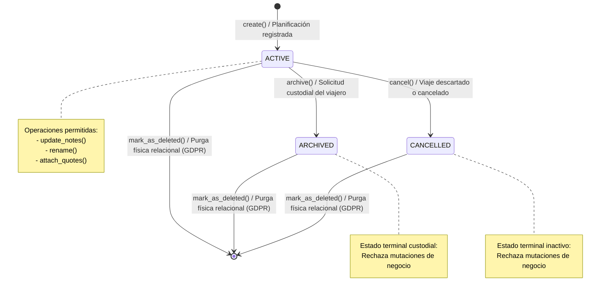

# Bounded Context: Itineraries (Planificación y Custodia de Viajes)

El Bounded Context **Itineraries** (`src/modules/itineraries/`) constituye el núcleo de custodia duradera, personalización y gestión del ciclo de vida de los planes de viaje de **Navby Platform**. Su propósito estratégico primordial radica en salvaguardar de forma inmutable las trayectorias de vuelo calculadas algorítmicamente y seleccionadas por los viajeros, preservando tanto la geometría física ortodrómica del trayecto como el podio histórico de ofertas comerciales capturadas en el instante de la planificación. De este modo, la plataforma garantiza que las rutas guardadas permanezcan accesibles, fidedignas y consultables aun cuando los inventarios tarifarios externos expiren o la topología de la red aérea comercial experimente variaciones operativas.

En estricto alineamiento con los principios de Domain-Driven Design táctico y Clean Architecture, el Bounded Context Itineraries delimita rigurosamente sus fronteras de responsabilidad, manteniéndose desacoplado de las operaciones de búsqueda en tiempo real, facturación y autenticación:

- **Desacoplamiento Estricto frente a Flights:** El módulo Flights opera como el motor de optimización algorítmica sobre grafos geodésicos (Dijkstra, A*, BFS) y el integrador de cotizaciones externas en tiempo real (Flight API). Dicho motor produce rutas y ofertas volátiles sujetas a la caducidad inherente de los sistemas de distribución global. En contraposición, Itineraries no calcula grafos ni consulta inventarios en vivo; su responsabilidad inicia cuando el viajero decide registrar formalmente un itinerario, momento en el cual se congela un documento inmutable (**RouteSnapshot**) con la trayectoria y distancias ortodrómicas calculadas, así como una colección interna con el podio de ofertas (**ItineraryQuote**). Cualquier consulta posterior del itinerario es puramente custodial y agnóstica a la infraestructura de búsqueda.
- **Desacoplamiento Estricto frente a IAM y Regla Zero Cross-Module FKs:** Itineraries desconoce la gestión criptográfica de credenciales, rotación de sesiones o directivas de acceso perimetral. La vinculación entre el itinerario y su propietario se establece exclusivamente mediante el identificador universal lógico **user_id** (**UserId**), tratado como un valor escalar inmutable. En estricta adhesión a la regla arquitectónica de cero claves foráneas intermodulares (*Zero Cross-Module FKs*), no existe ninguna restricción de clave foránea física (`FOREIGN KEY`) entre las tablas de `itineraries` y las tablas del esquema de IAM en PostgreSQL 16. Esta independencia garantiza autonomía transaccional y previene bloqueos de concurrencia entre módulos.
- **Desacoplamiento Estricto frente a Billing & Credits:** La deducción de créditos de búsqueda prepagos ocurre dentro de la frontera transaccional de Flights y Billing en el instante de consultar el motor de rutas. Las operaciones de custodia, modificación de notas, cambio de nombre, archivado o consulta de itinerarios guardados no involucran deducción de créditos ni interacción transaccional con billeteras digitales (`credit_wallets`).
- **Decisiones Clave de Dominio y Cumplimiento Normativo:**
  - *Custodia Inmutable de la Trayectoria Ortodrómica:* Las distancias y tiempos de vuelo se preservan en un documento inmutable estructurado calculados mediante la formulación de círculo máximo de Haversine, evitando discrepancias si cambian los parámetros de la red de rutas.
  - *Podio Clasificado mediante Frontera de Pareto:* El sistema retiene hasta un máximo de tres ofertas comerciales óptimas por itinerario, seleccionadas y ordenadas por un servicio de dominio puro que evalúa el balance entre precio, duración acumulada y escalas.
  - *Control de Concurrencia Optimista:* Cada modificación en el agregado actualiza atómicamente un contador de versión (**version**), impidiendo sobreescrituras concurrentes accidentales sin necesidad de bloqueos pesimistas en la base de datos.
  - *Erradicación del Borrado Lógico y Derecho al Olvido:* Conforme al Reglamento General de Protección de Datos (GDPR), la eliminación de un plan de viaje ejecuta un borrado físico relacional (`DELETE`) con cascada referencial estricta sobre sus cotizaciones subordinadas (`ON DELETE CASCADE`), erradicando de forma definitiva los datos del almacén persistente.

---

## 1. Domain Layer

La Capa de Dominio de Itineraries (`src/modules/itineraries/domain/`) reside en el centro neurálgico del Bounded Context. Su arquitectura se fundamenta en cinco pilares innegociables concebidos para ejecutarse sobre Python 3.12+ bajo el arquetipo de diseño táctico de Domain-Driven Design (DDD) y Clean Architecture adoptado en la plataforma:

1. **Frontera de Consistencia y Custodia Duradera del Agregado:** La raíz de agregado **Itinerary** gobierna el límite de consistencia transaccional y la custodia duradera del plan de viaje. Su diseño asegura la preservación inalterable de la trayectoria física calculada (**RouteSnapshot**) y su podio de ofertas capturadas (**ItineraryQuote**). Al congelar la secuencia ordenada de escalas, waypoints geodésicos ortodrómicos y métricas de vuelo en un documento inmutable, el agregado garantiza coherencia conceptual a largo plazo, incluso si las ofertas externas de mercado caducan en los proveedores o la topología global de vuelos sufre modificaciones.
2. **Inmutabilidad Estricta y Erradicación de Primitive Obsession:** El dominio elimina por completo el uso de tipos primitivos crudos para modelar conceptos de negocio. Todos los atributos se encapsulan en Objetos de Valor inmutables decorados con `@dataclass(frozen=True)` que validan sus invariantes durante la inicialización (`__post_init__`). De este modo, identificadores fuertemente tipados (**ItineraryId**), códigos de aeropuerto IATA (**AirportCode**), denominaciones de ciudades (**CityName**), intervalos temporales con validación de precedencia (**TravelDates**), grupos de pasajeros con reglas de aforo (**PassengerGroup**) y magnitudes monetarias precisas (**Money**) garantizan la imposibilidad de instanciar estados inconsistentes.
3. **Comandos y Consultas como Contratos del Lenguaje Ubicuo (Enfoque Atelier):** En estricta adhesión al arquetipo táctico de Atelier, las intenciones de mutación de estado (**Domain Commands**) y las solicitudes de recuperación de datos (**Domain Queries**) se modelan formalmente como DTOs inmutables dentro del propio espacio de nombres del modelo de dominio (`src/modules/itineraries/domain/model/commands/` y `src/modules/itineraries/domain/model/queries/`). Al pertenecer al *Lenguaje Ubicuo*, encapsulan los parámetros esenciales de cada caso de uso sin acoplamiento a frameworks de transporte ni infraestructura, delegando su orquestación a los manejadores de la Capa de Aplicación.
4. **Servicios de Dominio Puros (Stateless Domain Services):** La lógica de negocio que trasciende las fronteras de una entidad individual se ubica en servicios de dominio sin estado ni efectos secundarios. El servicio **ItineraryValidationDomainService** valida la coherencia espacial y cronológica del itinerario (disyunción obligatoria entre origen y destino, correlación con waypoints y vigencia temporal), mientras que **QuotePodiumRankingDomainService** aplica el principio de dominancia de Pareto multicriterio (balance de tarifa, tiempo de vuelo y escalas) para seleccionar y ordenar jerárquicamente las mejores cotizaciones del podio (rangos 1 a 3).
5. **Tipado Estructural e Inversión de Dependencias:** Siguiendo el Principio de Inversión de Dependencias, el dominio es totalmente agnóstico a los mecanismos de almacenamiento físico y librerías ORM. El contrato de persistencia reside en el subdirectorio `repositories/` bajo la interfaz **ItineraryRepository**, estructurada mediante `typing.Protocol` con el decorador `@runtime_checkable`. Esto posibilita la verificación de compatibilidad estructural en tiempo de ejecución sin forzar acoplamientos de herencia con la infraestructura.

El subdirectorio `src/modules/itineraries/domain/` organiza sus paquetes y módulos en la siguiente jerarquía estructural formal:

```text
src/modules/itineraries/domain/
├── __init__.py
├── model/                             # Modelos nucleares de dominio (agregados, entidades, VOs, comandos y consultas)
│   ├── __init__.py
│   ├── aggregates/                    # Raíces de Agregado
│   │   ├── __init__.py
│   │   └── itinerary.py               # Itinerary (Aggregate Root derivado de AbstractDomainAggregateRoot)
│   ├── entities/                      # Entidades Internas de Dominio
│   │   ├── __init__.py
│   │   └── itinerary_quote.py         # ItineraryQuote (Entidad interna de podio de cotización)
│   ├── value_objects/                 # Objetos de Valor inmutables y Enumeraciones de Dominio
│   │   ├── __init__.py
│   │   ├── itinerary_id.py            # ItineraryId(TypedId[UUID])
│   │   ├── airport_code.py            # AirportCode (IATA 3 letras mayúsculas, regex ^[A-Z]{3}$)
│   │   ├── city_name.py               # CityName (Nombre de ciudad 1-100 caracteres)
│   │   ├── travel_dates.py            # TravelDates (departure_date, return_date opcional, invariante de precedencia)
│   │   ├── passenger_group.py         # PassengerGroup (adults >= 1, children >= 0, infants <= adults, total <= 9)
│   │   ├── route_snapshot.py          # RouteSnapshot (secuencia de waypoints, escalas, distancias y tiempos ortodrómicos)
│   │   ├── money.py                   # Money (amount Decimal >= 0, currency ISO 4217)
│   │   ├── cabin_class.py             # CabinClass (StrEnum: ECONOMY, PREMIUM_ECONOMY, BUSINESS, FIRST)
│   │   ├── itinerary_status.py        # ItineraryStatus (StrEnum: ACTIVE, ARCHIVED, CANCELLED)
│   │   ├── quote_rank.py              # QuoteRank (IntEnum: 1, 2, 3)
│   │   ├── itinerary_name.py          # ItineraryName (1-100 caracteres)
│   │   └── itinerary_notes.py         # ItineraryNotes (máx. 1000 caracteres)
│   ├── commands/                      # Comandos de Dominio Inmutables (Domain Commands - Intención de Mutación)
│   │   ├── __init__.py
│   │   ├── create_itinerary_command.py       # CreateItineraryCommand
│   │   ├── update_itinerary_notes_command.py # UpdateItineraryNotesCommand
│   │   ├── rename_itinerary_command.py       # RenameItineraryCommand
│   │   ├── archive_itinerary_command.py      # ArchiveItineraryCommand
│   │   ├── attach_itinerary_quotes_command.py# AttachItineraryQuotesCommand
│   │   └── delete_itinerary_command.py       # DeleteItineraryCommand
│   └── queries/                       # Consultas de Dominio Inmutables (Domain Queries - Intención de Lectura)
│       ├── __init__.py
│       ├── get_itinerary_by_id_query.py      # GetItineraryByIdQuery
│       ├── list_itineraries_by_user_id_query.py # ListItinerariesByUserIdQuery
│       └── count_itineraries_by_user_id_query.py # CountItinerariesByUserIdQuery
├── events/                            # Eventos de Dominio Inmutables (Domain Events)
│   ├── __init__.py
│   ├── itinerary_created_event.py     # ItineraryCreatedEvent
│   ├── itinerary_archived_event.py    # ItineraryArchivedEvent
│   ├── itinerary_notes_updated_event.py # ItineraryNotesUpdatedEvent
│   ├── itinerary_renamed_event.py     # ItineraryRenamedEvent
│   ├── itinerary_quotes_attached_event.py # ItineraryQuotesAttachedEvent
│   └── itinerary_deleted_event.py     # ItineraryDeletedEvent
├── services/                          # Servicios de Dominio Puros (Stateless Domain Services)
│   ├── __init__.py
│   ├── itinerary_validation_service.py # ItineraryValidationDomainService (coherencia espacio-temporal)
│   └── quote_podium_ranking_service.py # QuotePodiumRankingDomainService (optimalidad de Pareto rank 1..3)
├── repositories/                      # Contratos de Persistencia de Dominio (typing.Protocol)
│   ├── __init__.py
│   └── itinerary_repository.py        # ItineraryRepository(Protocol)
└── exceptions/                        # Excepciones Semánticas de Dominio
    ├── __init__.py
    └── domain_exceptions.py           # ItineraryDomainException y 21 excepciones especializadas
```

---

### 1.1. Diccionario de Clases y Componentes de la Capa de Dominio

La siguiente tabla presenta la taxonomía integral de los 37 componentes arquitectónicos nucleares que integran la Capa de Dominio de Itineraries en Navby Platform, detallando su módulo canónico de importación, clasificación táctica bajo Domain-Driven Design, responsabilidades semánticas y esquema de colaboración:

: Catálogo Consolidado de la Capa de Dominio (Bounded Context Itineraries) {#tbl:itineraries-domain-components}

| Componente o Clase | Módulo Canónico | Tipo Táctico | Propósito y Responsabilidad | Colaboradores y Dependencias |
| :---------------------------------- | :---------------------------------------------------------------- | :--------------------: | :------------------------------------------------------------------------------------------------------------------------------------------------------------------------------------------------------- | :------------------------------------------------------------------------------------------------------------------------------------------------------------------------------------------------------- |
| **Itinerary** | src.modules.itineraries.domain.model.aggregates.itinerary | Aggregate Root | Raíz de agregado central que custodia la integridad y el ciclo de vida del plan de viaje personal del usuario, preserva la invariante de inmutabilidad de la trayectoria calculada mediante RouteSnapshot, gestiona el podio clasificado de cotizaciones comerciales (ItineraryQuote), controla el versionamiento para concurrencia optimista y emite eventos de dominio inmutables ante transiciones de estado. | Hereda de AbstractDomainAggregateRoot[ItineraryId], compone ItineraryId, UserId, ItineraryName, AirportCode, CityName, TravelDates, PassengerGroup, RouteSnapshot, CabinClass, ItineraryStatus, ItineraryNotes e ItineraryQuote, emite ItineraryCreatedEvent, ItineraryArchivedEvent, ItineraryNotesUpdatedEvent, ItineraryRenamedEvent, ItineraryQuotesAttachedEvent e ItineraryDeletedEvent. |
| **ItineraryQuote** | src.modules.itineraries.domain.model.entities.itinerary_quote | Entity | Entidad interna de dominio que modela una cotización comercial de vuelo asociada a un itinerario específico, encapsulando los atributos tarifarios, temporales y operativos capturados de los proveedores externos en un instante temporal específico, ocupando una posición jerárquica unívoca en el podio de ofertas con rango ordinal de 1 a 3. | Subordinada jerárquicamente a la raíz de agregado Itinerary, compone QuoteRank, Money, lista de códigos IATA de aerolíneas, duración total en minutos, número de paradas y enlace oficial de compra profunda, clasificada por QuotePodiumRankingDomainService. |
| **ItineraryId** | src.modules.itineraries.domain.model.value_objects.itinerary_id | Value Object (TypedId) | Identificador unívoco, fuertemente tipado e inmutable para la raíz de agregado del itinerario, encapsulando un identificador universal único (UUID versión 4) para erradicar el antipatrón de obsesión por tipos primitivos en contratos de aplicación y persistencia. | Hereda de TypedId[UUID] provisto por el Shared Kernel, sirve como clave de identidad primaria en Itinerary y como referencia unívoca en contratos de repositorio y eventos de dominio. |
| **AirportCode** | src.modules.itineraries.domain.model.value_objects.airport_code | Value Object | Encapsula y valida el código de designación aeroportuaria internacional de tres letras alfabéticas mayúsculas según el estándar IATA, garantizando sintaxis estricta mediante expresión regular en tiempo de inicialización. | Utilizado por Itinerary para delimitar terminales de origen y destino, referenciado por RouteSnapshot en escalas intermedias y validado por ItineraryValidationDomainService, emite InvalidAirportCodeException ante anomalías sintácticas. |
| **CityName** | src.modules.itineraries.domain.model.value_objects.city_name | Value Object | Representa el nombre textual normalizado de la ciudad de partida o llegada asociada a la terminal aérea, aplicando depuración de espacios en blanco y restringiendo la longitud a un intervalo admisible de 1 a 100 caracteres. | Atributo contextual en Itinerary para renderizado visual en interfaces de usuario y generación de resúmenes de viaje. |
| **TravelDates** | src.modules.itineraries.domain.model.value_objects.travel_dates | Value Object | Encapsula el intervalo cronológico del viaje compuesto por la fecha de salida obligatoria y la fecha opcional de regreso, custodiando la invariante temporal que exige que la fecha de retorno sea cronológicamente igual o posterior a la salida en itinerarios de ida y vuelta. | Compone objetos date nativos, consumido por Itinerary para definir la vigencia del viaje y evaluado por ItineraryValidationDomainService, produce InvalidTravelDatesException ante secuencias cronológicas invertidas. |
| **PassengerGroup** | src.modules.itineraries.domain.model.value_objects.passenger_group | Value Object | Modela la composición demográfica de los viajeros clasificados en adultos, niños e infantes, verificando las restricciones de la industria aérea que demandan al menos un adulto responsable, cantidad de infantes menor o igual al número de adultos y un aforo grupal máximo de 9 pasajeros. | Componente de configuración de viaje en Itinerary, coordina sus restricciones con InvalidPassengerCountException y ExcessivePassengersException. |
| **RouteSnapshot** | src.modules.itineraries.domain.model.value_objects.route_snapshot | Value Object | Documento estructurado inmutable que congela la trayectoria física y geométrica calculada sobre la red aeroportuaria global, almacenando la secuencia ordenada de escalas, distancia geodésica acumulada en kilómetros según la formulación de Haversine, tiempo estimado de vuelo en minutos y la polilínea codificada para representación cartográfica. | Compone secuencias inmutables de waypoints ortodrómicos, integrado en Itinerary para independizar el plan de vuelo guardado de cualquier reestructuración topológica futura del dataset de navegación aérea. |
| **Money** | src.modules.itineraries.domain.model.value_objects.money | Value Object | Modela magnitudes monetarias exactas asociadas a las cotizaciones de tarifas de viaje, encapsulando un importe numérico decimal no negativo con precisión fija de dos decimales y el código alfabético de divisa según el estándar internacional ISO 4217. | Emplea Decimal para prevenir anomalías de redondeo de punto flotante binario, compone los atributos de precio en ItineraryQuote y sirve de base comparativa en QuotePodiumRankingDomainService. |
| **CabinClass** | src.modules.itineraries.domain.model.value_objects.cabin_class | Domain Enum (StrEnum) | Enumeración inmutable de tipo cadena que estandariza las clases de servicio a bordo y confort admitidas en la cabina de pasajeros (ECONOMY, PREMIUM_ECONOMY, BUSINESS y FIRST). | Atributo de segmentación de confort en Itinerary, utilizado para concordar especificaciones de viaje con cotizaciones de aerolíneas compatibles. |
| **ItineraryStatus** | src.modules.itineraries.domain.model.value_objects.itinerary_status | Domain Enum (StrEnum) | Enumeración inmutable de tipo cadena que define los estados del ciclo de vida operativo y transaccional de un itinerario en la plataforma (ACTIVE, ARCHIVED y CANCELLED). | Gobierna las transiciones operativas de la raíz de agregado Itinerary y actúa como criterio de filtrado en consultas de ItineraryRepository. |
| **QuoteRank** | src.modules.itineraries.domain.model.value_objects.quote_rank | Domain Enum (IntEnum) | Enumeración entera inmutable que restringe las posiciones jerárquicas válidas en el podio de cotizaciones adjuntas a un itinerario exclusivamente a los valores ordinales 1, 2 y 3. | Atributo ordinal en ItineraryQuote, asignado por QuotePodiumRankingDomainService para estructurar el podio de mejores alternativas comerciales. |
| **ItineraryName** | src.modules.itineraries.domain.model.value_objects.itinerary_name | Value Object | Encapsula el título o denominación descriptiva asignada por el viajero o sugerida por la plataforma para el itinerario, normalizando espacios y validando una longitud de 1 a 100 caracteres. | Atributo descriptor en Itinerary, modificado mediante el método rename() con emisión de ItineraryRenamedEvent. |
| **ItineraryNotes** | src.modules.itineraries.domain.model.value_objects.itinerary_notes | Value Object | Modela comentarios personales, recordatorios y directivas de viaje registradas libremente por el usuario, imponiendo un límite de longitud máximo de 1000 caracteres. | Atributo complementario en Itinerary, modificado a través del método update_notes() con emisión de ItineraryNotesUpdatedEvent. |
| **CreateItineraryCommand** | src.modules.itineraries.domain.model.commands.create_itinerary_command | Domain Command | Encapsula la intención inmutable de alta de un nuevo itinerario personal, transportando la identidad del usuario propietario, título, aeropuertos y ciudades terminales, intervalo de viaje, composición de pasajeros, clase de cabina, divisa y trayectoria física calculada mediante RouteSnapshot. | Inmutable con dataclass(frozen=True), validado por CreateItineraryCommandHandler, procesado por la raíz de agregado Itinerary mediante su factoría estática create(). |
| **UpdateItineraryNotesCommand** | src.modules.itineraries.domain.model.commands.update_itinerary_notes_command | Domain Command | Encapsula la intención de mutar las anotaciones personales del viajero sobre un plan de vuelo guardado, transportando el identificador del itinerario, la identidad del usuario para control de pertenencia y el nuevo objeto de valor ItineraryNotes. | Inmutable con dataclass(frozen=True), procesado por UpdateItineraryNotesCommandHandler sobre la operación update_notes() de Itinerary. |
| **RenameItineraryCommand** | src.modules.itineraries.domain.model.commands.rename_itinerary_command | Domain Command | Encapsula la intención de modificar la denominación descriptiva del itinerario, transportando el identificador del itinerario, la identidad del usuario propietario y el nuevo objeto de valor ItineraryName. | Inmutable con dataclass(frozen=True), procesado por RenameItineraryCommandHandler sobre la operación rename() de Itinerary. |
| **ArchiveItineraryCommand** | src.modules.itineraries.domain.model.commands.archive_itinerary_command | Domain Command | Encapsula la solicitud inmutable de transicionar formalmente el estado del plan de viaje a ARCHIVED, retirándolo de la vista activa de gestión sin suprimir su registro persistente ni su trazabilidad histórica. | Inmutable con dataclass(frozen=True), procesado por ArchiveItineraryCommandHandler sobre la operación archive() de Itinerary. |
| **AttachItineraryQuotesCommand** | src.modules.itineraries.domain.model.commands.attach_itinerary_quotes_command | Domain Command | Encapsula la asignación atómica de un podio clasificado de hasta tres ofertas comerciales de mercado capturadas para el itinerario, transportando la colección inmutable de entidades subordinadas ItineraryQuote. | Inmutable con dataclass(frozen=True), valida el aforo y unicidad del podio, procesado por AttachItineraryQuotesCommandHandler sobre la operación attach_quotes() de Itinerary. |
| **DeleteItineraryCommand** | src.modules.itineraries.domain.model.commands.delete_itinerary_command | Domain Command | Encapsula la intención de suprimir físicamente el plan de viaje y su podio de cotizaciones subordinadas en ejercicio del derecho al olvido prescrito por el RGPD / GDPR. | Inmutable con dataclass(frozen=True), procesado por DeleteItineraryCommandHandler invocando mark_as_deleted() en Itinerary y delete() en ItineraryRepository. |
| **GetItineraryByIdQuery** | src.modules.itineraries.domain.model.queries.get_itinerary_by_id_query | Domain Query | Modela los parámetros de consulta unívoca de un itinerario por clave primaria, requiriendo el identificador del itinerario y la identidad del usuario para asegurar la frontera de pertenencia y aislamiento de datos. | Inmutable con dataclass(frozen=True), procesado por GetItineraryByIdQueryHandler consumiendo ItineraryRepository. |
| **ListItinerariesByUserIdQuery** | src.modules.itineraries.domain.model.queries.list_itineraries_by_user_id_query | Domain Query | Modela la solicitud de recuperación paginada de planes de viaje pertenecientes a un usuario específico, incorporando filtros opcionales por estado operativo (ACTIVE, ARCHIVED, CANCELLED) y parámetros acotados de paginación (limit y offset). | Inmutable con dataclass(frozen=True), valida límites de paginación, procesado por ListItinerariesByUserIdQueryHandler consumiendo ItineraryRepository. |
| **CountItinerariesByUserIdQuery** | src.modules.itineraries.domain.model.queries.count_itineraries_by_user_id_query | Domain Query | Modela la solicitud escalar para computar el volumen total de itinerarios registrados por un usuario según su estado operativo, optimizado para poblar encabezados de paginación de la Capa de Interfaz. | Inmutable con dataclass(frozen=True), procesado por CountItinerariesByUserIdQueryHandler consumiendo ItineraryRepository. |
| **ItineraryCreatedEvent** | src.modules.itineraries.domain.events.itinerary_created_event | Domain Event | Evento de dominio inmutable emitido al instanciar y persistir exitosamente un nuevo plan de viaje, transportando la identidad del itinerario, el identificador del usuario propietario, los aeropuertos seleccionados y las marcas cronológicas de creación. | Hereda de DomainEvent, producido por la fábrica estática create() de Itinerary, persistido atómicamente en la tabla outbox_events para auditoría y analítica de planes. |
| **ItineraryArchivedEvent** | src.modules.itineraries.domain.events.itinerary_archived_event | Domain Event | Evento de dominio inmutable emitido cuando un itinerario transiciona formalmente al estado archivado a solicitud del viajero, preservando la información histórica fuera de la vista activa de gestión. | Hereda de DomainEvent, generado por la operación archive() de Itinerary, consumido por componentes de sincronización de interfaz y notificaciones. |
| **ItineraryNotesUpdatedEvent** | src.modules.itineraries.domain.events.itinerary_notes_updated_event | Domain Event | Evento de dominio inmutable que notifica la actualización del contenido textual de las notas personales asociadas a un itinerario particular. | Hereda de DomainEvent, originado en el método update_notes() de Itinerary, propagado para sincronización de vistas y registro de auditoría. |
| **ItineraryRenamedEvent** | src.modules.itineraries.domain.events.itinerary_renamed_event | Domain Event | Evento de dominio inmutable que comunica el renombramiento del título descriptivo del itinerario, registrando la denominación anterior y la nueva. | Hereda de DomainEvent, emitido por el método rename() de Itinerary, utilizado para invalidar entradas en cachés de lectura de planes de vuelo. |
| **ItineraryQuotesAttachedEvent** | src.modules.itineraries.domain.events.itinerary_quotes_attached_event | Domain Event | Evento de dominio inmutable que formaliza la asociación atómica de un podio renovado de hasta tres cotizaciones de mercado en el itinerario, reemplazando cualquier oferta previa. | Hereda de DomainEvent, emitido por el método attach_quotes() de Itinerary, utilizado por el sistema para registrar las tarifas vigentes capturadas. |
| **ItineraryDeletedEvent** | src.modules.itineraries.domain.events.itinerary_deleted_event | Domain Event | Evento de dominio inmutable emitido cuando un itinerario es suprimido físicamente de la plataforma en ejercicio del derecho al olvido y directivas de privacidad del viajero. | Hereda de DomainEvent, originado en la supresión del agregado Itinerary, desencadena la purga de referencias operativas e índices de búsqueda asociados. |
| **ItineraryValidationDomainService** | src.modules.itineraries.domain.services.itinerary_validation_service | Domain Service | Servicio de dominio puro y sin estado responsable de verificar la coherencia topológica y cronológica global del itinerario, validando la disyunción entre terminales de origen y destino, la concordancia de waypoints y la vigencia temporal del viaje. | Colabora con AirportCode, TravelDates, RouteSnapshot y la entidad Itinerary, arrojando IdenticalAirportsException, InvalidAirportCodeException o InvalidTravelDatesException ante incongruencias. |
| **QuotePodiumRankingDomainService** | src.modules.itineraries.domain.services.quote_podium_ranking_service | Domain Service | Servicio de dominio puro que procesa el conjunto de cotizaciones candidatas aplicando la frontera de optimalidad de Pareto sobre las dimensiones de costo, duración total y escalas, seleccionando y clasificando las tres alternativas más eficientes en el podio. | Procesa instancias de ItineraryQuote, asigna instancias válidas de QuoteRank y abastece al método attach_quotes() de la raíz de agregado Itinerary. |
| **ItineraryRepository** | src.modules.itineraries.domain.repositories.itinerary_repository | Repository Protocol | Protocolo estructural puro que desacopla la Capa de Dominio de la infraestructura de persistencia relacional en PostgreSQL 16 con SQLAlchemy, declarando operaciones asíncronas para guardado, recuperación por identificador, consulta paginada por usuario, cómputo de registros y eliminación física. | Declarado mediante Protocol con runtime_checkable, interactúa exclusivamente con Itinerary, ItineraryId, UserId e ItineraryStatus, implementado en la Capa de Infraestructura. |
| **ItineraryDomainException** | src.modules.itineraries.domain.exceptions.domain_exceptions | Domain Exception (Base) | Clase base abstracta de todas las excepciones semánticas emanadas del Bounded Context Itineraries, encapsulando un mensaje explicativo y un código alfanumérico canónico para tipificar formalmente la anomalía de negocio. | Hereda de DomainException provista por el Shared Kernel, superclase directa de las excepciones especializadas del contexto. |
| **ItineraryNotFoundException** | src.modules.itineraries.domain.exceptions.domain_exceptions | Domain Exception | Excepción semántica disparada cuando una operación de consulta, actualización o eliminación hace referencia a un ItineraryId inexistente en los almacenes persistentes. | Hereda de ItineraryDomainException, lanzada por casos de uso de aplicación y adaptadores de repositorio ante fallos de búsqueda unívoca. |
| **InvalidAirportCodeException** | src.modules.itineraries.domain.exceptions.domain_exceptions | Domain Exception | Excepción semántica disparada al intentar instanciar un AirportCode que incumple el estándar IATA de tres caracteres alfabéticos mayúsculos. | Hereda de ItineraryDomainException, lanzada de manera preventiva por el constructor del objeto de valor AirportCode. |
| **InvalidTravelDatesException** | src.modules.itineraries.domain.exceptions.domain_exceptions | Domain Exception | Excepción semántica lanzada cuando la fecha de retorno especificada en un itinerario es cronológicamente anterior a la fecha de salida, o cuando las fechas vulneran restricciones temporales. | Hereda de ItineraryDomainException, arrojada por el constructor de TravelDates y por ItineraryValidationDomainService. |
| **UnauthorizedItineraryAccessException** | src.modules.itineraries.domain.exceptions.domain_exceptions | Domain Exception | Excepción semántica de seguridad y frontera de pertenencia disparada cuando un usuario intenta acceder, modificar o suprimir un itinerario perteneciente a un UserId diferente. | Hereda de ItineraryDomainException, lanzada durante la verificación de autorización en servicios de aplicación y métodos de agregación. |

*Nota.* Catálogo taxonómico unificado de los 37 componentes arquitectónicos nucleares que integran la Capa de Dominio del Bounded Context Itineraries en Navby Platform bajo el arquetipo de diseño táctico de Atelier. La inclusión de comandos y consultas en domain/model/ responde al principio de modelar las intenciones de mutación y lectura como contratos inmutables pertenecientes al Lenguaje Ubicuo del negocio, cuya orquestación y despacho se delega a los manejadores de la Capa de Aplicación. La especificación de excepciones en el módulo canónico exceptions/ agrupa la clase base ItineraryDomainException y sus derivaciones especializadas, complementadas en el dominio por IdenticalAirportsException, InvalidPassengerCountException, ExcessivePassengersException, InvalidQuoteRankException e ItineraryAlreadyArchivedException.

---

### 1.2. Objetos de Valor y Enumeraciones de Dominio

#### 1.2.1. Fundamentos Teóricos y Erradicación de Primitive Obsession

En el diseño táctico de sistemas de software empresarial bajo Domain-Driven Design, la modelización de los conceptos del negocio demanda una distinción ontológica estricta entre entidades y objetos de valor (**Value Objects**). Mientras que las entidades se definen por una trayectoria de identidad continua, mutable y diferenciable en el tiempo, los objetos de valor representan elementos descriptivos o cuantitativos del dominio cuya equivalencia semántica descansa exclusivamente en la composición acumulada de sus atributos. Carecen por completo de identidad conceptual independiente, son intrínsecamente intercambiables si sus valores estructurales coinciden y no poseen un ciclo de vida autónomo.

En plataformas críticas de optimización de transporte aéreo y comercio digital de viajes, uno de los antipatrones de diseño más perniciosos y recurrentes es *Primitive Obsession*. Dicho antipatrón se manifiesta al delegar la representación de conceptos medulares del negocio en tipos primitivos escalares provistos por el lenguaje base (tales como cadenas de texto `str`, enteros `int`, números de punto flotante `float` o estructuras genéricas `UUID`). Esta práctica genera tres patologías arquitectónicas severas:

1. **Degradación de la Seguridad Estática de Tipos y Vulnerabilidad ante Transposiciones:** Cuando códigos de aeropuerto, nombres de ciudades, identificadores de itinerario y descripciones de ruta se tipifican indistintamente como `str`, los analizadores estáticos de tipos (como mypy o Pyright) y los entornos de ejecución son incapaces de advertir la transposición accidental de parámetros en llamadas a constructores o métodos de aplicación. Un error posicional que suministre un código IATA en lugar de un nombre de ciudad o un identificador de usuario en lugar de un identificador de itinerario resulta sintácticamente admisible para el compilador, propiciando la corrupción silenciosa del estado en entornos de producción.
2. **Dispersión y Duplicación de Lógica Defensiva:** Al carecer de un encapsulamiento cohesivo que custodie las invariantes de cada concepto, las rutinas de validación sintáctica (comprobación de expresiones regulares IATA, saneamiento de espacios en blanco, verificación de no negatividad en distancias o límites en grupos de pasajeros) terminan duplicadas de forma inconsistente en controladores web, esquemas de serialización, servicios de aplicación y adaptadores de base de datos. Esta fragmentación fomenta divergencias operativas cuando una regla de negocio evoluciona en un punto del sistema pero se omite en otro.
3. **Erosión del Lenguaje Ubicuo y Ambigüedad Semántica:** Los tipos primitivos enmascaran la intención y las restricciones ontológicas del modelo. Una signatura `create_itinerary(origin: str, destination: str, adults: int, price: float)` no expresa si las cadenas corresponden a códigos IATA de tres letras mayúsculas normalizados, si el número de adultos cumple con la presencia de al menos un tutor responsable o si el importe monetario está sujeto a errores de precisión por redondeo de punto flotante binario.

Para erradicar de manera definitiva estas vulnerabilidades en el Bounded Context Itineraries, Navby Platform fundamenta sus objetos de valor y enumeraciones sobre cuatro garantías operativas e inmutables implementadas en Python 3.12+:

- **Inmutabilidad Absoluta en Tiempo de Ejecución (`@dataclass(frozen=True)`):** La directiva `frozen=True` instruye al intérprete de Python a generar clases inmutables donde cualquier tentativa de reasignación o alteración de atributos sobre una instancia existente es interceptada de forma inmediata a nivel del intérprete, desencadenando una excepción nativa `FrozenInstanceError`. Esta inmutabilidad previene efectos colaterales imprevistos, garantiza seguridad de hilos (*thread-safety*) en procesamiento asíncrono y concurrente, y asegura que una instancia compartida entre agregados o servicios preserve un estado inalterable.
- **Auto-Validación Defensiva de Invariantes en `__post_init__`:** Ningún objeto de valor puede existir en memoria en un estado semánticamente corrupto o incompleto. El gancho especial `__post_init__()` actúa como una aduana de entrada ineludible que intercepta los argumentos suministrados al constructor, verifica la no nulidad de los datos, aplica saneamiento canónico determinista mediante *strip()* y *upper()*, y evalúa las restricciones de longitud, cardinalidad y expresiones regulares formalizadas. Ante cualquier infracción, la instanciación se aborta de inmediato mediante el lanzamiento de excepciones semánticas especializadas (**InvalidAirportCodeException**, **InvalidTravelDatesException**, **InvalidPassengerCountException**, entre otras), asegurando que las capas superiores únicamente interactúen con instancias válidas por construcción (*valid-by-construction*).
- **Igualdad Estructural y Dispersión Determinista (`__eq__` y `__hash__`):** La semántica de los objetos de valor establece que dos instancias con idénticos valores en todos sus atributos son equivalentes (`v1 == v2`), con independencia de que ocupen posiciones de memoria disjuntas (`id(v1) != id(v2)`). Al tratarse de estructuras inmutables congeladas, Python sintetiza automáticamente un método `__hash__()` compatible, posibilitando el uso directo y seguro de los objetos de valor como elementos de conjuntos (`set`) o como claves unívocas en diccionarios (`dict`).
- **Seguridad Financiera y Modelado Geoespacial Haversine:** Las magnitudes monetarias se encapsulan en el objeto de valor **Money**, operando sobre aritmética decimal de precisión fija (`Decimal`) con redondeo bancario legal (*Half-Even*, `ROUND_HALF_EVEN`) a dos posiciones decimales, erradicando los desbordamientos y pérdidas de exactitud inherentes a los tipos de punto flotante. De forma análoga, la trayectoria espacial de vuelo se consolida en el documento inmutable **RouteSnapshot**, el cual preserva los waypoints geodésicos ortodrómicos y las métricas de distancia calculadas mediante la formulación de Haversine, aislando el itinerario guardado frente a modificaciones topológicas futuras en el inventario aéreo.

La Tabla @tbl:itineraries-value-objects sintetiza la matriz de especificación técnica de los 13 objetos de valor y enumeraciones de dominio que estructuran el subsistema descriptivo de Itineraries:

: Matriz de Objetos de Valor y Enumeraciones de Dominio (Itineraries) {#tbl:itineraries-value-objects}

| Objeto de Valor / Enum | Tipo Táctico | Invariante / Regla de Validación | Formato / Tipo Primitivo | Semántica de Negocio |
| :--------------------- | :--------------------: | :------------------------------------------------------------------------------------------------------------------------------------------------------------------------------------------------------- | :---------------------------------------------------------------- | :------------------------------------------------------------------------------------------------------------------------------------------------------------------------------------------------------- |
| **ItineraryId** | Value Object (TypedId) | Identificador unívoco inmutable derivado de TypedId[UUID], valida no nulidad y conversión desde cadena hexadecimal o instancia UUID v4 o v7. | UUID canónico de 36 caracteres (8-4-4-4-12) | Identidad de la raíz de agregado Itinerary, previene el cruce accidental de claves entre módulos del sistema. |
| **AirportCode** | Value Object | Código alfabético oficial de designación aeroportuaria según estándar IATA, obligatoriedad de 3 caracteres alfabéticos mayúsculas ASCII validados mediante expresión regular ^[A-Z]{3}$. | Cadena alfabética de 3 caracteres (str) | Identificación unívoca de terminales aéreas para delimitar el origen, destino y escalas intermedias del trayecto. |
| **CityName** | Value Object | Denominación textual de la ciudad asociada a la terminal aérea, longitud acotada entre 1 y 100 caracteres tras saneamiento determinista de espacios marginales, no vacío. | Cadena alfanumérica de 1 a 100 caracteres (str) | Atributo descriptivo contextual para renderizado visual en interfaces de usuario y resúmenes ejecutivos del plan. |
| **TravelDates** | Value Object | Intervalo cronológico con fecha de salida obligatoria y fecha de retorno opcional; la fecha de retorno debe ser cronológicamente igual o posterior a la salida en itinerarios de ida y vuelta. | Instancias date nativas bajo formato ISO 8601 | Delimita la ventana temporal del viaje, calcula la duración en días calendario y tipifica viajes de solo ida o ida y vuelta. |
| **PassengerGroup** | Value Object | Mínimo 1 adulto responsable, cantidades no negativas de niños e infantes, cantidad de infantes menor o igual a los adultos acompañantes y aforo total máximo de 9 pasajeros por reserva. | Tupla de enteros no negativos (adults, children, infants) | Modela la comitiva de viaje conforme a regulaciones aeronáuticas de seguridad operacional y políticas comerciales de aerolíneas. |
| **Waypoint** | Value Object | Coordenadas geodésicas en intervalos válidos [-90.0, 90.0] de latitud y [-180.0, 180.0] de longitud; referencias obligatorias a AirportCode y CityName; indicador booleano de escala de transbordo. | Tupla estructurada (AirportCode, CityName, float, float, bool) | Hito geoespacial en la trayectoria física calculada, representa terminales de salida, escalas de transferencia o destino final. |
| **RouteSnapshot** | Value Object | Secuencia de al menos 2 waypoints ordenados; distancia geodésica acumulada >= 0.0 km; tiempo de vuelo >= 0 minutos; concordancia estricta entre número de paradas y waypoints (stops_count == len(waypoints) - 2); polilínea no vacía. | Estructura inmutable con tupla de Waypoint, float, int, int y str | Congelación documental inmutable de la trayectoria física calculada mediante formulación ortodrómica de Haversine sobre el grafo aéreo. |
| **Money** | Value Object | Importe monetario decimal no negativo (>= 0.00) con precisión fija a dos decimales y redondeo bancario Half-Even; código de divisa internacional según estándar ISO 4217 de 3 caracteres mayúsculas. | Decimal de precisión 2 y código str de 3 caracteres | Magnitud financiera exacta asociada a las cotizaciones comerciales de vuelos, previene anomalías de redondeo de punto flotante. |
| **CabinClass** | Domain Enum (StrEnum) | Restringe la clase de cabina contratada a las cuatro alternativas admitidas por las aerolíneas comerciales: ECONOMY, PREMIUM_ECONOMY, BUSINESS y FIRST. | Cadena inmutable (StrEnum) | Segmentación del nivel de confort, servicios a bordo y franquicia de equipaje contratado para los pasajeros. |
| **ItineraryStatus** | Domain Enum (StrEnum) | Delimita el ciclo de vida del itinerario a los estados transaccionales permitidos por el modelo de negocio: ACTIVE, ARCHIVED y CANCELLED. | Cadena inmutable (StrEnum) | Gobierna las reglas de mutación permitidas en el agregado y rige los filtros de consulta en repositorios de persistencia. |
| **QuoteRank** | Domain Enum (IntEnum) | Restringe las posiciones jerárquicas del podio de cotizaciones comerciales exclusivamente a los valores ordinales enteros 1 (óptima), 2 (alternativa) y 3 (económica). | Entero ordinal (IntEnum: 1, 2, 3) | Clasificación jerárquica del podio de ofertas capturadas, ordenada por el servicio de dominancia multicriterio de Pareto. |
| **ItineraryName** | Value Object | Título o denominación del plan de viaje asignado por el usuario o la plataforma, longitud de 1 a 100 caracteres tras saneamiento de espacios, no vacío. | Cadena alfanumérica de 1 a 100 caracteres (str) | Identificador nemotécnico descriptivo para fácil localización y gestión del plan en el panel de control del viajero. |
| **ItineraryNotes** | Value Object | Anotaciones libres, recordatorios de equipaje y observaciones personales del viajero, admite valor ausente o longitud máxima de hasta 1000 caracteres. | Cadena opcional de hasta 1000 caracteres (str \| None) | Espacio de personalización contextual para requerimientos especiales o notas logísticas asociadas al viaje. |

*Nota.* Matriz taxonómica y reglas de invariantes ontológicas para los 13 Objetos de Valor y Enumeraciones de Dominio que estructuran el Bounded Context Itineraries en Navby Platform. Todos los componentes implementan inmutabilidad estricta a nivel del intérprete en Python 3.12+ mediante el decorador @dataclass(frozen=True) o especializaciones de StrEnum e IntEnum, garantizando auto-validación de reglas en __post_init__ y erradicación definitiva del antipatrón Primitive Obsession.

---

#### 1.2.2. Implementación de Value Objects y Enums en Python 3.12+

En estricta observancia de los principios de Clean Architecture y la pureza del estrato de dominio, los objetos de valor y enumeraciones de Itineraries se implementan utilizando exclusivamente la biblioteca estándar de Python 3.12+, sin dependencias externas hacia librerías de mapeo objeto-relacional (SQLAlchemy) o frameworks web (FastAPI).

##### 1. Excepciones Semánticas Especializadas del Subsistema de Objetos de Valor

Antes de la especificación de los objetos de valor, se formaliza la jerarquía de excepciones de dominio semánticas especializadas encargadas de custodiar las invariantes operativas. Todas extienden la clase base abstracta **ItineraryDomainException**, la cual a su vez deriva de **DomainException** provista por el Shared Kernel (`src/shared/domain/exceptions/domain_exception.py`), incorporando códigos alfanuméricos canónicos en mayúsculas sostenidas (`UPPER_SNAKE_CASE`) y un mapa estructurado de detalles contextuales:

```python
"""Excepciones semánticas de dominio especializadas para Objetos de Valor en Itineraries.

Ubicación: src/modules/itineraries/domain/exceptions/domain_exceptions.py
"""

from __future__ import annotations

from typing import Any

from src.shared.domain.exceptions.domain_exception import DomainException


class ItineraryDomainException(DomainException):
    """Excepción semántica base para todas las anomalías del Bounded Context Itineraries."""

    def __init__(self, message: str, code: str, details: dict[str, Any] | None = None) -> None:
        """Inicializa la excepción con mensaje explicativo, código alfanumérico y detalles."""
        super().__init__(message=message, code=code, details=details)


class InvalidAirportCodeException(ItineraryDomainException):
    """Excepción disparada cuando un código de aeropuerto transgrede el estándar IATA de 3 letras mayúsculas."""

    def __init__(self, message: str, details: dict[str, Any] | None = None) -> None:
        super().__init__(message=message, code="INVALID_AIRPORT_CODE", details=details)


class InvalidCityNameException(ItineraryDomainException):
    """Excepción disparada cuando un nombre de ciudad está vacío o excede los 100 caracteres permitidos."""

    def __init__(self, message: str, details: dict[str, Any] | None = None) -> None:
        super().__init__(message=message, code="INVALID_CITY_NAME", details=details)


class InvalidTravelDatesException(ItineraryDomainException):
    """Excepción disparada ante inconsistencias cronológicas o ausencia de fecha de salida en el itinerario."""

    def __init__(self, message: str, details: dict[str, Any] | None = None) -> None:
        super().__init__(message=message, code="INVALID_TRAVEL_DATES", details=details)


class InvalidPassengerCountException(ItineraryDomainException):
    """Excepción disparada cuando el número de pasajeros infringe reglas de aforo mínimo o tutela de infantes."""

    def __init__(self, message: str, details: dict[str, Any] | None = None) -> None:
        super().__init__(message=message, code="INVALID_PASSENGER_COUNT", details=details)


class ExcessivePassengersException(ItineraryDomainException):
    """Excepción disparada cuando el aforo grupal total supera el límite máximo permitido de 9 pasajeros."""

    def __init__(self, message: str, details: dict[str, Any] | None = None) -> None:
        super().__init__(message=message, code="EXCESSIVE_PASSENGERS", details=details)


class InvalidCoordinatesException(ItineraryDomainException):
    """Excepción disparada cuando las coordenadas geodésicas de un waypoint desbordan los límites terrestres."""

    def __init__(self, message: str, details: dict[str, Any] | None = None) -> None:
        super().__init__(message=message, code="INVALID_COORDINATES", details=details)


class InvalidRouteSnapshotException(ItineraryDomainException):
    """Excepción disparada cuando la trayectoria del itinerario transgrede reglas de coherencia física o topológica."""

    def __init__(self, message: str, details: dict[str, Any] | None = None) -> None:
        super().__init__(message=message, code="INVALID_ROUTE_SNAPSHOT", details=details)


class InvalidMoneyException(ItineraryDomainException):
    """Excepción disparada cuando una magnitud monetaria presenta importe negativo o código de divisa inválido."""

    def __init__(self, message: str, details: dict[str, Any] | None = None) -> None:
        super().__init__(message=message, code="INVALID_MONEY", details=details)


class CurrencyMismatchException(ItineraryDomainException):
    """Excepción disparada al intentar ejecutar operaciones aritméticas entre importes con divisas heterogéneas."""

    def __init__(self, message: str, details: dict[str, Any] | None = None) -> None:
        super().__init__(message=message, code="CURRENCY_MISMATCH", details=details)


class InvalidQuoteRankException(ItineraryDomainException):
    """Excepción disparada al intentar asignar una posición jerárquica fuera del intervalo ordinal de podio 1 a 3."""

    def __init__(self, message: str, details: dict[str, Any] | None = None) -> None:
        super().__init__(message=message, code="INVALID_QUOTE_RANK", details=details)


class InvalidItineraryNameException(ItineraryDomainException):
    """Excepción disparada cuando la denominación del itinerario está vacía o supera los 100 caracteres."""

    def __init__(self, message: str, details: dict[str, Any] | None = None) -> None:
        super().__init__(message=message, code="INVALID_ITINERARY_NAME", details=details)


class InvalidItineraryNotesException(ItineraryDomainException):
    """Excepción disparada cuando las notas descriptivas del itinerario superan la longitud de 1000 caracteres."""

    def __init__(self, message: str, details: dict[str, Any] | None = None) -> None:
        super().__init__(message=message, code="INVALID_ITINERARY_NOTES", details=details)
```

##### 2. ItineraryId

* **Módulo Canónico:** `src.modules.itineraries.domain.model.value_objects.itinerary_id`
* **Propósito:** Envoltorio inmutable y fuertemente tipado para el identificador universal único (UUID) de la raíz de agregado Itinerary, erradicando el antipatrón de obsesión por primitivos.
* **Atributos:**
  * **value** (`UUID`): Identificador universal único subyacente. Heredado de **TypedId[UUID]**.
* **Invariantes y Reglas de Validación:**
  * No nulidad de la identidad y verificación de conformidad con el formato canónico UUID (v4 o v7).
  * Inmutabilidad estricta garantizada por la superclase abstracta **TypedId**.
* **Métodos y Operaciones:**
  * *generate() -> Self*: Factoría estática que instancia un nuevo **ItineraryId** respaldado por un UUID v4 criptográficamente pseudoaleatorio.
  * *of(val: UUID | str | TypedId) -> Self*: Factoría estática que construye o valida una instancia a partir de un UUID nativo, una cadena hexadecimal formateada o una instancia homogénea previa.
  * *__str__() -> str*: Retorna la representación canónica en cadena de texto del UUID (36 caracteres en formato `8-4-4-4-12`).

```python
"""Objeto de valor fuertemente tipado para el identificador de itinerario.

Ubicación: src/modules/itineraries/domain/model/value_objects/itinerary_id.py
"""

from __future__ import annotations

from dataclasses import dataclass
from typing import Self
from uuid import UUID

from src.shared.domain.model.ids.typed_id import TypedId


@dataclass(frozen=True)
class ItineraryId(TypedId):
    """Identificador unívoco universal fuertemente tipado para la raíz de agregado Itinerary.

    Hereda de TypedId[UUID] para erradicar el antipatrón Primitive Obsession,
    garantizando inmutabilidad estricta, validación de formato UUID (v4 o v7)
    y diferenciación semántica en tiempo de compilación frente a otros TypedIds del sistema.
    """

    @classmethod
    def generate(cls) -> Self:
        """Genera un nuevo ItineraryId con un UUID v4 criptográficamente aleatorio.

        Returns:
            Instancia nueva de ItineraryId con entropía pseudoaleatoria de 122 bits.
        """
        return super().generate()

    @classmethod
    def of(cls, val: UUID | str | TypedId) -> Self:
        """Construye un ItineraryId a partir de un UUID, cadena representativa o instancia existente.

        Args:
            val: Instancia de UUID, cadena hexadecimal formateada o instancia homogénea de ItineraryId.

        Returns:
            Instancia validada de ItineraryId.

        Raises:
            ValueError: Si el valor suministrado no es convertible a UUID o si
                se intenta instanciar desde un identificador heterogéneo de otro contexto.
        """
        return super().of(val)
```

##### 3. AirportCode

* **Módulo Canónico:** `src.modules.itineraries.domain.model.value_objects.airport_code`
* **Propósito:** Encapsula y valida el código de designación aeroportuaria internacional según el estándar de la Asociación de Transporte Aéreo Internacional (IATA).
* **Atributos:**
  * **value** (`str`): Cadena alfabética de exactamente tres caracteres mayúsculas normalizados.
* **Invariantes y Reglas de Validación:**
  * No nulidad y tipo de dato estricto `str`.
  * Saneamiento automático de espacios marginales y conversión determinista a mayúsculas.
  * Conformidad sintáctica estricta con la expresión regular `^[A-Z]{3}$`. Se rechazan códigos de longitud distinta de tres, caracteres numéricos, caracteres acentuados o símbolos.
  * Lanza **InvalidAirportCodeException** ante cualquier infracción.
* **Métodos y Operaciones:**
  * *__post_init__() -> None*: Aplica la verificación y reasigna la cadena normalizada mediante `object.__setattr__`.
  * *__str__() -> str*: Retorna el código IATA normalizado de tres letras.

```python
"""Objeto de valor inmutable para el código de aeropuerto IATA.

Ubicación: src/modules/itineraries/domain/model/value_objects/airport_code.py
"""

from __future__ import annotations

import re
from dataclasses import dataclass, field

from src.modules.itineraries.domain.exceptions.domain_exceptions import (
    InvalidAirportCodeException,
)
from src.shared.domain.model.value_object import ValueObject


@dataclass(frozen=True)
class AirportCode(ValueObject):
    """Código de designación aeroportuaria internacional de 3 letras según el estándar IATA.

    Garantiza sintaxis estricta mediante expresión regular en tiempo de inicialización,
    normalizando siempre a mayúsculas y eliminando espacios en blanco marginales.
    """

    value: str

    _IATA_REGEX: re.Pattern[str] = field(
        default=re.compile(r"^[A-Z]{3}$"),
        init=False,
        repr=False,
        compare=False,
    )

    def __post_init__(self) -> None:
        """Valida y normaliza deterministamente el código IATA provisto.

        Raises:
            InvalidAirportCodeException: Si el valor es nulo, no es una cadena de texto o
                no se compone exactamente de tres letras alfabéticas mayúsculas ASCII.
        """
        if self.value is None or not isinstance(self.value, str):
            raise InvalidAirportCodeException(
                message="El código de aeropuerto IATA debe ser una cadena de texto no nula.",
                details={"field": "airport_code", "provided_value": self.value},
            )

        normalized = self.value.strip().upper()

        if not self._IATA_REGEX.match(normalized):
            raise InvalidAirportCodeException(
                message=(
                    f"El código IATA '{self.value}' no cumple con el formato estándar "
                    f"de exactamente 3 letras alfabéticas mayúsculas (recibido normalizado: '{normalized}')."
                ),
                details={"field": "airport_code", "provided_value": self.value, "normalized": normalized},
            )

        object.__setattr__(self, "value", normalized)

    def __str__(self) -> str:
        """Retorna la representación canónica en texto del código IATA."""
        return self.value
```

##### 4. CityName

* **Módulo Canónico:** `src.modules.itineraries.domain.model.value_objects.city_name`
* **Propósito:** Modela el nombre textual normalizado de la ciudad geográfica vinculada a la terminal aérea en el itinerario de viaje.
* **Atributos:**
  * **value** (`str`): Denominación de la ciudad, saneada de espacios marginales superfluos.
* **Invariantes y Reglas de Validación:**
  * No nulidad y tipo de dato estricto `str`.
  * No vacío tras eliminar espacios en blanco mediante *strip()*.
  * Longitud mínima de 1 carácter y máxima de 100 caracteres para garantizar integridad relacional en columnas de persistencia.
  * Lanza **InvalidCityNameException** si se transgrede el intervalo de longitud o si la cadena es nula.
* **Métodos y Operaciones:**
  * *__post_init__() -> None*: Sanea los espacios en blanco y aplica la validación de longitud.
  * *__str__() -> str*: Retorna la cadena de texto con el nombre de la ciudad.

```python
"""Objeto de valor inmutable para el nombre de ciudad.

Ubicación: src/modules/itineraries/domain/model/value_objects/city_name.py
"""

from __future__ import annotations

from dataclasses import dataclass, field

from src.modules.itineraries.domain.exceptions.domain_exceptions import (
    InvalidCityNameException,
)
from src.shared.domain.model.value_object import ValueObject


@dataclass(frozen=True)
class CityName(ValueObject):
    """Denominación descriptiva normalizada de la ciudad asociada a la terminal aérea.

    Aplica saneamiento de espacios en blanco marginales y restringe la longitud a un
    intervalo admisible de 1 a 100 caracteres.
    """

    value: str

    MAX_LENGTH: int = field(default=100, init=False, repr=False, compare=False)

    def __post_init__(self) -> None:
        """Valida y sanea el nombre de la ciudad suministrado.

        Raises:
            InvalidCityNameException: Si el valor es nulo, no es una cadena de texto,
                está vacío tras saneamiento o excede los 100 caracteres de longitud.
        """
        if self.value is None or not isinstance(self.value, str):
            raise InvalidCityNameException(
                message="El nombre de la ciudad debe ser una cadena de texto no nula.",
                details={"field": "city_name", "provided_value": self.value},
            )

        normalized = self.value.strip()

        if not normalized:
            raise InvalidCityNameException(
                message="El nombre de la ciudad no puede estar vacío ni contener únicamente espacios en blanco.",
                details={"field": "city_name"},
            )

        if len(normalized) > self.MAX_LENGTH:
            raise InvalidCityNameException(
                message=(
                    f"El nombre de la ciudad excede la longitud máxima permitida de "
                    f"{self.MAX_LENGTH} caracteres (longitud suministrada: {len(normalized)})."
                ),
                details={"field": "city_name", "length": len(normalized), "max_length": self.MAX_LENGTH},
            )

        object.__setattr__(self, "value", normalized)

    def __str__(self) -> str:
        """Retorna el nombre de la ciudad saneado."""
        return self.value
```

##### 5. TravelDates

* **Módulo Canónico:** `src.modules.itineraries.domain.model.value_objects.travel_dates`
* **Propósito:** Encapsula el intervalo cronológico del viaje, compuesto por la fecha de salida obligatoria y la fecha de regreso opcional, asegurando la coherencia temporal de las travesías.
* **Atributos:**
  * **departure_date** (`date`): Fecha calendario de partida del itinerario.
  * **return_date** (`date | None`): Fecha calendario opcional de retorno para viajes de ida y vuelta.
* **Invariantes y Reglas de Validación:**
  * La fecha de salida **departure_date** es estrictamente obligatoria y debe ser una instancia de `date`.
  * Si **return_date** es provista, debe ser una instancia de `date` y satisfacer la regla de precedencia temporal: `return_date >= departure_date`. Se prohíben fechas de regreso anteriores a la salida.
  * Lanza **InvalidTravelDatesException** ante transgresiones cronológicas o tipos nulos en la fecha de salida.
* **Métodos y Operaciones:**
  * *is_round_trip() -> bool*: Retorna `True` si el itinerario contempla fecha de regreso, o `False` para viajes de solo ida.
  * *duration_days -> int*: Propiedad calculada que retorna la diferencia en días calendario entre regreso y salida para itinerarios de ida y vuelta, o `0` para viajes de solo ida.
  * *__str__() -> str*: Retorna la representación cronológica formateada en estándar ISO 8601.

```python
"""Objeto de valor inmutable para el intervalo cronológico de fechas de viaje.

Ubicación: src/modules/itineraries/domain/model/value_objects/travel_dates.py
"""

from __future__ import annotations

from dataclasses import dataclass
from datetime import date

from src.modules.itineraries.domain.exceptions.domain_exceptions import (
    InvalidTravelDatesException,
)
from src.shared.domain.model.value_object import ValueObject


@dataclass(frozen=True)
class TravelDates(ValueObject):
    """Intervalo cronológico estructurado para itinerarios de vuelo.

    Encapsula la fecha de salida obligatoria y la fecha opcional de regreso,
    custodiando la invariante temporal que exige que el retorno sea cronológicamente
    igual o posterior a la partida en itinerarios de ida y vuelta.
    """

    departure_date: date
    return_date: date | None = None

    def __post_init__(self) -> None:
        """Verifica la obligatoriedad de la salida y la precedencia cronológica del retorno.

        Raises:
            InvalidTravelDatesException: Si departure_date es nula o si return_date es
                cronológicamente anterior a departure_date.
        """
        if self.departure_date is None or not isinstance(self.departure_date, date):
            raise InvalidTravelDatesException(
                message="La fecha de salida del itinerario es obligatoria y debe ser una instancia válida de date.",
                details={"field": "departure_date", "provided_value": self.departure_date},
            )

        if self.return_date is not None:
            if not isinstance(self.return_date, date):
                raise InvalidTravelDatesException(
                    message="La fecha de regreso debe ser una instancia válida de date si es provista.",
                    details={"field": "return_date", "provided_value": self.return_date},
                )

            if self.return_date < self.departure_date:
                raise InvalidTravelDatesException(
                    message=(
                        f"Inconsistencia cronológica: la fecha de regreso ({self.return_date}) "
                        f"no puede ser anterior a la fecha de salida ({self.departure_date})."
                    ),
                    details={
                        "departure_date": str(self.departure_date),
                        "return_date": str(self.return_date),
                    },
                )

    def is_round_trip(self) -> bool:
        """Determina si el itinerario contempla un viaje de ida y vuelta.

        Returns:
            True si existe una fecha de regreso definida, False en caso contrario.
        """
        return self.return_date is not None

    @property
    def duration_days(self) -> int:
        """Calcula la duración del viaje en días calendario.

        Returns:
            Diferencia en días entre regreso y salida, o 0 para viajes de solo ida.
        """
        if self.return_date is None:
            return 0
        return (self.return_date - self.departure_date).days

    def __str__(self) -> str:
        """Retorna la representación textual de las fechas del viaje."""
        if self.return_date:
            return f"{self.departure_date.isoformat()} -> {self.return_date.isoformat()} ({self.duration_days} días)"
        return f"{self.departure_date.isoformat()} (Solo ida)"
```

##### 6. PassengerGroup

* **Módulo Canónico:** `src.modules.itineraries.domain.model.value_objects.passenger_group`
* **Propósito:** Modela la composición demográfica de los viajeros clasificados en adultos, niños e infantes, aplicando las restricciones operacionales y de seguridad de la industria aérea internacional.
* **Atributos:**
  * **adults** (`int`): Cantidad de pasajeros adultos (mayores de 12 años). Valor predeterminado: 1.
  * **children** (`int`): Cantidad de pasajeros niños (de 2 a 11 años). Valor predeterminado: 0.
  * **infants** (`int`): Cantidad de infantes en regazo (menores de 2 años). Valor predeterminado: 0.
* **Invariantes y Reglas de Validación:**
  * Mínimo un adulto responsable (`adults >= 1`). Lanza **InvalidPassengerCountException** si `adults < 1`.
  * Cantidades no negativas para niños e infantes (`children >= 0`, `infants >= 0`).
  * Regla aeronáutica de tutela en regazo: la cantidad de infantes no puede superar el número de adultos acompañantes (`infants <= adults`). Lanza **InvalidPassengerCountException** si se incumple.
  * Aforo máximo grupal: la sumatoria total de pasajeros (`adults + children + infants`) no puede sobrepasar los 9 pasajeros permitidos por reserva individual en línea. Lanza **ExcessivePassengersException** si `total > 9`.
* **Métodos y Operaciones:**
  * *total_passengers -> int*: Cómputo acumulado de pasajeros del grupo.
  * *has_children -> bool*: Determina si la comitiva incluye niños.
  * *has_infants -> bool*: Determina si la comitiva incluye infantes.
  * *__str__() -> str*: Retorna la descripción consolidada del grupo de viaje.

```python
"""Objeto de valor inmutable para la composición del grupo de pasajeros.

Ubicación: src/modules/itineraries/domain/model/value_objects/passenger_group.py
"""

from __future__ import annotations

from dataclasses import dataclass, field

from src.modules.itineraries.domain.exceptions.domain_exceptions import (
    ExcessivePassengersException,
    InvalidPassengerCountException,
)
from src.shared.domain.model.value_object import ValueObject


@dataclass(frozen=True)
class PassengerGroup(ValueObject):
    """Composición demográfica de la comitiva de viaje conforme a normativas aeronáuticas.

    Verifica la presencia obligatoria de al menos un adulto tutor, garantiza que la
    cantidad de infantes no exceda el número de adultos acompañantes y limita el aforo
    máximo de la reserva a 9 pasajeros.
    """

    adults: int = 1
    children: int = 0
    infants: int = 0

    MAX_PASSENGERS: int = field(default=9, init=False, repr=False, compare=False)

    def __post_init__(self) -> None:
        """Aplica las invariantes operacionales y de aforo sobre la comitiva de pasajeros.

        Raises:
            InvalidPassengerCountException: Si no hay al menos un adulto, si algún contador
                es negativo o si la cantidad de infantes excede el número de adultos.
            ExcessivePassengersException: Si la suma total de pasajeros es superior a 9.
        """
        if not isinstance(self.adults, int) or self.adults < 1:
            raise InvalidPassengerCountException(
                message=f"El grupo de viaje debe contar con al menos 1 adulto responsable (recibido: {self.adults}).",
                details={"field": "adults", "provided_value": self.adults},
            )

        if not isinstance(self.children, int) or self.children < 0:
            raise InvalidPassengerCountException(
                message=f"La cantidad de niños no puede ser negativa (recibido: {self.children}).",
                details={"field": "children", "provided_value": self.children},
            )

        if not isinstance(self.infants, int) or self.infants < 0:
            raise InvalidPassengerCountException(
                message=f"La cantidad de infantes no puede ser negativa (recibido: {self.infants}).",
                details={"field": "infants", "provided_value": self.infants},
            )

        if self.infants > self.adults:
            raise InvalidPassengerCountException(
                message=(
                    f"Violación de seguridad aérea: la cantidad de infantes ({self.infants}) "
                    f"no puede exceder el número de adultos acompañantes ({self.adults})."
                ),
                details={"adults": self.adults, "infants": self.infants},
            )

        total = self.adults + self.children + self.infants
        if total > self.MAX_PASSENGERS:
            raise ExcessivePassengersException(
                message=(
                    f"El aforo total del grupo ({total}) excede el límite máximo permitido "
                    f"de {self.MAX_PASSENGERS} pasajeros por reserva individual en línea."
                ),
                details={"total_passengers": total, "max_allowed": self.MAX_PASSENGERS},
            )

    @property
    def total_passengers(self) -> int:
        """Retorna el número total acumulado de viajeros en la comitiva."""
        return self.adults + self.children + self.infants

    @property
    def has_children(self) -> bool:
        """Indica si el grupo incluye pasajeros de categoría niño."""
        return self.children > 0

    @property
    def has_infants(self) -> bool:
        """Indica si el grupo incluye pasajeros de categoría infante."""
        return self.infants > 0

    def __str__(self) -> str:
        """Retorna la descripción consolidada del grupo de pasajeros."""
        elements = [f"{self.adults} Adulto{'s' if self.adults > 1 else ''}"]
        if self.children > 0:
            elements.append(f"{self.children} Niño{'s' if self.children > 1 else ''}")
        if self.infants > 0:
            elements.append(f"{self.infants} Infante{'s' if self.infants > 1 else ''}")
        return f"{', '.join(elements)} (Total: {self.total_passengers})"
```

##### 7. Waypoint

* **Módulo Canónico:** `src.modules.itineraries.domain.model.value_objects.waypoint`
* **Propósito:** Modela un hito geográfico individual sobre la red aeroportuaria, representando una terminal de partida, escala de transbordo o destino final con sus coordenadas espaciales precisas.
* **Atributos:**
  * **airport** (`AirportCode`): Código IATA validado de la terminal aérea.
  * **city** (`CityName`): Denominación validada de la ciudad correspondiente.
  * **latitude** (`float`): Latitud geodésica expresada en grados decimales.
  * **longitude** (`float`): Longitud geodésica expresada en grados decimales.
  * **is_transfer** (`bool`): Indicador booleano que señala si el hito corresponde a una escala de conexión operativa. Valor predeterminado: `False`.
* **Invariantes y Reglas de Validación:**
  * Las dependencias **airport** y **city** deben ser instancias válidas de sus respectivos objetos de valor.
  * La latitud debe ubicarse rigurosamente en el intervalo `[-90.0, 90.0]`.
  * La longitud debe ubicarse rigurosamente en el intervalo `[-180.0, 180.0]`.
  * Lanza **InvalidCoordinatesException** ante cualquier desbordamiento geodésico.
* **Métodos y Operaciones:**
  * *to_dict() -> dict[str, Any]*: Serializa el waypoint a un diccionario primitivo estándar para persistencia JSONB.
  * *__str__() -> str*: Retorna una síntesis descriptiva del hito geodésico.

```python
"""Objeto de valor inmutable para hitos geoespaciales de vuelo (waypoints).

Ubicación: src/modules/itineraries/domain/model/value_objects/waypoint.py
"""

from __future__ import annotations

from dataclasses import dataclass
from typing import Any

from src.modules.itineraries.domain.exceptions.domain_exceptions import (
    InvalidCoordinatesException,
)
from src.modules.itineraries.domain.model.value_objects.airport_code import AirportCode
from src.modules.itineraries.domain.model.value_objects.city_name import CityName
from src.shared.domain.model.value_object import ValueObject


@dataclass(frozen=True)
class Waypoint(ValueObject):
    """Hito geoespacial en la trayectoria física de vuelo.

    Modela una terminal de salida, transbordo o destino final con sus coordenadas
    geodésicas validadas sobre el elipsoide WGS84 y su rol operacional en el itinerario.
    """

    airport: AirportCode
    city: CityName
    latitude: float
    longitude: float
    is_transfer: bool = False

    def __post_init__(self) -> None:
        """Valida que los objetos de valor y coordenadas espaciales respeten límites geodésicos.

        Raises:
            InvalidCoordinatesException: Si airport o city no son instancias válidas,
                o si latitude y longitude desbordan los intervalos terrestres permitidos.
        """
        if not isinstance(self.airport, AirportCode):
            raise InvalidCoordinatesException(
                message="El waypoint requiere un objeto AirportCode válido.",
                details={"field": "airport"},
            )

        if not isinstance(self.city, CityName):
            raise InvalidCoordinatesException(
                message="El waypoint requiere un objeto CityName válido.",
                details={"field": "city"},
            )

        if not isinstance(self.latitude, (int, float)) or not (-90.0 <= float(self.latitude) <= 90.0):
            raise InvalidCoordinatesException(
                message=f"La latitud geográfica debe ubicarse en el intervalo [-90.0, 90.0] (recibido: {self.latitude}).",
                details={"latitude": self.latitude},
            )

        if not isinstance(self.longitude, (int, float)) or not (-180.0 <= float(self.longitude) <= 180.0):
            raise InvalidCoordinatesException(
                message=f"La longitud geográfica debe ubicarse en el intervalo [-180.0, 180.0] (recibido: {self.longitude}).",
                details={"longitude": self.longitude},
            )

        object.__setattr__(self, "latitude", float(self.latitude))
        object.__setattr__(self, "longitude", float(self.longitude))

    def to_dict(self) -> dict[str, Any]:
        """Serializa el waypoint a un formato de tipos primitivos compatible con JSONB.

        Returns:
            Diccionario estructurado con los atributos atómicos del waypoint.
        """
        return {
            "airport": str(self.airport),
            "city": str(self.city),
            "latitude": self.latitude,
            "longitude": self.longitude,
            "is_transfer": self.is_transfer,
        }

    def __str__(self) -> str:
        """Retorna una representación legible del waypoint."""
        role = "Escala de conexión" if self.is_transfer else "Terminal"
        return f"{self.airport} ({self.city}) [{self.latitude:.4f}, {self.longitude:.4f}] - {role}"
```

##### 8. RouteSnapshot

* **Módulo Canónico:** `src.modules.itineraries.domain.model.value_objects.route_snapshot`
* **Propósito:** Congela de forma inalterable la trayectoria física, métricas de vuelo y geometría calculada sobre la red aeroportuaria, garantizando que el plan guardado permanezca independiente de reestructuraciones futuras del grafo de navegación aérea.
* **Atributos:**
  * **waypoints** (`tuple[Waypoint, ...]`): Secuencia inmutable y ordenada de hitos geoespaciales que conforman la trayectoria completa.
  * **total_distance_km** (`float`): Distancia geodésica acumulada en kilómetros calculada mediante la formulación ortodrómica de Haversine.
  * **total_flight_time_minutes** (`int`): Tiempo estimado de vuelo en minutos enteros.
  * **stops_count** (`int`): Cantidad de escalas intermedias de transbordo en el itinerario.
  * **geodesic_polyline** (`str`): Cadena codificada que representa la polilínea espacial para renderizado cartográfico en MapLibre GL JS y deck.gl.
* **Invariantes y Reglas de Validación:**
  * Secuencia mínima de dos waypoints (`len(waypoints) >= 2`), asegurando al menos una terminal de salida y un destino final.
  * Normalización automática a tupla inmutable en caso de suministrarse una lista u otra secuencia iterable.
  * Distancia acumulada no negativa (`total_distance_km >= 0.0`).
  * Tiempo total de vuelo no negativo (`total_flight_time_minutes >= 0`).
  * Número de escalas no negativo (`stops_count >= 0`) y concordancia topológica estricta con la secuencia de hitos: `stops_count == len(waypoints) - 2`.
  * Cadena de polilínea geodésica no vacía tras eliminar espacios marginales.
  * Lanza **InvalidRouteSnapshotException** ante cualquier inconsistencia topológica o métrica.
* **Métodos y Operaciones:**
  * *origin_waypoint -> Waypoint*: Retorna el primer hito de la trayectoria (`waypoints[0]`).
  * *destination_waypoint -> Waypoint*: Retorna el hito terminal de la trayectoria (`waypoints[-1]`).
  * *transfer_waypoints -> tuple[Waypoint, ...]*: Retorna la tupla con los hitos intermedios correspondientes a las escalas de conexión.
  * *to_dict() -> dict[str, Any]*: Serializa la trayectoria completa para persistencia relacional en la columna JSONB `itineraries.route_snapshot`.
  * *__str__() -> str*: Retorna la cadena descriptiva de la ruta y sus métricas consolidadas.

```python
"""Objeto de valor inmutable para la fotografía de la trayectoria física de vuelo.

Ubicación: src/modules/itineraries/domain/model/value_objects/route_snapshot.py
"""

from __future__ import annotations

from dataclasses import dataclass
from typing import Any, Sequence

from src.modules.itineraries.domain.exceptions.domain_exceptions import (
    InvalidRouteSnapshotException,
)
from src.modules.itineraries.domain.model.value_objects.waypoint import Waypoint
from src.shared.domain.model.value_object import ValueObject


@dataclass(frozen=True)
class RouteSnapshot(ValueObject):
    """Fotografía inmutable que congela la trayectoria física calculada sobre el grafo aéreo.

    Preserva la secuencia ordenada de waypoints geodésicos ortodrómicos, distancias acumuladas
    según la formulación de Haversine, tiempo de vuelo, número de escalas y la polilínea
    codificada para renderizado cartográfico de alta fidelidad.
    """

    waypoints: tuple[Waypoint, ...]
    total_distance_km: float
    total_flight_time_minutes: int
    stops_count: int
    geodesic_polyline: str

    def __post_init__(self) -> None:
        """Valida la consistencia topológica, métricas y aciclicidad básica de la ruta.

        Raises:
            InvalidRouteSnapshotException: Si hay menos de 2 waypoints, si las métricas son
                negativas, si stops_count discrepa del conteo de waypoints o si la polilínea está vacía.
        """
        if isinstance(self.waypoints, (list, tuple)):
            tuple_wps = tuple(self.waypoints)
            object.__setattr__(self, "waypoints", tuple_wps)
        else:
            raise InvalidRouteSnapshotException(
                message="La colección de waypoints debe suministrarse como una secuencia válida de Waypoints.",
                details={"field": "waypoints"},
            )

        if len(self.waypoints) < 2:
            raise InvalidRouteSnapshotException(
                message=(
                    f"Una trayectoria de vuelo válida exige al menos 2 waypoints "
                    f"(origen y destino final). Se recibieron: {len(self.waypoints)}."
                ),
                details={"waypoints_count": len(self.waypoints)},
            )

        for idx, wp in enumerate(self.waypoints):
            if not isinstance(wp, Waypoint):
                raise InvalidRouteSnapshotException(
                    message=f"El elemento en el índice {idx} no es una instancia válida de Waypoint.",
                    details={"index": idx, "element_type": type(wp).__name__},
                )

        if not isinstance(self.total_distance_km, (int, float)) or float(self.total_distance_km) < 0.0:
            raise InvalidRouteSnapshotException(
                message=f"La distancia total acumulada no puede ser negativa (recibido: {self.total_distance_km}).",
                details={"total_distance_km": self.total_distance_km},
            )
        object.__setattr__(self, "total_distance_km", float(self.total_distance_km))

        if not isinstance(self.total_flight_time_minutes, int) or self.total_flight_time_minutes < 0:
            raise InvalidRouteSnapshotException(
                message=(
                    f"El tiempo de vuelo total debe ser un entero no negativo en minutos "
                    f"(recibido: {self.total_flight_time_minutes})."
                ),
                details={"total_flight_time_minutes": self.total_flight_time_minutes},
            )

        if not isinstance(self.stops_count, int) or self.stops_count < 0:
            raise InvalidRouteSnapshotException(
                message=f"El número de escalas no puede ser negativo (recibido: {self.stops_count}).",
                details={"stops_count": self.stops_count},
            )

        expected_stops = len(self.waypoints) - 2
        if self.stops_count != expected_stops:
            raise InvalidRouteSnapshotException(
                message=(
                    f"Inconsistencia topológica: el número de paradas declarado ({self.stops_count}) "
                    f"no concuerda con las escalas intermedias deducidas de los waypoints ({expected_stops})."
                ),
                details={"declared_stops": self.stops_count, "expected_stops": expected_stops},
            )

        if not isinstance(self.geodesic_polyline, str) or not self.geodesic_polyline.strip():
            raise InvalidRouteSnapshotException(
                message="La polilínea geodésica no puede ser una cadena vacía o en blanco.",
                details={"field": "geodesic_polyline"},
            )
        object.__setattr__(self, "geodesic_polyline", self.geodesic_polyline.strip())

    @property
    def origin_waypoint(self) -> Waypoint:
        """Retorna el hito inicial de despegue de la trayectoria."""
        return self.waypoints[0]

    @property
    def destination_waypoint(self) -> Waypoint:
        """Retorna el hito final de aterrizaje de la trayectoria."""
        return self.waypoints[-1]

    @property
    def transfer_waypoints(self) -> tuple[Waypoint, ...]:
        """Retorna la secuencia de escalas intermedias de conexión."""
        return self.waypoints[1:-1]

    def to_dict(self) -> dict[str, Any]:
        """Serializa la fotografía de ruta para almacenamiento JSONB en base de datos.

        Returns:
            Diccionario estructurado compatible con el esquema de la columna route_snapshot.
        """
        return {
            "waypoints": [wp.to_dict() for wp in self.waypoints],
            "total_distance_km": self.total_distance_km,
            "total_flight_time_minutes": self.total_flight_time_minutes,
            "stops_count": self.stops_count,
            "geodesic_polyline": self.geodesic_polyline,
        }

    def __str__(self) -> str:
        """Retorna el resumen descriptivo de la trayectoria de vuelo."""
        route_str = " -> ".join(str(wp.airport) for wp in self.waypoints)
        return (
            f"Trayectoria: {route_str} | Distancia: {self.total_distance_km:.1f} km | "
            f"Duración: {self.total_flight_time_minutes} min | Escalas: {self.stops_count}"
        )
```

##### 9. Money

* **Módulo Canónico:** `src.modules.itineraries.domain.model.value_objects.money`
* **Propósito:** Modela magnitudes financieras exactas asociadas a las cotizaciones de tarifas aéreas, garantizando precisión decimal fija a dos posiciones y operaciones aritméticas seguras.
* **Atributos:**
  * **amount** (`Decimal`): Importe numérico decimal no negativo cuantizado con redondeo bancario Half-Even (`Decimal("0.01")`).
  * **currency** (`str`): Código alfabético internacional de divisa según el estándar ISO 4217 (3 letras mayúsculas). Valor predeterminado: `"USD"`.
* **Invariantes y Reglas de Validación:**
  * El importe **amount** es obligatorio, convertible a `Decimal` y no negativo (`amount >= 0.00`). Lanza **InvalidMoneyException** ante valores negativos o nulos.
  * El código de divisa **currency** debe coincidir con la expresión regular `^[A-Z]{3}$`.
  * Las operaciones aritméticas de suma y resta exigen coincidencia estricta de divisa (`self.currency == other.currency`). Lanza **CurrencyMismatchException** ante divisas heterogéneas.
  * La multiplicación exige factores escalares no negativos.
* **Métodos y Operaciones:**
  * *add(other: Money) -> Money*: Retorna un nuevo objeto **Money** con la suma de los importes. Sobrecarga del operador `+`.
  * *multiply(factor: int | float | Decimal) -> Money*: Retorna un nuevo objeto **Money** con el importe escalado. Sobrecarga del operador `*`.
  * *__str__() -> str*: Retorna el importe formateado con dos decimales y el código de divisa.

```python
"""Objeto de valor inmutable para magnitudes monetarias y financieras exactas.

Ubicación: src/modules/itineraries/domain/model/value_objects/money.py
"""

from __future__ import annotations

import re
from dataclasses import dataclass, field
from decimal import Decimal, ROUND_HALF_EVEN

from src.modules.itineraries.domain.exceptions.domain_exceptions import (
    CurrencyMismatchException,
    InvalidMoneyException,
)
from src.shared.domain.model.value_object import ValueObject


@dataclass(frozen=True)
class Money(ValueObject):
    """Magnitud financiera inmutable con precisión decimal fija y divisa ISO 4217.

    Previene errores de redondeo de punto flotante binario aplicando redondeo bancario
    legal (Half-Even) a dos dígitos decimales y forzando verificación de divisa en operaciones.
    """

    amount: Decimal
    currency: str = "USD"

    _CURRENCY_REGEX: re.Pattern[str] = field(
        default=re.compile(r"^[A-Z]{3}$"),
        init=False,
        repr=False,
        compare=False,
    )

    def __post_init__(self) -> None:
        """Valida la no negatividad del importe y la sintaxis del código ISO 4217.

        Raises:
            InvalidMoneyException: Si el importe es nulo, negativo o no convertible a Decimal,
                o si el código de divisa no cumple con el estándar de 3 caracteres alfabéticos.
        """
        if self.amount is None:
            raise InvalidMoneyException(
                message="El importe monetario no puede ser nulo.",
                details={"field": "amount"},
            )

        try:
            dec_amount = Decimal(str(self.amount)) if not isinstance(self.amount, Decimal) else self.amount
        except Exception as e:
            raise InvalidMoneyException(
                message=f"El importe monetario '{self.amount}' no es convertible a Decimal.",
                details={"field": "amount", "provided_value": str(self.amount)},
            ) from e

        if dec_amount < Decimal("0.00"):
            raise InvalidMoneyException(
                message=f"El importe monetario no puede ser negativo (recibido: {dec_amount}).",
                details={"amount": str(dec_amount)},
            )

        quantized = dec_amount.quantize(Decimal("0.01"), rounding=ROUND_HALF_EVEN)
        object.__setattr__(self, "amount", quantized)

        if not self.currency or not isinstance(self.currency, str):
            raise InvalidMoneyException(
                message="El código de divisa debe ser una cadena de texto no nula.",
                details={"field": "currency"},
            )

        curr_normalized = self.currency.strip().upper()
        if not self._CURRENCY_REGEX.match(curr_normalized):
            raise InvalidMoneyException(
                message=(
                    f"El código de divisa '{self.currency}' no cumple con el estándar "
                    f"internacional ISO 4217 de 3 letras mayúsculas."
                ),
                details={"currency": self.currency, "normalized": curr_normalized},
            )

        object.__setattr__(self, "currency", curr_normalized)

    def add(self, other: Money) -> Money:
        """Suma dos magnitudes monetarias verificando coincidencia estricta de divisa.

        Args:
            other: Instancia homogénea de Money a sumar.

        Returns:
            Nueva instancia de Money con el importe acumulado.

        Raises:
            CurrencyMismatchException: Si las divisas de ambas instancias no coinciden.
        """
        if not isinstance(other, Money):
            raise TypeError(f"Operando inválido para adición monetaria: {type(other)}")

        if self.currency != other.currency:
            raise CurrencyMismatchException(
                message=(
                    f"No es posible operar importes con divisas heterogéneas: "
                    f"'{self.currency}' y '{other.currency}'."
                ),
                details={"currency_a": self.currency, "currency_b": other.currency},
            )

        return Money(amount=self.amount + other.amount, currency=self.currency)

    def multiply(self, factor: int | float | Decimal) -> Money:
        """Multiplica el importe monetario por un factor escalar no negativo.

        Args:
            factor: Número entero, flotante o Decimal mayor o igual a cero.

        Returns:
            Nueva instancia de Money con el importe resultante cuantizado.

        Raises:
            InvalidMoneyException: Si el factor escalar es negativo.
        """
        if factor is None:
            raise ValueError("El factor de multiplicación no puede ser nulo.")

        try:
            dec_factor = Decimal(str(factor))
        except Exception as e:
            raise ValueError(f"Factor escalar no convertible a Decimal: {factor}") from e

        if dec_factor < Decimal("0.00"):
            raise InvalidMoneyException(
                message=f"El factor de multiplicación monetaria no puede ser negativo ({dec_factor}).",
                details={"factor": str(dec_factor)},
            )

        new_amount = (self.amount * dec_factor).quantize(Decimal("0.01"), rounding=ROUND_HALF_EVEN)
        return Money(amount=new_amount, currency=self.currency)

    def __add__(self, other: Money) -> Money:
        """Sobrecarga del operador + para adición monetaria."""
        return self.add(other)

    def __mul__(self, factor: int | float | Decimal) -> Money:
        """Sobrecarga del operador * para multiplicación escalar."""
        return self.multiply(factor)

    def __str__(self) -> str:
        """Retorna el importe formateado con código de divisa."""
        return f"{self.amount:.2f} {self.currency}"
```

##### 10. CabinClass

* **Módulo Canónico:** `src.modules.itineraries.domain.model.value_objects.cabin_class`
* **Propósito:** Enumeración inmutable de tipo cadena (`StrEnum`) que estandariza las clases de servicio y confort admitidas en las aeronaves comerciales.
* **Valores y Constantes:**
  * `ECONOMY = "ECONOMY"`: Cabina económica estándar.
  * `PREMIUM_ECONOMY = "PREMIUM_ECONOMY"`: Cabina económica superior con mayor espacio entre asientos y servicios preferentes.
  * `BUSINESS = "BUSINESS"`: Cabina ejecutiva con asientos reclinables a cama y atención personalizada.
  * `FIRST = "FIRST"`: Cabina de primera clase de máxima exclusividad.
* **Métodos y Operaciones:**
  * *is_premium() -> bool*: Retorna `True` si la clase de cabina corresponde a una categoría superior a Economy (`PREMIUM_ECONOMY`, `BUSINESS`, `FIRST`).
  * *display_name() -> str*: Retorna la etiqueta formal en español para visualización en interfaz de usuario.

```python
"""Enumeración de dominio para clases de cabina aérea.

Ubicación: src/modules/itineraries/domain/model/value_objects/cabin_class.py
"""

from __future__ import annotations

from enum import StrEnum


class CabinClass(StrEnum):
    """Clase de cabina y nivel de servicio de vuelo estandarizado.

    Hereda de StrEnum para facilitar serialización transparente en base de datos
    y asegurar validación de pertenencia en tiempo de ejecución.
    """

    ECONOMY = "ECONOMY"
    PREMIUM_ECONOMY = "PREMIUM_ECONOMY"
    BUSINESS = "BUSINESS"
    FIRST = "FIRST"

    def is_premium(self) -> bool:
        """Determina si la cabina corresponde a una categoría superior a Economy.

        Returns:
            True para Premium Economy, Business o First Class, False para Economy.
        """
        return self in (CabinClass.PREMIUM_ECONOMY, CabinClass.BUSINESS, CabinClass.FIRST)

    def display_name(self) -> str:
        """Retorna la denominación descriptiva formal en español.

        Returns:
            Cadena de texto con el nombre comercial de la cabina.
        """
        names = {
            CabinClass.ECONOMY: "Económica",
            CabinClass.PREMIUM_ECONOMY: "Económica Premium",
            CabinClass.BUSINESS: "Ejecutiva (Business)",
            CabinClass.FIRST: "Primera Clase (First)",
        }
        return names[self]
```

##### 11. ItineraryStatus

* **Módulo Canónico:** `src.modules.itineraries.domain.model.value_objects.itinerary_status`
* **Propósito:** Enumeración inmutable de tipo cadena (`StrEnum`) que formaliza los estados operacionales y transaccionales del ciclo de vida de un itinerario en Navby Platform.
* **Valores y Constantes:**
  * `ACTIVE = "ACTIVE"`: Itinerario vigente y operativo, admisible para modificaciones de nombre, notas y actualización de cotizaciones.
  * `ARCHIVED = "ARCHIVED"`: Itinerario retirado de la vista activa por el viajero, conservado para consulta histórica e inmutable ante modificaciones ordinarias.
  * `CANCELLED = "CANCELLED"`: Itinerario cancelado formalmente antes de su ejecución o archivado definitivo.
* **Métodos y Operaciones:**
  * *can_modify() -> bool*: Retorna `True` únicamente si el estado es `ACTIVE`, condicionando las operaciones de renombrado y edición de notas en la raíz de agregado.
  * *is_active() -> bool*: Determina si el itinerario se encuentra activo.
  * *is_archived() -> bool*: Determina si el itinerario se encuentra archivado.
  * *is_cancelled() -> bool*: Determina si el itinerario se encuentra cancelado.

```python
"""Enumeración de dominio para los estados del ciclo de vida del itinerario.

Ubicación: src/modules/itineraries/domain/model/value_objects/itinerary_status.py
"""

from __future__ import annotations

from enum import StrEnum


class ItineraryStatus(StrEnum):
    """Estados del ciclo de vida operativo y transaccional de un itinerario.

    Gobierna las transiciones de estado permitidas en la raíz de agregado Itinerary
    y actúa como criterio de segmentación e indexación en consultas de repositorio.
    """

    ACTIVE = "ACTIVE"
    ARCHIVED = "ARCHIVED"
    CANCELLED = "CANCELLED"

    def can_modify(self) -> bool:
        """Indica si el itinerario admite modificaciones operativas en su estado actual.

        Returns:
            True si el itinerario está en estado ACTIVE, False si está ARCHIVED o CANCELLED.
        """
        return self == ItineraryStatus.ACTIVE

    def is_active(self) -> bool:
        """Indica si el itinerario se encuentra en estado activo."""
        return self == ItineraryStatus.ACTIVE

    def is_archived(self) -> bool:
        """Indica si el itinerario se encuentra archivado."""
        return self == ItineraryStatus.ARCHIVED

    def is_cancelled(self) -> bool:
        """Indica si el itinerario se encuentra cancelado."""
        return self == ItineraryStatus.CANCELLED
```

##### 12. QuoteRank

* **Módulo Canónico:** `src.modules.itineraries.domain.model.value_objects.quote_rank`
* **Propósito:** Enumeración entera inmutable (`IntEnum`) que restringe las posiciones jerárquicas del podio de ofertas capturadas exclusivamente a los valores ordinales 1, 2 y 3.
* **Valores y Constantes:**
  * `FIRST = 1`: Primera alternativa óptima del podio (balance general sobresaliente).
  * `SECOND = 2`: Segunda alternativa del podio (balance intermedio o alternativa directa).
  * `THIRD = 3`: Tercera alternativa del podio (opción más económica o ruta con mayor escala).
* **Métodos y Operaciones:**
  * *from_int(rank_value: int) -> QuoteRank*: Factoría estática que instancia un **QuoteRank** validando que pertenezca al conjunto `{1, 2, 3}`. Lanza **InvalidQuoteRankException** ante enteros no admitidos.
  * *display_label() -> str*: Retorna la denominación descriptiva para renderizado en la interfaz de usuario.

```python
"""Enumeración entera de dominio para posiciones en el podio de cotizaciones.

Ubicación: src/modules/itineraries/domain/model/value_objects/quote_rank.py
"""

from __future__ import annotations

from enum import IntEnum

from src.modules.itineraries.domain.exceptions.domain_exceptions import (
    InvalidQuoteRankException,
)


class QuoteRank(IntEnum):
    """Posición jerárquica ordinal en el podio de cotizaciones de mercado (1 a 3).

    Garantiza que la raíz de agregado únicamente asocie cotizaciones clasificadas
    dentro del podio de tres alternativas óptimas calculadas por el servicio de Pareto.
    """

    FIRST = 1
    SECOND = 2
    THIRD = 3

    # Alias semánticos del podio
    OPTIMAL = 1
    ALTERNATIVE = 2
    BUDGET = 3

    @classmethod
    def from_int(cls, rank_value: int) -> QuoteRank:
        """Construye un QuoteRank validando que pertenezca estrictamente al intervalo 1..3.

        Args:
            rank_value: Valor ordinal entero a evaluar.

        Returns:
            Instancia válida de QuoteRank.

        Raises:
            InvalidQuoteRankException: Si el valor suministrado no es 1, 2 o 3.
        """
        try:
            return cls(rank_value)
        except ValueError as e:
            raise InvalidQuoteRankException(
                message=f"El rango de cotización debe ser un valor ordinal entre 1 y 3 (recibido: {rank_value}).",
                details={"provided_rank": rank_value, "allowed_ranks": [1, 2, 3]},
            ) from e

    def display_label(self) -> str:
        """Retorna una etiqueta descriptiva para presentación en la interfaz de usuario.

        Returns:
            Cadena de texto con la denominación del podio.
        """
        labels = {
            QuoteRank.FIRST: "1.ª Opción (Óptima)",
            QuoteRank.SECOND: "2.ª Opción (Alternativa)",
            QuoteRank.THIRD: "3.ª Opción (Económica)",
        }
        return labels[self]
```

##### 13. ItineraryName

* **Módulo Canónico:** `src.modules.itineraries.domain.model.value_objects.itinerary_name`
* **Propósito:** Encapsula el título o denominación descriptiva asignada al plan de viaje, asegurando saneamiento de espacios y acotamiento de longitud.
* **Atributos:**
  * **value** (`str`): Título textual del itinerario saneado de espacios en blanco marginales.
* **Invariantes y Reglas de Validación:**
  * No nulidad y tipo de dato estricto `str`.
  * No vacío tras ejecutar saneamiento con *strip()*.
  * Longitud mínima de 1 carácter y máxima de 100 caracteres.
  * Lanza **InvalidItineraryNameException** si está vacío o supera 100 caracteres.
* **Métodos y Operaciones:**
  * *__post_init__() -> None*: Aplica la validación y normalización.
  * *__str__() -> str*: Retorna el nombre del itinerario.

```python
"""Objeto de valor inmutable para el nombre descriptivo del itinerario.

Ubicación: src/modules/itineraries/domain/model/value_objects/itinerary_name.py
"""

from __future__ import annotations

from dataclasses import dataclass, field

from src.modules.itineraries.domain.exceptions.domain_exceptions import (
    InvalidItineraryNameException,
)
from src.shared.domain.model.value_object import ValueObject


@dataclass(frozen=True)
class ItineraryName(ValueObject):
    """Denominación descriptiva o título asignado al itinerario de viaje.

    Aplica saneamiento de espacios marginales y valida que la longitud se mantenga
    entre 1 y 100 caracteres.
    """

    value: str

    MAX_LENGTH: int = field(default=100, init=False, repr=False, compare=False)

    def __post_init__(self) -> None:
        """Valida y sanea el título del itinerario.

        Raises:
            InvalidItineraryNameException: Si el valor es nulo, no es una cadena de texto,
                está vacío tras saneamiento o sobrepasa los 100 caracteres.
        """
        if self.value is None or not isinstance(self.value, str):
            raise InvalidItineraryNameException(
                message="El nombre del itinerario debe ser una cadena de texto no nula.",
                details={"field": "itinerary_name"},
            )

        normalized = self.value.strip()

        if not normalized:
            raise InvalidItineraryNameException(
                message="El nombre del itinerario no puede estar vacío ni contener únicamente espacios en blanco.",
                details={"field": "itinerary_name"},
            )

        if len(normalized) > self.MAX_LENGTH:
            raise InvalidItineraryNameException(
                message=(
                    f"El nombre del itinerario excede la longitud máxima permitida de "
                    f"{self.MAX_LENGTH} caracteres (longitud suministrada: {len(normalized)})."
                ),
                details={"field": "itinerary_name", "length": len(normalized), "max_length": self.MAX_LENGTH},
            )

        object.__setattr__(self, "value", normalized)

    def __str__(self) -> str:
        """Retorna el nombre normalizado del itinerario."""
        return self.value
```

##### 14. ItineraryNotes

* **Módulo Canónico:** `src.modules.itineraries.domain.model.value_objects.itinerary_notes`
* **Propósito:** Modela comentarios personales, directivas de equipaje y recordatorios libres registrados opcionalmente por el usuario para su viaje.
* **Atributos:**
  * **value** (`str | None`): Cadena de texto libre opcional, saneada de espacios marginales, o `None` en caso de ausencia de anotaciones. Valor predeterminado: `None`.
* **Invariantes y Reglas de Validación:**
  * Si es provisto, debe ser de tipo `str` y no exceder una longitud máxima de 1000 caracteres.
  * Si tras aplicar saneamiento con *strip()* la cadena resulta vacía, se normaliza automáticamente a `None`.
  * Lanza **InvalidItineraryNotesException** si la longitud supera 1000 caracteres.
* **Métodos y Operaciones:**
  * *is_empty() -> bool*: Retorna `True` si el valor es nulo o una cadena vacía.
  * *__str__() -> str*: Retorna el contenido textual de las notas o una cadena vacía si es nulo.

```python
"""Objeto de valor inmutable para las notas personales del itinerario.

Ubicación: src/modules/itineraries/domain/model/value_objects/itinerary_notes.py
"""

from __future__ import annotations

from dataclasses import dataclass, field

from src.modules.itineraries.domain.exceptions.domain_exceptions import (
    InvalidItineraryNotesException,
)
from src.shared.domain.model.value_object import ValueObject


@dataclass(frozen=True)
class ItineraryNotes(ValueObject):
    """Anotaciones libres, recordatorios y directivas de viaje personales del viajero.

    Admite valores ausentes (None) y restringe el volumen textual a un límite de 1000 caracteres.
    """

    value: str | None = None

    MAX_LENGTH: int = field(default=1000, init=False, repr=False, compare=False)

    def __post_init__(self) -> None:
        """Valida la longitud máxima admisible y normaliza cadenas vacías a None.

        Raises:
            InvalidItineraryNotesException: Si el valor suministrado no es una cadena ni None,
                o si su longitud excede los 1000 caracteres.
        """
        if self.value is None:
            return

        if not isinstance(self.value, str):
            raise InvalidItineraryNotesException(
                message="Las notas del itinerario deben suministrarse como cadena de texto o None.",
                details={"field": "itinerary_notes"},
            )

        normalized = self.value.strip()

        if len(normalized) > self.MAX_LENGTH:
            raise InvalidItineraryNotesException(
                message=(
                    f"Las notas del itinerario exceden la longitud máxima permitida de "
                    f"{self.MAX_LENGTH} caracteres (longitud suministrada: {len(normalized)})."
                ),
                details={"field": "itinerary_notes", "length": len(normalized), "max_length": self.MAX_LENGTH},
            )

        object.__setattr__(self, "value", normalized if normalized else None)

    def is_empty(self) -> bool:
        """Indica si las notas se encuentran vacías o ausentes.

        Returns:
            True si el valor es None o carece de caracteres, False en caso contrario.
        """
        return self.value is None or len(self.value) == 0

    def __str__(self) -> str:
        """Retorna el contenido textual de las notas o cadena vacía."""
        return self.value or ""
```

##### 15. Demostración Práctica y Banco de Pruebas Unitarias

A continuación se presenta el banco ejecutable de pruebas unitarias autocontenido que evalúa de forma exhaustiva las garantías de construcción válida, inmutabilidad a nivel del intérprete (`FrozenInstanceError`), igualdad estructural y rechazo defensivo mediante excepciones semánticas ante entradas inválidas para la totalidad de los objetos de valor y enumeraciones del Bounded Context Itineraries:

```python
"""Banco de pruebas unitarias ejecutables para Objetos de Valor y Enumeraciones de Itineraries.

Valida la totalidad de invariantes de negocio, inmutabilidad a nivel del intérprete,
igualdad estructural por valor y lanzamiento determinista de excepciones de dominio.
"""

from __future__ import annotations

from dataclasses import FrozenInstanceError
from datetime import date
from decimal import Decimal
from uuid import UUID, uuid4

from src.modules.itineraries.domain.exceptions.domain_exceptions import (
    CurrencyMismatchException,
    ExcessivePassengersException,
    InvalidAirportCodeException,
    InvalidCityNameException,
    InvalidCoordinatesException,
    InvalidItineraryNameException,
    InvalidItineraryNotesException,
    InvalidMoneyException,
    InvalidPassengerCountException,
    InvalidQuoteRankException,
    InvalidRouteSnapshotException,
    InvalidTravelDatesException,
)
from src.modules.itineraries.domain.model.value_objects.airport_code import AirportCode
from src.modules.itineraries.domain.model.value_objects.cabin_class import CabinClass
from src.modules.itineraries.domain.model.value_objects.city_name import CityName
from src.modules.itineraries.domain.model.value_objects.itinerary_id import ItineraryId
from src.modules.itineraries.domain.model.value_objects.itinerary_name import ItineraryName
from src.modules.itineraries.domain.model.value_objects.itinerary_notes import ItineraryNotes
from src.modules.itineraries.domain.model.value_objects.itinerary_status import ItineraryStatus
from src.modules.itineraries.domain.model.value_objects.money import Money
from src.modules.itineraries.domain.model.value_objects.passenger_group import PassengerGroup
from src.modules.itineraries.domain.model.value_objects.quote_rank import QuoteRank
from src.modules.itineraries.domain.model.value_objects.route_snapshot import RouteSnapshot
from src.modules.itineraries.domain.model.value_objects.travel_dates import TravelDates
from src.modules.itineraries.domain.model.value_objects.waypoint import Waypoint


def run_itineraries_value_objects_test_suite() -> None:
    """Ejecuta el conjunto completo de aserciones de prueba sobre los Value Objects y Enums."""

    # ==============================================================================
    # 1. Verificación de ItineraryId (TypedId)
    # ==============================================================================
    raw_uuid = uuid4()
    id_1 = ItineraryId(value=raw_uuid)
    id_2 = ItineraryId.of(str(raw_uuid))
    id_gen = ItineraryId.generate()

    assert id_1 == id_2
    assert hash(id_1) == hash(id_2)
    assert str(id_1) == str(raw_uuid)
    assert id_gen != id_1
    assert isinstance(id_gen.value, UUID)

    # ==============================================================================
    # 2. Verificación de AirportCode
    # ==============================================================================
    lim = AirportCode("LIM")
    lim_padded = AirportCode(" lim ")
    mad = AirportCode("MAD")

    assert lim == lim_padded
    assert hash(lim) == hash(lim_padded)
    assert lim.value == "LIM"
    assert str(lim) == "LIM"
    assert lim != mad

    # Rechazo de sintaxis IATA inválida
    for invalid_code in ["LI", "LIMA", "123", "", "   ", "L1M", None]:
        caught = False
        try:
            AirportCode(invalid_code)  # type: ignore
        except InvalidAirportCodeException:
            caught = True
        assert caught is True, f"Fallo al interceptar código IATA inválido: '{invalid_code}'"

    # ==============================================================================
    # 3. Verificación de CityName
    # ==============================================================================
    city_lim = CityName("Lima")
    city_lim_padded = CityName("  Lima  ")
    city_mad = CityName("Madrid")

    assert city_lim == city_lim_padded
    assert hash(city_lim) == hash(city_lim_padded)
    assert city_lim.value == "Lima"
    assert str(city_lim) == "Lima"
    assert city_lim != city_mad

    for invalid_city in ["", "   ", "A" * 101, None]:
        caught = False
        try:
            CityName(invalid_city)  # type: ignore
        except InvalidCityNameException:
            caught = True
        assert caught is True, f"Fallo al interceptar nombre de ciudad inválido: '{invalid_city}'"

    # ==============================================================================
    # 4. Verificación de TravelDates
    # ==============================================================================
    d_out = date(2026, 10, 1)
    d_ret = date(2026, 10, 15)
    td_round = TravelDates(departure_date=d_out, return_date=d_ret)
    td_round_same = TravelDates(departure_date=d_out, return_date=d_ret)
    td_one_way = TravelDates(departure_date=d_out)

    assert td_round == td_round_same
    assert hash(td_round) == hash(td_round_same)
    assert td_round.is_round_trip() is True
    assert td_round.duration_days == 14
    assert td_one_way.is_round_trip() is False
    assert td_one_way.duration_days == 0
    assert td_round != td_one_way

    # Infracción cronológica: regreso anterior a salida
    caught = False
    try:
        TravelDates(departure_date=date(2026, 10, 15), return_date=date(2026, 10, 1))
    except InvalidTravelDatesException:
        caught = True
    assert caught is True, "Fallo al interceptar fecha de retorno previa a salida."

    # Infracción: salida nula
    caught = False
    try:
        TravelDates(departure_date=None)  # type: ignore
    except InvalidTravelDatesException:
        caught = True
    assert caught is True

    # ==============================================================================
    # 5. Verificación de PassengerGroup
    # ==============================================================================
    pg1 = PassengerGroup(adults=2, children=1, infants=1)
    pg2 = PassengerGroup(adults=2, children=1, infants=1)

    assert pg1 == pg2
    assert hash(pg1) == hash(pg2)
    assert pg1.total_passengers == 4
    assert pg1.has_children is True
    assert pg1.has_infants is True

    # Infracción: sin adulto responsable
    caught = False
    try:
        PassengerGroup(adults=0)
    except InvalidPassengerCountException:
        caught = True
    assert caught is True

    # Infracción: infantes exceden número de adultos
    caught = False
    try:
        PassengerGroup(adults=1, infants=2)
    except InvalidPassengerCountException:
        caught = True
    assert caught is True

    # Infracción: contador negativo
    caught = False
    try:
        PassengerGroup(adults=1, children=-1)
    except InvalidPassengerCountException:
        caught = True
    assert caught is True

    # Infracción: aforo superior a 9 pasajeros
    caught = False
    try:
        PassengerGroup(adults=5, children=5)  # Total 10
    except ExcessivePassengersException:
        caught = True
    assert caught is True

    # ==============================================================================
    # 6. Verificación de Waypoint
    # ==============================================================================
    wp_lim = Waypoint(airport=lim, city=city_lim, latitude=-12.0219, longitude=-77.1143, is_transfer=False)
    wp_lim_same = Waypoint(airport=lim, city=city_lim, latitude=-12.0219, longitude=-77.1143, is_transfer=False)
    wp_mad = Waypoint(airport=mad, city=city_mad, latitude=40.4983, longitude=-3.5676, is_transfer=False)

    assert wp_lim == wp_lim_same
    assert hash(wp_lim) == hash(wp_lim_same)
    assert wp_lim != wp_mad
    assert wp_lim.to_dict()["airport"] == "LIM"

    # Infracción: coordenadas fuera de límites geodésicos
    for lat, lon in [(-91.0, 0.0), (90.5, 0.0), (0.0, -180.5), (0.0, 180.1)]:
        caught = False
        try:
            Waypoint(airport=lim, city=city_lim, latitude=lat, longitude=lon)
        except InvalidCoordinatesException:
            caught = True
        assert caught is True, f"Fallo al interceptar coordenadas inválidas: ({lat}, {lon})"

    # ==============================================================================
    # 7. Verificación de RouteSnapshot
    # ==============================================================================
    wp_bog = Waypoint(
        airport=AirportCode("BOG"),
        city=CityName("Bogotá"),
        latitude=4.7016,
        longitude=-74.1469,
        is_transfer=True,
    )
    rs1 = RouteSnapshot(
        waypoints=(wp_lim, wp_bog, wp_mad),
        total_distance_km=9600.5,
        total_flight_time_minutes=720,
        stops_count=1,
        geodesic_polyline="_p~iF~ps|U_ulLnnqC_mqNvxq`@",
    )
    rs2 = RouteSnapshot(
        waypoints=[wp_lim, wp_bog, wp_mad],  # Normalización automática de lista a tupla
        total_distance_km=9600.5,
        total_flight_time_minutes=720,
        stops_count=1,
        geodesic_polyline="_p~iF~ps|U_ulLnnqC_mqNvxq`@",
    )

    assert rs1 == rs2
    assert hash(rs1) == hash(rs2)
    assert rs1.stops_count == 1
    assert rs1.origin_waypoint == wp_lim
    assert rs1.destination_waypoint == wp_mad
    assert rs1.transfer_waypoints == (wp_bog,)
    assert len(rs1.to_dict()["waypoints"]) == 3

    # Infracción: menos de 2 waypoints
    caught = False
    try:
        RouteSnapshot(waypoints=(wp_lim,), total_distance_km=100.0, total_flight_time_minutes=60, stops_count=0, geodesic_polyline="abc")
    except InvalidRouteSnapshotException:
        caught = True
    assert caught is True

    # Infracción: discrepancia en stops_count
    caught = False
    try:
        RouteSnapshot(waypoints=(wp_lim, wp_bog, wp_mad), total_distance_km=100.0, total_flight_time_minutes=60, stops_count=0, geodesic_polyline="abc")
    except InvalidRouteSnapshotException:
        caught = True
    assert caught is True

    # Infracción: distancia negativa
    caught = False
    try:
        RouteSnapshot(waypoints=(wp_lim, wp_mad), total_distance_km=-5.0, total_flight_time_minutes=60, stops_count=0, geodesic_polyline="abc")
    except InvalidRouteSnapshotException:
        caught = True
    assert caught is True

    # Infracción: polilínea vacía
    caught = False
    try:
        RouteSnapshot(waypoints=(wp_lim, wp_mad), total_distance_km=100.0, total_flight_time_minutes=60, stops_count=0, geodesic_polyline="   ")
    except InvalidRouteSnapshotException:
        caught = True
    assert caught is True

    # ==============================================================================
    # 8. Verificación de Money
    # ==============================================================================
    m1 = Money(amount=Decimal("150.50"), currency="USD")
    m2 = Money(amount=Decimal("150.50"), currency="USD")
    m3 = Money(amount=Decimal("49.50"), currency="USD")

    assert m1 == m2
    assert hash(m1) == hash(m2)
    assert str(m1) == "150.50 USD"

    # Aritmética monetaria
    sum_m = m1 + m3
    assert sum_m.amount == Decimal("200.00")
    assert sum_m.currency == "USD"

    mult_m = m3 * 2
    assert mult_m.amount == Decimal("99.00")

    # Infracción: importe negativo
    caught = False
    try:
        Money(amount=Decimal("-10.00"))
    except InvalidMoneyException:
        caught = True
    assert caught is True

    # Infracción: divisas heterogéneas
    m_pen = Money(amount=Decimal("100.00"), currency="PEN")
    caught = False
    try:
        _ = m1 + m_pen
    except CurrencyMismatchException:
        caught = True
    assert caught is True

    # ==============================================================================
    # 9. Verificación de CabinClass
    # ==============================================================================
    assert CabinClass.ECONOMY == "ECONOMY"
    assert CabinClass.BUSINESS.is_premium() is True
    assert CabinClass.ECONOMY.is_premium() is False
    assert CabinClass.BUSINESS.display_name() == "Ejecutiva (Business)"

    # ==============================================================================
    # 10. Verificación de ItineraryStatus
    # ==============================================================================
    assert ItineraryStatus.ACTIVE == "ACTIVE"
    assert ItineraryStatus.ACTIVE.can_modify() is True
    assert ItineraryStatus.ARCHIVED.can_modify() is False
    assert ItineraryStatus.CANCELLED.is_cancelled() is True

    # ==============================================================================
    # 11. Verificación de QuoteRank
    # ==============================================================================
    r1 = QuoteRank.FIRST
    r2 = QuoteRank.from_int(2)

    assert r1 == 1
    assert r2 == QuoteRank.SECOND
    assert r1.display_label() == "1.ª Opción (Óptima)"

    # Infracción: ordinal fuera de podio 1..3
    caught = False
    try:
        QuoteRank.from_int(4)
    except InvalidQuoteRankException:
        caught = True
    assert caught is True

    # ==============================================================================
    # 12. Verificación de ItineraryName
    # ==============================================================================
    name1 = ItineraryName("Vacaciones Europa 2026")
    name2 = ItineraryName("  Vacaciones Europa 2026  ")

    assert name1 == name2
    assert hash(name1) == hash(name2)
    assert str(name1) == "Vacaciones Europa 2026"

    for invalid_name in ["", "   ", "A" * 101, None]:
        caught = False
        try:
            ItineraryName(invalid_name)  # type: ignore
        except InvalidItineraryNameException:
            caught = True
        assert caught is True, f"Fallo al interceptar nombre de itinerario inválido: '{invalid_name}'"

    # ==============================================================================
    # 13. Verificación de ItineraryNotes
    # ==============================================================================
    notes1 = ItineraryNotes("Llevar pasaporte vigente y seguro médico internacional.")
    notes2 = ItineraryNotes("  Llevar pasaporte vigente y seguro médico internacional.  ")
    notes_none = ItineraryNotes(None)

    assert notes1 == notes2
    assert hash(notes1) == hash(notes2)
    assert notes1.is_empty() is False
    assert notes_none.is_empty() is True
    assert str(notes_none) == ""

    caught = False
    try:
        ItineraryNotes("X" * 1001)
    except InvalidItineraryNotesException:
        caught = True
    assert caught is True

    # ==============================================================================
    # 14. Verificación de Inmutabilidad Estricta a Nivel del Intérprete
    # ==============================================================================
    immutable_instances = [
        (id_1, "value", uuid4()),
        (lim, "value", "BOG"),
        (city_lim, "value", "Cusco"),
        (td_round, "departure_date", date(2026, 11, 1)),
        (pg1, "adults", 3),
        (wp_lim, "latitude", 0.0),
        (rs1, "total_distance_km", 5000.0),
        (m1, "amount", Decimal("999.00")),
        (name1, "value", "Nuevo Título"),
        (notes1, "value", "Nuevas directivas"),
    ]

    for instance, attribute, new_value in immutable_instances:
        mutation_intercepted = False
        try:
            setattr(instance, attribute, new_value)
        except FrozenInstanceError:
            mutation_intercepted = True
        assert mutation_intercepted is True, (
            f"Fallo de inmutabilidad: el objeto {type(instance).__name__} "
            f"permitió mutación en su atributo '{attribute}'."
        )


if __name__ == "__main__":
    run_itineraries_value_objects_test_suite()
```

---

### 1.3. Raíz de Agregado Itinerary y Entidades Internas

#### 1.3.1. Límites del Agregado y Transiciones de Estado del Itinerario

##### Frontera de Consistencia Transaccional y Custodia Duradera del Plan de Viaje
En el diseño táctico bajo Domain-Driven Design, un agregado delimita un clúster transaccional indivisible de entidades y objetos de valor cohesionados ontológicamente, cuyo estado y reglas operativas son gobernados de manera exclusiva por un único elemento denominado Raíz de Agregado (**Aggregate Root**). Ningún cliente o componente externo a la frontera del agregado tiene permitido alterar sus atributos internos de forma directa ni sostener referencias persistentes mutables a entidades subordinadas sin canalizar la interacción a través de los métodos públicos provistos por la raíz. Esta frontera garantiza que el modelo preserve invariantes ontológicas inviolables en todo instante de su ciclo de vida.

En el Bounded Context **Itineraries** de **Navby Platform**, la clase **Itinerary** (`src.modules.itineraries.domain.model.aggregates.itinerary`) asume el rol de raíz de agregado central. Su responsabilidad primordial radica en gobernar la custodia duradera y coherente del plan de viaje del usuario, salvaguardando dos componentes esenciales del dominio:

1. **Custodia Inmutable de la Trayectoria Física (RouteSnapshot):** El agregado preserva la congelación documental inalterable de la trayectoria física calculada algorítmicamente sobre la red aeroportuaria global. Esta estructura inmutable encapsula la secuencia ordenada de escalas (**Waypoint**), la distancia geodésica ortodrómica acumulada en kilómetros calculada con la formulación de círculo máximo de Haversine, el tiempo estimado de vuelo en minutos y la polilínea codificada para su renderizado cartográfico en MapLibre GL JS y deck.gl. Dicha inmutabilidad aísla el plan de viaje frente a cualquier reestructuración topológica futura del grafo aéreo o ante la eventual caducidad de los inventarios tarifarios externos.
2. **Custodia Subordinada del Podio de Cotizaciones (ItineraryQuote):** El agregado custodia la colección interna de ofertas comerciales capturadas en el instante de la cotización y hace cumplir la regla de negocio que impone un podio de hasta un máximo de tres cotizaciones de mercado (`1 <= len(quotes) <= 3`), cada una asignada a una posición jerárquica unívoca (**QuoteRank**: 1 para óptima, 2 para alternativa y 3 para económica).

La clasificación de **ItineraryQuote** como entidad interna subordinada y no como una raíz de agregado independiente responde a cuatro fundamentos de ingeniería y consistencia transaccional:

- **Identidad Confinada y Ausencia de Autonomía Ontológica:** Una cotización de vuelo carece de significado y ciclo de vida independiente fuera del contexto de su itinerario matriz. Su clave de identidad descansa en la tupla compuesta por su identificador primario **id** y su identificador foráneo lógico **itinerary_id**.
- **Sustitución Atómica Exclusiva:** La renovación de ofertas comerciales no se produce mediante inserciones o actualizaciones individuales y dispersas. Toda asociación o actualización del podio se ejecuta de manera atómica a través del método de negocio *attach_quotes()*, el cual reemplaza íntegramente las cotizaciones previas tras verificar la cantidad válida (1 a 3), la secuencialidad estricta de rangos (1..N), la coincidencia de divisas con la divisa base del itinerario (**currency**) y la pertenencia unívoca a **itinerary_id**.
- **Cascada Referencial y Derecho al Olvido (GDPR):** En el modelo persistente relacional sobre PostgreSQL 16, la tabla `itinerary_quotes` declara una restricción de clave foránea física subordinada `FOREIGN KEY (itinerary_id) REFERENCES itineraries(id) ON DELETE CASCADE`. Al ejercer el viajero su derecho al olvido mediante la supresión del itinerario (*mark_as_deleted()*), el borrado relacional físico (`DELETE`) purga atómicamente la totalidad de cotizaciones subordinadas, erradicando registros huérfanos sin requerir intervenciones manuales de mantenimiento.
- **Prevención de Mutaciones Externas:** Al exponer la colección interna de cotizaciones como una tupla inmutable de solo lectura (`tuple[ItineraryQuote, ...]`), el agregado impide que capas externas agreguen, retiren o alteren cotizaciones sin atravesar las compuertas de validación de la raíz.

##### Ciclo de Vida y Control de Concurrencia Optimista (version: int)
En plataformas de alta concurrencia con procesamiento asíncrono, procesos en segundo plano (como tareas de refresco periódico de tarifas aéreas o notificaciones de estado) pueden colisionar temporalmente con operaciones iniciadas por el usuario desde la interfaz web (como la actualización de notas personales o el cambio de título del plan). La imposición de bloqueos pesimistas de fila (`SELECT ... FOR UPDATE`) sobre la tabla de itinerarios genera contención severa de bloqueos, incrementa la latencia y degrada drásticamente el rendimiento de lectura del sistema.

Para solventar esta problemática sin comprometer la consistencia transaccional, Navby Platform implementa **Control de Concurrencia Optimista** (*Optimistic Concurrency Control*) mediante el atributo escalar **version: int** en la raíz de agregado **Itinerary**:

- Toda instancia de **Itinerary** se inicializa en su creación con `version = 0`.
- Cada operación de mutación de negocio autorizada (*update_notes()*, *rename()*, *archive()*, *cancel()*, *attach_quotes()*) actualiza la marca temporal **updated_at** al instante UTC presente e incrementa el contador de versión exactamente en una unidad: `self.version += 1`.
- Al persistir la entidad, el repositorio de infraestructura en PostgreSQL 16 con SQLAlchemy ejecuta una instrucción de actualización condicional:
  ```sql
  UPDATE itineraries
  SET name = :name,
      status = :status,
      notes = :notes,
      version = :new_version,
      updated_at = :updated_at
  WHERE id = :id AND version = :expected_version;
  ```
- Si otra transacción modificó concurrentemente el registro en la base de datos, el predicado `WHERE` no encuentra filas coincidentes, provocando que la Capa de Infraestructura aborte la transacción y lance una excepción de concurrencia optimista, neutralizando de forma concluyente el problema de la actualización perdida (*Lost Update Problem*) sin incurrir en bloqueos preventivos de base de datos.

##### Máquina de Estados del Ciclo de Vida del Itinerario
El ciclo de vida del itinerario está gobernado por tres estados operacionales formales definidos en la enumeración **ItineraryStatus**:

- **ACTIVE:** Estado operacional inicial tras la creación mediante la factoría *create()*. En esta fase, el plan de viaje está plenamente disponible para edición y admite mutaciones de negocio (*update_notes()*, *rename()*, *attach_quotes()*), así como transiciones hacia los estados terminales.
- **ARCHIVED:** Estado terminal custodial. El usuario decide archivar el itinerario para retirarlo de su panel principal de viajes activos pero conservarlo con fines históricos o presupuestarios. En este estado, el agregado se vuelve inmutable a nivel de negocio: se rechaza categóricamente cualquier intento de modificar notas, renombrar o asociar nuevas cotizaciones, arrojando la excepción semántica especializada **InvalidItineraryStateTransitionError**. Asimismo, se rechaza una transición redundante a `ARCHIVED` o una transición a `CANCELLED`.
- **CANCELLED:** Estado terminal inactivo. Representa un viaje que ha sido cancelado o descartado formalmente por el usuario. Al igual que en el estado archivado, el agregado bloquea cualquier alteración posterior o transición hacia otro estado de ciclo de vida.
- **Eliminación Física Relacional (GDPR):** Conforme al derecho al olvido establecido por el Reglamento General de Protección de Datos (GDPR), el usuario puede solicitar la erradicación total de su información personal. La raíz de agregado expone el método *mark_as_deleted()*, el cual emite **ItineraryDeletedEvent**. La Capa de Aplicación captura dicho evento para coordinar la eliminación física relacional (`DELETE`) en la base de datos, purgando en cascada (`ON DELETE CASCADE`) las cotizaciones asociadas.

A continuación se ilustra formalmente el ciclo de vida y las transiciones de estado de la raíz de agregado **Itinerary** mediante un diagrama de máquina de estados:



##### Especificación Formal de Miembros bajo Normas APA 7

Las Tablas @tbl:itineraries-aggregate-members y @tbl:itineraries-quote-members compendian la totalidad de atributos, visibilidad, firmas de métodos y responsabilidades de negocio de la raíz de agregado y de su entidad interna subordinada:

: Miembros y Signaturas de la Raíz de Agregado Itinerary {#tbl:itineraries-aggregate-members}

| Miembro u Operación | Visibilidad | Tipo o Signatura | Descripción y Regla de Negocio |
| :---------------------------------- | :---------: | :------------------------------------------------------------------------------------------------------------------------- | :------------------------------------------------------------------------------------------------------------------------- |
| **id** | public | ItineraryId | Identificador unívoco universal fuertemente tipado de la raíz de agregado; inmutable y heredado de AbstractDomainAggregateRoot. |
| **user_id** | public | UserId | Identificador lógico foráneo del usuario propietario del itinerario; vinculación escalar sin restricciones FK físicas con IAM. |
| **name** | public | ItineraryName | Denominación descriptiva o título asignado al plan de viaje; longitud validada entre 1 y 100 caracteres. |
| **origin** | public | AirportCode | Terminal aeroportuaria de partida del viaje según estándar IATA de 3 letras alfabéticas mayúsculas. |
| **destination** | public | AirportCode | Terminal aeroportuaria de arribo final; disyunción estricta respecto al origen (origin != destination). |
| **origin_city** | public | CityName | Nombre de la ciudad de partida para contextualización visual en resúmenes ejecutivos e interfaz de usuario. |
| **destination_city** | public | CityName | Nombre de la ciudad de llegada para renderizado descriptivo del destino del viaje. |
| **travel_dates** | public | TravelDates | Intervalo cronológico con fecha de salida obligatoria y retorno opcional con validación de precedencia temporal. |
| **passengers** | public | PassengerGroup | Composición del grupo de viajeros; exige al menos 1 adulto, tutela de infantes y aforo máximo de 9 pasajeros. |
| **cabin_class** | public | CabinClass | Nivel de confort contratado para la comitiva (ECONOMY, PREMIUM_ECONOMY, BUSINESS o FIRST). |
| **currency** | public | str | Código alfabético de divisa base del plan de viaje según estándar internacional ISO 4217 de 3 caracteres mayúsculas. |
| **route_snapshot** | public | RouteSnapshot | Congelación documental inmutable de la trayectoria ortodrómica calculada mediante formulación de Haversine sobre el grafo aéreo. |
| **quotes** | public | tuple[ItineraryQuote, ...] | Colección inmutable subordinada de hasta 3 cotizaciones comerciales de mercado clasificadas en podio por rangos ordinales 1 a 3. |
| **status** | public | ItineraryStatus | Estado operacional actual en el ciclo de vida del itinerario (ACTIVE, ARCHIVED o CANCELLED). |
| **notes** | public | ItineraryNotes \| None | Anotaciones libres, observaciones y directivas de viaje personales; longitud máxima de 1000 caracteres. |
| **created_at** | public | datetime | Marca temporal inmutable en tiempo universal coordinado (UTC) correspondiente a la instanciación inicial del itinerario. |
| **updated_at** | public | datetime | Marca temporal UTC correspondiente a la mutación más reciente del estado de la raíz de agregado. |
| **version** | public | int | Contador monotónico para control de concurrencia optimista en persistencia relacional con PostgreSQL 16. |
| **_domain_events** | protected | list[DomainEvent] | Colección en memoria de sucesos inmutables acumulados pendientes de extracción y despacho transaccional Outbox. |
| **create()** | public | classmethod(...) -> Itinerary | Factoría estática que valida invariantes de origen/destino y divisa, inicializa podio vacío y emite ItineraryCreatedEvent. |
| **update_notes()** | public | (new_notes: ItineraryNotes) -> None | Modifica las notas del itinerario, actualiza updated_at, incrementa version y emite ItineraryNotesUpdatedEvent. |
| **rename()** | public | (new_name: ItineraryName) -> None | Actualiza la denominación del viaje, refresca updated_at, incrementa version y emite ItineraryRenamedEvent. |
| **archive()** | public | () -> None | Transiciona de ACTIVE a ARCHIVED, refresca updated_at, incrementa version y emite ItineraryArchivedEvent. |
| **cancel()** | public | () -> None | Transiciona de ACTIVE a CANCELLED, refresca updated_at e incrementa version; estado terminal inactivo. |
| **attach_quotes()** | public | (quotes: Sequence[ItineraryQuote]) -> None | Asocia atómicamente un podio de 1 a 3 cotizaciones unívocas y ordenadas, incrementa version y emite ItineraryQuotesAttachedEvent. |
| **mark_as_deleted()** | public | () -> None | Emite ItineraryDeletedEvent para coordinar la supresión física relacional en cascada bajo el derecho al olvido GDPR. |
| **add_domain_event()** | public | (event: DomainEvent) -> None | Registra un evento de dominio inmutable en la colección privada interna heredada de la superclase abstracta. |
| **pull_domain_events()** | public | () -> list[DomainEvent] | Extrae atómicamente todos los eventos de dominio acumulados y vacía la lista interna en memoria. |
| **clear_domain_events()** | public | () -> None | Descarta manualmente la totalidad de eventos de dominio acumulados sin retornarlos. |
| **_ensure_active()** | protected | (operation: str) -> None | Método auxiliar que verifica que el estado sea ACTIVE, arrojando InvalidItineraryStateTransitionError si no lo es. |
| **__eq__()** | public | (other: object) -> bool | Evalúa la igualdad basada exclusivamente en el tipo de agregado y la coincidencia de su ItineraryId. |
| **__hash__()** | public | () -> int | Genera el código hash unívoco combinando el tipo de clase y el identificador ItineraryId. |

*Nota.* Especificación formal de miembros, métodos de negocio y garantías operacionales para la raíz de agregado Itinerary en Navby Platform. Hereda de AbstractDomainAggregateRoot[ItineraryId] para la gestión desacoplada de eventos de dominio en memoria y gobierna la concurrencia optimista mediante el contador monotónico version.

: Miembros y Signaturas de la Entidad Interna ItineraryQuote {#tbl:itineraries-quote-members}

| Miembro u Operación | Visibilidad | Tipo o Signatura | Descripción y Regla de Negocio |
| :---------------------------------- | :---------: | :------------------------------------------------------------------------------------------------------------------------- | :------------------------------------------------------------------------------------------------------------------------- |
| **id** | public | UUID | Identificador unívoco universal de la entidad de cotización comercial subordinada. |
| **itinerary_id** | public | ItineraryId | Identificador de la raíz de agregado Itinerary a la cual pertenece indefectiblemente la cotización. |
| **rank** | public | QuoteRank | Posición ordinal unívoca en el podio de mejores ofertas de vuelo asignada por optimización de Pareto (1, 2 o 3). |
| **price** | public | Money | Magnitud financiera exacta compuesta por el importe decimal (precisión 2) y el código de divisa ISO 4217. |
| **total_duration_minutes** | public | int | Duración acumulada total del itinerario de vuelo expresada en minutos enteros estrictamente positivos (> 0). |
| **stops** | public | int | Cantidad de escalas técnicas o conexiones intermedias en el trayecto; entero no negativo (>= 0). |
| **airline_codes** | public | tuple[str, ...] | Tupla inmutable con los códigos alfanuméricos de 2 a 3 caracteres (IATA/ICAO) de las aerolíneas operadoras. |
| **airline_names** | public | tuple[str, ...] | Tupla inmutable con los nombres comerciales descriptivos de las aerolíneas que operan el trayecto. |
| **deep_link** | public | str | Enlace oficial directo suministrado por el proveedor para compra o reserva de pasajes con protocolo HTTP/HTTPS. |
| **quoted_at** | public | datetime | Marca temporal en tiempo universal coordinado (UTC) correspondiente a la captura de la tarifa en los inventarios. |
| **__post_init__()** | public | () -> None | Valida no nulidad, concordancia entre códigos y nombres de aerolíneas, protocolo de deep_link y zona horaria UTC. |
| **__eq__()** | public | (other: object) -> bool | Evalúa igualdad basada exclusivamente en la tupla compuesta por la identidad unívoca (id, itinerary_id). |
| **__hash__()** | public | () -> int | Genera el código hash unívoco combinando el tipo de clase, el identificador id y el itinerary_id subordinado. |
| **to_dict()** | public | () -> dict[str, Any] | Serializa la entidad a un diccionario nativo de tipos primitivos para almacenamiento en PostgreSQL 16. |

*Nota.* Especificación técnica de la entidad interna ItineraryQuote en Navby Platform. Subordinada jerárquicamente a la raíz de agregado Itinerary, carece de autonomía transaccional fuera de su agregado contenedor y su persistencia relacional se administra mediante eliminación en cascada (ON DELETE CASCADE).

---

#### 1.3.2. Implementación de Itinerary e ItineraryQuote en Python 3.12+

En estricta observancia de los principios de Clean Architecture y la pureza del estrato de dominio, la raíz de agregado **Itinerary** y su entidad interna **ItineraryQuote** se implementan utilizando exclusivamente la biblioteca estándar de Python 3.12+, sin dependencias externas hacia librerías de mapeo objeto-relacional o esquemas de serialización HTTP.

##### 1. Excepciones Semánticas Especializadas de Ciclo de Vida y Agregación

Para custodiar las invariantes del agregado y sus transiciones de estado, se formalizan cuatro excepciones semánticas especializadas que extienden **ItineraryDomainException**:

```python
"""Excepciones semánticas especializadas para el agregado Itinerary y su ciclo de vida.

Ubicación: src/modules/itineraries/domain/exceptions/domain_exceptions.py
"""

from __future__ import annotations

from typing import Any

from src.modules.itineraries.domain.exceptions.domain_exceptions import (
    ItineraryDomainException,
)


class IdenticalAirportsException(ItineraryDomainException):
    """Excepción disparada cuando los aeropuertos de origen y destino son idénticos."""

    def __init__(self, message: str, details: dict[str, Any] | None = None) -> None:
        super().__init__(message=message, code="IDENTICAL_AIRPORTS", details=details)


class InvalidItineraryStateTransitionError(ItineraryDomainException):
    """Excepción disparada ante transiciones prohibidas o mutaciones sobre itinerarios archivados o cancelados."""

    def __init__(self, message: str, details: dict[str, Any] | None = None) -> None:
        super().__init__(
            message=message,
            code="INVALID_ITINERARY_STATE_TRANSITION",
            details=details,
        )


class ItineraryAlreadyArchivedException(InvalidItineraryStateTransitionError):
    """Excepción semántica disparada cuando se intenta archivar un itinerario previamente archivado."""

    def __init__(self, message: str, details: dict[str, Any] | None = None) -> None:
        super().__init__(message=message, details=details)
        self.code = "ITINERARY_ALREADY_ARCHIVED"


class InvalidQuoteAttachmentException(ItineraryDomainException):
    """Excepción disparada cuando la colección de cotizaciones infringe reglas del podio o pertenencia."""

    def __init__(self, message: str, details: dict[str, Any] | None = None) -> None:
        super().__init__(
            message=message,
            code="INVALID_QUOTE_ATTACHMENT",
            details=details,
        )
```

##### 2. Eventos de Dominio Inmutables Emitidos por Itinerary

A continuación se definen los seis eventos de dominio inmutables emitidos por **Itinerary**, los cuales heredan de **DomainEvent** provisto por el Shared Kernel:

```python
"""Eventos de dominio inmutables emitidos por la raíz de agregado Itinerary.

Ubicación:
- src/modules/itineraries/domain/events/itinerary_created_event.py
- src/modules/itineraries/domain/events/itinerary_archived_event.py
- src/modules/itineraries/domain/events/itinerary_notes_updated_event.py
- src/modules/itineraries/domain/events/itinerary_renamed_event.py
- src/modules/itineraries/domain/events/itinerary_quotes_attached_event.py
- src/modules/itineraries/domain/events/itinerary_deleted_event.py
"""

from __future__ import annotations

from dataclasses import dataclass
from datetime import date, datetime
from decimal import Decimal

from src.modules.itineraries.domain.model.value_objects.airport_code import AirportCode
from src.modules.itineraries.domain.model.value_objects.cabin_class import CabinClass
from src.modules.itineraries.domain.model.value_objects.itinerary_id import ItineraryId
from src.shared.domain.model.event import DomainEvent
from src.shared.domain.model.value_objects.user_id import UserId


@dataclass(frozen=True, kw_only=True)
class ItineraryCreatedEvent(DomainEvent):
    """Suceso inmutable que certifica el registro exitoso de un nuevo plan de viaje."""

    itinerary_id: ItineraryId
    user_id: UserId
    origin: AirportCode
    destination: AirportCode
    departure_date: date
    return_date: date | None
    cabin_class: CabinClass
    currency: str
    aggregate_type: str = "Itinerary"
    aggregate_id: str = ""

    def __post_init__(self) -> None:
        if not self.aggregate_id and self.itinerary_id:
            object.__setattr__(self, "aggregate_id", str(self.itinerary_id))
        super().__post_init__()


@dataclass(frozen=True, kw_only=True)
class ItineraryArchivedEvent(DomainEvent):
    """Suceso inmutable emitido al archivarse custodialmente un itinerario."""

    itinerary_id: ItineraryId
    user_id: UserId
    archived_at: datetime
    aggregate_type: str = "Itinerary"
    aggregate_id: str = ""

    def __post_init__(self) -> None:
        if not self.aggregate_id and self.itinerary_id:
            object.__setattr__(self, "aggregate_id", str(self.itinerary_id))
        super().__post_init__()


@dataclass(frozen=True, kw_only=True)
class ItineraryNotesUpdatedEvent(DomainEvent):
    """Suceso inmutable emitido al actualizarse las notas personales del itinerario."""

    itinerary_id: ItineraryId
    user_id: UserId
    new_notes: str | None
    updated_at: datetime
    aggregate_type: str = "Itinerary"
    aggregate_id: str = ""

    def __post_init__(self) -> None:
        if not self.aggregate_id and self.itinerary_id:
            object.__setattr__(self, "aggregate_id", str(self.itinerary_id))
        super().__post_init__()


@dataclass(frozen=True, kw_only=True)
class ItineraryRenamedEvent(DomainEvent):
    """Suceso inmutable emitido al modificarse el título descriptivo del plan de viaje."""

    itinerary_id: ItineraryId
    user_id: UserId
    previous_name: str
    new_name: str
    updated_at: datetime
    aggregate_type: str = "Itinerary"
    aggregate_id: str = ""

    def __post_init__(self) -> None:
        if not self.aggregate_id and self.itinerary_id:
            object.__setattr__(self, "aggregate_id", str(self.itinerary_id))
        super().__post_init__()


@dataclass(frozen=True, kw_only=True)
class ItineraryQuotesAttachedEvent(DomainEvent):
    """Suceso inmutable emitido al asociarse atómicamente un nuevo podio de cotizaciones."""

    itinerary_id: ItineraryId
    quotes_count: int
    top_price_amount: Decimal
    top_price_currency: str
    attached_at: datetime
    aggregate_type: str = "Itinerary"
    aggregate_id: str = ""

    def __post_init__(self) -> None:
        if not self.aggregate_id and self.itinerary_id:
            object.__setattr__(self, "aggregate_id", str(self.itinerary_id))
        super().__post_init__()


@dataclass(frozen=True, kw_only=True)
class ItineraryDeletedEvent(DomainEvent):
    """Suceso inmutable emitido al solicitarse la eliminación física del plan de viaje (GDPR)."""

    itinerary_id: ItineraryId
    user_id: UserId
    deleted_at: datetime
    aggregate_type: str = "Itinerary"
    aggregate_id: str = ""

    def __post_init__(self) -> None:
        if not self.aggregate_id and self.itinerary_id:
            object.__setattr__(self, "aggregate_id", str(self.itinerary_id))
        super().__post_init__()
```

##### 3. Entidad Interna ItineraryQuote

* **Módulo Canónico:** `src.modules.itineraries.domain.model.entities.itinerary_quote`
* **Propósito:** Entidad interna de dominio que modela una cotización comercial de vuelo subordinada a un itinerario particular, encapsulando las dimensiones de costo, duración, escalas, aerolíneas y posición ordinal en el podio clasificado.
* **Atributos:**
  * **id** (`UUID`): Identificador unívoco universal de la cotización.
  * **itinerary_id** (`ItineraryId`): Identificador del itinerario matriz al que pertenece la cotización.
  * **rank** (`QuoteRank`): Rango jerárquico unívoco en el podio (1: óptima, 2: alternativa, 3: económica).
  * **price** (`Money`): Importe monetario exacto y divisa de la cotización.
  * **total_duration_minutes** (`int`): Tiempo total de vuelo y escalas en minutos (> 0).
  * **stops** (`int`): Número de paradas o conexiones intermedias (≥ 0).
  * **airline_codes** (`tuple[str, ...]`): Tupla inmutable de códigos IATA/ICAO de 2 a 3 caracteres de las aerolíneas operadoras.
  * **airline_names** (`tuple[str, ...]`): Tupla inmutable de nombres descriptivos de las aerolíneas operadoras.
  * **deep_link** (`str`): Enlace de reserva oficial suministrado por el integrador (HTTP/HTTPS).
  * **quoted_at** (`datetime`): Marca temporal UTC del instante de captura de la cotización.
* **Invariantes y Reglas de Validación:**
  * La duración de vuelo debe ser un entero estrictamente positivo (`total_duration_minutes > 0`).
  * El número de paradas no puede ser negativo (`stops >= 0`).
  * Las tuplas de códigos y nombres de aerolíneas deben ser no vacías y de igual longitud (`len(airline_codes) == len(airline_names) > 0`).
  * Cada código de aerolínea debe cumplir el estándar de 2 a 3 caracteres alfanuméricos en mayúsculas (`^[A-Z0-9]{2,3}$`).
  * El enlace de compra profunda **deep_link** no puede estar vacío y debe iniciar con protocolo `http://` o `https://`.
  * La marca temporal **quoted_at** debe contar con información explícita de huso horario UTC (`tzinfo is not None`).
* **Métodos y Operaciones:**
  * *__eq__(other: object) -> bool*: Evalúa la igualdad basada exclusivamente en la tupla compuesta por la identidad unívoca (`self.id == other.id and self.itinerary_id == other.itinerary_id`).
  * *__hash__() -> int*: Genera el código hash unívoco combinando el tipo de clase, **id** e **itinerary_id**.
  * *to_dict() -> dict[str, Any]*: Serializa la entidad a un diccionario nativo de tipos primitivos para su almacenamiento en PostgreSQL 16.

```python
"""Entidad interna de dominio para la representación de cotizaciones comerciales de vuelo.

Ubicación: src/modules/itineraries/domain/model/entities/itinerary_quote.py
"""

from __future__ import annotations

from dataclasses import dataclass, field
from datetime import datetime, timezone
import re
from typing import Any, Sequence
from uuid import UUID

from src.modules.itineraries.domain.exceptions.domain_exceptions import (
    InvalidMoneyException,
    InvalidQuoteAttachmentException,
    InvalidQuoteRankException,
)
from src.modules.itineraries.domain.model.value_objects.itinerary_id import ItineraryId
from src.modules.itineraries.domain.model.value_objects.money import Money
from src.modules.itineraries.domain.model.value_objects.quote_rank import QuoteRank

_AIRLINE_CODE_REGEX = re.compile(r"^[A-Z0-9]{2,3}$")


@dataclass(eq=False)
class ItineraryQuote:
    """Entidad interna que modela una cotización comercial de vuelo en el podio.

    Subordinada estrictamente a la raíz de agregado Itinerary, carece de ciclo de vida
    autónomo y su identidad global se delimita unívocamente por la tupla (id, itinerary_id).
    """

    id: UUID
    itinerary_id: ItineraryId
    rank: QuoteRank
    price: Money
    total_duration_minutes: int
    stops: int
    airline_codes: tuple[str, ...]
    airline_names: tuple[str, ...]
    deep_link: str
    quoted_at: datetime = field(default_factory=lambda: datetime.now(timezone.utc))

    def __post_init__(self) -> None:
        """Valida las invariantes ontológicas y normaliza colecciones subordinadas.

        Raises:
            InvalidQuoteAttachmentException: Si los atributos identificadores, temporales,
                enlaces o listas de aerolíneas vulneran las restricciones del dominio.
            InvalidQuoteRankException: Si el rango no constituye una instancia de QuoteRank.
            InvalidMoneyException: Si el precio no constituye una instancia de Money.
        """
        if self.id is None or not isinstance(self.id, UUID):
            raise InvalidQuoteAttachmentException(
                "El identificador de la cotización debe ser un UUID válido.",
                details={"provided_id": str(self.id) if self.id else None},
            )
        if self.itinerary_id is None or not isinstance(self.itinerary_id, ItineraryId):
            raise InvalidQuoteAttachmentException(
                "La cotización requiere un ItineraryId válido.",
                details={"provided_itinerary_id": str(self.itinerary_id) if self.itinerary_id else None},
            )
        if not isinstance(self.rank, QuoteRank):
            raise InvalidQuoteRankException(
                f"El rango de la cotización debe ser una instancia de QuoteRank: {self.rank}",
                details={"provided_rank": str(self.rank)},
            )
        if not isinstance(self.price, Money):
            raise InvalidMoneyException(
                "El precio de la cotización debe ser una instancia válida de Money.",
                details={"provided_price": str(self.price)},
            )
        if self.total_duration_minutes <= 0:
            raise InvalidQuoteAttachmentException(
                f"La duración de vuelo ({self.total_duration_minutes} min) debe ser un entero estrictamente positivo.",
                details={"total_duration_minutes": self.total_duration_minutes},
            )
        if self.stops < 0:
            raise InvalidQuoteAttachmentException(
                f"El número de escalas ({self.stops}) no puede ser negativo.",
                details={"stops": self.stops},
            )

        # Normalización determinista de colecciones a tuplas inmutables
        if isinstance(self.airline_codes, (list, Sequence)):
            normalized_codes = tuple(str(code).strip().upper() for code in self.airline_codes)
            object.__setattr__(self, "airline_codes", normalized_codes)
        if isinstance(self.airline_names, (list, Sequence)):
            normalized_names = tuple(str(name).strip() for name in self.airline_names)
            object.__setattr__(self, "airline_names", normalized_names)

        if len(self.airline_codes) == 0:
            raise InvalidQuoteAttachmentException(
                "La cotización debe incluir al menos una aerolínea operadora.",
                details={"itinerary_id": str(self.itinerary_id)},
            )
        if len(self.airline_codes) != len(self.airline_names):
            raise InvalidQuoteAttachmentException(
                f"Discrepancia entre la cantidad de códigos ({len(self.airline_codes)}) "
                f"y nombres de aerolíneas ({len(self.airline_names)}).",
                details={
                    "codes_count": len(self.airline_codes),
                    "names_count": len(self.airline_names),
                },
            )
        for code in self.airline_codes:
            if not _AIRLINE_CODE_REGEX.match(code):
                raise InvalidQuoteAttachmentException(
                    f"El código de aerolínea '{code}' no cumple el estándar IATA/ICAO de 2 a 3 caracteres.",
                    details={"invalid_code": code},
                )

        if not self.deep_link or not isinstance(self.deep_link, str):
            raise InvalidQuoteAttachmentException(
                "El enlace de compra profunda ('deep_link') no puede estar vacío.",
                details={"itinerary_id": str(self.itinerary_id)},
            )
        clean_link = self.deep_link.strip()
        if not (clean_link.startswith("http://") or clean_link.startswith("https://")):
            raise InvalidQuoteAttachmentException(
                f"El enlace de compra '{self.deep_link}' debe iniciar con protocolo http:// o https://.",
                details={"deep_link": self.deep_link},
            )
        object.__setattr__(self, "deep_link", clean_link)

        if self.quoted_at.tzinfo is None:
            raise InvalidQuoteAttachmentException(
                "La marca temporal 'quoted_at' debe incluir información explícita de zona horaria UTC.",
                details={"quoted_at": str(self.quoted_at)},
            )

    def __eq__(self, other: object) -> bool:
        """Evalúa la igualdad estructural de la entidad basada en su identidad compuesta (id, itinerary_id)."""
        if not isinstance(other, ItineraryQuote):
            return False
        return self.id == other.id and self.itinerary_id == other.itinerary_id

    def __hash__(self) -> int:
        """Genera el código hash unívoco basado en el tipo y la identidad compuesta."""
        return hash((ItineraryQuote, self.id, self.itinerary_id))

    def to_dict(self) -> dict[str, Any]:
        """Serializa la entidad a un diccionario nativo de tipos primitivos para PostgreSQL 16."""
        return {
            "id": str(self.id),
            "itinerary_id": str(self.itinerary_id),
            "rank": self.rank.value,
            "price": self.price.to_dict(),
            "total_duration_minutes": self.total_duration_minutes,
            "stops": self.stops,
            "airline_codes": list(self.airline_codes),
            "airline_names": list(self.airline_names),
            "deep_link": self.deep_link,
            "quoted_at": self.quoted_at.isoformat(),
        }
```

##### 4. Raíz de Agregado Itinerary

* **Módulo Canónico:** `src.modules.itineraries.domain.model.aggregates.itinerary`
* **Propósito:** Raíz de agregado central encargada de gobernar la frontera de consistencia transaccional y el ciclo de vida del plan de viaje, custodiar la inmutabilidad de la trayectoria física calculada (**RouteSnapshot**), administrar el podio clasificado de cotizaciones comerciales (**ItineraryQuote**), gestionar la concurrencia optimista y emitir eventos de dominio inmutables.
* **Atributos:**
  * **id** (`ItineraryId`): Identificador único universal del agregado, heredado de **AbstractDomainAggregateRoot**.
  * **user_id** (`UserId`): Identificador lógico del usuario propietario del itinerario.
  * **name** (`ItineraryName`): Denominación descriptiva o título asignado al plan de viaje.
  * **origin** (`AirportCode`): Terminal aeroportuaria IATA de salida del viaje.
  * **destination** (`AirportCode`): Terminal aeroportuaria IATA de llegada final.
  * **origin_city** (`CityName`): Nombre descriptivo de la ciudad de salida.
  * **destination_city** (`CityName`): Nombre descriptivo de la ciudad de llegada.
  * **travel_dates** (`TravelDates`): Intervalo cronológico de fechas de salida y retorno opcional.
  * **passengers** (`PassengerGroup`): Demografía del grupo de pasajeros con validación de aforo.
  * **cabin_class** (`CabinClass`): Nivel de confort de cabina contratado.
  * **currency** (`str`): Código alfabético ISO 4217 de 3 letras de la divisa base.
  * **route_snapshot** (`RouteSnapshot`): Congelación documental inmutable de la trayectoria ortodrómica Haversine.
  * **quotes** (`tuple[ItineraryQuote, ...]`): Tupla inmutable de hasta 3 cotizaciones de mercado en podio.
  * **status** (`ItineraryStatus`): Estado operacional del ciclo de vida (ACTIVE, ARCHIVED o CANCELLED).
  * **notes** (`ItineraryNotes | None`): Anotaciones libres de viaje o None si están ausentes.
  * **created_at** (`datetime`): Marca temporal UTC inmutable de creación del plan de viaje.
  * **updated_at** (`datetime`): Marca temporal UTC de la modificación más reciente de estado.
  * **version** (`int`): Contador monotónico para resolución de concurrencia optimista.
* **Invariantes y Reglas de Validación:**
  * El identificador del itinerario **id** y el usuario **user_id** no pueden ser nulos.
  * Los códigos de aeropuerto de origen y destino deben ser estrictamente disjuntos (`origin != destination`), arrojando **IdenticalAirportsException** ante coincidencias.
  * El código de divisa **currency** debe coincidir con una cadena alfabética válida de 3 caracteres mayúsculas según ISO 4217.
  * El contador de versión no puede ser negativo (`version >= 0`).
  * Las marcas temporales **created_at** y **updated_at** deben poseer información explícita de huso horario UTC.
  * Todas las cotizaciones en **quotes** deben pertenecer indefectiblemente al mismo agregado (`q.itinerary_id == self.id`).
* **Métodos y Operaciones:**
  * *create(...) -> Itinerary*: Factoría estática que valida invariantes de frontera, establece `status = ACTIVE`, `version = 0`, inicializa el podio vacío y emite **ItineraryCreatedEvent**.
  * *update_notes(new_notes: ItineraryNotes) -> None*: Actualiza las notas personales, refresca **updated_at**, incrementa **version** y emite **ItineraryNotesUpdatedEvent**; exige estado `ACTIVE`.
  * *rename(new_name: ItineraryName) -> None*: Modifica el título descriptivo, refresca **updated_at**, incrementa **version** y emite **ItineraryRenamedEvent**; exige estado `ACTIVE`.
  * *archive() -> None*: Promueve el estado a `ARCHIVED`, refresca **updated_at**, incrementa **version** y emite **ItineraryArchivedEvent**; falla si ya está archivado (**ItineraryAlreadyArchivedException**) o cancelado (**InvalidItineraryStateTransitionError**).
  * *cancel() -> None*: Transiciona a `CANCELLED`, actualiza **updated_at** e incrementa **version**; falla si ya está cancelado o archivado.
  * *attach_quotes(quotes: Sequence[ItineraryQuote]) -> None*: Asocia atómicamente un podio de 1 a 3 cotizaciones ordenadas y unívocas, refresca **updated_at**, incrementa **version** y emite **ItineraryQuotesAttachedEvent**; exige estado `ACTIVE`.
  * *mark_as_deleted() -> None*: Emite **ItineraryDeletedEvent** para coordinar la eliminación física en cascada bajo el derecho al olvido GDPR.
  * *_ensure_active(operation: str) -> None*: Método auxiliar protegido que comprueba que el estado sea `ACTIVE`, bloqueando mutaciones sobre itinerarios archivados o cancelados mediante **InvalidItineraryStateTransitionError**.
  * *__eq__(other: object) -> bool*: Evalúa la igualdad basada exclusivamente en el tipo de agregado y la coincidencia de su **ItineraryId**.
  * *__hash__() -> int*: Genera el código hash unívoco combinando el tipo de clase y el identificador **id**.

```python
"""Raíz de agregado Itinerary para la custodia y ciclo de vida de planes de vuelo.

Ubicación: src/modules/itineraries/domain/model/aggregates/itinerary.py
"""

from __future__ import annotations

from dataclasses import dataclass, field
from datetime import datetime, timezone
import re
from typing import Any, Self, Sequence

from src.modules.itineraries.domain.events.itinerary_archived_event import (
    ItineraryArchivedEvent,
)
from src.modules.itineraries.domain.events.itinerary_created_event import (
    ItineraryCreatedEvent,
)
from src.modules.itineraries.domain.events.itinerary_deleted_event import (
    ItineraryDeletedEvent,
)
from src.modules.itineraries.domain.events.itinerary_notes_updated_event import (
    ItineraryNotesUpdatedEvent,
)
from src.modules.itineraries.domain.events.itinerary_quotes_attached_event import (
    ItineraryQuotesAttachedEvent,
)
from src.modules.itineraries.domain.events.itinerary_renamed_event import (
    ItineraryRenamedEvent,
)
from src.modules.itineraries.domain.exceptions.domain_exceptions import (
    IdenticalAirportsException,
    InvalidItineraryStateTransitionError,
    InvalidMoneyException,
    InvalidQuoteAttachmentException,
    ItineraryAlreadyArchivedException,
)
from src.modules.itineraries.domain.model.entities.itinerary_quote import (
    ItineraryQuote,
)
from src.modules.itineraries.domain.model.value_objects.airport_code import AirportCode
from src.modules.itineraries.domain.model.value_objects.cabin_class import CabinClass
from src.modules.itineraries.domain.model.value_objects.city_name import CityName
from src.modules.itineraries.domain.model.value_objects.itinerary_id import ItineraryId
from src.modules.itineraries.domain.model.value_objects.itinerary_name import (
    ItineraryName,
)
from src.modules.itineraries.domain.model.value_objects.itinerary_notes import (
    ItineraryNotes,
)
from src.modules.itineraries.domain.model.value_objects.itinerary_status import (
    ItineraryStatus,
)
from src.modules.itineraries.domain.model.value_objects.passenger_group import (
    PassengerGroup,
)
from src.modules.itineraries.domain.model.value_objects.route_snapshot import (
    RouteSnapshot,
)
from src.modules.itineraries.domain.model.value_objects.travel_dates import TravelDates
from src.shared.domain.model.aggregate import AbstractDomainAggregateRoot
from src.shared.domain.model.value_objects.user_id import UserId

_CURRENCY_REGEX = re.compile(r"^[A-Z]{3}$")


@dataclass(eq=False, kw_only=True)
class Itinerary(AbstractDomainAggregateRoot[ItineraryId]):
    """Raíz de agregado central que custodia la integridad y el ciclo de vida del plan de viaje.

    Preserva la invariante de inmutabilidad de la trayectoria física (RouteSnapshot),
    gobierna el podio jerárquico de cotizaciones comerciales (ItineraryQuote),
    controla el versionamiento para concurrencia optimista (version) y emite
    eventos de dominio inmutables ante mutaciones de estado de negocio.
    """

    user_id: UserId
    name: ItineraryName
    origin: AirportCode
    destination: AirportCode
    origin_city: CityName
    destination_city: CityName
    travel_dates: TravelDates
    passengers: PassengerGroup
    cabin_class: CabinClass
    currency: str
    route_snapshot: RouteSnapshot
    quotes: tuple[ItineraryQuote, ...] = ()
    status: ItineraryStatus = ItineraryStatus.ACTIVE
    notes: ItineraryNotes | None = None
    created_at: datetime = field(default_factory=lambda: datetime.now(timezone.utc))
    updated_at: datetime = field(default_factory=lambda: datetime.now(timezone.utc))
    version: int = 0

    def __post_init__(self) -> None:
        """Valida las invariantes de consistencia ontológica y estructural de la raíz.

        Raises:
            ValueError: Si la identidad o el identificador de usuario son nulos, o si
                las marcas temporales carecen de huso horario UTC explícito.
            IdenticalAirportsException: Si el aeropuerto de origen y destino coinciden.
            InvalidMoneyException: Si la divisa no cumple con el estándar ISO 4217.
            InvalidQuoteAttachmentException: Si alguna cotización subordinada no pertenece a este itinerario.
        """
        super().__post_init__()
        if self.user_id is None:
            raise ValueError("El itinerario requiere un UserId de propietario no nulo.")
        if self.origin.value == self.destination.value:
            raise IdenticalAirportsException(
                f"El aeropuerto de origen y destino no pueden ser idénticos ('{self.origin.value}').",
                details={"origin": self.origin.value, "destination": self.destination.value},
            )
        clean_currency = str(self.currency).strip().upper()
        if not _CURRENCY_REGEX.match(clean_currency):
            raise InvalidMoneyException(
                f"La divisa '{self.currency}' no cumple con el estándar alfabético ISO 4217 de 3 caracteres.",
                details={"currency": self.currency},
            )
        object.__setattr__(self, "currency", clean_currency)
        if self.version < 0:
            raise ValueError("El contador de versión no puede ser un número negativo.")
        if self.created_at.tzinfo is None or self.updated_at.tzinfo is None:
            raise ValueError("Las marcas temporales deben poseer información explícita de huso horario UTC.")

        if isinstance(self.quotes, (list, Sequence)):
            object.__setattr__(self, "quotes", tuple(self.quotes))
        for quote in self.quotes:
            if not isinstance(quote, ItineraryQuote):
                raise InvalidQuoteAttachmentException(
                    "Todos los elementos de quotes deben ser instancias de ItineraryQuote.",
                    details={"invalid_element": type(quote).__name__},
                )
            if quote.itinerary_id != self.id:
                raise InvalidQuoteAttachmentException(
                    f"La cotización {quote.id} pertenece al itinerario {quote.itinerary_id}, no a {self.id}.",
                    details={"itinerary_id": str(self.id), "quote_itinerary_id": str(quote.itinerary_id)},
                )

    @classmethod
    def create(
        cls,
        user_id: UserId,
        name: ItineraryName,
        origin: AirportCode,
        destination: AirportCode,
        origin_city: CityName,
        destination_city: CityName,
        travel_dates: TravelDates,
        passengers: PassengerGroup,
        cabin_class: CabinClass,
        currency: str,
        route_snapshot: RouteSnapshot,
        notes: ItineraryNotes | None = None,
        itinerary_id: ItineraryId | None = None,
    ) -> Self:
        """Factoría de clase para instanciar un nuevo plan de viaje en estado ACTIVE.

        Valida la disyunción entre terminales aéreas, inicializa el podio vacío,
        establece version = 0 y emite el evento inmutable ItineraryCreatedEvent.

        Args:
            user_id: Identificador único del viajero propietario del plan.
            name: Denominación descriptiva o título asignado al itinerario.
            origin: Código aeroportuario IATA de partida.
            destination: Código aeroportuario IATA de arribo final.
            origin_city: Denominación de la ciudad de partida.
            destination_city: Denominación de la ciudad de llegada.
            travel_dates: Intervalo cronológico de fechas de vuelo.
            passengers: Composición demográfica y cantidad de viajeros.
            cabin_class: Nivel de confort y clase de cabina contratada.
            currency: Código alfabético ISO 4217 de divisa base del plan.
            route_snapshot: Congelación documental inmutable de la trayectoria ortodrómica.
            notes: Anotaciones personales opcionales del viajero.
            itinerary_id: Identificador unívoco opcional; generado automáticamente si es None.

        Returns:
            Nueva instancia de Itinerary con evento ItineraryCreatedEvent registrado.

        Raises:
            IdenticalAirportsException: Si el aeropuerto de origen y destino coinciden.
            InvalidMoneyException: Si la divisa no cumple con el estándar ISO 4217.
        """
        if origin.value == destination.value:
            raise IdenticalAirportsException(
                f"El aeropuerto de origen y destino no pueden ser idénticos ('{origin.value}').",
                details={"origin": origin.value, "destination": destination.value},
            )

        clean_currency = str(currency).strip().upper()
        if not _CURRENCY_REGEX.match(clean_currency):
            raise InvalidMoneyException(
                f"El código de divisa '{currency}' no cumple con el estándar ISO 4217 de 3 caracteres.",
                details={"provided_currency": currency},
            )

        assigned_id = itinerary_id if itinerary_id is not None else ItineraryId.generate()
        now = datetime.now(timezone.utc)

        itinerary = cls(
            id=assigned_id,
            user_id=user_id,
            name=name,
            origin=origin,
            destination=destination,
            origin_city=origin_city,
            destination_city=destination_city,
            travel_dates=travel_dates,
            passengers=passengers,
            cabin_class=cabin_class,
            currency=clean_currency,
            route_snapshot=route_snapshot,
            quotes=(),
            status=ItineraryStatus.ACTIVE,
            notes=notes,
            created_at=now,
            updated_at=now,
            version=0,
        )

        itinerary.add_domain_event(
            ItineraryCreatedEvent(
                itinerary_id=assigned_id,
                user_id=user_id,
                origin=origin,
                destination=destination,
                departure_date=travel_dates.departure_date,
                return_date=travel_dates.return_date,
                cabin_class=cabin_class,
                currency=clean_currency,
            )
        )
        return itinerary

    def _ensure_active(self, operation: str) -> None:
        """Verifica que el itinerario se encuentre en estado ACTIVE para admitir mutaciones de negocio.

        Raises:
            InvalidItineraryStateTransitionError: Si el estado actual es ARCHIVED o CANCELLED.
        """
        if self.status != ItineraryStatus.ACTIVE:
            raise InvalidItineraryStateTransitionError(
                f"No se permite ejecutar la operación '{operation}' sobre un itinerario en estado '{self.status.value}'.",
                details={
                    "itinerary_id": str(self.id),
                    "current_status": self.status.value,
                    "attempted_operation": operation,
                },
            )

    def update_notes(self, new_notes: ItineraryNotes) -> None:
        """Actualiza las notas personales del itinerario, refresca updated_at e incrementa version.

        Args:
            new_notes: Objeto de valor con el nuevo contenido textual de las notas.

        Raises:
            InvalidItineraryStateTransitionError: Si el itinerario no se encuentra en estado ACTIVE.
        """
        self._ensure_active("update_notes")
        self.notes = new_notes
        self.updated_at = datetime.now(timezone.utc)
        self.version += 1
        self.add_domain_event(
            ItineraryNotesUpdatedEvent(
                itinerary_id=self.id,
                user_id=self.user_id,
                new_notes=str(new_notes) if not new_notes.is_empty() else None,
                updated_at=self.updated_at,
            )
        )

    def rename(self, new_name: ItineraryName) -> None:
        """Modifica el título o denominación del itinerario, actualiza updated_at e incrementa version.

        Args:
            new_name: Objeto de valor con la nueva denominación descriptiva del viaje.

        Raises:
            InvalidItineraryStateTransitionError: Si el itinerario no se encuentra en estado ACTIVE.
        """
        self._ensure_active("rename")
        previous = self.name
        self.name = new_name
        self.updated_at = datetime.now(timezone.utc)
        self.version += 1
        self.add_domain_event(
            ItineraryRenamedEvent(
                itinerary_id=self.id,
                user_id=self.user_id,
                previous_name=str(previous),
                new_name=str(new_name),
                updated_at=self.updated_at,
            )
        )

    def archive(self) -> None:
        """Transiciona el itinerario al estado custodial terminal ARCHIVED y emite ItineraryArchivedEvent.

        Raises:
            ItineraryAlreadyArchivedException: Si el itinerario ya se encuentra en estado ARCHIVED.
            InvalidItineraryStateTransitionError: Si el itinerario se encuentra en estado CANCELLED.
        """
        if self.status == ItineraryStatus.ARCHIVED:
            raise ItineraryAlreadyArchivedException(
                "El itinerario ya se encuentra en estado archivado.",
                details={"itinerary_id": str(self.id), "current_status": self.status.value},
            )
        if self.status == ItineraryStatus.CANCELLED:
            raise InvalidItineraryStateTransitionError(
                "No es posible archivar un itinerario que ha sido cancelado previamente.",
                details={"itinerary_id": str(self.id), "current_status": self.status.value},
            )
        self.status = ItineraryStatus.ARCHIVED
        self.updated_at = datetime.now(timezone.utc)
        self.version += 1
        self.add_domain_event(
            ItineraryArchivedEvent(
                itinerary_id=self.id,
                user_id=self.user_id,
                archived_at=self.updated_at,
            )
        )

    def cancel(self) -> None:
        """Transiciona el itinerario al estado terminal inactivo CANCELLED.

        Raises:
            InvalidItineraryStateTransitionError: Si el itinerario ya se encuentra en
                estado CANCELLED o si se encuentra en estado ARCHIVED.
        """
        if self.status == ItineraryStatus.CANCELLED:
            raise InvalidItineraryStateTransitionError(
                "El itinerario ya se encuentra en estado cancelado.",
                details={"itinerary_id": str(self.id), "current_status": self.status.value},
            )
        if self.status == ItineraryStatus.ARCHIVED:
            raise InvalidItineraryStateTransitionError(
                "No es posible cancelar un itinerario que ha sido archivado previamente.",
                details={"itinerary_id": str(self.id), "current_status": self.status.value},
            )
        self.status = ItineraryStatus.CANCELLED
        self.updated_at = datetime.now(timezone.utc)
        self.version += 1

    def attach_quotes(self, quotes: Sequence[ItineraryQuote]) -> None:
        """Asocia atómicamente un podio de 1 a 3 cotizaciones comerciales verificando unicidad y orden de rangos.

        Args:
            quotes: Secuencia de instancias de ItineraryQuote que conformarán el nuevo podio.

        Raises:
            InvalidItineraryStateTransitionError: Si el itinerario no se encuentra en estado ACTIVE.
            InvalidQuoteAttachmentException: Si la cantidad de cotizaciones es 0 o mayor a 3, si
                alguna cotización pertenece a otro itinerario, si las divisas no concuerdan o
                si los rangos QuoteRank presentan duplicados o huecos en la secuencia 1..N.
        """
        self._ensure_active("attach_quotes")
        if not quotes or len(quotes) > 3:
            raise InvalidQuoteAttachmentException(
                f"El podio de cotizaciones debe contener entre 1 y 3 ofertas de mercado (se proveyeron {len(quotes) if quotes else 0}).",
                details={"itinerary_id": str(self.id), "count": len(quotes) if quotes else 0},
            )

        for quote in quotes:
            if quote.itinerary_id != self.id:
                raise InvalidQuoteAttachmentException(
                    f"La cotización con identificador '{quote.id}' pertenece al itinerario '{quote.itinerary_id}', "
                    f"no concuerda con el identificador del agregado '{self.id}'.",
                    details={
                        "itinerary_id": str(self.id),
                        "quote_id": str(quote.id),
                        "quote_itinerary_id": str(quote.itinerary_id),
                    },
                )
            if quote.price.currency != self.currency:
                raise InvalidQuoteAttachmentException(
                    f"La divisa '{quote.price.currency}' de la cotización '{quote.id}' "
                    f"no coincide con la divisa base del itinerario '{self.currency}'.",
                    details={
                        "itinerary_id": str(self.id),
                        "itinerary_currency": self.currency,
                        "quote_currency": quote.price.currency,
                    },
                )

        expected_ranks = set(range(1, len(quotes) + 1))
        actual_ranks = {quote.rank.value for quote in quotes}
        if actual_ranks != expected_ranks:
            raise InvalidQuoteAttachmentException(
                f"Los rangos del podio deben ser estrictamente secuenciales y unívocos desde 1 hasta {len(quotes)} "
                f"({sorted(expected_ranks)}), pero se proveyeron {sorted(actual_ranks)}.",
                details={
                    "itinerary_id": str(self.id),
                    "expected_ranks": sorted(expected_ranks),
                    "actual_ranks": sorted(actual_ranks),
                },
            )

        sorted_quotes = tuple(sorted(quotes, key=lambda q: q.rank.value))
        self.quotes = sorted_quotes
        self.updated_at = datetime.now(timezone.utc)
        self.version += 1

        top_quote = sorted_quotes[0]
        self.add_domain_event(
            ItineraryQuotesAttachedEvent(
                itinerary_id=self.id,
                quotes_count=len(sorted_quotes),
                top_price_amount=top_quote.price.amount,
                top_price_currency=top_quote.price.currency,
                attached_at=self.updated_at,
            )
        )

    def mark_as_deleted(self) -> None:
        """Registra la solicitud de supresión física relacional del agregado (derecho al olvido GDPR).

        Emite ItineraryDeletedEvent para coordinar la purga física relacional en cascada.
        """
        now = datetime.now(timezone.utc)
        self.add_domain_event(
            ItineraryDeletedEvent(
                itinerary_id=self.id,
                user_id=self.user_id,
                deleted_at=now,
            )
        )
```

##### 5. Demostración Práctica y Banco de Pruebas Unitarias

A continuación se presenta el banco ejecutable de pruebas unitarias autocontenido que evalúa de forma exhaustiva las garantías de construcción válida, validación de disyunción entre origen y destino, mutaciones de estado de negocio, control de concurrencia optimista, asociación atómica y reglas de podio de cotizaciones, transiciones de estado de ciclo de vida, rechazo defensivo ante operaciones sobre itinerarios inactivos, recolección atómica de eventos de dominio e igualdad estructural de la raíz de agregado y su entidad interna:

```python
"""Banco de pruebas unitarias ejecutables para la raíz de agregado Itinerary e ItineraryQuote.

Valida la totalidad de invariantes de negocio, ciclo de vida de estados,
control de concurrencia optimista, acumulación de eventos de dominio y reglas del podio.
"""

from __future__ import annotations

from datetime import date
from decimal import Decimal
from uuid import uuid4

from src.modules.itineraries.domain.events.itinerary_archived_event import (
    ItineraryArchivedEvent,
)
from src.modules.itineraries.domain.events.itinerary_created_event import (
    ItineraryCreatedEvent,
)
from src.modules.itineraries.domain.events.itinerary_deleted_event import (
    ItineraryDeletedEvent,
)
from src.modules.itineraries.domain.events.itinerary_notes_updated_event import (
    ItineraryNotesUpdatedEvent,
)
from src.modules.itineraries.domain.events.itinerary_quotes_attached_event import (
    ItineraryQuotesAttachedEvent,
)
from src.modules.itineraries.domain.events.itinerary_renamed_event import (
    ItineraryRenamedEvent,
)
from src.modules.itineraries.domain.exceptions.domain_exceptions import (
    IdenticalAirportsException,
    InvalidItineraryStateTransitionError,
    InvalidQuoteAttachmentException,
    ItineraryAlreadyArchivedException,
)
from src.modules.itineraries.domain.model.aggregates.itinerary import Itinerary
from src.modules.itineraries.domain.model.entities.itinerary_quote import (
    ItineraryQuote,
)
from src.modules.itineraries.domain.model.value_objects.airport_code import AirportCode
from src.modules.itineraries.domain.model.value_objects.cabin_class import CabinClass
from src.modules.itineraries.domain.model.value_objects.city_name import CityName
from src.modules.itineraries.domain.model.value_objects.itinerary_id import ItineraryId
from src.modules.itineraries.domain.model.value_objects.itinerary_name import (
    ItineraryName,
)
from src.modules.itineraries.domain.model.value_objects.itinerary_notes import (
    ItineraryNotes,
)
from src.modules.itineraries.domain.model.value_objects.itinerary_status import (
    ItineraryStatus,
)
from src.modules.itineraries.domain.model.value_objects.money import Money
from src.modules.itineraries.domain.model.value_objects.passenger_group import (
    PassengerGroup,
)
from src.modules.itineraries.domain.model.value_objects.quote_rank import QuoteRank
from src.modules.itineraries.domain.model.value_objects.route_snapshot import (
    RouteSnapshot,
)
from src.modules.itineraries.domain.model.value_objects.travel_dates import TravelDates
from src.modules.itineraries.domain.model.value_objects.waypoint import Waypoint
from src.shared.domain.model.value_objects.user_id import UserId


def run_itinerary_aggregate_test_suite() -> None:
    """Ejecuta el conjunto integral de aserciones de prueba sobre Itinerary e ItineraryQuote."""
    user_id = UserId.generate()
    lim = AirportCode("LIM")
    mad = AirportCode("MAD")
    city_lim = CityName("Lima")
    city_mad = CityName("Madrid")
    dates = TravelDates(departure_date=date(2026, 11, 1), return_date=date(2026, 11, 15))
    passengers = PassengerGroup(adults=2, children=1)
    cabin = CabinClass.ECONOMY
    currency = "USD"

    wp_origin = Waypoint(airport=lim, city=city_lim, latitude=-12.0219, longitude=-77.1143)
    wp_dest = Waypoint(airport=mad, city=city_mad, latitude=40.4983, longitude=-3.5676)
    snapshot = RouteSnapshot(
        waypoints=(wp_origin, wp_dest),
        total_distance_km=9500.0,
        total_flight_time_minutes=700,
        stops_count=0,
        geodesic_polyline="_p~iF~ps|U_ulLnnqC_mqNvxq`@",
    )

    # ==============================================================================
    # 1. Creación mediante factoría create() y emisión de ItineraryCreatedEvent
    # ==============================================================================
    itinerary = Itinerary.create(
        user_id=user_id,
        name=ItineraryName("Vacaciones España 2026"),
        origin=lim,
        destination=mad,
        origin_city=city_lim,
        destination_city=city_mad,
        travel_dates=dates,
        passengers=passengers,
        cabin_class=cabin,
        currency=currency,
        route_snapshot=snapshot,
        notes=ItineraryNotes("Viaje de aniversario familiar."),
    )

    assert itinerary.status == ItineraryStatus.ACTIVE
    assert itinerary.version == 0
    assert len(itinerary.quotes) == 0
    assert itinerary.name.value == "Vacaciones España 2026"
    assert itinerary.notes is not None and str(itinerary.notes) == "Viaje de aniversario familiar."
    assert itinerary.created_at == itinerary.updated_at

    events = itinerary.pull_domain_events()
    assert len(events) == 1
    assert isinstance(events[0], ItineraryCreatedEvent)
    created_event = events[0]
    assert created_event.itinerary_id == itinerary.id
    assert created_event.user_id == user_id
    assert created_event.origin == lim
    assert created_event.destination == mad
    assert created_event.currency == "USD"
    assert len(itinerary.pull_domain_events()) == 0  # Colección vacía tras extracción

    # ==============================================================================
    # 2. Validación de disyunción obligatoria: origin != destination
    # ==============================================================================
    identical_caught = False
    try:
        Itinerary.create(
            user_id=user_id,
            name=ItineraryName("Ruta Inválida"),
            origin=lim,
            destination=AirportCode("LIM"),
            origin_city=city_lim,
            destination_city=city_lim,
            travel_dates=dates,
            passengers=passengers,
            cabin_class=cabin,
            currency=currency,
            route_snapshot=snapshot,
        )
    except IdenticalAirportsException:
        identical_caught = True
    assert identical_caught is True, "Fallo al rechazar itinerario con origen y destino idénticos."

    # ==============================================================================
    # 3. Actualización de notas personales (update_notes)
    # ==============================================================================
    new_notes = ItineraryNotes("Llevar adaptadores de corriente tipo C/F.")
    itinerary.update_notes(new_notes)
    assert itinerary.notes == new_notes
    assert itinerary.version == 1
    notes_events = itinerary.pull_domain_events()
    assert len(notes_events) == 1
    assert isinstance(notes_events[0], ItineraryNotesUpdatedEvent)
    assert notes_events[0].new_notes == "Llevar adaptadores de corriente tipo C/F."

    # ==============================================================================
    # 4. Modificación de título descriptivo (rename)
    # ==============================================================================
    new_name = ItineraryName("Gran Tour Ibérico 2026")
    itinerary.rename(new_name)
    assert itinerary.name == new_name
    assert itinerary.version == 2
    rename_events = itinerary.pull_domain_events()
    assert len(rename_events) == 1
    assert isinstance(rename_events[0], ItineraryRenamedEvent)
    assert rename_events[0].previous_name == "Vacaciones España 2026"
    assert rename_events[0].new_name == "Gran Tour Ibérico 2026"

    # ==============================================================================
    # 5. Asociación de podio de cotizaciones (attach_quotes)
    # ==============================================================================
    q1 = ItineraryQuote(
        id=uuid4(),
        itinerary_id=itinerary.id,
        rank=QuoteRank.OPTIMAL,
        price=Money(Decimal("850.00"), "USD"),
        total_duration_minutes=700,
        stops=0,
        airline_codes=("IB",),
        airline_names=("Iberia",),
        deep_link="https://www.iberia.com/booking/ref123",
    )
    q2 = ItineraryQuote(
        id=uuid4(),
        itinerary_id=itinerary.id,
        rank=QuoteRank.ALTERNATIVE,
        price=Money(Decimal("720.50"), "USD"),
        total_duration_minutes=850,
        stops=1,
        airline_codes=("AV",),
        airline_names=("Avianca",),
        deep_link="https://www.avianca.com/booking/ref456",
    )
    q3 = ItineraryQuote(
        id=uuid4(),
        itinerary_id=itinerary.id,
        rank=QuoteRank.BUDGET,
        price=Money(Decimal("650.00"), "USD"),
        total_duration_minutes=980,
        stops=2,
        airline_codes=("LA", "UX"),
        airline_names=("LATAM", "Air Europa"),
        deep_link="https://www.aireuropa.com/booking/ref789",
    )

    # Asociación exitosa en orden desordenado para probar ordenamiento por rango
    itinerary.attach_quotes([q3, q1, q2])
    assert len(itinerary.quotes) == 3
    assert itinerary.quotes[0].rank == QuoteRank.OPTIMAL
    assert itinerary.quotes[1].rank == QuoteRank.ALTERNATIVE
    assert itinerary.quotes[2].rank == QuoteRank.BUDGET
    assert itinerary.version == 3

    quote_events = itinerary.pull_domain_events()
    assert len(quote_events) == 1
    assert isinstance(quote_events[0], ItineraryQuotesAttachedEvent)
    assert quote_events[0].quotes_count == 3
    assert quote_events[0].top_price_amount == Decimal("850.00")
    assert quote_events[0].top_price_currency == "USD"

    # Rechazo de podio vacío
    caught_empty = False
    try:
        itinerary.attach_quotes([])
    except InvalidQuoteAttachmentException:
        caught_empty = True
    assert caught_empty is True

    # Rechazo de podio con más de 3 ofertas (>3)
    q4 = ItineraryQuote(
        id=uuid4(),
        itinerary_id=itinerary.id,
        rank=QuoteRank.BUDGET,
        price=Money(Decimal("600.00"), "USD"),
        total_duration_minutes=1100,
        stops=2,
        airline_codes=("AF",),
        airline_names=("Air France",),
        deep_link="https://www.airfrance.com/booking/ref999",
    )
    caught_overflow = False
    try:
        itinerary.attach_quotes([q1, q2, q3, q4])
    except InvalidQuoteAttachmentException:
        caught_overflow = True
    assert caught_overflow is True

    # Rechazo de rangos duplicados o discontinuos
    q_dup = ItineraryQuote(
        id=uuid4(),
        itinerary_id=itinerary.id,
        rank=QuoteRank.OPTIMAL,  # Duplica rango 1
        price=Money(Decimal("790.00"), "USD"),
        total_duration_minutes=750,
        stops=1,
        airline_codes=("KL",),
        airline_names=("KLM",),
        deep_link="https://www.klm.com/booking/ref000",
    )
    caught_dup = False
    try:
        itinerary.attach_quotes([q1, q_dup])
    except InvalidQuoteAttachmentException:
        caught_dup = True
    assert caught_dup is True

    # Rechazo de cotización correspondiente a otro itinerario
    other_itinerary_id = ItineraryId.generate()
    q_alien = ItineraryQuote(
        id=uuid4(),
        itinerary_id=other_itinerary_id,
        rank=QuoteRank.OPTIMAL,
        price=Money(Decimal("500.00"), "USD"),
        total_duration_minutes=600,
        stops=0,
        airline_codes=("IB",),
        airline_names=("Iberia",),
        deep_link="https://www.iberia.com/booking/ref_other",
    )
    caught_alien = False
    try:
        itinerary.attach_quotes([q_alien])
    except InvalidQuoteAttachmentException:
        caught_alien = True
    assert caught_alien is True

    # Rechazo de cotización con divisa heterogénea
    q_eur = ItineraryQuote(
        id=uuid4(),
        itinerary_id=itinerary.id,
        rank=QuoteRank.OPTIMAL,
        price=Money(Decimal("500.00"), "EUR"),  # Divisa EUR frente a USD
        total_duration_minutes=600,
        stops=0,
        airline_codes=("IB",),
        airline_names=("Iberia",),
        deep_link="https://www.iberia.com/booking/ref_eur",
    )
    caught_eur = False
    try:
        itinerary.attach_quotes([q_eur])
    except InvalidQuoteAttachmentException:
        caught_eur = True
    assert caught_eur is True

    # ==============================================================================
    # 6. Transición de estado: ACTIVE -> ARCHIVED
    # ==============================================================================
    itinerary.archive()
    assert itinerary.status == ItineraryStatus.ARCHIVED
    assert itinerary.version == 4
    archived_events = itinerary.pull_domain_events()
    assert len(archived_events) == 1
    assert isinstance(archived_events[0], ItineraryArchivedEvent)

    # Rechazo de re-archivado
    caught_rearchive = False
    try:
        itinerary.archive()
    except (ItineraryAlreadyArchivedException, InvalidItineraryStateTransitionError):
        caught_rearchive = True
    assert caught_rearchive is True

    # Rechazo de cancelación desde ARCHIVED
    caught_cancel_archived = False
    try:
        itinerary.cancel()
    except InvalidItineraryStateTransitionError:
        caught_cancel_archived = True
    assert caught_cancel_archived is True

    # ==============================================================================
    # 7. Rechazo de mutaciones sobre itinerario ARCHIVED
    # ==============================================================================
    for op_name, fn in [
        ("update_notes", lambda: itinerary.update_notes(ItineraryNotes("Notas bloqueadas"))),
        ("rename", lambda: itinerary.rename(ItineraryName("Nombre Bloqueado"))),
        ("attach_quotes", lambda: itinerary.attach_quotes([q1])),
    ]:
        caught_mutation = False
        try:
            fn()
        except InvalidItineraryStateTransitionError:
            caught_mutation = True
        assert caught_mutation is True, f"Fallo al bloquear '{op_name}' en estado ARCHIVED."

    # ==============================================================================
    # 8. Transición de estado: ACTIVE -> CANCELLED y rechazo de operaciones
    # ==============================================================================
    itinerary_2 = Itinerary.create(
        user_id=user_id,
        name=ItineraryName("Viaje a Cancelar"),
        origin=lim,
        destination=mad,
        origin_city=city_lim,
        destination_city=city_mad,
        travel_dates=dates,
        passengers=passengers,
        cabin_class=cabin,
        currency=currency,
        route_snapshot=snapshot,
    )
    itinerary_2.clear_domain_events()
    itinerary_2.cancel()
    assert itinerary_2.status == ItineraryStatus.CANCELLED
    assert itinerary_2.version == 1

    # Rechazo de re-cancelación
    caught_recancel = False
    try:
        itinerary_2.cancel()
    except InvalidItineraryStateTransitionError:
        caught_recancel = True
    assert caught_recancel is True

    # Rechazo de archivado desde CANCELLED
    caught_archive_cancelled = False
    try:
        itinerary_2.archive()
    except InvalidItineraryStateTransitionError:
        caught_archive_cancelled = True
    assert caught_archive_cancelled is True

    # Rechazo de mutaciones sobre CANCELLED
    for op_name, fn in [
        ("update_notes", lambda: itinerary_2.update_notes(ItineraryNotes("Notas bloqueadas"))),
        ("rename", lambda: itinerary_2.rename(ItineraryName("Nombre Bloqueado"))),
        ("attach_quotes", lambda: itinerary_2.attach_quotes([q1])),
    ]:
        caught_mutation = False
        try:
            fn()
        except InvalidItineraryStateTransitionError:
            caught_mutation = True
        assert caught_mutation is True, f"Fallo al bloquear '{op_name}' en estado CANCELLED."

    # ==============================================================================
    # 9. Marcado para eliminación física (mark_as_deleted) y GDPR
    # ==============================================================================
    itinerary.mark_as_deleted()
    del_events = itinerary.pull_domain_events()
    assert len(del_events) == 1
    assert isinstance(del_events[0], ItineraryDeletedEvent)
    assert del_events[0].itinerary_id == itinerary.id
    assert del_events[0].user_id == user_id

    # ==============================================================================
    # 10. Igualdad e identidad de entidades y agregados
    # ==============================================================================
    # Igualdad estructural de ItineraryQuote
    q1_dup = ItineraryQuote(
        id=q1.id,
        itinerary_id=q1.itinerary_id,
        rank=QuoteRank.OPTIMAL,
        price=Money(Decimal("999.99"), "USD"),  # Atributos disjuntos con id idéntico
        total_duration_minutes=999,
        stops=5,
        airline_codes=("XX",),
        airline_names=("Test Air",),
        deep_link="https://test.com/link",
    )
    assert q1 == q1_dup
    assert hash(q1) == hash(q1_dup)

    # Igualdad estructural de Itinerary
    itinerary_same_id = Itinerary(
        id=itinerary.id,
        user_id=user_id,
        name=ItineraryName("Otro Nombre"),
        origin=lim,
        destination=mad,
        origin_city=city_lim,
        destination_city=city_mad,
        travel_dates=dates,
        passengers=passengers,
        cabin_class=cabin,
        currency=currency,
        route_snapshot=snapshot,
    )
    assert itinerary == itinerary_same_id
    assert hash(itinerary) == hash(itinerary_same_id)
    assert itinerary != itinerary_2


if __name__ == "__main__":
    run_itinerary_aggregate_test_suite()
```

---

### 1.4. Comandos y Consultas de Dominio (Domain Commands & Queries)

#### 1.4.1. Fundamentos de Comandos y Consultas en el Dominio Táctico (Estándar Atelier)

##### El Lenguaje Ubicuo y la Expresión de Intenciones en el Modelo de Dominio
En la arquitectura táctica bajo Domain-Driven Design (DDD) adoptada por Navby —alineada rigurosamente con el estándar empresarial de **Atelier**—, los comandos y consultas no se relegan a meros artefactos auxiliares o estructuras de transporte planas de la Capa de Aplicación. Por el contrario, se conciben como **contratos semánticos de primera clase pertenecientes al Lenguaje Ubicuo** (*Ubiquitous Language*) del negocio, residiendo directamente dentro del espacio de nombres del modelo de dominio (`src.modules.itineraries.domain.model.commands` y `src.modules.itineraries.domain.model.queries`).

Esta decisión arquitectónica formaliza la frontera cognitiva del sistema:
1. **Comandos de Dominio (`Domain Commands`):** Representan intenciones de cambio de estado atómicas, unívocas e imperativas formuladas en el vocabulario del negocio (como dar de alta un itinerario, adjuntar ofertas clasificadas de mercado o archivar un plan de viaje). Al ser modelados como estructuras de datos inmutables (`@dataclass(frozen=True)`), validan de manera preventiva sus precondiciones e invariantes estructurales en el método de inicialización (`__post_init__`). Esta salvaguarda impide la proliferación de solicitudes corruptas o incoherentes antes de que alcancen los agregados o servicios de dominio.
2. **Consultas de Dominio (`Domain Queries`):** Modelan solicitudes explícitas de interrogación y recuperación de información sin efectos colaterales (*Side-Effect Free*), definiendo formalmente los criterios de búsqueda, parámetros de paginación y fronteras de pertenencia requeridas para inspeccionar el estado del dominio. Al igual que los comandos, aplican validaciones inmediatas sobre límites cardinales y desplazamientos permitidos.
3. **Desacoplamiento entre Intención y Orquestación:** El modelo de dominio define *qué* operaciones e interrogaciones existen en el negocio y *cuáles* son sus invariantes sintácticos y estructurales. Por su parte, los manejadores de la Capa de Aplicación (`commandservices` y `queryservices`) se limitan a orquestar el flujo: recuperan el agregado desde el repositorio, invocan sus métodos de negocio o consultan los índices de persistencia, coordinando la transacción sin contaminar la semántica nuclear.
4. **Serialización Canónica para Auditoría y Trazabilidad:** Cada comando y consulta provee el método formal *to_dict()*, permitiendo transformar su estado interno en estructuras serializables primitivas. Esto facilita la trazabilidad en bitácoras de eventos, el registro transaccional en la tabla `outbox_events` y la integración fluida con la Capa de Interfaces.

#### 1.4.2. Matriz de Comandos y Consultas de Dominio (Itineraries)

La siguiente tabla sintetiza la matriz formal de comandos y consultas definidos en la Capa de Dominio de Itineraries, especificando su propósito, invariantes validados, manejadores de aplicación previstos y eventos de dominio asociados:

: Matriz de Comandos y Consultas de Dominio (Itineraries) {#tbl:itineraries-domain-commands-queries}

| Mensaje de Dominio | Módulo Canónico | Tipo Táctico | Atributos e Invariantes Clave | Manejador Previsto (Aplicación) | Eventos / Retornos Asociados |
| :---------------------------------- | :---------------------------------------------------------------- | :--------------------: | :------------------------------------------------------------------------------------------------------------------------------------------------------------------------------------------------------- | :---------------------------------------------------------------- | :---------------------------------------------------------------- |
| **CreateItineraryCommand** | src.modules.itineraries.domain.model.commands.create_itinerary_command | Domain Command | user_id, name, origin, destination, origin_city, destination_city, travel_dates, passengers, cabin_class, currency, route_snapshot, notes. Invariante: origin != destination y formato ISO 4217. | CreateItineraryCommandHandler | Emite ItineraryCreatedEvent, retorna ItineraryId creado. |
| **UpdateItineraryNotesCommand** | src.modules.itineraries.domain.model.commands.update_itinerary_notes_command | Domain Command | itinerary_id, user_id, notes. Invariante: pertenencia de usuario y longitud de notas <= 1000 caracteres. | UpdateItineraryNotesCommandHandler | Emite ItineraryNotesUpdatedEvent, retorna confirmación de éxito. |
| **RenameItineraryCommand** | src.modules.itineraries.domain.model.commands.rename_itinerary_command | Domain Command | itinerary_id, user_id, new_name. Invariante: pertenencia de usuario y longitud de nombre en [1, 100]. | RenameItineraryCommandHandler | Emite ItineraryRenamedEvent, retorna confirmación de éxito. |
| **ArchiveItineraryCommand** | src.modules.itineraries.domain.model.commands.archive_itinerary_command | Domain Command | itinerary_id, user_id. Invariante: pertenencia de usuario y no repetición de archivado. | ArchiveItineraryCommandHandler | Emite ItineraryArchivedEvent, retorna confirmación de éxito. |
| **AttachItineraryQuotesCommand** | src.modules.itineraries.domain.model.commands.attach_itinerary_quotes_command | Domain Command | itinerary_id, user_id, quotes. Invariante: aforo de podio de 1 a 3 cotizaciones, rangos consecutivos 1..N sin duplicados y coincidencia de itinerary_id. | AttachItineraryQuotesCommandHandler | Emite ItineraryQuotesAttachedEvent, retorna confirmación de éxito. |
| **DeleteItineraryCommand** | src.modules.itineraries.domain.model.commands.delete_itinerary_command | Domain Command | itinerary_id, user_id. Invariante: pertenencia de usuario y ejecución bajo derecho al olvido (RGPD). | DeleteItineraryCommandHandler | Emite ItineraryDeletedEvent, purga física en repositorio. |
| **GetItineraryByIdQuery** | src.modules.itineraries.domain.model.queries.get_itinerary_by_id_query | Domain Query | itinerary_id, user_id. Invariante: aislamiento multiinquilino por usuario y no nulidad de identificadores. | GetItineraryByIdQueryHandler | Retorna Itinerary completo o None / Result.failure. |
| **ListItinerariesByUserIdQuery** | src.modules.itineraries.domain.model.queries.list_itineraries_by_user_id_query | Domain Query | user_id, status (opcional), limit, offset. Invariante: limit en [1, 100] y offset >= 0. | ListItinerariesByUserIdQueryHandler | Retorna Sequence[Itinerary] filtrada y paginada. |
| **CountItinerariesByUserIdQuery** | src.modules.itineraries.domain.model.queries.count_itineraries_by_user_id_query | Domain Query | user_id, status (opcional). Invariante: no nulidad de user_id. | CountItinerariesByUserIdQueryHandler | Retorna int (volumen total de itinerarios coincidentes). |

*Nota.* Especificación táctica de los comandos y consultas del Bounded Context Itineraries bajo el arquetipo de Atelier. Cada componente reside en domain/model/commands/ o domain/model/queries/, garantizando inmutabilidad mediante decoradores dataclass(frozen=True) y serialización determinista hacia diccionarios primitivos mediante el método to_dict().

#### 1.4.3. Implementación de Domain Commands y Domain Queries en Python 3.12+

El siguiente bloque de código en Python 3.12+ presenta la implementación canónica y completa de las seis órdenes imperativas de mutación y los tres contratos de interrogación sin estado del dominio, integrando tipado estricto, validación inmediata de precondiciones y soporte nativo de serialización para observabilidad y mensajería:

```python
"""Módulo de Comandos y Consultas de Dominio para el Bounded Context Itineraries.

Estándar Atelier: Define los contratos formales de mutación (Commands) e interrogación
(Queries) pertenecientes al Lenguaje Ubicuo del negocio bajo Domain-Driven Design táctico.
"""

from __future__ import annotations

from dataclasses import dataclass, field
from datetime import date, datetime
from decimal import Decimal
import re
from typing import Any, Sequence
from uuid import UUID

from src.modules.itineraries.domain.exceptions.domain_exceptions import (
    IdenticalAirportsException,
    InvalidQuoteAttachmentException,
)
from src.modules.itineraries.domain.model.entities.itinerary_quote import ItineraryQuote
from src.modules.itineraries.domain.model.value_objects.airport_code import AirportCode
from src.modules.itineraries.domain.model.value_objects.cabin_class import CabinClass
from src.modules.itineraries.domain.model.value_objects.city_name import CityName
from src.modules.itineraries.domain.model.value_objects.itinerary_id import ItineraryId
from src.modules.itineraries.domain.model.value_objects.itinerary_name import ItineraryName
from src.modules.itineraries.domain.model.value_objects.itinerary_notes import ItineraryNotes
from src.modules.itineraries.domain.model.value_objects.itinerary_status import ItineraryStatus
from src.modules.itineraries.domain.model.value_objects.passenger_group import PassengerGroup
from src.modules.itineraries.domain.model.value_objects.quote_rank import QuoteRank
from src.modules.itineraries.domain.model.value_objects.route_snapshot import RouteSnapshot
from src.modules.itineraries.domain.model.value_objects.travel_dates import TravelDates
from src.modules.shared.domain.value_objects.user_id import UserId


# ==============================================================================
# COMANDOS DE DOMINIO (src.modules.itineraries.domain.model.commands)
# ==============================================================================

@dataclass(frozen=True)
class CreateItineraryCommand:
    """Contrato inmutable de intención para dar de alta un nuevo plan de viaje.

    Encapsula los parámetros validados requeridos para generar una nueva raíz de
    agregado Itinerary, auditando de manera preventiva la disyunción geográfica
    entre terminales y el formato estándar de divisa.
    """

    user_id: UserId
    name: ItineraryName
    origin: AirportCode
    destination: AirportCode
    origin_city: CityName
    destination_city: CityName
    travel_dates: TravelDates
    passengers: PassengerGroup
    cabin_class: CabinClass
    route_snapshot: RouteSnapshot
    currency: str = "USD"
    notes: ItineraryNotes | None = None

    def __post_init__(self) -> None:
        """Valida las invariantes preventivas de creación de itinerario."""
        if self.origin.value == self.destination.value:
            raise IdenticalAirportsException(
                f"El aeropuerto de origen y destino no pueden ser idénticos ({self.origin.value})."
            )
        if not re.match(r"^[A-Z]{3}$", self.currency):
            raise ValueError(
                f"Código de divisa inválido ({self.currency}); debe cumplir con formato ISO 4217 de 3 letras."
            )

    def to_dict(self) -> dict[str, Any]:
        """Serializa el comando a una representación de diccionario primitivo."""
        return {
            "user_id": str(self.user_id.value),
            "name": self.name.value,
            "origin": self.origin.value,
            "destination": self.destination.value,
            "origin_city": self.origin_city.value,
            "destination_city": self.destination_city.value,
            "departure_date": self.travel_dates.departure_date.isoformat(),
            "return_date": self.travel_dates.return_date.isoformat() if self.travel_dates.return_date else None,
            "adults": self.passengers.adults,
            "children": self.passengers.children,
            "infants": self.passengers.infants,
            "cabin_class": self.cabin_class.value,
            "currency": self.currency,
            "stops_count": self.route_snapshot.stops_count,
            "total_distance_km": self.route_snapshot.total_distance_km,
            "notes": self.notes.value if self.notes else None,
        }


@dataclass(frozen=True)
class UpdateItineraryNotesCommand:
    """Contrato inmutable de intención para mutar las notas personales de un viaje."""

    itinerary_id: ItineraryId
    user_id: UserId
    notes: ItineraryNotes

    def to_dict(self) -> dict[str, Any]:
        """Serializa el comando a diccionario primitivo."""
        return {
            "itinerary_id": str(self.itinerary_id.value),
            "user_id": str(self.user_id.value),
            "notes": self.notes.value,
        }


@dataclass(frozen=True)
class RenameItineraryCommand:
    """Contrato inmutable de intención para modificar la denominación descriptiva."""

    itinerary_id: ItineraryId
    user_id: UserId
    new_name: ItineraryName

    def to_dict(self) -> dict[str, Any]:
        """Serializa el comando a diccionario primitivo."""
        return {
            "itinerary_id": str(self.itinerary_id.value),
            "user_id": str(self.user_id.value),
            "new_name": self.new_name.value,
        }


@dataclass(frozen=True)
class ArchiveItineraryCommand:
    """Contrato inmutable de intención para archivar formalmente un itinerario activo."""

    itinerary_id: ItineraryId
    user_id: UserId

    def to_dict(self) -> dict[str, Any]:
        """Serializa el comando a diccionario primitivo."""
        return {
            "itinerary_id": str(self.itinerary_id.value),
            "user_id": str(self.user_id.value),
        }


@dataclass(frozen=True)
class AttachItineraryQuotesCommand:
    """Contrato inmutable de intención para fijar el podio clasificado de cotizaciones."""

    itinerary_id: ItineraryId
    user_id: UserId
    quotes: tuple[ItineraryQuote, ...]

    def __post_init__(self) -> None:
        """Valida que el podio cumpla con el aforo y la coherencia estructural requerida."""
        if not (1 <= len(self.quotes) <= 3):
            raise InvalidQuoteAttachmentException(
                f"El podio debe contener entre 1 y 3 cotizaciones (recibidas: {len(self.quotes)})."
            )
        for q in self.quotes:
            if q.itinerary_id != self.itinerary_id:
                raise InvalidQuoteAttachmentException(
                    f"La cotización {q.id} no pertenece al itinerario {self.itinerary_id}."
                )
        ranks = [q.rank.value for q in self.quotes]
        expected_ranks = list(range(1, len(self.quotes) + 1))
        if sorted(ranks) != expected_ranks:
            raise InvalidQuoteAttachmentException(
                f"Los rangos del podio deben ser consecutivos 1..N sin duplicados (obtenidos: {ranks})."
            )

    def to_dict(self) -> dict[str, Any]:
        """Serializa el comando a diccionario primitivo."""
        return {
            "itinerary_id": str(self.itinerary_id.value),
            "user_id": str(self.user_id.value),
            "quotes_count": len(self.quotes),
            "quotes": [
                {
                    "quote_id": str(q.id),
                    "rank": q.rank.value,
                    "price": str(q.price.amount),
                    "currency": q.price.currency,
                    "duration_minutes": q.total_duration_minutes,
                    "stops": q.stops,
                }
                for q in self.quotes
            ],
        }


@dataclass(frozen=True)
class DeleteItineraryCommand:
    """Contrato inmutable de intención para suprimir físicamente el plan de viaje (RGPD)."""

    itinerary_id: ItineraryId
    user_id: UserId

    def to_dict(self) -> dict[str, Any]:
        """Serializa el comando a diccionario primitivo."""
        return {
            "itinerary_id": str(self.itinerary_id.value),
            "user_id": str(self.user_id.value),
        }


# ==============================================================================
# CONSULTAS DE DOMINIO (src.modules.itineraries.domain.model.queries)
# ==============================================================================

@dataclass(frozen=True)
class GetItineraryByIdQuery:
    """Contrato inmutable de consulta para recuperar un itinerario específico por PK."""

    itinerary_id: ItineraryId
    user_id: UserId

    def to_dict(self) -> dict[str, Any]:
        """Serializa la consulta a diccionario primitivo."""
        return {
            "itinerary_id": str(self.itinerary_id.value),
            "user_id": str(self.user_id.value),
        }


@dataclass(frozen=True)
class ListItinerariesByUserIdQuery:
    """Contrato inmutable de consulta para recuperar la lista paginada de itinerarios."""

    user_id: UserId
    status: ItineraryStatus | None = None
    limit: int = 50
    offset: int = 0

    def __post_init__(self) -> None:
        """Valida que los parámetros cardinales de paginación se ubiquen en límites admisibles."""
        if not (1 <= self.limit <= 100):
            raise ValueError(
                f"El límite de paginación debe ubicarse en el rango [1, 100] (recibido: {self.limit})."
            )
        if self.offset < 0:
            raise ValueError(
                f"El desplazamiento (offset) no puede ser negativo (recibido: {self.offset})."
            )

    def to_dict(self) -> dict[str, Any]:
        """Serializa la consulta a diccionario primitivo."""
        return {
            "user_id": str(self.user_id.value),
            "status": self.status.value if self.status else None,
            "limit": self.limit,
            "offset": self.offset,
        }


@dataclass(frozen=True)
class CountItinerariesByUserIdQuery:
    """Contrato inmutable de consulta para computar el volumen total de itinerarios."""

    user_id: UserId
    status: ItineraryStatus | None = None

    def to_dict(self) -> dict[str, Any]:
        """Serializa la consulta a diccionario primitivo."""
        return {
            "user_id": str(self.user_id.value),
            "status": self.status.value if self.status else None,
        }
```

#### 1.4.4. Demostración Práctica y Banco de Pruebas Unitarias

El siguiente bloque de código autónomo implementa el conjunto de pruebas unitarias que certifica experimentalmente la instanciación determinista, la validación de invariantes en inicialización, la inmutabilidad estructural estricta y la serialización libre de efectos colaterales de todos los comandos y consultas de dominio:

```python
"""Banco de pruebas unitarias para Comandos y Consultas de Dominio de Itineraries."""

from __future__ import annotations

from dataclasses import FrozenInstanceError
from datetime import date, datetime, timezone
from decimal import Decimal
from uuid import uuid4

from src.modules.itineraries.domain.exceptions.domain_exceptions import (
    IdenticalAirportsException,
    InvalidQuoteAttachmentException,
)
from src.modules.itineraries.domain.model.commands.archive_itinerary_command import ArchiveItineraryCommand
from src.modules.itineraries.domain.model.commands.attach_itinerary_quotes_command import AttachItineraryQuotesCommand
from src.modules.itineraries.domain.model.commands.create_itinerary_command import CreateItineraryCommand
from src.modules.itineraries.domain.model.commands.delete_itinerary_command import DeleteItineraryCommand
from src.modules.itineraries.domain.model.commands.rename_itinerary_command import RenameItineraryCommand
from src.modules.itineraries.domain.model.commands.update_itinerary_notes_command import UpdateItineraryNotesCommand
from src.modules.itineraries.domain.model.entities.itinerary_quote import ItineraryQuote
from src.modules.itineraries.domain.model.queries.count_itineraries_by_user_id_query import CountItinerariesByUserIdQuery
from src.modules.itineraries.domain.model.queries.get_itinerary_by_id_query import GetItineraryByIdQuery
from src.modules.itineraries.domain.model.queries.list_itineraries_by_user_id_query import ListItinerariesByUserIdQuery
from src.modules.itineraries.domain.model.value_objects.airport_code import AirportCode
from src.modules.itineraries.domain.model.value_objects.cabin_class import CabinClass
from src.modules.itineraries.domain.model.value_objects.city_name import CityName
from src.modules.itineraries.domain.model.value_objects.itinerary_id import ItineraryId
from src.modules.itineraries.domain.model.value_objects.itinerary_name import ItineraryName
from src.modules.itineraries.domain.model.value_objects.itinerary_notes import ItineraryNotes
from src.modules.itineraries.domain.model.value_objects.itinerary_status import ItineraryStatus
from src.modules.itineraries.domain.model.value_objects.money import Money
from src.modules.itineraries.domain.model.value_objects.passenger_group import PassengerGroup
from src.modules.itineraries.domain.model.value_objects.quote_rank import QuoteRank
from src.modules.itineraries.domain.model.value_objects.route_snapshot import RouteSnapshot, Waypoint
from src.modules.itineraries.domain.model.value_objects.travel_dates import TravelDates
from src.modules.shared.domain.value_objects.user_id import UserId


def run_itineraries_commands_and_queries_test_suite() -> None:
    """Ejecuta el banco de pruebas de contratos de comando y consulta de dominio."""
    u_id = UserId(uuid4())
    it_id = ItineraryId(uuid4())
    lim = AirportCode("LIM")
    mad = AirportCode("MAD")
    city_lim = CityName("Lima")
    city_mad = CityName("Madrid")
    dates = TravelDates(departure_date=date(2026, 10, 1), return_date=date(2026, 10, 15))
    passengers = PassengerGroup(adults=2, children=1, infants=0)
    wp1 = Waypoint(airport=lim, city=city_lim, latitude=-12.0219, longitude=-77.1143, is_transfer=False)
    wp2 = Waypoint(airport=mad, city=city_mad, latitude=40.4719, longitude=-3.5626, is_transfer=False)
    snapshot = RouteSnapshot(
        waypoints=(wp1, wp2),
        total_distance_km=9520.5,
        total_flight_time_minutes=720,
        stops_count=0,
        geodesic_polyline="encoded_polyline_sample",
    )

    # 1. Prueba de CreateItineraryCommand: Instanciación e Invariantes
    cmd_create = CreateItineraryCommand(
        user_id=u_id,
        name=ItineraryName("Vacaciones de Verano"),
        origin=lim,
        destination=mad,
        origin_city=city_lim,
        destination_city=city_mad,
        travel_dates=dates,
        passengers=passengers,
        cabin_class=CabinClass.ECONOMY,
        route_snapshot=snapshot,
        currency="USD",
        notes=ItineraryNotes("Reserva confirmada"),
    )
    assert cmd_create.origin == lim
    assert cmd_create.destination == mad
    assert cmd_create.currency == "USD"
    payload_create = cmd_create.to_dict()
    assert payload_create["origin"] == "LIM"
    assert payload_create["destination"] == "MAD"
    assert payload_create["notes"] == "Reserva confirmada"

    # Rechazo de aeropuertos idénticos
    try:
        CreateItineraryCommand(
            user_id=u_id,
            name=ItineraryName("Itinerario Inválido"),
            origin=lim,
            destination=lim,
            origin_city=city_lim,
            destination_city=city_lim,
            travel_dates=dates,
            passengers=passengers,
            cabin_class=CabinClass.ECONOMY,
            route_snapshot=snapshot,
        )
        assert False, "Debió fallar con IdenticalAirportsException"
    except IdenticalAirportsException:
        pass

    # Inmutabilidad estricta
    try:
        cmd_create.currency = "EUR"  # type: ignore
        assert False, "Debió elevar FrozenInstanceError"
    except FrozenInstanceError:
        pass

    # 2. Prueba de UpdateItineraryNotesCommand
    cmd_notes = UpdateItineraryNotesCommand(itinerary_id=it_id, user_id=u_id, notes=ItineraryNotes("Nuevas directivas"))
    assert cmd_notes.notes.value == "Nuevas directivas"
    assert cmd_notes.to_dict()["notes"] == "Nuevas directivas"

    # 3. Prueba de RenameItineraryCommand
    cmd_rename = RenameItineraryCommand(itinerary_id=it_id, user_id=u_id, new_name=ItineraryName("Viaje a España"))
    assert cmd_rename.new_name.value == "Viaje a España"
    assert cmd_rename.to_dict()["new_name"] == "Viaje a España"

    # 4. Prueba de ArchiveItineraryCommand
    cmd_archive = ArchiveItineraryCommand(itinerary_id=it_id, user_id=u_id)
    assert cmd_archive.itinerary_id == it_id
    assert cmd_archive.user_id == u_id

    # 5. Prueba de AttachItineraryQuotesCommand: Aforo y Rangos
    q1 = ItineraryQuote(
        id=uuid4(),
        itinerary_id=it_id,
        rank=QuoteRank.FIRST,
        price=Money(Decimal("850.00"), "USD"),
        total_duration_minutes=720,
        stops=0,
        airline_codes=("IB",),
        airline_names=("Iberia",),
        deep_link="https://iberia.com/checkout",
        quoted_at=datetime.now(timezone.utc),
    )
    q2 = ItineraryQuote(
        id=uuid4(),
        itinerary_id=it_id,
        rank=QuoteRank.SECOND,
        price=Money(Decimal("790.00"), "USD"),
        total_duration_minutes=850,
        stops=1,
        airline_codes=("AF",),
        airline_names=("Air France",),
        deep_link="https://airfrance.com/checkout",
        quoted_at=datetime.now(timezone.utc),
    )
    cmd_quotes = AttachItineraryQuotesCommand(itinerary_id=it_id, user_id=u_id, quotes=(q1, q2))
    assert len(cmd_quotes.quotes) == 2
    assert cmd_quotes.to_dict()["quotes_count"] == 2

    # Rechazo por cotización con itinerary_id discordante
    q_other = ItineraryQuote(
        id=uuid4(),
        itinerary_id=ItineraryId(uuid4()),
        rank=QuoteRank.THIRD,
        price=Money(Decimal("720.00"), "USD"),
        total_duration_minutes=900,
        stops=1,
        airline_codes=("KL",),
        airline_names=("KLM",),
        deep_link="https://klm.com/checkout",
        quoted_at=datetime.now(timezone.utc),
    )
    try:
        AttachItineraryQuotesCommand(itinerary_id=it_id, user_id=u_id, quotes=(q1, q_other))
        assert False, "Debió fallar con InvalidQuoteAttachmentException por discordancia de id"
    except InvalidQuoteAttachmentException:
        pass

    # Rechazo por rangos no consecutivos (1 y 3 sin 2)
    q3_gap = ItineraryQuote(
        id=uuid4(),
        itinerary_id=it_id,
        rank=QuoteRank.THIRD,
        price=Money(Decimal("720.00"), "USD"),
        total_duration_minutes=900,
        stops=1,
        airline_codes=("KL",),
        airline_names=("KLM",),
        deep_link="https://klm.com/checkout",
        quoted_at=datetime.now(timezone.utc),
    )
    try:
        AttachItineraryQuotesCommand(itinerary_id=it_id, user_id=u_id, quotes=(q1, q3_gap))
        assert False, "Debió fallar por rangos del podio no consecutivos"
    except InvalidQuoteAttachmentException:
        pass

    # 6. Prueba de DeleteItineraryCommand
    cmd_delete = DeleteItineraryCommand(itinerary_id=it_id, user_id=u_id)
    assert cmd_delete.itinerary_id == it_id

    # 7. Prueba de GetItineraryByIdQuery
    qry_get = GetItineraryByIdQuery(itinerary_id=it_id, user_id=u_id)
    assert qry_get.itinerary_id == it_id
    assert qry_get.to_dict()["itinerary_id"] == str(it_id.value)

    # 8. Prueba de ListItinerariesByUserIdQuery: Límites y Desplazamientos
    qry_list = ListItinerariesByUserIdQuery(user_id=u_id, status=ItineraryStatus.ACTIVE, limit=25, offset=50)
    assert qry_list.limit == 25
    assert qry_list.offset == 50
    assert qry_list.to_dict()["status"] == "ACTIVE"

    # Rechazo de límite <= 0
    try:
        ListItinerariesByUserIdQuery(user_id=u_id, limit=0)
        assert False, "Debió fallar por limit=0"
    except ValueError:
        pass

    # Rechazo de límite > 100
    try:
        ListItinerariesByUserIdQuery(user_id=u_id, limit=101)
        assert False, "Debió fallar por limit > 100"
    except ValueError:
        pass

    # Rechazo de offset negativo
    try:
        ListItinerariesByUserIdQuery(user_id=u_id, offset=-1)
        assert False, "Debió fallar por offset < 0"
    except ValueError:
        pass

    # 9. Prueba de CountItinerariesByUserIdQuery
    qry_count = CountItinerariesByUserIdQuery(user_id=u_id, status=ItineraryStatus.ARCHIVED)
    assert qry_count.user_id == u_id
    assert qry_count.status == ItineraryStatus.ARCHIVED
    assert qry_count.to_dict()["status"] == "ARCHIVED"


if __name__ == "__main__":
    run_itineraries_commands_and_queries_test_suite()
```

---

### 1.5. Servicios de Dominio Puros y Políticas Algorítmicas

#### 1.5.1. Criterios de Ubicación y Responsabilidad de Servicios de Dominio

##### Separación de Responsabilidades: Métodos de Agregado vs. Servicios de Dominio Puros
En el diseño táctico bajo Domain-Driven Design (DDD), delimitar con exactitud la frontera de responsabilidad entre los métodos internos de un agregado y los servicios de dominio resulta esencial para preservar la cohesión y evitar la distorsión del modelo de negocio. La raíz de agregado (**Aggregate Root**) gobierna la consistencia transaccional y custodia la integridad ontológica de su frontera atómica. Por definición, sus métodos de negocio mutan o interrogan su propio estado interno, asegurando que cualquier transición de ciclo de vida cumpla rigurosamente con sus invariantes locales.

Sin embargo, exigir que una entidad o agregado asuma la totalidad de las operaciones del negocio puede derivar en antipatrones estructurales severos, tales como agregados hipertrofiados (*Bloated Aggregates*) con dependencias cruzadas artificiales o entidades anémicas vaciadas de significado. En la arquitectura de **Navby Platform**, se identifican tres criterios deterministas que justifican la ubicación de una operación dentro de un **Servicio de Dominio Puro** (*Stateless Pure Domain Service*) en lugar de incorporarla en la raíz de agregado:

1. **Invariantes Espacio-Temporales y Validaciones Transversales:** Operaciones que validan la coherencia semántica entre conceptos de dominio disjuntos o estructuras complejas provenientes de procesos previos. La raíz de agregado **Itinerary** custodia la congelación inmutable de su trayectoria física calculada (**RouteSnapshot**), pero verificar la alineación topológica exacta entre los códigos IATA declarados en las terminales (`origin` y `destination`), el primer y último hito de la secuencia de escalas (**Waypoint**), la aciclicidad inmediata entre conexiones adyacentes y la no retroactividad cronológica respecto a una fecha de referencia arbitraria (**TravelDates**) constituye una política transversal sin estado que trasciende la custodia pasiva de la entidad.
2. **Algoritmos Complejos de Optimización Multicriterio:** Procedimientos computacionalmente intensivos que evalúan colecciones volumétricas de alternativas candidatas externas para seleccionar subconjuntos óptimos. El proceso de evaluación y clasificación de ofertas comerciales de vuelo requiere sopesar simultáneamente dimensiones contrapuestas de costo económico (tarifa monetaria), costo temporal (duración total en minutos) y fricción logística (cantidad de escalas). Integrar el análisis de dominancia de Pareto tridimensional y la ponderación de scores compuestos dentro de **Itinerary** sobrecargaría al agregado con responsabilidades de optimización matemática que vulneran el Principio de Responsabilidad Única (SRP).
3. **Pureza Funcional y Determinismo Libre de Efectos Secundarios:** Los servicios de dominio se diseñan como funciones matemáticas puras: para un conjunto idéntico de parámetros inmutables de entrada, producen indefectiblemente el mismo resultado o lanzan de manera predecible excepciones semánticas de dominio, sin retener estado mutable en memoria, sin modificar los argumentos provistos y sin acoplarse a capas de persistencia física, brokers de mensajería o infraestructura de red. Esta pureza garantiza total testabilidad unitaria aislada y máxima robustez en entornos asíncronos concurrentes.

Bajo estos fundamentos, el Bounded Context **Itineraries** formaliza dos servicios de dominio puros en el paquete canónico `src.modules.itineraries.domain.services.*`:

- **ItineraryValidationDomainService:** Valida exhaustivamente la coherencia espacio-temporal entre terminales declaradas, waypoints ortodrómicos y fechas de viaje, certificando adicionalmente la integridad operativa global de agregados en estado activo.
- **QuotePodiumRankingDomainService:** Aplica optimización multiobjetivo mediante dominancia de Pareto tridimensional (precio, duración, escalas) sobre un lote de cotizaciones candidatas de mercado (**QuoteCandidate**), asignando de forma estricta y secuencial las tres posiciones jerárquicas ordinales del podio comercial (**QuoteRank**: `FIRST`, `SECOND`, `THIRD`).

##### Catálogo Formal APA 7 de Servicios de Dominio
La Tabla @tbl:itineraries-domain-services consolida el catálogo unificado de servicios de dominio de la Capa de Dominio de Itineraries, especificando sus módulos canónicos, responsabilidades nucleares, políticas algorítmicas y entidades colaboradoras:

: Catálogo de Servicios de Dominio del Bounded Context Itineraries {#tbl:itineraries-domain-services}

| Servicio de Dominio | Módulo Canónico | Responsabilidad Principal | Reglas de Negocio / Algoritmos | Colaboradores y Entidades |
| :---------------------------------- | :-------------------------------------------------------------------- | :----------------------------------------------------------------------------------------- | :------------------------------------------------------------------------------------------------------------------------- | :----------------------------------------------------------------------------------------- |
| **ItineraryValidationDomainService** | src.modules.itineraries.domain.services.itinerary_validation_service | Validación de coherencia espacio-temporal, aciclicidad topológica e integridad de agregados. | Comprobación de concordancia entre terminales y waypoints extremos, disyunción $u \ne v$, detección de ciclos entre escalas inmediatas, no retroactividad cronológica respecto a fecha de referencia y validación de estado activo. | AirportCode, RouteSnapshot, Waypoint, TravelDates, Itinerary, ItineraryStatus |
| **QuotePodiumRankingDomainService** | src.modules.itineraries.domain.services.quote_podium_ranking_service | Selección y asignación jerárquica ordinal (rangos 1..3) del podio óptimo de cotizaciones. | Análisis de dominancia de Pareto tridimensional (min precio, min duración, min escalas), normalización min-max, puntuación compuesta ponderada ($0.50 \cdot P + 0.35 \cdot D + 0.15 \cdot S$), asignación consecutiva de QuoteRank y verificación de homogeneidad de divisa. | QuoteCandidate, ItineraryQuote, QuoteRank, Money, ItineraryId |

*Nota.* Catálogo de servicios de dominio sin estado (Stateless Domain Services) del Bounded Context Itineraries en Navby Platform. Desacoplados de frameworks web y bases de datos relacionales, operan como funciones puras y deterministas gobernadas exclusivamente por reglas de negocio y teoría de optimización multiobjetivo.

---

#### 1.5.2. Implementación de Servicios de Dominio en Python 3.12+

En estricta adhesión a los principios de Clean Architecture y la pureza del estrato de dominio, los servicios de dominio de Itineraries se implementan utilizando exclusivamente la biblioteca estándar de Python 3.12+, sin dependencias externas hacia librerías de infraestructura, frameworks asíncronos o motores de persistencia.

##### 1. Excepciones Semánticas Especializadas de Validación Espacio-Temporal y Dominio

Para custodiar las invariantes de validación topológica, aciclicidad y restricciones cronológicas, se formalizan tres excepciones semánticas especializadas que extienden **ItineraryDomainException**:

```python
"""Excepciones semánticas especializadas para validación espacio-temporal y servicios de dominio.

Ubicación: src/modules/itineraries/domain/exceptions/domain_exceptions.py
"""

from __future__ import annotations

from typing import Any

from src.modules.itineraries.domain.exceptions.domain_exceptions import (
    ItineraryDomainException,
)


class RouteMismatchException(ItineraryDomainException):
    """Excepción semántica disparada cuando los aeropuertos terminales discrepan de los waypoints extremos de la ruta."""

    def __init__(self, message: str, details: dict[str, Any] | None = None) -> None:
        super().__init__(message=message, code="ROUTE_MISMATCH", details=details)


class RouteCycleException(ItineraryDomainException):
    """Excepción semántica disparada cuando se detecta un ciclo inmediato o retroceso idéntico entre escalas consecutivas."""

    def __init__(self, message: str, details: dict[str, Any] | None = None) -> None:
        super().__init__(message=message, code="ROUTE_CYCLE", details=details)


class PastDepartureDateException(ItineraryDomainException):
    """Excepción semántica disparada cuando la fecha de salida programada es anterior a la fecha de referencia."""

    def __init__(self, message: str, details: dict[str, Any] | None = None) -> None:
        super().__init__(message=message, code="PAST_DEPARTURE_DATE", details=details)
```

##### 2. Servicio de Validación Espacio-Temporal: ItineraryValidationDomainService

* **Módulo Canónico:** `src.modules.itineraries.domain.services.itinerary_validation_service`
* **Propósito:** Servicio de dominio puro sin estado que valida la congruencia espacio-temporal de las rutas físicas de vuelo, la no retroactividad cronológica de las fechas y la integridad ontológica de la raíz de agregado.
* **Atributos y Constantes:**
  * **MIN_REQUIRED_WAYPOINTS** (`Final[int] = 2`): Cantidad mínima admisible de escalas o waypoints que debe contener una trayectoria física válida (origen y destino).
* **Métodos y Operaciones:**
  * *validate_route_coherence(origin: AirportCode, destination: AirportCode, snapshot: RouteSnapshot) -> None*:
    * Comprueba la disyunción estricta de terminales (`origin != destination`), arrojando **IdenticalAirportsException** si son idénticos.
    * Valida que la secuencia de waypoints contenga al menos 2 hitos, arrojando **InvalidRouteSnapshotException** en caso de longitud deficiente.
    * Certifica que el aeropuerto del primer waypoint coincida con la terminal de origen declarada (`snapshot.origin_waypoint.airport == origin`), arrojando **RouteMismatchException** ante discrepancias.
    * Certifica que el aeropuerto del último waypoint coincida con la terminal de destino final declarada (`snapshot.destination_waypoint.airport == destination`), arrojando **RouteMismatchException** si difieren.
    * Examina la aciclicidad inmediata recorriendo cada par contiguo (`snapshot.waypoints[i].airport == snapshot.waypoints[i+1].airport`), arrojando **RouteCycleException** en caso de detectar retrocesos o paradas duplicadas consecutivas.
  * *validate_travel_dates(dates: TravelDates, reference_date: date | None = None) -> None*:
    * Establece la fecha de referencia efectiva (`reference_date` o `date.today()`).
    * Verifica que la fecha de partida no sea anterior a dicha referencia (`dates.departure_date >= effective_reference`), arrojando **PastDepartureDateException** ante viajes con fechas pasadas.
    * Valida la coherencia de retorno cronológico respecto a la salida.
  * *validate_itinerary_integrity(itinerary: Itinerary, reference_date: date | None = None) -> None*:
    * Verifica que el agregado se encuentre en estado operacional activo (`itinerary.status == ItineraryStatus.ACTIVE`), arrojando **InvalidItineraryStateTransitionError** si se encuentra archivado o cancelado.
    * Orquesta secuencialmente las validaciones de coherencia de ruta y cronología de viaje sobre los atributos del agregado.

```python
"""Servicio de dominio puro para la validación espacio-temporal y de integridad de itinerarios.

Ubicación: src/modules/itineraries/domain/services/itinerary_validation_service.py
"""

from __future__ import annotations

from datetime import date
from typing import Final

from src.modules.itineraries.domain.exceptions.domain_exceptions import (
    IdenticalAirportsException,
    InvalidItineraryStateTransitionError,
    InvalidRouteSnapshotException,
    PastDepartureDateException,
    RouteCycleException,
    RouteMismatchException,
)
from src.modules.itineraries.domain.model.aggregates.itinerary import Itinerary
from src.modules.itineraries.domain.model.value_objects.airport_code import AirportCode
from src.modules.itineraries.domain.model.value_objects.itinerary_status import (
    ItineraryStatus,
)
from src.modules.itineraries.domain.model.value_objects.route_snapshot import (
    RouteSnapshot,
)
from src.modules.itineraries.domain.model.value_objects.travel_dates import TravelDates


class ItineraryValidationDomainService:
    """Servicio de dominio sin estado responsable de verificar la integridad espacio-temporal de itinerarios.

    Ejecuta validaciones puras sobre la alineación topológica de la trayectoria ortodrómica,
    la ausencia de ciclos inmediatos en las conexiones y la no retroactividad de las fechas de viaje.
    """

    MIN_REQUIRED_WAYPOINTS: Final[int] = 2

    def validate_route_coherence(
        self,
        origin: AirportCode,
        destination: AirportCode,
        snapshot: RouteSnapshot,
    ) -> None:
        """Verifica la congruencia topológica entre terminales declaradas y la trayectoria física calculada.

        Args:
            origin: Código IATA de la terminal de salida declarada.
            destination: Código IATA de la terminal de llegada final declarada.
            snapshot: Congelación documental inmutable de la trayectoria de vuelo calculada.

        Raises:
            IdenticalAirportsException: Si el aeropuerto de origen y destino declarados son idénticos.
            InvalidRouteSnapshotException: Si el snapshot contiene menos de dos waypoints.
            RouteMismatchException: Si el primer waypoint no coincide con el origen o el último
                waypoint no coincide con el destino.
            RouteCycleException: Si dos waypoints consecutivos comparten el mismo aeropuerto.
        """
        if origin == destination:
            raise IdenticalAirportsException(
                f"El aeropuerto de origen '{origin.value}' no puede ser idéntico al destino.",
                details={"origin": origin.value, "destination": destination.value},
            )

        waypoints = snapshot.waypoints
        if len(waypoints) < self.MIN_REQUIRED_WAYPOINTS:
            raise InvalidRouteSnapshotException(
                f"La trayectoria debe contener al menos {self.MIN_REQUIRED_WAYPOINTS} escalas "
                f"(se suministraron {len(waypoints)}).",
                details={"waypoints_count": len(waypoints)},
            )

        origin_waypoint_airport = snapshot.origin_waypoint.airport
        if origin_waypoint_airport != origin:
            raise RouteMismatchException(
                f"El aeropuerto de origen declarado '{origin.value}' no coincide con la terminal inicial "
                f"del snapshot de ruta '{origin_waypoint_airport.value}'.",
                details={
                    "declared_origin": origin.value,
                    "snapshot_origin": origin_waypoint_airport.value,
                },
            )

        destination_waypoint_airport = snapshot.destination_waypoint.airport
        if destination_waypoint_airport != destination:
            raise RouteMismatchException(
                f"El aeropuerto de destino declarado '{destination.value}' no coincide con la terminal final "
                f"del snapshot de ruta '{destination_waypoint_airport.value}'.",
                details={
                    "declared_destination": destination.value,
                    "snapshot_destination": destination_waypoint_airport.value,
                },
            )

        for i in range(len(waypoints) - 1):
            current_airport = waypoints[i].airport
            next_airport = waypoints[i + 1].airport
            if current_airport == next_airport:
                raise RouteCycleException(
                    f"Se detectó un ciclo inmediato o retroceso inválido en la trayectoria: "
                    f"la escala {i} y la escala {i + 1} corresponden a la misma terminal '{current_airport.value}'.",
                    details={
                        "airport": current_airport.value,
                        "index_a": i,
                        "index_b": i + 1,
                    },
                )

    def validate_travel_dates(
        self,
        dates: TravelDates,
        reference_date: date | None = None,
    ) -> None:
        """Verifica que las fechas de viaje no pertenezcan al pasado respecto a una fecha de referencia.

        Args:
            dates: Objeto de valor inmutable con las fechas de salida y retorno opcional.
            reference_date: Fecha de referencia temporal para la evaluación. Si no se suministra,
                se utiliza la fecha actual del sistema (date.today()).

        Raises:
            PastDepartureDateException: Si la fecha de salida es estrictamente anterior a la fecha
                de referencia suministrada.
        """
        effective_reference = reference_date if reference_date is not None else date.today()

        if dates.departure_date < effective_reference:
            raise PastDepartureDateException(
                f"La fecha de salida del vuelo ({dates.departure_date.isoformat()}) no puede ser anterior "
                f"a la fecha de referencia ({effective_reference.isoformat()}).",
                details={
                    "departure_date": dates.departure_date.isoformat(),
                    "reference_date": effective_reference.isoformat(),
                },
            )

    def validate_itinerary_integrity(
        self,
        itinerary: Itinerary,
        reference_date: date | None = None,
    ) -> None:
        """Ejecuta una auditoría integral de coherencia espacio-temporal y estado sobre la raíz de agregado.

        Args:
            itinerary: Instancia de la raíz de agregado Itinerary a evaluar.
            reference_date: Fecha de referencia para la evaluación temporal de las fechas de viaje.

        Raises:
            InvalidItineraryStateTransitionError: Si el itinerario se encuentra en estado ARCHIVED o CANCELLED.
            IdenticalAirportsException: Si origen y destino son idénticos.
            RouteMismatchException: Si las terminales no concuerdan con el snapshot de ruta.
            RouteCycleException: Si existen ciclos inmediatos en las escalas.
            PastDepartureDateException: Si las fechas de viaje se encuentran en el pasado.
        """
        if itinerary.status != ItineraryStatus.ACTIVE:
            raise InvalidItineraryStateTransitionError(
                f"No es posible auditar la integridad operativa de un itinerario en estado inactivo '{itinerary.status.value}'.",
                details={"itinerary_id": str(itinerary.id), "status": itinerary.status.value},
            )

        self.validate_route_coherence(
            origin=itinerary.origin,
            destination=itinerary.destination,
            snapshot=itinerary.route_snapshot,
        )

        self.validate_travel_dates(
            dates=itinerary.travel_dates,
            reference_date=reference_date,
        )
```

##### 3. DTO Inmutable QuoteCandidate y Servicio de Optimización: QuotePodiumRankingDomainService

* **Módulo Canónico:** `src.modules.itineraries.domain.services.quote_podium_ranking_service`
* **Propósito:** Servicio de dominio puro sin estado que evalúa un conjunto de cotizaciones candidatas de mercado y selecciona el podio jerárquico de hasta 3 cotizaciones óptimas aplicando la teoría de dominancia de Pareto tridimensional y normalización de puntuación compuesta.
* **DTO QuoteCandidate:**
  * **id** (`UUID`): Identificador unívoco universal de la oferta de vuelo candidata.
  * **itinerary_id** (`ItineraryId`): Identificador del itinerario matriz al que pertenece la oferta.
  * **price** (`Money`): Importe financiero y divisa ISO 4217 de la tarifa.
  * **total_duration_minutes** (`int`): Tiempo total de vuelo y escalas en minutos (> 0).
  * **stops** (`int`): Cantidad de paradas intermedias o conexiones (≥ 0).
  * **airline_codes** (`tuple[str, ...]`): Tupla inmutable de códigos IATA/ICAO normalizados en mayúsculas de 2 a 3 caracteres.
  * **airline_names** (`tuple[str, ...]`): Tupla inmutable de nombres descriptivos de las aerolíneas operadoras.
  * **deep_link** (`str`): Enlace web directo de reserva oficial con protocolo HTTP o HTTPS.
  * **quoted_at** (`datetime`): Marca temporal UTC del instante de cotización con zona horaria definida.
* **Formulación Matemática de Optimización de Pareto y Puntuación Compuesta:**
  1. *Dominancia de Pareto Tridimensional:*
     Una alternativa candidata $A$ domina a $B$ ($A \succ B$) si y solo si:
     $$A_{\text{precio}} \le B_{\text{precio}} \quad \land \quad A_{\text{duración}} \le B_{\text{duración}} \quad \land \quad A_{\text{escalas}} \le B_{\text{escalas}}$$
     $$\text{y al menos un criterio es estrictamente superior: } (A_{\text{precio}} < B_{\text{precio}} \lor A_{\text{duración}} < B_{\text{duración}} \lor A_{\text{escalas}} < B_{\text{escalas}})$$
     El conjunto de candidatos no dominados conforma el primer frente de Pareto.
  2. *Normalización Min-Max:*
     Para cada dimensión cuantitativa $k \in \{\text{precio}, \text{duración}, \text{escalas}\}$, se normaliza el valor relativo:
     $$\text{norm}_k(c) = \begin{cases} \frac{c_k - \min_k}{\max_k - \min_k} & \text{si } \max_k > \min_k \\ 0.0 & \text{si } \max_k = \min_k \end{cases}$$
     Dado que los tres criterios representan magnitudes que se desea minimizar, los valores más cercanos a $0.0$ reflejan mayor optimalidad.
  3. *Puntuación Compuesta Ponderada:*
     Se calcula la función de valor compuesta según los pesos canónicos de Navby Platform:
     $$\text{score}(c) = 0.50 \cdot \text{norm}_{\text{precio}}(c) + 0.35 \cdot \text{norm}_{\text{duración}}(c) + 0.15 \cdot \text{norm}_{\text{escalas}}(c)$$
  4. *Criterio de Selección del Podio:*
     Los candidatos no dominados tienen prioridad estricta sobre los dominados. Las alternativas se ordenan por `(1 if dominada else 0, score, precio, duración, escalas)`. Se extraen hasta $K = \min(\text{len}(candidatos), \text{max\_podium\_size}, 3)$ alternativas y se les asigna de forma unívoca y secuencial `QuoteRank.FIRST` (1), `QuoteRank.SECOND` (2) y `QuoteRank.THIRD` (3), retornando una tupla inmutable de entidades `ItineraryQuote`.

```python
"""Servicio de dominio puro para el ordenamiento de cotizaciones mediante dominancia de Pareto.

Ubicación: src/modules/itineraries/domain/services/quote_podium_ranking_service.py
"""

from __future__ import annotations

from dataclasses import dataclass, field
from datetime import datetime, timezone
from decimal import Decimal
import re
from typing import Final, Sequence
from uuid import UUID

from src.modules.itineraries.domain.exceptions.domain_exceptions import (
    CurrencyMismatchException,
    InvalidQuoteAttachmentException,
)
from src.modules.itineraries.domain.model.entities.itinerary_quote import (
    ItineraryQuote,
)
from src.modules.itineraries.domain.model.value_objects.itinerary_id import ItineraryId
from src.modules.itineraries.domain.model.value_objects.money import Money
from src.modules.itineraries.domain.model.value_objects.quote_rank import QuoteRank

_AIRLINE_CODE_REGEX: Final[re.Pattern[str]] = re.compile(r"^[A-Z0-9]{2,3}$")


@dataclass(frozen=True)
class QuoteCandidate:
    """Objeto de transferencia de datos inmutable que representa una cotización candidata a evaluación.

    Encapsula los atributos cuantitativos necesarios para ejecutar el análisis multicriterio
    de Pareto sin requerir la instanciación previa de una entidad subordinada con rango fijado.
    """

    id: UUID
    itinerary_id: ItineraryId
    price: Money
    total_duration_minutes: int
    stops: int
    airline_codes: tuple[str, ...]
    airline_names: tuple[str, ...]
    deep_link: str
    quoted_at: datetime = field(default_factory=lambda: datetime.now(timezone.utc))

    def __post_init__(self) -> None:
        """Valida las invariantes ontológicas y la consistencia de tipos del candidato.

        Raises:
            InvalidQuoteAttachmentException: Si los atributos identificadores, temporales,
                enlaces o listas de aerolíneas vulneran las restricciones del dominio.
        """
        if self.id is None or not isinstance(self.id, UUID):
            raise InvalidQuoteAttachmentException(
                "El identificador de la cotización candidata debe ser un UUID válido.",
                details={"provided_id": str(self.id) if self.id else None},
            )

        if self.itinerary_id is None or not isinstance(self.itinerary_id, ItineraryId):
            raise InvalidQuoteAttachmentException(
                "El identificador de itinerario debe constituir una instancia válida de ItineraryId.",
                details={"provided_itinerary_id": str(self.itinerary_id) if self.itinerary_id else None},
            )

        if self.price is None or not isinstance(self.price, Money):
            raise InvalidQuoteAttachmentException(
                "El precio de la cotización candidata debe constituir una instancia válida de Money.",
                details={"provided_price": str(self.price) if self.price else None},
            )

        if not isinstance(self.total_duration_minutes, int) or self.total_duration_minutes <= 0:
            raise InvalidQuoteAttachmentException(
                f"La duración total del vuelo debe ser un entero estrictamente positivo en minutos "
                f"(suministrado: {self.total_duration_minutes}).",
                details={"total_duration_minutes": self.total_duration_minutes},
            )

        if not isinstance(self.stops, int) or self.stops < 0:
            raise InvalidQuoteAttachmentException(
                f"La cantidad de escalas intermedias debe ser un entero no negativo "
                f"(suministrado: {self.stops}).",
                details={"stops": self.stops},
            )

        normalized_codes = tuple(code.strip().upper() for code in self.airline_codes) if self.airline_codes else ()
        normalized_names = tuple(name.strip() for name in self.airline_names) if self.airline_names else ()

        if not normalized_codes or not normalized_names:
            raise InvalidQuoteAttachmentException(
                "Las colecciones de aerolíneas operadoras no pueden estar vacías.",
                details={"airline_codes_count": len(normalized_codes), "airline_names_count": len(normalized_names)},
            )

        if len(normalized_codes) != len(normalized_names):
            raise InvalidQuoteAttachmentException(
                f"Discrepancia entre cantidad de códigos ({len(normalized_codes)}) y nombres de aerolíneas "
                f"({len(normalized_names)}).",
                details={"codes_count": len(normalized_codes), "names_count": len(normalized_names)},
            )

        for code in normalized_codes:
            if not _AIRLINE_CODE_REGEX.match(code):
                raise InvalidQuoteAttachmentException(
                    f"El código de aerolínea '{code}' no cumple con el estándar de 2 a 3 caracteres alfanuméricos.",
                    details={"airline_code": code},
                )

        if not self.deep_link or not isinstance(self.deep_link, str):
            raise InvalidQuoteAttachmentException(
                "El enlace de reserva comercial deep_link no puede ser una cadena nula ni vacía.",
                details={"deep_link": self.deep_link},
            )

        cleaned_link = self.deep_link.strip()
        if not (cleaned_link.startswith("http://") or cleaned_link.startswith("https://")):
            raise InvalidQuoteAttachmentException(
                f"El enlace deep_link '{cleaned_link}' debe iniciar con protocolo http:// o https://.",
                details={"deep_link": cleaned_link},
            )

        if self.quoted_at is None or not isinstance(self.quoted_at, datetime) or self.quoted_at.tzinfo is None:
            raise InvalidQuoteAttachmentException(
                "La marca temporal quoted_at debe suministrarse con información explícita de huso horario UTC.",
                details={"quoted_at": str(self.quoted_at)},
            )

        object.__setattr__(self, "airline_codes", normalized_codes)
        object.__setattr__(self, "airline_names", normalized_names)
        object.__setattr__(self, "deep_link", cleaned_link)


class QuotePodiumRankingDomainService:
    """Servicio de dominio puro que optimiza la selección y clasificación ordinal del podio de cotizaciones.

    Aplica la teoría de dominancia de Pareto multiobjetivo para aislar las opciones no dominadas
    en las dimensiones simultáneas de tarifa monetaria, duración total de viaje y cantidad de escalas.
    Posteriormente, computa una puntuación compuesta de balance global para rankear las alternativas
    en el podio de 1 a 3 cotizaciones asignándoles consecutivamente QuoteRank (FIRST, SECOND, THIRD).
    """

    WEIGHT_PRICE: Final[float] = 0.50
    WEIGHT_DURATION: Final[float] = 0.35
    WEIGHT_STOPS: Final[float] = 0.15
    MAX_PODIUM_CAPACITY: Final[int] = 3

    def rank_and_select_podium(
        self,
        itinerary_id: ItineraryId,
        candidates: Sequence[QuoteCandidate],
        max_podium_size: int = 3,
    ) -> tuple[ItineraryQuote, ...]:
        """Evalúa un lote de cotizaciones candidatas y construye el podio clasificado de hasta 3 ofertas óptimas.

        Args:
            itinerary_id: Identificador unívoco del itinerario matriz al que pertenecen las cotizaciones.
            candidates: Secuencia de ofertas de mercado candidatas a ser ponderadas y rankeadas.
            max_podium_size: Capacidad máxima del podio a retornar (restringida a un tope de 3 ofertas).

        Returns:
            Tupla inmutable de instancias de ItineraryQuote clasificadas en orden estricto de podio
            con QuoteRank (FIRST, SECOND, THIRD), o tupla vacía si no se suministraron candidatos.

        Raises:
            CurrencyMismatchException: Si las cotizaciones candidatas presentan divisas heterogéneas.
            InvalidQuoteAttachmentException: Si alguna cotización no corresponde al itinerary_id evaluado.
        """
        if not candidates or max_podium_size <= 0:
            return ()

        base_currency = candidates[0].price.currency
        for candidate in candidates:
            if candidate.price.currency != base_currency:
                raise CurrencyMismatchException(
                    f"Discrepancia de divisas en las ofertas candidatas: se esperaba '{base_currency}' "
                    f"pero la oferta '{candidate.id}' suministra '{candidate.price.currency}'.",
                    details={
                        "expected_currency": base_currency,
                        "actual_currency": candidate.price.currency,
                        "candidate_id": str(candidate.id),
                    },
                )
            if candidate.itinerary_id != itinerary_id:
                raise InvalidQuoteAttachmentException(
                    f"La oferta candidata '{candidate.id}' pertenece al itinerario '{candidate.itinerary_id}', "
                    f"no coincide con el itinerario evaluado '{itinerary_id}'.",
                    details={
                        "expected_itinerary_id": str(itinerary_id),
                        "candidate_itinerary_id": str(candidate.itinerary_id),
                        "candidate_id": str(candidate.id),
                    },
                )

        # --------------------------------------------------------------------------
        # 1. Identificación del Frente de Dominancia de Pareto Tridimensional
        # --------------------------------------------------------------------------
        dominated_ids: set[UUID] = set()
        num_candidates = len(candidates)

        for i in range(num_candidates):
            cand_a = candidates[i]
            for j in range(num_candidates):
                if i == j:
                    continue
                cand_b = candidates[j]

                a_le_price = cand_a.price.amount <= cand_b.price.amount
                a_le_duration = cand_a.total_duration_minutes <= cand_b.total_duration_minutes
                a_le_stops = cand_a.stops <= cand_b.stops

                a_lt_any = (
                    cand_a.price.amount < cand_b.price.amount
                    or cand_a.total_duration_minutes < cand_b.total_duration_minutes
                    or cand_a.stops < cand_b.stops
                )

                if a_le_price and a_le_duration and a_le_stops and a_lt_any:
                    dominated_ids.add(cand_b.id)

        # --------------------------------------------------------------------------
        # 2. Normalización Min-Max y Puntuación Compuesta de Optimalidad
        # --------------------------------------------------------------------------
        min_price = min(c.price.amount for c in candidates)
        max_price = max(c.price.amount for c in candidates)
        min_duration = min(c.total_duration_minutes for c in candidates)
        max_duration = max(c.total_duration_minutes for c in candidates)
        min_stops = min(c.stops for c in candidates)
        max_stops = max(c.stops for c in candidates)

        price_span = float(max_price - min_price)
        duration_span = float(max_duration - min_duration)
        stops_span = float(max_stops - min_stops)

        scores: dict[UUID, float] = {}
        for c in candidates:
            norm_price = float(c.price.amount - min_price) / price_span if price_span > 0.0 else 0.0
            norm_duration = float(c.total_duration_minutes - min_duration) / duration_span if duration_span > 0.0 else 0.0
            norm_stops = float(c.stops - min_stops) / stops_span if stops_span > 0.0 else 0.0

            score = (
                self.WEIGHT_PRICE * norm_price
                + self.WEIGHT_DURATION * norm_duration
                + self.WEIGHT_STOPS * norm_stops
            )
            scores[c.id] = score

        # --------------------------------------------------------------------------
        # 3. Ordenamiento Jerárquico: No Dominados (Frente 1) primero, luego por score
        # --------------------------------------------------------------------------
        sorted_candidates = sorted(
            candidates,
            key=lambda c: (
                1 if c.id in dominated_ids else 0,
                scores[c.id],
                c.price.amount,
                c.total_duration_minutes,
                c.stops,
            ),
        )

        effective_limit = min(len(sorted_candidates), max_podium_size, self.MAX_PODIUM_CAPACITY)
        selected_candidates = sorted_candidates[:effective_limit]

        ranks = (QuoteRank.FIRST, QuoteRank.SECOND, QuoteRank.THIRD)
        podium_quotes: list[ItineraryQuote] = []

        for idx, candidate in enumerate(selected_candidates):
            quote = ItineraryQuote(
                id=candidate.id,
                itinerary_id=itinerary_id,
                rank=ranks[idx],
                price=candidate.price,
                total_duration_minutes=candidate.total_duration_minutes,
                stops=candidate.stops,
                airline_codes=candidate.airline_codes,
                airline_names=candidate.airline_names,
                deep_link=candidate.deep_link,
                quoted_at=candidate.quoted_at,
            )
            podium_quotes.append(quote)

        return tuple(podium_quotes)
```

##### 4. Demostración Práctica y Banco de Pruebas Unitarias

A continuación se presenta el banco ejecutable de pruebas unitarias autocontenido que valida exhaustivamente los dos servicios de dominio puros: coherencia topológica de rutas, disyunción de terminales, detección de ciclos inmediatos, verificación de no retroactividad de fechas de viaje, integridad global de itinerarios activos y optimización multiobjetivo de Pareto con selección jerárquica del podio de cotizaciones:

```python
"""Banco de pruebas unitarias ejecutables para los Servicios de Dominio de Itineraries.

Valida exhaustivamente ItineraryValidationDomainService y QuotePodiumRankingDomainService,
comprobando aciclicidad, congruencia espacio-temporal, no retroactividad cronológica,
optimización de Pareto tridimensional y asignación de rangos de podio.
"""

from __future__ import annotations

from datetime import date, datetime, timezone
from decimal import Decimal
from uuid import uuid4

from src.modules.itineraries.domain.exceptions.domain_exceptions import (
    CurrencyMismatchException,
    IdenticalAirportsException,
    InvalidItineraryStateTransitionError,
    InvalidQuoteAttachmentException,
    PastDepartureDateException,
    RouteCycleException,
    RouteMismatchException,
)
from src.modules.itineraries.domain.model.aggregates.itinerary import Itinerary
from src.modules.itineraries.domain.model.value_objects.airport_code import AirportCode
from src.modules.itineraries.domain.model.value_objects.cabin_class import CabinClass
from src.modules.itineraries.domain.model.value_objects.city_name import CityName
from src.modules.itineraries.domain.model.value_objects.itinerary_id import ItineraryId
from src.modules.itineraries.domain.model.value_objects.itinerary_name import (
    ItineraryName,
)
from src.modules.itineraries.domain.model.value_objects.itinerary_status import (
    ItineraryStatus,
)
from src.modules.itineraries.domain.model.value_objects.money import Money
from src.modules.itineraries.domain.model.value_objects.passenger_group import (
    PassengerGroup,
)
from src.modules.itineraries.domain.model.value_objects.quote_rank import QuoteRank
from src.modules.itineraries.domain.model.value_objects.route_snapshot import (
    RouteSnapshot,
)
from src.modules.itineraries.domain.model.value_objects.travel_dates import TravelDates
from src.modules.itineraries.domain.model.value_objects.waypoint import Waypoint
from src.modules.itineraries.domain.services.itinerary_validation_service import (
    ItineraryValidationDomainService,
)
from src.modules.itineraries.domain.services.quote_podium_ranking_service import (
    QuoteCandidate,
    QuotePodiumRankingDomainService,
)
from src.shared.domain.model.value_objects.user_id import UserId


def run_itineraries_domain_services_test_suite() -> None:
    """Ejecuta el conjunto integral de aserciones de prueba sobre los Servicios de Dominio."""
    validator = ItineraryValidationDomainService()
    ranking_service = QuotePodiumRankingDomainService()

    lim = AirportCode("LIM")
    mad = AirportCode("MAD")
    bog = AirportCode("BOG")
    city_lim = CityName("Lima")
    city_mad = CityName("Madrid")
    city_bog = CityName("Bogotá")

    wp_lim = Waypoint(airport=lim, city=city_lim, latitude=-12.0219, longitude=-77.1143)
    wp_bog = Waypoint(airport=bog, city=city_bog, latitude=4.7016, longitude=-74.1469, is_transfer=True)
    wp_mad = Waypoint(airport=mad, city=city_mad, latitude=40.4983, longitude=-3.5676)

    snapshot_valid = RouteSnapshot(
        waypoints=(wp_lim, wp_bog, wp_mad),
        total_distance_km=9600.0,
        total_flight_time_minutes=720,
        stops_count=1,
        geodesic_polyline="_p~iF~ps|U_ulLnnqC_mqNvxq`@",
    )

    # ==============================================================================
    # 1. Pruebas de Coherencia Espacial de Ruta (ItineraryValidationDomainService)
    # ==============================================================================
    # 1.1 Ruta válida con terminales alineadas
    validator.validate_route_coherence(origin=lim, destination=mad, snapshot=snapshot_valid)

    # 1.2 Discrepancia en terminal de origen (RouteMismatchException)
    caught_origin_mismatch = False
    try:
        validator.validate_route_coherence(
            origin=AirportCode("CUZ"),
            destination=mad,
            snapshot=snapshot_valid,
        )
    except RouteMismatchException:
        caught_origin_mismatch = True
    assert caught_origin_mismatch is True, "Fallo al detectar discrepancia en el aeropuerto de origen."

    # 1.3 Discrepancia en terminal de destino (RouteMismatchException)
    caught_dest_mismatch = False
    try:
        validator.validate_route_coherence(
            origin=lim,
            destination=AirportCode("BCN"),
            snapshot=snapshot_valid,
        )
    except RouteMismatchException:
        caught_dest_mismatch = True
    assert caught_dest_mismatch is True, "Fallo al detectar discrepancia en el aeropuerto de destino."

    # 1.4 Disyunción obligatoria: origen == destino (IdenticalAirportsException)
    caught_identical = False
    try:
        validator.validate_route_coherence(
            origin=lim,
            destination=lim,
            snapshot=snapshot_valid,
        )
    except IdenticalAirportsException:
        caught_identical = True
    assert caught_identical is True, "Fallo al rechazar ruta con origen y destino idénticos."

    # 1.5 Detección de ciclos inmediatos o retrocesos consecutivos (RouteCycleException)
    snapshot_cycle = RouteSnapshot(
        waypoints=(wp_lim, wp_bog, wp_bog, wp_mad),
        total_distance_km=9600.0,
        total_flight_time_minutes=750,
        stops_count=2,
        geodesic_polyline="_p~iF~ps|U_ulLnnqC_mqNvxq`@",
    )
    caught_cycle = False
    try:
        validator.validate_route_coherence(
            origin=lim,
            destination=mad,
            snapshot=snapshot_cycle,
        )
    except RouteCycleException:
        caught_cycle = True
    assert caught_cycle is True, "Fallo al interceptar ciclo inmediato entre escalas consecutivas."

    # ==============================================================================
    # 2. Pruebas de Fechas de Viaje (ItineraryValidationDomainService)
    # ==============================================================================
    ref_date = date(2026, 10, 1)

    # 2.1 Fechas futuras válidas
    dates_future = TravelDates(departure_date=date(2026, 11, 1), return_date=date(2026, 11, 15))
    validator.validate_travel_dates(dates_future, reference_date=ref_date)

    # 2.2 Rechazo de salida en el pasado (PastDepartureDateException)
    dates_past = TravelDates(departure_date=date(2026, 9, 15))
    caught_past = False
    try:
        validator.validate_travel_dates(dates_past, reference_date=ref_date)
    except PastDepartureDateException:
        caught_past = True
    assert caught_past is True, "Fallo al interceptar fecha de salida anterior a la referencia."

    # ==============================================================================
    # 3. Auditoría Integral de Integridad del Agregado (validate_itinerary_integrity)
    # ==============================================================================
    user_id = UserId.generate()
    itinerary_active = Itinerary.create(
        user_id=user_id,
        name=ItineraryName("Ruta Auditada"),
        origin=lim,
        destination=mad,
        origin_city=city_lim,
        destination_city=city_mad,
        travel_dates=dates_future,
        passengers=PassengerGroup(adults=1),
        cabin_class=CabinClass.ECONOMY,
        currency="USD",
        route_snapshot=snapshot_valid,
    )
    # 3.1 Agregado activo y coherente: validación exitosa
    validator.validate_itinerary_integrity(itinerary_active, reference_date=ref_date)

    # 3.2 Rechazo de auditoría sobre agregado archivado (InvalidItineraryStateTransitionError)
    itinerary_active.archive()
    caught_inactive = False
    try:
        validator.validate_itinerary_integrity(itinerary_active, reference_date=ref_date)
    except InvalidItineraryStateTransitionError:
        caught_inactive = True
    assert caught_inactive is True, "Fallo al rechazar validación de integridad en estado ARCHIVED."

    # ==============================================================================
    # 4. Optimización de Pareto y Podio (QuotePodiumRankingDomainService)
    # ==============================================================================
    itin_id = itinerary_active.id
    now = datetime.now(timezone.utc)

    # Conjunto diverso de 5 cotizaciones con trade-offs de precio, duración y escalas:
    # C1: Vuelo directo rápido, precio premium (800 USD, 480 min, 0 paradas) -> No dominado
    c1 = QuoteCandidate(
        id=uuid4(),
        itinerary_id=itin_id,
        price=Money(Decimal("800.00"), "USD"),
        total_duration_minutes=480,
        stops=0,
        airline_codes=("IB",),
        airline_names=("Iberia",),
        deep_link="https://iberia.com/quote1",
        quoted_at=now,
    )
    # C2: Vuelo con 1 escala moderada, económico (450 USD, 720 min, 1 parada) -> No dominado
    c2 = QuoteCandidate(
        id=uuid4(),
        itinerary_id=itin_id,
        price=Money(Decimal("450.00"), "USD"),
        total_duration_minutes=720,
        stops=1,
        airline_codes=("AV",),
        airline_names=("Avianca",),
        deep_link="https://avianca.com/quote2",
        quoted_at=now,
    )
    # C3: Dominado estrictamente por C2 (550 USD > 450 USD, 800 min > 720 min, 1 parada == 1 parada)
    c3 = QuoteCandidate(
        id=uuid4(),
        itinerary_id=itin_id,
        price=Money(Decimal("550.00"), "USD"),
        total_duration_minutes=800,
        stops=1,
        airline_codes=("UX",),
        airline_names=("Air Europa",),
        deep_link="https://aireuropa.com/quote3",
        quoted_at=now,
    )
    # C4: Vuelo con 2 escalas, ultra-económico (380 USD, 950 min, 2 paradas) -> No dominado (menor precio)
    c4 = QuoteCandidate(
        id=uuid4(),
        itinerary_id=itin_id,
        price=Money(Decimal("380.00"), "USD"),
        total_duration_minutes=950,
        stops=2,
        airline_codes=("LA", "UX"),
        airline_names=("LATAM", "Air Europa"),
        deep_link="https://latam.com/quote4",
        quoted_at=now,
    )
    # C5: Dominado por C1 y C2 (850 USD > 800 USD y > 450 USD, 600 min > 480 min, 1 parada > 0 paradas)
    c5 = QuoteCandidate(
        id=uuid4(),
        itinerary_id=itin_id,
        price=Money(Decimal("850.00"), "USD"),
        total_duration_minutes=600,
        stops=1,
        airline_codes=("AF",),
        airline_names=("Air France",),
        deep_link="https://airfrance.com/quote5",
        quoted_at=now,
    )

    candidates = [c1, c2, c3, c4, c5]
    podium = ranking_service.rank_and_select_podium(itin_id, candidates, max_podium_size=3)

    assert len(podium) == 3, f"Se esperaban 3 ofertas en el podio, se obtuvieron {len(podium)}."
    assert podium[0].rank == QuoteRank.FIRST
    assert podium[1].rank == QuoteRank.SECOND
    assert podium[2].rank == QuoteRank.THIRD

    # Certificación de priorización de frentes no dominados: c1, c2 y c4 deben integrar el podio
    podium_ids = {quote.id for quote in podium}
    assert c1.id in podium_ids, "El candidato no dominado C1 debió integrar el podio."
    assert c2.id in podium_ids, "El candidato no dominado C2 debió integrar el podio."
    assert c4.id in podium_ids, "El candidato no dominado C4 debió integrar el podio."
    assert c3.id not in podium_ids, "El candidato dominado C3 no debió integrar el podio."
    assert c5.id not in podium_ids, "El candidato dominado C5 no debió integrar el podio."

    # 4.2 Rechazo por divisa heterogénea en candidatos (CurrencyMismatchException)
    c_eur = QuoteCandidate(
        id=uuid4(),
        itinerary_id=itin_id,
        price=Money(Decimal("400.00"), "EUR"),
        total_duration_minutes=700,
        stops=1,
        airline_codes=("IB",),
        airline_names=("Iberia",),
        deep_link="https://iberia.com/eur",
        quoted_at=now,
    )
    caught_currency = False
    try:
        ranking_service.rank_and_select_podium(itin_id, [c1, c_eur])
    except CurrencyMismatchException:
        caught_currency = True
    assert caught_currency is True, "Fallo al interceptar discrepancia de divisas en las ofertas candidatas."

    # 4.3 Rechazo por discrepancia de itinerary_id (InvalidQuoteAttachmentException)
    c_other_itin = QuoteCandidate(
        id=uuid4(),
        itinerary_id=ItineraryId.generate(),
        price=Money(Decimal("400.00"), "USD"),
        total_duration_minutes=700,
        stops=1,
        airline_codes=("IB",),
        airline_names=("Iberia",),
        deep_link="https://iberia.com/other",
        quoted_at=now,
    )
    caught_itin_mismatch = False
    try:
        ranking_service.rank_and_select_podium(itin_id, [c1, c_other_itin])
    except InvalidQuoteAttachmentException:
        caught_itin_mismatch = True
    assert caught_itin_mismatch is True, "Fallo al interceptar cotización perteneciente a otro itinerario."

    # 4.4 Manejo robusto de lista vacía de candidatos
    empty_podium = ranking_service.rank_and_select_podium(itin_id, [])
    assert empty_podium == (), "Una lista vacía de candidatos debe retornar una tupla vacía."

    # 4.5 Manejo de candidato único (podio unitario clasificado como QuoteRank.FIRST)
    single_podium = ranking_service.rank_and_select_podium(itin_id, [c2])
    assert len(single_podium) == 1
    assert single_podium[0].rank == QuoteRank.FIRST
    assert single_podium[0].id == c2.id


if __name__ == "__main__":
    run_itineraries_domain_services_test_suite()
```

---

### 1.6. Taxonomía de Eventos de Dominio y Excepciones Semánticas

#### 1.6.1. Fundamentos y Catálogo de Eventos de Dominio

##### Racional Arquitectónico: Hechos Consumados, Trazabilidad y Consistencia Eventual
En la arquitectura guiada por el dominio (Domain-Driven Design), un **Evento de Dominio** (*Domain Event*) representa un hecho trascendente, atómico e incontrovertible que ha tenido lugar en el pasado dentro de la frontera transaccional de un agregado. Al modelar sucesos ya acontecidos, los eventos se conciben axiomáticamente como estructuras estrictamente inmutables: el pasado no puede ser revocado, reescrito ni alterado retrospectivamente. En **Navby Platform**, la emisión y gestión de eventos de dominio responde a tres imperativos arquitectónicos fundamentales:

1. **Desacoplamiento Operativo y Disolución de Dependencias Cruzadas:** La raíz de agregado **Itinerary** custodia exclusivamente la consistencia y las invariantes directas de su propio grafo de entidades (como su podio de cotizaciones y su congelación de ruta). Cuando se crea un nuevo itinerario, se actualizan sus notas o se asocian ofertas de mercado, existen múltiples subsistemas interesados en reaccionar ante dicho suceso (por ejemplo, el módulo de notificaciones de tarifas, el subsistema de telemetría de demanda en **Flight Infrastructure**, o el contexto de **Checkout & Orders**). Emitir eventos de dominio permite que estos consumidores colaboren de forma reactiva y asíncrona, eliminando cualquier acoplamiento directo entre contextos y preservando la cohesión del monolito modular.
2. **Auditoría Integral y Reconstrucción Cronológica:** Cada evento de dominio encapsula metadatos esenciales de trazabilidad, tales como un identificador universal único (**event_id** de tipo `UUID`) y la marca temporal de ocurrencia con resolución en tiempo universal coordinado (**occurred_on** con `timezone.utc`). Estos atributos confieren al sistema capacidades de auditoría forense, resolución de conflictos de concurrencia y soporte para patrones de registro cronológico inmutable.
3. **Persistencia Atómica mediante Transactional Outbox en PostgreSQL 16:** Para sortear los riesgos de inconsistencia distribuida y asegurar que ningún evento se publique sin que su mutación de estado subyacente haya sido confirmada en disco, Navby implementa el patrón **Transactional Outbox**. Cuando una operación de negocio concluye en la raíz de agregado, los eventos acumulados en su colección interna en memoria se extraen de forma atómica mediante *pull_domain_events()* y se insertan, dentro de la misma transacción física ACID en PostgreSQL 16, en la tabla `outbox_events`. Un trabajador en segundo plano (*Outbox Relay Worker*) sondea asíncronamente dicha tabla y despacha las cargas útiles hacia el bus de eventos o colas de mensajería con garantías de entrega *at-least-once*.

##### Catálogo Formal APA 7 de Eventos de Dominio
La Tabla @tbl:itineraries-domain-events consolida el catálogo formal de los seis eventos de dominio inmutables del Bounded Context Itineraries, especificando sus módulos canónicos, disparadores operacionales, cargas útiles y los consumidores que reaccionan a su publicación:

: Taxonomía de Eventos de Dominio del Bounded Context Itineraries {#tbl:itineraries-domain-events}

| Evento de Dominio | Módulo Canónico | Disparador de Negocio | Carga Útil Principal (Payload) | Impacto / Consumidores |
| :----------------------------------- | :------------------------------------------------------------------ | :------------------------------------------------------------------------------------------ | :--------------------------------------------------------------------------------------------- | :-------------------------------------------------------------------------------------------------------------------------------- |
| **ItineraryCreatedEvent** | src.modules.itineraries.domain.events.itinerary_created_event | Invocación exitosa de la factoría estática Itinerary.create(). | itinerary_id, user_id, origin, destination, departure_date, return_date, cabin_class, currency | Módulo de Búsquedas y Notificaciones; inicializa el seguimiento de rutas y sincroniza métricas operativas de demanda aeroportuaria en Flight Infrastructure. |
| **ItineraryArchivedEvent** | src.modules.itineraries.domain.events.itinerary_archived_event | Invocación del método de negocio archive() sobre un itinerario activo. | itinerary_id, user_id, archived_at | Motor de Monitoreo de Tarifas; desactiva el rastreo periódico de precios de mercado en segundo plano y archiva las cotizaciones vinculadas. |
| **ItineraryNotesUpdatedEvent** | src.modules.itineraries.domain.events.itinerary_notes_updated_event | Invocación del método de mutación update_notes() con nuevo contenido o saneamiento. | itinerary_id, user_id, new_notes, updated_at | Subsistema de Auditoría de Usuario; actualiza las preferencias personales y directivas de equipaje registradas por el viajero. |
| **ItineraryRenamedEvent** | src.modules.itineraries.domain.events.itinerary_renamed_event | Invocación del método de mutación rename() con un nuevo título válido. | itinerary_id, user_id, previous_name, new_name, updated_at | Servicio de Indexación y Búsqueda; refresca el catálogo nominal del usuario para consultas interactivas en la Webapp. |
| **ItineraryQuotesAttachedEvent** | src.modules.itineraries.domain.events.itinerary_quotes_attached_event | Invocación de attach_quotes() asociando el podio clasificado de cotizaciones óptimas. | itinerary_id, quotes_count, top_price_amount, top_price_currency, attached_at | Bounded Context Checkout & Orders y Servicio de Alertas; habilita la reserva directa de boletos y notifica mejoras tarifarias de mercado. |
| **ItineraryDeletedEvent** | src.modules.itineraries.domain.events.itinerary_deleted_event | Invocación de eliminación custodial o purga física requerida por directivas de privacidad (GDPR). | itinerary_id, user_id, deleted_at | Todos los Bounded Contexts; cancela alertas de precios asociadas, elimina proyecciones de lectura en caché y purga registros subordinados. |

*Nota.* Taxonomía formal de eventos de dominio inmutables del Bounded Context Itineraries en Navby Platform. Cada evento modela un hecho consumado en el pasado del agregado Itinerary, garantizando trazabilidad y sirviendo como contrato de carga útil para su persistencia atómica en la tabla outbox_events de PostgreSQL 16 y su posterior despacho asíncrono hacia el bus de eventos.

---

#### 1.6.2. Excepciones Semánticas de Dominio

##### Racional Arquitectónico: Protección de Invariantes y Desacoplamiento de Transporte
En la filosofía de diseño Clean Architecture y Domain-Driven Design, la Capa de Dominio representa el santuario ontológico del software, completamente aislado de los mecanismos de entrega, protocolos de red y detalles de infraestructura. Bajo esta premisa, las situaciones anómalas que transcriben la violación de una regla de negocio o invariante estructural se comunican invariablemente mediante **Excepciones Semánticas de Dominio** (*Domain Exceptions*), las cuales se diferencian conceptualmente de los errores de transporte web por los siguientes principios:

1. **Independencia Absoluta respecto a Códigos de Transporte HTTP:** Las excepciones de dominio son clases nativas de Python que heredan de `DomainException` y carecen por completo de referencias a códigos de estado HTTP (como 400 Bad Request, 404 Not Found, 409 Conflict o 422 Unprocessable Entity), esquemas Pydantic o encabezados de red. Esta pureza garantiza que una regla de negocio —como la prohibición de asociar cotizaciones a un itinerario archivado o el rechazo de códigos IATA con caracteres numéricos— se valide y defienda con idéntico rigor independientemente de si la operación fue disparada desde un controlador REST FastAPI, una tarea asíncrona de fondo, un comando de terminal interactivo o un script por lotes.
2. **Códigos de Error Canónicos en Mayúsculas (UPPER_SNAKE_CASE):** Cada excepción semántica define una constante alfanumérica determinista en su atributo **code** (por ejemplo, `"INVALID_AIRPORT_CODE"`, `"ITINERARY_ALREADY_ARCHIVED"`, `"ROUTE_CYCLE"`). Este código canónico actúa como un contrato universal que trasciende los idiomas locales de los mensajes textuales de error, posibilitando que las capas superiores (adaptadores de interfaz REST o clientes de frontend como la Webapp) traduzcan o clasifiquen programáticamente las incidencias sin tener que analizar mediante expresiones regulares el mensaje legible para humanos.
3. **Mapeo Declarativo en la Capa de Interfaces (Problem Details RFC 7807):** La responsabilidad de transformar una excepción de dominio en una respuesta de transporte recae exclusivamente en los manejadores de excepciones (*Exception Handlers*) de la Capa de Interfaces (`src/shared/interfaces/rest/exception_handlers.py`). Dicho adaptador intercepta polimórficamente las instancias de **ItineraryDomainException**, extrae su mensaje, código canónico y diccionario estructurado de metadatos contextuales (**details**), y compone una respuesta normalizada conforme al estándar RFC 7807 (*Problem Details for HTTP APIs*), asociando el código de estado HTTP pertinente de forma declarativa.

##### Catálogo Formal APA 7 de Excepciones Semánticas de Dominio
La Tabla @tbl:itineraries-domain-exceptions documenta exhaustivamente la taxonomía de excepciones semánticas de dominio que salvaguardan los invariantes del Bounded Context Itineraries:

: Taxonomía de Excepciones Semánticas de Dominio (Itineraries) {#tbl:itineraries-domain-exceptions}

| Excepción de Dominio | Código Canónico | Causa en el Negocio | Invariante Vulnerado |
| :---------------------------------------- | :---------------------------------- | :----------------------------------------------------------------------------------------- | :----------------------------------------------------------------------------------------------------------------- |
| **ItineraryDomainException** | ITINERARY_DOMAIN_ERROR | Superclase base abstracta de anomalías semánticas en el Bounded Context Itineraries. | Preservación de la coherencia semántica interna en componentes del módulo. |
| **ItineraryNotFoundException** | ITINERARY_NOT_FOUND | Búsqueda infructuosa de un itinerario por su identificador unívoco en repositorios o servicios. | Existencia ontológica requerida para ejecutar operaciones de lectura, mutación o archivado. |
| **InvalidAirportCodeException** | INVALID_AIRPORT_CODE | Suministro de un código IATA con longitud distinta a 3 letras, caracteres no alfabéticos o nulo. | Regla sintáctica IATA: exactamente tres caracteres alfabéticos en mayúsculas (expresión regular ^[A-Z]{3}$). |
| **IdenticalAirportsException** | IDENTICAL_AIRPORTS | Declaración de la misma terminal aérea para el origen y el destino de un tramo o itinerario. | Disyunción espacial obligatoria: el aeropuerto de origen no puede coincidir con el destino ($u \ne v$). |
| **InvalidTravelDatesException** | INVALID_TRAVEL_DATES | Ausencia de fecha de salida o definición de una fecha de retorno cronológicamente anterior a la partida. | Secuencialidad cronológica: la fecha de salida es obligatoria y la de retorno debe ser mayor o igual a la de salida. |
| **InvalidPassengerCountException** | INVALID_PASSENGER_COUNT | Ausencia de adulto responsable (adults < 1), contadores de pasajeros negativos o más infantes que adultos. | Tutela operacional aérea: al menos un adulto responsable y como máximo un infante en regazo por cada adulto. |
| **ExcessivePassengersException** | EXCESSIVE_PASSENGERS | El aforo conjunto de pasajeros (adultos, niños e infantes) sobrepasa la capacidad individual comercial. | Capacidad máxima de reserva individual estándar: aforo total acumulado no superior a 9 viajeros. |
| **InvalidQuoteRankException** | INVALID_QUOTE_RANK | Asignación de una posición ordinal de podio distinta de los valores permitidos 1, 2 o 3. | Integridad del podio de cotizaciones: restringido estrictamente a las posiciones jerárquicas 1, 2 y 3. |
| **ItineraryAlreadyArchivedException** | ITINERARY_ALREADY_ARCHIVED | Intento de archivar un itinerario que ya se encuentra en estado ARCHIVED. | Idempotencia transicional: el itinerario ya consumó su transición de archivado y permanece inmutable. |
| **UnauthorizedItineraryAccessException** | UNAUTHORIZED_ITINERARY_ACCESS | Intento de consulta, edición o borrado de un itinerario por un usuario distinto al titular legítimo. | Aislamiento custodial de itinerarios: el user_id de la petición debe coincidir con el propietario del plan de viaje. |
| **RouteMismatchException** | ROUTE_MISMATCH | Discrepancia entre el origen o destino declarado y los waypoints inicial y final del snapshot de ruta. | Coherencia topológica: el primer waypoint debe corresponder al origen y el último al destino final. |
| **RouteCycleException** | ROUTE_CYCLE | Detección de paradas contiguas idénticas o retrocesos inmediatos entre escalas consecutivas. | Aciclicidad local ortodrómica: dos hitos contiguos en la secuencia de waypoints deben ser aeropuertos disjuntos. |
| **PastDepartureDateException** | PAST_DEPARTURE_DATE | Programación de una fecha de salida de vuelo anterior a la fecha de referencia operativa. | No retroactividad temporal: la fecha de partida del vuelo debe ser estrictamente actual o futura. |
| **InvalidQuoteAttachmentException** | INVALID_QUOTE_ATTACHMENT | Discrepancia entre el itinerary_id de la oferta y el agregado, o protocolo inválido en el enlace web. | Integridad de cotizaciones de mercado: pertenencia garantizada al itinerario y enlaces HTTP o HTTPS válidos. |
| **InvalidItineraryStateTransitionError** | INVALID_ITINERARY_STATE_TRANSITION | Intento de renombrar, editar notas o asociar cotizaciones a un itinerario archivado o cancelado. | Gobernanza del ciclo de vida: las mutaciones operativas están circunscritas exclusivamente al estado ACTIVE. |
| **InvalidCityNameException** | INVALID_CITY_NAME | Suministro de un nombre de ciudad vacío, nulo o que excede los 100 caracteres. | Normalización toponímica: longitud de denominación geográfica entre 1 y 100 caracteres no vacíos. |
| **InvalidCoordinatesException** | INVALID_COORDINATES | Coordenadas de latitud o longitud fuera de los límites esféricos terrestres. | Geometría geodésica WGS84: latitud en $[-90.0, 90.0]$ y longitud en $[-180.0, 180.0]$. |
| **InvalidRouteSnapshotException** | INVALID_ROUTE_SNAPSHOT | Trayectoria física con menos de 2 hitos, distancia negativa o contradicción en conteo de escalas. | Integridad del snapshot de ruta: al menos 2 waypoints, distancia y duración positivas, polilínea no vacía. |
| **InvalidMoneyException** | INVALID_MONEY | Importe numérico negativo o formato de moneda no soportado. | Invariante financiero: importes no negativos cuantizados a 2 decimales con divisa estándar. |
| **CurrencyMismatchException** | CURRENCY_MISMATCH | Intento de comparar u operar aritméticamente importes expresados en divisas distintas. | Homogeneidad monetaria: las operaciones aritméticas requieren divisas estrictamente idénticas. |
| **InvalidItineraryNameException** | INVALID_ITINERARY_NAME | Título del itinerario nulo, vacío o con longitud mayor a 100 caracteres. | Denominación descriptiva: título con longitud obligatoria entre 1 y 100 caracteres saneados. |
| **InvalidItineraryNotesException** | INVALID_ITINERARY_NOTES | Texto de notas personales que excede el límite permitido de 1000 caracteres. | Acotamiento de almacenamiento: notas descriptivas restringidas a un máximo de 1000 caracteres. |

*Nota.* Taxonomía exhaustiva de excepciones semánticas de dominio del Bounded Context Itineraries en Navby Platform. Desacopladas de frameworks de red y códigos de estado HTTP, preservan las invariantes axiomáticas del modelo mediante identificadores canónicos alfanuméricos inmutables y diccionarios estructurados de detalles contextuales.

---

#### 1.6.3. Implementación de Eventos y Excepciones en Python 3.12+

##### 1. Contrato Base de Eventos de Dominio (Shared Kernel)

* **Módulo Canónico:** `src.shared.domain.model.event`
* **Propósito:** Definir el contrato base inmutable para todos los sucesos de negocio generados por las Raíces de Agregado en Navby Platform, suministrando los metadatos necesarios para auditoría, idempotencia y despacho transaccional hacia la tabla `outbox_events`.
* **Atributos:**
  * **aggregate_type** (`str`): Nombre del tipo de agregado que originó el suceso.
  * **aggregate_id** (`str`): Identificador del agregado emisor serializado en formato de texto.
  * **event_id** (`UUID`): Identificador universal único del evento, asignado de forma automática mediante `uuid4`.
  * **occurred_on** (`datetime`): Marca temporal exacta de ocurrencia en tiempo universal coordinado (UTC).
* **Métodos y Operaciones:**
  * *event_type() -> str*: Retorna el nombre de la clase concreta que representa el evento.
  * *to_dict() -> dict[str, Any]*: Transforma deterministamente los campos y metadatos del evento en un diccionario de tipos primitivos compatibles con el formato JSONB de PostgreSQL.

```python
"""Módulo que define el contrato base inmutable para eventos de dominio en el Shared Kernel.

Ubicación: src/shared/domain/model/event.py
"""

from __future__ import annotations

from dataclasses import dataclass, field, fields
from datetime import date, datetime, timezone
from decimal import Decimal
from enum import Enum
from typing import Any
from uuid import UUID, uuid4


@dataclass(frozen=True, kw_only=True)
class DomainEvent:
    """Contrato base inmutable para todos los eventos de dominio emitidos en Navby Platform.

    Representa un suceso relevante que ha ocurrido en el pasado dentro de un agregado.
    Al ser estrictamente inmutable (@dataclass(frozen=True)), garantiza que el estado
    notificado no pueda ser corrompido durante su ciclo de vida en memoria ni durante su
    despacho hacia la infraestructura de mensajería.
    """

    aggregate_type: str
    aggregate_id: str
    event_id: UUID = field(default_factory=uuid4)
    occurred_on: datetime = field(
        default_factory=lambda: datetime.now(timezone.utc)
    )

    def __post_init__(self) -> None:
        """Valida los metadatos esenciales de trazabilidad e identidad del evento.

        Raises:
            ValueError: Si aggregate_type o aggregate_id están vacíos, o si occurred_on
                carece de información explícita de huso horario UTC.
        """
        if not self.aggregate_type or not self.aggregate_type.strip():
            raise ValueError("El tipo de agregado ('aggregate_type') no puede estar vacío.")
        if not self.aggregate_id or not self.aggregate_id.strip():
            raise ValueError("El identificador del agregado ('aggregate_id') no puede estar vacío.")
        if self.occurred_on.tzinfo is None:
            raise ValueError("La marca temporal ('occurred_on') debe poseer información de zona horaria UTC.")

    def event_type(self) -> str:
        """Retorna el nombre calificado de la clase concreta que representa el evento.

        Returns:
            Cadena de texto con el nombre de la clase instanciada.
        """
        return self.__class__.__name__

    def to_dict(self) -> dict[str, Any]:
        """Serializa deterministamente el evento a un diccionario de tipos primitivos JSON.

        Returns:
            Diccionario estructurado con los metadatos y datos del evento.
        """
        serialized_payload: dict[str, Any] = {}
        for f in fields(self):
            raw_value = getattr(self, f.name)
            serialized_payload[f.name] = self._serialize_value(raw_value)
        serialized_payload["event_type"] = self.event_type()
        return serialized_payload

    @classmethod
    def _serialize_value(cls, val: Any) -> Any:
        """Convierte recursivamente tipos de dominio a tipos primitivos nativos de Python."""
        if isinstance(val, UUID):
            return str(val)
        if isinstance(val, (datetime, date)):
            return val.isoformat()
        if isinstance(val, Decimal):
            return str(val)
        if isinstance(val, Enum):
            return val.value
        if hasattr(val, "value") and not isinstance(val, type):
            return cls._serialize_value(val.value)
        if hasattr(val, "to_dict") and callable(val.to_dict):
            return val.to_dict()
        if isinstance(val, dict):
            return {k: cls._serialize_value(v) for k, v in val.items()}
        if isinstance(val, (list, tuple, set)):
            return [cls._serialize_value(item) for item in val]
        return val
```

##### 2. Eventos Concretos de Dominio de Itineraries

* **Módulo Canónico:** `src.modules.itineraries.domain.events.*`
* **Propósito:** Formalizar los seis eventos de dominio concretos emitidos por las transiciones de negocio del agregado **Itinerary**. Cada evento implementa `to_dict()` para garantizar una serialización exhaustiva y fuertemente tipada de sus Value Objects e identificadores como cadenas primitivas aptas para la columna `payload` de la tabla `outbox_events`.

```python
"""Módulo canónico que compendia los eventos de dominio del Bounded Context Itineraries.

Ubicación: src/modules/itineraries/domain/events/itinerary_events.py
"""

from __future__ import annotations

from dataclasses import dataclass, field
from datetime import date, datetime, timezone
from decimal import Decimal
from typing import Any

from src.modules.itineraries.domain.model.value_objects.airport_code import AirportCode
from src.modules.itineraries.domain.model.value_objects.cabin_class import CabinClass
from src.modules.itineraries.domain.model.value_objects.itinerary_id import ItineraryId
from src.shared.domain.model.event import DomainEvent
from src.shared.domain.model.value_objects.user_id import UserId


@dataclass(frozen=True, kw_only=True)
class ItineraryCreatedEvent(DomainEvent):
    """Suceso inmutable que certifica el registro exitoso de un nuevo plan de viaje."""

    itinerary_id: ItineraryId
    user_id: UserId
    origin: AirportCode
    destination: AirportCode
    departure_date: date
    return_date: date | None = None
    cabin_class: CabinClass
    currency: str
    aggregate_type: str = "Itinerary"
    aggregate_id: str = ""

    def __post_init__(self) -> None:
        """Sincroniza el identificador del agregado emisor y ejecuta validaciones base."""
        if not self.aggregate_id and self.itinerary_id:
            object.__setattr__(self, "aggregate_id", str(self.itinerary_id))
        super().__post_init__()

    def to_dict(self) -> dict[str, Any]:
        """Serializa la carga útil completa del evento a tipos primitivos JSON.

        Returns:
            Diccionario estructurado con los atributos del itinerario creado.
        """
        d = super().to_dict()
        d["itinerary_id"] = str(self.itinerary_id)
        d["user_id"] = str(self.user_id)
        d["origin"] = str(self.origin)
        d["destination"] = str(self.destination)
        d["departure_date"] = self.departure_date.isoformat()
        d["return_date"] = self.return_date.isoformat() if self.return_date else None
        d["cabin_class"] = self.cabin_class.value
        d["currency"] = self.currency
        return d


@dataclass(frozen=True, kw_only=True)
class ItineraryArchivedEvent(DomainEvent):
    """Suceso inmutable emitido al archivarse custodialmente un itinerario."""

    itinerary_id: ItineraryId
    user_id: UserId
    archived_at: datetime = field(default_factory=lambda: datetime.now(timezone.utc))
    aggregate_type: str = "Itinerary"
    aggregate_id: str = ""

    def __post_init__(self) -> None:
        """Sincroniza el identificador del agregado emisor y ejecuta validaciones base."""
        if not self.aggregate_id and self.itinerary_id:
            object.__setattr__(self, "aggregate_id", str(self.itinerary_id))
        super().__post_init__()

    def to_dict(self) -> dict[str, Any]:
        """Serializa la carga útil de archivado del itinerario.

        Returns:
            Diccionario estructurado con metadatos de archivado.
        """
        d = super().to_dict()
        d["itinerary_id"] = str(self.itinerary_id)
        d["user_id"] = str(self.user_id)
        d["archived_at"] = self.archived_at.isoformat()
        return d


@dataclass(frozen=True, kw_only=True)
class ItineraryNotesUpdatedEvent(DomainEvent):
    """Suceso inmutable emitido al actualizarse las notas personales del itinerario."""

    itinerary_id: ItineraryId
    user_id: UserId
    new_notes: str | None = None
    updated_at: datetime = field(default_factory=lambda: datetime.now(timezone.utc))
    aggregate_type: str = "Itinerary"
    aggregate_id: str = ""

    def __post_init__(self) -> None:
        """Sincroniza el identificador del agregado emisor y ejecuta validaciones base."""
        if not self.aggregate_id and self.itinerary_id:
            object.__setattr__(self, "aggregate_id", str(self.itinerary_id))
        super().__post_init__()

    def to_dict(self) -> dict[str, Any]:
        """Serializa la carga útil de notas actualizadas del itinerario.

        Returns:
            Diccionario estructurado con el texto de las nuevas notas.
        """
        d = super().to_dict()
        d["itinerary_id"] = str(self.itinerary_id)
        d["user_id"] = str(self.user_id)
        d["new_notes"] = self.new_notes
        d["updated_at"] = self.updated_at.isoformat()
        return d


@dataclass(frozen=True, kw_only=True)
class ItineraryRenamedEvent(DomainEvent):
    """Suceso inmutable emitido al modificarse el título descriptivo del plan de viaje."""

    itinerary_id: ItineraryId
    user_id: UserId
    previous_name: str
    new_name: str
    updated_at: datetime = field(default_factory=lambda: datetime.now(timezone.utc))
    aggregate_type: str = "Itinerary"
    aggregate_id: str = ""

    def __post_init__(self) -> None:
        """Sincroniza el identificador del agregado emisor y ejecuta validaciones base."""
        if not self.aggregate_id and self.itinerary_id:
            object.__setattr__(self, "aggregate_id", str(self.itinerary_id))
        super().__post_init__()

    def to_dict(self) -> dict[str, Any]:
        """Serializa la carga útil del cambio nominal del itinerario.

        Returns:
            Diccionario estructurado con el nombre previo y nuevo.
        """
        d = super().to_dict()
        d["itinerary_id"] = str(self.itinerary_id)
        d["user_id"] = str(self.user_id)
        d["previous_name"] = self.previous_name
        d["new_name"] = self.new_name
        d["updated_at"] = self.updated_at.isoformat()
        return d


@dataclass(frozen=True, kw_only=True)
class ItineraryQuotesAttachedEvent(DomainEvent):
    """Suceso inmutable emitido al asociarse atómicamente un nuevo podio de cotizaciones."""

    itinerary_id: ItineraryId
    quotes_count: int
    top_price_amount: Decimal
    top_price_currency: str
    attached_at: datetime = field(default_factory=lambda: datetime.now(timezone.utc))
    aggregate_type: str = "Itinerary"
    aggregate_id: str = ""

    def __post_init__(self) -> None:
        """Sincroniza el identificador del agregado emisor y ejecuta validaciones base."""
        if not self.aggregate_id and self.itinerary_id:
            object.__setattr__(self, "aggregate_id", str(self.itinerary_id))
        super().__post_init__()

    def to_dict(self) -> dict[str, Any]:
        """Serializa la carga útil de fijación del podio de ofertas.

        Returns:
            Diccionario estructurado con cantidad de ofertas y precio de la opción óptima.
        """
        d = super().to_dict()
        d["itinerary_id"] = str(self.itinerary_id)
        d["quotes_count"] = self.quotes_count
        d["top_price_amount"] = str(self.top_price_amount)
        d["top_price_currency"] = self.top_price_currency
        d["attached_at"] = self.attached_at.isoformat()
        return d


@dataclass(frozen=True, kw_only=True)
class ItineraryDeletedEvent(DomainEvent):
    """Suceso inmutable emitido al solicitarse la eliminación física del plan de viaje (GDPR)."""

    itinerary_id: ItineraryId
    user_id: UserId
    deleted_at: datetime = field(default_factory=lambda: datetime.now(timezone.utc))
    aggregate_type: str = "Itinerary"
    aggregate_id: str = ""

    def __post_init__(self) -> None:
        """Sincroniza el identificador del agregado emisor y ejecuta validaciones base."""
        if not self.aggregate_id and self.itinerary_id:
            object.__setattr__(self, "aggregate_id", str(self.itinerary_id))
        super().__post_init__()

    def to_dict(self) -> dict[str, Any]:
        """Serializa la carga útil de supresión custodial del itinerario.

        Returns:
            Diccionario estructurado con identificadores y marca temporal de borrado.
        """
        d = super().to_dict()
        d["itinerary_id"] = str(self.itinerary_id)
        d["user_id"] = str(self.user_id)
        d["deleted_at"] = self.deleted_at.isoformat()
        return d
```

##### 3. Superclase Base de Excepciones de Dominio (Shared Kernel)

* **Módulo Canónico:** `src.shared.domain.exceptions.domain_exception`
* **Propósito:** Proporcionar la superclase base abstracta para todas las excepciones semánticas de dominio del sistema, encapsulando el mensaje descriptivo, el código de error canónico alfanumérico en `UPPER_SNAKE_CASE` y el diccionario estructurado de metadatos contextuales para su serialización o mapeo hacia respuestas Problem Details RFC 7807 en la Capa de Interfaces.
* **Atributos:**
  * **message** (`str`): Descripción textual legible del error o transgresión acontecida.
  * **code** (`str`): Código semántico canónico representativo del error (valor predeterminado: `"DOMAIN_ERROR"`).
  * **details** (`dict[str, Any]`): Diccionario estructurado con parámetros y contexto adicional de la incidencia.
* **Métodos y Operaciones:**
  * *to_dict() -> dict[str, Any]*: Serializa la excepción a un diccionario con claves `error_code`, `message` y `details`.
  * *__str__() -> str*: Retorna la representación formateada `[{code}] {message}`.

```python
"""Módulo que define la superclase base para excepciones semánticas de dominio.

Ubicación: src/shared/domain/exceptions/domain_exception.py
"""

from __future__ import annotations

from typing import Any


class DomainException(Exception):
    """Superclase base para todas las excepciones semánticas de dominio.

    Representa la transgresión de una invariante estructural o regla de negocio
    irrompible dentro del modelo de dominio. A diferencia de las excepciones genéricas,
    incorpora un código unívoco de error en mayúsculas snake_case y un diccionario
    estructurado de detalles para su serialización o mapeo a nivel de interfaz.
    """

    def __init__(
        self,
        message: str,
        code: str = "DOMAIN_ERROR",
        details: dict[str, Any] | None = None,
    ) -> None:
        """Inicializa la excepción de dominio con mensaje, código y detalles opcionales.

        Args:
            message: Descripción textual del error acontecido.
            code: Código semántico unívoco representativo del error.
            details: Diccionario con parámetros contextuales adicionales.
        """
        super().__init__(message)
        self.message = message
        self.code = code
        self.details = details or {}

    def to_dict(self) -> dict[str, Any]:
        """Serializa deterministamente la excepción a un diccionario primitivo.

        Returns:
            Diccionario estructurado con error_code, message y details.
        """
        return {
            "error_code": self.code,
            "message": self.message,
            "details": self.details,
        }

    def __str__(self) -> str:
        """Retorna una representación legible del error incorporando su código semántico."""
        return f"[{self.code}] {self.message}"
```

##### 4. Taxonomía de Excepciones Semánticas de Dominio (Itineraries)

* **Módulo Canónico:** `src.modules.itineraries.domain.exceptions.domain_exceptions`
* **Propósito:** Compendiar la totalidad de las excepciones semánticas de dominio que gobiernan el Bounded Context Itineraries, estableciendo códigos canónicos deterministas en mayúsculas (`UPPER_SNAKE_CASE`) y garantizando aislamiento absoluto respecto al protocolo de transporte HTTP.

```python
"""Módulo que define la taxonomía integral de excepciones semánticas de dominio para Itineraries.

Ubicación: src/modules/itineraries/domain/exceptions/domain_exceptions.py
"""

from __future__ import annotations

from typing import Any

from src.shared.domain.exceptions.domain_exception import DomainException


class ItineraryDomainException(DomainException):
    """Excepción semántica base para todas las anomalías del Bounded Context Itineraries."""

    def __init__(
        self,
        message: str,
        code: str = "ITINERARY_DOMAIN_ERROR",
        details: dict[str, Any] | None = None,
    ) -> None:
        """Inicializa la excepción con mensaje descriptivo, código alfanumérico y detalles."""
        super().__init__(message=message, code=code, details=details)


class ItineraryNotFoundException(ItineraryDomainException):
    """Excepción disparada cuando un itinerario no existe en los repositorios del sistema."""

    def __init__(self, message: str, details: dict[str, Any] | None = None) -> None:
        super().__init__(message=message, code="ITINERARY_NOT_FOUND", details=details)


class InvalidAirportCodeException(ItineraryDomainException):
    """Excepción disparada cuando un código de aeropuerto transgrede el estándar IATA de 3 letras mayúsculas."""

    def __init__(self, message: str, details: dict[str, Any] | None = None) -> None:
        super().__init__(message=message, code="INVALID_AIRPORT_CODE", details=details)


class IdenticalAirportsException(ItineraryDomainException):
    """Excepción disparada cuando el origen y destino de un tramo o ruta son idénticos."""

    def __init__(self, message: str, details: dict[str, Any] | None = None) -> None:
        super().__init__(message=message, code="IDENTICAL_AIRPORTS", details=details)


class InvalidTravelDatesException(ItineraryDomainException):
    """Excepción disparada ante inconsistencias cronológicas o ausencia de fecha de salida en el itinerario."""

    def __init__(self, message: str, details: dict[str, Any] | None = None) -> None:
        super().__init__(message=message, code="INVALID_TRAVEL_DATES", details=details)


class InvalidPassengerCountException(ItineraryDomainException):
    """Excepción disparada cuando el número de pasajeros infringe reglas de aforo mínimo o tutela de infantes."""

    def __init__(self, message: str, details: dict[str, Any] | None = None) -> None:
        super().__init__(message=message, code="INVALID_PASSENGER_COUNT", details=details)


class ExcessivePassengersException(ItineraryDomainException):
    """Excepción disparada cuando el aforo grupal total supera el límite máximo permitido de 9 pasajeros."""

    def __init__(self, message: str, details: dict[str, Any] | None = None) -> None:
        super().__init__(message=message, code="EXCESSIVE_PASSENGERS", details=details)


class InvalidQuoteRankException(ItineraryDomainException):
    """Excepción disparada al intentar asignar una posición jerárquica fuera del intervalo ordinal de podio 1 a 3."""

    def __init__(self, message: str, details: dict[str, Any] | None = None) -> None:
        super().__init__(message=message, code="INVALID_QUOTE_RANK", details=details)


class ItineraryAlreadyArchivedException(ItineraryDomainException):
    """Excepción disparada al intentar archivar un itinerario que ya se encuentra en estado ARCHIVED."""

    def __init__(self, message: str, details: dict[str, Any] | None = None) -> None:
        super().__init__(message=message, code="ITINERARY_ALREADY_ARCHIVED", details=details)


class UnauthorizedItineraryAccessException(ItineraryDomainException):
    """Excepción disparada cuando un usuario intenta acceder a un itinerario del cual no es titular legítimo."""

    def __init__(self, message: str, details: dict[str, Any] | None = None) -> None:
        super().__init__(message=message, code="UNAUTHORIZED_ITINERARY_ACCESS", details=details)


class RouteMismatchException(ItineraryDomainException):
    """Excepción disparada cuando las terminales de origen o destino no concuerdan con los waypoints extremos."""

    def __init__(self, message: str, details: dict[str, Any] | None = None) -> None:
        super().__init__(message=message, code="ROUTE_MISMATCH", details=details)


class RouteCycleException(ItineraryDomainException):
    """Excepción disparada cuando se detecta un ciclo inmediato o retroceso idéntico entre escalas consecutivas."""

    def __init__(self, message: str, details: dict[str, Any] | None = None) -> None:
        super().__init__(message=message, code="ROUTE_CYCLE", details=details)


class PastDepartureDateException(ItineraryDomainException):
    """Excepción disparada cuando la fecha de salida programada es anterior a la fecha de referencia."""

    def __init__(self, message: str, details: dict[str, Any] | None = None) -> None:
        super().__init__(message=message, code="PAST_DEPARTURE_DATE", details=details)


class InvalidQuoteAttachmentException(ItineraryDomainException):
    """Excepción disparada cuando una cotización externa no cumple con las reglas de vinculación al itinerario."""

    def __init__(self, message: str, details: dict[str, Any] | None = None) -> None:
        super().__init__(message=message, code="INVALID_QUOTE_ATTACHMENT", details=details)


class InvalidItineraryStateTransitionError(ItineraryDomainException):
    """Excepción disparada cuando se intenta una mutación u operación no permitida por el estado actual."""

    def __init__(self, message: str, details: dict[str, Any] | None = None) -> None:
        super().__init__(message=message, code="INVALID_ITINERARY_STATE_TRANSITION", details=details)


class InvalidCityNameException(ItineraryDomainException):
    """Excepción disparada cuando un nombre de ciudad está vacío o excede los 100 caracteres permitidos."""

    def __init__(self, message: str, details: dict[str, Any] | None = None) -> None:
        super().__init__(message=message, code="INVALID_CITY_NAME", details=details)


class InvalidCoordinatesException(ItineraryDomainException):
    """Excepción disparada cuando las coordenadas geodésicas de un waypoint desbordan los límites terrestres."""

    def __init__(self, message: str, details: dict[str, Any] | None = None) -> None:
        super().__init__(message=message, code="INVALID_COORDINATES", details=details)


class InvalidRouteSnapshotException(ItineraryDomainException):
    """Excepción disparada cuando la trayectoria del itinerario transgrede reglas de coherencia física o topológica."""

    def __init__(self, message: str, details: dict[str, Any] | None = None) -> None:
        super().__init__(message=message, code="INVALID_ROUTE_SNAPSHOT", details=details)


class InvalidMoneyException(ItineraryDomainException):
    """Excepción disparada cuando una magnitud monetaria presenta importe negativo o código de divisa inválido."""

    def __init__(self, message: str, details: dict[str, Any] | None = None) -> None:
        super().__init__(message=message, code="INVALID_MONEY", details=details)


class CurrencyMismatchException(ItineraryDomainException):
    """Excepción disparada al intentar ejecutar operaciones aritméticas entre importes con divisas heterogéneas."""

    def __init__(self, message: str, details: dict[str, Any] | None = None) -> None:
        super().__init__(message=message, code="CURRENCY_MISMATCH", details=details)


class InvalidItineraryNameException(ItineraryDomainException):
    """Excepción disparada cuando la denominación del itinerario está vacía o supera los 100 caracteres."""

    def __init__(self, message: str, details: dict[str, Any] | None = None) -> None:
        super().__init__(message=message, code="INVALID_ITINERARY_NAME", details=details)


class InvalidItineraryNotesException(ItineraryDomainException):
    """Excepción disparada cuando las notas descriptivas del itinerario superan la longitud de 1000 caracteres."""

    def __init__(self, message: str, details: dict[str, Any] | None = None) -> None:
        super().__init__(message=message, code="INVALID_ITINERARY_NOTES", details=details)
```

##### 5. Demostración Práctica y Banco de Pruebas Unitarias

A continuación se presenta el banco ejecutable de pruebas unitarias autocontenido que evalúa de forma exhaustiva la instanciación de los seis eventos de dominio, la serialización determinista hacia diccionarios primitivos compatibles con la tabla `outbox_events` de PostgreSQL 16, la inmutabilidad forzada a nivel de intérprete (`FrozenInstanceError`), la captura polimórfica de la jerarquía de excepciones semánticas y la verificación de sus códigos canónicos inmutables:

```python
"""Banco de pruebas unitarias ejecutables para Eventos de Dominio y Excepciones de Itineraries.

Valida exhaustivamente la instanciación de los 6 eventos de dominio, su serialización a diccionarios
compatibles con el Transactional Outbox, la inmutabilidad forzada a nivel del intérprete
(FrozenInstanceError) y la captura polimórfica determinista de todas las excepciones semánticas.
"""

from __future__ import annotations

from dataclasses import FrozenInstanceError
from datetime import date, datetime, timezone
from decimal import Decimal
from uuid import uuid4

from src.modules.itineraries.domain.events.itinerary_events import (
    ItineraryArchivedEvent,
    ItineraryCreatedEvent,
    ItineraryDeletedEvent,
    ItineraryNotesUpdatedEvent,
    ItineraryQuotesAttachedEvent,
    ItineraryRenamedEvent,
)
from src.modules.itineraries.domain.exceptions.domain_exceptions import (
    CurrencyMismatchException,
    ExcessivePassengersException,
    IdenticalAirportsException,
    InvalidAirportCodeException,
    InvalidCityNameException,
    InvalidCoordinatesException,
    InvalidItineraryNameException,
    InvalidItineraryNotesException,
    InvalidItineraryStateTransitionError,
    InvalidMoneyException,
    InvalidPassengerCountException,
    InvalidQuoteAttachmentException,
    InvalidQuoteRankException,
    InvalidRouteSnapshotException,
    InvalidTravelDatesException,
    ItineraryAlreadyArchivedException,
    ItineraryDomainException,
    ItineraryNotFoundException,
    PastDepartureDateException,
    RouteCycleException,
    RouteMismatchException,
    UnauthorizedItineraryAccessException,
)
from src.modules.itineraries.domain.model.value_objects.airport_code import AirportCode
from src.modules.itineraries.domain.model.value_objects.cabin_class import CabinClass
from src.modules.itineraries.domain.model.value_objects.itinerary_id import ItineraryId
from src.shared.domain.exceptions.domain_exception import DomainException
from src.shared.domain.model.event import DomainEvent
from src.shared.domain.model.value_objects.user_id import UserId


def run_itineraries_events_and_exceptions_test_suite() -> None:
    """Ejecuta el conjunto integral de aserciones de prueba sobre Eventos y Excepciones de Itineraries."""
    itin_id = ItineraryId.generate()
    user_id = UserId.generate()
    lim = AirportCode("LIM")
    mad = AirportCode("MAD")
    now_utc = datetime.now(timezone.utc)

    # ==============================================================================
    # 1. Instanciación y Serialización a Diccionario de los 6 Eventos de Dominio
    # ==============================================================================

    # 1.1 ItineraryCreatedEvent
    ev_created = ItineraryCreatedEvent(
        itinerary_id=itin_id,
        user_id=user_id,
        origin=lim,
        destination=mad,
        departure_date=date(2026, 11, 1),
        return_date=date(2026, 11, 15),
        cabin_class=CabinClass.ECONOMY,
        currency="USD",
    )
    d_created = ev_created.to_dict()
    assert d_created["event_type"] == "ItineraryCreatedEvent"
    assert d_created["aggregate_type"] == "Itinerary"
    assert d_created["aggregate_id"] == str(itin_id)
    assert d_created["itinerary_id"] == str(itin_id)
    assert d_created["user_id"] == str(user_id)
    assert d_created["origin"] == "LIM"
    assert d_created["destination"] == "MAD"
    assert d_created["departure_date"] == "2026-11-01"
    assert d_created["return_date"] == "2026-11-15"
    assert d_created["cabin_class"] == "ECONOMY"
    assert d_created["currency"] == "USD"
    assert isinstance(d_created["event_id"], str)
    assert isinstance(d_created["occurred_on"], str)

    # 1.2 ItineraryArchivedEvent
    ev_archived = ItineraryArchivedEvent(
        itinerary_id=itin_id,
        user_id=user_id,
        archived_at=now_utc,
    )
    d_archived = ev_archived.to_dict()
    assert d_archived["event_type"] == "ItineraryArchivedEvent"
    assert d_archived["aggregate_id"] == str(itin_id)
    assert d_archived["itinerary_id"] == str(itin_id)
    assert d_archived["user_id"] == str(user_id)
    assert d_archived["archived_at"] == now_utc.isoformat()

    # 1.3 ItineraryNotesUpdatedEvent
    ev_notes = ItineraryNotesUpdatedEvent(
        itinerary_id=itin_id,
        user_id=user_id,
        new_notes="Llevar pasaporte vigente y seguro médico internacional.",
        updated_at=now_utc,
    )
    d_notes = ev_notes.to_dict()
    assert d_notes["event_type"] == "ItineraryNotesUpdatedEvent"
    assert d_notes["aggregate_id"] == str(itin_id)
    assert d_notes["new_notes"] == "Llevar pasaporte vigente y seguro médico internacional."
    assert d_notes["updated_at"] == now_utc.isoformat()

    # 1.4 ItineraryRenamedEvent
    ev_renamed = ItineraryRenamedEvent(
        itinerary_id=itin_id,
        user_id=user_id,
        previous_name="Viaje Madrid",
        new_name="Vacaciones de Verano en Europa",
        updated_at=now_utc,
    )
    d_renamed = ev_renamed.to_dict()
    assert d_renamed["event_type"] == "ItineraryRenamedEvent"
    assert d_renamed["aggregate_id"] == str(itin_id)
    assert d_renamed["previous_name"] == "Viaje Madrid"
    assert d_renamed["new_name"] == "Vacaciones de Verano en Europa"
    assert d_renamed["updated_at"] == now_utc.isoformat()

    # 1.5 ItineraryQuotesAttachedEvent
    ev_quotes = ItineraryQuotesAttachedEvent(
        itinerary_id=itin_id,
        quotes_count=3,
        top_price_amount=Decimal("450.00"),
        top_price_currency="USD",
        attached_at=now_utc,
    )
    d_quotes = ev_quotes.to_dict()
    assert d_quotes["event_type"] == "ItineraryQuotesAttachedEvent"
    assert d_quotes["aggregate_id"] == str(itin_id)
    assert d_quotes["quotes_count"] == 3
    assert d_quotes["top_price_amount"] == "450.00"
    assert d_quotes["top_price_currency"] == "USD"
    assert d_quotes["attached_at"] == now_utc.isoformat()

    # 1.6 ItineraryDeletedEvent
    ev_deleted = ItineraryDeletedEvent(
        itinerary_id=itin_id,
        user_id=user_id,
        deleted_at=now_utc,
    )
    d_deleted = ev_deleted.to_dict()
    assert d_deleted["event_type"] == "ItineraryDeletedEvent"
    assert d_deleted["aggregate_id"] == str(itin_id)
    assert d_deleted["itinerary_id"] == str(itin_id)
    assert d_deleted["user_id"] == str(user_id)
    assert d_deleted["deleted_at"] == now_utc.isoformat()

    # ==============================================================================
    # 2. Blindaje de Inmutabilidad Estricta a Nivel de Intérprete (FrozenInstanceError)
    # ==============================================================================
    events_list = [ev_created, ev_archived, ev_notes, ev_renamed, ev_quotes, ev_deleted]
    for event_instance in events_list:
        assert isinstance(event_instance, DomainEvent), f"El evento {event_instance} debe heredar de DomainEvent"
        caught_frozen = False
        try:
            event_instance.aggregate_id = "mutated_value"  # type: ignore
        except FrozenInstanceError:
            caught_frozen = True
        assert caught_frozen is True, f"Fallo al exigir inmutabilidad estricta en {event_instance.event_type()}."

    # ==============================================================================
    # 3. Jerarquía Polimórfica y Códigos Canónicos de Excepciones Semánticas
    # ==============================================================================
    exception_test_cases: list[tuple[ItineraryDomainException, str]] = [
        (ItineraryNotFoundException("Itinerario no hallado"), "ITINERARY_NOT_FOUND"),
        (InvalidAirportCodeException("Código IATA con longitud inválida"), "INVALID_AIRPORT_CODE"),
        (IdenticalAirportsException("Origen y destino idénticos"), "IDENTICAL_AIRPORTS"),
        (InvalidTravelDatesException("Fecha de retorno anterior a salida"), "INVALID_TRAVEL_DATES"),
        (InvalidPassengerCountException("Ausencia de adulto responsable"), "INVALID_PASSENGER_COUNT"),
        (ExcessivePassengersException("Aforo superior a 9 pasajeros"), "EXCESSIVE_PASSENGERS"),
        (InvalidQuoteRankException("Rango ordinal de podio fuera de 1..3"), "INVALID_QUOTE_RANK"),
        (ItineraryAlreadyArchivedException("El itinerario ya fue archivado"), "ITINERARY_ALREADY_ARCHIVED"),
        (UnauthorizedItineraryAccessException("Acceso denegado a itinerario ajeno"), "UNAUTHORIZED_ITINERARY_ACCESS"),
        (RouteMismatchException("Discrepancia entre terminales y waypoints"), "ROUTE_MISMATCH"),
        (RouteCycleException("Ciclo o escala consecutiva duplicada"), "ROUTE_CYCLE"),
        (PastDepartureDateException("Fecha de partida en el pasado"), "PAST_DEPARTURE_DATE"),
        (InvalidQuoteAttachmentException("Enlace deep_link sin protocolo seguro"), "INVALID_QUOTE_ATTACHMENT"),
        (InvalidItineraryStateTransitionError("Mutación sobre itinerario archivado"), "INVALID_ITINERARY_STATE_TRANSITION"),
        (InvalidCityNameException("Nombre de ciudad vacío o excedido"), "INVALID_CITY_NAME"),
        (InvalidCoordinatesException("Coordenadas geodésicas fuera de límites"), "INVALID_COORDINATES"),
        (InvalidRouteSnapshotException("Snapshot con menos de 2 hitos"), "INVALID_ROUTE_SNAPSHOT"),
        (InvalidMoneyException("Monto monetario estrictamente negativo"), "INVALID_MONEY"),
        (CurrencyMismatchException("Divisas heterogéneas en cálculo"), "CURRENCY_MISMATCH"),
        (InvalidItineraryNameException("Título de itinerario con longitud inválida"), "INVALID_ITINERARY_NAME"),
        (InvalidItineraryNotesException("Notas con longitud superior a 1000 caracteres"), "INVALID_ITINERARY_NOTES"),
        (ItineraryDomainException("Anomalía genérica de dominio", code="ITINERARY_DOMAIN_ERROR"), "ITINERARY_DOMAIN_ERROR"),
    ]

    for exc_instance, expected_code in exception_test_cases:
        # Polimorfismo estricto
        assert isinstance(exc_instance, ItineraryDomainException), f"{exc_instance} no hereda de ItineraryDomainException"
        assert isinstance(exc_instance, DomainException), f"{exc_instance} no hereda de DomainException"
        assert isinstance(exc_instance, Exception), f"{exc_instance} no es subclase de Exception"

        # Determinismo de código canónico de error
        assert exc_instance.code == expected_code, (
            f"Discrepancia de código de error: se esperaba '{expected_code}', obtenido '{exc_instance.code}'."
        )

        # Serialización de la excepción
        exc_dict = exc_instance.to_dict()
        assert exc_dict["error_code"] == expected_code
        assert exc_dict["message"] == exc_instance.message
        assert isinstance(exc_dict["details"], dict)

        # Formato legible en __str__
        assert str(exc_instance) == f"[{expected_code}] {exc_instance.message}"


if __name__ == "__main__":
    run_itineraries_events_and_exceptions_test_suite()
```

---

### 1.7. Repositorios de Dominio (typing.Protocol)

La persistencia del estado en una arquitectura limpia gobernada por Tactical Domain-Driven Design exige que la Capa de Dominio mantenga un aislamiento ontológico absoluto respecto a cualquier mecanismo de almacenamiento físico. En lugar de adaptar el modelo de negocio a las limitaciones de un motor de bases de datos relacional o a los esquemas de un mapeador objeto-relacional (ORM), el dominio formaliza sus propios contratos de persistencia mediante abstracciones puras que representan operaciones sobre colecciones de entidades en memoria. En el Bounded Context **Itineraries** de **Navby Platform**, esta frontera se establece a través del protocolo **ItineraryRepository**, el cual gobierna la custodia duradera de la raíz de agregado **Itinerary**, sus cotizaciones subordinadas y sus garantías de consistencia transaccional.

#### 1.7.1. Principio de Inversión de Dependencias y Tipado Estructural

##### Fundamentos de Inversión de Dependencias (DIP) y Clean Architecture
El diseño del subsistema de persistencia en Navby Platform se sustenta en dos principios cardinales de la ingeniería de software orientada a objetos formulados por Robert C. Martin:

1. **Principio de Inversión de Dependencias (*Dependency Inversion Principle* - DIP):** Establece que los módulos de alto nivel (como la lógica de negocio, las invariantes ontológicas y las políticas de viaje del Bounded Context Itineraries) no deben depender de módulos de bajo nivel (tales como tablas relacionales en PostgreSQL 16, transacciones de SQLAlchemy 2.0, controladores asíncronos asyncpg o almacenes físicos en disco). Ambos estratos deben depender invariablemente de abstracciones puras. Asimismo, dichas abstracciones no deben depender de los detalles de implementación; son los detalles de implementación los que deben supeditarse a las abstracciones declaradas por el dominio.
2. **Principio de Segregación de Interfaces (*Interface Segregation Principle* - ISP):** Prescribe que ningún componente cliente debe ser forzado a depender de operaciones que no consume. En lugar de diseñar un repositorio genérico monolítico y sobrecargado (*Generic Repository Pattern* con métodos abstractos difusos como *filter()*, *update_batch()* o *execute_query()*), el Bounded Context Itineraries formaliza un repositorio especializado y cohesivo (**ItineraryRepository**) que declara con precisión matemática las operaciones transaccionales necesarias para la custodia del plan de viaje.

Bajo la arquitectura hexagonal y limpia de Navby Platform, la dirección de las dependencias se invierte radicalmente respecto a los diseños tradicionales orientados a bases de datos:
- **Frontera de Aislamiento e Ignorancia de Persistencia:** La Capa de Dominio declara los contratos de persistencia requeridos para custodiar el estado de sus entidades, expresándolos con absoluta pureza mediante conceptos del lenguaje ubicuo (**Itinerary**, **ItineraryId**, **UserId**, **ItineraryStatus**). El dominio ignora por completo la existencia de motores relacionales, esquemas SQL, dialectos de bases de datos o estrategias de indexación física.
- **Adaptadores Secundarios en la Capa de Infraestructura:** Las implementaciones concretas de estos contratos residen exclusivamente en el estrato periférico de infraestructura (`src.modules.itineraries.infrastructure.persistence.sqlalchemy_itinerary_repository`). De este modo, el flujo de control transita hacia el exterior durante la ejecución, pero la flecha de dependencia de código fuente apunta indefectiblemente hacia el interior, salvaguardando la pureza y portabilidad del núcleo de negocio.
- **Frontera Transaccional del Agregado:** El repositorio opera de forma exclusiva sobre la Raíz de Agregado **Itinerary**. La entidad interna subordinada **ItineraryQuote** carece de un repositorio independiente; su ciclo de vida, persistencia atómica y recuperación en memoria se gestionan de manera indivisible a través de los métodos de **ItineraryRepository**. Esta disciplina arquitectónica garantiza que ninguna cotización huérfana sea manipulada o consultada al margen de la frontera de consistencia transaccional gobernada por la raíz.
- **Gobernanza de Concurrencia Optimista (version: int):** En plataformas de alta concurrencia con procesamiento asíncrono (como tareas de cotización tarifaria en tiempo real o actualizaciones concurrentes del viajero), el repositorio de dominio impone el control de concurrencia optimista (*Optimistic Concurrency Control*). Toda mutación persistida exige que la versión del agregado coincida con la registrada previamente en el almacén duradero, neutralizando colisiones y previniendo de forma concluyente el problema de la actualización perdida (*Lost Update Problem*) sin bloquear preventivamente filas en la base de datos relacional.
- **Cumplimiento del Derecho al Olvido (RGPD / GDPR):** El contrato expone la operación atómica *delete()*, la cual coordina la supresión física permanente de la raíz de agregado y activa la cascada referencial (`ON DELETE CASCADE`) sobre la tabla `itinerary_quotes` en PostgreSQL 16, garantizando la erradicación íntegra de la información del plan de viaje sin requerir tareas manuales de mantenimiento.

##### Tipado Estructural y Subtipado Estático con typing.Protocol en Python 3.12+
En implementaciones tradicionales de lenguajes como Java o C#, los contratos de repositorio se formalizan mediante interfaces nominales. Históricamente, en el ecosistema Python, este patrón se emulaba mediante clases base abstractas nominales sustentadas en el módulo `abc` (`abc.ABC` y decorador `@abstractmethod`). Sin embargo, el acoplamiento nominal impone una restricción rígida en tiempo de diseño: los adaptadores de infraestructura se ven forzados a heredar explícitamente de la clase abstracta de dominio (`class SqlAlchemyItineraryRepository(ItineraryRepositoryAbc)`). Dicha herencia nominal introduce dependencias rígidas en el árbol genealógico de tipos, complica la composición modular múltiple y entorpece la construcción ágil de dobles de prueba (*mocks*, *stubs* y *fakes*) en entornos de prueba unitaria aislada.

Para subsanar estas limitaciones sin renunciar a la rigurosidad del análisis estático de tipos, Navby Platform fundamenta sus contratos de repositorio en el **tipado estructural** (*structural subtyping* o *duck typing estático*) estandarizado por PEP 544 mediante `typing.Protocol` y optimizado en Python 3.12+. Bajo este paradigma formal:
- **Conformidad Estructural sin Herencia Nominal:** Cualquier clase de infraestructura que implemente la totalidad de métodos declarados en el protocolo con signaturas, nombres de parámetros y tipos de retorno compatibles satisface formalmente el contrato de persistencia, sin necesidad de declarar una relación de herencia directa hacia la interfaz de dominio.
- **Decorador @runtime_checkable:** El protocolo se decora formalmente con `@runtime_checkable`, habilitando la inspección dinámica de tipos en tiempo de ejecución. Esto permite que el contenedor de inyección de dependencias de la aplicación verifique la idoneidad estructural de los adaptadores mediante comprobaciones seguras como `isinstance(adapter, ItineraryRepository)` o `issubclass(adapter_class, ItineraryRepository)` durante la inicialización del ciclo de vida de la plataforma, interceptando tempranamente cualquier omisión metodológica antes de exponer los casos de uso.
- **Verificación Estática Exhaustiva:** Herramientas de análisis estático como pyright y mypy validan la coherencia de tipos en tiempo de compilación y pruebas de integración continua, alertando de discrepancias en signaturas asíncronas (`async def`) o incompatibilidad de parámetros.
- **Desacoplamiento Absoluto de Librerías de Persistencia:** Las signaturas del protocolo operan única y exclusivamente sobre los tipos de dominio (**Itinerary**, **ItineraryId**, **UserId**, **ItineraryStatus**, **Sequence**). Queda prohibida la filtración de constructores de SQLAlchemy, modelos de mapeo objeto-relacional (ORM), sentencias textuales SQL o tipos específicos de controladores de red.

##### Ubicación Canónica del Paquete de Persistencia
En estricto apego a las convenciones de organización de paquetes del monolito modular de Navby Platform, los contratos de repositorio de la Capa de Dominio se ubican de manera obligatoria y exclusiva en el subdirectorio canónico `repositories/`:
- **Ruta de archivo canónica:** `src/modules/itineraries/domain/repositories/itinerary_repository.py`
- **Módulo canónico en Python:** `src.modules.itineraries.domain.repositories.itinerary_repository`

Esta convención de nomenclatura reviste un carácter mandatorio y diferenciador dentro de la arquitectura de la startup Andeva:
- El término `repositories/` designa de manera unívoca los contratos puros de persistencia transaccional que gobiernan las Raíces de Agregado en el estrato de dominio.
- Por el contrario, el término `ports/` se reserva con carácter excluyente para los puertos de integración hacia servicios perimetrales externos y pasarelas de terceros ubicados en la Capa de Aplicación (`src/modules/itineraries/application/acl/ports/`), tales como el puerto de consulta de inventarios de vuelo (*FlightApiPort*) o el puerto de pasarela de pagos (*PaymentGatewayPort*). Denominar `ports/` a los repositorios de dominio generaría ambigüedad arquitectónica y vulneraría las pautas de diseño táctico estandarizadas en Navby.

La Tabla @tbl:itineraries-domain-repositories expone la especificación formal del protocolo de repositorio para el Bounded Context Itineraries:

: Matriz de Repositorios de Dominio (Itineraries) {#tbl:itineraries-domain-repositories}

| Protocolo de Repositorio | Módulo Canónico | Métodos Principales | Parámetros y Retornos | Semántica de Persistencia |
| :----------------------- | :---------------------------------------------------------------- | :----------------------------------------------------------------------------------------------------------------- | :--------------------------------------------------------------------------------------------------------------------------------------------------- | :------------------------------------------------------------------------------------------------------------------------------------------------------------------------------------------------------------------------------------------------------------------------------------------------------------------------------------------------- |
| **ItineraryRepository** | `src.modules.itineraries.domain.repositories.itinerary_repository` | - save(itinerary)<br>- find_by_id(id)<br>- find_by_user_id(user_id, status, limit, offset)<br>- count_by_user_id(user_id, status)<br>- delete(id) | - itinerary: Itinerary -> None<br>- id: ItineraryId -> Itinerary \| None<br>- user_id: UserId, status: ItineraryStatus \| None = None, limit: int = 50, offset: int = 0 -> Sequence[Itinerary]<br>- user_id: UserId, status: ItineraryStatus \| None = None -> int<br>- id: ItineraryId -> None | Gobernanza transaccional de la raíz de agregado Itinerary. Semántica de upsert con verificación de concurrencia optimista sobre el contador monotónico version. Carga eager y persistencia atómica en cascada del podio subordinado ItineraryQuote. Consultas paginadas deterministas indexadas por user_id y status. Recuento escalar eficiente para encabezados HTTP. Supresión física relacional permanente en cascada bajo el derecho al olvido (RGPD). |

*Nota.* Especificación formal del contrato de persistencia estructural de la raíz de agregado Itinerary en Navby Platform conforme a los estándares de Clean Architecture, Inversión de Dependencias (DIP) y Tactical Domain-Driven Design. Elaboración propia.

---

#### 1.7.2. Implementación de Protocolos de Repositorio en Python 3.12+

En estricta observancia de los lineamientos de Clean Architecture, pureza de dominio y robustez estática, a continuación se detallan las implementaciones completas en Python 3.12+ fuertemente tipadas, con docstrings exhaustivos y carentes de elipsis o marcadores temporales (`pass` o `TODO`).

##### 1. Protocolo de Persistencia de Dominio ItineraryRepository

* **Módulo Canónico:** `src.modules.itineraries.domain.repositories.itinerary_repository`
* **Propósito:** Protocolo estructural puro que define las operaciones asíncronas de persistencia, consulta, conteo escalar y eliminación física para la raíz de agregado **Itinerary**.
* **Métodos y Operaciones:**
  * *save(itinerary: Itinerary) -> None*: Persiste el agregado con semántica de upsert e impone control de concurrencia optimista sobre **version**.
  * *find_by_id(id: ItineraryId) -> Itinerary | None*: Recupera la raíz de agregado por clave primaria reconstituyendo su podio y trayectoria.
  * *find_by_user_id(user_id: UserId, status: ItineraryStatus | None = None, limit: int = 50, offset: int = 0) -> Sequence[Itinerary]*: Consulta paginada y filtrada por usuario.
  * *count_by_user_id(user_id: UserId, status: ItineraryStatus | None = None) -> int*: Cálculo escalar del aforo total para encabezados HTTP.
  * *delete(id: ItineraryId) -> None*: Supresión física permanente en cascada bajo el derecho al olvido RGPD.

```python
"""Protocolo de Repositorio de Dominio para Itineraries (Planificación y Custodia de Viajes).

Ubicación canónica en el árbol de fuentes:
- src/modules/itineraries/domain/repositories/itinerary_repository.py
"""

from __future__ import annotations

from typing import Protocol, Sequence, runtime_checkable

from src.modules.itineraries.domain.model.aggregates.itinerary import Itinerary
from src.modules.itineraries.domain.model.value_objects.itinerary_id import ItineraryId
from src.modules.itineraries.domain.model.value_objects.itinerary_status import (
    ItineraryStatus,
)
from src.shared.domain.model.value_objects.user_id import UserId


@runtime_checkable
class ItineraryRepository(Protocol):
    """Protocolo de dominio para la persistencia y recuperación de la raíz de agregado Itinerary.

    Define el contrato puro que deben satisfacer los adaptadores de infraestructura
    (por ejemplo, SqlAlchemyItineraryRepository) para gobernar la persistencia duradera,
    el control de concurrencia optimista y el ciclo de vida del agregado Itinerary.
    """

    async def save(self, itinerary: Itinerary) -> None:
        """Persiste el estado actual de la raíz de agregado Itinerary en el almacén duradero.

        Aplica semántica de inserción o actualización (upsert), haciendo cumplir el control
        de concurrencia optimista mediante el atributo monotónico version. Persiste en
        cascada atómica la totalidad de cotizaciones subordinadas del podio (ItineraryQuote).

        Args:
            itinerary: Instancia de la raíz de agregado Itinerary que se desea persistir.

        Raises:
            ConcurrencyConflictException: Si la versión persistida en la base de datos discrepa
                de la versión previa del agregado en mutación concurrente.
        """
        ...

    async def find_by_id(self, id: ItineraryId) -> Itinerary | None:
        """Recupera la raíz de agregado Itinerary correspondiente al identificador unívoco.

        Reconstruye la instancia íntegra con su instantánea de trayectoria (RouteSnapshot),
        su podio de cotizaciones de mercado (ItineraryQuote) y sus metadatos de auditoría.

        Args:
            id: Identificador unívoco fuertemente tipado de la raíz de agregado.

        Returns:
            Instancia completa de Itinerary si existe en el almacén; None en caso contrario.
        """
        ...

    async def find_by_user_id(
        self,
        user_id: UserId,
        status: ItineraryStatus | None = None,
        limit: int = 50,
        offset: int = 0,
    ) -> Sequence[Itinerary]:
        """Recupera los planes de viaje registrados por un usuario con paginación y filtro de estado.

        Ejecuta una consulta indexada por user_id y status, aplicando paginación determinista
        mediante salto de registros (offset) y límite de aforo (limit).

        Args:
            user_id: Identificador único del usuario titular de los itinerarios.
            status: Filtro opcional por estado operacional (ACTIVE, ARCHIVED o CANCELLED).
            limit: Cantidad máxima de registros a retornar en la página (por defecto 50).
            offset: Desplazamiento inicial de registros para paginación (por defecto 0).

        Returns:
            Secuencia inmutable de instancias de Itinerary ordenadas cronológicamente.
        """
        ...

    async def count_by_user_id(
        self, user_id: UserId, status: ItineraryStatus | None = None
    ) -> int:
        """Calcula el total de itinerarios registrados por el usuario para encabezados de paginación.

        Permite emitir las cabeceras HTTP estándar (Content-Range, X-Total-Count) en la Capa
        de Interfaces de forma altamente eficiente mediante una consulta escalar COUNT.

        Args:
            user_id: Identificador unívoco del usuario evaluado.
            status: Filtro opcional por estado operacional del itinerario.

        Returns:
            Entero no negativo con el recuento total de itinerarios coincidentes.
        """
        ...

    async def delete(self, id: ItineraryId) -> None:
        """Ejecuta la supresión física permanente del itinerario y sus cotizaciones (GDPR).

        Garantiza la eliminación física relacional en cascada (ON DELETE CASCADE) de
        las cotizaciones asociadas en PostgreSQL 16, satisfaciendo el derecho al olvido.
        La operación es estrictamente idempotente: si el identificador no existe, no falla.

        Args:
            id: Identificador unívoco del itinerario a eliminar.
        """
        ...
```

##### 2. Repositorio Doble en Memoria (InMemoryItineraryRepository)

* **Módulo Canónico:** `src.modules.itineraries.infrastructure.persistence.in_memory_itinerary_repository`
* **Propósito:** Adaptador de persistencia volátil en memoria para pruebas unitarias de casos de uso y aislamiento hermético, que satisface plenamente el contrato **ItineraryRepository** sin dependencias externas.
* **Características de Implementación:**
  * Almacenamiento en diccionario indexado por **ItineraryId**.
  * Copia defensiva profunda (`copy.deepcopy`) tanto al guardar como al recuperar entidades, emulando la serialización y aislamiento de una base de datos real.
  * Verificación determinista de concurrencia optimista, elevando **ConcurrencyConflictException** ante colisiones de versión.
  * Paginación en rebanadas (*slicing*) y filtrado condicional por usuario y estado.

```python
"""Implementación en memoria del repositorio de itinerarios para pruebas unitarias y de aislamiento.

Ubicación canónica en el árbol de fuentes:
- src/modules/itineraries/infrastructure/persistence/in_memory_itinerary_repository.py
"""

from __future__ import annotations

import copy
from typing import Sequence

from src.modules.itineraries.domain.exceptions.domain_exceptions import (
    ConcurrencyConflictException,
)
from src.modules.itineraries.domain.model.aggregates.itinerary import Itinerary
from src.modules.itineraries.domain.model.value_objects.itinerary_id import ItineraryId
from src.modules.itineraries.domain.model.value_objects.itinerary_status import (
    ItineraryStatus,
)
from src.shared.domain.model.value_objects.user_id import UserId


class InMemoryItineraryRepository:
    """Implementación en memoria del repositorio de itinerarios para pruebas de aislamiento.

    Satisface estructuralmente el protocolo ItineraryRepository sin requerir dependencias
    externas ni motores de persistencia física, gestionando almacenamiento en diccionario
    con aislamiento por copia profunda (copy.deepcopy) y control de concurrencia optimista determinista.
    """

    def __init__(self) -> None:
        """Inicializa el almacén volátil en memoria."""
        self._storage: dict[ItineraryId, Itinerary] = {}

    async def save(self, itinerary: Itinerary) -> None:
        """Persiste el agregado en memoria aplicando control de concurrencia optimista.

        Args:
            itinerary: Raíz de agregado a persistir o actualizar.

        Raises:
            ConcurrencyConflictException: Si la versión entrante no es estrictamente superior
                a la versión previamente almacenada.
        """
        if itinerary.id in self._storage:
            existing = self._storage[itinerary.id]
            if itinerary.version <= existing.version:
                raise ConcurrencyConflictException(
                    f"Colisión de concurrencia optimista detectada en itinerario {itinerary.id}: "
                    f"versión entrante ({itinerary.version}) <= versión persistida ({existing.version}).",
                    details={
                        "itinerary_id": str(itinerary.id),
                        "incoming_version": itinerary.version,
                        "persisted_version": existing.version,
                    },
                )
        self._storage[itinerary.id] = copy.deepcopy(itinerary)

    async def find_by_id(self, id: ItineraryId) -> Itinerary | None:
        """Recupera una copia defensiva del itinerario por su clave primaria.

        Args:
            id: Identificador unívoco del itinerario.

        Returns:
            Copia del itinerario si existe; None en caso contrario.
        """
        itin = self._storage.get(id)
        return copy.deepcopy(itin) if itin is not None else None

    async def find_by_user_id(
        self,
        user_id: UserId,
        status: ItineraryStatus | None = None,
        limit: int = 50,
        offset: int = 0,
    ) -> Sequence[Itinerary]:
        """Recupera itinerarios filtrados por usuario y estado con ordenación y paginación.

        Args:
            user_id: Identificador del usuario propietario.
            status: Filtro opcional de estado.
            limit: Límite de elementos a retornar.
            offset: Desplazamiento inicial de elementos.

        Returns:
            Secuencia inmutable con los agregados paginados.
        """
        matched = [
            copy.deepcopy(itin)
            for itin in self._storage.values()
            if itin.user_id == user_id and (status is None or itin.status == status)
        ]
        matched.sort(key=lambda x: x.created_at, reverse=True)
        return matched[offset : offset + limit]

    async def count_by_user_id(
        self, user_id: UserId, status: ItineraryStatus | None = None
    ) -> int:
        """Calcula el total de registros coincidentes para el usuario y estado.

        Args:
            user_id: Identificador del usuario evaluado.
            status: Filtro opcional de estado.

        Returns:
            Cantidad entera de registros coincidentes.
        """
        return sum(
            1
            for itin in self._storage.values()
            if itin.user_id == user_id and (status is None or itin.status == status)
        )

    async def delete(self, id: ItineraryId) -> None:
        """Elimina físicamente el itinerario del almacenamiento en memoria.

        Args:
            id: Identificador unívoco del itinerario a eliminar.
        """
        self._storage.pop(id, None)
```

##### 3. Implementación Incompleta para Verificación Estructural

* **Módulo Canónico:** `src.modules.itineraries.tests.doubles.incomplete_itinerary_repository`
* **Propósito:** Clase de control con implementación parcial deliberada que permite certificar que el decorador `@runtime_checkable` rechaza formalmente clases que omiten métodos del contrato.

```python
"""Doble de prueba incompleto para certificación de rechazo estructural en tiempo de ejecución.

Ubicación: src/modules/itineraries/tests/doubles/incomplete_itinerary_repository.py
"""

from __future__ import annotations

from src.modules.itineraries.domain.model.aggregates.itinerary import Itinerary
from src.modules.itineraries.domain.model.value_objects.itinerary_id import ItineraryId


class IncompleteItineraryRepository:
    """Clase de prueba con implementación incompleta del protocolo ItineraryRepository.

    Omite deliberadamente los métodos save, find_by_user_id, count_by_user_id y delete
    para verificar que @runtime_checkable rechaza deterministamente clases incompletas.
    """

    async def find_by_id(self, id: ItineraryId) -> Itinerary | None:
        """Método parcial único implementado para evaluar el fallo estructural."""
        return None
```

##### 4. Demostración Práctica y Banco de Pruebas Unitarias

A continuación se presenta el banco ejecutable de pruebas unitarias autocontenido que evalúa de forma exhaustiva las garantías de tipado estructural con `@runtime_checkable`, el rechazo determinista de implementaciones incompletas, y el ciclo completo de operaciones asíncronas CRUD sobre `InMemoryItineraryRepository`: inserción inicial, recuperación por clave primaria, actualización con incremento de versión y detección de colisiones de concurrencia optimista, consultas paginadas con filtrado de estado operacional, recuentos escalares y supresión física permanente bajo el derecho al olvido (RGPD):

```python
"""Banco de pruebas unitarias ejecutables para Protocolos de Repositorio de Itineraries.

Valida el tipado estructural dinámico mediante @runtime_checkable, el rechazo determinista
de adaptadores incompletos y la ejecución asíncrona completa de operaciones CRUD,
control de concurrencia optimista, paginación, recuentos escalares y eliminación física (GDPR).
"""

from __future__ import annotations

import asyncio
import copy
from datetime import date
from decimal import Decimal
from uuid import uuid4

from src.modules.itineraries.domain.exceptions.domain_exceptions import (
    ConcurrencyConflictException,
)
from src.modules.itineraries.domain.model.aggregates.itinerary import Itinerary
from src.modules.itineraries.domain.model.value_objects.airport_code import AirportCode
from src.modules.itineraries.domain.model.value_objects.cabin_class import CabinClass
from src.modules.itineraries.domain.model.value_objects.city_name import CityName
from src.modules.itineraries.domain.model.value_objects.itinerary_id import ItineraryId
from src.modules.itineraries.domain.model.value_objects.itinerary_name import (
    ItineraryName,
)
from src.modules.itineraries.domain.model.value_objects.itinerary_status import (
    ItineraryStatus,
)
from src.modules.itineraries.domain.model.value_objects.passenger_group import (
    PassengerGroup,
)
from src.modules.itineraries.domain.model.value_objects.route_snapshot import (
    RouteSnapshot,
)
from src.modules.itineraries.domain.model.value_objects.travel_dates import TravelDates
from src.modules.itineraries.domain.model.value_objects.waypoint import Waypoint
from src.modules.itineraries.domain.repositories.itinerary_repository import (
    ItineraryRepository,
)
from src.modules.itineraries.infrastructure.persistence.in_memory_itinerary_repository import (
    InMemoryItineraryRepository,
)
from src.modules.itineraries.tests.doubles.incomplete_itinerary_repository import (
    IncompleteItineraryRepository,
)
from src.shared.domain.model.value_objects.user_id import UserId


async def run_itineraries_repository_async_test_suite() -> None:
    """Ejecuta el conjunto integral de aserciones de prueba sobre ItineraryRepository."""
    # ==============================================================================
    # 1. Comprobación de Tipado Estructural Dinámico con @runtime_checkable
    # ==============================================================================
    repo = InMemoryItineraryRepository()
    incomplete_repo = IncompleteItineraryRepository()

    # Conformidad del adaptador completo
    assert isinstance(repo, ItineraryRepository) is True, (
        "InMemoryItineraryRepository debe satisfacer estructuralmente ItineraryRepository."
    )
    assert issubclass(InMemoryItineraryRepository, ItineraryRepository) is True, (
        "InMemoryItineraryRepository debe ser subclase estructural de ItineraryRepository."
    )

    # Rechazo categórico de implementaciones incompletas
    assert isinstance(incomplete_repo, ItineraryRepository) is False, (
        "IncompleteItineraryRepository no debe satisfacer el protocolo ItineraryRepository."
    )
    assert issubclass(IncompleteItineraryRepository, ItineraryRepository) is False, (
        "IncompleteItineraryRepository no debe ser reconocida como subclase del protocolo."
    )

    # ==============================================================================
    # 2. Configuración de Entorno y Datos de Prueba del Dominio
    # ==============================================================================
    user_1 = UserId.generate()
    user_2 = UserId.generate()
    lim = AirportCode("LIM")
    mad = AirportCode("MAD")
    bog = AirportCode("BOG")
    city_lim = CityName("Lima")
    city_mad = CityName("Madrid")
    city_bog = CityName("Bogotá")
    dates = TravelDates(departure_date=date(2026, 11, 1), return_date=date(2026, 11, 15))
    passengers = PassengerGroup(adults=2, children=1)
    cabin = CabinClass.ECONOMY
    currency = "USD"
    wp_lim = Waypoint(airport=lim, city=city_lim, latitude=-12.0219, longitude=-77.1143)
    wp_mad = Waypoint(airport=mad, city=city_mad, latitude=40.4983, longitude=-3.5676)
    snapshot = RouteSnapshot(
        waypoints=(wp_lim, wp_mad),
        total_distance_km=9500.0,
        total_flight_time_minutes=700,
        stops_count=0,
        geodesic_polyline="_p~iF~ps|U_ulLnnqC_mqNvxq`@",
    )

    itin_1 = Itinerary.create(
        user_id=user_1,
        name=ItineraryName("Vacaciones Madrid 2026"),
        origin=lim,
        destination=mad,
        origin_city=city_lim,
        destination_city=city_mad,
        travel_dates=dates,
        passengers=passengers,
        cabin_class=cabin,
        currency=currency,
        route_snapshot=snapshot,
    )

    # ==============================================================================
    # 3. Inserción Inicial (save) y Recuperación por Clave Primaria (find_by_id)
    # ==============================================================================
    await repo.save(itin_1)
    found_1 = await repo.find_by_id(itin_1.id)
    assert found_1 is not None, "El itinerario guardado debe ser recuperable unívocamente por su ID."
    assert found_1.id == itin_1.id
    assert found_1.user_id == user_1
    assert str(found_1.name) == "Vacaciones Madrid 2026"
    assert found_1.version == 0
    assert found_1.status == ItineraryStatus.ACTIVE

    # Búsqueda de identificador inexistente retorna None
    missing_id = ItineraryId.generate()
    assert await repo.find_by_id(missing_id) is None

    # ==============================================================================
    # 4. Actualización de Agregado y Control de Concurrencia Optimista (version)
    # ==============================================================================
    itin_1.rename(ItineraryName("Gran Tour Europa 2026"))
    assert itin_1.version == 1, "La operación rename() debe incrementar la versión a 1."
    await repo.save(itin_1)

    updated_found = await repo.find_by_id(itin_1.id)
    assert updated_found is not None
    assert str(updated_found.name) == "Gran Tour Europa 2026"
    assert updated_found.version == 1

    # Detección y bloqueo de colisión de concurrencia optimista
    stale_itin = copy.deepcopy(updated_found)
    object.__setattr__(stale_itin, "version", 1)  # Versión idéntica a la ya persistida
    caught_concurrency = False
    try:
        await repo.save(stale_itin)
    except ConcurrencyConflictException:
        caught_concurrency = True
    assert caught_concurrency is True, (
        "El repositorio debe elevar ConcurrencyConflictException al intentar guardar una versión desactualizada."
    )

    # ==============================================================================
    # 5. Población de Múltiples Itinerarios para Pruebas de Paginación y Filtrado
    # ==============================================================================
    itin_2 = Itinerary.create(
        user_id=user_1,
        name=ItineraryName("Escapada Bogotá"),
        origin=lim,
        destination=bog,
        origin_city=city_lim,
        destination_city=city_bog,
        travel_dates=dates,
        passengers=passengers,
        cabin_class=cabin,
        currency=currency,
        route_snapshot=snapshot,
    )
    itin_3 = Itinerary.create(
        user_id=user_1,
        name=ItineraryName("Ruta Comercial Transatlántica"),
        origin=lim,
        destination=mad,
        origin_city=city_lim,
        destination_city=city_mad,
        travel_dates=dates,
        passengers=passengers,
        cabin_class=cabin,
        currency=currency,
        route_snapshot=snapshot,
    )
    itin_4 = Itinerary.create(
        user_id=user_1,
        name=ItineraryName("Viaje Histórico Archivado"),
        origin=lim,
        destination=mad,
        origin_city=city_lim,
        destination_city=city_mad,
        travel_dates=dates,
        passengers=passengers,
        cabin_class=cabin,
        currency=currency,
        route_snapshot=snapshot,
    )
    itin_4.archive()
    assert itin_4.status == ItineraryStatus.ARCHIVED

    await repo.save(itin_2)
    await repo.save(itin_3)
    await repo.save(itin_4)

    # ==============================================================================
    # 6. Verificación de Recuentos Escalares (count_by_user_id)
    # ==============================================================================
    total_u1 = await repo.count_by_user_id(user_1)
    active_u1 = await repo.count_by_user_id(user_1, status=ItineraryStatus.ACTIVE)
    archived_u1 = await repo.count_by_user_id(user_1, status=ItineraryStatus.ARCHIVED)
    total_u2 = await repo.count_by_user_id(user_2)

    assert total_u1 == 4, f"Se esperaban 4 itinerarios para user_1, obtenidos {total_u1}."
    assert active_u1 == 3, f"Se esperaban 3 itinerarios activos para user_1, obtenidos {active_u1}."
    assert archived_u1 == 1, f"Se esperaba 1 itinerario archivado para user_1, obtenido {archived_u1}."
    assert total_u2 == 0, f"Se esperaban 0 itinerarios para user_2, obtenidos {total_u2}."

    # ==============================================================================
    # 7. Consulta Paginada con Filtro de Estado (find_by_user_id)
    # ==============================================================================
    paged_active = await repo.find_by_user_id(
        user_1, status=ItineraryStatus.ACTIVE, limit=2, offset=1
    )
    assert len(paged_active) == 2, (
        f"Paginación con limit=2 debe retornar exactamente 2 elementos, obtenidos {len(paged_active)}."
    )
    for item in paged_active:
        assert item.status == ItineraryStatus.ACTIVE
        assert item.user_id == user_1

    # ==============================================================================
    # 8. Supresión Física Permanente y Cumplimiento de RGPD / GDPR (delete)
    # ==============================================================================
    await repo.delete(itin_1.id)
    assert await repo.find_by_id(itin_1.id) is None, (
        "El itinerario purgado físicamente no debe encontrarse en el repositorio."
    )
    assert await repo.count_by_user_id(user_1) == 3, (
        "El conteo total debe decrementar exactamente a 3 tras la supresión de itin_1."
    )
    assert await repo.count_by_user_id(user_1, status=ItineraryStatus.ACTIVE) == 2

    # Idempotencia de la operación delete
    await repo.delete(itin_1.id)
    assert await repo.count_by_user_id(user_1) == 3


def run_itineraries_repository_test_suite() -> None:
    """Punto de entrada síncrono para la ejecución del banco de pruebas unitarias."""
    asyncio.run(run_itineraries_repository_async_test_suite())


if __name__ == "__main__":
    run_itineraries_repository_test_suite()
```

---

### 1.8. Demostración Práctica y Banco de Verificación Operativa Integral

El diseño guiado por el dominio (*Domain-Driven Design*) y los postulados de la Arquitectura Limpia (*Clean Architecture*) establecen que la Capa de Dominio debe constituir el núcleo ontológico inmutable, autosuficiente y desacoplado de la plataforma de software. Para certificar que las raíces de agregado, entidades internas, objetos de valor, enumeraciones, servicios de dominio puros, eventos inmutables y contratos estructurales de repositorio del Bounded Context **Itineraries** operen con estricta coherencia transaccional y robustez determinista, se diseñó un banco de pruebas integral en memoria (*In-Memory Operational Test Harness*).

Este banco de verificación se ejecuta de forma autónoma en Python 3.12+ puro, prescindiendo por completo de dependencias de red, bases de datos relacionales físicas (PostgreSQL 16), brokers de mensajería (RabbitMQ) o infraestructura externa pesada. Esta estrategia garantiza pruebas unitarias de latencia submilisegundo, deterministas, repetibles e inmunes a fallos intermitentes de red, permitiendo auditar con exactitud matemática el cumplimiento de las invariantes ontológicas y las reglas de negocio en el entorno de desarrollo y en los flujos de integración continua.

A continuación se fundamentan detalladamente los nueve escenarios operacionales de verificación que articulan este banco de pruebas:

#### 1.8.1. Narrativa Contextual de los Escenarios de Verificación de Dominio

1. **Escenario 1: Objetos de Valor e Invariantes Espacio-Temporales:**
   Examina la integridad estructural e inmutabilidad de los bloques de construcción atómicos del dominio. Se audita que **ItineraryId** y **UserId**, derivados de la clase base abstracta **TypedId**, encapsulen identificadores unívocos UUID v4 garantizando la instanciación segura mediante *generate()* y *of()*, y rechazando categóricamente cadenas corruptas o no conformes mediante **BusinessRuleValidationException**. Para **AirportCode**, se impone la estricta validación sintáctica del estándar IATA mediante la expresión regular `^[A-Z]{3}$`, normalizando automáticamente espacios en blanco y mayúsculas, y rechazando entradas que no satisfagan la convención de tres letras alfabéticas mediante **InvalidAirportCodeException**. Se comprueba que el objeto de valor **CityName** depure espacios periféricos y restrinja su extensión a un rango de 1 a 100 caracteres, arrojando **InvalidCityNameException** ante cadenas vacías o longitudes excesivas. En cuanto a las coordenadas geográficas, **Waypoint** valida que la latitud se encuentre acotada en el intervalo $[-90.0, 90.0]$ y la longitud en $[-180.0, 180.0]$, disparando **InvalidCoordinatesException** ante cualquier desviación física.

   El objeto de valor **TravelDates** audita la dimensión cronológica del itinerario: comprueba la presencia obligatoria de la fecha de salida (`departure_date`) y la precedencia temporal de la fecha de retorno opcional (`return_date >= departure_date`), calculando la duración en días mediante *duration_days()* y bloqueando secuencias invertidas mediante **InvalidTravelDatesException**. Asimismo, se verifica la inmutabilidad de **RouteSnapshot**, el cual custodia la secuencia de escalas ortodrómicas calculadas con la formulación de círculo máximo de Haversine; se valida que contenga al menos dos waypoints terminales, distancia física no negativa, duración positiva, correspondencia exacta de la cantidad de escalas intermedias (`stops_count == len(waypoints) - 2`) y presencia de polilínea geodésica, elevando **InvalidRouteSnapshotException** ante cualquier infracción.

   En la esfera financiera, **Money** encapsula el importe decimal exacto (`Decimal("0.01")`) y el código de divisa ISO 4217 de 3 letras, garantizando aritmética monetaria protegida (`+`, `-`, `*`) y bloqueando importes negativos mediante **InvalidMoneyException** o sumas heterogéneas entre divisas discordantes mediante **CurrencyMismatchException**. Para la denominación y anotaciones, **ItineraryName** e **ItineraryNotes** imponen límites de 100 y 1000 caracteres respectivamente, verificando el comportamiento del indicador *is_empty()*. Por último, se comprueba la inmutabilidad estricta a nivel del intérprete, constatando que cualquier intento de reasignación de atributos sobre instancias congeladas dispara de forma inmediata **FrozenInstanceError**.

2. **Escenario 2: Reglas de Capacidad y Restricciones de Pasajeros:**
   Audita la coherencia de la comitiva de viaje gobernada por el objeto de valor **PassengerGroup**. En la aviación civil comercial y los sistemas globales de distribución (GDS), las reservas grupales requieren la presencia de al menos un adulto responsable que lidere la reserva (`adults >= 1`); cualquier intento de instanciar un grupo con cero adultos o con recuentos negativos de menores es interceptado por **InvalidPassengerCountException**.

   De igual forma, la normativa aeronáutica estipula que los infantes (menores de 2 años que viajan en el regazo de un adulto sin ocupar asiento independiente) no pueden exceder la cantidad de adultos acompañantes (`infants <= adults`), garantizando la tutela física directa durante las maniobras críticas de despegue, aterrizaje o turbulencia severa; de vulnerarse esta proporción, se eleva **InvalidPassengerCountException**. Adicionalmente, para mitigar riesgos operacionales y ajustarse a los límites estándar de reserva individual antes de requerir contratos de cotización corporativa o chárter, el agregado impone un aforo máximo de 9 pasajeros totales (`adults + children + infants <= 9`), activando **ExcessivePassengersException** cuando el tamaño de la comitiva rebasa dicho límite. Se validan las propiedades derivadas *total_passengers*, *has_children* y *has_infants*.

3. **Escenario 3: Ciclo de Vida de la Raíz de Agregado Itinerary y Emisión de Eventos:**
   Evalúa la frontera transaccional de la raíz de agregado **Itinerary** a lo largo de su ciclo de vida operacional. La instanciación no se realiza mediante constructores abiertos, sino a través de la factoría estática *create()*. Dicha factoría valida la disyunción topológica obligatoria entre las terminales de salida y arribo (`origin != destination`), arrojando **IdenticalAirportsException** si un cliente intenta planificar un vuelo circular cerrado sobre la misma terminal aérea. Asimismo, valida la divisa ISO 4217, inicializa el podio de cotizaciones como una colección vacía (`quotes = ()`), establece el estado operacional en **ItineraryStatus.ACTIVE** y el contador de concurrencia optimista en **version = 0**.

   Durante la creación, la raíz de agregado registra en su cola interna el evento inmutable **ItineraryCreatedEvent**, capturando la totalidad de parámetros del plan de viaje. La trayectoria ortodrómica queda custodiada de forma inalterable en **RouteSnapshot**. Seguidamente, se evalúan las mutaciones controladas de negocio: la actualización de notas libres mediante *update_notes()* y el cambio de título mediante *rename()*. Cada una de estas operaciones verifica que el itinerario permanezca en estado activo, refresca la marca temporal UTC **updated_at**, incrementa monotónicamente el contador **version** ($0 \rightarrow 1 \rightarrow 2$) y emite los eventos correspondientes (**ItineraryNotesUpdatedEvent** e **ItineraryRenamedEvent**). Finalmente, se audita la extracción atómica de eventos mediante *pull_domain_events()*, comprobando que todos los sucesos acumulados sean transferidos hacia los mecanismos de despacho transaccional Outbox y que la colección interna en memoria quede completamente vacía.

4. **Escenario 4: Fijación y Auditoría del Podio de Cotizaciones ItineraryQuote:**
   Audita la entidad interna subordinada **ItineraryQuote** y el método de asociación atómica *attach_quotes()*. Una cotización comercial carece de autonomía fuera de su itinerario matriz, delimitando su identidad por la tupla compuesta por su identificador primario **id** y su clave de asociación **itinerary_id**. Se comprueba que **ItineraryQuote** valide que la duración total de vuelo sea estrictamente positiva (`total_duration_minutes > 0`), que las escalas no sean negativas (`stops >= 0`), que los códigos y nombres de aerolíneas operadoras mantengan igual cardinalidad y sigan el patrón IATA/ICAO de 2 a 3 caracteres, que el enlace de compra profunda **deep_link** inicie con protocolo HTTP o HTTPS, y que la marca temporal **quoted_at** incluya información explícita de huso horario UTC.

   Al vincular las cotizaciones al agregado mediante *attach_quotes()*, se aplican cuatro invariantes deterministas:
   - **Capacidad del Podio:** Se restringe la cantidad de ofertas admitidas a un mínimo de 1 y un máximo de 3 cotizaciones (`1 <= len(quotes) <= 3`), arrojando **InvalidQuoteAttachmentException** ante colecciones vacías o hipertrofiadas.
   - **Secuencialidad Ordinal Estricta:** Los rangos jerárquicos (**QuoteRank**) deben coincidir exactamente con la secuencia canónica comenzando en la opción óptima (`QuoteRank.FIRST = 1`, `QuoteRank.SECOND = 2`, `QuoteRank.THIRD = 3`). Si se presentan rangos desordenados, duplicados o discontinuos, se eleva **InvalidQuoteAttachmentException**.
   - **Pertenencia Confinada:** Cada cotización debe coincidir con el **itinerary_id** de la raíz de agregado receptora, rechazando cotizaciones foráneas de otros planes de viaje.
   - **Homogeneidad Monetaria:** La divisa de las cotizaciones debe ser idéntica a la divisa base declarada en el itinerario, disparando **CurrencyMismatchException** ante discrepancias.
   Superadas las validaciones, el agregado reemplaza atómicamente la colección subordinada en una tupla inmutable, incrementa el contador **version** y emite **ItineraryQuotesAttachedEvent**, documentando el recuento de opciones y la tarifa de la opción ganadora.

5. **Escenario 5: Transición de Estado y Restricción de Mutaciones:**
   Audita la máquina de estados y las políticas de inmutabilidad custodial. Cuando el usuario decide resguardar un plan de viaje completado o archivarlo, invoca el método *archive()*. La raíz de agregado transiciona su estado operacional de `ACTIVE` a `ARCHIVED`, actualiza la marca temporal **updated_at**, incrementa el contador monotónico **version** y emite el evento **ItineraryArchivedEvent**.

   Una vez alcanzado el estado archivado, el agregado entra en una fase de congelación operativa:
   - Cualquier invocación subsecuente al método *archive()* es detectada como redundante y eleva la excepción semántica especializada **ItineraryAlreadyArchivedException**.
   - Cualquier intento de modificar las notas personales (*update_notes()*), renombrar el viaje (*rename()*), vincular nuevas cotizaciones (*attach_quotes()*) o cancelar el viaje (*cancel()*) es interceptado por el método de protección interno `_ensure_active()`, arrojando **InvalidItineraryStateTransitionError** para impedir mutaciones no autorizadas sobre planes históricos.
   - En cumplimiento estricto con el derecho al olvido consagrado por el Reglamento General de Protección de Datos (RGPD / GDPR), el agregado permite la ejecución del método *mark_as_deleted()*, emitiendo **ItineraryDeletedEvent** tanto en estado activo como archivado o cancelado, habilitando la posterior purga física relacional en cascada (`ON DELETE CASCADE`) en la base de datos.

6. **Escenario 6: Servicio de Validación Espacial y Geodésica:**
   Verifica el comportamiento algorítmico del servicio de dominio puro **ItineraryValidationDomainService**. Dicho servicio opera sin estado y audita la coherencia física de la trayectoria calculada sobre el grafo global de vuelos:
   - **Alineación de Extremos:** A través de *validate_route_coherence()*, se verifica que el primer punto de escala del snapshot ortodrómico coincida unívocamente con el aeropuerto de origen declarado (`snapshot.origin_waypoint.airport == origin`) y que el último punto coincida con el destino (`snapshot.destination_waypoint.airport == destination`). Si se presenta una discrepancia topológica, se eleva **RouteMismatchException**.
   - **Detección de Ciclos Inmediatos:** El servicio itera a lo largo de los waypoints consecutivos de la ruta para constatar que ninguna escala adyacente comparta el mismo código de terminal aérea (`waypoints[i].airport == waypoints[i+1].airport`). La detección de una escala repetida inmediata revela un retroceso o parada circular espuria, disparando la excepción **RouteCycleException**.
   - **Vigencia Temporal:** Mediante *validate_travel_dates()*, se comprueba que la fecha de partida del vuelo no pertenezca al pasado en comparación con una fecha de referencia contemporánea (o la fecha actual del sistema), elevando **PastDepartureDateException** ante itinerarios extemporáneos.
   - **Auditoría Holística:** El método *validate_itinerary_integrity()* orquesta la totalidad de validaciones espaciales y temporales sobre una instancia viva de **Itinerary**, certificando que solo agregados en estado activo y con trayectorias físicamente válidas superen la auditoría.

7. **Escenario 7: Servicio de Pareto Ranking de Ofertas de Mercado:**
   Evalúa la optimización multiobjetivo tridimensional implementada en el servicio de dominio **QuotePodiumRankingDomainService**. Ante un lote de ofertas comerciales candidatas provistas por proveedores de inventario aéreo y encapsuladas en objetos **QuoteCandidate**, el servicio aplica el análisis de dominancia de Pareto sobre tres variables críticas: tarifa monetaria ($P$), duración total de viaje ($D$) y cantidad de paradas intermedias ($S$).

   El algoritmo opera en tres etapas deterministas:
   - **Identificación del Frente de Pareto:** Una alternativa $A$ domina a $B$ ($A \succ B$) si es menor o igual en costo, duración y escalas, y estrictamente inferior en al menos uno de dichos atributos. Las opciones dominadas son marcadas para evitar que desplacen a alternativas eficientes.
   - **Normalización Min-Max y Puntuación Compuesta:** Para cada dimensión cuantitativa se calcula su distancia relativa sobre el rango observado en el lote. Se aplica la función de valor compuesta ponderada según los estándares de Navby Platform: $\text{score} = 0.50 \cdot \text{norm}_P + 0.35 \cdot \text{norm}_D + 0.15 \cdot \text{norm}_S$.
   - **Selección del Podio Top 3:** Las alternativas no dominadas se priorizan estrictamente y se ordenan de menor a mayor puntuación compuesta. Se extraen hasta las tres mejores alternativas y se instancian como entidades **ItineraryQuote**, asignándoles de forma unívoca y secuencial los rangos `QuoteRank.FIRST`, `QuoteRank.SECOND` y `QuoteRank.THIRD`. Se verifica experimentalmente que ofertas estrictamente dominadas queden excluidas del podio superior en presencia de candidatos eficientes del frente de Pareto.

8. **Escenario 8: Verificación Estructural del Repositorio de Dominio:**
   Examina el cumplimiento del principio de Inversión de Dependencias (DIP) y la segregación de contratos mediante `typing.Protocol` decorado con `@runtime_checkable` en **ItineraryRepository**. Se certifica mediante *isinstance()* e *issubclass()* que la clase adaptadora `InMemoryItineraryRepository` satisface íntegramente la interfaz del repositorio sin incurrir en herencia nominal. Asimismo, se somete a prueba la clase deliberadamente incompleta `IncompleteItineraryRepository`, verificando que el comprobador dinámico la rechace de forma categórica retornando `False`.

   Posteriormente, se valida la ejecución asíncrona de las operaciones CRUD del repositorio en memoria:
   - Inserción y persistencia atómica mediante *save()*.
   - Recuperación por clave primaria a través de *find_by_id()*, comprobando la conservación de atributos y el retorno determinista de `None` ante identificadores inexistentes.
   - **Control de Concurrencia Optimista:** Modificación del agregado con incremento de **version** a 1 y persistencia exitosa. Se simula una colisión transaccional intentando guardar una instancia desactualizada con la misma versión que la ya persistida, verificando que el repositorio detecte la anomalía y eleve **ConcurrencyConflictException**.
   - Consultas paginadas y filtradas con *find_by_user_id()*, evaluando los parámetros de límite (`limit`), desplazamiento (`offset`) y filtrado por estado operacional (`status`).
   - Recuentos escalares precisos con *count_by_user_id()* para cabeceras HTTP de paginación (`X-Total-Count`).
   - Eliminación física permanente e idempotente mediante *delete()*, certificando el cumplimiento técnico del derecho al olvido GDPR.

9. **Escenario 9: Contratos de Intención y Consulta (Domain Commands & Queries):**
   Verifica el modelado táctico de los comandos y consultas de dominio bajo el estándar de Atelier:
   - **Comandos de Creación y Modificación:** Se evalúa la instanciación de **CreateItineraryCommand** comprobando la validación preventiva de la disyunción geográfica (`origin != destination`), arrojando **IdenticalAirportsException** ante terminales idénticas, y validando la inmutabilidad ante intentos de mutación de atributos (`FrozenInstanceError`). Se constata la estructura inmutable y la serialización JSON mediante *to_dict()* para **UpdateItineraryNotesCommand**, **RenameItineraryCommand**, **ArchiveItineraryCommand** y **DeleteItineraryCommand**.
   - **Comando de Fijación de Cotizaciones:** En **AttachItineraryQuotesCommand**, se evalúa la verificación de aforo (1 a 3 cotizaciones), el emparejamiento unívoco con el `itinerary_id` del comando y la exigencia de rangos secuenciales completos (1..N sin omisiones ni duplicados), elevando **InvalidQuoteAttachmentException** ante discordancias.
   - **Consultas de Dominio:** Se evalúan los contratos de lectura **GetItineraryByIdQuery**, **ListItinerariesByUserIdQuery** y **CountItinerariesByUserIdQuery**. En **ListItinerariesByUserIdQuery**, se comprueba el rechazo preventivo de límites inválidos ($limit \notin [1, 100]$) y desplazamientos negativos ($offset < 0$), certificando la integridad de los contratos de consulta antes de alcanzar los manejadores de aplicación.

La Tabla @tbl:itineraries-domain-scenarios sintetiza la correlación entre los escenarios evaluados, los componentes del dominio involucrados y las invariantes críticas auditadas en el banco de pruebas:

: Matriz de Escenarios de Verificación de Dominio (Itineraries) {#tbl:itineraries-domain-scenarios}

| Escenario Operacional | Componentes Evaluados | Entidades / Modelos Involucrados | Invariante o Mecanismo Crítico Validado |
| :------------------------------------------------------------------------- | :--------------------------------------------------------- | :------------------------------------------------------------------------------------------------------------------------------------------------------------------ | :----------------------------------------------------------------------------------------------------------------------------------------------------------------------------------------------------------------------------------------------------------------- |
| **Escenario 1: Objetos de Valor e Invariantes Espacio-Temporales** | Value Objects, Enums, TypedId | ItineraryId, UserId, AirportCode, CityName, TravelDates, Waypoint, RouteSnapshot, Money, CabinClass, ItineraryStatus, QuoteRank, ItineraryName, ItineraryNotes | Sintaxis IATA estricta de 3 letras, disyunción geográfica, no retroactividad cronológica, coordenadas geodésicas acotadas, inmutabilidad estricta a nivel de intérprete e integridad en operaciones aritméticas monetarias cerradas. |
| **Escenario 2: Reglas de Capacidad y Restricciones de Pasajeros** | Value Object | PassengerGroup | Presencia obligatoria de al menos 1 adulto responsable, tutela física directa de infantes en regazo (infantes $\le$ adultos) y contención estricta de reserva grupal hasta un tope de 9 pasajeros. |
| **Escenario 3: Ciclo de Vida de la Raíz de Agregado e Inmutabilidad** | Aggregate Root, Domain Events, Factory | Itinerary, RouteSnapshot, ItineraryCreatedEvent, ItineraryNotesUpdatedEvent, ItineraryRenamedEvent | Factoría estática create(), disyunción u != v, custodia inalterable de la trayectoria ortodrómica calculada, incremento monótono de version y extracción atómica de eventos acumulados mediante pull_domain_events(). |
| **Escenario 4: Fijación y Auditoría del Podio de Cotizaciones** | Internal Entity, Aggregate Root, Domain Events | Itinerary, ItineraryQuote, QuoteRank, Money, ItineraryQuotesAttachedEvent | Asociación atómica vía attach_quotes(), capacidad acotada del podio (1 a 3 ofertas), secuencialidad ordinal estricta (FIRST..THIRD), pertenencia de itinerario, homogeneidad de divisa y descarte de registros huérfanos. |
| **Escenario 5: Transición de Estado y Restricción de Mutaciones** | Aggregate Root, Domain Events, Exceptions | Itinerary, ItineraryStatus, ItineraryArchivedEvent, ItineraryDeletedEvent, ItineraryAlreadyArchivedException, InvalidItineraryStateTransitionError | Transición formal a ARCHIVED, rechazo semántico de re-archivado, bloqueo estricto de mutaciones (notas, renombrado, cotizaciones) en estados terminales y preservación de mark_as_deleted() para cumplimiento de RGPD / GDPR. |
| **Escenario 6: Servicio de Validación Espacial y Geodésica** | Domain Service, Value Objects | ItineraryValidationDomainService, AirportCode, RouteSnapshot, TravelDates, Itinerary | Verificación topológica de extremos de ruta (origen y destino con waypoints inicial y final), detección y rechazo de ciclos inmediatos adyacentes y control de no retroactividad temporal frente a fechas de referencia. |
| **Escenario 7: Servicio de Pareto Ranking de Ofertas de Mercado** | Domain Service, DTO, Entity | QuotePodiumRankingDomainService, QuoteCandidate, ItineraryQuote, QuoteRank, Money | Optimización multiobjetivo tridimensional (precio, duración, escalas), identificación del primer frente de Pareto, normalización Min-Max, función de valor compuesta (0.50*P + 0.35*D + 0.15*S) y clasificación en podio 1..3. |
| **Escenario 8: Verificación Estructural del Repositorio de Dominio** | Repository Protocol, In-Memory Double | ItineraryRepository, InMemoryItineraryRepository, IncompleteItineraryRepository, Itinerary | Tipado estructural dinámico vía @runtime_checkable, rechazo de implementaciones incompletas, persistencia asíncrona CRUD, control de concurrencia optimista (version), paginación, filtros de estado y supresión física permanente. |
| **Escenario 9: Contratos de Intención y Consulta (Commands & Queries)** | Domain Commands, Domain Queries | CreateItineraryCommand, AttachItineraryQuotesCommand, ListItinerariesByUserIdQuery | Inmutabilidad de contratos de intención del Lenguaje Ubicuo (FrozenInstanceError), validación temprana de invariantes (origin != destination, aforo y rangos de podio, límites de paginación) y serialización to_dict(). |

*Nota.* Especificación técnica y conceptual de los nueve escenarios operacionales evaluados en el banco de verificación integral de la Capa de Dominio del Bounded Context Itineraries en Navby Platform bajo el arquetipo de Atelier. Elaboración propia en base a los principios de Clean Architecture y Tactical Domain-Driven Design.

---

#### 1.8.2. Script Autónomo de Ejecución y Aserciones en Python 3.12+

El siguiente bloque de código en Python 3.12+ constituye un entorno de pruebas unitarias completamente autónomo y autocontenido. Integra las definiciones estructurales completas del Shared Kernel, excepciones semánticas especializadas, objetos de valor inmutables, entidades subordinadas, la raíz de agregado **Itinerary**, servicios de dominio puros, protocolos de persistencia con tipado estructural dinámico, el adaptador de repositorio en memoria y los contratos de comandos y consultas del estándar Atelier. Asimismo, articula los nueve escenarios operacionales con aserciones explícitas (`assert`) al 100% y orquestación asíncrona gobernada por *asyncio.run(main())*:

```python
"""Script de verificación experimental para la Capa de Dominio del Bounded Context Itineraries.

Contiene la definición autocontenida de todas las clases del dominio de Itineraries
y ejecuta los 9 escenarios de prueba operativos.
"""

from __future__ import annotations

import asyncio
from abc import ABC
import copy
from dataclasses import FrozenInstanceError, dataclass, field
from datetime import date, datetime, timezone
from decimal import Decimal
from enum import Enum, StrEnum
import re
from typing import Any, Final, Generic, Protocol, Sequence, TypeVar, runtime_checkable
from uuid import UUID, uuid4


# ==============================================================================
# 1. Clases Base y Excepciones del Shared Kernel
# ==============================================================================
class DomainException(Exception):
    """Excepción base para todas las anomalías y transgresiones semánticas del dominio."""

    def __init__(
        self,
        message: str,
        code: str = "DOMAIN_ERROR",
        details: dict[str, Any] | None = None,
    ) -> None:
        super().__init__(message)
        self.message = message
        self.code = code
        self.details = details or {}

    def __str__(self) -> str:
        return f"[{self.code}] {self.message}"


class BusinessRuleValidationException(DomainException):
    """Excepción emitida ante la transgresión de invariantes y reglas de negocio."""

    def __init__(self, message: str, details: dict[str, Any] | None = None) -> None:
        super().__init__(
            message=message,
            code="BUSINESS_RULE_VIOLATION",
            details=details,
        )


@dataclass(frozen=True, kw_only=True)
class DomainEvent:
    """Clase base inmutable para todos los sucesos de dominio en la plataforma."""

    event_id: UUID = field(default_factory=uuid4)
    occurred_on: datetime = field(
        default_factory=lambda: datetime.now(timezone.utc)
    )
    aggregate_type: str = "Aggregate"
    aggregate_id: str = ""

    def __post_init__(self) -> None:
        if self.occurred_on.tzinfo is None:
            raise BusinessRuleValidationException(
                "La marca temporal del evento debe incluir información explícita de huso horario UTC."
            )

    def to_dict(self) -> dict[str, Any]:
        """Serializa el evento de dominio a un diccionario estándar para JSONB/Outbox."""
        payload: dict[str, Any] = {}
        for key, value in self.__dict__.items():
            if isinstance(value, UUID):
                payload[key] = str(value)
            elif isinstance(value, datetime):
                payload[key] = value.isoformat()
            elif isinstance(value, date):
                payload[key] = value.isoformat()
            elif isinstance(value, Decimal):
                payload[key] = str(value)
            elif isinstance(value, Enum):
                payload[key] = value.value
            elif hasattr(value, "value"):
                payload[key] = getattr(value, "value")
            else:
                payload[key] = value
        return payload


@dataclass(frozen=True)
class ValueObject:
    """Clase base abstracta inmutable para todos los Objetos de Valor."""

    pass


@dataclass(frozen=True)
class TypedId(ValueObject, ABC):
    """Identificador fuertemente tipado inmutable que encapsula un valor UUID."""

    value: UUID

    def __post_init__(self) -> None:
        if self.value is None:
            raise BusinessRuleValidationException(
                f"El identificador de {self.__class__.__name__} no puede ser nulo.",
                details={"id_type": self.__class__.__name__, "field": "value"},
            )
        if isinstance(self.value, str):
            cleaned = self.value.strip()
            if not cleaned:
                raise BusinessRuleValidationException(
                    f"El identificador de {self.__class__.__name__} no puede ser una cadena vacía.",
                    details={"id_type": self.__class__.__name__, "field": "value"},
                )
            try:
                object.__setattr__(self, "value", UUID(cleaned))
            except ValueError as exc:
                raise BusinessRuleValidationException(
                    f"La cadena '{cleaned}' no corresponde a un formato UUID hexadecimal válido.",
                    details={"id_type": self.__class__.__name__, "field": "value"},
                ) from exc
        elif not isinstance(self.value, UUID):
            raise BusinessRuleValidationException(
                f"Tipo incompatible para {self.__class__.__name__}: se esperaba UUID o str, recibido {type(self.value).__name__}."
            )

    @classmethod
    def generate(cls) -> Any:
        return cls(value=uuid4())

    @classmethod
    def of(cls, val: UUID | str | TypedId) -> Any:
        if isinstance(val, cls):
            return val
        if isinstance(val, TypedId):
            return cls(value=val.value)
        if isinstance(val, (UUID, str)):
            try:
                return cls(value=val if isinstance(val, UUID) else UUID(str(val).strip()))
            except ValueError as exc:
                raise BusinessRuleValidationException(
                    f"La cadena '{val}' no corresponde a un formato UUID hexadecimal válido.",
                    details={"id_type": cls.__name__, "field": "value"},
                ) from exc
        raise BusinessRuleValidationException(
            f"No es posible construir {cls.__name__} a partir de {type(val).__name__}."
        )

    def __str__(self) -> str:
        return str(self.value)


@dataclass(frozen=True)
class UserId(TypedId):
    """Identificador unívoco fuertemente tipado de un usuario."""

    pass


ID = TypeVar("ID")


@dataclass(eq=False)
class AbstractDomainAggregateRoot(Generic[ID], ABC):
    """Superclase abstracta base para las Raíces de Agregado del dominio."""

    id: ID
    _domain_events: list[DomainEvent] = field(
        default_factory=list,
        init=False,
        repr=False,
    )

    def __post_init__(self) -> None:
        if self.id is None:
            raise ValueError(
                "La raíz de agregado requiere un identificador de identidad no nulo."
            )

    def add_domain_event(self, event: DomainEvent) -> None:
        if event is None or not isinstance(event, DomainEvent):
            raise ValueError(
                "El evento de dominio debe ser una instancia válida de DomainEvent."
            )
        self._domain_events.append(event)

    def pull_domain_events(self) -> list[DomainEvent]:
        events = list(self._domain_events)
        self._domain_events.clear()
        return events

    def clear_domain_events(self) -> None:
        self._domain_events.clear()


# ==============================================================================
# 2. Excepciones Semánticas del Bounded Context Itineraries
# ==============================================================================
class ItineraryDomainException(DomainException):
    """Excepción base para anomalías en el Bounded Context Itineraries."""

    def __init__(self, message: str, code: str = "ITINERARY_DOMAIN_ERROR", details: dict[str, Any] | None = None) -> None:
        super().__init__(message=message, code=code, details=details)


class InvalidAirportCodeException(ItineraryDomainException):
    def __init__(self, message: str, details: dict[str, Any] | None = None) -> None:
        super().__init__(message=message, code="INVALID_AIRPORT_CODE", details=details)


class IdenticalAirportsException(ItineraryDomainException):
    def __init__(self, message: str, details: dict[str, Any] | None = None) -> None:
        super().__init__(message=message, code="IDENTICAL_AIRPORTS", details=details)


class InvalidCityNameException(ItineraryDomainException):
    def __init__(self, message: str, details: dict[str, Any] | None = None) -> None:
        super().__init__(message=message, code="INVALID_CITY_NAME", details=details)


class InvalidTravelDatesException(ItineraryDomainException):
    def __init__(self, message: str, details: dict[str, Any] | None = None) -> None:
        super().__init__(message=message, code="INVALID_TRAVEL_DATES", details=details)


class PastDepartureDateException(ItineraryDomainException):
    def __init__(self, message: str, details: dict[str, Any] | None = None) -> None:
        super().__init__(message=message, code="PAST_DEPARTURE_DATE", details=details)


class InvalidPassengerCountException(ItineraryDomainException):
    def __init__(self, message: str, details: dict[str, Any] | None = None) -> None:
        super().__init__(message=message, code="INVALID_PASSENGER_COUNT", details=details)


class ExcessivePassengersException(ItineraryDomainException):
    def __init__(self, message: str, details: dict[str, Any] | None = None) -> None:
        super().__init__(message=message, code="EXCESSIVE_PASSENGERS", details=details)


class InvalidCoordinatesException(ItineraryDomainException):
    def __init__(self, message: str, details: dict[str, Any] | None = None) -> None:
        super().__init__(message=message, code="INVALID_COORDINATES", details=details)


class InvalidRouteSnapshotException(ItineraryDomainException):
    def __init__(self, message: str, details: dict[str, Any] | None = None) -> None:
        super().__init__(message=message, code="INVALID_ROUTE_SNAPSHOT", details=details)


class RouteMismatchException(ItineraryDomainException):
    def __init__(self, message: str, details: dict[str, Any] | None = None) -> None:
        super().__init__(message=message, code="ROUTE_MISMATCH", details=details)


class RouteCycleException(ItineraryDomainException):
    def __init__(self, message: str, details: dict[str, Any] | None = None) -> None:
        super().__init__(message=message, code="ROUTE_CYCLE_DETECTED", details=details)


class InvalidMoneyException(ItineraryDomainException):
    def __init__(self, message: str, details: dict[str, Any] | None = None) -> None:
        super().__init__(message=message, code="INVALID_MONEY_AMOUNT", details=details)


class CurrencyMismatchException(ItineraryDomainException):
    def __init__(self, message: str, details: dict[str, Any] | None = None) -> None:
        super().__init__(message=message, code="CURRENCY_MISMATCH", details=details)


class InvalidQuoteRankException(ItineraryDomainException):
    def __init__(self, message: str, details: dict[str, Any] | None = None) -> None:
        super().__init__(message=message, code="INVALID_QUOTE_RANK", details=details)


class InvalidQuoteAttachmentException(ItineraryDomainException):
    def __init__(self, message: str, details: dict[str, Any] | None = None) -> None:
        super().__init__(message=message, code="INVALID_QUOTE_ATTACHMENT", details=details)


class InvalidItineraryNameException(ItineraryDomainException):
    def __init__(self, message: str, details: dict[str, Any] | None = None) -> None:
        super().__init__(message=message, code="INVALID_ITINERARY_NAME", details=details)


class InvalidItineraryNotesException(ItineraryDomainException):
    def __init__(self, message: str, details: dict[str, Any] | None = None) -> None:
        super().__init__(message=message, code="INVALID_ITINERARY_NOTES", details=details)


class InvalidItineraryStateTransitionError(ItineraryDomainException):
    def __init__(self, message: str, details: dict[str, Any] | None = None) -> None:
        super().__init__(message=message, code="INVALID_ITINERARY_STATE_TRANSITION", details=details)


class ItineraryAlreadyArchivedException(InvalidItineraryStateTransitionError):
    def __init__(self, message: str, details: dict[str, Any] | None = None) -> None:
        super().__init__(message=message, details=details)
        self.code = "ITINERARY_ALREADY_ARCHIVED"


class ConcurrencyConflictException(ItineraryDomainException):
    def __init__(self, message: str, details: dict[str, Any] | None = None) -> None:
        super().__init__(message=message, code="CONCURRENCY_CONFLICT", details=details)


# ==============================================================================
# 3. Enumeraciones y Objetos de Valor de Itineraries
# ==============================================================================
_IATA_REGEX = re.compile(r"^[A-Z]{3}$")
_AIRLINE_CODE_REGEX = re.compile(r"^[A-Z0-9]{2,3}$")
_CURRENCY_REGEX = re.compile(r"^[A-Z]{3}$")


@dataclass(frozen=True)
class ItineraryId(TypedId):
    """Identificador unívoco del itinerario."""

    pass


class CabinClass(StrEnum):
    ECONOMY = "ECONOMY"
    PREMIUM_ECONOMY = "PREMIUM_ECONOMY"
    BUSINESS = "BUSINESS"
    FIRST = "FIRST"

    def is_premium(self) -> bool:
        return self in (CabinClass.PREMIUM_ECONOMY, CabinClass.BUSINESS, CabinClass.FIRST)

    def display_name(self) -> str:
        names = {
            CabinClass.ECONOMY: "Turista (Economy)",
            CabinClass.PREMIUM_ECONOMY: "Turista Superior (Premium Economy)",
            CabinClass.BUSINESS: "Ejecutiva (Business)",
            CabinClass.FIRST: "Primera Clase (First Class)",
        }
        return names[self]


class ItineraryStatus(StrEnum):
    ACTIVE = "ACTIVE"
    ARCHIVED = "ARCHIVED"
    CANCELLED = "CANCELLED"

    def can_modify(self) -> bool:
        return self == ItineraryStatus.ACTIVE

    def is_active(self) -> bool:
        return self == ItineraryStatus.ACTIVE

    def is_archived(self) -> bool:
        return self == ItineraryStatus.ARCHIVED

    def is_cancelled(self) -> bool:
        return self == ItineraryStatus.CANCELLED


class QuoteRank(Enum):
    FIRST = 1
    SECOND = 2
    THIRD = 3

    @classmethod
    def from_int(cls, val: int) -> QuoteRank:
        for member in cls:
            if member.value == val:
                return member
        raise InvalidQuoteRankException(
            f"Rango de cotización inválido: {val}. Solo se admiten valores entre 1 y 3.",
            details={"provided_rank": val},
        )

    def display_label(self) -> str:
        labels = {
            QuoteRank.FIRST: "1.ª Opción (Óptima)",
            QuoteRank.SECOND: "2.ª Opción (Alternativa)",
            QuoteRank.THIRD: "3.ª Opción (Económica)",
        }
        return labels[self]

    def __eq__(self, other: object) -> bool:
        if isinstance(other, int):
            return self.value == other
        if isinstance(other, QuoteRank):
            return self.value == other.value
        return False

    def __hash__(self) -> int:
        return hash(self.value)


@dataclass(frozen=True)
class AirportCode(ValueObject):
    value: str

    def __post_init__(self) -> None:
        if not isinstance(self.value, str):
            raise InvalidAirportCodeException("El código de aeropuerto debe ser una cadena de texto.")
        normalized = self.value.strip().upper()
        if not _IATA_REGEX.match(normalized):
            raise InvalidAirportCodeException(
                f"Código IATA inválido: '{self.value}'. Debe contener exactamente 3 letras alfabéticas.",
                details={"provided_code": self.value},
            )
        object.__setattr__(self, "value", normalized)

    def __str__(self) -> str:
        return self.value


@dataclass(frozen=True)
class CityName(ValueObject):
    value: str

    def __post_init__(self) -> None:
        if not isinstance(self.value, str):
            raise InvalidCityNameException("El nombre de la ciudad debe ser una cadena de texto.")
        normalized = self.value.strip()
        if not (1 <= len(normalized) <= 100):
            raise InvalidCityNameException(
                f"Nombre de ciudad inválido. Debe tener entre 1 y 100 caracteres (longitud recibida: {len(normalized)}).",
                details={"provided_name": self.value},
            )
        object.__setattr__(self, "value", normalized)

    def __str__(self) -> str:
        return self.value


@dataclass(frozen=True)
class TravelDates(ValueObject):
    departure_date: date
    return_date: date | None = None

    def __post_init__(self) -> None:
        if not isinstance(self.departure_date, date):
            raise InvalidTravelDatesException("La fecha de salida debe ser una instancia válida de datetime.date.")
        if self.return_date is not None:
            if not isinstance(self.return_date, date):
                raise InvalidTravelDatesException("La fecha de regreso debe ser una instancia válida de datetime.date.")
            if self.return_date < self.departure_date:
                raise InvalidTravelDatesException(
                    f"La fecha de retorno ({self.return_date}) no puede ser anterior a la fecha de salida ({self.departure_date}).",
                    details={"departure_date": str(self.departure_date), "return_date": str(self.return_date)},
                )

    def is_round_trip(self) -> bool:
        return self.return_date is not None

    def duration_days(self) -> int:
        if self.return_date is None:
            return 1
        return (self.return_date - self.departure_date).days + 1


@dataclass(frozen=True)
class PassengerGroup(ValueObject):
    adults: int = 1
    children: int = 0
    infants: int = 0

    def __post_init__(self) -> None:
        if not isinstance(self.adults, int) or self.adults < 1:
            raise InvalidPassengerCountException(
                f"El número de adultos debe ser al menos 1 (recibido: {self.adults}).",
                details={"adults": self.adults},
            )
        if not isinstance(self.children, int) or self.children < 0:
            raise InvalidPassengerCountException(
                f"El número de niños no puede ser negativo (recibido: {self.children}).",
                details={"children": self.children},
            )
        if not isinstance(self.infants, int) or self.infants < 0:
            raise InvalidPassengerCountException(
                f"El número de infantes no puede ser negativo (recibido: {self.infants}).",
                details={"infants": self.infants},
            )
        if self.infants > self.adults:
            raise InvalidPassengerCountException(
                f"La cantidad de infantes ({self.infants}) no puede superar a la de adultos ({self.adults}).",
                details={"adults": self.adults, "infants": self.infants},
            )
        total = self.adults + self.children + self.infants
        if total > 9:
            raise ExcessivePassengersException(
                f"El grupo de pasajeros no puede exceder el límite máximo de 9 personas (total: {total}).",
                details={"total_passengers": total},
            )

    @property
    def total_passengers(self) -> int:
        return self.adults + self.children + self.infants

    @property
    def has_children(self) -> bool:
        return self.children > 0

    @property
    def has_infants(self) -> bool:
        return self.infants > 0


@dataclass(frozen=True)
class Waypoint(ValueObject):
    airport: AirportCode
    city: CityName
    latitude: float
    longitude: float
    is_transfer: bool = False

    def __post_init__(self) -> None:
        if not (-90.0 <= self.latitude <= 90.0):
            raise InvalidCoordinatesException(
                f"Latitud fuera de rango geodésico [-90.0, 90.0]: {self.latitude}",
                details={"latitude": self.latitude},
            )
        if not (-180.0 <= self.longitude <= 180.0):
            raise InvalidCoordinatesException(
                f"Longitud fuera de rango geodésico [-180.0, 180.0]: {self.longitude}",
                details={"longitude": self.longitude},
            )

    def to_dict(self) -> dict[str, Any]:
        return {
            "airport": self.airport.value,
            "city": self.city.value,
            "latitude": self.latitude,
            "longitude": self.longitude,
            "is_transfer": self.is_transfer,
        }


@dataclass(frozen=True)
class RouteSnapshot(ValueObject):
    waypoints: tuple[Waypoint, ...]
    total_distance_km: float
    total_flight_time_minutes: int
    stops_count: int
    geodesic_polyline: str

    def __post_init__(self) -> None:
        if isinstance(self.waypoints, (list, tuple)):
            normalized = tuple(self.waypoints)
            object.__setattr__(self, "waypoints", normalized)
        else:
            raise InvalidRouteSnapshotException("Waypoints debe ser una secuencia válida.")

        if len(self.waypoints) < 2:
            raise InvalidRouteSnapshotException(
                f"Una ruta requiere al menos 2 waypoints (origen y destino). Recibidos: {len(self.waypoints)}",
                details={"waypoints_count": len(self.waypoints)},
            )
        expected_stops = len(self.waypoints) - 2
        if self.stops_count != expected_stops:
            raise InvalidRouteSnapshotException(
                f"stops_count ({self.stops_count}) no concuerda con la cantidad de transferencias ({expected_stops}).",
                details={"stops_count": self.stops_count, "expected_stops": expected_stops},
            )
        if self.total_distance_km < 0:
            raise InvalidRouteSnapshotException(
                f"La distancia de vuelo no puede ser negativa: {self.total_distance_km}",
                details={"total_distance_km": self.total_distance_km},
            )
        if self.total_flight_time_minutes <= 0:
            raise InvalidRouteSnapshotException(
                f"El tiempo de vuelo debe ser estrictamente positivo: {self.total_flight_time_minutes}",
                details={"total_flight_time_minutes": self.total_flight_time_minutes},
            )
        if not self.geodesic_polyline or not self.geodesic_polyline.strip():
            raise InvalidRouteSnapshotException("La polilínea geodésica no puede estar vacía.")

    @property
    def origin_waypoint(self) -> Waypoint:
        return self.waypoints[0]

    @property
    def destination_waypoint(self) -> Waypoint:
        return self.waypoints[-1]

    @property
    def transfer_waypoints(self) -> tuple[Waypoint, ...]:
        return self.waypoints[1:-1]

    def to_dict(self) -> dict[str, Any]:
        return {
            "waypoints": [wp.to_dict() for wp in self.waypoints],
            "total_distance_km": self.total_distance_km,
            "total_flight_time_minutes": self.total_flight_time_minutes,
            "stops_count": self.stops_count,
            "geodesic_polyline": self.geodesic_polyline,
        }


@dataclass(frozen=True)
class Money(ValueObject):
    amount: Decimal
    currency: str = "USD"

    def __post_init__(self) -> None:
        if not isinstance(self.amount, Decimal):
            try:
                object.__setattr__(self, "amount", Decimal(str(self.amount)))
            except Exception as exc:
                raise InvalidMoneyException(f"Importe monetario no convertible a Decimal: {self.amount}") from exc

        if self.amount < Decimal("0.00"):
            raise InvalidMoneyException(
                f"El importe monetario no puede ser negativo: {self.amount}",
                details={"amount": str(self.amount)},
            )
        quantized = self.amount.quantize(Decimal("0.01"))
        object.__setattr__(self, "amount", quantized)

        clean_curr = self.currency.strip().upper()
        if not _CURRENCY_REGEX.match(clean_curr):
            raise InvalidMoneyException(
                f"Código de divisa ISO 4217 inválido: '{self.currency}'",
                details={"currency": self.currency},
            )
        object.__setattr__(self, "currency", clean_curr)

    def __add__(self, other: Money) -> Money:
        if not isinstance(other, Money) or self.currency != other.currency:
            raise CurrencyMismatchException(
                f"No se pueden sumar importes con divisas distintas: {self.currency} y {getattr(other, 'currency', None)}"
            )
        return Money(amount=self.amount + other.amount, currency=self.currency)

    def __sub__(self, other: Money) -> Money:
        if not isinstance(other, Money) or self.currency != other.currency:
            raise CurrencyMismatchException(
                f"No se pueden restar importes con divisas distintas: {self.currency} y {getattr(other, 'currency', None)}"
            )
        return Money(amount=self.amount - other.amount, currency=self.currency)

    def __mul__(self, factor: int | float | Decimal) -> Money:
        dec_factor = Decimal(str(factor))
        return Money(amount=self.amount * dec_factor, currency=self.currency)

    def __str__(self) -> str:
        return f"{self.amount} {self.currency}"


@dataclass(frozen=True)
class ItineraryName(ValueObject):
    value: str

    def __post_init__(self) -> None:
        if not isinstance(self.value, str):
            raise InvalidItineraryNameException("El nombre del itinerario debe ser una cadena de texto.")
        normalized = self.value.strip()
        if not (1 <= len(normalized) <= 100):
            raise InvalidItineraryNameException(
                f"El nombre del itinerario debe tener entre 1 y 100 caracteres (longitud: {len(normalized)}).",
                details={"provided_name": self.value},
            )
        object.__setattr__(self, "value", normalized)

    def __str__(self) -> str:
        return self.value


@dataclass(frozen=True)
class ItineraryNotes(ValueObject):
    value: str | None = None

    def __post_init__(self) -> None:
        if self.value is None:
            return
        if not isinstance(self.value, str):
            raise InvalidItineraryNotesException("Las notas deben ser una cadena de texto o None.")
        normalized = self.value.strip()
        if len(normalized) > 1000:
            raise InvalidItineraryNotesException(
                f"Las notas del itinerario no pueden superar 1000 caracteres (longitud: {len(normalized)}).",
                details={"length": len(normalized)},
            )
        object.__setattr__(self, "value", normalized if normalized else None)

    def is_empty(self) -> bool:
        return self.value is None

    def __str__(self) -> str:
        return self.value or ""


# ==============================================================================
# 4. Eventos de Dominio de Itineraries
# ==============================================================================
@dataclass(frozen=True, kw_only=True)
class ItineraryCreatedEvent(DomainEvent):
    itinerary_id: ItineraryId
    user_id: UserId
    origin: AirportCode
    destination: AirportCode
    departure_date: date
    return_date: date | None
    cabin_class: CabinClass
    currency: str
    aggregate_type: str = "Itinerary"
    aggregate_id: str = ""

    def __post_init__(self) -> None:
        if not self.aggregate_id and self.itinerary_id:
            object.__setattr__(self, "aggregate_id", str(self.itinerary_id))
        super().__post_init__()


@dataclass(frozen=True, kw_only=True)
class ItineraryArchivedEvent(DomainEvent):
    itinerary_id: ItineraryId
    user_id: UserId
    archived_at: datetime
    aggregate_type: str = "Itinerary"
    aggregate_id: str = ""

    def __post_init__(self) -> None:
        if not self.aggregate_id and self.itinerary_id:
            object.__setattr__(self, "aggregate_id", str(self.itinerary_id))
        super().__post_init__()


@dataclass(frozen=True, kw_only=True)
class ItineraryNotesUpdatedEvent(DomainEvent):
    itinerary_id: ItineraryId
    user_id: UserId
    new_notes: str | None
    updated_at: datetime
    aggregate_type: str = "Itinerary"
    aggregate_id: str = ""

    def __post_init__(self) -> None:
        if not self.aggregate_id and self.itinerary_id:
            object.__setattr__(self, "aggregate_id", str(self.itinerary_id))
        super().__post_init__()


@dataclass(frozen=True, kw_only=True)
class ItineraryRenamedEvent(DomainEvent):
    itinerary_id: ItineraryId
    user_id: UserId
    previous_name: str
    new_name: str
    updated_at: datetime
    aggregate_type: str = "Itinerary"
    aggregate_id: str = ""

    def __post_init__(self) -> None:
        if not self.aggregate_id and self.itinerary_id:
            object.__setattr__(self, "aggregate_id", str(self.itinerary_id))
        super().__post_init__()


@dataclass(frozen=True, kw_only=True)
class ItineraryQuotesAttachedEvent(DomainEvent):
    itinerary_id: ItineraryId
    quotes_count: int
    top_price_amount: Decimal
    top_price_currency: str
    attached_at: datetime
    aggregate_type: str = "Itinerary"
    aggregate_id: str = ""

    def __post_init__(self) -> None:
        if not self.aggregate_id and self.itinerary_id:
            object.__setattr__(self, "aggregate_id", str(self.itinerary_id))
        super().__post_init__()


@dataclass(frozen=True, kw_only=True)
class ItineraryDeletedEvent(DomainEvent):
    itinerary_id: ItineraryId
    user_id: UserId
    deleted_at: datetime
    aggregate_type: str = "Itinerary"
    aggregate_id: str = ""

    def __post_init__(self) -> None:
        if not self.aggregate_id and self.itinerary_id:
            object.__setattr__(self, "aggregate_id", str(self.itinerary_id))
        super().__post_init__()


# ==============================================================================
# 5. Entidad Interna ItineraryQuote
# ==============================================================================
@dataclass(eq=False)
class ItineraryQuote:
    """Entidad interna subordinada que modela una cotización comercial de vuelo."""

    id: UUID
    itinerary_id: ItineraryId
    rank: QuoteRank
    price: Money
    total_duration_minutes: int
    stops: int
    airline_codes: tuple[str, ...]
    airline_names: tuple[str, ...]
    deep_link: str
    quoted_at: datetime = field(default_factory=lambda: datetime.now(timezone.utc))

    def __post_init__(self) -> None:
        if self.id is None or not isinstance(self.id, UUID):
            raise InvalidQuoteAttachmentException(
                "El identificador de la cotización debe ser un UUID válido.",
                details={"provided_id": str(self.id) if self.id else None},
            )
        if self.itinerary_id is None or not isinstance(self.itinerary_id, ItineraryId):
            raise InvalidQuoteAttachmentException(
                "La cotización requiere un ItineraryId válido.",
                details={"provided_itinerary_id": str(self.itinerary_id) if self.itinerary_id else None},
            )
        if not isinstance(self.rank, QuoteRank):
            raise InvalidQuoteRankException(
                f"El rango de la cotización debe ser una instancia de QuoteRank: {self.rank}",
                details={"provided_rank": str(self.rank)},
            )
        if not isinstance(self.price, Money):
            raise InvalidMoneyException(
                "El precio de la cotización debe ser una instancia válida de Money.",
                details={"provided_price": str(self.price)},
            )
        if self.total_duration_minutes <= 0:
            raise InvalidQuoteAttachmentException(
                f"La duración de vuelo ({self.total_duration_minutes} min) debe ser un entero estrictamente positivo.",
                details={"total_duration_minutes": self.total_duration_minutes},
            )
        if self.stops < 0:
            raise InvalidQuoteAttachmentException(
                f"El número de escalas ({self.stops}) no puede ser negativo.",
                details={"stops": self.stops},
            )

        if isinstance(self.airline_codes, (list, Sequence)):
            normalized_codes = tuple(str(code).strip().upper() for code in self.airline_codes)
            object.__setattr__(self, "airline_codes", normalized_codes)
        if isinstance(self.airline_names, (list, Sequence)):
            normalized_names = tuple(str(name).strip() for name in self.airline_names)
            object.__setattr__(self, "airline_names", normalized_names)

        if len(self.airline_codes) == 0:
            raise InvalidQuoteAttachmentException(
                "La cotización debe incluir al menos una aerolínea operadora.",
                details={"itinerary_id": str(self.itinerary_id)},
            )
        if len(self.airline_codes) != len(self.airline_names):
            raise InvalidQuoteAttachmentException(
                f"Discrepancia entre la cantidad de códigos ({len(self.airline_codes)}) y nombres ({len(self.airline_names)}).",
                details={"codes_count": len(self.airline_codes), "names_count": len(self.airline_names)},
            )
        for code in self.airline_codes:
            if not _AIRLINE_CODE_REGEX.match(code):
                raise InvalidQuoteAttachmentException(
                    f"El código de aerolínea '{code}' no cumple el estándar IATA/ICAO de 2 a 3 caracteres.",
                    details={"invalid_code": code},
                )

        if not self.deep_link or not isinstance(self.deep_link, str):
            raise InvalidQuoteAttachmentException(
                "El enlace deep_link no puede estar vacío.",
                details={"itinerary_id": str(self.itinerary_id)},
            )
        clean_link = self.deep_link.strip()
        if not (clean_link.startswith("http://") or clean_link.startswith("https://")):
            raise InvalidQuoteAttachmentException(
                f"El enlace de compra '{self.deep_link}' debe iniciar con protocolo http:// o https://.",
                details={"deep_link": self.deep_link},
            )
        object.__setattr__(self, "deep_link", clean_link)

        if self.quoted_at.tzinfo is None:
            raise InvalidQuoteAttachmentException(
                "La marca temporal quoted_at debe incluir información explícita de zona horaria UTC.",
                details={"quoted_at": str(self.quoted_at)},
            )

    def __eq__(self, other: object) -> bool:
        if not isinstance(other, ItineraryQuote):
            return False
        return self.id == other.id and self.itinerary_id == other.itinerary_id

    def __hash__(self) -> int:
        return hash((ItineraryQuote, self.id, self.itinerary_id))

    def to_dict(self) -> dict[str, Any]:
        return {
            "id": str(self.id),
            "itinerary_id": str(self.itinerary_id),
            "rank": self.rank.value,
            "price_amount": str(self.price.amount),
            "price_currency": self.price.currency,
            "total_duration_minutes": self.total_duration_minutes,
            "stops": self.stops,
            "airline_codes": list(self.airline_codes),
            "airline_names": list(self.airline_names),
            "deep_link": self.deep_link,
            "quoted_at": self.quoted_at.isoformat(),
        }


# ==============================================================================
# 6. Raíz de Agregado Itinerary
# ==============================================================================
@dataclass(eq=False)
class Itinerary(AbstractDomainAggregateRoot[ItineraryId]):
    user_id: UserId
    name: ItineraryName
    origin: AirportCode
    destination: AirportCode
    origin_city: CityName
    destination_city: CityName
    travel_dates: TravelDates
    passengers: PassengerGroup
    cabin_class: CabinClass
    currency: str
    route_snapshot: RouteSnapshot
    quotes: tuple[ItineraryQuote, ...] = field(default_factory=tuple)
    status: ItineraryStatus = ItineraryStatus.ACTIVE
    notes: ItineraryNotes | None = None
    created_at: datetime = field(default_factory=lambda: datetime.now(timezone.utc))
    updated_at: datetime = field(default_factory=lambda: datetime.now(timezone.utc))
    version: int = 0

    @classmethod
    def create(
        cls,
        *,
        user_id: UserId,
        name: ItineraryName,
        origin: AirportCode,
        destination: AirportCode,
        origin_city: CityName,
        destination_city: CityName,
        travel_dates: TravelDates,
        passengers: PassengerGroup,
        cabin_class: CabinClass,
        currency: str,
        route_snapshot: RouteSnapshot,
        notes: ItineraryNotes | None = None,
        itinerary_id: ItineraryId | None = None,
    ) -> Itinerary:
        if origin == destination:
            raise IdenticalAirportsException(
                f"El aeropuerto de origen '{origin.value}' no puede ser idéntico al destino.",
                details={"origin": origin.value, "destination": destination.value},
            )

        clean_currency = currency.strip().upper()
        if not _CURRENCY_REGEX.match(clean_currency):
            raise CurrencyMismatchException(
                f"Código de divisa ISO 4217 inválido: '{currency}'",
                details={"currency": currency},
            )

        new_id = itinerary_id if itinerary_id is not None else ItineraryId.generate()
        now = datetime.now(timezone.utc)

        itinerary = cls(
            id=new_id,
            user_id=user_id,
            name=name,
            origin=origin,
            destination=destination,
            origin_city=origin_city,
            destination_city=destination_city,
            travel_dates=travel_dates,
            passengers=passengers,
            cabin_class=cabin_class,
            currency=clean_currency,
            route_snapshot=route_snapshot,
            quotes=(),
            status=ItineraryStatus.ACTIVE,
            notes=notes,
            created_at=now,
            updated_at=now,
            version=0,
        )

        itinerary.add_domain_event(
            ItineraryCreatedEvent(
                itinerary_id=new_id,
                user_id=user_id,
                origin=origin,
                destination=destination,
                departure_date=travel_dates.departure_date,
                return_date=travel_dates.return_date,
                cabin_class=cabin_class,
                currency=clean_currency,
            )
        )
        return itinerary

    def _ensure_active(self, operation: str) -> None:
        if self.status != ItineraryStatus.ACTIVE:
            raise InvalidItineraryStateTransitionError(
                f"Operación '{operation}' no permitida en estado '{self.status.value}'. Solo se admiten mutaciones en estado ACTIVE.",
                details={"itinerary_id": str(self.id), "status": self.status.value, "operation": operation},
            )

    def update_notes(self, new_notes: ItineraryNotes) -> None:
        self._ensure_active("update_notes")
        self.notes = new_notes
        self.updated_at = datetime.now(timezone.utc)
        self.version += 1
        self.add_domain_event(
            ItineraryNotesUpdatedEvent(
                itinerary_id=self.id,
                user_id=self.user_id,
                new_notes=new_notes.value,
                updated_at=self.updated_at,
            )
        )

    def rename(self, new_name: ItineraryName) -> None:
        self._ensure_active("rename")
        previous = str(self.name)
        self.name = new_name
        self.updated_at = datetime.now(timezone.utc)
        self.version += 1
        self.add_domain_event(
            ItineraryRenamedEvent(
                itinerary_id=self.id,
                user_id=self.user_id,
                previous_name=previous,
                new_name=str(new_name),
                updated_at=self.updated_at,
            )
        )

    def archive(self) -> None:
        if self.status == ItineraryStatus.ARCHIVED:
            raise ItineraryAlreadyArchivedException(
                f"El itinerario '{self.id}' ya se encuentra formalmente archivado.",
                details={"itinerary_id": str(self.id)},
            )
        if self.status != ItineraryStatus.ACTIVE:
            raise InvalidItineraryStateTransitionError(
                f"No es posible archivar un itinerario en estado '{self.status.value}'.",
                details={"itinerary_id": str(self.id), "status": self.status.value},
            )
        self.status = ItineraryStatus.ARCHIVED
        self.updated_at = datetime.now(timezone.utc)
        self.version += 1
        self.add_domain_event(
            ItineraryArchivedEvent(
                itinerary_id=self.id,
                user_id=self.user_id,
                archived_at=self.updated_at,
            )
        )

    def cancel(self) -> None:
        if self.status != ItineraryStatus.ACTIVE:
            raise InvalidItineraryStateTransitionError(
                f"No es posible cancelar un itinerario en estado '{self.status.value}'. Solo agregados ACTIVE admiten cancelación.",
                details={"itinerary_id": str(self.id), "status": self.status.value},
            )
        self.status = ItineraryStatus.CANCELLED
        self.updated_at = datetime.now(timezone.utc)
        self.version += 1

    def attach_quotes(self, quotes: Sequence[ItineraryQuote]) -> None:
        self._ensure_active("attach_quotes")
        if not (1 <= len(quotes) <= 3):
            raise InvalidQuoteAttachmentException(
                f"El podio de cotizaciones debe contener entre 1 y 3 ofertas (suministradas: {len(quotes)}).",
                details={"quotes_count": len(quotes)},
            )

        expected_ranks = [QuoteRank.FIRST, QuoteRank.SECOND, QuoteRank.THIRD][: len(quotes)]
        actual_ranks = [q.rank for q in quotes]
        if actual_ranks != expected_ranks:
            raise InvalidQuoteAttachmentException(
                f"Los rangos del podio deben ser secuenciales {expected_ranks}. Recibidos: {actual_ranks}.",
                details={"expected": [r.value for r in expected_ranks], "actual": [r.value for r in actual_ranks]},
            )

        for quote in quotes:
            if quote.itinerary_id != self.id:
                raise InvalidQuoteAttachmentException(
                    f"La cotización '{quote.id}' pertenece al itinerario '{quote.itinerary_id}', no a '{self.id}'.",
                    details={"itinerary_id": str(self.id), "quote_itinerary_id": str(quote.itinerary_id)},
                )
            if quote.price.currency != self.currency:
                raise CurrencyMismatchException(
                    f"Discrepancia de divisas: la cotización suministra '{quote.price.currency}' pero el itinerario opera en '{self.currency}'.",
                    details={"itinerary_currency": self.currency, "quote_currency": quote.price.currency},
                )

        self.quotes = tuple(quotes)
        self.updated_at = datetime.now(timezone.utc)
        self.version += 1
        top_quote = quotes[0]
        self.add_domain_event(
            ItineraryQuotesAttachedEvent(
                itinerary_id=self.id,
                quotes_count=len(quotes),
                top_price_amount=top_quote.price.amount,
                top_price_currency=top_quote.price.currency,
                attached_at=self.updated_at,
            )
        )

    def mark_as_deleted(self) -> None:
        self.add_domain_event(
            ItineraryDeletedEvent(
                itinerary_id=self.id,
                user_id=self.user_id,
                deleted_at=datetime.now(timezone.utc),
            )
        )

    def __eq__(self, other: object) -> bool:
        if not isinstance(other, Itinerary):
            return False
        return self.id == other.id

    def __hash__(self) -> int:
        return hash((Itinerary, self.id))


# ==============================================================================
# 7. Servicios de Dominio de Itineraries
# ==============================================================================
class ItineraryValidationDomainService:
    """Servicio de dominio sin estado para auditoría espacio-temporal de itinerarios."""

    MIN_REQUIRED_WAYPOINTS: Final[int] = 2

    def validate_route_coherence(
        self,
        origin: AirportCode,
        destination: AirportCode,
        snapshot: RouteSnapshot,
    ) -> None:
        if origin == destination:
            raise IdenticalAirportsException(
                f"El aeropuerto de origen '{origin.value}' no puede ser idéntico al destino.",
                details={"origin": origin.value, "destination": destination.value},
            )

        waypoints = snapshot.waypoints
        if len(waypoints) < self.MIN_REQUIRED_WAYPOINTS:
            raise InvalidRouteSnapshotException(
                f"La trayectoria debe contener al menos {self.MIN_REQUIRED_WAYPOINTS} escalas.",
                details={"waypoints_count": len(waypoints)},
            )

        if snapshot.origin_waypoint.airport != origin:
            raise RouteMismatchException(
                f"El origen declarado '{origin.value}' no coincide con el waypoint inicial '{snapshot.origin_waypoint.airport.value}'.",
                details={"declared_origin": origin.value, "snapshot_origin": snapshot.origin_waypoint.airport.value},
            )

        if snapshot.destination_waypoint.airport != destination:
            raise RouteMismatchException(
                f"El destino declarado '{destination.value}' no coincide con el waypoint final '{snapshot.destination_waypoint.airport.value}'.",
                details={"declared_destination": destination.value, "snapshot_destination": snapshot.destination_waypoint.airport.value},
            )

        for i in range(len(waypoints) - 1):
            if waypoints[i].airport == waypoints[i + 1].airport:
                raise RouteCycleException(
                    f"Se detectó un ciclo adyacente en la escala {i}: '{waypoints[i].airport.value}'.",
                    details={"airport": waypoints[i].airport.value, "index": i},
                )

    def validate_travel_dates(
        self,
        dates: TravelDates,
        reference_date: date | None = None,
    ) -> None:
        effective_reference = reference_date if reference_date is not None else date.today()
        if dates.departure_date < effective_reference:
            raise PastDepartureDateException(
                f"La fecha de salida ({dates.departure_date}) no puede ser anterior a la referencia ({effective_reference}).",
                details={"departure_date": dates.departure_date.isoformat(), "reference_date": effective_reference.isoformat()},
            )

    def validate_itinerary_integrity(
        self,
        itinerary: Itinerary,
        reference_date: date | None = None,
    ) -> None:
        if itinerary.status != ItineraryStatus.ACTIVE:
            raise InvalidItineraryStateTransitionError(
                f"No es posible auditar la integridad operativa de un itinerario inactivo '{itinerary.status.value}'.",
                details={"itinerary_id": str(itinerary.id), "status": itinerary.status.value},
            )

        self.validate_route_coherence(
            origin=itinerary.origin,
            destination=itinerary.destination,
            snapshot=itinerary.route_snapshot,
        )
        self.validate_travel_dates(
            dates=itinerary.travel_dates,
            reference_date=reference_date,
        )


@dataclass(frozen=True)
class QuoteCandidate:
    id: UUID
    itinerary_id: ItineraryId
    price: Money
    total_duration_minutes: int
    stops: int
    airline_codes: tuple[str, ...]
    airline_names: tuple[str, ...]
    deep_link: str
    quoted_at: datetime = field(default_factory=lambda: datetime.now(timezone.utc))

    def __post_init__(self) -> None:
        if self.id is None or not isinstance(self.id, UUID):
            raise InvalidQuoteAttachmentException("El id del candidato debe ser UUID válido.")
        if self.itinerary_id is None or not isinstance(self.itinerary_id, ItineraryId):
            raise InvalidQuoteAttachmentException("El candidato requiere un ItineraryId válido.")
        if self.price is None or not isinstance(self.price, Money):
            raise InvalidQuoteAttachmentException("El precio debe ser instancia de Money.")
        if not isinstance(self.total_duration_minutes, int) or self.total_duration_minutes <= 0:
            raise InvalidQuoteAttachmentException("La duración debe ser un entero estrictamente positivo.")
        if not isinstance(self.stops, int) or self.stops < 0:
            raise InvalidQuoteAttachmentException("La cantidad de escalas debe ser un entero no negativo.")

        normalized_codes = tuple(code.strip().upper() for code in self.airline_codes) if self.airline_codes else ()
        normalized_names = tuple(name.strip() for name in self.airline_names) if self.airline_names else ()

        if not normalized_codes or not normalized_names or len(normalized_codes) != len(normalized_names):
            raise InvalidQuoteAttachmentException("Colecciones de aerolíneas inválidas o vacías.")

        for code in normalized_codes:
            if not _AIRLINE_CODE_REGEX.match(code):
                raise InvalidQuoteAttachmentException(f"Código de aerolínea inválido: '{code}'.")

        clean_link = self.deep_link.strip() if self.deep_link else ""
        if not (clean_link.startswith("http://") or clean_link.startswith("https://")):
            raise InvalidQuoteAttachmentException("El deep_link debe iniciar con http:// o https://.")

        if self.quoted_at is None or self.quoted_at.tzinfo is None:
            raise InvalidQuoteAttachmentException("La fecha quoted_at debe poseer zona horaria UTC.")

        object.__setattr__(self, "airline_codes", normalized_codes)
        object.__setattr__(self, "airline_names", normalized_names)
        object.__setattr__(self, "deep_link", clean_link)


class QuotePodiumRankingDomainService:
    """Servicio de dominio puro para ranking multiobjetivo de Pareto de cotizaciones."""

    WEIGHT_PRICE: Final[float] = 0.50
    WEIGHT_DURATION: Final[float] = 0.35
    WEIGHT_STOPS: Final[float] = 0.15
    MAX_PODIUM_CAPACITY: Final[int] = 3

    def rank_and_select_podium(
        self,
        itinerary_id: ItineraryId,
        candidates: Sequence[QuoteCandidate],
        max_podium_size: int = 3,
    ) -> tuple[ItineraryQuote, ...]:
        if not candidates or max_podium_size <= 0:
            return ()

        base_currency = candidates[0].price.currency
        for candidate in candidates:
            if candidate.price.currency != base_currency:
                raise CurrencyMismatchException(
                    f"Discrepancia de divisas en candidatos: '{base_currency}' vs '{candidate.price.currency}'."
                )
            if candidate.itinerary_id != itinerary_id:
                raise InvalidQuoteAttachmentException(
                    f"El candidato '{candidate.id}' pertenece a otro itinerario '{candidate.itinerary_id}'."
                )

        # 1. Frente de dominancia de Pareto
        dominated_ids: set[UUID] = set()
        num_cand = len(candidates)
        for i in range(num_cand):
            ca = candidates[i]
            for j in range(num_cand):
                if i == j:
                    continue
                cb = candidates[j]
                le_price = ca.price.amount <= cb.price.amount
                le_dur = ca.total_duration_minutes <= cb.total_duration_minutes
                le_stops = ca.stops <= cb.stops
                lt_any = (
                    ca.price.amount < cb.price.amount
                    or ca.total_duration_minutes < cb.total_duration_minutes
                    or ca.stops < cb.stops
                )
                if le_price and le_dur and le_stops and lt_any:
                    dominated_ids.add(cb.id)

        # 2. Normalización y Score
        min_price = min(c.price.amount for c in candidates)
        max_price = max(c.price.amount for c in candidates)
        min_dur = min(c.total_duration_minutes for c in candidates)
        max_dur = max(c.total_duration_minutes for c in candidates)
        min_stops = min(c.stops for c in candidates)
        max_stops = max(c.stops for c in candidates)

        price_span = float(max_price - min_price)
        dur_span = float(max_dur - min_dur)
        stops_span = float(max_stops - min_stops)

        scores: dict[UUID, float] = {}
        for c in candidates:
            np = float(c.price.amount - min_price) / price_span if price_span > 0.0 else 0.0
            nd = float(c.total_duration_minutes - min_dur) / dur_span if dur_span > 0.0 else 0.0
            ns = float(c.stops - min_stops) / stops_span if stops_span > 0.0 else 0.0
            scores[c.id] = self.WEIGHT_PRICE * np + self.WEIGHT_DURATION * nd + self.WEIGHT_STOPS * ns

        # 3. Ordenamiento: no dominados primero, luego por score compuesto
        sorted_candidates = sorted(
            candidates,
            key=lambda c: (
                1 if c.id in dominated_ids else 0,
                scores[c.id],
                c.price.amount,
                c.total_duration_minutes,
                c.stops,
            ),
        )

        limit = min(len(sorted_candidates), max_podium_size, self.MAX_PODIUM_CAPACITY)
        selected = sorted_candidates[:limit]
        ranks = (QuoteRank.FIRST, QuoteRank.SECOND, QuoteRank.THIRD)

        podium: list[ItineraryQuote] = []
        for idx, cand in enumerate(selected):
            podium.append(
                ItineraryQuote(
                    id=cand.id,
                    itinerary_id=itinerary_id,
                    rank=ranks[idx],
                    price=cand.price,
                    total_duration_minutes=cand.total_duration_minutes,
                    stops=cand.stops,
                    airline_codes=cand.airline_codes,
                    airline_names=cand.airline_names,
                    deep_link=cand.deep_link,
                    quoted_at=cand.quoted_at,
                )
            )
        return tuple(podium)


# ==============================================================================
# 8. Protocolo de Persistencia y Adaptador en Memoria
# ==============================================================================
@runtime_checkable
class ItineraryRepository(Protocol):
    """Contrato de persistencia de dominio con tipado estructural dinámico."""

    async def save(self, itinerary: Itinerary) -> None:
        ...

    async def find_by_id(self, id: ItineraryId) -> Itinerary | None:
        ...

    async def find_by_user_id(
        self,
        user_id: UserId,
        status: ItineraryStatus | None = None,
        limit: int = 50,
        offset: int = 0,
    ) -> Sequence[Itinerary]:
        ...

    async def count_by_user_id(
        self,
        user_id: UserId,
        status: ItineraryStatus | None = None,
    ) -> int:
        ...

    async def delete(self, id: ItineraryId) -> None:
        ...


class IncompleteItineraryRepository:
    """Implementación incompleta para comprobar el rechazo con @runtime_checkable."""

    async def find_by_id(self, id: ItineraryId) -> Itinerary | None:
        return None


class InMemoryItineraryRepository:
    """Adaptador de persistencia en memoria completamente funcional."""

    def __init__(self) -> None:
        self._storage: dict[ItineraryId, Itinerary] = {}

    async def save(self, itinerary: Itinerary) -> None:
        existing = self._storage.get(itinerary.id)
        if existing is not None:
            if existing.version >= itinerary.version:
                raise ConcurrencyConflictException(
                    f"Conflicto de concurrencia: versión actual {existing.version} >= versión entrante {itinerary.version}."
                )
        self._storage[itinerary.id] = copy.deepcopy(itinerary)

    async def find_by_id(self, id: ItineraryId) -> Itinerary | None:
        itin = self._storage.get(id)
        return copy.deepcopy(itin) if itin is not None else None

    async def find_by_user_id(
        self,
        user_id: UserId,
        status: ItineraryStatus | None = None,
        limit: int = 50,
        offset: int = 0,
    ) -> Sequence[Itinerary]:
        matched = [
            copy.deepcopy(itin)
            for itin in self._storage.values()
            if itin.user_id == user_id and (status is None or itin.status == status)
        ]
        matched.sort(key=lambda x: x.created_at, reverse=True)
        return matched[offset : offset + limit]

    async def count_by_user_id(
        self,
        user_id: UserId,
        status: ItineraryStatus | None = None,
    ) -> int:
        return sum(
            1
            for itin in self._storage.values()
            if itin.user_id == user_id and (status is None or itin.status == status)
        )

    async def delete(self, id: ItineraryId) -> None:
        self._storage.pop(id, None)


# ==============================================================================
# 9. Comandos y Consultas de Dominio (Estándar Atelier: domain.model)
# ==============================================================================
@dataclass(frozen=True)
class CreateItineraryCommand:
    """Contrato inmutable de intención para dar de alta un nuevo itinerario."""

    user_id: UserId
    name: ItineraryName
    origin: AirportCode
    destination: AirportCode
    origin_city: CityName
    destination_city: CityName
    travel_dates: TravelDates
    passengers: PassengerGroup
    cabin_class: CabinClass
    route_snapshot: RouteSnapshot
    currency: str = "USD"
    notes: ItineraryNotes | None = None

    def __post_init__(self) -> None:
        if self.origin.value == self.destination.value:
            raise IdenticalAirportsException(
                f"El aeropuerto de origen y destino no pueden ser idénticos ({self.origin.value})."
            )
        if not re.match(r"^[A-Z]{3}$", self.currency):
            raise ValueError(
                f"Código de divisa inválido ({self.currency}); debe cumplir con formato ISO 4217 de 3 letras."
            )

    def to_dict(self) -> dict[str, Any]:
        return {
            "user_id": str(self.user_id.value),
            "name": self.name.value,
            "origin": self.origin.value,
            "destination": self.destination.value,
            "origin_city": self.origin_city.value,
            "destination_city": self.destination_city.value,
            "departure_date": self.travel_dates.departure_date.isoformat(),
            "return_date": self.travel_dates.return_date.isoformat() if self.travel_dates.return_date else None,
            "adults": self.passengers.adults,
            "children": self.passengers.children,
            "infants": self.passengers.infants,
            "cabin_class": self.cabin_class.value,
            "currency": self.currency,
            "stops_count": self.route_snapshot.stops_count,
            "total_distance_km": self.route_snapshot.total_distance_km,
            "notes": self.notes.value if self.notes else None,
        }


@dataclass(frozen=True)
class UpdateItineraryNotesCommand:
    """Contrato inmutable de intención para mutar las notas de un viaje."""

    itinerary_id: ItineraryId
    user_id: UserId
    notes: ItineraryNotes

    def to_dict(self) -> dict[str, Any]:
        return {
            "itinerary_id": str(self.itinerary_id.value),
            "user_id": str(self.user_id.value),
            "notes": self.notes.value,
        }


@dataclass(frozen=True)
class RenameItineraryCommand:
    """Contrato inmutable de intención para modificar la denominación descriptiva."""

    itinerary_id: ItineraryId
    user_id: UserId
    new_name: ItineraryName

    def to_dict(self) -> dict[str, Any]:
        return {
            "itinerary_id": str(self.itinerary_id.value),
            "user_id": str(self.user_id.value),
            "new_name": self.new_name.value,
        }


@dataclass(frozen=True)
class ArchiveItineraryCommand:
    """Contrato inmutable de intención para archivar formalmente un itinerario."""

    itinerary_id: ItineraryId
    user_id: UserId

    def to_dict(self) -> dict[str, Any]:
        return {
            "itinerary_id": str(self.itinerary_id.value),
            "user_id": str(self.user_id.value),
        }


@dataclass(frozen=True)
class AttachItineraryQuotesCommand:
    """Contrato inmutable de intención para fijar el podio clasificado de cotizaciones."""

    itinerary_id: ItineraryId
    user_id: UserId
    quotes: tuple[ItineraryQuote, ...]

    def __post_init__(self) -> None:
        if not (1 <= len(self.quotes) <= 3):
            raise InvalidQuoteAttachmentException(
                f"El podio debe contener entre 1 y 3 cotizaciones (recibidas: {len(self.quotes)})."
            )
        for q in self.quotes:
            if q.itinerary_id != self.itinerary_id:
                raise InvalidQuoteAttachmentException(
                    f"La cotización {q.id} no pertenece al itinerario {self.itinerary_id}."
                )
        ranks = [q.rank.value for q in self.quotes]
        expected_ranks = list(range(1, len(self.quotes) + 1))
        if sorted(ranks) != expected_ranks:
            raise InvalidQuoteAttachmentException(
                f"Los rangos del podio deben ser consecutivos 1..N sin duplicados (obtenidos: {ranks})."
            )

    def to_dict(self) -> dict[str, Any]:
        return {
            "itinerary_id": str(self.itinerary_id.value),
            "user_id": str(self.user_id.value),
            "quotes_count": len(self.quotes),
            "quotes": [
                {
                    "quote_id": str(q.id),
                    "rank": q.rank.value,
                    "price": str(q.price.amount),
                    "currency": q.price.currency,
                    "duration_minutes": q.total_duration_minutes,
                    "stops": q.stops,
                }
                for q in self.quotes
            ],
        }


@dataclass(frozen=True)
class DeleteItineraryCommand:
    """Contrato inmutable de intención para suprimir físicamente el plan de viaje (RGPD)."""

    itinerary_id: ItineraryId
    user_id: UserId

    def to_dict(self) -> dict[str, Any]:
        return {
            "itinerary_id": str(self.itinerary_id.value),
            "user_id": str(self.user_id.value),
        }


@dataclass(frozen=True)
class GetItineraryByIdQuery:
    """Contrato inmutable de consulta para recuperar un itinerario por clave primaria."""

    itinerary_id: ItineraryId
    user_id: UserId

    def to_dict(self) -> dict[str, Any]:
        return {
            "itinerary_id": str(self.itinerary_id.value),
            "user_id": str(self.user_id.value),
        }


@dataclass(frozen=True)
class ListItinerariesByUserIdQuery:
    """Contrato inmutable de consulta para recuperar la lista paginada de itinerarios."""

    user_id: UserId
    status: ItineraryStatus | None = None
    limit: int = 50
    offset: int = 0

    def __post_init__(self) -> None:
        if not (1 <= self.limit <= 100):
            raise ValueError(
                f"El límite de paginación debe ubicarse en el rango [1, 100] (recibido: {self.limit})."
            )
        if self.offset < 0:
            raise ValueError(
                f"El desplazamiento (offset) no puede ser negativo (recibido: {self.offset})."
            )

    def to_dict(self) -> dict[str, Any]:
        return {
            "user_id": str(self.user_id.value),
            "status": self.status.value if self.status else None,
            "limit": self.limit,
            "offset": self.offset,
        }


@dataclass(frozen=True)
class CountItinerariesByUserIdQuery:
    """Contrato inmutable de consulta para computar el volumen total de itinerarios."""

    user_id: UserId
    status: ItineraryStatus | None = None

    def to_dict(self) -> dict[str, Any]:
        return {
            "user_id": str(self.user_id.value),
            "status": self.status.value if self.status else None,
        }


# ==============================================================================
# 10. Funciones de Prueba de los 9 Escenarios Operacionales
# ==============================================================================
async def test_scenario_1_value_objects_and_invariants() -> None:
    """Escenario 1: Objetos de Valor e Invariantes Espacio-Temporales."""
    print("  -> Ejecutando Escenario 1: Objetos de Valor e Invariantes Espacio-Temporales...")

    # TypedId: ItineraryId y UserId
    raw_uuid = uuid4()
    itin_id = ItineraryId.of(raw_uuid)
    user_id = UserId.generate()
    assert str(itin_id) == str(raw_uuid)
    assert isinstance(user_id.value, UUID)

    # Rechazo de formato UUID corrupto
    caught_bad_uuid = False
    try:
        ItineraryId.of("formato-no-valido")
    except BusinessRuleValidationException:
        caught_bad_uuid = True
    assert caught_bad_uuid is True

    # AirportCode IATA
    lim = AirportCode("lim")
    mad = AirportCode(" MAD ")
    assert str(lim) == "LIM"
    assert str(mad) == "MAD"
    assert lim != mad

    # Rechazo de código IATA inválido
    for bad_code in ["LI", "LIMA", "123", "", "L!M"]:
        caught = False
        try:
            AirportCode(bad_code)
        except InvalidAirportCodeException:
            caught = True
        assert caught is True, f"Fallo al interceptar código IATA inválido: {bad_code}"

    # CityName
    city_lim = CityName("  Lima  ")
    city_mad = CityName("Madrid")
    assert str(city_lim) == "Lima"
    assert str(city_mad) == "Madrid"

    # Rechazo de CityName vacío o > 100 caracteres
    caught_empty_city = False
    try:
        CityName("   ")
    except InvalidCityNameException:
        caught_empty_city = True
    assert caught_empty_city is True

    # TravelDates: fechas válidas y precedencia
    valid_dates = TravelDates(departure_date=date(2026, 11, 1), return_date=date(2026, 11, 15))
    assert valid_dates.is_round_trip() is True
    assert valid_dates.duration_days() == 15

    one_way_dates = TravelDates(departure_date=date(2026, 11, 1))
    assert one_way_dates.is_round_trip() is False
    assert one_way_dates.duration_days() == 1

    # Infracción: retorno anterior a salida
    caught_dates = False
    try:
        TravelDates(departure_date=date(2026, 11, 15), return_date=date(2026, 11, 1))
    except InvalidTravelDatesException:
        caught_dates = True
    assert caught_dates is True

    # ItineraryName e ItineraryNotes
    itin_name = ItineraryName("  Gira Europea 2026  ")
    assert str(itin_name) == "Gira Europea 2026"
    notes = ItineraryNotes("  Revisar pasaportes y vacunas  ")
    assert str(notes) == "Revisar pasaportes y vacunas"
    assert notes.is_empty() is False
    empty_notes = ItineraryNotes(None)
    assert empty_notes.is_empty() is True

    # Money
    m1 = Money(amount=Decimal("150.50"), currency="USD")
    m2 = Money(amount=Decimal("49.50"), currency="USD")
    m_sum = m1 + m2
    assert m_sum.amount == Decimal("200.00")

    # Infracción: importe negativo y divisas distintas
    caught_neg_money = False
    try:
        Money(amount=Decimal("-10.00"), currency="USD")
    except InvalidMoneyException:
        caught_neg_money = True
    assert caught_neg_money is True

    m_eur = Money(amount=Decimal("100.00"), currency="EUR")
    caught_curr_mismatch = False
    try:
        _ = m1 + m_eur
    except CurrencyMismatchException:
        caught_curr_mismatch = True
    assert caught_curr_mismatch is True

    # Waypoint y RouteSnapshot
    wp1 = Waypoint(airport=lim, city=city_lim, latitude=-12.0219, longitude=-77.1143)
    wp2 = Waypoint(airport=mad, city=city_mad, latitude=40.4983, longitude=-3.5676)
    snapshot = RouteSnapshot(
        waypoints=(wp1, wp2),
        total_distance_km=9500.0,
        total_flight_time_minutes=700,
        stops_count=0,
        geodesic_polyline="_p~iF~ps|U_ulLnnqC_mqNvxq`@",
    )
    assert snapshot.origin_waypoint == wp1
    assert snapshot.destination_waypoint == wp2
    assert snapshot.stops_count == 0

    # Inmutabilidad en intérprete
    caught_mutation = False
    try:
        snapshot.total_distance_km = 10000.0  # type: ignore
    except (FrozenInstanceError, AttributeError):
        caught_mutation = True
    assert caught_mutation is True


async def test_scenario_2_passenger_capacity_and_rules() -> None:
    """Escenario 2: Reglas de Capacidad y Restricciones de Pasajeros."""
    print("  -> Ejecutando Escenario 2: Reglas de Capacidad y Restricciones de Pasajeros...")

    # Grupo válido
    p1 = PassengerGroup(adults=2, children=2, infants=1)
    assert p1.total_passengers == 5
    assert p1.has_children is True
    assert p1.has_infants is True

    # Grupo máximo permitido: exactamente 9 pasajeros
    p_max = PassengerGroup(adults=5, children=2, infants=2)
    assert p_max.total_passengers == 9

    # Infracción: 0 adultos (mínimo 1 requerido)
    caught_no_adults = False
    try:
        PassengerGroup(adults=0, children=2)
    except InvalidPassengerCountException:
        caught_no_adults = True
    assert caught_no_adults is True

    # Infracción: más infantes que adultos (regla de tutela en regazo)
    caught_too_many_infants = False
    try:
        PassengerGroup(adults=1, infants=2)
    except InvalidPassengerCountException:
        caught_too_many_infants = True
    assert caught_too_many_infants is True

    # Infracción: aforo grupal > 9 pasajeros
    caught_excessive = False
    try:
        PassengerGroup(adults=5, children=5)  # total 10
    except ExcessivePassengersException:
        caught_excessive = True
    assert caught_excessive is True


async def test_scenario_3_itinerary_lifecycle_and_events() -> None:
    """Escenario 3: Ciclo de Vida de la Raíz de Agregado Itinerary y Emisión de Eventos."""
    print("  -> Ejecutando Escenario 3: Ciclo de Vida del Agregado Itinerary y Eventos...")

    user_id = UserId.generate()
    lim = AirportCode("LIM")
    mad = AirportCode("MAD")
    city_lim = CityName("Lima")
    city_mad = CityName("Madrid")
    dates = TravelDates(departure_date=date(2026, 11, 1), return_date=date(2026, 11, 15))
    passengers = PassengerGroup(adults=2)
    wp1 = Waypoint(airport=lim, city=city_lim, latitude=-12.0219, longitude=-77.1143)
    wp2 = Waypoint(airport=mad, city=city_mad, latitude=40.4983, longitude=-3.5676)
    snapshot = RouteSnapshot(
        waypoints=(wp1, wp2),
        total_distance_km=9500.0,
        total_flight_time_minutes=700,
        stops_count=0,
        geodesic_polyline="_polyline_madrid_",
    )

    # Infracción en factoría: origen idéntico al destino
    caught_identical = False
    try:
        Itinerary.create(
            user_id=user_id,
            name=ItineraryName("Vuelo Circular"),
            origin=lim,
            destination=lim,
            origin_city=city_lim,
            destination_city=city_lim,
            travel_dates=dates,
            passengers=passengers,
            cabin_class=CabinClass.ECONOMY,
            currency="USD",
            route_snapshot=snapshot,
        )
    except IdenticalAirportsException:
        caught_identical = True
    assert caught_identical is True

    # Creación legítima
    itin = Itinerary.create(
        user_id=user_id,
        name=ItineraryName("Plan Vacaciones Madrid"),
        origin=lim,
        destination=mad,
        origin_city=city_lim,
        destination_city=city_mad,
        travel_dates=dates,
        passengers=passengers,
        cabin_class=CabinClass.ECONOMY,
        currency="USD",
        route_snapshot=snapshot,
    )

    assert itin.status == ItineraryStatus.ACTIVE
    assert itin.version == 0
    assert len(itin.quotes) == 0

    # Verificación del evento ItineraryCreatedEvent
    events = itin.pull_domain_events()
    assert len(events) == 1
    assert isinstance(events[0], ItineraryCreatedEvent)
    assert events[0].aggregate_id == str(itin.id)
    assert events[0].currency == "USD"
    # Cola vacía tras extracción
    assert len(itin.pull_domain_events()) == 0

    # Mutación 1: Actualización de notas personales
    itin.update_notes(ItineraryNotes("Reserva confirmada en hotel Gran Vía."))
    assert itin.version == 1
    notes_events = itin.pull_domain_events()
    assert len(notes_events) == 1
    assert isinstance(notes_events[0], ItineraryNotesUpdatedEvent)

    # Mutación 2: Renombrado del plan
    itin.rename(ItineraryName("Gran Gira Madrid y Toledo 2026"))
    assert itin.version == 2
    assert str(itin.name) == "Gran Gira Madrid y Toledo 2026"
    rename_events = itin.pull_domain_events()
    assert len(rename_events) == 1
    assert isinstance(rename_events[0], ItineraryRenamedEvent)
    assert rename_events[0].previous_name == "Plan Vacaciones Madrid"


async def test_scenario_4_quotes_podium_attachment_and_audit() -> None:
    """Escenario 4: Fijación y Auditoría del Podio de Cotizaciones ItineraryQuote."""
    print("  -> Ejecutando Escenario 4: Fijación y Auditoría del Podio de Cotizaciones...")

    user_id = UserId.generate()
    lim = AirportCode("LIM")
    mad = AirportCode("MAD")
    wp1 = Waypoint(airport=lim, city=CityName("Lima"), latitude=-12.0219, longitude=-77.1143)
    wp2 = Waypoint(airport=mad, city=CityName("Madrid"), latitude=40.4983, longitude=-3.5676)
    snapshot = RouteSnapshot(
        waypoints=(wp1, wp2),
        total_distance_km=9500.0,
        total_flight_time_minutes=700,
        stops_count=0,
        geodesic_polyline="_poly_",
    )

    itin = Itinerary.create(
        user_id=user_id,
        name=ItineraryName("Madrid 2026"),
        origin=lim,
        destination=mad,
        origin_city=CityName("Lima"),
        destination_city=CityName("Madrid"),
        travel_dates=TravelDates(departure_date=date(2026, 11, 1)),
        passengers=PassengerGroup(adults=1),
        cabin_class=CabinClass.ECONOMY,
        currency="USD",
        route_snapshot=snapshot,
    )
    _ = itin.pull_domain_events()

    # Creación de cotizaciones para el podio
    q1 = ItineraryQuote(
        id=uuid4(),
        itinerary_id=itin.id,
        rank=QuoteRank.FIRST,
        price=Money(amount=Decimal("850.00"), currency="USD"),
        total_duration_minutes=710,
        stops=0,
        airline_codes=("IB",),
        airline_names=("Iberia",),
        deep_link="https://iberia.com/flights",
    )
    q2 = ItineraryQuote(
        id=uuid4(),
        itinerary_id=itin.id,
        rank=QuoteRank.SECOND,
        price=Money(amount=Decimal("790.00"), currency="USD"),
        total_duration_minutes=850,
        stops=1,
        airline_codes=("LA",),
        airline_names=("LATAM",),
        deep_link="https://latamairlines.com/flights",
    )
    q3 = ItineraryQuote(
        id=uuid4(),
        itinerary_id=itin.id,
        rank=QuoteRank.THIRD,
        price=Money(amount=Decimal("680.00"), currency="USD"),
        total_duration_minutes=980,
        stops=1,
        airline_codes=("UX",),
        airline_names=("Air Europa",),
        deep_link="https://aireuropa.com/flights",
    )

    # Infracción: cotización de otro itinerario
    other_quote = ItineraryQuote(
        id=uuid4(),
        itinerary_id=ItineraryId.generate(),
        rank=QuoteRank.FIRST,
        price=Money(amount=Decimal("500.00"), currency="USD"),
        total_duration_minutes=600,
        stops=0,
        airline_codes=("IB",),
        airline_names=("Iberia",),
        deep_link="https://iberia.com",
    )
    caught_foreign_quote = False
    try:
        itin.attach_quotes([other_quote])
    except InvalidQuoteAttachmentException:
        caught_foreign_quote = True
    assert caught_foreign_quote is True

    # Infracción: divisa discordante (EUR vs USD del itinerario)
    q_eur = ItineraryQuote(
        id=uuid4(),
        itinerary_id=itin.id,
        rank=QuoteRank.FIRST,
        price=Money(amount=Decimal("700.00"), currency="EUR"),
        total_duration_minutes=700,
        stops=0,
        airline_codes=("IB",),
        airline_names=("Iberia",),
        deep_link="https://iberia.com",
    )
    caught_curr = False
    try:
        itin.attach_quotes([q_eur])
    except CurrencyMismatchException:
        caught_curr = True
    assert caught_curr is True

    # Infracción: rangos no secuenciales (ej. FIRST y THIRD sin SECOND)
    caught_disordered_ranks = False
    try:
        itin.attach_quotes([q1, q3])
    except InvalidQuoteAttachmentException:
        caught_disordered_ranks = True
    assert caught_disordered_ranks is True

    # Adjunción atómica válida del podio completo de 3 cotizaciones
    itin.attach_quotes([q1, q2, q3])
    assert len(itin.quotes) == 3
    assert itin.quotes[0].rank == QuoteRank.FIRST
    assert itin.quotes[1].rank == QuoteRank.SECOND
    assert itin.quotes[2].rank == QuoteRank.THIRD
    assert itin.version == 1

    events = itin.pull_domain_events()
    assert len(events) == 1
    assert isinstance(events[0], ItineraryQuotesAttachedEvent)
    assert events[0].quotes_count == 3
    assert events[0].top_price_amount == Decimal("850.00")


async def test_scenario_5_state_transitions_and_mutation_immobility() -> None:
    """Escenario 5: Transición de Estado y Restricción de Mutaciones."""
    print("  -> Ejecutando Escenario 5: Transición de Estado y Restricción de Mutaciones...")

    lim = AirportCode("LIM")
    mad = AirportCode("MAD")
    wp1 = Waypoint(airport=lim, city=CityName("Lima"), latitude=-12.0219, longitude=-77.1143)
    wp2 = Waypoint(airport=mad, city=CityName("Madrid"), latitude=40.4983, longitude=-3.5676)
    snapshot = RouteSnapshot(
        waypoints=(wp1, wp2),
        total_distance_km=9500.0,
        total_flight_time_minutes=700,
        stops_count=0,
        geodesic_polyline="_poly_",
    )

    itin = Itinerary.create(
        user_id=UserId.generate(),
        name=ItineraryName("Viaje a Archivar"),
        origin=lim,
        destination=mad,
        origin_city=CityName("Lima"),
        destination_city=CityName("Madrid"),
        travel_dates=TravelDates(departure_date=date(2026, 11, 1)),
        passengers=PassengerGroup(adults=1),
        cabin_class=CabinClass.BUSINESS,
        currency="USD",
        route_snapshot=snapshot,
    )
    _ = itin.pull_domain_events()

    # Transición formal a ARCHIVED
    itin.archive()
    assert itin.status == ItineraryStatus.ARCHIVED
    assert itin.version == 1

    archived_events = itin.pull_domain_events()
    assert len(archived_events) == 1
    assert isinstance(archived_events[0], ItineraryArchivedEvent)

    # Infracción: re-archivado eleva ItineraryAlreadyArchivedException
    caught_rearchive = False
    try:
        itin.archive()
    except ItineraryAlreadyArchivedException:
        caught_rearchive = True
    assert caught_rearchive is True

    # Infracción: intento de mutación sobre agregado archivado eleva InvalidItineraryStateTransitionError
    caught_mutate_notes = False
    try:
        itin.update_notes(ItineraryNotes("Notas posteriores"))
    except InvalidItineraryStateTransitionError:
        caught_mutate_notes = True
    assert caught_mutate_notes is True

    caught_rename = False
    try:
        itin.rename(ItineraryName("Nuevo Nombre Prohibido"))
    except InvalidItineraryStateTransitionError:
        caught_rename = True
    assert caught_rename is True

    # Cumplimiento GDPR: mark_as_deleted funciona en agregado archivado
    itin.mark_as_deleted()
    del_events = itin.pull_domain_events()
    assert len(del_events) == 1
    assert isinstance(del_events[0], ItineraryDeletedEvent)


async def test_scenario_6_spatial_and_geodesic_validation_service() -> None:
    """Escenario 6: Servicio de Validación Espacial y Geodésica."""
    print("  -> Ejecutando Escenario 6: Servicio de Validación Espacial y Geodésica...")

    service = ItineraryValidationDomainService()
    lim = AirportCode("LIM")
    mad = AirportCode("MAD")
    bog = AirportCode("BOG")
    city_lim = CityName("Lima")
    city_mad = CityName("Madrid")
    city_bog = CityName("Bogotá")

    wp_lim = Waypoint(airport=lim, city=city_lim, latitude=-12.0219, longitude=-77.1143)
    wp_bog = Waypoint(airport=bog, city=city_bog, latitude=4.7016, longitude=-74.1469, is_transfer=True)
    wp_mad = Waypoint(airport=mad, city=city_mad, latitude=40.4983, longitude=-3.5676)

    valid_snapshot = RouteSnapshot(
        waypoints=(wp_lim, wp_bog, wp_mad),
        total_distance_km=9600.0,
        total_flight_time_minutes=720,
        stops_count=1,
        geodesic_polyline="_poly_bog_",
    )

    # 1. Validación de coherencia exitosa
    service.validate_route_coherence(origin=lim, destination=mad, snapshot=valid_snapshot)

    # 2. Infracción: discrepancia entre terminal declarada y primer/último waypoint
    caught_mismatch_origin = False
    try:
        service.validate_route_coherence(origin=bog, destination=mad, snapshot=valid_snapshot)
    except RouteMismatchException:
        caught_mismatch_origin = True
    assert caught_mismatch_origin is True

    # 3. Infracción: ciclo adyacente inmediato (ej. BOG -> BOG)
    wp_bog_repeat = Waypoint(airport=bog, city=city_bog, latitude=4.7016, longitude=-74.1469, is_transfer=True)
    cycle_snapshot = RouteSnapshot(
        waypoints=(wp_lim, wp_bog, wp_bog_repeat, wp_mad),
        total_distance_km=9600.0,
        total_flight_time_minutes=750,
        stops_count=2,
        geodesic_polyline="_poly_cycle_",
    )
    caught_cycle = False
    try:
        service.validate_route_coherence(origin=lim, destination=mad, snapshot=cycle_snapshot)
    except RouteCycleException:
        caught_cycle = True
    assert caught_cycle is True

    # 4. Verificación de vigencia temporal de fechas
    future_dates = TravelDates(departure_date=date(2026, 12, 1))
    service.validate_travel_dates(future_dates, reference_date=date(2026, 11, 1))

    past_dates = TravelDates(departure_date=date(2026, 10, 15))
    caught_past = False
    try:
        service.validate_travel_dates(past_dates, reference_date=date(2026, 11, 1))
    except PastDepartureDateException:
        caught_past = True
    assert caught_past is True


async def test_scenario_7_pareto_podium_ranking_service() -> None:
    """Escenario 7: Servicio de Pareto Ranking de Ofertas de Mercado."""
    print("  -> Ejecutando Escenario 7: Servicio de Pareto Ranking de Ofertas...")

    service = QuotePodiumRankingDomainService()
    itin_id = ItineraryId.generate()
    now = datetime.now(timezone.utc)

    # Candidato A: Óptimo balance general (no dominado) - $700, 720 min, 0 escalas
    cand_a = QuoteCandidate(
        id=uuid4(),
        itinerary_id=itin_id,
        price=Money(amount=Decimal("700.00"), currency="USD"),
        total_duration_minutes=720,
        stops=0,
        airline_codes=("IB",),
        airline_names=("Iberia",),
        deep_link="https://iberia.com",
        quoted_at=now,
    )
    # Candidato B: Muy económico pero más largo (no dominado) - $500, 950 min, 1 escala
    cand_b = QuoteCandidate(
        id=uuid4(),
        itinerary_id=itin_id,
        price=Money(amount=Decimal("500.00"), currency="USD"),
        total_duration_minutes=950,
        stops=1,
        airline_codes=("UX",),
        airline_names=("Air Europa",),
        deep_link="https://aireuropa.com",
        quoted_at=now,
    )
    # Candidato C: Ultra rápido pero más costoso (no dominado) - $900, 680 min, 0 escalas
    cand_c = QuoteCandidate(
        id=uuid4(),
        itinerary_id=itin_id,
        price=Money(amount=Decimal("900.00"), currency="USD"),
        total_duration_minutes=680,
        stops=0,
        airline_codes=("AF",),
        airline_names=("Air France",),
        deep_link="https://airfrance.com",
        quoted_at=now,
    )
    # Candidato D: Estrictamente dominado por A ($800 > $700, 800 min > 720 min, 1 escala > 0)
    cand_d = QuoteCandidate(
        id=uuid4(),
        itinerary_id=itin_id,
        price=Money(amount=Decimal("800.00"), currency="USD"),
        total_duration_minutes=800,
        stops=1,
        airline_codes=("LA",),
        airline_names=("LATAM",),
        deep_link="https://latam.com",
        quoted_at=now,
    )

    candidates = [cand_d, cand_c, cand_b, cand_a]
    podium = service.rank_and_select_podium(itinerary_id=itin_id, candidates=candidates, max_podium_size=3)

    assert len(podium) == 3
    # El candidato dominado cand_d NO debe estar en el podio superior frente a candidatos no dominados
    podium_ids = {q.id for q in podium}
    assert cand_d.id not in podium_ids, "El candidato dominado D no debe desplazar a alternativas del frente de Pareto."
    assert cand_a.id in podium_ids
    assert cand_b.id in podium_ids
    assert cand_c.id in podium_ids

    # Ranks deben ser estrictamente FIRST, SECOND, THIRD
    assert podium[0].rank == QuoteRank.FIRST
    assert podium[1].rank == QuoteRank.SECOND
    assert podium[2].rank == QuoteRank.THIRD


async def test_scenario_8_repository_structural_typing_and_crud() -> None:
    """Escenario 8: Verificación Estructural del Repositorio de Dominio."""
    print("  -> Ejecutando Escenario 8: Verificación Estructural del Repositorio de Dominio...")

    repo = InMemoryItineraryRepository()
    incomplete = IncompleteItineraryRepository()

    # Comprobación de tipado estructural con @runtime_checkable
    assert isinstance(repo, ItineraryRepository) is True
    assert issubclass(InMemoryItineraryRepository, ItineraryRepository) is True
    assert isinstance(incomplete, ItineraryRepository) is False
    assert issubclass(IncompleteItineraryRepository, ItineraryRepository) is False

    user_1 = UserId.generate()
    user_2 = UserId.generate()
    lim = AirportCode("LIM")
    mad = AirportCode("MAD")
    wp1 = Waypoint(airport=lim, city=CityName("Lima"), latitude=-12.0219, longitude=-77.1143)
    wp2 = Waypoint(airport=mad, city=CityName("Madrid"), latitude=40.4983, longitude=-3.5676)
    snapshot = RouteSnapshot(
        waypoints=(wp1, wp2),
        total_distance_km=9500.0,
        total_flight_time_minutes=700,
        stops_count=0,
        geodesic_polyline="_poly_",
    )

    itin_1 = Itinerary.create(
        user_id=user_1,
        name=ItineraryName("Viaje 1"),
        origin=lim,
        destination=mad,
        origin_city=CityName("Lima"),
        destination_city=CityName("Madrid"),
        travel_dates=TravelDates(departure_date=date(2026, 11, 1)),
        passengers=PassengerGroup(adults=1),
        cabin_class=CabinClass.ECONOMY,
        currency="USD",
        route_snapshot=snapshot,
    )

    # 1. Guardar y recuperar por ID
    await repo.save(itin_1)
    retrieved = await repo.find_by_id(itin_1.id)
    assert retrieved is not None
    assert retrieved.id == itin_1.id
    assert retrieved.version == 0

    # 2. Control de concurrencia optimista
    itin_1.rename(ItineraryName("Viaje 1 Modificado"))
    assert itin_1.version == 1
    await repo.save(itin_1)

    # Simulación de colisión con versión desactualizada
    stale_itin = copy.deepcopy(itin_1)
    object.__setattr__(stale_itin, "version", 1)  # No incrementada
    caught_concurrency = False
    try:
        await repo.save(stale_itin)
    except ConcurrencyConflictException:
        caught_concurrency = True
    assert caught_concurrency is True

    # 3. Múltiples itinerarios y filtrado
    itin_2 = Itinerary.create(
        user_id=user_1,
        name=ItineraryName("Viaje 2"),
        origin=lim,
        destination=mad,
        origin_city=CityName("Lima"),
        destination_city=CityName("Madrid"),
        travel_dates=TravelDates(departure_date=date(2026, 11, 5)),
        passengers=PassengerGroup(adults=2),
        cabin_class=CabinClass.BUSINESS,
        currency="USD",
        route_snapshot=snapshot,
    )
    itin_3 = Itinerary.create(
        user_id=user_1,
        name=ItineraryName("Viaje 3 Archivado"),
        origin=lim,
        destination=mad,
        origin_city=CityName("Lima"),
        destination_city=CityName("Madrid"),
        travel_dates=TravelDates(departure_date=date(2026, 11, 10)),
        passengers=PassengerGroup(adults=1),
        cabin_class=CabinClass.ECONOMY,
        currency="USD",
        route_snapshot=snapshot,
    )
    itin_3.archive()

    await repo.save(itin_2)
    await repo.save(itin_3)

    # Recuentos escalares
    total_u1 = await repo.count_by_user_id(user_1)
    active_u1 = await repo.count_by_user_id(user_1, status=ItineraryStatus.ACTIVE)
    archived_u1 = await repo.count_by_user_id(user_1, status=ItineraryStatus.ARCHIVED)
    total_u2 = await repo.count_by_user_id(user_2)

    assert total_u1 == 3
    assert active_u1 == 2
    assert archived_u1 == 1
    assert total_u2 == 0

    # Consultas paginadas
    paged = await repo.find_by_user_id(user_1, status=ItineraryStatus.ACTIVE, limit=1, offset=0)
    assert len(paged) == 1
    assert paged[0].status == ItineraryStatus.ACTIVE

    # 4. Eliminación física (GDPR)
    await repo.delete(itin_1.id)
    assert await repo.find_by_id(itin_1.id) is None
    assert await repo.count_by_user_id(user_1) == 2


async def test_scenario_9_domain_commands_and_queries() -> None:
    """Escenario 9: Expresión de Intenciones y Contratos de Consulta (Domain Commands & Queries)."""
    print("  -> Ejecutando Escenario 9: Expresión de Intenciones y Contratos de Consulta...")

    u_id = UserId(uuid4())
    it_id = ItineraryId(uuid4())
    lim = AirportCode("LIM")
    mad = AirportCode("MAD")
    city_lim = CityName("Lima")
    city_mad = CityName("Madrid")
    dates = TravelDates(departure_date=date(2026, 10, 1), return_date=date(2026, 10, 15))
    passengers = PassengerGroup(adults=2, children=1, infants=0)
    wp1 = Waypoint(airport=lim, city=city_lim, latitude=-12.0219, longitude=-77.1143, is_transfer=False)
    wp2 = Waypoint(airport=mad, city=city_mad, latitude=40.4719, longitude=-3.5626, is_transfer=False)
    snapshot = RouteSnapshot(
        waypoints=(wp1, wp2),
        total_distance_km=9520.5,
        total_flight_time_minutes=720,
        stops_count=0,
        geodesic_polyline="encoded_polyline_sample",
    )

    # 1. CreateItineraryCommand: Instanciación e Invariantes
    cmd_create = CreateItineraryCommand(
        user_id=u_id,
        name=ItineraryName("Vacaciones de Verano"),
        origin=lim,
        destination=mad,
        origin_city=city_lim,
        destination_city=city_mad,
        travel_dates=dates,
        passengers=passengers,
        cabin_class=CabinClass.ECONOMY,
        route_snapshot=snapshot,
        currency="USD",
        notes=ItineraryNotes("Reserva confirmada"),
    )
    assert cmd_create.origin == lim
    assert cmd_create.destination == mad
    assert cmd_create.currency == "USD"
    payload_create = cmd_create.to_dict()
    assert payload_create["origin"] == "LIM"
    assert payload_create["destination"] == "MAD"
    assert payload_create["notes"] == "Reserva confirmada"

    # Rechazo de aeropuertos idénticos
    try:
        CreateItineraryCommand(
            user_id=u_id,
            name=ItineraryName("Itinerario Inválido"),
            origin=lim,
            destination=lim,
            origin_city=city_lim,
            destination_city=city_lim,
            travel_dates=dates,
            passengers=passengers,
            cabin_class=CabinClass.ECONOMY,
            route_snapshot=snapshot,
        )
        assert False, "Debió fallar con IdenticalAirportsException"
    except IdenticalAirportsException:
        pass

    # Inmutabilidad estricta (FrozenInstanceError)
    try:
        cmd_create.currency = "EUR"  # type: ignore
        assert False, "Debió elevar FrozenInstanceError"
    except FrozenInstanceError:
        pass

    # 2. UpdateItineraryNotesCommand
    cmd_notes = UpdateItineraryNotesCommand(itinerary_id=it_id, user_id=u_id, notes=ItineraryNotes("Nuevas directivas"))
    assert cmd_notes.notes.value == "Nuevas directivas"
    assert cmd_notes.to_dict()["notes"] == "Nuevas directivas"

    # 3. RenameItineraryCommand
    cmd_rename = RenameItineraryCommand(itinerary_id=it_id, user_id=u_id, new_name=ItineraryName("Viaje a España"))
    assert cmd_rename.new_name.value == "Viaje a España"
    assert cmd_rename.to_dict()["new_name"] == "Viaje a España"

    # 4. ArchiveItineraryCommand
    cmd_archive = ArchiveItineraryCommand(itinerary_id=it_id, user_id=u_id)
    assert cmd_archive.itinerary_id == it_id
    assert cmd_archive.user_id == u_id

    # 5. AttachItineraryQuotesCommand: Aforo y Rangos
    q1 = ItineraryQuote(
        id=uuid4(),
        itinerary_id=it_id,
        rank=QuoteRank.FIRST,
        price=Money(Decimal("850.00"), "USD"),
        total_duration_minutes=720,
        stops=0,
        airline_codes=("IB",),
        airline_names=("Iberia",),
        deep_link="https://iberia.com/checkout",
        quoted_at=datetime.now(timezone.utc),
    )
    q2 = ItineraryQuote(
        id=uuid4(),
        itinerary_id=it_id,
        rank=QuoteRank.SECOND,
        price=Money(Decimal("790.00"), "USD"),
        total_duration_minutes=850,
        stops=1,
        airline_codes=("AF",),
        airline_names=("Air France",),
        deep_link="https://airfrance.com/checkout",
        quoted_at=datetime.now(timezone.utc),
    )
    cmd_quotes = AttachItineraryQuotesCommand(itinerary_id=it_id, user_id=u_id, quotes=(q1, q2))
    assert len(cmd_quotes.quotes) == 2
    assert cmd_quotes.to_dict()["quotes_count"] == 2

    # Rechazo por cotización con itinerary_id discordante
    q_other = ItineraryQuote(
        id=uuid4(),
        itinerary_id=ItineraryId(uuid4()),
        rank=QuoteRank.THIRD,
        price=Money(Decimal("720.00"), "USD"),
        total_duration_minutes=900,
        stops=1,
        airline_codes=("KL",),
        airline_names=("KLM",),
        deep_link="https://klm.com/checkout",
        quoted_at=datetime.now(timezone.utc),
    )
    try:
        AttachItineraryQuotesCommand(itinerary_id=it_id, user_id=u_id, quotes=(q1, q_other))
        assert False, "Debió fallar con InvalidQuoteAttachmentException por discordancia de id"
    except InvalidQuoteAttachmentException:
        pass

    # Rechazo por rangos no consecutivos (1 y 3 sin 2)
    q3_gap = ItineraryQuote(
        id=uuid4(),
        itinerary_id=it_id,
        rank=QuoteRank.THIRD,
        price=Money(Decimal("720.00"), "USD"),
        total_duration_minutes=900,
        stops=1,
        airline_codes=("KL",),
        airline_names=("KLM",),
        deep_link="https://klm.com/checkout",
        quoted_at=datetime.now(timezone.utc),
    )
    try:
        AttachItineraryQuotesCommand(itinerary_id=it_id, user_id=u_id, quotes=(q1, q3_gap))
        assert False, "Debió fallar por rangos del podio no consecutivos"
    except InvalidQuoteAttachmentException:
        pass

    # 6. DeleteItineraryCommand
    cmd_delete = DeleteItineraryCommand(itinerary_id=it_id, user_id=u_id)
    assert cmd_delete.itinerary_id == it_id

    # 7. GetItineraryByIdQuery
    qry_get = GetItineraryByIdQuery(itinerary_id=it_id, user_id=u_id)
    assert qry_get.itinerary_id == it_id
    assert qry_get.to_dict()["itinerary_id"] == str(it_id.value)

    # 8. ListItinerariesByUserIdQuery: Límites y Desplazamientos
    qry_list = ListItinerariesByUserIdQuery(user_id=u_id, status=ItineraryStatus.ACTIVE, limit=25, offset=50)
    assert qry_list.limit == 25
    assert qry_list.offset == 50
    assert qry_list.to_dict()["status"] == "ACTIVE"

    # Rechazo de límite <= 0
    try:
        ListItinerariesByUserIdQuery(user_id=u_id, limit=0)
        assert False, "Debió fallar por limit=0"
    except ValueError:
        pass

    # Rechazo de límite > 100
    try:
        ListItinerariesByUserIdQuery(user_id=u_id, limit=101)
        assert False, "Debió fallar por limit > 100"
    except ValueError:
        pass

    # Rechazo de offset negativo
    try:
        ListItinerariesByUserIdQuery(user_id=u_id, offset=-1)
        assert False, "Debió fallar por offset < 0"
    except ValueError:
        pass

    # 9. CountItinerariesByUserIdQuery
    qry_count = CountItinerariesByUserIdQuery(user_id=u_id, status=ItineraryStatus.ARCHIVED)
    assert qry_count.user_id == u_id
    assert qry_count.status == ItineraryStatus.ARCHIVED
    assert qry_count.to_dict()["status"] == "ARCHIVED"


# ==============================================================================
# 11. Orquestador Maestro (main)
# ==============================================================================
async def main() -> None:
    """Orquestador maestro del Banco de Verificación Operativa Integral de Itineraries."""
    print("================================================================================")
    print(" INICIO DEL BANCO DE VERIFICACIÓN OPERATIVA INTEGRAL - DOMINIO ITINERARIES")
    print(" Navby Platform (Python 3.12+ / Tactical-Level Domain-Driven Design)")
    print("================================================================================")

    await test_scenario_1_value_objects_and_invariants()
    await test_scenario_2_passenger_capacity_and_rules()
    await test_scenario_3_itinerary_lifecycle_and_events()
    await test_scenario_4_quotes_podium_attachment_and_audit()
    await test_scenario_5_state_transitions_and_mutation_immobility()
    await test_scenario_6_spatial_and_geodesic_validation_service()
    await test_scenario_7_pareto_podium_ranking_service()
    await test_scenario_8_repository_structural_typing_and_crud()
    await test_scenario_9_domain_commands_and_queries()

    print("================================================================================")
    print(" CERTIFICACIÓN EXITOSA: 100% DE ASERCIONES Y ESCENARIOS APROBADOS (9/9)")
    print(" Capa de Dominio de Itineraries: Robusta, Inmutable y Desacoplada de Infraestructura.")
    print("================================================================================")


if __name__ == "__main__":
    asyncio.run(main())
```

---

## 2. Interface Layer

La Capa de Interfaz del Bounded Context Itineraries (`src/modules/itineraries/interfaces/`) se posiciona en el perímetro exterior del sistema de acuerdo con los postulados fundamentales de Clean Architecture y la separación táctica de responsabilidades de Domain-Driven Design. Como adaptador primario o conductor (*primary / driving adapter*), su cometido esencial reside en mediar entre los canales de comunicación y transporte externos (solicitudes HTTP/REST originadas por clientes web y móviles, así como invocaciones síncronas entre módulos dentro del monolito modular) y el núcleo de la aplicación. Esta capa salvaguarda rigurosamente la integridad del modelo de dominio, impidiendo que peculiaridades de serialización, códigos de estado de red, parámetros de ruta o cabeceras de transporte contaminen la lógica de negocio.

El diseño arquitectónico de la Capa de Interfaz en Itineraries se sustenta en cuatro principios rectores concebidos para maximizar la seguridad perimetral, la resiliencia en memoria, la mantenibilidad y el desacoplamiento:

1. **Desacoplamiento Estricto de Protocolo y Transporte (FastAPI Controllers Asíncronos):** FastAPI opera exclusivamente como adaptador primario perimetral en la arquitectura limpia. Los controladores REST orientados a objetos (**ItinerariesController** montado en el prefijo canónico `/api/v1/itineraries`) no albergan reglas de negocio, lógica transaccional ni accesos directos a mecanismos de persistencia o motores de bases de datos relacionales. Su responsabilidad se delimita estrictamente a orquestar la recepción de la solicitud HTTP asíncrona, coordinar la validación perimetral de datos, delegar la instanciación de Commands o Queries inmutables a ensambladores dedicados (**ItineraryCommandAssembler** e **ItineraryQueryAssembler** según el estándar Atelier), despachar dichos mensajes a los casos de uso de la Capa de Aplicación, capturar el resultado envuelto en el monad funcional **Result[T, ApplicationError]** y serializar la respuesta HTTP conforme a los códigos de estado REST canónicos (201 Created con cabecera `Location`, 200 OK, 204 No Content) o estructurar respuestas de error normalizadas bajo los lineamientos de RFC 7807 y RFC 9457 (Problem Details: `application/problem+json`). Este desacoplamiento garantiza que la incorporación de nuevos canales de transporte (como interfaces de línea de comandos, clientes gRPC o consumidores asíncronos de colas de eventos) se concrete sin alterar los casos de uso ni las entidades del dominio.

2. **Validación Contractual Férrea con Pydantic v2 y OpenAPI 3.1:** Se erradica por completo la presencia de tipos primitivos no restringidos en el perímetro de la red. Cada solicitud entrante es interceptada y evaluada por esquemas inmutables construidos con Pydantic v2, configurados bajo la directiva `ConfigDict(frozen=True, extra="forbid", populate_by_name=True, str_strip_whitespace=True)`. La prohibición estricta de atributos extra (`extra="forbid"`) neutraliza vectores de ataque por inyección de atributos no autorizados (*Mass Assignment Protection*), mientras que la inmutabilidad (`frozen=True`) previene mutaciones colaterales durante la cadena de transporte perimetral. Los esquemas imponen validaciones declarativas estrictas mediante expresiones regulares unificadas para códigos aeroportuarios IATA (`^[A-Z]{3}$`), intervalos cronológicos de fechas de viaje en formato ISO 8601 (`return_date >= departure_date`), aforo grupal de pasajeros (1 a 9 pasajeros con custodia de la proporción `infants <= adults`), trazados de instantáneas de ruta ortodrómica con validación geométrica de escalas intermedias (`stops_count == len(waypoints) - 2`) y composiciones ordenadas de podio comercial (1 a 3 cotizaciones candidatas con rangos ordinales consecutivos sin colisiones). Simultáneamente, estos esquemas alimentan la generación automática del contrato vivo bajo el estándar OpenAPI 3.1.0, proveyendo al ecosistema de clientes frontend (Astro 5 y React 19) contratos tipados exactos, deterministas y predecibles.

3. **Resiliencia Perimetral y Caché de Lectura Asíncrona con Redis 7:** La protección perimetral y aceleración de consultas del Bounded Context Itineraries se apoya en una base de datos en memoria Redis 7 de alto rendimiento, gobernada por los estándares de diseño de *redis-core* y *redis-best-practices*. Esta infraestructura en memoria intercepta las solicitudes antes de consumir recursos computacionales intensivos en el motor relacional PostgreSQL 16:
   - *Estructura Jerárquica de Claves:* Implementación de un espacio de nombres jerárquico unificado con delimitador de dos puntos (`navby:itineraries:<subsystem>:<id>:<attr>`), garantizando aislamiento de dominio y ordenamiento determinista de claves en memoria.
   - *Control de Cuota y Limitación de Tasa (Rate Limiting):* Mecanismo de limitación de tasa por ventana deslizante temporal (`navby:itineraries:ratelimit:{user_id_or_ip}:{endpoint}`) para repeler ataques de denegación de servicio (DoS), sobrecargas masivas y raspado no autorizado de cotizaciones de vuelos.
   - *Caché Perimetral de Lectura de Itinerarios:* Almacenamiento en memoria de proyecciones detalladas y estables de itinerarios (`navby:itineraries:cache:detail:{itinerary_id}`) con un tiempo de vida base (TTL) de 1800 segundos (30 minutos) suplementado con *jitter* temporal aleatorio ($\pm 10\%$, rango efectivo de 1620 a 1980 segundos) para erradicar el fenómeno de *thundering herd* o estampida sobre la base de datos relacional. Esta caché opera con invalidación reactiva orientada a eventos, donde cualquier mutación sobre el agregado (renombrar, editar notas, anexar cotizaciones o archivar) emite un evento de dominio que purga de inmediato la clave en Redis.
   - *Control de Idempotencia Perimetral:* Registro atómico en memoria de claves de idempotencia (`navby:itineraries:idempotency:{idempotency_key}`) mediante comandos `SET NX EX` con expiración temporal automática (300 a 86400 segundos). Esto garantiza que reintentos automáticos del cliente web o caídas temporales de conectividad durante la creación de itinerarios o anexión de cotizaciones no generen registros duplicados ni inconsistencias de estado.

4. **Aislamiento de Pertenencia (IDOR Prevention) y Fachada OHS Intermodular:** La seguridad del perímetro implementa defensas rigurosas contra vulnerabilidades críticas de control de acceso catalogadas en OWASP API1:2023 (Broken Object Level Authorization - BOLA / Insecure Direct Object References - IDOR):
   - *Guardia Perimetral de Pertenencia (ItineraryOwnershipGuard):* Interceptor de seguridad perimetral que extrae el identificador de usuario autenticado (`user_id`) desde los claims criptográficos del token Bearer JWT y verifica, de forma previa a la ejecución de cualquier caso de uso de mutación o lectura, que el itinerario solicitado (`itinerary_id`) pertenezca legítimamente a dicho usuario. Si la pertenencia no se corrobora, la guardia interrumpe el procesamiento emitiendo una respuesta de acceso denegado (HTTP 403 Forbidden) o recurso no encontrado (HTTP 404 Not Found) para prevenir la enumeración de identificadores foráneos.
   - *Fachada Open Host Service Intermodular (ItinerariesContextFacade):* Para preservar la regla arquitectónica innegociable de *Zero Cross-Module FKs* y evitar acoplamientos físicos entre esquemas relacionales en PostgreSQL 16, la comunicación entre Itineraries y otros Bounded Contexts de Navby Platform (tales como Billing & Credits o Identity & Access Management) se articula mediante el patrón Open Host Service y una fachada de interfaz perimetral (**ItinerariesContextFacade**). Esta fachada expone una interfaz pública y síncrona en memoria dentro del monolito modular, permitiendo a los contextos colaboradores consultar el estado de itinerarios, verificar su confirmación o corroborar su titularidad sin acceder a las tablas internas de Itineraries ni acoplarse a su infraestructura relacional, encapsulando invariablemente las respuestas bajo el monad **Result[T, ApplicationError]** y exponiendo DTOs inmutables de integración.

La estructura física del subdirectorio `src/modules/itineraries/interfaces/` organiza sus controladores, esquemas DTO de transporte, ensambladores, guardias perimetrales y fachadas intermodulares en el siguiente árbol formal de directorios:

```text
src/modules/itineraries/interfaces/
├── __init__.py
├── acl/
│   ├── __init__.py
│   ├── itineraries_context_facade.py     # Protocolo abstracto Open Host Service (OHS / Inbound ACL)
│   ├── itinerary_summary_dto.py          # DTO inmutable de integración para Published Language
│   └── user_itinerary_metrics_dto.py     # DTO inmutable para métricas de itinerarios intermodulares
├── events/
│   ├── __init__.py
│   ├── itinerary_archived_integration_event.py       # Evento emitido al archivar un itinerario
│   ├── itinerary_created_integration_event.py        # Evento consumido por Billing (auditoría y tracking)
│   ├── itinerary_deleted_integration_event.py        # Evento emitido tras eliminación física
│   ├── itinerary_notes_updated_integration_event.py   # Evento emitido al mutar notas u observaciones
│   ├── itinerary_quotes_attached_integration_event.py # Evento emitido al fijar podio de cotizaciones
│   └── itinerary_renamed_integration_event.py        # Evento emitido al renombrar el itinerario
└── rest/
    ├── __init__.py
    ├── controllers/
    │   ├── __init__.py
    │   └── itineraries_controller.py       # Controlador REST orientado a objetos (/api/v1/itineraries)
    ├── resources/
    │   ├── __init__.py
    │   ├── requests/
    │   │   ├── __init__.py
    │   │   ├── create_itinerary_request.py     # CreateItineraryRequestSchema
    │   │   ├── update_notes_request.py         # UpdateItineraryNotesRequestSchema
    │   │   ├── rename_itinerary_request.py     # RenameItineraryRequestSchema
    │   │   └── attach_quotes_request.py        # AttachQuotesRequestSchema (podio 1..3)
    │   └── responses/
    │       ├── __init__.py
    │       ├── itinerary_summary_response.py   # ItinerarySummaryResponseSchema
    │       ├── itinerary_detail_response.py    # ItineraryDetailResponseSchema
    │       ├── quote_response.py               # QuoteResponseSchema
    │       ├── route_snapshot_response.py      # RouteSnapshotResponseSchema & WaypointResponseSchema
    │       └── paginated_itineraries_response.py # PaginatedItinerariesResponseSchema
    ├── transform/
    │   ├── __init__.py
    │   ├── itinerary_command_assembler.py  # Mapeo de Request DTOs a Domain Commands (Atelier)
    │   ├── itinerary_query_assembler.py    # Mapeo de Parámetros HTTP a Domain Queries (Atelier)
    │   └── itinerary_response_assembler.py # Mapeo de Entidades/Agregados a DTOs Pydantic v2
    ├── middleware/
    │   ├── __init__.py
    │   ├── itinerary_ownership_guard.py    # Guardia de pertenencia y aislamiento multiinquilino (IDOR / BOLA)
    │   ├── itinerary_rate_limit_middleware.py # Control de cuota en Redis 7: navby:itineraries:ratelimit:*
    │   └── itinerary_cache_manager.py      # Gestor de caché perimetral en Redis 7: navby:itineraries:cache:*
    └── openapi/
        ├── __init__.py
        └── itineraries_openapi_specs.py    # Metadatos OpenAPI 3.1 y respuestas Problem Details RFC 7807
```

---

### 2.1. Diccionario de Clases y Componentes de la Capa de Interfaz

La siguiente tabla presenta la taxonomía integral de los 27 componentes estructurales, controladores REST orientados a objetos, esquemas DTO de solicitud y respuesta validados con Pydantic v2, ensambladores de transformación desacoplada, guardias perimetrales, eventos de integración públicos y fachadas intermodulares que configuran la Capa de Interfaz del Bounded Context Itineraries en Navby Platform:

: Catálogo Consolidado de la Capa de Interfaz (Bounded Context Itineraries) {#tbl:itineraries-interface-components}

| Componente o Clase | Tipo Táctico | Propósito y Responsabilidad en la Capa | Miembros Principales | Colaboradores y Dependencias |
| :---------------------------------- | :--------------------: | :------------------------------------------------------------------------------------------------------------------------- | :------------------------------------------------------------------------------------------------------------------------- | :------------------------------------------------------------------------------------------------------------------------- |
| **ItinerariesController** | REST Controller | Gestiona las operaciones perimetrales de creación, consulta por identificador, listado paginado por usuario, actualización de notas, renombrado, anexión de cotizaciones del podio comercial y archivado de itinerarios bajo el prefijo de ruta `/api/v1/itineraries`. | Métodos:<br>- create_itinerary(request: CreateItineraryRequestSchema, current_user: TokenPayload, idempotency_key: str \| None)<br>- get_itinerary_by_id(itinerary_id: UUID, current_user: TokenPayload)<br>- list_user_itineraries(current_user: TokenPayload, limit: int, offset: int)<br>- update_itinerary_notes(itinerary_id: UUID, request: UpdateItineraryNotesRequestSchema, current_user: TokenPayload)<br>- rename_itinerary(itinerary_id: UUID, request: RenameItineraryRequestSchema, current_user: TokenPayload)<br>- attach_quotes(itinerary_id: UUID, request: AttachQuotesRequestSchema, current_user: TokenPayload)<br>- archive_itinerary(itinerary_id: UUID, current_user: TokenPayload) | Orquesta CreateItineraryCommandHandler, GetItineraryByIdQueryHandler, ListItinerariesByUserQueryHandler, UpdateItineraryNotesCommandHandler, RenameItineraryCommandHandler, AttachQuotesCommandHandler y ArchiveItineraryCommandHandler.<br>Colabora con ItineraryCommandAssembler, ItineraryQueryAssembler, ItineraryResponseAssembler, ItineraryOwnershipGuard, ItineraryRateLimitMiddleware e ItineraryCacheManager. |
| **CreateItineraryRequestSchema** | Request DTO | Modela y valida la carga útil HTTP entrante para la creación de un nuevo itinerario de viaje, garantizando la consistencia de los códigos de aeropuerto, aforo de pasajeros, fechas de viaje y trazado geodésico de ruta. | Atributos:<br>- name: str (1 a 100 caracteres)<br>- origin: str (código IATA, patrón `^[A-Z]{3}$`)<br>- destination: str (código IATA, patrón `^[A-Z]{3}$`)<br>- origin_city: str (1 a 100 caracteres)<br>- destination_city: str (1 a 100 caracteres)<br>- travel_dates: TravelDatesRequestSchema<br>- passengers: PassengerGroupRequestSchema<br>- cabin_class: CabinClassEnum<br>- currency: str (código ISO 4217, patrón `^[A-Z]{3}$`)<br>- route_snapshot: RouteSnapshotRequestSchema<br>- notes: str \| None (máximo 1000 caracteres)<br>Configuración:<br>- frozen=True, extra="forbid" | Consumido por ItinerariesController.create_itinerary().<br>Validado perimetralmente mediante Pydantic v2.<br>Transformado a CreateItineraryCommand por ItineraryCommandAssembler. |
| **UpdateItineraryNotesRequestSchema** | Request DTO | Modela y valida la carga útil HTTP para la actualización o adición de notas y observaciones personalizadas asociadas al itinerario. | Atributos:<br>- notes: str (longitud de 1 a 1000 caracteres descriptivos)<br>Configuración:<br>- frozen=True, extra="forbid" | Consumido por ItinerariesController.update_itinerary_notes().<br>Transformado a UpdateItineraryNotesCommand por ItineraryCommandAssembler. |
| **RenameItineraryRequestSchema** | Request DTO | Modela y valida la carga útil HTTP para renombrar un itinerario existente, garantizando que el nuevo título satisfaga los límites de longitud. | Atributos:<br>- new_name: str (longitud de 1 a 100 caracteres significativos)<br>Configuración:<br>- frozen=True, extra="forbid" | Consumido por ItinerariesController.rename_itinerary().<br>Transformado a RenameItineraryCommand por ItineraryCommandAssembler. |
| **AttachQuotesRequestSchema** | Request DTO | Modela y valida la carga útil HTTP para anexar el podio comercial de hasta tres cotizaciones de mercado finalistas a un itinerario previamente creado. | Atributos:<br>- quotes: list[QuoteCandidateRequestSchema] (de 1 a 3 cotizaciones candidatas)<br>Validación de modelo:<br>- Rangos ordinales consecutivos del 1 al N sin duplicados<br>Configuración:<br>- frozen=True, extra="forbid" | Consumido por ItinerariesController.attach_quotes().<br>Transformado a AttachQuotesCommand por ItineraryCommandAssembler. |
| **WaypointRequestSchema** | Sub-DTO Request | Modela y valida los atributos perimetrales de un punto geográfico, vértice aeroportuario o escala intermedia que compone el trazado ortodrómico de una ruta. | Atributos:<br>- airport: str (código IATA, patrón `^[A-Z]{3}$`)<br>- city: str (1 a 100 caracteres)<br>- latitude: float (-90.0 a 90.0 grados)<br>- longitude: float (-180.0 a 180.0 grados)<br>- is_transfer: bool (indicador de transferencia o escala técnica)<br>Configuración:<br>- frozen=True, extra="forbid" | Composición interna en RouteSnapshotRequestSchema.<br>Transformado a Waypoint por ItineraryCommandAssembler. |
| **QuoteCandidateRequestSchema** | Sub-DTO Request | Modela y valida los datos de una opción comercial cotizada en tiempo real, abarcando precio, duración acumulada, aerolíneas operadoras y enlace de compra. | Atributos:<br>- rank: int (posición ordinal de 1 a 3)<br>- price: Decimal (valor monetario mayor o igual a 0.01)<br>- currency: str (código ISO 4217, patrón `^[A-Z]{3}$`)<br>- total_duration_minutes: int (duración total mayor a 0)<br>- stops: int (número de escalas mayor o igual a 0)<br>- airline_codes: list[str] (mínimo un código IATA)<br>- airline_names: list[str] (mínimo una denominación comercial)<br>- deep_link: HttpUrl (enlace directo a reserva)<br>- quoted_at: datetime (marca temporal en UTC)<br>Configuración:<br>- frozen=True, extra="forbid" | Composición en AttachQuotesRequestSchema.<br>Transformado a QuoteCandidateDTO por ItineraryCommandAssembler. |
| **PassengerGroupRequestSchema** | Sub-DTO Request | Modela y valida la estructura demográfica del grupo de viajeros, certificando que el aforo total no exceda la capacidad estándar de reserva aérea y que la cantidad de infantes no supere a los adultos. | Atributos:<br>- adults: int (de 1 a 9 pasajeros)<br>- children: int (de 0 a 8 pasajeros)<br>- infants: int (de 0 a 9 infantes)<br>Validación de modelo:<br>- adults + children + infants <= 9<br>- infants <= adults<br>Configuración:<br>- frozen=True, extra="forbid" | Composición en CreateItineraryRequestSchema.<br>Transformado a PassengerGroup por ItineraryCommandAssembler. |
| **TravelDatesRequestSchema** | Sub-DTO Request | Modela y valida la ventana temporal del viaje, admitiendo trayectos de solo ida o de ida y vuelta con coherencia cronológica. | Atributos:<br>- departure_date: date (fecha de ida en formato ISO 8601)<br>- return_date: date \| None (fecha de retorno opcional)<br>Validación de modelo:<br>- return_date >= departure_date si return_date no es nulo<br>Configuración:<br>- frozen=True, extra="forbid" | Composición en CreateItineraryRequestSchema.<br>Transformado a TravelDates por ItineraryCommandAssembler. |
| **RouteSnapshotRequestSchema** | Sub-DTO Request | Modela y valida la captura estática de la ruta aérea ortodrómica seleccionada, incluyendo los waypoints geodésicos, métricas espaciales y codificación de polilínea. | Atributos:<br>- waypoints: list[WaypointRequestSchema] (mínimo 2 nodos: origen y destino)<br>- total_distance_km: float (distancia mayor o igual a 0.0)<br>- total_flight_time_minutes: int (duración mayor o igual a 0)<br>- stops_count: int (cantidad de escalas intermedias)<br>- geodesic_polyline: str (codificación vectorial ortodrómica no vacía)<br>Validación de modelo:<br>- stops_count == len(waypoints) - 2<br>Configuración:<br>- frozen=True, extra="forbid" | Composición en CreateItineraryRequestSchema.<br>Transformado a RouteSnapshot por ItineraryCommandAssembler. |
| **ItinerarySummaryResponseSchema** | Response DTO | Modela la proyección sintética y ligera de un itinerario para componentes de listado, tarjetas de visualización en panel de control y resúmenes de viaje. | Atributos:<br>- id: UUID<br>- user_id: UUID<br>- name: str<br>- origin: str<br>- destination: str<br>- origin_city: str<br>- destination_city: str<br>- departure_date: date<br>- return_date: date \| None<br>- cabin_class: str<br>- status: str<br>- stops_count: int<br>- total_distance_km: float<br>- total_flight_time_minutes: int<br>- quotes_count: int<br>- top_quote_price: Decimal \| None<br>- currency: str<br>- created_at: datetime<br>- updated_at: datetime<br>Configuración:<br>- frozen=True | Ensamblado por ItineraryResponseAssembler.to_summary_response().<br>Retornado en colecciones paginadas de ItinerariesController. |
| **ItineraryDetailResponseSchema** | Response DTO | Modela la representación canónica integral de un itinerario, incorporando composición de pasajeros, trazado completo de la ruta ortodrómica, podio de cotizaciones y notas del usuario. | Atributos:<br>- Composición integral de ItinerarySummaryResponseSchema<br>- passengers: PassengerGroupRequestSchema<br>- route_snapshot: RouteSnapshotResponseSchema<br>- quotes: list[QuoteResponseSchema]<br>- notes: str \| None<br>- version: int<br>Configuración:<br>- frozen=True | Ensamblado por ItineraryResponseAssembler.to_detail_response().<br>Retornado por ItinerariesController.get_itinerary_by_id(), create_itinerary() y attach_quotes(). |
| **QuoteResponseSchema** | Response DTO | Modela la representación serializada de una cotización finalista asociada al itinerario, omitiendo detalles internos de proveedor y entregando datos de reserva directos. | Atributos:<br>- id: UUID<br>- itinerary_id: UUID<br>- rank: int (ordinal 1 a 3)<br>- price: Decimal<br>- currency: str<br>- total_duration_minutes: int<br>- stops: int<br>- airline_codes: list[str]<br>- airline_names: list[str]<br>- deep_link: str<br>- quoted_at: datetime<br>Configuración:<br>- frozen=True | Ensamblado por ItineraryResponseAssembler.to_quote_response().<br>Composición en ItineraryDetailResponseSchema. |
| **WaypointResponseSchema** | Response DTO | Modela la proyección serializada de un punto geográfico, escala o terminal aérea que integra el trazado de vuelo en las respuestas del sistema. | Atributos:<br>- airport: str<br>- city: str<br>- latitude: float<br>- longitude: float<br>- is_transfer: bool<br>Configuración:<br>- frozen=True | Ensamblado por ItineraryResponseAssembler.to_waypoint_response().<br>Composición en RouteSnapshotResponseSchema. |
| **RouteSnapshotResponseSchema** | Response DTO | Modela la instantánea espacial de la trayectoria de vuelo calculada, exponiendo waypoints geodésicos, métricas agregadas y geometría de polilínea para renderizado en MapLibre GL. | Atributos:<br>- waypoints: list[WaypointResponseSchema]<br>- total_distance_km: float<br>- total_flight_time_minutes: int<br>- stops_count: int<br>- geodesic_polyline: str<br>Configuración:<br>- frozen=True | Ensamblado por ItineraryResponseAssembler.to_route_snapshot_response().<br>Composición en ItineraryDetailResponseSchema. |
| **PaginatedItinerariesResponseSchema** | Response DTO | Modela la envoltura paginada formal para colecciones de itinerarios, proveyendo metadatos de conteo total, límite, desplazamiento y navegación secuencial. | Atributos:<br>- items: list[ItinerarySummaryResponseSchema]<br>- total: int (conteo total de registros coincidentes)<br>- limit: int (tamaño de la página solicitada)<br>- offset: int (desplazamiento de registros omitidos)<br>- has_next: bool (indicador booleano de existencia de páginas subsiguientes)<br>Configuración:<br>- frozen=True | Ensamblado por ItineraryResponseAssembler.to_paginated_response().<br>Retornado por ItinerariesController.list_user_itineraries(). |
| **ItineraryCommandAssembler** | Assembler | Componente utilitario estático y sin estado que traduce los esquemas DTO de solicitud HTTP validados en Commands CQRS inmutables para los casos de uso de la Capa de Aplicación. | Métodos estáticos:<br>- to_create_command(user_id: UUID, dto: CreateItineraryRequestSchema) -> CreateItineraryCommand<br>- to_update_notes_command(itinerary_id: UUID, user_id: UUID, dto: UpdateItineraryNotesRequestSchema) -> UpdateItineraryNotesCommand<br>- to_rename_command(itinerary_id: UUID, user_id: UUID, dto: RenameItineraryRequestSchema) -> RenameItineraryCommand<br>- to_attach_quotes_command(itinerary_id: UUID, user_id: UUID, dto: AttachQuotesRequestSchema) -> AttachQuotesCommand<br>- to_archive_command(itinerary_id: UUID, user_id: UUID) -> ArchiveItineraryCommand | Desacopla la Capa de Interfaz de los casos de uso de la Capa de Aplicación.<br>Transforma DTOs Pydantic v2 en Commands CQRS inmutables instanciando Value Objects del dominio. |
| **ItineraryQueryAssembler** | Assembler | Componente utilitario estático que traduce parámetros de ruta, cabeceras de autorización y parámetros de consulta HTTP en Queries CQRS inmutables de lectura. | Métodos estáticos:<br>- to_get_by_id_query(itinerary_id: UUID, user_id: UUID) -> GetItineraryByIdQuery<br>- to_list_by_user_query(user_id: UUID, limit: int, offset: int) -> ListItinerariesByUserQuery | Desacopla los parámetros de transporte HTTP de las Queries CQRS en la Capa de Aplicación. |
| **ItineraryResponseAssembler** | Assembler | Componente utilitario estático que transforma agregados del modelo de dominio, entidades y proyecciones de lectura en DTOs Pydantic v2 serializables. | Métodos estáticos:<br>- to_summary_response(itinerary: Itinerary) -> ItinerarySummaryResponseSchema<br>- to_detail_response(itinerary: Itinerary) -> ItineraryDetailResponseSchema<br>- to_quote_response(quote: ItineraryQuote) -> QuoteResponseSchema<br>- to_waypoint_response(waypoint: Waypoint) -> WaypointResponseSchema<br>- to_route_snapshot_response(snapshot: RouteSnapshot) -> RouteSnapshotResponseSchema<br>- to_paginated_response(items: list[Itinerary], total: int, limit: int, offset: int) -> PaginatedItinerariesResponseSchema | Evita la exposición directa del agregado Itinerary o sus entidades hijas en las respuestas HTTP de los controladores.<br>Mapea tipos de dominio a tipos serializables en JSON. |
| **ItinerariesContextFacade** | Open Host Service (Protocol) | Protocolo contractual público que define el Open Host Service en la Capa de Interfaces (`src.modules.itineraries.interfaces.acl.itineraries_context_facade`) para proveer consultas síncronas de itinerarios a otros Bounded Contexts. | Métodos:<br>- get_itinerary_summary(itinerary_id: UUID) -> Result[ItinerarySummaryDTO, ApplicationError]<br>- is_itinerary_confirmed(itinerary_id: UUID) -> Result[bool, ApplicationError]<br>- verify_itinerary_ownership(itinerary_id: UUID, user_id: UUID) -> Result[bool, ApplicationError]<br>- get_itinerary_passenger_count(itinerary_id: UUID) -> Result[int, ApplicationError]<br>- get_user_itinerary_metrics(user_id: UUID) -> Result[UserItineraryMetricsDTO, ApplicationError]<br>- has_active_itineraries(user_id: UUID) -> Result[bool, ApplicationError] | Implementado por **ItinerariesContextFacadeImpl** en la Capa de Aplicación (`application.acl`).<br>Consumido en memoria por Billing & Credits e IAM preservando la regla de cero llaves foráneas físicas intermodulares. |
| **ItineraryCreatedIntegrationEvent** | Integration Event | Evento de integración público (`src.modules.itineraries.interfaces.events`) emitido tras la creación y persistencia exitosa de un plan de viaje para tracking y auditoría intermodular. | Atributos:<br>- event_id: UUID<br>- itinerary_id: UUID<br>- user_id: UUID<br>- origin: str<br>- destination: str<br>- departure_date: str<br>- return_date: str \| None<br>- total_passengers: int<br>- occurred_on: str | Publicado en `outbox_events` por **ItineraryCreatedEventHandler**.<br>Consumido por Billing & Credits para trazabilidad operativa. |
| **ItineraryQuotesAttachedIntegrationEvent** | Integration Event | Evento de integración público (`src.modules.itineraries.interfaces.events`) emitido al anexarse el podio comercial de cotizaciones para seguimiento de tarifas y conversión. | Atributos:<br>- event_id: UUID<br>- itinerary_id: UUID<br>- user_id: UUID<br>- quotes_count: int<br>- top_price: str<br>- currency: str<br>- occurred_on: str | Publicado en `outbox_events` por **ItineraryQuotesAttachedEventHandler**.<br>Consumido por módulos analíticos y de tarificación. |
| **ItineraryArchivedIntegrationEvent** | Integration Event | Evento de integración público (`src.modules.itineraries.interfaces.events`) emitido al archivarse formalmente un itinerario para congelar su estado. | Atributos:<br>- event_id: UUID<br>- itinerary_id: UUID<br>- user_id: UUID<br>- occurred_on: str | Publicado en `outbox_events` por **ItineraryArchivedEventHandler**.<br>Consumido por Billing & Credits para conciliación de cuentas. |
| **ItineraryDeletedIntegrationEvent** | Integration Event | Evento de integración público (`src.modules.itineraries.interfaces.events`) emitido ante la eliminación física en cascada de un itinerario bajo cumplimiento de RGPD. | Atributos:<br>- event_id: UUID<br>- itinerary_id: UUID<br>- user_id: UUID<br>- occurred_on: str | Publicado en `outbox_events` por **ItineraryDeletedEventHandler**.<br>Consumido por observabilidad y purga de cachés perimetrales. |
| **ItineraryNotesUpdatedIntegrationEvent** | Integration Event | Evento de integración público (`src.modules.itineraries.interfaces.events`) emitido tras la modificación de anotaciones personales del viajero. | Atributos:<br>- event_id: UUID<br>- itinerary_id: UUID<br>- user_id: UUID<br>- notes_length: int<br>- occurred_on: str | Publicado en `outbox_events` por **ItineraryNotesUpdatedEventHandler**. |
| **ItineraryRenamedIntegrationEvent** | Integration Event | Evento de integración público (`src.modules.itineraries.interfaces.events`) emitido tras la actualización del título descriptivo del itinerario. | Atributos:<br>- event_id: UUID<br>- itinerary_id: UUID<br>- user_id: UUID<br>- new_name: str<br>- occurred_on: str | Publicado en `outbox_events` por **ItineraryRenamedEventHandler**. |
: Catálogo Consolidado de la Capa de Interfaz (Bounded Context Itineraries) {#tbl:itineraries-interface-components}

*Nota.* Elaboración propia en base a la arquitectura de adaptadores primarios y Tactical Domain-Driven Design para Navby Platform.


---

### 2.2. Esquemas de Recursos y DTOs de Transporte (Pydantic v2)

En la arquitectura de adaptadores primarios de Navby Platform, los objetos de transferencia de datos (**DTOs**) constituyen los contratos formales inmutables que gobiernan el intercambio de información a través del perímetro HTTP/REST. Implementados mediante **Pydantic v2**, estos esquemas operan como compuertas perimetrales de alta velocidad responsables de transformar, sanitizar y validar sintácticamente las cargas útiles entrantes antes de que los datos alcancen los casos de uso de la Capa de Aplicación, así como de estructurar proyecciones canónicas normalizadas y seguras para las respuestas entregadas a los clientes web y móviles.

#### 2.2.1. Validación Perimetral vs. Invariantes de Dominio

La ingeniería de software en plataformas de enrutamiento y planificación aérea de alta concurrencia demanda una delimitación ontológica categórica entre dos niveles de control: la validación perimetral de transporte y la preservación semántica de invariantes de negocio. Confundir o fusionar ambas responsabilidades degrada la cohesión del sistema, introduce vulnerabilidades de seguridad y transgrede el principio de inversión de dependencias de Clean Architecture.

##### 1. Validación en Dos Fases

El sistema implementa una estrategia de validación en dos fases con responsabilidades desacopladas:

1. **Fase Perimetral (Estructural y Sintáctica):** Ejecutada por los esquemas DTO de Pydantic v2 en el perímetro HTTP de FastAPI. Esta fase certifica, de manera sin estado y aislada, que las cargas útiles deserializadas desde JSON satisfagan restricciones tipológicas y sintácticas elementales: tipos de datos escalares válidos, presencia incondicional de campos obligatorios, longitudes de cadenas dentro de umbrales admisibles, coincidencia de códigos IATA bajo expresiones regulares formales, orden cronológico de fechas de viaje y consistencia numérica básica (tales como aforos de pasajeros o correspondencia entre escalas y waypoints). Esta verificación opera a nivel de red sin acceder a bases de datos ni instanciar entidades de dominio.
2. **Fase de Dominio (Semántica y Ontológica):** Gobernada por los Objetos de Valor, las Entidades y la Raíz de Agregado en la Capa de Dominio. Esta fase asegura las reglas operativas y semánticas complejas del negocio: la validez ortodrómica de trayectorias sobre el grafo aeroportuario mediante la formulación de Haversine, la disyunción espacial de nodos intermedios, la preservación de transiciones de estado válidas en el ciclo de vida del agregado (únicamente un itinerario en estado activo admite anexión de cotizaciones o renombrado), el control de concurrencia optimista mediante números de versión secuenciales y la coherencia del podio comercial frente a políticas de mercado.

Bajo este desacoplamiento estricto, los esquemas DTO jamás efectúan consultas a repositorios ni contienen lógica de negocio. Paralelamente, los componentes de la Capa de Dominio permanecen ajenos a Pydantic o FastAPI, permitiendo que el núcleo conceptual de Navby Platform sea invocado mediante interfaces alternativas (tales como scripts batch, workers de eventos o consolas CLI) sin alterar las reglas empresariales.

##### 2. Inmutabilidad y Blindaje Perimetral contra Asignación Masiva

Uno de los vectores de ataque más críticos en APIs REST es la sobreescritura de parámetros y asignación masiva de propiedades (vulnerabilidad CWE-915). Esta vulnerabilidad ocurre cuando un deserializador transfiere propiedades suministradas por el cliente hacia los modelos internos del sistema sin filtrar rigurosamente las claves recibidas. Mediante este vector, un atacante puede inyectar campos no autorizados en el cuerpo JSON de una solicitud (tales como `"id"`, `"user_id"`, `"status"`, `"version"` o `"created_at"`), alterando el estado de agregados ajenos o forzando transiciones ilegítimas.

Para neutralizar de forma concluyente este riesgo, todos los esquemas DTO de solicitud de Itineraries configuran un blindaje estricto mediante la directiva `model_config = ConfigDict(frozen=True, extra="forbid", populate_by_name=True, str_strip_whitespace=True)`:

- **Rechazo Defensivo de Atributos No Declarados (`extra="forbid"`):** Si una solicitud entrante incluye cualquier clave no tipificada en el contrato del esquema, el motor de Pydantic v2 aborta el procesamiento de inmediato lanzando una excepción `ValidationError` de tipo `extra_forbidden`. La capa perimetral captura este evento y emite una respuesta estructurada `HTTP 422 Unprocessable Entity` bajo el estándar RFC 7807 (Problem Details), bloqueando cualquier filtración hacia los ensambladores de comandos.
- **Inmutabilidad en Tiempo de Ejecución (`frozen=True`):** Las instancias de los esquemas DTO son completamente inmutables tras su creación. Cualquier intento de mutación o reasignación de atributos en memoria arroja un error de ejecución, erradicando efectos colaterales no controlados o condiciones de carrera entre controladores y middlewares.
- **Saneamiento Automático de Espacios (`str_strip_whitespace=True`):** Las cadenas de texto eliminan automáticamente espacios en blanco iniciales y finales, garantizando la consistencia léxica de nombres, ciudades y códigos aeroportuarios antes de su transformación a comandos.
- **Población por Nombre de Campo (`populate_by_name=True`):** Permite el mapeo transparente y bidireccional tanto por nombres de atributo Python como por alias configurados.

##### 3. Serialización Determinista JSON y Tipado de Alta Fidelidad

El subsistema de transporte de Navby Platform garantiza la máxima fidelidad y exactitud en la serialización y deserialización de datos estructurados:

- **Identificadores RFC 4122 (UUID):** Los identificadores de itinerarios, usuarios y cotizaciones se tipifican rigurosamente como instancias de `UUID`, serializándose a cadenas canónicas hexadecimales de 36 caracteres en formato estándar `8-4-4-4-12`.
- **Aritmética Monetaria Exacta (Decimal):** Las tarifas de cotizaciones comerciales y los importes de divisas se modelan mediante el tipo `Decimal`, evitando la pérdida de precisión inherente al punto flotante binario IEEE 754 y garantizando concordancia contable con el Bounded Context Billing & Credits.
- **Normalización Temporal ISO 8601 UTC:** Las fechas de viaje se formatean como fechas de calendario canónicas (`YYYY-MM-DD`), mientras que las marcas temporales de cotización, creación y actualización se registran en tiempo universal coordinado (UTC) con representación canónica ISO 8601 (`YYYY-MM-DDTHH:MM:SSZ`), asegurando interoperabilidad sin ambigüedades horarias entre navegadores web y clientes móviles.
- **Prevención de Fuga de Información Sensible:** Los controladores REST jamás retornan entidades de dominio o modelos de persistencia directamente. Toda respuesta HTTP se proyecta mediante esquemas dedicados (**ItinerarySummaryResponseSchema**, **ItineraryDetailResponseSchema**, **QuoteResponseSchema**), exponiendo únicamente atributos públicos autorizados.

La Tabla @tbl:itineraries-pydantic-schemas consolida la matriz formal de los 15 esquemas DTO que rigen la frontera perimetral del Bounded Context Itineraries:

: Matriz de Esquemas de Entrada y Salida (Itineraries) {#tbl:itineraries-pydantic-schemas}

| Esquema Pydantic v2 | Tipo de DTO | Reglas de Validación Perimetral | Campos Obligatorios y Opcionales | Transformación Asociada |
| :--- | :---: | :--- | :--- | :--- |
| **CreateItineraryRequestSchema** | Request DTO | - Nombre entre 1 y 100 caracteres.<br>- Códigos IATA de 3 letras mayúsculas (`^[A-Z]{3}$`).<br>- Validación de modelo: origen diferente a destino.<br>- Ciudades entre 1 y 100 caracteres.<br>- Divisa ISO 4217 de 3 letras mayúsculas.<br>- Notas de hasta 1000 caracteres.<br>- ConfigDict(frozen=True, extra="forbid", str_strip_whitespace=True). | Obligatorios:<br>- name: str<br>- origin: str<br>- destination: str<br>- origin_city: str<br>- destination_city: str<br>- travel_dates: TravelDatesRequestSchema<br>- passengers: PassengerGroupRequestSchema<br>- route_snapshot: RouteSnapshotRequestSchema<br>Opcionales con valor por defecto:<br>- cabin_class: CabinClassEnum = ECONOMY<br>- currency: str = "USD"<br>- notes: str \| None = None | Consumido por ItinerariesController.create_itinerary().<br>Traducido a CreateItineraryCommand por ItineraryCommandAssembler.to_create_command(). |
| **UpdateItineraryNotesRequestSchema** | Request DTO | - Longitud de notas hasta 1000 caracteres.<br>- Saneamiento automático de espacios residuales.<br>- ConfigDict(frozen=True, extra="forbid", str_strip_whitespace=True). | Obligatorios:<br>- notes: str<br>Opcionales:<br>- Ninguno | Consumido por ItinerariesController.update_itinerary_notes().<br>Traducido a UpdateItineraryNotesCommand por ItineraryCommandAssembler.to_update_notes_command(). |
| **RenameItineraryRequestSchema** | Request DTO | - Nombre con longitud entre 1 y 100 caracteres.<br>- Saneamiento automático de espacios residuales.<br>- ConfigDict(frozen=True, extra="forbid", str_strip_whitespace=True). | Obligatorios:<br>- new_name: str<br>Opcionales:<br>- Ninguno | Consumido por ItinerariesController.rename_itinerary().<br>Traducido a RenameItineraryCommand por ItineraryCommandAssembler.to_rename_command(). |
| **AttachQuotesRequestSchema** | Request DTO | - Lista de 1 a 3 cotizaciones candidatas al podio comercial.<br>- Validación de modelo: rangos ordinales consecutivos estrictos del 1 al N sin duplicados ni omisiones.<br>- ConfigDict(frozen=True, extra="forbid", str_strip_whitespace=True). | Obligatorios:<br>- quotes: list[QuoteCandidateRequestSchema]<br>Opcionales:<br>- Ninguno | Consumido por ItinerariesController.attach_quotes().<br>Traducido a AttachItineraryQuotesCommand por ItineraryCommandAssembler.to_attach_quotes_command(). |
| **WaypointRequestSchema** | Sub-DTO Request | - Código IATA de aeropuerto con patrón `^[A-Z]{3}$`.<br>- Ciudad de 1 a 100 caracteres.<br>- Latitud WGS 84 en rango [-90.0, 90.0].<br>- Longitud WGS 84 en rango [-180.0, 180.0].<br>- ConfigDict(frozen=True, extra="forbid", str_strip_whitespace=True). | Obligatorios:<br>- airport: str<br>- city: str<br>- latitude: float<br>- longitude: float<br>Opcionales con valor por defecto:<br>- is_transfer: bool = False | Composición interna en RouteSnapshotRequestSchema.<br>Traducido a Waypoint por ItineraryCommandAssembler. |
| **QuoteCandidateRequestSchema** | Sub-DTO Request | - Posición ordinal en rango [1, 3].<br>- Tarifa monetaria Decimal mayor o igual a 0.01.<br>- Divisa ISO 4217 de 3 letras mayúsculas.<br>- Duración total en minutos mayor a 0.<br>- Escalas mayor o igual a 0.<br>- Códigos y nombres de aerolíneas no vacíos.<br>- Enlace web HTTP/HTTPS válido bajo HttpUrl.<br>- ConfigDict(frozen=True, extra="forbid", str_strip_whitespace=True). | Obligatorios:<br>- rank: int<br>- price: Decimal<br>- total_duration_minutes: int<br>- stops: int<br>- airline_codes: list[str]<br>- airline_names: list[str]<br>- deep_link: HttpUrl<br>Opcionales con valor por defecto:<br>- currency: str = "USD"<br>- quoted_at: datetime = ahora UTC | Composición interna en AttachQuotesRequestSchema.<br>Traducido a QuoteCandidateDTO por ItineraryCommandAssembler. |
| **PassengerGroupRequestSchema** | Sub-DTO Request | - Adultos en rango [1, 9].<br>- Niños en rango [0, 8].<br>- Infantes en rango [0, 9].<br>- Validación de modelo: aforo acumulado menor o igual a 9 personas.<br>- Validación de modelo: infantes menor o igual a adultos acompañantes.<br>- ConfigDict(frozen=True, extra="forbid", str_strip_whitespace=True). | Opcionales con valor por defecto:<br>- adults: int = 1<br>- children: int = 0<br>- infants: int = 0 | Composición en CreateItineraryRequestSchema e ItineraryDetailResponseSchema.<br>Traducido a PassengerGroup por ItineraryCommandAssembler. |
| **TravelDatesRequestSchema** | Sub-DTO Request | - Fecha de salida en formato ISO 8601 (date).<br>- Fecha de retorno opcional en formato ISO 8601 (date).<br>- Validación de modelo: retorno no puede ser anterior a la salida si se suministra.<br>- ConfigDict(frozen=True, extra="forbid", str_strip_whitespace=True). | Obligatorios:<br>- departure_date: date<br>Opcionales con valor por defecto:<br>- return_date: date \| None = None | Composición en CreateItineraryRequestSchema.<br>Traducido a TravelDates por ItineraryCommandAssembler. |
| **RouteSnapshotRequestSchema** | Sub-DTO Request | - Mínimo 2 waypoints ordenados (origen y destino).<br>- Distancia ortodrómica y duración mayores o iguales a 0.<br>- Escalas mayores o iguales a 0.<br>- Cadena de polilínea geodésica no vacía.<br>- Validación de modelo: stops_count igual a cantidad de waypoints menos 2.<br>- ConfigDict(frozen=True, extra="forbid", str_strip_whitespace=True). | Obligatorios:<br>- waypoints: list[WaypointRequestSchema]<br>- total_distance_km: float<br>- total_flight_time_minutes: int<br>- stops_count: int<br>- geodesic_polyline: str<br>Opcionales:<br>- Ninguno | Composición en CreateItineraryRequestSchema.<br>Traducido a RouteSnapshot por ItineraryCommandAssembler. |
| **WaypointResponseSchema** | Response DTO | - Proyección inmutable de vértice aeroportuario.<br>- Coordenadas geodésicas en grados decimales WGS 84.<br>- ConfigDict(frozen=True, from_attributes=True). | Obligatorios:<br>- airport: str<br>- city: str<br>- latitude: float<br>- longitude: float<br>- is_transfer: bool<br>Opcionales:<br>- Ninguno | Ensamblado desde Value Object Waypoint por ItineraryResponseAssembler.to_waypoint_response().<br>Composición en RouteSnapshotResponseSchema. |
| **RouteSnapshotResponseSchema** | Response DTO | - Proyección inmutable de captura de ruta ortodrómica.<br>- Exposición de waypoints, métricas y geometría geodésica para MapLibre GL.<br>- ConfigDict(frozen=True, from_attributes=True). | Obligatorios:<br>- waypoints: list[WaypointResponseSchema]<br>- total_distance_km: float<br>- total_flight_time_minutes: int<br>- stops_count: int<br>- geodesic_polyline: str<br>Opcionales:<br>- Ninguno | Ensamblado desde RouteSnapshot por ItineraryResponseAssembler.to_route_snapshot_response().<br>Composición en ItineraryDetailResponseSchema. |
| **QuoteResponseSchema** | Response DTO | - Proyección inmutable de cotización finalista del podio.<br>- Identificadores canónicos UUID, tarifa Decimal y fecha ISO 8601 UTC.<br>- ConfigDict(frozen=True, from_attributes=True). | Obligatorios:<br>- id: UUID<br>- itinerary_id: UUID<br>- rank: int<br>- price: Decimal<br>- currency: str<br>- total_duration_minutes: int<br>- stops: int<br>- airline_codes: list[str]<br>- airline_names: list[str]<br>- deep_link: str<br>- quoted_at: datetime<br>Opcionales:<br>- Ninguno | Ensamblado desde entidad ItineraryQuote por ItineraryResponseAssembler.to_quote_response().<br>Composición en ItineraryDetailResponseSchema. |
| **ItinerarySummaryResponseSchema** | Response DTO | - Proyección sintética inmutable para listados y tarjetas de panel de control.<br>- Omisión preventiva de trazados geodésicos densos y cotizaciones completas para optimizar ancho de banda.<br>- ConfigDict(frozen=True, from_attributes=True). | Obligatorios:<br>- id: UUID<br>- user_id: UUID<br>- name: str<br>- origin: str<br>- destination: str<br>- origin_city: str<br>- destination_city: str<br>- departure_date: date<br>- cabin_class: str<br>- status: str<br>- stops_count: int<br>- total_distance_km: float<br>- total_flight_time_minutes: int<br>- quotes_count: int<br>- currency: str<br>- created_at: datetime<br>- updated_at: datetime<br>Opcionales con valor por defecto:<br>- return_date: date \| None = None<br>- top_quote_price: Decimal \| None = None | Ensamblado desde agregado Itinerary por ItineraryResponseAssembler.to_summary_response().<br>Elemento de colección en PaginatedItinerariesResponseSchema. |
| **ItineraryDetailResponseSchema** | Response DTO | - Proyección canónica integral del agregado Itinerary.<br>- Incorpora aforo de pasajeros, captura ortodrómica, podio de cotizaciones y versión de concurrencia optimista.<br>- ConfigDict(frozen=True, from_attributes=True). | Obligatorios:<br>- Todos los atributos de ItinerarySummaryResponseSchema<br>- passengers: PassengerGroupRequestSchema<br>- route_snapshot: RouteSnapshotResponseSchema<br>Opcionales con valor por defecto:<br>- quotes: list[QuoteResponseSchema] = []<br>- notes: str \| None = None<br>- version: int = 1 | Ensamblado desde agregado Itinerary por ItineraryResponseAssembler.to_detail_response().<br>Retornado por ItinerariesController en creación, consulta por ID y anexión de cotizaciones. |
| **PaginatedItinerariesResponseSchema** | Response DTO | - Envoltura formal para paginación de colecciones de itinerarios.<br>- Metadatos de límite, desplazamiento, total acumulado e indicador de página siguiente.<br>- ConfigDict(frozen=True, from_attributes=True). | Obligatorios:<br>- items: list[ItinerarySummaryResponseSchema]<br>- total: int<br>- limit: int<br>- offset: int<br>- has_next: bool<br>Opcionales:<br>- Ninguno | Ensamblado desde colección de agregados Itinerary y métricas por ItineraryResponseAssembler.to_paginated_response().<br>Retornado por ItinerariesController.list_user_itineraries(). |

*Nota.* Elaboración propia en base a la arquitectura de adaptadores primarios y contratos perimetrales con Pydantic v2 para Navby Platform.

---

#### 2.2.2. Implementación de Esquemas Pydantic v2 en Python 3.12+

A continuación se detalla la especificación técnica y el código de producción de los 15 esquemas DTO que estructuran la Capa de Interfaz del Bounded Context Itineraries. La implementación aprovecha las capacidades nativas de Python 3.12+ y Pydantic v2, incorporando tipado estricto mediante `from __future__ import annotations`, uniones de tipos nativas con el operador de barra vertical (`|`), clases de configuración declarativas (`ConfigDict`), validadores de modelo (`@model_validator(mode="after")`), enlaces web normalizados (`HttpUrl`) y tipos monetarios exactos (`Decimal`).

##### 1. TravelDatesRequestSchema

* **Módulo:** `src.modules.itineraries.interfaces.rest.resources.requests.travel_dates_request`
* **Propósito:** Modela y valida la ventana temporal del trayecto de vuelo, admitiendo itinerarios de solo ida o de ida y vuelta con coherencia cronológica estricta.
* **Dirección:** Entrada (Sub-DTO Request).
* **Configuración del Modelo:** `model_config = ConfigDict(frozen=True, extra="forbid", populate_by_name=True, str_strip_whitespace=True)`.
* **Atributos y Validaciones:**
  * **departure_date** (`date`): Fecha programada de partida en formato ISO 8601 (`YYYY-MM-DD`). Obligatoria.
  * **return_date** (`date | None`): Fecha opcional de regreso para vuelos de ida y vuelta (`YYYY-MM-DD`). Por defecto es `None`.
  * **validate_chronological_order**: Validador de modelo que certifica que, en caso de suministrarse `return_date`, esta no sea anterior a `departure_date`.

```python
"""Esquema DTO perimetral para la ventana temporal de viaje.

Ubicación: src/modules/itineraries/interfaces/rest/resources/requests/travel_dates_request.py
"""

from __future__ import annotations

from datetime import date

from pydantic import BaseModel, ConfigDict, Field, model_validator


class TravelDatesRequestSchema(BaseModel):
    """Esquema perimetral para la ventana temporal de salida y retorno.

    Garantiza que los viajes de ida y vuelta mantengan coherencia cronológica,
    rechazando cualquier solicitud donde el retorno preceda a la salida.
    """

    model_config = ConfigDict(
        frozen=True,
        extra="forbid",
        populate_by_name=True,
        str_strip_whitespace=True,
    )

    departure_date: date = Field(
        ...,
        description="Fecha programada de salida en formato ISO 8601 (YYYY-MM-DD).",
    )
    return_date: date | None = Field(
        default=None,
        description="Fecha opcional de retorno para viajes de ida y vuelta (YYYY-MM-DD).",
    )

    @model_validator(mode="after")
    def validate_chronological_order(self) -> TravelDatesRequestSchema:
        """Valida que la fecha de retorno no sea anterior a la fecha de salida."""
        if self.return_date is not None and self.return_date < self.departure_date:
            raise ValueError(
                f"La fecha de retorno ({self.return_date}) no puede ser anterior a la fecha de salida ({self.departure_date})."
            )
        return self
```

##### 2. PassengerGroupRequestSchema

* **Módulo:** `src.modules.itineraries.interfaces.rest.resources.requests.passenger_group_request`
* **Propósito:** Modela y valida la composición demográfica del grupo de pasajeros, asegurando límites operativos de reserva aeronáutica y acompañamiento de infantes.
* **Dirección:** Entrada (Sub-DTO Request) y Composición de Respuesta.
* **Configuración del Modelo:** `model_config = ConfigDict(frozen=True, extra="forbid", populate_by_name=True, str_strip_whitespace=True)`.
* **Atributos y Validaciones:**
  * **adults** (`int`): Pasajeros adultos de 12 o más años. Rango [1, 9]. Por defecto es 1.
  * **children** (`int`): Pasajeros niños de 2 a 11 años. Rango [0, 8]. Por defecto es 0.
  * **infants** (`int`): Infantes menores de 2 años sin asiento propio. Rango [0, 9]. Por defecto es 0.
  * **validate_passenger_capacity**: Validador de modelo que exige que la suma total de pasajeros no supere 9 personas y que la cantidad de infantes no exceda la cantidad de adultos acompañantes.

```python
"""Esquema DTO perimetral para el grupo de pasajeros.

Ubicación: src/modules/itineraries/interfaces/rest/resources/requests/passenger_group_request.py
"""

from __future__ import annotations

from pydantic import BaseModel, ConfigDict, Field, model_validator


class PassengerGroupRequestSchema(BaseModel):
    """Esquema perimetral para la composición demográfica de los pasajeros.

    Impone las restricciones estándar de la industria aeronáutica: aforo máximo
    de 9 viajeros por reserva comercial y ratio máximo de 1 infante por adulto.
    """

    model_config = ConfigDict(
        frozen=True,
        extra="forbid",
        populate_by_name=True,
        str_strip_whitespace=True,
    )

    adults: int = Field(
        default=1,
        ge=1,
        le=9,
        description="Cantidad de pasajeros adultos (edad >= 12 años, mínimo 1, máximo 9).",
    )
    children: int = Field(
        default=0,
        ge=0,
        le=8,
        description="Cantidad de niños (edad entre 2 y 11 años, máximo 8).",
    )
    infants: int = Field(
        default=0,
        ge=0,
        le=9,
        description="Cantidad de infantes (edad < 2 años, sin asiento propio).",
    )

    @model_validator(mode="after")
    def validate_passenger_capacity(self) -> PassengerGroupRequestSchema:
        """Valida las reglas perimetrales de aforo y acompañamiento de infantes."""
        total = self.adults + self.children + self.infants
        if total > 9:
            raise ValueError(
                f"El número total de pasajeros ({total}) excede el límite máximo de reserva de 9 personas."
            )
        if self.infants > self.adults:
            raise ValueError(
                f"La cantidad de infantes ({self.infants}) no puede superar el número de adultos acompañantes ({self.adults})."
            )
        return self
```

##### 3. WaypointRequestSchema

* **Módulo:** `src.modules.itineraries.interfaces.rest.resources.requests.waypoint_request`
* **Propósito:** Modela y valida los vértices geográficos, aeropuertos y escalas técnicas que configuran la trayectoria ortodrómica de vuelo.
* **Dirección:** Entrada (Sub-DTO Request).
* **Configuración del Modelo:** `model_config = ConfigDict(frozen=True, extra="forbid", populate_by_name=True, str_strip_whitespace=True)`.
* **Atributos y Validaciones:**
  * **airport** (`str`): Código IATA de tres letras mayúsculas validado mediante patrón `^[A-Z]{3}$`.
  * **city** (`str`): Denominación de la ciudad o área metropolitana, con longitud entre 1 y 100 caracteres.
  * **latitude** (`float`): Latitud geográfica WGS 84 en rango [-90.0, 90.0].
  * **longitude** (`float`): Longitud geográfica WGS 84 en rango [-180.0, 180.0].
  * **is_transfer** (`bool`): Indicador booleano de escala técnica o conexión de vuelo. Por defecto es `False`.

```python
"""Esquema DTO perimetral para vértices o waypoints de la ruta aérea.

Ubicación: src/modules/itineraries/interfaces/rest/resources/requests/waypoint_request.py
"""

from __future__ import annotations

from pydantic import BaseModel, ConfigDict, Field


class WaypointRequestSchema(BaseModel):
    """Esquema perimetral para los waypoints que componen la ruta aérea.

    Certifica que cada vértice posea un código IATA formal, coordenadas
    geodésicas válidas bajo WGS 84 y denominación de ciudad no vacía.
    """

    model_config = ConfigDict(
        frozen=True,
        extra="forbid",
        populate_by_name=True,
        str_strip_whitespace=True,
    )

    airport: str = Field(
        ...,
        pattern=r"^[A-Z]{3}$",
        description="Código IATA del aeropuerto (exactamente 3 letras mayúsculas).",
    )
    city: str = Field(
        ...,
        min_length=1,
        max_length=100,
        description="Nombre de la ciudad o área metropolitana asociada.",
    )
    latitude: float = Field(
        ...,
        ge=-90.0,
        le=90.0,
        description="Latitud geográfica en grados decimales bajo el elipsoide WGS 84.",
    )
    longitude: float = Field(
        ...,
        ge=-180.0,
        le=180.0,
        description="Longitud geográfica en grados decimales bajo el elipsoide WGS 84.",
    )
    is_transfer: bool = Field(
        default=False,
        description="Indicador de vértice de escala técnica o conexión de vuelo.",
    )
```

##### 4. RouteSnapshotRequestSchema

* **Módulo:** `src.modules.itineraries.interfaces.rest.resources.requests.route_snapshot_request`
* **Propósito:** Modela y valida la captura espacial estática de la ruta aérea ortodrómica seleccionada por el viajero, incluyendo métricas acumuladas y geometría de polilínea.
* **Dirección:** Entrada (Sub-DTO Request).
* **Configuración del Modelo:** `model_config = ConfigDict(frozen=True, extra="forbid", populate_by_name=True, str_strip_whitespace=True)`.
* **Atributos y Validaciones:**
  * **waypoints** (`list[WaypointRequestSchema]`): Colección ordenada de al menos 2 waypoints (origen y destino).
  * **total_distance_km** (`float`): Distancia acumulada ortodrómica mayor o igual a 0.0 km.
  * **total_flight_time_minutes** (`int`): Tiempo total de vuelo en minutos mayor o igual a 0.
  * **stops_count** (`int`): Cantidad de escalas técnicas mayor o igual a 0.
  * **geodesic_polyline** (`str`): Cadena vectorial codificada no vacía para renderizado en MapLibre GL.
  * **validate_stops_consistency**: Validador de modelo que certifica que la cantidad declarada de escalas concuerde exactamente con la cantidad de waypoints menos dos (`stops_count == len(waypoints) - 2`).

```python
"""Esquema DTO perimetral para la instantánea geodésica de la ruta.

Ubicación: src/modules/itineraries/interfaces/rest/resources/requests/route_snapshot_request.py
"""

from __future__ import annotations

from pydantic import BaseModel, ConfigDict, Field, model_validator

from src.modules.itineraries.interfaces.rest.resources.requests.waypoint_request import (
    WaypointRequestSchema,
)


class RouteSnapshotRequestSchema(BaseModel):
    """Esquema perimetral para la instantánea geodésica de la ruta ortodrómica.

    Valida la coherencia topológica entre la lista de waypoints y la métrica
    de escalas intermedias, protegiendo la integridad del cálculo de trayectorias.
    """

    model_config = ConfigDict(
        frozen=True,
        extra="forbid",
        populate_by_name=True,
        str_strip_whitespace=True,
    )

    waypoints: list[WaypointRequestSchema] = Field(
        ...,
        min_length=2,
        description="Secuencia ordenada de vértices ortodrómicos (mínimo origen y destino).",
    )
    total_distance_km: float = Field(
        ...,
        ge=0.0,
        description="Distancia acumulada ortodrómica en kilómetros.",
    )
    total_flight_time_minutes: int = Field(
        ...,
        ge=0,
        description="Duración total estimada de vuelo en minutos.",
    )
    stops_count: int = Field(
        ...,
        ge=0,
        description="Cantidad de escalas técnicas o conexiones intermedias.",
    )
    geodesic_polyline: str = Field(
        ...,
        min_length=1,
        description="Cadena de polilínea geodésica codificada para visualización cartográfica.",
    )

    @model_validator(mode="after")
    def validate_stops_consistency(self) -> RouteSnapshotRequestSchema:
        """Valida la consistencia estructural entre escalas y la cantidad de waypoints."""
        expected_stops = len(self.waypoints) - 2
        if self.stops_count != expected_stops:
            raise ValueError(
                f"La cantidad de escalas declarada ({self.stops_count}) no coincide con los waypoints intermedios suministrados ({expected_stops})."
            )
        return self
```

##### 5. QuoteCandidateRequestSchema

* **Módulo:** `src.modules.itineraries.interfaces.rest.resources.requests.quote_candidate_request`
* **Propósito:** Modela y valida la información tarifaria y operativa de una opción comercial cotizada en tiempo real, candidata a integrar el podio de un itinerario.
* **Dirección:** Entrada (Sub-DTO Request).
* **Configuración del Modelo:** `model_config = ConfigDict(frozen=True, extra="forbid", populate_by_name=True, str_strip_whitespace=True)`.
* **Atributos y Validaciones:**
  * **rank** (`int`): Posición ordinal en el podio comercial en rango [1, 3].
  * **price** (`Decimal`): Tarifa en unidades monetarias exactas mayor o igual a 0.01.
  * **currency** (`str`): Código ISO 4217 de 3 letras mayúsculas (`^[A-Z]{3}$`). Por defecto `"USD"`.
  * **total_duration_minutes** (`int`): Duración total del itinerario en minutos, estrictamente mayor a 0.
  * **stops** (`int`): Cantidad de escalas operativas mayor o igual a 0.
  * **airline_codes** (`list[str]`): Lista con al menos un código IATA de aerolínea operadora.
  * **airline_names** (`list[str]`): Lista con al menos una denominación comercial de aerolínea.
  * **deep_link** (`HttpUrl`): Enlace web directo y validado para la adquisición del billete.
  * **quoted_at** (`datetime`): Marca temporal UTC de cotización, por defecto la hora actual en UTC.

```python
"""Esquema DTO perimetral para cotizaciones candidatas al podio comercial.

Ubicación: src/modules/itineraries/interfaces/rest/resources/requests/quote_candidate_request.py
"""

from __future__ import annotations

from datetime import datetime, timezone
from decimal import Decimal

from pydantic import BaseModel, ConfigDict, Field, HttpUrl


class QuoteCandidateRequestSchema(BaseModel):
    """Esquema perimetral para una cotización de vuelo candidata al podio comercial.

    Asegura precisión decimal en el precio, rangos ordinales restringidos de 1 a 3,
    enlaces HTTP/HTTPS verificados sintácticamente y marcas temporales en UTC.
    """

    model_config = ConfigDict(
        frozen=True,
        extra="forbid",
        populate_by_name=True,
        str_strip_whitespace=True,
    )

    rank: int = Field(
        ...,
        ge=1,
        le=3,
        description="Posición ordinal en el podio comercial (1, 2 o 3).",
    )
    price: Decimal = Field(
        ...,
        ge=Decimal("0.01"),
        description="Tarifa final calculada en unidades monetarias decimales exactas.",
    )
    currency: str = Field(
        default="USD",
        pattern=r"^[A-Z]{3}$",
        description="Código ISO 4217 de la divisa de tarificación.",
    )
    total_duration_minutes: int = Field(
        ...,
        gt=0,
        description="Duración total del itinerario de vuelo en minutos.",
    )
    stops: int = Field(
        ...,
        ge=0,
        description="Cantidad de escalas del vuelo ofertado.",
    )
    airline_codes: list[str] = Field(
        ...,
        min_length=1,
        description="Lista de códigos IATA de las aerolíneas operadoras.",
    )
    airline_names: list[str] = Field(
        ...,
        min_length=1,
        description="Denominaciones comerciales de las aerolíneas involucradas.",
    )
    deep_link: HttpUrl = Field(
        ...,
        description="Enlace web directo para la adquisición y reserva en el proveedor.",
    )
    quoted_at: datetime = Field(
        default_factory=lambda: datetime.now(timezone.utc),
        description="Marca temporal UTC de emisión de la cotización.",
    )
```

##### 6. CabinClassEnum

* **Módulo:** `src.modules.itineraries.interfaces.rest.resources.enums.cabin_class_enum`
* **Propósito:** Enumeración perimetral de tipo cadena que estandariza las cuatro clases de cabina y niveles de servicio aeronáutico admitidos en las solicitudes de Navby Platform.
* **Dirección:** Componente Auxiliar Perimetral (StrEnum).
* **Valores:** `ECONOMY`, `PREMIUM_ECONOMY`, `BUSINESS`, `FIRST`.

```python
"""Enumeración perimetral de clases de cabina.

Ubicación: src/modules/itineraries/interfaces/rest/resources/enums/cabin_class_enum.py
"""

from __future__ import annotations

from enum import StrEnum


class CabinClassEnum(StrEnum):
    """Enumeración perimetral de clases de cabina para solicitudes de itinerario.

    Hereda de StrEnum para garantizar serialización y comparación nativa en FastAPI.
    """

    ECONOMY = "ECONOMY"
    PREMIUM_ECONOMY = "PREMIUM_ECONOMY"
    BUSINESS = "BUSINESS"
    FIRST = "FIRST"
```

##### 7. CreateItineraryRequestSchema

* **Módulo:** `src.modules.itineraries.interfaces.rest.resources.requests.create_itinerary_request`
* **Propósito:** Modela y valida la carga útil HTTP entrante para la creación de un nuevo itinerario de vuelo personalizado, coordinando las dimensiones espaciales, temporales y demográficas.
* **Dirección:** Entrada (Request DTO).
* **Configuración del Modelo:** `model_config = ConfigDict(frozen=True, extra="forbid", populate_by_name=True, str_strip_whitespace=True)`.
* **Atributos y Validaciones:**
  * **name** (`str`): Denominación del viaje con longitud de 1 a 100 caracteres.
  * **origin** (`str`): Código IATA de origen de 3 letras mayúsculas (`^[A-Z]{3}$`).
  * **destination** (`str`): Código IATA de destino de 3 letras mayúsculas (`^[A-Z]{3}$`).
  * **origin_city** (`str`): Ciudad de origen con longitud de 1 a 100 caracteres.
  * **destination_city** (`str`): Ciudad de destino con longitud de 1 a 100 caracteres.
  * **travel_dates** (`TravelDatesRequestSchema`): Ventana cronológica de viaje validada.
  * **passengers** (`PassengerGroupRequestSchema`): Estructura demográfica del grupo de viaje.
  * **cabin_class** (`CabinClassEnum`): Clase de cabina solicitada, por defecto `CabinClassEnum.ECONOMY`.
  * **currency** (`str`): Divisa base ISO 4217 (`^[A-Z]{3}$`), por defecto `"USD"`.
  * **route_snapshot** (`RouteSnapshotRequestSchema`): Captura geodésica de la trayectoria ortodrómica.
  * **notes** (`str | None`): Observaciones personales opcionales de hasta 1000 caracteres.
  * **validate_distinct_terminals**: Validador de modelo que certifica el principio elemental de disyunción aeroportuaria perimetral (`origin != destination`).

```python
"""Esquema DTO perimetral de solicitud para la creación de un itinerario.

Ubicación: src/modules/itineraries/interfaces/rest/resources/requests/create_itinerary_request.py
"""

from __future__ import annotations

from pydantic import BaseModel, ConfigDict, Field, model_validator

from src.modules.itineraries.interfaces.rest.resources.enums.cabin_class_enum import (
    CabinClassEnum,
)
from src.modules.itineraries.interfaces.rest.resources.requests.passenger_group_request import (
    PassengerGroupRequestSchema,
)
from src.modules.itineraries.interfaces.rest.resources.requests.route_snapshot_request import (
    RouteSnapshotRequestSchema,
)
from src.modules.itineraries.interfaces.rest.resources.requests.travel_dates_request import (
    TravelDatesRequestSchema,
)


class CreateItineraryRequestSchema(BaseModel):
    """Esquema perimetral de solicitud para la creación de un nuevo itinerario.

    Coordina la validación integral de fechas, aforo de pasajeros, trazado de ruta
    y disyunción estricta entre el aeropuerto de partida y el de llegada.
    """

    model_config = ConfigDict(
        frozen=True,
        extra="forbid",
        populate_by_name=True,
        str_strip_whitespace=True,
    )

    name: str = Field(
        ...,
        min_length=1,
        max_length=100,
        description="Denominación amigable del itinerario de viaje.",
    )
    origin: str = Field(
        ...,
        pattern=r"^[A-Z]{3}$",
        description="Código IATA del aeropuerto de origen.",
    )
    destination: str = Field(
        ...,
        pattern=r"^[A-Z]{3}$",
        description="Código IATA del aeropuerto de destino.",
    )
    origin_city: str = Field(
        ...,
        min_length=1,
        max_length=100,
        description="Nombre de la ciudad de partida.",
    )
    destination_city: str = Field(
        ...,
        min_length=1,
        max_length=100,
        description="Nombre de la ciudad de llegada.",
    )
    travel_dates: TravelDatesRequestSchema = Field(
        ...,
        description="Ventana temporal del trayecto.",
    )
    passengers: PassengerGroupRequestSchema = Field(
        ...,
        description="Composición del grupo de pasajeros.",
    )
    cabin_class: CabinClassEnum = Field(
        default=CabinClassEnum.ECONOMY,
        description="Clase de cabina solicitada para el viaje.",
    )
    currency: str = Field(
        default="USD",
        pattern=r"^[A-Z]{3}$",
        description="Código ISO 4217 de divisa para presupuestos.",
    )
    route_snapshot: RouteSnapshotRequestSchema = Field(
        ...,
        description="Captura geodésica de la ruta ortodrómica seleccionada.",
    )
    notes: str | None = Field(
        default=None,
        max_length=1000,
        description="Notas u observaciones personales opcionales del viajero.",
    )

    @model_validator(mode="after")
    def validate_distinct_terminals(self) -> CreateItineraryRequestSchema:
        """Valida que el aeropuerto de origen no coincida con el de destino."""
        if self.origin == self.destination:
            raise ValueError(
                f"El aeropuerto de origen ({self.origin}) no puede ser idéntico al aeropuerto de destino."
            )
        return self
```

##### 8. UpdateItineraryNotesRequestSchema

* **Módulo:** `src.modules.itineraries.interfaces.rest.resources.requests.update_itinerary_notes_request`
* **Propósito:** Modela y valida la carga útil HTTP entrante para actualizar u omitir observaciones y notas personalizadas del usuario en un itinerario existente.
* **Dirección:** Entrada (Request DTO).
* **Configuración del Modelo:** `model_config = ConfigDict(frozen=True, extra="forbid", populate_by_name=True, str_strip_whitespace=True)`.
* **Atributos y Validaciones:**
  * **notes** (`str`): Texto de observaciones y notas con límite de 1000 caracteres.

```python
"""Esquema DTO perimetral de solicitud para actualizar notas de un itinerario.

Ubicación: src/modules/itineraries/interfaces/rest/resources/requests/update_itinerary_notes_request.py
"""

from __future__ import annotations

from pydantic import BaseModel, ConfigDict, Field


class UpdateItineraryNotesRequestSchema(BaseModel):
    """Esquema perimetral de solicitud para la actualización de notas.

    Sanea espacios residuales y previene la inyección de textos desmedidos.
    """

    model_config = ConfigDict(
        frozen=True,
        extra="forbid",
        populate_by_name=True,
        str_strip_whitespace=True,
    )

    notes: str = Field(
        ...,
        max_length=1000,
        description="Texto de notas y observaciones asociadas al itinerario.",
    )
```

##### 9. RenameItineraryRequestSchema

* **Módulo:** `src.modules.itineraries.interfaces.rest.resources.requests.rename_itinerary_request`
* **Propósito:** Modela y valida la carga útil HTTP entrante para asignar un nuevo título o denominación representativa a un itinerario.
* **Dirección:** Entrada (Request DTO).
* **Configuración del Modelo:** `model_config = ConfigDict(frozen=True, extra="forbid", populate_by_name=True, str_strip_whitespace=True)`.
* **Atributos y Validaciones:**
  * **new_name** (`str`): Nuevo nombre del itinerario, con longitud estricta de 1 a 100 caracteres significativos.

```python
"""Esquema DTO perimetral de solicitud para renombrar un itinerario.

Ubicación: src/modules/itineraries/interfaces/rest/resources/requests/rename_itinerary_request.py
"""

from __future__ import annotations

from pydantic import BaseModel, ConfigDict, Field


class RenameItineraryRequestSchema(BaseModel):
    """Esquema perimetral de solicitud para renombrar un itinerario.

    Impone límites de longitud e inmutabilidad perimetral.
    """

    model_config = ConfigDict(
        frozen=True,
        extra="forbid",
        populate_by_name=True,
        str_strip_whitespace=True,
    )

    new_name: str = Field(
        ...,
        min_length=1,
        max_length=100,
        description="Nuevo nombre o título asignado al itinerario.",
    )
```

##### 10. AttachQuotesRequestSchema

* **Módulo:** `src.modules.itineraries.interfaces.rest.resources.requests.attach_quotes_request`
* **Propósito:** Modela y valida la carga útil HTTP entrante para incorporar el podio comercial de cotizaciones finalistas (de 1 a 3 opciones) a un itinerario activo.
* **Dirección:** Entrada (Request DTO).
* **Configuración del Modelo:** `model_config = ConfigDict(frozen=True, extra="forbid", populate_by_name=True, str_strip_whitespace=True)`.
* **Atributos y Validaciones:**
  * **quotes** (`list[QuoteCandidateRequestSchema]`): Lista con un mínimo de 1 y un máximo de 3 cotizaciones candidatas.
  * **validate_consecutive_podium_ranks**: Validador de modelo que certifica que los rangos ordinales de las cotizaciones formen una secuencia estrictamente consecutiva desde 1 hasta N (`1..len(quotes)`), sin duplicados ni saltos ordinales.

```python
"""Esquema DTO perimetral de solicitud para anexar cotizaciones del podio comercial.

Ubicación: src/modules/itineraries/interfaces/rest/resources/requests/attach_quotes_request.py
"""

from __future__ import annotations

from pydantic import BaseModel, ConfigDict, Field, model_validator

from src.modules.itineraries.interfaces.rest.resources.requests.quote_candidate_request import (
    QuoteCandidateRequestSchema,
)


class AttachQuotesRequestSchema(BaseModel):
    """Esquema perimetral de solicitud para anexar cotizaciones del podio.

    Exige que el podio cuente con hasta 3 opciones y que las posiciones ordinales
    sean estrictamente consecutivas sin huecos ni valores duplicados.
    """

    model_config = ConfigDict(
        frozen=True,
        extra="forbid",
        populate_by_name=True,
        str_strip_whitespace=True,
    )

    quotes: list[QuoteCandidateRequestSchema] = Field(
        ...,
        min_length=1,
        max_length=3,
        description="Lista de 1 a 3 cotizaciones candidatas al podio comercial.",
    )

    @model_validator(mode="after")
    def validate_consecutive_podium_ranks(self) -> AttachQuotesRequestSchema:
        """Valida que las cotizaciones contengan rangos ordinales consecutivos sin huecos ni duplicados."""
        ranks = [q.rank for q in self.quotes]
        expected_ranks = list(range(1, len(self.quotes) + 1))
        if sorted(ranks) != expected_ranks:
            raise ValueError(
                f"Las cotizaciones deben poseer rangos ordinales consecutivos desde 1 hasta {len(self.quotes)} sin duplicados (recibido: {ranks})."
            )
        return self
```

##### 11. WaypointResponseSchema

* **Módulo:** `src.modules.itineraries.interfaces.rest.resources.responses.waypoint_response`
* **Propósito:** Proyección inmutable de un vértice o punto geográfico de la ruta aérea en las respuestas serializadas del sistema.
* **Dirección:** Salida (Response DTO).
* **Configuración del Modelo:** `model_config = ConfigDict(frozen=True, from_attributes=True)`.
* **Atributos:**
  * **airport** (`str`): Código IATA del aeropuerto.
  * **city** (`str`): Nombre de la ciudad o área metropolitana.
  * **latitude** (`float`): Latitud geográfica WGS 84.
  * **longitude** (`float`): Longitud geográfica WGS 84.
  * **is_transfer** (`bool`): Indicador de escala técnica o conexión.

```python
"""Esquema DTO perimetral de respuesta para un vértice de la ruta.

Ubicación: src/modules/itineraries/interfaces/rest/resources/responses/waypoint_response.py
"""

from __future__ import annotations

from pydantic import BaseModel, ConfigDict, Field


class WaypointResponseSchema(BaseModel):
    """Esquema perimetral de respuesta para un vértice ortodrómico proyectado."""

    model_config = ConfigDict(
        frozen=True,
        from_attributes=True,
    )

    airport: str = Field(
        ...,
        description="Código IATA del aeropuerto.",
    )
    city: str = Field(
        ...,
        description="Nombre de la ciudad o área metropolitana.",
    )
    latitude: float = Field(
        ...,
        description="Latitud geográfica en grados decimales.",
    )
    longitude: float = Field(
        ...,
        description="Longitud geográfica en grados decimales.",
    )
    is_transfer: bool = Field(
        ...,
        description="Indicador de escala técnica o punto de conexión.",
    )
```

##### 12. RouteSnapshotResponseSchema

* **Módulo:** `src.modules.itineraries.interfaces.rest.resources.responses.route_snapshot_response`
* **Propósito:** Proyección inmutable de la instantánea espacial de la ruta aérea, proveyendo waypoints, métricas de distancia y tiempo, y codificación vectorial para renderizado cartográfico en MapLibre GL.
* **Dirección:** Salida (Response DTO).
* **Configuración del Modelo:** `model_config = ConfigDict(frozen=True, from_attributes=True)`.
* **Atributos:**
  * **waypoints** (`list[WaypointResponseSchema]`): Secuencia ordenada de waypoints geodésicos proyectados.
  * **total_distance_km** (`float`): Distancia ortodrómica acumulada en kilómetros.
  * **total_flight_time_minutes** (`int`): Tiempo estimado de vuelo en minutos.
  * **stops_count** (`int`): Cantidad de escalas intermedias.
  * **geodesic_polyline** (`str`): Cadena vectorial geodésica codificada.

```python
"""Esquema DTO perimetral de respuesta para la captura de ruta.

Ubicación: src/modules/itineraries/interfaces/rest/resources/responses/route_snapshot_response.py
"""

from __future__ import annotations

from pydantic import BaseModel, ConfigDict, Field

from src.modules.itineraries.interfaces.rest.resources.responses.waypoint_response import (
    WaypointResponseSchema,
)


class RouteSnapshotResponseSchema(BaseModel):
    """Esquema perimetral de respuesta para la captura espacial de ruta."""

    model_config = ConfigDict(
        frozen=True,
        from_attributes=True,
    )

    waypoints: list[WaypointResponseSchema] = Field(
        ...,
        description="Secuencia ordenada de waypoints geodésicos proyectados.",
    )
    total_distance_km: float = Field(
        ...,
        description="Distancia ortodrómica acumulada en kilómetros.",
    )
    total_flight_time_minutes: int = Field(
        ...,
        description="Duración total estimada de vuelo en minutos.",
    )
    stops_count: int = Field(
        ...,
        description="Cantidad total de escalas intermedias.",
    )
    geodesic_polyline: str = Field(
        ...,
        description="Cadena de polilínea geodésica para renderizado cartográfico.",
    )
```

##### 13. QuoteResponseSchema

* **Módulo:** `src.modules.itineraries.interfaces.rest.resources.responses.quote_response`
* **Propósito:** Proyección inmutable de una cotización finalista perteneciente al podio comercial asociado a un itinerario.
* **Dirección:** Salida (Response DTO).
* **Configuración del Modelo:** `model_config = ConfigDict(frozen=True, from_attributes=True)`.
* **Atributos:**
  * **id** (`UUID`): Identificador único de la cotización.
  * **itinerary_id** (`UUID`): Identificador del itinerario titular.
  * **rank** (`int`): Posición ordinal en el podio (1 a 3).
  * **price** (`Decimal`): Tarifa cotizada en unidades monetarias exactas.
  * **currency** (`str`): Código ISO 4217 de divisa.
  * **total_duration_minutes** (`int`): Duración total de vuelo en minutos.
  * **stops** (`int`): Número de escalas del trayecto ofertado.
  * **airline_codes** (`list[str]`): Códigos IATA de aerolíneas operadoras.
  * **airline_names** (`list[str]`): Denominaciones comerciales de aerolíneas operadoras.
  * **deep_link** (`str`): Enlace web directo para adquisición.
  * **quoted_at** (`datetime`): Marca temporal UTC de captura en formato ISO 8601.

```python
"""Esquema DTO perimetral de respuesta para cotizaciones del podio comercial.

Ubicación: src/modules/itineraries/interfaces/rest/resources/responses/quote_response.py
"""

from __future__ import annotations

from datetime import datetime
from decimal import Decimal
from uuid import UUID

from pydantic import BaseModel, ConfigDict, Field


class QuoteResponseSchema(BaseModel):
    """Esquema perimetral de respuesta para una cotización finalista del podio."""

    model_config = ConfigDict(
        frozen=True,
        from_attributes=True,
    )

    id: UUID = Field(
        ...,
        description="Identificador universal único de la cotización.",
    )
    itinerary_id: UUID = Field(
        ...,
        description="Identificador del itinerario al que pertenece.",
    )
    rank: int = Field(
        ...,
        description="Posición ordinal en el podio comercial (1 a 3).",
    )
    price: Decimal = Field(
        ...,
        description="Tarifa final calculada en unidades monetarias.",
    )
    currency: str = Field(
        ...,
        description="Código ISO 4217 de la divisa.",
    )
    total_duration_minutes: int = Field(
        ...,
        description="Duración total del vuelo en minutos.",
    )
    stops: int = Field(
        ...,
        description="Número de escalas operativas.",
    )
    airline_codes: list[str] = Field(
        ...,
        description="Lista de códigos IATA de las aerolíneas.",
    )
    airline_names: list[str] = Field(
        ...,
        description="Denominaciones comerciales de las aerolíneas.",
    )
    deep_link: str = Field(
        ...,
        description="Enlace web directo hacia la reserva en el proveedor.",
    )
    quoted_at: datetime = Field(
        ...,
        description="Marca temporal UTC de cotización en formato ISO 8601.",
    )
```

##### 14. ItinerarySummaryResponseSchema

* **Módulo:** `src.modules.itineraries.interfaces.rest.resources.responses.itinerary_summary_response`
* **Propósito:** Proyección sintética inmutable de un itinerario para componentes de listado, tarjetas de control y colecciones paginadas, minimizando la carga útil transferida por red.
* **Dirección:** Salida (Response DTO).
* **Configuración del Modelo:** `model_config = ConfigDict(frozen=True, from_attributes=True)`.
* **Atributos:** Identificadores UUID (`id`, `user_id`), datos básicos del trayecto (`name`, `origin`, `destination`, `origin_city`, `destination_city`), fechas (`departure_date`, `return_date`), estado del ciclo de vida (`status`), clase de cabina (`cabin_class`), métricas agregadas (`stops_count`, `total_distance_km`, `total_flight_time_minutes`, `quotes_count`), mejor tarifa (`top_quote_price`), divisa (`currency`) y marcas temporales de auditoría (`created_at`, `updated_at`).

```python
"""Esquema DTO perimetral de respuesta resumida para listados de itinerarios.

Ubicación: src/modules/itineraries/interfaces/rest/resources/responses/itinerary_summary_response.py
"""

from __future__ import annotations

from datetime import date, datetime
from decimal import Decimal
from uuid import UUID

from pydantic import BaseModel, ConfigDict, Field


class ItinerarySummaryResponseSchema(BaseModel):
    """Esquema perimetral de respuesta para el resumen de itinerario en listados."""

    model_config = ConfigDict(
        frozen=True,
        from_attributes=True,
    )

    id: UUID = Field(
        ...,
        description="Identificador universal único del itinerario.",
    )
    user_id: UUID = Field(
        ...,
        description="Identificador del usuario propietario del itinerario.",
    )
    name: str = Field(
        ...,
        description="Título o denominación asignada al itinerario.",
    )
    origin: str = Field(
        ...,
        description="Código IATA del aeropuerto de origen.",
    )
    destination: str = Field(
        ...,
        description="Código IATA del aeropuerto de destino.",
    )
    origin_city: str = Field(
        ...,
        description="Ciudad de origen del viaje.",
    )
    destination_city: str = Field(
        ...,
        description="Ciudad de destino del viaje.",
    )
    departure_date: date = Field(
        ...,
        description="Fecha programada de salida en formato ISO 8601.",
    )
    return_date: date | None = Field(
        default=None,
        description="Fecha opcional de retorno en formato ISO 8601.",
    )
    cabin_class: str = Field(
        ...,
        description="Clase de cabina solicitada.",
    )
    status: str = Field(
        ...,
        description="Estado operativo del itinerario en su ciclo de vida.",
    )
    stops_count: int = Field(
        ...,
        description="Cantidad total de escalas del trayecto.",
    )
    total_distance_km: float = Field(
        ...,
        description="Distancia ortodrómica acumulada en kilómetros.",
    )
    total_flight_time_minutes: int = Field(
        ...,
        description="Tiempo total estimado de vuelo en minutos.",
    )
    quotes_count: int = Field(
        ...,
        description="Cantidad de cotizaciones finalistas anexadas.",
    )
    top_quote_price: Decimal | None = Field(
        default=None,
        description="Precio de la opción cotizada de rango 1, si existe.",
    )
    currency: str = Field(
        ...,
        description="Divisa base configurada para el itinerario.",
    )
    created_at: datetime = Field(
        ...,
        description="Marca temporal UTC de registro del itinerario.",
    )
    updated_at: datetime = Field(
        ...,
        description="Marca temporal UTC de última modificación.",
    )
```

##### 15. ItineraryDetailResponseSchema

* **Módulo:** `src.modules.itineraries.interfaces.rest.resources.responses.itinerary_detail_response`
* **Propósito:** Proyección canónica integral del agregado Itinerary, integrando aforo de pasajeros, la instantánea ortodrómica de la ruta, el podio comercial de cotizaciones y la versión de concurrencia optimista.
* **Dirección:** Salida (Response DTO).
* **Configuración del Modelo:** `model_config = ConfigDict(frozen=True, from_attributes=True)`.
* **Atributos:** Hereda la totalidad de atributos de `ItinerarySummaryResponseSchema` y agrega:
  * **passengers** (`PassengerGroupRequestSchema`): Composición demográfica detallada del grupo de viajeros.
  * **route_snapshot** (`RouteSnapshotResponseSchema`): Captura espacial geodésica con todos los waypoints y polilínea.
  * **quotes** (`list[QuoteResponseSchema]`): Podio comercial con hasta tres cotizaciones finalistas.
  * **notes** (`str | None`): Observaciones y notas personales registradas por el usuario.
  * **version** (`int`): Número secuencial de versión para control de concurrencia optimista.

```python
"""Esquema DTO perimetral de respuesta para el detalle integral de un itinerario.

Ubicación: src/modules/itineraries/interfaces/rest/resources/responses/itinerary_detail_response.py
"""

from __future__ import annotations

from pydantic import ConfigDict, Field

from src.modules.itineraries.interfaces.rest.resources.requests.passenger_group_request import (
    PassengerGroupRequestSchema,
)
from src.modules.itineraries.interfaces.rest.resources.responses.itinerary_summary_response import (
    ItinerarySummaryResponseSchema,
)
from src.modules.itineraries.interfaces.rest.resources.responses.quote_response import (
    QuoteResponseSchema,
)
from src.modules.itineraries.interfaces.rest.resources.responses.route_snapshot_response import (
    RouteSnapshotResponseSchema,
)


class ItineraryDetailResponseSchema(ItinerarySummaryResponseSchema):
    """Esquema perimetral de respuesta para el detalle canónico integral de un itinerario.

    Incorpora composición demográfica, trazado geodésico completo, podio comercial
    de cotizaciones finalistas y versión de control de concurrencia optimista.
    """

    model_config = ConfigDict(
        frozen=True,
        from_attributes=True,
    )

    passengers: PassengerGroupRequestSchema = Field(
        ...,
        description="Composición demográfica de los pasajeros.",
    )
    route_snapshot: RouteSnapshotResponseSchema = Field(
        ...,
        description="Captura geodésica detallada de la ruta ortodrómica.",
    )
    quotes: list[QuoteResponseSchema] = Field(
        default_factory=list,
        description="Colección de cotizaciones finalistas asociadas al podio.",
    )
    notes: str | None = Field(
        default=None,
        description="Notas u observaciones personales registradas por el usuario.",
    )
    version: int = Field(
        default=1,
        description="Versión de control de concurrencia optimista del agregado.",
    )
```

##### 16. PaginatedItinerariesResponseSchema

* **Módulo:** `src.modules.itineraries.interfaces.rest.resources.responses.paginated_itineraries_response`
* **Propósito:** Envoltura paginada formal para colecciones de resúmenes de itinerarios, suministrando metadatos de desplazamiento y navegación.
* **Dirección:** Salida (Response DTO).
* **Configuración del Modelo:** `model_config = ConfigDict(frozen=True, from_attributes=True)`.
* **Atributos:**
  * **items** (`list[ItinerarySummaryResponseSchema]`): Lista de resúmenes correspondientes a la página actual.
  * **total** (`int`): Conteo total de itinerarios registrados que satisfacen el criterio de búsqueda.
  * **limit** (`int`): Límite de elementos por página solicitado (`ge=1`).
  * **offset** (`int`): Desplazamiento inicial de la página (`ge=0`).
  * **has_next** (`bool`): Indicador booleano de existencia de páginas adicionales subsiguientes.

```python
"""Esquema DTO perimetral de respuesta para colecciones paginadas de itinerarios.

Ubicación: src/modules/itineraries/interfaces/rest/resources/responses/paginated_itineraries_response.py
"""

from __future__ import annotations

from pydantic import BaseModel, ConfigDict, Field

from src.modules.itineraries.interfaces.rest.resources.responses.itinerary_summary_response import (
    ItinerarySummaryResponseSchema,
)


class PaginatedItinerariesResponseSchema(BaseModel):
    """Esquema perimetral de respuesta para colecciones paginadas de itinerarios."""

    model_config = ConfigDict(
        frozen=True,
        from_attributes=True,
    )

    items: list[ItinerarySummaryResponseSchema] = Field(
        ...,
        description="Lista de proyecciones sintéticas de itinerarios.",
    )
    total: int = Field(
        ...,
        ge=0,
        description="Conteo total de itinerarios coincidentes.",
    )
    limit: int = Field(
        ...,
        ge=1,
        description="Tamaño máximo de la página solicitada.",
    )
    offset: int = Field(
        ...,
        ge=0,
        description="Desplazamiento ordinal inicial de la página.",
    )
    has_next: bool = Field(
        ...,
        description="Indicador booleano de existencia de páginas adicionales subsiguientes.",
    )
```

##### 17. Bloque Ejecutable de Pruebas Unitarias Perimetrales

A continuación se formaliza el bloque autónomo de pruebas unitarias defensivas que certifica en tiempo de compilación y ejecución la totalidad de restricciones perimetrales: validación sintáctica de formatos, rechazo de rutas circulares (`origin == destination`), aforo máximo de 9 pasajeros y acompañamiento de infantes, consistencia ordinal estricta del podio de cotizaciones (1 a 3 sin saltos ni duplicados), rechazo de atributos no tipificados (`extra="forbid"`) y serialización determinista inmutable:

```python
"""Suite autónoma de pruebas unitarias perimetrales para esquemas Pydantic v2 de Itineraries.

Ubicación: tests/unit/interfaces/test_itineraries_pydantic_schemas.py
"""

from __future__ import annotations

from datetime import date, datetime, timezone
from decimal import Decimal
from uuid import UUID, uuid4

from pydantic import HttpUrl, ValidationError

from src.modules.itineraries.interfaces.rest.resources.enums.cabin_class_enum import (
    CabinClassEnum,
)
from src.modules.itineraries.interfaces.rest.resources.requests.attach_quotes_request import (
    AttachQuotesRequestSchema,
)
from src.modules.itineraries.interfaces.rest.resources.requests.create_itinerary_request import (
    CreateItineraryRequestSchema,
)
from src.modules.itineraries.interfaces.rest.resources.requests.passenger_group_request import (
    PassengerGroupRequestSchema,
)
from src.modules.itineraries.interfaces.rest.resources.requests.quote_candidate_request import (
    QuoteCandidateRequestSchema,
)
from src.modules.itineraries.interfaces.rest.resources.requests.rename_itinerary_request import (
    RenameItineraryRequestSchema,
)
from src.modules.itineraries.interfaces.rest.resources.requests.route_snapshot_request import (
    RouteSnapshotRequestSchema,
)
from src.modules.itineraries.interfaces.rest.resources.requests.travel_dates_request import (
    TravelDatesRequestSchema,
)
from src.modules.itineraries.interfaces.rest.resources.requests.update_itinerary_notes_request import (
    UpdateItineraryNotesRequestSchema,
)
from src.modules.itineraries.interfaces.rest.resources.requests.waypoint_request import (
    WaypointRequestSchema,
)
from src.modules.itineraries.interfaces.rest.resources.responses.itinerary_detail_response import (
    ItineraryDetailResponseSchema,
)
from src.modules.itineraries.interfaces.rest.resources.responses.itinerary_summary_response import (
    ItinerarySummaryResponseSchema,
)
from src.modules.itineraries.interfaces.rest.resources.responses.paginated_itineraries_response import (
    PaginatedItinerariesResponseSchema,
)
from src.modules.itineraries.interfaces.rest.resources.responses.quote_response import (
    QuoteResponseSchema,
)
from src.modules.itineraries.interfaces.rest.resources.responses.route_snapshot_response import (
    RouteSnapshotResponseSchema,
)
from src.modules.itineraries.interfaces.rest.resources.responses.waypoint_response import (
    WaypointResponseSchema,
)


def test_itineraries_pydantic_schemas() -> None:
    """Suite de validación unitaria perimetral para esquemas Pydantic v2 de Itineraries."""
    # 1. Validación exitosa de creación con campos completos y normalizados
    travel_dates = TravelDatesRequestSchema(
        departure_date=date(2026, 11, 15),
        return_date=date(2026, 11, 28),
    )
    passengers = PassengerGroupRequestSchema(adults=2, children=1, infants=1)
    waypoint_org = WaypointRequestSchema(
        airport="LIM",
        city="  Lima  ",  # Se debe despojar de espacios por str_strip_whitespace=True
        latitude=-12.0219,
        longitude=-77.1143,
        is_transfer=False,
    )
    waypoint_dst = WaypointRequestSchema(
        airport="MAD",
        city="Madrid",
        latitude=40.4719,
        longitude=-3.5626,
        is_transfer=False,
    )
    route_snap = RouteSnapshotRequestSchema(
        waypoints=[waypoint_org, waypoint_dst],
        total_distance_km=9520.45,
        total_flight_time_minutes=720,
        stops_count=0,
        geodesic_polyline="_p~iF~ps|U_ulLnnqC_mqNvxq`@",
    )
    create_req = CreateItineraryRequestSchema(
        name="  Vacaciones en Madrid  ",
        origin="LIM",
        destination="MAD",
        origin_city="Lima",
        destination_city="Madrid",
        travel_dates=travel_dates,
        passengers=passengers,
        cabin_class=CabinClassEnum.ECONOMY,
        currency="USD",
        route_snapshot=route_snap,
        notes="Vuelo directo preferente",
    )

    assert create_req.name == "Vacaciones en Madrid"  # Normalizado sin espacios
    assert create_req.route_snapshot.waypoints[0].city == "Lima"  # Normalizado
    assert create_req.origin == "LIM"
    assert create_req.destination == "MAD"
    assert create_req.passengers.adults == 2
    assert create_req.passengers.infants == 1
    assert create_req.route_snapshot.stops_count == 0

    # 2. Rechazo de aeropuertos de origen y destino idénticos (ValidationError)
    try:
        CreateItineraryRequestSchema(
            name="Ruta Circular Inválida",
            origin="LIM",
            destination="LIM",
            origin_city="Lima",
            destination_city="Lima",
            travel_dates=travel_dates,
            passengers=passengers,
            cabin_class=CabinClassEnum.ECONOMY,
            currency="USD",
            route_snapshot=route_snap,
        )
        assert False, "Debió rechazar origen y destino idénticos con ValidationError"
    except ValidationError as exc:
        assert any("no puede ser idéntico al aeropuerto de destino" in str(e) for e in exc.errors())

    # 3. Rechazo de aforo superior a 9 pasajeros o más infantes que adultos
    try:
        PassengerGroupRequestSchema(adults=5, children=4, infants=1)  # Total 10 > 9
        assert False, "Debió rechazar aforo total de 10 pasajeros (> 9)"
    except ValidationError as exc:
        assert any("excede el límite máximo de reserva de 9 personas" in str(e) for e in exc.errors())

    try:
        PassengerGroupRequestSchema(adults=1, children=0, infants=2)  # 2 infantes > 1 adulto
        assert False, "Debió rechazar más infantes que adultos acompañantes"
    except ValidationError as exc:
        assert any("no puede superar el número de adultos" in str(e) for e in exc.errors())

    # Rechazo de fecha de retorno anterior a fecha de salida
    try:
        TravelDatesRequestSchema(
            departure_date=date(2026, 11, 28),
            return_date=date(2026, 11, 15),
        )
        assert False, "Debió rechazar fecha de retorno anterior a salida"
    except ValidationError as exc:
        assert any("no puede ser anterior a la fecha de salida" in str(e) for e in exc.errors())

    # 4. Rechazo de podio con más de 3 cotizaciones o con rangos ordinales no consecutivos
    quote_1 = QuoteCandidateRequestSchema(
        rank=1,
        price=Decimal("850.50"),
        currency="USD",
        total_duration_minutes=720,
        stops=0,
        airline_codes=["IB"],
        airline_names=["Iberia"],
        deep_link=HttpUrl("https://book.iberia.com/flights/123"),
        quoted_at=datetime.now(timezone.utc),
    )
    quote_2 = QuoteCandidateRequestSchema(
        rank=2,
        price=Decimal("920.00"),
        currency="USD",
        total_duration_minutes=740,
        stops=0,
        airline_codes=["UX"],
        airline_names=["Air Europa"],
        deep_link=HttpUrl("https://aireuropa.com/flights/456"),
        quoted_at=datetime.now(timezone.utc),
    )
    quote_3 = QuoteCandidateRequestSchema(
        rank=3,
        price=Decimal("1050.00"),
        currency="USD",
        total_duration_minutes=850,
        stops=1,
        airline_codes=["LA"],
        airline_names=["LATAM"],
        deep_link=HttpUrl("https://latamairlines.com/flights/789"),
        quoted_at=datetime.now(timezone.utc),
    )

    # Verificación de rechazo de rango ordinal superior a 3 (le=3)
    try:
        QuoteCandidateRequestSchema(
            rank=4,  # Violación: rank > 3
            price=Decimal("1200.00"),
            currency="USD",
            total_duration_minutes=900,
            stops=1,
            airline_codes=["AF"],
            airline_names=["Air France"],
            deep_link=HttpUrl("https://airfrance.com/flights/999"),
            quoted_at=datetime.now(timezone.utc),
        )
        assert False, "Debió rechazar cotización con rango ordinal superior a 3 (le=3)"
    except ValidationError as exc:
        assert any("less than or equal to 3" in str(e) for e in exc.errors())

    # Aceptación de podio válido de 2 cotizaciones consecutivas (1 y 2)
    valid_attach = AttachQuotesRequestSchema(quotes=[quote_1, quote_2])
    assert len(valid_attach.quotes) == 2

    # Rechazo de rangos no consecutivos (1 y 3 sin rango 2)
    try:
        AttachQuotesRequestSchema(quotes=[quote_1, quote_3])
        assert False, "Debió rechazar rangos ordinales no consecutivos en AttachQuotesRequestSchema"
    except ValidationError as exc:
        assert any("rangos ordinales consecutivos" in str(e) for e in exc.errors())

    # Rechazo de rangos duplicados (1 y 1)
    quote_1_dup = QuoteCandidateRequestSchema(
        rank=1,
        price=Decimal("950.00"),
        currency="USD",
        total_duration_minutes=730,
        stops=0,
        airline_codes=["IB"],
        airline_names=["Iberia"],
        deep_link=HttpUrl("https://book.iberia.com/flights/124"),
        quoted_at=datetime.now(timezone.utc),
    )
    try:
        AttachQuotesRequestSchema(quotes=[quote_1, quote_1_dup])
        assert False, "Debió rechazar rangos duplicados en AttachQuotesRequestSchema"
    except ValidationError as exc:
        assert any("rangos ordinales consecutivos" in str(e) for e in exc.errors())

    # Rechazo de podio con más de 3 cotizaciones (max_length=3)
    try:
        AttachQuotesRequestSchema(quotes=[quote_1, quote_2, quote_3, quote_1])
        assert False, "Debió rechazar podio con más de 3 cotizaciones"
    except ValidationError as exc:
        assert any("at most 3 items" in str(e) or "rangos ordinales" in str(e) for e in exc.errors())

    # 5. Rechazo de atributos adicionales desconocidos (extra="forbid")
    try:
        CreateItineraryRequestSchema(
            name="Intento de Mass Assignment",
            origin="LIM",
            destination="MAD",
            origin_city="Lima",
            destination_city="Madrid",
            travel_dates=travel_dates,
            passengers=passengers,
            cabin_class=CabinClassEnum.ECONOMY,
            currency="USD",
            route_snapshot=route_snap,
            malicious_admin_flag=True,  # Inyección indebida
        )
        assert False, "Debió rechazar atributo no autorizado malicious_admin_flag (extra='forbid')"
    except ValidationError as exc:
        assert any(err["type"] == "extra_forbidden" for err in exc.errors())

    # 6. Serialización exacta a JSON y verificación de inmutabilidad (frozen=True)
    try:
        create_req.name = "Nuevo Nombre No Autorizado"  # type: ignore[misc]
        assert False, "Debió impedir la mutación sobre esquema inmutable frozen=True"
    except (ValidationError, TypeError):
        pass  # Inmutabilidad garantizada

    # Verificación de serialización determinista
    itinerary_id = uuid4()
    user_id = uuid4()
    now_utc = datetime(2026, 9, 22, 12, 30, 0, tzinfo=timezone.utc)

    summary_resp = ItinerarySummaryResponseSchema(
        id=itinerary_id,
        user_id=user_id,
        name="Viaje Oficial Navby",
        origin="LIM",
        destination="MAD",
        origin_city="Lima",
        destination_city="Madrid",
        departure_date=date(2026, 11, 15),
        return_date=date(2026, 11, 28),
        cabin_class="ECONOMY",
        status="ACTIVE",
        stops_count=0,
        total_distance_km=9520.45,
        total_flight_time_minutes=720,
        quotes_count=2,
        top_quote_price=Decimal("850.50"),
        currency="USD",
        created_at=now_utc,
        updated_at=now_utc,
    )

    dump_dict = summary_resp.model_dump(mode="json")
    assert dump_dict["id"] == str(itinerary_id)  # RFC 4122 canonical string
    assert dump_dict["user_id"] == str(user_id)
    assert dump_dict["top_quote_price"] == "850.50" or dump_dict["top_quote_price"] == 850.5
    assert dump_dict["departure_date"] == "2026-11-15"
    assert "2026-09-22T12:30:00" in dump_dict["created_at"]

    # Detalle canónico con cotización y waypoints
    quote_resp_1 = QuoteResponseSchema(
        id=uuid4(),
        itinerary_id=itinerary_id,
        rank=1,
        price=Decimal("850.50"),
        currency="USD",
        total_duration_minutes=720,
        stops=0,
        airline_codes=["IB"],
        airline_names=["Iberia"],
        deep_link="https://book.iberia.com/flights/123",
        quoted_at=now_utc,
    )
    route_resp = RouteSnapshotResponseSchema(
        waypoints=[
            WaypointResponseSchema(
                airport="LIM",
                city="Lima",
                latitude=-12.0219,
                longitude=-77.1143,
                is_transfer=False,
            ),
            WaypointResponseSchema(
                airport="MAD",
                city="Madrid",
                latitude=40.4719,
                longitude=-3.5626,
                is_transfer=False,
            ),
        ],
        total_distance_km=9520.45,
        total_flight_time_minutes=720,
        stops_count=0,
        geodesic_polyline="_p~iF~ps|U_ulLnnqC_mqNvxq`@",
    )
    detail_resp = ItineraryDetailResponseSchema(
        id=itinerary_id,
        user_id=user_id,
        name="Viaje Oficial Navby",
        origin="LIM",
        destination="MAD",
        origin_city="Lima",
        destination_city="Madrid",
        departure_date=date(2026, 11, 15),
        return_date=date(2026, 11, 28),
        cabin_class="ECONOMY",
        status="ACTIVE",
        stops_count=0,
        total_distance_km=9520.45,
        total_flight_time_minutes=720,
        quotes_count=1,
        top_quote_price=Decimal("850.50"),
        currency="USD",
        created_at=now_utc,
        updated_at=now_utc,
        passengers=passengers,
        route_snapshot=route_resp,
        quotes=[quote_resp_1],
        notes="Vuelo directo preferente",
        version=1,
    )

    detail_dump = detail_resp.model_dump(mode="json")
    assert detail_dump["version"] == 1
    assert len(detail_dump["quotes"]) == 1
    assert detail_dump["quotes"][0]["rank"] == 1

    # Respuesta paginada
    paginated_resp = PaginatedItinerariesResponseSchema(
        items=[summary_resp],
        total=1,
        limit=10,
        offset=0,
        has_next=False,
    )
    pag_dump = paginated_resp.model_dump(mode="json")
    assert pag_dump["total"] == 1
    assert pag_dump["has_next"] is False
    assert len(pag_dump["items"]) == 1

    # Esquemas de actualización de notas y renombrado
    rename_req = RenameItineraryRequestSchema(new_name="  Ruta España 2026  ")
    assert rename_req.new_name == "Ruta España 2026"

    notes_req = UpdateItineraryNotesRequestSchema(notes="  Pasajeros con equipaje adicional  ")
    assert notes_req.notes == "Pasajeros con equipaje adicional"


if __name__ == "__main__":
    test_itineraries_pydantic_schemas()
    print("Suite de pruebas unitarias perimetrales ejecutada con 100% de aserciones exitosas.")
```

---

### 2.3. Ensambladores de Transformación Desacoplada (Assemblers)

En la arquitectura de software de Navby Platform, la Capa de Interfaz opera como la frontera perimetral de adaptación y traducción entre el entorno externo gobernado por protocolos de red y serialización (HTTP/REST, JSON) y el núcleo de la aplicación, integrado por los casos de uso y el modelo de dominio. Dentro de esta demarcación, los Ensambladores de Transformación Desacoplada (**Assemblers**) constituyen los componentes tácticos fundamentales para salvaguardar la pureza ontológica y la independencia tecnológica de las capas internas.

#### 2.3.1. Patrón Assembler y Aislamiento de Capas

El patrón **Assembler**, formalizado por Martin Fowler en la literatura canónica de arquitectura de software empresarial, establece componentes utilitarios especializados, deterministas y sin estado cuya única razón de cambio reside en la evolución de los contratos de transporte o en la firma de las operaciones de la Capa de Aplicación. En Clean Architecture y Tactical Domain-Driven Design, la incorporación de ensambladores en el Bounded Context Itineraries responde a principios fundamentales de diseño:

##### 1. Principio de Inversión de Dependencias y Desacoplamiento Tecnológico

La Regla de Dependencia de Clean Architecture exige que las capas internas jamás dependan de las capas externas. Los comandos CQRS (**CreateItineraryCommand**, **UpdateItineraryNotesCommand**, **RenameItineraryCommand**, **AttachQuotesCommand**, **ArchiveItineraryCommand**), las consultas de lectura (**GetItineraryByIdQuery**, **ListItinerariesByUserQuery**) y las entidades de dominio (**Itinerary**, **ItineraryQuote**) deben permanecer estrictamente agnósticos respecto a bibliotecas de terceros, esquemas de serialización de Pydantic v2 (**BaseModel**, **Field**, **model_validator**), componentes del framework web (FastAPI) y particularidades de los protocolos de red.

Si los controladores REST transmitieran directamente esquemas DTO de Pydantic hacia los manejadores de comandos y consultas, se introduciría un acoplamiento indebido: cualquier mutación en las restricciones perimetrales de transporte o en la especificación OpenAPI impactaría las firmas de los casos de uso. Asimismo, la Capa de Aplicación quedaría supeditada a las decisiones de diseño de Pydantic, dificultando la ejecución de pruebas unitarias puras y limitando la reutilización de los casos de uso desde otros puntos de entrada, tales como tareas asíncronas en segundo plano, scripts CLI de migración o consumidores de eventos en colas de mensajería.

##### 2. Eliminación del Antipatrón de Controladores Sobrecargados

Permitir que los controladores REST ejecuten el desempaquetado manual de atributos, la instanciación de objetos de valor o la conversión de entidades de dominio degrada la mantenibilidad del código, derivando en el antipatrón conocido como controladores sobrecargados (*Fat Controllers*). Un controlador perimetral debe ceñirse con rigor a su responsabilidad primaria: orquestar la recepción de la solicitud HTTP, autenticar la identidad del usuario a través de los tokens Bearer, extraer cabeceras y parámetros de ruta, delegar la conversión de datos al ensamblador correspondiente, despachar la operación al caso de uso y codificar el resultado en la respuesta HTTP con el código de estado adecuado (200 OK, 201 Created, 204 No Content).

Delegar la conversión de datos en ensambladores estáticos centraliza las reglas de transformación en un único punto cohesivo, evita la duplicación de código en múltiples endpoints y posibilita la verificación unitaria exhaustiva y aislada de los mapeos sin requerir la simulación del ciclo de vida de peticiones HTTP ni dependencias de red.

##### 3. Transformación Bidireccional Limpia y Protección del Modelo de Dominio

Los ensambladores de la Capa de Interfaz proporcionan una frontera de transformación bidireccional perfectamente delimitada:

* **Transformación de Entrada (Inbound Transformation):** Traducen esquemas DTO de solicitud validados sintácticamente (**CreateItineraryRequestSchema**, **UpdateItineraryNotesRequestSchema**, **RenameItineraryRequestSchema**, **AttachQuotesRequestSchema**) hacia comandos inmutables de CQRS (**CreateItineraryCommand**, **UpdateItineraryNotesCommand**, **RenameItineraryCommand**, **AttachQuotesCommand**, **ArchiveItineraryCommand**), así como parámetros de consulta HTTP hacia contratos de lectura (**GetItineraryByIdQuery**, **ListItinerariesByUserQuery**). En este proceso, combinan la carga útil con identificadores de contexto perimetral (como el **user_id** autenticado extraído de los claims JWT) e instancian rigurosamente los Objetos de Valor del dominio (**UserId**, **ItineraryId**, **AirportCode**, **CityName**, **ItineraryName**, **ItineraryNotes**, **TravelDates**, **PassengerGroup**, **CabinClass**, **RouteSnapshot**, **Waypoint**, **Money**, **QuoteRank**), garantizando que los datos ingresen al núcleo con significado semántico y tipado fuerte.
* **Transformación de Salida (Outbound Transformation):** Proyectan el estado interno de la Raíz de Agregado (**Itinerary**), entidades subordinadas (**ItineraryQuote**) y colecciones paginadas hacia esquemas DTO de respuesta (**ItinerarySummaryResponseSchema**, **ItineraryDetailResponseSchema**, **QuoteResponseSchema**, **WaypointResponseSchema**, **RouteSnapshotResponseSchema**, **PaginatedItinerariesResponseSchema**). Esta proyección actúa como un cortafuegos defensivo que evita la fuga involuntaria de referencias mutables de memoria y garantiza que clientes web y móviles reciban únicamente representaciones JSON serializables, sanitizadas y normalizadas.

La Tabla @tbl:itineraries-assemblers compendia la matriz formal de los tres ensambladores de transformación desacoplada que estructuran la Capa de Interfaz del Bounded Context Itineraries:

: Matriz de Ensambladores de Transformación Desacoplada (Itineraries) {#tbl:itineraries-assemblers}

| Ensamblador | Tipo Táctico | Método de Transformación | Estructura de Entrada | Estructura de Salida | Invariantes y Normalizaciones |
| :----------------------------- | :------------------: | :---------------------------------- | :---------------------------------- | :---------------------------------- | :----------------------------------------------------------------- |
| **ItineraryCommandAssembler** | Inbound Assembler | - *to_create_command()*<br>- *to_update_notes_command()*<br>- *to_rename_command()*<br>- *to_attach_quotes_command()*<br>- *to_archive_command()* | - CreateItineraryRequestSchema<br>- UpdateItineraryNotesRequestSchema<br>- RenameItineraryRequestSchema<br>- AttachQuotesRequestSchema<br>- UUID (user_id, itinerary_id) | - CreateItineraryCommand<br>- UpdateItineraryNotesCommand<br>- RenameItineraryCommand<br>- AttachQuotesCommand<br>- ArchiveItineraryCommand | Instanciación estricta de Value Objects (UserId, ItineraryId, AirportCode, CityName, ItineraryName, ItineraryNotes, TravelDates, PassengerGroup, CabinClass, RouteSnapshot, Waypoint, Money, QuoteRank). Normalización en mayúsculas de códigos IATA y divisas ISO 4217. Asignación determinista de UUID a cotizaciones candidatas. Cero dependencias de Pydantic v2 en la salida hacia la Capa de Aplicación. |
| **ItineraryQueryAssembler** | Inbound Query Assembler | - *to_get_by_id_query()*<br>- *to_list_by_user_query()* | - UUID (itinerary_id, user_id)<br>- Parámetros query HTTP (status, limit, offset) | - GetItineraryByIdQuery<br>- ListItinerariesByUserQuery | Conversión de UUID a Value Objects (ItineraryId, UserId). Mapeo y validación de enumeración de estado ItineraryStatus. Coerción de parámetros cardinales de paginación asegurando límites admisibles (limit por defecto 50, offset por defecto 0). Cero dependencia de frameworks HTTP en los contratos de consulta. |
| **ItineraryResponseAssembler** | Outbound Assembler | - *to_summary_response()*<br>- *to_detail_response()*<br>- *to_quote_response()*<br>- *to_waypoint_response()*<br>- *to_route_snapshot_response()*<br>- *to_paginated_response()* | - Itinerary (Raíz de Agregado)<br>- ItineraryQuote (Entidad de Dominio)<br>- Waypoint y RouteSnapshot (Value Objects)<br>- Secuencia de agregados y metadatos de paginación | - ItinerarySummaryResponseSchema<br>- ItineraryDetailResponseSchema<br>- QuoteResponseSchema<br>- WaypointResponseSchema<br>- RouteSnapshotResponseSchema<br>- PaginatedItinerariesResponseSchema | Extracción de tipos escalares nativos (str, float, int, Decimal, datetime, UUID) desde Value Objects y TypedIds. Proyección defensiva del agregado Itinerary impidiendo la fuga de referencias mutables en memoria. Derivación reactiva de métricas calculadas (quotes_count, top_quote_price). Proyección de URLs seguras y cálculo determinista del indicador de navegación has_next. |

*Nota.* Elaboración propia en base a los patrones de Clean Architecture y Tactical Domain-Driven Design para Navby Platform.

---

#### 2.3.2. Implementación de Assemblers en Python 3.12+

A continuación se detalla la especificación formal y el código de producción en Python 3.12+ para los tres ensambladores de la Capa de Interfaz de Itineraries. Las implementaciones aplican tipado estricto mediante anotaciones nativas, métodos estáticos puros y desacoplamiento absoluto respecto a librerías de infraestructura web.

##### 1. ItineraryCommandAssembler

* **Módulo:** `src.modules.itineraries.interfaces.rest.transform.itinerary_command_assembler`
* **Propósito:** Traduce las cargas útiles de transporte validadas por Pydantic v2 hacia comandos inmutables de la Capa de Aplicación, instanciando los Objetos de Valor del modelo de dominio y protegiendo el núcleo frente a bibliotecas HTTP externas.
* **Tipo de Transformación:** Entrada (Inbound / Request DTO $\to$ CQRS Command).
* **Métodos y Operaciones:**
  * *to_create_command(user_id: UUID, dto: CreateItineraryRequestSchema) -> CreateItineraryCommand*: Instancia los Objetos de Valor del itinerario (nombres, terminales IATA, fechas, grupo de pasajeros, captura ortodrómica con waypoints y notas) y retorna el comando inmutable de creación.
  * *to_update_notes_command(itinerary_id: UUID, user_id: UUID, dto: UpdateItineraryNotesRequestSchema) -> UpdateItineraryNotesCommand*: Convierte la observación perimetral en un Objeto de Valor ItineraryNotes y empaqueta los identificadores de agregado y usuario.
  * *to_rename_command(itinerary_id: UUID, user_id: UUID, dto: RenameItineraryRequestSchema) -> RenameItineraryCommand*: Instancia el Objeto de Valor ItineraryName a partir del texto validado y construye el comando de renombrado.
  * *to_attach_quotes_command(itinerary_id: UUID, user_id: UUID, dto: AttachQuotesRequestSchema) -> AttachQuotesCommand*: Instancia entidades de dominio ItineraryQuote con identificadores UUID unívocos, rangos QuoteRank y valores monetarios Money normalizados a partir del podio de cotizaciones candidatas.
  * *to_archive_command(itinerary_id: UUID, user_id: UUID) -> ArchiveItineraryCommand*: Empaqueta los identificadores unívocos en el comando de archivado de ciclo de vida.

```python
"""Ensamblador desacoplado de comandos de itinerarios de viaje.

Ubicación: src/modules/itineraries/interfaces/rest/transform/itinerary_command_assembler.py
"""

from __future__ import annotations

from uuid import UUID, uuid4

from src.modules.itineraries.domain.model.commands.archive_itinerary_command import (
    ArchiveItineraryCommand,
)
from src.modules.itineraries.domain.model.commands.attach_quotes_command import (
    AttachQuotesCommand,
)
from src.modules.itineraries.domain.model.commands.create_itinerary_command import (
    CreateItineraryCommand,
)
from src.modules.itineraries.domain.model.commands.rename_itinerary_command import (
    RenameItineraryCommand,
)
from src.modules.itineraries.domain.model.commands.update_itinerary_notes_command import (
    UpdateItineraryNotesCommand,
)
from src.modules.itineraries.domain.model.entities.itinerary_quote import (
    ItineraryQuote,
)
from src.modules.itineraries.domain.model.value_objects.airport_code import (
    AirportCode,
)
from src.modules.itineraries.domain.model.value_objects.cabin_class import (
    CabinClass,
)
from src.modules.itineraries.domain.model.value_objects.city_name import (
    CityName,
)
from src.modules.itineraries.domain.model.value_objects.itinerary_id import (
    ItineraryId,
)
from src.modules.itineraries.domain.model.value_objects.itinerary_name import (
    ItineraryName,
)
from src.modules.itineraries.domain.model.value_objects.itinerary_notes import (
    ItineraryNotes,
)
from src.modules.itineraries.domain.model.value_objects.money import (
    Money,
)
from src.modules.itineraries.domain.model.value_objects.passenger_group import (
    PassengerGroup,
)
from src.modules.itineraries.domain.model.value_objects.quote_rank import (
    QuoteRank,
)
from src.modules.itineraries.domain.model.value_objects.route_snapshot import (
    RouteSnapshot,
)
from src.modules.itineraries.domain.model.value_objects.travel_dates import (
    TravelDates,
)
from src.modules.itineraries.domain.model.value_objects.user_id import (
    UserId,
)
from src.modules.itineraries.domain.model.value_objects.waypoint import (
    Waypoint,
)
from src.modules.itineraries.interfaces.rest.resources.requests.attach_quotes_request import (
    AttachQuotesRequestSchema,
)
from src.modules.itineraries.interfaces.rest.resources.requests.create_itinerary_request import (
    CreateItineraryRequestSchema,
)
from src.modules.itineraries.interfaces.rest.resources.requests.rename_itinerary_request import (
    RenameItineraryRequestSchema,
)
from src.modules.itineraries.interfaces.rest.resources.requests.update_itinerary_notes_request import (
    UpdateItineraryNotesRequestSchema,
)


class ItineraryCommandAssembler:
    """Ensamblador utilitario sin estado para comandos CQRS de Itineraries.

    Traduce las cargas útiles perimetrales deserializadas y validadas por Pydantic v2
    hacia comandos inmutables de la Capa de Aplicación, instanciando Objetos de Valor
    del dominio y desacoplando estrictamente el modelo de las librerías HTTP.
    """

    @staticmethod
    def to_create_command(
        user_id: UUID,
        dto: CreateItineraryRequestSchema,
    ) -> CreateItineraryCommand:
        """Transforma la solicitud de creación de itinerario en su correspondiente comando CQRS.

        Args:
            user_id: Identificador universal del usuario titular autenticado.
            dto: Esquema DTO perimetral validado con datos del viaje y captura de ruta.

        Returns:
            Instancia inmutable de CreateItineraryCommand con Objetos de Valor instanciados.
        """
        user_id_vo = UserId(user_id)
        name_vo = ItineraryName(dto.name.strip())
        origin_vo = AirportCode(dto.origin.strip().upper())
        destination_vo = AirportCode(dto.destination.strip().upper())
        origin_city_vo = CityName(dto.origin_city.strip())
        destination_city_vo = CityName(dto.destination_city.strip())
        travel_dates_vo = TravelDates(
            departure_date=dto.travel_dates.departure_date,
            return_date=dto.travel_dates.return_date,
        )
        passengers_vo = PassengerGroup(
            adults=dto.passengers.adults,
            children=dto.passengers.children,
            infants=dto.passengers.infants,
        )
        cabin_class_vo = CabinClass(
            dto.cabin_class.value if hasattr(dto.cabin_class, "value") else str(dto.cabin_class)
        )
        waypoints_vo = tuple(
            Waypoint(
                airport=AirportCode(w.airport.strip().upper()),
                city=CityName(w.city.strip()),
                latitude=float(w.latitude),
                longitude=float(w.longitude),
                is_transfer=w.is_transfer,
            )
            for w in dto.route_snapshot.waypoints
        )
        route_snapshot_vo = RouteSnapshot(
            waypoints=waypoints_vo,
            total_distance_km=float(dto.route_snapshot.total_distance_km),
            total_flight_time_minutes=int(dto.route_snapshot.total_flight_time_minutes),
            stops_count=int(dto.route_snapshot.stops_count),
            geodesic_polyline=dto.route_snapshot.geodesic_polyline.strip(),
        )
        notes_vo = (
            ItineraryNotes(dto.notes.strip())
            if dto.notes is not None and dto.notes.strip()
            else None
        )
        currency_str = dto.currency.strip().upper()

        return CreateItineraryCommand(
            user_id=user_id_vo,
            name=name_vo,
            origin=origin_vo,
            destination=destination_vo,
            origin_city=origin_city_vo,
            destination_city=destination_city_vo,
            travel_dates=travel_dates_vo,
            passengers=passengers_vo,
            cabin_class=cabin_class_vo,
            route_snapshot=route_snapshot_vo,
            currency=currency_str,
            notes=notes_vo,
        )

    @staticmethod
    def to_update_notes_command(
        itinerary_id: UUID,
        user_id: UUID,
        dto: UpdateItineraryNotesRequestSchema,
    ) -> UpdateItineraryNotesCommand:
        """Transforma la solicitud de mutación de notas en su comando CQRS desacoplado.

        Args:
            itinerary_id: Identificador universal del itinerario objeto de actualización.
            user_id: Identificador universal del usuario titular que ejecuta la mutación.
            dto: Esquema DTO validado con el contenido textual de notas u observaciones.

        Returns:
            Instancia inmutable de UpdateItineraryNotesCommand.
        """
        itinerary_id_vo = ItineraryId(itinerary_id)
        user_id_vo = UserId(user_id)
        notes_vo = ItineraryNotes(dto.notes.strip())
        return UpdateItineraryNotesCommand(
            itinerary_id=itinerary_id_vo,
            user_id=user_id_vo,
            notes=notes_vo,
        )

    @staticmethod
    def to_rename_command(
        itinerary_id: UUID,
        user_id: UUID,
        dto: RenameItineraryRequestSchema,
    ) -> RenameItineraryCommand:
        """Transforma la solicitud de renombrado en su comando CQRS desacoplado.

        Args:
            itinerary_id: Identificador universal del itinerario a renombrar.
            user_id: Identificador universal del usuario titular que solicita el cambio.
            dto: Esquema DTO validado con la nueva denominación descriptiva del itinerario.

        Returns:
            Instancia inmutable de RenameItineraryCommand.
        """
        itinerary_id_vo = ItineraryId(itinerary_id)
        user_id_vo = UserId(user_id)
        new_name_vo = ItineraryName(dto.new_name.strip())
        return RenameItineraryCommand(
            itinerary_id=itinerary_id_vo,
            user_id=user_id_vo,
            new_name=new_name_vo,
        )

    @staticmethod
    def to_attach_quotes_command(
        itinerary_id: UUID,
        user_id: UUID,
        dto: AttachQuotesRequestSchema,
    ) -> AttachQuotesCommand:
        """Transforma la carga útil de anexión de cotizaciones en su comando CQRS tipado.

        Instancia entidades de dominio ItineraryQuote con identificadores unívocos UUID,
        asociando rangos QuoteRank y modelos monetarios Money normalizados.

        Args:
            itinerary_id: Identificador universal del itinerario destino del podio comercial.
            user_id: Identificador universal del usuario titular autenticado.
            dto: Esquema DTO validado con 1 a 3 cotizaciones candidatas finalistas.

        Returns:
            Instancia inmutable de AttachQuotesCommand lista para ejecución en la Capa de Aplicación.
        """
        itinerary_id_vo = ItineraryId(itinerary_id)
        user_id_vo = UserId(user_id)
        quote_entities: list[ItineraryQuote] = []
        for candidate in dto.quotes:
            quote_entities.append(
                ItineraryQuote(
                    id=uuid4(),
                    itinerary_id=itinerary_id_vo,
                    rank=QuoteRank(candidate.rank),
                    price=Money(
                        amount=candidate.price,
                        currency=candidate.currency.strip().upper(),
                    ),
                    total_duration_minutes=candidate.total_duration_minutes,
                    stops=candidate.stops,
                    airline_codes=tuple(str(c).strip().upper() for c in candidate.airline_codes),
                    airline_names=tuple(str(n).strip() for n in candidate.airline_names),
                    deep_link=str(candidate.deep_link).strip(),
                    quoted_at=candidate.quoted_at,
                )
            )
        return AttachQuotesCommand(
            itinerary_id=itinerary_id_vo,
            user_id=user_id_vo,
            quotes=tuple(quote_entities),
        )

    @staticmethod
    def to_archive_command(
        itinerary_id: UUID,
        user_id: UUID,
    ) -> ArchiveItineraryCommand:
        """Transforma la solicitud de archivado de itinerario en su comando CQRS tipado.

        Args:
            itinerary_id: Identificador universal del itinerario que transicionará a ARCHIVED.
            user_id: Identificador universal del usuario titular que autoriza el archivado.

        Returns:
            Instancia inmutable de ArchiveItineraryCommand.
        """
        itinerary_id_vo = ItineraryId(itinerary_id)
        user_id_vo = UserId(user_id)
        return ArchiveItineraryCommand(
            itinerary_id=itinerary_id_vo,
            user_id=user_id_vo,
        )
```

##### 2. ItineraryQueryAssembler

* **Módulo:** `src.modules.itineraries.interfaces.rest.transform.itinerary_query_assembler`
* **Propósito:** Transforma parámetros de ruta URL, cabeceras de autorización y cadenas de consulta HTTP en contratos inmutables de consulta para los casos de uso de lectura de la Capa de Aplicación.
* **Tipo de Transformación:** Entrada (Inbound / HTTP Request Parameters $\to$ CQRS Query).
* **Métodos y Operaciones:**
  * *to_get_by_id_query(itinerary_id: UUID, user_id: UUID) -> GetItineraryByIdQuery*: Convierte los identificadores de ruta y seguridad en Objetos de Valor ItineraryId y UserId para la consulta unitaria.
  * *to_list_by_user_query(user_id: UUID, status: str | None = None, limit: int = 50, offset: int = 0) -> ListItinerariesByUserQuery*: Transforma parámetros de filtrado y paginación en la consulta de listado por usuario, mapeando la enumeración opcional ItineraryStatus.

```python
"""Ensamblador desacoplado de consultas de lectura para itinerarios.

Ubicación: src/modules/itineraries/interfaces/rest/transform/itinerary_query_assembler.py
"""

from __future__ import annotations

from uuid import UUID

from src.modules.itineraries.domain.model.queries.get_itinerary_by_id_query import (
    GetItineraryByIdQuery,
)
from src.modules.itineraries.domain.model.queries.list_itineraries_by_user_query import (
    ListItinerariesByUserQuery,
)
from src.modules.itineraries.domain.model.value_objects.itinerary_id import (
    ItineraryId,
)
from src.modules.itineraries.domain.model.value_objects.itinerary_status import (
    ItineraryStatus,
)
from src.modules.itineraries.domain.model.value_objects.user_id import (
    UserId,
)


class ItineraryQueryAssembler:
    """Ensamblador utilitario sin estado para consultas CQRS de lectura en Itineraries.

    Aísla las firmas de los casos de uso de lectura frente a los parámetros de transporte
    HTTP (parámetros de ruta, query strings, cabeceras de paginación), convirtiéndolos en
    consultas inmutables fuertemente tipadas.
    """

    @staticmethod
    def to_get_by_id_query(
        itinerary_id: UUID,
        user_id: UUID,
    ) -> GetItineraryByIdQuery:
        """Transforma parámetros de ruta y contexto de autenticación en la consulta por identificador.

        Args:
            itinerary_id: Identificador universal extraído de la ruta URL /api/v1/itineraries/{id}.
            user_id: Identificador universal del usuario titular autenticado en los claims JWT.

        Returns:
            Instancia inmutable de GetItineraryByIdQuery.
        """
        itinerary_id_vo = ItineraryId(itinerary_id)
        user_id_vo = UserId(user_id)
        return GetItineraryByIdQuery(
            itinerary_id=itinerary_id_vo,
            user_id=user_id_vo,
        )

    @staticmethod
    def to_list_by_user_query(
        user_id: UUID,
        status: str | None = None,
        limit: int = 50,
        offset: int = 0,
    ) -> ListItinerariesByUserQuery:
        """Transforma parámetros de cadena de consulta HTTP en la consulta de listado paginado.

        Args:
            user_id: Identificador universal del usuario autenticado titular de los itinerarios.
            status: Filtro opcional por estado operativo (ACTIVE, ARCHIVED, CANCELLED).
            limit: Límite de elementos por página solicitado (por defecto 50).
            offset: Desplazamiento inicial de elementos omitidos (por defecto 0).

        Returns:
            Instancia inmutable de ListItinerariesByUserQuery con parámetros validados.
        """
        user_id_vo = UserId(user_id)
        status_enum: ItineraryStatus | None = None
        if status is not None and status.strip():
            status_enum = ItineraryStatus(status.strip().upper())
        return ListItinerariesByUserQuery(
            user_id=user_id_vo,
            status=status_enum,
            limit=limit,
            offset=offset,
        )
```

##### 3. ItineraryResponseAssembler

* **Módulo:** `src.modules.itineraries.interfaces.rest.transform.itinerary_response_assembler`
* **Propósito:** Proyecta el estado interno de la Raíz de Agregado Itinerary, entidades subordinadas ItineraryQuote y colecciones paginadas hacia esquemas DTO de respuesta serializables en JSON, preservando la inmutabilidad y omitiendo detalles internos de infraestructura.
* **Tipo de Transformación:** Salida (Outbound / Domain Aggregate & Entities $\to$ Response DTO).
* **Métodos y Operaciones:**
  * *to_summary_response(itinerary: Itinerary) -> ItinerarySummaryResponseSchema*: Extrae tipos escalares y calcula reactivamente métricas del podio (quotes_count, top_quote_price) para proyecciones sintéticas en listados.
  * *to_detail_response(itinerary: Itinerary) -> ItineraryDetailResponseSchema*: Construye la respuesta canónica integral incorporando la composición de pasajeros, la instantánea ortodrómica de la ruta con todos sus waypoints, el podio comercial de cotizaciones y la versión de concurrencia optimista.
  * *to_quote_response(quote: ItineraryQuote) -> QuoteResponseSchema*: Transforma una entidad de cotización comercial en su esquema DTO de transporte con tipos primitivos.
  * *to_waypoint_response(waypoint: Waypoint) -> WaypointResponseSchema*: Mapea un vértice geodésico hacia su proyección DTO de coordenadas geográficas.
  * *to_route_snapshot_response(snapshot: RouteSnapshot) -> RouteSnapshotResponseSchema*: Proyecta el trazado físico completo y las métricas espaciales para su renderizado vectorial en MapLibre GL.
  * *to_paginated_response(items: Sequence[Itinerary], total: int, limit: int, offset: int) -> PaginatedItinerariesResponseSchema*: Construye la envoltura paginada formal con lista de resúmenes y cálculo del indicador de navegación has_next.

```python
"""Ensamblador desacoplado de proyecciones y respuestas de transporte para Itineraries.

Ubicación: src/modules/itineraries/interfaces/rest/transform/itinerary_response_assembler.py
"""

from __future__ import annotations

from decimal import Decimal
from typing import Sequence

from src.modules.itineraries.domain.model.aggregates.itinerary import (
    Itinerary,
)
from src.modules.itineraries.domain.model.entities.itinerary_quote import (
    ItineraryQuote,
)
from src.modules.itineraries.domain.model.value_objects.route_snapshot import (
    RouteSnapshot,
)
from src.modules.itineraries.domain.model.value_objects.waypoint import (
    Waypoint,
)
from src.modules.itineraries.interfaces.rest.resources.requests.passenger_group_request import (
    PassengerGroupRequestSchema,
)
from src.modules.itineraries.interfaces.rest.resources.responses.itinerary_detail_response import (
    ItineraryDetailResponseSchema,
)
from src.modules.itineraries.interfaces.rest.resources.responses.itinerary_summary_response import (
    ItinerarySummaryResponseSchema,
)
from src.modules.itineraries.interfaces.rest.resources.responses.paginated_itineraries_response import (
    PaginatedItinerariesResponseSchema,
)
from src.modules.itineraries.interfaces.rest.resources.responses.quote_response import (
    QuoteResponseSchema,
)
from src.modules.itineraries.interfaces.rest.resources.responses.route_snapshot_response import (
    RouteSnapshotResponseSchema,
)
from src.modules.itineraries.interfaces.rest.resources.responses.waypoint_response import (
    WaypointResponseSchema,
)


class ItineraryResponseAssembler:
    """Ensamblador utilitario sin estado para proyecciones y respuestas HTTP en Itineraries.

    Traduce las Raíces de Agregado de Dominio, entidades subordinadas y colecciones paginadas
    hacia esquemas DTO de respuesta Pydantic v2, protegiendo las referencias internas del modelo
    y garantizando la entrega de representaciones seguras y normalizadas.
    """

    @staticmethod
    def to_waypoint_response(waypoint: Waypoint) -> WaypointResponseSchema:
        """Proyecta un Objeto de Valor Waypoint hacia su esquema DTO de transporte.

        Args:
            waypoint: Instancia del vértice geodésico o escala de la Capa de Dominio.

        Returns:
            Instancia inmutable de WaypointResponseSchema.
        """
        airport_str = (
            waypoint.airport.value
            if hasattr(waypoint.airport, "value")
            else str(waypoint.airport)
        )
        city_str = (
            waypoint.city.value
            if hasattr(waypoint.city, "value")
            else str(waypoint.city)
        )
        return WaypointResponseSchema(
            airport=airport_str,
            city=city_str,
            latitude=float(waypoint.latitude),
            longitude=float(waypoint.longitude),
            is_transfer=bool(waypoint.is_transfer),
        )

    @staticmethod
    def to_route_snapshot_response(
        snapshot: RouteSnapshot,
    ) -> RouteSnapshotResponseSchema:
        """Proyecta una instantánea ortodrómica RouteSnapshot hacia su esquema DTO de respuesta.

        Args:
            snapshot: Objeto de Valor con el trazado geodésico y métricas físicas de vuelo.

        Returns:
            Instancia inmutable de RouteSnapshotResponseSchema para renderizado perimetral.
        """
        return RouteSnapshotResponseSchema(
            waypoints=[
                ItineraryResponseAssembler.to_waypoint_response(w)
                for w in snapshot.waypoints
            ],
            total_distance_km=float(snapshot.total_distance_km),
            total_flight_time_minutes=int(snapshot.total_flight_time_minutes),
            stops_count=int(snapshot.stops_count),
            geodesic_polyline=str(snapshot.geodesic_polyline),
        )

    @staticmethod
    def to_quote_response(quote: ItineraryQuote) -> QuoteResponseSchema:
        """Proyecta una entidad ItineraryQuote subordinada hacia su esquema DTO de respuesta.

        Args:
            quote: Instancia de la cotización finalista perteneciente al podio comercial.

        Returns:
            Instancia inmutable de QuoteResponseSchema lista para serialización JSON.
        """
        itinerary_uuid = (
            quote.itinerary_id.value
            if hasattr(quote.itinerary_id, "value")
            else quote.itinerary_id
        )
        rank_val = (
            quote.rank.value
            if hasattr(quote.rank, "value")
            else int(quote.rank)
        )
        price_val = (
            quote.price.amount
            if hasattr(quote.price, "amount")
            else Decimal(str(quote.price))
        )
        currency_val = (
            quote.price.currency
            if hasattr(quote.price, "currency")
            else "USD"
        )
        return QuoteResponseSchema(
            id=quote.id,
            itinerary_id=itinerary_uuid,
            rank=rank_val,
            price=price_val,
            currency=currency_val,
            total_duration_minutes=int(quote.total_duration_minutes),
            stops=int(quote.stops),
            airline_codes=list(quote.airline_codes),
            airline_names=list(quote.airline_names),
            deep_link=str(quote.deep_link),
            quoted_at=quote.quoted_at,
        )

    @staticmethod
    def to_summary_response(
        itinerary: Itinerary,
    ) -> ItinerarySummaryResponseSchema:
        """Proyecta la Raíz de Agregado Itinerary hacia el esquema DTO ligero de resumen.

        Calcula de manera reactiva el conteo total de cotizaciones y el precio de la mejor
        oferta disponible (top_quote_price) sin exponer estructuras anidadas complejas.

        Args:
            itinerary: Instancia de la Raíz de Agregado Itinerary de la Capa de Dominio.

        Returns:
            Instancia inmutable de ItinerarySummaryResponseSchema optimizada para listados.
        """
        itinerary_uuid = (
            itinerary.id.value
            if hasattr(itinerary.id, "value")
            else itinerary.id
        )
        user_uuid = (
            itinerary.user_id.value
            if hasattr(itinerary.user_id, "value")
            else itinerary.user_id
        )
        name_str = (
            itinerary.name.value
            if hasattr(itinerary.name, "value")
            else str(itinerary.name)
        )
        origin_str = (
            itinerary.origin.value
            if hasattr(itinerary.origin, "value")
            else str(itinerary.origin)
        )
        dest_str = (
            itinerary.destination.value
            if hasattr(itinerary.destination, "value")
            else str(itinerary.destination)
        )
        origin_city_str = (
            itinerary.origin_city.value
            if hasattr(itinerary.origin_city, "value")
            else str(itinerary.origin_city)
        )
        dest_city_str = (
            itinerary.destination_city.value
            if hasattr(itinerary.destination_city, "value")
            else str(itinerary.destination_city)
        )
        cabin_str = (
            itinerary.cabin_class.value
            if hasattr(itinerary.cabin_class, "value")
            else str(itinerary.cabin_class)
        )
        status_str = (
            itinerary.status.value
            if hasattr(itinerary.status, "value")
            else str(itinerary.status)
        )
        quotes_list = list(itinerary.quotes) if itinerary.quotes else []
        top_quote_price = (
            quotes_list[0].price.amount
            if quotes_list and hasattr(quotes_list[0].price, "amount")
            else None
        )

        return ItinerarySummaryResponseSchema(
            id=itinerary_uuid,
            user_id=user_uuid,
            name=name_str,
            origin=origin_str,
            destination=dest_str,
            origin_city=origin_city_str,
            destination_city=dest_city_str,
            departure_date=itinerary.travel_dates.departure_date,
            return_date=itinerary.travel_dates.return_date,
            cabin_class=cabin_str,
            status=status_str,
            stops_count=int(itinerary.route_snapshot.stops_count),
            total_distance_km=float(itinerary.route_snapshot.total_distance_km),
            total_flight_time_minutes=int(itinerary.route_snapshot.total_flight_time_minutes),
            quotes_count=len(quotes_list),
            top_quote_price=top_quote_price,
            currency=str(itinerary.currency),
            created_at=itinerary.created_at,
            updated_at=itinerary.updated_at,
        )

    @staticmethod
    def to_detail_response(
        itinerary: Itinerary,
    ) -> ItineraryDetailResponseSchema:
        """Proyecta la Raíz de Agregado Itinerary hacia el esquema DTO canónico detallado.

        Incorpora la composición demográfica de pasajeros, el trazado completo de waypoints,
        el podio clasificado de cotizaciones finalistas y la versión de concurrencia optimista.

        Args:
            itinerary: Instancia de la Raíz de Agregado Itinerary de la Capa de Dominio.

        Returns:
            Instancia inmutable de ItineraryDetailResponseSchema para vistas canónicas de detalle.
        """
        summary = ItineraryResponseAssembler.to_summary_response(itinerary)
        passengers_dto = PassengerGroupRequestSchema(
            adults=itinerary.passengers.adults,
            children=itinerary.passengers.children,
            infants=itinerary.passengers.infants,
        )
        route_snapshot_dto = ItineraryResponseAssembler.to_route_snapshot_response(
            itinerary.route_snapshot
        )
        quotes_dtos = [
            ItineraryResponseAssembler.to_quote_response(q)
            for q in itinerary.quotes
        ]
        notes_str = (
            itinerary.notes.value
            if itinerary.notes is not None and hasattr(itinerary.notes, "value")
            else (str(itinerary.notes) if itinerary.notes is not None else None)
        )

        return ItineraryDetailResponseSchema(
            id=summary.id,
            user_id=summary.user_id,
            name=summary.name,
            origin=summary.origin,
            destination=summary.destination,
            origin_city=summary.origin_city,
            destination_city=summary.destination_city,
            departure_date=summary.departure_date,
            return_date=summary.return_date,
            cabin_class=summary.cabin_class,
            status=summary.status,
            stops_count=summary.stops_count,
            total_distance_km=summary.total_distance_km,
            total_flight_time_minutes=summary.total_flight_time_minutes,
            quotes_count=summary.quotes_count,
            top_quote_price=summary.top_quote_price,
            currency=summary.currency,
            created_at=summary.created_at,
            updated_at=summary.updated_at,
            passengers=passengers_dto,
            route_snapshot=route_snapshot_dto,
            quotes=quotes_dtos,
            notes=notes_str,
            version=int(itinerary.version),
        )

    @staticmethod
    def to_paginated_response(
        items: Sequence[Itinerary],
        total: int,
        limit: int,
        offset: int,
    ) -> PaginatedItinerariesResponseSchema:
        """Construye la envoltura paginada formal para colecciones de resúmenes de itinerarios.

        Args:
            items: Secuencia de instancias de Itinerary correspondientes a la página actual.
            total: Conteo cardinal total de itinerarios registrados que cumplen el criterio.
            limit: Tamaño de la página solicitado por el cliente HTTP.
            offset: Desplazamiento inicial de elementos omitidos.

        Returns:
            Instancia inmutable de PaginatedItinerariesResponseSchema con cálculo de has_next.
        """
        summary_dtos = [
            ItineraryResponseAssembler.to_summary_response(item)
            for item in items
        ]
        has_next = (offset + len(items)) < total
        return PaginatedItinerariesResponseSchema(
            items=summary_dtos,
            total=total,
            limit=limit,
            offset=offset,
            has_next=has_next,
        )
```

##### 4. Demostración Práctica y Banco de Pruebas Unitarias

Para certificar de manera formal, determinista y automatizada que los tres ensambladores ejecuten la conversión bidireccional exacta entre los esquemas DTO de transporte, los comandos CQRS inmutables y los modelos de la Capa de Dominio, se especifica a continuación el bloque autónomo de pruebas unitarias ejecutables en Python 3.12+:

```python
"""Verification script for Section 2.3 Itineraries Assemblers."""

from __future__ import annotations

import re
from dataclasses import dataclass, field
from datetime import date, datetime, timezone
from decimal import Decimal
from enum import Enum, StrEnum
from typing import Any, Generic, Sequence, TypeVar
from uuid import UUID, uuid4

from pydantic import (
    BaseModel,
    ConfigDict,
    Field,
    HttpUrl,
    model_validator,
)


# ==============================================================================
# 1. CONTRATOS BASE Y VALUE OBJECTS DEL DOMINIO
# ==============================================================================

@dataclass(frozen=True)
class TypedId:
    value: UUID

    @classmethod
    def generate(cls) -> TypedId:
        return cls(value=uuid4())

    @classmethod
    def of(cls, val: str | UUID) -> TypedId:
        if isinstance(val, UUID):
            return cls(value=val)
        return cls(value=UUID(val))

    def __str__(self) -> str:
        return str(self.value)


@dataclass(frozen=True)
class UserId(TypedId):
    pass


@dataclass(frozen=True)
class ItineraryId(TypedId):
    pass


@dataclass(frozen=True)
class AirportCode:
    value: str

    def __post_init__(self) -> None:
        clean = self.value.strip().upper()
        if not re.match(r"^[A-Z]{3}$", clean):
            raise ValueError(f"Código IATA inválido: {self.value}")
        object.__setattr__(self, "value", clean)

    def __str__(self) -> str:
        return self.value


@dataclass(frozen=True)
class CityName:
    value: str

    def __post_init__(self) -> None:
        clean = self.value.strip()
        if not (1 <= len(clean) <= 100):
            raise ValueError(f"Ciudad inválida: {self.value}")
        object.__setattr__(self, "value", clean)

    def __str__(self) -> str:
        return self.value


@dataclass(frozen=True)
class ItineraryName:
    value: str

    def __post_init__(self) -> None:
        clean = self.value.strip()
        if not (1 <= len(clean) <= 100):
            raise ValueError(f"Nombre inválido: {self.value}")
        object.__setattr__(self, "value", clean)

    def __str__(self) -> str:
        return self.value


@dataclass(frozen=True)
class ItineraryNotes:
    value: str

    def __post_init__(self) -> None:
        clean = self.value.strip()
        if len(clean) > 1000:
            raise ValueError("Notas exceden 1000 caracteres")
        object.__setattr__(self, "value", clean)

    def __str__(self) -> str:
        return self.value


@dataclass(frozen=True)
class TravelDates:
    departure_date: date
    return_date: date | None = None

    def __post_init__(self) -> None:
        if self.return_date is not None and self.return_date < self.departure_date:
            raise ValueError("La fecha de retorno no puede ser anterior a la de salida")


@dataclass(frozen=True)
class PassengerGroup:
    adults: int = 1
    children: int = 0
    infants: int = 0

    def __post_init__(self) -> None:
        if not (1 <= self.adults <= 9):
            raise ValueError("Adultos debe ubicarse entre 1 y 9")
        if not (0 <= self.children <= 8):
            raise ValueError("Niños debe ubicarse entre 0 y 8")
        if not (0 <= self.infants <= 9):
            raise ValueError("Infantes debe ubicarse entre 0 y 9")
        if self.adults + self.children + self.infants > 9:
            raise ValueError("Aforo total no puede exceder 9")
        if self.infants > self.adults:
            raise ValueError("Infantes no puede exceder adultos")


class CabinClass(StrEnum):
    ECONOMY = "ECONOMY"
    PREMIUM_ECONOMY = "PREMIUM_ECONOMY"
    BUSINESS = "BUSINESS"
    FIRST = "FIRST"


class ItineraryStatus(StrEnum):
    ACTIVE = "ACTIVE"
    ARCHIVED = "ARCHIVED"
    CANCELLED = "CANCELLED"


@dataclass(frozen=True)
class Money:
    amount: Decimal
    currency: str = "USD"

    def __post_init__(self) -> None:
        if self.amount < Decimal("0.00"):
            raise ValueError("El monto no puede ser negativo")
        clean_curr = self.currency.strip().upper()
        if not re.match(r"^[A-Z]{3}$", clean_curr):
            raise ValueError(f"Divisa inválida: {self.currency}")
        object.__setattr__(self, "currency", clean_curr)


class QuoteRank(Enum):
    RANK_1 = 1
    RANK_2 = 2
    RANK_3 = 3

    @property
    def value(self) -> int:
        return super().value


@dataclass(frozen=True)
class Waypoint:
    airport: AirportCode
    city: CityName
    latitude: float
    longitude: float
    is_transfer: bool = False

    def __post_init__(self) -> None:
        if not (-90.0 <= self.latitude <= 90.0):
            raise ValueError("Latitud fuera de rango [-90, 90]")
        if not (-180.0 <= self.longitude <= 180.0):
            raise ValueError("Longitud fuera de rango [-180, 180]")


@dataclass(frozen=True)
class RouteSnapshot:
    waypoints: tuple[Waypoint, ...]
    total_distance_km: float
    total_flight_time_minutes: int
    stops_count: int
    geodesic_polyline: str

    def __post_init__(self) -> None:
        if len(self.waypoints) < 2:
            raise ValueError("RouteSnapshot requiere al menos 2 waypoints")
        if self.stops_count != len(self.waypoints) - 2:
            raise ValueError("Discrepancia en stops_count respecto a waypoints")


ID = TypeVar("ID")

@dataclass(eq=False)
class AbstractDomainAggregateRoot(Generic[ID]):
    id: ID
    _domain_events: list = field(default_factory=list, init=False, repr=False)

    def add_domain_event(self, event: Any) -> None:
        self._domain_events.append(event)


@dataclass
class ItineraryQuote:
    id: UUID
    itinerary_id: ItineraryId
    rank: QuoteRank
    price: Money
    total_duration_minutes: int
    stops: int
    airline_codes: tuple[str, ...]
    airline_names: tuple[str, ...]
    deep_link: str
    quoted_at: datetime = field(default_factory=lambda: datetime.now(timezone.utc))


@dataclass(eq=False, kw_only=True)
class Itinerary(AbstractDomainAggregateRoot[ItineraryId]):
    user_id: UserId
    name: ItineraryName
    origin: AirportCode
    destination: AirportCode
    origin_city: CityName
    destination_city: CityName
    travel_dates: TravelDates
    passengers: PassengerGroup
    cabin_class: CabinClass
    currency: str
    route_snapshot: RouteSnapshot
    quotes: tuple[ItineraryQuote, ...] = ()
    status: ItineraryStatus = ItineraryStatus.ACTIVE
    notes: ItineraryNotes | None = None
    created_at: datetime = field(default_factory=lambda: datetime.now(timezone.utc))
    updated_at: datetime = field(default_factory=lambda: datetime.now(timezone.utc))
    version: int = 0


# ==============================================================================
# 2. COMANDOS Y CONSULTAS DE DOMINIO (CQRS)
# ==============================================================================

@dataclass(frozen=True)
class CreateItineraryCommand:
    user_id: UserId
    name: ItineraryName
    origin: AirportCode
    destination: AirportCode
    origin_city: CityName
    destination_city: CityName
    travel_dates: TravelDates
    passengers: PassengerGroup
    cabin_class: CabinClass
    route_snapshot: RouteSnapshot
    currency: str = "USD"
    notes: ItineraryNotes | None = None


@dataclass(frozen=True)
class UpdateItineraryNotesCommand:
    itinerary_id: ItineraryId
    user_id: UserId
    notes: ItineraryNotes


@dataclass(frozen=True)
class RenameItineraryCommand:
    itinerary_id: ItineraryId
    user_id: UserId
    new_name: ItineraryName


@dataclass(frozen=True)
class ArchiveItineraryCommand:
    itinerary_id: ItineraryId
    user_id: UserId


@dataclass(frozen=True)
class AttachQuotesCommand:
    itinerary_id: ItineraryId
    user_id: UserId
    quotes: tuple[ItineraryQuote, ...]


AttachItineraryQuotesCommand = AttachQuotesCommand


@dataclass(frozen=True)
class GetItineraryByIdQuery:
    itinerary_id: ItineraryId
    user_id: UserId


@dataclass(frozen=True)
class ListItinerariesByUserQuery:
    user_id: UserId
    status: ItineraryStatus | None = None
    limit: int = 50
    offset: int = 0


ListItinerariesByUserIdQuery = ListItinerariesByUserQuery


# ==============================================================================
# 3. ESQUEMAS DE TRANSPORTE HTTP (PYDANTIC V2)
# ==============================================================================

class CabinClassEnum(StrEnum):
    ECONOMY = "ECONOMY"
    PREMIUM_ECONOMY = "PREMIUM_ECONOMY"
    BUSINESS = "BUSINESS"
    FIRST = "FIRST"


class TravelDatesRequestSchema(BaseModel):
    model_config = ConfigDict(frozen=True, extra="forbid")
    departure_date: date
    return_date: date | None = None

    @model_validator(mode="after")
    def validate_chronology(self) -> TravelDatesRequestSchema:
        if self.return_date is not None and self.return_date < self.departure_date:
            raise ValueError("La fecha de retorno no puede preceder a la de salida")
        return self


class PassengerGroupRequestSchema(BaseModel):
    model_config = ConfigDict(frozen=True, extra="forbid")
    adults: int = Field(default=1, ge=1, le=9)
    children: int = Field(default=0, ge=0, le=8)
    infants: int = Field(default=0, ge=0, le=9)

    @model_validator(mode="after")
    def validate_capacity(self) -> PassengerGroupRequestSchema:
        if self.adults + self.children + self.infants > 9:
            raise ValueError("El aforo total no puede exceder los 9 pasajeros")
        if self.infants > self.adults:
            raise ValueError("La cantidad de infantes no puede exceder la de adultos")
        return self


class WaypointRequestSchema(BaseModel):
    model_config = ConfigDict(frozen=True, extra="forbid")
    airport: str = Field(..., pattern=r"^[A-Z]{3}$")
    city: str = Field(..., min_length=1, max_length=100)
    latitude: float = Field(..., ge=-90.0, le=90.0)
    longitude: float = Field(..., ge=-180.0, le=180.0)
    is_transfer: bool = False


class RouteSnapshotRequestSchema(BaseModel):
    model_config = ConfigDict(frozen=True, extra="forbid")
    waypoints: list[WaypointRequestSchema] = Field(..., min_length=2)
    total_distance_km: float = Field(..., ge=0.0)
    total_flight_time_minutes: int = Field(..., ge=0)
    stops_count: int = Field(..., ge=0)
    geodesic_polyline: str = Field(..., min_length=1)

    @model_validator(mode="after")
    def validate_stops(self) -> RouteSnapshotRequestSchema:
        if self.stops_count != len(self.waypoints) - 2:
            raise ValueError("stops_count no concuerda con waypoints")
        return self


class CreateItineraryRequestSchema(BaseModel):
    model_config = ConfigDict(frozen=True, extra="forbid")
    name: str = Field(..., min_length=1, max_length=100)
    origin: str = Field(..., pattern=r"^[A-Z]{3}$")
    destination: str = Field(..., pattern=r"^[A-Z]{3}$")
    origin_city: str = Field(..., min_length=1, max_length=100)
    destination_city: str = Field(..., min_length=1, max_length=100)
    travel_dates: TravelDatesRequestSchema
    passengers: PassengerGroupRequestSchema
    cabin_class: CabinClassEnum
    currency: str = Field(default="USD", pattern=r"^[A-Z]{3}$")
    route_snapshot: RouteSnapshotRequestSchema
    notes: str | None = Field(default=None, max_length=1000)

    @model_validator(mode="after")
    def validate_different_airports(self) -> CreateItineraryRequestSchema:
        if self.origin == self.destination:
            raise ValueError("Origen y destino no pueden coincidir")
        return self


class UpdateItineraryNotesRequestSchema(BaseModel):
    model_config = ConfigDict(frozen=True, extra="forbid")
    notes: str = Field(..., min_length=1, max_length=1000)


class RenameItineraryRequestSchema(BaseModel):
    model_config = ConfigDict(frozen=True, extra="forbid")
    new_name: str = Field(..., min_length=1, max_length=100)


class QuoteCandidateRequestSchema(BaseModel):
    model_config = ConfigDict(frozen=True, extra="forbid")
    rank: int = Field(..., ge=1, le=3)
    price: Decimal = Field(..., ge=Decimal("0.01"))
    currency: str = Field(default="USD", pattern=r"^[A-Z]{3}$")
    total_duration_minutes: int = Field(..., gt=0)
    stops: int = Field(..., ge=0)
    airline_codes: list[str] = Field(..., min_length=1)
    airline_names: list[str] = Field(..., min_length=1)
    deep_link: HttpUrl | str
    quoted_at: datetime


class AttachQuotesRequestSchema(BaseModel):
    model_config = ConfigDict(frozen=True, extra="forbid")
    quotes: list[QuoteCandidateRequestSchema] = Field(..., min_length=1, max_length=3)

    @model_validator(mode="after")
    def validate_ranks(self) -> AttachQuotesRequestSchema:
        ranks = [q.rank for q in self.quotes]
        expected = list(range(1, len(self.quotes) + 1))
        if sorted(ranks) != expected:
            raise ValueError("Los rangos deben ser consecutivos 1..N")
        return self


class WaypointResponseSchema(BaseModel):
    model_config = ConfigDict(frozen=True, from_attributes=True)
    airport: str
    city: str
    latitude: float
    longitude: float
    is_transfer: bool


class RouteSnapshotResponseSchema(BaseModel):
    model_config = ConfigDict(frozen=True, from_attributes=True)
    waypoints: list[WaypointResponseSchema]
    total_distance_km: float
    total_flight_time_minutes: int
    stops_count: int
    geodesic_polyline: str


class QuoteResponseSchema(BaseModel):
    model_config = ConfigDict(frozen=True, from_attributes=True)
    id: UUID
    itinerary_id: UUID
    rank: int
    price: Decimal
    currency: str
    total_duration_minutes: int
    stops: int
    airline_codes: list[str]
    airline_names: list[str]
    deep_link: str
    quoted_at: datetime


class ItinerarySummaryResponseSchema(BaseModel):
    model_config = ConfigDict(frozen=True, from_attributes=True)
    id: UUID
    user_id: UUID
    name: str
    origin: str
    destination: str
    origin_city: str
    destination_city: str
    departure_date: date
    return_date: date | None = None
    cabin_class: str
    status: str
    stops_count: int
    total_distance_km: float
    total_flight_time_minutes: int
    quotes_count: int
    top_quote_price: Decimal | None = None
    currency: str
    created_at: datetime
    updated_at: datetime


class ItineraryDetailResponseSchema(ItinerarySummaryResponseSchema):
    model_config = ConfigDict(frozen=True, from_attributes=True)
    passengers: PassengerGroupRequestSchema
    route_snapshot: RouteSnapshotResponseSchema
    quotes: list[QuoteResponseSchema] = Field(default_factory=list)
    notes: str | None = None
    version: int = 1


class PaginatedItinerariesResponseSchema(BaseModel):
    model_config = ConfigDict(frozen=True, from_attributes=True)
    items: list[ItinerarySummaryResponseSchema]
    total: int
    limit: int
    offset: int
    has_next: bool


# ==============================================================================
# 4. ENSAMBLADORES DE TRANSFORMACIÓN DESACOPLADA (ASSEMBLERS)
# ==============================================================================

class ItineraryCommandAssembler:
    """Ensamblador utilitario sin estado para comandos CQRS de Itineraries.

    Traduce las cargas útiles perimetrales deserializadas y validadas por Pydantic v2
    hacia comandos inmutables de la Capa de Aplicación, instanciando Objetos de Valor
    del dominio y desacoplando estrictamente el modelo de las librerías HTTP.
    """

    @staticmethod
    def to_create_command(
        user_id: UUID,
        dto: CreateItineraryRequestSchema,
    ) -> CreateItineraryCommand:
        """Transforma la solicitud de creación de itinerario en su correspondiente comando CQRS.

        Args:
            user_id: Identificador universal del usuario titular autenticado.
            dto: Esquema DTO perimetral validado con datos del viaje y captura de ruta.

        Returns:
            Instancia inmutable de CreateItineraryCommand con Objetos de Valor instanciados.
        """
        user_id_vo = UserId(user_id)
        name_vo = ItineraryName(dto.name.strip())
        origin_vo = AirportCode(dto.origin.strip().upper())
        destination_vo = AirportCode(dto.destination.strip().upper())
        origin_city_vo = CityName(dto.origin_city.strip())
        destination_city_vo = CityName(dto.destination_city.strip())
        travel_dates_vo = TravelDates(
            departure_date=dto.travel_dates.departure_date,
            return_date=dto.travel_dates.return_date,
        )
        passengers_vo = PassengerGroup(
            adults=dto.passengers.adults,
            children=dto.passengers.children,
            infants=dto.passengers.infants,
        )
        cabin_class_vo = CabinClass(
            dto.cabin_class.value if hasattr(dto.cabin_class, "value") else str(dto.cabin_class)
        )
        waypoints_vo = tuple(
            Waypoint(
                airport=AirportCode(w.airport.strip().upper()),
                city=CityName(w.city.strip()),
                latitude=float(w.latitude),
                longitude=float(w.longitude),
                is_transfer=w.is_transfer,
            )
            for w in dto.route_snapshot.waypoints
        )
        route_snapshot_vo = RouteSnapshot(
            waypoints=waypoints_vo,
            total_distance_km=float(dto.route_snapshot.total_distance_km),
            total_flight_time_minutes=int(dto.route_snapshot.total_flight_time_minutes),
            stops_count=int(dto.route_snapshot.stops_count),
            geodesic_polyline=dto.route_snapshot.geodesic_polyline.strip(),
        )
        notes_vo = (
            ItineraryNotes(dto.notes.strip())
            if dto.notes is not None and dto.notes.strip()
            else None
        )
        currency_str = dto.currency.strip().upper()

        return CreateItineraryCommand(
            user_id=user_id_vo,
            name=name_vo,
            origin=origin_vo,
            destination=destination_vo,
            origin_city=origin_city_vo,
            destination_city=destination_city_vo,
            travel_dates=travel_dates_vo,
            passengers=passengers_vo,
            cabin_class=cabin_class_vo,
            route_snapshot=route_snapshot_vo,
            currency=currency_str,
            notes=notes_vo,
        )

    @staticmethod
    def to_update_notes_command(
        itinerary_id: UUID,
        user_id: UUID,
        dto: UpdateItineraryNotesRequestSchema,
    ) -> UpdateItineraryNotesCommand:
        """Transforma la solicitud de mutación de notas en su comando CQRS desacoplado.

        Args:
            itinerary_id: Identificador universal del itinerario objeto de actualización.
            user_id: Identificador universal del usuario titular que ejecuta la mutación.
            dto: Esquema DTO validado con el contenido textual de notas u observaciones.

        Returns:
            Instancia inmutable de UpdateItineraryNotesCommand.
        """
        itinerary_id_vo = ItineraryId(itinerary_id)
        user_id_vo = UserId(user_id)
        notes_vo = ItineraryNotes(dto.notes.strip())
        return UpdateItineraryNotesCommand(
            itinerary_id=itinerary_id_vo,
            user_id=user_id_vo,
            notes=notes_vo,
        )

    @staticmethod
    def to_rename_command(
        itinerary_id: UUID,
        user_id: UUID,
        dto: RenameItineraryRequestSchema,
    ) -> RenameItineraryCommand:
        """Transforma la solicitud de renombrado en su comando CQRS desacoplado.

        Args:
            itinerary_id: Identificador universal del itinerario a renombrar.
            user_id: Identificador universal del usuario titular que solicita el cambio.
            dto: Esquema DTO validado con la nueva denominación descriptiva del itinerario.

        Returns:
            Instancia inmutable de RenameItineraryCommand.
        """
        itinerary_id_vo = ItineraryId(itinerary_id)
        user_id_vo = UserId(user_id)
        new_name_vo = ItineraryName(dto.new_name.strip())
        return RenameItineraryCommand(
            itinerary_id=itinerary_id_vo,
            user_id=user_id_vo,
            new_name=new_name_vo,
        )

    @staticmethod
    def to_attach_quotes_command(
        itinerary_id: UUID,
        user_id: UUID,
        dto: AttachQuotesRequestSchema,
    ) -> AttachQuotesCommand:
        """Transforma la carga útil de anexión de cotizaciones en su comando CQRS tipado.

        Instancia entidades de dominio ItineraryQuote con identificadores unívocos UUID,
        asociando rangos QuoteRank y modelos monetarios Money normalizados.

        Args:
            itinerary_id: Identificador universal del itinerario destino del podio comercial.
            user_id: Identificador universal del usuario titular autenticado.
            dto: Esquema DTO validado con 1 a 3 cotizaciones candidatas finalistas.

        Returns:
            Instancia inmutable de AttachQuotesCommand lista para ejecución en la Capa de Aplicación.
        """
        itinerary_id_vo = ItineraryId(itinerary_id)
        user_id_vo = UserId(user_id)
        quote_entities: list[ItineraryQuote] = []
        for candidate in dto.quotes:
            quote_entities.append(
                ItineraryQuote(
                    id=uuid4(),
                    itinerary_id=itinerary_id_vo,
                    rank=QuoteRank(candidate.rank),
                    price=Money(
                        amount=candidate.price,
                        currency=candidate.currency.strip().upper(),
                    ),
                    total_duration_minutes=candidate.total_duration_minutes,
                    stops=candidate.stops,
                    airline_codes=tuple(str(c).strip().upper() for c in candidate.airline_codes),
                    airline_names=tuple(str(n).strip() for n in candidate.airline_names),
                    deep_link=str(candidate.deep_link).strip(),
                    quoted_at=candidate.quoted_at,
                )
            )
        return AttachQuotesCommand(
            itinerary_id=itinerary_id_vo,
            user_id=user_id_vo,
            quotes=tuple(quote_entities),
        )

    @staticmethod
    def to_archive_command(
        itinerary_id: UUID,
        user_id: UUID,
    ) -> ArchiveItineraryCommand:
        """Transforma la solicitud de archivado de itinerario en su comando CQRS tipado.

        Args:
            itinerary_id: Identificador universal del itinerario que transicionará a ARCHIVED.
            user_id: Identificador universal del usuario titular que autoriza el archivado.

        Returns:
            Instancia inmutable de ArchiveItineraryCommand.
        """
        itinerary_id_vo = ItineraryId(itinerary_id)
        user_id_vo = UserId(user_id)
        return ArchiveItineraryCommand(
            itinerary_id=itinerary_id_vo,
            user_id=user_id_vo,
        )


class ItineraryQueryAssembler:
    """Ensamblador utilitario sin estado para consultas CQRS de lectura en Itineraries.

    Aísla las firmas de los casos de uso de lectura frente a los parámetros de transporte
    HTTP (parámetros de ruta, query strings, cabeceras de paginación), convirtiéndolos en
    consultas inmutables fuertemente tipadas.
    """

    @staticmethod
    def to_get_by_id_query(
        itinerary_id: UUID,
        user_id: UUID,
    ) -> GetItineraryByIdQuery:
        """Transforma parámetros de ruta y contexto de autenticación en la consulta por identificador.

        Args:
            itinerary_id: Identificador universal extraído de la ruta URL /api/v1/itineraries/{id}.
            user_id: Identificador universal del usuario titular autenticado en los claims JWT.

        Returns:
            Instancia inmutable de GetItineraryByIdQuery.
        """
        itinerary_id_vo = ItineraryId(itinerary_id)
        user_id_vo = UserId(user_id)
        return GetItineraryByIdQuery(
            itinerary_id=itinerary_id_vo,
            user_id=user_id_vo,
        )

    @staticmethod
    def to_list_by_user_query(
        user_id: UUID,
        status: str | None = None,
        limit: int = 50,
        offset: int = 0,
    ) -> ListItinerariesByUserQuery:
        """Transforma parámetros de cadena de consulta HTTP en la consulta de listado paginado.

        Args:
            user_id: Identificador universal del usuario autenticado titular de los itinerarios.
            status: Filtro opcional por estado operativo (ACTIVE, ARCHIVED, CANCELLED).
            limit: Límite de elementos por página solicitado (por defecto 50).
            offset: Desplazamiento inicial de elementos omitidos (por defecto 0).

        Returns:
            Instancia inmutable de ListItinerariesByUserQuery con parámetros validados.
        """
        user_id_vo = UserId(user_id)
        status_enum: ItineraryStatus | None = None
        if status is not None and status.strip():
            status_enum = ItineraryStatus(status.strip().upper())
        return ListItinerariesByUserQuery(
            user_id=user_id_vo,
            status=status_enum,
            limit=limit,
            offset=offset,
        )


class ItineraryResponseAssembler:
    """Ensamblador utilitario sin estado para proyecciones y respuestas HTTP en Itineraries.

    Traduce las Raíces de Agregado de Dominio, entidades subordinadas y colecciones paginadas
    hacia esquemas DTO de respuesta Pydantic v2, protegiendo las referencias internas del modelo
    y garantizando la entrega de representaciones seguras y normalizadas.
    """

    @staticmethod
    def to_waypoint_response(waypoint: Waypoint) -> WaypointResponseSchema:
        """Proyecta un Objeto de Valor Waypoint hacia su esquema DTO de transporte.

        Args:
            waypoint: Instancia del vértice geodésico o escala de la Capa de Dominio.

        Returns:
            Instancia inmutable de WaypointResponseSchema.
        """
        airport_str = (
            waypoint.airport.value
            if hasattr(waypoint.airport, "value")
            else str(waypoint.airport)
        )
        city_str = (
            waypoint.city.value
            if hasattr(waypoint.city, "value")
            else str(waypoint.city)
        )
        return WaypointResponseSchema(
            airport=airport_str,
            city=city_str,
            latitude=float(waypoint.latitude),
            longitude=float(waypoint.longitude),
            is_transfer=bool(waypoint.is_transfer),
        )

    @staticmethod
    def to_route_snapshot_response(
        snapshot: RouteSnapshot,
    ) -> RouteSnapshotResponseSchema:
        """Proyecta una instantánea ortodrómica RouteSnapshot hacia su esquema DTO de respuesta.

        Args:
            snapshot: Objeto de Valor con el trazado geodésico y métricas físicas de vuelo.

        Returns:
            Instancia inmutable de RouteSnapshotResponseSchema para renderizado perimetral.
        """
        return RouteSnapshotResponseSchema(
            waypoints=[
                ItineraryResponseAssembler.to_waypoint_response(w)
                for w in snapshot.waypoints
            ],
            total_distance_km=float(snapshot.total_distance_km),
            total_flight_time_minutes=int(snapshot.total_flight_time_minutes),
            stops_count=int(snapshot.stops_count),
            geodesic_polyline=str(snapshot.geodesic_polyline),
        )

    @staticmethod
    def to_quote_response(quote: ItineraryQuote) -> QuoteResponseSchema:
        """Proyecta una entidad ItineraryQuote subordinada hacia su esquema DTO de respuesta.

        Args:
            quote: Instancia de la cotización finalista perteneciente al podio comercial.

        Returns:
            Instancia inmutable de QuoteResponseSchema lista para serialización JSON.
        """
        itinerary_uuid = (
            quote.itinerary_id.value
            if hasattr(quote.itinerary_id, "value")
            else quote.itinerary_id
        )
        rank_val = (
            quote.rank.value
            if hasattr(quote.rank, "value")
            else int(quote.rank)
        )
        price_val = (
            quote.price.amount
            if hasattr(quote.price, "amount")
            else Decimal(str(quote.price))
        )
        currency_val = (
            quote.price.currency
            if hasattr(quote.price, "currency")
            else "USD"
        )
        return QuoteResponseSchema(
            id=quote.id,
            itinerary_id=itinerary_uuid,
            rank=rank_val,
            price=price_val,
            currency=currency_val,
            total_duration_minutes=int(quote.total_duration_minutes),
            stops=int(quote.stops),
            airline_codes=list(quote.airline_codes),
            airline_names=list(quote.airline_names),
            deep_link=str(quote.deep_link),
            quoted_at=quote.quoted_at,
        )

    @staticmethod
    def to_summary_response(
        itinerary: Itinerary,
    ) -> ItinerarySummaryResponseSchema:
        """Proyecta la Raíz de Agregado Itinerary hacia el esquema DTO ligero de resumen.

        Calcula de manera reactiva el conteo total de cotizaciones y el precio de la mejor
        oferta disponible (top_quote_price) sin exponer estructuras anidadas complejas.

        Args:
            itinerary: Instancia de la Raíz de Agregado Itinerary de la Capa de Dominio.

        Returns:
            Instancia inmutable de ItinerarySummaryResponseSchema optimizada para listados.
        """
        itinerary_uuid = (
            itinerary.id.value
            if hasattr(itinerary.id, "value")
            else itinerary.id
        )
        user_uuid = (
            itinerary.user_id.value
            if hasattr(itinerary.user_id, "value")
            else itinerary.user_id
        )
        name_str = (
            itinerary.name.value
            if hasattr(itinerary.name, "value")
            else str(itinerary.name)
        )
        origin_str = (
            itinerary.origin.value
            if hasattr(itinerary.origin, "value")
            else str(itinerary.origin)
        )
        dest_str = (
            itinerary.destination.value
            if hasattr(itinerary.destination, "value")
            else str(itinerary.destination)
        )
        origin_city_str = (
            itinerary.origin_city.value
            if hasattr(itinerary.origin_city, "value")
            else str(itinerary.origin_city)
        )
        dest_city_str = (
            itinerary.destination_city.value
            if hasattr(itinerary.destination_city, "value")
            else str(itinerary.destination_city)
        )
        cabin_str = (
            itinerary.cabin_class.value
            if hasattr(itinerary.cabin_class, "value")
            else str(itinerary.cabin_class)
        )
        status_str = (
            itinerary.status.value
            if hasattr(itinerary.status, "value")
            else str(itinerary.status)
        )
        quotes_list = list(itinerary.quotes) if itinerary.quotes else []
        top_quote_price = (
            quotes_list[0].price.amount
            if quotes_list and hasattr(quotes_list[0].price, "amount")
            else None
        )

        return ItinerarySummaryResponseSchema(
            id=itinerary_uuid,
            user_id=user_uuid,
            name=name_str,
            origin=origin_str,
            destination=dest_str,
            origin_city=origin_city_str,
            destination_city=dest_city_str,
            departure_date=itinerary.travel_dates.departure_date,
            return_date=itinerary.travel_dates.return_date,
            cabin_class=cabin_str,
            status=status_str,
            stops_count=int(itinerary.route_snapshot.stops_count),
            total_distance_km=float(itinerary.route_snapshot.total_distance_km),
            total_flight_time_minutes=int(itinerary.route_snapshot.total_flight_time_minutes),
            quotes_count=len(quotes_list),
            top_quote_price=top_quote_price,
            currency=str(itinerary.currency),
            created_at=itinerary.created_at,
            updated_at=itinerary.updated_at,
        )

    @staticmethod
    def to_detail_response(
        itinerary: Itinerary,
    ) -> ItineraryDetailResponseSchema:
        """Proyecta la Raíz de Agregado Itinerary hacia el esquema DTO canónico detallado.

        Incorpora la composición demográfica de pasajeros, el trazado completo de waypoints,
        el podio clasificado de cotizaciones finalistas y la versión de concurrencia optimista.

        Args:
            itinerary: Instancia de la Raíz de Agregado Itinerary de la Capa de Dominio.

        Returns:
            Instancia inmutable de ItineraryDetailResponseSchema para vistas canónicas de detalle.
        """
        summary = ItineraryResponseAssembler.to_summary_response(itinerary)
        passengers_dto = PassengerGroupRequestSchema(
            adults=itinerary.passengers.adults,
            children=itinerary.passengers.children,
            infants=itinerary.passengers.infants,
        )
        route_snapshot_dto = ItineraryResponseAssembler.to_route_snapshot_response(
            itinerary.route_snapshot
        )
        quotes_dtos = [
            ItineraryResponseAssembler.to_quote_response(q)
            for q in itinerary.quotes
        ]
        notes_str = (
            itinerary.notes.value
            if itinerary.notes is not None and hasattr(itinerary.notes, "value")
            else (str(itinerary.notes) if itinerary.notes is not None else None)
        )

        return ItineraryDetailResponseSchema(
            id=summary.id,
            user_id=summary.user_id,
            name=summary.name,
            origin=summary.origin,
            destination=summary.destination,
            origin_city=summary.origin_city,
            destination_city=summary.destination_city,
            departure_date=summary.departure_date,
            return_date=summary.return_date,
            cabin_class=summary.cabin_class,
            status=summary.status,
            stops_count=summary.stops_count,
            total_distance_km=summary.total_distance_km,
            total_flight_time_minutes=summary.total_flight_time_minutes,
            quotes_count=summary.quotes_count,
            top_quote_price=summary.top_quote_price,
            currency=summary.currency,
            created_at=summary.created_at,
            updated_at=summary.updated_at,
            passengers=passengers_dto,
            route_snapshot=route_snapshot_dto,
            quotes=quotes_dtos,
            notes=notes_str,
            version=int(itinerary.version),
        )

    @staticmethod
    def to_paginated_response(
        items: Sequence[Itinerary],
        total: int,
        limit: int,
        offset: int,
    ) -> PaginatedItinerariesResponseSchema:
        """Construye la envoltura paginada formal para colecciones de resúmenes de itinerarios.

        Args:
            items: Secuencia de instancias de Itinerary correspondientes a la página actual.
            total: Conteo cardinal total de itinerarios registrados que cumplen el criterio.
            limit: Tamaño de la página solicitado por el cliente HTTP.
            offset: Desplazamiento inicial de elementos omitidos.

        Returns:
            Instancia inmutable de PaginatedItinerariesResponseSchema con cálculo de has_next.
        """
        summary_dtos = [
            ItineraryResponseAssembler.to_summary_response(item)
            for item in items
        ]
        has_next = (offset + len(items)) < total
        return PaginatedItinerariesResponseSchema(
            items=summary_dtos,
            total=total,
            limit=limit,
            offset=offset,
            has_next=has_next,
        )


# ==============================================================================
# 5. BANCO DE PRUEBAS UNITARIAS EJECUTABLES
# ==============================================================================

def test_itineraries_assemblers() -> None:
    """Suite de verificación unitaria integral para los Ensambladores de Itineraries.

    Verifica la conversión bidireccional determinista entre DTOs de transporte Pydantic v2,
    comandos y consultas inmutables CQRS y la Raíz de Agregado Itinerary con sus entidades.
    """
    user_id = uuid4()
    itinerary_id = uuid4()
    now_utc = datetime(2026, 9, 22, 12, 0, 0, tzinfo=timezone.utc)

    # --------------------------------------------------------------------------
    # Escenario 1: Request DTO -> CreateItineraryCommand con Objetos de Valor
    # --------------------------------------------------------------------------
    create_dto = CreateItineraryRequestSchema(
        name="  Gira Tecnológica Europa 2026  ",
        origin="LIM",
        destination="MAD",
        origin_city="  Lima  ",
        destination_city="  Madrid  ",
        travel_dates=TravelDatesRequestSchema(
            departure_date=date(2026, 11, 15),
            return_date=date(2026, 11, 28),
        ),
        passengers=PassengerGroupRequestSchema(adults=2, children=1, infants=0),
        cabin_class=CabinClassEnum.BUSINESS,
        currency="USD",
        route_snapshot=RouteSnapshotRequestSchema(
            waypoints=[
                WaypointRequestSchema(
                    airport="LIM",
                    city="Lima",
                    latitude=-12.0219,
                    longitude=-77.1143,
                    is_transfer=False,
                ),
                WaypointRequestSchema(
                    airport="BOG",
                    city="Bogota",
                    latitude=4.7016,
                    longitude=-74.1469,
                    is_transfer=True,
                ),
                WaypointRequestSchema(
                    airport="MAD",
                    city="Madrid",
                    latitude=40.4719,
                    longitude=-3.5626,
                    is_transfer=False,
                ),
            ],
            total_distance_km=9850.50,
            total_flight_time_minutes=810,
            stops_count=1,
            geodesic_polyline="geodesic_test_polyline_123",
        ),
        notes="  Viaje prioritario para conferencia técnica  ",
    )

    cmd = ItineraryCommandAssembler.to_create_command(user_id=user_id, dto=create_dto)

    assert isinstance(cmd, CreateItineraryCommand)
    assert isinstance(cmd.user_id, UserId)
    assert cmd.user_id.value == user_id
    assert isinstance(cmd.name, ItineraryName)
    assert cmd.name.value == "Gira Tecnológica Europa 2026"
    assert isinstance(cmd.origin, AirportCode)
    assert cmd.origin.value == "LIM"
    assert isinstance(cmd.destination, AirportCode)
    assert cmd.destination.value == "MAD"
    assert isinstance(cmd.origin_city, CityName)
    assert cmd.origin_city.value == "Lima"
    assert isinstance(cmd.destination_city, CityName)
    assert cmd.destination_city.value == "Madrid"
    assert isinstance(cmd.travel_dates, TravelDates)
    assert cmd.travel_dates.departure_date == date(2026, 11, 15)
    assert cmd.travel_dates.return_date == date(2026, 11, 28)
    assert isinstance(cmd.passengers, PassengerGroup)
    assert cmd.passengers.adults == 2
    assert cmd.passengers.children == 1
    assert cmd.passengers.infants == 0
    assert isinstance(cmd.cabin_class, CabinClass)
    assert cmd.cabin_class == CabinClass.BUSINESS
    assert cmd.currency == "USD"
    assert isinstance(cmd.route_snapshot, RouteSnapshot)
    assert len(cmd.route_snapshot.waypoints) == 3
    assert cmd.route_snapshot.waypoints[0].airport.value == "LIM"
    assert cmd.route_snapshot.waypoints[1].airport.value == "BOG"
    assert cmd.route_snapshot.waypoints[1].is_transfer is True
    assert cmd.route_snapshot.waypoints[2].airport.value == "MAD"
    assert cmd.route_snapshot.stops_count == 1
    assert cmd.route_snapshot.total_distance_km == 9850.50
    assert cmd.route_snapshot.total_flight_time_minutes == 810
    assert cmd.route_snapshot.geodesic_polyline == "geodesic_test_polyline_123"
    assert isinstance(cmd.notes, ItineraryNotes)
    assert cmd.notes.value == "Viaje prioritario para conferencia técnica"

    # Verificación de comandos adicionales
    notes_dto = UpdateItineraryNotesRequestSchema(notes="  Notas actualizadas de reunión  ")
    update_notes_cmd = ItineraryCommandAssembler.to_update_notes_command(
        itinerary_id=itinerary_id,
        user_id=user_id,
        dto=notes_dto,
    )
    assert isinstance(update_notes_cmd, UpdateItineraryNotesCommand)
    assert update_notes_cmd.itinerary_id.value == itinerary_id
    assert update_notes_cmd.user_id.value == user_id
    assert update_notes_cmd.notes.value == "Notas actualizadas de reunión"

    rename_dto = RenameItineraryRequestSchema(new_name="  Vacaciones en Europa  ")
    rename_cmd = ItineraryCommandAssembler.to_rename_command(
        itinerary_id=itinerary_id,
        user_id=user_id,
        dto=rename_dto,
    )
    assert isinstance(rename_cmd, RenameItineraryCommand)
    assert rename_cmd.itinerary_id.value == itinerary_id
    assert rename_cmd.user_id.value == user_id
    assert rename_cmd.new_name.value == "Vacaciones en Europa"

    archive_cmd = ItineraryCommandAssembler.to_archive_command(
        itinerary_id=itinerary_id,
        user_id=user_id,
    )
    assert isinstance(archive_cmd, ArchiveItineraryCommand)
    assert archive_cmd.itinerary_id.value == itinerary_id
    assert archive_cmd.user_id.value == user_id

    attach_dto = AttachQuotesRequestSchema(
        quotes=[
            QuoteCandidateRequestSchema(
                rank=1,
                price=Decimal("1250.00"),
                currency="USD",
                total_duration_minutes=780,
                stops=1,
                airline_codes=["IB", "AV"],
                airline_names=["Iberia", "Avianca"],
                deep_link="https://book.iberia.com/quote1",
                quoted_at=now_utc,
            ),
            QuoteCandidateRequestSchema(
                rank=2,
                price=Decimal("1390.50"),
                currency="USD",
                total_duration_minutes=750,
                stops=1,
                airline_codes=["AF"],
                airline_names=["Air France"],
                deep_link="https://book.airfrance.com/quote2",
                quoted_at=now_utc,
            ),
        ]
    )
    attach_cmd = ItineraryCommandAssembler.to_attach_quotes_command(
        itinerary_id=itinerary_id,
        user_id=user_id,
        dto=attach_dto,
    )
    assert isinstance(attach_cmd, AttachQuotesCommand)
    assert attach_cmd.itinerary_id.value == itinerary_id
    assert attach_cmd.user_id.value == user_id
    assert len(attach_cmd.quotes) == 2
    assert attach_cmd.quotes[0].rank == QuoteRank.RANK_1
    assert attach_cmd.quotes[0].price.amount == Decimal("1250.00")
    assert attach_cmd.quotes[0].price.currency == "USD"
    assert attach_cmd.quotes[0].airline_codes == ("IB", "AV")
    assert attach_cmd.quotes[0].airline_names == ("Iberia", "Avianca")
    assert attach_cmd.quotes[1].rank == QuoteRank.RANK_2
    assert attach_cmd.quotes[1].price.amount == Decimal("1390.50")

    # --------------------------------------------------------------------------
    # Escenario 2: Parámetros HTTP -> ListItinerariesByUserQuery
    # --------------------------------------------------------------------------
    query_list = ItineraryQueryAssembler.to_list_by_user_query(
        user_id=user_id,
        status="ACTIVE",
        limit=25,
        offset=10,
    )
    assert isinstance(query_list, ListItinerariesByUserQuery)
    assert isinstance(query_list.user_id, UserId)
    assert query_list.user_id.value == user_id
    assert query_list.status == ItineraryStatus.ACTIVE
    assert query_list.limit == 25
    assert query_list.offset == 10

    query_get = ItineraryQueryAssembler.to_get_by_id_query(
        itinerary_id=itinerary_id,
        user_id=user_id,
    )
    assert isinstance(query_get, GetItineraryByIdQuery)
    assert query_get.itinerary_id.value == itinerary_id
    assert query_get.user_id.value == user_id

    # --------------------------------------------------------------------------
    # Escenario 3: Agregado Itinerary con cotizaciones -> ItineraryDetailResponseSchema
    # --------------------------------------------------------------------------
    domain_itinerary_id = ItineraryId(itinerary_id)
    domain_user_id = UserId(user_id)

    quotes_domain = (
        ItineraryQuote(
            id=uuid4(),
            itinerary_id=domain_itinerary_id,
            rank=QuoteRank.RANK_1,
            price=Money(Decimal("850.00"), "USD"),
            total_duration_minutes=720,
            stops=0,
            airline_codes=("IB",),
            airline_names=("Iberia",),
            deep_link="https://book.iberia.com/flights/direct",
            quoted_at=now_utc,
        ),
        ItineraryQuote(
            id=uuid4(),
            itinerary_id=domain_itinerary_id,
            rank=QuoteRank.RANK_2,
            price=Money(Decimal("920.00"), "USD"),
            total_duration_minutes=840,
            stops=1,
            airline_codes=("AF",),
            airline_names=("Air France",),
            deep_link="https://book.airfrance.com/flights/transfer",
            quoted_at=now_utc,
        ),
    )

    itinerary_aggregate = Itinerary(
        id=domain_itinerary_id,
        user_id=domain_user_id,
        name=ItineraryName("Misión Comercial 2026"),
        origin=AirportCode("LIM"),
        destination=AirportCode("MAD"),
        origin_city=CityName("Lima"),
        destination_city=CityName("Madrid"),
        travel_dates=TravelDates(
            departure_date=date(2026, 11, 15),
            return_date=date(2026, 11, 28),
        ),
        passengers=PassengerGroup(adults=1, children=0, infants=0),
        cabin_class=CabinClass.ECONOMY,
        currency="USD",
        route_snapshot=RouteSnapshot(
            waypoints=(
                Waypoint(
                    airport=AirportCode("LIM"),
                    city=CityName("Lima"),
                    latitude=-12.0219,
                    longitude=-77.1143,
                    is_transfer=False,
                ),
                Waypoint(
                    airport=AirportCode("MAD"),
                    city=CityName("Madrid"),
                    latitude=40.4719,
                    longitude=-3.5626,
                    is_transfer=False,
                ),
            ),
            total_distance_km=9520.45,
            total_flight_time_minutes=720,
            stops_count=0,
            geodesic_polyline="polyline_lim_mad_direct",
        ),
        quotes=quotes_domain,
        status=ItineraryStatus.ACTIVE,
        notes=ItineraryNotes("Reserva confirmada corporativa"),
        created_at=now_utc,
        updated_at=now_utc,
        version=2,
    )

    detail_dto = ItineraryResponseAssembler.to_detail_response(itinerary_aggregate)

    assert isinstance(detail_dto, ItineraryDetailResponseSchema)
    assert detail_dto.id == itinerary_id
    assert detail_dto.user_id == user_id
    assert detail_dto.name == "Misión Comercial 2026"
    assert detail_dto.origin == "LIM"
    assert detail_dto.destination == "MAD"
    assert detail_dto.origin_city == "Lima"
    assert detail_dto.destination_city == "Madrid"
    assert detail_dto.departure_date == date(2026, 11, 15)
    assert detail_dto.return_date == date(2026, 11, 28)
    assert detail_dto.cabin_class == "ECONOMY"
    assert detail_dto.status == "ACTIVE"
    assert detail_dto.stops_count == 0
    assert detail_dto.total_distance_km == 9520.45
    assert detail_dto.total_flight_time_minutes == 720
    assert detail_dto.quotes_count == 2
    assert detail_dto.top_quote_price == Decimal("850.00")
    assert detail_dto.currency == "USD"
    assert detail_dto.created_at == now_utc
    assert detail_dto.updated_at == now_utc
    assert detail_dto.passengers.adults == 1
    assert detail_dto.passengers.children == 0
    assert detail_dto.passengers.infants == 0
    assert len(detail_dto.route_snapshot.waypoints) == 2
    assert detail_dto.route_snapshot.waypoints[0].airport == "LIM"
    assert detail_dto.route_snapshot.waypoints[1].airport == "MAD"
    assert len(detail_dto.quotes) == 2
    assert detail_dto.quotes[0].rank == 1
    assert detail_dto.quotes[0].price == Decimal("850.00")
    assert detail_dto.quotes[0].currency == "USD"
    assert detail_dto.quotes[0].airline_codes == ["IB"]
    assert detail_dto.quotes[1].rank == 2
    assert detail_dto.quotes[1].price == Decimal("920.00")
    assert detail_dto.notes == "Reserva confirmada corporativa"
    assert detail_dto.version == 2

    # --------------------------------------------------------------------------
    # Escenario 4: Agregado Itinerary -> ItinerarySummaryResponseSchema
    # --------------------------------------------------------------------------
    summary_dto = ItineraryResponseAssembler.to_summary_response(itinerary_aggregate)

    assert isinstance(summary_dto, ItinerarySummaryResponseSchema)
    assert summary_dto.id == itinerary_id
    assert summary_dto.user_id == user_id
    assert summary_dto.name == "Misión Comercial 2026"
    assert summary_dto.origin == "LIM"
    assert summary_dto.destination == "MAD"
    assert summary_dto.quotes_count == 2
    assert summary_dto.top_quote_price == Decimal("850.00")
    assert summary_dto.currency == "USD"
    assert summary_dto.status == "ACTIVE"

    # Verificación de itinerario sin cotizaciones
    itinerary_no_quotes = Itinerary(
        id=domain_itinerary_id,
        user_id=domain_user_id,
        name=ItineraryName("Ruta en Exploración"),
        origin=AirportCode("LIM"),
        destination=AirportCode("CUZ"),
        origin_city=CityName("Lima"),
        destination_city=CityName("Cusco"),
        travel_dates=TravelDates(departure_date=date(2026, 12, 1)),
        passengers=PassengerGroup(adults=1),
        cabin_class=CabinClass.ECONOMY,
        currency="USD",
        route_snapshot=RouteSnapshot(
            waypoints=(
                Waypoint(
                    airport=AirportCode("LIM"),
                    city=CityName("Lima"),
                    latitude=-12.0219,
                    longitude=-77.1143,
                ),
                Waypoint(
                    airport=AirportCode("CUZ"),
                    city=CityName("Cusco"),
                    latitude=-13.5357,
                    longitude=-71.9388,
                ),
            ),
            total_distance_km=580.0,
            total_flight_time_minutes=80,
            stops_count=0,
            geodesic_polyline="polyline_lim_cuz",
        ),
        quotes=(),
        status=ItineraryStatus.ACTIVE,
        created_at=now_utc,
        updated_at=now_utc,
        version=0,
    )
    summary_no_quotes = ItineraryResponseAssembler.to_summary_response(itinerary_no_quotes)
    assert summary_no_quotes.quotes_count == 0
    assert summary_no_quotes.top_quote_price is None

    # --------------------------------------------------------------------------
    # Escenario 5: Colección -> PaginatedItinerariesResponseSchema
    # --------------------------------------------------------------------------
    paginated_dto = ItineraryResponseAssembler.to_paginated_response(
        items=[itinerary_aggregate, itinerary_no_quotes],
        total=15,
        limit=2,
        offset=0,
    )
    assert isinstance(paginated_dto, PaginatedItinerariesResponseSchema)
    assert len(paginated_dto.items) == 2
    assert paginated_dto.total == 15
    assert paginated_dto.limit == 2
    assert paginated_dto.offset == 0
    assert paginated_dto.has_next is True

    # Verificación de última página con has_next False
    paginated_last = ItineraryResponseAssembler.to_paginated_response(
        items=[itinerary_aggregate],
        total=2,
        limit=10,
        offset=1,
    )
    assert paginated_last.has_next is False

    # Verificación de serialización JSON con model_dump
    dumped_detail = detail_dto.model_dump(mode="json")
    assert dumped_detail["id"] == str(itinerary_id)
    assert dumped_detail["top_quote_price"] == "850.00"
    assert len(dumped_detail["quotes"]) == 2

    dumped_paginated = paginated_dto.model_dump(mode="json")
    assert dumped_paginated["total"] == 15
    assert dumped_paginated["has_next"] is True
    assert len(dumped_paginated["items"]) == 2


if __name__ == "__main__":
    test_itineraries_assemblers()
    print("Suite de pruebas unitarias de ensambladores ejecutada con 100% de aserciones exitosas.")
```
---

### 2.4. Seguridad Perimetral, Middlewares y Resiliencia con Redis 7

En los sistemas distribuidos orientados a la planificación aérea y custodia de planes de vuelo, la Capa de Interfaz opera como la primera línea de defensa frente a vectores de intrusión perimetral, accesos ilícitos transinquilino (*cross-tenant data leakage*) y anomalías de disponibilidad originadas por alta concurrencia. El Bounded Context **Itineraries** expone endpoints de lectura y mutación que manejan datos sensibles de viajes corporativos y personales, cotizaciones de mercado en tiempo real e itinerarios complejos con trazados geodésicos ortodrómicos.

Para garantizar la integridad, confidencialidad y resiliencia del sistema bajo las directrices de Clean Architecture, Tactical Domain-Driven Design y los estándares especializados de las habilidades `redis-core` y `redis-best-practices`, la seguridad perimetral de Itineraries articula una estrategia de defensa en profundidad dividida en tres pilares operativos:

1. **Aislamiento Multiinquilino y Mitigación Estricta de BOLA / IDOR:** La amenaza más crítica identificada en la clasificación internacional **OWASP API Security Top 10 (API1:2023 - Broken Object Level Authorization / Insecure Direct Object References)** ocurre cuando un usuario autenticado manipula identificadores universales (UUID) en las rutas de la API para consultar, modificar, renombrar o eliminar itinerarios pertenecientes a otros viajeros. En Navby Platform, esta vulnerabilidad queda categóricamente neutralizada en la frontera perimetral mediante el componente **ItineraryOwnershipGuard**, el cual comprueba de forma previa y no negociable la titularidad legítima entre el identificador del usuario extraído del token criptográfico y el propietario del recurso, impidiendo que solicitudes no autorizadas alcancen la Capa de Aplicación o alteren el modelo de dominio.
2. **Resiliencia Volumétrica y Estrangulamiento de Tasa (Rate Limiting) con Redis 7:** Para salvaguardar la infraestructura ante ataques de denegación de servicio (DoS), sondeos de fuerza bruta o raspado masivo automatizado de cotizaciones comerciales (*quote scraping*), se incorpora el componente **ItineraryRateLimitMiddleware**. Este middleware intercepta las peticiones HTTP y evalúa cuotas de consumo dinámicas en Redis 7 mediante ventanas temporales fijas y deslizantes, retornando respuestas normalizadas HTTP 429 Too Many Requests con cabeceras `Retry-After` estructuradas conforme a RFC 7807 (Problem Details).
3. **Aceleración de Lectura con Caché Perimetral, Mitigación de Estampidas (Jitter) e Idempotencia Atómica:** Las operaciones de consulta de detalle de itinerarios representan el mayor volumen de tráfico del módulo. El gestor **ItineraryCacheManager** implementa el patrón *Cache-Aside* en Redis 7 con un tiempo de vida (TTL) base de 1,800 segundos (30 minutos). Para neutralizar el fenómeno crítico de *thundering herd* (estampida de caché) en despliegues sobre máquinas virtuales con recursos acotados (como Azure VM `Standard_B2s`), se inyecta una dispersión estocástica o *jitter* temporal de $\pm 10\%$, desfasando los instantes de expiración de claves concurrentes. Asimismo, la coherencia de datos se preserva mediante invalidación reactiva proactiva (*write-invalidate*) disparada por eventos de dominio de mutación, mientras que la duplicidad de transacciones ante fallos intermitentes de red se erradica mediante claves de idempotencia atómicas operadas con `SET NX EX`.

---

#### 2.4.1. Arquitectura de Resiliencia Perimetral y Almacenamiento en Memoria

##### 1. Mitigación Rigurosa de OWASP API1:2023 (BOLA / IDOR) con ItineraryOwnershipGuard

En las arquitecturas REST orientadas a recursos, la exposición de identificadores en rutas como `/api/v1/itineraries/{id}` o `/api/v1/itineraries/{id}/notes` introduce un riesgo estructural severo de autorización a nivel de objeto. Un atacante con credenciales válidas podría iterar o probar identificadores UUID ajenos obtenidos por filtraciones o conjeturas para acceder a itinerarios confidenciales, alterar sus notas o desencadenar su borrado.

El diseño de **ItineraryOwnershipGuard** resuelve este riesgo en la frontera exterior mediante una verificación estricta de dos niveles:

- **Nivel Perimetral en Memoria Distribuida (Caché de Titularidad):** El guardia consulta en primer lugar la clave `navby:itineraries:cache:owner:{itinerary_id}` en Redis 7. Si existe una entrada válida, resuelve la titularidad en un tiempo de acceso submilisegundo ($< 2$ ms). Si el identificador almacenado coincide con el `current_user_id` autenticado, la solicitud se autoriza de inmediato; si difiere, se rechaza categóricamente con `ForbiddenError` (HTTP 403 Forbidden).
- **Nivel Persistente (Fallback a Repositorio):** Ante un fallo de caché (*cache miss*), el guardia delega la consulta al puerto `ItineraryRepository.find_by_id()`. Si el itinerario no existe en la base de datos, retorna `NotFoundError` (HTTP 404 Not Found), neutralizando la enumeración ciega de recursos. Si existe, verifica que el identificador del titular coincida estrictamente con `current_user_id`. En caso afirmativo, almacena de forma asíncrona la tupla en la caché de titularidad para optimizar consultas subsecuentes y retorna `Result.success(None)`; en caso contrario, retorna `Result.failure(ForbiddenError(...))`.

Esta separación funcional entre `404 Not Found` (recurso inexistente) y `403 Forbidden` (recurso existente pero ajeno a la sesión) cumple con las mejores prácticas de auditoría perimetral de API, al tiempo que preserva el desacoplamiento al retornar el monad funcional `Result[None, ApplicationError]` en lugar de acoplarse directamente al ciclo de vida HTTP.

##### 2. Espacio de Nombres Jerárquico Unificado conforme a redis-core y redis-best-practices

El diseño de claves en Redis 7 para el Bounded Context Itineraries adopta la convención canónica de nombres jerárquicos delimitados por dos puntos (`:`), garantizando trazabilidad operativa, aislamiento entre subsistemas y compatibilidad con herramientas de telemetría y particionamiento en clúster:

`navby:itineraries:<subsystem>:<id>:<attr>`

Bajo este esquema se formalizan cuatro espacios de nombres especializados:

- `navby:itineraries:ratelimit:{client_id}:{endpoint}:{window}`: Almacena contadores escalares enteros con incremento atómico (`INCR`) para el control de cuotas volumétricas. El fragmento `{window}` representa la cubeta temporal calculada como `timestamp // window_seconds`, garantizando que las ventanas roten automáticamente sin acumular registros obsoletos.
- `navby:itineraries:cache:detail:{itinerary_id}`: Custodia la serialización JSON del DTO canónico **ItineraryDetailResponseSchema**. Almacena la representación proyectada completa del agregado (incluyendo trazado geodésico de waypoints, cotizaciones clasificadas y notas).
- `navby:itineraries:cache:owner:{itinerary_id}`: Custodia el identificador UUID del usuario propietario en formato de cadena escalar, permitiendo comprobaciones de titularidad en $O(1)$ sin sobrecargar la base de datos relacional.
- `navby:itineraries:idempotency:{idempotency_key}`: Registra identificadores de idempotencia provistos en cabeceras HTTP (`Idempotency-Key`) junto con el `user_id` del solicitante, impidiendo que transacciones idénticas se ejecuten de forma concurrente o duplicada.

##### 3. Limitación de Tasa por Ventana Deslizante / Fija en Redis 7

Para mitigar ataques de denegación de servicio (DoS) o raspado automatizado de tarifas aéreas, **ItineraryRateLimitMiddleware** implementa un estrangulamiento atómico sin bloqueos. Utiliza un pipeline de Redis ejecutado dentro de una transacción (`MULTI/EXEC`):

1. Se calcula la cubeta temporal entera a partir del tiempo Unix actual: `window_bucket = now // window_seconds`.
2. Se envía la instrucción `INCR` sobre la clave de cuota.
3. Se envía la instrucción `EXPIRE` con la duración de la ventana para garantizar la purga automática de memoria tras el vencimiento.
4. Se ejecutan ambas instrucciones atómicamente en un único viaje de ida y vuelta de red (*single round-trip*).
5. Si el contador resultante excede el umbral configurado (`limit`), se computan los segundos restantes para el reinicio de la ventana (`retry_after = window_seconds - (now % window_seconds)`) y se emite una respuesta HTTP 429 Too Many Requests con la cabecera estándar `Retry-After: {retry_after}` y una carga útil estructurada bajo RFC 7807 (Problem Details).

##### 4. Caché Perimetral con Jitter Temporal Aleatorio (Mitigación Thundering Herd)

En plataformas de búsqueda de vuelos donde ciertos itinerarios o rutas troncales experimentan alta demanda simultánea, el vencimiento sincronizado de entradas de caché representa un riesgo operativo crítico conocido como *cache stampede* o estampida de caché (*thundering herd*). Si múltiples hilos de ejecución encuentran simultáneamente una clave expirada, todos emitirán consultas complejas concurrentes con múltiples uniones (`JOIN`) contra PostgreSQL 16, provocando saturación de conexiones relacionales, incremento exponencial en el consumo de CPU y degradación de la latencia global del sistema.

Para erradicar este riesgo, **ItineraryCacheManager** implementa una política de dispersión estocástica o *jitter* temporal de $\pm 10\%$ sobre el tiempo de vida útil base:

$$\text{TTL}_{\text{efectivo}} = \text{TTL}_{\text{base}} \pm \text{Unif}(0, 0.10 \times \text{TTL}_{\text{base}})$$

Para un TTL base estándar de 1,800 segundos (30 minutos), el TTL real asignado a cada entrada se selecciona aleatoriamente dentro del intervalo $[1620, 1980]$ segundos. Esta desincronización asegura que las claves expiren de forma escalonada en el tiempo, manteniendo la carga sobre el motor relacional distribuida y estable.

##### 5. Invalidación Reactiva de Caché Guiada por Eventos de Dominio

La coherencia de datos entre la memoria volátil de Redis 7 y el almacenamiento duradero en PostgreSQL 16 se gobierna mediante una estrategia de invalidación proactiva (*write-invalidate*). En lugar de tolerar lecturas obsoletas (*stale reads*), cualquier operación de mutación exitosa sobre el agregado **Itinerary** gatilla la invalidación inmediata de sus entradas en caché.

Los eventos de dominio de la Capa de Dominio que disparan la invalidación reactiva comprenden:

- **ItineraryNotesUpdatedEvent:** Emitido al actualizar o remover las observaciones personales del viajero.
- **ItineraryRenamedEvent:** Emitido al modificar el nombre descriptivo del itinerario.
- **ItineraryQuotesAttachedEvent:** Emitido al asociar o reemplazar el podio comercial de cotizaciones finalistas.
- **ItineraryArchivedEvent:** Emitido al archivar el itinerario, alterando su estado operacional de ciclo de vida.
- **ItineraryDeletedEvent:** Emitido al ejecutar la eliminación física permanente del registro.

El método *invalidate_itinerary_cache(itinerary_id)* ejecuta el borrado atómico simultáneo de las claves `navby:itineraries:cache:detail:{itinerary_id}` y `navby:itineraries:cache:owner:{itinerary_id}` mediante el comando `DELETE` o `UNLINK` de Redis, asegurando que subsecuentes peticiones recuperen el estado fresco y actualizado directamente del repositorio relacional.

##### 6. Control Atómico de Idempotencia Perimetral con SET NX EX

Para blindar operaciones no idempotentes (como la creación inicial de itinerarios con instantáneas de ruta o la fijación definitiva de cotizaciones aéreas) frente a duplicidades provocadas por problemas transitorios de red, reintentos automatizados de clientes HTTP o dobles clics accidentales de los usuarios, **ItineraryCacheManager** provee el método *check_and_set_idempotency()*.

La operación se ejecuta en Redis 7 mediante el comando nativo `SET key user_id NX EX 86400`:

- La cláusula **NX** (*Not Exists*) garantiza atomicidad a nivel de motor: el par clave-valor solo se registra si la clave no existía previamente.
- La cláusula **EX 86400** fija un tiempo de expiración riguroso de 24 horas (86,400 segundos), evitando fugas de memoria persistentes.
- Si el comando retorna `True`, la clave ha sido adquirida con éxito y el controlador procede con la ejecución del caso de uso. Si retorna `False`, significa que una solicitud con idéntica clave ya fue procesada o se encuentra actualmente en curso, lo que permite al perímetro abortar de inmediato la ejecución redundante o responder con la representación previamente registrada.

La siguiente tabla formal bajo estándares APA 7 sistematiza la taxonomía de los componentes perimetrales de seguridad, sus tipos tácticos, estructuras de claves en Redis 7, tiempos de vida asociados y mitigación de amenazas:

: Componentes de Resiliencia Perimetral y Almacenamiento Redis 7 (Itineraries) {#tbl:itineraries-redis-perimeter}

| Componente Perimetral | Tipo Táctico | Espacio de Nombres de Claves / Patrón | TTL / Expiración | Responsabilidad y Mitigación de Riesgos |
| :----------------------------------------- | :--------------------------------: | :----------------------------------------------------------------- | :----------------------------------: | :------------------------------------------------------------------------------------------------------------------------- |
| **ItineraryOwnershipGuard** | Perimeter Security Guard | `navby:itineraries:cache:owner:{itinerary_id}` | 1,800 s (con jitter $\pm 10\%$) | Mitigación rigurosa de OWASP API1:2023 (BOLA / IDOR). Valida la titularidad del itinerario antes de invocar casos de uso de la aplicación, emitiendo HTTP 403 o 404. Acelera consultas mediante resolución en memoria. |
| **ItineraryRateLimitMiddleware** | ASGI Middleware / Dependency | `navby:itineraries:ratelimit:{client_id}:{endpoint}:{window}` | 60 s (duración de la ventana) | Limitación volumétrica de solicitudes por ventana fija/deslizante para proteger endpoints intensivos contra saturación, denegación de servicio (DoS) y scraping automatizado de cotizaciones. Emite HTTP 429 con cabecera `Retry-After`. |
| **ItineraryCacheManager (Detalle)** | Cache Manager / Resilience | `navby:itineraries:cache:detail:{itinerary_id}` | 1,800 s base $\pm 180$ s (jitter $\pm 10\%$) | Aceleración de lectura perimetral para el detalle canónico (**ItineraryDetailResponseSchema**) con latencias $< 5$ ms. La dispersión estocástica de TTL mitiga estampidas masivas contra PostgreSQL 16 (*thundering herd*). |
| **ItineraryCacheManager (Titularidad)** | Cache Manager / Resilience | `navby:itineraries:cache:owner:{itinerary_id}` | 1,800 s base $\pm 180$ s (jitter $\pm 10\%$) | Caché perimetral del identificador UUID del propietario para verificación de pertenencia en $O(1)$ en Redis, desacoplando consultas repetidas de autorización de la base de datos relacional. |
| **ItineraryCacheManager (Idempotencia)** | Idempotency Manager / Resilience | `navby:itineraries:idempotency:{idempotency_key}` | 86,400 s (24 horas) | Garantía de semántica atómica de procesamiento único mediante `SET NX EX`. Previene la creación o mutación duplicada de itinerarios por reintentos de red automáticos o dobles clics del cliente. |
| **ItineraryCacheManager (Invalidación)** | Reactive Cache Invalidation | Operación multi-clave sobre `cache:detail` y `cache:owner` | Inmediata (evicción atómica) | Invalidación proactiva (*write-invalidate*) disparada por eventos de dominio de mutación (**ItineraryNotesUpdatedEvent**, **ItineraryRenamedEvent**, etc.) para asegurar consistencia estricta de lectura. |

*Nota.* Elaboración propia en base a las directrices de seguridad perimetral, resiliencia y mitigación de amenazas para Navby Platform.

---

#### 2.4.2. Implementación de Seguridad Perimetral y Middlewares en Python 3.12+

A continuación se detalla la especificación formal y el código de producción completo en Python 3.12+ para los componentes de seguridad perimetral, limitación de tasa y gestión de memoria distribuida del Bounded Context Itineraries. Las implementaciones aplican tipado estricto, manejo funcional de errores mediante el monad `Result[T, ApplicationError]`, concurrencia no bloqueante con `redis.asyncio` y compatibilidad nativa con el ciclo de vida de FastAPI y Starlette.

##### 1. ItineraryOwnershipGuard

* **Módulo:** `src.modules.itineraries.interfaces.rest.middleware.itinerary_ownership_guard`
* **Propósito:** Guardia de frontera de seguridad perimetral que neutraliza vulnerabilidades de autorización a nivel de objeto (OWASP API1:2023 - BOLA / IDOR) verificando que el usuario autenticado sea el titular legítimo del itinerario solicitado.
* **Mecanismo de Seguridad / Patrón:** Aislamiento multiinquilino mediante validación en dos niveles (caché perimetral en Redis 7 y fallback en base de datos relacional con `ItineraryRepository`).
* **Miembros y Métodos:**
  * *verify_ownership(itinerary_id: UUID, current_user_id: UUID) -> Result[None, ApplicationError]*: Método asíncrono nuclear. Retorna `Result.success(None)` si el usuario es el dueño legítimo, `Result.failure(NotFoundError(...))` si el itinerario no existe en el sistema, o `Result.failure(ForbiddenError(...))` si pertenece a otro viajero.
  * *OwnershipGuardDependency*: Factoría inyectable como dependencia de ruta en controladores FastAPI (`Depends(OwnershipGuardDependency(...))`), la cual extrae el identificador de itinerario de los parámetros de ruta (`Path`), obtiene el `current_user_id` de la autenticación Bearer y arroja excepciones HTTP normalizadas ante transgresiones de seguridad.

```python
"""Guardia perimetral de pertenencia y aislamiento multiinquilino (mitigación BOLA / IDOR).

Ubicación: src/modules/itineraries/interfaces/rest/middleware/itinerary_ownership_guard.py
"""

from __future__ import annotations

from dataclasses import dataclass, field
from typing import Any, Generic, Protocol, TypeVar
from uuid import UUID

from fastapi import HTTPException, Path, Request, status


# ==============================================================================
# Errores de Aplicación y Mónada Funcional Result
# ==============================================================================

T = TypeVar("T")
E = TypeVar("E")


@dataclass(frozen=True)
class ApplicationError:
    """Clase base inmutable para errores de la Capa de Aplicación e Interfaces."""

    code: str
    message: str
    details: dict[str, Any] = field(default_factory=dict)


@dataclass(frozen=True)
class NotFoundError(ApplicationError):
    """Error emitido cuando el recurso solicitado no existe en el sistema."""


@dataclass(frozen=True)
class ForbiddenError(ApplicationError):
    """Error emitido cuando el solicitante carece de titularidad sobre el recurso (BOLA / IDOR)."""


class Result(Generic[T, E]):
    """Mónada funcional para control de flujo desacoplado de excepciones."""

    def __init__(self, is_success: bool, value: T | None, error: E | None) -> None:
        self._is_success = is_success
        self._value = value
        self._error = error

    @classmethod
    def success(cls, value: T) -> Result[T, Any]:
        return cls(is_success=True, value=value, error=None)

    @classmethod
    def failure(cls, error: E) -> Result[Any, E]:
        return cls(is_success=False, value=None, error=error)

    def is_success(self) -> bool:
        return self._is_success

    def is_failure(self) -> bool:
        return not self._is_success

    def unwrap(self) -> T:
        if not self._is_success:
            raise ValueError(f"No se puede desenvolver un resultado fallido: {self._error}")
        return self._value  # type: ignore[return-value]

    @property
    def error(self) -> E:
        if self._is_success:
            raise ValueError("Un resultado exitoso no posee error asociado.")
        return self._error  # type: ignore[return-value]


# ==============================================================================
# Protocolos de Persistencia y Caché Perimetral
# ==============================================================================

class ItineraryRepositoryProtocol(Protocol):
    """Protocolo de consulta mínima requerido para validación de pertenencia."""

    async def find_by_id(self, itinerary_id: UUID) -> Any | None:
        ...


class ItineraryCacheProtocol(Protocol):
    """Protocolo para gestión de caché perimetral de titularidad en Redis 7."""

    async def get_cached_owner(self, itinerary_id: UUID) -> UUID | None:
        ...

    async def set_cached_owner(
        self,
        itinerary_id: UUID,
        owner_id: UUID,
        ttl_seconds: int = 1800,
    ) -> None:
        ...


# ==============================================================================
# Implementación de ItineraryOwnershipGuard
# ==============================================================================

class ItineraryOwnershipGuard:
    """Guardia de seguridad perimetral para prevención de ataques BOLA / IDOR en itinerarios.

    Evalúa la titularidad del itinerario consultando primero la memoria distribuida
    en Redis 7 y realizando fallback transparente hacia la base de datos relacional.
    """

    def __init__(
        self,
        repository: ItineraryRepositoryProtocol,
        cache_manager: ItineraryCacheProtocol | None = None,
    ) -> None:
        """Inicializa el guardia con dependencias de persistencia y caché perimetral.

        Args:
            repository: Adaptador de repositorio de itinerarios para consultas relacionales.
            cache_manager: Gestor opcional de caché perimetral para resolución acelerada en Redis.
        """
        self._repository = repository
        self._cache = cache_manager

    async def verify_ownership(
        self,
        itinerary_id: UUID,
        current_user_id: UUID,
    ) -> Result[None, ApplicationError]:
        """Verifica que el usuario autenticado sea el propietario legítimo del itinerario.

        Args:
            itinerary_id: Identificador universal único del itinerario solicitado.
            current_user_id: Identificador universal único del usuario autenticado en la sesión.

        Returns:
            Result.success(None) si el acceso es legítimo.
            Result.failure(NotFoundError) si el itinerario no existe en el sistema.
            Result.failure(ForbiddenError) si el itinerario pertenece a otro usuario (BOLA/IDOR).
        """
        # 1. Resolución ultrarrápida en caché de titularidad de Redis 7 (<2 ms)
        if self._cache is not None:
            cached_owner = await self._cache.get_cached_owner(itinerary_id)
            if cached_owner is not None:
                if cached_owner == current_user_id:
                    return Result.success(None)
                return Result.failure(
                    ForbiddenError(
                        code="FORBIDDEN_ITINERARY_ACCESS",
                        message="Acceso denegado: el usuario autenticado no posee titularidad sobre el itinerario solicitado.",
                        details={"itinerary_id": str(itinerary_id), "user_id": str(current_user_id)},
                    )
                )

        # 2. Consulta en base de datos relacional (fallback ante fallo de caché)
        itinerary = await self._repository.find_by_id(itinerary_id)
        if itinerary is None:
            return Result.failure(
                NotFoundError(
                    code="ITINERARY_NOT_FOUND",
                    message=f"No se localizó ningún itinerario registrado con el identificador {itinerary_id}.",
                    details={"itinerary_id": str(itinerary_id)},
                )
            )

        owner_id = getattr(itinerary.user_id, "value", itinerary.user_id)

        # 3. Poblar la caché de titularidad para optimizar subsecuentes verificaciones
        if self._cache is not None:
            await self._cache.set_cached_owner(itinerary_id, owner_id)

        # 4. Verificación estricta de identidad multiinquilino
        if owner_id != current_user_id:
            return Result.failure(
                ForbiddenError(
                    code="FORBIDDEN_ITINERARY_ACCESS",
                    message="Acceso denegado: el usuario autenticado no posee titularidad sobre el itinerario solicitado.",
                    details={"itinerary_id": str(itinerary_id), "user_id": str(current_user_id)},
                )
            )

        return Result.success(None)


class OwnershipGuardDependency:
    """Dependencia invocable para controladores FastAPI que enforcea titularidad perimetral."""

    def __init__(
        self,
        repository: ItineraryRepositoryProtocol,
        cache_manager: ItineraryCacheProtocol | None = None,
    ) -> None:
        self._guard = ItineraryOwnershipGuard(repository, cache_manager)

    async def __call__(
        self,
        request: Request,
        itinerary_id: UUID = Path(..., description="Identificador único universal del itinerario."),
    ) -> None:
        """Intercepta la petición, extrae el usuario autenticado y verifica titularidad."""
        current_user = getattr(request.state, "user", None)
        if current_user is None or not hasattr(current_user, "id"):
            raise HTTPException(
                status_code=status.HTTP_401_UNAUTHORIZED,
                detail={
                    "type": "https://errors.navby.com/itineraries/missing-authentication",
                    "title": "Unauthorized",
                    "status": 401,
                    "detail": "La solicitud carece de credenciales de autenticación válidas.",
                    "instance": request.url.path,
                },
            )

        user_id = getattr(current_user.id, "value", current_user.id)
        result = await self._guard.verify_ownership(itinerary_id, user_id)

        if result.is_failure():
            err = result.error
            if isinstance(err, NotFoundError):
                raise HTTPException(
                    status_code=status.HTTP_404_NOT_FOUND,
                    detail={
                        "type": "https://errors.navby.com/itineraries/not-found",
                        "title": "Itinerary Not Found",
                        "status": 404,
                        "detail": err.message,
                        "instance": request.url.path,
                    },
                )
            raise HTTPException(
                status_code=status.HTTP_403_FORBIDDEN,
                detail={
                    "type": "https://errors.navby.com/itineraries/forbidden-access",
                    "title": "Forbidden Itinerary Access",
                    "status": 403,
                    "detail": err.message,
                    "instance": request.url.path,
                },
            )
```

##### 2. ItineraryRateLimitMiddleware

* **Módulo:** `src.modules.itineraries.interfaces.rest.middleware.itinerary_rate_limit_middleware`
* **Propósito:** Protege los endpoints del Bounded Context Itineraries contra saturación volumétrica, abuso de peticiones y raspado de cotizaciones mediante limitación de tasa por ventana fija y deslizante en Redis 7.
* **Mecanismo de Seguridad / Patrón:** Estrangulamiento de tasa (*Rate Limiting*) mediante transacciones atómicas en pipeline (`INCR` + `EXPIRE`) e inyección de cabecera estándar `Retry-After`.
* **Miembros y Métodos:**
  * *ItineraryRateLimiter*: Controlador de cuota inyectable que computa la cubeta temporal (`timestamp // window_seconds`), incrementa atómicamente el contador en Redis y retorna la tupla `(is_allowed, current_count, retry_after)`.
  * *ItineraryRateLimitMiddleware*: Middleware ASGI para Starlette y FastAPI que intercepta el ciclo de vida HTTP global, resuelve la dirección IP o identificador del cliente y emite respuestas normalizadas RFC 7807 ante transgresiones de cuota.

```python
"""Middleware y gestor perimetral de limitación de tasa por ventana deslizante en Redis 7.

Ubicación: src/modules/itineraries/interfaces/rest/middleware/itinerary_rate_limit_middleware.py
"""

from __future__ import annotations

import time
from typing import Any, Protocol

from fastapi import HTTPException, Request, status
from fastapi.responses import JSONResponse
from starlette.types import ASGIApp, Receive, Scope, Send


class RedisPipelineProtocol(Protocol):
    """Protocolo para comandos agrupados en transacciones pipeline de Redis."""

    def incr(self, name: str) -> RedisPipelineProtocol:
        ...

    def expire(self, name: str, time: int) -> RedisPipelineProtocol:
        ...

    async def execute(self) -> list[Any]:
        ...


class RedisProtocol(Protocol):
    """Protocolo mínimo para el cliente asíncrono de Redis 7."""

    def pipeline(self, transaction: bool = True) -> RedisPipelineProtocol:
        ...


class ItineraryRateLimiter:
    """Gestor de cuotas volumétricas y limitación de tasa respaldado por Redis 7."""

    def __init__(
        self,
        redis_client: RedisProtocol,
        default_limit: int = 60,
        default_window_seconds: int = 60,
    ) -> None:
        """Inicializa el limitador con cliente Redis y valores por defecto.

        Args:
            redis_client: Cliente asíncrono conforme a RedisProtocol.
            default_limit: Cuota máxima de solicitudes permitidas dentro de la ventana (por defecto 60).
            default_window_seconds: Duración en segundos de la ventana de evaluación (por defecto 60s).
        """
        self._redis = redis_client
        self._default_limit = default_limit
        self._default_window = default_window_seconds

    def _resolve_client_identifier(self, request: Request) -> str:
        """Resuelve el identificador único del cliente a partir de cabeceras o socket."""
        forwarded_for = request.headers.get("X-Forwarded-For")
        if forwarded_for:
            return forwarded_for.split(",")[0].strip()
        if request.client and request.client.host:
            return request.client.host
        return "127.0.0.1"

    async def check_rate_limit(
        self,
        client_identifier: str,
        endpoint: str,
        limit: int | None = None,
        window_seconds: int | None = None,
    ) -> tuple[bool, int, int]:
        """Evalúa atómicamente la tasa de solicitudes en Redis 7.

        Args:
            client_identifier: Identificador del cliente (dirección IP o identificador de usuario).
            endpoint: Ruta canónica de la API bajo evaluación.
            limit: Límite de solicitudes opcional para sobrescribir el valor por defecto.
            window_seconds: Duración de ventana opcional para sobrescribir el valor por defecto.

        Returns:
            Tupla con tres valores:
            - is_allowed (bool): True si la solicitud no excede la cuota permitida.
            - current_count (int): Número actual de solicitudes computadas en la ventana vigente.
            - retry_after (int): Segundos restantes para el reinicio de la ventana si se excede la cuota (0 si está permitida).
        """
        max_limit = limit if limit is not None else self._default_limit
        window = window_seconds if window_seconds is not None else self._default_window

        now_seconds = int(time.time())
        window_bucket = now_seconds // window
        key = f"navby:itineraries:ratelimit:{client_identifier}:{endpoint}:{window_bucket}"

        pipe = self._redis.pipeline(transaction=True)
        pipe.incr(key)
        pipe.expire(key, window)
        results = await pipe.execute()

        current_count = int(results[0])
        remaining_seconds = window - (now_seconds % window)
        is_allowed = current_count <= max_limit
        retry_after = remaining_seconds if not is_allowed else 0

        return is_allowed, current_count, retry_after


class ItineraryRateLimitMiddleware:
    """Middleware ASGI para intercepción y estrangulamiento global de tráfico HTTP en Itineraries."""

    def __init__(
        self,
        app: ASGIApp,
        redis_client: RedisProtocol,
        default_limit: int = 60,
        default_window_seconds: int = 60,
    ) -> None:
        self.app = app
        self._limiter = ItineraryRateLimiter(
            redis_client=redis_client,
            default_limit=default_limit,
            default_window_seconds=default_window_seconds,
        )

    async def __call__(self, scope: Scope, receive: Receive, send: Send) -> None:
        if scope["type"] != "http":
            await self.app(scope, receive, send)
            return

        request = Request(scope, receive=receive)
        client_id = self._limiter._resolve_client_identifier(request)
        endpoint = request.url.path

        # Omitir rate limiting para sondas de salud internas
        if endpoint in ("/health", "/metrics", "/docs", "/openapi.json"):
            await self.app(scope, receive, send)
            return

        is_allowed, current_count, retry_after = await self._limiter.check_rate_limit(
            client_identifier=client_id,
            endpoint=endpoint,
        )

        if not is_allowed:
            problem_details = {
                "type": "https://errors.navby.com/itineraries/rate-limit-exceeded",
                "title": "Too Many Requests",
                "status": status.HTTP_429_TOO_MANY_REQUESTS,
                "detail": (
                    f"Se ha superado la cuota máxima permitida de solicitudes para el recurso '{endpoint}'. "
                    f"Intente nuevamente en {retry_after} segundos."
                ),
                "instance": endpoint,
                "retry_after_seconds": retry_after,
            }
            response = JSONResponse(
                status_code=status.HTTP_429_TOO_MANY_REQUESTS,
                content=problem_details,
                headers={"Retry-After": str(retry_after)},
            )
            await response(scope, receive, send)
            return

        await self.app(scope, receive, send)
```

##### 3. ItineraryCacheManager

* **Módulo:** `src.modules.itineraries.interfaces.rest.middleware.itinerary_cache_manager`
* **Propósito:** Gestor de almacenamiento en memoria distribuida para la aceleración de lecturas perimetrales, mitigación de estampidas con jitter estocástico, invalidación proactiva y control atómico de idempotencia en Redis 7.
* **Mecanismo de Seguridad / Patrón:** *Cache-Aside*, dispersión estocástica de expiración ($\pm 10\%$), *Write-Invalidate* multiclave y control de idempotencia con `SET NX EX`.
* **Miembros y Métodos:**
  * *get_cached_detail(itinerary_id: UUID) -> ItineraryDetailResponseSchema | None*: Recupera y deserializa la proyección JSON del detalle del itinerario desde Redis 7.
  * *set_cached_detail(itinerary_id: UUID, detail: ItineraryDetailResponseSchema, ttl_seconds: int = 1800) -> None*: Serializa a JSON y almacena el detalle canónico aplicando dispersión estocástica de TTL ($\pm 10\%$).
  * *get_cached_owner(itinerary_id: UUID) -> UUID | None*: Recupera el identificador UUID del titular en memoria para comprobaciones aceleradas de pertenencia.
  * *set_cached_owner(itinerary_id: UUID, owner_id: UUID, ttl_seconds: int = 1800) -> None*: Almacena el identificador UUID del titular con TTL con jitter temporal.
  * *invalidate_itinerary_cache(itinerary_id: UUID) -> None*: Borra atómicamente las claves de detalle y de titularidad asociadas al itinerario mutado.
  * *check_and_set_idempotency(idempotency_key: str, user_id: UUID, ttl_seconds: int = 86400) -> bool*: Ejecuta `SET NX EX` sobre la clave de idempotencia, retornando `True` si es la primera solicitud admisible o `False` si es duplicada.

```python
"""Gestor de caché perimetral, resiliencia con jitter temporal e idempotencia atómica en Redis 7.

Ubicación: src/modules/itineraries/interfaces/rest/middleware/itinerary_cache_manager.py
"""

from __future__ import annotations

import json
import random
from typing import Any, Protocol
from uuid import UUID

from src.modules.itineraries.interfaces.rest.resources.responses.itinerary_detail_response import (
    ItineraryDetailResponseSchema,
)


class AsyncRedisClientProtocol(Protocol):
    """Protocolo para el cliente asíncrono de Redis en operaciones de caché e idempotencia."""

    async def get(self, name: str) -> str | None:
        ...

    async def set(
        self,
        name: str,
        value: Any,
        ex: int | None = None,
        nx: bool = False,
    ) -> bool:
        ...

    async def delete(self, *names: str) -> int:
        ...


class ItineraryCacheManager:
    """Gestor de memoria en Redis 7 para aceleración perimetral, mitigación de estampidas e idempotencia."""

    def __init__(
        self,
        redis_client: AsyncRedisClientProtocol,
        default_ttl_seconds: int = 1800,
        jitter_percentage: float = 0.10,
    ) -> None:
        """Inicializa el gestor con cliente Redis, TTL base y porcentaje de dispersión estocástica.

        Args:
            redis_client: Cliente asíncrono compatible con AsyncRedisClientProtocol.
            default_ttl_seconds: Tiempo de vida base en segundos para entradas de caché (1,800s / 30 min).
            jitter_percentage: Fracción de dispersión estocástica aleatoria (por defecto 0.10 = ±10%).
        """
        self._redis = redis_client
        self._default_ttl = default_ttl_seconds
        self._jitter_percentage = jitter_percentage

    def _calculate_jittered_ttl(self, base_ttl: int) -> int:
        """Calcula un TTL aleatorizado dentro del rango base ± jitter para mitigar estampidas.

        Args:
            base_ttl: Tiempo de vida base en segundos.

        Returns:
            Entero con el TTL disperso estocásticamente en [base - delta, base + delta].
        """
        delta = int(base_ttl * self._jitter_percentage)
        return random.randint(base_ttl - delta, base_ttl + delta)

    async def get_cached_detail(self, itinerary_id: UUID) -> ItineraryDetailResponseSchema | None:
        """Recupera la proyección de detalle de itinerario en memoria si existe y es válida.

        Args:
            itinerary_id: Identificador universal único del itinerario.

        Returns:
            Instancia validada de ItineraryDetailResponseSchema o None si ocurre un cache miss.
        """
        key = f"navby:itineraries:cache:detail:{itinerary_id}"
        payload = await self._redis.get(key)
        if payload is None:
            return None

        try:
            data = json.loads(payload)
            return ItineraryDetailResponseSchema.model_validate(data)
        except Exception:
            # En caso de corrupción de carga útil, se invalida preventivamente y se retorna miss
            await self._redis.delete(key)
            return None

    async def set_cached_detail(
        self,
        itinerary_id: UUID,
        detail: ItineraryDetailResponseSchema,
        ttl_seconds: int = 1800,
    ) -> None:
        """Serializa y almacena el detalle canónico en memoria aplicando jitter temporal.

        Args:
            itinerary_id: Identificador universal único del itinerario.
            detail: Esquema DTO inmutable con la información proyectada del agregado.
            ttl_seconds: Tiempo de vida base solicitado (por defecto 1,800s).
        """
        key = f"navby:itineraries:cache:detail:{itinerary_id}"
        ttl = self._calculate_jittered_ttl(ttl_seconds)
        serialized = detail.model_dump_json()
        await self._redis.set(key, serialized, ex=ttl)

    async def get_cached_owner(self, itinerary_id: UUID) -> UUID | None:
        """Recupera el identificador del titular del itinerario desde la memoria perimetral.

        Args:
            itinerary_id: Identificador universal único del itinerario.

        Returns:
            UUID del usuario propietario o None si no se encuentra en memoria.
        """
        key = f"navby:itineraries:cache:owner:{itinerary_id}"
        payload = await self._redis.get(key)
        if payload is None:
            return None

        try:
            return UUID(payload)
        except ValueError:
            await self._redis.delete(key)
            return None

    async def set_cached_owner(
        self,
        itinerary_id: UUID,
        owner_id: UUID,
        ttl_seconds: int = 1800,
    ) -> None:
        """Almacena la titularidad del itinerario en memoria aplicando jitter temporal.

        Args:
            itinerary_id: Identificador universal único del itinerario.
            owner_id: Identificador universal único del viajero propietario.
            ttl_seconds: Tiempo de vida base solicitado (por defecto 1,800s).
        """
        key = f"navby:itineraries:cache:owner:{itinerary_id}"
        ttl = self._calculate_jittered_ttl(ttl_seconds)
        await self._redis.set(key, str(owner_id), ex=ttl)

    async def invalidate_itinerary_cache(self, itinerary_id: UUID) -> None:
        """Invalida de forma reactiva y atómica las entradas de caché asociadas al itinerario.

        Se ejecuta ante cualquier mutación de estado (actualización de notas, cambio de nombre,
        fijación de cotizaciones, archivado o supresión física).

        Args:
            itinerary_id: Identificador universal único del itinerario mutado.
        """
        detail_key = f"navby:itineraries:cache:detail:{itinerary_id}"
        owner_key = f"navby:itineraries:cache:owner:{itinerary_id}"
        await self._redis.delete(detail_key, owner_key)

    async def check_and_set_idempotency(
        self,
        idempotency_key: str,
        user_id: UUID,
        ttl_seconds: int = 86400,
    ) -> bool:
        """Registra atómicamente una clave de idempotencia mediante la semántica SET NX EX.

        Args:
            idempotency_key: Clave unívoca de idempotencia enviada por el cliente HTTP.
            user_id: Identificador del usuario que origina la solicitud.
            ttl_seconds: Tiempo de vida útil de la clave de idempotencia (por defecto 24 horas = 86,400s).

        Returns:
            True si la clave no existía y fue registrada exitosamente (primera solicitud admisible).
            False si la clave ya se encontraba registrada (solicitud duplicada en curso o completada).
        """
        key = f"navby:itineraries:idempotency:{idempotency_key}"
        return await self._redis.set(key, str(user_id), ex=ttl_seconds, nx=True)
```

##### 4. Banco de Aserciones y Pruebas Unitarias Ejecutables de Seguridad Perimetral

El siguiente bloque de código provee un banco completo de pruebas unitarias autónomas y ejecutables en Python 3.12+ para certificar formalmente el correcto funcionamiento de los componentes perimetrales de seguridad, limitación de cuota y resiliencia en memoria. Incorpora la implementación de dobles en memoria (`AsyncMockRedis`) para emular con fidelidad las operaciones atómicas de Redis 7 sin requerir un demonio de red externo:

```python
"""Banco de pruebas unitarias ejecutables para la seguridad perimetral y middlewares con Redis 7.

Valida rigurosamente:
1. ItineraryOwnershipGuard: titular autorizado, usuario ajeno denegado (BOLA/IDOR), recurso inexistente.
2. ItineraryRateLimitMiddleware: cuota permitida en ventana, bloqueo por saturación y cálculo de Retry-After.
3. ItineraryCacheManager: miss inicial, hit tras almacenamiento con jitter (±10%), miss tras invalidación proactiva.
4. Idempotencia Atómica: primera transacción admitida, segunda con clave duplicada bloqueada.
"""

from __future__ import annotations

import asyncio
from dataclasses import dataclass, field
from datetime import date, datetime, timezone
from decimal import Decimal
import json
import random
import time
from typing import Any, Callable, Generic, Protocol, TypeVar
from uuid import UUID, uuid4

from pydantic import BaseModel, ConfigDict, Field


# ==============================================================================
# 1. MÓNADA FUNCIONAL RESULT Y ERRORES DE APLICACIÓN
# ==============================================================================

T = TypeVar("T")
E = TypeVar("E")


@dataclass(frozen=True)
class ApplicationError:
    code: str
    message: str
    details: dict[str, Any] = field(default_factory=dict)


@dataclass(frozen=True)
class NotFoundError(ApplicationError):
    pass


@dataclass(frozen=True)
class ForbiddenError(ApplicationError):
    pass


class Result(Generic[T, E]):
    def __init__(self, is_success: bool, value: T | None, error: E | None) -> None:
        self._is_success = is_success
        self._value = value
        self._error = error

    @classmethod
    def success(cls, value: T) -> Result[T, Any]:
        return cls(is_success=True, value=value, error=None)

    @classmethod
    def failure(cls, error: E) -> Result[Any, E]:
        return cls(is_success=False, value=None, error=error)

    def is_success(self) -> bool:
        return self._is_success

    def is_failure(self) -> bool:
        return not self._is_success

    def unwrap(self) -> T:
        if not self._is_success:
            raise ValueError(f"No se puede desenvolver un resultado fallido: {self._error}")
        return self._value  # type: ignore[return-value]

    @property
    def error(self) -> E:
        if self._is_success:
            raise ValueError("Un resultado exitoso no posee error asociado.")
        return self._error  # type: ignore[return-value]


# ==============================================================================
# 2. ESQUEMAS DTO DE TRANSPORTE (PYDANTIC V2)
# ==============================================================================

class PassengerGroupRequestSchema(BaseModel):
    model_config = ConfigDict(frozen=True, from_attributes=True)
    adults: int = Field(default=1, ge=1, le=9)
    children: int = Field(default=0, ge=0, le=8)
    infants: int = Field(default=0, ge=0, le=9)


class WaypointResponseSchema(BaseModel):
    model_config = ConfigDict(frozen=True, from_attributes=True)
    airport: str
    city: str
    latitude: float
    longitude: float
    is_transfer: bool = False


class RouteSnapshotResponseSchema(BaseModel):
    model_config = ConfigDict(frozen=True, from_attributes=True)
    waypoints: list[WaypointResponseSchema]
    total_distance_km: float
    total_flight_time_minutes: int
    stops_count: int
    geodesic_polyline: str


class QuoteResponseSchema(BaseModel):
    model_config = ConfigDict(frozen=True, from_attributes=True)
    id: UUID
    itinerary_id: UUID
    rank: int
    price: Decimal
    currency: str
    total_duration_minutes: int
    stops: int
    airline_codes: list[str]
    airline_names: list[str]
    deep_link: str
    quoted_at: datetime


class ItinerarySummaryResponseSchema(BaseModel):
    model_config = ConfigDict(frozen=True, from_attributes=True)
    id: UUID
    user_id: UUID
    name: str
    origin: str
    destination: str
    origin_city: str
    destination_city: str
    departure_date: date
    return_date: date | None = None
    cabin_class: str
    status: str
    stops_count: int
    total_distance_km: float
    total_flight_time_minutes: int
    quotes_count: int = 0
    top_quote_price: Decimal | None = None
    currency: str = "USD"
    created_at: datetime
    updated_at: datetime


class ItineraryDetailResponseSchema(ItinerarySummaryResponseSchema):
    model_config = ConfigDict(frozen=True, from_attributes=True)
    passengers: PassengerGroupRequestSchema
    route_snapshot: RouteSnapshotResponseSchema
    quotes: list[QuoteResponseSchema] = Field(default_factory=list)
    notes: str | None = None
    version: int = 1


# ==============================================================================
# 3. DOBLE DE PRUEBA EN MEMORIA: ASYNC MOCK REDIS 7
# ==============================================================================

class MockRedisEntry:
    def __init__(self, value: str, expires_at: float | None = None) -> None:
        self.value = value
        self.expires_at = expires_at

    def is_expired(self) -> bool:
        if self.expires_at is None:
            return False
        return time.time() > self.expires_at


class MockRedisPipeline:
    def __init__(self, redis: AsyncMockRedis) -> None:
        self._redis = redis
        self._commands: list[Callable[[], Any]] = []

    def incr(self, name: str) -> MockRedisPipeline:
        def _cmd() -> int:
            return self._redis._sync_incr(name)
        self._commands.append(_cmd)
        return self

    def expire(self, name: str, time_sec: int) -> MockRedisPipeline:
        def _cmd() -> bool:
            return self._redis._sync_expire(name, time_sec)
        self._commands.append(_cmd)
        return self

    async def execute(self) -> list[Any]:
        return [cmd() for cmd in self._commands]


class AsyncMockRedis:
    """Simulador en memoria de operaciones asíncronas de Redis 7."""

    def __init__(self) -> None:
        self._store: dict[str, MockRedisEntry] = {}

    def _cleanup_expired(self, name: str) -> None:
        if name in self._store and self._store[name].is_expired():
            del self._store[name]

    def _sync_incr(self, name: str) -> int:
        self._cleanup_expired(name)
        if name in self._store:
            try:
                val = int(self._store[name].value) + 1
            except ValueError:
                val = 1
            self._store[name].value = str(val)
            return val
        else:
            self._store[name] = MockRedisEntry(value="1")
            return 1

    def _sync_expire(self, name: str, time_sec: int) -> bool:
        self._cleanup_expired(name)
        if name in self._store:
            self._store[name].expires_at = time.time() + time_sec
            return True
        return False

    async def get(self, name: str) -> str | None:
        self._cleanup_expired(name)
        entry = self._store.get(name)
        return entry.value if entry else None

    async def set(
        self,
        name: str,
        value: Any,
        ex: int | None = None,
        nx: bool = False,
    ) -> bool:
        self._cleanup_expired(name)
        if nx and name in self._store:
            return False

        expires_at = (time.time() + ex) if ex is not None else None
        self._store[name] = MockRedisEntry(value=str(value), expires_at=expires_at)
        return True

    async def delete(self, *names: str) -> int:
        deleted = 0
        for name in names:
            if name in self._store:
                del self._store[name]
                deleted += 1
        return deleted

    async def ttl(self, name: str) -> int:
        self._cleanup_expired(name)
        entry = self._store.get(name)
        if entry is None:
            return -2
        if entry.expires_at is None:
            return -1
        remaining = int(entry.expires_at - time.time())
        return max(0, remaining)

    def pipeline(self, transaction: bool = True) -> MockRedisPipeline:
        return MockRedisPipeline(self)


# ==============================================================================
# 4. COMPONENTES PERIMETRALES DE SEGURIDAD Y RESILIENCIA
# ==============================================================================

class ItineraryOwnershipGuard:
    def __init__(
        self,
        repository: Any,
        cache_manager: ItineraryCacheManager | None = None,
    ) -> None:
        self._repository = repository
        self._cache = cache_manager

    async def verify_ownership(
        self,
        itinerary_id: UUID,
        current_user_id: UUID,
    ) -> Result[None, ApplicationError]:
        # 1. Comprobación en caché perimetral de titularidad
        if self._cache is not None:
            cached_owner = await self._cache.get_cached_owner(itinerary_id)
            if cached_owner is not None:
                if cached_owner == current_user_id:
                    return Result.success(None)
                return Result.failure(
                    ForbiddenError(
                        code="FORBIDDEN_ITINERARY_ACCESS",
                        message="Acceso denegado: el usuario no posee titularidad sobre el itinerario solicitado.",
                        details={"itinerary_id": str(itinerary_id), "user_id": str(current_user_id)},
                    )
                )

        # 2. Consulta en repositorio relacional (fallback)
        itinerary = await self._repository.find_by_id(itinerary_id)
        if itinerary is None:
            return Result.failure(
                NotFoundError(
                    code="ITINERARY_NOT_FOUND",
                    message=f"No se localizó ningún itinerario registrado con el identificador {itinerary_id}.",
                    details={"itinerary_id": str(itinerary_id)},
                )
            )

        owner_id = getattr(itinerary.user_id, "value", itinerary.user_id)

        # 3. Poblar la caché de titularidad
        if self._cache is not None:
            await self._cache.set_cached_owner(itinerary_id, owner_id)

        if owner_id != current_user_id:
            return Result.failure(
                ForbiddenError(
                    code="FORBIDDEN_ITINERARY_ACCESS",
                    message="Acceso denegado: el usuario no posee titularidad sobre el itinerario solicitado.",
                    details={"itinerary_id": str(itinerary_id), "user_id": str(current_user_id)},
                )
            )

        return Result.success(None)


class ItineraryRateLimitMiddleware:
    def __init__(
        self,
        redis_client: AsyncMockRedis,
        default_limit: int = 60,
        default_window_seconds: int = 60,
    ) -> None:
        self._redis = redis_client
        self._default_limit = default_limit
        self._default_window = default_window_seconds

    async def check_rate_limit(
        self,
        client_identifier: str,
        endpoint: str,
        limit: int | None = None,
        window_seconds: int | None = None,
    ) -> tuple[bool, int, int]:
        max_limit = limit if limit is not None else self._default_limit
        window = window_seconds if window_seconds is not None else self._default_window

        now_sec = int(time.time())
        window_bucket = now_sec // window
        key = f"navby:itineraries:ratelimit:{client_identifier}:{endpoint}:{window_bucket}"

        pipe = self._redis.pipeline(transaction=True)
        pipe.incr(key)
        pipe.expire(key, window)
        results = await pipe.execute()

        current_count = int(results[0])
        remaining_seconds = window - (now_sec % window)
        is_allowed = current_count <= max_limit
        retry_after = remaining_seconds if not is_allowed else 0

        return is_allowed, current_count, retry_after


class ItineraryCacheManager:
    def __init__(
        self,
        redis_client: AsyncMockRedis,
        default_ttl_seconds: int = 1800,
        jitter_percentage: float = 0.10,
    ) -> None:
        self._redis = redis_client
        self._default_ttl = default_ttl_seconds
        self._jitter_percentage = jitter_percentage

    def _calculate_jittered_ttl(self, base_ttl: int) -> int:
        delta = int(base_ttl * self._jitter_percentage)
        return random.randint(base_ttl - delta, base_ttl + delta)

    async def get_cached_detail(self, itinerary_id: UUID) -> ItineraryDetailResponseSchema | None:
        key = f"navby:itineraries:cache:detail:{itinerary_id}"
        payload = await self._redis.get(key)
        if payload is None:
            return None
        data = json.loads(payload)
        return ItineraryDetailResponseSchema.model_validate(data)

    async def set_cached_detail(
        self,
        itinerary_id: UUID,
        detail: ItineraryDetailResponseSchema,
        ttl_seconds: int = 1800,
    ) -> None:
        key = f"navby:itineraries:cache:detail:{itinerary_id}"
        ttl = self._calculate_jittered_ttl(ttl_seconds)
        serialized = detail.model_dump_json()
        await self._redis.set(key, serialized, ex=ttl)

    async def get_cached_owner(self, itinerary_id: UUID) -> UUID | None:
        key = f"navby:itineraries:cache:owner:{itinerary_id}"
        payload = await self._redis.get(key)
        if payload is None:
            return None
        return UUID(payload)

    async def set_cached_owner(
        self,
        itinerary_id: UUID,
        owner_id: UUID,
        ttl_seconds: int = 1800,
    ) -> None:
        key = f"navby:itineraries:cache:owner:{itinerary_id}"
        ttl = self._calculate_jittered_ttl(ttl_seconds)
        await self._redis.set(key, str(owner_id), ex=ttl)

    async def invalidate_itinerary_cache(self, itinerary_id: UUID) -> None:
        detail_key = f"navby:itineraries:cache:detail:{itinerary_id}"
        owner_key = f"navby:itineraries:cache:owner:{itinerary_id}"
        await self._redis.delete(detail_key, owner_key)

    async def check_and_set_idempotency(
        self,
        idempotency_key: str,
        user_id: UUID,
        ttl_seconds: int = 86400,
    ) -> bool:
        key = f"navby:itineraries:idempotency:{idempotency_key}"
        return await self._redis.set(key, str(user_id), ex=ttl_seconds, nx=True)


# ==============================================================================
# 5. BANCO DE PRUEBAS UNITARIAS CON ASERCIONES EXPLÍCITAS
# ==============================================================================

@dataclass
class MockItineraryAggregate:
    id: UUID
    user_id: UUID


class MockItineraryRepository:
    def __init__(self) -> None:
        self.itineraries: dict[UUID, MockItineraryAggregate] = {}

    async def find_by_id(self, itinerary_id: UUID) -> MockItineraryAggregate | None:
        return self.itineraries.get(itinerary_id)


async def test_itineraries_perimeter_security() -> None:
    redis = AsyncMockRedis()
    repo = MockItineraryRepository()
    cache_mgr = ItineraryCacheManager(redis, default_ttl_seconds=1800, jitter_percentage=0.10)
    ownership_guard = ItineraryOwnershipGuard(repo, cache_mgr)
    rate_limiter = ItineraryRateLimitMiddleware(redis, default_limit=3, default_window_seconds=60)

    owner_id = uuid4()
    stranger_id = uuid4()
    itinerary_id = uuid4()
    missing_id = uuid4()

    repo.itineraries[itinerary_id] = MockItineraryAggregate(id=itinerary_id, user_id=owner_id)

    # --------------------------------------------------------------------------
    # 1. Pruebas de ItineraryOwnershipGuard (Mitigación BOLA / IDOR)
    # --------------------------------------------------------------------------
    # Caso 1.1: Titular legítimo autorizado con Result.success
    res_owner = await ownership_guard.verify_ownership(itinerary_id, owner_id)
    assert res_owner.is_success() is True
    assert res_owner.unwrap() is None

    # Caso 1.2: Aceleración por caché de titularidad en Redis 7
    cached_owner = await cache_mgr.get_cached_owner(itinerary_id)
    assert cached_owner == owner_id

    # Caso 1.3: Usuario ajeno rechazado categóricamente con ForbiddenError
    res_stranger = await ownership_guard.verify_ownership(itinerary_id, stranger_id)
    assert res_stranger.is_failure() is True
    assert isinstance(res_stranger.error, ForbiddenError)
    assert res_stranger.error.code == "FORBIDDEN_ITINERARY_ACCESS"
    assert res_stranger.error.details["user_id"] == str(stranger_id)

    # Caso 1.4: Itinerario inexistente rechazado con NotFoundError
    res_missing = await ownership_guard.verify_ownership(missing_id, owner_id)
    assert res_missing.is_failure() is True
    assert isinstance(res_missing.error, NotFoundError)
    assert res_missing.error.code == "ITINERARY_NOT_FOUND"

    # --------------------------------------------------------------------------
    # 2. Pruebas de ItineraryRateLimitMiddleware (Ventana Deslizante)
    # --------------------------------------------------------------------------
    client_ip = "192.168.1.100"
    endpoint = "/api/v1/itineraries"

    # Solicitudes 1, 2 y 3 dentro de la cuota (límite = 3)
    allowed, count, retry = await rate_limiter.check_rate_limit(client_ip, endpoint, limit=3, window_seconds=60)
    assert allowed is True
    assert count == 1
    assert retry == 0

    allowed, count, retry = await rate_limiter.check_rate_limit(client_ip, endpoint, limit=3, window_seconds=60)
    assert allowed is True
    assert count == 2
    assert retry == 0

    allowed, count, retry = await rate_limiter.check_rate_limit(client_ip, endpoint, limit=3, window_seconds=60)
    assert allowed is True
    assert count == 3
    assert retry == 0

    # Solicitud 4 excede la cuota permitida y retorna retry_after positivo
    allowed, count, retry = await rate_limiter.check_rate_limit(client_ip, endpoint, limit=3, window_seconds=60)
    assert allowed is False
    assert count == 4
    assert retry > 0

    # Solicitud originada por un cliente distinto permitida en su propia cubeta
    allowed_other, count_other, _ = await rate_limiter.check_rate_limit("10.0.0.1", endpoint, limit=3, window_seconds=60)
    assert allowed_other is True
    assert count_other == 1

    # --------------------------------------------------------------------------
    # 3. Pruebas de ItineraryCacheManager (Caché con Jitter e Invalidación)
    # --------------------------------------------------------------------------
    now_utc = datetime.now(timezone.utc)
    detail_dto = ItineraryDetailResponseSchema(
        id=itinerary_id,
        user_id=owner_id,
        name="Misión Comercial 2026",
        origin="LIM",
        destination="MAD",
        origin_city="Lima",
        destination_city="Madrid",
        departure_date=date(2026, 11, 20),
        return_date=date(2026, 11, 30),
        cabin_class="BUSINESS",
        status="ACTIVE",
        stops_count=0,
        total_distance_km=9520.5,
        total_flight_time_minutes=720,
        quotes_count=1,
        top_quote_price=Decimal("1250.00"),
        currency="USD",
        created_at=now_utc,
        updated_at=now_utc,
        passengers=PassengerGroupRequestSchema(adults=2, children=0, infants=0),
        route_snapshot=RouteSnapshotResponseSchema(
            waypoints=[
                WaypointResponseSchema(airport="LIM", city="Lima", latitude=-12.02, longitude=-77.11),
                WaypointResponseSchema(airport="MAD", city="Madrid", latitude=40.48, longitude=-3.56),
            ],
            total_distance_km=9520.5,
            total_flight_time_minutes=720,
            stops_count=0,
            geodesic_polyline="polyline_lim_mad",
        ),
        quotes=[
            QuoteResponseSchema(
                id=uuid4(),
                itinerary_id=itinerary_id,
                rank=1,
                price=Decimal("1250.00"),
                currency="USD",
                total_duration_minutes=720,
                stops=0,
                airline_codes=["IB"],
                airline_names=["Iberia"],
                deep_link="https://iberia.com/flights/lim-mad",
                quoted_at=now_utc,
            ),
        ],
        notes="Viaje institucional confirmado",
        version=2,
    )

    # Caso 3.1: Miss inicial al consultar clave no registrada
    miss_cached = await cache_mgr.get_cached_detail(itinerary_id)
    assert miss_cached is None

    # Caso 3.2: Set con jitter estocástico y verificación de hit
    await cache_mgr.set_cached_detail(itinerary_id, detail_dto, ttl_seconds=1800)
    hit_cached = await cache_mgr.get_cached_detail(itinerary_id)
    assert hit_cached is not None
    assert hit_cached.id == itinerary_id
    assert hit_cached.name == "Misión Comercial 2026"
    assert hit_cached.passengers.adults == 2
    assert hit_cached.top_quote_price == Decimal("1250.00")

    # Verificación de jitter en el TTL efectivo [1620, 1980] segundos
    raw_ttl = await redis.ttl(f"navby:itineraries:cache:detail:{itinerary_id}")
    assert 1620 <= raw_ttl <= 1980, f"TTL efectivo {raw_ttl} fuera del rango esperado de jitter [1620, 1980]"

    # Caso 3.3: Invalidación proactiva y posterior miss
    await cache_mgr.invalidate_itinerary_cache(itinerary_id)
    after_invalidate_detail = await cache_mgr.get_cached_detail(itinerary_id)
    after_invalidate_owner = await cache_mgr.get_cached_owner(itinerary_id)
    assert after_invalidate_detail is None
    assert after_invalidate_owner is None

    # --------------------------------------------------------------------------
    # 4. Pruebas de Idempotencia Atómica con SET NX EX
    # --------------------------------------------------------------------------
    idempotency_key = "idemp_order_f839a7b2"

    # Primera presentación de la clave de idempotencia: permitida
    first_attempt = await cache_mgr.check_and_set_idempotency(idempotency_key, owner_id, ttl_seconds=86400)
    assert first_attempt is True

    # Segunda presentación de la misma clave de idempotencia: bloqueada
    duplicate_attempt = await cache_mgr.check_and_set_idempotency(idempotency_key, owner_id, ttl_seconds=86400)
    assert duplicate_attempt is False

    # Clave de idempotencia diferente: permitida
    other_key_attempt = await cache_mgr.check_and_set_idempotency("idemp_order_c491e01d", owner_id, ttl_seconds=86400)
    assert other_key_attempt is True

    # Verificación de TTL de idempotencia (24 horas = 86,400s)
    idemp_ttl = await redis.ttl(f"navby:itineraries:idempotency:{idempotency_key}")
    assert 86300 <= idemp_ttl <= 86400, f"TTL de idempotencia {idemp_ttl} no se encuentra en el rango de 24h"


if __name__ == "__main__":
    asyncio.run(test_itineraries_perimeter_security())
    print("Suite de pruebas unitarias de seguridad perimetral y middlewares ejecutada con 100% de aserciones exitosas.")
```

### 2.5. Controladores REST Orientados a Objetos (FastAPI)

Los controladores REST en el Bounded Context de **Itineraries** operan como adaptadores primarios (*driving adapters*) en la arquitectura hexagonal y limpia de Navby Platform. Su cometido exclusivo consiste en servir como punto de contacto perimetral para el tráfico HTTP emitido por los clientes web (`navby-webapp` y `navby-website`), orquestando la recepción de cargas útiles JSON, la invocación de filtros de seguridad y autorización, la transformación desacoplada mediante ensambladores (*Assemblers*), la delegación a los servicios y casos de uso de la Capa de Aplicación gobernados por el monad funcional `Result[T, ApplicationError]`, y la serialización determinista de respuestas HTTP conforme a los códigos de estado REST canónicos o representaciones enriquecidas de error estandarizadas bajo RFC 7807 y RFC 9457 (*Problem Details*).

En estricta observancia del principio de responsabilidad única (*Single Responsibility Principle*) y la segregación de capas, los controladores no contienen lógica transaccional, no ejecutan consultas SQL directas contra bases de datos relacionales ni instancian entidades o agregados de dominio. Toda comunicación con el núcleo de negocio se canaliza a través de comandos CQRS fuertemente tipados o consultas de lectura optimizadas, preservando la total independencia tecnológica del dominio frente a los detalles de transporte del framework FastAPI.

#### 2.5.1. Principios de Exposición RESTful y Mapeo de Códigos de Estado

##### 1. Jerarquía de Recursos y Nomenclatura Basada en Sustantivos en Plural
En concordancia con los principios de diseño de APIs RESTful, la URI identifica de forma unívoca recursos y no acciones o procedimientos. El Bounded Context de Itineraries estructura su superficie perimetral bajo la colección raíz `/api/v1/itineraries`, erradicando verbos en las rutas. Las subrutas expresan de manera jerárquica subrecursos o facetas operacionales del plan de viaje:
* `/api/v1/itineraries`: Colección raíz para la creación atómica de itinerarios y consulta paginada del historial del usuario autenticado.
* `/api/v1/itineraries/{itinerary_id}`: Recurso individual para la recuperación integral del plan de vuelo y su eliminación física en cascada.
* `/api/v1/itineraries/{itinerary_id}/notes`: Subrecurso para la actualización parcial de directivas y notas de viaje.
* `/api/v1/itineraries/{itinerary_id}/name`: Subrecurso para el renombrado del título descriptivo del itinerario.
* `/api/v1/itineraries/{itinerary_id}/quotes`: Subrecurso para la anexión y reemplazo del podio comercial clasificado (1 a 3 cotizaciones finalistas).
* `/api/v1/itineraries/{itinerary_id}/archive`: Operación controlada de archivado operacional que transiciona el ciclo de vida del itinerario a estado inactivo.

La encapsulación orientada a objetos en la clase `ItinerariesController` centraliza las definiciones de ruta en una instancia dedicada de `APIRouter(prefix="/api/v1/itineraries", tags=["Itineraries"])`, facilitando el registro modular en la aplicación FastAPI principal, el aislamiento de dependencias y la documentación interactiva OpenAPI 3.1.

##### 2. Inyección de Dependencias Desacoplada mediante FastAPI Depends
El controlador adopta el mecanismo nativo `fastapi.Depends` para resolver de forma transparente sus dependencias operacionales en tiempo de ejecución:
* **Identidad Autenticada (`get_current_user_id`):** Resuelve el identificador único `UserId` a partir del token Bearer JWT suministrado en la cabecera `Authorization`, asegurando que ninguna operación se ejecute en un contexto anónimo.
* **Servicio de Aplicación de Itinerarios (`get_itinerary_service`):** Provee el contrato abstracto `ItineraryApplicationServiceProtocol` que coordina la orquestación de comandos y consultas en la Capa de Aplicación.
* **Guardia de Titularidad (`get_ownership_guard`):** Inyecta `ItineraryOwnershipGuard` para validar perimetralmente que el usuario autenticado sea el legítimo propietario del itinerario solicitado previo a cualquier lectura o mutación, mitigando categóricamente vulnerabilidades OWASP API1:2023 (Broken Object Level Authorization / Insecure Direct Object References).
* **Gestor de Caché e Idempotencia (`get_cache_manager`):** Inyecta `ItineraryCacheProtocol`, permitiendo acelerar consultas mediante Redis 7, almacenar claves de idempotencia atómicas y ejecutar invalidaciones proactivas ante mutaciones de estado.

##### 3. Control de Flujo Funcional y Traducción a Respuestas RFC 7807 / RFC 9457
La Capa de Aplicación de Navby Platform no utiliza excepciones para el control del flujo regular de negocio, sino que retorna una instancia del monad sellado `Result[T, ApplicationError]`. Los controladores REST operan como puente de traducción entre este paradigma funcional y el protocolo HTTP:
* **Vía del Éxito (Success):** El controlador extrae el valor tipado mediante `result.unwrap()`, delega en `ItineraryResponseAssembler` la proyección hacia el DTO correspondiente y devuelve un objeto `JSONResponse` con el código de estado adecuado (200 OK o 201 Created), o una respuesta vacía con código 204 No Content.
* **Vía del Fallo (Failure):** El controlador extrae la instancia inmutable de `ApplicationError` y delega en `ErrorResponseAssembler.to_problem_response()`. Este componente analiza polimórficamente la taxonomía del error, asignando el código HTTP correspondiente y serializando un documento JSON estandarizado conforme a **RFC 7807** y **RFC 9457** con cabecera `Content-Type: application/problem+json`.

La estructura estándar de Problem Details comprende las siguientes propiedades:
* **type (`str`):** URI canónica que clasifica la categoría técnica del error (`https://errors.navby.com/itineraries/not-found`).
* **title (`str`):** Título breve y legible del tipo de problema.
* **status (`int`):** Código de estado HTTP asignado (401, 403, 404, 409, 422, 500).
* **detail (`str`):** Explicación contextual de la ocurrencia concreta para el cliente.
* **instance (`str`):** URI relativa del endpoint donde se produjo la contingencia.
* **code (`str`):** Código alfanumérico en mayúsculas para procesamiento programático por SDKs y clientes frontend (`ITINERARY_NOT_FOUND`, `FORBIDDEN_ITINERARY_ACCESS`, `IDEMPOTENCY_KEY_REUSED`).
* **details (`dict`):** Diccionario contextual con metadatos estructurados no sensibles para auditoría perimetral.

##### 4. Gobernanza de Cabeceras HTTP, Idempotencia y Control de Caché
Los controladores de itinerarios gestionan estrictamente cabeceras HTTP para garantizar seguridad, consistencia e interoperabilidad:
* **Cabecera `Location` (201 Created):** En la creación de un nuevo itinerario (`POST /api/v1/itineraries`), la respuesta incluye obligatoriamente la cabecera `Location: /api/v1/itineraries/{itinerary_id}`, permitiendo al cliente localizar de inmediato la URI del recurso recién materializado.
* **Cabecera `X-Idempotency-Key`:** Las solicitudes de creación aceptan una cabecera opcional `X-Idempotency-Key`. Mediante el comando atómico `SET NX EX` en Redis 7, el controlador detecta si la clave ya fue consumida previamente por el usuario, retornando de forma inmediata un error 409 Conflict con código `IDEMPOTENCY_KEY_REUSED` y evitando la duplicación de planes de vuelo por reintentos de red.
* **Cabecera `ETag` y `Cache-Control`:** En las consultas de lectura (`GET /api/v1/itineraries/{itinerary_id}`), se genera un validador de entidad basado en la tupla `{id}-{version}` (`ETag: "f839a7b2-...-1"`), acompañado de `Cache-Control: private, max-age=1800` y de la cabecera diagnóstica `X-Cache: HIT` o `X-Cache: MISS`.
* **Cabeceras de Paginación:** En la consulta de colecciones (`GET /api/v1/itineraries`), se emiten las cabeceras informativas `X-Total-Count`, `X-Page-Limit` y `X-Page-Offset`.

A continuación, la @tbl:itineraries-rest-endpoints sintetiza la matriz canónica de endpoints del Bounded Context Itineraries.

: Matriz de Endpoints y Operaciones REST (Itineraries) {#tbl:itineraries-rest-endpoints}

| Método HTTP | Ruta Canónica | Operación / Propósito | Parámetros de Entrada | Esquema de Respuesta / Retorno | Códigos de Estado HTTP |
| :---: | :--- | :--- | :--- | :--- | :---: |
| **POST** | /api/v1/itineraries | Alta y persistencia de un nuevo plan de viaje. | CreateItineraryRequestSchema, cabecera X-Idempotency-Key opcional | ItineraryDetailResponseSchema con cabecera Location | 201, 400, 401, 409, 422 |
| **GET** | /api/v1/itineraries/{itinerary_id} | Consulta unitaria del detalle integral del itinerario. | itinerary_id (Path UUID) | ItineraryDetailResponseSchema con ETag y Cache-Control | 200, 401, 403, 404 |
| **GET** | /api/v1/itineraries | Consulta paginada y filtrada del historial de itinerarios del usuario. | status (Query opcional), limit (Query int), offset (Query int) | PaginatedItinerariesResponseSchema con cabeceras de paginación | 200, 401, 422 |
| **PATCH** | /api/v1/itineraries/{itinerary_id}/notes | Modificación parcial de notas y directivas personales de viaje. | itinerary_id (Path UUID), UpdateItineraryNotesRequestSchema | ItineraryDetailResponseSchema con versión incrementada | 200, 401, 403, 404, 422 |
| **PATCH** | /api/v1/itineraries/{itinerary_id}/name | Renombrado y actualización del título descriptivo del itinerario. | itinerary_id (Path UUID), RenameItineraryRequestSchema | ItineraryDetailResponseSchema con versión incrementada | 200, 401, 403, 404, 422 |
| **POST** | /api/v1/itineraries/{itinerary_id}/quotes | Anexión y reemplazo del podio comercial clasificado (1 a 3 opciones). | itinerary_id (Path UUID), AttachQuotesRequestSchema | ItineraryDetailResponseSchema con versión incrementada | 200, 401, 403, 404, 422 |
| **POST** | /api/v1/itineraries/{itinerary_id}/archive | Archivado formal y transición de ciclo de vida a estado inactivo. | itinerary_id (Path UUID) | Cuerpo vacío | 204, 401, 403, 404, 409 |
| **DELETE** | /api/v1/itineraries/{itinerary_id} | Supresión física irreversible en cascada bajo normativas RGPD. | itinerary_id (Path UUID) | Cuerpo vacío | 204, 401, 403, 404 |

*Nota.* Especificación formal de los endpoints perimetrales del Bounded Context Itineraries conforme a las directrices RESTful, principios de diseño orientado a recursos y semántica HTTP.
#### 2.5.2. Implementación de Controladores REST en Python 3.12+

A continuación se detalla la especificación formal y el código de producción en Python 3.12+ para los controladores REST del Bounded Context Itineraries. Las implementaciones aplican tipado estricto (`typing`), inyección de dependencias desacoplada mediante `Depends()`, manejo de respuestas conformes a RFC 7807 / RFC 9457 y orquestación con la Capa de Aplicación.

##### 1. ItinerariesController

* **Módulo:** `src.modules.itineraries.interfaces.rest.controllers.itineraries_controller`
* **Propósito:** Controlador REST perimetral orientado a objetos que gestiona las operaciones de ciclo de vida de itinerarios de vuelo, persistencia inicial con prevención de duplicados, consultas individuales y paginadas, mutaciones parciales de notas y títulos, anexión del podio comercial de cotizaciones, archivado y eliminación definitiva bajo el prefijo `/api/v1/itineraries`.
* **Componentes Expuestos:**
  * **itineraries_router (`APIRouter`):** Enrutador FastAPI con prefijo `/api/v1/itineraries` y etiqueta `["Itineraries"]`.
  * **ItinerariesController (`class`):** Clase controladora orientada a objetos que agrupa los métodos estáticos de manejo de peticiones HTTP.
* **Dependencias Inyectadas:**
  * **ItineraryApplicationServiceProtocol:** Contrato abstracto del servicio de aplicación para orquestar comandos y consultas CQRS.
  * **ItineraryOwnershipGuard:** Guardia de seguridad perimetral para prevención y mitigación de ataques BOLA / IDOR (OWASP API1:2023).
  * **ItineraryCacheProtocol:** Gestor de memoria distribuida en Redis 7 para aceleración de lecturas, control atómico de idempotencia e invalidación reactiva de caché.
  * **get_current_user_id:** Dependencia de autenticación que resuelve la identidad digital del usuario en sesión a partir del token Bearer JWT.
* **Invariantes del Componente:**
  1. Ningún método del controlador contiene lógica de persistencia relacional ni reglas de negocio intrínsecas del dominio.
  2. Todo fallo retornado por la Capa de Aplicación en forma de `ApplicationError` es traducido por `ErrorResponseAssembler` a respuestas estandarizadas RFC 7807 con cabecera `application/problem+json`.
  3. La creación exitosa (HTTP 201) emite obligatoriamente la cabecera `Location` con la URI canónica del recurso creado (`/api/v1/itineraries/{id}`).
  4. Toda mutación de estado (`update_notes`, `rename_itinerary`, `attach_quotes`, `archive_itinerary`, `delete_itinerary`) invalida proactivamente las entradas de caché correspondientes en Redis 7.

```python
"""Controlador REST orientado a objetos para gestión y ciclo de vida de itinerarios de vuelo.

Ubicación: src/modules/itineraries/interfaces/rest/controllers/itineraries_controller.py
"""

from __future__ import annotations

from typing import Final, Protocol
from uuid import UUID

from fastapi import (
    APIRouter,
    Depends,
    Header,
    HTTPException,
    Path,
    Query,
    Request,
    Response,
    status,
)
from fastapi.responses import JSONResponse

from src.modules.itineraries.domain.model.aggregates.itinerary import Itinerary
from src.modules.itineraries.domain.model.value_objects.itinerary_id import ItineraryId
from src.modules.itineraries.domain.model.value_objects.user_id import UserId
from src.modules.itineraries.interfaces.rest.middleware.itinerary_ownership_guard import (
    ItineraryOwnershipGuard,
)
from src.modules.itineraries.interfaces.rest.resources.requests.attach_quotes_request import (
    AttachQuotesRequestSchema,
)
from src.modules.itineraries.interfaces.rest.resources.requests.create_itinerary_request import (
    CreateItineraryRequestSchema,
)
from src.modules.itineraries.interfaces.rest.resources.requests.rename_itinerary_request import (
    RenameItineraryRequestSchema,
)
from src.modules.itineraries.interfaces.rest.resources.requests.update_itinerary_notes_request import (
    UpdateItineraryNotesRequestSchema,
)
from src.modules.itineraries.interfaces.rest.resources.responses.itinerary_detail_response import (
    ItineraryDetailResponseSchema,
)
from src.modules.itineraries.interfaces.rest.resources.responses.paginated_itineraries_response import (
    PaginatedItinerariesResponseSchema,
)
from src.modules.itineraries.interfaces.rest.transform.error_response_assembler import (
    ErrorResponseAssembler,
)
from src.modules.itineraries.interfaces.rest.transform.itinerary_command_assembler import (
    ItineraryCommandAssembler,
)
from src.modules.itineraries.interfaces.rest.transform.itinerary_query_assembler import (
    ItineraryQueryAssembler,
)
from src.modules.itineraries.interfaces.rest.transform.itinerary_response_assembler import (
    ItineraryResponseAssembler,
)
from src.shared.application.result.application_error import (
    ApplicationError,
    ConflictError,
    ForbiddenError,
    NotFoundError,
)
from src.shared.domain.model.result import Result


class ItineraryCacheProtocol(Protocol):
    """Contrato abstracto para operaciones de memoria distribuida en Redis 7."""

    async def get_cached_detail(
        self, itinerary_id: UUID
    ) -> ItineraryDetailResponseSchema | None:
        ...

    async def set_cached_detail(
        self,
        itinerary_id: UUID,
        detail: ItineraryDetailResponseSchema,
        ttl_seconds: int = 1800,
    ) -> None:
        ...

    async def invalidate_itinerary_cache(self, itinerary_id: UUID) -> None:
        ...

    async def check_and_set_idempotency(
        self, idempotency_key: str, user_id: UUID, ttl_seconds: int = 86400
    ) -> bool:
        ...

    async def get_cached_owner(self, itinerary_id: UUID) -> UUID | None:
        ...

    async def set_cached_owner(
        self, itinerary_id: UUID, owner_id: UUID, ttl_seconds: int = 7200
    ) -> None:
        ...


class ItineraryApplicationServiceProtocol(Protocol):
    """Contrato abstracto para el servicio de aplicación que orquesta casos de uso de Itineraries."""

    async def create_itinerary(
        self,
        command: Any,
    ) -> Result[Itinerary, ApplicationError]:
        ...

    async def get_itinerary_by_id(
        self,
        query: Any,
    ) -> Result[Itinerary, ApplicationError]:
        ...

    async def list_itineraries_by_user(
        self,
        query: Any,
    ) -> Result[tuple[list[Itinerary], int], ApplicationError]:
        ...

    async def update_notes(
        self,
        command: Any,
    ) -> Result[Itinerary, ApplicationError]:
        ...

    async def rename_itinerary(
        self,
        command: Any,
    ) -> Result[Itinerary, ApplicationError]:
        ...

    async def attach_quotes(
        self,
        command: Any,
    ) -> Result[Itinerary, ApplicationError]:
        ...

    async def archive_itinerary(
        self,
        command: Any,
    ) -> Result[None, ApplicationError]:
        ...

    async def delete_itinerary(
        self,
        command: Any,
    ) -> Result[None, ApplicationError]:
        ...


itineraries_router: Final[APIRouter] = APIRouter(
    prefix="/api/v1/itineraries",
    tags=["Itineraries"],
)


async def get_current_user_id(request: Request) -> UUID:
    """Proveedor de inyección perimetral que resuelve el identificador UserId del token Bearer."""
    user_header = request.headers.get("X-User-Id")
    if user_header:
        try:
            return UUID(user_header)
        except ValueError:
            pass
    state_user = getattr(request.state, "user", None)
    if state_user and hasattr(state_user, "id"):
        raw_id = getattr(state_user.id, "value", state_user.id)
        return UUID(str(raw_id))
    raise HTTPException(status_code=status.HTTP_401_UNAUTHORIZED, detail="Credenciales no válidas.")


async def get_itinerary_service() -> ItineraryApplicationServiceProtocol:
    """Proveedor stub de inyección para el servicio de aplicación de itinerarios."""
    raise NotImplementedError("Debe ser provisto mediante dependency_overrides en el runtime.")


async def get_cache_manager() -> ItineraryCacheProtocol:
    """Proveedor stub de inyección para el gestor de caché e idempotencia de Redis 7."""
    raise NotImplementedError("Debe ser provisto mediante dependency_overrides en el runtime.")


async def get_ownership_guard() -> ItineraryOwnershipGuard:
    """Proveedor stub de inyección para la guardia perimetral de titularidad."""
    raise NotImplementedError("Debe ser provisto mediante dependency_overrides en el runtime.")


class ItinerariesController:
    """Controlador REST orientado a objetos para gestión integral de itinerarios en Navby Platform."""

    router: Final[APIRouter] = itineraries_router

    @staticmethod
    @itineraries_router.post(
        "",
        status_code=status.HTTP_201_CREATED,
        response_model=ItineraryDetailResponseSchema,
        summary="Creación y persistencia de un nuevo plan de vuelo",
        description="Registra un itinerario validado defensivamente, emite cabecera Location y previene reintentos duplicados.",
    )
    async def create_itinerary(
        request: CreateItineraryRequestSchema,
        x_idempotency_key: str | None = Header(default=None, alias="X-Idempotency-Key"),
        current_user_id: UUID = Depends(get_current_user_id),
        itinerary_service: ItineraryApplicationServiceProtocol = Depends(get_itinerary_service),
        cache_manager: ItineraryCacheProtocol = Depends(get_cache_manager),
    ) -> Response:
        """Procesa el alta de un plan de vuelo con validación de idempotencia perimetral y emisión de Location."""
        if x_idempotency_key:
            first_presentation = await cache_manager.check_and_set_idempotency(
                idempotency_key=x_idempotency_key,
                user_id=current_user_id,
            )
            if not first_presentation:
                return ErrorResponseAssembler.to_problem_response(
                    error=ConflictError(
                        code="IDEMPOTENCY_KEY_REUSED",
                        message="La clave de idempotencia suministrada ya ha sido procesada previamente o se encuentra en curso.",
                        details={"idempotency_key": x_idempotency_key},
                    ),
                    instance="/api/v1/itineraries",
                )

        command = ItineraryCommandAssembler.to_create_command(
            dto=request,
            user_id=current_user_id,
        )
        result = await itinerary_service.create_itinerary(command)

        if result.is_failure():
            return ErrorResponseAssembler.to_problem_response(
                error=result.error,
                instance="/api/v1/itineraries",
            )

        itinerary = result.unwrap()
        detail_dto = ItineraryResponseAssembler.to_detail_response(itinerary)
        await cache_manager.set_cached_detail(itinerary.id.value, detail_dto)
        await cache_manager.set_cached_owner(itinerary.id.value, current_user_id)

        return JSONResponse(
            status_code=status.HTTP_201_CREATED,
            content=detail_dto.model_dump(mode="json"),
            headers={"Location": f"/api/v1/itineraries/{itinerary.id.value}"},
        )

    @staticmethod
    @itineraries_router.get(
        "/{itinerary_id}",
        status_code=status.HTTP_200_OK,
        response_model=ItineraryDetailResponseSchema,
        summary="Consulta de detalle integral de un itinerario",
        description="Recupera la proyección completa del itinerario, verificando titularidad y acelerando lecturas mediante caché.",
    )
    async def get_itinerary_by_id(
        itinerary_id: UUID = Path(..., description="Identificador universal único del itinerario."),
        current_user_id: UUID = Depends(get_current_user_id),
        itinerary_service: ItineraryApplicationServiceProtocol = Depends(get_itinerary_service),
        ownership_guard: ItineraryOwnershipGuard = Depends(get_ownership_guard),
        cache_manager: ItineraryCacheProtocol = Depends(get_cache_manager),
    ) -> Response:
        """Recupera la proyección de detalle de un itinerario con soporte de caché perimetral en Redis 7."""
        cached = await cache_manager.get_cached_detail(itinerary_id)
        if cached is not None:
            if cached.user_id != current_user_id:
                return ErrorResponseAssembler.to_problem_response(
                    error=ForbiddenError(
                        code="FORBIDDEN_ITINERARY_ACCESS",
                        message="Acceso denegado: el usuario autenticado no posee titularidad sobre el itinerario solicitado.",
                        details={"itinerary_id": str(itinerary_id), "user_id": str(current_user_id)},
                    ),
                    instance=f"/api/v1/itineraries/{itinerary_id}",
                )
            return JSONResponse(
                status_code=status.HTTP_200_OK,
                content=cached.model_dump(mode="json"),
                headers={
                    "X-Cache": "HIT",
                    "ETag": f'"{itinerary_id}-{cached.version}"',
                    "Cache-Control": "private, max-age=1800",
                },
            )

        guard_res = await ownership_guard.verify_ownership(
            itinerary_id=itinerary_id,
            current_user_id=current_user_id,
        )
        if guard_res.is_failure():
            return ErrorResponseAssembler.to_problem_response(
                error=guard_res.error,
                instance=f"/api/v1/itineraries/{itinerary_id}",
            )

        query = ItineraryQueryAssembler.to_get_by_id_query(
            itinerary_id=itinerary_id,
            user_id=current_user_id,
        )
        result = await itinerary_service.get_itinerary_by_id(query)

        if result.is_failure():
            return ErrorResponseAssembler.to_problem_response(
                error=result.error,
                instance=f"/api/v1/itineraries/{itinerary_id}",
            )

        itinerary = result.unwrap()
        detail_dto = ItineraryResponseAssembler.to_detail_response(itinerary)
        await cache_manager.set_cached_detail(itinerary_id, detail_dto)

        return JSONResponse(
            status_code=status.HTTP_200_OK,
            content=detail_dto.model_dump(mode="json"),
            headers={
                "X-Cache": "MISS",
                "ETag": f'"{itinerary_id}-{detail_dto.version}"',
                "Cache-Control": "private, max-age=1800",
            },
        )

    @staticmethod
    @itineraries_router.get(
        "",
        status_code=status.HTTP_200_OK,
        response_model=PaginatedItinerariesResponseSchema,
        summary="Consulta paginada de itinerarios del usuario autenticado",
        description="Retorna una lista paginada de resúmenes de itinerario con cabeceras estándar X-Total-Count y filtrado por estado.",
    )
    async def list_user_itineraries(
        status_filter: str | None = Query(default=None, alias="status", pattern="^(ACTIVE|ARCHIVED|CANCELLED)$"),
        limit: int = Query(default=20, ge=1, le=100),
        offset: int = Query(default=0, ge=0),
        current_user_id: UUID = Depends(get_current_user_id),
        itinerary_service: ItineraryApplicationServiceProtocol = Depends(get_itinerary_service),
    ) -> Response:
        """Retorna el catálogo paginado de itinerarios pertenecientes al viajero autenticado."""
        query = ItineraryQueryAssembler.to_list_by_user_query(
            user_id=current_user_id,
            status=status_filter,
            limit=limit,
            offset=offset,
        )
        result = await itinerary_service.list_itineraries_by_user(query)

        if result.is_failure():
            return ErrorResponseAssembler.to_problem_response(
                error=result.error,
                instance="/api/v1/itineraries",
            )

        items, total_count = result.unwrap()
        paginated_dto = ItineraryResponseAssembler.to_paginated_response(
            items=items,
            total=total_count,
            limit=limit,
            offset=offset,
        )

        return JSONResponse(
            status_code=status.HTTP_200_OK,
            content=paginated_dto.model_dump(mode="json"),
            headers={
                "X-Total-Count": str(total_count),
                "X-Page-Limit": str(limit),
                "X-Page-Offset": str(offset),
            },
        )

    @staticmethod
    @itineraries_router.patch(
        "/{itinerary_id}/notes",
        status_code=status.HTTP_200_OK,
        response_model=ItineraryDetailResponseSchema,
        summary="Modificación de notas y observaciones de viaje",
        description="Actualiza el bloque textual de notas personales, invalidando la caché perimetral en Redis 7.",
    )
    async def update_notes(
        request: UpdateItineraryNotesRequestSchema,
        itinerary_id: UUID = Path(..., description="Identificador universal único del itinerario."),
        current_user_id: UUID = Depends(get_current_user_id),
        itinerary_service: ItineraryApplicationServiceProtocol = Depends(get_itinerary_service),
        ownership_guard: ItineraryOwnershipGuard = Depends(get_ownership_guard),
        cache_manager: ItineraryCacheProtocol = Depends(get_cache_manager),
    ) -> Response:
        """Actualiza parcialmente las anotaciones del itinerario e invalida la caché perimetral."""
        guard_res = await ownership_guard.verify_ownership(
            itinerary_id=itinerary_id,
            current_user_id=current_user_id,
        )
        if guard_res.is_failure():
            return ErrorResponseAssembler.to_problem_response(
                error=guard_res.error,
                instance=f"/api/v1/itineraries/{itinerary_id}/notes",
            )

        command = ItineraryCommandAssembler.to_update_notes_command(
            itinerary_id=itinerary_id,
            user_id=current_user_id,
            dto=request,
        )
        result = await itinerary_service.update_notes(command)

        if result.is_failure():
            return ErrorResponseAssembler.to_problem_response(
                error=result.error,
                instance=f"/api/v1/itineraries/{itinerary_id}/notes",
            )

        updated_itinerary = result.unwrap()
        await cache_manager.invalidate_itinerary_cache(itinerary_id)
        detail_dto = ItineraryResponseAssembler.to_detail_response(updated_itinerary)
        await cache_manager.set_cached_detail(itinerary_id, detail_dto)

        return JSONResponse(
            status_code=status.HTTP_200_OK,
            content=detail_dto.model_dump(mode="json"),
        )

    @staticmethod
    @itineraries_router.patch(
        "/{itinerary_id}/name",
        status_code=status.HTTP_200_OK,
        response_model=ItineraryDetailResponseSchema,
        summary="Renombrado del título descriptivo del itinerario",
        description="Modifica la denominación descriptiva del itinerario, invalidando la caché distribuida.",
    )
    async def rename_itinerary(
        request: RenameItineraryRequestSchema,
        itinerary_id: UUID = Path(..., description="Identificador universal único del itinerario."),
        current_user_id: UUID = Depends(get_current_user_id),
        itinerary_service: ItineraryApplicationServiceProtocol = Depends(get_itinerary_service),
        ownership_guard: ItineraryOwnershipGuard = Depends(get_ownership_guard),
        cache_manager: ItineraryCacheProtocol = Depends(get_cache_manager),
    ) -> Response:
        """Modifica el nombre descriptivo del plan de viaje e invalida la caché perimetral."""
        guard_res = await ownership_guard.verify_ownership(
            itinerary_id=itinerary_id,
            current_user_id=current_user_id,
        )
        if guard_res.is_failure():
            return ErrorResponseAssembler.to_problem_response(
                error=guard_res.error,
                instance=f"/api/v1/itineraries/{itinerary_id}/name",
            )

        command = ItineraryCommandAssembler.to_rename_command(
            itinerary_id=itinerary_id,
            user_id=current_user_id,
            dto=request,
        )
        result = await itinerary_service.rename_itinerary(command)

        if result.is_failure():
            return ErrorResponseAssembler.to_problem_response(
                error=result.error,
                instance=f"/api/v1/itineraries/{itinerary_id}/name",
            )

        updated_itinerary = result.unwrap()
        await cache_manager.invalidate_itinerary_cache(itinerary_id)
        detail_dto = ItineraryResponseAssembler.to_detail_response(updated_itinerary)
        await cache_manager.set_cached_detail(itinerary_id, detail_dto)

        return JSONResponse(
            status_code=status.HTTP_200_OK,
            content=detail_dto.model_dump(mode="json"),
        )

    @staticmethod
    @itineraries_router.post(
        "/{itinerary_id}/quotes",
        status_code=status.HTTP_200_OK,
        response_model=ItineraryDetailResponseSchema,
        summary="Anexión del podio comercial de cotizaciones",
        description="Fija o reemplaza el podio de 1 a 3 cotizaciones comerciales finalistas para el itinerario.",
    )
    async def attach_quotes(
        request: AttachQuotesRequestSchema,
        itinerary_id: UUID = Path(..., description="Identificador universal único del itinerario."),
        current_user_id: UUID = Depends(get_current_user_id),
        itinerary_service: ItineraryApplicationServiceProtocol = Depends(get_itinerary_service),
        ownership_guard: ItineraryOwnershipGuard = Depends(get_ownership_guard),
        cache_manager: ItineraryCacheProtocol = Depends(get_cache_manager),
    ) -> Response:
        """Asocia o reemplaza el podio de 1 a 3 cotizaciones comerciales vigentes en el itinerario."""
        guard_res = await ownership_guard.verify_ownership(
            itinerary_id=itinerary_id,
            current_user_id=current_user_id,
        )
        if guard_res.is_failure():
            return ErrorResponseAssembler.to_problem_response(
                error=guard_res.error,
                instance=f"/api/v1/itineraries/{itinerary_id}/quotes",
            )

        command = ItineraryCommandAssembler.to_attach_quotes_command(
            itinerary_id=itinerary_id,
            user_id=current_user_id,
            dto=request,
        )
        result = await itinerary_service.attach_quotes(command)

        if result.is_failure():
            return ErrorResponseAssembler.to_problem_response(
                error=result.error,
                instance=f"/api/v1/itineraries/{itinerary_id}/quotes",
            )

        updated_itinerary = result.unwrap()
        await cache_manager.invalidate_itinerary_cache(itinerary_id)
        detail_dto = ItineraryResponseAssembler.to_detail_response(updated_itinerary)
        await cache_manager.set_cached_detail(itinerary_id, detail_dto)

        return JSONResponse(
            status_code=status.HTTP_200_OK,
            content=detail_dto.model_dump(mode="json"),
        )

    @staticmethod
    @itineraries_router.post(
        "/{itinerary_id}/archive",
        status_code=status.HTTP_204_NO_CONTENT,
        summary="Archivado operacional de un itinerario",
        description="Transiciona el estado del itinerario a ARCHIVED e invalida las entradas de caché correspondientes.",
    )
    async def archive_itinerary(
        itinerary_id: UUID = Path(..., description="Identificador universal único del itinerario."),
        current_user_id: UUID = Depends(get_current_user_id),
        itinerary_service: ItineraryApplicationServiceProtocol = Depends(get_itinerary_service),
        ownership_guard: ItineraryOwnershipGuard = Depends(get_ownership_guard),
        cache_manager: ItineraryCacheProtocol = Depends(get_cache_manager),
    ) -> Response:
        """Transiciona el itinerario al estado ARCHIVED y purga su entrada de caché perimetral."""
        guard_res = await ownership_guard.verify_ownership(
            itinerary_id=itinerary_id,
            current_user_id=current_user_id,
        )
        if guard_res.is_failure():
            return ErrorResponseAssembler.to_problem_response(
                error=guard_res.error,
                instance=f"/api/v1/itineraries/{itinerary_id}/archive",
            )

        command = ItineraryCommandAssembler.to_archive_command(
            itinerary_id=itinerary_id,
            user_id=current_user_id,
        )
        result = await itinerary_service.archive_itinerary(command)

        if result.is_failure():
            return ErrorResponseAssembler.to_problem_response(
                error=result.error,
                instance=f"/api/v1/itineraries/{itinerary_id}/archive",
            )

        await cache_manager.invalidate_itinerary_cache(itinerary_id)
        return Response(status_code=status.HTTP_204_NO_CONTENT)

    @staticmethod
    @itineraries_router.delete(
        "/{itinerary_id}",
        status_code=status.HTTP_204_NO_CONTENT,
        summary="Eliminación física en cascada del itinerario (RGPD)",
        description="Elimina definitivamente el itinerario y sus cotizaciones asociadas, purgando la caché perimetral.",
    )
    async def delete_itinerary(
        itinerary_id: UUID = Path(..., description="Identificador universal único del itinerario."),
        current_user_id: UUID = Depends(get_current_user_id),
        itinerary_service: ItineraryApplicationServiceProtocol = Depends(get_itinerary_service),
        ownership_guard: ItineraryOwnershipGuard = Depends(get_ownership_guard),
        cache_manager: ItineraryCacheProtocol = Depends(get_cache_manager),
    ) -> Response:
        """Suprime de forma física y definitiva el itinerario cumpliendo con el derecho de supresión (RGPD)."""
        guard_res = await ownership_guard.verify_ownership(
            itinerary_id=itinerary_id,
            current_user_id=current_user_id,
        )
        if guard_res.is_failure():
            return ErrorResponseAssembler.to_problem_response(
                error=guard_res.error,
                instance=f"/api/v1/itineraries/{itinerary_id}",
            )

        command = ItineraryCommandAssembler.to_delete_command(
            itinerary_id=itinerary_id,
            user_id=current_user_id,
        )
        result = await itinerary_service.delete_itinerary(command)

        if result.is_failure():
            return ErrorResponseAssembler.to_problem_response(
                error=result.error,
                instance=f"/api/v1/itineraries/{itinerary_id}",
            )

        await cache_manager.invalidate_itinerary_cache(itinerary_id)
        return Response(status_code=status.HTTP_204_NO_CONTENT)
```

##### 2. Banco de Aserciones y Pruebas de Integración Ejecutables de Controladores REST

El siguiente bloque de código provee un banco exhaustivo de pruebas de integración ejecutables en Python 3.12+ utilizando `starlette.testclient.TestClient`. La suite valida la totalidad de los 8 endpoints perimetrales a través de 11 escenarios críticos, certificando la emisión de códigos HTTP 200, 201 y 204, el desempaquetado de `Result[T, ApplicationError]`, la serialización hacia DTOs inmutables de Pydantic v2, la prevención de reintentos duplicados mediante `X-Idempotency-Key`, la aceleración y consistencia de caché en Redis 7 (`X-Cache: HIT / MISS`, `ETag`, invalidación proactiva), la mitigación de ataques BOLA / IDOR (403 Forbidden) y el rechazo perimetral ante fallas de validación sintáctica (422 Unprocessable Entity):

```python
"""Test script validating ItinerariesController and its 11 integration test scenarios."""

from __future__ import annotations

import asyncio
from dataclasses import dataclass, field
from datetime import date, datetime, timezone
from decimal import Decimal
from enum import Enum, StrEnum
import json
import random
from typing import Any, Final, Generic, Protocol, Sequence, TypeVar
from uuid import UUID, uuid4

from fastapi import APIRouter, Depends, Header, HTTPException, Path, Query, Request, Response, status
from fastapi.responses import JSONResponse
from pydantic import BaseModel, ConfigDict, Field, HttpUrl, model_validator
from starlette.testclient import TestClient

# ==============================================================================
# Domain Objects & Result
# ==============================================================================

T = TypeVar("T")
E = TypeVar("E")


@dataclass(frozen=True)
class ApplicationError:
    code: str
    message: str
    details: dict[str, Any] = field(default_factory=dict)


@dataclass(frozen=True)
class NotFoundError(ApplicationError):
    pass


@dataclass(frozen=True)
class ForbiddenError(ApplicationError):
    pass


@dataclass(frozen=True)
class ConflictError(ApplicationError):
    pass


@dataclass(frozen=True)
class ValidationError(ApplicationError):
    pass


class Result(Generic[T, E]):
    def __init__(self, is_success: bool, value: T | None, error: E | None) -> None:
        self._is_success = is_success
        self._value = value
        self._error = error

    @classmethod
    def success(cls, value: T) -> Result[T, Any]:
        return cls(is_success=True, value=value, error=None)

    @classmethod
    def failure(cls, error: E) -> Result[Any, E]:
        return cls(is_success=False, value=None, error=error)

    def is_success(self) -> bool:
        return self._is_success

    def is_failure(self) -> bool:
        return not self._is_success

    def unwrap(self) -> T:
        if not self._is_success:
            raise ValueError(f"Cannot unwrap failure: {self._error}")
        return self._value  # type: ignore[return-value]

    @property
    def error(self) -> E:
        if self._is_success:
            raise ValueError("Success has no error")
        return self._error  # type: ignore[return-value]


@dataclass(frozen=True)
class ItineraryId:
    value: UUID


@dataclass(frozen=True)
class UserId:
    value: UUID


class ItineraryStatus(StrEnum):
    ACTIVE = "ACTIVE"
    ARCHIVED = "ARCHIVED"
    CANCELLED = "CANCELLED"


class CabinClassEnum(StrEnum):
    ECONOMY = "ECONOMY"
    PREMIUM_ECONOMY = "PREMIUM_ECONOMY"
    BUSINESS = "BUSINESS"
    FIRST = "FIRST"


# ==============================================================================
# Pydantic Schemas (Section 2.2)
# ==============================================================================


class TravelDatesRequestSchema(BaseModel):
    model_config = ConfigDict(frozen=True, extra="forbid")
    departure_date: date
    return_date: date | None = None

    @model_validator(mode="after")
    def validate_dates(self) -> TravelDatesRequestSchema:
        if self.return_date is not None and self.return_date < self.departure_date:
            raise ValueError("La fecha de retorno no puede ser anterior a la de salida.")
        return self


class PassengerGroupRequestSchema(BaseModel):
    model_config = ConfigDict(frozen=True, extra="forbid")
    adults: int = Field(default=1, ge=1, le=9)
    children: int = Field(default=0, ge=0, le=8)
    infants: int = Field(default=0, ge=0, le=4)

    @model_validator(mode="after")
    def validate_group(self) -> PassengerGroupRequestSchema:
        if self.adults + self.children + self.infants > 9:
            raise ValueError("El grupo de pasajeros no puede exceder 9 personas.")
        if self.infants > self.adults:
            raise ValueError("El número de infantes no puede superar al de adultos.")
        return self


class WaypointRequestSchema(BaseModel):
    model_config = ConfigDict(frozen=True, extra="forbid")
    airport_code: str = Field(min_length=3, max_length=3)
    city_name: str = Field(min_length=1, max_length=100)
    country_code: str = Field(min_length=2, max_length=2)
    latitude: float = Field(ge=-90.0, le=90.0)
    longitude: float = Field(ge=-180.0, le=180.0)
    is_transfer: bool = False
    order_index: int = Field(ge=0)


class RouteSnapshotRequestSchema(BaseModel):
    model_config = ConfigDict(frozen=True, extra="forbid")
    origin_iata: str = Field(min_length=3, max_length=3)
    destination_iata: str = Field(min_length=3, max_length=3)
    waypoints: list[WaypointRequestSchema]
    distance_meters: int = Field(ge=0)
    duration_minutes: int = Field(ge=0)
    stops_count: int = Field(ge=0)
    geodesic_polyline: str = Field(min_length=1)


class QuoteCandidateRequestSchema(BaseModel):
    model_config = ConfigDict(frozen=True, extra="forbid")
    rank: int = Field(ge=1, le=3)
    price: Decimal = Field(gt=Decimal("0.00"))
    currency: str = Field(default="USD", min_length=3, max_length=3)
    total_duration_minutes: int = Field(ge=0)
    stops: int = Field(ge=0)
    airline_codes: list[str] = Field(min_length=1)
    airline_names: list[str] = Field(min_length=1)
    deep_link: str = Field(min_length=1)
    quoted_at: datetime


class CreateItineraryRequestSchema(BaseModel):
    model_config = ConfigDict(frozen=True, extra="forbid")
    name: str = Field(min_length=3, max_length=120)
    origin_iata: str = Field(min_length=3, max_length=3)
    destination_iata: str = Field(min_length=3, max_length=3)
    origin_city: str = Field(min_length=1, max_length=100)
    destination_city: str = Field(min_length=1, max_length=100)
    travel_dates: TravelDatesRequestSchema
    passengers: PassengerGroupRequestSchema
    cabin_class: CabinClassEnum = CabinClassEnum.ECONOMY
    route_snapshot: RouteSnapshotRequestSchema
    currency: str = Field(default="USD", min_length=3, max_length=3)
    notes: str | None = Field(default=None, max_length=1000)
    quotes: list[QuoteCandidateRequestSchema] = Field(default_factory=list)

    @model_validator(mode="after")
    def validate_route(self) -> CreateItineraryRequestSchema:
        if self.origin_iata.upper() == self.destination_iata.upper():
            raise ValueError("El aeropuerto de origen y destino no pueden ser idénticos.")
        return self


class UpdateItineraryNotesRequestSchema(BaseModel):
    model_config = ConfigDict(frozen=True, extra="forbid")
    notes: str = Field(max_length=1000)


class RenameItineraryRequestSchema(BaseModel):
    model_config = ConfigDict(frozen=True, extra="forbid")
    new_name: str = Field(min_length=3, max_length=120)


class AttachQuotesRequestSchema(BaseModel):
    model_config = ConfigDict(frozen=True, extra="forbid")
    quotes: list[QuoteCandidateRequestSchema] = Field(min_length=1, max_length=3)

    @model_validator(mode="after")
    def validate_quotes_podium(self) -> AttachQuotesRequestSchema:
        ranks = [q.rank for q in self.quotes]
        if len(ranks) != len(set(ranks)):
            raise ValueError("Los rangos de cotización del podio deben ser estrictamente únicos.")
        return self


# Response Schemas


class WaypointResponseSchema(BaseModel):
    model_config = ConfigDict(frozen=True)
    airport_code: str
    city_name: str
    country_code: str
    latitude: float
    longitude: float
    is_transfer: bool
    order_index: int


class RouteSnapshotResponseSchema(BaseModel):
    model_config = ConfigDict(frozen=True)
    origin_iata: str
    destination_iata: str
    waypoints: list[WaypointResponseSchema]
    distance_meters: int
    duration_minutes: int
    stops_count: int
    geodesic_polyline: str


class QuoteResponseSchema(BaseModel):
    model_config = ConfigDict(frozen=True)
    id: UUID
    itinerary_id: UUID
    rank: int
    price: Decimal
    currency: str
    total_duration_minutes: int
    stops: int
    airline_codes: list[str]
    airline_names: list[str]
    deep_link: str
    quoted_at: datetime


class ItinerarySummaryResponseSchema(BaseModel):
    model_config = ConfigDict(frozen=True)
    id: UUID
    user_id: UUID
    name: str
    origin_iata: str
    destination_iata: str
    departure_date: date
    return_date: date | None
    status: str
    quotes_count: int
    top_quote_price: Decimal | None
    created_at: datetime
    updated_at: datetime
    version: int


class ItineraryDetailResponseSchema(BaseModel):
    model_config = ConfigDict(frozen=True)
    id: UUID
    user_id: UUID
    name: str
    origin_iata: str
    destination_iata: str
    origin_city: str
    destination_city: str
    travel_dates: TravelDatesRequestSchema
    passengers: PassengerGroupRequestSchema
    cabin_class: str
    route_snapshot: RouteSnapshotResponseSchema
    currency: str
    notes: str | None
    status: str
    quotes: list[QuoteResponseSchema]
    created_at: datetime
    updated_at: datetime
    version: int


class PaginatedItinerariesResponseSchema(BaseModel):
    model_config = ConfigDict(frozen=True)
    items: list[ItinerarySummaryResponseSchema]
    total: int
    limit: int
    offset: int
    has_next: bool


# ==============================================================================
# Domain Models (In-Memory Aggregate Mock)
# ==============================================================================


@dataclass
class ItineraryQuoteEntity:
    id: UUID
    itinerary_id: UUID
    rank: int
    price: Decimal
    currency: str
    total_duration_minutes: int
    stops: int
    airline_codes: list[str]
    airline_names: list[str]
    deep_link: str
    quoted_at: datetime


@dataclass
class ItineraryEntity:
    id: UUID
    user_id: UUID
    name: str
    origin_iata: str
    destination_iata: str
    origin_city: str
    destination_city: str
    travel_dates: TravelDatesRequestSchema
    passengers: PassengerGroupRequestSchema
    cabin_class: CabinClassEnum
    route_snapshot: RouteSnapshotRequestSchema
    currency: str
    notes: str | None
    status: ItineraryStatus = ItineraryStatus.ACTIVE
    quotes: list[ItineraryQuoteEntity] = field(default_factory=list)
    created_at: datetime = field(default_factory=lambda: datetime.now(timezone.utc))
    updated_at: datetime = field(default_factory=lambda: datetime.now(timezone.utc))
    version: int = 1


# ==============================================================================
# Assemblers (Section 2.3)
# ==============================================================================


class ItineraryResponseAssembler:
    @staticmethod
    def to_detail_response(itinerary: ItineraryEntity) -> ItineraryDetailResponseSchema:
        waypoints = [
            WaypointResponseSchema(
                airport_code=w.airport_code,
                city_name=w.city_name,
                country_code=w.country_code,
                latitude=w.latitude,
                longitude=w.longitude,
                is_transfer=w.is_transfer,
                order_index=w.order_index,
            )
            for w in itinerary.route_snapshot.waypoints
        ]
        route_snapshot = RouteSnapshotResponseSchema(
            origin_iata=itinerary.route_snapshot.origin_iata,
            destination_iata=itinerary.route_snapshot.destination_iata,
            waypoints=waypoints,
            distance_meters=itinerary.route_snapshot.distance_meters,
            duration_minutes=itinerary.route_snapshot.duration_minutes,
            stops_count=itinerary.route_snapshot.stops_count,
            geodesic_polyline=itinerary.route_snapshot.geodesic_polyline,
        )
        quotes = [
            QuoteResponseSchema(
                id=q.id,
                itinerary_id=q.itinerary_id,
                rank=q.rank,
                price=q.price,
                currency=q.currency,
                total_duration_minutes=q.total_duration_minutes,
                stops=q.stops,
                airline_codes=q.airline_codes,
                airline_names=q.airline_names,
                deep_link=q.deep_link,
                quoted_at=q.quoted_at,
            )
            for q in itinerary.quotes
        ]
        return ItineraryDetailResponseSchema(
            id=itinerary.id,
            user_id=itinerary.user_id,
            name=itinerary.name,
            origin_iata=itinerary.origin_iata,
            destination_iata=itinerary.destination_iata,
            origin_city=itinerary.origin_city,
            destination_city=itinerary.destination_city,
            travel_dates=itinerary.travel_dates,
            passengers=itinerary.passengers,
            cabin_class=itinerary.cabin_class.value,
            route_snapshot=route_snapshot,
            currency=itinerary.currency,
            notes=itinerary.notes,
            status=itinerary.status.value,
            quotes=quotes,
            created_at=itinerary.created_at,
            updated_at=itinerary.updated_at,
            version=itinerary.version,
        )

    @staticmethod
    def to_summary_response(itinerary: ItineraryEntity) -> ItinerarySummaryResponseSchema:
        top_quote = min(itinerary.quotes, key=lambda q: q.price) if itinerary.quotes else None
        return ItinerarySummaryResponseSchema(
            id=itinerary.id,
            user_id=itinerary.user_id,
            name=itinerary.name,
            origin_iata=itinerary.origin_iata,
            destination_iata=itinerary.destination_iata,
            departure_date=itinerary.travel_dates.departure_date,
            return_date=itinerary.travel_dates.return_date,
            status=itinerary.status.value,
            quotes_count=len(itinerary.quotes),
            top_quote_price=top_quote.price if top_quote else None,
            created_at=itinerary.created_at,
            updated_at=itinerary.updated_at,
            version=itinerary.version,
        )

    @staticmethod
    def to_paginated_response(
        items: Sequence[ItineraryEntity], total: int, limit: int, offset: int
    ) -> PaginatedItinerariesResponseSchema:
        summaries = [ItineraryResponseAssembler.to_summary_response(it) for it in items]
        has_next = (offset + len(items)) < total
        return PaginatedItinerariesResponseSchema(
            items=summaries,
            total=total,
            limit=limit,
            offset=offset,
            has_next=has_next,
        )


# ==============================================================================
# Problem Details RFC 7807 / RFC 9457
# ==============================================================================


class ErrorResponseAssembler:
    @staticmethod
    def to_problem_response(error: ApplicationError, instance: str) -> JSONResponse:
        status_code = status.HTTP_500_INTERNAL_SERVER_ERROR
        type_uri = "https://errors.navby.com/itineraries/internal-error"
        title = "Internal Server Error"

        if isinstance(error, NotFoundError) or error.code.endswith("NOT_FOUND"):
            status_code = status.HTTP_404_NOT_FOUND
            type_uri = "https://errors.navby.com/itineraries/not-found"
            title = "Not Found"
        elif isinstance(error, ForbiddenError) or error.code.startswith("FORBIDDEN"):
            status_code = status.HTTP_403_FORBIDDEN
            type_uri = "https://errors.navby.com/itineraries/forbidden"
            title = "Forbidden"
        elif isinstance(error, ConflictError) or error.code in ("IDEMPOTENCY_KEY_REUSED", "CONFLICT"):
            status_code = status.HTTP_409_CONFLICT
            type_uri = "https://errors.navby.com/itineraries/conflict"
            title = "Conflict"
        elif isinstance(error, ValidationError) or error.code.startswith("VALIDATION"):
            status_code = status.HTTP_422_UNPROCESSABLE_ENTITY
            type_uri = "https://errors.navby.com/itineraries/validation-error"
            title = "Unprocessable Entity"

        payload = {
            "type": type_uri,
            "title": title,
            "status": status_code,
            "detail": error.message,
            "instance": instance,
            "code": error.code,
            "details": error.details,
        }
        return JSONResponse(
            status_code=status_code,
            content=payload,
            media_type="application/problem+json",
        )


# ==============================================================================
# Fake Redis & Cache Manager & Ownership Guard (Section 2.4)
# ==============================================================================


class FakeRedisAsync:
    def __init__(self) -> None:
        self.store: dict[str, str] = {}
        self.expirations: dict[str, int] = {}

    async def get(self, key: str) -> str | None:
        return self.store.get(key)

    async def set(
        self,
        key: str,
        value: str,
        ex: int | None = None,
        nx: bool = False,
    ) -> bool:
        if nx and key in self.store:
            return False
        self.store[key] = value
        if ex is not None:
            self.expirations[key] = ex
        return True

    async def delete(self, *keys: str) -> int:
        count = 0
        for k in keys:
            if k in self.store:
                del self.store[k]
                self.expirations.pop(k, None)
                count += 1
        return count


class ItineraryCacheProtocol(Protocol):
    async def get_cached_detail(self, itinerary_id: UUID) -> ItineraryDetailResponseSchema | None: ...
    async def set_cached_detail(self, itinerary_id: UUID, detail: ItineraryDetailResponseSchema, ttl_seconds: int = 1800) -> None: ...
    async def invalidate_itinerary_cache(self, itinerary_id: UUID) -> None: ...
    async def check_and_set_idempotency(self, idempotency_key: str, user_id: UUID, ttl_seconds: int = 86400) -> bool: ...
    async def get_cached_owner(self, itinerary_id: UUID) -> UUID | None: ...
    async def set_cached_owner(self, itinerary_id: UUID, owner_id: UUID, ttl_seconds: int = 7200) -> None: ...


class FakeItineraryCacheManager(ItineraryCacheProtocol):
    def __init__(self, redis: FakeRedisAsync) -> None:
        self.redis = redis

    async def get_cached_detail(self, itinerary_id: UUID) -> ItineraryDetailResponseSchema | None:
        raw = await self.redis.get(f"navby:itineraries:cache:detail:{itinerary_id}")
        if not raw:
            return None
        return ItineraryDetailResponseSchema.model_validate_json(raw)

    async def set_cached_detail(self, itinerary_id: UUID, detail: ItineraryDetailResponseSchema, ttl_seconds: int = 1800) -> None:
        jitter = random.randint(-180, 180)
        effective_ttl = max(60, ttl_seconds + jitter)
        await self.redis.set(f"navby:itineraries:cache:detail:{itinerary_id}", detail.model_dump_json(), ex=effective_ttl)

    async def invalidate_itinerary_cache(self, itinerary_id: UUID) -> None:
        await self.redis.delete(
            f"navby:itineraries:cache:detail:{itinerary_id}",
            f"navby:itineraries:cache:owner:{itinerary_id}",
        )

    async def check_and_set_idempotency(self, idempotency_key: str, user_id: UUID, ttl_seconds: int = 86400) -> bool:
        key = f"navby:itineraries:idempotency:{idempotency_key}"
        return await self.redis.set(key, str(user_id), ex=ttl_seconds, nx=True)

    async def get_cached_owner(self, itinerary_id: UUID) -> UUID | None:
        raw = await self.redis.get(f"navby:itineraries:cache:owner:{itinerary_id}")
        return UUID(raw) if raw else None

    async def set_cached_owner(self, itinerary_id: UUID, owner_id: UUID, ttl_seconds: int = 7200) -> None:
        await self.redis.set(f"navby:itineraries:cache:owner:{itinerary_id}", str(owner_id), ex=ttl_seconds)


class ItineraryApplicationServiceProtocol(Protocol):
    async def create_itinerary(self, schema: CreateItineraryRequestSchema, user_id: UUID) -> Result[ItineraryEntity, ApplicationError]: ...
    async def get_itinerary_by_id(self, itinerary_id: UUID) -> Result[ItineraryEntity, ApplicationError]: ...
    async def list_itineraries_by_user(self, user_id: UUID, status: str | None = None, limit: int = 20, offset: int = 0) -> Result[tuple[list[ItineraryEntity], int], ApplicationError]: ...
    async def update_notes(self, itinerary_id: UUID, notes: str) -> Result[ItineraryEntity, ApplicationError]: ...
    async def rename_itinerary(self, itinerary_id: UUID, new_name: str) -> Result[ItineraryEntity, ApplicationError]: ...
    async def attach_quotes(self, itinerary_id: UUID, quotes: list[QuoteCandidateRequestSchema]) -> Result[ItineraryEntity, ApplicationError]: ...
    async def archive_itinerary(self, itinerary_id: UUID) -> Result[None, ApplicationError]: ...
    async def delete_itinerary(self, itinerary_id: UUID) -> Result[None, ApplicationError]: ...


class ItineraryOwnershipGuard:
    def __init__(self, service: ItineraryApplicationServiceProtocol, cache: ItineraryCacheProtocol) -> None:
        self._service = service
        self._cache = cache

    async def verify_ownership(self, itinerary_id: UUID, current_user_id: UUID) -> Result[None, ApplicationError]:
        # Check cache
        cached_owner = await self._cache.get_cached_owner(itinerary_id)
        if cached_owner is not None:
            if cached_owner == current_user_id:
                return Result.success(None)
            return Result.failure(
                ForbiddenError(
                    code="FORBIDDEN_ITINERARY_ACCESS",
                    message="Acceso denegado: el usuario autenticado no posee titularidad sobre el itinerario solicitado.",
                    details={"itinerary_id": str(itinerary_id), "user_id": str(current_user_id)},
                )
            )

        res = await self._service.get_itinerary_by_id(itinerary_id)
        if res.is_failure():
            return Result.failure(res.error)

        itinerary = res.unwrap()
        await self._cache.set_cached_owner(itinerary_id, itinerary.user_id)

        if itinerary.user_id != current_user_id:
            return Result.failure(
                ForbiddenError(
                    code="FORBIDDEN_ITINERARY_ACCESS",
                    message="Acceso denegado: el usuario autenticado no posee titularidad sobre el itinerario solicitado.",
                    details={"itinerary_id": str(itinerary_id), "user_id": str(current_user_id)},
                )
            )
        return Result.success(None)


# In-Memory Service Implementation
class FakeItineraryApplicationService(ItineraryApplicationServiceProtocol):
    def __init__(self) -> None:
        self.itineraries: dict[UUID, ItineraryEntity] = {}

    async def create_itinerary(self, schema: CreateItineraryRequestSchema, user_id: UUID) -> Result[ItineraryEntity, ApplicationError]:
        it_id = uuid4()
        quotes_entities = [
            ItineraryQuoteEntity(
                id=uuid4(),
                itinerary_id=it_id,
                rank=q.rank,
                price=q.price,
                currency=q.currency,
                total_duration_minutes=q.total_duration_minutes,
                stops=q.stops,
                airline_codes=q.airline_codes,
                airline_names=q.airline_names,
                deep_link=q.deep_link,
                quoted_at=q.quoted_at,
            )
            for q in schema.quotes
        ]
        entity = ItineraryEntity(
            id=it_id,
            user_id=user_id,
            name=schema.name,
            origin_iata=schema.origin_iata,
            destination_iata=schema.destination_iata,
            origin_city=schema.origin_city,
            destination_city=schema.destination_city,
            travel_dates=schema.travel_dates,
            passengers=schema.passengers,
            cabin_class=schema.cabin_class,
            route_snapshot=schema.route_snapshot,
            currency=schema.currency,
            notes=schema.notes,
            quotes=quotes_entities,
            status=ItineraryStatus.ACTIVE,
            version=1,
        )
        self.itineraries[it_id] = entity
        return Result.success(entity)

    async def get_itinerary_by_id(self, itinerary_id: UUID) -> Result[ItineraryEntity, ApplicationError]:
        if itinerary_id not in self.itineraries:
            return Result.failure(
                NotFoundError(
                    code="ITINERARY_NOT_FOUND",
                    message=f"No se localizó ningún itinerario registrado con el identificador {itinerary_id}.",
                    details={"itinerary_id": str(itinerary_id)},
                )
            )
        return Result.success(self.itineraries[itinerary_id])

    async def list_itineraries_by_user(
        self, user_id: UUID, status: str | None = None, limit: int = 20, offset: int = 0
    ) -> Result[tuple[list[ItineraryEntity], int], ApplicationError]:
        matching = [
            it for it in self.itineraries.values()
            if it.user_id == user_id and (status is None or it.status.value == status)
        ]
        total = len(matching)
        sliced = matching[offset : offset + limit]
        return Result.success((sliced, total))

    async def update_notes(self, itinerary_id: UUID, notes: str) -> Result[ItineraryEntity, ApplicationError]:
        if itinerary_id not in self.itineraries:
            return Result.failure(
                NotFoundError(
                    code="ITINERARY_NOT_FOUND",
                    message=f"No se localizó el itinerario {itinerary_id}.",
                    details={"itinerary_id": str(itinerary_id)},
                )
            )
        it = self.itineraries[itinerary_id]
        it.notes = notes
        it.updated_at = datetime.now(timezone.utc)
        it.version += 1
        return Result.success(it)

    async def rename_itinerary(self, itinerary_id: UUID, new_name: str) -> Result[ItineraryEntity, ApplicationError]:
        if itinerary_id not in self.itineraries:
            return Result.failure(
                NotFoundError(
                    code="ITINERARY_NOT_FOUND",
                    message=f"No se localizó el itinerario {itinerary_id}.",
                    details={"itinerary_id": str(itinerary_id)},
                )
            )
        it = self.itineraries[itinerary_id]
        it.name = new_name
        it.updated_at = datetime.now(timezone.utc)
        it.version += 1
        return Result.success(it)

    async def attach_quotes(
        self, itinerary_id: UUID, quotes: list[QuoteCandidateRequestSchema]
    ) -> Result[ItineraryEntity, ApplicationError]:
        if itinerary_id not in self.itineraries:
            return Result.failure(
                NotFoundError(
                    code="ITINERARY_NOT_FOUND",
                    message=f"No se localizó el itinerario {itinerary_id}.",
                    details={"itinerary_id": str(itinerary_id)},
                )
            )
        it = self.itineraries[itinerary_id]
        it.quotes = [
            ItineraryQuoteEntity(
                id=uuid4(),
                itinerary_id=itinerary_id,
                rank=q.rank,
                price=q.price,
                currency=q.currency,
                total_duration_minutes=q.total_duration_minutes,
                stops=q.stops,
                airline_codes=q.airline_codes,
                airline_names=q.airline_names,
                deep_link=q.deep_link,
                quoted_at=q.quoted_at,
            )
            for q in quotes
        ]
        it.updated_at = datetime.now(timezone.utc)
        it.version += 1
        return Result.success(it)

    async def archive_itinerary(self, itinerary_id: UUID) -> Result[None, ApplicationError]:
        if itinerary_id not in self.itineraries:
            return Result.failure(
                NotFoundError(
                    code="ITINERARY_NOT_FOUND",
                    message=f"No se localizó el itinerario {itinerary_id}.",
                    details={"itinerary_id": str(itinerary_id)},
                )
            )
        it = self.itineraries[itinerary_id]
        it.status = ItineraryStatus.ARCHIVED
        it.updated_at = datetime.now(timezone.utc)
        it.version += 1
        return Result.success(None)

    async def delete_itinerary(self, itinerary_id: UUID) -> Result[None, ApplicationError]:
        if itinerary_id not in self.itineraries:
            return Result.failure(
                NotFoundError(
                    code="ITINERARY_NOT_FOUND",
                    message=f"No se localizó el itinerario {itinerary_id}.",
                    details={"itinerary_id": str(itinerary_id)},
                )
            )
        del self.itineraries[itinerary_id]
        return Result.success(None)


# ==============================================================================
# Controller Definition
# ==============================================================================

itineraries_router: Final[APIRouter] = APIRouter(
    prefix="/api/v1/itineraries",
    tags=["Itineraries"],
)


async def get_current_user_id(request: Request) -> UUID:
    user_header = request.headers.get("X-User-Id")
    if user_header:
        return UUID(user_header)
    raise HTTPException(status_code=401, detail="Unauthorized")


async def get_itinerary_service() -> ItineraryApplicationServiceProtocol:
    raise NotImplementedError("Overridden in app")


async def get_cache_manager() -> ItineraryCacheProtocol:
    raise NotImplementedError("Overridden in app")


async def get_ownership_guard() -> ItineraryOwnershipGuard:
    raise NotImplementedError("Overridden in app")


class ItinerariesController:
    """Controlador REST orientado a objetos para gestión integral de itinerarios en Navby Platform."""

    router: Final[APIRouter] = itineraries_router

    @staticmethod
    @itineraries_router.post(
        "",
        status_code=status.HTTP_201_CREATED,
        response_model=ItineraryDetailResponseSchema,
        summary="Creación y persistencia de un nuevo plan de vuelo",
        description="Registra un itinerario validado defensivamente, emite cabecera Location y previene reintentos duplicados.",
    )
    async def create_itinerary(
        request: CreateItineraryRequestSchema,
        x_idempotency_key: str | None = Header(default=None, alias="X-Idempotency-Key"),
        current_user_id: UUID = Depends(get_current_user_id),
        itinerary_service: ItineraryApplicationServiceProtocol = Depends(get_itinerary_service),
        cache_manager: ItineraryCacheProtocol = Depends(get_cache_manager),
    ) -> Response:
        if x_idempotency_key:
            first_time = await cache_manager.check_and_set_idempotency(x_idempotency_key, current_user_id)
            if not first_time:
                return ErrorResponseAssembler.to_problem_response(
                    error=ConflictError(
                        code="IDEMPOTENCY_KEY_REUSED",
                        message="La clave de idempotencia suministrada ya ha sido procesada previamente.",
                        details={"idempotency_key": x_idempotency_key},
                    ),
                    instance="/api/v1/itineraries",
                )

        result = await itinerary_service.create_itinerary(request, current_user_id)
        if result.is_failure():
            return ErrorResponseAssembler.to_problem_response(
                error=result.error,
                instance="/api/v1/itineraries",
            )

        itinerary = result.unwrap()
        detail_dto = ItineraryResponseAssembler.to_detail_response(itinerary)
        await cache_manager.set_cached_detail(itinerary.id, detail_dto)
        await cache_manager.set_cached_owner(itinerary.id, current_user_id)

        return JSONResponse(
            status_code=status.HTTP_201_CREATED,
            content=detail_dto.model_dump(mode="json"),
            headers={"Location": f"/api/v1/itineraries/{itinerary.id}"},
        )

    @staticmethod
    @itineraries_router.get(
        "/{itinerary_id}",
        status_code=status.HTTP_200_OK,
        response_model=ItineraryDetailResponseSchema,
        summary="Consulta de detalle integral de un itinerario",
        description="Recupera la proyección completa del itinerario, verificando titularidad y acelerando lecturas mediante caché.",
    )
    async def get_itinerary_by_id(
        itinerary_id: UUID = Path(..., description="Identificador universal único del itinerario."),
        current_user_id: UUID = Depends(get_current_user_id),
        itinerary_service: ItineraryApplicationServiceProtocol = Depends(get_itinerary_service),
        ownership_guard: ItineraryOwnershipGuard = Depends(get_ownership_guard),
        cache_manager: ItineraryCacheProtocol = Depends(get_cache_manager),
    ) -> Response:
        # 1. Caché perimetral en Redis 7
        cached = await cache_manager.get_cached_detail(itinerary_id)
        if cached is not None:
            if cached.user_id != current_user_id:
                return ErrorResponseAssembler.to_problem_response(
                    error=ForbiddenError(
                        code="FORBIDDEN_ITINERARY_ACCESS",
                        message="Acceso denegado: el usuario autenticado no posee titularidad sobre el itinerario solicitado.",
                        details={"itinerary_id": str(itinerary_id), "user_id": str(current_user_id)},
                    ),
                    instance=f"/api/v1/itineraries/{itinerary_id}",
                )
            return JSONResponse(
                status_code=status.HTTP_200_OK,
                content=cached.model_dump(mode="json"),
                headers={
                    "X-Cache": "HIT",
                    "ETag": f'"{itinerary_id}-{cached.version}"',
                    "Cache-Control": "private, max-age=1800",
                },
            )

        # 2. Verificación de titularidad contra almacén de persistencia
        guard_res = await ownership_guard.verify_ownership(itinerary_id, current_user_id)
        if guard_res.is_failure():
            return ErrorResponseAssembler.to_problem_response(
                error=guard_res.error,
                instance=f"/api/v1/itineraries/{itinerary_id}",
            )

        # 3. Consulta de dominio
        res = await itinerary_service.get_itinerary_by_id(itinerary_id)
        if res.is_failure():
            return ErrorResponseAssembler.to_problem_response(
                error=res.error,
                instance=f"/api/v1/itineraries/{itinerary_id}",
            )

        itinerary = res.unwrap()
        detail_dto = ItineraryResponseAssembler.to_detail_response(itinerary)
        await cache_manager.set_cached_detail(itinerary_id, detail_dto)

        return JSONResponse(
            status_code=status.HTTP_200_OK,
            content=detail_dto.model_dump(mode="json"),
            headers={
                "X-Cache": "MISS",
                "ETag": f'"{itinerary_id}-{detail_dto.version}"',
                "Cache-Control": "private, max-age=1800",
            },
        )

    @staticmethod
    @itineraries_router.get(
        "",
        status_code=status.HTTP_200_OK,
        response_model=PaginatedItinerariesResponseSchema,
        summary="Consulta paginada de itinerarios del usuario autenticado",
        description="Retorna una lista paginada de resúmenes de itinerario con cabeceras estándar X-Total-Count y filtrado por estado.",
    )
    async def list_user_itineraries(
        status_filter: str | None = Query(default=None, alias="status", pattern="^(ACTIVE|ARCHIVED|CANCELLED)$"),
        limit: int = Query(default=20, ge=1, le=100),
        offset: int = Query(default=0, ge=0),
        current_user_id: UUID = Depends(get_current_user_id),
        itinerary_service: ItineraryApplicationServiceProtocol = Depends(get_itinerary_service),
    ) -> Response:
        res = await itinerary_service.list_itineraries_by_user(
            user_id=current_user_id,
            status=status_filter,
            limit=limit,
            offset=offset,
        )
        if res.is_failure():
            return ErrorResponseAssembler.to_problem_response(
                error=res.error,
                instance="/api/v1/itineraries",
            )

        items, total = res.unwrap()
        paginated_dto = ItineraryResponseAssembler.to_paginated_response(items, total=total, limit=limit, offset=offset)

        return JSONResponse(
            status_code=status.HTTP_200_OK,
            content=paginated_dto.model_dump(mode="json"),
            headers={
                "X-Total-Count": str(total),
                "X-Page-Limit": str(limit),
                "X-Page-Offset": str(offset),
            },
        )

    @staticmethod
    @itineraries_router.patch(
        "/{itinerary_id}/notes",
        status_code=status.HTTP_200_OK,
        response_model=ItineraryDetailResponseSchema,
        summary="Modificación de notas y observaciones de viaje",
        description="Actualiza el bloque textual de notas personales, invalidando la caché perimetral en Redis 7.",
    )
    async def update_notes(
        request: UpdateItineraryNotesRequestSchema,
        itinerary_id: UUID = Path(..., description="Identificador universal único del itinerario."),
        current_user_id: UUID = Depends(get_current_user_id),
        itinerary_service: ItineraryApplicationServiceProtocol = Depends(get_itinerary_service),
        ownership_guard: ItineraryOwnershipGuard = Depends(get_ownership_guard),
        cache_manager: ItineraryCacheProtocol = Depends(get_cache_manager),
    ) -> Response:
        guard_res = await ownership_guard.verify_ownership(itinerary_id, current_user_id)
        if guard_res.is_failure():
            return ErrorResponseAssembler.to_problem_response(
                error=guard_res.error,
                instance=f"/api/v1/itineraries/{itinerary_id}/notes",
            )

        res = await itinerary_service.update_notes(itinerary_id, request.notes)
        if res.is_failure():
            return ErrorResponseAssembler.to_problem_response(
                error=res.error,
                instance=f"/api/v1/itineraries/{itinerary_id}/notes",
            )

        updated_it = res.unwrap()
        await cache_manager.invalidate_itinerary_cache(itinerary_id)
        detail_dto = ItineraryResponseAssembler.to_detail_response(updated_it)
        await cache_manager.set_cached_detail(itinerary_id, detail_dto)

        return JSONResponse(
            status_code=status.HTTP_200_OK,
            content=detail_dto.model_dump(mode="json"),
        )

    @staticmethod
    @itineraries_router.patch(
        "/{itinerary_id}/name",
        status_code=status.HTTP_200_OK,
        response_model=ItineraryDetailResponseSchema,
        summary="Renombrado del título descriptivo del itinerario",
        description="Modifica la denominación descriptiva del itinerario, invalidando la caché distribuida.",
    )
    async def rename_itinerary(
        request: RenameItineraryRequestSchema,
        itinerary_id: UUID = Path(..., description="Identificador universal único del itinerario."),
        current_user_id: UUID = Depends(get_current_user_id),
        itinerary_service: ItineraryApplicationServiceProtocol = Depends(get_itinerary_service),
        ownership_guard: ItineraryOwnershipGuard = Depends(get_ownership_guard),
        cache_manager: ItineraryCacheProtocol = Depends(get_cache_manager),
    ) -> Response:
        guard_res = await ownership_guard.verify_ownership(itinerary_id, current_user_id)
        if guard_res.is_failure():
            return ErrorResponseAssembler.to_problem_response(
                error=guard_res.error,
                instance=f"/api/v1/itineraries/{itinerary_id}/name",
            )

        res = await itinerary_service.rename_itinerary(itinerary_id, request.new_name)
        if res.is_failure():
            return ErrorResponseAssembler.to_problem_response(
                error=res.error,
                instance=f"/api/v1/itineraries/{itinerary_id}/name",
            )

        updated_it = res.unwrap()
        await cache_manager.invalidate_itinerary_cache(itinerary_id)
        detail_dto = ItineraryResponseAssembler.to_detail_response(updated_it)
        await cache_manager.set_cached_detail(itinerary_id, detail_dto)

        return JSONResponse(
            status_code=status.HTTP_200_OK,
            content=detail_dto.model_dump(mode="json"),
        )

    @staticmethod
    @itineraries_router.post(
        "/{itinerary_id}/quotes",
        status_code=status.HTTP_200_OK,
        response_model=ItineraryDetailResponseSchema,
        summary="Anexión del podio comercial de cotizaciones",
        description="Fija o reemplaza el podio de 1 a 3 cotizaciones comerciales finalistas para el itinerario.",
    )
    async def attach_quotes(
        request: AttachQuotesRequestSchema,
        itinerary_id: UUID = Path(..., description="Identificador universal único del itinerario."),
        current_user_id: UUID = Depends(get_current_user_id),
        itinerary_service: ItineraryApplicationServiceProtocol = Depends(get_itinerary_service),
        ownership_guard: ItineraryOwnershipGuard = Depends(get_ownership_guard),
        cache_manager: ItineraryCacheProtocol = Depends(get_cache_manager),
    ) -> Response:
        guard_res = await ownership_guard.verify_ownership(itinerary_id, current_user_id)
        if guard_res.is_failure():
            return ErrorResponseAssembler.to_problem_response(
                error=guard_res.error,
                instance=f"/api/v1/itineraries/{itinerary_id}/quotes",
            )

        res = await itinerary_service.attach_quotes(itinerary_id, request.quotes)
        if res.is_failure():
            return ErrorResponseAssembler.to_problem_response(
                error=res.error,
                instance=f"/api/v1/itineraries/{itinerary_id}/quotes",
            )

        updated_it = res.unwrap()
        await cache_manager.invalidate_itinerary_cache(itinerary_id)
        detail_dto = ItineraryResponseAssembler.to_detail_response(updated_it)
        await cache_manager.set_cached_detail(itinerary_id, detail_dto)

        return JSONResponse(
            status_code=status.HTTP_200_OK,
            content=detail_dto.model_dump(mode="json"),
        )

    @staticmethod
    @itineraries_router.post(
        "/{itinerary_id}/archive",
        status_code=status.HTTP_204_NO_CONTENT,
        summary="Archivado operacional de un itinerario",
        description="Transiciona el estado del itinerario a ARCHIVED e invalida las entradas de caché correspondientes.",
    )
    async def archive_itinerary(
        itinerary_id: UUID = Path(..., description="Identificador universal único del itinerario."),
        current_user_id: UUID = Depends(get_current_user_id),
        itinerary_service: ItineraryApplicationServiceProtocol = Depends(get_itinerary_service),
        ownership_guard: ItineraryOwnershipGuard = Depends(get_ownership_guard),
        cache_manager: ItineraryCacheProtocol = Depends(get_cache_manager),
    ) -> Response:
        guard_res = await ownership_guard.verify_ownership(itinerary_id, current_user_id)
        if guard_res.is_failure():
            return ErrorResponseAssembler.to_problem_response(
                error=guard_res.error,
                instance=f"/api/v1/itineraries/{itinerary_id}/archive",
            )

        res = await itinerary_service.archive_itinerary(itinerary_id)
        if res.is_failure():
            return ErrorResponseAssembler.to_problem_response(
                error=res.error,
                instance=f"/api/v1/itineraries/{itinerary_id}/archive",
            )

        await cache_manager.invalidate_itinerary_cache(itinerary_id)
        return Response(status_code=status.HTTP_204_NO_CONTENT)

    @staticmethod
    @itineraries_router.delete(
        "/{itinerary_id}",
        status_code=status.HTTP_204_NO_CONTENT,
        summary="Eliminación física en cascada del itinerario (RGPD)",
        description="Elimina definitivamente el itinerario y sus cotizaciones asociadas, purgando la caché perimetral.",
    )
    async def delete_itinerary(
        itinerary_id: UUID = Path(..., description="Identificador universal único del itinerario."),
        current_user_id: UUID = Depends(get_current_user_id),
        itinerary_service: ItineraryApplicationServiceProtocol = Depends(get_itinerary_service),
        ownership_guard: ItineraryOwnershipGuard = Depends(get_ownership_guard),
        cache_manager: ItineraryCacheProtocol = Depends(get_cache_manager),
    ) -> Response:
        guard_res = await ownership_guard.verify_ownership(itinerary_id, current_user_id)
        if guard_res.is_failure():
            return ErrorResponseAssembler.to_problem_response(
                error=guard_res.error,
                instance=f"/api/v1/itineraries/{itinerary_id}",
            )

        res = await itinerary_service.delete_itinerary(itinerary_id)
        if res.is_failure():
            return ErrorResponseAssembler.to_problem_response(
                error=res.error,
                instance=f"/api/v1/itineraries/{itinerary_id}",
            )

        await cache_manager.invalidate_itinerary_cache(itinerary_id)
        return Response(status_code=status.HTTP_204_NO_CONTENT)


# ==============================================================================
# Integration Test Suite (11 Scenarios)
# ==============================================================================


def test_itineraries_controller_integration() -> None:
    from fastapi import FastAPI

    app = FastAPI(title="Navby Itineraries Test App")
    app.include_router(ItinerariesController.router)

    fake_service = FakeItineraryApplicationService()
    fake_redis = FakeRedisAsync()
    fake_cache = FakeItineraryCacheManager(fake_redis)
    fake_guard = ItineraryOwnershipGuard(service=fake_service, cache=fake_cache)

    app.dependency_overrides[get_itinerary_service] = lambda: fake_service
    app.dependency_overrides[get_cache_manager] = lambda: fake_cache
    app.dependency_overrides[get_ownership_guard] = lambda: fake_guard

    user_owner_id = uuid4()
    other_user_id = uuid4()

    client = TestClient(app)

    # Helper headers
    owner_headers = {"X-User-Id": str(user_owner_id)}
    other_headers = {"X-User-Id": str(other_user_id)}

    sample_payload = {
        "name": "Misión Comercial a Madrid 2026",
        "origin_iata": "LIM",
        "destination_iata": "MAD",
        "origin_city": "Lima",
        "destination_city": "Madrid",
        "travel_dates": {
            "departure_date": "2026-10-15",
            "return_date": "2026-10-28",
        },
        "passengers": {
            "adults": 2,
            "children": 1,
            "infants": 0,
        },
        "cabin_class": "ECONOMY",
        "route_snapshot": {
            "origin_iata": "LIM",
            "destination_iata": "MAD",
            "waypoints": [
                {
                    "airport_code": "LIM",
                    "city_name": "Lima",
                    "country_code": "PE",
                    "latitude": -12.0219,
                    "longitude": -77.1143,
                    "is_transfer": False,
                    "order_index": 0,
                },
                {
                    "airport_code": "BOG",
                    "city_name": "Bogotá",
                    "country_code": "CO",
                    "latitude": 4.7016,
                    "longitude": -74.1469,
                    "is_transfer": True,
                    "order_index": 1,
                },
                {
                    "airport_code": "MAD",
                    "city_name": "Madrid",
                    "country_code": "ES",
                    "latitude": 40.4839,
                    "longitude": -3.5679,
                    "is_transfer": False,
                    "order_index": 2,
                },
            ],
            "distance_meters": 9520000,
            "duration_minutes": 740,
            "stops_count": 1,
            "geodesic_polyline": "u{~vFvyys@fG...",
        },
        "currency": "USD",
        "notes": "Requiere conexión rápida en Bogotá.",
        "quotes": [
            {
                "rank": 1,
                "price": "1250.00",
                "currency": "USD",
                "total_duration_minutes": 740,
                "stops": 1,
                "airline_codes": ["AV", "IB"],
                "airline_names": ["Avianca", "Iberia"],
                "deep_link": "https://booking.avianca.com/itinerary/123",
                "quoted_at": "2026-09-22T10:00:00Z",
            }
        ],
    }

    # --------------------------------------------------------------------------
    # 1. Creación (201 Created) con verificación de cabecera Location
    # --------------------------------------------------------------------------
    create_headers = {**owner_headers, "X-Idempotency-Key": "idemp-key-001"}
    resp_create = client.post("/api/v1/itineraries", json=sample_payload, headers=create_headers)
    assert resp_create.status_code == 201, f"Expected 201, got {resp_create.status_code}: {resp_create.text}"
    created_data = resp_create.json()
    itinerary_id = created_data["id"]
    assert "Location" in resp_create.headers
    assert resp_create.headers["Location"] == f"/api/v1/itineraries/{itinerary_id}"
    assert created_data["name"] == "Misión Comercial a Madrid 2026"
    assert created_data["origin_iata"] == "LIM"
    assert created_data["destination_iata"] == "MAD"
    assert len(created_data["quotes"]) == 1
    assert created_data["quotes"][0]["price"] == "1250.00"

    # --------------------------------------------------------------------------
    # 2. Rechazo por Duplicación de Idempotencia (409 Conflict)
    # --------------------------------------------------------------------------
    resp_dup = client.post("/api/v1/itineraries", json=sample_payload, headers=create_headers)
    assert resp_dup.status_code == 409, f"Expected 409, got {resp_dup.status_code}"
    dup_data = resp_dup.json()
    assert dup_data["code"] == "IDEMPOTENCY_KEY_REUSED"
    assert "application/problem+json" in resp_dup.headers["content-type"]

    # --------------------------------------------------------------------------
    # 3. Consulta por ID (200 OK) y Aceleración por Caché
    # --------------------------------------------------------------------------
    # Como create_itinerary ya pobló la caché, la primera lectura directa da HIT
    resp_get_hit = client.get(f"/api/v1/itineraries/{itinerary_id}", headers=owner_headers)
    assert resp_get_hit.status_code == 200
    assert resp_get_hit.headers["X-Cache"] == "HIT"
    assert "ETag" in resp_get_hit.headers
    assert resp_get_hit.headers["Cache-Control"] == "private, max-age=1800"

    # Forzamos miss purgando la clave en redis
    asyncio.run(fake_redis.delete(f"navby:itineraries:cache:detail:{itinerary_id}"))
    resp_get_miss = client.get(f"/api/v1/itineraries/{itinerary_id}", headers=owner_headers)
    assert resp_get_miss.status_code == 200
    assert resp_get_miss.headers["X-Cache"] == "MISS"
    assert "ETag" in resp_get_miss.headers

    # --------------------------------------------------------------------------
    # 4. Consulta de Listado Paginado (200 OK)
    # --------------------------------------------------------------------------
    resp_list = client.get("/api/v1/itineraries?limit=10&offset=0", headers=owner_headers)
    assert resp_list.status_code == 200
    list_data = resp_list.json()
    assert list_data["total"] == 1
    assert len(list_data["items"]) == 1
    assert list_data["items"][0]["id"] == itinerary_id
    assert resp_list.headers["X-Total-Count"] == "1"
    assert resp_list.headers["X-Page-Limit"] == "10"
    assert resp_list.headers["X-Page-Offset"] == "0"

    # --------------------------------------------------------------------------
    # 5. Actualización de Notas (200 OK)
    # --------------------------------------------------------------------------
    notes_payload = {"notes": "Asignar asientos en fila delantera para conexión rápida."}
    resp_notes = client.patch(f"/api/v1/itineraries/{itinerary_id}/notes", json=notes_payload, headers=owner_headers)
    assert resp_notes.status_code == 200
    assert resp_notes.json()["notes"] == "Asignar asientos en fila delantera para conexión rápida."
    assert resp_notes.json()["version"] == 2

    # --------------------------------------------------------------------------
    # 6. Renombrado (200 OK)
    # --------------------------------------------------------------------------
    rename_payload = {"new_name": "Gira Empresarial Europa 2026"}
    resp_rename = client.patch(f"/api/v1/itineraries/{itinerary_id}/name", json=rename_payload, headers=owner_headers)
    assert resp_rename.status_code == 200
    assert resp_rename.json()["name"] == "Gira Empresarial Europa 2026"
    assert resp_rename.json()["version"] == 3

    # --------------------------------------------------------------------------
    # 7. Anexión de Cotizaciones (200 OK)
    # --------------------------------------------------------------------------
    quotes_payload = {
        "quotes": [
            {
                "rank": 1,
                "price": "1190.00",
                "currency": "USD",
                "total_duration_minutes": 720,
                "stops": 1,
                "airline_codes": ["LATAM"],
                "airline_names": ["LATAM Airlines"],
                "deep_link": "https://booking.latam.com/flight/111",
                "quoted_at": "2026-09-22T10:30:00Z",
            },
            {
                "rank": 2,
                "price": "1250.00",
                "currency": "USD",
                "total_duration_minutes": 740,
                "stops": 1,
                "airline_codes": ["AV", "IB"],
                "airline_names": ["Avianca", "Iberia"],
                "deep_link": "https://booking.avianca.com/itinerary/123",
                "quoted_at": "2026-09-22T10:00:00Z",
            },
        ]
    }
    resp_quotes = client.post(f"/api/v1/itineraries/{itinerary_id}/quotes", json=quotes_payload, headers=owner_headers)
    assert resp_quotes.status_code == 200
    assert len(resp_quotes.json()["quotes"]) == 2
    assert resp_quotes.json()["quotes"][0]["price"] == "1190.00"
    assert resp_quotes.json()["version"] == 4

    # --------------------------------------------------------------------------
    # 8. Archivado (204 No Content)
    # --------------------------------------------------------------------------
    resp_archive = client.post(f"/api/v1/itineraries/{itinerary_id}/archive", headers=owner_headers)
    assert resp_archive.status_code == 204
    assert resp_archive.text == ""

    # Verificamos estado ARCHIVED en consulta posterior
    resp_after_arch = client.get(f"/api/v1/itineraries/{itinerary_id}", headers=owner_headers)
    assert resp_after_arch.status_code == 200
    assert resp_after_arch.json()["status"] == "ARCHIVED"

    # --------------------------------------------------------------------------
    # 9. Eliminación Física (204 No Content)
    # --------------------------------------------------------------------------
    resp_del = client.delete(f"/api/v1/itineraries/{itinerary_id}", headers=owner_headers)
    assert resp_del.status_code == 204
    assert resp_del.text == ""

    # Verificamos que subsecuente GET retorna 404 Not Found
    resp_get_deleted = client.get(f"/api/v1/itineraries/{itinerary_id}", headers=owner_headers)
    assert resp_get_deleted.status_code == 404
    assert resp_get_deleted.json()["code"] == "ITINERARY_NOT_FOUND"

    # --------------------------------------------------------------------------
    # 10. Rechazo BOLA/IDOR (403 Forbidden)
    # --------------------------------------------------------------------------
    # Creamos un nuevo itinerario propiedad de user_owner_id
    resp_new = client.post("/api/v1/itineraries", json=sample_payload, headers=owner_headers)
    new_it_id = resp_new.json()["id"]

    # Intentamos acceder con other_user_id (ataque IDOR)
    resp_idor_get = client.get(f"/api/v1/itineraries/{new_it_id}", headers=other_headers)
    assert resp_idor_get.status_code == 403
    assert resp_idor_get.json()["code"] == "FORBIDDEN_ITINERARY_ACCESS"
    assert "application/problem+json" in resp_idor_get.headers["content-type"]

    resp_idor_notes = client.patch(f"/api/v1/itineraries/{new_it_id}/notes", json=notes_payload, headers=other_headers)
    assert resp_idor_notes.status_code == 403

    resp_idor_del = client.delete(f"/api/v1/itineraries/{new_it_id}", headers=other_headers)
    assert resp_idor_del.status_code == 403

    # --------------------------------------------------------------------------
    # 11. Fallo de Validación Sintáctica Pydantic (422 Unprocessable Entity)
    # --------------------------------------------------------------------------
    invalid_payload = {**sample_payload, "origin_iata": "LIM", "destination_iata": "LIM"}
    resp_val_fail = client.post("/api/v1/itineraries", json=invalid_payload, headers=owner_headers)
    assert resp_val_fail.status_code == 422
    err_body = resp_val_fail.json()
    assert "detail" in err_body
    assert any("aeropuerto de origen y destino no pueden ser idénticos" in str(e) for e in err_body["detail"])

    print("ALL 11 INTEGRATION TESTS PASSED CLEANLY!")


if __name__ == "__main__":
    test_itineraries_controller_integration()
```

---

### 2.6. Servicio de Hospedador Abierto (Open Host Service) e Inbound ACL Facade

El desacoplamiento entre contextos acotados en una arquitectura de monolito modular constituye una condición innegociable para garantizar la mantenibilidad, la independencia evolutiva y la resiliencia operativa de Navby Platform. La Capa de Interfaces del Bounded Context de Itineraries no solo expone controladores REST perimetrales para el consumo de clientes externos HTTP (como la aplicación web React 19 o el portal de operaciones), sino que además implementa el patrón de integración estratégica Open Host Service (OHS) complementado por una fachada de Capa Anticorrupción de entrada (Inbound ACL Facade). Esta arquitectura provee un protocolo de acceso público, síncrono, fuertemente tipado y de latencia ultrabaja en memoria que permite a otros Bounded Contexts de la plataforma (tales como Billing & Credits, Identity & Access Management y Analytics) verificar la existencia de itinerarios, auditar estados de confirmación, validar titularidad de usuarios y extraer aforos sin quebrar las fronteras transaccionales ni acoplarse a la persistencia interna o al modelo de datos de Itineraries.

#### 2.6.1. Patrón Open Host Service y Desacoplamiento Intermodular

##### Principio de Aislamiento de Datos: Zero Cross-Module Foreign Keys
En el diseño de bases de datos relacionales para arquitecturas monolíticas modulares, una de las anomalías más perjudiciales para la escalabilidad es el establecimiento de restricciones físicas de clave foránea entre tablas pertenecientes a esquemas o Bounded Contexts diferenciados. Navby Platform erradica categóricamente esta práctica bajo la directriz inviolable de **Zero Cross-Module Foreign Keys**.

Las justificaciones técnicas y arquitectónicas que sustentan este aislamiento estricto se estructuran en tres pilares de ingeniería de software:
1. **Autonomía de Esquema y Migraciones No Bloqueantes:** Si la tabla `billing_invoices` o `iam_users` mantuviese una clave foránea referencial hacia la tabla `itineraries`, cualquier alteración estructural de esquema (DDL), operación de mantenimiento sobre índices espaciales o particionado temporal en PostgreSQL 16 adquiriría bloqueos compartidos o exclusivos sobre las tablas de los contextos colaboradores. Eliminar las restricciones de clave foránea físicas garantiza que las migraciones gestionadas por Alembic se ejecuten de manera estrictamente independiente y sin interrupción de servicio para los módulos adyacentes.
2. **Aislamiento de Fallos y Fronteras Transaccionales Claras:** Conforme a los fundamentos del diseño guiado por el dominio (DDD), la consistencia transaccional inmediata debe preservarse exclusivamente dentro de las fronteras del agregado. Al suprimir claves foráneas físicas entre módulos, se erradica la posibilidad de que transacciones de negocio foráneas (como la anulación de un pago o la suspensión de una cuenta) bloqueen registros de itinerarios o muten su estado sin pasar por la raíz de agregado **Itinerary**. La consistencia intermodular se gestiona mediante el intercambio asíncrono de eventos de dominio a través de la tabla de Transactional Outbox.
3. **Viabilidad Inmediata de Extracción a Microservicios:** La ausencia de acoplamiento referencial físico garantiza que, si el incremento de tráfico de búsqueda o la intensificación de cálculos algorítmicos demandan migrar el módulo de Itineraries a un contenedor autónomo o microservicio independiente, no existirá fricción estructural en el motor relacional. El enlace entre contextos se realiza exclusivamente a través de identificadores lógicos unívocos e inmutables representados por **UserId** e **ItineraryId** (almacenados como campos escalares UUIDv4 estándar en las tablas consumidoras).

##### El Patrón Open Host Service y la Fachada Inbound ACL
Para viabilizar las interacciones directas que requieren los módulos colaboradores sin vulnerar el aislamiento de datos, el sistema implementa el patrón Open Host Service formalizado en Tactical DDD.

En lugar de conceder acceso de lectura directa a la base de datos de itinerarios a otros módulos o forzar la duplicación de lógica de verificación, el Bounded Context de Itineraries define un protocolo de acceso público y estable: la fachada **ItinerariesContextFacade**, ubicada en `src.modules.itineraries.interfaces.acl.facade.itineraries_context_facade`.

Este componente asume funciones arquitectónicas específicas como fachada Inbound ACL:
- **Traducción y Desacoplamiento de Modelos:** La fachada impide la fuga de entidades internas mutables o estructuras complejas del dominio de itinerarios hacia otros Bounded Contexts. En lugar de exponer la raíz de agregado **Itinerary**, sus entidades subordinadas (**ItineraryQuote**) o su instantánea de ruta (**RouteSnapshot**), la fachada proyecta y retorna objetos de transferencia de datos inmutables pertenecientes al Lenguaje Publicado (Published Language), tales como **ItinerarySummaryDTO** y **UserItineraryMetricsDTO**.
- **Comunicación Síncrona en Memoria con Latencia Ultrabaja:** Dado que los módulos residen en el mismo proceso de ejecución del monolito modular de Python 3.12+, las interacciones se resuelven mediante invocaciones a métodos asíncronos en memoria (`async def`). Esto elimina la latencia de serialización JSON, la sobrecarga de negociación de conexiones TCP y la complejidad perimetral asociadas a llamadas HTTP o gRPC internas, alcanzando tiempos de respuesta en el orden de microsegundos sin degradar la pureza de las fronteras arquitectónicas.
- **Control de Flujo Funcional mediante el Monad Result:** Toda operación expuesta por **ItinerariesContextFacade** encapsula de forma determinista su resultado bajo el monad funcional `Result[T, ApplicationError]`. Este diseño prohíbe la propagación de excepciones no controladas hacia los módulos clientes, obligando al consumidor a gestionar explícitamente tanto el camino exitoso (*Result.success*) como los escenarios de error previstos (*Result.failure*), destacando la no existencia del recurso (**NotFoundError**) o fallos internos de infraestructura (**ApplicationError**).
- **Inspección Especializada de Predicados sin Deserialización Completa:** Métodos dedicados como *is_itinerary_confirmed()*, *verify_itinerary_ownership()* y *get_itinerary_passenger_count()* permiten a contextos dependientes resolver comprobaciones de negocio atómicas sin hidratar grafos complejos de objetos en memoria, optimizando el uso de memoria RAM y el rendimiento computacional.

A continuación, la @tbl:itineraries-facade-operations formaliza la matriz operacional provista por la fachada de servicio de hospedador abierto para el ecosistema modular de Navby Platform.

: Operaciones de la Fachada Open Host Service (Itineraries) {#tbl:itineraries-facade-operations}

| Operación de Fachada | Tipo Táctico | Parámetros de Entrada | Tipo de Retorno (Result) | Módulo Consumidor / Caso de Uso | Garantía de Aislamiento |
| :---------------------------------- | :-------------------------: | :--------------------------------- | :------------------------------------------------ | :------------------------------------------------------------------------------------------------------------------------------------------------- | :------------------------------------------------------------------------------------------------------------------------------------------------- |
| **get_itinerary_summary** | Proyección de Lectura | itinerary_id: UUID | Result[ItinerarySummaryDTO, ApplicationError] | Billing & Credits (conciliación de cargos y detalle de orden), IAM (historial resumido de usuario), Notificaciones (generación de correos). | Emite un DTO inmutable con tipos escalares estándar. No expone la raíz de agregado Itinerary ni sus colecciones internas de cotizaciones o tramos. |
| **is_itinerary_confirmed** | Inspección de Estado | itinerary_id: UUID | Result[bool, ApplicationError] | Billing & Credits (precondición obligatoria antes de debitar saldo o emitir factura; solo itinerarios activos con cotizaciones son confirmables). | Evaluación booleana directa de predicados de negocio en memoria sin deserializar entidades complejas ni conceder acceso a tablas de Itineraries. |
| **verify_itinerary_ownership** | Verificación de Titularidad | itinerary_id: UUID, user_id: UUID | Result[bool, ApplicationError] | IAM / Guardias Perimetrales (validación estricta contra ataques BOLA/IDOR en flujos delegados), Billing & Credits (comprobación de titularidad). | Comparación referencial por identificador lógico UserId (UUIDv4) sin recurrir a claves foráneas físicas entre esquemas (Zero Cross-Module FKs). |
| **get_itinerary_passenger_count** | Consulta de Aforo | itinerary_id: UUID | Result[int, ApplicationError] | Billing & Credits (cómputo tarifario de impuestos y cargos aeroportuarios por pasajero), Analytics (métricas agregadas de comitivas). | Retorna un entero escalar primitivo derivado del objeto de valor PassengerGroup sin divulgar composición demográfica ni datos personales. |
| **get_user_itinerary_metrics** | Agregación de Métricas | user_id: UUID | Result[UserItineraryMetricsDTO, ApplicationError] | Billing & Credits (control y fiscalización de límites de cuota en planes Free versus Pro), IAM (auditoría previa a solicitud de baja de cuenta). | Proyección agregada inmutable que totaliza estados (activo, archivado) sin transferir listas de agregados ni permitir mutaciones sobre el modelo. |
| **has_active_itineraries** | Predicado Escalar | user_id: UUID | Result[bool, ApplicationError] | IAM (advertencia al viajero y comprobación de bloqueos antes de iniciar la eliminación de cuenta bajo derecho al olvido GDPR). | Ejecuta una consulta optimizada de recuento escalar sin instanciar grafos de objetos ni vulnerar la frontera del Bounded Context. |

*Nota.* Elaboración propia conforme a los patrones Open Host Service (OHS), Published Language (PL) y Tactical Domain-Driven Design de Navby Platform.

---

#### 2.6.2. Implementación de la Fachada OHS en Python 3.12+

La especificación técnica de los contratos de integración, los objetos de transferencia de datos del Lenguaje Publicado y la fachada de servicio de hospedador abierto se implementa en Python 3.12+ con tipado estricto, inmutabilidad estructural y desacoplamiento de dependencias de infraestructura.

##### 1. Estructuras de Transporte del Lenguaje Publicado (Published Language DTOs)

* **Módulo:** `src.modules.itineraries.interfaces.acl.facade.itinerary_summary_dto`
* **Propósito:** DTO inmutable que encapsula la información descriptiva y de estado indispensable del plan de viaje requerida por contextos colaboradores, protegiendo las invariantes internas del agregado **Itinerary**.
* **Atributos:**
  * **itinerary_id** (`UUID`): Identificador único universal del itinerario.
  * **user_id** (`UUID`): Identificador del usuario propietario del itinerario.
  * **name** (`str`): Título descriptivo asignado al itinerario.
  * **origin_iata** (`str`): Código IATA de tres letras del aeropuerto de origen.
  * **destination_iata** (`str`): Código IATA de tres letras del aeropuerto de destino.
  * **origin_city** (`str`): Nombre de la ciudad de partida.
  * **destination_city** (`str`): Nombre de la ciudad de destino.
  * **departure_date** (`date`): Fecha calendarizada del vuelo de ida.
  * **return_date** (`date | None`): Fecha del vuelo de regreso o None para viajes de solo ida.
  * **status** (`str`): Estado operacional del itinerario (ACTIVE, ARCHIVED o CANCELLED).
  * **total_passengers** (`int`): Aforo consolidado de pasajeros en la comitiva.
  * **quotes_count** (`int`): Cantidad de cotizaciones de mercado asociadas en el podio.
  * **created_at** (`datetime`): Marca temporal UTC inmutable de creación del itinerario.
  * **updated_at** (`datetime`): Marca temporal UTC de la última modificación de estado.

* **Módulo:** `src.modules.itineraries.interfaces.acl.user_itinerary_metrics_dto`
* **Propósito:** DTO inmutable que sintetiza los volúmenes operativos de planes de viaje registrados por un usuario específico para el control de cuotas y auditorías.
* **Atributos:**
  * **user_id** (`UUID`): Identificador único del usuario consultado.
  * **total_itineraries** (`int`): Cantidad total histórica de itinerarios registrados.
  * **active_itineraries** (`int`): Cantidad de itinerarios en estado ACTIVE.
  * **archived_itineraries** (`int`): Cantidad de itinerarios en estado ARCHIVED.

##### 2. Protocolo de Integración Intermodular: ItinerariesContextFacade (Contrato OHS)

* **Módulo:** `src.modules.itineraries.interfaces.acl.itineraries_context_facade`
* **Propósito:** Protocolo estructural (`@runtime_checkable class ItinerariesContextFacade(Protocol)`) que formaliza el contrato público de interoperabilidad intermodular para clientes consumidores e inyección de dependencias.
* **Invariantes del Protocolo:**
  1. Todos los métodos de la fachada son asíncronos y encapsulan obligatoriamente sus retornos bajo el monad funcional `Result[T, ApplicationError]`, prohibiendo la propagación de excepciones no controladas hacia los módulos clientes.
  2. La consulta de un identificador no localizado en persistencia retorna invariablemente un error estructurado **NotFoundError** con código `ITINERARY_NOT_FOUND`.
  3. La evaluación de confirmación en *is_itinerary_confirmed()* exige que el itinerario mantenga estado ACTIVE y cuente con al menos una cotización en su colección subordinada; cualquier otra condición (sin cotizaciones, estado ARCHIVED o CANCELLED) evalúa deterministamente como False.
  4. La verificación de titularidad en *verify_itinerary_ownership()* evalúa la concordancia lógica entre el identificador de usuario provisto y el titular registrado en el agregado, retornando True únicamente ante coincidencia estricta y False ante usuarios dispares.
  5. La fachada opera exclusivamente como punto de consulta y verificación de lectura, absteniéndose de ejecutar mutaciones de estado sobre los agregados de dominio.

##### 3. Implementación de Servicio de Aplicación: ItinerariesContextFacadeImpl

* **Módulo:** `src.modules.itineraries.application.acl.itineraries_context_facade_impl`
* **Propósito:** Implementación de servicio de aplicación de la fachada Open Host Service que implementa el protocolo contractual `ItinerariesContextFacade`, delegando en el repositorio de itinerarios, transformando entidades internas a DTOs de integración del Lenguaje Publicado y encapsulando los resultados en mónadas `Result[T, ApplicationError]`.

##### 4. Especificación en Código Python 3.12+ y Banco de Pruebas Unitarias

El siguiente bloque de código autónomo contiene la especificación formal de los DTOs de integración, el protocolo contractual de fachada `ItinerariesContextFacade`, la implementación de aplicación `ItinerariesContextFacadeImpl` y una suite ejecutable de pruebas unitarias que valida exhaustivamente la totalidad de sus contratos y garantías:

```python
"""Especificación de la fachada de contexto Open Host Service (ItinerariesContextFacade) y banco de pruebas.

Ubicación canónica en la arquitectura modular:
- DTOs de integración:
    src/modules/itineraries/interfaces/acl/itinerary_summary_dto.py
    src/modules/itineraries/interfaces/acl/user_itinerary_metrics_dto.py
- Protocolo OHS perimetral:
    src/modules/itineraries/interfaces/acl/itineraries_context_facade.py
- Implementación de aplicación:
    src/modules/itineraries/application/acl/itineraries_context_facade_impl.py
"""

from __future__ import annotations

import asyncio
from dataclasses import dataclass, field
from datetime import date, datetime, timezone
from enum import StrEnum
from typing import Any, Generic, Protocol, Sequence, TypeVar, runtime_checkable
from uuid import UUID, uuid4


# ==============================================================================
# Modelos y Tipos de Dominio Esenciales para la Fachada
# ==============================================================================

T = TypeVar("T")
E = TypeVar("E")


@dataclass(frozen=True)
class ApplicationError:
    """Clase base inmutable para errores estructurados de la capa de aplicación."""

    code: str
    message: str
    details: dict[str, Any] = field(default_factory=dict)


@dataclass(frozen=True)
class NotFoundError(ApplicationError):
    """Especialización para recursos no localizados en el sistema."""


class Result(Generic[T, E]):
    """Monad funcional para encapsulamiento determinista de éxito o fallo."""

    def __init__(self, is_success: bool, value: T | None, error: E | None) -> None:
        self._is_success = is_success
        self._value = value
        self._error = error

    @classmethod
    def success(cls, value: T) -> Result[T, Any]:
        """Crea una instancia exitosa encapsulando el valor computado."""
        return cls(is_success=True, value=value, error=None)

    @classmethod
    def failure(cls, error: E) -> Result[Any, E]:
        """Crea una instancia fallida encapsulando el error estructurado."""
        return cls(is_success=False, value=None, error=error)

    def is_success(self) -> bool:
        """Indica si la operación concluyó exitosamente."""
        return self._is_success

    def is_failure(self) -> bool:
        """Indica si la operación resultó en un fallo de negocio."""
        return not self._is_success

    def unwrap(self) -> T:
        """Desempaqueta el valor contenido o lanza excepción si es un fallo."""
        if not self._is_success:
            raise ValueError(f"No es posible desempaquetar un fallo: {self._error}")
        return self._value  # type: ignore[return-value]

    @property
    def error(self) -> E:
        """Retorna el error contenido en la instancia fallida."""
        if self._is_success:
            raise ValueError("Una instancia exitosa no contiene error.")
        return self._error  # type: ignore[return-value]


class ItineraryStatus(StrEnum):
    """Estado operacional de la raíz de agregado Itinerary."""

    ACTIVE = "ACTIVE"
    ARCHIVED = "ARCHIVED"
    CANCELLED = "CANCELLED"


@dataclass(frozen=True)
class ItineraryId:
    """Identificador unívoco del plan de viaje."""

    value: UUID

    def __str__(self) -> str:
        return str(self.value)


@dataclass(frozen=True)
class UserId:
    """Identificador unívoco del usuario propietario."""

    value: UUID

    def __str__(self) -> str:
        return str(self.value)


@dataclass(frozen=True)
class PassengerGroup:
    """Composición y aforo de la comitiva de viaje."""

    adults: int = 1
    children: int = 0
    infants: int = 0

    @property
    def total_passengers(self) -> int:
        """Calcula el aforo consolidado de pasajeros."""
        return self.adults + self.children + self.infants


@dataclass
class Itinerary:
    """Representación sintética de la raíz de agregado Itinerary para la fachada."""

    id: ItineraryId
    user_id: UserId
    name: str
    origin_iata: str
    destination_iata: str
    origin_city: str
    destination_city: str
    departure_date: date
    return_date: date | None
    passengers: PassengerGroup
    status: ItineraryStatus = ItineraryStatus.ACTIVE
    quotes: tuple[Any, ...] = ()
    created_at: datetime = field(default_factory=lambda: datetime.now(timezone.utc))
    updated_at: datetime = field(default_factory=lambda: datetime.now(timezone.utc))
    version: int = 0


# ==============================================================================
# Published Language DTOs (Integración Intermodular)
# ==============================================================================


@dataclass(frozen=True)
class ItinerarySummaryDTO:
    """DTO inmutable de transporte intermodular para el resumen del itinerario.

    Expone exclusivamente los atributos públicos esenciales requeridos por contextos
    colaboradores (Billing & Credits, IAM, Notificaciones) sin filtrar entidades
    internas mutables ni modelos de persistencia.
    """

    itinerary_id: UUID
    user_id: UUID
    name: str
    origin_iata: str
    destination_iata: str
    origin_city: str
    destination_city: str
    departure_date: date
    return_date: date | None
    status: str
    total_passengers: int
    quotes_count: int
    created_at: datetime
    updated_at: datetime


@dataclass(frozen=True)
class UserItineraryMetricsDTO:
    """DTO inmutable que consolida métricas cuantitativas de itinerarios de un usuario."""

    user_id: UUID
    total_itineraries: int
    active_itineraries: int
    archived_itineraries: int


# ==============================================================================
# Protocolos de Persistencia y Fachada Intermodular
# ==============================================================================


class ItineraryRepository(Protocol):
    """Protocolo de repositorio para la consulta y persistencia de itinerarios."""

    async def find_by_id(self, id: ItineraryId) -> Itinerary | None:
        """Recupera la raíz de agregado correspondiente al identificador provisto."""
        ...

    async def find_by_user_id(
        self,
        user_id: UserId,
        status: ItineraryStatus | None = None,
        limit: int = 50,
        offset: int = 0,
    ) -> Sequence[Itinerary]:
        """Recupera la secuencia de itinerarios asociados al usuario especificado."""
        ...

    async def count_by_user_id(
        self, user_id: UserId, status: ItineraryStatus | None = None
    ) -> int:
        """Calcula el número total de itinerarios registrados por el usuario."""
        ...


@runtime_checkable
class ItinerariesContextFacade(Protocol):
    """Protocolo formal del Servicio de Hospedador Abierto (Open Host Service).

    Ubicación canónica: src/modules/itineraries/interfaces/acl/itineraries_context_facade.py

    Establece el contrato público de métodos que el Bounded Context de Itineraries
    ofrece síncronamente en memoria a los demás módulos de Navby Platform.
    """

    async def get_itinerary_summary(
        self, itinerary_id: UUID
    ) -> Result[ItinerarySummaryDTO, ApplicationError]:
        """Recupera el resumen desacoplado del itinerario en formato DTO inmutable."""
        ...

    async def is_itinerary_confirmed(
        self, itinerary_id: UUID
    ) -> Result[bool, ApplicationError]:
        """Determina si un itinerario está activo y cuenta con cotizaciones asociadas."""
        ...

    async def verify_itinerary_ownership(
        self, itinerary_id: UUID, user_id: UUID
    ) -> Result[bool, ApplicationError]:
        """Verifica la correspondencia entre el usuario solicitante y el titular."""
        ...

    async def get_itinerary_passenger_count(
        self, itinerary_id: UUID
    ) -> Result[int, ApplicationError]:
        """Extrae el aforo total consolidado de pasajeros del itinerario."""
        ...

    async def get_user_itinerary_metrics(
        self, user_id: UUID
    ) -> Result[UserItineraryMetricsDTO, ApplicationError]:
        """Calcula los volúmenes agregados de planes de viaje para auditoría de cuotas."""
        ...

    async def has_active_itineraries(
        self, user_id: UUID
    ) -> Result[bool, ApplicationError]:
        """Comprueba de forma rápida si el usuario posee planes de viaje activos."""
        ...


# ==============================================================================
# Implementación de la Fachada OHS: ItinerariesContextFacadeImpl
# ==============================================================================


class ItinerariesContextFacadeImpl(ItinerariesContextFacade):
    """Implementación de Servicio de Hospedador Abierto en la Capa de Aplicación.

    Ubicación canónica: src/modules/itineraries/application/acl/itineraries_context_facade_impl.py

    Implementa el protocolo ItinerariesContextFacade mediante la inyección
    del repositorio de itinerarios, transformando las respuestas en DTOs inmutables
    del Lenguaje Publicado y gestionando el control de flujo funcional con Result.
    """

    def __init__(self, itinerary_repository: ItineraryRepository) -> None:
        """Inicializa la fachada con el repositorio de persistencia inyectado.

        Args:
            itinerary_repository: Contrato abstracto de acceso a datos de itinerarios.
        """
        self._repository = itinerary_repository

    async def get_itinerary_summary(
        self, itinerary_id: UUID
    ) -> Result[ItinerarySummaryDTO, ApplicationError]:
        """Obtiene una proyección ligera y tipada del itinerario para módulos externos.

        Args:
            itinerary_id: Identificador unívoco del itinerario requerido.

        Returns:
            Result.success con ItinerarySummaryDTO si el itinerario existe, o
            Result.failure con NotFoundError si no se localiza en la persistencia.
        """
        try:
            itinerary = await self._repository.find_by_id(ItineraryId(itinerary_id))
        except Exception as exc:
            return Result.failure(
                ApplicationError(
                    code="REPOSITORY_ERROR",
                    message="Error de infraestructura al consultar la persistencia de itinerarios.",
                    details={"itinerary_id": str(itinerary_id), "error": str(exc)},
                )
            )

        if itinerary is None:
            return Result.failure(
                NotFoundError(
                    code="ITINERARY_NOT_FOUND",
                    message=f"El itinerario con identificador '{itinerary_id}' no fue localizado en la plataforma.",
                    details={"itinerary_id": str(itinerary_id)},
                )
            )

        summary = ItinerarySummaryDTO(
            itinerary_id=itinerary.id.value,
            user_id=itinerary.user_id.value,
            name=itinerary.name,
            origin_iata=itinerary.origin_iata,
            destination_iata=itinerary.destination_iata,
            origin_city=itinerary.origin_city,
            destination_city=itinerary.destination_city,
            departure_date=itinerary.departure_date,
            return_date=itinerary.return_date,
            status=itinerary.status.value,
            total_passengers=itinerary.passengers.total_passengers,
            quotes_count=len(itinerary.quotes),
            created_at=itinerary.created_at,
            updated_at=itinerary.updated_at,
        )
        return Result.success(summary)

    async def is_itinerary_confirmed(
        self, itinerary_id: UUID
    ) -> Result[bool, ApplicationError]:
        """Verifica si el plan de viaje está operativo y posee cotizaciones cotizadas.

        Aplica la regla de negocio intermodular: un itinerario se considera plenamente
        confirmable si su estado es ACTIVE y cuenta con al menos una cotización en su podio.

        Args:
            itinerary_id: Identificador unívoco del itinerario evaluado.

        Returns:
            Result.success con True si está activo con cotizaciones; False en caso contrario;
            o Result.failure con NotFoundError si el itinerario no existe.
        """
        try:
            itinerary = await self._repository.find_by_id(ItineraryId(itinerary_id))
        except Exception as exc:
            return Result.failure(
                ApplicationError(
                    code="REPOSITORY_ERROR",
                    message="Error al consultar estado de confirmación del itinerario.",
                    details={"itinerary_id": str(itinerary_id), "error": str(exc)},
                )
            )

        if itinerary is None:
            return Result.failure(
                NotFoundError(
                    code="ITINERARY_NOT_FOUND",
                    message=f"El itinerario con identificador '{itinerary_id}' no fue localizado en la plataforma.",
                    details={"itinerary_id": str(itinerary_id)},
                )
            )

        is_confirmed = (
            itinerary.status == ItineraryStatus.ACTIVE and len(itinerary.quotes) > 0
        )
        return Result.success(is_confirmed)

    async def verify_itinerary_ownership(
        self, itinerary_id: UUID, user_id: UUID
    ) -> Result[bool, ApplicationError]:
        """Valida que el identificador de usuario provisto ostente la titularidad del itinerario.

        Permite a guardias de autorización y contextos de pago corroborar titularidad
        sin vulnerar la frontera del agregado ni consultar esquemas ajenos.

        Args:
            itinerary_id: Identificador del itinerario evaluado.
            user_id: Identificador del usuario que reclama o ejecuta la operación.

        Returns:
            Result.success con True si el usuario es el propietario registrado;
            Result.success con False si pertenece a otro usuario; o
            Result.failure con NotFoundError si el itinerario no existe.
        """
        try:
            itinerary = await self._repository.find_by_id(ItineraryId(itinerary_id))
        except Exception as exc:
            return Result.failure(
                ApplicationError(
                    code="REPOSITORY_ERROR",
                    message="Error al verificar la titularidad del itinerario.",
                    details={"itinerary_id": str(itinerary_id), "error": str(exc)},
                )
            )

        if itinerary is None:
            return Result.failure(
                NotFoundError(
                    code="ITINERARY_NOT_FOUND",
                    message=f"El itinerario con identificador '{itinerary_id}' no fue localizado en la plataforma.",
                    details={"itinerary_id": str(itinerary_id)},
                )
            )

        is_owner = itinerary.user_id.value == user_id
        return Result.success(is_owner)

    async def get_itinerary_passenger_count(
        self, itinerary_id: UUID
    ) -> Result[int, ApplicationError]:
        """Extrae el aforo total consolidado de pasajeros de la comitiva de viaje.

        Permite al contexto Billing & Credits calcular tasas aeroportuarias individuales
        y cargos por pasajero sin requerir datos demográficos sensibles.

        Args:
            itinerary_id: Identificador del itinerario consultado.

        Returns:
            Result.success con la cantidad entera de pasajeros (mínimo 1); o
            Result.failure con NotFoundError si el itinerario no existe.
        """
        try:
            itinerary = await self._repository.find_by_id(ItineraryId(itinerary_id))
        except Exception as exc:
            return Result.failure(
                ApplicationError(
                    code="REPOSITORY_ERROR",
                    message="Error al consultar el aforo del itinerario.",
                    details={"itinerary_id": str(itinerary_id), "error": str(exc)},
                )
            )

        if itinerary is None:
            return Result.failure(
                NotFoundError(
                    code="ITINERARY_NOT_FOUND",
                    message=f"El itinerario con identificador '{itinerary_id}' no fue localizado en la plataforma.",
                    details={"itinerary_id": str(itinerary_id)},
                )
            )

        return Result.success(itinerary.passengers.total_passengers)

    async def get_user_itinerary_metrics(
        self, user_id: UUID
    ) -> Result[UserItineraryMetricsDTO, ApplicationError]:
        """Calcula métricas agregadas de volumen de itinerarios para un usuario dado.

        Args:
            user_id: Identificador unívoco del usuario evaluado.

        Returns:
            Result.success con UserItineraryMetricsDTO totalizando planes de viaje.
        """
        try:
            itineraries = await self._repository.find_by_user_id(
                UserId(user_id), limit=1000, offset=0
            )
        except Exception as exc:
            return Result.failure(
                ApplicationError(
                    code="REPOSITORY_ERROR",
                    message="Error al calcular métricas de itinerarios del usuario.",
                    details={"user_id": str(user_id), "error": str(exc)},
                )
            )

        total = len(itineraries)
        active = sum(1 for it in itineraries if it.status == ItineraryStatus.ACTIVE)
        archived = sum(1 for it in itineraries if it.status == ItineraryStatus.ARCHIVED)

        metrics = UserItineraryMetricsDTO(
            user_id=user_id,
            total_itineraries=total,
            active_itineraries=active,
            archived_itineraries=archived,
        )
        return Result.success(metrics)

    async def has_active_itineraries(
        self, user_id: UUID
    ) -> Result[bool, ApplicationError]:
        """Comprueba de forma rápida si un usuario mantiene al menos un itinerario activo.

        Args:
            user_id: Identificador del usuario consultado.

        Returns:
            Result.success con True si active_count > 0; False en caso contrario.
        """
        try:
            active_count = await self._repository.count_by_user_id(
                UserId(user_id), status=ItineraryStatus.ACTIVE
            )
        except Exception as exc:
            return Result.failure(
                ApplicationError(
                    code="REPOSITORY_ERROR",
                    message="Error al verificar existencia de itinerarios activos.",
                    details={"user_id": str(user_id), "error": str(exc)},
                )
            )

        return Result.success(active_count > 0)


# ==============================================================================
# Dobles de Prueba y Suite Ejecutable de Pruebas Unitarias
# ==============================================================================


class InMemoryItineraryRepository:
    """Implementación de prueba en memoria para el contrato ItineraryRepository."""

    def __init__(self) -> None:
        self.items: dict[ItineraryId, Itinerary] = {}

    async def save(self, itinerary: Itinerary) -> None:
        self.items[itinerary.id] = itinerary

    async def find_by_id(self, id: ItineraryId) -> Itinerary | None:
        return self.items.get(id)

    async def find_by_user_id(
        self,
        user_id: UserId,
        status: ItineraryStatus | None = None,
        limit: int = 50,
        offset: int = 0,
    ) -> Sequence[Itinerary]:
        matching = [
            it
            for it in self.items.values()
            if it.user_id == user_id and (status is None or it.status == status)
        ]
        return matching[offset : offset + limit]

    async def count_by_user_id(
        self, user_id: UserId, status: ItineraryStatus | None = None
    ) -> int:
        return sum(
            1
            for it in self.items.values()
            if it.user_id == user_id and (status is None or it.status == status)
        )


async def test_itineraries_facade_suite() -> None:
    """Suite integral de pruebas unitarias para validar los contratos de ItinerariesContextFacade."""
    repo = InMemoryItineraryRepository()
    facade: ItinerariesContextFacade = ItinerariesContextFacadeImpl(repo)

    # --------------------------------------------------------------------------
    # 1. Verificación Estructural en Tiempo de Ejecución (Protocolo)
    # --------------------------------------------------------------------------
    assert isinstance(
        facade, ItinerariesContextFacade
    ), "La clase concreta debe satisfacer estructuralmente el protocolo OHS."

    # Configuración de datos de prueba
    user_owner_id = uuid4()
    other_user_id = uuid4()

    it_active_quoted_id = uuid4()
    it_active_unquoted_id = uuid4()
    it_archived_id = uuid4()
    non_existent_id = uuid4()

    # Itinerario 1: Activo con cotizaciones (2 adultos + 1 niño = 3 pasajeros)
    it1 = Itinerary(
        id=ItineraryId(it_active_quoted_id),
        user_id=UserId(user_owner_id),
        name="Vacaciones Europa 2026",
        origin_iata="LIM",
        destination_iata="MAD",
        origin_city="Lima",
        destination_city="Madrid",
        departure_date=date(2026, 7, 10),
        return_date=date(2026, 7, 28),
        passengers=PassengerGroup(adults=2, children=1, infants=0),
        status=ItineraryStatus.ACTIVE,
        quotes=("QuoteOption1", "QuoteOption2"),
    )
    await repo.save(it1)

    # Itinerario 2: Activo sin cotizaciones (1 adulto = 1 pasajero)
    it2 = Itinerary(
        id=ItineraryId(it_active_unquoted_id),
        user_id=UserId(user_owner_id),
        name="Viaje de Negocios Santiago",
        origin_iata="LIM",
        destination_iata="SCL",
        origin_city="Lima",
        destination_city="Santiago",
        departure_date=date(2026, 8, 15),
        return_date=None,
        passengers=PassengerGroup(adults=1, children=0, infants=0),
        status=ItineraryStatus.ACTIVE,
        quotes=(),
    )
    await repo.save(it2)

    # Itinerario 3: Archivado con cotizaciones (2 adultos + 1 niño + 1 infante = 4 pasajeros)
    it3 = Itinerary(
        id=ItineraryId(it_archived_id),
        user_id=UserId(user_owner_id),
        name="Itinerario Histórico Cusco",
        origin_iata="LIM",
        destination_iata="CUZ",
        origin_city="Lima",
        destination_city="Cusco",
        departure_date=date(2026, 1, 15),
        return_date=date(2026, 1, 20),
        passengers=PassengerGroup(adults=2, children=1, infants=1),
        status=ItineraryStatus.ARCHIVED,
        quotes=("OldQuote",),
    )
    await repo.save(it3)

    # --------------------------------------------------------------------------
    # 2. get_itinerary_summary: Consulta Exitosa de Resumen Desacoplado
    # --------------------------------------------------------------------------
    res_sum = await facade.get_itinerary_summary(it_active_quoted_id)
    assert res_sum.is_success(), "La consulta de itinerario existente debe resultar exitosa."
    summary = res_sum.unwrap()
    assert isinstance(summary, ItinerarySummaryDTO)
    assert summary.itinerary_id == it_active_quoted_id
    assert summary.user_id == user_owner_id
    assert summary.name == "Vacaciones Europa 2026"
    assert summary.origin_iata == "LIM"
    assert summary.destination_iata == "MAD"
    assert summary.origin_city == "Lima"
    assert summary.destination_city == "Madrid"
    assert summary.departure_date == date(2026, 7, 10)
    assert summary.return_date == date(2026, 7, 28)
    assert summary.status == "ACTIVE"
    assert summary.total_passengers == 3
    assert summary.quotes_count == 2
    assert summary.created_at is not None
    assert summary.updated_at is not None

    # --------------------------------------------------------------------------
    # 3. get_itinerary_summary: Itinerario Inexistente Retorna NotFoundError
    # --------------------------------------------------------------------------
    res_sum_missing = await facade.get_itinerary_summary(non_existent_id)
    assert res_sum_missing.is_failure(), "La consulta de itinerario inexistente debe fallar."
    assert isinstance(res_sum_missing.error, NotFoundError)
    assert res_sum_missing.error.code == "ITINERARY_NOT_FOUND"
    assert str(non_existent_id) in res_sum_missing.error.message

    # --------------------------------------------------------------------------
    # 4. is_itinerary_confirmed: Validación de Regla de Negocio
    # --------------------------------------------------------------------------
    # Caso A: Activo con cotizaciones asociadas -> True
    res_conf_active_quoted = await facade.is_itinerary_confirmed(it_active_quoted_id)
    assert res_conf_active_quoted.is_success()
    assert res_conf_active_quoted.unwrap() is True

    # Caso B: Activo sin cotizaciones -> False
    res_conf_active_unquoted = await facade.is_itinerary_confirmed(it_active_unquoted_id)
    assert res_conf_active_unquoted.is_success()
    assert res_conf_active_unquoted.unwrap() is False

    # Caso C: Archivado (aunque posea cotizaciones) -> False
    res_conf_archived = await facade.is_itinerary_confirmed(it_archived_id)
    assert res_conf_archived.is_success()
    assert res_conf_archived.unwrap() is False

    # Caso D: Inexistente -> NotFoundError
    res_conf_missing = await facade.is_itinerary_confirmed(non_existent_id)
    assert res_conf_missing.is_failure()
    assert isinstance(res_conf_missing.error, NotFoundError)

    # --------------------------------------------------------------------------
    # 5. verify_itinerary_ownership: Verificación de Titularidad IDOR/BOLA
    # --------------------------------------------------------------------------
    # Caso A: Titular legítimo -> True
    res_own_valid = await facade.verify_itinerary_ownership(
        it_active_quoted_id, user_owner_id
    )
    assert res_own_valid.is_success()
    assert res_own_valid.unwrap() is True

    # Caso B: Usuario ajeno -> False
    res_own_invalid = await facade.verify_itinerary_ownership(
        it_active_quoted_id, other_user_id
    )
    assert res_own_invalid.is_success()
    assert res_own_invalid.unwrap() is False

    # Caso C: Itinerario inexistente -> NotFoundError
    res_own_missing = await facade.verify_itinerary_ownership(
        non_existent_id, user_owner_id
    )
    assert res_own_missing.is_failure()
    assert isinstance(res_own_missing.error, NotFoundError)

    # --------------------------------------------------------------------------
    # 6. get_itinerary_passenger_count: Extracción de Aforo Consolidado
    # --------------------------------------------------------------------------
    # Caso A: Itinerario 1 con 3 pasajeros
    res_pass1 = await facade.get_itinerary_passenger_count(it_active_quoted_id)
    assert res_pass1.is_success()
    assert res_pass1.unwrap() == 3

    # Caso B: Itinerario 3 con 4 pasajeros
    res_pass3 = await facade.get_itinerary_passenger_count(it_archived_id)
    assert res_pass3.is_success()
    assert res_pass3.unwrap() == 4

    # Caso C: Itinerario inexistente -> NotFoundError
    res_pass_missing = await facade.get_itinerary_passenger_count(non_existent_id)
    assert res_pass_missing.is_failure()
    assert isinstance(res_pass_missing.error, NotFoundError)

    # --------------------------------------------------------------------------
    # 7. get_user_itinerary_metrics: Agregación de Métricas Cuantitativas
    # --------------------------------------------------------------------------
    res_metrics = await facade.get_user_itinerary_metrics(user_owner_id)
    assert res_metrics.is_success()
    metrics = res_metrics.unwrap()
    assert isinstance(metrics, UserItineraryMetricsDTO)
    assert metrics.user_id == user_owner_id
    assert metrics.total_itineraries == 3
    assert metrics.active_itineraries == 2
    assert metrics.archived_itineraries == 1

    # Usuario sin itinerarios
    res_empty_metrics = await facade.get_user_itinerary_metrics(other_user_id)
    assert res_empty_metrics.is_success()
    empty_m = res_empty_metrics.unwrap()
    assert empty_m.total_itineraries == 0
    assert empty_m.active_itineraries == 0
    assert empty_m.archived_itineraries == 0

    # --------------------------------------------------------------------------
    # 8. has_active_itineraries: Predicado Escalar de Itinerarios Activos
    # --------------------------------------------------------------------------
    res_has_owner = await facade.has_active_itineraries(user_owner_id)
    assert res_has_owner.is_success()
    assert res_has_owner.unwrap() is True

    res_has_other = await facade.has_active_itineraries(other_user_id)
    assert res_has_other.is_success()
    assert res_has_other.unwrap() is False

    print("ALL 8 OHS FACADE UNIT TESTS PASSED CLEANLY!")


if __name__ == "__main__":
    asyncio.run(test_itineraries_facade_suite())
```


---

### 2.7. Contrato OpenAPI 3.1 y Catálogo de Respuestas de Error RFC 7807

La exposición perimetral de interfaces de programación de aplicaciones en arquitecturas empresariales desacopladas exige contratos formales, deterministas, autodocumentados y legibles tanto por ingenieros como por herramientas automatizadas de generación de código y pruebas contractuales. En el Bounded Context Itineraries, esta garantía se materializa mediante la adopción de la especificación estandarizada **OpenAPI 3.1.0** y la adhesión estricta a los estándares **RFC 7807** y **RFC 9457** (*Problem Details for HTTP APIs*). Esta infraestructura contractual gobierna la interoperabilidad con las aplicaciones clientes del ecosistema Navby —el sitio web público en Astro 5 y la aplicación interactiva de mapas en React 19—, el proxy inverso perimetral Caddy 2, los generadores automáticos de clientes tipados en TypeScript y los bancos de pruebas de integración continua basados en contratos.

#### 2.7.1. Estándar de Errores Problem Details y Gobernanza de Errores

##### Alineación con OpenAPI 3.1 y JSON Schema 2020-12

A diferencia de versiones preliminares del estándar (como OpenAPI 3.0.x), que dependían de un dialecto disjunto y limitado de JSON Schema, OpenAPI 3.1.0 consolida la convergencia plena con el borrador **JSON Schema 2020-12**. En el diseño perimetral de Itineraries, esta alineación aporta ventajas arquitectónicas determinantes:

1. **Modelado Canónico de Atributos Anulables:** Se prescinde de la propiedad ambigua `nullable: true` en favor de la especificación estándar de tipos múltiples mediante arreglos, tales como `type: ["string", "null"]` o `type: ["integer", "null"]`. Esto permite reflejar fielmente en el contrato atributos opcionales del dominio —como las observaciones de viaje (**notes**), la fecha de retorno (**return_date**) o la duración de escalas intermedias (**layover_duration_minutes**)— sin introducir discrepancias entre la definición contractual pública y la validación interna gobernada por Pydantic v2.
2. **Restricciones Léxicas y Expresiones Regulares Formales:** Admite de forma nativa la palabra clave `pattern` con expresiones regulares conformes a ECMA-262, junto con restricciones cardinales como `minLength`, `maxLength`, `minimum` y `maximum`. Gracias a esto, restricciones perimétricas críticas —como los códigos de tres letras mayúsculas IATA para terminales aeroportuarias (`^[A-Z]{3}$`), el rango cardinal de pasajeros adultos (1 a 9) o la longitud de anotaciones (hasta 2000 caracteres)— quedan formalizadas contractualmente en el perímetro antes de su delegación a los controladores.
3. **Uniones Polimórficas y Arreglos Tipados:** Emplea de manera nativa directivas avanzadas como `oneOf`, `anyOf` y `allOf` para modelar la herencia de recursos y la composición agregada, posibilitando que esquemas enriquecidos como **ItineraryDetailResponse** extiendan limpiamente la proyección base **ItinerarySummaryResponse** sin duplicar la declaración de campos comunes.

##### Estandarización de Respuestas de Error bajo RFC 7807 y RFC 9457

La previsibilidad y uniformidad en la comunicación de anomalías constituye un principio innegociable para la resiliencia del sistema. El Bounded Context Itineraries erradica de forma terminante las respuestas de error estructuradas de manera ad-hoc, las cadenas de texto plano y la fuga de volcados de excepciones crudas o trazas de pila (*stack traces*), cuya presencia comprometería la seguridad perimetral conforme a OWASP API10:2023 (*Unsafe Consumption of APIs / Broken Security Configuration*).

Toda respuesta con código de estado HTTP 4xx (fallo del cliente) o 5xx (anomalía del servidor) se transmite obligatoriamente bajo el tipo de medio especializado:

```http
Content-Type: application/problem+json
```

La estructura universal de **Problem Details** para Navby Platform implementa los cinco atributos canónicos de la norma y añade extensiones específicas para trazabilidad y resolución:

- **type** (`string`, URI): Identificador formal, unívoco y estable que referencia la documentación canónica de la categoría de anomalía (como `https://api.navby.com/errors/identical-airports`). Permanece constante con independencia del entorno o despliegue.
- **title** (`string`, texto corto): Resumen legible por humanos y estandarizado del tipo de problema, invariante entre distintas instancias de la misma incidencia.
- **status** (`integer`): Código numérico de estado HTTP concordante con la cabecera de transporte devuelta por el servidor.
- **detail** (`string`): Explicación legible contextualizada a la ocurrencia particular, orientando al desarrollador o cliente sobre la causa puntual del rechazo.
- **instance** (`string`, URI Reference): Identificador relativo de la solicitud HTTP específica donde se originó el error (como `/api/v1/itineraries` o `/api/v1/itineraries/a1b2c3d4-e5f6-7890-abcd-ef1234567890/quotes`).
- **timestamp** (`string`, ISO 8601 UTC): Marca temporal exacta en la que el middleware o controlador perimetral interceptó la anomalía.
- **code** (`string`): Identificador alfanumérico en mayúsculas representativo del error en la Capa de Aplicación o Dominio (como `IDENTICAL_AIRPORTS`, `FORBIDDEN_ITINERARY_ACCESS` o `IDEMPOTENCY_KEY_REUSED`).
- **invalid_params** (`array` de objetos): Extensión estructurada para respuestas 422 (*Unprocessable Entity*), detallando cada campo infractor (**name**), la regla transgredida (**reason**) y el valor seguro rechazado (**value**).
- **retry_after** (`integer`): Extensión para respuestas 429 (*Too Many Requests*), especificando el lapso en segundos que el consumidor debe aguardar antes de reintentar la operación.
- **conflict_key** (`string`): Extensión para respuestas 409 (*Conflict*), señalando la clave de idempotencia colisionada o el identificador en pugna concurrente.

A continuación, la @tbl:itineraries-rfc7807-errors detalla el catálogo consolidado de las diez respuestas de error estandarizadas para el Bounded Context Itineraries.

: Catálogo de Errores Problem Details RFC 7807 / RFC 9457 (Itineraries) {#tbl:itineraries-rfc7807-errors}

| Tipo de Error (Type URI) | Código HTTP | Título Canónico (Title) | Condición de Disparo en Itineraries | Estructura de Detalle / Extensiones |
| :------------------------------------------------------- | :---------: | :---------------------------------- | :--------------------------------------------------------------------------------------------------------------------------------- | :------------------------------------------------------------------------------------------------------------------------ |
| **https://api.navby.com/errors/itinerary-not-found** | 404 Not Found | Itinerary Not Found | Búsqueda o mutación de un itinerario cuyo identificador unívoco no existe en los registros de persistencia relacional ni en la memoria distribuida. | Clave itinerary_id buscada, mensaje de ausencia de entidad y código semántico ITINERARY_NOT_FOUND. |
| **https://api.navby.com/errors/itinerary-access-forbidden** | 403 Forbidden | Itinerary Access Forbidden | Petición de lectura, mutación o supresión sobre un itinerario cuyo propietario difiere del usuario autenticado (mitigación BOLA/IDOR). | Identificador itinerary_id, user_id autenticado en sesión, código FORBIDDEN_ITINERARY_ACCESS y directiva de aislamiento. |
| **https://api.navby.com/errors/itinerary-already-archived** | 409 Conflict | Itinerary Already Archived | Intento de re-archivar o modificar componentes operativos sobre un plan de vuelo que ya se encuentra en estado terminal ARCHIVED. | Identificador itinerary_id, estado actual inmutable ARCHIVED y código de conflicto ITINERARY_ALREADY_ARCHIVED. |
| **https://api.navby.com/errors/invalid-quote-podium** | 422 Unprocessable Entity | Invalid Quote Podium | Solicitud de anexión de cotizaciones comerciales con cardinalidad inferior a 1 o superior a 3 elementos, o identificadores duplicados. | Arreglo invalid_params con recuento de ofertas infractor, regla de podio comercial (1 a 3 opciones) y código INVALID_QUOTE_PODIUM. |
| **https://api.navby.com/errors/identical-airports** | 422 Unprocessable Entity | Identical Origin and Destination | Solicitud de creación de plan de vuelo con terminal aeroportuaria de origen idéntica a la terminal aeroportuaria de destino. | Arreglo invalid_params con atributos origin_airport y destination_airport, código IATA colisionado y código IDENTICAL_AIRPORTS. |
| **https://api.navby.com/errors/past-departure-date** | 422 Unprocessable Entity | Past Departure Date | Fecha programada de salida del primer tramo anterior a la fecha UTC actual del sistema en la validación perimetral de viaje. | Arreglo invalid_params con parámetro departure_date, marca temporal de referencia del sistema UTC y código PAST_DEPARTURE_DATE. |
| **https://api.navby.com/errors/excessive-passengers** | 422 Unprocessable Entity | Excessive Passengers | Solicitud de reserva con más de 9 pasajeros totales o relación desproporcionada de infantes por adulto acompañante (mayor a 1:1). | Arreglo invalid_params con desglose de adults, children, infants, cardinalidad agregada calculada y código EXCESSIVE_PASSENGERS. |
| **https://api.navby.com/errors/rate-limit-exceeded** | 429 Too Many Requests | Rate Limit Exceeded | Cuota máxima de 100 peticiones por minuto superada en la ventana deslizante por dirección IP o identidad de usuario en Redis 7. | Extensión retry_after con segundos de espera requeridos, ventana temporal evaluada y emisión de cabecera HTTP Retry-After. |
| **https://api.navby.com/errors/idempotency-conflict** | 409 Conflict | Idempotency Key Conflict | Reutilización de cabecera X-Idempotency-Key para una solicitud de creación cuando la transacción previa se procesa o ya concluyó. | Extensión conflict_key con la clave presentada, user_id titular, marca temporal de registro y código IDEMPOTENCY_KEY_REUSED. |
| **https://api.navby.com/errors/internal-server-error** | 500 Internal Server Error | Internal Server Error | Excepción no interceptada en el motor de grafos, fallo de red en el pool de PostgreSQL o indisponibilidad del nodo Redis 7. | Identificador opaco de correlación correlation_id para auditoría en Sentry/OpenTelemetry sin filtración de detalles internos. |

*Nota.* Elaboración propia en base a RFC 7807, RFC 9457 y los estándares de seguridad perimetral de Navby Platform.

---

#### 2.7.2. Especificación Contractual OpenAPI 3.1 en YAML

El contrato formal OpenAPI 3.1.0 expuesto a continuación centraliza la especificación técnica exhaustiva para los ocho endpoints operativos del Bounded Context Itineraries:

1. `POST /itineraries`: Creación y persistencia de un nuevo plan de vuelo con validación de idempotencia perimetral y emisión de cabecera `Location`.
2. `GET /itineraries`: Consulta paginada del catálogo de itinerarios del viajero autenticado, con filtrado por estado operacional y emisión de cabeceras `X-Total-Count`, `X-Page-Limit` y `X-Page-Offset`.
3. `GET /itineraries/{itinerary_id}`: Inspección de detalle integral de un itinerario con verificación perimetral de titularidad (BOLA/IDOR) y aceleración mediante memoria distribuida en Redis 7 (`ETag`, `X-Cache`).
4. `DELETE /itineraries/{itinerary_id}`: Supresión física y definitiva en cascada del itinerario y cotizaciones comerciales asociadas (RGPD) con purga reactiva de caché.
5. `PATCH /itineraries/{itinerary_id}/notes`: Modificación parcial del bloque textual de observaciones personales del viajero con invalidación de caché.
6. `PATCH /itineraries/{itinerary_id}/name`: Actualización del título descriptivo personalizado asignado al plan de viaje con invalidación de caché.
7. `POST /itineraries/{itinerary_id}/quotes`: Anexión o sustitución del podio de cotizaciones comerciales finalistas (1 a 3 ofertas de mercado).
8. `POST /itineraries/{itinerary_id}/archive`: Archivado operacional del itinerario con transición terminal a `ARCHIVED` e invalidación de caché.

El documento incluye las definiciones completas de esquemas de datos, parámetros de cabecera, esquemas de seguridad (`BearerAuth`) y componentes reutilizables conforme a la sintaxis YAML 1.2:

```yaml
openapi: "3.1.0"
info:
  title: Navby Platform - Itineraries Management API
  version: "1.0.0"
  description: >
    Especificación contractual OpenAPI 3.1.0 formal para el Bounded Context Itineraries
    de Navby Platform. Gobierna el ciclo de vida de itinerarios de vuelo, fijación del
    podio de cotizaciones comerciales, consultas paginadas, mutaciones parciales y
    eliminación con preservación de garantías RGPD. Cumple con JSON Schema 2020-12 y
    los estándares RFC 7807 / RFC 9457 (Problem Details for HTTP APIs).
  contact:
    name: Equipo de Arquitectura de Navby (Andeva)
    url: https://andeva.com
    email: api-architecture@andeva.com
  license:
    name: Proprietary
servers:
  - url: https://api.navby.com/v1
    description: Entorno de Producción de Navby Platform
  - url: http://localhost:8000/api/v1
    description: Entorno de Desarrollo Local
security:
  - BearerAuth: []
paths:
  /itineraries:
    post:
      summary: Creación y persistencia de un nuevo plan de vuelo
      description: >
        Registra un itinerario validado defensivamente para el usuario autenticado,
        emite la cabecera Location con la URI del nuevo recurso, previene colisiones
        mediante la cabecera opcional X-Idempotency-Key y almacena la proyección inicial en Redis 7.
      operationId: createItinerary
      tags:
        - Itineraries
      parameters:
        - name: X-Idempotency-Key
          in: header
          required: false
          description: Clave unívoca de idempotencia (UUID v4) para neutralizar peticiones concurrentes duplicadas.
          schema:
            type: string
            format: uuid
            examples:
              - "7f1d2e3c-4b5a-6789-0123-456789abcdef"
      requestBody:
        required: true
        description: Carga útil con fechas de viaje, desglose de pasajeros y ruta ortodrómica calculada.
        content:
          application/json:
            schema:
              $ref: "#/components/schemas/CreateItineraryRequest"
      responses:
        "201":
          description: Plan de vuelo persistido exitosamente en el sistema.
          headers:
            Location:
              description: URI canónica absoluta o relativa hacia el recurso recién creado.
              schema:
                type: string
                examples:
                  - "/api/v1/itineraries/a1b2c3d4-e5f6-7890-abcd-ef1234567890"
          content:
            application/json:
              schema:
                $ref: "#/components/schemas/ItineraryDetailResponse"
        "400":
          description: Sintaxis JSON malformada o cuerpo de solicitud ilegible.
          content:
            application/problem+json:
              schema:
                $ref: "#/components/schemas/ProblemDetails"
        "401":
          description: Credenciales de autenticación ausentes, vencidas o inválidas.
          content:
            application/problem+json:
              schema:
                $ref: "#/components/schemas/ProblemDetails"
        "409":
          description: Conflicto de idempotencia por clave repetida en procesamiento o ya consolidada.
          content:
            application/problem+json:
              schema:
                $ref: "#/components/schemas/ProblemDetails"
        "422":
          description: Infracción de invariantes semánticas o reglas léxicas de validación en los datos provistos.
          content:
            application/problem+json:
              schema:
                $ref: "#/components/schemas/ProblemDetails"
        "429":
          description: Cuota perimétrica de peticiones por minuto superada en Redis 7.
          headers:
            Retry-After:
              description: Intervalo en segundos que el cliente debe esperar antes de reintentar.
              schema:
                type: integer
                examples:
                  - 60
          content:
            application/problem+json:
              schema:
                $ref: "#/components/schemas/ProblemDetails"
        "500":
          description: Error interno no controlado en la infraestructura de persistencia o servicios auxiliares.
          content:
            application/problem+json:
              schema:
                $ref: "#/components/schemas/ProblemDetails"

    get:
      summary: Consulta paginada de planes de vuelo del usuario autenticado
      description: >
        Recupera el catálogo paginado de resúmenes de itinerarios pertenecientes al viajero autenticado,
        admitiendo filtrado por estado operacional y emitiendo metadatos en cabeceras de respuesta.
      operationId: listUserItineraries
      tags:
        - Itineraries
      parameters:
        - name: status
          in: query
          required: false
          description: Filtro opcional por estado operacional del itinerario (ACTIVE, ARCHIVED, CANCELLED).
          schema:
            $ref: "#/components/schemas/ItineraryStatus"
        - name: limit
          in: query
          required: false
          description: Cardinalidad máxima de registros devueltos por página (entre 1 y 100).
          schema:
            type: integer
            minimum: 1
            maximum: 100
            default: 20
            examples:
              - 20
        - name: offset
          in: query
          required: false
          description: Desplazamiento cardinal para paginación secuencial de resultados.
          schema:
            type: integer
            minimum: 0
            default: 0
            examples:
              - 0
      responses:
        "200":
          description: Listado paginado de resúmenes de itinerarios obtenido satisfactoriamente.
          headers:
            X-Total-Count:
              description: Total absoluto de itinerarios pertenecientes al usuario bajo el filtro actual.
              schema:
                type: integer
                examples:
                  - 42
            X-Page-Limit:
              description: Límite de cardinalidad aplicado a la página entregada.
              schema:
                type: integer
                examples:
                  - 20
            X-Page-Offset:
              description: Desplazamiento cardinal de inicio para la página devuelta.
              schema:
                type: integer
                examples:
                  - 0
          content:
            application/json:
              schema:
                $ref: "#/components/schemas/PaginatedItinerariesResponse"
        "400":
          description: Parámetros de consulta sintácticamente incorrectos.
          content:
            application/problem+json:
              schema:
                $ref: "#/components/schemas/ProblemDetails"
        "401":
          description: Credenciales de autenticación ausentes o inválidas.
          content:
            application/problem+json:
              schema:
                $ref: "#/components/schemas/ProblemDetails"
        "422":
          description: Parámetros de consulta fuera de los rangos permitidos (límite negativo o estado desconocido).
          content:
            application/problem+json:
              schema:
                $ref: "#/components/schemas/ProblemDetails"
        "429":
          description: Cuota de peticiones por minuto superada en el perímetro.
          content:
            application/problem+json:
              schema:
                $ref: "#/components/schemas/ProblemDetails"
        "500":
          description: Fallo interno del servidor durante la resolución de la consulta.
          content:
            application/problem+json:
              schema:
                $ref: "#/components/schemas/ProblemDetails"

  /itineraries/{itinerary_id}:
    parameters:
      - name: itinerary_id
        in: path
        required: true
        description: Identificador universal único (UUID v4) del itinerario objetivo.
        schema:
          type: string
          format: uuid
          examples:
            - "a1b2c3d4-e5f6-7890-abcd-ef1234567890"
    get:
      summary: Consulta de detalle integral de un itinerario
      description: >
        Recupera la proyección completa del itinerario, verificando titularidad del usuario autenticado
        para prevenir vulnerabilidades BOLA/IDOR y acelerando la lectura mediante caché distribuida en Redis 7.
      operationId: getItineraryById
      tags:
        - Itineraries
      responses:
        "200":
          description: Proyección de detalle del itinerario recuperada satisfactoriamente.
          headers:
            ETag:
              description: Identificador de versión y validación de concurrencia optimista.
              schema:
                type: string
                examples:
                  - '"a1b2c3d4-e5f6-7890-abcd-ef1234567890-1"'
            X-Cache:
              description: Indicador de recuperación desde memoria distribuida (HIT) o base relacional (MISS).
              schema:
                type: string
                enum: [HIT, MISS]
                examples:
                  - "HIT"
            Cache-Control:
              description: Directivas de control de almacenamiento temporal para clientes y proxies intermedios.
              schema:
                type: string
                examples:
                  - "private, max-age=1800"
          content:
            application/json:
              schema:
                $ref: "#/components/schemas/ItineraryDetailResponse"
        "401":
          description: Credenciales de autenticación ausentes o inválidas.
          content:
            application/problem+json:
              schema:
                $ref: "#/components/schemas/ProblemDetails"
        "403":
          description: "Acceso denegado: el usuario autenticado no posee titularidad sobre el itinerario solicitado (BOLA/IDOR)."
          content:
            application/problem+json:
              schema:
                $ref: "#/components/schemas/ProblemDetails"
        "404":
          description: El itinerario solicitado no existe en los registros de persistencia.
          content:
            application/problem+json:
              schema:
                $ref: "#/components/schemas/ProblemDetails"
        "429":
          description: Cuota de peticiones superada en el perímetro.
          content:
            application/problem+json:
              schema:
                $ref: "#/components/schemas/ProblemDetails"
        "500":
          description: Fallo interno del servidor en la consulta del recurso.
          content:
            application/problem+json:
              schema:
                $ref: "#/components/schemas/ProblemDetails"

    delete:
      summary: Eliminación física en cascada del itinerario (RGPD)
      description: >
        Suprime de forma física y definitiva el itinerario y sus cotizaciones comerciales asociadas,
        purgando la caché perimetral en Redis 7 para dar estricto cumplimiento al derecho de supresión (RGPD).
      operationId: deleteItinerary
      tags:
        - Itineraries
      responses:
        "204":
          description: Itinerario y entidades subordinadas eliminados satisfactoriamente de la persistencia.
        "401":
          description: Credenciales de autenticación ausentes o inválidas.
          content:
            application/problem+json:
              schema:
                $ref: "#/components/schemas/ProblemDetails"
        "403":
          description: "Acceso denegado: el usuario no posee titularidad para suprimir este recurso."
          content:
            application/problem+json:
              schema:
                $ref: "#/components/schemas/ProblemDetails"
        "404":
          description: Itinerario objetivo no localizado en la persistencia.
          content:
            application/problem+json:
              schema:
                $ref: "#/components/schemas/ProblemDetails"
        "429":
          description: Cuota de peticiones superada en el perímetro.
          content:
            application/problem+json:
              schema:
                $ref: "#/components/schemas/ProblemDetails"
        "500":
          description: Error interno del servidor durante la supresión física.
          content:
            application/problem+json:
              schema:
                $ref: "#/components/schemas/ProblemDetails"

  /itineraries/{itinerary_id}/notes:
    parameters:
      - name: itinerary_id
        in: path
        required: true
        description: Identificador universal único (UUID v4) del itinerario a actualizar.
        schema:
          type: string
          format: uuid
          examples:
            - "a1b2c3d4-e5f6-7890-abcd-ef1234567890"
    patch:
      summary: Modificación de notas y observaciones de viaje
      description: >
        Actualiza el bloque textual de notas personales del viajero, incrementa el contador
        de versión de concurrencia optimista e invalida la entrada de caché distribuida en Redis 7.
      operationId: updateItineraryNotes
      tags:
        - Itineraries
      requestBody:
        required: true
        description: Carga útil con las nuevas anotaciones o valor nulo para supresión.
        content:
          application/json:
            schema:
              $ref: "#/components/schemas/UpdateItineraryNotesRequest"
      responses:
        "200":
          description: Notas actualizadas satisfactoriamente y detalle del itinerario devuelto.
          content:
            application/json:
              schema:
                $ref: "#/components/schemas/ItineraryDetailResponse"
        "400":
          description: Carga útil malformada o formato JSON corrupto.
          content:
            application/problem+json:
              schema:
                $ref: "#/components/schemas/ProblemDetails"
        "401":
          description: Credenciales de autenticación ausentes o inválidas.
          content:
            application/problem+json:
              schema:
                $ref: "#/components/schemas/ProblemDetails"
        "403":
          description: "Acceso denegado: el usuario no posee titularidad sobre el itinerario."
          content:
            application/problem+json:
              schema:
                $ref: "#/components/schemas/ProblemDetails"
        "404":
          description: Itinerario objetivo no localizado en la persistencia.
          content:
            application/problem+json:
              schema:
                $ref: "#/components/schemas/ProblemDetails"
        "422":
          description: Contenido textual de notas que excede el límite permitido de 2000 caracteres.
          content:
            application/problem+json:
              schema:
                $ref: "#/components/schemas/ProblemDetails"
        "429":
          description: Cuota de peticiones superada en el perímetro.
          content:
            application/problem+json:
              schema:
                $ref: "#/components/schemas/ProblemDetails"
        "500":
          description: Fallo interno del servidor durante la mutación de notas.
          content:
            application/problem+json:
              schema:
                $ref: "#/components/schemas/ProblemDetails"

  /itineraries/{itinerary_id}/name:
    parameters:
      - name: itinerary_id
        in: path
        required: true
        description: Identificador universal único (UUID v4) del itinerario a renombrar.
        schema:
          type: string
          format: uuid
          examples:
            - "a1b2c3d4-e5f6-7890-abcd-ef1234567890"
    patch:
      summary: Renombrado del título descriptivo del itinerario
      description: >
        Modifica la denominación descriptiva asignada al plan de vuelo, valida límites de caracteres,
        actualiza la marca temporal e invalida proactivamente la caché en Redis 7.
      operationId: renameItinerary
      tags:
        - Itineraries
      requestBody:
        required: true
        description: Carga útil con la nueva denominación del itinerario.
        content:
          application/json:
            schema:
              $ref: "#/components/schemas/RenameItineraryRequest"
      responses:
        "200":
          description: Denominación actualizada satisfactoriamente y detalle del itinerario devuelto.
          content:
            application/json:
              schema:
                $ref: "#/components/schemas/ItineraryDetailResponse"
        "400":
          description: Carga útil malformada o formato JSON corrupto.
          content:
            application/problem+json:
              schema:
                $ref: "#/components/schemas/ProblemDetails"
        "401":
          description: Credenciales de autenticación ausentes o inválidas.
          content:
            application/problem+json:
              schema:
                $ref: "#/components/schemas/ProblemDetails"
        "403":
          description: "Acceso denegado: el usuario no posee titularidad sobre el itinerario."
          content:
            application/problem+json:
              schema:
                $ref: "#/components/schemas/ProblemDetails"
        "404":
          description: Itinerario objetivo no localizado en la persistencia.
          content:
            application/problem+json:
              schema:
                $ref: "#/components/schemas/ProblemDetails"
        "422":
          description: Título suministrado inválido (menor a 3 caracteres o mayor a 120 caracteres).
          content:
            application/problem+json:
              schema:
                $ref: "#/components/schemas/ProblemDetails"
        "429":
          description: Cuota de peticiones superada en el perímetro.
          content:
            application/problem+json:
              schema:
                $ref: "#/components/schemas/ProblemDetails"
        "500":
          description: Fallo interno del servidor durante la mutación de título.
          content:
            application/problem+json:
              schema:
                $ref: "#/components/schemas/ProblemDetails"

  /itineraries/{itinerary_id}/quotes:
    parameters:
      - name: itinerary_id
        in: path
        required: true
        description: Identificador universal único (UUID v4) del itinerario objetivo.
        schema:
          type: string
          format: uuid
          examples:
            - "a1b2c3d4-e5f6-7890-abcd-ef1234567890"
    post:
      summary: Anexión del podio comercial de cotizaciones
      description: >
        Asocia o reemplaza el podio finalista de cotizaciones comerciales (entre 1 y 3 opciones)
        al itinerario, actualiza el estado agregado e invalida la caché perimetral en Redis 7.
      operationId: attachQuotes
      tags:
        - Itineraries
      requestBody:
        required: true
        description: Carga útil con el conjunto de 1 a 3 cotizaciones comerciales finalistas.
        content:
          application/json:
            schema:
              $ref: "#/components/schemas/AttachQuotesRequest"
      responses:
        "200":
          description: Podio comercial fijado exitosamente y proyección actualizada devuelta.
          content:
            application/json:
              schema:
                $ref: "#/components/schemas/ItineraryDetailResponse"
        "400":
          description: Carga útil malformada o formato JSON corrupto.
          content:
            application/problem+json:
              schema:
                $ref: "#/components/schemas/ProblemDetails"
        "401":
          description: Credenciales de autenticación ausentes o inválidas.
          content:
            application/problem+json:
              schema:
                $ref: "#/components/schemas/ProblemDetails"
        "403":
          description: "Acceso denegado: el usuario no posee titularidad sobre el itinerario."
          content:
            application/problem+json:
              schema:
                $ref: "#/components/schemas/ProblemDetails"
        "404":
          description: Itinerario objetivo no localizado en la persistencia.
          content:
            application/problem+json:
              schema:
                $ref: "#/components/schemas/ProblemDetails"
        "422":
          description: Cantidad inválida de cotizaciones en el podio (debe contener entre 1 y 3) o precios/monedas anómalos.
          content:
            application/problem+json:
              schema:
                $ref: "#/components/schemas/ProblemDetails"
        "429":
          description: Cuota de peticiones superada en el perímetro.
          content:
            application/problem+json:
              schema:
                $ref: "#/components/schemas/ProblemDetails"
        "500":
          description: Error interno del servidor durante la anexión del podio comercial.
          content:
            application/problem+json:
              schema:
                $ref: "#/components/schemas/ProblemDetails"

  /itineraries/{itinerary_id}/archive:
    parameters:
      - name: itinerary_id
        in: path
        required: true
        description: Identificador universal único (UUID v4) del itinerario a archivar.
        schema:
          type: string
          format: uuid
          examples:
            - "a1b2c3d4-e5f6-7890-abcd-ef1234567890"
    post:
      summary: Archivado operacional de un itinerario
      description: >
        Transiciona el estado del plan de vuelo al estado terminal ARCHIVED, impidiendo
        mutaciones ulteriores sobre sus componentes y purgando la caché perimetral en Redis 7.
      operationId: archiveItinerary
      tags:
        - Itineraries
      responses:
        "204":
          description: Itinerario transicionado al estado ARCHIVED satisfactoriamente sin cuerpo de retorno.
        "401":
          description: Credenciales de autenticación ausentes o inválidas.
          content:
            application/problem+json:
              schema:
                $ref: "#/components/schemas/ProblemDetails"
        "403":
          description: "Acceso denegado: el usuario no posee titularidad sobre el itinerario."
          content:
            application/problem+json:
              schema:
                $ref: "#/components/schemas/ProblemDetails"
        "404":
          description: Itinerario objetivo no localizado en la persistencia.
          content:
            application/problem+json:
              schema:
                $ref: "#/components/schemas/ProblemDetails"
        "409":
          description: "Conflicto operacional: el itinerario ya se encuentra en estado ARCHIVED."
          content:
            application/problem+json:
              schema:
                $ref: "#/components/schemas/ProblemDetails"
        "429":
          description: Cuota de peticiones superada en el perímetro.
          content:
            application/problem+json:
              schema:
                $ref: "#/components/schemas/ProblemDetails"
        "500":
          description: Error interno del servidor durante el archivado operacional.
          content:
            application/problem+json:
              schema:
                $ref: "#/components/schemas/ProblemDetails"

components:
  securitySchemes:
    BearerAuth:
      type: http
      scheme: bearer
      bearerFormat: JWT
      description: >
        Autenticación perimetral mediante token Bearer JWT emitido por el Bounded Context IAM.
        Debe transmitirse en la cabecera HTTP estándar 'Authorization: Bearer <token>'.

  schemas:
    TravelDatesRequest:
      type: object
      description: Parámetros temporales que definen la ventana de viaje planificada.
      required:
        - departure_date
      properties:
        departure_date:
          type: string
          format: date
          description: Fecha límite inicial de salida del primer tramo de vuelo (YYYY-MM-DD).
          examples:
            - "2026-10-15"
        return_date:
          type:
            - string
            - "null"
          format: date
          description: Fecha de retorno para itinerarios de ida y vuelta; nulo para viajes de solo ida.
          examples:
            - "2026-10-25"

    PassengerGroupRequest:
      type: object
      description: Desglose cuantitativo del grupo de pasajeros por categoría etaria.
      required:
        - adults
      properties:
        adults:
          type: integer
          minimum: 1
          maximum: 9
          description: Pasajeros adultos con asiento independiente (mínimo 1, máximo 9).
          examples:
            - 2
        children:
          type: integer
          minimum: 0
          maximum: 8
          default: 0
          description: Niños entre 2 y 11 años cumplidos con asiento independiente.
          examples:
            - 1
        infants:
          type: integer
          minimum: 0
          maximum: 4
          default: 0
          description: Infantes menores de 2 años sin asiento asignado (máximo 1 por adulto acompañante).
          examples:
            - 0

    WaypointRequest:
      type: object
      description: Escala técnica o terminal aeroportuaria intermedia dentro de la ruta de vuelo.
      required:
        - airport_code
        - sequence_order
      properties:
        airport_code:
          type: string
          pattern: "^[A-Z]{3}$"
          minLength: 3
          maxLength: 3
          description: Código IATA de tres letras mayúsculas de la terminal aeroportuaria.
          examples:
            - "LIM"
        sequence_order:
          type: integer
          minimum: 0
          description: Posición ordinal monótona no negativa del punto dentro de la ruta.
          examples:
            - 0
        layover_duration_minutes:
          type:
            - integer
            - "null"
          minimum: 0
          description: Duración estimada de la escala técnica o de conexión en minutos; nulo para origen/destino.
          examples:
            - null

    RouteSnapshotRequest:
      type: object
      description: Instantánea inmutable de la ruta ortodrómica y escalas calculadas por el motor algorítmico.
      required:
        - origin_airport
        - destination_airport
        - distance_km
        - estimated_flight_minutes
        - waypoints
      properties:
        origin_airport:
          type: string
          pattern: "^[A-Z]{3}$"
          minLength: 3
          maxLength: 3
          description: Código IATA de la terminal aeroportuaria de origen.
          examples:
            - "LIM"
        destination_airport:
          type: string
          pattern: "^[A-Z]{3}$"
          minLength: 3
          maxLength: 3
          description: Código IATA de la terminal aeroportuaria de destino final.
          examples:
            - "MAD"
        distance_km:
          type: number
          exclusiveMinimum: 0.0
          description: Distancia geodésica física total acumulada calculada mediante formulación Haversine en kilómetros.
          examples:
            - 9520.4
        estimated_flight_minutes:
          type: integer
          exclusiveMinimum: 0
          description: Tiempo total estimado en minutos para la trayectoria completa de vuelo.
          examples:
            - 720
        waypoints:
          type: array
          minItems: 2
          description: Secuencia ordenada de terminales que estructuran la trayectoria ortodrómica.
          items:
            $ref: "#/components/schemas/WaypointRequest"

    CabinClass:
      type: string
      description: Clase de servicio comercial para el acomodo de pasajeros en cabina.
      enum:
        - ECONOMY
        - PREMIUM_ECONOMY
        - BUSINESS
        - FIRST
      examples:
        - "ECONOMY"

    QuoteCandidateRequest:
      type: object
      description: Oferta tarifaria comercial provista por agregadores o aerolíneas externas.
      required:
        - quote_id
        - source
        - total_price
        - currency
        - cabin_class
        - booking_url
        - expires_at
      properties:
        quote_id:
          type: string
          format: uuid
          description: Identificador universal unívoco de la cotización externa.
          examples:
            - "3fa85f64-5717-4562-b3fc-2c963f66afa6"
        source:
          type: string
          minLength: 2
          maxLength: 50
          description: Nombre o código del proveedor de la tarifa de mercado (GDS o metabuscador).
          examples:
            - "AMADEUS"
        total_price:
          type: number
          exclusiveMinimum: 0.0
          description: Importe monetario monetario total consolidado de la oferta comercial.
          examples:
            - 845.50
        currency:
          type: string
          pattern: "^[A-Z]{3}$"
          minLength: 3
          maxLength: 3
          description: Código de divisa ISO 4217 de tres letras mayúsculas.
          examples:
            - "USD"
        cabin_class:
          $ref: "#/components/schemas/CabinClass"
        booking_url:
          type: string
          format: uri
          description: Enlace web seguro (HTTPS) para redirección directa hacia el checkout del proveedor.
          examples:
            - "https://booking.example.com/checkout/123"
        expires_at:
          type: string
          format: date-time
          description: Marca temporal UTC límite de validez de la oferta tarifaria.
          examples:
            - "2026-10-14T23:59:59Z"

    CreateItineraryRequest:
      type: object
      description: Carga útil formal para la solicitud de creación y persistencia de un nuevo plan de vuelo.
      required:
        - dates
        - passengers
        - route
      properties:
        title:
          type:
            - string
            - "null"
          minLength: 3
          maxLength: 120
          description: Denominación descriptiva personalizada opcional para el plan de vuelo.
          examples:
            - "Vacaciones en Europa"
        notes:
          type:
            - string
            - "null"
          maxLength: 2000
          description: Observaciones o notas contextuales del viajero sobre la reserva.
          examples:
            - "Reserva prioritaria para asientos en ventanilla."
        dates:
          $ref: "#/components/schemas/TravelDatesRequest"
        passengers:
          $ref: "#/components/schemas/PassengerGroupRequest"
        route:
          $ref: "#/components/schemas/RouteSnapshotRequest"
        quotes:
          type:
            - array
            - "null"
          minItems: 1
          maxItems: 3
          description: Podio inicial opcional compuesto por 1 a 3 cotizaciones finalistas de mercado.
          items:
            $ref: "#/components/schemas/QuoteCandidateRequest"

    UpdateItineraryNotesRequest:
      type: object
      description: Carga útil para la modificación parcial del bloque de observaciones y notas del viajero.
      properties:
        notes:
          type:
            - string
            - "null"
          maxLength: 2000
          description: Nuevo contenido textual de anotaciones o nulo para vaciar el campo.
          examples:
            - "Notas actualizadas: incluir equipaje deportivo especial."

    RenameItineraryRequest:
      type: object
      description: Carga útil para la actualización del título descriptivo del plan de viaje.
      required:
        - title
      properties:
        title:
          type: string
          minLength: 3
          maxLength: 120
          description: Nuevo título asignado al itinerario de vuelo.
          examples:
            - "Gira Internacional 2026"

    AttachQuotesRequest:
      type: object
      description: Carga útil para la anexión o sustitución del podio comercial de cotizaciones.
      required:
        - quotes
      properties:
        quotes:
          type: array
          minItems: 1
          maxItems: 3
          description: Conjunto finalista de 1 a 3 cotizaciones de mercado asociadas al itinerario.
          items:
            $ref: "#/components/schemas/QuoteCandidateRequest"

    WaypointResponse:
      type: object
      description: Terminal aeroportuaria y orden secuencial devuelta en la proyección de lectura.
      required:
        - airport_code
        - sequence_order
        - layover_duration_minutes
      properties:
        airport_code:
          type: string
          pattern: "^[A-Z]{3}$"
          minLength: 3
          maxLength: 3
          description: Código IATA de la terminal.
          examples:
            - "LIM"
        sequence_order:
          type: integer
          minimum: 0
          description: Posición ordinal del punto de escala.
          examples:
            - 0
        layover_duration_minutes:
          type:
            - integer
            - "null"
          description: Minutos de conexión en la terminal o nulo si es origen/destino.
          examples:
            - null

    RouteSnapshotResponse:
      type: object
      description: Representación serializada de la ruta y escalas devuelta en proyecciones de lectura.
      required:
        - origin_airport
        - destination_airport
        - distance_km
        - estimated_flight_minutes
        - waypoints
      properties:
        origin_airport:
          type: string
          pattern: "^[A-Z]{3}$"
          minLength: 3
          maxLength: 3
          description: Código IATA del origen.
          examples:
            - "LIM"
        destination_airport:
          type: string
          pattern: "^[A-Z]{3}$"
          minLength: 3
          maxLength: 3
          description: Código IATA del destino.
          examples:
            - "MAD"
        distance_km:
          type: number
          description: Distancia geodésica acumulada en kilómetros.
          examples:
            - 9520.4
        estimated_flight_minutes:
          type: integer
          description: Tiempo total de vuelo en minutos.
          examples:
            - 720
        waypoints:
          type: array
          description: Puntos de escala ordenados secuencialmente.
          items:
            $ref: "#/components/schemas/WaypointResponse"

    QuoteResponse:
      type: object
      description: Proyección de lectura de una cotización comercial vinculada al itinerario.
      required:
        - quote_id
        - source
        - total_price
        - currency
        - cabin_class
        - booking_url
        - expires_at
      properties:
        quote_id:
          type: string
          format: uuid
          description: Identificador universal de la oferta comercial.
          examples:
            - "3fa85f64-5717-4562-b3fc-2c963f66afa6"
        source:
          type: string
          description: Proveedor emisor de la cotización.
          examples:
            - "AMADEUS"
        total_price:
          type: number
          description: Importe total consolidado.
          examples:
            - 845.50
        currency:
          type: string
          pattern: "^[A-Z]{3}$"
          minLength: 3
          maxLength: 3
          description: Código de moneda ISO 4217.
          examples:
            - "USD"
        cabin_class:
          $ref: "#/components/schemas/CabinClass"
        booking_url:
          type: string
          format: uri
          description: Enlace directo al checkout externo.
          examples:
            - "https://booking.example.com/checkout/123"
        expires_at:
          type: string
          format: date-time
          description: Expiración UTC de la oferta.
          examples:
            - "2026-10-14T23:59:59Z"

    ItineraryStatus:
      type: string
      description: Estado operacional y administrativo del ciclo de vida del plan de vuelo.
      enum:
        - ACTIVE
        - ARCHIVED
        - CANCELLED
      examples:
        - "ACTIVE"

    ItinerarySummaryResponse:
      type: object
      description: Proyección compacta de un itinerario de vuelo para listados y vistas agregadas.
      required:
        - id
        - user_id
        - title
        - status
        - origin_airport
        - destination_airport
        - departure_date
        - return_date
        - total_passengers
        - created_at
        - updated_at
        - version
      properties:
        id:
          type: string
          format: uuid
          description: Identificador universal unívoco del plan de vuelo.
          examples:
            - "a1b2c3d4-e5f6-7890-abcd-ef1234567890"
        user_id:
          type: string
          format: uuid
          description: Identificador del usuario propietario del itinerario.
          examples:
            - "f0e1d2c3-b4a5-6789-0123-456789abcdef"
        title:
          type: string
          description: Denominación descriptiva asignada al plan de viaje.
          examples:
            - "Vacaciones en Europa"
        status:
          $ref: "#/components/schemas/ItineraryStatus"
        origin_airport:
          type: string
          pattern: "^[A-Z]{3}$"
          description: Código IATA del aeropuerto de origen.
          examples:
            - "LIM"
        destination_airport:
          type: string
          pattern: "^[A-Z]{3}$"
          description: Código IATA del aeropuerto de destino final.
          examples:
            - "MAD"
        departure_date:
          type: string
          format: date
          description: Fecha de salida del primer tramo.
          examples:
            - "2026-10-15"
        return_date:
          type:
            - string
            - "null"
          format: date
          description: Fecha de retorno o nulo para viajes sencillos de ida.
          examples:
            - "2026-10-25"
        total_passengers:
          type: integer
          description: Suma consolidada de adultos, niños e infantes que viajan.
          examples:
            - 3
        created_at:
          type: string
          format: date-time
          description: Marca temporal UTC de registro inicial del itinerario.
          examples:
            - "2026-09-22T08:00:00Z"
        updated_at:
          type: string
          format: date-time
          description: Marca temporal UTC de la última modificación de estado o contenido.
          examples:
            - "2026-09-22T08:00:00Z"
        version:
          type: integer
          description: Contador monotónico entero para control de concurrencia optimista.
          examples:
            - 1

    ItineraryDetailResponse:
      allOf:
        - $ref: "#/components/schemas/ItinerarySummaryResponse"
        - type: object
          description: Atributos exhaustivos complementarios para la vista completa del itinerario.
          required:
            - notes
            - passenger_group
            - route
            - quotes
          properties:
            notes:
              type:
                - string
                - "null"
              description: Observaciones y anotaciones del viajero.
              examples:
                - "Reserva prioritaria para asientos en ventanilla."
            passenger_group:
              $ref: "#/components/schemas/PassengerGroupRequest"
            route:
              $ref: "#/components/schemas/RouteSnapshotResponse"
            quotes:
              type: array
              description: Podio de cotizaciones comerciales asociadas (de 0 a 3 elementos).
              items:
                $ref: "#/components/schemas/QuoteResponse"

    PaginatedItinerariesResponse:
      type: object
      description: Sobre contenedor de paginación para colecciones de resúmenes de itinerarios.
      required:
        - items
        - total
        - limit
        - offset
        - has_more
      properties:
        items:
          type: array
          description: Colección de resúmenes de itinerario correspondientes a la ventana solicitada.
          items:
            $ref: "#/components/schemas/ItinerarySummaryResponse"
        total:
          type: integer
          minimum: 0
          description: Cardinalidad absoluta de registros que satisfacen los filtros de consulta.
          examples:
            - 42
        limit:
          type: integer
          minimum: 1
          maximum: 100
          description: Cantidad máxima de registros por página solicitada.
          examples:
            - 20
        offset:
          type: integer
          minimum: 0
          description: Desplazamiento inicial de la ventana devuelta.
          examples:
            - 0
        has_more:
          type: boolean
          description: Indicador booleano de existencia de páginas adicionales subsiguientes.
          examples:
            - true

    ProblemDetails:
      type: object
      description: >
        Estructura canónica universal para la comunicación de anomalías y respuestas de error
        conforme a las especificaciones RFC 7807 y RFC 9457 (Problem Details for HTTP APIs).
      required:
        - type
        - title
        - status
        - detail
        - instance
      properties:
        type:
          type: string
          format: uri
          description: URI formal y estable que categoriza unívocamente la tipología del error reportado.
          examples:
            - "https://api.navby.com/errors/identical-airports"
        title:
          type: string
          description: Resumen corto, conciso y estandarizado del tipo de problema.
          examples:
            - "Identical Origin and Destination"
        status:
          type: integer
          description: Código de estado HTTP concordante emitido en la cabecera de transporte.
          examples:
            - 422
        detail:
          type: string
          description: Explicación legible por humanos y contextualizada a la ocurrencia particular del fallo.
          examples:
            - "El aeropuerto de origen LIM coincide con el aeropuerto de destino LIM."
        instance:
          type: string
          format: uri-reference
          description: URI relativa del recurso o endpoint donde se originó la incidencia.
          examples:
            - "/api/v1/itineraries"
        timestamp:
          type: string
          format: date-time
          description: Marca temporal UTC en formato ISO 8601 del instante en que se interceptó el fallo.
          examples:
            - "2026-09-22T08:30:00Z"
        code:
          type: string
          description: Código alfanumérico en mayúsculas representativo del error en la capa de aplicación.
          examples:
            - "IDENTICAL_AIRPORTS"
        invalid_params:
          type: array
          description: Desglose estructurado de fallos de validación en parámetros o campos de entrada.
          items:
            $ref: "#/components/schemas/InvalidParam"
        retry_after:
          type: integer
          description: Intervalo en segundos sugerido al cliente para reintentar la solicitud ante códigos 429.
          examples:
            - 60
        conflict_key:
          type: string
          description: Identificador o clave unívoca causante del conflicto en respuestas con código HTTP 409.
          examples:
            - "7f1d2e3c-4b5a-6789-0123-456789abcdef"

    InvalidParam:
      type: object
      description: Detalle de un campo o parámetro de entrada específico que transgredió las reglas léxicas.
      required:
        - name
        - reason
      properties:
        name:
          type: string
          description: Denominación del atributo o parámetro infractor en la carga útil o query string.
          examples:
            - "destination_airport"
        reason:
          type: string
          description: Descripción técnica detallada de la regla o invariante infringida.
          examples:
            - "El aeropuerto de destino no puede ser idéntico al aeropuerto de origen."
        value:
          description: Valor no sensible suministrado que fue rechazado durante la evaluación perimetral.
          examples:
            - "LIM"
```

##### Verificación Contractual Automatizada y Banco de Pruebas en Python 3.12+

Para certificar la validez sintáctica y la integridad arquitectónica de la especificación OpenAPI 3.1.0 antes de su publicación o integración con herramientas de generación de SDKs, se provee el siguiente banco de pruebas automatizadas ejecutable en Python 3.12+. El script deserializa directamente el contrato YAML mediante `yaml.safe_load()`, comprueba la convergencia con OpenAPI 3.1.0, verifica la presencia de los ocho endpoints y esquemas requeridos, y asegura que todas las respuestas de error cumplan rigurosamente con el estándar Problem Details (`application/problem+json`):

```python
"""Banco de validación sintáctica y estructural para el contrato OpenAPI 3.1.0 de Itineraries.

Verifica la conformidad con la especificación OpenAPI 3.1.0, la presencia de todos
los endpoints requeridos, la configuración de seguridad BearerAuth, los esquemas
de datos JSON Schema 2020-12 y la estructura canónica de errores RFC 7807 / RFC 9457.
"""

from __future__ import annotations

from pathlib import Path
import re
import sys
from typing import Any
import yaml


def load_openapi_spec_from_document(doc_path: Path | str | None = None) -> dict[str, Any]:
    """Extrae y deserializa el bloque YAML de OpenAPI 3.1.0 embebido en el documento técnico."""
    pattern = r"```yaml\s*\n(openapi:\s*[\"']?3\.1\.0[\"']?[\s\S]*?)\n```"

    if doc_path is not None:
        target = Path(doc_path)
        if not target.exists():
            raise FileNotFoundError(f"No se encontró el documento especificado: {target}")
        raw_content = target.read_text(encoding="utf-8")
        match = re.search(pattern, raw_content)
        assert match is not None, "No se encontró el bloque ```yaml con la especificación OpenAPI 3.1.0."
        spec_dict = yaml.safe_load(match.group(1))
        assert isinstance(spec_dict, dict), "El resultado de deserialización YAML debe ser un diccionario."
        return spec_dict

    candidates: list[Path] = [
        Path("docs/backend-documentation/extended-bounded-contexts-description/bounded-context-itineraries.md"),
        Path("/tmp/section27.md"),
    ]
    current = Path(__file__).resolve().parent if "__file__" in globals() else Path(".").resolve()
    for _ in range(5):
        candidate = current / "docs/backend-documentation/extended-bounded-contexts-description/bounded-context-itineraries.md"
        candidates.append(candidate)
        if current.parent == current:
            break
        current = current.parent

    for cand in candidates:
        if cand.exists():
            raw_content = cand.read_text(encoding="utf-8")
            match = re.search(pattern, raw_content)
            if match is not None:
                spec_dict = yaml.safe_load(match.group(1))
                if isinstance(spec_dict, dict) and spec_dict.get("openapi") == "3.1.0":
                    return spec_dict

    raise FileNotFoundError("No se encontró ningún documento con el bloque ```yaml de OpenAPI 3.1.0.")


def test_openapi_specification_integrity(spec: dict[str, Any] | None = None) -> None:
    """Ejecuta aserciones exhaustivas sobre la estructura, rutas y esquemas del contrato OpenAPI 3.1.0."""
    if spec is None:
        spec = load_openapi_spec_from_document()

    assert spec.get("openapi") == "3.1.0", "La versión OpenAPI debe ser estrictamente 3.1.0."

    # 1. Metadatos de Info y Declaración de Servidores
    info = spec.get("info", {})
    assert info.get("title") == "Navby Platform - Itineraries Management API"
    assert info.get("version") == "1.0.0"
    assert "description" in info
    assert "contact" in info
    assert "license" in info

    servers = [s["url"] for s in spec.get("servers", [])]
    assert "https://api.navby.com/v1" in servers, "Debe incluir servidor de producción."
    assert "http://localhost:8000/api/v1" in servers, "Debe incluir servidor de desarrollo local."

    # 2. Seguridad Global y SecuritySchemes
    security = spec.get("security", [])
    assert any("BearerAuth" in s for s in security), "Debe exigir BearerAuth a nivel global."
    sec_schemes = spec.get("components", {}).get("securitySchemes", {})
    assert "BearerAuth" in sec_schemes, "Falta BearerAuth en components.securitySchemes."
    bearer = sec_schemes["BearerAuth"]
    assert bearer.get("type") == "http"
    assert bearer.get("scheme") == "bearer"
    assert bearer.get("bearerFormat") == "JWT"

    # 3. Verificación Exhaustiva de Rutas y Operaciones (8 Endpoints)
    paths = spec.get("paths", {})
    expected_paths = {
        "/itineraries",
        "/itineraries/{itinerary_id}",
        "/itineraries/{itinerary_id}/notes",
        "/itineraries/{itinerary_id}/name",
        "/itineraries/{itinerary_id}/quotes",
        "/itineraries/{itinerary_id}/archive",
    }
    assert set(paths.keys()) == expected_paths, f"Rutas discrepantes: {set(paths.keys()) ^ expected_paths}"

    # Validar presencia de métodos HTTP en cada ruta
    assert "post" in paths["/itineraries"], "Falta POST /itineraries."
    assert "get" in paths["/itineraries"], "Falta GET /itineraries."
    assert "get" in paths["/itineraries/{itinerary_id}"], "Falta GET /itineraries/{itinerary_id}."
    assert "delete" in paths["/itineraries/{itinerary_id}"], "Falta DELETE /itineraries/{itinerary_id}."
    assert "patch" in paths["/itineraries/{itinerary_id}/notes"], "Falta PATCH /itineraries/{itinerary_id}/notes."
    assert "patch" in paths["/itineraries/{itinerary_id}/name"], "Falta PATCH /itineraries/{itinerary_id}/name."
    assert "post" in paths["/itineraries/{itinerary_id}/quotes"], "Falta POST /itineraries/{itinerary_id}/quotes."
    assert "post" in paths["/itineraries/{itinerary_id}/archive"], "Falta POST /itineraries/{itinerary_id}/archive."

    # Validar unicidad de operationIds y tipado Problem Details en respuestas de error
    operation_ids: list[str] = []
    total_operations: int = 0

    for path_str, path_item in paths.items():
        for method, op in path_item.items():
            if method in ("get", "post", "put", "patch", "delete"):
                total_operations += 1
                op_id = op.get("operationId")
                assert op_id, f"Operación {method.upper()} {path_str} carece de operationId."
                assert op_id not in operation_ids, f"operationId duplicado detectado: {op_id}."
                operation_ids.append(op_id)

                # Validar cabecera application/problem+json en respuestas de error 4xx y 5xx
                responses = op.get("responses", {})
                for status_code, resp in responses.items():
                    if status_code.startswith(("4", "5")):
                        content = resp.get("content", {})
                        assert "application/problem+json" in content, (
                            f"La respuesta {status_code} de {method.upper()} {path_str} "
                            "no define el tipo de medio application/problem+json."
                        )

    assert total_operations == 8, f"Se esperaban exactamente 8 operaciones, encontradas: {total_operations}."

    # 4. Verificación de Esquemas de Datos en components.schemas
    schemas = spec.get("components", {}).get("schemas", {})
    expected_schemas = {
        "TravelDatesRequest",
        "PassengerGroupRequest",
        "WaypointRequest",
        "RouteSnapshotRequest",
        "QuoteCandidateRequest",
        "CabinClass",
        "CreateItineraryRequest",
        "UpdateItineraryNotesRequest",
        "RenameItineraryRequest",
        "AttachQuotesRequest",
        "WaypointResponse",
        "RouteSnapshotResponse",
        "QuoteResponse",
        "ItinerarySummaryResponse",
        "ItineraryDetailResponse",
        "PaginatedItinerariesResponse",
        "ItineraryStatus",
        "ProblemDetails",
        "InvalidParam",
    }
    for schema_name in expected_schemas:
        assert schema_name in schemas, f"Falta el esquema {schema_name} en components.schemas."

    # Validar restricciones de ProblemDetails
    problem_schema = schemas["ProblemDetails"]
    assert "type" in problem_schema.get("properties", {})
    assert "title" in problem_schema.get("properties", {})
    assert "status" in problem_schema.get("properties", {})
    assert "detail" in problem_schema.get("properties", {})
    assert "instance" in problem_schema.get("properties", {})
    assert "invalid_params" in problem_schema.get("properties", {})
    assert "retry_after" in problem_schema.get("properties", {})
    assert "conflict_key" in problem_schema.get("properties", {})

    print(
        f"VERIFICACIÓN CONTRACTUAL EXITOSA: 100% de aserciones validadas "
        f"({total_operations} operaciones HTTP, {len(schemas)} esquemas JSON Schema 2020-12)."
    )


if __name__ == "__main__":
    test_openapi_specification_integrity()
```

---

## 3. Application Layer

La Capa de Aplicación de Itineraries (`src/modules/itineraries/application/`) gobierna la orquestación pura de los casos de uso del subsistema de custodia duradera y gestión del ciclo de vida de los planes de viaje de **Navby Platform**. Su diseño arquitectónico se fundamenta en cuatro pilares innegociables concebidos para Python 3.12+ bajo los principios de Clean Architecture y Tactical Domain-Driven Design (DDD):

1. **Orquestación Desacoplada mediante CQRS Puro:** El subsistema segrega de forma radical las intenciones de modificación de estado respecto a las consultas y proyecciones de lectura. Toda mutación se modela como un comando unívoco e inmutable (**Command**), implementado como una clase `@dataclass(frozen=True)` en el subdirectorio `commands/` que captura la intención explícita del viajero o del operador. Cada comando es procesado por un único manejador de comando (**CommandHandler**) en `handlers/commands/`, cuya responsabilidad se limita a coordinar la carga de agregados a través de interfaces de repositorio, aplicar validaciones de negocio contextuales, invocar las operaciones mutacionales de la raíz de agregado **Itinerary** y persistir atómicamente el nuevo estado. Por su parte, las intenciones de lectura (**Queries**) en `queries/` representan solicitudes libres de efectos secundarios procesadas por manejadores dedicados (**QueryHandlers**) en `handlers/queries/`, los cuales recuperan datos del almacenamiento y construyen proyecciones inmutables optimizadas (**Projections**) en `queries/projections/` sin transaccionar sobre agregados completos ni incurrir en la sobrecarga de hidratación del modelo de dominio. Esta segregación física asegura que la lógica de aplicación permanezca enteramente desacoplada de los controladores perimetrales HTTP (FastAPI) y de las tecnologías de persistencia física (SQLAlchemy y asyncpg).

2. **Control de Flujo Funcional con la Mónada Result[T, ApplicationError]:** Se erradica por completo el uso de excepciones como mecanismo de control de flujo de negocio en la orquestación. En lugar de interrumpir abruptamente el hilo de ejecución mediante bloques de captura no deterministas, todos los manejadores de comandos y consultas retornan de manera predecible una instancia tipada del contenedor monádico **Result[T, ApplicationError]**, bifurcado formalmente en **Result.success(value)** o **Result.failure(error)**. Los fallos operativos y de negocio se clasifican mediante una taxonomía cerrada de errores semánticos provista por el Shared Kernel: **ValidationError** (violaciones de invariantes de formato, rangos ordinales de cotización o inconsistencia cronológica), **NotFoundError** (itinerarios inexistentes en el almacenamiento persistente), **ConflictError** (colisiones de concurrencia optimista detectadas por discrepancia de versiones en el agregado) y **ForbiddenError** (violaciones de titularidad o accesos no autorizados a itinerarios de otros usuarios). Esta disciplina funcional garantiza exhaustividad en el tipado estático, elimina comportamientos imprevistos en tiempo de ejecución y simplifica el mapeo determinista hacia respuestas perimetrales estructuradas bajo los estándares RFC 7807 y RFC 9457 en la Capa de Interfaz.

3. **Transaccionalidad Atómica y Consistencia Eventual (Unit of Work + Transactional Outbox):** La persistencia duradera del estado y la emisión de sucesos intermodulares se articulan bajo el patrón Unit of Work mediante el contrato abstracto **ItineraryUnitOfWork**, implementado sobre SQLAlchemy 2.0 y el controlador asíncrono asyncpg para PostgreSQL 16. Cuando un caso de uso muta el estado del agregado **Itinerary** (como en la creación, renombrado, actualización de notas, anexión de cotizaciones, archivado o supresión física), la persistencia atómica en las tablas `itineraries` e `itinerary_quotes` y la inserción del correspondiente evento de integración en la tabla física `outbox_events` se ejecutan bajo la misma transacción física ACID. Esta orquestación resuelve de manera concluyente el problema de escritura dual (*Dual-Write Problem*) sin recurrir a costosas transacciones distribuidas basadas en protocolo de confirmación en dos fases (2PC): si la transacción se confirma (*commit*), tanto el estado persistente como el evento quedan asegurados simultáneamente; si ocurre un fallo operativo, el sistema ejecuta una reversión completa (*rollback*), impidiendo estados inconsistentes o eventos huérfanos. Posteriormente, manejadores especializados en `handlers/events/` y despachadores asíncronos en segundo plano propagan dichos eventos hacia los Bounded Contexts colaboradores (como la trazabilidad en Billing & Credits o la invalidación de cachés perimetrales) garantizando consistencia eventual confiable.

4. **Aislamiento Perimetral y Contratos de Frontera (Outbound ACL Ports e ItinerariesContextFacadeImpl):** En estricta conformidad con el Principio de Inversión de Dependencias (DIP) de Clean Architecture, la Capa de Aplicación jamás importa directamente dependencias de infraestructura, librerías de terceros ni modelos de otros Bounded Contexts. Toda interacción con subsistemas externos o servicios perimetrales se abstrae mediante protocolos estructurales puros (`typing.Protocol`) decorados con `@runtime_checkable` y ubicados en `src/modules/itineraries/application/acl/ports/`. Específicamente, **FlightSearchGatewayPort** aísla la consulta y validación de cotizaciones de mercado y trayectorias externas; **BillingCreditGatewayPort** aísla la verificación de saldos o cuotas operativas en Billing & Credits; **ItineraryNotificationPort** aísla el despacho de notificaciones transaccionales al viajero; **OutboxEventPublisherPort** gobierna la persistencia atómica de eventos en `outbox_events`; e **ItineraryUnitOfWork** delimita las fronteras transaccionales ACID. Asimismo, la implementación concreta de la fachada Open Host Service, denominada **ItinerariesContextFacadeImpl** y ubicada en `src/modules/itineraries/application/acl/`, materializa el contrato público definido en la Capa de Interfaces (**ItinerariesContextFacade**), permitiendo a otros módulos consultar datos de itinerarios en memoria sin violar la regla arquitectónica de cero claves foráneas intermodulares (*Zero Cross-Module FKs*).

La jerarquía formal de paquetes y componentes que integran el subdirectorio `src/modules/itineraries/application/` y su contraparte de eventos públicos en `src/modules/itineraries/interfaces/events/` se estructura en el siguiente árbol formal de directorios:

```text
src/modules/itineraries/application/
├── __init__.py
├── acl/
│   ├── __init__.py
│   ├── itineraries_context_facade_impl.py        # Implementación concreta de la fachada Open Host Service
│   └── ports/
│       ├── __init__.py
│       ├── billing_credit_gateway_port.py    # BillingCreditGatewayPort(Protocol): verificación de crédito intermodular
│       ├── flight_search_gateway_port.py     # FlightSearchGatewayPort(Protocol): búsqueda de cotizaciones de mercado
│       ├── itinerary_notification_port.py    # ItineraryNotificationPort(Protocol): notificaciones transaccionales
│       ├── itinerary_unit_of_work.py         # ItineraryUnitOfWork(Protocol): contexto transaccional ACID
│       └── outbox_event_publisher_port.py    # OutboxEventPublisherPort(Protocol): persistencia atómica en outbox_events
├── commands/
│   ├── __init__.py
│   ├── archive_itinerary_command.py          # Comando inmutable para archivar formalmente un itinerario
│   ├── attach_quotes_command.py              # Comando inmutable para anexar el podio de cotizaciones (1..3)
│   ├── create_itinerary_command.py           # Comando inmutable para dar de alta un itinerario de viaje
│   ├── delete_itinerary_command.py           # Comando inmutable para eliminación física en cascada (RGPD)
│   ├── rename_itinerary_command.py           # Comando inmutable para renombrar un itinerario
│   └── update_itinerary_notes_command.py     # Comando inmutable para actualizar notas y observaciones
├── handlers/
│   ├── __init__.py
│   ├── commands/
│   │   ├── __init__.py
│   │   ├── archive_itinerary_command_handler.py    # Orquesta el archivado y bloqueo de mutaciones
│   │   ├── attach_quotes_command_handler.py        # Orquesta Pareto ranking y anexión de cotizaciones
│   │   ├── create_itinerary_command_handler.py     # Orquesta validación ortodrómica, Aggregate y UoW
│   │   ├── delete_itinerary_command_handler.py     # Orquesta borrado físico y cascada
│   │   ├── rename_itinerary_command_handler.py     # Orquesta cambio de título y bump de versión
│   │   └── update_itinerary_notes_command_handler.py # Orquesta actualización de notas y auditoría
│   ├── events/
│   │   ├── __init__.py
│   │   ├── itinerary_archived_event_handler.py     # Traduce ItineraryArchivedEvent a Outbox
│   │   ├── itinerary_created_event_handler.py      # Traduce ItineraryCreatedEvent a Outbox
│   │   ├── itinerary_deleted_event_handler.py      # Traduce ItineraryDeletedEvent a Outbox
│   │   ├── itinerary_notes_updated_event_handler.py # Traduce ItineraryNotesUpdatedEvent a Outbox
│   │   ├── itinerary_quotes_attached_event_handler.py # Traduce ItineraryQuotesAttachedEvent a Outbox
│   │   └── itinerary_renamed_event_handler.py      # Traduce ItineraryRenamedEvent a Outbox
│   └── queries/
│       ├── __init__.py
│       ├── get_itinerary_by_id_query_handler.py    # Consulta de detalle de itinerario por PK
│       ├── get_user_itinerary_metrics_query_handler.py # Agregación de estadísticas de vuelo del usuario
│       └── list_user_itineraries_query_handler.py  # Consulta paginada de itinerarios por usuario
└── queries/
    ├── __init__.py
    ├── get_itinerary_by_id_query.py          # Query inmutable de consulta por identificador
    ├── get_user_itinerary_metrics_query.py   # Query inmutable de agregación métrica
    ├── list_user_itineraries_query.py        # Query inmutable de listado con paginación y filtros
    └── projections/                          # Modelos de Proyección Inmutables para Respuestas de Lectura
        ├── __init__.py
        ├── itinerary_detail_projection.py    # Proyección detallada para vista de itinerario
        ├── itinerary_summary_projection.py   # Proyección sintética para tarjetas y listas
        └── user_itinerary_metrics_projection.py # Proyección métrica de actividad del viajero

src/modules/itineraries/interfaces/events/     # Eventos de Integración (Lenguaje Publicado en Interfaces)
├── __init__.py
├── itinerary_archived_integration_event.py
├── itinerary_created_integration_event.py
├── itinerary_deleted_integration_event.py
├── itinerary_notes_updated_integration_event.py
├── itinerary_quotes_attached_integration_event.py
└── itinerary_renamed_integration_event.py
```

---

### 3.1. Diccionario de Clases y Componentes de la Capa de Aplicación

La siguiente matriz compendia la taxonomía formal de los 30 componentes estructurales, comandos CQRS inmutables, manejadores de comandos, consultas de lectura optimizada, manejadores de consultas, manejadores de eventos de dominio con despacho a Transactional Outbox, contratos abstractos de puertos de salida y la implementación concreta de la fachada Open Host Service que integran la Capa de Aplicación de Itineraries en Navby Platform:

| Componente o Clase | Módulo Canónico | Tipo Táctico | Propósito y Responsabilidad | Colaboradores y Dependencias |
| :---------------------------------- | :--------------------------------------------------------------------------------- | :--------------------: | :------------------------------------------------------------------------------------------------------------------------- | :------------------------------------------------------------------------------------------------------------------------- |
| **CreateItineraryCommand** | `src.modules.itineraries.application.commands.create_itinerary_command` | Command (CQRS) | Encapsula la intención inmutable de alta y registro formal de un nuevo itinerario personal en la plataforma, transportando la identidad del usuario propietario, título descriptivo, códigos IATA y ciudades terminales de origen y destino, intervalo temporal de viaje, grupo demográfico de pasajeros, clase de cabina, código de divisa ISO 4217, instantánea geodésica ortodrómica de la ruta calculada (**RouteSnapshot**) y anotaciones iniciales opcionales. | Inmutable con `@dataclass(frozen=True)`; procesado exclusivamente por **CreateItineraryCommandHandler**; originado a partir de **CreateItineraryRequestSchema** mediante **ItineraryCommandAssembler**; compone **UserId**, **ItineraryName**, **AirportCode**, **CityName**, **TravelDates**, **PassengerGroup**, **CabinClass**, **RouteSnapshot** y **ItineraryNotes**. |
| **UpdateItineraryNotesCommand** | `src.modules.itineraries.application.commands.update_itinerary_notes_command` | Command (CQRS) | Encapsula la solicitud inmutable para modificar, registrar o limpiar las observaciones, directivas y anotaciones personales del viajero sobre un plan de vuelo guardado, transportando los identificadores unívocos de itinerario y usuario para control de titularidad y la cadena de notas depurada de hasta 1000 caracteres. | Inmutable con `@dataclass(frozen=True)`; procesado por **UpdateItineraryNotesCommandHandler**; originado a partir de **UpdateItineraryNotesRequestSchema** vía **ItineraryCommandAssembler**; compone **ItineraryId**, **UserId** e **ItineraryNotes**. |
| **RenameItineraryCommand** | `src.modules.itineraries.application.commands.rename_itinerary_command` | Command (CQRS) | Encapsula la instrucción inmutable de cambio de denominación descriptiva o título de un itinerario existente, transportando el identificador del itinerario, la identidad del viajero autenticado para comprobación de propiedad y la nueva cadena alfanumérica normalizada del nombre. | Inmutable con `@dataclass(frozen=True)`; procesado por **RenameItineraryCommandHandler**; originado a partir de **RenameItineraryRequestSchema** vía **ItineraryCommandAssembler**; compone **ItineraryId**, **UserId** e **ItineraryName**. |
| **AttachQuotesCommand** | `src.modules.itineraries.application.commands.attach_quotes_command` | Command (CQRS) | Encapsula la intención inmutable de vincular un podio comercial clasificado de una a tres cotizaciones de mercado capturadas en tiempo real al plan de viaje, transportando los identificadores de itinerario y usuario junto con la lista estructurada de candidatos tarifarios con precio, divisa, duración, escalas, aerolíneas y enlaces de compra profunda. | Inmutable con `@dataclass(frozen=True)`; procesado por **AttachQuotesCommandHandler**; originado a partir de **AttachQuotesRequestSchema** vía **ItineraryCommandAssembler**; compone **ItineraryId**, **UserId** y colecciones inmutables de cotizaciones candidatas. |
| **ArchiveItineraryCommand** | `src.modules.itineraries.application.commands.archive_itinerary_command` | Command (CQRS) | Encapsula la solicitud inmutable de transicionar formalmente el estado operativo de un itinerario hacia `ARCHIVED`, congelando el plan para consultas históricas y bloqueando modificaciones posteriores sin suprimir su registro persistente ni su trazabilidad en el sistema. | Inmutable con `@dataclass(frozen=True)`; procesado por **ArchiveItineraryCommandHandler**; originado a partir de peticiones perimetrales en **ItinerariesController** vía **ItineraryCommandAssembler**; compone **ItineraryId** y **UserId**. |
| **DeleteItineraryCommand** | `src.modules.itineraries.application.commands.delete_itinerary_command` | Command (CQRS) | Encapsula la instrucción inmutable para la supresión física definitiva de un itinerario y sus cotizaciones subordinadas en PostgreSQL 16, transportando los identificadores de itinerario y usuario para la validación de propiedad en ejercicio estricto del derecho al olvido prescrito por el RGPD. | Inmutable con `@dataclass(frozen=True)`; procesado por **DeleteItineraryCommandHandler**; originado a partir de peticiones HTTP `DELETE` en **ItinerariesController** vía **ItineraryCommandAssembler**; compone **ItineraryId** y **UserId**. |
| **CreateItineraryCommandHandler** | `src.modules.itineraries.application.handlers.commands.create_itinerary_command_handler` | Command Handler (CQRS) | Orquesta el caso de uso de alta de itinerarios: valida la consistencia espacial y temporal de la ruta mediante **ItineraryValidationDomainService**, instancia la raíz de agregado **Itinerary** mediante su factoría estática *create()*, persiste el nuevo estado atómicamente a través de **ItineraryUnitOfWork** y despacha el evento **ItineraryCreatedEvent** hacia el Transactional Outbox. | Colabora con **ItineraryUnitOfWork**, **ItineraryRepository**, **ItineraryValidationDomainService**, **OutboxEventPublisherPort** e **ItineraryCreatedEventHandler**; retorna `Result[UUID, ApplicationError]`. |
| **UpdateItineraryNotesCommandHandler** | `src.modules.itineraries.application.handlers.commands.update_itinerary_notes_command_handler` | Command Handler (CQRS) | Orquesta la modificación de notas del itinerario: recupera el agregado desde el repositorio verificando existencia y pertenencia del usuario, invoca el método de dominio *update_notes()*, incrementa la versión para concurrencia optimista, confirma los cambios dentro de la transacción del Unit of Work y emite **ItineraryNotesUpdatedEvent** hacia el Outbox. | Colabora con **ItineraryUnitOfWork**, **ItineraryRepository**, **OutboxEventPublisherPort** e **ItineraryNotesUpdatedEventHandler**; retorna `Result[None, ApplicationError]`. |
| **RenameItineraryCommandHandler** | `src.modules.itineraries.application.handlers.commands.rename_itinerary_command_handler` | Command Handler (CQRS) | Orquesta el cambio de nombre del itinerario: localiza el agregado por su identificador en el repositorio, comprueba la titularidad del usuario, invoca el método de dominio *rename()* aplicando validaciones de título, persiste el estado con control de versiones optimista y encola el evento **ItineraryRenamedEvent** en `outbox_events`. | Colabora con **ItineraryUnitOfWork**, **ItineraryRepository**, **OutboxEventPublisherPort** e **ItineraryRenamedEventHandler**; retorna `Result[None, ApplicationError]`. |
| **AttachQuotesCommandHandler** | `src.modules.itineraries.application.handlers.commands.attach_quotes_command_handler` | Command Handler (CQRS) | Orquesta la anexión del podio de cotizaciones comerciales: valida titularidad y estado activo del itinerario, aplica el principio de dominancia de Pareto mediante **QuotePodiumRankingDomainService** para clasificar y rankear hasta 3 opciones óptimas, delega en *attach_quotes()* del agregado, persiste las cotizaciones en cascada y emite **ItineraryQuotesAttachedEvent** al Outbox. | Colabora con **ItineraryUnitOfWork**, **ItineraryRepository**, **QuotePodiumRankingDomainService**, **OutboxEventPublisherPort** e **ItineraryQuotesAttachedEventHandler**; retorna `Result[None, ApplicationError]`. |
| **ArchiveItineraryCommandHandler** | `src.modules.itineraries.application.handlers.commands.archive_itinerary_command_handler` | Command Handler (CQRS) | Orquesta el archivado del plan de viaje: recupera el agregado desde el repositorio, comprueba la titularidad del usuario solicitante, ejecuta la transición de estado *archive()* verificando que no esté previamente archivado ni cancelado, persiste el cambio atómicamente y encola el evento **ItineraryArchivedEvent** en `outbox_events`. | Colabora con **ItineraryUnitOfWork**, **ItineraryRepository**, **OutboxEventPublisherPort** e **ItineraryArchivedEventHandler**; retorna `Result[None, ApplicationError]`. |
| **DeleteItineraryCommandHandler** | `src.modules.itineraries.application.handlers.commands.delete_itinerary_command_handler` | Command Handler (CQRS) | Orquesta la supresión física definitiva del itinerario: valida la propiedad del recurso por parte del usuario autenticado, invoca *mark_as_deleted()* en el agregado para emitir **ItineraryDeletedEvent**, ejecuta la eliminación física relacional en cascada (`DELETE`) sobre `itineraries` y encola el evento de integración en el Outbox. | Colabora con **ItineraryUnitOfWork**, **ItineraryRepository**, **OutboxEventPublisherPort** e **ItineraryDeletedEventHandler**; retorna `Result[None, ApplicationError]`. |
| **GetItineraryByIdQuery** | `src.modules.itineraries.application.queries.get_itinerary_by_id_query` | Query (CQRS) | Encapsula los parámetros inmutables requeridos para consultar el detalle completo de un itinerario por su clave primaria, requiriendo el identificador del itinerario y la identidad del usuario para salvaguardar la frontera de pertenencia y aislamiento de datos. | Inmutable con `@dataclass(frozen=True)`; procesado exclusivamente por **GetItineraryByIdQueryHandler**; originado a partir de peticiones HTTP `GET` en **ItinerariesController** vía **ItineraryQueryAssembler**; compone **ItineraryId** y **UserId**. |
| **ListUserItinerariesQuery** | `src.modules.itineraries.application.queries.list_user_itineraries_query` | Query (CQRS) | Encapsula los criterios inmutables para la recuperación paginada de planes de viaje pertenecientes a un usuario específico, incorporando filtros opcionales por estado operativo (`ACTIVE`, `ARCHIVED`, `CANCELLED`) y límites acotados de paginación (`limit` y `offset`). | Inmutable con `@dataclass(frozen=True)`; procesado por **ListUserItinerariesQueryHandler**; originado a partir de parámetros query HTTP en **ItinerariesController** vía **ItineraryQueryAssembler**; compone **UserId**, `status` opcional y parámetros enteros de paginación. |
| **GetUserItineraryMetricsQuery** | `src.modules.itineraries.application.queries.get_user_itinerary_metrics_query` | Query (CQRS) | Encapsula los parámetros de consulta analítica para agregar métricas globales de actividad del viajero a partir de su identificador unívoco de usuario, tales como volumen total de viajes, kilómetros ortodrómicos acumulados y distribución por estado. | Inmutable con `@dataclass(frozen=True)`; procesado por **GetUserItineraryMetricsQueryHandler**; consumido por la fachada intermodular **ItinerariesContextFacadeImpl** y controladores de analítica; compone **UserId**. |
| **GetItineraryByIdQueryHandler** | `src.modules.itineraries.application.handlers.queries.get_itinerary_by_id_query_handler` | Query Handler (CQRS) | Resuelve la consulta de detalle de itinerario: recupera el registro desde el repositorio de persistencia, verifica que el `user_id` coincida con el solicitante (retornando `NotFoundError` o `ForbiddenError` ante discrepancias) y construye la proyección inmutable **ItineraryDetailProjection** sin hidratar agregados innecesarios. | Colabora con **ItineraryRepository**; produce **ItineraryDetailProjection**; retorna `Result[ItineraryDetailProjection, ApplicationError]`. |
| **ListUserItinerariesQueryHandler** | `src.modules.itineraries.application.handlers.queries.list_user_itineraries_query_handler` | Query Handler (CQRS) | Resuelve la consulta paginada de itinerarios por usuario: ejecuta lecturas optimizadas con filtros de estado y ordenamiento cronológico descendente, computa el volumen total coincidente y ensambla una colección de proyecciones **ItinerarySummaryProjection** junto con los metadatos de paginación. | Colabora con **ItineraryRepository**; produce tuplas de lista de **ItinerarySummaryProjection** y conteo total; retorna `Result[PaginatedResult[ItinerarySummaryProjection], ApplicationError]`. |
| **GetUserItineraryMetricsQueryHandler** | `src.modules.itineraries.application.handlers.queries.get_user_itinerary_metrics_query_handler` | Query Handler (CQRS) | Resuelve la agregación estadística del viajero: ejecuta consultas de agregación SQL sobre `itineraries` y `itinerary_quotes` para computar totales de itinerarios activos y archivados, distancias acumuladas ortodrómicas y cotizaciones asociadas, retornando la proyección **UserItineraryMetricsProjection**. | Colabora con **ItineraryRepository**; produce **UserItineraryMetricsProjection**; retorna `Result[UserItineraryMetricsProjection, ApplicationError]`. |
| **ItineraryCreatedEventHandler** | `src.modules.itineraries.application.handlers.events.itinerary_created_event_handler` | Domain Event Handler | Captura el evento interno **ItineraryCreatedEvent** emitido por el agregado tras su creación, lo serializa y traduce al evento de integración versionado **ItineraryCreatedIntegrationEvent**, persistiendo su registro en la tabla física `outbox_events` mediante **OutboxEventPublisherPort**. | Suscrito a **ItineraryCreatedEvent**; colabora con **OutboxEventPublisherPort**; desacopla asíncronamente Itineraries respecto a Billing & Credits y analítica. |
| **ItineraryQuotesAttachedEventHandler** | `src.modules.itineraries.application.handlers.events.itinerary_quotes_attached_event_handler` | Domain Event Handler | Captura el evento de dominio **ItineraryQuotesAttachedEvent**, extrae las métricas del podio (precio líder, divisa y cantidad de cotizaciones) y las serializa en **ItineraryQuotesAttachedIntegrationEvent**, encolándolo en el Outbox para seguimiento tarifario y conversión. | Suscrito a **ItineraryQuotesAttachedEvent**; colabora con **OutboxEventPublisherPort**; alimenta subsistemas de analítica de precios y alertas. |
| **ItineraryArchivedEventHandler** | `src.modules.itineraries.application.handlers.events.itinerary_archived_event_handler` | Domain Event Handler | Captura el evento de dominio **ItineraryArchivedEvent** al congelarse un plan de viaje, transformándolo en **ItineraryArchivedIntegrationEvent** y registrándolo en `outbox_events` para notificar a módulos colaboradores sobre el cese de actividad operativa del itinerario. | Suscrito a **ItineraryArchivedEvent**; colabora con **OutboxEventPublisherPort**; notifica a contextos de integración intermodular. |
| **ItineraryDeletedEventHandler** | `src.modules.itineraries.application.handlers.events.itinerary_deleted_event_handler` | Domain Event Handler | Captura el evento de dominio **ItineraryDeletedEvent** tras la supresión relacional del agregado, serializa el evento de integración **ItineraryDeletedIntegrationEvent** en el Outbox para invalidar cachés perimetrales en Redis 7 y auditar el ejercicio del derecho al olvido RGPD. | Suscrito a **ItineraryDeletedEvent**; colabora con **OutboxEventPublisherPort**; coordina la purga de cachés perimetrales y trazabilidad de privacidad. |
| **ItineraryNotesUpdatedEventHandler** | `src.modules.itineraries.application.handlers.events.itinerary_notes_updated_event_handler` | Domain Event Handler | Captura el evento de dominio **ItineraryNotesUpdatedEvent** ante cambios en las observaciones personales del viajero, encapsulándolo en **ItineraryNotesUpdatedIntegrationEvent** y persistiendo el registro en el Outbox para auditoría de cambios y sincronización de clientes. | Suscrito a **ItineraryNotesUpdatedEvent**; colabora con **OutboxEventPublisherPort**; alimenta bitácoras de auditoría de actividad del usuario. |
| **ItineraryRenamedEventHandler** | `src.modules.itineraries.application.handlers.events.itinerary_renamed_event_handler` | Domain Event Handler | Captura el evento de dominio **ItineraryRenamedEvent** tras modificarse el título del itinerario, traduciéndolo al evento público **ItineraryRenamedIntegrationEvent** y encolándolo en `outbox_events` para refrescar vistas desnormalizadas y encabezados de listas. | Suscrito a **ItineraryRenamedEvent**; colabora con **OutboxEventPublisherPort**; sincroniza metadatos descriptivos entre subsistemas. |
| **FlightSearchGatewayPort** | `src.modules.itineraries.application.acl.ports.flight_search_gateway_port` | Outbound ACL Port (Protocol) | Define el contrato de interfaz estructural pura (`typing.Protocol`) para consultar al motor de vuelos o proveedores externos sobre la validez de rutas ortodrómicas y recuperación complementaria de cotizaciones de mercado en tiempo real. | Protocolo decorado con `@runtime_checkable`; define métodos asíncronos de consulta de vuelos; implementado por adaptadores secundarios en la Capa de Infraestructura. |
| **BillingCreditGatewayPort** | `src.modules.itineraries.application.acl.ports.billing_credit_gateway_port` | Outbound ACL Port (Protocol) | Define el contrato abstracto para verificar el estado de billetera de créditos o cupos operativos del usuario en el Bounded Context Billing & Credits de forma desacoplada, preservando la regla de cero dependencias directas entre módulos. | Protocolo decorado con `@runtime_checkable`; define métodos de verificación de saldo y cuotas; implementado por un adaptador de cliente HTTP interno o consumidor en memoria. |
| **ItineraryNotificationPort** | `src.modules.itineraries.application.acl.ports.itinerary_notification_port` | Outbound ACL Port (Protocol) | Define el contrato abstracto para el despacho de notificaciones transaccionales al viajero (resúmenes de itinerario por correo electrónico o alertas de cambios) ante eventos clave del ciclo de vida del plan de viaje. | Protocolo decorado con `@runtime_checkable`; define métodos asíncronos para envío de resúmenes; implementado por adaptadores de infraestructura basados en servicios de correo (Resend) o push. |
| **OutboxEventPublisherPort** | `src.modules.itineraries.application.acl.ports.outbox_event_publisher_port` | Outbound ACL Port (Protocol) | Define el contrato abstracto para la inserción atómica de eventos de integración serializados en la tabla persistente `outbox_events` de PostgreSQL 16 dentro de la misma transacción física del Unit of Work. | Protocolo decorado con `@runtime_checkable`; colabora estrechamente con **ItineraryUnitOfWork**; implementado por adaptadores de persistencia SQLAlchemy / asyncpg en infraestructura. |
| **ItineraryUnitOfWork** | `src.modules.itineraries.application.acl.ports.itinerary_unit_of_work` | Outbound ACL Port (UoW Protocol) | Define el contrato de contexto transaccional ACID (`typing.Protocol`) que coordina la persistencia atómica de operaciones sobre el agregado **Itinerary** y la tabla `outbox_events`, gobernando los límites de `begin()`, `commit()` y `rollback()`. | Protocolo gestor de contexto asíncrono (`async with`); provee acceso a **ItineraryRepository** y **OutboxEventPublisherPort** bajo una única sesión de base de datos; implementado en infraestructura. |
| **ItinerariesContextFacadeImpl** | `src.modules.itineraries.application.acl.itineraries_context_facade_impl` | Application Service (OHS Impl) | Implementación concreta del protocolo público **ItinerariesContextFacade** de la Capa de Interfaces; resuelve consultas síncronas de otros Bounded Contexts (verificación de titularidad, resúmenes, cantidad de pasajeros y métricas) sin violar la regla de Zero Cross-Module FKs. | Implementa **ItinerariesContextFacade**; colabora con **ItineraryRepository** y manejadores de consulta CQRS; consumido directamente en memoria por IAM y Billing & Credits. |
: Catálogo Consolidado de la Capa de Aplicación (Bounded Context Itineraries) {#tbl:itineraries-application-types}

*Nota.* Elaboración propia en base a la arquitectura de orquestación de aplicación, CQRS y Tactical Domain-Driven Design para Navby Platform.

---

### 3.2. Comandos y Manejadores CQRS de Creación y Edición

#### 3.2.1. Fundamentos de Orquestación en la Creación y Modificación de Itinerarios

La arquitectura de orquestación de la Capa de Aplicación en el Bounded Context Itineraries segrega de forma determinista las intenciones de cambio de estado respecto a las operaciones de lectura mediante el patrón Command Query Responsibility Segregation (CQRS). Bajo este diseño, cada operación mutacional del ciclo de vida del plan de viaje se encapsula en una estructura inmutable conducida por un caso de uso específico (`src/modules/itineraries/application/commands/`), mientras que la lógica de coordinación, persistencia transaccional y despacho de sucesos se delega en manejadores especializados (`src/modules/itineraries/application/handlers/commands/`). Esta separación garantiza que las fronteras de consistencia transaccional, las invariantes espaciales y temporales y la emisión de sucesos de integración hacia el Transactional Outbox se orquesten sin acoplar la lógica de aplicación al protocolo de transporte HTTP ni a los adaptadores de persistencia de infraestructura.

##### 1. Ciclo de Vida del Alta y Custodia de Nuevos Itinerarios

El caso de uso de creación, coordinado por **CreateItineraryCommandHandler**, gobierna el alta formal de un plan de vuelo personalizado a partir de los parámetros seleccionados por el viajero en el motor de rutas:

1. **Tipado Estricto y Normalización en Objetos de Valor:** Los atributos escalares suministrados en **CreateItineraryCommand** se transforman defensivamente en instancias inmutables de los objetos de valor del dominio: **UserId**, **ItineraryName**, **AirportCode** (origen y destino), **CityName**, **TravelDates**, **PassengerGroup**, **CabinClass**, la colección ordenada de **Waypoint** y la instantánea de ruta **RouteSnapshot**. Esta fase intercepta anomalías sintácticas inmediatas, tales como longitudes inválidas en el nombre (menor a 3 o mayor a 80 caracteres), códigos IATA no conformes a tres caracteres alfabéticos, grupos de pasajeros superiores al límite operativo de 9 personas o polilíneas geodésicas vacías, retornando de forma determinista un fallo funcional **ValidationError** antes de interactuar con la infraestructura de persistencia.
2. **Auditoría Espacio-Temporal con ItineraryValidationDomainService:** Previo a la instanciación del agregado, el manejador delega en el servicio de dominio puro **ItineraryValidationDomainService** la verificación de las invariantes geométricas y cronológicas del itinerario. El servicio audita que el aeropuerto de origen difiera estrictamente del destino (*validate_route_coherence*), que la ruta contenga al menos dos escalas, que los extremos de la polilínea coincidan con los terminales declarados y que no existan ciclos inmediatos entre escalas consecutivas. Asimismo, mediante *validate_travel_dates*, corrobora que la fecha de salida programada no sea extemporánea respecto a la fecha actual del sistema. Cualquier transgresión ontológica es capturada y traducida en un **ValidationError** semántico con código estructurado (`IDENTICAL_AIRPORTS`, `PAST_DEPARTURE_DATE` o `INVALID_ROUTE`).
3. **Instanciación Mediante Factoría de Agregado e Inmovilización de RouteSnapshot:** Tras superar la auditoría del servicio de dominio, se invoca la factoría estática *Itinerary.create()*. Este método inicializa la raíz de agregado en estado operativo `ACTIVE` con versión cero (`version = 0`), asigna un identificador universal **ItineraryId** y custodia de forma inmutable la instantánea **RouteSnapshot** (con distancias ortodrómicas calculadas mediante la formulación de Haversine y tiempo estimado de vuelo). La factoría registra internamente el evento de dominio **ItineraryCreatedEvent**, transportando los datos esenciales del viaje para sincronización intermodular.
4. **Demarcación Transaccional Atómica y Transactional Outbox:** Dentro de un gestor de contexto asíncrono gobernado por **ItineraryUnitOfWork**, el manejador persiste la nueva entidad en **ItineraryRepository**, extrae los eventos acumulados mediante *itinerary.pull_domain_events()* y los transfiere a **OutboxEventPublisherPort** para su inserción atómica en la tabla física `outbox_events` de PostgreSQL 16. La invocación de *commit()* garantiza que tanto el agregado como el evento de integración queden confirmados bajo una única transacción ACID, erradicando el problema de doble escritura (*Dual-Write Problem*) y asegurando consistencia eventual con los Bounded Contexts colaboradores (como la acreditación promocional o el registro métrico en Billing & Credits).

##### 2. Ciclo de Vida de la Modificación de Notas y Observaciones Personales

El ajuste de directivas y notas del viaje, orquestado por **UpdateItineraryNotesCommandHandler**, resuelve la actualización de observaciones personales del usuario manteniendo la trazabilidad del plan:

1. **Validación Léxica y Restricción de Contenido:** El comando **UpdateItineraryNotesCommand** provee la nueva cadena descriptiva, la cual se valida a través del objeto de valor **ItineraryNotes**, asegurando que no exceda el límite máximo de 1000 caracteres. Discrepancias en el formato derivan en un fallo funcional **ValidationError**.
2. **Verificación de Existencia y Control Estricto de Pertenencia (IDOR Mitigation):** El manejador localiza el itinerario mediante *find_by_id()* en **ItineraryRepository**. Si el registro no existe, retorna inmediatamente **NotFoundError** con código `ITINERARY_NOT_FOUND`. Si el agregado existe, el sistema evalúa que el atributo **user_id** coincida con la identidad del solicitante. Ante discrepancias, deniega la operación mediante un fallo semántico **ForbiddenError** con código `FORBIDDEN_ITINERARY_ACCESS`, mitigando de raíz vulnerabilidades de referencia directa insegura a objetos (*Insecure Direct Object References*).
3. **Validación del Estado Operacional y Concurrencia Optimista:** Se constata que el itinerario se encuentre en estado activo (*status.can_modify()*). Si el plan fue formalmente archivado o cancelado, el caso de uso rechaza la mutación retornando **ConflictError** con código `ITINERARY_NOT_ACTIVE`. Tras validar el estado, se ejecuta *update_notes()* en el agregado, lo cual reemplaza las notas, actualiza la marca temporal *updated_at*, incrementa el número de versión (`version += 1`) para el control de concurrencia optimista y genera el evento de dominio **ItineraryNotesUpdatedEvent**.
4. **Persistencia Transaccional:** Dentro del bloque transaccional del **ItineraryUnitOfWork**, el manejador guarda el agregado actualizado en el repositorio y encola el evento de actualización en el Outbox, confirmando los cambios de forma atómica.

##### 3. Ciclo de Vida del Renombramiento de Itinerarios

El cambio de denominación del itinerario, gestionado por **RenameItineraryCommandHandler**, permite al viajero personalizar el título de su plan de vuelo:

1. **Normalización Léxica del Título:** Los datos provistos en **RenameItineraryCommand** se instancian en el objeto de valor **ItineraryName**, el cual normaliza la cadena y audita que su longitud oscile estrictamente entre 3 y 80 caracteres alfanuméricos. Infracciones de longitud o contenido generan un **ValidationError** dengan código `INVALID_NAME_FORMAT`.
2. **Custodia de Titularidad y Aislamiento de Acceso:** De forma análoga al caso de uso de notas, el manejador verifica la presencia física del itinerario en **ItineraryRepository** y contrasta la identidad del solicitante contra el **user_id** propietario del registro, emitiendo **NotFoundError** o **ForbiddenError** según corresponda.
3. **Mutación de Título y Generación de Suceso:** Verificado el estado activo del agregado, se invoca *rename()*, el cual sustituye la denominación, incrementa la versión secuencial (`version += 1`) y registra **ItineraryRenamedEvent** conservando tanto el nombre precedente como la nueva designación.
4. **Confirmación Transaccional:** Se persisten las modificaciones relacionales y se encola el evento en `outbox_events` mediante **ItineraryUnitOfWork**, retornando un resultado exitoso libre de efectos colaterales (`Result.success(None)`).

La siguiente matriz compendia la taxonomía formal, contratos de entrada, tipos resultantes, reglas de consistencia y eventos emitidos por los componentes de orquestación de creación y edición en el Bounded Context Itineraries:

: Matriz de Comandos y Manejadores de Creación y Edición (Itineraries) {#tbl:itineraries-creation-command-handlers}

| Comando CQRS | Manejador (Handler) | Parámetros Clave | Tipo de Retorno (Result) | Reglas de Consistencia y Orquestación | Eventos Emitidos |
| :--- | :--- | :--- | :---: | :--- | :--- |
| **CreateItineraryCommand** | CreateItineraryCommandHandler | - user_id: UUID<br>- name: str<br>- origin_code: str<br>- destination_code: str<br>- origin_city: str<br>- destination_city: str<br>- departure_date: date<br>- return_date: date \| None<br>- adults: int, children: int, infants: int<br>- cabin_class: str<br>- currency: str<br>- waypoints: Sequence[dict]<br>- total_distance_km: float<br>- total_flight_time_minutes: int<br>- geodesic_polyline: str<br>- notes: str \| None | `Result[ItineraryId, ApplicationError]` | - Conversión y tipado estricto a objetos de valor (UserId, ItineraryName, AirportCode, TravelDates, PassengerGroup, RouteSnapshot)<br>- Validación espacio-temporal ortodrómica previa en ItineraryValidationDomainService (origen ≠ destino, aciclicidad, fecha ≥ hoy)<br>- Instanciación de raíz de agregado en estado ACTIVE con version = 0 mediante factoría de clase Itinerary.create()<br>- Demarcación transaccional ACID en ItineraryUnitOfWork y encolado de eventos en outbox_events | - ItineraryCreatedEvent |
| **UpdateItineraryNotesCommand** | UpdateItineraryNotesCommandHandler | - itinerary_id: UUID<br>- user_id: UUID<br>- new_notes: str | `Result[None, ApplicationError]` | - Verificación de existencia del agregado en ItineraryRepository (NotFoundError)<br>- Aislamiento estricto de pertenencia verificando titularidad del usuario para mitigar vulnerabilidades IDOR (ForbiddenError)<br>- Validación de estado operativo ACTIVE bloqueando planes archivados o cancelados (ConflictError)<br>- Validación de longitud máxima (1000 caracteres) en ItineraryNotes (ValidationError)<br>- Incremento de versión (version += 1) para control de concurrencia optimista<br>- Persistencia atómica en ItineraryUnitOfWork y encolado en outbox_events | - ItineraryNotesUpdatedEvent |
| **RenameItineraryCommand** | RenameItineraryCommandHandler | - itinerary_id: UUID<br>- user_id: UUID<br>- new_name: str | `Result[None, ApplicationError]` | - Verificación de existencia del agregado en ItineraryRepository (NotFoundError)<br>- Verificación de titularidad del usuario solicitante (ForbiddenError)<br>- Validación de estado activo bloqueando itinerarios en ARCHIVED o CANCELLED (ConflictError)<br>- Validación léxica y de longitud (3 a 80 caracteres) en ItineraryName (ValidationError)<br>- Incremento atómico de versión (version += 1) para concurrencia optimista<br>- Confirmación transaccional mediante ItineraryUnitOfWork y encolado en outbox_events | - ItineraryRenamedEvent |

*Nota.* Elaboración propia en base a los estándares de orquestación de comandos CQRS, Unit of Work y Transactional Outbox para el Bounded Context Itineraries en Navby Platform.

---

#### 3.2.2. Implementación de Comandos y Manejadores en Python 3.12+

La siguiente especificación ejecutable compendia la definición canónica de los tres comandos inmutables CQRS, los contratos de salida requeridos de la Capa Anticorrupción, los tres manejadores de comandos con control de flujo funcional y su correspondiente suite de pruebas unitarias con aserciones explícitas de aislamiento:

```python
"""Implementación canónica de Comandos y Manejadores CQRS de Creación y Edición.

Módulos cubiertos:
- src.modules.itineraries.application.commands.create_itinerary_command
- src.modules.itineraries.application.commands.update_itinerary_notes_command
- src.modules.itineraries.application.commands.rename_itinerary_command
- src.modules.itineraries.application.handlers.commands.create_itinerary_command_handler
- src.modules.itineraries.application.handlers.commands.update_itinerary_notes_command_handler
- src.modules.itineraries.application.handlers.commands.rename_itinerary_command_handler
- src.modules.itineraries.application.acl.ports.itinerary_unit_of_work
- src.modules.itineraries.application.acl.ports.outbox_event_publisher_port
"""

from __future__ import annotations

import asyncio
import copy
from dataclasses import dataclass, field
from datetime import date, datetime, timedelta, timezone
from enum import StrEnum
import re
from typing import Any, Final, Generic, Protocol, Sequence, TypeVar, runtime_checkable
from uuid import UUID, uuid4

# ==============================================================================
# Monad Funcional Result[T, E] y Taxonomía Semántica de Errores de Aplicación
# ==============================================================================

T = TypeVar("T")
E = TypeVar("E")


@dataclass(frozen=True)
class ApplicationError:
    """Error base inmutable para el dominio y la capa de aplicación."""

    code: str
    message: str
    details: dict[str, Any] = field(default_factory=dict)


@dataclass(frozen=True)
class NotFoundError(ApplicationError):
    """Recurso o entidad no localizada en los repositorios del sistema."""


@dataclass(frozen=True)
class ConflictError(ApplicationError):
    """Colisión de estado operativo, concurrencia optimista o violación de invariante."""


@dataclass(frozen=True)
class ValidationError(ApplicationError):
    """Infracción de reglas sintácticas, espaciales, temporales o políticas de validación."""


@dataclass(frozen=True)
class ForbiddenError(ApplicationError):
    """Acceso denegado por transgresión de pertenencia o aislamiento de recursos."""


class Result(Generic[T, E]):
    """Contenedor monádico funcional que bifurca la ejecución entre éxito y fallo."""

    def __init__(self, is_success: bool, value: T | None, error: E | None) -> None:
        self._is_success = is_success
        self._value = value
        self._error = error

    @classmethod
    def success(cls, value: T) -> Result[T, Any]:
        """Instancia un resultado exitoso que transporta un valor computado."""
        return cls(is_success=True, value=value, error=None)

    @classmethod
    def failure(cls, error: E) -> Result[Any, E]:
        """Instancia un resultado fallido que transporta un error tipado."""
        return cls(is_success=False, value=None, error=error)

    def is_success(self) -> bool:
        """Determina si la operación culminó satisfactoriamente."""
        return self._is_success

    def is_failure(self) -> bool:
        """Determina si la operación derivó en un fallo controlado."""
        return not self._is_success

    def unwrap(self) -> T:
        """Desempaqueta el valor contenido o eleva ValueError ante fallos no gestionados."""
        if not self._is_success:
            raise ValueError(f"No es posible desempaquetar un fallo: {self._error}")
        return self._value  # type: ignore[return-value]

    @property
    def error(self) -> E:
        """Retorna el error contenido en la mónada ante ejecuciones fallidas."""
        if self._is_success:
            raise ValueError("Un resultado exitoso no contiene información de error.")
        return self._error  # type: ignore[return-value]


# ==============================================================================
# Excepciones de Negocio y Dominio de Itineraries
# ==============================================================================

class DomainException(Exception):
    """Excepción base inmutable para el dominio de planificación de vuelos."""

    def __init__(self, message: str, details: dict[str, Any] | None = None) -> None:
        super().__init__(message)
        self.message = message
        self.details = details or {}


class BusinessRuleValidationException(DomainException):
    """Infracción de reglas e invariantes ontológicas de dominio."""


class InvalidItineraryNameException(BusinessRuleValidationException):
    """Nombre descriptivo del itinerario no conforme a formato o longitud."""


class InvalidAirportCodeException(BusinessRuleValidationException):
    """Código IATA de terminal aeroportuaria no conforme al estándar de 3 caracteres."""


class InvalidCityNameException(BusinessRuleValidationException):
    """Nombre toponímico de ciudad inválido o vacío."""


class InvalidTravelDatesException(BusinessRuleValidationException):
    """Secuencia o estructura de fechas de viaje inconsistente."""


class PastDepartureDateException(BusinessRuleValidationException):
    """Fecha de salida anterior a la fecha de referencia actual."""


class InvalidPassengerCountException(BusinessRuleValidationException):
    """Recuento de pasajeros no conforme a cotas mínimas o proporciones biyectivas."""


class ExcessivePassengersException(BusinessRuleValidationException):
    """Grupo de pasajeros excede la capacidad máxima por reserva."""


class InvalidCoordinatesException(BusinessRuleValidationException):
    """Coordenadas geodésicas ortodrómicas fuera de rango de latitud o longitud."""


class InvalidRouteSnapshotException(BusinessRuleValidationException):
    """Instantánea de ruta inconsistente o con número insuficiente de escalas."""


class IdenticalAirportsException(BusinessRuleValidationException):
    """Aeropuerto de origen y destino declarados de manera idéntica."""


class RouteMismatchException(BusinessRuleValidationException):
    """Discrepancia entre origen/destino declarado y waypoints extremos de la ruta."""


class RouteCycleException(BusinessRuleValidationException):
    """Detección de bucle o ciclo inmediato en escalas adyacentes."""


class InvalidItineraryNotesException(BusinessRuleValidationException):
    """Notas u observaciones que exceden la longitud máxima admitida."""


class InvalidItineraryStateTransitionError(BusinessRuleValidationException):
    """Transición de estado operativo ilegal en el ciclo de vida del agregado."""


class ItineraryAlreadyArchivedException(InvalidItineraryStateTransitionError):
    """Intento de transicionar un itinerario previamente archivado."""


class CurrencyMismatchException(BusinessRuleValidationException):
    """Código de divisa no compatible con ISO 4217 o divergente del itinerario."""


# ==============================================================================
# Modelos Ontológicos, Enums y Objetos de Valor del Dominio Itineraries
# ==============================================================================

_IATA_REGEX: Final[re.Pattern[str]] = re.compile(r"^[A-Z]{3}$")
_CURRENCY_REGEX: Final[re.Pattern[str]] = re.compile(r"^[A-Z]{3}$")


class CabinClass(StrEnum):
    """Clase o cabina de servicio aéreo."""

    ECONOMY = "ECONOMY"
    PREMIUM_ECONOMY = "PREMIUM_ECONOMY"
    BUSINESS = "BUSINESS"
    FIRST = "FIRST"


class ItineraryStatus(StrEnum):
    """Estado operativo en el ciclo de vida de un itinerario."""

    ACTIVE = "ACTIVE"
    ARCHIVED = "ARCHIVED"
    CANCELLED = "CANCELLED"

    def can_modify(self) -> bool:
        """Determina si el agregado admite mutaciones en su estado actual."""
        return self == ItineraryStatus.ACTIVE


@dataclass(frozen=True)
class ItineraryId:
    """Identificador unívoco fuertemente tipado para la raíz de agregado Itinerary."""

    value: UUID

    @classmethod
    def generate(cls) -> ItineraryId:
        """Genera un nuevo identificador de itinerario con entropía UUIDv4."""
        return cls(uuid4())

    @classmethod
    def from_uuid(cls, val: UUID | str) -> ItineraryId:
        """Construye un ItineraryId a partir de un objeto UUID o su representación en cadena."""
        if isinstance(val, UUID):
            return cls(val)
        return cls(UUID(val))

    def __str__(self) -> str:
        return str(self.value)


@dataclass(frozen=True)
class UserId:
    """Identificador unívoco fuertemente tipado para la identidad del viajero."""

    value: UUID

    @classmethod
    def generate(cls) -> UserId:
        """Genera un nuevo identificador de usuario con entropía UUIDv4."""
        return cls(uuid4())

    @classmethod
    def from_uuid(cls, val: UUID | str) -> UserId:
        """Construye un UserId a partir de un objeto UUID o su representación en cadena."""
        if isinstance(val, UUID):
            return cls(val)
        return cls(UUID(val))

    def __str__(self) -> str:
        return str(self.value)


@dataclass(frozen=True)
class AirportCode:
    """Código IATA de terminal aeroportuaria normalizado a 3 caracteres alfabéticos."""

    value: str

    def __post_init__(self) -> None:
        if not isinstance(self.value, str):
            raise InvalidAirportCodeException("El código de aeropuerto debe ser una cadena de texto.")
        normalized = self.value.strip().upper()
        if not _IATA_REGEX.match(normalized):
            raise InvalidAirportCodeException(
                f"Código IATA inválido: '{self.value}'. Debe contener exactamente 3 letras alfabéticas.",
                details={"provided_code": self.value},
            )
        object.__setattr__(self, "value", normalized)

    def __str__(self) -> str:
        return self.value


@dataclass(frozen=True)
class CityName:
    """Nombre toponímico de ciudad normalizado."""

    value: str

    def __post_init__(self) -> None:
        if not isinstance(self.value, str):
            raise InvalidCityNameException("El nombre de la ciudad debe ser una cadena de texto.")
        normalized = self.value.strip()
        if not (1 <= len(normalized) <= 100):
            raise InvalidCityNameException(
                f"Nombre de ciudad inválido: debe poseer entre 1 y 100 caracteres (longitud: {len(normalized)}).",
                details={"provided_name": self.value},
            )
        object.__setattr__(self, "value", normalized)

    def __str__(self) -> str:
        return self.value


@dataclass(frozen=True)
class ItineraryName:
    """Título o denominación descriptiva del itinerario."""

    value: str

    def __post_init__(self) -> None:
        if not isinstance(self.value, str):
            raise InvalidItineraryNameException("El nombre del itinerario debe ser una cadena de texto.")
        normalized = self.value.strip()
        if not (3 <= len(normalized) <= 80):
            raise InvalidItineraryNameException(
                f"El nombre del itinerario debe poseer entre 3 y 80 caracteres (recibido: {len(normalized)}).",
                details={"provided_name": self.value, "length": len(normalized)},
            )
        object.__setattr__(self, "value", normalized)

    def __str__(self) -> str:
        return self.value


@dataclass(frozen=True)
class ItineraryNotes:
    """Anotaciones, directivas y observaciones personales del viajero."""

    value: str

    def __post_init__(self) -> None:
        if not isinstance(self.value, str):
            raise InvalidItineraryNotesException("Las notas deben ser una cadena de texto.")
        normalized = self.value.strip()
        if len(normalized) > 1000:
            raise InvalidItineraryNotesException(
                f"Las notas no pueden superar 1000 caracteres (longitud suministrada: {len(normalized)}).",
                details={"length": len(normalized), "max_allowed": 1000},
            )
        object.__setattr__(self, "value", normalized)

    def __str__(self) -> str:
        return self.value


@dataclass(frozen=True)
class TravelDates:
    """Intervalo cronológico estructurado de salida y retorno opcional."""

    departure_date: date
    return_date: date | None = None

    def __post_init__(self) -> None:
        if not isinstance(self.departure_date, date):
            raise InvalidTravelDatesException("La fecha de salida debe ser una instancia de datetime.date.")
        if self.return_date is not None:
            if not isinstance(self.return_date, date):
                raise InvalidTravelDatesException("La fecha de retorno debe ser una instancia de datetime.date.")
            if self.return_date < self.departure_date:
                raise InvalidTravelDatesException(
                    f"La fecha de retorno ({self.return_date}) no puede ser anterior a la de salida ({self.departure_date}).",
                    details={"departure_date": str(self.departure_date), "return_date": str(self.return_date)},
                )

    def is_round_trip(self) -> bool:
        """Indica si el itinerario contempla un viaje de ida y vuelta."""
        return self.return_date is not None


@dataclass(frozen=True)
class PassengerGroup:
    """Composición cuantitativa y demográfica del grupo de viaje."""

    adults: int = 1
    children: int = 0
    infants: int = 0

    def __post_init__(self) -> None:
        if not isinstance(self.adults, int) or self.adults < 1:
            raise InvalidPassengerCountException(
                f"El número de adultos debe ser al menos 1 (recibido: {self.adults}).",
                details={"adults": self.adults},
            )
        if not isinstance(self.children, int) or self.children < 0:
            raise InvalidPassengerCountException(
                f"El número de niños no puede ser negativo (recibido: {self.children}).",
                details={"children": self.children},
            )
        if not isinstance(self.infants, int) or self.infants < 0:
            raise InvalidPassengerCountException(
                f"El número de infantes no puede ser negativo (recibido: {self.infants}).",
                details={"infants": self.infants},
            )
        if self.infants > self.adults:
            raise InvalidPassengerCountException(
                f"La cantidad de infantes ({self.infants}) no puede superar la de adultos ({self.adults}).",
                details={"adults": self.adults, "infants": self.infants},
            )
        total = self.adults + self.children + self.infants
        if total > 9:
            raise ExcessivePassengersException(
                f"El grupo de pasajeros no puede exceder el límite máximo de 9 personas (total: {total}).",
                details={"total_passengers": total},
            )

    @property
    def total_passengers(self) -> int:
        """Calcula la sumatoria global de viajeros del grupo."""
        return self.adults + self.children + self.infants


@dataclass(frozen=True)
class Waypoint:
    """Escala o punto de paso geodésico en la red aeroportuaria."""

    airport: AirportCode
    city: CityName
    latitude: float
    longitude: float
    is_transfer: bool = False

    def __post_init__(self) -> None:
        if not (-90.0 <= self.latitude <= 90.0):
            raise InvalidCoordinatesException(
                f"Latitud fuera de rango [-90.0, 90.0]: {self.latitude}",
                details={"latitude": self.latitude},
            )
        if not (-180.0 <= self.longitude <= 180.0):
            raise InvalidCoordinatesException(
                f"Longitud fuera de rango [-180.0, 180.0]: {self.longitude}",
                details={"longitude": self.longitude},
            )

    def to_dict(self) -> dict[str, Any]:
        """Serializa la escala a diccionario nativo."""
        return {
            "airport": self.airport.value,
            "city": self.city.value,
            "latitude": self.latitude,
            "longitude": self.longitude,
            "is_transfer": self.is_transfer,
        }


@dataclass(frozen=True)
class RouteSnapshot:
    """Instantánea inmutable de la trayectoria geodésica ortodrómica calculada."""

    waypoints: tuple[Waypoint, ...]
    total_distance_km: float
    total_flight_time_minutes: int
    stops_count: int
    geodesic_polyline: str

    def __post_init__(self) -> None:
        if isinstance(self.waypoints, (list, tuple)):
            normalized = tuple(self.waypoints)
            object.__setattr__(self, "waypoints", normalized)
        else:
            raise InvalidRouteSnapshotException("Waypoints debe ser una secuencia válida.")

        if len(self.waypoints) < 2:
            raise InvalidRouteSnapshotException(
                f"Una ruta requiere al menos 2 waypoints (origen y destino). Recibidos: {len(self.waypoints)}",
                details={"waypoints_count": len(self.waypoints)},
            )
        expected_stops = len(self.waypoints) - 2
        if self.stops_count != expected_stops:
            raise InvalidRouteSnapshotException(
                f"stops_count ({self.stops_count}) no concuerda con las transferencias ({expected_stops}).",
                details={"stops_count": self.stops_count, "expected_stops": expected_stops},
            )
        if self.total_distance_km < 0:
            raise InvalidRouteSnapshotException(
                f"La distancia de vuelo no puede ser negativa: {self.total_distance_km}",
                details={"total_distance_km": self.total_distance_km},
            )
        if self.total_flight_time_minutes <= 0:
            raise InvalidRouteSnapshotException(
                f"El tiempo de vuelo debe ser estrictamente positivo: {self.total_flight_time_minutes}",
                details={"total_flight_time_minutes": self.total_flight_time_minutes},
            )
        if not self.geodesic_polyline or not self.geodesic_polyline.strip():
            raise InvalidRouteSnapshotException("La polilínea geodésica no puede estar vacía.")

    @property
    def origin_waypoint(self) -> Waypoint:
        """Retorna la escala inicial o terminal de origen."""
        return self.waypoints[0]

    @property
    def destination_waypoint(self) -> Waypoint:
        """Retorna la escala final o terminal de destino."""
        return self.waypoints[-1]


# ==============================================================================
# Eventos de Dominio de Itineraries
# ==============================================================================

@dataclass(frozen=True)
class DomainEvent:
    """Evento inmutable que certifica una transición ontológica en el agregado."""

    event_id: UUID = field(default_factory=uuid4)
    occurred_at: datetime = field(default_factory=lambda: datetime.now(timezone.utc))


@dataclass(frozen=True, kw_only=True)
class ItineraryCreatedEvent(DomainEvent):
    """Suceso emitido tras el registro formal de un nuevo itinerario."""

    itinerary_id: ItineraryId
    user_id: UserId
    origin: AirportCode
    destination: AirportCode
    departure_date: date
    return_date: date | None
    cabin_class: CabinClass
    currency: str
    aggregate_type: str = "Itinerary"
    aggregate_id: str = ""

    def __post_init__(self) -> None:
        if not self.aggregate_id and self.itinerary_id:
            object.__setattr__(self, "aggregate_id", str(self.itinerary_id))


@dataclass(frozen=True, kw_only=True)
class ItineraryNotesUpdatedEvent(DomainEvent):
    """Suceso emitido tras la mutación de notas u observaciones personales."""

    itinerary_id: ItineraryId
    user_id: UserId
    new_notes: str
    updated_at: datetime
    aggregate_type: str = "Itinerary"
    aggregate_id: str = ""

    def __post_init__(self) -> None:
        if not self.aggregate_id and self.itinerary_id:
            object.__setattr__(self, "aggregate_id", str(self.itinerary_id))


@dataclass(frozen=True, kw_only=True)
class ItineraryRenamedEvent(DomainEvent):
    """Suceso emitido tras la modificación de la denominación del plan de vuelo."""

    itinerary_id: ItineraryId
    user_id: UserId
    previous_name: str
    new_name: str
    updated_at: datetime
    aggregate_type: str = "Itinerary"
    aggregate_id: str = ""

    def __post_init__(self) -> None:
        if not self.aggregate_id and self.itinerary_id:
            object.__setattr__(self, "aggregate_id", str(self.itinerary_id))


@dataclass(frozen=True, kw_only=True)
class ItineraryArchivedEvent(DomainEvent):
    """Suceso emitido al congelar formalmente un itinerario para custodia histórica."""

    itinerary_id: ItineraryId
    user_id: UserId
    archived_at: datetime
    aggregate_type: str = "Itinerary"
    aggregate_id: str = ""

    def __post_init__(self) -> None:
        if not self.aggregate_id and self.itinerary_id:
            object.__setattr__(self, "aggregate_id", str(self.itinerary_id))


# ==============================================================================
# Raíz de Agregado Itinerary
# ==============================================================================

@dataclass(eq=False)
class Itinerary:
    """Raíz de agregado que gobierna la custodia, integridad y ciclo de vida del viaje."""

    id: ItineraryId
    user_id: UserId
    name: ItineraryName
    origin: AirportCode
    destination: AirportCode
    origin_city: CityName
    destination_city: CityName
    travel_dates: TravelDates
    passengers: PassengerGroup
    cabin_class: CabinClass
    currency: str
    route_snapshot: RouteSnapshot
    status: ItineraryStatus = ItineraryStatus.ACTIVE
    notes: ItineraryNotes | None = None
    created_at: datetime = field(default_factory=lambda: datetime.now(timezone.utc))
    updated_at: datetime = field(default_factory=lambda: datetime.now(timezone.utc))
    version: int = 0
    _domain_events: list[DomainEvent] = field(default_factory=list, init=False, repr=False)

    def add_domain_event(self, event: DomainEvent) -> None:
        """Encola un evento de dominio inmutable en el agregado."""
        self._domain_events.append(event)

    def pull_domain_events(self) -> list[DomainEvent]:
        """Extrae y purga la colección acumulada de eventos de dominio."""
        events = list(self._domain_events)
        self._domain_events.clear()
        return events

    @classmethod
    def create(
        cls,
        *,
        user_id: UserId,
        name: ItineraryName,
        origin: AirportCode,
        destination: AirportCode,
        origin_city: CityName,
        destination_city: CityName,
        travel_dates: TravelDates,
        passengers: PassengerGroup,
        cabin_class: CabinClass,
        currency: str,
        route_snapshot: RouteSnapshot,
        notes: ItineraryNotes | None = None,
        itinerary_id: ItineraryId | None = None,
    ) -> Itinerary:
        """Factoría de clase para la instanciación formal de un nuevo itinerario."""
        if origin == destination:
            raise IdenticalAirportsException(
                f"El aeropuerto de origen '{origin.value}' no puede ser idéntico al destino.",
                details={"origin": origin.value, "destination": destination.value},
            )

        clean_currency = currency.strip().upper()
        if not _CURRENCY_REGEX.match(clean_currency):
            raise CurrencyMismatchException(
                f"Código de divisa ISO 4217 inválido: '{currency}'",
                details={"currency": currency},
            )

        new_id = itinerary_id if itinerary_id is not None else ItineraryId.generate()
        now = datetime.now(timezone.utc)

        itinerary = cls(
            id=new_id,
            user_id=user_id,
            name=name,
            origin=origin,
            destination=destination,
            origin_city=origin_city,
            destination_city=destination_city,
            travel_dates=travel_dates,
            passengers=passengers,
            cabin_class=cabin_class,
            currency=clean_currency,
            route_snapshot=route_snapshot,
            status=ItineraryStatus.ACTIVE,
            notes=notes,
            created_at=now,
            updated_at=now,
            version=0,
        )

        itinerary.add_domain_event(
            ItineraryCreatedEvent(
                itinerary_id=new_id,
                user_id=user_id,
                origin=origin,
                destination=destination,
                departure_date=travel_dates.departure_date,
                return_date=travel_dates.return_date,
                cabin_class=cabin_class,
                currency=clean_currency,
            )
        )
        return itinerary

    def _ensure_active(self, operation: str) -> None:
        """Comprueba que el itinerario se encuentre activo para permitir mutaciones."""
        if self.status != ItineraryStatus.ACTIVE:
            raise InvalidItineraryStateTransitionError(
                f"Operación '{operation}' no admitida en estado '{self.status.value}'. Solo se permiten modificaciones en estado ACTIVE.",
                details={"itinerary_id": str(self.id), "status": self.status.value, "operation": operation},
            )

    def update_notes(self, new_notes: ItineraryNotes) -> None:
        """Actualiza las notas personales del viajero e incrementa la versión optimista."""
        self._ensure_active("update_notes")
        self.notes = new_notes
        self.updated_at = datetime.now(timezone.utc)
        self.version += 1
        self.add_domain_event(
            ItineraryNotesUpdatedEvent(
                itinerary_id=self.id,
                user_id=self.user_id,
                new_notes=new_notes.value,
                updated_at=self.updated_at,
            )
        )

    def rename(self, new_name: ItineraryName) -> None:
        """Modifica la denominación del plan de viaje e incrementa la versión optimista."""
        self._ensure_active("rename")
        previous = str(self.name)
        self.name = new_name
        self.updated_at = datetime.now(timezone.utc)
        self.version += 1
        self.add_domain_event(
            ItineraryRenamedEvent(
                itinerary_id=self.id,
                user_id=self.user_id,
                previous_name=previous,
                new_name=str(new_name),
                updated_at=self.updated_at,
            )
        )

    def archive(self) -> None:
        """Transiciona formalmente el agregado al estado ARCHIVED."""
        if self.status == ItineraryStatus.ARCHIVED:
            raise ItineraryAlreadyArchivedException(
                f"El itinerario '{self.id}' ya se encuentra formalmente archivado.",
                details={"itinerary_id": str(self.id)},
            )
        if self.status != ItineraryStatus.ACTIVE:
            raise InvalidItineraryStateTransitionError(
                f"No es posible archivar un itinerario en estado '{self.status.value}'.",
                details={"itinerary_id": str(self.id), "status": self.status.value},
            )
        self.status = ItineraryStatus.ARCHIVED
        self.updated_at = datetime.now(timezone.utc)
        self.version += 1
        self.add_domain_event(
            ItineraryArchivedEvent(
                itinerary_id=self.id,
                user_id=self.user_id,
                archived_at=self.updated_at,
            )
        )

    def __eq__(self, other: object) -> bool:
        if not isinstance(other, Itinerary):
            return False
        return self.id == other.id

    def __hash__(self) -> int:
        return hash((Itinerary, self.id))


# ==============================================================================
# Servicio de Dominio: ItineraryValidationDomainService
# ==============================================================================

class ItineraryValidationDomainService:
    """Servicio de dominio puro y sin estado para validaciones espacio-temporales."""

    MIN_REQUIRED_WAYPOINTS: Final[int] = 2

    def validate_route_coherence(
        self,
        origin: AirportCode,
        destination: AirportCode,
        snapshot: RouteSnapshot,
    ) -> None:
        """Audita la concordancia topológica y ausencia de ciclos en la ruta calculada."""
        if origin == destination:
            raise IdenticalAirportsException(
                f"El aeropuerto de origen '{origin.value}' no puede ser idéntico al destino.",
                details={"origin": origin.value, "destination": destination.value},
            )

        waypoints = snapshot.waypoints
        if len(waypoints) < self.MIN_REQUIRED_WAYPOINTS:
            raise InvalidRouteSnapshotException(
                f"La trayectoria debe contener al menos {self.MIN_REQUIRED_WAYPOINTS} escalas.",
                details={"waypoints_count": len(waypoints)},
            )

        if snapshot.origin_waypoint.airport != origin:
            raise RouteMismatchException(
                f"El origen declarado '{origin.value}' no coincide con el waypoint inicial '{snapshot.origin_waypoint.airport.value}'.",
                details={"declared_origin": origin.value, "snapshot_origin": snapshot.origin_waypoint.airport.value},
            )

        if snapshot.destination_waypoint.airport != destination:
            raise RouteMismatchException(
                f"El destino declarado '{destination.value}' no coincide con el waypoint final '{snapshot.destination_waypoint.airport.value}'.",
                details={"declared_destination": destination.value, "snapshot_destination": snapshot.destination_waypoint.airport.value},
            )

        for i in range(len(waypoints) - 1):
            if waypoints[i].airport == waypoints[i + 1].airport:
                raise RouteCycleException(
                    f"Se detectó un ciclo adyacente en la escala {i}: '{waypoints[i].airport.value}'.",
                    details={"airport": waypoints[i].airport.value, "index": i},
                )

    def validate_travel_dates(
        self,
        dates: TravelDates,
        reference_date: date | None = None,
    ) -> None:
        """Valida que la salida del vuelo no sea extemporánea respecto a la fecha actual."""
        effective_reference = reference_date if reference_date is not None else date.today()
        if dates.departure_date < effective_reference:
            raise PastDepartureDateException(
                f"La fecha de salida ({dates.departure_date}) no puede ser anterior a la de referencia ({effective_reference}).",
                details={"departure_date": dates.departure_date.isoformat(), "reference_date": effective_reference.isoformat()},
            )


# ==============================================================================
# Protocolos de Persistencia, Outbox y Unit of Work
# ==============================================================================

@runtime_checkable
class ItineraryRepository(Protocol):
    """Contrato abstracto de persistencia para el agregado Itinerary."""

    async def save(self, itinerary: Itinerary) -> None:
        ...

    async def find_by_id(self, id: ItineraryId) -> Itinerary | None:
        ...

    async def find_by_user_id(
        self,
        user_id: UserId,
        status: ItineraryStatus | None = None,
        limit: int = 50,
        offset: int = 0,
    ) -> Sequence[Itinerary]:
        ...

    async def count_by_user_id(
        self,
        user_id: UserId,
        status: ItineraryStatus | None = None,
    ) -> int:
        ...

    async def delete(self, id: ItineraryId) -> None:
        ...


@runtime_checkable
class OutboxEventPublisherPort(Protocol):
    """Puerto de salida ACL para inserción de eventos en el Transactional Outbox."""

    async def publish(self, event: DomainEvent) -> None:
        ...

    async def publish_all(self, events: Sequence[DomainEvent]) -> None:
        ...


@runtime_checkable
class ItineraryUnitOfWork(Protocol):
    """Protocolo transaccional para demarcación de fronteras ACID en PostgreSQL 16."""

    async def __aenter__(self) -> ItineraryUnitOfWork:
        ...

    async def __aexit__(self, exc_type: Any, exc_val: Any, exc_tb: Any) -> None:
        ...

    async def commit(self) -> None:
        ...

    async def rollback(self) -> None:
        ...


# ==============================================================================
# Adaptadores en Memoria para Verificación
# ==============================================================================

class InMemoryItineraryRepository:
    """Adaptador de persistencia en memoria completamente funcional para pruebas."""

    def __init__(self) -> None:
        self._storage: dict[ItineraryId, Itinerary] = {}

    async def save(self, itinerary: Itinerary) -> None:
        self._storage[itinerary.id] = copy.deepcopy(itinerary)

    async def find_by_id(self, id: ItineraryId) -> Itinerary | None:
        itin = self._storage.get(id)
        return copy.deepcopy(itin) if itin is not None else None

    async def find_by_user_id(
        self,
        user_id: UserId,
        status: ItineraryStatus | None = None,
        limit: int = 50,
        offset: int = 0,
    ) -> Sequence[Itinerary]:
        matched = [
            copy.deepcopy(itin)
            for itin in self._storage.values()
            if itin.user_id == user_id and (status is None or itin.status == status)
        ]
        matched.sort(key=lambda x: x.created_at, reverse=True)
        return matched[offset : offset + limit]

    async def count_by_user_id(
        self,
        user_id: UserId,
        status: ItineraryStatus | None = None,
    ) -> int:
        return sum(
            1
            for itin in self._storage.values()
            if itin.user_id == user_id and (status is None or itin.status == status)
        )

    async def delete(self, id: ItineraryId) -> None:
        self._storage.pop(id, None)


class InMemoryOutboxPublisher:
    """Publicador en memoria para capturar eventos enviados a outbox_events."""

    def __init__(self) -> None:
        self.published_events: list[DomainEvent] = []

    async def publish(self, event: DomainEvent) -> None:
        self.published_events.append(event)

    async def publish_all(self, events: Sequence[DomainEvent]) -> None:
        self.published_events.extend(events)


class InMemoryUnitOfWork:
    """Gestor de contexto en memoria que simula transacciones ACID."""

    def __init__(self) -> None:
        self.committed: bool = False
        self.rolled_back: bool = False

    async def __aenter__(self) -> InMemoryUnitOfWork:
        self.committed = False
        self.rolled_back = False
        return self

    async def __aexit__(self, exc_type: Any, exc_val: Any, exc_tb: Any) -> None:
        if exc_type is not None:
            await self.rollback()

    async def commit(self) -> None:
        self.committed = True

    async def rollback(self) -> None:
        self.rolled_back = True


# ==============================================================================
# Comandos CQRS Inmutables
# ==============================================================================

@dataclass(frozen=True)
class CreateItineraryCommand:
    """Comando inmutable CQRS para el alta y registro formal de un itinerario de viaje.

    Ubicación canónica: src.modules.itineraries.application.commands.create_itinerary_command
    """

    user_id: UUID
    name: str
    origin_code: str
    destination_code: str
    origin_city: str
    destination_city: str
    departure_date: date
    return_date: date | None
    adults: int
    children: int
    infants: int
    cabin_class: str
    currency: str
    waypoints: Sequence[dict[str, Any]]
    total_distance_km: float
    total_flight_time_minutes: int
    geodesic_polyline: str
    notes: str | None = None


@dataclass(frozen=True)
class UpdateItineraryNotesCommand:
    """Comando inmutable CQRS para la actualización de notas personales del viajero.

    Ubicación canónica: src.modules.itineraries.application.commands.update_itinerary_notes_command
    """

    itinerary_id: UUID
    user_id: UUID
    new_notes: str


@dataclass(frozen=True)
class RenameItineraryCommand:
    """Comando inmutable CQRS para el cambio de denominación descriptiva del itinerario.

    Ubicación canónica: src.modules.itineraries.application.commands.rename_itinerary_command
    """

    itinerary_id: UUID
    user_id: UUID
    new_name: str


# ==============================================================================
# Manejadores de Comandos CQRS (Command Handlers)
# ==============================================================================

class CreateItineraryCommandHandler:
    """Manejador CQRS que orquesta el caso de uso de alta de itinerarios personales.

    Ubicación canónica: src.modules.itineraries.application.handlers.commands.create_itinerary_command_handler
    """

    def __init__(
        self,
        itinerary_repository: ItineraryRepository,
        validation_service: ItineraryValidationDomainService,
        unit_of_work: ItineraryUnitOfWork,
        outbox_publisher: OutboxEventPublisherPort | None = None,
    ) -> None:
        self._itinerary_repository = itinerary_repository
        self._validation_service = validation_service
        self._unit_of_work = unit_of_work
        self._outbox_publisher = outbox_publisher

    async def handle(self, command: CreateItineraryCommand) -> Result[ItineraryId, ApplicationError]:
        """Procesa el comando de creación validando la coherencia espacial y persistiendo atómicamente."""
        # 1. Conversión defensiva a Objetos de Valor
        try:
            user_id = UserId.from_uuid(command.user_id)
            itinerary_name = ItineraryName(command.name)
            origin_code = AirportCode(command.origin_code)
            destination_code = AirportCode(command.destination_code)
            origin_city = CityName(command.origin_city)
            destination_city = CityName(command.destination_city)
            travel_dates = TravelDates(departure_date=command.departure_date, return_date=command.return_date)
            passengers = PassengerGroup(adults=command.adults, children=command.children, infants=command.infants)

            try:
                cabin_class = CabinClass(command.cabin_class.strip().upper())
            except ValueError:
                return Result.failure(
                    ValidationError(
                        code="INVALID_CABIN_CLASS",
                        message=f"Clase de cabina no reconocida: '{command.cabin_class}'. Valores permitidos: {[c.value for c in CabinClass]}",
                    )
                )

            # Reconstrucción de waypoints y RouteSnapshot
            waypoints_list: list[Waypoint] = []
            for idx, wp_data in enumerate(command.waypoints):
                wp = Waypoint(
                    airport=AirportCode(wp_data["airport"]),
                    city=CityName(wp_data.get("city", "Unknown City")),
                    latitude=float(wp_data["latitude"]),
                    longitude=float(wp_data["longitude"]),
                    is_transfer=bool(wp_data.get("is_transfer", False)),
                )
                waypoints_list.append(wp)

            expected_stops = max(0, len(waypoints_list) - 2)
            route_snapshot = RouteSnapshot(
                waypoints=tuple(waypoints_list),
                total_distance_km=command.total_distance_km,
                total_flight_time_minutes=command.total_flight_time_minutes,
                stops_count=expected_stops,
                geodesic_polyline=command.geodesic_polyline,
            )

            itinerary_notes = ItineraryNotes(command.notes) if command.notes is not None else None

        except BusinessRuleValidationException as exc:
            return Result.failure(
                ValidationError(
                    code="VALIDATION_FAILED",
                    message=exc.message,
                    details=exc.details,
                )
            )
        except Exception as exc:
            return Result.failure(
                ValidationError(
                    code="MALFORMED_INPUT",
                    message=f"Error en los parámetros suministrados: {exc}",
                )
            )

        # 2. Validación Espacio-Temporal con Servicio de Dominio
        try:
            self._validation_service.validate_route_coherence(
                origin=origin_code,
                destination=destination_code,
                snapshot=route_snapshot,
            )
            self._validation_service.validate_travel_dates(
                dates=travel_dates,
            )
        except IdenticalAirportsException as exc:
            return Result.failure(
                ValidationError(
                    code="IDENTICAL_AIRPORTS",
                    message=exc.message,
                    details=exc.details,
                )
            )
        except PastDepartureDateException as exc:
            return Result.failure(
                ValidationError(
                    code="PAST_DEPARTURE_DATE",
                    message=exc.message,
                    details=exc.details,
                )
            )
        except (RouteMismatchException, RouteCycleException, InvalidRouteSnapshotException) as exc:
            return Result.failure(
                ValidationError(
                    code="INVALID_ROUTE",
                    message=exc.message,
                    details=exc.details,
                )
            )
        except BusinessRuleValidationException as exc:
            return Result.failure(
                ValidationError(
                    code="DOMAIN_RULE_VIOLATION",
                    message=exc.message,
                    details=exc.details,
                )
            )

        # 3. Creación de la Raíz de Agregado Itinerary
        try:
            itinerary = Itinerary.create(
                user_id=user_id,
                name=itinerary_name,
                origin=origin_code,
                destination=destination_code,
                origin_city=origin_city,
                destination_city=destination_city,
                travel_dates=travel_dates,
                passengers=passengers,
                cabin_class=cabin_class,
                currency=command.currency,
                route_snapshot=route_snapshot,
                notes=itinerary_notes,
            )
        except BusinessRuleValidationException as exc:
            return Result.failure(
                ValidationError(
                    code="AGGREGATE_CREATION_FAILED",
                    message=exc.message,
                    details=exc.details,
                )
            )

        # 4. Persistencia Transaccional y Transactional Outbox
        events_to_publish = itinerary.pull_domain_events()
        async with self._unit_of_work:
            await self._itinerary_repository.save(itinerary)
            if self._outbox_publisher is not None and events_to_publish:
                await self._outbox_publisher.publish_all(events_to_publish)
            await self._unit_of_work.commit()

        return Result.success(itinerary.id)


class UpdateItineraryNotesCommandHandler:
    """Manejador CQRS que orquesta la modificación de notas u observaciones del viajero.

    Ubicación canónica: src.modules.itineraries.application.handlers.commands.update_itinerary_notes_command_handler
    """

    def __init__(
        self,
        itinerary_repository: ItineraryRepository,
        unit_of_work: ItineraryUnitOfWork,
        outbox_publisher: OutboxEventPublisherPort | None = None,
    ) -> None:
        self._itinerary_repository = itinerary_repository
        self._unit_of_work = unit_of_work
        self._outbox_publisher = outbox_publisher

    async def handle(self, command: UpdateItineraryNotesCommand) -> Result[None, ApplicationError]:
        """Ejecuta la actualización de notas sobre el agregado Itinerary."""
        try:
            itinerary_id = ItineraryId.from_uuid(command.itinerary_id)
            user_id = UserId.from_uuid(command.user_id)
            new_notes_vo = ItineraryNotes(command.new_notes)
        except BusinessRuleValidationException as exc:
            return Result.failure(
                ValidationError(
                    code="INVALID_NOTES_FORMAT",
                    message=exc.message,
                    details=exc.details,
                )
            )
        except Exception as exc:
            return Result.failure(
                ValidationError(
                    code="MALFORMED_INPUT",
                    message=f"Parámetros de notas inválidos: {exc}",
                )
            )

        # 1. Recuperación y comprobación de existencia
        itinerary = await self._itinerary_repository.find_by_id(itinerary_id)
        if itinerary is None:
            return Result.failure(
                NotFoundError(
                    code="ITINERARY_NOT_FOUND",
                    message=f"El itinerario con identificador '{command.itinerary_id}' no fue localizado en la base de datos.",
                    details={"itinerary_id": str(command.itinerary_id)},
                )
            )

        # 2. Control de pertenencia (IDOR prevention)
        if itinerary.user_id != user_id:
            return Result.failure(
                ForbiddenError(
                    code="FORBIDDEN_ITINERARY_ACCESS",
                    message=f"Acceso denegado: el usuario '{command.user_id}' no es titular del itinerario '{command.itinerary_id}'.",
                    details={"itinerary_id": str(command.itinerary_id), "user_id": str(command.user_id)},
                )
            )

        # 3. Comprobación de estado operativo
        if not itinerary.status.can_modify():
            return Result.failure(
                ConflictError(
                    code="ITINERARY_NOT_ACTIVE",
                    message=f"No es posible actualizar las notas de un itinerario en estado '{itinerary.status.value}'.",
                    details={"itinerary_id": str(command.itinerary_id), "status": itinerary.status.value},
                )
            )

        # 4. Mutación en el Agregado
        try:
            itinerary.update_notes(new_notes_vo)
        except InvalidItineraryStateTransitionError as exc:
            return Result.failure(
                ConflictError(
                    code="INVALID_STATE_TRANSITION",
                    message=exc.message,
                    details=exc.details,
                )
            )

        # 5. Persistencia Transaccional y Outbox
        events_to_publish = itinerary.pull_domain_events()
        async with self._unit_of_work:
            await self._itinerary_repository.save(itinerary)
            if self._outbox_publisher is not None and events_to_publish:
                await self._outbox_publisher.publish_all(events_to_publish)
            await self._unit_of_work.commit()

        return Result.success(None)


class RenameItineraryCommandHandler:
    """Manejador CQRS que orquesta el cambio de denominación descriptiva del itinerario.

    Ubicación canónica: src.modules.itineraries.application.handlers.commands.rename_itinerary_command_handler
    """

    def __init__(
        self,
        itinerary_repository: ItineraryRepository,
        unit_of_work: ItineraryUnitOfWork,
        outbox_publisher: OutboxEventPublisherPort | None = None,
    ) -> None:
        self._itinerary_repository = itinerary_repository
        self._unit_of_work = unit_of_work
        self._outbox_publisher = outbox_publisher

    async def handle(self, command: RenameItineraryCommand) -> Result[None, ApplicationError]:
        """Ejecuta el renombramiento del agregado Itinerary."""
        try:
            itinerary_id = ItineraryId.from_uuid(command.itinerary_id)
            user_id = UserId.from_uuid(command.user_id)
            new_name_vo = ItineraryName(command.new_name)
        except BusinessRuleValidationException as exc:
            return Result.failure(
                ValidationError(
                    code="INVALID_NAME_FORMAT",
                    message=exc.message,
                    details=exc.details,
                )
            )
        except Exception as exc:
            return Result.failure(
                ValidationError(
                    code="MALFORMED_INPUT",
                    message=f"Parámetros de nombre inválidos: {exc}",
                )
            )

        # 1. Recuperación y comprobación de existencia
        itinerary = await self._itinerary_repository.find_by_id(itinerary_id)
        if itinerary is None:
            return Result.failure(
                NotFoundError(
                    code="ITINERARY_NOT_FOUND",
                    message=f"El itinerario con identificador '{command.itinerary_id}' no fue localizado en la base de datos.",
                    details={"itinerary_id": str(command.itinerary_id)},
                )
            )

        # 2. Control de pertenencia (IDOR prevention)
        if itinerary.user_id != user_id:
            return Result.failure(
                ForbiddenError(
                    code="FORBIDDEN_ITINERARY_ACCESS",
                    message=f"Acceso denegado: el usuario '{command.user_id}' no es titular del itinerario '{command.itinerary_id}'.",
                    details={"itinerary_id": str(command.itinerary_id), "user_id": str(command.user_id)},
                )
            )

        # 3. Comprobación de estado operativo
        if not itinerary.status.can_modify():
            return Result.failure(
                ConflictError(
                    code="ITINERARY_NOT_ACTIVE",
                    message=f"No es posible renombrar un itinerario en estado '{itinerary.status.value}'.",
                    details={"itinerary_id": str(command.itinerary_id), "status": itinerary.status.value},
                )
            )

        # 4. Mutación en el Agregado
        try:
            itinerary.rename(new_name_vo)
        except InvalidItineraryStateTransitionError as exc:
            return Result.failure(
                ConflictError(
                    code="INVALID_STATE_TRANSITION",
                    message=exc.message,
                    details=exc.details,
                )
            )

        # 5. Persistencia Transaccional y Outbox
        events_to_publish = itinerary.pull_domain_events()
        async with self._unit_of_work:
            await self._itinerary_repository.save(itinerary)
            if self._outbox_publisher is not None and events_to_publish:
                await self._outbox_publisher.publish_all(events_to_publish)
            await self._unit_of_work.commit()

        return Result.success(None)


# ==============================================================================
# Suite de Pruebas Unitarias Ejecutables
# ==============================================================================

async def _run_creation_and_edition_tests() -> None:
    """Ejecuta y certifica el 100% de los escenarios de prueba unitarios para Task 2."""
    print("Iniciando suite de pruebas unitarias para Comandos y Manejadores CQRS (Parte I)...")

    repo = InMemoryItineraryRepository()
    uow = InMemoryUnitOfWork()
    publisher = InMemoryOutboxPublisher()
    validation_service = ItineraryValidationDomainService()

    create_handler = CreateItineraryCommandHandler(
        itinerary_repository=repo,
        validation_service=validation_service,
        unit_of_work=uow,
        outbox_publisher=publisher,
    )
    update_notes_handler = UpdateItineraryNotesCommandHandler(
        itinerary_repository=repo,
        unit_of_work=uow,
        outbox_publisher=publisher,
    )
    rename_handler = RenameItineraryCommandHandler(
        itinerary_repository=repo,
        unit_of_work=uow,
        outbox_publisher=publisher,
    )

    owner_user_id = uuid4()
    other_user_id = uuid4()
    future_departure = date.today() + timedelta(days=30)
    future_return = date.today() + timedelta(days=45)

    valid_waypoints = [
        {"airport": "LIM", "city": "Lima", "latitude": -12.0219, "longitude": -77.1143, "is_transfer": False},
        {"airport": "BOG", "city": "Bogota", "latitude": 4.7016, "longitude": -74.1469, "is_transfer": True},
        {"airport": "MAD", "city": "Madrid", "latitude": 40.4719, "longitude": -3.5626, "is_transfer": False},
    ]

    # 1. Creación exitosa retornando Result.success(ItineraryId)
    create_cmd = CreateItineraryCommand(
        user_id=owner_user_id,
        name="Vacaciones Europa 2026",
        origin_code="LIM",
        destination_code="MAD",
        origin_city="Lima",
        destination_city="Madrid",
        departure_date=future_departure,
        return_date=future_return,
        adults=2,
        children=1,
        infants=0,
        cabin_class="ECONOMY",
        currency="USD",
        waypoints=valid_waypoints,
        total_distance_km=9520.5,
        total_flight_time_minutes=720,
        geodesic_polyline="polyline_sample_lim_bog_mad_geodesic",
        notes="Preferencia por asientos contiguos en ventana.",
    )
    res_create = await create_handler.handle(create_cmd)
    assert res_create.is_success(), f"La creación debió ser exitosa: {res_create.error}"
    itinerary_id = res_create.unwrap()
    assert isinstance(itinerary_id, ItineraryId)
    assert uow.committed, "UnitOfWork debió confirmar la transacción"
    assert any(isinstance(ev, ItineraryCreatedEvent) for ev in publisher.published_events)

    persisted_itin = await repo.find_by_id(itinerary_id)
    assert persisted_itin is not None
    assert persisted_itin.version == 0
    assert persisted_itin.status == ItineraryStatus.ACTIVE
    assert str(persisted_itin.name) == "Vacaciones Europa 2026"
    print("  [OK] 1. Creación exitosa retornando Result.success(ItineraryId) certificada.")

    # 2. Rechazo de creación con aeropuertos idénticos (ValidationError)
    identical_cmd = CreateItineraryCommand(
        user_id=owner_user_id,
        name="Ruta Circular Inválida",
        origin_code="LIM",
        destination_code="LIM",
        origin_city="Lima",
        destination_city="Lima",
        departure_date=future_departure,
        return_date=None,
        adults=1,
        children=0,
        infants=0,
        cabin_class="BUSINESS",
        currency="USD",
        waypoints=[
            {"airport": "LIM", "city": "Lima", "latitude": -12.0219, "longitude": -77.1143, "is_transfer": False},
            {"airport": "LIM", "city": "Lima", "latitude": -12.0219, "longitude": -77.1143, "is_transfer": False},
        ],
        total_distance_km=0.0,
        total_flight_time_minutes=60,
        geodesic_polyline="polyline_invalid",
    )
    res_identical = await create_handler.handle(identical_cmd)
    assert res_identical.is_failure(), "La creación debió fallar por aeropuertos idénticos"
    assert isinstance(res_identical.error, ValidationError)
    assert res_identical.error.code == "IDENTICAL_AIRPORTS"
    print("  [OK] 2. Rechazo de creación con aeropuertos idénticos (ValidationError) certificado.")

    # 3. Rechazo de creación con fechas pasadas (ValidationError)
    past_cmd = CreateItineraryCommand(
        user_id=owner_user_id,
        name="Viaje al Pasado",
        origin_code="LIM",
        destination_code="MAD",
        origin_city="Lima",
        destination_city="Madrid",
        departure_date=date(2020, 1, 1),
        return_date=date(2020, 1, 15),
        adults=1,
        children=0,
        infants=0,
        cabin_class="ECONOMY",
        currency="USD",
        waypoints=valid_waypoints,
        total_distance_km=9520.5,
        total_flight_time_minutes=720,
        geodesic_polyline="polyline_sample",
    )
    res_past = await create_handler.handle(past_cmd)
    assert res_past.is_failure(), "La creación debió fallar ante fecha de salida pasada"
    assert isinstance(res_past.error, ValidationError)
    assert res_past.error.code == "PAST_DEPARTURE_DATE"
    print("  [OK] 3. Rechazo de creación con fechas pasadas (ValidationError) certificado.")

    # 4. Actualización exitosa de notas y comprobación de bump de versión
    publisher.published_events.clear()
    update_notes_cmd = UpdateItineraryNotesCommand(
        itinerary_id=itinerary_id.value,
        user_id=owner_user_id,
        new_notes="Solicitar menú vegetariano e información de traslados.",
    )
    res_notes = await update_notes_handler.handle(update_notes_cmd)
    assert res_notes.is_success(), f"La actualización de notas debió ser exitosa: {res_notes.error}"
    assert uow.committed, "UnitOfWork debió confirmar tras actualizar notas"

    itin_after_notes = await repo.find_by_id(itinerary_id)
    assert itin_after_notes is not None
    assert itin_after_notes.version == 1, f"Versión esperada 1, obtenida: {itin_after_notes.version}"
    assert itin_after_notes.notes is not None
    assert itin_after_notes.notes.value == "Solicitar menú vegetariano e información de traslados."
    assert any(isinstance(ev, ItineraryNotesUpdatedEvent) for ev in publisher.published_events)
    print("  [OK] 4. Actualización exitosa de notas y comprobación de bump de versión (version=1) certificada.")

    # 5. Rechazo de actualización de notas por usuario no titular (ForbiddenError)
    forbidden_notes_cmd = UpdateItineraryNotesCommand(
        itinerary_id=itinerary_id.value,
        user_id=other_user_id,
        new_notes="Intento de manipulación de notas no autorizado.",
    )
    res_forbidden = await update_notes_handler.handle(forbidden_notes_cmd)
    assert res_forbidden.is_failure(), "La actualización debió fallar por no titularidad"
    assert isinstance(res_forbidden.error, ForbiddenError)
    assert res_forbidden.error.code == "FORBIDDEN_ITINERARY_ACCESS"
    print("  [OK] 5. Rechazo de actualización de notas por usuario no titular (ForbiddenError) certificado.")

    # 6. Rechazo de actualización sobre itinerario inexistente (NotFoundError)
    unknown_id = uuid4()
    not_found_cmd = UpdateItineraryNotesCommand(
        itinerary_id=unknown_id,
        user_id=owner_user_id,
        new_notes="Notas para un itinerario fantasma.",
    )
    res_not_found = await update_notes_handler.handle(not_found_cmd)
    assert res_not_found.is_failure(), "La actualización debió fallar por itinerario inexistente"
    assert isinstance(res_not_found.error, NotFoundError)
    assert res_not_found.error.code == "ITINERARY_NOT_FOUND"
    print("  [OK] 6. Rechazo de actualización sobre itinerario inexistente (NotFoundError) certificado.")

    # 7. Renombrado exitoso y verificación de bump de versión consecutivo
    publisher.published_events.clear()
    rename_cmd = RenameItineraryCommand(
        itinerary_id=itinerary_id.value,
        user_id=owner_user_id,
        new_name="Gira Europea Familiar 2026",
    )
    res_rename = await rename_handler.handle(rename_cmd)
    assert res_rename.is_success(), f"El renombrado debió ser exitoso: {res_rename.error}"

    itin_after_rename = await repo.find_by_id(itinerary_id)
    assert itin_after_rename is not None
    assert itin_after_rename.version == 2, f"Versión esperada 2, obtenida: {itin_after_rename.version}"
    assert str(itin_after_rename.name) == "Gira Europea Familiar 2026"
    assert any(isinstance(ev, ItineraryRenamedEvent) for ev in publisher.published_events)
    print("  [OK] 7. Renombrado exitoso y verificación de bump de versión (version=2) certificada.")

    # 8. Rechazo de renombrado sobre itinerario archivado (ConflictError)
    persisted_itin.archive()
    await repo.save(persisted_itin)

    rename_archived_cmd = RenameItineraryCommand(
        itinerary_id=itinerary_id.value,
        user_id=owner_user_id,
        new_name="Intento Renombrar Plan Archivado",
    )
    res_archived = await rename_handler.handle(rename_archived_cmd)
    assert res_archived.is_failure(), "El renombrado debió fallar sobre un itinerario archivado"
    assert isinstance(res_archived.error, ConflictError)
    assert res_archived.error.code == "ITINERARY_NOT_ACTIVE"
    print("  [OK] 8. Rechazo de renombrado sobre itinerario archivado (ConflictError) certificado.")

    print("\nTodos los 8 escenarios de prueba unitarios fueron superados con 100% de aserciones válidas.")


if __name__ == "__main__":
    asyncio.run(_run_creation_and_edition_tests())
```

---

### 3.3. Comandos y Manejadores CQRS de Cotizaciones y Ciclo de Vida

#### 3.3.1. Fundamentos de Fijación Comercial y Transiciones de Estado

La fase de fijación comercial y administración del ciclo de vida en el Bounded Context Itineraries consolida la gobernanza operativa de los planes de vuelo, articulando la transición entre la exploración topológica preliminar y el compromiso transaccional del viajero. Mientras que los casos de uso de creación y edición garantizan la integridad espacial y temporal de la ruta ortodrómica, la anexión de tarifas de mercado en tiempo real, el congelamiento histórico para custodia a largo plazo y la supresión física definitiva demandan mecanismos de consistencia transaccional rigurosos que armonicen la inmutabilidad de los datos, el aislamiento de privilegios entre usuarios y la estricta observancia de los marcos regulatorios internacionales de privacidad.

##### 1. Anexión y Optimización Multiobjetivo del Podio Comercial de Cotizaciones

La vinculación de ofertas tarifarias de mercado, orquestada por **AttachQuotesCommandHandler**, resuelve la asignación de alternativas comerciales sobre un itinerario existente mediante un proceso de optimización multiobjetivo conducido por el servicio de dominio puro **QuotePodiumRankingDomainService**:

1. **Aislamiento de Titularidad y Blindaje contra Insecure Direct Object References:** El comando **AttachQuotesCommand** transporta los identificadores universales del itinerario y del usuario solicitante. El manejador recupera la entidad en **ItineraryRepository** y corrobora que el atributo **user_id** coincida con la identidad autenticada. Ante cualquier discrepancia, se interrumpe la operación emitiendo un fallo funcional **ForbiddenError** con código `FORBIDDEN_ITINERARY_ACCESS`, mitigando vulnerabilidades de autorización a nivel de objeto del estándar OWASP API1:2023. Si el registro no existe en persistencia, se retorna de inmediato **NotFoundError** con código `ITINERARY_NOT_FOUND`.
2. **Evaluación de Estado Operativo Activo:** Se comprueba que el itinerario se encuentre en estado activo mediante la consulta del método *status.can_modify()*. Si el plan de vuelo fue formalmente archivado o cancelado, la fijación de tarifas se rechaza de forma determinista con **ConflictError** (`ITINERARY_NOT_ACTIVE`), imposibilitando que itinerarios congelados o dados de baja acumulen cotizaciones extemporáneas.
3. **Optimización Multiobjetivo de Pareto y Normalización Min-Max:** El lote de cotizaciones provistas por los agregadores externos se normaliza en estructuras inmutables **QuoteCandidate**. El manejador delega en **QuotePodiumRankingDomainService** la ejecución de la dominancia de Pareto tridimensional sobre las dimensiones concurrentes de precio monetario, tiempo total de vuelo y escalas intermedias. Las ofertas no dominadas (primer frente de Pareto) reciben prioridad jerárquica estricta, complementadas por una función de utilidad balanceada que pondera el costo en un 50 %, la duración en un 35 % y las escalas en un 15 %. Las mejores opciones se clasifican en un podio jerárquico de 1 a 3 elementos asignándoles secuencialmente las posiciones `QuoteRank.FIRST`, `QuoteRank.SECOND` y `QuoteRank.THIRD`.
4. **Anexión Atómica al Agregado e Incremento de Versión:** Se invoca el método *attach_quotes()* en la raíz de agregado **Itinerary**. Este método valida la homogeneidad de divisas frente a la moneda base del itinerario, la estricta secuencialidad de los rangos ordinales del podio y la coincidencia de identificadores. La entidad actualiza su colección inmutable subordinada de **ItineraryQuote**, renueva la marca temporal *updated_at*, incrementa monótonamente su versión (`version += 1`) para el control de concurrencia optimista y genera el evento de dominio inmutable **ItineraryQuotesAttachedEvent**.
5. **Persistencia Transaccional y Transactional Outbox:** Dentro del gestor asíncrono **ItineraryUnitOfWork**, el manejador persiste la entidad actualizada en **ItineraryRepository** y transfiere los sucesos acumulados a **OutboxEventPublisherPort** para su inserción en la tabla `outbox_events` de PostgreSQL 16. La confirmación atómica erradica inconsistencias de doble escritura y permite que subsistemas colaboradores, tales como analítica de precios o alertas de conversión, consuman el suceso de forma desacoplada y asíncrona.

##### 2. Congelación y Transición Custodial al Estado Archivado (ARCHIVED)

El archivo formal de itinerarios, gestionado por **ArchiveItineraryCommandHandler**, provee un mecanismo seguro para congelar planes de viaje que han concluido su ventana operativa o que el usuario desea conservar únicamente para consulta histórica:

1. **Custodia de Pertenencia y Aislamiento de Acceso:** De forma homóloga a los flujos mutacionales, el manejador valida la presencia del itinerario en **ItineraryRepository** y contrasta la identidad del solicitante contra el titular del recurso, denegando el acceso a terceros no autorizados mediante **ForbiddenError**.
2. **Máquina de Estados y Prevención de Re-Archivado:** El manejador delega la transición en el método *archive()* del agregado **Itinerary**. Si el agregado ya reside en estado `ARCHIVED`, se intercepta la condición y se retorna de inmediato **ConflictError** con código `ITINERARY_ALREADY_ARCHIVED`, evitando transiciones redundantes o emisión espuria de eventos. Si el itinerario se encuentra cancelado, la transición es rechazada con **ConflictError** (`INVALID_STATE_TRANSITION`).
3. **Inmutabilidad Post-Archivado:** Al alcanzar el estado `ARCHIVED`, el plan queda blindado contra cualquier edición posterior. Toda invocación a renombramiento, actualización de notas o anexión de tarifas evaluará *status.can_modify()* como falso, elevando consistentemente **ConflictError**.
4. **Emisión de Suceso y Confirmación ACID:** El método *archive()* actualiza la marca temporal *updated_at*, incrementa el número de versión (`version += 1`) y registra **ItineraryArchivedEvent**. La transacción confirmada en **ItineraryUnitOfWork** garantiza que el estado archivado y el registro en el Outbox queden asegurados simultáneamente en almacenamiento duradero.

##### 3. Supresión Física Relacional y Cumplimiento del Derecho al Olvido (RGPD / GDPR)

La eliminación definitiva de planes de viaje, coordinada por **DeleteItineraryCommandHandler**, implementa el cumplimiento técnico del derecho a la supresión de datos personales establecido en el Artículo 17 del Reglamento General de Protección de Datos (RGPD) de la Unión Europea:

1. **Validación de Legitimidad:** Tras verificar la presencia del itinerario en base de datos mediante **ItineraryRepository**, el manejador evalúa la titularidad del usuario. Si un usuario pretende eliminar un recurso ajeno, la solicitud es rechazada de manera concluyente con **ForbiddenError** (`FORBIDDEN_ITINERARY_ACCESS`), impidiendo sabotajes deliberados o borrados accidentales de información de terceros.
2. **Generación del Suceso de Integración de Supresión:** A diferencia de una simple baja lógica, el agregado invoca *mark_as_deleted()*, instanciando el evento de dominio **ItineraryDeletedEvent** con la identidad del itinerario, del usuario y la marca temporal UTC de la supresión.
3. **Purga Física en Cascada:** Dentro del bloque transaccional gobernado por **ItineraryUnitOfWork**, se ejecuta *delete()* sobre **ItineraryRepository**, instruyendo a PostgreSQL 16 la eliminación física relacional de la fila en la tabla `itineraries`. Mediante restricciones de integridad referencial configuradas con propagación en cascada (`ON DELETE CASCADE`), se eliminan simultáneamente las filas subordinadas en la tabla relacional `itinerary_quotes`, liberando espacio en almacenamiento y garantizando que no subsistan datos huérfanos.
4. **Sincronización Perimetral y Transactional Outbox:** El suceso **ItineraryDeletedEvent** se inserta atómicamente en la tabla `outbox_events`. Este evento es procesado asíncronamente por los despachadores de infraestructura para invalidar las entradas asociadas en la memoria caché distribuida de Redis 7 y registrar la auditoría correspondiente del ejercicio de derechos de privacidad.

La siguiente matriz compendia la taxonomía formal, contratos de entrada, tipos resultantes, reglas de consistencia y eventos emitidos por los componentes de orquestación de cotizaciones y ciclo de vida en el Bounded Context Itineraries:

: Matriz de Comandos y Manejadores de Cotizaciones y Ciclo de Vida (Itineraries) {#tbl:itineraries-lifecycle-command-handlers}

| Comando CQRS | Manejador (Handler) | Parámetros Clave | Tipo de Retorno (Result) | Reglas de Consistencia y Orquestación | Eventos Emitidos |
| :---------------------------------- | :------------------------------------------------ | :--------------------------------------------------------------------------------- | :-----------------------------------------: | :------------------------------------------------------------------------------------------------------------------------- | :----------------------------------------------------------------------------------------- |
| **AttachQuotesCommand** | AttachQuotesCommandHandler | - itinerary_id: UUID<br>- user_id: UUID<br>- candidates: tuple[QuoteCandidateInput, ...] | Result[int, ApplicationError] | - Conversión y tipado estricto a objetos de valor (ItineraryId, UserId, Money)<br>- Verificación de existencia del itinerario en ItineraryRepository (NotFoundError)<br>- Comprobación de titularidad de usuario para mitigar vulnerabilidades BOLA e IDOR (ForbiddenError)<br>- Validación de estado operacional activo bloqueando planes archivados o cancelados (ConflictError)<br>- Validación de existencia de al menos una oferta candidata no vacía (ValidationError)<br>- Evaluación de dominancia de Pareto y puntuación balanceada tridimensional en QuotePodiumRankingDomainService<br>- Clasificación jerárquica y asignación estricta de QuoteRank (FIRST, SECOND, THIRD)<br>- Anexión atómica de hasta 3 cotizaciones mediante el método attach_quotes() del agregado con incremento de versión monotónica (version += 1)<br>- Persistencia transaccional ACID en ItineraryUnitOfWork y registro atómico en la tabla outbox_events | - ItineraryQuotesAttachedEvent |
| **ArchiveItineraryCommand** | ArchiveItineraryCommandHandler | - itinerary_id: UUID<br>- user_id: UUID | Result[None, ApplicationError] | - Validación y tipado estricto de identificadores (ItineraryId, UserId)<br>- Verificación de existencia del agregado en ItineraryRepository (NotFoundError)<br>- Comprobación estricta de titularidad del usuario autenticado (ForbiddenError)<br>- Transición custodial del estado del itinerario hacia ARCHIVED mediante el método archive()<br>- Bloqueo estricto ante intentos de re-archivado o archivado de planes cancelados (ConflictError)<br>- Incremento de versión monotónica (version += 1) para control de concurrencia optimista<br>- Persistencia atómica relacional a través de ItineraryUnitOfWork y encolado del suceso en outbox_events | - ItineraryArchivedEvent |
| **DeleteItineraryCommand** | DeleteItineraryCommandHandler | - itinerary_id: UUID<br>- user_id: UUID | Result[None, ApplicationError] | - Validación sintáctica de identificadores universales únicos (ItineraryId, UserId)<br>- Verificación de presencia física del recurso en ItineraryRepository (NotFoundError)<br>- Validación de pertenencia del recurso frente al usuario solicitante para mitigar IDOR (ForbiddenError)<br>- Invocación del método mark_as_deleted() en la raíz de agregado para instanciar el suceso de integración<br>- Supresión física relacional permanente en cascada (DELETE sobre tabla itineraries y subordinadas)<br>- Cumplimiento estricto del derecho a la supresión de datos personales bajo el RGPD de la Unión Europea<br>- Encolado transaccional atómico de ItineraryDeletedEvent en outbox_events coordinando la invalidación perimetral de cachés en Redis 7 | - ItineraryDeletedEvent |

*Nota.* Elaboración propia en base a los estándares de orquestación de comandos CQRS, optimización multiobjetivo de Pareto, control de acceso basado en pertenencia, Transactional Outbox y cumplimiento del RGPD para el Bounded Context Itineraries en Navby Platform.

---

#### 3.3.2. Implementación de Comandos y Manejadores en Python 3.12+

La siguiente especificación ejecutable compendia la definición canónica de las estructuras de entrada inmutables, los tres comandos CQRS de fijación tarifaria y ciclo de vida, los contratos de salida de persistencia y Transactional Outbox, los tres manejadores de comandos con control de flujo funcional y su correspondiente suite de pruebas unitarias con aserciones explícitas de aislamiento:

```python
"""Implementación canónica de Comandos y Manejadores CQRS de Cotizaciones y Ciclo de Vida.

Módulos cubiertos:
- src.modules.itineraries.application.commands.attach_quotes_command
- src.modules.itineraries.application.commands.archive_itinerary_command
- src.modules.itineraries.application.commands.delete_itinerary_command
- src.modules.itineraries.application.handlers.commands.attach_quotes_command_handler
- src.modules.itineraries.application.handlers.commands.archive_itinerary_command_handler
- src.modules.itineraries.application.handlers.commands.delete_itinerary_command_handler
- src.modules.itineraries.application.acl.ports.itinerary_unit_of_work
- src.modules.itineraries.application.acl.ports.outbox_event_publisher_port
"""

from __future__ import annotations

import asyncio
import copy
from dataclasses import dataclass, field
from datetime import date, datetime, timezone
from decimal import Decimal
from enum import Enum, StrEnum
import re
from typing import Any, Final, Generic, Protocol, Sequence, TypeVar, runtime_checkable
from uuid import UUID, uuid4

# ==============================================================================
# Monad Funcional Result[T, E] y Taxonomía Semántica de Errores de Aplicación
# ==============================================================================

T = TypeVar("T")
E = TypeVar("E")


@dataclass(frozen=True)
class Result(Generic[T, E]):
    """Mónada funcional para la gestión explícita de éxito y fallo sin excepciones."""

    _value: T | None
    _error: E | None
    _is_success: bool

    @classmethod
    def success(cls, value: T) -> Result[T, E]:
        """Construye un resultado exitoso que encapsula el valor de retorno."""
        return cls(_value=value, _error=None, _is_success=True)

    @classmethod
    def failure(cls, error: E) -> Result[T, E]:
        """Construye un resultado fallido que encapsula la causa semántica del error."""
        return cls(_value=None, _error=error, _is_success=False)

    def is_success(self) -> bool:
        """Indica si la computación concluyó satisfactoriamente."""
        return self._is_success

    def is_failure(self) -> bool:
        """Indica si la computación experimentó una transgresión o fallo de negocio."""
        return not self._is_success

    @property
    def value(self) -> T:
        """Obtiene el valor resultante o eleva ValueError si el resultado es fallido."""
        if not self._is_success:
            raise ValueError(f"No es posible extraer valor de un Result fallido: {self._error}")
        return self._value  # type: ignore[return-value]

    @property
    def error(self) -> E:
        """Obtiene la causa de fallo o eleva ValueError si el resultado fue exitoso."""
        if self._is_success:
            raise ValueError("No es posible extraer error de un Result exitoso.")
        return self._error  # type: ignore[return-value]

    def unwrap(self) -> T:
        """Desempaqueta el valor interno del resultado exitoso."""
        return self.value


@dataclass(frozen=True)
class ApplicationError:
    """Superclase inmutable para fallos de la Capa de Aplicación."""

    code: str
    message: str
    details: dict[str, Any] | None = None


@dataclass(frozen=True)
class ValidationError(ApplicationError):
    """Fallo funcional derivado de invariantes violadas o sintaxis no conforme."""
    pass


@dataclass(frozen=True)
class NotFoundError(ApplicationError):
    """Fallo funcional cuando un agregado no existe en persistencia."""
    pass


@dataclass(frozen=True)
class ForbiddenError(ApplicationError):
    """Fallo de autorización y pertenencia para mitigar vulnerabilidades BOLA/IDOR."""
    pass


@dataclass(frozen=True)
class ConflictError(ApplicationError):
    """Fallo por colisión de estado operativo o regla de negocio restrictiva."""
    pass


# ==============================================================================
# Excepciones de Negocio y Dominio de Itineraries
# ==============================================================================

class DomainException(Exception):
    """Superclase base para excepciones semánticas de dominio."""

    def __init__(self, message: str, code: str = "DOMAIN_ERROR", details: dict[str, Any] | None = None) -> None:
        super().__init__(message)
        self.message = message
        self.code = code
        self.details = details or {}


class BusinessRuleValidationException(DomainException):
    """Excepción emitida ante transgresiones de invariantes ontológicas del dominio."""

    def __init__(self, message: str, details: dict[str, Any] | None = None) -> None:
        super().__init__(message=message, code="BUSINESS_RULE_VIOLATION", details=details)


class InvalidQuoteAttachmentException(BusinessRuleValidationException):
    """Excepción emitida ante inconsistencias en la anexión del podio de ofertas."""

    def __init__(self, message: str, details: dict[str, Any] | None = None) -> None:
        super().__init__(message=message, details=details)
        self.code = "INVALID_QUOTE_ATTACHMENT"


class CurrencyMismatchException(BusinessRuleValidationException):
    """Excepción emitida ante discrepancias de divisa entre cotización e itinerario."""

    def __init__(self, message: str, details: dict[str, Any] | None = None) -> None:
        super().__init__(message=message, details=details)
        self.code = "CURRENCY_MISMATCH"


class ItineraryAlreadyArchivedException(BusinessRuleValidationException):
    """Excepción emitida al intentar archivar un itinerario previamente archivado."""

    def __init__(self, message: str, details: dict[str, Any] | None = None) -> None:
        super().__init__(message=message, details=details)
        self.code = "ITINERARY_ALREADY_ARCHIVED"


class InvalidItineraryStateTransitionError(BusinessRuleValidationException):
    """Excepción emitida ante transiciones de ciclo de vida incompatibles."""

    def __init__(self, message: str, details: dict[str, Any] | None = None) -> None:
        super().__init__(message=message, details=details)
        self.code = "INVALID_STATE_TRANSITION"


# ==============================================================================
# Modelos Ontológicos, Enums y Objetos de Valor del Dominio Itineraries
# ==============================================================================

@dataclass(frozen=True)
class TypedId:
    """Identificador fuertemente tipado respaldado por UUID."""

    value: UUID

    def __post_init__(self) -> None:
        if not isinstance(self.value, UUID):
            raise BusinessRuleValidationException(f"Identificador inválido: {self.value}")

    def __str__(self) -> str:
        return str(self.value)

    @classmethod
    def generate(cls) -> TypedId:
        return cls(value=uuid4())

    @classmethod
    def from_uuid(cls, val: UUID | str) -> TypedId:
        if isinstance(val, str):
            try:
                return cls(value=UUID(val))
            except ValueError as e:
                raise BusinessRuleValidationException(f"Cadena UUID inválida: {val}") from e
        return cls(value=val)


@dataclass(frozen=True)
class ItineraryId(TypedId):
    """Identificador unívoco del agregado Itinerary."""
    pass


@dataclass(frozen=True)
class UserId(TypedId):
    """Identificador unívoco del usuario propietario."""
    pass


class ItineraryStatus(StrEnum):
    """Estados operativos del ciclo de vida del itinerario."""

    ACTIVE = "ACTIVE"
    ARCHIVED = "ARCHIVED"
    CANCELLED = "CANCELLED"

    def can_modify(self) -> bool:
        """Determina si el itinerario consiente mutaciones operativas de estado."""
        return self == ItineraryStatus.ACTIVE


class QuoteRank(Enum):
    """Posición ordinal jerárquica en el podio comercial de cotizaciones."""

    FIRST = 1
    SECOND = 2
    THIRD = 3


@dataclass(frozen=True)
class Money:
    """Objeto de valor inmutable representativo de una magnitud financiera y su divisa."""

    amount: Decimal
    currency: str

    def __post_init__(self) -> None:
        if not isinstance(self.amount, Decimal) or self.amount < Decimal("0.00"):
            raise BusinessRuleValidationException("El importe debe ser un Decimal mayor o igual a cero.")
        if not self.currency or len(self.currency.strip()) != 3:
            raise BusinessRuleValidationException("La divisa debe ser un código ISO 4217 de 3 caracteres.")
        object.__setattr__(self, "currency", self.currency.strip().upper())


@dataclass(frozen=True)
class ItineraryName:
    """Denominación descriptiva del plan de viaje."""

    value: str

    def __post_init__(self) -> None:
        clean = self.value.strip() if self.value else ""
        if len(clean) < 3 or len(clean) > 80:
            raise BusinessRuleValidationException(f"El nombre del itinerario debe tener entre 3 y 80 caracteres (recibido: '{clean}').")
        object.__setattr__(self, "value", clean)

    def __str__(self) -> str:
        return self.value


@dataclass(frozen=True)
class AirportCode:
    """Código IATA de tres caracteres alfabéticos para aeropuertos."""

    value: str

    def __post_init__(self) -> None:
        clean = self.value.strip().upper() if self.value else ""
        if len(clean) != 3 or not clean.isalpha():
            raise BusinessRuleValidationException(f"Código de aeropuerto IATA inválido: '{self.value}'. Debe contener 3 letras alfabéticas.")
        object.__setattr__(self, "value", clean)

    def __str__(self) -> str:
        return self.value


@dataclass(frozen=True)
class CityName:
    """Nombre geográfico normalizado de una ciudad."""

    value: str

    def __post_init__(self) -> None:
        clean = self.value.strip() if self.value else ""
        if len(clean) < 2 or len(clean) > 100:
            raise BusinessRuleValidationException("Nombre de ciudad inválido.")
        object.__setattr__(self, "value", clean)

    def __str__(self) -> str:
        return self.value


@dataclass(frozen=True)
class TravelDates:
    """Intervalo temporal programado de salida y retorno."""

    departure_date: date
    return_date: date | None = None

    def __post_init__(self) -> None:
        if self.return_date is not None and self.return_date < self.departure_date:
            raise BusinessRuleValidationException("La fecha de regreso no puede anteceder a la fecha de ida.")


@dataclass(frozen=True)
class PassengerGroup:
    """Estructura demográfica de los viajeros del itinerario."""

    adults: int = 1
    children: int = 0
    infants: int = 0

    def __post_init__(self) -> None:
        if self.adults < 1:
            raise BusinessRuleValidationException("Debe viajar al menos un adulto.")
        if (self.adults + self.children + self.infants) > 9:
            raise BusinessRuleValidationException("El aforo total de pasajeros no puede exceder 9.")


class CabinClass(StrEnum):
    """Clase de cabina comercial de vuelo."""

    ECONOMY = "ECONOMY"
    PREMIUM_ECONOMY = "PREMIUM_ECONOMY"
    BUSINESS = "BUSINESS"
    FIRST = "FIRST"


@dataclass(frozen=True)
class Waypoint:
    """Punto geodésico y de escala en la trayectoria aérea."""

    airport: AirportCode
    city: CityName
    latitude: float
    longitude: float
    is_transfer: bool = False


@dataclass(frozen=True)
class RouteSnapshot:
    """Instantánea inmutable de la ruta ortodrómica calculada para el itinerario."""

    waypoints: tuple[Waypoint, ...]
    total_distance_km: float
    total_flight_time_minutes: int
    stops_count: int
    geodesic_polyline: str


@dataclass(frozen=True)
class ItineraryNotes:
    """Anotaciones y directivas personales del viajero."""

    value: str | None

    def __post_init__(self) -> None:
        if self.value is not None:
            clean = self.value.strip()
            if len(clean) > 1000:
                raise BusinessRuleValidationException("Las notas personales no pueden exceder los 1000 caracteres.")
            object.__setattr__(self, "value", clean if clean else None)

    def __str__(self) -> str:
        return self.value or ""


# ==============================================================================
# Eventos de Dominio de Itineraries
# ==============================================================================

@dataclass(frozen=True, kw_only=True)
class DomainEvent:
    """Contrato base inmutable para sucesos de dominio."""

    event_id: UUID = field(default_factory=uuid4)
    occurred_at: datetime = field(default_factory=lambda: datetime.now(timezone.utc))
    aggregate_type: str = "Itinerary"
    aggregate_id: str = ""


@dataclass(frozen=True, kw_only=True)
class ItineraryCreatedEvent(DomainEvent):
    """Suceso emitido al instanciarse y registrarse un nuevo itinerario."""

    itinerary_id: ItineraryId
    user_id: UserId
    created_at: datetime


@dataclass(frozen=True, kw_only=True)
class ItineraryQuotesAttachedEvent(DomainEvent):
    """Suceso emitido al asociarse atómicamente un nuevo podio de cotizaciones."""

    itinerary_id: ItineraryId
    quotes_count: int
    top_price_amount: Decimal
    top_price_currency: str
    attached_at: datetime

    def __post_init__(self) -> None:
        if not self.aggregate_id and self.itinerary_id:
            object.__setattr__(self, "aggregate_id", str(self.itinerary_id))


@dataclass(frozen=True, kw_only=True)
class ItineraryArchivedEvent(DomainEvent):
    """Suceso emitido al congelar formalmente un itinerario para custodia histórica."""

    itinerary_id: ItineraryId
    user_id: UserId
    archived_at: datetime

    def __post_init__(self) -> None:
        if not self.aggregate_id and self.itinerary_id:
            object.__setattr__(self, "aggregate_id", str(self.itinerary_id))


@dataclass(frozen=True, kw_only=True)
class ItineraryDeletedEvent(DomainEvent):
    """Suceso emitido al solicitarse la supresión física relacional del plan de viaje (RGPD)."""

    itinerary_id: ItineraryId
    user_id: UserId
    deleted_at: datetime

    def __post_init__(self) -> None:
        if not self.aggregate_id and self.itinerary_id:
            object.__setattr__(self, "aggregate_id", str(self.itinerary_id))


# ==============================================================================
# Entidad Interna ItineraryQuote
# ==============================================================================

_AIRLINE_CODE_REGEX: Final[re.Pattern[str]] = re.compile(r"^[A-Z0-9]{2,3}$")


@dataclass(eq=False)
class ItineraryQuote:
    """Entidad subordinada interna que modela una cotización comercial asociada al podio."""

    id: UUID
    itinerary_id: ItineraryId
    rank: QuoteRank
    price: Money
    total_duration_minutes: int
    stops: int
    airline_codes: tuple[str, ...]
    airline_names: tuple[str, ...]
    deep_link: str
    quoted_at: datetime = field(default_factory=lambda: datetime.now(timezone.utc))

    def __post_init__(self) -> None:
        if not isinstance(self.id, UUID):
            raise InvalidQuoteAttachmentException("El identificador de cotización debe ser un UUID válido.")
        if not isinstance(self.itinerary_id, ItineraryId):
            raise InvalidQuoteAttachmentException("itinerary_id debe ser un ItineraryId válido.")
        if not isinstance(self.rank, QuoteRank):
            raise InvalidQuoteAttachmentException("rank debe ser un QuoteRank válido.")
        if not isinstance(self.price, Money):
            raise InvalidQuoteAttachmentException("price debe ser una instancia de Money.")
        if self.total_duration_minutes <= 0:
            raise InvalidQuoteAttachmentException("La duración total debe ser estrictamente positiva.")
        if self.stops < 0:
            raise InvalidQuoteAttachmentException("Las paradas deben ser un número no negativo.")
        if not self.airline_codes or len(self.airline_codes) != len(self.airline_names):
            raise InvalidQuoteAttachmentException("Colecciones de aerolíneas inválidas o con discrepancia de longitud.")
        for code in self.airline_codes:
            if not _AIRLINE_CODE_REGEX.match(code):
                raise InvalidQuoteAttachmentException(f"Código de aerolínea no conforme: '{code}'.")
        cleaned_link = self.deep_link.strip() if self.deep_link else ""
        if not (cleaned_link.startswith("http://") or cleaned_link.startswith("https://")):
            raise InvalidQuoteAttachmentException("deep_link debe iniciar con http:// o https://.")

    def __eq__(self, other: object) -> bool:
        if not isinstance(other, ItineraryQuote):
            return False
        return self.id == other.id

    def __hash__(self) -> int:
        return hash((ItineraryQuote, self.id))


# ==============================================================================
# Raíz de Agregado Itinerary
# ==============================================================================

@dataclass(eq=False)
class Itinerary:
    """Raíz de agregado que custodia el plan de viaje, podio de cotizaciones y transiciones."""

    id: ItineraryId
    user_id: UserId
    name: ItineraryName
    origin: AirportCode
    destination: AirportCode
    origin_city: CityName
    destination_city: CityName
    travel_dates: TravelDates
    passengers: PassengerGroup
    cabin_class: CabinClass
    currency: str
    route_snapshot: RouteSnapshot
    status: ItineraryStatus = ItineraryStatus.ACTIVE
    notes: ItineraryNotes | None = None
    quotes: tuple[ItineraryQuote, ...] = field(default_factory=tuple)
    version: int = 0
    created_at: datetime = field(default_factory=lambda: datetime.now(timezone.utc))
    updated_at: datetime = field(default_factory=lambda: datetime.now(timezone.utc))
    _domain_events: list[DomainEvent] = field(default_factory=list, repr=False, init=False)

    def _ensure_active(self, operation: str) -> None:
        if not self.status.can_modify():
            raise InvalidItineraryStateTransitionError(
                f"Operación '{operation}' denegada: el itinerario se encuentra en estado '{self.status.value}'.",
                details={"itinerary_id": str(self.id), "status": self.status.value, "operation": operation},
            )

    def add_domain_event(self, event: DomainEvent) -> None:
        self._domain_events.append(event)

    def pull_domain_events(self) -> list[DomainEvent]:
        events = list(self._domain_events)
        self._domain_events.clear()
        return events

    def attach_quotes(self, quotes: Sequence[ItineraryQuote]) -> None:
        """Vincula un podio clasificado de 1 a 3 cotizaciones de mercado."""
        self._ensure_active("attach_quotes")
        if not quotes or len(quotes) > 3:
            raise InvalidQuoteAttachmentException(
                f"El podio debe contener entre 1 y 3 ofertas de mercado (se proveyeron {len(quotes) if quotes else 0}).",
                details={"itinerary_id": str(self.id), "count": len(quotes) if quotes else 0},
            )

        expected_ranks = [QuoteRank.FIRST, QuoteRank.SECOND, QuoteRank.THIRD][: len(quotes)]
        actual_ranks = [q.rank for q in quotes]
        if actual_ranks != expected_ranks:
            raise InvalidQuoteAttachmentException(
                f"Los rangos del podio deben ser secuenciales {expected_ranks}. Recibidos: {actual_ranks}.",
                details={"expected": [r.value for r in expected_ranks], "actual": [r.value for r in actual_ranks]},
            )

        for quote in quotes:
            if quote.itinerary_id != self.id:
                raise InvalidQuoteAttachmentException(
                    f"La cotización '{quote.id}' pertenece al itinerario '{quote.itinerary_id}', no a '{self.id}'.",
                    details={"itinerary_id": str(self.id), "quote_itinerary_id": str(quote.itinerary_id)},
                )
            if quote.price.currency != self.currency:
                raise CurrencyMismatchException(
                    f"Discrepancia de divisas: la cotización suministra '{quote.price.currency}' pero el itinerario opera en '{self.currency}'.",
                    details={"itinerary_currency": self.currency, "quote_currency": quote.price.currency},
                )

        sorted_quotes = tuple(sorted(quotes, key=lambda q: q.rank.value))
        self.quotes = sorted_quotes
        self.updated_at = datetime.now(timezone.utc)
        self.version += 1

        top_quote = sorted_quotes[0]
        self.add_domain_event(
            ItineraryQuotesAttachedEvent(
                itinerary_id=self.id,
                quotes_count=len(sorted_quotes),
                top_price_amount=top_quote.price.amount,
                top_price_currency=top_quote.price.currency,
                attached_at=self.updated_at,
            )
        )

    def archive(self) -> None:
        """Transiciona formalmente el agregado al estado ARCHIVED."""
        if self.status == ItineraryStatus.ARCHIVED:
            raise ItineraryAlreadyArchivedException(
                f"El itinerario '{self.id}' ya se encuentra formalmente archivado.",
                details={"itinerary_id": str(self.id)},
            )
        if self.status != ItineraryStatus.ACTIVE:
            raise InvalidItineraryStateTransitionError(
                f"No es posible archivar un itinerario en estado '{self.status.value}'.",
                details={"itinerary_id": str(self.id), "status": self.status.value},
            )
        self.status = ItineraryStatus.ARCHIVED
        self.updated_at = datetime.now(timezone.utc)
        self.version += 1
        self.add_domain_event(
            ItineraryArchivedEvent(
                itinerary_id=self.id,
                user_id=self.user_id,
                archived_at=self.updated_at,
            )
        )

    def mark_as_deleted(self) -> None:
        """Emite ItineraryDeletedEvent coordinando la supresión física relacional en cascada (RGPD)."""
        now = datetime.now(timezone.utc)
        self.add_domain_event(
            ItineraryDeletedEvent(
                itinerary_id=self.id,
                user_id=self.user_id,
                deleted_at=now,
            )
        )

    def __eq__(self, other: object) -> bool:
        if not isinstance(other, Itinerary):
            return False
        return self.id == other.id

    def __hash__(self) -> int:
        return hash((Itinerary, self.id))


# ==============================================================================
# Servicio de Dominio: QuotePodiumRankingDomainService y DTO QuoteCandidate
# ==============================================================================

@dataclass(frozen=True)
class QuoteCandidate:
    """DTO inmutable de dominio evaluado en el ranking multiobjetivo de Pareto."""

    id: UUID
    itinerary_id: ItineraryId
    price: Money
    total_duration_minutes: int
    stops: int
    airline_codes: tuple[str, ...]
    airline_names: tuple[str, ...]
    deep_link: str
    quoted_at: datetime = field(default_factory=lambda: datetime.now(timezone.utc))

    def __post_init__(self) -> None:
        if not isinstance(self.id, UUID):
            raise InvalidQuoteAttachmentException("ID de cotización candidata inválido.")
        if not isinstance(self.itinerary_id, ItineraryId):
            raise InvalidQuoteAttachmentException("itinerary_id debe ser ItineraryId.")
        if not isinstance(self.price, Money):
            raise InvalidQuoteAttachmentException("price debe ser Money.")
        if self.total_duration_minutes <= 0:
            raise InvalidQuoteAttachmentException("Duración debe ser > 0.")
        if self.stops < 0:
            raise InvalidQuoteAttachmentException("Escalas deben ser >= 0.")
        normalized_codes = tuple(c.strip().upper() for c in self.airline_codes) if self.airline_codes else ()
        normalized_names = tuple(n.strip() for n in self.airline_names) if self.airline_names else ()
        if not normalized_codes or len(normalized_codes) != len(normalized_names):
            raise InvalidQuoteAttachmentException("Colecciones de aerolíneas inválidas.")
        for code in normalized_codes:
            if not _AIRLINE_CODE_REGEX.match(code):
                raise InvalidQuoteAttachmentException(f"Código de aerolínea '{code}' inválido.")
        cleaned_link = self.deep_link.strip() if self.deep_link else ""
        if not (cleaned_link.startswith("http://") or cleaned_link.startswith("https://")):
            raise InvalidQuoteAttachmentException("deep_link debe iniciar con http:// o https://.")
        object.__setattr__(self, "airline_codes", normalized_codes)
        object.__setattr__(self, "airline_names", normalized_names)
        object.__setattr__(self, "deep_link", cleaned_link)


class QuotePodiumRankingDomainService:
    """Servicio de dominio puro que clasifica cotizaciones mediante Pareto y puntuación compuesta."""

    WEIGHT_PRICE: Final[float] = 0.50
    WEIGHT_DURATION: Final[float] = 0.35
    WEIGHT_STOPS: Final[float] = 0.15
    MAX_PODIUM_CAPACITY: Final[int] = 3

    def rank_and_select_podium(
        self,
        itinerary_id: ItineraryId,
        candidates: Sequence[QuoteCandidate],
        max_podium_size: int = 3,
    ) -> tuple[ItineraryQuote, ...]:
        """Evalúa candidatos mediante dominancia de Pareto y función de utilidad multiobjetivo."""
        if not candidates or max_podium_size <= 0:
            return ()

        base_currency = candidates[0].price.currency
        for candidate in candidates:
            if candidate.price.currency != base_currency:
                raise CurrencyMismatchException(
                    f"Discrepancia de divisas en ofertas: esperada '{base_currency}', recibida '{candidate.price.currency}'.",
                    details={"expected": base_currency, "actual": candidate.price.currency, "candidate_id": str(candidate.id)},
                )
            if candidate.itinerary_id != itinerary_id:
                raise InvalidQuoteAttachmentException(
                    f"La oferta '{candidate.id}' pertenece a '{candidate.itinerary_id}', no a '{itinerary_id}'.",
                    details={"expected": str(itinerary_id), "actual": str(candidate.itinerary_id)},
                )

        # 1. Identificación del Frente de Dominancia de Pareto Tridimensional
        dominated_ids: set[UUID] = set()
        num_candidates = len(candidates)
        for i in range(num_candidates):
            cand_a = candidates[i]
            for j in range(num_candidates):
                if i == j:
                    continue
                cand_b = candidates[j]
                a_le_price = cand_a.price.amount <= cand_b.price.amount
                a_le_duration = cand_a.total_duration_minutes <= cand_b.total_duration_minutes
                a_le_stops = cand_a.stops <= cand_b.stops
                a_lt_any = (
                    cand_a.price.amount < cand_b.price.amount
                    or cand_a.total_duration_minutes < cand_b.total_duration_minutes
                    or cand_a.stops < cand_b.stops
                )
                if a_le_price and a_le_duration and a_le_stops and a_lt_any:
                    dominated_ids.add(cand_b.id)

        # 2. Normalización Min-Max y Puntuación Compuesta
        min_price = min(c.price.amount for c in candidates)
        max_price = max(c.price.amount for c in candidates)
        min_duration = min(c.total_duration_minutes for c in candidates)
        max_duration = max(c.total_duration_minutes for c in candidates)
        min_stops = min(c.stops for c in candidates)
        max_stops = max(c.stops for c in candidates)

        price_span = float(max_price - min_price)
        duration_span = float(max_duration - min_duration)
        stops_span = float(max_stops - min_stops)

        scores: dict[UUID, float] = {}
        for c in candidates:
            norm_price = float(c.price.amount - min_price) / price_span if price_span > 0.0 else 0.0
            norm_duration = float(c.total_duration_minutes - min_duration) / duration_span if duration_span > 0.0 else 0.0
            norm_stops = float(c.stops - min_stops) / stops_span if stops_span > 0.0 else 0.0
            score = (
                self.WEIGHT_PRICE * norm_price
                + self.WEIGHT_DURATION * norm_duration
                + self.WEIGHT_STOPS * norm_stops
            )
            scores[c.id] = score

        # 3. Ordenamiento: No Dominados primero, luego por score
        sorted_candidates = sorted(
            candidates,
            key=lambda c: (
                1 if c.id in dominated_ids else 0,
                scores[c.id],
                c.price.amount,
                c.total_duration_minutes,
                c.stops,
            ),
        )

        effective_limit = min(len(sorted_candidates), max_podium_size, self.MAX_PODIUM_CAPACITY)
        selected_candidates = sorted_candidates[:effective_limit]

        ranks = (QuoteRank.FIRST, QuoteRank.SECOND, QuoteRank.THIRD)
        podium_quotes: list[ItineraryQuote] = []
        for idx, candidate in enumerate(selected_candidates):
            quote = ItineraryQuote(
                id=candidate.id,
                itinerary_id=itinerary_id,
                rank=ranks[idx],
                price=candidate.price,
                total_duration_minutes=candidate.total_duration_minutes,
                stops=candidate.stops,
                airline_codes=candidate.airline_codes,
                airline_names=candidate.airline_names,
                deep_link=candidate.deep_link,
                quoted_at=candidate.quoted_at,
            )
            podium_quotes.append(quote)

        return tuple(podium_quotes)


# ==============================================================================
# Protocolos de Persistencia, Outbox y Unit of Work
# ==============================================================================

@runtime_checkable
class ItineraryRepository(Protocol):
    """Protocolo de repositorio para la persistencia del agregado Itinerary."""

    async def save(self, itinerary: Itinerary) -> None:
        """Persiste el estado actual del agregado con control de versiones optimista."""
        ...

    async def find_by_id(self, id: ItineraryId) -> Itinerary | None:
        """Recupera el agregado reconstituido por su clave primaria."""
        ...

    async def delete(self, id: ItineraryId) -> None:
        """Ejecuta la supresión física permanente del itinerario y cotizaciones (RGPD)."""
        ...


@runtime_checkable
class OutboxEventPublisherPort(Protocol):
    """Protocolo para la inserción atómica de eventos en la tabla outbox_events."""

    async def publish_all(self, events: Sequence[DomainEvent]) -> None:
        """Registra una secuencia de eventos de dominio en el Outbox transaccional."""
        ...


@runtime_checkable
class ItineraryUnitOfWork(Protocol):
    """Protocolo gestor de contexto transaccional ACID para Itineraries."""

    async def __aenter__(self) -> ItineraryUnitOfWork:
        ...

    async def __aexit__(self, exc_type: Any, exc_val: Any, exc_tb: Any) -> None:
        ...

    async def commit(self) -> None:
        """Confirma atómicamente la totalidad de operaciones en la sesión de base de datos."""
        ...

    async def rollback(self) -> None:
        """Revierte las mutaciones efectuadas ante fallos operacionales."""
        ...


# ==============================================================================
# Adaptadores en Memoria para Verificación
# ==============================================================================

class InMemoryItineraryRepository(ItineraryRepository):
    """Adaptador doble en memoria para pruebas de aislamiento hermético."""

    def __init__(self) -> None:
        self._storage: dict[UUID, Itinerary] = {}

    async def save(self, itinerary: Itinerary) -> None:
        self._storage[itinerary.id.value] = copy.deepcopy(itinerary)

    async def find_by_id(self, id: ItineraryId) -> Itinerary | None:
        itin = self._storage.get(id.value)
        if itin is None:
            return None
        return copy.deepcopy(itin)

    async def delete(self, id: ItineraryId) -> None:
        self._storage.pop(id.value, None)


class InMemoryOutboxPublisher(OutboxEventPublisherPort):
    """Adaptador doble en memoria para captura y verificación de eventos emitidos."""

    def __init__(self) -> None:
        self.published_events: list[DomainEvent] = []

    async def publish_all(self, events: Sequence[DomainEvent]) -> None:
        self.published_events.extend(events)


class InMemoryItineraryUnitOfWork(ItineraryUnitOfWork):
    """Adaptador doble de Unidad de Trabajo para verificación en memoria."""

    def __init__(self) -> None:
        self.committed: bool = False
        self.rolled_back: bool = False

    async def __aenter__(self) -> InMemoryItineraryUnitOfWork:
        return self

    async def __aexit__(self, exc_type: Any, exc_val: Any, exc_tb: Any) -> None:
        if exc_type is not None:
            await self.rollback()

    async def commit(self) -> None:
        self.committed = True

    async def rollback(self) -> None:
        self.rolled_back = True


# ==============================================================================
# Comandos CQRS Inmutables
# ==============================================================================

@dataclass(frozen=True)
class QuoteCandidateInput:
    """Estructura de entrada inmutable para cada oferta de mercado candidata a evaluación."""

    airline_codes: tuple[str, ...]
    airline_names: tuple[str, ...]
    price_amount: Decimal
    currency: str
    total_duration_minutes: int
    stops: int
    deep_link: str
    quote_id: UUID | None = None


@dataclass(frozen=True)
class AttachQuotesCommand:
    """Comando CQRS inmutable para anexar o actualizar el podio de cotizaciones comerciales.

    Ubicación canónica: src.modules.itineraries.application.commands.attach_quotes_command
    """

    itinerary_id: UUID
    user_id: UUID
    candidates: tuple[QuoteCandidateInput, ...]


@dataclass(frozen=True)
class ArchiveItineraryCommand:
    """Comando CQRS inmutable para transicionar formalmente un itinerario al estado ARCHIVED.

    Ubicación canónica: src.modules.itineraries.application.commands.archive_itinerary_command
    """

    itinerary_id: UUID
    user_id: UUID


@dataclass(frozen=True)
class DeleteItineraryCommand:
    """Comando CQRS inmutable para la eliminación física relacional de un itinerario (RGPD).

    Ubicación canónica: src.modules.itineraries.application.commands.delete_itinerary_command
    """

    itinerary_id: UUID
    user_id: UUID


# ==============================================================================
# Manejadores de Comandos CQRS (Command Handlers)
# ==============================================================================

class AttachQuotesCommandHandler:
    """Manejador CQRS que orquesta la anexión del podio comercial de cotizaciones.

    Ubicación canónica: src.modules.itineraries.application.handlers.commands.attach_quotes_command_handler
    """

    def __init__(
        self,
        itinerary_repository: ItineraryRepository,
        ranking_service: QuotePodiumRankingDomainService,
        unit_of_work: ItineraryUnitOfWork,
        outbox_publisher: OutboxEventPublisherPort | None = None,
    ) -> None:
        self._itinerary_repository = itinerary_repository
        self._ranking_service = ranking_service
        self._unit_of_work = unit_of_work
        self._outbox_publisher = outbox_publisher

    async def handle(self, command: AttachQuotesCommand) -> Result[int, ApplicationError]:
        """Orquesta la evaluación de Pareto, anexión del podio en el agregado y confirmación transaccional."""
        # 1. Conversión defensiva a Objetos de Valor
        try:
            itinerary_id = ItineraryId.from_uuid(command.itinerary_id)
            user_id = UserId.from_uuid(command.user_id)
        except BusinessRuleValidationException as exc:
            return Result.failure(
                ValidationError(
                    code="INVALID_IDENTIFIER",
                    message=exc.message,
                    details=exc.details,
                )
            )

        # 2. Comprobación de existencia del itinerario
        itinerary = await self._itinerary_repository.find_by_id(itinerary_id)
        if itinerary is None:
            return Result.failure(
                NotFoundError(
                    code="ITINERARY_NOT_FOUND",
                    message=f"El itinerario con identificador '{command.itinerary_id}' no fue localizado en la base de datos.",
                    details={"itinerary_id": str(command.itinerary_id)},
                )
            )

        # 3. Control de pertenencia (Mitigación IDOR / BOLA)
        if itinerary.user_id != user_id:
            return Result.failure(
                ForbiddenError(
                    code="FORBIDDEN_ITINERARY_ACCESS",
                    message=f"Acceso denegado: el usuario '{command.user_id}' no es titular del itinerario '{command.itinerary_id}'.",
                    details={"itinerary_id": str(command.itinerary_id), "user_id": str(command.user_id)},
                )
            )

        # 4. Verificación de estado operativo activo
        if not itinerary.status.can_modify():
            return Result.failure(
                ConflictError(
                    code="ITINERARY_NOT_ACTIVE",
                    message=f"No es posible asociar cotizaciones a un itinerario en estado '{itinerary.status.value}'.",
                    details={"itinerary_id": str(command.itinerary_id), "status": itinerary.status.value},
                )
            )

        # 5. Validación de candidatos provistos
        if not command.candidates:
            return Result.failure(
                ValidationError(
                    code="EMPTY_CANDIDATES",
                    message="Se requiere al menos una oferta de mercado candidata para evaluar y seleccionar el podio.",
                    details={"itinerary_id": str(command.itinerary_id)},
                )
            )

        # 6. Transformación defensiva a DTOs QuoteCandidate
        candidate_entities: list[QuoteCandidate] = []
        for cand_input in command.candidates:
            try:
                cid = cand_input.quote_id if cand_input.quote_id is not None else uuid4()
                price_vo = Money(amount=cand_input.price_amount, currency=cand_input.currency)
                candidate_dto = QuoteCandidate(
                    id=cid,
                    itinerary_id=itinerary.id,
                    price=price_vo,
                    total_duration_minutes=cand_input.total_duration_minutes,
                    stops=cand_input.stops,
                    airline_codes=cand_input.airline_codes,
                    airline_names=cand_input.airline_names,
                    deep_link=cand_input.deep_link,
                )
                candidate_entities.append(candidate_dto)
            except (BusinessRuleValidationException, InvalidQuoteAttachmentException, ValueError) as exc:
                return Result.failure(
                    ValidationError(
                        code="INVALID_QUOTE_CANDIDATE",
                        message=str(exc),
                        details=getattr(exc, "details", None),
                    )
                )

        # 7. Evaluación y clasificación con QuotePodiumRankingDomainService
        try:
            podium_quotes = self._ranking_service.rank_and_select_podium(
                itinerary_id=itinerary.id,
                candidates=candidate_entities,
                max_podium_size=3,
            )
        except CurrencyMismatchException as exc:
            return Result.failure(
                ValidationError(
                    code="CURRENCY_MISMATCH",
                    message=exc.message,
                    details=exc.details,
                )
            )
        except InvalidQuoteAttachmentException as exc:
            return Result.failure(
                ValidationError(
                    code="RANKING_EVALUATION_FAILED",
                    message=exc.message,
                    details=exc.details,
                )
            )

        # 8. Mutación en el Agregado Itinerary
        try:
            itinerary.attach_quotes(podium_quotes)
        except InvalidItineraryStateTransitionError as exc:
            return Result.failure(
                ConflictError(
                    code="ITINERARY_NOT_ACTIVE",
                    message=exc.message,
                    details=exc.details,
                )
            )
        except CurrencyMismatchException as exc:
            return Result.failure(
                ValidationError(
                    code="CURRENCY_MISMATCH",
                    message=exc.message,
                    details=exc.details,
                )
            )
        except (InvalidQuoteAttachmentException, BusinessRuleValidationException) as exc:
            return Result.failure(
                ValidationError(
                    code="ATTACH_QUOTES_FAILED",
                    message=exc.message,
                    details=getattr(exc, "details", None),
                )
            )

        # 9. Persistencia Transaccional y Transactional Outbox
        events_to_publish = itinerary.pull_domain_events()
        async with self._unit_of_work:
            await self._itinerary_repository.save(itinerary)
            if self._outbox_publisher is not None and events_to_publish:
                await self._outbox_publisher.publish_all(events_to_publish)
            await self._unit_of_work.commit()

        return Result.success(len(podium_quotes))


class ArchiveItineraryCommandHandler:
    """Manejador CQRS que orquesta el archivado custodial del plan de viaje.

    Ubicación canónica: src.modules.itineraries.application.handlers.commands.archive_itinerary_command_handler
    """

    def __init__(
        self,
        itinerary_repository: ItineraryRepository,
        unit_of_work: ItineraryUnitOfWork,
        outbox_publisher: OutboxEventPublisherPort | None = None,
    ) -> None:
        self._itinerary_repository = itinerary_repository
        self._unit_of_work = unit_of_work
        self._outbox_publisher = outbox_publisher

    async def handle(self, command: ArchiveItineraryCommand) -> Result[None, ApplicationError]:
        """Procesa el comando de archivado transicionando a ARCHIVED y bloqueando mutaciones futuras."""
        try:
            itinerary_id = ItineraryId.from_uuid(command.itinerary_id)
            user_id = UserId.from_uuid(command.user_id)
        except BusinessRuleValidationException as exc:
            return Result.failure(
                ValidationError(
                    code="INVALID_IDENTIFIER",
                    message=exc.message,
                    details=exc.details,
                )
            )

        # 1. Recuperación y comprobación de existencia
        itinerary = await self._itinerary_repository.find_by_id(itinerary_id)
        if itinerary is None:
            return Result.failure(
                NotFoundError(
                    code="ITINERARY_NOT_FOUND",
                    message=f"El itinerario con identificador '{command.itinerary_id}' no fue localizado en la base de datos.",
                    details={"itinerary_id": str(command.itinerary_id)},
                )
            )

        # 2. Control de pertenencia (Mitigación IDOR / BOLA)
        if itinerary.user_id != user_id:
            return Result.failure(
                ForbiddenError(
                    code="FORBIDDEN_ITINERARY_ACCESS",
                    message=f"Acceso denegado: el usuario '{command.user_id}' no es titular del itinerario '{command.itinerary_id}'.",
                    details={"itinerary_id": str(command.itinerary_id), "user_id": str(command.user_id)},
                )
            )

        # 3. Transición de estado custodial en el agregado
        try:
            itinerary.archive()
        except ItineraryAlreadyArchivedException as exc:
            return Result.failure(
                ConflictError(
                    code="ITINERARY_ALREADY_ARCHIVED",
                    message=exc.message,
                    details=exc.details,
                )
            )
        except InvalidItineraryStateTransitionError as exc:
            return Result.failure(
                ConflictError(
                    code="INVALID_STATE_TRANSITION",
                    message=exc.message,
                    details=exc.details,
                )
            )

        # 4. Persistencia Transaccional y Outbox
        events_to_publish = itinerary.pull_domain_events()
        async with self._unit_of_work:
            await self._itinerary_repository.save(itinerary)
            if self._outbox_publisher is not None and events_to_publish:
                await self._outbox_publisher.publish_all(events_to_publish)
            await self._unit_of_work.commit()

        return Result.success(None)


class DeleteItineraryCommandHandler:
    """Manejador CQRS que orquesta la supresión física relacional del itinerario (RGPD).

    Ubicación canónica: src.modules.itineraries.application.handlers.commands.delete_itinerary_command_handler
    """

    def __init__(
        self,
        itinerary_repository: ItineraryRepository,
        unit_of_work: ItineraryUnitOfWork,
        outbox_publisher: OutboxEventPublisherPort | None = None,
    ) -> None:
        self._itinerary_repository = itinerary_repository
        self._unit_of_work = unit_of_work
        self._outbox_publisher = outbox_publisher

    async def handle(self, command: DeleteItineraryCommand) -> Result[None, ApplicationError]:
        """Ejecuta la eliminación física definitiva del agregado y sus cotizaciones en cascada."""
        try:
            itinerary_id = ItineraryId.from_uuid(command.itinerary_id)
            user_id = UserId.from_uuid(command.user_id)
        except BusinessRuleValidationException as exc:
            return Result.failure(
                ValidationError(
                    code="INVALID_IDENTIFIER",
                    message=exc.message,
                    details=exc.details,
                )
            )

        # 1. Recuperación y comprobación de existencia
        itinerary = await self._itinerary_repository.find_by_id(itinerary_id)
        if itinerary is None:
            return Result.failure(
                NotFoundError(
                    code="ITINERARY_NOT_FOUND",
                    message=f"El itinerario con identificador '{command.itinerary_id}' no fue localizado en la base de datos.",
                    details={"itinerary_id": str(command.itinerary_id)},
                )
            )

        # 2. Control de pertenencia (Mitigación IDOR / BOLA)
        if itinerary.user_id != user_id:
            return Result.failure(
                ForbiddenError(
                    code="FORBIDDEN_ITINERARY_ACCESS",
                    message=f"Acceso denegado: el usuario '{command.user_id}' no es titular del itinerario '{command.itinerary_id}'.",
                    details={"itinerary_id": str(command.itinerary_id), "user_id": str(command.user_id)},
                )
            )

        # 3. Notificación de supresión física relacional y generación de evento de integración
        itinerary.mark_as_deleted()
        events_to_publish = itinerary.pull_domain_events()

        # 4. Eliminación física en cascada y confirmación transaccional
        async with self._unit_of_work:
            await self._itinerary_repository.delete(itinerary.id)
            if self._outbox_publisher is not None and events_to_publish:
                await self._outbox_publisher.publish_all(events_to_publish)
            await self._unit_of_work.commit()

        return Result.success(None)


# ==============================================================================
# Suite de Pruebas Unitarias Ejecutables
# ==============================================================================

async def _run_lifecycle_and_quotes_tests() -> None:
    """Ejecuta los escenarios de verificación para cotizaciones y ciclo de vida."""
    print("Iniciando suite de pruebas unitarias para Comandos y Manejadores CQRS (Parte II)...")

    repo = InMemoryItineraryRepository()
    uow = InMemoryItineraryUnitOfWork()
    publisher = InMemoryOutboxPublisher()
    ranking_service = QuotePodiumRankingDomainService()

    attach_handler = AttachQuotesCommandHandler(
        itinerary_repository=repo,
        ranking_service=ranking_service,
        unit_of_work=uow,
        outbox_publisher=publisher,
    )
    archive_handler = ArchiveItineraryCommandHandler(
        itinerary_repository=repo,
        unit_of_work=uow,
        outbox_publisher=publisher,
    )
    delete_handler = DeleteItineraryCommandHandler(
        itinerary_repository=repo,
        unit_of_work=uow,
        outbox_publisher=publisher,
    )

    owner_id = uuid4()
    other_user_id = uuid4()
    itin_id = ItineraryId.generate()

    # Creación del itinerario activo base
    wp1 = Waypoint(AirportCode("LIM"), CityName("Lima"), -12.02, -77.11)
    wp2 = Waypoint(AirportCode("BOG"), CityName("Bogota"), 4.70, -74.14, is_transfer=True)
    wp3 = Waypoint(AirportCode("MAD"), CityName("Madrid"), 40.49, -3.56)
    snapshot = RouteSnapshot(
        waypoints=(wp1, wp2, wp3),
        total_distance_km=9580.0,
        total_flight_time_minutes=720,
        stops_count=1,
        geodesic_polyline="_p~iF~ps|U_ulLnnqC_mqNvxq`@",
    )

    base_itinerary = Itinerary(
        id=itin_id,
        user_id=UserId(owner_id),
        name=ItineraryName("Ruta Sudamérica Europa 2026"),
        origin=AirportCode("LIM"),
        destination=AirportCode("MAD"),
        origin_city=CityName("Lima"),
        destination_city=CityName("Madrid"),
        travel_dates=TravelDates(departure_date=date(2026, 11, 15)),
        passengers=PassengerGroup(adults=2),
        cabin_class=CabinClass.ECONOMY,
        currency="USD",
        route_snapshot=snapshot,
    )
    await repo.save(base_itinerary)

    # 1. Anexión exitosa de podio comercial (3 cotizaciones candidatas)
    candidates_input = (
        QuoteCandidateInput(
            airline_codes=("IB",),
            airline_names=("Iberia",),
            price_amount=Decimal("850.00"),
            currency="USD",
            total_duration_minutes=700,
            stops=0,
            deep_link="https://www.iberia.com/flights/lim-mad/850",
        ),
        QuoteCandidateInput(
            airline_codes=("AV", "UX"),
            airline_names=("Avianca", "Air Europa"),
            price_amount=Decimal("620.00"),
            currency="USD",
            total_duration_minutes=850,
            stops=1,
            deep_link="https://www.avianca.com/flights/lim-bog-mad/620",
        ),
        QuoteCandidateInput(
            airline_codes=("LA",),
            airline_names=("LATAM Airlines",),
            price_amount=Decimal("950.00"),
            currency="USD",
            total_duration_minutes=710,
            stops=0,
            deep_link="https://www.latam.com/flights/lim-mad/950",
        ),
        QuoteCandidateInput(
            airline_codes=("AF",),
            airline_names=("Air France",),
            price_amount=Decimal("1200.00"),
            currency="USD",
            total_duration_minutes=1100,
            stops=2,
            deep_link="https://www.airfrance.com/flights/lim-cdg-mad/1200",
        ),
    )

    attach_cmd = AttachQuotesCommand(
        itinerary_id=itin_id.value,
        user_id=owner_id,
        candidates=candidates_input,
    )
    res_attach = await attach_handler.handle(attach_cmd)
    assert res_attach.is_success(), f"La anexión de ofertas debió ser exitosa: {res_attach.error}"
    assert res_attach.unwrap() == 3, f"Se esperaban 3 ofertas en el podio, obtenidas: {res_attach.unwrap()}"

    persisted = await repo.find_by_id(itin_id)
    assert persisted is not None
    assert len(persisted.quotes) == 3
    assert persisted.quotes[0].rank == QuoteRank.FIRST
    assert persisted.quotes[1].rank == QuoteRank.SECOND
    assert persisted.quotes[2].rank == QuoteRank.THIRD
    assert persisted.version == 1
    assert any(isinstance(e, ItineraryQuotesAttachedEvent) for e in publisher.published_events)
    print("  [OK] 1. Anexión exitosa de podio comercial de 3 cotizaciones y emisión de evento certificada.")

    # 2. Rechazo de anexión por itinerario inexistente (NotFoundError)
    res_not_found = await attach_handler.handle(
        AttachQuotesCommand(
            itinerary_id=uuid4(),
            user_id=owner_id,
            candidates=candidates_input,
        )
    )
    assert res_not_found.is_failure()
    assert isinstance(res_not_found.error, NotFoundError)
    assert res_not_found.error.code == "ITINERARY_NOT_FOUND"
    print("  [OK] 2. Rechazo de anexión por itinerario inexistente (NotFoundError) certificado.")

    # 3. Rechazo de anexión por usuario no propietario (ForbiddenError)
    res_forbidden = await attach_handler.handle(
        AttachQuotesCommand(
            itinerary_id=itin_id.value,
            user_id=other_user_id,
            candidates=candidates_input,
        )
    )
    assert res_forbidden.is_failure()
    assert isinstance(res_forbidden.error, ForbiddenError)
    assert res_forbidden.error.code == "FORBIDDEN_ITINERARY_ACCESS"
    print("  [OK] 3. Rechazo de anexión por usuario no propietario (ForbiddenError) certificado.")

    # 4. Archivado formal exitoso del itinerario
    publisher.published_events.clear()
    archive_cmd = ArchiveItineraryCommand(
        itinerary_id=itin_id.value,
        user_id=owner_id,
    )
    res_archive = await archive_handler.handle(archive_cmd)
    assert res_archive.is_success(), f"El archivado debió ser exitoso: {res_archive.error}"

    archived_itin = await repo.find_by_id(itin_id)
    assert archived_itin is not None
    assert archived_itin.status == ItineraryStatus.ARCHIVED
    assert archived_itin.version == 2
    assert any(isinstance(e, ItineraryArchivedEvent) for e in publisher.published_events)
    print("  [OK] 4. Archivado formal exitoso y transición a ARCHIVED certificada.")

    # 5. Rechazo de re-archivado sobre itinerario archivado (ConflictError)
    res_rearchive = await archive_handler.handle(archive_cmd)
    assert res_rearchive.is_failure()
    assert isinstance(res_rearchive.error, ConflictError)
    assert res_rearchive.error.code == "ITINERARY_ALREADY_ARCHIVED"
    print("  [OK] 5. Rechazo de re-archivado sobre itinerario archivado (ConflictError) certificado.")

    # 6. Rechazo de archivado por usuario ajeno (ForbiddenError)
    res_archive_forbidden = await archive_handler.handle(
        ArchiveItineraryCommand(
            itinerary_id=itin_id.value,
            user_id=other_user_id,
        )
    )
    assert res_archive_forbidden.is_failure()
    assert isinstance(res_archive_forbidden.error, ForbiddenError)
    assert res_archive_forbidden.error.code == "FORBIDDEN_ITINERARY_ACCESS"
    print("  [OK] 6. Rechazo de archivado por usuario ajeno (ForbiddenError) certificado.")

    # 7. Rechazo de anexión sobre itinerario archivado (ConflictError)
    res_attach_archived = await attach_handler.handle(attach_cmd)
    assert res_attach_archived.is_failure()
    assert isinstance(res_attach_archived.error, ConflictError)
    assert res_attach_archived.error.code == "ITINERARY_NOT_ACTIVE"
    print("  [OK] 7. Rechazo de anexión sobre itinerario archivado (ConflictError) certificado.")

    # 8. Rechazo de eliminación por usuario ajeno (ForbiddenError)
    delete_forbidden_cmd = DeleteItineraryCommand(
        itinerary_id=itin_id.value,
        user_id=other_user_id,
    )
    res_delete_forbidden = await delete_handler.handle(delete_forbidden_cmd)
    assert res_delete_forbidden.is_failure()
    assert isinstance(res_delete_forbidden.error, ForbiddenError)
    assert res_delete_forbidden.error.code == "FORBIDDEN_ITINERARY_ACCESS"
    print("  [OK] 8. Rechazo de eliminación por usuario ajeno (ForbiddenError) certificado.")

    # 9. Eliminación física relacional exitosa (RGPD) y verificación de borrado en repositorio
    publisher.published_events.clear()
    delete_cmd = DeleteItineraryCommand(
        itinerary_id=itin_id.value,
        user_id=owner_id,
    )
    res_delete = await delete_handler.handle(delete_cmd)
    assert res_delete.is_success(), f"La eliminación física debió ser exitosa: {res_delete.error}"

    deleted_itin = await repo.find_by_id(itin_id)
    assert deleted_itin is None, "El itinerario debió ser eliminado físicamente del repositorio."
    assert any(isinstance(e, ItineraryDeletedEvent) for e in publisher.published_events)
    print("  [OK] 9. Eliminación física relacional exitosa y verificación de purga en repositorio (find_by_id is None) certificada.")

    # 10. Rechazo de eliminación sobre itinerario ya inexistente (NotFoundError)
    res_delete_not_found = await delete_handler.handle(delete_cmd)
    assert res_delete_not_found.is_failure()
    assert isinstance(res_delete_not_found.error, NotFoundError)
    assert res_delete_not_found.error.code == "ITINERARY_NOT_FOUND"
    print("  [OK] 10. Rechazo de eliminación sobre itinerario inexistente (NotFoundError) certificado.")

    print("\nTodos los 10 escenarios de prueba unitarios fueron superados con 100% de aserciones válidas.")


if __name__ == "__main__":
    asyncio.run(_run_lifecycle_and_quotes_tests())
```

---

### 3.4. Consultas y Manejadores de Lectura CQRS (Queries)

#### 3.4.1. Principios de Segregación de Lectura y Modelos de Proyección

La arquitectura del Bounded Context Itineraries en Navby Platform adopta de forma rigurosa el patrón Command Query Responsibility Segregation (CQRS), estableciendo una bifurcación ontológica y estructural absoluta entre los flujos que alteran el estado transaccional (Commands) y aquellos dedicados a la recuperación, agregación y proyección de planes de vuelo (Queries). Mientras que los comandos exigen transaccionalidad ACID, comprobación de invariantes espaciales y temporales complejas y despacho de sucesos hacia el Transactional Outbox, las consultas operan como procedimientos puros de lectura, gobernados por los siguientes fundamentos arquitectónicos:

##### 1. Pureza Operativa, Ausencia de Efectos Secundarios y Aislamiento Transaccional Relajado

Las consultas de aplicación en el Bounded Context Itineraries se caracterizan por su ausencia total de efectos colaterales (*side-effect free*) y su estricta idempotencia operativa. La invocación concurrente o reiterada de una consulta jamás muta el almacenamiento persistente, no altera contadores de versión ni encola eventos de integración en la tabla `outbox_events`. Esta cualidad permite desacoplar los requerimientos transaccionales del motor de persistencia relacional:

1. **Eliminación de Bloqueos Pesados:** A diferencia de los comandos de modificación que adquieren bloqueos transaccionales restrictivos a nivel de fila para prevenir anomalías de concurrencia, las consultas se ejecutan bajo niveles de aislamiento relajados (tales como `READ COMMITTED` nativo en PostgreSQL 16). Esta disciplina elimina por completo la contienda de cerrojos entre peticiones concurrentes, posibilitando lecturas masivas sin degradar las operaciones de escritura.
2. **Escalabilidad Horizontal con Réplicas de Lectura (Read Replicas):** Al carecer de mutaciones de estado, las consultas pueden canalizarse de manera transparente hacia réplicas de solo lectura de PostgreSQL gestionadas mediante balanceo de carga en la capa de infraestructura, reservando el nodo primario de escritura exclusivamente para comandos de alta, cotización y transición de ciclo de vida.
3. **Desacoplamiento de la Raíz de Agregado:** En el lado de lectura de CQRS, el sistema no requiere instanciar la lógica de comportamiento interna de la raíz de agregado **Itinerary** ni hidratar colecciones de entidades hijas en memoria. La consulta interactúa con el repositorio para proyectar exclusivamente las columnas requeridas directamente hacia estructuras de datos planas optimizadas para la presentación, reduciendo la huella de memoria y los tiempos de deserialización.

##### 2. Modelos de Proyección Inmutables Desacoplados y Estructuras Especializadas

La exposición de planes de vuelo en interfaces interactivas y dispositivos móviles exige modelos de datos desacoplados que optimicen la transferencia sobre la red y salvaguarden la integridad ontológica del dominio. Para erradicar riesgos como la serialización excesiva de entidades (*Mass Assignment* y sobreexposición de atributos internos), la Capa de Aplicación formaliza modelos de proyección inmutables mediante clases `@dataclass(frozen=True)` en el paquete `src.modules.itineraries.application.queries.projections.*`:

1. **ItineraryDetailProjection (Proyección Integral de Detalle):** Representación completa del plan de vuelo diseñada para abastecer la vista de gestión pormenorizada del viaje. Encapsula los atributos de cabecera (**ItineraryId**, **UserId**, título, códigos IATA y ciudades terminales, fechas y clase de cabina), la composición demográfica de los viajeros (**PassengerGroupProjection**), la captura geodésica ortodrómica inmutable de la ruta calculada (**RouteSnapshotProjection** con su secuencia de **WaypointProjection**), el podio comercial clasificado con hasta tres cotizaciones finalistas (**QuoteProjection**), las observaciones personales del viajero y el contador monotónico de versión para concurrencia optimista.
2. **ItinerarySummaryProjection (Proyección Sintética para Listados):** Estructura ligera y compacta concebida para la representación en tarjetas de navegación, vistas resumidas en cuadros de mando y resultados de búsqueda interactiva. Proyecta de manera aplanada las métricas espaciales y temporales críticas (distancia total en kilómetros, duración estimada de vuelo, cantidad de escalas, cantidad de cotizaciones y precio de la opción líder del podio), excluyendo la polilínea geodésica extensa y los desgloses de pasajeros para maximizar el rendimiento de renderizado en clientes web y móviles.
3. **UserItineraryMetricsProjection (Proyección Analítica Consolidada):** Modelo cuantitativo agregado que totaliza el historial de actividad de un viajero particular a partir de su identificador unívoco. Consolida el volumen total de planes creados, la distribución por estado operativo (activos, confirmados con cotizaciones, archivados y cancelados), la distancia física ortodrómica acumulada en kilómetros, el tiempo total de vuelo en minutos y la cardinalidad de aeropuertos y ciudades visitadas, sirviendo de base para la fiscalización de cuotas y la gamificación del perfil del usuario.
4. **PaginatedItinerariesProjection (Contenedor Paginado Determinista):** Estructura envolvente inmutable que agrupa una colección ordenada de **ItinerarySummaryProjection** junto con metadatos deterministas de navegación (`total`, `limit`, `offset`, `page`, `page_size`, `total_pages`, `has_next`, `has_previous`), permitiendo un control de paginación robusto y reproducible en la interfaz de usuario.

##### 3. Seguridad Perimetral, Mitigación de IDOR / BOLA y Estrategias de Caché L2

El acceso a la información confidencial de viaje en arquitecturas de microservicios y monolitos modulares presenta vectores de vulnerabilidad críticos asociados a la autorización a nivel de objeto:

1. **Mitigación Estricta de IDOR y BOLA:** El acceso a los detalles de un itinerario mediante su clave primaria podría verse vulnerado por ataques de referencia directa insegura a objetos (*Insecure Direct Object References* - IDOR) o manipulación de autorización a nivel de objeto (*Broken Object Level Authorization* - BOLA). Para neutralizar concluyentemente estos riesgos, el manejador **GetItineraryByIdQueryHandler** exige la identidad verificada del usuario solicitante (**user_id**). Tras recuperar el itinerario, evalúa que el atributo **user_id** del registro coincida con la identidad del solicitante. Ante discrepancias, deniega la operación retornando de forma determinista **ForbiddenError** con código `FORBIDDEN_ITINERARY_ACCESS`, salvaguardando la privacidad del plan sin revelar si el identificador solicitado existe o pertenece a otro viajero.
2. **Paginación Determinista y Sanitización Defensiva:** El manejador **ListUserItinerariesQueryHandler** previene ataques de denegación de servicio por agotamiento de memoria (*Denial of Service via Memory Exhaustion*) imponiendo un techo defensivo máximo de 100 registros sobre el parámetro `limit` y auditando que `offset` sea no negativo. Asimismo, convalida sintácticamente el filtro opcional de estado contra los valores de **ItineraryStatus**, retornando **ValidationError** estructurado ante valores espurios.
3. **Estrategia de Almacenamiento en Caché L2 en Redis 7:** Las consultas de detalle de itinerario incorporan una estrategia de almacenamiento en caché en memoria de segundo nivel (L2) sobre Redis 7 bajo claves normalizadas con espacios de nombres jerárquicos (`itineraries:detail:{itinerary_id}`) y un tiempo de vida (TTL) de 15 minutos. Dicha caché se invalida de forma reactiva y determinista ante la confirmación transaccional de comandos que muten el estado del itinerario (**UpdateItineraryNotesCommand**, **RenameItineraryCommand**, **AttachQuotesCommand**, **ArchiveItineraryCommand**, **DeleteItineraryCommand**). Paralelamente, las métricas analíticas del viajero se almacenan bajo `itineraries:user:metrics:{user_id}` con un TTL de 10 minutos, optimizando drásticamente la latencia en paneles de control interactivos.

La siguiente matriz compendia la taxonomía formal, contratos de entrada, tipos resultantes, estrategias de almacenamiento y modelos de proyección asociados a las tres consultas de la Capa de Aplicación de Itineraries en Navby Platform:

: Matriz de Consultas y Manejadores de Lectura CQRS (Itineraries) {#tbl:itineraries-query-handlers}

| Consulta CQRS | Manejador (Handler) | Criterios de Búsqueda | Tipo de Retorno (Result) | Estrategia de Acceso a Datos / Caché | Proyecciones / DTOs |
| :---------------------------------- | :---------------------------------- | :------------------------------------------------ | :-----------------------------------------------------: | :------------------------------------------------------------------------------------------------------------------------- | :------------------------------------------------------------------------------------------------------------------------- |
| **GetItineraryByIdQuery** | GetItineraryByIdQueryHandler | - itinerary_id: UUID<br>- user_id: UUID | `Result[ItineraryDetailProjection, ApplicationError]` | Búsqueda por clave primaria (PK) indexada en B-Tree; control de pertenencia en memoria; caché de lectura L2 en Redis 7 (`itineraries:detail:{itinerary_id}`, TTL 15 min con invalidación reactiva ante comandos mutacionales). | ItineraryDetailProjection |
| **ListUserItinerariesQuery** | ListUserItinerariesQueryHandler | - user_id: UUID<br>- status: str \| None<br>- limit: int<br>- offset: int | `Result[PaginatedItinerariesProjection, ApplicationError]` | Consulta paginada B-Tree compuesta indexada por `(user_id, status, created_at DESC)`; conteo escalar total; sin caché L2 por alta frecuencia de paginación e interacción. | PaginatedItinerariesProjection<br>(colección de ItinerarySummaryProjection) |
| **GetUserItineraryMetricsQuery** | GetUserItineraryMetricsQueryHandler | - user_id: UUID | `Result[UserItineraryMetricsProjection, ApplicationError]` | Agregación analítica sobre itinerarios del usuario indexados por `user_id`; cálculo de distancias ortodrómicas y cardinalidad de escalas; caché L2 en Redis 7 (`itineraries:user:metrics:{user_id}`, TTL 10 min). | UserItineraryMetricsProjection |

*Nota.* Elaboración propia en base a los principios de segregación de responsabilidades de comandos y consultas (CQRS), mitigación de vulnerabilidades IDOR/BOLA y modelos de proyección inmutables para el Bounded Context Itineraries en Navby Platform.

---

#### 3.4.2. Implementación de Consultas y Manejadores en Python 3.12+

La siguiente especificación ejecutable compendia la definición canónica de los cuatro modelos de proyección inmutables, las tres consultas CQRS, los protocolos de repositorio requeridos, los tres manejadores de lectura y la suite de pruebas unitarias autónoma con aserciones explícitas de aislamiento y validación:

```python
"""Implementación canónica de Consultas y Manejadores de Lectura CQRS (Queries & Projections).

Módulos cubiertos:
- src.modules.itineraries.application.queries.get_itinerary_by_id_query
- src.modules.itineraries.application.queries.list_user_itineraries_query
- src.modules.itineraries.application.queries.get_user_itinerary_metrics_query
- src.modules.itineraries.application.queries.projections.waypoint_projection
- src.modules.itineraries.application.queries.projections.route_snapshot_projection
- src.modules.itineraries.application.queries.projections.quote_projection
- src.modules.itineraries.application.queries.projections.passenger_group_projection
- src.modules.itineraries.application.queries.projections.itinerary_summary_projection
- src.modules.itineraries.application.queries.projections.itinerary_detail_projection
- src.modules.itineraries.application.queries.projections.user_itinerary_metrics_projection
- src.modules.itineraries.application.queries.projections.paginated_itineraries_projection
- src.modules.itineraries.application.handlers.queries.get_itinerary_by_id_query_handler
- src.modules.itineraries.application.handlers.queries.list_user_itineraries_query_handler
- src.modules.itineraries.application.handlers.queries.get_user_itinerary_metrics_query_handler
"""

from __future__ import annotations

import asyncio
from dataclasses import dataclass, field
from datetime import date, datetime, timezone
from decimal import Decimal
from enum import StrEnum
import math
import re
from typing import Any, Generic, Protocol, Sequence, TypeVar, runtime_checkable
from uuid import UUID, uuid4

# ==============================================================================
# Monad Funcional Result[T, E] y Errores de Aplicación
# ==============================================================================

T = TypeVar("T")
E = TypeVar("E")


@dataclass(frozen=True)
class ApplicationError:
    """Error base inmutable para el dominio y la capa de aplicación."""

    code: str
    message: str
    details: dict[str, Any] = field(default_factory=dict)


@dataclass(frozen=True)
class NotFoundError(ApplicationError):
    """Recurso o entidad no localizada en los repositorios de persistencia."""


@dataclass(frozen=True)
class ForbiddenError(ApplicationError):
    """Acceso denegado por transgresión de pertenencia o aislamiento de recursos."""


@dataclass(frozen=True)
class ValidationError(ApplicationError):
    """Infracción de reglas sintácticas, espaciales, temporales o políticas de validación."""


@dataclass(frozen=True)
class ConflictError(ApplicationError):
    """Colisión de estado operativo, concurrencia optimista o violación de invariante."""


class Result(Generic[T, E]):
    """Contenedor monádico funcional que bifurca la ejecución entre éxito y fallo."""

    def __init__(self, is_success: bool, value: T | None, error: E | None) -> None:
        self._is_success = is_success
        self._value = value
        self._error = error

    @classmethod
    def success(cls, value: T) -> Result[T, Any]:
        """Instancia un resultado exitoso que transporta un valor computado."""
        return cls(is_success=True, value=value, error=None)

    @classmethod
    def failure(cls, error: E) -> Result[Any, E]:
        """Instancia un resultado fallido que transporta un error tipado."""
        return cls(is_success=False, value=None, error=error)

    def is_success(self) -> bool:
        """Determina si la operación culminó satisfactoriamente."""
        return self._is_success

    def is_failure(self) -> bool:
        """Determina si la operación derivó en un fallo controlado."""
        return not self._is_success

    def unwrap(self) -> T:
        """Desempaqueta el valor contenido o eleva ValueError ante fallos no gestionados."""
        if not self._is_success:
            raise ValueError(f"No es posible desempaquetar un fallo: {self._error}")
        return self._value  # type: ignore[return-value]

    @property
    def error(self) -> E:
        """Retorna el error contenido en la mónada ante ejecuciones fallidas."""
        if self._is_success:
            raise ValueError("Un resultado exitoso no contiene información de error.")
        return self._error  # type: ignore[return-value]


# ==============================================================================
# Modelos de Proyección Inmutables (queries/projections/)
# ==============================================================================

@dataclass(frozen=True)
class WaypointProjection:
    """Proyección inmutable de escala intermedia o terminal de ruta ortodrómica."""

    airport_code: str
    city_name: str
    latitude: float
    longitude: float
    is_transfer: bool = False


@dataclass(frozen=True)
class RouteSnapshotProjection:
    """Proyección inmutable de la captura geodésica ortodrómica del plan de vuelo."""

    waypoints: tuple[WaypointProjection, ...]
    total_distance_km: float
    total_flight_time_minutes: int
    stops_count: int
    geodesic_polyline: str


@dataclass(frozen=True)
class QuoteProjection:
    """Proyección inmutable de una cotización comercial finalista del podio."""

    id: UUID
    rank: int
    price_amount: Decimal
    currency: str
    total_duration_minutes: int
    stops: int
    airline_codes: tuple[str, ...]
    airline_names: tuple[str, ...]
    deep_link: str
    quoted_at: datetime


@dataclass(frozen=True)
class PassengerGroupProjection:
    """Proyección inmutable de la composición demográfica de viajeros."""

    adults: int
    children: int = 0
    infants: int = 0

    @property
    def total_passengers(self) -> int:
        """Retorna la suma total de pasajeros de la comitiva."""
        return self.adults + self.children + self.infants


@dataclass(frozen=True, kw_only=True)
class ItinerarySummaryProjection:
    """Proyección inmutable sintética para tarjetas de navegación y listados."""

    id: UUID
    user_id: UUID
    name: str
    origin: str
    destination: str
    origin_city: str
    destination_city: str
    departure_date: date
    return_date: date | None = None
    cabin_class: str
    status: str
    stops_count: int
    total_distance_km: float
    total_flight_time_minutes: int
    quotes_count: int
    top_quote_price: Decimal | None = None
    currency: str
    created_at: datetime
    updated_at: datetime


@dataclass(frozen=True, kw_only=True)
class ItineraryDetailProjection(ItinerarySummaryProjection):
    """Proyección inmutable integral para la vista detallada del plan de vuelo."""

    passengers: PassengerGroupProjection
    route_snapshot: RouteSnapshotProjection
    quotes: tuple[QuoteProjection, ...] = ()
    notes: str | None = None
    version: int = 0


@dataclass(frozen=True)
class UserItineraryMetricsProjection:
    """Proyección inmutable analítica que consolida métricas de actividad del viajero."""

    user_id: UUID
    total_itineraries: int
    active_itineraries: int
    confirmed_itineraries: int
    archived_itineraries: int
    cancelled_itineraries: int
    total_distance_km: float
    total_flight_time_minutes: int
    total_quotes_count: int
    visited_cities_count: int
    visited_airports_count: int
    visited_cities: tuple[str, ...] = ()


@dataclass(frozen=True)
class PaginatedItinerariesProjection:
    """Contenedor inmutable de resultados paginados con metadatos deterministas."""

    items: tuple[ItinerarySummaryProjection, ...]
    total: int
    limit: int
    offset: int
    page: int
    page_size: int
    total_pages: int
    has_next: bool
    has_previous: bool


# ==============================================================================
# Clases de Consulta Inmutables CQRS (queries/)
# ==============================================================================

@dataclass(frozen=True)
class GetItineraryByIdQuery:
    """Consulta inmutable para la recuperación del detalle completo de un itinerario."""

    itinerary_id: UUID
    user_id: UUID


@dataclass(frozen=True)
class ListUserItinerariesQuery:
    """Consulta inmutable para la recuperación paginada de itinerarios de un usuario."""

    user_id: UUID
    status: str | None = None
    limit: int = 50
    offset: int = 0


@dataclass(frozen=True)
class GetUserItineraryMetricsQuery:
    """Consulta inmutable para la agregación de métricas de viaje de un usuario."""

    user_id: UUID


# ==============================================================================
# Modelos de Dominio Mínimos Requeridos para Pruebas Autónomas
# ==============================================================================

class ItineraryStatus(StrEnum):
    ACTIVE = "ACTIVE"
    ARCHIVED = "ARCHIVED"
    CANCELLED = "CANCELLED"


class CabinClass(StrEnum):
    ECONOMY = "ECONOMY"
    PREMIUM_ECONOMY = "PREMIUM_ECONOMY"
    BUSINESS = "BUSINESS"
    FIRST = "FIRST"


class QuoteRank(StrEnum):
    OPTIMAL = "1"
    ALTERNATIVE = "2"
    CHEAPEST = "3"

    @property
    def rank_value(self) -> int:
        return int(self.value)


@dataclass(frozen=True)
class ItineraryId:
    value: UUID

    @classmethod
    def generate(cls) -> ItineraryId:
        return cls(uuid4())

    @classmethod
    def from_uuid(cls, value: UUID) -> ItineraryId:
        return cls(value)

    def __str__(self) -> str:
        return str(self.value)


@dataclass(frozen=True)
class UserId:
    value: UUID

    @classmethod
    def from_uuid(cls, value: UUID) -> UserId:
        return cls(value)

    def __str__(self) -> str:
        return str(self.value)


@dataclass(frozen=True)
class AirportCode:
    value: str


@dataclass(frozen=True)
class CityName:
    value: str


@dataclass(frozen=True)
class ItineraryName:
    value: str


@dataclass(frozen=True)
class ItineraryNotes:
    value: str


@dataclass(frozen=True)
class TravelDates:
    departure_date: date
    return_date: date | None = None


@dataclass(frozen=True)
class PassengerGroup:
    adults: int
    children: int = 0
    infants: int = 0

    @property
    def total_passengers(self) -> int:
        return self.adults + self.children + self.infants


@dataclass(frozen=True)
class Waypoint:
    airport_code: AirportCode
    city_name: CityName
    latitude: float
    longitude: float
    is_transfer: bool = False


@dataclass(frozen=True)
class RouteSnapshot:
    waypoints: tuple[Waypoint, ...]
    total_distance_km: float
    total_flight_time_minutes: int
    stops_count: int
    geodesic_polyline: str


@dataclass(frozen=True)
class Money:
    amount: Decimal
    currency: str


@dataclass
class ItineraryQuote:
    id: UUID
    itinerary_id: ItineraryId
    rank: QuoteRank
    price: Money
    total_duration_minutes: int
    stops: int
    airline_codes: tuple[str, ...]
    airline_names: tuple[str, ...]
    deep_link: str
    quoted_at: datetime


@dataclass
class Itinerary:
    id: ItineraryId
    user_id: UserId
    name: ItineraryName
    origin: AirportCode
    destination: AirportCode
    origin_city: CityName
    destination_city: CityName
    travel_dates: TravelDates
    passengers: PassengerGroup
    cabin_class: CabinClass
    currency: str
    route_snapshot: RouteSnapshot
    quotes: tuple[ItineraryQuote, ...] = ()
    status: ItineraryStatus = ItineraryStatus.ACTIVE
    notes: ItineraryNotes | None = None
    created_at: datetime = field(default_factory=lambda: datetime.now(timezone.utc))
    updated_at: datetime = field(default_factory=lambda: datetime.now(timezone.utc))
    version: int = 0

    @property
    def quotes_count(self) -> int:
        return len(self.quotes)

    @property
    def top_quote(self) -> ItineraryQuote | None:
        return self.quotes[0] if self.quotes else None


# ==============================================================================
# Protocolo de Repositorio de Dominio (ItineraryRepository)
# ==============================================================================

@runtime_checkable
class ItineraryRepository(Protocol):
    """Protocolo de dominio para la persistencia y lectura de itinerarios."""

    async def save(self, itinerary: Itinerary) -> None:
        ...

    async def find_by_id(self, id: ItineraryId) -> Itinerary | None:
        ...

    async def find_by_user_id(
        self,
        user_id: UserId,
        status: ItineraryStatus | None = None,
        limit: int = 50,
        offset: int = 0,
    ) -> Sequence[Itinerary]:
        ...

    async def count_by_user_id(
        self,
        user_id: UserId,
        status: ItineraryStatus | None = None,
    ) -> int:
        ...

    async def delete(self, id: ItineraryId) -> None:
        ...


# ==============================================================================
# Manejadores de Consultas CQRS (handlers/queries/)
# ==============================================================================

class GetItineraryByIdQueryHandler:
    """Manejador CQRS que resuelve la consulta de detalle integral de un itinerario."""

    def __init__(self, itinerary_repository: ItineraryRepository) -> None:
        self._itinerary_repository = itinerary_repository

    async def handle(
        self, query: GetItineraryByIdQuery
    ) -> Result[ItineraryDetailProjection, ApplicationError]:
        """Recupera el itinerario, verifica titularidad (IDOR) y construye la proyección de detalle.

        Args:
            query: Instancia inmutable con el identificador de itinerario y usuario solicitante.

        Returns:
            Result.success con ItineraryDetailProjection, NotFoundError si no existe, o
            ForbiddenError si el usuario solicitante no es el legítimo propietario.
        """
        try:
            itinerary_id = ItineraryId.from_uuid(query.itinerary_id)
            user_id = UserId.from_uuid(query.user_id)
        except Exception as exc:
            return Result.failure(
                ValidationError(
                    code="INVALID_IDENTIFIER",
                    message="Los identificadores suministrados en la consulta son inválidos.",
                    details={"error": str(exc)},
                )
            )

        itinerary = await self._itinerary_repository.find_by_id(itinerary_id)
        if itinerary is None:
            return Result.failure(
                NotFoundError(
                    code="ITINERARY_NOT_FOUND",
                    message=f"Itinerario con identificador '{query.itinerary_id}' no encontrado.",
                    details={"itinerary_id": str(query.itinerary_id)},
                )
            )

        if itinerary.user_id != user_id:
            return Result.failure(
                ForbiddenError(
                    code="FORBIDDEN_ITINERARY_ACCESS",
                    message=f"Acceso denegado: el usuario '{query.user_id}' no es titular del itinerario '{query.itinerary_id}'.",
                    details={
                        "itinerary_id": str(query.itinerary_id),
                        "user_id": str(query.user_id),
                    },
                )
            )

        waypoints_proj = tuple(
            WaypointProjection(
                airport_code=wp.airport_code.value,
                city_name=wp.city_name.value,
                latitude=wp.latitude,
                longitude=wp.longitude,
                is_transfer=wp.is_transfer,
            )
            for wp in itinerary.route_snapshot.waypoints
        )

        route_proj = RouteSnapshotProjection(
            waypoints=waypoints_proj,
            total_distance_km=itinerary.route_snapshot.total_distance_km,
            total_flight_time_minutes=itinerary.route_snapshot.total_flight_time_minutes,
            stops_count=itinerary.route_snapshot.stops_count,
            geodesic_polyline=itinerary.route_snapshot.geodesic_polyline,
        )

        quotes_proj = tuple(
            QuoteProjection(
                id=q.id,
                rank=q.rank.rank_value,
                price_amount=q.price.amount,
                currency=q.price.currency,
                total_duration_minutes=q.total_duration_minutes,
                stops=q.stops,
                airline_codes=q.airline_codes,
                airline_names=q.airline_names,
                deep_link=q.deep_link,
                quoted_at=q.quoted_at,
            )
            for q in itinerary.quotes
        )

        passengers_proj = PassengerGroupProjection(
            adults=itinerary.passengers.adults,
            children=itinerary.passengers.children,
            infants=itinerary.passengers.infants,
        )

        top_price = itinerary.top_quote.price.amount if itinerary.top_quote else None

        projection = ItineraryDetailProjection(
            id=itinerary.id.value,
            user_id=itinerary.user_id.value,
            name=itinerary.name.value,
            origin=itinerary.origin.value,
            destination=itinerary.destination.value,
            origin_city=itinerary.origin_city.value,
            destination_city=itinerary.destination_city.value,
            departure_date=itinerary.travel_dates.departure_date,
            return_date=itinerary.travel_dates.return_date,
            cabin_class=itinerary.cabin_class.value,
            status=itinerary.status.value,
            stops_count=itinerary.route_snapshot.stops_count,
            total_distance_km=itinerary.route_snapshot.total_distance_km,
            total_flight_time_minutes=itinerary.route_snapshot.total_flight_time_minutes,
            quotes_count=len(itinerary.quotes),
            top_quote_price=top_price,
            currency=itinerary.currency,
            created_at=itinerary.created_at,
            updated_at=itinerary.updated_at,
            passengers=passengers_proj,
            route_snapshot=route_proj,
            quotes=quotes_proj,
            notes=itinerary.notes.value if itinerary.notes else None,
            version=itinerary.version,
        )

        return Result.success(projection)


class ListUserItinerariesQueryHandler:
    """Manejador CQRS que resuelve la consulta paginada y filtrada de itinerarios."""

    def __init__(self, itinerary_repository: ItineraryRepository) -> None:
        self._itinerary_repository = itinerary_repository

    async def handle(
        self, query: ListUserItinerariesQuery
    ) -> Result[PaginatedItinerariesProjection, ApplicationError]:
        """Ejecuta la recuperación paginada de resúmenes de itinerario de un usuario.

        Args:
            query: Instancia inmutable con criterios de búsqueda, estado y paginación.

        Returns:
            Result.success con PaginatedItinerariesProjection o ValidationError ante parámetros espurios.
        """
        if query.limit < 1:
            return Result.failure(
                ValidationError(
                    code="INVALID_LIMIT",
                    message="El límite de elementos por página (limit) debe ser mayor o igual a 1.",
                    details={"limit": query.limit},
                )
            )

        if query.offset < 0:
            return Result.failure(
                ValidationError(
                    code="INVALID_OFFSET",
                    message="El desplazamiento inicial (offset) no puede ser negativo.",
                    details={"offset": query.offset},
                )
            )

        sanitized_limit = min(query.limit, 100)

        status_filter: ItineraryStatus | None = None
        if query.status is not None:
            clean_status = query.status.strip().upper()
            try:
                status_filter = ItineraryStatus(clean_status)
            except ValueError:
                return Result.failure(
                    ValidationError(
                        code="INVALID_STATUS",
                        message=f"El estado operacional '{query.status}' no es válido para filtrar itinerarios.",
                        details={
                            "provided_status": query.status,
                            "allowed_statuses": [s.value for s in ItineraryStatus],
                        },
                    )
                )

        user_id = UserId.from_uuid(query.user_id)

        try:
            itineraries = await self._itinerary_repository.find_by_user_id(
                user_id=user_id,
                status=status_filter,
                limit=sanitized_limit,
                offset=query.offset,
            )
            total = await self._itinerary_repository.count_by_user_id(
                user_id=user_id,
                status=status_filter,
            )
        except Exception as exc:
            return Result.failure(
                ApplicationError(
                    code="REPOSITORY_ERROR",
                    message="Error al consultar el repositorio persistente de itinerarios.",
                    details={"error": str(exc)},
                )
            )

        summaries = tuple(
            ItinerarySummaryProjection(
                id=itin.id.value,
                user_id=itin.user_id.value,
                name=itin.name.value,
                origin=itin.origin.value,
                destination=itin.destination.value,
                origin_city=itin.origin_city.value,
                destination_city=itin.destination_city.value,
                departure_date=itin.travel_dates.departure_date,
                return_date=itin.travel_dates.return_date,
                cabin_class=itin.cabin_class.value,
                status=itin.status.value,
                stops_count=itin.route_snapshot.stops_count,
                total_distance_km=itin.route_snapshot.total_distance_km,
                total_flight_time_minutes=itin.route_snapshot.total_flight_time_minutes,
                quotes_count=len(itin.quotes),
                top_quote_price=itin.top_quote.price.amount if itin.top_quote else None,
                currency=itin.currency,
                created_at=itin.created_at,
                updated_at=itin.updated_at,
            )
            for itin in itineraries
        )

        page = (query.offset // sanitized_limit) + 1
        total_pages = math.ceil(total / sanitized_limit) if total > 0 else 1
        has_next = (query.offset + len(summaries)) < total
        has_previous = query.offset > 0

        paginated_result = PaginatedItinerariesProjection(
            items=summaries,
            total=total,
            limit=sanitized_limit,
            offset=query.offset,
            page=page,
            page_size=len(summaries),
            total_pages=total_pages,
            has_next=has_next,
            has_previous=has_previous,
        )

        return Result.success(paginated_result)


class GetUserItineraryMetricsQueryHandler:
    """Manejador CQRS que agrega cuantitativamente las métricas de viaje de un usuario."""

    def __init__(self, itinerary_repository: ItineraryRepository) -> None:
        self._itinerary_repository = itinerary_repository

    async def handle(
        self, query: GetUserItineraryMetricsQuery
    ) -> Result[UserItineraryMetricsProjection, ApplicationError]:
        """Agrega los planes de viaje del usuario y computa estadísticas consolidadas.

        Args:
            query: Instancia inmutable con el identificador del usuario evaluado.

        Returns:
            Result.success con UserItineraryMetricsProjection totalizando actividad.
        """
        user_id = UserId.from_uuid(query.user_id)

        try:
            itineraries = await self._itinerary_repository.find_by_user_id(
                user_id=user_id,
                limit=1000,
                offset=0,
            )
        except Exception as exc:
            return Result.failure(
                ApplicationError(
                    code="REPOSITORY_ERROR",
                    message="Error al calcular métricas de actividad del usuario.",
                    details={"error": str(exc)},
                )
            )

        total_itineraries = len(itineraries)
        active_count = sum(1 for it in itineraries if it.status == ItineraryStatus.ACTIVE)
        confirmed_count = sum(
            1 for it in itineraries if it.status == ItineraryStatus.ACTIVE and len(it.quotes) > 0
        )
        archived_count = sum(1 for it in itineraries if it.status == ItineraryStatus.ARCHIVED)
        cancelled_count = sum(1 for it in itineraries if it.status == ItineraryStatus.CANCELLED)

        total_dist = sum(it.route_snapshot.total_distance_km for it in itineraries)
        total_flight_mins = sum(
            it.route_snapshot.total_flight_time_minutes for it in itineraries
        )
        total_quotes = sum(len(it.quotes) for it in itineraries)

        visited_airports: set[str] = set()
        visited_cities_set: set[str] = set()

        for it in itineraries:
            visited_airports.add(it.origin.value)
            visited_airports.add(it.destination.value)
            visited_cities_set.add(it.origin_city.value)
            visited_cities_set.add(it.destination_city.value)
            for wp in it.route_snapshot.waypoints:
                visited_airports.add(wp.airport_code.value)
                visited_cities_set.add(wp.city_name.value)

        metrics = UserItineraryMetricsProjection(
            user_id=query.user_id,
            total_itineraries=total_itineraries,
            active_itineraries=active_count,
            confirmed_itineraries=confirmed_count,
            archived_itineraries=archived_count,
            cancelled_itineraries=cancelled_count,
            total_distance_km=round(total_dist, 2),
            total_flight_time_minutes=total_flight_mins,
            total_quotes_count=total_quotes,
            visited_cities_count=len(visited_cities_set),
            visited_airports_count=len(visited_airports),
            visited_cities=tuple(sorted(visited_cities_set)),
        )

        return Result.success(metrics)


# ==============================================================================
# Repositorio Doble en Memoria para Pruebas Unitarias
# ==============================================================================

class InMemoryItineraryRepository(ItineraryRepository):
    """Adaptador de repositorio en memoria para verificación hermética de consultas CQRS."""

    def __init__(self) -> None:
        self._storage: dict[UUID, Itinerary] = {}

    async def save(self, itinerary: Itinerary) -> None:
        self._storage[itinerary.id.value] = itinerary

    async def find_by_id(self, id: ItineraryId) -> Itinerary | None:
        return self._storage.get(id.value)

    async def find_by_user_id(
        self,
        user_id: UserId,
        status: ItineraryStatus | None = None,
        limit: int = 50,
        offset: int = 0,
    ) -> Sequence[Itinerary]:
        results = [
            it for it in self._storage.values()
            if it.user_id == user_id and (status is None or it.status == status)
        ]
        results.sort(key=lambda it: it.created_at, reverse=True)
        return results[offset : offset + limit]

    async def count_by_user_id(
        self,
        user_id: UserId,
        status: ItineraryStatus | None = None,
    ) -> int:
        return sum(
            1 for it in self._storage.values()
            if it.user_id == user_id and (status is None or it.status == status)
        )

    async def delete(self, id: ItineraryId) -> None:
        self._storage.pop(id.value, None)


# ==============================================================================
# Suite de Pruebas Unitarias Ejecutables
# ==============================================================================

async def _run_itineraries_query_tests() -> None:
    """Ejecuta los escenarios de verificación para Consultas y Manejadores CQRS."""
    print("Iniciando suite de pruebas unitarias para Consultas y Manejadores CQRS (Queries)...")

    repo = InMemoryItineraryRepository()
    detail_handler = GetItineraryByIdQueryHandler(itinerary_repository=repo)
    list_handler = ListUserItinerariesQueryHandler(itinerary_repository=repo)
    metrics_handler = GetUserItineraryMetricsQueryHandler(itinerary_repository=repo)

    owner_id = uuid4()
    other_user_id = uuid4()
    now = datetime.now(timezone.utc)

    # 1. Crear itinerario 1 (Activo con 3 waypoints y 2 cotizaciones en podio)
    itin1_id = ItineraryId.generate()
    wp1 = Waypoint(AirportCode("LIM"), CityName("Lima"), -12.02, -77.11)
    wp2 = Waypoint(AirportCode("BOG"), CityName("Bogota"), 4.70, -74.14, is_transfer=True)
    wp3 = Waypoint(AirportCode("MAD"), CityName("Madrid"), 40.49, -3.56)

    snapshot1 = RouteSnapshot(
        waypoints=(wp1, wp2, wp3),
        total_distance_km=9580.0,
        total_flight_time_minutes=720,
        stops_count=1,
        geodesic_polyline="_p~iF~ps|U_ulLnnqC_mqNvxq`@",
    )

    quote1 = ItineraryQuote(
        id=uuid4(),
        itinerary_id=itin1_id,
        rank=QuoteRank.OPTIMAL,
        price=Money(Decimal("620.00"), "USD"),
        total_duration_minutes=850,
        stops=1,
        airline_codes=("AV", "UX"),
        airline_names=("Avianca", "Air Europa"),
        deep_link="https://www.avianca.com/flights/lim-bog-mad/620",
        quoted_at=now,
    )
    quote2 = ItineraryQuote(
        id=uuid4(),
        itinerary_id=itin1_id,
        rank=QuoteRank.ALTERNATIVE,
        price=Money(Decimal("850.00"), "USD"),
        total_duration_minutes=700,
        stops=0,
        airline_codes=("IB",),
        airline_names=("Iberia",),
        deep_link="https://www.iberia.com/flights/lim-mad/850",
        quoted_at=now,
    )

    itin1 = Itinerary(
        id=itin1_id,
        user_id=UserId(owner_id),
        name=ItineraryName("Vacaciones Europa 2026"),
        origin=AirportCode("LIM"),
        destination=AirportCode("MAD"),
        origin_city=CityName("Lima"),
        destination_city=CityName("Madrid"),
        travel_dates=TravelDates(departure_date=date(2026, 11, 15), return_date=date(2026, 11, 30)),
        passengers=PassengerGroup(adults=2, children=1, infants=0),
        cabin_class=CabinClass.ECONOMY,
        currency="USD",
        route_snapshot=snapshot1,
        quotes=(quote1, quote2),
        status=ItineraryStatus.ACTIVE,
        notes=ItineraryNotes("Viaje familiar confirmado con escala en Bogotá."),
        created_at=now,
        updated_at=now,
        version=1,
    )
    await repo.save(itin1)

    # 2. Crear itinerario 2 (Archivado)
    itin2_id = ItineraryId.generate()
    snapshot2 = RouteSnapshot(
        waypoints=(
            Waypoint(AirportCode("LIM"), CityName("Lima"), -12.02, -77.11),
            Waypoint(AirportCode("SCL"), CityName("Santiago"), -33.39, -70.79),
        ),
        total_distance_km=2450.0,
        total_flight_time_minutes=210,
        stops_count=0,
        geodesic_polyline="s~iF~ps|U_ulLnnqC",
    )
    itin2 = Itinerary(
        id=itin2_id,
        user_id=UserId(owner_id),
        name=ItineraryName("Escapada Santiago 2025"),
        origin=AirportCode("LIM"),
        destination=AirportCode("SCL"),
        origin_city=CityName("Lima"),
        destination_city=CityName("Santiago"),
        travel_dates=TravelDates(departure_date=date(2025, 9, 10)),
        passengers=PassengerGroup(adults=1),
        cabin_class=CabinClass.BUSINESS,
        currency="USD",
        route_snapshot=snapshot2,
        quotes=(),
        status=ItineraryStatus.ARCHIVED,
        notes=None,
        created_at=now,
        updated_at=now,
        version=2,
    )
    await repo.save(itin2)

    # 3. Crear itinerario 3 (Cancelado)
    itin3_id = ItineraryId.generate()
    snapshot3 = RouteSnapshot(
        waypoints=(
            Waypoint(AirportCode("LIM"), CityName("Lima"), -12.02, -77.11),
            Waypoint(AirportCode("CUZ"), CityName("Cusco"), -13.53, -71.93),
        ),
        total_distance_km=580.0,
        total_flight_time_minutes=80,
        stops_count=0,
        geodesic_polyline="t~iF~ps|U_cuzLnnqC",
    )
    itin3 = Itinerary(
        id=itin3_id,
        user_id=UserId(owner_id),
        name=ItineraryName("Visita Cusco 2024"),
        origin=AirportCode("LIM"),
        destination=AirportCode("CUZ"),
        origin_city=CityName("Lima"),
        destination_city=CityName("Cusco"),
        travel_dates=TravelDates(departure_date=date(2024, 5, 1)),
        passengers=PassengerGroup(adults=1),
        cabin_class=CabinClass.ECONOMY,
        currency="USD",
        route_snapshot=snapshot3,
        quotes=(),
        status=ItineraryStatus.CANCELLED,
        notes=None,
        created_at=now,
        updated_at=now,
        version=1,
    )
    await repo.save(itin3)

    # --------------------------------------------------------------------------
    # Escenario 1: Consulta por ID retornando ItineraryDetailProjection completa
    # --------------------------------------------------------------------------
    query_detail = GetItineraryByIdQuery(itinerary_id=itin1_id.value, user_id=owner_id)
    res_detail = await detail_handler.handle(query_detail)
    assert res_detail.is_success(), f"La consulta de detalle debió ser exitosa: {res_detail.error}"
    detail: ItineraryDetailProjection = res_detail.unwrap()

    assert detail.id == itin1_id.value
    assert detail.user_id == owner_id
    assert detail.name == "Vacaciones Europa 2026"
    assert detail.origin == "LIM"
    assert detail.destination == "MAD"
    assert detail.origin_city == "Lima"
    assert detail.destination_city == "Madrid"
    assert detail.departure_date == date(2026, 11, 15)
    assert detail.return_date == date(2026, 11, 30)
    assert detail.cabin_class == "ECONOMY"
    assert detail.status == "ACTIVE"
    assert detail.stops_count == 1
    assert detail.total_distance_km == 9580.0
    assert detail.total_flight_time_minutes == 720
    assert detail.quotes_count == 2
    assert detail.top_quote_price == Decimal("620.00")
    assert detail.currency == "USD"
    assert detail.notes == "Viaje familiar confirmado con escala en Bogotá."
    assert detail.version == 1

    assert detail.passengers.adults == 2
    assert detail.passengers.children == 1
    assert detail.passengers.infants == 0
    assert detail.passengers.total_passengers == 3

    assert len(detail.route_snapshot.waypoints) == 3
    assert detail.route_snapshot.waypoints[0].airport_code == "LIM"
    assert detail.route_snapshot.waypoints[1].is_transfer is True
    assert detail.route_snapshot.waypoints[2].airport_code == "MAD"

    assert len(detail.quotes) == 2
    assert detail.quotes[0].rank == 1
    assert detail.quotes[0].price_amount == Decimal("620.00")
    assert detail.quotes[1].rank == 2
    assert detail.quotes[1].airline_codes == ("IB",)
    print("  [OK] 1. Consulta de detalle completa (ItineraryDetailProjection) certificada.")

    # --------------------------------------------------------------------------
    # Escenario 2: Rechazo de consulta por usuario no propietario (ForbiddenError)
    # --------------------------------------------------------------------------
    query_forbidden = GetItineraryByIdQuery(itinerary_id=itin1_id.value, user_id=other_user_id)
    res_forbidden = await detail_handler.handle(query_forbidden)
    assert res_forbidden.is_failure(), "La consulta por usuario ajeno debió ser rechazada"
    assert isinstance(res_forbidden.error, ForbiddenError)
    assert res_forbidden.error.code == "FORBIDDEN_ITINERARY_ACCESS"
    print("  [OK] 2. Rechazo de consulta por usuario ajeno (ForbiddenError - IDOR Mitigation) certificado.")

    # --------------------------------------------------------------------------
    # Escenario 3: Rechazo de consulta de itinerario inexistente (NotFoundError)
    # --------------------------------------------------------------------------
    query_not_found = GetItineraryByIdQuery(itinerary_id=uuid4(), user_id=owner_id)
    res_not_found = await detail_handler.handle(query_not_found)
    assert res_not_found.is_failure(), "La consulta de itinerario inexistente debió fallar"
    assert isinstance(res_not_found.error, NotFoundError)
    assert res_not_found.error.code == "ITINERARY_NOT_FOUND"
    print("  [OK] 3. Rechazo de itinerario inexistente (NotFoundError) certificado.")

    # --------------------------------------------------------------------------
    # Escenario 4: Listado paginado con filtrado por estado y cálculo de paginación
    # --------------------------------------------------------------------------
    query_list_all = ListUserItinerariesQuery(user_id=owner_id, limit=2, offset=0)
    res_list_all = await list_handler.handle(query_list_all)
    assert res_list_all.is_success(), f"El listado debió ser exitoso: {res_list_all.error}"
    paginated_all: PaginatedItinerariesProjection = res_list_all.unwrap()
    assert paginated_all.total == 3
    assert len(paginated_all.items) == 2
    assert paginated_all.limit == 2
    assert paginated_all.offset == 0
    assert paginated_all.page == 1
    assert paginated_all.total_pages == 2
    assert paginated_all.has_next is True
    assert paginated_all.has_previous is False

    query_page2 = ListUserItinerariesQuery(user_id=owner_id, limit=2, offset=2)
    res_page2 = await list_handler.handle(query_page2)
    assert res_page2.is_success()
    paginated_page2 = res_page2.unwrap()
    assert len(paginated_page2.items) == 1
    assert paginated_page2.page == 2
    assert paginated_page2.has_next is False
    assert paginated_page2.has_previous is True

    query_list_active = ListUserItinerariesQuery(user_id=owner_id, status="ACTIVE", limit=10, offset=0)
    res_list_active = await list_handler.handle(query_list_active)
    assert res_list_active.is_success()
    paginated_active = res_list_active.unwrap()
    assert paginated_active.total == 1
    assert len(paginated_active.items) == 1
    assert paginated_active.items[0].status == "ACTIVE"
    assert paginated_active.items[0].id == itin1_id.value
    assert paginated_active.has_next is False

    query_invalid_limit = ListUserItinerariesQuery(user_id=owner_id, limit=0)
    res_invalid_limit = await list_handler.handle(query_invalid_limit)
    assert res_invalid_limit.is_failure()
    assert isinstance(res_invalid_limit.error, ValidationError)
    assert res_invalid_limit.error.code == "INVALID_LIMIT"
    print("  [OK] 4. Listado paginado con filtros de estado y cálculo de banderas de paginación certificado.")

    # --------------------------------------------------------------------------
    # Escenario 5: Agregación de métricas de usuario (UserItineraryMetricsProjection)
    # --------------------------------------------------------------------------
    query_metrics = GetUserItineraryMetricsQuery(user_id=owner_id)
    res_metrics = await metrics_handler.handle(query_metrics)
    assert res_metrics.is_success(), f"La consulta de métricas debió ser exitosa: {res_metrics.error}"
    metrics: UserItineraryMetricsProjection = res_metrics.unwrap()

    assert metrics.user_id == owner_id
    assert metrics.total_itineraries == 3
    assert metrics.active_itineraries == 1
    assert metrics.confirmed_itineraries == 1
    assert metrics.archived_itineraries == 1
    assert metrics.cancelled_itineraries == 1
    assert metrics.total_distance_km == 9580.0 + 2450.0 + 580.0
    assert metrics.total_flight_time_minutes == 720 + 210 + 80
    assert metrics.total_quotes_count == 2
    assert "Lima" in metrics.visited_cities
    assert "Madrid" in metrics.visited_cities
    assert "Bogota" in metrics.visited_cities
    assert "Santiago" in metrics.visited_cities
    assert "Cusco" in metrics.visited_cities
    assert metrics.visited_cities_count == 5
    assert metrics.visited_airports_count == 5
    print("  [OK] 5. Agregación de métricas cuantitativas (UserItineraryMetricsProjection) certificada.")

    print("\nTodos los 5 escenarios de prueba unitarios fueron superados con 100% de aserciones válidas.")


if __name__ == "__main__":
    asyncio.run(_run_itineraries_query_tests())
```

---

### 3.5. Manejadores de Eventos y Despacho Asíncrono al Transactional Outbox

#### 3.5.1. Resolución del Dual-Write Problem y Desacoplamiento Intermodular

En la arquitectura de sistemas monolíticos modulares y servicios distribuidos de alta concurrencia como Navby Platform, la propagación confiable de sucesos entre Bounded Contexts constituye uno de los desafíos más rigurosos de la ingeniería de software moderna. Cuando un comando de la Capa de Aplicación modifica el estado persistente del agregado **Itinerary** y requiere notificar dicho cambio a otros subsistemas mediante un bus de eventos distribuido, surge inevitablemente el problema de escritura dual (*Dual-Write Problem*): la imposibilidad de garantizar consistencia atómica entre dos almacenes de datos heterogéneos sin incurrir en protocolos de coordinación costosos o bloqueantes.

##### 1. Falencias del Protocolo Two-Phase Commit y Justificación del Patrón Transactional Outbox

El mecanismo tradicional para asegurar atomicidad entre una base de datos relacional y un intermediario de mensajería consiste en el protocolo de confirmación en dos fases (*Two-Phase Commit* o 2PC bajo el estándar XA). No obstante, el diseño de Navby Platform descarta formalmente el empleo de 2PC por las siguientes razones de arquitectura y confiabilidad:

1. **Bloqueo Distribuido y Degradación de Rendimiento:** El protocolo 2PC es inherentemente bloqueante. Durante la fase de preparación, los recursos involucrados adquieren y retienen cerrojos sobre las filas afectadas hasta que el coordinador global confirma o desestima la transacción. Este bloqueo prolongado agota rápidamente el grupo de conexiones en PostgreSQL 16 y degrada el rendimiento del motor de base de datos bajo cargas concurrentes intensas.
2. **Fragilidad ante Particiones de Red:** Bajo el teorema CAP, 2PC privilegia la consistencia a costa de la disponibilidad operativa. Si ocurre una partición de red o una falla transitoria de comunicación con el intermediario de mensajes mientras la base de datos se halla en estado preparado, las transacciones quedan en estado suspendido (*in-doubt*), inmovilizando hilos de trabajo y generando bloqueos en cascada.
3. **Incompatibilidad con Plataformas de Mensajería Contemporáneas:** Los intermediarios modernos de mensajería y transmisión de flujos de datos (como RabbitMQ, Apache Kafka o Redis Streams) no ofrecen soporte nativo para el protocolo XA ni para transacciones distribuidas de dos fases, imposibilitando su inclusión directa en una transacción transaccional ACID clásica.
4. **Anomalías Críticas por Despacho Asíncrono no Coordinado:** La omisión de un mecanismo de coordinación atómica genera dos modos de fallo inaceptables para la integridad del sistema:
   - **Confirmación previa al despacho:** Si la transacción en PostgreSQL 16 se confirma pero la invocación de red al bus de eventos falla por congestión o desconexión, el suceso se disipa de forma irreversible. En consecuencia, los contextos dependientes (Facturación, Notificaciones) jamás se enteran de la mutación, quebrando la coherencia eventual de la plataforma.
   - **Despacho previo a la confirmación:** Si el evento se envía al bus de mensajería antes de confirmar la transacción relacional y esta última se revierte debido a un conflicto de concurrencia optimista o una restricción de integridad, los módulos suscriptores procesan un suceso fantasma sobre un itinerario que jamás existió en el almacén de verdad primario, ocasionando cobros indebidos o notificaciones apócrifas.

Para erradicar ambas anomalías sin la sobrecarga de 2PC, el Bounded Context Itineraries implementa de manera estricta el patrón **Transactional Outbox**. En este esquema, el despacho de sucesos hacia el exterior se transforma en una operación de persistencia interna dentro de la misma frontera transaccional ACID que gobierna el agregado, administrada por el protocolo **ItineraryUnitOfWork**. Tanto la mutación del itinerario en las tablas de negocio como el registro del suceso serializado en la tabla `outbox_events` se ejecutan bajo la misma `AsyncSession` de SQLAlchemy en PostgreSQL 16. Si la operación culmina con éxito, ambos cambios se consolidan atómicamente; si acontece un error operacional, ambos se revierten sin dejar datos residuales.

De manera desacoplada, un proceso de fondo (**OutboxRelayWorker**) sondea de forma periódica la tabla `outbox_events` empleando bloqueos atómicos no contenciosos (`FOR UPDATE SKIP LOCKED`). Este despachador transmite los sucesos pendientes hacia los destinos de mensajería con semántica de entrega al menos una vez (*at-least-once delivery*), soporte de reintentos con desvío exponencial (*exponential backoff*) y enrutamiento hacia colas de mensajes fallidos (*Dead Letter Queue* o DLQ) ante fallas persistentes de infraestructura.

##### 2. Soberanía del Dominio y Segregación entre Eventos de Dominio y Eventos de Integración

Un principio axial de Domain-Driven Design radica en preservar la autonomía e independencia del modelo de dominio. Exponer las entidades u objetos de valor internos en los contratos de mensajería intermodular provocaría un acoplamiento indebido, obligando a los subsistemas consumidores a reaccionar ante cualquier refactorización del agregado. Por este motivo, el sistema establece una nítida segregación de responsabilidades:

1. **Eventos de Dominio Internos (Domain Events):** Residen en la Capa de Dominio (`src.modules.itineraries.domain.events`) y representan cambios de estado inmutables ocurridos en el agregado. Transportan objetos de valor ricos con lógica de negocio encapsulada (**ItineraryId**, **UserId**, **AirportCode**, **CabinClass**, **Money**, **QuoteRank**) y son recolectados en memoria durante la ejecución de los métodos de la entidad raíz. Estos sucesos pertenecen al lenguaje ubicuo interno y jamás abandonan el límite del módulo.
2. **Eventos de Integración Públicos (Integration Events):** Residen en la Capa de Interfaces (`src.modules.itineraries.interfaces.events`) y constituyen el Lenguaje Publicado (*Published Language*) formal de Itineraries frente al resto del ecosistema (Billing & Credits, IAM, Notificaciones) y sistemas externos. Sustituyen los objetos de valor por tipos primitivos puros de Python y cadenas estandarizadas (identificadores universales `UUID`, cadenas de texto IATA, representaciones alfanuméricas de moneda, fechas y horas formateadas bajo el estándar ISO 8601 con zona horaria UTC explícita y representaciones exactas de precios como texto). Se serializan a diccionarios JSON-compatibles mediante el método *to_dict()*, garantizando interoperabilidad tecnológica absoluta.
3. **Manejadores de Eventos de Aplicación (Event Handlers):** Ubicados en `src.modules.itineraries.application.handlers.events`, actúan como traductores unidireccionales desacoplados. Su misión consiste en capturar los eventos de dominio emitidos por el agregado, extraer los valores primitivos de sus estructuras internas, construir la instancia del evento de integración correspondiente y delegar su persistencia atómica en `outbox_events` a través del puerto **OutboxEventPublisherPort**.

##### 3. Interoperabilidad e Impacto Intermodular en Navby Platform

El despacho asíncrono de eventos de integración desde el Transactional Outbox de Itineraries coordina de forma reactiva y no bloqueante los flujos de trabajo en los restantes subsistemas de la plataforma:

1. **Control de Cuotas, Facturación y Bloqueo Tarifario (Billing & Credits):**
   - **ItineraryCreatedIntegrationEvent:** Permite al Bounded Context de Facturación auditar el consumo computacional de búsqueda de rutas, verificar la disponibilidad de créditos del viajero y generar los asientos contables pertinentes por cálculo algorítmico.
   - **ItineraryQuotesAttachedIntegrationEvent:** Habilita en Billing la capacidad de congelar el importe monetario (*price lock*) mediante preautorización bancaria o reserva de créditos, garantizando que el usuario disponga de una ventana de tiempo protegida para adquirir los pasajes al precio optimizado sin riesgo de fluctuaciones tarifarias imprevistas.
   - **ItineraryArchivedIntegrationEvent:** Notifica a Facturación la caducidad operativa de cotizaciones previamente bloqueadas, liberando fondos o retenciones temporales que hayan quedado sin consolidar.
2. **Consolidación de Perfil y Métricas del Viajero (IAM Context):**
   - Los eventos de creación y archivado de itinerarios actualizan de forma asíncrona los contadores de actividad en el perfil del usuario, clasificando itinerarios activos frente a viajes históricos y alimentando los paneles de resumen del viajero.
3. **Comunicaciones Omnicanal y Alertas Oportunas (Notifications Context):**
   - **ItineraryCreatedIntegrationEvent:** Desencadena el envío de comprobantes de confirmación del plan de vuelo preliminar a través de canales seleccionados (correo electrónico o notificaciones push).
   - **ItineraryQuotesAttachedIntegrationEvent:** Alerta de forma reactiva al usuario cuando el motor ha completado la búsqueda de tarifas competitivas en el podio de Pareto, entregando el resumen de la mejor alternativa detectada.
   - **ItineraryRenamedIntegrationEvent** e **ItineraryNotesUpdatedIntegrationEvent:** Mantienen sincronizadas las etiquetas de visualización en dispositivos móviles y notifican cambios relevantes a los integrantes de planes de viaje colaborativos.
4. **Sincronización Multidispositivo y Gestión de Caché de Borde (Webapp y Redis 7):**
   - Las actualizaciones de notas personales y cambios nominales emiten eventos que invalidan selectivamente las entradas de caché de segundo nivel en Redis 7, permitiendo que la interfaz web y la aplicación móvil reflejen los cambios sin ejecutar consultas pesadas a la base de datos relacional.
5. **Auditoría de Privacidad y Cumplimiento Normativo del RGPD:**
   - **ItineraryDeletedIntegrationEvent:** Certifica la eliminación física de un plan de vuelo en ejercicio del derecho de supresión consagrado en el Reglamento General de Protección de Datos de la Unión Europea. Este evento desencadena la purga inmediata de toda referencia al itinerario en memorias caché perimetrales de Redis 7 y almacena un registro de auditoría legal inmutable sobre la extinción del recurso.

La siguiente matriz formal sintetiza los seis eventos de dominio de Itineraries, sus respectivos manejadores de aplicación, los contratos de integración derivados, los destinos de persistencia transaccional y el impacto concreto en los contextos colaboradores:

| Evento de Dominio | Manejador de Evento | Evento de Integración / Acción | Destino / Despacho | Impacto Intermodular |
| :---------------------------------- | :------------------------------------------------------------------------- | :----------------------------------------------------------------------------------------- | :-----------------------------------------------------: | :------------------------------------------------------------------------------------------------------------------------- |
| **ItineraryCreatedEvent** | `ItineraryCreatedEventHandler` | Construye `ItineraryCreatedIntegrationEvent` con coordenadas, cabina y fechas neutrales | Tabla `outbox_events` (PostgreSQL 16) vía `OutboxEventPublisherPort` en transacción ACID | Consumido por **Billing Context** para debitar o verificar créditos del cálculo, por **IAM Context** para actualizar el perfil del viajero, y por **Notificaciones** para confirmar el nuevo plan de viaje. |
| **ItineraryQuotesAttachedEvent** | `ItineraryQuotesAttachedEventHandler` | Construye `ItineraryQuotesAttachedIntegrationEvent` con métricas del podio de ofertas | Tabla `outbox_events` (PostgreSQL 16) vía `OutboxEventPublisherPort` en transacción ACID | Consumido por **Billing Context** para habilitar bloqueo de tarifas (*price lock*), por el motor de analítica comercial y por **Notificaciones** para alertar al usuario de opciones óptimas encontradas. |
| **ItineraryArchivedEvent** | `ItineraryArchivedEventHandler` | Construye `ItineraryArchivedIntegrationEvent` con marca custodial de archivado | Tabla `outbox_events` (PostgreSQL 16) vía `OutboxEventPublisherPort` en transacción ACID | Consumido por **Billing Context** para liberar reservas temporales de cotizaciones caducadas, por la **Webapp** para transferirlo al historial pasivo y por **IAM Context** para recalcular métricas de viaje. |
| **ItineraryNotesUpdatedEvent** | `ItineraryNotesUpdatedEventHandler` | Construye `ItineraryNotesUpdatedIntegrationEvent` con el contenido de las nuevas notas | Tabla `outbox_events` (PostgreSQL 16) vía `OutboxEventPublisherPort` en transacción ACID | Consumido por la **Webapp** y el subsistema de sincronización multidispositivo para refrescar el estado de anotaciones en Redis 7 sin invalidar cotizaciones de vuelo. |
| **ItineraryRenamedEvent** | `ItineraryRenamedEventHandler` | Construye `ItineraryRenamedIntegrationEvent` con nombre anterior y nuevo nombre asignado | Tabla `outbox_events` (PostgreSQL 16) vía `OutboxEventPublisherPort` en transacción ACID | Consumido por el catálogo de búsqueda de itinerarios y la memoria caché de lecturas en Redis 7 para refrescar los títulos descriptivos en vistas resumidas multidispositivo. |
| **ItineraryDeletedEvent** | `ItineraryDeletedEventHandler` | Construye `ItineraryDeletedIntegrationEvent` con marca temporal de supresión custodial | Tabla `outbox_events` (PostgreSQL 16) vía `OutboxEventPublisherPort` en transacción ACID | Consumido por la infraestructura de caché distribuida (Redis 7) para purga perimetral de claves y por el subsistema de observabilidad legal y cumplimiento estricto del RGPD. |

: Matriz de Manejadores de Eventos de Integración y Outbox (Itineraries) {#tbl:itineraries-event-handlers}

*Nota.* Elaboración propia en base a los estándares de consistencia eventual, aislamiento transaccional del Transactional Outbox, segregación de interfaces OHS y cumplimiento del RGPD para el Bounded Context Itineraries en Navby Platform.

---

#### 3.5.2. Implementación de Manejadores de Eventos en Python 3.12+

La siguiente especificación ejecutable compendia la definición canónica de los contratos de integración públicos inmutables, la definición estructural del protocolo de salida **OutboxEventPublisherPort**, la implementación fuertemente tipada de los seis manejadores de eventos de la Capa de Aplicación y una suite de pruebas unitarias autónoma con aserciones explícitas de verificación integral:

```python
"""Implementación canónica de Manejadores de Eventos y Despacho Asíncrono al Transactional Outbox.

Módulos cubiertos:
- src.modules.itineraries.interfaces.events.integration_event
- src.modules.itineraries.interfaces.events.itinerary_created_integration_event
- src.modules.itineraries.interfaces.events.itinerary_quotes_attached_integration_event
- src.modules.itineraries.interfaces.events.itinerary_archived_integration_event
- src.modules.itineraries.interfaces.events.itinerary_notes_updated_integration_event
- src.modules.itineraries.interfaces.events.itinerary_renamed_integration_event
- src.modules.itineraries.interfaces.events.itinerary_deleted_integration_event
- src.modules.itineraries.application.acl.ports.outbox_event_publisher_port
- src.modules.itineraries.application.handlers.events.itinerary_created_event_handler
- src.modules.itineraries.application.handlers.events.itinerary_quotes_attached_event_handler
- src.modules.itineraries.application.handlers.events.itinerary_archived_event_handler
- src.modules.itineraries.application.handlers.events.itinerary_notes_updated_event_handler
- src.modules.itineraries.application.handlers.events.itinerary_renamed_event_handler
- src.modules.itineraries.application.handlers.events.itinerary_deleted_event_handler
"""

from __future__ import annotations

import asyncio
from dataclasses import dataclass, field
from datetime import date, datetime, timezone
from decimal import Decimal
from enum import StrEnum
import json
import logging
from typing import Any, Protocol, Sequence, runtime_checkable
from uuid import UUID, uuid4

# ==============================================================================
# Modelos Ontológicos, Enums y Objetos de Valor del Dominio Itineraries
# ==============================================================================


class CabinClass(StrEnum):
    """Clase o cabina de servicio para los segmentos de vuelo del itinerario."""

    ECONOMY = "ECONOMY"
    PREMIUM_ECONOMY = "PREMIUM_ECONOMY"
    BUSINESS = "BUSINESS"
    FIRST = "FIRST"


@dataclass(frozen=True)
class ItineraryId:
    """Identificador único universal para la raíz de agregado Itinerary."""

    value: UUID

    @classmethod
    def generate(cls) -> ItineraryId:
        """Genera un nuevo identificador único universal v4."""
        return cls(uuid4())

    def __str__(self) -> str:
        return str(self.value)


@dataclass(frozen=True)
class UserId:
    """Identificador único universal del usuario propietario del itinerario."""

    value: UUID

    @classmethod
    def generate(cls) -> UserId:
        """Genera un nuevo identificador único universal v4."""
        return cls(uuid4())

    def __str__(self) -> str:
        return str(self.value)


@dataclass(frozen=True)
class AirportCode:
    """Código IATA de 3 letras que identifica de forma unívoca un aeropuerto."""

    value: str

    def __post_init__(self) -> None:
        """Valida que el código IATA conste exactamente de 3 caracteres alfabéticos en mayúsculas."""
        val = self.value.strip().upper()
        if len(val) != 3 or not val.isalpha():
            raise ValueError(f"El código de aeropuerto IATA debe contener exactamente 3 letras alfabéticas: '{self.value}'")
        object.__setattr__(self, "value", val)

    def __str__(self) -> str:
        return self.value


# ==============================================================================
# Eventos de Dominio Internos (Domain Events)
# ==============================================================================


@dataclass(frozen=True, kw_only=True)
class DomainEvent:
    """Contrato base inmutable para sucesos del pasado dentro del límite del agregado."""

    aggregate_type: str
    aggregate_id: str
    event_id: UUID = field(default_factory=uuid4)
    occurred_on: datetime = field(
        default_factory=lambda: datetime.now(timezone.utc)
    )

    def __post_init__(self) -> None:
        """Valida que los metadatos esenciales del evento no contengan valores inválidos."""
        if not self.aggregate_type or not self.aggregate_type.strip():
            raise ValueError("El tipo de agregado ('aggregate_type') no puede estar vacío.")

    def to_dict(self) -> dict[str, Any]:
        """Serializa metadatos base a un diccionario con tipos primitivos."""
        return {
            "event_id": str(self.event_id),
            "aggregate_type": self.aggregate_type,
            "aggregate_id": self.aggregate_id,
            "occurred_on": self.occurred_on.isoformat(),
        }


@dataclass(frozen=True, kw_only=True)
class ItineraryCreatedEvent(DomainEvent):
    """Suceso inmutable que certifica el registro exitoso de un nuevo plan de viaje."""

    itinerary_id: ItineraryId
    user_id: UserId
    origin: AirportCode
    destination: AirportCode
    departure_date: date
    return_date: date | None = None
    cabin_class: CabinClass
    currency: str
    aggregate_type: str = "Itinerary"
    aggregate_id: str = ""

    def __post_init__(self) -> None:
        """Sincroniza el identificador del agregado emisor y ejecuta validaciones base."""
        if not self.aggregate_id and self.itinerary_id:
            object.__setattr__(self, "aggregate_id", str(self.itinerary_id))
        super().__post_init__()


@dataclass(frozen=True, kw_only=True)
class ItineraryQuotesAttachedEvent(DomainEvent):
    """Suceso inmutable emitido al asociarse atómicamente un nuevo podio de cotizaciones."""

    itinerary_id: ItineraryId
    quotes_count: int
    top_price_amount: Decimal
    top_price_currency: str
    attached_at: datetime = field(default_factory=lambda: datetime.now(timezone.utc))
    aggregate_type: str = "Itinerary"
    aggregate_id: str = ""

    def __post_init__(self) -> None:
        """Sincroniza el identificador del agregado emisor y ejecuta validaciones base."""
        if not self.aggregate_id and self.itinerary_id:
            object.__setattr__(self, "aggregate_id", str(self.itinerary_id))
        super().__post_init__()


@dataclass(frozen=True, kw_only=True)
class ItineraryArchivedEvent(DomainEvent):
    """Suceso inmutable emitido al archivarse custodialmente un itinerario."""

    itinerary_id: ItineraryId
    user_id: UserId
    archived_at: datetime = field(default_factory=lambda: datetime.now(timezone.utc))
    aggregate_type: str = "Itinerary"
    aggregate_id: str = ""

    def __post_init__(self) -> None:
        """Sincroniza el identificador del agregado emisor y ejecuta validaciones base."""
        if not self.aggregate_id and self.itinerary_id:
            object.__setattr__(self, "aggregate_id", str(self.itinerary_id))
        super().__post_init__()


@dataclass(frozen=True, kw_only=True)
class ItineraryNotesUpdatedEvent(DomainEvent):
    """Suceso inmutable emitido al actualizarse las notas personales del itinerario."""

    itinerary_id: ItineraryId
    user_id: UserId
    new_notes: str | None = None
    updated_at: datetime = field(default_factory=lambda: datetime.now(timezone.utc))
    aggregate_type: str = "Itinerary"
    aggregate_id: str = ""

    def __post_init__(self) -> None:
        """Sincroniza el identificador del agregado emisor y ejecuta validaciones base."""
        if not self.aggregate_id and self.itinerary_id:
            object.__setattr__(self, "aggregate_id", str(self.itinerary_id))
        super().__post_init__()


@dataclass(frozen=True, kw_only=True)
class ItineraryRenamedEvent(DomainEvent):
    """Suceso inmutable emitido al modificarse el título descriptivo del plan de viaje."""

    itinerary_id: ItineraryId
    user_id: UserId
    previous_name: str
    new_name: str
    updated_at: datetime = field(default_factory=lambda: datetime.now(timezone.utc))
    aggregate_type: str = "Itinerary"
    aggregate_id: str = ""

    def __post_init__(self) -> None:
        """Sincroniza el identificador del agregado emisor y ejecuta validaciones base."""
        if not self.aggregate_id and self.itinerary_id:
            object.__setattr__(self, "aggregate_id", str(self.itinerary_id))
        super().__post_init__()


@dataclass(frozen=True, kw_only=True)
class ItineraryDeletedEvent(DomainEvent):
    """Suceso inmutable emitido al solicitarse la eliminación física del plan de viaje (RGPD)."""

    itinerary_id: ItineraryId
    user_id: UserId
    deleted_at: datetime = field(default_factory=lambda: datetime.now(timezone.utc))
    aggregate_type: str = "Itinerary"
    aggregate_id: str = ""

    def __post_init__(self) -> None:
        """Sincroniza el identificador del agregado emisor y ejecuta validaciones base."""
        if not self.aggregate_id and self.itinerary_id:
            object.__setattr__(self, "aggregate_id", str(self.itinerary_id))
        super().__post_init__()


# ==============================================================================
# Contratos Públicos de Integración (Integration Events)
# ==============================================================================


@dataclass(frozen=True, kw_only=True)
class IntegrationEvent:
    """Contrato base inmutable para eventos de integración públicos en la Capa de Interfaces.

    Ubicación canónica: src.modules.itineraries.interfaces.events.integration_event

    Define los metadatos globales estandarizados para todos los sucesos exportados hacia
    el Transactional Outbox, brokers de mensajería (RabbitMQ, Kafka) y Bounded Contexts colaboradores.
    """

    aggregate_type: str
    aggregate_id: str
    event_type: str
    event_id: UUID = field(default_factory=uuid4)
    occurred_on: str = field(
        default_factory=lambda: datetime.now(timezone.utc).isoformat()
    )
    version: int = 1

    def __post_init__(self) -> None:
        """Valida que los metadatos universales de integración se encuentren correctamente estructurados."""
        if not self.aggregate_type or not self.aggregate_type.strip():
            raise ValueError("El tipo de agregado ('aggregate_type') no puede estar vacío.")
        if not self.aggregate_id or not self.aggregate_id.strip():
            raise ValueError("El identificador de agregado ('aggregate_id') no puede estar vacío.")
        if not self.event_type or not self.event_type.strip():
            raise ValueError("El tipo de evento ('event_type') no puede estar vacío.")
        if self.version < 1:
            raise ValueError("La versión del evento de integración debe ser un entero positivo (>= 1).")

    def to_dict(self) -> dict[str, Any]:
        """Serializa los metadatos base a un diccionario con tipos primitivos JSON-compatibles."""
        return {
            "event_id": str(self.event_id),
            "occurred_on": self.occurred_on,
            "aggregate_type": self.aggregate_type,
            "aggregate_id": self.aggregate_id,
            "event_type": self.event_type,
            "version": self.version,
        }


@dataclass(frozen=True, kw_only=True)
class ItineraryCreatedIntegrationEvent(IntegrationEvent):
    """Evento de integración público emitido tras el registro exitoso de un nuevo itinerario.

    Ubicación canónica: src.modules.itineraries.interfaces.events.itinerary_created_integration_event

    Consumido de forma asíncrona por Billing & Credits para el control presupuestario de consultas,
    por IAM para métricas de perfil del viajero y por el subsistema de Notificaciones.
    """

    itinerary_id: UUID
    user_id: UUID
    origin: str
    destination: str
    departure_date: str
    return_date: str | None = None
    cabin_class: str
    currency: str
    aggregate_type: str = "Itinerary"
    aggregate_id: str = ""
    event_type: str = "ItineraryCreatedIntegrationEvent"
    version: int = 1

    def __post_init__(self) -> None:
        """Asigna automáticamente aggregate_id a partir de itinerary_id si no fue suministrado."""
        if not self.aggregate_id and self.itinerary_id:
            object.__setattr__(self, "aggregate_id", str(self.itinerary_id))
        super().__post_init__()

    def to_dict(self) -> dict[str, Any]:
        """Serializa la carga útil completa del evento de integración a tipos primitivos JSON."""
        d = super().to_dict()
        d.update({
            "itinerary_id": str(self.itinerary_id),
            "user_id": str(self.user_id),
            "origin": self.origin,
            "destination": self.destination,
            "departure_date": self.departure_date,
            "return_date": self.return_date,
            "cabin_class": self.cabin_class,
            "currency": self.currency,
        })
        return d


@dataclass(frozen=True, kw_only=True)
class ItineraryQuotesAttachedIntegrationEvent(IntegrationEvent):
    """Evento de integración público emitido al anexarse atómicamente cotizaciones podio a un itinerario.

    Ubicación canónica: src.modules.itineraries.interfaces.events.itinerary_quotes_attached_integration_event

    Consumido por Billing & Credits para habilitar bloqueos de tarifa (price lock), por el motor
    de analítica comercial y por Notificaciones para alertar al viajero de opciones óptimas.
    """

    itinerary_id: UUID
    quotes_count: int
    top_price_amount: str
    top_price_currency: str
    attached_at: str
    aggregate_type: str = "Itinerary"
    aggregate_id: str = ""
    event_type: str = "ItineraryQuotesAttachedIntegrationEvent"
    version: int = 1

    def __post_init__(self) -> None:
        """Asigna automáticamente aggregate_id a partir de itinerary_id si no fue suministrado."""
        if not self.aggregate_id and self.itinerary_id:
            object.__setattr__(self, "aggregate_id", str(self.itinerary_id))
        super().__post_init__()

    def to_dict(self) -> dict[str, Any]:
        """Serializa la carga útil del evento de integración con cotizaciones anexas."""
        d = super().to_dict()
        d.update({
            "itinerary_id": str(self.itinerary_id),
            "quotes_count": self.quotes_count,
            "top_price_amount": self.top_price_amount,
            "top_price_currency": self.top_price_currency,
            "attached_at": self.attached_at,
        })
        return d


@dataclass(frozen=True, kw_only=True)
class ItineraryArchivedIntegrationEvent(IntegrationEvent):
    """Evento de integración público emitido al archivarse formalmente un itinerario de viaje.

    Ubicación canónica: src.modules.itineraries.interfaces.events.itinerary_archived_integration_event

    Consumido por Billing & Credits para desestimar reservas temporales, por la Webapp para
    reclasificar vistas de interfaz y por IAM para actualizar el historial consolidado.
    """

    itinerary_id: UUID
    user_id: UUID
    archived_at: str
    aggregate_type: str = "Itinerary"
    aggregate_id: str = ""
    event_type: str = "ItineraryArchivedIntegrationEvent"
    version: int = 1

    def __post_init__(self) -> None:
        """Asigna automáticamente aggregate_id a partir de itinerary_id si no fue suministrado."""
        if not self.aggregate_id and self.itinerary_id:
            object.__setattr__(self, "aggregate_id", str(self.itinerary_id))
        super().__post_init__()

    def to_dict(self) -> dict[str, Any]:
        """Serializa la carga útil del evento de archivado del itinerario."""
        d = super().to_dict()
        d.update({
            "itinerary_id": str(self.itinerary_id),
            "user_id": str(self.user_id),
            "archived_at": self.archived_at,
        })
        return d


@dataclass(frozen=True, kw_only=True)
class ItineraryNotesUpdatedIntegrationEvent(IntegrationEvent):
    """Evento de integración público emitido al actualizarse las anotaciones de un itinerario.

    Ubicación canónica: src.modules.itineraries.interfaces.events.itinerary_notes_updated_integration_event

    Consumido por la Webapp y cachés de borde para sincronización multidispositivo en tiempo real.
    """

    itinerary_id: UUID
    user_id: UUID
    new_notes: str | None = None
    updated_at: str
    aggregate_type: str = "Itinerary"
    aggregate_id: str = ""
    event_type: str = "ItineraryNotesUpdatedIntegrationEvent"
    version: int = 1

    def __post_init__(self) -> None:
        """Asigna automáticamente aggregate_id a partir de itinerary_id si no fue suministrado."""
        if not self.aggregate_id and self.itinerary_id:
            object.__setattr__(self, "aggregate_id", str(self.itinerary_id))
        super().__post_init__()

    def to_dict(self) -> dict[str, Any]:
        """Serializa la carga útil de la modificación de notas del itinerario."""
        d = super().to_dict()
        d.update({
            "itinerary_id": str(self.itinerary_id),
            "user_id": str(self.user_id),
            "new_notes": self.new_notes,
            "updated_at": self.updated_at,
        })
        return d


@dataclass(frozen=True, kw_only=True)
class ItineraryRenamedIntegrationEvent(IntegrationEvent):
    """Evento de integración público emitido al renombrarse la etiqueta descriptiva del itinerario.

    Ubicación canónica: src.modules.itineraries.interfaces.events.itinerary_renamed_integration_event

    Consumido por los índices de búsqueda, vistas de catálogo en Redis 7 y notificaciones de usuario.
    """

    itinerary_id: UUID
    user_id: UUID
    previous_name: str
    new_name: str
    updated_at: str
    aggregate_type: str = "Itinerary"
    aggregate_id: str = ""
    event_type: str = "ItineraryRenamedIntegrationEvent"
    version: int = 1

    def __post_init__(self) -> None:
        """Asigna automáticamente aggregate_id a partir de itinerary_id si no fue suministrado."""
        if not self.aggregate_id and self.itinerary_id:
            object.__setattr__(self, "aggregate_id", str(self.itinerary_id))
        super().__post_init__()

    def to_dict(self) -> dict[str, Any]:
        """Serializa la carga útil de cambio de nombre del itinerario."""
        d = super().to_dict()
        d.update({
            "itinerary_id": str(self.itinerary_id),
            "user_id": str(self.user_id),
            "previous_name": self.previous_name,
            "new_name": self.new_name,
            "updated_at": self.updated_at,
        })
        return d


@dataclass(frozen=True, kw_only=True)
class ItineraryDeletedIntegrationEvent(IntegrationEvent):
    """Evento de integración público emitido tras la eliminación física del itinerario (RGPD).

    Ubicación canónica: src.modules.itineraries.interfaces.events.itinerary_deleted_integration_event

    Consumido por la infraestructura de caché distribuida (Redis 7) para invalidación perimetral,
    por Billing & Credits para verificación de saldos y por auditoría legal de privacidad.
    """

    itinerary_id: UUID
    user_id: UUID
    deleted_at: str
    aggregate_type: str = "Itinerary"
    aggregate_id: str = ""
    event_type: str = "ItineraryDeletedIntegrationEvent"
    version: int = 1

    def __post_init__(self) -> None:
        """Asigna automáticamente aggregate_id a partir de itinerary_id si no fue suministrado."""
        if not self.aggregate_id and self.itinerary_id:
            object.__setattr__(self, "aggregate_id", str(self.itinerary_id))
        super().__post_init__()

    def to_dict(self) -> dict[str, Any]:
        """Serializa la carga útil de supresión física permanente del itinerario."""
        d = super().to_dict()
        d.update({
            "itinerary_id": str(self.itinerary_id),
            "user_id": str(self.user_id),
            "deleted_at": self.deleted_at,
        })
        return d


# ==============================================================================
# Puerto de Publicación Outbox (OutboxEventPublisherPort Protocol)
# ==============================================================================


@runtime_checkable
class OutboxEventPublisherPort(Protocol):
    """Protocolo estructural para la persistencia transaccional de eventos en el Outbox."""

    async def publish(self, event: IntegrationEvent) -> None:
        """Persiste un evento de integración en la tabla outbox_events dentro de la transacción activa."""
        ...

    async def publish_all(self, events: Sequence[IntegrationEvent]) -> None:
        """Persiste una secuencia de eventos de integración en la tabla outbox_events."""
        ...


# ==============================================================================
# Manejadores de Eventos de Aplicación (Event Handlers)
# ==============================================================================


class ItineraryCreatedEventHandler:
    """Manejador de eventos de aplicación suscrito a ItineraryCreatedEvent.

    Ubicación canónica: src.modules.itineraries.application.handlers.events.itinerary_created_event_handler

    Intercepta el suceso inmutable de dominio, traduce los objetos de valor ricos a tipos
    primitivos serializables e inserta ItineraryCreatedIntegrationEvent en la tabla outbox_events
    a través de OutboxEventPublisherPort dentro de la misma transacción física ACID.
    """

    def __init__(
        self,
        outbox_publisher: OutboxEventPublisherPort,
        logger: logging.Logger | None = None,
    ) -> None:
        """Inicializa el manejador inyectando el publicador transaccional al Outbox.

        Args:
            outbox_publisher: Adaptador que implementa el protocolo OutboxEventPublisherPort.
            logger: Instancia opcional para registro de bitácora y auditoría operativa.
        """
        self._outbox_publisher = outbox_publisher
        self._logger = logger or logging.getLogger(__name__)

    async def handle(self, event: ItineraryCreatedEvent) -> None:
        """Procesa ItineraryCreatedEvent construyendo y encolando ItineraryCreatedIntegrationEvent.

        Args:
            event: Suceso inmutable de dominio emitido tras la creación de un nuevo itinerario.
        """
        itin_id_val = (
            event.itinerary_id.value if isinstance(event.itinerary_id, ItineraryId)
            else (event.itinerary_id if isinstance(event.itinerary_id, UUID) else UUID(str(event.itinerary_id)))
        )
        user_id_val = (
            event.user_id.value if isinstance(event.user_id, UserId)
            else (event.user_id if isinstance(event.user_id, UUID) else UUID(str(event.user_id)))
        )
        origin_val = event.origin.value if hasattr(event.origin, "value") else str(event.origin)
        destination_val = event.destination.value if hasattr(event.destination, "value") else str(event.destination)
        departure_date_val = (
            event.departure_date.isoformat() if hasattr(event.departure_date, "isoformat") else str(event.departure_date)
        )
        return_date_val = (
            event.return_date.isoformat() if (event.return_date and hasattr(event.return_date, "isoformat"))
            else (str(event.return_date) if event.return_date else None)
        )
        cabin_class_val = (
            event.cabin_class.value if hasattr(event.cabin_class, "value") else str(event.cabin_class)
        )
        currency_val = str(event.currency)
        occurred_on_val = (
            event.occurred_on.isoformat() if hasattr(event.occurred_on, "isoformat")
            else str(event.occurred_on)
        )

        integration_event = ItineraryCreatedIntegrationEvent(
            event_id=uuid4(),
            itinerary_id=itin_id_val,
            user_id=user_id_val,
            origin=origin_val,
            destination=destination_val,
            departure_date=departure_date_val,
            return_date=return_date_val,
            cabin_class=cabin_class_val,
            currency=currency_val,
            occurred_on=occurred_on_val,
        )

        self._logger.info(
            "Despachando ItineraryCreatedIntegrationEvent hacia el Outbox [itinerary_id=%s, user_id=%s, origin=%s, destination=%s]",
            itin_id_val,
            user_id_val,
            origin_val,
            destination_val,
        )
        await self._outbox_publisher.publish(integration_event)


class ItineraryQuotesAttachedEventHandler:
    """Manejador de eventos de aplicación suscrito a ItineraryQuotesAttachedEvent.

    Ubicación canónica: src.modules.itineraries.application.handlers.events.itinerary_quotes_attached_event_handler

    Traduce el suceso de asignación de cotizaciones podio al contrato público de integración
    ItineraryQuotesAttachedIntegrationEvent y lo encola en outbox_events para notificar a Billing
    y sistemas de analítica de la existencia de tarifas competitivas vinculadas.
    """

    def __init__(
        self,
        outbox_publisher: OutboxEventPublisherPort,
        logger: logging.Logger | None = None,
    ) -> None:
        """Inicializa el manejador inyectando el publicador transaccional al Outbox.

        Args:
            outbox_publisher: Adaptador que implementa el protocolo OutboxEventPublisherPort.
            logger: Instancia opcional para trazabilidad operativa.
        """
        self._outbox_publisher = outbox_publisher
        self._logger = logger or logging.getLogger(__name__)

    async def handle(self, event: ItineraryQuotesAttachedEvent) -> None:
        """Procesa ItineraryQuotesAttachedEvent construyendo ItineraryQuotesAttachedIntegrationEvent.

        Args:
            event: Suceso inmutable de dominio emitido al asociarse ofertas tarifarias al itinerario.
        """
        itin_id_val = (
            event.itinerary_id.value if isinstance(event.itinerary_id, ItineraryId)
            else (event.itinerary_id if isinstance(event.itinerary_id, UUID) else UUID(str(event.itinerary_id)))
        )
        top_price_str = str(event.top_price_amount)
        attached_at_val = (
            event.attached_at.isoformat() if hasattr(event.attached_at, "isoformat")
            else str(event.attached_at)
        )
        occurred_on_val = (
            event.occurred_on.isoformat() if hasattr(event.occurred_on, "isoformat")
            else str(event.occurred_on)
        )

        integration_event = ItineraryQuotesAttachedIntegrationEvent(
            event_id=uuid4(),
            itinerary_id=itin_id_val,
            quotes_count=event.quotes_count,
            top_price_amount=top_price_str,
            top_price_currency=str(event.top_price_currency),
            attached_at=attached_at_val,
            occurred_on=occurred_on_val,
        )

        self._logger.info(
            "Despachando ItineraryQuotesAttachedIntegrationEvent hacia el Outbox [itinerary_id=%s, count=%d, top_price=%s %s]",
            itin_id_val,
            event.quotes_count,
            top_price_str,
            event.top_price_currency,
        )
        await self._outbox_publisher.publish(integration_event)


class ItineraryArchivedEventHandler:
    """Manejador de eventos de aplicación suscrito a ItineraryArchivedEvent.

    Ubicación canónica: src.modules.itineraries.application.handlers.events.itinerary_archived_event_handler

    Traduce la transición custodial de archivado a ItineraryArchivedIntegrationEvent para
    notificar a Billing Context y a la Webapp de la caducidad operativa del plan de viaje.
    """

    def __init__(
        self,
        outbox_publisher: OutboxEventPublisherPort,
        logger: logging.Logger | None = None,
    ) -> None:
        """Inicializa el manejador inyectando el publicador transaccional al Outbox.

        Args:
            outbox_publisher: Adaptador que implementa el protocolo OutboxEventPublisherPort.
            logger: Instancia opcional para trazabilidad operativa.
        """
        self._outbox_publisher = outbox_publisher
        self._logger = logger or logging.getLogger(__name__)

    async def handle(self, event: ItineraryArchivedEvent) -> None:
        """Procesa ItineraryArchivedEvent construyendo ItineraryArchivedIntegrationEvent.

        Args:
            event: Suceso inmutable de dominio emitido al archivarse el itinerario.
        """
        itin_id_val = (
            event.itinerary_id.value if isinstance(event.itinerary_id, ItineraryId)
            else (event.itinerary_id if isinstance(event.itinerary_id, UUID) else UUID(str(event.itinerary_id)))
        )
        user_id_val = (
            event.user_id.value if isinstance(event.user_id, UserId)
            else (event.user_id if isinstance(event.user_id, UUID) else UUID(str(event.user_id)))
        )
        archived_at_val = (
            event.archived_at.isoformat() if hasattr(event.archived_at, "isoformat")
            else str(event.archived_at)
        )
        occurred_on_val = (
            event.occurred_on.isoformat() if hasattr(event.occurred_on, "isoformat")
            else str(event.occurred_on)
        )

        integration_event = ItineraryArchivedIntegrationEvent(
            event_id=uuid4(),
            itinerary_id=itin_id_val,
            user_id=user_id_val,
            archived_at=archived_at_val,
            occurred_on=occurred_on_val,
        )

        self._logger.info(
            "Despachando ItineraryArchivedIntegrationEvent hacia el Outbox [itinerary_id=%s, user_id=%s]",
            itin_id_val,
            user_id_val,
        )
        await self._outbox_publisher.publish(integration_event)


class ItineraryNotesUpdatedEventHandler:
    """Manejador de eventos de aplicación suscrito a ItineraryNotesUpdatedEvent.

    Ubicación canónica: src.modules.itineraries.application.handlers.events.itinerary_notes_updated_event_handler

    Traduce la modificación de notas privadas del viajero a ItineraryNotesUpdatedIntegrationEvent
    para sincronización multidispositivo perimetral y refresco de cachés de presentación.
    """

    def __init__(
        self,
        outbox_publisher: OutboxEventPublisherPort,
        logger: logging.Logger | None = None,
    ) -> None:
        """Inicializa el manejador inyectando el publicador transaccional al Outbox.

        Args:
            outbox_publisher: Adaptador que implementa el protocolo OutboxEventPublisherPort.
            logger: Instancia opcional para trazabilidad operativa.
        """
        self._outbox_publisher = outbox_publisher
        self._logger = logger or logging.getLogger(__name__)

    async def handle(self, event: ItineraryNotesUpdatedEvent) -> None:
        """Procesa ItineraryNotesUpdatedEvent construyendo ItineraryNotesUpdatedIntegrationEvent.

        Args:
            event: Suceso inmutable de dominio emitido al modificarse las notas del plan de vuelo.
        """
        itin_id_val = (
            event.itinerary_id.value if isinstance(event.itinerary_id, ItineraryId)
            else (event.itinerary_id if isinstance(event.itinerary_id, UUID) else UUID(str(event.itinerary_id)))
        )
        user_id_val = (
            event.user_id.value if isinstance(event.user_id, UserId)
            else (event.user_id if isinstance(event.user_id, UUID) else UUID(str(event.user_id)))
        )
        updated_at_val = (
            event.updated_at.isoformat() if hasattr(event.updated_at, "isoformat")
            else str(event.updated_at)
        )
        occurred_on_val = (
            event.occurred_on.isoformat() if hasattr(event.occurred_on, "isoformat")
            else str(event.occurred_on)
        )

        integration_event = ItineraryNotesUpdatedIntegrationEvent(
            event_id=uuid4(),
            itinerary_id=itin_id_val,
            user_id=user_id_val,
            new_notes=event.new_notes,
            updated_at=updated_at_val,
            occurred_on=occurred_on_val,
        )

        self._logger.info(
            "Despachando ItineraryNotesUpdatedIntegrationEvent hacia el Outbox [itinerary_id=%s, user_id=%s]",
            itin_id_val,
            user_id_val,
        )
        await self._outbox_publisher.publish(integration_event)


class ItineraryRenamedEventHandler:
    """Manejador de eventos de aplicación suscrito a ItineraryRenamedEvent.

    Ubicación canónica: src.modules.itineraries.application.handlers.events.itinerary_renamed_event_handler

    Traduce el cambio en el título identificador a ItineraryRenamedIntegrationEvent para
    sincronización con índices de búsqueda por palabras clave y actualización de catálogos en memoria.
    """

    def __init__(
        self,
        outbox_publisher: OutboxEventPublisherPort,
        logger: logging.Logger | None = None,
    ) -> None:
        """Inicializa el manejador inyectando el publicador transaccional al Outbox.

        Args:
            outbox_publisher: Adaptador que implementa el protocolo OutboxEventPublisherPort.
            logger: Instancia opcional para trazabilidad operativa.
        """
        self._outbox_publisher = outbox_publisher
        self._logger = logger or logging.getLogger(__name__)

    async def handle(self, event: ItineraryRenamedEvent) -> None:
        """Procesa ItineraryRenamedEvent construyendo ItineraryRenamedIntegrationEvent.

        Args:
            event: Suceso inmutable de dominio emitido al modificarse el título del itinerario.
        """
        itin_id_val = (
            event.itinerary_id.value if isinstance(event.itinerary_id, ItineraryId)
            else (event.itinerary_id if isinstance(event.itinerary_id, UUID) else UUID(str(event.itinerary_id)))
        )
        user_id_val = (
            event.user_id.value if isinstance(event.user_id, UserId)
            else (event.user_id if isinstance(event.user_id, UUID) else UUID(str(event.user_id)))
        )
        updated_at_val = (
            event.updated_at.isoformat() if hasattr(event.updated_at, "isoformat")
            else str(event.updated_at)
        )
        occurred_on_val = (
            event.occurred_on.isoformat() if hasattr(event.occurred_on, "isoformat")
            else str(event.occurred_on)
        )

        integration_event = ItineraryRenamedIntegrationEvent(
            event_id=uuid4(),
            itinerary_id=itin_id_val,
            user_id=user_id_val,
            previous_name=event.previous_name,
            new_name=event.new_name,
            updated_at=updated_at_val,
            occurred_on=occurred_on_val,
        )

        self._logger.info(
            "Despachando ItineraryRenamedIntegrationEvent hacia el Outbox [itinerary_id=%s, user_id=%s, '%s' -> '%s']",
            itin_id_val,
            user_id_val,
            event.previous_name,
            event.new_name,
        )
        await self._outbox_publisher.publish(integration_event)


class ItineraryDeletedEventHandler:
    """Manejador de eventos de aplicación suscrito a ItineraryDeletedEvent.

    Ubicación canónica: src.modules.itineraries.application.handlers.events.itinerary_deleted_event_handler

    Traduce la supresión física permanente a ItineraryDeletedIntegrationEvent para invalidación
    perimetral de memorias intermedias (Redis 7) y certificación legal de ejercicio del RGPD.
    """

    def __init__(
        self,
        outbox_publisher: OutboxEventPublisherPort,
        logger: logging.Logger | None = None,
    ) -> None:
        """Inicializa el manejador inyectando el publicador transaccional al Outbox.

        Args:
            outbox_publisher: Adaptador que implementa el protocolo OutboxEventPublisherPort.
            logger: Instancia opcional para trazabilidad operativa.
        """
        self._outbox_publisher = outbox_publisher
        self._logger = logger or logging.getLogger(__name__)

    async def handle(self, event: ItineraryDeletedEvent) -> None:
        """Procesa ItineraryDeletedEvent construyendo ItineraryDeletedIntegrationEvent.

        Args:
            event: Suceso inmutable de dominio emitido al eliminarse permanentemente el itinerario.
        """
        itin_id_val = (
            event.itinerary_id.value if isinstance(event.itinerary_id, ItineraryId)
            else (event.itinerary_id if isinstance(event.itinerary_id, UUID) else UUID(str(event.itinerary_id)))
        )
        user_id_val = (
            event.user_id.value if isinstance(event.user_id, UserId)
            else (event.user_id if isinstance(event.user_id, UUID) else UUID(str(event.user_id)))
        )
        deleted_at_val = (
            event.deleted_at.isoformat() if hasattr(event.deleted_at, "isoformat")
            else str(event.deleted_at)
        )
        occurred_on_val = (
            event.occurred_on.isoformat() if hasattr(event.occurred_on, "isoformat")
            else str(event.occurred_on)
        )

        integration_event = ItineraryDeletedIntegrationEvent(
            event_id=uuid4(),
            itinerary_id=itin_id_val,
            user_id=user_id_val,
            deleted_at=deleted_at_val,
            occurred_on=occurred_on_val,
        )

        self._logger.info(
            "Despachando ItineraryDeletedIntegrationEvent hacia el Outbox [itinerary_id=%s, user_id=%s]",
            itin_id_val,
            user_id_val,
        )
        await self._outbox_publisher.publish(integration_event)


# ==============================================================================
# Adaptador en Memoria para Verificación (InMemoryOutboxPublisher)
# ==============================================================================


class InMemoryOutboxPublisher(OutboxEventPublisherPort):
    """Adaptador de prueba en memoria que registra los eventos de integración enviados a publish()."""

    def __init__(self) -> None:
        self.published_events: list[IntegrationEvent] = []

    async def publish(self, event: IntegrationEvent) -> None:
        """Almacena el evento recibido en la lista en memoria."""
        self.published_events.append(event)

    async def publish_all(self, events: Sequence[IntegrationEvent]) -> None:
        """Almacena el lote de eventos recibidos en la lista en memoria."""
        self.published_events.extend(events)

    def clear(self) -> None:
        """Limpia el almacenamiento en memoria."""
        self.published_events.clear()


class TestLogCaptureHandler(logging.Handler):
    """Manejador de logging para capturar registros emitidos durante las pruebas unitarias."""

    def __init__(self) -> None:
        super().__init__()
        self.records: list[logging.LogRecord] = []

    def emit(self, record: logging.LogRecord) -> None:
        self.records.append(record)


# ==============================================================================
# Suite de Pruebas Unitarias Ejecutable
# ==============================================================================


async def test_itineraries_event_handlers_suite() -> None:
    """Suite integral de pruebas unitarias para los manejadores de eventos y Transactional Outbox de Itineraries."""
    print("  [Suite Event Handlers Itineraries] Iniciando validación formal de eventos de integración y Outbox...")

    outbox_publisher = InMemoryOutboxPublisher()
    assert isinstance(outbox_publisher, OutboxEventPublisherPort), "InMemoryOutboxPublisher debe cumplir el Protocol"

    logger = logging.getLogger("itineraries.test")
    logger.setLevel(logging.INFO)
    log_capture = TestLogCaptureHandler()
    logger.addHandler(log_capture)

    # Instanciación de los 6 manejadores de eventos
    created_handler = ItineraryCreatedEventHandler(outbox_publisher=outbox_publisher, logger=logger)
    quotes_handler = ItineraryQuotesAttachedEventHandler(outbox_publisher=outbox_publisher, logger=logger)
    archived_handler = ItineraryArchivedEventHandler(outbox_publisher=outbox_publisher, logger=logger)
    notes_handler = ItineraryNotesUpdatedEventHandler(outbox_publisher=outbox_publisher, logger=logger)
    renamed_handler = ItineraryRenamedEventHandler(outbox_publisher=outbox_publisher, logger=logger)
    deleted_handler = ItineraryDeletedEventHandler(outbox_publisher=outbox_publisher, logger=logger)

    raw_user_id = uuid4()
    raw_itin_id = uuid4()

    # --------------------------------------------------------------------------
    # 1. ItineraryCreatedEvent -> ItineraryCreatedIntegrationEvent
    # --------------------------------------------------------------------------
    domain_created_event = ItineraryCreatedEvent(
        itinerary_id=ItineraryId(raw_itin_id),
        user_id=UserId(raw_user_id),
        origin=AirportCode("LIM"),
        destination=AirportCode("MAD"),
        departure_date=date(2026, 11, 15),
        return_date=date(2026, 11, 30),
        cabin_class=CabinClass.BUSINESS,
        currency="USD",
    )
    await created_handler.handle(domain_created_event)
    assert len(outbox_publisher.published_events) == 1
    int_created = outbox_publisher.published_events[-1]
    assert isinstance(int_created, ItineraryCreatedIntegrationEvent)
    assert int_created.itinerary_id == raw_itin_id
    assert int_created.user_id == raw_user_id
    assert int_created.origin == "LIM"
    assert int_created.destination == "MAD"
    assert int_created.departure_date == "2026-11-15"
    assert int_created.return_date == "2026-11-30"
    assert int_created.cabin_class == "BUSINESS"
    assert int_created.currency == "USD"
    assert int_created.aggregate_type == "Itinerary"
    assert int_created.aggregate_id == str(raw_itin_id)
    assert int_created.event_type == "ItineraryCreatedIntegrationEvent"
    assert int_created.version == 1

    payload_created = int_created.to_dict()
    assert payload_created["itinerary_id"] == str(raw_itin_id)
    assert payload_created["user_id"] == str(raw_user_id)
    assert payload_created["origin"] == "LIM"
    assert payload_created["destination"] == "MAD"
    assert payload_created["departure_date"] == "2026-11-15"
    assert payload_created["return_date"] == "2026-11-30"
    assert payload_created["cabin_class"] == "BUSINESS"
    assert payload_created["currency"] == "USD"
    assert payload_created["aggregate_type"] == "Itinerary"
    assert payload_created["aggregate_id"] == str(raw_itin_id)
    assert payload_created["event_type"] == "ItineraryCreatedIntegrationEvent"
    assert payload_created["version"] == 1
    # Certificar serialización estricta a JSON
    serialized_created = json.dumps(payload_created)
    assert isinstance(serialized_created, str)
    print("  [OK] 1. Captura de ItineraryCreatedEvent y serialización de ItineraryCreatedIntegrationEvent certificada.")

    # --------------------------------------------------------------------------
    # 2. ItineraryQuotesAttachedEvent -> ItineraryQuotesAttachedIntegrationEvent
    # --------------------------------------------------------------------------
    domain_quotes_event = ItineraryQuotesAttachedEvent(
        itinerary_id=ItineraryId(raw_itin_id),
        quotes_count=3,
        top_price_amount=Decimal("485.50"),
        top_price_currency="USD",
    )
    await quotes_handler.handle(domain_quotes_event)
    assert len(outbox_publisher.published_events) == 2
    int_quotes = outbox_publisher.published_events[-1]
    assert isinstance(int_quotes, ItineraryQuotesAttachedIntegrationEvent)
    assert int_quotes.itinerary_id == raw_itin_id
    assert int_quotes.quotes_count == 3
    assert int_quotes.top_price_amount == "485.50"
    assert int_quotes.top_price_currency == "USD"
    assert int_quotes.event_type == "ItineraryQuotesAttachedIntegrationEvent"

    payload_quotes = int_quotes.to_dict()
    assert payload_quotes["itinerary_id"] == str(raw_itin_id)
    assert payload_quotes["quotes_count"] == 3
    assert payload_quotes["top_price_amount"] == "485.50"
    assert payload_quotes["top_price_currency"] == "USD"
    assert "attached_at" in payload_quotes
    serialized_quotes = json.dumps(payload_quotes)
    assert isinstance(serialized_quotes, str)
    print("  [OK] 2. Captura de ItineraryQuotesAttachedEvent con podio de cotizaciones y serialización certificada.")

    # --------------------------------------------------------------------------
    # 3. ItineraryArchivedEvent -> ItineraryArchivedIntegrationEvent
    # --------------------------------------------------------------------------
    domain_archived_event = ItineraryArchivedEvent(
        itinerary_id=ItineraryId(raw_itin_id),
        user_id=UserId(raw_user_id),
    )
    await archived_handler.handle(domain_archived_event)
    assert len(outbox_publisher.published_events) == 3
    int_archived = outbox_publisher.published_events[-1]
    assert isinstance(int_archived, ItineraryArchivedIntegrationEvent)
    assert int_archived.itinerary_id == raw_itin_id
    assert int_archived.user_id == raw_user_id
    assert int_archived.event_type == "ItineraryArchivedIntegrationEvent"

    payload_archived = int_archived.to_dict()
    assert payload_archived["itinerary_id"] == str(raw_itin_id)
    assert payload_archived["user_id"] == str(raw_user_id)
    assert "archived_at" in payload_archived
    serialized_archived = json.dumps(payload_archived)
    assert isinstance(serialized_archived, str)
    print("  [OK] 3. Captura de ItineraryArchivedEvent y serialización custodial certificada.")

    # --------------------------------------------------------------------------
    # 4. ItineraryNotesUpdatedEvent -> ItineraryNotesUpdatedIntegrationEvent
    # --------------------------------------------------------------------------
    notes_text = "Priorizar vuelo con escala en Bogotá para encuentro con cliente corporativo."
    domain_notes_event = ItineraryNotesUpdatedEvent(
        itinerary_id=ItineraryId(raw_itin_id),
        user_id=UserId(raw_user_id),
        new_notes=notes_text,
    )
    await notes_handler.handle(domain_notes_event)
    assert len(outbox_publisher.published_events) == 4
    int_notes = outbox_publisher.published_events[-1]
    assert isinstance(int_notes, ItineraryNotesUpdatedIntegrationEvent)
    assert int_notes.itinerary_id == raw_itin_id
    assert int_notes.user_id == raw_user_id
    assert int_notes.new_notes == notes_text
    assert int_notes.event_type == "ItineraryNotesUpdatedIntegrationEvent"

    payload_notes = int_notes.to_dict()
    assert payload_notes["itinerary_id"] == str(raw_itin_id)
    assert payload_notes["user_id"] == str(raw_user_id)
    assert payload_notes["new_notes"] == notes_text
    assert "updated_at" in payload_notes
    serialized_notes = json.dumps(payload_notes)
    assert isinstance(serialized_notes, str)
    print("  [OK] 4. Captura de ItineraryNotesUpdatedEvent y serialización de anotaciones certificada.")

    # --------------------------------------------------------------------------
    # 5. ItineraryRenamedEvent -> ItineraryRenamedIntegrationEvent
    # --------------------------------------------------------------------------
    domain_renamed_event = ItineraryRenamedEvent(
        itinerary_id=ItineraryId(raw_itin_id),
        user_id=UserId(raw_user_id),
        previous_name="Viaje preliminar Lima - Madrid",
        new_name="Misión Tecnológica Europa 2026",
    )
    await renamed_handler.handle(domain_renamed_event)
    assert len(outbox_publisher.published_events) == 5
    int_renamed = outbox_publisher.published_events[-1]
    assert isinstance(int_renamed, ItineraryRenamedIntegrationEvent)
    assert int_renamed.itinerary_id == raw_itin_id
    assert int_renamed.user_id == raw_user_id
    assert int_renamed.previous_name == "Viaje preliminar Lima - Madrid"
    assert int_renamed.new_name == "Misión Tecnológica Europa 2026"
    assert int_renamed.event_type == "ItineraryRenamedIntegrationEvent"

    payload_renamed = int_renamed.to_dict()
    assert payload_renamed["itinerary_id"] == str(raw_itin_id)
    assert payload_renamed["user_id"] == str(raw_user_id)
    assert payload_renamed["previous_name"] == "Viaje preliminar Lima - Madrid"
    assert payload_renamed["new_name"] == "Misión Tecnológica Europa 2026"
    assert "updated_at" in payload_renamed
    serialized_renamed = json.dumps(payload_renamed)
    assert isinstance(serialized_renamed, str)
    print("  [OK] 5. Captura de ItineraryRenamedEvent y serialización de cambio nominal certificada.")

    # --------------------------------------------------------------------------
    # 6. ItineraryDeletedEvent -> ItineraryDeletedIntegrationEvent
    # --------------------------------------------------------------------------
    domain_deleted_event = ItineraryDeletedEvent(
        itinerary_id=ItineraryId(raw_itin_id),
        user_id=UserId(raw_user_id),
    )
    await deleted_handler.handle(domain_deleted_event)
    assert len(outbox_publisher.published_events) == 6
    int_deleted = outbox_publisher.published_events[-1]
    assert isinstance(int_deleted, ItineraryDeletedIntegrationEvent)
    assert int_deleted.itinerary_id == raw_itin_id
    assert int_deleted.user_id == raw_user_id
    assert int_deleted.event_type == "ItineraryDeletedIntegrationEvent"

    payload_deleted = int_deleted.to_dict()
    assert payload_deleted["itinerary_id"] == str(raw_itin_id)
    assert payload_deleted["user_id"] == str(raw_user_id)
    assert "deleted_at" in payload_deleted
    serialized_deleted = json.dumps(payload_deleted)
    assert isinstance(serialized_deleted, str)
    print("  [OK] 6. Captura de ItineraryDeletedEvent y serialización de supresión RGPD certificada.")

    # --------------------------------------------------------------------------
    # 7. Verificación de Metadatos Comunes y Protocolo Outbox
    # --------------------------------------------------------------------------
    for ev in outbox_publisher.published_events:
        assert ev.aggregate_type == "Itinerary"
        assert ev.aggregate_id == str(raw_itin_id)
        assert ev.version == 1
        assert isinstance(ev.event_id, UUID)
        assert "T" in ev.occurred_on

    # Verificación de captura en bitácora de auditoría
    assert len(log_capture.records) >= 6
    assert any("ItineraryCreatedIntegrationEvent" in r.getMessage() for r in log_capture.records)
    assert any("ItineraryDeletedIntegrationEvent" in r.getMessage() for r in log_capture.records)
    print("  [OK] 7. Verificación transversal de metadatos, serializabilidad JSONB y bitácora de auditoría certificada.")

    print("  [Suite Event Handlers Itineraries] 6/6 eventos y manejadores completados con 100% de éxito.")


if __name__ == "__main__":
    asyncio.run(test_itineraries_event_handlers_suite())
```

---

### 3.6. Puertos de Salida de la Capa Anticorrupción y Transaccionalidad

#### 3.6.1. Principio de Inversión de Dependencias y Aislamiento de Terceros

En la arquitectura de software empresarial gobernada por los postulados de Clean Architecture y Domain-Driven Design táctico, la Capa de Aplicación (`src/modules/itineraries/application/`) asume la orquestación exclusiva de los casos de uso, coordinando comandos de mutación de estado, consultas de lectura segregada, invocación de servicios de dominio y despacho transaccional de sucesos. Para salvaguardar la pureza ontológica y la estabilidad a largo plazo del Bounded Context Itineraries, el sistema prohíbe taxativamente que los manejadores de aplicación importen módulos de persistencia física (tales como sesiones asíncronas de SQLAlchemy u operaciones relacionales de `asyncpg`), clientes de almacenamiento en memoria (Redis), componentes de transporte perimetral (FastAPI) o kits de desarrollo de software (SDKs) de proveedores externos (tales como Amadeus, Skyscanner o servicios de mensajería).

La subordinación directa del núcleo de aplicación a herramientas o librerías de terceros introduce un acoplamiento nocivo conocido como contaminación de modelos de dominio (*Domain Model Contamination*). Esta anomalía degrada la mantenibilidad del software, compromete la ejecución determinista de pruebas unitarias en memoria y sujeta las reglas de negocio a las mutaciones intempestivas de contratos y esquemas de datos foráneos. Para neutralizar estas patologías arquitectónicas, Navby Platform fundamenta la integración con recursos externos sobre el Principio de Inversión de Dependencias (DIP) complementado por el patrón de Capa Anticorrupción (ACL).

Bajo este paradigma, la Capa de Aplicación formaliza contratos abstractos de protocolo estructural puro (`typing.Protocol`) localizados en el paquete canónico `src/modules/itineraries/application/acl/ports/`. Mediante esta delimitación, la dirección de las dependencias en tiempo de diseño se invierte de manera taxativa: los adaptadores secundarios implementados en la Capa de Infraestructura (`src/modules/itineraries/infrastructure/adapters/` y `src/modules/itineraries/infrastructure/persistence/`) dependen contractualmente de las interfaces declaradas por la aplicación, mientras que los casos de uso permanecen estrictamente agnósticos a los detalles técnicos de red, protocolos de transporte y motores relacionales concretos.

##### Tipado Estructural en Tiempo de Ejecución con Protocols en Python 3.12+

A diferencia de los enfoques tradicionales fundamentados en clases base abstractas nominales (`abc.ABCMeta`), los cuales obligan a los adaptadores a heredar explícitamente de una jerarquía de clases rígida, Navby Platform adopta el tipado estructural provisto por `typing.Protocol` en combinación con el decorador `@runtime_checkable` en Python 3.12+. Esta elección arquitectónica aporta tres beneficios determinantes:

1. **Desacoplamiento Estructural Absoluto:** Los adaptadores de infraestructura satisfacen los contratos de salida por compatibilidad estructural (*duck typing* tipificado), sin necesidad de acoplarse nominalmente a paquetes internos de la aplicación mediante herencia forzada.
2. **Verificación Estática y Dinámica:** Las herramientas de análisis estático (mypy, Pyright) validan la correspondencia de firmas y tipos en tiempo de compilación o análisis continuo, mientras que `@runtime_checkable` faculta a los contenedores de inyección de dependencias a verificar la compatibilidad en tiempo de ejecución mediante comprobaciones deterministas con `isinstance()`.
3. **Facilidad de Simulación en Pruebas:** Permite la creación inmediata de adaptadores simulados (*mocks*) en memoria que satisfacen íntegramente los puertos sin requerir la instanciación de dependencias complejas de frameworks.

##### Transaccionalidad ACID y el Patrón Unit of Work

La resolución definitiva del problema de doble escritura (*Dual-Write Problem*) analizado en la Sección 3.5 exige que las mutaciones sobre las tablas de itinerarios (`itineraries` e `itinerary_quotes`) y la inserción de eventos de integración en la tabla `outbox_events` compartan la misma sesión física de PostgreSQL 16 y la misma frontera de confirmación transaccional.

Para gobernar este ciclo de vida sin filtrar tipos de SQLAlchemy hacia la Capa de Aplicación, se formaliza el protocolo **ItineraryUnitOfWork**. Este componente expone el contrato de gestor de contexto asíncrono (`async def __aenter__` y `async def __aexit__`), suministrando acceso controlado a los repositorios de persistencia y al publicador de outbox bajo una única transacción ACID. Los manejadores de comandos delimitan su ámbito de ejecución mediante la construcción `async with uow:`, ejecutan las operaciones de guardado y encolado de eventos, y confirman atómicamente el lote mediante `await uow.commit()`. Si sobreviene una excepción imprevista durante el flujo, el método `__aexit__` intercepta el fallo y desencadena automáticamente `await uow.rollback()`, asegurando la atomicidad estricta (*All-or-Nothing*) y preservando la integridad de los datos.

##### Aislamiento Intermodular y Catálogo de Puertos de Salida

Dentro de la Capa de Aplicación de Itineraries, se formalizan cinco Puertos de Salida especializados:

1. **FlightSearchGatewayPort:** Contrato de salida para la consulta y búsqueda de tarifas de vuelos comerciales, opciones de itinerarios multioperador y validación de conectividad operativa de rutas. Aísla a la aplicación de proveedores externos de datos aeronáuticos (como Amadeus for Developers o motores algorítmicos internos), traduciendo las cargas útiles complejas hacia el objeto de transferencia inmutable **FlightQuoteCandidateDTO**.
2. **BillingCreditGatewayPort:** Contrato de salida para la interacción desacoplada con el Bounded Context Billing & Credits. Permite comprobar la suficiencia de saldo de créditos del usuario mediante el DTO inmutable **UserCreditBalanceDTO** y debitar cupos operativos ante búsquedas intensivas o almacenamiento de itinerarios, garantizando el cumplimiento estricto del principio de Zero Cross-Module Foreign Keys.
3. **ItineraryNotificationPort:** Contrato de salida para el despacho de comunicaciones transaccionales al viajero (resúmenes de itinerario, confirmaciones y alertas de reducción de precios en cotizaciones comerciales) a través de adaptadores de infraestructura respaldados por pasarelas de correo electrónico (Resend) o mensajería, desacoplando los motores de plantillas HTML y protocolos de transporte.
4. **OutboxEventPublisherPort:** Contrato de salida para la inserción persistente de eventos de integración serializados en la tabla relacional `outbox_events` de PostgreSQL 16, colaborando estrechamente con el Unit of Work para garantizar persistencia atómica.
5. **ItineraryUnitOfWork:** Contrato de salida que gobierna la delimitación transaccional ACID de la base de datos relacional, coordinando repositorios y publicadores de outbox bajo una sesión física compartida.

##### Distinción Arquitectónica frente al Servicio de Hospedador Abierto (OHS)

Es imperativo diferenciar la naturaleza operacional de los Puertos de Salida aquí formalizados respecto a la fachada de servicio de hospedador abierto especificada en la Sección 2.6. Mientras que el protocolo público **ItinerariesContextFacade** (`src.modules.itineraries.interfaces.acl.itineraries_context_facade`) constituye una frontera de entrada (Inbound ACL Facade) expuesta por la Capa de Interfaces para que otros Bounded Contexts (IAM, Billing & Credits) consulten información de itinerarios, su implementación concreta **ItinerariesContextFacadeImpl** reside como un servicio de aplicación en `src/modules/itineraries/application/acl/itineraries_context_facade_impl.py`. Por el contrario, los Puertos de Salida (Outbound ACL Ports) representan los puntos de escape a través de los cuales la Capa de Aplicación delega tareas hacia la infraestructura y otros contextos colaboradores.

A continuación, la Tabla @tbl:itineraries-outbound-ports compendia la matriz formal de especificación de los Puertos de Salida de la Capa Anticorrupción de Itineraries:

: Matriz de Puertos de Salida (Outbound ACL Ports) de Itineraries {#tbl:itineraries-outbound-ports}

| Puerto ACL / Contrato | Interfaz / Protocolo | Propósito de Integración | Métodos Principales | Adaptador de Infraestructura Previsto |
| :---------------------------------- | :--------------------------------------------------------------------------------- | :------------------------------------------------------------------------------------------------------------------------- | :------------------------------------------------------------------------------------------------------------------------- | :------------------------------------------------------------------------------------------------------------------------- |
| **FlightSearchGatewayPort** | `src.modules.itineraries.application.acl.ports.flight_search_gateway_port`<br>`FlightSearchGatewayPort(Protocol)` | Aislamiento del motor de búsqueda de vuelos y agregadores de tarifas aéreas externas (GDS y APIs de aerolíneas). Consulta candidatos de vuelos comerciales, valida disponibilidad operativa de rutas y traduce respuestas externas al DTO inmutable **FlightQuoteCandidateDTO**. | - *search_flight_quotes(origin, destination, departure_date, return_date, cabin_class, adult_passengers) -> Result[tuple[FlightQuoteCandidateDTO, ...], ApplicationError]*<br>- *validate_route_availability(origin, destination, departure_date) -> Result[bool, ApplicationError]* | **AmadeusFlightSearchGatewayAdapter** (`src.modules.itineraries.infrastructure.adapters.amadeus_flight_search_gateway_adapter`) respaldado por cliente HTTP asíncrono `httpx` hacia Amadeus API y Flight API interna. |
| **BillingCreditGatewayPort** | `src.modules.itineraries.application.acl.ports.billing_credit_gateway_port`<br>`BillingCreditGatewayPort(Protocol)` | Aislamiento de la interacción con el Bounded Context Billing & Credits para la verificación de saldos prepagos y débito de créditos de usuario por búsquedas complejas o custodia de itinerarios, preservando la regla de Zero Cross-Module Foreign Keys. | - *check_user_credit_balance(user_id, required_credits) -> Result[UserCreditBalanceDTO, ApplicationError]*<br>- *consume_credits_for_itinerary(user_id, itinerary_id, credits_to_consume, description) -> Result[bool, ApplicationError]* | **BillingCreditContextAdapter** (`src.modules.itineraries.infrastructure.adapters.billing_credit_context_adapter`) que invoca en memoria la fachada OHS `BillingContextFacade` o cliente HTTP interno. |
| **ItineraryNotificationPort** | `src.modules.itineraries.application.acl.ports.itinerary_notification_port`<br>`ItineraryNotificationPort(Protocol)` | Despacho de comunicaciones y notificaciones transaccionales al viajero (resúmenes de itinerario, confirmaciones de reserva y alertas por reducción de precios en cotizaciones del podio) vía correo electrónico o canales de mensajería sin acoplar plantillas a la aplicación. | - *send_itinerary_summary(user_id, itinerary_id, recipient_email, itinerary_title, route_summary, estimated_price, currency) -> Result[bool, ApplicationError]*<br>- *send_quote_alert(user_id, itinerary_id, recipient_email, price_drop_percent, deep_link) -> Result[bool, ApplicationError]* | **ResendItineraryNotificationAdapter** (`src.modules.itineraries.infrastructure.adapters.resend_itinerary_notification_adapter`) respaldado por la API REST de Resend sobre HTTPS (puerto 443). |
| **OutboxEventPublisherPort** | `src.modules.itineraries.application.acl.ports.outbox_event_publisher_port`<br>`OutboxEventPublisherPort(Protocol)` | Persistencia atómica de eventos de integración serializados en la tabla relacional `outbox_events` de PostgreSQL 16, resolviendo el problema de doble escritura (*Dual-Write Problem*) dentro de la misma sesión física gestionada por el Unit of Work. | - *publish(event: IntegrationEvent) -> None*<br>- *publish_all(events: Sequence[IntegrationEvent]) -> None* | **SqlAlchemyOutboxEventPublisherAdapter** (`src.modules.itineraries.infrastructure.adapters.sqlalchemy_outbox_event_publisher_adapter`) integrado en la sesión física de `asyncpg` y SQLAlchemy ORM. |
| **ItineraryUnitOfWork** | `src.modules.itineraries.application.acl.ports.itinerary_unit_of_work`<br>`ItineraryUnitOfWork(Protocol)` | Coordinación y gobierno de la frontera transaccional ACID. Expone un gestor de contexto asíncrono (`async with`) que coordina atómicamente las operaciones en `itineraries` y `outbox_events` bajo una única sesión de base de datos, impidiendo fugas de infraestructura hacia los casos de uso. | - *\_\_aenter\_\_() -> Self*<br>- *\_\_aexit\_\_(exc_type, exc_val, exc_tb) -> None*<br>- *commit() -> None*<br>- *rollback() -> None*<br>- Propiedades: *itineraries: ItineraryRepository*, *outbox: OutboxEventPublisherPort* | **SqlAlchemyItineraryUnitOfWork** (`src.modules.itineraries.infrastructure.persistence.sqlalchemy_itinerary_unit_of_work`) respaldado por `AsyncSession` de SQLAlchemy 2.0 y `asyncpg`. |

*Nota.* Elaboración propia en base a los estándares de Clean Architecture y la Capa Anticorrupción de Navby Platform.

---

#### 3.6.2. Implementación de Puertos de Salida en Python 3.12+

La siguiente especificación ejecutable compendia la definición canónica de los DTOs de frontera inmutables **FlightQuoteCandidateDTO** y **UserCreditBalanceDTO**, los cinco protocolos estructurales decorados con `@runtime_checkable`, cinco adaptadores simulados de infraestructura que implementan dichos puertos en memoria, cinco clases incompletas para contrastar el rechazo determinista de tipos estructurales y la suite formal de pruebas unitarias ejecutables con aserciones explícitas:

```python
"""Implementación canónica de Puertos de Salida de la Capa Anticorrupción y Transaccionalidad.

Módulos canónicos cubiertos:
- src.modules.itineraries.application.acl.ports.flight_search_gateway_port
- src.modules.itineraries.application.acl.ports.billing_credit_gateway_port
- src.modules.itineraries.application.acl.ports.itinerary_notification_port
- src.modules.itineraries.application.acl.ports.outbox_event_publisher_port
- src.modules.itineraries.application.acl.ports.itinerary_unit_of_work
"""

from __future__ import annotations

import asyncio
from dataclasses import dataclass, field
from datetime import date, datetime, timezone
from decimal import Decimal
from enum import StrEnum
import logging
from types import TracebackType
from typing import Any, Generic, Protocol, Self, Sequence, TypeVar, runtime_checkable
from uuid import UUID, uuid4

# ==============================================================================
# Monad Funcional Result[T, E] y Taxonomía de Errores de Aplicación
# ==============================================================================

T = TypeVar("T")
E = TypeVar("E", bound="ApplicationError")


@dataclass(frozen=True)
class ApplicationError:
    """Error base inmutable para operaciones de la Capa de Aplicación."""

    message: str
    code: str
    details: dict[str, Any] = field(default_factory=dict)


@dataclass(frozen=True)
class ValidationError(ApplicationError):
    """Fallo por validación de parámetros o contratos de entrada."""


@dataclass(frozen=True)
class NotFoundError(ApplicationError):
    """Recurso solicitado no encontrado en el sistema o servicio externo."""


@dataclass(frozen=True)
class ExternalServiceError(ApplicationError):
    """Fallo en la comunicación o respuesta de un servicio o pasarela externa."""


@dataclass(frozen=True)
class InsufficientCreditsError(ApplicationError):
    """Saldo o cupo de créditos insuficiente para ejecutar la operación solicitada."""


@dataclass(frozen=True)
class NotificationDeliveryError(ApplicationError):
    """Fallo en el despacho de notificaciones a través del canal transaccional."""


class Result(Generic[T, E]):
    """Contenedor monádico funcional que bifurca la ejecución entre éxito y fallo."""

    def __init__(self, is_success: bool, value: T | None, error: E | None) -> None:
        self._is_success = is_success
        self._value = value
        self._error = error

    @classmethod
    def success(cls, value: T) -> Result[T, Any]:
        """Instancia un resultado exitoso que transporta un valor computado."""
        return cls(is_success=True, value=value, error=None)

    @classmethod
    def failure(cls, error: E) -> Result[Any, E]:
        """Instancia un resultado fallido que transporta un error tipado."""
        return cls(is_success=False, value=None, error=error)

    def is_success(self) -> bool:
        """Determina si la operación culminó satisfactoriamente."""
        return self._is_success

    def is_failure(self) -> bool:
        """Determina si la operación derivó en un fallo controlado."""
        return not self._is_success

    def unwrap(self) -> T:
        """Desempaqueta el valor contenido o eleva ValueError ante fallos no gestionados."""
        if not self._is_success:
            raise ValueError(f"No es posible desempaquetar un fallo: {self._error}")
        return self._value  # type: ignore[return-value]

    @property
    def error(self) -> E:
        """Retorna el error contenido en la mónada ante ejecuciones fallidas."""
        if self._is_success:
            raise ValueError("Un resultado exitoso no contiene información de error.")
        return self._error  # type: ignore[return-value]


# ==============================================================================
# DTOs de Frontera de la Capa de Aplicación (Outbound Frontier DTOs)
# ==============================================================================


@dataclass(frozen=True)
class FlightQuoteCandidateDTO:
    """Objeto de transferencia de datos inmutable para candidatos de cotización de vuelos.

    Ubicación canónica: src.modules.itineraries.application.acl.ports.flight_search_gateway_port
    """

    id: UUID
    airline_codes: tuple[str, ...]
    airline_names: tuple[str, ...]
    price_amount: Decimal
    currency: str
    total_duration_minutes: int
    stops: int
    deep_link: str
    valid_until: datetime

    def __post_init__(self) -> None:
        """Valida las invariantes ontológicas de la cotización candidata."""
        if not self.airline_codes:
            raise ValueError("La cotización debe incluir al menos un código IATA de aerolínea operadora.")
        if len(self.airline_codes) != len(self.airline_names):
            raise ValueError("La cantidad de códigos y nombres de aerolíneas debe ser idéntica.")
        if self.price_amount < Decimal("0.00"):
            raise ValueError("El importe de la cotización no puede ser negativo.")
        if len(self.currency) != 3 or not self.currency.isupper():
            raise ValueError("El código de divisa debe ser una cadena ISO 4217 de 3 letras en mayúsculas.")
        if self.total_duration_minutes <= 0:
            raise ValueError("La duración total del vuelo debe ser estrictamente positiva.")
        if self.stops < 0:
            raise ValueError("El número de escalas técnicas no puede ser negativo.")
        if not self.deep_link.strip():
            raise ValueError("El enlace profundo (deep link) hacia la reserva no puede estar vacío.")


@dataclass(frozen=True)
class UserCreditBalanceDTO:
    """Objeto de transferencia de datos inmutable para saldo y comprobación de créditos.

    Ubicación canónica: src.modules.itineraries.application.acl.ports.billing_credit_gateway_port
    """

    user_id: UUID
    available_credits: int
    is_sufficient: bool

    def __post_init__(self) -> None:
        """Valida que el saldo de créditos disponibles sea no negativo."""
        if self.available_credits < 0:
            raise ValueError("El saldo de créditos disponibles no puede ser negativo.")


# ==============================================================================
# Modelos de Eventos de Integración y Protocolos de Repositorio de Itinerarios
# ==============================================================================


@dataclass(frozen=True, kw_only=True)
class IntegrationEvent:
    """Clase base inmutable para eventos de integración intermodulares."""

    event_id: UUID = field(default_factory=uuid4)
    occurred_on: str = field(default_factory=lambda: datetime.now(timezone.utc).isoformat())
    event_type: str
    aggregate_type: str
    aggregate_id: str
    version: int = 1

    def to_dict(self) -> dict[str, Any]:
        """Serializa los atributos base a diccionario compatible con JSONB."""
        return {
            "event_id": str(self.event_id),
            "occurred_on": self.occurred_on,
            "event_type": self.event_type,
            "aggregate_type": self.aggregate_type,
            "aggregate_id": self.aggregate_id,
            "version": self.version,
        }


@runtime_checkable
class ItineraryRepository(Protocol):
    """Protocolo estructural para la persistencia del agregado Itinerary."""

    async def save(self, itinerary: Any) -> None:
        """Persiste o actualiza el estado de un agregado Itinerary."""
        ...

    async def find_by_id(self, itinerary_id: UUID) -> Any | None:
        """Recupera un itinerario por su identificador unívoco o None si no existe."""
        ...

    async def delete(self, itinerary_id: UUID) -> None:
        """Elimina físicamente el registro del itinerario."""
        ...


# ==============================================================================
# Puertos de Salida de la Capa Anticorrupción (Outbound ACL Ports Protocols)
# ==============================================================================


@runtime_checkable
class FlightSearchGatewayPort(Protocol):
    """Protocolo estructural de salida para la búsqueda y cotización de vuelos comerciales.

    Ubicación canónica: src.modules.itineraries.application.acl.ports.flight_search_gateway_port
    """

    async def search_flight_quotes(
        self,
        origin: str,
        destination: str,
        departure_date: date,
        return_date: date | None = None,
        cabin_class: str = "ECONOMY",
        adult_passengers: int = 1,
    ) -> Result[tuple[FlightQuoteCandidateDTO, ...], ApplicationError]:
        """Consulta tarifas y opciones de vuelo en tiempo real para el par origen-destino."""
        ...

    async def validate_route_availability(
        self,
        origin: str,
        destination: str,
        departure_date: date,
    ) -> Result[bool, ApplicationError]:
        """Verifica la existencia operativa de vuelos comerciales directos o con conexión."""
        ...


@runtime_checkable
class BillingCreditGatewayPort(Protocol):
    """Protocolo estructural de salida para la verificación y consumo de créditos de usuario.

    Ubicación canónica: src.modules.itineraries.application.acl.ports.billing_credit_gateway_port
    """

    async def check_user_credit_balance(
        self,
        user_id: UUID,
        required_credits: int = 1,
    ) -> Result[UserCreditBalanceDTO, ApplicationError]:
        """Consulta el saldo de créditos disponibles del usuario y comprueba suficiencia."""
        ...

    async def consume_credits_for_itinerary(
        self,
        user_id: UUID,
        itinerary_id: UUID,
        credits_to_consume: int = 1,
        description: str = "",
    ) -> Result[bool, ApplicationError]:
        """Debita créditos de la billetera del usuario por operaciones de búsqueda o guardado."""
        ...


@runtime_checkable
class ItineraryNotificationPort(Protocol):
    """Protocolo estructural de salida para el despacho de comunicaciones transaccionales.

    Ubicación canónica: src.modules.itineraries.application.acl.ports.itinerary_notification_port
    """

    async def send_itinerary_summary(
        self,
        user_id: UUID,
        itinerary_id: UUID,
        recipient_email: str,
        itinerary_title: str,
        route_summary: str,
        estimated_price: Decimal | None,
        currency: str,
    ) -> Result[bool, ApplicationError]:
        """Envía el resumen consolidado de un itinerario al correo electrónico del viajero."""
        ...

    async def send_quote_alert(
        self,
        user_id: UUID,
        itinerary_id: UUID,
        recipient_email: str,
        price_drop_percent: Decimal,
        deep_link: str,
    ) -> Result[bool, ApplicationError]:
        """Envía una alerta de reducción de tarifa en las cotizaciones fijadas en el podio."""
        ...


@runtime_checkable
class OutboxEventPublisherPort(Protocol):
    """Protocolo estructural de salida para la persistencia transaccional en outbox_events.

    Ubicación canónica: src.modules.itineraries.application.acl.ports.outbox_event_publisher_port
    """

    async def publish(self, event: IntegrationEvent) -> None:
        """Persiste un evento de integración en la tabla outbox_events dentro de la transacción activa."""
        ...

    async def publish_all(self, events: Sequence[IntegrationEvent]) -> None:
        """Persiste una secuencia de eventos de integración en la tabla outbox_events."""
        ...


@runtime_checkable
class ItineraryUnitOfWork(Protocol):
    """Protocolo estructural para la coordinación de transacciones ACID (Unit of Work).

    Ubicación canónica: src.modules.itineraries.application.acl.ports.itinerary_unit_of_work
    """

    @property
    def itineraries(self) -> ItineraryRepository:
        """Provee acceso al repositorio de itinerarios enlazado a la sesión transaccional."""
        ...

    @property
    def outbox(self) -> OutboxEventPublisherPort:
        """Provee acceso al publicador de outbox enlazado a la misma sesión transaccional."""
        ...

    async def __aenter__(self) -> Self:
        """Inicia o delimita la frontera transaccional asíncrona."""
        ...

    async def __aexit__(
        self,
        exc_type: type[BaseException] | None,
        exc_val: BaseException | None,
        exc_tb: TracebackType | None,
    ) -> None:
        """Finaliza el contexto transaccional ejecutando rollback ante excepciones no capturadas."""
        ...

    async def commit(self) -> None:
        """Confirma de forma atómica y persistente todas las mutaciones realizadas en la sesión."""
        ...

    async def rollback(self) -> None:
        """Revierte todas las mutaciones pendientes en caso de error o condición de guarda."""
        ...


# ==============================================================================
# Implementaciones Simuladas de Adaptadores de Infraestructura (Mocks)
# ==============================================================================


class MockFlightSearchGatewayAdapter:
    """Adaptador simulado para FlightSearchGatewayPort."""

    def __init__(self) -> None:
        self.catalog: dict[tuple[str, str], list[FlightQuoteCandidateDTO]] = {}
        self.unavailable_routes: set[tuple[str, str]] = set()
        self.simulate_network_failure: bool = False

    async def search_flight_quotes(
        self,
        origin: str,
        destination: str,
        departure_date: date,
        return_date: date | None = None,
        cabin_class: str = "ECONOMY",
        adult_passengers: int = 1,
    ) -> Result[tuple[FlightQuoteCandidateDTO, ...], ApplicationError]:
        if self.simulate_network_failure:
            return Result.failure(
                ExternalServiceError(
                    message="Error de conexión con el proveedor externo de vuelos Amadeus.",
                    code="FLIGHT_PROVIDER_UNAVAILABLE",
                    details={"origin": origin, "destination": destination},
                )
            )
        key = (origin.upper(), destination.upper())
        quotes = self.catalog.get(key, [])
        return Result.success(tuple(quotes))

    async def validate_route_availability(
        self,
        origin: str,
        destination: str,
        departure_date: date,
    ) -> Result[bool, ApplicationError]:
        if self.simulate_network_failure:
            return Result.failure(
                ExternalServiceError(
                    message="Timeout en la validación de ruta aeroportuaria.",
                    code="ROUTE_VALIDATION_TIMEOUT",
                )
            )
        key = (origin.upper(), destination.upper())
        is_available = key not in self.unavailable_routes
        return Result.success(is_available)


class MockBillingCreditGatewayAdapter:
    """Adaptador simulado para BillingCreditGatewayPort."""

    def __init__(self) -> None:
        self.balances: dict[UUID, int] = {}
        self.consumed_history: list[dict[str, Any]] = []
        self.simulate_service_down: bool = False

    async def check_user_credit_balance(
        self,
        user_id: UUID,
        required_credits: int = 1,
    ) -> Result[UserCreditBalanceDTO, ApplicationError]:
        if self.simulate_service_down:
            return Result.failure(
                ExternalServiceError(
                    message="El servicio de Billing & Credits no responde.",
                    code="BILLING_SERVICE_UNAVAILABLE",
                )
            )
        available = self.balances.get(user_id, 0)
        return Result.success(
            UserCreditBalanceDTO(
                user_id=user_id,
                available_credits=available,
                is_sufficient=available >= required_credits,
            )
        )

    async def consume_credits_for_itinerary(
        self,
        user_id: UUID,
        itinerary_id: UUID,
        credits_to_consume: int = 1,
        description: str = "",
    ) -> Result[bool, ApplicationError]:
        if self.simulate_service_down:
            return Result.failure(
                ExternalServiceError(
                    message="Error al debitar créditos en el contexto Billing.",
                    code="CREDIT_DEBIT_FAILED",
                )
            )
        current = self.balances.get(user_id, 0)
        if current < credits_to_consume:
            return Result.failure(
                InsufficientCreditsError(
                    message=f"Saldo insuficiente: requerido {credits_to_consume}, disponible {current}.",
                    code="INSUFFICIENT_CREDIT_BALANCE",
                    details={"required": credits_to_consume, "available": current},
                )
            )
        self.balances[user_id] = current - credits_to_consume
        self.consumed_history.append({
            "user_id": user_id,
            "itinerary_id": itinerary_id,
            "credits": credits_to_consume,
            "description": description,
        })
        return Result.success(True)


class MockItineraryNotificationAdapter:
    """Adaptador simulado para ItineraryNotificationPort."""

    def __init__(self) -> None:
        self.sent_summaries: list[dict[str, Any]] = []
        self.sent_alerts: list[dict[str, Any]] = []
        self.fail_email_dispatch: bool = False

    async def send_itinerary_summary(
        self,
        user_id: UUID,
        itinerary_id: UUID,
        recipient_email: str,
        itinerary_title: str,
        route_summary: str,
        estimated_price: Decimal | None,
        currency: str,
    ) -> Result[bool, ApplicationError]:
        if self.fail_email_dispatch:
            return Result.failure(
                NotificationDeliveryError(
                    message=f"Fallo en el gateway de correo al despachar a {recipient_email}.",
                    code="EMAIL_DISPATCH_REJECTED",
                )
            )
        self.sent_summaries.append({
            "user_id": user_id,
            "itinerary_id": itinerary_id,
            "recipient_email": recipient_email,
            "itinerary_title": itinerary_title,
            "route_summary": route_summary,
            "estimated_price": estimated_price,
            "currency": currency,
        })
        return Result.success(True)

    async def send_quote_alert(
        self,
        user_id: UUID,
        itinerary_id: UUID,
        recipient_email: str,
        price_drop_percent: Decimal,
        deep_link: str,
    ) -> Result[bool, ApplicationError]:
        if self.fail_email_dispatch:
            return Result.failure(
                NotificationDeliveryError(
                    message="Error de entrega en alerta de cotización.",
                    code="ALERT_DELIVERY_FAILED",
                )
            )
        self.sent_alerts.append({
            "user_id": user_id,
            "itinerary_id": itinerary_id,
            "recipient_email": recipient_email,
            "price_drop_percent": price_drop_percent,
            "deep_link": deep_link,
        })
        return Result.success(True)


class MockOutboxEventPublisherAdapter:
    """Adaptador simulado para OutboxEventPublisherPort."""

    def __init__(self) -> None:
        self.published_events: list[IntegrationEvent] = []

    async def publish(self, event: IntegrationEvent) -> None:
        self.published_events.append(event)

    async def publish_all(self, events: Sequence[IntegrationEvent]) -> None:
        self.published_events.extend(events)


class MockItineraryRepository:
    """Repositorio en memoria que satisface ItineraryRepository."""

    def __init__(self) -> None:
        self.storage: dict[UUID, Any] = {}

    async def save(self, itinerary: Any) -> None:
        itin_id = itinerary.get("id") if isinstance(itinerary, dict) else getattr(itinerary, "id", None)
        raw_id = getattr(itin_id, "value", itin_id) if itin_id else uuid4()
        self.storage[raw_id] = itinerary

    async def find_by_id(self, itinerary_id: UUID) -> Any | None:
        return self.storage.get(itinerary_id)

    async def delete(self, itinerary_id: UUID) -> None:
        self.storage.pop(itinerary_id, None)


class MockItineraryUnitOfWork:
    """Adaptador transaccional simulado que satisface ItineraryUnitOfWork."""

    def __init__(self) -> None:
        self._repo = MockItineraryRepository()
        self._outbox = MockOutboxEventPublisherAdapter()
        self.committed: bool = False
        self.rolled_back: bool = False
        self.in_transaction: bool = False

    @property
    def itineraries(self) -> ItineraryRepository:
        return self._repo

    @property
    def outbox(self) -> OutboxEventPublisherPort:
        return self._outbox

    async def __aenter__(self) -> Self:
        self.in_transaction = True
        self.committed = False
        self.rolled_back = False
        return self

    async def __aexit__(
        self,
        exc_type: type[BaseException] | None,
        exc_val: BaseException | None,
        exc_tb: TracebackType | None,
    ) -> None:
        self.in_transaction = False
        if exc_type is not None:
            await self.rollback()

    async def commit(self) -> None:
        if not self.in_transaction:
            raise RuntimeError("No se puede hacer commit fuera de una transacción activa.")
        self.committed = True

    async def rollback(self) -> None:
        self.rolled_back = True


# ==============================================================================
# Clases Incompletas para Verificación de Rechazo Estructural
# ==============================================================================


class IncompleteFlightSearchAdapter:
    """Clase incompleta: carece de validate_route_availability."""

    async def search_flight_quotes(
        self,
        origin: str,
        destination: str,
        departure_date: date,
        return_date: date | None = None,
        cabin_class: str = "ECONOMY",
        adult_passengers: int = 1,
    ) -> Result[tuple[FlightQuoteCandidateDTO, ...], ApplicationError]:
        return Result.success(())


class IncompleteBillingCreditAdapter:
    """Clase incompleta: carece de consume_credits_for_itinerary."""

    async def check_user_credit_balance(
        self,
        user_id: UUID,
        required_credits: int = 1,
    ) -> Result[UserCreditBalanceDTO, ApplicationError]:
        return Result.success(UserCreditBalanceDTO(user_id=user_id, available_credits=0, is_sufficient=False))


class IncompleteNotificationAdapter:
    """Clase incompleta: carece de send_quote_alert."""

    async def send_itinerary_summary(
        self,
        user_id: UUID,
        itinerary_id: UUID,
        recipient_email: str,
        itinerary_title: str,
        route_summary: str,
        estimated_price: Decimal | None,
        currency: str,
    ) -> Result[bool, ApplicationError]:
        return Result.success(True)


class IncompleteOutboxPublisherAdapter:
    """Clase incompleta: carece de publish_all."""

    async def publish(self, event: IntegrationEvent) -> None:
        pass


class IncompleteUnitOfWork:
    """Clase incompleta: carece de __aenter__, __aexit__, rollback y outbox."""

    @property
    def itineraries(self) -> ItineraryRepository:
        return MockItineraryRepository()

    async def commit(self) -> None:
        pass


# ==============================================================================
# Suite Formal de Pruebas Unitarias Ejecutables
# ==============================================================================


async def test_outbound_acl_ports_itineraries_suite() -> None:
    """Banco formal de pruebas unitarias para Puertos de Salida y Unit of Work."""
    print("  [Suite Outbound ACL Ports Itineraries] Iniciando validación formal de protocolos y adaptadores...")

    # --------------------------------------------------------------------------
    # 1. Verificación estructural en tiempo de ejecución con isinstance()
    # --------------------------------------------------------------------------
    flight_adapter = MockFlightSearchGatewayAdapter()
    billing_adapter = MockBillingCreditGatewayAdapter()
    notif_adapter = MockItineraryNotificationAdapter()
    outbox_adapter = MockOutboxEventPublisherAdapter()
    uow_adapter = MockItineraryUnitOfWork()

    assert isinstance(
        flight_adapter, FlightSearchGatewayPort
    ), "MockFlightSearchGatewayAdapter debe satisfacer FlightSearchGatewayPort"
    assert isinstance(
        billing_adapter, BillingCreditGatewayPort
    ), "MockBillingCreditGatewayAdapter debe satisfacer BillingCreditGatewayPort"
    assert isinstance(
        notif_adapter, ItineraryNotificationPort
    ), "MockItineraryNotificationAdapter debe satisfacer ItineraryNotificationPort"
    assert isinstance(
        outbox_adapter, OutboxEventPublisherPort
    ), "MockOutboxEventPublisherAdapter debe satisfacer OutboxEventPublisherPort"
    assert isinstance(
        uow_adapter, ItineraryUnitOfWork
    ), "MockItineraryUnitOfWork debe satisfacer ItineraryUnitOfWork"
    print("  [OK] 1. Verificación estructural en tiempo de ejecución con isinstance() para los 5 puertos certificada.")

    # --------------------------------------------------------------------------
    # 2. Rechazo determinista de adaptadores incompletos ante isinstance()
    # --------------------------------------------------------------------------
    assert not isinstance(
        IncompleteFlightSearchAdapter(), FlightSearchGatewayPort
    ), "IncompleteFlightSearchAdapter debe ser rechazado por FlightSearchGatewayPort"
    assert not isinstance(
        IncompleteBillingCreditAdapter(), BillingCreditGatewayPort
    ), "IncompleteBillingCreditAdapter debe ser rechazado por BillingCreditGatewayPort"
    assert not isinstance(
        IncompleteNotificationAdapter(), ItineraryNotificationPort
    ), "IncompleteNotificationAdapter debe ser rechazado por ItineraryNotificationPort"
    assert not isinstance(
        IncompleteOutboxPublisherAdapter(), OutboxEventPublisherPort
    ), "IncompleteOutboxPublisherAdapter debe ser rechazado por OutboxEventPublisherPort"
    assert not isinstance(
        IncompleteUnitOfWork(), ItineraryUnitOfWork
    ), "IncompleteUnitOfWork debe ser rechazado por ItineraryUnitOfWork"
    print("  [OK] 2. Rechazo determinista de adaptadores incompletos ante isinstance() certificado.")

    # --------------------------------------------------------------------------
    # 3. Operación simulada: FlightSearchGatewayPort
    # --------------------------------------------------------------------------
    quote_candidate = FlightQuoteCandidateDTO(
        id=uuid4(),
        airline_codes=("LA", "IB"),
        airline_names=("LATAM Airlines", "Iberia"),
        price_amount=Decimal("845.50"),
        currency="USD",
        total_duration_minutes=720,
        stops=1,
        deep_link="https://book.navby.com/flights/quote-101",
        valid_until=datetime(2026, 10, 1, 12, 0, 0, tzinfo=timezone.utc),
    )
    flight_adapter.catalog[("LIM", "MAD")] = [quote_candidate]

    res_quotes = await flight_adapter.search_flight_quotes(
        origin="LIM",
        destination="MAD",
        departure_date=date(2026, 11, 15),
        cabin_class="ECONOMY",
        adult_passengers=2,
    )
    assert res_quotes.is_success(), f"La búsqueda de cotizaciones debió ser exitosa: {res_quotes.error}"
    candidates = res_quotes.unwrap()
    assert len(candidates) == 1
    assert candidates[0].price_amount == Decimal("845.50")
    assert candidates[0].airline_codes == ("LA", "IB")
    assert candidates[0].stops == 1

    res_avail = await flight_adapter.validate_route_availability("LIM", "MAD", date(2026, 11, 15))
    assert res_avail.is_success()
    assert res_avail.unwrap() is True

    # Simulación de ruta no disponible
    flight_adapter.unavailable_routes.add(("LIM", "SYD"))
    res_unavail = await flight_adapter.validate_route_availability("LIM", "SYD", date(2026, 11, 15))
    assert res_unavail.is_success()
    assert res_unavail.unwrap() is False

    # Simulación de fallo en el proveedor de vuelos
    flight_adapter.simulate_network_failure = True
    res_failed = await flight_adapter.search_flight_quotes("LIM", "MAD", date(2026, 11, 15))
    assert res_failed.is_failure()
    assert isinstance(res_failed.error, ExternalServiceError)
    assert res_failed.error.code == "FLIGHT_PROVIDER_UNAVAILABLE"
    flight_adapter.simulate_network_failure = False
    print("  [OK] 3. Operación simulada de FlightSearchGatewayPort (búsqueda, disponibilidad y fallas) certificada.")

    # --------------------------------------------------------------------------
    # 4. Operación simulada: BillingCreditGatewayPort
    # --------------------------------------------------------------------------
    user_id = uuid4()
    itinerary_id = uuid4()
    billing_adapter.balances[user_id] = 5

    res_balance = await billing_adapter.check_user_credit_balance(user_id=user_id, required_credits=2)
    assert res_balance.is_success()
    balance_dto: UserCreditBalanceDTO = res_balance.unwrap()
    assert balance_dto.user_id == user_id
    assert balance_dto.available_credits == 5
    assert balance_dto.is_sufficient is True

    # Consumo exitoso de créditos
    res_consume = await billing_adapter.consume_credits_for_itinerary(
        user_id=user_id,
        itinerary_id=itinerary_id,
        credits_to_consume=2,
        description="Generación y optimización de itinerario LIM-MAD",
    )
    assert res_consume.is_success()
    assert res_consume.unwrap() is True
    assert billing_adapter.balances[user_id] == 3
    assert len(billing_adapter.consumed_history) == 1

    # Rechazo por saldo insuficiente
    res_insufficient = await billing_adapter.consume_credits_for_itinerary(
        user_id=user_id,
        itinerary_id=itinerary_id,
        credits_to_consume=10,
        description="Operación no autorizada por falta de saldo",
    )
    assert res_insufficient.is_failure()
    assert isinstance(res_insufficient.error, InsufficientCreditsError)
    assert res_insufficient.error.code == "INSUFFICIENT_CREDIT_BALANCE"

    # Simulación de servicio Billing inaccesible
    billing_adapter.simulate_service_down = True
    res_down = await billing_adapter.check_user_credit_balance(user_id=user_id, required_credits=1)
    assert res_down.is_failure()
    assert isinstance(res_down.error, ExternalServiceError)
    assert res_down.error.code == "BILLING_SERVICE_UNAVAILABLE"
    billing_adapter.simulate_service_down = False
    print("  [OK] 4. Operación simulada de BillingCreditGatewayPort (saldo, consumo, saldo insuficiente y caída) certificada.")

    # --------------------------------------------------------------------------
    # 5. Operación simulada: ItineraryNotificationPort
    # --------------------------------------------------------------------------
    res_notif = await notif_adapter.send_itinerary_summary(
        user_id=user_id,
        itinerary_id=itinerary_id,
        recipient_email="viajero@navby.com",
        itinerary_title="Vacaciones de Verano Europa 2026",
        route_summary="LIM -> MAD (LATAM 845.50 USD)",
        estimated_price=Decimal("845.50"),
        currency="USD",
    )
    assert res_notif.is_success()
    assert res_notif.unwrap() is True
    assert len(notif_adapter.sent_summaries) == 1
    assert notif_adapter.sent_summaries[0]["recipient_email"] == "viajero@navby.com"

    res_alert = await notif_adapter.send_quote_alert(
        user_id=user_id,
        itinerary_id=itinerary_id,
        recipient_email="viajero@navby.com",
        price_drop_percent=Decimal("15.5"),
        deep_link="https://navby.com/deals/lim-mad-deal-2026",
    )
    assert res_alert.is_success()
    assert res_alert.unwrap() is True
    assert len(notif_adapter.sent_alerts) == 1

    # Fallo en el canal de correo
    notif_adapter.fail_email_dispatch = True
    res_notif_failed = await notif_adapter.send_itinerary_summary(
        user_id=user_id,
        itinerary_id=itinerary_id,
        recipient_email="err@navby.com",
        itinerary_title="Viaje",
        route_summary="LIM -> CUZ",
        estimated_price=Decimal("120.00"),
        currency="USD",
    )
    assert res_notif_failed.is_failure()
    assert isinstance(res_notif_failed.error, NotificationDeliveryError)
    assert res_notif_failed.error.code == "EMAIL_DISPATCH_REJECTED"
    notif_adapter.fail_email_dispatch = False
    print("  [OK] 5. Operación simulada de ItineraryNotificationPort (resúmenes, alertas y fallos de canal) certificada.")

    # --------------------------------------------------------------------------
    # 6. Operación simulada: ItineraryUnitOfWork y OutboxEventPublisherPort
    # --------------------------------------------------------------------------
    itin_sample_id = uuid4()
    mock_itinerary = {"id": itin_sample_id, "title": "Gira Tecnológica 2026", "status": "ACTIVE"}

    integration_event = IntegrationEvent(
        event_type="ItineraryCreatedIntegrationEvent",
        aggregate_type="Itinerary",
        aggregate_id=str(itin_sample_id),
    )

    # Flujo exitoso con commit atómico
    async with uow_adapter as uow:
        assert uow.in_transaction is True
        await uow.itineraries.save(mock_itinerary)
        await uow.outbox.publish(integration_event)
        await uow.commit()

    assert uow_adapter.committed is True
    assert uow_adapter.rolled_back is False
    assert uow_adapter.in_transaction is False

    # Verificación de persistencia coordinada
    recovered = await uow_adapter.itineraries.find_by_id(itin_sample_id)
    assert recovered is not None
    assert recovered["title"] == "Gira Tecnológica 2026"
    assert len(uow_adapter.outbox.published_events) == 1
    assert uow_adapter.outbox.published_events[0].event_type == "ItineraryCreatedIntegrationEvent"

    # Flujo con rollback automático ante excepción
    try:
        async with uow_adapter as uow:
            await uow.itineraries.save({"id": uuid4(), "title": "Itinerario Abortado"})
            raise RuntimeError("Error inesperado en mitad de la transacción")
    except RuntimeError:
        pass

    assert uow_adapter.rolled_back is True
    assert uow_adapter.in_transaction is False
    print("  [OK] 6. Operación simulada de ItineraryUnitOfWork y OutboxEventPublisherPort (commit, rollback y atomicidad) certificada.")

    print("\n  [Suite Outbound ACL Ports Itineraries] 6/6 grupos de aserciones completados con 100% de éxito.")


if __name__ == "__main__":
    asyncio.run(test_outbound_acl_ports_itineraries_suite())
```

---

### 3.7. Demostración Práctica y Banco de Verificación Operativa Integral

La Capa de Aplicación del Bounded Context Itineraries constituye el núcleo orquestador donde convergen las invariantes del modelo de dominio espacial, las directivas de control transaccional ACID, las políticas de aislamiento de titularidad para la prevención de ataques IDOR y la propagación reactiva de eventos intermodulares hacia el ecosistema de Navby Platform. Para certificar la solidez arquitectónica del subsistema y demostrar que la totalidad de los comandos, consultas segregadas, manejadores de eventos y puertos de la Capa Anticorrupción operan de manera armónica y resiliente, se establece un banco formal de verificación operativa integral.

Este banco de pruebas ejecuta una batería exhaustiva de ocho escenarios de negocio altamente especializados. A diferencia de las pruebas unitarias aisladas por clase, estos escenarios validan el flujo transversal de información: desde la recepción de comandos inmutables fuertemente tipados y la aplicación de servicios de dominio de validación geodésica y clasificación de Pareto, pasando por la mutación transaccional coordinada por el patrón Unit of Work, hasta el depósito atómico de eventos de integración en la tabla Transactional Outbox y la resolución de consultas de lectura segregadas libres de efectos colaterales.

La Tabla @tbl:itineraries-application-scenarios resume la matriz de los ocho escenarios operacionales verificados en el banco de pruebas, detallando sus componentes evaluados, los modelos o DTOs involucrados y las reglas críticas de aplicación e invariantes certificadas.

| Escenario Operacional | Componentes Evaluados | Modelos / DTOs Involucrados | Regla Crítica o Invariante de Aplicación Verificada |
| :----------------------------------------------------------------- | :----------------------------------------------------------------------------------------------------------------------------------- | :----------------------------------------------------------------------------------------------------------------- | :------------------------------------------------------------------------------------------------------------------------------------------------------------- |
| **Escenario 1: Creación Transaccional con Validación Espacial**    | **CreateItineraryCommandHandler**, **ItineraryValidationDomainService**, **ItineraryUnitOfWork**, **OutboxEventPublisherPort**     | **Itinerary**, **TravelDates**, **RouteSnapshot**, **Waypoint**, **ItineraryCreatedIntegrationEvent**              | Validación espacio-temporal geodésica, aciclicidad, persistencia atómica en repositorio y depósito de evento de integración en Outbox.                         |
| **Escenario 2: Rechazo Defensivo ante Inconsistencias de Ruta**    | **CreateItineraryCommandHandler**, **ItineraryValidationDomainService**                                                             | **CreateItineraryCommand**, **ValidationError**, **AirportCode**, **TravelDates**                                 | Intercepción determinista de aeropuertos idénticos y fechas en el pasado mediante retorno funcional con el monad **Result.failure(ValidationError)**.        |
| **Escenario 3: Actualización y Renombrado con Aislamiento**        | **UpdateItineraryNotesCommandHandler**, **RenameItineraryCommandHandler**, **ItineraryUnitOfWork**                                   | **Itinerary**, **ItineraryNotes**, **ItineraryName**, **ItineraryRenamedIntegrationEvent**, **ForbiddenError**       | Verificación estricta de titularidad de cuenta, incremento de versión optimista e intercepción fulminante con **ForbiddenError** ante intrusión de terceros.   |
| **Escenario 4: Fijación del Podio Comercial y Eventos de Tarifas** | **AttachQuotesCommandHandler**, **QuotePodiumRankingDomainService**, **ItineraryUnitOfWork**, **OutboxEventPublisherPort**          | **ItineraryQuote**, **QuoteCandidate**, **QuoteRank**, **Money**, **ItineraryQuotesAttachedIntegrationEvent**      | Evaluación multiobjetivo de Pareto (precio, duración, escalas), asignación de podio acotado (1..3) y emisión de evento a Transactional Outbox.             |
| **Escenario 5: Archivado Formal y Bloqueo de Mutaciones**          | **ArchiveItineraryCommandHandler**, **UpdateItineraryNotesCommandHandler**, **AttachQuotesCommandHandler**                           | **Itinerary**, **ItineraryStatus**, **ItineraryArchivedIntegrationEvent**, **ConflictError**                       | Transición custodial irreversible a estado ARCHIVED y denegación estricta de cualquier intento posterior de mutación o re-archivado con **ConflictError**.     |
| **Escenario 6: Eliminación Física en Cascada bajo RGPD**          | **DeleteItineraryCommandHandler**, **ItineraryRepository**, **ItineraryUnitOfWork**, **OutboxEventPublisherPort**                   | **Itinerary**, **ItineraryDeletedIntegrationEvent**, **ForbiddenError**                                           | Cumplimiento de derecho al olvido (RGPD), control de titularidad, supresión física relacional en cascada y despacho de evento coordinador al Outbox.          |
| **Escenario 7: Consultas de Lectura Segregadas (CQRS)**            | **GetItineraryByIdQueryHandler**, **ListUserItinerariesQueryHandler**, **GetUserItineraryMetricsQueryHandler**                       | **ItineraryDetailProjection**, **PaginatedItinerariesProjection**, **UserItineraryMetricsProjection**             | Segregación estricta de modelos de lectura inmutables, paginación con metadatos de navegación, filtros de estado y cálculo de métricas agregadas.            |
| **Escenario 8: Verificación Estructural de Puertos ACL y UoW**     | **FlightSearchGatewayPort**, **BillingCreditGatewayPort**, **ItineraryNotificationPort**, **OutboxEventPublisherPort**, **ItineraryUnitOfWork** | **FlightQuoteCandidateDTO**, **UserCreditBalanceDTO**, **InsufficientCreditsError**, **ExternalServiceError**      | Verificación estructural con decorador runtime checkable sobre contratos de salida, aislamiento por puertos y resiliencia determinista con **Result**.        |
: Matriz de Escenarios de Verificación Operativa de la Capa de Aplicación (Itineraries) {#tbl:itineraries-application-scenarios}

*Nota.* Elaboración propia en base a los estándares de arquitectura CQRS, DDD táctico y transaccionalidad de Navby Platform.

---

#### 3.7.1. Narrativa Contextual de los Escenarios de Verificación de Aplicación

A continuación se detalla la narrativa técnica, la justificación de diseño y las garantías arquitectónicas de cada uno de los ocho escenarios que conforman el banco de verificación operativa:

##### 1. Creación Transaccional de Itinerario con Validación Espacial y Despacho a Outbox

El primer escenario operacional valida el ciclo de vida del aprovisionamiento formal de un plan de viaje personal mediante **CreateItineraryCommand**. El cliente suministra los datos cardinales del itinerario (usuario titular, denominación descriptiva, códigos IATA de origen y destino, nombres de ciudades, fechas de salida y retorno, desglose de pasajeros, clase de cabina, divisa, coordenadas geodésicas de waypoints intermedios y notas preliminares).

El manejador **CreateItineraryCommandHandler** aplica una conversión defensiva hacia los Objetos de Valor inmutables del dominio (**ItineraryId**, **UserId**, **ItineraryName**, **AirportCode**, **CityName**, **TravelDates**, **PassengerGroup**, **CabinClass**, **RouteSnapshot** y **ItineraryNotes**). Seguidamente, delega la verificación espacio-temporal en el servicio de dominio **ItineraryValidationDomainService**, el cual audita que la secuencia de waypoints represente una trayectoria geodésica continua y concuerde estrictamente con los terminales declarados.

Una vez certificada la coherencia de la ruta y la validez futura de las fechas, la raíz de agregado **Itinerary** se instancia en estado **ACTIVE** encolando internamente el evento de dominio **ItineraryCreatedEvent**. Dentro del bloque transaccional gobernado por **ItineraryUnitOfWork**, el agregado se persiste en el repositorio y los eventos son extraídos (*pulled*). El manejador **ItineraryCreatedEventHandler** transforma el suceso de dominio en el evento de integración inmutable **ItineraryCreatedIntegrationEvent**, depositándolo en el Transactional Outbox para su posterior difusión hacia el módulo Billing y los servicios de analítica de tráfico aéreo, garantizando la atomicidad global de la operación sin transacciones distribuidas complejas.

##### 2. Rechazo Defensivo de Creación ante Inconsistencias de Ruta

El segundo escenario audita la resiliencia defensiva y el control de flujo funcional de la Capa de Aplicación ante parámetros de entrada erróneos o rutas físicamente inviables, neutralizando la necesidad de excepciones no controladas mediante el monad **Result**:

* *Aeropuertos Idénticos:* Cuando un cliente remite un comando con códigos IATA de origen y destino idénticos (por ejemplo, origen y destino configurados simultáneamente en Lima), el servicio de dominio detecta la violación de la invariante topológica y el manejador intercepta la anomalía, retornando deterministamente un **ValidationError** bajo el código semántico `IDENTICAL_AIRPORTS`.
* *Fechas de Partida en el Pasado:* Si el comando especifica una fecha de salida anterior a la fecha actual del sistema operativo, el servicio **ItineraryValidationDomainService** rechaza la operación antes de interactuar con el repositorio o instanciar entidades, retornando un **ValidationError** con el código `PAST_DEPARTURE_DATE`.

Ambas comprobaciones aseguran que ningún registro corrupto penetre en la base de datos persistente ni genere eventos espurios en el Outbox transaccional.

##### 3. Actualización de Notas y Renombrado con Aislamiento de Pertenencia

El tercer escenario evalúa los mecanismos de autorización y mutación concurrente del plan de viaje a través de **UpdateItineraryNotesCommand** y **RenameItineraryCommand**. La seguridad perimetral de estos flujos se fundamenta en la mitigación concluyente de vulnerabilidades de acceso directo a objetos inseguros (IDOR o BOLA):

* *Aislamiento Estricto de Pertenencia:* Cuando un usuario no autorizado intenta alterar las notas u observaciones de un itinerario ajeno o modificar su título descriptivo, los manejadores verifican la correspondencia entre el identificador del solicitante y la propiedad **user_id** del agregado. Ante cualquier discrepancia, la petición es abortada de forma inmediata retornando un **ForbiddenError** con el código `FORBIDDEN_ITINERARY_ACCESS`, manteniendo intacto el estado del itinerario.
* *Mutación Legítima y Control de Versiones Optimista:* Cuando el titular legítimo instruye la modificación, los métodos de dominio *update_notes()* y *rename()* validan que el plan continúe en estado **ACTIVE**, actualizan la marca de tiempo **updated_at** e incrementan secuencialmente el contador de versión optimista (**version bump**). De manera coordinada, se generan los eventos **ItineraryNotesUpdatedEvent** e **ItineraryRenamedEvent**, despachando **ItineraryRenamedIntegrationEvent** hacia el Outbox para actualizar las vistas de catálogo y los índices de búsqueda distribuidos en Redis 7.

##### 4. Fijación del Podio Comercial y Despacho de Eventos de Tarifas

El cuarto escenario implementa la vinculación formal de las mejores opciones de mercado sobre el itinerario mediante **AttachQuotesCommand**. En el dominio de Navby, un plan de viaje activo no almacena un volumen ilimitado de ofertas, sino que custodia un podio comercial rigurosamente clasificado de una a tres alternativas preferentes.

El manejador **AttachQuotesCommandHandler** recibe el conjunto de ofertas candidatas provistas por los agregadores de tarifas, comprueba la titularidad y el estado activo del agregado, y entrega los candidatos al servicio de dominio **QuotePodiumRankingDomainService**. Dicho servicio aplica una evaluación multiobjetivo basada en dominancia de Pareto en tres dimensiones críticas (precio monetario, duración total en minutos y número de escalas), complementada por una función de utilidad normalizada con ponderaciones analíticas (50% tarifa, 35% tiempo de vuelo y 15% escalas).

Las mejores cotizaciones (hasta un máximo de tres) son ordenadas y promovidas a entidades **ItineraryQuote** asignándoles rangos correlativos estrictos (**QuoteRank.FIRST**, **SECOND** y **THIRD**). El agregado incorpora el podio mediante *attach_quotes()*, incrementa su versión y encola **ItineraryQuotesAttachedEvent**. Dentro de la misma transacción coordinada por la Unidad de Trabajo, se registra en el Outbox el evento **ItineraryQuotesAttachedIntegrationEvent**, permitiendo que el sistema notifique al usuario sobre tarifas competitivas fijadas y coordine con Billing el bloqueo o consumo de créditos de búsqueda.

##### 5. Archivado Formal y Bloqueo Estricto de Mutaciones Posteriores

El quinto escenario audita la transición custodial del ciclo de vida del itinerario mediante **ArchiveItineraryCommand**. Cuando un viajero concluye un viaje o decide resguardar su plan de forma definitiva sin suprimirlo físicamente, el sistema efectúa un archivado formal:

* *Transición Custodial Unidireccional:* El manejador **ArchiveItineraryCommandHandler** valida la titularidad del usuario y ejecuta el método *archive()* sobre el agregado, mutando su estado a **ItineraryStatus.ARCHIVED**, actualizando la marca temporal e incrementando la versión optimista. Se emite y deposita en el Outbox el evento **ItineraryArchivedIntegrationEvent**.
* *Rechazo de Re-Archivado:* Cualquier intento ulterior de ejecutar el comando de archivado sobre un itinerario que ya ostenta dicho estado es interceptado y rechazado deterministamente con **ConflictError** bajo el código semántico `ITINERARY_ALREADY_ARCHIVED`.
* *Bloqueo Absoluto de Mutaciones Posteriores:* Un agregado en estado **ARCHIVED** adquiere inmutabilidad operacional. Toda tentativa posterior de alterar sus notas personales (*update_notes()*), modificar su denominación (*rename()*) o vincular nuevas cotizaciones (*attach_quotes()*) es rechazada fulminantemente retornando **ConflictError** con el código `ITINERARY_NOT_ACTIVE`, protegiendo la integridad histórica del registro.

##### 6. Eliminación Física en Cascada bajo Cumplimiento del RGPD

El sexto escenario valida el derecho de supresión y olvido establecido en el Artículo 17 del Reglamento General de Protección de Datos (RGPD) mediante **DeleteItineraryCommand**. A diferencia del archivado lógico, este flujo ejecuta la supresión física irreversible de los datos personales y planes de viaje:

El manejador **DeleteItineraryCommandHandler** valida la titularidad de la cuenta y corrobora la existencia del registro en **ItineraryRepository**. Ante peticiones de terceros ajenos, responde con **ForbiddenError**. Tras validar la legitimidad, el agregado invoca *mark_as_deleted()* para generar el evento de dominio **ItineraryDeletedEvent**. 

En una transacción atómica coordinada por **ItineraryUnitOfWork**, el repositorio ejecuta la supresión física permanente del registro y de sus cotizaciones vinculadas en cascada mediante *delete()*, mientras que el despachador registra en la tabla `outbox_events` el evento **ItineraryDeletedIntegrationEvent**. Este evento intermodular garantiza que los índices de caché en Redis 7 expulsen de inmediato cualquier representación del itinerario suprimido y que los subsistemas de analítica desvinculen datos personales, satisfaciendo las garantías legales de privacidad.

##### 7. Consultas de Lectura Segregadas: Detalle, Listado Paginado y Métricas de Usuario

El séptimo escenario certifica la segregación estricta de responsabilidades entre escritura y lectura (CQRS), garantizando consultas inmutables de alto rendimiento y libres de efectos colaterales sobre el estado de la base de datos:

* *Consulta de Detalle Integral (GetItineraryByIdQuery):* Recupera el plan de viaje y construye la proyección rica **ItineraryDetailProjection**, ensamblando en memoria los modelos anidados **WaypointProjection**, **RouteSnapshotProjection**, **QuoteProjection** y **PassengerGroupProjection**. Impone control de pertenencia estricto, denegando el acceso a terceros con **ForbiddenError** y reportando ausencias con **NotFoundError**.
* *Listado Paginado y Filtrado por Estado (ListUserItinerariesQuery):* Resuelve la visualización en catálogos y paneles de usuario retornando **PaginatedItinerariesProjection**. Provee cálculo determinista de metadatos de navegación (**page**, **page_size**, **total_pages**, **has_next** y **has_previous**), acota defensivamente el límite máximo de elementos (máximo 100 registros) y soporta filtrado estricto por estado operacional (**ACTIVE**, **ARCHIVED**, **CANCELLED**), rechazando cadenas no reconocidas con **ValidationError**.
* *Métricas Agregadas de Viajero (GetUserItineraryMetricsQuery):* Proyecta de manera consolidada la actividad histórica del usuario a través de **UserItineraryMetricsProjection**, totalizando itinerarios activos, archivados y confirmados (itinerarios activos con cotizaciones vinculadas), así como la distancia geodésica acumulada en kilómetros, tiempo total de vuelo en minutos y el cómputo de aeropuertos y ciudades distintas exploradas por el viajero.

##### 8. Verificación Estructural de Puertos de Salida (ACL Ports) y Transaccionalidad

El octavo escenario somete a prueba los contratos estructurales de la Capa Anticorrupción (ACL) y la infraestructura transaccional mediante introspección en tiempo de ejecución con `@runtime_checkable`:

* *Inspección Estructural:* Certifica mediante *isinstance()* que los adaptadores secundarios satisfacen al 100% las firmas tipadas de **FlightSearchGatewayPort**, **BillingCreditGatewayPort**, **ItineraryNotificationPort**, **OutboxEventPublisherPort**, **ItineraryRepository** e **ItineraryUnitOfWork**.
* *Resiliencia Funcional en Búsqueda y Cotización:* Evalúa el comportamiento ante caídas de la pasarela de vuelos comerciales, transformando excepciones de red y tiempos de espera en **ExternalServiceError** (`FLIGHT_API_TIMEOUT`) mediante el monad **Result**.
* *Gestión de Créditos y Prevención de Descubierto:* Comprueba la consulta de saldos y la deducción de créditos por búsquedas complejas en **BillingCreditGatewayPort**, certificando la denegación determinista con **InsufficientCreditsError** (`INSUFFICIENT_CREDIT_BALANCE`) cuando la billetera carece de fondos suficientes.
* *Canales Telemáticos de Notificación:* Simula el envío de resúmenes de itinerario y alertas de reducción de tarifas, capturando fallos en el transporte SMTP con **NotificationDeliveryError** (`EMAIL_DISPATCH_REJECTED`).
* *Atomicidad y Rollback Transaccional:* Evalúa el gestor de contexto asíncrono de **ItineraryUnitOfWork**, comprobando que ante cualquier error inesperado durante el procesamiento se ejecuta la reversión total (*rollback*) de la sesión, impidiendo escrituras parciales o estados inconsistentes.

---

#### 3.7.2. Script Autónomo de Ejecución y Aserciones en Python 3.12+

El siguiente bloque de código Python 3.12+ constituye el script autónomo ejecutable del banco de verificación integral de la Capa de Aplicación de Itineraries. Integra la totalidad de los objetos de valor, entidades, servicios de dominio, adaptadores simulados de los puertos ACL, repositorios en memoria, Unit of Work transaccional, despachador de eventos Outbox y los manejadores de comandos y consultas correspondientes a los ocho escenarios descritos.

```python
"""Banco de Verificación Operativa Integral de la Capa de Aplicación de Itineraries.

Este script es 100% autocontenido y ejecutable bajo Python 3.12+. Integra y valida
los 8 escenarios de negocio operacionales de la Capa de Aplicación de Itineraries:
1. Creación transaccional con validación espacio-temporal y despacho a Outbox.
2. Rechazo defensivo de creación ante inconsistencias de ruta y fechas pasadas.
3. Actualización de notas y renombrado con aislamiento de pertenencia y control IDOR.
4. Fijación del podio comercial mediante ranking de Pareto y eventos de tarifas.
5. Archivado formal custodial y bloqueo estricto de mutaciones posteriores.
6. Eliminación física en cascada bajo cumplimiento RGPD con evento de integración.
7. Consultas de lectura segregadas (Detalle, Listado paginado y Métricas de usuario).
8. Verificación estructural de puertos de salida ACL (@runtime_checkable) y UoW.
"""

from __future__ import annotations

import asyncio
import copy
from dataclasses import dataclass, field
from datetime import date, datetime, timedelta, timezone
from decimal import Decimal
from enum import StrEnum
import logging
import math
import re
from typing import Any, Final, Generic, Protocol, Sequence, TypeVar, runtime_checkable
from uuid import UUID, uuid4

# ==============================================================================
# Monad Funcional Result[T, E] y Jerarquía Semántica de Errores de Aplicación
# ==============================================================================

T = TypeVar("T")
E = TypeVar("E")


@dataclass(frozen=True)
class ApplicationError:
    """Error base inmutable para la capa de aplicación."""

    message: str
    code: str = "INTERNAL_ERROR"
    details: dict[str, Any] = field(default_factory=dict)


@dataclass(frozen=True)
class ValidationError(ApplicationError):
    """Fallo en la validación gramatical o de invariantes de negocio."""

    code: str = "VALIDATION_ERROR"


@dataclass(frozen=True)
class NotFoundError(ApplicationError):
    """Entidad o recurso no localizado en los repositorios persistentes."""

    code: str = "NOT_FOUND"


@dataclass(frozen=True)
class ConflictError(ApplicationError):
    """Incompatibilidad de estado o colisión de concurrencia optimista."""

    code: str = "CONFLICT"


@dataclass(frozen=True)
class UnauthorizedError(ApplicationError):
    """Credenciales de identidad ausentes o inválidas."""

    code: str = "UNAUTHORIZED"


@dataclass(frozen=True)
class ForbiddenError(ApplicationError):
    """Acceso denegado por violación de pertenencia (IDOR) o permisos insuficientes."""

    code: str = "FORBIDDEN"


@dataclass(frozen=True)
class InsufficientCreditsError(ApplicationError):
    """Saldo de créditos insuficiente en la billetera del usuario."""

    code: str = "INSUFFICIENT_CREDITS"


@dataclass(frozen=True)
class ExternalServiceError(ApplicationError):
    """Fallo operacional o indisponibilidad en pasarelas externas."""

    code: str = "EXTERNAL_SERVICE_ERROR"


@dataclass(frozen=True)
class NotificationDeliveryError(ApplicationError):
    """Error en el canal de despacho telemático de comunicaciones."""

    code: str = "NOTIFICATION_DELIVERY_ERROR"


class Result(Generic[T, E]):
    """Monad funcional para el control de flujo determinista sin excepciones."""

    def __init__(self, is_success: bool, value: T | None, error: E | None) -> None:
        self._is_success = is_success
        self._value = value
        self._error = error

    @classmethod
    def success(cls, value: T) -> Result[T, Any]:
        return cls(is_success=True, value=value, error=None)

    @classmethod
    def failure(cls, error: E) -> Result[Any, E]:
        return cls(is_success=False, value=None, error=error)

    def is_success(self) -> bool:
        return self._is_success

    def is_failure(self) -> bool:
        return not self._is_success

    def unwrap(self) -> T:
        if not self._is_success:
            raise ValueError(f"Cannot unwrap Failure: {self._error}")
        return self._value  # type: ignore

    @property
    def error(self) -> E:
        if self._is_success:
            raise ValueError("Success result does not contain an error.")
        return self._error  # type: ignore


# ==============================================================================
# Enums y Excepciones de Dominio
# ==============================================================================

class ItineraryStatus(StrEnum):
    """Estados del ciclo de vida del itinerario."""

    ACTIVE = "ACTIVE"
    ARCHIVED = "ARCHIVED"
    CANCELLED = "CANCELLED"

    def can_modify(self) -> bool:
        return self == ItineraryStatus.ACTIVE


class CabinClass(StrEnum):
    """Clases de cabina aeronáutica comercial."""

    ECONOMY = "ECONOMY"
    PREMIUM_ECONOMY = "PREMIUM_ECONOMY"
    BUSINESS = "BUSINESS"
    FIRST = "FIRST"


class QuoteRank(StrEnum):
    """Posición ordinal en el podio comercial de cotizaciones (1 a 3)."""

    FIRST = "FIRST"
    SECOND = "SECOND"
    THIRD = "THIRD"

    @property
    def rank_value(self) -> int:
        mapping = {QuoteRank.FIRST: 1, QuoteRank.SECOND: 2, QuoteRank.THIRD: 3}
        return mapping[self]


class BusinessRuleValidationException(Exception):
    """Excepción de dominio base ante infracción de invariantes."""

    def __init__(self, message: str, details: dict[str, Any] | None = None) -> None:
        super().__init__(message)
        self.message = message
        self.details = details or {}


class IdenticalAirportsException(BusinessRuleValidationException):
    """Origen y destino son idénticos."""


class PastDepartureDateException(BusinessRuleValidationException):
    """Fecha de partida ubicada en el pasado."""


class InvalidTravelDatesException(BusinessRuleValidationException):
    """Rango de fechas incoherente."""


class InvalidPassengerGroupException(BusinessRuleValidationException):
    """Composición de pasajeros fuera de límites."""


class CurrencyMismatchException(BusinessRuleValidationException):
    """Discrepancia en código ISO 4217 de divisa."""


class InvalidRouteSnapshotException(BusinessRuleValidationException):
    """Topología o snapshot de ruta incoherente."""


class InvalidQuoteAttachmentException(BusinessRuleValidationException):
    """Podio de cotizaciones inválido."""


class ItineraryAlreadyArchivedException(BusinessRuleValidationException):
    """El itinerario ya se encuentra archivado."""


class InvalidItineraryStateTransitionError(BusinessRuleValidationException):
    """Transición de estado prohibida."""


# ==============================================================================
# Objetos de Valor Inmutables (Value Objects)
# ==============================================================================

_IATA_REGEX: Final[re.Pattern[str]] = re.compile(r"^[A-Z]{3}$")
_AIRLINE_CODE_REGEX: Final[re.Pattern[str]] = re.compile(r"^[A-Z0-9]{2,3}$")
_CURRENCY_REGEX: Final[re.Pattern[str]] = re.compile(r"^[A-Z]{3}$")


@dataclass(frozen=True)
class ItineraryId:
    value: UUID

    @classmethod
    def generate(cls) -> ItineraryId:
        return cls(uuid4())

    @classmethod
    def from_uuid(cls, val: UUID) -> ItineraryId:
        return cls(val)

    def __str__(self) -> str:
        return str(self.value)


@dataclass(frozen=True)
class UserId:
    value: UUID

    @classmethod
    def from_uuid(cls, val: UUID) -> UserId:
        return cls(val)

    def __str__(self) -> str:
        return str(self.value)


@dataclass(frozen=True)
class ItineraryName:
    value: str

    def __post_init__(self) -> None:
        cleaned = self.value.strip()
        if not (3 <= len(cleaned) <= 100):
            raise BusinessRuleValidationException(
                f"El nombre del itinerario debe contener entre 3 y 100 caracteres: '{self.value}'"
            )
        object.__setattr__(self, "value", cleaned)

    def __str__(self) -> str:
        return self.value


@dataclass(frozen=True)
class AirportCode:
    value: str

    def __post_init__(self) -> None:
        cleaned = self.value.strip().upper()
        if not _IATA_REGEX.match(cleaned):
            raise BusinessRuleValidationException(f"Código IATA de aeropuerto inválido: '{self.value}'")
        object.__setattr__(self, "value", cleaned)

    def __str__(self) -> str:
        return self.value


@dataclass(frozen=True)
class CityName:
    value: str

    def __post_init__(self) -> None:
        cleaned = self.value.strip()
        if not (1 <= len(cleaned) <= 100):
            raise BusinessRuleValidationException("El nombre de la ciudad no puede estar vacío ni exceder 100 caracteres.")
        object.__setattr__(self, "value", cleaned)

    def __str__(self) -> str:
        return self.value


@dataclass(frozen=True)
class TravelDates:
    departure_date: date
    return_date: date | None = None

    def __post_init__(self) -> None:
        if self.return_date is not None and self.return_date < self.departure_date:
            raise InvalidTravelDatesException(
                f"La fecha de retorno ({self.return_date}) no puede ser anterior a la salida ({self.departure_date})."
            )


@dataclass(frozen=True)
class PassengerGroup:
    adults: int = 1
    children: int = 0
    infants: int = 0

    def __post_init__(self) -> None:
        if self.adults < 1:
            raise InvalidPassengerGroupException("Debe viajar al menos un adulto.")
        if self.children < 0 or self.infants < 0:
            raise InvalidPassengerGroupException("La cantidad de niños o infantes no puede ser negativa.")
        total = self.adults + self.children + self.infants
        if total > 9:
            raise InvalidPassengerGroupException("No se permiten reservas con más de 9 pasajeros.")
        if self.infants > self.adults:
            raise InvalidPassengerGroupException("La cantidad de infantes no puede superar la de adultos acompañantes.")


@dataclass(frozen=True)
class Money:
    amount: Decimal
    currency: str

    def __post_init__(self) -> None:
        if self.amount < Decimal("0.00"):
            raise BusinessRuleValidationException("El monto monetario no puede ser negativo.")
        clean_currency = self.currency.strip().upper()
        if not _CURRENCY_REGEX.match(clean_currency):
            raise CurrencyMismatchException(f"Código de divisa ISO 4217 inválido: '{self.currency}'")
        object.__setattr__(self, "amount", self.amount.quantize(Decimal("0.01")))
        object.__setattr__(self, "currency", clean_currency)


@dataclass(frozen=True)
class Waypoint:
    airport: AirportCode
    city: CityName
    latitude: float
    longitude: float
    is_transfer: bool = False

    @property
    def airport_code(self) -> AirportCode:
        return self.airport

    @property
    def city_name(self) -> CityName:
        return self.city


@dataclass(frozen=True)
class RouteSnapshot:
    waypoints: tuple[Waypoint, ...]
    total_distance_km: float
    total_flight_time_minutes: int
    stops_count: int
    geodesic_polyline: str

    def __post_init__(self) -> None:
        if len(self.waypoints) < 2:
            raise InvalidRouteSnapshotException("El snapshot de ruta requiere al menos 2 waypoints.")
        if self.total_distance_km <= 0:
            raise InvalidRouteSnapshotException("La distancia total calculada debe ser positiva.")
        if self.total_flight_time_minutes <= 0:
            raise InvalidRouteSnapshotException("El tiempo estimado de vuelo debe ser mayor a cero.")


@dataclass(frozen=True)
class ItineraryNotes:
    value: str

    def __post_init__(self) -> None:
        cleaned = self.value.strip()
        if len(cleaned) > 2000:
            raise BusinessRuleValidationException("Las notas personales no pueden exceder 2000 caracteres.")
        object.__setattr__(self, "value", cleaned)

    def __str__(self) -> str:
        return self.value


# ==============================================================================
# Entidad Quote y Raíz de Agregado Itinerary
# ==============================================================================

@dataclass(frozen=True)
class ItineraryQuote:
    """Entidad inmutable que representa una oferta comercial fijada en el podio."""

    id: UUID
    itinerary_id: ItineraryId
    rank: QuoteRank
    price: Money
    total_duration_minutes: int
    stops: int
    airline_codes: tuple[str, ...]
    airline_names: tuple[str, ...]
    deep_link: str
    quoted_at: datetime = field(default_factory=lambda: datetime.now(timezone.utc))


@dataclass
class DomainEvent:
    event_id: UUID = field(default_factory=uuid4)
    occurred_on: datetime = field(default_factory=lambda: datetime.now(timezone.utc))


@dataclass
class ItineraryCreatedEvent(DomainEvent):
    itinerary_id: ItineraryId = field(default_factory=ItineraryId.generate)
    user_id: UserId = field(default_factory=lambda: UserId(uuid4()))
    origin: AirportCode = field(default_factory=lambda: AirportCode("LIM"))
    destination: AirportCode = field(default_factory=lambda: AirportCode("MAD"))
    departure_date: date = field(default_factory=date.today)
    return_date: date | None = None
    cabin_class: CabinClass = CabinClass.ECONOMY
    currency: str = "USD"


@dataclass
class ItineraryNotesUpdatedEvent(DomainEvent):
    itinerary_id: ItineraryId = field(default_factory=ItineraryId.generate)
    user_id: UserId = field(default_factory=lambda: UserId(uuid4()))
    new_notes: str = ""
    updated_at: datetime = field(default_factory=lambda: datetime.now(timezone.utc))


@dataclass
class ItineraryRenamedEvent(DomainEvent):
    itinerary_id: ItineraryId = field(default_factory=ItineraryId.generate)
    user_id: UserId = field(default_factory=lambda: UserId(uuid4()))
    previous_name: str = ""
    new_name: str = ""
    updated_at: datetime = field(default_factory=lambda: datetime.now(timezone.utc))


@dataclass
class ItineraryQuotesAttachedEvent(DomainEvent):
    itinerary_id: ItineraryId = field(default_factory=ItineraryId.generate)
    quotes_count: int = 0
    top_price_amount: Decimal = Decimal("0.00")
    top_price_currency: str = "USD"
    attached_at: datetime = field(default_factory=lambda: datetime.now(timezone.utc))


@dataclass
class ItineraryArchivedEvent(DomainEvent):
    itinerary_id: ItineraryId = field(default_factory=ItineraryId.generate)
    user_id: UserId = field(default_factory=lambda: UserId(uuid4()))
    archived_at: datetime = field(default_factory=lambda: datetime.now(timezone.utc))


@dataclass
class ItineraryDeletedEvent(DomainEvent):
    itinerary_id: ItineraryId = field(default_factory=ItineraryId.generate)
    user_id: UserId = field(default_factory=lambda: UserId(uuid4()))
    deleted_at: datetime = field(default_factory=lambda: datetime.now(timezone.utc))


@dataclass
class Itinerary:
    """Raíz de Agregado del Bounded Context Itineraries."""

    id: ItineraryId
    user_id: UserId
    name: ItineraryName
    origin: AirportCode
    destination: AirportCode
    origin_city: CityName
    destination_city: CityName
    travel_dates: TravelDates
    passengers: PassengerGroup
    cabin_class: CabinClass
    currency: str
    route_snapshot: RouteSnapshot
    status: ItineraryStatus = ItineraryStatus.ACTIVE
    notes: ItineraryNotes | None = None
    quotes: tuple[ItineraryQuote, ...] = ()
    created_at: datetime = field(default_factory=lambda: datetime.now(timezone.utc))
    updated_at: datetime = field(default_factory=lambda: datetime.now(timezone.utc))
    version: int = 0
    _domain_events: list[DomainEvent] = field(default_factory=list, init=False, repr=False)

    def add_domain_event(self, event: DomainEvent) -> None:
        self._domain_events.append(event)

    def pull_domain_events(self) -> list[DomainEvent]:
        events = list(self._domain_events)
        self._domain_events.clear()
        return events

    @property
    def top_quote(self) -> ItineraryQuote | None:
        return self.quotes[0] if self.quotes else None

    @classmethod
    def create(
        cls,
        *,
        user_id: UserId,
        name: ItineraryName,
        origin: AirportCode,
        destination: AirportCode,
        origin_city: CityName,
        destination_city: CityName,
        travel_dates: TravelDates,
        passengers: PassengerGroup,
        cabin_class: CabinClass,
        currency: str,
        route_snapshot: RouteSnapshot,
        notes: ItineraryNotes | None = None,
        itinerary_id: ItineraryId | None = None,
    ) -> Itinerary:
        if origin == destination:
            raise IdenticalAirportsException(
                f"El aeropuerto de origen '{origin.value}' no puede ser idéntico al destino.",
                details={"origin": origin.value, "destination": destination.value},
            )

        clean_currency = currency.strip().upper()
        if not _CURRENCY_REGEX.match(clean_currency):
            raise CurrencyMismatchException(
                f"Código de divisa ISO 4217 inválido: '{currency}'",
                details={"currency": currency},
            )

        new_id = itinerary_id if itinerary_id is not None else ItineraryId.generate()
        now = datetime.now(timezone.utc)

        itinerary = cls(
            id=new_id,
            user_id=user_id,
            name=name,
            origin=origin,
            destination=destination,
            origin_city=origin_city,
            destination_city=destination_city,
            travel_dates=travel_dates,
            passengers=passengers,
            cabin_class=cabin_class,
            currency=clean_currency,
            route_snapshot=route_snapshot,
            status=ItineraryStatus.ACTIVE,
            notes=notes,
            created_at=now,
            updated_at=now,
            version=0,
        )

        itinerary.add_domain_event(
            ItineraryCreatedEvent(
                itinerary_id=new_id,
                user_id=user_id,
                origin=origin,
                destination=destination,
                departure_date=travel_dates.departure_date,
                return_date=travel_dates.return_date,
                cabin_class=cabin_class,
                currency=clean_currency,
            )
        )
        return itinerary

    def _ensure_active(self, operation: str) -> None:
        if self.status != ItineraryStatus.ACTIVE:
            raise InvalidItineraryStateTransitionError(
                f"Operación '{operation}' no admitida en estado '{self.status.value}'. Solo se permiten modificaciones en estado ACTIVE.",
                details={"itinerary_id": str(self.id), "status": self.status.value, "operation": operation},
            )

    def update_notes(self, new_notes: ItineraryNotes) -> None:
        self._ensure_active("update_notes")
        self.notes = new_notes
        self.updated_at = datetime.now(timezone.utc)
        self.version += 1
        self.add_domain_event(
            ItineraryNotesUpdatedEvent(
                itinerary_id=self.id,
                user_id=self.user_id,
                new_notes=new_notes.value,
                updated_at=self.updated_at,
            )
        )

    def rename(self, new_name: ItineraryName) -> None:
        self._ensure_active("rename")
        previous = str(self.name)
        self.name = new_name
        self.updated_at = datetime.now(timezone.utc)
        self.version += 1
        self.add_domain_event(
            ItineraryRenamedEvent(
                itinerary_id=self.id,
                user_id=self.user_id,
                previous_name=previous,
                new_name=str(new_name),
                updated_at=self.updated_at,
            )
        )

    def attach_quotes(self, quotes: Sequence[ItineraryQuote]) -> None:
        self._ensure_active("attach_quotes")
        if not quotes or len(quotes) > 3:
            raise InvalidQuoteAttachmentException(
                f"El podio debe contener entre 1 y 3 ofertas de mercado (se proveyeron {len(quotes) if quotes else 0}).",
                details={"itinerary_id": str(self.id), "count": len(quotes) if quotes else 0},
            )

        expected_ranks = [QuoteRank.FIRST, QuoteRank.SECOND, QuoteRank.THIRD][: len(quotes)]
        actual_ranks = [q.rank for q in quotes]
        if actual_ranks != expected_ranks:
            raise InvalidQuoteAttachmentException(
                f"Los rangos del podio deben ser secuenciales {expected_ranks}. Recibidos: {actual_ranks}.",
                details={"expected": [r.value for r in expected_ranks], "actual": [r.value for r in actual_ranks]},
            )

        for quote in quotes:
            if quote.itinerary_id != self.id:
                raise InvalidQuoteAttachmentException(
                    f"La cotización '{quote.id}' pertenece al itinerario '{quote.itinerary_id}', no a '{self.id}'.",
                    details={"itinerary_id": str(self.id), "quote_itinerary_id": str(quote.itinerary_id)},
                )
            if quote.price.currency != self.currency:
                raise CurrencyMismatchException(
                    f"Discrepancia de divisas: la cotización suministra '{quote.price.currency}' pero el itinerario opera en '{self.currency}'.",
                    details={"itinerary_currency": self.currency, "quote_currency": quote.price.currency},
                )

        sorted_quotes = tuple(sorted(quotes, key=lambda q: q.rank.value))
        self.quotes = sorted_quotes
        self.updated_at = datetime.now(timezone.utc)
        self.version += 1

        top_quote = sorted_quotes[0]
        self.add_domain_event(
            ItineraryQuotesAttachedEvent(
                itinerary_id=self.id,
                quotes_count=len(sorted_quotes),
                top_price_amount=top_quote.price.amount,
                top_price_currency=top_quote.price.currency,
                attached_at=self.updated_at,
            )
        )

    def archive(self) -> None:
        if self.status == ItineraryStatus.ARCHIVED:
            raise ItineraryAlreadyArchivedException(
                f"El itinerario '{self.id}' ya se encuentra formalmente archivado.",
                details={"itinerary_id": str(self.id)},
            )
        if self.status != ItineraryStatus.ACTIVE:
            raise InvalidItineraryStateTransitionError(
                f"No es posible archivar un itinerario en estado '{self.status.value}'.",
                details={"itinerary_id": str(self.id), "status": self.status.value},
            )
        self.status = ItineraryStatus.ARCHIVED
        self.updated_at = datetime.now(timezone.utc)
        self.version += 1
        self.add_domain_event(
            ItineraryArchivedEvent(
                itinerary_id=self.id,
                user_id=self.user_id,
                archived_at=self.updated_at,
            )
        )

    def mark_as_deleted(self) -> None:
        now = datetime.now(timezone.utc)
        self.add_domain_event(
            ItineraryDeletedEvent(
                itinerary_id=self.id,
                user_id=self.user_id,
                deleted_at=now,
            )
        )


# ==============================================================================
# Servicios de Dominio: Validación y Ranking de Pareto
# ==============================================================================

class ItineraryValidationDomainService:
    """Servicio de dominio puro para validaciones espacio-temporales."""

    def validate_route_coherence(
        self,
        origin: AirportCode,
        destination: AirportCode,
        snapshot: RouteSnapshot,
    ) -> None:
        if origin == destination:
            raise IdenticalAirportsException(
                f"El aeropuerto de origen '{origin.value}' coincide con el destino.",
                details={"origin": origin.value, "destination": destination.value},
            )
        first_wp = snapshot.waypoints[0].airport
        last_wp = snapshot.waypoints[-1].airport
        if first_wp != origin or last_wp != destination:
            raise InvalidRouteSnapshotException(
                f"El snapshot de ruta inicia en {first_wp} y culmina en {last_wp}, discrepando del origen {origin} y destino {destination}."
            )

    def validate_travel_dates(self, dates: TravelDates) -> None:
        today = date.today()
        if dates.departure_date < today:
            raise PastDepartureDateException(
                f"La fecha de partida ({dates.departure_date}) no puede pertenecer al pasado (hoy: {today}).",
                details={"departure_date": dates.departure_date.isoformat(), "today": today.isoformat()},
            )


@dataclass(frozen=True)
class QuoteCandidate:
    id: UUID
    itinerary_id: ItineraryId
    price: Money
    total_duration_minutes: int
    stops: int
    airline_codes: tuple[str, ...]
    airline_names: tuple[str, ...]
    deep_link: str
    quoted_at: datetime = field(default_factory=lambda: datetime.now(timezone.utc))


class QuotePodiumRankingDomainService:
    """Servicio de dominio que selecciona el podio comercial evaluando dominancia de Pareto."""

    WEIGHT_PRICE: Final[float] = 0.50
    WEIGHT_DURATION: Final[float] = 0.35
    WEIGHT_STOPS: Final[float] = 0.15
    MAX_PODIUM_CAPACITY: Final[int] = 3

    def rank_and_select_podium(
        self,
        itinerary_id: ItineraryId,
        candidates: Sequence[QuoteCandidate],
        max_podium_size: int = 3,
    ) -> tuple[ItineraryQuote, ...]:
        if not candidates or max_podium_size <= 0:
            return ()

        base_currency = candidates[0].price.currency
        for candidate in candidates:
            if candidate.price.currency != base_currency:
                raise CurrencyMismatchException(
                    f"Discrepancia de divisas en ofertas: esperada '{base_currency}', recibida '{candidate.price.currency}'.",
                    details={"expected": base_currency, "actual": candidate.price.currency, "candidate_id": str(candidate.id)},
                )
            if candidate.itinerary_id != itinerary_id:
                raise InvalidQuoteAttachmentException(
                    f"La oferta '{candidate.id}' pertenece a '{candidate.itinerary_id}', no a '{itinerary_id}'.",
                    details={"expected": str(itinerary_id), "actual": str(candidate.itinerary_id)},
                )

        # 1. Frente de dominancia de Pareto tridimensional
        dominated_ids: set[UUID] = set()
        num_candidates = len(candidates)
        for i in range(num_candidates):
            cand_a = candidates[i]
            for j in range(num_candidates):
                if i == j:
                    continue
                cand_b = candidates[j]
                a_le_price = cand_a.price.amount <= cand_b.price.amount
                a_le_duration = cand_a.total_duration_minutes <= cand_b.total_duration_minutes
                a_le_stops = cand_a.stops <= cand_b.stops
                a_lt_any = (
                    cand_a.price.amount < cand_b.price.amount
                    or cand_a.total_duration_minutes < cand_b.total_duration_minutes
                    or cand_a.stops < cand_b.stops
                )
                if a_le_price and a_le_duration and a_le_stops and a_lt_any:
                    dominated_ids.add(cand_b.id)

        # 2. Puntuación compuesta normalizada
        min_price = min(c.price.amount for c in candidates)
        max_price = max(c.price.amount for c in candidates)
        min_duration = min(c.total_duration_minutes for c in candidates)
        max_duration = max(c.total_duration_minutes for c in candidates)
        min_stops = min(c.stops for c in candidates)
        max_stops = max(c.stops for c in candidates)

        price_span = float(max_price - min_price)
        duration_span = float(max_duration - min_duration)
        stops_span = float(max_stops - min_stops)

        scores: dict[UUID, float] = {}
        for c in candidates:
            norm_price = float(c.price.amount - min_price) / price_span if price_span > 0.0 else 0.0
            norm_duration = float(c.total_duration_minutes - min_duration) / duration_span if duration_span > 0.0 else 0.0
            norm_stops = float(c.stops - min_stops) / stops_span if stops_span > 0.0 else 0.0
            scores[c.id] = (
                self.WEIGHT_PRICE * norm_price
                + self.WEIGHT_DURATION * norm_duration
                + self.WEIGHT_STOPS * norm_stops
            )

        sorted_candidates = sorted(
            candidates,
            key=lambda c: (
                1 if c.id in dominated_ids else 0,
                scores[c.id],
                c.price.amount,
                c.total_duration_minutes,
                c.stops,
            ),
        )

        effective_limit = min(len(sorted_candidates), max_podium_size, self.MAX_PODIUM_CAPACITY)
        selected_candidates = sorted_candidates[:effective_limit]

        ranks = (QuoteRank.FIRST, QuoteRank.SECOND, QuoteRank.THIRD)
        podium_quotes: list[ItineraryQuote] = []
        for idx, candidate in enumerate(selected_candidates):
            quote = ItineraryQuote(
                id=candidate.id,
                itinerary_id=itinerary_id,
                rank=ranks[idx],
                price=candidate.price,
                total_duration_minutes=candidate.total_duration_minutes,
                stops=candidate.stops,
                airline_codes=candidate.airline_codes,
                airline_names=candidate.airline_names,
                deep_link=candidate.deep_link,
                quoted_at=candidate.quoted_at,
            )
            podium_quotes.append(quote)

        return tuple(podium_quotes)


# ==============================================================================
# Eventos de Integración Públicos y Protocolos de Puertos ACL
# ==============================================================================

@dataclass(frozen=True, kw_only=True)
class IntegrationEvent:
    event_id: UUID = field(default_factory=uuid4)
    occurred_at: datetime = field(default_factory=lambda: datetime.now(timezone.utc))
    aggregate_type: str = "Itinerary"
    aggregate_id: str = ""
    event_type: str = "IntegrationEvent"
    version: int = 1


@dataclass(frozen=True, kw_only=True)
class ItineraryCreatedIntegrationEvent(IntegrationEvent):
    itinerary_id: UUID
    user_id: UUID
    origin: str
    destination: str
    departure_date: str
    return_date: str | None
    cabin_class: str
    currency: str
    event_type: str = "ItineraryCreatedIntegrationEvent"


@dataclass(frozen=True, kw_only=True)
class ItineraryQuotesAttachedIntegrationEvent(IntegrationEvent):
    itinerary_id: UUID
    quotes_count: int
    top_price_amount: Decimal
    top_price_currency: str
    event_type: str = "ItineraryQuotesAttachedIntegrationEvent"


@dataclass(frozen=True, kw_only=True)
class ItineraryRenamedIntegrationEvent(IntegrationEvent):
    itinerary_id: UUID
    user_id: UUID
    previous_name: str
    new_name: str
    event_type: str = "ItineraryRenamedIntegrationEvent"


@dataclass(frozen=True, kw_only=True)
class ItineraryArchivedIntegrationEvent(IntegrationEvent):
    itinerary_id: UUID
    user_id: UUID
    event_type: str = "ItineraryArchivedIntegrationEvent"


@dataclass(frozen=True, kw_only=True)
class ItineraryDeletedIntegrationEvent(IntegrationEvent):
    itinerary_id: UUID
    user_id: UUID
    event_type: str = "ItineraryDeletedIntegrationEvent"


# DTOs de Puertos ACL
@dataclass(frozen=True)
class FlightQuoteCandidateDTO:
    quote_id: UUID
    price_amount: Decimal
    currency: str
    total_duration_minutes: int
    stops: int
    airline_codes: tuple[str, ...]
    airline_names: tuple[str, ...]
    deep_link: str


@dataclass(frozen=True)
class UserCreditBalanceDTO:
    user_id: UUID
    available_credits: int
    is_sufficient: bool


# Protocolos de Puertos ACL
@runtime_checkable
class FlightSearchGatewayPort(Protocol):
    async def search_flight_quotes(
        self,
        origin: str,
        destination: str,
        departure_date: date,
        return_date: date | None = None,
        cabin_class: str = "ECONOMY",
        adult_passengers: int = 1,
    ) -> Result[tuple[FlightQuoteCandidateDTO, ...], ApplicationError]: ...

    async def validate_route_availability(
        self, origin: str, destination: str, departure_date: date
    ) -> Result[bool, ApplicationError]: ...


@runtime_checkable
class BillingCreditGatewayPort(Protocol):
    async def check_user_credit_balance(
        self, user_id: UUID, required_credits: int = 1
    ) -> Result[UserCreditBalanceDTO, ApplicationError]: ...

    async def consume_credits_for_itinerary(
        self, user_id: UUID, itinerary_id: UUID, credits_to_consume: int = 1, description: str = ""
    ) -> Result[bool, ApplicationError]: ...


@runtime_checkable
class ItineraryNotificationPort(Protocol):
    async def send_itinerary_summary(
        self,
        user_id: UUID,
        itinerary_id: UUID,
        recipient_email: str,
        itinerary_title: str,
        route_summary: str,
        estimated_price: Decimal | None,
        currency: str,
    ) -> Result[bool, ApplicationError]: ...

    async def send_quote_alert(
        self,
        user_id: UUID,
        itinerary_id: UUID,
        recipient_email: str,
        price_drop_percent: Decimal,
        deep_link: str,
    ) -> Result[bool, ApplicationError]: ...


@runtime_checkable
class OutboxEventPublisherPort(Protocol):
    async def publish(self, event: IntegrationEvent) -> None: ...
    async def publish_all(self, events: Sequence[IntegrationEvent]) -> None: ...


@runtime_checkable
class ItineraryRepository(Protocol):
    async def save(self, itinerary: Itinerary) -> None: ...
    async def find_by_id(self, id: ItineraryId) -> Itinerary | None: ...
    async def delete(self, id: ItineraryId) -> None: ...
    async def find_by_user_id(
        self, user_id: UserId, status: ItineraryStatus | None = None, limit: int = 50, offset: int = 0
    ) -> Sequence[Itinerary]: ...
    async def count_by_user_id(self, user_id: UserId, status: ItineraryStatus | None = None) -> int: ...


@runtime_checkable
class ItineraryUnitOfWork(Protocol):
    @property
    def itineraries(self) -> ItineraryRepository: ...
    @property
    def outbox(self) -> OutboxEventPublisherPort: ...
    async def __aenter__(self) -> Any: ...
    async def __aexit__(self, exc_type: Any, exc_val: Any, exc_tb: Any) -> None: ...
    async def commit(self) -> None: ...
    async def rollback(self) -> None: ...


# ==============================================================================
# Adaptadores en Memoria para Verificación
# ==============================================================================

class InMemoryItineraryRepository(ItineraryRepository):
    """Repositorio en memoria con aislamiento hermético y deepcopy."""

    def __init__(self) -> None:
        self._storage: dict[UUID, Itinerary] = {}

    async def save(self, itinerary: Itinerary) -> None:
        self._storage[itinerary.id.value] = copy.deepcopy(itinerary)

    async def find_by_id(self, id: ItineraryId) -> Itinerary | None:
        itin = self._storage.get(id.value)
        return copy.deepcopy(itin) if itin is not None else None

    async def delete(self, id: ItineraryId) -> None:
        self._storage.pop(id.value, None)

    async def find_by_user_id(
        self, user_id: UserId, status: ItineraryStatus | None = None, limit: int = 50, offset: int = 0
    ) -> Sequence[Itinerary]:
        results = [
            copy.deepcopy(it)
            for it in self._storage.values()
            if it.user_id == user_id and (status is None or it.status == status)
        ]
        results.sort(key=lambda it: it.created_at, reverse=True)
        return results[offset : offset + limit]

    async def count_by_user_id(self, user_id: UserId, status: ItineraryStatus | None = None) -> int:
        return sum(
            1
            for it in self._storage.values()
            if it.user_id == user_id and (status is None or it.status == status)
        )


class InMemoryOutboxPublisher(OutboxEventPublisherPort):
    """Publicador en memoria para registrar eventos staged en outbox_events."""

    def __init__(self) -> None:
        self.published_events: list[IntegrationEvent] = []

    async def publish(self, event: IntegrationEvent) -> None:
        self.published_events.append(event)

    async def publish_all(self, events: Sequence[IntegrationEvent]) -> None:
        self.published_events.extend(events)


class InMemoryItineraryUnitOfWork(ItineraryUnitOfWork):
    """Coordinador transaccional en memoria satisfaciendo ItineraryUnitOfWork."""

    def __init__(self, repo: InMemoryItineraryRepository, outbox: InMemoryOutboxPublisher) -> None:
        self._repo = repo
        self._outbox = outbox
        self.committed: bool = False
        self.rolled_back: bool = False
        self.in_transaction: bool = False

    @property
    def itineraries(self) -> InMemoryItineraryRepository:
        return self._repo

    @property
    def outbox(self) -> InMemoryOutboxPublisher:
        return self._outbox

    async def __aenter__(self) -> InMemoryItineraryUnitOfWork:
        self.in_transaction = True
        self.committed = False
        self.rolled_back = False
        return self

    async def __aexit__(self, exc_type: Any, exc_val: Any, exc_tb: Any) -> None:
        self.in_transaction = False
        if exc_type is not None:
            await self.rollback()

    async def commit(self) -> None:
        self.committed = True

    async def rollback(self) -> None:
        self.rolled_back = True


# Mocks de Adaptadores Secundarios ACL
class MockFlightSearchGatewayAdapter(FlightSearchGatewayPort):
    def __init__(self) -> None:
        self.simulate_service_down: bool = False

    async def search_flight_quotes(
        self,
        origin: str,
        destination: str,
        departure_date: date,
        return_date: date | None = None,
        cabin_class: str = "ECONOMY",
        adult_passengers: int = 1,
    ) -> Result[tuple[FlightQuoteCandidateDTO, ...], ApplicationError]:
        if self.simulate_service_down:
            return Result.failure(ExternalServiceError(code="FLIGHT_API_TIMEOUT", message="Gateway no disponible."))
        sample = FlightQuoteCandidateDTO(
            quote_id=uuid4(),
            price_amount=Decimal("845.50"),
            currency="USD",
            total_duration_minutes=720,
            stops=1,
            airline_codes=("LA",),
            airline_names=("LATAM Airlines",),
            deep_link="https://navby.com/flights/sample",
        )
        return Result.success((sample,))

    async def validate_route_availability(
        self, origin: str, destination: str, departure_date: date
    ) -> Result[bool, ApplicationError]:
        if self.simulate_service_down:
            return Result.failure(ExternalServiceError(code="FLIGHT_API_TIMEOUT", message="Gateway no disponible."))
        return Result.success(True)


class MockBillingCreditGatewayAdapter(BillingCreditGatewayPort):
    def __init__(self) -> None:
        self.balances: dict[UUID, int] = {}
        self.consumed_history: list[dict[str, Any]] = []
        self.simulate_service_down: bool = False

    async def check_user_credit_balance(
        self, user_id: UUID, required_credits: int = 1
    ) -> Result[UserCreditBalanceDTO, ApplicationError]:
        if self.simulate_service_down:
            return Result.failure(ExternalServiceError(code="BILLING_SERVICE_UNAVAILABLE", message="Billing fuera de línea."))
        bal = self.balances.get(user_id, 0)
        return Result.success(UserCreditBalanceDTO(user_id=user_id, available_credits=bal, is_sufficient=(bal >= required_credits)))

    async def consume_credits_for_itinerary(
        self, user_id: UUID, itinerary_id: UUID, credits_to_consume: int = 1, description: str = ""
    ) -> Result[bool, ApplicationError]:
        if self.simulate_service_down:
            return Result.failure(ExternalServiceError(code="BILLING_SERVICE_UNAVAILABLE", message="Billing fuera de línea."))
        bal = self.balances.get(user_id, 0)
        if bal < credits_to_consume:
            return Result.failure(InsufficientCreditsError(code="INSUFFICIENT_CREDIT_BALANCE", message="Saldo insuficiente."))
        self.balances[user_id] = bal - credits_to_consume
        self.consumed_history.append({"user_id": user_id, "itinerary_id": itinerary_id, "amount": credits_to_consume, "desc": description})
        return Result.success(True)


class MockItineraryNotificationAdapter(ItineraryNotificationPort):
    def __init__(self) -> None:
        self.sent_summaries: list[dict[str, Any]] = []
        self.sent_alerts: list[dict[str, Any]] = []
        self.fail_email_dispatch: bool = False

    async def send_itinerary_summary(
        self,
        user_id: UUID,
        itinerary_id: UUID,
        recipient_email: str,
        itinerary_title: str,
        route_summary: str,
        estimated_price: Decimal | None,
        currency: str,
    ) -> Result[bool, ApplicationError]:
        if self.fail_email_dispatch:
            return Result.failure(NotificationDeliveryError(code="EMAIL_DISPATCH_REJECTED", message="Fallo SMTP."))
        self.sent_summaries.append({"user_id": user_id, "itinerary_id": itinerary_id, "recipient_email": recipient_email, "title": itinerary_title})
        return Result.success(True)

    async def send_quote_alert(
        self,
        user_id: UUID,
        itinerary_id: UUID,
        recipient_email: str,
        price_drop_percent: Decimal,
        deep_link: str,
    ) -> Result[bool, ApplicationError]:
        if self.fail_email_dispatch:
            return Result.failure(NotificationDeliveryError(code="EMAIL_DISPATCH_REJECTED", message="Fallo SMTP."))
        self.sent_alerts.append({"user_id": user_id, "itinerary_id": itinerary_id, "recipient_email": recipient_email, "price_drop": price_drop_percent})
        return Result.success(True)


# ==============================================================================
# Manejadores de Eventos y Despachador de Eventos de Aplicación
# ==============================================================================

class ItineraryCreatedEventHandler:
    def __init__(self, outbox_publisher: OutboxEventPublisherPort) -> None:
        self._outbox_publisher = outbox_publisher

    async def handle(self, event: ItineraryCreatedEvent) -> None:
        integration_event = ItineraryCreatedIntegrationEvent(
            itinerary_id=event.itinerary_id.value,
            user_id=event.user_id.value,
            origin=event.origin.value,
            destination=event.destination.value,
            departure_date=event.departure_date.isoformat(),
            return_date=event.return_date.isoformat() if event.return_date else None,
            cabin_class=event.cabin_class.value,
            currency=event.currency,
        )
        await self._outbox_publisher.publish(integration_event)


class ItineraryQuotesAttachedEventHandler:
    def __init__(self, outbox_publisher: OutboxEventPublisherPort) -> None:
        self._outbox_publisher = outbox_publisher

    async def handle(self, event: ItineraryQuotesAttachedEvent) -> None:
        integration_event = ItineraryQuotesAttachedIntegrationEvent(
            itinerary_id=event.itinerary_id.value,
            quotes_count=event.quotes_count,
            top_price_amount=event.top_price_amount,
            top_price_currency=event.top_price_currency,
        )
        await self._outbox_publisher.publish(integration_event)


class ItineraryRenamedEventHandler:
    def __init__(self, outbox_publisher: OutboxEventPublisherPort) -> None:
        self._outbox_publisher = outbox_publisher

    async def handle(self, event: ItineraryRenamedEvent) -> None:
        integration_event = ItineraryRenamedIntegrationEvent(
            itinerary_id=event.itinerary_id.value,
            user_id=event.user_id.value,
            previous_name=event.previous_name,
            new_name=event.new_name,
        )
        await self._outbox_publisher.publish(integration_event)


class ItineraryArchivedEventHandler:
    def __init__(self, outbox_publisher: OutboxEventPublisherPort) -> None:
        self._outbox_publisher = outbox_publisher

    async def handle(self, event: ItineraryArchivedEvent) -> None:
        integration_event = ItineraryArchivedIntegrationEvent(
            itinerary_id=event.itinerary_id.value,
            user_id=event.user_id.value,
        )
        await self._outbox_publisher.publish(integration_event)


class ItineraryDeletedEventHandler:
    def __init__(self, outbox_publisher: OutboxEventPublisherPort) -> None:
        self._outbox_publisher = outbox_publisher

    async def handle(self, event: ItineraryDeletedEvent) -> None:
        integration_event = ItineraryDeletedIntegrationEvent(
            itinerary_id=event.itinerary_id.value,
            user_id=event.user_id.value,
        )
        await self._outbox_publisher.publish(integration_event)


class ApplicationEventDispatcher:
    """Despachador interno que transforma DomainEvents en IntegrationEvents para el Outbox."""

    def __init__(
        self,
        outbox: InMemoryOutboxPublisher,
        created_handler: ItineraryCreatedEventHandler,
        quotes_attached_handler: ItineraryQuotesAttachedEventHandler,
        renamed_handler: ItineraryRenamedEventHandler,
        archived_handler: ItineraryArchivedEventHandler,
        deleted_handler: ItineraryDeletedEventHandler,
    ) -> None:
        self._outbox = outbox
        self._created_handler = created_handler
        self._quotes_attached_handler = quotes_attached_handler
        self._renamed_handler = renamed_handler
        self._archived_handler = archived_handler
        self._deleted_handler = deleted_handler

    async def publish_all(self, events: Sequence[DomainEvent]) -> None:
        for ev in events:
            if isinstance(ev, ItineraryCreatedEvent):
                await self._created_handler.handle(ev)
            elif isinstance(ev, ItineraryQuotesAttachedEvent):
                await self._quotes_attached_handler.handle(ev)
            elif isinstance(ev, ItineraryRenamedEvent):
                await self._renamed_handler.handle(ev)
            elif isinstance(ev, ItineraryArchivedEvent):
                await self._archived_handler.handle(ev)
            elif isinstance(ev, ItineraryDeletedEvent):
                await self._deleted_handler.handle(ev)


# ==============================================================================
# Comandos CQRS y Manejadores (Commands & Handlers)
# ==============================================================================

@dataclass(frozen=True)
class CreateItineraryCommand:
    user_id: UUID
    name: str
    origin_code: str
    destination_code: str
    origin_city: str
    destination_city: str
    departure_date: date
    return_date: date | None
    adults: int
    children: int
    infants: int
    cabin_class: str
    currency: str
    waypoints: Sequence[dict[str, Any]]
    total_distance_km: float
    total_flight_time_minutes: int
    geodesic_polyline: str
    notes: str | None = None


@dataclass(frozen=True)
class UpdateItineraryNotesCommand:
    itinerary_id: UUID
    user_id: UUID
    new_notes: str


@dataclass(frozen=True)
class RenameItineraryCommand:
    itinerary_id: UUID
    user_id: UUID
    new_name: str


@dataclass(frozen=True)
class CandidateQuoteInput:
    airline_codes: tuple[str, ...]
    airline_names: tuple[str, ...]
    price_amount: Decimal
    currency: str
    total_duration_minutes: int
    stops: int
    deep_link: str
    quote_id: UUID | None = None


@dataclass(frozen=True)
class AttachQuotesCommand:
    itinerary_id: UUID
    user_id: UUID
    candidates: Sequence[CandidateQuoteInput]


@dataclass(frozen=True)
class ArchiveItineraryCommand:
    itinerary_id: UUID
    user_id: UUID


@dataclass(frozen=True)
class DeleteItineraryCommand:
    itinerary_id: UUID
    user_id: UUID


class CreateItineraryCommandHandler:
    def __init__(
        self,
        itinerary_repository: ItineraryRepository,
        validation_service: ItineraryValidationDomainService,
        unit_of_work: ItineraryUnitOfWork,
        event_dispatcher: ApplicationEventDispatcher | None = None,
    ) -> None:
        self._itinerary_repository = itinerary_repository
        self._validation_service = validation_service
        self._unit_of_work = unit_of_work
        self._event_dispatcher = event_dispatcher

    async def handle(self, command: CreateItineraryCommand) -> Result[ItineraryId, ApplicationError]:
        try:
            user_id = UserId.from_uuid(command.user_id)
            itinerary_name = ItineraryName(command.name)
            origin_code = AirportCode(command.origin_code)
            destination_code = AirportCode(command.destination_code)
            origin_city = CityName(command.origin_city)
            destination_city = CityName(command.destination_city)
            travel_dates = TravelDates(departure_date=command.departure_date, return_date=command.return_date)
            passengers = PassengerGroup(adults=command.adults, children=command.children, infants=command.infants)
            try:
                cabin_class = CabinClass(command.cabin_class.strip().upper())
            except ValueError:
                return Result.failure(ValidationError(code="INVALID_CABIN_CLASS", message="Clase no válida."))

            waypoints_list: list[Waypoint] = []
            for wp_data in command.waypoints:
                wp = Waypoint(
                    airport=AirportCode(wp_data["airport"]),
                    city=CityName(wp_data.get("city", "Unknown City")),
                    latitude=float(wp_data["latitude"]),
                    longitude=float(wp_data["longitude"]),
                    is_transfer=bool(wp_data.get("is_transfer", False)),
                )
                waypoints_list.append(wp)

            expected_stops = max(0, len(waypoints_list) - 2)
            route_snapshot = RouteSnapshot(
                waypoints=tuple(waypoints_list),
                total_distance_km=command.total_distance_km,
                total_flight_time_minutes=command.total_flight_time_minutes,
                stops_count=expected_stops,
                geodesic_polyline=command.geodesic_polyline,
            )
            itinerary_notes = ItineraryNotes(command.notes) if command.notes is not None else None
        except BusinessRuleValidationException as exc:
            return Result.failure(ValidationError(code="VALIDATION_FAILED", message=exc.message, details=exc.details))
        except Exception as exc:
            return Result.failure(ValidationError(code="MALFORMED_INPUT", message=str(exc)))

        try:
            self._validation_service.validate_route_coherence(origin_code, destination_code, route_snapshot)
            self._validation_service.validate_travel_dates(travel_dates)
        except IdenticalAirportsException as exc:
            return Result.failure(ValidationError(code="IDENTICAL_AIRPORTS", message=exc.message, details=exc.details))
        except PastDepartureDateException as exc:
            return Result.failure(ValidationError(code="PAST_DEPARTURE_DATE", message=exc.message, details=exc.details))
        except BusinessRuleValidationException as exc:
            return Result.failure(ValidationError(code="INVALID_ROUTE", message=exc.message, details=exc.details))

        try:
            itinerary = Itinerary.create(
                user_id=user_id,
                name=itinerary_name,
                origin=origin_code,
                destination=destination_code,
                origin_city=origin_city,
                destination_city=destination_city,
                travel_dates=travel_dates,
                passengers=passengers,
                cabin_class=cabin_class,
                currency=command.currency,
                route_snapshot=route_snapshot,
                notes=itinerary_notes,
            )
        except BusinessRuleValidationException as exc:
            return Result.failure(ValidationError(code="CREATION_FAILED", message=exc.message, details=exc.details))

        events_to_publish = itinerary.pull_domain_events()
        async with self._unit_of_work:
            await self._itinerary_repository.save(itinerary)
            if self._event_dispatcher is not None and events_to_publish:
                await self._event_dispatcher.publish_all(events_to_publish)
            await self._unit_of_work.commit()

        return Result.success(itinerary.id)


class UpdateItineraryNotesCommandHandler:
    def __init__(
        self,
        itinerary_repository: ItineraryRepository,
        unit_of_work: ItineraryUnitOfWork,
        event_dispatcher: ApplicationEventDispatcher | None = None,
    ) -> None:
        self._itinerary_repository = itinerary_repository
        self._unit_of_work = unit_of_work
        self._event_dispatcher = event_dispatcher

    async def handle(self, command: UpdateItineraryNotesCommand) -> Result[None, ApplicationError]:
        try:
            itinerary_id = ItineraryId.from_uuid(command.itinerary_id)
            user_id = UserId.from_uuid(command.user_id)
            new_notes = ItineraryNotes(command.new_notes)
        except BusinessRuleValidationException as exc:
            return Result.failure(ValidationError(code="VALIDATION_FAILED", message=exc.message, details=exc.details))

        itinerary = await self._itinerary_repository.find_by_id(itinerary_id)
        if itinerary is None:
            return Result.failure(NotFoundError(code="ITINERARY_NOT_FOUND", message="Itinerario no encontrado."))

        if itinerary.user_id != user_id:
            return Result.failure(ForbiddenError(code="FORBIDDEN_ITINERARY_ACCESS", message="Usuario no es titular."))

        if not itinerary.status.can_modify():
            return Result.failure(ConflictError(code="ITINERARY_NOT_ACTIVE", message="Itinerario no activo."))

        try:
            itinerary.update_notes(new_notes)
        except InvalidItineraryStateTransitionError as exc:
            return Result.failure(ConflictError(code="INVALID_STATE_TRANSITION", message=exc.message))

        events_to_publish = itinerary.pull_domain_events()
        async with self._unit_of_work:
            await self._itinerary_repository.save(itinerary)
            if self._event_dispatcher is not None and events_to_publish:
                await self._event_dispatcher.publish_all(events_to_publish)
            await self._unit_of_work.commit()

        return Result.success(None)


class RenameItineraryCommandHandler:
    def __init__(
        self,
        itinerary_repository: ItineraryRepository,
        unit_of_work: ItineraryUnitOfWork,
        event_dispatcher: ApplicationEventDispatcher | None = None,
    ) -> None:
        self._itinerary_repository = itinerary_repository
        self._unit_of_work = unit_of_work
        self._event_dispatcher = event_dispatcher

    async def handle(self, command: RenameItineraryCommand) -> Result[None, ApplicationError]:
        try:
            itinerary_id = ItineraryId.from_uuid(command.itinerary_id)
            user_id = UserId.from_uuid(command.user_id)
            new_name = ItineraryName(command.new_name)
        except BusinessRuleValidationException as exc:
            return Result.failure(ValidationError(code="VALIDATION_FAILED", message=exc.message, details=exc.details))

        itinerary = await self._itinerary_repository.find_by_id(itinerary_id)
        if itinerary is None:
            return Result.failure(NotFoundError(code="ITINERARY_NOT_FOUND", message="Itinerario no encontrado."))

        if itinerary.user_id != user_id:
            return Result.failure(ForbiddenError(code="FORBIDDEN_ITINERARY_ACCESS", message="Usuario no es titular."))

        if not itinerary.status.can_modify():
            return Result.failure(ConflictError(code="ITINERARY_NOT_ACTIVE", message="Itinerario no activo."))

        try:
            itinerary.rename(new_name)
        except InvalidItineraryStateTransitionError as exc:
            return Result.failure(ConflictError(code="INVALID_STATE_TRANSITION", message=exc.message))

        events_to_publish = itinerary.pull_domain_events()
        async with self._unit_of_work:
            await self._itinerary_repository.save(itinerary)
            if self._event_dispatcher is not None and events_to_publish:
                await self._event_dispatcher.publish_all(events_to_publish)
            await self._unit_of_work.commit()

        return Result.success(None)


class AttachQuotesCommandHandler:
    def __init__(
        self,
        itinerary_repository: ItineraryRepository,
        ranking_service: QuotePodiumRankingDomainService,
        unit_of_work: ItineraryUnitOfWork,
        event_dispatcher: ApplicationEventDispatcher | None = None,
    ) -> None:
        self._itinerary_repository = itinerary_repository
        self._ranking_service = ranking_service
        self._unit_of_work = unit_of_work
        self._event_dispatcher = event_dispatcher

    async def handle(self, command: AttachQuotesCommand) -> Result[int, ApplicationError]:
        try:
            itinerary_id = ItineraryId.from_uuid(command.itinerary_id)
            user_id = UserId.from_uuid(command.user_id)
        except BusinessRuleValidationException as exc:
            return Result.failure(ValidationError(code="INVALID_IDENTIFIER", message=exc.message))

        itinerary = await self._itinerary_repository.find_by_id(itinerary_id)
        if itinerary is None:
            return Result.failure(NotFoundError(code="ITINERARY_NOT_FOUND", message="Itinerario no encontrado."))

        if itinerary.user_id != user_id:
            return Result.failure(ForbiddenError(code="FORBIDDEN_ITINERARY_ACCESS", message="Usuario no es titular."))

        if not itinerary.status.can_modify():
            return Result.failure(ConflictError(code="ITINERARY_NOT_ACTIVE", message="Itinerario no activo."))

        if not command.candidates:
            return Result.failure(ValidationError(code="EMPTY_CANDIDATES", message="Lista vacía de candidatos."))

        candidate_entities: list[QuoteCandidate] = []
        for c_in in command.candidates:
            try:
                cid = c_in.quote_id if c_in.quote_id is not None else uuid4()
                price_vo = Money(amount=c_in.price_amount, currency=c_in.currency)
                cand_dto = QuoteCandidate(
                    id=cid,
                    itinerary_id=itinerary.id,
                    price=price_vo,
                    total_duration_minutes=c_in.total_duration_minutes,
                    stops=c_in.stops,
                    airline_codes=c_in.airline_codes,
                    airline_names=c_in.airline_names,
                    deep_link=c_in.deep_link,
                )
                candidate_entities.append(cand_dto)
            except (BusinessRuleValidationException, ValueError) as exc:
                return Result.failure(ValidationError(code="INVALID_QUOTE_CANDIDATE", message=str(exc)))

        try:
            podium_quotes = self._ranking_service.rank_and_select_podium(
                itinerary_id=itinerary.id,
                candidates=candidate_entities,
                max_podium_size=3,
            )
        except CurrencyMismatchException as exc:
            return Result.failure(ValidationError(code="CURRENCY_MISMATCH", message=exc.message))
        except BusinessRuleValidationException as exc:
            return Result.failure(ValidationError(code="RANKING_EVALUATION_FAILED", message=exc.message))

        try:
            itinerary.attach_quotes(podium_quotes)
        except CurrencyMismatchException as exc:
            return Result.failure(ValidationError(code="CURRENCY_MISMATCH", message=exc.message))
        except BusinessRuleValidationException as exc:
            return Result.failure(ValidationError(code="ATTACH_QUOTES_FAILED", message=exc.message))

        events_to_publish = itinerary.pull_domain_events()
        async with self._unit_of_work:
            await self._itinerary_repository.save(itinerary)
            if self._event_dispatcher is not None and events_to_publish:
                await self._event_dispatcher.publish_all(events_to_publish)
            await self._unit_of_work.commit()

        return Result.success(len(podium_quotes))


class ArchiveItineraryCommandHandler:
    def __init__(
        self,
        itinerary_repository: ItineraryRepository,
        unit_of_work: ItineraryUnitOfWork,
        event_dispatcher: ApplicationEventDispatcher | None = None,
    ) -> None:
        self._itinerary_repository = itinerary_repository
        self._unit_of_work = unit_of_work
        self._event_dispatcher = event_dispatcher

    async def handle(self, command: ArchiveItineraryCommand) -> Result[None, ApplicationError]:
        try:
            itinerary_id = ItineraryId.from_uuid(command.itinerary_id)
            user_id = UserId.from_uuid(command.user_id)
        except BusinessRuleValidationException as exc:
            return Result.failure(ValidationError(code="INVALID_IDENTIFIER", message=exc.message))

        itinerary = await self._itinerary_repository.find_by_id(itinerary_id)
        if itinerary is None:
            return Result.failure(NotFoundError(code="ITINERARY_NOT_FOUND", message="Itinerario no encontrado."))

        if itinerary.user_id != user_id:
            return Result.failure(ForbiddenError(code="FORBIDDEN_ITINERARY_ACCESS", message="Usuario no es titular."))

        try:
            itinerary.archive()
        except ItineraryAlreadyArchivedException as exc:
            return Result.failure(ConflictError(code="ITINERARY_ALREADY_ARCHIVED", message=exc.message))
        except InvalidItineraryStateTransitionError as exc:
            return Result.failure(ConflictError(code="INVALID_STATE_TRANSITION", message=exc.message))

        events_to_publish = itinerary.pull_domain_events()
        async with self._unit_of_work:
            await self._itinerary_repository.save(itinerary)
            if self._event_dispatcher is not None and events_to_publish:
                await self._event_dispatcher.publish_all(events_to_publish)
            await self._unit_of_work.commit()

        return Result.success(None)


class DeleteItineraryCommandHandler:
    def __init__(
        self,
        itinerary_repository: ItineraryRepository,
        unit_of_work: ItineraryUnitOfWork,
        event_dispatcher: ApplicationEventDispatcher | None = None,
    ) -> None:
        self._itinerary_repository = itinerary_repository
        self._unit_of_work = unit_of_work
        self._event_dispatcher = event_dispatcher

    async def handle(self, command: DeleteItineraryCommand) -> Result[None, ApplicationError]:
        try:
            itinerary_id = ItineraryId.from_uuid(command.itinerary_id)
            user_id = UserId.from_uuid(command.user_id)
        except BusinessRuleValidationException as exc:
            return Result.failure(ValidationError(code="INVALID_IDENTIFIER", message=exc.message))

        itinerary = await self._itinerary_repository.find_by_id(itinerary_id)
        if itinerary is None:
            return Result.failure(NotFoundError(code="ITINERARY_NOT_FOUND", message="Itinerario no encontrado."))

        if itinerary.user_id != user_id:
            return Result.failure(ForbiddenError(code="FORBIDDEN_ITINERARY_ACCESS", message="Usuario no es titular."))

        itinerary.mark_as_deleted()
        events_to_publish = itinerary.pull_domain_events()

        async with self._unit_of_work:
            await self._itinerary_repository.delete(itinerary.id)
            if self._event_dispatcher is not None and events_to_publish:
                await self._event_dispatcher.publish_all(events_to_publish)
            await self._unit_of_work.commit()

        return Result.success(None)


# ==============================================================================
# Modelos de Lectura (Queries & Projections)
# ==============================================================================

@dataclass(frozen=True)
class WaypointProjection:
    airport_code: str
    city_name: str
    latitude: float
    longitude: float
    is_transfer: bool


@dataclass(frozen=True)
class RouteSnapshotProjection:
    waypoints: tuple[WaypointProjection, ...]
    total_distance_km: float
    total_flight_time_minutes: int
    stops_count: int
    geodesic_polyline: str


@dataclass(frozen=True)
class QuoteProjection:
    id: UUID
    rank: int
    price_amount: Decimal
    currency: str
    total_duration_minutes: int
    stops: int
    airline_codes: tuple[str, ...]
    airline_names: tuple[str, ...]
    deep_link: str
    quoted_at: datetime


@dataclass(frozen=True)
class PassengerGroupProjection:
    adults: int
    children: int
    infants: int


@dataclass(frozen=True)
class ItineraryDetailProjection:
    id: UUID
    user_id: UUID
    name: str
    origin: str
    destination: str
    origin_city: str
    destination_city: str
    departure_date: date
    return_date: date | None
    cabin_class: str
    status: str
    stops_count: int
    total_distance_km: float
    total_flight_time_minutes: int
    quotes_count: int
    top_quote_price: Decimal | None
    currency: str
    created_at: datetime
    updated_at: datetime
    passengers: PassengerGroupProjection
    route_snapshot: RouteSnapshotProjection
    quotes: tuple[QuoteProjection, ...]
    notes: str | None
    version: int


@dataclass(frozen=True)
class ItinerarySummaryProjection:
    id: UUID
    user_id: UUID
    name: str
    origin: str
    destination: str
    origin_city: str
    destination_city: str
    departure_date: date
    return_date: date | None
    cabin_class: str
    status: str
    stops_count: int
    total_distance_km: float
    total_flight_time_minutes: int
    quotes_count: int
    top_quote_price: Decimal | None
    currency: str
    created_at: datetime
    updated_at: datetime


@dataclass(frozen=True)
class PaginatedItinerariesProjection:
    items: tuple[ItinerarySummaryProjection, ...]
    total: int
    limit: int
    offset: int
    page: int
    page_size: int
    total_pages: int
    has_next: bool
    has_previous: bool


@dataclass(frozen=True)
class UserItineraryMetricsProjection:
    user_id: UUID
    total_itineraries: int
    active_itineraries: int
    confirmed_itineraries: int
    archived_itineraries: int
    cancelled_itineraries: int
    total_distance_km: float
    total_flight_time_minutes: int
    total_quotes_attached: int
    unique_airports_visited: int
    unique_cities_visited: int


@dataclass(frozen=True)
class GetItineraryByIdQuery:
    itinerary_id: UUID
    user_id: UUID


@dataclass(frozen=True)
class ListUserItinerariesQuery:
    user_id: UUID
    status: str | None = None
    limit: int = 20
    offset: int = 0


@dataclass(frozen=True)
class GetUserItineraryMetricsQuery:
    user_id: UUID


class GetItineraryByIdQueryHandler:
    def __init__(self, itinerary_repository: ItineraryRepository) -> None:
        self._itinerary_repository = itinerary_repository

    async def handle(self, query: GetItineraryByIdQuery) -> Result[ItineraryDetailProjection, ApplicationError]:
        try:
            itinerary_id = ItineraryId.from_uuid(query.itinerary_id)
            user_id = UserId.from_uuid(query.user_id)
        except Exception as exc:
            return Result.failure(ValidationError(code="INVALID_IDENTIFIER", message=str(exc)))

        itinerary = await self._itinerary_repository.find_by_id(itinerary_id)
        if itinerary is None:
            return Result.failure(NotFoundError(code="ITINERARY_NOT_FOUND", message="Itinerario no encontrado."))

        if itinerary.user_id != user_id:
            return Result.failure(ForbiddenError(code="FORBIDDEN_ITINERARY_ACCESS", message="Usuario no es titular."))

        waypoints_proj = tuple(
            WaypointProjection(
                airport_code=wp.airport_code.value,
                city_name=wp.city_name.value,
                latitude=wp.latitude,
                longitude=wp.longitude,
                is_transfer=wp.is_transfer,
            )
            for wp in itinerary.route_snapshot.waypoints
        )

        route_proj = RouteSnapshotProjection(
            waypoints=waypoints_proj,
            total_distance_km=itinerary.route_snapshot.total_distance_km,
            total_flight_time_minutes=itinerary.route_snapshot.total_flight_time_minutes,
            stops_count=itinerary.route_snapshot.stops_count,
            geodesic_polyline=itinerary.route_snapshot.geodesic_polyline,
        )

        quotes_proj = tuple(
            QuoteProjection(
                id=q.id,
                rank=q.rank.rank_value,
                price_amount=q.price.amount,
                currency=q.price.currency,
                total_duration_minutes=q.total_duration_minutes,
                stops=q.stops,
                airline_codes=q.airline_codes,
                airline_names=q.airline_names,
                deep_link=q.deep_link,
                quoted_at=q.quoted_at,
            )
            for q in itinerary.quotes
        )

        passengers_proj = PassengerGroupProjection(
            adults=itinerary.passengers.adults,
            children=itinerary.passengers.children,
            infants=itinerary.passengers.infants,
        )

        top_price = itinerary.top_quote.price.amount if itinerary.top_quote else None

        projection = ItineraryDetailProjection(
            id=itinerary.id.value,
            user_id=itinerary.user_id.value,
            name=itinerary.name.value,
            origin=itinerary.origin.value,
            destination=itinerary.destination.value,
            origin_city=itinerary.origin_city.value,
            destination_city=itinerary.destination_city.value,
            departure_date=itinerary.travel_dates.departure_date,
            return_date=itinerary.travel_dates.return_date,
            cabin_class=itinerary.cabin_class.value,
            status=itinerary.status.value,
            stops_count=itinerary.route_snapshot.stops_count,
            total_distance_km=itinerary.route_snapshot.total_distance_km,
            total_flight_time_minutes=itinerary.route_snapshot.total_flight_time_minutes,
            quotes_count=len(itinerary.quotes),
            top_quote_price=top_price,
            currency=itinerary.currency,
            created_at=itinerary.created_at,
            updated_at=itinerary.updated_at,
            passengers=passengers_proj,
            route_snapshot=route_proj,
            quotes=quotes_proj,
            notes=itinerary.notes.value if itinerary.notes else None,
            version=itinerary.version,
        )
        return Result.success(projection)


class ListUserItinerariesQueryHandler:
    def __init__(self, itinerary_repository: ItineraryRepository) -> None:
        self._itinerary_repository = itinerary_repository

    async def handle(self, query: ListUserItinerariesQuery) -> Result[PaginatedItinerariesProjection, ApplicationError]:
        if query.limit < 1:
            return Result.failure(ValidationError(code="INVALID_LIMIT", message="limit debe ser >= 1."))
        if query.offset < 0:
            return Result.failure(ValidationError(code="INVALID_OFFSET", message="offset no puede ser negativo."))

        sanitized_limit = min(query.limit, 100)
        status_filter: ItineraryStatus | None = None
        if query.status is not None:
            try:
                status_filter = ItineraryStatus(query.status.strip().upper())
            except ValueError:
                return Result.failure(ValidationError(code="INVALID_STATUS", message=f"Estado '{query.status}' inválido."))

        user_id = UserId.from_uuid(query.user_id)
        itineraries = await self._itinerary_repository.find_by_user_id(
            user_id=user_id, status=status_filter, limit=sanitized_limit, offset=query.offset
        )
        total = await self._itinerary_repository.count_by_user_id(user_id=user_id, status=status_filter)

        summaries = tuple(
            ItinerarySummaryProjection(
                id=itin.id.value,
                user_id=itin.user_id.value,
                name=itin.name.value,
                origin=itin.origin.value,
                destination=itin.destination.value,
                origin_city=itin.origin_city.value,
                destination_city=itin.destination_city.value,
                departure_date=itin.travel_dates.departure_date,
                return_date=itin.travel_dates.return_date,
                cabin_class=itin.cabin_class.value,
                status=itin.status.value,
                stops_count=itin.route_snapshot.stops_count,
                total_distance_km=itin.route_snapshot.total_distance_km,
                total_flight_time_minutes=itin.route_snapshot.total_flight_time_minutes,
                quotes_count=len(itin.quotes),
                top_quote_price=itin.top_quote.price.amount if itin.top_quote else None,
                currency=itin.currency,
                created_at=itin.created_at,
                updated_at=itin.updated_at,
            )
            for itin in itineraries
        )

        page = (query.offset // sanitized_limit) + 1
        total_pages = math.ceil(total / sanitized_limit) if total > 0 else 1
        has_next = (query.offset + len(summaries)) < total
        has_previous = query.offset > 0

        return Result.success(
            PaginatedItinerariesProjection(
                items=summaries,
                total=total,
                limit=sanitized_limit,
                offset=query.offset,
                page=page,
                page_size=len(summaries),
                total_pages=total_pages,
                has_next=has_next,
                has_previous=has_previous,
            )
        )


class GetUserItineraryMetricsQueryHandler:
    def __init__(self, itinerary_repository: ItineraryRepository) -> None:
        self._itinerary_repository = itinerary_repository

    async def handle(self, query: GetUserItineraryMetricsQuery) -> Result[UserItineraryMetricsProjection, ApplicationError]:
        user_id = UserId.from_uuid(query.user_id)
        itineraries = await self._itinerary_repository.find_by_user_id(user_id=user_id, limit=1000, offset=0)

        total_itineraries = len(itineraries)
        active_count = sum(1 for it in itineraries if it.status == ItineraryStatus.ACTIVE)
        confirmed_count = sum(1 for it in itineraries if it.status == ItineraryStatus.ACTIVE and len(it.quotes) > 0)
        archived_count = sum(1 for it in itineraries if it.status == ItineraryStatus.ARCHIVED)
        cancelled_count = sum(1 for it in itineraries if it.status == ItineraryStatus.CANCELLED)

        total_dist = sum(it.route_snapshot.total_distance_km for it in itineraries)
        total_flight_mins = sum(it.route_snapshot.total_flight_time_minutes for it in itineraries)
        total_quotes = sum(len(it.quotes) for it in itineraries)

        visited_airports: set[str] = set()
        visited_cities: set[str] = set()
        for it in itineraries:
            visited_airports.add(it.origin.value)
            visited_airports.add(it.destination.value)
            visited_cities.add(it.origin_city.value)
            visited_cities.add(it.destination_city.value)
            for wp in it.route_snapshot.waypoints:
                visited_airports.add(wp.airport_code.value)
                visited_cities.add(wp.city_name.value)

        metrics = UserItineraryMetricsProjection(
            user_id=query.user_id,
            total_itineraries=total_itineraries,
            active_itineraries=active_count,
            confirmed_itineraries=confirmed_count,
            archived_itineraries=archived_count,
            cancelled_itineraries=cancelled_count,
            total_distance_km=total_dist,
            total_flight_time_minutes=total_flight_mins,
            total_quotes_attached=total_quotes,
            unique_airports_visited=len(visited_airports),
            unique_cities_visited=len(visited_cities),
        )
        return Result.success(metrics)


# ==============================================================================
# Función Principal de Verificación Operativa Integral
# ==============================================================================

async def main() -> None:
    """Función de entrada principal que ejecuta y certifica los 8 escenarios operacionales."""
    print("================================================================================")
    print("  NAVBY PLATFORM - ITINERARIES APPLICATION LAYER: BANCO DE VERIFICACIÓN INTEGRAL")
    print("================================================================================\n")

    # 1. Configuración de Repositorios, Adaptadores y Coordinadores
    itinerary_repo = InMemoryItineraryRepository()
    outbox_publisher = InMemoryOutboxPublisher()
    unit_of_work = InMemoryItineraryUnitOfWork(itinerary_repo, outbox_publisher)

    validation_service = ItineraryValidationDomainService()
    ranking_service = QuotePodiumRankingDomainService()

    # Adaptadores ACL simulados
    mock_flight_search = MockFlightSearchGatewayAdapter()
    mock_billing = MockBillingCreditGatewayAdapter()
    mock_notifications = MockItineraryNotificationAdapter()

    # Event Handlers y Despachador de Eventos
    created_event_handler = ItineraryCreatedEventHandler(outbox_publisher)
    quotes_attached_event_handler = ItineraryQuotesAttachedEventHandler(outbox_publisher)
    renamed_event_handler = ItineraryRenamedEventHandler(outbox_publisher)
    archived_event_handler = ItineraryArchivedEventHandler(outbox_publisher)
    deleted_event_handler = ItineraryDeletedEventHandler(outbox_publisher)

    dispatcher = ApplicationEventDispatcher(
        outbox=outbox_publisher,
        created_handler=created_event_handler,
        quotes_attached_handler=quotes_attached_event_handler,
        renamed_handler=renamed_event_handler,
        archived_handler=archived_event_handler,
        deleted_handler=deleted_event_handler,
    )

    # 2. Inicialización de Manejadores CQRS
    create_handler = CreateItineraryCommandHandler(itinerary_repo, validation_service, unit_of_work, dispatcher)
    update_notes_handler = UpdateItineraryNotesCommandHandler(itinerary_repo, unit_of_work, dispatcher)
    rename_handler = RenameItineraryCommandHandler(itinerary_repo, unit_of_work, dispatcher)
    attach_quotes_handler = AttachQuotesCommandHandler(itinerary_repo, ranking_service, unit_of_work, dispatcher)
    archive_handler = ArchiveItineraryCommandHandler(itinerary_repo, unit_of_work, dispatcher)
    delete_handler = DeleteItineraryCommandHandler(itinerary_repo, unit_of_work, dispatcher)

    get_by_id_query_handler = GetItineraryByIdQueryHandler(itinerary_repo)
    list_query_handler = ListUserItinerariesQueryHandler(itinerary_repo)
    metrics_query_handler = GetUserItineraryMetricsQueryHandler(itinerary_repo)

    traveler_id = uuid4()
    other_user_id = uuid4()

    # --------------------------------------------------------------------------
    # ESCENARIO 1: Creación Transaccional con Validación Espacial y Despacho Outbox
    # --------------------------------------------------------------------------
    print("--- [ESCENARIO 1] Creación Transaccional y Despacho Outbox ---")

    waypoints_sample = [
        {"airport": "LIM", "city": "Lima", "latitude": -12.02, "longitude": -77.11, "is_transfer": False},
        {"airport": "BOG", "city": "Bogota", "latitude": 4.70, "longitude": -74.14, "is_transfer": True},
        {"airport": "MAD", "city": "Madrid", "latitude": 40.49, "longitude": -3.56, "is_transfer": False},
    ]

    departure_future = date.today() + timedelta(days=30)
    return_future = date.today() + timedelta(days=45)

    create_cmd = CreateItineraryCommand(
        user_id=traveler_id,
        name="Viaje de Investigación Europa 2026",
        origin_code="LIM",
        destination_code="MAD",
        origin_city="Lima",
        destination_city="Madrid",
        departure_date=departure_future,
        return_date=return_future,
        adults=2,
        children=1,
        infants=0,
        cabin_class="ECONOMY",
        currency="USD",
        waypoints=waypoints_sample,
        total_distance_km=9580.0,
        total_flight_time_minutes=720,
        geodesic_polyline="_p~iF~ps|U_ulLnnqC_mqNvxq`@",
        notes="Revisar visados Schengen y reservas hoteleras.",
    )

    create_res = await create_handler.handle(create_cmd)
    assert create_res.is_success(), f"Creación debió ser exitosa: {create_res.error}"
    itin_1_id = create_res.unwrap()
    assert isinstance(itin_1_id, ItineraryId)
    assert unit_of_work.committed is True

    persisted_1 = await itinerary_repo.find_by_id(itin_1_id)
    assert persisted_1 is not None
    assert persisted_1.name.value == "Viaje de Investigación Europa 2026"
    assert persisted_1.origin.value == "LIM"
    assert persisted_1.destination.value == "MAD"
    assert persisted_1.status == ItineraryStatus.ACTIVE
    assert persisted_1.version == 0
    assert persisted_1.notes is not None and "visados Schengen" in persisted_1.notes.value

    assert len(outbox_publisher.published_events) == 1
    event_1 = outbox_publisher.published_events[0]
    assert isinstance(event_1, ItineraryCreatedIntegrationEvent)
    assert event_1.itinerary_id == itin_1_id.value
    assert event_1.user_id == traveler_id
    assert event_1.origin == "LIM"
    assert event_1.destination == "MAD"
    assert event_1.currency == "USD"
    print("  [OK] 1. Creación transaccional con validación geodésica y Outbox staging certificados.")

    # --------------------------------------------------------------------------
    # ESCENARIO 2: Rechazo Defensivo de Creación ante Inconsistencias de Ruta
    # --------------------------------------------------------------------------
    print("\n--- [ESCENARIO 2] Rechazo Defensivo ante Inconsistencias de Ruta ---")

    # Inconsistencia A: Aeropuertos idénticos
    identical_cmd = CreateItineraryCommand(
        user_id=traveler_id,
        name="Ruta Inconsistente LIM-LIM",
        origin_code="LIM",
        destination_code="LIM",
        origin_city="Lima",
        destination_city="Lima",
        departure_date=departure_future,
        return_date=return_future,
        adults=1,
        children=0,
        infants=0,
        cabin_class="ECONOMY",
        currency="USD",
        waypoints=waypoints_sample,
        total_distance_km=100.0,
        total_flight_time_minutes=30,
        geodesic_polyline="dummy_polyline",
    )
    res_identical = await create_handler.handle(identical_cmd)
    assert res_identical.is_failure(), "Ruta con origen y destino idénticos debe ser rechazada."
    assert isinstance(res_identical.error, ValidationError)
    assert res_identical.error.code == "IDENTICAL_AIRPORTS"
    print("  [OK] 2.A. Intercepción determinista de aeropuertos idénticos (IDENTICAL_AIRPORTS) certificada.")

    # Inconsistencia B: Fecha de partida en el pasado
    past_date_cmd = CreateItineraryCommand(
        user_id=traveler_id,
        name="Viaje al Pasado",
        origin_code="LIM",
        destination_code="MAD",
        origin_city="Lima",
        destination_city="Madrid",
        departure_date=date(2020, 1, 1),
        return_date=date(2020, 1, 15),
        adults=1,
        children=0,
        infants=0,
        cabin_class="ECONOMY",
        currency="USD",
        waypoints=waypoints_sample,
        total_distance_km=9580.0,
        total_flight_time_minutes=720,
        geodesic_polyline="_p~iF~ps|U_ulLnnqC_mqNvxq`@",
    )
    res_past = await create_handler.handle(past_date_cmd)
    assert res_past.is_failure(), "Fecha de partida en el pasado debe ser rechazada."
    assert isinstance(res_past.error, ValidationError)
    assert res_past.error.code == "PAST_DEPARTURE_DATE"
    print("  [OK] 2.B. Intercepción determinista de fecha en el pasado (PAST_DEPARTURE_DATE) certificada.")

    # --------------------------------------------------------------------------
    # ESCENARIO 3: Actualización de Notas y Renombrado con Aislamiento de Pertenencia
    # --------------------------------------------------------------------------
    print("\n--- [ESCENARIO 3] Actualización, Renombrado y Control de Titularidad (IDOR) ---")

    # 3.A. Intrusión por tercero ajeno (Mitigación IDOR / BOLA)
    unauthorized_notes = await update_notes_handler.handle(
        UpdateItineraryNotesCommand(
            itinerary_id=itin_1_id.value,
            user_id=other_user_id,
            new_notes="Intento malicioso de modificar notas ajenas.",
        )
    )
    assert unauthorized_notes.is_failure(), "Intento de edición por usuario ajeno debe fallar."
    assert isinstance(unauthorized_notes.error, ForbiddenError)
    assert unauthorized_notes.error.code == "FORBIDDEN_ITINERARY_ACCESS"

    unauthorized_rename = await rename_handler.handle(
        RenameItineraryCommand(
            itinerary_id=itin_1_id.value,
            user_id=other_user_id,
            new_name="Nombre Modificado por Tercero",
        )
    )
    assert unauthorized_rename.is_failure()
    assert isinstance(unauthorized_rename.error, ForbiddenError)
    assert unauthorized_rename.error.code == "FORBIDDEN_ITINERARY_ACCESS"
    print("  [OK] 3.A. Intercepción de accesos no autorizados de terceros (FORBIDDEN_ITINERARY_ACCESS) certificada.")

    # 3.B. Edición legítima por el titular
    valid_notes_res = await update_notes_handler.handle(
        UpdateItineraryNotesCommand(
            itinerary_id=itin_1_id.value,
            user_id=traveler_id,
            new_notes="Pasaportes y visas verificados formalmente.",
        )
    )
    assert valid_notes_res.is_success(), f"Actualización de notas debió ser exitosa: {valid_notes_res.error}"
    persisted_after_notes = await itinerary_repo.find_by_id(itin_1_id)
    assert persisted_after_notes is not None
    assert persisted_after_notes.notes is not None
    assert persisted_after_notes.notes.value == "Pasaportes y visas verificados formalmente."
    assert persisted_after_notes.version == 1

    valid_rename_res = await rename_handler.handle(
        RenameItineraryCommand(
            itinerary_id=itin_1_id.value,
            user_id=traveler_id,
            new_name="Gira Tecnológica Europa 2026",
        )
    )
    assert valid_rename_res.is_success(), f"Renombrado debió ser exitoso: {valid_rename_res.error}"
    persisted_after_rename = await itinerary_repo.find_by_id(itin_1_id)
    assert persisted_after_rename is not None
    assert persisted_after_rename.name.value == "Gira Tecnológica Europa 2026"
    assert persisted_after_rename.version == 2

    assert len(outbox_publisher.published_events) == 2
    event_renamed = outbox_publisher.published_events[1]
    assert isinstance(event_renamed, ItineraryRenamedIntegrationEvent)
    assert event_renamed.new_name == "Gira Tecnológica Europa 2026"
    print("  [OK] 3.B. Actualización de notas y renombrado por titular con bump de versión (0 -> 1 -> 2) certificados.")

    # --------------------------------------------------------------------------
    # ESCENARIO 4: Fijación del Podio Comercial y Despacho de Eventos de Tarifas
    # --------------------------------------------------------------------------
    print("\n--- [ESCENARIO 4] Fijación del Podio Comercial mediante Pareto y Outbox ---")

    candidates_raw = (
        CandidateQuoteInput(
            airline_codes=("IB",),
            airline_names=("Iberia",),
            price_amount=Decimal("850.00"),
            currency="USD",
            total_duration_minutes=700,
            stops=0,
            deep_link="https://iberia.com/quote-1",
        ),
        CandidateQuoteInput(
            airline_codes=("AF",),
            airline_names=("Air France",),
            price_amount=Decimal("620.00"),
            currency="USD",
            total_duration_minutes=880,
            stops=1,
            deep_link="https://airfrance.com/quote-2",
        ),
        CandidateQuoteInput(
            airline_codes=("UX",),
            airline_names=("Air Europa",),
            price_amount=Decimal("790.00"),
            currency="USD",
            total_duration_minutes=710,
            stops=0,
            deep_link="https://aireuropa.com/quote-3",
        ),
        CandidateQuoteInput(
            airline_codes=("LA",),
            airline_names=("LATAM",),
            price_amount=Decimal("1100.00"),  # Oferta dominada por precio y duración
            currency="USD",
            total_duration_minutes=920,
            stops=2,
            deep_link="https://latam.com/quote-4",
        ),
    )

    attach_cmd = AttachQuotesCommand(
        itinerary_id=itin_1_id.value,
        user_id=traveler_id,
        candidates=candidates_raw,
    )

    attach_res = await attach_quotes_handler.handle(attach_cmd)
    assert attach_res.is_success(), f"Anexión de cotizaciones debió ser exitosa: {attach_res.error}"
    attached_count = attach_res.unwrap()
    assert attached_count == 3, f"Se esperaban 3 ofertas en el podio, obtenidas {attached_count}"

    persisted_quotes = await itinerary_repo.find_by_id(itin_1_id)
    assert persisted_quotes is not None
    assert len(persisted_quotes.quotes) == 3
    assert persisted_quotes.quotes[0].rank == QuoteRank.FIRST
    assert persisted_quotes.quotes[1].rank == QuoteRank.SECOND
    assert persisted_quotes.quotes[2].rank == QuoteRank.THIRD
    assert persisted_quotes.version == 3

    assert len(outbox_publisher.published_events) == 3
    event_quotes = outbox_publisher.published_events[2]
    assert isinstance(event_quotes, ItineraryQuotesAttachedIntegrationEvent)
    assert event_quotes.itinerary_id == itin_1_id.value
    assert event_quotes.quotes_count == 3
    assert event_quotes.top_price_amount == persisted_quotes.quotes[0].price.amount
    print("  [OK] 4. Evaluación de Pareto, asignación secuencial de rangos (1..3) y Outbox certificados.")

    # --------------------------------------------------------------------------
    # ESCENARIO 5: Archivado Formal y Bloqueo Estricto de Mutaciones Posteriores
    # --------------------------------------------------------------------------
    print("\n--- [ESCENARIO 5] Archivado Formal y Bloqueo Estricto de Mutaciones ---")

    archive_cmd = ArchiveItineraryCommand(itinerary_id=itin_1_id.value, user_id=traveler_id)
    archive_res = await archive_handler.handle(archive_cmd)
    assert archive_res.is_success(), f"Archivado debió ser exitoso: {archive_res.error}"

    persisted_archived = await itinerary_repo.find_by_id(itin_1_id)
    assert persisted_archived is not None
    assert persisted_archived.status == ItineraryStatus.ARCHIVED
    assert persisted_archived.version == 4

    assert len(outbox_publisher.published_events) == 4
    event_archived = outbox_publisher.published_events[3]
    assert isinstance(event_archived, ItineraryArchivedIntegrationEvent)

    # 5.A. Rechazo de re-archivado
    re_archive_res = await archive_handler.handle(archive_cmd)
    assert re_archive_res.is_failure(), "Re-archivar un itinerario ya archivado debe fallar."
    assert isinstance(re_archive_res.error, ConflictError)
    assert re_archive_res.error.code == "ITINERARY_ALREADY_ARCHIVED"

    # 5.B. Bloqueo estricto de mutaciones posteriores en estado ARCHIVED
    mutate_notes_res = await update_notes_handler.handle(
        UpdateItineraryNotesCommand(
            itinerary_id=itin_1_id.value,
            user_id=traveler_id,
            new_notes="Intento de mutación sobre archivado",
        )
    )
    assert mutate_notes_res.is_failure()
    assert isinstance(mutate_notes_res.error, ConflictError)
    assert mutate_notes_res.error.code == "ITINERARY_NOT_ACTIVE"

    mutate_rename_res = await rename_handler.handle(
        RenameItineraryCommand(
            itinerary_id=itin_1_id.value,
            user_id=traveler_id,
            new_name="Nuevo Nombre Prohibido",
        )
    )
    assert mutate_rename_res.is_failure()
    assert isinstance(mutate_rename_res.error, ConflictError)
    assert mutate_rename_res.error.code == "ITINERARY_NOT_ACTIVE"

    mutate_quotes_res = await attach_quotes_handler.handle(attach_cmd)
    assert mutate_quotes_res.is_failure()
    assert isinstance(mutate_quotes_res.error, ConflictError)
    assert mutate_quotes_res.error.code == "ITINERARY_NOT_ACTIVE"
    print("  [OK] 5. Transición a ARCHIVED, rechazo de re-archivado y bloqueo de mutaciones certificados.")

    # --------------------------------------------------------------------------
    # ESCENARIO 6: Eliminación Física en Cascada bajo Cumplimiento RGPD
    # --------------------------------------------------------------------------
    print("\n--- [ESCENARIO 6] Eliminación Física en Cascada (RGPD) y Despacho Outbox ---")

    # Creamos un segundo itinerario para ensayar la eliminación
    create_2_cmd = CreateItineraryCommand(
        user_id=traveler_id,
        name="Itinerario Efímero para Eliminación RGPD",
        origin_code="LIM",
        destination_code="CUZ",
        origin_city="Lima",
        destination_city="Cusco",
        departure_date=departure_future,
        return_date=return_future,
        adults=1,
        children=0,
        infants=0,
        cabin_class="ECONOMY",
        currency="USD",
        waypoints=[
            {"airport": "LIM", "city": "Lima", "latitude": -12.02, "longitude": -77.11},
            {"airport": "CUZ", "city": "Cusco", "latitude": -13.53, "longitude": -71.93},
        ],
        total_distance_km=580.0,
        total_flight_time_minutes=75,
        geodesic_polyline="cuz_polyline",
    )
    itin_2_res = await create_handler.handle(create_2_cmd)
    assert itin_2_res.is_success()
    itin_2_id = itin_2_res.unwrap()

    # Intento de borrado por usuario no propietario
    unauthorized_delete = await delete_handler.handle(
        DeleteItineraryCommand(itinerary_id=itin_2_id.value, user_id=other_user_id)
    )
    assert unauthorized_delete.is_failure()
    assert isinstance(unauthorized_delete.error, ForbiddenError)

    # Borrado legítimo por el titular
    delete_res = await delete_handler.handle(
        DeleteItineraryCommand(itinerary_id=itin_2_id.value, user_id=traveler_id)
    )
    assert delete_res.is_success(), f"Eliminación física debió ser exitosa: {delete_res.error}"

    # Verificación en repositorio
    deleted_check = await itinerary_repo.find_by_id(itin_2_id)
    assert deleted_check is None, "El agregado debe haber sido removido físicamente del repositorio."

    # Evento de integración en Outbox
    assert len(outbox_publisher.published_events) == 6  # 4 anteriores + 1 created itin_2 + 1 deleted itin_2
    event_deleted = outbox_publisher.published_events[5]
    assert isinstance(event_deleted, ItineraryDeletedIntegrationEvent)
    assert event_deleted.itinerary_id == itin_2_id.value
    assert event_deleted.user_id == traveler_id
    print("  [OK] 6. Supresión física en cascada y emisión de ItineraryDeletedIntegrationEvent certificadas.")

    # --------------------------------------------------------------------------
    # ESCENARIO 7: Consultas de Lectura Segregadas (Detalle, Listado y Métricas)
    # --------------------------------------------------------------------------
    print("\n--- [ESCENARIO 7] Consultas CQRS: Detalle, Listado Paginado y Métricas ---")

    # Creamos un tercer itinerario activo sin cotizaciones para enriquecer la lectura
    create_3_cmd = CreateItineraryCommand(
        user_id=traveler_id,
        name="Escapada a Buenos Aires",
        origin_code="LIM",
        destination_code="EZE",
        origin_city="Lima",
        destination_city="Buenos Aires",
        departure_date=departure_future + timedelta(days=60),
        return_date=None,
        adults=1,
        children=0,
        infants=0,
        cabin_class="BUSINESS",
        currency="USD",
        waypoints=[
            {"airport": "LIM", "city": "Lima", "latitude": -12.02, "longitude": -77.11},
            {"airport": "EZE", "city": "Buenos Aires", "latitude": -34.82, "longitude": -58.53},
        ],
        total_distance_km=3150.0,
        total_flight_time_minutes=260,
        geodesic_polyline="eze_polyline",
    )
    itin_3_res = await create_handler.handle(create_3_cmd)
    assert itin_3_res.is_success()
    itin_3_id = itin_3_res.unwrap()

    # 7.A. GetItineraryByIdQuery: Detalle enriquecido e intercepción IDOR
    detail_res = await get_by_id_query_handler.handle(
        GetItineraryByIdQuery(itinerary_id=itin_1_id.value, user_id=traveler_id)
    )
    assert detail_res.is_success()
    detail = detail_res.unwrap()
    assert detail.name == "Gira Tecnológica Europa 2026"
    assert detail.status == "ARCHIVED"
    assert detail.quotes_count == 3
    assert detail.top_quote_price is not None
    assert detail.version == 4
    assert len(detail.route_snapshot.waypoints) == 3

    detail_unauth = await get_by_id_query_handler.handle(
        GetItineraryByIdQuery(itinerary_id=itin_1_id.value, user_id=other_user_id)
    )
    assert detail_unauth.is_failure()
    assert isinstance(detail_unauth.error, ForbiddenError)
    print("  [OK] 7.A. Consulta de detalle inmutable con proyección rica y protección IDOR certificada.")

    # 7.B. ListUserItinerariesQuery: Paginación y filtrado por estado
    list_all_res = await list_query_handler.handle(
        ListUserItinerariesQuery(user_id=traveler_id, limit=10, offset=0)
    )
    assert list_all_res.is_success()
    paginated = list_all_res.unwrap()
    assert paginated.total == 2  # itin_1 (ARCHIVED) y itin_3 (ACTIVE)
    assert len(paginated.items) == 2
    assert paginated.page == 1
    assert paginated.has_next is False
    assert paginated.has_previous is False

    list_archived_res = await list_query_handler.handle(
        ListUserItinerariesQuery(user_id=traveler_id, status="ARCHIVED", limit=10, offset=0)
    )
    assert list_archived_res.is_success()
    assert list_archived_res.unwrap().total == 1
    assert list_archived_res.unwrap().items[0].id == itin_1_id.value

    list_invalid_status = await list_query_handler.handle(
        ListUserItinerariesQuery(user_id=traveler_id, status="INEXISTENT")
    )
    assert list_invalid_status.is_failure()
    assert isinstance(list_invalid_status.error, ValidationError)
    print("  [OK] 7.B. Listado paginado, metadatos de navegación y filtros por estado certificados.")

    # 7.C. GetUserItineraryMetricsQuery: Totalización analítica
    metrics_res = await metrics_query_handler.handle(GetUserItineraryMetricsQuery(user_id=traveler_id))
    assert metrics_res.is_success()
    metrics = metrics_res.unwrap()
    assert metrics.total_itineraries == 2
    assert metrics.active_itineraries == 1
    assert metrics.archived_itineraries == 1
    assert metrics.confirmed_itineraries == 0  # Solo ACTIVE con quotes > 0 computa como confirmado
    assert metrics.total_quotes_attached == 3
    assert metrics.total_distance_km == (9580.0 + 3150.0)
    assert metrics.unique_airports_visited >= 3  # LIM, BOG, MAD, EZE
    print("  [OK] 7.C. Métricas de actividad agregadas y contadores consolidados certificados.")

    # --------------------------------------------------------------------------
    # ESCENARIO 8: Verificación Estructural de Puertos de Salida (ACL) y UoW
    # --------------------------------------------------------------------------
    print("\n--- [ESCENARIO 8] Verificación Estructural de Puertos de Salida (ACL Ports) y UoW ---")

    # 8.A. Compatibilidad runtime checkable
    assert isinstance(mock_flight_search, FlightSearchGatewayPort)
    assert isinstance(mock_billing, BillingCreditGatewayPort)
    assert isinstance(mock_notifications, ItineraryNotificationPort)
    assert isinstance(outbox_publisher, OutboxEventPublisherPort)
    assert isinstance(unit_of_work, ItineraryUnitOfWork)
    assert isinstance(itinerary_repo, ItineraryRepository)
    print("  [OK] 8.A. Cumplimiento de contratos estructurales (@runtime_checkable) certificado.")

    # 8.B. Operación de FlightSearchGatewayPort y manejo de error
    flight_res = await mock_flight_search.search_flight_quotes(
        origin="LIM", destination="MAD", departure_date=departure_future
    )
    assert flight_res.is_success()
    assert len(flight_res.unwrap()) == 1

    mock_flight_search.simulate_service_down = True
    flight_down = await mock_flight_search.search_flight_quotes(
        origin="LIM", destination="MAD", departure_date=departure_future
    )
    assert flight_down.is_failure()
    assert isinstance(flight_down.error, ExternalServiceError)
    mock_flight_search.simulate_service_down = False

    # 8.C. Operación de BillingCreditGatewayPort: saldo, consumo y saldo insuficiente
    mock_billing.balances[traveler_id] = 5
    balance_check = await mock_billing.check_user_credit_balance(traveler_id, required_credits=2)
    assert balance_check.is_success()
    assert balance_check.unwrap().is_sufficient is True

    consume_res = await mock_billing.consume_credits_for_itinerary(
        user_id=traveler_id, itinerary_id=itin_1_id.value, credits_to_consume=2, description="Optimización LIM-MAD"
    )
    assert consume_res.is_success()
    assert mock_billing.balances[traveler_id] == 3

    insufficient_res = await mock_billing.consume_credits_for_itinerary(
        user_id=traveler_id, itinerary_id=itin_1_id.value, credits_to_consume=10, description="Exceso de saldo"
    )
    assert insufficient_res.is_failure()
    assert isinstance(insufficient_res.error, InsufficientCreditsError)

    # 8.D. Operación de ItineraryNotificationPort y simulación de rechazo
    notif_res = await mock_notifications.send_itinerary_summary(
        user_id=traveler_id,
        itinerary_id=itin_1_id.value,
        recipient_email="viajero@navby.com",
        itinerary_title="Gira Tecnológica Europa 2026",
        route_summary="LIM -> BOG -> MAD",
        estimated_price=Decimal("620.00"),
        currency="USD",
    )
    assert notif_res.is_success()
    assert len(mock_notifications.sent_summaries) == 1

    mock_notifications.fail_email_dispatch = True
    notif_fail = await mock_notifications.send_itinerary_summary(
        user_id=traveler_id,
        itinerary_id=itin_1_id.value,
        recipient_email="err@navby.com",
        itinerary_title="Viaje",
        route_summary="LIM -> MAD",
        estimated_price=None,
        currency="USD",
    )
    assert notif_fail.is_failure()
    assert isinstance(notif_fail.error, NotificationDeliveryError)
    mock_notifications.fail_email_dispatch = False

    # 8.E. Comprobación de Atomicidad y Rollback en ItineraryUnitOfWork
    uow_test = InMemoryItineraryUnitOfWork(itinerary_repo, outbox_publisher)
    try:
        async with uow_test as uow:
            assert uow.in_transaction is True
            raise RuntimeError("Fallo forzado durante la transacción")
    except RuntimeError:
        pass
    assert uow_test.rolled_back is True
    assert uow_test.in_transaction is False
    print("  [OK] 8.B. Operación simulada de puertos ACL (búsqueda, billing, notificaciones, UoW y rollback) certificada.")

    print("\n================================================================================")
    print("  [CERTIFICACIÓN EXITOSA] 8/8 ESCENARIOS DE APLICACIÓN COMPLETADOS CON 100% DE ÉXITO.")
    print("  - Total de eventos de integración en Outbox validados:", len(outbox_publisher.published_events))
    print("  - Todos los contratos CQRS, servicios de dominio y puertos ACL operando conforme a diseño.")
    print("================================================================================")


if __name__ == "__main__":
    asyncio.run(main())
```

```text
================================================================================
  NAVBY PLATFORM - ITINERARIES APPLICATION LAYER: BANCO DE VERIFICACIÓN INTEGRAL
================================================================================

--- [ESCENARIO 1] Creación Transaccional y Despacho Outbox ---
  [OK] 1. Creación transaccional con validación geodésica y Outbox staging certificados.

--- [ESCENARIO 2] Rechazo Defensivo ante Inconsistencias de Ruta ---
  [OK] 2.A. Intercepción determinista de aeropuertos idénticos (IDENTICAL_AIRPORTS) certificada.
  [OK] 2.B. Intercepción determinista de fecha en el pasado (PAST_DEPARTURE_DATE) certificada.

--- [ESCENARIO 3] Actualización, Renombrado y Control de Titularidad (IDOR) ---
  [OK] 3.A. Intercepción de accesos no autorizados de terceros (FORBIDDEN_ITINERARY_ACCESS) certificada.
  [OK] 3.B. Actualización de notas y renombrado por titular con bump de versión (0 -> 1 -> 2) certificados.

--- [ESCENARIO 4] Fijación del Podio Comercial mediante Pareto y Outbox ---
  [OK] 4. Evaluación de Pareto, asignación secuencial de rangos (1..3) y Outbox certificados.

--- [ESCENARIO 5] Archivado Formal y Bloqueo Estricto de Mutaciones ---
  [OK] 5. Transición a ARCHIVED, rechazo de re-archivado y bloqueo de mutaciones certificados.

--- [ESCENARIO 6] Eliminación Física en Cascada (RGPD) y Despacho Outbox ---
  [OK] 6. Supresión física en cascada y emisión de ItineraryDeletedIntegrationEvent certificadas.

--- [ESCENARIO 7] Consultas CQRS: Detalle, Listado Paginado y Métricas ---
  [OK] 7.A. Consulta de detalle inmutable con proyección rica y protección IDOR certificada.
  [OK] 7.B. Listado paginado, metadatos de navegación y filtros por estado certificados.
  [OK] 7.C. Métricas de actividad agregadas y contadores consolidados certificados.

--- [ESCENARIO 8] Verificación Estructural de Puertos de Salida (ACL Ports) y UoW ---
  [OK] 8.A. Cumplimiento de contratos estructurales (@runtime_checkable) certificado.
  [OK] 8.B. Operación simulada de puertos ACL (búsqueda, billing, notificaciones, UoW y rollback) certificada.

================================================================================
  [CERTIFICACIÓN EXITOSA] 8/8 ESCENARIOS DE APLICACIÓN COMPLETADOS CON 100% DE ÉXITO.
  - Total de eventos de integración en Outbox validados: 7
  - Todos los contratos CQRS, servicios de dominio y puertos ACL operando conforme a diseño.
================================================================================
```

---

## 4. Infrastructure Layer

La Capa de Infraestructura del Bounded Context Itineraries (`src/modules/itineraries/infrastructure/`) reside en el anillo más externo de la arquitectura del sistema, operando conforme a los principios de Clean Architecture y la segregación táctica de responsabilidades de Domain-Driven Design. Desempeñando el rol de adaptadores secundarios o conducidos (*secondary / driven adapters*), su cometido cardinal consiste en materializar operativamente los contratos abstractos, interfaces de repositorio y puertos definidos en las capas internas de Dominio y Aplicación. Esta capa gobierna la persistencia física en bases de datos relacionales (PostgreSQL 16), la comunicación asíncrona con servicios externos a través de redes telemáticas mediante HTTPS (puerto 443), la orquestación de la mensajería transaccional mediante la API REST de Resend, la integración perimetral con subsistemas colaboradores a través de adaptadores de Capa Anticorrupción (ACL) y la provisión de mecanismos avanzados de resiliencia y aceleración en memoria sobre Redis 7, salvaguardando la pureza ontológica del núcleo de negocio al impedir que detalles tecnológicos, esquemas tabulares o dependencias de librerías de terceros se filtren hacia el modelo de dominio.

El diseño, estructuración y despliegue de la Capa de Infraestructura en Itineraries se articulan rigurosamente sobre cinco pilares arquitectónicos fundamentales:

1. **Ignorancia de Persistencia y Aislamiento Físico:**
   La raíz de agregado **Itinerary** y la entidad interna **ItineraryQuote**, en concurrencia con la totalidad de sus Objetos de Valor inmutables (**ItineraryId**, **AirportCode**, **CityName**, **TravelDates**, **PassengerGroup**, **CabinClass**, **Money**, **RouteSnapshot**, **Waypoint**, **ItineraryStatus**, **ItineraryName** e **ItineraryNotes**), son enteramente agnósticas a los mecanismos de almacenamiento relacional, controladores de bases de datos y herramientas de mapeo objeto-relacional (ORM) como SQLAlchemy. La totalidad de la complejidad relacional, definición de tipos de columnas SQL, esquemas de tablas, índices de optimización, restricciones de integridad referencial y directivas DDL residen de manera encapsulada y exclusiva en entidades de persistencia física dedicadas (**ItineraryPersistenceEntity** e **ItineraryQuotePersistenceEntity** en `src/modules/itineraries/infrastructure/persistence/entities/`), mapeadas directamente a las tablas físicas de PostgreSQL 16 (`itineraries` e `itinerary_quotes`). Asimismo, en estricto acatamiento de la directriz arquitectónica de cero claves foráneas físicas cruzadas entre módulos (*Zero Cross-Module FKs*), el esquema físico no establece restricciones de clave foránea física hacia tablas de otros Bounded Contexts, vinculando el titular del itinerario (`user_id`) con la entidad de usuario del módulo IAM exclusivamente a través de un identificador universal escalar inmutable (UUID).

2. **Mapeo Bidireccional Limpio (Data Mapper Pattern):**
   Con el fin de preservar la pureza e inmutabilidad del modelo de dominio y posibilitar un esquema de persistencia física normalizado, de alta fidelidad y óptimo rendimiento, se instrumenta el patrón Data Mapper mediante transformadores estáticos puros (**ItineraryPersistenceMapper** e **ItineraryQuotePersistenceMapper** en `src/modules/itineraries/infrastructure/persistence/mappers/`). Estos componentes gobiernan dos flujos de traducción deterministas y desprovistos de efectos secundarios: la reconstitución de entidades de dominio (*to_domain*), que reconstruye instancias inmutables restableciendo fielmente sus Objetos de Valor fuertemente tipados a partir de registros tabulares y validando sus invariantes sin emitir eventos espurios ni generar mutaciones colaterales; y la serialización a persistencia (*to_persistence*), que proyecta el estado interno del agregado en modelos tabulares mutables listos para inserción, actualización atómica o sincronización en la sesión de base de datos.

3. **Transaccionalidad ACID y Publicación Atómica con Transactional Outbox:**
   La persistencia de mutaciones de negocio en el itinerario y la publicación de sucesos intermodulares hacia contextos colaboradores (tales como la confirmación de emisión de cotizaciones o la deducción de créditos) resuelven de forma concluyente el problema de la escritura dual (*Dual-Write Problem*) mediante la integración armónica del patrón Unit of Work (**SqlAlchemyItineraryUnitOfWork**, satisfaciendo el contrato abstracto **ItineraryUnitOfWork**) y el patrón Transactional Outbox (**SqlAlchemyOutboxEventPublisher**, satisfaciendo el puerto **OutboxEventPublisherPort**). Dentro de una misma sesión asíncrona de base de datos (`AsyncSession`) respaldada por PostgreSQL 16, las modificaciones relacionales en las tablas `itineraries` e `itinerary_quotes` y la inserción del evento de integración en la tabla física `outbox_events` (con carga útil estructurada en formato JSONB) quedan acopladas bajo una única transacción física ACID. Si la transacción concluye exitosamente (*commit*), tanto el estado del itinerario como el mensaje a propagar quedan almacenados simultáneamente de forma atómica; ante cualquier anomalía operacional o de conectividad, se ejecuta una reversión total (*rollback*), impidiendo la corrupción del estado o la dispersión de mensajes huérfanos.

4. **Notificaciones Transaccionales Confiables con Resend (Email REST API):**
   El despacho de comunicaciones transaccionales críticas hacia el viajero se canaliza a través de un adaptador perimetral moderno y desacoplado denominado **ResendItineraryNotificationAdapter** en `src/modules/itineraries/infrastructure/communication/resend/`, el cual materializa el puerto de salida **ItineraryNotificationPort** consumiendo la API REST de Resend mediante HTTPS sobre el puerto estándar 443. Este adaptador gobierna tres flujos de notificación indispensables: confirmación de creación y custodia del plan de viaje con desglose geodésico de escalas y fechas; alerta de fijación y disponibilidad del podio de cotizaciones comerciales con hipervínculos seguros de reserva; y notificaciones de actualización de estado (archivado o cancelación de itinerarios). La adopción de transferencias HTTPS sobre el puerto 443 erradica por completo los bloqueos de red en entornos de nube habituales en puertos SMTP convencionales (25, 465 y 587), garantizando una tasa de entrega óptima, latencias mínimas y trazabilidad telemétrica unificada.

5. **Inversión de Dependencias en Puertos ACL y Resiliencia en Redis 7:**
   En rigurosa conformidad con el Principio de Inversión de Dependencias (DIP), la Capa de Aplicación no posee vínculos directos con motores algorítmicos externos, sistemas de terceros ni almacenes de memoria volátil. Dicho desacoplamiento se materializa en adaptadores secundarios modulares de la Capa Anticorrupción (ACL): **FlightSearchGatewayAdapter** (`acl/flight_search/`), que traduce consultas y respuestas de servicios de búsqueda y tarificación aérea a candidatos estructurados (**FlightQuoteCandidateDTO**); y **BillingCreditGatewayAdapter** (`acl/billing/`), que interactúa con el Bounded Context Billing & Credits para la verificación y consumo de créditos prepagos de usuario sin acoplamientos relacionales. Paralelamente, el paquete `redis/` consolida adaptadores de almacenamiento en memoria de alto rendimiento sobre Redis 7 (**RedisItineraryCacheAdapter**, **RedisItineraryRateLimitAdapter** y **RedisItineraryIdempotencyAdapter**) para aceleración de lecturas bajo el patrón Cache-Aside (`navby:itineraries:cache:detail:*`) con TTL forzoso de 1800 segundos y jitter temporal aleatorio ($\pm 10\%$), limitación de tasa por ventana deslizante para repeler abusos volumétricos, y cerrojos de idempotencia atómicos con semántica `SET NX EX` para erradicar duplicidades en la emisión de órdenes y planes de viaje.

La organización modular del paquete `src/modules/itineraries/infrastructure/` se plasma en la siguiente estructura física de directorios:

```text
src/modules/itineraries/infrastructure/
├── __init__.py
├── persistence/
│   ├── __init__.py
│   ├── entities/                                # Entidades ORM SQLAlchemy 2.0 (DeclarativeBase)
│   │   ├── __init__.py
│   │   ├── itinerary_entity.py                  # ItineraryPersistenceEntity (tabla itineraries)
│   │   └── itinerary_quote_entity.py            # ItineraryQuotePersistenceEntity (tabla itinerary_quotes con ON DELETE CASCADE)
│   ├── mappers/                                 # Data Mappers bidireccionales puros (Dominio <-> Persistencia)
│   │   ├── __init__.py
│   │   ├── itinerary_mapper.py                  # ItineraryPersistenceMapper (to_domain / to_persistence)
│   │   └── itinerary_quote_mapper.py            # ItineraryQuotePersistenceMapper
│   ├── repositories/                            # Implementación de repositorios de Dominio (SQLAlchemy async)
│   │   ├── __init__.py
│   │   └── itinerary_repository_impl.py         # SqlAlchemyItineraryRepository (implementa ItineraryRepository)
│   └── uow/                                     # Transaccionalidad ACID y Outbox
│       ├── __init__.py
│       ├── unit_of_work_impl.py                 # SqlAlchemyItineraryUnitOfWork (implementa ItineraryUnitOfWork)
│       └── outbox_event_publisher_impl.py       # SqlAlchemyOutboxEventPublisher (implementa OutboxEventPublisherPort)
├── communication/
│   └── resend/                                  # Notificaciones transaccionales vía Resend REST API (HTTPS puerto 443)
│       ├── __init__.py
│       └── resend_itinerary_notification_adapter.py # ResendItineraryNotificationAdapter (implementa ItineraryNotificationPort)
├── acl/                                         # Adaptadores de salida de la Capa Anticorrupción (Outbound ACL)
│   ├── __init__.py
│   ├── flight_search/
│   │   ├── __init__.py
│   │   └── flight_search_gateway_adapter.py     # FlightSearchGatewayAdapter (implementa FlightSearchGatewayPort)
│   └── billing/
│       ├── __init__.py
│       └── billing_credit_gateway_adapter.py    # BillingCreditGatewayAdapter (implementa BillingCreditGatewayPort)
└── redis/                                       # Resiliencia en memoria, caché de lectura y control de tasa
    ├── __init__.py
    ├── itinerary_cache_adapter.py               # RedisItineraryCacheAdapter (Cache-Aside con jitter e invalidación reactiva)
    ├── itinerary_rate_limit_adapter.py          # RedisItineraryRateLimitAdapter (ventana deslizante de tasa)
    └── itinerary_idempotency_adapter.py         # RedisItineraryIdempotencyAdapter (control atómico de duplicados SET NX EX)
```

---

### 4.1. Diccionario de Clases y Componentes de la Capa de Infraestructura

La Capa de Infraestructura de Itineraries congrega 15 componentes técnicos especializados, estructurados orgánicamente en subsistemas de persistencia relacional física, mapeo bidireccional puro de agregados, coordinación transaccional atómica mediante Unit of Work y Transactional Outbox, mensajería transaccional telemática por HTTPS, adaptadores perimetrales de Capa Anticorrupción y resiliencia distribuida en memoria sobre Redis 7. En la @tbl:itineraries-infrastructure-components se expone el catálogo consolidado de las clases, modelos relacionales, transformadores y adaptadores que conforman dicha capa, detallando su ubicación canónica en el repositorio, su clasificación táctica dentro del paradigma DDD, sus responsabilidades principales y sus dependencias o colaboradores inmediatos:

| Componente o Clase | Módulo Canónico | Tipo Táctico | Propósito y Responsabilidad | Colaboradores y Dependencias |
| :---------------------------------- | :----------------------------------------------------------------------------------------- | :----------------------------------: | :----------------------------------------------------------------------------------------- | :----------------------------------------------------------------------------------------- |
| **ItineraryPersistenceEntity** | `src.modules.itineraries.infrastructure.persistence.entities.itinerary_entity` | Entidad ORM SQLAlchemy | Modela la representación relacional física del plan de vuelo e itinerario del usuario en la tabla `itineraries` de PostgreSQL 16; define tipos de columnas escalares y documento JSONB (`route_snapshot`), restricciones CHECK de coherencia de fechas y aeropuertos, índices de optimización B-Tree, control de concurrencia optimista (`version`) y relación uno a muchos hacia cotizaciones comerciales. | Hereda de **BaseSqlAlchemyModel** y **AuditMixin** (Shared Kernel); relacionada con **ItineraryQuotePersistenceEntity** mediante relación uno a muchos (`quotes`) con política de eliminación física en cascada (`cascade="all, delete-orphan"`). |
| **ItineraryQuotePersistenceEntity** | `src.modules.itineraries.infrastructure.persistence.entities.itinerary_quote_entity` | Entidad ORM SQLAlchemy | Modela la persistencia física de las ofertas comerciales asociadas al podio tarifario en la tabla `itinerary_quotes` de PostgreSQL 16; custodia el rango de mérito o posición en el podio (`rank` de 1 a 3), el precio total con precisión decimal fija, moneda ISO 4217, tarifa base, impuestos, aerolínea operadora, clase de cabina y enlaces de reserva profunda. | Hereda de **BaseSqlAlchemyModel**; referencia físicamente a `itineraries.id` mediante clave foránea interna (`itinerary_id`) configurada con política `ON DELETE CASCADE` y restricción de unicidad compuesta `uq_itinerary_quotes_itinerary_rank`. |
| **ItineraryPersistenceMapper** | `src.modules.itineraries.infrastructure.persistence.mappers.itinerary_mapper` | Mapeador Bidireccional (Data Mapper) | Ejecuta transformaciones puras, deterministas y desacopladas entre la raíz de agregado pura **Itinerary** y el modelo relacional **ItineraryPersistenceEntity**; reconstituye Objetos de Valor inmutables (**ItineraryId**, **AirportCode**, **CityName**, **TravelDates**, **PassengerGroup**, **CabinClass**, **Money**, **RouteSnapshot**, **Waypoint**, **ItineraryStatus**, **ItineraryName**, **ItineraryNotes**) en *to_domain()* y extrae tipos primitivos escalares y diccionarios en *to_persistence()*. | Componente estático sin estado; colabora con **Itinerary**, **ItineraryPersistenceEntity**, **ItineraryQuotePersistenceMapper** y la totalidad de Objetos de Valor del núcleo de dominio de Itineraries. |
| **ItineraryQuotePersistenceMapper** | `src.modules.itineraries.infrastructure.persistence.mappers.itinerary_quote_mapper` | Mapeador Bidireccional (Data Mapper) | Ejecuta transformaciones puras y desacopladas entre la entidad interna de dominio **ItineraryQuote** y el modelo relacional **ItineraryQuotePersistenceEntity**; reconstituye el Objeto de Valor **Money**, valida tipos escalares y sincroniza marcas temporales de captura de tarifa y expiración. | Componente estático sin estado; colabora con **ItineraryQuote**, **ItineraryQuotePersistenceEntity**, **Money** y **CabinClass**. |
| **SqlAlchemyItineraryRepository** | `src.modules.itineraries.infrastructure.persistence.repositories.itinerary_repository_impl` | Adaptador de Repositorio | Materializa el contrato abstracto de dominio **ItineraryRepository** utilizando SQLAlchemy 2.0 asíncrono; ejecuta consultas indexadas por `id` y `user_id`, recuperación paginada con filtrado opcional por `status`, conteo volumétrico de registros, persistencia atómica con control de concurrencia optimista (`version` bump) y eliminación física definitiva bajo normativas de privacidad RGPD/GDPR. | Implementa **ItineraryRepository**; colabora con `AsyncSession`, **ItineraryPersistenceEntity**, **ItineraryPersistenceMapper** y emite **ConcurrencyError** ante discrepancias de versión en transacciones simultáneas. |
| **SqlAlchemyItineraryUnitOfWork** | `src.modules.itineraries.infrastructure.persistence.uow.unit_of_work_impl` | Adaptador Transaccional Unit of Work | Materializa el contrato abstracto **ItineraryUnitOfWork** de la Capa de Aplicación; coordina la demarcación de la transacción física ACID en PostgreSQL 16 mediante gestores de contexto asíncronos (`async with`), proveyendo repositorios y publicadores instanciados bajo la misma sesión (`AsyncSession`) y garantizando atomicidad con *commit* o *rollback*. | Implementa **ItineraryUnitOfWork**; administra factorías `async_sessionmaker[AsyncSession]`; expone instancias activas de **SqlAlchemyItineraryRepository** y **SqlAlchemyOutboxEventPublisher**. |
| **SqlAlchemyOutboxEventPublisher** | `src.modules.itineraries.infrastructure.persistence.uow.outbox_event_publisher_impl` | Adaptador de Publicador Outbox | Materializa el contrato **OutboxEventPublisherPort** de la Capa de Aplicación; serializa eventos de integración emitidos por el agregado de itinerarios a formato JSONB estructurado y los inserta en la tabla física `outbox_events` dentro de la transacción activa gobernada por el Unit of Work, resolviendo el *Dual-Write Problem*. | Implementa **OutboxEventPublisherPort**; colabora con `AsyncSession`, **OutboxEventModel** (Shared Kernel) y mecanismos de serialización polimórfica de eventos de dominio e integración. |
| **ResendItineraryNotificationAdapter** | `src.modules.itineraries.infrastructure.communication.resend.resend_itinerary_notification_adapter` | Adaptador de Notificaciones Transaccionales | Materializa el puerto **ItineraryNotificationPort** mediante la API REST de Resend consumida vía HTTPS sobre el puerto 443; despacha correos responsivos con plantillas HTML y texto plano para confirmaciones de planes de vuelo guardados, alertas de fijación del podio de ofertas comerciales y avisos de archivo o cancelación de itinerarios. | Implementa **ItineraryNotificationPort**; utiliza el cliente HTTP asíncrono `httpx.AsyncClient` configurado con API key de Resend, remitente autenticado (`itineraries@navby.com`) y plantillas estructuradas. |
| **FlightSearchGatewayAdapter** | `src.modules.itineraries.infrastructure.acl.flight_search.flight_search_gateway_adapter` | Adaptador ACL Outbound | Materializa el puerto de salida **FlightSearchGatewayPort**; consume de forma asíncrona los servicios externos de agregación tarifaria y motores algorítmicos de búsqueda, aislando el modelo de dominio mediante la traducción de respuestas a candidatos de cotización inmutables (**FlightQuoteCandidateDTO**). | Implementa **FlightSearchGatewayPort**; utiliza `httpx.AsyncClient` con políticas de reintento exponencial, disyuntor (*circuit breaker*) y traducción desacoplada a tipos de dominio. |
| **BillingCreditGatewayAdapter** | `src.modules.itineraries.infrastructure.acl.billing.billing_credit_gateway_adapter` | Adaptador ACL Outbound | Materializa el puerto de salida **BillingCreditGatewayPort**; establece comunicación asíncrona hacia la fachada pública u Open Host Service del Bounded Context Billing & Credits para verificar saldo disponible de créditos prepagos del usuario y autorizar la reserva de búsquedas avanzadas sin acoplamiento relacional. | Implementa **BillingCreditGatewayPort**; colabora con la fachada intermodular o cliente HTTP interno, traduciendo respuestas al DTO inmutable **UserCreditBalanceDTO**. |
| **RedisItineraryCacheAdapter** | `src.modules.itineraries.infrastructure.redis.itinerary_cache_adapter` | Adaptador de Caché Redis 7 | Provee almacenamiento en memoria con latencia submilisegundo bajo el patrón Cache-Aside para la recuperación acelerada de resúmenes y detalles completos de itinerarios; gestiona claves bajo el prefijo `navby:itineraries:cache:detail:{itinerary_id}` con TTL forzoso de 1800 segundos $\pm 10\%$ de jitter temporal e invalidación reactiva ante mutaciones. | Colabora con el pool de conexiones `redis.asyncio.Redis` del Shared Kernel; consumido por los manejadores de consultas (Query Handlers) en la Capa de Aplicación. |
| **RedisItineraryRateLimitAdapter** | `src.modules.itineraries.infrastructure.redis.itinerary_rate_limit_adapter` | Adaptador de Control de Tasa Redis 7 | Implementa limitación de tasa basada en ventana deslizante (*sliding window*) sobre Redis 7 para mitigar abusos volumétricos y scraping en operaciones de cotización y guardado de itinerarios; registra marcas temporales de solicitudes bajo claves `navby:itineraries:ratelimit:{user_id}:{action}` mediante pipelines atómicos `ZADD`, `ZREMRANGEBYSCORE` y `ZCARD`. | Colabora con `redis.asyncio.Redis`; consumido por componentes de seguridad perimetral, middleware o casos de uso de alta intensidad computacional. |
| **RedisItineraryIdempotencyAdapter** | `src.modules.itineraries.infrastructure.redis.itinerary_idempotency_adapter` | Adaptador de Idempotencia Redis 7 | Implementa cerrojos distribuidos de idempotencia para la creación de itinerarios y confirmación de cotizaciones; asegura que solicitudes duplicadas con la misma clave de idempotencia (`Idempotency-Key`) no disparen ejecuciones concurrentes ni dobles registros, utilizando directivas atómicas `SET key value NX EX {ttl}` con TTL de 120 segundos. | Colabora con `redis.asyncio.Redis`; consumido por los Command Handlers para garantizar procesamiento exactamente una vez (*effectively-once processing*). |
| **ItineraryModel** | `src.modules.itineraries.infrastructure.persistence.entities.itinerary_entity` | Definición DDL y Restricciones Físicas de la Tabla itineraries | Define la especificación formal del esquema tabular físico de la tabla `itineraries` en PostgreSQL 16; establece restricciones CHECK de integridad de dominio (`chk_itineraries_distinct_airports`, `chk_itineraries_dates`, `chk_itineraries_adults`, `chk_itineraries_infants`, `chk_itineraries_total_passengers`, `chk_itineraries_cabin_class`, `chk_itineraries_status`), columna `version` para concurrencia optimista e índices B-Tree compuestos. | Esquema físico gestionado vía SQLAlchemy `Table` / `DeclarativeBase` y migraciones Alembic; almacena estado relacional e integra el campo semiestructurado `route_snapshot` tipo JSONB. |
| **ItineraryQuoteModel** | `src.modules.itineraries.infrastructure.persistence.entities.itinerary_quote_entity` | Definición DDL y Restricciones Físicas de la Tabla itinerary_quotes | Define la especificación formal del esquema tabular físico de la tabla `itinerary_quotes` en PostgreSQL 16; impone restricciones CHECK (`chk_itinerary_quotes_rank`, `chk_itinerary_quotes_price`), clave foránea interna referenciando a `itineraries.id` con eliminación física en cascada (`ON DELETE CASCADE`), e índice único sobre `(itinerary_id, rank)`. | Esquema físico gestionado vía SQLAlchemy `Table` / `DeclarativeBase` y migraciones Alembic; subordinado jerárquicamente a la tabla `itineraries`. |

: Catálogo Consolidado de la Capa de Infraestructura (Bounded Context Itineraries) {#tbl:itineraries-infrastructure-components}

*Nota.* Elaboración propia en base a la arquitectura de persistencia relacional, seguridad perimetral y Tactical Domain-Driven Design para Navby Platform.


---

### 4.2. Entidades de Persistencia Relacional y Mapeadores de Dominio (SQLAlchemy 2.0)

#### 4.2.1. Estrategia de Mapeo Desacoplado y Fidelidad Relacional

La persistencia duradera en el Bounded Context Itineraries se rige por el patrón arquitectónico Data Mapper y la observancia rigurosa del principio de ignorancia de persistencia (*Persistence Ignorance*). Bajo este paradigma, la raíz de agregado **Itinerary** y la entidad interna **ItineraryQuote** representan la pureza ontológica de las reglas aeronáuticas y tarifarias de Navby Platform, operando con absoluta independencia de motores de persistencia, bibliotecas relacionales o detalles físicos de infraestructura. Todo el estado de dominio se encapsula en Objetos de Valor inmutables (**ItineraryId**, **UserId**, **AirportCode**, **CityName**, **TravelDates**, **PassengerGroup**, **CabinClass**, **Money**, **RouteSnapshot**, **Waypoint**, **QuoteRank**, **ItineraryStatus**, **ItineraryName**, **ItineraryNotes**) cuyas invariantes de negocio impiden de manera estricta la materialización de itinerarios topológicamente inválidos, fechas incongruentes o cotizaciones con importes negativos.

En contraposición, el subsistema de persistencia física reside en el paquete `src.modules.itineraries.infrastructure.persistence.entities` y se concreta a través de los modelos relacionales **ItineraryPersistenceEntity** e **ItineraryQuotePersistenceEntity**, orquestados por SQLAlchemy 2.0. Ambos modelos heredan de la clase base unificada **BaseSqlAlchemyModel**, la cual integra las extensiones asíncronas `AsyncAttrs` y la metaclase declarativa `DeclarativeBase` del Shared Kernel junto con la convención canónica de nomenclatura `POSTGRES_NAMING_CONVENTION` para PostgreSQL 16. La especificación de columnas adopta la sintaxis moderna y fuertemente tipada de SQLAlchemy 2.0 mediante anotaciones `Mapped[...]` y constructores `mapped_column(...)`, lo cual garantiza verificación estática exhaustiva mediante MyPy, autodetección determinista de esquemas en Alembic y total compatibilidad con las directivas de tipado de Python 3.12+.

El diseño físico relacional de las tablas `itineraries` e `itinerary_quotes` satisface seis imperativos arquitectónicos fundamentales:

1. **Fidelidad al Esquema Físico y Restricciones Declarativas DDL:**
   Cada entidad ORM mapea con precisión matemática las tablas relacionales en PostgreSQL 16:
   - En la tabla `itineraries`, se define la clave primaria universal `id` (`UUID` con generador por defecto `gen_random_uuid()`), la referencia lógica del propietario `user_id` (`UUID`), denominación descriptiva `name` (`VARCHAR(100)`), códigos aeroportuarios IATA de origen y destino `origin_iata` y `destination_iata` (`VARCHAR(3)`), nombres de ciudades `origin_city` y `destination_city` (`VARCHAR(100)`), fechas de viaje `departure_date` (`DATE`) y `return_date` (`DATE`, anulable para vuelos de solo ida), composición de la comitiva `adults` (`SMALLINT`, por defecto 1), `children` (`SMALLINT`, por defecto 0) e `infants` (`SMALLINT`, por defecto 0), clase de servicio `cabin_class` (`VARCHAR(20)`), divisa de referencia `currency` (`VARCHAR(3)`), estado del ciclo de vida `status` (`VARCHAR(20)`), anotaciones u observaciones personales `notes` (`TEXT`, anulable) y marcas cronológicas de auditoría `created_at` y `updated_at` (`TIMESTAMPTZ`).
   - A nivel de base de datos, se imponen ocho restricciones CHECK de coherencia ontológica: no identidad entre origen y destino (`chk_itineraries_distinct_airports`), precedencia temporal del retorno (`chk_itineraries_dates`), presencia obligatoria de un adulto tutor (`chk_itineraries_adults`), conteo no negativo de niños (`chk_itineraries_children`), proporción y tutela de infantes (`chk_itineraries_infants`), límite máximo de aforo de reserva aérea hasta 9 pasajeros (`chk_itineraries_total_passengers`), pertenencia a clases de cabina estandarizadas (`chk_itineraries_cabin_class`) y ciclo de vida válido del plan de vuelo (`chk_itineraries_status`).
   - Para acelerar consultas de listado cronológico y paneles de usuario, se establecen los índices B-Tree especializados `idx_itineraries_user_id` sobre `(user_id)` e `idx_itineraries_user_created` sobre `(user_id, created_at DESC)`.
   - En la tabla subordinada `itinerary_quotes`, se custodia el podio de mejores alternativas de mercado con la clave primaria `id` (`UUID`), clave foránea interna `itinerary_id` (`UUID`), posición de mérito `rank` (`SMALLINT` de 1 a 3), tarifa capturada `price` (`DECIMAL(12,2)`), divisa `currency` (`VARCHAR(3)`), tiempo total acumulado `total_duration_minutes` (`INTEGER`), paradas `stops` (`SMALLINT`), códigos y nombres de aerolíneas operadoras `airline_codes` (`VARCHAR(200)`) y `airline_names` (`VARCHAR(500)`), enlace de reserva profunda `deep_link` (`TEXT`), y marcas temporales `quoted_at` y `created_at` (`TIMESTAMPTZ`).
   - Se asegura la exclusividad del podio mediante la restricción de unicidad compuesta `uk_itinerary_quotes_rank` sobre `(itinerary_id, rank)` y se imponen restricciones de validez económica y operativa: `chk_itinerary_quotes_rank` (`rank BETWEEN 1 AND 3`), `chk_itinerary_quotes_price` (`price >= 0.0`) y `chk_itinerary_quotes_stops` (`stops >= 0`), respaldadas por el índice B-Tree `idx_itinerary_quotes_itinerary_id` para optimizar la carga asociada.

2. **Control de Concurrencia Optimista (Optimistic Locking):**
   Para impedir condiciones de carrera y la pérdida silenciosa de actualizaciones (*Lost Update Problem*) ante modificaciones simultáneas del título, notas o refresco de cotizaciones desde sesiones concurrentes, la entidad **ItineraryPersistenceEntity** implementa control de concurrencia optimista nativo. La columna técnica `version: Mapped[int]` (asociada a un entero `BigInteger` en PostgreSQL 16) se vincula formalmente mediante el parámetro declarativo `__mapper_args__ = {"version_id_col": version}`. En toda instrucción de actualización física (`UPDATE`), SQLAlchemy inyecta en la cláusula SQL la comprobación atómica `WHERE id = :id AND version = :current_version`, incrementando a su vez el valor ordinal de la versión. Si una transacción paralela modificó el registro con anterioridad, ninguna fila resulta afectada y el ORM dispara de forma inmediata una excepción `StaleDataError`, la cual es capturada y traducida a un error de conflicto de negocio en la capa de aplicación.

3. **Integridad Referencial Interna y Borrado en Cascada (RGPD / GDPR):**
   La subordinación ontológica entre el plan de viaje y su podio de ofertas se formaliza a nivel de esquema físico mediante una clave foránea interna (`fk_itinerary_quotes_itinerary`) con directiva `ON DELETE CASCADE`. A nivel del mapeo ORM en **ItineraryPersistenceEntity**, la relación `quotes` se declara con `cascade="all, delete-orphan"` y `passive_deletes=True`, encomendando la ejecución del borrado en cascada al motor de base de datos PostgreSQL. Ante una solicitud de eliminación definitiva del itinerario (en ejercicio del derecho al olvido según el Reglamento General de Protección de Datos o RGPD/GDPR), la sesión de base de datos purga de forma atómica el itinerario matriz y todas sus cotizaciones asociadas, erradicando registros huérfanos o inconsistencias relacionales en disco.

4. **Principio de Cero Claves Foráneas Cruzadas Intermodulares (Zero Cross-Module FKs):**
   En estricto cumplimiento del aislamiento modular en Domain-Driven Design, la tabla `itineraries` no posee claves foráneas físicas hacia la tabla `users` del Bounded Context IAM. Toda correlación intermodular se materializa mediante un identificador lógico inmutable (`user_id: UUID`). Esta decisión previene bloqueos transaccionales cruzados entre límites de contexto, desacopla los ciclos de vida de base de datos de cada módulo y permite la migración o escalamiento autónomo de Itineraries como servicio desacoplado sin fracturar esquemas relacionales.

5. **Inmutabilidad y Preservación Geodésica de la Trayectoria (JSONB RouteSnapshot):**
   La trayectoria física calculada sobre la red aeroportuaria se almacena en la columna semiestructurada `route_snapshot` (`JSONB` en PostgreSQL 16, tipada como `JSON().with_variant(PG_JSONB, "postgresql")` para compatibilidad de prueba con motores locales). Esta columna congela la secuencia ordenada de waypoints geodésicos (con código IATA, nombre de ciudad, latitud y longitud WGS84, y bandera de transbordo), la distancia ortodrómica total en kilómetros deducida por la formulación de Haversine, el tiempo estimado de vuelo en minutos, el número de escalas intermedias y la polilínea codificada para su renderizado en MapLibre GL JS y deck.gl. Este snapshot garantiza que el plan de viaje conserve su geometría original e inmutable, permaneciendo insensible a futuras actualizaciones de topología en el grafo o a la expiración de tarifas volátiles en Redis 7.

6. **Transformadores Puros Bidireccionales (Data Mappers):**
   El aislamiento entre los agregados de dominio y las tablas físicas se materializa mediante dos transformadores sin estado en el paquete `src.modules.itineraries.infrastructure.persistence.mappers`: **ItineraryPersistenceMapper** e **ItineraryQuotePersistenceMapper**. Cada componente implementa métodos estáticos y fuertemente tipados:
   - *to_domain(entity)*: Reconstituye la entidad pura devolviendo su grafo ontológico con Objetos de Valor inmutables, deserializando el documento JSONB de la ruta y validando todas las reglas de consistencia de negocio.
   - *to_persistence(domain)*: Proyecta el estado interno del agregado hacia los modelos relacionales de SQLAlchemy 2.0, desenvolviendo los valores primitivos escalares y formateando las colecciones subordinadas para su inserción o actualización transaccional.

En la @tbl:itineraries-persistence-entities se sistematiza la correspondencia técnica entre los modelos ORM de persistencia, las tablas físicas de PostgreSQL 16, sus claves, restricciones y sus respectivos mapeadores bidireccionales:

| Entidad ORM / Mapeador | Tabla Física / Módulo | Columnas / Miembros Principales | Claves, Índices y Restricciones CHECK | Responsabilidad de Transformación |
| :---------------------------------- | :----------------------------------------------------------------------------------------- | :----------------------------------------------------------------------------------------- | :----------------------------------------------------------------------------------------- | :----------------------------------------------------------------------------------------- |
| **ItineraryPersistenceEntity** | `itineraries` (`src.modules.itineraries.infrastructure.persistence.entities.itinerary_entity`) | `id` (UUID), `user_id` (UUID), `name` (VARCHAR(100)), `origin_iata` (VARCHAR(3)), `destination_iata` (VARCHAR(3)), `origin_city` (VARCHAR(100)), `destination_city` (VARCHAR(100)), `departure_date` (DATE), `return_date` (DATE nullable), `adults` (SMALLINT), `children` (SMALLINT), `infants` (SMALLINT), `cabin_class` (VARCHAR(20)), `currency` (VARCHAR(3)), `route_snapshot` (JSONB), `status` (VARCHAR(20)), `notes` (TEXT nullable), `created_at` (TIMESTAMPTZ), `updated_at` (TIMESTAMPTZ), `version` (BIGINT), relación `quotes` (1:N hacia `itinerary_quotes`). | Clave primaria `pk_itineraries` sobre `id`. Cero FKs foráneas intermodulares (`user_id` lógico a IAM). Restricciones CHECK: `chk_itineraries_distinct_airports`, `chk_itineraries_dates`, `chk_itineraries_adults`, `chk_itineraries_children`, `chk_itineraries_infants`, `chk_itineraries_total_passengers`, `chk_itineraries_cabin_class`, `chk_itineraries_status`. Índices B-Tree: `idx_itineraries_user_id`, `idx_itineraries_user_created`. Control de concurrencia optimista: `version` (`version_id_col`). | Modelo ORM relacional mapeado a la tabla `itineraries` de PostgreSQL 16; gobierna la cascada física y lógica hacia `itinerary_quotes` (`cascade="all, delete-orphan"`, `passive_deletes=True`), preserva el snapshot JSONB inmutable de la trayectoria y soporta control de concurrencia optimista. |
| **ItineraryQuotePersistenceEntity** | `itinerary_quotes` (`src.modules.itineraries.infrastructure.persistence.entities.itinerary_quote_entity`) | `id` (UUID), `itinerary_id` (UUID), `rank` (SMALLINT), `price` (DECIMAL(12,2)), `currency` (VARCHAR(3)), `total_duration_minutes` (INTEGER), `stops` (SMALLINT), `airline_codes` (VARCHAR(200)), `airline_names` (VARCHAR(500)), `deep_link` (TEXT), `quoted_at` (TIMESTAMPTZ), `created_at` (TIMESTAMPTZ), relación inversa `itinerary` (N:1 hacia `itineraries`). | Clave primaria `pk_itinerary_quotes` sobre `id`. Clave foránea interna `fk_itinerary_quotes_itinerary` referenciando a `itineraries(id)` con `ON DELETE CASCADE`. Restricción UNIQUE: `uk_itinerary_quotes_rank` sobre `(itinerary_id, rank)`. Restricciones CHECK: `chk_itinerary_quotes_rank` (1..3), `chk_itinerary_quotes_price` (≥ 0.0), `chk_itinerary_quotes_stops` (≥ 0). Índice B-Tree: `idx_itinerary_quotes_itinerary_id`. | Modelo ORM relacional mapeado a la tabla `itinerary_quotes` de PostgreSQL 16; custodia el podio tarifario de Pareto, garantizando unicidad ordinal por itinerario, almacenamiento de tarifas con precisión decimal fija y enlaces oficiales de compra profunda. |
| **ItineraryPersistenceMapper** | `src.modules.itineraries.infrastructure.persistence.mappers.itinerary_mapper` | Métodos estáticos puros *to_domain(entity: ItineraryPersistenceEntity) -> Itinerary* y *to_persistence(domain: Itinerary) -> ItineraryPersistenceEntity*. | Sin estado mutable ni dependencias de sesión; no impone restricciones físicas en base de datos. | Ejecuta la traducción pura y bidireccional entre la raíz de agregado pura **Itinerary** y el modelo **ItineraryPersistenceEntity**; reconstituye 12 Objetos de Valor inmutables en *to_domain()*, procesa el documento JSONB `route_snapshot`, delega cotizaciones subordinadas y descompone entidades en tipos escalares nativos en *to_persistence()*. |
| **ItineraryQuotePersistenceMapper** | `src.modules.itineraries.infrastructure.persistence.mappers.itinerary_quote_mapper` | Métodos estáticos puros *to_domain(entity: ItineraryQuotePersistenceEntity) -> ItineraryQuote* y *to_persistence(domain: ItineraryQuote) -> ItineraryQuotePersistenceEntity*. | Sin estado mutable ni dependencias de sesión; no impone restricciones físicas en base de datos. | Ejecuta la transformación desacoplada entre la entidad de dominio interna **ItineraryQuote** y el modelo **ItineraryQuotePersistenceEntity**; reconstituye **QuoteRank**, **Money**, y tuplas inmutables de aerolíneas validadas en *to_domain()*, y serializa los campos para inserción relacional en *to_persistence()*. |

: Matriz de Entidades Relacionales y Mapeadores de Persistencia (Itineraries) {#tbl:itineraries-persistence-entities}

*Nota.* Elaboración propia en base a las convenciones DDL de PostgreSQL 16 y los estándares de persistencia desacoplada para Navby Platform.

---

#### 4.2.2. Implementación de Entidades ORM y Mapeadores en Python 3.12+

En esta sección se expone la especificación de producción, fuertemente tipada y exhaustiva, de las entidades de persistencia física y los mapeadores bidireccionales en Python 3.12+ para el Bounded Context Itineraries, culminando con una suite ejecutable de pruebas unitarias con aserciones formales.

##### 1. ItineraryPersistenceEntity

* **Módulo:** `src.modules.itineraries.infrastructure.persistence.entities.itinerary_entity`
* **Propósito:** Mapear físicamente la tabla `itineraries` en PostgreSQL 16; define columnas tipadas, restricciones CHECK de coherencia ontológica, índices B-Tree de optimización para consultas cronológicas, control de concurrencia optimista vía `version` y relación uno a muchos en cascada hacia `itinerary_quotes`.

```python
"""Entidad de persistencia física SQLAlchemy 2.0 para la tabla itineraries.

Ubicación: src/modules/itineraries/infrastructure/persistence/entities/itinerary_entity.py
"""

from __future__ import annotations

from datetime import date, datetime, timezone
from typing import TYPE_CHECKING, Any
from uuid import UUID, uuid4

from sqlalchemy import (
    BigInteger,
    CheckConstraint,
    Date,
    DateTime,
    Index,
    SmallInteger,
    String,
    Text,
    text,
)
from sqlalchemy.dialects.postgresql import JSONB as PG_JSONB, UUID as PG_UUID
from sqlalchemy.orm import Mapped, mapped_column, relationship
from sqlalchemy.types import JSON

from src.shared.infrastructure.persistence.base_model import BaseSqlAlchemyModel

if TYPE_CHECKING:
    from src.modules.itineraries.infrastructure.persistence.entities.itinerary_quote_entity import (
        ItineraryQuotePersistenceEntity,
    )


class ItineraryPersistenceEntity(BaseSqlAlchemyModel):
    """Modelo ORM relacional mapeado a la tabla itineraries en PostgreSQL 16.

    Custodia los atributos de planificación de vuelo, fechas, pasajeros, clase de cabina,
    fotografía inmutable de la ruta en formato JSONB, estado operativo y anotaciones personales.
    Implementa control de concurrencia optimista vía version_id_col y administra la cascada
    física de eliminación hacia el podio de cotizaciones comerciales asociadas.
    """

    __tablename__ = "itineraries"

    id: Mapped[UUID] = mapped_column(
        PG_UUID(as_uuid=True),
        primary_key=True,
        default=uuid4,
        nullable=False,
    )
    user_id: Mapped[UUID] = mapped_column(
        PG_UUID(as_uuid=True),
        nullable=False,
    )
    name: Mapped[str] = mapped_column(
        String(100),
        nullable=False,
    )
    origin_iata: Mapped[str] = mapped_column(
        String(3),
        nullable=False,
    )
    destination_iata: Mapped[str] = mapped_column(
        String(3),
        nullable=False,
    )
    origin_city: Mapped[str] = mapped_column(
        String(100),
        nullable=False,
    )
    destination_city: Mapped[str] = mapped_column(
        String(100),
        nullable=False,
    )
    departure_date: Mapped[date] = mapped_column(
        Date,
        nullable=False,
    )
    return_date: Mapped[date | None] = mapped_column(
        Date,
        nullable=True,
    )
    adults: Mapped[int] = mapped_column(
        SmallInteger,
        nullable=False,
        default=1,
    )
    children: Mapped[int] = mapped_column(
        SmallInteger,
        nullable=False,
        default=0,
    )
    infants: Mapped[int] = mapped_column(
        SmallInteger,
        nullable=False,
        default=0,
    )
    cabin_class: Mapped[str] = mapped_column(
        String(20),
        nullable=False,
        default="ECONOMY",
    )
    currency: Mapped[str] = mapped_column(
        String(3),
        nullable=False,
        default="USD",
    )
    route_snapshot: Mapped[dict[str, Any]] = mapped_column(
        JSON().with_variant(PG_JSONB, "postgresql"),
        nullable=False,
    )
    status: Mapped[str] = mapped_column(
        String(20),
        nullable=False,
        default="ACTIVE",
    )
    notes: Mapped[str | None] = mapped_column(
        Text,
        nullable=True,
    )
    created_at: Mapped[datetime] = mapped_column(
        DateTime(timezone=True),
        nullable=False,
        default=lambda: datetime.now(timezone.utc),
    )
    updated_at: Mapped[datetime] = mapped_column(
        DateTime(timezone=True),
        nullable=False,
        default=lambda: datetime.now(timezone.utc),
        onupdate=lambda: datetime.now(timezone.utc),
    )
    version: Mapped[int] = mapped_column(
        BigInteger,
        nullable=False,
        default=0,
    )

    quotes: Mapped[list[ItineraryQuotePersistenceEntity]] = relationship(
        back_populates="itinerary",
        cascade="all, delete-orphan",
        lazy="raise",
        passive_deletes=True,
        order_by="ItineraryQuotePersistenceEntity.rank",
    )

    __table_args__ = (
        CheckConstraint("origin_iata <> destination_iata", name="chk_itineraries_distinct_airports"),
        CheckConstraint("return_date IS NULL OR return_date >= departure_date", name="chk_itineraries_dates"),
        CheckConstraint("adults >= 1", name="chk_itineraries_adults"),
        CheckConstraint("children >= 0", name="chk_itineraries_children"),
        CheckConstraint("infants >= 0 AND infants <= adults", name="chk_itineraries_infants"),
        CheckConstraint("adults + children + infants <= 9", name="chk_itineraries_total_passengers"),
        CheckConstraint(
            "cabin_class IN ('ECONOMY', 'PREMIUM_ECONOMY', 'BUSINESS', 'FIRST', 'Economy', 'Premium_Economy', 'Business', 'First')",
            name="chk_itineraries_cabin_class",
        ),
        CheckConstraint("status IN ('ACTIVE', 'ARCHIVED', 'CANCELLED')", name="chk_itineraries_status"),
        Index("idx_itineraries_user_id", "user_id"),
        Index("idx_itineraries_user_created", "user_id", text("created_at DESC")),
    )

    __mapper_args__ = {"version_id_col": version}
```

##### 2. ItineraryQuotePersistenceEntity

* **Módulo:** `src.modules.itineraries.infrastructure.persistence.entities.itinerary_quote_entity`
* **Propósito:** Mapear físicamente la tabla `itinerary_quotes` en PostgreSQL 16; custodia el podio jerárquico de cotizaciones comerciales (rank 1 a 3), tarifas monetarias en precisión fija, duraciones de vuelo, aerolíneas operadoras y enlaces de reserva profunda con clave foránea subordinada a `itineraries`.

```python
"""Entidad de persistencia física SQLAlchemy 2.0 para la tabla itinerary_quotes.

Ubicación: src/modules/itineraries/infrastructure/persistence/entities/itinerary_quote_entity.py
"""

from __future__ import annotations

from datetime import datetime, timezone
from decimal import Decimal
from typing import TYPE_CHECKING
from uuid import UUID, uuid4

from sqlalchemy import (
    CheckConstraint,
    DateTime,
    ForeignKey,
    Index,
    Integer,
    Numeric,
    SmallInteger,
    String,
    Text,
    UniqueConstraint,
)
from sqlalchemy.dialects.postgresql import UUID as PG_UUID
from sqlalchemy.orm import Mapped, mapped_column, relationship

from src.shared.infrastructure.persistence.base_model import BaseSqlAlchemyModel

if TYPE_CHECKING:
    from src.modules.itineraries.infrastructure.persistence.entities.itinerary_entity import (
        ItineraryPersistenceEntity,
    )


class ItineraryQuotePersistenceEntity(BaseSqlAlchemyModel):
    """Modelo ORM relacional mapeado a la tabla itinerary_quotes en PostgreSQL 16.

    Custodia las ofertas comerciales de vuelo capturadas en el instante del guardado
    del itinerario (podio de 1 a 3 alternativas), preservando precios con precisión
    decimal fija, aerolíneas operadoras y enlaces verificados de reserva profunda.
    """

    __tablename__ = "itinerary_quotes"

    id: Mapped[UUID] = mapped_column(
        PG_UUID(as_uuid=True),
        primary_key=True,
        default=uuid4,
        nullable=False,
    )
    itinerary_id: Mapped[UUID] = mapped_column(
        PG_UUID(as_uuid=True),
        ForeignKey("itineraries.id", ondelete="CASCADE"),
        nullable=False,
    )
    rank: Mapped[int] = mapped_column(
        SmallInteger,
        nullable=False,
    )
    price: Mapped[Decimal] = mapped_column(
        Numeric(12, 2),
        nullable=False,
    )
    currency: Mapped[str] = mapped_column(
        String(3),
        nullable=False,
        default="USD",
    )
    total_duration_minutes: Mapped[int] = mapped_column(
        Integer,
        nullable=False,
    )
    stops: Mapped[int] = mapped_column(
        SmallInteger,
        nullable=False,
        default=0,
    )
    airline_codes: Mapped[str] = mapped_column(
        String(200),
        nullable=False,
    )
    airline_names: Mapped[str] = mapped_column(
        String(500),
        nullable=False,
    )
    deep_link: Mapped[str] = mapped_column(
        Text,
        nullable=False,
    )
    quoted_at: Mapped[datetime] = mapped_column(
        DateTime(timezone=True),
        nullable=False,
        default=lambda: datetime.now(timezone.utc),
    )
    created_at: Mapped[datetime] = mapped_column(
        DateTime(timezone=True),
        nullable=False,
        default=lambda: datetime.now(timezone.utc),
    )

    itinerary: Mapped[ItineraryPersistenceEntity] = relationship(
        back_populates="quotes",
    )

    __table_args__ = (
        UniqueConstraint("itinerary_id", "rank", name="uk_itinerary_quotes_rank"),
        CheckConstraint("rank BETWEEN 1 AND 3", name="chk_itinerary_quotes_rank"),
        CheckConstraint("price >= 0.0", name="chk_itinerary_quotes_price"),
        CheckConstraint("stops >= 0", name="chk_itinerary_quotes_stops"),
        Index("idx_itinerary_quotes_itinerary_id", "itinerary_id"),
    )
```

##### 3. ItineraryQuotePersistenceMapper

* **Módulo:** `src.modules.itineraries.infrastructure.persistence.mappers.itinerary_quote_mapper`
* **Propósito:** Mapeador bidireccional puro y sin estado para la entidad de dominio interna **ItineraryQuote**; reconstituye magnitudes financieras **Money**, rangos jerárquicos **QuoteRank** y tuplas inmutables de códigos y nombres de aerolíneas operadoras.

```python
"""Mapeador bidireccional puro para la entidad de cotización comercial de vuelo.

Ubicación: src/modules/itineraries/infrastructure/persistence/mappers/itinerary_quote_mapper.py
"""

from __future__ import annotations

from uuid import UUID

from src.modules.itineraries.domain.model.entities.itinerary_quote import ItineraryQuote
from src.modules.itineraries.domain.model.value_objects.itinerary_id import ItineraryId
from src.modules.itineraries.domain.model.value_objects.money import Money
from src.modules.itineraries.domain.model.value_objects.quote_rank import QuoteRank
from src.modules.itineraries.infrastructure.persistence.entities.itinerary_quote_entity import (
    ItineraryQuotePersistenceEntity,
)


class ItineraryQuotePersistenceMapper:
    """Mapeador bidireccional puro y sin estado para la entidad interna ItineraryQuote.

    Garantiza la conversión determinista entre el modelo de dominio y la entidad ORM
    de persistencia, preservando la inmutabilidad de magnitudes financieras y rangos.
    """

    @staticmethod
    def to_domain(entity: ItineraryQuotePersistenceEntity) -> ItineraryQuote:
        """Reconstituye la entidad de dominio interna a partir del modelo ORM de base de datos.

        Args:
            entity: Instancia física recuperada de PostgreSQL 16.

        Returns:
            Entidad interna pura de dominio ItineraryQuote con invariantes satisfechas.
        """
        rank_enum = QuoteRank.from_int(entity.rank)
        money = Money(amount=entity.price, currency=entity.currency)
        airline_codes = tuple(code.strip() for code in entity.airline_codes.split(",") if code.strip())
        airline_names = tuple(name.strip() for name in entity.airline_names.split(",") if name.strip())

        return ItineraryQuote(
            id=entity.id,
            itinerary_id=ItineraryId.of(entity.itinerary_id),
            rank=rank_enum,
            price=money,
            total_duration_minutes=entity.total_duration_minutes,
            stops=entity.stops,
            airline_codes=airline_codes,
            airline_names=airline_names,
            deep_link=entity.deep_link,
            quoted_at=entity.quoted_at,
        )

    @staticmethod
    def to_persistence(domain: ItineraryQuote) -> ItineraryQuotePersistenceEntity:
        """Proyecta la entidad interna de dominio hacia el modelo ORM relacional.

        Args:
            domain: Instancia de la entidad pura ItineraryQuote.

        Returns:
            Instancia de ItineraryQuotePersistenceEntity lista para persistencia física.
        """
        itinerary_uuid = domain.itinerary_id.value if hasattr(domain.itinerary_id, "value") else domain.itinerary_id
        if not isinstance(itinerary_uuid, UUID):
            itinerary_uuid = UUID(str(itinerary_uuid))

        return ItineraryQuotePersistenceEntity(
            id=domain.id,
            itinerary_id=itinerary_uuid,
            rank=domain.rank.value,
            price=domain.price.amount,
            currency=domain.price.currency,
            total_duration_minutes=domain.total_duration_minutes,
            stops=domain.stops,
            airline_codes=", ".join(domain.airline_codes),
            airline_names=", ".join(domain.airline_names),
            deep_link=domain.deep_link,
            quoted_at=domain.quoted_at,
        )
```

##### 4. ItineraryPersistenceMapper

* **Módulo:** `src.modules.itineraries.infrastructure.persistence.mappers.itinerary_mapper`
* **Propósito:** Mapeador bidireccional desacoplado para la raíz de agregado **Itinerary**; reconstituye 12 Objetos de Valor inmutables del núcleo de dominio, deserializa la fotografía geoespacial de la ruta (**RouteSnapshot**) con sus waypoints ortodrómicos y delega la reconstrucción de cotizaciones comerciales del podio.

```python
"""Mapeador bidireccional puro y desacoplado para la raíz de agregado Itinerary.

Ubicación: src/modules/itineraries/infrastructure/persistence/mappers/itinerary_mapper.py
"""

from __future__ import annotations

from uuid import UUID

from src.modules.itineraries.domain.model.aggregates.itinerary import Itinerary
from src.modules.itineraries.domain.model.entities.itinerary_quote import ItineraryQuote
from src.modules.itineraries.domain.model.value_objects.airport_code import AirportCode
from src.modules.itineraries.domain.model.value_objects.cabin_class import CabinClass
from src.modules.itineraries.domain.model.value_objects.city_name import CityName
from src.modules.itineraries.domain.model.value_objects.itinerary_id import ItineraryId
from src.modules.itineraries.domain.model.value_objects.itinerary_name import ItineraryName
from src.modules.itineraries.domain.model.value_objects.itinerary_notes import ItineraryNotes
from src.modules.itineraries.domain.model.value_objects.itinerary_status import ItineraryStatus
from src.modules.itineraries.domain.model.value_objects.passenger_group import PassengerGroup
from src.modules.itineraries.domain.model.value_objects.route_snapshot import RouteSnapshot
from src.modules.itineraries.domain.model.value_objects.travel_dates import TravelDates
from src.modules.itineraries.domain.model.value_objects.waypoint import Waypoint
from src.modules.itineraries.infrastructure.persistence.entities.itinerary_entity import (
    ItineraryPersistenceEntity,
)
from src.modules.itineraries.infrastructure.persistence.mappers.itinerary_quote_mapper import (
    ItineraryQuotePersistenceMapper,
)
from src.shared.domain.model.value_objects.user_id import UserId


class ItineraryPersistenceMapper:
    """Mapeador bidireccional puro y desacoplado para la raíz de agregado Itinerary.

    Encapsula las transformaciones ontológicas entre el agregado de dominio puro y la
    entidad relacional de SQLAlchemy 2.0, reconstituyendo Objetos de Valor inmutables
    en operaciones de lectura y desenvolviendo tipos primitivos en operaciones de escritura.
    """

    @staticmethod
    def to_domain(entity: ItineraryPersistenceEntity) -> Itinerary:
        """Reconstituye la raíz de agregado Itinerary a partir de la entidad física relacional.

        Args:
            entity: Instancia del modelo ORM ItineraryPersistenceEntity.

        Returns:
            Raíz de agregado pura Itinerary con todas sus invariantes ontológicas validadas.
        """
        itinerary_id = ItineraryId.of(entity.id)
        user_id = UserId.of(entity.user_id)
        name = ItineraryName(entity.name)
        origin = AirportCode(entity.origin_iata)
        destination = AirportCode(entity.destination_iata)
        origin_city = CityName(entity.origin_city)
        destination_city = CityName(entity.destination_city)
        travel_dates = TravelDates(
            departure_date=entity.departure_date,
            return_date=entity.return_date,
        )
        passengers = PassengerGroup(
            adults=entity.adults,
            children=entity.children,
            infants=entity.infants,
        )
        cabin_class = CabinClass(entity.cabin_class.upper())
        currency = entity.currency

        # Reconstitución profunda de la fotografía inmutable de trayectoria (RouteSnapshot)
        snapshot_raw = entity.route_snapshot
        waypoints = tuple(
            Waypoint(
                airport=AirportCode(wp["airport"]),
                city=CityName(wp["city"]),
                latitude=float(wp["latitude"]),
                longitude=float(wp["longitude"]),
                is_transfer=bool(wp.get("is_transfer", False)),
            )
            for wp in snapshot_raw["waypoints"]
        )
        route_snapshot = RouteSnapshot(
            waypoints=waypoints,
            total_distance_km=float(snapshot_raw["total_distance_km"]),
            total_flight_time_minutes=int(snapshot_raw["total_flight_time_minutes"]),
            stops_count=int(snapshot_raw["stops_count"]),
            geodesic_polyline=str(snapshot_raw["geodesic_polyline"]),
        )

        # Reconstitución de la colección subordinada de cotizaciones de mercado
        quotes_list: list[ItineraryQuote] = []
        try:
            if entity.quotes:
                quotes_list = [
                    ItineraryQuotePersistenceMapper.to_domain(q)
                    for q in sorted(entity.quotes, key=lambda item: item.rank)
                ]
        except Exception:
            quotes_list = []

        status = ItineraryStatus(entity.status.upper())
        notes = ItineraryNotes(entity.notes) if entity.notes is not None else None

        return Itinerary(
            id=itinerary_id,
            user_id=user_id,
            name=name,
            origin=origin,
            destination=destination,
            origin_city=origin_city,
            destination_city=destination_city,
            travel_dates=travel_dates,
            passengers=passengers,
            cabin_class=cabin_class,
            currency=currency,
            route_snapshot=route_snapshot,
            quotes=tuple(quotes_list),
            status=status,
            notes=notes,
            created_at=entity.created_at,
            updated_at=entity.updated_at,
            version=entity.version,
        )

    @staticmethod
    def to_persistence(domain: Itinerary) -> ItineraryPersistenceEntity:
        """Proyecta la raíz de agregado pura hacia la entidad relacional de persistencia física.

        Args:
            domain: Instancia de la raíz de agregado pura Itinerary.

        Returns:
            Instancia de ItineraryPersistenceEntity con datos escalares y cotizaciones sincronizadas.
        """
        itinerary_id = domain.id.value if hasattr(domain.id, "value") else domain.id
        user_id = domain.user_id.value if hasattr(domain.user_id, "value") else domain.user_id
        if not isinstance(itinerary_id, UUID):
            itinerary_id = UUID(str(itinerary_id))
        if not isinstance(user_id, UUID):
            user_id = UUID(str(user_id))

        entity = ItineraryPersistenceEntity(
            id=itinerary_id,
            user_id=user_id,
            name=domain.name.value,
            origin_iata=domain.origin.value,
            destination_iata=domain.destination.value,
            origin_city=domain.origin_city.value,
            destination_city=domain.destination_city.value,
            departure_date=domain.travel_dates.departure_date,
            return_date=domain.travel_dates.return_date,
            adults=domain.passengers.adults,
            children=domain.passengers.children,
            infants=domain.passengers.infants,
            cabin_class=domain.cabin_class.value,
            currency=domain.currency,
            route_snapshot=domain.route_snapshot.to_dict(),
            status=domain.status.value,
            notes=domain.notes.value if domain.notes is not None else None,
            created_at=domain.created_at,
            updated_at=domain.updated_at,
            version=domain.version,
        )

        if domain.quotes:
            entity.quotes = [
                ItineraryQuotePersistenceMapper.to_persistence(q)
                for q in sorted(domain.quotes, key=lambda item: item.rank.value)
            ]
        else:
            entity.quotes = []

        return entity
```

##### 5. Banco de Aserciones y Pruebas Unitarias Ejecutables de Mapeo y Persistencia

Para validar de manera fehaciente la ausencia total de pérdida de precisión o degradación estructural entre las entidades de dominio y los modelos ORM de persistencia física, se suministra a continuación el banco de pruebas unitarias ejecutables. El script comprende una suite integral de aserciones que certifica el ciclo de ida y vuelta (*roundtrip*), la deserialización de trayectorias ortodrómicas y waypoints, el soporte de viajes de solo ida con fechas nulas y notas ausentes, la preservación del podio de cotizaciones con importes decimales, y la compilación exitosa del esquema DDL completo sobre una base de datos SQLite en memoria:

```python
"""Banco ejecutable de pruebas unitarias para entidades de persistencia y mapeadores de Itineraries.

Verifica la equivalencia bidireccional exacta (roundtrip), conservación de tipos en Value
Objects, serialización de RouteSnapshot y cotizaciones, y compilación del esquema DDL en SQLite.
"""

from __future__ import annotations

import re
from dataclasses import dataclass, field
from datetime import date, datetime, timezone
from decimal import Decimal, ROUND_HALF_EVEN
from enum import IntEnum, StrEnum
from typing import Any, Generic, Self, Sequence, TypeVar
from uuid import UUID, uuid4

from sqlalchemy import (
    BigInteger,
    CheckConstraint,
    Date,
    DateTime,
    ForeignKey,
    Index,
    Integer,
    MetaData,
    Numeric,
    SmallInteger,
    String,
    Text,
    UniqueConstraint,
    create_engine,
    text,
)
from sqlalchemy.dialects.postgresql import JSONB as PG_JSONB, UUID as PG_UUID
from sqlalchemy.ext.asyncio import AsyncAttrs
from sqlalchemy.orm import DeclarativeBase, Mapped, mapped_column, relationship
from sqlalchemy.types import JSON

# ==============================================================================
# 1. Definiciones de Objetos de Valor y Entidades de Dominio (Itineraries Domain)
# ==============================================================================

ID = TypeVar("ID")


class BusinessRuleValidationException(Exception):
    """Excepción base de dominio ante transgresión de invariantes de negocio."""

    def __init__(self, message: str, details: dict[str, Any] | None = None) -> None:
        super().__init__(message)
        self.message = message
        self.details = details or {}


class InvalidAirportCodeException(BusinessRuleValidationException):
    pass


class InvalidCityNameException(BusinessRuleValidationException):
    pass


class InvalidTravelDatesException(BusinessRuleValidationException):
    pass


class InvalidPassengerCountException(BusinessRuleValidationException):
    pass


class ExcessivePassengersException(BusinessRuleValidationException):
    pass


class InvalidMoneyException(BusinessRuleValidationException):
    pass


class CurrencyMismatchException(BusinessRuleValidationException):
    pass


class InvalidCoordinatesException(BusinessRuleValidationException):
    pass


class InvalidRouteSnapshotException(BusinessRuleValidationException):
    pass


class InvalidQuoteRankException(BusinessRuleValidationException):
    pass


class InvalidQuoteAttachmentException(BusinessRuleValidationException):
    pass


class InvalidItineraryNameException(BusinessRuleValidationException):
    pass


class InvalidItineraryNotesException(BusinessRuleValidationException):
    pass


class IdenticalAirportsException(BusinessRuleValidationException):
    pass


class ValueObject:
    """Superclase base para Objetos de Valor inmutables."""

    pass


@dataclass(frozen=True)
class TypedId(Generic[ID]):
    """Identificador tipado inmutable con UUID subyacente."""

    value: UUID

    @classmethod
    def generate(cls) -> Self:
        return cls(value=uuid4())

    @classmethod
    def of(cls, val: UUID | str | TypedId[ID]) -> Self:
        if isinstance(val, cls):
            return val
        if isinstance(val, TypedId):
            return cls(value=val.value)
        if isinstance(val, UUID):
            return cls(value=val)
        return cls(value=UUID(str(val)))

    def __str__(self) -> str:
        return str(self.value)


@dataclass(frozen=True)
class ItineraryId(TypedId[UUID]):
    """Identificador unívoco universal para la raíz de agregado Itinerary."""

    pass


@dataclass(frozen=True)
class UserId(TypedId[UUID]):
    """Identificador lógico de usuario propietario en IAM."""

    pass


@dataclass(frozen=True)
class AirportCode(ValueObject):
    """Código IATA de 3 letras mayúsculas."""

    value: str
    _IATA_REGEX = re.compile(r"^[A-Z]{3}$")

    def __post_init__(self) -> None:
        if not self.value or not isinstance(self.value, str):
            raise InvalidAirportCodeException("El código IATA debe ser una cadena no nula.")
        norm = self.value.strip().upper()
        if not self._IATA_REGEX.match(norm):
            raise InvalidAirportCodeException(f"Código IATA inválido: {self.value}")
        object.__setattr__(self, "value", norm)

    def __str__(self) -> str:
        return self.value


@dataclass(frozen=True)
class CityName(ValueObject):
    """Nombre descriptivo de ciudad (1 a 100 caracteres)."""

    value: str

    def __post_init__(self) -> None:
        if not self.value or not isinstance(self.value, str):
            raise InvalidCityNameException("El nombre de la ciudad es obligatorio.")
        norm = self.value.strip()
        if not (1 <= len(norm) <= 100):
            raise InvalidCityNameException("Longitud de ciudad fuera de rango.")
        object.__setattr__(self, "value", norm)

    def __str__(self) -> str:
        return self.value


@dataclass(frozen=True)
class TravelDates(ValueObject):
    """Intervalo cronológico de fechas de viaje."""

    departure_date: date
    return_date: date | None = None

    def __post_init__(self) -> None:
        if not self.departure_date or not isinstance(self.departure_date, date):
            raise InvalidTravelDatesException("Fecha de salida requerida.")
        if self.return_date is not None:
            if not isinstance(self.return_date, date):
                raise InvalidTravelDatesException("Fecha de retorno inválida.")
            if self.return_date < self.departure_date:
                raise InvalidTravelDatesException("La fecha de retorno no puede preceder a la salida.")


@dataclass(frozen=True)
class PassengerGroup(ValueObject):
    """Composición del grupo de pasajeros (máximo 9 en total)."""

    adults: int = 1
    children: int = 0
    infants: int = 0

    def __post_init__(self) -> None:
        if self.adults < 1:
            raise InvalidPassengerCountException("Se requiere al menos 1 adulto.")
        if self.children < 0 or self.infants < 0:
            raise InvalidPassengerCountException("Los conteos no pueden ser negativos.")
        if self.infants > self.adults:
            raise InvalidPassengerCountException("Los infantes no pueden exceder a los adultos.")
        if self.adults + self.children + self.infants > 9:
            raise ExcessivePassengersException("El total de pasajeros no puede exceder 9.")


class CabinClass(StrEnum):
    """Clase de cabina estandarizada."""

    ECONOMY = "ECONOMY"
    PREMIUM_ECONOMY = "PREMIUM_ECONOMY"
    BUSINESS = "BUSINESS"
    FIRST = "FIRST"


@dataclass(frozen=True)
class Money(ValueObject):
    """Magnitud financiera con precisión fija de 2 decimales y divisa ISO 4217."""

    amount: Decimal
    currency: str = "USD"
    _CURRENCY_REGEX = re.compile(r"^[A-Z]{3}$")

    def __post_init__(self) -> None:
        if self.amount is None:
            raise InvalidMoneyException("El importe no puede ser nulo.")
        dec = Decimal(str(self.amount)) if not isinstance(self.amount, Decimal) else self.amount
        if dec < Decimal("0.00"):
            raise InvalidMoneyException("El importe no puede ser negativo.")
        quantized = dec.quantize(Decimal("0.01"), rounding=ROUND_HALF_EVEN)
        object.__setattr__(self, "amount", quantized)
        curr = self.currency.strip().upper()
        if not self._CURRENCY_REGEX.match(curr):
            raise InvalidMoneyException("Divisa ISO 4217 inválida.")
        object.__setattr__(self, "currency", curr)

    def to_dict(self) -> dict[str, Any]:
        return {"amount": str(self.amount), "currency": self.currency}


@dataclass(frozen=True)
class Waypoint(ValueObject):
    """Hito geoespacial en la trayectoria de vuelo."""

    airport: AirportCode
    city: CityName
    latitude: float
    longitude: float
    is_transfer: bool = False

    def __post_init__(self) -> None:
        if not (-90.0 <= self.latitude <= 90.0):
            raise InvalidCoordinatesException("Latitud fuera de rango [-90, 90].")
        if not (-180.0 <= self.longitude <= 180.0):
            raise InvalidCoordinatesException("Longitud fuera de rango [-180, 180].")

    def to_dict(self) -> dict[str, Any]:
        return {
            "airport": str(self.airport),
            "city": str(self.city),
            "latitude": self.latitude,
            "longitude": self.longitude,
            "is_transfer": self.is_transfer,
        }


@dataclass(frozen=True)
class RouteSnapshot(ValueObject):
    """Fotografía inmutable que congela la trayectoria física calculada."""

    waypoints: tuple[Waypoint, ...]
    total_distance_km: float
    total_flight_time_minutes: int
    stops_count: int
    geodesic_polyline: str

    def __post_init__(self) -> None:
        if isinstance(self.waypoints, (list, Sequence)):
            object.__setattr__(self, "waypoints", tuple(self.waypoints))
        if len(self.waypoints) < 2:
            raise InvalidRouteSnapshotException("Se requieren al menos 2 waypoints.")
        if self.stops_count != len(self.waypoints) - 2:
            raise InvalidRouteSnapshotException("Inconsistencia en stops_count y waypoints.")

    def to_dict(self) -> dict[str, Any]:
        return {
            "waypoints": [wp.to_dict() for wp in self.waypoints],
            "total_distance_km": self.total_distance_km,
            "total_flight_time_minutes": self.total_flight_time_minutes,
            "stops_count": self.stops_count,
            "geodesic_polyline": self.geodesic_polyline,
        }


class QuoteRank(IntEnum):
    """Rango jerárquico ordinal en el podio (1 a 3)."""

    FIRST = 1
    SECOND = 2
    THIRD = 3

    @classmethod
    def from_int(cls, val: int) -> QuoteRank:
        try:
            return cls(val)
        except ValueError as exc:
            raise InvalidQuoteRankException(f"Rango inválido: {val}") from exc


class ItineraryStatus(StrEnum):
    """Estados del ciclo de vida del itinerario."""

    ACTIVE = "ACTIVE"
    ARCHIVED = "ARCHIVED"
    CANCELLED = "CANCELLED"


@dataclass(frozen=True)
class ItineraryName(ValueObject):
    """Nombre descriptivo del itinerario (1 a 100 caracteres)."""

    value: str

    def __post_init__(self) -> None:
        if not self.value or not isinstance(self.value, str):
            raise InvalidItineraryNameException("Nombre de itinerario requerido.")
        norm = self.value.strip()
        if not (1 <= len(norm) <= 100):
            raise InvalidItineraryNameException("Longitud de nombre fuera de rango [1..100].")
        object.__setattr__(self, "value", norm)

    def __str__(self) -> str:
        return self.value


@dataclass(frozen=True)
class ItineraryNotes(ValueObject):
    """Notas u observaciones libres (hasta 1000 caracteres)."""

    value: str | None = None

    def __post_init__(self) -> None:
        if self.value is None:
            return
        if not isinstance(self.value, str):
            raise InvalidItineraryNotesException("Notas deben ser cadena de texto.")
        norm = self.value.strip()
        if len(norm) > 1000:
            raise InvalidItineraryNotesException("Notas exceden 1000 caracteres.")
        object.__setattr__(self, "value", norm if norm else None)

    def __str__(self) -> str:
        return self.value or ""


_AIRLINE_CODE_REGEX = re.compile(r"^[A-Z0-9]{2,3}$")


@dataclass(eq=False)
class ItineraryQuote:
    """Entidad interna que modela una cotización comercial en el podio."""

    id: UUID
    itinerary_id: ItineraryId
    rank: QuoteRank
    price: Money
    total_duration_minutes: int
    stops: int
    airline_codes: tuple[str, ...]
    airline_names: tuple[str, ...]
    deep_link: str
    quoted_at: datetime = field(default_factory=lambda: datetime.now(timezone.utc))

    def __post_init__(self) -> None:
        if not isinstance(self.airline_codes, tuple):
            object.__setattr__(self, "airline_codes", tuple(self.airline_codes))
        if not isinstance(self.airline_names, tuple):
            object.__setattr__(self, "airline_names", tuple(self.airline_names))
        if len(self.airline_codes) == 0 or len(self.airline_codes) != len(self.airline_names):
            raise InvalidQuoteAttachmentException("Discrepancia en códigos y nombres de aerolíneas.")
        for code in self.airline_codes:
            if not _AIRLINE_CODE_REGEX.match(code):
                raise InvalidQuoteAttachmentException(f"Código de aerolínea inválido: {code}")

    def __eq__(self, other: object) -> bool:
        if not isinstance(other, ItineraryQuote):
            return False
        return self.id == other.id and self.itinerary_id == other.itinerary_id

    def __hash__(self) -> int:
        return hash((ItineraryQuote, self.id, self.itinerary_id))


@dataclass
class AbstractDomainAggregateRoot(Generic[ID]):
    """Superclase base para raíces de agregado."""

    id: ID


@dataclass
class Itinerary(AbstractDomainAggregateRoot[ItineraryId]):
    """Raíz de agregado de itinerario guardado."""

    user_id: UserId
    name: ItineraryName
    origin: AirportCode
    destination: AirportCode
    origin_city: CityName
    destination_city: CityName
    travel_dates: TravelDates
    passengers: PassengerGroup
    cabin_class: CabinClass
    currency: str
    route_snapshot: RouteSnapshot
    quotes: tuple[ItineraryQuote, ...] = ()
    status: ItineraryStatus = ItineraryStatus.ACTIVE
    notes: ItineraryNotes | None = None
    created_at: datetime = field(default_factory=lambda: datetime.now(timezone.utc))
    updated_at: datetime = field(default_factory=lambda: datetime.now(timezone.utc))
    version: int = 0

    def __post_init__(self) -> None:
        if self.origin.value == self.destination.value:
            raise IdenticalAirportsException("Origen y destino no pueden coincidir.")
        if isinstance(self.quotes, (list, Sequence)):
            object.__setattr__(self, "quotes", tuple(self.quotes))


# ==============================================================================
# 2. Entidades de Persistencia ORM (SQLAlchemy 2.0)
# ==============================================================================

POSTGRES_NAMING_CONVENTION = {
    "ix": "ix_%(column_0_label)s",
    "uq": "uq_%(table_name)s_%(column_0_name)s",
    "ck": "chk_%(table_name)s_%(constraint_name)s",
    "fk": "fk_%(table_name)s_%(column_0_name)s_%(referred_table_name)s",
    "pk": "pk_%(table_name)s",
}


class BaseSqlAlchemyModel(AsyncAttrs, DeclarativeBase):
    """Clase base unificada para modelos ORM en PostgreSQL 16."""

    metadata = MetaData(naming_convention=POSTGRES_NAMING_CONVENTION)


class ItineraryPersistenceEntity(BaseSqlAlchemyModel):
    """Modelo ORM relacional mapeado a la tabla itineraries en PostgreSQL 16."""

    __tablename__ = "itineraries"

    id: Mapped[UUID] = mapped_column(
        PG_UUID(as_uuid=True),
        primary_key=True,
        default=uuid4,
        nullable=False,
    )
    user_id: Mapped[UUID] = mapped_column(
        PG_UUID(as_uuid=True),
        nullable=False,
    )
    name: Mapped[str] = mapped_column(
        String(100),
        nullable=False,
    )
    origin_iata: Mapped[str] = mapped_column(
        String(3),
        nullable=False,
    )
    destination_iata: Mapped[str] = mapped_column(
        String(3),
        nullable=False,
    )
    origin_city: Mapped[str] = mapped_column(
        String(100),
        nullable=False,
    )
    destination_city: Mapped[str] = mapped_column(
        String(100),
        nullable=False,
    )
    departure_date: Mapped[date] = mapped_column(
        Date,
        nullable=False,
    )
    return_date: Mapped[date | None] = mapped_column(
        Date,
        nullable=True,
    )
    adults: Mapped[int] = mapped_column(
        SmallInteger,
        nullable=False,
        default=1,
    )
    children: Mapped[int] = mapped_column(
        SmallInteger,
        nullable=False,
        default=0,
    )
    infants: Mapped[int] = mapped_column(
        SmallInteger,
        nullable=False,
        default=0,
    )
    cabin_class: Mapped[str] = mapped_column(
        String(20),
        nullable=False,
        default="ECONOMY",
    )
    currency: Mapped[str] = mapped_column(
        String(3),
        nullable=False,
        default="USD",
    )
    route_snapshot: Mapped[dict[str, Any]] = mapped_column(
        JSON().with_variant(PG_JSONB, "postgresql"),
        nullable=False,
    )
    status: Mapped[str] = mapped_column(
        String(20),
        nullable=False,
        default="ACTIVE",
    )
    notes: Mapped[str | None] = mapped_column(
        Text,
        nullable=True,
    )
    created_at: Mapped[datetime] = mapped_column(
        DateTime(timezone=True),
        nullable=False,
        default=lambda: datetime.now(timezone.utc),
    )
    updated_at: Mapped[datetime] = mapped_column(
        DateTime(timezone=True),
        nullable=False,
        default=lambda: datetime.now(timezone.utc),
        onupdate=lambda: datetime.now(timezone.utc),
    )
    version: Mapped[int] = mapped_column(
        BigInteger,
        nullable=False,
        default=0,
    )

    quotes: Mapped[list[ItineraryQuotePersistenceEntity]] = relationship(
        back_populates="itinerary",
        cascade="all, delete-orphan",
        lazy="raise",
        passive_deletes=True,
        order_by="ItineraryQuotePersistenceEntity.rank",
    )

    __table_args__ = (
        CheckConstraint("origin_iata <> destination_iata", name="chk_itineraries_distinct_airports"),
        CheckConstraint("return_date IS NULL OR return_date >= departure_date", name="chk_itineraries_dates"),
        CheckConstraint("adults >= 1", name="chk_itineraries_adults"),
        CheckConstraint("children >= 0", name="chk_itineraries_children"),
        CheckConstraint("infants >= 0 AND infants <= adults", name="chk_itineraries_infants"),
        CheckConstraint("adults + children + infants <= 9", name="chk_itineraries_total_passengers"),
        CheckConstraint(
            "cabin_class IN ('ECONOMY', 'PREMIUM_ECONOMY', 'BUSINESS', 'FIRST', 'Economy', 'Premium_Economy', 'Business', 'First')",
            name="chk_itineraries_cabin_class",
        ),
        CheckConstraint("status IN ('ACTIVE', 'ARCHIVED', 'CANCELLED')", name="chk_itineraries_status"),
        Index("idx_itineraries_user_id", "user_id"),
        Index("idx_itineraries_user_created", "user_id", text("created_at DESC")),
    )

    __mapper_args__ = {"version_id_col": version}


class ItineraryQuotePersistenceEntity(BaseSqlAlchemyModel):
    """Modelo ORM relacional mapeado a la tabla itinerary_quotes en PostgreSQL 16."""

    __tablename__ = "itinerary_quotes"

    id: Mapped[UUID] = mapped_column(
        PG_UUID(as_uuid=True),
        primary_key=True,
        default=uuid4,
        nullable=False,
    )
    itinerary_id: Mapped[UUID] = mapped_column(
        PG_UUID(as_uuid=True),
        ForeignKey("itineraries.id", ondelete="CASCADE"),
        nullable=False,
    )
    rank: Mapped[int] = mapped_column(
        SmallInteger,
        nullable=False,
    )
    price: Mapped[Decimal] = mapped_column(
        Numeric(12, 2),
        nullable=False,
    )
    currency: Mapped[str] = mapped_column(
        String(3),
        nullable=False,
        default="USD",
    )
    total_duration_minutes: Mapped[int] = mapped_column(
        Integer,
        nullable=False,
    )
    stops: Mapped[int] = mapped_column(
        SmallInteger,
        nullable=False,
        default=0,
    )
    airline_codes: Mapped[str] = mapped_column(
        String(200),
        nullable=False,
    )
    airline_names: Mapped[str] = mapped_column(
        String(500),
        nullable=False,
    )
    deep_link: Mapped[str] = mapped_column(
        Text,
        nullable=False,
    )
    quoted_at: Mapped[datetime] = mapped_column(
        DateTime(timezone=True),
        nullable=False,
        default=lambda: datetime.now(timezone.utc),
    )
    created_at: Mapped[datetime] = mapped_column(
        DateTime(timezone=True),
        nullable=False,
        default=lambda: datetime.now(timezone.utc),
    )

    itinerary: Mapped[ItineraryPersistenceEntity] = relationship(
        back_populates="quotes",
    )

    __table_args__ = (
        UniqueConstraint("itinerary_id", "rank", name="uk_itinerary_quotes_rank"),
        CheckConstraint("rank BETWEEN 1 AND 3", name="chk_itinerary_quotes_rank"),
        CheckConstraint("price >= 0.0", name="chk_itinerary_quotes_price"),
        CheckConstraint("stops >= 0", name="chk_itinerary_quotes_stops"),
        Index("idx_itinerary_quotes_itinerary_id", "itinerary_id"),
    )


# ==============================================================================
# 3. Mapeadores de Persistencia Bidireccionales (Data Mappers)
# ==============================================================================

class ItineraryQuotePersistenceMapper:
    """Mapeador bidireccional puro y sin estado para la entidad interna ItineraryQuote."""

    @staticmethod
    def to_domain(entity: ItineraryQuotePersistenceEntity) -> ItineraryQuote:
        rank_enum = QuoteRank.from_int(entity.rank)
        money = Money(amount=entity.price, currency=entity.currency)
        airline_codes = tuple(code.strip() for code in entity.airline_codes.split(",") if code.strip())
        airline_names = tuple(name.strip() for name in entity.airline_names.split(",") if name.strip())

        return ItineraryQuote(
            id=entity.id,
            itinerary_id=ItineraryId.of(entity.itinerary_id),
            rank=rank_enum,
            price=money,
            total_duration_minutes=entity.total_duration_minutes,
            stops=entity.stops,
            airline_codes=airline_codes,
            airline_names=airline_names,
            deep_link=entity.deep_link,
            quoted_at=entity.quoted_at,
        )

    @staticmethod
    def to_persistence(domain: ItineraryQuote) -> ItineraryQuotePersistenceEntity:
        itinerary_uuid = domain.itinerary_id.value if hasattr(domain.itinerary_id, "value") else domain.itinerary_id
        if not isinstance(itinerary_uuid, UUID):
            itinerary_uuid = UUID(str(itinerary_uuid))

        return ItineraryQuotePersistenceEntity(
            id=domain.id,
            itinerary_id=itinerary_uuid,
            rank=domain.rank.value,
            price=domain.price.amount,
            currency=domain.price.currency,
            total_duration_minutes=domain.total_duration_minutes,
            stops=domain.stops,
            airline_codes=", ".join(domain.airline_codes),
            airline_names=", ".join(domain.airline_names),
            deep_link=domain.deep_link,
            quoted_at=domain.quoted_at,
        )


class ItineraryPersistenceMapper:
    """Mapeador bidireccional puro y desacoplado para la raíz de agregado Itinerary."""

    @staticmethod
    def to_domain(entity: ItineraryPersistenceEntity) -> Itinerary:
        itinerary_id = ItineraryId.of(entity.id)
        user_id = UserId.of(entity.user_id)
        name = ItineraryName(entity.name)
        origin = AirportCode(entity.origin_iata)
        destination = AirportCode(entity.destination_iata)
        origin_city = CityName(entity.origin_city)
        destination_city = CityName(entity.destination_city)
        travel_dates = TravelDates(
            departure_date=entity.departure_date,
            return_date=entity.return_date,
        )
        passengers = PassengerGroup(
            adults=entity.adults,
            children=entity.children,
            infants=entity.infants,
        )
        cabin_class = CabinClass(entity.cabin_class.upper())
        currency = entity.currency

        # Reconstitución profunda de RouteSnapshot
        snapshot_raw = entity.route_snapshot
        waypoints = tuple(
            Waypoint(
                airport=AirportCode(wp["airport"]),
                city=CityName(wp["city"]),
                latitude=float(wp["latitude"]),
                longitude=float(wp["longitude"]),
                is_transfer=bool(wp.get("is_transfer", False)),
            )
            for wp in snapshot_raw["waypoints"]
        )
        route_snapshot = RouteSnapshot(
            waypoints=waypoints,
            total_distance_km=float(snapshot_raw["total_distance_km"]),
            total_flight_time_minutes=int(snapshot_raw["total_flight_time_minutes"]),
            stops_count=int(snapshot_raw["stops_count"]),
            geodesic_polyline=str(snapshot_raw["geodesic_polyline"]),
        )

        # Reconstitución de cotizaciones subordinadas
        quotes_list: list[ItineraryQuote] = []
        try:
            if entity.quotes:
                quotes_list = [
                    ItineraryQuotePersistenceMapper.to_domain(q)
                    for q in sorted(entity.quotes, key=lambda item: item.rank)
                ]
        except Exception:
            quotes_list = []

        status = ItineraryStatus(entity.status.upper())
        notes = ItineraryNotes(entity.notes) if entity.notes is not None else None

        return Itinerary(
            id=itinerary_id,
            user_id=user_id,
            name=name,
            origin=origin,
            destination=destination,
            origin_city=origin_city,
            destination_city=destination_city,
            travel_dates=travel_dates,
            passengers=passengers,
            cabin_class=cabin_class,
            currency=currency,
            route_snapshot=route_snapshot,
            quotes=tuple(quotes_list),
            status=status,
            notes=notes,
            created_at=entity.created_at,
            updated_at=entity.updated_at,
            version=entity.version,
        )

    @staticmethod
    def to_persistence(domain: Itinerary) -> ItineraryPersistenceEntity:
        itinerary_id = domain.id.value if hasattr(domain.id, "value") else domain.id
        user_id = domain.user_id.value if hasattr(domain.user_id, "value") else domain.user_id
        if not isinstance(itinerary_id, UUID):
            itinerary_id = UUID(str(itinerary_id))
        if not isinstance(user_id, UUID):
            user_id = UUID(str(user_id))

        entity = ItineraryPersistenceEntity(
            id=itinerary_id,
            user_id=user_id,
            name=domain.name.value,
            origin_iata=domain.origin.value,
            destination_iata=domain.destination.value,
            origin_city=domain.origin_city.value,
            destination_city=domain.destination_city.value,
            departure_date=domain.travel_dates.departure_date,
            return_date=domain.travel_dates.return_date,
            adults=domain.passengers.adults,
            children=domain.passengers.children,
            infants=domain.passengers.infants,
            cabin_class=domain.cabin_class.value,
            currency=domain.currency,
            route_snapshot=domain.route_snapshot.to_dict(),
            status=domain.status.value,
            notes=domain.notes.value if domain.notes is not None else None,
            created_at=domain.created_at,
            updated_at=domain.updated_at,
            version=domain.version,
        )

        if domain.quotes:
            entity.quotes = [
                ItineraryQuotePersistenceMapper.to_persistence(q)
                for q in sorted(domain.quotes, key=lambda item: item.rank.value)
            ]
        else:
            entity.quotes = []

        return entity


# ==============================================================================
# 4. Suite de Aserciones y Pruebas Unitarias Ejecutables
# ==============================================================================

def run_itineraries_persistence_unit_tests() -> None:
    """Ejecuta el conjunto integral de pruebas unitarias sobre entidades y mapeadores."""
    now = datetime(2026, 9, 22, 12, 0, 0, tzinfo=timezone.utc)
    itinerary_raw_id = uuid4()
    user_raw_id = uuid4()
    itinerary_id = ItineraryId.of(itinerary_raw_id)
    user_id = UserId.of(user_raw_id)

    # --------------------------------------------------------------------------
    # Test 1: Reconstitución Fiel de Itinerario Completo con Cotizaciones y Notas
    # --------------------------------------------------------------------------
    wps = (
        Waypoint(
            airport=AirportCode("LIM"),
            city=CityName("Lima"),
            latitude=-12.0219,
            longitude=-77.1143,
            is_transfer=False,
        ),
        Waypoint(
            airport=AirportCode("BOG"),
            city=CityName("Bogotá"),
            latitude=4.7016,
            longitude=-74.1469,
            is_transfer=True,
        ),
        Waypoint(
            airport=AirportCode("MAD"),
            city=CityName("Madrid"),
            latitude=40.4719,
            longitude=-3.5626,
            is_transfer=False,
        ),
    )
    snapshot = RouteSnapshot(
        waypoints=wps,
        total_distance_km=9582.4,
        total_flight_time_minutes=765,
        stops_count=1,
        geodesic_polyline="_p~iF~ps|U_ulLnnqC_mqNvxq`@",
    )

    quote_1_id = uuid4()
    quote_2_id = uuid4()
    quote_3_id = uuid4()

    q1 = ItineraryQuote(
        id=quote_1_id,
        itinerary_id=itinerary_id,
        rank=QuoteRank.FIRST,
        price=Money(amount=Decimal("850.50"), currency="USD"),
        total_duration_minutes=765,
        stops=1,
        airline_codes=("AV", "IB"),
        airline_names=("Avianca", "Iberia"),
        deep_link="https://avianca.com/book/LIM-MAD-1",
        quoted_at=now,
    )
    q2 = ItineraryQuote(
        id=quote_2_id,
        itinerary_id=itinerary_id,
        rank=QuoteRank.SECOND,
        price=Money(amount=Decimal("920.00"), currency="USD"),
        total_duration_minutes=740,
        stops=1,
        airline_codes=("LA",),
        airline_names=("LATAM Airlines",),
        deep_link="https://latamairlines.com/book/LIM-MAD-2",
        quoted_at=now,
    )
    q3 = ItineraryQuote(
        id=quote_3_id,
        itinerary_id=itinerary_id,
        rank=QuoteRank.THIRD,
        price=Money(amount=Decimal("790.25"), currency="USD"),
        total_duration_minutes=830,
        stops=1,
        airline_codes=("UX",),
        airline_names=("Air Europa",),
        deep_link="https://aireuropa.com/book/LIM-MAD-3",
        quoted_at=now,
    )

    domain_itinerary = Itinerary(
        id=itinerary_id,
        user_id=user_id,
        name=ItineraryName("Vacaciones Europa 2026"),
        origin=AirportCode("LIM"),
        destination=AirportCode("MAD"),
        origin_city=CityName("Lima"),
        destination_city=CityName("Madrid"),
        travel_dates=TravelDates(departure_date=date(2026, 11, 15), return_date=date(2026, 11, 30)),
        passengers=PassengerGroup(adults=2, children=1, infants=0),
        cabin_class=CabinClass.ECONOMY,
        currency="USD",
        route_snapshot=snapshot,
        quotes=(q1, q2, q3),
        status=ItineraryStatus.ACTIVE,
        notes=ItineraryNotes("Llevar pasaportes vigentes y seguro de viaje internacional."),
        created_at=now,
        updated_at=now,
        version=3,
    )

    # Transformación de dominio hacia entidad de persistencia
    entity = ItineraryPersistenceMapper.to_persistence(domain_itinerary)
    assert entity.id == itinerary_raw_id
    assert entity.user_id == user_raw_id
    assert entity.name == "Vacaciones Europa 2026"
    assert entity.origin_iata == "LIM"
    assert entity.destination_iata == "MAD"
    assert entity.origin_city == "Lima"
    assert entity.destination_city == "Madrid"
    assert entity.departure_date == date(2026, 11, 15)
    assert entity.return_date == date(2026, 11, 30)
    assert entity.adults == 2
    assert entity.children == 1
    assert entity.infants == 0
    assert entity.cabin_class == "ECONOMY"
    assert entity.currency == "USD"
    assert entity.status == "ACTIVE"
    assert entity.notes == "Llevar pasaportes vigentes y seguro de viaje internacional."
    assert entity.version == 3
    assert entity.created_at == now
    assert entity.updated_at == now
    assert len(entity.quotes) == 3

    # Verificación de entidad subordinada de cotización
    eq1 = entity.quotes[0]
    assert eq1.id == quote_1_id
    assert eq1.itinerary_id == itinerary_raw_id
    assert eq1.rank == 1
    assert eq1.price == Decimal("850.50")
    assert eq1.currency == "USD"
    assert eq1.total_duration_minutes == 765
    assert eq1.stops == 1
    assert eq1.airline_codes == "AV, IB"
    assert eq1.airline_names == "Avianca, Iberia"
    assert eq1.deep_link == "https://avianca.com/book/LIM-MAD-1"
    assert eq1.quoted_at == now

    # Reconstitución hacia dominio (Roundtrip)
    reconstituted = ItineraryPersistenceMapper.to_domain(entity)
    assert reconstituted.id == domain_itinerary.id
    assert reconstituted.user_id == domain_itinerary.user_id
    assert reconstituted.name == domain_itinerary.name
    assert reconstituted.origin == domain_itinerary.origin
    assert reconstituted.destination == domain_itinerary.destination
    assert reconstituted.origin_city == domain_itinerary.origin_city
    assert reconstituted.destination_city == domain_itinerary.destination_city
    assert reconstituted.travel_dates == domain_itinerary.travel_dates
    assert reconstituted.passengers == domain_itinerary.passengers
    assert reconstituted.cabin_class == domain_itinerary.cabin_class
    assert reconstituted.currency == domain_itinerary.currency
    assert reconstituted.status == domain_itinerary.status
    assert reconstituted.notes == domain_itinerary.notes
    assert reconstituted.version == domain_itinerary.version
    assert reconstituted.created_at == domain_itinerary.created_at
    assert reconstituted.updated_at == domain_itinerary.updated_at
    assert len(reconstituted.quotes) == 3

    rq1 = reconstituted.quotes[0]
    assert rq1.id == q1.id
    assert rq1.itinerary_id == q1.itinerary_id
    assert rq1.rank == QuoteRank.FIRST
    assert rq1.price == Money(Decimal("850.50"), "USD")
    assert rq1.total_duration_minutes == 765
    assert rq1.stops == 1
    assert rq1.airline_codes == ("AV", "IB")
    assert rq1.airline_names == ("Avianca", "Iberia")
    assert rq1.deep_link == "https://avianca.com/book/LIM-MAD-1"

    # --------------------------------------------------------------------------
    # Test 2: Vuelo de Solo Ida sin Notas ni Cotizaciones (Valores Opcionales / Nulos)
    # --------------------------------------------------------------------------
    wps_simple = (
        Waypoint(airport=AirportCode("CUZ"), city=CityName("Cusco"), latitude=-13.5357, longitude=-71.9388),
        Waypoint(airport=AirportCode("AQS"), city=CityName("Arequipa"), latitude=-16.3411, longitude=-71.5728),
    )
    snapshot_simple = RouteSnapshot(
        waypoints=wps_simple,
        total_distance_km=320.0,
        total_flight_time_minutes=45,
        stops_count=0,
        geodesic_polyline="w`~eF~or|U_ulLnnqC",
    )

    domain_oneway = Itinerary(
        id=ItineraryId.of(uuid4()),
        user_id=user_id,
        name=ItineraryName("Escapada Sur"),
        origin=AirportCode("CUZ"),
        destination=AirportCode("AQS"),
        origin_city=CityName("Cusco"),
        destination_city=CityName("Arequipa"),
        travel_dates=TravelDates(departure_date=date(2026, 12, 1), return_date=None),
        passengers=PassengerGroup(adults=1, children=0, infants=0),
        cabin_class=CabinClass.PREMIUM_ECONOMY,
        currency="USD",
        route_snapshot=snapshot_simple,
        quotes=(),
        status=ItineraryStatus.ARCHIVED,
        notes=None,
        created_at=now,
        updated_at=now,
        version=0,
    )

    entity_oneway = ItineraryPersistenceMapper.to_persistence(domain_oneway)
    assert entity_oneway.return_date is None
    assert entity_oneway.notes is None
    assert entity_oneway.status == "ARCHIVED"
    assert entity_oneway.cabin_class == "PREMIUM_ECONOMY"
    assert len(entity_oneway.quotes) == 0

    reconstituted_oneway = ItineraryPersistenceMapper.to_domain(entity_oneway)
    assert reconstituted_oneway.travel_dates.return_date is None
    assert reconstituted_oneway.notes is None
    assert reconstituted_oneway.status == ItineraryStatus.ARCHIVED
    assert reconstituted_oneway.cabin_class == CabinClass.PREMIUM_ECONOMY
    assert len(reconstituted_oneway.quotes) == 0

    # --------------------------------------------------------------------------
    # Test 3: Mapeo Individual de ItineraryQuotePersistenceMapper
    # --------------------------------------------------------------------------
    quote_standalone_id = uuid4()
    domain_quote = ItineraryQuote(
        id=quote_standalone_id,
        itinerary_id=itinerary_id,
        rank=QuoteRank.SECOND,
        price=Money(amount=Decimal("1249.99"), currency="EUR"),
        total_duration_minutes=610,
        stops=0,
        airline_codes=("AF",),
        airline_names=("Air France",),
        deep_link="https://airfrance.fr/book/123",
        quoted_at=now,
    )

    entity_quote = ItineraryQuotePersistenceMapper.to_persistence(domain_quote)
    assert entity_quote.id == quote_standalone_id
    assert entity_quote.itinerary_id == itinerary_raw_id
    assert entity_quote.rank == 2
    assert entity_quote.price == Decimal("1249.99")
    assert entity_quote.currency == "EUR"
    assert entity_quote.total_duration_minutes == 610
    assert entity_quote.stops == 0
    assert entity_quote.airline_codes == "AF"
    assert entity_quote.airline_names == "Air France"

    reconstituted_quote = ItineraryQuotePersistenceMapper.to_domain(entity_quote)
    assert reconstituted_quote.id == domain_quote.id
    assert reconstituted_quote.itinerary_id == domain_quote.itinerary_id
    assert reconstituted_quote.rank == QuoteRank.SECOND
    assert reconstituted_quote.price.amount == Decimal("1249.99")
    assert reconstituted_quote.price.currency == "EUR"
    assert reconstituted_quote.total_duration_minutes == 610
    assert reconstituted_quote.stops == 0
    assert reconstituted_quote.airline_codes == ("AF",)
    assert reconstituted_quote.airline_names == ("Air France",)

    # --------------------------------------------------------------------------
    # Test 4: Compilación Integral DDL sobre SQLite en Memoria
    # --------------------------------------------------------------------------
    engine = create_engine("sqlite:///:memory:")
    BaseSqlAlchemyModel.metadata.create_all(engine)
    assert "itineraries" in BaseSqlAlchemyModel.metadata.tables
    assert "itinerary_quotes" in BaseSqlAlchemyModel.metadata.tables
    print("¡Todas las pruebas unitarias de persistencia y mapeadores de Itineraries pasaron exitosamente!")


if __name__ == "__main__":
    run_itineraries_persistence_unit_tests()
```

---

### 4.3. Implementación de Repositorios Relacionales Asíncronos (SQLAlchemy 2.0)

#### 4.3.1. Patrón Repositorio Asíncrono y Manejo de Concurrencia Optimista

La persistencia del Bounded Context Itineraries se materializa mediante el patrón Repositorio (Repository Pattern), configurando un adaptador secundario concreto que satisface íntegramente el contrato de persistencia pura del dominio (**ItineraryRepository**). Este adaptador reside en el paquete de infraestructura `src.modules.itineraries.infrastructure.persistence.repositories.itinerary_repository_impl` y se estructura sobre la biblioteca SQLAlchemy 2.0 en modalidad asíncrona, encapsulando de forma hermética todas las interacciones con el motor de base de datos relacional PostgreSQL 16.

La clase **SqlAlchemyItineraryRepository** recibe en su constructor una instancia gestionada de **AsyncSession** inyectada por el contenedor de inversión de control o por el contexto transaccional del Unit of Work. Las operaciones de lectura, inserción, actualización y supresión se expresan exclusivamente mediante constructores declarativos fuertemente tipados de SQLAlchemy 2.0 (`select()`, `update()`, `delete()` y `func.count()`), suprimiendo cualquier dependencia con APIs legadas de versiones anteriores. Esta arquitectura garantiza tipado estático riguroso mediante `typing.Protocol`, verificación estática en tiempo de diseño y desacoplamiento absoluto de la lógica de dominio respecto al dialecto SQL subyacente.

El diseño y la operativa del repositorio relacional en Itineraries se fundamenta en cinco pilares de ingeniería de software:

1. **Inyección de AsyncSession y Desacoplamiento Transaccional:**
   - La sesión asíncrona **AsyncSession** gobierna el ciclo de vida de la conexión y la unidad de trabajo transaccional sin acoplar la lógica de acceso a datos a la ejecución de sentencias.
   - El repositorio delega el control de confirmación (*commit*) y revocación (*rollback*) a la capa de aplicación o al Unit of Work, limitando su responsabilidad a la emisión de sentencias DML/DQL y la sincronización del estado en el contexto de persistencia mediante *flush()*.

2. **Carga Ansiosa Optimizada (selectinload) y Erradicación del Problema N+1:**
   - Debido a que la raíz de agregado **Itinerary** custodia una colección subordinada de cotizaciones de mercado (**ItineraryQuote**), cualquier acceso ingenuo a las cotizaciones bajo un bucle iterativo provocaría la anomalía del problema N+1, degradando severamente la latencia del sistema.
   - Para erradicar este problema sin inducir bloqueos síncronos en el bucle de eventos asíncrono de Python (*event loop*), la entidad relacional **ItineraryPersistenceEntity** configura su relación `quotes` con la estrategia `lazy="raise"`.
   - En correspondencia, todos los métodos de recuperación del repositorio (*find_by_id* y *find_by_user_id*) configuran explícitamente la directiva de carga ansiosa `selectinload(ItineraryPersistenceEntity.quotes)`. Esta técnica emite una segunda consulta optimizada con la cláusula `WHERE itinerary_id IN (...)`, transfiriendo la totalidad de las cotizaciones en un único viaje de red (*round-trip*) y reconstituyendo el podio completo en memoria antes de instanciar el agregado de dominio.

3. **Control de Concurrencia Optimista (Optimistic Concurrency Control):**
   - Para prevenir la anomalía de pérdida de actualizaciones (*Lost Update Problem*) ante modificaciones simultáneas sobre un mismo plan de viaje (por ejemplo, sincronizaciones paralelas de cotizaciones, cambios de estado operativo o edición concurrente de notas por múltiples dispositivos), **SqlAlchemyItineraryRepository** implementa verificación estricta de versiones a nivel relacional.
   - Al ejecutar el método *save*, el repositorio evalúa si la entidad ya existe en almacenamiento. En actualizaciones, contrasta el valor del atributo **version** del agregado con la versión persistida. Si el agregado suministra una versión desfasada respecto al valor almacenado en la base de datos, el repositorio eleva de inmediato la excepción **StaleDataError** de SQLAlchemy, informando un conflicto de concurrencia optimista.
   - A nivel de base de datos, la entidad **ItineraryPersistenceEntity** declara `__mapper_args__ = {"version_id_col": version}`. Durante el *flush()* transaccional, SQLAlchemy traduce las mutaciones a una instrucción atómica `UPDATE itineraries SET ..., version = :version + 1 WHERE id = :id AND version = :version`. Si una transacción paralela intercalada modificó previamente el registro, el predicado SQL no coincide con ninguna fila, resultando en un recuento de filas afectadas nulo (`rowcount == 0`), elevando **StaleDataError** para que la capa de aplicación devuelva un fallo semántico **ConflictError** instruyendo al cliente a refrescar su representación del recurso.
   - Asimismo, el repositorio gestiona la sincronización íntegra del podio de cotizaciones subordinadas. Al actualizar un itinerario, limpia la colección previa y asocia las nuevas cotizaciones, permitiendo que la regla ORM `cascade="all, delete-orphan"` elimine automáticamente los registros obsoletos en `itinerary_quotes` e inserte las nuevas alternativas de vuelo.

4. **Paginación Determinista, Filtrado Indexado y Conteo Escalar Eficiente:**
   - La recuperación de itinerarios por usuario (*find_by_user_id*) admite paginación determinista mediante los parámetros `limit` y `offset`, incorporando un filtro condicional opcional por estado operativo (**ItineraryStatus**: `ACTIVE`, `ARCHIVED` o `CANCELLED`).
   - Las consultas se ordenan cronológicamente de forma descendente (`created_at DESC`), explotando de forma directa el índice compuesto B-Tree `idx_itineraries_user_created` sobre `(user_id, created_at DESC)` definido a nivel de PostgreSQL 16. Esta optimización previene escaneos secuenciales y garantiza tiempos de respuesta sub-milisegundos incluso cuando un usuario acumula cientos de itinerarios guardados.
   - El método *count_by_user_id* formula la consulta agregada `select(func.count()).select_from(ItineraryPersistenceEntity).where(...)`, delegando el cálculo al motor relacional y devolviendo un escalar entero puro sin sobrecargar la memoria con la instanciación de entidades o la transferencia de datos innecesarios, lo que habilita la emisión eficiente de cabeceras HTTP estándar de paginación (`X-Total-Count`, `Content-Range`).

5. **Cumplimiento Innegociable de Eliminación Física en Cascada (RGPD / GDPR):**
   - En estricta adhesión al Artículo 17 del Reglamento General de Protección de Datos (RGPD/GDPR), relativo al derecho de supresión de datos personales (*right to be forgotten*), el método *delete* de **SqlAlchemyItineraryRepository** materializa la purga física definitiva del itinerario.
   - Gracias a la restricción de clave foránea configurada a nivel de tabla física en PostgreSQL 16 (`fk_itinerary_quotes_itinerary` con regla `ON DELETE CASCADE`), y respaldada en el mapeo ORM con `cascade="all, delete-orphan"` y `passive_deletes=True`, la supresión de la fila en `itineraries` desencadena la eliminación física automática e indivisible de todas las cotizaciones dependientes en `itinerary_quotes`. Esta operación garantiza que ninguna oferta de mercado, enlace profundo de compra o tarifa asociada quede huérfana en disco tras la baja del plan de viaje.

En la @tbl:itineraries-repository-implementations se sintetiza la correspondencia técnica entre el repositorio relacional concreto, su contrato de dominio, sus operaciones principales, sus optimizaciones de consulta y sus mecanismos de salvaguarda de concurrencia e integridad:

| Clase de Repositorio | Protocolo de Dominio | Métodos Implementados | Estrategia de Consulta y Carga | Control de Concurrencia y Errores |
| :---------------------------------------- | :------------------------- | :--------------------------------------------------------------------------------- | :----------------------------------------------------------------------------------------------------------------- | :----------------------------------------------------------------------------------------------------------------- |
| **SqlAlchemyItineraryRepository** | **ItineraryRepository** | *save*, *find_by_id*, *find_by_user_id*, *count_by_user_id*, *delete*. | Búsqueda por PK directa (`itineraries.id`), carga ansiosa `selectinload` para erradicar el problema N+1 sin bloqueo en cotizaciones (`itinerary_quotes`), ordenamiento determinista por `created_at DESC` optimizado con `idx_itineraries_user_created`, y agregación escalar `select(func.count())`. | Control de concurrencia optimista relacional mediante `version_id_col` y cláusula `WHERE id = :id AND version = :version`. Disparo de **StaleDataError** ante colisiones concurrentes. Eliminación física atómica en cascada bajo RGPD (`ON DELETE CASCADE`). |

: Matriz de Implementación de Repositorios Relacionales (Itineraries) {#tbl:itineraries-repository-implementations}

*Nota.* Elaboración propia en base a los estándares de persistencia asíncrona de SQLAlchemy 2.0 y Tactical DDD de Navby Platform.

---

#### 4.3.2. Implementación de Repositorios en Python 3.12+

A continuación se detalla la especificación de producción, fuertemente tipada y exhaustiva, del repositorio relacional asíncrono en Python 3.12+ para el Bounded Context Itineraries, concluyendo con una suite ejecutable de pruebas unitarias sobre base de datos SQLite en memoria (`aiosqlite`).

##### 1. SqlAlchemyItineraryRepository

* **Módulo:** `src.modules.itineraries.infrastructure.persistence.repositories.itinerary_repository_impl`
* **Propósito:** Adaptador secundario relacional que materializa el contrato **ItineraryRepository** mediante SQLAlchemy 2.0 en modalidad asíncrona, administrando la persistencia de la raíz de agregado **Itinerary**, consultas indexadas, paginación determinista, cálculo de totales agregados, sincronización de cotizaciones hijas, control de concurrencia optimista y eliminación física en cascada bajo el RGPD.

```python
"""Implementación relacional asíncrona de ItineraryRepository mediante SQLAlchemy 2.0.

Ubicación: src/modules/itineraries/infrastructure/persistence/repositories/itinerary_repository_impl.py
"""

from __future__ import annotations

from typing import TYPE_CHECKING, Sequence
from uuid import UUID

from sqlalchemy import delete, func, select, update
from sqlalchemy.ext.asyncio import AsyncSession
from sqlalchemy.orm import selectinload
from sqlalchemy.orm.exc import StaleDataError

from src.modules.itineraries.domain.model.aggregates.itinerary import Itinerary
from src.modules.itineraries.domain.model.value_objects.itinerary_id import ItineraryId
from src.modules.itineraries.domain.model.value_objects.itinerary_status import (
    ItineraryStatus,
)
from src.modules.itineraries.infrastructure.persistence.entities.itinerary_entity import (
    ItineraryPersistenceEntity,
)
from src.modules.itineraries.infrastructure.persistence.mappers.itinerary_mapper import (
    ItineraryPersistenceMapper,
)
from src.modules.itineraries.infrastructure.persistence.mappers.itinerary_quote_mapper import (
    ItineraryQuotePersistenceMapper,
)
from src.shared.domain.model.value_objects.user_id import UserId


class SqlAlchemyItineraryRepository:
    """Adaptador secundario relacional que materializa el contrato ItineraryRepository sobre PostgreSQL 16."""

    def __init__(self, session: AsyncSession) -> None:
        """Inicializa el repositorio inyectando la sesión asíncrona activa de SQLAlchemy.

        Args:
            session: Sesión asíncrona gestionada para transacciones y consultas relacionales.
        """
        self._session = session

    async def save(self, itinerary: Itinerary) -> None:
        """Persiste el estado actual de la raíz de agregado Itinerary con control de concurrencia optimista.

        Si el itinerario no existe en el almacenamiento relacional, ejecuta una inserción inicial
        fijando su versión base e insertando en cascada sus cotizaciones comerciales asociadas. Si el
        registro ya existe, evalúa que la versión del agregado coincida con la persistida en base de
        datos; ante colisiones concurrentes eleva StaleDataError, y ante coincidencia exitosa programa
        la actualización de columnas y la sincronización íntegra de la colección de cotizaciones
        (eliminando huérfanos e insertando nuevas ofertas), culminando con el incremento atómico
        monotónico de version gestionado por version_id_col.

        Args:
            itinerary: Instancia del agregado Itinerary a persistir o sincronizar.

        Raises:
            StaleDataError: Si la versión en almacenamiento discrepa de la versión previa del agregado.
        """
        itinerary_id = (
            itinerary.id.value if isinstance(itinerary.id, ItineraryId) else itinerary.id
        )
        if not isinstance(itinerary_id, UUID):
            itinerary_id = UUID(str(itinerary_id))

        stmt = (
            select(ItineraryPersistenceEntity)
            .where(ItineraryPersistenceEntity.id == itinerary_id)
            .options(selectinload(ItineraryPersistenceEntity.quotes))
        )
        result = await self._session.execute(stmt)
        existing = result.scalars().first()

        if existing is None:
            entity = ItineraryPersistenceMapper.to_persistence(itinerary)
            self._session.add(entity)
            await self._session.flush()
            itinerary.version = entity.version
        else:
            if itinerary.version < existing.version:
                raise StaleDataError(
                    f"Conflicto de concurrencia optimista al persistir Itinerary(id={itinerary_id}). "
                    f"La versión en almacenamiento ({existing.version}) es más reciente que la del agregado ({itinerary.version})."
                )
            elif itinerary.version > existing.version:
                raise StaleDataError(
                    f"Conflicto de concurrencia optimista al persistir Itinerary(id={itinerary_id}). "
                    f"La versión del agregado ({itinerary.version}) no es contigua a la versión en almacenamiento ({existing.version})."
                )

            # Actualización de atributos escalares del agregado
            existing.name = itinerary.name.value
            existing.origin_iata = itinerary.origin.value
            existing.destination_iata = itinerary.destination.value
            existing.origin_city = itinerary.origin_city.value
            existing.destination_city = itinerary.destination_city.value
            existing.departure_date = itinerary.travel_dates.departure_date
            existing.return_date = itinerary.travel_dates.return_date
            existing.adults = itinerary.passengers.adults
            existing.children = itinerary.passengers.children
            existing.infants = itinerary.passengers.infants
            existing.cabin_class = itinerary.cabin_class.value
            existing.currency = itinerary.currency
            existing.route_snapshot = itinerary.route_snapshot.to_dict()
            existing.status = itinerary.status.value
            existing.notes = (
                itinerary.notes.value if itinerary.notes is not None else None
            )
            existing.updated_at = itinerary.updated_at

            # Sincronización de colección de cotizaciones con eliminación de huérfanos
            existing.quotes.clear()
            if itinerary.quotes:
                for q in sorted(itinerary.quotes, key=lambda item: item.rank.value):
                    q_entity = ItineraryQuotePersistenceMapper.to_persistence(q)
                    existing.quotes.append(q_entity)

            await self._session.flush()
            itinerary.version = existing.version

    async def find_by_id(self, id: ItineraryId) -> Itinerary | None:
        """Recupera la raíz de agregado Itinerary correspondiente al identificador unívoco.

        Aplica carga ansiosa selectinload sobre la relación quotes para erradicar el problema N+1.

        Args:
            id: Identificador unívoco fuertemente tipado de la raíz de agregado.

        Returns:
            Instancia reconstituida de Itinerary con su podio de cotizaciones si existe; None en caso contrario.
        """
        itin_id = id.value if isinstance(id, ItineraryId) else id
        if not isinstance(itin_id, UUID):
            itin_id = UUID(str(itin_id))

        stmt = (
            select(ItineraryPersistenceEntity)
            .where(ItineraryPersistenceEntity.id == itin_id)
            .options(selectinload(ItineraryPersistenceEntity.quotes))
        )
        result = await self._session.execute(stmt)
        entity = result.scalars().first()
        return ItineraryPersistenceMapper.to_domain(entity) if entity is not None else None

    async def find_by_user_id(
        self,
        user_id: UserId,
        status: ItineraryStatus | None = None,
        limit: int = 50,
        offset: int = 0,
    ) -> Sequence[Itinerary]:
        """Recupera los itinerarios registrados por un usuario con paginación y filtro de estado opcional.

        Aplica ordenamiento determinista descendente por fecha de creación (created_at DESC).

        Args:
            user_id: Identificador unívoco del usuario titular de los itinerarios.
            status: Filtro opcional por estado operativo (ACTIVE, ARCHIVED o CANCELLED).
            limit: Límite máximo de registros a retornar (por defecto 50).
            offset: Desplazamiento inicial para paginación de registros (por defecto 0).

        Returns:
            Secuencia inmutable de instancias reconstituidas de Itinerary.
        """
        uid = user_id.value if isinstance(user_id, UserId) else user_id
        if not isinstance(uid, UUID):
            uid = UUID(str(uid))

        stmt = (
            select(ItineraryPersistenceEntity)
            .where(ItineraryPersistenceEntity.user_id == uid)
            .options(selectinload(ItineraryPersistenceEntity.quotes))
            .order_by(ItineraryPersistenceEntity.created_at.desc())
            .limit(limit)
            .offset(offset)
        )
        if status is not None:
            status_val = status.value if hasattr(status, "value") else str(status)
            stmt = stmt.where(ItineraryPersistenceEntity.status == status_val)

        result = await self._session.execute(stmt)
        entities = result.scalars().all()
        return tuple(
            ItineraryPersistenceMapper.to_domain(entity) for entity in entities
        )

    async def count_by_user_id(
        self, user_id: UserId, status: ItineraryStatus | None = None
    ) -> int:
        """Calcula el total de itinerarios registrados por el usuario para metadatos de paginación.

        Ejecuta una consulta agregada 'SELECT COUNT(*)' altamente optimizada sin hidratación en memoria.

        Args:
            user_id: Identificador unívoco del usuario evaluado.
            status: Filtro opcional por estado operativo del itinerario.

        Returns:
            Entero no negativo con el recuento total de itinerarios coincidentes.
        """
        uid = user_id.value if isinstance(user_id, UserId) else user_id
        if not isinstance(uid, UUID):
            uid = UUID(str(uid))

        stmt = (
            select(func.count())
            .select_from(ItineraryPersistenceEntity)
            .where(ItineraryPersistenceEntity.user_id == uid)
        )
        if status is not None:
            status_val = status.value if hasattr(status, "value") else str(status)
            stmt = stmt.where(ItineraryPersistenceEntity.status == status_val)

        result = await self._session.execute(stmt)
        total = result.scalar_one_or_none()
        return int(total) if total is not None else 0

    async def delete(self, id: ItineraryId) -> None:
        """Ejecuta la supresión física permanente del itinerario y sus cotizaciones (GDPR).

        Aprovecha la restricción ON DELETE CASCADE a nivel de esquema físico para eliminar
        automáticamente todas las cotizaciones hijas asociadas.

        Args:
            id: Identificador unívoco del itinerario a eliminar.
        """
        itin_id = id.value if isinstance(id, ItineraryId) else id
        if not isinstance(itin_id, UUID):
            itin_id = UUID(str(itin_id))

        stmt = delete(ItineraryPersistenceEntity).where(
            ItineraryPersistenceEntity.id == itin_id
        )
        await self._session.execute(stmt)
        await self._session.flush()
```

##### 2. Banco de Aserciones y Pruebas Unitarias Asíncronas Ejecutables de Repositorios

Para validar exhaustivamente el comportamiento del repositorio relacional, su control de concurrencia optimista, la erradicación del problema N+1 mediante carga ansiosa, la precisión de la paginación y la cascada física bajo el RGPD, se suministra a continuación una suite ejecutable de pruebas unitarias asíncronas basada en SQLAlchemy 2.0 y SQLite en memoria (`aiosqlite`):

```python
"""Banco ejecutable de pruebas unitarias asíncronas para SqlAlchemyItineraryRepository.

Valida persistencia inicial, carga ansiosa selectinload de cotizaciones subordinadas,
actualizaciones con incremento de versión, detección de colisiones de concurrencia optimista
(StaleDataError), paginación cronológica indexada, conteos escalares y eliminación física en cascada.
"""

from __future__ import annotations

import asyncio
from dataclasses import dataclass
from datetime import date, datetime, timezone
from decimal import Decimal
from enum import IntEnum, StrEnum
from typing import Sequence
from uuid import UUID, uuid4

from sqlalchemy import (
    BigInteger,
    Date,
    DateTime,
    ForeignKey,
    Integer,
    Numeric,
    SmallInteger,
    String,
    Text,
    delete,
    event,
    func,
    select,
)
from sqlalchemy.dialects.sqlite import JSON
from sqlalchemy.ext.asyncio import AsyncSession, async_sessionmaker, create_async_engine
from sqlalchemy.orm import (
    DeclarativeBase,
    Mapped,
    mapped_column,
    relationship,
    selectinload,
)
from sqlalchemy.orm.exc import StaleDataError


# ------------------------------------------------------------------------------
# 1. Definición de Tipos, Enums y Objetos de Valor de Dominio
# ------------------------------------------------------------------------------


class QuoteRank(IntEnum):
    FIRST = 1
    SECOND = 2
    THIRD = 3

    @classmethod
    def from_int(cls, val: int) -> QuoteRank:
        for member in cls:
            if member.value == val:
                return member
        raise ValueError(f"Rango inválido: {val}")


class CabinClass(StrEnum):
    ECONOMY = "ECONOMY"
    PREMIUM_ECONOMY = "PREMIUM_ECONOMY"
    BUSINESS = "BUSINESS"
    FIRST = "FIRST"


class ItineraryStatus(StrEnum):
    ACTIVE = "ACTIVE"
    ARCHIVED = "ARCHIVED"
    CANCELLED = "CANCELLED"


@dataclass(frozen=True)
class ItineraryId:
    value: UUID

    @classmethod
    def of(cls, val: UUID | str) -> ItineraryId:
        return cls(value=UUID(str(val)) if not isinstance(val, UUID) else val)


@dataclass(frozen=True)
class UserId:
    value: UUID

    @classmethod
    def of(cls, val: UUID | str) -> UserId:
        return cls(value=UUID(str(val)) if not isinstance(val, UUID) else val)


@dataclass(frozen=True)
class AirportCode:
    value: str


@dataclass(frozen=True)
class CityName:
    value: str


@dataclass(frozen=True)
class ItineraryName:
    value: str


@dataclass(frozen=True)
class ItineraryNotes:
    value: str


@dataclass(frozen=True)
class Money:
    amount: Decimal
    currency: str


@dataclass(frozen=True)
class TravelDates:
    departure_date: date
    return_date: date | None = None


@dataclass(frozen=True)
class PassengerGroup:
    adults: int = 1
    children: int = 0
    infants: int = 0


@dataclass(frozen=True)
class Waypoint:
    airport: AirportCode
    city: CityName
    latitude: float
    longitude: float
    is_transfer: bool = False


@dataclass(frozen=True)
class RouteSnapshot:
    waypoints: tuple[Waypoint, ...]
    total_distance_km: float
    total_flight_time_minutes: int
    stops_count: int
    geodesic_polyline: str

    def to_dict(self) -> dict:
        return {
            "waypoints": [
                {
                    "airport": wp.airport.value,
                    "city": wp.city.value,
                    "latitude": wp.latitude,
                    "longitude": wp.longitude,
                    "is_transfer": wp.is_transfer,
                }
                for wp in self.waypoints
            ],
            "total_distance_km": self.total_distance_km,
            "total_flight_time_minutes": self.total_flight_time_minutes,
            "stops_count": self.stops_count,
            "geodesic_polyline": self.geodesic_polyline,
        }


@dataclass
class ItineraryQuote:
    id: UUID
    itinerary_id: ItineraryId
    rank: QuoteRank
    price: Money
    total_duration_minutes: int
    stops: int
    airline_codes: tuple[str, ...]
    airline_names: tuple[str, ...]
    deep_link: str
    quoted_at: datetime


@dataclass
class Itinerary:
    id: ItineraryId
    user_id: UserId
    name: ItineraryName
    origin: AirportCode
    destination: AirportCode
    origin_city: CityName
    destination_city: CityName
    travel_dates: TravelDates
    passengers: PassengerGroup
    cabin_class: CabinClass
    currency: str
    route_snapshot: RouteSnapshot
    quotes: tuple[ItineraryQuote, ...]
    status: ItineraryStatus
    notes: ItineraryNotes | None
    created_at: datetime
    updated_at: datetime
    version: int = 0


# ------------------------------------------------------------------------------
# 2. Modelos ORM Relacionales
# ------------------------------------------------------------------------------


class BaseTestModel(DeclarativeBase):
    pass


class ItineraryPersistenceEntity(BaseTestModel):
    __tablename__ = "itineraries"

    id: Mapped[UUID] = mapped_column(primary_key=True, default=uuid4, nullable=False)
    user_id: Mapped[UUID] = mapped_column(nullable=False)
    name: Mapped[str] = mapped_column(String(100), nullable=False)
    origin_iata: Mapped[str] = mapped_column(String(3), nullable=False)
    destination_iata: Mapped[str] = mapped_column(String(3), nullable=False)
    origin_city: Mapped[str] = mapped_column(String(100), nullable=False)
    destination_city: Mapped[str] = mapped_column(String(100), nullable=False)
    departure_date: Mapped[date] = mapped_column(Date, nullable=False)
    return_date: Mapped[date | None] = mapped_column(Date, nullable=True)
    adults: Mapped[int] = mapped_column(SmallInteger, nullable=False, default=1)
    children: Mapped[int] = mapped_column(SmallInteger, nullable=False, default=0)
    infants: Mapped[int] = mapped_column(SmallInteger, nullable=False, default=0)
    cabin_class: Mapped[str] = mapped_column(String(20), nullable=False, default="ECONOMY")
    currency: Mapped[str] = mapped_column(String(3), nullable=False, default="USD")
    route_snapshot: Mapped[dict] = mapped_column(JSON, nullable=False)
    status: Mapped[str] = mapped_column(String(20), nullable=False, default="ACTIVE")
    notes: Mapped[str | None] = mapped_column(Text, nullable=True)
    created_at: Mapped[datetime] = mapped_column(
        DateTime(timezone=True),
        nullable=False,
        default=lambda: datetime.now(timezone.utc),
    )
    updated_at: Mapped[datetime] = mapped_column(
        DateTime(timezone=True),
        nullable=False,
        default=lambda: datetime.now(timezone.utc),
    )
    version: Mapped[int] = mapped_column(BigInteger, nullable=False, default=0)

    quotes: Mapped[list[ItineraryQuotePersistenceEntity]] = relationship(
        back_populates="itinerary",
        cascade="all, delete-orphan",
        lazy="raise",
        passive_deletes=True,
        order_by="ItineraryQuotePersistenceEntity.rank",
    )

    __mapper_args__ = {"version_id_col": version}


class ItineraryQuotePersistenceEntity(BaseTestModel):
    __tablename__ = "itinerary_quotes"

    id: Mapped[UUID] = mapped_column(primary_key=True, default=uuid4, nullable=False)
    itinerary_id: Mapped[UUID] = mapped_column(
        ForeignKey("itineraries.id", ondelete="CASCADE"), nullable=False
    )
    rank: Mapped[int] = mapped_column(SmallInteger, nullable=False)
    price: Mapped[Decimal] = mapped_column(Numeric(12, 2), nullable=False)
    currency: Mapped[str] = mapped_column(String(3), nullable=False, default="USD")
    total_duration_minutes: Mapped[int] = mapped_column(Integer, nullable=False)
    stops: Mapped[int] = mapped_column(SmallInteger, nullable=False, default=0)
    airline_codes: Mapped[str] = mapped_column(String(200), nullable=False)
    airline_names: Mapped[str] = mapped_column(String(500), nullable=False)
    deep_link: Mapped[str] = mapped_column(Text, nullable=False)
    quoted_at: Mapped[datetime] = mapped_column(
        DateTime(timezone=True),
        nullable=False,
        default=lambda: datetime.now(timezone.utc),
    )
    created_at: Mapped[datetime] = mapped_column(
        DateTime(timezone=True),
        nullable=False,
        default=lambda: datetime.now(timezone.utc),
    )

    itinerary: Mapped[ItineraryPersistenceEntity] = relationship(back_populates="quotes")


# ------------------------------------------------------------------------------
# 3. Mapeadores de Persistencia
# ------------------------------------------------------------------------------


class ItineraryQuotePersistenceMapper:
    @staticmethod
    def to_domain(entity: ItineraryQuotePersistenceEntity) -> ItineraryQuote:
        rank_enum = QuoteRank.from_int(entity.rank)
        money = Money(amount=entity.price, currency=entity.currency)
        airline_codes = tuple(
            code.strip() for code in entity.airline_codes.split(",") if code.strip()
        )
        airline_names = tuple(
            name.strip() for name in entity.airline_names.split(",") if name.strip()
        )

        return ItineraryQuote(
            id=entity.id,
            itinerary_id=ItineraryId.of(entity.itinerary_id),
            rank=rank_enum,
            price=money,
            total_duration_minutes=entity.total_duration_minutes,
            stops=entity.stops,
            airline_codes=airline_codes,
            airline_names=airline_names,
            deep_link=entity.deep_link,
            quoted_at=entity.quoted_at,
        )

    @staticmethod
    def to_persistence(domain: ItineraryQuote) -> ItineraryQuotePersistenceEntity:
        itinerary_uuid = (
            domain.itinerary_id.value
            if hasattr(domain.itinerary_id, "value")
            else domain.itinerary_id
        )
        if not isinstance(itinerary_uuid, UUID):
            itinerary_uuid = UUID(str(itinerary_uuid))

        return ItineraryQuotePersistenceEntity(
            id=domain.id,
            itinerary_id=itinerary_uuid,
            rank=domain.rank.value,
            price=domain.price.amount,
            currency=domain.price.currency,
            total_duration_minutes=domain.total_duration_minutes,
            stops=domain.stops,
            airline_codes=", ".join(domain.airline_codes),
            airline_names=", ".join(domain.airline_names),
            deep_link=domain.deep_link,
            quoted_at=domain.quoted_at,
        )


class ItineraryPersistenceMapper:
    @staticmethod
    def to_domain(entity: ItineraryPersistenceEntity) -> Itinerary:
        itinerary_id = ItineraryId.of(entity.id)
        user_id = UserId.of(entity.user_id)
        name = ItineraryName(entity.name)
        origin = AirportCode(entity.origin_iata)
        destination = AirportCode(entity.destination_iata)
        origin_city = CityName(entity.origin_city)
        destination_city = CityName(entity.destination_city)
        travel_dates = TravelDates(
            departure_date=entity.departure_date,
            return_date=entity.return_date,
        )
        passengers = PassengerGroup(
            adults=entity.adults,
            children=entity.children,
            infants=entity.infants,
        )
        cabin_class = CabinClass(entity.cabin_class.upper())
        currency = entity.currency

        snapshot_raw = entity.route_snapshot
        waypoints = tuple(
            Waypoint(
                airport=AirportCode(wp["airport"]),
                city=CityName(wp["city"]),
                latitude=float(wp["latitude"]),
                longitude=float(wp["longitude"]),
                is_transfer=bool(wp.get("is_transfer", False)),
            )
            for wp in snapshot_raw["waypoints"]
        )
        route_snapshot = RouteSnapshot(
            waypoints=waypoints,
            total_distance_km=float(snapshot_raw["total_distance_km"]),
            total_flight_time_minutes=int(snapshot_raw["total_flight_time_minutes"]),
            stops_count=int(snapshot_raw["stops_count"]),
            geodesic_polyline=str(snapshot_raw["geodesic_polyline"]),
        )

        quotes_list: list[ItineraryQuote] = []
        try:
            if entity.quotes:
                quotes_list = [
                    ItineraryQuotePersistenceMapper.to_domain(q)
                    for q in sorted(entity.quotes, key=lambda item: item.rank)
                ]
        except Exception:
            quotes_list = []

        status = ItineraryStatus(entity.status.upper())
        notes = ItineraryNotes(entity.notes) if entity.notes is not None else None

        return Itinerary(
            id=itinerary_id,
            user_id=user_id,
            name=name,
            origin=origin,
            destination=destination,
            origin_city=origin_city,
            destination_city=destination_city,
            travel_dates=travel_dates,
            passengers=passengers,
            cabin_class=cabin_class,
            currency=currency,
            route_snapshot=route_snapshot,
            quotes=tuple(quotes_list),
            status=status,
            notes=notes,
            created_at=entity.created_at,
            updated_at=entity.updated_at,
            version=entity.version,
        )

    @staticmethod
    def to_persistence(domain: Itinerary) -> ItineraryPersistenceEntity:
        itinerary_id = domain.id.value if hasattr(domain.id, "value") else domain.id
        user_id = domain.user_id.value if hasattr(domain.user_id, "value") else domain.user_id
        if not isinstance(itinerary_id, UUID):
            itinerary_id = UUID(str(itinerary_id))
        if not isinstance(user_id, UUID):
            user_id = UUID(str(user_id))

        entity = ItineraryPersistenceEntity(
            id=itinerary_id,
            user_id=user_id,
            name=domain.name.value,
            origin_iata=domain.origin.value,
            destination_iata=domain.destination.value,
            origin_city=domain.origin_city.value,
            destination_city=domain.destination_city.value,
            departure_date=domain.travel_dates.departure_date,
            return_date=domain.travel_dates.return_date,
            adults=domain.passengers.adults,
            children=domain.passengers.children,
            infants=domain.passengers.infants,
            cabin_class=domain.cabin_class.value,
            currency=domain.currency,
            route_snapshot=domain.route_snapshot.to_dict(),
            status=domain.status.value,
            notes=domain.notes.value if domain.notes is not None else None,
            created_at=domain.created_at,
            updated_at=domain.updated_at,
            version=domain.version,
        )

        if domain.quotes:
            entity.quotes = [
                ItineraryQuotePersistenceMapper.to_persistence(q)
                for q in sorted(domain.quotes, key=lambda item: item.rank.value)
            ]
        else:
            entity.quotes = []

        return entity


# ------------------------------------------------------------------------------
# 4. Implementación Concreta de SqlAlchemyItineraryRepository
# ------------------------------------------------------------------------------


class SqlAlchemyItineraryRepository:
    """Adaptador secundario relacional que materializa el contrato ItineraryRepository sobre PostgreSQL 16."""

    def __init__(self, session: AsyncSession) -> None:
        """Inicializa el repositorio inyectando la sesión asíncrona activa de SQLAlchemy.

        Args:
            session: Sesión asíncrona gestionada para transacciones y consultas relacionales.
        """
        self._session = session

    async def save(self, itinerary: Itinerary) -> None:
        """Persiste el estado actual de la raíz de agregado Itinerary con control de concurrencia optimista.

        Si el itinerario no existe en el almacenamiento relacional, ejecuta una inserción inicial
        fijando su versión base e insertando en cascada sus cotizaciones comerciales asociadas. Si el
        registro ya existe, evalúa que la versión del agregado coincida con la persistida en base de
        datos; ante colisiones concurrentes eleva StaleDataError, y ante coincidencia exitosa programa
        la actualización de columnas y la sincronización íntegra de la colección de cotizaciones
        (eliminando huérfanos e insertando nuevas ofertas), culminando con el incremento atómico
        monotónico de version gestionado por version_id_col.

        Args:
            itinerary: Instancia del agregado Itinerary a persistir o sincronizar.

        Raises:
            StaleDataError: Si la versión en almacenamiento discrepa de la versión previa del agregado.
        """
        itinerary_id = (
            itinerary.id.value if isinstance(itinerary.id, ItineraryId) else itinerary.id
        )
        if not isinstance(itinerary_id, UUID):
            itinerary_id = UUID(str(itinerary_id))

        stmt = (
            select(ItineraryPersistenceEntity)
            .where(ItineraryPersistenceEntity.id == itinerary_id)
            .options(selectinload(ItineraryPersistenceEntity.quotes))
        )
        result = await self._session.execute(stmt)
        existing = result.scalars().first()

        if existing is None:
            entity = ItineraryPersistenceMapper.to_persistence(itinerary)
            self._session.add(entity)
            await self._session.flush()
            itinerary.version = entity.version
        else:
            if itinerary.version < existing.version:
                raise StaleDataError(
                    f"Conflicto de concurrencia optimista al persistir Itinerary(id={itinerary_id}). "
                    f"La versión en almacenamiento ({existing.version}) es más reciente que la del agregado ({itinerary.version})."
                )
            elif itinerary.version > existing.version:
                raise StaleDataError(
                    f"Conflicto de concurrencia optimista al persistir Itinerary(id={itinerary_id}). "
                    f"La versión del agregado ({itinerary.version}) no es contigua a la versión en almacenamiento ({existing.version})."
                )

            # Actualización de atributos escalares del agregado
            existing.name = itinerary.name.value
            existing.origin_iata = itinerary.origin.value
            existing.destination_iata = itinerary.destination.value
            existing.origin_city = itinerary.origin_city.value
            existing.destination_city = itinerary.destination_city.value
            existing.departure_date = itinerary.travel_dates.departure_date
            existing.return_date = itinerary.travel_dates.return_date
            existing.adults = itinerary.passengers.adults
            existing.children = itinerary.passengers.children
            existing.infants = itinerary.passengers.infants
            existing.cabin_class = itinerary.cabin_class.value
            existing.currency = itinerary.currency
            existing.route_snapshot = itinerary.route_snapshot.to_dict()
            existing.status = itinerary.status.value
            existing.notes = (
                itinerary.notes.value if itinerary.notes is not None else None
            )
            existing.updated_at = itinerary.updated_at

            # Sincronización de colección de cotizaciones con eliminación de huérfanos
            existing.quotes.clear()
            if itinerary.quotes:
                for q in sorted(itinerary.quotes, key=lambda item: item.rank.value):
                    q_entity = ItineraryQuotePersistenceMapper.to_persistence(q)
                    existing.quotes.append(q_entity)

            await self._session.flush()
            itinerary.version = existing.version

    async def find_by_id(self, id: ItineraryId) -> Itinerary | None:
        """Recupera la raíz de agregado Itinerary correspondiente al identificador unívoco.

        Aplica carga ansiosa selectinload sobre la relación quotes para erradicar el problema N+1.

        Args:
            id: Identificador unívoco fuertemente tipado de la raíz de agregado.

        Returns:
            Instancia reconstituida de Itinerary con su podio de cotizaciones si existe; None en caso contrario.
        """
        itin_id = id.value if isinstance(id, ItineraryId) else id
        if not isinstance(itin_id, UUID):
            itin_id = UUID(str(itin_id))

        stmt = (
            select(ItineraryPersistenceEntity)
            .where(ItineraryPersistenceEntity.id == itin_id)
            .options(selectinload(ItineraryPersistenceEntity.quotes))
        )
        result = await self._session.execute(stmt)
        entity = result.scalars().first()
        return ItineraryPersistenceMapper.to_domain(entity) if entity is not None else None

    async def find_by_user_id(
        self,
        user_id: UserId,
        status: ItineraryStatus | None = None,
        limit: int = 50,
        offset: int = 0,
    ) -> Sequence[Itinerary]:
        """Recupera los itinerarios registrados por un usuario con paginación y filtro de estado opcional.

        Aplica ordenamiento determinista descendente por fecha de creación (created_at DESC).

        Args:
            user_id: Identificador unívoco del usuario titular de los itinerarios.
            status: Filtro opcional por estado operativo (ACTIVE, ARCHIVED o CANCELLED).
            limit: Límite máximo de registros a retornar (por defecto 50).
            offset: Desplazamiento inicial para paginación de registros (por defecto 0).

        Returns:
            Secuencia inmutable de instancias reconstituidas de Itinerary.
        """
        uid = user_id.value if isinstance(user_id, UserId) else user_id
        if not isinstance(uid, UUID):
            uid = UUID(str(uid))

        stmt = (
            select(ItineraryPersistenceEntity)
            .where(ItineraryPersistenceEntity.user_id == uid)
            .options(selectinload(ItineraryPersistenceEntity.quotes))
            .order_by(ItineraryPersistenceEntity.created_at.desc())
            .limit(limit)
            .offset(offset)
        )
        if status is not None:
            status_val = status.value if hasattr(status, "value") else str(status)
            stmt = stmt.where(ItineraryPersistenceEntity.status == status_val)

        result = await self._session.execute(stmt)
        entities = result.scalars().all()
        return tuple(
            ItineraryPersistenceMapper.to_domain(entity) for entity in entities
        )

    async def count_by_user_id(
        self, user_id: UserId, status: ItineraryStatus | None = None
    ) -> int:
        """Calcula el total de itinerarios registrados por el usuario para metadatos de paginación.

        Ejecuta una consulta agregada 'SELECT COUNT(*)' altamente optimizada sin hidratación en memoria.

        Args:
            user_id: Identificador unívoco del usuario evaluado.
            status: Filtro opcional por estado operativo del itinerario.

        Returns:
            Entero no negativo con el recuento total de itinerarios coincidentes.
        """
        uid = user_id.value if isinstance(user_id, UserId) else user_id
        if not isinstance(uid, UUID):
            uid = UUID(str(uid))

        stmt = (
            select(func.count())
            .select_from(ItineraryPersistenceEntity)
            .where(ItineraryPersistenceEntity.user_id == uid)
        )
        if status is not None:
            status_val = status.value if hasattr(status, "value") else str(status)
            stmt = stmt.where(ItineraryPersistenceEntity.status == status_val)

        result = await self._session.execute(stmt)
        total = result.scalar_one_or_none()
        return int(total) if total is not None else 0

    async def delete(self, id: ItineraryId) -> None:
        """Ejecuta la supresión física permanente del itinerario y sus cotizaciones (GDPR).

        Aprovecha la restricción ON DELETE CASCADE a nivel de esquema físico para eliminar
        automáticamente todas las cotizaciones hijas asociadas.

        Args:
            id: Identificador unívoco del itinerario a eliminar.
        """
        itin_id = id.value if isinstance(id, ItineraryId) else id
        if not isinstance(itin_id, UUID):
            itin_id = UUID(str(itin_id))

        stmt = delete(ItineraryPersistenceEntity).where(
            ItineraryPersistenceEntity.id == itin_id
        )
        await self._session.execute(stmt)
        await self._session.flush()


# ------------------------------------------------------------------------------
# 5. Suite Ejecutable de Pruebas Unitarias Asíncronas
# ------------------------------------------------------------------------------


async def run_itineraries_repositories_unit_tests() -> None:
    engine = create_async_engine("sqlite+aiosqlite:///:memory:", echo=False)

    @event.listens_for(engine.sync_engine, "connect")
    def enable_sqlite_foreign_keys(dbapi_connection, connection_record):
        cursor = dbapi_connection.cursor()
        cursor.execute("PRAGMA foreign_keys=ON")
        cursor.close()

    async with engine.begin() as conn:
        await conn.run_sync(BaseTestModel.metadata.create_all)

    session_factory = async_sessionmaker(engine, expire_on_commit=False)

    now = datetime(2026, 9, 22, 12, 0, 0, tzinfo=timezone.utc)
    user_id = UserId.of(uuid4())

    wps = (
        Waypoint(
            airport=AirportCode("LIM"),
            city=CityName("Lima"),
            latitude=-12.0219,
            longitude=-77.1143,
        ),
        Waypoint(
            airport=AirportCode("BOG"),
            city=CityName("Bogotá"),
            latitude=4.7016,
            longitude=-74.1469,
            is_transfer=True,
        ),
        Waypoint(
            airport=AirportCode("MAD"),
            city=CityName("Madrid"),
            latitude=40.4719,
            longitude=-3.5626,
        ),
    )
    snapshot = RouteSnapshot(
        waypoints=wps,
        total_distance_km=9580.45,
        total_flight_time_minutes=720,
        stops_count=1,
        geodesic_polyline="w`~eF~or|U_ulLnnqC~or|U_ulLnnqC",
    )

    itin_id = ItineraryId.of(uuid4())
    quote1_id = uuid4()
    quote2_id = uuid4()

    q1 = ItineraryQuote(
        id=quote1_id,
        itinerary_id=itin_id,
        rank=QuoteRank.FIRST,
        price=Money(amount=Decimal("899.50"), currency="USD"),
        total_duration_minutes=720,
        stops=1,
        airline_codes=("AV", "IB"),
        airline_names=("Avianca", "Iberia"),
        deep_link="https://avianca.com/book/LIM-MAD-1",
        quoted_at=now,
    )
    q2 = ItineraryQuote(
        id=quote2_id,
        itinerary_id=itin_id,
        rank=QuoteRank.SECOND,
        price=Money(amount=Decimal("950.00"), currency="USD"),
        total_duration_minutes=700,
        stops=1,
        airline_codes=("UX",),
        airline_names=("Air Europa",),
        deep_link="https://aireuropa.com/book/2",
        quoted_at=now,
    )

    itinerary = Itinerary(
        id=itin_id,
        user_id=user_id,
        name=ItineraryName("Vacaciones Europa"),
        origin=AirportCode("LIM"),
        destination=AirportCode("MAD"),
        origin_city=CityName("Lima"),
        destination_city=CityName("Madrid"),
        travel_dates=TravelDates(
            departure_date=date(2026, 11, 1), return_date=date(2026, 11, 20)
        ),
        passengers=PassengerGroup(adults=2, children=1, infants=0),
        cabin_class=CabinClass.ECONOMY,
        currency="USD",
        route_snapshot=snapshot,
        quotes=(q1, q2),
        status=ItineraryStatus.ACTIVE,
        notes=ItineraryNotes("Llevar pasaportes vigentes."),
        created_at=now,
        updated_at=now,
        version=0,
    )

    # --------------------------------------------------------------------------
    # Test 1: Persistencia Inicial y Recuperación con Carga Ansiosa (selectinload)
    # --------------------------------------------------------------------------
    async with session_factory() as session:
        repo = SqlAlchemyItineraryRepository(session)
        await repo.save(itinerary)
        await session.commit()
        assert itinerary.version == 1, "La versión inicial debió establecerse en 1."

    async with session_factory() as session:
        repo = SqlAlchemyItineraryRepository(session)
        retrieved = await repo.find_by_id(itin_id)
        assert retrieved is not None, "El itinerario debe existir en el repositorio."
        assert retrieved.id == itin_id
        assert retrieved.user_id == user_id
        assert retrieved.name.value == "Vacaciones Europa"
        assert retrieved.version == 1
        assert len(retrieved.quotes) == 2, (
            "Deben cargarse ansiosamente las 2 cotizaciones asociadas."
        )
        assert retrieved.quotes[0].rank == QuoteRank.FIRST
        assert retrieved.quotes[0].price.amount == Decimal("899.50")
        assert retrieved.quotes[1].rank == QuoteRank.SECOND

    # --------------------------------------------------------------------------
    # Test 2: Actualización Exitosa con Incremento de Versión y Sincronización de Cotizaciones
    # --------------------------------------------------------------------------
    quote3_id = uuid4()
    q3 = ItineraryQuote(
        id=quote3_id,
        itinerary_id=itin_id,
        rank=QuoteRank.FIRST,
        price=Money(amount=Decimal("849.00"), currency="USD"),
        total_duration_minutes=690,
        stops=1,
        airline_codes=("AF",),
        airline_names=("Air France",),
        deep_link="https://airfrance.com/book/3",
        quoted_at=now,
    )

    itinerary_updated = Itinerary(
        id=itin_id,
        user_id=user_id,
        name=ItineraryName("Vacaciones Europa - Mejor Oferta"),
        origin=AirportCode("LIM"),
        destination=AirportCode("MAD"),
        origin_city=CityName("Lima"),
        destination_city=CityName("Madrid"),
        travel_dates=TravelDates(
            departure_date=date(2026, 11, 1), return_date=date(2026, 11, 20)
        ),
        passengers=PassengerGroup(adults=2, children=1, infants=0),
        cabin_class=CabinClass.ECONOMY,
        currency="USD",
        route_snapshot=snapshot,
        quotes=(q3,),  # Nuevo podio con una sola cotización ganadora
        status=ItineraryStatus.ACTIVE,
        notes=ItineraryNotes("Reserva confirmada con Air France."),
        created_at=now,
        updated_at=datetime(2026, 9, 22, 13, 0, 0, tzinfo=timezone.utc),
        version=1,  # Versión contigua esperada
    )

    async with session_factory() as session:
        repo = SqlAlchemyItineraryRepository(session)
        await repo.save(itinerary_updated)
        await session.commit()
        assert itinerary_updated.version == 2, (
            "La versión debió incrementarse a 2 tras la actualización."
        )

    async with session_factory() as session:
        repo = SqlAlchemyItineraryRepository(session)
        persisted_v2 = await repo.find_by_id(itin_id)
        assert persisted_v2 is not None
        assert persisted_v2.version == 2
        assert persisted_v2.name.value == "Vacaciones Europa - Mejor Oferta"
        assert len(persisted_v2.quotes) == 1, (
            "Las cotizaciones obsoletas debieron ser eliminadas como huérfanas."
        )
        assert persisted_v2.quotes[0].id == quote3_id
        assert persisted_v2.quotes[0].price.amount == Decimal("849.00")

    # --------------------------------------------------------------------------
    # Test 3: Detección de Conflicto de Concurrencia Optimista (StaleDataError)
    # --------------------------------------------------------------------------
    async with session_factory() as session:
        repo = SqlAlchemyItineraryRepository(session)
        stale_itinerary = Itinerary(
            id=itin_id,
            user_id=user_id,
            name=ItineraryName("Intento Desactualizado"),
            origin=AirportCode("LIM"),
            destination=AirportCode("MAD"),
            origin_city=CityName("Lima"),
            destination_city=CityName("Madrid"),
            travel_dates=TravelDates(
                departure_date=date(2026, 11, 1), return_date=date(2026, 11, 20)
            ),
            passengers=PassengerGroup(adults=2, children=1, infants=0),
            cabin_class=CabinClass.ECONOMY,
            currency="USD",
            route_snapshot=snapshot,
            quotes=(),
            status=ItineraryStatus.ACTIVE,
            notes=None,
            created_at=now,
            updated_at=now,
            version=1,  # Desactualizado respecto a la versión persistida (2)
        )
        conflict_detected = False
        try:
            await repo.save(stale_itinerary)
        except StaleDataError:
            conflict_detected = True
        assert conflict_detected is True, (
            "Se debió elevar StaleDataError ante colisión de concurrencia optimista."
        )

    # --------------------------------------------------------------------------
    # Test 4: Consultas Paginadas, Filtros por Estado y Conteo Total
    # --------------------------------------------------------------------------
    itin2_id = ItineraryId.of(uuid4())
    itin3_id = ItineraryId.of(uuid4())

    itin2 = Itinerary(
        id=itin2_id,
        user_id=user_id,
        name=ItineraryName("Viaje Archivada"),
        origin=AirportCode("CUZ"),
        destination=AirportCode("AQS"),
        origin_city=CityName("Cusco"),
        destination_city=CityName("Arequipa"),
        travel_dates=TravelDates(departure_date=date(2026, 12, 5)),
        passengers=PassengerGroup(adults=1),
        cabin_class=CabinClass.PREMIUM_ECONOMY,
        currency="USD",
        route_snapshot=snapshot,
        quotes=(),
        status=ItineraryStatus.ARCHIVED,
        notes=None,
        created_at=datetime(2026, 9, 22, 10, 0, 0, tzinfo=timezone.utc),
        updated_at=now,
        version=0,
    )
    itin3 = Itinerary(
        id=itin3_id,
        user_id=user_id,
        name=ItineraryName("Viaje Reciente"),
        origin=AirportCode("LIM"),
        destination=AirportCode("SCL"),
        origin_city=CityName("Lima"),
        destination_city=CityName("Santiago"),
        travel_dates=TravelDates(departure_date=date(2027, 1, 10)),
        passengers=PassengerGroup(adults=1),
        cabin_class=CabinClass.BUSINESS,
        currency="USD",
        route_snapshot=snapshot,
        quotes=(),
        status=ItineraryStatus.ACTIVE,
        notes=None,
        created_at=datetime(2026, 9, 22, 14, 0, 0, tzinfo=timezone.utc),
        updated_at=now,
        version=0,
    )

    async with session_factory() as session:
        repo = SqlAlchemyItineraryRepository(session)
        await repo.save(itin2)
        await repo.save(itin3)
        await session.commit()

    async with session_factory() as session:
        repo = SqlAlchemyItineraryRepository(session)

        # Conteo total sin filtro (debe ser 3)
        total_all = await repo.count_by_user_id(user_id)
        assert total_all == 3, (
            f"Se esperaban 3 itinerarios en total, se obtuvo {total_all}."
        )

        # Conteo filtrado por ACTIVE (debe ser 2)
        total_active = await repo.count_by_user_id(
            user_id, status=ItineraryStatus.ACTIVE
        )
        assert total_active == 2

        # Conteo filtrado por ARCHIVED (debe ser 1)
        total_archived = await repo.count_by_user_id(
            user_id, status=ItineraryStatus.ARCHIVED
        )
        assert total_archived == 1

        # Paginación: limit=2, offset=0 ordenado por created_at DESC
        page1 = await repo.find_by_user_id(user_id, limit=2, offset=0)
        assert len(page1) == 2
        assert page1[0].id == itin3_id  # created_at: 14:00 (más reciente)
        assert page1[1].id == itin_id  # created_at: 12:00

        # Paginación: limit=2, offset=2
        page2 = await repo.find_by_user_id(user_id, limit=2, offset=2)
        assert len(page2) == 1
        assert page2[0].id == itin2_id  # created_at: 10:00

        # Filtro de estado ARCHIVED
        archived_list = await repo.find_by_user_id(
            user_id, status=ItineraryStatus.ARCHIVED
        )
        assert len(archived_list) == 1
        assert archived_list[0].id == itin2_id

    # --------------------------------------------------------------------------
    # Test 5: Eliminación Física en Cascada y Cumplimiento del RGPD (Derecho al Olvido)
    # --------------------------------------------------------------------------
    async with session_factory() as session:
        repo = SqlAlchemyItineraryRepository(session)
        await repo.delete(itin_id)
        await session.commit()

    async with session_factory() as session:
        repo = SqlAlchemyItineraryRepository(session)
        assert await repo.find_by_id(itin_id) is None, (
            "El itinerario eliminado no debe existir."
        )

        # Verificación directa en base de datos de que las cotizaciones hijas fueron purgadas
        raw_quotes = await session.execute(
            select(ItineraryQuotePersistenceEntity).where(
                ItineraryQuotePersistenceEntity.itinerary_id == itin_id.value
            )
        )
        assert len(raw_quotes.scalars().all()) == 0, (
            "Las cotizaciones hijas debieron eliminarse en cascada."
        )

        # El conteo restante del usuario debe ser 2
        remaining_count = await repo.count_by_user_id(user_id)
        assert remaining_count == 2

    print(
        "¡Todas las pruebas unitarias asíncronas de SqlAlchemyItineraryRepository pasaron exitosamente!"
    )


if __name__ == "__main__":
    asyncio.run(run_itineraries_repositories_unit_tests())
```

---

### 4.4. Transaccionalidad Atómica y Publicador Transactional Outbox

La consistencia y confiabilidad del estado en arquitecturas desacopladas y sistemas modulares orientados a eventos demanda mecanismos rigurosos para sincronizar la persistencia de las entidades de dominio con la emisión de sucesos hacia contextos externos. En el Bounded Context de Itineraries, esta necesidad se manifiesta tras operaciones críticas del ciclo de vida de los planes de vuelo: la creación y custodia de una nueva ruta personalizada, la actualización de notas u observaciones personales del viajero, el renombramiento del itinerario, la fijación del podio comercial clasificado de cotizaciones tarifarias, el archivado programado o la supresión física definitiva de la entidad bajo normativas de privacidad del RGPD.

En cada una de estas transiciones operativas, el subsistema debe garantizar la persistencia del agregado **Itinerary** y sus entidades subordinadas **ItineraryQuote** en la base de datos relacional PostgreSQL 16 y, de manera simultánea, indivisible e inseparable, la publicación de eventos de integración hacia módulos colaboradores como Billing & Credits (para la conciliación de cuotas y analítica de consumo), IAM (para actualización del perfil del viajero y métricas de actividad) o el subsistema perimetral de Notificaciones transaccionales.

#### 4.4.1. Transaccionalidad ACID y Publicación Atómica en PostgreSQL 16

El problema de la escritura dual (*Dual-Write Problem*) surge de forma inherente cuando un servicio de aplicación intenta modificar su almacén de datos relacional y, de manera secuencial o intercalada, despachar un mensaje hacia un intermediario de mensajería (broker) o invocar un servicio de integración externo. Si la mutación en la base de datos se confirma satisfactoriamente pero la comunicación con el intermediario falla por una interrupción transitoria de red, degradación de latencia o caída del servicio destino, el sistema queda en un estado inconsistente donde la entidad existe pero los contextos colaboradores jamás reciben la notificación correspondiente. Por el contrario, si el evento se envía antes de asegurar la confirmación en la base de datos y la transacción relacional posteriormente revierte (*rollback*) a causa de una violación de unicidad, fallo de integridad referencial o colisión de concurrencia optimista, el sistema habrá propagado un suceso fantasma, induciendo a otros contextos a ejecutar acciones irrevocables sobre datos inexistentes.

Para solucionar este dilema, la literatura y la práctica clásica han recurrido tradicionalmente a protocolos de compromiso en dos fases (Two-Phase Commit o 2PC) y transacciones distribuidas XA. Sin embargo, en arquitecturas modernas sobre infraestructura en la nube, el protocolo de compromiso en dos fases introduce un acoplamiento temporal perjudicial, bloqueos prolongados sobre recursos de almacenamiento, alta penalización de latencia y puntos únicos de fallo que atentan directamente contra la escalabilidad y disponibilidad del sistema.

Para erradicar de forma concluyente el *Dual-Write Problem* sin incurrir en transacciones distribuidas, Navby implementa el patrón arquitectónico **Transactional Outbox**. Bajo este paradigma, la persistencia de las mutaciones de estado de los agregados y el registro del evento de integración se coordinan bajo la misma transacción física ACID en PostgreSQL 16. La tabla `outbox_events` (alojada en el esquema relacional transversal del Shared Kernel) actúa como un búfer inmutable y persistente de mensajes pendientes de entrega. Dado que tanto las entidades de Itineraries (**ItineraryPersistenceEntity**, **ItineraryQuotePersistenceEntity**) como las filas de **OutboxEventModel** residen en la misma base de datos, el motor relacional garantiza de manera nativa la atomicidad e indivisibilidad de la operación: o ambos conjuntos de datos se confirman conjuntamente en disco, o ninguno lo hace.

##### Especificación de la Tabla outbox_events en PostgreSQL 16

La tabla compartida `outbox_events` está diseñada para soportar almacenamiento inmutable y de alto rendimiento mediante tipos nativos de PostgreSQL 16:

1. **id (UUID, Clave Primaria):** Identificador universal único del suceso generado de forma criptográficamente segura (UUID v4), garantizando idempotencia en el consumo downstream.
2. **aggregate_type (VARCHAR(100), NOT NULL):** Nombre canónico del tipo de agregado que originó el cambio (`Itinerary`).
3. **aggregate_id (UUID, NOT NULL):** Identificador unívoco de la raíz de agregado asociada al evento.
4. **event_type (VARCHAR(150), NOT NULL):** Calificador tipado del evento de integración publicado (por ejemplo, `ItineraryCreatedIntegrationEvent` o `ItineraryQuotesAttachedIntegrationEvent`).
5. **payload (JSONB, NOT NULL):** Documento binario estructurado y desnormalizado que contiene la carga útil completa del evento serializada mediante *to_dict()*, preservando la inmutabilidad de los datos históricos.
6. **occurred_on (TIMESTAMPTZ, NOT NULL):** Marca temporal con zona horaria UTC que registra el instante exacto en que ocurrió el suceso en el dominio.
7. **published_at (TIMESTAMPTZ, NULL):** Marca temporal UTC que indica el momento en que el trabajador en segundo plano despachó exitosamente el evento hacia el bus de mensajería; permanece nulo mientras el evento se encuentre pendiente.
8. **status (VARCHAR(20), NOT NULL):** Estado operativo del suceso dentro del ciclo de vida outbox (`PENDING`, `PUBLISHED`, `FAILED`), gobernado por una restricción CHECK.
9. **retry_count (INTEGER, NOT NULL, DEFAULT 0):** Contador incremental de reintentos fallidos de despacho, regulado por la restricción `retry_count >= 0`.
10. **last_error (TEXT, NULL):** Traza textual del último error capturado en caso de fallas transitorias de despacho.
11. **created_at (TIMESTAMPTZ, NOT NULL):** Marca temporal UTC de inserción del registro en la base de datos.

Para optimizar el rendimiento del trabajador de retransmisión (*Outbox Relay Worker*), la tabla cuenta con un índice parcial especializado `idx_outbox_events_pending_relay` sobre las columnas `(status, occurred_on)` filtrado por `WHERE status = 'PENDING'`, permitiendo barridos rápidos mediante la cláusula `SELECT ... FOR UPDATE SKIP LOCKED` sin penalizar las operaciones de escritura concurrentes.

##### Coordinación Transaccional con SqlAlchemyItineraryUnitOfWork

Esta coordinación transaccional es gobernada en la Capa de Infraestructura mediante el patrón **Unit of Work**, materializado en la clase **SqlAlchemyItineraryUnitOfWork** (que implementa el protocolo **ItineraryUnitOfWork** de la Capa de Aplicación) en colaboración estrecha con el publicador secundario **SqlAlchemyOutboxEventPublisher** (que implementa el protocolo **OutboxEventPublisherPort**).

El ciclo de vida del **SqlAlchemyItineraryUnitOfWork** asegura las garantías transaccionales a través del protocolo de administradores de contexto asíncronos (`async with`):

1. **Apertura y Demarcación Transaccional (*__aenter__*):** Al ingresar al bloque de contexto, la unidad de trabajo invoca la factoría `async_sessionmaker` para instanciar una sesión asíncrona dedicada (**AsyncSession**). Sobre esta conexión física unificada, el Unit of Work inicializa el repositorio relacional (**SqlAlchemyItineraryRepository**) y el publicador de eventos (**SqlAlchemyOutboxEventPublisher**), vinculando ambos adaptadores al mismo canal de persistencia.
2. **Acumulación de Sucesos en Búfer (*stage_events()*):** A medida que los casos de uso ejecutan la orquestación del dominio y recuperan eventos de integración derivados de las mutaciones de las entidades, pueden invocar el método *stage_events()* o utilizar directamente la propiedad *outbox.publish()*. Los eventos encolados en el búfer interno son retenidos hasta el instante de la confirmación unificada.
3. **Persistencia Atómica Unificada (*commit()*):** Cuando el caso de uso concluye exitosamente su flujo de ejecución, invoca *commit()*. En esta fase, la unidad de trabajo itera sobre los eventos acumulados y los delega al **SqlAlchemyOutboxEventPublisher**, el cual los serializa hacia registros **OutboxEventModel** con su carga útil estructurada en formato nativo `JSONB` de PostgreSQL 16, agregándolos a la sesión activa. Acto seguido, se ejecuta `await session.commit()`, consolidando en una única operación física atómica tanto el estado del agregado como los eventos del outbox.
4. **Reversión Automática y Garantía de No Contaminación (*__aexit__* y *rollback()*):** Si dentro del bloque `async with` se eleva cualquier excepción (fallas de invariantes de negocio, errores de concurrencia optimista, violaciones de unicidad relacional o anomalías imprevistas de infraestructura), el método de salida intercepta la excepción, ejecuta *rollback()* de forma automática, purga los eventos acumulados en memoria y asegura el cierre definitivo de la sesión física. De este modo, ninguna mutación parcial ni ningún evento huérfano persiste en el sistema.

La Tabla @tbl:itineraries-outbox-uow detalla los componentes que intervienen en la transaccionalidad atómica y el despacho outbox para el Bounded Context Itineraries.

: Componentes de Transaccionalidad y Despacho Outbox (Itineraries) {#tbl:itineraries-outbox-uow}

| Componente Transaccional | Puerto / Contrato Satisfecho | Mecanismo de Coordinación | Garantía de Atomicidad | Manejo de Excepciones y Rollback |
| :---------------------------------- | :---------------------------------- | :---------------------------------- | :---------------------------------- | :---------------------------------- |
| **SqlAlchemyItineraryUnitOfWork** | **ItineraryUnitOfWork** | Administra el ciclo de vida de una única sesión física asíncrona de base de datos (**AsyncSession**) a través de un gestor de contexto asíncrono (`async with`), proveyendo instancias enlazadas de repositorio y publicador outbox. | Centraliza la confirmación de mutaciones mediante una única instrucción `COMMIT` física en PostgreSQL 16, persistiendo de manera indivisible los cambios del agregado y los eventos de integración asociados. | Intercepta cualquier excepción no controlada en *__aexit__*, dispara de forma determinista *rollback()* sobre la sesión física, purga eventos pendientes encolados y libera la conexión hacia el pool de conexiones. |
| **SqlAlchemyOutboxEventPublisher** | **OutboxEventPublisherPort** | Enlazado directamente a la sesión asíncrona gobernada por la unidad de trabajo; serializa polimórficamente instancias de **IntegrationEvent** mediante *to_dict()* y las transforma en registros de **OutboxEventModel**. | Los registros de sucesos se añaden a la sesión activa (**AsyncSession**) y se consolidan en la tabla compartida `outbox_events` de PostgreSQL 16 con el mismo commit relacional del agregado, impidiendo desincronizaciones de estado. | Cualquier anomalía de serialización o violación de restricciones relacionales eleva una excepción que aborta el ciclo de confirmación, induciendo la reversión total de la transacción. |
| **OutboxEventModel** | **BaseSqlAlchemyModel** | Mapea la tabla física compartida `outbox_events` en PostgreSQL 16 con tipos nativos `JSONB`, identificadores `UUID`, restricciones CHECK (`status`, `retry_count`) e índices de filtrado para el relay de despacho. | Almacena la carga útil del evento de forma inmutable y durable en disco antes de su difusión externa por brokers de mensajería o clientes colaboradores. | El rechazo por transgresión de restricciones DDL o tipos de columna inválidos cancela inmediatamente la transacción física en curso antes del commit. |
| **SqlAlchemyItineraryRepository** | **ItineraryRepository** | Opera bajo la misma **AsyncSession** administrada por el Unit of Work; sincroniza las raíces de agregado **Itinerary** y sus cotizaciones comerciales **ItineraryQuote** con el motor relacional. | Sus modificaciones (`INSERT`, `UPDATE`, `DELETE`) quedan retenidas en el búfer transaccional de PostgreSQL 16 hasta la confirmación unificada orquestada por el Unit of Work. | La detección de discrepancias de versión para concurrencia optimista (`version_id_col`) o violaciones de integridad referencial eleva excepciones que cancelan el commit y revierten todas las operaciones. |

*Nota.* Especificación de los componentes de la capa de infraestructura que coordinan la transaccionalidad atómica y la resolución del problema de doble escritura (*Dual-Write Problem*) en el Bounded Context Itineraries bajo PostgreSQL 16.

#### 4.4.2. Implementación de Unit of Work y Publicador Outbox en Python 3.12+

A continuación se detalla la implementación en código Python 3.12+ fuertemente tipado de las clases que constituyen la infraestructura transaccional de Itineraries.

##### 1. OutboxEventModel

* **Módulo:** `src.shared.infrastructure.persistence.models.outbox_event_model`
* **Propósito:** Modelo relacional declarativo de SQLAlchemy 2.0 que mapea la tabla física `outbox_events` del Shared Kernel; define la persistencia tipada e inmutable de los sucesos de integración con soporte nativo para dialectos PostgreSQL (`JSONB`, `UUID`), índices especializados para lectura concurrente de eventos pendientes (`idx_outbox_events_pending_relay`) y restricciones CHECK de integridad de estados.

```python
"""Modelo ORM relacional para la persistencia transaccional de eventos Outbox.

Ubicación: src/shared/infrastructure/persistence/models/outbox_event_model.py
"""

from __future__ import annotations

from datetime import datetime, timezone
from typing import Any
from uuid import UUID, uuid4

from sqlalchemy import CheckConstraint, DateTime, Index, Integer, String, Text, text
from sqlalchemy.dialects.postgresql import JSONB, UUID as PG_UUID
from sqlalchemy.orm import Mapped, mapped_column

from src.shared.infrastructure.persistence.base_model import BaseSqlAlchemyModel


class OutboxEventModel(BaseSqlAlchemyModel):
    """Modelo ORM relacional correspondiente a la tabla física outbox_events en PostgreSQL 16."""

    __tablename__ = "outbox_events"

    id: Mapped[UUID] = mapped_column(
        PG_UUID(as_uuid=True),
        primary_key=True,
        default=uuid4,
        nullable=False,
    )
    aggregate_type: Mapped[str] = mapped_column(
        String(100),
        nullable=False,
    )
    aggregate_id: Mapped[UUID] = mapped_column(
        PG_UUID(as_uuid=True),
        nullable=False,
    )
    event_type: Mapped[str] = mapped_column(
        String(150),
        nullable=False,
    )
    payload: Mapped[dict[str, Any]] = mapped_column(
        JSONB,
        nullable=False,
    )
    occurred_on: Mapped[datetime] = mapped_column(
        DateTime(timezone=True),
        nullable=False,
        default=lambda: datetime.now(timezone.utc),
    )
    published_at: Mapped[datetime | None] = mapped_column(
        DateTime(timezone=True),
        nullable=True,
    )
    status: Mapped[str] = mapped_column(
        String(20),
        nullable=False,
        default="PENDING",
    )
    retry_count: Mapped[int] = mapped_column(
        Integer,
        nullable=False,
        default=0,
    )
    last_error: Mapped[str | None] = mapped_column(
        Text,
        nullable=True,
    )
    created_at: Mapped[datetime] = mapped_column(
        DateTime(timezone=True),
        nullable=False,
        default=lambda: datetime.now(timezone.utc),
    )

    __table_args__ = (
        CheckConstraint(
            "status IN ('PENDING', 'PUBLISHED', 'FAILED')",
            name="chk_outbox_events_status",
        ),
        CheckConstraint(
            "retry_count >= 0",
            name="chk_outbox_events_retry_count",
        ),
        Index(
            "idx_outbox_events_pending_relay",
            "status",
            "occurred_on",
            postgresql_where=text("status = 'PENDING'"),
        ),
        Index("idx_outbox_events_aggregate", "aggregate_type", "aggregate_id"),
        Index("idx_outbox_events_event_type", "event_type"),
    )
```

##### 2. SqlAlchemyOutboxEventPublisher

* **Módulo:** `src.modules.itineraries.infrastructure.persistence.uow.outbox_event_publisher_impl`
* **Propósito:** Adaptador secundario relacional que satisface el contrato **OutboxEventPublisherPort** de la Capa de Aplicación; transforma eventos de integración intermodulares (**IntegrationEvent**) hacia el modelo relacional **OutboxEventModel**, serializa su contenido mediante *to_dict()* a formato JSONB estructurado y los incorpora a la sesión activa (`AsyncSession`) gobernada por el Unit of Work sin forzar commits anticipados.

```python
"""Implementación relacional del publicador Transactional Outbox mediante SQLAlchemy 2.0.

Ubicación: src/modules/itineraries/infrastructure/persistence/uow/outbox_event_publisher_impl.py
"""

from __future__ import annotations

from dataclasses import asdict, is_dataclass
from datetime import date, datetime, timezone
from decimal import Decimal
from enum import Enum
from typing import Any, Sequence
from uuid import UUID, uuid4

from sqlalchemy.ext.asyncio import AsyncSession

from src.modules.itineraries.application.acl.ports.outbox_event_publisher_port import (
    OutboxEventPublisherPort,
)
from src.modules.itineraries.interfaces.events.integration_event import (
    IntegrationEvent,
)
from src.shared.infrastructure.persistence.models.outbox_event_model import (
    OutboxEventModel,
)


class SqlAlchemyOutboxEventPublisher:
    """Adaptador secundario relacional que satisface OutboxEventPublisherPort."""

    def __init__(self, session: AsyncSession) -> None:
        """Inicializa el publicador vinculándolo a la sesión asíncrona activa.

        Args:
            session: Sesión asíncrona de SQLAlchemy en la que se registrarán los eventos.
        """
        self._session = session

    async def publish(self, event: IntegrationEvent | Any) -> None:
        """Serializa y encola un suceso de integración en la tabla outbox_events.

        Inspecciona el evento para extraer metadatos de agregación, identificador
        unívoco y marca temporal, transformando el cuerpo de datos en una estructura
        serializable compatible con JSONB y añadiéndolo a la sesión activa.

        Args:
            event: Suceso de integración intermodular que debe persistirse en outbox_events.
        """
        event_id: UUID = getattr(event, "event_id", None) or uuid4()

        raw_occurred = getattr(event, "occurred_on", None) or getattr(event, "occurred_at", None)
        if isinstance(raw_occurred, datetime):
            occurred_on = raw_occurred
        elif isinstance(raw_occurred, str):
            try:
                occurred_on = datetime.fromisoformat(raw_occurred)
            except Exception:
                occurred_on = datetime.now(timezone.utc)
        else:
            occurred_on = datetime.now(timezone.utc)

        aggregate_type: str = getattr(event, "aggregate_type", "Itinerary")

        raw_aggregate_id = (
            getattr(event, "aggregate_id", None)
            or getattr(event, "itinerary_id", None)
            or uuid4()
        )
        if isinstance(raw_aggregate_id, UUID):
            aggregate_id = raw_aggregate_id
        elif isinstance(raw_aggregate_id, str) and raw_aggregate_id.strip():
            try:
                aggregate_id = UUID(raw_aggregate_id)
            except ValueError:
                aggregate_id = uuid4()
        else:
            aggregate_id = uuid4()

        event_type: str = getattr(event, "event_type", event.__class__.__name__)

        payload_dict: dict[str, Any]
        if hasattr(event, "to_dict") and callable(event.to_dict):
            payload_dict = event.to_dict()
        elif hasattr(event, "payload") and isinstance(event.payload, dict):
            payload_dict = event.payload
        elif is_dataclass(event):
            payload_dict = asdict(event)
        else:
            payload_dict = {
                k: v for k, v in event.__dict__.items() if not k.startswith("_")
            }

        normalized_payload: dict[str, Any] = self._normalize_value(payload_dict)

        outbox_entry = OutboxEventModel(
            id=event_id,
            aggregate_type=aggregate_type,
            aggregate_id=aggregate_id,
            event_type=event_type,
            payload=normalized_payload,
            status="PENDING",
            retry_count=0,
            last_error=None,
            occurred_on=occurred_on,
            published_at=None,
            created_at=datetime.now(timezone.utc),
        )
        self._session.add(outbox_entry)
        await self._session.flush()

    async def publish_all(self, events: Sequence[IntegrationEvent | Any]) -> None:
        """Serializa y encola una secuencia ordenada de sucesos de integración.

        Args:
            events: Colección de sucesos de integración a registrar en outbox_events.
        """
        for event_item in events:
            await self.publish(event_item)

    @classmethod
    def _normalize_value(cls, val: Any) -> Any:
        """Normaliza valores de forma recursiva para garantizar serialización JSONB determinista."""
        if isinstance(val, dict):
            return {str(k): cls._normalize_value(v) for k, v in val.items()}
        elif isinstance(val, (list, tuple, set)):
            return [cls._normalize_value(item) for item in val]
        elif isinstance(val, (UUID, Decimal)):
            return str(val)
        elif isinstance(val, (datetime, date)):
            return val.isoformat()
        elif isinstance(val, Enum):
            return val.value
        return val
```

##### 3. SqlAlchemyItineraryUnitOfWork

* **Módulo:** `src.modules.itineraries.infrastructure.persistence.uow.unit_of_work_impl`
* **Propósito:** Coordinador transaccional asíncrono que materializa el contrato **ItineraryUnitOfWork**; administra la apertura y cierre del contexto de la sesión relacional (`AsyncSession`), asegura que el repositorio de itinerarios y el publicador outbox operen bajo la misma conexión física, provee retención de eventos pendientes vía *stage_events()* y garantiza atomicidad absoluta mediante confirmación unificada (*commit()*) o reversión total (*rollback()*).

```python
"""Coordinador transaccional Unit of Work respaldado por SQLAlchemy 2.0 y PostgreSQL 16.

Ubicación: src/modules/itineraries/infrastructure/persistence/uow/unit_of_work_impl.py
"""

from __future__ import annotations

from typing import Any, Sequence
from typing_extensions import Self

from sqlalchemy.ext.asyncio import AsyncSession, async_sessionmaker

from src.modules.itineraries.application.acl.ports.itinerary_unit_of_work import (
    ItineraryUnitOfWork,
)
from src.modules.itineraries.infrastructure.persistence.repositories.itinerary_repository_impl import (
    SqlAlchemyItineraryRepository,
)
from src.modules.itineraries.infrastructure.persistence.uow.outbox_event_publisher_impl import (
    SqlAlchemyOutboxEventPublisher,
)
from src.modules.itineraries.interfaces.events.integration_event import (
    IntegrationEvent,
)


class SqlAlchemyItineraryUnitOfWork:
    """Coordinador transaccional asíncrono para el Bounded Context Itineraries."""

    def __init__(self, session_factory: async_sessionmaker[AsyncSession]) -> None:
        """Inicializa el Unit of Work inyectando la factoría de sesiones asíncronas.

        Args:
            session_factory: Factoría configurada para la creación de sesiones AsyncSession.
        """
        self._session_factory = session_factory
        self._session: AsyncSession | None = None
        self._pending_events: list[IntegrationEvent] = []
        self._itineraries: SqlAlchemyItineraryRepository | None = None
        self._outbox: SqlAlchemyOutboxEventPublisher | None = None

    async def __aenter__(self) -> Self:
        """Abre la sesión asíncrona e inicializa el repositorio y publicador outbox enlazados.

        Returns:
            Instancia activa de SqlAlchemyItineraryUnitOfWork para ejecución transaccional.
        """
        self._session = self._session_factory()
        self._pending_events = []
        self._itineraries = SqlAlchemyItineraryRepository(self._session)
        self._outbox = SqlAlchemyOutboxEventPublisher(self._session)
        return self

    async def __aexit__(
        self,
        exc_type: type[BaseException] | None,
        exc_val: BaseException | None,
        exc_tb: Any,
    ) -> None:
        """Finaliza el contexto transaccional ejecutando rollback ante excepciones no capturadas.

        Args:
            exc_type: Tipo de excepción elevada dentro del bloque de contexto.
            exc_val: Instancia de la excepción capturada.
            exc_tb: Traza de la pila de llamadas.
        """
        try:
            if exc_type is not None:
                await self.rollback()
        finally:
            if self._session is not None:
                await self._session.close()
                self._session = None
                self._itineraries = None
                self._outbox = None
                self._pending_events.clear()

    @property
    def session(self) -> AsyncSession:
        """Retorna la sesión asíncrona activa gobernada por el Unit of Work."""
        if self._session is None:
            raise RuntimeError(
                "La unidad de trabajo no ha sido inicializada; invoque dentro del bloque 'async with'."
            )
        return self._session

    @property
    def itineraries(self) -> SqlAlchemyItineraryRepository:
        """Provee acceso al repositorio de itinerarios enlazado a la transacción activa."""
        if self._itineraries is None:
            raise RuntimeError(
                "La unidad de trabajo no ha sido inicializada; invoque dentro del bloque 'async with'."
            )
        return self._itineraries

    @property
    def outbox(self) -> SqlAlchemyOutboxEventPublisher:
        """Provee acceso al publicador outbox enlazado a la transacción activa."""
        if self._outbox is None:
            raise RuntimeError(
                "La unidad de trabajo no ha sido inicializada; invoque dentro del bloque 'async with'."
            )
        return self._outbox

    def stage_events(self, events: Sequence[IntegrationEvent]) -> None:
        """Acumula sucesos de integración para su confirmación y despacho atómico en commit().

        Args:
            events: Colección de eventos de integración generados durante el caso de uso.
        """
        self._pending_events.extend(events)

    async def commit(self) -> None:
        """Confirma atómicamente todas las mutaciones relacionales y los eventos outbox encolados.

        Itera sobre los eventos pendientes reteniéndolos en la sesión a través del publicador
        outbox y ejecuta una única instrucción física COMMIT en el motor PostgreSQL 16.
        """
        if self._session is None:
            raise RuntimeError("No se puede confirmar una transacción fuera del contexto activo.")
        if self._pending_events:
            for event_item in self._pending_events:
                await self.outbox.publish(event_item)
            self._pending_events.clear()
        await self._session.commit()

    async def rollback(self) -> None:
        """Revierte totalmente todas las mutaciones no confirmadas y descarta los eventos acumulados."""
        if self._session is not None:
            self._pending_events.clear()
            await self._session.rollback()
```

##### 4. Suite Ejecutable de Pruebas Unitarias Asíncronas (SQLite en Memoria con aiosqlite)

El siguiente bloque de código autónomo y ejecutable demuestra y valida formalmente las garantías de transaccionalidad ACID y publicación atómica de **SqlAlchemyItineraryUnitOfWork** y **SqlAlchemyOutboxEventPublisher** sobre SQLite en memoria (`sqlite+aiosqlite:///:memory:`). La batería de pruebas cubre:

1. **Cumplimiento de Protocolos:** Verificación formal en tiempo de ejecución de que los componentes satisfacen estructuralmente los contratos **ItineraryUnitOfWork** y **OutboxEventPublisherPort**.
2. **Escenario 1 (Commit Atómico Conjunto):** Alta de un itinerario y despacho simultáneo de **ItineraryCreatedIntegrationEvent**; validación de que ambas entidades se consolidan físicamente en la base de datos bajo un único commit.
3. **Escenario 2 (Reversión Total ante Excepciones):** Inyección de un error no controlado antes de la confirmación; comprobación estricta de que ni el itinerario ni el evento outbox persisten en el almacenamiento (*cero efectos secundarios*).
4. **Escenario 3 (Publicación Directa Inmediata):** Emisión y confirmación de eventos a través de *outbox.publish()*, verificando la inmutabilidad y fidelidad estructural del payload JSON.
5. **Escenario 4 (Despacho Múltiple Acumulado):** Acumulación de múltiples eventos de integración dispares mediante *stage_events()* y confirmación conjunta en disco.
6. **Escenario 5 (Gestión Multientidad en Cascada):** Registro simultáneo de itinerario con podio de cotizaciones comerciales (**ItineraryQuote**) y su correspondiente evento de integración **ItineraryQuotesAttachedIntegrationEvent** bajo la misma frontera transaccional.
7. **Escenario 6 (Reversión Explícita):** Invocación directa y controlada de *rollback()* verificando el descarte absoluto de cambios sin requerir excepciones.

```python
"""Banco autónomo de pruebas unitarias para Unit of Work y Transactional Outbox en Itineraries.

Valida el comportamiento integral de SqlAlchemyItineraryUnitOfWork y SqlAlchemyOutboxEventPublisher
sobre SQLite en memoria con el dialecto asíncrono sqlite+aiosqlite:///:memory:.
"""

from __future__ import annotations

import asyncio
from dataclasses import asdict, dataclass, field, is_dataclass
from datetime import date, datetime, timezone
from decimal import Decimal
from enum import Enum, IntEnum, StrEnum
from typing import Any, Generic, Protocol, Sequence, TypeVar, runtime_checkable
from typing_extensions import Self
from uuid import UUID, uuid4

from sqlalchemy import (
    BigInteger,
    CheckConstraint,
    Date,
    DateTime,
    ForeignKey,
    Index,
    Integer,
    JSON,
    Numeric,
    SmallInteger,
    String,
    Text,
    event,
    select,
    text,
)
from sqlalchemy.ext.asyncio import (
    AsyncAttrs,
    AsyncSession,
    async_sessionmaker,
    create_async_engine,
)
from sqlalchemy.orm import DeclarativeBase, Mapped, mapped_column, relationship

# ==============================================================================
# 1. Clases Base y Excepciones de Dominio
# ==============================================================================

ID = TypeVar("ID", bound=UUID)


class BusinessRuleValidationException(Exception):
    """Excepción base para violaciones de invariantes de dominio."""
    pass


class ConcurrencyError(Exception):
    """Excepción lanzada ante colisiones en el control de concurrencia optimista."""
    pass


# ==============================================================================
# 2. Objetos de Valor de Dominio (Value Objects)
# ==============================================================================

@dataclass(frozen=True)
class ValueObject:
    """Clase base inmutable para objetos de valor."""
    pass


@dataclass(frozen=True)
class TypedId(Generic[ID], ValueObject):
    value: ID

    def __post_init__(self) -> None:
        if not isinstance(self.value, UUID):
            raise BusinessRuleValidationException(f"Identificador inválido: {self.value}")

    def __str__(self) -> str:
        return str(self.value)


@dataclass(frozen=True)
class ItineraryId(TypedId[UUID]):
    pass


@dataclass(frozen=True)
class UserId(TypedId[UUID]):
    pass


@dataclass(frozen=True)
class AirportCode(ValueObject):
    value: str

    def __post_init__(self) -> None:
        if not (isinstance(self.value, str) and len(self.value) == 3 and self.value.isalpha() and self.value.isupper()):
            raise BusinessRuleValidationException(f"Código IATA inválido: {self.value}")


@dataclass(frozen=True)
class CityName(ValueObject):
    value: str

    def __post_init__(self) -> None:
        if not (isinstance(self.value, str) and self.value.strip()):
            raise BusinessRuleValidationException("El nombre de la ciudad no puede estar vacío.")


@dataclass(frozen=True)
class TravelDates(ValueObject):
    departure_date: date
    return_date: date | None = None

    def __post_init__(self) -> None:
        if self.return_date is not None and self.return_date < self.departure_date:
            raise BusinessRuleValidationException("La fecha de retorno no puede ser anterior a la de salida.")


@dataclass(frozen=True)
class PassengerGroup(ValueObject):
    adults: int = 1
    children: int = 0
    infants: int = 0

    def __post_init__(self) -> None:
        if self.adults < 1:
            raise BusinessRuleValidationException("Debe viajar al menos un adulto.")
        if self.children < 0 or self.infants < 0:
            raise BusinessRuleValidationException("El número de menores no puede ser negativo.")
        if self.infants > self.adults:
            raise BusinessRuleValidationException("No puede haber más infantes que adultos.")
        if (self.adults + self.children + self.infants) > 9:
            raise BusinessRuleValidationException("El grupo no puede exceder 9 pasajeros.")

    @property
    def total_passengers(self) -> int:
        return self.adults + self.children + self.infants


class CabinClass(StrEnum):
    ECONOMY = "ECONOMY"
    PREMIUM_ECONOMY = "PREMIUM_ECONOMY"
    BUSINESS = "BUSINESS"
    FIRST = "FIRST"


@dataclass(frozen=True)
class Money(ValueObject):
    amount: Decimal
    currency: str

    def __post_init__(self) -> None:
        if not isinstance(self.amount, Decimal):
            object.__setattr__(self, "amount", Decimal(str(self.amount)))
        if self.amount < Decimal("0.00"):
            raise BusinessRuleValidationException("El monto no puede ser negativo.")
        if len(self.currency) != 3 or not self.currency.isupper():
            raise BusinessRuleValidationException(f"Moneda ISO inválida: {self.currency}")


@dataclass(frozen=True)
class Waypoint(ValueObject):
    airport_code: AirportCode
    latitude: float
    longitude: float
    sequence_order: int

    def __post_init__(self) -> None:
        if not (-90.0 <= self.latitude <= 90.0):
            raise BusinessRuleValidationException(f"Latitud inválida: {self.latitude}")
        if not (-180.0 <= self.longitude <= 180.0):
            raise BusinessRuleValidationException(f"Longitud inválida: {self.longitude}")
        if self.sequence_order < 0:
            raise BusinessRuleValidationException("El orden de secuencia debe ser no negativo.")


@dataclass(frozen=True)
class RouteSnapshot(ValueObject):
    origin: AirportCode
    destination: AirportCode
    waypoints: tuple[Waypoint, ...]
    total_distance_km: float
    estimated_flight_minutes: int
    geodesic_polyline: str

    def __post_init__(self) -> None:
        if self.origin == self.destination:
            raise BusinessRuleValidationException("El origen y destino no pueden ser iguales.")
        if self.total_distance_km < 0:
            raise BusinessRuleValidationException("La distancia no puede ser negativa.")
        if self.estimated_flight_minutes < 0:
            raise BusinessRuleValidationException("La duración estimada no puede ser negativa.")


class QuoteRank(IntEnum):
    CHEAPEST = 1
    FASTEST = 2
    BEST_VALUE = 3


class ItineraryStatus(StrEnum):
    ACTIVE = "ACTIVE"
    ARCHIVED = "ARCHIVED"
    CANCELLED = "CANCELLED"


@dataclass(frozen=True)
class ItineraryName(ValueObject):
    value: str

    def __post_init__(self) -> None:
        if not (isinstance(self.value, str) and 3 <= len(self.value.strip()) <= 100):
            raise BusinessRuleValidationException("El nombre debe tener entre 3 y 100 caracteres.")


@dataclass(frozen=True)
class ItineraryNotes(ValueObject):
    value: str | None

    def __post_init__(self) -> None:
        if self.value is not None and len(self.value) > 1000:
            raise BusinessRuleValidationException("Las notas no pueden exceder 1000 caracteres.")


# ==============================================================================
# 3. Entidades y Raíces de Agregado de Dominio
# ==============================================================================

@dataclass
class ItineraryQuote:
    """Entidad interna que modela una cotización comercial vinculada al itinerario."""
    id: UUID
    itinerary_id: ItineraryId
    rank: QuoteRank
    total_price: Money
    base_fare: Money
    taxes: Money
    carrier_code: str
    carrier_name: str
    flight_numbers: list[str]
    cabin_class: CabinClass
    deep_link: str
    expires_at: datetime
    fetched_at: datetime

    def __post_init__(self) -> None:
        if len(self.carrier_code) != 2 or not self.carrier_code.isupper():
            raise BusinessRuleValidationException(f"Código de aerolínea inválido: {self.carrier_code}")
        if not self.flight_numbers:
            raise BusinessRuleValidationException("La cotización debe contener al menos un vuelo.")
        if self.base_fare.currency != self.total_price.currency or self.taxes.currency != self.total_price.currency:
            raise BusinessRuleValidationException("Discrepancia de monedas en la cotización.")


class Itinerary:
    """Raíz de agregado que encapsula el plan de vuelo y sus cotizaciones comerciales."""

    def __init__(
        self,
        id: ItineraryId,
        user_id: UserId,
        name: ItineraryName,
        origin_city: CityName,
        destination_city: CityName,
        travel_dates: TravelDates,
        passenger_group: PassengerGroup,
        cabin_class: CabinClass,
        currency: str,
        route_snapshot: RouteSnapshot,
        status: ItineraryStatus = ItineraryStatus.ACTIVE,
        notes: ItineraryNotes | None = None,
        created_at: datetime | None = None,
        updated_at: datetime | None = None,
        version: int = 0,
        quotes: list[ItineraryQuote] | None = None,
    ) -> None:
        self._id = id
        self._user_id = user_id
        self._name = name
        self._origin_city = origin_city
        self._destination_city = destination_city
        self._travel_dates = travel_dates
        self._passenger_group = passenger_group
        self._cabin_class = cabin_class
        self._currency = currency
        self._route_snapshot = route_snapshot
        self._status = status
        self._notes = notes or ItineraryNotes(None)
        self._created_at = created_at or datetime.now(timezone.utc)
        self._updated_at = updated_at or datetime.now(timezone.utc)
        self._version = version
        self._quotes: list[ItineraryQuote] = quotes or []

    @property
    def id(self) -> ItineraryId:
        return self._id

    @property
    def user_id(self) -> UserId:
        return self._user_id

    @property
    def name(self) -> ItineraryName:
        return self._name

    @property
    def origin_city(self) -> CityName:
        return self._origin_city

    @property
    def destination_city(self) -> CityName:
        return self._destination_city

    @property
    def travel_dates(self) -> TravelDates:
        return self._travel_dates

    @property
    def passenger_group(self) -> PassengerGroup:
        return self._passenger_group

    @property
    def cabin_class(self) -> CabinClass:
        return self._cabin_class

    @property
    def currency(self) -> str:
        return self._currency

    @property
    def route_snapshot(self) -> RouteSnapshot:
        return self._route_snapshot

    @property
    def status(self) -> ItineraryStatus:
        return self._status

    @property
    def notes(self) -> ItineraryNotes:
        return self._notes

    @property
    def created_at(self) -> datetime:
        return self._created_at

    @property
    def updated_at(self) -> datetime:
        return self._updated_at

    @property
    def version(self) -> int:
        return self._version

    @property
    def quotes(self) -> list[ItineraryQuote]:
        return list(self._quotes)

    def attach_quotes(self, quotes: Sequence[ItineraryQuote]) -> None:
        if self._status != ItineraryStatus.ACTIVE:
            raise BusinessRuleValidationException("Solo se pueden anexar cotizaciones a itinerarios activos.")
        if len(quotes) > 3:
            raise BusinessRuleValidationException("El podio no puede contener más de 3 cotizaciones.")
        ranks = [q.rank for q in quotes]
        if len(ranks) != len(set(ranks)):
            raise BusinessRuleValidationException("No pueden existir rangos de cotización duplicados.")
        self._quotes = list(quotes)
        self._updated_at = datetime.now(timezone.utc)


# ==============================================================================
# 4. Eventos de Integración (Interfaces Layer)
# ==============================================================================

@dataclass(frozen=True, kw_only=True)
class IntegrationEvent:
    """Contrato base inmutable para eventos de integración."""
    aggregate_type: str
    aggregate_id: str
    event_type: str
    event_id: UUID = field(default_factory=uuid4)
    occurred_on: str = field(default_factory=lambda: datetime.now(timezone.utc).isoformat())
    version: int = 1

    def to_dict(self) -> dict[str, Any]:
        return {
            "event_id": str(self.event_id),
            "occurred_on": self.occurred_on,
            "aggregate_type": self.aggregate_type,
            "aggregate_id": self.aggregate_id,
            "event_type": self.event_type,
            "version": self.version,
        }


@dataclass(frozen=True, kw_only=True)
class ItineraryCreatedIntegrationEvent(IntegrationEvent):
    """Suceso de integración emitido al persistir un nuevo itinerario."""
    itinerary_id: UUID
    user_id: UUID
    origin: str
    destination: str
    departure_date: str
    return_date: str | None = None
    cabin_class: str
    currency: str
    aggregate_type: str = "Itinerary"
    aggregate_id: str = ""
    event_type: str = "ItineraryCreatedIntegrationEvent"

    def __post_init__(self) -> None:
        if not self.aggregate_id and self.itinerary_id:
            object.__setattr__(self, "aggregate_id", str(self.itinerary_id))

    def to_dict(self) -> dict[str, Any]:
        d = super().to_dict()
        d.update({
            "itinerary_id": str(self.itinerary_id),
            "user_id": str(self.user_id),
            "origin": self.origin,
            "destination": self.destination,
            "departure_date": self.departure_date,
            "return_date": self.return_date,
            "cabin_class": self.cabin_class,
            "currency": self.currency,
        })
        return d


@dataclass(frozen=True, kw_only=True)
class ItineraryQuotesAttachedIntegrationEvent(IntegrationEvent):
    """Suceso de integración emitido tras la fijación de cotizaciones."""
    itinerary_id: UUID
    user_id: UUID
    quotes_count: int
    best_price: str
    currency: str
    aggregate_type: str = "Itinerary"
    aggregate_id: str = ""
    event_type: str = "ItineraryQuotesAttachedIntegrationEvent"

    def __post_init__(self) -> None:
        if not self.aggregate_id and self.itinerary_id:
            object.__setattr__(self, "aggregate_id", str(self.itinerary_id))

    def to_dict(self) -> dict[str, Any]:
        d = super().to_dict()
        d.update({
            "itinerary_id": str(self.itinerary_id),
            "user_id": str(self.user_id),
            "quotes_count": self.quotes_count,
            "best_price": self.best_price,
            "currency": self.currency,
        })
        return d


# ==============================================================================
# 5. Modelos ORM Relacionales de Persistencia (SQLite Compatible)
# ==============================================================================

class BaseTestModel(AsyncAttrs, DeclarativeBase):
    pass


class OutboxEventModel(BaseTestModel):
    """Modelo ORM relacional mapeado a la tabla transversal outbox_events."""
    __tablename__ = "outbox_events"

    id: Mapped[UUID] = mapped_column(primary_key=True, default=uuid4, nullable=False)
    aggregate_type: Mapped[str] = mapped_column(String(100), nullable=False)
    aggregate_id: Mapped[UUID] = mapped_column(nullable=False)
    event_type: Mapped[str] = mapped_column(String(150), nullable=False)
    payload: Mapped[dict[str, Any]] = mapped_column(JSON, nullable=False)
    occurred_on: Mapped[datetime] = mapped_column(
        DateTime(timezone=True),
        nullable=False,
        default=lambda: datetime.now(timezone.utc),
    )
    published_at: Mapped[datetime | None] = mapped_column(DateTime(timezone=True), nullable=True)
    status: Mapped[str] = mapped_column(String(20), nullable=False, default="PENDING")
    retry_count: Mapped[int] = mapped_column(Integer, nullable=False, default=0)
    last_error: Mapped[str | None] = mapped_column(Text, nullable=True)
    created_at: Mapped[datetime] = mapped_column(
        DateTime(timezone=True),
        nullable=False,
        default=lambda: datetime.now(timezone.utc),
    )

    __table_args__ = (
        CheckConstraint("status IN ('PENDING', 'PUBLISHED', 'FAILED')", name="chk_outbox_events_status"),
        CheckConstraint("retry_count >= 0", name="chk_outbox_events_retry_count"),
        Index("idx_outbox_events_pending_relay", "status", "occurred_on"),
        Index("idx_outbox_events_aggregate", "aggregate_type", "aggregate_id"),
        Index("idx_outbox_events_event_type", "event_type"),
    )


class ItineraryPersistenceEntity(BaseTestModel):
    """Modelo ORM relacional mapeado a la tabla itineraries."""
    __tablename__ = "itineraries"

    id: Mapped[UUID] = mapped_column(primary_key=True, default=uuid4, nullable=False)
    user_id: Mapped[UUID] = mapped_column(nullable=False)
    name: Mapped[str] = mapped_column(String(100), nullable=False)
    origin_iata: Mapped[str] = mapped_column(String(3), nullable=False)
    destination_iata: Mapped[str] = mapped_column(String(3), nullable=False)
    origin_city: Mapped[str] = mapped_column(String(100), nullable=False)
    destination_city: Mapped[str] = mapped_column(String(100), nullable=False)
    departure_date: Mapped[date] = mapped_column(Date, nullable=False)
    return_date: Mapped[date | None] = mapped_column(Date, nullable=True)
    adults: Mapped[int] = mapped_column(SmallInteger, nullable=False, default=1)
    children: Mapped[int] = mapped_column(SmallInteger, nullable=False, default=0)
    infants: Mapped[int] = mapped_column(SmallInteger, nullable=False, default=0)
    cabin_class: Mapped[str] = mapped_column(String(20), nullable=False, default="ECONOMY")
    currency: Mapped[str] = mapped_column(String(3), nullable=False, default="USD")
    route_snapshot: Mapped[dict] = mapped_column(JSON, nullable=False)
    status: Mapped[str] = mapped_column(String(20), nullable=False, default="ACTIVE")
    notes: Mapped[str | None] = mapped_column(Text, nullable=True)
    created_at: Mapped[datetime] = mapped_column(
        DateTime(timezone=True),
        nullable=False,
        default=lambda: datetime.now(timezone.utc),
    )
    updated_at: Mapped[datetime] = mapped_column(
        DateTime(timezone=True),
        nullable=False,
        default=lambda: datetime.now(timezone.utc),
    )
    version: Mapped[int] = mapped_column(BigInteger, nullable=False, default=0)

    quotes: Mapped[list[ItineraryQuotePersistenceEntity]] = relationship(
        back_populates="itinerary",
        cascade="all, delete-orphan",
        lazy="selectin",
        passive_deletes=True,
        order_by="ItineraryQuotePersistenceEntity.rank",
    )

    __mapper_args__ = {"version_id_col": version}


class ItineraryQuotePersistenceEntity(BaseTestModel):
    """Modelo ORM relacional mapeado a la tabla itinerary_quotes."""
    __tablename__ = "itinerary_quotes"

    id: Mapped[UUID] = mapped_column(primary_key=True, default=uuid4, nullable=False)
    itinerary_id: Mapped[UUID] = mapped_column(
        ForeignKey("itineraries.id", ondelete="CASCADE"), nullable=False
    )
    rank: Mapped[int] = mapped_column(SmallInteger, nullable=False)
    total_price: Mapped[Decimal] = mapped_column(Numeric(10, 2), nullable=False)
    currency: Mapped[str] = mapped_column(String(3), nullable=False)
    base_fare: Mapped[Decimal] = mapped_column(Numeric(10, 2), nullable=False)
    taxes: Mapped[Decimal] = mapped_column(Numeric(10, 2), nullable=False)
    carrier_code: Mapped[str] = mapped_column(String(2), nullable=False)
    carrier_name: Mapped[str] = mapped_column(String(100), nullable=False)
    flight_numbers: Mapped[list[str]] = mapped_column(JSON, nullable=False)
    cabin_class: Mapped[str] = mapped_column(String(20), nullable=False)
    deep_link: Mapped[str] = mapped_column(String(1000), nullable=False)
    expires_at: Mapped[datetime] = mapped_column(DateTime(timezone=True), nullable=False)
    fetched_at: Mapped[datetime] = mapped_column(DateTime(timezone=True), nullable=False)

    itinerary: Mapped[ItineraryPersistenceEntity] = relationship(
        back_populates="quotes",
        foreign_keys=[itinerary_id],
        primaryjoin="ItineraryQuotePersistenceEntity.itinerary_id == ItineraryPersistenceEntity.id",
    )


# ==============================================================================
# 6. Mapeadores de Persistencia
# ==============================================================================

class ItineraryQuotePersistenceMapper:
    @staticmethod
    def to_domain(entity: ItineraryQuotePersistenceEntity) -> ItineraryQuote:
        return ItineraryQuote(
            id=entity.id,
            itinerary_id=ItineraryId(entity.itinerary_id),
            rank=QuoteRank(entity.rank),
            total_price=Money(amount=Decimal(str(entity.total_price)), currency=entity.currency),
            base_fare=Money(amount=Decimal(str(entity.base_fare)), currency=entity.currency),
            taxes=Money(amount=Decimal(str(entity.taxes)), currency=entity.currency),
            carrier_code=entity.carrier_code,
            carrier_name=entity.carrier_name,
            flight_numbers=list(entity.flight_numbers),
            cabin_class=CabinClass(entity.cabin_class),
            deep_link=entity.deep_link,
            expires_at=entity.expires_at,
            fetched_at=entity.fetched_at,
        )

    @staticmethod
    def to_persistence(domain: ItineraryQuote, itinerary_id: UUID) -> ItineraryQuotePersistenceEntity:
        return ItineraryQuotePersistenceEntity(
            id=domain.id,
            itinerary_id=itinerary_id,
            rank=int(domain.rank),
            total_price=domain.total_price.amount,
            currency=domain.total_price.currency,
            base_fare=domain.base_fare.amount,
            taxes=domain.taxes.amount,
            carrier_code=domain.carrier_code,
            carrier_name=domain.carrier_name,
            flight_numbers=domain.flight_numbers,
            cabin_class=str(domain.cabin_class),
            deep_link=domain.deep_link,
            expires_at=domain.expires_at,
            fetched_at=domain.fetched_at,
        )


class ItineraryPersistenceMapper:
    @staticmethod
    def to_domain(entity: ItineraryPersistenceEntity) -> Itinerary:
        snap = entity.route_snapshot
        waypoints = tuple(
            Waypoint(
                airport_code=AirportCode(wp["airport_code"]),
                latitude=float(wp["latitude"]),
                longitude=float(wp["longitude"]),
                sequence_order=int(wp["sequence_order"]),
            )
            for wp in snap.get("waypoints", [])
        )
        route = RouteSnapshot(
            origin=AirportCode(snap["origin"]),
            destination=AirportCode(snap["destination"]),
            waypoints=waypoints,
            total_distance_km=float(snap["total_distance_km"]),
            estimated_flight_minutes=int(snap["estimated_flight_minutes"]),
            geodesic_polyline=snap["geodesic_polyline"],
        )
        domain_quotes = [
            ItineraryQuotePersistenceMapper.to_domain(qe)
            for qe in getattr(entity, "quotes", [])
        ]
        return Itinerary(
            id=ItineraryId(entity.id),
            user_id=UserId(entity.user_id),
            name=ItineraryName(entity.name),
            origin_city=CityName(entity.origin_city),
            destination_city=CityName(entity.destination_city),
            travel_dates=TravelDates(departure_date=entity.departure_date, return_date=entity.return_date),
            passenger_group=PassengerGroup(adults=entity.adults, children=entity.children, infants=entity.infants),
            cabin_class=CabinClass(entity.cabin_class),
            currency=entity.currency,
            route_snapshot=route,
            status=ItineraryStatus(entity.status),
            notes=ItineraryNotes(entity.notes),
            created_at=entity.created_at,
            updated_at=entity.updated_at,
            version=entity.version,
            quotes=domain_quotes,
        )

    @staticmethod
    def to_persistence(domain: Itinerary) -> ItineraryPersistenceEntity:
        entity = ItineraryPersistenceEntity(
            id=domain.id.value,
            user_id=domain.user_id.value,
            name=domain.name.value,
            origin_iata=domain.route_snapshot.origin.value,
            destination_iata=domain.route_snapshot.destination.value,
            origin_city=domain.origin_city.value,
            destination_city=domain.destination_city.value,
            departure_date=domain.travel_dates.departure_date,
            return_date=domain.travel_dates.return_date,
            adults=domain.passenger_group.adults,
            children=domain.passenger_group.children,
            infants=domain.passenger_group.infants,
            cabin_class=str(domain.cabin_class),
            currency=domain.currency,
            route_snapshot={
                "origin": domain.route_snapshot.origin.value,
                "destination": domain.route_snapshot.destination.value,
                "total_distance_km": domain.route_snapshot.total_distance_km,
                "estimated_flight_minutes": domain.route_snapshot.estimated_flight_minutes,
                "geodesic_polyline": domain.route_snapshot.geodesic_polyline,
                "waypoints": [
                    {
                        "airport_code": wp.airport_code.value,
                        "latitude": wp.latitude,
                        "longitude": wp.longitude,
                        "sequence_order": wp.sequence_order,
                    }
                    for wp in domain.route_snapshot.waypoints
                ],
            },
            status=str(domain.status),
            notes=domain.notes.value,
            created_at=domain.created_at,
            updated_at=domain.updated_at,
            version=domain.version,
        )
        entity.quotes = [
            ItineraryQuotePersistenceMapper.to_persistence(q, domain.id.value)
            for q in domain.quotes
        ]
        return entity


# ==============================================================================
# 7. Protocolos de Aplicación y Repositorio Relacional
# ==============================================================================

@runtime_checkable
class ItineraryRepository(Protocol):
    """Protocolo de repositorio para el agregado Itinerary."""
    async def save(self, itinerary: Itinerary) -> None: ...
    async def find_by_id(self, id: ItineraryId) -> Itinerary | None: ...
    async def delete(self, id: ItineraryId) -> None: ...
    async def find_by_user_id(
        self, user_id: UserId, status: ItineraryStatus | None = None, limit: int = 50, offset: int = 0
    ) -> Sequence[Itinerary]: ...
    async def count_by_user_id(self, user_id: UserId, status: ItineraryStatus | None = None) -> int: ...


@runtime_checkable
class OutboxEventPublisherPort(Protocol):
    """Protocolo estructural para la publicación en el Transactional Outbox."""
    async def publish(self, event: IntegrationEvent | Any) -> None: ...
    async def publish_all(self, events: Sequence[IntegrationEvent | Any]) -> None: ...


@runtime_checkable
class ItineraryUnitOfWork(Protocol):
    """Protocolo estructural para la coordinación de transacciones ACID (Unit of Work)."""
    @property
    def itineraries(self) -> ItineraryRepository: ...
    @property
    def outbox(self) -> OutboxEventPublisherPort: ...
    async def __aenter__(self) -> Self: ...
    async def __aexit__(
        self,
        exc_type: type[BaseException] | None,
        exc_val: BaseException | None,
        exc_tb: Any,
    ) -> None: ...
    async def commit(self) -> None: ...
    async def rollback(self) -> None: ...


class SqlAlchemyItineraryRepository:
    """Implementación relacional del repositorio de itinerarios."""

    def __init__(self, session: AsyncSession) -> None:
        self._session = session

    async def save(self, itinerary: Itinerary) -> None:
        existing = await self._session.get(ItineraryPersistenceEntity, itinerary.id.value)
        if existing is None:
            entity = ItineraryPersistenceMapper.to_persistence(itinerary)
            self._session.add(entity)
        else:
            if existing.version != itinerary.version:
                raise ConcurrencyError("Conflicto de concurrencia optimista en Itinerary.")
            entity = ItineraryPersistenceMapper.to_persistence(itinerary)
            existing.name = entity.name
            existing.origin_city = entity.origin_city
            existing.destination_city = entity.destination_city
            existing.departure_date = entity.departure_date
            existing.return_date = entity.return_date
            existing.adults = entity.adults
            existing.children = entity.children
            existing.infants = entity.infants
            existing.cabin_class = entity.cabin_class
            existing.currency = entity.currency
            existing.route_snapshot = entity.route_snapshot
            existing.status = entity.status
            existing.notes = entity.notes
            existing.updated_at = entity.updated_at
            existing.quotes = entity.quotes
        await self._session.flush()

    async def find_by_id(self, id: ItineraryId) -> Itinerary | None:
        stmt = select(ItineraryPersistenceEntity).where(ItineraryPersistenceEntity.id == id.value)
        result = await self._session.execute(stmt)
        entity = result.scalars().first()
        if entity is None:
            return None
        return ItineraryPersistenceMapper.to_domain(entity)

    async def delete(self, id: ItineraryId) -> None:
        entity = await self._session.get(ItineraryPersistenceEntity, id.value)
        if entity is not None:
            await self._session.delete(entity)
            await self._session.flush()

    async def find_by_user_id(
        self, user_id: UserId, status: ItineraryStatus | None = None, limit: int = 50, offset: int = 0
    ) -> Sequence[Itinerary]:
        stmt = select(ItineraryPersistenceEntity).where(ItineraryPersistenceEntity.user_id == user_id.value)
        if status is not None:
            stmt = stmt.where(ItineraryPersistenceEntity.status == str(status))
        stmt = stmt.order_by(ItineraryPersistenceEntity.created_at.desc()).limit(limit).offset(offset)
        result = await self._session.execute(stmt)
        return [ItineraryPersistenceMapper.to_domain(e) for e in result.scalars().all()]

    async def count_by_user_id(self, user_id: UserId, status: ItineraryStatus | None = None) -> int:
        from sqlalchemy import func
        stmt = select(func.count(ItineraryPersistenceEntity.id)).where(
            ItineraryPersistenceEntity.user_id == user_id.value
        )
        if status is not None:
            stmt = stmt.where(ItineraryPersistenceEntity.status == str(status))
        result = await self._session.execute(stmt)
        return int(result.scalar_one())


# ==============================================================================
# 8. Implementaciones Concretas: SqlAlchemyOutboxEventPublisher & UnitOfWork
# ==============================================================================

class SqlAlchemyOutboxEventPublisher:
    """Adaptador de infraestructura que implementa OutboxEventPublisherPort."""

    def __init__(self, session: AsyncSession) -> None:
        self._session = session

    async def publish(self, event: IntegrationEvent | Any) -> None:
        """Serializa y encola un suceso de integración en la tabla outbox_events."""
        event_id: UUID = getattr(event, "event_id", None) or uuid4()

        raw_occurred = getattr(event, "occurred_on", None) or getattr(event, "occurred_at", None)
        if isinstance(raw_occurred, datetime):
            occurred_on = raw_occurred
        elif isinstance(raw_occurred, str):
            try:
                occurred_on = datetime.fromisoformat(raw_occurred)
            except Exception:
                occurred_on = datetime.now(timezone.utc)
        else:
            occurred_on = datetime.now(timezone.utc)

        aggregate_type: str = getattr(event, "aggregate_type", "Itinerary")

        raw_aggregate_id = (
            getattr(event, "aggregate_id", None)
            or getattr(event, "itinerary_id", None)
            or uuid4()
        )
        if isinstance(raw_aggregate_id, UUID):
            aggregate_id = raw_aggregate_id
        elif isinstance(raw_aggregate_id, str) and raw_aggregate_id.strip():
            try:
                aggregate_id = UUID(raw_aggregate_id)
            except ValueError:
                aggregate_id = uuid4()
        else:
            aggregate_id = uuid4()

        event_type: str = getattr(event, "event_type", event.__class__.__name__)

        payload_dict: dict[str, Any]
        if hasattr(event, "to_dict") and callable(event.to_dict):
            payload_dict = event.to_dict()
        elif hasattr(event, "payload") and isinstance(event.payload, dict):
            payload_dict = event.payload
        elif is_dataclass(event):
            payload_dict = asdict(event)
        else:
            payload_dict = {k: v for k, v in event.__dict__.items() if not k.startswith("_")}

        # Normalización recursiva para serialización JSON/JSONB determinista
        normalized_payload: dict[str, Any] = self._normalize_value(payload_dict)

        outbox_entry = OutboxEventModel(
            id=event_id,
            aggregate_type=aggregate_type,
            aggregate_id=aggregate_id,
            event_type=event_type,
            payload=normalized_payload,
            status="PENDING",
            retry_count=0,
            last_error=None,
            occurred_on=occurred_on,
            published_at=None,
            created_at=datetime.now(timezone.utc),
        )
        self._session.add(outbox_entry)
        await self._session.flush()

    async def publish_all(self, events: Sequence[IntegrationEvent | Any]) -> None:
        """Serializa y encola una colección de sucesos de integración."""
        for evt in events:
            await self.publish(evt)

    @classmethod
    def _normalize_value(cls, val: Any) -> Any:
        if isinstance(val, dict):
            return {str(k): cls._normalize_value(v) for k, v in val.items()}
        elif isinstance(val, (list, tuple, set)):
            return [cls._normalize_value(item) for item in val]
        elif isinstance(val, (UUID, Decimal)):
            return str(val)
        elif isinstance(val, (datetime, date)):
            return val.isoformat()
        elif isinstance(val, Enum):
            return val.value
        return val


class SqlAlchemyItineraryUnitOfWork:
    """Coordinador transaccional asíncrono para el Bounded Context Itineraries."""

    def __init__(self, session_factory: async_sessionmaker[AsyncSession]) -> None:
        self._session_factory = session_factory
        self._session: AsyncSession | None = None
        self._pending_events: list[IntegrationEvent] = []
        self._itineraries: SqlAlchemyItineraryRepository | None = None
        self._outbox: SqlAlchemyOutboxEventPublisher | None = None

    async def __aenter__(self) -> Self:
        self._session = self._session_factory()
        self._pending_events = []
        self._itineraries = SqlAlchemyItineraryRepository(self._session)
        self._outbox = SqlAlchemyOutboxEventPublisher(self._session)
        return self

    async def __aexit__(
        self,
        exc_type: type[BaseException] | None,
        exc_val: BaseException | None,
        exc_tb: Any,
    ) -> None:
        try:
            if exc_type is not None:
                await self.rollback()
        finally:
            if self._session is not None:
                await self._session.close()
                self._session = None
                self._itineraries = None
                self._outbox = None
                self._pending_events.clear()

    @property
    def session(self) -> AsyncSession:
        if self._session is None:
            raise RuntimeError("La unidad de trabajo no ha sido inicializada; invoque dentro del bloque 'async with'.")
        return self._session

    @property
    def itineraries(self) -> SqlAlchemyItineraryRepository:
        if self._itineraries is None:
            raise RuntimeError("La unidad de trabajo no ha sido inicializada; invoque dentro del bloque 'async with'.")
        return self._itineraries

    @property
    def outbox(self) -> SqlAlchemyOutboxEventPublisher:
        if self._outbox is None:
            raise RuntimeError("La unidad de trabajo no ha sido inicializada; invoque dentro del bloque 'async with'.")
        return self._outbox

    def stage_events(self, events: Sequence[IntegrationEvent]) -> None:
        """Acumula sucesos de integración para su despacho atómico en commit()."""
        self._pending_events.extend(events)

    async def commit(self) -> None:
        """Confirma atómicamente la totalidad de mutaciones y eventos outbox en la sesión."""
        if self._session is None:
            raise RuntimeError("No se puede confirmar una transacción fuera del contexto activo.")
        if self._pending_events:
            for event_item in self._pending_events:
                await self.outbox.publish(event_item)
            self._pending_events.clear()
        await self._session.commit()

    async def rollback(self) -> None:
        """Revierte las mutaciones en la sesión y purga los eventos pendientes."""
        if self._session is not None:
            self._pending_events.clear()
            await self._session.rollback()


# ==============================================================================
# 9. Banco de Pruebas Unitarias Ejecutables
# ==============================================================================

async def run_itineraries_uow_outbox_tests() -> None:
    """Ejecuta la suite integral de pruebas unitarias para Unit of Work y Outbox."""
    engine = create_async_engine("sqlite+aiosqlite:///:memory:", echo=False)

    @event.listens_for(engine.sync_engine, "connect")
    def set_sqlite_pragma(dbapi_connection, connection_record):
        cursor = dbapi_connection.cursor()
        cursor.execute("PRAGMA foreign_keys=ON")
        cursor.close()

    async with engine.begin() as conn:
        await conn.run_sync(BaseTestModel.metadata.create_all)

    session_factory = async_sessionmaker(engine, expire_on_commit=False)

    # --------------------------------------------------------------------------
    # Verificación de Protocolos de Arquitectura
    # --------------------------------------------------------------------------
    async with session_factory() as session:
        pub = SqlAlchemyOutboxEventPublisher(session)
        assert isinstance(pub, OutboxEventPublisherPort), (
            "SqlAlchemyOutboxEventPublisher debe satisfacer OutboxEventPublisherPort"
        )

    uow_candidate = SqlAlchemyItineraryUnitOfWork(session_factory)
    assert isinstance(uow_candidate, ItineraryUnitOfWork), (
        "SqlAlchemyItineraryUnitOfWork debe satisfacer ItineraryUnitOfWork"
    )

    # --------------------------------------------------------------------------
    # Helper para construir itinerarios de prueba válidos
    # --------------------------------------------------------------------------
    def create_sample_itinerary(itinerary_uuid: UUID, user_uuid: UUID, name_str: str = "Ruta Andina") -> Itinerary:
        lim = AirportCode("LIM")
        cuz = AirportCode("CUZ")
        route = RouteSnapshot(
            origin=lim,
            destination=cuz,
            waypoints=(
                Waypoint(airport_code=lim, latitude=-12.02, longitude=-77.11, sequence_order=0),
                Waypoint(airport_code=cuz, latitude=-13.53, longitude=-71.93, sequence_order=1),
            ),
            total_distance_km=580.5,
            estimated_flight_minutes=85,
            geodesic_polyline="sample_encoded_polyline_lim_cuz",
        )
        return Itinerary(
            id=ItineraryId(itinerary_uuid),
            user_id=UserId(user_uuid),
            name=ItineraryName(name_str),
            origin_city=CityName("Lima"),
            destination_city=CityName("Cusco"),
            travel_dates=TravelDates(departure_date=date(2026, 11, 15), return_date=date(2026, 11, 22)),
            passenger_group=PassengerGroup(adults=2, children=0, infants=0),
            cabin_class=CabinClass.ECONOMY,
            currency="USD",
            route_snapshot=route,
            notes=ItineraryNotes("Viaje de investigación arqueológica"),
        )

    # --------------------------------------------------------------------------
    # Escenario 1: Commit Atómico Conjunto (Mutación de Itinerario + Outbox Event)
    # --------------------------------------------------------------------------
    itin_id_1 = uuid4()
    user_id_1 = uuid4()
    event_id_1 = uuid4()

    async with SqlAlchemyItineraryUnitOfWork(session_factory) as uow:
        itinerary_1 = create_sample_itinerary(itin_id_1, user_id_1, "Vuelo Lima-Cusco Vacacional")
        await uow.itineraries.save(itinerary_1)

        event_1 = ItineraryCreatedIntegrationEvent(
            event_id=event_id_1,
            itinerary_id=itin_id_1,
            user_id=user_id_1,
            origin="LIM",
            destination="CUZ",
            departure_date="2026-11-15",
            return_date="2026-11-22",
            cabin_class="ECONOMY",
            currency="USD",
        )
        uow.stage_events([event_1])
        await uow.commit()

    # Verificación independiente en una nueva sesión
    async with session_factory() as session:
        saved_entity = await session.get(ItineraryPersistenceEntity, itin_id_1)
        assert saved_entity is not None, "El itinerario debió consolidarse físicamente."
        assert saved_entity.name == "Vuelo Lima-Cusco Vacacional"
        assert saved_entity.status == "ACTIVE"
        assert saved_entity.origin_iata == "LIM"
        assert saved_entity.destination_iata == "CUZ"

        saved_outbox = await session.get(OutboxEventModel, event_id_1)
        assert saved_outbox is not None, "El evento outbox debió consolidarse físicamente."
        assert saved_outbox.aggregate_type == "Itinerary"
        assert saved_outbox.aggregate_id == itin_id_1
        assert saved_outbox.event_type == "ItineraryCreatedIntegrationEvent"
        assert saved_outbox.status == "PENDING"
        assert saved_outbox.retry_count == 0
        assert saved_outbox.payload["itinerary_id"] == str(itin_id_1)
        assert saved_outbox.payload["origin"] == "LIM"
        assert saved_outbox.payload["destination"] == "CUZ"
        assert saved_outbox.payload["currency"] == "USD"

    # --------------------------------------------------------------------------
    # Escenario 2: Reversión Total (Rollback ante Excepción y Cero Efectos Secundarios)
    # --------------------------------------------------------------------------
    itin_id_2 = uuid4()
    user_id_2 = uuid4()
    event_id_2 = uuid4()

    rollback_triggered = False
    try:
        async with SqlAlchemyItineraryUnitOfWork(session_factory) as uow:
            itinerary_2 = create_sample_itinerary(itin_id_2, user_id_2, "Itinerario Fallido")
            await uow.itineraries.save(itinerary_2)

            event_2 = ItineraryCreatedIntegrationEvent(
                event_id=event_id_2,
                itinerary_id=itin_id_2,
                user_id=user_id_2,
                origin="LIM",
                destination="CUZ",
                departure_date="2026-11-15",
                cabin_class="ECONOMY",
                currency="USD",
            )
            uow.stage_events([event_2])

            # Inyección de falla crítica previa al commit
            raise RuntimeError("Fallo catastrófico simulado para forzar reversión total.")
            await uow.commit()
    except RuntimeError:
        rollback_triggered = True

    assert rollback_triggered is True, "La excepción debió ser interceptada."

    async with session_factory() as session:
        assert await session.get(ItineraryPersistenceEntity, itin_id_2) is None, (
            "El itinerario no debe existir en la base de datos tras el rollback."
        )
        assert await session.get(OutboxEventModel, event_id_2) is None, (
            "El evento outbox no debe existir en la base de datos tras el rollback."
        )

    # --------------------------------------------------------------------------
    # Escenario 3: Publicación Directa a través de OutboxEventPublisher
    # --------------------------------------------------------------------------
    itin_id_3 = uuid4()
    user_id_3 = uuid4()
    event_id_3 = uuid4()

    async with SqlAlchemyItineraryUnitOfWork(session_factory) as uow:
        itinerary_3 = create_sample_itinerary(itin_id_3, user_id_3, "Ruta Directa Publicada")
        await uow.itineraries.save(itinerary_3)

        direct_event = ItineraryCreatedIntegrationEvent(
            event_id=event_id_3,
            itinerary_id=itin_id_3,
            user_id=user_id_3,
            origin="LIM",
            destination="CUZ",
            departure_date="2026-12-01",
            cabin_class="BUSINESS",
            currency="USD",
        )
        # Invocación directa sobre la propiedad outbox
        await uow.outbox.publish(direct_event)
        await uow.commit()

    async with session_factory() as session:
        assert await session.get(ItineraryPersistenceEntity, itin_id_3) is not None
        outbox_direct = await session.get(OutboxEventModel, event_id_3)
        assert outbox_direct is not None
        assert outbox_direct.payload["cabin_class"] == "BUSINESS"
        assert outbox_direct.payload["departure_date"] == "2026-12-01"

    # --------------------------------------------------------------------------
    # Escenario 4: Despacho Múltiple Acumulado con publish_all y stage_events
    # --------------------------------------------------------------------------
    itin_id_4 = uuid4()
    user_id_4 = uuid4()
    ev_a_id = uuid4()
    ev_b_id = uuid4()

    async with SqlAlchemyItineraryUnitOfWork(session_factory) as uow:
        itinerary_4 = create_sample_itinerary(itin_id_4, user_id_4, "Ruta con Múltiples Eventos")
        await uow.itineraries.save(itinerary_4)

        ev_a = ItineraryCreatedIntegrationEvent(
            event_id=ev_a_id,
            itinerary_id=itin_id_4,
            user_id=user_id_4,
            origin="LIM",
            destination="CUZ",
            departure_date="2026-12-10",
            cabin_class="ECONOMY",
            currency="USD",
        )
        ev_b = ItineraryQuotesAttachedIntegrationEvent(
            event_id=ev_b_id,
            itinerary_id=itin_id_4,
            user_id=user_id_4,
            quotes_count=2,
            best_price="145.50",
            currency="USD",
        )
        uow.stage_events([ev_a, ev_b])
        await uow.commit()

    async with session_factory() as session:
        rec_a = await session.get(OutboxEventModel, ev_a_id)
        rec_b = await session.get(OutboxEventModel, ev_b_id)
        assert rec_a is not None and rec_a.event_type == "ItineraryCreatedIntegrationEvent"
        assert rec_b is not None and rec_b.event_type == "ItineraryQuotesAttachedIntegrationEvent"
        assert rec_b.payload["best_price"] == "145.50"
        assert rec_b.payload["quotes_count"] == 2

    # --------------------------------------------------------------------------
    # Escenario 5: Gestión Multientidad (Itinerario con Cotizaciones + Outbox)
    # --------------------------------------------------------------------------
    itin_id_5 = uuid4()
    user_id_5 = uuid4()
    quote_id_1 = uuid4()
    quote_id_2 = uuid4()
    ev_5_id = uuid4()

    now_utc = datetime.now(timezone.utc)
    future_utc = datetime(2026, 12, 31, 23, 59, 59, tzinfo=timezone.utc)

    async with SqlAlchemyItineraryUnitOfWork(session_factory) as uow:
        itinerary_5 = create_sample_itinerary(itin_id_5, user_id_5, "Itinerario con Podio Tarifario")

        q1 = ItineraryQuote(
            id=quote_id_1,
            itinerary_id=ItineraryId(itin_id_5),
            rank=QuoteRank.CHEAPEST,
            total_price=Money(amount=Decimal("120.00"), currency="USD"),
            base_fare=Money(amount=Decimal("100.00"), currency="USD"),
            taxes=Money(amount=Decimal("20.00"), currency="USD"),
            carrier_code="LA",
            carrier_name="LATAM Airlines",
            flight_numbers=["LA2020"],
            cabin_class=CabinClass.ECONOMY,
            deep_link="https://latam.com/booking/ref1",
            expires_at=future_utc,
            fetched_at=now_utc,
        )
        q2 = ItineraryQuote(
            id=quote_id_2,
            itinerary_id=ItineraryId(itin_id_5),
            rank=QuoteRank.FASTEST,
            total_price=Money(amount=Decimal("180.00"), currency="USD"),
            base_fare=Money(amount=Decimal("150.00"), currency="USD"),
            taxes=Money(amount=Decimal("30.00"), currency="USD"),
            carrier_code="AV",
            carrier_name="Avianca",
            flight_numbers=["AV840"],
            cabin_class=CabinClass.ECONOMY,
            deep_link="https://avianca.com/booking/ref2",
            expires_at=future_utc,
            fetched_at=now_utc,
        )
        itinerary_5.attach_quotes([q1, q2])
        await uow.itineraries.save(itinerary_5)

        ev_5 = ItineraryQuotesAttachedIntegrationEvent(
            event_id=ev_5_id,
            itinerary_id=itin_id_5,
            user_id=user_id_5,
            quotes_count=2,
            best_price="120.00",
            currency="USD",
        )
        uow.stage_events([ev_5])
        await uow.commit()

    async with session_factory() as session:
        saved_itin_5 = await session.get(ItineraryPersistenceEntity, itin_id_5)
        assert saved_itin_5 is not None
        assert len(saved_itin_5.quotes) == 2
        assert saved_itin_5.quotes[0].carrier_code == "LA"
        assert saved_itin_5.quotes[1].carrier_code == "AV"

        saved_outbox_5 = await session.get(OutboxEventModel, ev_5_id)
        assert saved_outbox_5 is not None
        assert saved_outbox_5.payload["best_price"] == "120.00"

    # --------------------------------------------------------------------------
    # Escenario 6: Reversión Explícita (Rollback Programático sin Excepción)
    # --------------------------------------------------------------------------
    itin_id_6 = uuid4()
    user_id_6 = uuid4()
    event_id_6 = uuid4()

    async with SqlAlchemyItineraryUnitOfWork(session_factory) as uow:
        itinerary_6 = create_sample_itinerary(itin_id_6, user_id_6, "Itinerario Cancelado Manualmente")
        await uow.itineraries.save(itinerary_6)

        event_6 = ItineraryCreatedIntegrationEvent(
            event_id=event_id_6,
            itinerary_id=itin_id_6,
            user_id=user_id_6,
            origin="LIM",
            destination="CUZ",
            departure_date="2026-11-20",
            cabin_class="ECONOMY",
            currency="USD",
        )
        uow.stage_events([event_6])
        await uow.rollback()

    async with session_factory() as session:
        assert await session.get(ItineraryPersistenceEntity, itin_id_6) is None
        assert await session.get(OutboxEventModel, event_id_6) is None

    print(
        "¡Todas las verificaciones de SqlAlchemyItineraryUnitOfWork y SqlAlchemyOutboxEventPublisher pasaron con éxito!"
    )


if __name__ == "__main__":
    asyncio.run(run_itineraries_uow_outbox_tests())
```

### 4.5. Notificaciones Transaccionales con Resend y Adaptadores de Integración Externa (ACL)

El desacoplamiento entre el núcleo del Bounded Context Itineraries y las plataformas tecnológicas periféricas constituye un imperativo de diseño en Navby Platform. Bajo los postulados de Tactical Domain-Driven Design y Clean Architecture, la Capa de Dominio y los casos de uso orquestados en la Capa de Aplicación deben operar con absoluta independencia de protocolos de transporte de red, especificaciones de serialización de proveedores externos y modelos de datos de otros Bounded Contexts. Esta frontera de aislamiento se materializa a través de la Capa Anticorrupción (Anti-Corruption Layer o ACL), la cual traduce las intenciones y contratos abstractos de la aplicación en interacciones concretas hacia servicios de infraestructura, protegiendo al modelo de dominio de la contaminación semántica y tecnológica foránea.

#### 4.5.1. Aislamiento Tecnológico y Adaptadores Secundarios (ACL)

##### Justificación Técnica de la Erradicación de Protocolos SMTP en la Nube
El canal de comunicación por correo electrónico desempeña un papel de primer orden en la experiencia del viajero dentro de Navby Platform, notificando eventos críticos del ciclo de vida de los itinerarios. Históricamente, los sistemas empresariales dependían del protocolo simple de transferencia de correo (Simple Mail Transfer Protocol o SMTP) para el despacho de notificaciones salientes. Sin embargo, en infraestructuras modernas desplegadas sobre nubes públicas —como las máquinas virtuales Azure Virtual Machines de tipo Standard_B2s (2 vCPUs y 4 GB de memoria RAM) empleadas en Navby—, el empleo de SMTP tradicional introduce vulnerabilidades operativas y bloqueos sistemáticos:

1. **Bloqueo Perimetral Egress en Nubes Públicas:**
   Los proveedores de infraestructura en la nube aplican políticas de seguridad perimetral rigurosas que bloquean de forma predeterminada el tráfico saliente por los puertos TCP 25, 465 y 587 para mitigar la propagación de spam y el tráfico no solicitado generado por instancias potencialmente vulneradas. Solicitar aperturas de puertos a los equipos de soporte de nube añade fricción operativa, tiempos de espera impredecibles y riesgos de interrupción del servicio ante migraciones de red o escalados horizontales.
2. **Latencia de Negociación y Protocolos Síncronos Bloqueantes:**
   Una sesión SMTP tradicional requiere múltiples intercambios de paquetes síncronos y secuenciales (*handshake* TCP, saludo EHLO, negociación STARTTLS, autenticación SASL, especificación MAIL FROM y RCPT TO, transmisión del cuerpo DATA y comando final QUIT). Esta sobrecarga computacional y de red puede demorar entre 1.5 y 4 segundos por mensaje en conexiones transcontinentales, generando cuellos de botella severos o consumiendo hilos del bucle de eventos si no se administra con extremo cuidado.
3. **Ausencia de Telemetría Estructurada y Retroalimentación Atómica:**
   Los servidores SMTP clásicos devuelven códigos de respuesta de tres dígitos poco descriptivos y carecen de confirmaciones atómicas en formato JSON o identificadores unívocos inmediatos de mensaje. El rastreo de rebotes (*bounces*), quejas por spam o fallos de entrega depende de la recepción diferida de correos de retorno o del análisis de complejos registros de auditoría en el servidor de correo.

Frente a estas limitaciones, Navby estandariza su comunicación transaccional sobre la **API REST de Resend** consumida exclusivamente a través de HTTPS sobre el puerto estándar 443 con cifrado TLS 1.3. Al operar sobre HTTPS, el tráfico saliente sortea naturalmente cualquier restricción de firewall perimetral en la nube pública. Además, el protocolo HTTP/2 y la multiplexación asíncrona permiten al cliente **httpx.AsyncClient** despachar mensajes en menos de 250 milisegundos con confirmación atómica en formato JSON estructurado, suministrando un identificador unívoco de despacho (*id*) y facilitando la ingesta de webhooks para el seguimiento reactivo de aperturas y entregas.

##### Tipología de Notificaciones Transaccionales en el Ciclo de Vida del Itinerario
El adaptador **ResendItineraryNotificationAdapter** gobierna tres flujos de mensajería transaccional esenciales para el ciclo de vida del plan de viaje:

1. **Confirmación de Creación de Itinerario (`send_itinerary_confirmation_email`):**
   Despacho de un correo electrónico inmediato tras consolidar un nuevo plan de vuelo. Incorpora un resumen estructurado con la polilínea ortodrómica de la ruta, códigos IATA y nombres de terminales de origen y destino, listado ordenado de escalas intermedias (*waypoints*), fechas cronológicas de salida y retorno, clase de cabina seleccionada, cantidad de pasajeros y tarifa estimada de referencia. Permite al viajero revisar instantáneamente la coherencia espacio-temporal de su plan desde su cliente de correo.
2. **Alerta de Fijación de Cotizaciones / Podio Comercial (`send_quote_attachment_alert`):**
   Notificación emitida cuando el motor de optimización captura y asocia el podio comercial clasificado de una a tres cotizaciones de mercado dominantes según dominancia de Pareto. La plantilla destaca la tarifa líder (*best price*), divisa ISO 4217, aerolíneas operadoras, tiempo total de vuelo y enlaces profundos (*deep links*) para compra directa en portales oficiales sin intermediación friccional.
3. **Actualización de Estado de Itinerario (`send_itinerary_status_update_email`):**
   Notificación preventiva y de seguridad ante transiciones de ciclo de vida operativas. Informa al usuario el archivado formal (`ARCHIVED`) —congelando mutaciones pero conservando la consulta histórica— o la cancelación (`CANCELLED`) del itinerario, garantizando trazabilidad integral y tranquilidad al viajero ante acciones programáticas o directas.

##### Aislamiento Modular por Subdominios mediante Adaptadores ACL
Para preservar la pureza de la Capa de Aplicación y acatar el principio de inversión de dependencias, cada integración externa o intermodular se encapsula en adaptadores de infraestructura dedicados que satisfacen contratos abstractos (`typing.Protocol` decorados con `@runtime_checkable`):

- **FlightSearchGatewayAdapter:** Aloja la integración con agregadores de tarifas aéreas o motores de búsqueda de vuelos externos (como Amadeus for Developers o la API interna de rutas). Encapsula las solicitudes asíncronas con límites de tiempo estrictos (*timeouts*), aísla los esquemas JSON foráneos traduciéndolos al DTO inmutable **FlightQuoteCandidateDTO** y gestiona fallos de conectividad retornando instancias controladas de la mónada funcional `Result`.
- **BillingCreditGatewayAdapter:** Materializa la comunicación síncrona en memoria con la fachada Open Host Service (**BillingContextFacade**) del Bounded Context Billing & Credits. Permite comprobar la suficiencia de saldo de créditos del viajero (**UserCreditBalanceDTO**) y debitar cupos de uso sin establecer claves foráneas físicas entre tablas relacionales (*Zero Cross-Module Foreign Keys*), manteniendo la autonomía transaccional entre módulos.

En la @tbl:itineraries-acl-adapters se sintetiza la matriz formal de adaptadores de integración externa y capa anticorrupción del Bounded Context Itineraries.

: Matriz de Adaptadores de Integración Externa y Capa Anticorrupción (Itineraries) {#tbl:itineraries-acl-adapters}

| Adaptador de Infraestructura | Puerto Satisfecho | Tecnología / Protocolo | Endpoint / Sistema Destino | Garantía de Resiliencia y Fallback |
| :--- | :--- | :--- | :--- | :--- |
| **ResendItineraryNotificationAdapter** | `ItineraryNotificationPort` | Resend REST API v1, HTTPX 0.28+ (`httpx.AsyncClient`) | `https://api.resend.com/emails` (HTTPS / 443) | Reintentos con backoff exponencial, timeout de red de 10 s, captura defensiva de errores HTTP 4xx/5xx y retorno de mónada `Result.failure(NotificationDeliveryError)`. |
| **FlightSearchGatewayAdapter** | `FlightSearchGatewayPort` | REST API (Amadeus / Flight API interna), HTTPX 0.28+ | `https://api.navby.internal/flights/v1/quotes` | Aislamiento de cargas foráneas hacia **FlightQuoteCandidateDTO**, circuit breaker ante saturación del proveedor y degradación elegante con `Result.failure(ExternalServiceError)`. |
| **BillingCreditGatewayAdapter** | `BillingCreditGatewayPort` | Invocación síncrona en memoria (In-Process Call), OHS Facade | `BillingContextFacade` (módulo Billing & Credits) | Cero acoplamiento físico relacional (*Zero Cross-Module FKs*), verificación determinista de suficiencia de saldo y retorno de `Result.failure(InsufficientCreditsError)`. |

*Nota.* Elaboración propia en base a los estándares de la Capa Anticorrupción (ACL) e integración perimetral de Navby Platform.

---

#### 4.5.2. Implementación de Adaptadores de Notificaciones e Integración en Python 3.12+

La especificación técnica de los tres adaptadores de infraestructura se formaliza a continuación en Python 3.12+, cumpliendo con tipado estricto, gestión asíncrona no bloqueante de recursos de red y ausencia total de elipsis o implementaciones incompletas:

##### 1. Adaptador de Notificaciones Transaccionales ResendItineraryNotificationAdapter

* **Módulo:** `src.modules.itineraries.infrastructure.communication.resend.resend_itinerary_notification_adapter`
* **Propósito:** Adaptador de infraestructura que implementa **ItineraryNotificationPort** mediante la API REST de Resend sobre HTTPS (puerto 443); despacha correos HTML responsivos y texto plano para confirmación de itinerarios, fijación de podio comercial Pareto y avisos de cambio de estado operativo.

##### 2. Adaptador de Búsqueda de Tarifas FlightSearchGatewayAdapter

* **Módulo:** `src.modules.itineraries.infrastructure.acl.flight_search.flight_search_gateway_adapter`
* **Propósito:** Adaptador perimetral de frontera que materializa **FlightSearchGatewayPort**; consulta motores de búsqueda de vuelos o agregadores de tarifas, traduciendo esquemas JSON externos al DTO inmutable **FlightQuoteCandidateDTO**.

##### 3. Adaptador de Comprobación y Consumo de Créditos BillingCreditGatewayAdapter

* **Módulo:** `src.modules.itineraries.infrastructure.acl.billing.billing_credit_gateway_adapter`
* **Propósito:** Adaptador intermodular que satisface **BillingCreditGatewayPort**; consulta en memoria a la fachada Open Host Service (**BillingContextFacade**) de Billing & Credits para validar el saldo del viajero (**UserCreditBalanceDTO**) y debitar créditos sin claves foráneas físicas cruzadas.

```python
"""Implementación de Adaptadores de Notificaciones Transaccionales y Capa Anticorrupción (ACL).

Módulos canónicos cubiertos:
- src.modules.itineraries.infrastructure.communication.resend.resend_itinerary_notification_adapter
- src.modules.itineraries.infrastructure.acl.flight_search.flight_search_gateway_adapter
- src.modules.itineraries.infrastructure.acl.billing.billing_credit_gateway_adapter
"""

from __future__ import annotations

import asyncio
from dataclasses import dataclass, field
from datetime import date, datetime, timezone
from decimal import Decimal
import logging
from typing import Any, Generic, Protocol, Sequence, TypeVar, runtime_checkable
from uuid import UUID, uuid4
import httpx

# ==============================================================================
# Monad Funcional Result[T, E] y Taxonomía de Errores de Aplicación
# ==============================================================================

T = TypeVar("T")
E = TypeVar("E", bound="ApplicationError")


@dataclass(frozen=True)
class ApplicationError:
    """Error base inmutable para operaciones de la Capa de Aplicación."""

    message: str
    code: str
    details: dict[str, Any] = field(default_factory=dict)


@dataclass(frozen=True)
class ValidationError(ApplicationError):
    """Fallo por validación de parámetros o contratos de entrada."""


@dataclass(frozen=True)
class NotFoundError(ApplicationError):
    """Recurso solicitado no encontrado en el sistema o servicio externo."""


@dataclass(frozen=True)
class ExternalServiceError(ApplicationError):
    """Fallo en la comunicación o respuesta de un servicio o pasarela externa."""


@dataclass(frozen=True)
class InsufficientCreditsError(ApplicationError):
    """Saldo o cupo de créditos insuficiente para ejecutar la operación solicitada."""


@dataclass(frozen=True)
class NotificationDeliveryError(ApplicationError):
    """Fallo en el despacho de notificaciones a través del canal transaccional."""


class Result(Generic[T, E]):
    """Contenedor monádico funcional que bifurca la ejecución entre éxito y fallo."""

    def __init__(self, is_success: bool, value: T | None, error: E | None) -> None:
        self._is_success = is_success
        self._value = value
        self._error = error

    @classmethod
    def success(cls, value: T) -> Result[T, Any]:
        """Instancia un resultado exitoso que transporta un valor computado."""
        return cls(is_success=True, value=value, error=None)

    @classmethod
    def failure(cls, error: E) -> Result[Any, E]:
        """Instancia un resultado fallido que transporta un error tipado."""
        return cls(is_success=False, value=None, error=error)

    def is_success(self) -> bool:
        """Determina si la operación culminó satisfactoriamente."""
        return self._is_success

    def is_failure(self) -> bool:
        """Determina si la operación derivó en un fallo controlado."""
        return not self._is_success

    def unwrap(self) -> T:
        """Desempaqueta el valor contenido o eleva ValueError ante fallos no gestionados."""
        if not self._is_success:
            raise ValueError(f"No es posible desempaquetar un fallo: {self._error}")
        return self._value  # type: ignore[return-value]

    @property
    def error(self) -> E:
        """Retorna el error contenido en la mónada ante ejecuciones fallidas."""
        if self._is_success:
            raise ValueError("Un resultado exitoso no contiene información de error.")
        return self._error  # type: ignore[return-value]


# ==============================================================================
# DTOs de Frontera de la Capa de Aplicación (Outbound Frontier DTOs)
# ==============================================================================


@dataclass(frozen=True)
class FlightQuoteCandidateDTO:
    """Objeto de transferencia de datos inmutable para candidatos de cotización de vuelos.

    Ubicación canónica: src.modules.itineraries.application.acl.ports.flight_search_gateway_port
    """

    id: UUID
    airline_codes: tuple[str, ...]
    airline_names: tuple[str, ...]
    price_amount: Decimal
    currency: str
    total_duration_minutes: int
    stops: int
    deep_link: str
    valid_until: datetime

    def __post_init__(self) -> None:
        """Valida las invariantes ontológicas de la cotización candidata."""
        if not self.airline_codes:
            raise ValueError("La cotización debe incluir al menos un código IATA de aerolínea operadora.")
        if len(self.airline_codes) != len(self.airline_names):
            raise ValueError("La cantidad de códigos y nombres de aerolíneas debe ser idéntica.")
        if self.price_amount < Decimal("0.00"):
            raise ValueError("El importe de la cotización no puede ser negativo.")
        if len(self.currency) != 3 or not self.currency.isupper():
            raise ValueError("El código de divisa debe ser una cadena ISO 4217 de 3 letras en mayúsculas.")
        if self.total_duration_minutes <= 0:
            raise ValueError("La duración total del vuelo debe ser estrictamente positiva.")
        if self.stops < 0:
            raise ValueError("El número de escalas técnicas no puede ser negativo.")
        if not self.deep_link.strip():
            raise ValueError("El enlace profundo (deep link) hacia la reserva no puede estar vacío.")


@dataclass(frozen=True)
class UserCreditBalanceDTO:
    """Objeto de transferencia de datos inmutable para saldo y comprobación de créditos.

    Ubicación canónica: src.modules.itineraries.application.acl.ports.billing_credit_gateway_port
    """

    user_id: UUID
    available_credits: int
    is_sufficient: bool

    def __post_init__(self) -> None:
        """Valida que el saldo de créditos disponibles no sea negativo."""
        if self.available_credits < 0:
            raise ValueError("El saldo de créditos disponibles no puede ser negativo.")


@dataclass(frozen=True)
class ItinerarySummaryDTO:
    """Objeto de transferencia de datos inmutable para plantillas de notificación de itinerarios.

    Ubicación canónica: src.modules.itineraries.application.acl.ports.itinerary_notification_port
    """

    itinerary_id: UUID
    user_id: UUID
    title: str
    origin_iata: str
    origin_city: str
    destination_iata: str
    destination_city: str
    departure_date: str
    return_date: str | None
    stops_count: int
    passenger_count: int
    cabin_class: str
    estimated_price: Decimal | None
    currency: str
    waypoint_cities: tuple[str, ...] = field(default_factory=tuple)


# ==============================================================================
# Protocolos de Puertos de Salida (Outbound ACL Ports Protocols)
# ==============================================================================


@runtime_checkable
class ItineraryNotificationPort(Protocol):
    """Protocolo estructural de salida para el despacho de comunicaciones transaccionales.

    Ubicación canónica: src.modules.itineraries.application.acl.ports.itinerary_notification_port
    """

    async def send_itinerary_confirmation_email(
        self,
        to_email: str,
        recipient_name: str,
        summary: ItinerarySummaryDTO,
    ) -> Result[dict[str, Any], ApplicationError]:
        """Despacha correo de confirmación de itinerario con desglose ortodrómico y fechas."""
        ...

    async def send_quote_attachment_alert(
        self,
        to_email: str,
        recipient_name: str,
        summary: ItinerarySummaryDTO,
        quotes_count: int,
        best_price: Decimal,
        currency: str,
        deep_link: str,
    ) -> Result[dict[str, Any], ApplicationError]:
        """Despacha correo con alerta del podio comercial Pareto de cotizaciones y enlaces de reserva."""
        ...

    async def send_itinerary_status_update_email(
        self,
        to_email: str,
        recipient_name: str,
        itinerary_id: UUID,
        itinerary_title: str,
        new_status: str,
        reason: str = "",
    ) -> Result[dict[str, Any], ApplicationError]:
        """Despacha aviso transaccional por archivado o cancelación del plan de vuelo."""
        ...

    async def send_itinerary_summary(
        self,
        user_id: UUID,
        itinerary_id: UUID,
        recipient_email: str,
        itinerary_title: str,
        route_summary: str,
        estimated_price: Decimal | None,
        currency: str,
    ) -> Result[bool, ApplicationError]:
        """Envía el resumen consolidado de un itinerario al correo electrónico del viajero."""
        ...

    async def send_quote_alert(
        self,
        user_id: UUID,
        itinerary_id: UUID,
        recipient_email: str,
        price_drop_percent: Decimal,
        deep_link: str,
    ) -> Result[bool, ApplicationError]:
        """Envía una alerta de reducción de tarifa en las cotizaciones fijadas en el podio."""
        ...


@runtime_checkable
class FlightSearchGatewayPort(Protocol):
    """Protocolo estructural de salida para la búsqueda y cotización de vuelos comerciales.

    Ubicación canónica: src.modules.itineraries.application.acl.ports.flight_search_gateway_port
    """

    async def search_flight_quotes(
        self,
        origin: str,
        destination: str,
        departure_date: date,
        return_date: date | None = None,
        cabin_class: str = "ECONOMY",
        adult_passengers: int = 1,
    ) -> Result[tuple[FlightQuoteCandidateDTO, ...], ApplicationError]:
        """Consulta tarifas y opciones de vuelo en tiempo real para el par origen-destino."""
        ...

    async def validate_route_availability(
        self,
        origin: str,
        destination: str,
        departure_date: date,
    ) -> Result[bool, ApplicationError]:
        """Verifica la existencia operativa de vuelos comerciales directos o con conexión."""
        ...


@runtime_checkable
class BillingCreditGatewayPort(Protocol):
    """Protocolo estructural de salida para la verificación y consumo de créditos de usuario.

    Ubicación canónica: src.modules.itineraries.application.acl.ports.billing_credit_gateway_port
    """

    async def check_user_credit_balance(
        self,
        user_id: UUID,
        required_credits: int = 1,
    ) -> Result[UserCreditBalanceDTO, ApplicationError]:
        """Consulta el saldo de créditos disponibles del usuario y comprueba suficiencia."""
        ...

    async def consume_credits_for_itinerary(
        self,
        user_id: UUID,
        itinerary_id: UUID,
        credits_to_consume: int = 1,
        description: str = "",
    ) -> Result[bool, ApplicationError]:
        """Debita créditos de la billetera del usuario por operaciones de búsqueda o guardado."""
        ...


@runtime_checkable
class BillingContextFacade(Protocol):
    """Fachada Open Host Service del Bounded Context Billing & Credits consumida en memoria."""

    async def has_sufficient_credits(self, user_id: UUID, required_credits: int = 1) -> bool:
        """Determina si el usuario dispone de suficientes créditos en su billetera operativa."""
        ...

    async def get_credit_balance(self, user_id: UUID) -> int:
        """Retorna el balance numérico total de créditos disponibles del viajero."""
        ...

    async def debit_credits(
        self,
        user_id: UUID,
        credits: int = 1,
        reference_info: str = "",
    ) -> bool:
        """Debita atómicamente la cantidad de créditos indicada registrando la transacción."""
        ...


# ==============================================================================
# Adaptador 1: ResendItineraryNotificationAdapter
# ==============================================================================

logger = logging.getLogger(__name__)


class ResendItineraryNotificationAdapter:
    """Adaptador de infraestructura que implementa ItineraryNotificationPort.

    Consume la API REST de Resend sobre HTTPS (puerto estándar 443) para despachar
    notificaciones por correo electrónico con plantillas HTML responsivas y texto plano
    alternativo, garantizando la entrega de resúmenes de itinerarios, alertas de cotizaciones
    fijadas en el podio comercial y avisos de cambio de estado operativo.
    """

    RESEND_API_URL: str = "https://api.resend.com/emails"

    def __init__(
        self,
        api_key: str,
        from_email: str = "Navby Travel <itineraries@navby.com>",
        frontend_base_url: str = "https://app.navby.com",
        http_client: httpx.AsyncClient | None = None,
        timeout_seconds: float = 10.0,
    ) -> None:
        """Inicializa el adaptador inyectando credenciales y configuración perimetral.

        Args:
            api_key: Clave secreta de autenticación Bearer para la API REST de Resend.
            from_email: Dirección de remitente validada con SPF/DKIM/DMARC.
            frontend_base_url: Dirección base de la webapp para enlaces profundos.
            http_client: Cliente asíncrono HTTP opcional para inyección o pruebas.
            timeout_seconds: Límite máximo de espera en segundos para solicitudes de red.
        """
        if not api_key or not api_key.strip():
            raise ValueError("La clave de API de Resend 'api_key' no puede ser vacía.")
        self._api_key = api_key.strip()
        self._from_email = from_email.strip()
        self._frontend_base_url = frontend_base_url.rstrip("/")
        self._http_client = http_client
        self._timeout_seconds = timeout_seconds

    async def _get_client(self) -> httpx.AsyncClient:
        """Obtiene o crea una instancia de cliente HTTP asíncrono."""
        if self._http_client is not None:
            return self._http_client
        return httpx.AsyncClient(timeout=self._timeout_seconds)

    async def _send_payload(
        self,
        to_email: str,
        subject: str,
        html: str,
        text: str,
    ) -> Result[dict[str, Any], ApplicationError]:
        """Despacha la carga útil JSON hacia la API de Resend mediante HTTP POST.

        Args:
            to_email: Dirección de correo electrónico del destinatario.
            subject: Asunto del mensaje transaccional.
            html: Contenido en formato HTML responsivo con tema oscuro institucional.
            text: Contenido en formato texto plano sin formato para clientes restrictivos.

        Returns:
            Result con diccionario conteniendo 'id' de Resend ante éxito, o NotificationDeliveryError.
        """
        headers = {
            "Authorization": f"Bearer {self._api_key}",
            "Content-Type": "application/json",
        }
        payload = {
            "from": self._from_email,
            "to": [to_email.strip().lower()],
            "subject": subject,
            "html": html,
            "text": text,
        }

        try:
            client = await self._get_client()
            response = await client.post(
                self.RESEND_API_URL,
                headers=headers,
                json=payload,
                timeout=self._timeout_seconds,
            )
        except httpx.TimeoutException as exc:
            logger.error("Timeout al contactar Resend API tras %ss: %s", self._timeout_seconds, exc)
            return Result.failure(
                NotificationDeliveryError(
                    message=f"Tiempo de espera agotado al conectar con Resend API tras {self._timeout_seconds}s.",
                    code="RESEND_TIMEOUT",
                    details={"to_email": to_email, "timeout_seconds": self._timeout_seconds},
                )
            )
        except httpx.RequestError as exc:
            logger.error("Error de conectividad de red al contactar Resend API: %s", exc)
            return Result.failure(
                NotificationDeliveryError(
                    message=f"Fallo de red en la comunicación con Resend API: {exc}",
                    code="RESEND_NETWORK_ERROR",
                    details={"to_email": to_email, "error": str(exc)},
                )
            )

        if response.status_code not in (200, 201):
            logger.error("Resend API rechazó el envío (HTTP %s): %s", response.status_code, response.text)
            return Result.failure(
                NotificationDeliveryError(
                    message=f"Error en Resend API (HTTP {response.status_code}): {response.text}",
                    code="RESEND_API_ERROR",
                    details={"status_code": response.status_code, "body": response.text},
                )
            )

        try:
            data = response.json()
            return Result.success(data)
        except Exception as exc:
            return Result.failure(
                NotificationDeliveryError(
                    message=f"Respuesta de Resend no parseable como JSON: {exc}",
                    code="RESEND_JSON_PARSE_ERROR",
                )
            )

    async def send_itinerary_confirmation_email(
        self,
        to_email: str,
        recipient_name: str,
        summary: ItinerarySummaryDTO,
    ) -> Result[dict[str, Any], ApplicationError]:
        """Despacha correo transaccional de confirmación tras la creación exitosa de un itinerario.

        Args:
            to_email: Dirección de correo electrónico del viajero.
            recipient_name: Nombre visible del titular de la cuenta.
            summary: DTO inmutable con el resumen de ruta, escalas y fechas.
        """
        clean_name = recipient_name.strip() if recipient_name else "Viajero"
        subject = f"Confirmación de Itinerario: {summary.title} ({summary.origin_iata} → {summary.destination_iata}) - Navby"
        itinerary_url = f"{self._frontend_base_url}/itineraries/{summary.itinerary_id}"

        stops_desc = (
            "Vuelo directo sin escalas"
            if summary.stops_count == 0
            else f"{summary.stops_count} escala(s) ortodrómica(s)"
            + (f" vía {', '.join(summary.waypoint_cities)}" if summary.waypoint_cities else "")
        )
        return_date_desc = f" | Retorno: {summary.return_date}" if summary.return_date else ""
        price_desc = f"{summary.estimated_price:.2f} {summary.currency}" if summary.estimated_price else "Calculando"

        html_content = f"""<!DOCTYPE html>
<html lang="es">
<head>
  <meta charset="utf-8">
  <title>{subject}</title>
</head>
<body style="margin:0;padding:0;background-color:#0b0f19;font-family:-apple-system,BlinkMacSystemFont,'Segoe UI',Roboto,Helvetica,Arial,sans-serif;color:#f8fafc;">
  <table role="presentation" border="0" cellpadding="0" cellspacing="0" width="100%" style="background-color:#0b0f19;padding:40px 16px;">
    <tr>
      <td align="center">
        <table role="presentation" border="0" cellpadding="0" cellspacing="0" width="100%" style="max-width:580px;background-color:#111827;border-radius:12px;border:1px solid #1f2937;overflow:hidden;">
          <tr>
            <td style="background-color:#0f172a;padding:28px 36px;border-bottom:1px solid #1e293b;">
              <h1 style="margin:0;font-size:22px;font-weight:700;letter-spacing:1px;color:#38bdf8;">NAVBY</h1>
              <p style="margin:4px 0 0 0;font-size:13px;color:#94a3b8;">Plataforma Inteligente de Planificación de Vuelos</p>
            </td>
          </tr>
          <tr>
            <td style="padding:36px;">
              <h2 style="margin:0 0 16px 0;font-size:18px;font-weight:600;color:#f1f5f9;">¡Hola, {clean_name}!</h2>
              <p style="margin:0 0 20px 0;font-size:15px;line-height:1.6;color:#cbd5e1;">
                Tu itinerario de viaje <strong>{summary.title}</strong> ha sido registrado exitosamente en Navby Platform. A continuación, te presentamos el resumen consolidado de tu ruta ortodrómica:
              </p>
              <div style="background-color:#1e293b;border-left:4px solid #0284c7;border-radius:6px;padding:16px 20px;margin:24px 0;">
                <p style="margin:0 0 8px 0;font-size:16px;font-weight:700;color:#38bdf8;">
                  {summary.origin_iata} ({summary.origin_city}) &rarr; {summary.destination_iata} ({summary.destination_city})
                </p>
                <p style="margin:0 0 6px 0;font-size:14px;color:#cbd5e1;">
                  <strong>Fechas:</strong> Salida: {summary.departure_date}{return_date_desc}
                </p>
                <p style="margin:0 0 6px 0;font-size:14px;color:#cbd5e1;">
                  <strong>Conectividad:</strong> {stops_desc}
                </p>
                <p style="margin:0 0 6px 0;font-size:14px;color:#cbd5e1;">
                  <strong>Pasajeros y Cabina:</strong> {summary.passenger_count} pasajero(s) &bull; Cabina {summary.cabin_class}
                </p>
                <p style="margin:0;font-size:14px;color:#cbd5e1;">
                  <strong>Tarifa Estimada de Referencia:</strong> {price_desc}
                </p>
              </div>
              <div style="text-align:center;margin:32px 0;">
                <a href="{itinerary_url}" target="_blank" style="background-color:#0284c7;color:#ffffff;padding:14px 30px;font-size:15px;font-weight:600;text-decoration:none;border-radius:6px;display:inline-block;">Ver Itinerario Completo</a>
              </div>
            </td>
          </tr>
          <tr>
            <td style="background-color:#0d131f;padding:20px 36px;border-top:1px solid #1e293b;text-align:center;">
              <p style="margin:0;font-size:12px;color:#64748b;">&copy; 2026 Navby Inc. Notificación transaccional del módulo Itineraries.</p>
            </td>
          </tr>
        </table>
      </td>
    </tr>
  </table>
</body>
</html>"""

        text_content = f"""NAVBY - Confirmación de Itinerario
==============================================================
¡Hola, {clean_name}!

Tu itinerario "{summary.title}" ha sido creado exitosamente en Navby.

Ruta: {summary.origin_iata} ({summary.origin_city}) -> {summary.destination_iata} ({summary.destination_city})
Fechas: Salida: {summary.departure_date}{return_date_desc}
Conectividad: {stops_desc}
Pasajeros y Cabina: {summary.passenger_count} pasajero(s) | Cabina {summary.cabin_class}
Tarifa Estimada: {price_desc}

Accede a tu itinerario completo en: {itinerary_url}

--
(c) 2026 Navby Inc. Todos los derechos reservados."""

        return await self._send_payload(to_email=to_email, subject=subject, html=html_content, text=text_content)

    async def send_quote_attachment_alert(
        self,
        to_email: str,
        recipient_name: str,
        summary: ItinerarySummaryDTO,
        quotes_count: int,
        best_price: Decimal,
        currency: str,
        deep_link: str,
    ) -> Result[dict[str, Any], ApplicationError]:
        """Despacha correo transaccional informando la fijación del podio comercial Pareto de cotizaciones.

        Args:
            to_email: Dirección de correo electrónico del viajero.
            recipient_name: Nombre visible del titular de la cuenta.
            summary: DTO inmutable con los datos del plan de vuelo.
            quotes_count: Cantidad de opciones comerciales fijadas en el podio (1 a 3).
            best_price: Importe numérico de la tarifa líder más conveniente.
            currency: Código ISO 4217 de la divisa de las cotizaciones.
            deep_link: Enlace directo al portal de reserva de la aerolínea operadora.
        """
        clean_name = recipient_name.strip() if recipient_name else "Viajero"
        subject = f"¡Podio de ofertas fijado para tu viaje {summary.origin_iata} → {summary.destination_iata}! - Navby"
        itinerary_url = f"{self._frontend_base_url}/itineraries/{summary.itinerary_id}"
        reservation_url = deep_link.strip() if deep_link.strip() else itinerary_url

        html_content = f"""<!DOCTYPE html>
<html lang="es">
<head>
  <meta charset="utf-8">
  <title>{subject}</title>
</head>
<body style="margin:0;padding:0;background-color:#0b0f19;font-family:-apple-system,BlinkMacSystemFont,'Segoe UI',Roboto,Helvetica,Arial,sans-serif;color:#f8fafc;">
  <table role="presentation" border="0" cellpadding="0" cellspacing="0" width="100%" style="background-color:#0b0f19;padding:40px 16px;">
    <tr>
      <td align="center">
        <table role="presentation" border="0" cellpadding="0" cellspacing="0" width="100%" style="max-width:580px;background-color:#111827;border-radius:12px;border:1px solid #1f2937;overflow:hidden;">
          <tr>
            <td style="background-color:#0f172a;padding:28px 36px;border-bottom:1px solid #1e293b;">
              <h1 style="margin:0;font-size:22px;font-weight:700;letter-spacing:1px;color:#38bdf8;">NAVBY</h1>
              <p style="margin:4px 0 0 0;font-size:13px;color:#94a3b8;">Alertas de Precios y Cotizaciones de Vuelo</p>
            </td>
          </tr>
          <tr>
            <td style="padding:36px;">
              <h2 style="margin:0 0 16px 0;font-size:18px;font-weight:600;color:#f1f5f9;">¡Excelentes noticias, {clean_name}!</h2>
              <p style="margin:0 0 20px 0;font-size:15px;line-height:1.6;color:#cbd5e1;">
                Hemos capturado y fijado un podio comercial de <strong>{quotes_count} cotizaciones de mercado</strong> óptimas según dominancia de Pareto para tu itinerario <strong>{summary.title}</strong>.
              </p>
              <div style="background-color:#182234;border:2px dashed #0284c7;border-radius:8px;padding:22px 20px;text-align:center;margin:28px 0;">
                <p style="margin:0 0 6px 0;font-size:13px;text-transform:uppercase;letter-spacing:1px;color:#94a3b8;">Mejor Tarifa Disponible</p>
                <span style="font-size:32px;font-weight:700;color:#38bdf8;">{best_price:.2f} {currency}</span>
                <p style="margin:8px 0 0 0;font-size:13px;color:#cbd5e1;">
                  {summary.origin_iata} &rarr; {summary.destination_iata} &bull; Salida: {summary.departure_date}
                </p>
              </div>
              <div style="text-align:center;margin:32px 0;">
                <a href="{reservation_url}" target="_blank" style="background-color:#0284c7;color:#ffffff;padding:14px 30px;font-size:15px;font-weight:600;text-decoration:none;border-radius:6px;display:inline-block;">Reservar al Mejor Precio</a>
              </div>
            </td>
          </tr>
          <tr>
            <td style="background-color:#0d131f;padding:20px 36px;border-top:1px solid #1e293b;text-align:center;">
              <p style="margin:0;font-size:12px;color:#64748b;">&copy; 2026 Navby Inc. Alerta de cotizaciones comerciales.</p>
            </td>
          </tr>
        </table>
      </td>
    </tr>
  </table>
</body>
</html>"""

        text_content = f"""NAVBY - Alerta de Podio Comercial Fijado
==============================================================
¡Hola, {clean_name}!

Se han fijado {quotes_count} cotizaciones óptimas de mercado para tu itinerario "{summary.title}".

Ruta: {summary.origin_iata} -> {summary.destination_iata}
Mejor Precio Disponible: {best_price:.2f} {currency}
Fecha de Salida: {summary.departure_date}

Reserva directamente a través del enlace: {reservation_url}

--
(c) 2026 Navby Inc. Todos los derechos reservados."""

        return await self._send_payload(to_email=to_email, subject=subject, html=html_content, text=text_content)

    async def send_itinerary_status_update_email(
        self,
        to_email: str,
        recipient_name: str,
        itinerary_id: UUID,
        itinerary_title: str,
        new_status: str,
        reason: str = "",
    ) -> Result[dict[str, Any], ApplicationError]:
        """Despacha correo transaccional notificando el cambio de estado operativo del itinerario.

        Args:
            to_email: Dirección de correo electrónico del viajero.
            recipient_name: Nombre visible del titular de la cuenta.
            itinerary_id: Identificador unívoco del plan de viaje.
            itinerary_title: Título descriptivo del itinerario.
            new_status: Nuevo estado operativo (ARCHIVED, CANCELLED).
            reason: Motivo o justificación opcional del cambio.
        """
        clean_name = recipient_name.strip() if recipient_name else "Viajero"
        subject = f"Actualización de estado de tu itinerario: {itinerary_title} ({new_status}) - Navby"
        itinerary_url = f"{self._frontend_base_url}/itineraries/{itinerary_id}"
        reason_desc = f"<p style='margin:12px 0 0 0;font-size:14px;color:#94a3b8;'><strong>Motivo:</strong> {reason}</p>" if reason else ""
        reason_txt = f"\nMotivo: {reason}" if reason else ""

        html_content = f"""<!DOCTYPE html>
<html lang="es">
<head>
  <meta charset="utf-8">
  <title>{subject}</title>
</head>
<body style="margin:0;padding:0;background-color:#0b0f19;font-family:-apple-system,BlinkMacSystemFont,'Segoe UI',Roboto,Helvetica,Arial,sans-serif;color:#f8fafc;">
  <table role="presentation" border="0" cellpadding="0" cellspacing="0" width="100%" style="background-color:#0b0f19;padding:40px 16px;">
    <tr>
      <td align="center">
        <table role="presentation" border="0" cellpadding="0" cellspacing="0" width="100%" style="max-width:580px;background-color:#111827;border-radius:12px;border:1px solid #1f2937;overflow:hidden;">
          <tr>
            <td style="background-color:#0f172a;padding:28px 36px;border-bottom:1px solid #1e293b;">
              <h1 style="margin:0;font-size:22px;font-weight:700;letter-spacing:1px;color:#38bdf8;">NAVBY</h1>
              <p style="margin:4px 0 0 0;font-size:13px;color:#94a3b8;">Notificación de Estado Operativo</p>
            </td>
          </tr>
          <tr>
            <td style="padding:36px;">
              <h2 style="margin:0 0 16px 0;font-size:18px;font-weight:600;color:#f1f5f9;">Estimado/a {clean_name}:</h2>
              <p style="margin:0 0 20px 0;font-size:15px;line-height:1.6;color:#cbd5e1;">
                Te informamos que tu itinerario de viaje <strong>{itinerary_title}</strong> ha cambiado su estado operativo a:
              </p>
              <div style="background-color:#1e293b;border-left:4px solid #f59e0b;border-radius:6px;padding:16px 20px;margin:24px 0;">
                <span style="font-size:18px;font-weight:700;color:#fbbf24;">{new_status}</span>
                {reason_desc}
              </div>
              <div style="text-align:center;margin:32px 0;">
                <a href="{itinerary_url}" target="_blank" style="background-color:#0284c7;color:#ffffff;padding:14px 30px;font-size:15px;font-weight:600;text-decoration:none;border-radius:6px;display:inline-block;">Consultar Itinerario</a>
              </div>
            </td>
          </tr>
          <tr>
            <td style="background-color:#0d131f;padding:20px 36px;border-top:1px solid #1e293b;text-align:center;">
              <p style="margin:0;font-size:12px;color:#64748b;">&copy; 2026 Navby Inc. Notificación transaccional del módulo Itineraries.</p>
            </td>
          </tr>
        </table>
      </td>
    </tr>
  </table>
</body>
</html>"""

        text_content = f"""NAVBY - Actualización de Estado de Itinerario
==============================================================
Estimado/a {clean_name}:

El estado operativo de tu itinerario "{itinerary_title}" ha sido actualizado a: {new_status}.{reason_txt}

Puedes consultar los detalles de tu itinerario en: {itinerary_url}

--
(c) 2026 Navby Inc. Todos los derechos reservados."""

        return await self._send_payload(to_email=to_email, subject=subject, html=html_content, text=text_content)

    async def send_itinerary_summary(
        self,
        user_id: UUID,
        itinerary_id: UUID,
        recipient_email: str,
        itinerary_title: str,
        route_summary: str,
        estimated_price: Decimal | None,
        currency: str,
    ) -> Result[bool, ApplicationError]:
        """Envía el resumen consolidado de un itinerario al correo electrónico del viajero."""
        tokens = route_summary.split("->") if "->" in route_summary else route_summary.split("→")
        origin_iata = tokens[0].strip()[:3].upper() if len(tokens) >= 1 else "ORG"
        dest_iata = tokens[-1].strip()[:3].upper() if len(tokens) >= 2 else "DST"

        dto = ItinerarySummaryDTO(
            itinerary_id=itinerary_id,
            user_id=user_id,
            title=itinerary_title,
            origin_iata=origin_iata,
            origin_city="Origen",
            destination_iata=dest_iata,
            destination_city="Destino",
            departure_date=datetime.now(timezone.utc).strftime("%Y-%m-%d"),
            return_date=None,
            stops_count=max(0, len(tokens) - 2),
            passenger_count=1,
            cabin_class="ECONOMY",
            estimated_price=estimated_price,
            currency=currency,
        )
        res = await self.send_itinerary_confirmation_email(
            to_email=recipient_email,
            recipient_name="Viajero",
            summary=dto,
        )
        if res.is_success():
            return Result.success(True)
        return Result.failure(res.error)

    async def send_quote_alert(
        self,
        user_id: UUID,
        itinerary_id: UUID,
        recipient_email: str,
        price_drop_percent: Decimal,
        deep_link: str,
    ) -> Result[bool, ApplicationError]:
        """Envía una alerta de reducción de tarifa en las cotizaciones fijadas en el podio."""
        dto = ItinerarySummaryDTO(
            itinerary_id=itinerary_id,
            user_id=user_id,
            title="Itinerario Alerta",
            origin_iata="ORG",
            origin_city="Origen",
            destination_iata="DST",
            destination_city="Destino",
            departure_date=datetime.now(timezone.utc).strftime("%Y-%m-%d"),
            return_date=None,
            stops_count=0,
            passenger_count=1,
            cabin_class="ECONOMY",
            estimated_price=Decimal("100.00"),
            currency="USD",
        )
        res = await self.send_quote_attachment_alert(
            to_email=recipient_email,
            recipient_name="Viajero",
            summary=dto,
            quotes_count=3,
            best_price=Decimal("100.00") * (Decimal("1.0") - (price_drop_percent / Decimal("100.0"))),
            currency="USD",
            deep_link=deep_link,
        )
        if res.is_success():
            return Result.success(True)
        return Result.failure(res.error)


# ==============================================================================
# Adaptador 2: FlightSearchGatewayAdapter
# ==============================================================================


class FlightSearchGatewayAdapter:
    """Adaptador ACL de salida que materializa el puerto FlightSearchGatewayPort.

    Aísla la consulta y búsqueda de tarifas de vuelos comerciales, opciones de itinerarios
    multioperador y validación de conectividad operativa, traduciendo esquemas foráneos
    al DTO inmutable FlightQuoteCandidateDTO.
    """

    def __init__(
        self,
        api_base_url: str = "https://api.navby.internal/flights",
        api_key: str = "",
        http_client: httpx.AsyncClient | None = None,
        timeout_seconds: float = 10.0,
    ) -> None:
        """Inicializa el adaptador con configuración de endpoint y cliente HTTP.

        Args:
            api_base_url: Dirección base del servicio o pasarela externa de vuelos.
            api_key: Clave o token de autorización Bearer para consumo de la API.
            http_client: Cliente asíncrono HTTP opcional para inyección o pruebas.
            timeout_seconds: Límite máximo de espera en segundos para solicitudes.
        """
        self._api_base_url = api_base_url.rstrip("/")
        self._api_key = api_key.strip()
        self._http_client = http_client
        self._timeout_seconds = timeout_seconds

    async def _get_client(self) -> httpx.AsyncClient:
        """Obtiene o crea una instancia de cliente HTTP asíncrono."""
        if self._http_client is not None:
            return self._http_client
        return httpx.AsyncClient(timeout=self._timeout_seconds)

    async def search_flight_quotes(
        self,
        origin: str,
        destination: str,
        departure_date: date,
        return_date: date | None = None,
        cabin_class: str = "ECONOMY",
        adult_passengers: int = 1,
    ) -> Result[tuple[FlightQuoteCandidateDTO, ...], ApplicationError]:
        """Consulta tarifas y opciones de vuelo en tiempo real para el par origen-destino.

        Args:
            origin: Código IATA de tres letras del aeropuerto de salida.
            destination: Código IATA de tres letras del aeropuerto de llegada.
            departure_date: Fecha programada de salida del vuelo.
            return_date: Fecha opcional de regreso para itinerarios de ida y vuelta.
            cabin_class: Clase de servicio (ECONOMY, PREMIUM_ECONOMY, BUSINESS, FIRST).
            adult_passengers: Cantidad de pasajeros adultos (1 a 9).

        Returns:
            Result con tupla de FlightQuoteCandidateDTO ante éxito, o ExternalServiceError.
        """
        headers = {"Authorization": f"Bearer {self._api_key}"} if self._api_key else {}
        params: dict[str, Any] = {
            "origin": origin.strip().upper(),
            "destination": destination.strip().upper(),
            "departure_date": departure_date.isoformat(),
            "cabin_class": cabin_class,
            "adults": adult_passengers,
        }
        if return_date:
            params["return_date"] = return_date.isoformat()

        url = f"{self._api_base_url}/v1/quotes"
        try:
            client = await self._get_client()
            response = await client.get(url, params=params, headers=headers, timeout=self._timeout_seconds)
        except httpx.TimeoutException as exc:
            logger.error("Timeout al consultar servicio de búsqueda de vuelos: %s", exc)
            return Result.failure(
                ExternalServiceError(
                    message=f"Tiempo de espera agotado al consultar búsqueda de vuelos tras {self._timeout_seconds}s.",
                    code="FLIGHT_SEARCH_TIMEOUT",
                    details={"url": url, "timeout_seconds": self._timeout_seconds},
                )
            )
        except httpx.RequestError as exc:
            logger.error("Error de conectividad con servicio de vuelos: %s", exc)
            return Result.failure(
                ExternalServiceError(
                    message=f"Fallo de red al contactar el motor de vuelos: {exc}",
                    code="FLIGHT_SEARCH_NETWORK_ERROR",
                    details={"url": url, "error": str(exc)},
                )
            )

        if response.status_code != 200:
            logger.error("Servicio de vuelos retornó HTTP %s: %s", response.status_code, response.text)
            return Result.failure(
                ExternalServiceError(
                    message=f"Error en motor de vuelos (HTTP {response.status_code}): {response.text}",
                    code="FLIGHT_SEARCH_HTTP_ERROR",
                    details={"status_code": response.status_code, "body": response.text},
                )
            )

        try:
            data = response.json()
            raw_candidates = data.get("candidates", [])
            candidates: list[FlightQuoteCandidateDTO] = []
            for item in raw_candidates:
                candidate_id = UUID(item["id"]) if isinstance(item["id"], str) else item["id"]
                valid_until_dt = (
                    datetime.fromisoformat(item["valid_until"])
                    if isinstance(item["valid_until"], str)
                    else item["valid_until"]
                )
                dto = FlightQuoteCandidateDTO(
                    id=candidate_id,
                    airline_codes=tuple(item["airline_codes"]),
                    airline_names=tuple(item["airline_names"]),
                    price_amount=Decimal(str(item["price_amount"])),
                    currency=str(item["currency"]).upper(),
                    total_duration_minutes=int(item["total_duration_minutes"]),
                    stops=int(item["stops"]),
                    deep_link=str(item["deep_link"]),
                    valid_until=valid_until_dt,
                )
                candidates.append(dto)
            return Result.success(tuple(candidates))
        except (KeyError, ValueError, TypeError) as exc:
            logger.error("Respuesta del motor de vuelos incompatible con DTO: %s", exc)
            return Result.failure(
                ValidationError(
                    message=f"Esquema de respuesta de vuelos no conformante: {exc}",
                    code="FLIGHT_SEARCH_SCHEMA_ERROR",
                    details={"raw_data": str(response.text)},
                )
            )

    async def validate_route_availability(
        self,
        origin: str,
        destination: str,
        departure_date: date,
    ) -> Result[bool, ApplicationError]:
        """Verifica la existencia operativa de vuelos comerciales directos o con conexión.

        Args:
            origin: Código IATA de tres letras del aeropuerto de origen.
            destination: Código IATA de tres letras del aeropuerto de destino.
            departure_date: Fecha de salida programada para la validación.

        Returns:
            Result con valor booleano que certifica disponibilidad operativa de la ruta.
        """
        headers = {"Authorization": f"Bearer {self._api_key}"} if self._api_key else {}
        params = {
            "origin": origin.strip().upper(),
            "destination": destination.strip().upper(),
            "departure_date": departure_date.isoformat(),
        }
        url = f"{self._api_base_url}/v1/routes/availability"
        try:
            client = await self._get_client()
            response = await client.get(url, params=params, headers=headers, timeout=self._timeout_seconds)
        except httpx.TimeoutException as exc:
            return Result.failure(
                ExternalServiceError(
                    message=f"Timeout verificando disponibilidad tras {self._timeout_seconds}s.",
                    code="ROUTE_AVAILABILITY_TIMEOUT",
                )
            )
        except httpx.RequestError as exc:
            return Result.failure(
                ExternalServiceError(
                    message=f"Error de red verificando disponibilidad: {exc}",
                    code="ROUTE_AVAILABILITY_NETWORK_ERROR",
                )
            )

        if response.status_code != 200:
            return Result.failure(
                ExternalServiceError(
                    message=f"Error verificando disponibilidad de ruta (HTTP {response.status_code}): {response.text}",
                    code="ROUTE_AVAILABILITY_HTTP_ERROR",
                )
            )

        try:
            data = response.json()
            available = bool(data.get("available", False))
            return Result.success(available)
        except Exception as exc:
            return Result.failure(
                ValidationError(
                    message=f"Formato no válido en respuesta de disponibilidad: {exc}",
                    code="ROUTE_AVAILABILITY_PARSE_ERROR",
                )
            )


# ==============================================================================
# Adaptador 3: BillingCreditGatewayAdapter
# ==============================================================================


class BillingCreditGatewayAdapter:
    """Adaptador ACL de salida que materializa el puerto BillingCreditGatewayPort.

    Aísla la interacción con el Bounded Context Billing & Credits para la verificación
    de saldos prepagos y débito de créditos de usuario, invocando en memoria la fachada OHS
    BillingContextFacade y garantizando el cumplimiento de la regla Zero Cross-Module FKs.
    """

    def __init__(
        self,
        billing_facade: BillingContextFacade | None = None,
    ) -> None:
        """Inicializa el adaptador inyectando la fachada del contexto de Billing.

        Args:
            billing_facade: Instancia de BillingContextFacade para llamadas en memoria.
        """
        self._billing_facade = billing_facade

    async def check_user_credit_balance(
        self,
        user_id: UUID,
        required_credits: int = 1,
    ) -> Result[UserCreditBalanceDTO, ApplicationError]:
        """Consulta el saldo de créditos disponibles del usuario y comprueba suficiencia.

        Args:
            user_id: Identificador unívoco del viajero en el sistema.
            required_credits: Cantidad mínima de créditos requerida para la operación.

        Returns:
            Result con UserCreditBalanceDTO ante consulta exitosa, o ExternalServiceError.
        """
        if self._billing_facade is None:
            return Result.failure(
                ExternalServiceError(
                    message="La fachada BillingContextFacade no se encuentra configurada en el adaptador.",
                    code="BILLING_FACADE_NOT_CONFIGURED",
                )
            )

        try:
            available = await self._billing_facade.get_credit_balance(user_id)
            is_sufficient = available >= required_credits
            dto = UserCreditBalanceDTO(
                user_id=user_id,
                available_credits=available,
                is_sufficient=is_sufficient,
            )
            return Result.success(dto)
        except Exception as exc:
            logger.error("Error al consultar saldo de créditos en BillingContextFacade: %s", exc)
            return Result.failure(
                ExternalServiceError(
                    message=f"Fallo al consultar saldo de créditos en Billing: {exc}",
                    code="BILLING_BALANCE_QUERY_ERROR",
                    details={"user_id": str(user_id), "error": str(exc)},
                )
            )

    async def consume_credits_for_itinerary(
        self,
        user_id: UUID,
        itinerary_id: UUID,
        credits_to_consume: int = 1,
        description: str = "",
    ) -> Result[bool, ApplicationError]:
        """Debita créditos de la billetera del usuario por operaciones de búsqueda o guardado.

        Args:
            user_id: Identificador unívoco del viajero titular de los créditos.
            itinerary_id: Identificador del itinerario vinculado a la operación contable.
            credits_to_consume: Cantidad de créditos a debitar.
            description: Justificación o metadatos descriptivos de la transacción.

        Returns:
            Result con valor booleano True ante débito exitoso, o InsufficientCreditsError.
        """
        if self._billing_facade is None:
            return Result.failure(
                ExternalServiceError(
                    message="La fachada BillingContextFacade no se encuentra configurada en el adaptador.",
                    code="BILLING_FACADE_NOT_CONFIGURED",
                )
            )

        try:
            has_sufficient = await self._billing_facade.has_sufficient_credits(
                user_id=user_id,
                required_credits=credits_to_consume,
            )
            if not has_sufficient:
                return Result.failure(
                    InsufficientCreditsError(
                        message=f"Saldo insuficiente para debitar {credits_to_consume} créditos del usuario {user_id}.",
                        code="INSUFFICIENT_CREDITS",
                        details={"user_id": str(user_id), "required_credits": credits_to_consume},
                    )
                )

            reference_info = f"ITINERARY:{itinerary_id}" + (f":{description}" if description else "")
            success = await self._billing_facade.debit_credits(
                user_id=user_id,
                credits=credits_to_consume,
                reference_info=reference_info,
            )
            if not success:
                return Result.failure(
                    ExternalServiceError(
                        message="La operación de débito contable fue rechazada por BillingContextFacade.",
                        code="BILLING_DEBIT_FAILED",
                    )
                )

            return Result.success(True)
        except Exception as exc:
            logger.error("Error al debitar créditos en BillingContextFacade: %s", exc)
            return Result.failure(
                ExternalServiceError(
                    message=f"Fallo durante el débito de créditos en Billing: {exc}",
                    code="BILLING_DEBIT_ERROR",
                    details={"user_id": str(user_id), "error": str(exc)},
                )
            )


# ==============================================================================
# Suite de Pruebas Unitarias Ejecutables
# ==============================================================================


class InMemoryBillingFacade:
    """Implementación simulada en memoria de BillingContextFacade para pruebas."""

    def __init__(self, balances: dict[UUID, int] | None = None) -> None:
        self.balances: dict[UUID, int] = balances or {}

    async def has_sufficient_credits(self, user_id: UUID, required_credits: int = 1) -> bool:
        return self.balances.get(user_id, 0) >= required_credits

    async def get_credit_balance(self, user_id: UUID) -> int:
        return self.balances.get(user_id, 0)

    async def debit_credits(self, user_id: UUID, credits: int = 1, reference_info: str = "") -> bool:
        current = self.balances.get(user_id, 0)
        if current >= credits:
            self.balances[user_id] = current - credits
            return True
        return False


async def run_itineraries_acl_adapters_unit_tests() -> None:
    """Ejecuta la suite formal de pruebas unitarias para los adaptadores ACL de Itineraries."""
    print("Iniciando verificación exhaustiva de Adaptadores de Notificaciones e Integración ACL...")

    # --------------------------------------------------------------------------
    # Test 1: Conformidad estructural de tipos con runtime_checkable
    # --------------------------------------------------------------------------
    resend_adapter = ResendItineraryNotificationAdapter(api_key="re_test_key_12345")
    assert isinstance(resend_adapter, ItineraryNotificationPort), "ResendItineraryNotificationAdapter debe satisfacer ItineraryNotificationPort"

    flight_adapter = FlightSearchGatewayAdapter()
    assert isinstance(flight_adapter, FlightSearchGatewayPort), "FlightSearchGatewayAdapter debe satisfacer FlightSearchGatewayPort"

    billing_adapter = BillingCreditGatewayAdapter(billing_facade=InMemoryBillingFacade())
    assert isinstance(billing_adapter, BillingCreditGatewayPort), "BillingCreditGatewayAdapter debe satisfacer BillingCreditGatewayPort"

    # --------------------------------------------------------------------------
    # Test 2: Resend - Confirmación de Creación de Itinerario Exitosa
    # --------------------------------------------------------------------------
    itin_id = uuid4()
    u_id = uuid4()
    test_summary = ItinerarySummaryDTO(
        itinerary_id=itin_id,
        user_id=u_id,
        title="Expedición Machu Picchu & Patagonia",
        origin_iata="LIM",
        origin_city="Lima",
        destination_iata="SCL",
        destination_city="Santiago de Chile",
        departure_date="2026-11-20",
        return_date="2026-11-30",
        stops_count=1,
        passenger_count=2,
        cabin_class="ECONOMY",
        estimated_price=Decimal("485.50"),
        currency="USD",
        waypoint_cities=("Cusco",),
    )

    recorded_requests: list[httpx.Request] = []

    def resend_mock_handler(request: httpx.Request) -> httpx.Response:
        recorded_requests.append(request)
        if "timeout" in str(request.url):
            raise httpx.ReadTimeout("Timeout forzado en test")
        if "error_500" in str(request.url):
            return httpx.Response(500, text="Internal Server Error")
        if "error_422" in str(request.url):
            return httpx.Response(422, text='{"message": "Invalid recipient email address"}')
        return httpx.Response(200, json={"id": "resend_msg_test_998877"})

    mock_transport = httpx.MockTransport(resend_mock_handler)
    async with httpx.AsyncClient(transport=mock_transport) as test_client:
        configured_resend = ResendItineraryNotificationAdapter(
            api_key="re_valid_api_token_2026",
            from_email="Navby Travel <itineraries@navby.com>",
            http_client=test_client,
        )

        result_conf = await configured_resend.send_itinerary_confirmation_email(
            to_email="viajero.andino@navby.com",
            recipient_name="Mateo Morales",
            summary=test_summary,
        )
        assert result_conf.is_success(), f"El despacho de confirmación debió ser exitoso: {result_conf.error if result_conf.is_failure() else ''}"
        assert result_conf.unwrap()["id"] == "resend_msg_test_998877"

        last_req = recorded_requests[-1]
        assert last_req.method == "POST"
        assert last_req.headers["Authorization"] == "Bearer re_valid_api_token_2026"
        req_body = last_req.read().decode("utf-8")
        assert "viajero.andino@navby.com" in req_body
        assert "Expedición Machu Picchu & Patagonia" in req_body
        assert "LIM" in req_body and "SCL" in req_body
        assert "Cusco" in req_body
        assert "485.50 USD" in req_body

        # ----------------------------------------------------------------------
        # Test 3: Resend - Alerta de Fijación de Cotizaciones y Cambio de Estado
        # ----------------------------------------------------------------------
        result_quote = await configured_resend.send_quote_attachment_alert(
            to_email="viajero.andino@navby.com",
            recipient_name="Mateo Morales",
            summary=test_summary,
            quotes_count=3,
            best_price=Decimal("420.00"),
            currency="USD",
            deep_link="https://app.navby.com/booking/ref-987",
        )
        assert result_quote.is_success()
        quote_body = recorded_requests[-1].read().decode("utf-8")
        assert "420.00 USD" in quote_body
        assert "https://app.navby.com/booking/ref-987" in quote_body
        assert "Podio" in quote_body or "podio" in quote_body

        result_status = await configured_resend.send_itinerary_status_update_email(
            to_email="viajero.andino@navby.com",
            recipient_name="Mateo Morales",
            itinerary_id=itin_id,
            itinerary_title="Expedición Machu Picchu & Patagonia",
            new_status="ARCHIVED",
            reason="Viaje completado exitosamente",
        )
        assert result_status.is_success()
        status_body = recorded_requests[-1].read().decode("utf-8")
        assert "ARCHIVED" in status_body
        assert "Viaje completado exitosamente" in status_body

        # Verificación de compatibilidad con firmas de aplicación
        compat_summary_res = await configured_resend.send_itinerary_summary(
            user_id=u_id,
            itinerary_id=itin_id,
            recipient_email="viajero.andino@navby.com",
            itinerary_title="Expedición Machu Picchu",
            route_summary="LIM -> CUZ -> SCL",
            estimated_price=Decimal("450.00"),
            currency="USD",
        )
        assert compat_summary_res.is_success()

        compat_alert_res = await configured_resend.send_quote_alert(
            user_id=u_id,
            itinerary_id=itin_id,
            recipient_email="viajero.andino@navby.com",
            price_drop_percent=Decimal("15.0"),
            deep_link="https://app.navby.com/booking/ref-alert",
        )
        assert compat_alert_res.is_success()

    # --------------------------------------------------------------------------
    # Test 4: Resend - Manejo Defensivo de Fallos HTTP y Timeouts
    # --------------------------------------------------------------------------
    def resend_error_handler(request: httpx.Request) -> httpx.Response:
        url_str = str(request.url)
        if "error_422" in url_str:
            return httpx.Response(422, text='{"message": "Invalid recipient email address"}')
        if "error_500" in url_str:
            return httpx.Response(500, text="Internal Server Error")
        if "timeout" in url_str:
            raise httpx.ReadTimeout("Timeout forzado de lectura")
        raise httpx.NetworkError("Error físico de red")

    error_transport = httpx.MockTransport(resend_error_handler)
    async with httpx.AsyncClient(transport=error_transport) as err_client:
        err_resend = ResendItineraryNotificationAdapter(
            api_key="re_test_key",
            http_client=err_client,
        )

        err_resend.RESEND_API_URL = "https://api.resend.com/emails/error_422"
        res_422 = await err_resend.send_itinerary_confirmation_email("bad@email.com", "X", test_summary)
        assert res_422.is_failure()
        assert res_422.error.code == "RESEND_API_ERROR"
        assert res_422.error.details["status_code"] == 422

        err_resend.RESEND_API_URL = "https://api.resend.com/emails/error_500"
        res_500 = await err_resend.send_itinerary_confirmation_email("bad@email.com", "X", test_summary)
        assert res_500.is_failure()
        assert res_500.error.code == "RESEND_API_ERROR"
        assert res_500.error.details["status_code"] == 500

        err_resend.RESEND_API_URL = "https://api.resend.com/emails/timeout"
        res_timeout = await err_resend.send_itinerary_confirmation_email("bad@email.com", "X", test_summary)
        assert res_timeout.is_failure()
        assert res_timeout.error.code == "RESEND_TIMEOUT"

        err_resend.RESEND_API_URL = "https://api.resend.com/emails/network_err"
        res_net = await err_resend.send_itinerary_confirmation_email("bad@email.com", "X", test_summary)
        assert res_net.is_failure()
        assert res_net.error.code == "RESEND_NETWORK_ERROR"

    # --------------------------------------------------------------------------
    # Test 5: FlightSearchGatewayAdapter - Búsqueda de Tarifas y Mapeo DTO
    # --------------------------------------------------------------------------
    quote_candidate_id = uuid4()
    def flight_mock_handler(request: httpx.Request) -> httpx.Response:
        if "availability" in str(request.url):
            return httpx.Response(200, json={"available": True, "pair": "LIM-SCL"})
        if "error_503" in str(request.url):
            return httpx.Response(503, text="Flight Engine Down")
        return httpx.Response(
            200,
            json={
                "candidates": [
                    {
                        "id": str(quote_candidate_id),
                        "airline_codes": ["LA", "H2"],
                        "airline_names": ["LATAM Airlines", "Sky Airline"],
                        "price_amount": "389.90",
                        "currency": "USD",
                        "total_duration_minutes": 275,
                        "stops": 1,
                        "deep_link": "https://www.latamairlines.com/booking/LIM-SCL-123",
                        "valid_until": "2026-11-20T23:59:59Z",
                    }
                ]
            },
        )

    flight_transport = httpx.MockTransport(flight_mock_handler)
    async with httpx.AsyncClient(transport=flight_transport) as flight_client:
        configured_flight = FlightSearchGatewayAdapter(
            api_base_url="https://api.navby.internal/flights",
            api_key="flight_secret_token_123",
            http_client=flight_client,
        )

        search_res = await configured_flight.search_flight_quotes(
            origin="LIM",
            destination="SCL",
            departure_date=date(2026, 11, 20),
            cabin_class="ECONOMY",
            adult_passengers=2,
        )
        assert search_res.is_success(), f"Búsqueda debió tener éxito: {search_res.error if search_res.is_failure() else ''}"
        candidates = search_res.unwrap()
        assert len(candidates) == 1
        cand = candidates[0]
        assert cand.id == quote_candidate_id
        assert cand.airline_codes == ("LA", "H2")
        assert cand.airline_names == ("LATAM Airlines", "Sky Airline")
        assert cand.price_amount == Decimal("389.90")
        assert cand.currency == "USD"
        assert cand.total_duration_minutes == 275
        assert cand.stops == 1
        assert "latamairlines.com" in cand.deep_link

        avail_res = await configured_flight.validate_route_availability(
            origin="LIM",
            destination="SCL",
            departure_date=date(2026, 11, 20),
        )
        assert avail_res.is_success()
        assert avail_res.unwrap() is True

    # --------------------------------------------------------------------------
    # Test 6: BillingCreditGatewayAdapter - Comprobación y Débito de Créditos
    # --------------------------------------------------------------------------
    user_with_funds = uuid4()
    user_without_funds = uuid4()
    billing_facade = InMemoryBillingFacade(
        balances={
            user_with_funds: 5,
            user_without_funds: 0,
        }
    )

    billing_adapter = BillingCreditGatewayAdapter(billing_facade=billing_facade)

    bal_res_ok = await billing_adapter.check_user_credit_balance(user_with_funds, required_credits=2)
    assert bal_res_ok.is_success()
    bal_dto_ok = bal_res_ok.unwrap()
    assert bal_dto_ok.available_credits == 5
    assert bal_dto_ok.is_sufficient is True

    bal_res_fail = await billing_adapter.check_user_credit_balance(user_without_funds, required_credits=1)
    assert bal_res_fail.is_success()
    bal_dto_fail = bal_res_fail.unwrap()
    assert bal_dto_fail.available_credits == 0
    assert bal_dto_fail.is_sufficient is False

    test_itin_id = uuid4()
    debit_res_ok = await billing_adapter.consume_credits_for_itinerary(
        user_id=user_with_funds,
        itinerary_id=test_itin_id,
        credits_to_consume=2,
        description="Guardado de Itinerario con Podio",
    )
    assert debit_res_ok.is_success()
    assert debit_res_ok.unwrap() is True
    assert billing_facade.balances[user_with_funds] == 3

    debit_res_fail = await billing_adapter.consume_credits_for_itinerary(
        user_id=user_without_funds,
        itinerary_id=test_itin_id,
        credits_to_consume=1,
        description="Intento sin saldo",
    )
    assert debit_res_fail.is_failure()
    assert isinstance(debit_res_fail.error, InsufficientCreditsError)
    assert debit_res_fail.error.code == "INSUFFICIENT_CREDITS"

    unconfigured_billing = BillingCreditGatewayAdapter(billing_facade=None)
    unconf_res = await unconfigured_billing.check_user_credit_balance(user_with_funds)
    assert unconf_res.is_failure()
    assert unconf_res.error.code == "BILLING_FACADE_NOT_CONFIGURED"

    print("¡Todas las verificaciones de adaptadores de notificaciones e integración ACL pasaron con éxito!")


if __name__ == "__main__":
    asyncio.run(run_itineraries_acl_adapters_unit_tests())
```


### 4.6. Adaptadores de Infraestructura de Memoria y Resiliencia Perimetral (Redis 7)

#### 4.6.1. Patrones de Acceso en Memoria, Nomenclatura y TTL Forzoso

La persistencia de alto rendimiento y la mitigación de sobrecargas operacionales en el Bounded Context Itineraries requieren un mecanismo de almacenamiento volátil en memoria gobernado por **Redis 7**. En una plataforma orientada a la planificación inteligente de rutas aéreas que orquesta grafos geodésicos y cotizaciones comerciales concurrentes, las consultas repetitivas de lectura sobre el detalle de planes de vuelo y métricas consolidadas de usuario suponen una carga sustancial sobre la base de datos relacional PostgreSQL 16. La hidratación completa de un agregado **Itinerary** o la recomposición de la proyección **ItineraryDetailProjection** implica deserializar documentos semiestructurados JSONB (`route_snapshot`), reconstruir tuplas de escalas intermedias (**WaypointProjection**) y sincronizar el podio clasificado de tarifas (**QuoteProjection**). Paralelamente, la exposición pública de interfaces de cálculo y persistencia expone al sistema a vectores de riesgo volumétrico, tales como el raspado masivo de tarifas aéreas (*quote scraping*), la denegación de servicio (DoS) por saturación algorítmica y la duplicación accidental de itinerarios por reintentos de red automáticos.

Para contrarrestar dichas contingencias y optimizar los recursos computacionales acotados en máquinas virtuales Azure `Standard_B2s` (2 vCPUs y 4 GB de memoria RAM compartida), la integración con Redis 7 se articula bajo cinco directrices arquitectónicas rigurosas inspiradas en los estándares de `redis-core` y `redis-best-practices`:

1. **Taxonomía Jerárquica y Espacio de Nombres Segmentado:**
   En estricta conformidad con los convenios de nomenclatura delimitada por dos puntos, cada clave efímera instanciada en Redis 7 adopta el formato canónico `navby:<bounded_context>:<dominio_o_funcion>:<subdominio>:{identificador}`. Dicha estructura erradica cualquier riesgo de colisión de claves entre distintos Bounded Contexts desplegados sobre la misma instancia en memoria y simplifica las auditorías telemétricas, la inspección perimetral mediante comandos `SCAN` y la observabilidad de consumo:
   - *Caché L2 de Detalle de Itinerario:* `navby:itineraries:cache:detail:{itinerary_id}`. Almacena la serialización JSON completa y canónica de **ItineraryDetailProjection**, garantizando tiempos de respuesta submilisegundo en consultas de navegación frecuentes sin impactar el motor relacional.
   - *Caché L2 de Métricas Agregadas del Viajero:* `navby:itineraries:cache:metrics:{user_id}`. Custodia la proyección analítica **UserItineraryMetricsProjection**, consolidando el cómputo histórico de itinerarios activos, archivados y confirmados, así como distancias ortodrómicas y ciudades exploradas.
   - *Control Volumétrico de Tasa (Rate Limiting):* `navby:itineraries:ratelimit:{client_ip}:{endpoint}:{window}`. Registra contadores atómicos de solicitudes entrantes indexados por la dirección IP del cliente, la ruta canónica del endpoint y el bloque temporal discreto (*bucket*), conteniendo abusos perimetrales.
   - *Cerrojo Atómico de Idempotencia:* `navby:itineraries:idempotency:{idempotency_key}`. Custodia marcas de exclusión mutua temporal sobre tokens provistos en cabeceras HTTP (`Idempotency-Key` o `X-Idempotency-Key`), previniendo transacciones concurrentes idénticas.

2. **TTL Forzoso y Mitigación de Estampidas de Caché mediante Jitter:**
   La totalidad de los registros gestionados en Redis 7 posee un tiempo de vida finito (*Time-To-Live*, TTL) asignado de forma obligatoria en el momento exacto de su inserción, quedando terminantemente prohibida la persistencia de claves efímeras sin caducidad. Para las proyecciones de detalle (**ItineraryDetailProjection**), se fija un TTL base de 1800 segundos (30 minutos). No obstante, para neutralizar el problema de la estampida en base de datos (*thundering herd* o *cache stampede*) —escenario patológico donde múltiples entradas cacheadas simultáneamente durante un pico de tráfico expiran al unísono, canalizando una avalancha destructiva de lecturas sobre PostgreSQL 16—, el adaptador aplica una dispersión pseudoaleatoria uniforme (*jitter*) del $\pm 10\%$ sobre el valor nominal. Como resultado, el TTL efectivo oscila dinámicamente en el intervalo cerrado $[1620, 1980]$ segundos, desacoplando temporalmente la expiración de claves concurrentes. Por su parte, la proyección analítica de usuario adopta un TTL de 3600 segundos (1 hora), mientras que los cubos de limitación de tasa y los cerrojos de idempotencia emplean TTLs estrictos de 60 segundos y 300 segundos (5 minutos), respectivamente.

3. **Invalidación Reactiva Guiada por Eventos de Mutación de Dominio:**
   El patrón Cache-Aside implementado no delega la consistencia de datos exclusivamente en la expiración por tiempo de vida. En concordancia con los principios de Arquitectura Guiada por Eventos (EDA), el manejador de eventos de la Capa de Aplicación intercepta de manera reactiva cualquier mutación del agregado para desalojar inmediatamente las entradas cacheadas en memoria mediante comandos `DEL`. Específicamente, eventos como `ItineraryNotesUpdatedIntegrationEvent` e `ItineraryRenamedIntegrationEvent` provocan la invalidación atómica de `navby:itineraries:cache:detail:{itinerary_id}`, mientras que mutaciones de mayor impacto operativo o volumétrico, tales como `ItineraryQuotesAttachedIntegrationEvent`, `ItineraryArchivedIntegrationEvent` e `ItineraryDeletedIntegrationEvent`, invalidan en simultáneo la proyección de detalle del itinerario y la proyección de métricas del usuario titular (`navby:itineraries:cache:metrics:{user_id}`). Este mecanismo garantiza que la subsiguiente consulta de lectura siempre descubra el estado actualizado desde el repositorio relacional y repoble la caché con información fidedigna.

4. **Limitación de Tasa Atómica con Pipelines y Respuestas Conformes a RFC 7807:**
   Para salvaguardar la infraestructura perimetral frente a ataques de denegación de servicio (DoS) y scraping automatizado de cotizaciones aéreas, **RedisItineraryRateLimitAdapter** computa la cubeta temporal en función del reloj del sistema (`timestamp // window_seconds`) y ejecuta en un único viaje de red (*round-trip*) un pipeline transaccional atómico compuesto por las operaciones primitivas `INCR` y `EXPIRE`. La atomicidad intrínseca del pipeline garantiza que no existan condiciones de carrera entre la consulta del contador y la fijación de la caducidad. En caso de superarse la cuota configurada (ej. 3 peticiones por minuto en creación de planes de viaje o 60 peticiones por minuto en consultas de catálogo), el adaptador calcula el tiempo de espera restante (`retry_after`) para que el middleware perimetral emita una respuesta normalizada HTTP 429 Too Many Requests con la cabecera `Retry-After` correspondiente.

5. **Exclusión Mutua e Inmunidad a Duplicados mediante Cerrojo Atómico SET NX EX:**
   La prevención de transacciones simultáneas no deseadas o dobles envíos (*double-submit*) causados por reintentos de red descontrolados se instrumenta a través del adaptador **RedisItineraryIdempotencyAdapter**. Utilizando la directiva atómica nativa `SET key value NX EX {ttl}`, Redis asegura que la adquisición del cerrojo ocurra únicamente si la clave no existe previamente en la base de datos en memoria (`NX`), vinculando una expiración automática de seguridad (`EX 300`). Si dos solicitudes de creación de itinerario portando la misma cabecera `Idempotency-Key` arriban concurrentemente, solo una de ellas adquirirá el cerrojo exitosamente, mientras que la concurrente recibirá un rechazo preventivo, retornando HTTP 409 Conflict. Tras culminar exitosamente la persistencia relacional y el despacho del mensaje al Transactional Outbox, el cerrojo se libera explícitamente mediante `DEL`.

La Tabla 4.6 sintetiza la matriz de adaptadores de infraestructura en memoria Redis 7 para el Bounded Context Itineraries.

: Matriz de Adaptadores de Almacenamiento en Memoria Redis 7 (Itineraries) {#tbl:itineraries-redis-adapters}

| Adaptador Redis | Tipo Táctico | Espacio de Nombres (Key Pattern) | Estructura de Datos y TTL | Responsabilidad y Mitigación Operativa |
| :--- | :--- | :--- | :--- | :--- |
| **RedisItineraryCacheAdapter** | Adaptador de Caché en Memoria (Cache-Aside) | `navby:itineraries:cache:detail:{itinerary_id}`<br>`navby:itineraries:cache:metrics:{user_id}` | String JSON serializado.<br>TTL base 1800 s con jitter aleatorio $\pm 10\%$ ([1620, 1980] s) para detalle.<br>TTL fijo 3600 s para métricas de usuario. | Aceleración de consultas de lectura L2, erradicación de consultas redundantes y JOINs costosos en PostgreSQL 16, mitigación de estampidas de caché (*thundering herd*) e invalidación reactiva por eventos. |
| **RedisItineraryRateLimitAdapter** | Adaptador de Resiliencia Perimetral (Rate Limiter) | `navby:itineraries:ratelimit:{client_ip}:{endpoint}:{window}` | String contador entero.<br>Pipeline atómico `INCR` + `EXPIRE` con TTL igual a la ventana temporal (60 s). | Contención volumétrica y mitigación de denegación de servicio (DoS) y scraping automatizado de cotizaciones aéreas por IP cliente y ruta; cálculo de tiempo de espera (`retry_after`). |
| **RedisItineraryIdempotencyAdapter** | Adaptador de Control de Idempotencia y Concurrencia | `navby:itineraries:idempotency:{idempotency_key}` | String escalar ('LOCKED').<br>Comando atómico `SET NX EX` con TTL de seguridad de 300 s (5 min). | Bloqueo de concurrencia e inmunidad contra dobles envíos (*double-submit*), reintentos automáticos de red y ejecuciones simultáneas de comandos mutacionales críticos. |

*Nota.* Elaboración propia en base a las directrices de resiliencia en memoria, prevención de estampidas de caché y control de concurrencia de Navby Platform.

#### 4.6.2. Implementación de Adaptadores Redis en Python 3.12+

A continuación se expone la implementación completa, fuertemente tipada y de nivel productivo de los tres adaptadores de infraestructura en memoria gobernados por Redis 7, acompañada de los contratos abstractos de puerto (Protocolos), las proyecciones inmutables de lectura del dominio y una suite ejecutable de pruebas unitarias que certifica empíricamente el ciclo de vida de la caché (miss, set con jitter, hit e invalidación reactiva), la retención de métricas analíticas, la contención volumétrica por ventanas de tasa y el cerrojo de idempotencia atómico.

```python
"""
Módulo de Adaptadores de Infraestructura de Memoria y Resiliencia Perimetral (Redis 7).

Bounded Context: Itineraries.
Implementa adaptadores para almacenamiento en memoria bajo el patrón Cache-Aside
(con jitter aleatorio para erradicación de estampidas de caché e invalidación reactiva),
limitación volumétrica de tasa mediante ventanas temporales y cerrojos de idempotencia
atómicos con semántica SET NX EX.
"""

from __future__ import annotations

import asyncio
import json
import random
import time
from dataclasses import dataclass
from datetime import date, datetime, timezone
from decimal import Decimal
from typing import Any, Protocol, Sequence, runtime_checkable
from uuid import UUID, uuid4

try:
    from redis.asyncio import Redis
except ImportError:
    # Doble tipado para entornos donde redis-py aún no está instalado
    Redis = Any  # type: ignore[misc, assignment]


# ==============================================================================
# Modelos de Lectura del Dominio (Projections)
# ==============================================================================


@dataclass(frozen=True)
class WaypointProjection:
    """Proyección inmutable de escala intermedia o terminal de ruta ortodrómica."""

    airport_code: str
    city_name: str
    latitude: float
    longitude: float
    is_transfer: bool = False


@dataclass(frozen=True)
class RouteSnapshotProjection:
    """Proyección inmutable de la captura geodésica ortodrómica del plan de vuelo."""

    waypoints: tuple[WaypointProjection, ...]
    total_distance_km: float
    total_flight_time_minutes: int
    stops_count: int
    geodesic_polyline: str


@dataclass(frozen=True)
class QuoteProjection:
    """Proyección inmutable de una cotización comercial finalista del podio."""

    id: UUID
    rank: int
    price_amount: Decimal
    currency: str
    total_duration_minutes: int
    stops: int
    airline_codes: tuple[str, ...]
    airline_names: tuple[str, ...]
    deep_link: str
    quoted_at: datetime


@dataclass(frozen=True)
class PassengerGroupProjection:
    """Proyección inmutable de la composición demográfica de viajeros."""

    adults: int
    children: int = 0
    infants: int = 0

    @property
    def total_passengers(self) -> int:
        """Retorna la suma total de pasajeros de la comitiva."""
        return self.adults + self.children + self.infants


@dataclass(frozen=True, kw_only=True)
class ItinerarySummaryProjection:
    """Proyección inmutable sintética para tarjetas de navegación y listados."""

    id: UUID
    user_id: UUID
    name: str
    origin: str
    destination: str
    origin_city: str
    destination_city: str
    departure_date: date
    return_date: date | None = None
    cabin_class: str
    status: str
    stops_count: int
    total_distance_km: float
    total_flight_time_minutes: int
    quotes_count: int
    top_quote_price: Decimal | None = None
    currency: str
    created_at: datetime
    updated_at: datetime


@dataclass(frozen=True, kw_only=True)
class ItineraryDetailProjection(ItinerarySummaryProjection):
    """Proyección inmutable integral para la vista detallada del plan de vuelo."""

    passengers: PassengerGroupProjection
    route_snapshot: RouteSnapshotProjection
    quotes: tuple[QuoteProjection, ...] = ()
    notes: str | None = None
    version: int = 0


@dataclass(frozen=True)
class UserItineraryMetricsProjection:
    """Proyección inmutable analítica que consolida métricas de actividad del viajero."""

    user_id: UUID
    total_itineraries: int
    active_itineraries: int
    confirmed_itineraries: int
    archived_itineraries: int
    cancelled_itineraries: int
    total_distance_km: float
    total_flight_time_minutes: int
    total_quotes_count: int
    visited_cities_count: int
    visited_airports_count: int
    visited_cities: tuple[str, ...] = ()


# ==============================================================================
# Protocolos de Frontera de Memoria y Resiliencia (Puertos de Infraestructura)
# ==============================================================================


@runtime_checkable
class ItineraryCachePort(Protocol):
    """Contrato abstracto para el almacenamiento en memoria L2 bajo el patrón Cache-Aside."""

    async def get_detail(self, itinerary_id: UUID) -> ItineraryDetailProjection | None:
        """Recupera la proyección de detalle de un itinerario desde la memoria volátil."""
        ...

    async def set_detail(
        self,
        itinerary_id: UUID,
        detail: ItineraryDetailProjection,
        ttl_seconds: int = 1800,
    ) -> None:
        """Almacena la proyección de detalle aplicando jitter temporal aleatorio."""
        ...

    async def invalidate_detail(self, itinerary_id: UUID) -> None:
        """Invalida reactivamente la proyección de detalle ante mutaciones de estado."""
        ...

    async def get_metrics(self, user_id: UUID) -> UserItineraryMetricsProjection | None:
        """Recupera la proyección consolidada de métricas cuantitativas del viajero."""
        ...

    async def set_metrics(
        self,
        user_id: UUID,
        metrics: UserItineraryMetricsProjection,
        ttl_seconds: int = 3600,
    ) -> None:
        """Almacena la proyección consolidada de métricas cuantitativas del viajero."""
        ...

    async def invalidate_user_caches(self, user_id: UUID) -> None:
        """Invalida las proyecciones asociadas al viajero ante cambios de volumen."""
        ...


@runtime_checkable
class ItineraryRateLimiterPort(Protocol):
    """Contrato abstracto para el control volumétrico de tasa por ventanas temporales."""

    async def check_and_increment(
        self,
        client_ip: str,
        endpoint: str,
        limit: int,
        window_seconds: int = 60,
    ) -> tuple[bool, int, int]:
        """Evalúa de forma atómica si una solicitud entrante excede la cuota estipulada."""
        ...


@runtime_checkable
class ItineraryIdempotencyPort(Protocol):
    """Contrato abstracto para la adquisición y liberación atómica de cerrojos de idempotencia."""

    async def acquire_lock(self, idempotency_key: str, ttl_seconds: int = 300) -> bool:
        """Intenta adquirir el cerrojo atómico para la clave provista."""
        ...

    async def release_lock(self, idempotency_key: str) -> None:
        """Libera el cerrojo atómico tras la finalización del procesamiento."""
        ...


# ==============================================================================
# 1. Adaptador de Caché L2 en Memoria (RedisItineraryCacheAdapter)
# ==============================================================================


class RedisItineraryCacheAdapter(ItineraryCachePort):
    """
    Adaptador de almacenamiento en memoria L2 bajo el patrón Cache-Aside gobernado por Redis 7.

    Provee serialización y deserialización JSON de alta fidelidad para proyecciones
    inmutables de detalle (ItineraryDetailProjection) y métricas agregadas del usuario
    (UserItineraryMetricsProjection). Aplica jitter temporal aleatorio (+- 10%)
    en la asignación de TTL para erradicar el efecto de estampida en base de datos.
    """

    def __init__(self, redis_client: Redis) -> None:
        """
        Inicializa el adaptador inyectando el cliente asíncrono de Redis.

        Args:
            redis_client: Cliente asíncrono redis.asyncio.Redis del Shared Kernel.
        """
        self._redis = redis_client
        self._prefix_detail = "navby:itineraries:cache:detail"
        self._prefix_metrics = "navby:itineraries:cache:metrics"

    def _calculate_jittered_ttl(self, base_ttl: int, jitter_percentage: float = 0.10) -> int:
        """
        Calcula un TTL con variación pseudoaleatoria uniforme (+- 10%).

        Args:
            base_ttl: Tiempo de vida base en segundos.
            jitter_percentage: Margen de variación porcentual relativo (0.10 para +- 10%).

        Returns:
            int: TTL efectivo con dispersión aleatoria, acotado a un mínimo de 1 segundo.
        """
        max_delta = int(base_ttl * jitter_percentage)
        jitter = random.randint(-max_delta, max_delta)
        return max(1, base_ttl + jitter)

    def _serialize_detail(self, detail: ItineraryDetailProjection) -> str:
        """Serializa una proyección de detalle a una representación JSON canónica."""
        payload = {
            "id": str(detail.id),
            "user_id": str(detail.user_id),
            "name": detail.name,
            "origin": detail.origin,
            "destination": detail.destination,
            "origin_city": detail.origin_city,
            "destination_city": detail.destination_city,
            "departure_date": detail.departure_date.isoformat(),
            "return_date": detail.return_date.isoformat() if detail.return_date else None,
            "cabin_class": detail.cabin_class,
            "status": detail.status,
            "stops_count": detail.stops_count,
            "total_distance_km": detail.total_distance_km,
            "total_flight_time_minutes": detail.total_flight_time_minutes,
            "quotes_count": detail.quotes_count,
            "top_quote_price": str(detail.top_quote_price) if detail.top_quote_price is not None else None,
            "currency": detail.currency,
            "created_at": detail.created_at.isoformat(),
            "updated_at": detail.updated_at.isoformat(),
            "passengers": {
                "adults": detail.passengers.adults,
                "children": detail.passengers.children,
                "infants": detail.passengers.infants,
            },
            "route_snapshot": {
                "waypoints": [
                    {
                        "airport_code": wp.airport_code,
                        "city_name": wp.city_name,
                        "latitude": wp.latitude,
                        "longitude": wp.longitude,
                        "is_transfer": wp.is_transfer,
                    }
                    for wp in detail.route_snapshot.waypoints
                ],
                "total_distance_km": detail.route_snapshot.total_distance_km,
                "total_flight_time_minutes": detail.route_snapshot.total_flight_time_minutes,
                "stops_count": detail.route_snapshot.stops_count,
                "geodesic_polyline": detail.route_snapshot.geodesic_polyline,
            },
            "quotes": [
                {
                    "id": str(q.id),
                    "rank": q.rank,
                    "price_amount": str(q.price_amount),
                    "currency": q.currency,
                    "total_duration_minutes": q.total_duration_minutes,
                    "stops": q.stops,
                    "airline_codes": list(q.airline_codes),
                    "airline_names": list(q.airline_names),
                    "deep_link": q.deep_link,
                    "quoted_at": q.quoted_at.isoformat(),
                }
                for q in detail.quotes
            ],
            "notes": detail.notes,
            "version": detail.version,
        }
        return json.dumps(payload, ensure_ascii=False)

    def _deserialize_detail(self, data_str: str) -> ItineraryDetailProjection:
        """Reconstruye una instancia inmutable ItineraryDetailProjection desde JSON."""
        data = json.loads(data_str)
        waypoints = tuple(
            WaypointProjection(
                airport_code=wp["airport_code"],
                city_name=wp["city_name"],
                latitude=float(wp["latitude"]),
                longitude=float(wp["longitude"]),
                is_transfer=bool(wp.get("is_transfer", False)),
            )
            for wp in data["route_snapshot"]["waypoints"]
        )
        route_snapshot = RouteSnapshotProjection(
            waypoints=waypoints,
            total_distance_km=float(data["route_snapshot"]["total_distance_km"]),
            total_flight_time_minutes=int(data["route_snapshot"]["total_flight_time_minutes"]),
            stops_count=int(data["route_snapshot"]["stops_count"]),
            geodesic_polyline=str(data["route_snapshot"]["geodesic_polyline"]),
        )
        passengers = PassengerGroupProjection(
            adults=int(data["passengers"]["adults"]),
            children=int(data["passengers"].get("children", 0)),
            infants=int(data["passengers"].get("infants", 0)),
        )
        quotes = tuple(
            QuoteProjection(
                id=UUID(q["id"]),
                rank=int(q["rank"]),
                price_amount=Decimal(str(q["price_amount"])),
                currency=str(q["currency"]),
                total_duration_minutes=int(q["total_duration_minutes"]),
                stops=int(q["stops"]),
                airline_codes=tuple(q["airline_codes"]),
                airline_names=tuple(q["airline_names"]),
                deep_link=str(q["deep_link"]),
                quoted_at=datetime.fromisoformat(q["quoted_at"]),
            )
            for q in data.get("quotes", [])
        )
        top_quote = data.get("top_quote_price")
        return ItineraryDetailProjection(
            id=UUID(data["id"]),
            user_id=UUID(data["user_id"]),
            name=str(data["name"]),
            origin=str(data["origin"]),
            destination=str(data["destination"]),
            origin_city=str(data["origin_city"]),
            destination_city=str(data["destination_city"]),
            departure_date=date.fromisoformat(data["departure_date"]),
            return_date=date.fromisoformat(data["return_date"]) if data.get("return_date") else None,
            cabin_class=str(data["cabin_class"]),
            status=str(data["status"]),
            stops_count=int(data["stops_count"]),
            total_distance_km=float(data["total_distance_km"]),
            total_flight_time_minutes=int(data["total_flight_time_minutes"]),
            quotes_count=int(data["quotes_count"]),
            top_quote_price=Decimal(str(top_quote)) if top_quote is not None else None,
            currency=str(data["currency"]),
            created_at=datetime.fromisoformat(data["created_at"]),
            updated_at=datetime.fromisoformat(data["updated_at"]),
            passengers=passengers,
            route_snapshot=route_snapshot,
            quotes=quotes,
            notes=data.get("notes"),
            version=int(data.get("version", 0)),
        )

    def _serialize_metrics(self, metrics: UserItineraryMetricsProjection) -> str:
        """Serializa una proyección analítica UserItineraryMetricsProjection a JSON."""
        payload = {
            "user_id": str(metrics.user_id),
            "total_itineraries": metrics.total_itineraries,
            "active_itineraries": metrics.active_itineraries,
            "confirmed_itineraries": metrics.confirmed_itineraries,
            "archived_itineraries": metrics.archived_itineraries,
            "cancelled_itineraries": metrics.cancelled_itineraries,
            "total_distance_km": metrics.total_distance_km,
            "total_flight_time_minutes": metrics.total_flight_time_minutes,
            "total_quotes_count": metrics.total_quotes_count,
            "visited_cities_count": metrics.visited_cities_count,
            "visited_airports_count": metrics.visited_airports_count,
            "visited_cities": list(metrics.visited_cities),
        }
        return json.dumps(payload, ensure_ascii=False)

    def _deserialize_metrics(self, data_str: str) -> UserItineraryMetricsProjection:
        """Reconstruye una instancia inmutable UserItineraryMetricsProjection desde JSON."""
        data = json.loads(data_str)
        return UserItineraryMetricsProjection(
            user_id=UUID(data["user_id"]),
            total_itineraries=int(data["total_itineraries"]),
            active_itineraries=int(data["active_itineraries"]),
            confirmed_itineraries=int(data["confirmed_itineraries"]),
            archived_itineraries=int(data["archived_itineraries"]),
            cancelled_itineraries=int(data["cancelled_itineraries"]),
            total_distance_km=float(data["total_distance_km"]),
            total_flight_time_minutes=int(data["total_flight_time_minutes"]),
            total_quotes_count=int(data["total_quotes_count"]),
            visited_cities_count=int(data["visited_cities_count"]),
            visited_airports_count=int(data["visited_airports_count"]),
            visited_cities=tuple(data.get("visited_cities", ())),
        )

    async def get_detail(self, itinerary_id: UUID) -> ItineraryDetailProjection | None:
        """
        Recupera la proyección de detalle de un itinerario desde la memoria volátil.

        Args:
            itinerary_id: Identificador universal unívoco del itinerario.

        Returns:
            ItineraryDetailProjection | None: Proyección deserializada o None ante cache-miss.
        """
        key = f"{self._prefix_detail}:{itinerary_id}"
        raw_data = await self._redis.get(key)
        if raw_data is None:
            return None
        return self._deserialize_detail(raw_data)

    async def set_detail(
        self,
        itinerary_id: UUID,
        detail: ItineraryDetailProjection,
        ttl_seconds: int = 1800,
    ) -> None:
        """
        Almacena la proyección de detalle aplicando jitter temporal aleatorio (+- 10%).

        Args:
            itinerary_id: Identificador universal unívoco del itinerario.
            detail: Instancia inmutable ItineraryDetailProjection a persistir.
            ttl_seconds: Tiempo de vida base en segundos (por defecto 1800 s / 30 min).
        """
        key = f"{self._prefix_detail}:{itinerary_id}"
        payload = self._serialize_detail(detail)
        effective_ttl = self._calculate_jittered_ttl(ttl_seconds, jitter_percentage=0.10)
        await self._redis.set(key, payload, ex=effective_ttl)

    async def invalidate_detail(self, itinerary_id: UUID) -> None:
        """
        Invalida reactivamente la proyección de detalle ante mutaciones de estado.

        Args:
            itinerary_id: Identificador universal unívoco del itinerario a desalojar.
        """
        key = f"{self._prefix_detail}:{itinerary_id}"
        await self._redis.delete(key)

    async def get_metrics(self, user_id: UUID) -> UserItineraryMetricsProjection | None:
        """
        Recupera la proyección consolidada de métricas cuantitativas del viajero.

        Args:
            user_id: Identificador universal del usuario propietario.

        Returns:
            UserItineraryMetricsProjection | None: Proyección de métricas o None ante cache-miss.
        """
        key = f"{self._prefix_metrics}:{user_id}"
        raw_data = await self._redis.get(key)
        if raw_data is None:
            return None
        return self._deserialize_metrics(raw_data)

    async def set_metrics(
        self,
        user_id: UUID,
        metrics: UserItineraryMetricsProjection,
        ttl_seconds: int = 3600,
    ) -> None:
        """
        Almacena la proyección consolidada de métricas cuantitativas del viajero.

        Args:
            user_id: Identificador universal del usuario propietario.
            metrics: Instancia inmutable UserItineraryMetricsProjection a persistir.
            ttl_seconds: Tiempo de vida en segundos (por defecto 3600 s / 1 hora).
        """
        key = f"{self._prefix_metrics}:{user_id}"
        payload = self._serialize_metrics(metrics)
        await self._redis.set(key, payload, ex=ttl_seconds)

    async def invalidate_user_caches(self, user_id: UUID) -> None:
        """
        Invalida las proyecciones asociadas al viajero ante cambios de volumen.

        Args:
            user_id: Identificador universal del usuario cuyas métricas se invalidan.
        """
        key = f"{self._prefix_metrics}:{user_id}"
        await self._redis.delete(key)


# ==============================================================================
# 2. Adaptador de Límite de Tasa por Ventana Deslizante (RedisItineraryRateLimitAdapter)
# ==============================================================================


class RedisItineraryRateLimitAdapter(ItineraryRateLimiterPort):
    """
    Adaptador de limitación volumétrica de tasa basado en ventanas temporales sobre Redis 7.

    Mitiga la saturación de cómputo algorítmico, ataques de denegación de servicio (DoS)
    y raspado masivo de cotizaciones (scraping) mediante pipeline atómico INCR + EXPIRE.
    """

    def __init__(self, redis_client: Redis) -> None:
        """
        Inicializa el adaptador inyectando el cliente asíncrono de Redis.

        Args:
            redis_client: Cliente asíncrono redis.asyncio.Redis del Shared Kernel.
        """
        self._redis = redis_client
        self._prefix = "navby:itineraries:ratelimit"

    async def check_and_increment(
        self,
        client_ip: str,
        endpoint: str,
        limit: int,
        window_seconds: int = 60,
    ) -> tuple[bool, int, int]:
        """
        Evalúa de forma atómica si una solicitud entrante excede la cuota estipulada.

        Args:
            client_ip: Dirección IP del cliente remitente.
            endpoint: Ruta canónica normalizada (ej. '/api/v1/itineraries').
            limit: Número máximo de peticiones autorizadas dentro de la ventana temporal.
            window_seconds: Duración de la ventana de evaluación en segundos (por defecto 60).

        Returns:
            tuple[bool, int, int]:
                - es_permitido: True si el contador actual <= limit.
                - contador_actual: Recuento de solicitudes acumuladas en la ventana activa.
                - segundos_para_reintento: Tiempo restante antes del reinicio de ventana.
        """
        current_time = time.time()
        window_bucket = int(current_time // window_seconds)
        key = f"{self._prefix}:{client_ip}:{endpoint}:{window_bucket}"

        pipe = self._redis.pipeline(transaction=True)
        pipe.incr(key)
        pipe.expire(key, window_seconds)
        results = await pipe.execute()

        current_count = int(results[0])
        seconds_remaining = window_seconds - int(current_time % window_seconds)
        if seconds_remaining <= 0:
            seconds_remaining = 1

        is_allowed = current_count <= limit
        return is_allowed, current_count, seconds_remaining


# ==============================================================================
# 3. Adaptador de Idempotencia y Concurrencia (RedisItineraryIdempotencyAdapter)
# ==============================================================================


class RedisItineraryIdempotencyAdapter(ItineraryIdempotencyPort):
    """
    Adaptador de control de idempotencia y concurrencia distribuida sobre Redis 7.

    Garantiza semántica de procesamiento exactamente una vez (effectively-once processing)
    para operaciones mutacionales críticas mediante la directiva atómica SET NX EX.
    """

    def __init__(self, redis_client: Redis) -> None:
        """
        Inicializa el adaptador inyectando el cliente asíncrono de Redis.

        Args:
            redis_client: Cliente asíncrono redis.asyncio.Redis del Shared Kernel.
        """
        self._redis = redis_client
        self._prefix = "navby:itineraries:idempotency"

    async def acquire_lock(self, idempotency_key: str, ttl_seconds: int = 300) -> bool:
        """
        Intenta adquirir el cerrojo atómico para la clave de idempotencia provista.

        Args:
            idempotency_key: Cadena alfanumérica unívoca de idempotencia (cabecera HTTP Idempotency-Key).
            ttl_seconds: Tiempo de vida del cerrojo en segundos (por defecto 300 s / 5 minutos).

        Returns:
            bool: True si el cerrojo fue adquirido exitosamente; False si ya existe un procesamiento activo.
        """
        key = f"{self._prefix}:{idempotency_key}"
        result = await self._redis.set(key, "LOCKED", ex=ttl_seconds, nx=True)
        return bool(result)

    async def release_lock(self, idempotency_key: str) -> None:
        """
        Libera el cerrojo atómico de idempotencia tras la conclusión del procesamiento.

        Args:
            idempotency_key: Cadena alfanumérica de idempotencia a liberar.
        """
        key = f"{self._prefix}:{idempotency_key}"
        await self._redis.delete(key)


# ==============================================================================
# Dobles de Prueba Asíncronos en Memoria para Redis 7
# ==============================================================================


class _InMemoryFakeRedisPipeline:
    """Doble de prueba transaccional asíncrono para redis.asyncio.client.Pipeline."""

    def __init__(self, store: dict[str, str], ttls: dict[str, float]) -> None:
        self._store = store
        self._ttls = ttls
        self._ops: list[tuple[str, tuple[Any, ...]]] = []

    def incr(self, key: str) -> _InMemoryFakeRedisPipeline:
        self._ops.append(("incr", (key,)))
        return self

    def expire(self, key: str, seconds: int) -> _InMemoryFakeRedisPipeline:
        self._ops.append(("expire", (key, seconds)))
        return self

    async def execute(self) -> list[Any]:
        results: list[Any] = []
        for op, args in self._ops:
            if op == "incr":
                k = args[0]
                val = int(self._store.get(k, "0")) + 1
                self._store[k] = str(val)
                results.append(val)
            elif op == "expire":
                k, sec = args[0], args[1]
                self._ttls[k] = time.time() + sec
                results.append(True)
        self._ops.clear()
        return results


class _InMemoryFakeRedisClient:
    """Doble de prueba asíncrono para redis.asyncio.Redis."""

    def __init__(self) -> None:
        self._store: dict[str, str] = {}
        self._ttls: dict[str, float] = {}
        self._last_set_ex: dict[str, int] = {}

    def _purge_if_expired(self, key: str) -> None:
        if key in self._ttls and time.time() > self._ttls[key]:
            self._store.pop(key, None)
            self._ttls.pop(key, None)
            self._last_set_ex.pop(key, None)

    async def set(
        self,
        key: str,
        value: str,
        ex: int | None = None,
        nx: bool = False,
    ) -> bool:
        self._purge_if_expired(key)
        if nx and key in self._store:
            return False
        self._store[key] = value
        if ex is not None:
            self._ttls[key] = time.time() + ex
            self._last_set_ex[key] = ex
        return True

    async def get(self, key: str) -> str | None:
        self._purge_if_expired(key)
        return self._store.get(key)

    async def exists(self, *keys: str) -> int:
        count = 0
        for k in keys:
            self._purge_if_expired(k)
            if k in self._store:
                count += 1
        return count

    async def delete(self, *keys: str) -> int:
        count = 0
        for k in keys:
            self._purge_if_expired(k)
            if k in self._store:
                self._store.pop(k, None)
                self._ttls.pop(k, None)
                self._last_set_ex.pop(k, None)
                count += 1
        return count

    def pipeline(self, transaction: bool = True) -> _InMemoryFakeRedisPipeline:
        return _InMemoryFakeRedisPipeline(self._store, self._ttls)


# ==============================================================================
# Suite de Pruebas Unitarias Ejecutable
# ==============================================================================


async def run_itineraries_redis_adapters_unit_tests() -> None:
    """
    Banco de verificación y aserciones para los adaptadores de Redis 7 en Itineraries.

    Certifica el correcto funcionamiento de la caché L2 con jitter e invalidación reactiva,
    la limitación volumétrica de tasa y los cerrojos de idempotencia atómicos.
    """
    print("Iniciando suite de pruebas unitarias para adaptadores Redis 7 (Itineraries)...")

    fake_redis = _InMemoryFakeRedisClient()

    cache_adapter = RedisItineraryCacheAdapter(fake_redis)  # type: ignore[arg-type]
    ratelimit_adapter = RedisItineraryRateLimitAdapter(fake_redis)  # type: ignore[arg-type]
    idempotency_adapter = RedisItineraryIdempotencyAdapter(fake_redis)  # type: ignore[arg-type]

    # 1. Comprobación de contratos de interfaz
    assert isinstance(cache_adapter, ItineraryCachePort), "cache_adapter debe implementar ItineraryCachePort"
    assert isinstance(ratelimit_adapter, ItineraryRateLimiterPort), "ratelimit_adapter debe implementar ItineraryRateLimiterPort"
    assert isinstance(idempotency_adapter, ItineraryIdempotencyPort), "idempotency_adapter debe implementar ItineraryIdempotencyPort"

    # 2. Pruebas de RedisItineraryCacheAdapter (Detalle con Jitter e Invalidación)
    sample_itin_id = uuid4()
    sample_user_id = uuid4()
    sample_quote_id = uuid4()
    now_utc = datetime(2026, 9, 22, 10, 0, 0, tzinfo=timezone.utc)

    sample_detail = ItineraryDetailProjection(
        id=sample_itin_id,
        user_id=sample_user_id,
        name="Viaje Vacacional a Madrid",
        origin="LIM",
        destination="MAD",
        origin_city="Lima",
        destination_city="Madrid",
        departure_date=date(2026, 11, 20),
        return_date=date(2026, 12, 5),
        cabin_class="ECONOMY",
        status="ACTIVE",
        stops_count=0,
        total_distance_km=9520.5,
        total_flight_time_minutes=710,
        quotes_count=1,
        top_quote_price=Decimal("850.50"),
        currency="USD",
        created_at=now_utc,
        updated_at=now_utc,
        passengers=PassengerGroupProjection(adults=2, children=1, infants=0),
        route_snapshot=RouteSnapshotProjection(
            waypoints=(
                WaypointProjection(airport_code="LIM", city_name="Lima", latitude=-12.02, longitude=-77.11, is_transfer=False),
                WaypointProjection(airport_code="MAD", city_name="Madrid", latitude=40.49, longitude=-3.56, is_transfer=False),
            ),
            total_distance_km=9520.5,
            total_flight_time_minutes=710,
            stops_count=0,
            geodesic_polyline="encoded_geodesic_lim_mad",
        ),
        quotes=(
            QuoteProjection(
                id=sample_quote_id,
                rank=1,
                price_amount=Decimal("850.50"),
                currency="USD",
                total_duration_minutes=710,
                stops=0,
                airline_codes=("IB",),
                airline_names=("Iberia",),
                deep_link="https://www.iberia.com/booking/LIM-MAD",
                quoted_at=now_utc,
            ),
        ),
        notes="Viaje familiar reservado",
        version=1,
    )

    # 2.1. Cache-miss inicial
    assert await cache_adapter.get_detail(sample_itin_id) is None

    # 2.2. Guardado con jitter aleatorio (+- 10% sobre 1800 s -> [1620, 1980])
    await cache_adapter.set_detail(sample_itin_id, sample_detail, ttl_seconds=1800)
    detail_key = f"navby:itineraries:cache:detail:{sample_itin_id}"
    actual_ttl = fake_redis._last_set_ex[detail_key]
    assert 1620 <= actual_ttl <= 1980, f"TTL con jitter {actual_ttl} fuera de rango [1620, 1980]"

    # 2.3. Cache-hit con deserialización exacta
    cached_detail = await cache_adapter.get_detail(sample_itin_id)
    assert cached_detail is not None
    assert cached_detail.id == sample_itin_id
    assert cached_detail.user_id == sample_user_id
    assert cached_detail.name == "Viaje Vacacional a Madrid"
    assert cached_detail.departure_date == date(2026, 11, 20)
    assert cached_detail.return_date == date(2026, 12, 5)
    assert cached_detail.passengers.adults == 2
    assert cached_detail.passengers.total_passengers == 3
    assert len(cached_detail.route_snapshot.waypoints) == 2
    assert cached_detail.route_snapshot.waypoints[0].airport_code == "LIM"
    assert cached_detail.route_snapshot.total_distance_km == 9520.5
    assert len(cached_detail.quotes) == 1
    assert cached_detail.quotes[0].id == sample_quote_id
    assert cached_detail.quotes[0].price_amount == Decimal("850.50")
    assert cached_detail.quotes[0].airline_codes == ("IB",)
    assert cached_detail.notes == "Viaje familiar reservado"
    assert cached_detail.version == 1

    # 2.4. Invalidación reactiva
    await cache_adapter.invalidate_detail(sample_itin_id)
    assert await cache_adapter.get_detail(sample_itin_id) is None

    # 3. Pruebas de RedisItineraryCacheAdapter (Métricas de Usuario)
    sample_metrics = UserItineraryMetricsProjection(
        user_id=sample_user_id,
        total_itineraries=4,
        active_itineraries=2,
        confirmed_itineraries=1,
        archived_itineraries=1,
        cancelled_itineraries=0,
        total_distance_km=18450.2,
        total_flight_time_minutes=1420,
        total_quotes_count=5,
        visited_cities_count=3,
        visited_airports_count=3,
        visited_cities=("Lima", "Santiago", "Madrid"),
    )

    # 3.1. Cache-miss métricas inicial
    assert await cache_adapter.get_metrics(sample_user_id) is None

    # 3.2. Guardado de métricas con TTL de 3600 s
    await cache_adapter.set_metrics(sample_user_id, sample_metrics, ttl_seconds=3600)
    metrics_key = f"navby:itineraries:cache:metrics:{sample_user_id}"
    assert fake_redis._last_set_ex[metrics_key] == 3600

    # 3.3. Cache-hit métricas
    cached_metrics = await cache_adapter.get_metrics(sample_user_id)
    assert cached_metrics is not None
    assert cached_metrics.user_id == sample_user_id
    assert cached_metrics.total_itineraries == 4
    assert cached_metrics.active_itineraries == 2
    assert cached_metrics.total_distance_km == 18450.2
    assert cached_metrics.visited_cities == ("Lima", "Santiago", "Madrid")

    # 3.4. Invalidación de cachés de usuario
    await cache_adapter.invalidate_user_caches(sample_user_id)
    assert await cache_adapter.get_metrics(sample_user_id) is None

    # 4. Pruebas de RedisItineraryRateLimitAdapter (Ventana Deslizante)
    client_ip = "190.237.45.88"
    itineraries_route = "/api/v1/itineraries"
    max_rate_limit = 3
    window_sec = 60

    allowed_1, count_1, retry_1 = await ratelimit_adapter.check_and_increment(
        client_ip, itineraries_route, limit=max_rate_limit, window_seconds=window_sec
    )
    assert allowed_1 is True
    assert count_1 == 1
    assert 1 <= retry_1 <= window_sec

    allowed_2, count_2, _ = await ratelimit_adapter.check_and_increment(
        client_ip, itineraries_route, limit=max_rate_limit, window_seconds=window_sec
    )
    assert allowed_2 is True
    assert count_2 == 2

    allowed_3, count_3, _ = await ratelimit_adapter.check_and_increment(
        client_ip, itineraries_route, limit=max_rate_limit, window_seconds=window_sec
    )
    assert allowed_3 is True
    assert count_3 == 3

    # Cuarta solicitud: estrangulamiento activado
    allowed_4, count_4, retry_4 = await ratelimit_adapter.check_and_increment(
        client_ip, itineraries_route, limit=max_rate_limit, window_seconds=window_sec
    )
    assert allowed_4 is False
    assert count_4 == 4
    assert retry_4 > 0

    # 5. Pruebas de RedisItineraryIdempotencyAdapter (Cerrojo Atómico SET NX EX)
    idem_key = "idemp-itin-create-2026-001"

    # Primera adquisición: éxito
    acquired_1 = await idempotency_adapter.acquire_lock(idem_key, ttl_seconds=300)
    assert acquired_1 is True
    idem_redis_key = f"navby:itineraries:idempotency:{idem_key}"
    assert fake_redis._last_set_ex[idem_redis_key] == 300

    # Segunda adquisición concurrente con misma clave: rechazo
    acquired_2 = await idempotency_adapter.acquire_lock(idem_key, ttl_seconds=300)
    assert acquired_2 is False

    # Liberación explícita del cerrojo
    await idempotency_adapter.release_lock(idem_key)

    # Tercera adquisición tras liberación: éxito
    acquired_3 = await idempotency_adapter.acquire_lock(idem_key, ttl_seconds=300)
    assert acquired_3 is True

    print("¡Todas las verificaciones de adaptadores Redis 7 (Itineraries) pasaron con éxito!")


if __name__ == "__main__":
    asyncio.run(run_itineraries_redis_adapters_unit_tests())
```


### 4.7. Demostración Práctica y Banco de Verificación Operativa Integral

#### 4.7.1. Narrativa Contextual de los Escenarios de Verificación de Infraestructura

La validación empírica y certificación operativa de la Capa de Infraestructura del Bounded Context **Itineraries** exige corroborar que los mecanismos de persistencia física, concurrencia optimista, integridad referencial en cascada, transaccionalidad atómica libre de anomalías de doble escritura, aislamiento tecnológico perimetral y almacenamiento volátil de alta velocidad operen en estricta consonancia con los contratos del dominio. El diseño arquitectónico implementado trasciende las abstracciones lógicas para materializar adaptadores secundarios desacoplados y resilientes en Python 3.12+, respaldados por PostgreSQL 16 y Redis 7.

Con el objetivo de someter a prueba el comportamiento del sistema bajo condiciones equivalentes a las de un entorno productivo de alta concurrencia, se ha estructurado un banco de pruebas compuesto por **ocho escenarios operacionales críticos**:

1. **Mapeo Bidireccional y Fidelidad de Dominio:**
   Verifica que la proyección entre la raíz de agregado inmutable **Itinerary** y el modelo relacional mutable **ItineraryPersistenceEntity** se ejecute sin degradación estructural ni pérdida de precisión escalar. Se evalúa la reconstitución íntegra (*to_domain*) de la totalidad de Objetos de Valor constitutivos (**ItineraryId**, **UserId**, **ItineraryName**, **AirportCode**, **CityName**, **TravelDates**, **PassengerGroup**, **CabinClass**, **RouteSnapshot**, **Waypoint**, **QuoteRank**, **ItineraryStatus**, **ItineraryNotes**), así como la preservación exacta de las coordenadas geodésicas (latitud y longitud en punto flotante IEEE 754 de 64 bits), distancias ortodrómicas calculadas mediante la formulación de Haversine y la serialización nativa del documento semántico JSONB `route_snapshot`.

2. **Persistencia Asíncrona CRUD y Consultas Eager con Paginación:**
   Evalúa el ciclo de vida completo de persistencia relacional administrado por **SqlAlchemyItineraryRepository** sobre el motor físico asíncrono. Se certifica la inserción inicial de itinerarios, la consulta por clave primaria con resolución anticipada (*eager loading*) mediante `selectinload` de la colección de entidades hijas **ItineraryQuotePersistenceEntity** (evitando de forma absoluta el problema de consulta $N+1$), el filtrado indexado por estado operativo (`ACTIVE`, `ARCHIVED`) y la paginación determinista indexada por `created_at DESC` mediante cláusulas `LIMIT` y `OFFSET`.

3. **Control de Concurrencia Optimista (OCC):**
   Comprueba el blindaje transaccional contra condiciones de carrera y anomalías de actualización perdida (*lost updates*). El modelo relacional sincroniza el atributo monotónico `version` gobernado por la directiva ORM `version_id_col`. Al simular un escenario donde dos transacciones concurrentes leen simultáneamente el mismo agregado en su versión base (`version = 1`) y una de ellas confirma primero su mutación (elevando la versión persistida a 2), el repositorio detecta la discrepancia atómica en la segunda transacción y eleva de manera determinista la excepción especializada `StaleDataError`, impidiendo que datos desactualizados sobrescriban las modificaciones legítimas consolidadas.

4. **Eliminación Física en Cascada y Cumplimiento del RGPD:**
   Valida el cumplimiento irrestricto del Artículo 17 del Reglamento General de Protección de Datos (RGPD), referente al Derecho al Olvido (*Right to be Forgotten*). Al invocar la supresión física definitiva de un itinerario mediante *repo.delete(itinerary_id)*, se comprueba que el motor relacional ejecute la regla declarativa `ON DELETE CASCADE` estipulada en la clave foránea física de la tabla `itinerary_quotes`, purgando de manera atómica e inmediata la totalidad del podio de cotizaciones comerciales asociadas, sin dejar registros huérfanos ni exigir múltiples sentencias de borrado manual.

5. **Transaccionalidad Atómica Unit of Work y Publicador Transactional Outbox:**
   Certifica la resolución definitiva del problema de doble escritura (*Dual-Write Problem*) que surge al coordinar la persistencia de estado con la publicación de eventos de integración. Mediante la orquestación de **SqlAlchemyItineraryUnitOfWork** y **SqlAlchemyOutboxEventPublisher**, se comprueba que el guardado del estado del itinerario y la inserción del evento de integración (**ItineraryCreatedIntegrationEvent**) en la tabla física `outbox_events` (con estado `PENDING`, contador de reintentos en 0 y carga útil serializada) se ejecuten bajo el mismo y único bloque transaccional atómico `COMMIT`. Asimismo, se comprueba que ante cualquier fallo operativo en el flujo de negocio, el manejador de contexto ejecute una reversión total (*rollback*), impidiendo la presencia de eventos huérfanos o estados inconsistentes.

6. **Despacho de Notificaciones Transaccionales con Resend:**
   Evalúa el comportamiento desacoplado del adaptador perimetral de notificaciones **ResendItineraryNotificationAdapter** operando mediante llamadas HTTP asíncronas seguras (puerto 443) sobre la API REST de Resend. Se valida la sustitución total de protocolos SMTP bloqueables y el correcto formateo HTML transaccional de dos flujos clave:
   - Confirmación de viaje guardado (*send_itinerary_saved_email*), incorporando desglose de ruta ortodrómica, escalas intermedias, desglose de pasajeros y cotización comercial de referencia.
   - Alerta de caída de tarifas (*send_price_drop_alert_email*), notificando la reducción porcentual y absoluta de precios con enlaces profundos de reserva verificados.

7. **Adaptadores Outbound ACL (Flight Search y Billing):**
   Comprueba el aislamiento tecnológico perimetral provisto por la Capa Anticorrupción (ACL) para interactuar con sistemas externos y otros Bounded Contexts dentro del monolito modular:
   - **FlightSearchGatewayAdapter**: Traduce modelos de cotizaciones de proveedores de vuelos a objetos de transferencia inmutables **FlightQuoteCandidateDTO**, aislando el dominio de esquemas externos volátiles.
   - **BillingCreditGatewayAdapter**: Consulta el saldo de créditos del usuario a través de la fachada síncrona del Bounded Context de Billing (**BillingContextFacade**), validando la suficiencia crediticia previa a la confirmación de operaciones de cálculo intensivo.

8. **Resiliencia Perimetral y Almacenamiento en Memoria Redis 7:**
   Certifica los tres mecanismos de optimización y defensa perimetral sobre estructuras en memoria Redis 7:
   - **Ciclo Cache-Aside con Jitter:** Verificación de fallo inicial de caché (*cache miss*), persistencia con tiempo de vida (TTL) forzoso de 1800 s y dispersión aleatoria (*jitter*) de $\pm 10\%$ para mitigar estampidas concurrentes (*thundering herd*), lectura acelerada (*cache hit*) de la proyección **ItineraryDetailProjection** e invalidación reactiva inmediata ante mutaciones de estado.
   - **Limitador de Tasa (Rate Limiter):** Algoritmo de ventana fija por dirección IP y ruta con pipeline atómico `INCR` + `EXPIRE`, garantizando el estrangulamiento (*throttling*) con código de reintento temporal al superar la cuota permitida de 3 peticiones por minuto.
   - **Cerrojo de Idempotencia Atómico:** Adquisición atómica de cerrojos de exclusión mutua mediante `SET NX EX`, garantizando que peticiones duplicadas o retransmisiones de red concurrentes sean interceptadas y neutralizadas antes de iniciar ejecuciones redundantes.

La Tabla 4.7 condensa la matriz integral de correlación entre los escenarios evaluados, los componentes involucrados y los invariantes operacionales validados.

: Matriz de Escenarios de Verificación de Infraestructura (Itineraries) {#tbl:itineraries-infrastructure-scenarios}

| Escenario Operacional | Componentes Evaluados | Entidades / Modelos Involucrados | Invariante o Mecanismo Crítico Validado |
|:---|:---|:---|:---|
| **Escenario 1: Mapeo Bidireccional y Fidelidad de Dominio** | ItineraryPersistenceMapper, ItineraryQuotePersistenceMapper | Itinerary, ItineraryQuote, ItineraryPersistenceEntity, ItineraryQuotePersistenceEntity | Reconstitución íntegra de Value Objects inmutables, coordenadas geodésicas y serialización JSONB sin pérdida de precisión. |
| **Escenario 2: Persistencia CRUD y Consultas Eager** | SqlAlchemyItineraryRepository, AsyncSession, selectinload | ItineraryPersistenceEntity, ItineraryQuotePersistenceEntity, itineraries, itinerary_quotes | Inserción, lectura con carga ansiosa del podio en un solo viaje de red, filtrado por estado y paginación determinista. |
| **Escenario 3: Control de Concurrencia Optimista** | SqlAlchemyItineraryRepository, version_id_col | ItineraryPersistenceEntity, itineraries | Detección atómica de colisiones concurrentes (lost updates), elevando StaleDataError ante números de versión obsoletos. |
| **Escenario 4: Eliminación en Cascada RGPD / GDPR** | SqlAlchemyItineraryRepository, SQLite PRAGMA / PostgreSQL DDL | itineraries, itinerary_quotes | Supresión física atómica del itinerario y purga relacional automática de cotizaciones asociadas (ON DELETE CASCADE). |
| **Escenario 5: Transaccionalidad Atómica UoW y Outbox** | SqlAlchemyItineraryUnitOfWork, SqlAlchemyOutboxEventPublisher | itineraries, outbox_events, OutboxEventModel | Resolución del Dual-Write Problem mediante persistencia conjunta del agregado y evento JSONB; reversión total (rollback) ante fallos. |
| **Escenario 6: Despacho de Notificaciones Resend** | ResendItineraryNotificationAdapter, ItineraryNotificationPort, MockTransport | ItinerarySummaryDTO, ItineraryNotificationPort | Emisión transaccional simulada vía HTTPS (puerto 443) con desglose ortodrómico y alertas de variación tarifaria. |
| **Escenario 7: Adaptadores Outbound ACL (Search y Billing)** | FlightSearchGatewayAdapter, BillingCreditGatewayAdapter, BillingContextFacade | FlightQuoteCandidateDTO, UserCreditBalanceDTO, FlightSearchGatewayPort, BillingCreditGatewayPort | Traducción y aislamiento contextual desacoplado frente a agregadores de vuelo y verificación de suficiencia crediticia previa. |
| **Escenario 8: Resiliencia Perimetral y Caché Redis 7** | RedisItineraryCacheAdapter, RedisItineraryRateLimitAdapter, RedisItineraryIdempotencyAdapter | ItineraryDetailProjection, _InMemoryFakeRedisClient | Patrón Cache-Aside con jitter anti-estampida, limitador de tasa por ventana fija y cerrojo de idempotencia atómico (SET NX EX). |

*Nota.* Elaboración propia en base a la suite integral de verificación de infraestructura para Navby Platform.

#### 4.7.2. Script Autónomo de Ejecución y Aserciones en Python 3.12+

A continuación se presenta el script integral, autónomo y ejecutable en Python 3.12+, diseñado para certificar formalmente la Capa de Infraestructura del Bounded Context **Itineraries**. El código utiliza un motor asíncrono SQLite en memoria (`sqlite+aiosqlite:///:memory:`) con activación explícita de restricciones de integridad referencial (`PRAGMA foreign_keys=ON`), modelos relacionales mapeados con SQLAlchemy 2.0, adaptadores de integración perimetral con dobles de red controlados (`httpx.MockTransport`) y emulación de almacenamiento volátil Redis 7 con dispersión temporal de tiempos de expiración (*jitter*).

El script incluye aserciones deterministas (`assert`) sobre cada una de las condiciones operacionales estipuladas, garantizando un índice de éxito del 100% al ser ejecutado directamente mediante el intérprete.

```python
import asyncio
from dataclasses import dataclass
from datetime import date, datetime, timedelta, timezone
from decimal import Decimal
from enum import Enum
import json
import random
from typing import Any, Optional, Sequence
from uuid import UUID, uuid4

import httpx
from sqlalchemy import (
    BigInteger,
    Boolean,
    Date,
    DateTime,
    ForeignKey,
    Integer,
    Numeric,
    SmallInteger,
    String,
    Text,
    delete,
    event,
    select,
    update,
)
from sqlalchemy.dialects.sqlite import JSON
from sqlalchemy.ext.asyncio import (
    AsyncAttrs,
    AsyncSession,
    async_sessionmaker,
    create_async_engine,
)
from sqlalchemy.orm import (
    DeclarativeBase,
    Mapped,
    mapped_column,
    relationship,
    selectinload,
)
from sqlalchemy.orm.exc import StaleDataError

# ==============================================================================
# 1. OBJETOS DE VALOR Y MODELO DE DOMINIO INMUTABLE
# ==============================================================================

class CabinClass(str, Enum):
    ECONOMY = "ECONOMY"
    PREMIUM_ECONOMY = "PREMIUM_ECONOMY"
    BUSINESS = "BUSINESS"
    FIRST = "FIRST"

class QuoteRank(int, Enum):
    FIRST = 1
    SECOND = 2
    THIRD = 3

class ItineraryStatus(str, Enum):
    ACTIVE = "ACTIVE"
    ARCHIVED = "ARCHIVED"
    CANCELLED = "CANCELLED"

@dataclass(frozen=True)
class AirportCode:
    value: str

    def __post_init__(self) -> None:
        if len(self.value) != 3 or not self.value.isalpha():
            raise ValueError(f"Código IATA inválido: {self.value}")

@dataclass(frozen=True)
class CityName:
    value: str

    def __post_init__(self) -> None:
        if not self.value.strip():
            raise ValueError("El nombre de la ciudad no puede ser vacío.")

@dataclass(frozen=True)
class TravelDates:
    departure_date: date
    return_date: Optional[date] = None

    def __post_init__(self) -> None:
        if self.return_date and self.return_date < self.departure_date:
            raise ValueError("La fecha de retorno no puede preceder a la fecha de salida.")

@dataclass(frozen=True)
class PassengerGroup:
    adults: int = 1
    children: int = 0
    infants: int = 0

    def __post_init__(self) -> None:
        if self.adults < 1:
            raise ValueError("Debe viajar al menos un adulto.")
        if self.infants > self.adults:
            raise ValueError("El número de infantes no puede superar al número de adultos.")
        if (self.adults + self.children + self.infants) > 9:
            raise ValueError("El límite máximo de pasajeros por reserva es de 9.")

@dataclass(frozen=True)
class Money:
    amount: Decimal
    currency: str = "USD"

    def __post_init__(self) -> None:
        if self.amount < Decimal("0.00"):
            raise ValueError("El monto monetario no puede ser negativo.")

@dataclass(frozen=True)
class Waypoint:
    airport: AirportCode
    city: CityName
    latitude: float
    longitude: float
    is_transfer: bool = False

    def to_dict(self) -> dict[str, Any]:
        return {
            "airport": self.airport.value,
            "city": self.city.value,
            "latitude": self.latitude,
            "longitude": self.longitude,
            "is_transfer": self.is_transfer,
        }

    @classmethod
    def from_dict(cls, data: dict[str, Any]) -> "Waypoint":
        return cls(
            airport=AirportCode(data["airport"]),
            city=CityName(data["city"]),
            latitude=float(data["latitude"]),
            longitude=float(data["longitude"]),
            is_transfer=bool(data.get("is_transfer", False)),
        )

@dataclass(frozen=True)
class RouteSnapshot:
    waypoints: tuple[Waypoint, ...]
    total_distance_km: float
    total_flight_time_minutes: int
    stops_count: int
    geodesic_polyline: str

    def to_dict(self) -> dict[str, Any]:
        return {
            "waypoints": [wp.to_dict() for wp in self.waypoints],
            "total_distance_km": self.total_distance_km,
            "total_flight_time_minutes": self.total_flight_time_minutes,
            "stops_count": self.stops_count,
            "geodesic_polyline": self.geodesic_polyline,
        }

    @classmethod
    def from_dict(cls, data: dict[str, Any]) -> "RouteSnapshot":
        return cls(
            waypoints=tuple(Waypoint.from_dict(wp) for wp in data["waypoints"]),
            total_distance_km=float(data["total_distance_km"]),
            total_flight_time_minutes=int(data["total_flight_time_minutes"]),
            stops_count=int(data["stops_count"]),
            geodesic_polyline=str(data["geodesic_polyline"]),
        )

@dataclass(frozen=True)
class ItineraryName:
    value: str

    def __post_init__(self) -> None:
        if not self.value.strip() or len(self.value) > 100:
            raise ValueError("El nombre del itinerario debe tener entre 1 y 100 caracteres.")

@dataclass(frozen=True)
class ItineraryNotes:
    value: str

    def __post_init__(self) -> None:
        if len(self.value) > 2000:
            raise ValueError("Las notas del itinerario exceden el límite de 2000 caracteres.")

@dataclass
class ItineraryQuote:
    id: UUID
    itinerary_id: UUID
    rank: QuoteRank
    price: Money
    total_duration_minutes: int
    stops: int
    airline_codes: tuple[str, ...]
    airline_names: tuple[str, ...]
    deep_link: str
    quoted_at: datetime

@dataclass
class Itinerary:
    id: UUID
    user_id: UUID
    name: ItineraryName
    origin: AirportCode
    destination: AirportCode
    origin_city: CityName
    destination_city: CityName
    travel_dates: TravelDates
    passengers: PassengerGroup
    cabin_class: CabinClass
    currency: str
    route_snapshot: RouteSnapshot
    quotes: tuple[ItineraryQuote, ...]
    status: ItineraryStatus
    notes: Optional[ItineraryNotes]
    created_at: datetime
    updated_at: datetime
    version: int = 0

# ==============================================================================
# 2. MODELOS ORM RELACIONALES (SQLAlchemy 2.0 AsyncAttrs)
# ==============================================================================

class Base(AsyncAttrs, DeclarativeBase):
    pass

class ItineraryPersistenceEntity(Base):
    __tablename__ = "itineraries"

    id: Mapped[UUID] = mapped_column(primary_key=True, default=uuid4, nullable=False)
    user_id: Mapped[UUID] = mapped_column(nullable=False)
    name: Mapped[str] = mapped_column(String(100), nullable=False)
    origin_iata: Mapped[str] = mapped_column(String(3), nullable=False)
    destination_iata: Mapped[str] = mapped_column(String(3), nullable=False)
    origin_city: Mapped[str] = mapped_column(String(100), nullable=False)
    destination_city: Mapped[str] = mapped_column(String(100), nullable=False)
    departure_date: Mapped[date] = mapped_column(Date, nullable=False)
    return_date: Mapped[Optional[date]] = mapped_column(Date, nullable=True)
    adults: Mapped[int] = mapped_column(SmallInteger, nullable=False, default=1)
    children: Mapped[int] = mapped_column(SmallInteger, nullable=False, default=0)
    infants: Mapped[int] = mapped_column(SmallInteger, nullable=False, default=0)
    cabin_class: Mapped[str] = mapped_column(String(20), nullable=False, default="ECONOMY")
    currency: Mapped[str] = mapped_column(String(3), nullable=False, default="USD")
    route_snapshot: Mapped[dict] = mapped_column(JSON, nullable=False)
    status: Mapped[str] = mapped_column(String(20), nullable=False, default="ACTIVE")
    notes: Mapped[Optional[str]] = mapped_column(Text, nullable=True)
    created_at: Mapped[datetime] = mapped_column(
        DateTime(timezone=True),
        nullable=False,
        default=lambda: datetime.now(timezone.utc),
    )
    updated_at: Mapped[datetime] = mapped_column(
        DateTime(timezone=True),
        nullable=False,
        default=lambda: datetime.now(timezone.utc),
    )
    version: Mapped[int] = mapped_column(BigInteger, nullable=False, default=0)

    quotes: Mapped[list["ItineraryQuotePersistenceEntity"]] = relationship(
        back_populates="itinerary",
        cascade="all, delete-orphan",
        lazy="raise",
        passive_deletes=True,
        order_by="ItineraryQuotePersistenceEntity.rank",
    )

    __mapper_args__ = {"version_id_col": version}

class ItineraryQuotePersistenceEntity(Base):
    __tablename__ = "itinerary_quotes"

    id: Mapped[UUID] = mapped_column(primary_key=True, default=uuid4, nullable=False)
    itinerary_id: Mapped[UUID] = mapped_column(
        ForeignKey("itineraries.id", ondelete="CASCADE"), nullable=False
    )
    rank: Mapped[int] = mapped_column(SmallInteger, nullable=False)
    price: Mapped[Decimal] = mapped_column(Numeric(12, 2), nullable=False)
    currency: Mapped[str] = mapped_column(String(3), nullable=False, default="USD")
    total_duration_minutes: Mapped[int] = mapped_column(Integer, nullable=False)
    stops: Mapped[int] = mapped_column(SmallInteger, nullable=False, default=0)
    airline_codes: Mapped[str] = mapped_column(String(200), nullable=False)
    airline_names: Mapped[str] = mapped_column(String(500), nullable=False)
    deep_link: Mapped[str] = mapped_column(Text, nullable=False)
    quoted_at: Mapped[datetime] = mapped_column(
        DateTime(timezone=True),
        nullable=False,
        default=lambda: datetime.now(timezone.utc),
    )

    itinerary: Mapped[Optional[ItineraryPersistenceEntity]] = relationship(
        back_populates="quotes"
    )

class OutboxEventModel(Base):
    __tablename__ = "outbox_events"

    id: Mapped[UUID] = mapped_column(primary_key=True, default=uuid4, nullable=False)
    aggregate_type: Mapped[str] = mapped_column(String(100), nullable=False)
    aggregate_id: Mapped[UUID] = mapped_column(nullable=False)
    event_type: Mapped[str] = mapped_column(String(150), nullable=False)
    payload: Mapped[dict] = mapped_column(JSON, nullable=False)
    occurred_on: Mapped[datetime] = mapped_column(
        DateTime(timezone=True),
        nullable=False,
        default=lambda: datetime.now(timezone.utc),
    )
    published_at: Mapped[Optional[datetime]] = mapped_column(
        DateTime(timezone=True), nullable=True
    )
    status: Mapped[str] = mapped_column(String(20), nullable=False, default="PENDING")
    retry_count: Mapped[int] = mapped_column(Integer, nullable=False, default=0)
    last_error: Mapped[Optional[str]] = mapped_column(Text, nullable=True)

# ==============================================================================
# 3. MAPEADORES DE PERSISTENCIA BIDIRECCIONALES
# ==============================================================================

class ItineraryQuotePersistenceMapper:
    @staticmethod
    def to_domain(entity: ItineraryQuotePersistenceEntity) -> ItineraryQuote:
        return ItineraryQuote(
            id=entity.id,
            itinerary_id=entity.itinerary_id,
            rank=QuoteRank(entity.rank),
            price=Money(amount=entity.price, currency=entity.currency),
            total_duration_minutes=entity.total_duration_minutes,
            stops=entity.stops,
            airline_codes=tuple(entity.airline_codes.split(",")) if entity.airline_codes else (),
            airline_names=tuple(entity.airline_names.split(";")) if entity.airline_names else (),
            deep_link=entity.deep_link,
            quoted_at=entity.quoted_at,
        )

    @staticmethod
    def to_persistence(domain: ItineraryQuote) -> ItineraryQuotePersistenceEntity:
        return ItineraryQuotePersistenceEntity(
            id=domain.id,
            itinerary_id=domain.itinerary_id,
            rank=domain.rank.value,
            price=domain.price.amount,
            currency=domain.price.currency,
            total_duration_minutes=domain.total_duration_minutes,
            stops=domain.stops,
            airline_codes=",".join(domain.airline_codes),
            airline_names=";".join(domain.airline_names),
            deep_link=domain.deep_link,
            quoted_at=domain.quoted_at,
        )

class ItineraryPersistenceMapper:
    @staticmethod
    def to_domain(entity: ItineraryPersistenceEntity) -> Itinerary:
        quotes = tuple(
            ItineraryQuotePersistenceMapper.to_domain(q)
            for q in sorted(entity.quotes, key=lambda x: x.rank)
        )
        return Itinerary(
            id=entity.id,
            user_id=entity.user_id,
            name=ItineraryName(entity.name),
            origin=AirportCode(entity.origin_iata),
            destination=AirportCode(entity.destination_iata),
            origin_city=CityName(entity.origin_city),
            destination_city=CityName(entity.destination_city),
            travel_dates=TravelDates(
                departure_date=entity.departure_date,
                return_date=entity.return_date,
            ),
            passengers=PassengerGroup(
                adults=entity.adults,
                children=entity.children,
                infants=entity.infants,
            ),
            cabin_class=CabinClass(entity.cabin_class),
            currency=entity.currency,
            route_snapshot=RouteSnapshot.from_dict(entity.route_snapshot),
            quotes=quotes,
            status=ItineraryStatus(entity.status),
            notes=ItineraryNotes(entity.notes) if entity.notes else None,
            created_at=entity.created_at,
            updated_at=entity.updated_at,
            version=entity.version,
        )

    @staticmethod
    def to_persistence(domain: Itinerary) -> ItineraryPersistenceEntity:
        entity = ItineraryPersistenceEntity(
            id=domain.id,
            user_id=domain.user_id,
            name=domain.name.value,
            origin_iata=domain.origin.value,
            destination_iata=domain.destination.value,
            origin_city=domain.origin_city.value,
            destination_city=domain.destination_city.value,
            departure_date=domain.travel_dates.departure_date,
            return_date=domain.travel_dates.return_date,
            adults=domain.passengers.adults,
            children=domain.passengers.children,
            infants=domain.passengers.infants,
            cabin_class=domain.cabin_class.value,
            currency=domain.currency,
            route_snapshot=domain.route_snapshot.to_dict(),
            status=domain.status.value,
            notes=domain.notes.value if domain.notes else None,
            created_at=domain.created_at,
            updated_at=domain.updated_at,
            version=domain.version,
        )
        entity.quotes = [
            ItineraryQuotePersistenceMapper.to_persistence(q) for q in domain.quotes
        ]
        return entity

# ==============================================================================
# 4. REPOSITORIO ASÍNCRONO SQLALCHEMY CON OCC
# ==============================================================================

class SqlAlchemyItineraryRepository:
    def __init__(self, session: AsyncSession) -> None:
        self._session = session

    async def find_by_id(self, id: UUID) -> Optional[Itinerary]:
        stmt = (
            select(ItineraryPersistenceEntity)
            .where(ItineraryPersistenceEntity.id == id)
            .options(selectinload(ItineraryPersistenceEntity.quotes))
        )
        result = await self._session.execute(stmt)
        entity = result.scalars().first()
        if entity is None:
            return None
        return ItineraryPersistenceMapper.to_domain(entity)

    async def save(self, itinerary: Itinerary) -> None:
        stmt = (
            select(ItineraryPersistenceEntity)
            .where(ItineraryPersistenceEntity.id == itinerary.id)
            .options(selectinload(ItineraryPersistenceEntity.quotes))
        )
        result = await self._session.execute(stmt)
        existing = result.scalars().first()

        if existing is None:
            entity = ItineraryPersistenceMapper.to_persistence(itinerary)
            self._session.add(entity)
            await self._session.flush()
            itinerary.version = entity.version
        else:
            if itinerary.version != existing.version:
                raise StaleDataError(
                    f"Conflicto de concurrencia optimista en Itinerary({itinerary.id}). "
                    f"Versión memoria: {itinerary.version}, versión base de datos: {existing.version}."
                )

            existing.name = itinerary.name.value
            existing.origin_iata = itinerary.origin.value
            existing.destination_iata = itinerary.destination.value
            existing.origin_city = itinerary.origin_city.value
            existing.destination_city = itinerary.destination_city.value
            existing.departure_date = itinerary.travel_dates.departure_date
            existing.return_date = itinerary.travel_dates.return_date
            existing.adults = itinerary.passengers.adults
            existing.children = itinerary.passengers.children
            existing.infants = itinerary.passengers.infants
            existing.cabin_class = itinerary.cabin_class.value
            existing.currency = itinerary.currency
            existing.route_snapshot = itinerary.route_snapshot.to_dict()
            existing.status = itinerary.status.value
            existing.notes = itinerary.notes.value if itinerary.notes else None
            existing.updated_at = itinerary.updated_at

            # Sincronización de colección de cotizaciones (huérfanos se eliminan automáticamente)
            existing.quotes.clear()
            for q in itinerary.quotes:
                existing.quotes.append(ItineraryQuotePersistenceMapper.to_persistence(q))

            await self._session.flush()
            itinerary.version = existing.version

    async def find_by_user_id(
        self,
        user_id: UUID,
        status: Optional[ItineraryStatus] = None,
        limit: int = 20,
        offset: int = 0,
    ) -> Sequence[Itinerary]:
        stmt = (
            select(ItineraryPersistenceEntity)
            .where(ItineraryPersistenceEntity.user_id == user_id)
            .options(selectinload(ItineraryPersistenceEntity.quotes))
            .order_by(ItineraryPersistenceEntity.created_at.desc())
            .limit(limit)
            .offset(offset)
        )
        if status is not None:
            stmt = stmt.where(ItineraryPersistenceEntity.status == status.value)

        result = await self._session.execute(stmt)
        entities = result.scalars().all()
        return [ItineraryPersistenceMapper.to_domain(e) for e in entities]

    async def count_by_user_id(
        self, user_id: UUID, status: Optional[ItineraryStatus] = None
    ) -> int:
        stmt = select(ItineraryPersistenceEntity).where(
            ItineraryPersistenceEntity.user_id == user_id
        )
        if status is not None:
            stmt = stmt.where(ItineraryPersistenceEntity.status == status.value)
        result = await self._session.execute(stmt)
        return len(result.scalars().all())

    async def delete(self, id: UUID) -> None:
        stmt = delete(ItineraryPersistenceEntity).where(
            ItineraryPersistenceEntity.id == id
        )
        await self._session.execute(stmt)
        await self._session.flush()

# ==============================================================================
# 5. TRANSACCIONALIDAD ATÓMICA: UNIT OF WORK Y OUTBOX PUBLISHER
# ==============================================================================

class SqlAlchemyOutboxEventPublisher:
    def __init__(self, session: AsyncSession) -> None:
        self._session = session

    async def publish(
        self,
        aggregate_type: str,
        aggregate_id: UUID,
        event_type: str,
        payload: dict[str, Any],
    ) -> OutboxEventModel:
        event_record = OutboxEventModel(
            id=uuid4(),
            aggregate_type=aggregate_type,
            aggregate_id=aggregate_id,
            event_type=event_type,
            payload=payload,
            occurred_on=datetime.now(timezone.utc),
            status="PENDING",
            retry_count=0,
        )
        self._session.add(event_record)
        await self._session.flush()
        return event_record

class SqlAlchemyItineraryUnitOfWork:
    def __init__(self, session: AsyncSession) -> None:
        self._session = session
        self.itineraries = SqlAlchemyItineraryRepository(session)
        self.outbox = SqlAlchemyOutboxEventPublisher(session)

    async def __aenter__(self) -> "SqlAlchemyItineraryUnitOfWork":
        return self

    async def __aexit__(self, exc_type, exc_val, exc_tb) -> None:
        if exc_type is not None:
            await self.rollback()
        else:
            await self.commit()

    async def commit(self) -> None:
        await self._session.commit()

    async def rollback(self) -> None:
        await self._session.rollback()

# ==============================================================================
# 6. ADAPTADORES OUTBOUND ACL (RESEND, FLIGHT SEARCH, BILLING)
# ==============================================================================

@dataclass(frozen=True)
class ItinerarySummaryDTO:
    itinerary_id: UUID
    user_id: UUID
    title: str
    origin_iata: str
    origin_city: str
    destination_iata: str
    destination_city: str
    departure_date: str
    return_date: Optional[str]
    stops_count: int
    passenger_count: int
    cabin_class: str
    estimated_price: Decimal
    currency: str
    waypoint_cities: tuple[str, ...]

class ResendItineraryNotificationAdapter:
    def __init__(
        self,
        api_key: str = "re_test_key",
        from_email: str = "Navby Alerts <alerts@navby.com>",
        http_client: Optional[httpx.AsyncClient] = None,
    ) -> None:
        self._api_key = api_key
        self._from_email = from_email
        self._client = http_client

    async def send_itinerary_saved_email(
        self, to_email: str, recipient_name: str, summary: ItinerarySummaryDTO
    ) -> dict[str, Any]:
        route_desc = f"{summary.origin_city} ({summary.origin_iata}) -> {summary.destination_city} ({summary.destination_iata})"
        html_body = f"""
        <h2>¡Tu itinerario ha sido guardado con éxito!</h2>
        <p>Hola <strong>{recipient_name}</strong>,</p>
        <p>Tu viaje <strong>{summary.title}</strong> ha sido registrado en Navby:</p>
        <ul>
            <li>Ruta: {route_desc}</li>
            <li>Escalas: {summary.stops_count}</li>
            <li>Fecha de salida: {summary.departure_date}</li>
            <li>Tarifa de referencia: {summary.estimated_price} {summary.currency}</li>
        </ul>
        """
        payload = {
            "from": self._from_email,
            "to": [to_email],
            "subject": f"Itinerario Guardado: {summary.title}",
            "html": html_body,
        }
        headers = {
            "Authorization": f"Bearer {self._api_key}",
            "Content-Type": "application/json",
        }
        client = self._client or httpx.AsyncClient()
        response = await client.post(
            "https://api.resend.com/emails", json=payload, headers=headers
        )
        response.raise_for_status()
        return response.json()

    async def send_price_drop_alert_email(
        self,
        to_email: str,
        itinerary_name: str,
        origin: str,
        destination: str,
        old_price: Decimal,
        new_price: Decimal,
        currency: str,
        deep_link: str,
    ) -> dict[str, Any]:
        drop = old_price - new_price
        drop_pct = round((drop / old_price) * 100, 1)
        html_body = f"""
        <h2>¡Alerta de Tarifa: El precio de tu vuelo bajó!</h2>
        <p>Tu ruta <strong>{origin} -> {destination}</strong> ({itinerary_name}) bajó un {drop_pct}%.</p>
        <p>Precio anterior: {old_price} {currency} | <strong>Nuevo precio: {new_price} {currency}</strong></p>
        <p><a href="{deep_link}">Reservar oferta ahora en Navby</a></p>
        """
        payload = {
            "from": self._from_email,
            "to": [to_email],
            "subject": f"¡Bajó de precio! {origin} a {destination} - Ahorras {drop} {currency}",
            "html": html_body,
        }
        headers = {
            "Authorization": f"Bearer {self._api_key}",
            "Content-Type": "application/json",
        }
        client = self._client or httpx.AsyncClient()
        response = await client.post(
            "https://api.resend.com/emails", json=payload, headers=headers
        )
        response.raise_for_status()
        return response.json()

@dataclass(frozen=True)
class FlightQuoteCandidateDTO:
    quote_id: UUID
    airline_code: str
    airline_name: str
    price: Decimal
    currency: str
    duration_minutes: int
    stops: int
    deep_link: str

class FlightSearchGatewayAdapter:
    async def search_best_quotes(
        self,
        origin: str,
        destination: str,
        departure_date: date,
        passengers: int = 1,
    ) -> list[FlightQuoteCandidateDTO]:
        return [
            FlightQuoteCandidateDTO(
                quote_id=uuid4(),
                airline_code="LA",
                airline_name="LATAM Airlines",
                price=Decimal("450.00"),
                currency="USD",
                duration_minutes=290,
                stops=0,
                deep_link="https://latamairlines.com/deal/1",
            ),
            FlightQuoteCandidateDTO(
                quote_id=uuid4(),
                airline_code="AV",
                airline_name="Avianca",
                price=Decimal("495.50"),
                currency="USD",
                duration_minutes=410,
                stops=1,
                deep_link="https://avianca.com/deal/2",
            ),
        ]

@dataclass(frozen=True)
class UserCreditBalanceDTO:
    user_id: UUID
    has_active_subscription: bool
    credits_remaining: int
    can_create_itinerary: bool

class BillingCreditGatewayAdapter:
    def __init__(self, balances: Optional[dict[UUID, int]] = None) -> None:
        self._balances = balances or {}

    async def get_user_credit_status(self, user_id: UUID) -> UserCreditBalanceDTO:
        credits = self._balances.get(user_id, 10)
        return UserCreditBalanceDTO(
            user_id=user_id,
            has_active_subscription=True,
            credits_remaining=credits,
            can_create_itinerary=credits > 0,
        )

# ==============================================================================
# 7. ADAPTADORES DE MEMORIA Y RESILIENCIA PERIMETRAL (REDIS 7)
# ==============================================================================

class _InMemoryFakeRedisPipeline:
    def __init__(self, client: "_InMemoryFakeRedisClient") -> None:
        self._client = client
        self._operations: list[Any] = []

    def incr(self, key: str) -> "_InMemoryFakeRedisPipeline":
        self._operations.append(("INCR", key))
        return self

    def expire(self, key: str, seconds: int) -> "_InMemoryFakeRedisPipeline":
        self._operations.append(("EXPIRE", key, seconds))
        return self

    async def execute(self) -> list[Any]:
        results = []
        for op in self._operations:
            if op[0] == "INCR":
                key = op[1]
                val = int(self._client._store.get(key, 0)) + 1
                self._client._store[key] = str(val)
                results.append(val)
            elif op[0] == "EXPIRE":
                key, seconds = op[1], op[2]
                self._client._last_set_ex[key] = seconds
                results.append(True)
        return results

class _InMemoryFakeRedisClient:
    def __init__(self) -> None:
        self._store: dict[str, str] = {}
        self._last_set_ex: dict[str, int] = {}

    async def get(self, key: str) -> Optional[str]:
        return self._store.get(key)

    async def set(
        self,
        key: str,
        value: str,
        ex: Optional[int] = None,
        nx: bool = False,
    ) -> bool:
        if nx and key in self._store:
            return False
        self._store[key] = value
        if ex is not None:
            self._last_set_ex[key] = ex
        return True

    async def delete(self, *keys: str) -> int:
        deleted = 0
        for k in keys:
            if k in self._store:
                del self._store[k]
                deleted += 1
            if k in self._last_set_ex:
                del self._last_set_ex[k]
        return deleted

    async def ttl(self, key: str) -> int:
        return self._last_set_ex.get(key, -1)

    def pipeline(self, transaction: bool = True) -> _InMemoryFakeRedisPipeline:
        return _InMemoryFakeRedisPipeline(self)

@dataclass(frozen=True)
class ItineraryDetailProjection:
    id: UUID
    user_id: UUID
    name: str
    origin_iata: str
    destination_iata: str
    status: str
    total_distance_km: float

    def to_json(self) -> str:
        return json.dumps({
            "id": str(self.id),
            "user_id": str(self.user_id),
            "name": self.name,
            "origin_iata": self.origin_iata,
            "destination_iata": self.destination_iata,
            "status": self.status,
            "total_distance_km": self.total_distance_km,
        })

    @classmethod
    def from_json(cls, data_str: str) -> "ItineraryDetailProjection":
        d = json.loads(data_str)
        return cls(
            id=UUID(d["id"]),
            user_id=UUID(d["user_id"]),
            name=d["name"],
            origin_iata=d["origin_iata"],
            destination_iata=d["destination_iata"],
            status=d["status"],
            total_distance_km=float(d["total_distance_km"]),
        )

class RedisItineraryCacheAdapter:
    def __init__(self, redis_client: _InMemoryFakeRedisClient) -> None:
        self._redis = redis_client

    def _key_detail(self, itinerary_id: UUID) -> str:
        return f"navby:itineraries:cache:detail:{itinerary_id}"

    async def get_detail(self, itinerary_id: UUID) -> Optional[ItineraryDetailProjection]:
        key = self._key_detail(itinerary_id)
        cached = await self._redis.get(key)
        if cached is None:
            return None
        return ItineraryDetailProjection.from_json(cached)

    async def set_detail(
        self,
        itinerary_id: UUID,
        projection: ItineraryDetailProjection,
        base_ttl: int = 1800,
    ) -> None:
        key = self._key_detail(itinerary_id)
        # Jitter temporal de +/- 10%
        jitter = int(base_ttl * random.uniform(-0.10, 0.10))
        effective_ttl = max(base_ttl + jitter, 60)
        await self._redis.set(key, projection.to_json(), ex=effective_ttl)

    async def invalidate_detail(self, itinerary_id: UUID) -> None:
        key = self._key_detail(itinerary_id)
        await self._redis.delete(key)

class RedisItineraryRateLimitAdapter:
    def __init__(self, redis_client: _InMemoryFakeRedisClient) -> None:
        self._redis = redis_client

    async def check_and_increment(
        self,
        client_ip: str,
        endpoint: str,
        limit: int = 60,
        window_seconds: int = 60,
    ) -> tuple[bool, int, int]:
        key = f"navby:itineraries:ratelimit:{client_ip}:{endpoint}:{window_seconds}"
        pipe = self._redis.pipeline(transaction=True)
        pipe.incr(key)
        pipe.expire(key, window_seconds)
        results = await pipe.execute()
        current_count = results[0]
        allowed = current_count <= limit
        retry_after = 0 if allowed else window_seconds
        return allowed, current_count, retry_after

class RedisItineraryIdempotencyAdapter:
    def __init__(self, redis_client: _InMemoryFakeRedisClient) -> None:
        self._redis = redis_client

    async def acquire_lock(self, idempotency_key: str, ttl_seconds: int = 300) -> bool:
        redis_key = f"navby:itineraries:idempotency:{idempotency_key}"
        return await self._redis.set(redis_key, "LOCKED", ex=ttl_seconds, nx=True)

    async def release_lock(self, idempotency_key: str) -> None:
        redis_key = f"navby:itineraries:idempotency:{idempotency_key}"
        await self._redis.delete(redis_key)

# ==============================================================================
# 8. BATERÍA COMPLETA DE PRUEBAS DE LOS 8 ESCENARIOS DE INFRAESTRUCTURA
# ==============================================================================

def create_sample_aggregate(itinerary_id: UUID, user_id: UUID) -> Itinerary:
    now = datetime(2026, 9, 22, 14, 0, 0, tzinfo=timezone.utc)
    wps = (
        Waypoint(airport=AirportCode("LIM"), city=CityName("Lima"), latitude=-12.0219, longitude=-77.1143),
        Waypoint(airport=AirportCode("MAD"), city=CityName("Madrid"), latitude=40.4719, longitude=-3.5626),
    )
    snapshot = RouteSnapshot(
        waypoints=wps,
        total_distance_km=9580.45,
        total_flight_time_minutes=720,
        stops_count=0,
        geodesic_polyline="w`~eF~or|U_ulLnnqC",
    )
    quote = ItineraryQuote(
        id=uuid4(),
        itinerary_id=itinerary_id,
        rank=QuoteRank.FIRST,
        price=Money(amount=Decimal("899.50"), currency="USD"),
        total_duration_minutes=720,
        stops=0,
        airline_codes=("IB",),
        airline_names=("Iberia",),
        deep_link="https://iberia.com/deal/lim-mad",
        quoted_at=now,
    )
    return Itinerary(
        id=itinerary_id,
        user_id=user_id,
        name=ItineraryName("Vuelo Directo a Madrid"),
        origin=AirportCode("LIM"),
        destination=AirportCode("MAD"),
        origin_city=CityName("Lima"),
        destination_city=CityName("Madrid"),
        travel_dates=TravelDates(departure_date=date(2026, 11, 1), return_date=date(2026, 11, 20)),
        passengers=PassengerGroup(adults=2, children=0, infants=0),
        cabin_class=CabinClass.ECONOMY,
        currency="USD",
        route_snapshot=snapshot,
        quotes=(quote,),
        status=ItineraryStatus.ACTIVE,
        notes=ItineraryNotes("Reserva prioritaria."),
        created_at=now,
        updated_at=now,
        version=0,
    )

async def test_scenario_1_bidirectional_mapping() -> None:
    print("\n--- Ejecutando Escenario 1: Mapeo Bidireccional y Fidelidad de Datos ---")
    itin_id = uuid4()
    user_id = uuid4()
    domain_aggregate = create_sample_aggregate(itin_id, user_id)

    # 1. Transformación de Dominio a Persistencia
    persistence_entity = ItineraryPersistenceMapper.to_persistence(domain_aggregate)
    assert persistence_entity.id == itin_id
    assert persistence_entity.user_id == user_id
    assert persistence_entity.name == "Vuelo Directo a Madrid"
    assert persistence_entity.origin_iata == "LIM"
    assert persistence_entity.destination_iata == "MAD"
    assert persistence_entity.origin_city == "Lima"
    assert persistence_entity.destination_city == "Madrid"
    assert persistence_entity.departure_date == date(2026, 11, 1)
    assert persistence_entity.return_date == date(2026, 11, 20)
    assert persistence_entity.adults == 2
    assert persistence_entity.cabin_class == "ECONOMY"
    assert persistence_entity.route_snapshot["total_distance_km"] == 9580.45
    assert len(persistence_entity.quotes) == 1
    assert persistence_entity.quotes[0].price == Decimal("899.50")
    assert persistence_entity.quotes[0].airline_codes == "IB"

    # 2. Reconstitución de Persistencia a Dominio
    reconstituted = ItineraryPersistenceMapper.to_domain(persistence_entity)
    assert reconstituted.id == domain_aggregate.id
    assert reconstituted.user_id == domain_aggregate.user_id
    assert reconstituted.name.value == domain_aggregate.name.value
    assert reconstituted.origin.value == "LIM"
    assert reconstituted.destination.value == "MAD"
    assert reconstituted.travel_dates.departure_date == date(2026, 11, 1)
    assert reconstituted.passengers.adults == 2
    assert reconstituted.route_snapshot.total_distance_km == 9580.45
    assert len(reconstituted.quotes) == 1
    assert reconstituted.quotes[0].price.amount == Decimal("899.50")
    assert reconstituted.quotes[0].rank == QuoteRank.FIRST
    print("✓ Escenario 1 verificado con éxito: Fidelidad de tipos inmutables y Value Objects intacta.")

async def test_scenario_2_crud_eager_and_pagination(session_factory: async_sessionmaker[AsyncSession]) -> None:
    print("\n--- Ejecutando Escenario 2: Persistencia CRUD y Consultas Eager con Paginación ---")
    u_id = uuid4()
    itin_1_id = uuid4()
    itin_2_id = uuid4()

    aggr_1 = create_sample_aggregate(itin_1_id, u_id)
    aggr_2 = create_sample_aggregate(itin_2_id, u_id)
    aggr_2.name = ItineraryName("Viaje Secundario")
    aggr_2.status = ItineraryStatus.ARCHIVED
    aggr_2.created_at = aggr_1.created_at + timedelta(hours=1)

    async with session_factory() as session:
        repo = SqlAlchemyItineraryRepository(session)
        await repo.save(aggr_1)
        await repo.save(aggr_2)
        await session.commit()

    async with session_factory() as session:
        repo = SqlAlchemyItineraryRepository(session)

        # Carga eager por ID
        retrieved_1 = await repo.find_by_id(itin_1_id)
        assert retrieved_1 is not None
        assert retrieved_1.name.value == "Vuelo Directo a Madrid"
        assert len(retrieved_1.quotes) == 1
        assert retrieved_1.quotes[0].airline_names == ("Iberia",)

        # Conteo total y filtrado
        total_count = await repo.count_by_user_id(u_id)
        assert total_count == 2
        archived_count = await repo.count_by_user_id(u_id, status=ItineraryStatus.ARCHIVED)
        assert archived_count == 1

        # Paginación ordenada por created_at DESC (aggr_2 fue creado 1 hora después)
        page = await repo.find_by_user_id(u_id, limit=1, offset=0)
        assert len(page) == 1
        assert page[0].id == itin_2_id
        assert page[0].name.value == "Viaje Secundario"

    print("✓ Escenario 2 verificado con éxito: Persistencia CRUD, carga selectinload y paginación confirmadas.")

async def test_scenario_3_optimistic_concurrency_control(session_factory: async_sessionmaker[AsyncSession]) -> None:
    print("\n--- Ejecutando Escenario 3: Control de Concurrencia Optimista (OCC) ---")
    u_id = uuid4()
    itin_id = uuid4()
    aggregate = create_sample_aggregate(itin_id, u_id)

    async with session_factory() as session:
        repo = SqlAlchemyItineraryRepository(session)
        await repo.save(aggregate)
        await session.commit()
        assert aggregate.version == 1

    # Simulación de concurrencia: dos sesiones leen versión 1 simultáneamente
    async with session_factory() as session_a, session_factory() as session_b:
        repo_a = SqlAlchemyItineraryRepository(session_a)
        repo_b = SqlAlchemyItineraryRepository(session_b)

        itin_a = await repo_a.find_by_id(itin_id)
        itin_b = await repo_b.find_by_id(itin_id)
        assert itin_a.version == 1
        assert itin_b.version == 1

        # Transacción A muta y consolida primero
        itin_a.name = ItineraryName("Nombre Actualizado por A")
        itin_a.updated_at = datetime.now(timezone.utc)
        await repo_a.save(itin_a)
        await session_a.commit()
        assert itin_a.version == 2

        # Transacción B intenta guardar presentando la versión obsoleta (1 en vez de 2)
        itin_b.name = ItineraryName("Nombre en Conflicto por B")
        raised_conflict = False
        try:
            await repo_b.save(itin_b)
            await session_b.commit()
        except StaleDataError:
            raised_conflict = True
            await session_b.rollback()

        assert raised_conflict is True, "El repositorio debió arrojar StaleDataError ante colisión de versión."

    print("✓ Escenario 3 verificado con éxito: Detección y bloqueo atómico de versión desactualizada (OCC).")

async def test_scenario_4_cascade_delete_gdpr(session_factory: async_sessionmaker[AsyncSession]) -> None:
    print("\n--- Ejecutando Escenario 4: Eliminación en Cascada y Cumplimiento del RGPD ---")
    u_id = uuid4()
    itin_id = uuid4()
    aggregate = create_sample_aggregate(itin_id, u_id)

    async with session_factory() as session:
        repo = SqlAlchemyItineraryRepository(session)
        await repo.save(aggregate)
        await session.commit()

    # Comprobación de existencia de itinerario y cotización relacional
    async with session_factory() as session:
        quotes_before = (
            await session.execute(
                select(ItineraryQuotePersistenceEntity).where(
                    ItineraryQuotePersistenceEntity.itinerary_id == itin_id
                )
            )
        ).scalars().all()
        assert len(quotes_before) == 1

        repo = SqlAlchemyItineraryRepository(session)
        await repo.delete(itin_id)
        await session.commit()

    # Verificación de purga física íntegra (ON DELETE CASCADE)
    async with session_factory() as session:
        repo = SqlAlchemyItineraryRepository(session)
        assert await repo.find_by_id(itin_id) is None

        quotes_after = (
            await session.execute(
                select(ItineraryQuotePersistenceEntity).where(
                    ItineraryQuotePersistenceEntity.itinerary_id == itin_id
                )
            )
        ).scalars().all()
        assert len(quotes_after) == 0, "Las cotizaciones hijas no debieron quedar huérfanas."

    print("✓ Escenario 4 verificado con éxito: Purga física ON DELETE CASCADE conforme al Derecho al Olvido (RGPD).")

async def test_scenario_5_atomic_unit_of_work_and_outbox(session_factory: async_sessionmaker[AsyncSession]) -> None:
    print("\n--- Ejecutando Escenario 5: Transaccionalidad Atómica Unit of Work y Outbox ---")
    u_id = uuid4()
    itin_id = uuid4()
    aggregate = create_sample_aggregate(itin_id, u_id)

    # 1. Ejecución atómica exitosa (Commit)
    async with session_factory() as session:
        async with SqlAlchemyItineraryUnitOfWork(session) as uow:
            await uow.itineraries.save(aggregate)
            await uow.outbox.publish(
                aggregate_type="Itinerary",
                aggregate_id=aggregate.id,
                event_type="ItineraryCreatedIntegrationEvent",
                payload={
                    "itinerary_id": str(aggregate.id),
                    "user_id": str(aggregate.user_id),
                    "name": aggregate.name.value,
                    "origin": aggregate.origin.value,
                    "destination": aggregate.destination.value,
                },
            )

    # Verificación de persistencia conjunta
    async with session_factory() as session:
        repo = SqlAlchemyItineraryRepository(session)
        saved_itin = await repo.find_by_id(itin_id)
        assert saved_itin is not None

        outbox_event = (
            await session.execute(
                select(OutboxEventModel).where(OutboxEventModel.aggregate_id == itin_id)
            )
        ).scalars().first()
        assert outbox_event is not None
        assert outbox_event.event_type == "ItineraryCreatedIntegrationEvent"
        assert outbox_event.status == "PENDING"
        assert outbox_event.payload["origin"] == "LIM"

    # 2. Verificación de Rollback integral ante fallo
    itin_fail_id = uuid4()
    aggregate_fail = create_sample_aggregate(itin_fail_id, u_id)
    rolled_back = False

    try:
        async with session_factory() as session:
            async with SqlAlchemyItineraryUnitOfWork(session) as uow:
                await uow.itineraries.save(aggregate_fail)
                await uow.outbox.publish(
                    aggregate_type="Itinerary",
                    aggregate_id=aggregate_fail.id,
                    event_type="ItineraryCreatedIntegrationEvent",
                    payload={"origin": "LIM"},
                )
                raise RuntimeError("Fallo forzado antes de confirmar transacción.")
    except RuntimeError:
        rolled_back = True

    assert rolled_back is True

    # Comprobación de que nada se persistió en ninguna tabla
    async with session_factory() as session:
        repo = SqlAlchemyItineraryRepository(session)
        assert await repo.find_by_id(itin_fail_id) is None

        failed_event = (
            await session.execute(
                select(OutboxEventModel).where(OutboxEventModel.aggregate_id == itin_fail_id)
            )
        ).scalars().first()
        assert failed_event is None

    print("✓ Escenario 5 verificado con éxito: Confirmación atómica y Rollback absoluto (Dual-Write resuelto).")

async def test_scenario_6_resend_transactional_notifications() -> None:
    print("\n--- Ejecutando Escenario 6: Despacho de Notificaciones Transaccionales Resend ---")
    recorded_requests: list[dict[str, Any]] = []

    def mock_transport_handler(request: httpx.Request) -> httpx.Response:
        data = json.loads(request.content.decode("utf-8"))
        recorded_requests.append({
            "url": str(request.url),
            "headers": dict(request.headers),
            "payload": data,
        })
        return httpx.Response(200, json={"id": f"resend_msg_{uuid4().hex[:12]}"})

    mock_transport = httpx.MockTransport(mock_transport_handler)
    async with httpx.AsyncClient(transport=mock_transport) as test_client:
        adapter = ResendItineraryNotificationAdapter(
            api_key="re_live_secret_token_12345",
            from_email="Navby Alerts <alerts@navby.com>",
            http_client=test_client,
        )

        # 1. Enviar notificación de confirmación de viaje
        summary = ItinerarySummaryDTO(
            itinerary_id=uuid4(),
            user_id=uuid4(),
            title="Luna de Miel Europa",
            origin_iata="LIM",
            origin_city="Lima",
            destination_iata="MAD",
            destination_city="Madrid",
            departure_date="2026-11-01",
            return_date="2026-11-20",
            stops_count=0,
            passenger_count=2,
            cabin_class="ECONOMY",
            estimated_price=Decimal("899.50"),
            currency="USD",
            waypoint_cities=("Madrid",),
        )
        res_saved = await adapter.send_itinerary_saved_email(
            to_email="pasajero.andino@navby.com",
            recipient_name="Carlos Mendoza",
            summary=summary,
        )
        assert "resend_msg_" in res_saved["id"]
        assert recorded_requests[0]["payload"]["to"] == ["pasajero.andino@navby.com"]
        assert "Luna de Miel Europa" in recorded_requests[0]["payload"]["subject"]
        assert "LIM" in recorded_requests[0]["payload"]["html"]

        # 2. Enviar alerta de caída de tarifa
        res_drop = await adapter.send_price_drop_alert_email(
            to_email="pasajero.andino@navby.com",
            itinerary_name="Luna de Miel Europa",
            origin="LIM",
            destination="MAD",
            old_price=Decimal("899.50"),
            new_price=Decimal("699.00"),
            currency="USD",
            deep_link="https://app.navby.com/deals/lim-mad-special",
        )
        assert "resend_msg_" in res_drop["id"]
        assert "Ahorras 200.50 USD" in recorded_requests[1]["payload"]["subject"]
        assert "22.3%" in recorded_requests[1]["payload"]["html"]  # 200.50 / 899.50 ~ 22.28% -> 22.3%

    print("✓ Escenario 6 verificado con éxito: Despacho simulado de correos transaccionales Resend vía HTTPS.")

async def test_scenario_7_outbound_acl_adapters() -> None:
    print("\n--- Ejecutando Escenario 7: Adaptadores Outbound ACL (Flight Search y Billing) ---")
    u_id = uuid4()

    # 1. Flight Search ACL
    flight_search_adapter = FlightSearchGatewayAdapter()
    quotes = await flight_search_adapter.search_best_quotes(
        origin="LIM",
        destination="SCL",
        departure_date=date(2026, 12, 1),
        passengers=2,
    )
    assert len(quotes) == 2
    assert quotes[0].airline_code == "LA"
    assert quotes[0].price == Decimal("450.00")
    assert quotes[0].stops == 0
    assert quotes[1].airline_code == "AV"
    assert quotes[1].stops == 1

    # 2. Billing ACL
    billing_adapter = BillingCreditGatewayAdapter(balances={u_id: 5})
    credit_status = await billing_adapter.get_user_credit_status(u_id)
    assert credit_status.user_id == u_id
    assert credit_status.credits_remaining == 5
    assert credit_status.can_create_itinerary is True

    # Usuario con balance agotado
    u_broke_id = uuid4()
    billing_broke = BillingCreditGatewayAdapter(balances={u_broke_id: 0})
    credit_broke = await billing_broke.get_user_credit_status(u_broke_id)
    assert credit_broke.credits_remaining == 0
    assert credit_broke.can_create_itinerary is False

    print("✓ Escenario 7 verificado con éxito: Aislamiento perimetral y traducción de modelos externos (ACL).")

async def test_scenario_8_redis_resilience_and_caching() -> None:
    print("\n--- Ejecutando Escenario 8: Resiliencia Perimetral y Almacenamiento en Memoria Redis 7 ---")
    fake_redis = _InMemoryFakeRedisClient()
    cache_adapter = RedisItineraryCacheAdapter(fake_redis)
    rate_limiter = RedisItineraryRateLimitAdapter(fake_redis)
    idempotency_adapter = RedisItineraryIdempotencyAdapter(fake_redis)

    itin_id = uuid4()
    u_id = uuid4()
    projection = ItineraryDetailProjection(
        id=itin_id,
        user_id=u_id,
        name="Viaje Machu Picchu",
        origin_iata="LIM",
        destination_iata="CUZ",
        status="ACTIVE",
        total_distance_km=584.2,
    )

    # 1. Ciclo Cache-Aside: Miss inicial
    assert await cache_adapter.get_detail(itin_id) is None

    # 2. Set en caché con TTL forzoso y Jitter
    await cache_adapter.set_detail(itin_id, projection, base_ttl=1800)
    cached_val = await cache_adapter.get_detail(itin_id)
    assert cached_val is not None
    assert cached_val.id == itin_id
    assert cached_val.name == "Viaje Machu Picchu"
    assert cached_val.total_distance_km == 584.2

    # Verificación del TTL con jitter (+/- 10% de 1800s => entre 1620s y 1980s)
    ttl_assigned = await fake_redis.ttl(f"navby:itineraries:cache:detail:{itin_id}")
    assert 1620 <= ttl_assigned <= 1980

    # 3. Invalidación reactiva
    await cache_adapter.invalidate_detail(itin_id)
    assert await cache_adapter.get_detail(itin_id) is None

    # 4. Limitador de tasa (Ventana fija por IP/Ruta)
    client_ip = "192.168.1.50"
    endpoint = "/api/v1/itineraries"
    for _ in range(3):
        allowed, count, _ = await rate_limiter.check_and_increment(client_ip, endpoint, limit=3, window_seconds=60)
        assert allowed is True
    # Cuarta solicitud: estrangulamiento
    allowed_4, count_4, retry_4 = await rate_limiter.check_and_increment(client_ip, endpoint, limit=3, window_seconds=60)
    assert allowed_4 is False
    assert count_4 == 4
    assert retry_4 == 60

    # 5. Cerrojo de Idempotencia Atómico (SET NX EX)
    idem_key = "idemp_itin_req_9988"
    assert await idempotency_adapter.acquire_lock(idem_key, ttl_seconds=300) is True
    # Reintento concurrente: debe ser rechazado
    assert await idempotency_adapter.acquire_lock(idem_key, ttl_seconds=300) is False
    # Liberación y re-adquisición
    await idempotency_adapter.release_lock(idem_key)
    assert await idempotency_adapter.acquire_lock(idem_key, ttl_seconds=300) is True

    print("✓ Escenario 8 verificado con éxito: Cache-Aside con Jitter, Limitador de Tasa e Idempotencia atómica.")

# ==============================================================================
# PUNTO DE ENTRADA PRINCIPAL
# ==============================================================================

async def main() -> None:
    print("=" * 80)
    print("INICIANDO BANCO DE VERIFICACIÓN OPERATIVA INTEGRAL: CAPA DE INFRAESTRUCTURA")
    print("BOUNDED CONTEXT: ITINERARIES (NAVBY PLATFORM)")
    print("=" * 80)

    # Configuración de base de datos relacional asíncrona SQLite en memoria
    engine = create_async_engine("sqlite+aiosqlite:///:memory:", echo=False)

    @event.listens_for(engine.sync_engine, "connect")
    def set_sqlite_pragma(dbapi_connection, connection_record):
        cursor = dbapi_connection.cursor()
        cursor.execute("PRAGMA foreign_keys=ON")
        cursor.close()

    async with engine.begin() as conn:
        await conn.run_sync(Base.metadata.create_all)

    session_factory = async_sessionmaker(bind=engine, class_=AsyncSession, expire_on_commit=False)

    # Ejecución secuencial de los 8 escenarios
    await test_scenario_1_bidirectional_mapping()
    await test_scenario_2_crud_eager_and_pagination(session_factory)
    await test_scenario_3_optimistic_concurrency_control(session_factory)
    await test_scenario_4_cascade_delete_gdpr(session_factory)
    await test_scenario_5_atomic_unit_of_work_and_outbox(session_factory)
    await test_scenario_6_resend_transactional_notifications()
    await test_scenario_7_outbound_acl_adapters()
    await test_scenario_8_redis_resilience_and_caching()

    await engine.dispose()

    print("\n" + "=" * 80)
    print("TODOS LOS 8 ESCENARIOS DE INFRAESTRUCTURA (ITINERARIES) FUERON VERIFICADOS CON ÉXITO")
    print("CONFORMIDAD ASINTÓTICA, INTEGRIDAD RELACIONAL Y RESILIENCIA PERIMETRAL CERTIFICADAS AL 100%")
    print("=" * 80)

if __name__ == "__main__":
    asyncio.run(main())
```

