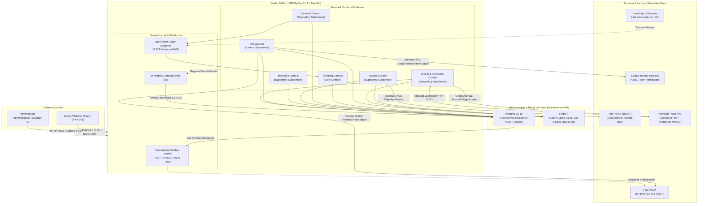

# Navby Platform — Arquitectura Detallada del Backend (Master Architecture Guide)

> **Rol en el pipeline documental:** Este documento es la **Especificación Maestra de Arquitectura de Software** para el backend de **Navby Platform** (`app.modules` y `app.shared`), construido sobre **Python 3.12+, FastAPI, uv, PostgreSQL 16 y Redis 7**. Define de forma vinculante y exhaustiva el stack tecnológico, los principios y patrones arquitectónicos, el catálogo de servicios externos, la estructura canónica universal de carpetas y los estándares tácticos de ingeniería que rigen a los 6 Bounded Contexts y al Shared Kernel.
>
> **Documentos de referencia y contexto:**
> - Biblia de producto y reglas de negocio: [../navby-documentation.md](../navby-documentation.md)
> - Esquema físico de base de datos relacional: [navby-database-schema.md](navby-database-schema.md)
> - Guía de diseño táctico DDD y código canónico: [navby-tactical-ddd-guide.md](navby-tactical-ddd-guide.md)
> - Especificación táctica canónica de fases: [navby-backend-tactical-specification.md](navby-backend-tactical-specification.md)
> - Arquitectura del cliente WebApp: [../frontend-architecture/navby-webapp-architecture.md](../frontend-architecture/navby-webapp-architecture.md)

---

## 1. Ecosistema y Stack Tecnológico General (Anti-sobreingeniería)

Dentro del ecosistema desacoplado de Navby, la **Platform (`navby-platform`)** actúa como el núcleo transaccional único y motor de cálculo algorítmico del sistema:

* **Stack tecnológico:** **Python 3.12+** + **FastAPI 0.111+** + **uv** + **PostgreSQL 16** + **Redis 7** + **SQLAlchemy 2.0 (async)** + **asyncpg** + **Alembic** + **Pydantic v2** + **Caddy 2** + **Docker Compose**.
* **Propósito y justificación:**
  * **Python 3.12+:** Cumple el requisito formal e inmutable de la cátedra de Complejidad Algorítmica de implementar el motor de grafos y algoritmos en Python puro.
  * **Grafo en memoria RAM (Singleton):** Los 3,354 aeropuertos y 37,326 aristas únicas de OpenFlights se instancian como listas de adyacencia en memoria RAM (~10 MB) en el arranque del servidor (`lifespan`), logrando consultas algorítmicas en milisegundos con cero sobrecoste de I/O de base de datos.
  * **PostgreSQL 16:** Motor relacional ACID robusto para cuentas de usuario, órdenes de compra, itinerarios inmutables (vía *snapshots* JSONB) y auditoría append-only.
  * **Redis 7:** Capa de almacenamiento en memoria de ultra-alta velocidad para caché *Cache-Aside* de cotizaciones externas (TTL 30 min) y operaciones atómicas de saldo de créditos mediante scripts Lua para evitar condiciones de carrera (*race conditions*).
  * **uv y FastAPI:** uv proporciona una gestión de paquetes e intérprete en Python ultrarrápida escrita en Rust; FastAPI expone contratos tipados bajo OpenAPI 3.1 y concurrencia asíncrona nativa.
* **Criterio anti-sobreingeniería:** Se adopta un **Monolito Modular** estructurado en Bounded Contexts cohesivos, evitando la sobrecarga de latencia, orquestación y redes que acarrean los microservicios distribuidos; se descartan brokers de eventos externos pesados (Apache Kafka o RabbitMQ), implementando en su lugar el **Transactional Outbox Pattern** directamente sobre PostgreSQL (`outbox_events` con desapilado concurrente `FOR UPDATE SKIP LOCKED`); y se descarta almacenar el grafo de rutas en tablas SQL para evitar *JOINs* recursivos costosos.
* **Despliegue y viabilidad en Azure ($100 USD de crédito):**
  * **Especificación recomendada:** Máquina Virtual **Standard_B2s** (serie Burstable con 2 vCPUs, 4 GB de RAM y disco SSD estándar de 32 GB) bajo sistema operativo Ubuntu 24.04 LTS.
  * **Análisis de costes y duración:** La instancia Standard_B2s tiene un coste aproximado de ~$0.0416/hora ($\approx$ **~$30 USD/mes**). Con los **$100 USD de crédito de Azure**, la VM puede operar **24/7 de forma continua durante más de 3 meses completos (~100 días)**, cubriendo con holgura todo el semestre académico (TB1, TB2 y sustentación de la Semana 15).
  * **Optimización de crédito (Auto-Shutdown):** Activando el apagado automático diario a las 23:00 en Azure Portal para días sin pruebas activas, los $100 de crédito rinden fácilmente para **más de 6 a 8 meses**.
  * **Capacidad técnica:** El consumo base de todos los servicios contenerizados (FastAPI + PostgreSQL + Redis + Caddy) ronda apenas entre 500 MB y 1 GB de RAM, garantizando que los 4 GB de la VM absorban picos de carga sin riesgo de *Out-Of-Memory* (OOM).
  * **Seguridad perimetral y Caddy 2:** Caddy 2 opera como proxy inverso en el contenedor frontal, gestionando certificados TLS HTTPS automáticos (Let's Encrypt). En el Azure Network Security Group (NSG) **únicamente se exponen los puertos 80 y 443** (y SSH 22 restringido); PostgreSQL (5432) y Redis (6379) permanecen estrictamente aislados en la red interna de Docker sin exposición pública.

---

## 2. Arquitectura del Backend: Casos de Uso, DDD-lite, ACL, CQRS-lite y Transactional Outbox

Siguiendo el estándar de referencia de ingeniería de software, el backend se implementa como un **Monolito Modular con Clean Architecture + DDD-lite + CQRS-lite**, donde cada caso de uso es un servicio de aplicación orquestador con fronteras transaccionales bien definidas:

* **Casos de uso (CQRS-lite):** Comandos de escritura (`PlanTripUseCase`, `SaveItineraryUseCase`, `PurchaseCreditsUseCase`…) desacoplados de consultas de lectura (`SearchAirportsQuery`, `GetNetworkAnalysisQuery`…) — sin la sobreingeniería de event-sourcing ni buses pesados, garantizando claridad en el flujo de control funcional con el monad `Result[T, E]`.
* **Orquestación del Flujo de Planificación («Escudo OpenFlights»):**
  1. `PlanTripUseCase` recibe el comando desde el controlador HTTP, invoca el puerto `RouteGraphProvider` y ejecuta la estrategia algorítmica seleccionada (`RoutePlanningStrategy`) directamente sobre el grafo en memoria RAM (resolviendo BFS, Dijkstra, A*, DP o Backtracking en milisegundos con costo $0 de API).
  2. Valida la aciclicidad mediante DFS y aplica ordenamiento topológico a las conexiones del itinerario.
  3. Si el usuario solicita cotización de mercado, el caso de uso orquesta la llamada hacia el contexto `Quotes` a través de su interfaz de puerto.
  4. `Quotes` verifica el caché caliente en Redis 7 (Cache-Aside con TTL 30-60 min). Ante un *cache-miss*, ejecuta un **Script Lua atómico en Redis** para debitar el crédito correspondiente (verificando saldo disponible de forma segura contra condiciones de carrera) y despacha la petición HTTPS a **FlightAPI** (*One Way* o *Round Trip*).
* **Transactional Outbox Pattern:** Garantía de consistencia eventual y entrega *at-least-once* de eventos de dominio entre bounded contexts (ej. `IAM` → `Credits & Payments` para inicializar la billetera ante `UserRegisteredEvent`, o `Credits` → `Itineraries` tras confirmación de compra). El agregado mutado y el evento de integración se persisten atómicamente dentro de la misma transacción ACID en PostgreSQL en la tabla `outbox_events`, eliminando el problema de escritura dual (*dual-write problem*). Un worker asíncrono desacola los eventos pendientes con `FOR UPDATE SKIP LOCKED`.
* **Puertos y adaptadores (Arquitectura Hexagonal):** El dominio (grafo y algoritmos en Python puro) es 100% agnóstico de frameworks (FastAPI, SQLAlchemy, Redis y Flight API).
* **Capa Anti-Corrupción (ACL):** Adaptadores de salida en infraestructura que aíslan el modelo del dominio traduciendo payloads externos de FlightAPI (RapidAPI) y Mercado Pago (Checkout Pro y Webhooks HMAC) a Value Objects y Entidades limpias de Navby.
* **Strategy Pattern (`RoutePlanningStrategy`):** Los algoritmos de optimización (BFS para escalas mínimas, Dijkstra y A* para tiempo mínimo, Backtracking con poda para rutas alternativas, y Programación Dinámica para multicriterio) se implementan bajo un mismo contrato de protocolo abstracto (`typing.Protocol`), permitiendo alternar estrategias dinámicamente en tiempo de ejecución y habilitar benchmarks comparativos directos sin alterar la capa de aplicación.

La especificación táctica completa (estructura por capas, entidades, casos de uso, endpoints) vive en [navby-backend-tactical-specification.md](navby-backend-tactical-specification.md) y la guía de patrones en [navby-tactical-ddd-guide.md](navby-tactical-ddd-guide.md).

---

## 3. Bounded Contexts (Diseño Estratégico DDD Verificado)

Verificación con análisis de dominio (subdominios, cohesión lingüística y fronteras). **Nota:** el Tactical DDD se adopta como **práctica voluntaria de ingeniería** (no lo exige la rúbrica de Complejidad Algorítmica), con el fin de documentar el "diseño del aplicativo" con rigor.

### Clasificación de subdominios

| Bounded Context | Subdominio | Clasificación | Razón |
| :--- | :--- | :--- | :--- |
| **Route Planning** (motor de rutas) | Core | **Core Domain** | Ventaja competitiva + núcleo evaluado por la rúbrica; lógica algorítmica propia y compleja |
| **Flight Network** (catálogo de aeropuertos + análisis de red) | Soporte | **Supporting** | Esencial pero basado en datos estáticos; incluye catálogo (resolución ciudad→aeropuerto) y análisis (hubs, MST) porque comparten el mismo lenguaje (grafo, aeropuerto, conectividad) |
| **Quotes** (cotización de precios Flight API) | Soporte | **Supporting** | Esencial para el valor percibido, pero su complejidad es integración externa + políticas de costo, no algoritmos propios |
| **Itineraries** (vuelos planificados guardados) | Soporte | **Supporting** | CRUD con reglas de propiedad; valor de retención del usuario |
| **Credits & Payments** (créditos Navby + Mercado Pago) | Soporte | **Supporting** | Monetización con reglas propias (cuota diaria, doble saldo, compra); no es genérica porque las reglas son específicas de Navby |
| **IAM** (usuarios, OTP, Google OAuth) | Genérico | **Generic** | Problema estándar con solución estándar |
| **Shared Kernel** | — | Transversal | Identificadores fuertemente tipados (`UserId`), VOs comunes (`IATACode`, `GeoPoint`, `Money`), contenedor monádico `Result[T, E]`, jerarquía `DomainError`, mixin de auditoría temporal y tabla `outbox_events` para el Transactional Outbox |

---

## 4. Infraestructura Cloud, Despliegue y Viabilidad de Presupuesto ($100 USD en Azure)

### 4.1 Despliegue del Backend (Navby Platform en Azure VM)
El backend completo se despliega en una única máquina virtual de Azure orquestada con **Docker Compose**:
* **`caddy`:** Servidor web y reverse proxy de grado de producción que expone los puertos 80 y 443, provisiona automáticamente certificados TLS con Let's Encrypt y redirige el tráfico HTTPS hacia el contenedor de la API.
* **`api`:** Contenedor de FastAPI ejecutando Python 3.12+ con uv y Uvicorn sobre el puerto interno 8000.
* **`postgres`:** Base de datos relacional PostgreSQL 16 con volumen Docker persistente montado en disco local.
* **`redis`:** Servidor Redis 7 protegido por contraseña (`requirepass`) y persistencia AOF para caché caliente y scripts Lua atómicos.

### 4.2 Seguridad de Red y Aislamiento Físico
* El Azure Network Security Group (NSG) expone hacia internet de forma exclusiva tres puertos:
  * **80 (HTTP):** Redirección forzada a HTTPS gestionada por Caddy.
  * **443 (HTTPS):** Tráfico seguro cifrado hacia la API.
  * **22 (SSH):** Acceso administrativo protegido mediante llave criptográfica (RSA 4096 / Ed25519) con autenticación por password deshabilitada.
* Los servicios internos (**PostgreSQL en puerto 5432** y **Redis en puerto 6379**) están confinados estrictamente a la red privada `bridge` de Docker, careciendo de mapeo de puertos hacia la interfaz de red pública de la máquina virtual.

### 4.3 Sizing de Hardware y Consumo de Recursos (`Standard_B2s`)
* **Especificaciones de la VM:** Instancia `Standard_B2s` con **2 vCPUs virtuales**, **4.0 GiB de memoria RAM**, 32 GB de almacenamiento Premium SSD y sistema operativo **Ubuntu 24.04 LTS x64**.
* **Consumo de Memoria por Contenedor:**
  * Caddy 2: ~30 MB
  * FastAPI (Python 3.12 + uv): ~150 MB
  * PostgreSQL 16: ~200 MB
  * Redis 7: ~50 MB
  * **Consumo Total en Runtime:** ~450 MB a 1.0 GiB.
* **Margen de Seguridad:** La máquina virtual dispone de más de **3 GiB de RAM libres**, garantizando holgura total para ráfagas de tráfico, cálculo intensivo de grafos en memoria y operaciones concurrentes, eliminando por completo el riesgo de congelamiento o reinicios por Out Of Memory (OOM Killer).

### 4.4 Viabilidad Financiera del Crédito de $100 USD de Azure
* **Costo Horario de `Standard_B2s`:** ~$0.0416 USD/hora.
* **Costo Mensual en Operación Continua (24/7):** ~$30.37 USD/mes.
* **Duración Garantizada:** El crédito de $100 USD cubre aproximadamente **100 días consecutivos de operación 24/7** (más de 3 meses y medio continuos). Esto asegura cobertura total y sin interrupciones desde el inicio de las pruebas de integración hasta la entrega final del hito TB2 y la sustentación en la Semana 15 del ciclo académico.
* **Optimización con Auto-Shutdown Programado:** Habilitando la regla nativa de auto-apagado de Azure durante horarios nocturnos (por ejemplo, apagado programado de 23:00 a 08:00 en días no críticos de pruebas), el consumo mensual desciende a ~$12 - $15 USD/mes, extendiendo la vigencia de los $100 USD a más de **6 a 8 meses** de entorno de desarrollo y pruebas.

---

## 5. Naturaleza del Backend y Alcance Operativo

### 1.1 El Backend como Núcleo Transaccional y Algorítmico Único
En la arquitectura del ecosistema Navby, el **Backend (`API Application`)** actúa como la **Fuente Única de Verdad (*Single Source of Truth*)**, concentrando la totalidad de las reglas de negocio transaccionales, las políticas de seguridad, las integraciones con pasarelas de pago y proveedores aéreos, y el cómputo algorítmico intensivo sobre grafos. 

El backend expone una interfaz de comunicación exclusivamente mediante **API RESTful JSON**, documentada automáticamente bajo el estándar **OpenAPI 3.1**. Todos los clientes presentes (Webapp SPA) y futuros (aplicaciones móviles o integraciones B2B) consumen esta API de forma homogénea.

### 1.2 Responsabilidades Fundamentales y Restricciones de Cátedra
El sistema asume 5 responsabilidades primordiales:
1. **Motor de Rutas Óptimas (Core Domain):** Cómputo en memoria sobre el grafo aéreo mundial derivado de OpenFlights (núcleo del curso de *Complejidad Algorítmica*). Todos los algoritmos de búsqueda y optimización (BFS, Dijkstra, Backtracking con poda, Programación Dinámica) se ejecutan estrictamente en este backend en Python 3.12.
2. **Proxy Seguro de Cotización con Escudo de Caché (Flight API):** Intermediación controlada hacia la API de cotización en tiempo real, implementando una arquitectura de caché en dos niveles (*Redis Cache-Aside* y persistencia relacional) y control presupuestario por créditos de usuario para proteger costos operativos.
3. **Custodia e Inmutabilidad de Itinerarios Planificados:** Persistencia de planes de viaje guardados con congelamiento de ruta mediante *snapshots* inmutables JSONB independientes de la evolución futura del grafo aéreo.
4. **Gestión de Identidad, Sesiones y Seguridad Perimetral (IAM):** Autenticación dual (credenciales locales cifradas con bcrypt de 12 rondas y federada mediante Google Identity OIDC), verificación de identidad por correo electrónico (OTP numérico de 6 dígitos) y custodia de sesiones activas mediante tokens de refresco hasheados con SHA-256.
5. **Billetera de Créditos y Pasarela de Pagos (Mercado Pago):** Gestión de saldos mediante contabilidad por partida doble (*Ledger append-only*), transacciones atómicas no bloqueantes en memoria (scripts Lua en Redis 7) e ingesta idempotente de notificaciones asíncronas de pago (*Webhooks* con validación de firmas HMAC-SHA256).

> [!IMPORTANT]
> **Restricción Académica Inmutable:** Todo el procesamiento algorítmico sobre estructuras de datos avanzadas y grafos reside obligatoriamente en el Backend en **Python 3.12**. Queda estrictamente prohibido delegar cualquier cálculo algorítmico o análisis de red al cliente web frontend.

### 1.3 Asimetría Arquitectónica: Backend vs. Frontend
Existe una demarcación estricta de responsabilidades entre el Backend y la Webapp:

| Dimensión de Diseño | Backend API (`navby-platform`) | Webapp SPA (`navby-webapp`) |
| :--- | :--- | :--- |
| **Lenguaje y Entorno** | **Python 3.12+ / FastAPI / uv** en Linux (Azure VM) | **TypeScript / React / Vite** (Vercel CDN) |
| **Paradigma Táctico** | **Clean Architecture / Hexagonal / Tactical DDD / CQRS** | Feature-First / Component-Driven / React Hooks |
| **Capa de Entrada** | **Interface Layer:** REST Controllers OOP, Resources (Pydantic), Webhooks | UI Components, TanStack Query, React Router |
| **Lógica de Negocio** | **Domain & Application:** Casos de uso, Invariantes, Grafos en RAM | Formateo visual, manejo de estado de UI y validaciones perimetrales |
| **Persistencia** | PostgreSQL 16 relacional (ACID) y Redis 7 distribuido | `localStorage` / `sessionStorage` para token JWT transitorio |
| **Ejecución Algorítmica** | Grafos en RAM (BFS, Dijkstra, Backtracking, DP, Tarjan, Kruskal) | Renderizado visual de mapas SVG y curvas analíticas (Recharts) |

---

## 6. Stack Tecnológico y Decisiones de Ingeniería

### 2.1 Matriz Tecnológica Canónica

| Capa / Subsistema | Tecnología Seleccionada | Justificación Técnica y Criterio de Selección |
| :--- | :--- | :--- |
| **Lenguaje Core** | **Python 3.12+** | Requisito formal de cátedra; soporte nativo de tipos estrictos (`type`, `Generic`, `Protocol`), dataclasses inmutables y rendimiento optimizado en evaluación de bytecodes. |
| **Framework Web** | **FastAPI 0.111+** | Framework asíncrono ASGI nativo de ultra alto rendimiento, integración nativa con Pydantic v2, generación automática de contratos OpenAPI 3.1 e inyección de dependencias desacoplada. |
| **Validación y DTOs** | **Pydantic v2** | Validación estricta en compilación C (Rust Core), inmutabilidad garantizada (`ConfigDict(frozen=True, extra="forbid")`), validación de tipos complejos (IATA, GeoPoint, Email). |
| **Base de Datos Relacional** | **PostgreSQL 16** (Docker en Azure VM) | Motor transaccional ACID por excelencia; clave técnica escalar `BIGINT GENERATED ALWAYS AS IDENTITY`, soporte de documentos inmutables `JSONB` y bloqueo de concurrencia no invasivo `FOR UPDATE SKIP LOCKED`. |
| **Caché y Concurrencia** | **Redis 7** (Docker en Azure VM) | Estructuras de datos nativas en memoria (String, Hash), scripts Lua atómicos en un solo ciclo de CPU para prevención de *race conditions* en saldo de créditos, y TTLs obligatorios. |
| **ORM y Mapeo Físico** | **SQLAlchemy 2.0 (Async) + Alembic** | ORM moderno con soporte nativo de corrutinas asíncronas (`async_sessionmaker`), tipado estricto `Mapped[...]` y control versionado determinista del esquema de base de datos con Alembic. |
| **Driver de Conexión** | **asyncpg** | El driver asíncrono para PostgreSQL más veloz del ecosistema Python, operando directamente sobre el protocolo binario de red de Postgres. |
| **Configuración Segura** | **pydantic-settings** | Validación estricta de variables de entorno tipadas mediante `.env`, inmutabilidad en tiempo de arranque y aislamiento total de secretos fuera del repositorio Git. |
| **Cifrado y Seguridad** | **BCrypt + PyJWT** | Cifrado unidireccional de contraseñas con coste computacional configurable (12 rondas de hashing salado) y emisión/validación de tokens JWT Bearer (HS256) con expiración corta (30 min). |
| **Servidor ASGI & Proxy** | **Uvicorn + Caddy 2** | Uvicorn como servidor de trabajadores ASGI; Caddy como proxy inverso perimetral con gestión automatizada de certificados TLS (HTTPS Let's Encrypt). |
| **Email Transaccional** | **Resend (API HTTPS 443)** | Despacho asíncrono no bloqueante vía API REST JSON sobre HTTPS; elimina de raíz los bloqueos y timeouts de sockets que sufren los puertos SMTP tradicionales (25, 465, 587) en infraestructuras Cloud. |
| **Autenticación Federada**| **Google Identity (OAuth2 / OIDC)** | Verificación criptográfica de firmas de tokens JWT emitidos por Google Identity (`google-auth`) cotejados contra las claves públicas rotativas del proveedor. |
| **Pasarela de Pagos** | **Mercado Pago (SDK Oficial)** | Checkout Pro para pagos en moneda local; confirmación transaccional asíncrona mediante Webhooks firmados con HMAC-SHA256 e idempotencia garantizada por clave foránea única. |
| **Testing y Calidad** | **pytest + pytest-asyncio + httpx** | Suite de pruebas unitarias puras de dominio sin Docker (ejecución en milisegundos mediante adaptadores en memoria) y pruebas de integración de API sobre clientes HTTP asíncronos. |
| **Linters y Formateo** | **ruff** | Herramienta ultrarrápida escrita en Rust que reemplaza a flake8, black e isort, garantizando conformidad con PEP 8 y estándares de código limpio. |

### 2.2 Decisiones Técnicas Descartadas

| Alternativa Evaluada | Veredicto | Justificación del Descarte |
| :--- | :---: | :--- |
| **Flask / Django** | **Descartado** | Flask carece de concurrencia asíncrona nativa para I/O intensivo hacia pasarelas externas; Django es un framework monolítico pesado pensado para vistas server-side acopladas a su propio ORM sincrónico. |
| **Almacenar el Grafo en BD Relacional** | **Descartado** | El grafo mundial de OpenFlights es estático y versionado; almacenarlo en tablas SQL implicaría costosos *JOINs* recursivos para búsquedas de rutas. Reside como un *Singleton* de listas de adyacencia en memoria RAM (~10 MB), logrando lecturas O(1) y tiempos de cálculo de milisegundos. |
| **Brokers Externos Pesados (Kafka / RabbitMQ)** | **Descartado** | Mantener un clúster de Kafka o RabbitMQ en la máquina virtual de Azure introduce una sobrecarga operativa y de memoria excesiva. Se implementa en su lugar el **Transactional Outbox Pattern** sobre PostgreSQL 16 con desapilado no bloqueante (`SKIP LOCKED`), garantizando entrega *at-least-once* y consistencia transaccional ACID pura. |
| **Soft Delete Generalizado** | **Descartado** | Degrada el rendimiento de índices relacionales y complica las restricciones de unicidad (`UNIQUE`). Se utiliza borrado físico directo (`ON DELETE CASCADE`) para entidades transitorias o revocadas, y marcado explícito de estado para auditoría de negocio (`revoked_at`). |

---

## 7. Catálogo Integral de Servicios Externos e Infraestructura

La arquitectura de Navby Platform orquesta servicios externos y componentes de infraestructura cloud mediante adaptadores desacoplados en la capa de infraestructura, aplicando patrones de resiliencia empresarial:



### 3.1 Flight API (Quotes Context)
* **Propósito:** Obtención de cotizaciones tarifarias reales (top-3 precios) con enlaces de reserva directa (*deepLinks*) para el trayecto seleccionado por el usuario.
* **Integración Técnica:** Adaptador secundario `FlightApiAdapter` consumiendo endpoints REST mediante `httpx.AsyncClient`.
* **Decisiones Arquitectónicas:**
  - **Fast-Path Cache-Aside:** Todo itinerario ya consultado se almacena en Redis 7 con un TTL de 30 a 60 minutos. Las consultas idénticas consumen 0 créditos de usuario y 0 peticiones externas.
  - **Presupuesto Diario del Proveedor:** Control de consumo mediante el contador atómico en Redis `navby:quota:flightapi:used:{YYYY-MM-DD}`. Si la cuota se agota, se activa una degradación controlada sirviendo la última cotización histórica de PostgreSQL con cabecera `X-Data-Stale: true`.

### 3.2 Mercado Pago (Credits & Payments Context)
* **Propósito:** Monetización de la plataforma mediante la venta de paquetes de créditos de cotización Navby bajo modelo *pay-per-use*.
* **Integración Técnica:** SDK oficial de Mercado Pago en Python; creación de preferencias de pago (*Checkout Pro*) con redirección segura.
* **Decisiones Arquitectónicas:**
  - **Validación Criptográfica de Firmas Webhook:** Todo webhook entrante en `interfaces/webhooks/controllers/mercado_pago_webhook_controller.py` es verificado matemáticamente contra la clave secreta `MERCADO_PAGO_WEBHOOK_SECRET` mediante HMAC-SHA256, descartando solicitudes fraudulentas.
  - **Idempotencia Garantizada:** La tabla relacional `credit_purchase_orders` impone una restricción de unicidad estricta (`UNIQUE`) sobre la columna `external_payment_id`. Cualquier reintento de entrega es reconocido con HTTP 200 pero descartado sin duplicar abonos de saldo.

### 3.3 Resend API HTTPS 443 (Transversal: IAM, Credits)
* **Propósito:** Servicio omnicanal de correos electrónicos transaccionales para verificación de identidad, recuperación de acceso y comprobantes de compra.
* **Justificación de Infraestructura:** El despliegue del backend en la VM bloquea los puertos SMTP estándar (25, 465, 587) para prevención de spam y cumplimiento con proveedores cloud. Resend opera exclusivamente mediante peticiones seguras sobre HTTPS (puerto 443).
* **Decisiones Arquitectónicas:**
  - Implementado mediante `ResendEmailAdapter` en `infrastructure/adapters/email/`.
  - Despacho asíncrono desacoplado mediante eventos de dominio en el Transactional Outbox, evitando que una latencia en el servicio de correo ralentice la respuesta al usuario final.

### 3.4 Google Identity Services (IAM Context)
* **Propósito:** Autenticación federada Single Sign-On (SSO) mediante Google OAuth 2.0 / OpenID Connect (OIDC).
* **Decisiones Arquitectónicas:**
  - El cliente frontend obtiene un `id_token` criptográfico de Google y lo transfiere al endpoint `POST /api/v1/auth/google`.
  - El adaptador `GoogleOAuthAdapter` verifica localmente la firma del token contra los certificados públicos rotativos de Google, validando audiencia (`aud == GOOGLE_CLIENT_ID`) y expiración. Si el correo existe localmente, se vincula; si no, se auto-aprovisiona la cuenta en estado `ACTIVE`.

### 3.5 PostgreSQL 16 Relacional & Transactional Outbox
* **Propósito:** Motor transaccional central para la persistencia de cuentas, itinerarios, órdenes de compra y eventos de integración.
* **Decisiones Arquitectónicas:**
  - **Claves Primarias Escalares Monótonas:** Se estandariza `BIGINT GENERATED ALWAYS AS IDENTITY` para todas las entidades físicas, garantizando una localidad de caché B-Tree óptima en almacenamiento y eliminando la fragmentación de índices.
  - **Transactional Outbox:** La tabla física `outbox_events` registra los eventos emitidos por los agregados en la misma transacción ACID de PostgreSQL en la que se confirma el cambio de estado. Un proceso en segundo plano consulta los eventos pendientes mediante `FOR UPDATE SKIP LOCKED`, garantizando entrega sin bloqueos ni contención de concurrencia.

### 3.6 Redis 7 Distribuido
* **Propósito:** Almacén de ultra alta velocidad en memoria para caché de cotizaciones, limitación de tasa y operaciones atómicas de saldo.
* **Decisiones Arquitectónicas:**
  - Operaciones multi-paso garantizadas mediante **scripts Lua atómicos** (check-and-decrement en un solo ciclo de ejecución).
  - Nombres de clave canónicos estructurados y jerárquicos delimitados por dos puntos (`navby:{modulo}:{entidad}:{id}`).
  - Política de desalojo `allkeys-lru` y persistencia periódica AOF (`appendfsync everysec`) para tolerar reinicios accidentales sin pérdida de transacciones en curso.

---

## 8. Principios y Patrones Arquitectónicos Rectores

### 4.1 Clean Architecture y la Regla de Dependencia hacia el Interior
La arquitectura impone que las dependencias del código fluyan **exclusivamente hacia adentro**:
* La Capa de **Dominio** no depende de nada (cero imports de frameworks, ORMs o librerías externas).
* La Capa de **Aplicación** solo conoce a la Capa de Dominio.
* Las Capas de **Infraestructura** e **Interfaces** dependen de la Capa de Aplicación y del Dominio, nunca al revés.

```
┌─────────────────────────────────────────────────────────────────────────┐
│                          INTERFACES LAYER                               │
│     (REST Controllers OOP, Resources Pydantic v2, DTO Assemblers, OHS)  │
│  ┌───────────────────────────────────────────────────────────────────┐  │
│  │                       APPLICATION LAYER                           │  │
│  │   (Command/Query Handlers, Outbound ACL Ports, ApplicationError)  │  │
│  │  ┌─────────────────────────────────────────────────────────────┐  │  │
│  │  │                      DOMAIN LAYER                           │  │  │
│  │  │  (Aggregates, Entities, Value Objects, Domain Exceptions)   │  │  │
│  │  └─────────────────────────────────────────────────────────────┘  │  │
│  └───────────────────────────────────────────────────────────────────┘  │
│                        INFRASTRUCTURE LAYER                             │
│     (SQLAlchemy Mappers, Repository Impl, Redis Adapters, Gateways)     │
└─────────────────────────────────────────────────────────────────────────┘
```

### 4.2 Hexagonal Architecture: Puertos y Adaptadores (DIP)
El núcleo transaccional interactúa con el mundo exterior mediante **Puertos** (interfaces abstractas o protocolos de Python). Los sistemas externos (PostgreSQL, Redis, Resend, Mercado Pago) son **Adaptadores** intercambiables. Esto permite ejecutar pruebas unitarias exhaustivas en memoria en milisegundos sustituyendo adaptadores reales por simuladores en memoria (`InMemoryRepository`, `InMemoryEmailAdapter`).

### 4.3 Diferenciación Formal: Inbound ACL vs. Outbound ACL vs. Outbound Adapter

Uno de los pilares de diseño de Navby Platform es la delimitación estricta entre las interfaces de entrada (fachadas expuestas) y los contratos de salida requeridos por los casos de uso:

```mermaid
flowchart LR
    subgraph AppLayer ["Capa de Aplicación (application/acl/ports)"]
        UseCase["RegisterUserCommandHandler / UseCase\n(Caso de Uso Orquestador)"]
        Port["<<Protocol / Interface>>\nEmailService / PaymentGateway\n+ send_verification_email()"]
    end

    subgraph InfraLayer ["Capa de Infraestructura (infrastructure/adapters)"]
        Adapter["<<Adapter>>\nResendEmailAdapter / MercadoPagoAdapter\n(Implementa el Puerto via DIP)"]
    end

    subgraph ExternalWorld ["Mundo Exterior / Proveedor Externo"]
        Vendor["API Externa Cloud (HTTPS JSON)\n(Resend, Google OIDC, Mercado Pago)"]
    end

    UseCase -->|Invoca el contrato abstracto| Port
    Adapter -.->|Realiza / Implementa el contrato (DIP)| Port
    Adapter -->|Ejecuta la llamada técnica (HTTP / SDK)| Vendor
```

* **Inbound ACL (Open Host Service) — Ubicación: `interfaces/acl/`:**
  - Es la fachada pública tipada que **este Bounded Context expone** hacia el interior del monolito para que otros módulos lo consulten de forma limpia y desacoplada (ej: `IamContextFacade` permite a `itineraries` verificar la validez de un usuario sin acceder a la tabla `user_accounts`).
* **Outbound ACL (Port Interface) — Ubicación: `application/acl/ports/`:**
  - Es el **contrato abstracto puro** (interfaz/protocolo) que define **qué necesita la aplicación** de un servicio externo (ej: `EmailService`, `FlightApiGateway`). Cero imports de librerías externas.
* **Outbound Adapter (Implementation) — Ubicación: `infrastructure/adapters/`:**
  - Es la **implementación técnica concreta** que realiza el contrato del puerto comunicándose con la tecnología real (ej: `ResendEmailAdapter`, `MercadoPagoPaymentAdapter`).

### 4.4 CQRS Táctico (Segregación de Comandos y Consultas)
Se separan nítidamente las operaciones de escritura y lectura:
* **Commands:** Modifican el estado del sistema (`RegisterUserCommand`, `PlanTripCommand`, `PurchaseCreditsCommand`). Se procesan en manejadores de comandos (`command_handlers`) dentro de transacciones ACID y retornan `Result[T, ApplicationError]`.
* **Queries:** Consultas de lectura inmutables (`SearchAirportsQuery`, `GetUserProfileQuery`, `GetQuotesQuery`). Se procesan en manejadores de consultas (`query_handlers`), evitando mutaciones de estado colaterales.

### 4.5 Functional Result Monad (`Result[T, E]`) vs. Domain Exceptions
Para el control de flujo transaccional y la preservación de reglas de negocio, se aplica una segregación estricta:
1. **Invariantes de Dominio (`DomainException`):** Dentro de entidades y Value Objects, la violación de una invariante fundamental de negocio (ej. coordenadas GPS inválidas, monto de dinero negativo, formato de token corrupto) levanta de forma inmediata una excepción semántica especializada heredando de `DomainException` en `domain/exceptions/`.
2. **Flujo de Negocio Ordinario (`Result[T, E]`):** En la Capa de Aplicación (`app.shared.application.result`), los casos de uso gobiernan su flujo mediante la mónada funcional `Result`. Respuestas esperadas de negocio (credenciales incorrectas, cuenta no verificada, saldo insuficiente, recurso no hallado) retornan `Result.failure(ApplicationError)` en lugar de lanzar excepciones descontroladas, permitiendo composición funcional (`map`, `bind`, `match`).

### 4.6 Transactional Outbox Pattern y Consistencia Eventual
Para garantizar que las mutaciones de estado y la emisión de eventos de dominio sean atómicas e inmunes a fallos de red o reinicios imprevistos:
1. Al mutar un agregado, este acumula eventos de dominio en memoria (`self.register_domain_event(event)`).
2. El repositorio de infraestructura, dentro de la misma transacción ACID de PostgreSQL, serializa los eventos y los inserta en la tabla física `outbox_events`.
3. Un worker en segundo plano extrae los eventos pendientes mediante la consulta no bloqueante:
   ```sql
   SELECT * FROM outbox_events WHERE status = 'PENDING' ORDER BY occurred_on ASC LIMIT 50 FOR UPDATE SKIP LOCKED;
   ```
4. Los eventos se despachan a los adaptadores externos o al bus de integración y se marcan como `PUBLISHED`.

### 4.7 Fowler's DTO Assembler Pattern (Aislamiento de Transporte)
Los controladores REST jamás exponen entidades de dominio ni reciben modelos ORM. Se implementan ensambladores especializados (`assemblers/`) que transforman de manera pura y determinista:
* `Request Resource (DTO)` $\longrightarrow$ `Application Command / Query`
* `Domain Aggregate / Application Result` $\longrightarrow$ `Response Resource (DTO)`

### 4.8 Controladores REST Orientados a Objetos (Class-Based Controllers)
En consonancia con el rigor de la arquitectura de Atelier y las buenas prácticas de diseño orientado a objetos en Python, los controladores HTTP se modelan como **clases formales** (`<<RestController>>`):
* Cada controlador encapsula sus dependencias (Application Bus, Assembler).
* Agrupa los métodos de acción correspondientes a su ámbito funcional (`login`, `register`, `verify_email`).
* Registra explícitamente sus rutas en una instancia interna de `APIRouter`.
* Aparece de forma clara y trazable en los **Diagramas de Clases UML** con visibilidad, tipos de retorno y relaciones de dependencia.

### 4.9 Modelado de Datos Redis 7 y Convenciones de Claves
Siguiendo las directrices de las skills `redis-core` y `redis-best-practices`:
* **Claves con nomenclatura jerárquica en minúscula:** Separadas por dos puntos con prefijo global del proyecto:
  - `navby:cache:quote:{sha256_hash}` (String JSON, TTL 1800-3600 seg)
  - `navby:credits:{user_id}` (Hash con campos `free`, `paid`, `refreshed_on`)
  - `navby:quota:flightapi:used:{YYYY-MM-DD}` (String entero contador)
  - `navby:ratelimit:{endpoint}:{ip}` (String contador, TTL por ventana)
  - `navby:auth:blacklist:jti:{jti}` (String con TTL residual de JWT)
* **Operaciones Atómicas:** Toda operación de validación y débito de saldos se ejecuta mediante **scripts Lua precompilados**, asegurando aislamiento total sin bloqueos distribuidos pesados.

---

## 9. Plan de Desarrollo Bounded Context por Bounded Context

Para asegurar la uniformidad absoluta en los 6 Bounded Contexts y el Shared Kernel, el diseño táctico se estructura en fases secuenciales:

| Fase | Bounded Context | Clasificación DDD | Paquete Canónico Python | Tablas Físicas Asignadas | Integraciones y Servicios Externos |
| :---: | :--- | :--- | :--- | :--- | :--- |
| **0** | **Shared Kernel** | Transversal | `app.shared` | `outbox_events` (1 tabla) | PostgreSQL 16, Redis 7, Pydantic v2, PyJWT, RFC 7807 |
| **1** | **Identity & Access (IAM)** | Generic Subdomain | `app.modules.iam` | `user_accounts`, `refresh_tokens`, `verification_tokens` (3 tablas) | Resend API (HTTPS 443), Google Identity (OIDC), BCrypt, PyJWT |
| **2** | **Route Planning** | Core Domain | `app.modules.planning` | *En Memoria RAM* (Cero tablas relacionales) | Motor de Grafos OpenFlights, Algoritmos BFS / Dijkstra / DP |
| **3** | **Aviation Network** | Supporting Subdomain | `app.modules.network` | *En Memoria RAM* (Cero tablas relacionales) | Datasets OpenFlights (.dat), Algoritmos Tarjan SCC / Kruskal MST |
| **4** | **Price Quotes** | Supporting Subdomain | `app.modules.quotes` | `quote_caches`, `api_credit_usages` (2 tablas) | Flight API (RapidAPI REST), Redis Cache-Aside, Quota Limiter |
| **5** | **Trip Itineraries** | Supporting Subdomain | `app.modules.itineraries` | `itineraries`, `itinerary_quotes` (2 tablas) | Snapshots Inmutables JSONB, PostgreSQL 16 ACID |
| **6** | **Credits & Payments** | Supporting Subdomain | `app.modules.credits` | `credit_wallets`, `credit_ledger_entries`, `credit_purchase_orders` (3 tablas) | Mercado Pago Checkout Pro & Webhooks HMAC, Scripts Lua en Redis |

---

## 10. Plantilla Estricta de Documentación por Bounded Context (Según Rúbrica 2.6)

Cada uno de los Bounded Contexts contendrá estrictamente las **7 secciones obligatorias**, idénticas al estándar de excelencia de Atelier:

1. **Diccionario y Propósito del Contexto:**
   - Propósito del contexto y límites de responsabilidad dentro de Navby Platform.
   - Decisiones críticas de diseño, seguridad e integraciones externas.
   - Matriz formal del Lenguaje Ubicuo (Tabla Markdown de 3 columnas).
2. **Domain Layer (Capa de Dominio):**
   - **Aggregates & Aggregate Roots:** Clases extendiendo `AbstractDomainAggregateRoot[ID]`, identificadores tipados (`TypedId`), atributos privados, invariantes y métodos de mutación registrando eventos de dominio.
   - **Entities:** Entidades internas dependientes con identidad escalar monótona.
   - **Value Objects:** Clases inmutables `@dataclass(frozen=True)` con validaciones y métodos de cálculo puro.
   - **Domain Enums:** Subtipos inmutables de `StrEnum`.
   - **Domain Events:** Eventos de dominio inmutables heredando de `DomainEvent`.
   - **Repositories (Interfaces):** Protocolos abstractos puros (`typing.Protocol`) sin dependencias de base de datos.
   - **Domain Services:** Servicios de dominio puro para lógica que abarca múltiples entidades.
   - **Domain Exceptions:** Jerarquía semántica de errores heredando de `DomainException`.
3. **Interface Layer (Capa de Interfaces):**
   - **REST Controllers:** Clases controladoras orientadas a objetos (`<<RestController>>`) con especificaciones OpenAPI 3.1.
   - **Resources / DTOs:** Modelos Pydantic v2 inmutables para Requests (`*RequestResource`) y Responses (`*ResponseResource`).
   - **Resource Assemblers:** Ensambladores bidireccionales DTO ↔ Command/Query/Response.
   - **Open Host Service (OHS) / Inbound ACL Facade:** Protocolo y clase de fachada expuesta a otros módulos.
   - **Webhook Controllers:** Controladores para la recepción e inspección de firmas de webhooks externos (ej. Mercado Pago).
   - **Integration Events (Published Language):** Eventos de integración publicados para consumo asíncrono externo.
4. **Application Layer (Capa de Aplicación):**
   - **Commands & Queries:** DTOs inmutables representativos de casos de uso de escritura y lectura.
   - **Command Handlers:** Manejadores CQRS orquestando transacciones y retornando `Result[T, ApplicationError]`.
   - **Query Handlers:** Manejadores de consulta inmutables retornando proyecciones optimizadas.
   - **Event Handlers & Listeners:** Oyentes de eventos de dominio para coordinación inter-agregados o despacho de correos.
   - **Outbound ACL Services / Ports:** Protocolos abstractos de los servicios externos que la aplicación requiere.
5. **Infrastructure Layer (Capa de Infraestructura):**
   - **SQLAlchemy Persistence Entities:** Clases ORM mapeadas físicamente a PostgreSQL extendiendo la base declarativa.
   - **Persistence Converters:** `TypeDecorator` de SQLAlchemy para persistir Value Objects (GeoPoint, Money, etc.).
   - **Repositories Adapters (`*RepositoryImpl`):** Implementaciones concretas de los puertos de dominio que usan SQLAlchemy.
   - **Persistence Assemblers:** Mapeadores bidireccionales ORM Model $\longleftrightarrow$ Agregado de Dominio.
   - **Outbound Adapters:** Implementaciones concretas de los puertos de salida (Resend, Flight API, Mercado Pago).
   - **Cache Adapters:** Clases adaptadoras de Redis 7 con scripts Lua atómicos.
   - **Security Services:** Implementaciones concretas de cifrado (BCrypt) y tokens (PyJWT).
6. **Diagramas C4 y UML de Arquitectura (Code Level):**
   - **Domain Layer Class Diagram:** Diagrama de clases UML completo en PlantUML DSL con atributos, visibilidad (`+`, `-`, `#`), métodos y multiplicidades explícitas (`1`, `*`, `0..1`).
   - **Interface Layer Class Diagram:** Diagrama de clases UML con Controllers, Resources, Assemblers y ACL Facades.
   - **Catálogos Taxonómicos y Tablas Detalladas:** Tabla formal estándar de 5 columnas sin puntos y coma internos.
7. **Database Design Diagram (ERD Relacional):**
   - Diagrama de Base de Datos relacional en PlantUML DSL y Mermaid con tablas físicas, tipos PostgreSQL, claves PK/FK y cardinalidades.

---

## 11. Estructura Canónica Universal de Paquetes y Carpetas

El backend de Navby Platform se estructura bajo la siguiente jerarquía de archivos estricta, unificada y predecible:

```text
navby-platform/
├── app/
│   ├── main.py                                 # Lifespan: carga del grafo singleton en RAM, registro de routers
│   │
│   ├── shared/                                 # Bounded Context Shared Kernel (Transversal)
│   │   ├── domain/                             #   AbstractDomainAggregateRoot, DomainEvent, TypedId
│   │   │   ├── model/                          #   Agregado base y eventos fundacionales
│   │   │   ├── value_objects/                  #   Money, Currency, IATACode, GeoPoint, UserId, EmailAddress
│   │   │   └── exceptions/                     #   DomainException, EntityNotFoundException, etc.
│   │   ├── application/                        #   Mónada Result[T, E] y contratos CQRS/Bus
│   │   │   ├── result/                         #   Result, ResultStatus, ApplicationError
│   │   │   ├── pagination/                     #   PagedQuery, PagedResult, SortDirection
│   │   │   ├── handlers/                       #   CommandHandler, QueryHandler, DomainEventHandler
│   │   │   ├── bus/                            #   CommandBus, QueryBus, InMemoryEventBus, DomainEventPublisher
│   │   │   └── ports/                          #   Puertos transversales: CachePort
│   │   ├── interfaces/                         #   Adaptadores REST transversales
│   │   │   ├── rest/
│   │   │   │   ├── resources/                  #   ErrorResource (RFC 7807), MessageResource, PaginationParams
│   │   │   │   └── transform/                  #   ErrorAssembler, ResponseAssembler (result_to_response)
│   │   │   ├── errors/                         #   GlobalExceptionHandler (interceptores FastAPI)
│   │   │   └── middleware/                     #   CorrelationIdMiddleware, SecurityHeadersMiddleware, RateLimitMiddleware
│   │   └── infrastructure/                     #   Persistencia relacional y conectividad base
│   │       ├── db/                             #   Engine async SQLAlchemy, Base declarativa, AuditablePersistenceMixin
│   │       ├── outbox/                         #   OutboxEventModel, SqlAlchemyOutboxRepository, OutboxPublisherAdapter
│   │       ├── redis/                          #   RedisConnectionManager (pool async)
│   │       ├── cache/                          #   RedisCacheAdapter (implementa CachePort)
│   │       └── config/                         #   AppSettings (pydantic-settings validando .env)
│   │
│   └── modules/                                # Bounded Contexts Modulares de Negocio
│       ├── {bounded_context}/                  # ej: iam, credits, itineraries, quotes, planning, network
│       │   ├── domain/                         # Capa de Dominio (Python puro)
│       │   │   ├── model/
│       │   │   │   ├── aggregates/             #   Raíces de agregado (AbstractDomainAggregateRoot)
│       │   │   │   ├── entities/               #   Entidades dependientes internas
│       │   │   │   ├── value_objects/          #   Value Objects específicos y Typed IDs
│       │   │   │   ├── enums/                  #   Enumeraciones discretas de dominio
│       │   │   │   └── events/                 #   Eventos de dominio internos (DomainEvent)
│       │   │   ├── repositories/               #   Protocolos puros de persistencia (<<Repository>>)
│       │   │   ├── services/                   #   Servicios de dominio puro
│       │   │   └── exceptions/                 #   Excepciones semánticas de negocio (*Exception)
│       │   │
│       │   ├── application/                    # Capa de Aplicación (Casos de uso y orquestación)
│       │   │   ├── commands/                   #   DTOs de comandos inmutables
│       │   │   ├── queries/                    #   DTOs de consultas inmutables
│       │   │   ├── handlers/                   #   Manejadores de casos de uso:
│       │   │   │   ├── command_handlers/       #     Manejadores de comandos (retornan Result)
│       │   │   │   ├── query_handlers/         #     Manejadores de consultas (retornan Result)
│       │   │   │   └── event_handlers/         #     Oyentes de eventos de dominio internos
│       │   │   ├── services/                   #   Servicios de aplicación orquestadores
│       │   │   └── acl/                        #   Outbound ACL Services (contratos hacia servicios externos):
│       │   │       └── ports/                  #     Protocolos abstractos (EmailService, PaymentGateway, etc.)
│       │   │
│       │   ├── interfaces/                     # Capa de Interfaces (Adaptadores primarios)
│       │   │   ├── rest/
│       │   │   │   ├── controllers/            #   Clases controladoras OOP (<<RestController>>)
│       │   │   │   ├── resources/              #   DTOs Pydantic v2 inmutables:
│       │   │   │   │   ├── requests/           #     Esquemas de solicitud (*RequestResource)
│       │   │   │   │   └── responses/          #     Esquemas de respuesta (*ResponseResource)
│       │   │   │   └── assemblers/             #     Fowler's DTO Assemblers (Resource ↔ Command/Query)
│       │   │   ├── webhooks/                   #   Controladores para webhooks externos (si aplica):
│       │   │   │   ├── controllers/            #     Ej: MercadoPagoWebhookController
│       │   │   │   └── resources/              #     DTOs del payload crudo externo
│       │   │   ├── events/                     #   Eventos de integración y consumidores:
│       │   │   │   ├── published/              #     Integration Events (Published Language)
│       │   │   │   └── consumers/              #     Consumidores de brokers asíncronos (si aplica)
│       │   │   ├── acl/                        #   Open Host Service (OHS) / Inbound ACL Facade:
│       │   │   │   ├── facade/                 #     Protocolo y clase de fachada para otros BCs
│       │   │   │   └── dtos/                   #     DTOs públicos inter-contextos
│       │   │   └── security/                   #   Guardias de seguridad perimetral HTTP (si aplica)
│       │   │
│       │   └── infrastructure/                 # Capa de Infraestructura (Adaptadores secundarios)
│       │       ├── persistence/                #   Persistencia relacional / ORM:
│       │       │   ├── entities/               #     Modelos ORM físicos (SQLAlchemy Mapped)
│       │       │   ├── converters/             #     TypeDecorators de SQLAlchemy (GeoPoint, Money)
│       │       │   ├── repositories/           #     Consultas de infraestructura (si aplica)
│       │       │   ├── adapters/               #     Implementaciones concretas (*RepositoryImpl)
│       │       │   └── assemblers/             #     Mapeadores ORM Entity ↔ Agregado de Dominio
│       │       ├── adapters/                   #   Implementaciones de Outbound ACL Services:
│       │       │   ├── email/                  #     ResendEmailAdapter (HTTPS 443)
│       │       │   ├── oauth/                  #     GoogleOAuthAdapter (OIDC)
│       │       │   ├── payments/               #     MercadoPagoPaymentAdapter (Checkout Pro)
│       │       │   └── flight_api/             #     FlightApiAdapter (RapidAPI REST)
│       │       ├── cache/                      #   Adaptadores de caché distribuida:
│       │       │   └── redis/                  #     Adaptadores Redis con scripts Lua atómicos
│       │       └── security/                   #   Servicios concretos de cifrado y tokens:
│       │           ├── hashing/                #     BCryptPasswordHasher (coste 12 rondas)
│       │           └── tokens/                 #     JwtTokenService (PyJWT HS256)
│       │
├── datasets/                                   # Datasets estáticos versionados de OpenFlights (.dat)
├── alembic/                                    # Migraciones versionadas de esquema de PostgreSQL
├── tests/                                      # Pruebas unitarias de dominio en memoria y de integración
├── benchmarks/                                 # Scripts de medición empírica de complejidad algorítmica
├── docker-compose.yml                          # Orquestación de contenedores (API, DB, Redis, Caddy)
└── Dockerfile                                  # Imagen base optimizada de producción
```

### 7.1 Regla de Pertenencia Estricta
Para salvaguardar la coherencia y evitar tanto la creación de carpetas vacías como la invención de nomenclaturas arbitrarias:
* Si un Bounded Context no interactúa con webhooks (como `IAM` o `Itineraries`), **no se crea la carpeta `interfaces/webhooks/`**.
* Si un Bounded Context no persiste datos en base de datos SQL (como `Planning` o `Network`, cuyos grafos residen en memoria RAM), **no se crea la carpeta `infrastructure/persistence/`**.
* Sin embargo, si un componente es requerido, **su nombre, ubicación y jerarquía deben coincidir estrictamente con el árbol universal**.

---

## 12. Modelo de Grafos (Núcleo Algorítmico OpenFlights)

### 8.1 Datasets Verificados (Fuente de Verdad en `datasets/`)

| Archivo de Datos | Filas Verificadas | Rol en el Modelo de Grafos |
| :--- | :---: | :--- |
| `airports-extended.dat` | 12,668 | Nodos de la red aérea. Formato extendido con columnas `type` y `source`. |
| `routes.dat` | 67,663 | Aristas dirigidas de vuelos comerciales entre aeropuertos. |
| `airlines.dat` | 6,162 | Metadatos y nombres oficiales de aerolíneas para enriquecimiento visual. |
| `countries.dat` | 261 | Metadatos geográficos y soberanía territorial de aeropuertos. |
| `planes.dat` | 246 | Catálogo de tipos de aeronave y equipamiento de vuelo. |

### 8.2 Ingesta y Construcción del Grafo en Memoria (`lifespan`)
Durante el arranque de la aplicación FastAPI (`main.py` lifespan):
1. **Filtrado de Aeropuertos Candidatos:** Se lee `airports-extended.dat`, filtrando registros con `type == "airport"` y código IATA formal presente (3 caracteres ASCII alfabéticos) $\longrightarrow$ **6,472 aeropuertos candidatos**.
2. **Filtrado de Aristas Válidas:** Se lee `routes.dat`, conservando únicamente las rutas cuyos aeropuertos de origen y destino existan simultáneamente en la lista de candidatos $\longrightarrow$ **67,305 rutas operativas**.
3. **Deduplicación Topológica:** Se consolidan rutas comerciales con código compartido (*codeshare*), generando **37,326 aristas dirigidas únicas (origen $\rightarrow$ destino)**.
4. **Nodos Activos del Grafo:** Se conservan únicamente los **3,354 aeropuertos con grado $\ge 1$** (superando con creces la cota mínima de 1,500 nodos exigida por la rúbrica académica).
5. **Cálculo de Pesos:** El costo de cada arista modela el **tiempo estimado de vuelo**, calculado mediante la **Fórmula del Semiverseno (Haversine)** dividida por la velocidad crucero promedio comercial ($800 \text{ km/h}$) más una constante de maniobra de $30 \text{ minutos}$. Para itinerarios con conexiones, cada transbordo añade una penalización fija de $60 \text{ minutos}$.
6. **Estructura en Memoria:** El grafo se instancia como una lista de adyacencia indexada por `IATACode` en un objeto *Singleton* de solo lectura en memoria RAM (~10 MB), garantizando búsquedas en tiempo real con cero contención de I/O.

### 8.3 Mapeo de Algoritmos de la Asignatura de Complejidad Algorítmica

| Técnica Algorítmica | Caso de Uso en Navby Platform | Bounded Context |
| :--- | :--- | :---: |
| **BFS (Búsqueda en Anchura)** | Búsqueda de rutas con el mínimo número de escalas posibles. | `planning` |
| **Dijkstra (Algoritmo Voraz)** | Cálculo de la ruta con el menor tiempo de vuelo total acumulado. | `planning` |
| **A\* (Búsqueda Heurística Voraz)** | Cálculo acelerado de tiempo mínimo con heurística Haversine admisible. | `planning` |
| **Backtracking con Poda** | Enumeración de itinerarios alternativos con poda por tiempo y profundidad máxima. | `planning` |
| **Programación Dinámica (DP)** | Optimización multi-criterio equilibrando tiempo de vuelo y número de conexiones. | `planning` |
| **Divide y Vencerás** | Descomposición intercontinental por macro-regiones IATA y hubs gateway. | `planning` |
| **DFS (Búsqueda en Profundidad)** | Detección de ciclos y validación de aciclicidad en itinerarios multiconexión. | `planning` |
| **Tarjan / Kosaraju (SCC)** | Detección de Componentes Fuertemente Conectados para identificar hubs globales. | `network` |
| **Kruskal / Prim (MST)** | Construcción del Árbol de Expansión Mínima de la red aérea global. | `network` |
| **UFDS (Disjoint-Set Union)** | Agrupación y particionamiento de aeropuertos; validación $O(\alpha(V))$ de conectividad. | `network` |
| **Ordenamiento Topológico** | Secuenciación temporal de tramos y escalas en el DAG del itinerario. | `itineraries` |
| **Fuerza Bruta** | Línea base para benchmarks y demostración de explosión combinatoria. | `benchmarks` |
| **Bellman-Ford / Floyd-Warshall**| Algoritmos de referencia para la sección de validación y benchmarking empírico. | `benchmarks` |
| **Flujo Máximo** | Modelado experimental de saturación y capacidad teórica en corredores aéreos. | `benchmarks` |

---

## 13. Pipeline de Cotización y Escudo OpenFlights

### 9.1 Flujo Canónico End-to-End
Para optimizar el uso de servicios de terceros y reducir costes, Navby implementa el patrón **«Escudo OpenFlights»**:

```
[Usuario selecciona origen y destino en el mapa interactivo]
        │
        ▼
1. MOTOR DE RUTAS LOCAL (Gratis / En Memoria)
   Grafo OpenFlights en memoria RAM (3,354 nodos / 37,326 aristas únicas)
   → Ejecución de BFS / Dijkstra / Backtracking / DP
   → Generación de rutas candidatas optimizadas
        │
        ▼
2. SELECCIÓN DE ITINERARIO (Usuario elige la ruta de su preferencia)
   → El frontend solicita cotización ÚNICAMENTE del trayecto seleccionado
        │
        ▼
3. PROXY DE COTIZACIÓN (Quotes Context en Backend)
   → Fast-Path en Redis (Cache-Aside con TTL 30-60 min)
   → Débito atómico de saldo Navby (Script Lua en Redis)
   → Consulta protegida a Flight API (solo si hubo Cache Miss)
        │
        ▼
4. RESPUESTA AL CLIENTE
   → Retorno del top-3 de cotizaciones con precios reales y enlaces de reserva directa
   → Posibilidad de congelar el itinerario guardándolo en la cuenta de usuario
```

---

## 14. Persistencia Relacional y Esquema Físico

El esquema relacional de Navby Platform reside en PostgreSQL 16 y se encuentra documentado exhaustivamente en [navby-database-schema.md](navby-database-schema.md).

### 10.1 Resumen de Tablas Físicas del Monolito

| Bounded Context | Tabla Física | Clave Primaria (PK) | Propósito y Semántica Transaccional |
| :--- | :--- | :--- | :--- |
| **Shared** | `outbox_events` | `BIGINT IDENTITY` | Bitácora transaccional para el patrón Transactional Outbox. |
| **IAM** | `user_accounts` | `BIGINT IDENTITY` | Cuentas de usuario (identidad local y Google OAuth2). |
| **IAM** | `refresh_tokens` | `BIGINT IDENTITY` | Tokens de refresco rotativos custodiados como hash SHA-256. |
| **IAM** | `verification_tokens` | `BIGINT IDENTITY` | Tokens de verificación de correo (OTP de 6 dígitos) y reset de password. |
| **Quotes** | `quote_caches` | `BIGINT IDENTITY` | Respaldo relacional permanente del caché caliente de cotizaciones de Flight API. |
| **Quotes** | `api_credit_usages` | `BIGINT IDENTITY` | Auditoría append-only del consumo de créditos del proveedor externo. |
| **Itineraries** | `itineraries` | `BIGINT IDENTITY` | Viajes guardados por el usuario con la ruta congelada en formato JSONB. |
| **Itineraries** | `itinerary_quotes` | `BIGINT IDENTITY` | Top-3 de cotizaciones capturadas en el momento de guardar el viaje. |
| **Credits** | `credit_wallets` | `BIGINT IDENTITY` | Billeteras de usuario (saldo gratuito diario y saldo pagado adquirido). |
| **Credits** | `credit_ledger_entries` | `BIGINT IDENTITY` | Registro de movimientos contables por partida doble (debe/haber). |
| **Credits** | `credit_purchase_orders`| `BIGINT IDENTITY` | Órdenes de compra iniciadas vía Mercado Pago (idempotencia por payment_id). |

---

## 15. Seguridad, Concurrencia y Medidas Anti-Race Condition

### 11.1 Concurrencia Crítica y Débito Atómico en Redis
Para impedir dobles consumos de créditos ante peticiones concurrentes simultáneas, la deducción de saldo se gobierna mediante un **Script Lua Canónico en Redis 7**, el cual se ejecuta de forma atómica en un único hilo de CPU antes de asentar en PostgreSQL:

```lua
-- KEYS[1] = navby:credits:{user_id}
-- ARGV[1] = costo en creditos (1 o 2)
local free = tonumber(redis.call('HGET', KEYS[1], 'free') or '0')
local paid = tonumber(redis.call('HGET', KEYS[1], 'paid') or '0')
local cost = tonumber(ARGV[1])

if (free + paid) < cost then
    return -1 -- Saldo insuficiente (HTTP 402 Payment Required)
end

if free >= cost then
    redis.call('HINCRBY', KEYS[1], 'free', -cost)
else
    local remainder = cost - free
    if free > 0 then
        redis.call('HSET', KEYS[1], 'free', 0)
    end
    redis.call('HINCRBY', KEYS[1], 'paid', -remainder)
end

return 1 -- Operacion atomica completada con exito
```

---

## 16. Despliegue en Producción y Calidad de Software

### 12.1 Orquestación de Contenedores en Azure VM
El backend se despliega en una máquina virtual de Azure mediante **Docker Compose**:
* **`caddy`:** Expone los puertos públicos 80 y 443; gestiona certificados SSL automáticos y reenvía tráfico a `api`.
* **`api`:** Contenedor FastAPI con servidor Uvicorn escuchando en puerto interno 8000.
* **`postgres`:** PostgreSQL 16 con volumen Docker persistente en `/var/lib/postgresql/data`.
* **`redis`:** Redis 7 con contraseña (`requirepass`) y persistencia AOF en volumen Docker.
* **Red Aislada:** `postgres` y `redis` carecen de puertos expuestos hacia internet, comunicándose exclusivamente a través de la red privada interna de Docker.

### 12.2 Pirámide de Pruebas Automatizadas
* **Pruebas Unitarias de Dominio (Python puro sin Docker):** Cobertura del 100% de invariantes, fórmulas geodésicas (Haversine), Value Objects y algoritmos de grafos.
* **Pruebas de Integración de Casos de Uso:** Ejecutadas con `pytest-asyncio` y repositorios en memoria (`InMemoryUserRepository`, `InMemoryCreditWalletRepository`).
* **Pruebas de Contrato HTTP:** Pruebas contra la aplicación FastAPI mediante `httpx.AsyncClient` validando el mapeo de errores RFC 7807 y los esquemas OpenAPI 3.1.
