# Navby Platform: Arquitectura y Especificación Técnica del Backend

<!-- prettier-ignore -->
> [!NOTE]
> Este documento constituye la fuente de verdad técnica y arquitectura de referencia para el backend de **Navby Platform**. Reemplaza y consolida las versiones preliminares en una especificación moderna, modular y libre de sobreingeniería.

Navby Platform es el motor central de servicios y cálculo algorítmico del ecosistema Navby. Está construido como un monolito modular asíncrono en Python 3.12+, diseñado para mantener en memoria RAM el grafo de la red aérea mundial (~10 MB), resolver consultas de rutas geodésicas óptimas en milisegundos y orquestar la cotización de tarifas de mercado en tiempo real con pasarelas de pago y proveedores externos.

---

## 1. Principios Rectores de Ingeniería

El diseño del backend responde a criterios estrictos de simplicidad operacional, alta eficiencia y mantenibilidad para el equipo de desarrollo:

* **Monolito modular desacoplado:** Se rechaza la arquitectura de microservicios. Todas las capacidades residen en una sola base de código con módulos desacoplados y fronteras lógicas claras (Clean Architecture / Vertical Slice), facilitando el desarrollo local, las pruebas unitarias y el despliegue determinista.
* **Motor de grafos zero-dependency en RAM:** El grafo aeroportuario de OpenFlights (3,354 nodos y 37,326 aristas) se procesa íntegramente con estructuras de datos nativas de Python cargadas durante el arranque (`lifespan`), eliminando la necesidad de bases de datos de grafos externas pesadas (como Neo4j) o librerías de alto consumo de memoria.
* **Resiliencia transaccional sin colas externas complejas:** La persistencia y los eventos de dominio se gestionan mediante el patrón Transactional Outbox sobre PostgreSQL 16. No se incorporan brokers pesados de mensajería (Kafka o RabbitMQ), delegando tareas asíncronas ligeras al mecanismo nativo `BackgroundTasks` de FastAPI.
* **Protección presupuestaria y fast-path en caché:** Cada consulta externa hacia FlightAPI está precedida por un prefiltro topológico a costo cero ($0.00) mediante UFDS en memoria y una capa de caché en Redis 7 con un tiempo de vida (TTL) de 30 minutos, protegiendo las cuotas financieras de la plataforma.

---

## 2. Stack Tecnológico Completo y Propósito

El stack de Navby Platform ha sido seleccionado minuciosamente para ofrecer un balance óptimo entre rendimiento computacional, tipado estricto, facilidad de depuración y viabilidad económica:

### 2.1. Núcleo, Lenguaje y Herramientas de Desarrollo

Define el entorno de ejecución, el gestor de dependencias y las herramientas de calidad de código del backend:

| Tecnología | Versión | Rol en Navby Platform | Propósito y Justificación Técnica |
| :--- | :---: | :--- | :--- |
| **Python** | `3.12+` | Lenguaje de programación principal. | Mandatorio para el motor algorítmico. Aprovecha las optimizaciones de rendimiento del intérprete (PEP 709 / comprensión inlined), tipado estricto avanzado y soporte maduro de concurrencia asíncrona. |
| **`uv`** | `Última` | Gestor de paquetes y entornos virtuales. | Estándar obligatorio del proyecto. Reemplaza pip, poetry y virtualenv. Resuelve e instala dependencias en milisegundos con bloqueo determinista mediante `uv.lock`. |
| **Ruff** | `Última` | Linter y formateador de código fuente. | Herramienta ultrarrápida escrita en Rust que unifica y sustituye a flake8, black e isort, asegurando consistencia estilística instantánea. |
| **Mypy** | `Última` | Verificador estático de tipos. | Analiza el código en busca de discrepancias de tipado en contratos de interfaces, entidades de dominio y modelos de datos antes de la ejecución. |

### 2.2. Capa Web, Framework y Serialización

Gestiona la exposición de endpoints REST, la documentación OpenAPI y la validación de contratos de entrada y salida:

| Tecnología | Versión | Rol en Navby Platform | Propósito y Justificación Técnica |
| :--- | :---: | :--- | :--- |
| **FastAPI** | `0.115+` | Framework web asíncrono. | Expone los controladores REST de la plataforma. Genera documentación interactiva automática OpenAPI 3.1 (`/docs`), gestiona inyección de dependencias nativa (`Depends`) y orquesta el ciclo de vida del servidor mediante eventos `lifespan`. |
| **Pydantic** | `v2.9+` | Validación de datos y serialización. | Núcleo de esquemas DTO de petición/respuesta. Desarrollado en Rust (`pydantic-core`), ofrece validación de alta velocidad y centralización tipada de variables de entorno mediante `pydantic-settings`. |
| **Uvicorn** | `Última` | Servidor web ASGI. | Servidor de aplicaciones asíncrono de alto rendimiento potenciado por `uvloop` y `httptools` para entornos de producción y recarga rápida en desarrollo. |

### 2.3. Persistencia Relacional y Migraciones

Administra el almacenamiento duradero de datos del negocio, las relaciones de integridad y el control de versiones del esquema:

| Tecnología | Versión | Rol en Navby Platform | Propósito y Justificación Técnica |
| :--- | :---: | :--- | :--- |
| **PostgreSQL** | `16` | Motor de base de datos relacional. | Almacena usuarios, credenciales, compras, bolsa de créditos persistente, planes de vuelo guardados y la tabla transaccional `outbox_events`. |
| **SQLAlchemy** | `2.0 (Async)` | ORM y Data Mapper asíncrono. | Mapea entidades de persistencia desacopladas del dominio con tipado estricto mediante `Mapped[...]`. Soporta transacciones atómicas y el patrón Unit of Work. |
| **`asyncpg`** | `Última` | Driver asíncrono de PostgreSQL. | Driver de acceso a base de datos de mayor rendimiento en Python, optimizado para comunicación a nivel de protocolo binario sin bloqueos de I/O. |
| **Alembic** | `Última` | Gestor de migraciones DDL. | Control de versiones del esquema relacional integrado con SQLAlchemy para generar y aplicar migraciones deterministas (`alembic upgrade head`). |

### 2.4. Caché, Concurrencia y Bolsa de Créditos

Provee almacenamiento temporal en memoria para optimización de latencias y operaciones transaccionales atómicas de cuotas:

| Tecnología | Versión | Rol en Navby Platform | Propósito y Justificación Técnica |
| :--- | :---: | :--- | :--- |
| **Redis** | `7` | Almacenamiento clave-valor en memoria. | Provee tres capacidades críticas:<br>1. **Caché Cache-Aside:** Almacena cotizaciones de FlightAPI (TTL 30 min) para resolver búsquedas idénticas a costo de $0 créditos.<br>2. **Bolsa de créditos diaria:** Aplica débitos atómicos de créditos mediante scripts Lua para evitar condiciones de carrera (*race conditions*).<br>3. **Almacenamiento de OTP:** Retiene códigos de verificación temporal (TTL 10 min) para registro y autenticación. |
| **`redis-py`** | `v5+ (asyncio)` | Cliente asíncrono de Redis. | Conexión directa no bloqueante al clúster/instancia de Redis dentro del bucle de eventos de FastAPI. |

### 2.5. Motor de Grafos y Algoritmos en Memoria

Aloja la topología aeroportuaria mundial y ejecuta el catálogo de algoritmos de producción:

| Componente | Implementación | Propósito y Justificación Técnica |
| :--- | :--- | :--- |
| **Topología en RAM** | **Python nativo** (`dict`, `list`, `set`, `dataclasses(slots=True)`) | Representa los 3,354 aeropuertos comerciales y 37,326 aristas únicas de OpenFlights en listas de adyacencia optimizadas. Ocupa ~10 MB de memoria RAM en el arranque y evita sobrecargas de librerías externas. |
| **UFDS (Union-Find)** | Arrays planos de enteros (`list[int]`) | Escudo previo de conectividad en tiempo casi constante $O(\alpha(V))$ (< 0.05 ms). Comprueba si origen y destino están en la misma componente conexa antes de invocar APIs externas. |
| **A\* (A-Star)** | Min-Heap (`heapq`) y trigonometría (`math`) | Búsqueda del camino geodésico óptimo punto a punto sobre pesos Haversine ($O(E \log V)$). Deriva la cota inferior teórica de duración ($T_{\min}$) y calcula los waypoints del arco de vuelo para el mapa. |
| **BFS** | Doble cola `collections.deque` | Búsqueda por niveles sobre el grafo no ponderado ($O(V + E)$) para derivar la ruta teórica con el menor número de escalas posibles ($k - 1$). |
| **Motor Multicriterio** | Algoritmo en Python (`math`, sorting) | Optimización multi-objetivo en memoria ($O(N \log N)$) sobre las opciones devueltas por FlightAPI, descartando alternativas dominadas (frontera de Pareto) y ponderando precio, tiempo y escalas. |

### 2.6. Seguridad, Autenticación y Criptografía

Garantiza la protección de credenciales, el control de acceso a los endpoints y la verificación de identidad:

| Tecnología | Versión | Rol en Navby Platform | Propósito y Justificación Técnica |
| :--- | :---: | :--- | :--- |
| **`bcrypt`** | `Última` | Algoritmo y librería de hashing de contraseñas. | Aplica cifrado unidireccional con sal aleatoria y factor de costo estándar de 12 rondas (`rounds=12`) para salvaguardar contraseñas locales contra ataques de fuerza bruta. |
| **`PyJWT`** | `v2.9+` | Generación y validación de tokens JWT. | Emite tokens de acceso de corta duración (15 minutos) y tokens de refresco de larga duración (7 días) firmados con clave secreta HMAC-SHA256. |
| **`google-auth`** | `Última` | Cliente de autenticación de Google. | Valida criptográficamente el `id_token` JWT emitido por Google Identity Services en el cliente frente a las claves públicas de Google (OAuth 2.0 / OIDC). |

### 2.7. Integraciones Externas y Clientes HTTP

Orquesta la comunicación con proveedores externos bajo la Capa Anticorrupción (ACL):

| Tecnología / Servicio | Protocolo / SDK | Propósito y Justificación Técnica |
| :--- | :--- | :--- |
| **`httpx`** | HTTP/2 Asíncrono | Cliente HTTP moderno no bloqueante utilizado por los adaptadores ACL para consumir FlightAPI, Mercado Pago y Resend con soporte de timeouts y reintentos. |
| **FlightAPI** | HTTPS REST JSON | Proveedor de cotizaciones en tiempo real, duraciones y enlaces oficiales de compra (`deepLinks`). Se consume mediante el endpoint `/onewaytrip` o `/roundtrip` (2 créditos/llamada). Cuenta con modo Mock en desarrollo. |
| **Mercado Pago** | SDK `mercadopago` | Pasarela de pago para la venta de paquetes de créditos de uso prepagados (50, 100 y 250 créditos). Gestiona la creación de preferencias en Checkout Pro y valida firmas HMAC en webhooks de confirmación. Modo Sandbox nativo en desarrollo. |
| **Resend** | SDK `resend` | Envío de correos transaccionales (código OTP de 6 dígitos y recibos de compra). Cuenta con modo fallback a consola (`logger.info`) para etapas de desarrollo sin dominio DNS verificado. |

### 2.8. Infraestructura, Proxy Inverso y Despliegue

Define el empaquetamiento contenerizado y la topología de red en el entorno de despliegue:

| Herramienta | Rol en Infraestructura | Propósito y Justificación Técnica |
| :--- | :--- | :--- |
| **Docker & Docker Compose** | Contenerización y orquestación. | Define la topología de 4 servicios (`platform`, `postgres`, `redis`, `caddy`) interconectados en una red interna privada puente (`bridge`), aislando los puertos de datos del exterior. |
| **Caddy 2** | Reverse proxy y terminación TLS. | Expone los puertos públicos 80 (HTTP) y 443 (HTTPS), genera y renueva certificados SSL automáticamente con Let's Encrypt, aplica compresión zstd/gzip y redirige el tráfico al puerto interno de Uvicorn (8000). |
| **Host Linux** | Servidor de producción (Ubuntu 24.04). | Despliegue optimizado para máquina virtual Azure VM `Standard_B2s` (2 vCPUs, 4 GB RAM), operable de forma continua y económica. |

---

## 3. Decisiones de Arquitectura y Criterio Anti-Sobreingeniería

Establece las justificaciones explícitas de las tecnologías descartadas en favor de una arquitectura limpia y pragmática:

1. **¿Por qué Python nativo en lugar de Neo4j o NetworkX para el grafo?**
   * El dataset de OpenFlights tiene 3,354 nodos y 37,326 aristas. Este volumen es extremadamente compacto para la memoria RAM moderna. Una lista de adyacencia en diccionarios y listas nativas consume apenas ~10 MB y ejecuta A* o BFS en menos de 2 milisegundos. Añadir Neo4j requeriría un contenedor JVM de al menos 1 GB de RAM, latencias de red en cada salto de arista y una complejidad operativa completamente desproporcionada.
2. **¿Por qué Transactional Outbox en PostgreSQL en lugar de Apache Kafka o RabbitMQ?**
   * Navby es un monolito modular. Las transacciones de negocio (ej. registrar compra y acreditar saldo de créditos) se ejecutan en la misma base de datos relacional. El patrón Outbox registra el evento en la tabla `outbox_events` de forma atómica dentro de la misma transacción ACID de PostgreSQL, eliminando la necesidad de coordinadores de mensajes distribuidos o brokers externos pesados.
3. **¿Por qué Caddy 2 en lugar de Nginx?**
   * Caddy gestiona los certificados HTTPS mediante ACME (Let's Encrypt) de forma nativa y automática sin requerir cronjobs ni scripts de Certbot externos. Su sintaxis declarativa (`Caddyfile`) es significativamente más concisa y menos propensa a errores de configuración de cabeceras de seguridad y proxy reverso.
4. **¿Por qué `bcrypt` directo?**
   * Es el estándar industrial más probado y resistente para contraseñas de usuarios en aplicaciones web. Su algoritmo basado en el cifrado Blowfish incluye sal incorporada y factor de trabajo ajustable (12 rondas), protegiendo la base de datos contra ataques de tablas arcoíris (*rainbow tables*) y aceleración por GPU.
5. **¿Por qué `uv` como gestor de paquetes?**
   * Resuelve el problema histórico de lentitud y resolución no determinista de dependencias en Python. Basado en Rust, `uv` realiza la instalación de librerías y la sincronización del entorno virtual entre 10 y 100 veces más rápido que pip o poetry, acelerando los pipelines de integración continua y la experiencia de desarrollo local.

---

## 4. Arquitectura de Capas y Estructura Maestra de Bounded Contexts

Navby Platform implementa **Domain-Driven Design (DDD) Táctico**, **Clean Architecture** (Arquitectura Limpia), **CQRS-lite**, arquitectura **Hexagonal (Ports & Adapters)** y el patrón **Anti-Corruption Layer (ACL)**, siguiendo estrictamente el estándar arquitectónico de la referencia canónica (`learning-center-platform`).

Toda la lógica de negocio se organiza en Bounded Contexts (módulos verticales desacoplados) que se ejecutan de manera coordinada dentro del monolito modular en Python 3.12+.

---

### 4.1. Reglas de Dependencia y Responsabilidad de Capas

El flujo de dependencias es estrictamente unidireccional y apunta siempre hacia el centro (el Dominio):

```text
[ Interfaces Layer ]   ──>   [ Application Layer ]   ──>   [ Domain Layer ]
                                      │                           ▲
                                      ▼                           │
                           [ Infrastructure Layer ] ──────────────┘
```

1. **Capa de Dominio (`domain/`):**
   * Núcleo puro del negocio en Python 3.12+, sin dependencias externas ni decoradores de frameworks (cero imports de FastAPI, Pydantic, SQLAlchemy o Redis).
   * Contiene el modelo de negocio (**`model/`**) subdividido en raíces de agregado (**`aggregates/`** que heredan de `AbstractDomainAggregateRoot`), entidades secundarias (**`entities/`**), objetos de valor inmutables y Typed IDs (**`value_objects/`**), intenciones de mutación inmutables (**`commands/`**), criterios de consulta inmutables (**`queries/`**) y eventos de dominio internos (**`events/`**).
   * Define las excepciones de negocio (**`exceptions/`** que heredan de `DomainException`), la lógica pura multi-agregado (**`services/`**) y los contratos abstractos de persistencia (**`repositories/`** como `typing.Protocol`).
2. **Capa de Aplicación (`application/`):**
   * Orquesta los casos de uso del sistema según el patrón **CQRS-lite**, segregando lecturas y escrituras mediante contratos de servicios en lugar de buses de comandos pesados.
   * Expone los contratos públicos de servicios de escritura (**`command_services/`**) y de lectura (**`query_services/`**), junto con la implementación de la fachada Open Host Service (**`acl/`**) para el consumo seguro desde otros Bounded Contexts.
   * Encapsula las implementaciones privadas en **`internal/`**, que aloja los ejecutores concretos (**`internal/command_services/`** y **`internal/query_services/`**), los manejadores de eventos (**`internal/event_handlers/`**) y los servicios de salida bajo Capa Anticorrupción (**`internal/outbound_services/acl/`**).
3. **Capa de Infraestructura (`infrastructure/`):**
   * Implementa los adaptadores técnicos secundarios bajo el patrón Hexagonal (Puertos y Adaptadores).
   * Desacopla la persistencia relacional en **`persistence/`**, manteniendo los modelos ORM físicos en **`entities/`** (`*PersistenceEntity`), las consultas en **`repositories/`**, las implementaciones concretas de los repositorios de dominio en **`adapters/`** (`*RepositoryImpl`) y los transformadores bidireccionales en **`assemblers/`** (`*PersistenceAssembler`).
   * Aloja los adaptadores de salida para proveedores externos (**`adapters/`** para FlightAPI, Mercado Pago, Resend y Google OAuth), la gestión de caché y scripts Lua de Redis 7 (**`cache/`**), los componentes de seguridad y criptografía (**`security/`**) y el motor del grafo aeroportuario en RAM (**`graph/`** para Routing).
4. **Capa de Interfaces (`interfaces/`):**
   * Expone los adaptadores primarios de entrada hacia clientes externos y hacia otros Bounded Contexts.
   * Contiene el contrato público de la fachada Open Host Service (**`acl/`**) para consumo inter-contexto, los eventos de integración públicos (**`events/`** como *Published Language*) y la API REST con FastAPI en **`rest/`**.
   * En **`rest/`**, organiza los controladores (**`controllers/`**), los DTOs inmutables de transporte HTTP (**`resources/`**) estrictamente divididos en esquemas de solicitud (**`resources/requests/`**) y esquemas de respuesta (**`resources/responses/`**), y los ensambladores de Fowler (**`transform/`**) para la conversión bidireccional entre Resources, Commands y Entidades.

---

### 4.2. Estructura Maestra de Directorios de un Bounded Context

Cada Bounded Context dentro de `src/modules/<context_name>/` implementa de forma uniforme la siguiente plantilla arquitectónica canónica:

```text
src/modules/<context_name>/
├── domain/                                            # CAPA 1: DOMINIO PURO (Cero dependencias)
│   ├── model/
│   │   ├── aggregates/                                # Raíces de agregado (heredan de AbstractDomainAggregateRoot)
│   │   │   └── <aggregate_root>.py
│   │   ├── entities/                                  # Entidades secundarias con ciclo de vida interno
│   │   │   └── <entity>.py
│   │   ├── value_objects/                             # Value Objects inmutables, Typed IDs y Enums de dominio
│   │   │   └── <value_object>.py
│   │   ├── commands/                                  # Comandos CQRS inmutables (@dataclass(frozen=True))
│   │   │   └── <command_name>.py
│   │   ├── queries/                                   # Consultas CQRS inmutables (@dataclass(frozen=True))
│   │   │   └── <query_name>.py
│   │   └── events/                                    # Eventos de dominio internos inmutables (@dataclass(frozen=True))
│   │       └── <domain_event>.py
│   ├── exceptions/                                    # Jerarquía de errores de negocio (DomainException)
│   │   └── <domain_exception>.py
│   ├── services/                                      # Servicios de dominio (lógica pura multi-agregado)
│   │   └── <domain_service>.py
│   └── repositories/                                  # Contratos puros de persistencia (typing.Protocol)
│       └── <entity>_repository.py
│
├── application/                                       # CAPA 2: CASOS DE USO Y ORQUESTACIÓN (CQRS-lite & ACL)
│   ├── command_services/                              # Contratos públicos de servicios de escritura (typing.Protocol)
│   │   └── <aggregate>_command_service.py
│   ├── query_services/                                # Contratos públicos de servicios de lectura (typing.Protocol)
│   │   └── <aggregate>_query_service.py
│   ├── acl/                                           # Implementación de la Fachada OHS provista a otros módulos
│   │   └── <context>_context_facade_impl.py
│   └── internal/                                      # Implementaciones privadas del módulo
│       ├── command_services/                          # Implementación concreta del servicio de comandos
│       │   └── <aggregate>_command_service_impl.py
│       ├── query_services/                            # Implementación concreta del servicio de consultas
│       │   └── <aggregate>_query_service_impl.py
│       ├── event_handlers/                            # Manejadores de eventos de dominio e integración
│       │   └── <event_name>_handler.py
│       └── outbound_services/                         # Servicios de salida bajo Capa Anticorrupción
│           └── acl/
│               └── external_<service>_service.py      # Consume fachadas OHS de otros contextos o adaptadores
│
├── infrastructure/                                    # CAPA 3: ADAPTADORES TÉCNICOS SECUNDARIOS (Hexagonal)
│   ├── persistence/                                   # Persistencia relacional (SQLAlchemy 2.0 / AsyncPG)
│   │   ├── entities/                                  # Modelos ORM físicos (*PersistenceEntity / Mapped[...])
│   │   │   └── <entity>_persistence_entity.py
│   │   ├── repositories/                              # Consultas especializadas de infraestructura
│   │   │   └── <entity>_persistence_repository.py
│   │   ├── adapters/                                  # Adaptadores que implementan repositorios de dominio (*RepositoryImpl)
│   │   │   └── <entity>_repository_impl.py
│   │   └── assemblers/                                # Ensambladores: PersistenceEntity <-> Domain Aggregate
│   │       └── <entity>_persistence_assembler.py
│   ├── adapters/                                      # Adaptadores concretos para APIs externas (Outbound ACL)
│   │   ├── <provider>_acl_adapter.py                  # Adaptador HTTP real con httpx
│   │   └── <provider>_mock_adapter.py                 # Adaptador simulado para pruebas locales ($0 costo)
│   ├── cache/                                         # Almacén de claves calientes Redis 7 y scripts Lua atómicos
│   │   └── redis_<context>_store.py
│   ├── security/                                      # Servicios criptográficos: hashing BCrypt y tokens JWT
│   │   └── <security_component>.py
│   └── graph/                                         # Motor de grafos en RAM (específico de Routing / OpenFlights)
│       └── in_memory_<graph_component>.py
│
└── interfaces/                                        # CAPA 4: ADAPTADORES PRIMARIOS (REST, OHS & Events)
    ├── acl/                                           # Open Host Service (OHS): Interfaz pública para otros contextos
    │   └── <context>_context_facade.py
    ├── events/                                        # Published Language: Eventos de integración inter-contexto
    │   └── <event_name>_integration_event.py
    └── rest/                                          # API REST orientada a objetos con FastAPI
        ├── controllers/                               # Controladores REST / APIRouter
        │   └── <resource>_controller.py
        ├── resources/                                 # DTOs Pydantic v2 inmutables de transporte HTTP
        │   ├── requests/                              # Esquemas de entrada (*RequestResource)
        │   │   └── <action>_<resource>_request.py
        │   └── responses/                             # Esquemas de salida (*ResponseResource)
        │       └── <resource>_response.py
        └── transform/                                 # Fowler's Assemblers bidireccionales
            ├── <command>_from_resource_assembler.py   # Request Resource -> Domain Command
            └── <resource>_from_entity_assembler.py    # Domain Entity/Aggregate -> Response Resource
```

---

### 4.3. Estructura maestra del Shared Kernel (`src/shared/`)

El Shared Kernel contiene los tipos base universales, contratos transversales y la infraestructura compartida que utilizan los cinco Bounded Contexts del sistema a través de las cuatro capas arquitectónicas (`domain`, `application`, `infrastructure` e `interfaces`). A diferencia de los módulos de dominio, el núcleo compartido no implementa reglas de negocio particulares de enrutamiento o facturación, sino abstracciones técnicas y estructurales que garantizan consistencia, tipado estricto y la maquinaria del patrón **Transactional Outbox**:

```text
src/shared/
├── domain/                                            # Abstracciones base puras de Dominio
│   ├── model/
│   │   ├── base_aggregate_root.py                     # Clase base AbstractDomainAggregateRoot (register_domain_event)
│   │   ├── base_entity.py                             # Clase base DomainEntity con identidad única
│   │   ├── base_value_object.py                       # Clase base ValueObject inmutable
│   │   ├── domain_event.py                            # Clase base DomainEvent con timestamp e ID
│   │   └── typed_id.py                                # Tipos de identificadores fuertemente tipados
│   └── exceptions/
│       └── base_domain_exception.py                   # Jerarquía base de DomainException
│
├── application/                                       # Contratos transversales de Casos de Uso y Control de Flujo
│   └── result/
│       ├── application_error.py                       # DTO inmutable de error (código de negocio, mensaje, detalles)
│       └── result.py                                  # Mónada funcional Result[T, ApplicationError] (Success/Failure)
│
├── infrastructure/                                    # Adaptadores técnicos y utilidades transversales
│   ├── persistence/
│   │   ├── base_persistence_entity.py                # Base declarativa de SQLAlchemy 2.0
│   │   └── async_unit_of_work.py                     # Implementación base de Unit of Work asíncrono
│   ├── outbox/                                        # Maquinaria central del Transactional Outbox Pattern
│   │   ├── entities/
│   │   │   └── outbox_persistence_entity.py          # Entidad ORM para la tabla outbox_events
│   │   ├── repositories/
│   │   │   └── outbox_persistence_repository.py      # Consultas de inserción atómica y FOR UPDATE SKIP LOCKED
│   │   └── workers/
│   │       └── outbox_relay_worker.py                # Tarea asíncrona de fondo que desacola y despacha eventos
│   ├── events/                                        # Bus de eventos en memoria desacoplado
│   │   └── in_memory_event_bus.py                     # Enrutador local que despacha a los event_handlers registrados
│   └── redis/
│       └── redis_client_factory.py                    # Factoría y pool de conexiones para Redis 7
│
└── interfaces/                                        # Componentes comunes de transporte HTTP
    └── rest/
        ├── resources/                                 # DTOs generales de transporte
        │   ├── api_error_response.py                  # DTO estándar de error (RFC 7807 Problem Details)
        │   └── paginated_response.py                  # Contenedor estándar para colecciones paginadas
        ├── transform/                                 # Ensambladores base de respuestas HTTP (Fowler's Assemblers)
        │   └── response_assembler.py                  # Mapea Result[T, ApplicationError] a JSONResponse / status code
        └── middleware/
            └── exception_handler_middleware.py        # Mapeador global de DomainException no capturada a HTTP 500
```

---

## 5. Catálogo y especificación de bounded contexts

Siguiendo los principios de Domain-Driven Design (DDD) Estratégico, el dominio general de Navby Platform (*Smart Flight Planning & Multicriteria Market Optimization*) se descompone en cinco Bounded Contexts desacoplados y un Shared Kernel transversal. Esta partición garantiza aislamiento lingüístico estricto, fronteras de consistencia claras y un mantenimiento simplificado dentro del monolito modular.

---

### 5.1. Matriz de subdominios y clasificación estratégica

Cada Bounded Context se alinea con una clasificación de subdominio según su nivel de diferenciación competitiva, complejidad algorítmica y valor para el modelo de negocio:

| Bounded Context | Tipo de Subdominio | Ventaja Competitiva y Rol de Negocio | Persistencia y Estado | Complejidad y Estrategia de Implementación |
| :--- | :---: | :--- | :--- | :--- |
| **Routing** | **Core Domain** | **Ventaja algorítmica principal:** Cálculo geodésico de rutas óptimas sobre el grafo aeroportuario mundial, prefiltro topológico ultrarrápido con UFDS y proyección de arcos ortodrómicos. | En memoria RAM (~10 MB, precargado en *lifespan*). Cero tablas en base de datos relacional. | **Muy alta:** Implementación pura en Python de estructuras de adyacencia espacial, UFDS ($O(\alpha(V))$), A* con pesos Haversine ($O(E \log V)$) y BFS ($O(V + E)$). |
| **Quotes** | **Core Domain** | **Ventaja de mercado:** Cotización de vuelos comerciales en tiempo real, *fast-path* en caché a costo $0 y optimización multicriterio sobre la frontera de Pareto (balance de precio, duración y escalas). | Clave-valor efímero en Redis 7 (TTL 30 min). Cero tablas en base de datos relacional. | **Alta:** Consumo asíncrono de FlightAPI bajo Capa Anticorrupción, algoritmos de descarte de soluciones dominadas y cálculo vectorial de Pareto. |
| **Itineraries** | **Supporting Domain** | **Custodia de planes de viaje:** Persistencia duradera de itinerarios planificados y guardados por usuarios autenticados, congelando la ruta y el podio de ofertas en *snapshots* inmutables JSONB. | PostgreSQL 16 (tabla `itineraries`). Cero dependencia en tiempo real del grafo o de APIs externas. | **Baja-Media:** Operaciones CRUD con verificación estricta de propiedad de usuario (`user_id`), serialización de documentos JSONB inmutables y ordenamiento por fecha. |
| **Billing** | **Supporting Domain** | **Habilitador de monetización:** Venta de paquetes prepagos de créditos de búsqueda, débitos atómicos instantáneos sin condiciones de carrera y conciliación de cobros con pasarela de pago. | PostgreSQL 16 (libro mayor duradero y *outbox*) + Redis 7 (débito atómico con scripts Lua). | **Media:** Integración con Checkout Pro de Mercado Pago, validación HMAC de webhooks, scripts Lua en Redis y patrón Transactional Outbox. |
| **IAM** | **Generic Domain** | **Seguridad e identidad:** Registro de usuarios, hashing de contraseñas locales con sal aleatoria, federación con Google OIDC y emisión de pares de tokens JWT con rotación. | PostgreSQL 16 (usuarios, credenciales locales, cuentas federadas y tokens de refresco). | **Baja:** Componente estándar gobernado por librerías criptográficas probadas (`bcrypt`, `PyJWT`, `google-auth`). |

---

### 5.2. Especificación detallada de bounded contexts

A continuación se detalla la arquitectura, el lenguaje ubicuo, los componentes de dominio, los casos de uso y las estrategias de persistencia para cada uno de los cinco módulos del sistema.

#### 5.2.1. Routing Bounded Context (`src/modules/routing/`)

El contexto de **Routing** es el núcleo de cálculo espacial de la plataforma. Su responsabilidad es indexar la topología global de OpenFlights (3,354 terminales y 37,326 aristas dirigidas únicas), ofrecer resolución de conectividad entre aeropuertos en tiempo casi constante y calcular trayectorias geodésicas físicas basadas en distancias ortodrómicas:

##### Lenguaje Ubicuo de Routing

| Término | Definición Canónica | Frontera de Contexto |
| :--- | :--- | :--- |
| **AirportNode** | Vértice de la red aeroportuaria identificado por un código IATA de tres caracteres, con nombre formal, ciudad, país y coordenadas geográficas. | Representa exclusivamente la infraestructura física aeroportuaria en memoria. No contiene información de aerolíneas ni tarifas. |
| **FlightEdge** | Conexión física dirigida directa entre dos aeropuertos con distancia ortodrómica Haversine precalculada en kilómetros y tiempo estimado en minutos. | Modela la existencia física de la ruta. No equivale a un vuelo comercial con número de vuelo ni horario programado. |
| **AirportGraph** | Dígrafo dirigido ponderado en memoria RAM organizado en listas de adyacencia con optimización de memoria mediante tuplas y diccionarios nativos. | Raíz de agregado principal del módulo de enrutamiento cargada durante el arranque del servidor. |
| **DisjointSetForest** | Bosque de conjuntos disjuntos (UFDS) que almacena las componentes conexas de la red aeroportuaria para validación topológica instantánea. | Estructura interna de aceleración matemática para responder si dos nodos están conectados antes de iniciar búsquedas pesadas. |
| **RoutePlan** | Secuencia ordenada de aeropuertos y tramos geodésicos resultantes de la búsqueda óptima, acompañada de métricas de distancia, tiempo y waypoints. | Es un agregado inmutable de solo lectura emitido como resultado de un cálculo. |
| **GeodesicWaypoint** | Par de coordenadas de latitud y longitud intermedias interpoladas sobre el círculo máximo para el renderizado del arco curvo en el mapa. | Dato geométrico espacial consumido por la capa de presentación cartográfica. |

##### Componentes Clave de Dominio
* **Raíces de Agregado:** **AirportGraph** (grafo completo en RAM), **RoutePlan** (resultado inmutable de planificación).
* **Entidades:** **AirportNode**.
* **Objetos de Valor:** **IataCode** (código IATA validado con expresión regular `^[A-Z]{3}$`), **Coordinates** (latitud y longitud geodésicas), **HaversineDistance** (distancia escalar en kilómetros $\ge 0.0$), **FlightEdge** (arista dirigida con peso temporal), **GeodesicWaypoint** (coordenadas cartográficas interpoladas).
* **Excepciones de Dominio:** **AirportNotFoundException**, **AirportsDisconnectedException**, **InvalidIataCodeException**.
* **Servicios de Dominio:** **GeodesicCalculationService** (fórmula trigonométrica de Haversine y generación de arcos de círculo máximo).
* **Contratos de Repositorio:** **AirportGraphRepository** (`typing.Protocol` para consultas sobre la topología en memoria).

##### Casos de Uso y Servicios CQRS-lite
* **Command Services:**
  * **RoutePlanningCommandService:** Orquesta la ejecución de algoritmos A* o BFS sobre el grafo según los criterios solicitados (menor tiempo estimado o mínimo número de escalas).
* **Query Services:**
  * **AirportCatalogQueryService:** Resuelve búsquedas de aeropuertos por código IATA, nombre de ciudad o proximidad geográfica.
  * **ConnectivityQueryService:** Consulta la estructura UFDS para comprobar en $O(\alpha(V))$ (< 0.05 ms) si existe ruta teórica entre dos aeropuertos.

##### Interfaces y Adaptadores
* **Controladores REST:**
  * **AirportController:** Expone `GET /api/v1/airports` (búsqueda con autocompletado) y `GET /api/v1/airports/{iata}` (detalle de terminal).
  * **RoutePlanningController:** Expone `POST /api/v1/routes/plan` (planificación de trayectorias con parámetros de optimización).
* **Open Host Service (OHS):**
  * **RoutingContextFacade:** Fachada pública (`interfaces/acl/routing_context_facade.py`) que permite a otros Bounded Contexts invocar *validateConnectivity(origin_iata, destination_iata)* y *getAirportCoordinates(iata)* sin acoplarse a los detalles del grafo en RAM.

##### Persistencia y Almacenamiento
* **Persistencia Cero en Base de Datos:** Este contexto no posee tablas en PostgreSQL ni almacena estado mutable en disco.
* **Carga en Lifespan:** La topología aeroportuaria de OpenFlights se carga en memoria RAM en el arranque de la aplicación desde el dataset canónico depurado (`docs/navby-datasets/airports.csv` y `docs/navby-datasets/routes_unique.csv`), consumiendo aproximadamente 10 MB de memoria.

---

#### 5.2.2. Quotes Bounded Context (`src/modules/quotes/`)

El contexto de **Quotes** gobierna la inteligencia de mercado y la interacción comercial en tiempo real. Su responsabilidad es orquestar la obtención de tarifas reales desde proveedores externos (FlightAPI), salvaguardar el presupuesto mediante una capa de caché en Redis 7 (30 minutos) y aplicar optimización multicriterio sobre la frontera de Pareto:

##### Lenguaje Ubicuo de Quotes

| Término | Definición Canónica | Frontera de Contexto |
| :--- | :--- | :--- |
| **MarketQuote** | Conjunto consolidado de opciones comerciales de vuelo vigentes para un par de aeropuertos, fechas determinadas y cantidad de pasajeros. | Raíz de agregado efímera identificada por un UUID único, válida durante un periodo de vigencia acotado. |
| **FlightOption** | Itinerario comercial completo provisto por aerolíneas comerciales, compuesto por uno o más tramos de vuelo reales, con precio total y duración. | Alternativa de viaje concreta que compite contra otras opciones en la optimización multicriterio. |
| **FlightSegment** | Tramo comercial individual con número de vuelo, aerolínea operadora, cabina, fecha/hora de salida y llegada, y duración de escala. | Unidad atómica de vuelo comercial que conforma una opción de viaje. |
| **ParetoFrontier** | Conjunto de opciones de vuelo no dominadas entre sí, donde ninguna opción es estrictamente superior a otra simultáneamente en precio, tiempo y escalas. | Frontera matemática de decisión generada por el servicio de optimización multicriterio. |
| **DeepLink** | Enlace URL oficial, firmado y parametrizado hacia el motor de reservas de la aerolínea o agencia proveedora para la compra del pasaje. | Canal de redirección que permite al usuario finalizar la compra sin intermediación financiera de Navby. |

##### Componentes Clave de Dominio
* **Raíces de Agregado:** **MarketQuote** (cotización consolidada con colección de opciones).
* **Entidades:** **FlightOption**, **FlightSegment**.
* **Objetos de Valor:** **QuoteId** (identificador único UUIDv4), **TravelDates** (fecha de ida y fecha de retorno opcional), **PassengerCount** (adultos, niños, infantes), **Money** (importe numérico y código de divisa ISO 4217), **DeepLinkUrl**, **ParetoRank** (indicador ordinal de dominancia en la frontera de Pareto).
* **Excepciones de Dominio:** **QuoteExpiredException**, **FlightProviderUnavailableException**, **InvalidSearchCriteriaException**.
* **Servicios de Dominio:** **ParetoOptimizationDomainService** (evaluación vectorial multi-objetivo que filtra itinerarios dominados y ordena las alternativas por relevancia balanceada).
* **Contratos de Repositorio:** **MarketQuoteCacheRepository** (`typing.Protocol` para operaciones de lectura y escritura en memoria caché).

##### Casos de Uso y Servicios CQRS-lite
* **Command Services:**
  * **QuoteSearchCommandService:** Orquesta el flujo completo de cotización:
    1. Verifica conectividad previa invocando la fachada de Routing (*RoutingContextFacade*).
    2. Comprueba si existe una cotización idéntica en caché Redis 7 (*fast-path* a costo de $0 créditos).
    3. Si no existe en caché, invoca la fachada de Billing (*BillingContextFacade*) para verificar y debitar 2 créditos de búsqueda.
    4. Consume FlightAPI mediante la Capa Anticorrupción (o el adaptador mock si está habilitado).
    5. Aplica optimización de Pareto para clasificar las opciones.
    6. Almacena el resultado en Redis 7 con un tiempo de expiración de 30 minutos.
* **Query Services:**
  * **QuoteRetrievalQueryService:** Recupera cotizaciones activas desde la memoria caché a partir del identificador de cotización (*QuoteId*).

##### Interfaces y Adaptadores
* **Controladores REST:**
  * **QuoteController:** Expone `POST /api/v1/quotes/search` (iniciar búsqueda de tarifas de mercado) y `GET /api/v1/quotes/{quote_id}` (consultar opciones cotizadas).
* **Capa Anticorrupción (Outbound ACL):**
  * **ExternalFlightApiService:** Puerto de salida hacia proveedores externos.
  * **FlightApiAclAdapter:** Adaptador técnico basado en `httpx` que consume los endpoints oficiales de FlightAPI y traduce los esquemas foráneos al modelo de dominio de Navby.
  * **MockFlightApiAdapter:** Adaptador de desarrollo que genera respuestas realistas sin consumir créditos de API externa.
* **Open Host Service (OHS):**
  * **QuotesContextFacade:** Fachada pública (`interfaces/acl/quotes_context_facade.py`) para permitir consultas de auditoría desde otros módulos.

##### Persistencia y Almacenamiento
* **Almacenamiento Temporal en Redis 7:** Las cotizaciones se serializan en formato JSON comprimido y se almacenan bajo la convención de claves `quote:{quote_id}` con un TTL estricto de 1,800 segundos (30 minutos).
* **Ausencia de Tablas Relacionales:** Quotes no genera registros permanentes en PostgreSQL, evitando la degradación del almacenamiento con datos de mercado volátiles.

---

#### 5.2.3. Itineraries Bounded Context (`src/modules/itineraries/`)

El contexto de **Itineraries** gobierna la custodia, persistencia e inmutabilidad de los planes de vuelo guardados por los usuarios autenticados. Su responsabilidad es registrar las planificaciones de viaje que el usuario decide conservar en su perfil, congelando la ruta física calculada y el podio de ofertas capturadas en documentos JSONB independientes de la evolución del grafo aeroportuario y de la expiración temporal de las cotizaciones de mercado:

##### Lenguaje Ubicuo de Itineraries

| Término | Definición Canónica | Frontera de Contexto |
| :--- | :--- | :--- |
| **SavedItinerary** | Registro persistente de un plan de viaje guardado por un usuario, compuesto por un nombre personalizado, origen, destino, fechas y un documento inmutable con el detalle de la ruta y ofertas. | Raíz de agregado principal de itinerarios guardados, vinculada al usuario mediante su identificador lógico (*UserId*). |
| **RouteSnapshot** | Estructura inmutable en formato JSONB que almacena la secuencia de aeropuertos, escalas, distancia total en kilómetros y tiempo estimado calculado al momento del guardado. | Copia congelada de la trayectoria física. Si el grafo de OpenFlights cambia o se actualiza, la ruta guardada permanece inalterada. |
| **QuoteSnapshot** | Estructura inmutable en formato JSONB que almacena el podio de las mejores ofertas comerciales (aerolínea, precio, deep link) capturadas al momento de guardar el viaje. | Registro fotográfico de precios para referencia histórica del pasajero, desacoplado de la expiración de claves en Redis 7. |
| **ItineraryName** | Denominación personalizada asignada por el usuario al plan de viaje (por ejemplo: «Vacaciones Lima - Madrid 2026»). | Objeto de valor descriptivo con longitud controlada (entre 3 y 100 caracteres). |

##### Componentes Clave de Dominio
* **Raíces de Agregado:** **SavedItinerary** (plan de viaje persistente).
* **Objetos de Valor:** **ItineraryId** (UUIDv4), **UserId** (UUID del propietario), **ItineraryName**, **RouteSnapshot** (documento JSONB congelado), **QuoteSnapshot** (documento JSONB con ofertas capturadas), **IataCode** (códigos de origen y destino).
* **Excepciones de Dominio:** **ItineraryNotFoundException**, **UnauthorizedItineraryAccessException**, **InvalidItinerarySnapshotException**, **MaxItinerariesLimitExceededException**.
* **Contratos de Repositorio:** **SavedItineraryRepository** (`typing.Protocol` para operaciones de persistencia en PostgreSQL).

##### Casos de Uso y Servicios CQRS-lite
* **Command Services:**
  * **ItineraryCommandService:** Orquesta la creación de un nuevo viaje guardado a partir de la ruta y cotizaciones activas (*SaveItineraryCommand*), la actualización del nombre personalizado (*UpdateItineraryNameCommand*) y la eliminación física del plan guardado (*DeleteItineraryCommand*).
* **Query Services:**
  * **ItineraryQueryService:** Consulta la lista paginada de planes de viaje del usuario autenticado (*GetUserSavedItinerariesQuery*) y recupera el detalle completo de un itinerario con su snapshot (*GetSavedItineraryByIdQuery*), verificando estrictamente los derechos de acceso del solicitante.

##### Interfaces y Adaptadores
* **Controladores REST:**
  * **ItineraryController:** Expone `POST /api/v1/itineraries` (guardar plan de vuelo actual), `GET /api/v1/itineraries` (listar planes guardados del usuario), `GET /api/v1/itineraries/{id}` (consultar detalle de plan guardado) y `DELETE /api/v1/itineraries/{id}` (eliminar plan de viaje).
* **Transform (Fowler's Assemblers):**
  * `SaveItineraryCommandFromResourceAssembler`: Mapea `SaveItineraryRequestResource` a `SaveItineraryCommand`.
  * `ItineraryResourceFromEntityAssembler`: Mapea `SavedItinerary` a `ItineraryResponseResource`.
* **Open Host Service (OHS):**
  * **ItinerariesContextFacade:** Fachada pública (`interfaces/acl/itineraries_context_facade.py`) que expone consultas de conteo y resumen de viajes guardados para el perfil de usuario.

##### Persistencia y Almacenamiento
* **Persistencia Relacional en PostgreSQL 16:** Tabla `itineraries` con columnas `id` (UUID), `user_id` (UUID indexado), `name` (VARCHAR), `origin_iata` (CHAR(3)), `destination_iata` (CHAR(3)), `route_snapshot` (JSONB), `quotes_snapshot` (JSONB) y marcas temporales `created_at` y `updated_at`.
* **Inmutabilidad por Diseño:** El uso de columnas JSONB garantiza que las consultas sobre itinerarios guardados no requieran reconstruir grafos ni consultar APIs externas, resolviendo lecturas de perfil en < 5 milisegundos.

---

#### 5.2.4. Billing Bounded Context (`src/modules/billing/`)

El contexto de **Billing** administra la economía interna de la plataforma y la monetización del servicio. Su responsabilidad es custodiar las billeteras virtuales de créditos de los usuarios, garantizar débitos atómicos concurrentes mediante scripts Lua en Redis 7, procesar pagos de recarga a través de Mercado Pago y registrar un libro mayor inmutable de transacciones:

##### Lenguaje Ubicuo de Billing

| Término | Definición Canónica | Frontera de Contexto |
| :--- | :--- | :--- |
| **CreditWallet** | Billetera virtual asociada a un usuario que registra y custodia el saldo actual de créditos de uso prepagados. | Raíz de agregado principal de facturación vinculada a un usuario mediante su identificador lógico (*UserId*). |
| **CreditTransaction** | Entrada inmutable en el libro mayor que acredita o debita una cantidad específica de créditos, indicando causa y balance posterior. | Registro histórico inmutable de auditoría financiera dentro de la billetera. |
| **CreditOrder** | Registro comercial de compra de un paquete de créditos en moneda fiduciaria, con seguimiento de su estado de pago. | Agregado que orquesta la transacción de cobro frente a la pasarela de pagos. |
| **CreditPackage** | Paquete comercial predeterminado ofrecido en la plataforma (por ejemplo: Explorador con 50 créditos, Viajero con 100 créditos, Corporativo con 250 créditos). | Objeto de valor del catálogo comercial con precio, cantidad de créditos y denominación. |
| **AtomicDebitToken** | Identificador de idempotencia que acompaña una solicitud de débito en Redis para garantizar que un consumo se aplique exactamente una vez. | Token de control de concurrencia utilizado por el script Lua en Redis 7. |

##### Componentes Clave de Dominio
* **Raíces de Agregado:** **CreditWallet** (saldo de créditos), **CreditOrder** (orden de pago).
* **Entidades:** **CreditTransaction**.
* **Objetos de Valor:** **WalletId** (UUID), **OrderId** (UUID), **UserId** (UUID del titular de la cuenta), **CreditBalance** (saldo de créditos entero $\ge 0$), **CreditAmount** (cantidad de créditos a transferir), **TransactionType** (enumeración: *SIGNUP_BONUS*, *PURCHASE_CREDIT*, *ROUTE_QUOTE_DEBIT*, *REFUND*), **OrderStatus** (enumeración: *PENDING*, *APPROVED*, *REJECTED*, *CANCELLED*), **Money** (precio del paquete y divisa), **PaymentReference** (código de transacción devuelto por la pasarela).
* **Excepciones de Dominio:** **InsufficientCreditsException**, **OrderAlreadyProcessedException**, **InvalidCreditPackageException**, **WalletNotFoundException**.
* **Servicios de Dominio:** **CreditAllocationDomainService** (reglas de cálculo de saldo, aplicación de bonos de bienvenida y límites operativos).
* **Contratos de Repositorio:** **CreditWalletRepository**, **CreditOrderRepository**, **OutboxEventRepository** (`typing.Protocol`).

##### Casos de Uso y Servicios CQRS-lite
* **Command Services:**
  * **CreditWalletCommandService:** Aplica créditos de bienvenida a nuevos usuarios (*GrantSignupCreditsCommand*) y ejecuta débitos de créditos solicitados por otros módulos (*DeductCreditsCommand*).
  * **CreditOrderCommandService:** Crea intenciones de compra (*CreateCreditOrderCommand*) y procesa notificaciones de confirmación de pago emitidas por webhooks (*ProcessPaymentWebhookCommand*).
* **Query Services:**
  * **CreditWalletQueryService:** Consulta el saldo actual y los límites de consumo de la billetera del usuario autenticado.
  * **CreditTransactionQueryService:** Provee el historial paginado de movimientos de créditos con marca de tiempo y detalle de operación.
  * **CreditOrderQueryService:** Consulta el estado de una orden de compra y el enlace de redirección a la pasarela de pago.

##### Interfaces y Adaptadores
* **Controladores REST:**
  * **WalletController:** Expone `GET /api/v1/billing/wallet` (saldo actual) y `GET /api/v1/billing/transactions` (historial paginado de movimientos).
  * **CheckoutController:** Expone `POST /api/v1/billing/orders` (crear preferencia de compra de créditos) y `POST /api/v1/billing/webhooks/mercadopago` (receptor de notificaciones de pago con validación de firma HMAC).
* **Capa Anticorrupción (Outbound ACL):**
  * **ExternalPaymentGatewayService:** Puerto de salida hacia la pasarela de pagos.
  * **MercadoPagoAclAdapter:** Adaptador que interactúa con la API de Mercado Pago Checkout Pro para crear preferencias y verificar pagos.
  * **MercadoPagoMockAdapter:** Adaptador simulado para pruebas locales que autoriza compras de prueba a costo cero.
* **Open Host Service (OHS):**
  * **BillingContextFacade:** Fachada pública (`interfaces/acl/billing_context_facade.py`) que expone los métodos síncronos *hasSufficientCredits(user_id, required_credits)* y *debitCredits(user_id, amount, reason)* para el módulo de Quotes.

##### Persistencia y Almacenamiento
* **Persistencia Relacional en PostgreSQL 16:** Tablas `credit_wallets`, `credit_transactions`, `credit_orders` y `outbox_events`.
* **Caché y Concurrencia en Redis 7:** El saldo caliente del usuario se indexa en Redis con la clave `wallet:{user_id}:balance`. Los débitos se efectúan mediante el script atómico Lua `atomic_debit.lua`, evitando condiciones de carrera entre solicitudes simultáneas y sincronizando asíncronamente con PostgreSQL.

---

#### 5.2.5. IAM Bounded Context (`src/modules/iam/`)

El contexto de **IAM (Identity and Access Management)** gestiona la seguridad perimetral, la identidad de los usuarios y el control de acceso a los servicios de la plataforma. Su responsabilidad abarca el registro de cuentas locales con contraseñas protegidas con sal aleatoria (BCrypt), la autenticación federada mediante Google Identity Services (OAuth 2.0 / OIDC) y la gestión de sesiones mediante tokens JWT con rotación estricta:

##### Lenguaje Ubicuo de IAM

| Término | Definición Canónica | Frontera de Contexto |
| :--- | :--- | :--- |
| **User** | Sujeto principal del sistema con cuenta registrada, correo electrónico verificado, rol de autorización y estado operativo. | Raíz de agregado que encapsula la identidad y los métodos de autenticación del usuario. |
| **UserCredentials** | Secreto criptográfico local compuesto por el hash de contraseña generado mediante el algoritmo BCrypt con sal de 12 rondas. | Entidad interna de seguridad asociada a usuarios registrados por correo y contraseña. |
| **FederatedIdentity** | Registro de vinculación con un proveedor de identidad externo (Google OIDC) que almacena el identificador inmutable (*sub*). | Entidad interna que permite el inicio de sesión federado sin contraseña local. |
| **SessionTokenPair** | Conjunto compuesto por un token de acceso JWT de corta duración (15 minutos) y un token de refresco criptográfico de 7 días. | Objeto de transporte que gobierna la autorización en cada solicitud HTTP hacia la plataforma. |
| **TokenFamily** | Cadena criptográfica de tokens de refresco que invalida todas las sesiones activas en caso de detectarse la reutilización de un token previo. | Mecanismo de protección contra robo e intercepción de tokens de autenticación. |

##### Componentes Clave de Dominio
* **Raíces de Agregado:** **User** (identidad principal y estado de la cuenta).
* **Entidades:** **UserCredentials**, **FederatedIdentity**, **RefreshToken**.
* **Objetos de Valor:** **UserId** (UUIDv4), **EmailAddress** (validación de sintaxis RFC 5322), **HashedPassword** (hash BCrypt inmutable), **Username** (alfanumérico de 3 a 50 caracteres, identificador público), **UserRole** (enumeración: *PASSENGER*, *ADMIN*), **JwtTokenPair** (token de acceso, token de refresco, tiempo de expiración).
* **Excepciones de Dominio:** **InvalidCredentialsException**, **UserAlreadyExistsException**, **TokenExpiredException**, **SessionCompromisedException**, **UserNotFoundException**.
* **Servicios de Dominio:** **PasswordPolicyDomainService** (políticas de complejidad y longitud mínima de contraseñas).
* **Contratos de Repositorio:** **UserRepository**, **RefreshTokenRepository** (`typing.Protocol`).

##### Casos de Uso y Servicios CQRS-lite
* **Command Services:**
  * **UserRegistrationCommandService:** Registra nuevos usuarios mediante correo y contraseña (*RegisterUserWithPasswordCommand*). Tras persistir el usuario, emite el evento de integración `UserRegisteredIntegrationEvent` hacia la tabla `outbox_events` para que Billing cree su billetera inicial con 10 créditos de bienvenida.
  * **AuthenticationCommandService:** Procesa inicios de sesión con credenciales locales (*AuthenticateWithPasswordCommand*), valida credenciales federadas de Google (*AuthenticateWithGoogleCommand*), renueva sesiones (*RefreshSessionTokenCommand*) y revoca tokens activos (*RevokeSessionCommand*).
* **Query Services:**
  * **UserProfileQueryService:** Recupera los datos de perfil y estado de la cuenta del usuario autenticado.
  * **SessionValidationQueryService:** Valida la firma criptográfica y vigencia de un token de acceso JWT.

##### Interfaces y Adaptadores
* **Controladores REST:**
  * **AuthController:** Expone `POST /api/v1/auth/register`, `POST /api/v1/auth/login`, `POST /api/v1/auth/google`, `POST /api/v1/auth/refresh` y `POST /api/v1/auth/logout`.
  * **UserController:** Expone `GET /api/v1/users/me` (perfil del usuario autenticado).
* **Capa Anticorrupción (Outbound ACL):**
  * **ExternalGoogleAuthService:** Puerto de salida para verificación de tokens federados.
  * **GoogleAuthAclAdapter:** Adaptador técnico que valida el `id_token` recibido desde la aplicación cliente contra los certificados públicos de Google Identity Services.
* **Open Host Service (OHS):**
  * **IamContextFacade:** Fachada pública (`interfaces/acl/iam_context_facade.py`) que expone *validateToken(token)* y *getUserById(user_id)* para su uso por los middlewares de autorización de FastAPI en otros módulos.

##### Persistencia y Almacenamiento
* **Persistencia Relacional en PostgreSQL 16:** Tablas `users`, `user_credentials`, `user_identities` y `refresh_tokens`.
* **Seguridad Criptográfica:** El hashing de contraseñas se realiza con la librería `bcrypt` con 12 rondas de costo. Los tokens JWT se firman mediante HMAC-SHA256 con una clave secreta rotativa configurable por variables de entorno.

---

### 5.3. Mapa de contextos y contratos de integración

El Mapa de Contextos (*Context Map*) define formalmente los límites arquitectónicos, las dependencias operativas y los patrones de integración entre los cinco Bounded Contexts y los servicios externos. En Navby Platform, la comunicación inter-módulo se rige por tres principios inquebrantables:

1. **Aislamiento físico estricto de bases de datos:** Queda terminantemente prohibido definir claves foráneas físicas (`FOREIGN KEY`) entre tablas que pertenezcan a Bounded Contexts distintos. El enlace entre entidades se efectúa exclusivamente mediante identificadores lógicos inmutables (*UserId*, *IataCode*).
2. **Comunicación síncrona mediante Open Host Service (OHS):** Cuando un contexto necesita información inmediata de otro dentro del monolito, consume exclusivamente la interfaz de fachada pública (`interfaces/acl/<Context>ContextFacade`), sin acceder jamás a los repositorios, entidades o modelos ORM internos del módulo vecino.
3. **Comunicación asíncrona mediante Transactional Outbox:** Los cambios de estado que impactan a otros contextos (por ejemplo, el registro de un nuevo usuario que requiere la creación de su billetera de créditos) se comunican mediante eventos de integración persistidos en la tabla `outbox_events` y despachados de forma desacoplada.

El siguiente diagrama ilustra el flujo de relaciones estratégicas del sistema:

```mermaid
flowchart TD
    subgraph ClientLayer ["Clientes Externos"]
        Webapp["Navby Webapp (React 19 SPA)"]
        Website["Navby Website (Astro 5 SSG)"]
        PaymentWebhook["Mercado Pago Webhook"]
    end

    subgraph NavbyPlatform ["Navby Platform (Monolito Modular)"]
        subgraph IAM_Module ["IAM Bounded Context"]
            IAM_REST["AuthController / UserController"]
            IAM_OHS["IamContextFacade [OHS]"]
            IAM_Domain["User Aggregate"]
        end

        subgraph Billing_Module ["Billing Bounded Context"]
            Billing_REST["CheckoutController / WalletController"]
            Billing_OHS["BillingContextFacade [OHS]"]
            Billing_ACL["MercadoPago ACL Adapter"]
            Billing_Domain["CreditWallet / CreditOrder Aggregates"]
        end

        subgraph Quotes_Module ["Quotes Bounded Context"]
            Quotes_REST["QuoteController"]
            Quotes_OHS["QuotesContextFacade [OHS]"]
            Quotes_ACL["FlightAPI ACL Adapter"]
            Quotes_Domain["MarketQuote Aggregate / Pareto Service"]
        end

        subgraph Routing_Module ["Routing Bounded Context"]
            Routing_REST["AirportController / RouteController"]
            Routing_OHS["RoutingContextFacade [OHS]"]
            Routing_Domain["AirportGraph in RAM / UFDS / A*"]
        end

        subgraph Itineraries_Module ["Itineraries Bounded Context"]
            Itineraries_REST["ItineraryController"]
            Itineraries_OHS["ItinerariesContextFacade [OHS]"]
            Itineraries_Domain["SavedItinerary Aggregate / JSONB Snapshots"]
        end

        SharedKernel["Shared Kernel (src/shared/)"]
    end

    subgraph ExternalServices ["Proveedores y Pasarelas Externas"]
        FlightAPI["FlightAPI (RapidAPI Engine)"]
        MercadoPago["Mercado Pago (Checkout Pro)"]
        GoogleOIDC["Google Identity (OAuth 2.0 / OIDC)"]
        ResendAPI["Resend (Email Transaccional)"]
    end

    Webapp -->|"HTTP REST [JSON]"| Routing_REST
    Webapp -->|"HTTP REST [JSON]"| Quotes_REST
    Webapp -->|"HTTP REST [JSON]"| Itineraries_REST
    Webapp -->|"HTTP REST [JSON]"| Billing_REST
    Webapp -->|"HTTP REST [JSON]"| IAM_REST

    PaymentWebhook -->|"POST Webhook [HMAC]"| Billing_REST

    Quotes_REST -.->|"Consume [OHS]"| Billing_OHS
    Quotes_REST -.->|"Consume [OHS]"| Routing_OHS

    Quotes_ACL -->|"HTTPS REST"| FlightAPI
    Billing_ACL -->|"HTTPS REST"| MercadoPago
    IAM_REST -.->|"HTTPS OIDC"| GoogleOIDC
    Billing_Domain -.->|"Email Recibo [ACL]"| ResendAPI

    IAM_Domain -.->|"UserRegisteredEvent [Outbox]"| Billing_Domain

    Routing_Module --- SharedKernel
    Quotes_Module --- SharedKernel
    Itineraries_Module --- SharedKernel
    Billing_Module --- SharedKernel
    IAM_Module --- SharedKernel
```



##### Matriz de Integración Inter-Contexto

La siguiente tabla resume los contratos de integración, los patrones de relación y los canales técnicos de intercambio de datos:

| Contexto Upstream (Proveedor) | Contexto Downstream (Consumidor) | Patrón de Relación DDD | Mecanismo Técnico | Contrato y Flujo de Información |
| :--- | :--- | :--- | :--- | :--- |
| **Routing** | **Quotes** | **Customer-Supplier** con Open Host Service | Llamada interna síncrona a `RoutingContextFacade` | *validateConnectivity(origin_iata, destination_iata)* devuelve un booleano en $O(\alpha(V))$. Si no hay conectividad, Quotes aborta la búsqueda sin consumir créditos. |
| **Billing** | **Quotes** | **Customer-Supplier** con Open Host Service | Llamada interna síncrona a `BillingContextFacade` | *hasSufficientCredits(user_id, 2)* y *debitCredits(user_id, 2, "QUOTE_SEARCH")*. Quotes únicamente prosigue con la llamada externa si el débito es exitoso. |
| **IAM** | **Itineraries** | **Open Host Service** | Inyección de dependencias en FastAPI (`Depends`) | `IamContextFacade.validateToken(token)` resuelve la identidad del usuario para asegurar que cada cliente solo acceda y gestione sus propios itinerarios guardados (`user_id`). |
| **Quotes / Routing** | **Itineraries** | **Cliente Webapp / Front-End Orquestador** | Payload HTTP REST (`POST /api/v1/itineraries`) | La aplicación cliente envía los snapshots de ruta (`RoutePlan`) y cotización (`FlightOption`) devueltos previamente por Routing y Quotes para ser congelados en PostgreSQL. |
| **IAM** | **Billing** | **Published Language** con Transactional Outbox | Evento asíncrono desacoplado en `outbox_events` | Al persistirse un usuario nuevo, se emite `UserRegisteredIntegrationEvent(user_id, email)`. El manejador en Billing crea la billetera y acredita 10 créditos iniciales. |
| **IAM** | **Todos los Bounded Contexts** | **Open Host Service** | Inyección de dependencias en FastAPI (`Depends`) | `IamContextFacade.validateToken(token)` autentica y autoriza cada solicitud HTTP entrante, resolviendo el contexto del usuario autenticado (*UserId*, *UserRole*). |
| **FlightAPI** *(Externo)* | **Quotes** | **Anti-Corruption Layer (ACL)** | Cliente HTTP asíncrono con `httpx` | `FlightApiAclAdapter` traduce los esquemas de respuesta JSON propietarios de FlightAPI a entidades y objetos de valor inmutables de Navby. |
| **Mercado Pago** *(Externo)* | **Billing** | **Anti-Corruption Layer (ACL)** | SDK oficial de Mercado Pago | `MercadoPagoAclAdapter` crea preferencias de Checkout Pro y valida las firmas criptográficas HMAC de los webhooks de notificación. |
| **Google Identity** *(Externo)* | **IAM** | **Anti-Corruption Layer (ACL)** | Cliente criptográfico `google-auth` | `GoogleAuthAclAdapter` verifica la validez y firma de los tokens `id_token` emitidos por Google Identity Services sin almacenar secretos foráneos. |
| **Shared Kernel** | **Todos los Bounded Contexts** | **Shared Kernel** | Importación directa de tipos base | Provee clases abstractas para agregados, entidades, objetos de valor, el monad *Result[T, ApplicationError]* y manejadores de errores comunes. |

---

### 5.4. Matriz anti-términos y desambiguación lingüística

Para evitar inconsistencias semánticas entre desarrolladores y garantizar el estricto cumplimiento del lenguaje ubicuo, la siguiente matriz aclara los conceptos comúnmente confundidos en la industria del transporte aéreo y especifica su término exacto en cada contexto:

| Concepto Coloquial | En Routing Bounded Context | En Quotes Bounded Context | En Itineraries Bounded Context | En Billing Bounded Context | En IAM Bounded Context | Regla de Desambiguación |
| :--- | :--- | :--- | :--- | :--- | :--- | :--- |
| **«Vuelo»** | **FlightEdge** (arista física en el grafo). | **FlightOption** (itinerario comercial) o **FlightSegment** (tramo operado). | **RouteSnapshot** o **QuoteSnapshot** (copia inmutable congelada en JSONB). | Inexistente (no opera con conceptos de vuelo). | Inexistente. | En Routing es una conexión geométrica; en Quotes es una oferta comercial viva; en Itineraries es una copia congelada histórica. |
| **«Aeropuerto»** | **AirportNode** (nodo con código IATA y coordenadas). | **IataCode** (código de texto referencial). | **IataCode** (códigos de origen y destino en el registro del viaje). | Inexistente. | Inexistente. | Solo Routing posee la entidad completa con geometría; los demás contextos únicamente manipulan el código IATA como valor escalar. |
| **«Costo / Tarifa»** | **EstimatedDurationMinutes** (peso temporal de la arista). | **Money** (precio comercial del boleto en USD) y **CreditsCost** (2 créditos de búsqueda). | **CapturedPrice** (precio referencial congelado dentro del snapshot JSONB). | **Money** (precio de recarga de créditos) y **CreditAmount** (saldo deudor/acreedor). | Inexistente. | En Routing el costo es tiempo o distancia; en Quotes y Billing es dinero fiduciario o créditos de uso; en Itineraries es el precio histórico archivado. |
| **«Usuario / Cliente»** | Inexistente (el grafo es agnóstico a los usuarios). | **UserId** (identificador lógico del solicitante de la cotización). | **UserId** (identificador del propietario del itinerario guardado). | **UserId** (identificador del titular de la billetera y deudor). | **User** (agregado de identidad con credenciales y estado). | Solo IAM posee el agregado completo con credenciales; los demás contextos se refieren a él estrictamente mediante su identificador lógico (*UserId*). |
| **«Escala / Conexión»** | **StopoverNode** (nodo intermedio en el camino geodésico). | **Layover** (intervalo de tiempo entre dos segmentos comerciales). | **FrozenStopover** (escala registrada dentro del snapshot de la ruta). | Inexistente. | Inexistente. | En Routing representa un cambio de arista en la trayectoria topológica; en Quotes representa tiempo de espera físico en la terminal; en Itineraries es un dato archivado. |

---

## 6. Próximos pasos en la especificación técnica

Con los Bounded Contexts formalmente catalogados y delimitados estratégicamente, la especificación técnica continuará con los componentes de infraestructura y persistencia que sustentan el monolito modular:

1. **Ciclo de vida del monolito (`lifespan`) y precarga del grafo:** Especificación del gestor de contexto asíncrono de FastAPI que carga en memoria RAM la topología aeroportuaria de OpenFlights (~10 MB), inicializa la estructura UFDS y abre los pools de conexiones de PostgreSQL 16 (`asyncpg`) y Redis 7 (`redis-py`).
2. **Esquema físico relacional DDL (PostgreSQL 16):** Definición detallada de las sentencias DDL para las tablas de Billing (`credit_wallets`, `credit_transactions`, `credit_orders`), Itineraries (`itineraries`), IAM (`users`, `user_credentials`, `user_identities`, `refresh_tokens`) y el mecanismo de fiabilidad (`outbox_events`).
3. **Operaciones concurrentes y scripts Lua (Redis 7):** Detalle técnico de los scripts Lua para la ejecución de débitos atómicos libres de condiciones de carrera y la configuración del patrón Cache-Aside para cotizaciones comerciales.
